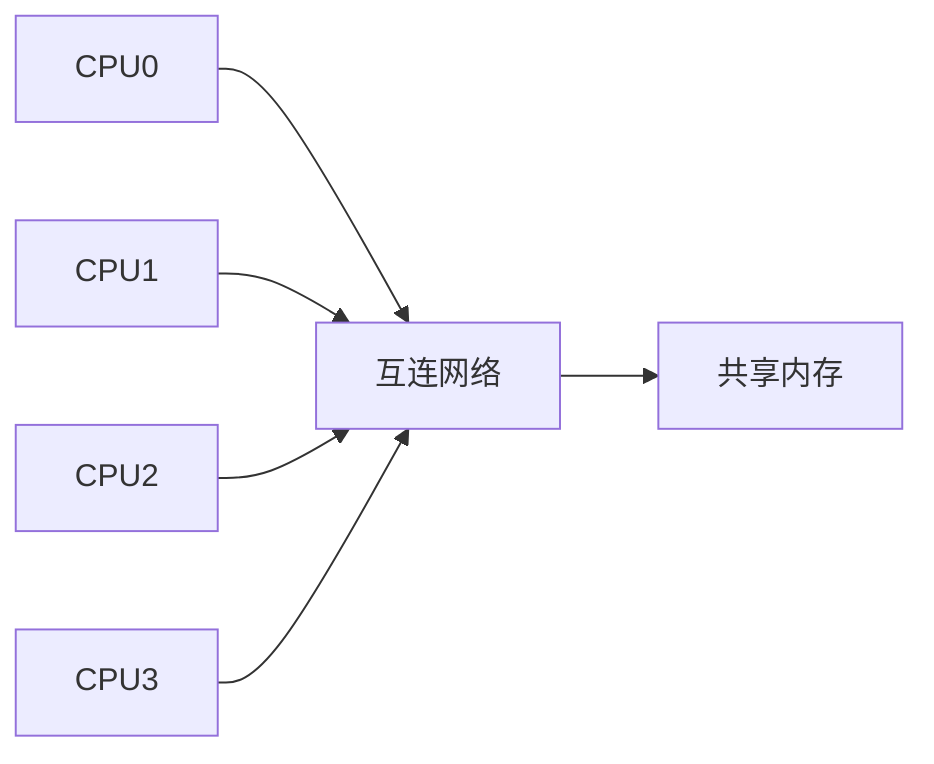
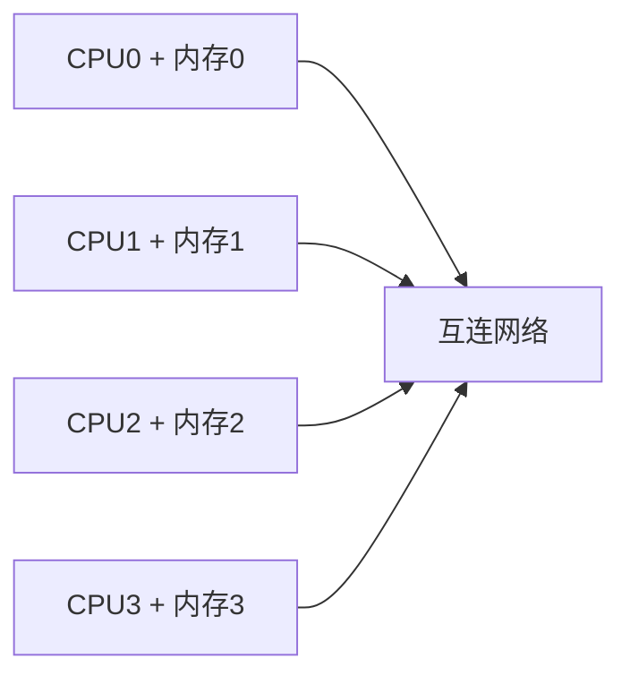
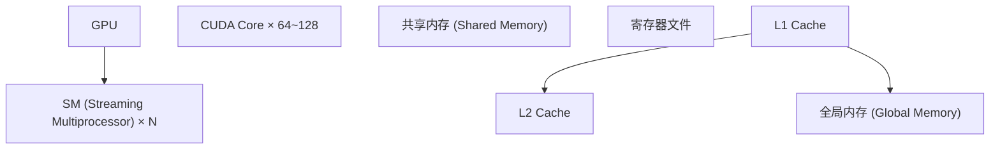

## 1. 并行计算概述

### 1.1 为什么需要并行计算

单核性能增长放缓（功耗墙、频率墙），并行计算成为提升性能的主要途径：

$$\text{性能} = \frac{\text{工作总量}}{\text{执行时间}} = \frac{N}{T}$$

并行化目标：

$$T_{parallel} = \frac{T_{serial}}{P}$$

其中 $P$ 为处理器数量（理想情况）。

### 1.2 Flynn 分类法

| 类型 | 指令流 | 数据流 | 示例             |
| ---- | ------ | ------ | ---------------- |
| SISD | 单     | 单     | 传统单处理器     |
| SIMD | 单     | 多     | 向量处理器、GPU  |
| MISD | 多     | 单     | 容错系统（少见） |
| MIMD | 多     | 多     | 多核、多处理器   |

## 2. Amdahl 定律与 Gustafson 定律

### 2.1 Amdahl 定律

设程序中可并行化比例为 $f$，处理器数为 $P$：

$$S(P) = \frac{1}{(1-f) + \frac{f}{P}}$$

当 $P \to \infty$：

$$S_{\max} = \frac{1}{1-f}$$

**含义**：串行部分决定了加速比上限。若串行比例为 5%，最大加速比为 20 倍。

### 2.2 Gustafson 定律

Amdahl 定律假设问题规模不变，Gustafson 定律假设问题规模随处理器数增加：

$$S(P) = P - \alpha \times (P - 1)$$

其中 $\alpha$ 为串行比例。

**含义**：随着问题规模增大，串行比例通常减小，加速比可以接近线性。

### 2.3 加速比效率

$$E(P) = \frac{S(P)}{P} = \frac{\text{实际加速比}}{\text{理想加速比}}$$

超线性加速：当并行化带来的 Cache 效应使每个处理器的 Cache 命中率提高时，可能出现 $S(P) > P$。

## 3. 多处理器架构

### 3.1 共享内存多处理器（SMP）

所有处理器共享同一地址空间：



**UMA（Uniform Memory Access）**：所有处理器访问内存的延迟相同。

**NUMA（Non-Uniform Memory Access）**：每个处理器有本地内存，访问本地内存更快。

$$t_{local} \ll t_{remote}$$

### 3.2 分布式内存多处理器

每个处理器有私有内存，通过消息传递通信：



**MPI（Message Passing Interface）**是分布式内存编程的标准接口。

### 3.3 互连网络

| 拓扑     | 直径                  | 对分带宽   | 链路数         |
| -------- | --------------------- | ---------- | -------------- |
| 环形     | $\lfloor N/2 \rfloor$ | 2          | N              |
| 网格     | $2(\sqrt{N}-1)$       | $\sqrt{N}$ | $2N-2\sqrt{N}$ |
| 超立方体 | $\log N$              | $N/2$      | $N\log N/2$    |
| 胖树     | $\log N$              | $N/2$      | $O(N\log N)$   |

## 4. 并行算法

### 4.1 并行前缀和

串行：$O(n)$

并行（2路）：$O(\log n)$ 时间，$O(n)$ 处理器

```
Step 0: [1, 2, 3, 4, 5, 6, 7, 8]
Step 1: [1, 3, 5, 7, 9, 11, 13, 15]   (相邻求和)
Step 2: [1, 3, 6, 10, 15, 21, 28, 36]  (间隔2求和)
Step 3: [1, 3, 6, 10, 15, 21, 28, 36]  (间隔4求和)
```

### 4.2 并行归约

求 $n$ 个数的和/最大值/最小值：

$$T_{parallel} = O(\log n)$$

$$W_{total} = O(n)$$

### 4.3 并行排序

| 算法         | 时间复杂度    | 空间           | 稳定性 |
| ------------ | ------------- | -------------- | ------ |
| 奇偶排序     | $O(n)$        | $O(1)$         | 稳定   |
| 双调排序     | $O(\log^2 n)$ | $O(n\log^2 n)$ | 不稳定 |
| 并行归并排序 | $O(\log n)$   | $O(n)$         | 稳定   |
| 样本排序     | $O(\log n)$   | $O(n)$         | 不稳定 |

### 4.4 并行矩阵乘法

$$C_{ij} = \sum_{k=1}^{n} A_{ik} \times B_{kj}$$

**行划分**：每个处理器计算 $C$ 的若干行。

**块划分（Cannon算法）**：将矩阵划分为 $P$ 个子块，$P$ 个处理器各自计算一个子块。

$$T_{Cannon} = O\left(\frac{n^3}{P} + \sqrt{P} \times n^2\right)$$

## 5. GPU 计算

### 5.1 GPU 架构

GPU 采用 SIMT（Single Instruction Multiple Threads）模型：



### 5.2 CUDA 编程模型

```
Grid → Block → Thread

Grid: (gridDim.x, gridDim.y, gridDim.z)
Block: (blockDim.x, blockDim.y, blockDim.z)
Thread: (threadIdx.x, threadIdx.y, threadIdx.z)
```

**线程层次**：

- Grid：一个 kernel 的所有线程
- Block：可共享共享内存、可同步
- Thread：最小执行单元

### 5.3 GPU 内存层次

| 内存类型 | 位置   | 延迟      | 带宽 | 作用域   |
| -------- | ------ | --------- | ---- | -------- |
| 寄存器   | 芯片内 | 1 周期    | 极高 | 单线程   |
| 共享内存 | 芯片内 | ~5 周期   | 高   | 单 Block |
| L1 Cache | 芯片内 | ~30 周期  | 中   | 单 SM    |
| L2 Cache | 芯片内 | ~100 周期 | 中   | 全局     |
| 全局内存 | 显存   | ~400 周期 | 低   | 全局     |

### 5.4 GPU 性能优化

**合并访存（Coalesced Access）**：相邻线程访问相邻地址。

**共享内存分块（Tiling）**：将数据分块加载到共享内存，减少全局内存访问。

**线程束（Warp）**：32 个线程同时执行相同指令，分支分化导致性能下降。

**占用率（Occupancy）**：

$$\text{Occupancy} = \frac{\text{活跃 Warp 数}}{\text{最大 Warp 数}}$$

受寄存器使用量和共享内存使用量限制。

## 6. 并行编程模型

### 6.1 共享内存编程

**OpenMP**：基于编译制导的共享内存并行编程：

```c
#pragma omp parallel for reduction(+:sum)
for (int i = 0; i < N; i++) {
    sum += a[i];
}
```

**Pthreads**：POSIX 线程库，提供更细粒度的控制。

### 6.2 消息传递编程

**MPI**：

```c
MPI_Init(&argc, &argv);
MPI_Comm_rank(MPI_COMM_WORLD, &rank);
MPI_Comm_size(MPI_COMM_WORLD, &size);

// 发送和接收
MPI_Send(data, count, MPI_INT, dest, tag, MPI_COMM_WORLD);
MPI_Recv(data, count, MPI_INT, src, tag, MPI_COMM_WORLD, &status);

MPI_Finalize();
```

### 6.3 编程模型对比

| 模型     | 地址空间 | 通信方式         | 同步方式        | 适用架构 |
| -------- | -------- | ---------------- | --------------- | -------- |
| OpenMP   | 共享     | 隐式（共享变量） | 编译制导        | SMP      |
| Pthreads | 共享     | 隐式             | 互斥锁/条件变量 | SMP      |
| MPI      | 分布     | 显式（消息）     | 屏障/消息       | 集群     |
| CUDA     | 分层     | 显式（拷贝）     | 同步函数        | GPU      |

## 参考文献


CSAPP（深入理解计算机系统）：https://csapp.cs.cmu.edu/
算法导论（CLRS）：https://mitpress.mit.edu/9780262046305/
MIT OpenCourseWare 6.006：https://ocw.mit.edu/courses/6-006-introduction-to-algorithms-spring-2020/
Teach Yourself CS：https://teachyourselfcs.com/

## 延伸阅读


数据结构与算法，见 023-algorithm 模块。
操作系统概念，见 024-cs-fundamentals 模块相关文档。
计算机体系结构，见 001-getting-started 模块相关文档。
尚硅谷 Bilibili 空间（https://space.bilibili.com/302417610 ）提供计算机基础课程。

## 深度专题扩展


以下专题从不同角度深入本文主题，供有进阶需求的读者研读。每个专题独立成节，内容相互补充。

### 13.1 大 O 分析与复杂度推导

渐进符号：O（上界）、Ω（下界）、Θ（紧界）；常数与低阶项忽略。
常见阶：O(1)、O(log n)、O(n)、O(n log n)、O(n²)、O(2ⁿ)；识别主循环与递归式。
主定理：T(n)=aT(n/b)+f(n) 的三种情形。
实践：先估规模与时限，再选算法与数据结构。

### 13.2 缓存与局部性

时间局部性：近期访问的数据再访问；空间局部性：邻近数据一起访问。
缓存行：64 字节粒度；数组遍历比链表友好。
伪共享：多线程改同一缓存行不同变量，缓存乒乓。
优化手段：数据结构重排、分块（blocking）、无锁队列。

## 模块文档速查表

| 文档 | 主题 | 与本文的关联 |
| --- | --- | --- |
| 计算机科学概述 | 001-ComputerOverview | 本文的前置基础 |
| 计算机体系结构 | 002-ComputerArchitecture | 本文的并列主题 |
| 操作系统 | 003-OperatingSystem | 本文的并列主题 |
| 计算机网络 | 004-ComputerNetwork | 本文的并列主题 |
| 数字逻辑 | 005-DigitalLogic | 本文的并列主题 |
| 离散数学 | 006-DiscreteMathematics | 本文的并列主题 |
| 计算机组成原理 | 007-ComputerPrinciple | 本文的原理深化 |
| 数据表示与运算 | 008-DataRepresentationOperation | 本文的并列主题 |
| 指令流水线 | 009-DirectivePipeline | 本文的并列主题 |
| 存储系统 | 010-StorageSystem | 本文的并列主题 |
| 总线与接口 | 011-BusAndInterface | 本文的并列主题 |
| 并行计算 | 012-ParallelCalculate | 本文自身 |
| 分布式系统 | 013-DistributedSystem | 本文的并列主题 |
| 算法设计与分析 | 014-AlgorithmDesignAnalysis | 本文的并列主题 |
| 形式语言与自动机 | 015-FormalLanguageAndAutomata | 本文的并列主题 |
| 信息安全基础 | 016-InformationSecurityBasics | 本文的前置基础 |
| 编译原理 | 017-CompilePrinciple | 本文的原理深化 |
| 软件工程 | 018-SoftwareEngineering | 本文的并列主题 |
| 数据库系统原理 | 019-DatabaseSystemPrinciple | 本文的原理深化 |
| 编译原理进阶 | 020-CompilePrincipleAdvanced | 本文的原理深化 |
| 操作系统进阶 | 021-OperatingSystemAdvanced | 本文的并列主题 |
| 计算机网络进阶 | 022-ComputerNetworkAdvanced | 本文的并列主题 |
| 网络安全 | 023-NetworkSecurity | 本文的安全延伸 |
| 多媒体技术 | 024-MultimediaTechnology | 本文的并列主题 |
| 人工智能基础 | 025-AIFundamentals | 本文的前置基础 |
| 计算机图形学 | 026-ComputerShape | 本文的并列主题 |
| 设计模式 | 027-DesignPattern | 本文的并列主题 |
| 软件体系结构 | 028-SoftwareSystemStructure | 本文的并列主题 |
| 人机交互 | 029-HCI | 本文的并列主题 |
| 编程语言理论 | 030-ProgrammingLanguageTheory | 本文的并列主题 |
| 网络协议深度 | 031-NetworkProtocolDeep | 本文的并列主题 |
| 编译与运行时 | 032-CompileAndRuntime | 本文的并列主题 |
| 进程PCB与线程TCB | 033-PCBThreadTCB | 本文的并列主题 |
| 中断与系统调用 | 034-InterruptAndSystemCall | 本文的并列主题 |
| 用户态与内核态切换 | 035-UserModeKernelModeSwitch | 本文的并列主题 |
| 内存分段与分页 | 036-MemorySegmentationAndPaging | 本文的并列主题 |
| 页面置换算法 | 037-PageReplacementAlgorithm | 本文的并列主题 |
| 文件系统inode | 038-FileSystemInode | 本文的并列主题 |
| 磁盘调度 | 039-DiskScheduling | 本文的并列主题 |
| 零拷贝 | 040-ZeroCopy | 本文的并列主题 |
| 进程间通信 | 041-IPC | 本文的并列主题 |
| HTTP缓存策略 | 042-HTTPCacheStrategy | 本文的并列主题 |
| HTTPS握手过程 | 043-HTTPSHandshake | 本文的并列主题 |
| TCP拥塞控制 | 044-TCPControl | 本文的并列主题 |
| TCP粘包与拆包 | 045-TCP | 本文的并列主题 |
| DNS解析流程 | 046-DNSFlow | 本文的并列主题 |
| CDN原理 | 047-CDNPrinciple | 本文的原理深化 |
| WebSocket帧格式 | 048-WebSocketFrameFormat | 本文的并列主题 |
| QUIC协议 | 049-QUIC | 本文的并列主题 |
| ARP协议与ARP欺骗 | 050-ARPARP | 本文的并列主题 |
| BGP路由协议 | 051-BGPRoute | 本文的并列主题 |
| 词法分析 | 052-LexicalAnalysis | 本文的并列主题 |
| 语法分析 | 053-GrammarAnalysis | 本文的并列主题 |
| 语义分析 | 054-SemanticAnalysis | 本文的并列主题 |
| 中间代码 | 055-IntermediateCode | 本文的并列主题 |
| 代码优化 | 056-CodeOptimization | 本文的性能延伸 |
| 目标代码生成 | 057-TargetCodeGeneration | 本文的并列主题 |
