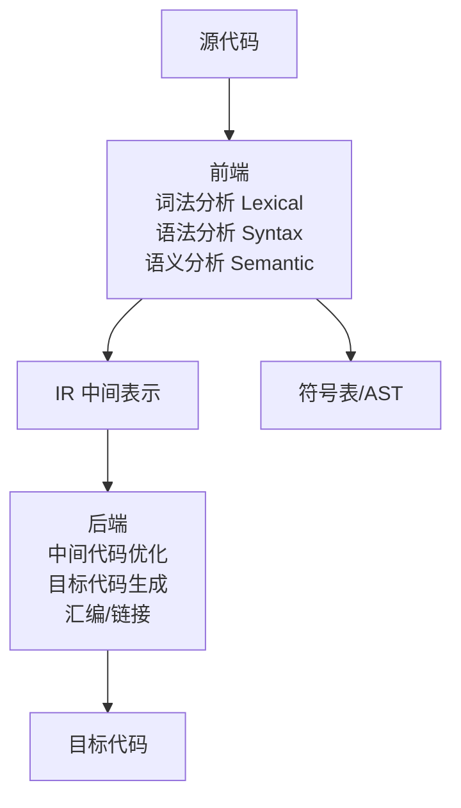
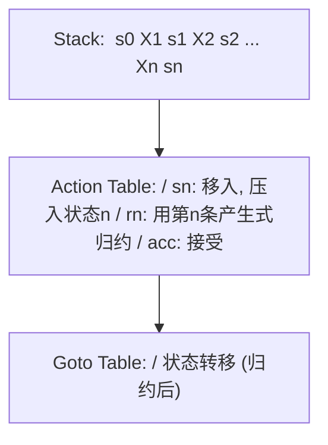
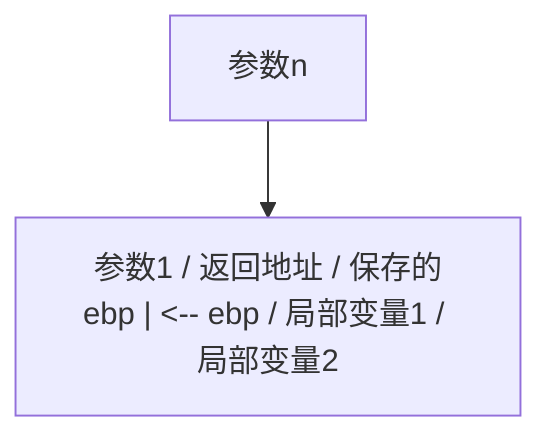
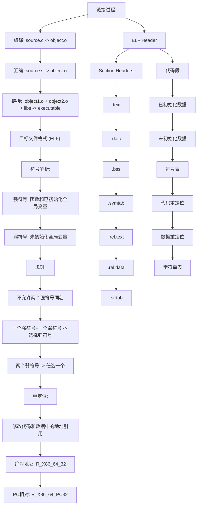
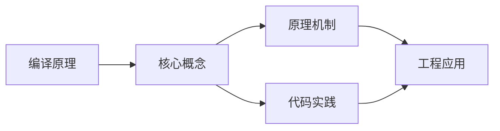
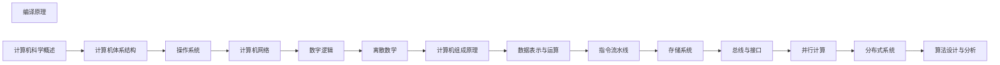

## 1. 学习目标（Bloom 分类）

本节按照布鲁姆教育目标分类学组织学习路径。本文主题为《编译原理》，属于 计算机科学基础 模块，读者可以根据自身阶段选择阅读深度。

记忆层面：能够准确复述本文的核心概念、术语与基本语法或操作步骤，并能够在提问或检索时快速定位对应知识点。能够说出 计算机科学基础 的核心概念、常用命令与流程。

理解层面：能够用自己的语言解释核心原理与工作机制，说明概念之间的因果关系，而不是机械记忆结论。能够解释 计算机科学基础 的工作原理与设计动机。

应用层面：能够在真实项目或练习场景中运用本文知识解决具体问题，写出正确且可维护的实现。能够独立完成 计算机科学基础 的标准操作。

分析层面：能够拆解复杂问题，比较本文主题与相邻概念的异同，识别边界条件与例外情况。能够分析 计算机科学基础 使用中的异常与边界。

评价层面：能够根据约束条件（性能、可读性、安全、成本）评价不同方案的优劣，做出有依据的技术决策。能够评价 计算机科学基础 相关工具与方案。

创造层面：能够把本文知识与其他模块知识组合，设计出新的解决方案或可复用的工程模式。能够把 计算机科学基础 融入团队工作流。

通过本节学习，读者应当能够把《编译原理》纳入自己的知识网络，并与 计算机科学基础 模块的其他主题（数据结构、算法、操作系统、体系结构）建立关联。

## 2. 历史动机与发展脉络

《编译原理》是 计算机科学基础 领域的重要主题。要真正理解它，需要先了解它解决的问题与演进过程。

计算机科学基础是编程的“内功”：数据结构与算法、操作系统、计算机体系结构、网络；框架会过时，基础长期有效。
体系结构：冯诺依曼模型（存储程序）、CPU/内存/I/O、指令流水线、缓存层次。
操作系统：进程与线程、调度、内存管理（虚拟内存）、文件系统、并发原语。

回到本文主题：编译原理 的提出与成熟，正是上述技术背景下的必然产物。早期实现往往以简单可用为目标，随着工程规模扩大，社区逐渐沉淀出标准做法与最佳实践；理解这一脉络，可以帮助读者判断“为什么文档中的推荐写法是现在这个样子”，也能在遇到历史遗留代码时准确识别其设计年代与取舍。


## 3. 形式化定义与核心概念精讲

本节把《编译原理》涉及的核心概念以“定义 + 讲解”的形式展开。读者应把定义当作工具，把讲解当作理解路径；两者结合才能形成可迁移的知识。

数据结构：数组/链表/栈/队列/哈希/树/图；每种结构有插入、查找、删除的时间复杂度特征。
算法分析：大 O 表示增长阶；时间与空间权衡；递归与迭代。
存储层次：寄存器 -> 缓存 -> 内存 -> 磁盘；局部性原理指导性能优化。

### 3.1 原文章节逐一精讲

原文档把主题拆分为 9 个小节，下面按顺序给出每一节的导读讲解，随后保留原文细节供精读。

#### 原文精读（完整保留）


#### 1. 编译器概述

##### 1.1 编译器的阶段

编译器将源代码翻译为目标代码，分为前端和后端两个主要部分：



##### 1.2 编译器 vs 解释器

```
编译器 vs 解释器:

  编译器: 源代码 -> [编译] -> 目标代码 -> [执行] -> 结果
    一次编译, 多次执行
    例: C/C++, Rust, Go

  解释器: 源代码 -> [逐行解释执行] -> 结果
    每次执行都需要源代码
    例: Python, Ruby, Bash

  混合模式 (JIT):
    源代码 -> [编译] -> 字节码 -> [JIT编译] -> 机器码 -> [执行]
    例: Java (javac + JIT), JavaScript (V8)
```

> 跨模块引用：[Java](java/overview)的编译模型是典型的混合模式：javac编译为字节码，JIT在运行时编译为机器码。[C语言](c/overview)使用传统的AOT编译模型。[概述](overview)的停机问题决定了编译器无法完美分析所有程序属性。

---

#### 2. 词法分析

##### 2.1 词法分析的任务

词法分析器（Lexer/Scanner）将字符流转换为Token流：

```
输入: int x = 42 + y;

字符流: i n t   x   =   4 2   +   y ;

Token流:
  [KW_INT] [IDENT("x")] [ASSIGN] [INT_LIT(42)] [PLUS] [IDENT("y")] [SEMI]

Token定义:
  enum TokenType {
    KW_INT, KW_IF, KW_WHILE, KW_RETURN,
    IDENT, INT_LIT, FLOAT_LIT, STRING_LIT,
    PLUS, MINUS, STAR, SLASH, ASSIGN, EQ, NEQ,
    LPAREN, RPAREN, LBRACE, RBRACE, SEMI, COMMA
  };

  struct Token {
    TokenType type;
    string    lexeme;
    any       literal;
    int       line;
  };
```

##### 2.2 正则表达式与有限自动机

词法分析的理论基础是正则表达式和有限自动机（参见[离散数学](discrete-math)的自动机理论）：

```
正则表达式 -> NFA -> DFA -> 最小化DFA -> 词法分析器

转换流程:

1. 正则表达式 -> NFA (Thompson构造):
   a -> [s0] --a--> [s1]

   a|b -> [s0] --e--> [s1] --a--> [s2] --e--> [s5]
       |                                      ^
       +--e--> [s3] --b--> [s4] --e----------+

   ab  -> [s0] --a--> [s1] --e--> [s2] --b--> [s3]

   a*  -> [s0] --e--> [s1] --a--> [s2] --e--> [s3]
          ^                              |
          +----------e-------------------+

2. NFA -> DFA (子集构造):
   DFA状态 = NFA状态的集合 (epsilon闭包)

3. DFA最小化 (Hopcroft算法):
   合并等价状态
```

##### 2.3 词法分析器实现

```python
class Lexer:
    def __init__(self, source):
        self.source = source
        self.pos = 0
        self.line = 1

    def next_token(self):
        self.skip_whitespace()
        if self.pos >= len(self.source):
            return Token(EOF, "", None, self.line)
        ch = self.source[self.pos]
        if ch.isalpha() or ch == '_':
            return self.identifier()
        if ch.isdigit():
            return self.number()
        if ch == '"':
            return self.string()
        return self.symbol()

    def identifier(self):
        start = self.pos
        while self.pos < len(self.source) and (self.source[self.pos].isalnum() or self.source[self.pos] == '_'):
            self.pos += 1
        lexeme = self.source[start:self.pos]
        if lexeme in KEYWORDS:
            return Token(KEYWORD, lexeme, None, self.line)
        return Token(IDENT, lexeme, None, self.line)

    def number(self):
        start = self.pos
        while self.pos < len(self.source) and self.source[self.pos].isdigit():
            self.pos += 1
        return Token(INT_LIT, self.source[start:self.pos], int(self.source[start:self.pos]), self.line)
```

---

#### 3. 语法分析

##### 3.1 上下文无关文法 (CFG)

```
CFG定义: G = (V, T, P, S)

V = 非终结符集合 (变量)
T = 终结符集合 (Token)
P = 产生式规则
S = 起始符号

表达式文法示例:

  E  -> E + T | E - T | T
  T  -> T * F | T / F | F
  F  -> ( E ) | id | num

消除左递归:

  E  -> T E'
  E' -> + T E' | - T E' | epsilon
  T  -> F T'
  T' -> * F T' | / F T' | epsilon
  F  -> ( E ) | id | num

推导 "3 + 5 * 2":

  E
  -> T E'
  -> F T' E'
  -> 3 T' E'
  -> 3 E'
  -> 3 + T E'
  -> 3 + F T' E'
  -> 3 + 5 T' E'
  -> 3 + 5 * F T' E'
  -> 3 + 5 * 2 T' E'
  -> 3 + 5 * 2 E'
  -> 3 + 5 * 2
```

##### 3.2 语法分析树与歧义性

```
歧义文法: 一个句子有多棵语法树

  E -> E + E | E * E | id

  "3 + 5 * 2" 有两棵树:

  树1 (错误):          树2 (正确):
       +                    *
      / \                  / \
     *   2                +   2
    / \                  / \
   3   5                3   5

  = (3+5)*2 = 16       = 3+(5*2) = 13

消除歧义:
  1. 改写文法 (引入优先级和结合性)
  2. 使用优先级声明 (Yacc/Bison的%left, %right)
```

##### 3.3 LL分析 (自顶向下)

```
LL(1)分析:

  L: 从左到右扫描
  L: 最左推导
  1: 向前看1个符号

  FIRST集合:
    FIRST(A) = { a | A =>* a... }

  FOLLOW集合:
    FOLLOW(A) = { a | S =>* ...Aa... }

  LL(1)分析表构造:
    对产生式 A -> alpha:
      对每个 a in FIRST(alpha): M[A, a] = A -> alpha
      若 epsilon in FIRST(alpha):
        对每个 b in FOLLOW(A): M[A, b] = A -> alpha

  LL(1)分析表 (表达式文法):

        |  id   |  num  |  +   |  -   |  *   |  /   |  (   |  )   |  $   |
   -----+-------+-------+------+------+------+------+------+------+------+
   E    | TE'   | TE'   |      |      |      |      | TE'  |      |      |
   E'   |       |       |+TE'  |-TE'  |      |      |      | eps  | eps  |
   T    | FT'   | FT'   |      |      |      |      | FT'  |      |      |
   T'   |       |       | eps  | eps  | *FT' | /FT' |      | eps  | eps  |
   F    | id    | num   |      |      |      |      | (E)  |      |      |

  递归下降分析器:
    每个非终结符对应一个函数
```

**递归下降分析器伪代码**：

```python
class Parser:
    def __init__(self, lexer):
        self.lexer = lexer
        self.current = lexer.next_token()

    def eat(self, token_type):
        if self.current.type == token_type:
            self.current = self.lexer.next_token()
        else:
            raise SyntaxError(f"Expected {token_type}, got {self.current.type}")

    def expr(self):
        node = self.term()
        while self.current.type in (PLUS, MINUS):
            op = self.current
            self.eat(op.type)
            node = BinOp(node, op, self.term())
        return node

    def term(self):
        node = self.factor()
        while self.current.type in (STAR, SLASH):
            op = self.current
            self.eat(op.type)
            node = BinOp(node, op, self.factor())
        return node

    def factor(self):
        if self.current.type == LPAREN:
            self.eat(LPAREN)
            node = self.expr()
            self.eat(RPAREN)
            return node
        elif self.current.type == IDENT:
            node = Var(self.current)
            self.eat(IDENT)
            return node
        elif self.current.type == INT_LIT:
            node = Num(self.current)
            self.eat(INT_LIT)
            return node
```

##### 3.4 LR分析 (自底向上)



---

#### 4. 语义分析

##### 4.1 语法制导翻译

```
语法制导定义 (SDD):

  综合属性: 从子节点向父节点传递
  继承属性: 从父节点/兄弟节点向子节点传递

  表达式求值的SDD:

  产生式          语义规则
  E -> E1 + T    E.val = E1.val + T.val
  E -> E1 - T    E.val = E1.val - T.val
  E -> T         E.val = T.val
  T -> T1 * F    T.val = T1.val * F.val
  T -> F         T.val = F.val
  F -> ( E )     F.val = E.val
  F -> num       F.val = num.lexval
```

##### 4.2 类型检查

```
类型系统:

  类型表达式:
    basic: int, float, bool, char
    constructed: array(n, T), pointer(T), function(T1 -> T2)
    type_name: struct, class

  类型等价:
    名字等价: 类型名相同才等价
    结构等价: 内部结构相同即等价

  类型检查规则:

  算术运算:
    E1.op E2:  E1.type = numeric AND E2.type = numeric
    结果类型: max(E1.type, E2.type)  (int < float)

  赋值:
    E1 = E2:  E2.type 可隐式转换为 E1.type

  函数调用:
    f(E1,...,En):  f.type = function(T1,...,Tn -> R)
                   Ei.type 可转换为 Ti
                   结果类型: R

  类型转换示例:
    int + float -> float  (int隐式提升为float)
    int = float -> error  (需要显式转换)
```

##### 4.3 符号表

```
符号表管理:

  作用域嵌套:
    {                       Scope 0
      int x;                x: int, scope=0
      {                     Scope 1
        float x;            x: float, scope=1
        int y;              y: int, scope=1
        {                   Scope 2
          x = y + 1;        x: float (scope 1), y: int (scope 1)
        }
      }
    }

  符号表实现:
    方案1: 链式作用域栈
      每进入一个作用域, 压入新表
      查找: 从栈顶向下搜索

    方案2: 哈希表 + 作用域链
      每个符号条目包含 scope_level
      查找: 匹配名字且 scope_level <= 当前level

  符号表条目:
    struct SymbolEntry {
      string   name;
      Type     type;
      int      scope_level;
      int      offset;       // 栈帧偏移
      Category category;     // VAR, FUNC, PARAM, TYPE
    };
```

> 跨模块引用：[C++](cpp/overview)的模板类型检查在编译期完成，是编译器最复杂的部分之一。[Java](java/overview)的泛型使用类型擦除，类型检查也在编译期。[C语言](c/overview)的类型系统相对简单，隐式转换规则较少。

---

#### 5. 中间代码生成

##### 5.1 中间表示 (IR)

```
常见中间表示:

1. 三地址码 (TAC / 3AC):
   x = y op z
   x = op y
   x = y
   goto L
   if x relop y goto L

   例: a = b + c * d
   t1 = c * d
   t2 = b + t1
   a = t2

2. 静态单赋值 (SSA):
   每个变量只被赋值一次
   使用 phi 函数在控制流汇合处选择值

   例:
   if (cond) {
     x = 1;
   } else {
     x = 2;
   }
   y = x + 1;

   SSA形式:
   if (cond) {
     x1 = 1;
   } else {
     x2 = 2;
   }
   x3 = phi(x1, x2);   // 根据来源路径选择值
   y1 = x3 + 1;

3. LLVM IR:
   @main:
     %1 = add i32 %a, %b
     %2 = mul i32 %1, %c
     ret i32 %2
```

##### 5.2 表达式翻译

```
表达式 a = b + c * d 的翻译:

AST:
        =
       / \
      a    +
          / \
         b    *
             / \
            c    d

三地址码生成:
  t1 = c * d
  t2 = b + t1
  a  = t2

控制流语句翻译:

  if (a < b) then S1 else S2

  if a >= b goto L_else
  S1的代码
  goto L_end
  L_else:
  S2的代码
  L_end:

  while (a < b) do S

  L_begin:
  if a >= b goto L_end
  S的代码
  goto L_begin
  L_end:
```

##### 5.3 函数调用翻译



---

#### 6. 代码优化

##### 6.1 基本块与控制流图

```
基本块 (Basic Block):
  连续的指令序列, 只有一个入口和一个出口
  入口: 第一条指令
  出口: 最后一条指令

控制流图 (CFG):
  节点 = 基本块
  边 = 可能的控制转移

  例:
  B1: t1 = a + b
      if t1 < c goto B3

  B2: t2 = c - d
      goto B4

  B3: t2 = a + d

  B4: x = t2

  CFG:
  B1 -> B2
  B1 -> B3
  B2 -> B4
  B3 -> B4
```

##### 6.2 数据流分析

```
数据流分析框架:

  到达定义 (Reaching Definitions):
    定义d到达点p: 从d到p存在路径, 且d未被杀死

    IN[B] = U OUT[P]  (P in pred(B))
    OUT[B] = gen_B U (IN[B] - kill_B)

  活跃变量 (Live Variables):
    变量v在点p活跃: 从p出发存在使用v的路径, 且v未被重定义

    IN[B] = use_B U (OUT[B] - def_B)
    OUT[B] = U IN[S]  (S in succ(B))

  可用表达式 (Available Expressions):
    表达式x op y在点p可用: 所有到达p的路径都计算了x op y

    IN[B] = n OUT[P]  (P in pred(B))
    OUT[B] = gen_B U (IN[B] - kill_B)
```

##### 6.3 常见优化技术

```
1. 常量折叠 (Constant Folding):
   x = 3 + 5  =>  x = 8

2. 常量传播 (Constant Propagation):
   x = 5
   y = x + 3  =>  y = 8

3. 死代码消除 (Dead Code Elimination):
   x = 5       // x未被使用
   => (删除)

4. 公共子表达式消除 (CSE):
   t1 = a + b
   t2 = a + b  =>  t2 = t1

5. 循环不变量外提 (LICM):
   for (i = 0; i < n; i++) {
     t = a * b;        // 循环不变
     c[i] = t + i;
   }
   =>
   t = a * b;
   for (i = 0; i < n; i++) {
     c[i] = t + i;
   }

6. 强度削弱 (Strength Reduction):
   i * 4  =>  i << 2  (乘法变移位)
   for循环中的 i++ => 地址 += 4 (乘法变加法)

7. 内联 (Inlining):
   int square(int x) { return x * x; }
   y = square(5)  =>  y = 5 * 5

8. 尾调用优化 (Tail Call Optimization):
   int f(int n) {
     if (n <= 1) return 1;
     return f(n - 1);  // 尾调用
   }
   => 复用当前栈帧, 转为循环
```

##### 6.4 优化级别

```
编译优化级别:

  -O0: 无优化
    便于调试, 代码与源码一一对应

  -O1: 基本优化
    死代码消除, 常量折叠, 基本块重排

  -O2: 标准优化
    循环优化, 内联, CSE, 指令调度

  -O3: 激进优化
    自动向量化, 函数克隆, 更激进的内联

  -Os: 优化代码大小
    禁用增加代码大小的优化

  -Oz: 最小化代码大小
    更激进的大小优化
```

> 跨模块引用：[体系结构](architecture)的流水线和缓存特性影响指令调度的优化策略。[操作系统](os)的虚拟内存影响代码布局优化的决策。[C++](cpp/overview)的模板元编程在编译期执行计算，是编译器优化的极端案例。

---

#### 7. 目标代码生成

##### 7.1 寄存器分配

```
寄存器分配问题:
  将无限虚拟寄存器映射到有限物理寄存器
  无法映射的虚拟寄存器溢出(spill)到内存

图着色寄存器分配:

1. 构建干涉图:
   若两个变量同时活跃, 则它们干涉
   干涉图中连一条边

2. 图着色:
   使用K种颜色着色 (K = 物理寄存器数)
   相邻节点颜色不同

3. 简化:
   若节点度数 < K: 删除该节点, 压栈
   否则: 选择溢出候选

4. 选择:
   弹栈, 为每个节点分配颜色
   若无可用颜色: 溢出到内存

干涉图示例 (3个寄存器):

  a --- b --- c
  |           |
  +-----d-----+

  简化: d(度数2) -> c(度数2) -> a(度数1) -> b(度数0)
  着色: b=R0, a=R1, c=R0, d=R2
```

##### 7.2 指令选择

```
指令选择: 将IR映射到目标机指令

模式匹配方法:

  IR: t1 = a * 4
  x86:  shl eax, 2          // 移位比乘法快
  ARM:  LSL r0, r1, #2

  IR: t1 = a + b * c
  x86:  imul ecx, edx       // b * c
        add eax, ecx        // + a
  ARM:  MLA r0, r1, r2, r3  // 乘加一条指令

树模式匹配:

  IR树:        目标指令模式:
    +            ADD r1, r2
   / \
  a   *          MUL r3, r4 (子树)
     / \
    b   c

  最优覆盖: MUL + ADD = 2条指令
  若有MLA指令: 1条指令
```

##### 7.3 指令调度

```
指令调度: 重排指令顺序, 减少流水线停顿

调度前 (有停顿):
  LOAD  r1, [addr]    // 延迟3周期
  ADD   r2, r1, r3    // 依赖r1, 停顿2周期
  SUB   r4, r5, r6    // 独立指令

调度后 (消除停顿):
  LOAD  r1, [addr]    // 延迟3周期
  SUB   r4, r5, r6    // 填充延迟槽
  ADD   r2, r1, r3    // r1已就绪

列表调度算法:
  1. 计算每个操作的最早开始时间 (依赖约束)
  2. 按优先级排序 (关键路径优先)
  3. 逐周期调度: 选择优先级最高且资源可用的操作
```

##### 7.4 链接



> 跨模块引用：[体系结构](architecture)的ISA决定了指令选择和调度的策略。[操作系统](os)的虚拟内存和进程地址空间布局影响链接器的设计。[C语言](c/overview)的编译模型是经典的分离编译+链接模型。

---

#### 8. 速查表

##### 8.1 编译阶段速查

| 阶段     | 输入    | 输出        | 核心算法            |
| -------- | ------- | ----------- | ------------------- |
| 词法分析 | 字符流  | Token流     | DFA/正则表达式      |
| 语法分析 | Token流 | AST         | LL/LR分析           |
| 语义分析 | AST     | 标注AST     | 类型检查/作用域     |
| IR生成   | 标注AST | IR(TAC/SSA) | 语法制导翻译        |
| 优化     | IR      | 优化IR      | 数据流分析          |
| 代码生成 | 优化IR  | 目标代码    | 寄存器分配/指令选择 |

##### 8.2 文法层次速查 (Chomsky层次)

| 类型   | 文法       | 识别器  | 应用     |
| ------ | ---------- | ------- | -------- |
| Type-3 | 正则文法   | DFA/NFA | 词法分析 |
| Type-2 | 上下文无关 | PDA     | 语法分析 |
| Type-1 | 上下文有关 | LBA     | 语义分析 |
| Type-0 | 无限制     | 图灵机  | 通用计算 |

##### 8.3 分析方法速查

| 方法    | 方向     | 向前看 | 能力 | 工具       |
| ------- | -------- | ------ | ---- | ---------- |
| LL(1)   | 自顶向下 | 1      | 较弱 | ANTLR      |
| LL(\*)  | 自顶向下 | 无限   | 中等 | ANTLR4     |
| SLR(1)  | 自底向上 | 1      | 弱   | -          |
| LALR(1) | 自底向上 | 1      | 中   | Yacc/Bison |
| LR(1)   | 自底向上 | 1      | 强   | -          |
| GLR     | 自底向上 | -      | 最强 | Elkhound   |

##### 8.4 优化技术速查

| 优化       | 作用           | 阶段      |
| ---------- | -------------- | --------- |
| 常量折叠   | 编译期计算     | 局部      |
| 常量传播   | 传播已知值     | 全局      |
| 死代码消除 | 删除无用代码   | 全局      |
| CSE        | 消除重复计算   | 局部/全局 |
| LICM       | 循环不变量外提 | 循环      |
| 强度削弱   | 替换昂贵操作   | 循环      |
| 内联       | 消除调用开销   | 过程间    |
| 尾调用优化 | 复用栈帧       | 过程间    |

---

#### 延伸阅读

- _Compilers: Principles, Techniques, and Tools_ -- Aho, Lam, Sethi, Ullman (龙书)
- _Modern Compiler Implementation in C/Java/ML_ -- Andrew W. Appel
- _Engineering a Compiler_ -- Cooper & Torczon
- _Advanced Compiler Design and Implementation_ -- Steven Muchnick


### 3.2 概念关系图

下面用 Mermaid 图表达本文核心概念之间的关系，帮助读者建立整体图景：



图中展示的是本文知识的结构化关系：核心概念是入口，原理机制解释“为什么”，代码实践演示“怎么做”，工程应用回答“何时用”。读者学习时可以把每个小节的内容挂接到对应节点上。

## 4. 理论推导与原理解析

本节深入《编译原理》背后的原理。理论部分不求面面俱到，而是聚焦“能解释现象、能指导实践”的关键推导。

数据结构：数组/链表/栈/队列/哈希/树/图；每种结构有插入、查找、删除的时间复杂度特征。
算法分析：大 O 表示增长阶；时间与空间权衡；递归与迭代。
存储层次：寄存器 -> 缓存 -> 内存 -> 磁盘；局部性原理指导性能优化。
并发基础：竞态、临界区、锁、信号量、死锁条件与预防。

需要强调的是，理论推导与工程实践之间存在翻译层：理论给出的是理想化模型与边界条件，工程代码则必须处理真实环境中的例外。读者在学习时应先掌握理论的“标准情形”，再通过陷阱章节了解“非标准情形”。

## 5. 代码示例与逐行讲解

本节把原文中的代码示例系统整理，并为每个示例补充用途说明与讲解。读者不应只浏览代码，而应逐段对照讲解理解设计意图。

### 5.1 示例：1.1 编译器的阶段

该示例来自原文《1.1 编译器的阶段》小节，用于演示编译原理相关操作。阅读时请先看代码结构，再看其后的讲解。


讲解：这段代码演示了本节核心知识点。代码中的关键操作可以归纳为三步：准备（定义或初始化）、执行（核心逻辑）、收尾（释放资源或返回结果）。实际项目中，这三步往往被封装为函数或类，以提升复用性与可测试性。

关键点分析：

该示例共 5 行有效代码，结构以数据或配置为主。阅读时应关注：数据字段的含义、配置项的作用，以及它们与运行行为的对应关系。

进阶思考路径：先尝试修改参数观察行为变化，再把示例中的模式迁移到自己的项目中；每次修改都记录预期与实测差异，这是把示例转化为能力的最快方式。

### 5.2 示例：1.2 编译器 vs 解释器

该示例来自原文《1.2 编译器 vs 解释器》小节，用于演示编译原理相关操作。阅读时请先看代码结构，再看其后的讲解。

```text
编译器 vs 解释器:

  编译器: 源代码 -> [编译] -> 目标代码 -> [执行] -> 结果
    一次编译, 多次执行
    例: C/C++, Rust, Go

  解释器: 源代码 -> [逐行解释执行] -> 结果
    每次执行都需要源代码
    例: Python, Ruby, Bash

  混合模式 (JIT):
    源代码 -> [编译] -> 字节码 -> [JIT编译] -> 机器码 -> [执行]
    例: Java (javac + JIT), JavaScript (V8)
```

讲解：这段代码演示了本节核心知识点。代码中的关键操作可以归纳为三步：准备（定义或初始化）、执行（核心逻辑）、收尾（释放资源或返回结果）。实际项目中，这三步往往被封装为函数或类，以提升复用性与可测试性。

关键点分析：

该示例共 10 行有效代码，结构以数据或配置为主。阅读时应关注：数据字段的含义、配置项的作用，以及它们与运行行为的对应关系。

进阶思考路径：先尝试修改参数观察行为变化，再把示例中的模式迁移到自己的项目中；每次修改都记录预期与实测差异，这是把示例转化为能力的最快方式。

### 5.3 示例：2.1 词法分析的任务

该示例来自原文《2.1 词法分析的任务》小节，用于演示编译原理相关操作。阅读时请先看代码结构，再看其后的讲解。

```text
输入: int x = 42 + y;

字符流: i n t   x   =   4 2   +   y ;

Token流:
  [KW_INT] [IDENT("x")] [ASSIGN] [INT_LIT(42)] [PLUS] [IDENT("y")] [SEMI]

Token定义:
  enum TokenType {
    KW_INT, KW_IF, KW_WHILE, KW_RETURN,
    IDENT, INT_LIT, FLOAT_LIT, STRING_LIT,
    PLUS, MINUS, STAR, SLASH, ASSIGN, EQ, NEQ,
    LPAREN, RPAREN, LBRACE, RBRACE, SEMI, COMMA
  };

  struct Token {
    TokenType type;
    string    lexeme;
    any       literal;
    int       line;
  };
```

讲解：这段代码演示了本节核心知识点。代码中的关键操作可以归纳为三步：准备（定义或初始化）、执行（核心逻辑）、收尾（释放资源或返回结果）。实际项目中，这三步往往被封装为函数或类，以提升复用性与可测试性。

关键点分析：

该示例共 17 行有效代码，结构以数据或配置为主。阅读时应关注：数据字段的含义、配置项的作用，以及它们与运行行为的对应关系。

进阶思考路径：先尝试修改参数观察行为变化，再把示例中的模式迁移到自己的项目中；每次修改都记录预期与实测差异，这是把示例转化为能力的最快方式。

### 5.4 示例：2.2 正则表达式与有限自动机

该示例来自原文《2.2 正则表达式与有限自动机》小节，用于演示编译原理相关操作。阅读时请先看代码结构，再看其后的讲解。

```text
正则表达式 -> NFA -> DFA -> 最小化DFA -> 词法分析器

转换流程:

1. 正则表达式 -> NFA (Thompson构造):
   a -> [s0] --a--> [s1]

   a|b -> [s0] --e--> [s1] --a--> [s2] --e--> [s5]
       |                                      ^
       +--e--> [s3] --b--> [s4] --e----------+

   ab  -> [s0] --a--> [s1] --e--> [s2] --b--> [s3]

   a*  -> [s0] --e--> [s1] --a--> [s2] --e--> [s3]
          ^                              |
          +----------e-------------------+

2. NFA -> DFA (子集构造):
   DFA状态 = NFA状态的集合 (epsilon闭包)

3. DFA最小化 (Hopcroft算法):
   合并等价状态
```

讲解：这段代码演示了本节核心知识点。代码中的关键操作可以归纳为三步：准备（定义或初始化）、执行（核心逻辑）、收尾（释放资源或返回结果）。实际项目中，这三步往往被封装为函数或类，以提升复用性与可测试性。

关键点分析：

该示例共 15 行有效代码，结构以数据或配置为主。阅读时应关注：数据字段的含义、配置项的作用，以及它们与运行行为的对应关系。

进阶思考路径：先尝试修改参数观察行为变化，再把示例中的模式迁移到自己的项目中；每次修改都记录预期与实测差异，这是把示例转化为能力的最快方式。

### 5.5 示例：2.3 词法分析器实现

该示例来自原文《2.3 词法分析器实现》小节，用于演示编译原理相关操作。阅读时请先看代码结构，再看其后的讲解。

```python
class Lexer:
    def __init__(self, source):
        self.source = source
        self.pos = 0
        self.line = 1

    def next_token(self):
        self.skip_whitespace()
        if self.pos >= len(self.source):
            return Token(EOF, "", None, self.line)
        ch = self.source[self.pos]
        if ch.isalpha() or ch == '_':
            return self.identifier()
        if ch.isdigit():
            return self.number()
        if ch == '"':
            return self.string()
        return self.symbol()

    def identifier(self):
        start = self.pos
        while self.pos < len(self.source) and (self.source[self.pos].isalnum() or self.source[self.pos] == '_'):
            self.pos += 1
        lexeme = self.source[start:self.pos]
        if lexeme in KEYWORDS:
            return Token(KEYWORD, lexeme, None, self.line)
        return Token(IDENT, lexeme, None, self.line)

    def number(self):
        start = self.pos
        while self.pos < len(self.source) and self.source[self.pos].isdigit():
            self.pos += 1
        return Token(INT_LIT, self.source[start:self.pos], int(self.source[start:self.pos]), self.line)
```

讲解：这段代码演示了本节核心知识点。代码中的关键操作可以归纳为三步：准备（定义或初始化）、执行（核心逻辑）、收尾（释放资源或返回结果）。实际项目中，这三步往往被封装为函数或类，以提升复用性与可测试性。

关键点分析：

该示例共 30 行有效代码，包含 5 类关键结构（class、def、if、while、return）。其中：

- 入口与初始化部分负责建立上下文，对应实际项目中的启动或装配逻辑；
- 核心逻辑部分体现本文主题的主要操作，是阅读时最需要对照讲解理解的部分；
- 输出或返回部分把结果交给调用方，注意其类型与边界条件。

进阶思考路径：先尝试修改参数观察行为变化，再把示例中的模式迁移到自己的项目中；每次修改都记录预期与实测差异，这是把示例转化为能力的最快方式。

### 5.6 示例：3.1 上下文无关文法 (CFG)

该示例来自原文《3.1 上下文无关文法 (CFG)》小节，用于演示编译原理相关操作。阅读时请先看代码结构，再看其后的讲解。

```text
CFG定义: G = (V, T, P, S)

V = 非终结符集合 (变量)
T = 终结符集合 (Token)
P = 产生式规则
S = 起始符号

表达式文法示例:

  E  -> E + T | E - T | T
  T  -> T * F | T / F | F
  F  -> ( E ) | id | num

消除左递归:

  E  -> T E'
  E' -> + T E' | - T E' | epsilon
  T  -> F T'
  T' -> * F T' | / F T' | epsilon
  F  -> ( E ) | id | num

推导 "3 + 5 * 2":

  E
  -> T E'
  -> F T' E'
  -> 3 T' E'
  -> 3 E'
  -> 3 + T E'
  -> 3 + F T' E'
  -> 3 + 5 T' E'
  -> 3 + 5 * F T' E'
  -> 3 + 5 * 2 T' E'
  -> 3 + 5 * 2 E'
  -> 3 + 5 * 2
```

讲解：这段代码演示了本节核心知识点。代码中的关键操作可以归纳为三步：准备（定义或初始化）、执行（核心逻辑）、收尾（释放资源或返回结果）。实际项目中，这三步往往被封装为函数或类，以提升复用性与可测试性。

关键点分析：

该示例共 28 行有效代码，结构以数据或配置为主。阅读时应关注：数据字段的含义、配置项的作用，以及它们与运行行为的对应关系。

进阶思考路径：先尝试修改参数观察行为变化，再把示例中的模式迁移到自己的项目中；每次修改都记录预期与实测差异，这是把示例转化为能力的最快方式。

### 5.7 示例：3.2 语法分析树与歧义性

该示例来自原文《3.2 语法分析树与歧义性》小节，用于演示编译原理相关操作。阅读时请先看代码结构，再看其后的讲解。

```text
歧义文法: 一个句子有多棵语法树

  E -> E + E | E * E | id

  "3 + 5 * 2" 有两棵树:

  树1 (错误):          树2 (正确):
       +                    *
      / \                  / \
     *   2                +   2
    / \                  / \
   3   5                3   5

  = (3+5)*2 = 16       = 3+(5*2) = 13

消除歧义:
  1. 改写文法 (引入优先级和结合性)
  2. 使用优先级声明 (Yacc/Bison的%left, %right)
```

讲解：这段代码演示了本节核心知识点。代码中的关键操作可以归纳为三步：准备（定义或初始化）、执行（核心逻辑）、收尾（释放资源或返回结果）。实际项目中，这三步往往被封装为函数或类，以提升复用性与可测试性。

关键点分析：

该示例共 13 行有效代码，结构以数据或配置为主。阅读时应关注：数据字段的含义、配置项的作用，以及它们与运行行为的对应关系。

进阶思考路径：先尝试修改参数观察行为变化，再把示例中的模式迁移到自己的项目中；每次修改都记录预期与实测差异，这是把示例转化为能力的最快方式。

### 5.8 示例：3.3 LL分析 (自顶向下)

该示例来自原文《3.3 LL分析 (自顶向下)》小节，用于演示编译原理相关操作。阅读时请先看代码结构，再看其后的讲解。

```text
LL(1)分析:

  L: 从左到右扫描
  L: 最左推导
  1: 向前看1个符号

  FIRST集合:
    FIRST(A) = { a | A =>* a... }

  FOLLOW集合:
    FOLLOW(A) = { a | S =>* ...Aa... }

  LL(1)分析表构造:
    对产生式 A -> alpha:
      对每个 a in FIRST(alpha): M[A, a] = A -> alpha
      若 epsilon in FIRST(alpha):
        对每个 b in FOLLOW(A): M[A, b] = A -> alpha

  LL(1)分析表 (表达式文法):

        |  id   |  num  |  +   |  -   |  *   |  /   |  (   |  )   |  $   |
   -----+-------+-------+------+------+------+------+------+------+------+
   E    | TE'   | TE'   |      |      |      |      | TE'  |      |      |
   E'   |       |       |+TE'  |-TE'  |      |      |      | eps  | eps  |
   T    | FT'   | FT'   |      |      |      |      | FT'  |      |      |
   T'   |       |       | eps  | eps  | *FT' | /FT' |      | eps  | eps  |
   F    | id    | num   |      |      |      |      | (E)  |      |      |

  递归下降分析器:
    每个非终结符对应一个函数
```

讲解：这段代码演示了本节核心知识点。代码中的关键操作可以归纳为三步：准备（定义或初始化）、执行（核心逻辑）、收尾（释放资源或返回结果）。实际项目中，这三步往往被封装为函数或类，以提升复用性与可测试性。

关键点分析：

该示例共 23 行有效代码，结构以数据或配置为主。阅读时应关注：数据字段的含义、配置项的作用，以及它们与运行行为的对应关系。

进阶思考路径：先尝试修改参数观察行为变化，再把示例中的模式迁移到自己的项目中；每次修改都记录预期与实测差异，这是把示例转化为能力的最快方式。

### 5.9 示例：3.3 LL分析 (自顶向下)

该示例来自原文《3.3 LL分析 (自顶向下)》小节，用于演示编译原理相关操作。阅读时请先看代码结构，再看其后的讲解。

```python
class Parser:
    def __init__(self, lexer):
        self.lexer = lexer
        self.current = lexer.next_token()

    def eat(self, token_type):
        if self.current.type == token_type:
            self.current = self.lexer.next_token()
        else:
            raise SyntaxError(f"Expected {token_type}, got {self.current.type}")

    def expr(self):
        node = self.term()
        while self.current.type in (PLUS, MINUS):
            op = self.current
            self.eat(op.type)
            node = BinOp(node, op, self.term())
        return node

    def term(self):
        node = self.factor()
        while self.current.type in (STAR, SLASH):
            op = self.current
            self.eat(op.type)
            node = BinOp(node, op, self.factor())
        return node

    def factor(self):
        if self.current.type == LPAREN:
            self.eat(LPAREN)
            node = self.expr()
            self.eat(RPAREN)
            return node
        elif self.current.type == IDENT:
            node = Var(self.current)
            self.eat(IDENT)
            return node
        elif self.current.type == INT_LIT:
            node = Num(self.current)
            self.eat(INT_LIT)
            return node
```

讲解：这段代码演示了本节核心知识点。代码中的关键操作可以归纳为三步：准备（定义或初始化）、执行（核心逻辑）、收尾（释放资源或返回结果）。实际项目中，这三步往往被封装为函数或类，以提升复用性与可测试性。

关键点分析：

该示例共 37 行有效代码，包含 5 类关键结构（class、def、if、while、return）。其中：

- 入口与初始化部分负责建立上下文，对应实际项目中的启动或装配逻辑；
- 核心逻辑部分体现本文主题的主要操作，是阅读时最需要对照讲解理解的部分；
- 输出或返回部分把结果交给调用方，注意其类型与边界条件。

进阶思考路径：先尝试修改参数观察行为变化，再把示例中的模式迁移到自己的项目中；每次修改都记录预期与实测差异，这是把示例转化为能力的最快方式。

### 5.10 示例：3.4 LR分析 (自底向上)

该示例来自原文《3.4 LR分析 (自底向上)》小节，用于演示编译原理相关操作。阅读时请先看代码结构，再看其后的讲解。


讲解：这段代码演示了本节核心知识点。代码中的关键操作可以归纳为三步：准备（定义或初始化）、执行（核心逻辑）、收尾（释放资源或返回结果）。实际项目中，这三步往往被封装为函数或类，以提升复用性与可测试性。

关键点分析：

该示例共 6 行有效代码，结构以数据或配置为主。阅读时应关注：数据字段的含义、配置项的作用，以及它们与运行行为的对应关系。

进阶思考路径：先尝试修改参数观察行为变化，再把示例中的模式迁移到自己的项目中；每次修改都记录预期与实测差异，这是把示例转化为能力的最快方式。

### 5.11 示例：4.1 语法制导翻译

该示例来自原文《4.1 语法制导翻译》小节，用于演示编译原理相关操作。阅读时请先看代码结构，再看其后的讲解。

```text
语法制导定义 (SDD):

  综合属性: 从子节点向父节点传递
  继承属性: 从父节点/兄弟节点向子节点传递

  表达式求值的SDD:

  产生式          语义规则
  E -> E1 + T    E.val = E1.val + T.val
  E -> E1 - T    E.val = E1.val - T.val
  E -> T         E.val = T.val
  T -> T1 * F    T.val = T1.val * F.val
  T -> F         T.val = F.val
  F -> ( E )     F.val = E.val
  F -> num       F.val = num.lexval
```

讲解：这段代码演示了本节核心知识点。代码中的关键操作可以归纳为三步：准备（定义或初始化）、执行（核心逻辑）、收尾（释放资源或返回结果）。实际项目中，这三步往往被封装为函数或类，以提升复用性与可测试性。

关键点分析：

该示例共 12 行有效代码，结构以数据或配置为主。阅读时应关注：数据字段的含义、配置项的作用，以及它们与运行行为的对应关系。

进阶思考路径：先尝试修改参数观察行为变化，再把示例中的模式迁移到自己的项目中；每次修改都记录预期与实测差异，这是把示例转化为能力的最快方式。

### 5.12 示例：4.2 类型检查

该示例来自原文《4.2 类型检查》小节，用于演示编译原理相关操作。阅读时请先看代码结构，再看其后的讲解。

```text
类型系统:

  类型表达式:
    basic: int, float, bool, char
    constructed: array(n, T), pointer(T), function(T1 -> T2)
    type_name: struct, class

  类型等价:
    名字等价: 类型名相同才等价
    结构等价: 内部结构相同即等价

  类型检查规则:

  算术运算:
    E1.op E2:  E1.type = numeric AND E2.type = numeric
    结果类型: max(E1.type, E2.type)  (int < float)

  赋值:
    E1 = E2:  E2.type 可隐式转换为 E1.type

  函数调用:
    f(E1,...,En):  f.type = function(T1,...,Tn -> R)
                   Ei.type 可转换为 Ti
                   结果类型: R

  类型转换示例:
    int + float -> float  (int隐式提升为float)
    int = float -> error  (需要显式转换)
```

讲解：这段代码演示了本节核心知识点。代码中的关键操作可以归纳为三步：准备（定义或初始化）、执行（核心逻辑）、收尾（释放资源或返回结果）。实际项目中，这三步往往被封装为函数或类，以提升复用性与可测试性。

关键点分析：

该示例共 21 行有效代码，包含 2 类关键结构（class、function）。其中：

- 入口与初始化部分负责建立上下文，对应实际项目中的启动或装配逻辑；
- 核心逻辑部分体现本文主题的主要操作，是阅读时最需要对照讲解理解的部分；
- 输出或返回部分把结果交给调用方，注意其类型与边界条件。

进阶思考路径：先尝试修改参数观察行为变化，再把示例中的模式迁移到自己的项目中；每次修改都记录预期与实测差异，这是把示例转化为能力的最快方式。

### 5.13 示例：4.3 符号表

该示例来自原文《4.3 符号表》小节，用于演示编译原理相关操作。阅读时请先看代码结构，再看其后的讲解。

```text
符号表管理:

  作用域嵌套:
    {                       Scope 0
      int x;                x: int, scope=0
      {                     Scope 1
        float x;            x: float, scope=1
        int y;              y: int, scope=1
        {                   Scope 2
          x = y + 1;        x: float (scope 1), y: int (scope 1)
        }
      }
    }

  符号表实现:
    方案1: 链式作用域栈
      每进入一个作用域, 压入新表
      查找: 从栈顶向下搜索

    方案2: 哈希表 + 作用域链
      每个符号条目包含 scope_level
      查找: 匹配名字且 scope_level <= 当前level

  符号表条目:
    struct SymbolEntry {
      string   name;
      Type     type;
      int      scope_level;
      int      offset;       // 栈帧偏移
      Category category;     // VAR, FUNC, PARAM, TYPE
    };
```

讲解：这段代码演示了本节核心知识点。代码中的关键操作可以归纳为三步：准备（定义或初始化）、执行（核心逻辑）、收尾（释放资源或返回结果）。实际项目中，这三步往往被封装为函数或类，以提升复用性与可测试性。

关键点分析：

该示例共 27 行有效代码，结构以数据或配置为主。阅读时应关注：数据字段的含义、配置项的作用，以及它们与运行行为的对应关系。

进阶思考路径：先尝试修改参数观察行为变化，再把示例中的模式迁移到自己的项目中；每次修改都记录预期与实测差异，这是把示例转化为能力的最快方式。

### 5.14 示例：5.1 中间表示 (IR)

该示例来自原文《5.1 中间表示 (IR)》小节，用于演示编译原理相关操作。阅读时请先看代码结构，再看其后的讲解。

```text
常见中间表示:

1. 三地址码 (TAC / 3AC):
   x = y op z
   x = op y
   x = y
   goto L
   if x relop y goto L

   例: a = b + c * d
   t1 = c * d
   t2 = b + t1
   a = t2

2. 静态单赋值 (SSA):
   每个变量只被赋值一次
   使用 phi 函数在控制流汇合处选择值

   例:
   if (cond) {
     x = 1;
   } else {
     x = 2;
   }
   y = x + 1;

   SSA形式:
   if (cond) {
     x1 = 1;
   } else {
     x2 = 2;
   }
   x3 = phi(x1, x2);   // 根据来源路径选择值
   y1 = x3 + 1;

3. LLVM IR:
   @main:
     %1 = add i32 %a, %b
     %2 = mul i32 %1, %c
     ret i32 %2
```

讲解：这段代码演示了本节核心知识点。代码中的关键操作可以归纳为三步：准备（定义或初始化）、执行（核心逻辑）、收尾（释放资源或返回结果）。实际项目中，这三步往往被封装为函数或类，以提升复用性与可测试性。

关键点分析：

该示例共 34 行有效代码，包含 1 类关键结构（if）。其中：

- 入口与初始化部分负责建立上下文，对应实际项目中的启动或装配逻辑；
- 核心逻辑部分体现本文主题的主要操作，是阅读时最需要对照讲解理解的部分；
- 输出或返回部分把结果交给调用方，注意其类型与边界条件。

进阶思考路径：先尝试修改参数观察行为变化，再把示例中的模式迁移到自己的项目中；每次修改都记录预期与实测差异，这是把示例转化为能力的最快方式。

### 5.15 示例：5.2 表达式翻译

该示例来自原文《5.2 表达式翻译》小节，用于演示编译原理相关操作。阅读时请先看代码结构，再看其后的讲解。

```text
表达式 a = b + c * d 的翻译:

AST:
        =
       / \
      a    +
          / \
         b    *
             / \
            c    d

三地址码生成:
  t1 = c * d
  t2 = b + t1
  a  = t2

控制流语句翻译:

  if (a < b) then S1 else S2

  if a >= b goto L_else
  S1的代码
  goto L_end
  L_else:
  S2的代码
  L_end:

  while (a < b) do S

  L_begin:
  if a >= b goto L_end
  S的代码
  goto L_begin
  L_end:
```

讲解：这段代码演示了本节核心知识点。代码中的关键操作可以归纳为三步：准备（定义或初始化）、执行（核心逻辑）、收尾（释放资源或返回结果）。实际项目中，这三步往往被封装为函数或类，以提升复用性与可测试性。

关键点分析：

该示例共 27 行有效代码，包含 2 类关键结构（if、while）。其中：

- 入口与初始化部分负责建立上下文，对应实际项目中的启动或装配逻辑；
- 核心逻辑部分体现本文主题的主要操作，是阅读时最需要对照讲解理解的部分；
- 输出或返回部分把结果交给调用方，注意其类型与边界条件。

进阶思考路径：先尝试修改参数观察行为变化，再把示例中的模式迁移到自己的项目中；每次修改都记录预期与实测差异，这是把示例转化为能力的最快方式。

### 5.16 示例：5.3 函数调用翻译

该示例来自原文《5.3 函数调用翻译》小节，用于演示编译原理相关操作。阅读时请先看代码结构，再看其后的讲解。


讲解：这段代码演示了本节核心知识点。代码中的关键操作可以归纳为三步：准备（定义或初始化）、执行（核心逻辑）、收尾（释放资源或返回结果）。实际项目中，这三步往往被封装为函数或类，以提升复用性与可测试性。

关键点分析：

该示例共 4 行有效代码，结构以数据或配置为主。阅读时应关注：数据字段的含义、配置项的作用，以及它们与运行行为的对应关系。

进阶思考路径：先尝试修改参数观察行为变化，再把示例中的模式迁移到自己的项目中；每次修改都记录预期与实测差异，这是把示例转化为能力的最快方式。

### 5.17 示例：6.1 基本块与控制流图

该示例来自原文《6.1 基本块与控制流图》小节，用于演示编译原理相关操作。阅读时请先看代码结构，再看其后的讲解。

```text
基本块 (Basic Block):
  连续的指令序列, 只有一个入口和一个出口
  入口: 第一条指令
  出口: 最后一条指令

控制流图 (CFG):
  节点 = 基本块
  边 = 可能的控制转移

  例:
  B1: t1 = a + b
      if t1 < c goto B3

  B2: t2 = c - d
      goto B4

  B3: t2 = a + d

  B4: x = t2

  CFG:
  B1 -> B2
  B1 -> B3
  B2 -> B4
  B3 -> B4
```

讲解：这段代码演示了本节核心知识点。代码中的关键操作可以归纳为三步：准备（定义或初始化）、执行（核心逻辑）、收尾（释放资源或返回结果）。实际项目中，这三步往往被封装为函数或类，以提升复用性与可测试性。

关键点分析：

该示例共 19 行有效代码，包含 1 类关键结构（if）。其中：

- 入口与初始化部分负责建立上下文，对应实际项目中的启动或装配逻辑；
- 核心逻辑部分体现本文主题的主要操作，是阅读时最需要对照讲解理解的部分；
- 输出或返回部分把结果交给调用方，注意其类型与边界条件。

进阶思考路径：先尝试修改参数观察行为变化，再把示例中的模式迁移到自己的项目中；每次修改都记录预期与实测差异，这是把示例转化为能力的最快方式。

### 5.18 示例：6.2 数据流分析

该示例来自原文《6.2 数据流分析》小节，用于演示编译原理相关操作。阅读时请先看代码结构，再看其后的讲解。

```text
数据流分析框架:

  到达定义 (Reaching Definitions):
    定义d到达点p: 从d到p存在路径, 且d未被杀死

    IN[B] = U OUT[P]  (P in pred(B))
    OUT[B] = gen_B U (IN[B] - kill_B)

  活跃变量 (Live Variables):
    变量v在点p活跃: 从p出发存在使用v的路径, 且v未被重定义

    IN[B] = use_B U (OUT[B] - def_B)
    OUT[B] = U IN[S]  (S in succ(B))

  可用表达式 (Available Expressions):
    表达式x op y在点p可用: 所有到达p的路径都计算了x op y

    IN[B] = n OUT[P]  (P in pred(B))
    OUT[B] = gen_B U (IN[B] - kill_B)
```

讲解：这段代码演示了本节核心知识点。代码中的关键操作可以归纳为三步：准备（定义或初始化）、执行（核心逻辑）、收尾（释放资源或返回结果）。实际项目中，这三步往往被封装为函数或类，以提升复用性与可测试性。

关键点分析：

该示例共 13 行有效代码，结构以数据或配置为主。阅读时应关注：数据字段的含义、配置项的作用，以及它们与运行行为的对应关系。

进阶思考路径：先尝试修改参数观察行为变化，再把示例中的模式迁移到自己的项目中；每次修改都记录预期与实测差异，这是把示例转化为能力的最快方式。

### 5.19 示例：6.3 常见优化技术

该示例来自原文《6.3 常见优化技术》小节，用于演示编译原理相关操作。阅读时请先看代码结构，再看其后的讲解。

```text
1. 常量折叠 (Constant Folding):
   x = 3 + 5  =>  x = 8

2. 常量传播 (Constant Propagation):
   x = 5
   y = x + 3  =>  y = 8

3. 死代码消除 (Dead Code Elimination):
   x = 5       // x未被使用
   => (删除)

4. 公共子表达式消除 (CSE):
   t1 = a + b
   t2 = a + b  =>  t2 = t1

5. 循环不变量外提 (LICM):
   for (i = 0; i < n; i++) {
     t = a * b;        // 循环不变
     c[i] = t + i;
   }
   =>
   t = a * b;
   for (i = 0; i < n; i++) {
     c[i] = t + i;
   }

6. 强度削弱 (Strength Reduction):
   i * 4  =>  i << 2  (乘法变移位)
   for循环中的 i++ => 地址 += 4 (乘法变加法)

7. 内联 (Inlining):
   int square(int x) { return x * x; }
   y = square(5)  =>  y = 5 * 5

8. 尾调用优化 (Tail Call Optimization):
   int f(int n) {
     if (n <= 1) return 1;
     return f(n - 1);  // 尾调用
   }
   => 复用当前栈帧, 转为循环
```

讲解：这段代码演示了本节核心知识点。代码中的关键操作可以归纳为三步：准备（定义或初始化）、执行（核心逻辑）、收尾（释放资源或返回结果）。实际项目中，这三步往往被封装为函数或类，以提升复用性与可测试性。

关键点分析：

该示例共 33 行有效代码，包含 3 类关键结构（if、for、return）。其中：

- 入口与初始化部分负责建立上下文，对应实际项目中的启动或装配逻辑；
- 核心逻辑部分体现本文主题的主要操作，是阅读时最需要对照讲解理解的部分；
- 输出或返回部分把结果交给调用方，注意其类型与边界条件。

进阶思考路径：先尝试修改参数观察行为变化，再把示例中的模式迁移到自己的项目中；每次修改都记录预期与实测差异，这是把示例转化为能力的最快方式。

### 5.20 示例：6.4 优化级别

该示例来自原文《6.4 优化级别》小节，用于演示编译原理相关操作。阅读时请先看代码结构，再看其后的讲解。

```text
编译优化级别:

  -O0: 无优化
    便于调试, 代码与源码一一对应

  -O1: 基本优化
    死代码消除, 常量折叠, 基本块重排

  -O2: 标准优化
    循环优化, 内联, CSE, 指令调度

  -O3: 激进优化
    自动向量化, 函数克隆, 更激进的内联

  -Os: 优化代码大小
    禁用增加代码大小的优化

  -Oz: 最小化代码大小
    更激进的大小优化
```

讲解：这段代码演示了本节核心知识点。代码中的关键操作可以归纳为三步：准备（定义或初始化）、执行（核心逻辑）、收尾（释放资源或返回结果）。实际项目中，这三步往往被封装为函数或类，以提升复用性与可测试性。

关键点分析：

该示例共 13 行有效代码，结构以数据或配置为主。阅读时应关注：数据字段的含义、配置项的作用，以及它们与运行行为的对应关系。

进阶思考路径：先尝试修改参数观察行为变化，再把示例中的模式迁移到自己的项目中；每次修改都记录预期与实测差异，这是把示例转化为能力的最快方式。

### 5.21 示例：7.1 寄存器分配

该示例来自原文《7.1 寄存器分配》小节，用于演示编译原理相关操作。阅读时请先看代码结构，再看其后的讲解。

```text
寄存器分配问题:
  将无限虚拟寄存器映射到有限物理寄存器
  无法映射的虚拟寄存器溢出(spill)到内存

图着色寄存器分配:

1. 构建干涉图:
   若两个变量同时活跃, 则它们干涉
   干涉图中连一条边

2. 图着色:
   使用K种颜色着色 (K = 物理寄存器数)
   相邻节点颜色不同

3. 简化:
   若节点度数 < K: 删除该节点, 压栈
   否则: 选择溢出候选

4. 选择:
   弹栈, 为每个节点分配颜色
   若无可用颜色: 溢出到内存

干涉图示例 (3个寄存器):

  a --- b --- c
  |           |
  +-----d-----+

  简化: d(度数2) -> c(度数2) -> a(度数1) -> b(度数0)
  着色: b=R0, a=R1, c=R0, d=R2
```

讲解：这段代码演示了本节核心知识点。代码中的关键操作可以归纳为三步：准备（定义或初始化）、执行（核心逻辑）、收尾（释放资源或返回结果）。实际项目中，这三步往往被封装为函数或类，以提升复用性与可测试性。

关键点分析：

该示例共 22 行有效代码，结构以数据或配置为主。阅读时应关注：数据字段的含义、配置项的作用，以及它们与运行行为的对应关系。

进阶思考路径：先尝试修改参数观察行为变化，再把示例中的模式迁移到自己的项目中；每次修改都记录预期与实测差异，这是把示例转化为能力的最快方式。

### 5.22 示例：7.2 指令选择

该示例来自原文《7.2 指令选择》小节，用于演示编译原理相关操作。阅读时请先看代码结构，再看其后的讲解。

```text
指令选择: 将IR映射到目标机指令

模式匹配方法:

  IR: t1 = a * 4
  x86:  shl eax, 2          // 移位比乘法快
  ARM:  LSL r0, r1, #2

  IR: t1 = a + b * c
  x86:  imul ecx, edx       // b * c
        add eax, ecx        // + a
  ARM:  MLA r0, r1, r2, r3  // 乘加一条指令

树模式匹配:

  IR树:        目标指令模式:
    +            ADD r1, r2
   / \
  a   *          MUL r3, r4 (子树)
     / \
    b   c

  最优覆盖: MUL + ADD = 2条指令
  若有MLA指令: 1条指令
```

讲解：这段代码演示了本节核心知识点。代码中的关键操作可以归纳为三步：准备（定义或初始化）、执行（核心逻辑）、收尾（释放资源或返回结果）。实际项目中，这三步往往被封装为函数或类，以提升复用性与可测试性。

关键点分析：

该示例共 18 行有效代码，结构以数据或配置为主。阅读时应关注：数据字段的含义、配置项的作用，以及它们与运行行为的对应关系。

进阶思考路径：先尝试修改参数观察行为变化，再把示例中的模式迁移到自己的项目中；每次修改都记录预期与实测差异，这是把示例转化为能力的最快方式。

### 5.23 示例：7.3 指令调度

该示例来自原文《7.3 指令调度》小节，用于演示编译原理相关操作。阅读时请先看代码结构，再看其后的讲解。

```text
指令调度: 重排指令顺序, 减少流水线停顿

调度前 (有停顿):
  LOAD  r1, [addr]    // 延迟3周期
  ADD   r2, r1, r3    // 依赖r1, 停顿2周期
  SUB   r4, r5, r6    // 独立指令

调度后 (消除停顿):
  LOAD  r1, [addr]    // 延迟3周期
  SUB   r4, r5, r6    // 填充延迟槽
  ADD   r2, r1, r3    // r1已就绪

列表调度算法:
  1. 计算每个操作的最早开始时间 (依赖约束)
  2. 按优先级排序 (关键路径优先)
  3. 逐周期调度: 选择优先级最高且资源可用的操作
```

讲解：这段代码演示了本节核心知识点。代码中的关键操作可以归纳为三步：准备（定义或初始化）、执行（核心逻辑）、收尾（释放资源或返回结果）。实际项目中，这三步往往被封装为函数或类，以提升复用性与可测试性。

关键点分析：

该示例共 13 行有效代码，结构以数据或配置为主。阅读时应关注：数据字段的含义、配置项的作用，以及它们与运行行为的对应关系。

进阶思考路径：先尝试修改参数观察行为变化，再把示例中的模式迁移到自己的项目中；每次修改都记录预期与实测差异，这是把示例转化为能力的最快方式。

### 5.24 示例：7.4 链接

该示例来自原文《7.4 链接》小节，用于演示编译原理相关操作。阅读时请先看代码结构，再看其后的讲解。


讲解：这段代码演示了本节核心知识点。代码中的关键操作可以归纳为三步：准备（定义或初始化）、执行（核心逻辑）、收尾（释放资源或返回结果）。实际项目中，这三步往往被封装为函数或类，以提升复用性与可测试性。

关键点分析：

该示例共 64 行有效代码，结构以数据或配置为主。阅读时应关注：数据字段的含义、配置项的作用，以及它们与运行行为的对应关系。

进阶思考路径：先尝试修改参数观察行为变化，再把示例中的模式迁移到自己的项目中；每次修改都记录预期与实测差异，这是把示例转化为能力的最快方式。


综合以上示例，可以总结出本主题的代码实践要点：第一，先定义清晰的输入输出契约；第二，核心逻辑保持单一职责；第三，错误处理与边界条件不可省略；第四，命名与注释表达意图而非复述代码。

## 6. 对比分析

对比是理解《编译原理》定位的最快路径。下面从多个维度与相邻方案进行对比。

数组与链表：数组缓存友好随机访问；链表插入删除灵活。
进程与线程：进程隔离重，线程共享轻；goroutine 更轻。
RISC 与 CISC：现代 CPU 融合两者，关注指令集与微架构。

对比的目的不是分出绝对优劣，而是建立选择依据：不同约束条件下，最优解不同。读者应把每个对比维度转化为决策检查清单。

## 7. 常见陷阱与最佳实践

本节整理该主题的高频错误与推荐做法。每个陷阱先描述现象，再解释原因，最后给出最佳实践。

### 7.1 忽视复杂度

数据量上来才崩。设计时估算规模与复杂度。

深入讲解：该问题之所以被归类为“常见陷阱”，是因为它在初学者的代码中反复出现，而且往往不在第一时间暴露——错误通常隐藏在特定数据或特定时序下。

从成因上看，忽视复杂度 一般源于对 计算机科学基础 某个机制的理解偏差：要么误用了默认行为，要么忽略了边界条件，要么把其他语言的思维惯性带了过来。

从影响上看，忽视复杂度 轻则产生错误结果，重则导致资源泄漏、数据损坏或安全事故；这也是为什么工程评审中会把它列为检查项。

从修复策略上看，处理忽视复杂度的正确顺序是：先复现（构造最小用例），再定位（确认机制层面的根因），最后修复并补充回归测试。跳过复现直接改代码，往往治标不治本。

### 7.2 死锁

锁顺序不一致。统一顺序 + 超时。

深入讲解：该问题之所以被归类为“常见陷阱”，是因为它在初学者的代码中反复出现，而且往往不在第一时间暴露——错误通常隐藏在特定数据或特定时序下。

从成因上看，死锁 一般源于对 计算机科学基础 某个机制的理解偏差：要么误用了默认行为，要么忽略了边界条件，要么把其他语言的思维惯性带了过来。

从影响上看，死锁 轻则产生错误结果，重则导致资源泄漏、数据损坏或安全事故；这也是为什么工程评审中会把它列为检查项。

从修复策略上看，处理死锁的正确顺序是：先复现（构造最小用例），再定位（确认机制层面的根因），最后修复并补充回归测试。跳过复现直接改代码，往往治标不治本。

### 7.3 缓存未命中

随机访问大数组慢。利用局部性。

深入讲解：该问题之所以被归类为“常见陷阱”，是因为它在初学者的代码中反复出现，而且往往不在第一时间暴露——错误通常隐藏在特定数据或特定时序下。

从成因上看，缓存未命中 一般源于对 计算机科学基础 某个机制的理解偏差：要么误用了默认行为，要么忽略了边界条件，要么把其他语言的思维惯性带了过来。

从影响上看，缓存未命中 轻则产生错误结果，重则导致资源泄漏、数据损坏或安全事故；这也是为什么工程评审中会把它列为检查项。

从修复策略上看，处理缓存未命中的正确顺序是：先复现（构造最小用例），再定位（确认机制层面的根因），最后修复并补充回归测试。跳过复现直接改代码，往往治标不治本。

### 7.4 栈溢出

深递归。评估深度或改迭代。

深入讲解：该问题之所以被归类为“常见陷阱”，是因为它在初学者的代码中反复出现，而且往往不在第一时间暴露——错误通常隐藏在特定数据或特定时序下。

从成因上看，栈溢出 一般源于对 计算机科学基础 某个机制的理解偏差：要么误用了默认行为，要么忽略了边界条件，要么把其他语言的思维惯性带了过来。

从影响上看，栈溢出 轻则产生错误结果，重则导致资源泄漏、数据损坏或安全事故；这也是为什么工程评审中会把它列为检查项。

从修复策略上看，处理栈溢出的正确顺序是：先复现（构造最小用例），再定位（确认机制层面的根因），最后修复并补充回归测试。跳过复现直接改代码，往往治标不治本。

### 7.5 整数溢出

计数与哈希边界。使用大整数或检查。

深入讲解：该问题之所以被归类为“常见陷阱”，是因为它在初学者的代码中反复出现，而且往往不在第一时间暴露——错误通常隐藏在特定数据或特定时序下。

从成因上看，整数溢出 一般源于对 计算机科学基础 某个机制的理解偏差：要么误用了默认行为，要么忽略了边界条件，要么把其他语言的思维惯性带了过来。

从影响上看，整数溢出 轻则产生错误结果，重则导致资源泄漏、数据损坏或安全事故；这也是为什么工程评审中会把它列为检查项。

从修复策略上看，处理整数溢出的正确顺序是：先复现（构造最小用例），再定位（确认机制层面的根因），最后修复并补充回归测试。跳过复现直接改代码，往往治标不治本。

### 7.6 位操作误用

符号位与移位方向。明确类型与语义。

深入讲解：该问题之所以被归类为“常见陷阱”，是因为它在初学者的代码中反复出现，而且往往不在第一时间暴露——错误通常隐藏在特定数据或特定时序下。

从成因上看，位操作误用 一般源于对 计算机科学基础 某个机制的理解偏差：要么误用了默认行为，要么忽略了边界条件，要么把其他语言的思维惯性带了过来。

从影响上看，位操作误用 轻则产生错误结果，重则导致资源泄漏、数据损坏或安全事故；这也是为什么工程评审中会把它列为检查项。

从修复策略上看，处理位操作误用的正确顺序是：先复现（构造最小用例），再定位（确认机制层面的根因），最后修复并补充回归测试。跳过复现直接改代码，往往治标不治本。

### 7.7 并发可见性

无同步读旧值。使用原子/锁。

深入讲解：该问题之所以被归类为“常见陷阱”，是因为它在初学者的代码中反复出现，而且往往不在第一时间暴露——错误通常隐藏在特定数据或特定时序下。

从成因上看，并发可见性 一般源于对 计算机科学基础 某个机制的理解偏差：要么误用了默认行为，要么忽略了边界条件，要么把其他语言的思维惯性带了过来。

从影响上看，并发可见性 轻则产生错误结果，重则导致资源泄漏、数据损坏或安全事故；这也是为什么工程评审中会把它列为检查项。

从修复策略上看，处理并发可见性的正确顺序是：先复现（构造最小用例），再定位（确认机制层面的根因），最后修复并补充回归测试。跳过复现直接改代码，往往治标不治本。

### 7.8 过早优化

先正确后优化。以测量为准。

深入讲解：该问题之所以被归类为“常见陷阱”，是因为它在初学者的代码中反复出现，而且往往不在第一时间暴露——错误通常隐藏在特定数据或特定时序下。

从成因上看，过早优化 一般源于对 计算机科学基础 某个机制的理解偏差：要么误用了默认行为，要么忽略了边界条件，要么把其他语言的思维惯性带了过来。

从影响上看，过早优化 轻则产生错误结果，重则导致资源泄漏、数据损坏或安全事故；这也是为什么工程评审中会把它列为检查项。

从修复策略上看，处理过早优化的正确顺序是：先复现（构造最小用例），再定位（确认机制层面的根因），最后修复并补充回归测试。跳过复现直接改代码，往往治标不治本。

### 7.0 最佳实践总览

1. 先分析复杂度再写代码。
2. 数据规模假设明确（10³/10⁶/10⁹ 方案不同）。
3. 理解底层（内存、CPU）后再谈优化。
4. 经典算法与数据结构熟练到可手写。

把这些最佳实践固化为团队规范与代码评审检查项，是避免同类问题反复出现的关键。

## 8. 工程实践

本节把《编译原理》放入真实工程场景，给出可复用的模式与组织方法。

面试与竞赛：LeetCode/算法竞赛训练思维。
系统设计：把基础用于设计（缓存、队列、索引）。
性能工程：profiler 定位 -> 复杂度/局部性优化。

### 8.1 工程实践的原则拆解

以上工程实践可以归纳为四条原则。第一，配置与代码分离：计算机科学基础 项目中环境差异应通过配置注入，而不是散落在代码分支中；这保证同一份代码可以在开发、测试、生产环境一致运行。

第二，接口稳定优先：对外接口（函数签名、协议、数据格式）一旦被消费方依赖，变更成本极高；设计时应预留扩展点并保持向后兼容。

第三，可观测性内置：日志、指标与追踪应该在功能开发时同步设计，而不是故障发生后补救；没有观测手段的模块等于黑盒。

第四，变更可回滚：任何发布都应有对应的回滚方案；数据库迁移、配置变更与代码发布一样需要版本管理与逆向路径。

### 8.2 实践落地的检查清单

- [ ] 面试与竞赛：对照本节描述，检查当前项目是否已经落实；未落实的项列入技术债并排期处理。
- [ ] 系统设计：对照本节描述，检查当前项目是否已经落实；未落实的项列入技术债并排期处理。
- [ ] 性能工程：对照本节描述，检查当前项目是否已经落实；未落实的项列入技术债并排期处理。

工程实践的共性原则：配置与代码分离、接口稳定优先、可观测性内置、变更可回滚。这些原则适用于本主题的所有实现。

## 9. 案例研究

本节通过一个完整案例把《编译原理》的知识串起来。案例按“需求分析、方案设计、实现、验证”四步展开。

需求：设计内存中的高频键值存储。
方案：哈希表 + 链表（LRU）组合，O(1) 读写。
要点：扩容策略、并发控制、内存上限。
验证：复杂度分析 + 基准测试。

### 9.1 案例的扩展讨论

把案例中的方案放大到真实规模，需要额外考虑三个问题：

第一，规模：当数据量或并发量上升一个数量级时，原方案中的数据结构、缓存策略与任务调度是否仍然成立？通常需要引入分层与异步。

第二，团队：多人协作时，模块边界、接口契约与代码所有权必须明确；案例中的实现应拆分为可独立测试的单元，并配合文档说明设计意图。

第三，演进：上线后的需求变化不可避免；方案设计时应预留扩展点（配置化、插件化、事件化），并定期用真实指标验证假设。


案例研究的学习方法：先独立阅读需求，尝试在脑中形成方案，再对照实现与讲解，最后思考“如果约束变化（数据量、并发、团队规模），方案应如何调整”。

## 10. 知识要点总结与深入讲解

本节以讲解形式汇总全文要点，替代传统的习题与自测，读者不需要答题，只需跟随解释建立完整的认知框架。

关于《编译原理》的核心结论：

基础决定上限：复杂问题最终落在数据结构与系统机制上。
理论与实践循环：学机制，写代码验证。
长期积累：系统读一本经典（CSAPP/算法导论）。

原文档各小节的要点回顾：

- 1. 编译器概述：该小节围绕编译原理展开具体细节，阅读时应关注其与核心结论的对应关系；每个小节都是核心结论在某一个侧面的展开。
- 2. 词法分析：该小节围绕编译原理展开具体细节，阅读时应关注其与核心结论的对应关系；每个小节都是核心结论在某一个侧面的展开。
- 3. 语法分析：该小节围绕编译原理展开具体细节，阅读时应关注其与核心结论的对应关系；每个小节都是核心结论在某一个侧面的展开。
- 4. 语义分析：该小节围绕编译原理展开具体细节，阅读时应关注其与核心结论的对应关系；每个小节都是核心结论在某一个侧面的展开。
- 5. 中间代码生成：该小节围绕编译原理展开具体细节，阅读时应关注其与核心结论的对应关系；每个小节都是核心结论在某一个侧面的展开。
- 6. 代码优化：该小节围绕编译原理展开具体细节，阅读时应关注其与核心结论的对应关系；每个小节都是核心结论在某一个侧面的展开。
- 7. 目标代码生成：该小节围绕编译原理展开具体细节，阅读时应关注其与核心结论的对应关系；每个小节都是核心结论在某一个侧面的展开。
- 8. 速查表：该小节围绕编译原理展开具体细节，阅读时应关注其与核心结论的对应关系；每个小节都是核心结论在某一个侧面的展开。
- 延伸阅读：该小节围绕编译原理展开具体细节，阅读时应关注其与核心结论的对应关系；每个小节都是核心结论在某一个侧面的展开。

把以上要点与第 3-9 节的内容对照复习，即可完成对本文主题的闭环学习。

## 11. 参考文献


CSAPP（深入理解计算机系统）：https://csapp.cs.cmu.edu/
算法导论（CLRS）：https://mitpress.mit.edu/9780262046305/
MIT OpenCourseWare 6.006：https://ocw.mit.edu/courses/6-006-introduction-to-algorithms-spring-2020/
Teach Yourself CS：https://teachyourselfcs.com/

## 12. 延伸阅读


数据结构与算法，见 023-algorithm 模块。
操作系统概念，见 024-cs-fundamentals 模块相关文档。
计算机体系结构，见 001-getting-started 模块相关文档。
尚硅谷 Bilibili 空间（https://space.bilibili.com/302417610 ）提供计算机基础课程。

## 14. 模块知识图谱与学习路径

本文属于 计算机科学基础 模块。为了把《编译原理》放入完整的知识网络，下面列出本模块的全部主题并给出相互关联的导读。学习时建议按模块内顺序推进，并在每个文档中留意交叉引用。



上图为模块主题的推荐学习顺序示意图（仅展示前若干主题）。各主题之间存在三类关联：

第一，前置依赖关系：早期主题是后期主题的基础，例如环境与语法先行、进阶主题随后；

第二，横向并列关系：同一层级主题从不同角度覆盖模块能力，学习顺序可以按兴趣调整；

第三，工程组合关系：多个主题在真实项目中组合使用，例如配置、性能与安全主题往往出现在同一系统的不同层面。

### 14.1 模块主题速查表

| 文档 | 主题 | 与本文的关联 |
| --- | --- | --- |
| 计算机科学概述 | 001-ComputerOverview | 本文的前置基础 |
| 计算机体系结构 | 002-ComputerArchitecture | 本文的并列主题 |
| 操作系统 | 003-OperatingSystem | 本文的并列主题 |
| 计算机网络 | 004-ComputerNetwork | 本文的并列主题 |
| 数字逻辑 | 005-DigitalLogic | 本文的并列主题 |
| 离散数学 | 006-DiscreteMathematics | 本文的并列主题 |
| 计算机组成原理 | 007-ComputerPrinciple | 本文的原理深化 |
| 数据表示与运算 | 008-DataRepresentationOperation | 本文的并列主题 |
| 指令流水线 | 009-DirectivePipeline | 本文的并列主题 |
| 存储系统 | 010-StorageSystem | 本文的并列主题 |
| 总线与接口 | 011-BusAndInterface | 本文的并列主题 |
| 并行计算 | 012-ParallelCalculate | 本文的并列主题 |
| 分布式系统 | 013-DistributedSystem | 本文的并列主题 |
| 算法设计与分析 | 014-AlgorithmDesignAnalysis | 本文的并列主题 |
| 形式语言与自动机 | 015-FormalLanguageAndAutomata | 本文的并列主题 |
| 信息安全基础 | 016-InformationSecurityBasics | 本文的前置基础 |
| 编译原理 | 017-CompilePrinciple | 本文自身 |
| 软件工程 | 018-SoftwareEngineering | 本文的并列主题 |
| 数据库系统原理 | 019-DatabaseSystemPrinciple | 本文的原理深化 |
| 编译原理进阶 | 020-CompilePrincipleAdvanced | 本文的原理深化 |
| 操作系统进阶 | 021-OperatingSystemAdvanced | 本文的并列主题 |
| 计算机网络进阶 | 022-ComputerNetworkAdvanced | 本文的并列主题 |
| 网络安全 | 023-NetworkSecurity | 本文的安全延伸 |
| 多媒体技术 | 024-MultimediaTechnology | 本文的并列主题 |
| 人工智能基础 | 025-AIFundamentals | 本文的前置基础 |
| 计算机图形学 | 026-ComputerShape | 本文的并列主题 |
| 设计模式 | 027-DesignPattern | 本文的并列主题 |
| 软件体系结构 | 028-SoftwareSystemStructure | 本文的并列主题 |
| 人机交互 | 029-HCI | 本文的并列主题 |
| 编程语言理论 | 030-ProgrammingLanguageTheory | 本文的并列主题 |
| 网络协议深度 | 031-NetworkProtocolDeep | 本文的并列主题 |
| 编译与运行时 | 032-CompileAndRuntime | 本文的并列主题 |
| 进程PCB与线程TCB | 033-PCBThreadTCB | 本文的并列主题 |
| 中断与系统调用 | 034-InterruptAndSystemCall | 本文的并列主题 |
| 用户态与内核态切换 | 035-UserModeKernelModeSwitch | 本文的并列主题 |
| 内存分段与分页 | 036-MemorySegmentationAndPaging | 本文的并列主题 |
| 页面置换算法 | 037-PageReplacementAlgorithm | 本文的并列主题 |
| 文件系统inode | 038-FileSystemInode | 本文的并列主题 |
| 磁盘调度 | 039-DiskScheduling | 本文的并列主题 |
| 零拷贝 | 040-ZeroCopy | 本文的并列主题 |
| 进程间通信 | 041-IPC | 本文的并列主题 |
| HTTP缓存策略 | 042-HTTPCacheStrategy | 本文的并列主题 |
| HTTPS握手过程 | 043-HTTPSHandshake | 本文的并列主题 |
| TCP拥塞控制 | 044-TCPControl | 本文的并列主题 |
| TCP粘包与拆包 | 045-TCP | 本文的并列主题 |
| DNS解析流程 | 046-DNSFlow | 本文的并列主题 |
| CDN原理 | 047-CDNPrinciple | 本文的原理深化 |
| WebSocket帧格式 | 048-WebSocketFrameFormat | 本文的并列主题 |
| QUIC协议 | 049-QUIC | 本文的并列主题 |
| ARP协议与ARP欺骗 | 050-ARPARP | 本文的并列主题 |
| BGP路由协议 | 051-BGPRoute | 本文的并列主题 |
| 词法分析 | 052-LexicalAnalysis | 本文的并列主题 |
| 语法分析 | 053-GrammarAnalysis | 本文的并列主题 |
| 语义分析 | 054-SemanticAnalysis | 本文的并列主题 |
| 中间代码 | 055-IntermediateCode | 本文的并列主题 |
| 代码优化 | 056-CodeOptimization | 本文的性能延伸 |
| 目标代码生成 | 057-TargetCodeGeneration | 本文的并列主题 |

速查表的作用是让读者快速判断：哪些文档应在阅读本文前掌握（前置基础），哪些文档应在阅读本文后继续（延伸主题）。本模块的交叉引用体系即以此表为基础。

## 15. 术语表

下表整理《编译原理》及 计算机科学基础 模块中出现的高频术语，给出简明释义。术语按字母序或逻辑序排列，供查阅。

| 术语 | 释义 |
| --- | --- |
| 数据结构 | 数组/链表/栈/队列/哈希/树/图；每种结构有插入、查找、删除的时间复杂度特征。 |
| 算法分析 | 大 O 表示增长阶；时间与空间权衡；递归与迭代。 |
| 存储层次 | 寄存器 -> 缓存 -> 内存 -> 磁盘；局部性原理指导性能优化。 |
| 并发基础 | 竞态、临界区、锁、信号量、死锁条件与预防。 |
| 忽视复杂度（易错点） | 参见常见陷阱章节的详细讲解 |
| 死锁（易错点） | 参见常见陷阱章节的详细讲解 |
| 缓存未命中（易错点） | 参见常见陷阱章节的详细讲解 |
| 栈溢出（易错点） | 参见常见陷阱章节的详细讲解 |
| 整数溢出（易错点） | 参见常见陷阱章节的详细讲解 |
| 位操作误用（易错点） | 参见常见陷阱章节的详细讲解 |

术语表与正文配合使用：先通读正文，遇到模糊术语回查本表；长期使用后术语会自然进入工作记忆。
