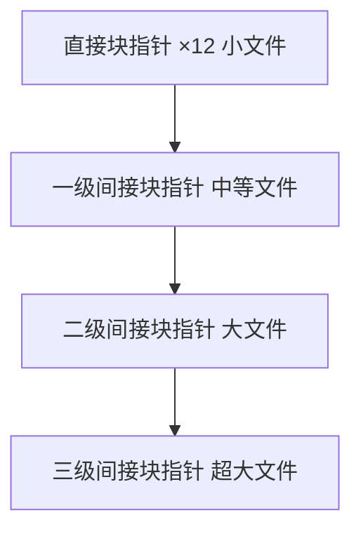

## 1. 进程调度

### 1.1 调度算法

| 算法   | 特点             | 饥饿 | 适用场景     |
| ------ | ---------------- | ---- | ------------ |
| FCFS   | 先来先服务       | 无   | 批处理       |
| SJF    | 最短作业优先     | 可能 | 批处理       |
| SRTF   | 最短剩余时间优先 | 可能 | 抢占式批处理 |
| RR     | 时间片轮转       | 无   | 交互式       |
| 优先级 | 按优先级调度     | 可能 | 实时系统     |
| MLFQ   | 多级反馈队列     | 可能 | 通用         |

### 1.2 周转时间计算

$$\text{周转时间} = \text{完成时间} - \text{到达时间}$$

$$\text{带权周转时间} = \frac{\text{周转时间}}{\text{服务时间}}$$

$$\text{平均周转时间} = \frac{1}{n}\sum_{i=1}^{n} T_i$$

### 1.3 多级反馈队列（MLFQ）

基本规则：

1. 优先级高的队列先执行
2. 同一队列内按 RR 执行
3. 新进程进入最高优先级队列
4. 用完时间片后降级
5. I/O 阻塞返回后升级（可选）

**优化**：

- 定期提升所有进程优先级（避免饥饿）
- 使用不同时间片：高优先级短时间片，低优先级长时间片

### 1.4 实时调度

**硬实时**：必须在截止时间内完成。

**软实时**：尽量在截止时间内完成。

**EDF（最早截止时间优先）**：

- 动态优先级调度
- 截止时间越近优先级越高
- CPU 利用率 $\leq 1$ 时可调度

**RMS（速率单调调度）**：

- 静态优先级调度
- 周期越短优先级越高
- 可调度条件：$\sum_{i=1}^{n} \frac{C_i}{T_i} \leq n(2^{1/n}-1)$

## 2. 死锁

### 2.1 死锁必要条件

1. **互斥**：资源不能共享
2. **持有并等待**：持有资源同时等待其他资源
3. **不可抢占**：已获得的资源不能被强制剥夺
4. **循环等待**：存在进程的循环等待链

### 2.2 死锁预防

破坏必要条件：

| 条件       | 方法                       |
| ---------- | -------------------------- |
| 互斥       | 允许资源共享（通常不可行） |
| 持有并等待 | 一次性申请所有资源         |
| 不可抢占   | 超时释放资源               |
| 循环等待   | 资源有序分配               |

### 2.3 死锁避免

**银行家算法**：

$$\text{安全状态} \iff \exists \text{安全序列}$$

安全序列判断：

1. Work = Available, Finish[i] = false
2. 找到 Finish[i]=false 且 Need[i] ≤ Work 的进程
3. Work = Work + Allocation[i], Finish[i] = true
4. 重复2-3直到所有 Finish[i] = true

**资源分配图算法**：每类资源只有一个实例时，检测图中是否存在环。

### 2.4 死锁检测

定期运行检测算法，发现死锁后：

- 终止进程
- 资源抢占回滚

## 3. 内存管理

### 3.1 分区分配

| 算法     | 策略             | 优缺点               |
| -------- | ---------------- | -------------------- |
| 首次适应 | 第一个够大的分区 | 速度快，低地址碎片多 |
| 最佳适应 | 最小的够大分区   | 碎片多（小碎片）     |
| 最差适应 | 最大的分区       | 大分区被消耗         |

### 3.2 伙伴系统

内存按 $2^k$ 大小分配：

- 请求大小 $n$，分配 $2^{\lceil\log_2 n\rceil}$ 的块
- 块可以分裂为两个大小相等的伙伴
- 伙伴可以合并为更大的块

$$\text{内部碎片} \leq \text{分配大小} / 2$$

### 3.3 页面置换算法

**OPT（最优）**：置换未来最久不被访问的页。

**FIFO**：置换最早进入的页。存在 Belady 异常（更多物理页导致更多缺页）。

**LRU**：置换最近最久未访问的页。无 Belady 异常。

**Clock**：LRU 的近似，使用引用位和循环指针。

**LFU**：置换访问频率最低的页。

**栈算法性质**：LRU 和 OPT 是栈算法，$M \subset M'$（更多物理页的内存包含更少的子集）。

### 3.4 抖动

当分配的物理页数小于工作集时，频繁缺页：

$$\text{缺页率} \uparrow \implies \text{有效访问时间} \uparrow \implies \text{CPU 利用率} \downarrow$$

$$\text{有效访问时间} = (1-p) \times t_{mem} + p \times t_{fault}$$

## 4. 文件系统

### 4.1 文件分配方式

| 方式     | 优点       | 缺点       |
| -------- | ---------- | ---------- |
| 连续分配 | 顺序读取快 | 外部碎片   |
| 链接分配 | 无外部碎片 | 随机访问慢 |
| 索引分配 | 随机访问快 | 索引块开销 |

### 4.2 索引节点

Unix inode 结构：



最大文件大小计算（4KB 块，4B 指针）：

- 直接：$12 \times 4\text{KB} = 48\text{KB}$
- 一级间接：$1024 \times 4\text{KB} = 4\text{MB}$
- 二级间接：$1024^2 \times 4\text{KB} = 4\text{GB}$
- 三级间接：$1024^3 \times 4\text{KB} = 4\text{TB}$

### 4.3 空闲空间管理

| 方法 | 优点       | 缺点     |
| ---- | ---------- | -------- |
| 位图 | 简单，快速 | 占用内存 |
| 链表 | 灵活       | 遍历慢   |
| 分组 | 快速分配   | 实现复杂 |

### 4.4 日志结构文件系统（LFS）

- 所有写入追加到日志末尾
- 段（Segment）为单位写入
- 后台清理线程合并段

**优势**：写入性能高（顺序写），崩溃恢复快。

**劣势**：读取可能需要间接寻址，清理开销。

### 4.5 写时复制（COW）

用于 ZFS、Btrfs 等文件系统：

1. 修改数据时，写入新位置
2. 更新指针指向新位置
3. 旧数据保留用于快照

## 5. I/O 子系统

### 5.1 I/O 软件层次

```
用户层 I/O 软件
    ↓
设备无关软件（缓冲、缓存、设备命名）
    ↓
设备驱动程序
    ↓
中断处理程序
    ↓
硬件
```

### 5.2 缓冲技术

**单缓冲**：

$$T = \max(T_{input}, T_{process}) + T_{copy}$$

**双缓冲**：

$$T = \max(T_{input}, T_{process})$$

**循环缓冲**：多个缓冲区组成环形队列。

### 5.3 磁盘调度

**寻道时间**是磁盘访问的主要开销。

| 算法   | 策略         | 优点     | 缺点         |
| ------ | ------------ | -------- | ------------ |
| FCFS   | 按请求顺序   | 公平     | 寻道距离长   |
| SSTF   | 最短寻道优先 | 寻道短   | 饥饿         |
| SCAN   | 电梯算法     | 无饥饿   | 响应时间差异 |
| C-SCAN | 循环扫描     | 响应均匀 | 回程空转     |
| LOOK   | SCAN改进     | 减少空转 | -            |

### 5.4 磁盘性能计算

$$\text{访问时间} = \text{寻道时间} + \text{旋转延迟} + \text{传输时间}$$

$$\text{平均旋转延迟} = \frac{1}{2 \times \text{RPM}} \times 60$$

7200 RPM 磁盘的平均旋转延迟：

$$\frac{1}{2 \times 7200} \times 60 = 4.17\text{ms}$$

## 参考文献


CSAPP（深入理解计算机系统）：https://csapp.cs.cmu.edu/
算法导论（CLRS）：https://mitpress.mit.edu/9780262046305/
MIT OpenCourseWare 6.006：https://ocw.mit.edu/courses/6-006-introduction-to-algorithms-spring-2020/
Teach Yourself CS：https://teachyourselfcs.com/

## 延伸阅读


数据结构与算法，见 023-algorithm 模块。
操作系统概念，见 024-cs-fundamentals 模块相关文档。
计算机体系结构，见 001-getting-started 模块相关文档。
尚硅谷 Bilibili 空间（https://space.bilibili.com/302417610 ）提供计算机基础课程。

## 深度专题扩展


以下专题从不同角度深入本文主题，供有进阶需求的读者研读。每个专题独立成节，内容相互补充。

### 13.1 大 O 分析与复杂度推导

渐进符号：O（上界）、Ω（下界）、Θ（紧界）；常数与低阶项忽略。
常见阶：O(1)、O(log n)、O(n)、O(n log n)、O(n²)、O(2ⁿ)；识别主循环与递归式。
主定理：T(n)=aT(n/b)+f(n) 的三种情形。
实践：先估规模与时限，再选算法与数据结构。

### 13.2 缓存与局部性

时间局部性：近期访问的数据再访问；空间局部性：邻近数据一起访问。
缓存行：64 字节粒度；数组遍历比链表友好。
伪共享：多线程改同一缓存行不同变量，缓存乒乓。
优化手段：数据结构重排、分块（blocking）、无锁队列。

## 模块文档速查表

| 文档 | 主题 | 与本文的关联 |
| --- | --- | --- |
| 计算机科学概述 | 001-ComputerOverview | 本文的前置基础 |
| 计算机体系结构 | 002-ComputerArchitecture | 本文的并列主题 |
| 操作系统 | 003-OperatingSystem | 本文的并列主题 |
| 计算机网络 | 004-ComputerNetwork | 本文的并列主题 |
| 数字逻辑 | 005-DigitalLogic | 本文的并列主题 |
| 离散数学 | 006-DiscreteMathematics | 本文的并列主题 |
| 计算机组成原理 | 007-ComputerPrinciple | 本文的原理深化 |
| 数据表示与运算 | 008-DataRepresentationOperation | 本文的并列主题 |
| 指令流水线 | 009-DirectivePipeline | 本文的并列主题 |
| 存储系统 | 010-StorageSystem | 本文的并列主题 |
| 总线与接口 | 011-BusAndInterface | 本文的并列主题 |
| 并行计算 | 012-ParallelCalculate | 本文的并列主题 |
| 分布式系统 | 013-DistributedSystem | 本文的并列主题 |
| 算法设计与分析 | 014-AlgorithmDesignAnalysis | 本文的并列主题 |
| 形式语言与自动机 | 015-FormalLanguageAndAutomata | 本文的并列主题 |
| 信息安全基础 | 016-InformationSecurityBasics | 本文的前置基础 |
| 编译原理 | 017-CompilePrinciple | 本文的原理深化 |
| 软件工程 | 018-SoftwareEngineering | 本文的并列主题 |
| 数据库系统原理 | 019-DatabaseSystemPrinciple | 本文的原理深化 |
| 编译原理进阶 | 020-CompilePrincipleAdvanced | 本文的原理深化 |
| 操作系统进阶 | 021-OperatingSystemAdvanced | 本文自身 |
| 计算机网络进阶 | 022-ComputerNetworkAdvanced | 本文的并列主题 |
| 网络安全 | 023-NetworkSecurity | 本文的安全延伸 |
| 多媒体技术 | 024-MultimediaTechnology | 本文的并列主题 |
| 人工智能基础 | 025-AIFundamentals | 本文的前置基础 |
| 计算机图形学 | 026-ComputerShape | 本文的并列主题 |
| 设计模式 | 027-DesignPattern | 本文的并列主题 |
| 软件体系结构 | 028-SoftwareSystemStructure | 本文的并列主题 |
| 人机交互 | 029-HCI | 本文的并列主题 |
| 编程语言理论 | 030-ProgrammingLanguageTheory | 本文的并列主题 |
| 网络协议深度 | 031-NetworkProtocolDeep | 本文的并列主题 |
| 编译与运行时 | 032-CompileAndRuntime | 本文的并列主题 |
| 进程PCB与线程TCB | 033-PCBThreadTCB | 本文的并列主题 |
| 中断与系统调用 | 034-InterruptAndSystemCall | 本文的并列主题 |
| 用户态与内核态切换 | 035-UserModeKernelModeSwitch | 本文的并列主题 |
| 内存分段与分页 | 036-MemorySegmentationAndPaging | 本文的并列主题 |
| 页面置换算法 | 037-PageReplacementAlgorithm | 本文的并列主题 |
| 文件系统inode | 038-FileSystemInode | 本文的并列主题 |
| 磁盘调度 | 039-DiskScheduling | 本文的并列主题 |
| 零拷贝 | 040-ZeroCopy | 本文的并列主题 |
| 进程间通信 | 041-IPC | 本文的并列主题 |
| HTTP缓存策略 | 042-HTTPCacheStrategy | 本文的并列主题 |
| HTTPS握手过程 | 043-HTTPSHandshake | 本文的并列主题 |
| TCP拥塞控制 | 044-TCPControl | 本文的并列主题 |
| TCP粘包与拆包 | 045-TCP | 本文的并列主题 |
| DNS解析流程 | 046-DNSFlow | 本文的并列主题 |
| CDN原理 | 047-CDNPrinciple | 本文的原理深化 |
| WebSocket帧格式 | 048-WebSocketFrameFormat | 本文的并列主题 |
| QUIC协议 | 049-QUIC | 本文的并列主题 |
| ARP协议与ARP欺骗 | 050-ARPARP | 本文的并列主题 |
| BGP路由协议 | 051-BGPRoute | 本文的并列主题 |
| 词法分析 | 052-LexicalAnalysis | 本文的并列主题 |
| 语法分析 | 053-GrammarAnalysis | 本文的并列主题 |
| 语义分析 | 054-SemanticAnalysis | 本文的并列主题 |
| 中间代码 | 055-IntermediateCode | 本文的并列主题 |
| 代码优化 | 056-CodeOptimization | 本文的性能延伸 |
| 目标代码生成 | 057-TargetCodeGeneration | 本文的并列主题 |
