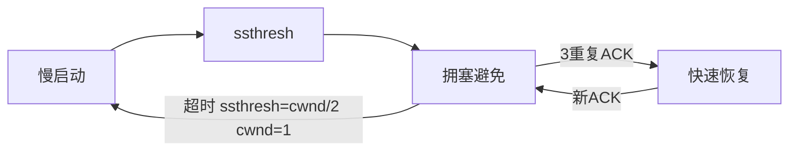

## 1. TCP 拥塞控制

### 1.1 拥塞控制原理

发送方维护拥塞窗口（cwnd），实际发送窗口：

$$\text{发送窗口} = \min(\text{cwnd}, \text{rwnd})$$

### 1.2 慢启动

- 初始 cwnd = 1 MSS（最大段大小）
- 每收到一个 ACK，cwnd 增加 1 MSS
- 指数增长：cwnd 经过 $n$ 个 RTT 后为 $2^n$ MSS
- 到达慢启动阈值（ssthresh）后转为拥塞避免

### 1.3 拥塞避免

- 每个 RTT，cwnd 增加 1 MSS
- 线性增长：cwnd 每经过一个 RTT 加 1

$$\text{cwnd}_{new} = \text{cwnd} + \frac{\text{MSS}^2}{\text{cwnd}}$$

### 1.4 快速重传与快速恢复

**快速重传**：收到 3 个重复 ACK，立即重传丢失段。

**快速恢复**：

1. ssthresh = cwnd / 2
2. cwnd = ssthresh + 3 MSS
3. 每收到重复 ACK，cwnd 增加 1 MSS
4. 收到新 ACK，cwnd = ssthresh，进入拥塞避免

### 1.5 TCP 拥塞控制状态机



### 1.6 BBR 算法

Google 提出的基于模型的拥塞控制：

$$\text{BDP} = \text{带宽} \times \text{RTT}$$

BBR 目标：将 cwnd 设为 BDP，而非基于丢包调整。

## 2. 路由算法

### 2.1 距离向量算法（DV）

**Bellman-Ford 方程**：

$$D(x, y) = \min_v \{c(x, v) + D(v, y)\}$$

**RIP 协议**：

- 使用跳数作为度量
- 最大跳数 15（16 视为不可达）
- 每 30 秒广播路由表
- 问题：计数到无穷

**毒性逆转**：向邻居通告到其自身的距离为无穷大。

### 2.2 链路状态算法（LS）

**Dijkstra 算法**：

1. 每个节点构建完整的网络拓扑图
2. 从源节点运行 Dijkstra 最短路径算法
3. 时间复杂度：$O(n^2)$ 或 $O((n+m)\log n)$（优先队列）

**OSPF 协议**：

- 使用链路状态算法
- 支持区域划分
- 支持等价多路径（ECMP）

### 2.3 路径向量算法

**BGP 协议**：

- 自治系统间的路由协议
- 通告完整路径（AS 序列）
- 基于策略的路由选择

BGP 选路优先级：

1. 最高本地优先级
2. 最短 AS 路径
3. 最低起源类型
4. 最低 MED
5. eBGP > iBGP
6. 最低 IGP 度量

## 3. 软件定义网络（SDN）

### 3.1 SDN 架构

```
应用层（网络应用）
    ↕ 北向 API
控制层（SDN 控制器）
    ↕ 南向 API（OpenFlow）
基础设施层（交换机/路由器）
```

### 3.2 OpenFlow 协议

**流表结构**：

| 字段     | 说明                           |
| -------- | ------------------------------ |
| 匹配字段 | 入端口、MAC、IP、TCP 端口等    |
| 优先级   | 匹配规则的优先级               |
| 计数器   | 匹配的包数、字节数             |
| 动作     | 转发、修改、丢弃、发送到控制器 |

### 3.3 SDN 优势

- 集中控制：全局视图优化
- 可编程：灵活部署网络服务
- 开放接口：设备解耦

## 4. 服务质量（QoS）

### 4.1 QoS 参数

| 参数   | 说明                 |
| ------ | -------------------- |
| 带宽   | 单位时间传输的数据量 |
| 延迟   | 数据从源到目的的时间 |
| 抖动   | 延迟的变化量         |
| 丢包率 | 丢失数据包的比例     |

### 4.2 QoS 机制

**流量整形**：

- 令牌桶：以速率 $r$ 生成令牌，桶容量 $b$
  - 允许突发：最多发送 $b$ 个包
  - 长期平均速率不超过 $r$

$$\text{合规条件}：\text{任意时间 } t \text{ 内发送量} \leq b + r \times t$$

- 漏桶：恒定速率输出，平滑突发

**分类与标记**：

- DSCP（DiffServ Code Point）：IP 头中的 QoS 标记
- 802.1p：VLAN 标签中的优先级

**队列调度**：

| 算法       | 特点                     |
| ---------- | ------------------------ |
| FIFO       | 简单，无 QoS 保证        |
| 优先级队列 | 高优先级先发             |
| WFQ        | 加权公平，按权重分配带宽 |
| CBQ        | 基于类的队列             |

### 4.3 DiffServ 模型

- 边界路由器：分类、标记、整形
- 核心路由器：基于 DSCP 转发

**每跳行为（PHB）**：

| PHB | DSCP   | 说明                 |
| --- | ------ | -------------------- |
| EF  | 101110 | 加速转发，低延迟     |
| AF1 | 001xx0 | 确保转发，低丢弃优先 |
| AF2 | 010xx0 | 确保转发，中丢弃优先 |
| AF3 | 011xx0 | 确保转发，高丢弃优先 |
| BE  | 000000 | 尽力而为             |

## 5. 网络性能分析

### 5.1 排队论基础

**M/M/1 队列**：

- 到达率 $\lambda$，服务率 $\mu$
- 利用率 $\rho = \lambda / \mu$
- 平均队列长度：$L = \frac{\rho}{1-\rho}$
- 平均等待时间：$W = \frac{1}{\mu - \lambda}$

**Little 定律**：

$$L = \lambda \times W$$

### 5.2 网络延迟分析

$$\text{总延迟} = d_{proc} + d_{queue} + d_{trans} + d_{prop}$$

| 延迟类型 | 计算              | 说明               |
| -------- | ----------------- | ------------------ |
| 处理延迟 | $d_{proc}$        | 路由器处理         |
| 排队延迟 | $d_{queue}$       | 缓冲区等待         |
| 传输延迟 | $d_{trans} = L/R$ | $L$=包长, $R$=带宽 |
| 传播延迟 | $d_{prop} = d/c$  | $d$=距离, $c$=光速 |

### 5.3 吞吐量分析

$$\text{端到端吞吐量} = \min(R_1, R_2, ..., R_n)$$

瓶颈链路决定端到端吞吐量。

### 5.4 网络可靠性

$$\text{可用性} = \frac{\text{MTTF}}{\text{MTTF} + \text{MTTR}}$$

$$\text{年停机时间} = (1 - \text{可用性}) \times 8760 \text{ 小时}$$

| 可用性  | 年停机    |
| ------- | --------- |
| 99%     | 87.6 小时 |
| 99.9%   | 8.76 小时 |
| 99.99%  | 52.6 分钟 |
| 99.999% | 5.26 分钟 |

## 参考文献


CSAPP（深入理解计算机系统）：https://csapp.cs.cmu.edu/
算法导论（CLRS）：https://mitpress.mit.edu/9780262046305/
MIT OpenCourseWare 6.006：https://ocw.mit.edu/courses/6-006-introduction-to-algorithms-spring-2020/
Teach Yourself CS：https://teachyourselfcs.com/

## 延伸阅读


数据结构与算法，见 023-algorithm 模块。
操作系统概念，见 024-cs-fundamentals 模块相关文档。
计算机体系结构，见 001-getting-started 模块相关文档。
尚硅谷 Bilibili 空间（https://space.bilibili.com/302417610 ）提供计算机基础课程。

## 深度专题扩展


以下专题从不同角度深入本文主题，供有进阶需求的读者研读。每个专题独立成节，内容相互补充。

### 13.1 大 O 分析与复杂度推导

渐进符号：O（上界）、Ω（下界）、Θ（紧界）；常数与低阶项忽略。
常见阶：O(1)、O(log n)、O(n)、O(n log n)、O(n²)、O(2ⁿ)；识别主循环与递归式。
主定理：T(n)=aT(n/b)+f(n) 的三种情形。
实践：先估规模与时限，再选算法与数据结构。

### 13.2 缓存与局部性

时间局部性：近期访问的数据再访问；空间局部性：邻近数据一起访问。
缓存行：64 字节粒度；数组遍历比链表友好。
伪共享：多线程改同一缓存行不同变量，缓存乒乓。
优化手段：数据结构重排、分块（blocking）、无锁队列。

## 模块文档速查表

| 文档 | 主题 | 与本文的关联 |
| --- | --- | --- |
| 计算机科学概述 | 001-ComputerOverview | 本文的前置基础 |
| 计算机体系结构 | 002-ComputerArchitecture | 本文的并列主题 |
| 操作系统 | 003-OperatingSystem | 本文的并列主题 |
| 计算机网络 | 004-ComputerNetwork | 本文的并列主题 |
| 数字逻辑 | 005-DigitalLogic | 本文的并列主题 |
| 离散数学 | 006-DiscreteMathematics | 本文的并列主题 |
| 计算机组成原理 | 007-ComputerPrinciple | 本文的原理深化 |
| 数据表示与运算 | 008-DataRepresentationOperation | 本文的并列主题 |
| 指令流水线 | 009-DirectivePipeline | 本文的并列主题 |
| 存储系统 | 010-StorageSystem | 本文的并列主题 |
| 总线与接口 | 011-BusAndInterface | 本文的并列主题 |
| 并行计算 | 012-ParallelCalculate | 本文的并列主题 |
| 分布式系统 | 013-DistributedSystem | 本文的并列主题 |
| 算法设计与分析 | 014-AlgorithmDesignAnalysis | 本文的并列主题 |
| 形式语言与自动机 | 015-FormalLanguageAndAutomata | 本文的并列主题 |
| 信息安全基础 | 016-InformationSecurityBasics | 本文的前置基础 |
| 编译原理 | 017-CompilePrinciple | 本文的原理深化 |
| 软件工程 | 018-SoftwareEngineering | 本文的并列主题 |
| 数据库系统原理 | 019-DatabaseSystemPrinciple | 本文的原理深化 |
| 编译原理进阶 | 020-CompilePrincipleAdvanced | 本文的原理深化 |
| 操作系统进阶 | 021-OperatingSystemAdvanced | 本文的并列主题 |
| 计算机网络进阶 | 022-ComputerNetworkAdvanced | 本文自身 |
| 网络安全 | 023-NetworkSecurity | 本文的安全延伸 |
| 多媒体技术 | 024-MultimediaTechnology | 本文的并列主题 |
| 人工智能基础 | 025-AIFundamentals | 本文的前置基础 |
| 计算机图形学 | 026-ComputerShape | 本文的并列主题 |
| 设计模式 | 027-DesignPattern | 本文的并列主题 |
| 软件体系结构 | 028-SoftwareSystemStructure | 本文的并列主题 |
| 人机交互 | 029-HCI | 本文的并列主题 |
| 编程语言理论 | 030-ProgrammingLanguageTheory | 本文的并列主题 |
| 网络协议深度 | 031-NetworkProtocolDeep | 本文的并列主题 |
| 编译与运行时 | 032-CompileAndRuntime | 本文的并列主题 |
| 进程PCB与线程TCB | 033-PCBThreadTCB | 本文的并列主题 |
| 中断与系统调用 | 034-InterruptAndSystemCall | 本文的并列主题 |
| 用户态与内核态切换 | 035-UserModeKernelModeSwitch | 本文的并列主题 |
| 内存分段与分页 | 036-MemorySegmentationAndPaging | 本文的并列主题 |
| 页面置换算法 | 037-PageReplacementAlgorithm | 本文的并列主题 |
| 文件系统inode | 038-FileSystemInode | 本文的并列主题 |
| 磁盘调度 | 039-DiskScheduling | 本文的并列主题 |
| 零拷贝 | 040-ZeroCopy | 本文的并列主题 |
| 进程间通信 | 041-IPC | 本文的并列主题 |
| HTTP缓存策略 | 042-HTTPCacheStrategy | 本文的并列主题 |
| HTTPS握手过程 | 043-HTTPSHandshake | 本文的并列主题 |
| TCP拥塞控制 | 044-TCPControl | 本文的并列主题 |
| TCP粘包与拆包 | 045-TCP | 本文的并列主题 |
| DNS解析流程 | 046-DNSFlow | 本文的并列主题 |
| CDN原理 | 047-CDNPrinciple | 本文的原理深化 |
| WebSocket帧格式 | 048-WebSocketFrameFormat | 本文的并列主题 |
| QUIC协议 | 049-QUIC | 本文的并列主题 |
| ARP协议与ARP欺骗 | 050-ARPARP | 本文的并列主题 |
| BGP路由协议 | 051-BGPRoute | 本文的并列主题 |
| 词法分析 | 052-LexicalAnalysis | 本文的并列主题 |
| 语法分析 | 053-GrammarAnalysis | 本文的并列主题 |
| 语义分析 | 054-SemanticAnalysis | 本文的并列主题 |
| 中间代码 | 055-IntermediateCode | 本文的并列主题 |
| 代码优化 | 056-CodeOptimization | 本文的性能延伸 |
| 目标代码生成 | 057-TargetCodeGeneration | 本文的并列主题 |
