## 1. 学习目标（Bloom 分类）

本节按照布鲁姆教育目标分类学组织学习路径。本文主题为《设计模式》，属于 计算机科学基础 模块，读者可以根据自身阶段选择阅读深度。

记忆层面：能够准确复述本文的核心概念、术语与基本语法或操作步骤，并能够在提问或检索时快速定位对应知识点。能够说出 计算机科学基础 的核心概念、常用命令与流程。

理解层面：能够用自己的语言解释核心原理与工作机制，说明概念之间的因果关系，而不是机械记忆结论。能够解释 计算机科学基础 的工作原理与设计动机。

应用层面：能够在真实项目或练习场景中运用本文知识解决具体问题，写出正确且可维护的实现。能够独立完成 计算机科学基础 的标准操作。

分析层面：能够拆解复杂问题，比较本文主题与相邻概念的异同，识别边界条件与例外情况。能够分析 计算机科学基础 使用中的异常与边界。

评价层面：能够根据约束条件（性能、可读性、安全、成本）评价不同方案的优劣，做出有依据的技术决策。能够评价 计算机科学基础 相关工具与方案。

创造层面：能够把本文知识与其他模块知识组合，设计出新的解决方案或可复用的工程模式。能够把 计算机科学基础 融入团队工作流。

通过本节学习，读者应当能够把《设计模式》纳入自己的知识网络，并与 计算机科学基础 模块的其他主题（数据结构、算法、操作系统、体系结构）建立关联。

## 2. 历史动机与发展脉络

《设计模式》是 计算机科学基础 领域的重要主题。要真正理解它，需要先了解它解决的问题与演进过程。

计算机科学基础是编程的“内功”：数据结构与算法、操作系统、计算机体系结构、网络；框架会过时，基础长期有效。
体系结构：冯诺依曼模型（存储程序）、CPU/内存/I/O、指令流水线、缓存层次。
操作系统：进程与线程、调度、内存管理（虚拟内存）、文件系统、并发原语。

回到本文主题：设计模式 的提出与成熟，正是上述技术背景下的必然产物。早期实现往往以简单可用为目标，随着工程规模扩大，社区逐渐沉淀出标准做法与最佳实践；理解这一脉络，可以帮助读者判断“为什么文档中的推荐写法是现在这个样子”，也能在遇到历史遗留代码时准确识别其设计年代与取舍。


## 3. 形式化定义与核心概念精讲

本节把《设计模式》涉及的核心概念以“定义 + 讲解”的形式展开。读者应把定义当作工具，把讲解当作理解路径；两者结合才能形成可迁移的知识。

数据结构：数组/链表/栈/队列/哈希/树/图；每种结构有插入、查找、删除的时间复杂度特征。
算法分析：大 O 表示增长阶；时间与空间权衡；递归与迭代。
存储层次：寄存器 -> 缓存 -> 内存 -> 磁盘；局部性原理指导性能优化。

### 3.1 原文章节逐一精讲

原文档把主题拆分为 8 个小节，下面按顺序给出每一节的导读讲解，随后保留原文细节供精读。

#### 原文精读（完整保留）


#### 1. 设计原则

##### 1.1 SOLID原则

```
SOLID原则 -- 面向对象设计的五个基本原则:

S - Single Responsibility (单一职责):
  一个类只有一个引起变化的原因
  高内聚: 每个类只做一件事

  反例: Employee类同时负责数据存储和报表生成
  正例: Employee类 + EmployeeReportGenerator类

O - Open/Closed (开闭原则):
  对扩展开放, 对修改关闭
  通过抽象和多态实现

  反例: 修改switch语句添加新类型
  正例: 定义接口, 新类型实现接口

L - Liskov Substitution (里氏替换):
  子类对象必须能替换父类对象而不破坏正确性
  子类不应强化前置条件, 不应弱化后置条件

  反例: Square继承Rectangle, 但setWidth影响height
  正例: Square和Rectangle都实现Shape接口

I - Interface Segregation (接口隔离):
  客户端不应依赖它不使用的接口
  接口应小而专注

  反例: 一个"胖"接口包含所有方法
  正例: 拆分为多个小接口, 客户端按需依赖

D - Dependency Inversion (依赖倒置):
  高层模块不应依赖低层模块, 两者都应依赖抽象
  抽象不应依赖细节, 细节应依赖抽象

  反例: 业务逻辑直接依赖数据库实现类
  正例: 业务逻辑依赖Repository接口, 数据库类实现接口
```

##### 1.2 其他设计原则

```
DRY (Don't Repeat Yourself):
  每个知识片段在系统中有唯一表示
  重复代码 -> 提取公共方法/基类

KISS (Keep It Simple, Stupid):
  保持简单, 避免过度设计
  最简单的能工作的方案就是最好的

YAGNI (You Aren't Gonna Need It):
  不要预先实现当前不需要的功能
  避免基于猜测的过度抽象

组合优于继承:
  优先使用对象组合而非类继承
  继承: 白箱复用 (可见父类实现细节)
  组合: 黑箱复用 (只通过接口交互)

迪米特法则 (Law of Demeter):
  一个对象应该对其他对象有最少的了解
  只与直接朋友通信, 不与陌生人通信
  a.getB().getC().doSomething()  -- 违反
  a.doSomethingWithB()           -- 遵守
```

> 跨模块引用：[操作系统](os)的内核架构（宏内核vs微内核）体现了开闭原则和接口隔离原则。[计算机网络](network)的协议栈分层是单一职责和依赖倒置的体现。[体系结构](architecture)的ISA是依赖倒置的经典案例。

---

#### 2. 创建型模式

##### 2.1 Singleton (单例)

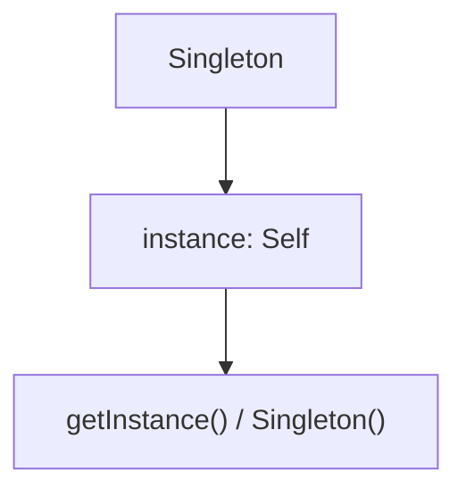

##### 2.2 Factory Method (工厂方法)

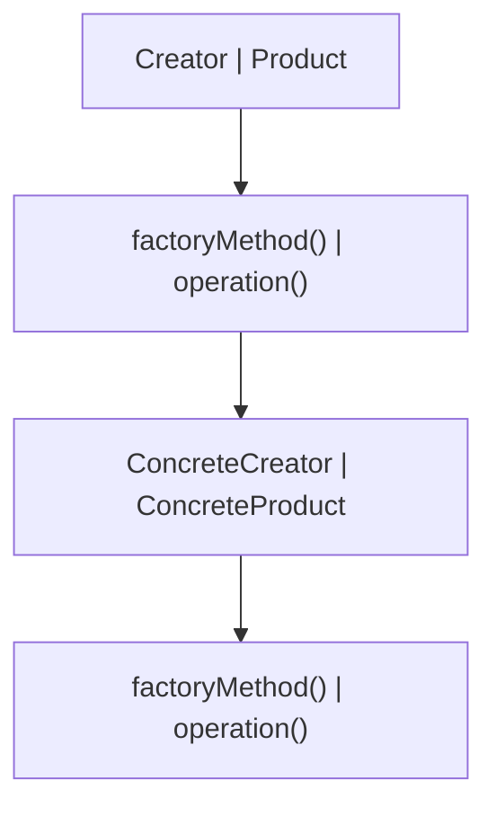

##### 2.3 Abstract Factory (抽象工厂)

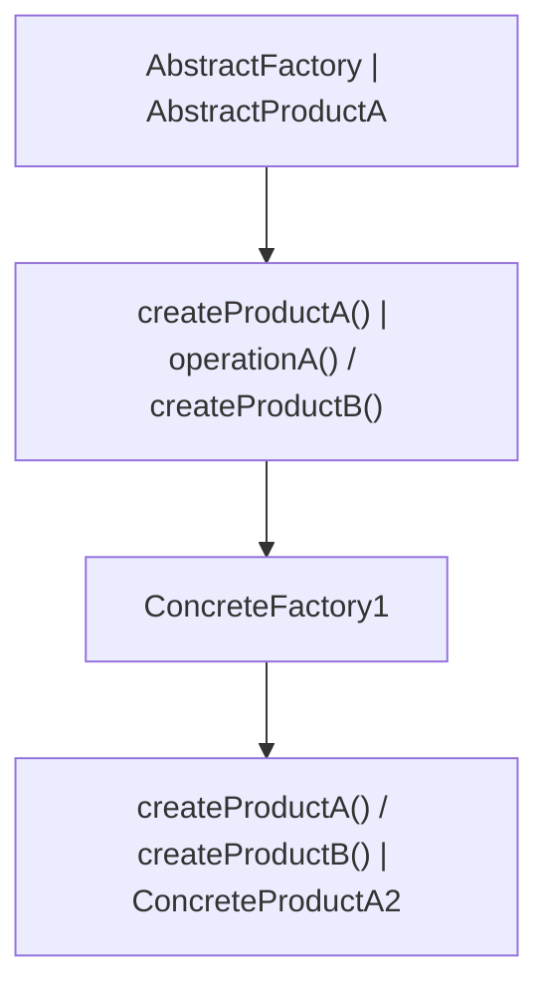

##### 2.4 Builder (建造者)

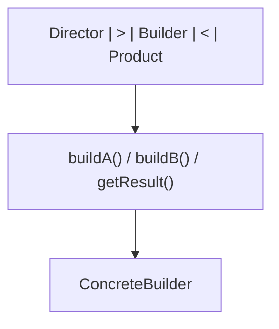

##### 2.5 Prototype (原型)

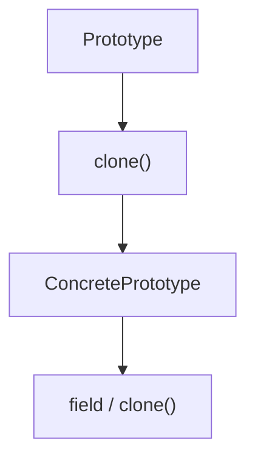

---

#### 3. 结构型模式

##### 3.1 Adapter (适配器)

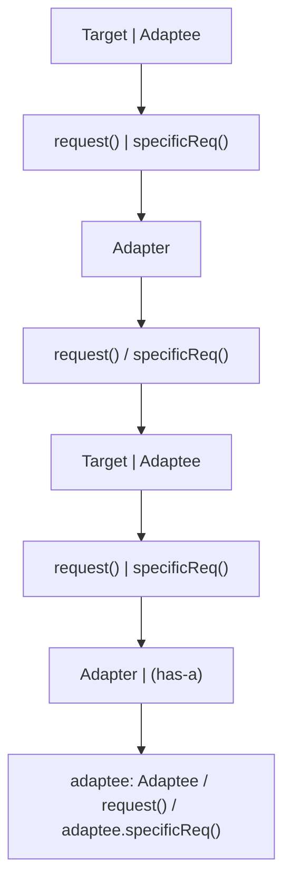

##### 3.2 Decorator (装饰器)

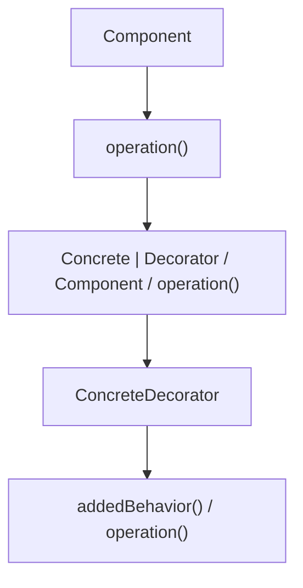

##### 3.3 Composite (组合)

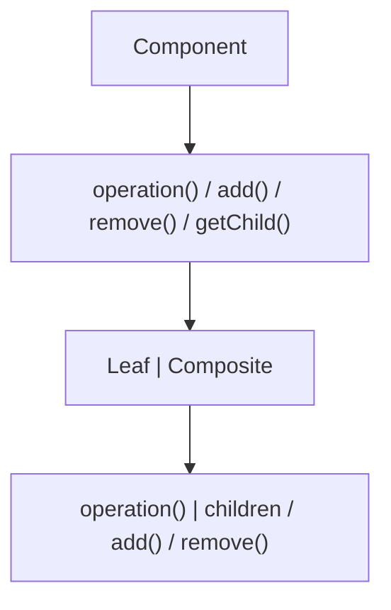

##### 3.4 Facade (外观)

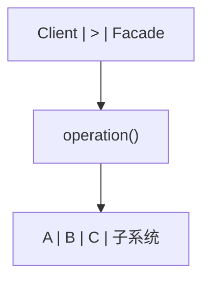

##### 3.5 Proxy (代理)

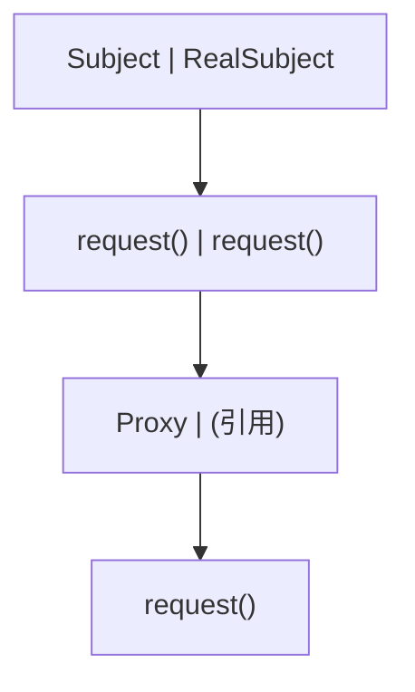

---

#### 4. 行为型模式

##### 4.1 Strategy (策略)

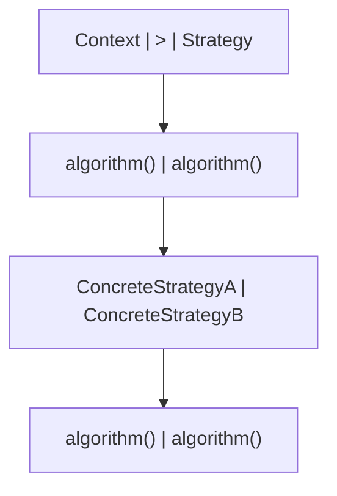

##### 4.2 Observer (观察者)

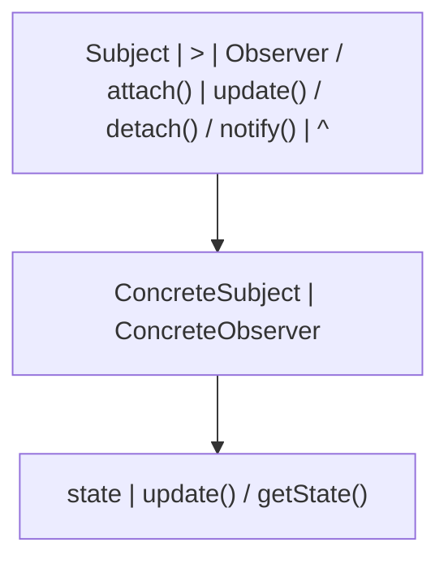

##### 4.3 State (状态)

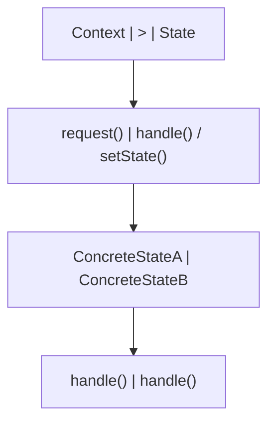

##### 4.4 Command (命令)

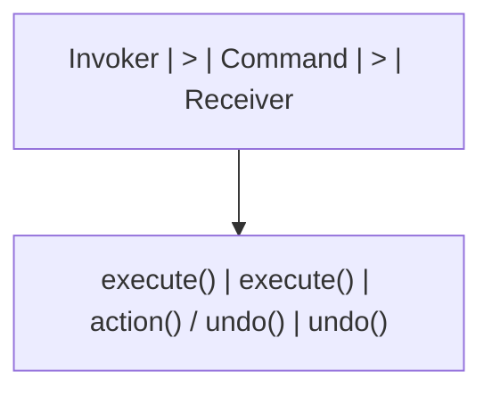

##### 4.5 Iterator (迭代器)

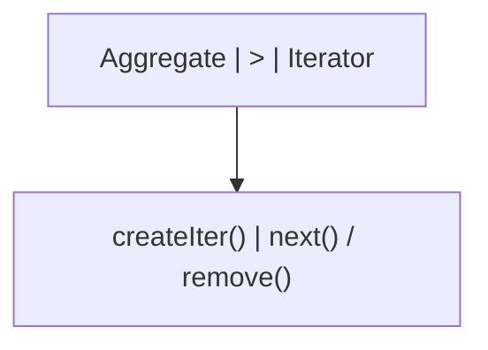

##### 4.6 Template Method (模板方法)

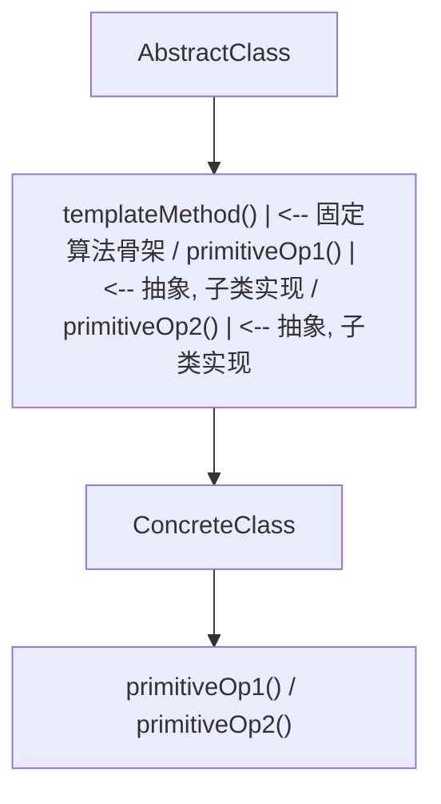

---

#### 5. 模式关系与选择

##### 5.1 模式间的协作

```
常见模式组合:

1. Factory + Strategy:
   工厂根据配置创建具体策略对象

2. Composite + Iterator:
   组合结构使用迭代器遍历

3. Observer + Mediator:
   中介者协调观察者间的通信

4. Decorator + Factory:
   工厂创建装饰后的对象

5. Command + Composite:
   宏命令是命令的组合

6. State + Strategy:
   状态模式是策略模式的动态版本
   状态切换自动发生, 策略由客户端选择
```

##### 5.2 模式选择决策树

```
创建对象?
  |-- 是: 创建型模式
  |   |-- 一个实例? -> Singleton
  |   |-- 由子类决定? -> Factory Method
  |   |-- 一族对象? -> Abstract Factory
  |   |-- 复杂构建? -> Builder
  |   |-- 克隆已有? -> Prototype
  |
接口不匹配?
  |-- 是: 结构型模式
  |   |-- 接口转换? -> Adapter
  |   |-- 添加职责? -> Decorator
  |   |-- 树形结构? -> Composite
  |   |-- 简化接口? -> Facade
  |   |-- 控制访问? -> Proxy
  |   |-- 共享对象? -> Flyweight
  |
行为问题?
  |-- 是: 行为型模式
  |   |-- 算法切换? -> Strategy
  |   |-- 状态变化? -> State
  |   |-- 通知依赖? -> Observer
  |   |-- 封装请求? -> Command
  |   |-- 遍历集合? -> Iterator
  |   |-- 算法骨架? -> Template Method
  |   |-- 对象通信? -> Mediator
  |   |-- 请求链? -> Chain of Responsibility
```

##### 5.3 模式的代价

```
设计模式不是银弹, 每个模式都有代价:

1. 增加类的数量:
   每个模式通常引入1-3个新类
   系统复杂度增加

2. 间接层增加:
   更多接口和抽象层
   调试和跟踪更困难

3. 性能开销:
   虚方法调用 (Strategy, State)
   对象创建 (Factory, Prototype)
   额外引用 (Decorator, Proxy)

4. 过度设计:
   不必要的抽象增加理解成本
  "当你有3个以上子类时再考虑模式"

何时不用模式:
  - 问题很简单, 直接方案足够
  - 团队不熟悉模式, 增加沟通成本
  - 性能是首要约束
  - 需求不稳定, 抽象可能白费
```

---

#### 6. 并发模式

##### 6.1 Producer-Consumer (生产者-消费者)

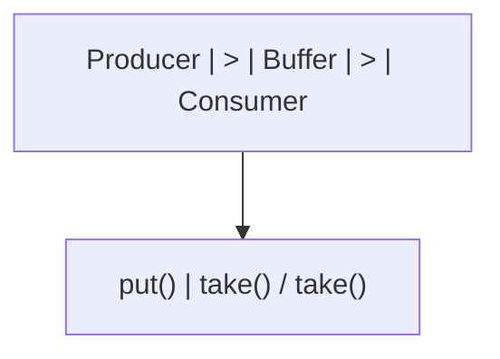

##### 6.2 Read-Write Lock (读写锁)

```
意图: 允许多个读者同时访问, 但写者独占访问

状态机:
           读者进入          写者进入
  空闲 -------> 读锁 -------> 写锁
   ^              |              |
   |              | 读者退出     | 写者退出
   +--------------+--------------+

伪代码:

class ReadWriteLock {
    int readers = 0;
    boolean writing = false;

    synchronized void readLock() throws InterruptedException {
        while (writing) wait();
        readers++;
    }

    synchronized void readUnlock() {
        readers--;
        if (readers == 0) notifyAll();
    }

    synchronized void writeLock() throws InterruptedException {
        while (readers > 0 || writing) wait();
        writing = true;
    }

    synchronized void writeUnlock() {
        writing = false;
        notifyAll();
    }
}

跨模块引用: [操作系统](os)的读写锁 (pthread_rwlock)。
  [Java](java/overview)的ReentrantReadWriteLock。
  [体系结构](architecture)的缓存一致性协议 (MESI) 是读写锁的硬件实现。
```

##### 6.3 Thread Pool (线程池)

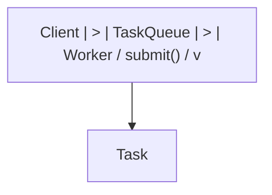

---

#### 7. 速查表

##### 7.1 创建型模式速查

| 模式             | 意图             | 关键词        |
| ---------------- | ---------------- | ------------- |
| Singleton        | 唯一实例         | 全局访问点    |
| Factory Method   | 子类决定创建     | 延迟到子类    |
| Abstract Factory | 创建一族对象     | 产品族        |
| Builder          | 分步构建复杂对象 | 链式调用      |
| Prototype        | 克隆创建对象     | 深拷贝/浅拷贝 |

##### 7.2 结构型模式速查

| 模式      | 意图           | 关键词         |
| --------- | -------------- | -------------- |
| Adapter   | 接口转换       | 兼容性         |
| Decorator | 动态添加职责   | 包装器         |
| Composite | 树形结构       | 部分-整体      |
| Facade    | 简化接口       | 统一入口       |
| Proxy     | 控制访问       | 延迟/保护/远程 |
| Flyweight | 共享细粒度对象 | 对象池         |
| Bridge    | 分离抽象与实现 | 多维度变化     |

##### 7.3 行为型模式速查

| 模式            | 意图           | 关键词         |
| --------------- | -------------- | -------------- |
| Strategy        | 算法族互换     | 消除条件语句   |
| Observer        | 一对多通知     | 发布-订阅      |
| State           | 状态驱动行为   | 状态机         |
| Command         | 封装请求       | 撤销/队列/日志 |
| Iterator        | 顺序访问       | 遍历集合       |
| Template Method | 算法骨架       | 好莱坞原则     |
| Mediator        | 对象间通信中介 | 解耦交互       |
| Chain of Resp.  | 请求处理链     | 逐级处理       |
| Visitor         | 分离操作与结构 | 双分派         |
| Memento         | 保存恢复状态   | 撤销快照       |

##### 7.4 SOLID速查

| 原则 | 含义     | 对应模式                            |
| ---- | -------- | ----------------------------------- |
| SRP  | 单一职责 | Facade, Mediator                    |
| OCP  | 开闭原则 | Strategy, Observer, Template Method |
| LSP  | 里氏替换 | 所有使用继承的模式                  |
| ISP  | 接口隔离 | Adapter, Facade                     |
| DIP  | 依赖倒置 | Factory, Strategy, Observer         |

---

#### 延伸阅读

- _Design Patterns: Elements of Reusable Object-Oriented Software_ -- GoF
- _Head First Design Patterns_ -- Freeman & Robson
- _Refactoring: Improving the Design of Existing Code_ -- Martin Fowler
- _Pattern-Oriented Software Architecture_ -- Buschmann et al.


### 3.2 概念关系图

下面用 Mermaid 图表达本文核心概念之间的关系，帮助读者建立整体图景：

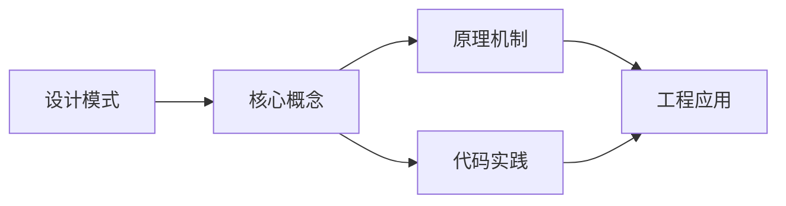

图中展示的是本文知识的结构化关系：核心概念是入口，原理机制解释“为什么”，代码实践演示“怎么做”，工程应用回答“何时用”。读者学习时可以把每个小节的内容挂接到对应节点上。

## 4. 理论推导与原理解析

本节深入《设计模式》背后的原理。理论部分不求面面俱到，而是聚焦“能解释现象、能指导实践”的关键推导。

数据结构：数组/链表/栈/队列/哈希/树/图；每种结构有插入、查找、删除的时间复杂度特征。
算法分析：大 O 表示增长阶；时间与空间权衡；递归与迭代。
存储层次：寄存器 -> 缓存 -> 内存 -> 磁盘；局部性原理指导性能优化。
并发基础：竞态、临界区、锁、信号量、死锁条件与预防。

需要强调的是，理论推导与工程实践之间存在翻译层：理论给出的是理想化模型与边界条件，工程代码则必须处理真实环境中的例外。读者在学习时应先掌握理论的“标准情形”，再通过陷阱章节了解“非标准情形”。

## 5. 代码示例与逐行讲解

本节把原文中的代码示例系统整理，并为每个示例补充用途说明与讲解。读者不应只浏览代码，而应逐段对照讲解理解设计意图。

### 5.1 示例：1.1 SOLID原则

该示例来自原文《1.1 SOLID原则》小节，用于演示设计模式相关操作。阅读时请先看代码结构，再看其后的讲解。

```text
SOLID原则 -- 面向对象设计的五个基本原则:

S - Single Responsibility (单一职责):
  一个类只有一个引起变化的原因
  高内聚: 每个类只做一件事

  反例: Employee类同时负责数据存储和报表生成
  正例: Employee类 + EmployeeReportGenerator类

O - Open/Closed (开闭原则):
  对扩展开放, 对修改关闭
  通过抽象和多态实现

  反例: 修改switch语句添加新类型
  正例: 定义接口, 新类型实现接口

L - Liskov Substitution (里氏替换):
  子类对象必须能替换父类对象而不破坏正确性
  子类不应强化前置条件, 不应弱化后置条件

  反例: Square继承Rectangle, 但setWidth影响height
  正例: Square和Rectangle都实现Shape接口

I - Interface Segregation (接口隔离):
  客户端不应依赖它不使用的接口
  接口应小而专注

  反例: 一个"胖"接口包含所有方法
  正例: 拆分为多个小接口, 客户端按需依赖

D - Dependency Inversion (依赖倒置):
  高层模块不应依赖低层模块, 两者都应依赖抽象
  抽象不应依赖细节, 细节应依赖抽象

  反例: 业务逻辑直接依赖数据库实现类
  正例: 业务逻辑依赖Repository接口, 数据库类实现接口
```

讲解：这段代码演示了本节核心知识点。代码中的关键操作可以归纳为三步：准备（定义或初始化）、执行（核心逻辑）、收尾（释放资源或返回结果）。实际项目中，这三步往往被封装为函数或类，以提升复用性与可测试性。

关键点分析：

该示例共 26 行有效代码，结构以数据或配置为主。阅读时应关注：数据字段的含义、配置项的作用，以及它们与运行行为的对应关系。

进阶思考路径：先尝试修改参数观察行为变化，再把示例中的模式迁移到自己的项目中；每次修改都记录预期与实测差异，这是把示例转化为能力的最快方式。

### 5.2 示例：1.2 其他设计原则

该示例来自原文《1.2 其他设计原则》小节，用于演示设计模式相关操作。阅读时请先看代码结构，再看其后的讲解。

```text
DRY (Don't Repeat Yourself):
  每个知识片段在系统中有唯一表示
  重复代码 -> 提取公共方法/基类

KISS (Keep It Simple, Stupid):
  保持简单, 避免过度设计
  最简单的能工作的方案就是最好的

YAGNI (You Aren't Gonna Need It):
  不要预先实现当前不需要的功能
  避免基于猜测的过度抽象

组合优于继承:
  优先使用对象组合而非类继承
  继承: 白箱复用 (可见父类实现细节)
  组合: 黑箱复用 (只通过接口交互)

迪米特法则 (Law of Demeter):
  一个对象应该对其他对象有最少的了解
  只与直接朋友通信, 不与陌生人通信
  a.getB().getC().doSomething()  -- 违反
  a.doSomethingWithB()           -- 遵守
```

讲解：这段代码演示了本节核心知识点。代码中的关键操作可以归纳为三步：准备（定义或初始化）、执行（核心逻辑）、收尾（释放资源或返回结果）。实际项目中，这三步往往被封装为函数或类，以提升复用性与可测试性。

关键点分析：

该示例共 18 行有效代码，结构以数据或配置为主。阅读时应关注：数据字段的含义、配置项的作用，以及它们与运行行为的对应关系。

进阶思考路径：先尝试修改参数观察行为变化，再把示例中的模式迁移到自己的项目中；每次修改都记录预期与实测差异，这是把示例转化为能力的最快方式。

### 5.3 示例：2.1 Singleton (单例)

该示例来自原文《2.1 Singleton (单例)》小节，用于演示设计模式相关操作。阅读时请先看代码结构，再看其后的讲解。


讲解：这段代码演示了本节核心知识点。代码中的关键操作可以归纳为三步：准备（定义或初始化）、执行（核心逻辑）、收尾（释放资源或返回结果）。实际项目中，这三步往往被封装为函数或类，以提升复用性与可测试性。

关键点分析：

该示例共 6 行有效代码，结构以数据或配置为主。阅读时应关注：数据字段的含义、配置项的作用，以及它们与运行行为的对应关系。

进阶思考路径：先尝试修改参数观察行为变化，再把示例中的模式迁移到自己的项目中；每次修改都记录预期与实测差异，这是把示例转化为能力的最快方式。

### 5.4 示例：2.2 Factory Method (工厂方法)

该示例来自原文《2.2 Factory Method (工厂方法)》小节，用于演示设计模式相关操作。阅读时请先看代码结构，再看其后的讲解。

```mermaid
flowchart TD
    B0["Creator | Product"]
    B1["factoryMethod() | operation()"]
    B0 --> B1
    B2["ConcreteCreator | ConcreteProduct"]
    B1 --> B2
    B3["factoryMethod() | operation()"]
    B2 --> B3
```

讲解：这段代码演示了本节核心知识点。代码中的关键操作可以归纳为三步：准备（定义或初始化）、执行（核心逻辑）、收尾（释放资源或返回结果）。实际项目中，这三步往往被封装为函数或类，以提升复用性与可测试性。

关键点分析：

该示例共 8 行有效代码，结构以数据或配置为主。阅读时应关注：数据字段的含义、配置项的作用，以及它们与运行行为的对应关系。

进阶思考路径：先尝试修改参数观察行为变化，再把示例中的模式迁移到自己的项目中；每次修改都记录预期与实测差异，这是把示例转化为能力的最快方式。

### 5.5 示例：2.3 Abstract Factory (抽象工厂)

该示例来自原文《2.3 Abstract Factory (抽象工厂)》小节，用于演示设计模式相关操作。阅读时请先看代码结构，再看其后的讲解。

```mermaid
flowchart TD
    B0["AbstractFactory | AbstractProductA"]
    B1["createProductA() | operationA() / createProductB()"]
    B0 --> B1
    B2["ConcreteFactory1"]
    B1 --> B2
    B3["createProductA() / createProductB() | ConcreteProductA2"]
    B2 --> B3
```

讲解：这段代码演示了本节核心知识点。代码中的关键操作可以归纳为三步：准备（定义或初始化）、执行（核心逻辑）、收尾（释放资源或返回结果）。实际项目中，这三步往往被封装为函数或类，以提升复用性与可测试性。

关键点分析：

该示例共 8 行有效代码，结构以数据或配置为主。阅读时应关注：数据字段的含义、配置项的作用，以及它们与运行行为的对应关系。

进阶思考路径：先尝试修改参数观察行为变化，再把示例中的模式迁移到自己的项目中；每次修改都记录预期与实测差异，这是把示例转化为能力的最快方式。

### 5.6 示例：2.4 Builder (建造者)

该示例来自原文《2.4 Builder (建造者)》小节，用于演示设计模式相关操作。阅读时请先看代码结构，再看其后的讲解。

```mermaid
flowchart TD
    B0["Director | > | Builder | < | Product"]
    B1["buildA() / buildB() / getResult()"]
    B0 --> B1
    B2["ConcreteBuilder"]
    B1 --> B2
```

讲解：这段代码演示了本节核心知识点。代码中的关键操作可以归纳为三步：准备（定义或初始化）、执行（核心逻辑）、收尾（释放资源或返回结果）。实际项目中，这三步往往被封装为函数或类，以提升复用性与可测试性。

关键点分析：

该示例共 6 行有效代码，结构以数据或配置为主。阅读时应关注：数据字段的含义、配置项的作用，以及它们与运行行为的对应关系。

进阶思考路径：先尝试修改参数观察行为变化，再把示例中的模式迁移到自己的项目中；每次修改都记录预期与实测差异，这是把示例转化为能力的最快方式。

### 5.7 示例：2.5 Prototype (原型)

该示例来自原文《2.5 Prototype (原型)》小节，用于演示设计模式相关操作。阅读时请先看代码结构，再看其后的讲解。

```mermaid
flowchart TD
    B0["Prototype"]
    B1["clone()"]
    B0 --> B1
    B2["ConcretePrototype"]
    B1 --> B2
    B3["field / clone()"]
    B2 --> B3
```

讲解：这段代码演示了本节核心知识点。代码中的关键操作可以归纳为三步：准备（定义或初始化）、执行（核心逻辑）、收尾（释放资源或返回结果）。实际项目中，这三步往往被封装为函数或类，以提升复用性与可测试性。

关键点分析：

该示例共 8 行有效代码，结构以数据或配置为主。阅读时应关注：数据字段的含义、配置项的作用，以及它们与运行行为的对应关系。

进阶思考路径：先尝试修改参数观察行为变化，再把示例中的模式迁移到自己的项目中；每次修改都记录预期与实测差异，这是把示例转化为能力的最快方式。

### 5.8 示例：3.1 Adapter (适配器)

该示例来自原文《3.1 Adapter (适配器)》小节，用于演示设计模式相关操作。阅读时请先看代码结构，再看其后的讲解。

```mermaid
flowchart TD
    B0["Target | Adaptee"]
    B1["request() | specificReq()"]
    B0 --> B1
    B2["Adapter"]
    B1 --> B2
    B3["request() / specificReq()"]
    B2 --> B3
    B4["Target | Adaptee"]
    B3 --> B4
    B5["request() | specificReq()"]
    B4 --> B5
    B6["Adapter | (has-a)"]
    B5 --> B6
    B7["adaptee: Adaptee / request() / adaptee.specificReq()"]
    B6 --> B7
```

讲解：这段代码演示了本节核心知识点。代码中的关键操作可以归纳为三步：准备（定义或初始化）、执行（核心逻辑）、收尾（释放资源或返回结果）。实际项目中，这三步往往被封装为函数或类，以提升复用性与可测试性。

关键点分析：

该示例共 16 行有效代码，结构以数据或配置为主。阅读时应关注：数据字段的含义、配置项的作用，以及它们与运行行为的对应关系。

进阶思考路径：先尝试修改参数观察行为变化，再把示例中的模式迁移到自己的项目中；每次修改都记录预期与实测差异，这是把示例转化为能力的最快方式。

### 5.9 示例：3.2 Decorator (装饰器)

该示例来自原文《3.2 Decorator (装饰器)》小节，用于演示设计模式相关操作。阅读时请先看代码结构，再看其后的讲解。

```mermaid
flowchart TD
    B0["Component"]
    B1["operation()"]
    B0 --> B1
    B2["Concrete | Decorator / Component / operation()"]
    B1 --> B2
    B3["ConcreteDecorator"]
    B2 --> B3
    B4["addedBehavior() / operation()"]
    B3 --> B4
```

讲解：这段代码演示了本节核心知识点。代码中的关键操作可以归纳为三步：准备（定义或初始化）、执行（核心逻辑）、收尾（释放资源或返回结果）。实际项目中，这三步往往被封装为函数或类，以提升复用性与可测试性。

关键点分析：

该示例共 10 行有效代码，结构以数据或配置为主。阅读时应关注：数据字段的含义、配置项的作用，以及它们与运行行为的对应关系。

进阶思考路径：先尝试修改参数观察行为变化，再把示例中的模式迁移到自己的项目中；每次修改都记录预期与实测差异，这是把示例转化为能力的最快方式。

### 5.10 示例：3.3 Composite (组合)

该示例来自原文《3.3 Composite (组合)》小节，用于演示设计模式相关操作。阅读时请先看代码结构，再看其后的讲解。

```mermaid
flowchart TD
    B0["Component"]
    B1["operation() / add() / remove() / getChild()"]
    B0 --> B1
    B2["Leaf | Composite"]
    B1 --> B2
    B3["operation() | children / add() / remove()"]
    B2 --> B3
```

讲解：这段代码演示了本节核心知识点。代码中的关键操作可以归纳为三步：准备（定义或初始化）、执行（核心逻辑）、收尾（释放资源或返回结果）。实际项目中，这三步往往被封装为函数或类，以提升复用性与可测试性。

关键点分析：

该示例共 8 行有效代码，结构以数据或配置为主。阅读时应关注：数据字段的含义、配置项的作用，以及它们与运行行为的对应关系。

进阶思考路径：先尝试修改参数观察行为变化，再把示例中的模式迁移到自己的项目中；每次修改都记录预期与实测差异，这是把示例转化为能力的最快方式。

### 5.11 示例：3.4 Facade (外观)

该示例来自原文《3.4 Facade (外观)》小节，用于演示设计模式相关操作。阅读时请先看代码结构，再看其后的讲解。

```mermaid
flowchart TD
    B0["Client | > | Facade"]
    B1["operation()"]
    B0 --> B1
    B2["A | B | C | 子系统"]
    B1 --> B2
```

讲解：这段代码演示了本节核心知识点。代码中的关键操作可以归纳为三步：准备（定义或初始化）、执行（核心逻辑）、收尾（释放资源或返回结果）。实际项目中，这三步往往被封装为函数或类，以提升复用性与可测试性。

关键点分析：

该示例共 6 行有效代码，结构以数据或配置为主。阅读时应关注：数据字段的含义、配置项的作用，以及它们与运行行为的对应关系。

进阶思考路径：先尝试修改参数观察行为变化，再把示例中的模式迁移到自己的项目中；每次修改都记录预期与实测差异，这是把示例转化为能力的最快方式。

### 5.12 示例：3.5 Proxy (代理)

该示例来自原文《3.5 Proxy (代理)》小节，用于演示设计模式相关操作。阅读时请先看代码结构，再看其后的讲解。

```mermaid
flowchart TD
    B0["Subject | RealSubject"]
    B1["request() | request()"]
    B0 --> B1
    B2["Proxy | (引用)"]
    B1 --> B2
    B3["request()"]
    B2 --> B3
```

讲解：这段代码演示了本节核心知识点。代码中的关键操作可以归纳为三步：准备（定义或初始化）、执行（核心逻辑）、收尾（释放资源或返回结果）。实际项目中，这三步往往被封装为函数或类，以提升复用性与可测试性。

关键点分析：

该示例共 8 行有效代码，结构以数据或配置为主。阅读时应关注：数据字段的含义、配置项的作用，以及它们与运行行为的对应关系。

进阶思考路径：先尝试修改参数观察行为变化，再把示例中的模式迁移到自己的项目中；每次修改都记录预期与实测差异，这是把示例转化为能力的最快方式。

### 5.13 示例：4.1 Strategy (策略)

该示例来自原文《4.1 Strategy (策略)》小节，用于演示设计模式相关操作。阅读时请先看代码结构，再看其后的讲解。

```mermaid
flowchart TD
    B0["Context | > | Strategy"]
    B1["algorithm() | algorithm()"]
    B0 --> B1
    B2["ConcreteStrategyA | ConcreteStrategyB"]
    B1 --> B2
    B3["algorithm() | algorithm()"]
    B2 --> B3
```

讲解：这段代码演示了本节核心知识点。代码中的关键操作可以归纳为三步：准备（定义或初始化）、执行（核心逻辑）、收尾（释放资源或返回结果）。实际项目中，这三步往往被封装为函数或类，以提升复用性与可测试性。

关键点分析：

该示例共 8 行有效代码，结构以数据或配置为主。阅读时应关注：数据字段的含义、配置项的作用，以及它们与运行行为的对应关系。

进阶思考路径：先尝试修改参数观察行为变化，再把示例中的模式迁移到自己的项目中；每次修改都记录预期与实测差异，这是把示例转化为能力的最快方式。

### 5.14 示例：4.2 Observer (观察者)

该示例来自原文《4.2 Observer (观察者)》小节，用于演示设计模式相关操作。阅读时请先看代码结构，再看其后的讲解。

```mermaid
flowchart TD
    B0["Subject | > | Observer / attach() | update() / detach() / notify() | ^"]
    B1["ConcreteSubject | ConcreteObserver"]
    B0 --> B1
    B2["state | update() / getState()"]
    B1 --> B2
```

讲解：这段代码演示了本节核心知识点。代码中的关键操作可以归纳为三步：准备（定义或初始化）、执行（核心逻辑）、收尾（释放资源或返回结果）。实际项目中，这三步往往被封装为函数或类，以提升复用性与可测试性。

关键点分析：

该示例共 6 行有效代码，结构以数据或配置为主。阅读时应关注：数据字段的含义、配置项的作用，以及它们与运行行为的对应关系。

进阶思考路径：先尝试修改参数观察行为变化，再把示例中的模式迁移到自己的项目中；每次修改都记录预期与实测差异，这是把示例转化为能力的最快方式。

### 5.15 示例：4.3 State (状态)

该示例来自原文《4.3 State (状态)》小节，用于演示设计模式相关操作。阅读时请先看代码结构，再看其后的讲解。

```mermaid
flowchart TD
    B0["Context | > | State"]
    B1["request() | handle() / setState()"]
    B0 --> B1
    B2["ConcreteStateA | ConcreteStateB"]
    B1 --> B2
    B3["handle() | handle()"]
    B2 --> B3
```

讲解：这段代码演示了本节核心知识点。代码中的关键操作可以归纳为三步：准备（定义或初始化）、执行（核心逻辑）、收尾（释放资源或返回结果）。实际项目中，这三步往往被封装为函数或类，以提升复用性与可测试性。

关键点分析：

该示例共 8 行有效代码，结构以数据或配置为主。阅读时应关注：数据字段的含义、配置项的作用，以及它们与运行行为的对应关系。

进阶思考路径：先尝试修改参数观察行为变化，再把示例中的模式迁移到自己的项目中；每次修改都记录预期与实测差异，这是把示例转化为能力的最快方式。

### 5.16 示例：4.4 Command (命令)

该示例来自原文《4.4 Command (命令)》小节，用于演示设计模式相关操作。阅读时请先看代码结构，再看其后的讲解。

```mermaid
flowchart TD
    B0["Invoker | > | Command | > | Receiver"]
    B1["execute() | execute() | action() / undo() | undo()"]
    B0 --> B1
```

讲解：这段代码演示了本节核心知识点。代码中的关键操作可以归纳为三步：准备（定义或初始化）、执行（核心逻辑）、收尾（释放资源或返回结果）。实际项目中，这三步往往被封装为函数或类，以提升复用性与可测试性。

关键点分析：

该示例共 4 行有效代码，结构以数据或配置为主。阅读时应关注：数据字段的含义、配置项的作用，以及它们与运行行为的对应关系。

进阶思考路径：先尝试修改参数观察行为变化，再把示例中的模式迁移到自己的项目中；每次修改都记录预期与实测差异，这是把示例转化为能力的最快方式。

### 5.17 示例：4.5 Iterator (迭代器)

该示例来自原文《4.5 Iterator (迭代器)》小节，用于演示设计模式相关操作。阅读时请先看代码结构，再看其后的讲解。

```mermaid
flowchart TD
    B0["Aggregate | > | Iterator"]
    B1["createIter() | next() / remove()"]
    B0 --> B1
```

讲解：这段代码演示了本节核心知识点。代码中的关键操作可以归纳为三步：准备（定义或初始化）、执行（核心逻辑）、收尾（释放资源或返回结果）。实际项目中，这三步往往被封装为函数或类，以提升复用性与可测试性。

关键点分析：

该示例共 4 行有效代码，结构以数据或配置为主。阅读时应关注：数据字段的含义、配置项的作用，以及它们与运行行为的对应关系。

进阶思考路径：先尝试修改参数观察行为变化，再把示例中的模式迁移到自己的项目中；每次修改都记录预期与实测差异，这是把示例转化为能力的最快方式。

### 5.18 示例：4.6 Template Method (模板方法)

该示例来自原文《4.6 Template Method (模板方法)》小节，用于演示设计模式相关操作。阅读时请先看代码结构，再看其后的讲解。

```mermaid
flowchart TD
    B0["AbstractClass"]
    B1["templateMethod() | <-- 固定算法骨架 / primitiveOp1() | <-- 抽象, 子类实现 / primitiveOp2() | <-- 抽象, 子类实现"]
    B0 --> B1
    B2["ConcreteClass"]
    B1 --> B2
    B3["primitiveOp1() / primitiveOp2()"]
    B2 --> B3
```

讲解：这段代码演示了本节核心知识点。代码中的关键操作可以归纳为三步：准备（定义或初始化）、执行（核心逻辑）、收尾（释放资源或返回结果）。实际项目中，这三步往往被封装为函数或类，以提升复用性与可测试性。

关键点分析：

该示例共 8 行有效代码，结构以数据或配置为主。阅读时应关注：数据字段的含义、配置项的作用，以及它们与运行行为的对应关系。

进阶思考路径：先尝试修改参数观察行为变化，再把示例中的模式迁移到自己的项目中；每次修改都记录预期与实测差异，这是把示例转化为能力的最快方式。

### 5.19 示例：5.1 模式间的协作

该示例来自原文《5.1 模式间的协作》小节，用于演示设计模式相关操作。阅读时请先看代码结构，再看其后的讲解。

```text
常见模式组合:

1. Factory + Strategy:
   工厂根据配置创建具体策略对象

2. Composite + Iterator:
   组合结构使用迭代器遍历

3. Observer + Mediator:
   中介者协调观察者间的通信

4. Decorator + Factory:
   工厂创建装饰后的对象

5. Command + Composite:
   宏命令是命令的组合

6. State + Strategy:
   状态模式是策略模式的动态版本
   状态切换自动发生, 策略由客户端选择
```

讲解：这段代码演示了本节核心知识点。代码中的关键操作可以归纳为三步：准备（定义或初始化）、执行（核心逻辑）、收尾（释放资源或返回结果）。实际项目中，这三步往往被封装为函数或类，以提升复用性与可测试性。

关键点分析：

该示例共 14 行有效代码，结构以数据或配置为主。阅读时应关注：数据字段的含义、配置项的作用，以及它们与运行行为的对应关系。

进阶思考路径：先尝试修改参数观察行为变化，再把示例中的模式迁移到自己的项目中；每次修改都记录预期与实测差异，这是把示例转化为能力的最快方式。

### 5.20 示例：5.2 模式选择决策树

该示例来自原文《5.2 模式选择决策树》小节，用于演示设计模式相关操作。阅读时请先看代码结构，再看其后的讲解。

```text
创建对象?
  |-- 是: 创建型模式
  |   |-- 一个实例? -> Singleton
  |   |-- 由子类决定? -> Factory Method
  |   |-- 一族对象? -> Abstract Factory
  |   |-- 复杂构建? -> Builder
  |   |-- 克隆已有? -> Prototype
  |
接口不匹配?
  |-- 是: 结构型模式
  |   |-- 接口转换? -> Adapter
  |   |-- 添加职责? -> Decorator
  |   |-- 树形结构? -> Composite
  |   |-- 简化接口? -> Facade
  |   |-- 控制访问? -> Proxy
  |   |-- 共享对象? -> Flyweight
  |
行为问题?
  |-- 是: 行为型模式
  |   |-- 算法切换? -> Strategy
  |   |-- 状态变化? -> State
  |   |-- 通知依赖? -> Observer
  |   |-- 封装请求? -> Command
  |   |-- 遍历集合? -> Iterator
  |   |-- 算法骨架? -> Template Method
  |   |-- 对象通信? -> Mediator
  |   |-- 请求链? -> Chain of Responsibility
```

讲解：这段代码演示了本节核心知识点。代码中的关键操作可以归纳为三步：准备（定义或初始化）、执行（核心逻辑）、收尾（释放资源或返回结果）。实际项目中，这三步往往被封装为函数或类，以提升复用性与可测试性。

关键点分析：

该示例共 27 行有效代码，结构以数据或配置为主。阅读时应关注：数据字段的含义、配置项的作用，以及它们与运行行为的对应关系。

进阶思考路径：先尝试修改参数观察行为变化，再把示例中的模式迁移到自己的项目中；每次修改都记录预期与实测差异，这是把示例转化为能力的最快方式。

### 5.21 示例：5.3 模式的代价

该示例来自原文《5.3 模式的代价》小节，用于演示设计模式相关操作。阅读时请先看代码结构，再看其后的讲解。

```text
设计模式不是银弹, 每个模式都有代价:

1. 增加类的数量:
   每个模式通常引入1-3个新类
   系统复杂度增加

2. 间接层增加:
   更多接口和抽象层
   调试和跟踪更困难

3. 性能开销:
   虚方法调用 (Strategy, State)
   对象创建 (Factory, Prototype)
   额外引用 (Decorator, Proxy)

4. 过度设计:
   不必要的抽象增加理解成本
  "当你有3个以上子类时再考虑模式"

何时不用模式:
  - 问题很简单, 直接方案足够
  - 团队不熟悉模式, 增加沟通成本
  - 性能是首要约束
  - 需求不稳定, 抽象可能白费
```

讲解：这段代码演示了本节核心知识点。代码中的关键操作可以归纳为三步：准备（定义或初始化）、执行（核心逻辑）、收尾（释放资源或返回结果）。实际项目中，这三步往往被封装为函数或类，以提升复用性与可测试性。

关键点分析：

该示例共 19 行有效代码，结构以数据或配置为主。阅读时应关注：数据字段的含义、配置项的作用，以及它们与运行行为的对应关系。

进阶思考路径：先尝试修改参数观察行为变化，再把示例中的模式迁移到自己的项目中；每次修改都记录预期与实测差异，这是把示例转化为能力的最快方式。

### 5.22 示例：6.1 Producer-Consumer (生产者-消费者)

该示例来自原文《6.1 Producer-Consumer (生产者-消费者)》小节，用于演示设计模式相关操作。阅读时请先看代码结构，再看其后的讲解。

```mermaid
flowchart TD
    B0["Producer | > | Buffer | > | Consumer"]
    B1["put() | take() / take()"]
    B0 --> B1
```

讲解：这段代码演示了本节核心知识点。代码中的关键操作可以归纳为三步：准备（定义或初始化）、执行（核心逻辑）、收尾（释放资源或返回结果）。实际项目中，这三步往往被封装为函数或类，以提升复用性与可测试性。

关键点分析：

该示例共 4 行有效代码，结构以数据或配置为主。阅读时应关注：数据字段的含义、配置项的作用，以及它们与运行行为的对应关系。

进阶思考路径：先尝试修改参数观察行为变化，再把示例中的模式迁移到自己的项目中；每次修改都记录预期与实测差异，这是把示例转化为能力的最快方式。

### 5.23 示例：6.2 Read-Write Lock (读写锁)

该示例来自原文《6.2 Read-Write Lock (读写锁)》小节，用于演示设计模式相关操作。阅读时请先看代码结构，再看其后的讲解。

```text
意图: 允许多个读者同时访问, 但写者独占访问

状态机:
           读者进入          写者进入
  空闲 -------> 读锁 -------> 写锁
   ^              |              |
   |              | 读者退出     | 写者退出
   +--------------+--------------+

伪代码:

class ReadWriteLock {
    int readers = 0;
    boolean writing = false;

    synchronized void readLock() throws InterruptedException {
        while (writing) wait();
        readers++;
    }

    synchronized void readUnlock() {
        readers--;
        if (readers == 0) notifyAll();
    }

    synchronized void writeLock() throws InterruptedException {
        while (readers > 0 || writing) wait();
        writing = true;
    }

    synchronized void writeUnlock() {
        writing = false;
        notifyAll();
    }
}

跨模块引用: [操作系统](os)的读写锁 (pthread_rwlock)。
  [Java](java/overview)的ReentrantReadWriteLock。
  [体系结构](architecture)的缓存一致性协议 (MESI) 是读写锁的硬件实现。
```

讲解：这段代码演示了本节核心知识点。代码中的关键操作可以归纳为三步：准备（定义或初始化）、执行（核心逻辑）、收尾（释放资源或返回结果）。实际项目中，这三步往往被封装为函数或类，以提升复用性与可测试性。

关键点分析：

该示例共 31 行有效代码，包含 3 类关键结构（class、if、while）。其中：

- 入口与初始化部分负责建立上下文，对应实际项目中的启动或装配逻辑；
- 核心逻辑部分体现本文主题的主要操作，是阅读时最需要对照讲解理解的部分；
- 输出或返回部分把结果交给调用方，注意其类型与边界条件。

进阶思考路径：先尝试修改参数观察行为变化，再把示例中的模式迁移到自己的项目中；每次修改都记录预期与实测差异，这是把示例转化为能力的最快方式。

### 5.24 示例：6.3 Thread Pool (线程池)

该示例来自原文《6.3 Thread Pool (线程池)》小节，用于演示设计模式相关操作。阅读时请先看代码结构，再看其后的讲解。

```mermaid
flowchart TD
    B0["Client | > | TaskQueue | > | Worker / submit() / v"]
    B1["Task"]
    B0 --> B1
```

讲解：这段代码演示了本节核心知识点。代码中的关键操作可以归纳为三步：准备（定义或初始化）、执行（核心逻辑）、收尾（释放资源或返回结果）。实际项目中，这三步往往被封装为函数或类，以提升复用性与可测试性。

关键点分析：

该示例共 4 行有效代码，结构以数据或配置为主。阅读时应关注：数据字段的含义、配置项的作用，以及它们与运行行为的对应关系。

进阶思考路径：先尝试修改参数观察行为变化，再把示例中的模式迁移到自己的项目中；每次修改都记录预期与实测差异，这是把示例转化为能力的最快方式。


综合以上示例，可以总结出本主题的代码实践要点：第一，先定义清晰的输入输出契约；第二，核心逻辑保持单一职责；第三，错误处理与边界条件不可省略；第四，命名与注释表达意图而非复述代码。

## 6. 对比分析

对比是理解《设计模式》定位的最快路径。下面从多个维度与相邻方案进行对比。

数组与链表：数组缓存友好随机访问；链表插入删除灵活。
进程与线程：进程隔离重，线程共享轻；goroutine 更轻。
RISC 与 CISC：现代 CPU 融合两者，关注指令集与微架构。

对比的目的不是分出绝对优劣，而是建立选择依据：不同约束条件下，最优解不同。读者应把每个对比维度转化为决策检查清单。

## 7. 常见陷阱与最佳实践

本节整理该主题的高频错误与推荐做法。每个陷阱先描述现象，再解释原因，最后给出最佳实践。

### 7.1 忽视复杂度

数据量上来才崩。设计时估算规模与复杂度。

深入讲解：该问题之所以被归类为“常见陷阱”，是因为它在初学者的代码中反复出现，而且往往不在第一时间暴露——错误通常隐藏在特定数据或特定时序下。

从成因上看，忽视复杂度 一般源于对 计算机科学基础 某个机制的理解偏差：要么误用了默认行为，要么忽略了边界条件，要么把其他语言的思维惯性带了过来。

从影响上看，忽视复杂度 轻则产生错误结果，重则导致资源泄漏、数据损坏或安全事故；这也是为什么工程评审中会把它列为检查项。

从修复策略上看，处理忽视复杂度的正确顺序是：先复现（构造最小用例），再定位（确认机制层面的根因），最后修复并补充回归测试。跳过复现直接改代码，往往治标不治本。

### 7.2 死锁

锁顺序不一致。统一顺序 + 超时。

深入讲解：该问题之所以被归类为“常见陷阱”，是因为它在初学者的代码中反复出现，而且往往不在第一时间暴露——错误通常隐藏在特定数据或特定时序下。

从成因上看，死锁 一般源于对 计算机科学基础 某个机制的理解偏差：要么误用了默认行为，要么忽略了边界条件，要么把其他语言的思维惯性带了过来。

从影响上看，死锁 轻则产生错误结果，重则导致资源泄漏、数据损坏或安全事故；这也是为什么工程评审中会把它列为检查项。

从修复策略上看，处理死锁的正确顺序是：先复现（构造最小用例），再定位（确认机制层面的根因），最后修复并补充回归测试。跳过复现直接改代码，往往治标不治本。

### 7.3 缓存未命中

随机访问大数组慢。利用局部性。

深入讲解：该问题之所以被归类为“常见陷阱”，是因为它在初学者的代码中反复出现，而且往往不在第一时间暴露——错误通常隐藏在特定数据或特定时序下。

从成因上看，缓存未命中 一般源于对 计算机科学基础 某个机制的理解偏差：要么误用了默认行为，要么忽略了边界条件，要么把其他语言的思维惯性带了过来。

从影响上看，缓存未命中 轻则产生错误结果，重则导致资源泄漏、数据损坏或安全事故；这也是为什么工程评审中会把它列为检查项。

从修复策略上看，处理缓存未命中的正确顺序是：先复现（构造最小用例），再定位（确认机制层面的根因），最后修复并补充回归测试。跳过复现直接改代码，往往治标不治本。

### 7.4 栈溢出

深递归。评估深度或改迭代。

深入讲解：该问题之所以被归类为“常见陷阱”，是因为它在初学者的代码中反复出现，而且往往不在第一时间暴露——错误通常隐藏在特定数据或特定时序下。

从成因上看，栈溢出 一般源于对 计算机科学基础 某个机制的理解偏差：要么误用了默认行为，要么忽略了边界条件，要么把其他语言的思维惯性带了过来。

从影响上看，栈溢出 轻则产生错误结果，重则导致资源泄漏、数据损坏或安全事故；这也是为什么工程评审中会把它列为检查项。

从修复策略上看，处理栈溢出的正确顺序是：先复现（构造最小用例），再定位（确认机制层面的根因），最后修复并补充回归测试。跳过复现直接改代码，往往治标不治本。

### 7.5 整数溢出

计数与哈希边界。使用大整数或检查。

深入讲解：该问题之所以被归类为“常见陷阱”，是因为它在初学者的代码中反复出现，而且往往不在第一时间暴露——错误通常隐藏在特定数据或特定时序下。

从成因上看，整数溢出 一般源于对 计算机科学基础 某个机制的理解偏差：要么误用了默认行为，要么忽略了边界条件，要么把其他语言的思维惯性带了过来。

从影响上看，整数溢出 轻则产生错误结果，重则导致资源泄漏、数据损坏或安全事故；这也是为什么工程评审中会把它列为检查项。

从修复策略上看，处理整数溢出的正确顺序是：先复现（构造最小用例），再定位（确认机制层面的根因），最后修复并补充回归测试。跳过复现直接改代码，往往治标不治本。

### 7.6 位操作误用

符号位与移位方向。明确类型与语义。

深入讲解：该问题之所以被归类为“常见陷阱”，是因为它在初学者的代码中反复出现，而且往往不在第一时间暴露——错误通常隐藏在特定数据或特定时序下。

从成因上看，位操作误用 一般源于对 计算机科学基础 某个机制的理解偏差：要么误用了默认行为，要么忽略了边界条件，要么把其他语言的思维惯性带了过来。

从影响上看，位操作误用 轻则产生错误结果，重则导致资源泄漏、数据损坏或安全事故；这也是为什么工程评审中会把它列为检查项。

从修复策略上看，处理位操作误用的正确顺序是：先复现（构造最小用例），再定位（确认机制层面的根因），最后修复并补充回归测试。跳过复现直接改代码，往往治标不治本。

### 7.7 并发可见性

无同步读旧值。使用原子/锁。

深入讲解：该问题之所以被归类为“常见陷阱”，是因为它在初学者的代码中反复出现，而且往往不在第一时间暴露——错误通常隐藏在特定数据或特定时序下。

从成因上看，并发可见性 一般源于对 计算机科学基础 某个机制的理解偏差：要么误用了默认行为，要么忽略了边界条件，要么把其他语言的思维惯性带了过来。

从影响上看，并发可见性 轻则产生错误结果，重则导致资源泄漏、数据损坏或安全事故；这也是为什么工程评审中会把它列为检查项。

从修复策略上看，处理并发可见性的正确顺序是：先复现（构造最小用例），再定位（确认机制层面的根因），最后修复并补充回归测试。跳过复现直接改代码，往往治标不治本。

### 7.8 过早优化

先正确后优化。以测量为准。

深入讲解：该问题之所以被归类为“常见陷阱”，是因为它在初学者的代码中反复出现，而且往往不在第一时间暴露——错误通常隐藏在特定数据或特定时序下。

从成因上看，过早优化 一般源于对 计算机科学基础 某个机制的理解偏差：要么误用了默认行为，要么忽略了边界条件，要么把其他语言的思维惯性带了过来。

从影响上看，过早优化 轻则产生错误结果，重则导致资源泄漏、数据损坏或安全事故；这也是为什么工程评审中会把它列为检查项。

从修复策略上看，处理过早优化的正确顺序是：先复现（构造最小用例），再定位（确认机制层面的根因），最后修复并补充回归测试。跳过复现直接改代码，往往治标不治本。

### 7.0 最佳实践总览

1. 先分析复杂度再写代码。
2. 数据规模假设明确（10³/10⁶/10⁹ 方案不同）。
3. 理解底层（内存、CPU）后再谈优化。
4. 经典算法与数据结构熟练到可手写。

把这些最佳实践固化为团队规范与代码评审检查项，是避免同类问题反复出现的关键。

## 8. 工程实践

本节把《设计模式》放入真实工程场景，给出可复用的模式与组织方法。

面试与竞赛：LeetCode/算法竞赛训练思维。
系统设计：把基础用于设计（缓存、队列、索引）。
性能工程：profiler 定位 -> 复杂度/局部性优化。

### 8.1 工程实践的原则拆解

以上工程实践可以归纳为四条原则。第一，配置与代码分离：计算机科学基础 项目中环境差异应通过配置注入，而不是散落在代码分支中；这保证同一份代码可以在开发、测试、生产环境一致运行。

第二，接口稳定优先：对外接口（函数签名、协议、数据格式）一旦被消费方依赖，变更成本极高；设计时应预留扩展点并保持向后兼容。

第三，可观测性内置：日志、指标与追踪应该在功能开发时同步设计，而不是故障发生后补救；没有观测手段的模块等于黑盒。

第四，变更可回滚：任何发布都应有对应的回滚方案；数据库迁移、配置变更与代码发布一样需要版本管理与逆向路径。

### 8.2 实践落地的检查清单

- [ ] 面试与竞赛：对照本节描述，检查当前项目是否已经落实；未落实的项列入技术债并排期处理。
- [ ] 系统设计：对照本节描述，检查当前项目是否已经落实；未落实的项列入技术债并排期处理。
- [ ] 性能工程：对照本节描述，检查当前项目是否已经落实；未落实的项列入技术债并排期处理。

工程实践的共性原则：配置与代码分离、接口稳定优先、可观测性内置、变更可回滚。这些原则适用于本主题的所有实现。

## 9. 案例研究

本节通过一个完整案例把《设计模式》的知识串起来。案例按“需求分析、方案设计、实现、验证”四步展开。

需求：设计内存中的高频键值存储。
方案：哈希表 + 链表（LRU）组合，O(1) 读写。
要点：扩容策略、并发控制、内存上限。
验证：复杂度分析 + 基准测试。

### 9.1 案例的扩展讨论

把案例中的方案放大到真实规模，需要额外考虑三个问题：

第一，规模：当数据量或并发量上升一个数量级时，原方案中的数据结构、缓存策略与任务调度是否仍然成立？通常需要引入分层与异步。

第二，团队：多人协作时，模块边界、接口契约与代码所有权必须明确；案例中的实现应拆分为可独立测试的单元，并配合文档说明设计意图。

第三，演进：上线后的需求变化不可避免；方案设计时应预留扩展点（配置化、插件化、事件化），并定期用真实指标验证假设。


案例研究的学习方法：先独立阅读需求，尝试在脑中形成方案，再对照实现与讲解，最后思考“如果约束变化（数据量、并发、团队规模），方案应如何调整”。

## 10. 知识要点总结与深入讲解

本节以讲解形式汇总全文要点，替代传统的习题与自测，读者不需要答题，只需跟随解释建立完整的认知框架。

关于《设计模式》的核心结论：

基础决定上限：复杂问题最终落在数据结构与系统机制上。
理论与实践循环：学机制，写代码验证。
长期积累：系统读一本经典（CSAPP/算法导论）。

原文档各小节的要点回顾：

- 1. 设计原则：该小节围绕设计模式展开具体细节，阅读时应关注其与核心结论的对应关系；每个小节都是核心结论在某一个侧面的展开。
- 2. 创建型模式：该小节围绕设计模式展开具体细节，阅读时应关注其与核心结论的对应关系；每个小节都是核心结论在某一个侧面的展开。
- 3. 结构型模式：该小节围绕设计模式展开具体细节，阅读时应关注其与核心结论的对应关系；每个小节都是核心结论在某一个侧面的展开。
- 4. 行为型模式：该小节围绕设计模式展开具体细节，阅读时应关注其与核心结论的对应关系；每个小节都是核心结论在某一个侧面的展开。
- 5. 模式关系与选择：该小节围绕设计模式展开具体细节，阅读时应关注其与核心结论的对应关系；每个小节都是核心结论在某一个侧面的展开。
- 6. 并发模式：该小节围绕设计模式展开具体细节，阅读时应关注其与核心结论的对应关系；每个小节都是核心结论在某一个侧面的展开。
- 7. 速查表：该小节围绕设计模式展开具体细节，阅读时应关注其与核心结论的对应关系；每个小节都是核心结论在某一个侧面的展开。
- 延伸阅读：该小节围绕设计模式展开具体细节，阅读时应关注其与核心结论的对应关系；每个小节都是核心结论在某一个侧面的展开。

把以上要点与第 3-9 节的内容对照复习，即可完成对本文主题的闭环学习。

## 11. 参考文献


CSAPP（深入理解计算机系统）：https://csapp.cs.cmu.edu/
算法导论（CLRS）：https://mitpress.mit.edu/9780262046305/
MIT OpenCourseWare 6.006：https://ocw.mit.edu/courses/6-006-introduction-to-algorithms-spring-2020/
Teach Yourself CS：https://teachyourselfcs.com/

## 12. 延伸阅读


数据结构与算法，见 023-algorithm 模块。
操作系统概念，见 024-cs-fundamentals 模块相关文档。
计算机体系结构，见 001-getting-started 模块相关文档。
尚硅谷 Bilibili 空间（https://space.bilibili.com/302417610 ）提供计算机基础课程。

## 14. 模块知识图谱与学习路径

本文属于 计算机科学基础 模块。为了把《设计模式》放入完整的知识网络，下面列出本模块的全部主题并给出相互关联的导读。学习时建议按模块内顺序推进，并在每个文档中留意交叉引用。

```mermaid
flowchart LR
    A["设计模式"]
    N0["计算机科学概述"]
    N1["计算机体系结构"]
    N0 --> N1
    N2["操作系统"]
    N1 --> N2
    N3["计算机网络"]
    N2 --> N3
    N4["数字逻辑"]
    N3 --> N4
    N5["离散数学"]
    N4 --> N5
    N6["计算机组成原理"]
    N5 --> N6
    N7["数据表示与运算"]
    N6 --> N7
    N8["指令流水线"]
    N7 --> N8
    N9["存储系统"]
    N8 --> N9
    N10["总线与接口"]
    N9 --> N10
    N11["并行计算"]
    N10 --> N11
    N12["分布式系统"]
    N11 --> N12
    N13["算法设计与分析"]
    N12 --> N13
```

上图为模块主题的推荐学习顺序示意图（仅展示前若干主题）。各主题之间存在三类关联：

第一，前置依赖关系：早期主题是后期主题的基础，例如环境与语法先行、进阶主题随后；

第二，横向并列关系：同一层级主题从不同角度覆盖模块能力，学习顺序可以按兴趣调整；

第三，工程组合关系：多个主题在真实项目中组合使用，例如配置、性能与安全主题往往出现在同一系统的不同层面。

### 14.1 模块主题速查表

| 文档 | 主题 | 与本文的关联 |
| --- | --- | --- |
| 计算机科学概述 | 001-ComputerOverview | 本文的前置基础 |
| 计算机体系结构 | 002-ComputerArchitecture | 本文的并列主题 |
| 操作系统 | 003-OperatingSystem | 本文的并列主题 |
| 计算机网络 | 004-ComputerNetwork | 本文的并列主题 |
| 数字逻辑 | 005-DigitalLogic | 本文的并列主题 |
| 离散数学 | 006-DiscreteMathematics | 本文的并列主题 |
| 计算机组成原理 | 007-ComputerPrinciple | 本文的原理深化 |
| 数据表示与运算 | 008-DataRepresentationOperation | 本文的并列主题 |
| 指令流水线 | 009-DirectivePipeline | 本文的并列主题 |
| 存储系统 | 010-StorageSystem | 本文的并列主题 |
| 总线与接口 | 011-BusAndInterface | 本文的并列主题 |
| 并行计算 | 012-ParallelCalculate | 本文的并列主题 |
| 分布式系统 | 013-DistributedSystem | 本文的并列主题 |
| 算法设计与分析 | 014-AlgorithmDesignAnalysis | 本文的并列主题 |
| 形式语言与自动机 | 015-FormalLanguageAndAutomata | 本文的并列主题 |
| 信息安全基础 | 016-InformationSecurityBasics | 本文的前置基础 |
| 编译原理 | 017-CompilePrinciple | 本文的原理深化 |
| 软件工程 | 018-SoftwareEngineering | 本文的并列主题 |
| 数据库系统原理 | 019-DatabaseSystemPrinciple | 本文的原理深化 |
| 编译原理进阶 | 020-CompilePrincipleAdvanced | 本文的原理深化 |
| 操作系统进阶 | 021-OperatingSystemAdvanced | 本文的并列主题 |
| 计算机网络进阶 | 022-ComputerNetworkAdvanced | 本文的并列主题 |
| 网络安全 | 023-NetworkSecurity | 本文的安全延伸 |
| 多媒体技术 | 024-MultimediaTechnology | 本文的并列主题 |
| 人工智能基础 | 025-AIFundamentals | 本文的前置基础 |
| 计算机图形学 | 026-ComputerShape | 本文的并列主题 |
| 设计模式 | 027-DesignPattern | 本文自身 |
| 软件体系结构 | 028-SoftwareSystemStructure | 本文的并列主题 |
| 人机交互 | 029-HCI | 本文的并列主题 |
| 编程语言理论 | 030-ProgrammingLanguageTheory | 本文的并列主题 |
| 网络协议深度 | 031-NetworkProtocolDeep | 本文的并列主题 |
| 编译与运行时 | 032-CompileAndRuntime | 本文的并列主题 |
| 进程PCB与线程TCB | 033-PCBThreadTCB | 本文的并列主题 |
| 中断与系统调用 | 034-InterruptAndSystemCall | 本文的并列主题 |
| 用户态与内核态切换 | 035-UserModeKernelModeSwitch | 本文的并列主题 |
| 内存分段与分页 | 036-MemorySegmentationAndPaging | 本文的并列主题 |
| 页面置换算法 | 037-PageReplacementAlgorithm | 本文的并列主题 |
| 文件系统inode | 038-FileSystemInode | 本文的并列主题 |
| 磁盘调度 | 039-DiskScheduling | 本文的并列主题 |
| 零拷贝 | 040-ZeroCopy | 本文的并列主题 |
| 进程间通信 | 041-IPC | 本文的并列主题 |
| HTTP缓存策略 | 042-HTTPCacheStrategy | 本文的并列主题 |
| HTTPS握手过程 | 043-HTTPSHandshake | 本文的并列主题 |
| TCP拥塞控制 | 044-TCPControl | 本文的并列主题 |
| TCP粘包与拆包 | 045-TCP | 本文的并列主题 |
| DNS解析流程 | 046-DNSFlow | 本文的并列主题 |
| CDN原理 | 047-CDNPrinciple | 本文的原理深化 |
| WebSocket帧格式 | 048-WebSocketFrameFormat | 本文的并列主题 |
| QUIC协议 | 049-QUIC | 本文的并列主题 |
| ARP协议与ARP欺骗 | 050-ARPARP | 本文的并列主题 |
| BGP路由协议 | 051-BGPRoute | 本文的并列主题 |
| 词法分析 | 052-LexicalAnalysis | 本文的并列主题 |
| 语法分析 | 053-GrammarAnalysis | 本文的并列主题 |
| 语义分析 | 054-SemanticAnalysis | 本文的并列主题 |
| 中间代码 | 055-IntermediateCode | 本文的并列主题 |
| 代码优化 | 056-CodeOptimization | 本文的性能延伸 |
| 目标代码生成 | 057-TargetCodeGeneration | 本文的并列主题 |

速查表的作用是让读者快速判断：哪些文档应在阅读本文前掌握（前置基础），哪些文档应在阅读本文后继续（延伸主题）。本模块的交叉引用体系即以此表为基础。

## 15. 术语表

下表整理《设计模式》及 计算机科学基础 模块中出现的高频术语，给出简明释义。术语按字母序或逻辑序排列，供查阅。

| 术语 | 释义 |
| --- | --- |
| 数据结构 | 数组/链表/栈/队列/哈希/树/图；每种结构有插入、查找、删除的时间复杂度特征。 |
| 算法分析 | 大 O 表示增长阶；时间与空间权衡；递归与迭代。 |
| 存储层次 | 寄存器 -> 缓存 -> 内存 -> 磁盘；局部性原理指导性能优化。 |
| 并发基础 | 竞态、临界区、锁、信号量、死锁条件与预防。 |
| 忽视复杂度（易错点） | 参见常见陷阱章节的详细讲解 |
| 死锁（易错点） | 参见常见陷阱章节的详细讲解 |
| 缓存未命中（易错点） | 参见常见陷阱章节的详细讲解 |
| 栈溢出（易错点） | 参见常见陷阱章节的详细讲解 |
| 整数溢出（易错点） | 参见常见陷阱章节的详细讲解 |
| 位操作误用（易错点） | 参见常见陷阱章节的详细讲解 |

术语表与正文配合使用：先通读正文，遇到模糊术语回查本表；长期使用后术语会自然进入工作记忆。
