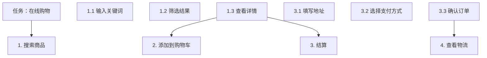

## 1. 人机交互概述

### 1.1 定义

人机交互（HCI）是研究人与计算系统之间交互的学科，目标是使系统可用、高效、愉悦。

### 1.2 交互设计原则

**Nielsen 十大可用性原则**：

1. 系统状态可见性
2. 系统与现实世界的匹配
3. 用户控制与自由
4. 一致性与标准
5. 错误预防
6. 识别而非回忆
7. 灵活性与效率
8. 美学与极简设计
9. 帮助用户识别和恢复错误
10. 帮助与文档

### 1.3 Norman 的设计原则

- **可见性**：功能应可见
- **反馈**：操作结果应即时反馈
- **约束**：限制可能的操作
- **映射**：控制与效果之间的关系
- **一致性**：相似操作有相似方式
- **启示（Affordance）**：物品外观暗示使用方式

## 2. 用户研究

### 2.1 定性研究方法

| 方法     | 优点     | 缺点     |
| -------- | -------- | -------- |
| 用户访谈 | 深入了解 | 主观偏差 |
| 焦点小组 | 多角度   | 群体思维 |
| 情境调查 | 真实场景 | 耗时     |
| 日记研究 | 长期行为 | 参与度低 |

### 2.2 定量研究方法

| 方法     | 优点         | 缺点         |
| -------- | ------------ | ------------ |
| 问卷调查 | 覆盖面广     | 深度不足     |
| A/B 测试 | 因果推断     | 需要大量流量 |
| 眼动追踪 | 客观行为数据 | 设备昂贵     |
| 点击热图 | 使用模式     | 缺乏意图     |

### 2.3 用户画像

基于研究数据创建典型用户角色：

```
姓名：张明
年龄：28岁
职业：前端开发工程师
技术水平：高级
目标：快速完成开发任务
痛点：文档查找困难
```

## 3. 交互设计

### 3.1 任务分析

**层次任务分析（HTA）**：



### 3.2 用户旅程地图

```
阶段：发现 → 评估 → 购买 → 使用 → 忠诚
行为：搜索 → 对比 → 下单 → 开箱 → 推荐
情绪： →  →  →  →
痛点：信息过载 → 选择困难 → 支付复杂 → 设置困难 → 无
机会：智能推荐 → 对比工具 → 一键支付 → 引导设置 → 社区
```

### 3.3 信息架构

**组织方案**：

| 类型   | 示例         | 适用     |
| ------ | ------------ | -------- |
| 按字母 | 字典、通讯录 | 已知目标 |
| 按时间 | 新闻、博客   | 时间敏感 |
| 按主题 | 电商分类     | 探索浏览 |
| 按任务 | 软件菜单     | 任务导向 |

**导航设计**：

- 全局导航：始终可见
- 局部导航：当前区域
- 面包屑：路径追踪
- 相关导航：关联内容

## 4. 界面设计模式

### 4.1 输入模式

| 模式     | 适用场景       | 示例     |
| -------- | -------------- | -------- |
| 表单     | 结构化数据输入 | 注册表单 |
| 拖放     | 空间操作       | 文件上传 |
| 内联编辑 | 快速修改       | 点击编辑 |
| 语音输入 | 免手操作       | 语音助手 |

### 4.2 数据展示模式

| 模式   | 适用场景   | 示例     |
| ------ | ---------- | -------- |
| 列表   | 同类数据   | 搜索结果 |
| 表格   | 结构化数据 | 数据报表 |
| 卡片   | 多属性数据 | 商品卡片 |
| 仪表盘 | 指标监控   | 管理后台 |

### 4.3 反馈模式

| 模式     | 严重程度 | 示例     |
| -------- | -------- | -------- |
| Toast    | 低       | 保存成功 |
| 通知     | 中       | 新消息   |
| 对话框   | 高       | 删除确认 |
| 行内提示 | 低       | 密码强度 |

## 5. 可用性评估

### 5.1 评估方法

| 方法       | 类型     | 阶段      | 成本 |
| ---------- | -------- | --------- | ---- |
| 启发式评估 | 专家评审 | 任何      | 低   |
| 认知走查   | 专家评审 | 设计      | 低   |
| 可用性测试 | 用户测试 | 设计/开发 | 中   |
| A/B 测试   | 在线实验 | 上线      | 高   |

### 5.2 启发式评估

3~5 名专家独立评估，按 Nielsen 十大原则逐项检查。

发现的问题数量：

$$\text{发现率} = 1 - (1-p)^n$$

其中 $p$ 为单个评估者发现问题的概率（约 30%~50%），$n$ 为评估者数量。

5 名评估者可发现约 **75%~85%** 的可用性问题。

### 5.3 可用性测试

**任务设计**：

```
场景：你想购买一本关于机器学习的书
任务：在网站上找到评分最高的机器学习书籍并加入购物车
成功标准：3分钟内完成，不超过2次错误
```

**度量指标**：

| 指标       | 测量方法             |
| ---------- | -------------------- |
| 任务完成率 | 成功完成任务的比例   |
| 任务时间   | 完成任务所需时间     |
| 错误率     | 操作错误次数         |
| 满意度     | SUS 问卷评分         |
| 学习曲线   | 首次 vs 后续任务时间 |

### 5.4 SUS 问卷

系统可用性量表（System Usability Scale），10 个问题，5 分制：

$$\text{SUS 分数} = 2.5 \times \sum(\text{奇数项得分}-1) + \sum(5-\text{偶数项得分})$$

SUS 分数解读：

| 分数  | 等级      |
| ----- | --------- |
| > 90  | A（最佳） |
| 80~90 | B（优秀） |
| 70~80 | C（良好） |
| 60~70 | D（及格） |
| < 60  | F（差）   |

## 6. 无障碍设计

### 6.1 WCAG 原则

- **可感知**：信息可被感知
- **可操作**：界面可被操作
- **可理解**：信息可被理解
- **健壮性**：内容可被各种技术解析

### 6.2 关键要求

| 要求       | 说明               |
| ---------- | ------------------ |
| 文本替代   | 图片有 alt 文本    |
| 键盘可操作 | 所有功能可用键盘   |
| 足够对比度 | 文本对比度 ≥ 4.5:1 |
| 可调整文本 | 支持放大至200%     |
| 错误建议   | 提供错误修正建议   |

### 6.3 辅助技术

- 屏幕阅读器：JAWS、NVDA、VoiceOver
- 屏幕放大器：ZoomText
- 语音控制：Dragon NaturallySpeaking
- 开关设备：单开关输入

## 参考文献


CSAPP（深入理解计算机系统）：https://csapp.cs.cmu.edu/
算法导论（CLRS）：https://mitpress.mit.edu/9780262046305/
MIT OpenCourseWare 6.006：https://ocw.mit.edu/courses/6-006-introduction-to-algorithms-spring-2020/
Teach Yourself CS：https://teachyourselfcs.com/

## 延伸阅读


数据结构与算法，见 023-algorithm 模块。
操作系统概念，见 024-cs-fundamentals 模块相关文档。
计算机体系结构，见 001-getting-started 模块相关文档。
尚硅谷 Bilibili 空间（https://space.bilibili.com/302417610 ）提供计算机基础课程。

## 深度专题扩展


以下专题从不同角度深入本文主题，供有进阶需求的读者研读。每个专题独立成节，内容相互补充。

### 13.1 大 O 分析与复杂度推导

渐进符号：O（上界）、Ω（下界）、Θ（紧界）；常数与低阶项忽略。
常见阶：O(1)、O(log n)、O(n)、O(n log n)、O(n²)、O(2ⁿ)；识别主循环与递归式。
主定理：T(n)=aT(n/b)+f(n) 的三种情形。
实践：先估规模与时限，再选算法与数据结构。

### 13.2 缓存与局部性

时间局部性：近期访问的数据再访问；空间局部性：邻近数据一起访问。
缓存行：64 字节粒度；数组遍历比链表友好。
伪共享：多线程改同一缓存行不同变量，缓存乒乓。
优化手段：数据结构重排、分块（blocking）、无锁队列。

## 模块文档速查表

| 文档 | 主题 | 与本文的关联 |
| --- | --- | --- |
| 计算机科学概述 | 001-ComputerOverview | 本文的前置基础 |
| 计算机体系结构 | 002-ComputerArchitecture | 本文的并列主题 |
| 操作系统 | 003-OperatingSystem | 本文的并列主题 |
| 计算机网络 | 004-ComputerNetwork | 本文的并列主题 |
| 数字逻辑 | 005-DigitalLogic | 本文的并列主题 |
| 离散数学 | 006-DiscreteMathematics | 本文的并列主题 |
| 计算机组成原理 | 007-ComputerPrinciple | 本文的原理深化 |
| 数据表示与运算 | 008-DataRepresentationOperation | 本文的并列主题 |
| 指令流水线 | 009-DirectivePipeline | 本文的并列主题 |
| 存储系统 | 010-StorageSystem | 本文的并列主题 |
| 总线与接口 | 011-BusAndInterface | 本文的并列主题 |
| 并行计算 | 012-ParallelCalculate | 本文的并列主题 |
| 分布式系统 | 013-DistributedSystem | 本文的并列主题 |
| 算法设计与分析 | 014-AlgorithmDesignAnalysis | 本文的并列主题 |
| 形式语言与自动机 | 015-FormalLanguageAndAutomata | 本文的并列主题 |
| 信息安全基础 | 016-InformationSecurityBasics | 本文的前置基础 |
| 编译原理 | 017-CompilePrinciple | 本文的原理深化 |
| 软件工程 | 018-SoftwareEngineering | 本文的并列主题 |
| 数据库系统原理 | 019-DatabaseSystemPrinciple | 本文的原理深化 |
| 编译原理进阶 | 020-CompilePrincipleAdvanced | 本文的原理深化 |
| 操作系统进阶 | 021-OperatingSystemAdvanced | 本文的并列主题 |
| 计算机网络进阶 | 022-ComputerNetworkAdvanced | 本文的并列主题 |
| 网络安全 | 023-NetworkSecurity | 本文的安全延伸 |
| 多媒体技术 | 024-MultimediaTechnology | 本文的并列主题 |
| 人工智能基础 | 025-AIFundamentals | 本文的前置基础 |
| 计算机图形学 | 026-ComputerShape | 本文的并列主题 |
| 设计模式 | 027-DesignPattern | 本文的并列主题 |
| 软件体系结构 | 028-SoftwareSystemStructure | 本文的并列主题 |
| 人机交互 | 029-HCI | 本文自身 |
| 编程语言理论 | 030-ProgrammingLanguageTheory | 本文的并列主题 |
| 网络协议深度 | 031-NetworkProtocolDeep | 本文的并列主题 |
| 编译与运行时 | 032-CompileAndRuntime | 本文的并列主题 |
| 进程PCB与线程TCB | 033-PCBThreadTCB | 本文的并列主题 |
| 中断与系统调用 | 034-InterruptAndSystemCall | 本文的并列主题 |
| 用户态与内核态切换 | 035-UserModeKernelModeSwitch | 本文的并列主题 |
| 内存分段与分页 | 036-MemorySegmentationAndPaging | 本文的并列主题 |
| 页面置换算法 | 037-PageReplacementAlgorithm | 本文的并列主题 |
| 文件系统inode | 038-FileSystemInode | 本文的并列主题 |
| 磁盘调度 | 039-DiskScheduling | 本文的并列主题 |
| 零拷贝 | 040-ZeroCopy | 本文的并列主题 |
| 进程间通信 | 041-IPC | 本文的并列主题 |
| HTTP缓存策略 | 042-HTTPCacheStrategy | 本文的并列主题 |
| HTTPS握手过程 | 043-HTTPSHandshake | 本文的并列主题 |
| TCP拥塞控制 | 044-TCPControl | 本文的并列主题 |
| TCP粘包与拆包 | 045-TCP | 本文的并列主题 |
| DNS解析流程 | 046-DNSFlow | 本文的并列主题 |
| CDN原理 | 047-CDNPrinciple | 本文的原理深化 |
| WebSocket帧格式 | 048-WebSocketFrameFormat | 本文的并列主题 |
| QUIC协议 | 049-QUIC | 本文的并列主题 |
| ARP协议与ARP欺骗 | 050-ARPARP | 本文的并列主题 |
| BGP路由协议 | 051-BGPRoute | 本文的并列主题 |
| 词法分析 | 052-LexicalAnalysis | 本文的并列主题 |
| 语法分析 | 053-GrammarAnalysis | 本文的并列主题 |
| 语义分析 | 054-SemanticAnalysis | 本文的并列主题 |
| 中间代码 | 055-IntermediateCode | 本文的并列主题 |
| 代码优化 | 056-CodeOptimization | 本文的性能延伸 |
| 目标代码生成 | 057-TargetCodeGeneration | 本文的并列主题 |
