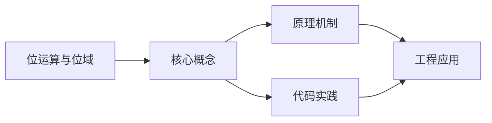
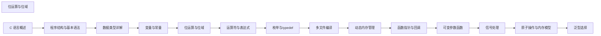

## 1. 学习目标（Bloom 分类）

本节按照布鲁姆教育目标分类学组织学习路径。本文主题为《位运算与位域》，属于 C 模块，读者可以根据自身阶段选择阅读深度。

记忆层面：能够准确复述本文的核心概念、术语与基本语法或操作步骤，并能够在提问或检索时快速定位对应知识点。能够说出 C 的变量、函数、指针、数组、结构体与预处理语法。

理解层面：能够用自己的语言解释核心原理与工作机制，说明概念之间的因果关系，而不是机械记忆结论。能够解释指针与内存地址、栈与堆、编译链接过程。

应用层面：能够在真实项目或练习场景中运用本文知识解决具体问题，写出正确且可维护的实现。能够编写系统工具、数据结构与嵌入式程序。

分析层面：能够拆解复杂问题，比较本文主题与相邻概念的异同，识别边界条件与例外情况。能够分析内存泄漏、缓冲区溢出与未定义行为。

评价层面：能够根据约束条件（性能、可读性、安全、成本）评价不同方案的优劣，做出有依据的技术决策。能够评价 C 与其他语言在系统编程中的取舍。

创造层面：能够把本文知识与其他模块知识组合，设计出新的解决方案或可复用的工程模式。能够设计可移植、可维护的 C 库与模块。

通过本节学习，读者应当能够把《位运算与位域》纳入自己的知识网络，并与 C 模块的其他主题（指针、内存管理、预处理器、标准库）建立关联。

## 2. 历史动机与发展脉络

《位运算与位域》是 C 领域的重要主题。要真正理解它，需要先了解它解决的问题与演进过程。

C 由 Dennis Ritchie 于 1972 年在贝尔实验室为 Unix 开发，是系统编程的基石语言：操作系统、编译器、嵌入式固件均以 C 为主。
C89（ANSI C）统一方言，C99 引入变长数组与 // 注释，C11 增加泛型选择与线程支持，C17 为缺陷修复版，C23（2024 年正式发布）引入 constexpr、属性、显式枚举底层类型等现代化特性。
C 的哲学是“信任程序员”：提供指针与内存操作的全部能力，同时把正确性责任交给开发者；这一设计成就了性能上限，也带来内存安全风险，催生了 Rust 等后继语言。

回到本文主题：位运算与位域 的提出与成熟，正是上述技术背景下的必然产物。早期实现往往以简单可用为目标，随着工程规模扩大，社区逐渐沉淀出标准做法与最佳实践；理解这一脉络，可以帮助读者判断“为什么文档中的推荐写法是现在这个样子”，也能在遇到历史遗留代码时准确识别其设计年代与取舍。


## 3. 形式化定义与核心概念精讲

本节把《位运算与位域》涉及的核心概念以“定义 + 讲解”的形式展开。读者应把定义当作工具，把讲解当作理解路径；两者结合才能形成可迁移的知识。

指针：指针保存变量地址，`&` 取地址、`*` 解引用；指针算术与数组名退化规则（数组名作为实参退化为首元素指针）是 C 的经典难点。
内存管理：栈内存自动释放，堆内存由 malloc/calloc/realloc/free 管理；所有权责任（谁分配谁释放）必须显式约定。
预处理器：#include/#define/#ifdef 在编译前文本处理；宏展开有副作用与优先级风险，函数式宏参数必须加括号。

### 3.1 原文章节逐一精讲

原文档把主题拆分为 14 个小节，下面按顺序给出每一节的导读讲解，随后保留原文细节供精读。

#### 原文精读（完整保留）

# C 位运算

> **符号约定**：`< >` 必填参数 | `[ ]` 可选参数

---

#### 概述

位运算是直接对整数的二进制位进行操作的运算方式，是C语言接近硬件底层的核心能力之一。通过位运算，程序员可以用最少的指令完成标志管理、数据压缩、硬件寄存器操控等任务。位域则是C语言结构体的特殊成员，允许以位为单位指定成员的存储宽度，在内存受限的嵌入式场景中尤为实用。两者结合使用，是编写高效底层代码的基本功。

#### 基础概念

##### 二进制基础

计算机中所有数据以二进制存储，理解位运算需要先熟悉二进制表示：

```c
/*
 * 十进制 5 的二进制表示（8位）: 0000 0101
 * 十进制 3 的二进制表示（8位）: 0000 0011
 * 十进制 12 的二进制表示（8位）: 0000 1100
 *
 * 最高位为符号位（有符号数）: 0 表示正数，1 表示负数
 * 无符号数所有位均为数值位
 */
unsigned char a = 5;   /* 0000 0101 */
unsigned char b = 3;   /* 0000 0011 */
```

##### 六种位运算符

| 运算符 | 名称     | 说明                      | 示例          |
| ------ | -------- | ------------------------- | ------------- |
| `&`    | 按位与   | 两位均为1时结果为1        | `5 & 3` = 1   |
| `\|`   | 按位或   | 任一位为1时结果为1        | `5 \| 3` = 7  |
| `^`    | 按位异或 | 两位不同时结果为1         | `5 ^ 3` = 6   |
| `~`    | 按位取反 | 0变1，1变0                | `~5` = -6     |
| `<<`   | 左移     | 各位左移，低位补0         | `5 << 1` = 10 |
| `>>`   | 右移     | 各位右移，高位补符号位或0 | `5 >> 1` = 2  |

##### 按位与（&）

按位与的规则：两位均为1时结果才为1。常用于清除（掩码）和检测特定位：

```c
unsigned char flags = 0b11010110;  /* 0xD6 */

/* 掩码：只保留低4位 */
unsigned char low4 = flags & 0x0F;  /* 0b00000110 = 0x06 */

/* 检测第5位是否为1 */
if (flags & (1 << 5)) {
    /* 第5位已设置 */
}

/* 清除第1位 */
flags = flags & ~(1 << 1);  /* 将第1位清零，其余不变 */
```

##### 按位或（|）

按位或的规则：任一位为1时结果为1。常用于设置特定位：

```c
unsigned char flags = 0b11010110;

/* 设置第0位 */
flags = flags | (1 << 0);  /* 0b11010111 */

/* 同时设置多个位 */
flags = flags | 0x0F;  /* 低4位全部置1 */
```

##### 按位异或（^）

按位异或的规则：两位不同时结果为1，相同时为0。常用于翻转位和无临时变量交换：

```c
unsigned char a = 0b11010110;

/* 翻转第3位 */
a = a ^ (1 << 3);  /* 第3位取反，其余不变 */

/* 异或的重要性质: x ^ x = 0, x ^ 0 = x */
/* 利用异或交换两个变量（不推荐，可读性差） */
int x = 10, y = 20;
x = x ^ y;
y = x ^ y;  /* y = (x^y)^y = x */
x = x ^ y;  /* x = (x^y)^x = y */
```

##### 按位取反（~）

按位取反将0变1、1变0。注意结果依赖于数据类型的位数：

```c
unsigned char a = 0b00001111;  /* 0x0F */
unsigned char b = ~a;           /* 0b11110000 = 0xF0 */

/* 对于有符号数，取反结果与补码表示有关 */
signed char c = 5;     /* 0000 0101 */
signed char d = ~c;    /* 1111 1010 = -6（补码） */
```

##### 左移（<<）与右移（>>）

左移相当于乘以2的幂次，右移相当于除以2的幂次（对于无符号数）：

```c
unsigned int a = 5;

/* 左移1位相当于乘2 */
a << 1;  /* 10 */
a << 2;  /* 20 */
a << 3;  /* 40 */

/* 右移1位相当于除2（无符号数） */
unsigned int b = 40;
b >> 1;  /* 20 */
b >> 2;  /* 10 */
b >> 3;  /* 5  */

/* 有符号数的右移：算术右移 vs 逻辑右移（实现定义） */
signed char c = -8;   /* 1111 1000（补码） */
c >> 1;               /* 可能是 1111 1100（算术右移，-4） */
                      /* 也可能是 0111 1100（逻辑右移，124） */
                      /* 大多数现代编译器使用算术右移 */
```

##### 位域的概念

位域是结构体中指定存储位数的成员，语法为 `类型 成员名 : 位数`：

```c
struct Flags {
    unsigned int is_active : 1;   /* 1位，0或1 */
    unsigned int priority  : 3;   /* 3位，0-7 */
    unsigned int mode      : 4;   /* 4位，0-15 */
    unsigned int reserved  : 24;  /* 24位保留 */
};

sizeof(struct Flags);  /* 4字节，共32位 */
```

位域的存储类型通常为 `unsigned int` 或 `int`，也可以使用 `_Bool`、`signed int` 等。C99 之后还允许其他标准整数类型。

#### 快速上手

##### 位操作基本模板

设置、清除、翻转、检测位是位运算的四个基本操作：

```c
#include <stdio.h>

int main(void) {
    unsigned char flags = 0;  /* 初始全0 */

    /* 设置第3位 */
    flags |= (1 << 3);    /* flags = 0b00001000 = 0x08 */
    printf("设置第3位: 0x%02X\n", flags);

    /* 设置第0位和第5位 */
    flags |= (1 << 0) | (1 << 5);  /* flags = 0b00101001 = 0x29 */
    printf("设置第0、5位: 0x%02X\n", flags);

    /* 清除第3位 */
    flags &= ~(1 << 3);   /* flags = 0b00100001 = 0x21 */
    printf("清除第3位: 0x%02X\n", flags);

    /* 翻转第5位 */
    flags ^= (1 << 5);    /* flags = 0b00000001 = 0x01 */
    printf("翻转第5位: 0x%02X\n", flags);

    /* 检测第0位 */
    if (flags & (1 << 0)) {
        printf("第0位已设置\n");
    }

    return 0;
}
```

##### 第一个位域程序

```c
#include <stdio.h>

/* 设备配置寄存器 */
struct DeviceConfig {
    unsigned int enabled    : 1;   /* 使能位 */
    unsigned int interrupt  : 1;   /* 中断使能 */
    unsigned int mode       : 2;   /* 工作模式: 0-3 */
    unsigned int speed      : 3;   /* 速度等级: 0-7 */
    unsigned int channel    : 4;   /* 通道号: 0-15 */
    unsigned int reserved   : 21;  /* 保留 */
};

int main(void) {
    struct DeviceConfig cfg = { 0 };

    /* 设置各字段 */
    cfg.enabled   = 1;   /* 使能 */
    cfg.interrupt = 1;   /* 开中断 */
    cfg.mode      = 2;   /* 模式2 */
    cfg.speed     = 5;   /* 速度5 */
    cfg.channel   = 8;   /* 通道8 */

    printf("使能: %u\n", cfg.enabled);    /* 1 */
    printf("中断: %u\n", cfg.interrupt);  /* 1 */
    printf("模式: %u\n", cfg.mode);       /* 2 */
    printf("速度: %u\n", cfg.speed);      /* 5 */
    printf("通道: %u\n", cfg.channel);    /* 8 */
    printf("结构体大小: %zu 字节\n", sizeof(cfg));  /* 4 */

    return 0;
}
```

#### 详细用法

##### 位掩码与标志管理

使用宏定义位掩码是管理标志位的常见做法：

```c
#include <stdio.h>

/* 文件权限掩码 */
#define PERM_READ    (1 << 0)  /* 0x01: 可读 */
#define PERM_WRITE   (1 << 1)  /* 0x02: 可写 */
#define PERM_EXEC    (1 << 2)  /* 0x04: 可执行 */
#define PERM_HIDDEN  (1 << 3)  /* 0x08: 隐藏 */
#define PERM_SYSTEM  (1 << 4)  /* 0x10: 系统文件 */

/* 设置权限 */
unsigned int setPermission(unsigned int perm, unsigned int flags) {
    return perm | flags;
}

/* 清除权限 */
unsigned int clearPermission(unsigned int perm, unsigned int flags) {
    return perm & ~flags;
}

/* 检查权限 */
int hasPermission(unsigned int perm, unsigned int flag) {
    return (perm & flag) != 0;
}

int main(void) {
    unsigned int perm = 0;

    /* 授予读写权限 */
    perm = setPermission(perm, PERM_READ | PERM_WRITE);
    printf("读写权限: 0x%02X\n", perm);  /* 0x03 */

    /* 检查权限 */
    printf("可读: %s\n", hasPermission(perm, PERM_READ) ? "是" : "否");
    printf("可执行: %s\n", hasPermission(perm, PERM_EXEC) ? "是" : "否");

    /* 撤销写权限，添加执行权限 */
    perm = clearPermission(perm, PERM_WRITE);
    perm = setPermission(perm, PERM_EXEC);
    printf("调整后: 0x%02X\n", perm);  /* 0x05 */

    return 0;
}
```

##### 多位字段的提取与插入

从整数中提取或插入连续多位是协议解析和寄存器操作的常见需求：

```c
#include <stdio.h>

/* 提取从第 start 位开始的 n 位 */
unsigned int extractBits(unsigned int value, int start, int n) {
    unsigned int mask = (1U << n) - 1;  /* n个1的掩码 */
    return (value >> start) & mask;
}

/* 将 bits 写入 value 的第 start 位开始的 n 位 */
unsigned int insertBits(unsigned int value, int start, int n, unsigned int bits) {
    unsigned int mask = (1U << n) - 1;
    /* 先清除目标位，再写入新值 */
    return (value & ~(mask << start)) | ((bits & mask) << start);
}

int main(void) {
    unsigned int data = 0xABCD1234;

    /* 提取第4-7位（4位） */
    unsigned int field = extractBits(data, 4, 4);
    printf("第4-7位: 0x%X\n", field);  /* 3 */

    /* 提取第8-15位（8位） */
    field = extractBits(data, 8, 8);
    printf("第8-15位: 0x%X\n", field);  /* 0x12 */

    /* 将 0xB 写入第4-7位 */
    data = insertBits(data, 4, 4, 0xB);
    printf("修改后: 0x%08X\n", data);

    return 0;
}
```

##### 位域的内存布局

位域在结构体中的布局受编译器影响，需要了解其规则：

```c
#include <stdio.h>

/* 位域布局示例 */
struct LayoutA {
    unsigned int a : 1;    /* 第0位 */
    unsigned int b : 3;    /* 第1-3位 */
    unsigned int c : 4;    /* 第4-7位 */
};

/* 跨存储单元的位域 */
struct LayoutB {
    unsigned int a : 12;
    unsigned int b : 12;
    unsigned int c : 12;  /* 可能跨到下一个 unsigned int */
};

/* 无名位域用于对齐 */
struct LayoutC {
    unsigned int a : 4;
    unsigned int   : 0;   /* 强制对齐到下一个存储单元边界 */
    unsigned int b : 4;
};

int main(void) {
    printf("LayoutA: %zu 字节\n", sizeof(struct LayoutA));  /* 4 */
    printf("LayoutB: %zu 字节\n", sizeof(struct LayoutB));  /* 8 */
    printf("LayoutC: %zu 字节\n", sizeof(struct LayoutC));  /* 8 */

    return 0;
}
```

##### 位域与联合体配合

联合体可以让同一段内存以位域和整体两种方式访问：

```c
#include <stdio.h>

/* 状态寄存器：位域视图 + 整体视图 */
typedef union {
    struct {
        unsigned int busy      : 1;   /* 忙碌标志 */
        unsigned int error     : 1;   /* 错误标志 */
        unsigned int ready     : 1;   /* 就绪标志 */
        unsigned int mode      : 2;   /* 工作模式 */
        unsigned int           : 3;   /* 保留 */
        unsigned int count     : 8;   /* 计数器 */
        unsigned int           : 16;  /* 保留 */
    } bits;
    unsigned int value;  /* 整体访问 */
} StatusReg;

int main(void) {
    StatusReg reg = { 0 };

    /* 通过位域设置各字段 */
    reg.bits.busy  = 1;
    reg.bits.ready = 1;
    reg.bits.mode  = 2;
    reg.bits.count = 100;

    /* 以整体方式读取 */
    printf("寄存器值: 0x%08X\n", reg.value);

    /* 以整体方式写入 */
    reg.value = 0x00000005;  /* busy=1, ready=1 */
    printf("忙碌: %u\n", reg.bits.busy);   /* 1 */
    printf("错误: %u\n", reg.bits.error);  /* 0 */
    printf("就绪: %u\n", reg.bits.ready);  /* 1 */

    return 0;
}
```

##### 位运算实现集合

用整数的每一位表示一个元素是否在集合中，可以高效实现小规模集合操作：

```c
#include <stdio.h>

#define SET_SIZE 32

typedef unsigned int BitSet;

/* 添加元素 */
BitSet setAdd(BitSet s, int elem) {
    return s | (1U << elem);
}

/* 移除元素 */
BitSet setRemove(BitSet s, int elem) {
    return s & ~(1U << elem);
}

/* 判断元素是否在集合中 */
int setContains(BitSet s, int elem) {
    return (s & (1U << elem)) != 0;
}

/* 并集 */
BitSet setUnion(BitSet a, BitSet b) {
    return a | b;
}

/* 交集 */
BitSet setIntersect(BitSet a, BitSet b) {
    return a & b;
}

/* 差集（在a中但不在b中） */
BitSet setDifference(BitSet a, BitSet b) {
    return a & ~b;
}

/* 集合大小 */
int setSize(BitSet s) {
    int count = 0;
    while (s) {
        count += s & 1;
        s >>= 1;
    }
    return count;
}

/* 打印集合 */
void setPrint(BitSet s) {
    printf("{ ");
    for (int i = 0; i < SET_SIZE; i++) {
        if (setContains(s, i)) {
            printf("%d ", i);
        }
    }
    printf("}\n");
}

int main(void) {
    BitSet a = 0, b = 0;

    a = setAdd(a, 1);
    a = setAdd(a, 3);
    a = setAdd(a, 5);
    a = setAdd(a, 7);

    b = setAdd(b, 2);
    b = setAdd(b, 3);
    b = setAdd(b, 5);
    b = setAdd(b, 8);

    printf("集合A: "); setPrint(a);  /* { 1 3 5 7 } */
    printf("集合B: "); setPrint(b);  /* { 2 3 5 8 } */
    printf("并集: ");  setPrint(setUnion(a, b));      /* { 1 2 3 5 7 8 } */
    printf("交集: ");  setPrint(setIntersect(a, b));  /* { 3 5 } */
    printf("差集: ");  setPrint(setDifference(a, b)); /* { 1 7 } */

    return 0;
}
```

#### 常见场景

##### 硬件寄存器操作

嵌入式开发中，位运算是操作硬件寄存器的基本手段：

```c
#include <stdio.h>

/* 模拟硬件寄存器 */
volatile unsigned int GPIO_CTRL = 0;

/* 寄存器位定义 */
#define GPIO_PIN0      (1U << 0)
#define GPIO_PIN1      (1U << 1)
#define GPIO_PIN2      (1U << 2)
#define GPIO_PIN3      (1U << 3)
#define GPIO_ALL_PINS  (0xF)

/* 设置引脚为输出 */
void gpioSetOutput(unsigned int pins) {
    GPIO_CTRL |= pins;
}

/* 设置引脚为输入 */
void gpioSetInput(unsigned int pins) {
    GPIO_CTRL &= ~pins;
}

/* 翻转引脚状态 */
void gpioToggle(unsigned int pins) {
    GPIO_CTRL ^= pins;
}

/* 读取引脚状态 */
unsigned int gpioRead(unsigned int pins) {
    return GPIO_CTRL & pins;
}

int main(void) {
    /* 设置 PIN0 和 PIN1 为输出 */
    gpioSetOutput(GPIO_PIN0 | GPIO_PIN1);
    printf("CTRL: 0x%08X\n", GPIO_CTRL);  /* 0x00000003 */

    /* 翻转 PIN0 */
    gpioToggle(GPIO_PIN0);
    printf("CTRL: 0x%08X\n", GPIO_CTRL);  /* 0x00000002 */

    /* 设置 PIN2 和 PIN3 为输出 */
    gpioSetOutput(GPIO_PIN2 | GPIO_PIN3);
    printf("CTRL: 0x%08X\n", GPIO_CTRL);  /* 0x0000000E */

    return 0;
}
```

##### 数据压缩与打包

将多个小范围数值打包到一个整数中，节省存储空间：

```c
#include <stdio.h>

/* 将 RGBA 四个通道打包为 32 位颜色值 */
unsigned int packColor(unsigned char r, unsigned char g,
                       unsigned char b, unsigned char a) {
    return ((unsigned int)a << 24) |
           ((unsigned int)r << 16) |
           ((unsigned int)g << 8)  |
           ((unsigned int)b);
}

/* 从 32 位颜色值中解包各通道 */
void unpackColor(unsigned int color,
                 unsigned char *r, unsigned char *g,
                 unsigned char *b, unsigned char *a) {
    *a = (color >> 24) & 0xFF;
    *r = (color >> 16) & 0xFF;
    *g = (color >> 8)  & 0xFF;
    *b =  color        & 0xFF;
}

int main(void) {
    unsigned int color = packColor(255, 128, 64, 200);
    printf("打包颜色: 0x%08X\n", color);  /* 0xC8FF8040 */

    unsigned char r, g, b, a;
    unpackColor(color, &r, &g, &b, &a);
    printf("R=%d, G=%d, B=%d, A=%d\n", r, g, b, a);  /* 255, 128, 64, 200 */

    return 0;
}
```

##### 权限与标志系统

Unix 文件权限是位运算的经典应用：

```c
#include <stdio.h>

/* 权限位定义 */
#define USR_R (1 << 8)  /* 用户读 */
#define USR_W (1 << 7)  /* 用户写 */
#define USR_X (1 << 6)  /* 用户执行 */
#define GRP_R (1 << 5)  /* 组读 */
#define GRP_W (1 << 4)  /* 组写 */
#define GRP_X (1 << 3)  /* 组执行 */
#define OTH_R (1 << 2)  /* 其他读 */
#define OTH_W (1 << 1)  /* 其他写 */
#define OTH_X (1 << 0)  /* 其他执行 */

/* 将权限位转换为 rwx 字符串 */
void permToStr(unsigned int perm, char *out) {
    const char *labels[] = { "r", "w", "x" };
    unsigned int bits[]  = { USR_R, USR_W, USR_X, GRP_R, GRP_W, GRP_X, OTH_R, OTH_W, OTH_X };
    int idx = 0;
    for (int i = 0; i < 9; i++) {
        if (perm & bits[i]) {
            out[idx++] = labels[i % 3][0];
        } else {
            out[idx++] = '-';
        }
    }
    out[idx] = '\0';
}

int main(void) {
    /* rwxr-xr-x = 0755 */
    unsigned int perm = USR_R | USR_W | USR_X | GRP_R | GRP_X | OTH_R | OTH_X;

    char str[10];
    permToStr(perm, str);
    printf("权限: %s (0o%o)\n", str, perm);  /* rwxr-xr-x (0o755) */

    /* 去掉其他用户的写权限 */
    perm &= ~OTH_W;
    permToStr(perm, str);
    printf("修改后: %s\n", str);  /* rwxr-xr-x */

    return 0;
}
```

##### 哈希与校验

位运算在哈希函数和校验算法中大量使用：

```c
#include <stdio.h>
#include <string.h>

/* 简单的 FNV-1a 哈希 */
unsigned int fnv1aHash(const char *str) {
    unsigned int hash = 2166136261U;  /* FNV 偏移基数 */
    while (*str) {
        hash ^= (unsigned char)*str++;  /* 异或当前字节 */
        hash *= 16777619U;              /* 乘以 FNV 质数 */
    }
    return hash;
}

/* 简单的奇偶校验 */
int parityCheck(unsigned int value) {
    int parity = 0;
    while (value) {
        parity ^= 1;       /* 每遇到一个1就翻转 */
        value &= value - 1; /* 清除最低位的1 */
    }
    return parity;  /* 0: 偶数个1, 1: 奇数个1 */
}

int main(void) {
    const char *msg = "Hello, World!";
    printf("FNV-1a 哈希: 0x%08X\n", fnv1aHash(msg));

    unsigned int data = 0b11010110;
    printf("0x%X 的奇偶校验: %s\n", data,
           parityCheck(data) ? "奇" : "偶");

    return 0;
}
```

#### 注意事项

##### 移位溢出

移位位数不能超过数据类型的位宽，否则是未定义行为：

```c
unsigned int x = 1;

/* 未定义行为：移位位数 >= int 的位数 */
x << 32;   /* 未定义！int 通常为 32 位 */
x << -1;   /* 未定义！移位位数为负 */

/* 安全做法：确保移位位数在合法范围内 */
int shift = 32;
if (shift >= 0 && shift < (int)sizeof(unsigned int) * 8) {
    x = x << shift;
}
```

##### 有符号数的右移

有符号数右移时，高位填充符号位（算术右移）还是0（逻辑右移）由实现定义。需要可移植的代码应使用无符号类型：

```c
/* 不可移植：有符号数右移 */
int a = -8;
int b = a >> 1;  /* 结果依赖编译器实现 */

/* 可移植：使用无符号数 */
unsigned int c = (unsigned int)-8;
unsigned int d = c >> 1;  /* 保证逻辑右移 */
```

##### 位域的可移植性

位域的内存布局由编译器决定，不同编译器可能不同：

```c
/*
 * 位域的以下方面是实现定义的：
 * 1. 位域在存储单元中的分配方向（从高位到低位，或反之）
 * 2. 相邻位域是否可以跨越存储单元边界
 * 3. int 位域是否有符号（实现定义）
 * 4. 位域的最大宽度限制
 *
 * 因此，位域结构不应直接用于跨平台的数据交换或文件存储。
 * 需要跨平台时，应使用显式的位运算代替位域。
 */
```

##### 位域不能取地址

位域成员可能不按字节对齐，因此不能对其取地址：

```c
struct Flags {
    unsigned int a : 1;
    unsigned int b : 3;
};

struct Flags f;
/* int *p = &f.a; */  /* 编译错误！位域不能取地址 */

/* 替代方案：通过整体访问 */
unsigned int *pval = (unsigned int *)&f;  /* 取整个结构体的地址 */
```

##### 整数提升陷阱

位运算前，小于 int 的类型会被提升为 int，可能导致意外结果：

```c
unsigned char flags = 0x80;  /* 1000 0000 */

/* 意图：清除最高位 */
unsigned char result = flags & ~(0x80);
/* ~(0x80) 在 int 上是 0xFFFFFF7F，但 & 运算后截断为 unsigned char，结果正确 */

/* 但如果写成这样就有问题 */
unsigned char mask = 0x80;
/* ~mask 被提升为 int: 0xFFFFFF7F */
/* flags & ~mask 结果为 int: 0xFFFFFF00 */
/* 赋值给 unsigned char 时截断为 0x00，可能不是预期结果 */
```

##### 位域的符号问题

`int` 类型的位域是否有符号由实现定义，建议显式使用 `signed` 或 `unsigned`：

```c
struct Example {
    int a : 3;            /* 实现定义：可能是 signed 或 unsigned */
    signed int b : 3;     /* 明确有符号：-4 到 3 */
    unsigned int c : 3;   /* 明确无符号：0 到 7 */
};
```

#### 进阶用法

##### 位运算技巧集锦

```c
#include <stdio.h>

/* 判断是否为2的幂 */
int isPowerOf2(int n) {
    return n > 0 && (n & (n - 1)) == 0;
}

/* 统计二进制中1的个数（Brian Kernighan 算法） */
int popcount(unsigned int n) {
    int count = 0;
    while (n) {
        n &= n - 1;  /* 清除最低位的1 */
        count++;
    }
    return count;
}

/* 获取最低位的1（lowbit） */
unsigned int lowbit(unsigned int n) {
    return n & (-n);  /* 等价于 n & (~n + 1) */
}

/* 判断两个整数符号是否相反 */
int oppositeSigns(int a, int b) {
    return (a ^ b) < 0;
}

/* 不用分支求绝对值 */
int absNoBranch(int n) {
    int mask = n >> (sizeof(int) * 8 - 1);  /* 全0或全1 */
    return (n + mask) ^ mask;
}

/* 交换两个整数的最高字节 */
unsigned int swapHighByte(unsigned int a, unsigned int b) {
    unsigned int mask = 0xFF000000;
    return ((a & ~mask) | (b & mask));
}

/* 反转二进制位 */
unsigned int reverseBits(unsigned int n) {
    unsigned int result = 0;
    int bits = sizeof(n) * 8;
    for (int i = 0; i < bits; i++) {
        result <<= 1;
        result |= n & 1;
        n >>= 1;
    }
    return result;
}

int main(void) {
    printf("16 是2的幂: %s\n", isPowerOf2(16) ? "是" : "否");
    printf("0xAB 的1的个数: %d\n", popcount(0xAB));  /* 6 */
    printf("12 的 lowbit: %u\n", lowbit(12));  /* 4 */
    printf("-5 和 3 符号相反: %s\n", oppositeSigns(-5, 3) ? "是" : "否");
    printf("|-42| = %d\n", absNoBranch(-42));

    return 0;
}
```

##### 位图（Bitmap）

位图是用位数组实现的高效索引结构，常用于内存管理和布隆过滤器：

```c
#include <stdio.h>
#include <stdlib.h>
#include <string.h>

#define BITMAP_SIZE(bits) (((bits) + 7) / 8)

typedef struct {
    unsigned char *data;
    int size;  /* 位数 */
} Bitmap;

/* 创建位图 */
Bitmap *bitmapCreate(int size) {
    Bitmap *bm = (Bitmap *)malloc(sizeof(Bitmap));
    bm->size = size;
    bm->data = (unsigned char *)calloc(BITMAP_SIZE(size), 1);
    return bm;
}

/* 销毁位图 */
void bitmapDestroy(Bitmap *bm) {
    free(bm->data);
    free(bm);
}

/* 设置位 */
void bitmapSet(Bitmap *bm, int index) {
    if (index >= 0 && index < bm->size) {
        bm->data[index / 8] |= (1U << (index % 8));
    }
}

/* 清除位 */
void bitmapClear(Bitmap *bm, int index) {
    if (index >= 0 && index < bm->size) {
        bm->data[index / 8] &= ~(1U << (index % 8));
    }
}

/* 检测位 */
int bitmapTest(const Bitmap *bm, int index) {
    if (index >= 0 && index < bm->size) {
        return (bm->data[index / 8] >> (index % 8)) & 1;
    }
    return 0;
}

int main(void) {
    Bitmap *bm = bitmapCreate(100);

    /* 标记一些位 */
    bitmapSet(bm, 5);
    bitmapSet(bm, 10);
    bitmapSet(bm, 63);
    bitmapSet(bm, 99);

    /* 检测 */
    printf("位5: %d\n", bitmapTest(bm, 5));   /* 1 */
    printf("位6: %d\n", bitmapTest(bm, 6));   /* 0 */
    printf("位63: %d\n", bitmapTest(bm, 63)); /* 1 */

    /* 清除 */
    bitmapClear(bm, 5);
    printf("位5清除后: %d\n", bitmapTest(bm, 5));  /* 0 */

    bitmapDestroy(bm);
    return 0;
}
```

##### 位域实现协议头

网络协议和文件格式的头部字段通常用位域来描述：

```c
#include <stdio.h>
#include <string.h>

/* TCP 头部前16位的简化模型 */
typedef union {
    struct {
        unsigned int src_port  : 16;  /* 源端口 */
        unsigned int dst_port  : 16;  /* 目标端口 */
    } fields;
    unsigned int raw;
} TcpPortHeader;

/* IP 头部前字段的简化模型 */
typedef union {
    struct {
#if __BYTE_ORDER__ == __ORDER_LITTLE_ENDIAN__
        unsigned int hdr_len   : 4;   /* 头部长度 */
        unsigned int version   : 4;   /* 版本 */
#else
        unsigned int version   : 4;
        unsigned int hdr_len   : 4;
#endif
        unsigned int tos       : 8;   /* 服务类型 */
        unsigned int total_len : 16;  /* 总长度 */
    } fields;
    unsigned int raw;
} IpHeaderStart;

int main(void) {
    /* 构造 TCP 端口头部 */
    TcpPortHeader tcp = { 0 };
    tcp.fields.src_port = 8080;
    tcp.fields.dst_port = 80;
    printf("TCP 端口: 源=%u, 目标=%u\n",
           tcp.fields.src_port, tcp.fields.dst_port);

    /* 构造 IP 头部 */
    IpHeaderStart ip = { 0 };
    ip.fields.version = 4;
    ip.fields.hdr_len = 5;
    ip.fields.tos = 0;
    ip.fields.total_len = 1500;
    printf("IP 版本: %u, 头部长度: %u x 4 = %u 字节\n",
           ip.fields.version, ip.fields.hdr_len, ip.fields.hdr_len * 4);

    return 0;
}
```

##### 编译器内置位操作函数

GCC 和 Clang 提供了高效的内置位操作函数：

```c
#include <stdio.h>

int main(void) {
    unsigned int x = 0b10110000;

    /* 统计1的个数 */
    printf("1的个数: %d\n", __builtin_popcount(x));  /* 3 */

    /* 前导零的个数（从最高位开始连续0的个数） */
    printf("前导零: %d\n", __builtin_clz(x));  /* 依赖位数 */

    /* 尾随零的个数（从最低位开始连续0的个数） */
    printf("尾随零: %d\n", __builtin_ctz(x));  /* 4 */

    /* 奇偶校验（1的个数的奇偶性） */
    printf("奇偶: %d\n", __builtin_parity(x));  /* 1（奇数个1） */

    /* long long 版本 */
    unsigned long long y = 0xFF00ULL;
    printf("ll popcount: %d\n", __builtin_popcountll(y));  /* 8 */

    return 0;
}
```

##### C23 中的位操作新特性

C23 标准引入了 `<stdbit.h>` 头文件，提供标准化的位操作函数：

```c
/*
 * C23 <stdbit.h> 提供的函数（以 unsigned int 为例）：
 *
 * stdc_leading_zeros_ui(x)    - 前导零个数
 * stdc_trailing_zeros_ui(x)   - 尾随零个数
 * stdc_leading_ones_ui(x)     - 前导1个数
 * stdc_trailing_ones_ui(x)    - 尾随1个数
 * stdc_first_leading_zero_ui(x) - 第一个前导零的位置
 * stdc_first_leading_one_ui(x)  - 第一个前导1的位置
 * stdc_first_trailing_zero_ui(x)- 第一个尾随零的位置
 * stdc_first_trailing_one_ui(x) - 第一个尾随1的位置
 * stdc_count_zeros_ui(x)      - 零的个数
 * stdc_count_ones_ui(x)       - 1的个数
 * stdc_has_single_bit_ui(x)   - 是否恰好只有一个1（2的幂）
 * stdc_bit_width_ui(x)        - 表示x所需的最少位数
 * stdc_bit_floor_ui(x)        - 不超过x的最大2的幂
 * stdc_bit_ceil_ui(x)         - 不小于x的最小2的幂
 *
 * 每个函数有 _uc, _us, _ui, _ul, _ull 后缀版本
 * 对应 unsigned char, unsigned short, unsigned int, unsigned long, unsigned long long
 */

/* 使用示例（需要支持 C23 的编译器） */
#if defined(__STDC_VERSION__) && __STDC_VERSION__ >= 202311L
#include <stdbit.h>

void c23BitDemo(void) {
    unsigned int x = 0b00010100;  /* 20 */

    int zeros = stdc_count_zeros_ui(x);    /* 29 */
    int ones  = stdc_count_ones_ui(x);     /* 2 */
    int single = stdc_has_single_bit_ui(x); /* 0（不是2的幂） */
    int width = stdc_bit_width_ui(x);       /* 5 */
}
#endif
```
#### 基本位运算

**基本写法：按位与**
`<a> & <b>`
```c
// 按位与常用于掩码
int r = 0xF0 & 0x0F;   // 结果 0
```

---

**基本写法：按位或**
`<a> | <b>`
```c
// 按位或常用于置位
int r = 0xF0 | 0x0F;   // 结果 0xFF
```

---

**基本写法：按位异或**
`<a> ^ <b>`
```c
// 异或可用于翻转位
int r = 0xFF ^ 0x0F;   // 结果 0xF0
```

---

**基本写法：按位取反**
`~<a>`
```c
// 取反所有位
int r = ~0;   // -1
```

---

#### 移位运算

**基本写法：左移**
`<a> << <位数>`
```c
// 左移一位相当于乘 2
int r = 1 << 4;   // 16
```

---

**基本写法：右移**
`<a> >> <位数>`
```c
// 右移一位相当于除 2
int r = 256 >> 2;   // 64
```

---

#### 位掩码操作

**基本写法：置位**
`<变量> |= (1 << <位号>);`
```c
// 将第 3 位置 1
flags |= (1 << 3);
```

---

**基本写法：清位**
`<变量> &= ~(1 << <位号>);`
```c
// 将第 3 位清 0
flags &= ~(1 << 3);
```

---

**基本写法：翻转位**
`<变量> ^= (1 << <位号>);`
```c
// 翻转第 3 位
flags ^= (1 << 3);
```

---

**基本写法：检测位**
`if (<变量> & (1 << <位号>))`
```c
// 判断第 3 位是否为 1
if (flags & (1 << 3)) { /* 已置位 */ }
```

---

#### 常用技巧

**基本写法：判断奇偶**
`<n> & 1`
```c
// 最低位为 1 即奇数
if ((n & 1) == 0) { /* 偶数 */ }
```

---

**基本写法：交换两数**
`<a> ^= <b>; <b> ^= <a>; <a> ^= <b>;`
```c
// 异或交换无需临时变量
a ^= b; b ^= a; a ^= b;
```

---

**基本写法：求绝对值**
`(<n> ^ (<n> >> 31)) - (<n> >> 31)`
```c
// 32 位整数求绝对值
int abs_n = (n ^ (n >> 31)) - (n >> 31);
```

---

**基本写法：判断 2 的幂**
`<n> > 0 && !(<n> & (<n> - 1))`
```c
// 2 的幂只有一个 1 位
if (n > 0 && !(n & (n - 1))) { /* 是 2 的幂 */ }
```

---

**基本写法：最低位的 1**
`<n> & -<n>`
```c
// 取最低有效位
int low = n & -n;
```

---

#### 位域

**基本写法：定义位域**
`struct <名称> { <类型> <成员> : <位数>; };`
```c
// 紧凑存储多个标志
struct Flags {
    unsigned int a : 1;
    unsigned int b : 3;
    unsigned int c : 4;
};
```

---

**基本写法：访问位域成员**
`<变量>.<成员>`
```c
// 直接访问位域
struct Flags f;
f.a = 1;
f.b = 5;
```

---

#### stdbit.h C23

**基本写法：统计 1 的个数**
`stdc_count_ones(<值>)`
```c
// C23 标准位计数
unsigned n = stdc_count_ones(0xFF);   // 8
```

---

**基本写法：统计前导零**
`stdc_leading_zeros(<值>)`
```c
// C23 前导零数量
unsigned z = stdc_leading_zeros(1u);
```

---

**基本写法：统计末尾零**
`stdc_trailing_zeros(<值>)`
```c
// C23 末尾零数量
unsigned z = stdc_trailing_zeros(8u);   // 3
```

---

**基本写法：查找最高位**
`stdc_bit_width(<值>)`
```c
// C23 计算所需位数
unsigned w = stdc_bit_width(255);   // 8
```

---

#### 二进制字面量 C23

**基本写法：二进制常量**
`0b<二进制>` 或 `0B<二进制>`
```c
// C23 支持二进制字面量
int mask = 0b10101010;
```

---

**基本写法：数字分隔符**
`<数字>'<数字>`
```c
// C23 数字分隔符提高可读性
int big = 0b1010'1010;
```


### 3.2 概念关系图

下面用 Mermaid 图表达本文核心概念之间的关系，帮助读者建立整体图景：



图中展示的是本文知识的结构化关系：核心概念是入口，原理机制解释“为什么”，代码实践演示“怎么做”，工程应用回答“何时用”。读者学习时可以把每个小节的内容挂接到对应节点上。

## 4. 理论推导与原理解析

本节深入《位运算与位域》背后的原理。理论部分不求面面俱到，而是聚焦“能解释现象、能指导实践”的关键推导。

指针：指针保存变量地址，`&` 取地址、`*` 解引用；指针算术与数组名退化规则（数组名作为实参退化为首元素指针）是 C 的经典难点。
内存管理：栈内存自动释放，堆内存由 malloc/calloc/realloc/free 管理；所有权责任（谁分配谁释放）必须显式约定。
预处理器：#include/#define/#ifdef 在编译前文本处理；宏展开有副作用与优先级风险，函数式宏参数必须加括号。
编译链接：预处理 -> 编译 -> 汇编 -> 链接；头文件声明接口，源文件实现；静态库与动态库（.a/.so/.dll）决定部署形态。

需要强调的是，理论推导与工程实践之间存在翻译层：理论给出的是理想化模型与边界条件，工程代码则必须处理真实环境中的例外。读者在学习时应先掌握理论的“标准情形”，再通过陷阱章节了解“非标准情形”。

## 5. 代码示例与逐行讲解

本节把原文中的代码示例系统整理，并为每个示例补充用途说明与讲解。读者不应只浏览代码，而应逐段对照讲解理解设计意图。

### 5.1 示例：二进制基础

该示例来自原文《二进制基础》小节，用于演示位运算与位域相关操作。阅读时请先看代码结构，再看其后的讲解。

```c
/*
 * 十进制 5 的二进制表示（8位）: 0000 0101
 * 十进制 3 的二进制表示（8位）: 0000 0011
 * 十进制 12 的二进制表示（8位）: 0000 1100
 *
 * 最高位为符号位（有符号数）: 0 表示正数，1 表示负数
 * 无符号数所有位均为数值位
 */
unsigned char a = 5;   /* 0000 0101 */
unsigned char b = 3;   /* 0000 0011 */
```

讲解：这段代码演示了本节核心知识点。代码中的关键操作可以归纳为三步：准备（定义或初始化）、执行（核心逻辑）、收尾（释放资源或返回结果）。实际项目中，这三步往往被封装为函数或类，以提升复用性与可测试性。

关键点分析：

该示例共 10 行有效代码，结构以数据或配置为主。阅读时应关注：数据字段的含义、配置项的作用，以及它们与运行行为的对应关系。

进阶思考路径：先尝试修改参数观察行为变化，再把示例中的模式迁移到自己的项目中；每次修改都记录预期与实测差异，这是把示例转化为能力的最快方式。

### 5.2 示例：按位与（&）

该示例来自原文《按位与（&）》小节，用于演示位运算与位域相关操作。阅读时请先看代码结构，再看其后的讲解。

```c
unsigned char flags = 0b11010110;  /* 0xD6 */

/* 掩码：只保留低4位 */
unsigned char low4 = flags & 0x0F;  /* 0b00000110 = 0x06 */

/* 检测第5位是否为1 */
if (flags & (1 << 5)) {
    /* 第5位已设置 */
}

/* 清除第1位 */
flags = flags & ~(1 << 1);  /* 将第1位清零，其余不变 */
```

讲解：这段代码演示了本节核心知识点。代码中的关键操作可以归纳为三步：准备（定义或初始化）、执行（核心逻辑）、收尾（释放资源或返回结果）。实际项目中，这三步往往被封装为函数或类，以提升复用性与可测试性。

关键点分析：

该示例共 9 行有效代码，包含 1 类关键结构（if）。其中：

- 入口与初始化部分负责建立上下文，对应实际项目中的启动或装配逻辑；
- 核心逻辑部分体现本文主题的主要操作，是阅读时最需要对照讲解理解的部分；
- 输出或返回部分把结果交给调用方，注意其类型与边界条件。

进阶思考路径：先尝试修改参数观察行为变化，再把示例中的模式迁移到自己的项目中；每次修改都记录预期与实测差异，这是把示例转化为能力的最快方式。

### 5.3 示例：按位或（|）

该示例来自原文《按位或（|）》小节，用于演示位运算与位域相关操作。阅读时请先看代码结构，再看其后的讲解。

```c
unsigned char flags = 0b11010110;

/* 设置第0位 */
flags = flags | (1 << 0);  /* 0b11010111 */

/* 同时设置多个位 */
flags = flags | 0x0F;  /* 低4位全部置1 */
```

讲解：这段代码演示了本节核心知识点。代码中的关键操作可以归纳为三步：准备（定义或初始化）、执行（核心逻辑）、收尾（释放资源或返回结果）。实际项目中，这三步往往被封装为函数或类，以提升复用性与可测试性。

关键点分析：

该示例共 5 行有效代码，结构以数据或配置为主。阅读时应关注：数据字段的含义、配置项的作用，以及它们与运行行为的对应关系。

进阶思考路径：先尝试修改参数观察行为变化，再把示例中的模式迁移到自己的项目中；每次修改都记录预期与实测差异，这是把示例转化为能力的最快方式。

### 5.4 示例：按位异或（^）

该示例来自原文《按位异或（^）》小节，用于演示位运算与位域相关操作。阅读时请先看代码结构，再看其后的讲解。

```c
unsigned char a = 0b11010110;

/* 翻转第3位 */
a = a ^ (1 << 3);  /* 第3位取反，其余不变 */

/* 异或的重要性质: x ^ x = 0, x ^ 0 = x */
/* 利用异或交换两个变量（不推荐，可读性差） */
int x = 10, y = 20;
x = x ^ y;
y = x ^ y;  /* y = (x^y)^y = x */
x = x ^ y;  /* x = (x^y)^x = y */
```

讲解：这段代码演示了本节核心知识点。代码中的关键操作可以归纳为三步：准备（定义或初始化）、执行（核心逻辑）、收尾（释放资源或返回结果）。实际项目中，这三步往往被封装为函数或类，以提升复用性与可测试性。

关键点分析：

该示例共 9 行有效代码，结构以数据或配置为主。阅读时应关注：数据字段的含义、配置项的作用，以及它们与运行行为的对应关系。

进阶思考路径：先尝试修改参数观察行为变化，再把示例中的模式迁移到自己的项目中；每次修改都记录预期与实测差异，这是把示例转化为能力的最快方式。

### 5.5 示例：按位取反（~）

该示例来自原文《按位取反（~）》小节，用于演示位运算与位域相关操作。阅读时请先看代码结构，再看其后的讲解。

```c
unsigned char a = 0b00001111;  /* 0x0F */
unsigned char b = ~a;           /* 0b11110000 = 0xF0 */

/* 对于有符号数，取反结果与补码表示有关 */
signed char c = 5;     /* 0000 0101 */
signed char d = ~c;    /* 1111 1010 = -6（补码） */
```

讲解：这段代码演示了本节核心知识点。代码中的关键操作可以归纳为三步：准备（定义或初始化）、执行（核心逻辑）、收尾（释放资源或返回结果）。实际项目中，这三步往往被封装为函数或类，以提升复用性与可测试性。

关键点分析：

该示例共 5 行有效代码，结构以数据或配置为主。阅读时应关注：数据字段的含义、配置项的作用，以及它们与运行行为的对应关系。

进阶思考路径：先尝试修改参数观察行为变化，再把示例中的模式迁移到自己的项目中；每次修改都记录预期与实测差异，这是把示例转化为能力的最快方式。

### 5.6 示例：左移（<<）与右移（>>）

该示例来自原文《左移（<<）与右移（>>）》小节，用于演示位运算与位域相关操作。阅读时请先看代码结构，再看其后的讲解。

```c
unsigned int a = 5;

/* 左移1位相当于乘2 */
a << 1;  /* 10 */
a << 2;  /* 20 */
a << 3;  /* 40 */

/* 右移1位相当于除2（无符号数） */
unsigned int b = 40;
b >> 1;  /* 20 */
b >> 2;  /* 10 */
b >> 3;  /* 5  */

/* 有符号数的右移：算术右移 vs 逻辑右移（实现定义） */
signed char c = -8;   /* 1111 1000（补码） */
c >> 1;               /* 可能是 1111 1100（算术右移，-4） */
                      /* 也可能是 0111 1100（逻辑右移，124） */
                      /* 大多数现代编译器使用算术右移 */
```

讲解：这段代码演示了本节核心知识点。代码中的关键操作可以归纳为三步：准备（定义或初始化）、执行（核心逻辑）、收尾（释放资源或返回结果）。实际项目中，这三步往往被封装为函数或类，以提升复用性与可测试性。

关键点分析：

该示例共 15 行有效代码，结构以数据或配置为主。阅读时应关注：数据字段的含义、配置项的作用，以及它们与运行行为的对应关系。

进阶思考路径：先尝试修改参数观察行为变化，再把示例中的模式迁移到自己的项目中；每次修改都记录预期与实测差异，这是把示例转化为能力的最快方式。

### 5.7 示例：位域的概念

该示例来自原文《位域的概念》小节，用于演示位运算与位域相关操作。阅读时请先看代码结构，再看其后的讲解。

```c
struct Flags {
    unsigned int is_active : 1;   /* 1位，0或1 */
    unsigned int priority  : 3;   /* 3位，0-7 */
    unsigned int mode      : 4;   /* 4位，0-15 */
    unsigned int reserved  : 24;  /* 24位保留 */
};

sizeof(struct Flags);  /* 4字节，共32位 */
```

讲解：这段代码演示了本节核心知识点。代码中的关键操作可以归纳为三步：准备（定义或初始化）、执行（核心逻辑）、收尾（释放资源或返回结果）。实际项目中，这三步往往被封装为函数或类，以提升复用性与可测试性。

关键点分析：

该示例共 7 行有效代码，结构以数据或配置为主。阅读时应关注：数据字段的含义、配置项的作用，以及它们与运行行为的对应关系。

进阶思考路径：先尝试修改参数观察行为变化，再把示例中的模式迁移到自己的项目中；每次修改都记录预期与实测差异，这是把示例转化为能力的最快方式。

### 5.8 示例：位操作基本模板

该示例来自原文《位操作基本模板》小节，用于演示位运算与位域相关操作。阅读时请先看代码结构，再看其后的讲解。

```c
#include <stdio.h>

int main(void) {
    unsigned char flags = 0;  /* 初始全0 */

    /* 设置第3位 */
    flags |= (1 << 3);    /* flags = 0b00001000 = 0x08 */
    printf("设置第3位: 0x%02X\n", flags);

    /* 设置第0位和第5位 */
    flags |= (1 << 0) | (1 << 5);  /* flags = 0b00101001 = 0x29 */
    printf("设置第0、5位: 0x%02X\n", flags);

    /* 清除第3位 */
    flags &= ~(1 << 3);   /* flags = 0b00100001 = 0x21 */
    printf("清除第3位: 0x%02X\n", flags);

    /* 翻转第5位 */
    flags ^= (1 << 5);    /* flags = 0b00000001 = 0x01 */
    printf("翻转第5位: 0x%02X\n", flags);

    /* 检测第0位 */
    if (flags & (1 << 0)) {
        printf("第0位已设置\n");
    }

    return 0;
}
```

讲解：这段代码演示了本节核心知识点。代码中的关键操作可以归纳为三步：准备（定义或初始化）、执行（核心逻辑）、收尾（释放资源或返回结果）。实际项目中，这三步往往被封装为函数或类，以提升复用性与可测试性。

关键点分析：

该示例共 21 行有效代码，包含 2 类关键结构（if、return）。其中：

- 入口与初始化部分负责建立上下文，对应实际项目中的启动或装配逻辑；
- 核心逻辑部分体现本文主题的主要操作，是阅读时最需要对照讲解理解的部分；
- 输出或返回部分把结果交给调用方，注意其类型与边界条件。

进阶思考路径：先尝试修改参数观察行为变化，再把示例中的模式迁移到自己的项目中；每次修改都记录预期与实测差异，这是把示例转化为能力的最快方式。

### 5.9 示例：第一个位域程序

该示例来自原文《第一个位域程序》小节，用于演示位运算与位域相关操作。阅读时请先看代码结构，再看其后的讲解。

```c
#include <stdio.h>

/* 设备配置寄存器 */
struct DeviceConfig {
    unsigned int enabled    : 1;   /* 使能位 */
    unsigned int interrupt  : 1;   /* 中断使能 */
    unsigned int mode       : 2;   /* 工作模式: 0-3 */
    unsigned int speed      : 3;   /* 速度等级: 0-7 */
    unsigned int channel    : 4;   /* 通道号: 0-15 */
    unsigned int reserved   : 21;  /* 保留 */
};

int main(void) {
    struct DeviceConfig cfg = { 0 };

    /* 设置各字段 */
    cfg.enabled   = 1;   /* 使能 */
    cfg.interrupt = 1;   /* 开中断 */
    cfg.mode      = 2;   /* 模式2 */
    cfg.speed     = 5;   /* 速度5 */
    cfg.channel   = 8;   /* 通道8 */

    printf("使能: %u\n", cfg.enabled);    /* 1 */
    printf("中断: %u\n", cfg.interrupt);  /* 1 */
    printf("模式: %u\n", cfg.mode);       /* 2 */
    printf("速度: %u\n", cfg.speed);      /* 5 */
    printf("通道: %u\n", cfg.channel);    /* 8 */
    printf("结构体大小: %zu 字节\n", sizeof(cfg));  /* 4 */

    return 0;
}
```

讲解：这段代码演示了本节核心知识点。代码中的关键操作可以归纳为三步：准备（定义或初始化）、执行（核心逻辑）、收尾（释放资源或返回结果）。实际项目中，这三步往往被封装为函数或类，以提升复用性与可测试性。

关键点分析：

该示例共 26 行有效代码，包含 1 类关键结构（return）。其中：

- 入口与初始化部分负责建立上下文，对应实际项目中的启动或装配逻辑；
- 核心逻辑部分体现本文主题的主要操作，是阅读时最需要对照讲解理解的部分；
- 输出或返回部分把结果交给调用方，注意其类型与边界条件。

进阶思考路径：先尝试修改参数观察行为变化，再把示例中的模式迁移到自己的项目中；每次修改都记录预期与实测差异，这是把示例转化为能力的最快方式。

### 5.10 示例：位掩码与标志管理

该示例来自原文《位掩码与标志管理》小节，用于演示位运算与位域相关操作。阅读时请先看代码结构，再看其后的讲解。

```c
#include <stdio.h>

/* 文件权限掩码 */
#define PERM_READ    (1 << 0)  /* 0x01: 可读 */
#define PERM_WRITE   (1 << 1)  /* 0x02: 可写 */
#define PERM_EXEC    (1 << 2)  /* 0x04: 可执行 */
#define PERM_HIDDEN  (1 << 3)  /* 0x08: 隐藏 */
#define PERM_SYSTEM  (1 << 4)  /* 0x10: 系统文件 */

/* 设置权限 */
unsigned int setPermission(unsigned int perm, unsigned int flags) {
    return perm | flags;
}

/* 清除权限 */
unsigned int clearPermission(unsigned int perm, unsigned int flags) {
    return perm & ~flags;
}

/* 检查权限 */
int hasPermission(unsigned int perm, unsigned int flag) {
    return (perm & flag) != 0;
}

int main(void) {
    unsigned int perm = 0;

    /* 授予读写权限 */
    perm = setPermission(perm, PERM_READ | PERM_WRITE);
    printf("读写权限: 0x%02X\n", perm);  /* 0x03 */

    /* 检查权限 */
    printf("可读: %s\n", hasPermission(perm, PERM_READ) ? "是" : "否");
    printf("可执行: %s\n", hasPermission(perm, PERM_EXEC) ? "是" : "否");

    /* 撤销写权限，添加执行权限 */
    perm = clearPermission(perm, PERM_WRITE);
    perm = setPermission(perm, PERM_EXEC);
    printf("调整后: 0x%02X\n", perm);  /* 0x05 */

    return 0;
}
```

讲解：这段代码演示了本节核心知识点。代码中的关键操作可以归纳为三步：准备（定义或初始化）、执行（核心逻辑）、收尾（释放资源或返回结果）。实际项目中，这三步往往被封装为函数或类，以提升复用性与可测试性。

关键点分析：

该示例共 33 行有效代码，包含 1 类关键结构（return）。其中：

- 入口与初始化部分负责建立上下文，对应实际项目中的启动或装配逻辑；
- 核心逻辑部分体现本文主题的主要操作，是阅读时最需要对照讲解理解的部分；
- 输出或返回部分把结果交给调用方，注意其类型与边界条件。

进阶思考路径：先尝试修改参数观察行为变化，再把示例中的模式迁移到自己的项目中；每次修改都记录预期与实测差异，这是把示例转化为能力的最快方式。

### 5.11 示例：多位字段的提取与插入

该示例来自原文《多位字段的提取与插入》小节，用于演示位运算与位域相关操作。阅读时请先看代码结构，再看其后的讲解。

```c
#include <stdio.h>

/* 提取从第 start 位开始的 n 位 */
unsigned int extractBits(unsigned int value, int start, int n) {
    unsigned int mask = (1U << n) - 1;  /* n个1的掩码 */
    return (value >> start) & mask;
}

/* 将 bits 写入 value 的第 start 位开始的 n 位 */
unsigned int insertBits(unsigned int value, int start, int n, unsigned int bits) {
    unsigned int mask = (1U << n) - 1;
    /* 先清除目标位，再写入新值 */
    return (value & ~(mask << start)) | ((bits & mask) << start);
}

int main(void) {
    unsigned int data = 0xABCD1234;

    /* 提取第4-7位（4位） */
    unsigned int field = extractBits(data, 4, 4);
    printf("第4-7位: 0x%X\n", field);  /* 3 */

    /* 提取第8-15位（8位） */
    field = extractBits(data, 8, 8);
    printf("第8-15位: 0x%X\n", field);  /* 0x12 */

    /* 将 0xB 写入第4-7位 */
    data = insertBits(data, 4, 4, 0xB);
    printf("修改后: 0x%08X\n", data);

    return 0;
}
```

讲解：这段代码演示了本节核心知识点。代码中的关键操作可以归纳为三步：准备（定义或初始化）、执行（核心逻辑）、收尾（释放资源或返回结果）。实际项目中，这三步往往被封装为函数或类，以提升复用性与可测试性。

关键点分析：

该示例共 25 行有效代码，包含 1 类关键结构（return）。其中：

- 入口与初始化部分负责建立上下文，对应实际项目中的启动或装配逻辑；
- 核心逻辑部分体现本文主题的主要操作，是阅读时最需要对照讲解理解的部分；
- 输出或返回部分把结果交给调用方，注意其类型与边界条件。

进阶思考路径：先尝试修改参数观察行为变化，再把示例中的模式迁移到自己的项目中；每次修改都记录预期与实测差异，这是把示例转化为能力的最快方式。

### 5.12 示例：位域的内存布局

该示例来自原文《位域的内存布局》小节，用于演示位运算与位域相关操作。阅读时请先看代码结构，再看其后的讲解。

```c
#include <stdio.h>

/* 位域布局示例 */
struct LayoutA {
    unsigned int a : 1;    /* 第0位 */
    unsigned int b : 3;    /* 第1-3位 */
    unsigned int c : 4;    /* 第4-7位 */
};

/* 跨存储单元的位域 */
struct LayoutB {
    unsigned int a : 12;
    unsigned int b : 12;
    unsigned int c : 12;  /* 可能跨到下一个 unsigned int */
};

/* 无名位域用于对齐 */
struct LayoutC {
    unsigned int a : 4;
    unsigned int   : 0;   /* 强制对齐到下一个存储单元边界 */
    unsigned int b : 4;
};

int main(void) {
    printf("LayoutA: %zu 字节\n", sizeof(struct LayoutA));  /* 4 */
    printf("LayoutB: %zu 字节\n", sizeof(struct LayoutB));  /* 8 */
    printf("LayoutC: %zu 字节\n", sizeof(struct LayoutC));  /* 8 */

    return 0;
}
```

讲解：这段代码演示了本节核心知识点。代码中的关键操作可以归纳为三步：准备（定义或初始化）、执行（核心逻辑）、收尾（释放资源或返回结果）。实际项目中，这三步往往被封装为函数或类，以提升复用性与可测试性。

关键点分析：

该示例共 25 行有效代码，包含 1 类关键结构（return）。其中：

- 入口与初始化部分负责建立上下文，对应实际项目中的启动或装配逻辑；
- 核心逻辑部分体现本文主题的主要操作，是阅读时最需要对照讲解理解的部分；
- 输出或返回部分把结果交给调用方，注意其类型与边界条件。

进阶思考路径：先尝试修改参数观察行为变化，再把示例中的模式迁移到自己的项目中；每次修改都记录预期与实测差异，这是把示例转化为能力的最快方式。

### 5.13 示例：位域与联合体配合

该示例来自原文《位域与联合体配合》小节，用于演示位运算与位域相关操作。阅读时请先看代码结构，再看其后的讲解。

```c
#include <stdio.h>

/* 状态寄存器：位域视图 + 整体视图 */
typedef union {
    struct {
        unsigned int busy      : 1;   /* 忙碌标志 */
        unsigned int error     : 1;   /* 错误标志 */
        unsigned int ready     : 1;   /* 就绪标志 */
        unsigned int mode      : 2;   /* 工作模式 */
        unsigned int           : 3;   /* 保留 */
        unsigned int count     : 8;   /* 计数器 */
        unsigned int           : 16;  /* 保留 */
    } bits;
    unsigned int value;  /* 整体访问 */
} StatusReg;

int main(void) {
    StatusReg reg = { 0 };

    /* 通过位域设置各字段 */
    reg.bits.busy  = 1;
    reg.bits.ready = 1;
    reg.bits.mode  = 2;
    reg.bits.count = 100;

    /* 以整体方式读取 */
    printf("寄存器值: 0x%08X\n", reg.value);

    /* 以整体方式写入 */
    reg.value = 0x00000005;  /* busy=1, ready=1 */
    printf("忙碌: %u\n", reg.bits.busy);   /* 1 */
    printf("错误: %u\n", reg.bits.error);  /* 0 */
    printf("就绪: %u\n", reg.bits.ready);  /* 1 */

    return 0;
}
```

讲解：这段代码演示了本节核心知识点。代码中的关键操作可以归纳为三步：准备（定义或初始化）、执行（核心逻辑）、收尾（释放资源或返回结果）。实际项目中，这三步往往被封装为函数或类，以提升复用性与可测试性。

关键点分析：

该示例共 30 行有效代码，包含 2 类关键结构（def、return）。其中：

- 入口与初始化部分负责建立上下文，对应实际项目中的启动或装配逻辑；
- 核心逻辑部分体现本文主题的主要操作，是阅读时最需要对照讲解理解的部分；
- 输出或返回部分把结果交给调用方，注意其类型与边界条件。

进阶思考路径：先尝试修改参数观察行为变化，再把示例中的模式迁移到自己的项目中；每次修改都记录预期与实测差异，这是把示例转化为能力的最快方式。

### 5.14 示例：位运算实现集合

该示例来自原文《位运算实现集合》小节，用于演示位运算与位域相关操作。阅读时请先看代码结构，再看其后的讲解。

```c
#include <stdio.h>

#define SET_SIZE 32

typedef unsigned int BitSet;

/* 添加元素 */
BitSet setAdd(BitSet s, int elem) {
    return s | (1U << elem);
}

/* 移除元素 */
BitSet setRemove(BitSet s, int elem) {
    return s & ~(1U << elem);
}

/* 判断元素是否在集合中 */
int setContains(BitSet s, int elem) {
    return (s & (1U << elem)) != 0;
}

/* 并集 */
BitSet setUnion(BitSet a, BitSet b) {
    return a | b;
}

/* 交集 */
BitSet setIntersect(BitSet a, BitSet b) {
    return a & b;
}

/* 差集（在a中但不在b中） */
BitSet setDifference(BitSet a, BitSet b) {
    return a & ~b;
}

/* 集合大小 */
int setSize(BitSet s) {
    int count = 0;
    while (s) {
        count += s & 1;
        s >>= 1;
    }
    return count;
}

/* 打印集合 */
void setPrint(BitSet s) {
    printf("{ ");
    for (int i = 0; i < SET_SIZE; i++) {
        if (setContains(s, i)) {
            printf("%d ", i);
        }
    }
    printf("}\n");
}

int main(void) {
    BitSet a = 0, b = 0;

    a = setAdd(a, 1);
    a = setAdd(a, 3);
    a = setAdd(a, 5);
    a = setAdd(a, 7);

    b = setAdd(b, 2);
    b = setAdd(b, 3);
    b = setAdd(b, 5);
    b = setAdd(b, 8);

    printf("集合A: "); setPrint(a);  /* { 1 3 5 7 } */
    printf("集合B: "); setPrint(b);  /* { 2 3 5 8 } */
    printf("并集: ");  setPrint(setUnion(a, b));      /* { 1 2 3 5 7 8 } */
    printf("交集: ");  setPrint(setIntersect(a, b));  /* { 3 5 } */
    printf("差集: ");  setPrint(setDifference(a, b)); /* { 1 7 } */

    return 0;
}
```

讲解：这段代码演示了本节核心知识点。代码中的关键操作可以归纳为三步：准备（定义或初始化）、执行（核心逻辑）、收尾（释放资源或返回结果）。实际项目中，这三步往往被封装为函数或类，以提升复用性与可测试性。

关键点分析：

该示例共 63 行有效代码，包含 5 类关键结构（def、if、for、while、return）。其中：

- 入口与初始化部分负责建立上下文，对应实际项目中的启动或装配逻辑；
- 核心逻辑部分体现本文主题的主要操作，是阅读时最需要对照讲解理解的部分；
- 输出或返回部分把结果交给调用方，注意其类型与边界条件。

进阶思考路径：先尝试修改参数观察行为变化，再把示例中的模式迁移到自己的项目中；每次修改都记录预期与实测差异，这是把示例转化为能力的最快方式。

### 5.15 示例：硬件寄存器操作

该示例来自原文《硬件寄存器操作》小节，用于演示位运算与位域相关操作。阅读时请先看代码结构，再看其后的讲解。

```c
#include <stdio.h>

/* 模拟硬件寄存器 */
volatile unsigned int GPIO_CTRL = 0;

/* 寄存器位定义 */
#define GPIO_PIN0      (1U << 0)
#define GPIO_PIN1      (1U << 1)
#define GPIO_PIN2      (1U << 2)
#define GPIO_PIN3      (1U << 3)
#define GPIO_ALL_PINS  (0xF)

/* 设置引脚为输出 */
void gpioSetOutput(unsigned int pins) {
    GPIO_CTRL |= pins;
}

/* 设置引脚为输入 */
void gpioSetInput(unsigned int pins) {
    GPIO_CTRL &= ~pins;
}

/* 翻转引脚状态 */
void gpioToggle(unsigned int pins) {
    GPIO_CTRL ^= pins;
}

/* 读取引脚状态 */
unsigned int gpioRead(unsigned int pins) {
    return GPIO_CTRL & pins;
}

int main(void) {
    /* 设置 PIN0 和 PIN1 为输出 */
    gpioSetOutput(GPIO_PIN0 | GPIO_PIN1);
    printf("CTRL: 0x%08X\n", GPIO_CTRL);  /* 0x00000003 */

    /* 翻转 PIN0 */
    gpioToggle(GPIO_PIN0);
    printf("CTRL: 0x%08X\n", GPIO_CTRL);  /* 0x00000002 */

    /* 设置 PIN2 和 PIN3 为输出 */
    gpioSetOutput(GPIO_PIN2 | GPIO_PIN3);
    printf("CTRL: 0x%08X\n", GPIO_CTRL);  /* 0x0000000E */

    return 0;
}
```

讲解：这段代码演示了本节核心知识点。代码中的关键操作可以归纳为三步：准备（定义或初始化）、执行（核心逻辑）、收尾（释放资源或返回结果）。实际项目中，这三步往往被封装为函数或类，以提升复用性与可测试性。

关键点分析：

该示例共 37 行有效代码，包含 1 类关键结构（return）。其中：

- 入口与初始化部分负责建立上下文，对应实际项目中的启动或装配逻辑；
- 核心逻辑部分体现本文主题的主要操作，是阅读时最需要对照讲解理解的部分；
- 输出或返回部分把结果交给调用方，注意其类型与边界条件。

进阶思考路径：先尝试修改参数观察行为变化，再把示例中的模式迁移到自己的项目中；每次修改都记录预期与实测差异，这是把示例转化为能力的最快方式。

### 5.16 示例：数据压缩与打包

该示例来自原文《数据压缩与打包》小节，用于演示位运算与位域相关操作。阅读时请先看代码结构，再看其后的讲解。

```c
#include <stdio.h>

/* 将 RGBA 四个通道打包为 32 位颜色值 */
unsigned int packColor(unsigned char r, unsigned char g,
                       unsigned char b, unsigned char a) {
    return ((unsigned int)a << 24) |
           ((unsigned int)r << 16) |
           ((unsigned int)g << 8)  |
           ((unsigned int)b);
}

/* 从 32 位颜色值中解包各通道 */
void unpackColor(unsigned int color,
                 unsigned char *r, unsigned char *g,
                 unsigned char *b, unsigned char *a) {
    *a = (color >> 24) & 0xFF;
    *r = (color >> 16) & 0xFF;
    *g = (color >> 8)  & 0xFF;
    *b =  color        & 0xFF;
}

int main(void) {
    unsigned int color = packColor(255, 128, 64, 200);
    printf("打包颜色: 0x%08X\n", color);  /* 0xC8FF8040 */

    unsigned char r, g, b, a;
    unpackColor(color, &r, &g, &b, &a);
    printf("R=%d, G=%d, B=%d, A=%d\n", r, g, b, a);  /* 255, 128, 64, 200 */

    return 0;
}
```

讲解：这段代码演示了本节核心知识点。代码中的关键操作可以归纳为三步：准备（定义或初始化）、执行（核心逻辑）、收尾（释放资源或返回结果）。实际项目中，这三步往往被封装为函数或类，以提升复用性与可测试性。

关键点分析：

该示例共 26 行有效代码，包含 1 类关键结构（return）。其中：

- 入口与初始化部分负责建立上下文，对应实际项目中的启动或装配逻辑；
- 核心逻辑部分体现本文主题的主要操作，是阅读时最需要对照讲解理解的部分；
- 输出或返回部分把结果交给调用方，注意其类型与边界条件。

进阶思考路径：先尝试修改参数观察行为变化，再把示例中的模式迁移到自己的项目中；每次修改都记录预期与实测差异，这是把示例转化为能力的最快方式。

### 5.17 示例：权限与标志系统

该示例来自原文《权限与标志系统》小节，用于演示位运算与位域相关操作。阅读时请先看代码结构，再看其后的讲解。

```c
#include <stdio.h>

/* 权限位定义 */
#define USR_R (1 << 8)  /* 用户读 */
#define USR_W (1 << 7)  /* 用户写 */
#define USR_X (1 << 6)  /* 用户执行 */
#define GRP_R (1 << 5)  /* 组读 */
#define GRP_W (1 << 4)  /* 组写 */
#define GRP_X (1 << 3)  /* 组执行 */
#define OTH_R (1 << 2)  /* 其他读 */
#define OTH_W (1 << 1)  /* 其他写 */
#define OTH_X (1 << 0)  /* 其他执行 */

/* 将权限位转换为 rwx 字符串 */
void permToStr(unsigned int perm, char *out) {
    const char *labels[] = { "r", "w", "x" };
    unsigned int bits[]  = { USR_R, USR_W, USR_X, GRP_R, GRP_W, GRP_X, OTH_R, OTH_W, OTH_X };
    int idx = 0;
    for (int i = 0; i < 9; i++) {
        if (perm & bits[i]) {
            out[idx++] = labels[i % 3][0];
        } else {
            out[idx++] = '-';
        }
    }
    out[idx] = '\0';
}

int main(void) {
    /* rwxr-xr-x = 0755 */
    unsigned int perm = USR_R | USR_W | USR_X | GRP_R | GRP_X | OTH_R | OTH_X;

    char str[10];
    permToStr(perm, str);
    printf("权限: %s (0o%o)\n", str, perm);  /* rwxr-xr-x (0o755) */

    /* 去掉其他用户的写权限 */
    perm &= ~OTH_W;
    permToStr(perm, str);
    printf("修改后: %s\n", str);  /* rwxr-xr-x */

    return 0;
}
```

讲解：这段代码演示了本节核心知识点。代码中的关键操作可以归纳为三步：准备（定义或初始化）、执行（核心逻辑）、收尾（释放资源或返回结果）。实际项目中，这三步往往被封装为函数或类，以提升复用性与可测试性。

关键点分析：

该示例共 37 行有效代码，包含 3 类关键结构（if、for、return）。其中：

- 入口与初始化部分负责建立上下文，对应实际项目中的启动或装配逻辑；
- 核心逻辑部分体现本文主题的主要操作，是阅读时最需要对照讲解理解的部分；
- 输出或返回部分把结果交给调用方，注意其类型与边界条件。

进阶思考路径：先尝试修改参数观察行为变化，再把示例中的模式迁移到自己的项目中；每次修改都记录预期与实测差异，这是把示例转化为能力的最快方式。

### 5.18 示例：哈希与校验

该示例来自原文《哈希与校验》小节，用于演示位运算与位域相关操作。阅读时请先看代码结构，再看其后的讲解。

```c
#include <stdio.h>
#include <string.h>

/* 简单的 FNV-1a 哈希 */
unsigned int fnv1aHash(const char *str) {
    unsigned int hash = 2166136261U;  /* FNV 偏移基数 */
    while (*str) {
        hash ^= (unsigned char)*str++;  /* 异或当前字节 */
        hash *= 16777619U;              /* 乘以 FNV 质数 */
    }
    return hash;
}

/* 简单的奇偶校验 */
int parityCheck(unsigned int value) {
    int parity = 0;
    while (value) {
        parity ^= 1;       /* 每遇到一个1就翻转 */
        value &= value - 1; /* 清除最低位的1 */
    }
    return parity;  /* 0: 偶数个1, 1: 奇数个1 */
}

int main(void) {
    const char *msg = "Hello, World!";
    printf("FNV-1a 哈希: 0x%08X\n", fnv1aHash(msg));

    unsigned int data = 0b11010110;
    printf("0x%X 的奇偶校验: %s\n", data,
           parityCheck(data) ? "奇" : "偶");

    return 0;
}
```

讲解：这段代码演示了本节核心知识点。代码中的关键操作可以归纳为三步：准备（定义或初始化）、执行（核心逻辑）、收尾（释放资源或返回结果）。实际项目中，这三步往往被封装为函数或类，以提升复用性与可测试性。

关键点分析：

该示例共 28 行有效代码，包含 2 类关键结构（while、return）。其中：

- 入口与初始化部分负责建立上下文，对应实际项目中的启动或装配逻辑；
- 核心逻辑部分体现本文主题的主要操作，是阅读时最需要对照讲解理解的部分；
- 输出或返回部分把结果交给调用方，注意其类型与边界条件。

进阶思考路径：先尝试修改参数观察行为变化，再把示例中的模式迁移到自己的项目中；每次修改都记录预期与实测差异，这是把示例转化为能力的最快方式。

### 5.19 示例：移位溢出

该示例来自原文《移位溢出》小节，用于演示位运算与位域相关操作。阅读时请先看代码结构，再看其后的讲解。

```c
unsigned int x = 1;

/* 未定义行为：移位位数 >= int 的位数 */
x << 32;   /* 未定义！int 通常为 32 位 */
x << -1;   /* 未定义！移位位数为负 */

/* 安全做法：确保移位位数在合法范围内 */
int shift = 32;
if (shift >= 0 && shift < (int)sizeof(unsigned int) * 8) {
    x = x << shift;
}
```

讲解：这段代码演示了本节核心知识点。代码中的关键操作可以归纳为三步：准备（定义或初始化）、执行（核心逻辑）、收尾（释放资源或返回结果）。实际项目中，这三步往往被封装为函数或类，以提升复用性与可测试性。

关键点分析：

该示例共 9 行有效代码，包含 1 类关键结构（if）。其中：

- 入口与初始化部分负责建立上下文，对应实际项目中的启动或装配逻辑；
- 核心逻辑部分体现本文主题的主要操作，是阅读时最需要对照讲解理解的部分；
- 输出或返回部分把结果交给调用方，注意其类型与边界条件。

进阶思考路径：先尝试修改参数观察行为变化，再把示例中的模式迁移到自己的项目中；每次修改都记录预期与实测差异，这是把示例转化为能力的最快方式。

### 5.20 示例：有符号数的右移

该示例来自原文《有符号数的右移》小节，用于演示位运算与位域相关操作。阅读时请先看代码结构，再看其后的讲解。

```c
/* 不可移植：有符号数右移 */
int a = -8;
int b = a >> 1;  /* 结果依赖编译器实现 */

/* 可移植：使用无符号数 */
unsigned int c = (unsigned int)-8;
unsigned int d = c >> 1;  /* 保证逻辑右移 */
```

讲解：这段代码演示了本节核心知识点。代码中的关键操作可以归纳为三步：准备（定义或初始化）、执行（核心逻辑）、收尾（释放资源或返回结果）。实际项目中，这三步往往被封装为函数或类，以提升复用性与可测试性。

关键点分析：

该示例共 6 行有效代码，结构以数据或配置为主。阅读时应关注：数据字段的含义、配置项的作用，以及它们与运行行为的对应关系。

进阶思考路径：先尝试修改参数观察行为变化，再把示例中的模式迁移到自己的项目中；每次修改都记录预期与实测差异，这是把示例转化为能力的最快方式。

### 5.21 示例：位域的可移植性

该示例来自原文《位域的可移植性》小节，用于演示位运算与位域相关操作。阅读时请先看代码结构，再看其后的讲解。

```c
/*
 * 位域的以下方面是实现定义的：
 * 1. 位域在存储单元中的分配方向（从高位到低位，或反之）
 * 2. 相邻位域是否可以跨越存储单元边界
 * 3. int 位域是否有符号（实现定义）
 * 4. 位域的最大宽度限制
 *
 * 因此，位域结构不应直接用于跨平台的数据交换或文件存储。
 * 需要跨平台时，应使用显式的位运算代替位域。
 */
```

讲解：这段代码演示了本节核心知识点。代码中的关键操作可以归纳为三步：准备（定义或初始化）、执行（核心逻辑）、收尾（释放资源或返回结果）。实际项目中，这三步往往被封装为函数或类，以提升复用性与可测试性。

关键点分析：

该示例共 10 行有效代码，结构以数据或配置为主。阅读时应关注：数据字段的含义、配置项的作用，以及它们与运行行为的对应关系。

进阶思考路径：先尝试修改参数观察行为变化，再把示例中的模式迁移到自己的项目中；每次修改都记录预期与实测差异，这是把示例转化为能力的最快方式。

### 5.22 示例：位域不能取地址

该示例来自原文《位域不能取地址》小节，用于演示位运算与位域相关操作。阅读时请先看代码结构，再看其后的讲解。

```c
struct Flags {
    unsigned int a : 1;
    unsigned int b : 3;
};

struct Flags f;
/* int *p = &f.a; */  /* 编译错误！位域不能取地址 */

/* 替代方案：通过整体访问 */
unsigned int *pval = (unsigned int *)&f;  /* 取整个结构体的地址 */
```

讲解：这段代码演示了本节核心知识点。代码中的关键操作可以归纳为三步：准备（定义或初始化）、执行（核心逻辑）、收尾（释放资源或返回结果）。实际项目中，这三步往往被封装为函数或类，以提升复用性与可测试性。

关键点分析：

该示例共 8 行有效代码，结构以数据或配置为主。阅读时应关注：数据字段的含义、配置项的作用，以及它们与运行行为的对应关系。

进阶思考路径：先尝试修改参数观察行为变化，再把示例中的模式迁移到自己的项目中；每次修改都记录预期与实测差异，这是把示例转化为能力的最快方式。

### 5.23 示例：整数提升陷阱

该示例来自原文《整数提升陷阱》小节，用于演示位运算与位域相关操作。阅读时请先看代码结构，再看其后的讲解。

```c
unsigned char flags = 0x80;  /* 1000 0000 */

/* 意图：清除最高位 */
unsigned char result = flags & ~(0x80);
/* ~(0x80) 在 int 上是 0xFFFFFF7F，但 & 运算后截断为 unsigned char，结果正确 */

/* 但如果写成这样就有问题 */
unsigned char mask = 0x80;
/* ~mask 被提升为 int: 0xFFFFFF7F */
/* flags & ~mask 结果为 int: 0xFFFFFF00 */
/* 赋值给 unsigned char 时截断为 0x00，可能不是预期结果 */
```

讲解：这段代码演示了本节核心知识点。代码中的关键操作可以归纳为三步：准备（定义或初始化）、执行（核心逻辑）、收尾（释放资源或返回结果）。实际项目中，这三步往往被封装为函数或类，以提升复用性与可测试性。

关键点分析：

该示例共 9 行有效代码，结构以数据或配置为主。阅读时应关注：数据字段的含义、配置项的作用，以及它们与运行行为的对应关系。

进阶思考路径：先尝试修改参数观察行为变化，再把示例中的模式迁移到自己的项目中；每次修改都记录预期与实测差异，这是把示例转化为能力的最快方式。

### 5.24 示例：位域的符号问题

该示例来自原文《位域的符号问题》小节，用于演示位运算与位域相关操作。阅读时请先看代码结构，再看其后的讲解。

```c
struct Example {
    int a : 3;            /* 实现定义：可能是 signed 或 unsigned */
    signed int b : 3;     /* 明确有符号：-4 到 3 */
    unsigned int c : 3;   /* 明确无符号：0 到 7 */
};
```

讲解：这段代码演示了本节核心知识点。代码中的关键操作可以归纳为三步：准备（定义或初始化）、执行（核心逻辑）、收尾（释放资源或返回结果）。实际项目中，这三步往往被封装为函数或类，以提升复用性与可测试性。

关键点分析：

该示例共 5 行有效代码，结构以数据或配置为主。阅读时应关注：数据字段的含义、配置项的作用，以及它们与运行行为的对应关系。

进阶思考路径：先尝试修改参数观察行为变化，再把示例中的模式迁移到自己的项目中；每次修改都记录预期与实测差异，这是把示例转化为能力的最快方式。

### 5.25 示例：位运算技巧集锦

该示例来自原文《位运算技巧集锦》小节，用于演示位运算与位域相关操作。阅读时请先看代码结构，再看其后的讲解。

```c
#include <stdio.h>

/* 判断是否为2的幂 */
int isPowerOf2(int n) {
    return n > 0 && (n & (n - 1)) == 0;
}

/* 统计二进制中1的个数（Brian Kernighan 算法） */
int popcount(unsigned int n) {
    int count = 0;
    while (n) {
        n &= n - 1;  /* 清除最低位的1 */
        count++;
    }
    return count;
}

/* 获取最低位的1（lowbit） */
unsigned int lowbit(unsigned int n) {
    return n & (-n);  /* 等价于 n & (~n + 1) */
}

/* 判断两个整数符号是否相反 */
int oppositeSigns(int a, int b) {
    return (a ^ b) < 0;
}

/* 不用分支求绝对值 */
int absNoBranch(int n) {
    int mask = n >> (sizeof(int) * 8 - 1);  /* 全0或全1 */
    return (n + mask) ^ mask;
}

/* 交换两个整数的最高字节 */
unsigned int swapHighByte(unsigned int a, unsigned int b) {
    unsigned int mask = 0xFF000000;
    return ((a & ~mask) | (b & mask));
}

/* 反转二进制位 */
unsigned int reverseBits(unsigned int n) {
    unsigned int result = 0;
    int bits = sizeof(n) * 8;
    for (int i = 0; i < bits; i++) {
        result <<= 1;
        result |= n & 1;
        n >>= 1;
    }
    return result;
}

int main(void) {
    printf("16 是2的幂: %s\n", isPowerOf2(16) ? "是" : "否");
    printf("0xAB 的1的个数: %d\n", popcount(0xAB));  /* 6 */
    printf("12 的 lowbit: %u\n", lowbit(12));  /* 4 */
    printf("-5 和 3 符号相反: %s\n", oppositeSigns(-5, 3) ? "是" : "否");
    printf("|-42| = %d\n", absNoBranch(-42));

    return 0;
}
```

讲解：这段代码演示了本节核心知识点。代码中的关键操作可以归纳为三步：准备（定义或初始化）、执行（核心逻辑）、收尾（释放资源或返回结果）。实际项目中，这三步往往被封装为函数或类，以提升复用性与可测试性。

关键点分析：

该示例共 51 行有效代码，包含 3 类关键结构（for、while、return）。其中：

- 入口与初始化部分负责建立上下文，对应实际项目中的启动或装配逻辑；
- 核心逻辑部分体现本文主题的主要操作，是阅读时最需要对照讲解理解的部分；
- 输出或返回部分把结果交给调用方，注意其类型与边界条件。

进阶思考路径：先尝试修改参数观察行为变化，再把示例中的模式迁移到自己的项目中；每次修改都记录预期与实测差异，这是把示例转化为能力的最快方式。

### 5.26 示例：位图（Bitmap）

该示例来自原文《位图（Bitmap）》小节，用于演示位运算与位域相关操作。阅读时请先看代码结构，再看其后的讲解。

```c
#include <stdio.h>
#include <stdlib.h>
#include <string.h>

#define BITMAP_SIZE(bits) (((bits) + 7) / 8)

typedef struct {
    unsigned char *data;
    int size;  /* 位数 */
} Bitmap;

/* 创建位图 */
Bitmap *bitmapCreate(int size) {
    Bitmap *bm = (Bitmap *)malloc(sizeof(Bitmap));
    bm->size = size;
    bm->data = (unsigned char *)calloc(BITMAP_SIZE(size), 1);
    return bm;
}

/* 销毁位图 */
void bitmapDestroy(Bitmap *bm) {
    free(bm->data);
    free(bm);
}

/* 设置位 */
void bitmapSet(Bitmap *bm, int index) {
    if (index >= 0 && index < bm->size) {
        bm->data[index / 8] |= (1U << (index % 8));
    }
}

/* 清除位 */
void bitmapClear(Bitmap *bm, int index) {
    if (index >= 0 && index < bm->size) {
        bm->data[index / 8] &= ~(1U << (index % 8));
    }
}

/* 检测位 */
int bitmapTest(const Bitmap *bm, int index) {
    if (index >= 0 && index < bm->size) {
        return (bm->data[index / 8] >> (index % 8)) & 1;
    }
    return 0;
}

int main(void) {
    Bitmap *bm = bitmapCreate(100);

    /* 标记一些位 */
    bitmapSet(bm, 5);
    bitmapSet(bm, 10);
    bitmapSet(bm, 63);
    bitmapSet(bm, 99);

    /* 检测 */
    printf("位5: %d\n", bitmapTest(bm, 5));   /* 1 */
    printf("位6: %d\n", bitmapTest(bm, 6));   /* 0 */
    printf("位63: %d\n", bitmapTest(bm, 63)); /* 1 */

    /* 清除 */
    bitmapClear(bm, 5);
    printf("位5清除后: %d\n", bitmapTest(bm, 5));  /* 0 */

    bitmapDestroy(bm);
    return 0;
}
```

讲解：这段代码演示了本节核心知识点。代码中的关键操作可以归纳为三步：准备（定义或初始化）、执行（核心逻辑）、收尾（释放资源或返回结果）。实际项目中，这三步往往被封装为函数或类，以提升复用性与可测试性。

关键点分析：

该示例共 56 行有效代码，包含 3 类关键结构（def、if、return）。其中：

- 入口与初始化部分负责建立上下文，对应实际项目中的启动或装配逻辑；
- 核心逻辑部分体现本文主题的主要操作，是阅读时最需要对照讲解理解的部分；
- 输出或返回部分把结果交给调用方，注意其类型与边界条件。

进阶思考路径：先尝试修改参数观察行为变化，再把示例中的模式迁移到自己的项目中；每次修改都记录预期与实测差异，这是把示例转化为能力的最快方式。

### 5.27 示例：位域实现协议头

该示例来自原文《位域实现协议头》小节，用于演示位运算与位域相关操作。阅读时请先看代码结构，再看其后的讲解。

```c
#include <stdio.h>
#include <string.h>

/* TCP 头部前16位的简化模型 */
typedef union {
    struct {
        unsigned int src_port  : 16;  /* 源端口 */
        unsigned int dst_port  : 16;  /* 目标端口 */
    } fields;
    unsigned int raw;
} TcpPortHeader;

/* IP 头部前字段的简化模型 */
typedef union {
    struct {
#if __BYTE_ORDER__ == __ORDER_LITTLE_ENDIAN__
        unsigned int hdr_len   : 4;   /* 头部长度 */
        unsigned int version   : 4;   /* 版本 */
#else
        unsigned int version   : 4;
        unsigned int hdr_len   : 4;
#endif
        unsigned int tos       : 8;   /* 服务类型 */
        unsigned int total_len : 16;  /* 总长度 */
    } fields;
    unsigned int raw;
} IpHeaderStart;

int main(void) {
    /* 构造 TCP 端口头部 */
    TcpPortHeader tcp = { 0 };
    tcp.fields.src_port = 8080;
    tcp.fields.dst_port = 80;
    printf("TCP 端口: 源=%u, 目标=%u\n",
           tcp.fields.src_port, tcp.fields.dst_port);

    /* 构造 IP 头部 */
    IpHeaderStart ip = { 0 };
    ip.fields.version = 4;
    ip.fields.hdr_len = 5;
    ip.fields.tos = 0;
    ip.fields.total_len = 1500;
    printf("IP 版本: %u, 头部长度: %u x 4 = %u 字节\n",
           ip.fields.version, ip.fields.hdr_len, ip.fields.hdr_len * 4);

    return 0;
}
```

讲解：这段代码演示了本节核心知识点。代码中的关键操作可以归纳为三步：准备（定义或初始化）、执行（核心逻辑）、收尾（释放资源或返回结果）。实际项目中，这三步往往被封装为函数或类，以提升复用性与可测试性。

关键点分析：

该示例共 42 行有效代码，包含 3 类关键结构（def、if、return）。其中：

- 入口与初始化部分负责建立上下文，对应实际项目中的启动或装配逻辑；
- 核心逻辑部分体现本文主题的主要操作，是阅读时最需要对照讲解理解的部分；
- 输出或返回部分把结果交给调用方，注意其类型与边界条件。

进阶思考路径：先尝试修改参数观察行为变化，再把示例中的模式迁移到自己的项目中；每次修改都记录预期与实测差异，这是把示例转化为能力的最快方式。

### 5.28 示例：编译器内置位操作函数

该示例来自原文《编译器内置位操作函数》小节，用于演示位运算与位域相关操作。阅读时请先看代码结构，再看其后的讲解。

```c
#include <stdio.h>

int main(void) {
    unsigned int x = 0b10110000;

    /* 统计1的个数 */
    printf("1的个数: %d\n", __builtin_popcount(x));  /* 3 */

    /* 前导零的个数（从最高位开始连续0的个数） */
    printf("前导零: %d\n", __builtin_clz(x));  /* 依赖位数 */

    /* 尾随零的个数（从最低位开始连续0的个数） */
    printf("尾随零: %d\n", __builtin_ctz(x));  /* 4 */

    /* 奇偶校验（1的个数的奇偶性） */
    printf("奇偶: %d\n", __builtin_parity(x));  /* 1（奇数个1） */

    /* long long 版本 */
    unsigned long long y = 0xFF00ULL;
    printf("ll popcount: %d\n", __builtin_popcountll(y));  /* 8 */

    return 0;
}
```

讲解：这段代码演示了本节核心知识点。代码中的关键操作可以归纳为三步：准备（定义或初始化）、执行（核心逻辑）、收尾（释放资源或返回结果）。实际项目中，这三步往往被封装为函数或类，以提升复用性与可测试性。

关键点分析：

该示例共 16 行有效代码，包含 1 类关键结构（return）。其中：

- 入口与初始化部分负责建立上下文，对应实际项目中的启动或装配逻辑；
- 核心逻辑部分体现本文主题的主要操作，是阅读时最需要对照讲解理解的部分；
- 输出或返回部分把结果交给调用方，注意其类型与边界条件。

进阶思考路径：先尝试修改参数观察行为变化，再把示例中的模式迁移到自己的项目中；每次修改都记录预期与实测差异，这是把示例转化为能力的最快方式。

### 5.29 示例：C23 中的位操作新特性

该示例来自原文《C23 中的位操作新特性》小节，用于演示位运算与位域相关操作。阅读时请先看代码结构，再看其后的讲解。

```c
/*
 * C23 <stdbit.h> 提供的函数（以 unsigned int 为例）：
 *
 * stdc_leading_zeros_ui(x)    - 前导零个数
 * stdc_trailing_zeros_ui(x)   - 尾随零个数
 * stdc_leading_ones_ui(x)     - 前导1个数
 * stdc_trailing_ones_ui(x)    - 尾随1个数
 * stdc_first_leading_zero_ui(x) - 第一个前导零的位置
 * stdc_first_leading_one_ui(x)  - 第一个前导1的位置
 * stdc_first_trailing_zero_ui(x)- 第一个尾随零的位置
 * stdc_first_trailing_one_ui(x) - 第一个尾随1的位置
 * stdc_count_zeros_ui(x)      - 零的个数
 * stdc_count_ones_ui(x)       - 1的个数
 * stdc_has_single_bit_ui(x)   - 是否恰好只有一个1（2的幂）
 * stdc_bit_width_ui(x)        - 表示x所需的最少位数
 * stdc_bit_floor_ui(x)        - 不超过x的最大2的幂
 * stdc_bit_ceil_ui(x)         - 不小于x的最小2的幂
 *
 * 每个函数有 _uc, _us, _ui, _ul, _ull 后缀版本
 * 对应 unsigned char, unsigned short, unsigned int, unsigned long, unsigned long long
 */

/* 使用示例（需要支持 C23 的编译器） */
#if defined(__STDC_VERSION__) && __STDC_VERSION__ >= 202311L
#include <stdbit.h>

void c23BitDemo(void) {
    unsigned int x = 0b00010100;  /* 20 */

    int zeros = stdc_count_zeros_ui(x);    /* 29 */
    int ones  = stdc_count_ones_ui(x);     /* 2 */
    int single = stdc_has_single_bit_ui(x); /* 0（不是2的幂） */
    int width = stdc_bit_width_ui(x);       /* 5 */
}
#endif
```

讲解：这段代码演示了本节核心知识点。代码中的关键操作可以归纳为三步：准备（定义或初始化）、执行（核心逻辑）、收尾（释放资源或返回结果）。实际项目中，这三步往往被封装为函数或类，以提升复用性与可测试性。

关键点分析：

该示例共 32 行有效代码，包含 1 类关键结构（if）。其中：

- 入口与初始化部分负责建立上下文，对应实际项目中的启动或装配逻辑；
- 核心逻辑部分体现本文主题的主要操作，是阅读时最需要对照讲解理解的部分；
- 输出或返回部分把结果交给调用方，注意其类型与边界条件。

进阶思考路径：先尝试修改参数观察行为变化，再把示例中的模式迁移到自己的项目中；每次修改都记录预期与实测差异，这是把示例转化为能力的最快方式。

### 5.30 示例：基本位运算

该示例来自原文《基本位运算》小节，用于演示位运算与位域相关操作。阅读时请先看代码结构，再看其后的讲解。

```c
// 按位与常用于掩码
int r = 0xF0 & 0x0F;   // 结果 0
```

讲解：这段代码演示了本节核心知识点。代码中的关键操作可以归纳为三步：准备（定义或初始化）、执行（核心逻辑）、收尾（释放资源或返回结果）。实际项目中，这三步往往被封装为函数或类，以提升复用性与可测试性。

关键点分析：

该示例共 2 行有效代码，结构以数据或配置为主。阅读时应关注：数据字段的含义、配置项的作用，以及它们与运行行为的对应关系。

进阶思考路径：先尝试修改参数观察行为变化，再把示例中的模式迁移到自己的项目中；每次修改都记录预期与实测差异，这是把示例转化为能力的最快方式。

### 5.31 示例：基本位运算

该示例来自原文《基本位运算》小节，用于演示位运算与位域相关操作。阅读时请先看代码结构，再看其后的讲解。

```c
// 按位或常用于置位
int r = 0xF0 | 0x0F;   // 结果 0xFF
```

讲解：这段代码演示了本节核心知识点。代码中的关键操作可以归纳为三步：准备（定义或初始化）、执行（核心逻辑）、收尾（释放资源或返回结果）。实际项目中，这三步往往被封装为函数或类，以提升复用性与可测试性。

关键点分析：

该示例共 2 行有效代码，结构以数据或配置为主。阅读时应关注：数据字段的含义、配置项的作用，以及它们与运行行为的对应关系。

进阶思考路径：先尝试修改参数观察行为变化，再把示例中的模式迁移到自己的项目中；每次修改都记录预期与实测差异，这是把示例转化为能力的最快方式。

### 5.32 示例：基本位运算

该示例来自原文《基本位运算》小节，用于演示位运算与位域相关操作。阅读时请先看代码结构，再看其后的讲解。

```c
// 异或可用于翻转位
int r = 0xFF ^ 0x0F;   // 结果 0xF0
```

讲解：这段代码演示了本节核心知识点。代码中的关键操作可以归纳为三步：准备（定义或初始化）、执行（核心逻辑）、收尾（释放资源或返回结果）。实际项目中，这三步往往被封装为函数或类，以提升复用性与可测试性。

关键点分析：

该示例共 2 行有效代码，结构以数据或配置为主。阅读时应关注：数据字段的含义、配置项的作用，以及它们与运行行为的对应关系。

进阶思考路径：先尝试修改参数观察行为变化，再把示例中的模式迁移到自己的项目中；每次修改都记录预期与实测差异，这是把示例转化为能力的最快方式。

### 5.33 示例：基本位运算

该示例来自原文《基本位运算》小节，用于演示位运算与位域相关操作。阅读时请先看代码结构，再看其后的讲解。

```c
// 取反所有位
int r = ~0;   // -1
```

讲解：这段代码演示了本节核心知识点。代码中的关键操作可以归纳为三步：准备（定义或初始化）、执行（核心逻辑）、收尾（释放资源或返回结果）。实际项目中，这三步往往被封装为函数或类，以提升复用性与可测试性。

关键点分析：

该示例共 2 行有效代码，结构以数据或配置为主。阅读时应关注：数据字段的含义、配置项的作用，以及它们与运行行为的对应关系。

进阶思考路径：先尝试修改参数观察行为变化，再把示例中的模式迁移到自己的项目中；每次修改都记录预期与实测差异，这是把示例转化为能力的最快方式。

### 5.34 示例：移位运算

该示例来自原文《移位运算》小节，用于演示位运算与位域相关操作。阅读时请先看代码结构，再看其后的讲解。

```c
// 左移一位相当于乘 2
int r = 1 << 4;   // 16
```

讲解：这段代码演示了本节核心知识点。代码中的关键操作可以归纳为三步：准备（定义或初始化）、执行（核心逻辑）、收尾（释放资源或返回结果）。实际项目中，这三步往往被封装为函数或类，以提升复用性与可测试性。

关键点分析：

该示例共 2 行有效代码，结构以数据或配置为主。阅读时应关注：数据字段的含义、配置项的作用，以及它们与运行行为的对应关系。

进阶思考路径：先尝试修改参数观察行为变化，再把示例中的模式迁移到自己的项目中；每次修改都记录预期与实测差异，这是把示例转化为能力的最快方式。

### 5.35 示例：移位运算

该示例来自原文《移位运算》小节，用于演示位运算与位域相关操作。阅读时请先看代码结构，再看其后的讲解。

```c
// 右移一位相当于除 2
int r = 256 >> 2;   // 64
```

讲解：这段代码演示了本节核心知识点。代码中的关键操作可以归纳为三步：准备（定义或初始化）、执行（核心逻辑）、收尾（释放资源或返回结果）。实际项目中，这三步往往被封装为函数或类，以提升复用性与可测试性。

关键点分析：

该示例共 2 行有效代码，结构以数据或配置为主。阅读时应关注：数据字段的含义、配置项的作用，以及它们与运行行为的对应关系。

进阶思考路径：先尝试修改参数观察行为变化，再把示例中的模式迁移到自己的项目中；每次修改都记录预期与实测差异，这是把示例转化为能力的最快方式。

### 5.36 示例：位掩码操作

该示例来自原文《位掩码操作》小节，用于演示位运算与位域相关操作。阅读时请先看代码结构，再看其后的讲解。

```c
// 将第 3 位置 1
flags |= (1 << 3);
```

讲解：这段代码演示了本节核心知识点。代码中的关键操作可以归纳为三步：准备（定义或初始化）、执行（核心逻辑）、收尾（释放资源或返回结果）。实际项目中，这三步往往被封装为函数或类，以提升复用性与可测试性。

关键点分析：

该示例共 2 行有效代码，结构以数据或配置为主。阅读时应关注：数据字段的含义、配置项的作用，以及它们与运行行为的对应关系。

进阶思考路径：先尝试修改参数观察行为变化，再把示例中的模式迁移到自己的项目中；每次修改都记录预期与实测差异，这是把示例转化为能力的最快方式。

### 5.37 示例：位掩码操作

该示例来自原文《位掩码操作》小节，用于演示位运算与位域相关操作。阅读时请先看代码结构，再看其后的讲解。

```c
// 将第 3 位清 0
flags &= ~(1 << 3);
```

讲解：这段代码演示了本节核心知识点。代码中的关键操作可以归纳为三步：准备（定义或初始化）、执行（核心逻辑）、收尾（释放资源或返回结果）。实际项目中，这三步往往被封装为函数或类，以提升复用性与可测试性。

关键点分析：

该示例共 2 行有效代码，结构以数据或配置为主。阅读时应关注：数据字段的含义、配置项的作用，以及它们与运行行为的对应关系。

进阶思考路径：先尝试修改参数观察行为变化，再把示例中的模式迁移到自己的项目中；每次修改都记录预期与实测差异，这是把示例转化为能力的最快方式。

### 5.38 示例：位掩码操作

该示例来自原文《位掩码操作》小节，用于演示位运算与位域相关操作。阅读时请先看代码结构，再看其后的讲解。

```c
// 翻转第 3 位
flags ^= (1 << 3);
```

讲解：这段代码演示了本节核心知识点。代码中的关键操作可以归纳为三步：准备（定义或初始化）、执行（核心逻辑）、收尾（释放资源或返回结果）。实际项目中，这三步往往被封装为函数或类，以提升复用性与可测试性。

关键点分析：

该示例共 2 行有效代码，结构以数据或配置为主。阅读时应关注：数据字段的含义、配置项的作用，以及它们与运行行为的对应关系。

进阶思考路径：先尝试修改参数观察行为变化，再把示例中的模式迁移到自己的项目中；每次修改都记录预期与实测差异，这是把示例转化为能力的最快方式。

### 5.39 示例：位掩码操作

该示例来自原文《位掩码操作》小节，用于演示位运算与位域相关操作。阅读时请先看代码结构，再看其后的讲解。

```c
// 判断第 3 位是否为 1
if (flags & (1 << 3)) { /* 已置位 */ }
```

讲解：这段代码演示了本节核心知识点。代码中的关键操作可以归纳为三步：准备（定义或初始化）、执行（核心逻辑）、收尾（释放资源或返回结果）。实际项目中，这三步往往被封装为函数或类，以提升复用性与可测试性。

关键点分析：

该示例共 2 行有效代码，包含 1 类关键结构（if）。其中：

- 入口与初始化部分负责建立上下文，对应实际项目中的启动或装配逻辑；
- 核心逻辑部分体现本文主题的主要操作，是阅读时最需要对照讲解理解的部分；
- 输出或返回部分把结果交给调用方，注意其类型与边界条件。

进阶思考路径：先尝试修改参数观察行为变化，再把示例中的模式迁移到自己的项目中；每次修改都记录预期与实测差异，这是把示例转化为能力的最快方式。

### 5.40 示例：常用技巧

该示例来自原文《常用技巧》小节，用于演示位运算与位域相关操作。阅读时请先看代码结构，再看其后的讲解。

```c
// 最低位为 1 即奇数
if ((n & 1) == 0) { /* 偶数 */ }
```

讲解：这段代码演示了本节核心知识点。代码中的关键操作可以归纳为三步：准备（定义或初始化）、执行（核心逻辑）、收尾（释放资源或返回结果）。实际项目中，这三步往往被封装为函数或类，以提升复用性与可测试性。

关键点分析：

该示例共 2 行有效代码，包含 1 类关键结构（if）。其中：

- 入口与初始化部分负责建立上下文，对应实际项目中的启动或装配逻辑；
- 核心逻辑部分体现本文主题的主要操作，是阅读时最需要对照讲解理解的部分；
- 输出或返回部分把结果交给调用方，注意其类型与边界条件。

进阶思考路径：先尝试修改参数观察行为变化，再把示例中的模式迁移到自己的项目中；每次修改都记录预期与实测差异，这是把示例转化为能力的最快方式。

### 5.41 示例：常用技巧

该示例来自原文《常用技巧》小节，用于演示位运算与位域相关操作。阅读时请先看代码结构，再看其后的讲解。

```c
// 异或交换无需临时变量
a ^= b; b ^= a; a ^= b;
```

讲解：这段代码演示了本节核心知识点。代码中的关键操作可以归纳为三步：准备（定义或初始化）、执行（核心逻辑）、收尾（释放资源或返回结果）。实际项目中，这三步往往被封装为函数或类，以提升复用性与可测试性。

关键点分析：

该示例共 2 行有效代码，结构以数据或配置为主。阅读时应关注：数据字段的含义、配置项的作用，以及它们与运行行为的对应关系。

进阶思考路径：先尝试修改参数观察行为变化，再把示例中的模式迁移到自己的项目中；每次修改都记录预期与实测差异，这是把示例转化为能力的最快方式。

### 5.42 示例：常用技巧

该示例来自原文《常用技巧》小节，用于演示位运算与位域相关操作。阅读时请先看代码结构，再看其后的讲解。

```c
// 32 位整数求绝对值
int abs_n = (n ^ (n >> 31)) - (n >> 31);
```

讲解：这段代码演示了本节核心知识点。代码中的关键操作可以归纳为三步：准备（定义或初始化）、执行（核心逻辑）、收尾（释放资源或返回结果）。实际项目中，这三步往往被封装为函数或类，以提升复用性与可测试性。

关键点分析：

该示例共 2 行有效代码，结构以数据或配置为主。阅读时应关注：数据字段的含义、配置项的作用，以及它们与运行行为的对应关系。

进阶思考路径：先尝试修改参数观察行为变化，再把示例中的模式迁移到自己的项目中；每次修改都记录预期与实测差异，这是把示例转化为能力的最快方式。

### 5.43 示例：常用技巧

该示例来自原文《常用技巧》小节，用于演示位运算与位域相关操作。阅读时请先看代码结构，再看其后的讲解。

```c
// 2 的幂只有一个 1 位
if (n > 0 && !(n & (n - 1))) { /* 是 2 的幂 */ }
```

讲解：这段代码演示了本节核心知识点。代码中的关键操作可以归纳为三步：准备（定义或初始化）、执行（核心逻辑）、收尾（释放资源或返回结果）。实际项目中，这三步往往被封装为函数或类，以提升复用性与可测试性。

关键点分析：

该示例共 2 行有效代码，包含 1 类关键结构（if）。其中：

- 入口与初始化部分负责建立上下文，对应实际项目中的启动或装配逻辑；
- 核心逻辑部分体现本文主题的主要操作，是阅读时最需要对照讲解理解的部分；
- 输出或返回部分把结果交给调用方，注意其类型与边界条件。

进阶思考路径：先尝试修改参数观察行为变化，再把示例中的模式迁移到自己的项目中；每次修改都记录预期与实测差异，这是把示例转化为能力的最快方式。

### 5.44 示例：常用技巧

该示例来自原文《常用技巧》小节，用于演示位运算与位域相关操作。阅读时请先看代码结构，再看其后的讲解。

```c
// 取最低有效位
int low = n & -n;
```

讲解：这段代码演示了本节核心知识点。代码中的关键操作可以归纳为三步：准备（定义或初始化）、执行（核心逻辑）、收尾（释放资源或返回结果）。实际项目中，这三步往往被封装为函数或类，以提升复用性与可测试性。

关键点分析：

该示例共 2 行有效代码，结构以数据或配置为主。阅读时应关注：数据字段的含义、配置项的作用，以及它们与运行行为的对应关系。

进阶思考路径：先尝试修改参数观察行为变化，再把示例中的模式迁移到自己的项目中；每次修改都记录预期与实测差异，这是把示例转化为能力的最快方式。

### 5.45 示例：位域

该示例来自原文《位域》小节，用于演示位运算与位域相关操作。阅读时请先看代码结构，再看其后的讲解。

```c
// 紧凑存储多个标志
struct Flags {
    unsigned int a : 1;
    unsigned int b : 3;
    unsigned int c : 4;
};
```

讲解：这段代码演示了本节核心知识点。代码中的关键操作可以归纳为三步：准备（定义或初始化）、执行（核心逻辑）、收尾（释放资源或返回结果）。实际项目中，这三步往往被封装为函数或类，以提升复用性与可测试性。

关键点分析：

该示例共 6 行有效代码，结构以数据或配置为主。阅读时应关注：数据字段的含义、配置项的作用，以及它们与运行行为的对应关系。

进阶思考路径：先尝试修改参数观察行为变化，再把示例中的模式迁移到自己的项目中；每次修改都记录预期与实测差异，这是把示例转化为能力的最快方式。

### 5.46 示例：位域

该示例来自原文《位域》小节，用于演示位运算与位域相关操作。阅读时请先看代码结构，再看其后的讲解。

```c
// 直接访问位域
struct Flags f;
f.a = 1;
f.b = 5;
```

讲解：这段代码演示了本节核心知识点。代码中的关键操作可以归纳为三步：准备（定义或初始化）、执行（核心逻辑）、收尾（释放资源或返回结果）。实际项目中，这三步往往被封装为函数或类，以提升复用性与可测试性。

关键点分析：

该示例共 4 行有效代码，结构以数据或配置为主。阅读时应关注：数据字段的含义、配置项的作用，以及它们与运行行为的对应关系。

进阶思考路径：先尝试修改参数观察行为变化，再把示例中的模式迁移到自己的项目中；每次修改都记录预期与实测差异，这是把示例转化为能力的最快方式。

### 5.47 示例：stdbit.h C23

该示例来自原文《stdbit.h C23》小节，用于演示位运算与位域相关操作。阅读时请先看代码结构，再看其后的讲解。

```c
// C23 标准位计数
unsigned n = stdc_count_ones(0xFF);   // 8
```

讲解：这段代码演示了本节核心知识点。代码中的关键操作可以归纳为三步：准备（定义或初始化）、执行（核心逻辑）、收尾（释放资源或返回结果）。实际项目中，这三步往往被封装为函数或类，以提升复用性与可测试性。

关键点分析：

该示例共 2 行有效代码，结构以数据或配置为主。阅读时应关注：数据字段的含义、配置项的作用，以及它们与运行行为的对应关系。

进阶思考路径：先尝试修改参数观察行为变化，再把示例中的模式迁移到自己的项目中；每次修改都记录预期与实测差异，这是把示例转化为能力的最快方式。

### 5.48 示例：stdbit.h C23

该示例来自原文《stdbit.h C23》小节，用于演示位运算与位域相关操作。阅读时请先看代码结构，再看其后的讲解。

```c
// C23 前导零数量
unsigned z = stdc_leading_zeros(1u);
```

讲解：这段代码演示了本节核心知识点。代码中的关键操作可以归纳为三步：准备（定义或初始化）、执行（核心逻辑）、收尾（释放资源或返回结果）。实际项目中，这三步往往被封装为函数或类，以提升复用性与可测试性。

关键点分析：

该示例共 2 行有效代码，结构以数据或配置为主。阅读时应关注：数据字段的含义、配置项的作用，以及它们与运行行为的对应关系。

进阶思考路径：先尝试修改参数观察行为变化，再把示例中的模式迁移到自己的项目中；每次修改都记录预期与实测差异，这是把示例转化为能力的最快方式。

### 5.49 示例：stdbit.h C23

该示例来自原文《stdbit.h C23》小节，用于演示位运算与位域相关操作。阅读时请先看代码结构，再看其后的讲解。

```c
// C23 末尾零数量
unsigned z = stdc_trailing_zeros(8u);   // 3
```

讲解：这段代码演示了本节核心知识点。代码中的关键操作可以归纳为三步：准备（定义或初始化）、执行（核心逻辑）、收尾（释放资源或返回结果）。实际项目中，这三步往往被封装为函数或类，以提升复用性与可测试性。

关键点分析：

该示例共 2 行有效代码，结构以数据或配置为主。阅读时应关注：数据字段的含义、配置项的作用，以及它们与运行行为的对应关系。

进阶思考路径：先尝试修改参数观察行为变化，再把示例中的模式迁移到自己的项目中；每次修改都记录预期与实测差异，这是把示例转化为能力的最快方式。

### 5.50 示例：stdbit.h C23

该示例来自原文《stdbit.h C23》小节，用于演示位运算与位域相关操作。阅读时请先看代码结构，再看其后的讲解。

```c
// C23 计算所需位数
unsigned w = stdc_bit_width(255);   // 8
```

讲解：这段代码演示了本节核心知识点。代码中的关键操作可以归纳为三步：准备（定义或初始化）、执行（核心逻辑）、收尾（释放资源或返回结果）。实际项目中，这三步往往被封装为函数或类，以提升复用性与可测试性。

关键点分析：

该示例共 2 行有效代码，结构以数据或配置为主。阅读时应关注：数据字段的含义、配置项的作用，以及它们与运行行为的对应关系。

进阶思考路径：先尝试修改参数观察行为变化，再把示例中的模式迁移到自己的项目中；每次修改都记录预期与实测差异，这是把示例转化为能力的最快方式。

### 5.51 示例：二进制字面量 C23

该示例来自原文《二进制字面量 C23》小节，用于演示位运算与位域相关操作。阅读时请先看代码结构，再看其后的讲解。

```c
// C23 支持二进制字面量
int mask = 0b10101010;
```

讲解：这段代码演示了本节核心知识点。代码中的关键操作可以归纳为三步：准备（定义或初始化）、执行（核心逻辑）、收尾（释放资源或返回结果）。实际项目中，这三步往往被封装为函数或类，以提升复用性与可测试性。

关键点分析：

该示例共 2 行有效代码，结构以数据或配置为主。阅读时应关注：数据字段的含义、配置项的作用，以及它们与运行行为的对应关系。

进阶思考路径：先尝试修改参数观察行为变化，再把示例中的模式迁移到自己的项目中；每次修改都记录预期与实测差异，这是把示例转化为能力的最快方式。

### 5.52 示例：二进制字面量 C23

该示例来自原文《二进制字面量 C23》小节，用于演示位运算与位域相关操作。阅读时请先看代码结构，再看其后的讲解。

```c
// C23 数字分隔符提高可读性
int big = 0b1010'1010;
```

讲解：这段代码演示了本节核心知识点。代码中的关键操作可以归纳为三步：准备（定义或初始化）、执行（核心逻辑）、收尾（释放资源或返回结果）。实际项目中，这三步往往被封装为函数或类，以提升复用性与可测试性。

关键点分析：

该示例共 2 行有效代码，结构以数据或配置为主。阅读时应关注：数据字段的含义、配置项的作用，以及它们与运行行为的对应关系。

进阶思考路径：先尝试修改参数观察行为变化，再把示例中的模式迁移到自己的项目中；每次修改都记录预期与实测差异，这是把示例转化为能力的最快方式。


综合以上示例，可以总结出本主题的代码实践要点：第一，先定义清晰的输入输出契约；第二，核心逻辑保持单一职责；第三，错误处理与边界条件不可省略；第四，命名与注释表达意图而非复述代码。

## 6. 对比分析

对比是理解《位运算与位域》定位的最快路径。下面从多个维度与相邻方案进行对比。

C 与 C++：C++ 是 C 的超集扩展，支持类、模板、异常与 RAII；C 更简单直接，适合嵌入式与纯系统编程。
C 与 Rust：Rust 在编译期保证内存安全（所有权/借用）；C 灵活但需要人工保证安全。新系统项目可评估 Rust。
C89 与 C23：C23 带来 constexpr、attributes、二进制字面量等，现代化程度提升但仍保持兼容。

对比的目的不是分出绝对优劣，而是建立选择依据：不同约束条件下，最优解不同。读者应把每个对比维度转化为决策检查清单。

## 7. 常见陷阱与最佳实践

本节整理该主题的高频错误与推荐做法。每个陷阱先描述现象，再解释原因，最后给出最佳实践。

### 7.1 缓冲区溢出

gets/strcpy 不检查边界导致安全漏洞。使用 fgets/strncpy（注意截断语义）或安全库。

深入讲解：该问题之所以被归类为“常见陷阱”，是因为它在初学者的代码中反复出现，而且往往不在第一时间暴露——错误通常隐藏在特定数据或特定时序下。

从成因上看，缓冲区溢出 一般源于对 C 某个机制的理解偏差：要么误用了默认行为，要么忽略了边界条件，要么把其他语言的思维惯性带了过来。

从影响上看，缓冲区溢出 轻则产生错误结果，重则导致资源泄漏、数据损坏或安全事故；这也是为什么工程评审中会把它列为检查项。

从修复策略上看，处理缓冲区溢出的正确顺序是：先复现（构造最小用例），再定位（确认机制层面的根因），最后修复并补充回归测试。跳过复现直接改代码，往往治标不治本。

### 7.2 内存泄漏

malloc 后未 free。设计清晰的所有权规则，配合 Valgrind/ASan 检测。

深入讲解：该问题之所以被归类为“常见陷阱”，是因为它在初学者的代码中反复出现，而且往往不在第一时间暴露——错误通常隐藏在特定数据或特定时序下。

从成因上看，内存泄漏 一般源于对 C 某个机制的理解偏差：要么误用了默认行为，要么忽略了边界条件，要么把其他语言的思维惯性带了过来。

从影响上看，内存泄漏 轻则产生错误结果，重则导致资源泄漏、数据损坏或安全事故；这也是为什么工程评审中会把它列为检查项。

从修复策略上看，处理内存泄漏的正确顺序是：先复现（构造最小用例），再定位（确认机制层面的根因），最后修复并补充回归测试。跳过复现直接改代码，往往治标不治本。

### 7.3 悬垂指针

free 后继续使用指针。释放后置 NULL，并约定使用前检查。

深入讲解：该问题之所以被归类为“常见陷阱”，是因为它在初学者的代码中反复出现，而且往往不在第一时间暴露——错误通常隐藏在特定数据或特定时序下。

从成因上看，悬垂指针 一般源于对 C 某个机制的理解偏差：要么误用了默认行为，要么忽略了边界条件，要么把其他语言的思维惯性带了过来。

从影响上看，悬垂指针 轻则产生错误结果，重则导致资源泄漏、数据损坏或安全事故；这也是为什么工程评审中会把它列为检查项。

从修复策略上看，处理悬垂指针的正确顺序是：先复现（构造最小用例），再定位（确认机制层面的根因），最后修复并补充回归测试。跳过复现直接改代码，往往治标不治本。

### 7.4 未定义行为

有符号溢出、数组越界、除零等行为不可预测。开启 -Wall -Wextra -fsanitize=undefined 检测。

深入讲解：该问题之所以被归类为“常见陷阱”，是因为它在初学者的代码中反复出现，而且往往不在第一时间暴露——错误通常隐藏在特定数据或特定时序下。

从成因上看，未定义行为 一般源于对 C 某个机制的理解偏差：要么误用了默认行为，要么忽略了边界条件，要么把其他语言的思维惯性带了过来。

从影响上看，未定义行为 轻则产生错误结果，重则导致资源泄漏、数据损坏或安全事故；这也是为什么工程评审中会把它列为检查项。

从修复策略上看，处理未定义行为的正确顺序是：先复现（构造最小用例），再定位（确认机制层面的根因），最后修复并补充回归测试。跳过复现直接改代码，往往治标不治本。

### 7.5 宏副作用

`#define SQUARE(x) x*x` 在 `SQUARE(a+b)` 时出错。参数加括号或用内联函数。

深入讲解：该问题之所以被归类为“常见陷阱”，是因为它在初学者的代码中反复出现，而且往往不在第一时间暴露——错误通常隐藏在特定数据或特定时序下。

从成因上看，宏副作用 一般源于对 C 某个机制的理解偏差：要么误用了默认行为，要么忽略了边界条件，要么把其他语言的思维惯性带了过来。

从影响上看，宏副作用 轻则产生错误结果，重则导致资源泄漏、数据损坏或安全事故；这也是为什么工程评审中会把它列为检查项。

从修复策略上看，处理宏副作用的正确顺序是：先复现（构造最小用例），再定位（确认机制层面的根因），最后修复并补充回归测试。跳过复现直接改代码，往往治标不治本。

### 7.6 字符串字面量修改

修改字符串字面量是未定义行为。需要修改时用字符数组。

深入讲解：该问题之所以被归类为“常见陷阱”，是因为它在初学者的代码中反复出现，而且往往不在第一时间暴露——错误通常隐藏在特定数据或特定时序下。

从成因上看，字符串字面量修改 一般源于对 C 某个机制的理解偏差：要么误用了默认行为，要么忽略了边界条件，要么把其他语言的思维惯性带了过来。

从影响上看，字符串字面量修改 轻则产生错误结果，重则导致资源泄漏、数据损坏或安全事故；这也是为什么工程评审中会把它列为检查项。

从修复策略上看，处理字符串字面量修改的正确顺序是：先复现（构造最小用例），再定位（确认机制层面的根因），最后修复并补充回归测试。跳过复现直接改代码，往往治标不治本。

### 7.7 忘记初始化

局部变量未初始化读随机值。声明即初始化。

深入讲解：该问题之所以被归类为“常见陷阱”，是因为它在初学者的代码中反复出现，而且往往不在第一时间暴露——错误通常隐藏在特定数据或特定时序下。

从成因上看，忘记初始化 一般源于对 C 某个机制的理解偏差：要么误用了默认行为，要么忽略了边界条件，要么把其他语言的思维惯性带了过来。

从影响上看，忘记初始化 轻则产生错误结果，重则导致资源泄漏、数据损坏或安全事故；这也是为什么工程评审中会把它列为检查项。

从修复策略上看，处理忘记初始化的正确顺序是：先复现（构造最小用例），再定位（确认机制层面的根因），最后修复并补充回归测试。跳过复现直接改代码，往往治标不治本。

### 7.8 类型混用

有符号与无符号比较产生隐式转换。注意 -Wsign-compare 告警。

深入讲解：该问题之所以被归类为“常见陷阱”，是因为它在初学者的代码中反复出现，而且往往不在第一时间暴露——错误通常隐藏在特定数据或特定时序下。

从成因上看，类型混用 一般源于对 C 某个机制的理解偏差：要么误用了默认行为，要么忽略了边界条件，要么把其他语言的思维惯性带了过来。

从影响上看，类型混用 轻则产生错误结果，重则导致资源泄漏、数据损坏或安全事故；这也是为什么工程评审中会把它列为检查项。

从修复策略上看，处理类型混用的正确顺序是：先复现（构造最小用例），再定位（确认机制层面的根因），最后修复并补充回归测试。跳过复现直接改代码，往往治标不治本。

### 7.0 最佳实践总览

1. 声明即初始化，指针必须有效或为 NULL。
2. 资源分配与释放成对出现，封装为函数。
3. 数组访问使用边界检查（调试版本启用断言）。
4. 头文件加 include guard，声明与实现分离。
5. 编译开启 -Wall -Wextra -Werror（开发阶段）。

把这些最佳实践固化为团队规范与代码评审检查项，是避免同类问题反复出现的关键。

## 8. 工程实践

本节把《位运算与位域》放入真实工程场景，给出可复用的模式与组织方法。

模块化：头文件定义接口（结构体前向声明、函数原型），源文件实现；内部函数用 static 隐藏。
错误处理：函数返回错误码或状态枚举，输出参数传结果；文档化调用方责任。
构建：Makefile/CMake 管理编译单元与依赖；编译选项区分 debug/release。
测试：断言 + 单元测试框架（Unity/CMocka），配合 AddressSanitizer。

### 8.1 工程实践的原则拆解

以上工程实践可以归纳为四条原则。第一，配置与代码分离：C 项目中环境差异应通过配置注入，而不是散落在代码分支中；这保证同一份代码可以在开发、测试、生产环境一致运行。

第二，接口稳定优先：对外接口（函数签名、协议、数据格式）一旦被消费方依赖，变更成本极高；设计时应预留扩展点并保持向后兼容。

第三，可观测性内置：日志、指标与追踪应该在功能开发时同步设计，而不是故障发生后补救；没有观测手段的模块等于黑盒。

第四，变更可回滚：任何发布都应有对应的回滚方案；数据库迁移、配置变更与代码发布一样需要版本管理与逆向路径。

### 8.2 实践落地的检查清单

- [ ] 模块化：对照本节描述，检查当前项目是否已经落实；未落实的项列入技术债并排期处理。
- [ ] 错误处理：对照本节描述，检查当前项目是否已经落实；未落实的项列入技术债并排期处理。
- [ ] 构建：对照本节描述，检查当前项目是否已经落实；未落实的项列入技术债并排期处理。
- [ ] 测试：对照本节描述，检查当前项目是否已经落实；未落实的项列入技术债并排期处理。

工程实践的共性原则：配置与代码分离、接口稳定优先、可观测性内置、变更可回滚。这些原则适用于本主题的所有实现。

## 9. 案例研究

本节通过一个完整案例把《位运算与位域》的知识串起来。案例按“需求分析、方案设计、实现、验证”四步展开。

需求：实现动态数组容器（vector），支持追加、按索引访问与释放。
方案：结构体封装 data/capacity/size，API 提供 create/destroy/push/at。
要点：扩容按 2 倍增长；越界返回错误码；所有分配路径成对释放。
验证：ASan 检查泄漏与越界；边界用例（空容器、满容量扩容）。

### 9.1 案例的扩展讨论

把案例中的方案放大到真实规模，需要额外考虑三个问题：

第一，规模：当数据量或并发量上升一个数量级时，原方案中的数据结构、缓存策略与任务调度是否仍然成立？通常需要引入分层与异步。

第二，团队：多人协作时，模块边界、接口契约与代码所有权必须明确；案例中的实现应拆分为可独立测试的单元，并配合文档说明设计意图。

第三，演进：上线后的需求变化不可避免；方案设计时应预留扩展点（配置化、插件化、事件化），并定期用真实指标验证假设。


案例研究的学习方法：先独立阅读需求，尝试在脑中形成方案，再对照实现与讲解，最后思考“如果约束变化（数据量、并发、团队规模），方案应如何调整”。

## 10. 知识要点总结与深入讲解

本节以讲解形式汇总全文要点，替代传统的习题与自测，读者不需要答题，只需跟随解释建立完整的认知框架。

关于《位运算与位域》的核心结论：

C 的价值在于极致的控制力与可移植性，代价是内存安全责任完全在开发者。
指针、内存、未定义行为三大主题决定 C 代码质量。
现代 C 工程应结合静态分析、消毒器与测试，把人为错误降到最低。

原文档各小节的要点回顾：

- 概述：该小节围绕位运算与位域展开具体细节，阅读时应关注其与核心结论的对应关系；每个小节都是核心结论在某一个侧面的展开。
- 基础概念：该小节围绕位运算与位域展开具体细节，阅读时应关注其与核心结论的对应关系；每个小节都是核心结论在某一个侧面的展开。
- 快速上手：该小节围绕位运算与位域展开具体细节，阅读时应关注其与核心结论的对应关系；每个小节都是核心结论在某一个侧面的展开。
- 详细用法：该小节围绕位运算与位域展开具体细节，阅读时应关注其与核心结论的对应关系；每个小节都是核心结论在某一个侧面的展开。
- 常见场景：该小节围绕位运算与位域展开具体细节，阅读时应关注其与核心结论的对应关系；每个小节都是核心结论在某一个侧面的展开。
- 注意事项：该小节围绕位运算与位域展开具体细节，阅读时应关注其与核心结论的对应关系；每个小节都是核心结论在某一个侧面的展开。
- 进阶用法：该小节围绕位运算与位域展开具体细节，阅读时应关注其与核心结论的对应关系；每个小节都是核心结论在某一个侧面的展开。
- 基本位运算：该小节围绕位运算与位域展开具体细节，阅读时应关注其与核心结论的对应关系；每个小节都是核心结论在某一个侧面的展开。
- 移位运算：该小节围绕位运算与位域展开具体细节，阅读时应关注其与核心结论的对应关系；每个小节都是核心结论在某一个侧面的展开。
- 位掩码操作：该小节围绕位运算与位域展开具体细节，阅读时应关注其与核心结论的对应关系；每个小节都是核心结论在某一个侧面的展开。
- 常用技巧：该小节围绕位运算与位域展开具体细节，阅读时应关注其与核心结论的对应关系；每个小节都是核心结论在某一个侧面的展开。
- 位域：该小节围绕位运算与位域展开具体细节，阅读时应关注其与核心结论的对应关系；每个小节都是核心结论在某一个侧面的展开。
- stdbit.h C23：该小节围绕位运算与位域展开具体细节，阅读时应关注其与核心结论的对应关系；每个小节都是核心结论在某一个侧面的展开。
- 二进制字面量 C23：该小节围绕位运算与位域展开具体细节，阅读时应关注其与核心结论的对应关系；每个小节都是核心结论在某一个侧面的展开。

把以上要点与第 3-9 节的内容对照复习，即可完成对本文主题的闭环学习。

## 11. 参考文献


cppreference C 文档：https://zh.cppreference.com/w/c
C 标准草案：https://www.open-std.org/jtc1/sc22/wg14/
GCC 官方文档：https://gcc.gnu.org/onlinedocs/
Linux man pages：https://man7.org/linux/man-pages/
C 语言常见误解：https://www.yodaiken.com/

## 12. 延伸阅读


C 指针与数组深入，见 025-c 模块指针文档。
C 枚举与 typedef，见 025-c/007-EnumTypedef 文档。
C++ 面向对象与模板，见 026-cpp 模块。
嵌入式 C 与硬件交互，见 035-iot 模块。
尚硅谷 Bilibili 空间（https://space.bilibili.com/302417610 ）提供 C 语言课程。

## 14. 模块知识图谱与学习路径

本文属于 C 模块。为了把《位运算与位域》放入完整的知识网络，下面列出本模块的全部主题并给出相互关联的导读。学习时建议按模块内顺序推进，并在每个文档中留意交叉引用。



上图为模块主题的推荐学习顺序示意图（仅展示前若干主题）。各主题之间存在三类关联：

第一，前置依赖关系：早期主题是后期主题的基础，例如环境与语法先行、进阶主题随后；

第二，横向并列关系：同一层级主题从不同角度覆盖模块能力，学习顺序可以按兴趣调整；

第三，工程组合关系：多个主题在真实项目中组合使用，例如配置、性能与安全主题往往出现在同一系统的不同层面。

### 14.1 模块主题速查表

| 文档 | 主题 | 与本文的关联 |
| --- | --- | --- |
| C 语言概述 | 001-CLanguageOverview | 本文的前置基础 |
| 程序结构与基本语法 | 002-ProgramStructureBasicSyntax | 本文的并列主题 |
| 数据类型详解 | 003-DataTypeDetailed | 本文的并列主题 |
| 变量与常量 | 004-VariableConstant | 本文的并列主题 |
| 位运算与位域 | 005-BitwiseBitField | 本文自身 |
| 运算符与表达式 | 006-OperatorExpression | 本文的并列主题 |
| 枚举与typedef | 007-EnumTypedef | 本文的并列主题 |
| 多文件编译 | 008-TheLinuxProgrammingInterface | 本文的并列主题 |
| 动态内存管理 | 009-DynamicMemoryManagement | 本文的并列主题 |
| 函数指针与回调 | 010-FunctionPointerCallback | 本文的并列主题 |
| 可变参数函数 | 011-VarargsFunction | 本文的并列主题 |
| 信号处理 | 012-SignalHandling | 本文的并列主题 |
| 原子操作与内存模型 | 013-AtomicAndMemoryModel | 本文的并列主题 |
| 泛型选择 | 014-GenericSelection | 本文的并列主题 |
| 位域 | 015-BitField | 本文的并列主题 |
| 对齐与内存布局 | 016-AlignmentMemoryLayout | 本文的并列主题 |
| 控制流 | 017-ControlFlow | 本文的并列主题 |
| 属性与编译器扩展 | 018-AttributeCompilerExtension | 本文的并列主题 |
| 安全函数与边界检查 | 019-SafeFunctionBoundsCheck | 本文的安全延伸 |
| 内联函数与宏 | 020-InlineFunctionMacro | 本文的并列主题 |
| 复杂声明解析 | 021-ComplexDeclarationParsing | 本文的并列主题 |
| 线程与并发 | 022-ThreadConcurrency | 本文的并列主题 |
| POSIX线程 | 023-POSIXThread | 本文的并列主题 |
| Socket网络编程 | 024-SocketNetworkProgramming | 本文的并列主题 |
| 进程与管道 | 025-ProcessAndPipe | 本文的并列主题 |
| 共享内存与信号量 | 026-SharedMemorySemaphore | 本文的并列主题 |
| 文件系统操作 | 027-FileSystemOperation | 本文的并列主题 |
| 函数详解 | 028-FunctionDetailed | 本文的并列主题 |
| 动态库与静态库 | 029-DynamicStaticLibrary | 本文的并列主题 |
| 国际化与本地化 | 030-HelloWorldOrOr | 本文的并列主题 |
| 构建系统 | 031-BuildSystem | 本文的并列主题 |
| 静态分析与调试 | 032-StaticAnalysisDebug | 本文的并列主题 |
| 跨平台编程 | 033-CrossPlatformProgramming | 本文的并列主题 |
| 嵌入式C编程 | 034-EmbeddedCProgramming | 本文的并列主题 |
| C与汇编交互 | 035-CAssemblyInteraction | 本文的并列主题 |
| 数组详解 | 036-ArrayDetailed | 本文的并列主题 |
| 预处理器与宏 | 037-PreprocessorMacro | 本文的并列主题 |
| C23 与 C2y 新标准 | 038-C23C2y | 本文的并列主题 |
| 指针深度解析 | 039-PointerDeep | 本文的并列主题 |
| 内存管理 | 040-MemoryManagement | 本文的并列主题 |
| 内存对齐 | 041-MemoryAlignment | 本文的并列主题 |
| 结构体与联合体 | 042-StructAndUnion | 本文的并列主题 |
| 函数调用栈帧 | 043-FunctionCallStackFrame | 本文的并列主题 |
| 指针与数组的区别 | 044-PointerArrayDifference | 本文的并列主题 |
| 二级指针与指针数组 | 045-DoublePointerPointerArray | 本文的并列主题 |
| 函数指针回调与跳转表 | 046-FunctionPointerCallbackJumpTable | 本文的并列主题 |
| volatile关键字 | 047-LinuxKernelMemoryBarriers | 本文的并列主题 |
| 文件 I/O 操作 | 048-IO | 本文的并列主题 |
| C 语言理论知识点 | 049-CLanguageTheory | 本文的并列主题 |
| C 语言高级特性与系统编程 | 050-CAdvancedSystemProgramming | 本文的并列主题 |
| C 语言项目示例：学生成绩管理系统 | 051-CProjectExampleStudentGradeSystem | 本文的综合应用 |
| C 标准库函数速查 | 052-CStandardLibrary | 本文的并列主题 |
| C POSIX 与系统调用速查 | 053-CPosixSystemCall | 本文的并列主题 |
| C23 新特性 | 054-C23NewFeatures | 本文的并列主题 |
| C 编译器命令 语法速查手册 | 055-CCompilerOptions | 本文的并列主题 |
| C gdb 调试 语法速查手册 | 056-CDebugGdb | 本文的并列主题 |
| C Valgrind 内存检测 语法速查手册 | 057-CValgrind | 本文的并列主题 |

速查表的作用是让读者快速判断：哪些文档应在阅读本文前掌握（前置基础），哪些文档应在阅读本文后继续（延伸主题）。本模块的交叉引用体系即以此表为基础。

## 15. 术语表

下表整理《位运算与位域》及 C 模块中出现的高频术语，给出简明释义。术语按字母序或逻辑序排列，供查阅。

| 术语 | 释义 |
| --- | --- |
| 指针 | 指针保存变量地址，`&` 取地址、`*` 解引用；指针算术与数组名退化规则（数组名作为实参退化为首元素指针）是 C 的经典难点。 |
| 内存管理 | 栈内存自动释放，堆内存由 malloc/calloc/realloc/free 管理；所有权责任（谁分配谁释放）必须显式约定。 |
| 预处理器 | #include/#define/#ifdef 在编译前文本处理；宏展开有副作用与优先级风险，函数式宏参数必须加括号。 |
| 编译链接 | 预处理 -> 编译 -> 汇编 -> 链接；头文件声明接口，源文件实现；静态库与动态库（.a/.so/.dll）决定部署形态。 |
| 缓冲区溢出（易错点） | 参见常见陷阱章节的详细讲解 |
| 内存泄漏（易错点） | 参见常见陷阱章节的详细讲解 |
| 悬垂指针（易错点） | 参见常见陷阱章节的详细讲解 |
| 未定义行为（易错点） | 参见常见陷阱章节的详细讲解 |
| 宏副作用（易错点） | 参见常见陷阱章节的详细讲解 |
| 字符串字面量修改（易错点） | 参见常见陷阱章节的详细讲解 |

术语表与正文配合使用：先通读正文，遇到模糊术语回查本表；长期使用后术语会自然进入工作记忆。
