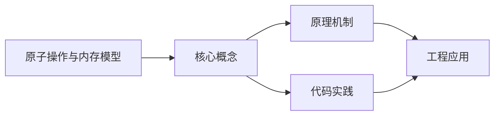
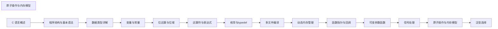

## 1. 学习目标（Bloom 分类）

本节按照布鲁姆教育目标分类学组织学习路径。本文主题为《原子操作与内存模型》，属于 C 模块，读者可以根据自身阶段选择阅读深度。

记忆层面：能够准确复述本文的核心概念、术语与基本语法或操作步骤，并能够在提问或检索时快速定位对应知识点。能够说出 C 的变量、函数、指针、数组、结构体与预处理语法。

理解层面：能够用自己的语言解释核心原理与工作机制，说明概念之间的因果关系，而不是机械记忆结论。能够解释指针与内存地址、栈与堆、编译链接过程。

应用层面：能够在真实项目或练习场景中运用本文知识解决具体问题，写出正确且可维护的实现。能够编写系统工具、数据结构与嵌入式程序。

分析层面：能够拆解复杂问题，比较本文主题与相邻概念的异同，识别边界条件与例外情况。能够分析内存泄漏、缓冲区溢出与未定义行为。

评价层面：能够根据约束条件（性能、可读性、安全、成本）评价不同方案的优劣，做出有依据的技术决策。能够评价 C 与其他语言在系统编程中的取舍。

创造层面：能够把本文知识与其他模块知识组合，设计出新的解决方案或可复用的工程模式。能够设计可移植、可维护的 C 库与模块。

通过本节学习，读者应当能够把《原子操作与内存模型》纳入自己的知识网络，并与 C 模块的其他主题（指针、内存管理、预处理器、标准库）建立关联。

## 2. 历史动机与发展脉络

《原子操作与内存模型》是 C 领域的重要主题。要真正理解它，需要先了解它解决的问题与演进过程。

C 由 Dennis Ritchie 于 1972 年在贝尔实验室为 Unix 开发，是系统编程的基石语言：操作系统、编译器、嵌入式固件均以 C 为主。
C89（ANSI C）统一方言，C99 引入变长数组与 // 注释，C11 增加泛型选择与线程支持，C17 为缺陷修复版，C23（2024 年正式发布）引入 constexpr、属性、显式枚举底层类型等现代化特性。
C 的哲学是“信任程序员”：提供指针与内存操作的全部能力，同时把正确性责任交给开发者；这一设计成就了性能上限，也带来内存安全风险，催生了 Rust 等后继语言。

回到本文主题：原子操作与内存模型 的提出与成熟，正是上述技术背景下的必然产物。早期实现往往以简单可用为目标，随着工程规模扩大，社区逐渐沉淀出标准做法与最佳实践；理解这一脉络，可以帮助读者判断“为什么文档中的推荐写法是现在这个样子”，也能在遇到历史遗留代码时准确识别其设计年代与取舍。


## 3. 形式化定义与核心概念精讲

本节把《原子操作与内存模型》涉及的核心概念以“定义 + 讲解”的形式展开。读者应把定义当作工具，把讲解当作理解路径；两者结合才能形成可迁移的知识。

指针：指针保存变量地址，`&` 取地址、`*` 解引用；指针算术与数组名退化规则（数组名作为实参退化为首元素指针）是 C 的经典难点。
内存管理：栈内存自动释放，堆内存由 malloc/calloc/realloc/free 管理；所有权责任（谁分配谁释放）必须显式约定。
预处理器：#include/#define/#ifdef 在编译前文本处理；宏展开有副作用与优先级风险，函数式宏参数必须加括号。

### 3.1 原文章节逐一精讲

原文档把主题拆分为 14 个小节，下面按顺序给出每一节的导读讲解，随后保留原文细节供精读。

#### 原文精读（完整保留）

# C 原子操作与内存模型

> **符号约定**：`< >` 必填参数 | `[ ]` 可选参数

---

#### 概述

在多线程编程中，多个线程同时访问共享数据会导致数据竞争（data race），产生未定义行为。C11 标准引入了 `<stdatomic.h>` 头文件，提供了原子类型和原子操作，确保对共享变量的读写是不可分割的。同时，C11 定义了内存序（memory order）模型，允许开发者在性能和一致性之间做出权衡。

#### 基础概念

##### 数据竞争问题

```c
// 没有原子操作时，多线程自增会导致结果不正确
int counter = 0;

// 线程1和线程2同时执行
counter++; // 读取、加1、写回，三步操作可能被交错
```

上面的 `counter++` 实际上包含三个操作：读取当前值、加1、写回。如果两个线程同时读取到相同的值，各自加1后写回，最终只增加了1而不是2。

##### 原子操作的定义

原子操作是不可分割的操作，要么完全执行，要么完全不执行，不会被其他线程观察到中间状态。C11 通过 `_Atomic` 类型修饰符和一系列库函数提供原子操作支持。

##### 内存序

内存序定义了编译器和处理器对内存操作重排序的约束。不同的内存序在性能和一致性之间提供不同级别的保证：

| 内存序                 | 说明                             | 适用场景         |
| ---------------------- | -------------------------------- | ---------------- |
| `memory_order_relaxed` | 无顺序保证，只保证原子性         | 计数器、统计信息 |
| `memory_order_acquire` | 读操作，后续读写不能重排到此之前 | 读取同步标志     |
| `memory_order_release` | 写操作，之前读写不能重排到此之后 | 写入同步标志     |
| `memory_order_acq_rel` | 同时具有 acquire 和 release 语义 | 读-改-写操作     |
| `memory_order_seq_cst` | 顺序一致，所有线程看到相同顺序   | 默认，最安全     |

#### 快速上手

##### 最简单的原子计数器

```c
#include <stdio.h>
#include <stdatomic.h>
#include <threads.h>

// 声明原子整型变量
atomic_int counter = ATOMIC_VAR_INIT(0);

// 线程函数：每个线程自增100000次
int thread_func(void *arg) {
    for (int i = 0; i < 100000; i++) {
        atomic_fetch_add(&counter, 1); // 原子自增
    }
    return 0;
}

int main(void) {
    thrd_t t1, t2;

    // 创建两个线程
    thrd_create(&t1, thread_func, NULL);
    thrd_create(&t2, thread_func, NULL);

    // 等待线程完成
    thrd_join(t1, NULL);
    thrd_join(t2, NULL);

    // 结果一定是200000
    printf("counter = %d\n", atomic_load(&counter));
    return 0;
}
```

#### 详细用法

##### 原子类型的声明

```c
#include <stdatomic.h>

// 方式一：使用 _Atomic 类型修饰符
_Atomic int a;
_Atomic double b;
_Atomic struct Point { int x; int y; } c;

// 方式二：使用 atomic_* 便捷类型
atomic_int ai;           // 等价于 _Atomic int
atomic_long al;          // 等价于 _Atomic long
atomic_uintptr_t ap;     // 等价于 _Atomic uintptr_t
atomic_flag af;          // 布尔原子类型，最简单的原子类型

// 初始化
atomic_int x = ATOMIC_VAR_INIT(0);  // 编译时初始化
atomic_init(&x, 42);                 // 运行时初始化（非原子操作）
```

##### 原子读写操作

```c
#include <stdio.h>
#include <stdatomic.h>

int main(void) {
    atomic_int x = ATOMIC_VAR_INIT(0);

    // 原子写入
    atomic_store(&x, 10);

    // 原子读取
    int val = atomic_load(&x);
    printf("x = %d\n", val); // 输出: x = 10

    // 也可以直接使用 = 和读取，编译器会自动原子化
    x = 20;          // 等价于 atomic_store(&x, 20)
    int v = x;       // 等价于 atomic_load(&x)
    printf("x = %d\n", v); // 输出: x = 20

    return 0;
}
```

##### 原子算术操作

```c
#include <stdio.h>
#include <stdatomic.h>

int main(void) {
    atomic_int x = ATOMIC_VAR_INIT(10);

    // 原子加法，返回修改前的值
    int old = atomic_fetch_add(&x, 5);
    printf("旧值: %d, 新值: %d\n", old, atomic_load(&x)); // 旧值: 10, 新值: 15

    // 原子减法
    old = atomic_fetch_sub(&x, 3);
    printf("旧值: %d, 新值: %d\n", old, atomic_load(&x)); // 旧值: 15, 新值: 12

    // 原子按位或
    atomic_fetch_or(&x, 0x01);

    // 原子按位异或
    atomic_fetch_xor(&x, 0xFF);

    // 原子按位与
    atomic_fetch_and(&x, 0x0F);

    return 0;
}
```

##### 原子比较交换（CAS）

比较交换（Compare-And-Swap）是原子操作中最核心的操作，也是无锁编程的基础：

```c
#include <stdio.h>
#include <stdatomic.h>

int main(void) {
    atomic_int x = ATOMIC_VAR_INIT(10);

    // atomic_compare_exchange_strong(&x, &expected, desired)
    // 如果 x == expected，则将 x 设为 desired，返回 true
    // 如果 x != expected，则将 expected 设为 x 的当前值，返回 false

    int expected = 10;
    int desired = 20;
    bool success = atomic_compare_exchange_strong(&x, &expected, desired);

    if (success) {
        printf("交换成功: x = %d\n", atomic_load(&x)); // x = 20
    }

    // 再次尝试，此时 x = 20，expected 仍为 10
    expected = 10;
    success = atomic_compare_exchange_strong(&x, &expected, desired);
    if (!success) {
        printf("交换失败: x = %d, expected 被更新为 %d\n",
               atomic_load(&x), expected); // expected = 20
    }

    return 0;
}
```

##### atomic_flag 布尔原子类型

`atomic_flag` 是最简单的原子类型，只有"设置"和"清除"两个操作，常用于实现自旋锁：

```c
#include <stdio.h>
#include <stdatomic.h>

// atomic_flag 必须用 ATOMIC_FLAG_INIT 初始化
atomic_flag lock = ATOMIC_FLAG_INIT;

// 自旋锁的加锁操作
void spin_lock(atomic_flag *f) {
    // test_and_set: 如果之前未被设置，则设置并返回 false
    // 如果之前已被设置，则返回 true（表示锁已被占用）
    while (atomic_flag_test_and_set(f)) {
        // 自旋等待
    }
}

// 自旋锁的解锁操作
void spin_unlock(atomic_flag *f) {
    atomic_flag_clear(f); // 清除标志，释放锁
}

int main(void) {
    spin_lock(&lock);
    printf("临界区: 正在操作共享数据\n");
    spin_unlock(&lock);

    return 0;
}
```

#### 常见场景

##### 场景一：线程安全的引用计数

```c
#include <stdio.h>
#include <stdatomic.h>
#include <stdlib.h>

typedef struct {
    void *data;
    atomic_int ref_count;
} SharedObject;

// 创建共享对象
SharedObject *shared_create(void *data) {
    SharedObject *obj = malloc(sizeof(SharedObject));
    if (!obj) return NULL;
    obj->data = data;
    atomic_init(&obj->ref_count, 1);
    return obj;
}

// 增加引用计数
void shared_retain(SharedObject *obj) {
    if (obj) {
        atomic_fetch_add(&obj->ref_count, 1);
    }
}

// 减少引用计数，为0时释放
void shared_release(SharedObject *obj) {
    if (obj) {
        // 先减1，获取修改前的值
        int old_count = atomic_fetch_sub(&obj->ref_count, 1);
        if (old_count == 1) {
            // 引用计数降为0，释放资源
            printf("引用计数为0，释放对象\n");
            free(obj->data);
            free(obj);
        }
    }
}

int main(void) {
    int *value = malloc(sizeof(int));
    *value = 42;

    SharedObject *obj = shared_create(value);
    shared_retain(obj); // 引用计数变为2
    shared_release(obj); // 引用计数变为1
    shared_release(obj); // 引用计数变为0，对象被释放

    return 0;
}
```

##### 场景二：使用 release/acquire 实现生产者-消费者同步

```c
#include <stdio.h>
#include <stdatomic.h>
#include <threads.h>

#define BUFFER_SIZE 10

int buffer[BUFFER_SIZE];
atomic_int ready = ATOMIC_VAR_INIT(0); // 同步标志

// 生产者线程
int producer(void *arg) {
    // 写入数据
    for (int i = 0; i < BUFFER_SIZE; i++) {
        buffer[i] = i * i;
    }

    // release 写入：确保上面的写入在设置 ready 之前完成
    atomic_store_explicit(&ready, 1, memory_order_release);
    return 0;
}

// 消费者线程
int consumer(void *arg) {
    // acquire 读取：确保在 ready 为1之后才读取 buffer
    while (atomic_load_explicit(&ready, memory_order_acquire) == 0) {
        // 等待生产者完成
    }

    // 此时 buffer 的数据一定可见
    for (int i = 0; i < BUFFER_SIZE; i++) {
        printf("buffer[%d] = %d\n", i, buffer[i]);
    }
    return 0;
}

int main(void) {
    thrd_t t1, t2;

    thrd_create(&t1, producer, NULL);
    thrd_create(&t2, consumer, NULL);

    thrd_join(t1, NULL);
    thrd_join(t2, NULL);

    return 0;
}
```

##### 场景三：无锁栈的简单实现

```c
#include <stdio.h>
#include <stdatomic.h>
#include <stdlib.h>

typedef struct Node {
    int value;
    struct Node *next;
} Node;

typedef struct {
    _Atomic(Node *) head;
} LockFreeStack;

// 初始化栈
void stack_init(LockFreeStack *s) {
    atomic_init(&s->head, NULL);
}

// 压栈（原子操作）
void stack_push(LockFreeStack *s, int value) {
    Node *new_node = malloc(sizeof(Node));
    new_node->value = value;

    // CAS 循环：将新节点插入链表头部
    do {
        new_node->next = atomic_load(&s->head);
    } while (!atomic_compare_exchange_weak(&s->head, &new_node->next, new_node));
}

// 弹栈（原子操作）
int stack_pop(LockFreeStack *s, int *out_value) {
    Node *old_head = atomic_load(&s->head);

    // CAS 循环：移除链表头部节点
    do {
        if (old_head == NULL) {
            return -1; // 栈为空
        }
    } while (!atomic_compare_exchange_weak(&s->head, &old_head, old_head->next));

    *out_value = old_head->value;
    free(old_head);
    return 0;
}

int main(void) {
    LockFreeStack stack;
    stack_init(&stack);

    // 压入数据
    stack_push(&stack, 10);
    stack_push(&stack, 20);
    stack_push(&stack, 30);

    // 弹出数据
    int val;
    while (stack_pop(&stack, &val) == 0) {
        printf("弹出: %d\n", val);
    }

    return 0;
}
```

#### 注意事项

##### atomic_init 不是原子操作

`atomic_init` 仅用于初始化，不是原子操作。不要在多线程已经开始运行后使用它：

```c
atomic_int x;

// 正确：在创建线程之前初始化
atomic_init(&x, 0);

// 错误：在多线程运行中初始化
// atomic_init(&x, 0); // 数据竞争！
```

##### 不是所有类型都支持原子操作

只有"平凡可复制"（trivially copyable）的类型才能用作原子类型。包含指针、数组或复杂结构的类型可能不支持：

```c
// 支持的类型
_Atomic int a;
_Atomic float b;
_Atomic void *c;

// 不一定支持的类型
struct Complex { char data[256]; };
_Atomic struct Complex d; // 取决于实现，可能不支持
```

##### relaxed 内存序的局限

`memory_order_relaxed` 只保证原子性，不保证操作顺序。在需要同步的场景中不能使用：

```c
atomic_int flag = ATOMIC_VAR_INIT(0);
int data = 0;

// 线程1
data = 42;
atomic_store_explicit(&flag, 1, memory_order_relaxed); // 不保证 data 的写入在 flag 之前可见

// 线程2
if (atomic_load_explicit(&flag, memory_order_relaxed)) {
    printf("%d\n", data); // 可能输出0而非42！
}
```

##### compare_exchange_weak vs strong

- `atomic_compare_exchange_weak`：可能产生虚假失败（spurious failure），即使在值相等时也可能返回 false。在循环中使用时性能更好
- `atomic_compare_exchange_strong`：不会产生虚假失败，适合不在循环中使用的场景

```c
// 循环中使用 weak 版本（性能更好）
do {
    expected = atomic_load(&x);
} while (!atomic_compare_exchange_weak(&x, &expected, desired));

// 非循环中使用 strong 版本（避免虚假失败）
int expected = 10;
if (atomic_compare_exchange_strong(&x, &expected, 20)) {
    printf("交换成功\n");
}
```

#### 进阶用法

##### 使用内存序优化性能

```c
#include <stdio.h>
#include <stdatomic.h>
#include <threads.h>

// 统计计数器：只需要原子性，不需要顺序保证
atomic_int total_requests = ATOMIC_VAR_INIT(0);
atomic_int total_errors = ATOMIC_VAR_INIT(0);

int worker(void *arg) {
    for (int i = 0; i < 1000000; i++) {
        // 使用 relaxed 内存序，性能更好
        atomic_fetch_add_explicit(&total_requests, 1, memory_order_relaxed);

        if (i % 1000 == 0) {
            atomic_fetch_add_explicit(&total_errors, 1, memory_order_relaxed);
        }
    }
    return 0;
}

int main(void) {
    thrd_t t1, t2;
    thrd_create(&t1, worker, NULL);
    thrd_create(&t2, worker, NULL);
    thrd_join(t1, NULL);
    thrd_join(t2, NULL);

    printf("总请求: %d\n", atomic_load_explicit(&total_requests, memory_order_relaxed));
    printf("总错误: %d\n", atomic_load_explicit(&total_errors, memory_order_relaxed));
    return 0;
}
```

##### Double-Checked Locking 模式

```c
#include <stdio.h>
#include <stdatomic.h>
#include <threads.h>

typedef struct {
    int initialized;
    char data[256];
} Config;

Config *config_instance = NULL;
atomic_int config_ready = ATOMIC_VAR_INIT(0);

// 线程安全的延迟初始化
Config *get_config(void) {
    // 第一次检查：无锁快速路径
    if (atomic_load_explicit(&config_ready, memory_order_acquire) == 0) {
        // 这里可以加互斥锁，简化示例省略

        if (config_instance == NULL) {
            config_instance = malloc(sizeof(Config));
            // 初始化配置...
            snprintf(config_instance->data, sizeof(config_instance->data), "配置数据");

            // release 写入：确保初始化在设置标志之前完成
            atomic_store_explicit(&config_ready, 1, memory_order_release);
        }
    }

    return config_instance;
}

int main(void) {
    Config *cfg = get_config();
    printf("配置: %s\n", cfg->data);
    return 0;
}
```

##### 原子操作实现读写锁

```c
#include <stdio.h>
#include <stdatomic.h>
#include <threads.h>

typedef struct {
    atomic_int readers;   // 当前读者数量
    atomic_int writer;    // 写者标志（0或1）
} RWLock;

void rwlock_init(RWLock *lock) {
    atomic_init(&lock->readers, 0);
    atomic_init(&lock->writer, 0);
}

// 获取读锁
void rwlock_read_lock(RWLock *lock) {
    while (1) {
        // 等待写者释放
        while (atomic_load_explicit(&lock->writer, memory_order_acquire)) {
            // 自旋等待
        }

        // 增加读者计数
        atomic_fetch_add_explicit(&lock->readers, 1, memory_order_acquire);

        // 再次确认没有写者
        if (atomic_load_explicit(&lock->writer, memory_order_acquire) == 0) {
            break; // 成功获取读锁
        }

        // 有写者介入，回退读者计数
        atomic_fetch_sub_explicit(&lock->readers, 1, memory_order_release);
    }
}

// 释放读锁
void rwlock_read_unlock(RWLock *lock) {
    atomic_fetch_sub_explicit(&lock->readers, 1, memory_order_release);
}

// 获取写锁
void rwlock_write_lock(RWLock *lock) {
    int expected = 0;
    while (!atomic_compare_exchange_strong_explicit(&lock->writer, &expected, 1,
            memory_order_acq_rel, memory_order_acquire)) {
        expected = 0; // 重置 expected
    }

    // 等待所有读者完成
    while (atomic_load_explicit(&lock->readers, memory_order_acquire) > 0) {
        // 自旋等待
    }
}

// 释放写锁
void rwlock_write_unlock(RWLock *lock) {
    atomic_store_explicit(&lock->writer, 0, memory_order_release);
}

int main(void) {
    RWLock lock;
    rwlock_init(&lock);

    rwlock_read_lock(&lock);
    printf("读取数据\n");
    rwlock_read_unlock(&lock);

    rwlock_write_lock(&lock);
    printf("写入数据\n");
    rwlock_write_unlock(&lock);

    return 0;
}
```
#### 原子类型

**基本写法：声明原子变量**
`_Atomic(<类型>) <变量>;`
```c
// 声明原子整型
_Atomic(int) counter = 0;
```

---

**基本写法：原子类型简写**
`_Atomic <类型> <变量>;`
```c
// 简写形式
_Atomic int counter = 0;
```

---

**基本写法：原子标志**
`atomic_flag <变量> = ATOMIC_FLAG_INIT;`
```c
// 最轻量的原子类型
atomic_flag lock = ATOMIC_FLAG_INIT;
```

---

#### 原子操作

**基本写法：原子加载**
`atomic_load(&<变量>);`
```c
// 原子读取值
int v = atomic_load(&counter);
```

---

**基本写法：原子存储**
`atomic_store(&<变量>, <值>);`
```c
// 原子写入值
atomic_store(&counter, 10);
```

---

**基本写法：原子交换**
`atomic_exchange(&<变量>, <值>);`
```c
// 替换并返回旧值
int old = atomic_exchange(&counter, 5);
```

---

**基本写法：原子比较交换**
`atomic_compare_exchange_strong(&<变量>, &<期望>, <新值>);`
```c
// CAS 操作成功返回 true
int expected = 0;
bool ok = atomic_compare_exchange_strong(&counter, &expected, 1);
```

---

**基本写法：弱版本 CAS**
`atomic_compare_exchange_weak(&<变量>, &<期望>, <新值>);`
```c
// 可能伪失败适合循环中
while (!atomic_compare_exchange_weak(&counter, &expected, expected + 1));
```

---

**基本写法：原子加法**
`atomic_fetch_add(&<变量>, <值>);`
```c
// 原子加并返回旧值
int prev = atomic_fetch_add(&counter, 1);
```

---

**基本写法：原子减法**
`atomic_fetch_sub(&<变量>, <值>);`
```c
// 原子减并返回旧值
int prev = atomic_fetch_sub(&counter, 1);
```

---

**基本写法：原子按位与**
`atomic_fetch_and(&<变量>, <值>);`
```c
// 原子按位与
int prev = atomic_fetch_and(&flags, 0xFF);
```

---

**基本写法：原子按位或**
`atomic_fetch_or(&<变量>, <值>);`
```c
// 原子按位或
int prev = atomic_fetch_or(&flags, 0x10);
```

---

#### 自旋锁示例

**基本写法：自旋锁加锁**
`while (atomic_flag_test_and_set(&<锁>)) {}`
```c
// 使用 atomic_flag 实现自旋锁
while (atomic_flag_test_and_set(&lock)) {
    // 等待
}
```

---

**基本写法：自旋锁解锁**
`atomic_flag_clear(&<锁>);`
```c
// 释放自旋锁
atomic_flag_clear(&lock);
```

---

#### 内存顺序

**基本写法：顺序一致**
`memory_order_seq_cst`
```c
// 最严格的全局顺序
atomic_store(&v, 1, memory_order_seq_cst);
```

---

**基本写法：获取语义**
`memory_order_acquire`
```c
// 加载时防止后续读重排
int v = atomic_load(&flag, memory_order_acquire);
```

---

**基本写法：释放语义**
`memory_order_release`
```c
// 存储时防止前面写重排
atomic_store(&flag, 1, memory_order_release);
```

---

**基本写法：宽松语义**
`memory_order_relaxed`
```c
// 仅原子无顺序约束
atomic_fetch_add(&counter, 1, memory_order_relaxed);
```

---

**基本写法：带内存顺序的 CAS**
`atomic_compare_exchange_strong_explicit(&<变量>, &<期望>, <新值>, <成功序>, <失败序>);`
```c
// 显式指定内存顺序
atomic_compare_exchange_strong_explicit(
    &v, &expected, newval,
    memory_order_acq_rel, memory_order_acquire);
```

---

#### 栅栏

**基本写法：线程栅栏**
`atomic_thread_fence(<内存序>);`
```c
// 显式内存屏障
atomic_thread_fence(memory_order_release);
```

---

**基本写法：信号栅栏**
`atomic_signal_fence(<内存序>);`
```c
// 信号处理函数内屏障
atomic_signal_fence(memory_order_acquire);
```

---

#### 同步关系

**基本写法：发布订阅模式**
`store(release)` ↔ `load(acquire)`
```c
// 线程间建立先行关系
// 线程 A
data = 42;
atomic_store(&flag, 1, memory_order_release);
// 线程 B
while (!atomic_load(&flag, memory_order_acquire));
// 此处能看到 data == 42
```

---

#### 常用查询

**基本写法：是否锁自由**
`atomic_is_lock_free(&<变量>);`
```c
// 查询是否无锁实现
bool free = atomic_is_lock_free(&counter);
```

---

**基本写法：原子大小**
`_Atomic(<类型>)` 大小通常与原类型相同
```c
// 原子类型大小
size_t sz = sizeof(_Atomic(int));
```


### 3.2 概念关系图

下面用 Mermaid 图表达本文核心概念之间的关系，帮助读者建立整体图景：



图中展示的是本文知识的结构化关系：核心概念是入口，原理机制解释“为什么”，代码实践演示“怎么做”，工程应用回答“何时用”。读者学习时可以把每个小节的内容挂接到对应节点上。

## 4. 理论推导与原理解析

本节深入《原子操作与内存模型》背后的原理。理论部分不求面面俱到，而是聚焦“能解释现象、能指导实践”的关键推导。

指针：指针保存变量地址，`&` 取地址、`*` 解引用；指针算术与数组名退化规则（数组名作为实参退化为首元素指针）是 C 的经典难点。
内存管理：栈内存自动释放，堆内存由 malloc/calloc/realloc/free 管理；所有权责任（谁分配谁释放）必须显式约定。
预处理器：#include/#define/#ifdef 在编译前文本处理；宏展开有副作用与优先级风险，函数式宏参数必须加括号。
编译链接：预处理 -> 编译 -> 汇编 -> 链接；头文件声明接口，源文件实现；静态库与动态库（.a/.so/.dll）决定部署形态。

需要强调的是，理论推导与工程实践之间存在翻译层：理论给出的是理想化模型与边界条件，工程代码则必须处理真实环境中的例外。读者在学习时应先掌握理论的“标准情形”，再通过陷阱章节了解“非标准情形”。

## 5. 代码示例与逐行讲解

本节把原文中的代码示例系统整理，并为每个示例补充用途说明与讲解。读者不应只浏览代码，而应逐段对照讲解理解设计意图。

### 5.1 示例：数据竞争问题

该示例来自原文《数据竞争问题》小节，用于演示原子操作与内存模型相关操作。阅读时请先看代码结构，再看其后的讲解。

```c
// 没有原子操作时，多线程自增会导致结果不正确
int counter = 0;

// 线程1和线程2同时执行
counter++; // 读取、加1、写回，三步操作可能被交错
```

讲解：这段代码演示了本节核心知识点。代码中的关键操作可以归纳为三步：准备（定义或初始化）、执行（核心逻辑）、收尾（释放资源或返回结果）。实际项目中，这三步往往被封装为函数或类，以提升复用性与可测试性。

关键点分析：

该示例共 4 行有效代码，结构以数据或配置为主。阅读时应关注：数据字段的含义、配置项的作用，以及它们与运行行为的对应关系。

进阶思考路径：先尝试修改参数观察行为变化，再把示例中的模式迁移到自己的项目中；每次修改都记录预期与实测差异，这是把示例转化为能力的最快方式。

### 5.2 示例：最简单的原子计数器

该示例来自原文《最简单的原子计数器》小节，用于演示原子操作与内存模型相关操作。阅读时请先看代码结构，再看其后的讲解。

```c
#include <stdio.h>
#include <stdatomic.h>
#include <threads.h>

// 声明原子整型变量
atomic_int counter = ATOMIC_VAR_INIT(0);

// 线程函数：每个线程自增100000次
int thread_func(void *arg) {
    for (int i = 0; i < 100000; i++) {
        atomic_fetch_add(&counter, 1); // 原子自增
    }
    return 0;
}

int main(void) {
    thrd_t t1, t2;

    // 创建两个线程
    thrd_create(&t1, thread_func, NULL);
    thrd_create(&t2, thread_func, NULL);

    // 等待线程完成
    thrd_join(t1, NULL);
    thrd_join(t2, NULL);

    // 结果一定是200000
    printf("counter = %d\n", atomic_load(&counter));
    return 0;
}
```

讲解：这段代码演示了本节核心知识点。代码中的关键操作可以归纳为三步：准备（定义或初始化）、执行（核心逻辑）、收尾（释放资源或返回结果）。实际项目中，这三步往往被封装为函数或类，以提升复用性与可测试性。

关键点分析：

该示例共 24 行有效代码，包含 2 类关键结构（for、return）。其中：

- 入口与初始化部分负责建立上下文，对应实际项目中的启动或装配逻辑；
- 核心逻辑部分体现本文主题的主要操作，是阅读时最需要对照讲解理解的部分；
- 输出或返回部分把结果交给调用方，注意其类型与边界条件。

进阶思考路径：先尝试修改参数观察行为变化，再把示例中的模式迁移到自己的项目中；每次修改都记录预期与实测差异，这是把示例转化为能力的最快方式。

### 5.3 示例：原子类型的声明

该示例来自原文《原子类型的声明》小节，用于演示原子操作与内存模型相关操作。阅读时请先看代码结构，再看其后的讲解。

```c
#include <stdatomic.h>

// 方式一：使用 _Atomic 类型修饰符
_Atomic int a;
_Atomic double b;
_Atomic struct Point { int x; int y; } c;

// 方式二：使用 atomic_* 便捷类型
atomic_int ai;           // 等价于 _Atomic int
atomic_long al;          // 等价于 _Atomic long
atomic_uintptr_t ap;     // 等价于 _Atomic uintptr_t
atomic_flag af;          // 布尔原子类型，最简单的原子类型

// 初始化
atomic_int x = ATOMIC_VAR_INIT(0);  // 编译时初始化
atomic_init(&x, 42);                 // 运行时初始化（非原子操作）
```

讲解：这段代码演示了本节核心知识点。代码中的关键操作可以归纳为三步：准备（定义或初始化）、执行（核心逻辑）、收尾（释放资源或返回结果）。实际项目中，这三步往往被封装为函数或类，以提升复用性与可测试性。

关键点分析：

该示例共 13 行有效代码，结构以数据或配置为主。阅读时应关注：数据字段的含义、配置项的作用，以及它们与运行行为的对应关系。

进阶思考路径：先尝试修改参数观察行为变化，再把示例中的模式迁移到自己的项目中；每次修改都记录预期与实测差异，这是把示例转化为能力的最快方式。

### 5.4 示例：原子读写操作

该示例来自原文《原子读写操作》小节，用于演示原子操作与内存模型相关操作。阅读时请先看代码结构，再看其后的讲解。

```c
#include <stdio.h>
#include <stdatomic.h>

int main(void) {
    atomic_int x = ATOMIC_VAR_INIT(0);

    // 原子写入
    atomic_store(&x, 10);

    // 原子读取
    int val = atomic_load(&x);
    printf("x = %d\n", val); // 输出: x = 10

    // 也可以直接使用 = 和读取，编译器会自动原子化
    x = 20;          // 等价于 atomic_store(&x, 20)
    int v = x;       // 等价于 atomic_load(&x)
    printf("x = %d\n", v); // 输出: x = 20

    return 0;
}
```

讲解：这段代码演示了本节核心知识点。代码中的关键操作可以归纳为三步：准备（定义或初始化）、执行（核心逻辑）、收尾（释放资源或返回结果）。实际项目中，这三步往往被封装为函数或类，以提升复用性与可测试性。

关键点分析：

该示例共 15 行有效代码，包含 1 类关键结构（return）。其中：

- 入口与初始化部分负责建立上下文，对应实际项目中的启动或装配逻辑；
- 核心逻辑部分体现本文主题的主要操作，是阅读时最需要对照讲解理解的部分；
- 输出或返回部分把结果交给调用方，注意其类型与边界条件。

进阶思考路径：先尝试修改参数观察行为变化，再把示例中的模式迁移到自己的项目中；每次修改都记录预期与实测差异，这是把示例转化为能力的最快方式。

### 5.5 示例：原子算术操作

该示例来自原文《原子算术操作》小节，用于演示原子操作与内存模型相关操作。阅读时请先看代码结构，再看其后的讲解。

```c
#include <stdio.h>
#include <stdatomic.h>

int main(void) {
    atomic_int x = ATOMIC_VAR_INIT(10);

    // 原子加法，返回修改前的值
    int old = atomic_fetch_add(&x, 5);
    printf("旧值: %d, 新值: %d\n", old, atomic_load(&x)); // 旧值: 10, 新值: 15

    // 原子减法
    old = atomic_fetch_sub(&x, 3);
    printf("旧值: %d, 新值: %d\n", old, atomic_load(&x)); // 旧值: 15, 新值: 12

    // 原子按位或
    atomic_fetch_or(&x, 0x01);

    // 原子按位异或
    atomic_fetch_xor(&x, 0xFF);

    // 原子按位与
    atomic_fetch_and(&x, 0x0F);

    return 0;
}
```

讲解：这段代码演示了本节核心知识点。代码中的关键操作可以归纳为三步：准备（定义或初始化）、执行（核心逻辑）、收尾（释放资源或返回结果）。实际项目中，这三步往往被封装为函数或类，以提升复用性与可测试性。

关键点分析：

该示例共 18 行有效代码，包含 1 类关键结构（return）。其中：

- 入口与初始化部分负责建立上下文，对应实际项目中的启动或装配逻辑；
- 核心逻辑部分体现本文主题的主要操作，是阅读时最需要对照讲解理解的部分；
- 输出或返回部分把结果交给调用方，注意其类型与边界条件。

进阶思考路径：先尝试修改参数观察行为变化，再把示例中的模式迁移到自己的项目中；每次修改都记录预期与实测差异，这是把示例转化为能力的最快方式。

### 5.6 示例：原子比较交换（CAS）

该示例来自原文《原子比较交换（CAS）》小节，用于演示原子操作与内存模型相关操作。阅读时请先看代码结构，再看其后的讲解。

```c
#include <stdio.h>
#include <stdatomic.h>

int main(void) {
    atomic_int x = ATOMIC_VAR_INIT(10);

    // atomic_compare_exchange_strong(&x, &expected, desired)
    // 如果 x == expected，则将 x 设为 desired，返回 true
    // 如果 x != expected，则将 expected 设为 x 的当前值，返回 false

    int expected = 10;
    int desired = 20;
    bool success = atomic_compare_exchange_strong(&x, &expected, desired);

    if (success) {
        printf("交换成功: x = %d\n", atomic_load(&x)); // x = 20
    }

    // 再次尝试，此时 x = 20，expected 仍为 10
    expected = 10;
    success = atomic_compare_exchange_strong(&x, &expected, desired);
    if (!success) {
        printf("交换失败: x = %d, expected 被更新为 %d\n",
               atomic_load(&x), expected); // expected = 20
    }

    return 0;
}
```

讲解：这段代码演示了本节核心知识点。代码中的关键操作可以归纳为三步：准备（定义或初始化）、执行（核心逻辑）、收尾（释放资源或返回结果）。实际项目中，这三步往往被封装为函数或类，以提升复用性与可测试性。

关键点分析：

该示例共 22 行有效代码，包含 2 类关键结构（if、return）。其中：

- 入口与初始化部分负责建立上下文，对应实际项目中的启动或装配逻辑；
- 核心逻辑部分体现本文主题的主要操作，是阅读时最需要对照讲解理解的部分；
- 输出或返回部分把结果交给调用方，注意其类型与边界条件。

进阶思考路径：先尝试修改参数观察行为变化，再把示例中的模式迁移到自己的项目中；每次修改都记录预期与实测差异，这是把示例转化为能力的最快方式。

### 5.7 示例：atomic_flag 布尔原子类型

该示例来自原文《atomic_flag 布尔原子类型》小节，用于演示原子操作与内存模型相关操作。阅读时请先看代码结构，再看其后的讲解。

```c
#include <stdio.h>
#include <stdatomic.h>

// atomic_flag 必须用 ATOMIC_FLAG_INIT 初始化
atomic_flag lock = ATOMIC_FLAG_INIT;

// 自旋锁的加锁操作
void spin_lock(atomic_flag *f) {
    // test_and_set: 如果之前未被设置，则设置并返回 false
    // 如果之前已被设置，则返回 true（表示锁已被占用）
    while (atomic_flag_test_and_set(f)) {
        // 自旋等待
    }
}

// 自旋锁的解锁操作
void spin_unlock(atomic_flag *f) {
    atomic_flag_clear(f); // 清除标志，释放锁
}

int main(void) {
    spin_lock(&lock);
    printf("临界区: 正在操作共享数据\n");
    spin_unlock(&lock);

    return 0;
}
```

讲解：这段代码演示了本节核心知识点。代码中的关键操作可以归纳为三步：准备（定义或初始化）、执行（核心逻辑）、收尾（释放资源或返回结果）。实际项目中，这三步往往被封装为函数或类，以提升复用性与可测试性。

关键点分析：

该示例共 22 行有效代码，包含 2 类关键结构（while、return）。其中：

- 入口与初始化部分负责建立上下文，对应实际项目中的启动或装配逻辑；
- 核心逻辑部分体现本文主题的主要操作，是阅读时最需要对照讲解理解的部分；
- 输出或返回部分把结果交给调用方，注意其类型与边界条件。

进阶思考路径：先尝试修改参数观察行为变化，再把示例中的模式迁移到自己的项目中；每次修改都记录预期与实测差异，这是把示例转化为能力的最快方式。

### 5.8 示例：场景一：线程安全的引用计数

该示例来自原文《场景一：线程安全的引用计数》小节，用于演示原子操作与内存模型相关操作。阅读时请先看代码结构，再看其后的讲解。

```c
#include <stdio.h>
#include <stdatomic.h>
#include <stdlib.h>

typedef struct {
    void *data;
    atomic_int ref_count;
} SharedObject;

// 创建共享对象
SharedObject *shared_create(void *data) {
    SharedObject *obj = malloc(sizeof(SharedObject));
    if (!obj) return NULL;
    obj->data = data;
    atomic_init(&obj->ref_count, 1);
    return obj;
}

// 增加引用计数
void shared_retain(SharedObject *obj) {
    if (obj) {
        atomic_fetch_add(&obj->ref_count, 1);
    }
}

// 减少引用计数，为0时释放
void shared_release(SharedObject *obj) {
    if (obj) {
        // 先减1，获取修改前的值
        int old_count = atomic_fetch_sub(&obj->ref_count, 1);
        if (old_count == 1) {
            // 引用计数降为0，释放资源
            printf("引用计数为0，释放对象\n");
            free(obj->data);
            free(obj);
        }
    }
}

int main(void) {
    int *value = malloc(sizeof(int));
    *value = 42;

    SharedObject *obj = shared_create(value);
    shared_retain(obj); // 引用计数变为2
    shared_release(obj); // 引用计数变为1
    shared_release(obj); // 引用计数变为0，对象被释放

    return 0;
}
```

讲解：这段代码演示了本节核心知识点。代码中的关键操作可以归纳为三步：准备（定义或初始化）、执行（核心逻辑）、收尾（释放资源或返回结果）。实际项目中，这三步往往被封装为函数或类，以提升复用性与可测试性。

关键点分析：

该示例共 43 行有效代码，包含 3 类关键结构（def、if、return）。其中：

- 入口与初始化部分负责建立上下文，对应实际项目中的启动或装配逻辑；
- 核心逻辑部分体现本文主题的主要操作，是阅读时最需要对照讲解理解的部分；
- 输出或返回部分把结果交给调用方，注意其类型与边界条件。

进阶思考路径：先尝试修改参数观察行为变化，再把示例中的模式迁移到自己的项目中；每次修改都记录预期与实测差异，这是把示例转化为能力的最快方式。

### 5.9 示例：场景二：使用 release/acquire 实现生产者-消费者同步

该示例来自原文《场景二：使用 release/acquire 实现生产者-消费者同步》小节，用于演示原子操作与内存模型相关操作。阅读时请先看代码结构，再看其后的讲解。

```c
#include <stdio.h>
#include <stdatomic.h>
#include <threads.h>

#define BUFFER_SIZE 10

int buffer[BUFFER_SIZE];
atomic_int ready = ATOMIC_VAR_INIT(0); // 同步标志

// 生产者线程
int producer(void *arg) {
    // 写入数据
    for (int i = 0; i < BUFFER_SIZE; i++) {
        buffer[i] = i * i;
    }

    // release 写入：确保上面的写入在设置 ready 之前完成
    atomic_store_explicit(&ready, 1, memory_order_release);
    return 0;
}

// 消费者线程
int consumer(void *arg) {
    // acquire 读取：确保在 ready 为1之后才读取 buffer
    while (atomic_load_explicit(&ready, memory_order_acquire) == 0) {
        // 等待生产者完成
    }

    // 此时 buffer 的数据一定可见
    for (int i = 0; i < BUFFER_SIZE; i++) {
        printf("buffer[%d] = %d\n", i, buffer[i]);
    }
    return 0;
}

int main(void) {
    thrd_t t1, t2;

    thrd_create(&t1, producer, NULL);
    thrd_create(&t2, consumer, NULL);

    thrd_join(t1, NULL);
    thrd_join(t2, NULL);

    return 0;
}
```

讲解：这段代码演示了本节核心知识点。代码中的关键操作可以归纳为三步：准备（定义或初始化）、执行（核心逻辑）、收尾（释放资源或返回结果）。实际项目中，这三步往往被封装为函数或类，以提升复用性与可测试性。

关键点分析：

该示例共 36 行有效代码，包含 3 类关键结构（for、while、return）。其中：

- 入口与初始化部分负责建立上下文，对应实际项目中的启动或装配逻辑；
- 核心逻辑部分体现本文主题的主要操作，是阅读时最需要对照讲解理解的部分；
- 输出或返回部分把结果交给调用方，注意其类型与边界条件。

进阶思考路径：先尝试修改参数观察行为变化，再把示例中的模式迁移到自己的项目中；每次修改都记录预期与实测差异，这是把示例转化为能力的最快方式。

### 5.10 示例：场景三：无锁栈的简单实现

该示例来自原文《场景三：无锁栈的简单实现》小节，用于演示原子操作与内存模型相关操作。阅读时请先看代码结构，再看其后的讲解。

```c
#include <stdio.h>
#include <stdatomic.h>
#include <stdlib.h>

typedef struct Node {
    int value;
    struct Node *next;
} Node;

typedef struct {
    _Atomic(Node *) head;
} LockFreeStack;

// 初始化栈
void stack_init(LockFreeStack *s) {
    atomic_init(&s->head, NULL);
}

// 压栈（原子操作）
void stack_push(LockFreeStack *s, int value) {
    Node *new_node = malloc(sizeof(Node));
    new_node->value = value;

    // CAS 循环：将新节点插入链表头部
    do {
        new_node->next = atomic_load(&s->head);
    } while (!atomic_compare_exchange_weak(&s->head, &new_node->next, new_node));
}

// 弹栈（原子操作）
int stack_pop(LockFreeStack *s, int *out_value) {
    Node *old_head = atomic_load(&s->head);

    // CAS 循环：移除链表头部节点
    do {
        if (old_head == NULL) {
            return -1; // 栈为空
        }
    } while (!atomic_compare_exchange_weak(&s->head, &old_head, old_head->next));

    *out_value = old_head->value;
    free(old_head);
    return 0;
}

int main(void) {
    LockFreeStack stack;
    stack_init(&stack);

    // 压入数据
    stack_push(&stack, 10);
    stack_push(&stack, 20);
    stack_push(&stack, 30);

    // 弹出数据
    int val;
    while (stack_pop(&stack, &val) == 0) {
        printf("弹出: %d\n", val);
    }

    return 0;
}
```

讲解：这段代码演示了本节核心知识点。代码中的关键操作可以归纳为三步：准备（定义或初始化）、执行（核心逻辑）、收尾（释放资源或返回结果）。实际项目中，这三步往往被封装为函数或类，以提升复用性与可测试性。

关键点分析：

该示例共 50 行有效代码，包含 4 类关键结构（def、if、while、return）。其中：

- 入口与初始化部分负责建立上下文，对应实际项目中的启动或装配逻辑；
- 核心逻辑部分体现本文主题的主要操作，是阅读时最需要对照讲解理解的部分；
- 输出或返回部分把结果交给调用方，注意其类型与边界条件。

进阶思考路径：先尝试修改参数观察行为变化，再把示例中的模式迁移到自己的项目中；每次修改都记录预期与实测差异，这是把示例转化为能力的最快方式。

### 5.11 示例：atomic_init 不是原子操作

该示例来自原文《atomic_init 不是原子操作》小节，用于演示原子操作与内存模型相关操作。阅读时请先看代码结构，再看其后的讲解。

```c
atomic_int x;

// 正确：在创建线程之前初始化
atomic_init(&x, 0);

// 错误：在多线程运行中初始化
// atomic_init(&x, 0); // 数据竞争！
```

讲解：这段代码演示了本节核心知识点。代码中的关键操作可以归纳为三步：准备（定义或初始化）、执行（核心逻辑）、收尾（释放资源或返回结果）。实际项目中，这三步往往被封装为函数或类，以提升复用性与可测试性。

关键点分析：

该示例共 5 行有效代码，结构以数据或配置为主。阅读时应关注：数据字段的含义、配置项的作用，以及它们与运行行为的对应关系。

进阶思考路径：先尝试修改参数观察行为变化，再把示例中的模式迁移到自己的项目中；每次修改都记录预期与实测差异，这是把示例转化为能力的最快方式。

### 5.12 示例：不是所有类型都支持原子操作

该示例来自原文《不是所有类型都支持原子操作》小节，用于演示原子操作与内存模型相关操作。阅读时请先看代码结构，再看其后的讲解。

```c
// 支持的类型
_Atomic int a;
_Atomic float b;
_Atomic void *c;

// 不一定支持的类型
struct Complex { char data[256]; };
_Atomic struct Complex d; // 取决于实现，可能不支持
```

讲解：这段代码演示了本节核心知识点。代码中的关键操作可以归纳为三步：准备（定义或初始化）、执行（核心逻辑）、收尾（释放资源或返回结果）。实际项目中，这三步往往被封装为函数或类，以提升复用性与可测试性。

关键点分析：

该示例共 7 行有效代码，结构以数据或配置为主。阅读时应关注：数据字段的含义、配置项的作用，以及它们与运行行为的对应关系。

进阶思考路径：先尝试修改参数观察行为变化，再把示例中的模式迁移到自己的项目中；每次修改都记录预期与实测差异，这是把示例转化为能力的最快方式。

### 5.13 示例：relaxed 内存序的局限

该示例来自原文《relaxed 内存序的局限》小节，用于演示原子操作与内存模型相关操作。阅读时请先看代码结构，再看其后的讲解。

```c
atomic_int flag = ATOMIC_VAR_INIT(0);
int data = 0;

// 线程1
data = 42;
atomic_store_explicit(&flag, 1, memory_order_relaxed); // 不保证 data 的写入在 flag 之前可见

// 线程2
if (atomic_load_explicit(&flag, memory_order_relaxed)) {
    printf("%d\n", data); // 可能输出0而非42！
}
```

讲解：这段代码演示了本节核心知识点。代码中的关键操作可以归纳为三步：准备（定义或初始化）、执行（核心逻辑）、收尾（释放资源或返回结果）。实际项目中，这三步往往被封装为函数或类，以提升复用性与可测试性。

关键点分析：

该示例共 9 行有效代码，包含 1 类关键结构（if）。其中：

- 入口与初始化部分负责建立上下文，对应实际项目中的启动或装配逻辑；
- 核心逻辑部分体现本文主题的主要操作，是阅读时最需要对照讲解理解的部分；
- 输出或返回部分把结果交给调用方，注意其类型与边界条件。

进阶思考路径：先尝试修改参数观察行为变化，再把示例中的模式迁移到自己的项目中；每次修改都记录预期与实测差异，这是把示例转化为能力的最快方式。

### 5.14 示例：compare_exchange_weak vs strong

该示例来自原文《compare_exchange_weak vs strong》小节，用于演示原子操作与内存模型相关操作。阅读时请先看代码结构，再看其后的讲解。

```c
// 循环中使用 weak 版本（性能更好）
do {
    expected = atomic_load(&x);
} while (!atomic_compare_exchange_weak(&x, &expected, desired));

// 非循环中使用 strong 版本（避免虚假失败）
int expected = 10;
if (atomic_compare_exchange_strong(&x, &expected, 20)) {
    printf("交换成功\n");
}
```

讲解：这段代码演示了本节核心知识点。代码中的关键操作可以归纳为三步：准备（定义或初始化）、执行（核心逻辑）、收尾（释放资源或返回结果）。实际项目中，这三步往往被封装为函数或类，以提升复用性与可测试性。

关键点分析：

该示例共 9 行有效代码，包含 2 类关键结构（if、while）。其中：

- 入口与初始化部分负责建立上下文，对应实际项目中的启动或装配逻辑；
- 核心逻辑部分体现本文主题的主要操作，是阅读时最需要对照讲解理解的部分；
- 输出或返回部分把结果交给调用方，注意其类型与边界条件。

进阶思考路径：先尝试修改参数观察行为变化，再把示例中的模式迁移到自己的项目中；每次修改都记录预期与实测差异，这是把示例转化为能力的最快方式。

### 5.15 示例：使用内存序优化性能

该示例来自原文《使用内存序优化性能》小节，用于演示原子操作与内存模型相关操作。阅读时请先看代码结构，再看其后的讲解。

```c
#include <stdio.h>
#include <stdatomic.h>
#include <threads.h>

// 统计计数器：只需要原子性，不需要顺序保证
atomic_int total_requests = ATOMIC_VAR_INIT(0);
atomic_int total_errors = ATOMIC_VAR_INIT(0);

int worker(void *arg) {
    for (int i = 0; i < 1000000; i++) {
        // 使用 relaxed 内存序，性能更好
        atomic_fetch_add_explicit(&total_requests, 1, memory_order_relaxed);

        if (i % 1000 == 0) {
            atomic_fetch_add_explicit(&total_errors, 1, memory_order_relaxed);
        }
    }
    return 0;
}

int main(void) {
    thrd_t t1, t2;
    thrd_create(&t1, worker, NULL);
    thrd_create(&t2, worker, NULL);
    thrd_join(t1, NULL);
    thrd_join(t2, NULL);

    printf("总请求: %d\n", atomic_load_explicit(&total_requests, memory_order_relaxed));
    printf("总错误: %d\n", atomic_load_explicit(&total_errors, memory_order_relaxed));
    return 0;
}
```

讲解：这段代码演示了本节核心知识点。代码中的关键操作可以归纳为三步：准备（定义或初始化）、执行（核心逻辑）、收尾（释放资源或返回结果）。实际项目中，这三步往往被封装为函数或类，以提升复用性与可测试性。

关键点分析：

该示例共 26 行有效代码，包含 3 类关键结构（if、for、return）。其中：

- 入口与初始化部分负责建立上下文，对应实际项目中的启动或装配逻辑；
- 核心逻辑部分体现本文主题的主要操作，是阅读时最需要对照讲解理解的部分；
- 输出或返回部分把结果交给调用方，注意其类型与边界条件。

进阶思考路径：先尝试修改参数观察行为变化，再把示例中的模式迁移到自己的项目中；每次修改都记录预期与实测差异，这是把示例转化为能力的最快方式。

### 5.16 示例：Double-Checked Locking 模式

该示例来自原文《Double-Checked Locking 模式》小节，用于演示原子操作与内存模型相关操作。阅读时请先看代码结构，再看其后的讲解。

```c
#include <stdio.h>
#include <stdatomic.h>
#include <threads.h>

typedef struct {
    int initialized;
    char data[256];
} Config;

Config *config_instance = NULL;
atomic_int config_ready = ATOMIC_VAR_INIT(0);

// 线程安全的延迟初始化
Config *get_config(void) {
    // 第一次检查：无锁快速路径
    if (atomic_load_explicit(&config_ready, memory_order_acquire) == 0) {
        // 这里可以加互斥锁，简化示例省略

        if (config_instance == NULL) {
            config_instance = malloc(sizeof(Config));
            // 初始化配置...
            snprintf(config_instance->data, sizeof(config_instance->data), "配置数据");

            // release 写入：确保初始化在设置标志之前完成
            atomic_store_explicit(&config_ready, 1, memory_order_release);
        }
    }

    return config_instance;
}

int main(void) {
    Config *cfg = get_config();
    printf("配置: %s\n", cfg->data);
    return 0;
}
```

讲解：这段代码演示了本节核心知识点。代码中的关键操作可以归纳为三步：准备（定义或初始化）、执行（核心逻辑）、收尾（释放资源或返回结果）。实际项目中，这三步往往被封装为函数或类，以提升复用性与可测试性。

关键点分析：

该示例共 29 行有效代码，包含 3 类关键结构（def、if、return）。其中：

- 入口与初始化部分负责建立上下文，对应实际项目中的启动或装配逻辑；
- 核心逻辑部分体现本文主题的主要操作，是阅读时最需要对照讲解理解的部分；
- 输出或返回部分把结果交给调用方，注意其类型与边界条件。

进阶思考路径：先尝试修改参数观察行为变化，再把示例中的模式迁移到自己的项目中；每次修改都记录预期与实测差异，这是把示例转化为能力的最快方式。

### 5.17 示例：原子操作实现读写锁

该示例来自原文《原子操作实现读写锁》小节，用于演示原子操作与内存模型相关操作。阅读时请先看代码结构，再看其后的讲解。

```c
#include <stdio.h>
#include <stdatomic.h>
#include <threads.h>

typedef struct {
    atomic_int readers;   // 当前读者数量
    atomic_int writer;    // 写者标志（0或1）
} RWLock;

void rwlock_init(RWLock *lock) {
    atomic_init(&lock->readers, 0);
    atomic_init(&lock->writer, 0);
}

// 获取读锁
void rwlock_read_lock(RWLock *lock) {
    while (1) {
        // 等待写者释放
        while (atomic_load_explicit(&lock->writer, memory_order_acquire)) {
            // 自旋等待
        }

        // 增加读者计数
        atomic_fetch_add_explicit(&lock->readers, 1, memory_order_acquire);

        // 再次确认没有写者
        if (atomic_load_explicit(&lock->writer, memory_order_acquire) == 0) {
            break; // 成功获取读锁
        }

        // 有写者介入，回退读者计数
        atomic_fetch_sub_explicit(&lock->readers, 1, memory_order_release);
    }
}

// 释放读锁
void rwlock_read_unlock(RWLock *lock) {
    atomic_fetch_sub_explicit(&lock->readers, 1, memory_order_release);
}

// 获取写锁
void rwlock_write_lock(RWLock *lock) {
    int expected = 0;
    while (!atomic_compare_exchange_strong_explicit(&lock->writer, &expected, 1,
            memory_order_acq_rel, memory_order_acquire)) {
        expected = 0; // 重置 expected
    }

    // 等待所有读者完成
    while (atomic_load_explicit(&lock->readers, memory_order_acquire) > 0) {
        // 自旋等待
    }
}

// 释放写锁
void rwlock_write_unlock(RWLock *lock) {
    atomic_store_explicit(&lock->writer, 0, memory_order_release);
}

int main(void) {
    RWLock lock;
    rwlock_init(&lock);

    rwlock_read_lock(&lock);
    printf("读取数据\n");
    rwlock_read_unlock(&lock);

    rwlock_write_lock(&lock);
    printf("写入数据\n");
    rwlock_write_unlock(&lock);

    return 0;
}
```

讲解：这段代码演示了本节核心知识点。代码中的关键操作可以归纳为三步：准备（定义或初始化）、执行（核心逻辑）、收尾（释放资源或返回结果）。实际项目中，这三步往往被封装为函数或类，以提升复用性与可测试性。

关键点分析：

该示例共 59 行有效代码，包含 4 类关键结构（def、if、while、return）。其中：

- 入口与初始化部分负责建立上下文，对应实际项目中的启动或装配逻辑；
- 核心逻辑部分体现本文主题的主要操作，是阅读时最需要对照讲解理解的部分；
- 输出或返回部分把结果交给调用方，注意其类型与边界条件。

进阶思考路径：先尝试修改参数观察行为变化，再把示例中的模式迁移到自己的项目中；每次修改都记录预期与实测差异，这是把示例转化为能力的最快方式。

### 5.18 示例：原子类型

该示例来自原文《原子类型》小节，用于演示原子操作与内存模型相关操作。阅读时请先看代码结构，再看其后的讲解。

```c
// 声明原子整型
_Atomic(int) counter = 0;
```

讲解：这段代码演示了本节核心知识点。代码中的关键操作可以归纳为三步：准备（定义或初始化）、执行（核心逻辑）、收尾（释放资源或返回结果）。实际项目中，这三步往往被封装为函数或类，以提升复用性与可测试性。

关键点分析：

该示例共 2 行有效代码，结构以数据或配置为主。阅读时应关注：数据字段的含义、配置项的作用，以及它们与运行行为的对应关系。

进阶思考路径：先尝试修改参数观察行为变化，再把示例中的模式迁移到自己的项目中；每次修改都记录预期与实测差异，这是把示例转化为能力的最快方式。

### 5.19 示例：原子类型

该示例来自原文《原子类型》小节，用于演示原子操作与内存模型相关操作。阅读时请先看代码结构，再看其后的讲解。

```c
// 简写形式
_Atomic int counter = 0;
```

讲解：这段代码演示了本节核心知识点。代码中的关键操作可以归纳为三步：准备（定义或初始化）、执行（核心逻辑）、收尾（释放资源或返回结果）。实际项目中，这三步往往被封装为函数或类，以提升复用性与可测试性。

关键点分析：

该示例共 2 行有效代码，结构以数据或配置为主。阅读时应关注：数据字段的含义、配置项的作用，以及它们与运行行为的对应关系。

进阶思考路径：先尝试修改参数观察行为变化，再把示例中的模式迁移到自己的项目中；每次修改都记录预期与实测差异，这是把示例转化为能力的最快方式。

### 5.20 示例：原子类型

该示例来自原文《原子类型》小节，用于演示原子操作与内存模型相关操作。阅读时请先看代码结构，再看其后的讲解。

```c
// 最轻量的原子类型
atomic_flag lock = ATOMIC_FLAG_INIT;
```

讲解：这段代码演示了本节核心知识点。代码中的关键操作可以归纳为三步：准备（定义或初始化）、执行（核心逻辑）、收尾（释放资源或返回结果）。实际项目中，这三步往往被封装为函数或类，以提升复用性与可测试性。

关键点分析：

该示例共 2 行有效代码，结构以数据或配置为主。阅读时应关注：数据字段的含义、配置项的作用，以及它们与运行行为的对应关系。

进阶思考路径：先尝试修改参数观察行为变化，再把示例中的模式迁移到自己的项目中；每次修改都记录预期与实测差异，这是把示例转化为能力的最快方式。

### 5.21 示例：原子操作

该示例来自原文《原子操作》小节，用于演示原子操作与内存模型相关操作。阅读时请先看代码结构，再看其后的讲解。

```c
// 原子读取值
int v = atomic_load(&counter);
```

讲解：这段代码演示了本节核心知识点。代码中的关键操作可以归纳为三步：准备（定义或初始化）、执行（核心逻辑）、收尾（释放资源或返回结果）。实际项目中，这三步往往被封装为函数或类，以提升复用性与可测试性。

关键点分析：

该示例共 2 行有效代码，结构以数据或配置为主。阅读时应关注：数据字段的含义、配置项的作用，以及它们与运行行为的对应关系。

进阶思考路径：先尝试修改参数观察行为变化，再把示例中的模式迁移到自己的项目中；每次修改都记录预期与实测差异，这是把示例转化为能力的最快方式。

### 5.22 示例：原子操作

该示例来自原文《原子操作》小节，用于演示原子操作与内存模型相关操作。阅读时请先看代码结构，再看其后的讲解。

```c
// 原子写入值
atomic_store(&counter, 10);
```

讲解：这段代码演示了本节核心知识点。代码中的关键操作可以归纳为三步：准备（定义或初始化）、执行（核心逻辑）、收尾（释放资源或返回结果）。实际项目中，这三步往往被封装为函数或类，以提升复用性与可测试性。

关键点分析：

该示例共 2 行有效代码，结构以数据或配置为主。阅读时应关注：数据字段的含义、配置项的作用，以及它们与运行行为的对应关系。

进阶思考路径：先尝试修改参数观察行为变化，再把示例中的模式迁移到自己的项目中；每次修改都记录预期与实测差异，这是把示例转化为能力的最快方式。

### 5.23 示例：原子操作

该示例来自原文《原子操作》小节，用于演示原子操作与内存模型相关操作。阅读时请先看代码结构，再看其后的讲解。

```c
// 替换并返回旧值
int old = atomic_exchange(&counter, 5);
```

讲解：这段代码演示了本节核心知识点。代码中的关键操作可以归纳为三步：准备（定义或初始化）、执行（核心逻辑）、收尾（释放资源或返回结果）。实际项目中，这三步往往被封装为函数或类，以提升复用性与可测试性。

关键点分析：

该示例共 2 行有效代码，结构以数据或配置为主。阅读时应关注：数据字段的含义、配置项的作用，以及它们与运行行为的对应关系。

进阶思考路径：先尝试修改参数观察行为变化，再把示例中的模式迁移到自己的项目中；每次修改都记录预期与实测差异，这是把示例转化为能力的最快方式。

### 5.24 示例：原子操作

该示例来自原文《原子操作》小节，用于演示原子操作与内存模型相关操作。阅读时请先看代码结构，再看其后的讲解。

```c
// CAS 操作成功返回 true
int expected = 0;
bool ok = atomic_compare_exchange_strong(&counter, &expected, 1);
```

讲解：这段代码演示了本节核心知识点。代码中的关键操作可以归纳为三步：准备（定义或初始化）、执行（核心逻辑）、收尾（释放资源或返回结果）。实际项目中，这三步往往被封装为函数或类，以提升复用性与可测试性。

关键点分析：

该示例共 3 行有效代码，结构以数据或配置为主。阅读时应关注：数据字段的含义、配置项的作用，以及它们与运行行为的对应关系。

进阶思考路径：先尝试修改参数观察行为变化，再把示例中的模式迁移到自己的项目中；每次修改都记录预期与实测差异，这是把示例转化为能力的最快方式。

### 5.25 示例：原子操作

该示例来自原文《原子操作》小节，用于演示原子操作与内存模型相关操作。阅读时请先看代码结构，再看其后的讲解。

```c
// 可能伪失败适合循环中
while (!atomic_compare_exchange_weak(&counter, &expected, expected + 1));
```

讲解：这段代码演示了本节核心知识点。代码中的关键操作可以归纳为三步：准备（定义或初始化）、执行（核心逻辑）、收尾（释放资源或返回结果）。实际项目中，这三步往往被封装为函数或类，以提升复用性与可测试性。

关键点分析：

该示例共 2 行有效代码，包含 1 类关键结构（while）。其中：

- 入口与初始化部分负责建立上下文，对应实际项目中的启动或装配逻辑；
- 核心逻辑部分体现本文主题的主要操作，是阅读时最需要对照讲解理解的部分；
- 输出或返回部分把结果交给调用方，注意其类型与边界条件。

进阶思考路径：先尝试修改参数观察行为变化，再把示例中的模式迁移到自己的项目中；每次修改都记录预期与实测差异，这是把示例转化为能力的最快方式。

### 5.26 示例：原子操作

该示例来自原文《原子操作》小节，用于演示原子操作与内存模型相关操作。阅读时请先看代码结构，再看其后的讲解。

```c
// 原子加并返回旧值
int prev = atomic_fetch_add(&counter, 1);
```

讲解：这段代码演示了本节核心知识点。代码中的关键操作可以归纳为三步：准备（定义或初始化）、执行（核心逻辑）、收尾（释放资源或返回结果）。实际项目中，这三步往往被封装为函数或类，以提升复用性与可测试性。

关键点分析：

该示例共 2 行有效代码，结构以数据或配置为主。阅读时应关注：数据字段的含义、配置项的作用，以及它们与运行行为的对应关系。

进阶思考路径：先尝试修改参数观察行为变化，再把示例中的模式迁移到自己的项目中；每次修改都记录预期与实测差异，这是把示例转化为能力的最快方式。

### 5.27 示例：原子操作

该示例来自原文《原子操作》小节，用于演示原子操作与内存模型相关操作。阅读时请先看代码结构，再看其后的讲解。

```c
// 原子减并返回旧值
int prev = atomic_fetch_sub(&counter, 1);
```

讲解：这段代码演示了本节核心知识点。代码中的关键操作可以归纳为三步：准备（定义或初始化）、执行（核心逻辑）、收尾（释放资源或返回结果）。实际项目中，这三步往往被封装为函数或类，以提升复用性与可测试性。

关键点分析：

该示例共 2 行有效代码，结构以数据或配置为主。阅读时应关注：数据字段的含义、配置项的作用，以及它们与运行行为的对应关系。

进阶思考路径：先尝试修改参数观察行为变化，再把示例中的模式迁移到自己的项目中；每次修改都记录预期与实测差异，这是把示例转化为能力的最快方式。

### 5.28 示例：原子操作

该示例来自原文《原子操作》小节，用于演示原子操作与内存模型相关操作。阅读时请先看代码结构，再看其后的讲解。

```c
// 原子按位与
int prev = atomic_fetch_and(&flags, 0xFF);
```

讲解：这段代码演示了本节核心知识点。代码中的关键操作可以归纳为三步：准备（定义或初始化）、执行（核心逻辑）、收尾（释放资源或返回结果）。实际项目中，这三步往往被封装为函数或类，以提升复用性与可测试性。

关键点分析：

该示例共 2 行有效代码，结构以数据或配置为主。阅读时应关注：数据字段的含义、配置项的作用，以及它们与运行行为的对应关系。

进阶思考路径：先尝试修改参数观察行为变化，再把示例中的模式迁移到自己的项目中；每次修改都记录预期与实测差异，这是把示例转化为能力的最快方式。

### 5.29 示例：原子操作

该示例来自原文《原子操作》小节，用于演示原子操作与内存模型相关操作。阅读时请先看代码结构，再看其后的讲解。

```c
// 原子按位或
int prev = atomic_fetch_or(&flags, 0x10);
```

讲解：这段代码演示了本节核心知识点。代码中的关键操作可以归纳为三步：准备（定义或初始化）、执行（核心逻辑）、收尾（释放资源或返回结果）。实际项目中，这三步往往被封装为函数或类，以提升复用性与可测试性。

关键点分析：

该示例共 2 行有效代码，结构以数据或配置为主。阅读时应关注：数据字段的含义、配置项的作用，以及它们与运行行为的对应关系。

进阶思考路径：先尝试修改参数观察行为变化，再把示例中的模式迁移到自己的项目中；每次修改都记录预期与实测差异，这是把示例转化为能力的最快方式。

### 5.30 示例：自旋锁示例

该示例来自原文《自旋锁示例》小节，用于演示原子操作与内存模型相关操作。阅读时请先看代码结构，再看其后的讲解。

```c
// 使用 atomic_flag 实现自旋锁
while (atomic_flag_test_and_set(&lock)) {
    // 等待
}
```

讲解：这段代码演示了本节核心知识点。代码中的关键操作可以归纳为三步：准备（定义或初始化）、执行（核心逻辑）、收尾（释放资源或返回结果）。实际项目中，这三步往往被封装为函数或类，以提升复用性与可测试性。

关键点分析：

该示例共 4 行有效代码，包含 1 类关键结构（while）。其中：

- 入口与初始化部分负责建立上下文，对应实际项目中的启动或装配逻辑；
- 核心逻辑部分体现本文主题的主要操作，是阅读时最需要对照讲解理解的部分；
- 输出或返回部分把结果交给调用方，注意其类型与边界条件。

进阶思考路径：先尝试修改参数观察行为变化，再把示例中的模式迁移到自己的项目中；每次修改都记录预期与实测差异，这是把示例转化为能力的最快方式。

### 5.31 示例：自旋锁示例

该示例来自原文《自旋锁示例》小节，用于演示原子操作与内存模型相关操作。阅读时请先看代码结构，再看其后的讲解。

```c
// 释放自旋锁
atomic_flag_clear(&lock);
```

讲解：这段代码演示了本节核心知识点。代码中的关键操作可以归纳为三步：准备（定义或初始化）、执行（核心逻辑）、收尾（释放资源或返回结果）。实际项目中，这三步往往被封装为函数或类，以提升复用性与可测试性。

关键点分析：

该示例共 2 行有效代码，结构以数据或配置为主。阅读时应关注：数据字段的含义、配置项的作用，以及它们与运行行为的对应关系。

进阶思考路径：先尝试修改参数观察行为变化，再把示例中的模式迁移到自己的项目中；每次修改都记录预期与实测差异，这是把示例转化为能力的最快方式。

### 5.32 示例：内存顺序

该示例来自原文《内存顺序》小节，用于演示原子操作与内存模型相关操作。阅读时请先看代码结构，再看其后的讲解。

```c
// 最严格的全局顺序
atomic_store(&v, 1, memory_order_seq_cst);
```

讲解：这段代码演示了本节核心知识点。代码中的关键操作可以归纳为三步：准备（定义或初始化）、执行（核心逻辑）、收尾（释放资源或返回结果）。实际项目中，这三步往往被封装为函数或类，以提升复用性与可测试性。

关键点分析：

该示例共 2 行有效代码，结构以数据或配置为主。阅读时应关注：数据字段的含义、配置项的作用，以及它们与运行行为的对应关系。

进阶思考路径：先尝试修改参数观察行为变化，再把示例中的模式迁移到自己的项目中；每次修改都记录预期与实测差异，这是把示例转化为能力的最快方式。

### 5.33 示例：内存顺序

该示例来自原文《内存顺序》小节，用于演示原子操作与内存模型相关操作。阅读时请先看代码结构，再看其后的讲解。

```c
// 加载时防止后续读重排
int v = atomic_load(&flag, memory_order_acquire);
```

讲解：这段代码演示了本节核心知识点。代码中的关键操作可以归纳为三步：准备（定义或初始化）、执行（核心逻辑）、收尾（释放资源或返回结果）。实际项目中，这三步往往被封装为函数或类，以提升复用性与可测试性。

关键点分析：

该示例共 2 行有效代码，结构以数据或配置为主。阅读时应关注：数据字段的含义、配置项的作用，以及它们与运行行为的对应关系。

进阶思考路径：先尝试修改参数观察行为变化，再把示例中的模式迁移到自己的项目中；每次修改都记录预期与实测差异，这是把示例转化为能力的最快方式。

### 5.34 示例：内存顺序

该示例来自原文《内存顺序》小节，用于演示原子操作与内存模型相关操作。阅读时请先看代码结构，再看其后的讲解。

```c
// 存储时防止前面写重排
atomic_store(&flag, 1, memory_order_release);
```

讲解：这段代码演示了本节核心知识点。代码中的关键操作可以归纳为三步：准备（定义或初始化）、执行（核心逻辑）、收尾（释放资源或返回结果）。实际项目中，这三步往往被封装为函数或类，以提升复用性与可测试性。

关键点分析：

该示例共 2 行有效代码，结构以数据或配置为主。阅读时应关注：数据字段的含义、配置项的作用，以及它们与运行行为的对应关系。

进阶思考路径：先尝试修改参数观察行为变化，再把示例中的模式迁移到自己的项目中；每次修改都记录预期与实测差异，这是把示例转化为能力的最快方式。

### 5.35 示例：内存顺序

该示例来自原文《内存顺序》小节，用于演示原子操作与内存模型相关操作。阅读时请先看代码结构，再看其后的讲解。

```c
// 仅原子无顺序约束
atomic_fetch_add(&counter, 1, memory_order_relaxed);
```

讲解：这段代码演示了本节核心知识点。代码中的关键操作可以归纳为三步：准备（定义或初始化）、执行（核心逻辑）、收尾（释放资源或返回结果）。实际项目中，这三步往往被封装为函数或类，以提升复用性与可测试性。

关键点分析：

该示例共 2 行有效代码，结构以数据或配置为主。阅读时应关注：数据字段的含义、配置项的作用，以及它们与运行行为的对应关系。

进阶思考路径：先尝试修改参数观察行为变化，再把示例中的模式迁移到自己的项目中；每次修改都记录预期与实测差异，这是把示例转化为能力的最快方式。

### 5.36 示例：内存顺序

该示例来自原文《内存顺序》小节，用于演示原子操作与内存模型相关操作。阅读时请先看代码结构，再看其后的讲解。

```c
// 显式指定内存顺序
atomic_compare_exchange_strong_explicit(
    &v, &expected, newval,
    memory_order_acq_rel, memory_order_acquire);
```

讲解：这段代码演示了本节核心知识点。代码中的关键操作可以归纳为三步：准备（定义或初始化）、执行（核心逻辑）、收尾（释放资源或返回结果）。实际项目中，这三步往往被封装为函数或类，以提升复用性与可测试性。

关键点分析：

该示例共 4 行有效代码，结构以数据或配置为主。阅读时应关注：数据字段的含义、配置项的作用，以及它们与运行行为的对应关系。

进阶思考路径：先尝试修改参数观察行为变化，再把示例中的模式迁移到自己的项目中；每次修改都记录预期与实测差异，这是把示例转化为能力的最快方式。

### 5.37 示例：栅栏

该示例来自原文《栅栏》小节，用于演示原子操作与内存模型相关操作。阅读时请先看代码结构，再看其后的讲解。

```c
// 显式内存屏障
atomic_thread_fence(memory_order_release);
```

讲解：这段代码演示了本节核心知识点。代码中的关键操作可以归纳为三步：准备（定义或初始化）、执行（核心逻辑）、收尾（释放资源或返回结果）。实际项目中，这三步往往被封装为函数或类，以提升复用性与可测试性。

关键点分析：

该示例共 2 行有效代码，结构以数据或配置为主。阅读时应关注：数据字段的含义、配置项的作用，以及它们与运行行为的对应关系。

进阶思考路径：先尝试修改参数观察行为变化，再把示例中的模式迁移到自己的项目中；每次修改都记录预期与实测差异，这是把示例转化为能力的最快方式。

### 5.38 示例：栅栏

该示例来自原文《栅栏》小节，用于演示原子操作与内存模型相关操作。阅读时请先看代码结构，再看其后的讲解。

```c
// 信号处理函数内屏障
atomic_signal_fence(memory_order_acquire);
```

讲解：这段代码演示了本节核心知识点。代码中的关键操作可以归纳为三步：准备（定义或初始化）、执行（核心逻辑）、收尾（释放资源或返回结果）。实际项目中，这三步往往被封装为函数或类，以提升复用性与可测试性。

关键点分析：

该示例共 2 行有效代码，结构以数据或配置为主。阅读时应关注：数据字段的含义、配置项的作用，以及它们与运行行为的对应关系。

进阶思考路径：先尝试修改参数观察行为变化，再把示例中的模式迁移到自己的项目中；每次修改都记录预期与实测差异，这是把示例转化为能力的最快方式。

### 5.39 示例：同步关系

该示例来自原文《同步关系》小节，用于演示原子操作与内存模型相关操作。阅读时请先看代码结构，再看其后的讲解。

```c
// 线程间建立先行关系
// 线程 A
data = 42;
atomic_store(&flag, 1, memory_order_release);
// 线程 B
while (!atomic_load(&flag, memory_order_acquire));
// 此处能看到 data == 42
```

讲解：这段代码演示了本节核心知识点。代码中的关键操作可以归纳为三步：准备（定义或初始化）、执行（核心逻辑）、收尾（释放资源或返回结果）。实际项目中，这三步往往被封装为函数或类，以提升复用性与可测试性。

关键点分析：

该示例共 7 行有效代码，包含 1 类关键结构（while）。其中：

- 入口与初始化部分负责建立上下文，对应实际项目中的启动或装配逻辑；
- 核心逻辑部分体现本文主题的主要操作，是阅读时最需要对照讲解理解的部分；
- 输出或返回部分把结果交给调用方，注意其类型与边界条件。

进阶思考路径：先尝试修改参数观察行为变化，再把示例中的模式迁移到自己的项目中；每次修改都记录预期与实测差异，这是把示例转化为能力的最快方式。

### 5.40 示例：常用查询

该示例来自原文《常用查询》小节，用于演示原子操作与内存模型相关操作。阅读时请先看代码结构，再看其后的讲解。

```c
// 查询是否无锁实现
bool free = atomic_is_lock_free(&counter);
```

讲解：这段代码演示了本节核心知识点。代码中的关键操作可以归纳为三步：准备（定义或初始化）、执行（核心逻辑）、收尾（释放资源或返回结果）。实际项目中，这三步往往被封装为函数或类，以提升复用性与可测试性。

关键点分析：

该示例共 2 行有效代码，结构以数据或配置为主。阅读时应关注：数据字段的含义、配置项的作用，以及它们与运行行为的对应关系。

进阶思考路径：先尝试修改参数观察行为变化，再把示例中的模式迁移到自己的项目中；每次修改都记录预期与实测差异，这是把示例转化为能力的最快方式。

### 5.41 示例：常用查询

该示例来自原文《常用查询》小节，用于演示原子操作与内存模型相关操作。阅读时请先看代码结构，再看其后的讲解。

```c
// 原子类型大小
size_t sz = sizeof(_Atomic(int));
```

讲解：这段代码演示了本节核心知识点。代码中的关键操作可以归纳为三步：准备（定义或初始化）、执行（核心逻辑）、收尾（释放资源或返回结果）。实际项目中，这三步往往被封装为函数或类，以提升复用性与可测试性。

关键点分析：

该示例共 2 行有效代码，结构以数据或配置为主。阅读时应关注：数据字段的含义、配置项的作用，以及它们与运行行为的对应关系。

进阶思考路径：先尝试修改参数观察行为变化，再把示例中的模式迁移到自己的项目中；每次修改都记录预期与实测差异，这是把示例转化为能力的最快方式。


综合以上示例，可以总结出本主题的代码实践要点：第一，先定义清晰的输入输出契约；第二，核心逻辑保持单一职责；第三，错误处理与边界条件不可省略；第四，命名与注释表达意图而非复述代码。

## 6. 对比分析

对比是理解《原子操作与内存模型》定位的最快路径。下面从多个维度与相邻方案进行对比。

C 与 C++：C++ 是 C 的超集扩展，支持类、模板、异常与 RAII；C 更简单直接，适合嵌入式与纯系统编程。
C 与 Rust：Rust 在编译期保证内存安全（所有权/借用）；C 灵活但需要人工保证安全。新系统项目可评估 Rust。
C89 与 C23：C23 带来 constexpr、attributes、二进制字面量等，现代化程度提升但仍保持兼容。

对比的目的不是分出绝对优劣，而是建立选择依据：不同约束条件下，最优解不同。读者应把每个对比维度转化为决策检查清单。

## 7. 常见陷阱与最佳实践

本节整理该主题的高频错误与推荐做法。每个陷阱先描述现象，再解释原因，最后给出最佳实践。

### 7.1 缓冲区溢出

gets/strcpy 不检查边界导致安全漏洞。使用 fgets/strncpy（注意截断语义）或安全库。

深入讲解：该问题之所以被归类为“常见陷阱”，是因为它在初学者的代码中反复出现，而且往往不在第一时间暴露——错误通常隐藏在特定数据或特定时序下。

从成因上看，缓冲区溢出 一般源于对 C 某个机制的理解偏差：要么误用了默认行为，要么忽略了边界条件，要么把其他语言的思维惯性带了过来。

从影响上看，缓冲区溢出 轻则产生错误结果，重则导致资源泄漏、数据损坏或安全事故；这也是为什么工程评审中会把它列为检查项。

从修复策略上看，处理缓冲区溢出的正确顺序是：先复现（构造最小用例），再定位（确认机制层面的根因），最后修复并补充回归测试。跳过复现直接改代码，往往治标不治本。

### 7.2 内存泄漏

malloc 后未 free。设计清晰的所有权规则，配合 Valgrind/ASan 检测。

深入讲解：该问题之所以被归类为“常见陷阱”，是因为它在初学者的代码中反复出现，而且往往不在第一时间暴露——错误通常隐藏在特定数据或特定时序下。

从成因上看，内存泄漏 一般源于对 C 某个机制的理解偏差：要么误用了默认行为，要么忽略了边界条件，要么把其他语言的思维惯性带了过来。

从影响上看，内存泄漏 轻则产生错误结果，重则导致资源泄漏、数据损坏或安全事故；这也是为什么工程评审中会把它列为检查项。

从修复策略上看，处理内存泄漏的正确顺序是：先复现（构造最小用例），再定位（确认机制层面的根因），最后修复并补充回归测试。跳过复现直接改代码，往往治标不治本。

### 7.3 悬垂指针

free 后继续使用指针。释放后置 NULL，并约定使用前检查。

深入讲解：该问题之所以被归类为“常见陷阱”，是因为它在初学者的代码中反复出现，而且往往不在第一时间暴露——错误通常隐藏在特定数据或特定时序下。

从成因上看，悬垂指针 一般源于对 C 某个机制的理解偏差：要么误用了默认行为，要么忽略了边界条件，要么把其他语言的思维惯性带了过来。

从影响上看，悬垂指针 轻则产生错误结果，重则导致资源泄漏、数据损坏或安全事故；这也是为什么工程评审中会把它列为检查项。

从修复策略上看，处理悬垂指针的正确顺序是：先复现（构造最小用例），再定位（确认机制层面的根因），最后修复并补充回归测试。跳过复现直接改代码，往往治标不治本。

### 7.4 未定义行为

有符号溢出、数组越界、除零等行为不可预测。开启 -Wall -Wextra -fsanitize=undefined 检测。

深入讲解：该问题之所以被归类为“常见陷阱”，是因为它在初学者的代码中反复出现，而且往往不在第一时间暴露——错误通常隐藏在特定数据或特定时序下。

从成因上看，未定义行为 一般源于对 C 某个机制的理解偏差：要么误用了默认行为，要么忽略了边界条件，要么把其他语言的思维惯性带了过来。

从影响上看，未定义行为 轻则产生错误结果，重则导致资源泄漏、数据损坏或安全事故；这也是为什么工程评审中会把它列为检查项。

从修复策略上看，处理未定义行为的正确顺序是：先复现（构造最小用例），再定位（确认机制层面的根因），最后修复并补充回归测试。跳过复现直接改代码，往往治标不治本。

### 7.5 宏副作用

`#define SQUARE(x) x*x` 在 `SQUARE(a+b)` 时出错。参数加括号或用内联函数。

深入讲解：该问题之所以被归类为“常见陷阱”，是因为它在初学者的代码中反复出现，而且往往不在第一时间暴露——错误通常隐藏在特定数据或特定时序下。

从成因上看，宏副作用 一般源于对 C 某个机制的理解偏差：要么误用了默认行为，要么忽略了边界条件，要么把其他语言的思维惯性带了过来。

从影响上看，宏副作用 轻则产生错误结果，重则导致资源泄漏、数据损坏或安全事故；这也是为什么工程评审中会把它列为检查项。

从修复策略上看，处理宏副作用的正确顺序是：先复现（构造最小用例），再定位（确认机制层面的根因），最后修复并补充回归测试。跳过复现直接改代码，往往治标不治本。

### 7.6 字符串字面量修改

修改字符串字面量是未定义行为。需要修改时用字符数组。

深入讲解：该问题之所以被归类为“常见陷阱”，是因为它在初学者的代码中反复出现，而且往往不在第一时间暴露——错误通常隐藏在特定数据或特定时序下。

从成因上看，字符串字面量修改 一般源于对 C 某个机制的理解偏差：要么误用了默认行为，要么忽略了边界条件，要么把其他语言的思维惯性带了过来。

从影响上看，字符串字面量修改 轻则产生错误结果，重则导致资源泄漏、数据损坏或安全事故；这也是为什么工程评审中会把它列为检查项。

从修复策略上看，处理字符串字面量修改的正确顺序是：先复现（构造最小用例），再定位（确认机制层面的根因），最后修复并补充回归测试。跳过复现直接改代码，往往治标不治本。

### 7.7 忘记初始化

局部变量未初始化读随机值。声明即初始化。

深入讲解：该问题之所以被归类为“常见陷阱”，是因为它在初学者的代码中反复出现，而且往往不在第一时间暴露——错误通常隐藏在特定数据或特定时序下。

从成因上看，忘记初始化 一般源于对 C 某个机制的理解偏差：要么误用了默认行为，要么忽略了边界条件，要么把其他语言的思维惯性带了过来。

从影响上看，忘记初始化 轻则产生错误结果，重则导致资源泄漏、数据损坏或安全事故；这也是为什么工程评审中会把它列为检查项。

从修复策略上看，处理忘记初始化的正确顺序是：先复现（构造最小用例），再定位（确认机制层面的根因），最后修复并补充回归测试。跳过复现直接改代码，往往治标不治本。

### 7.8 类型混用

有符号与无符号比较产生隐式转换。注意 -Wsign-compare 告警。

深入讲解：该问题之所以被归类为“常见陷阱”，是因为它在初学者的代码中反复出现，而且往往不在第一时间暴露——错误通常隐藏在特定数据或特定时序下。

从成因上看，类型混用 一般源于对 C 某个机制的理解偏差：要么误用了默认行为，要么忽略了边界条件，要么把其他语言的思维惯性带了过来。

从影响上看，类型混用 轻则产生错误结果，重则导致资源泄漏、数据损坏或安全事故；这也是为什么工程评审中会把它列为检查项。

从修复策略上看，处理类型混用的正确顺序是：先复现（构造最小用例），再定位（确认机制层面的根因），最后修复并补充回归测试。跳过复现直接改代码，往往治标不治本。

### 7.0 最佳实践总览

1. 声明即初始化，指针必须有效或为 NULL。
2. 资源分配与释放成对出现，封装为函数。
3. 数组访问使用边界检查（调试版本启用断言）。
4. 头文件加 include guard，声明与实现分离。
5. 编译开启 -Wall -Wextra -Werror（开发阶段）。

把这些最佳实践固化为团队规范与代码评审检查项，是避免同类问题反复出现的关键。

## 8. 工程实践

本节把《原子操作与内存模型》放入真实工程场景，给出可复用的模式与组织方法。

模块化：头文件定义接口（结构体前向声明、函数原型），源文件实现；内部函数用 static 隐藏。
错误处理：函数返回错误码或状态枚举，输出参数传结果；文档化调用方责任。
构建：Makefile/CMake 管理编译单元与依赖；编译选项区分 debug/release。
测试：断言 + 单元测试框架（Unity/CMocka），配合 AddressSanitizer。

### 8.1 工程实践的原则拆解

以上工程实践可以归纳为四条原则。第一，配置与代码分离：C 项目中环境差异应通过配置注入，而不是散落在代码分支中；这保证同一份代码可以在开发、测试、生产环境一致运行。

第二，接口稳定优先：对外接口（函数签名、协议、数据格式）一旦被消费方依赖，变更成本极高；设计时应预留扩展点并保持向后兼容。

第三，可观测性内置：日志、指标与追踪应该在功能开发时同步设计，而不是故障发生后补救；没有观测手段的模块等于黑盒。

第四，变更可回滚：任何发布都应有对应的回滚方案；数据库迁移、配置变更与代码发布一样需要版本管理与逆向路径。

### 8.2 实践落地的检查清单

- [ ] 模块化：对照本节描述，检查当前项目是否已经落实；未落实的项列入技术债并排期处理。
- [ ] 错误处理：对照本节描述，检查当前项目是否已经落实；未落实的项列入技术债并排期处理。
- [ ] 构建：对照本节描述，检查当前项目是否已经落实；未落实的项列入技术债并排期处理。
- [ ] 测试：对照本节描述，检查当前项目是否已经落实；未落实的项列入技术债并排期处理。

工程实践的共性原则：配置与代码分离、接口稳定优先、可观测性内置、变更可回滚。这些原则适用于本主题的所有实现。

## 9. 案例研究

本节通过一个完整案例把《原子操作与内存模型》的知识串起来。案例按“需求分析、方案设计、实现、验证”四步展开。

需求：实现动态数组容器（vector），支持追加、按索引访问与释放。
方案：结构体封装 data/capacity/size，API 提供 create/destroy/push/at。
要点：扩容按 2 倍增长；越界返回错误码；所有分配路径成对释放。
验证：ASan 检查泄漏与越界；边界用例（空容器、满容量扩容）。

### 9.1 案例的扩展讨论

把案例中的方案放大到真实规模，需要额外考虑三个问题：

第一，规模：当数据量或并发量上升一个数量级时，原方案中的数据结构、缓存策略与任务调度是否仍然成立？通常需要引入分层与异步。

第二，团队：多人协作时，模块边界、接口契约与代码所有权必须明确；案例中的实现应拆分为可独立测试的单元，并配合文档说明设计意图。

第三，演进：上线后的需求变化不可避免；方案设计时应预留扩展点（配置化、插件化、事件化），并定期用真实指标验证假设。


案例研究的学习方法：先独立阅读需求，尝试在脑中形成方案，再对照实现与讲解，最后思考“如果约束变化（数据量、并发、团队规模），方案应如何调整”。

## 10. 知识要点总结与深入讲解

本节以讲解形式汇总全文要点，替代传统的习题与自测，读者不需要答题，只需跟随解释建立完整的认知框架。

关于《原子操作与内存模型》的核心结论：

C 的价值在于极致的控制力与可移植性，代价是内存安全责任完全在开发者。
指针、内存、未定义行为三大主题决定 C 代码质量。
现代 C 工程应结合静态分析、消毒器与测试，把人为错误降到最低。

原文档各小节的要点回顾：

- 概述：该小节围绕原子操作与内存模型展开具体细节，阅读时应关注其与核心结论的对应关系；每个小节都是核心结论在某一个侧面的展开。
- 基础概念：该小节围绕原子操作与内存模型展开具体细节，阅读时应关注其与核心结论的对应关系；每个小节都是核心结论在某一个侧面的展开。
- 快速上手：该小节围绕原子操作与内存模型展开具体细节，阅读时应关注其与核心结论的对应关系；每个小节都是核心结论在某一个侧面的展开。
- 详细用法：该小节围绕原子操作与内存模型展开具体细节，阅读时应关注其与核心结论的对应关系；每个小节都是核心结论在某一个侧面的展开。
- 常见场景：该小节围绕原子操作与内存模型展开具体细节，阅读时应关注其与核心结论的对应关系；每个小节都是核心结论在某一个侧面的展开。
- 注意事项：该小节围绕原子操作与内存模型展开具体细节，阅读时应关注其与核心结论的对应关系；每个小节都是核心结论在某一个侧面的展开。
- 进阶用法：该小节围绕原子操作与内存模型展开具体细节，阅读时应关注其与核心结论的对应关系；每个小节都是核心结论在某一个侧面的展开。
- 原子类型：该小节围绕原子操作与内存模型展开具体细节，阅读时应关注其与核心结论的对应关系；每个小节都是核心结论在某一个侧面的展开。
- 原子操作：该小节围绕原子操作与内存模型展开具体细节，阅读时应关注其与核心结论的对应关系；每个小节都是核心结论在某一个侧面的展开。
- 自旋锁示例：该小节围绕原子操作与内存模型展开具体细节，阅读时应关注其与核心结论的对应关系；每个小节都是核心结论在某一个侧面的展开。
- 内存顺序：该小节围绕原子操作与内存模型展开具体细节，阅读时应关注其与核心结论的对应关系；每个小节都是核心结论在某一个侧面的展开。
- 栅栏：该小节围绕原子操作与内存模型展开具体细节，阅读时应关注其与核心结论的对应关系；每个小节都是核心结论在某一个侧面的展开。
- 同步关系：该小节围绕原子操作与内存模型展开具体细节，阅读时应关注其与核心结论的对应关系；每个小节都是核心结论在某一个侧面的展开。
- 常用查询：该小节围绕原子操作与内存模型展开具体细节，阅读时应关注其与核心结论的对应关系；每个小节都是核心结论在某一个侧面的展开。

把以上要点与第 3-9 节的内容对照复习，即可完成对本文主题的闭环学习。

## 11. 参考文献


cppreference C 文档：https://zh.cppreference.com/w/c
C 标准草案：https://www.open-std.org/jtc1/sc22/wg14/
GCC 官方文档：https://gcc.gnu.org/onlinedocs/
Linux man pages：https://man7.org/linux/man-pages/
C 语言常见误解：https://www.yodaiken.com/

## 12. 延伸阅读


C 指针与数组深入，见 025-c 模块指针文档。
C 枚举与 typedef，见 025-c/007-EnumTypedef 文档。
C++ 面向对象与模板，见 026-cpp 模块。
嵌入式 C 与硬件交互，见 035-iot 模块。
尚硅谷 Bilibili 空间（https://space.bilibili.com/302417610 ）提供 C 语言课程。

## 14. 模块知识图谱与学习路径

本文属于 C 模块。为了把《原子操作与内存模型》放入完整的知识网络，下面列出本模块的全部主题并给出相互关联的导读。学习时建议按模块内顺序推进，并在每个文档中留意交叉引用。



上图为模块主题的推荐学习顺序示意图（仅展示前若干主题）。各主题之间存在三类关联：

第一，前置依赖关系：早期主题是后期主题的基础，例如环境与语法先行、进阶主题随后；

第二，横向并列关系：同一层级主题从不同角度覆盖模块能力，学习顺序可以按兴趣调整；

第三，工程组合关系：多个主题在真实项目中组合使用，例如配置、性能与安全主题往往出现在同一系统的不同层面。

### 14.1 模块主题速查表

| 文档 | 主题 | 与本文的关联 |
| --- | --- | --- |
| C 语言概述 | 001-CLanguageOverview | 本文的前置基础 |
| 程序结构与基本语法 | 002-ProgramStructureBasicSyntax | 本文的并列主题 |
| 数据类型详解 | 003-DataTypeDetailed | 本文的并列主题 |
| 变量与常量 | 004-VariableConstant | 本文的并列主题 |
| 位运算与位域 | 005-BitwiseBitField | 本文的并列主题 |
| 运算符与表达式 | 006-OperatorExpression | 本文的并列主题 |
| 枚举与typedef | 007-EnumTypedef | 本文的并列主题 |
| 多文件编译 | 008-TheLinuxProgrammingInterface | 本文的并列主题 |
| 动态内存管理 | 009-DynamicMemoryManagement | 本文的并列主题 |
| 函数指针与回调 | 010-FunctionPointerCallback | 本文的并列主题 |
| 可变参数函数 | 011-VarargsFunction | 本文的并列主题 |
| 信号处理 | 012-SignalHandling | 本文的并列主题 |
| 原子操作与内存模型 | 013-AtomicAndMemoryModel | 本文自身 |
| 泛型选择 | 014-GenericSelection | 本文的并列主题 |
| 位域 | 015-BitField | 本文的并列主题 |
| 对齐与内存布局 | 016-AlignmentMemoryLayout | 本文的并列主题 |
| 控制流 | 017-ControlFlow | 本文的并列主题 |
| 属性与编译器扩展 | 018-AttributeCompilerExtension | 本文的并列主题 |
| 安全函数与边界检查 | 019-SafeFunctionBoundsCheck | 本文的安全延伸 |
| 内联函数与宏 | 020-InlineFunctionMacro | 本文的并列主题 |
| 复杂声明解析 | 021-ComplexDeclarationParsing | 本文的并列主题 |
| 线程与并发 | 022-ThreadConcurrency | 本文的并列主题 |
| POSIX线程 | 023-POSIXThread | 本文的并列主题 |
| Socket网络编程 | 024-SocketNetworkProgramming | 本文的并列主题 |
| 进程与管道 | 025-ProcessAndPipe | 本文的并列主题 |
| 共享内存与信号量 | 026-SharedMemorySemaphore | 本文的并列主题 |
| 文件系统操作 | 027-FileSystemOperation | 本文的并列主题 |
| 函数详解 | 028-FunctionDetailed | 本文的并列主题 |
| 动态库与静态库 | 029-DynamicStaticLibrary | 本文的并列主题 |
| 国际化与本地化 | 030-HelloWorldOrOr | 本文的并列主题 |
| 构建系统 | 031-BuildSystem | 本文的并列主题 |
| 静态分析与调试 | 032-StaticAnalysisDebug | 本文的并列主题 |
| 跨平台编程 | 033-CrossPlatformProgramming | 本文的并列主题 |
| 嵌入式C编程 | 034-EmbeddedCProgramming | 本文的并列主题 |
| C与汇编交互 | 035-CAssemblyInteraction | 本文的并列主题 |
| 数组详解 | 036-ArrayDetailed | 本文的并列主题 |
| 预处理器与宏 | 037-PreprocessorMacro | 本文的并列主题 |
| C23 与 C2y 新标准 | 038-C23C2y | 本文的并列主题 |
| 指针深度解析 | 039-PointerDeep | 本文的并列主题 |
| 内存管理 | 040-MemoryManagement | 本文的并列主题 |
| 内存对齐 | 041-MemoryAlignment | 本文的并列主题 |
| 结构体与联合体 | 042-StructAndUnion | 本文的并列主题 |
| 函数调用栈帧 | 043-FunctionCallStackFrame | 本文的并列主题 |
| 指针与数组的区别 | 044-PointerArrayDifference | 本文的并列主题 |
| 二级指针与指针数组 | 045-DoublePointerPointerArray | 本文的并列主题 |
| 函数指针回调与跳转表 | 046-FunctionPointerCallbackJumpTable | 本文的并列主题 |
| volatile关键字 | 047-LinuxKernelMemoryBarriers | 本文的并列主题 |
| 文件 I/O 操作 | 048-IO | 本文的并列主题 |
| C 语言理论知识点 | 049-CLanguageTheory | 本文的并列主题 |
| C 语言高级特性与系统编程 | 050-CAdvancedSystemProgramming | 本文的并列主题 |
| C 语言项目示例：学生成绩管理系统 | 051-CProjectExampleStudentGradeSystem | 本文的综合应用 |
| C 标准库函数速查 | 052-CStandardLibrary | 本文的并列主题 |
| C POSIX 与系统调用速查 | 053-CPosixSystemCall | 本文的并列主题 |
| C23 新特性 | 054-C23NewFeatures | 本文的并列主题 |
| C 编译器命令 语法速查手册 | 055-CCompilerOptions | 本文的并列主题 |
| C gdb 调试 语法速查手册 | 056-CDebugGdb | 本文的并列主题 |
| C Valgrind 内存检测 语法速查手册 | 057-CValgrind | 本文的并列主题 |

速查表的作用是让读者快速判断：哪些文档应在阅读本文前掌握（前置基础），哪些文档应在阅读本文后继续（延伸主题）。本模块的交叉引用体系即以此表为基础。

## 15. 术语表

下表整理《原子操作与内存模型》及 C 模块中出现的高频术语，给出简明释义。术语按字母序或逻辑序排列，供查阅。

| 术语 | 释义 |
| --- | --- |
| 指针 | 指针保存变量地址，`&` 取地址、`*` 解引用；指针算术与数组名退化规则（数组名作为实参退化为首元素指针）是 C 的经典难点。 |
| 内存管理 | 栈内存自动释放，堆内存由 malloc/calloc/realloc/free 管理；所有权责任（谁分配谁释放）必须显式约定。 |
| 预处理器 | #include/#define/#ifdef 在编译前文本处理；宏展开有副作用与优先级风险，函数式宏参数必须加括号。 |
| 编译链接 | 预处理 -> 编译 -> 汇编 -> 链接；头文件声明接口，源文件实现；静态库与动态库（.a/.so/.dll）决定部署形态。 |
| 缓冲区溢出（易错点） | 参见常见陷阱章节的详细讲解 |
| 内存泄漏（易错点） | 参见常见陷阱章节的详细讲解 |
| 悬垂指针（易错点） | 参见常见陷阱章节的详细讲解 |
| 未定义行为（易错点） | 参见常见陷阱章节的详细讲解 |
| 宏副作用（易错点） | 参见常见陷阱章节的详细讲解 |
| 字符串字面量修改（易错点） | 参见常见陷阱章节的详细讲解 |

术语表与正文配合使用：先通读正文，遇到模糊术语回查本表；长期使用后术语会自然进入工作记忆。
