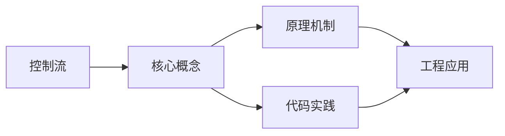
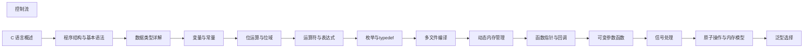

## 1. 学习目标（Bloom 分类）

本节按照布鲁姆教育目标分类学组织学习路径。本文主题为《控制流》，属于 C 模块，读者可以根据自身阶段选择阅读深度。

记忆层面：能够准确复述本文的核心概念、术语与基本语法或操作步骤，并能够在提问或检索时快速定位对应知识点。能够说出 C 的变量、函数、指针、数组、结构体与预处理语法。

理解层面：能够用自己的语言解释核心原理与工作机制，说明概念之间的因果关系，而不是机械记忆结论。能够解释指针与内存地址、栈与堆、编译链接过程。

应用层面：能够在真实项目或练习场景中运用本文知识解决具体问题，写出正确且可维护的实现。能够编写系统工具、数据结构与嵌入式程序。

分析层面：能够拆解复杂问题，比较本文主题与相邻概念的异同，识别边界条件与例外情况。能够分析内存泄漏、缓冲区溢出与未定义行为。

评价层面：能够根据约束条件（性能、可读性、安全、成本）评价不同方案的优劣，做出有依据的技术决策。能够评价 C 与其他语言在系统编程中的取舍。

创造层面：能够把本文知识与其他模块知识组合，设计出新的解决方案或可复用的工程模式。能够设计可移植、可维护的 C 库与模块。

通过本节学习，读者应当能够把《控制流》纳入自己的知识网络，并与 C 模块的其他主题（指针、内存管理、预处理器、标准库）建立关联。

## 2. 历史动机与发展脉络

《控制流》是 C 领域的重要主题。要真正理解它，需要先了解它解决的问题与演进过程。

C 由 Dennis Ritchie 于 1972 年在贝尔实验室为 Unix 开发，是系统编程的基石语言：操作系统、编译器、嵌入式固件均以 C 为主。
C89（ANSI C）统一方言，C99 引入变长数组与 // 注释，C11 增加泛型选择与线程支持，C17 为缺陷修复版，C23（2024 年正式发布）引入 constexpr、属性、显式枚举底层类型等现代化特性。
C 的哲学是“信任程序员”：提供指针与内存操作的全部能力，同时把正确性责任交给开发者；这一设计成就了性能上限，也带来内存安全风险，催生了 Rust 等后继语言。

回到本文主题：控制流 的提出与成熟，正是上述技术背景下的必然产物。早期实现往往以简单可用为目标，随着工程规模扩大，社区逐渐沉淀出标准做法与最佳实践；理解这一脉络，可以帮助读者判断“为什么文档中的推荐写法是现在这个样子”，也能在遇到历史遗留代码时准确识别其设计年代与取舍。


## 3. 形式化定义与核心概念精讲

本节把《控制流》涉及的核心概念以“定义 + 讲解”的形式展开。读者应把定义当作工具，把讲解当作理解路径；两者结合才能形成可迁移的知识。

指针：指针保存变量地址，`&` 取地址、`*` 解引用；指针算术与数组名退化规则（数组名作为实参退化为首元素指针）是 C 的经典难点。
内存管理：栈内存自动释放，堆内存由 malloc/calloc/realloc/free 管理；所有权责任（谁分配谁释放）必须显式约定。
预处理器：#include/#define/#ifdef 在编译前文本处理；宏展开有副作用与优先级风险，函数式宏参数必须加括号。

### 3.1 原文章节逐一精讲

原文档把主题拆分为 14 个小节，下面按顺序给出每一节的导读讲解，随后保留原文细节供精读。

#### 原文精读（完整保留）

# 控制流

> **符号约定**：`< >` 必填参数 | `[ ]` 可选参数

---

#### 1. 条件判断 (Selection)

##### 1.1 `if-else` 结构

###### 1.1.1 基本用法

`if-else` 结构是最基本的条件控制语句，用于根据条件执行不同的代码块。

```c
 #include <stdio.h>
 int main() {
  int score = 85;
  if (score >= 90) {
  printf("Excellent\n");
  } else if (score >= 80) {
  printf("Very Good\n");
  } else if (score >= 60) {
  printf("Pass\n");
  } else {
  printf("Fail\n");
  }
  return 0;
 }
```

###### 1.1.2 嵌套 `if-else`

```c
 #include <stdio.h>
 int main() {
  int age = 18;
  int has_license = 1;
  if (age >= 18) {
  if (has_license) {
  printf("You can drive\n");
  } else {
  printf("You need a license to drive\n");
  }
  } else {
  printf("You are too young to drive\n");
  }
  return 0;
 }
```

###### 1.1.3 条件表达式的简写

```c
 #include <stdio.h>
 int main() {
  int a = 10, b = 20;
  // 简单的条件判断可以使用三目运算符
  int max = (a > b) ? a : b;
  printf("Max: %d\n", max);
  // 条件表达式作为函数参数
  printf("Result: %s\n", (a > b) ? "a is larger" : "b is larger");
  return 0;
 }
```

##### 1.2 `switch-case` 结构

###### 1.2.1 基本用法

`switch-case` 结构用于多分支选择，比嵌套的 `if-else` 更清晰。

```c
 #include <stdio.h>
 int main() {
  char grade = 'B';
  switch (grade) {
  case 'A':
  printf("Great!\n");
  break;
  case 'B':
  printf("Good!\n");
  break;
  case 'C':
  printf("Average\n");
  break;
  case 'D':
  printf("Below Average\n");
  break;
  case 'F':
  printf("Fail\n");
  break;
  default:
  printf("Unknown grade\n");
  }
  return 0;
 }
```

###### 1.2.2 整数类型的 `switch`

```c
 #include <stdio.h>
 int main() {
  int day = 3;
  switch (day) {
  case 1:
  printf("Monday\n");
  break;
  case 2:
  printf("Tuesday\n");
  break;
  case 3:
  printf("Wednesday\n");
  break;
  case 4:
  printf("Thursday\n");
  break;
  case 5:
  printf("Friday\n");
  break;
  case 6:
  case 7:
  printf("Weekend\n");
  break;
  default:
  printf("Invalid day\n");
  }
  return 0;
 }
```

###### 1.2.3 `switch` 中的穿透现象

当 `case` 语句后没有 `break` 时，会发生穿透现象，继续执行下一个 `case`。

```c
 #include <stdio.h>
 int main() {
  int month = 2;
  int days;
  switch (month) {
  case 1:
  case 3:
  case 5:
  case 7:
  case 8:
  case 10:
  case 12:
  days = 31;
  break;
  case 4:
  case 6:
  case 9:
  case 11:
  days = 30;
  break;
  case 2:
  days = 28; // 简化处理，未考虑闰年
  break;
  default:
  days = 0;
  printf("Invalid month\n");
  }
  if (days > 0) {
  printf("Month %d has %d days\n", month, days);
  }
  return 0;
 }
```

#### 2. 循环结构 (Iteration)

##### 2.1 `for` 循环

###### 2.1.1 基本用法

`for` 循环常用于已知循环次数的场景，结构清晰。

```c
 #include <stdio.h>
 int main() {
  // 基本 for 循环
  for (int i = 0; i < 10; i++) {
  printf("%d ", i);
  }
  printf("\n");
  // 循环变量初始化、条件、增量都可以省略
  int j = 0;
  for (; j < 10;) {
  printf("%d ", j);
  j++;
  }
  printf("\n");
  return 0;
 }
```

###### 2.1.2 嵌套 `for` 循环

```c
 #include <stdio.h>
 int main() {
  // 打印乘法表
  for (int i = 1; i <= 9; i++) {
  for (int j = 1; j <= i; j++) {
  printf("%d*%d=%d\t", j, i, i*j);
  }
  printf("\n");
  }
  return 0;
 }
```

###### 2.1.3 特殊的 `for` 循环用法

```c
 #include <stdio.h>
 int main() {
  // 使用多个循环变量
  for (int i = 0, j = 10; i < j; i++, j--) {
  printf("i=%d, j=%d\n", i, j);
  }
  // 无限循环
  // for (;;) {
  // // 循环体
  // }
  return 0;
 }
```

##### 2.2 `while` 循环

###### 2.2.1 基本用法

`while` 循环适用于循环次数不确定的场景，只要条件为真就继续执行。

```c
 #include <stdio.h>
 int main() {
  int i = 0;
  while (i < 10) {
  printf("%d ", i);
  i++;
  }
  printf("\n");
  return 0;
 }
```

###### 2.2.2 输入验证

```c
 #include <stdio.h>
 int main() {
  int age;
  printf("Enter your age: ");
  // 验证输入是否为有效年龄
  while (1) {
  scanf("%d", &age);
  if (age >= 0 && age <= 120) {
  break;
  }
  printf("Invalid age. Please enter again: ");
  }
  printf("Your age is %d\n", age);
  return 0;
 }
```

###### 2.2.3 无限循环

```c
 #include <stdio.h>
 int main() {
  int count = 0;
  // 无限循环，直到满足条件跳出
  while (1) {
  printf("Count: %d\n", count);
  count++;
  if (count >= 5) {
  break;
  }
  }
  return 0;
 }
```

##### 2.3 `do-while` 循环

###### 2.3.1 基本用法

`do-while` 循环保证循环体至少执行一次，适用于需要先执行后判断的场景。

```c
 #include <stdio.h>
 int main() {
  int i = 10;
  do {
  printf("Execute once\n");
  i--;
  } while (i < 5);
  return 0;
 }
```

###### 2.3.2 菜单驱动程序

```c
 #include <stdio.h>
 int main() {
  int choice;
  do {
  printf("\nMenu:\n");
  printf("1. Option 1\n");
  printf("2. Option 2\n");
  printf("3. Exit\n");
  printf("Enter your choice: ");
  scanf("%d", &choice);
  switch (choice) {
  case 1:
  printf("You selected Option 1\n");
  break;
  case 2:
  printf("You selected Option 2\n");
  break;
  case 3:
  printf("Exiting...\n");
  break;
  default:
  printf("Invalid choice\n");
  }
  } while (choice != 3);
  return 0;
 }
```

#### 3. 循环控制语句 (Control Statements)

##### 3.1 `break` 语句

###### 3.1.1 基本用法

`break` 语句用于立即退出当前循环，不再执行循环体中剩余的语句。

```c
 #include <stdio.h>
 int main() {
  for (int i = 0; i < 10; i++) {
  if (i == 5) {
  break; // 当 i 等于 5 时退出循环
  }
  printf("%d ", i);
  }
  printf("\nLoop exited\n");
  return 0;
 }
```

###### 3.1.2 跳出嵌套循环

```c
 #include <stdio.h>
 int main() {
  for (int i = 0; i < 5; i++) {
  for (int j = 0; j < 5; j++) {
  printf("i=%d, j=%d\n", i, j);
  if (i == 2 && j == 2) {
  goto exit_loop; // 使用 goto 跳出多层循环
  }
  }
  }
  exit_loop:
  printf("Exited nested loops\n");
  return 0;
 }
```

##### 3.2 `continue` 语句

###### 3.2.1 基本用法

`continue` 语句用于跳过本次循环的剩余部分，直接进入下一次迭代。

```c
 #include <stdio.h>
 int main() {
  for (int i = 0; i < 10; i++) {
  if (i % 2 == 0) {
  continue; // 跳过偶数
  }
  printf("%d ", i);
  }
  printf("\n");
  return 0;
 }
```

###### 3.2.2 跳过特定条件

```c
 #include <stdio.h>
 int main() {
  int numbers[] = {1, 2, 3, 0, 4, 5, 0, 6};
  int size = sizeof(numbers) / sizeof(numbers[0]);
  for (int i = 0; i < size; i++) {
  if (numbers[i] == 0) {
  printf("Skipping zero\n");
  continue;
  }
  printf("Number: %d\n", numbers[i]);
  }
  return 0;
 }
```

##### 3.3 `goto` 语句

###### 3.3.1 基本用法

`goto` 语句用于无条件跳转到指定的标签位置，一般不推荐使用，但在某些场景下可以简化代码。

```c
 #include <stdio.h>
 int main() {
  int i = 0;
  start:
  printf("i = %d\n", i);
  i++;
  if (i < 5) {
  goto start;
  }
  printf("Loop completed\n");
  return 0;
 }
```

###### 3.3.2 跳过多层循环

```c
 #include <stdio.h>
 int main() {
  for (int i = 0; i < 3; i++) {
  for (int j = 0; j < 3; j++) {
  for (int k = 0; k < 3; k++) {
  printf("i=%d, j=%d, k=%d\n", i, j, k);
  if (i == 1 && j == 1 && k == 1) {
  goto end_of_loops;
  }
  }
  }
  }
  end_of_loops:
  printf("Exited all loops\n");
  return 0;
 }
```

###### 3.3.3 错误处理

```c
 #include <stdio.h>
 #include <stdlib.h>
 int main() {
  FILE *file;
  file = fopen("nonexistent.txt", "r");
  if (file == NULL) {
  perror("Error opening file");
  goto cleanup;
  }
  // 处理文件...
  fclose(file);
  cleanup:
  printf("Program completed\n");
  return 0;
 }
```

#### 4. 控制流的最佳实践

##### 4.1 代码风格建议

- **缩进一致**: 使用 4 空格或 1 制表符的缩进
- **大括号使用**: 始终使用大括号包围循环体和条件块
- **命名规范**: 使用有意义的变量名
- **注释**: 为复杂的条件和循环添加注释
- **换行**: 在适当的地方换行，保持代码可读性

##### 4.2 性能优化建议

- **循环不变量外提**: 将循环中不变的计算移到循环外
- **减少循环内操作**: 尽量减少循环体内的计算量
- **选择合适的循环类型**: 根据具体场景选择 `for`、`while` 或 `do-while`
- **避免死循环**: 确保循环条件最终能为假
- **使用 `break` 和 `continue`**: 合理使用这些语句提高循环效率

##### 4.3 常见错误避免

- **无限循环**: 确保循环条件有终止的可能
- **嵌套过深**: 避免超过 3 层的嵌套，考虑重构为函数
- **条件判断错误**: 注意运算符优先级和逻辑关系
- **边界条件**: 处理好循环的边界情况
- **变量作用域**: 合理控制变量的作用域

##### 4.4 最佳实践示例

```c
 #include <stdio.h>
 // 计算斐波那契数列
 void fibonacci(int n) {
  if (n <= 0) {
  printf("Invalid input\n");
  return;
  }
  int a = 0, b = 1;
  printf("Fibonacci sequence: ");
  for (int i = 0; i < n; i++) {
  printf("%d ", a);
  int next = a + b;
  a = b;
  b = next;
  }
  printf("\n");
 }
 // 查找数组中的元素
 int find_element(int arr[], int size, int target) {
  for (int i = 0; i < size; i++) {
  if (arr[i] == target) {
  return i; // 找到元素，返回索引
  }
  }
  return -1; // 未找到元素
 }
 int main() {
  // 调用斐波那契函数
  fibonacci(10);
  // 测试查找函数
  int numbers[] = {10, 20, 30, 40, 50};
  int size = sizeof(numbers) / sizeof(numbers[0]);
  int target = 30;
  int index = find_element(numbers, size, target);
  if (index != -1) {
  printf("Element %d found at index %d\n", target, index);
  } else {
  printf("Element %d not found\n", target);
  }
  return 0;
 }
```

#### 5. 常见问题与解决方案

##### 5.1 无限循环

**问题**: 循环条件永远为真，导致程序陷入无限循环
**解决方案**: 确保循环条件最终能为假，或使用 `break` 语句退出循环

```c
 // 错误示例
 while (1) {
  printf("This will run forever\n");
 }
 // 正确示例
 int count = 0;
 while (1) {
  printf("Count: %d\n", count);
  count++;
  if (count >= 10) {
  break;
  }
 }
```

##### 5.2 循环条件错误

**问题**: 循环条件设置错误，导致循环执行次数不符合预期
**解决方案**: 仔细检查循环条件，确保逻辑正确

```c
 // 错误示例：应该是 i < 10，而不是 i <= 10
 for (int i = 0; i <= 10; i++) {
  printf("%d ", i); // 会打印 0-10，共 11 个数
 }
 // 正确示例
 for (int i = 0; i < 10; i++) {
  printf("%d ", i); // 打印 0-9，共 10 个数
 }
```

##### 5.3 边界条件处理

**问题**: 循环的边界条件处理不当，导致数组越界或其他错误
**解决方案**: 确保循环变量在有效范围内

```c
 // 错误示例：可能导致数组越界
 int arr[5] = {1, 2, 3, 4, 5};
 for (int i = 0; i <= 5; i++) {
  printf("%d ", arr[i]); // 访问 arr[5] 越界
 }
 // 正确示例
 int arr[5] = {1, 2, 3, 4, 5};
 for (int i = 0; i < 5; i++) {
  printf("%d ", arr[i]);
 }
```

##### 5.4 `switch` 语句缺少 `break`

**问题**: `case` 语句后缺少 `break`，导致穿透现象
**解决方案**: 为每个 `case` 语句添加 `break`，除非需要穿透

```c
 // 错误示例：缺少 break
 switch (grade) {
  case 'A':
  printf("Great!\n");
  case 'B':
  printf("Good!\n"); // 当 grade 为 'A' 时也会执行
  break;
 }
 // 正确示例
 switch (grade) {
  case 'A':
  printf("Great!\n");
  break;
  case 'B':
  printf("Good!\n");
  break;
 }
```

##### 5.5 嵌套过深

**问题**: 循环和条件嵌套过深，代码可读性差
**解决方案**: 将嵌套的代码重构为函数

```c
 // 嵌套过深的示例
 for (int i = 0; i < 10; i++) {
  if (i % 2 == 0) {
  for (int j = 0; j < 5; j++) {
  if (j > 2) {
  // 处理逻辑
  }
  }
  }
 }
 // 重构为函数
 void process_even(int i) {
  for (int j = 0; j < 5; j++) {
  if (j > 2) {
  // 处理逻辑
  }
  }
 }
 // 主函数
 for (int i = 0; i < 10; i++) {
  if (i % 2 == 0) {
  process_even(i);
  }
 }
```

#### 6. 控制流的高级应用

##### 6.1 循环的替代方案

###### 6.1.1 使用 `goto` 实现循环

```c
 #include <stdio.h>
 int main() {
  int i = 0;
  loop:
  if (i < 10) {
  printf("%d ", i);
  i++;
  goto loop;
  }
  printf("\n");
  return 0;
 }
```

###### 6.1.2 使用递归代替循环

```c
 #include <stdio.h>
 void print_numbers(int n) {
  if (n < 0) {
  return;
  }
  print_numbers(n - 1);
  printf("%d ", n);
 }
 int main() {
  print_numbers(9);
  printf("\n");
  return 0;
 }
```

##### 6.2 复杂条件的处理

###### 6.2.1 使用逻辑运算符组合条件

```c
 #include <stdio.h>
 int main() {
  int age = 25;
  int has_license = 1;
  int has_car = 1;
  // 复杂条件
  if (age >= 18 && has_license && has_car) {
  printf("You can drive\n");
  } else if (age >= 18 && has_license) {
  printf("You can drive if you have a car\n");
  } else if (age >= 18) {
  printf("You need a license to drive\n");
  } else {
  printf("You are too young to drive\n");
  }
  return 0;
 }
```

###### 6.2.2 使用布尔函数简化条件

```c
 #include <stdio.h>
 int is_even(int n) {
  return n % 2 == 0;
 }
 int is_positive(int n) {
  return n > 0;
 }
 int main() {
  int number = 4;
  if (is_even(number) && is_positive(number)) {
  printf("%d is a positive even number\n", number);
  }
  return 0;
 }
```

##### 6.3 状态机的实现

```c
 #include <stdio.h>
 int main() {
  enum State {
  STATE_START,
  STATE_READING,
  STATE_PROCESSING,
  STATE_FINISHED
  };
  enum State current_state = STATE_START;
  int data_processed = 0;
  int max_data = 5;
  while (current_state != STATE_FINISHED) {
  switch (current_state) {
  case STATE_START:
  printf("Starting process\n");
  current_state = STATE_READING;
  break;
  case STATE_READING:
  printf("Reading data\n");
  current_state = STATE_PROCESSING;
  break;
  case STATE_PROCESSING:
  printf("Processing data %d\n", data_processed);
  data_processed++;
  if (data_processed >= max_data) {
  current_state = STATE_FINISHED;
  } else {
  current_state = STATE_READING;
  }
  break;
  case STATE_FINISHED:
  printf("Process finished\n");
  break;
  }
  }
  return 0;
 }
```

#### 7. 代码优化技巧

##### 7.1 循环优化

###### 7.1.1 减少循环内计算

```c
 // 优化前
 for (int i = 0; i < strlen(s); i++) {
  // 每次循环都计算 strlen(s)
 }
 // 优化后
 int len = strlen(s);
 for (int i = 0; i < len; i++) {
  // 只计算一次 strlen(s)
 }
```

###### 7.1.2 使用递增而非递减

```c
 // 优化前
 for (int i = n; i >= 0; i--) {
  // 循环体
 }
 // 优化后（某些架构上更高效）
 for (int i = 0; i <= n; i++) {
  // 循环体
 }
```

###### 7.1.3 展开循环

```c
 // 优化前
 for (int i = 0; i < 4; i++) {
  process(i);
 }
 // 优化后（展开循环）
 process(0);
 process(1);
 process(2);
 process(3);
```

##### 7.2 条件优化

###### 7.2.1 利用短路求值

```c
 // 优化前
 if (ptr != NULL) {
  if (ptr->value == 5) {
  // 处理逻辑
  }
 }
 // 优化后
 if (ptr != NULL && ptr->value == 5) {
  // 处理逻辑
 }
```

###### 7.2.2 条件顺序优化

```c
 // 优化前（假设 ptr == NULL 的概率较高）
 if (ptr->value == 5 && ptr != NULL) {
  // 可能会崩溃
 }
 // 优化后
 if (ptr != NULL && ptr->value == 5) {
  // 更安全，利用短路求值
 }
```

##### 7.3 控制流优化示例

```c
 #include <stdio.h>
 // 优化前：多个 if-else 嵌套
 int get_grade_point(char grade) {
  if (grade == 'A') {
  return 4;
  } else if (grade == 'B') {
  return 3;
  } else if (grade == 'C') {
  return 2;
  } else if (grade == 'D') {
  return 1;
  } else {
  return 0;
  }
 }
 // 优化后：使用 switch 语句
 int get_grade_point_optimized(char grade) {
  switch (grade) {
  case 'A': return 4;
  case 'B': return 3;
  case 'C': return 2;
  case 'D': return 1;
  default: return 0;
  }
 }
 int main() {
  char grade = 'B';
  printf("Grade point: %d\n", get_grade_point(grade));
  printf("Grade point (optimized): %d\n", get_grade_point_optimized(grade));
  return 0;
 }
```

---

#### if-else 条件判断

**基本写法：if 语句**
`if (<condition>) { ... }`
```c
// 单条件判断
int score = 85;
if (score >= 60) {
    printf("Pass\n");
}
```

---

**多分支写法：if-else if-else**
`if (<condition>) { ... } else if (<condition>) { ... } else { ... }`
```c
// 多条件分支判断
int score = 85;
if (score >= 90) {
    printf("Excellent\n");
} else if (score >= 80) {
    printf("Very Good\n");
} else {
    printf("Fail\n");
}
```

---

**嵌套写法：嵌套 if-else**
`if (<condition>) { if (<condition>) { ... } else { ... } } else { ... }`
```c
// 嵌套条件判断
int age = 18;
int has_license = 1;
if (age >= 18) {
    if (has_license) {
        printf("You can drive\n");
    } else {
        printf("Need a license\n");
    }
} else {
    printf("Too young\n");
}
```

---

#### switch-case 多分支选择

**基本写法：switch-case**
`switch (<expr>) { case <val>: ... break; [default: ...] }`
```c
// 根据成绩等级输出
char grade = 'B';
switch (grade) {
    case 'A':
        printf("Great!\n");
        break;
    case 'B':
        printf("Good!\n");
        break;
    default:
        printf("Unknown\n");
}
```

---

**穿透写法：多 case 共享代码块**
`case <val1>: case <val2>: ... break;`
```c
// 多个 case 执行相同代码
int month = 2;
int days;
switch (month) {
    case 1: case 3: case 5: case 7:
        days = 31;
        break;
    case 4: case 6: case 9:
        days = 30;
        break;
    default:
        days = 28;
}
```

---

#### for 循环

**基本写法：for 循环**
`for (<init>; <condition>; <update>) { ... }`
```c
// 打印 0 到 9
for (int i = 0; i < 10; i++) {
    printf("%d ", i);
}
```

---

**嵌套写法：嵌套 for 循环**
`for (...) { for (...) { ... } }`
```c
// 打印乘法表
for (int i = 1; i <= 9; i++) {
    for (int j = 1; j <= i; j++) {
        printf("%d*%d=%d\t", j, i, i*j);
    }
    printf("\n");
}
```

---

**多变量写法：多变量 for 循环**
`for (<init1>, <init2>; <cond>; <update1>, <update2>) { ... }`
```c
// 使用多个循环变量
for (int i = 0, j = 10; i < j; i++, j--) {
    printf("i=%d, j=%d\n", i, j);
}
```

---

**无限写法：无限 for 循环**
`for (;;) { ... }`
```c
// 无限循环
for (;;) {
    printf("Loop\n");
}
```

---

#### while 循环

**基本写法：while 循环**
`while (<condition>) { ... }`
```c
// 当条件为真时循环
int i = 0;
while (i < 10) {
    printf("%d ", i);
    i++;
}
```

---

**无限写法：无限 while 循环**
`while (1) { ... if (<condition>) break; }`
```c
// 无限循环带退出条件
int count = 0;
while (1) {
    count++;
    if (count >= 5) {
        break;
    }
}
```

---

#### do-while 循环

**基本写法：do-while 循环**
`do { ... } while (<condition>);`
```c
// 至少执行一次的循环
int i = 10;
do {
    printf("Execute once\n");
    i--;
} while (i < 5);
```

---

#### 循环控制语句

**break 写法：跳出循环**
`break;`
```c
// 当 i 等于 5 时退出循环
for (int i = 0; i < 10; i++) {
    if (i == 5) {
        break;
    }
    printf("%d ", i);
}
```

---

**continue 写法：跳过本次循环**
`continue;`
```c
// 跳过偶数
for (int i = 0; i < 10; i++) {
    if (i % 2 == 0) {
        continue;
    }
    printf("%d ", i);
}
```

---

**goto 写法：无条件跳转**
`goto <label>; ... <label>:`
```c
// 跳转到标签处
int i = 0;
start:
printf("i = %d\n", i);
i++;
if (i < 5) {
    goto start;
}
```

---

**goto 写法：跳出多层循环**
`goto <label>;`
```c
// 跳出多层嵌套循环
for (int i = 0; i < 3; i++) {
    for (int j = 0; j < 3; j++) {
        if (i == 1 && j == 1) {
            goto end_of_loops;
        }
    }
}
end_of_loops:
printf("Exited\n");
```

---

#### 状态机实现

**switch 写法：使用 switch 实现状态机**
`while (<state> != FINAL) { switch (<state>) { ... } }`
```c
// 状态机循环
enum State { STATE_START, STATE_READING, STATE_FINISHED };
enum State current_state = STATE_START;
while (current_state != STATE_FINISHED) {
    switch (current_state) {
        case STATE_START:
            current_state = STATE_READING;
            break;
        case STATE_READING:
            current_state = STATE_FINISHED;
            break;
    }
}
```


### 3.2 概念关系图

下面用 Mermaid 图表达本文核心概念之间的关系，帮助读者建立整体图景：



图中展示的是本文知识的结构化关系：核心概念是入口，原理机制解释“为什么”，代码实践演示“怎么做”，工程应用回答“何时用”。读者学习时可以把每个小节的内容挂接到对应节点上。

## 4. 理论推导与原理解析

本节深入《控制流》背后的原理。理论部分不求面面俱到，而是聚焦“能解释现象、能指导实践”的关键推导。

指针：指针保存变量地址，`&` 取地址、`*` 解引用；指针算术与数组名退化规则（数组名作为实参退化为首元素指针）是 C 的经典难点。
内存管理：栈内存自动释放，堆内存由 malloc/calloc/realloc/free 管理；所有权责任（谁分配谁释放）必须显式约定。
预处理器：#include/#define/#ifdef 在编译前文本处理；宏展开有副作用与优先级风险，函数式宏参数必须加括号。
编译链接：预处理 -> 编译 -> 汇编 -> 链接；头文件声明接口，源文件实现；静态库与动态库（.a/.so/.dll）决定部署形态。

需要强调的是，理论推导与工程实践之间存在翻译层：理论给出的是理想化模型与边界条件，工程代码则必须处理真实环境中的例外。读者在学习时应先掌握理论的“标准情形”，再通过陷阱章节了解“非标准情形”。

## 5. 代码示例与逐行讲解

本节把原文中的代码示例系统整理，并为每个示例补充用途说明与讲解。读者不应只浏览代码，而应逐段对照讲解理解设计意图。

### 5.1 示例：1.1.1 基本用法

该示例来自原文《1.1.1 基本用法》小节，用于演示控制流相关操作。阅读时请先看代码结构，再看其后的讲解。

```c
 #include <stdio.h>
 int main() {
  int score = 85;
  if (score >= 90) {
  printf("Excellent\n");
  } else if (score >= 80) {
  printf("Very Good\n");
  } else if (score >= 60) {
  printf("Pass\n");
  } else {
  printf("Fail\n");
  }
  return 0;
 }
```

讲解：这段代码演示了本节核心知识点。代码中的关键操作可以归纳为三步：准备（定义或初始化）、执行（核心逻辑）、收尾（释放资源或返回结果）。实际项目中，这三步往往被封装为函数或类，以提升复用性与可测试性。

关键点分析：

该示例共 14 行有效代码，包含 2 类关键结构（if、return）。其中：

- 入口与初始化部分负责建立上下文，对应实际项目中的启动或装配逻辑；
- 核心逻辑部分体现本文主题的主要操作，是阅读时最需要对照讲解理解的部分；
- 输出或返回部分把结果交给调用方，注意其类型与边界条件。

进阶思考路径：先尝试修改参数观察行为变化，再把示例中的模式迁移到自己的项目中；每次修改都记录预期与实测差异，这是把示例转化为能力的最快方式。

### 5.2 示例：1.1.2 嵌套 `if-else`

该示例来自原文《1.1.2 嵌套 `if-else`》小节，用于演示控制流相关操作。阅读时请先看代码结构，再看其后的讲解。

```c
 #include <stdio.h>
 int main() {
  int age = 18;
  int has_license = 1;
  if (age >= 18) {
  if (has_license) {
  printf("You can drive\n");
  } else {
  printf("You need a license to drive\n");
  }
  } else {
  printf("You are too young to drive\n");
  }
  return 0;
 }
```

讲解：这段代码演示了本节核心知识点。代码中的关键操作可以归纳为三步：准备（定义或初始化）、执行（核心逻辑）、收尾（释放资源或返回结果）。实际项目中，这三步往往被封装为函数或类，以提升复用性与可测试性。

关键点分析：

该示例共 15 行有效代码，包含 2 类关键结构（if、return）。其中：

- 入口与初始化部分负责建立上下文，对应实际项目中的启动或装配逻辑；
- 核心逻辑部分体现本文主题的主要操作，是阅读时最需要对照讲解理解的部分；
- 输出或返回部分把结果交给调用方，注意其类型与边界条件。

进阶思考路径：先尝试修改参数观察行为变化，再把示例中的模式迁移到自己的项目中；每次修改都记录预期与实测差异，这是把示例转化为能力的最快方式。

### 5.3 示例：1.1.3 条件表达式的简写

该示例来自原文《1.1.3 条件表达式的简写》小节，用于演示控制流相关操作。阅读时请先看代码结构，再看其后的讲解。

```c
 #include <stdio.h>
 int main() {
  int a = 10, b = 20;
  // 简单的条件判断可以使用三目运算符
  int max = (a > b) ? a : b;
  printf("Max: %d\n", max);
  // 条件表达式作为函数参数
  printf("Result: %s\n", (a > b) ? "a is larger" : "b is larger");
  return 0;
 }
```

讲解：这段代码演示了本节核心知识点。代码中的关键操作可以归纳为三步：准备（定义或初始化）、执行（核心逻辑）、收尾（释放资源或返回结果）。实际项目中，这三步往往被封装为函数或类，以提升复用性与可测试性。

关键点分析：

该示例共 10 行有效代码，包含 1 类关键结构（return）。其中：

- 入口与初始化部分负责建立上下文，对应实际项目中的启动或装配逻辑；
- 核心逻辑部分体现本文主题的主要操作，是阅读时最需要对照讲解理解的部分；
- 输出或返回部分把结果交给调用方，注意其类型与边界条件。

进阶思考路径：先尝试修改参数观察行为变化，再把示例中的模式迁移到自己的项目中；每次修改都记录预期与实测差异，这是把示例转化为能力的最快方式。

### 5.4 示例：1.2.1 基本用法

该示例来自原文《1.2.1 基本用法》小节，用于演示控制流相关操作。阅读时请先看代码结构，再看其后的讲解。

```c
 #include <stdio.h>
 int main() {
  char grade = 'B';
  switch (grade) {
  case 'A':
  printf("Great!\n");
  break;
  case 'B':
  printf("Good!\n");
  break;
  case 'C':
  printf("Average\n");
  break;
  case 'D':
  printf("Below Average\n");
  break;
  case 'F':
  printf("Fail\n");
  break;
  default:
  printf("Unknown grade\n");
  }
  return 0;
 }
```

讲解：这段代码演示了本节核心知识点。代码中的关键操作可以归纳为三步：准备（定义或初始化）、执行（核心逻辑）、收尾（释放资源或返回结果）。实际项目中，这三步往往被封装为函数或类，以提升复用性与可测试性。

关键点分析：

该示例共 24 行有效代码，包含 1 类关键结构（return）。其中：

- 入口与初始化部分负责建立上下文，对应实际项目中的启动或装配逻辑；
- 核心逻辑部分体现本文主题的主要操作，是阅读时最需要对照讲解理解的部分；
- 输出或返回部分把结果交给调用方，注意其类型与边界条件。

进阶思考路径：先尝试修改参数观察行为变化，再把示例中的模式迁移到自己的项目中；每次修改都记录预期与实测差异，这是把示例转化为能力的最快方式。

### 5.5 示例：1.2.2 整数类型的 `switch`

该示例来自原文《1.2.2 整数类型的 `switch`》小节，用于演示控制流相关操作。阅读时请先看代码结构，再看其后的讲解。

```c
 #include <stdio.h>
 int main() {
  int day = 3;
  switch (day) {
  case 1:
  printf("Monday\n");
  break;
  case 2:
  printf("Tuesday\n");
  break;
  case 3:
  printf("Wednesday\n");
  break;
  case 4:
  printf("Thursday\n");
  break;
  case 5:
  printf("Friday\n");
  break;
  case 6:
  case 7:
  printf("Weekend\n");
  break;
  default:
  printf("Invalid day\n");
  }
  return 0;
 }
```

讲解：这段代码演示了本节核心知识点。代码中的关键操作可以归纳为三步：准备（定义或初始化）、执行（核心逻辑）、收尾（释放资源或返回结果）。实际项目中，这三步往往被封装为函数或类，以提升复用性与可测试性。

关键点分析：

该示例共 28 行有效代码，包含 1 类关键结构（return）。其中：

- 入口与初始化部分负责建立上下文，对应实际项目中的启动或装配逻辑；
- 核心逻辑部分体现本文主题的主要操作，是阅读时最需要对照讲解理解的部分；
- 输出或返回部分把结果交给调用方，注意其类型与边界条件。

进阶思考路径：先尝试修改参数观察行为变化，再把示例中的模式迁移到自己的项目中；每次修改都记录预期与实测差异，这是把示例转化为能力的最快方式。

### 5.6 示例：1.2.3 `switch` 中的穿透现象

该示例来自原文《1.2.3 `switch` 中的穿透现象》小节，用于演示控制流相关操作。阅读时请先看代码结构，再看其后的讲解。

```c
 #include <stdio.h>
 int main() {
  int month = 2;
  int days;
  switch (month) {
  case 1:
  case 3:
  case 5:
  case 7:
  case 8:
  case 10:
  case 12:
  days = 31;
  break;
  case 4:
  case 6:
  case 9:
  case 11:
  days = 30;
  break;
  case 2:
  days = 28; // 简化处理，未考虑闰年
  break;
  default:
  days = 0;
  printf("Invalid month\n");
  }
  if (days > 0) {
  printf("Month %d has %d days\n", month, days);
  }
  return 0;
 }
```

讲解：这段代码演示了本节核心知识点。代码中的关键操作可以归纳为三步：准备（定义或初始化）、执行（核心逻辑）、收尾（释放资源或返回结果）。实际项目中，这三步往往被封装为函数或类，以提升复用性与可测试性。

关键点分析：

该示例共 32 行有效代码，包含 2 类关键结构（if、return）。其中：

- 入口与初始化部分负责建立上下文，对应实际项目中的启动或装配逻辑；
- 核心逻辑部分体现本文主题的主要操作，是阅读时最需要对照讲解理解的部分；
- 输出或返回部分把结果交给调用方，注意其类型与边界条件。

进阶思考路径：先尝试修改参数观察行为变化，再把示例中的模式迁移到自己的项目中；每次修改都记录预期与实测差异，这是把示例转化为能力的最快方式。

### 5.7 示例：2.1.1 基本用法

该示例来自原文《2.1.1 基本用法》小节，用于演示控制流相关操作。阅读时请先看代码结构，再看其后的讲解。

```c
 #include <stdio.h>
 int main() {
  // 基本 for 循环
  for (int i = 0; i < 10; i++) {
  printf("%d ", i);
  }
  printf("\n");
  // 循环变量初始化、条件、增量都可以省略
  int j = 0;
  for (; j < 10;) {
  printf("%d ", j);
  j++;
  }
  printf("\n");
  return 0;
 }
```

讲解：这段代码演示了本节核心知识点。代码中的关键操作可以归纳为三步：准备（定义或初始化）、执行（核心逻辑）、收尾（释放资源或返回结果）。实际项目中，这三步往往被封装为函数或类，以提升复用性与可测试性。

关键点分析：

该示例共 16 行有效代码，包含 2 类关键结构（for、return）。其中：

- 入口与初始化部分负责建立上下文，对应实际项目中的启动或装配逻辑；
- 核心逻辑部分体现本文主题的主要操作，是阅读时最需要对照讲解理解的部分；
- 输出或返回部分把结果交给调用方，注意其类型与边界条件。

进阶思考路径：先尝试修改参数观察行为变化，再把示例中的模式迁移到自己的项目中；每次修改都记录预期与实测差异，这是把示例转化为能力的最快方式。

### 5.8 示例：2.1.2 嵌套 `for` 循环

该示例来自原文《2.1.2 嵌套 `for` 循环》小节，用于演示控制流相关操作。阅读时请先看代码结构，再看其后的讲解。

```c
 #include <stdio.h>
 int main() {
  // 打印乘法表
  for (int i = 1; i <= 9; i++) {
  for (int j = 1; j <= i; j++) {
  printf("%d*%d=%d\t", j, i, i*j);
  }
  printf("\n");
  }
  return 0;
 }
```

讲解：这段代码演示了本节核心知识点。代码中的关键操作可以归纳为三步：准备（定义或初始化）、执行（核心逻辑）、收尾（释放资源或返回结果）。实际项目中，这三步往往被封装为函数或类，以提升复用性与可测试性。

关键点分析：

该示例共 11 行有效代码，包含 2 类关键结构（for、return）。其中：

- 入口与初始化部分负责建立上下文，对应实际项目中的启动或装配逻辑；
- 核心逻辑部分体现本文主题的主要操作，是阅读时最需要对照讲解理解的部分；
- 输出或返回部分把结果交给调用方，注意其类型与边界条件。

进阶思考路径：先尝试修改参数观察行为变化，再把示例中的模式迁移到自己的项目中；每次修改都记录预期与实测差异，这是把示例转化为能力的最快方式。

### 5.9 示例：2.1.3 特殊的 `for` 循环用法

该示例来自原文《2.1.3 特殊的 `for` 循环用法》小节，用于演示控制流相关操作。阅读时请先看代码结构，再看其后的讲解。

```c
 #include <stdio.h>
 int main() {
  // 使用多个循环变量
  for (int i = 0, j = 10; i < j; i++, j--) {
  printf("i=%d, j=%d\n", i, j);
  }
  // 无限循环
  // for (;;) {
  // // 循环体
  // }
  return 0;
 }
```

讲解：这段代码演示了本节核心知识点。代码中的关键操作可以归纳为三步：准备（定义或初始化）、执行（核心逻辑）、收尾（释放资源或返回结果）。实际项目中，这三步往往被封装为函数或类，以提升复用性与可测试性。

关键点分析：

该示例共 12 行有效代码，包含 2 类关键结构（for、return）。其中：

- 入口与初始化部分负责建立上下文，对应实际项目中的启动或装配逻辑；
- 核心逻辑部分体现本文主题的主要操作，是阅读时最需要对照讲解理解的部分；
- 输出或返回部分把结果交给调用方，注意其类型与边界条件。

进阶思考路径：先尝试修改参数观察行为变化，再把示例中的模式迁移到自己的项目中；每次修改都记录预期与实测差异，这是把示例转化为能力的最快方式。

### 5.10 示例：2.2.1 基本用法

该示例来自原文《2.2.1 基本用法》小节，用于演示控制流相关操作。阅读时请先看代码结构，再看其后的讲解。

```c
 #include <stdio.h>
 int main() {
  int i = 0;
  while (i < 10) {
  printf("%d ", i);
  i++;
  }
  printf("\n");
  return 0;
 }
```

讲解：这段代码演示了本节核心知识点。代码中的关键操作可以归纳为三步：准备（定义或初始化）、执行（核心逻辑）、收尾（释放资源或返回结果）。实际项目中，这三步往往被封装为函数或类，以提升复用性与可测试性。

关键点分析：

该示例共 10 行有效代码，包含 2 类关键结构（while、return）。其中：

- 入口与初始化部分负责建立上下文，对应实际项目中的启动或装配逻辑；
- 核心逻辑部分体现本文主题的主要操作，是阅读时最需要对照讲解理解的部分；
- 输出或返回部分把结果交给调用方，注意其类型与边界条件。

进阶思考路径：先尝试修改参数观察行为变化，再把示例中的模式迁移到自己的项目中；每次修改都记录预期与实测差异，这是把示例转化为能力的最快方式。

### 5.11 示例：2.2.2 输入验证

该示例来自原文《2.2.2 输入验证》小节，用于演示控制流相关操作。阅读时请先看代码结构，再看其后的讲解。

```c
 #include <stdio.h>
 int main() {
  int age;
  printf("Enter your age: ");
  // 验证输入是否为有效年龄
  while (1) {
  scanf("%d", &age);
  if (age >= 0 && age <= 120) {
  break;
  }
  printf("Invalid age. Please enter again: ");
  }
  printf("Your age is %d\n", age);
  return 0;
 }
```

讲解：这段代码演示了本节核心知识点。代码中的关键操作可以归纳为三步：准备（定义或初始化）、执行（核心逻辑）、收尾（释放资源或返回结果）。实际项目中，这三步往往被封装为函数或类，以提升复用性与可测试性。

关键点分析：

该示例共 15 行有效代码，包含 3 类关键结构（if、while、return）。其中：

- 入口与初始化部分负责建立上下文，对应实际项目中的启动或装配逻辑；
- 核心逻辑部分体现本文主题的主要操作，是阅读时最需要对照讲解理解的部分；
- 输出或返回部分把结果交给调用方，注意其类型与边界条件。

进阶思考路径：先尝试修改参数观察行为变化，再把示例中的模式迁移到自己的项目中；每次修改都记录预期与实测差异，这是把示例转化为能力的最快方式。

### 5.12 示例：2.2.3 无限循环

该示例来自原文《2.2.3 无限循环》小节，用于演示控制流相关操作。阅读时请先看代码结构，再看其后的讲解。

```c
 #include <stdio.h>
 int main() {
  int count = 0;
  // 无限循环，直到满足条件跳出
  while (1) {
  printf("Count: %d\n", count);
  count++;
  if (count >= 5) {
  break;
  }
  }
  return 0;
 }
```

讲解：这段代码演示了本节核心知识点。代码中的关键操作可以归纳为三步：准备（定义或初始化）、执行（核心逻辑）、收尾（释放资源或返回结果）。实际项目中，这三步往往被封装为函数或类，以提升复用性与可测试性。

关键点分析：

该示例共 13 行有效代码，包含 3 类关键结构（if、while、return）。其中：

- 入口与初始化部分负责建立上下文，对应实际项目中的启动或装配逻辑；
- 核心逻辑部分体现本文主题的主要操作，是阅读时最需要对照讲解理解的部分；
- 输出或返回部分把结果交给调用方，注意其类型与边界条件。

进阶思考路径：先尝试修改参数观察行为变化，再把示例中的模式迁移到自己的项目中；每次修改都记录预期与实测差异，这是把示例转化为能力的最快方式。

### 5.13 示例：2.3.1 基本用法

该示例来自原文《2.3.1 基本用法》小节，用于演示控制流相关操作。阅读时请先看代码结构，再看其后的讲解。

```c
 #include <stdio.h>
 int main() {
  int i = 10;
  do {
  printf("Execute once\n");
  i--;
  } while (i < 5);
  return 0;
 }
```

讲解：这段代码演示了本节核心知识点。代码中的关键操作可以归纳为三步：准备（定义或初始化）、执行（核心逻辑）、收尾（释放资源或返回结果）。实际项目中，这三步往往被封装为函数或类，以提升复用性与可测试性。

关键点分析：

该示例共 9 行有效代码，包含 2 类关键结构（while、return）。其中：

- 入口与初始化部分负责建立上下文，对应实际项目中的启动或装配逻辑；
- 核心逻辑部分体现本文主题的主要操作，是阅读时最需要对照讲解理解的部分；
- 输出或返回部分把结果交给调用方，注意其类型与边界条件。

进阶思考路径：先尝试修改参数观察行为变化，再把示例中的模式迁移到自己的项目中；每次修改都记录预期与实测差异，这是把示例转化为能力的最快方式。

### 5.14 示例：2.3.2 菜单驱动程序

该示例来自原文《2.3.2 菜单驱动程序》小节，用于演示控制流相关操作。阅读时请先看代码结构，再看其后的讲解。

```c
 #include <stdio.h>
 int main() {
  int choice;
  do {
  printf("\nMenu:\n");
  printf("1. Option 1\n");
  printf("2. Option 2\n");
  printf("3. Exit\n");
  printf("Enter your choice: ");
  scanf("%d", &choice);
  switch (choice) {
  case 1:
  printf("You selected Option 1\n");
  break;
  case 2:
  printf("You selected Option 2\n");
  break;
  case 3:
  printf("Exiting...\n");
  break;
  default:
  printf("Invalid choice\n");
  }
  } while (choice != 3);
  return 0;
 }
```

讲解：这段代码演示了本节核心知识点。代码中的关键操作可以归纳为三步：准备（定义或初始化）、执行（核心逻辑）、收尾（释放资源或返回结果）。实际项目中，这三步往往被封装为函数或类，以提升复用性与可测试性。

关键点分析：

该示例共 26 行有效代码，包含 2 类关键结构（while、return）。其中：

- 入口与初始化部分负责建立上下文，对应实际项目中的启动或装配逻辑；
- 核心逻辑部分体现本文主题的主要操作，是阅读时最需要对照讲解理解的部分；
- 输出或返回部分把结果交给调用方，注意其类型与边界条件。

进阶思考路径：先尝试修改参数观察行为变化，再把示例中的模式迁移到自己的项目中；每次修改都记录预期与实测差异，这是把示例转化为能力的最快方式。

### 5.15 示例：3.1.1 基本用法

该示例来自原文《3.1.1 基本用法》小节，用于演示控制流相关操作。阅读时请先看代码结构，再看其后的讲解。

```c
 #include <stdio.h>
 int main() {
  for (int i = 0; i < 10; i++) {
  if (i == 5) {
  break; // 当 i 等于 5 时退出循环
  }
  printf("%d ", i);
  }
  printf("\nLoop exited\n");
  return 0;
 }
```

讲解：这段代码演示了本节核心知识点。代码中的关键操作可以归纳为三步：准备（定义或初始化）、执行（核心逻辑）、收尾（释放资源或返回结果）。实际项目中，这三步往往被封装为函数或类，以提升复用性与可测试性。

关键点分析：

该示例共 11 行有效代码，包含 3 类关键结构（if、for、return）。其中：

- 入口与初始化部分负责建立上下文，对应实际项目中的启动或装配逻辑；
- 核心逻辑部分体现本文主题的主要操作，是阅读时最需要对照讲解理解的部分；
- 输出或返回部分把结果交给调用方，注意其类型与边界条件。

进阶思考路径：先尝试修改参数观察行为变化，再把示例中的模式迁移到自己的项目中；每次修改都记录预期与实测差异，这是把示例转化为能力的最快方式。

### 5.16 示例：3.1.2 跳出嵌套循环

该示例来自原文《3.1.2 跳出嵌套循环》小节，用于演示控制流相关操作。阅读时请先看代码结构，再看其后的讲解。

```c
 #include <stdio.h>
 int main() {
  for (int i = 0; i < 5; i++) {
  for (int j = 0; j < 5; j++) {
  printf("i=%d, j=%d\n", i, j);
  if (i == 2 && j == 2) {
  goto exit_loop; // 使用 goto 跳出多层循环
  }
  }
  }
  exit_loop:
  printf("Exited nested loops\n");
  return 0;
 }
```

讲解：这段代码演示了本节核心知识点。代码中的关键操作可以归纳为三步：准备（定义或初始化）、执行（核心逻辑）、收尾（释放资源或返回结果）。实际项目中，这三步往往被封装为函数或类，以提升复用性与可测试性。

关键点分析：

该示例共 14 行有效代码，包含 3 类关键结构（if、for、return）。其中：

- 入口与初始化部分负责建立上下文，对应实际项目中的启动或装配逻辑；
- 核心逻辑部分体现本文主题的主要操作，是阅读时最需要对照讲解理解的部分；
- 输出或返回部分把结果交给调用方，注意其类型与边界条件。

进阶思考路径：先尝试修改参数观察行为变化，再把示例中的模式迁移到自己的项目中；每次修改都记录预期与实测差异，这是把示例转化为能力的最快方式。

### 5.17 示例：3.2.1 基本用法

该示例来自原文《3.2.1 基本用法》小节，用于演示控制流相关操作。阅读时请先看代码结构，再看其后的讲解。

```c
 #include <stdio.h>
 int main() {
  for (int i = 0; i < 10; i++) {
  if (i % 2 == 0) {
  continue; // 跳过偶数
  }
  printf("%d ", i);
  }
  printf("\n");
  return 0;
 }
```

讲解：这段代码演示了本节核心知识点。代码中的关键操作可以归纳为三步：准备（定义或初始化）、执行（核心逻辑）、收尾（释放资源或返回结果）。实际项目中，这三步往往被封装为函数或类，以提升复用性与可测试性。

关键点分析：

该示例共 11 行有效代码，包含 3 类关键结构（if、for、return）。其中：

- 入口与初始化部分负责建立上下文，对应实际项目中的启动或装配逻辑；
- 核心逻辑部分体现本文主题的主要操作，是阅读时最需要对照讲解理解的部分；
- 输出或返回部分把结果交给调用方，注意其类型与边界条件。

进阶思考路径：先尝试修改参数观察行为变化，再把示例中的模式迁移到自己的项目中；每次修改都记录预期与实测差异，这是把示例转化为能力的最快方式。

### 5.18 示例：3.2.2 跳过特定条件

该示例来自原文《3.2.2 跳过特定条件》小节，用于演示控制流相关操作。阅读时请先看代码结构，再看其后的讲解。

```c
 #include <stdio.h>
 int main() {
  int numbers[] = {1, 2, 3, 0, 4, 5, 0, 6};
  int size = sizeof(numbers) / sizeof(numbers[0]);
  for (int i = 0; i < size; i++) {
  if (numbers[i] == 0) {
  printf("Skipping zero\n");
  continue;
  }
  printf("Number: %d\n", numbers[i]);
  }
  return 0;
 }
```

讲解：这段代码演示了本节核心知识点。代码中的关键操作可以归纳为三步：准备（定义或初始化）、执行（核心逻辑）、收尾（释放资源或返回结果）。实际项目中，这三步往往被封装为函数或类，以提升复用性与可测试性。

关键点分析：

该示例共 13 行有效代码，包含 3 类关键结构（if、for、return）。其中：

- 入口与初始化部分负责建立上下文，对应实际项目中的启动或装配逻辑；
- 核心逻辑部分体现本文主题的主要操作，是阅读时最需要对照讲解理解的部分；
- 输出或返回部分把结果交给调用方，注意其类型与边界条件。

进阶思考路径：先尝试修改参数观察行为变化，再把示例中的模式迁移到自己的项目中；每次修改都记录预期与实测差异，这是把示例转化为能力的最快方式。

### 5.19 示例：3.3.1 基本用法

该示例来自原文《3.3.1 基本用法》小节，用于演示控制流相关操作。阅读时请先看代码结构，再看其后的讲解。

```c
 #include <stdio.h>
 int main() {
  int i = 0;
  start:
  printf("i = %d\n", i);
  i++;
  if (i < 5) {
  goto start;
  }
  printf("Loop completed\n");
  return 0;
 }
```

讲解：这段代码演示了本节核心知识点。代码中的关键操作可以归纳为三步：准备（定义或初始化）、执行（核心逻辑）、收尾（释放资源或返回结果）。实际项目中，这三步往往被封装为函数或类，以提升复用性与可测试性。

关键点分析：

该示例共 12 行有效代码，包含 2 类关键结构（if、return）。其中：

- 入口与初始化部分负责建立上下文，对应实际项目中的启动或装配逻辑；
- 核心逻辑部分体现本文主题的主要操作，是阅读时最需要对照讲解理解的部分；
- 输出或返回部分把结果交给调用方，注意其类型与边界条件。

进阶思考路径：先尝试修改参数观察行为变化，再把示例中的模式迁移到自己的项目中；每次修改都记录预期与实测差异，这是把示例转化为能力的最快方式。

### 5.20 示例：3.3.2 跳过多层循环

该示例来自原文《3.3.2 跳过多层循环》小节，用于演示控制流相关操作。阅读时请先看代码结构，再看其后的讲解。

```c
 #include <stdio.h>
 int main() {
  for (int i = 0; i < 3; i++) {
  for (int j = 0; j < 3; j++) {
  for (int k = 0; k < 3; k++) {
  printf("i=%d, j=%d, k=%d\n", i, j, k);
  if (i == 1 && j == 1 && k == 1) {
  goto end_of_loops;
  }
  }
  }
  }
  end_of_loops:
  printf("Exited all loops\n");
  return 0;
 }
```

讲解：这段代码演示了本节核心知识点。代码中的关键操作可以归纳为三步：准备（定义或初始化）、执行（核心逻辑）、收尾（释放资源或返回结果）。实际项目中，这三步往往被封装为函数或类，以提升复用性与可测试性。

关键点分析：

该示例共 16 行有效代码，包含 3 类关键结构（if、for、return）。其中：

- 入口与初始化部分负责建立上下文，对应实际项目中的启动或装配逻辑；
- 核心逻辑部分体现本文主题的主要操作，是阅读时最需要对照讲解理解的部分；
- 输出或返回部分把结果交给调用方，注意其类型与边界条件。

进阶思考路径：先尝试修改参数观察行为变化，再把示例中的模式迁移到自己的项目中；每次修改都记录预期与实测差异，这是把示例转化为能力的最快方式。

### 5.21 示例：3.3.3 错误处理

该示例来自原文《3.3.3 错误处理》小节，用于演示控制流相关操作。阅读时请先看代码结构，再看其后的讲解。

```c
 #include <stdio.h>
 #include <stdlib.h>
 int main() {
  FILE *file;
  file = fopen("nonexistent.txt", "r");
  if (file == NULL) {
  perror("Error opening file");
  goto cleanup;
  }
  // 处理文件...
  fclose(file);
  cleanup:
  printf("Program completed\n");
  return 0;
 }
```

讲解：这段代码演示了本节核心知识点。代码中的关键操作可以归纳为三步：准备（定义或初始化）、执行（核心逻辑）、收尾（释放资源或返回结果）。实际项目中，这三步往往被封装为函数或类，以提升复用性与可测试性。

关键点分析：

该示例共 15 行有效代码，包含 2 类关键结构（if、return）。其中：

- 入口与初始化部分负责建立上下文，对应实际项目中的启动或装配逻辑；
- 核心逻辑部分体现本文主题的主要操作，是阅读时最需要对照讲解理解的部分；
- 输出或返回部分把结果交给调用方，注意其类型与边界条件。

进阶思考路径：先尝试修改参数观察行为变化，再把示例中的模式迁移到自己的项目中；每次修改都记录预期与实测差异，这是把示例转化为能力的最快方式。

### 5.22 示例：4.4 最佳实践示例

该示例来自原文《4.4 最佳实践示例》小节，用于演示控制流相关操作。阅读时请先看代码结构，再看其后的讲解。

```c
 #include <stdio.h>
 // 计算斐波那契数列
 void fibonacci(int n) {
  if (n <= 0) {
  printf("Invalid input\n");
  return;
  }
  int a = 0, b = 1;
  printf("Fibonacci sequence: ");
  for (int i = 0; i < n; i++) {
  printf("%d ", a);
  int next = a + b;
  a = b;
  b = next;
  }
  printf("\n");
 }
 // 查找数组中的元素
 int find_element(int arr[], int size, int target) {
  for (int i = 0; i < size; i++) {
  if (arr[i] == target) {
  return i; // 找到元素，返回索引
  }
  }
  return -1; // 未找到元素
 }
 int main() {
  // 调用斐波那契函数
  fibonacci(10);
  // 测试查找函数
  int numbers[] = {10, 20, 30, 40, 50};
  int size = sizeof(numbers) / sizeof(numbers[0]);
  int target = 30;
  int index = find_element(numbers, size, target);
  if (index != -1) {
  printf("Element %d found at index %d\n", target, index);
  } else {
  printf("Element %d not found\n", target);
  }
  return 0;
 }
```

讲解：这段代码演示了本节核心知识点。代码中的关键操作可以归纳为三步：准备（定义或初始化）、执行（核心逻辑）、收尾（释放资源或返回结果）。实际项目中，这三步往往被封装为函数或类，以提升复用性与可测试性。

关键点分析：

该示例共 41 行有效代码，包含 3 类关键结构（if、for、return）。其中：

- 入口与初始化部分负责建立上下文，对应实际项目中的启动或装配逻辑；
- 核心逻辑部分体现本文主题的主要操作，是阅读时最需要对照讲解理解的部分；
- 输出或返回部分把结果交给调用方，注意其类型与边界条件。

进阶思考路径：先尝试修改参数观察行为变化，再把示例中的模式迁移到自己的项目中；每次修改都记录预期与实测差异，这是把示例转化为能力的最快方式。

### 5.23 示例：5.1 无限循环

该示例来自原文《5.1 无限循环》小节，用于演示控制流相关操作。阅读时请先看代码结构，再看其后的讲解。

```c
 // 错误示例
 while (1) {
  printf("This will run forever\n");
 }
 // 正确示例
 int count = 0;
 while (1) {
  printf("Count: %d\n", count);
  count++;
  if (count >= 10) {
  break;
  }
 }
```

讲解：这段代码演示了本节核心知识点。代码中的关键操作可以归纳为三步：准备（定义或初始化）、执行（核心逻辑）、收尾（释放资源或返回结果）。实际项目中，这三步往往被封装为函数或类，以提升复用性与可测试性。

关键点分析：

该示例共 13 行有效代码，包含 2 类关键结构（if、while）。其中：

- 入口与初始化部分负责建立上下文，对应实际项目中的启动或装配逻辑；
- 核心逻辑部分体现本文主题的主要操作，是阅读时最需要对照讲解理解的部分；
- 输出或返回部分把结果交给调用方，注意其类型与边界条件。

进阶思考路径：先尝试修改参数观察行为变化，再把示例中的模式迁移到自己的项目中；每次修改都记录预期与实测差异，这是把示例转化为能力的最快方式。

### 5.24 示例：5.2 循环条件错误

该示例来自原文《5.2 循环条件错误》小节，用于演示控制流相关操作。阅读时请先看代码结构，再看其后的讲解。

```c
 // 错误示例：应该是 i < 10，而不是 i <= 10
 for (int i = 0; i <= 10; i++) {
  printf("%d ", i); // 会打印 0-10，共 11 个数
 }
 // 正确示例
 for (int i = 0; i < 10; i++) {
  printf("%d ", i); // 打印 0-9，共 10 个数
 }
```

讲解：这段代码演示了本节核心知识点。代码中的关键操作可以归纳为三步：准备（定义或初始化）、执行（核心逻辑）、收尾（释放资源或返回结果）。实际项目中，这三步往往被封装为函数或类，以提升复用性与可测试性。

关键点分析：

该示例共 8 行有效代码，包含 1 类关键结构（for）。其中：

- 入口与初始化部分负责建立上下文，对应实际项目中的启动或装配逻辑；
- 核心逻辑部分体现本文主题的主要操作，是阅读时最需要对照讲解理解的部分；
- 输出或返回部分把结果交给调用方，注意其类型与边界条件。

进阶思考路径：先尝试修改参数观察行为变化，再把示例中的模式迁移到自己的项目中；每次修改都记录预期与实测差异，这是把示例转化为能力的最快方式。

### 5.25 示例：5.3 边界条件处理

该示例来自原文《5.3 边界条件处理》小节，用于演示控制流相关操作。阅读时请先看代码结构，再看其后的讲解。

```c
 // 错误示例：可能导致数组越界
 int arr[5] = {1, 2, 3, 4, 5};
 for (int i = 0; i <= 5; i++) {
  printf("%d ", arr[i]); // 访问 arr[5] 越界
 }
 // 正确示例
 int arr[5] = {1, 2, 3, 4, 5};
 for (int i = 0; i < 5; i++) {
  printf("%d ", arr[i]);
 }
```

讲解：这段代码演示了本节核心知识点。代码中的关键操作可以归纳为三步：准备（定义或初始化）、执行（核心逻辑）、收尾（释放资源或返回结果）。实际项目中，这三步往往被封装为函数或类，以提升复用性与可测试性。

关键点分析：

该示例共 10 行有效代码，包含 1 类关键结构（for）。其中：

- 入口与初始化部分负责建立上下文，对应实际项目中的启动或装配逻辑；
- 核心逻辑部分体现本文主题的主要操作，是阅读时最需要对照讲解理解的部分；
- 输出或返回部分把结果交给调用方，注意其类型与边界条件。

进阶思考路径：先尝试修改参数观察行为变化，再把示例中的模式迁移到自己的项目中；每次修改都记录预期与实测差异，这是把示例转化为能力的最快方式。

### 5.26 示例：5.4 `switch` 语句缺少 `break`

该示例来自原文《5.4 `switch` 语句缺少 `break`》小节，用于演示控制流相关操作。阅读时请先看代码结构，再看其后的讲解。

```c
 // 错误示例：缺少 break
 switch (grade) {
  case 'A':
  printf("Great!\n");
  case 'B':
  printf("Good!\n"); // 当 grade 为 'A' 时也会执行
  break;
 }
 // 正确示例
 switch (grade) {
  case 'A':
  printf("Great!\n");
  break;
  case 'B':
  printf("Good!\n");
  break;
 }
```

讲解：这段代码演示了本节核心知识点。代码中的关键操作可以归纳为三步：准备（定义或初始化）、执行（核心逻辑）、收尾（释放资源或返回结果）。实际项目中，这三步往往被封装为函数或类，以提升复用性与可测试性。

关键点分析：

该示例共 17 行有效代码，结构以数据或配置为主。阅读时应关注：数据字段的含义、配置项的作用，以及它们与运行行为的对应关系。

进阶思考路径：先尝试修改参数观察行为变化，再把示例中的模式迁移到自己的项目中；每次修改都记录预期与实测差异，这是把示例转化为能力的最快方式。

### 5.27 示例：5.5 嵌套过深

该示例来自原文《5.5 嵌套过深》小节，用于演示控制流相关操作。阅读时请先看代码结构，再看其后的讲解。

```c
 // 嵌套过深的示例
 for (int i = 0; i < 10; i++) {
  if (i % 2 == 0) {
  for (int j = 0; j < 5; j++) {
  if (j > 2) {
  // 处理逻辑
  }
  }
  }
 }
 // 重构为函数
 void process_even(int i) {
  for (int j = 0; j < 5; j++) {
  if (j > 2) {
  // 处理逻辑
  }
  }
 }
 // 主函数
 for (int i = 0; i < 10; i++) {
  if (i % 2 == 0) {
  process_even(i);
  }
 }
```

讲解：这段代码演示了本节核心知识点。代码中的关键操作可以归纳为三步：准备（定义或初始化）、执行（核心逻辑）、收尾（释放资源或返回结果）。实际项目中，这三步往往被封装为函数或类，以提升复用性与可测试性。

关键点分析：

该示例共 24 行有效代码，包含 2 类关键结构（if、for）。其中：

- 入口与初始化部分负责建立上下文，对应实际项目中的启动或装配逻辑；
- 核心逻辑部分体现本文主题的主要操作，是阅读时最需要对照讲解理解的部分；
- 输出或返回部分把结果交给调用方，注意其类型与边界条件。

进阶思考路径：先尝试修改参数观察行为变化，再把示例中的模式迁移到自己的项目中；每次修改都记录预期与实测差异，这是把示例转化为能力的最快方式。

### 5.28 示例：6.1.1 使用 `goto` 实现循环

该示例来自原文《6.1.1 使用 `goto` 实现循环》小节，用于演示控制流相关操作。阅读时请先看代码结构，再看其后的讲解。

```c
 #include <stdio.h>
 int main() {
  int i = 0;
  loop:
  if (i < 10) {
  printf("%d ", i);
  i++;
  goto loop;
  }
  printf("\n");
  return 0;
 }
```

讲解：这段代码演示了本节核心知识点。代码中的关键操作可以归纳为三步：准备（定义或初始化）、执行（核心逻辑）、收尾（释放资源或返回结果）。实际项目中，这三步往往被封装为函数或类，以提升复用性与可测试性。

关键点分析：

该示例共 12 行有效代码，包含 2 类关键结构（if、return）。其中：

- 入口与初始化部分负责建立上下文，对应实际项目中的启动或装配逻辑；
- 核心逻辑部分体现本文主题的主要操作，是阅读时最需要对照讲解理解的部分；
- 输出或返回部分把结果交给调用方，注意其类型与边界条件。

进阶思考路径：先尝试修改参数观察行为变化，再把示例中的模式迁移到自己的项目中；每次修改都记录预期与实测差异，这是把示例转化为能力的最快方式。

### 5.29 示例：6.1.2 使用递归代替循环

该示例来自原文《6.1.2 使用递归代替循环》小节，用于演示控制流相关操作。阅读时请先看代码结构，再看其后的讲解。

```c
 #include <stdio.h>
 void print_numbers(int n) {
  if (n < 0) {
  return;
  }
  print_numbers(n - 1);
  printf("%d ", n);
 }
 int main() {
  print_numbers(9);
  printf("\n");
  return 0;
 }
```

讲解：这段代码演示了本节核心知识点。代码中的关键操作可以归纳为三步：准备（定义或初始化）、执行（核心逻辑）、收尾（释放资源或返回结果）。实际项目中，这三步往往被封装为函数或类，以提升复用性与可测试性。

关键点分析：

该示例共 13 行有效代码，包含 2 类关键结构（if、return）。其中：

- 入口与初始化部分负责建立上下文，对应实际项目中的启动或装配逻辑；
- 核心逻辑部分体现本文主题的主要操作，是阅读时最需要对照讲解理解的部分；
- 输出或返回部分把结果交给调用方，注意其类型与边界条件。

进阶思考路径：先尝试修改参数观察行为变化，再把示例中的模式迁移到自己的项目中；每次修改都记录预期与实测差异，这是把示例转化为能力的最快方式。

### 5.30 示例：6.2.1 使用逻辑运算符组合条件

该示例来自原文《6.2.1 使用逻辑运算符组合条件》小节，用于演示控制流相关操作。阅读时请先看代码结构，再看其后的讲解。

```c
 #include <stdio.h>
 int main() {
  int age = 25;
  int has_license = 1;
  int has_car = 1;
  // 复杂条件
  if (age >= 18 && has_license && has_car) {
  printf("You can drive\n");
  } else if (age >= 18 && has_license) {
  printf("You can drive if you have a car\n");
  } else if (age >= 18) {
  printf("You need a license to drive\n");
  } else {
  printf("You are too young to drive\n");
  }
  return 0;
 }
```

讲解：这段代码演示了本节核心知识点。代码中的关键操作可以归纳为三步：准备（定义或初始化）、执行（核心逻辑）、收尾（释放资源或返回结果）。实际项目中，这三步往往被封装为函数或类，以提升复用性与可测试性。

关键点分析：

该示例共 17 行有效代码，包含 2 类关键结构（if、return）。其中：

- 入口与初始化部分负责建立上下文，对应实际项目中的启动或装配逻辑；
- 核心逻辑部分体现本文主题的主要操作，是阅读时最需要对照讲解理解的部分；
- 输出或返回部分把结果交给调用方，注意其类型与边界条件。

进阶思考路径：先尝试修改参数观察行为变化，再把示例中的模式迁移到自己的项目中；每次修改都记录预期与实测差异，这是把示例转化为能力的最快方式。

### 5.31 示例：6.2.2 使用布尔函数简化条件

该示例来自原文《6.2.2 使用布尔函数简化条件》小节，用于演示控制流相关操作。阅读时请先看代码结构，再看其后的讲解。

```c
 #include <stdio.h>
 int is_even(int n) {
  return n % 2 == 0;
 }
 int is_positive(int n) {
  return n > 0;
 }
 int main() {
  int number = 4;
  if (is_even(number) && is_positive(number)) {
  printf("%d is a positive even number\n", number);
  }
  return 0;
 }
```

讲解：这段代码演示了本节核心知识点。代码中的关键操作可以归纳为三步：准备（定义或初始化）、执行（核心逻辑）、收尾（释放资源或返回结果）。实际项目中，这三步往往被封装为函数或类，以提升复用性与可测试性。

关键点分析：

该示例共 14 行有效代码，包含 2 类关键结构（if、return）。其中：

- 入口与初始化部分负责建立上下文，对应实际项目中的启动或装配逻辑；
- 核心逻辑部分体现本文主题的主要操作，是阅读时最需要对照讲解理解的部分；
- 输出或返回部分把结果交给调用方，注意其类型与边界条件。

进阶思考路径：先尝试修改参数观察行为变化，再把示例中的模式迁移到自己的项目中；每次修改都记录预期与实测差异，这是把示例转化为能力的最快方式。

### 5.32 示例：6.3 状态机的实现

该示例来自原文《6.3 状态机的实现》小节，用于演示控制流相关操作。阅读时请先看代码结构，再看其后的讲解。

```c
 #include <stdio.h>
 int main() {
  enum State {
  STATE_START,
  STATE_READING,
  STATE_PROCESSING,
  STATE_FINISHED
  };
  enum State current_state = STATE_START;
  int data_processed = 0;
  int max_data = 5;
  while (current_state != STATE_FINISHED) {
  switch (current_state) {
  case STATE_START:
  printf("Starting process\n");
  current_state = STATE_READING;
  break;
  case STATE_READING:
  printf("Reading data\n");
  current_state = STATE_PROCESSING;
  break;
  case STATE_PROCESSING:
  printf("Processing data %d\n", data_processed);
  data_processed++;
  if (data_processed >= max_data) {
  current_state = STATE_FINISHED;
  } else {
  current_state = STATE_READING;
  }
  break;
  case STATE_FINISHED:
  printf("Process finished\n");
  break;
  }
  }
  return 0;
 }
```

讲解：这段代码演示了本节核心知识点。代码中的关键操作可以归纳为三步：准备（定义或初始化）、执行（核心逻辑）、收尾（释放资源或返回结果）。实际项目中，这三步往往被封装为函数或类，以提升复用性与可测试性。

关键点分析：

该示例共 37 行有效代码，包含 3 类关键结构（if、while、return）。其中：

- 入口与初始化部分负责建立上下文，对应实际项目中的启动或装配逻辑；
- 核心逻辑部分体现本文主题的主要操作，是阅读时最需要对照讲解理解的部分；
- 输出或返回部分把结果交给调用方，注意其类型与边界条件。

进阶思考路径：先尝试修改参数观察行为变化，再把示例中的模式迁移到自己的项目中；每次修改都记录预期与实测差异，这是把示例转化为能力的最快方式。

### 5.33 示例：7.1.1 减少循环内计算

该示例来自原文《7.1.1 减少循环内计算》小节，用于演示控制流相关操作。阅读时请先看代码结构，再看其后的讲解。

```c
 // 优化前
 for (int i = 0; i < strlen(s); i++) {
  // 每次循环都计算 strlen(s)
 }
 // 优化后
 int len = strlen(s);
 for (int i = 0; i < len; i++) {
  // 只计算一次 strlen(s)
 }
```

讲解：这段代码演示了本节核心知识点。代码中的关键操作可以归纳为三步：准备（定义或初始化）、执行（核心逻辑）、收尾（释放资源或返回结果）。实际项目中，这三步往往被封装为函数或类，以提升复用性与可测试性。

关键点分析：

该示例共 9 行有效代码，包含 1 类关键结构（for）。其中：

- 入口与初始化部分负责建立上下文，对应实际项目中的启动或装配逻辑；
- 核心逻辑部分体现本文主题的主要操作，是阅读时最需要对照讲解理解的部分；
- 输出或返回部分把结果交给调用方，注意其类型与边界条件。

进阶思考路径：先尝试修改参数观察行为变化，再把示例中的模式迁移到自己的项目中；每次修改都记录预期与实测差异，这是把示例转化为能力的最快方式。

### 5.34 示例：7.1.2 使用递增而非递减

该示例来自原文《7.1.2 使用递增而非递减》小节，用于演示控制流相关操作。阅读时请先看代码结构，再看其后的讲解。

```c
 // 优化前
 for (int i = n; i >= 0; i--) {
  // 循环体
 }
 // 优化后（某些架构上更高效）
 for (int i = 0; i <= n; i++) {
  // 循环体
 }
```

讲解：这段代码演示了本节核心知识点。代码中的关键操作可以归纳为三步：准备（定义或初始化）、执行（核心逻辑）、收尾（释放资源或返回结果）。实际项目中，这三步往往被封装为函数或类，以提升复用性与可测试性。

关键点分析：

该示例共 8 行有效代码，包含 1 类关键结构（for）。其中：

- 入口与初始化部分负责建立上下文，对应实际项目中的启动或装配逻辑；
- 核心逻辑部分体现本文主题的主要操作，是阅读时最需要对照讲解理解的部分；
- 输出或返回部分把结果交给调用方，注意其类型与边界条件。

进阶思考路径：先尝试修改参数观察行为变化，再把示例中的模式迁移到自己的项目中；每次修改都记录预期与实测差异，这是把示例转化为能力的最快方式。

### 5.35 示例：7.1.3 展开循环

该示例来自原文《7.1.3 展开循环》小节，用于演示控制流相关操作。阅读时请先看代码结构，再看其后的讲解。

```c
 // 优化前
 for (int i = 0; i < 4; i++) {
  process(i);
 }
 // 优化后（展开循环）
 process(0);
 process(1);
 process(2);
 process(3);
```

讲解：这段代码演示了本节核心知识点。代码中的关键操作可以归纳为三步：准备（定义或初始化）、执行（核心逻辑）、收尾（释放资源或返回结果）。实际项目中，这三步往往被封装为函数或类，以提升复用性与可测试性。

关键点分析：

该示例共 9 行有效代码，包含 1 类关键结构（for）。其中：

- 入口与初始化部分负责建立上下文，对应实际项目中的启动或装配逻辑；
- 核心逻辑部分体现本文主题的主要操作，是阅读时最需要对照讲解理解的部分；
- 输出或返回部分把结果交给调用方，注意其类型与边界条件。

进阶思考路径：先尝试修改参数观察行为变化，再把示例中的模式迁移到自己的项目中；每次修改都记录预期与实测差异，这是把示例转化为能力的最快方式。

### 5.36 示例：7.2.1 利用短路求值

该示例来自原文《7.2.1 利用短路求值》小节，用于演示控制流相关操作。阅读时请先看代码结构，再看其后的讲解。

```c
 // 优化前
 if (ptr != NULL) {
  if (ptr->value == 5) {
  // 处理逻辑
  }
 }
 // 优化后
 if (ptr != NULL && ptr->value == 5) {
  // 处理逻辑
 }
```

讲解：这段代码演示了本节核心知识点。代码中的关键操作可以归纳为三步：准备（定义或初始化）、执行（核心逻辑）、收尾（释放资源或返回结果）。实际项目中，这三步往往被封装为函数或类，以提升复用性与可测试性。

关键点分析：

该示例共 10 行有效代码，包含 1 类关键结构（if）。其中：

- 入口与初始化部分负责建立上下文，对应实际项目中的启动或装配逻辑；
- 核心逻辑部分体现本文主题的主要操作，是阅读时最需要对照讲解理解的部分；
- 输出或返回部分把结果交给调用方，注意其类型与边界条件。

进阶思考路径：先尝试修改参数观察行为变化，再把示例中的模式迁移到自己的项目中；每次修改都记录预期与实测差异，这是把示例转化为能力的最快方式。

### 5.37 示例：7.2.2 条件顺序优化

该示例来自原文《7.2.2 条件顺序优化》小节，用于演示控制流相关操作。阅读时请先看代码结构，再看其后的讲解。

```c
 // 优化前（假设 ptr == NULL 的概率较高）
 if (ptr->value == 5 && ptr != NULL) {
  // 可能会崩溃
 }
 // 优化后
 if (ptr != NULL && ptr->value == 5) {
  // 更安全，利用短路求值
 }
```

讲解：这段代码演示了本节核心知识点。代码中的关键操作可以归纳为三步：准备（定义或初始化）、执行（核心逻辑）、收尾（释放资源或返回结果）。实际项目中，这三步往往被封装为函数或类，以提升复用性与可测试性。

关键点分析：

该示例共 8 行有效代码，包含 1 类关键结构（if）。其中：

- 入口与初始化部分负责建立上下文，对应实际项目中的启动或装配逻辑；
- 核心逻辑部分体现本文主题的主要操作，是阅读时最需要对照讲解理解的部分；
- 输出或返回部分把结果交给调用方，注意其类型与边界条件。

进阶思考路径：先尝试修改参数观察行为变化，再把示例中的模式迁移到自己的项目中；每次修改都记录预期与实测差异，这是把示例转化为能力的最快方式。

### 5.38 示例：7.3 控制流优化示例

该示例来自原文《7.3 控制流优化示例》小节，用于演示控制流相关操作。阅读时请先看代码结构，再看其后的讲解。

```c
 #include <stdio.h>
 // 优化前：多个 if-else 嵌套
 int get_grade_point(char grade) {
  if (grade == 'A') {
  return 4;
  } else if (grade == 'B') {
  return 3;
  } else if (grade == 'C') {
  return 2;
  } else if (grade == 'D') {
  return 1;
  } else {
  return 0;
  }
 }
 // 优化后：使用 switch 语句
 int get_grade_point_optimized(char grade) {
  switch (grade) {
  case 'A': return 4;
  case 'B': return 3;
  case 'C': return 2;
  case 'D': return 1;
  default: return 0;
  }
 }
 int main() {
  char grade = 'B';
  printf("Grade point: %d\n", get_grade_point(grade));
  printf("Grade point (optimized): %d\n", get_grade_point_optimized(grade));
  return 0;
 }
```

讲解：这段代码演示了本节核心知识点。代码中的关键操作可以归纳为三步：准备（定义或初始化）、执行（核心逻辑）、收尾（释放资源或返回结果）。实际项目中，这三步往往被封装为函数或类，以提升复用性与可测试性。

关键点分析：

该示例共 31 行有效代码，包含 2 类关键结构（if、return）。其中：

- 入口与初始化部分负责建立上下文，对应实际项目中的启动或装配逻辑；
- 核心逻辑部分体现本文主题的主要操作，是阅读时最需要对照讲解理解的部分；
- 输出或返回部分把结果交给调用方，注意其类型与边界条件。

进阶思考路径：先尝试修改参数观察行为变化，再把示例中的模式迁移到自己的项目中；每次修改都记录预期与实测差异，这是把示例转化为能力的最快方式。

### 5.39 示例：if-else 条件判断

该示例来自原文《if-else 条件判断》小节，用于演示控制流相关操作。阅读时请先看代码结构，再看其后的讲解。

```c
// 单条件判断
int score = 85;
if (score >= 60) {
    printf("Pass\n");
}
```

讲解：这段代码演示了本节核心知识点。代码中的关键操作可以归纳为三步：准备（定义或初始化）、执行（核心逻辑）、收尾（释放资源或返回结果）。实际项目中，这三步往往被封装为函数或类，以提升复用性与可测试性。

关键点分析：

该示例共 5 行有效代码，包含 1 类关键结构（if）。其中：

- 入口与初始化部分负责建立上下文，对应实际项目中的启动或装配逻辑；
- 核心逻辑部分体现本文主题的主要操作，是阅读时最需要对照讲解理解的部分；
- 输出或返回部分把结果交给调用方，注意其类型与边界条件。

进阶思考路径：先尝试修改参数观察行为变化，再把示例中的模式迁移到自己的项目中；每次修改都记录预期与实测差异，这是把示例转化为能力的最快方式。

### 5.40 示例：if-else 条件判断

该示例来自原文《if-else 条件判断》小节，用于演示控制流相关操作。阅读时请先看代码结构，再看其后的讲解。

```c
// 多条件分支判断
int score = 85;
if (score >= 90) {
    printf("Excellent\n");
} else if (score >= 80) {
    printf("Very Good\n");
} else {
    printf("Fail\n");
}
```

讲解：这段代码演示了本节核心知识点。代码中的关键操作可以归纳为三步：准备（定义或初始化）、执行（核心逻辑）、收尾（释放资源或返回结果）。实际项目中，这三步往往被封装为函数或类，以提升复用性与可测试性。

关键点分析：

该示例共 9 行有效代码，包含 1 类关键结构（if）。其中：

- 入口与初始化部分负责建立上下文，对应实际项目中的启动或装配逻辑；
- 核心逻辑部分体现本文主题的主要操作，是阅读时最需要对照讲解理解的部分；
- 输出或返回部分把结果交给调用方，注意其类型与边界条件。

进阶思考路径：先尝试修改参数观察行为变化，再把示例中的模式迁移到自己的项目中；每次修改都记录预期与实测差异，这是把示例转化为能力的最快方式。

### 5.41 示例：if-else 条件判断

该示例来自原文《if-else 条件判断》小节，用于演示控制流相关操作。阅读时请先看代码结构，再看其后的讲解。

```c
// 嵌套条件判断
int age = 18;
int has_license = 1;
if (age >= 18) {
    if (has_license) {
        printf("You can drive\n");
    } else {
        printf("Need a license\n");
    }
} else {
    printf("Too young\n");
}
```

讲解：这段代码演示了本节核心知识点。代码中的关键操作可以归纳为三步：准备（定义或初始化）、执行（核心逻辑）、收尾（释放资源或返回结果）。实际项目中，这三步往往被封装为函数或类，以提升复用性与可测试性。

关键点分析：

该示例共 12 行有效代码，包含 1 类关键结构（if）。其中：

- 入口与初始化部分负责建立上下文，对应实际项目中的启动或装配逻辑；
- 核心逻辑部分体现本文主题的主要操作，是阅读时最需要对照讲解理解的部分；
- 输出或返回部分把结果交给调用方，注意其类型与边界条件。

进阶思考路径：先尝试修改参数观察行为变化，再把示例中的模式迁移到自己的项目中；每次修改都记录预期与实测差异，这是把示例转化为能力的最快方式。

### 5.42 示例：switch-case 多分支选择

该示例来自原文《switch-case 多分支选择》小节，用于演示控制流相关操作。阅读时请先看代码结构，再看其后的讲解。

```c
// 根据成绩等级输出
char grade = 'B';
switch (grade) {
    case 'A':
        printf("Great!\n");
        break;
    case 'B':
        printf("Good!\n");
        break;
    default:
        printf("Unknown\n");
}
```

讲解：这段代码演示了本节核心知识点。代码中的关键操作可以归纳为三步：准备（定义或初始化）、执行（核心逻辑）、收尾（释放资源或返回结果）。实际项目中，这三步往往被封装为函数或类，以提升复用性与可测试性。

关键点分析：

该示例共 12 行有效代码，结构以数据或配置为主。阅读时应关注：数据字段的含义、配置项的作用，以及它们与运行行为的对应关系。

进阶思考路径：先尝试修改参数观察行为变化，再把示例中的模式迁移到自己的项目中；每次修改都记录预期与实测差异，这是把示例转化为能力的最快方式。

### 5.43 示例：switch-case 多分支选择

该示例来自原文《switch-case 多分支选择》小节，用于演示控制流相关操作。阅读时请先看代码结构，再看其后的讲解。

```c
// 多个 case 执行相同代码
int month = 2;
int days;
switch (month) {
    case 1: case 3: case 5: case 7:
        days = 31;
        break;
    case 4: case 6: case 9:
        days = 30;
        break;
    default:
        days = 28;
}
```

讲解：这段代码演示了本节核心知识点。代码中的关键操作可以归纳为三步：准备（定义或初始化）、执行（核心逻辑）、收尾（释放资源或返回结果）。实际项目中，这三步往往被封装为函数或类，以提升复用性与可测试性。

关键点分析：

该示例共 13 行有效代码，结构以数据或配置为主。阅读时应关注：数据字段的含义、配置项的作用，以及它们与运行行为的对应关系。

进阶思考路径：先尝试修改参数观察行为变化，再把示例中的模式迁移到自己的项目中；每次修改都记录预期与实测差异，这是把示例转化为能力的最快方式。

### 5.44 示例：for 循环

该示例来自原文《for 循环》小节，用于演示控制流相关操作。阅读时请先看代码结构，再看其后的讲解。

```c
// 打印 0 到 9
for (int i = 0; i < 10; i++) {
    printf("%d ", i);
}
```

讲解：这段代码演示了本节核心知识点。代码中的关键操作可以归纳为三步：准备（定义或初始化）、执行（核心逻辑）、收尾（释放资源或返回结果）。实际项目中，这三步往往被封装为函数或类，以提升复用性与可测试性。

关键点分析：

该示例共 4 行有效代码，包含 1 类关键结构（for）。其中：

- 入口与初始化部分负责建立上下文，对应实际项目中的启动或装配逻辑；
- 核心逻辑部分体现本文主题的主要操作，是阅读时最需要对照讲解理解的部分；
- 输出或返回部分把结果交给调用方，注意其类型与边界条件。

进阶思考路径：先尝试修改参数观察行为变化，再把示例中的模式迁移到自己的项目中；每次修改都记录预期与实测差异，这是把示例转化为能力的最快方式。

### 5.45 示例：for 循环

该示例来自原文《for 循环》小节，用于演示控制流相关操作。阅读时请先看代码结构，再看其后的讲解。

```c
// 打印乘法表
for (int i = 1; i <= 9; i++) {
    for (int j = 1; j <= i; j++) {
        printf("%d*%d=%d\t", j, i, i*j);
    }
    printf("\n");
}
```

讲解：这段代码演示了本节核心知识点。代码中的关键操作可以归纳为三步：准备（定义或初始化）、执行（核心逻辑）、收尾（释放资源或返回结果）。实际项目中，这三步往往被封装为函数或类，以提升复用性与可测试性。

关键点分析：

该示例共 7 行有效代码，包含 1 类关键结构（for）。其中：

- 入口与初始化部分负责建立上下文，对应实际项目中的启动或装配逻辑；
- 核心逻辑部分体现本文主题的主要操作，是阅读时最需要对照讲解理解的部分；
- 输出或返回部分把结果交给调用方，注意其类型与边界条件。

进阶思考路径：先尝试修改参数观察行为变化，再把示例中的模式迁移到自己的项目中；每次修改都记录预期与实测差异，这是把示例转化为能力的最快方式。

### 5.46 示例：for 循环

该示例来自原文《for 循环》小节，用于演示控制流相关操作。阅读时请先看代码结构，再看其后的讲解。

```c
// 使用多个循环变量
for (int i = 0, j = 10; i < j; i++, j--) {
    printf("i=%d, j=%d\n", i, j);
}
```

讲解：这段代码演示了本节核心知识点。代码中的关键操作可以归纳为三步：准备（定义或初始化）、执行（核心逻辑）、收尾（释放资源或返回结果）。实际项目中，这三步往往被封装为函数或类，以提升复用性与可测试性。

关键点分析：

该示例共 4 行有效代码，包含 1 类关键结构（for）。其中：

- 入口与初始化部分负责建立上下文，对应实际项目中的启动或装配逻辑；
- 核心逻辑部分体现本文主题的主要操作，是阅读时最需要对照讲解理解的部分；
- 输出或返回部分把结果交给调用方，注意其类型与边界条件。

进阶思考路径：先尝试修改参数观察行为变化，再把示例中的模式迁移到自己的项目中；每次修改都记录预期与实测差异，这是把示例转化为能力的最快方式。

### 5.47 示例：for 循环

该示例来自原文《for 循环》小节，用于演示控制流相关操作。阅读时请先看代码结构，再看其后的讲解。

```c
// 无限循环
for (;;) {
    printf("Loop\n");
}
```

讲解：这段代码演示了本节核心知识点。代码中的关键操作可以归纳为三步：准备（定义或初始化）、执行（核心逻辑）、收尾（释放资源或返回结果）。实际项目中，这三步往往被封装为函数或类，以提升复用性与可测试性。

关键点分析：

该示例共 4 行有效代码，包含 1 类关键结构（for）。其中：

- 入口与初始化部分负责建立上下文，对应实际项目中的启动或装配逻辑；
- 核心逻辑部分体现本文主题的主要操作，是阅读时最需要对照讲解理解的部分；
- 输出或返回部分把结果交给调用方，注意其类型与边界条件。

进阶思考路径：先尝试修改参数观察行为变化，再把示例中的模式迁移到自己的项目中；每次修改都记录预期与实测差异，这是把示例转化为能力的最快方式。

### 5.48 示例：while 循环

该示例来自原文《while 循环》小节，用于演示控制流相关操作。阅读时请先看代码结构，再看其后的讲解。

```c
// 当条件为真时循环
int i = 0;
while (i < 10) {
    printf("%d ", i);
    i++;
}
```

讲解：这段代码演示了本节核心知识点。代码中的关键操作可以归纳为三步：准备（定义或初始化）、执行（核心逻辑）、收尾（释放资源或返回结果）。实际项目中，这三步往往被封装为函数或类，以提升复用性与可测试性。

关键点分析：

该示例共 6 行有效代码，包含 1 类关键结构（while）。其中：

- 入口与初始化部分负责建立上下文，对应实际项目中的启动或装配逻辑；
- 核心逻辑部分体现本文主题的主要操作，是阅读时最需要对照讲解理解的部分；
- 输出或返回部分把结果交给调用方，注意其类型与边界条件。

进阶思考路径：先尝试修改参数观察行为变化，再把示例中的模式迁移到自己的项目中；每次修改都记录预期与实测差异，这是把示例转化为能力的最快方式。

### 5.49 示例：while 循环

该示例来自原文《while 循环》小节，用于演示控制流相关操作。阅读时请先看代码结构，再看其后的讲解。

```c
// 无限循环带退出条件
int count = 0;
while (1) {
    count++;
    if (count >= 5) {
        break;
    }
}
```

讲解：这段代码演示了本节核心知识点。代码中的关键操作可以归纳为三步：准备（定义或初始化）、执行（核心逻辑）、收尾（释放资源或返回结果）。实际项目中，这三步往往被封装为函数或类，以提升复用性与可测试性。

关键点分析：

该示例共 8 行有效代码，包含 2 类关键结构（if、while）。其中：

- 入口与初始化部分负责建立上下文，对应实际项目中的启动或装配逻辑；
- 核心逻辑部分体现本文主题的主要操作，是阅读时最需要对照讲解理解的部分；
- 输出或返回部分把结果交给调用方，注意其类型与边界条件。

进阶思考路径：先尝试修改参数观察行为变化，再把示例中的模式迁移到自己的项目中；每次修改都记录预期与实测差异，这是把示例转化为能力的最快方式。

### 5.50 示例：do-while 循环

该示例来自原文《do-while 循环》小节，用于演示控制流相关操作。阅读时请先看代码结构，再看其后的讲解。

```c
// 至少执行一次的循环
int i = 10;
do {
    printf("Execute once\n");
    i--;
} while (i < 5);
```

讲解：这段代码演示了本节核心知识点。代码中的关键操作可以归纳为三步：准备（定义或初始化）、执行（核心逻辑）、收尾（释放资源或返回结果）。实际项目中，这三步往往被封装为函数或类，以提升复用性与可测试性。

关键点分析：

该示例共 6 行有效代码，包含 1 类关键结构（while）。其中：

- 入口与初始化部分负责建立上下文，对应实际项目中的启动或装配逻辑；
- 核心逻辑部分体现本文主题的主要操作，是阅读时最需要对照讲解理解的部分；
- 输出或返回部分把结果交给调用方，注意其类型与边界条件。

进阶思考路径：先尝试修改参数观察行为变化，再把示例中的模式迁移到自己的项目中；每次修改都记录预期与实测差异，这是把示例转化为能力的最快方式。

### 5.51 示例：循环控制语句

该示例来自原文《循环控制语句》小节，用于演示控制流相关操作。阅读时请先看代码结构，再看其后的讲解。

```c
// 当 i 等于 5 时退出循环
for (int i = 0; i < 10; i++) {
    if (i == 5) {
        break;
    }
    printf("%d ", i);
}
```

讲解：这段代码演示了本节核心知识点。代码中的关键操作可以归纳为三步：准备（定义或初始化）、执行（核心逻辑）、收尾（释放资源或返回结果）。实际项目中，这三步往往被封装为函数或类，以提升复用性与可测试性。

关键点分析：

该示例共 7 行有效代码，包含 2 类关键结构（if、for）。其中：

- 入口与初始化部分负责建立上下文，对应实际项目中的启动或装配逻辑；
- 核心逻辑部分体现本文主题的主要操作，是阅读时最需要对照讲解理解的部分；
- 输出或返回部分把结果交给调用方，注意其类型与边界条件。

进阶思考路径：先尝试修改参数观察行为变化，再把示例中的模式迁移到自己的项目中；每次修改都记录预期与实测差异，这是把示例转化为能力的最快方式。

### 5.52 示例：循环控制语句

该示例来自原文《循环控制语句》小节，用于演示控制流相关操作。阅读时请先看代码结构，再看其后的讲解。

```c
// 跳过偶数
for (int i = 0; i < 10; i++) {
    if (i % 2 == 0) {
        continue;
    }
    printf("%d ", i);
}
```

讲解：这段代码演示了本节核心知识点。代码中的关键操作可以归纳为三步：准备（定义或初始化）、执行（核心逻辑）、收尾（释放资源或返回结果）。实际项目中，这三步往往被封装为函数或类，以提升复用性与可测试性。

关键点分析：

该示例共 7 行有效代码，包含 2 类关键结构（if、for）。其中：

- 入口与初始化部分负责建立上下文，对应实际项目中的启动或装配逻辑；
- 核心逻辑部分体现本文主题的主要操作，是阅读时最需要对照讲解理解的部分；
- 输出或返回部分把结果交给调用方，注意其类型与边界条件。

进阶思考路径：先尝试修改参数观察行为变化，再把示例中的模式迁移到自己的项目中；每次修改都记录预期与实测差异，这是把示例转化为能力的最快方式。

### 5.53 示例：循环控制语句

该示例来自原文《循环控制语句》小节，用于演示控制流相关操作。阅读时请先看代码结构，再看其后的讲解。

```c
// 跳转到标签处
int i = 0;
start:
printf("i = %d\n", i);
i++;
if (i < 5) {
    goto start;
}
```

讲解：这段代码演示了本节核心知识点。代码中的关键操作可以归纳为三步：准备（定义或初始化）、执行（核心逻辑）、收尾（释放资源或返回结果）。实际项目中，这三步往往被封装为函数或类，以提升复用性与可测试性。

关键点分析：

该示例共 8 行有效代码，包含 1 类关键结构（if）。其中：

- 入口与初始化部分负责建立上下文，对应实际项目中的启动或装配逻辑；
- 核心逻辑部分体现本文主题的主要操作，是阅读时最需要对照讲解理解的部分；
- 输出或返回部分把结果交给调用方，注意其类型与边界条件。

进阶思考路径：先尝试修改参数观察行为变化，再把示例中的模式迁移到自己的项目中；每次修改都记录预期与实测差异，这是把示例转化为能力的最快方式。

### 5.54 示例：循环控制语句

该示例来自原文《循环控制语句》小节，用于演示控制流相关操作。阅读时请先看代码结构，再看其后的讲解。

```c
// 跳出多层嵌套循环
for (int i = 0; i < 3; i++) {
    for (int j = 0; j < 3; j++) {
        if (i == 1 && j == 1) {
            goto end_of_loops;
        }
    }
}
end_of_loops:
printf("Exited\n");
```

讲解：这段代码演示了本节核心知识点。代码中的关键操作可以归纳为三步：准备（定义或初始化）、执行（核心逻辑）、收尾（释放资源或返回结果）。实际项目中，这三步往往被封装为函数或类，以提升复用性与可测试性。

关键点分析：

该示例共 10 行有效代码，包含 2 类关键结构（if、for）。其中：

- 入口与初始化部分负责建立上下文，对应实际项目中的启动或装配逻辑；
- 核心逻辑部分体现本文主题的主要操作，是阅读时最需要对照讲解理解的部分；
- 输出或返回部分把结果交给调用方，注意其类型与边界条件。

进阶思考路径：先尝试修改参数观察行为变化，再把示例中的模式迁移到自己的项目中；每次修改都记录预期与实测差异，这是把示例转化为能力的最快方式。

### 5.55 示例：状态机实现

该示例来自原文《状态机实现》小节，用于演示控制流相关操作。阅读时请先看代码结构，再看其后的讲解。

```c
// 状态机循环
enum State { STATE_START, STATE_READING, STATE_FINISHED };
enum State current_state = STATE_START;
while (current_state != STATE_FINISHED) {
    switch (current_state) {
        case STATE_START:
            current_state = STATE_READING;
            break;
        case STATE_READING:
            current_state = STATE_FINISHED;
            break;
    }
}
```

讲解：这段代码演示了本节核心知识点。代码中的关键操作可以归纳为三步：准备（定义或初始化）、执行（核心逻辑）、收尾（释放资源或返回结果）。实际项目中，这三步往往被封装为函数或类，以提升复用性与可测试性。

关键点分析：

该示例共 13 行有效代码，包含 1 类关键结构（while）。其中：

- 入口与初始化部分负责建立上下文，对应实际项目中的启动或装配逻辑；
- 核心逻辑部分体现本文主题的主要操作，是阅读时最需要对照讲解理解的部分；
- 输出或返回部分把结果交给调用方，注意其类型与边界条件。

进阶思考路径：先尝试修改参数观察行为变化，再把示例中的模式迁移到自己的项目中；每次修改都记录预期与实测差异，这是把示例转化为能力的最快方式。


综合以上示例，可以总结出本主题的代码实践要点：第一，先定义清晰的输入输出契约；第二，核心逻辑保持单一职责；第三，错误处理与边界条件不可省略；第四，命名与注释表达意图而非复述代码。

## 6. 对比分析

对比是理解《控制流》定位的最快路径。下面从多个维度与相邻方案进行对比。

C 与 C++：C++ 是 C 的超集扩展，支持类、模板、异常与 RAII；C 更简单直接，适合嵌入式与纯系统编程。
C 与 Rust：Rust 在编译期保证内存安全（所有权/借用）；C 灵活但需要人工保证安全。新系统项目可评估 Rust。
C89 与 C23：C23 带来 constexpr、attributes、二进制字面量等，现代化程度提升但仍保持兼容。

对比的目的不是分出绝对优劣，而是建立选择依据：不同约束条件下，最优解不同。读者应把每个对比维度转化为决策检查清单。

## 7. 常见陷阱与最佳实践

本节整理该主题的高频错误与推荐做法。每个陷阱先描述现象，再解释原因，最后给出最佳实践。

### 7.1 缓冲区溢出

gets/strcpy 不检查边界导致安全漏洞。使用 fgets/strncpy（注意截断语义）或安全库。

深入讲解：该问题之所以被归类为“常见陷阱”，是因为它在初学者的代码中反复出现，而且往往不在第一时间暴露——错误通常隐藏在特定数据或特定时序下。

从成因上看，缓冲区溢出 一般源于对 C 某个机制的理解偏差：要么误用了默认行为，要么忽略了边界条件，要么把其他语言的思维惯性带了过来。

从影响上看，缓冲区溢出 轻则产生错误结果，重则导致资源泄漏、数据损坏或安全事故；这也是为什么工程评审中会把它列为检查项。

从修复策略上看，处理缓冲区溢出的正确顺序是：先复现（构造最小用例），再定位（确认机制层面的根因），最后修复并补充回归测试。跳过复现直接改代码，往往治标不治本。

### 7.2 内存泄漏

malloc 后未 free。设计清晰的所有权规则，配合 Valgrind/ASan 检测。

深入讲解：该问题之所以被归类为“常见陷阱”，是因为它在初学者的代码中反复出现，而且往往不在第一时间暴露——错误通常隐藏在特定数据或特定时序下。

从成因上看，内存泄漏 一般源于对 C 某个机制的理解偏差：要么误用了默认行为，要么忽略了边界条件，要么把其他语言的思维惯性带了过来。

从影响上看，内存泄漏 轻则产生错误结果，重则导致资源泄漏、数据损坏或安全事故；这也是为什么工程评审中会把它列为检查项。

从修复策略上看，处理内存泄漏的正确顺序是：先复现（构造最小用例），再定位（确认机制层面的根因），最后修复并补充回归测试。跳过复现直接改代码，往往治标不治本。

### 7.3 悬垂指针

free 后继续使用指针。释放后置 NULL，并约定使用前检查。

深入讲解：该问题之所以被归类为“常见陷阱”，是因为它在初学者的代码中反复出现，而且往往不在第一时间暴露——错误通常隐藏在特定数据或特定时序下。

从成因上看，悬垂指针 一般源于对 C 某个机制的理解偏差：要么误用了默认行为，要么忽略了边界条件，要么把其他语言的思维惯性带了过来。

从影响上看，悬垂指针 轻则产生错误结果，重则导致资源泄漏、数据损坏或安全事故；这也是为什么工程评审中会把它列为检查项。

从修复策略上看，处理悬垂指针的正确顺序是：先复现（构造最小用例），再定位（确认机制层面的根因），最后修复并补充回归测试。跳过复现直接改代码，往往治标不治本。

### 7.4 未定义行为

有符号溢出、数组越界、除零等行为不可预测。开启 -Wall -Wextra -fsanitize=undefined 检测。

深入讲解：该问题之所以被归类为“常见陷阱”，是因为它在初学者的代码中反复出现，而且往往不在第一时间暴露——错误通常隐藏在特定数据或特定时序下。

从成因上看，未定义行为 一般源于对 C 某个机制的理解偏差：要么误用了默认行为，要么忽略了边界条件，要么把其他语言的思维惯性带了过来。

从影响上看，未定义行为 轻则产生错误结果，重则导致资源泄漏、数据损坏或安全事故；这也是为什么工程评审中会把它列为检查项。

从修复策略上看，处理未定义行为的正确顺序是：先复现（构造最小用例），再定位（确认机制层面的根因），最后修复并补充回归测试。跳过复现直接改代码，往往治标不治本。

### 7.5 宏副作用

`#define SQUARE(x) x*x` 在 `SQUARE(a+b)` 时出错。参数加括号或用内联函数。

深入讲解：该问题之所以被归类为“常见陷阱”，是因为它在初学者的代码中反复出现，而且往往不在第一时间暴露——错误通常隐藏在特定数据或特定时序下。

从成因上看，宏副作用 一般源于对 C 某个机制的理解偏差：要么误用了默认行为，要么忽略了边界条件，要么把其他语言的思维惯性带了过来。

从影响上看，宏副作用 轻则产生错误结果，重则导致资源泄漏、数据损坏或安全事故；这也是为什么工程评审中会把它列为检查项。

从修复策略上看，处理宏副作用的正确顺序是：先复现（构造最小用例），再定位（确认机制层面的根因），最后修复并补充回归测试。跳过复现直接改代码，往往治标不治本。

### 7.6 字符串字面量修改

修改字符串字面量是未定义行为。需要修改时用字符数组。

深入讲解：该问题之所以被归类为“常见陷阱”，是因为它在初学者的代码中反复出现，而且往往不在第一时间暴露——错误通常隐藏在特定数据或特定时序下。

从成因上看，字符串字面量修改 一般源于对 C 某个机制的理解偏差：要么误用了默认行为，要么忽略了边界条件，要么把其他语言的思维惯性带了过来。

从影响上看，字符串字面量修改 轻则产生错误结果，重则导致资源泄漏、数据损坏或安全事故；这也是为什么工程评审中会把它列为检查项。

从修复策略上看，处理字符串字面量修改的正确顺序是：先复现（构造最小用例），再定位（确认机制层面的根因），最后修复并补充回归测试。跳过复现直接改代码，往往治标不治本。

### 7.7 忘记初始化

局部变量未初始化读随机值。声明即初始化。

深入讲解：该问题之所以被归类为“常见陷阱”，是因为它在初学者的代码中反复出现，而且往往不在第一时间暴露——错误通常隐藏在特定数据或特定时序下。

从成因上看，忘记初始化 一般源于对 C 某个机制的理解偏差：要么误用了默认行为，要么忽略了边界条件，要么把其他语言的思维惯性带了过来。

从影响上看，忘记初始化 轻则产生错误结果，重则导致资源泄漏、数据损坏或安全事故；这也是为什么工程评审中会把它列为检查项。

从修复策略上看，处理忘记初始化的正确顺序是：先复现（构造最小用例），再定位（确认机制层面的根因），最后修复并补充回归测试。跳过复现直接改代码，往往治标不治本。

### 7.8 类型混用

有符号与无符号比较产生隐式转换。注意 -Wsign-compare 告警。

深入讲解：该问题之所以被归类为“常见陷阱”，是因为它在初学者的代码中反复出现，而且往往不在第一时间暴露——错误通常隐藏在特定数据或特定时序下。

从成因上看，类型混用 一般源于对 C 某个机制的理解偏差：要么误用了默认行为，要么忽略了边界条件，要么把其他语言的思维惯性带了过来。

从影响上看，类型混用 轻则产生错误结果，重则导致资源泄漏、数据损坏或安全事故；这也是为什么工程评审中会把它列为检查项。

从修复策略上看，处理类型混用的正确顺序是：先复现（构造最小用例），再定位（确认机制层面的根因），最后修复并补充回归测试。跳过复现直接改代码，往往治标不治本。

### 7.0 最佳实践总览

1. 声明即初始化，指针必须有效或为 NULL。
2. 资源分配与释放成对出现，封装为函数。
3. 数组访问使用边界检查（调试版本启用断言）。
4. 头文件加 include guard，声明与实现分离。
5. 编译开启 -Wall -Wextra -Werror（开发阶段）。

把这些最佳实践固化为团队规范与代码评审检查项，是避免同类问题反复出现的关键。

## 8. 工程实践

本节把《控制流》放入真实工程场景，给出可复用的模式与组织方法。

模块化：头文件定义接口（结构体前向声明、函数原型），源文件实现；内部函数用 static 隐藏。
错误处理：函数返回错误码或状态枚举，输出参数传结果；文档化调用方责任。
构建：Makefile/CMake 管理编译单元与依赖；编译选项区分 debug/release。
测试：断言 + 单元测试框架（Unity/CMocka），配合 AddressSanitizer。

### 8.1 工程实践的原则拆解

以上工程实践可以归纳为四条原则。第一，配置与代码分离：C 项目中环境差异应通过配置注入，而不是散落在代码分支中；这保证同一份代码可以在开发、测试、生产环境一致运行。

第二，接口稳定优先：对外接口（函数签名、协议、数据格式）一旦被消费方依赖，变更成本极高；设计时应预留扩展点并保持向后兼容。

第三，可观测性内置：日志、指标与追踪应该在功能开发时同步设计，而不是故障发生后补救；没有观测手段的模块等于黑盒。

第四，变更可回滚：任何发布都应有对应的回滚方案；数据库迁移、配置变更与代码发布一样需要版本管理与逆向路径。

### 8.2 实践落地的检查清单

- [ ] 模块化：对照本节描述，检查当前项目是否已经落实；未落实的项列入技术债并排期处理。
- [ ] 错误处理：对照本节描述，检查当前项目是否已经落实；未落实的项列入技术债并排期处理。
- [ ] 构建：对照本节描述，检查当前项目是否已经落实；未落实的项列入技术债并排期处理。
- [ ] 测试：对照本节描述，检查当前项目是否已经落实；未落实的项列入技术债并排期处理。

工程实践的共性原则：配置与代码分离、接口稳定优先、可观测性内置、变更可回滚。这些原则适用于本主题的所有实现。

## 9. 案例研究

本节通过一个完整案例把《控制流》的知识串起来。案例按“需求分析、方案设计、实现、验证”四步展开。

需求：实现动态数组容器（vector），支持追加、按索引访问与释放。
方案：结构体封装 data/capacity/size，API 提供 create/destroy/push/at。
要点：扩容按 2 倍增长；越界返回错误码；所有分配路径成对释放。
验证：ASan 检查泄漏与越界；边界用例（空容器、满容量扩容）。

### 9.1 案例的扩展讨论

把案例中的方案放大到真实规模，需要额外考虑三个问题：

第一，规模：当数据量或并发量上升一个数量级时，原方案中的数据结构、缓存策略与任务调度是否仍然成立？通常需要引入分层与异步。

第二，团队：多人协作时，模块边界、接口契约与代码所有权必须明确；案例中的实现应拆分为可独立测试的单元，并配合文档说明设计意图。

第三，演进：上线后的需求变化不可避免；方案设计时应预留扩展点（配置化、插件化、事件化），并定期用真实指标验证假设。


案例研究的学习方法：先独立阅读需求，尝试在脑中形成方案，再对照实现与讲解，最后思考“如果约束变化（数据量、并发、团队规模），方案应如何调整”。

## 10. 知识要点总结与深入讲解

本节以讲解形式汇总全文要点，替代传统的习题与自测，读者不需要答题，只需跟随解释建立完整的认知框架。

关于《控制流》的核心结论：

C 的价值在于极致的控制力与可移植性，代价是内存安全责任完全在开发者。
指针、内存、未定义行为三大主题决定 C 代码质量。
现代 C 工程应结合静态分析、消毒器与测试，把人为错误降到最低。

原文档各小节的要点回顾：

- 1. 条件判断 (Selection)：该小节围绕控制流展开具体细节，阅读时应关注其与核心结论的对应关系；每个小节都是核心结论在某一个侧面的展开。
- 2. 循环结构 (Iteration)：该小节围绕控制流展开具体细节，阅读时应关注其与核心结论的对应关系；每个小节都是核心结论在某一个侧面的展开。
- 3. 循环控制语句 (Control Statements)：该小节围绕控制流展开具体细节，阅读时应关注其与核心结论的对应关系；每个小节都是核心结论在某一个侧面的展开。
- 4. 控制流的最佳实践：该小节围绕控制流展开具体细节，阅读时应关注其与核心结论的对应关系；每个小节都是核心结论在某一个侧面的展开。
- 5. 常见问题与解决方案：该小节围绕控制流展开具体细节，阅读时应关注其与核心结论的对应关系；每个小节都是核心结论在某一个侧面的展开。
- 6. 控制流的高级应用：该小节围绕控制流展开具体细节，阅读时应关注其与核心结论的对应关系；每个小节都是核心结论在某一个侧面的展开。
- 7. 代码优化技巧：该小节围绕控制流展开具体细节，阅读时应关注其与核心结论的对应关系；每个小节都是核心结论在某一个侧面的展开。
- if-else 条件判断：该小节围绕控制流展开具体细节，阅读时应关注其与核心结论的对应关系；每个小节都是核心结论在某一个侧面的展开。
- switch-case 多分支选择：该小节围绕控制流展开具体细节，阅读时应关注其与核心结论的对应关系；每个小节都是核心结论在某一个侧面的展开。
- for 循环：该小节围绕控制流展开具体细节，阅读时应关注其与核心结论的对应关系；每个小节都是核心结论在某一个侧面的展开。
- while 循环：该小节围绕控制流展开具体细节，阅读时应关注其与核心结论的对应关系；每个小节都是核心结论在某一个侧面的展开。
- do-while 循环：该小节围绕控制流展开具体细节，阅读时应关注其与核心结论的对应关系；每个小节都是核心结论在某一个侧面的展开。
- 循环控制语句：该小节围绕控制流展开具体细节，阅读时应关注其与核心结论的对应关系；每个小节都是核心结论在某一个侧面的展开。
- 状态机实现：该小节围绕控制流展开具体细节，阅读时应关注其与核心结论的对应关系；每个小节都是核心结论在某一个侧面的展开。

把以上要点与第 3-9 节的内容对照复习，即可完成对本文主题的闭环学习。

## 11. 参考文献


cppreference C 文档：https://zh.cppreference.com/w/c
C 标准草案：https://www.open-std.org/jtc1/sc22/wg14/
GCC 官方文档：https://gcc.gnu.org/onlinedocs/
Linux man pages：https://man7.org/linux/man-pages/
C 语言常见误解：https://www.yodaiken.com/

## 12. 延伸阅读


C 指针与数组深入，见 025-c 模块指针文档。
C 枚举与 typedef，见 025-c/007-EnumTypedef 文档。
C++ 面向对象与模板，见 026-cpp 模块。
嵌入式 C 与硬件交互，见 035-iot 模块。
尚硅谷 Bilibili 空间（https://space.bilibili.com/302417610 ）提供 C 语言课程。

## 14. 模块知识图谱与学习路径

本文属于 C 模块。为了把《控制流》放入完整的知识网络，下面列出本模块的全部主题并给出相互关联的导读。学习时建议按模块内顺序推进，并在每个文档中留意交叉引用。



上图为模块主题的推荐学习顺序示意图（仅展示前若干主题）。各主题之间存在三类关联：

第一，前置依赖关系：早期主题是后期主题的基础，例如环境与语法先行、进阶主题随后；

第二，横向并列关系：同一层级主题从不同角度覆盖模块能力，学习顺序可以按兴趣调整；

第三，工程组合关系：多个主题在真实项目中组合使用，例如配置、性能与安全主题往往出现在同一系统的不同层面。

### 14.1 模块主题速查表

| 文档 | 主题 | 与本文的关联 |
| --- | --- | --- |
| C 语言概述 | 001-CLanguageOverview | 本文的前置基础 |
| 程序结构与基本语法 | 002-ProgramStructureBasicSyntax | 本文的并列主题 |
| 数据类型详解 | 003-DataTypeDetailed | 本文的并列主题 |
| 变量与常量 | 004-VariableConstant | 本文的并列主题 |
| 位运算与位域 | 005-BitwiseBitField | 本文的并列主题 |
| 运算符与表达式 | 006-OperatorExpression | 本文的并列主题 |
| 枚举与typedef | 007-EnumTypedef | 本文的并列主题 |
| 多文件编译 | 008-TheLinuxProgrammingInterface | 本文的并列主题 |
| 动态内存管理 | 009-DynamicMemoryManagement | 本文的并列主题 |
| 函数指针与回调 | 010-FunctionPointerCallback | 本文的并列主题 |
| 可变参数函数 | 011-VarargsFunction | 本文的并列主题 |
| 信号处理 | 012-SignalHandling | 本文的并列主题 |
| 原子操作与内存模型 | 013-AtomicAndMemoryModel | 本文的并列主题 |
| 泛型选择 | 014-GenericSelection | 本文的并列主题 |
| 位域 | 015-BitField | 本文的并列主题 |
| 对齐与内存布局 | 016-AlignmentMemoryLayout | 本文的并列主题 |
| 控制流 | 017-ControlFlow | 本文自身 |
| 属性与编译器扩展 | 018-AttributeCompilerExtension | 本文的并列主题 |
| 安全函数与边界检查 | 019-SafeFunctionBoundsCheck | 本文的安全延伸 |
| 内联函数与宏 | 020-InlineFunctionMacro | 本文的并列主题 |
| 复杂声明解析 | 021-ComplexDeclarationParsing | 本文的并列主题 |
| 线程与并发 | 022-ThreadConcurrency | 本文的并列主题 |
| POSIX线程 | 023-POSIXThread | 本文的并列主题 |
| Socket网络编程 | 024-SocketNetworkProgramming | 本文的并列主题 |
| 进程与管道 | 025-ProcessAndPipe | 本文的并列主题 |
| 共享内存与信号量 | 026-SharedMemorySemaphore | 本文的并列主题 |
| 文件系统操作 | 027-FileSystemOperation | 本文的并列主题 |
| 函数详解 | 028-FunctionDetailed | 本文的并列主题 |
| 动态库与静态库 | 029-DynamicStaticLibrary | 本文的并列主题 |
| 国际化与本地化 | 030-HelloWorldOrOr | 本文的并列主题 |
| 构建系统 | 031-BuildSystem | 本文的并列主题 |
| 静态分析与调试 | 032-StaticAnalysisDebug | 本文的并列主题 |
| 跨平台编程 | 033-CrossPlatformProgramming | 本文的并列主题 |
| 嵌入式C编程 | 034-EmbeddedCProgramming | 本文的并列主题 |
| C与汇编交互 | 035-CAssemblyInteraction | 本文的并列主题 |
| 数组详解 | 036-ArrayDetailed | 本文的并列主题 |
| 预处理器与宏 | 037-PreprocessorMacro | 本文的并列主题 |
| C23 与 C2y 新标准 | 038-C23C2y | 本文的并列主题 |
| 指针深度解析 | 039-PointerDeep | 本文的并列主题 |
| 内存管理 | 040-MemoryManagement | 本文的并列主题 |
| 内存对齐 | 041-MemoryAlignment | 本文的并列主题 |
| 结构体与联合体 | 042-StructAndUnion | 本文的并列主题 |
| 函数调用栈帧 | 043-FunctionCallStackFrame | 本文的并列主题 |
| 指针与数组的区别 | 044-PointerArrayDifference | 本文的并列主题 |
| 二级指针与指针数组 | 045-DoublePointerPointerArray | 本文的并列主题 |
| 函数指针回调与跳转表 | 046-FunctionPointerCallbackJumpTable | 本文的并列主题 |
| volatile关键字 | 047-LinuxKernelMemoryBarriers | 本文的并列主题 |
| 文件 I/O 操作 | 048-IO | 本文的并列主题 |
| C 语言理论知识点 | 049-CLanguageTheory | 本文的并列主题 |
| C 语言高级特性与系统编程 | 050-CAdvancedSystemProgramming | 本文的并列主题 |
| C 语言项目示例：学生成绩管理系统 | 051-CProjectExampleStudentGradeSystem | 本文的综合应用 |
| C 标准库函数速查 | 052-CStandardLibrary | 本文的并列主题 |
| C POSIX 与系统调用速查 | 053-CPosixSystemCall | 本文的并列主题 |
| C23 新特性 | 054-C23NewFeatures | 本文的并列主题 |
| C 编译器命令 语法速查手册 | 055-CCompilerOptions | 本文的并列主题 |
| C gdb 调试 语法速查手册 | 056-CDebugGdb | 本文的并列主题 |
| C Valgrind 内存检测 语法速查手册 | 057-CValgrind | 本文的并列主题 |

速查表的作用是让读者快速判断：哪些文档应在阅读本文前掌握（前置基础），哪些文档应在阅读本文后继续（延伸主题）。本模块的交叉引用体系即以此表为基础。

## 15. 术语表

下表整理《控制流》及 C 模块中出现的高频术语，给出简明释义。术语按字母序或逻辑序排列，供查阅。

| 术语 | 释义 |
| --- | --- |
| 指针 | 指针保存变量地址，`&` 取地址、`*` 解引用；指针算术与数组名退化规则（数组名作为实参退化为首元素指针）是 C 的经典难点。 |
| 内存管理 | 栈内存自动释放，堆内存由 malloc/calloc/realloc/free 管理；所有权责任（谁分配谁释放）必须显式约定。 |
| 预处理器 | #include/#define/#ifdef 在编译前文本处理；宏展开有副作用与优先级风险，函数式宏参数必须加括号。 |
| 编译链接 | 预处理 -> 编译 -> 汇编 -> 链接；头文件声明接口，源文件实现；静态库与动态库（.a/.so/.dll）决定部署形态。 |
| 缓冲区溢出（易错点） | 参见常见陷阱章节的详细讲解 |
| 内存泄漏（易错点） | 参见常见陷阱章节的详细讲解 |
| 悬垂指针（易错点） | 参见常见陷阱章节的详细讲解 |
| 未定义行为（易错点） | 参见常见陷阱章节的详细讲解 |
| 宏副作用（易错点） | 参见常见陷阱章节的详细讲解 |
| 字符串字面量修改（易错点） | 参见常见陷阱章节的详细讲解 |

术语表与正文配合使用：先通读正文，遇到模糊术语回查本表；长期使用后术语会自然进入工作记忆。
