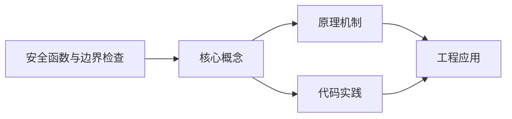
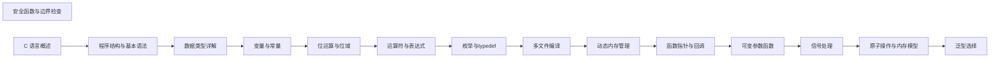

## 1. 学习目标（Bloom 分类）

本节按照布鲁姆教育目标分类学组织学习路径。本文主题为《安全函数与边界检查》，属于 C 模块，读者可以根据自身阶段选择阅读深度。

记忆层面：能够准确复述本文的核心概念、术语与基本语法或操作步骤，并能够在提问或检索时快速定位对应知识点。能够说出 C 的变量、函数、指针、数组、结构体与预处理语法。

理解层面：能够用自己的语言解释核心原理与工作机制，说明概念之间的因果关系，而不是机械记忆结论。能够解释指针与内存地址、栈与堆、编译链接过程。

应用层面：能够在真实项目或练习场景中运用本文知识解决具体问题，写出正确且可维护的实现。能够编写系统工具、数据结构与嵌入式程序。

分析层面：能够拆解复杂问题，比较本文主题与相邻概念的异同，识别边界条件与例外情况。能够分析内存泄漏、缓冲区溢出与未定义行为。

评价层面：能够根据约束条件（性能、可读性、安全、成本）评价不同方案的优劣，做出有依据的技术决策。能够评价 C 与其他语言在系统编程中的取舍。

创造层面：能够把本文知识与其他模块知识组合，设计出新的解决方案或可复用的工程模式。能够设计可移植、可维护的 C 库与模块。

通过本节学习，读者应当能够把《安全函数与边界检查》纳入自己的知识网络，并与 C 模块的其他主题（指针、内存管理、预处理器、标准库）建立关联。

## 2. 历史动机与发展脉络

《安全函数与边界检查》是 C 领域的重要主题。要真正理解它，需要先了解它解决的问题与演进过程。

C 由 Dennis Ritchie 于 1972 年在贝尔实验室为 Unix 开发，是系统编程的基石语言：操作系统、编译器、嵌入式固件均以 C 为主。
C89（ANSI C）统一方言，C99 引入变长数组与 // 注释，C11 增加泛型选择与线程支持，C17 为缺陷修复版，C23（2024 年正式发布）引入 constexpr、属性、显式枚举底层类型等现代化特性。
C 的哲学是“信任程序员”：提供指针与内存操作的全部能力，同时把正确性责任交给开发者；这一设计成就了性能上限，也带来内存安全风险，催生了 Rust 等后继语言。

回到本文主题：安全函数与边界检查 的提出与成熟，正是上述技术背景下的必然产物。早期实现往往以简单可用为目标，随着工程规模扩大，社区逐渐沉淀出标准做法与最佳实践；理解这一脉络，可以帮助读者判断“为什么文档中的推荐写法是现在这个样子”，也能在遇到历史遗留代码时准确识别其设计年代与取舍。


## 3. 形式化定义与核心概念精讲

本节把《安全函数与边界检查》涉及的核心概念以“定义 + 讲解”的形式展开。读者应把定义当作工具，把讲解当作理解路径；两者结合才能形成可迁移的知识。

指针：指针保存变量地址，`&` 取地址、`*` 解引用；指针算术与数组名退化规则（数组名作为实参退化为首元素指针）是 C 的经典难点。
内存管理：栈内存自动释放，堆内存由 malloc/calloc/realloc/free 管理；所有权责任（谁分配谁释放）必须显式约定。
预处理器：#include/#define/#ifdef 在编译前文本处理；宏展开有副作用与优先级风险，函数式宏参数必须加括号。

### 3.1 原文章节逐一精讲

原文档把主题拆分为 14 个小节，下面按顺序给出每一节的导读讲解，随后保留原文细节供精读。

#### 原文精读（完整保留）


#### 概述

C 语言自 1972 年诞生以来,始终将性能与简洁置于安全之上。`strcpy`、`sprintf`、`gets` 等不安全函数因缺少边界检查,成为缓冲区溢出(buffer overflow)漏洞的温床。1988 年 Morris 蠕虫利用 fingerd 缓冲区溢出感染数千台主机,首次让世界认识到 C 语言安全问题的严重性。此后 Code Red、Slammer、Blaster 等大规模蠕虫均利用缓冲区溢出攻击 Windows 服务器。

为缓解此类漏洞,C89/C99 标准引入 `strncpy`、`snprintf` 等带边界版本;微软在 2004 年 MS04-025 后推动 C11 Annex K "Bounds-checking interfaces",定义 `strcpy_s`、`sprintf_s`、`memcpy_s` 等带运行时约束检查的安全函数。2007 年 OpenBSD 提出 `strlcpy`/`strlcat`,在 BSD 与 macOS 中流行。本文系统化阐述 C 安全函数族、边界检查机制、编译期与运行期加固技术及生产实践。

#### 学习目标

##### 识记层(Remember)

- 列举 C 标准中带边界检查的字符串函数(`strncpy`、`strncat`、`snprintf`、`strlcpy`、`strlcat`)及其差异。
- 复述 C11 Annex K 安全函数的命名约定(`_s` 后缀)与运行时约束处理机制(`constraint_handler_t`)。
- 说明 `errno_t`、`rsize_t`、`RSIZE_MAX` 的定义与作用。

##### 理解层(Understand)

- 解释缓冲区溢出(stack/heap overflow)的内存布局与攻击原理。
- 阐述 ASLR、DEP/NX、Canary、PIE、RELRO 等编译器与操作系统级加固机制的工作原理。
- 推导 `strncpy` 在源串长于 n 时不补 '\0' 的设计动机与陷阱。

##### 应用层(Apply)

- 使用 `snprintf`、`strlcpy` 替换不安全的 `sprintf`、`strcpy` 调用。
- 启用 GCC `-D_FORTIFY_SOURCE=2`、`-fstack-protector-strong`、`-fPIE -pie` 等编译选项。
- 通过 AddressSanitizer (ASan)、UndefinedBehaviorSanitizer (UBSan)、Valgrind 检测内存越界。

##### 分析层(Analyze)

- 对比 C11 Annex K、OpenBSD strlcpy、POSIX.1-2008 `snprintf` 三套方案在可移植性、性能、安全性上的差异。
- 分析 `-D_FORTIFY_SOURCE` 在不同优化级别(`-O0`/`-O2`)下的行为差异。
- 推导 `strlen(s) + 1` 模式在多线程与信号处理函数中可能引发的整数溢出。

##### 评价层(Evaluate)

- 评估 CERT C、MISRA C:2012、ISO/IEC TS 17961 三套 C 安全编码标准在企业项目中的适用性。
- 论证"全部使用 `_s` 安全函数"策略在跨平台项目中的可行性。
- 评判 Stack Buffer Overflow 与 Heap Buffer Overflow 在现代利用链中的相对严重性。

##### 创造层(Create)

- 设计一套面向大型 C 项目的字符串与缓冲区管理封装库,统一安全接口与错误处理。
- 构建基于静态分析与 fuzzing 的 C 代码安全测试流水线,集成 OSS-Fuzz、libFuzzer、AFL++。
- 实现一个支持运行时缓冲区完整性检查的调试 allocator(类似 Electric Fence、DUMA)。

#### 历史动机与背景

##### 1. Morris 蠕虫与缓冲区溢出元年

1988 年 11 月 2 日,Cornell 研究生 Robert Tappan Morris 释放 Morris 蠕虫,感染约 6000 台 Unix 主机(占当时 ARPANET 10%)。其利用的漏洞之一就是 fingerd 服务中 `gets` 调用导致的栈缓冲区溢出。这被认为是 Internet 上首次大规模安全事件,促使 DARPA 成立 CERT/CC(Computer Emergency Response Team)。Morris 蠕虫后,C 语言的安全问题正式进入学术界与工业界视野。

##### 2. Aleph One 与 Smashing the Stack

1996 年 Phrack 杂志第 49 期发表 Aleph One(化名 Elias Levy)的文章《Smashing The Stack For Fun And Profit》,系统化讲解了栈缓冲区溢出利用技术,包括 shellcode 注入、返回地址覆盖、NOP sled 等技术。此文使缓冲区溢出利用从黑盒技术变成大众知识,直接催生了此后十年的安全攻防研究。

##### 3. 微软 SDLC 与安全函数推动

2002 年比尔·盖茨发布"Trustworthy Computing"备忘录,微软全面推行安全开发生命周期(SDLC)。2004 年发布 MS04-025 补丁后,微软推动 C 标准化组织采纳"安全函数库"提案,最终在 C11 标准中以 Annex K 形式纳入。同时微软在 Visual Studio 中通过 `#define _CRT_SECURE_NO_WARNINGS` 与 `_s` 函数替代物逐步淘汰不安全 API。

##### 4. 现代缓冲区溢出防御

操作系统与编译器层面引入多重防御:

- **DEP/NX**(2003 Windows XP SP2、Linux PaX):数据段不可执行,阻止 shellcode 注入。
- **ASLR**(2005 Linux、2007 macOS、2007 Windows Vista):地址空间随机化,提高返回地址预测难度。
- **Stack Canary**(1998 Crispin Cowan StackGuard、2003 GCC `-fstack-protector`):在栈帧插入随机值,溢出时被破坏触发 abort。
- **PIE**(2006 Fedora 推广):可执行文件加载基址随机化,与 ASLR 配合。
- **RELRO**(2006):GOT 表只读,防止 GOT 覆盖攻击。
- **CFI**(2015 LLVM 控制流完整性):限制间接调用目标,防御 ROP/JOP。

这些防御使传统栈溢出利用难度大幅提升,但缓冲区漏洞本身仍是软件缺陷,需从代码层面修复。

#### 形式化定义

##### 1. 缓冲区与边界的形式化

设缓冲区 $B = \langle a, n \rangle$,其中 $a$ 是起始地址,$n$ 是字节容量。合法访问操作:

$$
\text{access}(B, i, sz) \text{ is safe} \iff 0 \le i \land i + sz \le n
$$

不安全访问 $\text{access}(B, i, sz) \text{ where } i + sz > n$ 即为缓冲区溢出。

##### 2. 字符串长度与缓冲区大小

C 字符串 $S$ 是以 `'\0'` 结尾的字节序列,其长度:

$$
\text{strlen}(S) = \min\{i \ge 0 : S[i] = 0\}
$$

存储 $S$ 所需最小缓冲区大小为 $\text{strlen}(S) + 1$。安全函数要求显式传递缓冲区大小 $n$,并在 $n < \text{strlen}(S) + 1$ 时截断或报错。

##### 3. 安全函数返回值语义

C11 Annex K 安全函数返回 `errno_t`,定义为 `int`:

$$
\text{ret} = \begin{cases}
0 & \text{成功} \\
\text{EINVAL} & \text{参数无效(如 NULL 指针、大小为 0)} \\
\text{ERANGE} & \text{缓冲区过小}
\end{cases}
$$

失败时调用 `constraint_handler_t` 处理函数,默认调用 `abort()`,可由 `set_constraint_handler_s` 自定义。

##### 4. rsize_t 与 RSIZE_MAX

C11 Annex K 引入 `rsize_t`(通常为 `size_t` 别名),`RSIZE_MAX` 为最大合法大小(通常 `SIZE_MAX >> 1`)。当函数参数声明为 `rsize_t` 时,传入超过 `RSIZE_MAX` 的值被视为运行时约束违反,触发约束处理。这防止了"整数溢出导致巨大 size_t"类漏洞。

##### 5. 边界检查的代数模型

带边界检查的 `strncpy_s(dst, dstsz, src, count)` 满足:

$$
\text{copy\_len} = \min(\text{strlen}(src), \text{count}, \text{dstsz} - 1)
$$

复制完成后强制 `dst[copy_len] = '\0'`,保证结果始终为合法 C 字符串。当 `dstsz <= 0` 或 `dstsz > RSIZE_MAX` 时触发约束违反。

#### 理论推导

##### 1. 整数溢出导致 size 为负

C 标准库函数原型多为 `void f(void *dst, size_t n)`。若 n 来自外部输入且经过运算:

```c
size_t n = a + b + 1;  /* 可能溢出 */
malloc(n);
memcpy(dst, src, n);
```

当 `a + b + 1 > SIZE_MAX` 时,n 回绕到一个小值,malloc 分配小缓冲,memcpy 拷贝大量数据,触发堆溢出。

形式化地,设 $a, b \in \mathbb{N}$,实际大小 $N = a + b + 1$,但计算值 $\tilde{N} = (a + b + 1) \bmod 2^{32}$。当 $N > 2^{32}$ 时 $\tilde{N} \ll N$,导致分配不足。防御:

```c
if (a > SIZE_MAX - b - 1) return ERROR;
size_t n = a + b + 1;
```

##### 2. strncpy 不补 '\0' 的陷阱

`strncpy(dst, src, n)` 行为:

- 若 `strlen(src) < n`:复制全部 src 并补 '\0' 直到 n。
- 若 `strlen(src) >= n`:复制前 n 字节,不补 '\0'。

后者导致 dst 非合法 C 字符串,后续 `strlen`、`printf("%s")` 可能越界读取。形式化:

$$
\text{dst after strncpy} = \begin{cases}
src \cup \underbrace{\text{0}\cdots\text{0}}_{n - |src|} & |src| < n \\
src[0:n] & |src| \ge n \quad (\text{无终止符})
\end{cases}
$$

应使用 `snprintf(dst, n, "%s", src)` 或 `strlcpy(dst, src, n)` 替代。

##### 3. 整数转换的符号扩展

```c
int len = get_len();           /* 可能为负 */
size_t n = len;                 /* 负数转为巨大 size_t */
memcpy(dst, src, n);            /* 越界 */
```

形式化:设 `int` 范围 $[-2^{31}, 2^{31}-1]$,`size_t` 为无符号 32/64 位。当 `len < 0` 时,转换后 `n = len + 2^{32}` 或 `len + 2^{64}`,变成巨大正数。

防御:在转换前显式检查非负。

##### 4. 栈缓冲区溢出的返回地址覆盖

栈帧布局(从高地址到低地址):

```
[函数参数]
[返回地址]
[保存的 RBP]
[局部变量 buf[N]]   <- 攻击者输入
```

`gets(buf)` 读入超过 N 字节时,数据依次覆盖:buf → RBP → 返回地址。攻击者将返回地址覆盖为 shellcode 地址,函数返回时跳转到 shellcode。Stack Canary 在 RBP 与 buf 之间插入随机值,溢出时先破坏 canary,函数返回前检查 canary 不一致即 abort。

##### 5. Return-Oriented Programming (ROP)

DEP/NX 使数据段不可执行,直接注入 shellcode 失效。ROP 攻击将返回地址覆盖为现有可执行代码中的"gadget"序列(以 `ret` 结尾的几条指令),通过串联 gadget 完成任意操作。设攻击者可控返回地址序列 $\{r_1, r_2, \dots, r_k\}$,每个 $r_i$ 指向一个 gadget,执行流依次跳转:

$$
\text{ret}_1 \to \text{gadget}_1 \to \text{ret}_2 \to \text{gadget}_2 \to \dots \to \text{ret}_k
$$

ASLR、CFI 等机制通过随机化与控制流验证降低 ROP 可行性。

#### 代码示例

##### 示例 1:不安全函数及其修复

```c
/* 文件: unsafe_vs_safe.c
 * 演示不安全函数与安全函数的差异
 */
#include <stdio.h>
#include <string.h>
#include <stdlib.h>

#define BUF_SIZE 16

/* 反模式:gets 已在 C11 移除,仍存在于旧代码
 * 危险:无边界检查,任意长度输入导致栈溢出
 */
void unsafe_gets(void) {
    char buf[BUF_SIZE];
    if (gets(buf) == NULL) {  /* 编译告警,链接可能失败 */
        return;
    }
    printf("read: %s\n", buf);
}

/* 正确做法:使用 fgets,指定最大读取长度
 * 注意:fgets 会保留换行符,需手动处理
 */
void safe_fgets(void) {
    char buf[BUF_SIZE];
    if (fgets(buf, sizeof(buf), stdin) == NULL) {
        return;
    }
    /* 移除可能的换行符 */
    size_t len = strlen(buf);
    if (len > 0 && buf[len - 1] == '\n') {
        buf[len - 1] = '\0';
    }
    printf("read: %s\n", buf);
}

/* 反模式:strcpy 不检查目标缓冲区大小 */
void unsafe_strcpy(const char *src) {
    char buf[BUF_SIZE];
    strcpy(buf, src);  /* src 长于 BUF_SIZE 时溢出 */
    printf("copied: %s\n", buf);
}

/* 正确做法 1:使用 snprintf(可移植) */
void safe_snprintf(const char *src) {
    char buf[BUF_SIZE];
    snprintf(buf, sizeof(buf), "%s", src);  /* 自动截断并补 '\0' */
    printf("copied: %s\n", buf);
}

/* 正确做法 2:使用 strlcpy(BSD/macOS) */
void safe_strlcpy(const char *src) {
    char buf[BUF_SIZE];
    strlcpy(buf, src, sizeof(buf));  /* 截断并补 '\0' */
    printf("copied: %s\n", buf);
}

/* 正确做法 3:使用 C11 Annex K strcpy_s(MSVC/glibc 可选) */
void safe_strcpy_s(const char *src) {
    char buf[BUF_SIZE];
    errno_t rc = strcpy_s(buf, sizeof(buf), src);
    if (rc != 0) {
        fprintf(stderr, "strcpy_s failed: %d\n", rc);
        return;
    }
    printf("copied: %s\n", buf);
}
```

##### 示例 2:动态缓冲区分配

```c
/* 文件: dyn_buf.c
 * 安全的动态缓冲区字符串拼接
 */
#include <stdio.h>
#include <stdlib.h>
#include <string.h>
#include <stdarg.h>

/* 安全的 sprintf 替代:动态分配缓冲区
 * 返回值:成功 0,失败 -1
 * 输出参数:out_str 指向新分配的字符串,调用者需 free
 */
int safe_asprintf(char **out_str, const char *fmt, ...) {
    va_list ap;
    va_start(ap, fmt);

    /* 第一遍:计算所需长度 */
    va_list ap_copy;
    va_copy(ap_copy, ap);
    int len = vsnprintf(NULL, 0, fmt, ap_copy);
    va_end(ap_copy);

    if (len < 0) {
        va_end(ap);
        return -1;
    }

    /* 检查整数溢出:len + 1 可能溢出 */
    if ((size_t)len == SIZE_MAX) {
        va_end(ap);
        return -1;
    }

    char *buf = malloc((size_t)len + 1);
    if (!buf) {
        va_end(ap);
        return -1;
    }

    /* 第二遍:实际写入 */
    vsnprintf(buf, (size_t)len + 1, fmt, ap);
    va_end(ap);

    *out_str = buf;
    return 0;
}

int main(void) {
    char *result = NULL;
    if (safe_asprintf(&result, "name=%s age=%d", "Alice", 30) == 0) {
        printf("%s\n", result);
        free(result);
    }
    return 0;
}
```

##### 示例 3:边界检查读取

```c
/* 文件: safe_read.c
 * 安全的网络数据读取
 * 确保不超过缓冲区容量
 */
#include <stdio.h>
#include <stdlib.h>
#include <string.h>
#include <unistd.h>
#include <errno.h>

/* 安全读取:确保不超过 buf_size 字节
 * 返回值:>0 已读字节数,0 EOF,-1 出错
 */
ssize_t safe_read(int fd, void *buf, size_t buf_size) {
    if (buf_size == 0) {
        errno = EINVAL;
        return -1;
    }
    ssize_t n = read(fd, buf, buf_size);
    return n;
}

/* 安全读取定长数据:循环读取直到 size 字节或 EOF */
ssize_t read_full(int fd, void *buf, size_t size) {
    size_t total = 0;
    char *p = (char *)buf;
    while (total < size) {
        ssize_t n = read(fd, p + total, size - total);
        if (n < 0) {
            if (errno == EINTR) continue;
            return -1;
        }
        if (n == 0) break;  /* EOF */
        total += (size_t)n;
    }
    return (ssize_t)total;
}

/* 安全写入定长数据 */
ssize_t write_full(int fd, const void *buf, size_t size) {
    size_t total = 0;
    const char *p = (const char *)buf;
    while (total < size) {
        ssize_t n = write(fd, p + total, size - total);
        if (n < 0) {
            if (errno == EINTR) continue;
            return -1;
        }
        if (n == 0) break;
        total += (size_t)n;
    }
    return (ssize_t)total;
}

/* 带长度前缀的消息读取(常见网络协议) */
int read_message(int fd, char **out_buf, size_t *out_len) {
    uint32_t net_len;
    if (read_full(fd, &net_len, sizeof(net_len)) != (ssize_t)sizeof(net_len)) {
        return -1;
    }

    /* 主机字节序转换 */
    uint32_t msg_len = ntohl(net_len);

    /* 防御性检查:限制最大消息长度,防止 DoS */
    if (msg_len > 16U * 1024U * 1024U) {
        errno = EMSGSIZE;
        return -1;
    }

    char *buf = malloc(msg_len + 1);
    if (!buf) return -1;

    if (read_full(fd, buf, msg_len) != (ssize_t)msg_len) {
        free(buf);
        return -1;
    }
    buf[msg_len] = '\0';

    *out_buf = buf;
    *out_len = msg_len;
    return 0;
}
```

##### 示例 4:启用 AddressSanitizer

```c
/* 文件: asan_demo.c
 * 演示 AddressSanitizer 检测越界
 * 编译: gcc -fsanitize=address -g -O0 asan_demo.c -o asan_demo
 * 运行: ./asan_demo
 */
#include <stdio.h>
#include <string.h>

int main(void) {
    char buf[10];
    /* 故意越界 1 字节 */
    memset(buf, 'A', 11);
    printf("buf = %.*s\n", 10, buf);
    return 0;
}

/* 运行时 ASan 报告示例:
 * ==12345==ERROR: AddressSanitizer: stack-buffer-overflow on address 0x...
 * WRITE of size 11 at 0x... thread T0
 *     #0 0x... in main asan_demo.c:9
 *     ...
 * Address 0x... is located in stack of thread T0 at offset 0x... in frame
 *     #0 0x... in main asan_demo.c:6
 *   This frame has 1 object(s):
 *     [0x..., 0x...) 'buf' (line 7) <== Memory access at offset 0x... overflows this variable
 */
```

##### 示例 5:启用 FORTIFY_SOURCE

```c
/* 文件: fortify_demo.c
 * 演示 _FORTIFY_SOURCE 在编译期与运行期检查
 * 编译: gcc -D_FORTIFY_SOURCE=2 -O2 fortify_demo.c -o fortify_demo
 */
#include <stdio.h>
#include <string.h>

void f(const char *s) {
    char buf[8];
    /* FORTIFY_SOURCE=2 下编译期检查:
     * 若 s 来源已知且长于 8,编译告警;
     * 运行期:__strcpy_chk 在运行时检测溢出,调用 abort
     */
    strcpy(buf, s);
    printf("%s\n", buf);
}

int main(void) {
    /* 编译期告警:__builtin___strcpy_chk 警告 will always overflow */
    f("hello world this is too long");
    return 0;
}
```

##### 示例 6:自定义 constraint handler

```c
/* 文件: constraint_handler.c
 * 演示 C11 Annex K 自定义约束处理
 */
#define __STDC_WANT_LIB_EXT1__ 1
#include <stdio.h>
#include <string.h>
#include <stdlib.h>

/* 自定义约束处理函数 */
static void my_handler(const char *restrict msg,
                       void *restrict ptr,
                       errno_t error) {
    fprintf(stderr, "[constraint violation] %s (errno=%d, ptr=%p)\n",
            msg ? msg : "(null)", error, ptr);
    /* 实际产品可记录日志后 abort 或 longjmp */
    abort();
}

int main(void) {
    /* 设置约束处理函数 */
    set_constraint_handler_s(my_handler);

    char buf[8];
    /* 源串过长,触发约束处理 */
    errno_t rc = strcpy_s(buf, sizeof(buf), "this is too long");
    if (rc != 0) {
        printf("strcpy_s returned %d\n", rc);
    }
    return 0;
}
```

##### 示例 7:自定义安全字符串库

```c
/* 文件: safe_str.h
 * 跨平台安全字符串操作封装
 */
#ifndef SAFE_STR_H
#define SAFE_STR_H

#include <stddef.h>
#include <stdarg.h>

/* 安全字符串复制:类似 strlcpy 但可移植
 * 返回值:实际复制长度(不含终止符),若 dst_size == 0 返回 0
 */
static inline size_t safe_strlcpy(char *dst, const char *src, size_t dst_size) {
    if (dst_size == 0) return 0;
    size_t i = 0;
    for (; i < dst_size - 1 && src[i] != '\0'; i++) {
        dst[i] = src[i];
    }
    dst[i] = '\0';
    return i;
}

/* 安全字符串拼接:保证结果始终以 '\0' 结尾
 * 返回值:拼接后总长度(不含终止符),若超出返回 dst_size
 */
static inline size_t safe_strlcat(char *dst, const char *src, size_t dst_size) {
    if (dst_size == 0) return 0;
    size_t dst_len = 0;
    while (dst_len < dst_size && dst[dst_len] != '\0') dst_len++;
    if (dst_len == dst_size) return dst_size;

    size_t i = 0;
    for (; dst_len + i < dst_size - 1 && src[i] != '\0'; i++) {
        dst[dst_len + i] = src[i];
    }
    dst[dst_len + i] = '\0';
    return dst_len + i;
}

/* 安全格式化:返回实际写入长度(不含终止符),失败返回 -1 */
static inline int safe_snprintf(char *buf, size_t size, const char *fmt, ...) {
    if (size == 0) return 0;
    va_list ap;
    va_start(ap, fmt);
    int n = vsnprintf(buf, size, fmt, ap);
    va_end(ap);
    if (n < 0 || (size_t)n >= size) {
        /* 截断或出错 */
        buf[size - 1] = '\0';
        return -1;
    }
    return n;
}

/* 安全内存分配:检查乘法溢出
 * 返回值:成功返回分配的指针,失败返回 NULL
 */
static inline void *safe_calloc(size_t nmemb, size_t size) {
    /* 检查 nmemb * size 是否溢出 */
    if (nmemb != 0 && size > (size_t)-1 / nmemb) {
        return NULL;
    }
    return calloc(nmemb, size);
}

#endif /* SAFE_STR_H */
```

#### 对比分析

##### 1. 字符串函数族横向对比

| 函数 | 标准 | 是否补 '\0' | 是否触发约束 | 可移植性 | 典型用途 |
|---|---|---|---|---|---|
| `strcpy` | C89 | 是 | 否 | 全平台 | 已弃用 |
| `strncpy` | C89 | 否(源长时) | 否 | 全平台 | 历史代码 |
| `strlcpy` | BSD | 是 | 否 | BSD/Linux/macOS | 跨平台推荐 |
| `strcpy_s` | C11 Annex K | 是 | 是 | MSVC/C11 可选 | Windows 推荐 |
| `snprintf` | C99 | 是 | 否 | 全平台 | 通用 |
| `sprintf` | C89 | 是 | 否 | 全平台 | 已弃用 |
| `sprintf_s` | C11 Annex K | 是 | 是 | MSVC/C11 可选 | Windows 推荐 |

##### 2. 编译选项加固对比

| 选项 | 防御目标 | 性能开销 | 兼容性 |
|---|---|---|---|
| `-D_FORTIFY_SOURCE=1/2/3` | 标准库函数越界 | 微小 | GCC/Clang |
| `-fstack-protector` | 栈溢出 | 函数序言/尾声 | GCC/Clang |
| `-fstack-protector-strong` | 栈溢出(更广覆盖) | 中等 | GCC/Clang |
| `-fstack-protector-all` | 栈溢出(全部函数) | 较大 | GCC/Clang |
| `-fPIE -pie` | 地址随机化 | 微小 | Linux |
| `-Wl,-z,relro,-z,now` | GOT 覆盖 | 启动稍慢 | Linux |
| `-fsanitize=address` | 内存错误(测试用) | 2-5 倍 | GCC/Clang |
| `-fsanitize=undefined` | 未定义行为 | 微小 | GCC/Clang |
| `-fcf-protection=full` | 控制流完整性 | 1-3% | GCC/Clang (x86) |
| `-mbranch-protection=standard` | ARM BTI/PAC | 微小 | ARM64 |

##### 3. 安全编码标准对比

| 标准 | 发布机构 | 范围 | 工具支持 |
|---|---|---|---|
| CERT C | CERT/SEI | 通用 C 安全 | Coverity, cppcheck |
| MISRA C:2012 | MISRA | 汽车/嵌入式 | PC-lint, Polyspace |
| ISO/IEC TS 17961:2013 | ISO | C 代码安全 | 多种商业工具 |
| CWE Top 25 | MITRE | 通用漏洞分类 | NIST SAMATE |
| ISO 26262 | ISO | 汽车功能安全 | Polyspace, QA-C |
| IEC 62304 | IEC | 医疗软件 | 静态分析工具 |

##### 4. 运行时检查工具对比

| 工具 | 检测目标 | 性能开销 | 平台 |
|---|---|---|---|
| AddressSanitizer (ASan) | 内存越界、UAF、double-free | 2x | GCC/Clang |
| MemorySanitizer (MSan) | 未初始化内存读取 | 3x | Clang |
| UndefinedBehaviorSanitizer | 整数溢出、UB | 微小 | GCC/Clang |
| ThreadSanitizer (TSan) | 数据竞争 | 5-15x | GCC/Clang |
| Valgrind/Memcheck | 内存错误 | 10-30x | Linux/macOS |
| Electric Fence | 堆越界 | 中等 | Linux |
| libefence/DUMA | 堆越界 | 中等 | Linux |

#### 常见陷阱与反模式

##### 1. off-by-one 错误

**事故案例**:某 HTTP 服务器在解析 Content-Length 时分配 `len` 字节缓冲,但 `memcpy(buf, body, len + 1)` 多拷贝一字节,长期运行导致堆破坏。

**反模式**:

```c
char *buf = malloc(len);   /* 缓冲长度 len */
memcpy(buf, src, len + 1); /* 拷贝 len + 1 字节,越界 */
```

**正确做法**:统一"长度 vs 容量"语义,分配 `len + 1`(为 '\0'),拷贝 `len`。

##### 2. 混淆 size 与 length

**事故案例**:某日志库将 `size_t length` 误传给 `snprintf(dst, length, ...)`,导致 dst 缺 '\0' 终止符,后续 `strcat` 越界。

**正确做法**:文档与命名严格区分:长度不含终止符,容量含终止符。

##### 3. sizeof(指针) 误用

**反模式**:

```c
void f(char *buf) {
    snprintf(buf, sizeof(buf), "%s", src);  /* sizeof(char*) 而非缓冲区大小 */
}
```

`sizeof(buf)` 在指针退化为 4 或 8 字节,绝非缓冲区容量。函数无法从指针推导缓冲区大小,必须显式传递。

**正确做法**:

```c
void f(char *buf, size_t buf_size) {
    snprintf(buf, buf_size, "%s", src);
}
```

##### 4. 整数转换有符号错误

**事故案例**:某 PDF 解析器从文件读 int32 长度字段,直接转 size_t,malloc 分配巨大内存,触发 OOM。

**正确做法**:

```c
int32_t raw_len = read_int32();
if (raw_len < 0) return ERROR;
if ((uint32_t)raw_len > MAX_LEN) return ERROR;
size_t len = (size_t)raw_len;
```

##### 5. 多线程下 strlen 不安全

**事故案例**:线程 A 调用 `strlen(s)`,线程 B 同时修改 `s` 字符串末尾字节,导致 strlen 返回错误长度。

**正确做法**:字符串在多线程下应只读;需修改时使用 mutex 保护或使用不可变字符串。

##### 6. snprintf 返回值误用

**反模式**:

```c
char buf[8];
int n = snprintf(buf, sizeof(buf), "%s", long_str);
/* n 是"想写入"的长度,可能 >= sizeof(buf)
 * 后续 snprintf(buf + n, sizeof(buf) - n, ...) 可能溢出
 */
```

**正确做法**:snprintf 返回值若 `>= size` 表示截断,后续操作应基于实际写入长度 `min(n, size-1)`。

##### 7. strncpy 后忘补 '\0'

**反模式**:

```c
char buf[8];
strncpy(buf, src, sizeof(buf));  /* src 长于 8 时无终止符 */
printf("%s", buf);  /* 越界读 */
```

**正确做法**:strncpy 后显式 `buf[sizeof(buf) - 1] = '\0';` 或改用 strlcpy/snprintf。

##### 8. sscanf 无边界检查

**反模式**:

```c
char name[16];
sscanf(input, "%s", name);  /* %s 不带宽度,任意长度越界 */
```

**正确做法**:

```c
sscanf(input, "%15s", name);  /* 最多读 15 字符,保留 '\0' */
```

#### 工程实践

##### 1. 编译选项加固清单(Linux GCC/Clang)

```bash
# 生产环境推荐编译选项
CFLAGS="-O2 -g \
    -D_FORTIFY_SOURCE=2 \
    -fstack-protector-strong \
    -fstack-clash-protection \
    -fPIE \
    -Wl,-pie \
    -Wl,-z,relro \
    -Wl,-z,now \
    -Wl,-z,noexecstack \
    -fcf-protection=full \
    -fexceptions \
    -Wformat -Wformat-security \
    -Werror=format-security \
    -Werror=implicit-function-declaration \
    -Wall -Wextra -Wpedantic"

# 测试环境追加 sanitizer
CFLAGS_DEBUG="-O0 -g -fsanitize=address,undefined -fno-omit-frame-pointer"
```

##### 2. CI 集成静态分析

```yaml
# .github/workflows/security.yml 示例
name: Security
on: [push, pull_request]
jobs:
  analyze:
    runs-on: ubuntu-latest
    steps:
      - uses: actions/checkout@v4
        with:
          fetch-depth: 0
      - run: sudo apt-get install -y cppcheck flawfinder clang-tidy
      - name: cppcheck
        run: cppcheck --enable=all --inconclusive --suppress=missingInclude
                  --error-exitcode=1 --inline-suppr src/
      - name: clang-tidy
        run: run-clang-tidy -checks='-*,bugprone-*,cert-*,cppcoreguidelines-*,security-*,clang-analyzer-*' src/
      - name: flawfinder
        run: flawfinder --error-level=3 src/
      - name: build with ASan
        run: make CC=gcc CFLAGS="-O0 -g -fsanitize=address -fno-omit-frame-pointer"
      - name: run tests
        run: ./build/tests
      - name: build with UBSan
        run: make clean && make CC=clang CFLAGS="-O0 -g -fsanitize=undefined -fno-sanitize-recover=all"
      - name: run tests
        run: ./build/tests
```

##### 3. Fuzzing 集成

```c
/* 文件: fuzz_parser.c
 * libFuzzer 入口,测试解析器安全性
 * 编译: clang -fsanitize=fuzzer,address -g -O1 fuzz_parser.c -o fuzz_parser
 */
#include <stdint.h>
#include <stddef.h>
#include <string.h>

extern int parse_input(const uint8_t *data, size_t size);

int LLVMFuzzerTestOneInput(const uint8_t *data, size_t size) {
    /* 限制输入大小,避免 OOM */
    if (size > 65536) return 0;
    parse_input(data, size);
    return 0;
}
```

##### 4. 安全 allocator 封装

```c
/* 文件: safe_alloc.c
 * 带边界检查与 canary 的 allocator
 */
#include <stdio.h>
#include <stdlib.h>
#include <string.h>
#include <stdint.h>

#define CANARY 0xDEADBEEFCAFEBABEULL
#define MAX_ALLOC (1ULL << 30)  /* 1GB 上限 */

typedef struct {
    uint64_t canary_pre;     /* 前导 canary */
    size_t user_size;        /* 用户请求大小 */
    size_t alignment;        /* 对齐填充 */
    /* 用户数据紧随其后 */
} alloc_header_t;

void *safe_malloc(size_t size) {
    if (size == 0 || size > MAX_ALLOC) return NULL;
    /* 分配 size + sizeof(header) + sizeof(canary) */
    size_t total = sizeof(alloc_header_t) + size + sizeof(uint64_t);
    if (total < size) return NULL;  /* 溢出检查 */

    char *raw = malloc(total);
    if (!raw) return NULL;

    alloc_header_t *hdr = (alloc_header_t *)raw;
    hdr->canary_pre = CANARY;
    hdr->user_size = size;

    /* 尾部 canary */
    uint64_t *post = (uint64_t *)(raw + sizeof(alloc_header_t) + size);
    *post = CANARY;

    return raw + sizeof(alloc_header_t);
}

void safe_free(void *ptr) {
    if (!ptr) return;
    char *user = (char *)ptr;
    alloc_header_t *hdr = (alloc_header_t *)(user - sizeof(alloc_header_t));

    /* 检查前导 canary */
    if (hdr->canary_pre != CANARY) {
        fprintf(stderr, "safe_free: heap corruption (pre-canary)\n");
        abort();
    }

    /* 检查尾部 canary */
    uint64_t *post = (uint64_t *)(user + hdr->user_size);
    if (*post != CANARY) {
        fprintf(stderr, "safe_free: buffer overflow detected\n");
        abort();
    }

    /* 清零内存,防止 use-after-free */
    memset(hdr, 0, sizeof(alloc_header_t) + hdr->user_size);
    free(hdr);
}
```

##### 5. 输入验证清单

| 数据类型 | 验证规则 |
|---|---|
| 字符串长度 | `len <= MAX_LEN` |
| 整数范围 | `INT_MIN <= x <= INT_MAX` |
| 数组索引 | `0 <= i < array_size` |
| 文件路径 | 拒绝 `..`、绝对路径、特殊字符 |
| 用户输入 | 长度、字符集、格式三重检查 |
| 网络消息 | 长度前缀 + 上限 + 校验和 |
| SQL/命令 | 参数化查询,禁止字符串拼接 |
| HTML/JS | 转义输出,使用白名单 |

#### 案例研究

##### 案例 1:OpenSSL Heartbleed(CVE-2014-0160)

2014 年 4 月披露的 OpenSSL Heartbleed 漏洞允许攻击者读取服务器进程内存,泄露私钥与用户会话。根因是 TLS heartbeat 扩展实现中,服务端直接信任客户端发送的 payload 长度字段,未与实际数据长度对比:

```c
/* 漏洞代码(简化) */
memcpy(response, request + 1, request->length);  /* length 来自客户端 */
```

修复:严格校验 `request->length <= 实际接收长度`。该漏洞导致全球 17% HTTPS 网站受影响,直接经济损失估计数亿美元,是 C 语言边界检查缺失的标志性案例。

##### 案例 2:Stagefright(CVE-2015-1538)

2015 年 Android 多媒体库 libstagefright 在解析 MP4 视频时,整数溢出导致堆缓冲区溢出,攻击者通过 MMS 发送恶意视频即可远程执行代码。根因:

```c
size_t size = width * height * 3 / 2;  /* 32 位乘法溢出 */
uint8_t *buf = malloc(size);            /* 分配过小 */
memcpy(buf, data, real_size);           /* 越界写入 */
```

修复:所有尺寸计算使用 `__int128` 或显式溢出检查。该漏洞促使 Google 推出 Android 月度安全更新机制。

##### 案例 3:Linux Kernel get_user(CVE-2016-0728)

Linux 内核 `keyctl` 系统调用中,引用计数使用 `int` 类型,长时间反复调用导致整数溢出,使计数变为 0 后再次释放,触发 use-after-free,可本地提权。修复:将引用计数改为 `atomic_t` 并使用 `refcount_t` 检测溢出。

##### 案例 4:SQLite FTS3 越界(CVE-2017-15369)

SQLite FTS3 全文搜索模块在处理特殊查询时,内部偏移计算错误,导致堆越界读取。根因是 `int` 与 `size_t` 混用,符号扩展导致巨大偏移。修复:统一使用 `size_t` 并增加边界检查。该漏洞影响所有使用 SQLite 的应用(包括 iOS、Android 系统组件)。

#### 知识讲解与要点分析（原习题）

##### 基础题

**题 1**:`strcpy`、`strncpy`、`strlcpy`、`strcpy_s` 四者的核心区别是什么?

**参考答案**:

- `strcpy`:不检查边界,源串过长时溢出。
- `strncpy`:有边界,但源串长于 n 时不补 '\0'。
- `strlcpy`:有边界,源串长时截断并补 '\0',返回源串长度。
- `strcpy_s`:有边界与约束处理,失败时调用 `constraint_handler` 并设置 `errno`。

**题 2**:为什么 `gets` 在 C11 标准中被移除?

**参考答案**:`gets` 无法限制读取长度,任意输入都可能导致栈溢出,无法安全使用。C11 标准正式移除,改用 `fgets` 替代。

**题 3**:`-D_FORTIFY_SOURCE=2` 与 `-D_FORTIFY_SOURCE=1` 的区别?

**参考答案**:`=1` 仅在编译期可确定缓冲区大小时检查;`=2` 还包括运行期检查(如缓冲区大小来自变量),覆盖更广。

##### 进阶题

**题 4**:分析以下代码的安全问题并给出修复:

```c
void log_msg(const char *user, const char *msg) {
    char buf[256];
    strcpy(buf, user);
    strcat(buf, ": ");
    strcat(buf, msg);
    printf("%s\n", buf);
}
```

**参考答案要点**:

- 问题 1:`strcpy`/`strcat` 无边界检查,user 或 msg 过长导致溢出。
- 问题 2:多次 strcat 性能差,每次重新计算长度。
- 修复:使用 `snprintf(buf, sizeof(buf), "%s: %s", user, msg)`。

**题 5**:设计一个安全的字符串分割函数,要求:

- 输入:源字符串、分隔符、输出数组与容量。
- 输出:实际分割数,每段长度不超过输出缓冲区。

**参考答案要点**:

- 每段使用 `strlcpy`/`snprintf` 复制,确保终止符。
- 检查分割数不超过数组容量,超出则截断并报告。
- 处理连续分隔符(根据需求视为空段或跳过)。
- 处理源串为空、分隔符为空等边界情况。

##### 挑战题

**题 6**:某网络协议消息格式为 `|4 字节长度|N 字节 payload|`,长度为 payload 字节数。设计一个安全的接收函数,要求:

- 长度字段使用大端字节序。
- 最大消息长度 1MB,超过则报错。
- payload 可能包含任意字节,包括 `'\0'`。

**参考答案要点**:

```c
int recv_message(int fd, uint8_t **out_payload, uint32_t *out_len) {
    uint8_t len_buf[4];
    if (read_full(fd, len_buf, 4) != 4) return -1;
    uint32_t len = ((uint32_t)len_buf[0] << 24) |
                   ((uint32_t)len_buf[1] << 16) |
                   ((uint32_t)len_buf[2] << 8) |
                   ((uint32_t)len_buf[3]);
    if (len > 1024U * 1024U) return -1;
    uint8_t *buf = malloc(len);
    if (!buf) return -1;
    if (read_full(fd, buf, len) != (ssize_t)len) {
        free(buf);
        return -1;
    }
    *out_payload = buf;
    *out_len = len;
    return 0;
}
```

**题 7**:分析 ASan 与 Valgrind 的检测能力差异,说明在 CI 中如何选择。

**参考答案要点**:

- ASan:编译期插入,运行期开销 2x,可检测栈/堆/全局越界、UAF、double-free,但要求重新编译。
- Valgrind:二进制插桩,运行期开销 10-30x,可检测内存泄漏、未初始化使用,但不重新编译,且不检测栈越界。
- CI 选择:开发与测试期用 ASan(快),发布前用 Valgrind 检测泄漏。

#### 参考文献

[1] Seacord, R. C. 2013. Secure Coding in C and C++, 2nd edition. Addison-Wesley. ISBN 978-0-321-82213-0.

[2] ISO/IEC. 2011. ISO/IEC 9899:2011 - Programming languages - C. ISO. https://www.iso.org/standard/57853.html

[3] ISO/IEC. 2013. ISO/IEC TS 17961:2013 - Information technology - Programming languages, their environments and system software interfaces - C secure coding rules. ISO. https://www.iso.org/standard/61133.html

[4] CERT. 2014. CERT C Secure Coding Standard, 2nd edition. Addison-Wesley. ISBN 978-0-321-82377-9.

[5] Aleph One. 1996. Smashing the stack for fun and profit. Phrack Magazine 7, 49 (November 1996). http://phrack.org/issues/49/14.html

[6] Cowan, C. et al. 1998. StackGuard: automatic adaptive detection and prevention of buffer-overflow attacks. In Proceedings of the 7th USENIX Security Symposium (SECURITY '98). USENIX Association. https://www.usenix.org/legacy/events/sec98/cowan.html

[7] Shacham, V. et al. 2004. On the effectiveness of address-space randomization. In Proceedings of the 11th ACM Conference on Computer and Communications Security (CCS '04), 62-74. DOI: https://doi.org/10.1145/1030083.1030094

[8] Roemer, R. et al. 2012. Return-oriented programming: systems, languages, and applications. ACM Transactions on Information and System Security 15, 1 (March 2012), 1-34. DOI: https://doi.org/10.1145/2133375.2133377

[9] Serebryany, K. et al. 2012. AddressSanitizer: a fast address sanity checker. In Proceedings of the 2012 USENIX Annual Technical Conference (USENIX ATC '12). USENIX Association. https://www.usenix.org/conference/atc12/technical-sessions/presentation/serebryany

[10] Miller, T. et al. 2014. The Heartbleed bug. CVE-2014-0160. https://cve.mitre.org/cgi-bin/cvename.cgi?name=CVE-2014-0160

#### 延伸阅读

##### 官方文档

- C11 标准(ISO/IEC 9899:2011)Annex K: https://www.iso.org/standard/57853.html
- OWASP C/C++ Vulnerabilities: https://owasp.org/www-community/vulnerabilities/
- MITRE CWE (Common Weakness Enumeration): https://cwe.mitre.org/
- NIST SAMATE: https://samate.nist.gov/

##### 经典教材

- Robert C. Seacord. Secure Coding in C and C++, 2nd ed., Addison-Wesley, 2013.
- Michael Howard, David LeBlanc. Writing Secure Code, 2nd ed., Microsoft Press, 2003.
- Jon Erickson. Hacking: The Art of Exploitation, 2nd ed., No Starch Press, 2008.
- Aleph One. Smashing the Stack for Fun and Profit, Phrack 49, 1996.

##### 前沿论文与资料

- Serebryany, K. et al. 2012. AddressSanitizer: A Fast Address Sanity Checker. USENIX ATC. https://research.google.com/pubs/pub37788.html
- Song, D. et al. 2008. BitBlaze: A New Approach to Computer Security via Binary Analysis. ICISS. DOI: https://doi.org/10.1007/978-3-540-89862-7_1
- LLVM Sanitizers 文档: https://clang.llvm.org/docs/UsersManual.html#controlling-code-generation
- GCC Instrumentation Options: https://gcc.gnu.org/onlinedocs/gcc/Instrumentation-Options.html
- ASan Wiki: https://github.com/google/sanitizers/wiki/AddressSanitizer
- OSS-Fuzz: https://github.com/google/oss-fuzz

##### 开源项目与工具

- libFuzzer: https://llvm.org/docs/LibFuzzer.html
- AFL++: https://github.com/AFLplusplus/AFLplusplus
- Valgrind: https://valgrind.org/
- AddressSanitizer: https://github.com/google/sanitizers
- Coverity Scan: https://scan.coverity.com/
- PC-lint Plus: https://www.gimpel.com/

#### 总结

安全函数与边界检查是 C 代码防御内存安全漏洞的核心手段。本文从 Morris 蠕虫到 Heartbleed 的历史脉络出发,推导了缓冲区溢出、整数溢出、整数转换等核心漏洞的数学模型,提供了从安全函数替换、编译选项加固、ASan/UBSan 检测到自定义 allocator 的多个生产级代码示例,分析了 8 类常见陷阱与生产事故案例,并通过 OpenSSL、Stagefright、Linux Kernel、SQLite 四个真实案例展示边界检查缺失的严重后果。

掌握本文内容后,读者应能:

1. 识别并替换代码中的不安全函数(`strcpy`、`sprintf`、`gets` 等)。
2. 启用 GCC/Clang 的 `-D_FORTIFY_SOURCE`、`-fstack-protector-strong`、ASan 等加固选项。
3. 要点：带边界检查与整数溢出检测的安全代码。
4. 设计 CI 流水线,集成静态分析、fuzzing、sanitizer 测试。
5. 排查生产环境中的内存越界、UAF、double-free 等安全漏洞。

C 语言因历史包袱难以从根本上消除内存安全问题,但通过严格的编码规范、编译器加固、运行时检测三重防御,可使生产代码达到接近内存安全语言的可靠性水平。Rust、Go 等内存安全语言的兴起对 C 提出了挑战,但 C 在系统编程、嵌入式、性能敏感领域的地位短期难以撼动,掌握 C 安全编程仍是软件工程师的核心竞争力。


### 3.2 概念关系图

下面用 Mermaid 图表达本文核心概念之间的关系，帮助读者建立整体图景：



图中展示的是本文知识的结构化关系：核心概念是入口，原理机制解释“为什么”，代码实践演示“怎么做”，工程应用回答“何时用”。读者学习时可以把每个小节的内容挂接到对应节点上。

## 4. 理论推导与原理解析

本节深入《安全函数与边界检查》背后的原理。理论部分不求面面俱到，而是聚焦“能解释现象、能指导实践”的关键推导。

指针：指针保存变量地址，`&` 取地址、`*` 解引用；指针算术与数组名退化规则（数组名作为实参退化为首元素指针）是 C 的经典难点。
内存管理：栈内存自动释放，堆内存由 malloc/calloc/realloc/free 管理；所有权责任（谁分配谁释放）必须显式约定。
预处理器：#include/#define/#ifdef 在编译前文本处理；宏展开有副作用与优先级风险，函数式宏参数必须加括号。
编译链接：预处理 -> 编译 -> 汇编 -> 链接；头文件声明接口，源文件实现；静态库与动态库（.a/.so/.dll）决定部署形态。

需要强调的是，理论推导与工程实践之间存在翻译层：理论给出的是理想化模型与边界条件，工程代码则必须处理真实环境中的例外。读者在学习时应先掌握理论的“标准情形”，再通过陷阱章节了解“非标准情形”。

## 5. 代码示例与逐行讲解

本节把原文中的代码示例系统整理，并为每个示例补充用途说明与讲解。读者不应只浏览代码，而应逐段对照讲解理解设计意图。

### 5.1 示例：1. 整数溢出导致 size 为负

该示例来自原文《1. 整数溢出导致 size 为负》小节，用于演示安全函数与边界检查相关操作。阅读时请先看代码结构，再看其后的讲解。

```c
size_t n = a + b + 1;  /* 可能溢出 */
malloc(n);
memcpy(dst, src, n);
```

讲解：这段代码演示了本节核心知识点。代码中的关键操作可以归纳为三步：准备（定义或初始化）、执行（核心逻辑）、收尾（释放资源或返回结果）。实际项目中，这三步往往被封装为函数或类，以提升复用性与可测试性。

关键点分析：

该示例共 3 行有效代码，结构以数据或配置为主。阅读时应关注：数据字段的含义、配置项的作用，以及它们与运行行为的对应关系。

进阶思考路径：先尝试修改参数观察行为变化，再把示例中的模式迁移到自己的项目中；每次修改都记录预期与实测差异，这是把示例转化为能力的最快方式。

### 5.2 示例：1. 整数溢出导致 size 为负

该示例来自原文《1. 整数溢出导致 size 为负》小节，用于演示安全函数与边界检查相关操作。阅读时请先看代码结构，再看其后的讲解。

```c
if (a > SIZE_MAX - b - 1) return ERROR;
size_t n = a + b + 1;
```

讲解：这段代码演示了本节核心知识点。代码中的关键操作可以归纳为三步：准备（定义或初始化）、执行（核心逻辑）、收尾（释放资源或返回结果）。实际项目中，这三步往往被封装为函数或类，以提升复用性与可测试性。

关键点分析：

该示例共 2 行有效代码，包含 2 类关键结构（if、return）。其中：

- 入口与初始化部分负责建立上下文，对应实际项目中的启动或装配逻辑；
- 核心逻辑部分体现本文主题的主要操作，是阅读时最需要对照讲解理解的部分；
- 输出或返回部分把结果交给调用方，注意其类型与边界条件。

进阶思考路径：先尝试修改参数观察行为变化，再把示例中的模式迁移到自己的项目中；每次修改都记录预期与实测差异，这是把示例转化为能力的最快方式。

### 5.3 示例：3. 整数转换的符号扩展

该示例来自原文《3. 整数转换的符号扩展》小节，用于演示安全函数与边界检查相关操作。阅读时请先看代码结构，再看其后的讲解。

```c
int len = get_len();           /* 可能为负 */
size_t n = len;                 /* 负数转为巨大 size_t */
memcpy(dst, src, n);            /* 越界 */
```

讲解：这段代码演示了本节核心知识点。代码中的关键操作可以归纳为三步：准备（定义或初始化）、执行（核心逻辑）、收尾（释放资源或返回结果）。实际项目中，这三步往往被封装为函数或类，以提升复用性与可测试性。

关键点分析：

该示例共 3 行有效代码，结构以数据或配置为主。阅读时应关注：数据字段的含义、配置项的作用，以及它们与运行行为的对应关系。

进阶思考路径：先尝试修改参数观察行为变化，再把示例中的模式迁移到自己的项目中；每次修改都记录预期与实测差异，这是把示例转化为能力的最快方式。

### 5.4 示例：4. 栈缓冲区溢出的返回地址覆盖

该示例来自原文《4. 栈缓冲区溢出的返回地址覆盖》小节，用于演示安全函数与边界检查相关操作。阅读时请先看代码结构，再看其后的讲解。

```text
[函数参数]
[返回地址]
[保存的 RBP]
[局部变量 buf[N]]   <- 攻击者输入
```

讲解：这段代码演示了本节核心知识点。代码中的关键操作可以归纳为三步：准备（定义或初始化）、执行（核心逻辑）、收尾（释放资源或返回结果）。实际项目中，这三步往往被封装为函数或类，以提升复用性与可测试性。

关键点分析：

该示例共 4 行有效代码，结构以数据或配置为主。阅读时应关注：数据字段的含义、配置项的作用，以及它们与运行行为的对应关系。

进阶思考路径：先尝试修改参数观察行为变化，再把示例中的模式迁移到自己的项目中；每次修改都记录预期与实测差异，这是把示例转化为能力的最快方式。

### 5.5 示例：示例 1:不安全函数及其修复

该示例来自原文《示例 1:不安全函数及其修复》小节，用于演示安全函数与边界检查相关操作。阅读时请先看代码结构，再看其后的讲解。

```c
/* 文件: unsafe_vs_safe.c
 * 演示不安全函数与安全函数的差异
 */
#include <stdio.h>
#include <string.h>
#include <stdlib.h>

#define BUF_SIZE 16

/* 反模式:gets 已在 C11 移除,仍存在于旧代码
 * 危险:无边界检查,任意长度输入导致栈溢出
 */
void unsafe_gets(void) {
    char buf[BUF_SIZE];
    if (gets(buf) == NULL) {  /* 编译告警,链接可能失败 */
        return;
    }
    printf("read: %s\n", buf);
}

/* 正确做法:使用 fgets,指定最大读取长度
 * 注意:fgets 会保留换行符,需手动处理
 */
void safe_fgets(void) {
    char buf[BUF_SIZE];
    if (fgets(buf, sizeof(buf), stdin) == NULL) {
        return;
    }
    /* 移除可能的换行符 */
    size_t len = strlen(buf);
    if (len > 0 && buf[len - 1] == '\n') {
        buf[len - 1] = '\0';
    }
    printf("read: %s\n", buf);
}

/* 反模式:strcpy 不检查目标缓冲区大小 */
void unsafe_strcpy(const char *src) {
    char buf[BUF_SIZE];
    strcpy(buf, src);  /* src 长于 BUF_SIZE 时溢出 */
    printf("copied: %s\n", buf);
}

/* 正确做法 1:使用 snprintf(可移植) */
void safe_snprintf(const char *src) {
    char buf[BUF_SIZE];
    snprintf(buf, sizeof(buf), "%s", src);  /* 自动截断并补 '\0' */
    printf("copied: %s\n", buf);
}

/* 正确做法 2:使用 strlcpy(BSD/macOS) */
void safe_strlcpy(const char *src) {
    char buf[BUF_SIZE];
    strlcpy(buf, src, sizeof(buf));  /* 截断并补 '\0' */
    printf("copied: %s\n", buf);
}

/* 正确做法 3:使用 C11 Annex K strcpy_s(MSVC/glibc 可选) */
void safe_strcpy_s(const char *src) {
    char buf[BUF_SIZE];
    errno_t rc = strcpy_s(buf, sizeof(buf), src);
    if (rc != 0) {
        fprintf(stderr, "strcpy_s failed: %d\n", rc);
        return;
    }
    printf("copied: %s\n", buf);
}
```

讲解：这段代码演示了本节核心知识点。代码中的关键操作可以归纳为三步：准备（定义或初始化）、执行（核心逻辑）、收尾（释放资源或返回结果）。实际项目中，这三步往往被封装为函数或类，以提升复用性与可测试性。

关键点分析：

该示例共 60 行有效代码，包含 2 类关键结构（if、return）。其中：

- 入口与初始化部分负责建立上下文，对应实际项目中的启动或装配逻辑；
- 核心逻辑部分体现本文主题的主要操作，是阅读时最需要对照讲解理解的部分；
- 输出或返回部分把结果交给调用方，注意其类型与边界条件。

进阶思考路径：先尝试修改参数观察行为变化，再把示例中的模式迁移到自己的项目中；每次修改都记录预期与实测差异，这是把示例转化为能力的最快方式。

### 5.6 示例：示例 2:动态缓冲区分配

该示例来自原文《示例 2:动态缓冲区分配》小节，用于演示安全函数与边界检查相关操作。阅读时请先看代码结构，再看其后的讲解。

```c
/* 文件: dyn_buf.c
 * 安全的动态缓冲区字符串拼接
 */
#include <stdio.h>
#include <stdlib.h>
#include <string.h>
#include <stdarg.h>

/* 安全的 sprintf 替代:动态分配缓冲区
 * 返回值:成功 0,失败 -1
 * 输出参数:out_str 指向新分配的字符串,调用者需 free
 */
int safe_asprintf(char **out_str, const char *fmt, ...) {
    va_list ap;
    va_start(ap, fmt);

    /* 第一遍:计算所需长度 */
    va_list ap_copy;
    va_copy(ap_copy, ap);
    int len = vsnprintf(NULL, 0, fmt, ap_copy);
    va_end(ap_copy);

    if (len < 0) {
        va_end(ap);
        return -1;
    }

    /* 检查整数溢出:len + 1 可能溢出 */
    if ((size_t)len == SIZE_MAX) {
        va_end(ap);
        return -1;
    }

    char *buf = malloc((size_t)len + 1);
    if (!buf) {
        va_end(ap);
        return -1;
    }

    /* 第二遍:实际写入 */
    vsnprintf(buf, (size_t)len + 1, fmt, ap);
    va_end(ap);

    *out_str = buf;
    return 0;
}

int main(void) {
    char *result = NULL;
    if (safe_asprintf(&result, "name=%s age=%d", "Alice", 30) == 0) {
        printf("%s\n", result);
        free(result);
    }
    return 0;
}
```

讲解：这段代码演示了本节核心知识点。代码中的关键操作可以归纳为三步：准备（定义或初始化）、执行（核心逻辑）、收尾（释放资源或返回结果）。实际项目中，这三步往往被封装为函数或类，以提升复用性与可测试性。

关键点分析：

该示例共 47 行有效代码，包含 2 类关键结构（if、return）。其中：

- 入口与初始化部分负责建立上下文，对应实际项目中的启动或装配逻辑；
- 核心逻辑部分体现本文主题的主要操作，是阅读时最需要对照讲解理解的部分；
- 输出或返回部分把结果交给调用方，注意其类型与边界条件。

进阶思考路径：先尝试修改参数观察行为变化，再把示例中的模式迁移到自己的项目中；每次修改都记录预期与实测差异，这是把示例转化为能力的最快方式。

### 5.7 示例：示例 3:边界检查读取

该示例来自原文《示例 3:边界检查读取》小节，用于演示安全函数与边界检查相关操作。阅读时请先看代码结构，再看其后的讲解。

```c
/* 文件: safe_read.c
 * 安全的网络数据读取
 * 确保不超过缓冲区容量
 */
#include <stdio.h>
#include <stdlib.h>
#include <string.h>
#include <unistd.h>
#include <errno.h>

/* 安全读取:确保不超过 buf_size 字节
 * 返回值:>0 已读字节数,0 EOF,-1 出错
 */
ssize_t safe_read(int fd, void *buf, size_t buf_size) {
    if (buf_size == 0) {
        errno = EINVAL;
        return -1;
    }
    ssize_t n = read(fd, buf, buf_size);
    return n;
}

/* 安全读取定长数据:循环读取直到 size 字节或 EOF */
ssize_t read_full(int fd, void *buf, size_t size) {
    size_t total = 0;
    char *p = (char *)buf;
    while (total < size) {
        ssize_t n = read(fd, p + total, size - total);
        if (n < 0) {
            if (errno == EINTR) continue;
            return -1;
        }
        if (n == 0) break;  /* EOF */
        total += (size_t)n;
    }
    return (ssize_t)total;
}

/* 安全写入定长数据 */
ssize_t write_full(int fd, const void *buf, size_t size) {
    size_t total = 0;
    const char *p = (const char *)buf;
    while (total < size) {
        ssize_t n = write(fd, p + total, size - total);
        if (n < 0) {
            if (errno == EINTR) continue;
            return -1;
        }
        if (n == 0) break;
        total += (size_t)n;
    }
    return (ssize_t)total;
}

/* 带长度前缀的消息读取(常见网络协议) */
int read_message(int fd, char **out_buf, size_t *out_len) {
    uint32_t net_len;
    if (read_full(fd, &net_len, sizeof(net_len)) != (ssize_t)sizeof(net_len)) {
        return -1;
    }

    /* 主机字节序转换 */
    uint32_t msg_len = ntohl(net_len);

    /* 防御性检查:限制最大消息长度,防止 DoS */
    if (msg_len > 16U * 1024U * 1024U) {
        errno = EMSGSIZE;
        return -1;
    }

    char *buf = malloc(msg_len + 1);
    if (!buf) return -1;

    if (read_full(fd, buf, msg_len) != (ssize_t)msg_len) {
        free(buf);
        return -1;
    }
    buf[msg_len] = '\0';

    *out_buf = buf;
    *out_len = msg_len;
    return 0;
}
```

讲解：这段代码演示了本节核心知识点。代码中的关键操作可以归纳为三步：准备（定义或初始化）、执行（核心逻辑）、收尾（释放资源或返回结果）。实际项目中，这三步往往被封装为函数或类，以提升复用性与可测试性。

关键点分析：

该示例共 74 行有效代码，包含 3 类关键结构（if、while、return）。其中：

- 入口与初始化部分负责建立上下文，对应实际项目中的启动或装配逻辑；
- 核心逻辑部分体现本文主题的主要操作，是阅读时最需要对照讲解理解的部分；
- 输出或返回部分把结果交给调用方，注意其类型与边界条件。

进阶思考路径：先尝试修改参数观察行为变化，再把示例中的模式迁移到自己的项目中；每次修改都记录预期与实测差异，这是把示例转化为能力的最快方式。

### 5.8 示例：示例 4:启用 AddressSanitizer

该示例来自原文《示例 4:启用 AddressSanitizer》小节，用于演示安全函数与边界检查相关操作。阅读时请先看代码结构，再看其后的讲解。

```c
/* 文件: asan_demo.c
 * 演示 AddressSanitizer 检测越界
 * 编译: gcc -fsanitize=address -g -O0 asan_demo.c -o asan_demo
 * 运行: ./asan_demo
 */
#include <stdio.h>
#include <string.h>

int main(void) {
    char buf[10];
    /* 故意越界 1 字节 */
    memset(buf, 'A', 11);
    printf("buf = %.*s\n", 10, buf);
    return 0;
}

/* 运行时 ASan 报告示例:
 * ==12345==ERROR: AddressSanitizer: stack-buffer-overflow on address 0x...
 * WRITE of size 11 at 0x... thread T0
 *     #0 0x... in main asan_demo.c:9
 *     ...
 * Address 0x... is located in stack of thread T0 at offset 0x... in frame
 *     #0 0x... in main asan_demo.c:6
 *   This frame has 1 object(s):
 *     [0x..., 0x...) 'buf' (line 7) <== Memory access at offset 0x... overflows this variable
 */
```

讲解：这段代码演示了本节核心知识点。代码中的关键操作可以归纳为三步：准备（定义或初始化）、执行（核心逻辑）、收尾（释放资源或返回结果）。实际项目中，这三步往往被封装为函数或类，以提升复用性与可测试性。

关键点分析：

该示例共 24 行有效代码，包含 1 类关键结构（return）。其中：

- 入口与初始化部分负责建立上下文，对应实际项目中的启动或装配逻辑；
- 核心逻辑部分体现本文主题的主要操作，是阅读时最需要对照讲解理解的部分；
- 输出或返回部分把结果交给调用方，注意其类型与边界条件。

进阶思考路径：先尝试修改参数观察行为变化，再把示例中的模式迁移到自己的项目中；每次修改都记录预期与实测差异，这是把示例转化为能力的最快方式。

### 5.9 示例：示例 5:启用 FORTIFY_SOURCE

该示例来自原文《示例 5:启用 FORTIFY_SOURCE》小节，用于演示安全函数与边界检查相关操作。阅读时请先看代码结构，再看其后的讲解。

```c
/* 文件: fortify_demo.c
 * 演示 _FORTIFY_SOURCE 在编译期与运行期检查
 * 编译: gcc -D_FORTIFY_SOURCE=2 -O2 fortify_demo.c -o fortify_demo
 */
#include <stdio.h>
#include <string.h>

void f(const char *s) {
    char buf[8];
    /* FORTIFY_SOURCE=2 下编译期检查:
     * 若 s 来源已知且长于 8,编译告警;
     * 运行期:__strcpy_chk 在运行时检测溢出,调用 abort
     */
    strcpy(buf, s);
    printf("%s\n", buf);
}

int main(void) {
    /* 编译期告警:__builtin___strcpy_chk 警告 will always overflow */
    f("hello world this is too long");
    return 0;
}
```

讲解：这段代码演示了本节核心知识点。代码中的关键操作可以归纳为三步：准备（定义或初始化）、执行（核心逻辑）、收尾（释放资源或返回结果）。实际项目中，这三步往往被封装为函数或类，以提升复用性与可测试性。

关键点分析：

该示例共 20 行有效代码，包含 1 类关键结构（return）。其中：

- 入口与初始化部分负责建立上下文，对应实际项目中的启动或装配逻辑；
- 核心逻辑部分体现本文主题的主要操作，是阅读时最需要对照讲解理解的部分；
- 输出或返回部分把结果交给调用方，注意其类型与边界条件。

进阶思考路径：先尝试修改参数观察行为变化，再把示例中的模式迁移到自己的项目中；每次修改都记录预期与实测差异，这是把示例转化为能力的最快方式。

### 5.10 示例：示例 6:自定义 constraint handler

该示例来自原文《示例 6:自定义 constraint handler》小节，用于演示安全函数与边界检查相关操作。阅读时请先看代码结构，再看其后的讲解。

```c
/* 文件: constraint_handler.c
 * 演示 C11 Annex K 自定义约束处理
 */
#define __STDC_WANT_LIB_EXT1__ 1
#include <stdio.h>
#include <string.h>
#include <stdlib.h>

/* 自定义约束处理函数 */
static void my_handler(const char *restrict msg,
                       void *restrict ptr,
                       errno_t error) {
    fprintf(stderr, "[constraint violation] %s (errno=%d, ptr=%p)\n",
            msg ? msg : "(null)", error, ptr);
    /* 实际产品可记录日志后 abort 或 longjmp */
    abort();
}

int main(void) {
    /* 设置约束处理函数 */
    set_constraint_handler_s(my_handler);

    char buf[8];
    /* 源串过长,触发约束处理 */
    errno_t rc = strcpy_s(buf, sizeof(buf), "this is too long");
    if (rc != 0) {
        printf("strcpy_s returned %d\n", rc);
    }
    return 0;
}
```

讲解：这段代码演示了本节核心知识点。代码中的关键操作可以归纳为三步：准备（定义或初始化）、执行（核心逻辑）、收尾（释放资源或返回结果）。实际项目中，这三步往往被封装为函数或类，以提升复用性与可测试性。

关键点分析：

该示例共 27 行有效代码，包含 2 类关键结构（if、return）。其中：

- 入口与初始化部分负责建立上下文，对应实际项目中的启动或装配逻辑；
- 核心逻辑部分体现本文主题的主要操作，是阅读时最需要对照讲解理解的部分；
- 输出或返回部分把结果交给调用方，注意其类型与边界条件。

进阶思考路径：先尝试修改参数观察行为变化，再把示例中的模式迁移到自己的项目中；每次修改都记录预期与实测差异，这是把示例转化为能力的最快方式。

### 5.11 示例：示例 7:自定义安全字符串库

该示例来自原文《示例 7:自定义安全字符串库》小节，用于演示安全函数与边界检查相关操作。阅读时请先看代码结构，再看其后的讲解。

```c
/* 文件: safe_str.h
 * 跨平台安全字符串操作封装
 */
#ifndef SAFE_STR_H
#define SAFE_STR_H

#include <stddef.h>
#include <stdarg.h>

/* 安全字符串复制:类似 strlcpy 但可移植
 * 返回值:实际复制长度(不含终止符),若 dst_size == 0 返回 0
 */
static inline size_t safe_strlcpy(char *dst, const char *src, size_t dst_size) {
    if (dst_size == 0) return 0;
    size_t i = 0;
    for (; i < dst_size - 1 && src[i] != '\0'; i++) {
        dst[i] = src[i];
    }
    dst[i] = '\0';
    return i;
}

/* 安全字符串拼接:保证结果始终以 '\0' 结尾
 * 返回值:拼接后总长度(不含终止符),若超出返回 dst_size
 */
static inline size_t safe_strlcat(char *dst, const char *src, size_t dst_size) {
    if (dst_size == 0) return 0;
    size_t dst_len = 0;
    while (dst_len < dst_size && dst[dst_len] != '\0') dst_len++;
    if (dst_len == dst_size) return dst_size;

    size_t i = 0;
    for (; dst_len + i < dst_size - 1 && src[i] != '\0'; i++) {
        dst[dst_len + i] = src[i];
    }
    dst[dst_len + i] = '\0';
    return dst_len + i;
}

/* 安全格式化:返回实际写入长度(不含终止符),失败返回 -1 */
static inline int safe_snprintf(char *buf, size_t size, const char *fmt, ...) {
    if (size == 0) return 0;
    va_list ap;
    va_start(ap, fmt);
    int n = vsnprintf(buf, size, fmt, ap);
    va_end(ap);
    if (n < 0 || (size_t)n >= size) {
        /* 截断或出错 */
        buf[size - 1] = '\0';
        return -1;
    }
    return n;
}

/* 安全内存分配:检查乘法溢出
 * 返回值:成功返回分配的指针,失败返回 NULL
 */
static inline void *safe_calloc(size_t nmemb, size_t size) {
    /* 检查 nmemb * size 是否溢出 */
    if (nmemb != 0 && size > (size_t)-1 / nmemb) {
        return NULL;
    }
    return calloc(nmemb, size);
}

#endif /* SAFE_STR_H */
```

讲解：这段代码演示了本节核心知识点。代码中的关键操作可以归纳为三步：准备（定义或初始化）、执行（核心逻辑）、收尾（释放资源或返回结果）。实际项目中，这三步往往被封装为函数或类，以提升复用性与可测试性。

关键点分析：

该示例共 59 行有效代码，包含 5 类关键结构（def、if、for、while、return）。其中：

- 入口与初始化部分负责建立上下文，对应实际项目中的启动或装配逻辑；
- 核心逻辑部分体现本文主题的主要操作，是阅读时最需要对照讲解理解的部分；
- 输出或返回部分把结果交给调用方，注意其类型与边界条件。

进阶思考路径：先尝试修改参数观察行为变化，再把示例中的模式迁移到自己的项目中；每次修改都记录预期与实测差异，这是把示例转化为能力的最快方式。

### 5.12 示例：1. off-by-one 错误

该示例来自原文《1. off-by-one 错误》小节，用于演示安全函数与边界检查相关操作。阅读时请先看代码结构，再看其后的讲解。

```c
char *buf = malloc(len);   /* 缓冲长度 len */
memcpy(buf, src, len + 1); /* 拷贝 len + 1 字节,越界 */
```

讲解：这段代码演示了本节核心知识点。代码中的关键操作可以归纳为三步：准备（定义或初始化）、执行（核心逻辑）、收尾（释放资源或返回结果）。实际项目中，这三步往往被封装为函数或类，以提升复用性与可测试性。

关键点分析：

该示例共 2 行有效代码，结构以数据或配置为主。阅读时应关注：数据字段的含义、配置项的作用，以及它们与运行行为的对应关系。

进阶思考路径：先尝试修改参数观察行为变化，再把示例中的模式迁移到自己的项目中；每次修改都记录预期与实测差异，这是把示例转化为能力的最快方式。

### 5.13 示例：3. sizeof(指针) 误用

该示例来自原文《3. sizeof(指针) 误用》小节，用于演示安全函数与边界检查相关操作。阅读时请先看代码结构，再看其后的讲解。

```c
void f(char *buf) {
    snprintf(buf, sizeof(buf), "%s", src);  /* sizeof(char*) 而非缓冲区大小 */
}
```

讲解：这段代码演示了本节核心知识点。代码中的关键操作可以归纳为三步：准备（定义或初始化）、执行（核心逻辑）、收尾（释放资源或返回结果）。实际项目中，这三步往往被封装为函数或类，以提升复用性与可测试性。

关键点分析：

该示例共 3 行有效代码，结构以数据或配置为主。阅读时应关注：数据字段的含义、配置项的作用，以及它们与运行行为的对应关系。

进阶思考路径：先尝试修改参数观察行为变化，再把示例中的模式迁移到自己的项目中；每次修改都记录预期与实测差异，这是把示例转化为能力的最快方式。

### 5.14 示例：3. sizeof(指针) 误用

该示例来自原文《3. sizeof(指针) 误用》小节，用于演示安全函数与边界检查相关操作。阅读时请先看代码结构，再看其后的讲解。

```c
void f(char *buf, size_t buf_size) {
    snprintf(buf, buf_size, "%s", src);
}
```

讲解：这段代码演示了本节核心知识点。代码中的关键操作可以归纳为三步：准备（定义或初始化）、执行（核心逻辑）、收尾（释放资源或返回结果）。实际项目中，这三步往往被封装为函数或类，以提升复用性与可测试性。

关键点分析：

该示例共 3 行有效代码，结构以数据或配置为主。阅读时应关注：数据字段的含义、配置项的作用，以及它们与运行行为的对应关系。

进阶思考路径：先尝试修改参数观察行为变化，再把示例中的模式迁移到自己的项目中；每次修改都记录预期与实测差异，这是把示例转化为能力的最快方式。

### 5.15 示例：4. 整数转换有符号错误

该示例来自原文《4. 整数转换有符号错误》小节，用于演示安全函数与边界检查相关操作。阅读时请先看代码结构，再看其后的讲解。

```c
int32_t raw_len = read_int32();
if (raw_len < 0) return ERROR;
if ((uint32_t)raw_len > MAX_LEN) return ERROR;
size_t len = (size_t)raw_len;
```

讲解：这段代码演示了本节核心知识点。代码中的关键操作可以归纳为三步：准备（定义或初始化）、执行（核心逻辑）、收尾（释放资源或返回结果）。实际项目中，这三步往往被封装为函数或类，以提升复用性与可测试性。

关键点分析：

该示例共 4 行有效代码，包含 2 类关键结构（if、return）。其中：

- 入口与初始化部分负责建立上下文，对应实际项目中的启动或装配逻辑；
- 核心逻辑部分体现本文主题的主要操作，是阅读时最需要对照讲解理解的部分；
- 输出或返回部分把结果交给调用方，注意其类型与边界条件。

进阶思考路径：先尝试修改参数观察行为变化，再把示例中的模式迁移到自己的项目中；每次修改都记录预期与实测差异，这是把示例转化为能力的最快方式。

### 5.16 示例：6. snprintf 返回值误用

该示例来自原文《6. snprintf 返回值误用》小节，用于演示安全函数与边界检查相关操作。阅读时请先看代码结构，再看其后的讲解。

```c
char buf[8];
int n = snprintf(buf, sizeof(buf), "%s", long_str);
/* n 是"想写入"的长度,可能 >= sizeof(buf)
 * 后续 snprintf(buf + n, sizeof(buf) - n, ...) 可能溢出
 */
```

讲解：这段代码演示了本节核心知识点。代码中的关键操作可以归纳为三步：准备（定义或初始化）、执行（核心逻辑）、收尾（释放资源或返回结果）。实际项目中，这三步往往被封装为函数或类，以提升复用性与可测试性。

关键点分析：

该示例共 5 行有效代码，结构以数据或配置为主。阅读时应关注：数据字段的含义、配置项的作用，以及它们与运行行为的对应关系。

进阶思考路径：先尝试修改参数观察行为变化，再把示例中的模式迁移到自己的项目中；每次修改都记录预期与实测差异，这是把示例转化为能力的最快方式。

### 5.17 示例：7. strncpy 后忘补 '\0'

该示例来自原文《7. strncpy 后忘补 '\0'》小节，用于演示安全函数与边界检查相关操作。阅读时请先看代码结构，再看其后的讲解。

```c
char buf[8];
strncpy(buf, src, sizeof(buf));  /* src 长于 8 时无终止符 */
printf("%s", buf);  /* 越界读 */
```

讲解：这段代码演示了本节核心知识点。代码中的关键操作可以归纳为三步：准备（定义或初始化）、执行（核心逻辑）、收尾（释放资源或返回结果）。实际项目中，这三步往往被封装为函数或类，以提升复用性与可测试性。

关键点分析：

该示例共 3 行有效代码，结构以数据或配置为主。阅读时应关注：数据字段的含义、配置项的作用，以及它们与运行行为的对应关系。

进阶思考路径：先尝试修改参数观察行为变化，再把示例中的模式迁移到自己的项目中；每次修改都记录预期与实测差异，这是把示例转化为能力的最快方式。

### 5.18 示例：8. sscanf 无边界检查

该示例来自原文《8. sscanf 无边界检查》小节，用于演示安全函数与边界检查相关操作。阅读时请先看代码结构，再看其后的讲解。

```c
char name[16];
sscanf(input, "%s", name);  /* %s 不带宽度,任意长度越界 */
```

讲解：这段代码演示了本节核心知识点。代码中的关键操作可以归纳为三步：准备（定义或初始化）、执行（核心逻辑）、收尾（释放资源或返回结果）。实际项目中，这三步往往被封装为函数或类，以提升复用性与可测试性。

关键点分析：

该示例共 2 行有效代码，结构以数据或配置为主。阅读时应关注：数据字段的含义、配置项的作用，以及它们与运行行为的对应关系。

进阶思考路径：先尝试修改参数观察行为变化，再把示例中的模式迁移到自己的项目中；每次修改都记录预期与实测差异，这是把示例转化为能力的最快方式。

### 5.19 示例：8. sscanf 无边界检查

该示例来自原文《8. sscanf 无边界检查》小节，用于演示安全函数与边界检查相关操作。阅读时请先看代码结构，再看其后的讲解。

```c
sscanf(input, "%15s", name);  /* 最多读 15 字符,保留 '\0' */
```

讲解：这段代码演示了本节核心知识点。代码中的关键操作可以归纳为三步：准备（定义或初始化）、执行（核心逻辑）、收尾（释放资源或返回结果）。实际项目中，这三步往往被封装为函数或类，以提升复用性与可测试性。

关键点分析：

该示例共 1 行有效代码，结构以数据或配置为主。阅读时应关注：数据字段的含义、配置项的作用，以及它们与运行行为的对应关系。

进阶思考路径：先尝试修改参数观察行为变化，再把示例中的模式迁移到自己的项目中；每次修改都记录预期与实测差异，这是把示例转化为能力的最快方式。

### 5.20 示例：1. 编译选项加固清单(Linux GCC/Clang)

该示例来自原文《1. 编译选项加固清单(Linux GCC/Clang)》小节，用于演示安全函数与边界检查相关操作。阅读时请先看代码结构，再看其后的讲解。

```bash
# 生产环境推荐编译选项
CFLAGS="-O2 -g \
    -D_FORTIFY_SOURCE=2 \
    -fstack-protector-strong \
    -fstack-clash-protection \
    -fPIE \
    -Wl,-pie \
    -Wl,-z,relro \
    -Wl,-z,now \
    -Wl,-z,noexecstack \
    -fcf-protection=full \
    -fexceptions \
    -Wformat -Wformat-security \
    -Werror=format-security \
    -Werror=implicit-function-declaration \
    -Wall -Wextra -Wpedantic"

# 测试环境追加 sanitizer
CFLAGS_DEBUG="-O0 -g -fsanitize=address,undefined -fno-omit-frame-pointer"
```

讲解：这段代码演示了本节核心知识点。代码中的关键操作可以归纳为三步：准备（定义或初始化）、执行（核心逻辑）、收尾（释放资源或返回结果）。实际项目中，这三步往往被封装为函数或类，以提升复用性与可测试性。

关键点分析：

该示例共 18 行有效代码，包含 1 类关键结构（function）。其中：

- 入口与初始化部分负责建立上下文，对应实际项目中的启动或装配逻辑；
- 核心逻辑部分体现本文主题的主要操作，是阅读时最需要对照讲解理解的部分；
- 输出或返回部分把结果交给调用方，注意其类型与边界条件。

进阶思考路径：先尝试修改参数观察行为变化，再把示例中的模式迁移到自己的项目中；每次修改都记录预期与实测差异，这是把示例转化为能力的最快方式。

### 5.21 示例：2. CI 集成静态分析

该示例来自原文《2. CI 集成静态分析》小节，用于演示安全函数与边界检查相关操作。阅读时请先看代码结构，再看其后的讲解。

```yaml
# .github/workflows/security.yml 示例
name: Security
on: [push, pull_request]
jobs:
  analyze:
    runs-on: ubuntu-latest
    steps:
      - uses: actions/checkout@v4
        with:
          fetch-depth: 0
      - run: sudo apt-get install -y cppcheck flawfinder clang-tidy
      - name: cppcheck
        run: cppcheck --enable=all --inconclusive --suppress=missingInclude
                  --error-exitcode=1 --inline-suppr src/
      - name: clang-tidy
        run: run-clang-tidy -checks='-*,bugprone-*,cert-*,cppcoreguidelines-*,security-*,clang-analyzer-*' src/
      - name: flawfinder
        run: flawfinder --error-level=3 src/
      - name: build with ASan
        run: make CC=gcc CFLAGS="-O0 -g -fsanitize=address -fno-omit-frame-pointer"
      - name: run tests
        run: ./build/tests
      - name: build with UBSan
        run: make clean && make CC=clang CFLAGS="-O0 -g -fsanitize=undefined -fno-sanitize-recover=all"
      - name: run tests
        run: ./build/tests
```

讲解：这段代码演示了本节核心知识点。代码中的关键操作可以归纳为三步：准备（定义或初始化）、执行（核心逻辑）、收尾（释放资源或返回结果）。实际项目中，这三步往往被封装为函数或类，以提升复用性与可测试性。

关键点分析：

该示例共 26 行有效代码，结构以数据或配置为主。阅读时应关注：数据字段的含义、配置项的作用，以及它们与运行行为的对应关系。

进阶思考路径：先尝试修改参数观察行为变化，再把示例中的模式迁移到自己的项目中；每次修改都记录预期与实测差异，这是把示例转化为能力的最快方式。

### 5.22 示例：3. Fuzzing 集成

该示例来自原文《3. Fuzzing 集成》小节，用于演示安全函数与边界检查相关操作。阅读时请先看代码结构，再看其后的讲解。

```c
/* 文件: fuzz_parser.c
 * libFuzzer 入口,测试解析器安全性
 * 编译: clang -fsanitize=fuzzer,address -g -O1 fuzz_parser.c -o fuzz_parser
 */
#include <stdint.h>
#include <stddef.h>
#include <string.h>

extern int parse_input(const uint8_t *data, size_t size);

int LLVMFuzzerTestOneInput(const uint8_t *data, size_t size) {
    /* 限制输入大小,避免 OOM */
    if (size > 65536) return 0;
    parse_input(data, size);
    return 0;
}
```

讲解：这段代码演示了本节核心知识点。代码中的关键操作可以归纳为三步：准备（定义或初始化）、执行（核心逻辑）、收尾（释放资源或返回结果）。实际项目中，这三步往往被封装为函数或类，以提升复用性与可测试性。

关键点分析：

该示例共 14 行有效代码，包含 2 类关键结构（if、return）。其中：

- 入口与初始化部分负责建立上下文，对应实际项目中的启动或装配逻辑；
- 核心逻辑部分体现本文主题的主要操作，是阅读时最需要对照讲解理解的部分；
- 输出或返回部分把结果交给调用方，注意其类型与边界条件。

进阶思考路径：先尝试修改参数观察行为变化，再把示例中的模式迁移到自己的项目中；每次修改都记录预期与实测差异，这是把示例转化为能力的最快方式。

### 5.23 示例：4. 安全 allocator 封装

该示例来自原文《4. 安全 allocator 封装》小节，用于演示安全函数与边界检查相关操作。阅读时请先看代码结构，再看其后的讲解。

```c
/* 文件: safe_alloc.c
 * 带边界检查与 canary 的 allocator
 */
#include <stdio.h>
#include <stdlib.h>
#include <string.h>
#include <stdint.h>

#define CANARY 0xDEADBEEFCAFEBABEULL
#define MAX_ALLOC (1ULL << 30)  /* 1GB 上限 */

typedef struct {
    uint64_t canary_pre;     /* 前导 canary */
    size_t user_size;        /* 用户请求大小 */
    size_t alignment;        /* 对齐填充 */
    /* 用户数据紧随其后 */
} alloc_header_t;

void *safe_malloc(size_t size) {
    if (size == 0 || size > MAX_ALLOC) return NULL;
    /* 分配 size + sizeof(header) + sizeof(canary) */
    size_t total = sizeof(alloc_header_t) + size + sizeof(uint64_t);
    if (total < size) return NULL;  /* 溢出检查 */

    char *raw = malloc(total);
    if (!raw) return NULL;

    alloc_header_t *hdr = (alloc_header_t *)raw;
    hdr->canary_pre = CANARY;
    hdr->user_size = size;

    /* 尾部 canary */
    uint64_t *post = (uint64_t *)(raw + sizeof(alloc_header_t) + size);
    *post = CANARY;

    return raw + sizeof(alloc_header_t);
}

void safe_free(void *ptr) {
    if (!ptr) return;
    char *user = (char *)ptr;
    alloc_header_t *hdr = (alloc_header_t *)(user - sizeof(alloc_header_t));

    /* 检查前导 canary */
    if (hdr->canary_pre != CANARY) {
        fprintf(stderr, "safe_free: heap corruption (pre-canary)\n");
        abort();
    }

    /* 检查尾部 canary */
    uint64_t *post = (uint64_t *)(user + hdr->user_size);
    if (*post != CANARY) {
        fprintf(stderr, "safe_free: buffer overflow detected\n");
        abort();
    }

    /* 清零内存,防止 use-after-free */
    memset(hdr, 0, sizeof(alloc_header_t) + hdr->user_size);
    free(hdr);
}
```

讲解：这段代码演示了本节核心知识点。代码中的关键操作可以归纳为三步：准备（定义或初始化）、执行（核心逻辑）、收尾（释放资源或返回结果）。实际项目中，这三步往往被封装为函数或类，以提升复用性与可测试性。

关键点分析：

该示例共 49 行有效代码，包含 3 类关键结构（def、if、return）。其中：

- 入口与初始化部分负责建立上下文，对应实际项目中的启动或装配逻辑；
- 核心逻辑部分体现本文主题的主要操作，是阅读时最需要对照讲解理解的部分；
- 输出或返回部分把结果交给调用方，注意其类型与边界条件。

进阶思考路径：先尝试修改参数观察行为变化，再把示例中的模式迁移到自己的项目中；每次修改都记录预期与实测差异，这是把示例转化为能力的最快方式。

### 5.24 示例：案例 1:OpenSSL Heartbleed(CVE-2014-0160)

该示例来自原文《案例 1:OpenSSL Heartbleed(CVE-2014-0160)》小节，用于演示安全函数与边界检查相关操作。阅读时请先看代码结构，再看其后的讲解。

```c
/* 漏洞代码(简化) */
memcpy(response, request + 1, request->length);  /* length 来自客户端 */
```

讲解：这段代码演示了本节核心知识点。代码中的关键操作可以归纳为三步：准备（定义或初始化）、执行（核心逻辑）、收尾（释放资源或返回结果）。实际项目中，这三步往往被封装为函数或类，以提升复用性与可测试性。

关键点分析：

该示例共 2 行有效代码，结构以数据或配置为主。阅读时应关注：数据字段的含义、配置项的作用，以及它们与运行行为的对应关系。

进阶思考路径：先尝试修改参数观察行为变化，再把示例中的模式迁移到自己的项目中；每次修改都记录预期与实测差异，这是把示例转化为能力的最快方式。

### 5.25 示例：案例 2:Stagefright(CVE-2015-1538)

该示例来自原文《案例 2:Stagefright(CVE-2015-1538)》小节，用于演示安全函数与边界检查相关操作。阅读时请先看代码结构，再看其后的讲解。

```c
size_t size = width * height * 3 / 2;  /* 32 位乘法溢出 */
uint8_t *buf = malloc(size);            /* 分配过小 */
memcpy(buf, data, real_size);           /* 越界写入 */
```

讲解：这段代码演示了本节核心知识点。代码中的关键操作可以归纳为三步：准备（定义或初始化）、执行（核心逻辑）、收尾（释放资源或返回结果）。实际项目中，这三步往往被封装为函数或类，以提升复用性与可测试性。

关键点分析：

该示例共 3 行有效代码，结构以数据或配置为主。阅读时应关注：数据字段的含义、配置项的作用，以及它们与运行行为的对应关系。

进阶思考路径：先尝试修改参数观察行为变化，再把示例中的模式迁移到自己的项目中；每次修改都记录预期与实测差异，这是把示例转化为能力的最快方式。

### 5.26 示例：进阶题

该示例来自原文《进阶题》小节，用于演示安全函数与边界检查相关操作。阅读时请先看代码结构，再看其后的讲解。

```c
void log_msg(const char *user, const char *msg) {
    char buf[256];
    strcpy(buf, user);
    strcat(buf, ": ");
    strcat(buf, msg);
    printf("%s\n", buf);
}
```

讲解：这段代码演示了本节核心知识点。代码中的关键操作可以归纳为三步：准备（定义或初始化）、执行（核心逻辑）、收尾（释放资源或返回结果）。实际项目中，这三步往往被封装为函数或类，以提升复用性与可测试性。

关键点分析：

该示例共 7 行有效代码，结构以数据或配置为主。阅读时应关注：数据字段的含义、配置项的作用，以及它们与运行行为的对应关系。

进阶思考路径：先尝试修改参数观察行为变化，再把示例中的模式迁移到自己的项目中；每次修改都记录预期与实测差异，这是把示例转化为能力的最快方式。

### 5.27 示例：挑战题

该示例来自原文《挑战题》小节，用于演示安全函数与边界检查相关操作。阅读时请先看代码结构，再看其后的讲解。

```c
int recv_message(int fd, uint8_t **out_payload, uint32_t *out_len) {
    uint8_t len_buf[4];
    if (read_full(fd, len_buf, 4) != 4) return -1;
    uint32_t len = ((uint32_t)len_buf[0] << 24) |
                   ((uint32_t)len_buf[1] << 16) |
                   ((uint32_t)len_buf[2] << 8) |
                   ((uint32_t)len_buf[3]);
    if (len > 1024U * 1024U) return -1;
    uint8_t *buf = malloc(len);
    if (!buf) return -1;
    if (read_full(fd, buf, len) != (ssize_t)len) {
        free(buf);
        return -1;
    }
    *out_payload = buf;
    *out_len = len;
    return 0;
}
```

讲解：这段代码演示了本节核心知识点。代码中的关键操作可以归纳为三步：准备（定义或初始化）、执行（核心逻辑）、收尾（释放资源或返回结果）。实际项目中，这三步往往被封装为函数或类，以提升复用性与可测试性。

关键点分析：

该示例共 18 行有效代码，包含 2 类关键结构（if、return）。其中：

- 入口与初始化部分负责建立上下文，对应实际项目中的启动或装配逻辑；
- 核心逻辑部分体现本文主题的主要操作，是阅读时最需要对照讲解理解的部分；
- 输出或返回部分把结果交给调用方，注意其类型与边界条件。

进阶思考路径：先尝试修改参数观察行为变化，再把示例中的模式迁移到自己的项目中；每次修改都记录预期与实测差异，这是把示例转化为能力的最快方式。


综合以上示例，可以总结出本主题的代码实践要点：第一，先定义清晰的输入输出契约；第二，核心逻辑保持单一职责；第三，错误处理与边界条件不可省略；第四，命名与注释表达意图而非复述代码。

## 6. 对比分析

对比是理解《安全函数与边界检查》定位的最快路径。下面从多个维度与相邻方案进行对比。

C 与 C++：C++ 是 C 的超集扩展，支持类、模板、异常与 RAII；C 更简单直接，适合嵌入式与纯系统编程。
C 与 Rust：Rust 在编译期保证内存安全（所有权/借用）；C 灵活但需要人工保证安全。新系统项目可评估 Rust。
C89 与 C23：C23 带来 constexpr、attributes、二进制字面量等，现代化程度提升但仍保持兼容。

对比的目的不是分出绝对优劣，而是建立选择依据：不同约束条件下，最优解不同。读者应把每个对比维度转化为决策检查清单。

## 7. 常见陷阱与最佳实践

本节整理该主题的高频错误与推荐做法。每个陷阱先描述现象，再解释原因，最后给出最佳实践。

### 7.1 缓冲区溢出

gets/strcpy 不检查边界导致安全漏洞。使用 fgets/strncpy（注意截断语义）或安全库。

深入讲解：该问题之所以被归类为“常见陷阱”，是因为它在初学者的代码中反复出现，而且往往不在第一时间暴露——错误通常隐藏在特定数据或特定时序下。

从成因上看，缓冲区溢出 一般源于对 C 某个机制的理解偏差：要么误用了默认行为，要么忽略了边界条件，要么把其他语言的思维惯性带了过来。

从影响上看，缓冲区溢出 轻则产生错误结果，重则导致资源泄漏、数据损坏或安全事故；这也是为什么工程评审中会把它列为检查项。

从修复策略上看，处理缓冲区溢出的正确顺序是：先复现（构造最小用例），再定位（确认机制层面的根因），最后修复并补充回归测试。跳过复现直接改代码，往往治标不治本。

### 7.2 内存泄漏

malloc 后未 free。设计清晰的所有权规则，配合 Valgrind/ASan 检测。

深入讲解：该问题之所以被归类为“常见陷阱”，是因为它在初学者的代码中反复出现，而且往往不在第一时间暴露——错误通常隐藏在特定数据或特定时序下。

从成因上看，内存泄漏 一般源于对 C 某个机制的理解偏差：要么误用了默认行为，要么忽略了边界条件，要么把其他语言的思维惯性带了过来。

从影响上看，内存泄漏 轻则产生错误结果，重则导致资源泄漏、数据损坏或安全事故；这也是为什么工程评审中会把它列为检查项。

从修复策略上看，处理内存泄漏的正确顺序是：先复现（构造最小用例），再定位（确认机制层面的根因），最后修复并补充回归测试。跳过复现直接改代码，往往治标不治本。

### 7.3 悬垂指针

free 后继续使用指针。释放后置 NULL，并约定使用前检查。

深入讲解：该问题之所以被归类为“常见陷阱”，是因为它在初学者的代码中反复出现，而且往往不在第一时间暴露——错误通常隐藏在特定数据或特定时序下。

从成因上看，悬垂指针 一般源于对 C 某个机制的理解偏差：要么误用了默认行为，要么忽略了边界条件，要么把其他语言的思维惯性带了过来。

从影响上看，悬垂指针 轻则产生错误结果，重则导致资源泄漏、数据损坏或安全事故；这也是为什么工程评审中会把它列为检查项。

从修复策略上看，处理悬垂指针的正确顺序是：先复现（构造最小用例），再定位（确认机制层面的根因），最后修复并补充回归测试。跳过复现直接改代码，往往治标不治本。

### 7.4 未定义行为

有符号溢出、数组越界、除零等行为不可预测。开启 -Wall -Wextra -fsanitize=undefined 检测。

深入讲解：该问题之所以被归类为“常见陷阱”，是因为它在初学者的代码中反复出现，而且往往不在第一时间暴露——错误通常隐藏在特定数据或特定时序下。

从成因上看，未定义行为 一般源于对 C 某个机制的理解偏差：要么误用了默认行为，要么忽略了边界条件，要么把其他语言的思维惯性带了过来。

从影响上看，未定义行为 轻则产生错误结果，重则导致资源泄漏、数据损坏或安全事故；这也是为什么工程评审中会把它列为检查项。

从修复策略上看，处理未定义行为的正确顺序是：先复现（构造最小用例），再定位（确认机制层面的根因），最后修复并补充回归测试。跳过复现直接改代码，往往治标不治本。

### 7.5 宏副作用

`#define SQUARE(x) x*x` 在 `SQUARE(a+b)` 时出错。参数加括号或用内联函数。

深入讲解：该问题之所以被归类为“常见陷阱”，是因为它在初学者的代码中反复出现，而且往往不在第一时间暴露——错误通常隐藏在特定数据或特定时序下。

从成因上看，宏副作用 一般源于对 C 某个机制的理解偏差：要么误用了默认行为，要么忽略了边界条件，要么把其他语言的思维惯性带了过来。

从影响上看，宏副作用 轻则产生错误结果，重则导致资源泄漏、数据损坏或安全事故；这也是为什么工程评审中会把它列为检查项。

从修复策略上看，处理宏副作用的正确顺序是：先复现（构造最小用例），再定位（确认机制层面的根因），最后修复并补充回归测试。跳过复现直接改代码，往往治标不治本。

### 7.6 字符串字面量修改

修改字符串字面量是未定义行为。需要修改时用字符数组。

深入讲解：该问题之所以被归类为“常见陷阱”，是因为它在初学者的代码中反复出现，而且往往不在第一时间暴露——错误通常隐藏在特定数据或特定时序下。

从成因上看，字符串字面量修改 一般源于对 C 某个机制的理解偏差：要么误用了默认行为，要么忽略了边界条件，要么把其他语言的思维惯性带了过来。

从影响上看，字符串字面量修改 轻则产生错误结果，重则导致资源泄漏、数据损坏或安全事故；这也是为什么工程评审中会把它列为检查项。

从修复策略上看，处理字符串字面量修改的正确顺序是：先复现（构造最小用例），再定位（确认机制层面的根因），最后修复并补充回归测试。跳过复现直接改代码，往往治标不治本。

### 7.7 忘记初始化

局部变量未初始化读随机值。声明即初始化。

深入讲解：该问题之所以被归类为“常见陷阱”，是因为它在初学者的代码中反复出现，而且往往不在第一时间暴露——错误通常隐藏在特定数据或特定时序下。

从成因上看，忘记初始化 一般源于对 C 某个机制的理解偏差：要么误用了默认行为，要么忽略了边界条件，要么把其他语言的思维惯性带了过来。

从影响上看，忘记初始化 轻则产生错误结果，重则导致资源泄漏、数据损坏或安全事故；这也是为什么工程评审中会把它列为检查项。

从修复策略上看，处理忘记初始化的正确顺序是：先复现（构造最小用例），再定位（确认机制层面的根因），最后修复并补充回归测试。跳过复现直接改代码，往往治标不治本。

### 7.8 类型混用

有符号与无符号比较产生隐式转换。注意 -Wsign-compare 告警。

深入讲解：该问题之所以被归类为“常见陷阱”，是因为它在初学者的代码中反复出现，而且往往不在第一时间暴露——错误通常隐藏在特定数据或特定时序下。

从成因上看，类型混用 一般源于对 C 某个机制的理解偏差：要么误用了默认行为，要么忽略了边界条件，要么把其他语言的思维惯性带了过来。

从影响上看，类型混用 轻则产生错误结果，重则导致资源泄漏、数据损坏或安全事故；这也是为什么工程评审中会把它列为检查项。

从修复策略上看，处理类型混用的正确顺序是：先复现（构造最小用例），再定位（确认机制层面的根因），最后修复并补充回归测试。跳过复现直接改代码，往往治标不治本。

### 7.0 最佳实践总览

1. 声明即初始化，指针必须有效或为 NULL。
2. 资源分配与释放成对出现，封装为函数。
3. 数组访问使用边界检查（调试版本启用断言）。
4. 头文件加 include guard，声明与实现分离。
5. 编译开启 -Wall -Wextra -Werror（开发阶段）。

把这些最佳实践固化为团队规范与代码评审检查项，是避免同类问题反复出现的关键。

## 8. 工程实践

本节把《安全函数与边界检查》放入真实工程场景，给出可复用的模式与组织方法。

模块化：头文件定义接口（结构体前向声明、函数原型），源文件实现；内部函数用 static 隐藏。
错误处理：函数返回错误码或状态枚举，输出参数传结果；文档化调用方责任。
构建：Makefile/CMake 管理编译单元与依赖；编译选项区分 debug/release。
测试：断言 + 单元测试框架（Unity/CMocka），配合 AddressSanitizer。

### 8.1 工程实践的原则拆解

以上工程实践可以归纳为四条原则。第一，配置与代码分离：C 项目中环境差异应通过配置注入，而不是散落在代码分支中；这保证同一份代码可以在开发、测试、生产环境一致运行。

第二，接口稳定优先：对外接口（函数签名、协议、数据格式）一旦被消费方依赖，变更成本极高；设计时应预留扩展点并保持向后兼容。

第三，可观测性内置：日志、指标与追踪应该在功能开发时同步设计，而不是故障发生后补救；没有观测手段的模块等于黑盒。

第四，变更可回滚：任何发布都应有对应的回滚方案；数据库迁移、配置变更与代码发布一样需要版本管理与逆向路径。

### 8.2 实践落地的检查清单

- [ ] 模块化：对照本节描述，检查当前项目是否已经落实；未落实的项列入技术债并排期处理。
- [ ] 错误处理：对照本节描述，检查当前项目是否已经落实；未落实的项列入技术债并排期处理。
- [ ] 构建：对照本节描述，检查当前项目是否已经落实；未落实的项列入技术债并排期处理。
- [ ] 测试：对照本节描述，检查当前项目是否已经落实；未落实的项列入技术债并排期处理。

工程实践的共性原则：配置与代码分离、接口稳定优先、可观测性内置、变更可回滚。这些原则适用于本主题的所有实现。

## 9. 案例研究

本节通过一个完整案例把《安全函数与边界检查》的知识串起来。案例按“需求分析、方案设计、实现、验证”四步展开。

需求：实现动态数组容器（vector），支持追加、按索引访问与释放。
方案：结构体封装 data/capacity/size，API 提供 create/destroy/push/at。
要点：扩容按 2 倍增长；越界返回错误码；所有分配路径成对释放。
验证：ASan 检查泄漏与越界；边界用例（空容器、满容量扩容）。

### 9.1 案例的扩展讨论

把案例中的方案放大到真实规模，需要额外考虑三个问题：

第一，规模：当数据量或并发量上升一个数量级时，原方案中的数据结构、缓存策略与任务调度是否仍然成立？通常需要引入分层与异步。

第二，团队：多人协作时，模块边界、接口契约与代码所有权必须明确；案例中的实现应拆分为可独立测试的单元，并配合文档说明设计意图。

第三，演进：上线后的需求变化不可避免；方案设计时应预留扩展点（配置化、插件化、事件化），并定期用真实指标验证假设。


案例研究的学习方法：先独立阅读需求，尝试在脑中形成方案，再对照实现与讲解，最后思考“如果约束变化（数据量、并发、团队规模），方案应如何调整”。

## 10. 知识要点总结与深入讲解

本节以讲解形式汇总全文要点，替代传统的习题与自测，读者不需要答题，只需跟随解释建立完整的认知框架。

关于《安全函数与边界检查》的核心结论：

C 的价值在于极致的控制力与可移植性，代价是内存安全责任完全在开发者。
指针、内存、未定义行为三大主题决定 C 代码质量。
现代 C 工程应结合静态分析、消毒器与测试，把人为错误降到最低。

原文档各小节的要点回顾：

- 概述：该小节围绕安全函数与边界检查展开具体细节，阅读时应关注其与核心结论的对应关系；每个小节都是核心结论在某一个侧面的展开。
- 学习目标：该小节围绕安全函数与边界检查展开具体细节，阅读时应关注其与核心结论的对应关系；每个小节都是核心结论在某一个侧面的展开。
- 历史动机与背景：该小节围绕安全函数与边界检查展开具体细节，阅读时应关注其与核心结论的对应关系；每个小节都是核心结论在某一个侧面的展开。
- 形式化定义：该小节围绕安全函数与边界检查展开具体细节，阅读时应关注其与核心结论的对应关系；每个小节都是核心结论在某一个侧面的展开。
- 理论推导：该小节围绕安全函数与边界检查展开具体细节，阅读时应关注其与核心结论的对应关系；每个小节都是核心结论在某一个侧面的展开。
- 代码示例：该小节围绕安全函数与边界检查展开具体细节，阅读时应关注其与核心结论的对应关系；每个小节都是核心结论在某一个侧面的展开。
- 对比分析：该小节围绕安全函数与边界检查展开具体细节，阅读时应关注其与核心结论的对应关系；每个小节都是核心结论在某一个侧面的展开。
- 常见陷阱与反模式：该小节围绕安全函数与边界检查展开具体细节，阅读时应关注其与核心结论的对应关系；每个小节都是核心结论在某一个侧面的展开。
- 工程实践：该小节围绕安全函数与边界检查展开具体细节，阅读时应关注其与核心结论的对应关系；每个小节都是核心结论在某一个侧面的展开。
- 案例研究：该小节围绕安全函数与边界检查展开具体细节，阅读时应关注其与核心结论的对应关系；每个小节都是核心结论在某一个侧面的展开。
- 知识讲解与要点分析（原习题）：该小节围绕安全函数与边界检查展开具体细节，阅读时应关注其与核心结论的对应关系；每个小节都是核心结论在某一个侧面的展开。
- 参考文献：该小节围绕安全函数与边界检查展开具体细节，阅读时应关注其与核心结论的对应关系；每个小节都是核心结论在某一个侧面的展开。
- 延伸阅读：该小节围绕安全函数与边界检查展开具体细节，阅读时应关注其与核心结论的对应关系；每个小节都是核心结论在某一个侧面的展开。
- 总结：该小节围绕安全函数与边界检查展开具体细节，阅读时应关注其与核心结论的对应关系；每个小节都是核心结论在某一个侧面的展开。

把以上要点与第 3-9 节的内容对照复习，即可完成对本文主题的闭环学习。

## 11. 参考文献


cppreference C 文档：https://zh.cppreference.com/w/c
C 标准草案：https://www.open-std.org/jtc1/sc22/wg14/
GCC 官方文档：https://gcc.gnu.org/onlinedocs/
Linux man pages：https://man7.org/linux/man-pages/
C 语言常见误解：https://www.yodaiken.com/

## 12. 延伸阅读


C 指针与数组深入，见 025-c 模块指针文档。
C 枚举与 typedef，见 025-c/007-EnumTypedef 文档。
C++ 面向对象与模板，见 026-cpp 模块。
嵌入式 C 与硬件交互，见 035-iot 模块。
尚硅谷 Bilibili 空间（https://space.bilibili.com/302417610 ）提供 C 语言课程。

## 14. 模块知识图谱与学习路径

本文属于 C 模块。为了把《安全函数与边界检查》放入完整的知识网络，下面列出本模块的全部主题并给出相互关联的导读。学习时建议按模块内顺序推进，并在每个文档中留意交叉引用。



上图为模块主题的推荐学习顺序示意图（仅展示前若干主题）。各主题之间存在三类关联：

第一，前置依赖关系：早期主题是后期主题的基础，例如环境与语法先行、进阶主题随后；

第二，横向并列关系：同一层级主题从不同角度覆盖模块能力，学习顺序可以按兴趣调整；

第三，工程组合关系：多个主题在真实项目中组合使用，例如配置、性能与安全主题往往出现在同一系统的不同层面。

### 14.1 模块主题速查表

| 文档 | 主题 | 与本文的关联 |
| --- | --- | --- |
| C 语言概述 | 001-CLanguageOverview | 本文的前置基础 |
| 程序结构与基本语法 | 002-ProgramStructureBasicSyntax | 本文的并列主题 |
| 数据类型详解 | 003-DataTypeDetailed | 本文的并列主题 |
| 变量与常量 | 004-VariableConstant | 本文的并列主题 |
| 位运算与位域 | 005-BitwiseBitField | 本文的并列主题 |
| 运算符与表达式 | 006-OperatorExpression | 本文的并列主题 |
| 枚举与typedef | 007-EnumTypedef | 本文的并列主题 |
| 多文件编译 | 008-TheLinuxProgrammingInterface | 本文的并列主题 |
| 动态内存管理 | 009-DynamicMemoryManagement | 本文的并列主题 |
| 函数指针与回调 | 010-FunctionPointerCallback | 本文的并列主题 |
| 可变参数函数 | 011-VarargsFunction | 本文的并列主题 |
| 信号处理 | 012-SignalHandling | 本文的并列主题 |
| 原子操作与内存模型 | 013-AtomicAndMemoryModel | 本文的并列主题 |
| 泛型选择 | 014-GenericSelection | 本文的并列主题 |
| 位域 | 015-BitField | 本文的并列主题 |
| 对齐与内存布局 | 016-AlignmentMemoryLayout | 本文的并列主题 |
| 控制流 | 017-ControlFlow | 本文的并列主题 |
| 属性与编译器扩展 | 018-AttributeCompilerExtension | 本文的并列主题 |
| 安全函数与边界检查 | 019-SafeFunctionBoundsCheck | 本文自身 |
| 内联函数与宏 | 020-InlineFunctionMacro | 本文的并列主题 |
| 复杂声明解析 | 021-ComplexDeclarationParsing | 本文的并列主题 |
| 线程与并发 | 022-ThreadConcurrency | 本文的并列主题 |
| POSIX线程 | 023-POSIXThread | 本文的并列主题 |
| Socket网络编程 | 024-SocketNetworkProgramming | 本文的并列主题 |
| 进程与管道 | 025-ProcessAndPipe | 本文的并列主题 |
| 共享内存与信号量 | 026-SharedMemorySemaphore | 本文的并列主题 |
| 文件系统操作 | 027-FileSystemOperation | 本文的并列主题 |
| 函数详解 | 028-FunctionDetailed | 本文的并列主题 |
| 动态库与静态库 | 029-DynamicStaticLibrary | 本文的并列主题 |
| 国际化与本地化 | 030-HelloWorldOrOr | 本文的并列主题 |
| 构建系统 | 031-BuildSystem | 本文的并列主题 |
| 静态分析与调试 | 032-StaticAnalysisDebug | 本文的并列主题 |
| 跨平台编程 | 033-CrossPlatformProgramming | 本文的并列主题 |
| 嵌入式C编程 | 034-EmbeddedCProgramming | 本文的并列主题 |
| C与汇编交互 | 035-CAssemblyInteraction | 本文的并列主题 |
| 数组详解 | 036-ArrayDetailed | 本文的并列主题 |
| 预处理器与宏 | 037-PreprocessorMacro | 本文的并列主题 |
| C23 与 C2y 新标准 | 038-C23C2y | 本文的并列主题 |
| 指针深度解析 | 039-PointerDeep | 本文的并列主题 |
| 内存管理 | 040-MemoryManagement | 本文的并列主题 |
| 内存对齐 | 041-MemoryAlignment | 本文的并列主题 |
| 结构体与联合体 | 042-StructAndUnion | 本文的并列主题 |
| 函数调用栈帧 | 043-FunctionCallStackFrame | 本文的并列主题 |
| 指针与数组的区别 | 044-PointerArrayDifference | 本文的并列主题 |
| 二级指针与指针数组 | 045-DoublePointerPointerArray | 本文的并列主题 |
| 函数指针回调与跳转表 | 046-FunctionPointerCallbackJumpTable | 本文的并列主题 |
| volatile关键字 | 047-LinuxKernelMemoryBarriers | 本文的并列主题 |
| 文件 I/O 操作 | 048-IO | 本文的并列主题 |
| C 语言理论知识点 | 049-CLanguageTheory | 本文的并列主题 |
| C 语言高级特性与系统编程 | 050-CAdvancedSystemProgramming | 本文的并列主题 |
| C 语言项目示例：学生成绩管理系统 | 051-CProjectExampleStudentGradeSystem | 本文的综合应用 |
| C 标准库函数速查 | 052-CStandardLibrary | 本文的并列主题 |
| C POSIX 与系统调用速查 | 053-CPosixSystemCall | 本文的并列主题 |
| C23 新特性 | 054-C23NewFeatures | 本文的并列主题 |
| C 编译器命令 语法速查手册 | 055-CCompilerOptions | 本文的并列主题 |
| C gdb 调试 语法速查手册 | 056-CDebugGdb | 本文的并列主题 |
| C Valgrind 内存检测 语法速查手册 | 057-CValgrind | 本文的并列主题 |

速查表的作用是让读者快速判断：哪些文档应在阅读本文前掌握（前置基础），哪些文档应在阅读本文后继续（延伸主题）。本模块的交叉引用体系即以此表为基础。

## 15. 术语表

下表整理《安全函数与边界检查》及 C 模块中出现的高频术语，给出简明释义。术语按字母序或逻辑序排列，供查阅。

| 术语 | 释义 |
| --- | --- |
| 指针 | 指针保存变量地址，`&` 取地址、`*` 解引用；指针算术与数组名退化规则（数组名作为实参退化为首元素指针）是 C 的经典难点。 |
| 内存管理 | 栈内存自动释放，堆内存由 malloc/calloc/realloc/free 管理；所有权责任（谁分配谁释放）必须显式约定。 |
| 预处理器 | #include/#define/#ifdef 在编译前文本处理；宏展开有副作用与优先级风险，函数式宏参数必须加括号。 |
| 编译链接 | 预处理 -> 编译 -> 汇编 -> 链接；头文件声明接口，源文件实现；静态库与动态库（.a/.so/.dll）决定部署形态。 |
| 缓冲区溢出（易错点） | 参见常见陷阱章节的详细讲解 |
| 内存泄漏（易错点） | 参见常见陷阱章节的详细讲解 |
| 悬垂指针（易错点） | 参见常见陷阱章节的详细讲解 |
| 未定义行为（易错点） | 参见常见陷阱章节的详细讲解 |
| 宏副作用（易错点） | 参见常见陷阱章节的详细讲解 |
| 字符串字面量修改（易错点） | 参见常见陷阱章节的详细讲解 |

术语表与正文配合使用：先通读正文，遇到模糊术语回查本表；长期使用后术语会自然进入工作记忆。
