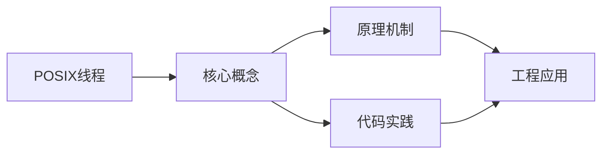
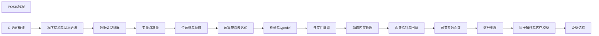

## 1. 学习目标（Bloom 分类）

本节按照布鲁姆教育目标分类学组织学习路径。本文主题为《POSIX线程》，属于 C 模块，读者可以根据自身阶段选择阅读深度。

记忆层面：能够准确复述本文的核心概念、术语与基本语法或操作步骤，并能够在提问或检索时快速定位对应知识点。能够说出 C 的变量、函数、指针、数组、结构体与预处理语法。

理解层面：能够用自己的语言解释核心原理与工作机制，说明概念之间的因果关系，而不是机械记忆结论。能够解释指针与内存地址、栈与堆、编译链接过程。

应用层面：能够在真实项目或练习场景中运用本文知识解决具体问题，写出正确且可维护的实现。能够编写系统工具、数据结构与嵌入式程序。

分析层面：能够拆解复杂问题，比较本文主题与相邻概念的异同，识别边界条件与例外情况。能够分析内存泄漏、缓冲区溢出与未定义行为。

评价层面：能够根据约束条件（性能、可读性、安全、成本）评价不同方案的优劣，做出有依据的技术决策。能够评价 C 与其他语言在系统编程中的取舍。

创造层面：能够把本文知识与其他模块知识组合，设计出新的解决方案或可复用的工程模式。能够设计可移植、可维护的 C 库与模块。

通过本节学习，读者应当能够把《POSIX线程》纳入自己的知识网络，并与 C 模块的其他主题（指针、内存管理、预处理器、标准库）建立关联。

## 2. 历史动机与发展脉络

《POSIX线程》是 C 领域的重要主题。要真正理解它，需要先了解它解决的问题与演进过程。

C 由 Dennis Ritchie 于 1972 年在贝尔实验室为 Unix 开发，是系统编程的基石语言：操作系统、编译器、嵌入式固件均以 C 为主。
C89（ANSI C）统一方言，C99 引入变长数组与 // 注释，C11 增加泛型选择与线程支持，C17 为缺陷修复版，C23（2024 年正式发布）引入 constexpr、属性、显式枚举底层类型等现代化特性。
C 的哲学是“信任程序员”：提供指针与内存操作的全部能力，同时把正确性责任交给开发者；这一设计成就了性能上限，也带来内存安全风险，催生了 Rust 等后继语言。

回到本文主题：POSIX线程 的提出与成熟，正是上述技术背景下的必然产物。早期实现往往以简单可用为目标，随着工程规模扩大，社区逐渐沉淀出标准做法与最佳实践；理解这一脉络，可以帮助读者判断“为什么文档中的推荐写法是现在这个样子”，也能在遇到历史遗留代码时准确识别其设计年代与取舍。


## 3. 形式化定义与核心概念精讲

本节把《POSIX线程》涉及的核心概念以“定义 + 讲解”的形式展开。读者应把定义当作工具，把讲解当作理解路径；两者结合才能形成可迁移的知识。

指针：指针保存变量地址，`&` 取地址、`*` 解引用；指针算术与数组名退化规则（数组名作为实参退化为首元素指针）是 C 的经典难点。
内存管理：栈内存自动释放，堆内存由 malloc/calloc/realloc/free 管理；所有权责任（谁分配谁释放）必须显式约定。
预处理器：#include/#define/#ifdef 在编译前文本处理；宏展开有副作用与优先级风险，函数式宏参数必须加括号。

### 3.1 原文章节逐一精讲

原文档把主题拆分为 11 个小节，下面按顺序给出每一节的导读讲解，随后保留原文细节供精读。

#### 原文精读（完整保留）

# C POSIX 线程 pthread

> **符号约定**：`< >` 必填参数 | `[ ]` 可选参数

---

##### 读写锁

```c
#include <stdio.h>
#include <pthread.h>
#include <unistd.h>

int shared_data = 0;
pthread_rwlock_t rwlock = PTHREAD_RWLOCK_INITIALIZER;

// 读者线程
void *reader(void *arg) {
    long id = (long)arg;
    for (int i = 0; i < 3; i++) {
        pthread_rwlock_rdlock(&rwlock);
        printf("读者 %ld: 数据 = %d\n", id, shared_data);
        pthread_rwlock_unlock(&rwlock);
        usleep(100000);
    }
    return NULL;
}

// 写者线程
void *writer(void *arg) {
    long id = (long)arg;
    for (int i = 0; i < 3; i++) {
        pthread_rwlock_wrlock(&rwlock);
        shared_data++;
        printf("写者 %ld: 数据 = %d\n", id, shared_data);
        pthread_rwlock_unlock(&rwlock);
        usleep(200000);
    }
    return NULL;
}

int main(void) {
    pthread_t threads[5];

    // 创建2个写者和3个读者
    pthread_create(&threads[0], NULL, writer, (void *)1);
    pthread_create(&threads[1], NULL, writer, (void *)2);
    pthread_create(&threads[2], NULL, reader, (void *)1);
    pthread_create(&threads[3], NULL, reader, (void *)2);
    pthread_create(&threads[4], NULL, reader, (void *)3);

    for (int i = 0; i < 5; i++) {
        pthread_join(threads[i], NULL);
    }

    pthread_rwlock_destroy(&rwlock);
    return 0;
}
```

##### 线程属性

```c
#include <stdio.h>
#include <pthread.h>

void *thread_func(void *arg) {
    printf("线程运行中\n");
    return NULL;
}

int main(void) {
    pthread_attr_t attr;
    pthread_attr_init(&attr);

    // 设置为可连接状态（默认）
    pthread_attr_setdetachstate(&attr, PTHREAD_CREATE_JOINABLE);

    // 设置栈大小
    size_t stack_size = 1024 * 1024; // 1MB
    pthread_attr_setstacksize(&attr, stack_size);

    pthread_t thread;
    pthread_create(&thread, &attr, thread_func, NULL);
    pthread_join(thread, NULL);

    pthread_attr_destroy(&attr);
    return 0;
}
```

#### 概述

POSIX线程（pthread）是Unix/Linux系统上的多线程编程接口，定义在 `<pthread.h>` 头文件中。多线程允许在同一进程内并发执行多个任务，线程之间共享地址空间，通信比进程间通信更高效，但需要同步机制来避免数据竞争。

#### 基础概念

##### 线程 vs 进程

| 特性     | 线程                     | 进程                    |
| -------- | ------------------------ | ----------------------- |
| 地址空间 | 共享                     | 独立                    |
| 创建开销 | 小                       | 大                      |
| 通信方式 | 共享变量                 | IPC（管道、共享内存等） |
| 切换开销 | 小                       | 大                      |
| 崩溃影响 | 一个线程崩溃影响整个进程 | 进程间相互隔离          |

##### 线程安全的概念

当多个线程同时访问共享数据时，如果没有适当的同步机制，可能导致数据竞争和未定义行为。线程安全意味着代码在多线程环境下能正确运行。

##### 核心同步原语

| 原语               | 说明                                 |
| ------------------ | ------------------------------------ |
| 互斥锁（mutex）    | 保护临界区，同一时刻只有一个线程进入 |
| 条件变量（cond）   | 线程等待/通知机制                    |
| 读写锁（rwlock）   | 允许多个读者或一个写者               |
| 自旋锁（spinlock） | 忙等待锁，适用于短临界区             |
| 屏障（barrier）    | 所有线程到达后一起继续               |

#### 快速上手

##### 创建线程

```c
#include <stdio.h>
#include <pthread.h>

// 线程函数：必须返回 void*，参数为 void*
void *thread_func(void *arg) {
    long id = (long)arg;
    printf("线程 %ld 运行中\n", id);
    return NULL;
}

int main(void) {
    pthread_t thread;

    // 创建线程
    pthread_create(&thread, NULL, thread_func, (void *)1);

    // 等待线程结束
    pthread_join(thread, NULL);

    printf("线程已结束\n");
    return 0;
}
```

##### 使用互斥锁

```c
#include <stdio.h>
#include <pthread.h>

int counter = 0;
pthread_mutex_t mutex = PTHREAD_MUTEX_INITIALIZER;

void *increment(void *arg) {
    for (int i = 0; i < 100000; i++) {
        pthread_mutex_lock(&mutex);   // 加锁
        counter++;
        pthread_mutex_unlock(&mutex); // 解锁
    }
    return NULL;
}

int main(void) {
    pthread_t t1, t2;
    pthread_create(&t1, NULL, increment, NULL);
    pthread_create(&t2, NULL, increment, NULL);
    pthread_join(t1, NULL);
    pthread_join(t2, NULL);

    printf("counter = %d\n", counter); // 一定是200000
    pthread_mutex_destroy(&mutex);
    return 0;
}
```

##### 使用条件变量

```c
#include <stdio.h>
#include <pthread.h>

int data_ready = 0;
int data = 0;
pthread_mutex_t mutex = PTHREAD_MUTEX_INITIALIZER;
pthread_cond_t cond = PTHREAD_COND_INITIALIZER;

// 消费者线程
void *consumer(void *arg) {
    pthread_mutex_lock(&mutex);
    while (!data_ready) {
        pthread_cond_wait(&cond, &mutex); // 等待条件满足
    }
    printf("消费数据: %d\n", data);
    data_ready = 0;
    pthread_mutex_unlock(&mutex);
    return NULL;
}

// 生产者线程
void *producer(void *arg) {
    pthread_mutex_lock(&mutex);
    data = 42;
    data_ready = 1;
    printf("生产数据: %d\n", data);
    pthread_cond_signal(&cond); // 通知消费者
    pthread_mutex_unlock(&mutex);
    return NULL;
}

int main(void) {
    pthread_t t1, t2;
    pthread_create(&t1, NULL, consumer, NULL);
    sleep(1); // 确保消费者先启动
    pthread_create(&t2, NULL, producer, NULL);
    pthread_join(t1, NULL);
    pthread_join(t2, NULL);

    pthread_mutex_destroy(&mutex);
    pthread_cond_destroy(&cond);
    return 0;
}
```

#### 详细用法

##### 分离线程

```c
#include <stdio.h>
#include <pthread.h>
#include <unistd.h>

void *background_task(void *arg) {
    for (int i = 0; i < 5; i++) {
        printf("后台任务: %d\n", i);
        sleep(1);
    }
    return NULL;
}

int main(void) {
    pthread_t thread;
    pthread_create(&thread, NULL, background_task, NULL);

    // 分离线程：不需要 join，线程结束后自动回收资源
    pthread_detach(thread);

    printf("主线程继续执行\n");
    sleep(6); // 等待后台任务完成
    return 0;
}
```

##### 线程特定数据（Thread-Local Storage）

```c
#include <stdio.h>
#include <pthread.h>

// 方式一：使用 __thread 关键字（GCC扩展）
static __thread int tls_value = 0;

// 方式二：使用 pthread_key_t
static pthread_key_t key;

void key_destructor(void *value) {
    free(value);
}

void *thread_func(void *arg) {
    long id = (long)arg;

    // 使用 __thread 变量
    tls_value = id * 10;
    printf("线程 %ld: tls_value = %d\n", id, tls_value);

    // 使用 pthread_key_t
    int *data = malloc(sizeof(int));
    *data = id * 100;
    pthread_setspecific(key, data);

    int *retrieved = pthread_getspecific(key);
    printf("线程 %ld: key_data = %d\n", id, *retrieved);

    return NULL;
}

int main(void) {
    pthread_key_create(&key, key_destructor);

    pthread_t t1, t2;
    pthread_create(&t1, NULL, thread_func, (void *)1);
    pthread_create(&t2, NULL, thread_func, (void *)2);
    pthread_join(t1, NULL);
    pthread_join(t2, NULL);

    pthread_key_delete(key);
    return 0;
}
```

#### 常见场景

##### 场景一：线程池

```c
#include <stdio.h>
#include <stdlib.h>
#include <pthread.h>

#define THREAD_COUNT 4
#define TASK_COUNT 20

typedef struct {
    void (*func)(int);
    int arg;
} Task;

typedef struct {
    Task tasks[TASK_COUNT];
    int head, tail, count;
    pthread_mutex_t mutex;
    pthread_cond_t cond;
    int shutdown;
} TaskQueue;

TaskQueue queue = {
    .mutex = PTHREAD_MUTEX_INITIALIZER,
    .cond = PTHREAD_COND_INITIALIZER
};

void task_queue_push(Task task) {
    pthread_mutex_lock(&queue.mutex);
    queue.tasks[queue.tail] = task;
    queue.tail = (queue.tail + 1) % TASK_COUNT;
    queue.count++;
    pthread_cond_signal(&queue.cond);
    pthread_mutex_unlock(&queue.mutex);
}

Task task_queue_pop(void) {
    pthread_mutex_lock(&queue.mutex);
    while (queue.count == 0 && !queue.shutdown) {
        pthread_cond_wait(&queue.cond, &queue.mutex);
    }
    Task task = {0};
    if (queue.count > 0) {
        task = queue.tasks[queue.head];
        queue.head = (queue.head + 1) % TASK_COUNT;
        queue.count--;
    }
    pthread_mutex_unlock(&queue.mutex);
    return task;
}

void worker_task(int id) {
    printf("执行任务 %d (线程 %lu)\n", id, pthread_self());
}

void *worker(void *arg) {
    while (1) {
        Task task = task_queue_pop();
        if (queue.shutdown && queue.count == 0) break;
        if (task.func) task.func(task.arg);
    }
    return NULL;
}

int main(void) {
    pthread_t threads[THREAD_COUNT];
    for (int i = 0; i < THREAD_COUNT; i++) {
        pthread_create(&threads[i], NULL, worker, NULL);
    }

    for (int i = 0; i < TASK_COUNT; i++) {
        task_queue_push((Task){worker_task, i});
    }

    queue.shutdown = 1;
    pthread_cond_broadcast(&queue.cond);

    for (int i = 0; i < THREAD_COUNT; i++) {
        pthread_join(threads[i], NULL);
    }

    return 0;
}
```

##### 场景二：生产者-消费者

```c
#include <stdio.h>
#include <pthread.h>

#define BUFFER_SIZE 10

int buffer[BUFFER_SIZE];
int in = 0, out = 0, count = 0;
pthread_mutex_t mutex = PTHREAD_MUTEX_INITIALIZER;
pthread_cond_t not_full = PTHREAD_COND_INITIALIZER;
pthread_cond_t not_empty = PTHREAD_COND_INITIALIZER;

void *producer(void *arg) {
    for (int i = 1; i <= 20; i++) {
        pthread_mutex_lock(&mutex);
        while (count == BUFFER_SIZE) {
            pthread_cond_wait(&not_full, &mutex);
        }
        buffer[in] = i;
        printf("生产: %d (位置 %d)\n", i, in);
        in = (in + 1) % BUFFER_SIZE;
        count++;
        pthread_cond_signal(&not_empty);
        pthread_mutex_unlock(&mutex);
    }
    return NULL;
}

void *consumer(void *arg) {
    for (int i = 1; i <= 20; i++) {
        pthread_mutex_lock(&mutex);
        while (count == 0) {
            pthread_cond_wait(&not_empty, &mutex);
        }
        int item = buffer[out];
        printf("消费: %d (位置 %d)\n", item, out);
        out = (out + 1) % BUFFER_SIZE;
        count--;
        pthread_cond_signal(&not_full);
        pthread_mutex_unlock(&mutex);
    }
    return NULL;
}

int main(void) {
    pthread_t t1, t2;
    pthread_create(&t1, NULL, producer, NULL);
    pthread_create(&t2, NULL, consumer, NULL);
    pthread_join(t1, NULL);
    pthread_join(t2, NULL);
    return 0;
}
```

#### 注意事项

##### 条件变量必须配合互斥锁使用

条件变量的 `wait` 操作必须在持有锁的情况下调用，它会自动释放锁并等待，被唤醒时重新获取锁：

```c
// 正确用法
pthread_mutex_lock(&mutex);
while (!condition) {
    pthread_cond_wait(&cond, &mutex); // 自动释放锁，等待，重新获取锁
}
// 操作共享数据
pthread_mutex_unlock(&mutex);
```

##### 使用 while 而非 if 检查条件

条件变量可能产生虚假唤醒，必须使用 `while` 循环重新检查条件：

```c
// 错误：可能被虚假唤醒
pthread_mutex_lock(&mutex);
if (!condition) {
    pthread_cond_wait(&cond, &mutex);
}
pthread_mutex_unlock(&mutex);

// 正确：使用 while 循环
pthread_mutex_lock(&mutex);
while (!condition) {
    pthread_cond_wait(&cond, &mutex);
}
pthread_mutex_unlock(&mutex);
```

##### 避免死锁

死锁的常见原因：线程A持有锁1等待锁2，线程B持有锁2等待锁1。预防方法：

1. 所有线程按相同顺序获取锁
2. 使用 `trylock` 尝试获取锁，失败则释放已持有的锁
3. 尽量减少锁的粒度和持有时间

#### 进阶用法

##### 屏障同步

```c
#include <stdio.h>
#include <pthread.h>

#define THREAD_COUNT 4

pthread_barrier_t barrier;

void *worker(void *arg) {
    long id = (long)arg;
    printf("线程 %ld: 阶段1完成\n", id);

    // 等待所有线程完成阶段1
    pthread_barrier_wait(&barrier);

    printf("线程 %ld: 阶段2开始\n", id);

    // 等待所有线程完成阶段2
    pthread_barrier_wait(&barrier);

    printf("线程 %ld: 全部完成\n", id);
    return NULL;
}

int main(void) {
    pthread_barrier_init(&barrier, NULL, THREAD_COUNT);

    pthread_t threads[THREAD_COUNT];
    for (long i = 0; i < THREAD_COUNT; i++) {
        pthread_create(&threads[i], NULL, worker, (void *)i);
    }

    for (int i = 0; i < THREAD_COUNT; i++) {
        pthread_join(threads[i], NULL);
    }

    pthread_barrier_destroy(&barrier);
    return 0;
}
```

##### 一次性初始化

```c
#include <stdio.h>
#include <pthread.h>

// 确保初始化函数只执行一次
static pthread_once_t once = PTHREAD_ONCE_INIT;
static int initialized_data;

void init_function(void) {
    printf("执行一次性初始化\n");
    initialized_data = 42;
}

void *thread_func(void *arg) {
    pthread_once(&once, init_function);
    printf("线程 %ld: 数据 = %d\n", (long)arg, initialized_data);
    return NULL;
}

int main(void) {
    pthread_t t1, t2, t3;
    pthread_create(&t1, NULL, thread_func, (void *)1);
    pthread_create(&t2, NULL, thread_func, (void *)2);
    pthread_create(&t3, NULL, thread_func, (void *)3);
    pthread_join(t1, NULL);
    pthread_join(t2, NULL);
    pthread_join(t3, NULL);
    return 0;
}
```

##### 可取消的线程

```c
#include <stdio.h>
#include <pthread.h>
#include <unistd.h>

void cleanup_handler(void *arg) {
    printf("清理资源: %s\n", (char *)arg);
}

void *cancellable_thread(void *arg) {
    pthread_cleanup_push(cleanup_handler, "动态分配的内存");

    // 设置取消类型
    pthread_setcancelstate(PTHREAD_CANCEL_ENABLE, NULL);
    pthread_setcanceltype(PTHREAD_CANCEL_DEFERRED, NULL);

    while (1) {
        printf("工作中...\n");
        sleep(1);
        pthread_testcancel(); // 检查取消点
    }

    pthread_cleanup_pop(0);
    return NULL;
}

int main(void) {
    pthread_t thread;
    pthread_create(&thread, NULL, cancellable_thread, NULL);

    sleep(3);
    printf("请求取消线程\n");
    pthread_cancel(thread);
    pthread_join(thread, NULL);
    printf("线程已取消\n");
    return 0;
}
```
#### 线程创建

**基本写法：创建线程**
`pthread_create(&<线程>, [NULL], <函数>, <参数>);`
```c
// 创建新线程
pthread_t tid;
pthread_create(&tid, NULL, worker, arg);
```

---

**基本写法：线程函数签名**
`void* <函数名>(void* <参数>);`
```c
// 线程入口函数返回 void 指针
void* worker(void* arg) {
    return NULL;
}
```

---

**基本写法：等待线程**
`pthread_join(<线程>, [&<返回值>]);`
```c
// 阻塞等待线程结束
void* ret;
pthread_join(tid, &ret);
```

---

**基本写法：分离线程**
`pthread_detach(<线程>);`
```c
// 分离线程自动回收资源
pthread_detach(tid);
```

---

**基本写法：获取自身 ID**
`pthread_self();`
```c
// 当前线程 ID
pthread_t self = pthread_self();
```

---

**基本写法：比较线程 ID**
`pthread_equal(<t1>, <t2>);`
```c
// 比较两个线程是否相同
if (pthread_equal(t1, t2)) { }
```

---

**基本写法：线程退出**
`pthread_exit([<返回值>]);`
```c
// 退出当前线程
pthread_exit(NULL);
```

---

#### 互斥锁

**基本写法：静态初始化**
`pthread_mutex_t <变量> = PTHREAD_MUTEX_INITIALIZER;`
```c
// 静态初始化互斥锁
pthread_mutex_t m = PTHREAD_MUTEX_INITIALIZER;
```

---

**基本写法：动态初始化**
`pthread_mutex_init(&<锁>, [NULL]);`
```c
// 运行时初始化
pthread_mutex_init(&m, NULL);
```

---

**基本写法：加锁解锁**
`pthread_mutex_lock(&<锁>);` `pthread_mutex_unlock(&<锁>);`
```c
// 临界区保护
pthread_mutex_lock(&m);
// 临界区
pthread_mutex_unlock(&m);
```

---

**基本写法：尝试加锁**
`pthread_mutex_trylock(&<锁>);`
```c
// 非阻塞加锁
if (pthread_mutex_trylock(&m) == 0) { }
```

---

**基本写法：销毁互斥锁**
`pthread_mutex_destroy(&<锁>);`
```c
// 释放资源
pthread_mutex_destroy(&m);
```

---

#### 条件变量

**基本写法：静态初始化条件变量**
`pthread_cond_t <变量> = PTHREAD_COND_INITIALIZER;`
```c
// 静态初始化
pthread_cond_t cv = PTHREAD_COND_INITIALIZER;
```

---

**基本写法：等待条件**
`pthread_cond_wait(&<cv>, &<锁>);`
```c
// 释放锁等待唤醒
pthread_mutex_lock(&m);
while (!ready) pthread_cond_wait(&cv, &m);
pthread_mutex_unlock(&m);
```

---

**基本写法：超时等待**
`pthread_cond_timedwait(&<cv>, &<锁>, &<超时>);`
```c
// 限时等待
struct timespec ts;
pthread_cond_timedwait(&cv, &m, &ts);
```

---

**基本写法：通知一个**
`pthread_cond_signal(&<cv>);`
```c
// 唤醒一个线程
pthread_cond_signal(&cv);
```

---

**基本写法：通知所有**
`pthread_cond_broadcast(&<cv>);`
```c
// 唤醒所有线程
pthread_cond_broadcast(&cv);
```

---

#### 信号量

**基本写法：创建信号量**
`sem_t <变量>; sem_init(&<变量>, 0, <初始>);`
```c
// 初始化信号量
sem_t sem;
sem_init(&sem, 0, 1);
```

---

**基本写法：等待与释放**
`sem_wait(&<sem>);` `sem_post(&<sem>);`
```c
// P 与 V 操作
sem_wait(&sem);
// 临界区
sem_post(&sem);
```

---

**基本写法：销毁信号量**
`sem_destroy(&<sem>);`
```c
// 释放信号量资源
sem_destroy(&sem);
```

---


### 3.2 概念关系图

下面用 Mermaid 图表达本文核心概念之间的关系，帮助读者建立整体图景：



图中展示的是本文知识的结构化关系：核心概念是入口，原理机制解释“为什么”，代码实践演示“怎么做”，工程应用回答“何时用”。读者学习时可以把每个小节的内容挂接到对应节点上。

## 4. 理论推导与原理解析

本节深入《POSIX线程》背后的原理。理论部分不求面面俱到，而是聚焦“能解释现象、能指导实践”的关键推导。

指针：指针保存变量地址，`&` 取地址、`*` 解引用；指针算术与数组名退化规则（数组名作为实参退化为首元素指针）是 C 的经典难点。
内存管理：栈内存自动释放，堆内存由 malloc/calloc/realloc/free 管理；所有权责任（谁分配谁释放）必须显式约定。
预处理器：#include/#define/#ifdef 在编译前文本处理；宏展开有副作用与优先级风险，函数式宏参数必须加括号。
编译链接：预处理 -> 编译 -> 汇编 -> 链接；头文件声明接口，源文件实现；静态库与动态库（.a/.so/.dll）决定部署形态。

需要强调的是，理论推导与工程实践之间存在翻译层：理论给出的是理想化模型与边界条件，工程代码则必须处理真实环境中的例外。读者在学习时应先掌握理论的“标准情形”，再通过陷阱章节了解“非标准情形”。

## 5. 代码示例与逐行讲解

本节把原文中的代码示例系统整理，并为每个示例补充用途说明与讲解。读者不应只浏览代码，而应逐段对照讲解理解设计意图。

### 5.1 示例：读写锁

该示例来自原文《读写锁》小节，用于演示POSIX线程相关操作。阅读时请先看代码结构，再看其后的讲解。

```c
#include <stdio.h>
#include <pthread.h>
#include <unistd.h>

int shared_data = 0;
pthread_rwlock_t rwlock = PTHREAD_RWLOCK_INITIALIZER;

// 读者线程
void *reader(void *arg) {
    long id = (long)arg;
    for (int i = 0; i < 3; i++) {
        pthread_rwlock_rdlock(&rwlock);
        printf("读者 %ld: 数据 = %d\n", id, shared_data);
        pthread_rwlock_unlock(&rwlock);
        usleep(100000);
    }
    return NULL;
}

// 写者线程
void *writer(void *arg) {
    long id = (long)arg;
    for (int i = 0; i < 3; i++) {
        pthread_rwlock_wrlock(&rwlock);
        shared_data++;
        printf("写者 %ld: 数据 = %d\n", id, shared_data);
        pthread_rwlock_unlock(&rwlock);
        usleep(200000);
    }
    return NULL;
}

int main(void) {
    pthread_t threads[5];

    // 创建2个写者和3个读者
    pthread_create(&threads[0], NULL, writer, (void *)1);
    pthread_create(&threads[1], NULL, writer, (void *)2);
    pthread_create(&threads[2], NULL, reader, (void *)1);
    pthread_create(&threads[3], NULL, reader, (void *)2);
    pthread_create(&threads[4], NULL, reader, (void *)3);

    for (int i = 0; i < 5; i++) {
        pthread_join(threads[i], NULL);
    }

    pthread_rwlock_destroy(&rwlock);
    return 0;
}
```

讲解：这段代码演示了本节核心知识点。代码中的关键操作可以归纳为三步：准备（定义或初始化）、执行（核心逻辑）、收尾（释放资源或返回结果）。实际项目中，这三步往往被封装为函数或类，以提升复用性与可测试性。

关键点分析：

该示例共 42 行有效代码，包含 2 类关键结构（for、return）。其中：

- 入口与初始化部分负责建立上下文，对应实际项目中的启动或装配逻辑；
- 核心逻辑部分体现本文主题的主要操作，是阅读时最需要对照讲解理解的部分；
- 输出或返回部分把结果交给调用方，注意其类型与边界条件。

进阶思考路径：先尝试修改参数观察行为变化，再把示例中的模式迁移到自己的项目中；每次修改都记录预期与实测差异，这是把示例转化为能力的最快方式。

### 5.2 示例：线程属性

该示例来自原文《线程属性》小节，用于演示POSIX线程相关操作。阅读时请先看代码结构，再看其后的讲解。

```c
#include <stdio.h>
#include <pthread.h>

void *thread_func(void *arg) {
    printf("线程运行中\n");
    return NULL;
}

int main(void) {
    pthread_attr_t attr;
    pthread_attr_init(&attr);

    // 设置为可连接状态（默认）
    pthread_attr_setdetachstate(&attr, PTHREAD_CREATE_JOINABLE);

    // 设置栈大小
    size_t stack_size = 1024 * 1024; // 1MB
    pthread_attr_setstacksize(&attr, stack_size);

    pthread_t thread;
    pthread_create(&thread, &attr, thread_func, NULL);
    pthread_join(thread, NULL);

    pthread_attr_destroy(&attr);
    return 0;
}
```

讲解：这段代码演示了本节核心知识点。代码中的关键操作可以归纳为三步：准备（定义或初始化）、执行（核心逻辑）、收尾（释放资源或返回结果）。实际项目中，这三步往往被封装为函数或类，以提升复用性与可测试性。

关键点分析：

该示例共 20 行有效代码，包含 2 类关键结构（return、CREATE）。其中：

- 入口与初始化部分负责建立上下文，对应实际项目中的启动或装配逻辑；
- 核心逻辑部分体现本文主题的主要操作，是阅读时最需要对照讲解理解的部分；
- 输出或返回部分把结果交给调用方，注意其类型与边界条件。

进阶思考路径：先尝试修改参数观察行为变化，再把示例中的模式迁移到自己的项目中；每次修改都记录预期与实测差异，这是把示例转化为能力的最快方式。

### 5.3 示例：创建线程

该示例来自原文《创建线程》小节，用于演示POSIX线程相关操作。阅读时请先看代码结构，再看其后的讲解。

```c
#include <stdio.h>
#include <pthread.h>

// 线程函数：必须返回 void*，参数为 void*
void *thread_func(void *arg) {
    long id = (long)arg;
    printf("线程 %ld 运行中\n", id);
    return NULL;
}

int main(void) {
    pthread_t thread;

    // 创建线程
    pthread_create(&thread, NULL, thread_func, (void *)1);

    // 等待线程结束
    pthread_join(thread, NULL);

    printf("线程已结束\n");
    return 0;
}
```

讲解：这段代码演示了本节核心知识点。代码中的关键操作可以归纳为三步：准备（定义或初始化）、执行（核心逻辑）、收尾（释放资源或返回结果）。实际项目中，这三步往往被封装为函数或类，以提升复用性与可测试性。

关键点分析：

该示例共 17 行有效代码，包含 1 类关键结构（return）。其中：

- 入口与初始化部分负责建立上下文，对应实际项目中的启动或装配逻辑；
- 核心逻辑部分体现本文主题的主要操作，是阅读时最需要对照讲解理解的部分；
- 输出或返回部分把结果交给调用方，注意其类型与边界条件。

进阶思考路径：先尝试修改参数观察行为变化，再把示例中的模式迁移到自己的项目中；每次修改都记录预期与实测差异，这是把示例转化为能力的最快方式。

### 5.4 示例：使用互斥锁

该示例来自原文《使用互斥锁》小节，用于演示POSIX线程相关操作。阅读时请先看代码结构，再看其后的讲解。

```c
#include <stdio.h>
#include <pthread.h>

int counter = 0;
pthread_mutex_t mutex = PTHREAD_MUTEX_INITIALIZER;

void *increment(void *arg) {
    for (int i = 0; i < 100000; i++) {
        pthread_mutex_lock(&mutex);   // 加锁
        counter++;
        pthread_mutex_unlock(&mutex); // 解锁
    }
    return NULL;
}

int main(void) {
    pthread_t t1, t2;
    pthread_create(&t1, NULL, increment, NULL);
    pthread_create(&t2, NULL, increment, NULL);
    pthread_join(t1, NULL);
    pthread_join(t2, NULL);

    printf("counter = %d\n", counter); // 一定是200000
    pthread_mutex_destroy(&mutex);
    return 0;
}
```

讲解：这段代码演示了本节核心知识点。代码中的关键操作可以归纳为三步：准备（定义或初始化）、执行（核心逻辑）、收尾（释放资源或返回结果）。实际项目中，这三步往往被封装为函数或类，以提升复用性与可测试性。

关键点分析：

该示例共 22 行有效代码，包含 2 类关键结构（for、return）。其中：

- 入口与初始化部分负责建立上下文，对应实际项目中的启动或装配逻辑；
- 核心逻辑部分体现本文主题的主要操作，是阅读时最需要对照讲解理解的部分；
- 输出或返回部分把结果交给调用方，注意其类型与边界条件。

进阶思考路径：先尝试修改参数观察行为变化，再把示例中的模式迁移到自己的项目中；每次修改都记录预期与实测差异，这是把示例转化为能力的最快方式。

### 5.5 示例：使用条件变量

该示例来自原文《使用条件变量》小节，用于演示POSIX线程相关操作。阅读时请先看代码结构，再看其后的讲解。

```c
#include <stdio.h>
#include <pthread.h>

int data_ready = 0;
int data = 0;
pthread_mutex_t mutex = PTHREAD_MUTEX_INITIALIZER;
pthread_cond_t cond = PTHREAD_COND_INITIALIZER;

// 消费者线程
void *consumer(void *arg) {
    pthread_mutex_lock(&mutex);
    while (!data_ready) {
        pthread_cond_wait(&cond, &mutex); // 等待条件满足
    }
    printf("消费数据: %d\n", data);
    data_ready = 0;
    pthread_mutex_unlock(&mutex);
    return NULL;
}

// 生产者线程
void *producer(void *arg) {
    pthread_mutex_lock(&mutex);
    data = 42;
    data_ready = 1;
    printf("生产数据: %d\n", data);
    pthread_cond_signal(&cond); // 通知消费者
    pthread_mutex_unlock(&mutex);
    return NULL;
}

int main(void) {
    pthread_t t1, t2;
    pthread_create(&t1, NULL, consumer, NULL);
    sleep(1); // 确保消费者先启动
    pthread_create(&t2, NULL, producer, NULL);
    pthread_join(t1, NULL);
    pthread_join(t2, NULL);

    pthread_mutex_destroy(&mutex);
    pthread_cond_destroy(&cond);
    return 0;
}
```

讲解：这段代码演示了本节核心知识点。代码中的关键操作可以归纳为三步：准备（定义或初始化）、执行（核心逻辑）、收尾（释放资源或返回结果）。实际项目中，这三步往往被封装为函数或类，以提升复用性与可测试性。

关键点分析：

该示例共 38 行有效代码，包含 2 类关键结构（while、return）。其中：

- 入口与初始化部分负责建立上下文，对应实际项目中的启动或装配逻辑；
- 核心逻辑部分体现本文主题的主要操作，是阅读时最需要对照讲解理解的部分；
- 输出或返回部分把结果交给调用方，注意其类型与边界条件。

进阶思考路径：先尝试修改参数观察行为变化，再把示例中的模式迁移到自己的项目中；每次修改都记录预期与实测差异，这是把示例转化为能力的最快方式。

### 5.6 示例：分离线程

该示例来自原文《分离线程》小节，用于演示POSIX线程相关操作。阅读时请先看代码结构，再看其后的讲解。

```c
#include <stdio.h>
#include <pthread.h>
#include <unistd.h>

void *background_task(void *arg) {
    for (int i = 0; i < 5; i++) {
        printf("后台任务: %d\n", i);
        sleep(1);
    }
    return NULL;
}

int main(void) {
    pthread_t thread;
    pthread_create(&thread, NULL, background_task, NULL);

    // 分离线程：不需要 join，线程结束后自动回收资源
    pthread_detach(thread);

    printf("主线程继续执行\n");
    sleep(6); // 等待后台任务完成
    return 0;
}
```

讲解：这段代码演示了本节核心知识点。代码中的关键操作可以归纳为三步：准备（定义或初始化）、执行（核心逻辑）、收尾（释放资源或返回结果）。实际项目中，这三步往往被封装为函数或类，以提升复用性与可测试性。

关键点分析：

该示例共 19 行有效代码，包含 2 类关键结构（for、return）。其中：

- 入口与初始化部分负责建立上下文，对应实际项目中的启动或装配逻辑；
- 核心逻辑部分体现本文主题的主要操作，是阅读时最需要对照讲解理解的部分；
- 输出或返回部分把结果交给调用方，注意其类型与边界条件。

进阶思考路径：先尝试修改参数观察行为变化，再把示例中的模式迁移到自己的项目中；每次修改都记录预期与实测差异，这是把示例转化为能力的最快方式。

### 5.7 示例：线程特定数据（Thread-Local Storage）

该示例来自原文《线程特定数据（Thread-Local Storage）》小节，用于演示POSIX线程相关操作。阅读时请先看代码结构，再看其后的讲解。

```c
#include <stdio.h>
#include <pthread.h>

// 方式一：使用 __thread 关键字（GCC扩展）
static __thread int tls_value = 0;

// 方式二：使用 pthread_key_t
static pthread_key_t key;

void key_destructor(void *value) {
    free(value);
}

void *thread_func(void *arg) {
    long id = (long)arg;

    // 使用 __thread 变量
    tls_value = id * 10;
    printf("线程 %ld: tls_value = %d\n", id, tls_value);

    // 使用 pthread_key_t
    int *data = malloc(sizeof(int));
    *data = id * 100;
    pthread_setspecific(key, data);

    int *retrieved = pthread_getspecific(key);
    printf("线程 %ld: key_data = %d\n", id, *retrieved);

    return NULL;
}

int main(void) {
    pthread_key_create(&key, key_destructor);

    pthread_t t1, t2;
    pthread_create(&t1, NULL, thread_func, (void *)1);
    pthread_create(&t2, NULL, thread_func, (void *)2);
    pthread_join(t1, NULL);
    pthread_join(t2, NULL);

    pthread_key_delete(key);
    return 0;
}
```

讲解：这段代码演示了本节核心知识点。代码中的关键操作可以归纳为三步：准备（定义或初始化）、执行（核心逻辑）、收尾（释放资源或返回结果）。实际项目中，这三步往往被封装为函数或类，以提升复用性与可测试性。

关键点分析：

该示例共 32 行有效代码，包含 1 类关键结构（return）。其中：

- 入口与初始化部分负责建立上下文，对应实际项目中的启动或装配逻辑；
- 核心逻辑部分体现本文主题的主要操作，是阅读时最需要对照讲解理解的部分；
- 输出或返回部分把结果交给调用方，注意其类型与边界条件。

进阶思考路径：先尝试修改参数观察行为变化，再把示例中的模式迁移到自己的项目中；每次修改都记录预期与实测差异，这是把示例转化为能力的最快方式。

### 5.8 示例：场景一：线程池

该示例来自原文《场景一：线程池》小节，用于演示POSIX线程相关操作。阅读时请先看代码结构，再看其后的讲解。

```c
#include <stdio.h>
#include <stdlib.h>
#include <pthread.h>

#define THREAD_COUNT 4
#define TASK_COUNT 20

typedef struct {
    void (*func)(int);
    int arg;
} Task;

typedef struct {
    Task tasks[TASK_COUNT];
    int head, tail, count;
    pthread_mutex_t mutex;
    pthread_cond_t cond;
    int shutdown;
} TaskQueue;

TaskQueue queue = {
    .mutex = PTHREAD_MUTEX_INITIALIZER,
    .cond = PTHREAD_COND_INITIALIZER
};

void task_queue_push(Task task) {
    pthread_mutex_lock(&queue.mutex);
    queue.tasks[queue.tail] = task;
    queue.tail = (queue.tail + 1) % TASK_COUNT;
    queue.count++;
    pthread_cond_signal(&queue.cond);
    pthread_mutex_unlock(&queue.mutex);
}

Task task_queue_pop(void) {
    pthread_mutex_lock(&queue.mutex);
    while (queue.count == 0 && !queue.shutdown) {
        pthread_cond_wait(&queue.cond, &queue.mutex);
    }
    Task task = {0};
    if (queue.count > 0) {
        task = queue.tasks[queue.head];
        queue.head = (queue.head + 1) % TASK_COUNT;
        queue.count--;
    }
    pthread_mutex_unlock(&queue.mutex);
    return task;
}

void worker_task(int id) {
    printf("执行任务 %d (线程 %lu)\n", id, pthread_self());
}

void *worker(void *arg) {
    while (1) {
        Task task = task_queue_pop();
        if (queue.shutdown && queue.count == 0) break;
        if (task.func) task.func(task.arg);
    }
    return NULL;
}

int main(void) {
    pthread_t threads[THREAD_COUNT];
    for (int i = 0; i < THREAD_COUNT; i++) {
        pthread_create(&threads[i], NULL, worker, NULL);
    }

    for (int i = 0; i < TASK_COUNT; i++) {
        task_queue_push((Task){worker_task, i});
    }

    queue.shutdown = 1;
    pthread_cond_broadcast(&queue.cond);

    for (int i = 0; i < THREAD_COUNT; i++) {
        pthread_join(threads[i], NULL);
    }

    return 0;
}
```

讲解：这段代码演示了本节核心知识点。代码中的关键操作可以归纳为三步：准备（定义或初始化）、执行（核心逻辑）、收尾（释放资源或返回结果）。实际项目中，这三步往往被封装为函数或类，以提升复用性与可测试性。

关键点分析：

该示例共 68 行有效代码，包含 5 类关键结构（def、if、for、while、return）。其中：

- 入口与初始化部分负责建立上下文，对应实际项目中的启动或装配逻辑；
- 核心逻辑部分体现本文主题的主要操作，是阅读时最需要对照讲解理解的部分；
- 输出或返回部分把结果交给调用方，注意其类型与边界条件。

进阶思考路径：先尝试修改参数观察行为变化，再把示例中的模式迁移到自己的项目中；每次修改都记录预期与实测差异，这是把示例转化为能力的最快方式。

### 5.9 示例：场景二：生产者-消费者

该示例来自原文《场景二：生产者-消费者》小节，用于演示POSIX线程相关操作。阅读时请先看代码结构，再看其后的讲解。

```c
#include <stdio.h>
#include <pthread.h>

#define BUFFER_SIZE 10

int buffer[BUFFER_SIZE];
int in = 0, out = 0, count = 0;
pthread_mutex_t mutex = PTHREAD_MUTEX_INITIALIZER;
pthread_cond_t not_full = PTHREAD_COND_INITIALIZER;
pthread_cond_t not_empty = PTHREAD_COND_INITIALIZER;

void *producer(void *arg) {
    for (int i = 1; i <= 20; i++) {
        pthread_mutex_lock(&mutex);
        while (count == BUFFER_SIZE) {
            pthread_cond_wait(&not_full, &mutex);
        }
        buffer[in] = i;
        printf("生产: %d (位置 %d)\n", i, in);
        in = (in + 1) % BUFFER_SIZE;
        count++;
        pthread_cond_signal(&not_empty);
        pthread_mutex_unlock(&mutex);
    }
    return NULL;
}

void *consumer(void *arg) {
    for (int i = 1; i <= 20; i++) {
        pthread_mutex_lock(&mutex);
        while (count == 0) {
            pthread_cond_wait(&not_empty, &mutex);
        }
        int item = buffer[out];
        printf("消费: %d (位置 %d)\n", item, out);
        out = (out + 1) % BUFFER_SIZE;
        count--;
        pthread_cond_signal(&not_full);
        pthread_mutex_unlock(&mutex);
    }
    return NULL;
}

int main(void) {
    pthread_t t1, t2;
    pthread_create(&t1, NULL, producer, NULL);
    pthread_create(&t2, NULL, consumer, NULL);
    pthread_join(t1, NULL);
    pthread_join(t2, NULL);
    return 0;
}
```

讲解：这段代码演示了本节核心知识点。代码中的关键操作可以归纳为三步：准备（定义或初始化）、执行（核心逻辑）、收尾（释放资源或返回结果）。实际项目中，这三步往往被封装为函数或类，以提升复用性与可测试性。

关键点分析：

该示例共 46 行有效代码，包含 3 类关键结构（for、while、return）。其中：

- 入口与初始化部分负责建立上下文，对应实际项目中的启动或装配逻辑；
- 核心逻辑部分体现本文主题的主要操作，是阅读时最需要对照讲解理解的部分；
- 输出或返回部分把结果交给调用方，注意其类型与边界条件。

进阶思考路径：先尝试修改参数观察行为变化，再把示例中的模式迁移到自己的项目中；每次修改都记录预期与实测差异，这是把示例转化为能力的最快方式。

### 5.10 示例：条件变量必须配合互斥锁使用

该示例来自原文《条件变量必须配合互斥锁使用》小节，用于演示POSIX线程相关操作。阅读时请先看代码结构，再看其后的讲解。

```c
// 正确用法
pthread_mutex_lock(&mutex);
while (!condition) {
    pthread_cond_wait(&cond, &mutex); // 自动释放锁，等待，重新获取锁
}
// 操作共享数据
pthread_mutex_unlock(&mutex);
```

讲解：这段代码演示了本节核心知识点。代码中的关键操作可以归纳为三步：准备（定义或初始化）、执行（核心逻辑）、收尾（释放资源或返回结果）。实际项目中，这三步往往被封装为函数或类，以提升复用性与可测试性。

关键点分析：

该示例共 7 行有效代码，包含 1 类关键结构（while）。其中：

- 入口与初始化部分负责建立上下文，对应实际项目中的启动或装配逻辑；
- 核心逻辑部分体现本文主题的主要操作，是阅读时最需要对照讲解理解的部分；
- 输出或返回部分把结果交给调用方，注意其类型与边界条件。

进阶思考路径：先尝试修改参数观察行为变化，再把示例中的模式迁移到自己的项目中；每次修改都记录预期与实测差异，这是把示例转化为能力的最快方式。

### 5.11 示例：使用 while 而非 if 检查条件

该示例来自原文《使用 while 而非 if 检查条件》小节，用于演示POSIX线程相关操作。阅读时请先看代码结构，再看其后的讲解。

```c
// 错误：可能被虚假唤醒
pthread_mutex_lock(&mutex);
if (!condition) {
    pthread_cond_wait(&cond, &mutex);
}
pthread_mutex_unlock(&mutex);

// 正确：使用 while 循环
pthread_mutex_lock(&mutex);
while (!condition) {
    pthread_cond_wait(&cond, &mutex);
}
pthread_mutex_unlock(&mutex);
```

讲解：这段代码演示了本节核心知识点。代码中的关键操作可以归纳为三步：准备（定义或初始化）、执行（核心逻辑）、收尾（释放资源或返回结果）。实际项目中，这三步往往被封装为函数或类，以提升复用性与可测试性。

关键点分析：

该示例共 12 行有效代码，包含 2 类关键结构（if、while）。其中：

- 入口与初始化部分负责建立上下文，对应实际项目中的启动或装配逻辑；
- 核心逻辑部分体现本文主题的主要操作，是阅读时最需要对照讲解理解的部分；
- 输出或返回部分把结果交给调用方，注意其类型与边界条件。

进阶思考路径：先尝试修改参数观察行为变化，再把示例中的模式迁移到自己的项目中；每次修改都记录预期与实测差异，这是把示例转化为能力的最快方式。

### 5.12 示例：屏障同步

该示例来自原文《屏障同步》小节，用于演示POSIX线程相关操作。阅读时请先看代码结构，再看其后的讲解。

```c
#include <stdio.h>
#include <pthread.h>

#define THREAD_COUNT 4

pthread_barrier_t barrier;

void *worker(void *arg) {
    long id = (long)arg;
    printf("线程 %ld: 阶段1完成\n", id);

    // 等待所有线程完成阶段1
    pthread_barrier_wait(&barrier);

    printf("线程 %ld: 阶段2开始\n", id);

    // 等待所有线程完成阶段2
    pthread_barrier_wait(&barrier);

    printf("线程 %ld: 全部完成\n", id);
    return NULL;
}

int main(void) {
    pthread_barrier_init(&barrier, NULL, THREAD_COUNT);

    pthread_t threads[THREAD_COUNT];
    for (long i = 0; i < THREAD_COUNT; i++) {
        pthread_create(&threads[i], NULL, worker, (void *)i);
    }

    for (int i = 0; i < THREAD_COUNT; i++) {
        pthread_join(threads[i], NULL);
    }

    pthread_barrier_destroy(&barrier);
    return 0;
}
```

讲解：这段代码演示了本节核心知识点。代码中的关键操作可以归纳为三步：准备（定义或初始化）、执行（核心逻辑）、收尾（释放资源或返回结果）。实际项目中，这三步往往被封装为函数或类，以提升复用性与可测试性。

关键点分析：

该示例共 27 行有效代码，包含 2 类关键结构（for、return）。其中：

- 入口与初始化部分负责建立上下文，对应实际项目中的启动或装配逻辑；
- 核心逻辑部分体现本文主题的主要操作，是阅读时最需要对照讲解理解的部分；
- 输出或返回部分把结果交给调用方，注意其类型与边界条件。

进阶思考路径：先尝试修改参数观察行为变化，再把示例中的模式迁移到自己的项目中；每次修改都记录预期与实测差异，这是把示例转化为能力的最快方式。

### 5.13 示例：一次性初始化

该示例来自原文《一次性初始化》小节，用于演示POSIX线程相关操作。阅读时请先看代码结构，再看其后的讲解。

```c
#include <stdio.h>
#include <pthread.h>

// 确保初始化函数只执行一次
static pthread_once_t once = PTHREAD_ONCE_INIT;
static int initialized_data;

void init_function(void) {
    printf("执行一次性初始化\n");
    initialized_data = 42;
}

void *thread_func(void *arg) {
    pthread_once(&once, init_function);
    printf("线程 %ld: 数据 = %d\n", (long)arg, initialized_data);
    return NULL;
}

int main(void) {
    pthread_t t1, t2, t3;
    pthread_create(&t1, NULL, thread_func, (void *)1);
    pthread_create(&t2, NULL, thread_func, (void *)2);
    pthread_create(&t3, NULL, thread_func, (void *)3);
    pthread_join(t1, NULL);
    pthread_join(t2, NULL);
    pthread_join(t3, NULL);
    return 0;
}
```

讲解：这段代码演示了本节核心知识点。代码中的关键操作可以归纳为三步：准备（定义或初始化）、执行（核心逻辑）、收尾（释放资源或返回结果）。实际项目中，这三步往往被封装为函数或类，以提升复用性与可测试性。

关键点分析：

该示例共 24 行有效代码，包含 2 类关键结构（function、return）。其中：

- 入口与初始化部分负责建立上下文，对应实际项目中的启动或装配逻辑；
- 核心逻辑部分体现本文主题的主要操作，是阅读时最需要对照讲解理解的部分；
- 输出或返回部分把结果交给调用方，注意其类型与边界条件。

进阶思考路径：先尝试修改参数观察行为变化，再把示例中的模式迁移到自己的项目中；每次修改都记录预期与实测差异，这是把示例转化为能力的最快方式。

### 5.14 示例：可取消的线程

该示例来自原文《可取消的线程》小节，用于演示POSIX线程相关操作。阅读时请先看代码结构，再看其后的讲解。

```c
#include <stdio.h>
#include <pthread.h>
#include <unistd.h>

void cleanup_handler(void *arg) {
    printf("清理资源: %s\n", (char *)arg);
}

void *cancellable_thread(void *arg) {
    pthread_cleanup_push(cleanup_handler, "动态分配的内存");

    // 设置取消类型
    pthread_setcancelstate(PTHREAD_CANCEL_ENABLE, NULL);
    pthread_setcanceltype(PTHREAD_CANCEL_DEFERRED, NULL);

    while (1) {
        printf("工作中...\n");
        sleep(1);
        pthread_testcancel(); // 检查取消点
    }

    pthread_cleanup_pop(0);
    return NULL;
}

int main(void) {
    pthread_t thread;
    pthread_create(&thread, NULL, cancellable_thread, NULL);

    sleep(3);
    printf("请求取消线程\n");
    pthread_cancel(thread);
    pthread_join(thread, NULL);
    printf("线程已取消\n");
    return 0;
}
```

讲解：这段代码演示了本节核心知识点。代码中的关键操作可以归纳为三步：准备（定义或初始化）、执行（核心逻辑）、收尾（释放资源或返回结果）。实际项目中，这三步往往被封装为函数或类，以提升复用性与可测试性。

关键点分析：

该示例共 29 行有效代码，包含 2 类关键结构（while、return）。其中：

- 入口与初始化部分负责建立上下文，对应实际项目中的启动或装配逻辑；
- 核心逻辑部分体现本文主题的主要操作，是阅读时最需要对照讲解理解的部分；
- 输出或返回部分把结果交给调用方，注意其类型与边界条件。

进阶思考路径：先尝试修改参数观察行为变化，再把示例中的模式迁移到自己的项目中；每次修改都记录预期与实测差异，这是把示例转化为能力的最快方式。

### 5.15 示例：线程创建

该示例来自原文《线程创建》小节，用于演示POSIX线程相关操作。阅读时请先看代码结构，再看其后的讲解。

```c
// 创建新线程
pthread_t tid;
pthread_create(&tid, NULL, worker, arg);
```

讲解：这段代码演示了本节核心知识点。代码中的关键操作可以归纳为三步：准备（定义或初始化）、执行（核心逻辑）、收尾（释放资源或返回结果）。实际项目中，这三步往往被封装为函数或类，以提升复用性与可测试性。

关键点分析：

该示例共 3 行有效代码，结构以数据或配置为主。阅读时应关注：数据字段的含义、配置项的作用，以及它们与运行行为的对应关系。

进阶思考路径：先尝试修改参数观察行为变化，再把示例中的模式迁移到自己的项目中；每次修改都记录预期与实测差异，这是把示例转化为能力的最快方式。

### 5.16 示例：线程创建

该示例来自原文《线程创建》小节，用于演示POSIX线程相关操作。阅读时请先看代码结构，再看其后的讲解。

```c
// 线程入口函数返回 void 指针
void* worker(void* arg) {
    return NULL;
}
```

讲解：这段代码演示了本节核心知识点。代码中的关键操作可以归纳为三步：准备（定义或初始化）、执行（核心逻辑）、收尾（释放资源或返回结果）。实际项目中，这三步往往被封装为函数或类，以提升复用性与可测试性。

关键点分析：

该示例共 4 行有效代码，包含 1 类关键结构（return）。其中：

- 入口与初始化部分负责建立上下文，对应实际项目中的启动或装配逻辑；
- 核心逻辑部分体现本文主题的主要操作，是阅读时最需要对照讲解理解的部分；
- 输出或返回部分把结果交给调用方，注意其类型与边界条件。

进阶思考路径：先尝试修改参数观察行为变化，再把示例中的模式迁移到自己的项目中；每次修改都记录预期与实测差异，这是把示例转化为能力的最快方式。

### 5.17 示例：线程创建

该示例来自原文《线程创建》小节，用于演示POSIX线程相关操作。阅读时请先看代码结构，再看其后的讲解。

```c
// 阻塞等待线程结束
void* ret;
pthread_join(tid, &ret);
```

讲解：这段代码演示了本节核心知识点。代码中的关键操作可以归纳为三步：准备（定义或初始化）、执行（核心逻辑）、收尾（释放资源或返回结果）。实际项目中，这三步往往被封装为函数或类，以提升复用性与可测试性。

关键点分析：

该示例共 3 行有效代码，结构以数据或配置为主。阅读时应关注：数据字段的含义、配置项的作用，以及它们与运行行为的对应关系。

进阶思考路径：先尝试修改参数观察行为变化，再把示例中的模式迁移到自己的项目中；每次修改都记录预期与实测差异，这是把示例转化为能力的最快方式。

### 5.18 示例：线程创建

该示例来自原文《线程创建》小节，用于演示POSIX线程相关操作。阅读时请先看代码结构，再看其后的讲解。

```c
// 分离线程自动回收资源
pthread_detach(tid);
```

讲解：这段代码演示了本节核心知识点。代码中的关键操作可以归纳为三步：准备（定义或初始化）、执行（核心逻辑）、收尾（释放资源或返回结果）。实际项目中，这三步往往被封装为函数或类，以提升复用性与可测试性。

关键点分析：

该示例共 2 行有效代码，结构以数据或配置为主。阅读时应关注：数据字段的含义、配置项的作用，以及它们与运行行为的对应关系。

进阶思考路径：先尝试修改参数观察行为变化，再把示例中的模式迁移到自己的项目中；每次修改都记录预期与实测差异，这是把示例转化为能力的最快方式。

### 5.19 示例：线程创建

该示例来自原文《线程创建》小节，用于演示POSIX线程相关操作。阅读时请先看代码结构，再看其后的讲解。

```c
// 当前线程 ID
pthread_t self = pthread_self();
```

讲解：这段代码演示了本节核心知识点。代码中的关键操作可以归纳为三步：准备（定义或初始化）、执行（核心逻辑）、收尾（释放资源或返回结果）。实际项目中，这三步往往被封装为函数或类，以提升复用性与可测试性。

关键点分析：

该示例共 2 行有效代码，结构以数据或配置为主。阅读时应关注：数据字段的含义、配置项的作用，以及它们与运行行为的对应关系。

进阶思考路径：先尝试修改参数观察行为变化，再把示例中的模式迁移到自己的项目中；每次修改都记录预期与实测差异，这是把示例转化为能力的最快方式。

### 5.20 示例：线程创建

该示例来自原文《线程创建》小节，用于演示POSIX线程相关操作。阅读时请先看代码结构，再看其后的讲解。

```c
// 比较两个线程是否相同
if (pthread_equal(t1, t2)) { }
```

讲解：这段代码演示了本节核心知识点。代码中的关键操作可以归纳为三步：准备（定义或初始化）、执行（核心逻辑）、收尾（释放资源或返回结果）。实际项目中，这三步往往被封装为函数或类，以提升复用性与可测试性。

关键点分析：

该示例共 2 行有效代码，包含 1 类关键结构（if）。其中：

- 入口与初始化部分负责建立上下文，对应实际项目中的启动或装配逻辑；
- 核心逻辑部分体现本文主题的主要操作，是阅读时最需要对照讲解理解的部分；
- 输出或返回部分把结果交给调用方，注意其类型与边界条件。

进阶思考路径：先尝试修改参数观察行为变化，再把示例中的模式迁移到自己的项目中；每次修改都记录预期与实测差异，这是把示例转化为能力的最快方式。

### 5.21 示例：线程创建

该示例来自原文《线程创建》小节，用于演示POSIX线程相关操作。阅读时请先看代码结构，再看其后的讲解。

```c
// 退出当前线程
pthread_exit(NULL);
```

讲解：这段代码演示了本节核心知识点。代码中的关键操作可以归纳为三步：准备（定义或初始化）、执行（核心逻辑）、收尾（释放资源或返回结果）。实际项目中，这三步往往被封装为函数或类，以提升复用性与可测试性。

关键点分析：

该示例共 2 行有效代码，结构以数据或配置为主。阅读时应关注：数据字段的含义、配置项的作用，以及它们与运行行为的对应关系。

进阶思考路径：先尝试修改参数观察行为变化，再把示例中的模式迁移到自己的项目中；每次修改都记录预期与实测差异，这是把示例转化为能力的最快方式。

### 5.22 示例：互斥锁

该示例来自原文《互斥锁》小节，用于演示POSIX线程相关操作。阅读时请先看代码结构，再看其后的讲解。

```c
// 静态初始化互斥锁
pthread_mutex_t m = PTHREAD_MUTEX_INITIALIZER;
```

讲解：这段代码演示了本节核心知识点。代码中的关键操作可以归纳为三步：准备（定义或初始化）、执行（核心逻辑）、收尾（释放资源或返回结果）。实际项目中，这三步往往被封装为函数或类，以提升复用性与可测试性。

关键点分析：

该示例共 2 行有效代码，结构以数据或配置为主。阅读时应关注：数据字段的含义、配置项的作用，以及它们与运行行为的对应关系。

进阶思考路径：先尝试修改参数观察行为变化，再把示例中的模式迁移到自己的项目中；每次修改都记录预期与实测差异，这是把示例转化为能力的最快方式。

### 5.23 示例：互斥锁

该示例来自原文《互斥锁》小节，用于演示POSIX线程相关操作。阅读时请先看代码结构，再看其后的讲解。

```c
// 运行时初始化
pthread_mutex_init(&m, NULL);
```

讲解：这段代码演示了本节核心知识点。代码中的关键操作可以归纳为三步：准备（定义或初始化）、执行（核心逻辑）、收尾（释放资源或返回结果）。实际项目中，这三步往往被封装为函数或类，以提升复用性与可测试性。

关键点分析：

该示例共 2 行有效代码，结构以数据或配置为主。阅读时应关注：数据字段的含义、配置项的作用，以及它们与运行行为的对应关系。

进阶思考路径：先尝试修改参数观察行为变化，再把示例中的模式迁移到自己的项目中；每次修改都记录预期与实测差异，这是把示例转化为能力的最快方式。

### 5.24 示例：互斥锁

该示例来自原文《互斥锁》小节，用于演示POSIX线程相关操作。阅读时请先看代码结构，再看其后的讲解。

```c
// 临界区保护
pthread_mutex_lock(&m);
// 临界区
pthread_mutex_unlock(&m);
```

讲解：这段代码演示了本节核心知识点。代码中的关键操作可以归纳为三步：准备（定义或初始化）、执行（核心逻辑）、收尾（释放资源或返回结果）。实际项目中，这三步往往被封装为函数或类，以提升复用性与可测试性。

关键点分析：

该示例共 4 行有效代码，结构以数据或配置为主。阅读时应关注：数据字段的含义、配置项的作用，以及它们与运行行为的对应关系。

进阶思考路径：先尝试修改参数观察行为变化，再把示例中的模式迁移到自己的项目中；每次修改都记录预期与实测差异，这是把示例转化为能力的最快方式。

### 5.25 示例：互斥锁

该示例来自原文《互斥锁》小节，用于演示POSIX线程相关操作。阅读时请先看代码结构，再看其后的讲解。

```c
// 非阻塞加锁
if (pthread_mutex_trylock(&m) == 0) { }
```

讲解：这段代码演示了本节核心知识点。代码中的关键操作可以归纳为三步：准备（定义或初始化）、执行（核心逻辑）、收尾（释放资源或返回结果）。实际项目中，这三步往往被封装为函数或类，以提升复用性与可测试性。

关键点分析：

该示例共 2 行有效代码，包含 1 类关键结构（if）。其中：

- 入口与初始化部分负责建立上下文，对应实际项目中的启动或装配逻辑；
- 核心逻辑部分体现本文主题的主要操作，是阅读时最需要对照讲解理解的部分；
- 输出或返回部分把结果交给调用方，注意其类型与边界条件。

进阶思考路径：先尝试修改参数观察行为变化，再把示例中的模式迁移到自己的项目中；每次修改都记录预期与实测差异，这是把示例转化为能力的最快方式。

### 5.26 示例：互斥锁

该示例来自原文《互斥锁》小节，用于演示POSIX线程相关操作。阅读时请先看代码结构，再看其后的讲解。

```c
// 释放资源
pthread_mutex_destroy(&m);
```

讲解：这段代码演示了本节核心知识点。代码中的关键操作可以归纳为三步：准备（定义或初始化）、执行（核心逻辑）、收尾（释放资源或返回结果）。实际项目中，这三步往往被封装为函数或类，以提升复用性与可测试性。

关键点分析：

该示例共 2 行有效代码，结构以数据或配置为主。阅读时应关注：数据字段的含义、配置项的作用，以及它们与运行行为的对应关系。

进阶思考路径：先尝试修改参数观察行为变化，再把示例中的模式迁移到自己的项目中；每次修改都记录预期与实测差异，这是把示例转化为能力的最快方式。

### 5.27 示例：条件变量

该示例来自原文《条件变量》小节，用于演示POSIX线程相关操作。阅读时请先看代码结构，再看其后的讲解。

```c
// 静态初始化
pthread_cond_t cv = PTHREAD_COND_INITIALIZER;
```

讲解：这段代码演示了本节核心知识点。代码中的关键操作可以归纳为三步：准备（定义或初始化）、执行（核心逻辑）、收尾（释放资源或返回结果）。实际项目中，这三步往往被封装为函数或类，以提升复用性与可测试性。

关键点分析：

该示例共 2 行有效代码，结构以数据或配置为主。阅读时应关注：数据字段的含义、配置项的作用，以及它们与运行行为的对应关系。

进阶思考路径：先尝试修改参数观察行为变化，再把示例中的模式迁移到自己的项目中；每次修改都记录预期与实测差异，这是把示例转化为能力的最快方式。

### 5.28 示例：条件变量

该示例来自原文《条件变量》小节，用于演示POSIX线程相关操作。阅读时请先看代码结构，再看其后的讲解。

```c
// 释放锁等待唤醒
pthread_mutex_lock(&m);
while (!ready) pthread_cond_wait(&cv, &m);
pthread_mutex_unlock(&m);
```

讲解：这段代码演示了本节核心知识点。代码中的关键操作可以归纳为三步：准备（定义或初始化）、执行（核心逻辑）、收尾（释放资源或返回结果）。实际项目中，这三步往往被封装为函数或类，以提升复用性与可测试性。

关键点分析：

该示例共 4 行有效代码，包含 1 类关键结构（while）。其中：

- 入口与初始化部分负责建立上下文，对应实际项目中的启动或装配逻辑；
- 核心逻辑部分体现本文主题的主要操作，是阅读时最需要对照讲解理解的部分；
- 输出或返回部分把结果交给调用方，注意其类型与边界条件。

进阶思考路径：先尝试修改参数观察行为变化，再把示例中的模式迁移到自己的项目中；每次修改都记录预期与实测差异，这是把示例转化为能力的最快方式。

### 5.29 示例：条件变量

该示例来自原文《条件变量》小节，用于演示POSIX线程相关操作。阅读时请先看代码结构，再看其后的讲解。

```c
// 限时等待
struct timespec ts;
pthread_cond_timedwait(&cv, &m, &ts);
```

讲解：这段代码演示了本节核心知识点。代码中的关键操作可以归纳为三步：准备（定义或初始化）、执行（核心逻辑）、收尾（释放资源或返回结果）。实际项目中，这三步往往被封装为函数或类，以提升复用性与可测试性。

关键点分析：

该示例共 3 行有效代码，结构以数据或配置为主。阅读时应关注：数据字段的含义、配置项的作用，以及它们与运行行为的对应关系。

进阶思考路径：先尝试修改参数观察行为变化，再把示例中的模式迁移到自己的项目中；每次修改都记录预期与实测差异，这是把示例转化为能力的最快方式。

### 5.30 示例：条件变量

该示例来自原文《条件变量》小节，用于演示POSIX线程相关操作。阅读时请先看代码结构，再看其后的讲解。

```c
// 唤醒一个线程
pthread_cond_signal(&cv);
```

讲解：这段代码演示了本节核心知识点。代码中的关键操作可以归纳为三步：准备（定义或初始化）、执行（核心逻辑）、收尾（释放资源或返回结果）。实际项目中，这三步往往被封装为函数或类，以提升复用性与可测试性。

关键点分析：

该示例共 2 行有效代码，结构以数据或配置为主。阅读时应关注：数据字段的含义、配置项的作用，以及它们与运行行为的对应关系。

进阶思考路径：先尝试修改参数观察行为变化，再把示例中的模式迁移到自己的项目中；每次修改都记录预期与实测差异，这是把示例转化为能力的最快方式。

### 5.31 示例：条件变量

该示例来自原文《条件变量》小节，用于演示POSIX线程相关操作。阅读时请先看代码结构，再看其后的讲解。

```c
// 唤醒所有线程
pthread_cond_broadcast(&cv);
```

讲解：这段代码演示了本节核心知识点。代码中的关键操作可以归纳为三步：准备（定义或初始化）、执行（核心逻辑）、收尾（释放资源或返回结果）。实际项目中，这三步往往被封装为函数或类，以提升复用性与可测试性。

关键点分析：

该示例共 2 行有效代码，结构以数据或配置为主。阅读时应关注：数据字段的含义、配置项的作用，以及它们与运行行为的对应关系。

进阶思考路径：先尝试修改参数观察行为变化，再把示例中的模式迁移到自己的项目中；每次修改都记录预期与实测差异，这是把示例转化为能力的最快方式。

### 5.32 示例：信号量

该示例来自原文《信号量》小节，用于演示POSIX线程相关操作。阅读时请先看代码结构，再看其后的讲解。

```c
// 初始化信号量
sem_t sem;
sem_init(&sem, 0, 1);
```

讲解：这段代码演示了本节核心知识点。代码中的关键操作可以归纳为三步：准备（定义或初始化）、执行（核心逻辑）、收尾（释放资源或返回结果）。实际项目中，这三步往往被封装为函数或类，以提升复用性与可测试性。

关键点分析：

该示例共 3 行有效代码，结构以数据或配置为主。阅读时应关注：数据字段的含义、配置项的作用，以及它们与运行行为的对应关系。

进阶思考路径：先尝试修改参数观察行为变化，再把示例中的模式迁移到自己的项目中；每次修改都记录预期与实测差异，这是把示例转化为能力的最快方式。

### 5.33 示例：信号量

该示例来自原文《信号量》小节，用于演示POSIX线程相关操作。阅读时请先看代码结构，再看其后的讲解。

```c
// P 与 V 操作
sem_wait(&sem);
// 临界区
sem_post(&sem);
```

讲解：这段代码演示了本节核心知识点。代码中的关键操作可以归纳为三步：准备（定义或初始化）、执行（核心逻辑）、收尾（释放资源或返回结果）。实际项目中，这三步往往被封装为函数或类，以提升复用性与可测试性。

关键点分析：

该示例共 4 行有效代码，结构以数据或配置为主。阅读时应关注：数据字段的含义、配置项的作用，以及它们与运行行为的对应关系。

进阶思考路径：先尝试修改参数观察行为变化，再把示例中的模式迁移到自己的项目中；每次修改都记录预期与实测差异，这是把示例转化为能力的最快方式。

### 5.34 示例：信号量

该示例来自原文《信号量》小节，用于演示POSIX线程相关操作。阅读时请先看代码结构，再看其后的讲解。

```c
// 释放信号量资源
sem_destroy(&sem);
```

讲解：这段代码演示了本节核心知识点。代码中的关键操作可以归纳为三步：准备（定义或初始化）、执行（核心逻辑）、收尾（释放资源或返回结果）。实际项目中，这三步往往被封装为函数或类，以提升复用性与可测试性。

关键点分析：

该示例共 2 行有效代码，结构以数据或配置为主。阅读时应关注：数据字段的含义、配置项的作用，以及它们与运行行为的对应关系。

进阶思考路径：先尝试修改参数观察行为变化，再把示例中的模式迁移到自己的项目中；每次修改都记录预期与实测差异，这是把示例转化为能力的最快方式。


综合以上示例，可以总结出本主题的代码实践要点：第一，先定义清晰的输入输出契约；第二，核心逻辑保持单一职责；第三，错误处理与边界条件不可省略；第四，命名与注释表达意图而非复述代码。

## 6. 对比分析

对比是理解《POSIX线程》定位的最快路径。下面从多个维度与相邻方案进行对比。

C 与 C++：C++ 是 C 的超集扩展，支持类、模板、异常与 RAII；C 更简单直接，适合嵌入式与纯系统编程。
C 与 Rust：Rust 在编译期保证内存安全（所有权/借用）；C 灵活但需要人工保证安全。新系统项目可评估 Rust。
C89 与 C23：C23 带来 constexpr、attributes、二进制字面量等，现代化程度提升但仍保持兼容。

对比的目的不是分出绝对优劣，而是建立选择依据：不同约束条件下，最优解不同。读者应把每个对比维度转化为决策检查清单。

## 7. 常见陷阱与最佳实践

本节整理该主题的高频错误与推荐做法。每个陷阱先描述现象，再解释原因，最后给出最佳实践。

### 7.1 缓冲区溢出

gets/strcpy 不检查边界导致安全漏洞。使用 fgets/strncpy（注意截断语义）或安全库。

深入讲解：该问题之所以被归类为“常见陷阱”，是因为它在初学者的代码中反复出现，而且往往不在第一时间暴露——错误通常隐藏在特定数据或特定时序下。

从成因上看，缓冲区溢出 一般源于对 C 某个机制的理解偏差：要么误用了默认行为，要么忽略了边界条件，要么把其他语言的思维惯性带了过来。

从影响上看，缓冲区溢出 轻则产生错误结果，重则导致资源泄漏、数据损坏或安全事故；这也是为什么工程评审中会把它列为检查项。

从修复策略上看，处理缓冲区溢出的正确顺序是：先复现（构造最小用例），再定位（确认机制层面的根因），最后修复并补充回归测试。跳过复现直接改代码，往往治标不治本。

### 7.2 内存泄漏

malloc 后未 free。设计清晰的所有权规则，配合 Valgrind/ASan 检测。

深入讲解：该问题之所以被归类为“常见陷阱”，是因为它在初学者的代码中反复出现，而且往往不在第一时间暴露——错误通常隐藏在特定数据或特定时序下。

从成因上看，内存泄漏 一般源于对 C 某个机制的理解偏差：要么误用了默认行为，要么忽略了边界条件，要么把其他语言的思维惯性带了过来。

从影响上看，内存泄漏 轻则产生错误结果，重则导致资源泄漏、数据损坏或安全事故；这也是为什么工程评审中会把它列为检查项。

从修复策略上看，处理内存泄漏的正确顺序是：先复现（构造最小用例），再定位（确认机制层面的根因），最后修复并补充回归测试。跳过复现直接改代码，往往治标不治本。

### 7.3 悬垂指针

free 后继续使用指针。释放后置 NULL，并约定使用前检查。

深入讲解：该问题之所以被归类为“常见陷阱”，是因为它在初学者的代码中反复出现，而且往往不在第一时间暴露——错误通常隐藏在特定数据或特定时序下。

从成因上看，悬垂指针 一般源于对 C 某个机制的理解偏差：要么误用了默认行为，要么忽略了边界条件，要么把其他语言的思维惯性带了过来。

从影响上看，悬垂指针 轻则产生错误结果，重则导致资源泄漏、数据损坏或安全事故；这也是为什么工程评审中会把它列为检查项。

从修复策略上看，处理悬垂指针的正确顺序是：先复现（构造最小用例），再定位（确认机制层面的根因），最后修复并补充回归测试。跳过复现直接改代码，往往治标不治本。

### 7.4 未定义行为

有符号溢出、数组越界、除零等行为不可预测。开启 -Wall -Wextra -fsanitize=undefined 检测。

深入讲解：该问题之所以被归类为“常见陷阱”，是因为它在初学者的代码中反复出现，而且往往不在第一时间暴露——错误通常隐藏在特定数据或特定时序下。

从成因上看，未定义行为 一般源于对 C 某个机制的理解偏差：要么误用了默认行为，要么忽略了边界条件，要么把其他语言的思维惯性带了过来。

从影响上看，未定义行为 轻则产生错误结果，重则导致资源泄漏、数据损坏或安全事故；这也是为什么工程评审中会把它列为检查项。

从修复策略上看，处理未定义行为的正确顺序是：先复现（构造最小用例），再定位（确认机制层面的根因），最后修复并补充回归测试。跳过复现直接改代码，往往治标不治本。

### 7.5 宏副作用

`#define SQUARE(x) x*x` 在 `SQUARE(a+b)` 时出错。参数加括号或用内联函数。

深入讲解：该问题之所以被归类为“常见陷阱”，是因为它在初学者的代码中反复出现，而且往往不在第一时间暴露——错误通常隐藏在特定数据或特定时序下。

从成因上看，宏副作用 一般源于对 C 某个机制的理解偏差：要么误用了默认行为，要么忽略了边界条件，要么把其他语言的思维惯性带了过来。

从影响上看，宏副作用 轻则产生错误结果，重则导致资源泄漏、数据损坏或安全事故；这也是为什么工程评审中会把它列为检查项。

从修复策略上看，处理宏副作用的正确顺序是：先复现（构造最小用例），再定位（确认机制层面的根因），最后修复并补充回归测试。跳过复现直接改代码，往往治标不治本。

### 7.6 字符串字面量修改

修改字符串字面量是未定义行为。需要修改时用字符数组。

深入讲解：该问题之所以被归类为“常见陷阱”，是因为它在初学者的代码中反复出现，而且往往不在第一时间暴露——错误通常隐藏在特定数据或特定时序下。

从成因上看，字符串字面量修改 一般源于对 C 某个机制的理解偏差：要么误用了默认行为，要么忽略了边界条件，要么把其他语言的思维惯性带了过来。

从影响上看，字符串字面量修改 轻则产生错误结果，重则导致资源泄漏、数据损坏或安全事故；这也是为什么工程评审中会把它列为检查项。

从修复策略上看，处理字符串字面量修改的正确顺序是：先复现（构造最小用例），再定位（确认机制层面的根因），最后修复并补充回归测试。跳过复现直接改代码，往往治标不治本。

### 7.7 忘记初始化

局部变量未初始化读随机值。声明即初始化。

深入讲解：该问题之所以被归类为“常见陷阱”，是因为它在初学者的代码中反复出现，而且往往不在第一时间暴露——错误通常隐藏在特定数据或特定时序下。

从成因上看，忘记初始化 一般源于对 C 某个机制的理解偏差：要么误用了默认行为，要么忽略了边界条件，要么把其他语言的思维惯性带了过来。

从影响上看，忘记初始化 轻则产生错误结果，重则导致资源泄漏、数据损坏或安全事故；这也是为什么工程评审中会把它列为检查项。

从修复策略上看，处理忘记初始化的正确顺序是：先复现（构造最小用例），再定位（确认机制层面的根因），最后修复并补充回归测试。跳过复现直接改代码，往往治标不治本。

### 7.8 类型混用

有符号与无符号比较产生隐式转换。注意 -Wsign-compare 告警。

深入讲解：该问题之所以被归类为“常见陷阱”，是因为它在初学者的代码中反复出现，而且往往不在第一时间暴露——错误通常隐藏在特定数据或特定时序下。

从成因上看，类型混用 一般源于对 C 某个机制的理解偏差：要么误用了默认行为，要么忽略了边界条件，要么把其他语言的思维惯性带了过来。

从影响上看，类型混用 轻则产生错误结果，重则导致资源泄漏、数据损坏或安全事故；这也是为什么工程评审中会把它列为检查项。

从修复策略上看，处理类型混用的正确顺序是：先复现（构造最小用例），再定位（确认机制层面的根因），最后修复并补充回归测试。跳过复现直接改代码，往往治标不治本。

### 7.0 最佳实践总览

1. 声明即初始化，指针必须有效或为 NULL。
2. 资源分配与释放成对出现，封装为函数。
3. 数组访问使用边界检查（调试版本启用断言）。
4. 头文件加 include guard，声明与实现分离。
5. 编译开启 -Wall -Wextra -Werror（开发阶段）。

把这些最佳实践固化为团队规范与代码评审检查项，是避免同类问题反复出现的关键。

## 8. 工程实践

本节把《POSIX线程》放入真实工程场景，给出可复用的模式与组织方法。

模块化：头文件定义接口（结构体前向声明、函数原型），源文件实现；内部函数用 static 隐藏。
错误处理：函数返回错误码或状态枚举，输出参数传结果；文档化调用方责任。
构建：Makefile/CMake 管理编译单元与依赖；编译选项区分 debug/release。
测试：断言 + 单元测试框架（Unity/CMocka），配合 AddressSanitizer。

### 8.1 工程实践的原则拆解

以上工程实践可以归纳为四条原则。第一，配置与代码分离：C 项目中环境差异应通过配置注入，而不是散落在代码分支中；这保证同一份代码可以在开发、测试、生产环境一致运行。

第二，接口稳定优先：对外接口（函数签名、协议、数据格式）一旦被消费方依赖，变更成本极高；设计时应预留扩展点并保持向后兼容。

第三，可观测性内置：日志、指标与追踪应该在功能开发时同步设计，而不是故障发生后补救；没有观测手段的模块等于黑盒。

第四，变更可回滚：任何发布都应有对应的回滚方案；数据库迁移、配置变更与代码发布一样需要版本管理与逆向路径。

### 8.2 实践落地的检查清单

- [ ] 模块化：对照本节描述，检查当前项目是否已经落实；未落实的项列入技术债并排期处理。
- [ ] 错误处理：对照本节描述，检查当前项目是否已经落实；未落实的项列入技术债并排期处理。
- [ ] 构建：对照本节描述，检查当前项目是否已经落实；未落实的项列入技术债并排期处理。
- [ ] 测试：对照本节描述，检查当前项目是否已经落实；未落实的项列入技术债并排期处理。

工程实践的共性原则：配置与代码分离、接口稳定优先、可观测性内置、变更可回滚。这些原则适用于本主题的所有实现。

## 9. 案例研究

本节通过一个完整案例把《POSIX线程》的知识串起来。案例按“需求分析、方案设计、实现、验证”四步展开。

需求：实现动态数组容器（vector），支持追加、按索引访问与释放。
方案：结构体封装 data/capacity/size，API 提供 create/destroy/push/at。
要点：扩容按 2 倍增长；越界返回错误码；所有分配路径成对释放。
验证：ASan 检查泄漏与越界；边界用例（空容器、满容量扩容）。

### 9.1 案例的扩展讨论

把案例中的方案放大到真实规模，需要额外考虑三个问题：

第一，规模：当数据量或并发量上升一个数量级时，原方案中的数据结构、缓存策略与任务调度是否仍然成立？通常需要引入分层与异步。

第二，团队：多人协作时，模块边界、接口契约与代码所有权必须明确；案例中的实现应拆分为可独立测试的单元，并配合文档说明设计意图。

第三，演进：上线后的需求变化不可避免；方案设计时应预留扩展点（配置化、插件化、事件化），并定期用真实指标验证假设。


案例研究的学习方法：先独立阅读需求，尝试在脑中形成方案，再对照实现与讲解，最后思考“如果约束变化（数据量、并发、团队规模），方案应如何调整”。

## 10. 知识要点总结与深入讲解

本节以讲解形式汇总全文要点，替代传统的习题与自测，读者不需要答题，只需跟随解释建立完整的认知框架。

关于《POSIX线程》的核心结论：

C 的价值在于极致的控制力与可移植性，代价是内存安全责任完全在开发者。
指针、内存、未定义行为三大主题决定 C 代码质量。
现代 C 工程应结合静态分析、消毒器与测试，把人为错误降到最低。

原文档各小节的要点回顾：

- 概述：该小节围绕POSIX线程展开具体细节，阅读时应关注其与核心结论的对应关系；每个小节都是核心结论在某一个侧面的展开。
- 基础概念：该小节围绕POSIX线程展开具体细节，阅读时应关注其与核心结论的对应关系；每个小节都是核心结论在某一个侧面的展开。
- 快速上手：该小节围绕POSIX线程展开具体细节，阅读时应关注其与核心结论的对应关系；每个小节都是核心结论在某一个侧面的展开。
- 详细用法：该小节围绕POSIX线程展开具体细节，阅读时应关注其与核心结论的对应关系；每个小节都是核心结论在某一个侧面的展开。
- 常见场景：该小节围绕POSIX线程展开具体细节，阅读时应关注其与核心结论的对应关系；每个小节都是核心结论在某一个侧面的展开。
- 注意事项：该小节围绕POSIX线程展开具体细节，阅读时应关注其与核心结论的对应关系；每个小节都是核心结论在某一个侧面的展开。
- 进阶用法：该小节围绕POSIX线程展开具体细节，阅读时应关注其与核心结论的对应关系；每个小节都是核心结论在某一个侧面的展开。
- 线程创建：该小节围绕POSIX线程展开具体细节，阅读时应关注其与核心结论的对应关系；每个小节都是核心结论在某一个侧面的展开。
- 互斥锁：该小节围绕POSIX线程展开具体细节，阅读时应关注其与核心结论的对应关系；每个小节都是核心结论在某一个侧面的展开。
- 条件变量：该小节围绕POSIX线程展开具体细节，阅读时应关注其与核心结论的对应关系；每个小节都是核心结论在某一个侧面的展开。
- 信号量：该小节围绕POSIX线程展开具体细节，阅读时应关注其与核心结论的对应关系；每个小节都是核心结论在某一个侧面的展开。

把以上要点与第 3-9 节的内容对照复习，即可完成对本文主题的闭环学习。

## 11. 参考文献


cppreference C 文档：https://zh.cppreference.com/w/c
C 标准草案：https://www.open-std.org/jtc1/sc22/wg14/
GCC 官方文档：https://gcc.gnu.org/onlinedocs/
Linux man pages：https://man7.org/linux/man-pages/
C 语言常见误解：https://www.yodaiken.com/

## 12. 延伸阅读


C 指针与数组深入，见 025-c 模块指针文档。
C 枚举与 typedef，见 025-c/007-EnumTypedef 文档。
C++ 面向对象与模板，见 026-cpp 模块。
嵌入式 C 与硬件交互，见 035-iot 模块。
尚硅谷 Bilibili 空间（https://space.bilibili.com/302417610 ）提供 C 语言课程。

## 14. 模块知识图谱与学习路径

本文属于 C 模块。为了把《POSIX线程》放入完整的知识网络，下面列出本模块的全部主题并给出相互关联的导读。学习时建议按模块内顺序推进，并在每个文档中留意交叉引用。



上图为模块主题的推荐学习顺序示意图（仅展示前若干主题）。各主题之间存在三类关联：

第一，前置依赖关系：早期主题是后期主题的基础，例如环境与语法先行、进阶主题随后；

第二，横向并列关系：同一层级主题从不同角度覆盖模块能力，学习顺序可以按兴趣调整；

第三，工程组合关系：多个主题在真实项目中组合使用，例如配置、性能与安全主题往往出现在同一系统的不同层面。

### 14.1 模块主题速查表

| 文档 | 主题 | 与本文的关联 |
| --- | --- | --- |
| C 语言概述 | 001-CLanguageOverview | 本文的前置基础 |
| 程序结构与基本语法 | 002-ProgramStructureBasicSyntax | 本文的并列主题 |
| 数据类型详解 | 003-DataTypeDetailed | 本文的并列主题 |
| 变量与常量 | 004-VariableConstant | 本文的并列主题 |
| 位运算与位域 | 005-BitwiseBitField | 本文的并列主题 |
| 运算符与表达式 | 006-OperatorExpression | 本文的并列主题 |
| 枚举与typedef | 007-EnumTypedef | 本文的并列主题 |
| 多文件编译 | 008-TheLinuxProgrammingInterface | 本文的并列主题 |
| 动态内存管理 | 009-DynamicMemoryManagement | 本文的并列主题 |
| 函数指针与回调 | 010-FunctionPointerCallback | 本文的并列主题 |
| 可变参数函数 | 011-VarargsFunction | 本文的并列主题 |
| 信号处理 | 012-SignalHandling | 本文的并列主题 |
| 原子操作与内存模型 | 013-AtomicAndMemoryModel | 本文的并列主题 |
| 泛型选择 | 014-GenericSelection | 本文的并列主题 |
| 位域 | 015-BitField | 本文的并列主题 |
| 对齐与内存布局 | 016-AlignmentMemoryLayout | 本文的并列主题 |
| 控制流 | 017-ControlFlow | 本文的并列主题 |
| 属性与编译器扩展 | 018-AttributeCompilerExtension | 本文的并列主题 |
| 安全函数与边界检查 | 019-SafeFunctionBoundsCheck | 本文的安全延伸 |
| 内联函数与宏 | 020-InlineFunctionMacro | 本文的并列主题 |
| 复杂声明解析 | 021-ComplexDeclarationParsing | 本文的并列主题 |
| 线程与并发 | 022-ThreadConcurrency | 本文的并列主题 |
| POSIX线程 | 023-POSIXThread | 本文自身 |
| Socket网络编程 | 024-SocketNetworkProgramming | 本文的并列主题 |
| 进程与管道 | 025-ProcessAndPipe | 本文的并列主题 |
| 共享内存与信号量 | 026-SharedMemorySemaphore | 本文的并列主题 |
| 文件系统操作 | 027-FileSystemOperation | 本文的并列主题 |
| 函数详解 | 028-FunctionDetailed | 本文的并列主题 |
| 动态库与静态库 | 029-DynamicStaticLibrary | 本文的并列主题 |
| 国际化与本地化 | 030-HelloWorldOrOr | 本文的并列主题 |
| 构建系统 | 031-BuildSystem | 本文的并列主题 |
| 静态分析与调试 | 032-StaticAnalysisDebug | 本文的并列主题 |
| 跨平台编程 | 033-CrossPlatformProgramming | 本文的并列主题 |
| 嵌入式C编程 | 034-EmbeddedCProgramming | 本文的并列主题 |
| C与汇编交互 | 035-CAssemblyInteraction | 本文的并列主题 |
| 数组详解 | 036-ArrayDetailed | 本文的并列主题 |
| 预处理器与宏 | 037-PreprocessorMacro | 本文的并列主题 |
| C23 与 C2y 新标准 | 038-C23C2y | 本文的并列主题 |
| 指针深度解析 | 039-PointerDeep | 本文的并列主题 |
| 内存管理 | 040-MemoryManagement | 本文的并列主题 |
| 内存对齐 | 041-MemoryAlignment | 本文的并列主题 |
| 结构体与联合体 | 042-StructAndUnion | 本文的并列主题 |
| 函数调用栈帧 | 043-FunctionCallStackFrame | 本文的并列主题 |
| 指针与数组的区别 | 044-PointerArrayDifference | 本文的并列主题 |
| 二级指针与指针数组 | 045-DoublePointerPointerArray | 本文的并列主题 |
| 函数指针回调与跳转表 | 046-FunctionPointerCallbackJumpTable | 本文的并列主题 |
| volatile关键字 | 047-LinuxKernelMemoryBarriers | 本文的并列主题 |
| 文件 I/O 操作 | 048-IO | 本文的并列主题 |
| C 语言理论知识点 | 049-CLanguageTheory | 本文的并列主题 |
| C 语言高级特性与系统编程 | 050-CAdvancedSystemProgramming | 本文的并列主题 |
| C 语言项目示例：学生成绩管理系统 | 051-CProjectExampleStudentGradeSystem | 本文的综合应用 |
| C 标准库函数速查 | 052-CStandardLibrary | 本文的并列主题 |
| C POSIX 与系统调用速查 | 053-CPosixSystemCall | 本文的并列主题 |
| C23 新特性 | 054-C23NewFeatures | 本文的并列主题 |
| C 编译器命令 语法速查手册 | 055-CCompilerOptions | 本文的并列主题 |
| C gdb 调试 语法速查手册 | 056-CDebugGdb | 本文的并列主题 |
| C Valgrind 内存检测 语法速查手册 | 057-CValgrind | 本文的并列主题 |

速查表的作用是让读者快速判断：哪些文档应在阅读本文前掌握（前置基础），哪些文档应在阅读本文后继续（延伸主题）。本模块的交叉引用体系即以此表为基础。

## 15. 术语表

下表整理《POSIX线程》及 C 模块中出现的高频术语，给出简明释义。术语按字母序或逻辑序排列，供查阅。

| 术语 | 释义 |
| --- | --- |
| 指针 | 指针保存变量地址，`&` 取地址、`*` 解引用；指针算术与数组名退化规则（数组名作为实参退化为首元素指针）是 C 的经典难点。 |
| 内存管理 | 栈内存自动释放，堆内存由 malloc/calloc/realloc/free 管理；所有权责任（谁分配谁释放）必须显式约定。 |
| 预处理器 | #include/#define/#ifdef 在编译前文本处理；宏展开有副作用与优先级风险，函数式宏参数必须加括号。 |
| 编译链接 | 预处理 -> 编译 -> 汇编 -> 链接；头文件声明接口，源文件实现；静态库与动态库（.a/.so/.dll）决定部署形态。 |
| 缓冲区溢出（易错点） | 参见常见陷阱章节的详细讲解 |
| 内存泄漏（易错点） | 参见常见陷阱章节的详细讲解 |
| 悬垂指针（易错点） | 参见常见陷阱章节的详细讲解 |
| 未定义行为（易错点） | 参见常见陷阱章节的详细讲解 |
| 宏副作用（易错点） | 参见常见陷阱章节的详细讲解 |
| 字符串字面量修改（易错点） | 参见常见陷阱章节的详细讲解 |

术语表与正文配合使用：先通读正文，遇到模糊术语回查本表；长期使用后术语会自然进入工作记忆。
