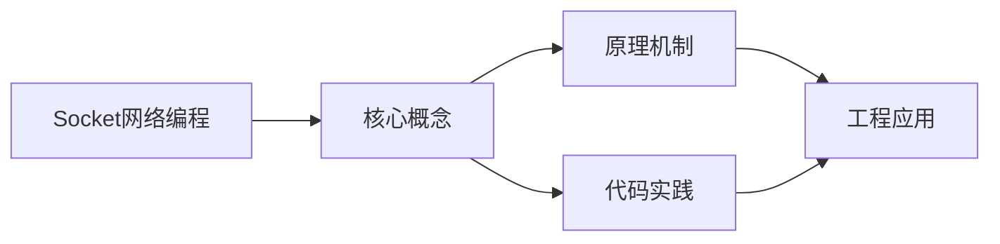
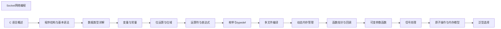

## 1. 学习目标（Bloom 分类）

本节按照布鲁姆教育目标分类学组织学习路径。本文主题为《Socket网络编程》，属于 C 模块，读者可以根据自身阶段选择阅读深度。

记忆层面：能够准确复述本文的核心概念、术语与基本语法或操作步骤，并能够在提问或检索时快速定位对应知识点。能够说出 C 的变量、函数、指针、数组、结构体与预处理语法。

理解层面：能够用自己的语言解释核心原理与工作机制，说明概念之间的因果关系，而不是机械记忆结论。能够解释指针与内存地址、栈与堆、编译链接过程。

应用层面：能够在真实项目或练习场景中运用本文知识解决具体问题，写出正确且可维护的实现。能够编写系统工具、数据结构与嵌入式程序。

分析层面：能够拆解复杂问题，比较本文主题与相邻概念的异同，识别边界条件与例外情况。能够分析内存泄漏、缓冲区溢出与未定义行为。

评价层面：能够根据约束条件（性能、可读性、安全、成本）评价不同方案的优劣，做出有依据的技术决策。能够评价 C 与其他语言在系统编程中的取舍。

创造层面：能够把本文知识与其他模块知识组合，设计出新的解决方案或可复用的工程模式。能够设计可移植、可维护的 C 库与模块。

通过本节学习，读者应当能够把《Socket网络编程》纳入自己的知识网络，并与 C 模块的其他主题（指针、内存管理、预处理器、标准库）建立关联。

## 2. 历史动机与发展脉络

《Socket网络编程》是 C 领域的重要主题。要真正理解它，需要先了解它解决的问题与演进过程。

C 由 Dennis Ritchie 于 1972 年在贝尔实验室为 Unix 开发，是系统编程的基石语言：操作系统、编译器、嵌入式固件均以 C 为主。
C89（ANSI C）统一方言，C99 引入变长数组与 // 注释，C11 增加泛型选择与线程支持，C17 为缺陷修复版，C23（2024 年正式发布）引入 constexpr、属性、显式枚举底层类型等现代化特性。
C 的哲学是“信任程序员”：提供指针与内存操作的全部能力，同时把正确性责任交给开发者；这一设计成就了性能上限，也带来内存安全风险，催生了 Rust 等后继语言。

回到本文主题：Socket网络编程 的提出与成熟，正是上述技术背景下的必然产物。早期实现往往以简单可用为目标，随着工程规模扩大，社区逐渐沉淀出标准做法与最佳实践；理解这一脉络，可以帮助读者判断“为什么文档中的推荐写法是现在这个样子”，也能在遇到历史遗留代码时准确识别其设计年代与取舍。


## 3. 形式化定义与核心概念精讲

本节把《Socket网络编程》涉及的核心概念以“定义 + 讲解”的形式展开。读者应把定义当作工具，把讲解当作理解路径；两者结合才能形成可迁移的知识。

指针：指针保存变量地址，`&` 取地址、`*` 解引用；指针算术与数组名退化规则（数组名作为实参退化为首元素指针）是 C 的经典难点。
内存管理：栈内存自动释放，堆内存由 malloc/calloc/realloc/free 管理；所有权责任（谁分配谁释放）必须显式约定。
预处理器：#include/#define/#ifdef 在编译前文本处理；宏展开有副作用与优先级风险，函数式宏参数必须加括号。

### 3.1 原文章节逐一精讲

原文档把主题拆分为 16 个小节，下面按顺序给出每一节的导读讲解，随后保留原文细节供精读。

#### 原文精读（完整保留）

# C Socket 网络编程

> **符号约定**：`< >` 必填参数 | `[ ]` 可选参数

---

#### 概述

Socket（套接字）是网络通信的端点，由IP地址和端口号标识。C语言通过BSD Socket API提供网络编程接口，支持TCP（可靠传输）和UDP（快速传输）两种主要协议。Socket编程是构建网络服务器、客户端应用和分布式系统的基础。

#### 基础概念

##### TCP vs UDP

| 特性     | TCP                  | UDP               |
| -------- | -------------------- | ----------------- |
| 连接     | 面向连接（三次握手） | 无连接            |
| 可靠性   | 可靠传输，保证顺序   | 不保证可靠和顺序  |
| 速度     | 较慢（有确认和重传） | 较快              |
| 适用场景 | 文件传输、Web、邮件  | 视频流、DNS、游戏 |

##### Socket 编程基本流程

TCP 服务器：`socket` -> `bind` -> `listen` -> `accept` -> `recv/send` -> `close`

TCP 客户端：`socket` -> `connect` -> `recv/send` -> `close`

UDP 服务器：`socket` -> `bind` -> `recvfrom/sendto` -> `close`

UDP 客户端：`socket` -> `sendto/recvfrom` -> `close`

##### 核心数据结构

```c
#include <netinet/in.h>

// IPv4 地址结构
struct sockaddr_in {
    sa_family_t    sin_family; // AF_INET
    in_port_t      sin_port;   // 端口号（网络字节序）
    struct in_addr sin_addr;   // IP地址
    char           sin_zero[8];// 填充
};

// IPv6 地址结构
struct sockaddr_in6 {
    sa_family_t    sin6_family; // AF_INET6
    in_port_t      sin6_port;
    uint32_t       sin6_flowinfo;
    struct in6_addr sin6_addr;
    uint32_t       sin6_scope_id;
};
```

#### 快速上手

##### TCP 服务器

```c
#include <stdio.h>
#include <string.h>
#include <unistd.h>
#include <netinet/in.h>

int main(void) {
    // 创建套接字
    int server_fd = socket(AF_INET, SOCK_STREAM, 0);

    // 允许地址复用
    int opt = 1;
    setsockopt(server_fd, SOL_SOCKET, SO_REUSEADDR, &opt, sizeof(opt));

    // 绑定地址和端口
    struct sockaddr_in addr = {
        .sin_family = AF_INET,
        .sin_port = htons(8080),
        .sin_addr.s_addr = INADDR_ANY
    };
    bind(server_fd, (struct sockaddr *)&addr, sizeof(addr));

    // 开始监听
    listen(server_fd, 5);
    printf("服务器监听 8080 端口\n");

    // 接受客户端连接
    struct sockaddr_in client_addr;
    socklen_t client_len = sizeof(client_addr);
    int client_fd = accept(server_fd, (struct sockaddr *)&client_addr, &client_len);

    // 读取客户端数据
    char buf[1024] = {0};
    read(client_fd, buf, sizeof(buf));
    printf("收到: %s\n", buf);

    // 发送响应
    const char *response = "Hello from server";
    write(client_fd, response, strlen(response));

    // 关闭连接
    close(client_fd);
    close(server_fd);
    return 0;
}
```

##### TCP 客户端

```c
#include <stdio.h>
#include <string.h>
#include <unistd.h>
#include <netinet/in.h>
#include <arpa/inet.h>

int main(void) {
    // 创建套接字
    int sock = socket(AF_INET, SOCK_STREAM, 0);

    // 设置服务器地址
    struct sockaddr_in addr = {
        .sin_family = AF_INET,
        .sin_port = htons(8080),
        .sin_addr.s_addr = inet_addr("127.0.0.1")
    };

    // 连接服务器
    if (connect(sock, (struct sockaddr *)&addr, sizeof(addr)) < 0) {
        perror("连接失败");
        return 1;
    }

    // 发送数据
    const char *msg = "Hello from client";
    write(sock, msg, strlen(msg));

    // 接收响应
    char buf[1024] = {0};
    read(sock, buf, sizeof(buf));
    printf("服务器响应: %s\n", buf);

    close(sock);
    return 0;
}
```

#### 详细用法

##### UDP 服务器

```c
#include <stdio.h>
#include <string.h>
#include <unistd.h>
#include <netinet/in.h>

int main(void) {
    int sock = socket(AF_INET, SOCK_DGRAM, 0);

    struct sockaddr_in addr = {
        .sin_family = AF_INET,
        .sin_port = htons(9090),
        .sin_addr.s_addr = INADDR_ANY
    };
    bind(sock, (struct sockaddr *)&addr, sizeof(addr));

    printf("UDP 服务器监听 9090 端口\n");

    char buf[1024];
    struct sockaddr_in client_addr;
    socklen_t client_len = sizeof(client_addr);

    while (1) {
        // 接收数据
        ssize_t n = recvfrom(sock, buf, sizeof(buf) - 1, 0,
                              (struct sockaddr *)&client_addr, &client_len);
        buf[n] = '\0';
        printf("收到: %s\n", buf);

        // 发送响应
        const char *response = "UDP 响应";
        sendto(sock, response, strlen(response), 0,
               (struct sockaddr *)&client_addr, client_len);
    }

    close(sock);
    return 0;
}
```

##### UDP 客户端

```c
#include <stdio.h>
#include <string.h>
#include <unistd.h>
#include <netinet/in.h>
#include <arpa/inet.h>

int main(void) {
    int sock = socket(AF_INET, SOCK_DGRAM, 0);

    struct sockaddr_in addr = {
        .sin_family = AF_INET,
        .sin_port = htons(9090),
        .sin_addr.s_addr = inet_addr("127.0.0.1")
    };

    // 发送数据
    const char *msg = "UDP 请求";
    sendto(sock, msg, strlen(msg), 0, (struct sockaddr *)&addr, sizeof(addr));

    // 接收响应
    char buf[1024];
    recvfrom(sock, buf, sizeof(buf), 0, NULL, NULL);
    printf("响应: %s\n", buf);

    close(sock);
    return 0;
}
```

##### 常用套接字选项

```c
#include <stdio.h>
#include <unistd.h>
#include <netinet/in.h>
#include <netinet/tcp.h>

int main(void) {
    int sock = socket(AF_INET, SOCK_STREAM, 0);

    // 地址复用：服务器重启时可以立即绑定同一端口
    int reuse = 1;
    setsockopt(sock, SOL_SOCKET, SO_REUSEADDR, &reuse, sizeof(reuse));

    // 发送超时
    struct timeval timeout = { .tv_sec = 5, .tv_usec = 0 };
    setsockopt(sock, SOL_SOCKET, SO_SNDTIMEO, &timeout, sizeof(timeout));

    // 接收超时
    setsockopt(sock, SOL_SOCKET, SO_RCVTIMEO, &timeout, sizeof(timeout));

    // 接收缓冲区大小
    int bufsize = 65536;
    setsockopt(sock, SOL_SOCKET, SO_RCVBUF, &bufsize, sizeof(bufsize));

    // 禁用 Nagle 算法（减少延迟）
    int nodelay = 1;
    setsockopt(sock, IPPROTO_TCP, TCP_NODELAY, &nodelay, sizeof(nodelay));

    // 保持连接
    int keepalive = 1;
    setsockopt(sock, SOL_SOCKET, SO_KEEPALIVE, &keepalive, sizeof(keepalive));

    close(sock);
    return 0;
}
```

#### 常见场景

##### 场景一：HTTP 服务器

```c
#include <stdio.h>
#include <string.h>
#include <unistd.h>
#include <netinet/in.h>
#include <signal.h>

#define PORT 8080

int main(void) {
    signal(SIGCHLD, SIG_IGN);

    int server_fd = socket(AF_INET, SOCK_STREAM, 0);
    int opt = 1;
    setsockopt(server_fd, SOL_SOCKET, SO_REUSEADDR, &opt, sizeof(opt));

    struct sockaddr_in addr = {
        .sin_family = AF_INET,
        .sin_port = htons(PORT),
        .sin_addr.s_addr = INADDR_ANY
    };
    bind(server_fd, (struct sockaddr *)&addr, sizeof(addr));
    listen(server_fd, 10);

    printf("HTTP 服务器运行在 http://localhost:%d\n", PORT);

    while (1) {
        int client_fd = accept(server_fd, NULL, NULL);
        if (client_fd < 0) continue;

        char buf[4096] = {0};
        read(client_fd, buf, sizeof(buf));

        // 构造 HTTP 响应
        const char *body = "<html><body><h1>Hello, World!</h1></body></html>";
        char response[4096];
        snprintf(response, sizeof(response),
                 "HTTP/1.1 200 OK\r\n"
                 "Content-Type: text/html; charset=utf-8\r\n"
                 "Content-Length: %zu\r\n"
                 "Connection: close\r\n"
                 "\r\n%s",
                 strlen(body), body);

        write(client_fd, response, strlen(response));
        close(client_fd);
    }

    return 0;
}
```

##### 场景二：多线程并发服务器

```c
#include <stdio.h>
#include <string.h>
#include <unistd.h>
#include <netinet/in.h>
#include <pthread.h>

#define PORT 8080

void *handle_client(void *arg) {
    int client_fd = *(int *)arg;
    free(arg);

    char buf[1024];
    while (1) {
        ssize_t n = read(client_fd, buf, sizeof(buf) - 1);
        if (n <= 0) break;
        buf[n] = '\0';
        printf("收到: %s\n", buf);

        // 回显
        write(client_fd, buf, n);
    }

    close(client_fd);
    return NULL;
}

int main(void) {
    int server_fd = socket(AF_INET, SOCK_STREAM, 0);
    int opt = 1;
    setsockopt(server_fd, SOL_SOCKET, SO_REUSEADDR, &opt, sizeof(opt));

    struct sockaddr_in addr = {
        .sin_family = AF_INET,
        .sin_port = htons(PORT),
        .sin_addr.s_addr = INADDR_ANY
    };
    bind(server_fd, (struct sockaddr *)&addr, sizeof(addr));
    listen(server_fd, 10);

    printf("回显服务器运行在端口 %d\n", PORT);

    while (1) {
        int client_fd = accept(server_fd, NULL, NULL);
        if (client_fd < 0) continue;

        int *fd_ptr = malloc(sizeof(int));
        *fd_ptr = client_fd;

        pthread_t tid;
        pthread_create(&tid, NULL, handle_client, fd_ptr);
        pthread_detach(tid);
    }

    return 0;
}
```

##### 场景三：域名解析

```c
#include <stdio.h>
#include <string.h>
#include <netdb.h>
#include <arpa/inet.h>

int main(void) {
    const char *hostname = "www.example.com";

    struct addrinfo hints = {0};
    hints.ai_family = AF_INET;    // IPv4
    hints.ai_socktype = SOCK_STREAM;

    struct addrinfo *result;
    int ret = getaddrinfo(hostname, "80", &hints, &result);
    if (ret != 0) {
        fprintf(stderr, "域名解析失败: %s\n", gai_strerror(ret));
        return 1;
    }

    for (struct addrinfo *rp = result; rp != NULL; rp = rp->ai_next) {
        struct sockaddr_in *addr = (struct sockaddr_in *)rp->ai_addr;
        char ip_str[INET_ADDRSTRLEN];
        inet_ntop(AF_INET, &addr->sin_addr, ip_str, sizeof(ip_str));
        printf("IP 地址: %s\n", ip_str);
    }

    freeaddrinfo(result);
    return 0;
}
```

#### 注意事项

##### 字节序转换

网络传输使用大端字节序（网络字节序），主机可能使用小端字节序。必须使用转换函数：

```c
// 主机序转网络序
uint16_t net_port = htons(8080);   // 端口
uint32_t net_addr = htonl(0x7F000001); // IP地址

// 网络序转主机序
uint16_t host_port = ntohs(net_port);
uint32_t host_addr = ntohl(net_addr);
```

##### 处理部分读写

TCP 是字节流协议，`read` 和 `write` 可能只处理部分数据：

```c
// 安全读取指定字节数
ssize_t read_full(int fd, void *buf, size_t count) {
    size_t total = 0;
    while (total < count) {
        ssize_t n = read(fd, (char *)buf + total, count - total);
        if (n <= 0) return n == 0 ? total : -1;
        total += n;
    }
    return total;
}

// 安全写入指定字节数
ssize_t write_full(int fd, const void *buf, size_t count) {
    size_t total = 0;
    while (total < count) {
        ssize_t n = write(fd, (const char *)buf + total, count - total);
        if (n <= 0) return -1;
        total += n;
    }
    return total;
}
```

##### TIME_WAIT 状态

TCP 连接关闭后，主动关闭方会进入 TIME_WAIT 状态，持续约2分钟。在此期间端口无法复用。使用 `SO_REUSEADDR` 选项可以解决：

```c
int opt = 1;
setsockopt(server_fd, SOL_SOCKET, SO_REUSEADDR, &opt, sizeof(opt));
```

#### 进阶用法

##### I/O 多路复用（select）

```c
#include <stdio.h>
#include <string.h>
#include <unistd.h>
#include <netinet/in.h>
#include <sys/select.h>

#define MAX_CLIENTS 64

int main(void) {
    int server_fd = socket(AF_INET, SOCK_STREAM, 0);
    int opt = 1;
    setsockopt(server_fd, SOL_SOCKET, SO_REUSEADDR, &opt, sizeof(opt));

    struct sockaddr_in addr = {
        .sin_family = AF_INET,
        .sin_port = htons(8080),
        .sin_addr.s_addr = INADDR_ANY
    };
    bind(server_fd, (struct sockaddr *)&addr, sizeof(addr));
    listen(server_fd, 10);

    int clients[MAX_CLIENTS] = {0};
    fd_set readfds;

    printf("select 服务器运行在端口 8080\n");

    while (1) {
        FD_ZERO(&readfds);
        FD_SET(server_fd, &readfds);
        int max_fd = server_fd;

        for (int i = 0; i < MAX_CLIENTS; i++) {
            if (clients[i] > 0) {
                FD_SET(clients[i], &readfds);
                if (clients[i] > max_fd) max_fd = clients[i];
            }
        }

        if (select(max_fd + 1, &readfds, NULL, NULL, NULL) < 0) continue;

        // 新连接
        if (FD_ISSET(server_fd, &readfds)) {
            int client_fd = accept(server_fd, NULL, NULL);
            for (int i = 0; i < MAX_CLIENTS; i++) {
                if (clients[i] == 0) { clients[i] = client_fd; break; }
            }
        }

        // 客户端数据
        for (int i = 0; i < MAX_CLIENTS; i++) {
            if (clients[i] > 0 && FD_ISSET(clients[i], &readfds)) {
                char buf[1024];
                ssize_t n = read(clients[i], buf, sizeof(buf));
                if (n <= 0) {
                    close(clients[i]);
                    clients[i] = 0;
                } else {
                    write(clients[i], buf, n); // 回显
                }
            }
        }
    }

    return 0;
}
```

##### I/O 多路复用（epoll）

```c
#include <stdio.h>
#include <string.h>
#include <unistd.h>
#include <netinet/in.h>
#include <sys/epoll.h>

#define MAX_EVENTS 64

int main(void) {
    int server_fd = socket(AF_INET, SOCK_STREAM, 0);
    int opt = 1;
    setsockopt(server_fd, SOL_SOCKET, SO_REUSEADDR, &opt, sizeof(opt));

    struct sockaddr_in addr = {
        .sin_family = AF_INET,
        .sin_port = htons(8080),
        .sin_addr.s_addr = INADDR_ANY
    };
    bind(server_fd, (struct sockaddr *)&addr, sizeof(addr));
    listen(server_fd, 10);

    // 创建 epoll 实例
    int epfd = epoll_create1(0);

    // 注册服务器套接字
    struct epoll_event ev = { .events = EPOLLIN, .data.fd = server_fd };
    epoll_ctl(epfd, EPOLL_CTL_ADD, server_fd, &ev);

    struct epoll_event events[MAX_EVENTS];
    printf("epoll 服务器运行在端口 8080\n");

    while (1) {
        int nfds = epoll_wait(epfd, events, MAX_EVENTS, -1);

        for (int i = 0; i < nfds; i++) {
            if (events[i].data.fd == server_fd) {
                // 新连接
                int client_fd = accept(server_fd, NULL, NULL);
                ev.events = EPOLLIN;
                ev.data.fd = client_fd;
                epoll_ctl(epfd, EPOLL_CTL_ADD, client_fd, &ev);
            } else {
                // 客户端数据
                char buf[1024];
                ssize_t n = read(events[i].data.fd, buf, sizeof(buf));
                if (n <= 0) {
                    epoll_ctl(epfd, EPOLL_CTL_DEL, events[i].data.fd, NULL);
                    close(events[i].data.fd);
                } else {
                    write(events[i].data.fd, buf, n);
                }
            }
        }
    }

    return 0;
}
```
#### 创建 Socket

**基本写法：创建 TCP socket**
`socket(AF_INET, SOCK_STREAM, 0);`
```c
// 创建 IPv4 TCP 套接字
int fd = socket(AF_INET, SOCK_STREAM, 0);
```

---

**基本写法：创建 UDP socket**
`socket(AF_INET, SOCK_DGRAM, 0);`
```c
// 创建 IPv4 UDP 套接字
int fd = socket(AF_INET, SOCK_DGRAM, 0);
```

---

**基本写法：创建本地 socket**
`socket(AF_UNIX, SOCK_STREAM, 0);`
```c
// 创建 Unix 域套接字
int fd = socket(AF_UNIX, SOCK_STREAM, 0);
```

---

#### 地址结构

**基本写法：IPv4 地址结构**
`struct sockaddr_in <变量>;`
```c
// 初始化服务器地址
struct sockaddr_in addr;
addr.sin_family = AF_INET;
addr.sin_port = htons(8080);
addr.sin_addr.s_addr = INADDR_ANY;
```

---

**基本写法：字符串转地址**
`inet_pton(AF_INET, <IP串>, &<地址>);`
```c
// 将点分十进制转为二进制
inet_pton(AF_INET, "127.0.0.1", &addr.sin_addr);
```

---

**基本写法：地址转字符串**
`inet_ntop(AF_INET, &<地址>, <缓冲>, <大小>);`
```c
// 二进制地址转可读字符串
char ip[INET_ADDRSTRLEN];
inet_ntop(AF_INET, &addr.sin_addr, ip, sizeof(ip));
```

---

#### 服务端流程

**基本写法：绑定地址**
`bind(<fd>, (struct sockaddr*)&<地址>, sizeof(<地址>));`
```c
// 绑定本地地址端口
bind(fd, (struct sockaddr*)&addr, sizeof(addr));
```

---

**基本写法：监听连接**
`listen(<fd>, <队列长度>);`
```c
// 开始监听客户端连接
listen(fd, 5);
```

---

**基本写法：接受连接**
`accept(<fd>, (struct sockaddr*)&<客户端地址>, &<长度>);`
```c
// 接受新连接返回新描述符
struct sockaddr_in cli;
socklen_t len = sizeof(cli);
int cfd = accept(fd, (struct sockaddr*)&cli, &len);
```

---

#### 客户端流程

**基本写法：连接服务器**
`connect(<fd>, (struct sockaddr*)&<服务器地址>, sizeof(<地址>));`
```c
// 主动连接服务器
connect(fd, (struct sockaddr*)&srv, sizeof(srv));
```

---

#### 数据收发

**基本写法：发送数据**
`send(<fd>, <数据>, <大小>, 0);`
```c
// TCP 发送数据
send(fd, buf, n, 0);
```

---

**基本写法：接收数据**
`recv(<fd>, <缓冲>, <大小>, 0);`
```c
// TCP 接收数据
ssize_t n = recv(fd, buf, sizeof(buf), 0);
```

---

**基本写法：UDP 发送**
`sendto(<fd>, <数据>, <大小>, 0, (struct sockaddr*)&<目标>, sizeof(<目标>));`
```c
// UDP 发送数据到指定地址
sendto(fd, buf, n, 0, (struct sockaddr*)&dst, sizeof(dst));
```

---

**基本写法：UDP 接收**
`recvfrom(<fd>, <缓冲>, <大小>, 0, (struct sockaddr*)&<来源>, &<长度>);`
```c
// UDP 接收数据并获取来源
struct sockaddr_in src;
socklen_t len = sizeof(src);
recvfrom(fd, buf, sizeof(buf), 0, (struct sockaddr*)&src, &len);
```

---

#### Socket 选项

**基本写法：设置地址复用**
`setsockopt(<fd>, SOL_SOCKET, SO_REUSEADDR, &<值>, sizeof(<值>));`
```c
// 避免地址占用错误
int opt = 1;
setsockopt(fd, SOL_SOCKET, SO_REUSEADDR, &opt, sizeof(opt));
```

---

**基本写法：设置接收超时**
`setsockopt(<fd>, SOL_SOCKET, SO_RCVTIMEO, &<时长>, sizeof(<时长>));`
```c
// 设置接收超时
struct timeval tv = {5, 0};
setsockopt(fd, SOL_SOCKET, SO_RCVTIMEO, &tv, sizeof(tv));
```

---

#### I/O 多路复用

**基本写法：select 等待**
`select(<最大fd+1>, &<读集>, NULL, NULL, &<超时>);`
```c
// 监视多个描述符
fd_set rfds;
FD_ZERO(&rfds);
FD_SET(fd, &rfds);
struct timeval tv = {5, 0};
select(fd + 1, &rfds, NULL, NULL, &tv);
```

---

**基本写法：poll 等待**
`poll(<数组>, <数量>, <超时毫秒>);`
```c
// 使用 poll 监视
struct pollfd fds[1];
fds[0].fd = fd;
fds[0].events = POLLIN;
poll(fds, 1, 5000);
```

---

**基本写法：epoll 创建**
`epoll_create1(0);`
```c
// Linux 高效多路复用
int epfd = epoll_create1(0);
```

---

**基本写法：epoll 注册**
`epoll_ctl(<epfd>, EPOLL_CTL_ADD, <fd>, &<事件>);`
```c
// 添加描述符到 epoll
struct epoll_event ev;
ev.events = EPOLLIN;
ev.data.fd = fd;
epoll_ctl(epfd, EPOLL_CTL_ADD, fd, &ev);
```

---

**基本写法：epoll 等待**
`epoll_wait(<epfd>, <事件数组>, <最大数>, <超时>);`
```c
// 等待事件发生
struct epoll_event events[10];
int n = epoll_wait(epfd, events, 10, -1);
```

---

#### 关闭 Socket

**基本写法：关闭描述符**
`close(<fd>);`
```c
// 关闭并释放资源
close(fd);
```

---

**基本写法：优雅关闭**
`shutdown(<fd>, SHUT_WR);`
```c
// 单向关闭写端
shutdown(fd, SHUT_WR);
```

---

#### 主机与服务查询

**基本写法：获取主机信息**
`getaddrinfo(<主机>, <服务>, &<提示>, &<结果>);`
```c
// 现代地址查询接口
struct addrinfo hints = {0};
hints.ai_family = AF_INET;
hints.ai_socktype = SOCK_STREAM;
struct addrinfo* res;
getaddrinfo("example.com", "80", &hints, &res);
```

---

**基本写法：释放结果**
`freeaddrinfo(<结果>);`
```c
// 释放 getaddrinfo 结果
freeaddrinfo(res);
```


### 3.2 概念关系图

下面用 Mermaid 图表达本文核心概念之间的关系，帮助读者建立整体图景：



图中展示的是本文知识的结构化关系：核心概念是入口，原理机制解释“为什么”，代码实践演示“怎么做”，工程应用回答“何时用”。读者学习时可以把每个小节的内容挂接到对应节点上。

## 4. 理论推导与原理解析

本节深入《Socket网络编程》背后的原理。理论部分不求面面俱到，而是聚焦“能解释现象、能指导实践”的关键推导。

指针：指针保存变量地址，`&` 取地址、`*` 解引用；指针算术与数组名退化规则（数组名作为实参退化为首元素指针）是 C 的经典难点。
内存管理：栈内存自动释放，堆内存由 malloc/calloc/realloc/free 管理；所有权责任（谁分配谁释放）必须显式约定。
预处理器：#include/#define/#ifdef 在编译前文本处理；宏展开有副作用与优先级风险，函数式宏参数必须加括号。
编译链接：预处理 -> 编译 -> 汇编 -> 链接；头文件声明接口，源文件实现；静态库与动态库（.a/.so/.dll）决定部署形态。

需要强调的是，理论推导与工程实践之间存在翻译层：理论给出的是理想化模型与边界条件，工程代码则必须处理真实环境中的例外。读者在学习时应先掌握理论的“标准情形”，再通过陷阱章节了解“非标准情形”。

## 5. 代码示例与逐行讲解

本节把原文中的代码示例系统整理，并为每个示例补充用途说明与讲解。读者不应只浏览代码，而应逐段对照讲解理解设计意图。

### 5.1 示例：核心数据结构

该示例来自原文《核心数据结构》小节，用于演示Socket网络编程相关操作。阅读时请先看代码结构，再看其后的讲解。

```c
#include <netinet/in.h>

// IPv4 地址结构
struct sockaddr_in {
    sa_family_t    sin_family; // AF_INET
    in_port_t      sin_port;   // 端口号（网络字节序）
    struct in_addr sin_addr;   // IP地址
    char           sin_zero[8];// 填充
};

// IPv6 地址结构
struct sockaddr_in6 {
    sa_family_t    sin6_family; // AF_INET6
    in_port_t      sin6_port;
    uint32_t       sin6_flowinfo;
    struct in6_addr sin6_addr;
    uint32_t       sin6_scope_id;
};
```

讲解：这段代码演示了本节核心知识点。代码中的关键操作可以归纳为三步：准备（定义或初始化）、执行（核心逻辑）、收尾（释放资源或返回结果）。实际项目中，这三步往往被封装为函数或类，以提升复用性与可测试性。

关键点分析：

该示例共 16 行有效代码，结构以数据或配置为主。阅读时应关注：数据字段的含义、配置项的作用，以及它们与运行行为的对应关系。

进阶思考路径：先尝试修改参数观察行为变化，再把示例中的模式迁移到自己的项目中；每次修改都记录预期与实测差异，这是把示例转化为能力的最快方式。

### 5.2 示例：TCP 服务器

该示例来自原文《TCP 服务器》小节，用于演示Socket网络编程相关操作。阅读时请先看代码结构，再看其后的讲解。

```c
#include <stdio.h>
#include <string.h>
#include <unistd.h>
#include <netinet/in.h>

int main(void) {
    // 创建套接字
    int server_fd = socket(AF_INET, SOCK_STREAM, 0);

    // 允许地址复用
    int opt = 1;
    setsockopt(server_fd, SOL_SOCKET, SO_REUSEADDR, &opt, sizeof(opt));

    // 绑定地址和端口
    struct sockaddr_in addr = {
        .sin_family = AF_INET,
        .sin_port = htons(8080),
        .sin_addr.s_addr = INADDR_ANY
    };
    bind(server_fd, (struct sockaddr *)&addr, sizeof(addr));

    // 开始监听
    listen(server_fd, 5);
    printf("服务器监听 8080 端口\n");

    // 接受客户端连接
    struct sockaddr_in client_addr;
    socklen_t client_len = sizeof(client_addr);
    int client_fd = accept(server_fd, (struct sockaddr *)&client_addr, &client_len);

    // 读取客户端数据
    char buf[1024] = {0};
    read(client_fd, buf, sizeof(buf));
    printf("收到: %s\n", buf);

    // 发送响应
    const char *response = "Hello from server";
    write(client_fd, response, strlen(response));

    // 关闭连接
    close(client_fd);
    close(server_fd);
    return 0;
}
```

讲解：这段代码演示了本节核心知识点。代码中的关键操作可以归纳为三步：准备（定义或初始化）、执行（核心逻辑）、收尾（释放资源或返回结果）。实际项目中，这三步往往被封装为函数或类，以提升复用性与可测试性。

关键点分析：

该示例共 36 行有效代码，包含 2 类关键结构（from、return）。其中：

- 入口与初始化部分负责建立上下文，对应实际项目中的启动或装配逻辑；
- 核心逻辑部分体现本文主题的主要操作，是阅读时最需要对照讲解理解的部分；
- 输出或返回部分把结果交给调用方，注意其类型与边界条件。

进阶思考路径：先尝试修改参数观察行为变化，再把示例中的模式迁移到自己的项目中；每次修改都记录预期与实测差异，这是把示例转化为能力的最快方式。

### 5.3 示例：TCP 客户端

该示例来自原文《TCP 客户端》小节，用于演示Socket网络编程相关操作。阅读时请先看代码结构，再看其后的讲解。

```c
#include <stdio.h>
#include <string.h>
#include <unistd.h>
#include <netinet/in.h>
#include <arpa/inet.h>

int main(void) {
    // 创建套接字
    int sock = socket(AF_INET, SOCK_STREAM, 0);

    // 设置服务器地址
    struct sockaddr_in addr = {
        .sin_family = AF_INET,
        .sin_port = htons(8080),
        .sin_addr.s_addr = inet_addr("127.0.0.1")
    };

    // 连接服务器
    if (connect(sock, (struct sockaddr *)&addr, sizeof(addr)) < 0) {
        perror("连接失败");
        return 1;
    }

    // 发送数据
    const char *msg = "Hello from client";
    write(sock, msg, strlen(msg));

    // 接收响应
    char buf[1024] = {0};
    read(sock, buf, sizeof(buf));
    printf("服务器响应: %s\n", buf);

    close(sock);
    return 0;
}
```

讲解：这段代码演示了本节核心知识点。代码中的关键操作可以归纳为三步：准备（定义或初始化）、执行（核心逻辑）、收尾（释放资源或返回结果）。实际项目中，这三步往往被封装为函数或类，以提升复用性与可测试性。

关键点分析：

该示例共 29 行有效代码，包含 3 类关键结构（from、if、return）。其中：

- 入口与初始化部分负责建立上下文，对应实际项目中的启动或装配逻辑；
- 核心逻辑部分体现本文主题的主要操作，是阅读时最需要对照讲解理解的部分；
- 输出或返回部分把结果交给调用方，注意其类型与边界条件。

进阶思考路径：先尝试修改参数观察行为变化，再把示例中的模式迁移到自己的项目中；每次修改都记录预期与实测差异，这是把示例转化为能力的最快方式。

### 5.4 示例：UDP 服务器

该示例来自原文《UDP 服务器》小节，用于演示Socket网络编程相关操作。阅读时请先看代码结构，再看其后的讲解。

```c
#include <stdio.h>
#include <string.h>
#include <unistd.h>
#include <netinet/in.h>

int main(void) {
    int sock = socket(AF_INET, SOCK_DGRAM, 0);

    struct sockaddr_in addr = {
        .sin_family = AF_INET,
        .sin_port = htons(9090),
        .sin_addr.s_addr = INADDR_ANY
    };
    bind(sock, (struct sockaddr *)&addr, sizeof(addr));

    printf("UDP 服务器监听 9090 端口\n");

    char buf[1024];
    struct sockaddr_in client_addr;
    socklen_t client_len = sizeof(client_addr);

    while (1) {
        // 接收数据
        ssize_t n = recvfrom(sock, buf, sizeof(buf) - 1, 0,
                              (struct sockaddr *)&client_addr, &client_len);
        buf[n] = '\0';
        printf("收到: %s\n", buf);

        // 发送响应
        const char *response = "UDP 响应";
        sendto(sock, response, strlen(response), 0,
               (struct sockaddr *)&client_addr, client_len);
    }

    close(sock);
    return 0;
}
```

讲解：这段代码演示了本节核心知识点。代码中的关键操作可以归纳为三步：准备（定义或初始化）、执行（核心逻辑）、收尾（释放资源或返回结果）。实际项目中，这三步往往被封装为函数或类，以提升复用性与可测试性。

关键点分析：

该示例共 30 行有效代码，包含 2 类关键结构（while、return）。其中：

- 入口与初始化部分负责建立上下文，对应实际项目中的启动或装配逻辑；
- 核心逻辑部分体现本文主题的主要操作，是阅读时最需要对照讲解理解的部分；
- 输出或返回部分把结果交给调用方，注意其类型与边界条件。

进阶思考路径：先尝试修改参数观察行为变化，再把示例中的模式迁移到自己的项目中；每次修改都记录预期与实测差异，这是把示例转化为能力的最快方式。

### 5.5 示例：UDP 客户端

该示例来自原文《UDP 客户端》小节，用于演示Socket网络编程相关操作。阅读时请先看代码结构，再看其后的讲解。

```c
#include <stdio.h>
#include <string.h>
#include <unistd.h>
#include <netinet/in.h>
#include <arpa/inet.h>

int main(void) {
    int sock = socket(AF_INET, SOCK_DGRAM, 0);

    struct sockaddr_in addr = {
        .sin_family = AF_INET,
        .sin_port = htons(9090),
        .sin_addr.s_addr = inet_addr("127.0.0.1")
    };

    // 发送数据
    const char *msg = "UDP 请求";
    sendto(sock, msg, strlen(msg), 0, (struct sockaddr *)&addr, sizeof(addr));

    // 接收响应
    char buf[1024];
    recvfrom(sock, buf, sizeof(buf), 0, NULL, NULL);
    printf("响应: %s\n", buf);

    close(sock);
    return 0;
}
```

讲解：这段代码演示了本节核心知识点。代码中的关键操作可以归纳为三步：准备（定义或初始化）、执行（核心逻辑）、收尾（释放资源或返回结果）。实际项目中，这三步往往被封装为函数或类，以提升复用性与可测试性。

关键点分析：

该示例共 22 行有效代码，包含 1 类关键结构（return）。其中：

- 入口与初始化部分负责建立上下文，对应实际项目中的启动或装配逻辑；
- 核心逻辑部分体现本文主题的主要操作，是阅读时最需要对照讲解理解的部分；
- 输出或返回部分把结果交给调用方，注意其类型与边界条件。

进阶思考路径：先尝试修改参数观察行为变化，再把示例中的模式迁移到自己的项目中；每次修改都记录预期与实测差异，这是把示例转化为能力的最快方式。

### 5.6 示例：常用套接字选项

该示例来自原文《常用套接字选项》小节，用于演示Socket网络编程相关操作。阅读时请先看代码结构，再看其后的讲解。

```c
#include <stdio.h>
#include <unistd.h>
#include <netinet/in.h>
#include <netinet/tcp.h>

int main(void) {
    int sock = socket(AF_INET, SOCK_STREAM, 0);

    // 地址复用：服务器重启时可以立即绑定同一端口
    int reuse = 1;
    setsockopt(sock, SOL_SOCKET, SO_REUSEADDR, &reuse, sizeof(reuse));

    // 发送超时
    struct timeval timeout = { .tv_sec = 5, .tv_usec = 0 };
    setsockopt(sock, SOL_SOCKET, SO_SNDTIMEO, &timeout, sizeof(timeout));

    // 接收超时
    setsockopt(sock, SOL_SOCKET, SO_RCVTIMEO, &timeout, sizeof(timeout));

    // 接收缓冲区大小
    int bufsize = 65536;
    setsockopt(sock, SOL_SOCKET, SO_RCVBUF, &bufsize, sizeof(bufsize));

    // 禁用 Nagle 算法（减少延迟）
    int nodelay = 1;
    setsockopt(sock, IPPROTO_TCP, TCP_NODELAY, &nodelay, sizeof(nodelay));

    // 保持连接
    int keepalive = 1;
    setsockopt(sock, SOL_SOCKET, SO_KEEPALIVE, &keepalive, sizeof(keepalive));

    close(sock);
    return 0;
}
```

讲解：这段代码演示了本节核心知识点。代码中的关键操作可以归纳为三步：准备（定义或初始化）、执行（核心逻辑）、收尾（释放资源或返回结果）。实际项目中，这三步往往被封装为函数或类，以提升复用性与可测试性。

关键点分析：

该示例共 26 行有效代码，包含 1 类关键结构（return）。其中：

- 入口与初始化部分负责建立上下文，对应实际项目中的启动或装配逻辑；
- 核心逻辑部分体现本文主题的主要操作，是阅读时最需要对照讲解理解的部分；
- 输出或返回部分把结果交给调用方，注意其类型与边界条件。

进阶思考路径：先尝试修改参数观察行为变化，再把示例中的模式迁移到自己的项目中；每次修改都记录预期与实测差异，这是把示例转化为能力的最快方式。

### 5.7 示例：场景一：HTTP 服务器

该示例来自原文《场景一：HTTP 服务器》小节，用于演示Socket网络编程相关操作。阅读时请先看代码结构，再看其后的讲解。

```c
#include <stdio.h>
#include <string.h>
#include <unistd.h>
#include <netinet/in.h>
#include <signal.h>

#define PORT 8080

int main(void) {
    signal(SIGCHLD, SIG_IGN);

    int server_fd = socket(AF_INET, SOCK_STREAM, 0);
    int opt = 1;
    setsockopt(server_fd, SOL_SOCKET, SO_REUSEADDR, &opt, sizeof(opt));

    struct sockaddr_in addr = {
        .sin_family = AF_INET,
        .sin_port = htons(PORT),
        .sin_addr.s_addr = INADDR_ANY
    };
    bind(server_fd, (struct sockaddr *)&addr, sizeof(addr));
    listen(server_fd, 10);

    printf("HTTP 服务器运行在 http://localhost:%d\n", PORT);

    while (1) {
        int client_fd = accept(server_fd, NULL, NULL);
        if (client_fd < 0) continue;

        char buf[4096] = {0};
        read(client_fd, buf, sizeof(buf));

        // 构造 HTTP 响应
        const char *body = "<html><body><h1>Hello, World!</h1></body></html>";
        char response[4096];
        snprintf(response, sizeof(response),
                 "HTTP/1.1 200 OK\r\n"
                 "Content-Type: text/html; charset=utf-8\r\n"
                 "Content-Length: %zu\r\n"
                 "Connection: close\r\n"
                 "\r\n%s",
                 strlen(body), body);

        write(client_fd, response, strlen(response));
        close(client_fd);
    }

    return 0;
}
```

讲解：这段代码演示了本节核心知识点。代码中的关键操作可以归纳为三步：准备（定义或初始化）、执行（核心逻辑）、收尾（释放资源或返回结果）。实际项目中，这三步往往被封装为函数或类，以提升复用性与可测试性。

关键点分析：

该示例共 39 行有效代码，包含 3 类关键结构（if、while、return）。其中：

- 入口与初始化部分负责建立上下文，对应实际项目中的启动或装配逻辑；
- 核心逻辑部分体现本文主题的主要操作，是阅读时最需要对照讲解理解的部分；
- 输出或返回部分把结果交给调用方，注意其类型与边界条件。

进阶思考路径：先尝试修改参数观察行为变化，再把示例中的模式迁移到自己的项目中；每次修改都记录预期与实测差异，这是把示例转化为能力的最快方式。

### 5.8 示例：场景二：多线程并发服务器

该示例来自原文《场景二：多线程并发服务器》小节，用于演示Socket网络编程相关操作。阅读时请先看代码结构，再看其后的讲解。

```c
#include <stdio.h>
#include <string.h>
#include <unistd.h>
#include <netinet/in.h>
#include <pthread.h>

#define PORT 8080

void *handle_client(void *arg) {
    int client_fd = *(int *)arg;
    free(arg);

    char buf[1024];
    while (1) {
        ssize_t n = read(client_fd, buf, sizeof(buf) - 1);
        if (n <= 0) break;
        buf[n] = '\0';
        printf("收到: %s\n", buf);

        // 回显
        write(client_fd, buf, n);
    }

    close(client_fd);
    return NULL;
}

int main(void) {
    int server_fd = socket(AF_INET, SOCK_STREAM, 0);
    int opt = 1;
    setsockopt(server_fd, SOL_SOCKET, SO_REUSEADDR, &opt, sizeof(opt));

    struct sockaddr_in addr = {
        .sin_family = AF_INET,
        .sin_port = htons(PORT),
        .sin_addr.s_addr = INADDR_ANY
    };
    bind(server_fd, (struct sockaddr *)&addr, sizeof(addr));
    listen(server_fd, 10);

    printf("回显服务器运行在端口 %d\n", PORT);

    while (1) {
        int client_fd = accept(server_fd, NULL, NULL);
        if (client_fd < 0) continue;

        int *fd_ptr = malloc(sizeof(int));
        *fd_ptr = client_fd;

        pthread_t tid;
        pthread_create(&tid, NULL, handle_client, fd_ptr);
        pthread_detach(tid);
    }

    return 0;
}
```

讲解：这段代码演示了本节核心知识点。代码中的关键操作可以归纳为三步：准备（定义或初始化）、执行（核心逻辑）、收尾（释放资源或返回结果）。实际项目中，这三步往往被封装为函数或类，以提升复用性与可测试性。

关键点分析：

该示例共 44 行有效代码，包含 3 类关键结构（if、while、return）。其中：

- 入口与初始化部分负责建立上下文，对应实际项目中的启动或装配逻辑；
- 核心逻辑部分体现本文主题的主要操作，是阅读时最需要对照讲解理解的部分；
- 输出或返回部分把结果交给调用方，注意其类型与边界条件。

进阶思考路径：先尝试修改参数观察行为变化，再把示例中的模式迁移到自己的项目中；每次修改都记录预期与实测差异，这是把示例转化为能力的最快方式。

### 5.9 示例：场景三：域名解析

该示例来自原文《场景三：域名解析》小节，用于演示Socket网络编程相关操作。阅读时请先看代码结构，再看其后的讲解。

```c
#include <stdio.h>
#include <string.h>
#include <netdb.h>
#include <arpa/inet.h>

int main(void) {
    const char *hostname = "www.example.com";

    struct addrinfo hints = {0};
    hints.ai_family = AF_INET;    // IPv4
    hints.ai_socktype = SOCK_STREAM;

    struct addrinfo *result;
    int ret = getaddrinfo(hostname, "80", &hints, &result);
    if (ret != 0) {
        fprintf(stderr, "域名解析失败: %s\n", gai_strerror(ret));
        return 1;
    }

    for (struct addrinfo *rp = result; rp != NULL; rp = rp->ai_next) {
        struct sockaddr_in *addr = (struct sockaddr_in *)rp->ai_addr;
        char ip_str[INET_ADDRSTRLEN];
        inet_ntop(AF_INET, &addr->sin_addr, ip_str, sizeof(ip_str));
        printf("IP 地址: %s\n", ip_str);
    }

    freeaddrinfo(result);
    return 0;
}
```

讲解：这段代码演示了本节核心知识点。代码中的关键操作可以归纳为三步：准备（定义或初始化）、执行（核心逻辑）、收尾（释放资源或返回结果）。实际项目中，这三步往往被封装为函数或类，以提升复用性与可测试性。

关键点分析：

该示例共 24 行有效代码，包含 3 类关键结构（if、for、return）。其中：

- 入口与初始化部分负责建立上下文，对应实际项目中的启动或装配逻辑；
- 核心逻辑部分体现本文主题的主要操作，是阅读时最需要对照讲解理解的部分；
- 输出或返回部分把结果交给调用方，注意其类型与边界条件。

进阶思考路径：先尝试修改参数观察行为变化，再把示例中的模式迁移到自己的项目中；每次修改都记录预期与实测差异，这是把示例转化为能力的最快方式。

### 5.10 示例：字节序转换

该示例来自原文《字节序转换》小节，用于演示Socket网络编程相关操作。阅读时请先看代码结构，再看其后的讲解。

```c
// 主机序转网络序
uint16_t net_port = htons(8080);   // 端口
uint32_t net_addr = htonl(0x7F000001); // IP地址

// 网络序转主机序
uint16_t host_port = ntohs(net_port);
uint32_t host_addr = ntohl(net_addr);
```

讲解：这段代码演示了本节核心知识点。代码中的关键操作可以归纳为三步：准备（定义或初始化）、执行（核心逻辑）、收尾（释放资源或返回结果）。实际项目中，这三步往往被封装为函数或类，以提升复用性与可测试性。

关键点分析：

该示例共 6 行有效代码，结构以数据或配置为主。阅读时应关注：数据字段的含义、配置项的作用，以及它们与运行行为的对应关系。

进阶思考路径：先尝试修改参数观察行为变化，再把示例中的模式迁移到自己的项目中；每次修改都记录预期与实测差异，这是把示例转化为能力的最快方式。

### 5.11 示例：处理部分读写

该示例来自原文《处理部分读写》小节，用于演示Socket网络编程相关操作。阅读时请先看代码结构，再看其后的讲解。

```c
// 安全读取指定字节数
ssize_t read_full(int fd, void *buf, size_t count) {
    size_t total = 0;
    while (total < count) {
        ssize_t n = read(fd, (char *)buf + total, count - total);
        if (n <= 0) return n == 0 ? total : -1;
        total += n;
    }
    return total;
}

// 安全写入指定字节数
ssize_t write_full(int fd, const void *buf, size_t count) {
    size_t total = 0;
    while (total < count) {
        ssize_t n = write(fd, (const char *)buf + total, count - total);
        if (n <= 0) return -1;
        total += n;
    }
    return total;
}
```

讲解：这段代码演示了本节核心知识点。代码中的关键操作可以归纳为三步：准备（定义或初始化）、执行（核心逻辑）、收尾（释放资源或返回结果）。实际项目中，这三步往往被封装为函数或类，以提升复用性与可测试性。

关键点分析：

该示例共 20 行有效代码，包含 3 类关键结构（if、while、return）。其中：

- 入口与初始化部分负责建立上下文，对应实际项目中的启动或装配逻辑；
- 核心逻辑部分体现本文主题的主要操作，是阅读时最需要对照讲解理解的部分；
- 输出或返回部分把结果交给调用方，注意其类型与边界条件。

进阶思考路径：先尝试修改参数观察行为变化，再把示例中的模式迁移到自己的项目中；每次修改都记录预期与实测差异，这是把示例转化为能力的最快方式。

### 5.12 示例：TIME_WAIT 状态

该示例来自原文《TIME_WAIT 状态》小节，用于演示Socket网络编程相关操作。阅读时请先看代码结构，再看其后的讲解。

```c
int opt = 1;
setsockopt(server_fd, SOL_SOCKET, SO_REUSEADDR, &opt, sizeof(opt));
```

讲解：这段代码演示了本节核心知识点。代码中的关键操作可以归纳为三步：准备（定义或初始化）、执行（核心逻辑）、收尾（释放资源或返回结果）。实际项目中，这三步往往被封装为函数或类，以提升复用性与可测试性。

关键点分析：

该示例共 2 行有效代码，结构以数据或配置为主。阅读时应关注：数据字段的含义、配置项的作用，以及它们与运行行为的对应关系。

进阶思考路径：先尝试修改参数观察行为变化，再把示例中的模式迁移到自己的项目中；每次修改都记录预期与实测差异，这是把示例转化为能力的最快方式。

### 5.13 示例：I/O 多路复用（select）

该示例来自原文《I/O 多路复用（select）》小节，用于演示Socket网络编程相关操作。阅读时请先看代码结构，再看其后的讲解。

```c
#include <stdio.h>
#include <string.h>
#include <unistd.h>
#include <netinet/in.h>
#include <sys/select.h>

#define MAX_CLIENTS 64

int main(void) {
    int server_fd = socket(AF_INET, SOCK_STREAM, 0);
    int opt = 1;
    setsockopt(server_fd, SOL_SOCKET, SO_REUSEADDR, &opt, sizeof(opt));

    struct sockaddr_in addr = {
        .sin_family = AF_INET,
        .sin_port = htons(8080),
        .sin_addr.s_addr = INADDR_ANY
    };
    bind(server_fd, (struct sockaddr *)&addr, sizeof(addr));
    listen(server_fd, 10);

    int clients[MAX_CLIENTS] = {0};
    fd_set readfds;

    printf("select 服务器运行在端口 8080\n");

    while (1) {
        FD_ZERO(&readfds);
        FD_SET(server_fd, &readfds);
        int max_fd = server_fd;

        for (int i = 0; i < MAX_CLIENTS; i++) {
            if (clients[i] > 0) {
                FD_SET(clients[i], &readfds);
                if (clients[i] > max_fd) max_fd = clients[i];
            }
        }

        if (select(max_fd + 1, &readfds, NULL, NULL, NULL) < 0) continue;

        // 新连接
        if (FD_ISSET(server_fd, &readfds)) {
            int client_fd = accept(server_fd, NULL, NULL);
            for (int i = 0; i < MAX_CLIENTS; i++) {
                if (clients[i] == 0) { clients[i] = client_fd; break; }
            }
        }

        // 客户端数据
        for (int i = 0; i < MAX_CLIENTS; i++) {
            if (clients[i] > 0 && FD_ISSET(clients[i], &readfds)) {
                char buf[1024];
                ssize_t n = read(clients[i], buf, sizeof(buf));
                if (n <= 0) {
                    close(clients[i]);
                    clients[i] = 0;
                } else {
                    write(clients[i], buf, n); // 回显
                }
            }
        }
    }

    return 0;
}
```

讲解：这段代码演示了本节核心知识点。代码中的关键操作可以归纳为三步：准备（定义或初始化）、执行（核心逻辑）、收尾（释放资源或返回结果）。实际项目中，这三步往往被封装为函数或类，以提升复用性与可测试性。

关键点分析：

该示例共 54 行有效代码，包含 4 类关键结构（if、for、while、return）。其中：

- 入口与初始化部分负责建立上下文，对应实际项目中的启动或装配逻辑；
- 核心逻辑部分体现本文主题的主要操作，是阅读时最需要对照讲解理解的部分；
- 输出或返回部分把结果交给调用方，注意其类型与边界条件。

进阶思考路径：先尝试修改参数观察行为变化，再把示例中的模式迁移到自己的项目中；每次修改都记录预期与实测差异，这是把示例转化为能力的最快方式。

### 5.14 示例：I/O 多路复用（epoll）

该示例来自原文《I/O 多路复用（epoll）》小节，用于演示Socket网络编程相关操作。阅读时请先看代码结构，再看其后的讲解。

```c
#include <stdio.h>
#include <string.h>
#include <unistd.h>
#include <netinet/in.h>
#include <sys/epoll.h>

#define MAX_EVENTS 64

int main(void) {
    int server_fd = socket(AF_INET, SOCK_STREAM, 0);
    int opt = 1;
    setsockopt(server_fd, SOL_SOCKET, SO_REUSEADDR, &opt, sizeof(opt));

    struct sockaddr_in addr = {
        .sin_family = AF_INET,
        .sin_port = htons(8080),
        .sin_addr.s_addr = INADDR_ANY
    };
    bind(server_fd, (struct sockaddr *)&addr, sizeof(addr));
    listen(server_fd, 10);

    // 创建 epoll 实例
    int epfd = epoll_create1(0);

    // 注册服务器套接字
    struct epoll_event ev = { .events = EPOLLIN, .data.fd = server_fd };
    epoll_ctl(epfd, EPOLL_CTL_ADD, server_fd, &ev);

    struct epoll_event events[MAX_EVENTS];
    printf("epoll 服务器运行在端口 8080\n");

    while (1) {
        int nfds = epoll_wait(epfd, events, MAX_EVENTS, -1);

        for (int i = 0; i < nfds; i++) {
            if (events[i].data.fd == server_fd) {
                // 新连接
                int client_fd = accept(server_fd, NULL, NULL);
                ev.events = EPOLLIN;
                ev.data.fd = client_fd;
                epoll_ctl(epfd, EPOLL_CTL_ADD, client_fd, &ev);
            } else {
                // 客户端数据
                char buf[1024];
                ssize_t n = read(events[i].data.fd, buf, sizeof(buf));
                if (n <= 0) {
                    epoll_ctl(epfd, EPOLL_CTL_DEL, events[i].data.fd, NULL);
                    close(events[i].data.fd);
                } else {
                    write(events[i].data.fd, buf, n);
                }
            }
        }
    }

    return 0;
}
```

讲解：这段代码演示了本节核心知识点。代码中的关键操作可以归纳为三步：准备（定义或初始化）、执行（核心逻辑）、收尾（释放资源或返回结果）。实际项目中，这三步往往被封装为函数或类，以提升复用性与可测试性。

关键点分析：

该示例共 48 行有效代码，包含 4 类关键结构（if、for、while、return）。其中：

- 入口与初始化部分负责建立上下文，对应实际项目中的启动或装配逻辑；
- 核心逻辑部分体现本文主题的主要操作，是阅读时最需要对照讲解理解的部分；
- 输出或返回部分把结果交给调用方，注意其类型与边界条件。

进阶思考路径：先尝试修改参数观察行为变化，再把示例中的模式迁移到自己的项目中；每次修改都记录预期与实测差异，这是把示例转化为能力的最快方式。

### 5.15 示例：创建 Socket

该示例来自原文《创建 Socket》小节，用于演示Socket网络编程相关操作。阅读时请先看代码结构，再看其后的讲解。

```c
// 创建 IPv4 TCP 套接字
int fd = socket(AF_INET, SOCK_STREAM, 0);
```

讲解：这段代码演示了本节核心知识点。代码中的关键操作可以归纳为三步：准备（定义或初始化）、执行（核心逻辑）、收尾（释放资源或返回结果）。实际项目中，这三步往往被封装为函数或类，以提升复用性与可测试性。

关键点分析：

该示例共 2 行有效代码，结构以数据或配置为主。阅读时应关注：数据字段的含义、配置项的作用，以及它们与运行行为的对应关系。

进阶思考路径：先尝试修改参数观察行为变化，再把示例中的模式迁移到自己的项目中；每次修改都记录预期与实测差异，这是把示例转化为能力的最快方式。

### 5.16 示例：创建 Socket

该示例来自原文《创建 Socket》小节，用于演示Socket网络编程相关操作。阅读时请先看代码结构，再看其后的讲解。

```c
// 创建 IPv4 UDP 套接字
int fd = socket(AF_INET, SOCK_DGRAM, 0);
```

讲解：这段代码演示了本节核心知识点。代码中的关键操作可以归纳为三步：准备（定义或初始化）、执行（核心逻辑）、收尾（释放资源或返回结果）。实际项目中，这三步往往被封装为函数或类，以提升复用性与可测试性。

关键点分析：

该示例共 2 行有效代码，结构以数据或配置为主。阅读时应关注：数据字段的含义、配置项的作用，以及它们与运行行为的对应关系。

进阶思考路径：先尝试修改参数观察行为变化，再把示例中的模式迁移到自己的项目中；每次修改都记录预期与实测差异，这是把示例转化为能力的最快方式。

### 5.17 示例：创建 Socket

该示例来自原文《创建 Socket》小节，用于演示Socket网络编程相关操作。阅读时请先看代码结构，再看其后的讲解。

```c
// 创建 Unix 域套接字
int fd = socket(AF_UNIX, SOCK_STREAM, 0);
```

讲解：这段代码演示了本节核心知识点。代码中的关键操作可以归纳为三步：准备（定义或初始化）、执行（核心逻辑）、收尾（释放资源或返回结果）。实际项目中，这三步往往被封装为函数或类，以提升复用性与可测试性。

关键点分析：

该示例共 2 行有效代码，结构以数据或配置为主。阅读时应关注：数据字段的含义、配置项的作用，以及它们与运行行为的对应关系。

进阶思考路径：先尝试修改参数观察行为变化，再把示例中的模式迁移到自己的项目中；每次修改都记录预期与实测差异，这是把示例转化为能力的最快方式。

### 5.18 示例：地址结构

该示例来自原文《地址结构》小节，用于演示Socket网络编程相关操作。阅读时请先看代码结构，再看其后的讲解。

```c
// 初始化服务器地址
struct sockaddr_in addr;
addr.sin_family = AF_INET;
addr.sin_port = htons(8080);
addr.sin_addr.s_addr = INADDR_ANY;
```

讲解：这段代码演示了本节核心知识点。代码中的关键操作可以归纳为三步：准备（定义或初始化）、执行（核心逻辑）、收尾（释放资源或返回结果）。实际项目中，这三步往往被封装为函数或类，以提升复用性与可测试性。

关键点分析：

该示例共 5 行有效代码，结构以数据或配置为主。阅读时应关注：数据字段的含义、配置项的作用，以及它们与运行行为的对应关系。

进阶思考路径：先尝试修改参数观察行为变化，再把示例中的模式迁移到自己的项目中；每次修改都记录预期与实测差异，这是把示例转化为能力的最快方式。

### 5.19 示例：地址结构

该示例来自原文《地址结构》小节，用于演示Socket网络编程相关操作。阅读时请先看代码结构，再看其后的讲解。

```c
// 将点分十进制转为二进制
inet_pton(AF_INET, "127.0.0.1", &addr.sin_addr);
```

讲解：这段代码演示了本节核心知识点。代码中的关键操作可以归纳为三步：准备（定义或初始化）、执行（核心逻辑）、收尾（释放资源或返回结果）。实际项目中，这三步往往被封装为函数或类，以提升复用性与可测试性。

关键点分析：

该示例共 2 行有效代码，结构以数据或配置为主。阅读时应关注：数据字段的含义、配置项的作用，以及它们与运行行为的对应关系。

进阶思考路径：先尝试修改参数观察行为变化，再把示例中的模式迁移到自己的项目中；每次修改都记录预期与实测差异，这是把示例转化为能力的最快方式。

### 5.20 示例：地址结构

该示例来自原文《地址结构》小节，用于演示Socket网络编程相关操作。阅读时请先看代码结构，再看其后的讲解。

```c
// 二进制地址转可读字符串
char ip[INET_ADDRSTRLEN];
inet_ntop(AF_INET, &addr.sin_addr, ip, sizeof(ip));
```

讲解：这段代码演示了本节核心知识点。代码中的关键操作可以归纳为三步：准备（定义或初始化）、执行（核心逻辑）、收尾（释放资源或返回结果）。实际项目中，这三步往往被封装为函数或类，以提升复用性与可测试性。

关键点分析：

该示例共 3 行有效代码，结构以数据或配置为主。阅读时应关注：数据字段的含义、配置项的作用，以及它们与运行行为的对应关系。

进阶思考路径：先尝试修改参数观察行为变化，再把示例中的模式迁移到自己的项目中；每次修改都记录预期与实测差异，这是把示例转化为能力的最快方式。

### 5.21 示例：服务端流程

该示例来自原文《服务端流程》小节，用于演示Socket网络编程相关操作。阅读时请先看代码结构，再看其后的讲解。

```c
// 绑定本地地址端口
bind(fd, (struct sockaddr*)&addr, sizeof(addr));
```

讲解：这段代码演示了本节核心知识点。代码中的关键操作可以归纳为三步：准备（定义或初始化）、执行（核心逻辑）、收尾（释放资源或返回结果）。实际项目中，这三步往往被封装为函数或类，以提升复用性与可测试性。

关键点分析：

该示例共 2 行有效代码，结构以数据或配置为主。阅读时应关注：数据字段的含义、配置项的作用，以及它们与运行行为的对应关系。

进阶思考路径：先尝试修改参数观察行为变化，再把示例中的模式迁移到自己的项目中；每次修改都记录预期与实测差异，这是把示例转化为能力的最快方式。

### 5.22 示例：服务端流程

该示例来自原文《服务端流程》小节，用于演示Socket网络编程相关操作。阅读时请先看代码结构，再看其后的讲解。

```c
// 开始监听客户端连接
listen(fd, 5);
```

讲解：这段代码演示了本节核心知识点。代码中的关键操作可以归纳为三步：准备（定义或初始化）、执行（核心逻辑）、收尾（释放资源或返回结果）。实际项目中，这三步往往被封装为函数或类，以提升复用性与可测试性。

关键点分析：

该示例共 2 行有效代码，结构以数据或配置为主。阅读时应关注：数据字段的含义、配置项的作用，以及它们与运行行为的对应关系。

进阶思考路径：先尝试修改参数观察行为变化，再把示例中的模式迁移到自己的项目中；每次修改都记录预期与实测差异，这是把示例转化为能力的最快方式。

### 5.23 示例：服务端流程

该示例来自原文《服务端流程》小节，用于演示Socket网络编程相关操作。阅读时请先看代码结构，再看其后的讲解。

```c
// 接受新连接返回新描述符
struct sockaddr_in cli;
socklen_t len = sizeof(cli);
int cfd = accept(fd, (struct sockaddr*)&cli, &len);
```

讲解：这段代码演示了本节核心知识点。代码中的关键操作可以归纳为三步：准备（定义或初始化）、执行（核心逻辑）、收尾（释放资源或返回结果）。实际项目中，这三步往往被封装为函数或类，以提升复用性与可测试性。

关键点分析：

该示例共 4 行有效代码，结构以数据或配置为主。阅读时应关注：数据字段的含义、配置项的作用，以及它们与运行行为的对应关系。

进阶思考路径：先尝试修改参数观察行为变化，再把示例中的模式迁移到自己的项目中；每次修改都记录预期与实测差异，这是把示例转化为能力的最快方式。

### 5.24 示例：客户端流程

该示例来自原文《客户端流程》小节，用于演示Socket网络编程相关操作。阅读时请先看代码结构，再看其后的讲解。

```c
// 主动连接服务器
connect(fd, (struct sockaddr*)&srv, sizeof(srv));
```

讲解：这段代码演示了本节核心知识点。代码中的关键操作可以归纳为三步：准备（定义或初始化）、执行（核心逻辑）、收尾（释放资源或返回结果）。实际项目中，这三步往往被封装为函数或类，以提升复用性与可测试性。

关键点分析：

该示例共 2 行有效代码，结构以数据或配置为主。阅读时应关注：数据字段的含义、配置项的作用，以及它们与运行行为的对应关系。

进阶思考路径：先尝试修改参数观察行为变化，再把示例中的模式迁移到自己的项目中；每次修改都记录预期与实测差异，这是把示例转化为能力的最快方式。

### 5.25 示例：数据收发

该示例来自原文《数据收发》小节，用于演示Socket网络编程相关操作。阅读时请先看代码结构，再看其后的讲解。

```c
// TCP 发送数据
send(fd, buf, n, 0);
```

讲解：这段代码演示了本节核心知识点。代码中的关键操作可以归纳为三步：准备（定义或初始化）、执行（核心逻辑）、收尾（释放资源或返回结果）。实际项目中，这三步往往被封装为函数或类，以提升复用性与可测试性。

关键点分析：

该示例共 2 行有效代码，结构以数据或配置为主。阅读时应关注：数据字段的含义、配置项的作用，以及它们与运行行为的对应关系。

进阶思考路径：先尝试修改参数观察行为变化，再把示例中的模式迁移到自己的项目中；每次修改都记录预期与实测差异，这是把示例转化为能力的最快方式。

### 5.26 示例：数据收发

该示例来自原文《数据收发》小节，用于演示Socket网络编程相关操作。阅读时请先看代码结构，再看其后的讲解。

```c
// TCP 接收数据
ssize_t n = recv(fd, buf, sizeof(buf), 0);
```

讲解：这段代码演示了本节核心知识点。代码中的关键操作可以归纳为三步：准备（定义或初始化）、执行（核心逻辑）、收尾（释放资源或返回结果）。实际项目中，这三步往往被封装为函数或类，以提升复用性与可测试性。

关键点分析：

该示例共 2 行有效代码，结构以数据或配置为主。阅读时应关注：数据字段的含义、配置项的作用，以及它们与运行行为的对应关系。

进阶思考路径：先尝试修改参数观察行为变化，再把示例中的模式迁移到自己的项目中；每次修改都记录预期与实测差异，这是把示例转化为能力的最快方式。

### 5.27 示例：数据收发

该示例来自原文《数据收发》小节，用于演示Socket网络编程相关操作。阅读时请先看代码结构，再看其后的讲解。

```c
// UDP 发送数据到指定地址
sendto(fd, buf, n, 0, (struct sockaddr*)&dst, sizeof(dst));
```

讲解：这段代码演示了本节核心知识点。代码中的关键操作可以归纳为三步：准备（定义或初始化）、执行（核心逻辑）、收尾（释放资源或返回结果）。实际项目中，这三步往往被封装为函数或类，以提升复用性与可测试性。

关键点分析：

该示例共 2 行有效代码，结构以数据或配置为主。阅读时应关注：数据字段的含义、配置项的作用，以及它们与运行行为的对应关系。

进阶思考路径：先尝试修改参数观察行为变化，再把示例中的模式迁移到自己的项目中；每次修改都记录预期与实测差异，这是把示例转化为能力的最快方式。

### 5.28 示例：数据收发

该示例来自原文《数据收发》小节，用于演示Socket网络编程相关操作。阅读时请先看代码结构，再看其后的讲解。

```c
// UDP 接收数据并获取来源
struct sockaddr_in src;
socklen_t len = sizeof(src);
recvfrom(fd, buf, sizeof(buf), 0, (struct sockaddr*)&src, &len);
```

讲解：这段代码演示了本节核心知识点。代码中的关键操作可以归纳为三步：准备（定义或初始化）、执行（核心逻辑）、收尾（释放资源或返回结果）。实际项目中，这三步往往被封装为函数或类，以提升复用性与可测试性。

关键点分析：

该示例共 4 行有效代码，结构以数据或配置为主。阅读时应关注：数据字段的含义、配置项的作用，以及它们与运行行为的对应关系。

进阶思考路径：先尝试修改参数观察行为变化，再把示例中的模式迁移到自己的项目中；每次修改都记录预期与实测差异，这是把示例转化为能力的最快方式。

### 5.29 示例：Socket 选项

该示例来自原文《Socket 选项》小节，用于演示Socket网络编程相关操作。阅读时请先看代码结构，再看其后的讲解。

```c
// 避免地址占用错误
int opt = 1;
setsockopt(fd, SOL_SOCKET, SO_REUSEADDR, &opt, sizeof(opt));
```

讲解：这段代码演示了本节核心知识点。代码中的关键操作可以归纳为三步：准备（定义或初始化）、执行（核心逻辑）、收尾（释放资源或返回结果）。实际项目中，这三步往往被封装为函数或类，以提升复用性与可测试性。

关键点分析：

该示例共 3 行有效代码，结构以数据或配置为主。阅读时应关注：数据字段的含义、配置项的作用，以及它们与运行行为的对应关系。

进阶思考路径：先尝试修改参数观察行为变化，再把示例中的模式迁移到自己的项目中；每次修改都记录预期与实测差异，这是把示例转化为能力的最快方式。

### 5.30 示例：Socket 选项

该示例来自原文《Socket 选项》小节，用于演示Socket网络编程相关操作。阅读时请先看代码结构，再看其后的讲解。

```c
// 设置接收超时
struct timeval tv = {5, 0};
setsockopt(fd, SOL_SOCKET, SO_RCVTIMEO, &tv, sizeof(tv));
```

讲解：这段代码演示了本节核心知识点。代码中的关键操作可以归纳为三步：准备（定义或初始化）、执行（核心逻辑）、收尾（释放资源或返回结果）。实际项目中，这三步往往被封装为函数或类，以提升复用性与可测试性。

关键点分析：

该示例共 3 行有效代码，结构以数据或配置为主。阅读时应关注：数据字段的含义、配置项的作用，以及它们与运行行为的对应关系。

进阶思考路径：先尝试修改参数观察行为变化，再把示例中的模式迁移到自己的项目中；每次修改都记录预期与实测差异，这是把示例转化为能力的最快方式。

### 5.31 示例：I/O 多路复用

该示例来自原文《I/O 多路复用》小节，用于演示Socket网络编程相关操作。阅读时请先看代码结构，再看其后的讲解。

```c
// 监视多个描述符
fd_set rfds;
FD_ZERO(&rfds);
FD_SET(fd, &rfds);
struct timeval tv = {5, 0};
select(fd + 1, &rfds, NULL, NULL, &tv);
```

讲解：这段代码演示了本节核心知识点。代码中的关键操作可以归纳为三步：准备（定义或初始化）、执行（核心逻辑）、收尾（释放资源或返回结果）。实际项目中，这三步往往被封装为函数或类，以提升复用性与可测试性。

关键点分析：

该示例共 6 行有效代码，结构以数据或配置为主。阅读时应关注：数据字段的含义、配置项的作用，以及它们与运行行为的对应关系。

进阶思考路径：先尝试修改参数观察行为变化，再把示例中的模式迁移到自己的项目中；每次修改都记录预期与实测差异，这是把示例转化为能力的最快方式。

### 5.32 示例：I/O 多路复用

该示例来自原文《I/O 多路复用》小节，用于演示Socket网络编程相关操作。阅读时请先看代码结构，再看其后的讲解。

```c
// 使用 poll 监视
struct pollfd fds[1];
fds[0].fd = fd;
fds[0].events = POLLIN;
poll(fds, 1, 5000);
```

讲解：这段代码演示了本节核心知识点。代码中的关键操作可以归纳为三步：准备（定义或初始化）、执行（核心逻辑）、收尾（释放资源或返回结果）。实际项目中，这三步往往被封装为函数或类，以提升复用性与可测试性。

关键点分析：

该示例共 5 行有效代码，结构以数据或配置为主。阅读时应关注：数据字段的含义、配置项的作用，以及它们与运行行为的对应关系。

进阶思考路径：先尝试修改参数观察行为变化，再把示例中的模式迁移到自己的项目中；每次修改都记录预期与实测差异，这是把示例转化为能力的最快方式。

### 5.33 示例：I/O 多路复用

该示例来自原文《I/O 多路复用》小节，用于演示Socket网络编程相关操作。阅读时请先看代码结构，再看其后的讲解。

```c
// Linux 高效多路复用
int epfd = epoll_create1(0);
```

讲解：这段代码演示了本节核心知识点。代码中的关键操作可以归纳为三步：准备（定义或初始化）、执行（核心逻辑）、收尾（释放资源或返回结果）。实际项目中，这三步往往被封装为函数或类，以提升复用性与可测试性。

关键点分析：

该示例共 2 行有效代码，结构以数据或配置为主。阅读时应关注：数据字段的含义、配置项的作用，以及它们与运行行为的对应关系。

进阶思考路径：先尝试修改参数观察行为变化，再把示例中的模式迁移到自己的项目中；每次修改都记录预期与实测差异，这是把示例转化为能力的最快方式。

### 5.34 示例：I/O 多路复用

该示例来自原文《I/O 多路复用》小节，用于演示Socket网络编程相关操作。阅读时请先看代码结构，再看其后的讲解。

```c
// 添加描述符到 epoll
struct epoll_event ev;
ev.events = EPOLLIN;
ev.data.fd = fd;
epoll_ctl(epfd, EPOLL_CTL_ADD, fd, &ev);
```

讲解：这段代码演示了本节核心知识点。代码中的关键操作可以归纳为三步：准备（定义或初始化）、执行（核心逻辑）、收尾（释放资源或返回结果）。实际项目中，这三步往往被封装为函数或类，以提升复用性与可测试性。

关键点分析：

该示例共 5 行有效代码，结构以数据或配置为主。阅读时应关注：数据字段的含义、配置项的作用，以及它们与运行行为的对应关系。

进阶思考路径：先尝试修改参数观察行为变化，再把示例中的模式迁移到自己的项目中；每次修改都记录预期与实测差异，这是把示例转化为能力的最快方式。

### 5.35 示例：I/O 多路复用

该示例来自原文《I/O 多路复用》小节，用于演示Socket网络编程相关操作。阅读时请先看代码结构，再看其后的讲解。

```c
// 等待事件发生
struct epoll_event events[10];
int n = epoll_wait(epfd, events, 10, -1);
```

讲解：这段代码演示了本节核心知识点。代码中的关键操作可以归纳为三步：准备（定义或初始化）、执行（核心逻辑）、收尾（释放资源或返回结果）。实际项目中，这三步往往被封装为函数或类，以提升复用性与可测试性。

关键点分析：

该示例共 3 行有效代码，结构以数据或配置为主。阅读时应关注：数据字段的含义、配置项的作用，以及它们与运行行为的对应关系。

进阶思考路径：先尝试修改参数观察行为变化，再把示例中的模式迁移到自己的项目中；每次修改都记录预期与实测差异，这是把示例转化为能力的最快方式。

### 5.36 示例：关闭 Socket

该示例来自原文《关闭 Socket》小节，用于演示Socket网络编程相关操作。阅读时请先看代码结构，再看其后的讲解。

```c
// 关闭并释放资源
close(fd);
```

讲解：这段代码演示了本节核心知识点。代码中的关键操作可以归纳为三步：准备（定义或初始化）、执行（核心逻辑）、收尾（释放资源或返回结果）。实际项目中，这三步往往被封装为函数或类，以提升复用性与可测试性。

关键点分析：

该示例共 2 行有效代码，结构以数据或配置为主。阅读时应关注：数据字段的含义、配置项的作用，以及它们与运行行为的对应关系。

进阶思考路径：先尝试修改参数观察行为变化，再把示例中的模式迁移到自己的项目中；每次修改都记录预期与实测差异，这是把示例转化为能力的最快方式。

### 5.37 示例：关闭 Socket

该示例来自原文《关闭 Socket》小节，用于演示Socket网络编程相关操作。阅读时请先看代码结构，再看其后的讲解。

```c
// 单向关闭写端
shutdown(fd, SHUT_WR);
```

讲解：这段代码演示了本节核心知识点。代码中的关键操作可以归纳为三步：准备（定义或初始化）、执行（核心逻辑）、收尾（释放资源或返回结果）。实际项目中，这三步往往被封装为函数或类，以提升复用性与可测试性。

关键点分析：

该示例共 2 行有效代码，结构以数据或配置为主。阅读时应关注：数据字段的含义、配置项的作用，以及它们与运行行为的对应关系。

进阶思考路径：先尝试修改参数观察行为变化，再把示例中的模式迁移到自己的项目中；每次修改都记录预期与实测差异，这是把示例转化为能力的最快方式。

### 5.38 示例：主机与服务查询

该示例来自原文《主机与服务查询》小节，用于演示Socket网络编程相关操作。阅读时请先看代码结构，再看其后的讲解。

```c
// 现代地址查询接口
struct addrinfo hints = {0};
hints.ai_family = AF_INET;
hints.ai_socktype = SOCK_STREAM;
struct addrinfo* res;
getaddrinfo("example.com", "80", &hints, &res);
```

讲解：这段代码演示了本节核心知识点。代码中的关键操作可以归纳为三步：准备（定义或初始化）、执行（核心逻辑）、收尾（释放资源或返回结果）。实际项目中，这三步往往被封装为函数或类，以提升复用性与可测试性。

关键点分析：

该示例共 6 行有效代码，结构以数据或配置为主。阅读时应关注：数据字段的含义、配置项的作用，以及它们与运行行为的对应关系。

进阶思考路径：先尝试修改参数观察行为变化，再把示例中的模式迁移到自己的项目中；每次修改都记录预期与实测差异，这是把示例转化为能力的最快方式。

### 5.39 示例：主机与服务查询

该示例来自原文《主机与服务查询》小节，用于演示Socket网络编程相关操作。阅读时请先看代码结构，再看其后的讲解。

```c
// 释放 getaddrinfo 结果
freeaddrinfo(res);
```

讲解：这段代码演示了本节核心知识点。代码中的关键操作可以归纳为三步：准备（定义或初始化）、执行（核心逻辑）、收尾（释放资源或返回结果）。实际项目中，这三步往往被封装为函数或类，以提升复用性与可测试性。

关键点分析：

该示例共 2 行有效代码，结构以数据或配置为主。阅读时应关注：数据字段的含义、配置项的作用，以及它们与运行行为的对应关系。

进阶思考路径：先尝试修改参数观察行为变化，再把示例中的模式迁移到自己的项目中；每次修改都记录预期与实测差异，这是把示例转化为能力的最快方式。


综合以上示例，可以总结出本主题的代码实践要点：第一，先定义清晰的输入输出契约；第二，核心逻辑保持单一职责；第三，错误处理与边界条件不可省略；第四，命名与注释表达意图而非复述代码。

## 6. 对比分析

对比是理解《Socket网络编程》定位的最快路径。下面从多个维度与相邻方案进行对比。

C 与 C++：C++ 是 C 的超集扩展，支持类、模板、异常与 RAII；C 更简单直接，适合嵌入式与纯系统编程。
C 与 Rust：Rust 在编译期保证内存安全（所有权/借用）；C 灵活但需要人工保证安全。新系统项目可评估 Rust。
C89 与 C23：C23 带来 constexpr、attributes、二进制字面量等，现代化程度提升但仍保持兼容。

对比的目的不是分出绝对优劣，而是建立选择依据：不同约束条件下，最优解不同。读者应把每个对比维度转化为决策检查清单。

## 7. 常见陷阱与最佳实践

本节整理该主题的高频错误与推荐做法。每个陷阱先描述现象，再解释原因，最后给出最佳实践。

### 7.1 缓冲区溢出

gets/strcpy 不检查边界导致安全漏洞。使用 fgets/strncpy（注意截断语义）或安全库。

深入讲解：该问题之所以被归类为“常见陷阱”，是因为它在初学者的代码中反复出现，而且往往不在第一时间暴露——错误通常隐藏在特定数据或特定时序下。

从成因上看，缓冲区溢出 一般源于对 C 某个机制的理解偏差：要么误用了默认行为，要么忽略了边界条件，要么把其他语言的思维惯性带了过来。

从影响上看，缓冲区溢出 轻则产生错误结果，重则导致资源泄漏、数据损坏或安全事故；这也是为什么工程评审中会把它列为检查项。

从修复策略上看，处理缓冲区溢出的正确顺序是：先复现（构造最小用例），再定位（确认机制层面的根因），最后修复并补充回归测试。跳过复现直接改代码，往往治标不治本。

### 7.2 内存泄漏

malloc 后未 free。设计清晰的所有权规则，配合 Valgrind/ASan 检测。

深入讲解：该问题之所以被归类为“常见陷阱”，是因为它在初学者的代码中反复出现，而且往往不在第一时间暴露——错误通常隐藏在特定数据或特定时序下。

从成因上看，内存泄漏 一般源于对 C 某个机制的理解偏差：要么误用了默认行为，要么忽略了边界条件，要么把其他语言的思维惯性带了过来。

从影响上看，内存泄漏 轻则产生错误结果，重则导致资源泄漏、数据损坏或安全事故；这也是为什么工程评审中会把它列为检查项。

从修复策略上看，处理内存泄漏的正确顺序是：先复现（构造最小用例），再定位（确认机制层面的根因），最后修复并补充回归测试。跳过复现直接改代码，往往治标不治本。

### 7.3 悬垂指针

free 后继续使用指针。释放后置 NULL，并约定使用前检查。

深入讲解：该问题之所以被归类为“常见陷阱”，是因为它在初学者的代码中反复出现，而且往往不在第一时间暴露——错误通常隐藏在特定数据或特定时序下。

从成因上看，悬垂指针 一般源于对 C 某个机制的理解偏差：要么误用了默认行为，要么忽略了边界条件，要么把其他语言的思维惯性带了过来。

从影响上看，悬垂指针 轻则产生错误结果，重则导致资源泄漏、数据损坏或安全事故；这也是为什么工程评审中会把它列为检查项。

从修复策略上看，处理悬垂指针的正确顺序是：先复现（构造最小用例），再定位（确认机制层面的根因），最后修复并补充回归测试。跳过复现直接改代码，往往治标不治本。

### 7.4 未定义行为

有符号溢出、数组越界、除零等行为不可预测。开启 -Wall -Wextra -fsanitize=undefined 检测。

深入讲解：该问题之所以被归类为“常见陷阱”，是因为它在初学者的代码中反复出现，而且往往不在第一时间暴露——错误通常隐藏在特定数据或特定时序下。

从成因上看，未定义行为 一般源于对 C 某个机制的理解偏差：要么误用了默认行为，要么忽略了边界条件，要么把其他语言的思维惯性带了过来。

从影响上看，未定义行为 轻则产生错误结果，重则导致资源泄漏、数据损坏或安全事故；这也是为什么工程评审中会把它列为检查项。

从修复策略上看，处理未定义行为的正确顺序是：先复现（构造最小用例），再定位（确认机制层面的根因），最后修复并补充回归测试。跳过复现直接改代码，往往治标不治本。

### 7.5 宏副作用

`#define SQUARE(x) x*x` 在 `SQUARE(a+b)` 时出错。参数加括号或用内联函数。

深入讲解：该问题之所以被归类为“常见陷阱”，是因为它在初学者的代码中反复出现，而且往往不在第一时间暴露——错误通常隐藏在特定数据或特定时序下。

从成因上看，宏副作用 一般源于对 C 某个机制的理解偏差：要么误用了默认行为，要么忽略了边界条件，要么把其他语言的思维惯性带了过来。

从影响上看，宏副作用 轻则产生错误结果，重则导致资源泄漏、数据损坏或安全事故；这也是为什么工程评审中会把它列为检查项。

从修复策略上看，处理宏副作用的正确顺序是：先复现（构造最小用例），再定位（确认机制层面的根因），最后修复并补充回归测试。跳过复现直接改代码，往往治标不治本。

### 7.6 字符串字面量修改

修改字符串字面量是未定义行为。需要修改时用字符数组。

深入讲解：该问题之所以被归类为“常见陷阱”，是因为它在初学者的代码中反复出现，而且往往不在第一时间暴露——错误通常隐藏在特定数据或特定时序下。

从成因上看，字符串字面量修改 一般源于对 C 某个机制的理解偏差：要么误用了默认行为，要么忽略了边界条件，要么把其他语言的思维惯性带了过来。

从影响上看，字符串字面量修改 轻则产生错误结果，重则导致资源泄漏、数据损坏或安全事故；这也是为什么工程评审中会把它列为检查项。

从修复策略上看，处理字符串字面量修改的正确顺序是：先复现（构造最小用例），再定位（确认机制层面的根因），最后修复并补充回归测试。跳过复现直接改代码，往往治标不治本。

### 7.7 忘记初始化

局部变量未初始化读随机值。声明即初始化。

深入讲解：该问题之所以被归类为“常见陷阱”，是因为它在初学者的代码中反复出现，而且往往不在第一时间暴露——错误通常隐藏在特定数据或特定时序下。

从成因上看，忘记初始化 一般源于对 C 某个机制的理解偏差：要么误用了默认行为，要么忽略了边界条件，要么把其他语言的思维惯性带了过来。

从影响上看，忘记初始化 轻则产生错误结果，重则导致资源泄漏、数据损坏或安全事故；这也是为什么工程评审中会把它列为检查项。

从修复策略上看，处理忘记初始化的正确顺序是：先复现（构造最小用例），再定位（确认机制层面的根因），最后修复并补充回归测试。跳过复现直接改代码，往往治标不治本。

### 7.8 类型混用

有符号与无符号比较产生隐式转换。注意 -Wsign-compare 告警。

深入讲解：该问题之所以被归类为“常见陷阱”，是因为它在初学者的代码中反复出现，而且往往不在第一时间暴露——错误通常隐藏在特定数据或特定时序下。

从成因上看，类型混用 一般源于对 C 某个机制的理解偏差：要么误用了默认行为，要么忽略了边界条件，要么把其他语言的思维惯性带了过来。

从影响上看，类型混用 轻则产生错误结果，重则导致资源泄漏、数据损坏或安全事故；这也是为什么工程评审中会把它列为检查项。

从修复策略上看，处理类型混用的正确顺序是：先复现（构造最小用例），再定位（确认机制层面的根因），最后修复并补充回归测试。跳过复现直接改代码，往往治标不治本。

### 7.0 最佳实践总览

1. 声明即初始化，指针必须有效或为 NULL。
2. 资源分配与释放成对出现，封装为函数。
3. 数组访问使用边界检查（调试版本启用断言）。
4. 头文件加 include guard，声明与实现分离。
5. 编译开启 -Wall -Wextra -Werror（开发阶段）。

把这些最佳实践固化为团队规范与代码评审检查项，是避免同类问题反复出现的关键。

## 8. 工程实践

本节把《Socket网络编程》放入真实工程场景，给出可复用的模式与组织方法。

模块化：头文件定义接口（结构体前向声明、函数原型），源文件实现；内部函数用 static 隐藏。
错误处理：函数返回错误码或状态枚举，输出参数传结果；文档化调用方责任。
构建：Makefile/CMake 管理编译单元与依赖；编译选项区分 debug/release。
测试：断言 + 单元测试框架（Unity/CMocka），配合 AddressSanitizer。

### 8.1 工程实践的原则拆解

以上工程实践可以归纳为四条原则。第一，配置与代码分离：C 项目中环境差异应通过配置注入，而不是散落在代码分支中；这保证同一份代码可以在开发、测试、生产环境一致运行。

第二，接口稳定优先：对外接口（函数签名、协议、数据格式）一旦被消费方依赖，变更成本极高；设计时应预留扩展点并保持向后兼容。

第三，可观测性内置：日志、指标与追踪应该在功能开发时同步设计，而不是故障发生后补救；没有观测手段的模块等于黑盒。

第四，变更可回滚：任何发布都应有对应的回滚方案；数据库迁移、配置变更与代码发布一样需要版本管理与逆向路径。

### 8.2 实践落地的检查清单

- [ ] 模块化：对照本节描述，检查当前项目是否已经落实；未落实的项列入技术债并排期处理。
- [ ] 错误处理：对照本节描述，检查当前项目是否已经落实；未落实的项列入技术债并排期处理。
- [ ] 构建：对照本节描述，检查当前项目是否已经落实；未落实的项列入技术债并排期处理。
- [ ] 测试：对照本节描述，检查当前项目是否已经落实；未落实的项列入技术债并排期处理。

工程实践的共性原则：配置与代码分离、接口稳定优先、可观测性内置、变更可回滚。这些原则适用于本主题的所有实现。

## 9. 案例研究

本节通过一个完整案例把《Socket网络编程》的知识串起来。案例按“需求分析、方案设计、实现、验证”四步展开。

需求：实现动态数组容器（vector），支持追加、按索引访问与释放。
方案：结构体封装 data/capacity/size，API 提供 create/destroy/push/at。
要点：扩容按 2 倍增长；越界返回错误码；所有分配路径成对释放。
验证：ASan 检查泄漏与越界；边界用例（空容器、满容量扩容）。

### 9.1 案例的扩展讨论

把案例中的方案放大到真实规模，需要额外考虑三个问题：

第一，规模：当数据量或并发量上升一个数量级时，原方案中的数据结构、缓存策略与任务调度是否仍然成立？通常需要引入分层与异步。

第二，团队：多人协作时，模块边界、接口契约与代码所有权必须明确；案例中的实现应拆分为可独立测试的单元，并配合文档说明设计意图。

第三，演进：上线后的需求变化不可避免；方案设计时应预留扩展点（配置化、插件化、事件化），并定期用真实指标验证假设。


案例研究的学习方法：先独立阅读需求，尝试在脑中形成方案，再对照实现与讲解，最后思考“如果约束变化（数据量、并发、团队规模），方案应如何调整”。

## 10. 知识要点总结与深入讲解

本节以讲解形式汇总全文要点，替代传统的习题与自测，读者不需要答题，只需跟随解释建立完整的认知框架。

关于《Socket网络编程》的核心结论：

C 的价值在于极致的控制力与可移植性，代价是内存安全责任完全在开发者。
指针、内存、未定义行为三大主题决定 C 代码质量。
现代 C 工程应结合静态分析、消毒器与测试，把人为错误降到最低。

原文档各小节的要点回顾：

- 概述：该小节围绕Socket网络编程展开具体细节，阅读时应关注其与核心结论的对应关系；每个小节都是核心结论在某一个侧面的展开。
- 基础概念：该小节围绕Socket网络编程展开具体细节，阅读时应关注其与核心结论的对应关系；每个小节都是核心结论在某一个侧面的展开。
- 快速上手：该小节围绕Socket网络编程展开具体细节，阅读时应关注其与核心结论的对应关系；每个小节都是核心结论在某一个侧面的展开。
- 详细用法：该小节围绕Socket网络编程展开具体细节，阅读时应关注其与核心结论的对应关系；每个小节都是核心结论在某一个侧面的展开。
- 常见场景：该小节围绕Socket网络编程展开具体细节，阅读时应关注其与核心结论的对应关系；每个小节都是核心结论在某一个侧面的展开。
- 注意事项：该小节围绕Socket网络编程展开具体细节，阅读时应关注其与核心结论的对应关系；每个小节都是核心结论在某一个侧面的展开。
- 进阶用法：该小节围绕Socket网络编程展开具体细节，阅读时应关注其与核心结论的对应关系；每个小节都是核心结论在某一个侧面的展开。
- 创建 Socket：该小节围绕Socket网络编程展开具体细节，阅读时应关注其与核心结论的对应关系；每个小节都是核心结论在某一个侧面的展开。
- 地址结构：该小节围绕Socket网络编程展开具体细节，阅读时应关注其与核心结论的对应关系；每个小节都是核心结论在某一个侧面的展开。
- 服务端流程：该小节围绕Socket网络编程展开具体细节，阅读时应关注其与核心结论的对应关系；每个小节都是核心结论在某一个侧面的展开。
- 客户端流程：该小节围绕Socket网络编程展开具体细节，阅读时应关注其与核心结论的对应关系；每个小节都是核心结论在某一个侧面的展开。
- 数据收发：该小节围绕Socket网络编程展开具体细节，阅读时应关注其与核心结论的对应关系；每个小节都是核心结论在某一个侧面的展开。
- Socket 选项：该小节围绕Socket网络编程展开具体细节，阅读时应关注其与核心结论的对应关系；每个小节都是核心结论在某一个侧面的展开。
- I/O 多路复用：该小节围绕Socket网络编程展开具体细节，阅读时应关注其与核心结论的对应关系；每个小节都是核心结论在某一个侧面的展开。
- 关闭 Socket：该小节围绕Socket网络编程展开具体细节，阅读时应关注其与核心结论的对应关系；每个小节都是核心结论在某一个侧面的展开。
- 主机与服务查询：该小节围绕Socket网络编程展开具体细节，阅读时应关注其与核心结论的对应关系；每个小节都是核心结论在某一个侧面的展开。

把以上要点与第 3-9 节的内容对照复习，即可完成对本文主题的闭环学习。

## 11. 参考文献


cppreference C 文档：https://zh.cppreference.com/w/c
C 标准草案：https://www.open-std.org/jtc1/sc22/wg14/
GCC 官方文档：https://gcc.gnu.org/onlinedocs/
Linux man pages：https://man7.org/linux/man-pages/
C 语言常见误解：https://www.yodaiken.com/

## 12. 延伸阅读


C 指针与数组深入，见 025-c 模块指针文档。
C 枚举与 typedef，见 025-c/007-EnumTypedef 文档。
C++ 面向对象与模板，见 026-cpp 模块。
嵌入式 C 与硬件交互，见 035-iot 模块。
尚硅谷 Bilibili 空间（https://space.bilibili.com/302417610 ）提供 C 语言课程。

## 14. 模块知识图谱与学习路径

本文属于 C 模块。为了把《Socket网络编程》放入完整的知识网络，下面列出本模块的全部主题并给出相互关联的导读。学习时建议按模块内顺序推进，并在每个文档中留意交叉引用。



上图为模块主题的推荐学习顺序示意图（仅展示前若干主题）。各主题之间存在三类关联：

第一，前置依赖关系：早期主题是后期主题的基础，例如环境与语法先行、进阶主题随后；

第二，横向并列关系：同一层级主题从不同角度覆盖模块能力，学习顺序可以按兴趣调整；

第三，工程组合关系：多个主题在真实项目中组合使用，例如配置、性能与安全主题往往出现在同一系统的不同层面。

### 14.1 模块主题速查表

| 文档 | 主题 | 与本文的关联 |
| --- | --- | --- |
| C 语言概述 | 001-CLanguageOverview | 本文的前置基础 |
| 程序结构与基本语法 | 002-ProgramStructureBasicSyntax | 本文的并列主题 |
| 数据类型详解 | 003-DataTypeDetailed | 本文的并列主题 |
| 变量与常量 | 004-VariableConstant | 本文的并列主题 |
| 位运算与位域 | 005-BitwiseBitField | 本文的并列主题 |
| 运算符与表达式 | 006-OperatorExpression | 本文的并列主题 |
| 枚举与typedef | 007-EnumTypedef | 本文的并列主题 |
| 多文件编译 | 008-TheLinuxProgrammingInterface | 本文的并列主题 |
| 动态内存管理 | 009-DynamicMemoryManagement | 本文的并列主题 |
| 函数指针与回调 | 010-FunctionPointerCallback | 本文的并列主题 |
| 可变参数函数 | 011-VarargsFunction | 本文的并列主题 |
| 信号处理 | 012-SignalHandling | 本文的并列主题 |
| 原子操作与内存模型 | 013-AtomicAndMemoryModel | 本文的并列主题 |
| 泛型选择 | 014-GenericSelection | 本文的并列主题 |
| 位域 | 015-BitField | 本文的并列主题 |
| 对齐与内存布局 | 016-AlignmentMemoryLayout | 本文的并列主题 |
| 控制流 | 017-ControlFlow | 本文的并列主题 |
| 属性与编译器扩展 | 018-AttributeCompilerExtension | 本文的并列主题 |
| 安全函数与边界检查 | 019-SafeFunctionBoundsCheck | 本文的安全延伸 |
| 内联函数与宏 | 020-InlineFunctionMacro | 本文的并列主题 |
| 复杂声明解析 | 021-ComplexDeclarationParsing | 本文的并列主题 |
| 线程与并发 | 022-ThreadConcurrency | 本文的并列主题 |
| POSIX线程 | 023-POSIXThread | 本文的并列主题 |
| Socket网络编程 | 024-SocketNetworkProgramming | 本文自身 |
| 进程与管道 | 025-ProcessAndPipe | 本文的并列主题 |
| 共享内存与信号量 | 026-SharedMemorySemaphore | 本文的并列主题 |
| 文件系统操作 | 027-FileSystemOperation | 本文的并列主题 |
| 函数详解 | 028-FunctionDetailed | 本文的并列主题 |
| 动态库与静态库 | 029-DynamicStaticLibrary | 本文的并列主题 |
| 国际化与本地化 | 030-HelloWorldOrOr | 本文的并列主题 |
| 构建系统 | 031-BuildSystem | 本文的并列主题 |
| 静态分析与调试 | 032-StaticAnalysisDebug | 本文的并列主题 |
| 跨平台编程 | 033-CrossPlatformProgramming | 本文的并列主题 |
| 嵌入式C编程 | 034-EmbeddedCProgramming | 本文的并列主题 |
| C与汇编交互 | 035-CAssemblyInteraction | 本文的并列主题 |
| 数组详解 | 036-ArrayDetailed | 本文的并列主题 |
| 预处理器与宏 | 037-PreprocessorMacro | 本文的并列主题 |
| C23 与 C2y 新标准 | 038-C23C2y | 本文的并列主题 |
| 指针深度解析 | 039-PointerDeep | 本文的并列主题 |
| 内存管理 | 040-MemoryManagement | 本文的并列主题 |
| 内存对齐 | 041-MemoryAlignment | 本文的并列主题 |
| 结构体与联合体 | 042-StructAndUnion | 本文的并列主题 |
| 函数调用栈帧 | 043-FunctionCallStackFrame | 本文的并列主题 |
| 指针与数组的区别 | 044-PointerArrayDifference | 本文的并列主题 |
| 二级指针与指针数组 | 045-DoublePointerPointerArray | 本文的并列主题 |
| 函数指针回调与跳转表 | 046-FunctionPointerCallbackJumpTable | 本文的并列主题 |
| volatile关键字 | 047-LinuxKernelMemoryBarriers | 本文的并列主题 |
| 文件 I/O 操作 | 048-IO | 本文的并列主题 |
| C 语言理论知识点 | 049-CLanguageTheory | 本文的并列主题 |
| C 语言高级特性与系统编程 | 050-CAdvancedSystemProgramming | 本文的并列主题 |
| C 语言项目示例：学生成绩管理系统 | 051-CProjectExampleStudentGradeSystem | 本文的综合应用 |
| C 标准库函数速查 | 052-CStandardLibrary | 本文的并列主题 |
| C POSIX 与系统调用速查 | 053-CPosixSystemCall | 本文的并列主题 |
| C23 新特性 | 054-C23NewFeatures | 本文的并列主题 |
| C 编译器命令 语法速查手册 | 055-CCompilerOptions | 本文的并列主题 |
| C gdb 调试 语法速查手册 | 056-CDebugGdb | 本文的并列主题 |
| C Valgrind 内存检测 语法速查手册 | 057-CValgrind | 本文的并列主题 |

速查表的作用是让读者快速判断：哪些文档应在阅读本文前掌握（前置基础），哪些文档应在阅读本文后继续（延伸主题）。本模块的交叉引用体系即以此表为基础。

## 15. 术语表

下表整理《Socket网络编程》及 C 模块中出现的高频术语，给出简明释义。术语按字母序或逻辑序排列，供查阅。

| 术语 | 释义 |
| --- | --- |
| 指针 | 指针保存变量地址，`&` 取地址、`*` 解引用；指针算术与数组名退化规则（数组名作为实参退化为首元素指针）是 C 的经典难点。 |
| 内存管理 | 栈内存自动释放，堆内存由 malloc/calloc/realloc/free 管理；所有权责任（谁分配谁释放）必须显式约定。 |
| 预处理器 | #include/#define/#ifdef 在编译前文本处理；宏展开有副作用与优先级风险，函数式宏参数必须加括号。 |
| 编译链接 | 预处理 -> 编译 -> 汇编 -> 链接；头文件声明接口，源文件实现；静态库与动态库（.a/.so/.dll）决定部署形态。 |
| 缓冲区溢出（易错点） | 参见常见陷阱章节的详细讲解 |
| 内存泄漏（易错点） | 参见常见陷阱章节的详细讲解 |
| 悬垂指针（易错点） | 参见常见陷阱章节的详细讲解 |
| 未定义行为（易错点） | 参见常见陷阱章节的详细讲解 |
| 宏副作用（易错点） | 参见常见陷阱章节的详细讲解 |
| 字符串字面量修改（易错点） | 参见常见陷阱章节的详细讲解 |

术语表与正文配合使用：先通读正文，遇到模糊术语回查本表；长期使用后术语会自然进入工作记忆。
