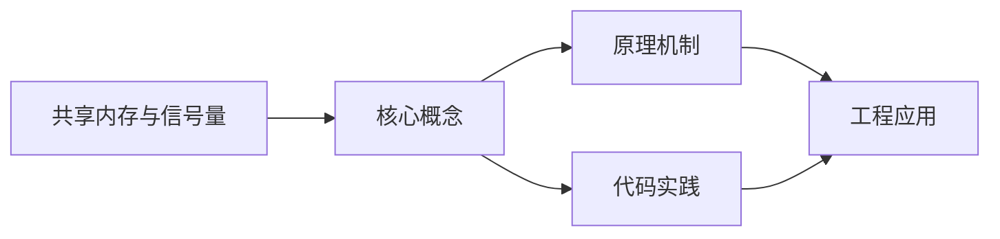
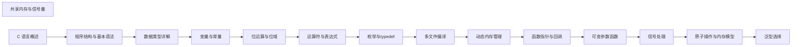

## 1. 学习目标（Bloom 分类）

本节按照布鲁姆教育目标分类学组织学习路径。本文主题为《共享内存与信号量》，属于 C 模块，读者可以根据自身阶段选择阅读深度。

记忆层面：能够准确复述本文的核心概念、术语与基本语法或操作步骤，并能够在提问或检索时快速定位对应知识点。能够说出 C 的变量、函数、指针、数组、结构体与预处理语法。

理解层面：能够用自己的语言解释核心原理与工作机制，说明概念之间的因果关系，而不是机械记忆结论。能够解释指针与内存地址、栈与堆、编译链接过程。

应用层面：能够在真实项目或练习场景中运用本文知识解决具体问题，写出正确且可维护的实现。能够编写系统工具、数据结构与嵌入式程序。

分析层面：能够拆解复杂问题，比较本文主题与相邻概念的异同，识别边界条件与例外情况。能够分析内存泄漏、缓冲区溢出与未定义行为。

评价层面：能够根据约束条件（性能、可读性、安全、成本）评价不同方案的优劣，做出有依据的技术决策。能够评价 C 与其他语言在系统编程中的取舍。

创造层面：能够把本文知识与其他模块知识组合，设计出新的解决方案或可复用的工程模式。能够设计可移植、可维护的 C 库与模块。

通过本节学习，读者应当能够把《共享内存与信号量》纳入自己的知识网络，并与 C 模块的其他主题（指针、内存管理、预处理器、标准库）建立关联。

## 2. 历史动机与发展脉络

《共享内存与信号量》是 C 领域的重要主题。要真正理解它，需要先了解它解决的问题与演进过程。

C 由 Dennis Ritchie 于 1972 年在贝尔实验室为 Unix 开发，是系统编程的基石语言：操作系统、编译器、嵌入式固件均以 C 为主。
C89（ANSI C）统一方言，C99 引入变长数组与 // 注释，C11 增加泛型选择与线程支持，C17 为缺陷修复版，C23（2024 年正式发布）引入 constexpr、属性、显式枚举底层类型等现代化特性。
C 的哲学是“信任程序员”：提供指针与内存操作的全部能力，同时把正确性责任交给开发者；这一设计成就了性能上限，也带来内存安全风险，催生了 Rust 等后继语言。

回到本文主题：共享内存与信号量 的提出与成熟，正是上述技术背景下的必然产物。早期实现往往以简单可用为目标，随着工程规模扩大，社区逐渐沉淀出标准做法与最佳实践；理解这一脉络，可以帮助读者判断“为什么文档中的推荐写法是现在这个样子”，也能在遇到历史遗留代码时准确识别其设计年代与取舍。


## 3. 形式化定义与核心概念精讲

本节把《共享内存与信号量》涉及的核心概念以“定义 + 讲解”的形式展开。读者应把定义当作工具，把讲解当作理解路径；两者结合才能形成可迁移的知识。

指针：指针保存变量地址，`&` 取地址、`*` 解引用；指针算术与数组名退化规则（数组名作为实参退化为首元素指针）是 C 的经典难点。
内存管理：栈内存自动释放，堆内存由 malloc/calloc/realloc/free 管理；所有权责任（谁分配谁释放）必须显式约定。
预处理器：#include/#define/#ifdef 在编译前文本处理；宏展开有副作用与优先级风险，函数式宏参数必须加括号。

### 3.1 原文章节逐一精讲

原文档把主题拆分为 12 个小节，下面按顺序给出每一节的导读讲解，随后保留原文细节供精读。

#### 原文精读（完整保留）

# C 共享内存与信号量

> **符号约定**：`< >` 必填参数 | `[ ]` 可选参数

---

##### System V 共享内存

```c
#include <stdio.h>
#include <string.h>
#include <sys/ipc.h>
#include <sys/shm.h>
#include <unistd.h>

#define SHM_KEY 0x1234
#define SHM_SIZE 4096

int main(void) {
    // 创建共享内存段
    int shmid = shmget(SHM_KEY, SHM_SIZE, IPC_CREAT | 0666);
    if (shmid == -1) {
        perror("shmget 失败");
        return 1;
    }

    // 将共享内存附加到进程地址空间
    void *ptr = shmat(shmid, NULL, 0);
    if (ptr == (void *)-1) {
        perror("shmat 失败");
        return 1;
    }

    // 使用共享内存
    char *msg = (char *)ptr;
    snprintf(msg, SHM_SIZE, "System V 共享内存消息，PID=%d", getpid());
    printf("写入: %s\n", msg);

    // 分离共享内存
    shmdt(ptr);

    // 删除共享内存段
    shmctl(shmid, IPC_RMID, NULL);

    return 0;
}
```

#### 概述

共享内存是进程间通信（IPC）中最快的方式，它允许多个进程访问同一块物理内存区域。由于进程的虚拟地址空间相互独立，共享内存避免了数据的复制，但需要配合信号量等同步机制来防止数据竞争。POSIX 标准提供了 shm_open/mmap 和信号量 API，System V 标准提供了 shmget/shmat 和信号量集 API。

#### 基础概念

##### 进程间通信方式对比

| 方式     | 速度 | 方向 | 适用场景       |
| -------- | ---- | ---- | -------------- |
| 管道     | 中等 | 单向 | 父子进程通信   |
| 命名管道 | 中等 | 单向 | 无亲缘关系进程 |
| 共享内存 | 最快 | 双向 | 大量数据交换   |
| 消息队列 | 中等 | 双向 | 结构化消息传递 |
| 信号     | 快   | 单向 | 异步通知       |
| Socket   | 较慢 | 双向 | 网络通信       |

##### 为什么共享内存最快

其他IPC方式都需要内核作为中转：发送方将数据从用户空间复制到内核空间，接收方再从内核空间复制到用户空间。共享内存则直接映射同一块物理内存到多个进程的虚拟地址空间，省去了两次数据复制。

##### 同步的必要性

共享内存本身不提供同步机制，如果两个进程同时写入同一块内存，会产生数据竞争。信号量（Semaphore）是最常用的同步工具，用于控制对共享资源的访问。

#### 快速上手

##### POSIX 共享内存基本流程

```c
#include <stdio.h>
#include <stdlib.h>
#include <string.h>
#include <fcntl.h>
#include <sys/mman.h>
#include <unistd.h>
#include <sys/stat.h>

#define SHM_NAME "/myshm"
#define SHM_SIZE 4096

int main(void) {
    // 步骤一：创建或打开共享内存对象
    int fd = shm_open(SHM_NAME, O_CREAT | O_RDWR, 0666);
    if (fd == -1) {
        perror("shm_open 失败");
        return 1;
    }

    // 步骤二：设置共享内存大小
    if (ftruncate(fd, SHM_SIZE) == -1) {
        perror("ftruncate 失败");
        return 1;
    }

    // 步骤三：映射共享内存到进程地址空间
    void *ptr = mmap(NULL, SHM_SIZE, PROT_READ | PROT_WRITE, MAP_SHARED, fd, 0);
    if (ptr == MAP_FAILED) {
        perror("mmap 失败");
        return 1;
    }

    // 步骤四：使用共享内存
    char *msg = (char *)ptr;
    snprintf(msg, SHM_SIZE, "来自进程 %d 的消息", getpid());
    printf("写入: %s\n", msg);

    // 步骤五：解除映射
    munmap(ptr, SHM_SIZE);
    close(fd);

    // 步骤六：删除共享内存对象
    shm_unlink(SHM_NAME);

    return 0;
}
```

##### POSIX 信号量基本用法

```c
#include <stdio.h>
#include <fcntl.h>
#include <semaphore.h>

int main(void) {
    // 创建或打开命名信号量，初始值为1
    sem_t *sem = sem_open("/mysem", O_CREAT, 0666, 1);
    if (sem == SEM_FAILED) {
        perror("sem_open 失败");
        return 1;
    }

    // 获取信号量（P操作，值减1）
    sem_wait(sem);
    printf("进入临界区\n");

    // 临界区操作...

    // 释放信号量（V操作，值加1）
    sem_post(sem);
    printf("离开临界区\n");

    // 关闭信号量
    sem_close(sem);
    // 删除信号量
    sem_unlink("/mysem");

    return 0;
}
```

#### 详细用法

##### mmap 详解

```c
#include <sys/mman.h>

// mmap 函数原型
void *mmap(void *addr, size_t length, int prot, int flags, int fd, off_t offset);

// 参数说明：
// addr: 建议的映射地址，通常传 NULL 让内核选择
// length: 映射的长度（字节）
// prot: 内存保护标志
//   PROT_READ  - 可读
//   PROT_WRITE - 可写
//   PROT_EXEC  - 可执行
//   PROT_NONE  - 不可访问
// flags: 映射类型
//   MAP_SHARED  - 共享映射（修改对其他进程可见）
//   MAP_PRIVATE - 私有映射（写时复制）
//   MAP_ANONYMOUS - 匿名映射（不依赖文件）
// fd: 文件描述符（匿名映射时传 -1）
// offset: 文件偏移量（必须是页面大小的整数倍）
```

##### 匿名共享内存（亲缘进程间）

```c
#include <stdio.h>
#include <string.h>
#include <sys/mman.h>
#include <unistd.h>
#include <sys/wait.h>

int main(void) {
    // 创建匿名共享映射（不需要文件）
    char *shared = mmap(NULL, 256,
                        PROT_READ | PROT_WRITE,
                        MAP_SHARED | MAP_ANONYMOUS,
                        -1, 0);
    if (shared == MAP_FAILED) {
        perror("mmap 失败");
        return 1;
    }

    pid_t pid = fork();
    if (pid == 0) {
        // 子进程：写入数据
        snprintf(shared, 256, "子进程 PID=%d 的消息", getpid());
        printf("子进程已写入\n");
    } else {
        // 父进程：等待后读取
        wait(NULL); // 等待子进程结束
        printf("父进程读取: %s\n", shared);
    }

    munmap(shared, 256);
    return 0;
}
```

##### 无名信号量（进程内线程间）

```c
#include <stdio.h>
#include <pthread.h>
#include <semaphore.h>

sem_t sem; // 无名信号量

void *thread_func(void *arg) {
    sem_wait(&sem); // 等待信号量
    printf("线程 %ld 获得信号量\n", (long)arg);
    sem_post(&sem); // 释放信号量
    return NULL;
}

int main(void) {
    // 初始化无名信号量，初始值为2（允许2个线程同时进入）
    sem_init(&sem, 0, 2);

    pthread_t threads[5];
    for (long i = 0; i < 5; i++) {
        pthread_create(&threads[i], NULL, thread_func, (void *)i);
    }

    for (int i = 0; i < 5; i++) {
        pthread_join(threads[i], NULL);
    }

    sem_destroy(&sem);
    return 0;
}
```

#### 常见场景

##### 场景一：生产者-消费者模式

```c
#include <stdio.h>
#include <stdlib.h>
#include <string.h>
#include <fcntl.h>
#include <sys/mman.h>
#include <semaphore.h>
#include <unistd.h>

#define SHM_NAME "/prod_cons_shm"
#define SEM_MUTEX "/prod_cons_mutex"
#define SEM_EMPTY "/prod_cons_empty"
#define SEM_FULL "/prod_cons_full"
#define BUFFER_SIZE 10
#define SHM_SIZE (sizeof(int) * BUFFER_SIZE + sizeof(int) * 2)

// 共享内存结构
typedef struct {
    int buffer[BUFFER_SIZE];
    int in;     // 生产者写入位置
    int out;    // 消费者读取位置
} SharedBuffer;

int main(void) {
    // 创建共享内存
    int fd = shm_open(SHM_NAME, O_CREAT | O_RDWR, 0666);
    ftruncate(fd, sizeof(SharedBuffer));
    SharedBuffer *buf = mmap(NULL, sizeof(SharedBuffer),
                             PROT_READ | PROT_WRITE, MAP_SHARED, fd, 0);
    buf->in = 0;
    buf->out = 0;

    // 创建信号量
    sem_t *mutex = sem_open(SEM_MUTEX, O_CREAT, 0666, 1);    // 互斥锁
    sem_t *empty = sem_open(SEM_EMPTY, O_CREAT, 0666, BUFFER_SIZE); // 空槽位数
    sem_t *full = sem_open(SEM_FULL, O_CREAT, 0666, 0);      // 数据项数

    pid_t pid = fork();
    if (pid == 0) {
        // 子进程：生产者
        for (int i = 0; i < 20; i++) {
            sem_wait(empty);    // 等待空槽位
            sem_wait(mutex);    // 获取互斥锁

            buf->buffer[buf->in] = i;
            printf("生产: %d (位置 %d)\n", i, buf->in);
            buf->in = (buf->in + 1) % BUFFER_SIZE;

            sem_post(mutex);    // 释放互斥锁
            sem_post(full);     // 增加数据项数
            usleep(100000);     // 模拟生产耗时
        }
    } else {
        // 父进程：消费者
        for (int i = 0; i < 20; i++) {
            sem_wait(full);     // 等待数据项
            sem_wait(mutex);    // 获取互斥锁

            int item = buf->buffer[buf->out];
            printf("消费: %d (位置 %d)\n", item, buf->out);
            buf->out = (buf->out + 1) % BUFFER_SIZE;

            sem_post(mutex);    // 释放互斥锁
            sem_post(empty);    // 增加空槽位
            usleep(200000);     // 模拟消费耗时
        }

        wait(NULL);
    }

    // 清理
    munmap(buf, sizeof(SharedBuffer));
    close(fd);
    sem_close(mutex); sem_close(empty); sem_close(full);
    shm_unlink(SHM_NAME);
    sem_unlink(SEM_MUTEX); sem_unlink(SEM_EMPTY); sem_unlink(SEM_FULL);

    return 0;
}
```

##### 场景二：共享内存配置中心

```c
#include <stdio.h>
#include <string.h>
#include <fcntl.h>
#include <sys/mman.h>
#include <semaphore.h>
#include <unistd.h>

#define SHM_NAME "/config_shm"
#define SEM_NAME "/config_sem"

typedef struct {
    int server_port;
    int max_connections;
    int log_level;
    char server_name[64];
} SharedConfig;

// 写入配置
int write_config(const SharedConfig *cfg) {
    int fd = shm_open(SHM_NAME, O_CREAT | O_RDWR, 0666);
    ftruncate(fd, sizeof(SharedConfig));

    SharedConfig *shared = mmap(NULL, sizeof(SharedConfig),
                                PROT_READ | PROT_WRITE, MAP_SHARED, fd, 0);

    sem_t *sem = sem_open(SEM_NAME, O_CREAT, 0666, 1);
    sem_wait(sem);
    memcpy(shared, cfg, sizeof(SharedConfig));
    sem_post(sem);

    munmap(shared, sizeof(SharedConfig));
    close(fd);
    sem_close(sem);
    return 0;
}

// 读取配置
int read_config(SharedConfig *out) {
    int fd = shm_open(SHM_NAME, O_RDONLY, 0666);
    if (fd == -1) return -1;

    SharedConfig *shared = mmap(NULL, sizeof(SharedConfig),
                                PROT_READ, MAP_SHARED, fd, 0);

    sem_t *sem = sem_open(SEM_NAME, 0);
    sem_wait(sem);
    memcpy(out, shared, sizeof(SharedConfig));
    sem_post(sem);

    munmap(shared, sizeof(SharedConfig));
    close(fd);
    sem_close(sem);
    return 0;
}

int main(void) {
    // 写入配置
    SharedConfig cfg = {
        .server_port = 8080,
        .max_connections = 1000,
        .log_level = 2,
    };
    snprintf(cfg.server_name, sizeof(cfg.server_name), "MyServer");
    write_config(&cfg);
    printf("配置已写入\n");

    // 读取配置
    SharedConfig read_cfg;
    if (read_config(&read_cfg) == 0) {
        printf("端口: %d, 最大连接: %d, 服务器: %s\n",
               read_cfg.server_port, read_cfg.max_connections,
               read_cfg.server_name);
    }

    // 清理
    shm_unlink(SHM_NAME);
    sem_unlink(SEM_NAME);
    return 0;
}
```

#### 注意事项

##### 共享内存的持久性

POSIX 共享内存对象在所有进程关闭后仍然存在，直到显式调用 `shm_unlink` 或系统重启。如果忘记清理，会导致内存泄漏：

```c
// 程序退出前必须清理
shm_unlink("/myshm");
sem_unlink("/mysem");
```

##### 名称限制

POSIX IPC 对象名称必须以斜杠开头，且不能包含其他斜杠：

```c
// 正确
shm_open("/myshm", ...);
sem_open("/mysem", ...);

// 错误
shm_open("myshm", ...);    // 某些系统要求以 / 开头
shm_open("/dir/myshm", ...); // 不能包含多级路径
```

##### 信号量的值不能为负

`sem_wait` 会在信号量值为0时阻塞，直到其他进程调用 `sem_post`。如果需要等待多个资源，可以初始化信号量为更大的值。

##### fork 后的共享内存

`fork` 后子进程继承父进程的内存映射，父子进程访问同一块共享内存：

```c
// fork 前 mmap
void *shared = mmap(NULL, size, PROT_READ | PROT_WRITE,
                    MAP_SHARED | MAP_ANONYMOUS, -1, 0);

pid_t pid = fork();
// 父子进程都能访问 shared，修改互相可见
```

#### 进阶用法

##### 使用共享内存实现进程间大文件传输

```c
#include <stdio.h>
#include <stdlib.h>
#include <fcntl.h>
#include <sys/mman.h>
#include <semaphore.h>
#include <unistd.h>
#include <string.h>

#define SHM_NAME "/file_transfer"
#define SEM_NAME "/file_transfer_sem"
#define CHUNK_SIZE (1024 * 1024) // 1MB 块

typedef struct {
    size_t total_size;    // 文件总大小
    size_t offset;        // 当前偏移
    size_t data_len;      // 当前块数据长度
    int done;             // 传输完成标志
    char data[CHUNK_SIZE]; // 数据缓冲区
} TransferBuffer;

int main(int argc, char *argv[]) {
    // 创建共享内存和信号量
    int fd = shm_open(SHM_NAME, O_CREAT | O_RDWR, 0666);
    ftruncate(fd, sizeof(TransferBuffer));
    TransferBuffer *buf = mmap(NULL, sizeof(TransferBuffer),
                               PROT_READ | PROT_WRITE, MAP_SHARED, fd, 0);
    sem_t *sem = sem_open(SEM_NAME, O_CREAT, 0666, 1);

    if (argc > 1) {
        // 发送方：读取文件并写入共享内存
        FILE *fp = fopen(argv[1], "rb");
        if (!fp) { perror("打开文件失败"); return 1; }

        fseek(fp, 0, SEEK_END);
        buf->total_size = ftell(fp);
        fseek(fp, 0, SEEK_SET);

        size_t bytes_read;
        while ((bytes_read = fread(buf->data, 1, CHUNK_SIZE, fp)) > 0) {
            sem_wait(sem);
            buf->data_len = bytes_read;
            buf->done = 0;
            sem_post(sem);

            // 等待接收方处理
            while (1) {
                sem_wait(sem);
                if (buf->done) { sem_post(sem); break; }
                sem_post(sem);
                usleep(1000);
            }
        }

        sem_wait(sem);
        buf->data_len = 0; // 标记传输结束
        buf->done = 0;
        sem_post(sem);

        fclose(fp);
        printf("文件传输完成\n");
    } else {
        // 接收方：从共享内存读取并写入文件
        FILE *fp = fopen("received.dat", "wb");

        while (1) {
            sem_wait(sem);
            if (buf->data_len == 0 && buf->total_size > 0) {
                sem_post(sem);
                break;
            }
            if (buf->data_len > 0) {
                fwrite(buf->data, 1, buf->data_len, fp);
                buf->done = 1;
            }
            sem_post(sem);
            usleep(1000);
        }

        fclose(fp);
        printf("文件接收完成\n");
    }

    munmap(buf, sizeof(TransferBuffer));
    close(fd);
    sem_close(sem);
    shm_unlink(SHM_NAME);
    sem_unlink(SEM_NAME);
    return 0;
}
```

##### 环形缓冲区实现高效数据流

```c
#include <stdio.h>
#include <stdlib.h>
#include <fcntl.h>
#include <sys/mman.h>
#include <semaphore.h>
#include <string.h>
#include <unistd.h>

#define RING_SIZE 256
#define MSG_SIZE 128
#define SHM_NAME "/ring_buf"
#define SEM_MUTEX "/ring_mutex"
#define SEM_COUNT "/ring_count"

typedef struct {
    char messages[RING_SIZE][MSG_SIZE];
    int head;
    int tail;
    int count;
} RingBuffer;

// 向环形缓冲区写入消息
int ring_put(RingBuffer *rb, sem_t *mutex, sem_t *count, const char *msg) {
    sem_wait(mutex);
    if (rb->count >= RING_SIZE) {
        sem_post(mutex);
        return -1; // 缓冲区满
    }
    snprintf(rb->messages[rb->head], MSG_SIZE, "%s", msg);
    rb->head = (rb->head + 1) % RING_SIZE;
    rb->count++;
    sem_post(mutex);
    sem_post(count); // 通知有新消息
    return 0;
}

// 从环形缓冲区读取消息
int ring_get(RingBuffer *rb, sem_t *mutex, sem_t *count, char *out) {
    sem_wait(count); // 等待有消息
    sem_wait(mutex);
    snprintf(out, MSG_SIZE, "%s", rb->messages[rb->tail]);
    rb->tail = (rb->tail + 1) % RING_SIZE;
    rb->count--;
    sem_post(mutex);
    return 0;
}

int main(void) {
    int fd = shm_open(SHM_NAME, O_CREAT | O_RDWR, 0666);
    ftruncate(fd, sizeof(RingBuffer));
    RingBuffer *rb = mmap(NULL, sizeof(RingBuffer),
                          PROT_READ | PROT_WRITE, MAP_SHARED, fd, 0);
    rb->head = rb->tail = rb->count = 0;

    sem_t *mutex = sem_open(SEM_MUTEX, O_CREAT, 0666, 1);
    sem_t *count = sem_open(SEM_COUNT, O_CREAT, 0666, 0);

    pid_t pid = fork();
    if (pid == 0) {
        // 子进程：写入消息
        for (int i = 0; i < 50; i++) {
            char msg[MSG_SIZE];
            snprintf(msg, MSG_SIZE, "消息 #%d", i);
            ring_put(rb, mutex, count, msg);
            printf("写入: %s\n", msg);
            usleep(50000);
        }
    } else {
        // 父进程：读取消息
        for (int i = 0; i < 50; i++) {
            char msg[MSG_SIZE];
            ring_get(rb, mutex, count, msg);
            printf("读取: %s\n", msg);
        }
    }

    munmap(rb, sizeof(RingBuffer));
    close(fd);
    sem_close(mutex); sem_close(count);
    shm_unlink(SHM_NAME);
    sem_unlink(SEM_MUTEX); sem_unlink(SEM_COUNT);
    return 0;
}
```
#### POSIX 共享内存

**基本写法：创建共享内存对象**
`shm_open(<名称>, O_CREAT | O_RDWR, 0666);`
```c
// 创建 POSIX 共享内存
int fd = shm_open("/myshm", O_CREAT | O_RDWR, 0666);
```

---

**基本写法：设置大小**
`ftruncate(<fd>, <大小>);`
```c
// 设置共享内存大小
ftruncate(fd, 4096);
```

---

**基本写法：映射内存**
`mmap(NULL, <大小>, PROT_READ | PROT_WRITE, MAP_SHARED, <fd>, 0);`
```c
// 映射到地址空间
void* addr = mmap(NULL, 4096, PROT_READ | PROT_WRITE, MAP_SHARED, fd, 0);
```

---

**基本写法：解除映射**
`munmap(<地址>, <大小>);`
```c
// 解除映射
munmap(addr, 4096);
```

---

**基本写法：关闭与删除**
`close(<fd>); shm_unlink(<名称>);`
```c
// 关闭并删除共享内存对象
close(fd);
shm_unlink("/myshm");
```

---

#### mmap 文件映射

**基本写法：映射文件**
`mmap(NULL, <大小>, <保护>, MAP_SHARED, <fd>, 0);`
```c
// 将文件映射到内存
int fd = open("data.bin", O_RDWR);
void* addr = mmap(NULL, 4096, PROT_READ | PROT_WRITE, MAP_SHARED, fd, 0);
```

---

**基本写法：同步到磁盘**
`msync(<地址>, <大小>, MS_SYNC);`
```c
// 将修改刷回文件
msync(addr, 4096, MS_SYNC);
```

---

#### System V 信号量

**基本写法：创建信号量集**
`semget(<键>, <数量>, IPC_CREAT | 0666);`
```c
// 创建包含 1 个信号量的集合
int semid = semget(key, 1, IPC_CREAT | 0666);
```

---

**基本写法：初始化信号量**
`semctl(<semid>, 0, SETVAL, <值>);`
```c
// 设置初值
semctl(semid, 0, SETVAL, 1);
```

---

**基本写法：PV 操作**
`struct sembuf <op> = {0, -1, 0}; semop(<semid>, &<op>, 1);`
```c
// P 操作减 1
struct sembuf p = {0, -1, 0};
semop(semid, &p, 1);
// V 操作加 1
struct sembuf v = {0, 1, 0};
semop(semid, &v, 1);
```

---

**基本写法：删除信号量集**
`semctl(<semid>, 0, IPC_RMID);`
```c
// 删除信号量集
semctl(semid, 0, IPC_RMID);
```

---

#### POSIX 信号量

**基本写法：创建命名信号量**
`sem_open(<名称>, O_CREAT, 0666, <初始>);`
```c
// 创建命名信号量
sem_t* sem = sem_open("/mysem", O_CREAT, 0666, 1);
```

---

**基本写法：等待与释放**
`sem_wait(<sem>);` `sem_post(<sem>);`
```c
// P 与 V 操作
sem_wait(sem);
// 临界区
sem_post(sem);
```

---

**基本写法：关闭与删除**
`sem_close(<sem>);` `sem_unlink(<名称>);`
```c
// 关闭并删除命名信号量
sem_close(sem);
sem_unlink("/mysem");
```

---

**基本写法：无名信号量**
`sem_t <变量>; sem_init(&<变量>, 1, <初始>);`
```c
// 用于共享内存的无名信号量
sem_t sem;
sem_init(&sem, 1, 1);
```

---

#### 消息队列

**基本写法：创建消息队列**
`msgget(<键>, IPC_CREAT | 0666);`
```c
// 创建 System V 消息队列
int msqid = msgget(key, IPC_CREAT | 0666);
```

---

**基本写法：发送消息**
`msgsnd(<msqid>, &<消息>, <数据大小>, 0);`
```c
// 发送消息
struct Msg { long type; char data[100]; } msg;
msgsnd(msqid, &msg, sizeof(msg.data), 0);
```

---

**基本写法：接收消息**
`msgrcv(<msqid>, &<消息>, <大小>, <类型>, 0);`
```c
// 接收指定类型消息
msgrcv(msqid, &msg, sizeof(msg.data), 1, 0);
```

---

**基本写法：删除消息队列**
`msgctl(<msqid>, IPC_RMID, NULL);`
```c
// 删除消息队列
msgctl(msqid, IPC_RMID, NULL);
```


### 3.2 概念关系图

下面用 Mermaid 图表达本文核心概念之间的关系，帮助读者建立整体图景：



图中展示的是本文知识的结构化关系：核心概念是入口，原理机制解释“为什么”，代码实践演示“怎么做”，工程应用回答“何时用”。读者学习时可以把每个小节的内容挂接到对应节点上。

## 4. 理论推导与原理解析

本节深入《共享内存与信号量》背后的原理。理论部分不求面面俱到，而是聚焦“能解释现象、能指导实践”的关键推导。

指针：指针保存变量地址，`&` 取地址、`*` 解引用；指针算术与数组名退化规则（数组名作为实参退化为首元素指针）是 C 的经典难点。
内存管理：栈内存自动释放，堆内存由 malloc/calloc/realloc/free 管理；所有权责任（谁分配谁释放）必须显式约定。
预处理器：#include/#define/#ifdef 在编译前文本处理；宏展开有副作用与优先级风险，函数式宏参数必须加括号。
编译链接：预处理 -> 编译 -> 汇编 -> 链接；头文件声明接口，源文件实现；静态库与动态库（.a/.so/.dll）决定部署形态。

需要强调的是，理论推导与工程实践之间存在翻译层：理论给出的是理想化模型与边界条件，工程代码则必须处理真实环境中的例外。读者在学习时应先掌握理论的“标准情形”，再通过陷阱章节了解“非标准情形”。

## 5. 代码示例与逐行讲解

本节把原文中的代码示例系统整理，并为每个示例补充用途说明与讲解。读者不应只浏览代码，而应逐段对照讲解理解设计意图。

### 5.1 示例：System V 共享内存

该示例来自原文《System V 共享内存》小节，用于演示共享内存与信号量相关操作。阅读时请先看代码结构，再看其后的讲解。

```c
#include <stdio.h>
#include <string.h>
#include <sys/ipc.h>
#include <sys/shm.h>
#include <unistd.h>

#define SHM_KEY 0x1234
#define SHM_SIZE 4096

int main(void) {
    // 创建共享内存段
    int shmid = shmget(SHM_KEY, SHM_SIZE, IPC_CREAT | 0666);
    if (shmid == -1) {
        perror("shmget 失败");
        return 1;
    }

    // 将共享内存附加到进程地址空间
    void *ptr = shmat(shmid, NULL, 0);
    if (ptr == (void *)-1) {
        perror("shmat 失败");
        return 1;
    }

    // 使用共享内存
    char *msg = (char *)ptr;
    snprintf(msg, SHM_SIZE, "System V 共享内存消息，PID=%d", getpid());
    printf("写入: %s\n", msg);

    // 分离共享内存
    shmdt(ptr);

    // 删除共享内存段
    shmctl(shmid, IPC_RMID, NULL);

    return 0;
}
```

讲解：这段代码演示了本节核心知识点。代码中的关键操作可以归纳为三步：准备（定义或初始化）、执行（核心逻辑）、收尾（释放资源或返回结果）。实际项目中，这三步往往被封装为函数或类，以提升复用性与可测试性。

关键点分析：

该示例共 30 行有效代码，包含 2 类关键结构（if、return）。其中：

- 入口与初始化部分负责建立上下文，对应实际项目中的启动或装配逻辑；
- 核心逻辑部分体现本文主题的主要操作，是阅读时最需要对照讲解理解的部分；
- 输出或返回部分把结果交给调用方，注意其类型与边界条件。

进阶思考路径：先尝试修改参数观察行为变化，再把示例中的模式迁移到自己的项目中；每次修改都记录预期与实测差异，这是把示例转化为能力的最快方式。

### 5.2 示例：POSIX 共享内存基本流程

该示例来自原文《POSIX 共享内存基本流程》小节，用于演示共享内存与信号量相关操作。阅读时请先看代码结构，再看其后的讲解。

```c
#include <stdio.h>
#include <stdlib.h>
#include <string.h>
#include <fcntl.h>
#include <sys/mman.h>
#include <unistd.h>
#include <sys/stat.h>

#define SHM_NAME "/myshm"
#define SHM_SIZE 4096

int main(void) {
    // 步骤一：创建或打开共享内存对象
    int fd = shm_open(SHM_NAME, O_CREAT | O_RDWR, 0666);
    if (fd == -1) {
        perror("shm_open 失败");
        return 1;
    }

    // 步骤二：设置共享内存大小
    if (ftruncate(fd, SHM_SIZE) == -1) {
        perror("ftruncate 失败");
        return 1;
    }

    // 步骤三：映射共享内存到进程地址空间
    void *ptr = mmap(NULL, SHM_SIZE, PROT_READ | PROT_WRITE, MAP_SHARED, fd, 0);
    if (ptr == MAP_FAILED) {
        perror("mmap 失败");
        return 1;
    }

    // 步骤四：使用共享内存
    char *msg = (char *)ptr;
    snprintf(msg, SHM_SIZE, "来自进程 %d 的消息", getpid());
    printf("写入: %s\n", msg);

    // 步骤五：解除映射
    munmap(ptr, SHM_SIZE);
    close(fd);

    // 步骤六：删除共享内存对象
    shm_unlink(SHM_NAME);

    return 0;
}
```

讲解：这段代码演示了本节核心知识点。代码中的关键操作可以归纳为三步：准备（定义或初始化）、执行（核心逻辑）、收尾（释放资源或返回结果）。实际项目中，这三步往往被封装为函数或类，以提升复用性与可测试性。

关键点分析：

该示例共 38 行有效代码，包含 2 类关键结构（if、return）。其中：

- 入口与初始化部分负责建立上下文，对应实际项目中的启动或装配逻辑；
- 核心逻辑部分体现本文主题的主要操作，是阅读时最需要对照讲解理解的部分；
- 输出或返回部分把结果交给调用方，注意其类型与边界条件。

进阶思考路径：先尝试修改参数观察行为变化，再把示例中的模式迁移到自己的项目中；每次修改都记录预期与实测差异，这是把示例转化为能力的最快方式。

### 5.3 示例：POSIX 信号量基本用法

该示例来自原文《POSIX 信号量基本用法》小节，用于演示共享内存与信号量相关操作。阅读时请先看代码结构，再看其后的讲解。

```c
#include <stdio.h>
#include <fcntl.h>
#include <semaphore.h>

int main(void) {
    // 创建或打开命名信号量，初始值为1
    sem_t *sem = sem_open("/mysem", O_CREAT, 0666, 1);
    if (sem == SEM_FAILED) {
        perror("sem_open 失败");
        return 1;
    }

    // 获取信号量（P操作，值减1）
    sem_wait(sem);
    printf("进入临界区\n");

    // 临界区操作...

    // 释放信号量（V操作，值加1）
    sem_post(sem);
    printf("离开临界区\n");

    // 关闭信号量
    sem_close(sem);
    // 删除信号量
    sem_unlink("/mysem");

    return 0;
}
```

讲解：这段代码演示了本节核心知识点。代码中的关键操作可以归纳为三步：准备（定义或初始化）、执行（核心逻辑）、收尾（释放资源或返回结果）。实际项目中，这三步往往被封装为函数或类，以提升复用性与可测试性。

关键点分析：

该示例共 23 行有效代码，包含 2 类关键结构（if、return）。其中：

- 入口与初始化部分负责建立上下文，对应实际项目中的启动或装配逻辑；
- 核心逻辑部分体现本文主题的主要操作，是阅读时最需要对照讲解理解的部分；
- 输出或返回部分把结果交给调用方，注意其类型与边界条件。

进阶思考路径：先尝试修改参数观察行为变化，再把示例中的模式迁移到自己的项目中；每次修改都记录预期与实测差异，这是把示例转化为能力的最快方式。

### 5.4 示例：mmap 详解

该示例来自原文《mmap 详解》小节，用于演示共享内存与信号量相关操作。阅读时请先看代码结构，再看其后的讲解。

```c
#include <sys/mman.h>

// mmap 函数原型
void *mmap(void *addr, size_t length, int prot, int flags, int fd, off_t offset);

// 参数说明：
// addr: 建议的映射地址，通常传 NULL 让内核选择
// length: 映射的长度（字节）
// prot: 内存保护标志
//   PROT_READ  - 可读
//   PROT_WRITE - 可写
//   PROT_EXEC  - 可执行
//   PROT_NONE  - 不可访问
// flags: 映射类型
//   MAP_SHARED  - 共享映射（修改对其他进程可见）
//   MAP_PRIVATE - 私有映射（写时复制）
//   MAP_ANONYMOUS - 匿名映射（不依赖文件）
// fd: 文件描述符（匿名映射时传 -1）
// offset: 文件偏移量（必须是页面大小的整数倍）
```

讲解：这段代码演示了本节核心知识点。代码中的关键操作可以归纳为三步：准备（定义或初始化）、执行（核心逻辑）、收尾（释放资源或返回结果）。实际项目中，这三步往往被封装为函数或类，以提升复用性与可测试性。

关键点分析：

该示例共 17 行有效代码，结构以数据或配置为主。阅读时应关注：数据字段的含义、配置项的作用，以及它们与运行行为的对应关系。

进阶思考路径：先尝试修改参数观察行为变化，再把示例中的模式迁移到自己的项目中；每次修改都记录预期与实测差异，这是把示例转化为能力的最快方式。

### 5.5 示例：匿名共享内存（亲缘进程间）

该示例来自原文《匿名共享内存（亲缘进程间）》小节，用于演示共享内存与信号量相关操作。阅读时请先看代码结构，再看其后的讲解。

```c
#include <stdio.h>
#include <string.h>
#include <sys/mman.h>
#include <unistd.h>
#include <sys/wait.h>

int main(void) {
    // 创建匿名共享映射（不需要文件）
    char *shared = mmap(NULL, 256,
                        PROT_READ | PROT_WRITE,
                        MAP_SHARED | MAP_ANONYMOUS,
                        -1, 0);
    if (shared == MAP_FAILED) {
        perror("mmap 失败");
        return 1;
    }

    pid_t pid = fork();
    if (pid == 0) {
        // 子进程：写入数据
        snprintf(shared, 256, "子进程 PID=%d 的消息", getpid());
        printf("子进程已写入\n");
    } else {
        // 父进程：等待后读取
        wait(NULL); // 等待子进程结束
        printf("父进程读取: %s\n", shared);
    }

    munmap(shared, 256);
    return 0;
}
```

讲解：这段代码演示了本节核心知识点。代码中的关键操作可以归纳为三步：准备（定义或初始化）、执行（核心逻辑）、收尾（释放资源或返回结果）。实际项目中，这三步往往被封装为函数或类，以提升复用性与可测试性。

关键点分析：

该示例共 28 行有效代码，包含 2 类关键结构（if、return）。其中：

- 入口与初始化部分负责建立上下文，对应实际项目中的启动或装配逻辑；
- 核心逻辑部分体现本文主题的主要操作，是阅读时最需要对照讲解理解的部分；
- 输出或返回部分把结果交给调用方，注意其类型与边界条件。

进阶思考路径：先尝试修改参数观察行为变化，再把示例中的模式迁移到自己的项目中；每次修改都记录预期与实测差异，这是把示例转化为能力的最快方式。

### 5.6 示例：无名信号量（进程内线程间）

该示例来自原文《无名信号量（进程内线程间）》小节，用于演示共享内存与信号量相关操作。阅读时请先看代码结构，再看其后的讲解。

```c
#include <stdio.h>
#include <pthread.h>
#include <semaphore.h>

sem_t sem; // 无名信号量

void *thread_func(void *arg) {
    sem_wait(&sem); // 等待信号量
    printf("线程 %ld 获得信号量\n", (long)arg);
    sem_post(&sem); // 释放信号量
    return NULL;
}

int main(void) {
    // 初始化无名信号量，初始值为2（允许2个线程同时进入）
    sem_init(&sem, 0, 2);

    pthread_t threads[5];
    for (long i = 0; i < 5; i++) {
        pthread_create(&threads[i], NULL, thread_func, (void *)i);
    }

    for (int i = 0; i < 5; i++) {
        pthread_join(threads[i], NULL);
    }

    sem_destroy(&sem);
    return 0;
}
```

讲解：这段代码演示了本节核心知识点。代码中的关键操作可以归纳为三步：准备（定义或初始化）、执行（核心逻辑）、收尾（释放资源或返回结果）。实际项目中，这三步往往被封装为函数或类，以提升复用性与可测试性。

关键点分析：

该示例共 23 行有效代码，包含 2 类关键结构（for、return）。其中：

- 入口与初始化部分负责建立上下文，对应实际项目中的启动或装配逻辑；
- 核心逻辑部分体现本文主题的主要操作，是阅读时最需要对照讲解理解的部分；
- 输出或返回部分把结果交给调用方，注意其类型与边界条件。

进阶思考路径：先尝试修改参数观察行为变化，再把示例中的模式迁移到自己的项目中；每次修改都记录预期与实测差异，这是把示例转化为能力的最快方式。

### 5.7 示例：场景一：生产者-消费者模式

该示例来自原文《场景一：生产者-消费者模式》小节，用于演示共享内存与信号量相关操作。阅读时请先看代码结构，再看其后的讲解。

```c
#include <stdio.h>
#include <stdlib.h>
#include <string.h>
#include <fcntl.h>
#include <sys/mman.h>
#include <semaphore.h>
#include <unistd.h>

#define SHM_NAME "/prod_cons_shm"
#define SEM_MUTEX "/prod_cons_mutex"
#define SEM_EMPTY "/prod_cons_empty"
#define SEM_FULL "/prod_cons_full"
#define BUFFER_SIZE 10
#define SHM_SIZE (sizeof(int) * BUFFER_SIZE + sizeof(int) * 2)

// 共享内存结构
typedef struct {
    int buffer[BUFFER_SIZE];
    int in;     // 生产者写入位置
    int out;    // 消费者读取位置
} SharedBuffer;

int main(void) {
    // 创建共享内存
    int fd = shm_open(SHM_NAME, O_CREAT | O_RDWR, 0666);
    ftruncate(fd, sizeof(SharedBuffer));
    SharedBuffer *buf = mmap(NULL, sizeof(SharedBuffer),
                             PROT_READ | PROT_WRITE, MAP_SHARED, fd, 0);
    buf->in = 0;
    buf->out = 0;

    // 创建信号量
    sem_t *mutex = sem_open(SEM_MUTEX, O_CREAT, 0666, 1);    // 互斥锁
    sem_t *empty = sem_open(SEM_EMPTY, O_CREAT, 0666, BUFFER_SIZE); // 空槽位数
    sem_t *full = sem_open(SEM_FULL, O_CREAT, 0666, 0);      // 数据项数

    pid_t pid = fork();
    if (pid == 0) {
        // 子进程：生产者
        for (int i = 0; i < 20; i++) {
            sem_wait(empty);    // 等待空槽位
            sem_wait(mutex);    // 获取互斥锁

            buf->buffer[buf->in] = i;
            printf("生产: %d (位置 %d)\n", i, buf->in);
            buf->in = (buf->in + 1) % BUFFER_SIZE;

            sem_post(mutex);    // 释放互斥锁
            sem_post(full);     // 增加数据项数
            usleep(100000);     // 模拟生产耗时
        }
    } else {
        // 父进程：消费者
        for (int i = 0; i < 20; i++) {
            sem_wait(full);     // 等待数据项
            sem_wait(mutex);    // 获取互斥锁

            int item = buf->buffer[buf->out];
            printf("消费: %d (位置 %d)\n", item, buf->out);
            buf->out = (buf->out + 1) % BUFFER_SIZE;

            sem_post(mutex);    // 释放互斥锁
            sem_post(empty);    // 增加空槽位
            usleep(200000);     // 模拟消费耗时
        }

        wait(NULL);
    }

    // 清理
    munmap(buf, sizeof(SharedBuffer));
    close(fd);
    sem_close(mutex); sem_close(empty); sem_close(full);
    shm_unlink(SHM_NAME);
    sem_unlink(SEM_MUTEX); sem_unlink(SEM_EMPTY); sem_unlink(SEM_FULL);

    return 0;
}
```

讲解：这段代码演示了本节核心知识点。代码中的关键操作可以归纳为三步：准备（定义或初始化）、执行（核心逻辑）、收尾（释放资源或返回结果）。实际项目中，这三步往往被封装为函数或类，以提升复用性与可测试性。

关键点分析：

该示例共 66 行有效代码，包含 4 类关键结构（def、if、for、return）。其中：

- 入口与初始化部分负责建立上下文，对应实际项目中的启动或装配逻辑；
- 核心逻辑部分体现本文主题的主要操作，是阅读时最需要对照讲解理解的部分；
- 输出或返回部分把结果交给调用方，注意其类型与边界条件。

进阶思考路径：先尝试修改参数观察行为变化，再把示例中的模式迁移到自己的项目中；每次修改都记录预期与实测差异，这是把示例转化为能力的最快方式。

### 5.8 示例：场景二：共享内存配置中心

该示例来自原文《场景二：共享内存配置中心》小节，用于演示共享内存与信号量相关操作。阅读时请先看代码结构，再看其后的讲解。

```c
#include <stdio.h>
#include <string.h>
#include <fcntl.h>
#include <sys/mman.h>
#include <semaphore.h>
#include <unistd.h>

#define SHM_NAME "/config_shm"
#define SEM_NAME "/config_sem"

typedef struct {
    int server_port;
    int max_connections;
    int log_level;
    char server_name[64];
} SharedConfig;

// 写入配置
int write_config(const SharedConfig *cfg) {
    int fd = shm_open(SHM_NAME, O_CREAT | O_RDWR, 0666);
    ftruncate(fd, sizeof(SharedConfig));

    SharedConfig *shared = mmap(NULL, sizeof(SharedConfig),
                                PROT_READ | PROT_WRITE, MAP_SHARED, fd, 0);

    sem_t *sem = sem_open(SEM_NAME, O_CREAT, 0666, 1);
    sem_wait(sem);
    memcpy(shared, cfg, sizeof(SharedConfig));
    sem_post(sem);

    munmap(shared, sizeof(SharedConfig));
    close(fd);
    sem_close(sem);
    return 0;
}

// 读取配置
int read_config(SharedConfig *out) {
    int fd = shm_open(SHM_NAME, O_RDONLY, 0666);
    if (fd == -1) return -1;

    SharedConfig *shared = mmap(NULL, sizeof(SharedConfig),
                                PROT_READ, MAP_SHARED, fd, 0);

    sem_t *sem = sem_open(SEM_NAME, 0);
    sem_wait(sem);
    memcpy(out, shared, sizeof(SharedConfig));
    sem_post(sem);

    munmap(shared, sizeof(SharedConfig));
    close(fd);
    sem_close(sem);
    return 0;
}

int main(void) {
    // 写入配置
    SharedConfig cfg = {
        .server_port = 8080,
        .max_connections = 1000,
        .log_level = 2,
    };
    snprintf(cfg.server_name, sizeof(cfg.server_name), "MyServer");
    write_config(&cfg);
    printf("配置已写入\n");

    // 读取配置
    SharedConfig read_cfg;
    if (read_config(&read_cfg) == 0) {
        printf("端口: %d, 最大连接: %d, 服务器: %s\n",
               read_cfg.server_port, read_cfg.max_connections,
               read_cfg.server_name);
    }

    // 清理
    shm_unlink(SHM_NAME);
    sem_unlink(SEM_NAME);
    return 0;
}
```

讲解：这段代码演示了本节核心知识点。代码中的关键操作可以归纳为三步：准备（定义或初始化）、执行（核心逻辑）、收尾（释放资源或返回结果）。实际项目中，这三步往往被封装为函数或类，以提升复用性与可测试性。

关键点分析：

该示例共 66 行有效代码，包含 3 类关键结构（def、if、return）。其中：

- 入口与初始化部分负责建立上下文，对应实际项目中的启动或装配逻辑；
- 核心逻辑部分体现本文主题的主要操作，是阅读时最需要对照讲解理解的部分；
- 输出或返回部分把结果交给调用方，注意其类型与边界条件。

进阶思考路径：先尝试修改参数观察行为变化，再把示例中的模式迁移到自己的项目中；每次修改都记录预期与实测差异，这是把示例转化为能力的最快方式。

### 5.9 示例：共享内存的持久性

该示例来自原文《共享内存的持久性》小节，用于演示共享内存与信号量相关操作。阅读时请先看代码结构，再看其后的讲解。

```c
// 程序退出前必须清理
shm_unlink("/myshm");
sem_unlink("/mysem");
```

讲解：这段代码演示了本节核心知识点。代码中的关键操作可以归纳为三步：准备（定义或初始化）、执行（核心逻辑）、收尾（释放资源或返回结果）。实际项目中，这三步往往被封装为函数或类，以提升复用性与可测试性。

关键点分析：

该示例共 3 行有效代码，结构以数据或配置为主。阅读时应关注：数据字段的含义、配置项的作用，以及它们与运行行为的对应关系。

进阶思考路径：先尝试修改参数观察行为变化，再把示例中的模式迁移到自己的项目中；每次修改都记录预期与实测差异，这是把示例转化为能力的最快方式。

### 5.10 示例：名称限制

该示例来自原文《名称限制》小节，用于演示共享内存与信号量相关操作。阅读时请先看代码结构，再看其后的讲解。

```c
// 正确
shm_open("/myshm", ...);
sem_open("/mysem", ...);

// 错误
shm_open("myshm", ...);    // 某些系统要求以 / 开头
shm_open("/dir/myshm", ...); // 不能包含多级路径
```

讲解：这段代码演示了本节核心知识点。代码中的关键操作可以归纳为三步：准备（定义或初始化）、执行（核心逻辑）、收尾（释放资源或返回结果）。实际项目中，这三步往往被封装为函数或类，以提升复用性与可测试性。

关键点分析：

该示例共 6 行有效代码，结构以数据或配置为主。阅读时应关注：数据字段的含义、配置项的作用，以及它们与运行行为的对应关系。

进阶思考路径：先尝试修改参数观察行为变化，再把示例中的模式迁移到自己的项目中；每次修改都记录预期与实测差异，这是把示例转化为能力的最快方式。

### 5.11 示例：fork 后的共享内存

该示例来自原文《fork 后的共享内存》小节，用于演示共享内存与信号量相关操作。阅读时请先看代码结构，再看其后的讲解。

```c
// fork 前 mmap
void *shared = mmap(NULL, size, PROT_READ | PROT_WRITE,
                    MAP_SHARED | MAP_ANONYMOUS, -1, 0);

pid_t pid = fork();
// 父子进程都能访问 shared，修改互相可见
```

讲解：这段代码演示了本节核心知识点。代码中的关键操作可以归纳为三步：准备（定义或初始化）、执行（核心逻辑）、收尾（释放资源或返回结果）。实际项目中，这三步往往被封装为函数或类，以提升复用性与可测试性。

关键点分析：

该示例共 5 行有效代码，结构以数据或配置为主。阅读时应关注：数据字段的含义、配置项的作用，以及它们与运行行为的对应关系。

进阶思考路径：先尝试修改参数观察行为变化，再把示例中的模式迁移到自己的项目中；每次修改都记录预期与实测差异，这是把示例转化为能力的最快方式。

### 5.12 示例：使用共享内存实现进程间大文件传输

该示例来自原文《使用共享内存实现进程间大文件传输》小节，用于演示共享内存与信号量相关操作。阅读时请先看代码结构，再看其后的讲解。

```c
#include <stdio.h>
#include <stdlib.h>
#include <fcntl.h>
#include <sys/mman.h>
#include <semaphore.h>
#include <unistd.h>
#include <string.h>

#define SHM_NAME "/file_transfer"
#define SEM_NAME "/file_transfer_sem"
#define CHUNK_SIZE (1024 * 1024) // 1MB 块

typedef struct {
    size_t total_size;    // 文件总大小
    size_t offset;        // 当前偏移
    size_t data_len;      // 当前块数据长度
    int done;             // 传输完成标志
    char data[CHUNK_SIZE]; // 数据缓冲区
} TransferBuffer;

int main(int argc, char *argv[]) {
    // 创建共享内存和信号量
    int fd = shm_open(SHM_NAME, O_CREAT | O_RDWR, 0666);
    ftruncate(fd, sizeof(TransferBuffer));
    TransferBuffer *buf = mmap(NULL, sizeof(TransferBuffer),
                               PROT_READ | PROT_WRITE, MAP_SHARED, fd, 0);
    sem_t *sem = sem_open(SEM_NAME, O_CREAT, 0666, 1);

    if (argc > 1) {
        // 发送方：读取文件并写入共享内存
        FILE *fp = fopen(argv[1], "rb");
        if (!fp) { perror("打开文件失败"); return 1; }

        fseek(fp, 0, SEEK_END);
        buf->total_size = ftell(fp);
        fseek(fp, 0, SEEK_SET);

        size_t bytes_read;
        while ((bytes_read = fread(buf->data, 1, CHUNK_SIZE, fp)) > 0) {
            sem_wait(sem);
            buf->data_len = bytes_read;
            buf->done = 0;
            sem_post(sem);

            // 等待接收方处理
            while (1) {
                sem_wait(sem);
                if (buf->done) { sem_post(sem); break; }
                sem_post(sem);
                usleep(1000);
            }
        }

        sem_wait(sem);
        buf->data_len = 0; // 标记传输结束
        buf->done = 0;
        sem_post(sem);

        fclose(fp);
        printf("文件传输完成\n");
    } else {
        // 接收方：从共享内存读取并写入文件
        FILE *fp = fopen("received.dat", "wb");

        while (1) {
            sem_wait(sem);
            if (buf->data_len == 0 && buf->total_size > 0) {
                sem_post(sem);
                break;
            }
            if (buf->data_len > 0) {
                fwrite(buf->data, 1, buf->data_len, fp);
                buf->done = 1;
            }
            sem_post(sem);
            usleep(1000);
        }

        fclose(fp);
        printf("文件接收完成\n");
    }

    munmap(buf, sizeof(TransferBuffer));
    close(fd);
    sem_close(sem);
    shm_unlink(SHM_NAME);
    sem_unlink(SEM_NAME);
    return 0;
}
```

讲解：这段代码演示了本节核心知识点。代码中的关键操作可以归纳为三步：准备（定义或初始化）、执行（核心逻辑）、收尾（释放资源或返回结果）。实际项目中，这三步往往被封装为函数或类，以提升复用性与可测试性。

关键点分析：

该示例共 77 行有效代码，包含 4 类关键结构（def、if、while、return）。其中：

- 入口与初始化部分负责建立上下文，对应实际项目中的启动或装配逻辑；
- 核心逻辑部分体现本文主题的主要操作，是阅读时最需要对照讲解理解的部分；
- 输出或返回部分把结果交给调用方，注意其类型与边界条件。

进阶思考路径：先尝试修改参数观察行为变化，再把示例中的模式迁移到自己的项目中；每次修改都记录预期与实测差异，这是把示例转化为能力的最快方式。

### 5.13 示例：环形缓冲区实现高效数据流

该示例来自原文《环形缓冲区实现高效数据流》小节，用于演示共享内存与信号量相关操作。阅读时请先看代码结构，再看其后的讲解。

```c
#include <stdio.h>
#include <stdlib.h>
#include <fcntl.h>
#include <sys/mman.h>
#include <semaphore.h>
#include <string.h>
#include <unistd.h>

#define RING_SIZE 256
#define MSG_SIZE 128
#define SHM_NAME "/ring_buf"
#define SEM_MUTEX "/ring_mutex"
#define SEM_COUNT "/ring_count"

typedef struct {
    char messages[RING_SIZE][MSG_SIZE];
    int head;
    int tail;
    int count;
} RingBuffer;

// 向环形缓冲区写入消息
int ring_put(RingBuffer *rb, sem_t *mutex, sem_t *count, const char *msg) {
    sem_wait(mutex);
    if (rb->count >= RING_SIZE) {
        sem_post(mutex);
        return -1; // 缓冲区满
    }
    snprintf(rb->messages[rb->head], MSG_SIZE, "%s", msg);
    rb->head = (rb->head + 1) % RING_SIZE;
    rb->count++;
    sem_post(mutex);
    sem_post(count); // 通知有新消息
    return 0;
}

// 从环形缓冲区读取消息
int ring_get(RingBuffer *rb, sem_t *mutex, sem_t *count, char *out) {
    sem_wait(count); // 等待有消息
    sem_wait(mutex);
    snprintf(out, MSG_SIZE, "%s", rb->messages[rb->tail]);
    rb->tail = (rb->tail + 1) % RING_SIZE;
    rb->count--;
    sem_post(mutex);
    return 0;
}

int main(void) {
    int fd = shm_open(SHM_NAME, O_CREAT | O_RDWR, 0666);
    ftruncate(fd, sizeof(RingBuffer));
    RingBuffer *rb = mmap(NULL, sizeof(RingBuffer),
                          PROT_READ | PROT_WRITE, MAP_SHARED, fd, 0);
    rb->head = rb->tail = rb->count = 0;

    sem_t *mutex = sem_open(SEM_MUTEX, O_CREAT, 0666, 1);
    sem_t *count = sem_open(SEM_COUNT, O_CREAT, 0666, 0);

    pid_t pid = fork();
    if (pid == 0) {
        // 子进程：写入消息
        for (int i = 0; i < 50; i++) {
            char msg[MSG_SIZE];
            snprintf(msg, MSG_SIZE, "消息 #%d", i);
            ring_put(rb, mutex, count, msg);
            printf("写入: %s\n", msg);
            usleep(50000);
        }
    } else {
        // 父进程：读取消息
        for (int i = 0; i < 50; i++) {
            char msg[MSG_SIZE];
            ring_get(rb, mutex, count, msg);
            printf("读取: %s\n", msg);
        }
    }

    munmap(rb, sizeof(RingBuffer));
    close(fd);
    sem_close(mutex); sem_close(count);
    shm_unlink(SHM_NAME);
    sem_unlink(SEM_MUTEX); sem_unlink(SEM_COUNT);
    return 0;
}
```

讲解：这段代码演示了本节核心知识点。代码中的关键操作可以归纳为三步：准备（定义或初始化）、执行（核心逻辑）、收尾（释放资源或返回结果）。实际项目中，这三步往往被封装为函数或类，以提升复用性与可测试性。

关键点分析：

该示例共 75 行有效代码，包含 4 类关键结构（def、if、for、return）。其中：

- 入口与初始化部分负责建立上下文，对应实际项目中的启动或装配逻辑；
- 核心逻辑部分体现本文主题的主要操作，是阅读时最需要对照讲解理解的部分；
- 输出或返回部分把结果交给调用方，注意其类型与边界条件。

进阶思考路径：先尝试修改参数观察行为变化，再把示例中的模式迁移到自己的项目中；每次修改都记录预期与实测差异，这是把示例转化为能力的最快方式。

### 5.14 示例：POSIX 共享内存

该示例来自原文《POSIX 共享内存》小节，用于演示共享内存与信号量相关操作。阅读时请先看代码结构，再看其后的讲解。

```c
// 创建 POSIX 共享内存
int fd = shm_open("/myshm", O_CREAT | O_RDWR, 0666);
```

讲解：这段代码演示了本节核心知识点。代码中的关键操作可以归纳为三步：准备（定义或初始化）、执行（核心逻辑）、收尾（释放资源或返回结果）。实际项目中，这三步往往被封装为函数或类，以提升复用性与可测试性。

关键点分析：

该示例共 2 行有效代码，结构以数据或配置为主。阅读时应关注：数据字段的含义、配置项的作用，以及它们与运行行为的对应关系。

进阶思考路径：先尝试修改参数观察行为变化，再把示例中的模式迁移到自己的项目中；每次修改都记录预期与实测差异，这是把示例转化为能力的最快方式。

### 5.15 示例：POSIX 共享内存

该示例来自原文《POSIX 共享内存》小节，用于演示共享内存与信号量相关操作。阅读时请先看代码结构，再看其后的讲解。

```c
// 设置共享内存大小
ftruncate(fd, 4096);
```

讲解：这段代码演示了本节核心知识点。代码中的关键操作可以归纳为三步：准备（定义或初始化）、执行（核心逻辑）、收尾（释放资源或返回结果）。实际项目中，这三步往往被封装为函数或类，以提升复用性与可测试性。

关键点分析：

该示例共 2 行有效代码，结构以数据或配置为主。阅读时应关注：数据字段的含义、配置项的作用，以及它们与运行行为的对应关系。

进阶思考路径：先尝试修改参数观察行为变化，再把示例中的模式迁移到自己的项目中；每次修改都记录预期与实测差异，这是把示例转化为能力的最快方式。

### 5.16 示例：POSIX 共享内存

该示例来自原文《POSIX 共享内存》小节，用于演示共享内存与信号量相关操作。阅读时请先看代码结构，再看其后的讲解。

```c
// 映射到地址空间
void* addr = mmap(NULL, 4096, PROT_READ | PROT_WRITE, MAP_SHARED, fd, 0);
```

讲解：这段代码演示了本节核心知识点。代码中的关键操作可以归纳为三步：准备（定义或初始化）、执行（核心逻辑）、收尾（释放资源或返回结果）。实际项目中，这三步往往被封装为函数或类，以提升复用性与可测试性。

关键点分析：

该示例共 2 行有效代码，结构以数据或配置为主。阅读时应关注：数据字段的含义、配置项的作用，以及它们与运行行为的对应关系。

进阶思考路径：先尝试修改参数观察行为变化，再把示例中的模式迁移到自己的项目中；每次修改都记录预期与实测差异，这是把示例转化为能力的最快方式。

### 5.17 示例：POSIX 共享内存

该示例来自原文《POSIX 共享内存》小节，用于演示共享内存与信号量相关操作。阅读时请先看代码结构，再看其后的讲解。

```c
// 解除映射
munmap(addr, 4096);
```

讲解：这段代码演示了本节核心知识点。代码中的关键操作可以归纳为三步：准备（定义或初始化）、执行（核心逻辑）、收尾（释放资源或返回结果）。实际项目中，这三步往往被封装为函数或类，以提升复用性与可测试性。

关键点分析：

该示例共 2 行有效代码，结构以数据或配置为主。阅读时应关注：数据字段的含义、配置项的作用，以及它们与运行行为的对应关系。

进阶思考路径：先尝试修改参数观察行为变化，再把示例中的模式迁移到自己的项目中；每次修改都记录预期与实测差异，这是把示例转化为能力的最快方式。

### 5.18 示例：POSIX 共享内存

该示例来自原文《POSIX 共享内存》小节，用于演示共享内存与信号量相关操作。阅读时请先看代码结构，再看其后的讲解。

```c
// 关闭并删除共享内存对象
close(fd);
shm_unlink("/myshm");
```

讲解：这段代码演示了本节核心知识点。代码中的关键操作可以归纳为三步：准备（定义或初始化）、执行（核心逻辑）、收尾（释放资源或返回结果）。实际项目中，这三步往往被封装为函数或类，以提升复用性与可测试性。

关键点分析：

该示例共 3 行有效代码，结构以数据或配置为主。阅读时应关注：数据字段的含义、配置项的作用，以及它们与运行行为的对应关系。

进阶思考路径：先尝试修改参数观察行为变化，再把示例中的模式迁移到自己的项目中；每次修改都记录预期与实测差异，这是把示例转化为能力的最快方式。

### 5.19 示例：mmap 文件映射

该示例来自原文《mmap 文件映射》小节，用于演示共享内存与信号量相关操作。阅读时请先看代码结构，再看其后的讲解。

```c
// 将文件映射到内存
int fd = open("data.bin", O_RDWR);
void* addr = mmap(NULL, 4096, PROT_READ | PROT_WRITE, MAP_SHARED, fd, 0);
```

讲解：这段代码演示了本节核心知识点。代码中的关键操作可以归纳为三步：准备（定义或初始化）、执行（核心逻辑）、收尾（释放资源或返回结果）。实际项目中，这三步往往被封装为函数或类，以提升复用性与可测试性。

关键点分析：

该示例共 3 行有效代码，结构以数据或配置为主。阅读时应关注：数据字段的含义、配置项的作用，以及它们与运行行为的对应关系。

进阶思考路径：先尝试修改参数观察行为变化，再把示例中的模式迁移到自己的项目中；每次修改都记录预期与实测差异，这是把示例转化为能力的最快方式。

### 5.20 示例：mmap 文件映射

该示例来自原文《mmap 文件映射》小节，用于演示共享内存与信号量相关操作。阅读时请先看代码结构，再看其后的讲解。

```c
// 将修改刷回文件
msync(addr, 4096, MS_SYNC);
```

讲解：这段代码演示了本节核心知识点。代码中的关键操作可以归纳为三步：准备（定义或初始化）、执行（核心逻辑）、收尾（释放资源或返回结果）。实际项目中，这三步往往被封装为函数或类，以提升复用性与可测试性。

关键点分析：

该示例共 2 行有效代码，结构以数据或配置为主。阅读时应关注：数据字段的含义、配置项的作用，以及它们与运行行为的对应关系。

进阶思考路径：先尝试修改参数观察行为变化，再把示例中的模式迁移到自己的项目中；每次修改都记录预期与实测差异，这是把示例转化为能力的最快方式。

### 5.21 示例：System V 信号量

该示例来自原文《System V 信号量》小节，用于演示共享内存与信号量相关操作。阅读时请先看代码结构，再看其后的讲解。

```c
// 创建包含 1 个信号量的集合
int semid = semget(key, 1, IPC_CREAT | 0666);
```

讲解：这段代码演示了本节核心知识点。代码中的关键操作可以归纳为三步：准备（定义或初始化）、执行（核心逻辑）、收尾（释放资源或返回结果）。实际项目中，这三步往往被封装为函数或类，以提升复用性与可测试性。

关键点分析：

该示例共 2 行有效代码，结构以数据或配置为主。阅读时应关注：数据字段的含义、配置项的作用，以及它们与运行行为的对应关系。

进阶思考路径：先尝试修改参数观察行为变化，再把示例中的模式迁移到自己的项目中；每次修改都记录预期与实测差异，这是把示例转化为能力的最快方式。

### 5.22 示例：System V 信号量

该示例来自原文《System V 信号量》小节，用于演示共享内存与信号量相关操作。阅读时请先看代码结构，再看其后的讲解。

```c
// 设置初值
semctl(semid, 0, SETVAL, 1);
```

讲解：这段代码演示了本节核心知识点。代码中的关键操作可以归纳为三步：准备（定义或初始化）、执行（核心逻辑）、收尾（释放资源或返回结果）。实际项目中，这三步往往被封装为函数或类，以提升复用性与可测试性。

关键点分析：

该示例共 2 行有效代码，结构以数据或配置为主。阅读时应关注：数据字段的含义、配置项的作用，以及它们与运行行为的对应关系。

进阶思考路径：先尝试修改参数观察行为变化，再把示例中的模式迁移到自己的项目中；每次修改都记录预期与实测差异，这是把示例转化为能力的最快方式。

### 5.23 示例：System V 信号量

该示例来自原文《System V 信号量》小节，用于演示共享内存与信号量相关操作。阅读时请先看代码结构，再看其后的讲解。

```c
// P 操作减 1
struct sembuf p = {0, -1, 0};
semop(semid, &p, 1);
// V 操作加 1
struct sembuf v = {0, 1, 0};
semop(semid, &v, 1);
```

讲解：这段代码演示了本节核心知识点。代码中的关键操作可以归纳为三步：准备（定义或初始化）、执行（核心逻辑）、收尾（释放资源或返回结果）。实际项目中，这三步往往被封装为函数或类，以提升复用性与可测试性。

关键点分析：

该示例共 6 行有效代码，结构以数据或配置为主。阅读时应关注：数据字段的含义、配置项的作用，以及它们与运行行为的对应关系。

进阶思考路径：先尝试修改参数观察行为变化，再把示例中的模式迁移到自己的项目中；每次修改都记录预期与实测差异，这是把示例转化为能力的最快方式。

### 5.24 示例：System V 信号量

该示例来自原文《System V 信号量》小节，用于演示共享内存与信号量相关操作。阅读时请先看代码结构，再看其后的讲解。

```c
// 删除信号量集
semctl(semid, 0, IPC_RMID);
```

讲解：这段代码演示了本节核心知识点。代码中的关键操作可以归纳为三步：准备（定义或初始化）、执行（核心逻辑）、收尾（释放资源或返回结果）。实际项目中，这三步往往被封装为函数或类，以提升复用性与可测试性。

关键点分析：

该示例共 2 行有效代码，结构以数据或配置为主。阅读时应关注：数据字段的含义、配置项的作用，以及它们与运行行为的对应关系。

进阶思考路径：先尝试修改参数观察行为变化，再把示例中的模式迁移到自己的项目中；每次修改都记录预期与实测差异，这是把示例转化为能力的最快方式。

### 5.25 示例：POSIX 信号量

该示例来自原文《POSIX 信号量》小节，用于演示共享内存与信号量相关操作。阅读时请先看代码结构，再看其后的讲解。

```c
// 创建命名信号量
sem_t* sem = sem_open("/mysem", O_CREAT, 0666, 1);
```

讲解：这段代码演示了本节核心知识点。代码中的关键操作可以归纳为三步：准备（定义或初始化）、执行（核心逻辑）、收尾（释放资源或返回结果）。实际项目中，这三步往往被封装为函数或类，以提升复用性与可测试性。

关键点分析：

该示例共 2 行有效代码，结构以数据或配置为主。阅读时应关注：数据字段的含义、配置项的作用，以及它们与运行行为的对应关系。

进阶思考路径：先尝试修改参数观察行为变化，再把示例中的模式迁移到自己的项目中；每次修改都记录预期与实测差异，这是把示例转化为能力的最快方式。

### 5.26 示例：POSIX 信号量

该示例来自原文《POSIX 信号量》小节，用于演示共享内存与信号量相关操作。阅读时请先看代码结构，再看其后的讲解。

```c
// P 与 V 操作
sem_wait(sem);
// 临界区
sem_post(sem);
```

讲解：这段代码演示了本节核心知识点。代码中的关键操作可以归纳为三步：准备（定义或初始化）、执行（核心逻辑）、收尾（释放资源或返回结果）。实际项目中，这三步往往被封装为函数或类，以提升复用性与可测试性。

关键点分析：

该示例共 4 行有效代码，结构以数据或配置为主。阅读时应关注：数据字段的含义、配置项的作用，以及它们与运行行为的对应关系。

进阶思考路径：先尝试修改参数观察行为变化，再把示例中的模式迁移到自己的项目中；每次修改都记录预期与实测差异，这是把示例转化为能力的最快方式。

### 5.27 示例：POSIX 信号量

该示例来自原文《POSIX 信号量》小节，用于演示共享内存与信号量相关操作。阅读时请先看代码结构，再看其后的讲解。

```c
// 关闭并删除命名信号量
sem_close(sem);
sem_unlink("/mysem");
```

讲解：这段代码演示了本节核心知识点。代码中的关键操作可以归纳为三步：准备（定义或初始化）、执行（核心逻辑）、收尾（释放资源或返回结果）。实际项目中，这三步往往被封装为函数或类，以提升复用性与可测试性。

关键点分析：

该示例共 3 行有效代码，结构以数据或配置为主。阅读时应关注：数据字段的含义、配置项的作用，以及它们与运行行为的对应关系。

进阶思考路径：先尝试修改参数观察行为变化，再把示例中的模式迁移到自己的项目中；每次修改都记录预期与实测差异，这是把示例转化为能力的最快方式。

### 5.28 示例：POSIX 信号量

该示例来自原文《POSIX 信号量》小节，用于演示共享内存与信号量相关操作。阅读时请先看代码结构，再看其后的讲解。

```c
// 用于共享内存的无名信号量
sem_t sem;
sem_init(&sem, 1, 1);
```

讲解：这段代码演示了本节核心知识点。代码中的关键操作可以归纳为三步：准备（定义或初始化）、执行（核心逻辑）、收尾（释放资源或返回结果）。实际项目中，这三步往往被封装为函数或类，以提升复用性与可测试性。

关键点分析：

该示例共 3 行有效代码，结构以数据或配置为主。阅读时应关注：数据字段的含义、配置项的作用，以及它们与运行行为的对应关系。

进阶思考路径：先尝试修改参数观察行为变化，再把示例中的模式迁移到自己的项目中；每次修改都记录预期与实测差异，这是把示例转化为能力的最快方式。

### 5.29 示例：消息队列

该示例来自原文《消息队列》小节，用于演示共享内存与信号量相关操作。阅读时请先看代码结构，再看其后的讲解。

```c
// 创建 System V 消息队列
int msqid = msgget(key, IPC_CREAT | 0666);
```

讲解：这段代码演示了本节核心知识点。代码中的关键操作可以归纳为三步：准备（定义或初始化）、执行（核心逻辑）、收尾（释放资源或返回结果）。实际项目中，这三步往往被封装为函数或类，以提升复用性与可测试性。

关键点分析：

该示例共 2 行有效代码，结构以数据或配置为主。阅读时应关注：数据字段的含义、配置项的作用，以及它们与运行行为的对应关系。

进阶思考路径：先尝试修改参数观察行为变化，再把示例中的模式迁移到自己的项目中；每次修改都记录预期与实测差异，这是把示例转化为能力的最快方式。

### 5.30 示例：消息队列

该示例来自原文《消息队列》小节，用于演示共享内存与信号量相关操作。阅读时请先看代码结构，再看其后的讲解。

```c
// 发送消息
struct Msg { long type; char data[100]; } msg;
msgsnd(msqid, &msg, sizeof(msg.data), 0);
```

讲解：这段代码演示了本节核心知识点。代码中的关键操作可以归纳为三步：准备（定义或初始化）、执行（核心逻辑）、收尾（释放资源或返回结果）。实际项目中，这三步往往被封装为函数或类，以提升复用性与可测试性。

关键点分析：

该示例共 3 行有效代码，结构以数据或配置为主。阅读时应关注：数据字段的含义、配置项的作用，以及它们与运行行为的对应关系。

进阶思考路径：先尝试修改参数观察行为变化，再把示例中的模式迁移到自己的项目中；每次修改都记录预期与实测差异，这是把示例转化为能力的最快方式。

### 5.31 示例：消息队列

该示例来自原文《消息队列》小节，用于演示共享内存与信号量相关操作。阅读时请先看代码结构，再看其后的讲解。

```c
// 接收指定类型消息
msgrcv(msqid, &msg, sizeof(msg.data), 1, 0);
```

讲解：这段代码演示了本节核心知识点。代码中的关键操作可以归纳为三步：准备（定义或初始化）、执行（核心逻辑）、收尾（释放资源或返回结果）。实际项目中，这三步往往被封装为函数或类，以提升复用性与可测试性。

关键点分析：

该示例共 2 行有效代码，结构以数据或配置为主。阅读时应关注：数据字段的含义、配置项的作用，以及它们与运行行为的对应关系。

进阶思考路径：先尝试修改参数观察行为变化，再把示例中的模式迁移到自己的项目中；每次修改都记录预期与实测差异，这是把示例转化为能力的最快方式。

### 5.32 示例：消息队列

该示例来自原文《消息队列》小节，用于演示共享内存与信号量相关操作。阅读时请先看代码结构，再看其后的讲解。

```c
// 删除消息队列
msgctl(msqid, IPC_RMID, NULL);
```

讲解：这段代码演示了本节核心知识点。代码中的关键操作可以归纳为三步：准备（定义或初始化）、执行（核心逻辑）、收尾（释放资源或返回结果）。实际项目中，这三步往往被封装为函数或类，以提升复用性与可测试性。

关键点分析：

该示例共 2 行有效代码，结构以数据或配置为主。阅读时应关注：数据字段的含义、配置项的作用，以及它们与运行行为的对应关系。

进阶思考路径：先尝试修改参数观察行为变化，再把示例中的模式迁移到自己的项目中；每次修改都记录预期与实测差异，这是把示例转化为能力的最快方式。


综合以上示例，可以总结出本主题的代码实践要点：第一，先定义清晰的输入输出契约；第二，核心逻辑保持单一职责；第三，错误处理与边界条件不可省略；第四，命名与注释表达意图而非复述代码。

## 6. 对比分析

对比是理解《共享内存与信号量》定位的最快路径。下面从多个维度与相邻方案进行对比。

C 与 C++：C++ 是 C 的超集扩展，支持类、模板、异常与 RAII；C 更简单直接，适合嵌入式与纯系统编程。
C 与 Rust：Rust 在编译期保证内存安全（所有权/借用）；C 灵活但需要人工保证安全。新系统项目可评估 Rust。
C89 与 C23：C23 带来 constexpr、attributes、二进制字面量等，现代化程度提升但仍保持兼容。

对比的目的不是分出绝对优劣，而是建立选择依据：不同约束条件下，最优解不同。读者应把每个对比维度转化为决策检查清单。

## 7. 常见陷阱与最佳实践

本节整理该主题的高频错误与推荐做法。每个陷阱先描述现象，再解释原因，最后给出最佳实践。

### 7.1 缓冲区溢出

gets/strcpy 不检查边界导致安全漏洞。使用 fgets/strncpy（注意截断语义）或安全库。

深入讲解：该问题之所以被归类为“常见陷阱”，是因为它在初学者的代码中反复出现，而且往往不在第一时间暴露——错误通常隐藏在特定数据或特定时序下。

从成因上看，缓冲区溢出 一般源于对 C 某个机制的理解偏差：要么误用了默认行为，要么忽略了边界条件，要么把其他语言的思维惯性带了过来。

从影响上看，缓冲区溢出 轻则产生错误结果，重则导致资源泄漏、数据损坏或安全事故；这也是为什么工程评审中会把它列为检查项。

从修复策略上看，处理缓冲区溢出的正确顺序是：先复现（构造最小用例），再定位（确认机制层面的根因），最后修复并补充回归测试。跳过复现直接改代码，往往治标不治本。

### 7.2 内存泄漏

malloc 后未 free。设计清晰的所有权规则，配合 Valgrind/ASan 检测。

深入讲解：该问题之所以被归类为“常见陷阱”，是因为它在初学者的代码中反复出现，而且往往不在第一时间暴露——错误通常隐藏在特定数据或特定时序下。

从成因上看，内存泄漏 一般源于对 C 某个机制的理解偏差：要么误用了默认行为，要么忽略了边界条件，要么把其他语言的思维惯性带了过来。

从影响上看，内存泄漏 轻则产生错误结果，重则导致资源泄漏、数据损坏或安全事故；这也是为什么工程评审中会把它列为检查项。

从修复策略上看，处理内存泄漏的正确顺序是：先复现（构造最小用例），再定位（确认机制层面的根因），最后修复并补充回归测试。跳过复现直接改代码，往往治标不治本。

### 7.3 悬垂指针

free 后继续使用指针。释放后置 NULL，并约定使用前检查。

深入讲解：该问题之所以被归类为“常见陷阱”，是因为它在初学者的代码中反复出现，而且往往不在第一时间暴露——错误通常隐藏在特定数据或特定时序下。

从成因上看，悬垂指针 一般源于对 C 某个机制的理解偏差：要么误用了默认行为，要么忽略了边界条件，要么把其他语言的思维惯性带了过来。

从影响上看，悬垂指针 轻则产生错误结果，重则导致资源泄漏、数据损坏或安全事故；这也是为什么工程评审中会把它列为检查项。

从修复策略上看，处理悬垂指针的正确顺序是：先复现（构造最小用例），再定位（确认机制层面的根因），最后修复并补充回归测试。跳过复现直接改代码，往往治标不治本。

### 7.4 未定义行为

有符号溢出、数组越界、除零等行为不可预测。开启 -Wall -Wextra -fsanitize=undefined 检测。

深入讲解：该问题之所以被归类为“常见陷阱”，是因为它在初学者的代码中反复出现，而且往往不在第一时间暴露——错误通常隐藏在特定数据或特定时序下。

从成因上看，未定义行为 一般源于对 C 某个机制的理解偏差：要么误用了默认行为，要么忽略了边界条件，要么把其他语言的思维惯性带了过来。

从影响上看，未定义行为 轻则产生错误结果，重则导致资源泄漏、数据损坏或安全事故；这也是为什么工程评审中会把它列为检查项。

从修复策略上看，处理未定义行为的正确顺序是：先复现（构造最小用例），再定位（确认机制层面的根因），最后修复并补充回归测试。跳过复现直接改代码，往往治标不治本。

### 7.5 宏副作用

`#define SQUARE(x) x*x` 在 `SQUARE(a+b)` 时出错。参数加括号或用内联函数。

深入讲解：该问题之所以被归类为“常见陷阱”，是因为它在初学者的代码中反复出现，而且往往不在第一时间暴露——错误通常隐藏在特定数据或特定时序下。

从成因上看，宏副作用 一般源于对 C 某个机制的理解偏差：要么误用了默认行为，要么忽略了边界条件，要么把其他语言的思维惯性带了过来。

从影响上看，宏副作用 轻则产生错误结果，重则导致资源泄漏、数据损坏或安全事故；这也是为什么工程评审中会把它列为检查项。

从修复策略上看，处理宏副作用的正确顺序是：先复现（构造最小用例），再定位（确认机制层面的根因），最后修复并补充回归测试。跳过复现直接改代码，往往治标不治本。

### 7.6 字符串字面量修改

修改字符串字面量是未定义行为。需要修改时用字符数组。

深入讲解：该问题之所以被归类为“常见陷阱”，是因为它在初学者的代码中反复出现，而且往往不在第一时间暴露——错误通常隐藏在特定数据或特定时序下。

从成因上看，字符串字面量修改 一般源于对 C 某个机制的理解偏差：要么误用了默认行为，要么忽略了边界条件，要么把其他语言的思维惯性带了过来。

从影响上看，字符串字面量修改 轻则产生错误结果，重则导致资源泄漏、数据损坏或安全事故；这也是为什么工程评审中会把它列为检查项。

从修复策略上看，处理字符串字面量修改的正确顺序是：先复现（构造最小用例），再定位（确认机制层面的根因），最后修复并补充回归测试。跳过复现直接改代码，往往治标不治本。

### 7.7 忘记初始化

局部变量未初始化读随机值。声明即初始化。

深入讲解：该问题之所以被归类为“常见陷阱”，是因为它在初学者的代码中反复出现，而且往往不在第一时间暴露——错误通常隐藏在特定数据或特定时序下。

从成因上看，忘记初始化 一般源于对 C 某个机制的理解偏差：要么误用了默认行为，要么忽略了边界条件，要么把其他语言的思维惯性带了过来。

从影响上看，忘记初始化 轻则产生错误结果，重则导致资源泄漏、数据损坏或安全事故；这也是为什么工程评审中会把它列为检查项。

从修复策略上看，处理忘记初始化的正确顺序是：先复现（构造最小用例），再定位（确认机制层面的根因），最后修复并补充回归测试。跳过复现直接改代码，往往治标不治本。

### 7.8 类型混用

有符号与无符号比较产生隐式转换。注意 -Wsign-compare 告警。

深入讲解：该问题之所以被归类为“常见陷阱”，是因为它在初学者的代码中反复出现，而且往往不在第一时间暴露——错误通常隐藏在特定数据或特定时序下。

从成因上看，类型混用 一般源于对 C 某个机制的理解偏差：要么误用了默认行为，要么忽略了边界条件，要么把其他语言的思维惯性带了过来。

从影响上看，类型混用 轻则产生错误结果，重则导致资源泄漏、数据损坏或安全事故；这也是为什么工程评审中会把它列为检查项。

从修复策略上看，处理类型混用的正确顺序是：先复现（构造最小用例），再定位（确认机制层面的根因），最后修复并补充回归测试。跳过复现直接改代码，往往治标不治本。

### 7.0 最佳实践总览

1. 声明即初始化，指针必须有效或为 NULL。
2. 资源分配与释放成对出现，封装为函数。
3. 数组访问使用边界检查（调试版本启用断言）。
4. 头文件加 include guard，声明与实现分离。
5. 编译开启 -Wall -Wextra -Werror（开发阶段）。

把这些最佳实践固化为团队规范与代码评审检查项，是避免同类问题反复出现的关键。

## 8. 工程实践

本节把《共享内存与信号量》放入真实工程场景，给出可复用的模式与组织方法。

模块化：头文件定义接口（结构体前向声明、函数原型），源文件实现；内部函数用 static 隐藏。
错误处理：函数返回错误码或状态枚举，输出参数传结果；文档化调用方责任。
构建：Makefile/CMake 管理编译单元与依赖；编译选项区分 debug/release。
测试：断言 + 单元测试框架（Unity/CMocka），配合 AddressSanitizer。

### 8.1 工程实践的原则拆解

以上工程实践可以归纳为四条原则。第一，配置与代码分离：C 项目中环境差异应通过配置注入，而不是散落在代码分支中；这保证同一份代码可以在开发、测试、生产环境一致运行。

第二，接口稳定优先：对外接口（函数签名、协议、数据格式）一旦被消费方依赖，变更成本极高；设计时应预留扩展点并保持向后兼容。

第三，可观测性内置：日志、指标与追踪应该在功能开发时同步设计，而不是故障发生后补救；没有观测手段的模块等于黑盒。

第四，变更可回滚：任何发布都应有对应的回滚方案；数据库迁移、配置变更与代码发布一样需要版本管理与逆向路径。

### 8.2 实践落地的检查清单

- [ ] 模块化：对照本节描述，检查当前项目是否已经落实；未落实的项列入技术债并排期处理。
- [ ] 错误处理：对照本节描述，检查当前项目是否已经落实；未落实的项列入技术债并排期处理。
- [ ] 构建：对照本节描述，检查当前项目是否已经落实；未落实的项列入技术债并排期处理。
- [ ] 测试：对照本节描述，检查当前项目是否已经落实；未落实的项列入技术债并排期处理。

工程实践的共性原则：配置与代码分离、接口稳定优先、可观测性内置、变更可回滚。这些原则适用于本主题的所有实现。

## 9. 案例研究

本节通过一个完整案例把《共享内存与信号量》的知识串起来。案例按“需求分析、方案设计、实现、验证”四步展开。

需求：实现动态数组容器（vector），支持追加、按索引访问与释放。
方案：结构体封装 data/capacity/size，API 提供 create/destroy/push/at。
要点：扩容按 2 倍增长；越界返回错误码；所有分配路径成对释放。
验证：ASan 检查泄漏与越界；边界用例（空容器、满容量扩容）。

### 9.1 案例的扩展讨论

把案例中的方案放大到真实规模，需要额外考虑三个问题：

第一，规模：当数据量或并发量上升一个数量级时，原方案中的数据结构、缓存策略与任务调度是否仍然成立？通常需要引入分层与异步。

第二，团队：多人协作时，模块边界、接口契约与代码所有权必须明确；案例中的实现应拆分为可独立测试的单元，并配合文档说明设计意图。

第三，演进：上线后的需求变化不可避免；方案设计时应预留扩展点（配置化、插件化、事件化），并定期用真实指标验证假设。


案例研究的学习方法：先独立阅读需求，尝试在脑中形成方案，再对照实现与讲解，最后思考“如果约束变化（数据量、并发、团队规模），方案应如何调整”。

## 10. 知识要点总结与深入讲解

本节以讲解形式汇总全文要点，替代传统的习题与自测，读者不需要答题，只需跟随解释建立完整的认知框架。

关于《共享内存与信号量》的核心结论：

C 的价值在于极致的控制力与可移植性，代价是内存安全责任完全在开发者。
指针、内存、未定义行为三大主题决定 C 代码质量。
现代 C 工程应结合静态分析、消毒器与测试，把人为错误降到最低。

原文档各小节的要点回顾：

- 概述：该小节围绕共享内存与信号量展开具体细节，阅读时应关注其与核心结论的对应关系；每个小节都是核心结论在某一个侧面的展开。
- 基础概念：该小节围绕共享内存与信号量展开具体细节，阅读时应关注其与核心结论的对应关系；每个小节都是核心结论在某一个侧面的展开。
- 快速上手：该小节围绕共享内存与信号量展开具体细节，阅读时应关注其与核心结论的对应关系；每个小节都是核心结论在某一个侧面的展开。
- 详细用法：该小节围绕共享内存与信号量展开具体细节，阅读时应关注其与核心结论的对应关系；每个小节都是核心结论在某一个侧面的展开。
- 常见场景：该小节围绕共享内存与信号量展开具体细节，阅读时应关注其与核心结论的对应关系；每个小节都是核心结论在某一个侧面的展开。
- 注意事项：该小节围绕共享内存与信号量展开具体细节，阅读时应关注其与核心结论的对应关系；每个小节都是核心结论在某一个侧面的展开。
- 进阶用法：该小节围绕共享内存与信号量展开具体细节，阅读时应关注其与核心结论的对应关系；每个小节都是核心结论在某一个侧面的展开。
- POSIX 共享内存：该小节围绕共享内存与信号量展开具体细节，阅读时应关注其与核心结论的对应关系；每个小节都是核心结论在某一个侧面的展开。
- mmap 文件映射：该小节围绕共享内存与信号量展开具体细节，阅读时应关注其与核心结论的对应关系；每个小节都是核心结论在某一个侧面的展开。
- System V 信号量：该小节围绕共享内存与信号量展开具体细节，阅读时应关注其与核心结论的对应关系；每个小节都是核心结论在某一个侧面的展开。
- POSIX 信号量：该小节围绕共享内存与信号量展开具体细节，阅读时应关注其与核心结论的对应关系；每个小节都是核心结论在某一个侧面的展开。
- 消息队列：该小节围绕共享内存与信号量展开具体细节，阅读时应关注其与核心结论的对应关系；每个小节都是核心结论在某一个侧面的展开。

把以上要点与第 3-9 节的内容对照复习，即可完成对本文主题的闭环学习。

## 11. 参考文献


cppreference C 文档：https://zh.cppreference.com/w/c
C 标准草案：https://www.open-std.org/jtc1/sc22/wg14/
GCC 官方文档：https://gcc.gnu.org/onlinedocs/
Linux man pages：https://man7.org/linux/man-pages/
C 语言常见误解：https://www.yodaiken.com/

## 12. 延伸阅读


C 指针与数组深入，见 025-c 模块指针文档。
C 枚举与 typedef，见 025-c/007-EnumTypedef 文档。
C++ 面向对象与模板，见 026-cpp 模块。
嵌入式 C 与硬件交互，见 035-iot 模块。
尚硅谷 Bilibili 空间（https://space.bilibili.com/302417610 ）提供 C 语言课程。

## 14. 模块知识图谱与学习路径

本文属于 C 模块。为了把《共享内存与信号量》放入完整的知识网络，下面列出本模块的全部主题并给出相互关联的导读。学习时建议按模块内顺序推进，并在每个文档中留意交叉引用。



上图为模块主题的推荐学习顺序示意图（仅展示前若干主题）。各主题之间存在三类关联：

第一，前置依赖关系：早期主题是后期主题的基础，例如环境与语法先行、进阶主题随后；

第二，横向并列关系：同一层级主题从不同角度覆盖模块能力，学习顺序可以按兴趣调整；

第三，工程组合关系：多个主题在真实项目中组合使用，例如配置、性能与安全主题往往出现在同一系统的不同层面。

### 14.1 模块主题速查表

| 文档 | 主题 | 与本文的关联 |
| --- | --- | --- |
| C 语言概述 | 001-CLanguageOverview | 本文的前置基础 |
| 程序结构与基本语法 | 002-ProgramStructureBasicSyntax | 本文的并列主题 |
| 数据类型详解 | 003-DataTypeDetailed | 本文的并列主题 |
| 变量与常量 | 004-VariableConstant | 本文的并列主题 |
| 位运算与位域 | 005-BitwiseBitField | 本文的并列主题 |
| 运算符与表达式 | 006-OperatorExpression | 本文的并列主题 |
| 枚举与typedef | 007-EnumTypedef | 本文的并列主题 |
| 多文件编译 | 008-TheLinuxProgrammingInterface | 本文的并列主题 |
| 动态内存管理 | 009-DynamicMemoryManagement | 本文的并列主题 |
| 函数指针与回调 | 010-FunctionPointerCallback | 本文的并列主题 |
| 可变参数函数 | 011-VarargsFunction | 本文的并列主题 |
| 信号处理 | 012-SignalHandling | 本文的并列主题 |
| 原子操作与内存模型 | 013-AtomicAndMemoryModel | 本文的并列主题 |
| 泛型选择 | 014-GenericSelection | 本文的并列主题 |
| 位域 | 015-BitField | 本文的并列主题 |
| 对齐与内存布局 | 016-AlignmentMemoryLayout | 本文的并列主题 |
| 控制流 | 017-ControlFlow | 本文的并列主题 |
| 属性与编译器扩展 | 018-AttributeCompilerExtension | 本文的并列主题 |
| 安全函数与边界检查 | 019-SafeFunctionBoundsCheck | 本文的安全延伸 |
| 内联函数与宏 | 020-InlineFunctionMacro | 本文的并列主题 |
| 复杂声明解析 | 021-ComplexDeclarationParsing | 本文的并列主题 |
| 线程与并发 | 022-ThreadConcurrency | 本文的并列主题 |
| POSIX线程 | 023-POSIXThread | 本文的并列主题 |
| Socket网络编程 | 024-SocketNetworkProgramming | 本文的并列主题 |
| 进程与管道 | 025-ProcessAndPipe | 本文的并列主题 |
| 共享内存与信号量 | 026-SharedMemorySemaphore | 本文自身 |
| 文件系统操作 | 027-FileSystemOperation | 本文的并列主题 |
| 函数详解 | 028-FunctionDetailed | 本文的并列主题 |
| 动态库与静态库 | 029-DynamicStaticLibrary | 本文的并列主题 |
| 国际化与本地化 | 030-HelloWorldOrOr | 本文的并列主题 |
| 构建系统 | 031-BuildSystem | 本文的并列主题 |
| 静态分析与调试 | 032-StaticAnalysisDebug | 本文的并列主题 |
| 跨平台编程 | 033-CrossPlatformProgramming | 本文的并列主题 |
| 嵌入式C编程 | 034-EmbeddedCProgramming | 本文的并列主题 |
| C与汇编交互 | 035-CAssemblyInteraction | 本文的并列主题 |
| 数组详解 | 036-ArrayDetailed | 本文的并列主题 |
| 预处理器与宏 | 037-PreprocessorMacro | 本文的并列主题 |
| C23 与 C2y 新标准 | 038-C23C2y | 本文的并列主题 |
| 指针深度解析 | 039-PointerDeep | 本文的并列主题 |
| 内存管理 | 040-MemoryManagement | 本文的并列主题 |
| 内存对齐 | 041-MemoryAlignment | 本文的并列主题 |
| 结构体与联合体 | 042-StructAndUnion | 本文的并列主题 |
| 函数调用栈帧 | 043-FunctionCallStackFrame | 本文的并列主题 |
| 指针与数组的区别 | 044-PointerArrayDifference | 本文的并列主题 |
| 二级指针与指针数组 | 045-DoublePointerPointerArray | 本文的并列主题 |
| 函数指针回调与跳转表 | 046-FunctionPointerCallbackJumpTable | 本文的并列主题 |
| volatile关键字 | 047-LinuxKernelMemoryBarriers | 本文的并列主题 |
| 文件 I/O 操作 | 048-IO | 本文的并列主题 |
| C 语言理论知识点 | 049-CLanguageTheory | 本文的并列主题 |
| C 语言高级特性与系统编程 | 050-CAdvancedSystemProgramming | 本文的并列主题 |
| C 语言项目示例：学生成绩管理系统 | 051-CProjectExampleStudentGradeSystem | 本文的综合应用 |
| C 标准库函数速查 | 052-CStandardLibrary | 本文的并列主题 |
| C POSIX 与系统调用速查 | 053-CPosixSystemCall | 本文的并列主题 |
| C23 新特性 | 054-C23NewFeatures | 本文的并列主题 |
| C 编译器命令 语法速查手册 | 055-CCompilerOptions | 本文的并列主题 |
| C gdb 调试 语法速查手册 | 056-CDebugGdb | 本文的并列主题 |
| C Valgrind 内存检测 语法速查手册 | 057-CValgrind | 本文的并列主题 |

速查表的作用是让读者快速判断：哪些文档应在阅读本文前掌握（前置基础），哪些文档应在阅读本文后继续（延伸主题）。本模块的交叉引用体系即以此表为基础。

## 15. 术语表

下表整理《共享内存与信号量》及 C 模块中出现的高频术语，给出简明释义。术语按字母序或逻辑序排列，供查阅。

| 术语 | 释义 |
| --- | --- |
| 指针 | 指针保存变量地址，`&` 取地址、`*` 解引用；指针算术与数组名退化规则（数组名作为实参退化为首元素指针）是 C 的经典难点。 |
| 内存管理 | 栈内存自动释放，堆内存由 malloc/calloc/realloc/free 管理；所有权责任（谁分配谁释放）必须显式约定。 |
| 预处理器 | #include/#define/#ifdef 在编译前文本处理；宏展开有副作用与优先级风险，函数式宏参数必须加括号。 |
| 编译链接 | 预处理 -> 编译 -> 汇编 -> 链接；头文件声明接口，源文件实现；静态库与动态库（.a/.so/.dll）决定部署形态。 |
| 缓冲区溢出（易错点） | 参见常见陷阱章节的详细讲解 |
| 内存泄漏（易错点） | 参见常见陷阱章节的详细讲解 |
| 悬垂指针（易错点） | 参见常见陷阱章节的详细讲解 |
| 未定义行为（易错点） | 参见常见陷阱章节的详细讲解 |
| 宏副作用（易错点） | 参见常见陷阱章节的详细讲解 |
| 字符串字面量修改（易错点） | 参见常见陷阱章节的详细讲解 |

术语表与正文配合使用：先通读正文，遇到模糊术语回查本表；长期使用后术语会自然进入工作记忆。
