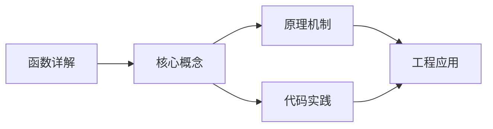
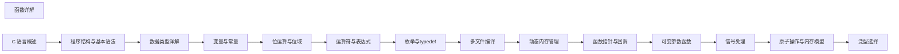

## 1. 学习目标（Bloom 分类）

本节按照布鲁姆教育目标分类学组织学习路径。本文主题为《函数详解》，属于 C 模块，读者可以根据自身阶段选择阅读深度。

记忆层面：能够准确复述本文的核心概念、术语与基本语法或操作步骤，并能够在提问或检索时快速定位对应知识点。能够说出 C 的变量、函数、指针、数组、结构体与预处理语法。

理解层面：能够用自己的语言解释核心原理与工作机制，说明概念之间的因果关系，而不是机械记忆结论。能够解释指针与内存地址、栈与堆、编译链接过程。

应用层面：能够在真实项目或练习场景中运用本文知识解决具体问题，写出正确且可维护的实现。能够编写系统工具、数据结构与嵌入式程序。

分析层面：能够拆解复杂问题，比较本文主题与相邻概念的异同，识别边界条件与例外情况。能够分析内存泄漏、缓冲区溢出与未定义行为。

评价层面：能够根据约束条件（性能、可读性、安全、成本）评价不同方案的优劣，做出有依据的技术决策。能够评价 C 与其他语言在系统编程中的取舍。

创造层面：能够把本文知识与其他模块知识组合，设计出新的解决方案或可复用的工程模式。能够设计可移植、可维护的 C 库与模块。

通过本节学习，读者应当能够把《函数详解》纳入自己的知识网络，并与 C 模块的其他主题（指针、内存管理、预处理器、标准库）建立关联。

## 2. 历史动机与发展脉络

《函数详解》是 C 领域的重要主题。要真正理解它，需要先了解它解决的问题与演进过程。

C 由 Dennis Ritchie 于 1972 年在贝尔实验室为 Unix 开发，是系统编程的基石语言：操作系统、编译器、嵌入式固件均以 C 为主。
C89（ANSI C）统一方言，C99 引入变长数组与 // 注释，C11 增加泛型选择与线程支持，C17 为缺陷修复版，C23（2024 年正式发布）引入 constexpr、属性、显式枚举底层类型等现代化特性。
C 的哲学是“信任程序员”：提供指针与内存操作的全部能力，同时把正确性责任交给开发者；这一设计成就了性能上限，也带来内存安全风险，催生了 Rust 等后继语言。

回到本文主题：函数详解 的提出与成熟，正是上述技术背景下的必然产物。早期实现往往以简单可用为目标，随着工程规模扩大，社区逐渐沉淀出标准做法与最佳实践；理解这一脉络，可以帮助读者判断“为什么文档中的推荐写法是现在这个样子”，也能在遇到历史遗留代码时准确识别其设计年代与取舍。


## 3. 形式化定义与核心概念精讲

本节把《函数详解》涉及的核心概念以“定义 + 讲解”的形式展开。读者应把定义当作工具，把讲解当作理解路径；两者结合才能形成可迁移的知识。

指针：指针保存变量地址，`&` 取地址、`*` 解引用；指针算术与数组名退化规则（数组名作为实参退化为首元素指针）是 C 的经典难点。
内存管理：栈内存自动释放，堆内存由 malloc/calloc/realloc/free 管理；所有权责任（谁分配谁释放）必须显式约定。
预处理器：#include/#define/#ifdef 在编译前文本处理；宏展开有副作用与优先级风险，函数式宏参数必须加括号。

### 3.1 原文章节逐一精讲

原文档把主题拆分为 20 个小节，下面按顺序给出每一节的导读讲解，随后保留原文细节供精读。

#### 原文精读（完整保留）

# 函数详解

> **符号约定**：`< >` 必填参数 | `[ ]` 可选参数

---

#### 1. 函数的概念与重要性

##### 1.1 函数的定义

- **函数**是一段完成特定任务的代码块，具有名称、参数和返回值。
- **作用**：
- 代码复用：避免重复代码
- 模块化：将复杂问题分解为小问题
- 可读性：提高代码的可读性和可维护性
- 可测试性：便于单元测试

#### 2. 函数的声明与定义

##### 2.1 函数声明 (Function Prototype)

- **目的**：告诉编译器函数的名称、返回类型和参数列表。
- **位置**：通常放在头文件中或源文件的开头。
- **格式**：`return_type function_name(parameter_list);`

```c
 // 函数声明
 int add(int, int); // 省略参数名
 int subtract(int a, int b); // 包含参数名
 void print_message(void); // 无参数
```

##### 2.2 函数定义 (Function Definition)

- **目的**：实现函数的具体逻辑。
- **格式**：

```c
 return_type function_name(parameter_list) {
 // 函数体
 return expression; // 对于非 void 返回类型
 }
```

```c
 // 函数定义
 int add(int a, int b) {
  return a + b;
 }
 void print_message(void) {
  printf("Hello, Function!\n");
  // 无 return 语句
 }
```

##### 2.3 函数声明与定义的关系

- **声明**是函数的"签名"，告诉编译器函数的接口。
- **定义**是函数的"实现"，包含具体的代码。
- 函数必须先声明后使用，或在使用前定义。

#### 3. 参数传递

##### 3.1 传值调用 (Pass by Value)

- **原理**：复制实参的值到形参，形参是实参的副本。
- **特点**：修改形参不会影响实参。
- **适用场景**：参数为基本数据类型（如 int、float 等）。

```c
 void increment(int x) {
  x++; // 只修改形参
  printf("Inside function: %d\n", x); // 输出 11
 }
 int main() {
  int a = 10;
  increment(a);
  printf("Outside function: %d\n", a); // 输出 10，实参未被修改
  return 0;
 }
```

##### 3.2 传址调用 (Pass by Address)

- **原理**：传递实参的地址，形参是指向实参的指针。
- **特点**：通过指针可以修改实参的值。
- **适用场景**：需要修改实参、传递大型数据结构（避免复制开销）。

```c
 void increment_by_address(int *x) {
  (*x)++; // 通过指针修改实参
  printf("Inside function: %d\n", *x); // 输出 11
 }
 int main() {
  int a = 10;
  increment_by_address(&a);
  printf("Outside function: %d\n", a); // 输出 11，实参被修改
  return 0;
 }
```

##### 3.3 数组作为参数

- **特点**：数组作为参数时，实际上传递的是数组的首地址（指针）。
- **注意**：函数内部无法通过 `sizeof` 获取数组的总大小。

```c
 void print_array(int arr[], int size) {
  for (int i = 0; i < size; i++) {
  printf("%d ", arr[i]);
  }
  printf("\n");
 }
 int main() {
  int numbers[] = {1, 2, 3, 4, 5};
  int size = sizeof(numbers) / sizeof(numbers[0]);
  print_array(numbers, size); // 传递数组首地址和大小
  return 0;
 }
```

#### 4. 函数的返回值

##### 4.1 返回基本类型

- **格式**：`return expression;`
- **注意**：返回值的类型必须与函数声明的返回类型一致。

```c
 int max(int a, int b) {
  if (a > b) {
  return a;
  } else {
  return b;
  }
 }
```

##### 4.2 返回指针

- **注意**：不要返回局部变量的指针，因为局部变量在函数返回后会被销毁。

```c
 // 错误：返回局部变量的指针
 int *create_array() {
  int arr[5]; // 局部变量
  return arr; // 危险：返回局部变量的地址
 }
 // 正确：返回动态分配的内存
 int *create_dynamic_array(int size) {
  int *arr = (int *)malloc(size * sizeof(int));
  return arr; // 安全：返回动态分配的内存
 }
```

##### 4.3 无返回值 (void)

- **格式**：`void function_name(...)`
- **特点**：函数可以没有 return 语句，或使用 `return;` 提前返回。

```c
 void print_hello() {
  printf("Hello!\n");
  // 无 return 语句
 }
 void check_number(int n) {
  if (n < 0) {
  printf("Negative number!\n");
  return; // 提前返回
  }
  printf("Non-negative number: %d\n", n);
 }
```

#### 5. 递归

##### 5.1 递归的概念

- **递归**：函数直接或间接地调用自身。
- **必要条件**：
- **基准情况 (Base Case)**：停止递归的条件。
- **递归步 (Recursive Step)**：将问题分解为更小的子问题，趋向基准情况。

##### 5.2 递归示例

###### 5.2.1 阶乘计算

```c
 long factorial(int n) {
  if (n <= 1) return 1; // 基准情况
  return n * factorial(n - 1); // 递归调用
 }
```

###### 5.2.2 斐波那契数列

```c
 int fibonacci(int n) {
  if (n <= 1) return n; // 基准情况
  return fibonacci(n - 1) + fibonacci(n - 2); // 递归调用
 }
```

###### 5.2.3 二分查找

```c
 int binary_search(int arr[], int low, int high, int target) {
  if (low > high) return -1; // 基准情况：未找到
  int mid = low + (high - low) / 2;
  if (arr[mid] == target) return mid; // 基准情况：找到
  else if (arr[mid] > target) return binary_search(arr, low, mid - 1, target);
  else return binary_search(arr, mid + 1, high, target);
 }
```

##### 5.3 递归的优缺点

- **优点**：代码简洁，逻辑清晰。
- **缺点**：可能导致栈溢出（递归深度过大），效率可能低于迭代。
- **优化**：尾递归优化（某些编译器支持）、记忆化（避免重复计算）。

#### 6. 作用域与存储类

##### 6.1 变量的作用域

- **局部变量**：在函数内部定义，只在函数内部有效。
- **全局变量**：在函数外部定义，在整个程序中有效。

```c
 int global_var = 100; // 全局变量
 void function() {
  int local_var = 50; // 局部变量
  printf("Global: %d, Local: %d\n", global_var, local_var);
 }
 int main() {
  function();
  printf("Global: %d\n", global_var);
  // printf("Local: %d\n", local_var); // 错误：local_var 未定义
  return 0;
 }
```

##### 6.2 存储类说明符

###### 6.2.1 `auto`

- **默认存储类**：局部变量的默认存储类。
- **特点**：自动存储期，函数结束时销毁。

###### 6.2.2 `static`

- **静态局部变量**：
- 存储期：程序整个运行期间
- 作用域：函数内部
- 初始化：仅在首次调用时初始化

```c
 void counter() {
  static int count = 0; // 静态局部变量
  count++;
  printf("Count: %d\n", count);
 }
 int main() {
  counter(); // 输出 1
  counter(); // 输出 2
  counter(); // 输出 3
  return 0;
 }
```

- **静态全局变量**：
- 存储期：程序整个运行期间
- 作用域：仅限于定义它的文件
- 优点：避免命名冲突，提高代码安全性

###### 6.2.3 `extern`

- **外部变量**：声明在其他文件中定义的全局变量。
- **作用**：实现跨文件访问全局变量。

```c
 // file1.c
 extern int global_var; // 声明外部变量
 void function() {
  printf("Global var: %d\n", global_var);
 }
 // file2.c
 int global_var = 100; // 定义全局变量
```

###### 6.2.4 `register`

- **寄存器变量**：建议编译器将变量存储在寄存器中以提高访问速度。
- **注意**：现代编译器通常会自动优化，这个关键字的作用已经不大。

#### 7. 函数指针

##### 7.1 函数指针的定义

- **格式**：`return_type (*pointer_name)(parameter_list);`

```c
 // 定义函数指针
 int (*add_ptr)(int, int);
 // 赋值
 add_ptr = add;
 // 或直接初始化
 int (*add_ptr)(int, int) = add;
```

##### 7.2 通过函数指针调用函数

```c
 int result = add_ptr(10, 20);
 // 或
 int result = (*add_ptr)(10, 20); // 更明确的写法
```

##### 7.3 函数指针的应用

###### 7.3.1 回调函数

```c
 // 回调函数类型
 typedef void (*Callback)(int);
 // 执行回调的函数
 void process_array(int arr[], int size, Callback callback) {
  for (int i = 0; i < size; i++) {
  callback(arr[i]);
  }
 }
 // 具体的回调函数
 void print_number(int num) {
  printf("%d ", num);
 }
 void square_number(int num) {
  printf("%d ", num * num);
 }
 int main() {
  int numbers[] = {1, 2, 3, 4, 5};
  int size = sizeof(numbers) / sizeof(numbers[0]);
  printf("Original numbers: ");
  process_array(numbers, size, print_number);
  printf("\n");
  printf("Squared numbers: ");
  process_array(numbers, size, square_number);
  printf("\n");
  return 0;
 }
```

###### 7.3.2 函数指针数组

```c
 int add(int a, int b) { return a + b; }
 int subtract(int a, int b) { return a - b; }
 int multiply(int a, int b) { return a * b; }
 int divide(int a, int b) { return b != 0 ? a / b : 0; }
 int main() {
  // 函数指针数组
  int (*operations[])(int, int) = {add, subtract, multiply, divide};
  int a = 10, b = 5;
  for (int i = 0; i < 4; i++) {
  printf("Result: %d\n", operations[i](a, b));
  }
  return 0;
 }
```

#### 8. 可变参数函数

##### 8.1 基本概念

- **可变参数函数**：参数个数可变的函数，如 `printf`、`scanf`。
- **实现**：使用 `<stdarg.h>` 头文件中的宏。

##### 8.2 实现步骤

1. 包含头文件 `<stdarg.h>`
2. 定义函数，最后一个参数为 `...`
3. 使用 `va_list` 类型声明参数列表
4. 使用 `va_start` 初始化参数列表
5. 使用 `va_arg` 获取各个参数
6. 使用 `va_end` 结束参数处理

##### 8.3 示例

```c
 #include <stdarg.h>
 #include <stdio.h>
 // 计算多个整数的和
 double sum(int count, ...) {
  va_list valist;
  double sum = 0.0;
  // 初始化参数列表
  va_start(valist, count);
  // 遍历参数
  for (int i = 0; i < count; i++) {
  sum += va_arg(valist, int);
  }
  // 结束参数处理
  va_end(valist);
  return sum;
 }
 // 格式化输出
 typedef enum {
  INT, // 整数
  DOUBLE, // 双精度浮点数
  STRING // 字符串
 }
 void print_values(int count, ...) {
  va_list valist;
  va_start(valist, count);
  for (int i = 0; i < count; i++) {
  Type type = va_arg(valist, Type);
  switch (type) {
  case INT:
  printf("%d ", va_arg(valist, int));
  break;
  case DOUBLE:
  printf("%f ", va_arg(valist, double));
  break;
  case STRING:
  printf("%s ", va_arg(valist, char*));
  break;
  default:
  printf("Unknown type ");
  break;
  }
  }
  va_end(valist);
  printf("\n");
 }
 int main() {
  printf("Sum: %.2f\n", sum(5, 1, 2, 3, 4, 5));
  print_values(4,
  INT, 10,
  DOUBLE, 3.14,
  STRING, "Hello",
  INT, 20);
  return 0;
 }
```

##### 8.4 注意事项

- 必须有至少一个固定参数
- 必须知道参数的类型和个数（通常通过固定参数或格式字符串指定）
- `va_arg` 必须使用正确的类型，否则会导致未定义行为

#### 9. 内联函数

##### 9.1 概念

- **内联函数**：建议编译器将函数体直接嵌入调用处，减少函数调用的开销。
- **关键字**：`inline`

##### 9.2 适用场景

- 函数体短小（通常少于 10 行）
- 被频繁调用
- 不包含复杂的控制结构（如循环、switch）

##### 9.3 示例

```c
 inline int max(int a, int b) {
  return a > b ? a : b;
 }
 int main() {
  int x = 10, y = 20;
  int result = max(x, y); // 可能被内联为：int result = x > y ? x : y;
  printf("Max: %d\n", result);
  return 0;
 }
```

##### 9.4 注意事项

- `inline` 只是建议，编译器可能会忽略
- 内联函数通常放在头文件中
- 过度使用内联可能会增加代码大小

#### 10. 函数的最佳实践

##### 10.1 命名规范

- 函数名应清晰描述其功能
- 使用 `snake_case` 命名风格
- 避免使用过长或过于简短的名称

##### 10.2 函数设计

- **单一职责**：每个函数只做一件事
- **参数个数**：尽量控制在 3-5 个以内
- **返回值**：明确函数的返回值含义
- **错误处理**：考虑错误情况的处理

##### 10.3 代码风格

- **缩进**：使用一致的缩进风格（通常 4 个空格）
- **注释**：为复杂函数添加注释，说明功能、参数和返回值
- **格式**：保持代码格式的一致性

##### 10.4 性能优化

- **减少参数传递**：对于大型结构，使用指针传递
- **避免递归过深**：考虑使用迭代替代递归
- **合理使用内联**：只对频繁调用的小函数使用内联
- **避免重复计算**：缓存计算结果

#### 11. 函数的测试与调试

##### 11.1 单元测试

- 为每个函数编写测试用例
- 测试正常情况和边界情况
- 使用断言验证函数行为

##### 11.2 调试技巧

- 使用 `printf` 输出中间结果
- 使用调试器（如 GDB）单步执行
- 检查参数和返回值
- 验证指针的有效性

#### 12. 函数示例：完整应用

```c
 #include <stdio.h>
 #include <stdlib.h>
 // 函数声明
 int *create_array(int size);
 void initialize_array(int *arr, int size);
 void print_array(int *arr, int size);
 int find_max(int *arr, int size);
 void free_array(int *arr);
 int main() {
  int size;
  printf("Enter array size: ");
  scanf("%d", &size);
  // 创建数组
  int *arr = create_array(size);
  if (arr == NULL) {
  printf("Memory allocation failed!\n");
  return 1;
  }
  // 初始化数组
  initialize_array(arr, size);
  // 打印数组
  printf("Array elements: ");
  print_array(arr, size);
  // 查找最大值
  int max_val = find_max(arr, size);
  printf("Maximum value: %d\n", max_val);
  // 释放内存
  free_array(arr);
  return 0;
 }
 // 创建动态数组
 int *create_array(int size) {
  return (int *)malloc(size * sizeof(int));
 }
 // 初始化数组为随机值
 void initialize_array(int *arr, int size) {
  for (int i = 0; i < size; i++) {
  arr[i] = rand() % 100; // 0-99 的随机数
  }
 }
 // 打印数组
 void print_array(int *arr, int size) {
  for (int i = 0; i < size; i++) {
  printf("%d ", arr[i]);
  }
  printf("\n");
 }
 // 查找数组最大值
 int find_max(int *arr, int size) {
  int max = arr[0];
  for (int i = 1; i < size; i++) {
  if (arr[i] > max) {
  max = arr[i];
  }
  }
  return max;
 }
 // 释放数组内存
 void free_array(int *arr) {
  free(arr);
 }
```

---

#### 函数声明与定义

**基本写法：函数声明（原型）**
`<return_type> <func_name>(<parameter_list>);`
```c
// 声明函数原型
int add(int a, int b);
```

---

**无参写法：无参数函数声明**
`<return_type> <func_name>(void);`
```c
// 声明无参数函数
void print_message(void);
```

---

**基本写法：函数定义**
`<return_type> <func_name>(<parameter_list>) { ... return <expr>; }`
```c
// 定义加法函数
int add(int a, int b) {
    return a + b;
}
```

---

**无返回写法：void 函数定义**
`void <func_name>(<params>) { ... }`
```c
// 无返回值的函数
void print_message(void) {
    printf("Hello, Function!\n");
}
```

---

#### 参数传递

**传值写法：传值调用**
`<return_type> <func>(<type> <param>) { ... }`
```c
// 修改形参不影响实参
void increment(int x) {
    x++;
}
```

---

**传址写法：传址调用**
`<return_type> <func>(<type> *<param>) { ... }`
```c
// 通过指针修改实参
void increment_by_address(int *x) {
    (*x)++;
}
```

---

**数组参数写法：数组作为参数**
`<return_type> <func>(<type> <arr>[], int <size>) { ... }`
```c
// 传递数组首地址和大小
void print_array(int arr[], int size) {
    for (int i = 0; i < size; i++) {
        printf("%d ", arr[i]);
    }
}
```

---

#### 返回值

**基本写法：返回基本类型**
`return <expression>;`
```c
// 返回最大值
int max(int a, int b) {
    return (a > b) ? a : b;
}
```

---

**指针返回写法：返回指针**
`<type> *<func>(<params>) { ... return <ptr>; }`
```c
// 返回动态分配的内存
int *create_dynamic_array(int size) {
    return (int *)malloc(size * sizeof(int));
}
```

---

**提前返回写法：void 函数提前返回**
`return;`
```c
// 满足条件时提前返回
void check_number(int n) {
    if (n < 0) {
        printf("Negative!\n");
        return;
    }
    printf("Non-negative\n");
}
```

---

#### 递归

**阶乘写法：递归计算阶乘**
`<return_type> <func>(<type> <param>) { if (<base>) return ...; return <recursive_call>; }`
```c
// 递归计算阶乘
long factorial(int n) {
    if (n <= 1) return 1;
    return n * factorial(n - 1);
}
```

---

**斐波那契写法：递归计算斐波那契**
`<return_type> <func>(<type> <param>) { if (<base>) return ...; return <recursive1> + <recursive2>; }`
```c
// 递归计算斐波那契数列
int fibonacci(int n) {
    if (n <= 1) return n;
    return fibonacci(n - 1) + fibonacci(n - 2);
}
```

---

**二分查找写法：递归二分查找**
`int <search>(<type> <arr>[], int <low>, int <high>, <type> <target>) { ... }`
```c
// 递归实现二分查找
int binary_search(int arr[], int low, int high, int target) {
    if (low > high) return -1;
    int mid = low + (high - low) / 2;
    if (arr[mid] == target) return mid;
    else if (arr[mid] > target) return binary_search(arr, low, mid - 1, target);
    else return binary_search(arr, mid + 1, high, target);
}
```

---

#### 存储类与作用域

**静态局部写法：静态局部变量**
`static <type> <var> = <value>;`
```c
// 仅首次调用时初始化
void counter() {
    static int count = 0;
    count++;
    printf("Count: %d\n", count);
}
```

---

**外部变量写法：extern 外部变量**
`extern <type> <var>;`
```c
// 声明外部变量
extern int global_var;
```

---

#### 函数指针

**基本写法：函数指针定义**
`<return_type> (*<ptr_name>)(<parameter_list>);`
```c
// 定义函数指针
int (*add_ptr)(int, int);
```

---

**赋值写法：函数指针赋值**
`<func_ptr> = <func_name>;`
```c
// 将函数地址赋给指针
add_ptr = add;
```

---

**调用写法：通过函数指针调用**
`<result> = <func_ptr>(<args>);`
```c
// 通过函数指针调用函数
int result = add_ptr(10, 20);
```

---

**typedef 写法：定义回调函数类型**
`typedef <return_type> (*<CallbackName>)(<params>);`
```c
// 定义回调函数类型
typedef void (*Callback)(int);
```

---

**回调写法：使用回调函数**
`void <func>(<type> <arr>[], int <size>, <CallbackType> <callback>) { ... }`
```c
// 执行回调的函数
void process_array(int arr[], int size, Callback callback) {
    for (int i = 0; i < size; i++) {
        callback(arr[i]);
    }
}
```

---

**数组写法：函数指针数组**
`<return_type> (*<array_name>[])(<params>) = { <func1>, <func2>, ... };`
```c
// 函数指针数组
int (*operations[])(int, int) = {add, subtract, multiply};
```

---

#### 可变参数函数

**基本写法：可变参数函数定义**
`<return_type> <func>(<fixed_params>, ...) { ... }`
```c
#include <stdarg.h>
// 计算多个整数的和
int sum(int count, ...) {
    va_list valist;
    va_start(valist, count);
    int total = 0;
    for (int i = 0; i < count; i++) {
        total += va_arg(valist, int);
    }
    va_end(valist);
    return total;
}
```

---

#### 内联函数

**基本写法：内联函数定义**
`inline <type> <func>(<params>) { ... }`
```c
// 内联函数可能被编译器内联展开
inline int max(int a, int b) {
    return a > b ? a : b;
}
```


### 3.2 概念关系图

下面用 Mermaid 图表达本文核心概念之间的关系，帮助读者建立整体图景：



图中展示的是本文知识的结构化关系：核心概念是入口，原理机制解释“为什么”，代码实践演示“怎么做”，工程应用回答“何时用”。读者学习时可以把每个小节的内容挂接到对应节点上。

## 4. 理论推导与原理解析

本节深入《函数详解》背后的原理。理论部分不求面面俱到，而是聚焦“能解释现象、能指导实践”的关键推导。

指针：指针保存变量地址，`&` 取地址、`*` 解引用；指针算术与数组名退化规则（数组名作为实参退化为首元素指针）是 C 的经典难点。
内存管理：栈内存自动释放，堆内存由 malloc/calloc/realloc/free 管理；所有权责任（谁分配谁释放）必须显式约定。
预处理器：#include/#define/#ifdef 在编译前文本处理；宏展开有副作用与优先级风险，函数式宏参数必须加括号。
编译链接：预处理 -> 编译 -> 汇编 -> 链接；头文件声明接口，源文件实现；静态库与动态库（.a/.so/.dll）决定部署形态。

需要强调的是，理论推导与工程实践之间存在翻译层：理论给出的是理想化模型与边界条件，工程代码则必须处理真实环境中的例外。读者在学习时应先掌握理论的“标准情形”，再通过陷阱章节了解“非标准情形”。

## 5. 代码示例与逐行讲解

本节把原文中的代码示例系统整理，并为每个示例补充用途说明与讲解。读者不应只浏览代码，而应逐段对照讲解理解设计意图。

### 5.1 示例：2.1 函数声明 (Function Prototype)

该示例来自原文《2.1 函数声明 (Function Prototype)》小节，用于演示函数详解相关操作。阅读时请先看代码结构，再看其后的讲解。

```c
 // 函数声明
 int add(int, int); // 省略参数名
 int subtract(int a, int b); // 包含参数名
 void print_message(void); // 无参数
```

讲解：这段代码演示了本节核心知识点。代码中的关键操作可以归纳为三步：准备（定义或初始化）、执行（核心逻辑）、收尾（释放资源或返回结果）。实际项目中，这三步往往被封装为函数或类，以提升复用性与可测试性。

关键点分析：

该示例共 4 行有效代码，结构以数据或配置为主。阅读时应关注：数据字段的含义、配置项的作用，以及它们与运行行为的对应关系。

进阶思考路径：先尝试修改参数观察行为变化，再把示例中的模式迁移到自己的项目中；每次修改都记录预期与实测差异，这是把示例转化为能力的最快方式。

### 5.2 示例：2.2 函数定义 (Function Definition)

该示例来自原文《2.2 函数定义 (Function Definition)》小节，用于演示函数详解相关操作。阅读时请先看代码结构，再看其后的讲解。

```c
 return_type function_name(parameter_list) {
 // 函数体
 return expression; // 对于非 void 返回类型
 }
```

讲解：这段代码演示了本节核心知识点。代码中的关键操作可以归纳为三步：准备（定义或初始化）、执行（核心逻辑）、收尾（释放资源或返回结果）。实际项目中，这三步往往被封装为函数或类，以提升复用性与可测试性。

关键点分析：

该示例共 4 行有效代码，包含 2 类关键结构（function、return）。其中：

- 入口与初始化部分负责建立上下文，对应实际项目中的启动或装配逻辑；
- 核心逻辑部分体现本文主题的主要操作，是阅读时最需要对照讲解理解的部分；
- 输出或返回部分把结果交给调用方，注意其类型与边界条件。

进阶思考路径：先尝试修改参数观察行为变化，再把示例中的模式迁移到自己的项目中；每次修改都记录预期与实测差异，这是把示例转化为能力的最快方式。

### 5.3 示例：2.2 函数定义 (Function Definition)

该示例来自原文《2.2 函数定义 (Function Definition)》小节，用于演示函数详解相关操作。阅读时请先看代码结构，再看其后的讲解。

```c
 // 函数定义
 int add(int a, int b) {
  return a + b;
 }
 void print_message(void) {
  printf("Hello, Function!\n");
  // 无 return 语句
 }
```

讲解：这段代码演示了本节核心知识点。代码中的关键操作可以归纳为三步：准备（定义或初始化）、执行（核心逻辑）、收尾（释放资源或返回结果）。实际项目中，这三步往往被封装为函数或类，以提升复用性与可测试性。

关键点分析：

该示例共 8 行有效代码，包含 1 类关键结构（return）。其中：

- 入口与初始化部分负责建立上下文，对应实际项目中的启动或装配逻辑；
- 核心逻辑部分体现本文主题的主要操作，是阅读时最需要对照讲解理解的部分；
- 输出或返回部分把结果交给调用方，注意其类型与边界条件。

进阶思考路径：先尝试修改参数观察行为变化，再把示例中的模式迁移到自己的项目中；每次修改都记录预期与实测差异，这是把示例转化为能力的最快方式。

### 5.4 示例：3.1 传值调用 (Pass by Value)

该示例来自原文《3.1 传值调用 (Pass by Value)》小节，用于演示函数详解相关操作。阅读时请先看代码结构，再看其后的讲解。

```c
 void increment(int x) {
  x++; // 只修改形参
  printf("Inside function: %d\n", x); // 输出 11
 }
 int main() {
  int a = 10;
  increment(a);
  printf("Outside function: %d\n", a); // 输出 10，实参未被修改
  return 0;
 }
```

讲解：这段代码演示了本节核心知识点。代码中的关键操作可以归纳为三步：准备（定义或初始化）、执行（核心逻辑）、收尾（释放资源或返回结果）。实际项目中，这三步往往被封装为函数或类，以提升复用性与可测试性。

关键点分析：

该示例共 10 行有效代码，包含 2 类关键结构（function、return）。其中：

- 入口与初始化部分负责建立上下文，对应实际项目中的启动或装配逻辑；
- 核心逻辑部分体现本文主题的主要操作，是阅读时最需要对照讲解理解的部分；
- 输出或返回部分把结果交给调用方，注意其类型与边界条件。

进阶思考路径：先尝试修改参数观察行为变化，再把示例中的模式迁移到自己的项目中；每次修改都记录预期与实测差异，这是把示例转化为能力的最快方式。

### 5.5 示例：3.2 传址调用 (Pass by Address)

该示例来自原文《3.2 传址调用 (Pass by Address)》小节，用于演示函数详解相关操作。阅读时请先看代码结构，再看其后的讲解。

```c
 void increment_by_address(int *x) {
  (*x)++; // 通过指针修改实参
  printf("Inside function: %d\n", *x); // 输出 11
 }
 int main() {
  int a = 10;
  increment_by_address(&a);
  printf("Outside function: %d\n", a); // 输出 11，实参被修改
  return 0;
 }
```

讲解：这段代码演示了本节核心知识点。代码中的关键操作可以归纳为三步：准备（定义或初始化）、执行（核心逻辑）、收尾（释放资源或返回结果）。实际项目中，这三步往往被封装为函数或类，以提升复用性与可测试性。

关键点分析：

该示例共 10 行有效代码，包含 2 类关键结构（function、return）。其中：

- 入口与初始化部分负责建立上下文，对应实际项目中的启动或装配逻辑；
- 核心逻辑部分体现本文主题的主要操作，是阅读时最需要对照讲解理解的部分；
- 输出或返回部分把结果交给调用方，注意其类型与边界条件。

进阶思考路径：先尝试修改参数观察行为变化，再把示例中的模式迁移到自己的项目中；每次修改都记录预期与实测差异，这是把示例转化为能力的最快方式。

### 5.6 示例：3.3 数组作为参数

该示例来自原文《3.3 数组作为参数》小节，用于演示函数详解相关操作。阅读时请先看代码结构，再看其后的讲解。

```c
 void print_array(int arr[], int size) {
  for (int i = 0; i < size; i++) {
  printf("%d ", arr[i]);
  }
  printf("\n");
 }
 int main() {
  int numbers[] = {1, 2, 3, 4, 5};
  int size = sizeof(numbers) / sizeof(numbers[0]);
  print_array(numbers, size); // 传递数组首地址和大小
  return 0;
 }
```

讲解：这段代码演示了本节核心知识点。代码中的关键操作可以归纳为三步：准备（定义或初始化）、执行（核心逻辑）、收尾（释放资源或返回结果）。实际项目中，这三步往往被封装为函数或类，以提升复用性与可测试性。

关键点分析：

该示例共 12 行有效代码，包含 2 类关键结构（for、return）。其中：

- 入口与初始化部分负责建立上下文，对应实际项目中的启动或装配逻辑；
- 核心逻辑部分体现本文主题的主要操作，是阅读时最需要对照讲解理解的部分；
- 输出或返回部分把结果交给调用方，注意其类型与边界条件。

进阶思考路径：先尝试修改参数观察行为变化，再把示例中的模式迁移到自己的项目中；每次修改都记录预期与实测差异，这是把示例转化为能力的最快方式。

### 5.7 示例：4.1 返回基本类型

该示例来自原文《4.1 返回基本类型》小节，用于演示函数详解相关操作。阅读时请先看代码结构，再看其后的讲解。

```c
 int max(int a, int b) {
  if (a > b) {
  return a;
  } else {
  return b;
  }
 }
```

讲解：这段代码演示了本节核心知识点。代码中的关键操作可以归纳为三步：准备（定义或初始化）、执行（核心逻辑）、收尾（释放资源或返回结果）。实际项目中，这三步往往被封装为函数或类，以提升复用性与可测试性。

关键点分析：

该示例共 7 行有效代码，包含 2 类关键结构（if、return）。其中：

- 入口与初始化部分负责建立上下文，对应实际项目中的启动或装配逻辑；
- 核心逻辑部分体现本文主题的主要操作，是阅读时最需要对照讲解理解的部分；
- 输出或返回部分把结果交给调用方，注意其类型与边界条件。

进阶思考路径：先尝试修改参数观察行为变化，再把示例中的模式迁移到自己的项目中；每次修改都记录预期与实测差异，这是把示例转化为能力的最快方式。

### 5.8 示例：4.2 返回指针

该示例来自原文《4.2 返回指针》小节，用于演示函数详解相关操作。阅读时请先看代码结构，再看其后的讲解。

```c
 // 错误：返回局部变量的指针
 int *create_array() {
  int arr[5]; // 局部变量
  return arr; // 危险：返回局部变量的地址
 }
 // 正确：返回动态分配的内存
 int *create_dynamic_array(int size) {
  int *arr = (int *)malloc(size * sizeof(int));
  return arr; // 安全：返回动态分配的内存
 }
```

讲解：这段代码演示了本节核心知识点。代码中的关键操作可以归纳为三步：准备（定义或初始化）、执行（核心逻辑）、收尾（释放资源或返回结果）。实际项目中，这三步往往被封装为函数或类，以提升复用性与可测试性。

关键点分析：

该示例共 10 行有效代码，包含 1 类关键结构（return）。其中：

- 入口与初始化部分负责建立上下文，对应实际项目中的启动或装配逻辑；
- 核心逻辑部分体现本文主题的主要操作，是阅读时最需要对照讲解理解的部分；
- 输出或返回部分把结果交给调用方，注意其类型与边界条件。

进阶思考路径：先尝试修改参数观察行为变化，再把示例中的模式迁移到自己的项目中；每次修改都记录预期与实测差异，这是把示例转化为能力的最快方式。

### 5.9 示例：4.3 无返回值 (void)

该示例来自原文《4.3 无返回值 (void)》小节，用于演示函数详解相关操作。阅读时请先看代码结构，再看其后的讲解。

```c
 void print_hello() {
  printf("Hello!\n");
  // 无 return 语句
 }
 void check_number(int n) {
  if (n < 0) {
  printf("Negative number!\n");
  return; // 提前返回
  }
  printf("Non-negative number: %d\n", n);
 }
```

讲解：这段代码演示了本节核心知识点。代码中的关键操作可以归纳为三步：准备（定义或初始化）、执行（核心逻辑）、收尾（释放资源或返回结果）。实际项目中，这三步往往被封装为函数或类，以提升复用性与可测试性。

关键点分析：

该示例共 11 行有效代码，包含 2 类关键结构（if、return）。其中：

- 入口与初始化部分负责建立上下文，对应实际项目中的启动或装配逻辑；
- 核心逻辑部分体现本文主题的主要操作，是阅读时最需要对照讲解理解的部分；
- 输出或返回部分把结果交给调用方，注意其类型与边界条件。

进阶思考路径：先尝试修改参数观察行为变化，再把示例中的模式迁移到自己的项目中；每次修改都记录预期与实测差异，这是把示例转化为能力的最快方式。

### 5.10 示例：5.2.1 阶乘计算

该示例来自原文《5.2.1 阶乘计算》小节，用于演示函数详解相关操作。阅读时请先看代码结构，再看其后的讲解。

```c
 long factorial(int n) {
  if (n <= 1) return 1; // 基准情况
  return n * factorial(n - 1); // 递归调用
 }
```

讲解：这段代码演示了本节核心知识点。代码中的关键操作可以归纳为三步：准备（定义或初始化）、执行（核心逻辑）、收尾（释放资源或返回结果）。实际项目中，这三步往往被封装为函数或类，以提升复用性与可测试性。

关键点分析：

该示例共 4 行有效代码，包含 2 类关键结构（if、return）。其中：

- 入口与初始化部分负责建立上下文，对应实际项目中的启动或装配逻辑；
- 核心逻辑部分体现本文主题的主要操作，是阅读时最需要对照讲解理解的部分；
- 输出或返回部分把结果交给调用方，注意其类型与边界条件。

进阶思考路径：先尝试修改参数观察行为变化，再把示例中的模式迁移到自己的项目中；每次修改都记录预期与实测差异，这是把示例转化为能力的最快方式。

### 5.11 示例：5.2.2 斐波那契数列

该示例来自原文《5.2.2 斐波那契数列》小节，用于演示函数详解相关操作。阅读时请先看代码结构，再看其后的讲解。

```c
 int fibonacci(int n) {
  if (n <= 1) return n; // 基准情况
  return fibonacci(n - 1) + fibonacci(n - 2); // 递归调用
 }
```

讲解：这段代码演示了本节核心知识点。代码中的关键操作可以归纳为三步：准备（定义或初始化）、执行（核心逻辑）、收尾（释放资源或返回结果）。实际项目中，这三步往往被封装为函数或类，以提升复用性与可测试性。

关键点分析：

该示例共 4 行有效代码，包含 2 类关键结构（if、return）。其中：

- 入口与初始化部分负责建立上下文，对应实际项目中的启动或装配逻辑；
- 核心逻辑部分体现本文主题的主要操作，是阅读时最需要对照讲解理解的部分；
- 输出或返回部分把结果交给调用方，注意其类型与边界条件。

进阶思考路径：先尝试修改参数观察行为变化，再把示例中的模式迁移到自己的项目中；每次修改都记录预期与实测差异，这是把示例转化为能力的最快方式。

### 5.12 示例：5.2.3 二分查找

该示例来自原文《5.2.3 二分查找》小节，用于演示函数详解相关操作。阅读时请先看代码结构，再看其后的讲解。

```c
 int binary_search(int arr[], int low, int high, int target) {
  if (low > high) return -1; // 基准情况：未找到
  int mid = low + (high - low) / 2;
  if (arr[mid] == target) return mid; // 基准情况：找到
  else if (arr[mid] > target) return binary_search(arr, low, mid - 1, target);
  else return binary_search(arr, mid + 1, high, target);
 }
```

讲解：这段代码演示了本节核心知识点。代码中的关键操作可以归纳为三步：准备（定义或初始化）、执行（核心逻辑）、收尾（释放资源或返回结果）。实际项目中，这三步往往被封装为函数或类，以提升复用性与可测试性。

关键点分析：

该示例共 7 行有效代码，包含 2 类关键结构（if、return）。其中：

- 入口与初始化部分负责建立上下文，对应实际项目中的启动或装配逻辑；
- 核心逻辑部分体现本文主题的主要操作，是阅读时最需要对照讲解理解的部分；
- 输出或返回部分把结果交给调用方，注意其类型与边界条件。

进阶思考路径：先尝试修改参数观察行为变化，再把示例中的模式迁移到自己的项目中；每次修改都记录预期与实测差异，这是把示例转化为能力的最快方式。

### 5.13 示例：6.1 变量的作用域

该示例来自原文《6.1 变量的作用域》小节，用于演示函数详解相关操作。阅读时请先看代码结构，再看其后的讲解。

```c
 int global_var = 100; // 全局变量
 void function() {
  int local_var = 50; // 局部变量
  printf("Global: %d, Local: %d\n", global_var, local_var);
 }
 int main() {
  function();
  printf("Global: %d\n", global_var);
  // printf("Local: %d\n", local_var); // 错误：local_var 未定义
  return 0;
 }
```

讲解：这段代码演示了本节核心知识点。代码中的关键操作可以归纳为三步：准备（定义或初始化）、执行（核心逻辑）、收尾（释放资源或返回结果）。实际项目中，这三步往往被封装为函数或类，以提升复用性与可测试性。

关键点分析：

该示例共 11 行有效代码，包含 2 类关键结构（function、return）。其中：

- 入口与初始化部分负责建立上下文，对应实际项目中的启动或装配逻辑；
- 核心逻辑部分体现本文主题的主要操作，是阅读时最需要对照讲解理解的部分；
- 输出或返回部分把结果交给调用方，注意其类型与边界条件。

进阶思考路径：先尝试修改参数观察行为变化，再把示例中的模式迁移到自己的项目中；每次修改都记录预期与实测差异，这是把示例转化为能力的最快方式。

### 5.14 示例：6.2.2 `static`

该示例来自原文《6.2.2 `static`》小节，用于演示函数详解相关操作。阅读时请先看代码结构，再看其后的讲解。

```c
 void counter() {
  static int count = 0; // 静态局部变量
  count++;
  printf("Count: %d\n", count);
 }
 int main() {
  counter(); // 输出 1
  counter(); // 输出 2
  counter(); // 输出 3
  return 0;
 }
```

讲解：这段代码演示了本节核心知识点。代码中的关键操作可以归纳为三步：准备（定义或初始化）、执行（核心逻辑）、收尾（释放资源或返回结果）。实际项目中，这三步往往被封装为函数或类，以提升复用性与可测试性。

关键点分析：

该示例共 11 行有效代码，包含 1 类关键结构（return）。其中：

- 入口与初始化部分负责建立上下文，对应实际项目中的启动或装配逻辑；
- 核心逻辑部分体现本文主题的主要操作，是阅读时最需要对照讲解理解的部分；
- 输出或返回部分把结果交给调用方，注意其类型与边界条件。

进阶思考路径：先尝试修改参数观察行为变化，再把示例中的模式迁移到自己的项目中；每次修改都记录预期与实测差异，这是把示例转化为能力的最快方式。

### 5.15 示例：6.2.3 `extern`

该示例来自原文《6.2.3 `extern`》小节，用于演示函数详解相关操作。阅读时请先看代码结构，再看其后的讲解。

```c
 // file1.c
 extern int global_var; // 声明外部变量
 void function() {
  printf("Global var: %d\n", global_var);
 }
 // file2.c
 int global_var = 100; // 定义全局变量
```

讲解：这段代码演示了本节核心知识点。代码中的关键操作可以归纳为三步：准备（定义或初始化）、执行（核心逻辑）、收尾（释放资源或返回结果）。实际项目中，这三步往往被封装为函数或类，以提升复用性与可测试性。

关键点分析：

该示例共 7 行有效代码，包含 1 类关键结构（function）。其中：

- 入口与初始化部分负责建立上下文，对应实际项目中的启动或装配逻辑；
- 核心逻辑部分体现本文主题的主要操作，是阅读时最需要对照讲解理解的部分；
- 输出或返回部分把结果交给调用方，注意其类型与边界条件。

进阶思考路径：先尝试修改参数观察行为变化，再把示例中的模式迁移到自己的项目中；每次修改都记录预期与实测差异，这是把示例转化为能力的最快方式。

### 5.16 示例：7.1 函数指针的定义

该示例来自原文《7.1 函数指针的定义》小节，用于演示函数详解相关操作。阅读时请先看代码结构，再看其后的讲解。

```c
 // 定义函数指针
 int (*add_ptr)(int, int);
 // 赋值
 add_ptr = add;
 // 或直接初始化
 int (*add_ptr)(int, int) = add;
```

讲解：这段代码演示了本节核心知识点。代码中的关键操作可以归纳为三步：准备（定义或初始化）、执行（核心逻辑）、收尾（释放资源或返回结果）。实际项目中，这三步往往被封装为函数或类，以提升复用性与可测试性。

关键点分析：

该示例共 6 行有效代码，结构以数据或配置为主。阅读时应关注：数据字段的含义、配置项的作用，以及它们与运行行为的对应关系。

进阶思考路径：先尝试修改参数观察行为变化，再把示例中的模式迁移到自己的项目中；每次修改都记录预期与实测差异，这是把示例转化为能力的最快方式。

### 5.17 示例：7.2 通过函数指针调用函数

该示例来自原文《7.2 通过函数指针调用函数》小节，用于演示函数详解相关操作。阅读时请先看代码结构，再看其后的讲解。

```c
 int result = add_ptr(10, 20);
 // 或
 int result = (*add_ptr)(10, 20); // 更明确的写法
```

讲解：这段代码演示了本节核心知识点。代码中的关键操作可以归纳为三步：准备（定义或初始化）、执行（核心逻辑）、收尾（释放资源或返回结果）。实际项目中，这三步往往被封装为函数或类，以提升复用性与可测试性。

关键点分析：

该示例共 3 行有效代码，结构以数据或配置为主。阅读时应关注：数据字段的含义、配置项的作用，以及它们与运行行为的对应关系。

进阶思考路径：先尝试修改参数观察行为变化，再把示例中的模式迁移到自己的项目中；每次修改都记录预期与实测差异，这是把示例转化为能力的最快方式。

### 5.18 示例：7.3.1 回调函数

该示例来自原文《7.3.1 回调函数》小节，用于演示函数详解相关操作。阅读时请先看代码结构，再看其后的讲解。

```c
 // 回调函数类型
 typedef void (*Callback)(int);
 // 执行回调的函数
 void process_array(int arr[], int size, Callback callback) {
  for (int i = 0; i < size; i++) {
  callback(arr[i]);
  }
 }
 // 具体的回调函数
 void print_number(int num) {
  printf("%d ", num);
 }
 void square_number(int num) {
  printf("%d ", num * num);
 }
 int main() {
  int numbers[] = {1, 2, 3, 4, 5};
  int size = sizeof(numbers) / sizeof(numbers[0]);
  printf("Original numbers: ");
  process_array(numbers, size, print_number);
  printf("\n");
  printf("Squared numbers: ");
  process_array(numbers, size, square_number);
  printf("\n");
  return 0;
 }
```

讲解：这段代码演示了本节核心知识点。代码中的关键操作可以归纳为三步：准备（定义或初始化）、执行（核心逻辑）、收尾（释放资源或返回结果）。实际项目中，这三步往往被封装为函数或类，以提升复用性与可测试性。

关键点分析：

该示例共 26 行有效代码，包含 3 类关键结构（def、for、return）。其中：

- 入口与初始化部分负责建立上下文，对应实际项目中的启动或装配逻辑；
- 核心逻辑部分体现本文主题的主要操作，是阅读时最需要对照讲解理解的部分；
- 输出或返回部分把结果交给调用方，注意其类型与边界条件。

进阶思考路径：先尝试修改参数观察行为变化，再把示例中的模式迁移到自己的项目中；每次修改都记录预期与实测差异，这是把示例转化为能力的最快方式。

### 5.19 示例：7.3.2 函数指针数组

该示例来自原文《7.3.2 函数指针数组》小节，用于演示函数详解相关操作。阅读时请先看代码结构，再看其后的讲解。

```c
 int add(int a, int b) { return a + b; }
 int subtract(int a, int b) { return a - b; }
 int multiply(int a, int b) { return a * b; }
 int divide(int a, int b) { return b != 0 ? a / b : 0; }
 int main() {
  // 函数指针数组
  int (*operations[])(int, int) = {add, subtract, multiply, divide};
  int a = 10, b = 5;
  for (int i = 0; i < 4; i++) {
  printf("Result: %d\n", operations[i](a, b));
  }
  return 0;
 }
```

讲解：这段代码演示了本节核心知识点。代码中的关键操作可以归纳为三步：准备（定义或初始化）、执行（核心逻辑）、收尾（释放资源或返回结果）。实际项目中，这三步往往被封装为函数或类，以提升复用性与可测试性。

关键点分析：

该示例共 13 行有效代码，包含 2 类关键结构（for、return）。其中：

- 入口与初始化部分负责建立上下文，对应实际项目中的启动或装配逻辑；
- 核心逻辑部分体现本文主题的主要操作，是阅读时最需要对照讲解理解的部分；
- 输出或返回部分把结果交给调用方，注意其类型与边界条件。

进阶思考路径：先尝试修改参数观察行为变化，再把示例中的模式迁移到自己的项目中；每次修改都记录预期与实测差异，这是把示例转化为能力的最快方式。

### 5.20 示例：8.3 示例

该示例来自原文《8.3 示例》小节，用于演示函数详解相关操作。阅读时请先看代码结构，再看其后的讲解。

```c
 #include <stdarg.h>
 #include <stdio.h>
 // 计算多个整数的和
 double sum(int count, ...) {
  va_list valist;
  double sum = 0.0;
  // 初始化参数列表
  va_start(valist, count);
  // 遍历参数
  for (int i = 0; i < count; i++) {
  sum += va_arg(valist, int);
  }
  // 结束参数处理
  va_end(valist);
  return sum;
 }
 // 格式化输出
 typedef enum {
  INT, // 整数
  DOUBLE, // 双精度浮点数
  STRING // 字符串
 }
 void print_values(int count, ...) {
  va_list valist;
  va_start(valist, count);
  for (int i = 0; i < count; i++) {
  Type type = va_arg(valist, Type);
  switch (type) {
  case INT:
  printf("%d ", va_arg(valist, int));
  break;
  case DOUBLE:
  printf("%f ", va_arg(valist, double));
  break;
  case STRING:
  printf("%s ", va_arg(valist, char*));
  break;
  default:
  printf("Unknown type ");
  break;
  }
  }
  va_end(valist);
  printf("\n");
 }
 int main() {
  printf("Sum: %.2f\n", sum(5, 1, 2, 3, 4, 5));
  print_values(4,
  INT, 10,
  DOUBLE, 3.14,
  STRING, "Hello",
  INT, 20);
  return 0;
 }
```

讲解：这段代码演示了本节核心知识点。代码中的关键操作可以归纳为三步：准备（定义或初始化）、执行（核心逻辑）、收尾（释放资源或返回结果）。实际项目中，这三步往往被封装为函数或类，以提升复用性与可测试性。

关键点分析：

该示例共 54 行有效代码，包含 3 类关键结构（def、for、return）。其中：

- 入口与初始化部分负责建立上下文，对应实际项目中的启动或装配逻辑；
- 核心逻辑部分体现本文主题的主要操作，是阅读时最需要对照讲解理解的部分；
- 输出或返回部分把结果交给调用方，注意其类型与边界条件。

进阶思考路径：先尝试修改参数观察行为变化，再把示例中的模式迁移到自己的项目中；每次修改都记录预期与实测差异，这是把示例转化为能力的最快方式。

### 5.21 示例：9.3 示例

该示例来自原文《9.3 示例》小节，用于演示函数详解相关操作。阅读时请先看代码结构，再看其后的讲解。

```c
 inline int max(int a, int b) {
  return a > b ? a : b;
 }
 int main() {
  int x = 10, y = 20;
  int result = max(x, y); // 可能被内联为：int result = x > y ? x : y;
  printf("Max: %d\n", result);
  return 0;
 }
```

讲解：这段代码演示了本节核心知识点。代码中的关键操作可以归纳为三步：准备（定义或初始化）、执行（核心逻辑）、收尾（释放资源或返回结果）。实际项目中，这三步往往被封装为函数或类，以提升复用性与可测试性。

关键点分析：

该示例共 9 行有效代码，包含 1 类关键结构（return）。其中：

- 入口与初始化部分负责建立上下文，对应实际项目中的启动或装配逻辑；
- 核心逻辑部分体现本文主题的主要操作，是阅读时最需要对照讲解理解的部分；
- 输出或返回部分把结果交给调用方，注意其类型与边界条件。

进阶思考路径：先尝试修改参数观察行为变化，再把示例中的模式迁移到自己的项目中；每次修改都记录预期与实测差异，这是把示例转化为能力的最快方式。

### 5.22 示例：12. 函数示例：完整应用

该示例来自原文《12. 函数示例：完整应用》小节，用于演示函数详解相关操作。阅读时请先看代码结构，再看其后的讲解。

```c
 #include <stdio.h>
 #include <stdlib.h>
 // 函数声明
 int *create_array(int size);
 void initialize_array(int *arr, int size);
 void print_array(int *arr, int size);
 int find_max(int *arr, int size);
 void free_array(int *arr);
 int main() {
  int size;
  printf("Enter array size: ");
  scanf("%d", &size);
  // 创建数组
  int *arr = create_array(size);
  if (arr == NULL) {
  printf("Memory allocation failed!\n");
  return 1;
  }
  // 初始化数组
  initialize_array(arr, size);
  // 打印数组
  printf("Array elements: ");
  print_array(arr, size);
  // 查找最大值
  int max_val = find_max(arr, size);
  printf("Maximum value: %d\n", max_val);
  // 释放内存
  free_array(arr);
  return 0;
 }
 // 创建动态数组
 int *create_array(int size) {
  return (int *)malloc(size * sizeof(int));
 }
 // 初始化数组为随机值
 void initialize_array(int *arr, int size) {
  for (int i = 0; i < size; i++) {
  arr[i] = rand() % 100; // 0-99 的随机数
  }
 }
 // 打印数组
 void print_array(int *arr, int size) {
  for (int i = 0; i < size; i++) {
  printf("%d ", arr[i]);
  }
  printf("\n");
 }
 // 查找数组最大值
 int find_max(int *arr, int size) {
  int max = arr[0];
  for (int i = 1; i < size; i++) {
  if (arr[i] > max) {
  max = arr[i];
  }
  }
  return max;
 }
 // 释放数组内存
 void free_array(int *arr) {
  free(arr);
 }
```

讲解：这段代码演示了本节核心知识点。代码中的关键操作可以归纳为三步：准备（定义或初始化）、执行（核心逻辑）、收尾（释放资源或返回结果）。实际项目中，这三步往往被封装为函数或类，以提升复用性与可测试性。

关键点分析：

该示例共 61 行有效代码，包含 3 类关键结构（if、for、return）。其中：

- 入口与初始化部分负责建立上下文，对应实际项目中的启动或装配逻辑；
- 核心逻辑部分体现本文主题的主要操作，是阅读时最需要对照讲解理解的部分；
- 输出或返回部分把结果交给调用方，注意其类型与边界条件。

进阶思考路径：先尝试修改参数观察行为变化，再把示例中的模式迁移到自己的项目中；每次修改都记录预期与实测差异，这是把示例转化为能力的最快方式。

### 5.23 示例：函数声明与定义

该示例来自原文《函数声明与定义》小节，用于演示函数详解相关操作。阅读时请先看代码结构，再看其后的讲解。

```c
// 声明函数原型
int add(int a, int b);
```

讲解：这段代码演示了本节核心知识点。代码中的关键操作可以归纳为三步：准备（定义或初始化）、执行（核心逻辑）、收尾（释放资源或返回结果）。实际项目中，这三步往往被封装为函数或类，以提升复用性与可测试性。

关键点分析：

该示例共 2 行有效代码，结构以数据或配置为主。阅读时应关注：数据字段的含义、配置项的作用，以及它们与运行行为的对应关系。

进阶思考路径：先尝试修改参数观察行为变化，再把示例中的模式迁移到自己的项目中；每次修改都记录预期与实测差异，这是把示例转化为能力的最快方式。

### 5.24 示例：函数声明与定义

该示例来自原文《函数声明与定义》小节，用于演示函数详解相关操作。阅读时请先看代码结构，再看其后的讲解。

```c
// 声明无参数函数
void print_message(void);
```

讲解：这段代码演示了本节核心知识点。代码中的关键操作可以归纳为三步：准备（定义或初始化）、执行（核心逻辑）、收尾（释放资源或返回结果）。实际项目中，这三步往往被封装为函数或类，以提升复用性与可测试性。

关键点分析：

该示例共 2 行有效代码，结构以数据或配置为主。阅读时应关注：数据字段的含义、配置项的作用，以及它们与运行行为的对应关系。

进阶思考路径：先尝试修改参数观察行为变化，再把示例中的模式迁移到自己的项目中；每次修改都记录预期与实测差异，这是把示例转化为能力的最快方式。

### 5.25 示例：函数声明与定义

该示例来自原文《函数声明与定义》小节，用于演示函数详解相关操作。阅读时请先看代码结构，再看其后的讲解。

```c
// 定义加法函数
int add(int a, int b) {
    return a + b;
}
```

讲解：这段代码演示了本节核心知识点。代码中的关键操作可以归纳为三步：准备（定义或初始化）、执行（核心逻辑）、收尾（释放资源或返回结果）。实际项目中，这三步往往被封装为函数或类，以提升复用性与可测试性。

关键点分析：

该示例共 4 行有效代码，包含 1 类关键结构（return）。其中：

- 入口与初始化部分负责建立上下文，对应实际项目中的启动或装配逻辑；
- 核心逻辑部分体现本文主题的主要操作，是阅读时最需要对照讲解理解的部分；
- 输出或返回部分把结果交给调用方，注意其类型与边界条件。

进阶思考路径：先尝试修改参数观察行为变化，再把示例中的模式迁移到自己的项目中；每次修改都记录预期与实测差异，这是把示例转化为能力的最快方式。

### 5.26 示例：函数声明与定义

该示例来自原文《函数声明与定义》小节，用于演示函数详解相关操作。阅读时请先看代码结构，再看其后的讲解。

```c
// 无返回值的函数
void print_message(void) {
    printf("Hello, Function!\n");
}
```

讲解：这段代码演示了本节核心知识点。代码中的关键操作可以归纳为三步：准备（定义或初始化）、执行（核心逻辑）、收尾（释放资源或返回结果）。实际项目中，这三步往往被封装为函数或类，以提升复用性与可测试性。

关键点分析：

该示例共 4 行有效代码，结构以数据或配置为主。阅读时应关注：数据字段的含义、配置项的作用，以及它们与运行行为的对应关系。

进阶思考路径：先尝试修改参数观察行为变化，再把示例中的模式迁移到自己的项目中；每次修改都记录预期与实测差异，这是把示例转化为能力的最快方式。

### 5.27 示例：参数传递

该示例来自原文《参数传递》小节，用于演示函数详解相关操作。阅读时请先看代码结构，再看其后的讲解。

```c
// 修改形参不影响实参
void increment(int x) {
    x++;
}
```

讲解：这段代码演示了本节核心知识点。代码中的关键操作可以归纳为三步：准备（定义或初始化）、执行（核心逻辑）、收尾（释放资源或返回结果）。实际项目中，这三步往往被封装为函数或类，以提升复用性与可测试性。

关键点分析：

该示例共 4 行有效代码，结构以数据或配置为主。阅读时应关注：数据字段的含义、配置项的作用，以及它们与运行行为的对应关系。

进阶思考路径：先尝试修改参数观察行为变化，再把示例中的模式迁移到自己的项目中；每次修改都记录预期与实测差异，这是把示例转化为能力的最快方式。

### 5.28 示例：参数传递

该示例来自原文《参数传递》小节，用于演示函数详解相关操作。阅读时请先看代码结构，再看其后的讲解。

```c
// 通过指针修改实参
void increment_by_address(int *x) {
    (*x)++;
}
```

讲解：这段代码演示了本节核心知识点。代码中的关键操作可以归纳为三步：准备（定义或初始化）、执行（核心逻辑）、收尾（释放资源或返回结果）。实际项目中，这三步往往被封装为函数或类，以提升复用性与可测试性。

关键点分析：

该示例共 4 行有效代码，结构以数据或配置为主。阅读时应关注：数据字段的含义、配置项的作用，以及它们与运行行为的对应关系。

进阶思考路径：先尝试修改参数观察行为变化，再把示例中的模式迁移到自己的项目中；每次修改都记录预期与实测差异，这是把示例转化为能力的最快方式。

### 5.29 示例：参数传递

该示例来自原文《参数传递》小节，用于演示函数详解相关操作。阅读时请先看代码结构，再看其后的讲解。

```c
// 传递数组首地址和大小
void print_array(int arr[], int size) {
    for (int i = 0; i < size; i++) {
        printf("%d ", arr[i]);
    }
}
```

讲解：这段代码演示了本节核心知识点。代码中的关键操作可以归纳为三步：准备（定义或初始化）、执行（核心逻辑）、收尾（释放资源或返回结果）。实际项目中，这三步往往被封装为函数或类，以提升复用性与可测试性。

关键点分析：

该示例共 6 行有效代码，包含 1 类关键结构（for）。其中：

- 入口与初始化部分负责建立上下文，对应实际项目中的启动或装配逻辑；
- 核心逻辑部分体现本文主题的主要操作，是阅读时最需要对照讲解理解的部分；
- 输出或返回部分把结果交给调用方，注意其类型与边界条件。

进阶思考路径：先尝试修改参数观察行为变化，再把示例中的模式迁移到自己的项目中；每次修改都记录预期与实测差异，这是把示例转化为能力的最快方式。

### 5.30 示例：返回值

该示例来自原文《返回值》小节，用于演示函数详解相关操作。阅读时请先看代码结构，再看其后的讲解。

```c
// 返回最大值
int max(int a, int b) {
    return (a > b) ? a : b;
}
```

讲解：这段代码演示了本节核心知识点。代码中的关键操作可以归纳为三步：准备（定义或初始化）、执行（核心逻辑）、收尾（释放资源或返回结果）。实际项目中，这三步往往被封装为函数或类，以提升复用性与可测试性。

关键点分析：

该示例共 4 行有效代码，包含 1 类关键结构（return）。其中：

- 入口与初始化部分负责建立上下文，对应实际项目中的启动或装配逻辑；
- 核心逻辑部分体现本文主题的主要操作，是阅读时最需要对照讲解理解的部分；
- 输出或返回部分把结果交给调用方，注意其类型与边界条件。

进阶思考路径：先尝试修改参数观察行为变化，再把示例中的模式迁移到自己的项目中；每次修改都记录预期与实测差异，这是把示例转化为能力的最快方式。

### 5.31 示例：返回值

该示例来自原文《返回值》小节，用于演示函数详解相关操作。阅读时请先看代码结构，再看其后的讲解。

```c
// 返回动态分配的内存
int *create_dynamic_array(int size) {
    return (int *)malloc(size * sizeof(int));
}
```

讲解：这段代码演示了本节核心知识点。代码中的关键操作可以归纳为三步：准备（定义或初始化）、执行（核心逻辑）、收尾（释放资源或返回结果）。实际项目中，这三步往往被封装为函数或类，以提升复用性与可测试性。

关键点分析：

该示例共 4 行有效代码，包含 1 类关键结构（return）。其中：

- 入口与初始化部分负责建立上下文，对应实际项目中的启动或装配逻辑；
- 核心逻辑部分体现本文主题的主要操作，是阅读时最需要对照讲解理解的部分；
- 输出或返回部分把结果交给调用方，注意其类型与边界条件。

进阶思考路径：先尝试修改参数观察行为变化，再把示例中的模式迁移到自己的项目中；每次修改都记录预期与实测差异，这是把示例转化为能力的最快方式。

### 5.32 示例：返回值

该示例来自原文《返回值》小节，用于演示函数详解相关操作。阅读时请先看代码结构，再看其后的讲解。

```c
// 满足条件时提前返回
void check_number(int n) {
    if (n < 0) {
        printf("Negative!\n");
        return;
    }
    printf("Non-negative\n");
}
```

讲解：这段代码演示了本节核心知识点。代码中的关键操作可以归纳为三步：准备（定义或初始化）、执行（核心逻辑）、收尾（释放资源或返回结果）。实际项目中，这三步往往被封装为函数或类，以提升复用性与可测试性。

关键点分析：

该示例共 8 行有效代码，包含 2 类关键结构（if、return）。其中：

- 入口与初始化部分负责建立上下文，对应实际项目中的启动或装配逻辑；
- 核心逻辑部分体现本文主题的主要操作，是阅读时最需要对照讲解理解的部分；
- 输出或返回部分把结果交给调用方，注意其类型与边界条件。

进阶思考路径：先尝试修改参数观察行为变化，再把示例中的模式迁移到自己的项目中；每次修改都记录预期与实测差异，这是把示例转化为能力的最快方式。

### 5.33 示例：递归

该示例来自原文《递归》小节，用于演示函数详解相关操作。阅读时请先看代码结构，再看其后的讲解。

```c
// 递归计算阶乘
long factorial(int n) {
    if (n <= 1) return 1;
    return n * factorial(n - 1);
}
```

讲解：这段代码演示了本节核心知识点。代码中的关键操作可以归纳为三步：准备（定义或初始化）、执行（核心逻辑）、收尾（释放资源或返回结果）。实际项目中，这三步往往被封装为函数或类，以提升复用性与可测试性。

关键点分析：

该示例共 5 行有效代码，包含 2 类关键结构（if、return）。其中：

- 入口与初始化部分负责建立上下文，对应实际项目中的启动或装配逻辑；
- 核心逻辑部分体现本文主题的主要操作，是阅读时最需要对照讲解理解的部分；
- 输出或返回部分把结果交给调用方，注意其类型与边界条件。

进阶思考路径：先尝试修改参数观察行为变化，再把示例中的模式迁移到自己的项目中；每次修改都记录预期与实测差异，这是把示例转化为能力的最快方式。

### 5.34 示例：递归

该示例来自原文《递归》小节，用于演示函数详解相关操作。阅读时请先看代码结构，再看其后的讲解。

```c
// 递归计算斐波那契数列
int fibonacci(int n) {
    if (n <= 1) return n;
    return fibonacci(n - 1) + fibonacci(n - 2);
}
```

讲解：这段代码演示了本节核心知识点。代码中的关键操作可以归纳为三步：准备（定义或初始化）、执行（核心逻辑）、收尾（释放资源或返回结果）。实际项目中，这三步往往被封装为函数或类，以提升复用性与可测试性。

关键点分析：

该示例共 5 行有效代码，包含 2 类关键结构（if、return）。其中：

- 入口与初始化部分负责建立上下文，对应实际项目中的启动或装配逻辑；
- 核心逻辑部分体现本文主题的主要操作，是阅读时最需要对照讲解理解的部分；
- 输出或返回部分把结果交给调用方，注意其类型与边界条件。

进阶思考路径：先尝试修改参数观察行为变化，再把示例中的模式迁移到自己的项目中；每次修改都记录预期与实测差异，这是把示例转化为能力的最快方式。

### 5.35 示例：递归

该示例来自原文《递归》小节，用于演示函数详解相关操作。阅读时请先看代码结构，再看其后的讲解。

```c
// 递归实现二分查找
int binary_search(int arr[], int low, int high, int target) {
    if (low > high) return -1;
    int mid = low + (high - low) / 2;
    if (arr[mid] == target) return mid;
    else if (arr[mid] > target) return binary_search(arr, low, mid - 1, target);
    else return binary_search(arr, mid + 1, high, target);
}
```

讲解：这段代码演示了本节核心知识点。代码中的关键操作可以归纳为三步：准备（定义或初始化）、执行（核心逻辑）、收尾（释放资源或返回结果）。实际项目中，这三步往往被封装为函数或类，以提升复用性与可测试性。

关键点分析：

该示例共 8 行有效代码，包含 2 类关键结构（if、return）。其中：

- 入口与初始化部分负责建立上下文，对应实际项目中的启动或装配逻辑；
- 核心逻辑部分体现本文主题的主要操作，是阅读时最需要对照讲解理解的部分；
- 输出或返回部分把结果交给调用方，注意其类型与边界条件。

进阶思考路径：先尝试修改参数观察行为变化，再把示例中的模式迁移到自己的项目中；每次修改都记录预期与实测差异，这是把示例转化为能力的最快方式。

### 5.36 示例：存储类与作用域

该示例来自原文《存储类与作用域》小节，用于演示函数详解相关操作。阅读时请先看代码结构，再看其后的讲解。

```c
// 仅首次调用时初始化
void counter() {
    static int count = 0;
    count++;
    printf("Count: %d\n", count);
}
```

讲解：这段代码演示了本节核心知识点。代码中的关键操作可以归纳为三步：准备（定义或初始化）、执行（核心逻辑）、收尾（释放资源或返回结果）。实际项目中，这三步往往被封装为函数或类，以提升复用性与可测试性。

关键点分析：

该示例共 6 行有效代码，结构以数据或配置为主。阅读时应关注：数据字段的含义、配置项的作用，以及它们与运行行为的对应关系。

进阶思考路径：先尝试修改参数观察行为变化，再把示例中的模式迁移到自己的项目中；每次修改都记录预期与实测差异，这是把示例转化为能力的最快方式。

### 5.37 示例：存储类与作用域

该示例来自原文《存储类与作用域》小节，用于演示函数详解相关操作。阅读时请先看代码结构，再看其后的讲解。

```c
// 声明外部变量
extern int global_var;
```

讲解：这段代码演示了本节核心知识点。代码中的关键操作可以归纳为三步：准备（定义或初始化）、执行（核心逻辑）、收尾（释放资源或返回结果）。实际项目中，这三步往往被封装为函数或类，以提升复用性与可测试性。

关键点分析：

该示例共 2 行有效代码，结构以数据或配置为主。阅读时应关注：数据字段的含义、配置项的作用，以及它们与运行行为的对应关系。

进阶思考路径：先尝试修改参数观察行为变化，再把示例中的模式迁移到自己的项目中；每次修改都记录预期与实测差异，这是把示例转化为能力的最快方式。

### 5.38 示例：函数指针

该示例来自原文《函数指针》小节，用于演示函数详解相关操作。阅读时请先看代码结构，再看其后的讲解。

```c
// 定义函数指针
int (*add_ptr)(int, int);
```

讲解：这段代码演示了本节核心知识点。代码中的关键操作可以归纳为三步：准备（定义或初始化）、执行（核心逻辑）、收尾（释放资源或返回结果）。实际项目中，这三步往往被封装为函数或类，以提升复用性与可测试性。

关键点分析：

该示例共 2 行有效代码，结构以数据或配置为主。阅读时应关注：数据字段的含义、配置项的作用，以及它们与运行行为的对应关系。

进阶思考路径：先尝试修改参数观察行为变化，再把示例中的模式迁移到自己的项目中；每次修改都记录预期与实测差异，这是把示例转化为能力的最快方式。

### 5.39 示例：函数指针

该示例来自原文《函数指针》小节，用于演示函数详解相关操作。阅读时请先看代码结构，再看其后的讲解。

```c
// 将函数地址赋给指针
add_ptr = add;
```

讲解：这段代码演示了本节核心知识点。代码中的关键操作可以归纳为三步：准备（定义或初始化）、执行（核心逻辑）、收尾（释放资源或返回结果）。实际项目中，这三步往往被封装为函数或类，以提升复用性与可测试性。

关键点分析：

该示例共 2 行有效代码，结构以数据或配置为主。阅读时应关注：数据字段的含义、配置项的作用，以及它们与运行行为的对应关系。

进阶思考路径：先尝试修改参数观察行为变化，再把示例中的模式迁移到自己的项目中；每次修改都记录预期与实测差异，这是把示例转化为能力的最快方式。

### 5.40 示例：函数指针

该示例来自原文《函数指针》小节，用于演示函数详解相关操作。阅读时请先看代码结构，再看其后的讲解。

```c
// 通过函数指针调用函数
int result = add_ptr(10, 20);
```

讲解：这段代码演示了本节核心知识点。代码中的关键操作可以归纳为三步：准备（定义或初始化）、执行（核心逻辑）、收尾（释放资源或返回结果）。实际项目中，这三步往往被封装为函数或类，以提升复用性与可测试性。

关键点分析：

该示例共 2 行有效代码，结构以数据或配置为主。阅读时应关注：数据字段的含义、配置项的作用，以及它们与运行行为的对应关系。

进阶思考路径：先尝试修改参数观察行为变化，再把示例中的模式迁移到自己的项目中；每次修改都记录预期与实测差异，这是把示例转化为能力的最快方式。

### 5.41 示例：函数指针

该示例来自原文《函数指针》小节，用于演示函数详解相关操作。阅读时请先看代码结构，再看其后的讲解。

```c
// 定义回调函数类型
typedef void (*Callback)(int);
```

讲解：这段代码演示了本节核心知识点。代码中的关键操作可以归纳为三步：准备（定义或初始化）、执行（核心逻辑）、收尾（释放资源或返回结果）。实际项目中，这三步往往被封装为函数或类，以提升复用性与可测试性。

关键点分析：

该示例共 2 行有效代码，包含 1 类关键结构（def）。其中：

- 入口与初始化部分负责建立上下文，对应实际项目中的启动或装配逻辑；
- 核心逻辑部分体现本文主题的主要操作，是阅读时最需要对照讲解理解的部分；
- 输出或返回部分把结果交给调用方，注意其类型与边界条件。

进阶思考路径：先尝试修改参数观察行为变化，再把示例中的模式迁移到自己的项目中；每次修改都记录预期与实测差异，这是把示例转化为能力的最快方式。

### 5.42 示例：函数指针

该示例来自原文《函数指针》小节，用于演示函数详解相关操作。阅读时请先看代码结构，再看其后的讲解。

```c
// 执行回调的函数
void process_array(int arr[], int size, Callback callback) {
    for (int i = 0; i < size; i++) {
        callback(arr[i]);
    }
}
```

讲解：这段代码演示了本节核心知识点。代码中的关键操作可以归纳为三步：准备（定义或初始化）、执行（核心逻辑）、收尾（释放资源或返回结果）。实际项目中，这三步往往被封装为函数或类，以提升复用性与可测试性。

关键点分析：

该示例共 6 行有效代码，包含 1 类关键结构（for）。其中：

- 入口与初始化部分负责建立上下文，对应实际项目中的启动或装配逻辑；
- 核心逻辑部分体现本文主题的主要操作，是阅读时最需要对照讲解理解的部分；
- 输出或返回部分把结果交给调用方，注意其类型与边界条件。

进阶思考路径：先尝试修改参数观察行为变化，再把示例中的模式迁移到自己的项目中；每次修改都记录预期与实测差异，这是把示例转化为能力的最快方式。

### 5.43 示例：函数指针

该示例来自原文《函数指针》小节，用于演示函数详解相关操作。阅读时请先看代码结构，再看其后的讲解。

```c
// 函数指针数组
int (*operations[])(int, int) = {add, subtract, multiply};
```

讲解：这段代码演示了本节核心知识点。代码中的关键操作可以归纳为三步：准备（定义或初始化）、执行（核心逻辑）、收尾（释放资源或返回结果）。实际项目中，这三步往往被封装为函数或类，以提升复用性与可测试性。

关键点分析：

该示例共 2 行有效代码，结构以数据或配置为主。阅读时应关注：数据字段的含义、配置项的作用，以及它们与运行行为的对应关系。

进阶思考路径：先尝试修改参数观察行为变化，再把示例中的模式迁移到自己的项目中；每次修改都记录预期与实测差异，这是把示例转化为能力的最快方式。

### 5.44 示例：可变参数函数

该示例来自原文《可变参数函数》小节，用于演示函数详解相关操作。阅读时请先看代码结构，再看其后的讲解。

```c
#include <stdarg.h>
// 计算多个整数的和
int sum(int count, ...) {
    va_list valist;
    va_start(valist, count);
    int total = 0;
    for (int i = 0; i < count; i++) {
        total += va_arg(valist, int);
    }
    va_end(valist);
    return total;
}
```

讲解：这段代码演示了本节核心知识点。代码中的关键操作可以归纳为三步：准备（定义或初始化）、执行（核心逻辑）、收尾（释放资源或返回结果）。实际项目中，这三步往往被封装为函数或类，以提升复用性与可测试性。

关键点分析：

该示例共 12 行有效代码，包含 2 类关键结构（for、return）。其中：

- 入口与初始化部分负责建立上下文，对应实际项目中的启动或装配逻辑；
- 核心逻辑部分体现本文主题的主要操作，是阅读时最需要对照讲解理解的部分；
- 输出或返回部分把结果交给调用方，注意其类型与边界条件。

进阶思考路径：先尝试修改参数观察行为变化，再把示例中的模式迁移到自己的项目中；每次修改都记录预期与实测差异，这是把示例转化为能力的最快方式。

### 5.45 示例：内联函数

该示例来自原文《内联函数》小节，用于演示函数详解相关操作。阅读时请先看代码结构，再看其后的讲解。

```c
// 内联函数可能被编译器内联展开
inline int max(int a, int b) {
    return a > b ? a : b;
}
```

讲解：这段代码演示了本节核心知识点。代码中的关键操作可以归纳为三步：准备（定义或初始化）、执行（核心逻辑）、收尾（释放资源或返回结果）。实际项目中，这三步往往被封装为函数或类，以提升复用性与可测试性。

关键点分析：

该示例共 4 行有效代码，包含 1 类关键结构（return）。其中：

- 入口与初始化部分负责建立上下文，对应实际项目中的启动或装配逻辑；
- 核心逻辑部分体现本文主题的主要操作，是阅读时最需要对照讲解理解的部分；
- 输出或返回部分把结果交给调用方，注意其类型与边界条件。

进阶思考路径：先尝试修改参数观察行为变化，再把示例中的模式迁移到自己的项目中；每次修改都记录预期与实测差异，这是把示例转化为能力的最快方式。


综合以上示例，可以总结出本主题的代码实践要点：第一，先定义清晰的输入输出契约；第二，核心逻辑保持单一职责；第三，错误处理与边界条件不可省略；第四，命名与注释表达意图而非复述代码。

## 6. 对比分析

对比是理解《函数详解》定位的最快路径。下面从多个维度与相邻方案进行对比。

C 与 C++：C++ 是 C 的超集扩展，支持类、模板、异常与 RAII；C 更简单直接，适合嵌入式与纯系统编程。
C 与 Rust：Rust 在编译期保证内存安全（所有权/借用）；C 灵活但需要人工保证安全。新系统项目可评估 Rust。
C89 与 C23：C23 带来 constexpr、attributes、二进制字面量等，现代化程度提升但仍保持兼容。

对比的目的不是分出绝对优劣，而是建立选择依据：不同约束条件下，最优解不同。读者应把每个对比维度转化为决策检查清单。

## 7. 常见陷阱与最佳实践

本节整理该主题的高频错误与推荐做法。每个陷阱先描述现象，再解释原因，最后给出最佳实践。

### 7.1 缓冲区溢出

gets/strcpy 不检查边界导致安全漏洞。使用 fgets/strncpy（注意截断语义）或安全库。

深入讲解：该问题之所以被归类为“常见陷阱”，是因为它在初学者的代码中反复出现，而且往往不在第一时间暴露——错误通常隐藏在特定数据或特定时序下。

从成因上看，缓冲区溢出 一般源于对 C 某个机制的理解偏差：要么误用了默认行为，要么忽略了边界条件，要么把其他语言的思维惯性带了过来。

从影响上看，缓冲区溢出 轻则产生错误结果，重则导致资源泄漏、数据损坏或安全事故；这也是为什么工程评审中会把它列为检查项。

从修复策略上看，处理缓冲区溢出的正确顺序是：先复现（构造最小用例），再定位（确认机制层面的根因），最后修复并补充回归测试。跳过复现直接改代码，往往治标不治本。

### 7.2 内存泄漏

malloc 后未 free。设计清晰的所有权规则，配合 Valgrind/ASan 检测。

深入讲解：该问题之所以被归类为“常见陷阱”，是因为它在初学者的代码中反复出现，而且往往不在第一时间暴露——错误通常隐藏在特定数据或特定时序下。

从成因上看，内存泄漏 一般源于对 C 某个机制的理解偏差：要么误用了默认行为，要么忽略了边界条件，要么把其他语言的思维惯性带了过来。

从影响上看，内存泄漏 轻则产生错误结果，重则导致资源泄漏、数据损坏或安全事故；这也是为什么工程评审中会把它列为检查项。

从修复策略上看，处理内存泄漏的正确顺序是：先复现（构造最小用例），再定位（确认机制层面的根因），最后修复并补充回归测试。跳过复现直接改代码，往往治标不治本。

### 7.3 悬垂指针

free 后继续使用指针。释放后置 NULL，并约定使用前检查。

深入讲解：该问题之所以被归类为“常见陷阱”，是因为它在初学者的代码中反复出现，而且往往不在第一时间暴露——错误通常隐藏在特定数据或特定时序下。

从成因上看，悬垂指针 一般源于对 C 某个机制的理解偏差：要么误用了默认行为，要么忽略了边界条件，要么把其他语言的思维惯性带了过来。

从影响上看，悬垂指针 轻则产生错误结果，重则导致资源泄漏、数据损坏或安全事故；这也是为什么工程评审中会把它列为检查项。

从修复策略上看，处理悬垂指针的正确顺序是：先复现（构造最小用例），再定位（确认机制层面的根因），最后修复并补充回归测试。跳过复现直接改代码，往往治标不治本。

### 7.4 未定义行为

有符号溢出、数组越界、除零等行为不可预测。开启 -Wall -Wextra -fsanitize=undefined 检测。

深入讲解：该问题之所以被归类为“常见陷阱”，是因为它在初学者的代码中反复出现，而且往往不在第一时间暴露——错误通常隐藏在特定数据或特定时序下。

从成因上看，未定义行为 一般源于对 C 某个机制的理解偏差：要么误用了默认行为，要么忽略了边界条件，要么把其他语言的思维惯性带了过来。

从影响上看，未定义行为 轻则产生错误结果，重则导致资源泄漏、数据损坏或安全事故；这也是为什么工程评审中会把它列为检查项。

从修复策略上看，处理未定义行为的正确顺序是：先复现（构造最小用例），再定位（确认机制层面的根因），最后修复并补充回归测试。跳过复现直接改代码，往往治标不治本。

### 7.5 宏副作用

`#define SQUARE(x) x*x` 在 `SQUARE(a+b)` 时出错。参数加括号或用内联函数。

深入讲解：该问题之所以被归类为“常见陷阱”，是因为它在初学者的代码中反复出现，而且往往不在第一时间暴露——错误通常隐藏在特定数据或特定时序下。

从成因上看，宏副作用 一般源于对 C 某个机制的理解偏差：要么误用了默认行为，要么忽略了边界条件，要么把其他语言的思维惯性带了过来。

从影响上看，宏副作用 轻则产生错误结果，重则导致资源泄漏、数据损坏或安全事故；这也是为什么工程评审中会把它列为检查项。

从修复策略上看，处理宏副作用的正确顺序是：先复现（构造最小用例），再定位（确认机制层面的根因），最后修复并补充回归测试。跳过复现直接改代码，往往治标不治本。

### 7.6 字符串字面量修改

修改字符串字面量是未定义行为。需要修改时用字符数组。

深入讲解：该问题之所以被归类为“常见陷阱”，是因为它在初学者的代码中反复出现，而且往往不在第一时间暴露——错误通常隐藏在特定数据或特定时序下。

从成因上看，字符串字面量修改 一般源于对 C 某个机制的理解偏差：要么误用了默认行为，要么忽略了边界条件，要么把其他语言的思维惯性带了过来。

从影响上看，字符串字面量修改 轻则产生错误结果，重则导致资源泄漏、数据损坏或安全事故；这也是为什么工程评审中会把它列为检查项。

从修复策略上看，处理字符串字面量修改的正确顺序是：先复现（构造最小用例），再定位（确认机制层面的根因），最后修复并补充回归测试。跳过复现直接改代码，往往治标不治本。

### 7.7 忘记初始化

局部变量未初始化读随机值。声明即初始化。

深入讲解：该问题之所以被归类为“常见陷阱”，是因为它在初学者的代码中反复出现，而且往往不在第一时间暴露——错误通常隐藏在特定数据或特定时序下。

从成因上看，忘记初始化 一般源于对 C 某个机制的理解偏差：要么误用了默认行为，要么忽略了边界条件，要么把其他语言的思维惯性带了过来。

从影响上看，忘记初始化 轻则产生错误结果，重则导致资源泄漏、数据损坏或安全事故；这也是为什么工程评审中会把它列为检查项。

从修复策略上看，处理忘记初始化的正确顺序是：先复现（构造最小用例），再定位（确认机制层面的根因），最后修复并补充回归测试。跳过复现直接改代码，往往治标不治本。

### 7.8 类型混用

有符号与无符号比较产生隐式转换。注意 -Wsign-compare 告警。

深入讲解：该问题之所以被归类为“常见陷阱”，是因为它在初学者的代码中反复出现，而且往往不在第一时间暴露——错误通常隐藏在特定数据或特定时序下。

从成因上看，类型混用 一般源于对 C 某个机制的理解偏差：要么误用了默认行为，要么忽略了边界条件，要么把其他语言的思维惯性带了过来。

从影响上看，类型混用 轻则产生错误结果，重则导致资源泄漏、数据损坏或安全事故；这也是为什么工程评审中会把它列为检查项。

从修复策略上看，处理类型混用的正确顺序是：先复现（构造最小用例），再定位（确认机制层面的根因），最后修复并补充回归测试。跳过复现直接改代码，往往治标不治本。

### 7.0 最佳实践总览

1. 声明即初始化，指针必须有效或为 NULL。
2. 资源分配与释放成对出现，封装为函数。
3. 数组访问使用边界检查（调试版本启用断言）。
4. 头文件加 include guard，声明与实现分离。
5. 编译开启 -Wall -Wextra -Werror（开发阶段）。

把这些最佳实践固化为团队规范与代码评审检查项，是避免同类问题反复出现的关键。

## 8. 工程实践

本节把《函数详解》放入真实工程场景，给出可复用的模式与组织方法。

模块化：头文件定义接口（结构体前向声明、函数原型），源文件实现；内部函数用 static 隐藏。
错误处理：函数返回错误码或状态枚举，输出参数传结果；文档化调用方责任。
构建：Makefile/CMake 管理编译单元与依赖；编译选项区分 debug/release。
测试：断言 + 单元测试框架（Unity/CMocka），配合 AddressSanitizer。

### 8.1 工程实践的原则拆解

以上工程实践可以归纳为四条原则。第一，配置与代码分离：C 项目中环境差异应通过配置注入，而不是散落在代码分支中；这保证同一份代码可以在开发、测试、生产环境一致运行。

第二，接口稳定优先：对外接口（函数签名、协议、数据格式）一旦被消费方依赖，变更成本极高；设计时应预留扩展点并保持向后兼容。

第三，可观测性内置：日志、指标与追踪应该在功能开发时同步设计，而不是故障发生后补救；没有观测手段的模块等于黑盒。

第四，变更可回滚：任何发布都应有对应的回滚方案；数据库迁移、配置变更与代码发布一样需要版本管理与逆向路径。

### 8.2 实践落地的检查清单

- [ ] 模块化：对照本节描述，检查当前项目是否已经落实；未落实的项列入技术债并排期处理。
- [ ] 错误处理：对照本节描述，检查当前项目是否已经落实；未落实的项列入技术债并排期处理。
- [ ] 构建：对照本节描述，检查当前项目是否已经落实；未落实的项列入技术债并排期处理。
- [ ] 测试：对照本节描述，检查当前项目是否已经落实；未落实的项列入技术债并排期处理。

工程实践的共性原则：配置与代码分离、接口稳定优先、可观测性内置、变更可回滚。这些原则适用于本主题的所有实现。

## 9. 案例研究

本节通过一个完整案例把《函数详解》的知识串起来。案例按“需求分析、方案设计、实现、验证”四步展开。

需求：实现动态数组容器（vector），支持追加、按索引访问与释放。
方案：结构体封装 data/capacity/size，API 提供 create/destroy/push/at。
要点：扩容按 2 倍增长；越界返回错误码；所有分配路径成对释放。
验证：ASan 检查泄漏与越界；边界用例（空容器、满容量扩容）。

### 9.1 案例的扩展讨论

把案例中的方案放大到真实规模，需要额外考虑三个问题：

第一，规模：当数据量或并发量上升一个数量级时，原方案中的数据结构、缓存策略与任务调度是否仍然成立？通常需要引入分层与异步。

第二，团队：多人协作时，模块边界、接口契约与代码所有权必须明确；案例中的实现应拆分为可独立测试的单元，并配合文档说明设计意图。

第三，演进：上线后的需求变化不可避免；方案设计时应预留扩展点（配置化、插件化、事件化），并定期用真实指标验证假设。


案例研究的学习方法：先独立阅读需求，尝试在脑中形成方案，再对照实现与讲解，最后思考“如果约束变化（数据量、并发、团队规模），方案应如何调整”。

## 10. 知识要点总结与深入讲解

本节以讲解形式汇总全文要点，替代传统的习题与自测，读者不需要答题，只需跟随解释建立完整的认知框架。

关于《函数详解》的核心结论：

C 的价值在于极致的控制力与可移植性，代价是内存安全责任完全在开发者。
指针、内存、未定义行为三大主题决定 C 代码质量。
现代 C 工程应结合静态分析、消毒器与测试，把人为错误降到最低。

原文档各小节的要点回顾：

- 1. 函数的概念与重要性：该小节围绕函数详解展开具体细节，阅读时应关注其与核心结论的对应关系；每个小节都是核心结论在某一个侧面的展开。
- 2. 函数的声明与定义：该小节围绕函数详解展开具体细节，阅读时应关注其与核心结论的对应关系；每个小节都是核心结论在某一个侧面的展开。
- 3. 参数传递：该小节围绕函数详解展开具体细节，阅读时应关注其与核心结论的对应关系；每个小节都是核心结论在某一个侧面的展开。
- 4. 函数的返回值：该小节围绕函数详解展开具体细节，阅读时应关注其与核心结论的对应关系；每个小节都是核心结论在某一个侧面的展开。
- 5. 递归：该小节围绕函数详解展开具体细节，阅读时应关注其与核心结论的对应关系；每个小节都是核心结论在某一个侧面的展开。
- 6. 作用域与存储类：该小节围绕函数详解展开具体细节，阅读时应关注其与核心结论的对应关系；每个小节都是核心结论在某一个侧面的展开。
- 7. 函数指针：该小节围绕函数详解展开具体细节，阅读时应关注其与核心结论的对应关系；每个小节都是核心结论在某一个侧面的展开。
- 8. 可变参数函数：该小节围绕函数详解展开具体细节，阅读时应关注其与核心结论的对应关系；每个小节都是核心结论在某一个侧面的展开。
- 9. 内联函数：该小节围绕函数详解展开具体细节，阅读时应关注其与核心结论的对应关系；每个小节都是核心结论在某一个侧面的展开。
- 10. 函数的最佳实践：该小节围绕函数详解展开具体细节，阅读时应关注其与核心结论的对应关系；每个小节都是核心结论在某一个侧面的展开。
- 11. 函数的测试与调试：该小节围绕函数详解展开具体细节，阅读时应关注其与核心结论的对应关系；每个小节都是核心结论在某一个侧面的展开。
- 12. 函数示例：完整应用：该小节围绕函数详解展开具体细节，阅读时应关注其与核心结论的对应关系；每个小节都是核心结论在某一个侧面的展开。
- 函数声明与定义：该小节围绕函数详解展开具体细节，阅读时应关注其与核心结论的对应关系；每个小节都是核心结论在某一个侧面的展开。
- 参数传递：该小节围绕函数详解展开具体细节，阅读时应关注其与核心结论的对应关系；每个小节都是核心结论在某一个侧面的展开。
- 返回值：该小节围绕函数详解展开具体细节，阅读时应关注其与核心结论的对应关系；每个小节都是核心结论在某一个侧面的展开。
- 递归：该小节围绕函数详解展开具体细节，阅读时应关注其与核心结论的对应关系；每个小节都是核心结论在某一个侧面的展开。
- 存储类与作用域：该小节围绕函数详解展开具体细节，阅读时应关注其与核心结论的对应关系；每个小节都是核心结论在某一个侧面的展开。
- 函数指针：该小节围绕函数详解展开具体细节，阅读时应关注其与核心结论的对应关系；每个小节都是核心结论在某一个侧面的展开。
- 可变参数函数：该小节围绕函数详解展开具体细节，阅读时应关注其与核心结论的对应关系；每个小节都是核心结论在某一个侧面的展开。
- 内联函数：该小节围绕函数详解展开具体细节，阅读时应关注其与核心结论的对应关系；每个小节都是核心结论在某一个侧面的展开。

把以上要点与第 3-9 节的内容对照复习，即可完成对本文主题的闭环学习。

## 11. 参考文献


cppreference C 文档：https://zh.cppreference.com/w/c
C 标准草案：https://www.open-std.org/jtc1/sc22/wg14/
GCC 官方文档：https://gcc.gnu.org/onlinedocs/
Linux man pages：https://man7.org/linux/man-pages/
C 语言常见误解：https://www.yodaiken.com/

## 12. 延伸阅读


C 指针与数组深入，见 025-c 模块指针文档。
C 枚举与 typedef，见 025-c/007-EnumTypedef 文档。
C++ 面向对象与模板，见 026-cpp 模块。
嵌入式 C 与硬件交互，见 035-iot 模块。
尚硅谷 Bilibili 空间（https://space.bilibili.com/302417610 ）提供 C 语言课程。

## 14. 模块知识图谱与学习路径

本文属于 C 模块。为了把《函数详解》放入完整的知识网络，下面列出本模块的全部主题并给出相互关联的导读。学习时建议按模块内顺序推进，并在每个文档中留意交叉引用。



上图为模块主题的推荐学习顺序示意图（仅展示前若干主题）。各主题之间存在三类关联：

第一，前置依赖关系：早期主题是后期主题的基础，例如环境与语法先行、进阶主题随后；

第二，横向并列关系：同一层级主题从不同角度覆盖模块能力，学习顺序可以按兴趣调整；

第三，工程组合关系：多个主题在真实项目中组合使用，例如配置、性能与安全主题往往出现在同一系统的不同层面。

### 14.1 模块主题速查表

| 文档 | 主题 | 与本文的关联 |
| --- | --- | --- |
| C 语言概述 | 001-CLanguageOverview | 本文的前置基础 |
| 程序结构与基本语法 | 002-ProgramStructureBasicSyntax | 本文的并列主题 |
| 数据类型详解 | 003-DataTypeDetailed | 本文的并列主题 |
| 变量与常量 | 004-VariableConstant | 本文的并列主题 |
| 位运算与位域 | 005-BitwiseBitField | 本文的并列主题 |
| 运算符与表达式 | 006-OperatorExpression | 本文的并列主题 |
| 枚举与typedef | 007-EnumTypedef | 本文的并列主题 |
| 多文件编译 | 008-TheLinuxProgrammingInterface | 本文的并列主题 |
| 动态内存管理 | 009-DynamicMemoryManagement | 本文的并列主题 |
| 函数指针与回调 | 010-FunctionPointerCallback | 本文的并列主题 |
| 可变参数函数 | 011-VarargsFunction | 本文的并列主题 |
| 信号处理 | 012-SignalHandling | 本文的并列主题 |
| 原子操作与内存模型 | 013-AtomicAndMemoryModel | 本文的并列主题 |
| 泛型选择 | 014-GenericSelection | 本文的并列主题 |
| 位域 | 015-BitField | 本文的并列主题 |
| 对齐与内存布局 | 016-AlignmentMemoryLayout | 本文的并列主题 |
| 控制流 | 017-ControlFlow | 本文的并列主题 |
| 属性与编译器扩展 | 018-AttributeCompilerExtension | 本文的并列主题 |
| 安全函数与边界检查 | 019-SafeFunctionBoundsCheck | 本文的安全延伸 |
| 内联函数与宏 | 020-InlineFunctionMacro | 本文的并列主题 |
| 复杂声明解析 | 021-ComplexDeclarationParsing | 本文的并列主题 |
| 线程与并发 | 022-ThreadConcurrency | 本文的并列主题 |
| POSIX线程 | 023-POSIXThread | 本文的并列主题 |
| Socket网络编程 | 024-SocketNetworkProgramming | 本文的并列主题 |
| 进程与管道 | 025-ProcessAndPipe | 本文的并列主题 |
| 共享内存与信号量 | 026-SharedMemorySemaphore | 本文的并列主题 |
| 文件系统操作 | 027-FileSystemOperation | 本文的并列主题 |
| 函数详解 | 028-FunctionDetailed | 本文自身 |
| 动态库与静态库 | 029-DynamicStaticLibrary | 本文的并列主题 |
| 国际化与本地化 | 030-HelloWorldOrOr | 本文的并列主题 |
| 构建系统 | 031-BuildSystem | 本文的并列主题 |
| 静态分析与调试 | 032-StaticAnalysisDebug | 本文的并列主题 |
| 跨平台编程 | 033-CrossPlatformProgramming | 本文的并列主题 |
| 嵌入式C编程 | 034-EmbeddedCProgramming | 本文的并列主题 |
| C与汇编交互 | 035-CAssemblyInteraction | 本文的并列主题 |
| 数组详解 | 036-ArrayDetailed | 本文的并列主题 |
| 预处理器与宏 | 037-PreprocessorMacro | 本文的并列主题 |
| C23 与 C2y 新标准 | 038-C23C2y | 本文的并列主题 |
| 指针深度解析 | 039-PointerDeep | 本文的并列主题 |
| 内存管理 | 040-MemoryManagement | 本文的并列主题 |
| 内存对齐 | 041-MemoryAlignment | 本文的并列主题 |
| 结构体与联合体 | 042-StructAndUnion | 本文的并列主题 |
| 函数调用栈帧 | 043-FunctionCallStackFrame | 本文的并列主题 |
| 指针与数组的区别 | 044-PointerArrayDifference | 本文的并列主题 |
| 二级指针与指针数组 | 045-DoublePointerPointerArray | 本文的并列主题 |
| 函数指针回调与跳转表 | 046-FunctionPointerCallbackJumpTable | 本文的并列主题 |
| volatile关键字 | 047-LinuxKernelMemoryBarriers | 本文的并列主题 |
| 文件 I/O 操作 | 048-IO | 本文的并列主题 |
| C 语言理论知识点 | 049-CLanguageTheory | 本文的并列主题 |
| C 语言高级特性与系统编程 | 050-CAdvancedSystemProgramming | 本文的并列主题 |
| C 语言项目示例：学生成绩管理系统 | 051-CProjectExampleStudentGradeSystem | 本文的综合应用 |
| C 标准库函数速查 | 052-CStandardLibrary | 本文的并列主题 |
| C POSIX 与系统调用速查 | 053-CPosixSystemCall | 本文的并列主题 |
| C23 新特性 | 054-C23NewFeatures | 本文的并列主题 |
| C 编译器命令 语法速查手册 | 055-CCompilerOptions | 本文的并列主题 |
| C gdb 调试 语法速查手册 | 056-CDebugGdb | 本文的并列主题 |
| C Valgrind 内存检测 语法速查手册 | 057-CValgrind | 本文的并列主题 |

速查表的作用是让读者快速判断：哪些文档应在阅读本文前掌握（前置基础），哪些文档应在阅读本文后继续（延伸主题）。本模块的交叉引用体系即以此表为基础。

## 15. 术语表

下表整理《函数详解》及 C 模块中出现的高频术语，给出简明释义。术语按字母序或逻辑序排列，供查阅。

| 术语 | 释义 |
| --- | --- |
| 指针 | 指针保存变量地址，`&` 取地址、`*` 解引用；指针算术与数组名退化规则（数组名作为实参退化为首元素指针）是 C 的经典难点。 |
| 内存管理 | 栈内存自动释放，堆内存由 malloc/calloc/realloc/free 管理；所有权责任（谁分配谁释放）必须显式约定。 |
| 预处理器 | #include/#define/#ifdef 在编译前文本处理；宏展开有副作用与优先级风险，函数式宏参数必须加括号。 |
| 编译链接 | 预处理 -> 编译 -> 汇编 -> 链接；头文件声明接口，源文件实现；静态库与动态库（.a/.so/.dll）决定部署形态。 |
| 缓冲区溢出（易错点） | 参见常见陷阱章节的详细讲解 |
| 内存泄漏（易错点） | 参见常见陷阱章节的详细讲解 |
| 悬垂指针（易错点） | 参见常见陷阱章节的详细讲解 |
| 未定义行为（易错点） | 参见常见陷阱章节的详细讲解 |
| 宏副作用（易错点） | 参见常见陷阱章节的详细讲解 |
| 字符串字面量修改（易错点） | 参见常见陷阱章节的详细讲解 |

术语表与正文配合使用：先通读正文，遇到模糊术语回查本表；长期使用后术语会自然进入工作记忆。
