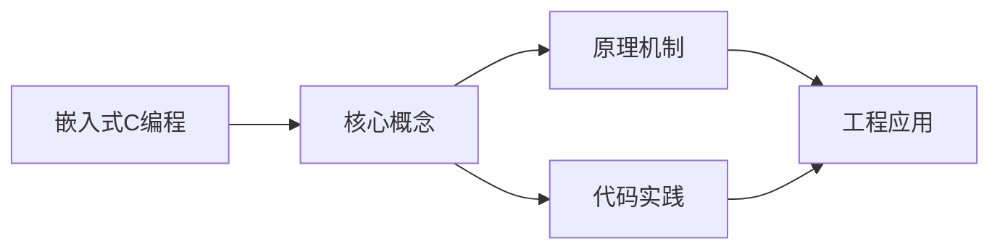
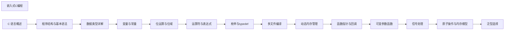

## 1. 学习目标（Bloom 分类）

本节按照布鲁姆教育目标分类学组织学习路径。本文主题为《嵌入式C编程》，属于 C 模块，读者可以根据自身阶段选择阅读深度。

记忆层面：能够准确复述本文的核心概念、术语与基本语法或操作步骤，并能够在提问或检索时快速定位对应知识点。能够说出 C 的变量、函数、指针、数组、结构体与预处理语法。

理解层面：能够用自己的语言解释核心原理与工作机制，说明概念之间的因果关系，而不是机械记忆结论。能够解释指针与内存地址、栈与堆、编译链接过程。

应用层面：能够在真实项目或练习场景中运用本文知识解决具体问题，写出正确且可维护的实现。能够编写系统工具、数据结构与嵌入式程序。

分析层面：能够拆解复杂问题，比较本文主题与相邻概念的异同，识别边界条件与例外情况。能够分析内存泄漏、缓冲区溢出与未定义行为。

评价层面：能够根据约束条件（性能、可读性、安全、成本）评价不同方案的优劣，做出有依据的技术决策。能够评价 C 与其他语言在系统编程中的取舍。

创造层面：能够把本文知识与其他模块知识组合，设计出新的解决方案或可复用的工程模式。能够设计可移植、可维护的 C 库与模块。

通过本节学习，读者应当能够把《嵌入式C编程》纳入自己的知识网络，并与 C 模块的其他主题（指针、内存管理、预处理器、标准库）建立关联。

## 2. 历史动机与发展脉络

《嵌入式C编程》是 C 领域的重要主题。要真正理解它，需要先了解它解决的问题与演进过程。

C 由 Dennis Ritchie 于 1972 年在贝尔实验室为 Unix 开发，是系统编程的基石语言：操作系统、编译器、嵌入式固件均以 C 为主。
C89（ANSI C）统一方言，C99 引入变长数组与 // 注释，C11 增加泛型选择与线程支持，C17 为缺陷修复版，C23（2024 年正式发布）引入 constexpr、属性、显式枚举底层类型等现代化特性。
C 的哲学是“信任程序员”：提供指针与内存操作的全部能力，同时把正确性责任交给开发者；这一设计成就了性能上限，也带来内存安全风险，催生了 Rust 等后继语言。

回到本文主题：嵌入式C编程 的提出与成熟，正是上述技术背景下的必然产物。早期实现往往以简单可用为目标，随着工程规模扩大，社区逐渐沉淀出标准做法与最佳实践；理解这一脉络，可以帮助读者判断“为什么文档中的推荐写法是现在这个样子”，也能在遇到历史遗留代码时准确识别其设计年代与取舍。


## 3. 形式化定义与核心概念精讲

本节把《嵌入式C编程》涉及的核心概念以“定义 + 讲解”的形式展开。读者应把定义当作工具，把讲解当作理解路径；两者结合才能形成可迁移的知识。

指针：指针保存变量地址，`&` 取地址、`*` 解引用；指针算术与数组名退化规则（数组名作为实参退化为首元素指针）是 C 的经典难点。
内存管理：栈内存自动释放，堆内存由 malloc/calloc/realloc/free 管理；所有权责任（谁分配谁释放）必须显式约定。
预处理器：#include/#define/#ifdef 在编译前文本处理；宏展开有副作用与优先级风险，函数式宏参数必须加括号。

### 3.1 原文章节逐一精讲

原文档把主题拆分为 14 个小节，下面按顺序给出每一节的导读讲解，随后保留原文细节供精读。

#### 原文精读（完整保留）


#### 概述

嵌入式 C 编程是面向资源受限硬件(微控制器 MCU、数字信号处理器 DSP、片上系统 SoC)的 C 语言开发实践。与桌面/服务器 C 编程相比,嵌入式 C 必须在 ROM、RAM、CPU 频率、功耗、实时性等多重约束下进行设计。1970 年代 Intel 8048、Motorola 6800 等早期微控制器诞生后,C 语言逐步取代汇编成为嵌入式开发主力,1988 年 ANSI C 标准化后,GCC、IAR、Keil 等嵌入式编译器相继出现。2008 年 ISO/IEC 发布 TR 18037《Embedded C》,为定点运算、硬件 IO、命名地址空间等提供标准化扩展。2018 年 MISRA C:2012 第三版发布,成为汽车、医疗、航空等安全关键领域事实标准。

本文从硬件架构、编译器扩展、内存布局、实时性、低功耗、安全关键代码等维度系统化阐述嵌入式 C 开发的关键工程实践。

#### 学习目标

##### 识记层(Remember)

- 列举典型嵌入式架构(ARM Cortex-M、AVR、RISC-V、MIPS、PIC、8051)的字长、对齐、字节序特征。
- 复述 ISO/IEC TR 18037 Embedded C 的三大扩展:定点类型、命名地址空间、硬件 IO。
- 说明 `volatile`、`register`、`static` 关键字在嵌入式编程中的具体语义。

##### 理解层(Understand)

- 解释 MCU 启动流程(reset vector、startup.s、链接脚本、C 运行时初始化)。
- 阐述内存映射 I/O(Memory-Mapped IO, MMIO)的硬件实现原理与 C 代码访问方式。
- 推导中断延迟(Interrupt Latency)的组成与最坏情况(Worst-Case Execution Time, WCET)计算方法。

##### 应用层(Apply)

- 编写裸机(bare-metal)C 程序点亮 LED、读取按键状态。
- 使用 CMSIS 或厂商 HAL 库配置 UART、SPI、I2C、ADC 等外设。
- 实现一个基于定时器中断的协作式任务调度器。

##### 分析层(Analyze)

- 对比裸机、RTOS(FreeRTOS、Zephyr、RT-Thread)、Linux 嵌入式系统的适用场景。
- 分析中断服务例程(ISR)与主循环竞争共享变量时的可重入性问题。
- 推导固定优先级抢占调度(Rate Monotonic Scheduling, RMS)的可调度性边界。

##### 评价层(Evaluate)

- 评估 MISRA C:2012 各规则类别(mandatory、required、advisory)的工程价值。
- 论证寄存器位域操作与掩码操作的取舍,在可移植性与可读性间的权衡。
- 评判多种实时调度算法(RMS、EDF、LLF)在不同负载下的性能表现。

##### 创造层(Create)

- 设计一个支持任务优先级、消息队列、信号量的轻量级 RTOS 内核。
- 构建一个具备 OTA(Over-The-Air)升级、看门狗监控、断电保护的嵌入式产品框架。
- 实现一套符合 ISO 26262 ASIL-D 安全等级的 C 代码静态检查与运行时检测流水线。

#### 历史动机与背景

##### 1. 嵌入式系统的诞生

1971 年 Intel 推出 4004 微处理器,标志着嵌入式计算的起点。最初嵌入式软件以汇编编写,直接操作硬件寄存器。1980 年代 8051 系列单片机普及,C 编译器逐步成熟,嵌入式 C 开始取代汇编。1990 年代 ARM 架构出现,32 位 RISC 处理器以其低功耗、高性能、统一架构的特点主导嵌入式市场。2000 年后,Cortex-M 系列进一步降低门槛,STM32、NXP LPC、TI Tiva 等芯片将 32 位 MCU 推向大众。

##### 2. 资源约束驱动的工程实践

嵌入式系统的核心约束:

1. **ROM/Flash 限制**:8 位 MCU 通常只有几 KB 到几十 KB Flash,32 位 MCU 通常为 64KB-2MB。代码体积优化至关重要。
2. **RAM 限制**:从几百字节到几 MB 不等,栈与堆管理需要精确规划。
3. **CPU 频率**:从 MHz 到 GHz 不等,部分场景需要逐指令优化。
4. **功耗**:电池供电设备对静态与动态功耗极其敏感。
5. **实时性**:工业控制、汽车电子要求确定性响应,微秒级延迟。
6. **可靠性**:医疗、汽车、航空领域要求高 MTBF,代码需符合功能安全标准。

##### 3. 嵌入式 C 标准化进程

- **ANSI C89/C90**:基础标准,嵌入式编译器普遍支持。
- **ISO/IEC TR 18037:2008**:Embedded C 扩展,引入 `_Fract`、`_Accum` 定点类型与 `__IO`、`__I`、`__O` 命名地址空间。
- **MISRA C:1998/2004/2012**:汽车工业软件可靠性行业标准,规则从 141 条扩展到 143 条。
- **CERT C**:CERT 安全编码标准,涵盖缓冲区溢出、整数溢出等安全漏洞。
- **Power of Ten**:NASA JPL 编码规范,要求函数不超过 60 行、所有指针强类型等。

##### 4. 现代嵌入式趋势

- **RISC-V 兴起**:开源指令集,在物联网与定制加速器领域逐步替代 ARM。
- **IoT 与边缘 AI**:MCU 上运行 TinyML、TensorFlow Lite Micro,实现本地语音、视觉识别。
- **混合架构**:多核 Cortex-A+Cortex-M 异构芯片,如 i.MX 8、Xilinx Zynq。
- **安全启动**:Secure Boot、TPM、TrustZone 等技术保障固件完整性。
- **Zephyr 与 FreeRTOS**:开源 RTOS 生态成熟,占据中端市场。

#### 形式化定义

##### 1. 嵌入式系统形式化模型

嵌入式系统 $S$ 可形式化为六元组:

$$
S = \langle M, P, IO, T, R, L \rangle
$$

其中:

- $M = (M_R, M_F, M_S)$ 是存储层次:RAM $M_R$、Flash $M_F$、栈 $M_S$。
- $P = (f, C, V)$ 是处理器参数:主频 $f$、缓存 $C$、电压 $V$。
- $IO = \{io_1, io_2, \dots, io_k\}$ 是外设集合,每个 $io_i = (addr_i, reg_i, irq_i)$。
- $T = \{t_1, t_2, \dots, t_n\}$ 是任务集合,每个 $t_i = (P_i, D_i, C_i, T_i)$ 表示优先级、截止期、执行时间、周期。
- $R = (R_{min}, R_{max})$ 是可靠性指标。
- $L = (P_{static}, P_{dynamic})$ 是功耗约束。

##### 2. 实时任务调度模型

任务 $t_i$ 可调度条件(RMS):

$$
\sum_{i=1}^{n} \frac{C_i}{T_i} \le n(2^{1/n} - 1)
$$

当 $n \to \infty$ 时,利用率上界为 $\ln 2 \approx 0.693$。最早截止期优先(EDF)的可调度条件更宽松:

$$
\sum_{i=1}^{n} \frac{C_i}{T_i} \le 1
$$

##### 3. 中断延迟模型

设中断源触发时刻 $t_0$,中断响应开始执行时刻 $t_1$,则中断延迟:

$$
L_{int} = t_1 - t_0 = L_{hw} + L_{isr\_entry} + L_{pipeline} + L_{critical\_section}
$$

- $L_{hw}$:硬件响应时间,通常 12-16 周期(Cortex-M)。
- $L_{isr\_entry}$:ISR 入口压栈时间。
- $L_{pipeline}$:流水线刷新时间。
- $L_{critical\_section}$:被屏蔽中断期间最坏情况下的等待时间。

最坏情况下中断延迟是嵌入式实时性分析的核心指标。

##### 4. 内存布局形式化

链接器将程序分为多个段,链接脚本控制段在地址空间的分布:

$$
\text{Image} = \text{.text} \oplus \text{.rodata} \oplus \text{.data} \oplus \text{.bss} \oplus \text{.heap} \oplus \text{.stack}
$$

- `.text`:代码段,位于 Flash。
- `.rodata`:只读数据,位于 Flash。
- `.data`:已初始化全局变量,加载时从 Flash 复制到 RAM。
- `.bss`:未初始化全局变量,启动时清零。
- `.heap`:堆区,可选。
- `.stack`:栈区,通常位于 RAM 高地址向下生长。

启动代码需完成 `.data` 复制与 `.bss` 清零,这是 C 运行时初始化(CRT)的核心工作。

##### 5. 功耗模型

CMOS 电路动态功耗:

$$
P_{dynamic} = \alpha \cdot C \cdot V^2 \cdot f
$$

其中 $\alpha$ 是翻转活动因子,$C$ 是负载电容,$V$ 是供电电压,$f$ 是时钟频率。静态功耗:

$$
P_{static} = I_{leak} \cdot V
$$

DVFS(Dynamic Voltage and Frequency Scaling)通过同时降低 $V$ 与 $f$ 实现立方级功耗下降,是嵌入式低功耗核心手段。

#### 理论推导

##### 1. WCET 分析方法

最坏情况执行时间(WCET)是嵌入式实时性分析的硬性指标。两种主要方法:

1. **静态分析**:构建控制流图(CFG),对每条路径计算最大执行周期。
2. **测量法**:在目标硬件上运行所有可能输入,记录最大执行时间。

静态分析上界 $WCET_{static}$,测量法下界 $WCET_{measured}$:

$$
WCET_{measured} \le WCET_{real} \le WCET_{static}
$$

安全关键系统必须使用静态分析保证上界。

##### 2. 栈空间需求分析

函数调用栈需求 $S(f)$:

$$
S(f) = S_{local}(f) + \max_{c \in \text{callees}(f)} S(c)
$$

递归调用导致栈需求不可静态确定,因此 MISRA C 禁止递归。考虑中断嵌套,总栈需求:

$$
S_{total} = S(main) + \sum_{i \in ISR_{nested}} S(isr_i)
$$

实际栈大小应预留 1.5-2 倍余量,避免栈溢出。

##### 3. 固定点运算精度

定点类型 $Q_{m.n}$(m 位整数,n 位小数)的表示范围与精度:

$$
\text{range} = [-2^{m-1}, 2^{m-1} - 2^{-n}], \quad \text{resolution} = 2^{-n}
$$

乘法运算 $a \times b$(均为 $Q_{m.n}$)结果为 $Q_{2m.2n}$,需要右移 $n$ 位回到 $Q_{m.n}$ 格式:

$$
c = (a \times b) \gg n
$$

定点运算的舍入误差累计分析是 DSP 算法实现的关键。

##### 4. 缓存对实时性的影响

带缓存的 CPU(如 Cortex-M7)引入了执行时间不确定性。设缓存命中率 $h$,缺失代价 $M$,平均访问时间:

$$
T_{avg} = h \cdot T_{hit} + (1-h) \cdot M
$$

但 WCET 应假设最坏情况:全部缺失。因此安全关键系统常禁用缓存或使用锁定机制(lockdown),将关键代码固定在缓存中。

##### 5. 任务响应时间分析

固定优先级抢占调度下,任务 $t_i$ 的最坏响应时间 $R_i$ 满足:

$$
R_i = C_i + \sum_{j \in hp(i)} \left\lceil \frac{R_i}{T_j} \right\rceil C_j
$$

其中 $hp(i)$ 是优先级高于 $t_i$ 的任务集合。等式两边 $R_i$ 出现在两边,需迭代求解。若 $R_i \le D_i$ 则可调度。

#### 代码示例

##### 示例 1:寄存器访问的标准化封装

```c
/* 文件: reg_access.h
 * 嵌入式寄存器访问的标准封装
 * 兼容 ARM Cortex-M 与 RISC-V
 */
#ifndef REG_ACCESS_H
#define REG_ACCESS_H

#include <stdint.h>

/* 寄存器基址类型:volatile 防止编译器优化 */
typedef volatile uint32_t reg32_t;
typedef volatile uint16_t reg16_t;
typedef volatile uint8_t  reg8_t;

/* 寄存器读:确保编译器生成真实 load 指令 */
static inline uint32_t reg_read(reg32_t *reg) {
    return *reg;
}

/* 寄存器写:确保编译器生成真实 store 指令 */
static inline void reg_write(reg32_t *reg, uint32_t val) {
    *reg = val;
}

/* 位设置:原子操作,避免读-改-写竞态 */
static inline void reg_set_bits(reg32_t *reg, uint32_t mask) {
    *reg |= mask;
}

/* 位清除:原子操作 */
static inline void reg_clear_bits(reg32_t *reg, uint32_t mask) {
    *reg &= ~mask;
}

/* 位翻转 */
static inline void reg_toggle_bits(reg32_t *reg, uint32_t mask) {
    *reg ^= mask;
}

/* 等待某位为 1,带超时(单位:循环数)
 * 返回 0 表示成功,非 0 表示超时
 */
static inline int reg_wait_set(reg32_t *reg, uint32_t mask, uint32_t timeout) {
    while (timeout-- > 0) {
        if (*reg & mask) return 0;
    }
    return -1;
}

#endif /* REG_ACCESS_H */
```

##### 示例 2:Cortex-M 启动文件(startup.c)

```c
/* 文件: startup.c
 * Cortex-M3/M4 启动代码
 * 完成向量表、堆栈、C 运行时初始化
 */
#include <stdint.h>

/* 链接脚本提供的符号 */
extern uint32_t _estack;        /* 栈顶地址,由链接脚本定义 */
extern uint32_t _sidata;        /* .data 在 Flash 中的加载地址 */
extern uint32_t _sdata;         /* .data 在 RAM 中的运行地址 */
extern uint32_t _edata;         /* .data 结束地址 */
extern uint32_t _sbss;          /* .bss 起始地址 */
extern uint32_t _ebss;          /* .bss 结束地址 */

/* 外部声明 */
extern int main(void);
extern void SystemInit(void);

/* 默认中断处理函数 */
void Default_Handler(void) {
    while (1) {
        /* 死循环,实际产品应记录错误并复位 */
    }
}

/* 弱别名:允许应用层覆盖 */
void NMI_Handler(void) __attribute__((weak, alias("Default_Handler")));
void HardFault_Handler(void) __attribute__((weak, alias("Default_Handler")));
void SVC_Handler(void) __attribute__((weak, alias("Default_Handler")));
void PendSV_Handler(void) __attribute__((weak, alias("Default_Handler")));
void SysTick_Handler(void) __attribute__((weak, alias("Default_Handler")));

/* 向量表:必须放在 .isr_vector 段,链接脚本将段起始设为 0x0 */
__attribute__((section(".isr_vector"), used))
void (* const g_pfnVectors[])(void) = {
    (void (*)(void))(&_estack),  /* 初始栈指针 */
    Reset_Handler,                /* 复位向量 */
    NMI_Handler,
    HardFault_Handler,
    /* ... 其他中断向量 */
    SysTick_Handler,
};

/* 复位处理函数:这是 CPU 上电后第一个执行的 C 函数 */
void Reset_Handler(void) {
    /* 1. 系统初始化:配置时钟、Flash 等待周期等 */
    SystemInit();

    /* 2. 将 .data 段从 Flash 复制到 RAM */
    uint32_t *src = &_sidata;
    uint32_t *dst = &_sdata;
    while (dst < &_edata) {
        *dst++ = *src++;
    }

    /* 3. 清零 .bss 段 */
    dst = &_sbss;
    while (dst < &_ebss) {
        *dst++ = 0;
    }

    /* 4. 调用 main 函数 */
    (void)main();

    /* 5. main 返回不应发生,进入死循环 */
    while (1) {
    }
}
```

##### 示例 3:GPIO 操作点亮 LED

```c
/* 文件: led_blink.c
 * STM32F4 点亮 LED 示例(基于 CMSIS)
 */
#include "stm32f4xx.h"

/* LED 引脚定义:PA5(STM32F4 Discovery 板载绿色 LED) */
#define LED_PIN     5U
#define LED_PORT    GPIOA

/* 简单延时:不精确,仅用于演示
 * 实际产品应使用 SysTick 或硬件定时器
 */
static void delay_ms(uint32_t ms) {
    /* 假设 CPU 主频 168MHz,每条循环约 4 个周期 */
    uint32_t cycles = ms * (168000000U / 4000U);
    while (cycles--) {
        __asm volatile("nop");
    }
}

int main(void) {
    /* 1. 使能 GPIOA 时钟:RCC AHB1ENR bit 0 */
    RCC->AHB1ENR |= RCC_AHB1ENR_GPIOAEN;

    /* 2. 配置 PA5 为输出模式:MODER = 01 */
    LED_PORT->MODER &= ~(3U << (LED_PIN * 2));
    LED_PORT->MODER |= (1U << (LED_PIN * 2));

    /* 3. 配置输出类型:推挽 */
    LED_PORT->OTYPER &= ~(1U << LED_PIN);

    /* 4. 配置速度:中速 */
    LED_PORT->OSPEEDR &= ~(3U << (LED_PIN * 2));
    LED_PORT->OSPEEDR |= (2U << (LED_PIN * 2));

    /* 5. 配置上下拉:无 */
    LED_PORT->PUPDR &= ~(3U << (LED_PIN * 2));

    /* 主循环:LED 闪烁 */
    while (1) {
        /* 输出高:BSRR 是原子置位/复位寄存器 */
        LED_PORT->BSRR = (1U << LED_PIN);
        delay_ms(500);

        /* 输出低:BSRR 高 16 位对应复位 */
        LED_PORT->BSRR = (1U << (LED_PIN + 16));
        delay_ms(500);
    }

    return 0;
}
```

##### 示例 4:UART 驱动

```c
/* 文件: uart.c
 * STM32F4 UART2 驱动,支持中断接收与轮询发送
 */
#include "stm32f4xx.h"
#include <string.h>

#define UART_RX_BUF_SIZE 64

/* 环形缓冲区:解决生产者-消费者竞态 */
static volatile uint8_t  g_rx_buf[UART_RX_BUF_SIZE];
static volatile uint16_t g_rx_head;
static volatile uint16_t g_rx_tail;

void UART2_Init(uint32_t baudrate) {
    /* 1. 使能 GPIOA 与 USART2 时钟 */
    RCC->AHB1ENR |= RCC_AHB1ENR_GPIOAEN;
    RCC->APB1ENR |= RCC_APB1ENR_USART2EN;

    /* 2. 配置 PA2(TX)、PA3(RX) 为复用功能 */
    GPIOA->MODER &= ~((3U << (2 * 2)) | (3U << (3 * 2)));
    GPIOA->MODER |=  ((2U << (2 * 2)) | (2U << (3 * 2)));

    /* 3. 配置复用功能号 AF7(USART1/2/3) */
    GPIOA->AFR[0] &= ~((0xFU << (2 * 4)) | (0xFU << (3 * 4)));
    GPIOA->AFR[0] |=  ((7U   << (2 * 4)) | (7U   << (3 * 4)));

    /* 4. 配置波特率:假设 APB1 时钟 42MHz */
    USART2->BRR = (42000000U + baudrate / 2U) / baudrate;

    /* 5. 使能接收中断、接收器、发送器、UART */
    USART2->CR1 = USART_CR1_RXNEIE | USART_CR1_RE | USART_CR1_TE | USART_CR1_UE;

    /* 6. NVIC 配置 USART2 中断优先级 */
    NVIC_SetPriority(USART2_IRQn, 5);
    NVIC_EnableIRQ(USART2_IRQn);
}

/* 轮询发送一个字节 */
void UART2_SendByte(uint8_t b) {
    while (!(USART2->SR & USART_SR_TXE)) {
        /* 等待发送数据寄存器空 */
    }
    USART2->DR = b;
}

/* 轮询发送字符串 */
void UART2_SendString(const char *s) {
    while (*s) {
        UART2_SendByte((uint8_t)*s++);
    }
}

/* 从环形缓冲区读取一个字节,返回 -1 表示无数据 */
int16_t UART2_ReadByte(void) {
    if (g_rx_head == g_rx_tail) {
        return -1;
    }
    uint8_t b = g_rx_buf[g_rx_tail];
    g_rx_tail = (g_rx_tail + 1U) % UART_RX_BUF_SIZE;
    return b;
}

/* USART2 中断服务函数 */
void USART2_IRQHandler(void) {
    if (USART2->SR & USART_SR_RXNE) {
        /* 读取 DR 同时清除 RXNE 标志 */
        uint8_t b = (uint8_t)USART2->DR;
        uint16_t next = (g_rx_head + 1U) % UART_RX_BUF_SIZE;
        if (next != g_rx_tail) {
            /* 缓冲区未满,写入 */
            g_rx_buf[g_rx_head] = b;
            g_rx_head = next;
        }
        /* 满则丢弃,实际产品应记录错误 */
    }
}
```

##### 示例 5:协作式任务调度器

```c
/* 文件: scheduler.c
 * 简单协作式任务调度器,基于 SysTick
 * 适用于无 RTOS 的轻量级任务调度
 */
#include <stdint.h>
#include <stdbool.h>

#define MAX_TASKS 8

typedef void (*task_fn)(void);

typedef struct {
    task_fn   fn;        /* 任务函数 */
    uint32_t  period;    /* 执行周期(ms) */
    uint32_t  counter;   /* 计数器 */
    bool      enabled;   /* 是否启用 */
} task_t;

static task_t g_tasks[MAX_TASKS];
static volatile uint32_t g_tick;

/* 注册任务:返回任务 ID,-1 表示失败 */
int scheduler_add(task_fn fn, uint32_t period) {
    for (int i = 0; i < MAX_TASKS; i++) {
        if (!g_tasks[i].fn) {
            g_tasks[i].fn      = fn;
            g_tasks[i].period   = period;
            g_tasks[i].counter  = 0;
            g_tasks[i].enabled  = true;
            return i;
        }
    }
    return -1;
}

/* 调度器主循环:在 main 中调用 */
void scheduler_run(void) {
    while (1) {
        uint32_t tick = g_tick;
        for (int i = 0; i < MAX_TASKS; i++) {
            if (!g_tasks[i].fn || !g_tasks[i].enabled) continue;
            /* 周期到达,执行任务 */
            if (tick - g_tasks[i].counter >= g_tasks[i].period) {
                g_tasks[i].counter = tick;
                g_tasks[i].fn();
            }
        }
        /* 进入低功耗模式,等待下一个中断唤醒 */
        __asm volatile("wfi");
    }
}

/* SysTick 中断:1ms 触发一次 */
void SysTick_Handler(void) {
    g_tick++;
}
```

##### 示例 6:DMA 双缓冲接收

```c
/* 文件: dma_double_buffer.c
 * STM32 DMA 双缓冲接收 ADC 数据
 * 适用于实时数据采集场景
 */
#include "stm32f4xx.h"
#include <string.h>

#define ADC_BUF_SIZE 256
#define ADC_BUF_COUNT 2

/* 双缓冲:DMA 与 CPU 交替访问不同缓冲区 */
static volatile uint16_t g_adc_buf[ADC_BUF_COUNT][ADC_BUF_SIZE];
static volatile uint8_t  g_active_buf;     /* DMA 当前写入的缓冲区 */
static volatile bool     g_data_ready;     /* 数据就绪标志 */

void ADC_DMA_Init(void) {
    /* 1. 使能 ADC1 与 DMA2 时钟 */
    RCC->APB2ENR |= RCC_APB2ENR_ADC1EN;
    RCC->AHB1ENR |= RCC_AHB1ENR_DMA2EN;

    /* 2. 配置 ADC1 通道 0,连续转换模式 */
    ADC1->CR2 = ADC_CR2_ADON | ADC_CR2_CONT | ADC_CR2_DMA | ADC_CR2_DDS;
    ADC1->SQR3 = 0;  /* 通道 0 */
    ADC1->CR1 = ADC_CR1_SCAN;

    /* 3. 配置 DMA2 Stream0 Channel 0(ADC1) */
    DMA2_Stream0->CR = 0;
    DMA2_Stream0->PAR = (uint32_t)&ADC1->DR;
    DMA2_Stream0->M0AR = (uint32_t)g_adc_buf[0];
    DMA2_Stream0->M1AR = (uint32_t)g_adc_buf[1];
    DMA2_Stream0->NDTR = ADC_BUF_SIZE;
    /* 双缓冲模式、循环模式、16 位、内存递增 */
    DMA2_Stream0->CR = DMA_SxCR_DBM | DMA_SxCR_CIRC |
                       DMA_SxCR_MINC | DMA_SxCR_PSIZE_0 |
                       DMA_SxCR_MSIZE_0 | DMA_SxCR_TCIE |
                       DMA_SxCR_EN;
    /* DMA 中断优先级 */
    NVIC_SetPriority(DMA2_Stream0_IRQn, 5);
    NVIC_EnableIRQ(DMA2_Stream0_IRQn);

    /* 4. 启动 ADC 转换 */
    ADC1->CR2 |= ADC_CR2_SWSTART;

    g_active_buf = 0;
    g_data_ready = false;
}

/* DMA2 Stream0 中断:缓冲区切换时触发 */
void DMA2_Stream0_IRQHandler(void) {
    if (DMA2->LISR & DMA_LISR_TCIF0) {
        /* 清除传输完成标志 */
        DMA2->LIFCR = DMA_LIFCR_CTCIF0;
        /* 当前活动缓冲区已满,标记数据就绪 */
        g_data_ready = true;
        /* 切换活动缓冲区索引 */
        g_active_buf = (DMA2_Stream0->CR & DMA_SxCR_CT) ? 1 : 0;
    }
}

/* 主循环中处理就绪数据 */
void process_adc_data(void) {
    if (g_data_ready) {
        /* 处理非活动缓冲区的数据(此时 DMA 在写另一个缓冲区) */
        uint8_t proc_buf = 1 - g_active_buf;
        for (int i = 0; i < ADC_BUF_SIZE; i++) {
            /* 处理 g_adc_buf[proc_buf][i] */
        }
        g_data_ready = false;
    }
}
```

#### 对比分析

##### 1. 裸机 vs RTOS vs Linux 对比

| 维度 | 裸机 | RTOS | Embedded Linux |
|---|---|---|---|
| RAM 占用 | < 1KB | 4KB-32KB | > 16MB |
| Flash 占用 | < 16KB | 32KB-256KB | > 16MB |
| 启动时间 | < 100ms | < 500ms | 1-10s |
| 实时性 | 微秒级 | 微秒级 | 毫秒级 |
| 多任务 | 协作式 | 抢占式 | 完全抢占 |
| 网络栈 | 无 | 可选 lwIP | 完整 |
| 文件系统 | 无 | LittleFS/FatFS | ext4/yaffs |
| 开发复杂度 | 低 | 中 | 高 |
| 典型芯片 | 8051/AVR | STM32/ESP32 | i.MX 8/Raspberry Pi |

##### 2. 中断处理方案对比

| 方案 | 优点 | 缺点 | 适用场景 |
|---|---|---|---|
| ISR 中完成全部工作 | 响应快 | 阻塞其他中断 | 极短任务 |
| ISR + 主循环 | 简单 | 响应延迟大 | 简单应用 |
| ISR + RTOS 信号量 | 实时性好 | 需 RTOS | 中端应用 |
| ISR + Linux tasklet | 灵活 | 延迟大 | 高端应用 |
| 中断线程化(kernel thread) | 可重入、可调试 | 调度延迟 | Linux 实时扩展 |

##### 3. 常见 RTOS 横向对比

| RTOS | 开源协议 | 内核大小 | 实时性 | 生态 | 典型场景 |
|---|---|---|---|---|---|
| FreeRTOS | MIT | 4-10KB | 硬实时 | 丰富 | 通用 MCU |
| Zephyr | Apache 2.0 | 50KB+ | 硬实时 | 快速发展 | IoT |
| RT-Thread | Apache 2.0 | 3KB+ | 硬实时 | 中国生态 | 国内 IoT |
| ThreadX | MIT | 2-10KB | 硬实时 | 微软支持 | 高端 MCU |
| VxWorks | 商业 | N/A | 硬实时 | 工业级 | 航空、军工 |
| QNX | 商业 | N/A | 硬实时 | 汽车 | 安全关键 |

##### 4. 静态分析工具对比

| 工具 | 厂商 | 标准支持 | 价格 | 优点 | 缺点 |
|---|---|---|---|---|---|
| PC-lint Plus | Gimpel | MISRA C 2012 | 商业 | 历史悠久,规则丰富 | 误报较多 |
| Coverity | Synopsys | MISRA, CERT | 商业 | 准确率高 | 价格高 |
| Polyspace | MathWorks | MISRA, ISO 26262 | 商业 | 抽象解释,零误报 | 慢 |
| cppcheck | 开源 | 部分 MISRA | 免费 | 集成方便 | 漏报较多 |
| Clang-Tidy | LLVM | 部分 MISRA | 免费 | 现代、可扩展 | 配置复杂 |

#### 常见陷阱与反模式

##### 1. 未使用 volatile 修饰硬件寄存器

**事故案例**:2010 年某汽车 ECU 在 O2 优化级别下读取 ADC 寄存器时被编译器缓存,导致控制延迟。

**反模式**:

```c
uint32_t *adc_reg = (uint32_t *)0x40012000;
while (!(*adc_reg & 0x80));  /* 编译器可能优化为单次读取 */
```

**正确做法**:

```c
volatile uint32_t *adc_reg = (volatile uint32_t *)0x40012000;
while (!(*adc_reg & 0x80));
```

##### 2. 整数溢出导致定时器配置错误

**事故案例**:某定时器配置 `24MHz / 1000 = 24000`,但表达式 `24 * 1000 * 1000 / 1000` 在 16 位 int 下溢出。

**正确做法**:使用 `U`/`UL` 后缀,确保字面量在足够宽的类型中计算。

```c
uint32_t period = 24U * 1000U * 1000U / 1000U;  /* 正确 */
```

##### 3. 中断服务函数中调用非可重入函数

**事故案例**:ISR 中调用 `printf`,后者使用全局缓冲,与主循环 `printf` 竞争,导致输出乱码。

**反模式**:

```c
void USART2_IRQHandler(void) {
    printf("got byte: %c\n", USART2->DR);  /* printf 非可重入 */
}
```

**正确做法**:ISR 中仅写入环形缓冲区,主循环统一处理。必须使用 `printf` 时,改用支持可重入的自实现版本。

##### 4. 共享变量未保护

**事故案例**:主循环读取 32 位计数器时,被 32 位 MCU 上 16 位访问的中断打断,导致读到半旧半新值。

**反模式**(在 8/16 位 MCU 上):

```c
volatile uint32_t g_counter;

void ISR(void) { g_counter++; }

uint32_t read_counter(void) {
    return g_counter;  /* 16 位 MCU 上非原子 */
}
```

**正确做法**:读取时临时关闭中断。

```c
uint32_t read_counter(void) {
    uint32_t val;
    __disable_irq();
    val = g_counter;
    __enable_irq();
    return val;
}
```

##### 5. 栈溢出

**事故案例**:某嵌入式项目使用递归解析 JSON,在 4KB 栈空间下深层嵌套数据时栈溢出,触发 HardFault。

**正确做法**:

- 禁用递归(MISRA C 规则 17.2)。
- 链接脚本中预留充足栈空间(通常 1-8KB)。
- 启用 MPU 进行栈溢出检测。
- 使用 `--print-stack-usage` 编译选项分析各函数栈需求。

##### 6. 浮点运算误用

**事故案例**:Cortex-M0(无 FPU)上使用 float 进行 PID 计算,触发软中断异常,响应延迟剧增。

**正确做法**:

- 在无 FPU 的 MCU 上使用定点运算。
- 必须使用浮点时,确保 FPU 已启用(Cortex-M4F/M7)。
- 浮点上下文切换开销大,ISR 中慎用。

##### 7. 误用 malloc

**事故案例**:嵌入式系统启动后多次调用 `malloc`/`free`,堆碎片导致后续分配失败。

**正确做法**:

- 禁用动态内存(MISRA C 规则 21.3)。
- 使用固定块内存池。
- 必须动态分配时,启动时一次性分配,运行时不再 free。

##### 8. 位字段的可移植性问题

**反模式**:

```c
struct flags {
    uint8_t a : 3;
    uint8_t b : 5;
};
```

位字段在内存中的排列顺序由实现定义,跨平台代码不应依赖。

**正确做法**:使用显式掩码操作。

```c
#define FLAG_A_MASK 0x07
#define FLAG_B_MASK 0xF8
#define FLAG_A_SHIFT 0
#define FLAG_B_SHIFT 3

uint8_t flags = 0;
flags |= (a_val & FLAG_A_MASK) << FLAG_A_SHIFT;
flags |= (b_val & 0x1F) << FLAG_B_SHIFT;
```

#### 工程实践

##### 1. 链接脚本设计

```ld
/* 文件: link.ld
 * STM32F407 链接脚本
 * RAM: 192KB(0x20000000-0x2002FFFF)
 * Flash: 1MB(0x08000000-0x080FFFFF)
 */
ENTRY(Reset_Handler)

MEMORY
{
    FLASH (rx)  : ORIGIN = 0x08000000, LENGTH = 1024K
    RAM   (rwx) : ORIGIN = 0x20000000, LENGTH = 192K
}

_estack = ORIGIN(RAM) + LENGTH(RAM);

SECTIONS
{
    .isr_vector : {
        KEEP(*(.isr_vector))
    } > FLASH

    .text : {
        *(.text)
        *(.text*)
        *(.rodata)
        *(.rodata*)
        KEEP(*(.init))
        KEEP(*(.fini))
        . = ALIGN(4);
        _etext = .;
    } > FLASH

    .data : {
        . = ALIGN(4);
        _sdata = .;
        *(.data)
        *(.data*)
        . = ALIGN(4);
        _edata = .;
    } > RAM AT > FLASH

    _sidata = LOADADDR(.data);

    .bss : {
        . = ALIGN(4);
        _sbss = .;
        *(.bss)
        *(.bss*)
        *(COMMON)
        . = ALIGN(4);
        _ebss = .;
    } > RAM

    .heap : {
        . = ALIGN(8);
        _sheap = .;
        . = . + 8K;
        _eheap = .;
    } > RAM

    .stack : {
        . = ALIGN(8);
        _sstack = .;
        . = ORIGIN(RAM) + LENGTH(RAM);
        _estack = .;
    } > RAM

    /DISCARD/ : {
        *(.ARM.exidx*)
        *(.ARM.extab*)
    }
}
```

##### 2. 实时性优化要点

1. **关键路径放快速 RAM**:Cortex-M7 的 ITCM/DTCM 可提供单周期访问。
2. **DMA 替代 CPU 搬运**:UART、SPI、ADC 等高频外设必须使用 DMA。
3. **双缓冲(DMA Buffer)避免数据丢失**:`DMA_SxCR_DBM` 让 DMA 与 CPU 交替访问不同缓冲区。
4. **中断优先级分组**:NVIC 优先级分组将抢占优先级与子优先级分开,合理配置避免中断嵌套过深。
5. **临界区最小化**:关闭中断的代码段应尽量短,避免影响实时性。
6. **使用 bitband**(Cortex-M3/M4):位带区可实现单条指令的原子位操作。

##### 3. 低功耗设计

```c
/* 文件: low_power.c
 * STM32 低功耗模式示例
 */
#include "stm32f4xx.h"

/* 进入 Sleep 模式:CPU 暂停,外设运行,任意中断唤醒 */
void enter_sleep(void) {
    /* SLEEPDEEP = 0, SLEEPONEXIT = 0 */
    SCB->SCR &= ~SCB_SCR_SLEEPDEEP_Msk;
    __asm volatile("wfi");
}

/* 进入 Stop 模式:所有时钟停止,SRAM 保持,功耗约 100uA */
void enter_stop(void) {
    /* 进入 Stop 前关闭外设,降低功耗 */
    RCC->APB1ENR &= ~(RCC_APB1ENR_USART2EN | RCC_APB1ENR_TIM2EN);

    /* SLEEPDEEP = 1, PDDS = 0(Stop 模式) */
    SCB->SCR |= SCB_SCR_SLEEPDEEP_Msk;
    PWR->CR &= ~PWR_CR_PDDS;
    PWR->CR |= PWR_CR_LPDS;  /* 调压器低功耗 */

    __asm volatile("wfi");

    /* 唤醒后恢复时钟 */
    SystemClock_Config();
    RCC->APB1ENR |= RCC_APB1ENR_USART2EN | RCC_APB1ENR_TIM2EN;
}

/* 进入 Standby 模式:SRAM 内容丢失,功耗约 2uA */
void enter_standby(void) {
    /* PDDS = 1,深度睡眠 */
    PWR->CR |= PWR_CR_PDDS;
    SCB->SCR |= SCB_SCR_SLEEPDEEP_Msk;

    /* 使能 WKUP 引脚唤醒 */
    PWR->CSR |= PWR_CSR_EWUP1;

    __asm volatile("wfi");

    /* 唤醒后等同于复位,从头执行 */
}
```

##### 4. 看门狗设计

```c
/* 文件: watchdog.c
 * 独立看门狗(IWDG)使用
 */
#include "stm32f4xx.h"

void IWDG_Init(uint32_t timeout_ms) {
    /* LSI 时钟约 32kHz,分频器 256,1 计数 = 8ms */
    uint32_t prescaler = IWDG_PR_PR_3;  /* /256 */
    uint32_t reload = (timeout_ms * 32U / 256U);

    /* 启用 IWDG,启用 LSI */
    IWDG->KR = 0xCCCC;
    /* 启用寄存器访问 */
    IWDG->KR = 0x5555;
    IWDG->PR = prescaler;
    IWDG->RLR = reload & 0xFFF;
    /* 等待 PVU 与 RVU 标志清零 */
    while (IWDG->SR & (IWDG_SR_PVU | IWDG_SR_RVU));
    /* 喂狗 */
    IWDG->KR = 0xAAAA;
}

void IWDG_Refresh(void) {
    IWDG->KR = 0xAAAA;
}
```

##### 5. MISRA C 合规检查清单

| 规则类别 | 关键规则 | 实施要点 |
|---|---|---|
| 强制类 | 规则 8.4:外部符号必须有 compatible declaration | 头文件统一声明 |
| 强制类 | 规则 17.3:函数不得递归调用 | 静态分析工具检查 |
| 强制类 | 规则 21.13:ctype.h 函数参数必须为 EOF 或 unsigned char 范围 | 类型显式转换 |
| 必需类 | 规则 8.7:文件作用域对象声明应 static | 减少外部符号 |
| 必需类 | 规则 10.1:操作数类型应明确 | 使用 `<stdint.h>` 类型 |
| 必需类 | 规则 11.5:指针到不同类型指针的转换应显式 | 谨慎使用强制转换 |
| 建议类 | 规则 8.7:函数应具有静态链接 | 内部函数加 static |
| 建议类 | 规则 15.5:函数应单出口 | 使用 goto 集中清理 |

#### 案例研究

##### 案例 1:特斯拉 Autopilot MCU 架构

特斯拉 HW3.0 自动驾驶域控制器采用双 FSD 芯片冗余架构:

- 每颗 FSD 内置 12 个 ARM Cortex-A72 与 Cortex-R5 协处理器。
- Cortex-R5 运行 RTOS 处理实时任务(刹车、转向)。
- Cortex-A72 运行 Linux 处理神经网络推理。
- 双 SoC 互为热备,实时校验输出。
- 符合 ISO 26262 ASIL-B 等级。

该架构展示了嵌入式系统在功能安全与算力间的平衡设计。

##### 案例 2:大疆无人机飞控

大疆飞控系统采用三层架构:

1. **底层**:Cortex-M4 处理 IMU 读取、电机 PWM 输出,1kHz 控制循环。
2. **中层**:Cortex-M7 处理姿态解算、GPS 融合、避障算法。
3. **高层**:Linux SoC 处理图像识别、路径规划。

层间通过共享内存与中断通信,实时性由底层保证,功能由高层实现。

##### 案例 3:汽车 OBD-II 诊断

OBD-II 协议要求 ECU 在 50ms 内响应诊断请求:

- ISO 15765-4(CAN)规定物理层、数据链路层。
- ISO 14229(UDS)规定应用层服务。
- 实现:CAN 中断接收 → 任务队列 → UDS 服务处理 → CAN 发送。
- 关键:整个链路 WCET 必须小于 50ms,需静态分析与测量结合。

##### 案例 4:医疗设备 IEC 62304 合规

某胰岛素泵遵循 IEC 62304 Class C(致命伤害可能):

- 单元测试覆盖率 ≥ 100%(语句),≥ 80%(分支)。
- 静态分析零误报(MISRA C 强制类规则全部通过)。
- 风险分析:FMEA、FTA、HAZOP。
- 软件单元要求:每个函数不超过 60 行(Power of Ten)。
- 异常处理:每条故障路径都有明确恢复策略。

#### 知识讲解与要点分析（原习题）

##### 基础题

**题 1**:`volatile` 关键字在嵌入式 C 中有哪些典型用途?

**参考答案**:

1. 修饰硬件寄存器指针,防止编译器缓存。
2. 修饰中断与主循环共享的全局变量,确保每次读取从内存加载。
3. 修饰信号处理函数中修改的变量。
4. 修饰 `setjmp`/`longjmp` 跨函数的局部变量。

**题 2**:为什么嵌入式代码通常禁止递归?

**参考答案**:

1. 栈空间有限(几 KB 到几十 KB),递归深度不可预测,易溢出。
2. 递归执行时间不可静态分析,违反实时性要求。
3. MISRA C 规则 17.2、17.3、17.4 强制禁止递归。
4. 递归调试困难,栈跟踪不清晰。

**题 3**:嵌入式系统中,`.data` 段为什么需要从 Flash 复制到 RAM?

**参考答案**:已初始化的全局变量在 RAM 中运行(可读可写),但 RAM 在断电后内容丢失,因此初始化值必须存储在非易失的 Flash 中。启动代码将这些值从 Flash 复制到 RAM 的 `.data` 段,使程序运行时能正确访问已初始化的全局变量。

##### 进阶题

**题 4**:实现一个支持任务调度与消息队列的极简 RTOS 内核,要求:

- 最多 8 个任务,优先级抢占调度。
- 支持信号量与消息队列。
- 上下文切换通过 PendSV 实现。

**参考答案要点**:

- 使用 Cortex-M 的 PendSV 异常作为上下文切换点,优先级最低。
- 任务栈预分配,首次切换时初始化栈帧为任务入口函数。
- 信号量通过原子操作与阻塞队列实现。
- 消息队列使用环形缓冲区与等待队列。

**题 5**:分析以下代码在 ARM Cortex-M3 上的中断安全性:

```c
volatile uint32_t g_count;

void ISR(void) { g_count++; }

uint32_t get_count(void) { return g_count; }
```

**参考答案**:在 32 位 Cortex-M3 上,32 位对齐的 `uint32_t` 读写是原子的,因此代码本身是安全的。但在 16 位 MCU(如 MSP430)上,32 位读写分为两次 16 位操作,可能被中断打断,需要 `__disable_irq()`/`__enable_irq()` 保护。

##### 挑战题

**题 6**:设计一个符合 ISO 26262 ASIL-D 的电机控制软件架构,要求:

- 双核 Lockstep 架构,主从核执行相同代码,实时对比输出。
- 看门狗监测 CPU 健康状态。
- 关键变量使用 ECC RAM。
- 故障检测覆盖率 ≥ 99%。

**参考答案要点**:

- 双核 Lockstep:Cortex-R5 等支持硬件 Lockstep,延迟检测 ≤ 1 周期。
- 软件冗余:关键算法独立实现两遍,结果比较。
- 看门狗窗口:必须在窗口期喂狗,过早或过晚都触发复位。
- ECC RAM:硬件纠错,单 bit 错误自动纠正,双 bit 错误触发 NMI。
- 端到端安全:E2E 保护库(CRC、序号、alive counter)。

**题 7**:分析 RISC-V 在嵌入式领域相对 ARM 的优劣势,并预测未来 5 年趋势。

**参考答案要点**:

- **优势**:开源指令集免授权费,可定制扩展指令,模块化设计。
- **劣势**:生态成熟度不及 ARM,工具链支持参差,浮点与 DSP 扩展标准不统一。
- **趋势**:IoT 与定制 AI 加速器领域 RISC-V 渐成主流;汽车领域逐步渗透;高性能计算领域仍在追赶 ARM。

#### 参考文献

[1] Barr, M. 2006. Programming Embedded Systems in C and C++, 2nd edition. O'Reilly Media. ISBN 978-0-596-00983-0.

[2] Yiu, J. 2013. The Definitive Guide to ARM Cortex-M3 and Cortex-M4 Processors, 3rd edition. Newnes. ISBN 978-0-12-408082-9.

[3] ISO/IEC. 2008. TR 18037:2008 - Programming languages - C - Extensions to support embedded processors. ISO. https://www.iso.org/standard/51126.html

[4] MISRA. 2019. MISRA C:2012 Amendment 3. MISRA. ISBN 978-1-906400-11-9.

[5] ISO. 2018. ISO 26262:2018 - Road vehicles - Functional safety. ISO. https://www.iso.org/standard/68383.html

[6] IEC. 2006. IEC 62304:2006 - Medical device software - Software life cycle processes. IEC. https://www.iec.ch/standards/iec_62304

[7] Liu, C. L. and Layland, J. W. 1973. Scheduling algorithms for multiprogramming in a hard-real-time environment. Journal of the ACM 20, 1 (January 1973), 46-61. DOI: https://doi.org/10.1145/321738.321743

[8] Wilhelm, R. et al. 2008. The worst-case execution-time problem - overview of methods and survey of tools. ACM Transactions on Embedded Computing Systems 7, 3 (April 2008), 1-53. DOI: https://doi.org/10.1145/1347375.1347389

[9] ARM Limited. 2024. ARM Cortex-M Programming Guide to Memory Barrier Instructions. ARM DEN0024A. https://developer.arm.com/documentation/den0024

[10] Patterson, D. A. and Hennessy, J. L. 2020. Computer Organization and Design RISC-V Edition, 2nd edition. Morgan Kaufmann. ISBN 978-0-12-820331-6.

#### 延伸阅读

##### 官方文档

- ARM Cortex-M 技术参考手册: https://developer.arm.com/products/architecture/cpu/docs
- RISC-V 规范: https://riscv.org/technical/specifications/
- STMicroelectronics STM32 参考手册: https://www.st.com/resource/en/reference_manual/dm00031020-stm32f405-415-stm32f407-417-stm32f427-437-stm32f429-439-advanced-arm-based-32-bit-mcus-stmicroelectronics.pdf
- CMSIS 标准: https://developer.arm.com/tools-and-software/embedded/cmsis

##### 经典教材

- Jack Ganssle. The Art of Designing Embedded Systems, 2nd ed., Newnes, 2008.
- Jean J. Labrosse. MicroC/OS-II: The Real-Time Kernel, CRC Press, 2002.
- David E. Simon. An Embedded Software Primer, Addison-Wesley, 1999.
- Peter C. Dibble. Real-Time Java Platform Programming, Prentice Hall, 2008.

##### 前沿论文与资料

- Burns, A. and Wellings, A. 2009. Real-Time Systems and Programming Languages, 4th edition. Addison-Wesley. ISBN 978-0-321-41745-3.
- Buttazzo, G. C. 2011. Hard Real-Time Computing Systems, 3rd edition. Springer. DOI: https://doi.org/10.1007/978-1-4614-0676-1
- Apache NuttX RTOS 文档: https://nuttx.apache.org/
- Zephyr Project 文档: https://docs.zephyrproject.org/
- FreeRTOS 官方手册: https://www.freertos.org/Documentation/RTOS_book.html

##### 开源项目源码

- FreeRTOS: https://github.com/FreeRTOS/FreeRTOS
- Zephyr: https://github.com/zephyrproject-rtos/zephyr
- RT-Thread: https://github.com/RT-Thread/rt-thread
- NuttX: https://github.com/apache/nuttx
- libopencm3: https://github.com/libopencm3/libopencm3

#### 总结

嵌入式 C 编程是 C 语言在资源受限硬件上的工程实践,其核心在于对内存、时序、功耗、可靠性的精确控制。本文从硬件架构与历史背景出发,推导了实时调度、WCET、栈分析等核心理论,提供了从寄存器访问、启动文件、外设驱动到 DMA、低功耗、看门狗的多个生产级代码示例,分析了 8 类常见陷阱与生产事故案例,并通过特斯拉、大疆、汽车 OBD、医疗设备四个真实案例展示嵌入式系统在功能安全与可靠性上的工程实践。

掌握本文内容后,读者应能:

1. 理解 ARM Cortex-M、RISC-V 等主流嵌入式架构的内存布局、启动流程、中断机制。
2. 要点：符合 MISRA C 与 ISO 26262 的安全关键代码。
3. 设计基于裸机、RTOS 或 Embedded Linux 的嵌入式软件架构。
4. 优化嵌入式系统的实时性、功耗、代码体积。
5. 使用静态分析与运行时检测工具保障代码质量。

嵌入式开发是一门需要兼顾硬件、软件、工程标准的综合性工程学科。随着 IoT、AI 边缘计算、汽车电子的快速发展,嵌入式 C 编程在未来相当长时间内仍将是基础且关键的技术能力。


### 3.2 概念关系图

下面用 Mermaid 图表达本文核心概念之间的关系，帮助读者建立整体图景：



图中展示的是本文知识的结构化关系：核心概念是入口，原理机制解释“为什么”，代码实践演示“怎么做”，工程应用回答“何时用”。读者学习时可以把每个小节的内容挂接到对应节点上。

## 4. 理论推导与原理解析

本节深入《嵌入式C编程》背后的原理。理论部分不求面面俱到，而是聚焦“能解释现象、能指导实践”的关键推导。

指针：指针保存变量地址，`&` 取地址、`*` 解引用；指针算术与数组名退化规则（数组名作为实参退化为首元素指针）是 C 的经典难点。
内存管理：栈内存自动释放，堆内存由 malloc/calloc/realloc/free 管理；所有权责任（谁分配谁释放）必须显式约定。
预处理器：#include/#define/#ifdef 在编译前文本处理；宏展开有副作用与优先级风险，函数式宏参数必须加括号。
编译链接：预处理 -> 编译 -> 汇编 -> 链接；头文件声明接口，源文件实现；静态库与动态库（.a/.so/.dll）决定部署形态。

需要强调的是，理论推导与工程实践之间存在翻译层：理论给出的是理想化模型与边界条件，工程代码则必须处理真实环境中的例外。读者在学习时应先掌握理论的“标准情形”，再通过陷阱章节了解“非标准情形”。

## 5. 代码示例与逐行讲解

本节把原文中的代码示例系统整理，并为每个示例补充用途说明与讲解。读者不应只浏览代码，而应逐段对照讲解理解设计意图。

### 5.1 示例：示例 1:寄存器访问的标准化封装

该示例来自原文《示例 1:寄存器访问的标准化封装》小节，用于演示嵌入式C编程相关操作。阅读时请先看代码结构，再看其后的讲解。

```c
/* 文件: reg_access.h
 * 嵌入式寄存器访问的标准封装
 * 兼容 ARM Cortex-M 与 RISC-V
 */
#ifndef REG_ACCESS_H
#define REG_ACCESS_H

#include <stdint.h>

/* 寄存器基址类型:volatile 防止编译器优化 */
typedef volatile uint32_t reg32_t;
typedef volatile uint16_t reg16_t;
typedef volatile uint8_t  reg8_t;

/* 寄存器读:确保编译器生成真实 load 指令 */
static inline uint32_t reg_read(reg32_t *reg) {
    return *reg;
}

/* 寄存器写:确保编译器生成真实 store 指令 */
static inline void reg_write(reg32_t *reg, uint32_t val) {
    *reg = val;
}

/* 位设置:原子操作,避免读-改-写竞态 */
static inline void reg_set_bits(reg32_t *reg, uint32_t mask) {
    *reg |= mask;
}

/* 位清除:原子操作 */
static inline void reg_clear_bits(reg32_t *reg, uint32_t mask) {
    *reg &= ~mask;
}

/* 位翻转 */
static inline void reg_toggle_bits(reg32_t *reg, uint32_t mask) {
    *reg ^= mask;
}

/* 等待某位为 1,带超时(单位:循环数)
 * 返回 0 表示成功,非 0 表示超时
 */
static inline int reg_wait_set(reg32_t *reg, uint32_t mask, uint32_t timeout) {
    while (timeout-- > 0) {
        if (*reg & mask) return 0;
    }
    return -1;
}

#endif /* REG_ACCESS_H */
```

讲解：这段代码演示了本节核心知识点。代码中的关键操作可以归纳为三步：准备（定义或初始化）、执行（核心逻辑）、收尾（释放资源或返回结果）。实际项目中，这三步往往被封装为函数或类，以提升复用性与可测试性。

关键点分析：

该示例共 41 行有效代码，包含 4 类关键结构（def、if、while、return）。其中：

- 入口与初始化部分负责建立上下文，对应实际项目中的启动或装配逻辑；
- 核心逻辑部分体现本文主题的主要操作，是阅读时最需要对照讲解理解的部分；
- 输出或返回部分把结果交给调用方，注意其类型与边界条件。

进阶思考路径：先尝试修改参数观察行为变化，再把示例中的模式迁移到自己的项目中；每次修改都记录预期与实测差异，这是把示例转化为能力的最快方式。

### 5.2 示例：示例 2:Cortex-M 启动文件(startup.c)

该示例来自原文《示例 2:Cortex-M 启动文件(startup.c)》小节，用于演示嵌入式C编程相关操作。阅读时请先看代码结构，再看其后的讲解。

```c
/* 文件: startup.c
 * Cortex-M3/M4 启动代码
 * 完成向量表、堆栈、C 运行时初始化
 */
#include <stdint.h>

/* 链接脚本提供的符号 */
extern uint32_t _estack;        /* 栈顶地址,由链接脚本定义 */
extern uint32_t _sidata;        /* .data 在 Flash 中的加载地址 */
extern uint32_t _sdata;         /* .data 在 RAM 中的运行地址 */
extern uint32_t _edata;         /* .data 结束地址 */
extern uint32_t _sbss;          /* .bss 起始地址 */
extern uint32_t _ebss;          /* .bss 结束地址 */

/* 外部声明 */
extern int main(void);
extern void SystemInit(void);

/* 默认中断处理函数 */
void Default_Handler(void) {
    while (1) {
        /* 死循环,实际产品应记录错误并复位 */
    }
}

/* 弱别名:允许应用层覆盖 */
void NMI_Handler(void) __attribute__((weak, alias("Default_Handler")));
void HardFault_Handler(void) __attribute__((weak, alias("Default_Handler")));
void SVC_Handler(void) __attribute__((weak, alias("Default_Handler")));
void PendSV_Handler(void) __attribute__((weak, alias("Default_Handler")));
void SysTick_Handler(void) __attribute__((weak, alias("Default_Handler")));

/* 向量表:必须放在 .isr_vector 段,链接脚本将段起始设为 0x0 */
__attribute__((section(".isr_vector"), used))
void (* const g_pfnVectors[])(void) = {
    (void (*)(void))(&_estack),  /* 初始栈指针 */
    Reset_Handler,                /* 复位向量 */
    NMI_Handler,
    HardFault_Handler,
    /* ... 其他中断向量 */
    SysTick_Handler,
};

/* 复位处理函数:这是 CPU 上电后第一个执行的 C 函数 */
void Reset_Handler(void) {
    /* 1. 系统初始化:配置时钟、Flash 等待周期等 */
    SystemInit();

    /* 2. 将 .data 段从 Flash 复制到 RAM */
    uint32_t *src = &_sidata;
    uint32_t *dst = &_sdata;
    while (dst < &_edata) {
        *dst++ = *src++;
    }

    /* 3. 清零 .bss 段 */
    dst = &_sbss;
    while (dst < &_ebss) {
        *dst++ = 0;
    }

    /* 4. 调用 main 函数 */
    (void)main();

    /* 5. main 返回不应发生,进入死循环 */
    while (1) {
    }
}
```

讲解：这段代码演示了本节核心知识点。代码中的关键操作可以归纳为三步：准备（定义或初始化）、执行（核心逻辑）、收尾（释放资源或返回结果）。实际项目中，这三步往往被封装为函数或类，以提升复用性与可测试性。

关键点分析：

该示例共 58 行有效代码，包含 1 类关键结构（while）。其中：

- 入口与初始化部分负责建立上下文，对应实际项目中的启动或装配逻辑；
- 核心逻辑部分体现本文主题的主要操作，是阅读时最需要对照讲解理解的部分；
- 输出或返回部分把结果交给调用方，注意其类型与边界条件。

进阶思考路径：先尝试修改参数观察行为变化，再把示例中的模式迁移到自己的项目中；每次修改都记录预期与实测差异，这是把示例转化为能力的最快方式。

### 5.3 示例：示例 3:GPIO 操作点亮 LED

该示例来自原文《示例 3:GPIO 操作点亮 LED》小节，用于演示嵌入式C编程相关操作。阅读时请先看代码结构，再看其后的讲解。

```c
/* 文件: led_blink.c
 * STM32F4 点亮 LED 示例(基于 CMSIS)
 */
#include "stm32f4xx.h"

/* LED 引脚定义:PA5(STM32F4 Discovery 板载绿色 LED) */
#define LED_PIN     5U
#define LED_PORT    GPIOA

/* 简单延时:不精确,仅用于演示
 * 实际产品应使用 SysTick 或硬件定时器
 */
static void delay_ms(uint32_t ms) {
    /* 假设 CPU 主频 168MHz,每条循环约 4 个周期 */
    uint32_t cycles = ms * (168000000U / 4000U);
    while (cycles--) {
        __asm volatile("nop");
    }
}

int main(void) {
    /* 1. 使能 GPIOA 时钟:RCC AHB1ENR bit 0 */
    RCC->AHB1ENR |= RCC_AHB1ENR_GPIOAEN;

    /* 2. 配置 PA5 为输出模式:MODER = 01 */
    LED_PORT->MODER &= ~(3U << (LED_PIN * 2));
    LED_PORT->MODER |= (1U << (LED_PIN * 2));

    /* 3. 配置输出类型:推挽 */
    LED_PORT->OTYPER &= ~(1U << LED_PIN);

    /* 4. 配置速度:中速 */
    LED_PORT->OSPEEDR &= ~(3U << (LED_PIN * 2));
    LED_PORT->OSPEEDR |= (2U << (LED_PIN * 2));

    /* 5. 配置上下拉:无 */
    LED_PORT->PUPDR &= ~(3U << (LED_PIN * 2));

    /* 主循环:LED 闪烁 */
    while (1) {
        /* 输出高:BSRR 是原子置位/复位寄存器 */
        LED_PORT->BSRR = (1U << LED_PIN);
        delay_ms(500);

        /* 输出低:BSRR 高 16 位对应复位 */
        LED_PORT->BSRR = (1U << (LED_PIN + 16));
        delay_ms(500);
    }

    return 0;
}
```

讲解：这段代码演示了本节核心知识点。代码中的关键操作可以归纳为三步：准备（定义或初始化）、执行（核心逻辑）、收尾（释放资源或返回结果）。实际项目中，这三步往往被封装为函数或类，以提升复用性与可测试性。

关键点分析：

该示例共 41 行有效代码，包含 2 类关键结构（while、return）。其中：

- 入口与初始化部分负责建立上下文，对应实际项目中的启动或装配逻辑；
- 核心逻辑部分体现本文主题的主要操作，是阅读时最需要对照讲解理解的部分；
- 输出或返回部分把结果交给调用方，注意其类型与边界条件。

进阶思考路径：先尝试修改参数观察行为变化，再把示例中的模式迁移到自己的项目中；每次修改都记录预期与实测差异，这是把示例转化为能力的最快方式。

### 5.4 示例：示例 4:UART 驱动

该示例来自原文《示例 4:UART 驱动》小节，用于演示嵌入式C编程相关操作。阅读时请先看代码结构，再看其后的讲解。

```c
/* 文件: uart.c
 * STM32F4 UART2 驱动,支持中断接收与轮询发送
 */
#include "stm32f4xx.h"
#include <string.h>

#define UART_RX_BUF_SIZE 64

/* 环形缓冲区:解决生产者-消费者竞态 */
static volatile uint8_t  g_rx_buf[UART_RX_BUF_SIZE];
static volatile uint16_t g_rx_head;
static volatile uint16_t g_rx_tail;

void UART2_Init(uint32_t baudrate) {
    /* 1. 使能 GPIOA 与 USART2 时钟 */
    RCC->AHB1ENR |= RCC_AHB1ENR_GPIOAEN;
    RCC->APB1ENR |= RCC_APB1ENR_USART2EN;

    /* 2. 配置 PA2(TX)、PA3(RX) 为复用功能 */
    GPIOA->MODER &= ~((3U << (2 * 2)) | (3U << (3 * 2)));
    GPIOA->MODER |=  ((2U << (2 * 2)) | (2U << (3 * 2)));

    /* 3. 配置复用功能号 AF7(USART1/2/3) */
    GPIOA->AFR[0] &= ~((0xFU << (2 * 4)) | (0xFU << (3 * 4)));
    GPIOA->AFR[0] |=  ((7U   << (2 * 4)) | (7U   << (3 * 4)));

    /* 4. 配置波特率:假设 APB1 时钟 42MHz */
    USART2->BRR = (42000000U + baudrate / 2U) / baudrate;

    /* 5. 使能接收中断、接收器、发送器、UART */
    USART2->CR1 = USART_CR1_RXNEIE | USART_CR1_RE | USART_CR1_TE | USART_CR1_UE;

    /* 6. NVIC 配置 USART2 中断优先级 */
    NVIC_SetPriority(USART2_IRQn, 5);
    NVIC_EnableIRQ(USART2_IRQn);
}

/* 轮询发送一个字节 */
void UART2_SendByte(uint8_t b) {
    while (!(USART2->SR & USART_SR_TXE)) {
        /* 等待发送数据寄存器空 */
    }
    USART2->DR = b;
}

/* 轮询发送字符串 */
void UART2_SendString(const char *s) {
    while (*s) {
        UART2_SendByte((uint8_t)*s++);
    }
}

/* 从环形缓冲区读取一个字节,返回 -1 表示无数据 */
int16_t UART2_ReadByte(void) {
    if (g_rx_head == g_rx_tail) {
        return -1;
    }
    uint8_t b = g_rx_buf[g_rx_tail];
    g_rx_tail = (g_rx_tail + 1U) % UART_RX_BUF_SIZE;
    return b;
}

/* USART2 中断服务函数 */
void USART2_IRQHandler(void) {
    if (USART2->SR & USART_SR_RXNE) {
        /* 读取 DR 同时清除 RXNE 标志 */
        uint8_t b = (uint8_t)USART2->DR;
        uint16_t next = (g_rx_head + 1U) % UART_RX_BUF_SIZE;
        if (next != g_rx_tail) {
            /* 缓冲区未满,写入 */
            g_rx_buf[g_rx_head] = b;
            g_rx_head = next;
        }
        /* 满则丢弃,实际产品应记录错误 */
    }
}
```

讲解：这段代码演示了本节核心知识点。代码中的关键操作可以归纳为三步：准备（定义或初始化）、执行（核心逻辑）、收尾（释放资源或返回结果）。实际项目中，这三步往往被封装为函数或类，以提升复用性与可测试性。

关键点分析：

该示例共 64 行有效代码，包含 3 类关键结构（if、while、return）。其中：

- 入口与初始化部分负责建立上下文，对应实际项目中的启动或装配逻辑；
- 核心逻辑部分体现本文主题的主要操作，是阅读时最需要对照讲解理解的部分；
- 输出或返回部分把结果交给调用方，注意其类型与边界条件。

进阶思考路径：先尝试修改参数观察行为变化，再把示例中的模式迁移到自己的项目中；每次修改都记录预期与实测差异，这是把示例转化为能力的最快方式。

### 5.5 示例：示例 5:协作式任务调度器

该示例来自原文《示例 5:协作式任务调度器》小节，用于演示嵌入式C编程相关操作。阅读时请先看代码结构，再看其后的讲解。

```c
/* 文件: scheduler.c
 * 简单协作式任务调度器,基于 SysTick
 * 适用于无 RTOS 的轻量级任务调度
 */
#include <stdint.h>
#include <stdbool.h>

#define MAX_TASKS 8

typedef void (*task_fn)(void);

typedef struct {
    task_fn   fn;        /* 任务函数 */
    uint32_t  period;    /* 执行周期(ms) */
    uint32_t  counter;   /* 计数器 */
    bool      enabled;   /* 是否启用 */
} task_t;

static task_t g_tasks[MAX_TASKS];
static volatile uint32_t g_tick;

/* 注册任务:返回任务 ID,-1 表示失败 */
int scheduler_add(task_fn fn, uint32_t period) {
    for (int i = 0; i < MAX_TASKS; i++) {
        if (!g_tasks[i].fn) {
            g_tasks[i].fn      = fn;
            g_tasks[i].period   = period;
            g_tasks[i].counter  = 0;
            g_tasks[i].enabled  = true;
            return i;
        }
    }
    return -1;
}

/* 调度器主循环:在 main 中调用 */
void scheduler_run(void) {
    while (1) {
        uint32_t tick = g_tick;
        for (int i = 0; i < MAX_TASKS; i++) {
            if (!g_tasks[i].fn || !g_tasks[i].enabled) continue;
            /* 周期到达,执行任务 */
            if (tick - g_tasks[i].counter >= g_tasks[i].period) {
                g_tasks[i].counter = tick;
                g_tasks[i].fn();
            }
        }
        /* 进入低功耗模式,等待下一个中断唤醒 */
        __asm volatile("wfi");
    }
}

/* SysTick 中断:1ms 触发一次 */
void SysTick_Handler(void) {
    g_tick++;
}
```

讲解：这段代码演示了本节核心知识点。代码中的关键操作可以归纳为三步：准备（定义或初始化）、执行（核心逻辑）、收尾（释放资源或返回结果）。实际项目中，这三步往往被封装为函数或类，以提升复用性与可测试性。

关键点分析：

该示例共 49 行有效代码，包含 5 类关键结构（def、if、for、while、return）。其中：

- 入口与初始化部分负责建立上下文，对应实际项目中的启动或装配逻辑；
- 核心逻辑部分体现本文主题的主要操作，是阅读时最需要对照讲解理解的部分；
- 输出或返回部分把结果交给调用方，注意其类型与边界条件。

进阶思考路径：先尝试修改参数观察行为变化，再把示例中的模式迁移到自己的项目中；每次修改都记录预期与实测差异，这是把示例转化为能力的最快方式。

### 5.6 示例：示例 6:DMA 双缓冲接收

该示例来自原文《示例 6:DMA 双缓冲接收》小节，用于演示嵌入式C编程相关操作。阅读时请先看代码结构，再看其后的讲解。

```c
/* 文件: dma_double_buffer.c
 * STM32 DMA 双缓冲接收 ADC 数据
 * 适用于实时数据采集场景
 */
#include "stm32f4xx.h"
#include <string.h>

#define ADC_BUF_SIZE 256
#define ADC_BUF_COUNT 2

/* 双缓冲:DMA 与 CPU 交替访问不同缓冲区 */
static volatile uint16_t g_adc_buf[ADC_BUF_COUNT][ADC_BUF_SIZE];
static volatile uint8_t  g_active_buf;     /* DMA 当前写入的缓冲区 */
static volatile bool     g_data_ready;     /* 数据就绪标志 */

void ADC_DMA_Init(void) {
    /* 1. 使能 ADC1 与 DMA2 时钟 */
    RCC->APB2ENR |= RCC_APB2ENR_ADC1EN;
    RCC->AHB1ENR |= RCC_AHB1ENR_DMA2EN;

    /* 2. 配置 ADC1 通道 0,连续转换模式 */
    ADC1->CR2 = ADC_CR2_ADON | ADC_CR2_CONT | ADC_CR2_DMA | ADC_CR2_DDS;
    ADC1->SQR3 = 0;  /* 通道 0 */
    ADC1->CR1 = ADC_CR1_SCAN;

    /* 3. 配置 DMA2 Stream0 Channel 0(ADC1) */
    DMA2_Stream0->CR = 0;
    DMA2_Stream0->PAR = (uint32_t)&ADC1->DR;
    DMA2_Stream0->M0AR = (uint32_t)g_adc_buf[0];
    DMA2_Stream0->M1AR = (uint32_t)g_adc_buf[1];
    DMA2_Stream0->NDTR = ADC_BUF_SIZE;
    /* 双缓冲模式、循环模式、16 位、内存递增 */
    DMA2_Stream0->CR = DMA_SxCR_DBM | DMA_SxCR_CIRC |
                       DMA_SxCR_MINC | DMA_SxCR_PSIZE_0 |
                       DMA_SxCR_MSIZE_0 | DMA_SxCR_TCIE |
                       DMA_SxCR_EN;
    /* DMA 中断优先级 */
    NVIC_SetPriority(DMA2_Stream0_IRQn, 5);
    NVIC_EnableIRQ(DMA2_Stream0_IRQn);

    /* 4. 启动 ADC 转换 */
    ADC1->CR2 |= ADC_CR2_SWSTART;

    g_active_buf = 0;
    g_data_ready = false;
}

/* DMA2 Stream0 中断:缓冲区切换时触发 */
void DMA2_Stream0_IRQHandler(void) {
    if (DMA2->LISR & DMA_LISR_TCIF0) {
        /* 清除传输完成标志 */
        DMA2->LIFCR = DMA_LIFCR_CTCIF0;
        /* 当前活动缓冲区已满,标记数据就绪 */
        g_data_ready = true;
        /* 切换活动缓冲区索引 */
        g_active_buf = (DMA2_Stream0->CR & DMA_SxCR_CT) ? 1 : 0;
    }
}

/* 主循环中处理就绪数据 */
void process_adc_data(void) {
    if (g_data_ready) {
        /* 处理非活动缓冲区的数据(此时 DMA 在写另一个缓冲区) */
        uint8_t proc_buf = 1 - g_active_buf;
        for (int i = 0; i < ADC_BUF_SIZE; i++) {
            /* 处理 g_adc_buf[proc_buf][i] */
        }
        g_data_ready = false;
    }
}
```

讲解：这段代码演示了本节核心知识点。代码中的关键操作可以归纳为三步：准备（定义或初始化）、执行（核心逻辑）、收尾（释放资源或返回结果）。实际项目中，这三步往往被封装为函数或类，以提升复用性与可测试性。

关键点分析：

该示例共 61 行有效代码，包含 2 类关键结构（if、for）。其中：

- 入口与初始化部分负责建立上下文，对应实际项目中的启动或装配逻辑；
- 核心逻辑部分体现本文主题的主要操作，是阅读时最需要对照讲解理解的部分；
- 输出或返回部分把结果交给调用方，注意其类型与边界条件。

进阶思考路径：先尝试修改参数观察行为变化，再把示例中的模式迁移到自己的项目中；每次修改都记录预期与实测差异，这是把示例转化为能力的最快方式。

### 5.7 示例：1. 未使用 volatile 修饰硬件寄存器

该示例来自原文《1. 未使用 volatile 修饰硬件寄存器》小节，用于演示嵌入式C编程相关操作。阅读时请先看代码结构，再看其后的讲解。

```c
uint32_t *adc_reg = (uint32_t *)0x40012000;
while (!(*adc_reg & 0x80));  /* 编译器可能优化为单次读取 */
```

讲解：这段代码演示了本节核心知识点。代码中的关键操作可以归纳为三步：准备（定义或初始化）、执行（核心逻辑）、收尾（释放资源或返回结果）。实际项目中，这三步往往被封装为函数或类，以提升复用性与可测试性。

关键点分析：

该示例共 2 行有效代码，包含 1 类关键结构（while）。其中：

- 入口与初始化部分负责建立上下文，对应实际项目中的启动或装配逻辑；
- 核心逻辑部分体现本文主题的主要操作，是阅读时最需要对照讲解理解的部分；
- 输出或返回部分把结果交给调用方，注意其类型与边界条件。

进阶思考路径：先尝试修改参数观察行为变化，再把示例中的模式迁移到自己的项目中；每次修改都记录预期与实测差异，这是把示例转化为能力的最快方式。

### 5.8 示例：1. 未使用 volatile 修饰硬件寄存器

该示例来自原文《1. 未使用 volatile 修饰硬件寄存器》小节，用于演示嵌入式C编程相关操作。阅读时请先看代码结构，再看其后的讲解。

```c
volatile uint32_t *adc_reg = (volatile uint32_t *)0x40012000;
while (!(*adc_reg & 0x80));
```

讲解：这段代码演示了本节核心知识点。代码中的关键操作可以归纳为三步：准备（定义或初始化）、执行（核心逻辑）、收尾（释放资源或返回结果）。实际项目中，这三步往往被封装为函数或类，以提升复用性与可测试性。

关键点分析：

该示例共 2 行有效代码，包含 1 类关键结构（while）。其中：

- 入口与初始化部分负责建立上下文，对应实际项目中的启动或装配逻辑；
- 核心逻辑部分体现本文主题的主要操作，是阅读时最需要对照讲解理解的部分；
- 输出或返回部分把结果交给调用方，注意其类型与边界条件。

进阶思考路径：先尝试修改参数观察行为变化，再把示例中的模式迁移到自己的项目中；每次修改都记录预期与实测差异，这是把示例转化为能力的最快方式。

### 5.9 示例：2. 整数溢出导致定时器配置错误

该示例来自原文《2. 整数溢出导致定时器配置错误》小节，用于演示嵌入式C编程相关操作。阅读时请先看代码结构，再看其后的讲解。

```c
uint32_t period = 24U * 1000U * 1000U / 1000U;  /* 正确 */
```

讲解：这段代码演示了本节核心知识点。代码中的关键操作可以归纳为三步：准备（定义或初始化）、执行（核心逻辑）、收尾（释放资源或返回结果）。实际项目中，这三步往往被封装为函数或类，以提升复用性与可测试性。

关键点分析：

该示例共 1 行有效代码，结构以数据或配置为主。阅读时应关注：数据字段的含义、配置项的作用，以及它们与运行行为的对应关系。

进阶思考路径：先尝试修改参数观察行为变化，再把示例中的模式迁移到自己的项目中；每次修改都记录预期与实测差异，这是把示例转化为能力的最快方式。

### 5.10 示例：3. 中断服务函数中调用非可重入函数

该示例来自原文《3. 中断服务函数中调用非可重入函数》小节，用于演示嵌入式C编程相关操作。阅读时请先看代码结构，再看其后的讲解。

```c
void USART2_IRQHandler(void) {
    printf("got byte: %c\n", USART2->DR);  /* printf 非可重入 */
}
```

讲解：这段代码演示了本节核心知识点。代码中的关键操作可以归纳为三步：准备（定义或初始化）、执行（核心逻辑）、收尾（释放资源或返回结果）。实际项目中，这三步往往被封装为函数或类，以提升复用性与可测试性。

关键点分析：

该示例共 3 行有效代码，结构以数据或配置为主。阅读时应关注：数据字段的含义、配置项的作用，以及它们与运行行为的对应关系。

进阶思考路径：先尝试修改参数观察行为变化，再把示例中的模式迁移到自己的项目中；每次修改都记录预期与实测差异，这是把示例转化为能力的最快方式。

### 5.11 示例：4. 共享变量未保护

该示例来自原文《4. 共享变量未保护》小节，用于演示嵌入式C编程相关操作。阅读时请先看代码结构，再看其后的讲解。

```c
volatile uint32_t g_counter;

void ISR(void) { g_counter++; }

uint32_t read_counter(void) {
    return g_counter;  /* 16 位 MCU 上非原子 */
}
```

讲解：这段代码演示了本节核心知识点。代码中的关键操作可以归纳为三步：准备（定义或初始化）、执行（核心逻辑）、收尾（释放资源或返回结果）。实际项目中，这三步往往被封装为函数或类，以提升复用性与可测试性。

关键点分析：

该示例共 5 行有效代码，包含 1 类关键结构（return）。其中：

- 入口与初始化部分负责建立上下文，对应实际项目中的启动或装配逻辑；
- 核心逻辑部分体现本文主题的主要操作，是阅读时最需要对照讲解理解的部分；
- 输出或返回部分把结果交给调用方，注意其类型与边界条件。

进阶思考路径：先尝试修改参数观察行为变化，再把示例中的模式迁移到自己的项目中；每次修改都记录预期与实测差异，这是把示例转化为能力的最快方式。

### 5.12 示例：4. 共享变量未保护

该示例来自原文《4. 共享变量未保护》小节，用于演示嵌入式C编程相关操作。阅读时请先看代码结构，再看其后的讲解。

```c
uint32_t read_counter(void) {
    uint32_t val;
    __disable_irq();
    val = g_counter;
    __enable_irq();
    return val;
}
```

讲解：这段代码演示了本节核心知识点。代码中的关键操作可以归纳为三步：准备（定义或初始化）、执行（核心逻辑）、收尾（释放资源或返回结果）。实际项目中，这三步往往被封装为函数或类，以提升复用性与可测试性。

关键点分析：

该示例共 7 行有效代码，包含 1 类关键结构（return）。其中：

- 入口与初始化部分负责建立上下文，对应实际项目中的启动或装配逻辑；
- 核心逻辑部分体现本文主题的主要操作，是阅读时最需要对照讲解理解的部分；
- 输出或返回部分把结果交给调用方，注意其类型与边界条件。

进阶思考路径：先尝试修改参数观察行为变化，再把示例中的模式迁移到自己的项目中；每次修改都记录预期与实测差异，这是把示例转化为能力的最快方式。

### 5.13 示例：8. 位字段的可移植性问题

该示例来自原文《8. 位字段的可移植性问题》小节，用于演示嵌入式C编程相关操作。阅读时请先看代码结构，再看其后的讲解。

```c
struct flags {
    uint8_t a : 3;
    uint8_t b : 5;
};
```

讲解：这段代码演示了本节核心知识点。代码中的关键操作可以归纳为三步：准备（定义或初始化）、执行（核心逻辑）、收尾（释放资源或返回结果）。实际项目中，这三步往往被封装为函数或类，以提升复用性与可测试性。

关键点分析：

该示例共 4 行有效代码，结构以数据或配置为主。阅读时应关注：数据字段的含义、配置项的作用，以及它们与运行行为的对应关系。

进阶思考路径：先尝试修改参数观察行为变化，再把示例中的模式迁移到自己的项目中；每次修改都记录预期与实测差异，这是把示例转化为能力的最快方式。

### 5.14 示例：8. 位字段的可移植性问题

该示例来自原文《8. 位字段的可移植性问题》小节，用于演示嵌入式C编程相关操作。阅读时请先看代码结构，再看其后的讲解。

```c
#define FLAG_A_MASK 0x07
#define FLAG_B_MASK 0xF8
#define FLAG_A_SHIFT 0
#define FLAG_B_SHIFT 3

uint8_t flags = 0;
flags |= (a_val & FLAG_A_MASK) << FLAG_A_SHIFT;
flags |= (b_val & 0x1F) << FLAG_B_SHIFT;
```

讲解：这段代码演示了本节核心知识点。代码中的关键操作可以归纳为三步：准备（定义或初始化）、执行（核心逻辑）、收尾（释放资源或返回结果）。实际项目中，这三步往往被封装为函数或类，以提升复用性与可测试性。

关键点分析：

该示例共 7 行有效代码，结构以数据或配置为主。阅读时应关注：数据字段的含义、配置项的作用，以及它们与运行行为的对应关系。

进阶思考路径：先尝试修改参数观察行为变化，再把示例中的模式迁移到自己的项目中；每次修改都记录预期与实测差异，这是把示例转化为能力的最快方式。

### 5.15 示例：1. 链接脚本设计

该示例来自原文《1. 链接脚本设计》小节，用于演示嵌入式C编程相关操作。阅读时请先看代码结构，再看其后的讲解。

```ld
/* 文件: link.ld
 * STM32F407 链接脚本
 * RAM: 192KB(0x20000000-0x2002FFFF)
 * Flash: 1MB(0x08000000-0x080FFFFF)
 */
ENTRY(Reset_Handler)

MEMORY
{
    FLASH (rx)  : ORIGIN = 0x08000000, LENGTH = 1024K
    RAM   (rwx) : ORIGIN = 0x20000000, LENGTH = 192K
}

_estack = ORIGIN(RAM) + LENGTH(RAM);

SECTIONS
{
    .isr_vector : {
        KEEP(*(.isr_vector))
    } > FLASH

    .text : {
        *(.text)
        *(.text*)
        *(.rodata)
        *(.rodata*)
        KEEP(*(.init))
        KEEP(*(.fini))
        . = ALIGN(4);
        _etext = .;
    } > FLASH

    .data : {
        . = ALIGN(4);
        _sdata = .;
        *(.data)
        *(.data*)
        . = ALIGN(4);
        _edata = .;
    } > RAM AT > FLASH

    _sidata = LOADADDR(.data);

    .bss : {
        . = ALIGN(4);
        _sbss = .;
        *(.bss)
        *(.bss*)
        *(COMMON)
        . = ALIGN(4);
        _ebss = .;
    } > RAM

    .heap : {
        . = ALIGN(8);
        _sheap = .;
        . = . + 8K;
        _eheap = .;
    } > RAM

    .stack : {
        . = ALIGN(8);
        _sstack = .;
        . = ORIGIN(RAM) + LENGTH(RAM);
        _estack = .;
    } > RAM

    /DISCARD/ : {
        *(.ARM.exidx*)
        *(.ARM.extab*)
    }
}
```

讲解：这段代码演示了本节核心知识点。代码中的关键操作可以归纳为三步：准备（定义或初始化）、执行（核心逻辑）、收尾（释放资源或返回结果）。实际项目中，这三步往往被封装为函数或类，以提升复用性与可测试性。

关键点分析：

该示例共 62 行有效代码，结构以数据或配置为主。阅读时应关注：数据字段的含义、配置项的作用，以及它们与运行行为的对应关系。

进阶思考路径：先尝试修改参数观察行为变化，再把示例中的模式迁移到自己的项目中；每次修改都记录预期与实测差异，这是把示例转化为能力的最快方式。

### 5.16 示例：3. 低功耗设计

该示例来自原文《3. 低功耗设计》小节，用于演示嵌入式C编程相关操作。阅读时请先看代码结构，再看其后的讲解。

```c
/* 文件: low_power.c
 * STM32 低功耗模式示例
 */
#include "stm32f4xx.h"

/* 进入 Sleep 模式:CPU 暂停,外设运行,任意中断唤醒 */
void enter_sleep(void) {
    /* SLEEPDEEP = 0, SLEEPONEXIT = 0 */
    SCB->SCR &= ~SCB_SCR_SLEEPDEEP_Msk;
    __asm volatile("wfi");
}

/* 进入 Stop 模式:所有时钟停止,SRAM 保持,功耗约 100uA */
void enter_stop(void) {
    /* 进入 Stop 前关闭外设,降低功耗 */
    RCC->APB1ENR &= ~(RCC_APB1ENR_USART2EN | RCC_APB1ENR_TIM2EN);

    /* SLEEPDEEP = 1, PDDS = 0(Stop 模式) */
    SCB->SCR |= SCB_SCR_SLEEPDEEP_Msk;
    PWR->CR &= ~PWR_CR_PDDS;
    PWR->CR |= PWR_CR_LPDS;  /* 调压器低功耗 */

    __asm volatile("wfi");

    /* 唤醒后恢复时钟 */
    SystemClock_Config();
    RCC->APB1ENR |= RCC_APB1ENR_USART2EN | RCC_APB1ENR_TIM2EN;
}

/* 进入 Standby 模式:SRAM 内容丢失,功耗约 2uA */
void enter_standby(void) {
    /* PDDS = 1,深度睡眠 */
    PWR->CR |= PWR_CR_PDDS;
    SCB->SCR |= SCB_SCR_SLEEPDEEP_Msk;

    /* 使能 WKUP 引脚唤醒 */
    PWR->CSR |= PWR_CSR_EWUP1;

    __asm volatile("wfi");

    /* 唤醒后等同于复位,从头执行 */
}
```

讲解：这段代码演示了本节核心知识点。代码中的关键操作可以归纳为三步：准备（定义或初始化）、执行（核心逻辑）、收尾（释放资源或返回结果）。实际项目中，这三步往往被封装为函数或类，以提升复用性与可测试性。

关键点分析：

该示例共 33 行有效代码，结构以数据或配置为主。阅读时应关注：数据字段的含义、配置项的作用，以及它们与运行行为的对应关系。

进阶思考路径：先尝试修改参数观察行为变化，再把示例中的模式迁移到自己的项目中；每次修改都记录预期与实测差异，这是把示例转化为能力的最快方式。

### 5.17 示例：4. 看门狗设计

该示例来自原文《4. 看门狗设计》小节，用于演示嵌入式C编程相关操作。阅读时请先看代码结构，再看其后的讲解。

```c
/* 文件: watchdog.c
 * 独立看门狗(IWDG)使用
 */
#include "stm32f4xx.h"

void IWDG_Init(uint32_t timeout_ms) {
    /* LSI 时钟约 32kHz,分频器 256,1 计数 = 8ms */
    uint32_t prescaler = IWDG_PR_PR_3;  /* /256 */
    uint32_t reload = (timeout_ms * 32U / 256U);

    /* 启用 IWDG,启用 LSI */
    IWDG->KR = 0xCCCC;
    /* 启用寄存器访问 */
    IWDG->KR = 0x5555;
    IWDG->PR = prescaler;
    IWDG->RLR = reload & 0xFFF;
    /* 等待 PVU 与 RVU 标志清零 */
    while (IWDG->SR & (IWDG_SR_PVU | IWDG_SR_RVU));
    /* 喂狗 */
    IWDG->KR = 0xAAAA;
}

void IWDG_Refresh(void) {
    IWDG->KR = 0xAAAA;
}
```

讲解：这段代码演示了本节核心知识点。代码中的关键操作可以归纳为三步：准备（定义或初始化）、执行（核心逻辑）、收尾（释放资源或返回结果）。实际项目中，这三步往往被封装为函数或类，以提升复用性与可测试性。

关键点分析：

该示例共 22 行有效代码，包含 1 类关键结构（while）。其中：

- 入口与初始化部分负责建立上下文，对应实际项目中的启动或装配逻辑；
- 核心逻辑部分体现本文主题的主要操作，是阅读时最需要对照讲解理解的部分；
- 输出或返回部分把结果交给调用方，注意其类型与边界条件。

进阶思考路径：先尝试修改参数观察行为变化，再把示例中的模式迁移到自己的项目中；每次修改都记录预期与实测差异，这是把示例转化为能力的最快方式。

### 5.18 示例：进阶题

该示例来自原文《进阶题》小节，用于演示嵌入式C编程相关操作。阅读时请先看代码结构，再看其后的讲解。

```c
volatile uint32_t g_count;

void ISR(void) { g_count++; }

uint32_t get_count(void) { return g_count; }
```

讲解：这段代码演示了本节核心知识点。代码中的关键操作可以归纳为三步：准备（定义或初始化）、执行（核心逻辑）、收尾（释放资源或返回结果）。实际项目中，这三步往往被封装为函数或类，以提升复用性与可测试性。

关键点分析：

该示例共 3 行有效代码，包含 1 类关键结构（return）。其中：

- 入口与初始化部分负责建立上下文，对应实际项目中的启动或装配逻辑；
- 核心逻辑部分体现本文主题的主要操作，是阅读时最需要对照讲解理解的部分；
- 输出或返回部分把结果交给调用方，注意其类型与边界条件。

进阶思考路径：先尝试修改参数观察行为变化，再把示例中的模式迁移到自己的项目中；每次修改都记录预期与实测差异，这是把示例转化为能力的最快方式。


综合以上示例，可以总结出本主题的代码实践要点：第一，先定义清晰的输入输出契约；第二，核心逻辑保持单一职责；第三，错误处理与边界条件不可省略；第四，命名与注释表达意图而非复述代码。

## 6. 对比分析

对比是理解《嵌入式C编程》定位的最快路径。下面从多个维度与相邻方案进行对比。

C 与 C++：C++ 是 C 的超集扩展，支持类、模板、异常与 RAII；C 更简单直接，适合嵌入式与纯系统编程。
C 与 Rust：Rust 在编译期保证内存安全（所有权/借用）；C 灵活但需要人工保证安全。新系统项目可评估 Rust。
C89 与 C23：C23 带来 constexpr、attributes、二进制字面量等，现代化程度提升但仍保持兼容。

对比的目的不是分出绝对优劣，而是建立选择依据：不同约束条件下，最优解不同。读者应把每个对比维度转化为决策检查清单。

## 7. 常见陷阱与最佳实践

本节整理该主题的高频错误与推荐做法。每个陷阱先描述现象，再解释原因，最后给出最佳实践。

### 7.1 缓冲区溢出

gets/strcpy 不检查边界导致安全漏洞。使用 fgets/strncpy（注意截断语义）或安全库。

深入讲解：该问题之所以被归类为“常见陷阱”，是因为它在初学者的代码中反复出现，而且往往不在第一时间暴露——错误通常隐藏在特定数据或特定时序下。

从成因上看，缓冲区溢出 一般源于对 C 某个机制的理解偏差：要么误用了默认行为，要么忽略了边界条件，要么把其他语言的思维惯性带了过来。

从影响上看，缓冲区溢出 轻则产生错误结果，重则导致资源泄漏、数据损坏或安全事故；这也是为什么工程评审中会把它列为检查项。

从修复策略上看，处理缓冲区溢出的正确顺序是：先复现（构造最小用例），再定位（确认机制层面的根因），最后修复并补充回归测试。跳过复现直接改代码，往往治标不治本。

### 7.2 内存泄漏

malloc 后未 free。设计清晰的所有权规则，配合 Valgrind/ASan 检测。

深入讲解：该问题之所以被归类为“常见陷阱”，是因为它在初学者的代码中反复出现，而且往往不在第一时间暴露——错误通常隐藏在特定数据或特定时序下。

从成因上看，内存泄漏 一般源于对 C 某个机制的理解偏差：要么误用了默认行为，要么忽略了边界条件，要么把其他语言的思维惯性带了过来。

从影响上看，内存泄漏 轻则产生错误结果，重则导致资源泄漏、数据损坏或安全事故；这也是为什么工程评审中会把它列为检查项。

从修复策略上看，处理内存泄漏的正确顺序是：先复现（构造最小用例），再定位（确认机制层面的根因），最后修复并补充回归测试。跳过复现直接改代码，往往治标不治本。

### 7.3 悬垂指针

free 后继续使用指针。释放后置 NULL，并约定使用前检查。

深入讲解：该问题之所以被归类为“常见陷阱”，是因为它在初学者的代码中反复出现，而且往往不在第一时间暴露——错误通常隐藏在特定数据或特定时序下。

从成因上看，悬垂指针 一般源于对 C 某个机制的理解偏差：要么误用了默认行为，要么忽略了边界条件，要么把其他语言的思维惯性带了过来。

从影响上看，悬垂指针 轻则产生错误结果，重则导致资源泄漏、数据损坏或安全事故；这也是为什么工程评审中会把它列为检查项。

从修复策略上看，处理悬垂指针的正确顺序是：先复现（构造最小用例），再定位（确认机制层面的根因），最后修复并补充回归测试。跳过复现直接改代码，往往治标不治本。

### 7.4 未定义行为

有符号溢出、数组越界、除零等行为不可预测。开启 -Wall -Wextra -fsanitize=undefined 检测。

深入讲解：该问题之所以被归类为“常见陷阱”，是因为它在初学者的代码中反复出现，而且往往不在第一时间暴露——错误通常隐藏在特定数据或特定时序下。

从成因上看，未定义行为 一般源于对 C 某个机制的理解偏差：要么误用了默认行为，要么忽略了边界条件，要么把其他语言的思维惯性带了过来。

从影响上看，未定义行为 轻则产生错误结果，重则导致资源泄漏、数据损坏或安全事故；这也是为什么工程评审中会把它列为检查项。

从修复策略上看，处理未定义行为的正确顺序是：先复现（构造最小用例），再定位（确认机制层面的根因），最后修复并补充回归测试。跳过复现直接改代码，往往治标不治本。

### 7.5 宏副作用

`#define SQUARE(x) x*x` 在 `SQUARE(a+b)` 时出错。参数加括号或用内联函数。

深入讲解：该问题之所以被归类为“常见陷阱”，是因为它在初学者的代码中反复出现，而且往往不在第一时间暴露——错误通常隐藏在特定数据或特定时序下。

从成因上看，宏副作用 一般源于对 C 某个机制的理解偏差：要么误用了默认行为，要么忽略了边界条件，要么把其他语言的思维惯性带了过来。

从影响上看，宏副作用 轻则产生错误结果，重则导致资源泄漏、数据损坏或安全事故；这也是为什么工程评审中会把它列为检查项。

从修复策略上看，处理宏副作用的正确顺序是：先复现（构造最小用例），再定位（确认机制层面的根因），最后修复并补充回归测试。跳过复现直接改代码，往往治标不治本。

### 7.6 字符串字面量修改

修改字符串字面量是未定义行为。需要修改时用字符数组。

深入讲解：该问题之所以被归类为“常见陷阱”，是因为它在初学者的代码中反复出现，而且往往不在第一时间暴露——错误通常隐藏在特定数据或特定时序下。

从成因上看，字符串字面量修改 一般源于对 C 某个机制的理解偏差：要么误用了默认行为，要么忽略了边界条件，要么把其他语言的思维惯性带了过来。

从影响上看，字符串字面量修改 轻则产生错误结果，重则导致资源泄漏、数据损坏或安全事故；这也是为什么工程评审中会把它列为检查项。

从修复策略上看，处理字符串字面量修改的正确顺序是：先复现（构造最小用例），再定位（确认机制层面的根因），最后修复并补充回归测试。跳过复现直接改代码，往往治标不治本。

### 7.7 忘记初始化

局部变量未初始化读随机值。声明即初始化。

深入讲解：该问题之所以被归类为“常见陷阱”，是因为它在初学者的代码中反复出现，而且往往不在第一时间暴露——错误通常隐藏在特定数据或特定时序下。

从成因上看，忘记初始化 一般源于对 C 某个机制的理解偏差：要么误用了默认行为，要么忽略了边界条件，要么把其他语言的思维惯性带了过来。

从影响上看，忘记初始化 轻则产生错误结果，重则导致资源泄漏、数据损坏或安全事故；这也是为什么工程评审中会把它列为检查项。

从修复策略上看，处理忘记初始化的正确顺序是：先复现（构造最小用例），再定位（确认机制层面的根因），最后修复并补充回归测试。跳过复现直接改代码，往往治标不治本。

### 7.8 类型混用

有符号与无符号比较产生隐式转换。注意 -Wsign-compare 告警。

深入讲解：该问题之所以被归类为“常见陷阱”，是因为它在初学者的代码中反复出现，而且往往不在第一时间暴露——错误通常隐藏在特定数据或特定时序下。

从成因上看，类型混用 一般源于对 C 某个机制的理解偏差：要么误用了默认行为，要么忽略了边界条件，要么把其他语言的思维惯性带了过来。

从影响上看，类型混用 轻则产生错误结果，重则导致资源泄漏、数据损坏或安全事故；这也是为什么工程评审中会把它列为检查项。

从修复策略上看，处理类型混用的正确顺序是：先复现（构造最小用例），再定位（确认机制层面的根因），最后修复并补充回归测试。跳过复现直接改代码，往往治标不治本。

### 7.0 最佳实践总览

1. 声明即初始化，指针必须有效或为 NULL。
2. 资源分配与释放成对出现，封装为函数。
3. 数组访问使用边界检查（调试版本启用断言）。
4. 头文件加 include guard，声明与实现分离。
5. 编译开启 -Wall -Wextra -Werror（开发阶段）。

把这些最佳实践固化为团队规范与代码评审检查项，是避免同类问题反复出现的关键。

## 8. 工程实践

本节把《嵌入式C编程》放入真实工程场景，给出可复用的模式与组织方法。

模块化：头文件定义接口（结构体前向声明、函数原型），源文件实现；内部函数用 static 隐藏。
错误处理：函数返回错误码或状态枚举，输出参数传结果；文档化调用方责任。
构建：Makefile/CMake 管理编译单元与依赖；编译选项区分 debug/release。
测试：断言 + 单元测试框架（Unity/CMocka），配合 AddressSanitizer。

### 8.1 工程实践的原则拆解

以上工程实践可以归纳为四条原则。第一，配置与代码分离：C 项目中环境差异应通过配置注入，而不是散落在代码分支中；这保证同一份代码可以在开发、测试、生产环境一致运行。

第二，接口稳定优先：对外接口（函数签名、协议、数据格式）一旦被消费方依赖，变更成本极高；设计时应预留扩展点并保持向后兼容。

第三，可观测性内置：日志、指标与追踪应该在功能开发时同步设计，而不是故障发生后补救；没有观测手段的模块等于黑盒。

第四，变更可回滚：任何发布都应有对应的回滚方案；数据库迁移、配置变更与代码发布一样需要版本管理与逆向路径。

### 8.2 实践落地的检查清单

- [ ] 模块化：对照本节描述，检查当前项目是否已经落实；未落实的项列入技术债并排期处理。
- [ ] 错误处理：对照本节描述，检查当前项目是否已经落实；未落实的项列入技术债并排期处理。
- [ ] 构建：对照本节描述，检查当前项目是否已经落实；未落实的项列入技术债并排期处理。
- [ ] 测试：对照本节描述，检查当前项目是否已经落实；未落实的项列入技术债并排期处理。

工程实践的共性原则：配置与代码分离、接口稳定优先、可观测性内置、变更可回滚。这些原则适用于本主题的所有实现。

## 9. 案例研究

本节通过一个完整案例把《嵌入式C编程》的知识串起来。案例按“需求分析、方案设计、实现、验证”四步展开。

需求：实现动态数组容器（vector），支持追加、按索引访问与释放。
方案：结构体封装 data/capacity/size，API 提供 create/destroy/push/at。
要点：扩容按 2 倍增长；越界返回错误码；所有分配路径成对释放。
验证：ASan 检查泄漏与越界；边界用例（空容器、满容量扩容）。

### 9.1 案例的扩展讨论

把案例中的方案放大到真实规模，需要额外考虑三个问题：

第一，规模：当数据量或并发量上升一个数量级时，原方案中的数据结构、缓存策略与任务调度是否仍然成立？通常需要引入分层与异步。

第二，团队：多人协作时，模块边界、接口契约与代码所有权必须明确；案例中的实现应拆分为可独立测试的单元，并配合文档说明设计意图。

第三，演进：上线后的需求变化不可避免；方案设计时应预留扩展点（配置化、插件化、事件化），并定期用真实指标验证假设。


案例研究的学习方法：先独立阅读需求，尝试在脑中形成方案，再对照实现与讲解，最后思考“如果约束变化（数据量、并发、团队规模），方案应如何调整”。

## 10. 知识要点总结与深入讲解

本节以讲解形式汇总全文要点，替代传统的习题与自测，读者不需要答题，只需跟随解释建立完整的认知框架。

关于《嵌入式C编程》的核心结论：

C 的价值在于极致的控制力与可移植性，代价是内存安全责任完全在开发者。
指针、内存、未定义行为三大主题决定 C 代码质量。
现代 C 工程应结合静态分析、消毒器与测试，把人为错误降到最低。

原文档各小节的要点回顾：

- 概述：该小节围绕嵌入式C编程展开具体细节，阅读时应关注其与核心结论的对应关系；每个小节都是核心结论在某一个侧面的展开。
- 学习目标：该小节围绕嵌入式C编程展开具体细节，阅读时应关注其与核心结论的对应关系；每个小节都是核心结论在某一个侧面的展开。
- 历史动机与背景：该小节围绕嵌入式C编程展开具体细节，阅读时应关注其与核心结论的对应关系；每个小节都是核心结论在某一个侧面的展开。
- 形式化定义：该小节围绕嵌入式C编程展开具体细节，阅读时应关注其与核心结论的对应关系；每个小节都是核心结论在某一个侧面的展开。
- 理论推导：该小节围绕嵌入式C编程展开具体细节，阅读时应关注其与核心结论的对应关系；每个小节都是核心结论在某一个侧面的展开。
- 代码示例：该小节围绕嵌入式C编程展开具体细节，阅读时应关注其与核心结论的对应关系；每个小节都是核心结论在某一个侧面的展开。
- 对比分析：该小节围绕嵌入式C编程展开具体细节，阅读时应关注其与核心结论的对应关系；每个小节都是核心结论在某一个侧面的展开。
- 常见陷阱与反模式：该小节围绕嵌入式C编程展开具体细节，阅读时应关注其与核心结论的对应关系；每个小节都是核心结论在某一个侧面的展开。
- 工程实践：该小节围绕嵌入式C编程展开具体细节，阅读时应关注其与核心结论的对应关系；每个小节都是核心结论在某一个侧面的展开。
- 案例研究：该小节围绕嵌入式C编程展开具体细节，阅读时应关注其与核心结论的对应关系；每个小节都是核心结论在某一个侧面的展开。
- 知识讲解与要点分析（原习题）：该小节围绕嵌入式C编程展开具体细节，阅读时应关注其与核心结论的对应关系；每个小节都是核心结论在某一个侧面的展开。
- 参考文献：该小节围绕嵌入式C编程展开具体细节，阅读时应关注其与核心结论的对应关系；每个小节都是核心结论在某一个侧面的展开。
- 延伸阅读：该小节围绕嵌入式C编程展开具体细节，阅读时应关注其与核心结论的对应关系；每个小节都是核心结论在某一个侧面的展开。
- 总结：该小节围绕嵌入式C编程展开具体细节，阅读时应关注其与核心结论的对应关系；每个小节都是核心结论在某一个侧面的展开。

把以上要点与第 3-9 节的内容对照复习，即可完成对本文主题的闭环学习。

## 11. 参考文献


cppreference C 文档：https://zh.cppreference.com/w/c
C 标准草案：https://www.open-std.org/jtc1/sc22/wg14/
GCC 官方文档：https://gcc.gnu.org/onlinedocs/
Linux man pages：https://man7.org/linux/man-pages/
C 语言常见误解：https://www.yodaiken.com/

## 12. 延伸阅读


C 指针与数组深入，见 025-c 模块指针文档。
C 枚举与 typedef，见 025-c/007-EnumTypedef 文档。
C++ 面向对象与模板，见 026-cpp 模块。
嵌入式 C 与硬件交互，见 035-iot 模块。
尚硅谷 Bilibili 空间（https://space.bilibili.com/302417610 ）提供 C 语言课程。

## 14. 模块知识图谱与学习路径

本文属于 C 模块。为了把《嵌入式C编程》放入完整的知识网络，下面列出本模块的全部主题并给出相互关联的导读。学习时建议按模块内顺序推进，并在每个文档中留意交叉引用。



上图为模块主题的推荐学习顺序示意图（仅展示前若干主题）。各主题之间存在三类关联：

第一，前置依赖关系：早期主题是后期主题的基础，例如环境与语法先行、进阶主题随后；

第二，横向并列关系：同一层级主题从不同角度覆盖模块能力，学习顺序可以按兴趣调整；

第三，工程组合关系：多个主题在真实项目中组合使用，例如配置、性能与安全主题往往出现在同一系统的不同层面。

### 14.1 模块主题速查表

| 文档 | 主题 | 与本文的关联 |
| --- | --- | --- |
| C 语言概述 | 001-CLanguageOverview | 本文的前置基础 |
| 程序结构与基本语法 | 002-ProgramStructureBasicSyntax | 本文的并列主题 |
| 数据类型详解 | 003-DataTypeDetailed | 本文的并列主题 |
| 变量与常量 | 004-VariableConstant | 本文的并列主题 |
| 位运算与位域 | 005-BitwiseBitField | 本文的并列主题 |
| 运算符与表达式 | 006-OperatorExpression | 本文的并列主题 |
| 枚举与typedef | 007-EnumTypedef | 本文的并列主题 |
| 多文件编译 | 008-TheLinuxProgrammingInterface | 本文的并列主题 |
| 动态内存管理 | 009-DynamicMemoryManagement | 本文的并列主题 |
| 函数指针与回调 | 010-FunctionPointerCallback | 本文的并列主题 |
| 可变参数函数 | 011-VarargsFunction | 本文的并列主题 |
| 信号处理 | 012-SignalHandling | 本文的并列主题 |
| 原子操作与内存模型 | 013-AtomicAndMemoryModel | 本文的并列主题 |
| 泛型选择 | 014-GenericSelection | 本文的并列主题 |
| 位域 | 015-BitField | 本文的并列主题 |
| 对齐与内存布局 | 016-AlignmentMemoryLayout | 本文的并列主题 |
| 控制流 | 017-ControlFlow | 本文的并列主题 |
| 属性与编译器扩展 | 018-AttributeCompilerExtension | 本文的并列主题 |
| 安全函数与边界检查 | 019-SafeFunctionBoundsCheck | 本文的安全延伸 |
| 内联函数与宏 | 020-InlineFunctionMacro | 本文的并列主题 |
| 复杂声明解析 | 021-ComplexDeclarationParsing | 本文的并列主题 |
| 线程与并发 | 022-ThreadConcurrency | 本文的并列主题 |
| POSIX线程 | 023-POSIXThread | 本文的并列主题 |
| Socket网络编程 | 024-SocketNetworkProgramming | 本文的并列主题 |
| 进程与管道 | 025-ProcessAndPipe | 本文的并列主题 |
| 共享内存与信号量 | 026-SharedMemorySemaphore | 本文的并列主题 |
| 文件系统操作 | 027-FileSystemOperation | 本文的并列主题 |
| 函数详解 | 028-FunctionDetailed | 本文的并列主题 |
| 动态库与静态库 | 029-DynamicStaticLibrary | 本文的并列主题 |
| 国际化与本地化 | 030-HelloWorldOrOr | 本文的并列主题 |
| 构建系统 | 031-BuildSystem | 本文的并列主题 |
| 静态分析与调试 | 032-StaticAnalysisDebug | 本文的并列主题 |
| 跨平台编程 | 033-CrossPlatformProgramming | 本文的并列主题 |
| 嵌入式C编程 | 034-EmbeddedCProgramming | 本文自身 |
| C与汇编交互 | 035-CAssemblyInteraction | 本文的并列主题 |
| 数组详解 | 036-ArrayDetailed | 本文的并列主题 |
| 预处理器与宏 | 037-PreprocessorMacro | 本文的并列主题 |
| C23 与 C2y 新标准 | 038-C23C2y | 本文的并列主题 |
| 指针深度解析 | 039-PointerDeep | 本文的并列主题 |
| 内存管理 | 040-MemoryManagement | 本文的并列主题 |
| 内存对齐 | 041-MemoryAlignment | 本文的并列主题 |
| 结构体与联合体 | 042-StructAndUnion | 本文的并列主题 |
| 函数调用栈帧 | 043-FunctionCallStackFrame | 本文的并列主题 |
| 指针与数组的区别 | 044-PointerArrayDifference | 本文的并列主题 |
| 二级指针与指针数组 | 045-DoublePointerPointerArray | 本文的并列主题 |
| 函数指针回调与跳转表 | 046-FunctionPointerCallbackJumpTable | 本文的并列主题 |
| volatile关键字 | 047-LinuxKernelMemoryBarriers | 本文的并列主题 |
| 文件 I/O 操作 | 048-IO | 本文的并列主题 |
| C 语言理论知识点 | 049-CLanguageTheory | 本文的并列主题 |
| C 语言高级特性与系统编程 | 050-CAdvancedSystemProgramming | 本文的并列主题 |
| C 语言项目示例：学生成绩管理系统 | 051-CProjectExampleStudentGradeSystem | 本文的综合应用 |
| C 标准库函数速查 | 052-CStandardLibrary | 本文的并列主题 |
| C POSIX 与系统调用速查 | 053-CPosixSystemCall | 本文的并列主题 |
| C23 新特性 | 054-C23NewFeatures | 本文的并列主题 |
| C 编译器命令 语法速查手册 | 055-CCompilerOptions | 本文的并列主题 |
| C gdb 调试 语法速查手册 | 056-CDebugGdb | 本文的并列主题 |
| C Valgrind 内存检测 语法速查手册 | 057-CValgrind | 本文的并列主题 |

速查表的作用是让读者快速判断：哪些文档应在阅读本文前掌握（前置基础），哪些文档应在阅读本文后继续（延伸主题）。本模块的交叉引用体系即以此表为基础。

## 15. 术语表

下表整理《嵌入式C编程》及 C 模块中出现的高频术语，给出简明释义。术语按字母序或逻辑序排列，供查阅。

| 术语 | 释义 |
| --- | --- |
| 指针 | 指针保存变量地址，`&` 取地址、`*` 解引用；指针算术与数组名退化规则（数组名作为实参退化为首元素指针）是 C 的经典难点。 |
| 内存管理 | 栈内存自动释放，堆内存由 malloc/calloc/realloc/free 管理；所有权责任（谁分配谁释放）必须显式约定。 |
| 预处理器 | #include/#define/#ifdef 在编译前文本处理；宏展开有副作用与优先级风险，函数式宏参数必须加括号。 |
| 编译链接 | 预处理 -> 编译 -> 汇编 -> 链接；头文件声明接口，源文件实现；静态库与动态库（.a/.so/.dll）决定部署形态。 |
| 缓冲区溢出（易错点） | 参见常见陷阱章节的详细讲解 |
| 内存泄漏（易错点） | 参见常见陷阱章节的详细讲解 |
| 悬垂指针（易错点） | 参见常见陷阱章节的详细讲解 |
| 未定义行为（易错点） | 参见常见陷阱章节的详细讲解 |
| 宏副作用（易错点） | 参见常见陷阱章节的详细讲解 |
| 字符串字面量修改（易错点） | 参见常见陷阱章节的详细讲解 |

术语表与正文配合使用：先通读正文，遇到模糊术语回查本表；长期使用后术语会自然进入工作记忆。
