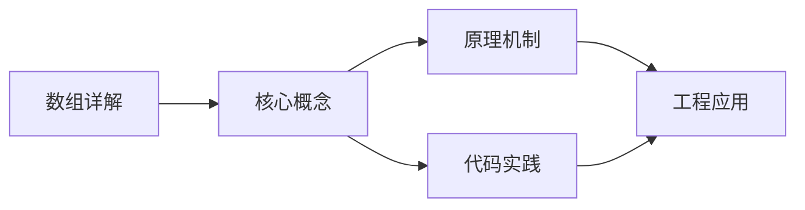
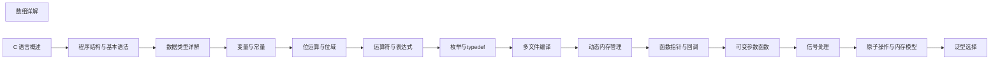

## 1. 学习目标（Bloom 分类）

本节按照布鲁姆教育目标分类学组织学习路径。本文主题为《数组详解》，属于 C 模块，读者可以根据自身阶段选择阅读深度。

记忆层面：能够准确复述本文的核心概念、术语与基本语法或操作步骤，并能够在提问或检索时快速定位对应知识点。能够说出 C 的变量、函数、指针、数组、结构体与预处理语法。

理解层面：能够用自己的语言解释核心原理与工作机制，说明概念之间的因果关系，而不是机械记忆结论。能够解释指针与内存地址、栈与堆、编译链接过程。

应用层面：能够在真实项目或练习场景中运用本文知识解决具体问题，写出正确且可维护的实现。能够编写系统工具、数据结构与嵌入式程序。

分析层面：能够拆解复杂问题，比较本文主题与相邻概念的异同，识别边界条件与例外情况。能够分析内存泄漏、缓冲区溢出与未定义行为。

评价层面：能够根据约束条件（性能、可读性、安全、成本）评价不同方案的优劣，做出有依据的技术决策。能够评价 C 与其他语言在系统编程中的取舍。

创造层面：能够把本文知识与其他模块知识组合，设计出新的解决方案或可复用的工程模式。能够设计可移植、可维护的 C 库与模块。

通过本节学习，读者应当能够把《数组详解》纳入自己的知识网络，并与 C 模块的其他主题（指针、内存管理、预处理器、标准库）建立关联。

## 2. 历史动机与发展脉络

《数组详解》是 C 领域的重要主题。要真正理解它，需要先了解它解决的问题与演进过程。

C 由 Dennis Ritchie 于 1972 年在贝尔实验室为 Unix 开发，是系统编程的基石语言：操作系统、编译器、嵌入式固件均以 C 为主。
C89（ANSI C）统一方言，C99 引入变长数组与 // 注释，C11 增加泛型选择与线程支持，C17 为缺陷修复版，C23（2024 年正式发布）引入 constexpr、属性、显式枚举底层类型等现代化特性。
C 的哲学是“信任程序员”：提供指针与内存操作的全部能力，同时把正确性责任交给开发者；这一设计成就了性能上限，也带来内存安全风险，催生了 Rust 等后继语言。

回到本文主题：数组详解 的提出与成熟，正是上述技术背景下的必然产物。早期实现往往以简单可用为目标，随着工程规模扩大，社区逐渐沉淀出标准做法与最佳实践；理解这一脉络，可以帮助读者判断“为什么文档中的推荐写法是现在这个样子”，也能在遇到历史遗留代码时准确识别其设计年代与取舍。


## 3. 形式化定义与核心概念精讲

本节把《数组详解》涉及的核心概念以“定义 + 讲解”的形式展开。读者应把定义当作工具，把讲解当作理解路径；两者结合才能形成可迁移的知识。

指针：指针保存变量地址，`&` 取地址、`*` 解引用；指针算术与数组名退化规则（数组名作为实参退化为首元素指针）是 C 的经典难点。
内存管理：栈内存自动释放，堆内存由 malloc/calloc/realloc/free 管理；所有权责任（谁分配谁释放）必须显式约定。
预处理器：#include/#define/#ifdef 在编译前文本处理；宏展开有副作用与优先级风险，函数式宏参数必须加括号。

### 3.1 原文章节逐一精讲

原文档把主题拆分为 18 个小节，下面按顺序给出每一节的导读讲解，随后保留原文细节供精读。

#### 原文精读（完整保留）

# 数组详解

> **符号约定**：`< >` 必填参数 | `[ ]` 可选参数

---

#### 1. 数组的概念与特性

##### 1.1 什么是数组

- **数组**是一组相同类型的元素的集合，存储在连续的内存地址中。
- **特点**：
- 所有元素类型相同
- 元素在内存中连续存储
- 通过下标访问元素（下标从 0 开始）
- 数组大小在声明时确定（除变长数组外）

#### 2. 一维数组

##### 2.1 定义与声明

- **格式**：`type array_name[size];`
- **示例**：

```c
 int numbers[5]; // 整型数组，大小为 5
 float prices[10]; // 浮点型数组，大小为 10
 char letters[26]; // 字符型数组，大小为 26
```

##### 2.2 初始化

###### 2.2.1 完全初始化

```c
 int arr[5] = {1, 2, 3, 4, 5}; // 初始化所有元素
```

###### 2.2.2 部分初始化

```c
 int arr[5] = {1, 2, 3}; // 前 3 个元素初始化，其余为 0
```

###### 2.2.3 自动推断大小

```c
 int arr[] = {10, 20, 30, 40, 50}; // 数组大小自动推断为 5
```

###### 2.2.4 全部初始化为 0

```c
 int arr[10] = {0}; // 所有元素初始化为 0
```

##### 2.3 访问元素

- **格式**：`array_name[index]`
- **示例**：

```c
 int arr[5] = {10, 20, 30, 40, 50};
 printf("arr[0] = %d\n", arr[0]); // 输出 10
 printf("arr[2] = %d\n", arr[2]); // 输出 30
```

##### 2.4 遍历数组

```c
 int arr[5] = {1, 2, 3, 4, 5};
 // 使用 for 循环遍历
 for (int i = 0; i < 5; i++) {
  printf("arr[%d] = %d\n", i, arr[i]);
 }
```

##### 2.5 数组大小计算

- 使用 `sizeof` 运算符计算数组大小：

```c
 int arr[] = {1, 2, 3, 4, 5};
 int size = sizeof(arr) / sizeof(arr[0]);
 printf("数组大小: %d\n", size); // 输出 5
```

##### 2.6 数组越界

- **注意**：C 语言不检查数组下标越界，越界访问可能导致：
- 访问到无效内存，导致程序崩溃
- 修改其他变量的值，导致数据损坏
- 安全漏洞（如缓冲区溢出）

```c
 int arr[5] = {1, 2, 3, 4, 5};
 arr[10] = 100; // 越界访问，危险！
```

#### 3. 多维数组

##### 3.1 二维数组

- **概念**：可以看作是由多个一维数组组成的数组。
- **定义**：`type array_name[rows][columns];`
- **内存布局**：行优先存储（按行顺序存储元素）

###### 3.1.1 初始化

```c
 // 完整初始化
 int matrix[2][3] = {
  {1, 2, 3},
  {4, 5, 6}
 }
 // 部分初始化
 int matrix[2][3] = {{1, 2}, {4}}; // 其余元素为 0
 // 自动推断行数
 int matrix[][3] = {{1, 2, 3}, {4, 5, 6}}; // 行数自动推断为 2
```

###### 3.1.2 访问元素

```c
 int matrix[2][3] = {{1, 2, 3}, {4, 5, 6}};
 printf("matrix[0][0] = %d\n", matrix[0][0]); // 输出 1
 printf("matrix[1][2] = %d\n", matrix[1][2]); // 输出 6
```

###### 3.1.3 遍历二维数组

```c
 int matrix[2][3] = {{1, 2, 3}, {4, 5, 6}};
 for (int i = 0; i < 2; i++) { // 遍历行
  for (int j = 0; j < 3; j++) { // 遍历列
  printf("%d ", matrix[i][j]);
  }
  printf("\n");
 }
```

##### 3.2 三维及以上数组

- **定义**：`type array_name[depth][rows][columns];`
- **示例**：

```c
 int cube[2][2][2] = {
 {{1, 2}, {3, 4}},
 {{5, 6}, {7, 8}}
 };
```

##### 3.3 多维数组作为函数参数

- **传递方式**：需要指定除第一维外的所有维度大小。
- **示例**：

```c
 void print_matrix(int matrix[][3], int rows) {
 for (int i = 0; i < rows; i++) {
 for (int j = 0; j < 3; j++) {
 printf("%d ", matrix[i][j]);
 }
 printf("\n");
 }
 }
```

#### 4. 字符数组与字符串

##### 4.1 字符数组

- **定义**：`char array_name[size];`
- **初始化**：

```c
 char chars[5] = {'H', 'e', 'l', 'l', 'o'}; // 普通字符数组
 char str[6] = {'H', 'e', 'l', 'l', 'o', '\0'}; // 字符串（以 '\0' 结尾）
```

##### 4.2 字符串

- **概念**：以空字符 `'\0'` 结尾的字符数组。
- **初始化**：

```c
 char str[] = "Hello"; // 自动包含 '\0'，大小为 6
 char str[10] = "Hello"; // 剩余空间填充 '\0'
```

##### 4.3 字符串操作函数

- **包含头文件**：`#include <string.h>`
  | 函数        | 功能                          | 示例                                   |
  | ----------- | ----------------------------- | -------------------------------------- |
  | `strlen()`  | 计算字符串长度（不包括 '\0'） | `int len = strlen(str);`               |
  | `strcpy()`  | 复制字符串                    | `strcpy(dest, src);`                   |
  | `strcat()`  | 连接字符串                    | `strcat(dest, src);`                   |
  | `strcmp()`  | 比较字符串                    | `int result = strcmp(str1, str2);`     |
  | `strncpy()` | 复制指定长度的字符串          | `strncpy(dest, src, n);`               |
  | `strncat()` | 连接指定长度的字符串          | `strncat(dest, src, n);`               |
  | `strncmp()` | 比较指定长度的字符串          | `int result = strncmp(str1, str2, n);` |

##### 4.4 字符串输入输出

```c
 char str[100];
 // 输入字符串（遇到空格停止）
 scanf("%s", str);
 // 输入一行字符串（包括空格）
 fgets(str, sizeof(str), stdin);
 // 输出字符串
 printf("%s\n", str);
```

##### 4.5 常见问题与注意事项

- **缓冲区溢出**：使用 `fgets()` 替代 `gets()` 以避免缓冲区溢出
- **字符串长度**：使用 `strlen()` 时要注意字符串必须以 `'\0'` 结尾
- **内存分配**：确保目标字符串有足够的空间存储源字符串

#### 5. 数组与指针的关系

##### 5.1 数组名的特性

- **数组名**是数组首元素的地址，是一个常量指针（不能修改）。
- **等价关系**：`arr` 等同于 `&arr[0]`

```c
 int arr[5] = {1, 2, 3, 4, 5};
 printf("arr = %p\n", arr); // 数组首元素地址
 printf("&arr[0] = %p\n", &arr[0]); // 数组首元素地址
 printf("arr[0] = %d\n", *arr); // 数组首元素值
```

##### 5.2 指针算术与数组访问

- **指针算术**：指针可以进行加减运算，单位是所指向类型的大小。
- **数组访问**：`arr[i]` 等同于 `*(arr + i)`

```c
 int arr[5] = {1, 2, 3, 4, 5};
 int *p = arr; // 指向数组首元素
 printf("*p = %d\n", *p); // 输出 1
 printf("*(p + 1) = %d\n", *(p + 1)); // 输出 2
 printf("p[2] = %d\n", p[2]); // 输出 3
```

##### 5.3 数组作为函数参数

- **数组退化**：数组作为函数参数时，会退化为指向首元素的指针。
- **注意**：函数内部无法通过 `sizeof` 获取数组的总大小。

```c
 // 函数声明
 void print_array(int *arr, int size);
 // 函数定义
 void print_array(int *arr, int size) {
  for (int i = 0; i < size; i++) {
  printf("%d ", arr[i]);
  }
  printf("\n");
 }
 // 调用
 int main() {
  int numbers[] = {1, 2, 3, 4, 5};
  int size = sizeof(numbers) / sizeof(numbers[0]);
  print_array(numbers, size);
  return 0;
 }
```

##### 5.4 指针数组

- **定义**：存储指针的数组。
- **示例**：

```c
 int *ptr_array[5]; // 存储 5 个 int 指针的数组
 // 字符串数组（实际上是字符指针数组）
 char *str_array[] = {
 "Hello",
 "World",
 "C Language"
 };
```

##### 5.5 数组指针

- **定义**：指向数组的指针。
- **格式**：`type (*pointer_name)[size];`
- **示例**：

```c
 int arr[5] = {1, 2, 3, 4, 5};
 int (*p)[5] = &arr; // 指向整个数组的指针
 printf("*(*p) = %d\n", *(*p)); // 输出 1
 printf("*(*p + 1) = %d\n", *(*p + 1)); // 输出 2
```

#### 6. 变长数组 (VLA - Variable Length Arrays)

##### 6.1 概念

- **变长数组**：C99 引入，允许在运行时确定数组大小。
- **限制**：
- 只能在函数内部声明（局部变量）
- 不能初始化
- 不支持全局变长数组

##### 6.2 示例

```c
 void func(int n) {
  int arr[n]; // 数组大小由参数 n 决定
  // 初始化数组
  for (int i = 0; i < n; i++) {
  arr[i] = i + 1;
  }
  // 遍历数组
  for (int i = 0; i < n; i++) {
  printf("%d ", arr[i]);
  }
  printf("\n");
 }
 int main() {
  func(5); // 传递数组大小
  return 0;
 }
```

#### 7. 动态数组

##### 7.1 概念

- **动态数组**：使用动态内存分配函数（如 `malloc`、`calloc`）创建的数组。
- **优点**：可以在运行时动态调整大小。

##### 7.2 示例

```c
 #include <stdio.h>
 #include <stdlib.h>
 int main() {
  int size;
  printf("Enter array size: ");
  scanf("%d", &size);
  // 分配内存
  int *arr = (int *)malloc(size * sizeof(int));
  if (arr == NULL) {
  printf("Memory allocation failed!\n");
  return 1;
  }
  // 初始化数组
  for (int i = 0; i < size; i++) {
  arr[i] = i + 1;
  }
  // 遍历数组
  printf("Array elements: ");
  for (int i = 0; i < size; i++) {
  printf("%d ", arr[i]);
  }
  printf("\n");
  // 释放内存
  free(arr);
  return 0;
 }
```

##### 7.3 动态调整数组大小

```c
 // 重新分配内存
 int *new_arr = (int *)realloc(arr, new_size * sizeof(int));
 if (new_arr == NULL) {
  printf("Memory reallocation failed!\n");
  free(arr);
  return 1;
 }
 arr = new_arr;
```

#### 8. 数组的高级应用

##### 8.1 数组排序

```c
 // 冒泡排序
 void bubble_sort(int arr[], int size) {
  for (int i = 0; i < size - 1; i++) {
  for (int j = 0; j < size - i - 1; j++) {
  if (arr[j] > arr[j + 1]) {
  // 交换元素
  int temp = arr[j];
  arr[j] = arr[j + 1];
  arr[j + 1] = temp;
  }
  }
  }
 }
 // 选择排序
 void selection_sort(int arr[], int size) {
  for (int i = 0; i < size - 1; i++) {
  int min_idx = i;
  for (int j = i + 1; j < size; j++) {
  if (arr[j] < arr[min_idx]) {
  min_idx = j;
  }
  }
  // 交换元素
  int temp = arr[i];
  arr[i] = arr[min_idx];
  arr[min_idx] = temp;
  }
 }
```

##### 8.2 数组查找

```c
 // 线性查找
 int linear_search(int arr[], int size, int target) {
  for (int i = 0; i < size; i++) {
  if (arr[i] == target) {
  return i; // 返回索引
  }
  }
  return -1; // 未找到
 }
 // 二分查找（要求数组已排序）
 int binary_search(int arr[], int low, int high, int target) {
  if (low > high) {
  return -1; // 未找到
  }
  int mid = low + (high - low) / 2;
  if (arr[mid] == target) {
  return mid; // 找到
  } else if (arr[mid] > target) {
  return binary_search(arr, low, mid - 1, target);
  } else {
  return binary_search(arr, mid + 1, high, target);
  }
 }
```

##### 8.3 二维数组的应用

```c
 // 矩阵加法
 void matrix_add(int a[][3], int b[][3], int result[][3], int rows) {
  for (int i = 0; i < rows; i++) {
  for (int j = 0; j < 3; j++) {
  result[i][j] = a[i][j] + b[i][j];
  }
  }
 }
 // 矩阵转置
 void matrix_transpose(int matrix[][3], int transposed[][2], int rows, int cols) {
  for (int i = 0; i < rows; i++) {
  for (int j = 0; j < cols; j++) {
  transposed[j][i] = matrix[i][j];
  }
  }
 }
```

#### 9. 数组的最佳实践

##### 9.1 命名规范

- 数组名应清晰描述其内容，使用 `snake_case` 命名风格
- 示例：`student_scores`, `monthly_sales`

##### 9.2 内存管理

- 对于大型数组，考虑使用动态内存分配
- 动态分配的内存使用完毕后必须释放，避免内存泄漏
- 避免使用过大的局部数组，可能导致栈溢出

##### 9.3 性能优化

- **缓存友好**：按内存顺序访问数组（行优先）
- **减少计算**：预先计算数组大小，避免重复计算
- **避免越界**：使用断言或边界检查确保数组访问安全

##### 9.4 代码风格

- **缩进**：使用一致的缩进风格
- **注释**：为复杂的数组操作添加注释
- **格式**：保持代码格式的一致性

#### 10. 数组示例：完整应用

```c
 #include <stdio.h>
 #include <stdlib.h>
 #include <string.h>
 // 函数声明
 void print_array(int arr[], int size);
 void sort_array(int arr[], int size);
 int find_max(int arr[], int size);
 int find_min(int arr[], int size);
 double calculate_average(int arr[], int size);
 int main() {
  int size;
  printf("Enter array size: ");
  scanf("%d", &size);
  // 动态分配内存
  int *arr = (int *)malloc(size * sizeof(int));
  if (arr == NULL) {
  printf("Memory allocation failed!\n");
  return 1;
  }
  // 输入数组元素
  printf("Enter %d elements: ", size);
  for (int i = 0; i < size; i++) {
  scanf("%d", &arr[i]);
  }
  // 打印原始数组
  printf("Original array: ");
  print_array(arr, size);
  // 排序数组
  sort_array(arr, size);
  printf("Sorted array: ");
  print_array(arr, size);
  // 计算统计信息
  int max = find_max(arr, size);
  int min = find_min(arr, size);
  double average = calculate_average(arr, size);
  printf("Max: %d\n", max);
  printf("Min: %d\n", min);
  printf("Average: %.2f\n", average);
  // 释放内存
  free(arr);
  return 0;
 }
 // 打印数组
 void print_array(int arr[], int size) {
  for (int i = 0; i < size; i++) {
  printf("%d ", arr[i]);
  }
  printf("\n");
 }
 // 冒泡排序
 void sort_array(int arr[], int size) {
  for (int i = 0; i < size - 1; i++) {
  for (int j = 0; j < size - i - 1; j++) {
  if (arr[j] > arr[j + 1]) {
  int temp = arr[j];
  arr[j] = arr[j + 1];
  arr[j + 1] = temp;
  }
  }
  }
 }
 // 查找最大值
 int find_max(int arr[], int size) {
  int max = arr[0];
  for (int i = 1; i < size; i++) {
  if (arr[i] > max) {
  max = arr[i];
  }
  }
  return max;
 }
 // 查找最小值
 int find_min(int arr[], int size) {
  int min = arr[0];
  for (int i = 1; i < size; i++) {
  if (arr[i] < min) {
  min = arr[i];
  }
  }
  return min;
 }
 // 计算平均值
 double calculate_average(int arr[], int size) {
  int sum = 0;
  for (int i = 0; i < size; i++) {
  sum += arr[i];
  }
  return (double)sum / size;
 }
```

#### 11. 常见错误与调试

##### 11.1 常见错误

- **数组越界**：访问超出数组范围的元素
- **内存泄漏**：动态分配的内存未释放
- **空指针**：使用未初始化的指针访问数组
- **字符串没有结束符**：导致 `strlen()` 等函数出错

##### 11.2 调试技巧

- **打印数组内容**：检查数组元素是否正确
- **使用调试器**：如 GDB 单步执行，查看数组值
- **边界检查**：在循环中添加边界检查
- **内存检查**：使用工具如 Valgrind 检查内存泄漏

---

#### 一维数组

**基本写法：数组声明**
`<type> <array_name>[<size>];`
```c
// 声明大小为 5 的整型数组
int numbers[5];
```

---

**完全初始化写法：数组初始化**
`<type> <array_name>[<size>] = {<values>};`
```c
// 完全初始化数组
int arr[5] = {1, 2, 3, 4, 5};
```

---

**部分初始化写法：部分初始化**
`<type> <array_name>[<size>] = {<values>};`
```c
// 部分初始化，其余元素为 0
int arr[5] = {1, 2, 3};
```

---

**自动推断写法：省略大小**
`<type> <array_name>[] = {<values>};`
```c
// 自动推断数组大小为 3
int arr[] = {10, 20, 30};
```

---

**清零写法：全部初始化为 0**
`<type> <array_name>[<size>] = {0};`
```c
// 所有元素初始化为 0
int arr[10] = {0};
```

---

**访问写法：访问数组元素**
`<array_name>[<index>]`
```c
// 访问数组第一个元素
int arr[5] = {10, 20, 30, 40, 50};
printf("%d\n", arr[0]);
```

---

**遍历写法：遍历数组**
`for (int i = 0; i < <size>; i++) { ... }`
```c
// 遍历打印数组元素
int arr[5] = {1, 2, 3, 4, 5};
for (int i = 0; i < 5; i++) {
    printf("arr[%d] = %d\n", i, arr[i]);
}
```

---

**计算大小写法：计算数组元素个数**
`sizeof(<array>) / sizeof(<array>[0])`
```c
// 计算数组元素个数
int arr[] = {1, 2, 3, 4, 5};
int size = sizeof(arr) / sizeof(arr[0]);
```

---

#### 多维数组

**基本写法：二维数组声明与初始化**
`<type> <array_name>[<rows>][<cols>] = { {<values>}, ... };`
```c
// 完整初始化二维数组
int matrix[2][3] = {
    {1, 2, 3},
    {4, 5, 6}
};
```

---

**访问写法：访问二维数组元素**
`<array_name>[<row>][<col>]`
```c
// 访问第二行第三列元素
int matrix[2][3] = {{1, 2, 3}, {4, 5, 6}};
printf("%d\n", matrix[1][2]);
```

---

**遍历写法：遍历二维数组**
`for (int i = 0; i < <rows>; i++) { for (int j = 0; j < <cols>; j++) { ... } }`
```c
// 遍历二维数组
int matrix[2][3] = {{1, 2, 3}, {4, 5, 6}};
for (int i = 0; i < 2; i++) {
    for (int j = 0; j < 3; j++) {
        printf("%d ", matrix[i][j]);
    }
}
```

---

**三维写法：三维数组**
`<type> <array_name>[<depth>][<rows>][<cols>];`
```c
// 声明三维数组
int cube[2][2][2] = {
    {{1, 2}, {3, 4}},
    {{5, 6}, {7, 8}}
};
```

---

**函数参数写法：多维数组作为函数参数**
`<return_type> <func>(<type> <arr>[][<cols>], int <rows>) { ... }`
```c
// 需要指定除第一维外的所有维度大小
void print_matrix(int matrix[][3], int rows) {
    for (int i = 0; i < rows; i++) {
        for (int j = 0; j < 3; j++) {
            printf("%d ", matrix[i][j]);
        }
    }
}
```

---

#### 字符数组与字符串

**字符数组写法：字符数组定义**
`char <array_name>[<size>] = {<chars>};`
```c
// 普通字符数组
char chars[5] = {'H', 'e', 'l', 'l', 'o'};
```

---

**字符串写法：字符串初始化**
`char <str>[] = "<string>";`
```c
// 自动包含 '\0'，大小为 6
char str[] = "Hello";
```

---

**strlen 写法：计算字符串长度**
`strlen(<str>)`
```c
#include <string.h>
// 计算字符串长度
char src[] = "Hello";
int len = strlen(src);
```

---

**strcpy 写法：复制字符串**
`strcpy(<dest>, <src>)`
```c
#include <string.h>
// 复制字符串
char dest[50];
char src[] = "Hello";
strcpy(dest, src);
```

---

**strcat 写法：连接字符串**
`strcat(<dest>, <src>)`
```c
#include <string.h>
// 连接字符串
char dest[50] = "Hello";
strcat(dest, " World");
```

---

**strcmp 写法：比较字符串**
`strcmp(<str1>, <str2>)`
```c
#include <string.h>
// 比较字符串，0 相等，<0 小于，>0 大于
int result = strcmp("abc", "abd");
```

---

**fgets 写法：读取一行字符串**
`fgets(<str>, <size>, stdin)`
```c
// 读取一行（包括空格）
char str[100];
fgets(str, sizeof(str), stdin);
```

---

#### 数组与指针

**基本写法：数组名与指针的关系**
`<array_name>` 等同于 `&<array_name>[0]`
```c
// 数组名即首元素地址
int arr[5] = {1, 2, 3, 4, 5};
int *p = arr;
```

---

**指针算术写法：指针访问数组**
`*(<ptr> + <n>)`
```c
// 使用指针算术访问数组元素
int arr[5] = {1, 2, 3, 4, 5};
int *p = arr;
printf("%d\n", *(p + 1));
```

---

**指针数组写法：存储指针的数组**
`<type> *<array_name>[<size>];`
```c
// 指针数组
int *ptr_array[3];
int a = 10, b = 20, c = 30;
ptr_array[0] = &a;
```

---

**数组指针写法：指向数组的指针**
`<type> (*<ptr_name>)[<size>];`
```c
// 指向整个数组的指针
int arr[5] = {1, 2, 3, 4, 5};
int (*p)[5] = &arr;
```

---

#### 变长数组（VLA，C99+）

**基本写法：运行时确定数组大小**
`<type> <array_name>[<variable>];`
```c
// 数组大小由参数决定
void func(int n) {
    int arr[n];
}
```

---

#### 动态数组

**malloc 写法：创建动态数组**
`<type> *<ptr> = (<type> *)malloc(<size> * sizeof(<type>));`
```c
#include <stdlib.h>
// 动态分配数组
int size = 10;
int *arr = (int *)malloc(size * sizeof(int));
```

---

**realloc 写法：动态调整数组大小**
`<type> *<new_ptr> = (<type> *)realloc(<ptr>, <new_size> * sizeof(<type>));`
```c
#include <stdlib.h>
// 重新调整数组大小
int *new_arr = (int *)realloc(arr, 20 * sizeof(int));
```

---

#### 数组排序

**冒泡排序写法：冒泡排序实现**
`void <sort>(<type> <arr>[], int <size>) { ... }`
```c
// 冒泡排序算法
void bubble_sort(int arr[], int size) {
    for (int i = 0; i < size - 1; i++) {
        for (int j = 0; j < size - i - 1; j++) {
            if (arr[j] > arr[j + 1]) {
                int temp = arr[j];
                arr[j] = arr[j + 1];
                arr[j + 1] = temp;
            }
        }
    }
}
```

---

**二分查找写法：二分查找实现**
`int <search>(<type> <arr>[], int <low>, int <high>, <type> <target>) { ... }`
```c
// 二分查找算法
int binary_search(int arr[], int low, int high, int target) {
    if (low > high) return -1;
    int mid = low + (high - low) / 2;
    if (arr[mid] == target) return mid;
    else if (arr[mid] > target) return binary_search(arr, low, mid - 1, target);
    else return binary_search(arr, mid + 1, high, target);
}
```


### 3.2 概念关系图

下面用 Mermaid 图表达本文核心概念之间的关系，帮助读者建立整体图景：



图中展示的是本文知识的结构化关系：核心概念是入口，原理机制解释“为什么”，代码实践演示“怎么做”，工程应用回答“何时用”。读者学习时可以把每个小节的内容挂接到对应节点上。

## 4. 理论推导与原理解析

本节深入《数组详解》背后的原理。理论部分不求面面俱到，而是聚焦“能解释现象、能指导实践”的关键推导。

指针：指针保存变量地址，`&` 取地址、`*` 解引用；指针算术与数组名退化规则（数组名作为实参退化为首元素指针）是 C 的经典难点。
内存管理：栈内存自动释放，堆内存由 malloc/calloc/realloc/free 管理；所有权责任（谁分配谁释放）必须显式约定。
预处理器：#include/#define/#ifdef 在编译前文本处理；宏展开有副作用与优先级风险，函数式宏参数必须加括号。
编译链接：预处理 -> 编译 -> 汇编 -> 链接；头文件声明接口，源文件实现；静态库与动态库（.a/.so/.dll）决定部署形态。

需要强调的是，理论推导与工程实践之间存在翻译层：理论给出的是理想化模型与边界条件，工程代码则必须处理真实环境中的例外。读者在学习时应先掌握理论的“标准情形”，再通过陷阱章节了解“非标准情形”。

## 5. 代码示例与逐行讲解

本节把原文中的代码示例系统整理，并为每个示例补充用途说明与讲解。读者不应只浏览代码，而应逐段对照讲解理解设计意图。

### 5.1 示例：2.1 定义与声明

该示例来自原文《2.1 定义与声明》小节，用于演示数组详解相关操作。阅读时请先看代码结构，再看其后的讲解。

```c
 int numbers[5]; // 整型数组，大小为 5
 float prices[10]; // 浮点型数组，大小为 10
 char letters[26]; // 字符型数组，大小为 26
```

讲解：这段代码演示了本节核心知识点。代码中的关键操作可以归纳为三步：准备（定义或初始化）、执行（核心逻辑）、收尾（释放资源或返回结果）。实际项目中，这三步往往被封装为函数或类，以提升复用性与可测试性。

关键点分析：

该示例共 3 行有效代码，结构以数据或配置为主。阅读时应关注：数据字段的含义、配置项的作用，以及它们与运行行为的对应关系。

进阶思考路径：先尝试修改参数观察行为变化，再把示例中的模式迁移到自己的项目中；每次修改都记录预期与实测差异，这是把示例转化为能力的最快方式。

### 5.2 示例：2.2.1 完全初始化

该示例来自原文《2.2.1 完全初始化》小节，用于演示数组详解相关操作。阅读时请先看代码结构，再看其后的讲解。

```c
 int arr[5] = {1, 2, 3, 4, 5}; // 初始化所有元素
```

讲解：这段代码演示了本节核心知识点。代码中的关键操作可以归纳为三步：准备（定义或初始化）、执行（核心逻辑）、收尾（释放资源或返回结果）。实际项目中，这三步往往被封装为函数或类，以提升复用性与可测试性。

关键点分析：

该示例共 1 行有效代码，结构以数据或配置为主。阅读时应关注：数据字段的含义、配置项的作用，以及它们与运行行为的对应关系。

进阶思考路径：先尝试修改参数观察行为变化，再把示例中的模式迁移到自己的项目中；每次修改都记录预期与实测差异，这是把示例转化为能力的最快方式。

### 5.3 示例：2.2.2 部分初始化

该示例来自原文《2.2.2 部分初始化》小节，用于演示数组详解相关操作。阅读时请先看代码结构，再看其后的讲解。

```c
 int arr[5] = {1, 2, 3}; // 前 3 个元素初始化，其余为 0
```

讲解：这段代码演示了本节核心知识点。代码中的关键操作可以归纳为三步：准备（定义或初始化）、执行（核心逻辑）、收尾（释放资源或返回结果）。实际项目中，这三步往往被封装为函数或类，以提升复用性与可测试性。

关键点分析：

该示例共 1 行有效代码，结构以数据或配置为主。阅读时应关注：数据字段的含义、配置项的作用，以及它们与运行行为的对应关系。

进阶思考路径：先尝试修改参数观察行为变化，再把示例中的模式迁移到自己的项目中；每次修改都记录预期与实测差异，这是把示例转化为能力的最快方式。

### 5.4 示例：2.2.3 自动推断大小

该示例来自原文《2.2.3 自动推断大小》小节，用于演示数组详解相关操作。阅读时请先看代码结构，再看其后的讲解。

```c
 int arr[] = {10, 20, 30, 40, 50}; // 数组大小自动推断为 5
```

讲解：这段代码演示了本节核心知识点。代码中的关键操作可以归纳为三步：准备（定义或初始化）、执行（核心逻辑）、收尾（释放资源或返回结果）。实际项目中，这三步往往被封装为函数或类，以提升复用性与可测试性。

关键点分析：

该示例共 1 行有效代码，结构以数据或配置为主。阅读时应关注：数据字段的含义、配置项的作用，以及它们与运行行为的对应关系。

进阶思考路径：先尝试修改参数观察行为变化，再把示例中的模式迁移到自己的项目中；每次修改都记录预期与实测差异，这是把示例转化为能力的最快方式。

### 5.5 示例：2.2.4 全部初始化为 0

该示例来自原文《2.2.4 全部初始化为 0》小节，用于演示数组详解相关操作。阅读时请先看代码结构，再看其后的讲解。

```c
 int arr[10] = {0}; // 所有元素初始化为 0
```

讲解：这段代码演示了本节核心知识点。代码中的关键操作可以归纳为三步：准备（定义或初始化）、执行（核心逻辑）、收尾（释放资源或返回结果）。实际项目中，这三步往往被封装为函数或类，以提升复用性与可测试性。

关键点分析：

该示例共 1 行有效代码，结构以数据或配置为主。阅读时应关注：数据字段的含义、配置项的作用，以及它们与运行行为的对应关系。

进阶思考路径：先尝试修改参数观察行为变化，再把示例中的模式迁移到自己的项目中；每次修改都记录预期与实测差异，这是把示例转化为能力的最快方式。

### 5.6 示例：2.3 访问元素

该示例来自原文《2.3 访问元素》小节，用于演示数组详解相关操作。阅读时请先看代码结构，再看其后的讲解。

```c
 int arr[5] = {10, 20, 30, 40, 50};
 printf("arr[0] = %d\n", arr[0]); // 输出 10
 printf("arr[2] = %d\n", arr[2]); // 输出 30
```

讲解：这段代码演示了本节核心知识点。代码中的关键操作可以归纳为三步：准备（定义或初始化）、执行（核心逻辑）、收尾（释放资源或返回结果）。实际项目中，这三步往往被封装为函数或类，以提升复用性与可测试性。

关键点分析：

该示例共 3 行有效代码，结构以数据或配置为主。阅读时应关注：数据字段的含义、配置项的作用，以及它们与运行行为的对应关系。

进阶思考路径：先尝试修改参数观察行为变化，再把示例中的模式迁移到自己的项目中；每次修改都记录预期与实测差异，这是把示例转化为能力的最快方式。

### 5.7 示例：2.4 遍历数组

该示例来自原文《2.4 遍历数组》小节，用于演示数组详解相关操作。阅读时请先看代码结构，再看其后的讲解。

```c
 int arr[5] = {1, 2, 3, 4, 5};
 // 使用 for 循环遍历
 for (int i = 0; i < 5; i++) {
  printf("arr[%d] = %d\n", i, arr[i]);
 }
```

讲解：这段代码演示了本节核心知识点。代码中的关键操作可以归纳为三步：准备（定义或初始化）、执行（核心逻辑）、收尾（释放资源或返回结果）。实际项目中，这三步往往被封装为函数或类，以提升复用性与可测试性。

关键点分析：

该示例共 5 行有效代码，包含 1 类关键结构（for）。其中：

- 入口与初始化部分负责建立上下文，对应实际项目中的启动或装配逻辑；
- 核心逻辑部分体现本文主题的主要操作，是阅读时最需要对照讲解理解的部分；
- 输出或返回部分把结果交给调用方，注意其类型与边界条件。

进阶思考路径：先尝试修改参数观察行为变化，再把示例中的模式迁移到自己的项目中；每次修改都记录预期与实测差异，这是把示例转化为能力的最快方式。

### 5.8 示例：2.5 数组大小计算

该示例来自原文《2.5 数组大小计算》小节，用于演示数组详解相关操作。阅读时请先看代码结构，再看其后的讲解。

```c
 int arr[] = {1, 2, 3, 4, 5};
 int size = sizeof(arr) / sizeof(arr[0]);
 printf("数组大小: %d\n", size); // 输出 5
```

讲解：这段代码演示了本节核心知识点。代码中的关键操作可以归纳为三步：准备（定义或初始化）、执行（核心逻辑）、收尾（释放资源或返回结果）。实际项目中，这三步往往被封装为函数或类，以提升复用性与可测试性。

关键点分析：

该示例共 3 行有效代码，结构以数据或配置为主。阅读时应关注：数据字段的含义、配置项的作用，以及它们与运行行为的对应关系。

进阶思考路径：先尝试修改参数观察行为变化，再把示例中的模式迁移到自己的项目中；每次修改都记录预期与实测差异，这是把示例转化为能力的最快方式。

### 5.9 示例：2.6 数组越界

该示例来自原文《2.6 数组越界》小节，用于演示数组详解相关操作。阅读时请先看代码结构，再看其后的讲解。

```c
 int arr[5] = {1, 2, 3, 4, 5};
 arr[10] = 100; // 越界访问，危险！
```

讲解：这段代码演示了本节核心知识点。代码中的关键操作可以归纳为三步：准备（定义或初始化）、执行（核心逻辑）、收尾（释放资源或返回结果）。实际项目中，这三步往往被封装为函数或类，以提升复用性与可测试性。

关键点分析：

该示例共 2 行有效代码，结构以数据或配置为主。阅读时应关注：数据字段的含义、配置项的作用，以及它们与运行行为的对应关系。

进阶思考路径：先尝试修改参数观察行为变化，再把示例中的模式迁移到自己的项目中；每次修改都记录预期与实测差异，这是把示例转化为能力的最快方式。

### 5.10 示例：3.1.1 初始化

该示例来自原文《3.1.1 初始化》小节，用于演示数组详解相关操作。阅读时请先看代码结构，再看其后的讲解。

```c
 // 完整初始化
 int matrix[2][3] = {
  {1, 2, 3},
  {4, 5, 6}
 }
 // 部分初始化
 int matrix[2][3] = {{1, 2}, {4}}; // 其余元素为 0
 // 自动推断行数
 int matrix[][3] = {{1, 2, 3}, {4, 5, 6}}; // 行数自动推断为 2
```

讲解：这段代码演示了本节核心知识点。代码中的关键操作可以归纳为三步：准备（定义或初始化）、执行（核心逻辑）、收尾（释放资源或返回结果）。实际项目中，这三步往往被封装为函数或类，以提升复用性与可测试性。

关键点分析：

该示例共 9 行有效代码，结构以数据或配置为主。阅读时应关注：数据字段的含义、配置项的作用，以及它们与运行行为的对应关系。

进阶思考路径：先尝试修改参数观察行为变化，再把示例中的模式迁移到自己的项目中；每次修改都记录预期与实测差异，这是把示例转化为能力的最快方式。

### 5.11 示例：3.1.2 访问元素

该示例来自原文《3.1.2 访问元素》小节，用于演示数组详解相关操作。阅读时请先看代码结构，再看其后的讲解。

```c
 int matrix[2][3] = {{1, 2, 3}, {4, 5, 6}};
 printf("matrix[0][0] = %d\n", matrix[0][0]); // 输出 1
 printf("matrix[1][2] = %d\n", matrix[1][2]); // 输出 6
```

讲解：这段代码演示了本节核心知识点。代码中的关键操作可以归纳为三步：准备（定义或初始化）、执行（核心逻辑）、收尾（释放资源或返回结果）。实际项目中，这三步往往被封装为函数或类，以提升复用性与可测试性。

关键点分析：

该示例共 3 行有效代码，结构以数据或配置为主。阅读时应关注：数据字段的含义、配置项的作用，以及它们与运行行为的对应关系。

进阶思考路径：先尝试修改参数观察行为变化，再把示例中的模式迁移到自己的项目中；每次修改都记录预期与实测差异，这是把示例转化为能力的最快方式。

### 5.12 示例：3.1.3 遍历二维数组

该示例来自原文《3.1.3 遍历二维数组》小节，用于演示数组详解相关操作。阅读时请先看代码结构，再看其后的讲解。

```c
 int matrix[2][3] = {{1, 2, 3}, {4, 5, 6}};
 for (int i = 0; i < 2; i++) { // 遍历行
  for (int j = 0; j < 3; j++) { // 遍历列
  printf("%d ", matrix[i][j]);
  }
  printf("\n");
 }
```

讲解：这段代码演示了本节核心知识点。代码中的关键操作可以归纳为三步：准备（定义或初始化）、执行（核心逻辑）、收尾（释放资源或返回结果）。实际项目中，这三步往往被封装为函数或类，以提升复用性与可测试性。

关键点分析：

该示例共 7 行有效代码，包含 1 类关键结构（for）。其中：

- 入口与初始化部分负责建立上下文，对应实际项目中的启动或装配逻辑；
- 核心逻辑部分体现本文主题的主要操作，是阅读时最需要对照讲解理解的部分；
- 输出或返回部分把结果交给调用方，注意其类型与边界条件。

进阶思考路径：先尝试修改参数观察行为变化，再把示例中的模式迁移到自己的项目中；每次修改都记录预期与实测差异，这是把示例转化为能力的最快方式。

### 5.13 示例：3.2 三维及以上数组

该示例来自原文《3.2 三维及以上数组》小节，用于演示数组详解相关操作。阅读时请先看代码结构，再看其后的讲解。

```c
 int cube[2][2][2] = {
 {{1, 2}, {3, 4}},
 {{5, 6}, {7, 8}}
 };
```

讲解：这段代码演示了本节核心知识点。代码中的关键操作可以归纳为三步：准备（定义或初始化）、执行（核心逻辑）、收尾（释放资源或返回结果）。实际项目中，这三步往往被封装为函数或类，以提升复用性与可测试性。

关键点分析：

该示例共 4 行有效代码，结构以数据或配置为主。阅读时应关注：数据字段的含义、配置项的作用，以及它们与运行行为的对应关系。

进阶思考路径：先尝试修改参数观察行为变化，再把示例中的模式迁移到自己的项目中；每次修改都记录预期与实测差异，这是把示例转化为能力的最快方式。

### 5.14 示例：3.3 多维数组作为函数参数

该示例来自原文《3.3 多维数组作为函数参数》小节，用于演示数组详解相关操作。阅读时请先看代码结构，再看其后的讲解。

```c
 void print_matrix(int matrix[][3], int rows) {
 for (int i = 0; i < rows; i++) {
 for (int j = 0; j < 3; j++) {
 printf("%d ", matrix[i][j]);
 }
 printf("\n");
 }
 }
```

讲解：这段代码演示了本节核心知识点。代码中的关键操作可以归纳为三步：准备（定义或初始化）、执行（核心逻辑）、收尾（释放资源或返回结果）。实际项目中，这三步往往被封装为函数或类，以提升复用性与可测试性。

关键点分析：

该示例共 8 行有效代码，包含 1 类关键结构（for）。其中：

- 入口与初始化部分负责建立上下文，对应实际项目中的启动或装配逻辑；
- 核心逻辑部分体现本文主题的主要操作，是阅读时最需要对照讲解理解的部分；
- 输出或返回部分把结果交给调用方，注意其类型与边界条件。

进阶思考路径：先尝试修改参数观察行为变化，再把示例中的模式迁移到自己的项目中；每次修改都记录预期与实测差异，这是把示例转化为能力的最快方式。

### 5.15 示例：4.1 字符数组

该示例来自原文《4.1 字符数组》小节，用于演示数组详解相关操作。阅读时请先看代码结构，再看其后的讲解。

```c
 char chars[5] = {'H', 'e', 'l', 'l', 'o'}; // 普通字符数组
 char str[6] = {'H', 'e', 'l', 'l', 'o', '\0'}; // 字符串（以 '\0' 结尾）
```

讲解：这段代码演示了本节核心知识点。代码中的关键操作可以归纳为三步：准备（定义或初始化）、执行（核心逻辑）、收尾（释放资源或返回结果）。实际项目中，这三步往往被封装为函数或类，以提升复用性与可测试性。

关键点分析：

该示例共 2 行有效代码，结构以数据或配置为主。阅读时应关注：数据字段的含义、配置项的作用，以及它们与运行行为的对应关系。

进阶思考路径：先尝试修改参数观察行为变化，再把示例中的模式迁移到自己的项目中；每次修改都记录预期与实测差异，这是把示例转化为能力的最快方式。

### 5.16 示例：4.2 字符串

该示例来自原文《4.2 字符串》小节，用于演示数组详解相关操作。阅读时请先看代码结构，再看其后的讲解。

```c
 char str[] = "Hello"; // 自动包含 '\0'，大小为 6
 char str[10] = "Hello"; // 剩余空间填充 '\0'
```

讲解：这段代码演示了本节核心知识点。代码中的关键操作可以归纳为三步：准备（定义或初始化）、执行（核心逻辑）、收尾（释放资源或返回结果）。实际项目中，这三步往往被封装为函数或类，以提升复用性与可测试性。

关键点分析：

该示例共 2 行有效代码，结构以数据或配置为主。阅读时应关注：数据字段的含义、配置项的作用，以及它们与运行行为的对应关系。

进阶思考路径：先尝试修改参数观察行为变化，再把示例中的模式迁移到自己的项目中；每次修改都记录预期与实测差异，这是把示例转化为能力的最快方式。

### 5.17 示例：4.4 字符串输入输出

该示例来自原文《4.4 字符串输入输出》小节，用于演示数组详解相关操作。阅读时请先看代码结构，再看其后的讲解。

```c
 char str[100];
 // 输入字符串（遇到空格停止）
 scanf("%s", str);
 // 输入一行字符串（包括空格）
 fgets(str, sizeof(str), stdin);
 // 输出字符串
 printf("%s\n", str);
```

讲解：这段代码演示了本节核心知识点。代码中的关键操作可以归纳为三步：准备（定义或初始化）、执行（核心逻辑）、收尾（释放资源或返回结果）。实际项目中，这三步往往被封装为函数或类，以提升复用性与可测试性。

关键点分析：

该示例共 7 行有效代码，结构以数据或配置为主。阅读时应关注：数据字段的含义、配置项的作用，以及它们与运行行为的对应关系。

进阶思考路径：先尝试修改参数观察行为变化，再把示例中的模式迁移到自己的项目中；每次修改都记录预期与实测差异，这是把示例转化为能力的最快方式。

### 5.18 示例：5.1 数组名的特性

该示例来自原文《5.1 数组名的特性》小节，用于演示数组详解相关操作。阅读时请先看代码结构，再看其后的讲解。

```c
 int arr[5] = {1, 2, 3, 4, 5};
 printf("arr = %p\n", arr); // 数组首元素地址
 printf("&arr[0] = %p\n", &arr[0]); // 数组首元素地址
 printf("arr[0] = %d\n", *arr); // 数组首元素值
```

讲解：这段代码演示了本节核心知识点。代码中的关键操作可以归纳为三步：准备（定义或初始化）、执行（核心逻辑）、收尾（释放资源或返回结果）。实际项目中，这三步往往被封装为函数或类，以提升复用性与可测试性。

关键点分析：

该示例共 4 行有效代码，结构以数据或配置为主。阅读时应关注：数据字段的含义、配置项的作用，以及它们与运行行为的对应关系。

进阶思考路径：先尝试修改参数观察行为变化，再把示例中的模式迁移到自己的项目中；每次修改都记录预期与实测差异，这是把示例转化为能力的最快方式。

### 5.19 示例：5.2 指针算术与数组访问

该示例来自原文《5.2 指针算术与数组访问》小节，用于演示数组详解相关操作。阅读时请先看代码结构，再看其后的讲解。

```c
 int arr[5] = {1, 2, 3, 4, 5};
 int *p = arr; // 指向数组首元素
 printf("*p = %d\n", *p); // 输出 1
 printf("*(p + 1) = %d\n", *(p + 1)); // 输出 2
 printf("p[2] = %d\n", p[2]); // 输出 3
```

讲解：这段代码演示了本节核心知识点。代码中的关键操作可以归纳为三步：准备（定义或初始化）、执行（核心逻辑）、收尾（释放资源或返回结果）。实际项目中，这三步往往被封装为函数或类，以提升复用性与可测试性。

关键点分析：

该示例共 5 行有效代码，结构以数据或配置为主。阅读时应关注：数据字段的含义、配置项的作用，以及它们与运行行为的对应关系。

进阶思考路径：先尝试修改参数观察行为变化，再把示例中的模式迁移到自己的项目中；每次修改都记录预期与实测差异，这是把示例转化为能力的最快方式。

### 5.20 示例：5.3 数组作为函数参数

该示例来自原文《5.3 数组作为函数参数》小节，用于演示数组详解相关操作。阅读时请先看代码结构，再看其后的讲解。

```c
 // 函数声明
 void print_array(int *arr, int size);
 // 函数定义
 void print_array(int *arr, int size) {
  for (int i = 0; i < size; i++) {
  printf("%d ", arr[i]);
  }
  printf("\n");
 }
 // 调用
 int main() {
  int numbers[] = {1, 2, 3, 4, 5};
  int size = sizeof(numbers) / sizeof(numbers[0]);
  print_array(numbers, size);
  return 0;
 }
```

讲解：这段代码演示了本节核心知识点。代码中的关键操作可以归纳为三步：准备（定义或初始化）、执行（核心逻辑）、收尾（释放资源或返回结果）。实际项目中，这三步往往被封装为函数或类，以提升复用性与可测试性。

关键点分析：

该示例共 16 行有效代码，包含 2 类关键结构（for、return）。其中：

- 入口与初始化部分负责建立上下文，对应实际项目中的启动或装配逻辑；
- 核心逻辑部分体现本文主题的主要操作，是阅读时最需要对照讲解理解的部分；
- 输出或返回部分把结果交给调用方，注意其类型与边界条件。

进阶思考路径：先尝试修改参数观察行为变化，再把示例中的模式迁移到自己的项目中；每次修改都记录预期与实测差异，这是把示例转化为能力的最快方式。

### 5.21 示例：5.4 指针数组

该示例来自原文《5.4 指针数组》小节，用于演示数组详解相关操作。阅读时请先看代码结构，再看其后的讲解。

```c
 int *ptr_array[5]; // 存储 5 个 int 指针的数组
 // 字符串数组（实际上是字符指针数组）
 char *str_array[] = {
 "Hello",
 "World",
 "C Language"
 };
```

讲解：这段代码演示了本节核心知识点。代码中的关键操作可以归纳为三步：准备（定义或初始化）、执行（核心逻辑）、收尾（释放资源或返回结果）。实际项目中，这三步往往被封装为函数或类，以提升复用性与可测试性。

关键点分析：

该示例共 7 行有效代码，结构以数据或配置为主。阅读时应关注：数据字段的含义、配置项的作用，以及它们与运行行为的对应关系。

进阶思考路径：先尝试修改参数观察行为变化，再把示例中的模式迁移到自己的项目中；每次修改都记录预期与实测差异，这是把示例转化为能力的最快方式。

### 5.22 示例：5.5 数组指针

该示例来自原文《5.5 数组指针》小节，用于演示数组详解相关操作。阅读时请先看代码结构，再看其后的讲解。

```c
 int arr[5] = {1, 2, 3, 4, 5};
 int (*p)[5] = &arr; // 指向整个数组的指针
 printf("*(*p) = %d\n", *(*p)); // 输出 1
 printf("*(*p + 1) = %d\n", *(*p + 1)); // 输出 2
```

讲解：这段代码演示了本节核心知识点。代码中的关键操作可以归纳为三步：准备（定义或初始化）、执行（核心逻辑）、收尾（释放资源或返回结果）。实际项目中，这三步往往被封装为函数或类，以提升复用性与可测试性。

关键点分析：

该示例共 4 行有效代码，结构以数据或配置为主。阅读时应关注：数据字段的含义、配置项的作用，以及它们与运行行为的对应关系。

进阶思考路径：先尝试修改参数观察行为变化，再把示例中的模式迁移到自己的项目中；每次修改都记录预期与实测差异，这是把示例转化为能力的最快方式。

### 5.23 示例：6.2 示例

该示例来自原文《6.2 示例》小节，用于演示数组详解相关操作。阅读时请先看代码结构，再看其后的讲解。

```c
 void func(int n) {
  int arr[n]; // 数组大小由参数 n 决定
  // 初始化数组
  for (int i = 0; i < n; i++) {
  arr[i] = i + 1;
  }
  // 遍历数组
  for (int i = 0; i < n; i++) {
  printf("%d ", arr[i]);
  }
  printf("\n");
 }
 int main() {
  func(5); // 传递数组大小
  return 0;
 }
```

讲解：这段代码演示了本节核心知识点。代码中的关键操作可以归纳为三步：准备（定义或初始化）、执行（核心逻辑）、收尾（释放资源或返回结果）。实际项目中，这三步往往被封装为函数或类，以提升复用性与可测试性。

关键点分析：

该示例共 16 行有效代码，包含 2 类关键结构（for、return）。其中：

- 入口与初始化部分负责建立上下文，对应实际项目中的启动或装配逻辑；
- 核心逻辑部分体现本文主题的主要操作，是阅读时最需要对照讲解理解的部分；
- 输出或返回部分把结果交给调用方，注意其类型与边界条件。

进阶思考路径：先尝试修改参数观察行为变化，再把示例中的模式迁移到自己的项目中；每次修改都记录预期与实测差异，这是把示例转化为能力的最快方式。

### 5.24 示例：7.2 示例

该示例来自原文《7.2 示例》小节，用于演示数组详解相关操作。阅读时请先看代码结构，再看其后的讲解。

```c
 #include <stdio.h>
 #include <stdlib.h>
 int main() {
  int size;
  printf("Enter array size: ");
  scanf("%d", &size);
  // 分配内存
  int *arr = (int *)malloc(size * sizeof(int));
  if (arr == NULL) {
  printf("Memory allocation failed!\n");
  return 1;
  }
  // 初始化数组
  for (int i = 0; i < size; i++) {
  arr[i] = i + 1;
  }
  // 遍历数组
  printf("Array elements: ");
  for (int i = 0; i < size; i++) {
  printf("%d ", arr[i]);
  }
  printf("\n");
  // 释放内存
  free(arr);
  return 0;
 }
```

讲解：这段代码演示了本节核心知识点。代码中的关键操作可以归纳为三步：准备（定义或初始化）、执行（核心逻辑）、收尾（释放资源或返回结果）。实际项目中，这三步往往被封装为函数或类，以提升复用性与可测试性。

关键点分析：

该示例共 26 行有效代码，包含 3 类关键结构（if、for、return）。其中：

- 入口与初始化部分负责建立上下文，对应实际项目中的启动或装配逻辑；
- 核心逻辑部分体现本文主题的主要操作，是阅读时最需要对照讲解理解的部分；
- 输出或返回部分把结果交给调用方，注意其类型与边界条件。

进阶思考路径：先尝试修改参数观察行为变化，再把示例中的模式迁移到自己的项目中；每次修改都记录预期与实测差异，这是把示例转化为能力的最快方式。

### 5.25 示例：7.3 动态调整数组大小

该示例来自原文《7.3 动态调整数组大小》小节，用于演示数组详解相关操作。阅读时请先看代码结构，再看其后的讲解。

```c
 // 重新分配内存
 int *new_arr = (int *)realloc(arr, new_size * sizeof(int));
 if (new_arr == NULL) {
  printf("Memory reallocation failed!\n");
  free(arr);
  return 1;
 }
 arr = new_arr;
```

讲解：这段代码演示了本节核心知识点。代码中的关键操作可以归纳为三步：准备（定义或初始化）、执行（核心逻辑）、收尾（释放资源或返回结果）。实际项目中，这三步往往被封装为函数或类，以提升复用性与可测试性。

关键点分析：

该示例共 8 行有效代码，包含 2 类关键结构（if、return）。其中：

- 入口与初始化部分负责建立上下文，对应实际项目中的启动或装配逻辑；
- 核心逻辑部分体现本文主题的主要操作，是阅读时最需要对照讲解理解的部分；
- 输出或返回部分把结果交给调用方，注意其类型与边界条件。

进阶思考路径：先尝试修改参数观察行为变化，再把示例中的模式迁移到自己的项目中；每次修改都记录预期与实测差异，这是把示例转化为能力的最快方式。

### 5.26 示例：8.1 数组排序

该示例来自原文《8.1 数组排序》小节，用于演示数组详解相关操作。阅读时请先看代码结构，再看其后的讲解。

```c
 // 冒泡排序
 void bubble_sort(int arr[], int size) {
  for (int i = 0; i < size - 1; i++) {
  for (int j = 0; j < size - i - 1; j++) {
  if (arr[j] > arr[j + 1]) {
  // 交换元素
  int temp = arr[j];
  arr[j] = arr[j + 1];
  arr[j + 1] = temp;
  }
  }
  }
 }
 // 选择排序
 void selection_sort(int arr[], int size) {
  for (int i = 0; i < size - 1; i++) {
  int min_idx = i;
  for (int j = i + 1; j < size; j++) {
  if (arr[j] < arr[min_idx]) {
  min_idx = j;
  }
  }
  // 交换元素
  int temp = arr[i];
  arr[i] = arr[min_idx];
  arr[min_idx] = temp;
  }
 }
```

讲解：这段代码演示了本节核心知识点。代码中的关键操作可以归纳为三步：准备（定义或初始化）、执行（核心逻辑）、收尾（释放资源或返回结果）。实际项目中，这三步往往被封装为函数或类，以提升复用性与可测试性。

关键点分析：

该示例共 28 行有效代码，包含 2 类关键结构（if、for）。其中：

- 入口与初始化部分负责建立上下文，对应实际项目中的启动或装配逻辑；
- 核心逻辑部分体现本文主题的主要操作，是阅读时最需要对照讲解理解的部分；
- 输出或返回部分把结果交给调用方，注意其类型与边界条件。

进阶思考路径：先尝试修改参数观察行为变化，再把示例中的模式迁移到自己的项目中；每次修改都记录预期与实测差异，这是把示例转化为能力的最快方式。

### 5.27 示例：8.2 数组查找

该示例来自原文《8.2 数组查找》小节，用于演示数组详解相关操作。阅读时请先看代码结构，再看其后的讲解。

```c
 // 线性查找
 int linear_search(int arr[], int size, int target) {
  for (int i = 0; i < size; i++) {
  if (arr[i] == target) {
  return i; // 返回索引
  }
  }
  return -1; // 未找到
 }
 // 二分查找（要求数组已排序）
 int binary_search(int arr[], int low, int high, int target) {
  if (low > high) {
  return -1; // 未找到
  }
  int mid = low + (high - low) / 2;
  if (arr[mid] == target) {
  return mid; // 找到
  } else if (arr[mid] > target) {
  return binary_search(arr, low, mid - 1, target);
  } else {
  return binary_search(arr, mid + 1, high, target);
  }
 }
```

讲解：这段代码演示了本节核心知识点。代码中的关键操作可以归纳为三步：准备（定义或初始化）、执行（核心逻辑）、收尾（释放资源或返回结果）。实际项目中，这三步往往被封装为函数或类，以提升复用性与可测试性。

关键点分析：

该示例共 23 行有效代码，包含 3 类关键结构（if、for、return）。其中：

- 入口与初始化部分负责建立上下文，对应实际项目中的启动或装配逻辑；
- 核心逻辑部分体现本文主题的主要操作，是阅读时最需要对照讲解理解的部分；
- 输出或返回部分把结果交给调用方，注意其类型与边界条件。

进阶思考路径：先尝试修改参数观察行为变化，再把示例中的模式迁移到自己的项目中；每次修改都记录预期与实测差异，这是把示例转化为能力的最快方式。

### 5.28 示例：8.3 二维数组的应用

该示例来自原文《8.3 二维数组的应用》小节，用于演示数组详解相关操作。阅读时请先看代码结构，再看其后的讲解。

```c
 // 矩阵加法
 void matrix_add(int a[][3], int b[][3], int result[][3], int rows) {
  for (int i = 0; i < rows; i++) {
  for (int j = 0; j < 3; j++) {
  result[i][j] = a[i][j] + b[i][j];
  }
  }
 }
 // 矩阵转置
 void matrix_transpose(int matrix[][3], int transposed[][2], int rows, int cols) {
  for (int i = 0; i < rows; i++) {
  for (int j = 0; j < cols; j++) {
  transposed[j][i] = matrix[i][j];
  }
  }
 }
```

讲解：这段代码演示了本节核心知识点。代码中的关键操作可以归纳为三步：准备（定义或初始化）、执行（核心逻辑）、收尾（释放资源或返回结果）。实际项目中，这三步往往被封装为函数或类，以提升复用性与可测试性。

关键点分析：

该示例共 16 行有效代码，包含 1 类关键结构（for）。其中：

- 入口与初始化部分负责建立上下文，对应实际项目中的启动或装配逻辑；
- 核心逻辑部分体现本文主题的主要操作，是阅读时最需要对照讲解理解的部分；
- 输出或返回部分把结果交给调用方，注意其类型与边界条件。

进阶思考路径：先尝试修改参数观察行为变化，再把示例中的模式迁移到自己的项目中；每次修改都记录预期与实测差异，这是把示例转化为能力的最快方式。

### 5.29 示例：10. 数组示例：完整应用

该示例来自原文《10. 数组示例：完整应用》小节，用于演示数组详解相关操作。阅读时请先看代码结构，再看其后的讲解。

```c
 #include <stdio.h>
 #include <stdlib.h>
 #include <string.h>
 // 函数声明
 void print_array(int arr[], int size);
 void sort_array(int arr[], int size);
 int find_max(int arr[], int size);
 int find_min(int arr[], int size);
 double calculate_average(int arr[], int size);
 int main() {
  int size;
  printf("Enter array size: ");
  scanf("%d", &size);
  // 动态分配内存
  int *arr = (int *)malloc(size * sizeof(int));
  if (arr == NULL) {
  printf("Memory allocation failed!\n");
  return 1;
  }
  // 输入数组元素
  printf("Enter %d elements: ", size);
  for (int i = 0; i < size; i++) {
  scanf("%d", &arr[i]);
  }
  // 打印原始数组
  printf("Original array: ");
  print_array(arr, size);
  // 排序数组
  sort_array(arr, size);
  printf("Sorted array: ");
  print_array(arr, size);
  // 计算统计信息
  int max = find_max(arr, size);
  int min = find_min(arr, size);
  double average = calculate_average(arr, size);
  printf("Max: %d\n", max);
  printf("Min: %d\n", min);
  printf("Average: %.2f\n", average);
  // 释放内存
  free(arr);
  return 0;
 }
 // 打印数组
 void print_array(int arr[], int size) {
  for (int i = 0; i < size; i++) {
  printf("%d ", arr[i]);
  }
  printf("\n");
 }
 // 冒泡排序
 void sort_array(int arr[], int size) {
  for (int i = 0; i < size - 1; i++) {
  for (int j = 0; j < size - i - 1; j++) {
  if (arr[j] > arr[j + 1]) {
  int temp = arr[j];
  arr[j] = arr[j + 1];
  arr[j + 1] = temp;
  }
  }
  }
 }
 // 查找最大值
 int find_max(int arr[], int size) {
  int max = arr[0];
  for (int i = 1; i < size; i++) {
  if (arr[i] > max) {
  max = arr[i];
  }
  }
  return max;
 }
 // 查找最小值
 int find_min(int arr[], int size) {
  int min = arr[0];
  for (int i = 1; i < size; i++) {
  if (arr[i] < min) {
  min = arr[i];
  }
  }
  return min;
 }
 // 计算平均值
 double calculate_average(int arr[], int size) {
  int sum = 0;
  for (int i = 0; i < size; i++) {
  sum += arr[i];
  }
  return (double)sum / size;
 }
```

讲解：这段代码演示了本节核心知识点。代码中的关键操作可以归纳为三步：准备（定义或初始化）、执行（核心逻辑）、收尾（释放资源或返回结果）。实际项目中，这三步往往被封装为函数或类，以提升复用性与可测试性。

关键点分析：

该示例共 89 行有效代码，包含 3 类关键结构（if、for、return）。其中：

- 入口与初始化部分负责建立上下文，对应实际项目中的启动或装配逻辑；
- 核心逻辑部分体现本文主题的主要操作，是阅读时最需要对照讲解理解的部分；
- 输出或返回部分把结果交给调用方，注意其类型与边界条件。

进阶思考路径：先尝试修改参数观察行为变化，再把示例中的模式迁移到自己的项目中；每次修改都记录预期与实测差异，这是把示例转化为能力的最快方式。

### 5.30 示例：一维数组

该示例来自原文《一维数组》小节，用于演示数组详解相关操作。阅读时请先看代码结构，再看其后的讲解。

```c
// 声明大小为 5 的整型数组
int numbers[5];
```

讲解：这段代码演示了本节核心知识点。代码中的关键操作可以归纳为三步：准备（定义或初始化）、执行（核心逻辑）、收尾（释放资源或返回结果）。实际项目中，这三步往往被封装为函数或类，以提升复用性与可测试性。

关键点分析：

该示例共 2 行有效代码，结构以数据或配置为主。阅读时应关注：数据字段的含义、配置项的作用，以及它们与运行行为的对应关系。

进阶思考路径：先尝试修改参数观察行为变化，再把示例中的模式迁移到自己的项目中；每次修改都记录预期与实测差异，这是把示例转化为能力的最快方式。

### 5.31 示例：一维数组

该示例来自原文《一维数组》小节，用于演示数组详解相关操作。阅读时请先看代码结构，再看其后的讲解。

```c
// 完全初始化数组
int arr[5] = {1, 2, 3, 4, 5};
```

讲解：这段代码演示了本节核心知识点。代码中的关键操作可以归纳为三步：准备（定义或初始化）、执行（核心逻辑）、收尾（释放资源或返回结果）。实际项目中，这三步往往被封装为函数或类，以提升复用性与可测试性。

关键点分析：

该示例共 2 行有效代码，结构以数据或配置为主。阅读时应关注：数据字段的含义、配置项的作用，以及它们与运行行为的对应关系。

进阶思考路径：先尝试修改参数观察行为变化，再把示例中的模式迁移到自己的项目中；每次修改都记录预期与实测差异，这是把示例转化为能力的最快方式。

### 5.32 示例：一维数组

该示例来自原文《一维数组》小节，用于演示数组详解相关操作。阅读时请先看代码结构，再看其后的讲解。

```c
// 部分初始化，其余元素为 0
int arr[5] = {1, 2, 3};
```

讲解：这段代码演示了本节核心知识点。代码中的关键操作可以归纳为三步：准备（定义或初始化）、执行（核心逻辑）、收尾（释放资源或返回结果）。实际项目中，这三步往往被封装为函数或类，以提升复用性与可测试性。

关键点分析：

该示例共 2 行有效代码，结构以数据或配置为主。阅读时应关注：数据字段的含义、配置项的作用，以及它们与运行行为的对应关系。

进阶思考路径：先尝试修改参数观察行为变化，再把示例中的模式迁移到自己的项目中；每次修改都记录预期与实测差异，这是把示例转化为能力的最快方式。

### 5.33 示例：一维数组

该示例来自原文《一维数组》小节，用于演示数组详解相关操作。阅读时请先看代码结构，再看其后的讲解。

```c
// 自动推断数组大小为 3
int arr[] = {10, 20, 30};
```

讲解：这段代码演示了本节核心知识点。代码中的关键操作可以归纳为三步：准备（定义或初始化）、执行（核心逻辑）、收尾（释放资源或返回结果）。实际项目中，这三步往往被封装为函数或类，以提升复用性与可测试性。

关键点分析：

该示例共 2 行有效代码，结构以数据或配置为主。阅读时应关注：数据字段的含义、配置项的作用，以及它们与运行行为的对应关系。

进阶思考路径：先尝试修改参数观察行为变化，再把示例中的模式迁移到自己的项目中；每次修改都记录预期与实测差异，这是把示例转化为能力的最快方式。

### 5.34 示例：一维数组

该示例来自原文《一维数组》小节，用于演示数组详解相关操作。阅读时请先看代码结构，再看其后的讲解。

```c
// 所有元素初始化为 0
int arr[10] = {0};
```

讲解：这段代码演示了本节核心知识点。代码中的关键操作可以归纳为三步：准备（定义或初始化）、执行（核心逻辑）、收尾（释放资源或返回结果）。实际项目中，这三步往往被封装为函数或类，以提升复用性与可测试性。

关键点分析：

该示例共 2 行有效代码，结构以数据或配置为主。阅读时应关注：数据字段的含义、配置项的作用，以及它们与运行行为的对应关系。

进阶思考路径：先尝试修改参数观察行为变化，再把示例中的模式迁移到自己的项目中；每次修改都记录预期与实测差异，这是把示例转化为能力的最快方式。

### 5.35 示例：一维数组

该示例来自原文《一维数组》小节，用于演示数组详解相关操作。阅读时请先看代码结构，再看其后的讲解。

```c
// 访问数组第一个元素
int arr[5] = {10, 20, 30, 40, 50};
printf("%d\n", arr[0]);
```

讲解：这段代码演示了本节核心知识点。代码中的关键操作可以归纳为三步：准备（定义或初始化）、执行（核心逻辑）、收尾（释放资源或返回结果）。实际项目中，这三步往往被封装为函数或类，以提升复用性与可测试性。

关键点分析：

该示例共 3 行有效代码，结构以数据或配置为主。阅读时应关注：数据字段的含义、配置项的作用，以及它们与运行行为的对应关系。

进阶思考路径：先尝试修改参数观察行为变化，再把示例中的模式迁移到自己的项目中；每次修改都记录预期与实测差异，这是把示例转化为能力的最快方式。

### 5.36 示例：一维数组

该示例来自原文《一维数组》小节，用于演示数组详解相关操作。阅读时请先看代码结构，再看其后的讲解。

```c
// 遍历打印数组元素
int arr[5] = {1, 2, 3, 4, 5};
for (int i = 0; i < 5; i++) {
    printf("arr[%d] = %d\n", i, arr[i]);
}
```

讲解：这段代码演示了本节核心知识点。代码中的关键操作可以归纳为三步：准备（定义或初始化）、执行（核心逻辑）、收尾（释放资源或返回结果）。实际项目中，这三步往往被封装为函数或类，以提升复用性与可测试性。

关键点分析：

该示例共 5 行有效代码，包含 1 类关键结构（for）。其中：

- 入口与初始化部分负责建立上下文，对应实际项目中的启动或装配逻辑；
- 核心逻辑部分体现本文主题的主要操作，是阅读时最需要对照讲解理解的部分；
- 输出或返回部分把结果交给调用方，注意其类型与边界条件。

进阶思考路径：先尝试修改参数观察行为变化，再把示例中的模式迁移到自己的项目中；每次修改都记录预期与实测差异，这是把示例转化为能力的最快方式。

### 5.37 示例：一维数组

该示例来自原文《一维数组》小节，用于演示数组详解相关操作。阅读时请先看代码结构，再看其后的讲解。

```c
// 计算数组元素个数
int arr[] = {1, 2, 3, 4, 5};
int size = sizeof(arr) / sizeof(arr[0]);
```

讲解：这段代码演示了本节核心知识点。代码中的关键操作可以归纳为三步：准备（定义或初始化）、执行（核心逻辑）、收尾（释放资源或返回结果）。实际项目中，这三步往往被封装为函数或类，以提升复用性与可测试性。

关键点分析：

该示例共 3 行有效代码，结构以数据或配置为主。阅读时应关注：数据字段的含义、配置项的作用，以及它们与运行行为的对应关系。

进阶思考路径：先尝试修改参数观察行为变化，再把示例中的模式迁移到自己的项目中；每次修改都记录预期与实测差异，这是把示例转化为能力的最快方式。

### 5.38 示例：多维数组

该示例来自原文《多维数组》小节，用于演示数组详解相关操作。阅读时请先看代码结构，再看其后的讲解。

```c
// 完整初始化二维数组
int matrix[2][3] = {
    {1, 2, 3},
    {4, 5, 6}
};
```

讲解：这段代码演示了本节核心知识点。代码中的关键操作可以归纳为三步：准备（定义或初始化）、执行（核心逻辑）、收尾（释放资源或返回结果）。实际项目中，这三步往往被封装为函数或类，以提升复用性与可测试性。

关键点分析：

该示例共 5 行有效代码，结构以数据或配置为主。阅读时应关注：数据字段的含义、配置项的作用，以及它们与运行行为的对应关系。

进阶思考路径：先尝试修改参数观察行为变化，再把示例中的模式迁移到自己的项目中；每次修改都记录预期与实测差异，这是把示例转化为能力的最快方式。

### 5.39 示例：多维数组

该示例来自原文《多维数组》小节，用于演示数组详解相关操作。阅读时请先看代码结构，再看其后的讲解。

```c
// 访问第二行第三列元素
int matrix[2][3] = {{1, 2, 3}, {4, 5, 6}};
printf("%d\n", matrix[1][2]);
```

讲解：这段代码演示了本节核心知识点。代码中的关键操作可以归纳为三步：准备（定义或初始化）、执行（核心逻辑）、收尾（释放资源或返回结果）。实际项目中，这三步往往被封装为函数或类，以提升复用性与可测试性。

关键点分析：

该示例共 3 行有效代码，结构以数据或配置为主。阅读时应关注：数据字段的含义、配置项的作用，以及它们与运行行为的对应关系。

进阶思考路径：先尝试修改参数观察行为变化，再把示例中的模式迁移到自己的项目中；每次修改都记录预期与实测差异，这是把示例转化为能力的最快方式。

### 5.40 示例：多维数组

该示例来自原文《多维数组》小节，用于演示数组详解相关操作。阅读时请先看代码结构，再看其后的讲解。

```c
// 遍历二维数组
int matrix[2][3] = {{1, 2, 3}, {4, 5, 6}};
for (int i = 0; i < 2; i++) {
    for (int j = 0; j < 3; j++) {
        printf("%d ", matrix[i][j]);
    }
}
```

讲解：这段代码演示了本节核心知识点。代码中的关键操作可以归纳为三步：准备（定义或初始化）、执行（核心逻辑）、收尾（释放资源或返回结果）。实际项目中，这三步往往被封装为函数或类，以提升复用性与可测试性。

关键点分析：

该示例共 7 行有效代码，包含 1 类关键结构（for）。其中：

- 入口与初始化部分负责建立上下文，对应实际项目中的启动或装配逻辑；
- 核心逻辑部分体现本文主题的主要操作，是阅读时最需要对照讲解理解的部分；
- 输出或返回部分把结果交给调用方，注意其类型与边界条件。

进阶思考路径：先尝试修改参数观察行为变化，再把示例中的模式迁移到自己的项目中；每次修改都记录预期与实测差异，这是把示例转化为能力的最快方式。

### 5.41 示例：多维数组

该示例来自原文《多维数组》小节，用于演示数组详解相关操作。阅读时请先看代码结构，再看其后的讲解。

```c
// 声明三维数组
int cube[2][2][2] = {
    {{1, 2}, {3, 4}},
    {{5, 6}, {7, 8}}
};
```

讲解：这段代码演示了本节核心知识点。代码中的关键操作可以归纳为三步：准备（定义或初始化）、执行（核心逻辑）、收尾（释放资源或返回结果）。实际项目中，这三步往往被封装为函数或类，以提升复用性与可测试性。

关键点分析：

该示例共 5 行有效代码，结构以数据或配置为主。阅读时应关注：数据字段的含义、配置项的作用，以及它们与运行行为的对应关系。

进阶思考路径：先尝试修改参数观察行为变化，再把示例中的模式迁移到自己的项目中；每次修改都记录预期与实测差异，这是把示例转化为能力的最快方式。

### 5.42 示例：多维数组

该示例来自原文《多维数组》小节，用于演示数组详解相关操作。阅读时请先看代码结构，再看其后的讲解。

```c
// 需要指定除第一维外的所有维度大小
void print_matrix(int matrix[][3], int rows) {
    for (int i = 0; i < rows; i++) {
        for (int j = 0; j < 3; j++) {
            printf("%d ", matrix[i][j]);
        }
    }
}
```

讲解：这段代码演示了本节核心知识点。代码中的关键操作可以归纳为三步：准备（定义或初始化）、执行（核心逻辑）、收尾（释放资源或返回结果）。实际项目中，这三步往往被封装为函数或类，以提升复用性与可测试性。

关键点分析：

该示例共 8 行有效代码，包含 1 类关键结构（for）。其中：

- 入口与初始化部分负责建立上下文，对应实际项目中的启动或装配逻辑；
- 核心逻辑部分体现本文主题的主要操作，是阅读时最需要对照讲解理解的部分；
- 输出或返回部分把结果交给调用方，注意其类型与边界条件。

进阶思考路径：先尝试修改参数观察行为变化，再把示例中的模式迁移到自己的项目中；每次修改都记录预期与实测差异，这是把示例转化为能力的最快方式。

### 5.43 示例：字符数组与字符串

该示例来自原文《字符数组与字符串》小节，用于演示数组详解相关操作。阅读时请先看代码结构，再看其后的讲解。

```c
// 普通字符数组
char chars[5] = {'H', 'e', 'l', 'l', 'o'};
```

讲解：这段代码演示了本节核心知识点。代码中的关键操作可以归纳为三步：准备（定义或初始化）、执行（核心逻辑）、收尾（释放资源或返回结果）。实际项目中，这三步往往被封装为函数或类，以提升复用性与可测试性。

关键点分析：

该示例共 2 行有效代码，结构以数据或配置为主。阅读时应关注：数据字段的含义、配置项的作用，以及它们与运行行为的对应关系。

进阶思考路径：先尝试修改参数观察行为变化，再把示例中的模式迁移到自己的项目中；每次修改都记录预期与实测差异，这是把示例转化为能力的最快方式。

### 5.44 示例：字符数组与字符串

该示例来自原文《字符数组与字符串》小节，用于演示数组详解相关操作。阅读时请先看代码结构，再看其后的讲解。

```c
// 自动包含 '\0'，大小为 6
char str[] = "Hello";
```

讲解：这段代码演示了本节核心知识点。代码中的关键操作可以归纳为三步：准备（定义或初始化）、执行（核心逻辑）、收尾（释放资源或返回结果）。实际项目中，这三步往往被封装为函数或类，以提升复用性与可测试性。

关键点分析：

该示例共 2 行有效代码，结构以数据或配置为主。阅读时应关注：数据字段的含义、配置项的作用，以及它们与运行行为的对应关系。

进阶思考路径：先尝试修改参数观察行为变化，再把示例中的模式迁移到自己的项目中；每次修改都记录预期与实测差异，这是把示例转化为能力的最快方式。

### 5.45 示例：字符数组与字符串

该示例来自原文《字符数组与字符串》小节，用于演示数组详解相关操作。阅读时请先看代码结构，再看其后的讲解。

```c
#include <string.h>
// 计算字符串长度
char src[] = "Hello";
int len = strlen(src);
```

讲解：这段代码演示了本节核心知识点。代码中的关键操作可以归纳为三步：准备（定义或初始化）、执行（核心逻辑）、收尾（释放资源或返回结果）。实际项目中，这三步往往被封装为函数或类，以提升复用性与可测试性。

关键点分析：

该示例共 4 行有效代码，结构以数据或配置为主。阅读时应关注：数据字段的含义、配置项的作用，以及它们与运行行为的对应关系。

进阶思考路径：先尝试修改参数观察行为变化，再把示例中的模式迁移到自己的项目中；每次修改都记录预期与实测差异，这是把示例转化为能力的最快方式。

### 5.46 示例：字符数组与字符串

该示例来自原文《字符数组与字符串》小节，用于演示数组详解相关操作。阅读时请先看代码结构，再看其后的讲解。

```c
#include <string.h>
// 复制字符串
char dest[50];
char src[] = "Hello";
strcpy(dest, src);
```

讲解：这段代码演示了本节核心知识点。代码中的关键操作可以归纳为三步：准备（定义或初始化）、执行（核心逻辑）、收尾（释放资源或返回结果）。实际项目中，这三步往往被封装为函数或类，以提升复用性与可测试性。

关键点分析：

该示例共 5 行有效代码，结构以数据或配置为主。阅读时应关注：数据字段的含义、配置项的作用，以及它们与运行行为的对应关系。

进阶思考路径：先尝试修改参数观察行为变化，再把示例中的模式迁移到自己的项目中；每次修改都记录预期与实测差异，这是把示例转化为能力的最快方式。

### 5.47 示例：字符数组与字符串

该示例来自原文《字符数组与字符串》小节，用于演示数组详解相关操作。阅读时请先看代码结构，再看其后的讲解。

```c
#include <string.h>
// 连接字符串
char dest[50] = "Hello";
strcat(dest, " World");
```

讲解：这段代码演示了本节核心知识点。代码中的关键操作可以归纳为三步：准备（定义或初始化）、执行（核心逻辑）、收尾（释放资源或返回结果）。实际项目中，这三步往往被封装为函数或类，以提升复用性与可测试性。

关键点分析：

该示例共 4 行有效代码，结构以数据或配置为主。阅读时应关注：数据字段的含义、配置项的作用，以及它们与运行行为的对应关系。

进阶思考路径：先尝试修改参数观察行为变化，再把示例中的模式迁移到自己的项目中；每次修改都记录预期与实测差异，这是把示例转化为能力的最快方式。

### 5.48 示例：字符数组与字符串

该示例来自原文《字符数组与字符串》小节，用于演示数组详解相关操作。阅读时请先看代码结构，再看其后的讲解。

```c
#include <string.h>
// 比较字符串，0 相等，<0 小于，>0 大于
int result = strcmp("abc", "abd");
```

讲解：这段代码演示了本节核心知识点。代码中的关键操作可以归纳为三步：准备（定义或初始化）、执行（核心逻辑）、收尾（释放资源或返回结果）。实际项目中，这三步往往被封装为函数或类，以提升复用性与可测试性。

关键点分析：

该示例共 3 行有效代码，结构以数据或配置为主。阅读时应关注：数据字段的含义、配置项的作用，以及它们与运行行为的对应关系。

进阶思考路径：先尝试修改参数观察行为变化，再把示例中的模式迁移到自己的项目中；每次修改都记录预期与实测差异，这是把示例转化为能力的最快方式。

### 5.49 示例：字符数组与字符串

该示例来自原文《字符数组与字符串》小节，用于演示数组详解相关操作。阅读时请先看代码结构，再看其后的讲解。

```c
// 读取一行（包括空格）
char str[100];
fgets(str, sizeof(str), stdin);
```

讲解：这段代码演示了本节核心知识点。代码中的关键操作可以归纳为三步：准备（定义或初始化）、执行（核心逻辑）、收尾（释放资源或返回结果）。实际项目中，这三步往往被封装为函数或类，以提升复用性与可测试性。

关键点分析：

该示例共 3 行有效代码，结构以数据或配置为主。阅读时应关注：数据字段的含义、配置项的作用，以及它们与运行行为的对应关系。

进阶思考路径：先尝试修改参数观察行为变化，再把示例中的模式迁移到自己的项目中；每次修改都记录预期与实测差异，这是把示例转化为能力的最快方式。

### 5.50 示例：数组与指针

该示例来自原文《数组与指针》小节，用于演示数组详解相关操作。阅读时请先看代码结构，再看其后的讲解。

```c
// 数组名即首元素地址
int arr[5] = {1, 2, 3, 4, 5};
int *p = arr;
```

讲解：这段代码演示了本节核心知识点。代码中的关键操作可以归纳为三步：准备（定义或初始化）、执行（核心逻辑）、收尾（释放资源或返回结果）。实际项目中，这三步往往被封装为函数或类，以提升复用性与可测试性。

关键点分析：

该示例共 3 行有效代码，结构以数据或配置为主。阅读时应关注：数据字段的含义、配置项的作用，以及它们与运行行为的对应关系。

进阶思考路径：先尝试修改参数观察行为变化，再把示例中的模式迁移到自己的项目中；每次修改都记录预期与实测差异，这是把示例转化为能力的最快方式。

### 5.51 示例：数组与指针

该示例来自原文《数组与指针》小节，用于演示数组详解相关操作。阅读时请先看代码结构，再看其后的讲解。

```c
// 使用指针算术访问数组元素
int arr[5] = {1, 2, 3, 4, 5};
int *p = arr;
printf("%d\n", *(p + 1));
```

讲解：这段代码演示了本节核心知识点。代码中的关键操作可以归纳为三步：准备（定义或初始化）、执行（核心逻辑）、收尾（释放资源或返回结果）。实际项目中，这三步往往被封装为函数或类，以提升复用性与可测试性。

关键点分析：

该示例共 4 行有效代码，结构以数据或配置为主。阅读时应关注：数据字段的含义、配置项的作用，以及它们与运行行为的对应关系。

进阶思考路径：先尝试修改参数观察行为变化，再把示例中的模式迁移到自己的项目中；每次修改都记录预期与实测差异，这是把示例转化为能力的最快方式。

### 5.52 示例：数组与指针

该示例来自原文《数组与指针》小节，用于演示数组详解相关操作。阅读时请先看代码结构，再看其后的讲解。

```c
// 指针数组
int *ptr_array[3];
int a = 10, b = 20, c = 30;
ptr_array[0] = &a;
```

讲解：这段代码演示了本节核心知识点。代码中的关键操作可以归纳为三步：准备（定义或初始化）、执行（核心逻辑）、收尾（释放资源或返回结果）。实际项目中，这三步往往被封装为函数或类，以提升复用性与可测试性。

关键点分析：

该示例共 4 行有效代码，结构以数据或配置为主。阅读时应关注：数据字段的含义、配置项的作用，以及它们与运行行为的对应关系。

进阶思考路径：先尝试修改参数观察行为变化，再把示例中的模式迁移到自己的项目中；每次修改都记录预期与实测差异，这是把示例转化为能力的最快方式。

### 5.53 示例：数组与指针

该示例来自原文《数组与指针》小节，用于演示数组详解相关操作。阅读时请先看代码结构，再看其后的讲解。

```c
// 指向整个数组的指针
int arr[5] = {1, 2, 3, 4, 5};
int (*p)[5] = &arr;
```

讲解：这段代码演示了本节核心知识点。代码中的关键操作可以归纳为三步：准备（定义或初始化）、执行（核心逻辑）、收尾（释放资源或返回结果）。实际项目中，这三步往往被封装为函数或类，以提升复用性与可测试性。

关键点分析：

该示例共 3 行有效代码，结构以数据或配置为主。阅读时应关注：数据字段的含义、配置项的作用，以及它们与运行行为的对应关系。

进阶思考路径：先尝试修改参数观察行为变化，再把示例中的模式迁移到自己的项目中；每次修改都记录预期与实测差异，这是把示例转化为能力的最快方式。

### 5.54 示例：变长数组（VLA，C99+）

该示例来自原文《变长数组（VLA，C99+）》小节，用于演示数组详解相关操作。阅读时请先看代码结构，再看其后的讲解。

```c
// 数组大小由参数决定
void func(int n) {
    int arr[n];
}
```

讲解：这段代码演示了本节核心知识点。代码中的关键操作可以归纳为三步：准备（定义或初始化）、执行（核心逻辑）、收尾（释放资源或返回结果）。实际项目中，这三步往往被封装为函数或类，以提升复用性与可测试性。

关键点分析：

该示例共 4 行有效代码，结构以数据或配置为主。阅读时应关注：数据字段的含义、配置项的作用，以及它们与运行行为的对应关系。

进阶思考路径：先尝试修改参数观察行为变化，再把示例中的模式迁移到自己的项目中；每次修改都记录预期与实测差异，这是把示例转化为能力的最快方式。

### 5.55 示例：动态数组

该示例来自原文《动态数组》小节，用于演示数组详解相关操作。阅读时请先看代码结构，再看其后的讲解。

```c
#include <stdlib.h>
// 动态分配数组
int size = 10;
int *arr = (int *)malloc(size * sizeof(int));
```

讲解：这段代码演示了本节核心知识点。代码中的关键操作可以归纳为三步：准备（定义或初始化）、执行（核心逻辑）、收尾（释放资源或返回结果）。实际项目中，这三步往往被封装为函数或类，以提升复用性与可测试性。

关键点分析：

该示例共 4 行有效代码，结构以数据或配置为主。阅读时应关注：数据字段的含义、配置项的作用，以及它们与运行行为的对应关系。

进阶思考路径：先尝试修改参数观察行为变化，再把示例中的模式迁移到自己的项目中；每次修改都记录预期与实测差异，这是把示例转化为能力的最快方式。

### 5.56 示例：动态数组

该示例来自原文《动态数组》小节，用于演示数组详解相关操作。阅读时请先看代码结构，再看其后的讲解。

```c
#include <stdlib.h>
// 重新调整数组大小
int *new_arr = (int *)realloc(arr, 20 * sizeof(int));
```

讲解：这段代码演示了本节核心知识点。代码中的关键操作可以归纳为三步：准备（定义或初始化）、执行（核心逻辑）、收尾（释放资源或返回结果）。实际项目中，这三步往往被封装为函数或类，以提升复用性与可测试性。

关键点分析：

该示例共 3 行有效代码，结构以数据或配置为主。阅读时应关注：数据字段的含义、配置项的作用，以及它们与运行行为的对应关系。

进阶思考路径：先尝试修改参数观察行为变化，再把示例中的模式迁移到自己的项目中；每次修改都记录预期与实测差异，这是把示例转化为能力的最快方式。

### 5.57 示例：数组排序

该示例来自原文《数组排序》小节，用于演示数组详解相关操作。阅读时请先看代码结构，再看其后的讲解。

```c
// 冒泡排序算法
void bubble_sort(int arr[], int size) {
    for (int i = 0; i < size - 1; i++) {
        for (int j = 0; j < size - i - 1; j++) {
            if (arr[j] > arr[j + 1]) {
                int temp = arr[j];
                arr[j] = arr[j + 1];
                arr[j + 1] = temp;
            }
        }
    }
}
```

讲解：这段代码演示了本节核心知识点。代码中的关键操作可以归纳为三步：准备（定义或初始化）、执行（核心逻辑）、收尾（释放资源或返回结果）。实际项目中，这三步往往被封装为函数或类，以提升复用性与可测试性。

关键点分析：

该示例共 12 行有效代码，包含 2 类关键结构（if、for）。其中：

- 入口与初始化部分负责建立上下文，对应实际项目中的启动或装配逻辑；
- 核心逻辑部分体现本文主题的主要操作，是阅读时最需要对照讲解理解的部分；
- 输出或返回部分把结果交给调用方，注意其类型与边界条件。

进阶思考路径：先尝试修改参数观察行为变化，再把示例中的模式迁移到自己的项目中；每次修改都记录预期与实测差异，这是把示例转化为能力的最快方式。

### 5.58 示例：数组排序

该示例来自原文《数组排序》小节，用于演示数组详解相关操作。阅读时请先看代码结构，再看其后的讲解。

```c
// 二分查找算法
int binary_search(int arr[], int low, int high, int target) {
    if (low > high) return -1;
    int mid = low + (high - low) / 2;
    if (arr[mid] == target) return mid;
    else if (arr[mid] > target) return binary_search(arr, low, mid - 1, target);
    else return binary_search(arr, mid + 1, high, target);
}
```

讲解：这段代码演示了本节核心知识点。代码中的关键操作可以归纳为三步：准备（定义或初始化）、执行（核心逻辑）、收尾（释放资源或返回结果）。实际项目中，这三步往往被封装为函数或类，以提升复用性与可测试性。

关键点分析：

该示例共 8 行有效代码，包含 2 类关键结构（if、return）。其中：

- 入口与初始化部分负责建立上下文，对应实际项目中的启动或装配逻辑；
- 核心逻辑部分体现本文主题的主要操作，是阅读时最需要对照讲解理解的部分；
- 输出或返回部分把结果交给调用方，注意其类型与边界条件。

进阶思考路径：先尝试修改参数观察行为变化，再把示例中的模式迁移到自己的项目中；每次修改都记录预期与实测差异，这是把示例转化为能力的最快方式。


综合以上示例，可以总结出本主题的代码实践要点：第一，先定义清晰的输入输出契约；第二，核心逻辑保持单一职责；第三，错误处理与边界条件不可省略；第四，命名与注释表达意图而非复述代码。

## 6. 对比分析

对比是理解《数组详解》定位的最快路径。下面从多个维度与相邻方案进行对比。

C 与 C++：C++ 是 C 的超集扩展，支持类、模板、异常与 RAII；C 更简单直接，适合嵌入式与纯系统编程。
C 与 Rust：Rust 在编译期保证内存安全（所有权/借用）；C 灵活但需要人工保证安全。新系统项目可评估 Rust。
C89 与 C23：C23 带来 constexpr、attributes、二进制字面量等，现代化程度提升但仍保持兼容。

对比的目的不是分出绝对优劣，而是建立选择依据：不同约束条件下，最优解不同。读者应把每个对比维度转化为决策检查清单。

## 7. 常见陷阱与最佳实践

本节整理该主题的高频错误与推荐做法。每个陷阱先描述现象，再解释原因，最后给出最佳实践。

### 7.1 缓冲区溢出

gets/strcpy 不检查边界导致安全漏洞。使用 fgets/strncpy（注意截断语义）或安全库。

深入讲解：该问题之所以被归类为“常见陷阱”，是因为它在初学者的代码中反复出现，而且往往不在第一时间暴露——错误通常隐藏在特定数据或特定时序下。

从成因上看，缓冲区溢出 一般源于对 C 某个机制的理解偏差：要么误用了默认行为，要么忽略了边界条件，要么把其他语言的思维惯性带了过来。

从影响上看，缓冲区溢出 轻则产生错误结果，重则导致资源泄漏、数据损坏或安全事故；这也是为什么工程评审中会把它列为检查项。

从修复策略上看，处理缓冲区溢出的正确顺序是：先复现（构造最小用例），再定位（确认机制层面的根因），最后修复并补充回归测试。跳过复现直接改代码，往往治标不治本。

### 7.2 内存泄漏

malloc 后未 free。设计清晰的所有权规则，配合 Valgrind/ASan 检测。

深入讲解：该问题之所以被归类为“常见陷阱”，是因为它在初学者的代码中反复出现，而且往往不在第一时间暴露——错误通常隐藏在特定数据或特定时序下。

从成因上看，内存泄漏 一般源于对 C 某个机制的理解偏差：要么误用了默认行为，要么忽略了边界条件，要么把其他语言的思维惯性带了过来。

从影响上看，内存泄漏 轻则产生错误结果，重则导致资源泄漏、数据损坏或安全事故；这也是为什么工程评审中会把它列为检查项。

从修复策略上看，处理内存泄漏的正确顺序是：先复现（构造最小用例），再定位（确认机制层面的根因），最后修复并补充回归测试。跳过复现直接改代码，往往治标不治本。

### 7.3 悬垂指针

free 后继续使用指针。释放后置 NULL，并约定使用前检查。

深入讲解：该问题之所以被归类为“常见陷阱”，是因为它在初学者的代码中反复出现，而且往往不在第一时间暴露——错误通常隐藏在特定数据或特定时序下。

从成因上看，悬垂指针 一般源于对 C 某个机制的理解偏差：要么误用了默认行为，要么忽略了边界条件，要么把其他语言的思维惯性带了过来。

从影响上看，悬垂指针 轻则产生错误结果，重则导致资源泄漏、数据损坏或安全事故；这也是为什么工程评审中会把它列为检查项。

从修复策略上看，处理悬垂指针的正确顺序是：先复现（构造最小用例），再定位（确认机制层面的根因），最后修复并补充回归测试。跳过复现直接改代码，往往治标不治本。

### 7.4 未定义行为

有符号溢出、数组越界、除零等行为不可预测。开启 -Wall -Wextra -fsanitize=undefined 检测。

深入讲解：该问题之所以被归类为“常见陷阱”，是因为它在初学者的代码中反复出现，而且往往不在第一时间暴露——错误通常隐藏在特定数据或特定时序下。

从成因上看，未定义行为 一般源于对 C 某个机制的理解偏差：要么误用了默认行为，要么忽略了边界条件，要么把其他语言的思维惯性带了过来。

从影响上看，未定义行为 轻则产生错误结果，重则导致资源泄漏、数据损坏或安全事故；这也是为什么工程评审中会把它列为检查项。

从修复策略上看，处理未定义行为的正确顺序是：先复现（构造最小用例），再定位（确认机制层面的根因），最后修复并补充回归测试。跳过复现直接改代码，往往治标不治本。

### 7.5 宏副作用

`#define SQUARE(x) x*x` 在 `SQUARE(a+b)` 时出错。参数加括号或用内联函数。

深入讲解：该问题之所以被归类为“常见陷阱”，是因为它在初学者的代码中反复出现，而且往往不在第一时间暴露——错误通常隐藏在特定数据或特定时序下。

从成因上看，宏副作用 一般源于对 C 某个机制的理解偏差：要么误用了默认行为，要么忽略了边界条件，要么把其他语言的思维惯性带了过来。

从影响上看，宏副作用 轻则产生错误结果，重则导致资源泄漏、数据损坏或安全事故；这也是为什么工程评审中会把它列为检查项。

从修复策略上看，处理宏副作用的正确顺序是：先复现（构造最小用例），再定位（确认机制层面的根因），最后修复并补充回归测试。跳过复现直接改代码，往往治标不治本。

### 7.6 字符串字面量修改

修改字符串字面量是未定义行为。需要修改时用字符数组。

深入讲解：该问题之所以被归类为“常见陷阱”，是因为它在初学者的代码中反复出现，而且往往不在第一时间暴露——错误通常隐藏在特定数据或特定时序下。

从成因上看，字符串字面量修改 一般源于对 C 某个机制的理解偏差：要么误用了默认行为，要么忽略了边界条件，要么把其他语言的思维惯性带了过来。

从影响上看，字符串字面量修改 轻则产生错误结果，重则导致资源泄漏、数据损坏或安全事故；这也是为什么工程评审中会把它列为检查项。

从修复策略上看，处理字符串字面量修改的正确顺序是：先复现（构造最小用例），再定位（确认机制层面的根因），最后修复并补充回归测试。跳过复现直接改代码，往往治标不治本。

### 7.7 忘记初始化

局部变量未初始化读随机值。声明即初始化。

深入讲解：该问题之所以被归类为“常见陷阱”，是因为它在初学者的代码中反复出现，而且往往不在第一时间暴露——错误通常隐藏在特定数据或特定时序下。

从成因上看，忘记初始化 一般源于对 C 某个机制的理解偏差：要么误用了默认行为，要么忽略了边界条件，要么把其他语言的思维惯性带了过来。

从影响上看，忘记初始化 轻则产生错误结果，重则导致资源泄漏、数据损坏或安全事故；这也是为什么工程评审中会把它列为检查项。

从修复策略上看，处理忘记初始化的正确顺序是：先复现（构造最小用例），再定位（确认机制层面的根因），最后修复并补充回归测试。跳过复现直接改代码，往往治标不治本。

### 7.8 类型混用

有符号与无符号比较产生隐式转换。注意 -Wsign-compare 告警。

深入讲解：该问题之所以被归类为“常见陷阱”，是因为它在初学者的代码中反复出现，而且往往不在第一时间暴露——错误通常隐藏在特定数据或特定时序下。

从成因上看，类型混用 一般源于对 C 某个机制的理解偏差：要么误用了默认行为，要么忽略了边界条件，要么把其他语言的思维惯性带了过来。

从影响上看，类型混用 轻则产生错误结果，重则导致资源泄漏、数据损坏或安全事故；这也是为什么工程评审中会把它列为检查项。

从修复策略上看，处理类型混用的正确顺序是：先复现（构造最小用例），再定位（确认机制层面的根因），最后修复并补充回归测试。跳过复现直接改代码，往往治标不治本。

### 7.0 最佳实践总览

1. 声明即初始化，指针必须有效或为 NULL。
2. 资源分配与释放成对出现，封装为函数。
3. 数组访问使用边界检查（调试版本启用断言）。
4. 头文件加 include guard，声明与实现分离。
5. 编译开启 -Wall -Wextra -Werror（开发阶段）。

把这些最佳实践固化为团队规范与代码评审检查项，是避免同类问题反复出现的关键。

## 8. 工程实践

本节把《数组详解》放入真实工程场景，给出可复用的模式与组织方法。

模块化：头文件定义接口（结构体前向声明、函数原型），源文件实现；内部函数用 static 隐藏。
错误处理：函数返回错误码或状态枚举，输出参数传结果；文档化调用方责任。
构建：Makefile/CMake 管理编译单元与依赖；编译选项区分 debug/release。
测试：断言 + 单元测试框架（Unity/CMocka），配合 AddressSanitizer。

### 8.1 工程实践的原则拆解

以上工程实践可以归纳为四条原则。第一，配置与代码分离：C 项目中环境差异应通过配置注入，而不是散落在代码分支中；这保证同一份代码可以在开发、测试、生产环境一致运行。

第二，接口稳定优先：对外接口（函数签名、协议、数据格式）一旦被消费方依赖，变更成本极高；设计时应预留扩展点并保持向后兼容。

第三，可观测性内置：日志、指标与追踪应该在功能开发时同步设计，而不是故障发生后补救；没有观测手段的模块等于黑盒。

第四，变更可回滚：任何发布都应有对应的回滚方案；数据库迁移、配置变更与代码发布一样需要版本管理与逆向路径。

### 8.2 实践落地的检查清单

- [ ] 模块化：对照本节描述，检查当前项目是否已经落实；未落实的项列入技术债并排期处理。
- [ ] 错误处理：对照本节描述，检查当前项目是否已经落实；未落实的项列入技术债并排期处理。
- [ ] 构建：对照本节描述，检查当前项目是否已经落实；未落实的项列入技术债并排期处理。
- [ ] 测试：对照本节描述，检查当前项目是否已经落实；未落实的项列入技术债并排期处理。

工程实践的共性原则：配置与代码分离、接口稳定优先、可观测性内置、变更可回滚。这些原则适用于本主题的所有实现。

## 9. 案例研究

本节通过一个完整案例把《数组详解》的知识串起来。案例按“需求分析、方案设计、实现、验证”四步展开。

需求：实现动态数组容器（vector），支持追加、按索引访问与释放。
方案：结构体封装 data/capacity/size，API 提供 create/destroy/push/at。
要点：扩容按 2 倍增长；越界返回错误码；所有分配路径成对释放。
验证：ASan 检查泄漏与越界；边界用例（空容器、满容量扩容）。

### 9.1 案例的扩展讨论

把案例中的方案放大到真实规模，需要额外考虑三个问题：

第一，规模：当数据量或并发量上升一个数量级时，原方案中的数据结构、缓存策略与任务调度是否仍然成立？通常需要引入分层与异步。

第二，团队：多人协作时，模块边界、接口契约与代码所有权必须明确；案例中的实现应拆分为可独立测试的单元，并配合文档说明设计意图。

第三，演进：上线后的需求变化不可避免；方案设计时应预留扩展点（配置化、插件化、事件化），并定期用真实指标验证假设。


案例研究的学习方法：先独立阅读需求，尝试在脑中形成方案，再对照实现与讲解，最后思考“如果约束变化（数据量、并发、团队规模），方案应如何调整”。

## 10. 知识要点总结与深入讲解

本节以讲解形式汇总全文要点，替代传统的习题与自测，读者不需要答题，只需跟随解释建立完整的认知框架。

关于《数组详解》的核心结论：

C 的价值在于极致的控制力与可移植性，代价是内存安全责任完全在开发者。
指针、内存、未定义行为三大主题决定 C 代码质量。
现代 C 工程应结合静态分析、消毒器与测试，把人为错误降到最低。

原文档各小节的要点回顾：

- 1. 数组的概念与特性：该小节围绕数组详解展开具体细节，阅读时应关注其与核心结论的对应关系；每个小节都是核心结论在某一个侧面的展开。
- 2. 一维数组：该小节围绕数组详解展开具体细节，阅读时应关注其与核心结论的对应关系；每个小节都是核心结论在某一个侧面的展开。
- 3. 多维数组：该小节围绕数组详解展开具体细节，阅读时应关注其与核心结论的对应关系；每个小节都是核心结论在某一个侧面的展开。
- 4. 字符数组与字符串：该小节围绕数组详解展开具体细节，阅读时应关注其与核心结论的对应关系；每个小节都是核心结论在某一个侧面的展开。
- 5. 数组与指针的关系：该小节围绕数组详解展开具体细节，阅读时应关注其与核心结论的对应关系；每个小节都是核心结论在某一个侧面的展开。
- 6. 变长数组 (VLA - Variable Length Arrays)：该小节围绕数组详解展开具体细节，阅读时应关注其与核心结论的对应关系；每个小节都是核心结论在某一个侧面的展开。
- 7. 动态数组：该小节围绕数组详解展开具体细节，阅读时应关注其与核心结论的对应关系；每个小节都是核心结论在某一个侧面的展开。
- 8. 数组的高级应用：该小节围绕数组详解展开具体细节，阅读时应关注其与核心结论的对应关系；每个小节都是核心结论在某一个侧面的展开。
- 9. 数组的最佳实践：该小节围绕数组详解展开具体细节，阅读时应关注其与核心结论的对应关系；每个小节都是核心结论在某一个侧面的展开。
- 10. 数组示例：完整应用：该小节围绕数组详解展开具体细节，阅读时应关注其与核心结论的对应关系；每个小节都是核心结论在某一个侧面的展开。
- 11. 常见错误与调试：该小节围绕数组详解展开具体细节，阅读时应关注其与核心结论的对应关系；每个小节都是核心结论在某一个侧面的展开。
- 一维数组：该小节围绕数组详解展开具体细节，阅读时应关注其与核心结论的对应关系；每个小节都是核心结论在某一个侧面的展开。
- 多维数组：该小节围绕数组详解展开具体细节，阅读时应关注其与核心结论的对应关系；每个小节都是核心结论在某一个侧面的展开。
- 字符数组与字符串：该小节围绕数组详解展开具体细节，阅读时应关注其与核心结论的对应关系；每个小节都是核心结论在某一个侧面的展开。
- 数组与指针：该小节围绕数组详解展开具体细节，阅读时应关注其与核心结论的对应关系；每个小节都是核心结论在某一个侧面的展开。
- 变长数组（VLA，C99+）：该小节围绕数组详解展开具体细节，阅读时应关注其与核心结论的对应关系；每个小节都是核心结论在某一个侧面的展开。
- 动态数组：该小节围绕数组详解展开具体细节，阅读时应关注其与核心结论的对应关系；每个小节都是核心结论在某一个侧面的展开。
- 数组排序：该小节围绕数组详解展开具体细节，阅读时应关注其与核心结论的对应关系；每个小节都是核心结论在某一个侧面的展开。

把以上要点与第 3-9 节的内容对照复习，即可完成对本文主题的闭环学习。

## 11. 参考文献


cppreference C 文档：https://zh.cppreference.com/w/c
C 标准草案：https://www.open-std.org/jtc1/sc22/wg14/
GCC 官方文档：https://gcc.gnu.org/onlinedocs/
Linux man pages：https://man7.org/linux/man-pages/
C 语言常见误解：https://www.yodaiken.com/

## 12. 延伸阅读


C 指针与数组深入，见 025-c 模块指针文档。
C 枚举与 typedef，见 025-c/007-EnumTypedef 文档。
C++ 面向对象与模板，见 026-cpp 模块。
嵌入式 C 与硬件交互，见 035-iot 模块。
尚硅谷 Bilibili 空间（https://space.bilibili.com/302417610 ）提供 C 语言课程。

## 14. 模块知识图谱与学习路径

本文属于 C 模块。为了把《数组详解》放入完整的知识网络，下面列出本模块的全部主题并给出相互关联的导读。学习时建议按模块内顺序推进，并在每个文档中留意交叉引用。



上图为模块主题的推荐学习顺序示意图（仅展示前若干主题）。各主题之间存在三类关联：

第一，前置依赖关系：早期主题是后期主题的基础，例如环境与语法先行、进阶主题随后；

第二，横向并列关系：同一层级主题从不同角度覆盖模块能力，学习顺序可以按兴趣调整；

第三，工程组合关系：多个主题在真实项目中组合使用，例如配置、性能与安全主题往往出现在同一系统的不同层面。

### 14.1 模块主题速查表

| 文档 | 主题 | 与本文的关联 |
| --- | --- | --- |
| C 语言概述 | 001-CLanguageOverview | 本文的前置基础 |
| 程序结构与基本语法 | 002-ProgramStructureBasicSyntax | 本文的并列主题 |
| 数据类型详解 | 003-DataTypeDetailed | 本文的并列主题 |
| 变量与常量 | 004-VariableConstant | 本文的并列主题 |
| 位运算与位域 | 005-BitwiseBitField | 本文的并列主题 |
| 运算符与表达式 | 006-OperatorExpression | 本文的并列主题 |
| 枚举与typedef | 007-EnumTypedef | 本文的并列主题 |
| 多文件编译 | 008-TheLinuxProgrammingInterface | 本文的并列主题 |
| 动态内存管理 | 009-DynamicMemoryManagement | 本文的并列主题 |
| 函数指针与回调 | 010-FunctionPointerCallback | 本文的并列主题 |
| 可变参数函数 | 011-VarargsFunction | 本文的并列主题 |
| 信号处理 | 012-SignalHandling | 本文的并列主题 |
| 原子操作与内存模型 | 013-AtomicAndMemoryModel | 本文的并列主题 |
| 泛型选择 | 014-GenericSelection | 本文的并列主题 |
| 位域 | 015-BitField | 本文的并列主题 |
| 对齐与内存布局 | 016-AlignmentMemoryLayout | 本文的并列主题 |
| 控制流 | 017-ControlFlow | 本文的并列主题 |
| 属性与编译器扩展 | 018-AttributeCompilerExtension | 本文的并列主题 |
| 安全函数与边界检查 | 019-SafeFunctionBoundsCheck | 本文的安全延伸 |
| 内联函数与宏 | 020-InlineFunctionMacro | 本文的并列主题 |
| 复杂声明解析 | 021-ComplexDeclarationParsing | 本文的并列主题 |
| 线程与并发 | 022-ThreadConcurrency | 本文的并列主题 |
| POSIX线程 | 023-POSIXThread | 本文的并列主题 |
| Socket网络编程 | 024-SocketNetworkProgramming | 本文的并列主题 |
| 进程与管道 | 025-ProcessAndPipe | 本文的并列主题 |
| 共享内存与信号量 | 026-SharedMemorySemaphore | 本文的并列主题 |
| 文件系统操作 | 027-FileSystemOperation | 本文的并列主题 |
| 函数详解 | 028-FunctionDetailed | 本文的并列主题 |
| 动态库与静态库 | 029-DynamicStaticLibrary | 本文的并列主题 |
| 国际化与本地化 | 030-HelloWorldOrOr | 本文的并列主题 |
| 构建系统 | 031-BuildSystem | 本文的并列主题 |
| 静态分析与调试 | 032-StaticAnalysisDebug | 本文的并列主题 |
| 跨平台编程 | 033-CrossPlatformProgramming | 本文的并列主题 |
| 嵌入式C编程 | 034-EmbeddedCProgramming | 本文的并列主题 |
| C与汇编交互 | 035-CAssemblyInteraction | 本文的并列主题 |
| 数组详解 | 036-ArrayDetailed | 本文自身 |
| 预处理器与宏 | 037-PreprocessorMacro | 本文的并列主题 |
| C23 与 C2y 新标准 | 038-C23C2y | 本文的并列主题 |
| 指针深度解析 | 039-PointerDeep | 本文的并列主题 |
| 内存管理 | 040-MemoryManagement | 本文的并列主题 |
| 内存对齐 | 041-MemoryAlignment | 本文的并列主题 |
| 结构体与联合体 | 042-StructAndUnion | 本文的并列主题 |
| 函数调用栈帧 | 043-FunctionCallStackFrame | 本文的并列主题 |
| 指针与数组的区别 | 044-PointerArrayDifference | 本文的并列主题 |
| 二级指针与指针数组 | 045-DoublePointerPointerArray | 本文的并列主题 |
| 函数指针回调与跳转表 | 046-FunctionPointerCallbackJumpTable | 本文的并列主题 |
| volatile关键字 | 047-LinuxKernelMemoryBarriers | 本文的并列主题 |
| 文件 I/O 操作 | 048-IO | 本文的并列主题 |
| C 语言理论知识点 | 049-CLanguageTheory | 本文的并列主题 |
| C 语言高级特性与系统编程 | 050-CAdvancedSystemProgramming | 本文的并列主题 |
| C 语言项目示例：学生成绩管理系统 | 051-CProjectExampleStudentGradeSystem | 本文的综合应用 |
| C 标准库函数速查 | 052-CStandardLibrary | 本文的并列主题 |
| C POSIX 与系统调用速查 | 053-CPosixSystemCall | 本文的并列主题 |
| C23 新特性 | 054-C23NewFeatures | 本文的并列主题 |
| C 编译器命令 语法速查手册 | 055-CCompilerOptions | 本文的并列主题 |
| C gdb 调试 语法速查手册 | 056-CDebugGdb | 本文的并列主题 |
| C Valgrind 内存检测 语法速查手册 | 057-CValgrind | 本文的并列主题 |

速查表的作用是让读者快速判断：哪些文档应在阅读本文前掌握（前置基础），哪些文档应在阅读本文后继续（延伸主题）。本模块的交叉引用体系即以此表为基础。

## 15. 术语表

下表整理《数组详解》及 C 模块中出现的高频术语，给出简明释义。术语按字母序或逻辑序排列，供查阅。

| 术语 | 释义 |
| --- | --- |
| 指针 | 指针保存变量地址，`&` 取地址、`*` 解引用；指针算术与数组名退化规则（数组名作为实参退化为首元素指针）是 C 的经典难点。 |
| 内存管理 | 栈内存自动释放，堆内存由 malloc/calloc/realloc/free 管理；所有权责任（谁分配谁释放）必须显式约定。 |
| 预处理器 | #include/#define/#ifdef 在编译前文本处理；宏展开有副作用与优先级风险，函数式宏参数必须加括号。 |
| 编译链接 | 预处理 -> 编译 -> 汇编 -> 链接；头文件声明接口，源文件实现；静态库与动态库（.a/.so/.dll）决定部署形态。 |
| 缓冲区溢出（易错点） | 参见常见陷阱章节的详细讲解 |
| 内存泄漏（易错点） | 参见常见陷阱章节的详细讲解 |
| 悬垂指针（易错点） | 参见常见陷阱章节的详细讲解 |
| 未定义行为（易错点） | 参见常见陷阱章节的详细讲解 |
| 宏副作用（易错点） | 参见常见陷阱章节的详细讲解 |
| 字符串字面量修改（易错点） | 参见常见陷阱章节的详细讲解 |

术语表与正文配合使用：先通读正文，遇到模糊术语回查本表；长期使用后术语会自然进入工作记忆。
