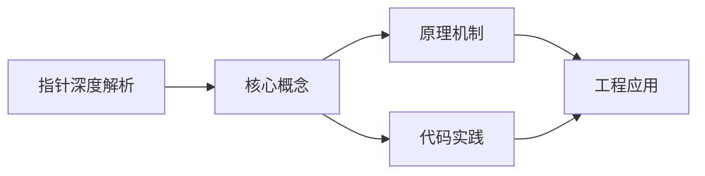
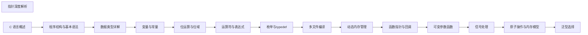

## 1. 学习目标（Bloom 分类）

本节按照布鲁姆教育目标分类学组织学习路径。本文主题为《指针深度解析》，属于 C 模块，读者可以根据自身阶段选择阅读深度。

记忆层面：能够准确复述本文的核心概念、术语与基本语法或操作步骤，并能够在提问或检索时快速定位对应知识点。能够说出 C 的变量、函数、指针、数组、结构体与预处理语法。

理解层面：能够用自己的语言解释核心原理与工作机制，说明概念之间的因果关系，而不是机械记忆结论。能够解释指针与内存地址、栈与堆、编译链接过程。

应用层面：能够在真实项目或练习场景中运用本文知识解决具体问题，写出正确且可维护的实现。能够编写系统工具、数据结构与嵌入式程序。

分析层面：能够拆解复杂问题，比较本文主题与相邻概念的异同，识别边界条件与例外情况。能够分析内存泄漏、缓冲区溢出与未定义行为。

评价层面：能够根据约束条件（性能、可读性、安全、成本）评价不同方案的优劣，做出有依据的技术决策。能够评价 C 与其他语言在系统编程中的取舍。

创造层面：能够把本文知识与其他模块知识组合，设计出新的解决方案或可复用的工程模式。能够设计可移植、可维护的 C 库与模块。

通过本节学习，读者应当能够把《指针深度解析》纳入自己的知识网络，并与 C 模块的其他主题（指针、内存管理、预处理器、标准库）建立关联。

## 2. 历史动机与发展脉络

《指针深度解析》是 C 领域的重要主题。要真正理解它，需要先了解它解决的问题与演进过程。

C 由 Dennis Ritchie 于 1972 年在贝尔实验室为 Unix 开发，是系统编程的基石语言：操作系统、编译器、嵌入式固件均以 C 为主。
C89（ANSI C）统一方言，C99 引入变长数组与 // 注释，C11 增加泛型选择与线程支持，C17 为缺陷修复版，C23（2024 年正式发布）引入 constexpr、属性、显式枚举底层类型等现代化特性。
C 的哲学是“信任程序员”：提供指针与内存操作的全部能力，同时把正确性责任交给开发者；这一设计成就了性能上限，也带来内存安全风险，催生了 Rust 等后继语言。

回到本文主题：指针深度解析 的提出与成熟，正是上述技术背景下的必然产物。早期实现往往以简单可用为目标，随着工程规模扩大，社区逐渐沉淀出标准做法与最佳实践；理解这一脉络，可以帮助读者判断“为什么文档中的推荐写法是现在这个样子”，也能在遇到历史遗留代码时准确识别其设计年代与取舍。


## 3. 形式化定义与核心概念精讲

本节把《指针深度解析》涉及的核心概念以“定义 + 讲解”的形式展开。读者应把定义当作工具，把讲解当作理解路径；两者结合才能形成可迁移的知识。

指针：指针保存变量地址，`&` 取地址、`*` 解引用；指针算术与数组名退化规则（数组名作为实参退化为首元素指针）是 C 的经典难点。
内存管理：栈内存自动释放，堆内存由 malloc/calloc/realloc/free 管理；所有权责任（谁分配谁释放）必须显式约定。
预处理器：#include/#define/#ifdef 在编译前文本处理；宏展开有副作用与优先级风险，函数式宏参数必须加括号。

### 3.1 原文章节逐一精讲

原文档把主题拆分为 25 个小节，下面按顺序给出每一节的导读讲解，随后保留原文细节供精读。

#### 原文精读（完整保留）

# 指针深度解析

> **符号约定**：`< >` 必填参数 | `[ ]` 可选参数

---

#### 1. 指针的概念与重要性

##### 1.1 什么是指针

- **指针**是一种变量，用于存储内存地址。
- **作用**：
- 直接访问内存，提高程序效率
- 实现函数间的数据共享（通过传址调用）
- 动态内存管理
- 实现复杂的数据结构（如链表、树、图等）
- 函数指针用于回调机制

##### 1.2 内存地址

- 计算机内存被划分为多个字节，每个字节都有一个唯一的地址。
- 指针存储的就是这些地址值。

#### 2. 指针的定义与初始化

##### 2.1 指针的定义

- **格式**：`type *pointer_name;`
- **示例**：

```c
 int *p; // 整型指针
 float *fp; // 浮点型指针
 char *cp; // 字符型指针
 void *vp; // 通用指针（可以指向任何类型）
```

##### 2.2 指针的初始化

- **使用取地址符 `&`**：

```c
 int a = 10;
 int *p = &a; // p 存储 a 的地址
```

- **使用 NULL**：

```c
 int *p = NULL; // 空指针
```

- **使用其他指针**：

```c
 int *p1 = &a;
 int *p2 = p1; // p2 指向与 p1 相同的地址
```

##### 2.3 指针的解引用

- **解引用**：使用 `*` 运算符访问指针指向的内存内容。
- **示例**：

```c
 int a = 10;
 int *p = &a;
 printf("a 的值: %d\n", a); // 输出 10
 printf("p 存储的地址: %p\n", p); // 输出 a 的地址
 printf("*p 的值: %d\n", *p); // 输出 10（解引用）
 *p = 20; // 通过指针修改 a 的值
 printf("修改后 a 的值: %d\n", a); // 输出 20
```

#### 3. 指针运算

##### 3.1 指针加法

- **格式**：`pointer + n`
- **含义**：指针向前移动 `n` 个元素的位置。
- **步长**：移动的字节数 = `n * sizeof(type)`

```c
 int arr[] = {10, 20, 30, 40, 50};
 int *p = arr; // 指向 arr[0]
 printf("*p = %d\n", *p); // 输出 10
 p = p + 1; // 移动到下一个元素
 printf("*p = %d\n", *p); // 输出 20
 p = p + 2; // 移动 2 个元素
 printf("*p = %d\n", *p); // 输出 40
```

##### 3.2 指针减法

- **格式**：`pointer - n`
- **含义**：指针向后移动 `n` 个元素的位置。

```c
 int arr[] = {10, 20, 30, 40, 50};
 int *p = &arr[4]; // 指向 arr[4]
 printf("*p = %d\n", *p); // 输出 50
 p = p - 1; // 移动到前一个元素
 printf("*p = %d\n", *p); // 输出 40
```

##### 3.3 指针比较

- 指针可以进行相等 (`==`)、不等 (`!=`)、大于 (`>`)、小于 (`<`) 等比较运算。
- 通常用于比较指针是否指向同一个内存位置，或在数组中比较位置。

```c
 int arr[] = {10, 20, 30};
 int *p1 = &arr[0];
 int *p2 = &arr[2];
 if (p1 < p2) {
  printf("p1 在 p2 的前面\n");
 }
 if (p1 == &arr[0]) {
  printf("p1 指向数组的第一个元素\n");
 }
```

##### 3.4 指针差值

- **格式**：`pointer1 - pointer2`
- **含义**：两个指针之间的元素个数。
- **条件**：两个指针必须指向同一个数组。

```c
 int arr[] = {10, 20, 30, 40, 50};
 int *p1 = &arr[0];
 int *p2 = &arr[3];
 int diff = p2 - p1;
 printf("p2 和 p1 之间的元素个数: %d\n", diff); // 输出 3
```

#### 4. 指针与数组

##### 4.1 数组名与指针的关系

- **数组名**是数组首元素的地址，是一个常量指针（不能修改）。
- **等价关系**：`arr` 等同于 `&arr[0]`

```c
 int arr[5] = {1, 2, 3, 4, 5};
 int *p = arr; // 等同于 int *p = &arr[0];
 // 访问数组元素的两种方式
 printf("arr[2] = %d\n", arr[2]); // 使用数组下标
 printf("*(p + 2) = %d\n", *(p + 2)); // 使用指针
```

##### 4.2 指针遍历数组

```c
 int arr[] = {1, 2, 3, 4, 5};
 int *p = arr;
 int size = sizeof(arr) / sizeof(arr[0]);
 for (int i = 0; i < size; i++) {
  printf("%d ", *p);
  p++; // 指针移动到下一个元素
 }
 printf("\n");
```

##### 4.3 数组作为函数参数

- 数组作为函数参数时，会退化为指向首元素的指针。
- 函数内部无法通过 `sizeof` 获取数组的总大小。

```c
 // 函数声明
 void print_array(int *arr, int size);
 // 函数定义
 void print_array(int *arr, int size) {
  for (int i = 0; i < size; i++) {
  printf("%d ", arr[i]);
  }
  printf("\n");
 }
 // 调用
 int main() {
  int numbers[] = {1, 2, 3, 4, 5};
  int size = sizeof(numbers) / sizeof(numbers[0]);
  print_array(numbers, size);
  return 0;
 }
```

#### 5. 指针数组与数组指针

##### 5.1 指针数组

- **定义**：`type *array_name[size];`
- **含义**：一个数组，每个元素都是指针。
- **示例**：

```c
 // 整型指针数组
 int *ptr_array[3];
 int a = 10, b = 20, c = 30;
 ptr_array[0] = &a;
 ptr_array[1] = &b;
 ptr_array[2] = &c;
 // 字符串数组（字符指针数组）
 char *str_array[] = {
 "Hello",
 "World",
 "C Language"
 };
```

##### 5.2 数组指针

- **定义**：`type (*pointer_name)[size];`
- **含义**：一个指针，指向一个数组。
- **示例**：

```c
 int arr[3] = {1, 2, 3};
 int (*p)[3] = &arr; // 指向整个数组
 printf("*(*p) = %d\n", *(*p)); // 输出 1
 printf("*(*p + 1) = %d\n", *(*p + 1)); // 输出 2
 printf("(*p)[2] = %d\n", (*p)[2]); // 输出 3
```

##### 5.3 区别与应用

- **指针数组**：适用于存储多个不同内存位置的地址，如字符串数组。
- **数组指针**：适用于指向二维数组的行，或作为函数参数传递二维数组。

#### 6. 多级指针

##### 6.1 二级指针

- **定义**：`type **pointer_name;`
- **含义**：指向指针的指针。
- **示例**：

```c
 int a = 10;
 int *p = &a; // 一级指针
 int **pp = &p; // 二级指针
 printf("a = %d\n", a); // 输出 10
 printf("*p = %d\n", *p); // 输出 10
 printf("**pp = %d\n", **pp); // 输出 10
 // 通过二级指针修改 a 的值
 **pp = 20;
 printf("修改后 a = %d\n", a); // 输出 20
```

##### 6.2 三级及以上指针

- **定义**：`type ***pointer_name;`
- **使用场景**：较少使用，通常用于复杂的数据结构或函数参数。

##### 6.3 应用场景

- **动态二维数组**：

```c
 int rows = 3, cols = 4;
 int **matrix = (int **)malloc(rows * sizeof(int *));
 for (int i = 0; i < rows; i++) {
 matrix[i] = (int *)malloc(cols * sizeof(int));
 }
 // 使用二维数组
 for (int i = 0; i < rows; i++) {
 for (int j = 0; j < cols; j++) {
 matrix[i][j] = i * cols + j;
 }
 }
 // 释放内存
 for (int i = 0; i < rows; i++) {
 free(matrix[i]);
 }
 free(matrix);
```

#### 7. 函数指针

##### 7.1 函数指针的定义

- **格式**：`return_type (*pointer_name)(parameter_list);`
- **示例**：

```c
 int add(int a, int b) {
 return a + b;
 }
 // 定义函数指针
 int (*func_ptr)(int, int);
 // 赋值
 func_ptr = add;
 // 或直接初始化
 int (*func_ptr)(int, int) = add;
```

##### 7.2 通过函数指针调用函数

```c
 int result = func_ptr(10, 20); // 调用 add 函数
 printf("Result: %d\n", result); // 输出 30
 // 也可以使用 (*func_ptr) 的形式
 int result = (*func_ptr)(10, 20);
```

##### 7.3 函数指针的应用

###### 7.3.1 回调函数

```c
 // 回调函数类型
 typedef int (*CompareFunc)(int, int);
 // 排序函数
 void sort(int arr[], int size, CompareFunc compare) {
  for (int i = 0; i < size - 1; i++) {
  for (int j = 0; j < size - i - 1; j++) {
  if (compare(arr[j], arr[j + 1]) > 0) {
  // 交换元素
  int temp = arr[j];
  arr[j] = arr[j + 1];
  arr[j + 1] = temp;
  }
  }
  }
 }
 // 比较函数
 int ascending(int a, int b) {
  return a - b;
 }
 int descending(int a, int b) {
  return b - a;
 }
 // 使用
 int main() {
  int arr[] = {5, 2, 8, 1, 9};
  int size = sizeof(arr) / sizeof(arr[0]);
  // 升序排序
  sort(arr, size, ascending);
  // 降序排序
  sort(arr, size, descending);
  return 0;
 }
```

###### 7.3.2 函数指针数组

```c
 int add(int a, int b) { return a + b; }
 int subtract(int a, int b) { return a - b; }
 int multiply(int a, int b) { return a * b; }
 int divide(int a, int b) { return b != 0 ? a / b : 0; }
 int main() {
  // 函数指针数组
  int (*operations[])(int, int) = {add, subtract, multiply, divide};
  char *op_names[] = {"+", "-", "*", "/"};
  int a = 10, b = 5;
  for (int i = 0; i < 4; i++) {
  int result = operations[i](a, b);
  printf("%d %s %d = %d\n", a, op_names[i], b, result);
  }
  return 0;
 }
```

#### 8. void 指针

##### 8.1 概念

- **void 指针**：通用指针，可以指向任何类型的内存地址。
- **特点**：
- 不能直接解引用，需要先转换为具体类型的指针
- 不能进行指针算术运算
- 常用于函数参数和返回值，以实现通用性

##### 8.2 示例

```c
 void *generic_ptr;
 int a = 10;
 char c = 'A';
 // 指向整型
 generic_ptr = &a;
 printf("Value: %d\n", *(int *)generic_ptr); // 先转换为 int* 再解引用
 // 指向字符
 generic_ptr = &c;
 printf("Value: %c\n", *(char *)generic_ptr); // 先转换为 char* 再解引用
```

##### 8.3 应用场景

- **内存分配函数**：`malloc`, `calloc`, `realloc` 返回 void 指针
- **通用数据处理函数**：如 `memcpy`, `memset` 等
- **回调函数参数**：实现多态

#### 9. 指针与动态内存管理

##### 9.1 动态内存分配

- **malloc**：分配指定字节数的内存

```c
 int *p = (int *)malloc(5 * sizeof(int));
```

- **calloc**：分配指定数量和大小的内存，并初始化为 0

```c
 int *p = (int *)calloc(5, sizeof(int));
```

- **realloc**：重新分配内存大小

```c
 int *new_p = (int *)realloc(p, 10 * sizeof(int));
```

##### 9.2 内存释放

- **free**：释放动态分配的内存

```c
 free(p);
 p = NULL; // 避免野指针
```

##### 9.3 示例

```c
 #include <stdio.h>
 #include <stdlib.h>
 int main() {
  int size;
  printf("Enter array size: ");
  scanf("%d", &size);
  // 分配内存
  int *arr = (int *)malloc(size * sizeof(int));
  if (arr == NULL) {
  printf("Memory allocation failed!\n");
  return 1;
  }
  // 初始化数组
  for (int i = 0; i < size; i++) {
  arr[i] = i + 1;
  }
  // 使用数组
  printf("Array elements: ");
  for (int i = 0; i < size; i++) {
  printf("%d ", arr[i]);
  }
  printf("\n");
  // 释放内存
  free(arr);
  arr = NULL; // 避免野指针
  return 0;
 }
```

#### 10. 常见指针错误与陷阱

##### 10.1 野指针 (Wild Pointer)

- **定义**：指向随机内存或已释放内存的指针。
- **原因**：
- 未初始化的指针
- 指针指向的内存已被释放
- 指针越界
- **避免方法**：
- 初始化指针为 NULL
- 释放内存后将指针置为 NULL
- 避免指针越界

##### 10.2 空指针解引用

- **定义**：对 NULL 指针进行解引用操作。
- **后果**：程序崩溃（段错误）。
- **避免方法**：使用指针前检查是否为 NULL。

##### 10.3 内存泄漏

- **定义**：动态分配的内存未被释放，导致内存资源浪费。
- **避免方法**：
- 每一次 `malloc`/`calloc` 都对应一次 `free`
- 使用 RAII 模式（在 C++ 中）
- 使用内存管理工具如 Valgrind 检测

##### 10.4 指针越界

- **定义**：指针访问超出其指向内存范围的位置。
- **后果**：
- 访问无效内存，导致程序崩溃
- 修改其他变量的值，导致数据损坏
- 安全漏洞（如缓冲区溢出）
- **避免方法**：
- 确保指针操作在有效范围内
- 使用边界检查
- 避免使用魔法数字

##### 10.5 悬垂指针 (Dangling Pointer)

- **定义**：指针指向的内存已被释放，但指针本身未置为 NULL。
- **后果**：再次使用该指针会导致未定义行为。
- **避免方法**：释放内存后将指针置为 NULL。

#### 11. 指针的最佳实践

##### 11.1 命名规范

- 指针变量名通常以 `p` 或 `ptr` 开头，如 `int *p_value`, `char *ptr_name`
- 函数指针通常以 `func` 或 `callback` 开头，如 `int (*func_add)(int, int)`

##### 11.2 代码风格

- **缩进**：使用一致的缩进风格
- **注释**：为复杂的指针操作添加注释
- **格式**：保持代码格式的一致性
- **括号**：使用括号明确指针操作的优先级

##### 11.3 安全使用

- **初始化**：总是初始化指针（为 NULL 或有效地址）
- **检查**：使用指针前检查是否为 NULL
- **释放**：动态分配的内存必须释放
- **置空**：释放内存后将指针置为 NULL
- **边界**：避免指针越界

##### 11.4 性能优化

- **缓存友好**：按内存顺序访问数据
- **减少解引用**：减少不必要的指针解引用操作
- **避免频繁分配**：减少动态内存分配的次数
- **使用局部变量**：局部变量存储在栈中，访问速度快

#### 12. 指针示例：完整应用

```c
 #include <stdio.h>
 #include <stdlib.h>
 // 函数声明
 int *create_array(int size);
 void initialize_array(int *arr, int size);
 void print_array(int *arr, int size);
 int *find_max(int *arr, int size);
 void free_array(int *arr);
 int main() {
  int size;
  printf("Enter array size: ");
  scanf("%d", &size);
  // 创建动态数组
  int *arr = create_array(size);
  if (arr == NULL) {
  printf("Memory allocation failed!\n");
  return 1;
  }
  // 初始化数组
  initialize_array(arr, size);
  // 打印数组
  printf("Array elements: ");
  print_array(arr, size);
  // 查找最大值
  int *max_ptr = find_max(arr, size);
  printf("Maximum value: %d\n", *max_ptr);
  printf("Maximum value at index: %d\n", max_ptr - arr);
  // 释放内存
  free_array(arr);
  return 0;
 }
 // 创建动态数组
 int *create_array(int size) {
  return (int *)malloc(size * sizeof(int));
 }
 // 初始化数组为随机值
 void initialize_array(int *arr, int size) {
  for (int i = 0; i < size; i++) {
  arr[i] = rand() % 100;
  }
 }
 // 打印数组
 void print_array(int *arr, int size) {
  for (int i = 0; i < size; i++) {
  printf("%d ", arr[i]);
  }
  printf("\n");
 }
 // 查找最大值并返回其指针
 int *find_max(int *arr, int size) {
  int *max_ptr = arr;
  for (int *p = arr + 1; p < arr + size; p++) {
  if (*p > *max_ptr) {
  max_ptr = p;
  }
  }
  return max_ptr;
 }
 // 释放数组内存
 void free_array(int *arr) {
  free(arr);
 }
```

#### 13. 指针与其他语言的对比

##### 13.1 C++ 中的指针

- C++ 保留了 C 语言的指针特性
- 额外提供了引用 (reference) 作为更安全的替代
- 提供了智能指针 (smart pointers) 如 `unique_ptr`, `shared_ptr` 来管理内存

##### 13.2 Java 中的引用

- Java 没有显式的指针概念，只有引用
- 引用不能进行算术运算
- 内存管理由垃圾回收器自动处理

##### 13.3 Python 中的引用

- Python 中的变量都是引用
- 没有指针算术
- 内存管理由垃圾回收器自动处理

#### 14. 指针的高级应用

##### 14.1 链表实现

```c
 typedef struct Node {
  int data;
  struct Node *next;
 }
 // 创建新节点
 Node *create_node(int data) {
  Node *new_node = (Node *)malloc(sizeof(Node));
  if (new_node == NULL) {
  return NULL;
  }
  new_node->data = data;
  new_node->next = NULL;
  return new_node;
 }
 // 添加节点到链表末尾
 void append(Node **head, int data) {
  Node *new_node = create_node(data);
  if (*head == NULL) {
  *head = new_node;
  return;
  }
  Node *temp = *head;
  while (temp->next != NULL) {
  temp = temp->next;
  }
  temp->next = new_node;
 }
 // 打印链表
 void print_list(Node *head) {
  Node *temp = head;
  while (temp != NULL) {
  printf("%d -> ", temp->data);
  temp = temp->next;
  }
  printf("NULL\n");
 }
 // 释放链表
 void free_list(Node *head) {
  Node *temp;
  while (head != NULL) {
  temp = head;
  head = head->next;
  free(temp);
  }
 }
```

##### 14.2 二叉树实现

```c
 typedef struct TreeNode {
  int data;
  struct TreeNode *left;
  struct TreeNode *right;
 }
 // 创建新节点
 TreeNode *create_node(int data) {
  TreeNode *new_node = (TreeNode *)malloc(sizeof(TreeNode));
  if (new_node == NULL) {
  return NULL;
  }
  new_node->data = data;
  new_node->left = NULL;
  new_node->right = NULL;
  return new_node;
 }
 // 插入节点
 TreeNode *insert(TreeNode *root, int data) {
  if (root == NULL) {
  return create_node(data);
  }
  if (data < root->data) {
  root->left = insert(root->left, data);
  } else if (data > root->data) {
  root->right = insert(root->right, data);
  }
  return root;
 }
 // 中序遍历
 void inorder_traversal(TreeNode *root) {
  if (root != NULL) {
  inorder_traversal(root->left);
  printf("%d ", root->data);
  inorder_traversal(root->right);
  }
 }
 // 释放树
 void free_tree(TreeNode *root) {
  if (root != NULL) {
  free_tree(root->left);
  free_tree(root->right);
  free(root);
  }
 }
```

---

#### 延伸阅读

- [C++ 指针](cpp/cpp-pointers)
#### 指针基础

**基本写法：指针声明与初始化**
`<type> *<ptr_name> = &<var>;`
```c
// ptr 指向 x 的地址
int x = 10;
int *ptr = &x;
```

---

**基本写法：指针声明（未初始化）**
`<type> *<ptr_name>;`
```c
// 声明未初始化的指针
int *ptr;
```

---

**空指针写法：初始化为 NULL**
`<type> *<ptr_name> = NULL;`
```c
// 初始化为空指针
int *ptr = NULL;
```

---

**解引用写法：通过指针读取值**
`*<ptr>`
```c
// 解引用获取指针指向的值
int x = 10;
int *ptr = &x;
printf("值: %d\n", *ptr);
```

---

**解引用写法：通过指针修改值**
`*<ptr> = <new_value>;`
```c
// 通过指针修改变量的值
int x = 10;
int *ptr = &x;
*ptr = 20;
```

---

**取地址写法：获取变量地址**
`&<var>`
```c
// 获取变量地址
int x = 10;
printf("地址: %p\n", (void*)&x);
```

---

#### 指针类型

**基本写法：不同类型指针**
`<type> *<ptr_name>;`
```c
// 不同类型的指针
int *int_ptr;
char *char_ptr;
double *double_ptr;
```

---

**void 指针写法：通用指针**
`void *<ptr_name>;`
```c
// 可以指向任何类型的通用指针
void *generic_ptr;
int x = 10;
generic_ptr = &x;
```

---

**void 指针转换写法：类型转换**
`(<target_type> *)<void_ptr>`
```c
// void 指针转换为具体类型指针
void *ptr = &x;
int *int_ptr = (int *)ptr;
```

---

**const 指针写法：指向常量的指针**
`const <type> *<ptr_name>;`
```c
// 不能通过指针修改所指向的值
const int *p1;
```

---

**常量指针写法：指针本身为常量**
`<type> * const <ptr_name> = &<var>;`
```c
// 指针本身不能改变指向
int x = 10;
int* const p3 = &x;
```

---

**双重 const 写法：指向常量的常量指针**
`const <type> * const <ptr_name> = &<var>;`
```c
// 既不能修改值，也不能修改指针
int x = 10;
const int* const p4 = &x;
```

---

#### 指针与数组

**基本写法：数组名作为指针**
`<type> *<ptr> = <array_name>;`
```c
// 数组名即首元素地址
int arr[5] = {1, 2, 3, 4, 5};
int *p = arr;
```

---

**指针算术写法：指针加减运算**
`<ptr> + <n>` 或 `<ptr> - <n>`
```c
// 指针向后移动 n 个元素
int arr[5] = {1, 2, 3, 4, 5};
int *p = arr;
int *q = p + 2;
```

---

**自增写法：指针自增**
`<ptr>++` 或 `++<ptr>`
```c
// 指针指向下一个元素
int arr[5] = {1, 2, 3, 4, 5};
int *p = arr;
p++;
```

---

**指针差写法：计算两个指针间元素个数**
`<ptr1> - <ptr2>`
```c
// 计算指针间元素个数
int arr[5] = {1, 2, 3, 4, 5};
int *p1 = &arr[0];
int *p2 = &arr[3];
int diff = p2 - p1;
```

---

**下标写法：指针下标访问**
`<ptr>[<index>]`
```c
// 指针使用下标访问
int arr[5] = {1, 2, 3, 4, 5};
int *p = arr;
printf("%d\n", p[2]);
```

---

#### 指针数组与数组指针

**指针数组写法：存储指针的数组**
`<type> *<array_name>[<size>];`
```c
// 指针数组
int *ptr_array[3];
int a = 10, b = 20, c = 30;
ptr_array[0] = &a;
```

---

**数组指针写法：指向数组的指针**
`<type> (*<ptr_name>)[<size>];`
```c
// 指向整个数组的指针
int arr[5] = {1, 2, 3, 4, 5};
int (*p)[5] = &arr;
```

---

#### 字符串指针

**基本写法：字符串指针**
`char *<str> = "<string>";`
```c
// 字符串指针指向字符串常量
char *str = "Hello C";
```

---

**字符数组写法：字符数组**
`char <str>[] = "<string>";`
```c
// 字符数组存储字符串
char str[] = "Hello C";
```

---

**遍历写法：使用指针遍历字符串**
`while (*<ptr> != '\0') { ... <ptr>++; }`
```c
// 使用指针遍历字符串
char *str = "Hello";
while (*str != '\0') {
    printf("%c", *str);
    str++;
}
```

---

#### 函数指针

**基本写法：函数指针定义**
`<return_type> (*<ptr_name>)(<parameter_list>);`
```c
// 定义函数指针
int (*add_ptr)(int, int);
```

---

**赋值写法：函数指针赋值**
`<func_ptr> = <func_name>;`
```c
// 将函数地址赋给指针
add_ptr = add;
```

---

**调用写法：通过函数指针调用**
`<result> = <func_ptr>(<args>);`
```c
// 通过函数指针调用函数
int result = add_ptr(10, 20);
```

---

**typedef 写法：定义回调函数类型**
`typedef <return_type> (*<CallbackName>)(<params>);`
```c
// 定义回调函数类型
typedef void (*Callback)(int);
```

---

**回调写法：使用回调函数**
`void <func>(<type> <arr>[], int <size>, <CallbackType> <callback>) { ... }`
```c
// 执行回调的函数
void process_array(int arr[], int size, Callback callback) {
    for (int i = 0; i < size; i++) {
        callback(arr[i]);
    }
}
```

---

**数组写法：函数指针数组**
`<return_type> (*<array_name>[])(<params>) = { <func1>, <func2>, ... };`
```c
// 函数指针数组
int (*operations[])(int, int) = {add, subtract, multiply};
```

---

#### 多级指针

**二级指针写法：指向指针的指针**
`<type> **<ptr_name>;`
```c
// 二级指针
int x = 10;
int *p = &x;
int **pp = &p;
```

---

**二级指针访问写法：解引用二级指针**
`**<ptr_name>`
```c
// 通过二级指针访问原始值
int x = 10;
int *p = &x;
int **pp = &p;
printf("%d\n", **pp);
```

---

**三级指针写法：三级指针**
`<type> ***<ptr_name>;`
```c
// 三级指针
int x = 10;
int *p = &x;
int **pp = &p;
int ***ppp = &pp;
```

---

#### 动态内存分配

**malloc 写法：分配内存**
`<type> *<ptr> = (<type> *)malloc(<size> * sizeof(<type>));`
```c
#include <stdlib.h>
// 分配单个变量的内存
int *p = (int *)malloc(sizeof(int));
```

---

**calloc 写法：分配并清零**
`<type> *<ptr> = (<type> *)calloc(<count>, sizeof(<type>));`
```c
#include <stdlib.h>
// 分配数组并初始化为 0
int *arr = (int *)calloc(10, sizeof(int));
```

---

**realloc 写法：重新分配内存**
`<type> *<new_ptr> = (<type> *)realloc(<ptr>, <new_size> * sizeof(<type>));`
```c
#include <stdlib.h>
// 重新调整内存大小
int *new_arr = (int *)realloc(arr, 20 * sizeof(int));
```

---

**free 写法：释放内存**
`free(<ptr>);`
```c
#include <stdlib.h>
// 释放动态分配的内存
free(p);
```

---

#### 指针与结构体

**基本写法：指向结构体的指针**
`<StructType> *<ptr_name> = &<var>;`
```c
// 指向结构体的指针
typedef struct { int x; int y; } Point;
Point p = {10, 20};
Point *ptr = &p;
```

---

**成员访问写法：通过指针访问成员**
`<ptr>-><member>`
```c
// 使用 -> 访问结构体成员
printf("x: %d\n", ptr->x);
```

---

#### 指针常见陷阱

**野指针写法：未初始化的指针**
`<type> *<ptr>;` （危险）
```c
// 危险：未初始化的指针
int *ptr;
// *ptr = 10; // 未定义行为
```

---

**悬空指针写法：释放后仍使用**
`free(<ptr>); <ptr> = NULL;`
```c
// 释放后将指针置空
free(p);
p = NULL;
```


### 3.2 概念关系图

下面用 Mermaid 图表达本文核心概念之间的关系，帮助读者建立整体图景：



图中展示的是本文知识的结构化关系：核心概念是入口，原理机制解释“为什么”，代码实践演示“怎么做”，工程应用回答“何时用”。读者学习时可以把每个小节的内容挂接到对应节点上。

## 4. 理论推导与原理解析

本节深入《指针深度解析》背后的原理。理论部分不求面面俱到，而是聚焦“能解释现象、能指导实践”的关键推导。

指针：指针保存变量地址，`&` 取地址、`*` 解引用；指针算术与数组名退化规则（数组名作为实参退化为首元素指针）是 C 的经典难点。
内存管理：栈内存自动释放，堆内存由 malloc/calloc/realloc/free 管理；所有权责任（谁分配谁释放）必须显式约定。
预处理器：#include/#define/#ifdef 在编译前文本处理；宏展开有副作用与优先级风险，函数式宏参数必须加括号。
编译链接：预处理 -> 编译 -> 汇编 -> 链接；头文件声明接口，源文件实现；静态库与动态库（.a/.so/.dll）决定部署形态。

需要强调的是，理论推导与工程实践之间存在翻译层：理论给出的是理想化模型与边界条件，工程代码则必须处理真实环境中的例外。读者在学习时应先掌握理论的“标准情形”，再通过陷阱章节了解“非标准情形”。

## 5. 代码示例与逐行讲解

本节把原文中的代码示例系统整理，并为每个示例补充用途说明与讲解。读者不应只浏览代码，而应逐段对照讲解理解设计意图。

### 5.1 示例：2.1 指针的定义

该示例来自原文《2.1 指针的定义》小节，用于演示指针深度解析相关操作。阅读时请先看代码结构，再看其后的讲解。

```c
 int *p; // 整型指针
 float *fp; // 浮点型指针
 char *cp; // 字符型指针
 void *vp; // 通用指针（可以指向任何类型）
```

讲解：这段代码演示了本节核心知识点。代码中的关键操作可以归纳为三步：准备（定义或初始化）、执行（核心逻辑）、收尾（释放资源或返回结果）。实际项目中，这三步往往被封装为函数或类，以提升复用性与可测试性。

关键点分析：

该示例共 4 行有效代码，结构以数据或配置为主。阅读时应关注：数据字段的含义、配置项的作用，以及它们与运行行为的对应关系。

进阶思考路径：先尝试修改参数观察行为变化，再把示例中的模式迁移到自己的项目中；每次修改都记录预期与实测差异，这是把示例转化为能力的最快方式。

### 5.2 示例：2.2 指针的初始化

该示例来自原文《2.2 指针的初始化》小节，用于演示指针深度解析相关操作。阅读时请先看代码结构，再看其后的讲解。

```c
 int a = 10;
 int *p = &a; // p 存储 a 的地址
```

讲解：这段代码演示了本节核心知识点。代码中的关键操作可以归纳为三步：准备（定义或初始化）、执行（核心逻辑）、收尾（释放资源或返回结果）。实际项目中，这三步往往被封装为函数或类，以提升复用性与可测试性。

关键点分析：

该示例共 2 行有效代码，结构以数据或配置为主。阅读时应关注：数据字段的含义、配置项的作用，以及它们与运行行为的对应关系。

进阶思考路径：先尝试修改参数观察行为变化，再把示例中的模式迁移到自己的项目中；每次修改都记录预期与实测差异，这是把示例转化为能力的最快方式。

### 5.3 示例：2.2 指针的初始化

该示例来自原文《2.2 指针的初始化》小节，用于演示指针深度解析相关操作。阅读时请先看代码结构，再看其后的讲解。

```c
 int *p = NULL; // 空指针
```

讲解：这段代码演示了本节核心知识点。代码中的关键操作可以归纳为三步：准备（定义或初始化）、执行（核心逻辑）、收尾（释放资源或返回结果）。实际项目中，这三步往往被封装为函数或类，以提升复用性与可测试性。

关键点分析：

该示例共 1 行有效代码，结构以数据或配置为主。阅读时应关注：数据字段的含义、配置项的作用，以及它们与运行行为的对应关系。

进阶思考路径：先尝试修改参数观察行为变化，再把示例中的模式迁移到自己的项目中；每次修改都记录预期与实测差异，这是把示例转化为能力的最快方式。

### 5.4 示例：2.2 指针的初始化

该示例来自原文《2.2 指针的初始化》小节，用于演示指针深度解析相关操作。阅读时请先看代码结构，再看其后的讲解。

```c
 int *p1 = &a;
 int *p2 = p1; // p2 指向与 p1 相同的地址
```

讲解：这段代码演示了本节核心知识点。代码中的关键操作可以归纳为三步：准备（定义或初始化）、执行（核心逻辑）、收尾（释放资源或返回结果）。实际项目中，这三步往往被封装为函数或类，以提升复用性与可测试性。

关键点分析：

该示例共 2 行有效代码，结构以数据或配置为主。阅读时应关注：数据字段的含义、配置项的作用，以及它们与运行行为的对应关系。

进阶思考路径：先尝试修改参数观察行为变化，再把示例中的模式迁移到自己的项目中；每次修改都记录预期与实测差异，这是把示例转化为能力的最快方式。

### 5.5 示例：2.3 指针的解引用

该示例来自原文《2.3 指针的解引用》小节，用于演示指针深度解析相关操作。阅读时请先看代码结构，再看其后的讲解。

```c
 int a = 10;
 int *p = &a;
 printf("a 的值: %d\n", a); // 输出 10
 printf("p 存储的地址: %p\n", p); // 输出 a 的地址
 printf("*p 的值: %d\n", *p); // 输出 10（解引用）
 *p = 20; // 通过指针修改 a 的值
 printf("修改后 a 的值: %d\n", a); // 输出 20
```

讲解：这段代码演示了本节核心知识点。代码中的关键操作可以归纳为三步：准备（定义或初始化）、执行（核心逻辑）、收尾（释放资源或返回结果）。实际项目中，这三步往往被封装为函数或类，以提升复用性与可测试性。

关键点分析：

该示例共 7 行有效代码，结构以数据或配置为主。阅读时应关注：数据字段的含义、配置项的作用，以及它们与运行行为的对应关系。

进阶思考路径：先尝试修改参数观察行为变化，再把示例中的模式迁移到自己的项目中；每次修改都记录预期与实测差异，这是把示例转化为能力的最快方式。

### 5.6 示例：3.1 指针加法

该示例来自原文《3.1 指针加法》小节，用于演示指针深度解析相关操作。阅读时请先看代码结构，再看其后的讲解。

```c
 int arr[] = {10, 20, 30, 40, 50};
 int *p = arr; // 指向 arr[0]
 printf("*p = %d\n", *p); // 输出 10
 p = p + 1; // 移动到下一个元素
 printf("*p = %d\n", *p); // 输出 20
 p = p + 2; // 移动 2 个元素
 printf("*p = %d\n", *p); // 输出 40
```

讲解：这段代码演示了本节核心知识点。代码中的关键操作可以归纳为三步：准备（定义或初始化）、执行（核心逻辑）、收尾（释放资源或返回结果）。实际项目中，这三步往往被封装为函数或类，以提升复用性与可测试性。

关键点分析：

该示例共 7 行有效代码，结构以数据或配置为主。阅读时应关注：数据字段的含义、配置项的作用，以及它们与运行行为的对应关系。

进阶思考路径：先尝试修改参数观察行为变化，再把示例中的模式迁移到自己的项目中；每次修改都记录预期与实测差异，这是把示例转化为能力的最快方式。

### 5.7 示例：3.2 指针减法

该示例来自原文《3.2 指针减法》小节，用于演示指针深度解析相关操作。阅读时请先看代码结构，再看其后的讲解。

```c
 int arr[] = {10, 20, 30, 40, 50};
 int *p = &arr[4]; // 指向 arr[4]
 printf("*p = %d\n", *p); // 输出 50
 p = p - 1; // 移动到前一个元素
 printf("*p = %d\n", *p); // 输出 40
```

讲解：这段代码演示了本节核心知识点。代码中的关键操作可以归纳为三步：准备（定义或初始化）、执行（核心逻辑）、收尾（释放资源或返回结果）。实际项目中，这三步往往被封装为函数或类，以提升复用性与可测试性。

关键点分析：

该示例共 5 行有效代码，结构以数据或配置为主。阅读时应关注：数据字段的含义、配置项的作用，以及它们与运行行为的对应关系。

进阶思考路径：先尝试修改参数观察行为变化，再把示例中的模式迁移到自己的项目中；每次修改都记录预期与实测差异，这是把示例转化为能力的最快方式。

### 5.8 示例：3.3 指针比较

该示例来自原文《3.3 指针比较》小节，用于演示指针深度解析相关操作。阅读时请先看代码结构，再看其后的讲解。

```c
 int arr[] = {10, 20, 30};
 int *p1 = &arr[0];
 int *p2 = &arr[2];
 if (p1 < p2) {
  printf("p1 在 p2 的前面\n");
 }
 if (p1 == &arr[0]) {
  printf("p1 指向数组的第一个元素\n");
 }
```

讲解：这段代码演示了本节核心知识点。代码中的关键操作可以归纳为三步：准备（定义或初始化）、执行（核心逻辑）、收尾（释放资源或返回结果）。实际项目中，这三步往往被封装为函数或类，以提升复用性与可测试性。

关键点分析：

该示例共 9 行有效代码，包含 1 类关键结构（if）。其中：

- 入口与初始化部分负责建立上下文，对应实际项目中的启动或装配逻辑；
- 核心逻辑部分体现本文主题的主要操作，是阅读时最需要对照讲解理解的部分；
- 输出或返回部分把结果交给调用方，注意其类型与边界条件。

进阶思考路径：先尝试修改参数观察行为变化，再把示例中的模式迁移到自己的项目中；每次修改都记录预期与实测差异，这是把示例转化为能力的最快方式。

### 5.9 示例：3.4 指针差值

该示例来自原文《3.4 指针差值》小节，用于演示指针深度解析相关操作。阅读时请先看代码结构，再看其后的讲解。

```c
 int arr[] = {10, 20, 30, 40, 50};
 int *p1 = &arr[0];
 int *p2 = &arr[3];
 int diff = p2 - p1;
 printf("p2 和 p1 之间的元素个数: %d\n", diff); // 输出 3
```

讲解：这段代码演示了本节核心知识点。代码中的关键操作可以归纳为三步：准备（定义或初始化）、执行（核心逻辑）、收尾（释放资源或返回结果）。实际项目中，这三步往往被封装为函数或类，以提升复用性与可测试性。

关键点分析：

该示例共 5 行有效代码，结构以数据或配置为主。阅读时应关注：数据字段的含义、配置项的作用，以及它们与运行行为的对应关系。

进阶思考路径：先尝试修改参数观察行为变化，再把示例中的模式迁移到自己的项目中；每次修改都记录预期与实测差异，这是把示例转化为能力的最快方式。

### 5.10 示例：4.1 数组名与指针的关系

该示例来自原文《4.1 数组名与指针的关系》小节，用于演示指针深度解析相关操作。阅读时请先看代码结构，再看其后的讲解。

```c
 int arr[5] = {1, 2, 3, 4, 5};
 int *p = arr; // 等同于 int *p = &arr[0];
 // 访问数组元素的两种方式
 printf("arr[2] = %d\n", arr[2]); // 使用数组下标
 printf("*(p + 2) = %d\n", *(p + 2)); // 使用指针
```

讲解：这段代码演示了本节核心知识点。代码中的关键操作可以归纳为三步：准备（定义或初始化）、执行（核心逻辑）、收尾（释放资源或返回结果）。实际项目中，这三步往往被封装为函数或类，以提升复用性与可测试性。

关键点分析：

该示例共 5 行有效代码，结构以数据或配置为主。阅读时应关注：数据字段的含义、配置项的作用，以及它们与运行行为的对应关系。

进阶思考路径：先尝试修改参数观察行为变化，再把示例中的模式迁移到自己的项目中；每次修改都记录预期与实测差异，这是把示例转化为能力的最快方式。

### 5.11 示例：4.2 指针遍历数组

该示例来自原文《4.2 指针遍历数组》小节，用于演示指针深度解析相关操作。阅读时请先看代码结构，再看其后的讲解。

```c
 int arr[] = {1, 2, 3, 4, 5};
 int *p = arr;
 int size = sizeof(arr) / sizeof(arr[0]);
 for (int i = 0; i < size; i++) {
  printf("%d ", *p);
  p++; // 指针移动到下一个元素
 }
 printf("\n");
```

讲解：这段代码演示了本节核心知识点。代码中的关键操作可以归纳为三步：准备（定义或初始化）、执行（核心逻辑）、收尾（释放资源或返回结果）。实际项目中，这三步往往被封装为函数或类，以提升复用性与可测试性。

关键点分析：

该示例共 8 行有效代码，包含 1 类关键结构（for）。其中：

- 入口与初始化部分负责建立上下文，对应实际项目中的启动或装配逻辑；
- 核心逻辑部分体现本文主题的主要操作，是阅读时最需要对照讲解理解的部分；
- 输出或返回部分把结果交给调用方，注意其类型与边界条件。

进阶思考路径：先尝试修改参数观察行为变化，再把示例中的模式迁移到自己的项目中；每次修改都记录预期与实测差异，这是把示例转化为能力的最快方式。

### 5.12 示例：4.3 数组作为函数参数

该示例来自原文《4.3 数组作为函数参数》小节，用于演示指针深度解析相关操作。阅读时请先看代码结构，再看其后的讲解。

```c
 // 函数声明
 void print_array(int *arr, int size);
 // 函数定义
 void print_array(int *arr, int size) {
  for (int i = 0; i < size; i++) {
  printf("%d ", arr[i]);
  }
  printf("\n");
 }
 // 调用
 int main() {
  int numbers[] = {1, 2, 3, 4, 5};
  int size = sizeof(numbers) / sizeof(numbers[0]);
  print_array(numbers, size);
  return 0;
 }
```

讲解：这段代码演示了本节核心知识点。代码中的关键操作可以归纳为三步：准备（定义或初始化）、执行（核心逻辑）、收尾（释放资源或返回结果）。实际项目中，这三步往往被封装为函数或类，以提升复用性与可测试性。

关键点分析：

该示例共 16 行有效代码，包含 2 类关键结构（for、return）。其中：

- 入口与初始化部分负责建立上下文，对应实际项目中的启动或装配逻辑；
- 核心逻辑部分体现本文主题的主要操作，是阅读时最需要对照讲解理解的部分；
- 输出或返回部分把结果交给调用方，注意其类型与边界条件。

进阶思考路径：先尝试修改参数观察行为变化，再把示例中的模式迁移到自己的项目中；每次修改都记录预期与实测差异，这是把示例转化为能力的最快方式。

### 5.13 示例：5.1 指针数组

该示例来自原文《5.1 指针数组》小节，用于演示指针深度解析相关操作。阅读时请先看代码结构，再看其后的讲解。

```c
 // 整型指针数组
 int *ptr_array[3];
 int a = 10, b = 20, c = 30;
 ptr_array[0] = &a;
 ptr_array[1] = &b;
 ptr_array[2] = &c;
 // 字符串数组（字符指针数组）
 char *str_array[] = {
 "Hello",
 "World",
 "C Language"
 };
```

讲解：这段代码演示了本节核心知识点。代码中的关键操作可以归纳为三步：准备（定义或初始化）、执行（核心逻辑）、收尾（释放资源或返回结果）。实际项目中，这三步往往被封装为函数或类，以提升复用性与可测试性。

关键点分析：

该示例共 12 行有效代码，结构以数据或配置为主。阅读时应关注：数据字段的含义、配置项的作用，以及它们与运行行为的对应关系。

进阶思考路径：先尝试修改参数观察行为变化，再把示例中的模式迁移到自己的项目中；每次修改都记录预期与实测差异，这是把示例转化为能力的最快方式。

### 5.14 示例：5.2 数组指针

该示例来自原文《5.2 数组指针》小节，用于演示指针深度解析相关操作。阅读时请先看代码结构，再看其后的讲解。

```c
 int arr[3] = {1, 2, 3};
 int (*p)[3] = &arr; // 指向整个数组
 printf("*(*p) = %d\n", *(*p)); // 输出 1
 printf("*(*p + 1) = %d\n", *(*p + 1)); // 输出 2
 printf("(*p)[2] = %d\n", (*p)[2]); // 输出 3
```

讲解：这段代码演示了本节核心知识点。代码中的关键操作可以归纳为三步：准备（定义或初始化）、执行（核心逻辑）、收尾（释放资源或返回结果）。实际项目中，这三步往往被封装为函数或类，以提升复用性与可测试性。

关键点分析：

该示例共 5 行有效代码，结构以数据或配置为主。阅读时应关注：数据字段的含义、配置项的作用，以及它们与运行行为的对应关系。

进阶思考路径：先尝试修改参数观察行为变化，再把示例中的模式迁移到自己的项目中；每次修改都记录预期与实测差异，这是把示例转化为能力的最快方式。

### 5.15 示例：6.1 二级指针

该示例来自原文《6.1 二级指针》小节，用于演示指针深度解析相关操作。阅读时请先看代码结构，再看其后的讲解。

```c
 int a = 10;
 int *p = &a; // 一级指针
 int **pp = &p; // 二级指针
 printf("a = %d\n", a); // 输出 10
 printf("*p = %d\n", *p); // 输出 10
 printf("**pp = %d\n", **pp); // 输出 10
 // 通过二级指针修改 a 的值
 **pp = 20;
 printf("修改后 a = %d\n", a); // 输出 20
```

讲解：这段代码演示了本节核心知识点。代码中的关键操作可以归纳为三步：准备（定义或初始化）、执行（核心逻辑）、收尾（释放资源或返回结果）。实际项目中，这三步往往被封装为函数或类，以提升复用性与可测试性。

关键点分析：

该示例共 9 行有效代码，结构以数据或配置为主。阅读时应关注：数据字段的含义、配置项的作用，以及它们与运行行为的对应关系。

进阶思考路径：先尝试修改参数观察行为变化，再把示例中的模式迁移到自己的项目中；每次修改都记录预期与实测差异，这是把示例转化为能力的最快方式。

### 5.16 示例：6.3 应用场景

该示例来自原文《6.3 应用场景》小节，用于演示指针深度解析相关操作。阅读时请先看代码结构，再看其后的讲解。

```c
 int rows = 3, cols = 4;
 int **matrix = (int **)malloc(rows * sizeof(int *));
 for (int i = 0; i < rows; i++) {
 matrix[i] = (int *)malloc(cols * sizeof(int));
 }
 // 使用二维数组
 for (int i = 0; i < rows; i++) {
 for (int j = 0; j < cols; j++) {
 matrix[i][j] = i * cols + j;
 }
 }
 // 释放内存
 for (int i = 0; i < rows; i++) {
 free(matrix[i]);
 }
 free(matrix);
```

讲解：这段代码演示了本节核心知识点。代码中的关键操作可以归纳为三步：准备（定义或初始化）、执行（核心逻辑）、收尾（释放资源或返回结果）。实际项目中，这三步往往被封装为函数或类，以提升复用性与可测试性。

关键点分析：

该示例共 16 行有效代码，包含 1 类关键结构（for）。其中：

- 入口与初始化部分负责建立上下文，对应实际项目中的启动或装配逻辑；
- 核心逻辑部分体现本文主题的主要操作，是阅读时最需要对照讲解理解的部分；
- 输出或返回部分把结果交给调用方，注意其类型与边界条件。

进阶思考路径：先尝试修改参数观察行为变化，再把示例中的模式迁移到自己的项目中；每次修改都记录预期与实测差异，这是把示例转化为能力的最快方式。

### 5.17 示例：7.1 函数指针的定义

该示例来自原文《7.1 函数指针的定义》小节，用于演示指针深度解析相关操作。阅读时请先看代码结构，再看其后的讲解。

```c
 int add(int a, int b) {
 return a + b;
 }
 // 定义函数指针
 int (*func_ptr)(int, int);
 // 赋值
 func_ptr = add;
 // 或直接初始化
 int (*func_ptr)(int, int) = add;
```

讲解：这段代码演示了本节核心知识点。代码中的关键操作可以归纳为三步：准备（定义或初始化）、执行（核心逻辑）、收尾（释放资源或返回结果）。实际项目中，这三步往往被封装为函数或类，以提升复用性与可测试性。

关键点分析：

该示例共 9 行有效代码，包含 1 类关键结构（return）。其中：

- 入口与初始化部分负责建立上下文，对应实际项目中的启动或装配逻辑；
- 核心逻辑部分体现本文主题的主要操作，是阅读时最需要对照讲解理解的部分；
- 输出或返回部分把结果交给调用方，注意其类型与边界条件。

进阶思考路径：先尝试修改参数观察行为变化，再把示例中的模式迁移到自己的项目中；每次修改都记录预期与实测差异，这是把示例转化为能力的最快方式。

### 5.18 示例：7.2 通过函数指针调用函数

该示例来自原文《7.2 通过函数指针调用函数》小节，用于演示指针深度解析相关操作。阅读时请先看代码结构，再看其后的讲解。

```c
 int result = func_ptr(10, 20); // 调用 add 函数
 printf("Result: %d\n", result); // 输出 30
 // 也可以使用 (*func_ptr) 的形式
 int result = (*func_ptr)(10, 20);
```

讲解：这段代码演示了本节核心知识点。代码中的关键操作可以归纳为三步：准备（定义或初始化）、执行（核心逻辑）、收尾（释放资源或返回结果）。实际项目中，这三步往往被封装为函数或类，以提升复用性与可测试性。

关键点分析：

该示例共 4 行有效代码，结构以数据或配置为主。阅读时应关注：数据字段的含义、配置项的作用，以及它们与运行行为的对应关系。

进阶思考路径：先尝试修改参数观察行为变化，再把示例中的模式迁移到自己的项目中；每次修改都记录预期与实测差异，这是把示例转化为能力的最快方式。

### 5.19 示例：7.3.1 回调函数

该示例来自原文《7.3.1 回调函数》小节，用于演示指针深度解析相关操作。阅读时请先看代码结构，再看其后的讲解。

```c
 // 回调函数类型
 typedef int (*CompareFunc)(int, int);
 // 排序函数
 void sort(int arr[], int size, CompareFunc compare) {
  for (int i = 0; i < size - 1; i++) {
  for (int j = 0; j < size - i - 1; j++) {
  if (compare(arr[j], arr[j + 1]) > 0) {
  // 交换元素
  int temp = arr[j];
  arr[j] = arr[j + 1];
  arr[j + 1] = temp;
  }
  }
  }
 }
 // 比较函数
 int ascending(int a, int b) {
  return a - b;
 }
 int descending(int a, int b) {
  return b - a;
 }
 // 使用
 int main() {
  int arr[] = {5, 2, 8, 1, 9};
  int size = sizeof(arr) / sizeof(arr[0]);
  // 升序排序
  sort(arr, size, ascending);
  // 降序排序
  sort(arr, size, descending);
  return 0;
 }
```

讲解：这段代码演示了本节核心知识点。代码中的关键操作可以归纳为三步：准备（定义或初始化）、执行（核心逻辑）、收尾（释放资源或返回结果）。实际项目中，这三步往往被封装为函数或类，以提升复用性与可测试性。

关键点分析：

该示例共 32 行有效代码，包含 4 类关键结构（def、if、for、return）。其中：

- 入口与初始化部分负责建立上下文，对应实际项目中的启动或装配逻辑；
- 核心逻辑部分体现本文主题的主要操作，是阅读时最需要对照讲解理解的部分；
- 输出或返回部分把结果交给调用方，注意其类型与边界条件。

进阶思考路径：先尝试修改参数观察行为变化，再把示例中的模式迁移到自己的项目中；每次修改都记录预期与实测差异，这是把示例转化为能力的最快方式。

### 5.20 示例：7.3.2 函数指针数组

该示例来自原文《7.3.2 函数指针数组》小节，用于演示指针深度解析相关操作。阅读时请先看代码结构，再看其后的讲解。

```c
 int add(int a, int b) { return a + b; }
 int subtract(int a, int b) { return a - b; }
 int multiply(int a, int b) { return a * b; }
 int divide(int a, int b) { return b != 0 ? a / b : 0; }
 int main() {
  // 函数指针数组
  int (*operations[])(int, int) = {add, subtract, multiply, divide};
  char *op_names[] = {"+", "-", "*", "/"};
  int a = 10, b = 5;
  for (int i = 0; i < 4; i++) {
  int result = operations[i](a, b);
  printf("%d %s %d = %d\n", a, op_names[i], b, result);
  }
  return 0;
 }
```

讲解：这段代码演示了本节核心知识点。代码中的关键操作可以归纳为三步：准备（定义或初始化）、执行（核心逻辑）、收尾（释放资源或返回结果）。实际项目中，这三步往往被封装为函数或类，以提升复用性与可测试性。

关键点分析：

该示例共 15 行有效代码，包含 2 类关键结构（for、return）。其中：

- 入口与初始化部分负责建立上下文，对应实际项目中的启动或装配逻辑；
- 核心逻辑部分体现本文主题的主要操作，是阅读时最需要对照讲解理解的部分；
- 输出或返回部分把结果交给调用方，注意其类型与边界条件。

进阶思考路径：先尝试修改参数观察行为变化，再把示例中的模式迁移到自己的项目中；每次修改都记录预期与实测差异，这是把示例转化为能力的最快方式。

### 5.21 示例：8.2 示例

该示例来自原文《8.2 示例》小节，用于演示指针深度解析相关操作。阅读时请先看代码结构，再看其后的讲解。

```c
 void *generic_ptr;
 int a = 10;
 char c = 'A';
 // 指向整型
 generic_ptr = &a;
 printf("Value: %d\n", *(int *)generic_ptr); // 先转换为 int* 再解引用
 // 指向字符
 generic_ptr = &c;
 printf("Value: %c\n", *(char *)generic_ptr); // 先转换为 char* 再解引用
```

讲解：这段代码演示了本节核心知识点。代码中的关键操作可以归纳为三步：准备（定义或初始化）、执行（核心逻辑）、收尾（释放资源或返回结果）。实际项目中，这三步往往被封装为函数或类，以提升复用性与可测试性。

关键点分析：

该示例共 9 行有效代码，结构以数据或配置为主。阅读时应关注：数据字段的含义、配置项的作用，以及它们与运行行为的对应关系。

进阶思考路径：先尝试修改参数观察行为变化，再把示例中的模式迁移到自己的项目中；每次修改都记录预期与实测差异，这是把示例转化为能力的最快方式。

### 5.22 示例：9.1 动态内存分配

该示例来自原文《9.1 动态内存分配》小节，用于演示指针深度解析相关操作。阅读时请先看代码结构，再看其后的讲解。

```c
 int *p = (int *)malloc(5 * sizeof(int));
```

讲解：这段代码演示了本节核心知识点。代码中的关键操作可以归纳为三步：准备（定义或初始化）、执行（核心逻辑）、收尾（释放资源或返回结果）。实际项目中，这三步往往被封装为函数或类，以提升复用性与可测试性。

关键点分析：

该示例共 1 行有效代码，结构以数据或配置为主。阅读时应关注：数据字段的含义、配置项的作用，以及它们与运行行为的对应关系。

进阶思考路径：先尝试修改参数观察行为变化，再把示例中的模式迁移到自己的项目中；每次修改都记录预期与实测差异，这是把示例转化为能力的最快方式。

### 5.23 示例：9.1 动态内存分配

该示例来自原文《9.1 动态内存分配》小节，用于演示指针深度解析相关操作。阅读时请先看代码结构，再看其后的讲解。

```c
 int *p = (int *)calloc(5, sizeof(int));
```

讲解：这段代码演示了本节核心知识点。代码中的关键操作可以归纳为三步：准备（定义或初始化）、执行（核心逻辑）、收尾（释放资源或返回结果）。实际项目中，这三步往往被封装为函数或类，以提升复用性与可测试性。

关键点分析：

该示例共 1 行有效代码，结构以数据或配置为主。阅读时应关注：数据字段的含义、配置项的作用，以及它们与运行行为的对应关系。

进阶思考路径：先尝试修改参数观察行为变化，再把示例中的模式迁移到自己的项目中；每次修改都记录预期与实测差异，这是把示例转化为能力的最快方式。

### 5.24 示例：9.1 动态内存分配

该示例来自原文《9.1 动态内存分配》小节，用于演示指针深度解析相关操作。阅读时请先看代码结构，再看其后的讲解。

```c
 int *new_p = (int *)realloc(p, 10 * sizeof(int));
```

讲解：这段代码演示了本节核心知识点。代码中的关键操作可以归纳为三步：准备（定义或初始化）、执行（核心逻辑）、收尾（释放资源或返回结果）。实际项目中，这三步往往被封装为函数或类，以提升复用性与可测试性。

关键点分析：

该示例共 1 行有效代码，结构以数据或配置为主。阅读时应关注：数据字段的含义、配置项的作用，以及它们与运行行为的对应关系。

进阶思考路径：先尝试修改参数观察行为变化，再把示例中的模式迁移到自己的项目中；每次修改都记录预期与实测差异，这是把示例转化为能力的最快方式。

### 5.25 示例：9.2 内存释放

该示例来自原文《9.2 内存释放》小节，用于演示指针深度解析相关操作。阅读时请先看代码结构，再看其后的讲解。

```c
 free(p);
 p = NULL; // 避免野指针
```

讲解：这段代码演示了本节核心知识点。代码中的关键操作可以归纳为三步：准备（定义或初始化）、执行（核心逻辑）、收尾（释放资源或返回结果）。实际项目中，这三步往往被封装为函数或类，以提升复用性与可测试性。

关键点分析：

该示例共 2 行有效代码，结构以数据或配置为主。阅读时应关注：数据字段的含义、配置项的作用，以及它们与运行行为的对应关系。

进阶思考路径：先尝试修改参数观察行为变化，再把示例中的模式迁移到自己的项目中；每次修改都记录预期与实测差异，这是把示例转化为能力的最快方式。

### 5.26 示例：9.3 示例

该示例来自原文《9.3 示例》小节，用于演示指针深度解析相关操作。阅读时请先看代码结构，再看其后的讲解。

```c
 #include <stdio.h>
 #include <stdlib.h>
 int main() {
  int size;
  printf("Enter array size: ");
  scanf("%d", &size);
  // 分配内存
  int *arr = (int *)malloc(size * sizeof(int));
  if (arr == NULL) {
  printf("Memory allocation failed!\n");
  return 1;
  }
  // 初始化数组
  for (int i = 0; i < size; i++) {
  arr[i] = i + 1;
  }
  // 使用数组
  printf("Array elements: ");
  for (int i = 0; i < size; i++) {
  printf("%d ", arr[i]);
  }
  printf("\n");
  // 释放内存
  free(arr);
  arr = NULL; // 避免野指针
  return 0;
 }
```

讲解：这段代码演示了本节核心知识点。代码中的关键操作可以归纳为三步：准备（定义或初始化）、执行（核心逻辑）、收尾（释放资源或返回结果）。实际项目中，这三步往往被封装为函数或类，以提升复用性与可测试性。

关键点分析：

该示例共 27 行有效代码，包含 3 类关键结构（if、for、return）。其中：

- 入口与初始化部分负责建立上下文，对应实际项目中的启动或装配逻辑；
- 核心逻辑部分体现本文主题的主要操作，是阅读时最需要对照讲解理解的部分；
- 输出或返回部分把结果交给调用方，注意其类型与边界条件。

进阶思考路径：先尝试修改参数观察行为变化，再把示例中的模式迁移到自己的项目中；每次修改都记录预期与实测差异，这是把示例转化为能力的最快方式。

### 5.27 示例：12. 指针示例：完整应用

该示例来自原文《12. 指针示例：完整应用》小节，用于演示指针深度解析相关操作。阅读时请先看代码结构，再看其后的讲解。

```c
 #include <stdio.h>
 #include <stdlib.h>
 // 函数声明
 int *create_array(int size);
 void initialize_array(int *arr, int size);
 void print_array(int *arr, int size);
 int *find_max(int *arr, int size);
 void free_array(int *arr);
 int main() {
  int size;
  printf("Enter array size: ");
  scanf("%d", &size);
  // 创建动态数组
  int *arr = create_array(size);
  if (arr == NULL) {
  printf("Memory allocation failed!\n");
  return 1;
  }
  // 初始化数组
  initialize_array(arr, size);
  // 打印数组
  printf("Array elements: ");
  print_array(arr, size);
  // 查找最大值
  int *max_ptr = find_max(arr, size);
  printf("Maximum value: %d\n", *max_ptr);
  printf("Maximum value at index: %d\n", max_ptr - arr);
  // 释放内存
  free_array(arr);
  return 0;
 }
 // 创建动态数组
 int *create_array(int size) {
  return (int *)malloc(size * sizeof(int));
 }
 // 初始化数组为随机值
 void initialize_array(int *arr, int size) {
  for (int i = 0; i < size; i++) {
  arr[i] = rand() % 100;
  }
 }
 // 打印数组
 void print_array(int *arr, int size) {
  for (int i = 0; i < size; i++) {
  printf("%d ", arr[i]);
  }
  printf("\n");
 }
 // 查找最大值并返回其指针
 int *find_max(int *arr, int size) {
  int *max_ptr = arr;
  for (int *p = arr + 1; p < arr + size; p++) {
  if (*p > *max_ptr) {
  max_ptr = p;
  }
  }
  return max_ptr;
 }
 // 释放数组内存
 void free_array(int *arr) {
  free(arr);
 }
```

讲解：这段代码演示了本节核心知识点。代码中的关键操作可以归纳为三步：准备（定义或初始化）、执行（核心逻辑）、收尾（释放资源或返回结果）。实际项目中，这三步往往被封装为函数或类，以提升复用性与可测试性。

关键点分析：

该示例共 62 行有效代码，包含 3 类关键结构（if、for、return）。其中：

- 入口与初始化部分负责建立上下文，对应实际项目中的启动或装配逻辑；
- 核心逻辑部分体现本文主题的主要操作，是阅读时最需要对照讲解理解的部分；
- 输出或返回部分把结果交给调用方，注意其类型与边界条件。

进阶思考路径：先尝试修改参数观察行为变化，再把示例中的模式迁移到自己的项目中；每次修改都记录预期与实测差异，这是把示例转化为能力的最快方式。

### 5.28 示例：14.1 链表实现

该示例来自原文《14.1 链表实现》小节，用于演示指针深度解析相关操作。阅读时请先看代码结构，再看其后的讲解。

```c
 typedef struct Node {
  int data;
  struct Node *next;
 }
 // 创建新节点
 Node *create_node(int data) {
  Node *new_node = (Node *)malloc(sizeof(Node));
  if (new_node == NULL) {
  return NULL;
  }
  new_node->data = data;
  new_node->next = NULL;
  return new_node;
 }
 // 添加节点到链表末尾
 void append(Node **head, int data) {
  Node *new_node = create_node(data);
  if (*head == NULL) {
  *head = new_node;
  return;
  }
  Node *temp = *head;
  while (temp->next != NULL) {
  temp = temp->next;
  }
  temp->next = new_node;
 }
 // 打印链表
 void print_list(Node *head) {
  Node *temp = head;
  while (temp != NULL) {
  printf("%d -> ", temp->data);
  temp = temp->next;
  }
  printf("NULL\n");
 }
 // 释放链表
 void free_list(Node *head) {
  Node *temp;
  while (head != NULL) {
  temp = head;
  head = head->next;
  free(temp);
  }
 }
```

讲解：这段代码演示了本节核心知识点。代码中的关键操作可以归纳为三步：准备（定义或初始化）、执行（核心逻辑）、收尾（释放资源或返回结果）。实际项目中，这三步往往被封装为函数或类，以提升复用性与可测试性。

关键点分析：

该示例共 45 行有效代码，包含 4 类关键结构（def、if、while、return）。其中：

- 入口与初始化部分负责建立上下文，对应实际项目中的启动或装配逻辑；
- 核心逻辑部分体现本文主题的主要操作，是阅读时最需要对照讲解理解的部分；
- 输出或返回部分把结果交给调用方，注意其类型与边界条件。

进阶思考路径：先尝试修改参数观察行为变化，再把示例中的模式迁移到自己的项目中；每次修改都记录预期与实测差异，这是把示例转化为能力的最快方式。

### 5.29 示例：14.2 二叉树实现

该示例来自原文《14.2 二叉树实现》小节，用于演示指针深度解析相关操作。阅读时请先看代码结构，再看其后的讲解。

```c
 typedef struct TreeNode {
  int data;
  struct TreeNode *left;
  struct TreeNode *right;
 }
 // 创建新节点
 TreeNode *create_node(int data) {
  TreeNode *new_node = (TreeNode *)malloc(sizeof(TreeNode));
  if (new_node == NULL) {
  return NULL;
  }
  new_node->data = data;
  new_node->left = NULL;
  new_node->right = NULL;
  return new_node;
 }
 // 插入节点
 TreeNode *insert(TreeNode *root, int data) {
  if (root == NULL) {
  return create_node(data);
  }
  if (data < root->data) {
  root->left = insert(root->left, data);
  } else if (data > root->data) {
  root->right = insert(root->right, data);
  }
  return root;
 }
 // 中序遍历
 void inorder_traversal(TreeNode *root) {
  if (root != NULL) {
  inorder_traversal(root->left);
  printf("%d ", root->data);
  inorder_traversal(root->right);
  }
 }
 // 释放树
 void free_tree(TreeNode *root) {
  if (root != NULL) {
  free_tree(root->left);
  free_tree(root->right);
  free(root);
  }
 }
```

讲解：这段代码演示了本节核心知识点。代码中的关键操作可以归纳为三步：准备（定义或初始化）、执行（核心逻辑）、收尾（释放资源或返回结果）。实际项目中，这三步往往被封装为函数或类，以提升复用性与可测试性。

关键点分析：

该示例共 44 行有效代码，包含 3 类关键结构（def、if、return）。其中：

- 入口与初始化部分负责建立上下文，对应实际项目中的启动或装配逻辑；
- 核心逻辑部分体现本文主题的主要操作，是阅读时最需要对照讲解理解的部分；
- 输出或返回部分把结果交给调用方，注意其类型与边界条件。

进阶思考路径：先尝试修改参数观察行为变化，再把示例中的模式迁移到自己的项目中；每次修改都记录预期与实测差异，这是把示例转化为能力的最快方式。

### 5.30 示例：指针基础

该示例来自原文《指针基础》小节，用于演示指针深度解析相关操作。阅读时请先看代码结构，再看其后的讲解。

```c
// ptr 指向 x 的地址
int x = 10;
int *ptr = &x;
```

讲解：这段代码演示了本节核心知识点。代码中的关键操作可以归纳为三步：准备（定义或初始化）、执行（核心逻辑）、收尾（释放资源或返回结果）。实际项目中，这三步往往被封装为函数或类，以提升复用性与可测试性。

关键点分析：

该示例共 3 行有效代码，结构以数据或配置为主。阅读时应关注：数据字段的含义、配置项的作用，以及它们与运行行为的对应关系。

进阶思考路径：先尝试修改参数观察行为变化，再把示例中的模式迁移到自己的项目中；每次修改都记录预期与实测差异，这是把示例转化为能力的最快方式。

### 5.31 示例：指针基础

该示例来自原文《指针基础》小节，用于演示指针深度解析相关操作。阅读时请先看代码结构，再看其后的讲解。

```c
// 声明未初始化的指针
int *ptr;
```

讲解：这段代码演示了本节核心知识点。代码中的关键操作可以归纳为三步：准备（定义或初始化）、执行（核心逻辑）、收尾（释放资源或返回结果）。实际项目中，这三步往往被封装为函数或类，以提升复用性与可测试性。

关键点分析：

该示例共 2 行有效代码，结构以数据或配置为主。阅读时应关注：数据字段的含义、配置项的作用，以及它们与运行行为的对应关系。

进阶思考路径：先尝试修改参数观察行为变化，再把示例中的模式迁移到自己的项目中；每次修改都记录预期与实测差异，这是把示例转化为能力的最快方式。

### 5.32 示例：指针基础

该示例来自原文《指针基础》小节，用于演示指针深度解析相关操作。阅读时请先看代码结构，再看其后的讲解。

```c
// 初始化为空指针
int *ptr = NULL;
```

讲解：这段代码演示了本节核心知识点。代码中的关键操作可以归纳为三步：准备（定义或初始化）、执行（核心逻辑）、收尾（释放资源或返回结果）。实际项目中，这三步往往被封装为函数或类，以提升复用性与可测试性。

关键点分析：

该示例共 2 行有效代码，结构以数据或配置为主。阅读时应关注：数据字段的含义、配置项的作用，以及它们与运行行为的对应关系。

进阶思考路径：先尝试修改参数观察行为变化，再把示例中的模式迁移到自己的项目中；每次修改都记录预期与实测差异，这是把示例转化为能力的最快方式。

### 5.33 示例：指针基础

该示例来自原文《指针基础》小节，用于演示指针深度解析相关操作。阅读时请先看代码结构，再看其后的讲解。

```c
// 解引用获取指针指向的值
int x = 10;
int *ptr = &x;
printf("值: %d\n", *ptr);
```

讲解：这段代码演示了本节核心知识点。代码中的关键操作可以归纳为三步：准备（定义或初始化）、执行（核心逻辑）、收尾（释放资源或返回结果）。实际项目中，这三步往往被封装为函数或类，以提升复用性与可测试性。

关键点分析：

该示例共 4 行有效代码，结构以数据或配置为主。阅读时应关注：数据字段的含义、配置项的作用，以及它们与运行行为的对应关系。

进阶思考路径：先尝试修改参数观察行为变化，再把示例中的模式迁移到自己的项目中；每次修改都记录预期与实测差异，这是把示例转化为能力的最快方式。

### 5.34 示例：指针基础

该示例来自原文《指针基础》小节，用于演示指针深度解析相关操作。阅读时请先看代码结构，再看其后的讲解。

```c
// 通过指针修改变量的值
int x = 10;
int *ptr = &x;
*ptr = 20;
```

讲解：这段代码演示了本节核心知识点。代码中的关键操作可以归纳为三步：准备（定义或初始化）、执行（核心逻辑）、收尾（释放资源或返回结果）。实际项目中，这三步往往被封装为函数或类，以提升复用性与可测试性。

关键点分析：

该示例共 4 行有效代码，结构以数据或配置为主。阅读时应关注：数据字段的含义、配置项的作用，以及它们与运行行为的对应关系。

进阶思考路径：先尝试修改参数观察行为变化，再把示例中的模式迁移到自己的项目中；每次修改都记录预期与实测差异，这是把示例转化为能力的最快方式。

### 5.35 示例：指针基础

该示例来自原文《指针基础》小节，用于演示指针深度解析相关操作。阅读时请先看代码结构，再看其后的讲解。

```c
// 获取变量地址
int x = 10;
printf("地址: %p\n", (void*)&x);
```

讲解：这段代码演示了本节核心知识点。代码中的关键操作可以归纳为三步：准备（定义或初始化）、执行（核心逻辑）、收尾（释放资源或返回结果）。实际项目中，这三步往往被封装为函数或类，以提升复用性与可测试性。

关键点分析：

该示例共 3 行有效代码，结构以数据或配置为主。阅读时应关注：数据字段的含义、配置项的作用，以及它们与运行行为的对应关系。

进阶思考路径：先尝试修改参数观察行为变化，再把示例中的模式迁移到自己的项目中；每次修改都记录预期与实测差异，这是把示例转化为能力的最快方式。

### 5.36 示例：指针类型

该示例来自原文《指针类型》小节，用于演示指针深度解析相关操作。阅读时请先看代码结构，再看其后的讲解。

```c
// 不同类型的指针
int *int_ptr;
char *char_ptr;
double *double_ptr;
```

讲解：这段代码演示了本节核心知识点。代码中的关键操作可以归纳为三步：准备（定义或初始化）、执行（核心逻辑）、收尾（释放资源或返回结果）。实际项目中，这三步往往被封装为函数或类，以提升复用性与可测试性。

关键点分析：

该示例共 4 行有效代码，结构以数据或配置为主。阅读时应关注：数据字段的含义、配置项的作用，以及它们与运行行为的对应关系。

进阶思考路径：先尝试修改参数观察行为变化，再把示例中的模式迁移到自己的项目中；每次修改都记录预期与实测差异，这是把示例转化为能力的最快方式。

### 5.37 示例：指针类型

该示例来自原文《指针类型》小节，用于演示指针深度解析相关操作。阅读时请先看代码结构，再看其后的讲解。

```c
// 可以指向任何类型的通用指针
void *generic_ptr;
int x = 10;
generic_ptr = &x;
```

讲解：这段代码演示了本节核心知识点。代码中的关键操作可以归纳为三步：准备（定义或初始化）、执行（核心逻辑）、收尾（释放资源或返回结果）。实际项目中，这三步往往被封装为函数或类，以提升复用性与可测试性。

关键点分析：

该示例共 4 行有效代码，结构以数据或配置为主。阅读时应关注：数据字段的含义、配置项的作用，以及它们与运行行为的对应关系。

进阶思考路径：先尝试修改参数观察行为变化，再把示例中的模式迁移到自己的项目中；每次修改都记录预期与实测差异，这是把示例转化为能力的最快方式。

### 5.38 示例：指针类型

该示例来自原文《指针类型》小节，用于演示指针深度解析相关操作。阅读时请先看代码结构，再看其后的讲解。

```c
// void 指针转换为具体类型指针
void *ptr = &x;
int *int_ptr = (int *)ptr;
```

讲解：这段代码演示了本节核心知识点。代码中的关键操作可以归纳为三步：准备（定义或初始化）、执行（核心逻辑）、收尾（释放资源或返回结果）。实际项目中，这三步往往被封装为函数或类，以提升复用性与可测试性。

关键点分析：

该示例共 3 行有效代码，结构以数据或配置为主。阅读时应关注：数据字段的含义、配置项的作用，以及它们与运行行为的对应关系。

进阶思考路径：先尝试修改参数观察行为变化，再把示例中的模式迁移到自己的项目中；每次修改都记录预期与实测差异，这是把示例转化为能力的最快方式。

### 5.39 示例：指针类型

该示例来自原文《指针类型》小节，用于演示指针深度解析相关操作。阅读时请先看代码结构，再看其后的讲解。

```c
// 不能通过指针修改所指向的值
const int *p1;
```

讲解：这段代码演示了本节核心知识点。代码中的关键操作可以归纳为三步：准备（定义或初始化）、执行（核心逻辑）、收尾（释放资源或返回结果）。实际项目中，这三步往往被封装为函数或类，以提升复用性与可测试性。

关键点分析：

该示例共 2 行有效代码，结构以数据或配置为主。阅读时应关注：数据字段的含义、配置项的作用，以及它们与运行行为的对应关系。

进阶思考路径：先尝试修改参数观察行为变化，再把示例中的模式迁移到自己的项目中；每次修改都记录预期与实测差异，这是把示例转化为能力的最快方式。

### 5.40 示例：指针类型

该示例来自原文《指针类型》小节，用于演示指针深度解析相关操作。阅读时请先看代码结构，再看其后的讲解。

```c
// 指针本身不能改变指向
int x = 10;
int* const p3 = &x;
```

讲解：这段代码演示了本节核心知识点。代码中的关键操作可以归纳为三步：准备（定义或初始化）、执行（核心逻辑）、收尾（释放资源或返回结果）。实际项目中，这三步往往被封装为函数或类，以提升复用性与可测试性。

关键点分析：

该示例共 3 行有效代码，结构以数据或配置为主。阅读时应关注：数据字段的含义、配置项的作用，以及它们与运行行为的对应关系。

进阶思考路径：先尝试修改参数观察行为变化，再把示例中的模式迁移到自己的项目中；每次修改都记录预期与实测差异，这是把示例转化为能力的最快方式。

### 5.41 示例：指针类型

该示例来自原文《指针类型》小节，用于演示指针深度解析相关操作。阅读时请先看代码结构，再看其后的讲解。

```c
// 既不能修改值，也不能修改指针
int x = 10;
const int* const p4 = &x;
```

讲解：这段代码演示了本节核心知识点。代码中的关键操作可以归纳为三步：准备（定义或初始化）、执行（核心逻辑）、收尾（释放资源或返回结果）。实际项目中，这三步往往被封装为函数或类，以提升复用性与可测试性。

关键点分析：

该示例共 3 行有效代码，结构以数据或配置为主。阅读时应关注：数据字段的含义、配置项的作用，以及它们与运行行为的对应关系。

进阶思考路径：先尝试修改参数观察行为变化，再把示例中的模式迁移到自己的项目中；每次修改都记录预期与实测差异，这是把示例转化为能力的最快方式。

### 5.42 示例：指针与数组

该示例来自原文《指针与数组》小节，用于演示指针深度解析相关操作。阅读时请先看代码结构，再看其后的讲解。

```c
// 数组名即首元素地址
int arr[5] = {1, 2, 3, 4, 5};
int *p = arr;
```

讲解：这段代码演示了本节核心知识点。代码中的关键操作可以归纳为三步：准备（定义或初始化）、执行（核心逻辑）、收尾（释放资源或返回结果）。实际项目中，这三步往往被封装为函数或类，以提升复用性与可测试性。

关键点分析：

该示例共 3 行有效代码，结构以数据或配置为主。阅读时应关注：数据字段的含义、配置项的作用，以及它们与运行行为的对应关系。

进阶思考路径：先尝试修改参数观察行为变化，再把示例中的模式迁移到自己的项目中；每次修改都记录预期与实测差异，这是把示例转化为能力的最快方式。

### 5.43 示例：指针与数组

该示例来自原文《指针与数组》小节，用于演示指针深度解析相关操作。阅读时请先看代码结构，再看其后的讲解。

```c
// 指针向后移动 n 个元素
int arr[5] = {1, 2, 3, 4, 5};
int *p = arr;
int *q = p + 2;
```

讲解：这段代码演示了本节核心知识点。代码中的关键操作可以归纳为三步：准备（定义或初始化）、执行（核心逻辑）、收尾（释放资源或返回结果）。实际项目中，这三步往往被封装为函数或类，以提升复用性与可测试性。

关键点分析：

该示例共 4 行有效代码，结构以数据或配置为主。阅读时应关注：数据字段的含义、配置项的作用，以及它们与运行行为的对应关系。

进阶思考路径：先尝试修改参数观察行为变化，再把示例中的模式迁移到自己的项目中；每次修改都记录预期与实测差异，这是把示例转化为能力的最快方式。

### 5.44 示例：指针与数组

该示例来自原文《指针与数组》小节，用于演示指针深度解析相关操作。阅读时请先看代码结构，再看其后的讲解。

```c
// 指针指向下一个元素
int arr[5] = {1, 2, 3, 4, 5};
int *p = arr;
p++;
```

讲解：这段代码演示了本节核心知识点。代码中的关键操作可以归纳为三步：准备（定义或初始化）、执行（核心逻辑）、收尾（释放资源或返回结果）。实际项目中，这三步往往被封装为函数或类，以提升复用性与可测试性。

关键点分析：

该示例共 4 行有效代码，结构以数据或配置为主。阅读时应关注：数据字段的含义、配置项的作用，以及它们与运行行为的对应关系。

进阶思考路径：先尝试修改参数观察行为变化，再把示例中的模式迁移到自己的项目中；每次修改都记录预期与实测差异，这是把示例转化为能力的最快方式。

### 5.45 示例：指针与数组

该示例来自原文《指针与数组》小节，用于演示指针深度解析相关操作。阅读时请先看代码结构，再看其后的讲解。

```c
// 计算指针间元素个数
int arr[5] = {1, 2, 3, 4, 5};
int *p1 = &arr[0];
int *p2 = &arr[3];
int diff = p2 - p1;
```

讲解：这段代码演示了本节核心知识点。代码中的关键操作可以归纳为三步：准备（定义或初始化）、执行（核心逻辑）、收尾（释放资源或返回结果）。实际项目中，这三步往往被封装为函数或类，以提升复用性与可测试性。

关键点分析：

该示例共 5 行有效代码，结构以数据或配置为主。阅读时应关注：数据字段的含义、配置项的作用，以及它们与运行行为的对应关系。

进阶思考路径：先尝试修改参数观察行为变化，再把示例中的模式迁移到自己的项目中；每次修改都记录预期与实测差异，这是把示例转化为能力的最快方式。

### 5.46 示例：指针与数组

该示例来自原文《指针与数组》小节，用于演示指针深度解析相关操作。阅读时请先看代码结构，再看其后的讲解。

```c
// 指针使用下标访问
int arr[5] = {1, 2, 3, 4, 5};
int *p = arr;
printf("%d\n", p[2]);
```

讲解：这段代码演示了本节核心知识点。代码中的关键操作可以归纳为三步：准备（定义或初始化）、执行（核心逻辑）、收尾（释放资源或返回结果）。实际项目中，这三步往往被封装为函数或类，以提升复用性与可测试性。

关键点分析：

该示例共 4 行有效代码，结构以数据或配置为主。阅读时应关注：数据字段的含义、配置项的作用，以及它们与运行行为的对应关系。

进阶思考路径：先尝试修改参数观察行为变化，再把示例中的模式迁移到自己的项目中；每次修改都记录预期与实测差异，这是把示例转化为能力的最快方式。

### 5.47 示例：指针数组与数组指针

该示例来自原文《指针数组与数组指针》小节，用于演示指针深度解析相关操作。阅读时请先看代码结构，再看其后的讲解。

```c
// 指针数组
int *ptr_array[3];
int a = 10, b = 20, c = 30;
ptr_array[0] = &a;
```

讲解：这段代码演示了本节核心知识点。代码中的关键操作可以归纳为三步：准备（定义或初始化）、执行（核心逻辑）、收尾（释放资源或返回结果）。实际项目中，这三步往往被封装为函数或类，以提升复用性与可测试性。

关键点分析：

该示例共 4 行有效代码，结构以数据或配置为主。阅读时应关注：数据字段的含义、配置项的作用，以及它们与运行行为的对应关系。

进阶思考路径：先尝试修改参数观察行为变化，再把示例中的模式迁移到自己的项目中；每次修改都记录预期与实测差异，这是把示例转化为能力的最快方式。

### 5.48 示例：指针数组与数组指针

该示例来自原文《指针数组与数组指针》小节，用于演示指针深度解析相关操作。阅读时请先看代码结构，再看其后的讲解。

```c
// 指向整个数组的指针
int arr[5] = {1, 2, 3, 4, 5};
int (*p)[5] = &arr;
```

讲解：这段代码演示了本节核心知识点。代码中的关键操作可以归纳为三步：准备（定义或初始化）、执行（核心逻辑）、收尾（释放资源或返回结果）。实际项目中，这三步往往被封装为函数或类，以提升复用性与可测试性。

关键点分析：

该示例共 3 行有效代码，结构以数据或配置为主。阅读时应关注：数据字段的含义、配置项的作用，以及它们与运行行为的对应关系。

进阶思考路径：先尝试修改参数观察行为变化，再把示例中的模式迁移到自己的项目中；每次修改都记录预期与实测差异，这是把示例转化为能力的最快方式。

### 5.49 示例：字符串指针

该示例来自原文《字符串指针》小节，用于演示指针深度解析相关操作。阅读时请先看代码结构，再看其后的讲解。

```c
// 字符串指针指向字符串常量
char *str = "Hello C";
```

讲解：这段代码演示了本节核心知识点。代码中的关键操作可以归纳为三步：准备（定义或初始化）、执行（核心逻辑）、收尾（释放资源或返回结果）。实际项目中，这三步往往被封装为函数或类，以提升复用性与可测试性。

关键点分析：

该示例共 2 行有效代码，结构以数据或配置为主。阅读时应关注：数据字段的含义、配置项的作用，以及它们与运行行为的对应关系。

进阶思考路径：先尝试修改参数观察行为变化，再把示例中的模式迁移到自己的项目中；每次修改都记录预期与实测差异，这是把示例转化为能力的最快方式。

### 5.50 示例：字符串指针

该示例来自原文《字符串指针》小节，用于演示指针深度解析相关操作。阅读时请先看代码结构，再看其后的讲解。

```c
// 字符数组存储字符串
char str[] = "Hello C";
```

讲解：这段代码演示了本节核心知识点。代码中的关键操作可以归纳为三步：准备（定义或初始化）、执行（核心逻辑）、收尾（释放资源或返回结果）。实际项目中，这三步往往被封装为函数或类，以提升复用性与可测试性。

关键点分析：

该示例共 2 行有效代码，结构以数据或配置为主。阅读时应关注：数据字段的含义、配置项的作用，以及它们与运行行为的对应关系。

进阶思考路径：先尝试修改参数观察行为变化，再把示例中的模式迁移到自己的项目中；每次修改都记录预期与实测差异，这是把示例转化为能力的最快方式。

### 5.51 示例：字符串指针

该示例来自原文《字符串指针》小节，用于演示指针深度解析相关操作。阅读时请先看代码结构，再看其后的讲解。

```c
// 使用指针遍历字符串
char *str = "Hello";
while (*str != '\0') {
    printf("%c", *str);
    str++;
}
```

讲解：这段代码演示了本节核心知识点。代码中的关键操作可以归纳为三步：准备（定义或初始化）、执行（核心逻辑）、收尾（释放资源或返回结果）。实际项目中，这三步往往被封装为函数或类，以提升复用性与可测试性。

关键点分析：

该示例共 6 行有效代码，包含 1 类关键结构（while）。其中：

- 入口与初始化部分负责建立上下文，对应实际项目中的启动或装配逻辑；
- 核心逻辑部分体现本文主题的主要操作，是阅读时最需要对照讲解理解的部分；
- 输出或返回部分把结果交给调用方，注意其类型与边界条件。

进阶思考路径：先尝试修改参数观察行为变化，再把示例中的模式迁移到自己的项目中；每次修改都记录预期与实测差异，这是把示例转化为能力的最快方式。

### 5.52 示例：函数指针

该示例来自原文《函数指针》小节，用于演示指针深度解析相关操作。阅读时请先看代码结构，再看其后的讲解。

```c
// 定义函数指针
int (*add_ptr)(int, int);
```

讲解：这段代码演示了本节核心知识点。代码中的关键操作可以归纳为三步：准备（定义或初始化）、执行（核心逻辑）、收尾（释放资源或返回结果）。实际项目中，这三步往往被封装为函数或类，以提升复用性与可测试性。

关键点分析：

该示例共 2 行有效代码，结构以数据或配置为主。阅读时应关注：数据字段的含义、配置项的作用，以及它们与运行行为的对应关系。

进阶思考路径：先尝试修改参数观察行为变化，再把示例中的模式迁移到自己的项目中；每次修改都记录预期与实测差异，这是把示例转化为能力的最快方式。

### 5.53 示例：函数指针

该示例来自原文《函数指针》小节，用于演示指针深度解析相关操作。阅读时请先看代码结构，再看其后的讲解。

```c
// 将函数地址赋给指针
add_ptr = add;
```

讲解：这段代码演示了本节核心知识点。代码中的关键操作可以归纳为三步：准备（定义或初始化）、执行（核心逻辑）、收尾（释放资源或返回结果）。实际项目中，这三步往往被封装为函数或类，以提升复用性与可测试性。

关键点分析：

该示例共 2 行有效代码，结构以数据或配置为主。阅读时应关注：数据字段的含义、配置项的作用，以及它们与运行行为的对应关系。

进阶思考路径：先尝试修改参数观察行为变化，再把示例中的模式迁移到自己的项目中；每次修改都记录预期与实测差异，这是把示例转化为能力的最快方式。

### 5.54 示例：函数指针

该示例来自原文《函数指针》小节，用于演示指针深度解析相关操作。阅读时请先看代码结构，再看其后的讲解。

```c
// 通过函数指针调用函数
int result = add_ptr(10, 20);
```

讲解：这段代码演示了本节核心知识点。代码中的关键操作可以归纳为三步：准备（定义或初始化）、执行（核心逻辑）、收尾（释放资源或返回结果）。实际项目中，这三步往往被封装为函数或类，以提升复用性与可测试性。

关键点分析：

该示例共 2 行有效代码，结构以数据或配置为主。阅读时应关注：数据字段的含义、配置项的作用，以及它们与运行行为的对应关系。

进阶思考路径：先尝试修改参数观察行为变化，再把示例中的模式迁移到自己的项目中；每次修改都记录预期与实测差异，这是把示例转化为能力的最快方式。

### 5.55 示例：函数指针

该示例来自原文《函数指针》小节，用于演示指针深度解析相关操作。阅读时请先看代码结构，再看其后的讲解。

```c
// 定义回调函数类型
typedef void (*Callback)(int);
```

讲解：这段代码演示了本节核心知识点。代码中的关键操作可以归纳为三步：准备（定义或初始化）、执行（核心逻辑）、收尾（释放资源或返回结果）。实际项目中，这三步往往被封装为函数或类，以提升复用性与可测试性。

关键点分析：

该示例共 2 行有效代码，包含 1 类关键结构（def）。其中：

- 入口与初始化部分负责建立上下文，对应实际项目中的启动或装配逻辑；
- 核心逻辑部分体现本文主题的主要操作，是阅读时最需要对照讲解理解的部分；
- 输出或返回部分把结果交给调用方，注意其类型与边界条件。

进阶思考路径：先尝试修改参数观察行为变化，再把示例中的模式迁移到自己的项目中；每次修改都记录预期与实测差异，这是把示例转化为能力的最快方式。

### 5.56 示例：函数指针

该示例来自原文《函数指针》小节，用于演示指针深度解析相关操作。阅读时请先看代码结构，再看其后的讲解。

```c
// 执行回调的函数
void process_array(int arr[], int size, Callback callback) {
    for (int i = 0; i < size; i++) {
        callback(arr[i]);
    }
}
```

讲解：这段代码演示了本节核心知识点。代码中的关键操作可以归纳为三步：准备（定义或初始化）、执行（核心逻辑）、收尾（释放资源或返回结果）。实际项目中，这三步往往被封装为函数或类，以提升复用性与可测试性。

关键点分析：

该示例共 6 行有效代码，包含 1 类关键结构（for）。其中：

- 入口与初始化部分负责建立上下文，对应实际项目中的启动或装配逻辑；
- 核心逻辑部分体现本文主题的主要操作，是阅读时最需要对照讲解理解的部分；
- 输出或返回部分把结果交给调用方，注意其类型与边界条件。

进阶思考路径：先尝试修改参数观察行为变化，再把示例中的模式迁移到自己的项目中；每次修改都记录预期与实测差异，这是把示例转化为能力的最快方式。

### 5.57 示例：函数指针

该示例来自原文《函数指针》小节，用于演示指针深度解析相关操作。阅读时请先看代码结构，再看其后的讲解。

```c
// 函数指针数组
int (*operations[])(int, int) = {add, subtract, multiply};
```

讲解：这段代码演示了本节核心知识点。代码中的关键操作可以归纳为三步：准备（定义或初始化）、执行（核心逻辑）、收尾（释放资源或返回结果）。实际项目中，这三步往往被封装为函数或类，以提升复用性与可测试性。

关键点分析：

该示例共 2 行有效代码，结构以数据或配置为主。阅读时应关注：数据字段的含义、配置项的作用，以及它们与运行行为的对应关系。

进阶思考路径：先尝试修改参数观察行为变化，再把示例中的模式迁移到自己的项目中；每次修改都记录预期与实测差异，这是把示例转化为能力的最快方式。

### 5.58 示例：多级指针

该示例来自原文《多级指针》小节，用于演示指针深度解析相关操作。阅读时请先看代码结构，再看其后的讲解。

```c
// 二级指针
int x = 10;
int *p = &x;
int **pp = &p;
```

讲解：这段代码演示了本节核心知识点。代码中的关键操作可以归纳为三步：准备（定义或初始化）、执行（核心逻辑）、收尾（释放资源或返回结果）。实际项目中，这三步往往被封装为函数或类，以提升复用性与可测试性。

关键点分析：

该示例共 4 行有效代码，结构以数据或配置为主。阅读时应关注：数据字段的含义、配置项的作用，以及它们与运行行为的对应关系。

进阶思考路径：先尝试修改参数观察行为变化，再把示例中的模式迁移到自己的项目中；每次修改都记录预期与实测差异，这是把示例转化为能力的最快方式。

### 5.59 示例：多级指针

该示例来自原文《多级指针》小节，用于演示指针深度解析相关操作。阅读时请先看代码结构，再看其后的讲解。

```c
// 通过二级指针访问原始值
int x = 10;
int *p = &x;
int **pp = &p;
printf("%d\n", **pp);
```

讲解：这段代码演示了本节核心知识点。代码中的关键操作可以归纳为三步：准备（定义或初始化）、执行（核心逻辑）、收尾（释放资源或返回结果）。实际项目中，这三步往往被封装为函数或类，以提升复用性与可测试性。

关键点分析：

该示例共 5 行有效代码，结构以数据或配置为主。阅读时应关注：数据字段的含义、配置项的作用，以及它们与运行行为的对应关系。

进阶思考路径：先尝试修改参数观察行为变化，再把示例中的模式迁移到自己的项目中；每次修改都记录预期与实测差异，这是把示例转化为能力的最快方式。

### 5.60 示例：多级指针

该示例来自原文《多级指针》小节，用于演示指针深度解析相关操作。阅读时请先看代码结构，再看其后的讲解。

```c
// 三级指针
int x = 10;
int *p = &x;
int **pp = &p;
int ***ppp = &pp;
```

讲解：这段代码演示了本节核心知识点。代码中的关键操作可以归纳为三步：准备（定义或初始化）、执行（核心逻辑）、收尾（释放资源或返回结果）。实际项目中，这三步往往被封装为函数或类，以提升复用性与可测试性。

关键点分析：

该示例共 5 行有效代码，结构以数据或配置为主。阅读时应关注：数据字段的含义、配置项的作用，以及它们与运行行为的对应关系。

进阶思考路径：先尝试修改参数观察行为变化，再把示例中的模式迁移到自己的项目中；每次修改都记录预期与实测差异，这是把示例转化为能力的最快方式。

### 5.61 示例：动态内存分配

该示例来自原文《动态内存分配》小节，用于演示指针深度解析相关操作。阅读时请先看代码结构，再看其后的讲解。

```c
#include <stdlib.h>
// 分配单个变量的内存
int *p = (int *)malloc(sizeof(int));
```

讲解：这段代码演示了本节核心知识点。代码中的关键操作可以归纳为三步：准备（定义或初始化）、执行（核心逻辑）、收尾（释放资源或返回结果）。实际项目中，这三步往往被封装为函数或类，以提升复用性与可测试性。

关键点分析：

该示例共 3 行有效代码，结构以数据或配置为主。阅读时应关注：数据字段的含义、配置项的作用，以及它们与运行行为的对应关系。

进阶思考路径：先尝试修改参数观察行为变化，再把示例中的模式迁移到自己的项目中；每次修改都记录预期与实测差异，这是把示例转化为能力的最快方式。

### 5.62 示例：动态内存分配

该示例来自原文《动态内存分配》小节，用于演示指针深度解析相关操作。阅读时请先看代码结构，再看其后的讲解。

```c
#include <stdlib.h>
// 分配数组并初始化为 0
int *arr = (int *)calloc(10, sizeof(int));
```

讲解：这段代码演示了本节核心知识点。代码中的关键操作可以归纳为三步：准备（定义或初始化）、执行（核心逻辑）、收尾（释放资源或返回结果）。实际项目中，这三步往往被封装为函数或类，以提升复用性与可测试性。

关键点分析：

该示例共 3 行有效代码，结构以数据或配置为主。阅读时应关注：数据字段的含义、配置项的作用，以及它们与运行行为的对应关系。

进阶思考路径：先尝试修改参数观察行为变化，再把示例中的模式迁移到自己的项目中；每次修改都记录预期与实测差异，这是把示例转化为能力的最快方式。

### 5.63 示例：动态内存分配

该示例来自原文《动态内存分配》小节，用于演示指针深度解析相关操作。阅读时请先看代码结构，再看其后的讲解。

```c
#include <stdlib.h>
// 重新调整内存大小
int *new_arr = (int *)realloc(arr, 20 * sizeof(int));
```

讲解：这段代码演示了本节核心知识点。代码中的关键操作可以归纳为三步：准备（定义或初始化）、执行（核心逻辑）、收尾（释放资源或返回结果）。实际项目中，这三步往往被封装为函数或类，以提升复用性与可测试性。

关键点分析：

该示例共 3 行有效代码，结构以数据或配置为主。阅读时应关注：数据字段的含义、配置项的作用，以及它们与运行行为的对应关系。

进阶思考路径：先尝试修改参数观察行为变化，再把示例中的模式迁移到自己的项目中；每次修改都记录预期与实测差异，这是把示例转化为能力的最快方式。

### 5.64 示例：动态内存分配

该示例来自原文《动态内存分配》小节，用于演示指针深度解析相关操作。阅读时请先看代码结构，再看其后的讲解。

```c
#include <stdlib.h>
// 释放动态分配的内存
free(p);
```

讲解：这段代码演示了本节核心知识点。代码中的关键操作可以归纳为三步：准备（定义或初始化）、执行（核心逻辑）、收尾（释放资源或返回结果）。实际项目中，这三步往往被封装为函数或类，以提升复用性与可测试性。

关键点分析：

该示例共 3 行有效代码，结构以数据或配置为主。阅读时应关注：数据字段的含义、配置项的作用，以及它们与运行行为的对应关系。

进阶思考路径：先尝试修改参数观察行为变化，再把示例中的模式迁移到自己的项目中；每次修改都记录预期与实测差异，这是把示例转化为能力的最快方式。

### 5.65 示例：指针与结构体

该示例来自原文《指针与结构体》小节，用于演示指针深度解析相关操作。阅读时请先看代码结构，再看其后的讲解。

```c
// 指向结构体的指针
typedef struct { int x; int y; } Point;
Point p = {10, 20};
Point *ptr = &p;
```

讲解：这段代码演示了本节核心知识点。代码中的关键操作可以归纳为三步：准备（定义或初始化）、执行（核心逻辑）、收尾（释放资源或返回结果）。实际项目中，这三步往往被封装为函数或类，以提升复用性与可测试性。

关键点分析：

该示例共 4 行有效代码，包含 1 类关键结构（def）。其中：

- 入口与初始化部分负责建立上下文，对应实际项目中的启动或装配逻辑；
- 核心逻辑部分体现本文主题的主要操作，是阅读时最需要对照讲解理解的部分；
- 输出或返回部分把结果交给调用方，注意其类型与边界条件。

进阶思考路径：先尝试修改参数观察行为变化，再把示例中的模式迁移到自己的项目中；每次修改都记录预期与实测差异，这是把示例转化为能力的最快方式。

### 5.66 示例：指针与结构体

该示例来自原文《指针与结构体》小节，用于演示指针深度解析相关操作。阅读时请先看代码结构，再看其后的讲解。

```c
// 使用 -> 访问结构体成员
printf("x: %d\n", ptr->x);
```

讲解：这段代码演示了本节核心知识点。代码中的关键操作可以归纳为三步：准备（定义或初始化）、执行（核心逻辑）、收尾（释放资源或返回结果）。实际项目中，这三步往往被封装为函数或类，以提升复用性与可测试性。

关键点分析：

该示例共 2 行有效代码，结构以数据或配置为主。阅读时应关注：数据字段的含义、配置项的作用，以及它们与运行行为的对应关系。

进阶思考路径：先尝试修改参数观察行为变化，再把示例中的模式迁移到自己的项目中；每次修改都记录预期与实测差异，这是把示例转化为能力的最快方式。

### 5.67 示例：指针常见陷阱

该示例来自原文《指针常见陷阱》小节，用于演示指针深度解析相关操作。阅读时请先看代码结构，再看其后的讲解。

```c
// 危险：未初始化的指针
int *ptr;
// *ptr = 10; // 未定义行为
```

讲解：这段代码演示了本节核心知识点。代码中的关键操作可以归纳为三步：准备（定义或初始化）、执行（核心逻辑）、收尾（释放资源或返回结果）。实际项目中，这三步往往被封装为函数或类，以提升复用性与可测试性。

关键点分析：

该示例共 3 行有效代码，结构以数据或配置为主。阅读时应关注：数据字段的含义、配置项的作用，以及它们与运行行为的对应关系。

进阶思考路径：先尝试修改参数观察行为变化，再把示例中的模式迁移到自己的项目中；每次修改都记录预期与实测差异，这是把示例转化为能力的最快方式。

### 5.68 示例：指针常见陷阱

该示例来自原文《指针常见陷阱》小节，用于演示指针深度解析相关操作。阅读时请先看代码结构，再看其后的讲解。

```c
// 释放后将指针置空
free(p);
p = NULL;
```

讲解：这段代码演示了本节核心知识点。代码中的关键操作可以归纳为三步：准备（定义或初始化）、执行（核心逻辑）、收尾（释放资源或返回结果）。实际项目中，这三步往往被封装为函数或类，以提升复用性与可测试性。

关键点分析：

该示例共 3 行有效代码，结构以数据或配置为主。阅读时应关注：数据字段的含义、配置项的作用，以及它们与运行行为的对应关系。

进阶思考路径：先尝试修改参数观察行为变化，再把示例中的模式迁移到自己的项目中；每次修改都记录预期与实测差异，这是把示例转化为能力的最快方式。


综合以上示例，可以总结出本主题的代码实践要点：第一，先定义清晰的输入输出契约；第二，核心逻辑保持单一职责；第三，错误处理与边界条件不可省略；第四，命名与注释表达意图而非复述代码。

## 6. 对比分析

对比是理解《指针深度解析》定位的最快路径。下面从多个维度与相邻方案进行对比。

C 与 C++：C++ 是 C 的超集扩展，支持类、模板、异常与 RAII；C 更简单直接，适合嵌入式与纯系统编程。
C 与 Rust：Rust 在编译期保证内存安全（所有权/借用）；C 灵活但需要人工保证安全。新系统项目可评估 Rust。
C89 与 C23：C23 带来 constexpr、attributes、二进制字面量等，现代化程度提升但仍保持兼容。

对比的目的不是分出绝对优劣，而是建立选择依据：不同约束条件下，最优解不同。读者应把每个对比维度转化为决策检查清单。

## 7. 常见陷阱与最佳实践

本节整理该主题的高频错误与推荐做法。每个陷阱先描述现象，再解释原因，最后给出最佳实践。

### 7.1 缓冲区溢出

gets/strcpy 不检查边界导致安全漏洞。使用 fgets/strncpy（注意截断语义）或安全库。

深入讲解：该问题之所以被归类为“常见陷阱”，是因为它在初学者的代码中反复出现，而且往往不在第一时间暴露——错误通常隐藏在特定数据或特定时序下。

从成因上看，缓冲区溢出 一般源于对 C 某个机制的理解偏差：要么误用了默认行为，要么忽略了边界条件，要么把其他语言的思维惯性带了过来。

从影响上看，缓冲区溢出 轻则产生错误结果，重则导致资源泄漏、数据损坏或安全事故；这也是为什么工程评审中会把它列为检查项。

从修复策略上看，处理缓冲区溢出的正确顺序是：先复现（构造最小用例），再定位（确认机制层面的根因），最后修复并补充回归测试。跳过复现直接改代码，往往治标不治本。

### 7.2 内存泄漏

malloc 后未 free。设计清晰的所有权规则，配合 Valgrind/ASan 检测。

深入讲解：该问题之所以被归类为“常见陷阱”，是因为它在初学者的代码中反复出现，而且往往不在第一时间暴露——错误通常隐藏在特定数据或特定时序下。

从成因上看，内存泄漏 一般源于对 C 某个机制的理解偏差：要么误用了默认行为，要么忽略了边界条件，要么把其他语言的思维惯性带了过来。

从影响上看，内存泄漏 轻则产生错误结果，重则导致资源泄漏、数据损坏或安全事故；这也是为什么工程评审中会把它列为检查项。

从修复策略上看，处理内存泄漏的正确顺序是：先复现（构造最小用例），再定位（确认机制层面的根因），最后修复并补充回归测试。跳过复现直接改代码，往往治标不治本。

### 7.3 悬垂指针

free 后继续使用指针。释放后置 NULL，并约定使用前检查。

深入讲解：该问题之所以被归类为“常见陷阱”，是因为它在初学者的代码中反复出现，而且往往不在第一时间暴露——错误通常隐藏在特定数据或特定时序下。

从成因上看，悬垂指针 一般源于对 C 某个机制的理解偏差：要么误用了默认行为，要么忽略了边界条件，要么把其他语言的思维惯性带了过来。

从影响上看，悬垂指针 轻则产生错误结果，重则导致资源泄漏、数据损坏或安全事故；这也是为什么工程评审中会把它列为检查项。

从修复策略上看，处理悬垂指针的正确顺序是：先复现（构造最小用例），再定位（确认机制层面的根因），最后修复并补充回归测试。跳过复现直接改代码，往往治标不治本。

### 7.4 未定义行为

有符号溢出、数组越界、除零等行为不可预测。开启 -Wall -Wextra -fsanitize=undefined 检测。

深入讲解：该问题之所以被归类为“常见陷阱”，是因为它在初学者的代码中反复出现，而且往往不在第一时间暴露——错误通常隐藏在特定数据或特定时序下。

从成因上看，未定义行为 一般源于对 C 某个机制的理解偏差：要么误用了默认行为，要么忽略了边界条件，要么把其他语言的思维惯性带了过来。

从影响上看，未定义行为 轻则产生错误结果，重则导致资源泄漏、数据损坏或安全事故；这也是为什么工程评审中会把它列为检查项。

从修复策略上看，处理未定义行为的正确顺序是：先复现（构造最小用例），再定位（确认机制层面的根因），最后修复并补充回归测试。跳过复现直接改代码，往往治标不治本。

### 7.5 宏副作用

`#define SQUARE(x) x*x` 在 `SQUARE(a+b)` 时出错。参数加括号或用内联函数。

深入讲解：该问题之所以被归类为“常见陷阱”，是因为它在初学者的代码中反复出现，而且往往不在第一时间暴露——错误通常隐藏在特定数据或特定时序下。

从成因上看，宏副作用 一般源于对 C 某个机制的理解偏差：要么误用了默认行为，要么忽略了边界条件，要么把其他语言的思维惯性带了过来。

从影响上看，宏副作用 轻则产生错误结果，重则导致资源泄漏、数据损坏或安全事故；这也是为什么工程评审中会把它列为检查项。

从修复策略上看，处理宏副作用的正确顺序是：先复现（构造最小用例），再定位（确认机制层面的根因），最后修复并补充回归测试。跳过复现直接改代码，往往治标不治本。

### 7.6 字符串字面量修改

修改字符串字面量是未定义行为。需要修改时用字符数组。

深入讲解：该问题之所以被归类为“常见陷阱”，是因为它在初学者的代码中反复出现，而且往往不在第一时间暴露——错误通常隐藏在特定数据或特定时序下。

从成因上看，字符串字面量修改 一般源于对 C 某个机制的理解偏差：要么误用了默认行为，要么忽略了边界条件，要么把其他语言的思维惯性带了过来。

从影响上看，字符串字面量修改 轻则产生错误结果，重则导致资源泄漏、数据损坏或安全事故；这也是为什么工程评审中会把它列为检查项。

从修复策略上看，处理字符串字面量修改的正确顺序是：先复现（构造最小用例），再定位（确认机制层面的根因），最后修复并补充回归测试。跳过复现直接改代码，往往治标不治本。

### 7.7 忘记初始化

局部变量未初始化读随机值。声明即初始化。

深入讲解：该问题之所以被归类为“常见陷阱”，是因为它在初学者的代码中反复出现，而且往往不在第一时间暴露——错误通常隐藏在特定数据或特定时序下。

从成因上看，忘记初始化 一般源于对 C 某个机制的理解偏差：要么误用了默认行为，要么忽略了边界条件，要么把其他语言的思维惯性带了过来。

从影响上看，忘记初始化 轻则产生错误结果，重则导致资源泄漏、数据损坏或安全事故；这也是为什么工程评审中会把它列为检查项。

从修复策略上看，处理忘记初始化的正确顺序是：先复现（构造最小用例），再定位（确认机制层面的根因），最后修复并补充回归测试。跳过复现直接改代码，往往治标不治本。

### 7.8 类型混用

有符号与无符号比较产生隐式转换。注意 -Wsign-compare 告警。

深入讲解：该问题之所以被归类为“常见陷阱”，是因为它在初学者的代码中反复出现，而且往往不在第一时间暴露——错误通常隐藏在特定数据或特定时序下。

从成因上看，类型混用 一般源于对 C 某个机制的理解偏差：要么误用了默认行为，要么忽略了边界条件，要么把其他语言的思维惯性带了过来。

从影响上看，类型混用 轻则产生错误结果，重则导致资源泄漏、数据损坏或安全事故；这也是为什么工程评审中会把它列为检查项。

从修复策略上看，处理类型混用的正确顺序是：先复现（构造最小用例），再定位（确认机制层面的根因），最后修复并补充回归测试。跳过复现直接改代码，往往治标不治本。

### 7.0 最佳实践总览

1. 声明即初始化，指针必须有效或为 NULL。
2. 资源分配与释放成对出现，封装为函数。
3. 数组访问使用边界检查（调试版本启用断言）。
4. 头文件加 include guard，声明与实现分离。
5. 编译开启 -Wall -Wextra -Werror（开发阶段）。

把这些最佳实践固化为团队规范与代码评审检查项，是避免同类问题反复出现的关键。

## 8. 工程实践

本节把《指针深度解析》放入真实工程场景，给出可复用的模式与组织方法。

模块化：头文件定义接口（结构体前向声明、函数原型），源文件实现；内部函数用 static 隐藏。
错误处理：函数返回错误码或状态枚举，输出参数传结果；文档化调用方责任。
构建：Makefile/CMake 管理编译单元与依赖；编译选项区分 debug/release。
测试：断言 + 单元测试框架（Unity/CMocka），配合 AddressSanitizer。

### 8.1 工程实践的原则拆解

以上工程实践可以归纳为四条原则。第一，配置与代码分离：C 项目中环境差异应通过配置注入，而不是散落在代码分支中；这保证同一份代码可以在开发、测试、生产环境一致运行。

第二，接口稳定优先：对外接口（函数签名、协议、数据格式）一旦被消费方依赖，变更成本极高；设计时应预留扩展点并保持向后兼容。

第三，可观测性内置：日志、指标与追踪应该在功能开发时同步设计，而不是故障发生后补救；没有观测手段的模块等于黑盒。

第四，变更可回滚：任何发布都应有对应的回滚方案；数据库迁移、配置变更与代码发布一样需要版本管理与逆向路径。

### 8.2 实践落地的检查清单

- [ ] 模块化：对照本节描述，检查当前项目是否已经落实；未落实的项列入技术债并排期处理。
- [ ] 错误处理：对照本节描述，检查当前项目是否已经落实；未落实的项列入技术债并排期处理。
- [ ] 构建：对照本节描述，检查当前项目是否已经落实；未落实的项列入技术债并排期处理。
- [ ] 测试：对照本节描述，检查当前项目是否已经落实；未落实的项列入技术债并排期处理。

工程实践的共性原则：配置与代码分离、接口稳定优先、可观测性内置、变更可回滚。这些原则适用于本主题的所有实现。

## 9. 案例研究

本节通过一个完整案例把《指针深度解析》的知识串起来。案例按“需求分析、方案设计、实现、验证”四步展开。

需求：实现动态数组容器（vector），支持追加、按索引访问与释放。
方案：结构体封装 data/capacity/size，API 提供 create/destroy/push/at。
要点：扩容按 2 倍增长；越界返回错误码；所有分配路径成对释放。
验证：ASan 检查泄漏与越界；边界用例（空容器、满容量扩容）。

### 9.1 案例的扩展讨论

把案例中的方案放大到真实规模，需要额外考虑三个问题：

第一，规模：当数据量或并发量上升一个数量级时，原方案中的数据结构、缓存策略与任务调度是否仍然成立？通常需要引入分层与异步。

第二，团队：多人协作时，模块边界、接口契约与代码所有权必须明确；案例中的实现应拆分为可独立测试的单元，并配合文档说明设计意图。

第三，演进：上线后的需求变化不可避免；方案设计时应预留扩展点（配置化、插件化、事件化），并定期用真实指标验证假设。


案例研究的学习方法：先独立阅读需求，尝试在脑中形成方案，再对照实现与讲解，最后思考“如果约束变化（数据量、并发、团队规模），方案应如何调整”。

## 10. 知识要点总结与深入讲解

本节以讲解形式汇总全文要点，替代传统的习题与自测，读者不需要答题，只需跟随解释建立完整的认知框架。

关于《指针深度解析》的核心结论：

C 的价值在于极致的控制力与可移植性，代价是内存安全责任完全在开发者。
指针、内存、未定义行为三大主题决定 C 代码质量。
现代 C 工程应结合静态分析、消毒器与测试，把人为错误降到最低。

原文档各小节的要点回顾：

- 1. 指针的概念与重要性：该小节围绕指针深度解析展开具体细节，阅读时应关注其与核心结论的对应关系；每个小节都是核心结论在某一个侧面的展开。
- 2. 指针的定义与初始化：该小节围绕指针深度解析展开具体细节，阅读时应关注其与核心结论的对应关系；每个小节都是核心结论在某一个侧面的展开。
- 3. 指针运算：该小节围绕指针深度解析展开具体细节，阅读时应关注其与核心结论的对应关系；每个小节都是核心结论在某一个侧面的展开。
- 4. 指针与数组：该小节围绕指针深度解析展开具体细节，阅读时应关注其与核心结论的对应关系；每个小节都是核心结论在某一个侧面的展开。
- 5. 指针数组与数组指针：该小节围绕指针深度解析展开具体细节，阅读时应关注其与核心结论的对应关系；每个小节都是核心结论在某一个侧面的展开。
- 6. 多级指针：该小节围绕指针深度解析展开具体细节，阅读时应关注其与核心结论的对应关系；每个小节都是核心结论在某一个侧面的展开。
- 7. 函数指针：该小节围绕指针深度解析展开具体细节，阅读时应关注其与核心结论的对应关系；每个小节都是核心结论在某一个侧面的展开。
- 8. void 指针：该小节围绕指针深度解析展开具体细节，阅读时应关注其与核心结论的对应关系；每个小节都是核心结论在某一个侧面的展开。
- 9. 指针与动态内存管理：该小节围绕指针深度解析展开具体细节，阅读时应关注其与核心结论的对应关系；每个小节都是核心结论在某一个侧面的展开。
- 10. 常见指针错误与陷阱：该小节围绕指针深度解析展开具体细节，阅读时应关注其与核心结论的对应关系；每个小节都是核心结论在某一个侧面的展开。
- 11. 指针的最佳实践：该小节围绕指针深度解析展开具体细节，阅读时应关注其与核心结论的对应关系；每个小节都是核心结论在某一个侧面的展开。
- 12. 指针示例：完整应用：该小节围绕指针深度解析展开具体细节，阅读时应关注其与核心结论的对应关系；每个小节都是核心结论在某一个侧面的展开。
- 13. 指针与其他语言的对比：该小节围绕指针深度解析展开具体细节，阅读时应关注其与核心结论的对应关系；每个小节都是核心结论在某一个侧面的展开。
- 14. 指针的高级应用：该小节围绕指针深度解析展开具体细节，阅读时应关注其与核心结论的对应关系；每个小节都是核心结论在某一个侧面的展开。
- 延伸阅读：该小节围绕指针深度解析展开具体细节，阅读时应关注其与核心结论的对应关系；每个小节都是核心结论在某一个侧面的展开。
- 指针基础：该小节围绕指针深度解析展开具体细节，阅读时应关注其与核心结论的对应关系；每个小节都是核心结论在某一个侧面的展开。
- 指针类型：该小节围绕指针深度解析展开具体细节，阅读时应关注其与核心结论的对应关系；每个小节都是核心结论在某一个侧面的展开。
- 指针与数组：该小节围绕指针深度解析展开具体细节，阅读时应关注其与核心结论的对应关系；每个小节都是核心结论在某一个侧面的展开。
- 指针数组与数组指针：该小节围绕指针深度解析展开具体细节，阅读时应关注其与核心结论的对应关系；每个小节都是核心结论在某一个侧面的展开。
- 字符串指针：该小节围绕指针深度解析展开具体细节，阅读时应关注其与核心结论的对应关系；每个小节都是核心结论在某一个侧面的展开。
- 函数指针：该小节围绕指针深度解析展开具体细节，阅读时应关注其与核心结论的对应关系；每个小节都是核心结论在某一个侧面的展开。
- 多级指针：该小节围绕指针深度解析展开具体细节，阅读时应关注其与核心结论的对应关系；每个小节都是核心结论在某一个侧面的展开。
- 动态内存分配：该小节围绕指针深度解析展开具体细节，阅读时应关注其与核心结论的对应关系；每个小节都是核心结论在某一个侧面的展开。
- 指针与结构体：该小节围绕指针深度解析展开具体细节，阅读时应关注其与核心结论的对应关系；每个小节都是核心结论在某一个侧面的展开。
- 指针常见陷阱：该小节围绕指针深度解析展开具体细节，阅读时应关注其与核心结论的对应关系；每个小节都是核心结论在某一个侧面的展开。

把以上要点与第 3-9 节的内容对照复习，即可完成对本文主题的闭环学习。

## 11. 参考文献


cppreference C 文档：https://zh.cppreference.com/w/c
C 标准草案：https://www.open-std.org/jtc1/sc22/wg14/
GCC 官方文档：https://gcc.gnu.org/onlinedocs/
Linux man pages：https://man7.org/linux/man-pages/
C 语言常见误解：https://www.yodaiken.com/

## 12. 延伸阅读


C 指针与数组深入，见 025-c 模块指针文档。
C 枚举与 typedef，见 025-c/007-EnumTypedef 文档。
C++ 面向对象与模板，见 026-cpp 模块。
嵌入式 C 与硬件交互，见 035-iot 模块。
尚硅谷 Bilibili 空间（https://space.bilibili.com/302417610 ）提供 C 语言课程。

## 14. 模块知识图谱与学习路径

本文属于 C 模块。为了把《指针深度解析》放入完整的知识网络，下面列出本模块的全部主题并给出相互关联的导读。学习时建议按模块内顺序推进，并在每个文档中留意交叉引用。



上图为模块主题的推荐学习顺序示意图（仅展示前若干主题）。各主题之间存在三类关联：

第一，前置依赖关系：早期主题是后期主题的基础，例如环境与语法先行、进阶主题随后；

第二，横向并列关系：同一层级主题从不同角度覆盖模块能力，学习顺序可以按兴趣调整；

第三，工程组合关系：多个主题在真实项目中组合使用，例如配置、性能与安全主题往往出现在同一系统的不同层面。

### 14.1 模块主题速查表

| 文档 | 主题 | 与本文的关联 |
| --- | --- | --- |
| C 语言概述 | 001-CLanguageOverview | 本文的前置基础 |
| 程序结构与基本语法 | 002-ProgramStructureBasicSyntax | 本文的并列主题 |
| 数据类型详解 | 003-DataTypeDetailed | 本文的并列主题 |
| 变量与常量 | 004-VariableConstant | 本文的并列主题 |
| 位运算与位域 | 005-BitwiseBitField | 本文的并列主题 |
| 运算符与表达式 | 006-OperatorExpression | 本文的并列主题 |
| 枚举与typedef | 007-EnumTypedef | 本文的并列主题 |
| 多文件编译 | 008-TheLinuxProgrammingInterface | 本文的并列主题 |
| 动态内存管理 | 009-DynamicMemoryManagement | 本文的并列主题 |
| 函数指针与回调 | 010-FunctionPointerCallback | 本文的并列主题 |
| 可变参数函数 | 011-VarargsFunction | 本文的并列主题 |
| 信号处理 | 012-SignalHandling | 本文的并列主题 |
| 原子操作与内存模型 | 013-AtomicAndMemoryModel | 本文的并列主题 |
| 泛型选择 | 014-GenericSelection | 本文的并列主题 |
| 位域 | 015-BitField | 本文的并列主题 |
| 对齐与内存布局 | 016-AlignmentMemoryLayout | 本文的并列主题 |
| 控制流 | 017-ControlFlow | 本文的并列主题 |
| 属性与编译器扩展 | 018-AttributeCompilerExtension | 本文的并列主题 |
| 安全函数与边界检查 | 019-SafeFunctionBoundsCheck | 本文的安全延伸 |
| 内联函数与宏 | 020-InlineFunctionMacro | 本文的并列主题 |
| 复杂声明解析 | 021-ComplexDeclarationParsing | 本文的并列主题 |
| 线程与并发 | 022-ThreadConcurrency | 本文的并列主题 |
| POSIX线程 | 023-POSIXThread | 本文的并列主题 |
| Socket网络编程 | 024-SocketNetworkProgramming | 本文的并列主题 |
| 进程与管道 | 025-ProcessAndPipe | 本文的并列主题 |
| 共享内存与信号量 | 026-SharedMemorySemaphore | 本文的并列主题 |
| 文件系统操作 | 027-FileSystemOperation | 本文的并列主题 |
| 函数详解 | 028-FunctionDetailed | 本文的并列主题 |
| 动态库与静态库 | 029-DynamicStaticLibrary | 本文的并列主题 |
| 国际化与本地化 | 030-HelloWorldOrOr | 本文的并列主题 |
| 构建系统 | 031-BuildSystem | 本文的并列主题 |
| 静态分析与调试 | 032-StaticAnalysisDebug | 本文的并列主题 |
| 跨平台编程 | 033-CrossPlatformProgramming | 本文的并列主题 |
| 嵌入式C编程 | 034-EmbeddedCProgramming | 本文的并列主题 |
| C与汇编交互 | 035-CAssemblyInteraction | 本文的并列主题 |
| 数组详解 | 036-ArrayDetailed | 本文的并列主题 |
| 预处理器与宏 | 037-PreprocessorMacro | 本文的并列主题 |
| C23 与 C2y 新标准 | 038-C23C2y | 本文的并列主题 |
| 指针深度解析 | 039-PointerDeep | 本文自身 |
| 内存管理 | 040-MemoryManagement | 本文的并列主题 |
| 内存对齐 | 041-MemoryAlignment | 本文的并列主题 |
| 结构体与联合体 | 042-StructAndUnion | 本文的并列主题 |
| 函数调用栈帧 | 043-FunctionCallStackFrame | 本文的并列主题 |
| 指针与数组的区别 | 044-PointerArrayDifference | 本文的并列主题 |
| 二级指针与指针数组 | 045-DoublePointerPointerArray | 本文的并列主题 |
| 函数指针回调与跳转表 | 046-FunctionPointerCallbackJumpTable | 本文的并列主题 |
| volatile关键字 | 047-LinuxKernelMemoryBarriers | 本文的并列主题 |
| 文件 I/O 操作 | 048-IO | 本文的并列主题 |
| C 语言理论知识点 | 049-CLanguageTheory | 本文的并列主题 |
| C 语言高级特性与系统编程 | 050-CAdvancedSystemProgramming | 本文的并列主题 |
| C 语言项目示例：学生成绩管理系统 | 051-CProjectExampleStudentGradeSystem | 本文的综合应用 |
| C 标准库函数速查 | 052-CStandardLibrary | 本文的并列主题 |
| C POSIX 与系统调用速查 | 053-CPosixSystemCall | 本文的并列主题 |
| C23 新特性 | 054-C23NewFeatures | 本文的并列主题 |
| C 编译器命令 语法速查手册 | 055-CCompilerOptions | 本文的并列主题 |
| C gdb 调试 语法速查手册 | 056-CDebugGdb | 本文的并列主题 |
| C Valgrind 内存检测 语法速查手册 | 057-CValgrind | 本文的并列主题 |

速查表的作用是让读者快速判断：哪些文档应在阅读本文前掌握（前置基础），哪些文档应在阅读本文后继续（延伸主题）。本模块的交叉引用体系即以此表为基础。

## 15. 术语表

下表整理《指针深度解析》及 C 模块中出现的高频术语，给出简明释义。术语按字母序或逻辑序排列，供查阅。

| 术语 | 释义 |
| --- | --- |
| 指针 | 指针保存变量地址，`&` 取地址、`*` 解引用；指针算术与数组名退化规则（数组名作为实参退化为首元素指针）是 C 的经典难点。 |
| 内存管理 | 栈内存自动释放，堆内存由 malloc/calloc/realloc/free 管理；所有权责任（谁分配谁释放）必须显式约定。 |
| 预处理器 | #include/#define/#ifdef 在编译前文本处理；宏展开有副作用与优先级风险，函数式宏参数必须加括号。 |
| 编译链接 | 预处理 -> 编译 -> 汇编 -> 链接；头文件声明接口，源文件实现；静态库与动态库（.a/.so/.dll）决定部署形态。 |
| 缓冲区溢出（易错点） | 参见常见陷阱章节的详细讲解 |
| 内存泄漏（易错点） | 参见常见陷阱章节的详细讲解 |
| 悬垂指针（易错点） | 参见常见陷阱章节的详细讲解 |
| 未定义行为（易错点） | 参见常见陷阱章节的详细讲解 |
| 宏副作用（易错点） | 参见常见陷阱章节的详细讲解 |
| 字符串字面量修改（易错点） | 参见常见陷阱章节的详细讲解 |

术语表与正文配合使用：先通读正文，遇到模糊术语回查本表；长期使用后术语会自然进入工作记忆。
