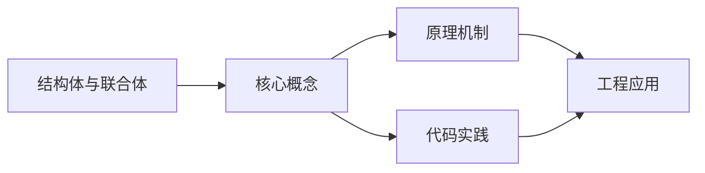
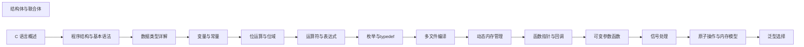

## 1. 学习目标（Bloom 分类）

本节按照布鲁姆教育目标分类学组织学习路径。本文主题为《结构体与联合体》，属于 C 模块，读者可以根据自身阶段选择阅读深度。

记忆层面：能够准确复述本文的核心概念、术语与基本语法或操作步骤，并能够在提问或检索时快速定位对应知识点。能够说出 C 的变量、函数、指针、数组、结构体与预处理语法。

理解层面：能够用自己的语言解释核心原理与工作机制，说明概念之间的因果关系，而不是机械记忆结论。能够解释指针与内存地址、栈与堆、编译链接过程。

应用层面：能够在真实项目或练习场景中运用本文知识解决具体问题，写出正确且可维护的实现。能够编写系统工具、数据结构与嵌入式程序。

分析层面：能够拆解复杂问题，比较本文主题与相邻概念的异同，识别边界条件与例外情况。能够分析内存泄漏、缓冲区溢出与未定义行为。

评价层面：能够根据约束条件（性能、可读性、安全、成本）评价不同方案的优劣，做出有依据的技术决策。能够评价 C 与其他语言在系统编程中的取舍。

创造层面：能够把本文知识与其他模块知识组合，设计出新的解决方案或可复用的工程模式。能够设计可移植、可维护的 C 库与模块。

通过本节学习，读者应当能够把《结构体与联合体》纳入自己的知识网络，并与 C 模块的其他主题（指针、内存管理、预处理器、标准库）建立关联。

## 2. 历史动机与发展脉络

《结构体与联合体》是 C 领域的重要主题。要真正理解它，需要先了解它解决的问题与演进过程。

C 由 Dennis Ritchie 于 1972 年在贝尔实验室为 Unix 开发，是系统编程的基石语言：操作系统、编译器、嵌入式固件均以 C 为主。
C89（ANSI C）统一方言，C99 引入变长数组与 // 注释，C11 增加泛型选择与线程支持，C17 为缺陷修复版，C23（2024 年正式发布）引入 constexpr、属性、显式枚举底层类型等现代化特性。
C 的哲学是“信任程序员”：提供指针与内存操作的全部能力，同时把正确性责任交给开发者；这一设计成就了性能上限，也带来内存安全风险，催生了 Rust 等后继语言。

回到本文主题：结构体与联合体 的提出与成熟，正是上述技术背景下的必然产物。早期实现往往以简单可用为目标，随着工程规模扩大，社区逐渐沉淀出标准做法与最佳实践；理解这一脉络，可以帮助读者判断“为什么文档中的推荐写法是现在这个样子”，也能在遇到历史遗留代码时准确识别其设计年代与取舍。


## 3. 形式化定义与核心概念精讲

本节把《结构体与联合体》涉及的核心概念以“定义 + 讲解”的形式展开。读者应把定义当作工具，把讲解当作理解路径；两者结合才能形成可迁移的知识。

指针：指针保存变量地址，`&` 取地址、`*` 解引用；指针算术与数组名退化规则（数组名作为实参退化为首元素指针）是 C 的经典难点。
内存管理：栈内存自动释放，堆内存由 malloc/calloc/realloc/free 管理；所有权责任（谁分配谁释放）必须显式约定。
预处理器：#include/#define/#ifdef 在编译前文本处理；宏展开有副作用与优先级风险，函数式宏参数必须加括号。

### 3.1 原文章节逐一精讲

原文档把主题拆分为 18 个小节，下面按顺序给出每一节的导读讲解，随后保留原文细节供精读。

#### 原文精读（完整保留）

# 结构体与联合体

> **符号约定**：`< >` 必填参数 | `[ ]` 可选参数

---

#### 1. 结构体 (Structures)

##### 1.1 结构体的概念

- **结构体**是一种用户定义的数据类型，用于将不同类型的数据打包在一起，形成一个逻辑整体。
- **作用**：
- 组织相关数据，提高代码的可读性和可维护性
- 实现复杂的数据结构（如链表、树等）
- 作为函数参数传递多个相关数据

##### 1.2 结构体的定义与声明

###### 1.2.1 基本定义

```c
 // 结构体定义
 struct Person {
  char name[50]; // 姓名
  int age; // 年龄
  float height; // 身高
 }
```

###### 1.2.2 同时定义结构体变量

```c
 // 定义结构体的同时声明变量
 struct Person {
  char name[50];
  int age;
 }
```

###### 1.2.3 匿名结构体

```c
 // 匿名结构体（只能在定义时声明变量）
 struct {
  int x;
  int y;
 }
```

##### 1.3 结构体的初始化

###### 1.3.1 静态初始化

```c
 // 按顺序初始化
 struct Person p1 = {"Alice", 25, 1.65};
 // 部分初始化（未初始化的成员为 0 或空）
 struct Person p2 = {"Bob"}; // age 和 height 为 0
 // C99 及以上：指定成员初始化
 struct Person p3 = {
  .name = "Charlie",
  .age = 30
 }
```

###### 1.3.2 动态初始化

```c
 struct Person p4;
 strcpy(p4.name, "David");
 p4.age = 35;
 p4.height = 1.75;
```

##### 1.4 结构体成员的访问

###### 1.4.1 直接访问（使用点运算符）

```c
 printf("Name: %s\n", p1.name);
 printf("Age: %d\n", p1.age);
 printf("Height: %.2f\n", p1.height);
```

###### 1.4.2 通过指针访问（使用箭头运算符）

```c
 struct Person *ptr = &p1;
 printf("Name: %s\n", ptr->name);
 printf("Age: %d\n", ptr->age);
 printf("Height: %.2f\n", ptr->height);
 // 也可以使用解引用后再使用点运算符
 printf("Name: %s\n", (*ptr).name);
```

##### 1.5 结构体作为函数参数

###### 1.5.1 传值调用

```c
 void print_person(struct Person p) {
  printf("Name: %s\n", p.name);
  printf("Age: %d\n", p.age);
  printf("Height: %.2f\n", p.height);
 }
 // 调用
 print_person(p1);
```

###### 1.5.2 传址调用（推荐，避免复制开销）

```c
 void update_person(struct Person *p, int new_age) {
  p->age = new_age;
 }
 // 调用
 update_person(&p1, 26);
```

##### 1.6 结构体数组

```c
 // 定义结构体数组
 struct Person people[3] = {
  {"Alice", 25, 1.65},
  {"Bob", 30, 1.75},
  {"Charlie", 35, 1.80}
 }
 // 访问数组元素
 for (int i = 0; i < 3; i++) {
  printf("Person %d: %s, %d, %.2f\n",
  i+1, people[i].name, people[i].age, people[i].height);
 }
```

##### 1.7 嵌套结构体

```c
 // 定义日期结构体
 struct Date {
  int day;
  int month;
  int year;
 }
 // 定义包含日期的结构体
 struct Person {
  char name[50];
  int age;
  struct Date birthday; // 嵌套结构体
 }
 // 初始化
 struct Person p = {
  "Alice",
  25,
  {15, 5, 1999} // 初始化嵌套的 Date 结构体
 }
 // 访问嵌套结构体成员
 printf("Birthday: %d/%d/%d\n",
  p.birthday.day, p.birthday.month, p.birthday.year);
```

##### 1.8 结构体的内存对齐

###### 1.8.1 内存对齐的概念

- **内存对齐**是编译器为了提高内存访问效率，按照一定规则对结构体成员进行内存布局的过程。
- **原因**：大多数 CPU 访问内存时，以字长为单位（如 4 字节或 8 字节），对齐的内存访问会更高效。

###### 1.8.2 对齐规则

1. 结构体的起始地址必须是其最大成员大小的整数倍
2. 每个成员的起始地址必须是其自身大小的整数倍
3. 结构体的总大小必须是其最大成员大小的整数倍

###### 1.8.3 示例

```c
 struct Example {
  char c; // 1 字节
  // 3 字节填充
  int i; // 4 字节
  double d; // 8 字节
  // 4 字节填充（使总大小为 8 的整数倍）
 }
 // sizeof(struct Example) 通常为 24 字节
 // 解释：1 + 3 + 4 + 8 + 4 = 20？不，实际是 24
 // 正确计算：
 // c: 偏移 0 (1字节)
 // 填充 3字节 (偏移 1-3)
 // i: 偏移 4 (4字节)
 // d: 偏移 8 (8字节)
 // 总大小 16，是 8 的整数倍，所以不需要额外填充
 // 实际大小为 16 字节
```

###### 1.8.4 内存对齐的影响

- **优点**：提高内存访问速度
- **缺点**：可能浪费一些内存空间

###### 1.8.5 控制内存对齐

- **`#pragma pack(n)`**：设置对齐字节数为 n
- **`__attribute__((packed))`**：取消对齐，按实际大小排列

```c
 // 设置对齐字节数为 1
 #pragma pack(1)
 struct PackedExample {
  char c;
  int i;
  double d;
 }
 #pragma pack() // 恢复默认对齐
 // 使用 packed 属性
 struct __attribute__((packed)) PackedStruct {
  char c;
  int i;
  double d;
 }
```

##### 1.9 结构体的应用示例

###### 1.9.1 链表节点

```c
 typedef struct Node {
  int data;
  struct Node *next;
 }
 // 创建新节点
 Node *create_node(int data) {
  Node *new_node = (Node *)malloc(sizeof(Node));
  if (new_node == NULL) {
  return NULL;
  }
  new_node->data = data;
  new_node->next = NULL;
  return new_node;
 }
 // 添加节点
 void append(Node **head, int data) {
  Node *new_node = create_node(data);
  if (*head == NULL) {
  *head = new_node;
  return;
  }
  Node *temp = *head;
  while (temp->next != NULL) {
  temp = temp->next;
  }
  temp->next = new_node;
 }
```

###### 1.9.2 学生信息管理

```c
 typedef struct Student {
  char name[50];
  int id;
  float grades[3]; // 三门课的成绩
  float average;
 }
 // 计算平均成绩
 void calculate_average(Student *s) {
  s->average = (s->grades[0] + s->grades[1] + s->grades[2]) / 3.0;
 }
 // 打印学生信息
 void print_student(Student s) {
  printf("Name: %s\n", s.name);
  printf("ID: %d\n", s.id);
  printf("Grades: %.2f, %.2f, %.2f\n", s.grades[0], s.grades[1], s.grades[2]);
  printf("Average: %.2f\n", s.average);
 }
```

#### 2. 联合体 (Unions)

##### 2.1 联合体的概念

- **联合体**是一种特殊的数据类型，所有成员共享同一块内存空间。
- **特点**：
- 联合体的大小等于最大成员的大小
- 同一时间只能使用一个成员
- 修改一个成员会影响其他成员

##### 2.2 联合体的定义与使用

```c
 // 联合体定义
 union Data {
  int i; // 4 字节
  float f; // 4 字节
  char c; // 1 字节
  char str[20]; // 20 字节
 }
 // 使用
 union Data data;
 data.i = 100;
 printf("data.i = %d\n", data.i); // 输出 100
 data.f = 3.14;
 printf("data.f = %f\n", data.f); // 输出 3.14
 printf("data.i = %d\n", data.i); // 输出会改变，因为共享内存
```

##### 2.3 联合体的应用场景

###### 2.3.1 节省内存

- 当不同类型的数据不会同时使用时，可以使用联合体节省内存。

###### 2.3.2 类型转换

- 可以通过联合体实现不同类型之间的转换。

```c
 union FloatInt {
  float f;
  int i;
 }
 // 查看浮点数的二进制表示
 void print_float_bits(float f) {
  union FloatInt fi;
  fi.f = f;
  printf("Float: %f, Int: %d, Hex: 0x%X\n", f, fi.i, fi.i);
 }
```

###### 2.3.3 判别式联合（Tagged Union）

- 结合结构体和联合体，实现带类型标签的联合。

```c
 enum DataType {
  INT, FLOAT, STRING
 }
 struct TaggedUnion {
  enum DataType type; // 类型标签
  union {
  int i;
  float f;
  char str[50];
  } data; // 数据
 }
 void print_data(struct TaggedUnion tu) {
  switch (tu.type) {
  case INT:
  printf("Integer: %d\n", tu.data.i);
  break;
  case FLOAT:
  printf("Float: %f\n", tu.data.f);
  break;
  case STRING:
  printf("String: %s\n", tu.data.str);
  break;
  default:
  printf("Unknown type\n");
  }
 }
 // 使用
 struct TaggedUnion tu1;
 tu1.type = INT;
 tu1.data.i = 42;
 print_data(tu1);
 struct TaggedUnion tu2;
 tu2.type = FLOAT;
 tu2.data.f = 3.14;
 print_data(tu2);
```

###### 2.3.4 位域操作

- 可以使用联合体和位域来操作数据的特定位。

```c
 // 位域结构体
 struct Flags {
  unsigned int is_active : 1; // 1位
  unsigned int is_admin : 1; // 1位
  unsigned int level : 3; // 3位
 }
 // 联合体
 union FlagUnion {
  struct Flags flags;
  unsigned char value; // 1字节
 }
 // 使用
 union FlagUnion fu;
 fu.value = 0; // 初始化
 fu.flags.is_active = 1;
 fu.flags.level = 3;
 printf("Value: 0x%X\n", fu.value); // 输出 0x0B (1011)
```

#### 3. 枚举 (Enums)

##### 3.1 枚举的概念

- **枚举**是一种用户定义的数据类型，用于为整数常量分配有意义的名称。
- **作用**：
- 提高代码可读性
- 减少魔法数字
- 提供类型安全

##### 3.2 枚举的定义与使用

###### 3.2.1 基本定义

```c
 enum Color {
  RED, // 默认值 0
  GREEN, // 默认值 1
  BLUE // 默认值 2
 }
 // 使用
 enum Color my_color = GREEN;
 printf("Color value: %d\n", my_color); // 输出 1
```

###### 3.2.2 显式指定值

```c
 enum Day {
  MONDAY = 1, // 1
  TUESDAY, // 2
  WEDNESDAY, // 3
  THURSDAY, // 4
  FRIDAY, // 5
  SATURDAY = 10, // 10
  SUNDAY // 11
 }
 // 使用
 enum Day today = WEDNESDAY;
 printf("Today is day %d\n", today); // 输出 3
```

###### 3.2.3 枚举的大小

- 枚举的大小通常与 int 相同，但在某些编译器中可能会根据枚举值的范围进行优化。

##### 3.3 枚举的应用场景

###### 3.3.1 状态码

```c
 enum ErrorCode {
  SUCCESS = 0,
  ERROR_INVALID_INPUT = 1,
  ERROR_MEMORY = 2,
  ERROR_NETWORK = 3
 }
 int process_data(int input) {
  if (input < 0) {
  return ERROR_INVALID_INPUT;
  }
  // 处理数据
  return SUCCESS;
 }
```

###### 3.3.2 选项标志

```c
 enum FileOpenMode {
  MODE_READ = 1 << 0, // 0b0001
  MODE_WRITE = 1 << 1, // 0b0010
  MODE_APPEND = 1 << 2, // 0b0100
  MODE_BINARY = 1 << 3 // 0b1000
 }
 void open_file(const char *filename, int mode) {
  if (mode & MODE_READ) {
  printf("Opening file for reading\n");
  }
  if (mode & MODE_WRITE) {
  printf("Opening file for writing\n");
  }
  // 打开文件
 }
 // 使用
 open_file("data.txt", MODE_READ | MODE_WRITE);
```

#### 4. `typedef` 类型别名

##### 4.1 `typedef` 的概念

- **`typedef`** 是 C 语言中的一个关键字，用于为现有类型创建一个新的名称（别名）。
- **作用**：
- 简化复杂类型的声明
- 提高代码的可读性和可维护性
- 便于类型的统一管理和修改

##### 4.2 `typedef` 的使用

###### 4.2.1 为基本类型创建别名

```c
 // 为基本类型创建别名
 typedef unsigned int uint;
 typedef long long int64;
 typedef double real;
 // 使用
 uint count = 100;
 int64 large_number = 9999999999;
 real pi = 3.14159;
```

###### 4.2.2 为结构体创建别名

```c
 // 方式 1：先定义结构体，再创建别名
 struct Person {
  char name[50];
  int age;
 }
 typedef struct Person Person;
 // 方式 2：定义结构体的同时创建别名
 typedef struct {
  char name[50];
  int age;
 }
 // 方式 3：带标签的结构体
 typedef struct Person {
  char name[50];
  int age;
 }
 // 使用
 Person p = {"Alice", 25};
```

###### 4.2.3 为指针类型创建别名

```c
 // 为指针类型创建别名
 typedef int *IntPtr;
 typedef char *StrPtr;
 // 使用
 intPtr p1, p2; // 相当于 int *p1, *p2;
 StrPtr s1, s2; // 相当于 char *s1, *s2;
```

###### 4.2.4 为函数指针创建别名

```c
 // 为函数指针创建别名
 typedef int (*CompareFunc)(int, int);
 // 使用
 int ascending(int a, int b) {
  return a - b;
 }
 CompareFunc cmp = ascending;
 int result = cmp(5, 3);
```

#### 5. 综合应用示例

##### 5.1 学生信息管理系统

```c
 #include <stdio.h>
 #include <string.h>
 // 定义日期结构体
 typedef struct {
  int day;
  int month;
  int year;
 }
 // 定义学生结构体
 typedef struct {
  char name[50];
  int id;
  Date birthday;
  float grades[3];
  float average;
 }
 // 计算平均成绩
 void calculate_average(Student *s) {
  s->average = (s->grades[0] + s->grades[1] + s->grades[2]) / 3.0;
 }
 // 打印学生信息
 void print_student(Student s) {
  printf("Name: %s\n", s.name);
  printf("ID: %d\n", s.id);
  printf("Birthday: %d/%d/%d\n",
  s.birthday.day, s.birthday.month, s.birthday.year);
  printf("Grades: %.2f, %.2f, %.2f\n",
  s.grades[0], s.grades[1], s.grades[2]);
  printf("Average: %.2f\n\n", s.average);
 }
 int main() {
  // 初始化学生数组
  Student students[3] = {
  {
  "Alice",
  1001,
  {15, 5, 1999},
  {85.5, 90.0, 92.5},
  0.0
  },
  {
  "Bob",
  1002,
  {20, 8, 1998},
  {78.0, 82.5, 85.0},
  0.0
  },
  {
  "Charlie",
  1003,
  {5, 12, 1999},
  {92.0, 95.5, 90.0},
  0.0
  }
  };
  // 计算平均成绩并打印信息
  for (int i = 0; i < 3; i++) {
  calculate_average(&students[i]);
  print_student(students[i]);
  }
  return 0;
 }
```

##### 5.2 图形库中的形状表示

```c
 #include <stdio.h>
 // 形状类型枚举
 enum ShapeType {
  CIRCLE,
  RECTANGLE,
  TRIANGLE
 }
 // 点结构体
 typedef struct {
  int x;
  int y;
 }
 // 圆形结构体
 typedef struct {
  Point center;
  int radius;
 }
 // 矩形结构体
 typedef struct {
  Point top_left;
  int width;
  int height;
 }
 // 三角形结构体
 typedef struct {
  Point p1;
  Point p2;
  Point p3;
 }
 // 形状联合体
 typedef union {
  Circle circle;
  Rectangle rectangle;
  Triangle triangle;
 }
 // 形状结构体
 typedef struct {
  enum ShapeType type;
  ShapeData data;
 }
 // 计算面积
 float calculate_area(Shape shape) {
  switch (shape.type) {
  case CIRCLE:
  return 3.14159 * shape.data.circle.radius * shape.data.circle.radius;
  case RECTANGLE:
  return shape.data.rectangle.width * shape.data.rectangle.height;
  case TRIANGLE:
  // 使用海伦公式计算三角形面积
  int x1 = shape.data.triangle.p1.x;
  int y1 = shape.data.triangle.p1.y;
  int x2 = shape.data.triangle.p2.x;
  int y2 = shape.data.triangle.p2.y;
  int x3 = shape.data.triangle.p3.x;
  int y3 = shape.data.triangle.p3.y;
  float a = sqrt((x2-x1)*(x2-x1) + (y2-y1)*(y2-y1));
  float b = sqrt((x3-x2)*(x3-x2) + (y3-y2)*(y3-y2));
  float c = sqrt((x1-x3)*(x1-x3) + (y1-y3)*(y1-y3));
  float s = (a + b + c) / 2;
  return sqrt(s * (s-a) * (s-b) * (s-c));
  default:
  return 0.0;
  }
 }
 // 打印形状信息
 void print_shape(Shape shape) {
  switch (shape.type) {
  case CIRCLE:
  printf("Circle: center=(%d,%d), radius=%d\n",
  shape.data.circle.center.x,
  shape.data.circle.center.y,
  shape.data.circle.radius);
  break;
  case RECTANGLE:
  printf("Rectangle: top_left=(%d,%d), width=%d, height=%d\n",
  shape.data.rectangle.top_left.x,
  shape.data.rectangle.top_left.y,
  shape.data.rectangle.width,
  shape.data.rectangle.height);
  break;
  case TRIANGLE:
  printf("Triangle: p1=(%d,%d), p2=(%d,%d), p3=(%d,%d)\n",
  shape.data.triangle.p1.x, shape.data.triangle.p1.y,
  shape.data.triangle.p2.x, shape.data.triangle.p2.y,
  shape.data.triangle.p3.x, shape.data.triangle.p3.y);
  break;
  default:
  printf("Unknown shape\n");
  }
 }
 int main() {
  // 创建圆形
  Shape circle_shape;
  circle_shape.type = CIRCLE;
  circle_shape.data.circle.center.x = 10;
  circle_shape.data.circle.center.y = 10;
  circle_shape.data.circle.radius = 5;
  // 创建矩形
  Shape rect_shape;
  rect_shape.type = RECTANGLE;
  rect_shape.data.rectangle.top_left.x = 0;
  rect_shape.data.rectangle.top_left.y = 0;
  rect_shape.data.rectangle.width = 10;
  rect_shape.data.rectangle.height = 8;
  // 打印信息并计算面积
  print_shape(circle_shape);
  printf("Area: %.2f\n\n", calculate_area(circle_shape));
  print_shape(rect_shape);
  printf("Area: %.2f\n\n", calculate_area(rect_shape));
  return 0;
 }
```

#### 6. 最佳实践

##### 6.1 结构体的最佳实践

- **命名规范**：结构体名使用 PascalCase，成员名使用 snake_case
- **初始化**：使用指定成员初始化（C99+）提高可读性
- **内存管理**：结构体较大时，使用指针传递以避免复制开销
- **内存对齐**：了解内存对齐规则，合理安排成员顺序以减少内存浪费
- **封装**：将相关数据和操作封装在结构体中

##### 6.2 联合体的最佳实践

- **使用场景**：只在确实需要共享内存时使用联合体
- **判别式**：使用判别式联合（Tagged Union）来安全地使用联合体
- **类型安全**：确保在访问联合体成员前，了解当前存储的类型
- **内存布局**：注意不同成员的内存布局，避免未定义行为

##### 6.3 枚举的最佳实践

- **命名规范**：枚举名使用 PascalCase，枚举值使用全大写加下划线
- **值管理**：为枚举值赋予有意义的名称，避免魔法数字
- **类型安全**：使用枚举类型而不是整数类型，提高代码可读性和类型安全
- **范围管理**：确保枚举值在合理范围内，避免溢出

##### 6.4 typedef 的最佳实践

- **命名规范**：类型别名使用 PascalCase 或 snake_case，根据项目约定
- **适度使用**：不要过度使用 typedef，以免降低代码可读性
- **一致性**：在整个项目中保持 typedef 的一致性
- **文档**：为复杂的 typedef 提供注释，说明其用途

#### 7. 常见错误与调试

##### 7.1 结构体相关错误

- **忘记初始化**：结构体成员未初始化，导致未定义行为
- **内存泄漏**：动态分配的结构体未释放
- **指针错误**：结构体指针未初始化或指向无效内存
- **内存对齐误解**：不了解内存对齐规则，导致 sizeof 计算错误

##### 7.2 联合体相关错误

- **类型混淆**：在不知道当前存储类型的情况下访问联合体成员
- **内存覆盖**：修改一个成员后，错误地假设其他成员的值仍然有效
- **大小计算错误**：错误计算联合体的大小

##### 7.3 枚举相关错误

- **隐式转换**：将枚举值隐式转换为整数，可能导致类型错误
- **值冲突**：不同枚举类型的值冲突
- **范围溢出**：枚举值超出底层类型的范围

##### 7.4 调试技巧

- **打印调试**：使用 printf 打印结构体成员的值
- **内存检查**：使用工具如 Valgrind 检查内存泄漏和访问错误
- **断言**：使用 assert 验证结构体和联合体的状态
- **调试器**：使用 GDB 等调试器查看结构体和联合体的内存布局

---

#### 延伸阅读

- [C++ OOP](cpp/cpp-oop-basics)
#### 结构体定义

**基本写法：结构体定义**
`struct <Name> { <type> <member>; ... };`
```c
// 定义 Point 结构体
struct Point {
    int x;
    int y;
};
```

---

**typedef 写法：结构体别名**
`typedef struct { <members> } <Name>;`
```c
// 定义 Employee 结构体类型
typedef struct {
    int id;
    char name[50];
    float salary;
} Employee;
```

---

**typedef 写法：为已定义结构体创建别名**
`typedef struct <Name> <Alias>;`
```c
// 为结构体创建别名
struct Point { int x; int y; };
typedef struct Point Point;
```

---

#### 结构体变量

**基本写法：声明结构体变量**
`struct <Name> <var_name>;`
```c
// 声明结构体变量
struct Point p1;
```

---

**typedef 写法：使用别名声明**
`<TypeName> <var_name>;`
```c
// 使用类型别名声明
Employee emp;
```

---

**初始化写法：声明并初始化**
`struct <Name> <var> = {<values>};`
```c
// 初始化结构体变量
struct Point p = {10, 20};
```

---

**指定初始化写法：按成员名初始化**
`struct <Name> <var> = {.<member> = <value>, ...};`
```c
// 按成员名初始化
struct Point p = {.x = 10, .y = 20};
```

---

**赋值写法：结构体变量赋值**
`<var1> = <var2>;`
```c
// 结构体变量直接赋值
struct Point p1 = {10, 20};
struct Point p2;
p2 = p1;
```

---

#### 结构体成员访问

**基本写法：访问成员**
`<var>.<member>`
```c
// 使用点运算符访问成员
struct Point p = {10, 20};
printf("x: %d\n", p.x);
```

---

**修改写法：修改成员值**
`<var>.<member> = <value>;`
```c
// 修改结构体成员的值
struct Point p = {10, 20};
p.x = 30;
```

---

**指针写法：通过指针访问成员**
`<ptr>-><member>`
```c
// 使用箭头运算符访问成员
struct Point p = {10, 20};
struct Point *ptr = &p;
printf("x: %d\n", ptr->x);
```

---

#### 嵌套结构体

**基本写法：结构体嵌套**
`struct <Outer> { struct <Inner> <member>; ... };`
```c
// 嵌套结构体定义
struct Date { int year; int month; int day; };
struct Person {
    char name[50];
    struct Date birthday;
};
```

---

**访问写法：访问嵌套成员**
`<var>.<inner>.<member>`
```c
// 访问嵌套结构体成员
struct Person person;
person.birthday.year = 1990;
```

---

#### 结构体数组

**基本写法：结构体数组声明**
`struct <Name> <array_name>[<size>];`
```c
// 声明结构体数组
struct Point points[10];
```

---

**初始化写法：结构体数组初始化**
`struct <Name> <array_name>[<size>] = { {<values>}, ... };`
```c
// 初始化结构体数组
struct Point pts[3] = {{1, 2}, {3, 4}, {5, 6}};
```

---

**遍历写法：遍历结构体数组**
`for (int i = 0; i < <size>; i++) { ... <array>[i].<member> ... }`
```c
// 遍历结构体数组
struct Point pts[3] = {{1, 2}, {3, 4}, {5, 6}};
for (int i = 0; i < 3; i++) {
    printf("(%d, %d)\n", pts[i].x, pts[i].y);
}
```

---

#### 结构体与函数

**传值写法：结构体作为函数参数**
`<return_type> <func>(struct <Name> <param>) { ... }`
```c
// 传递结构体副本
void print_point(struct Point p) {
    printf("(%d, %d)\n", p.x, p.y);
}
```

---

**传址写法：结构体指针作为函数参数**
`<return_type> <func>(struct <Name> *<param>) { ... }`
```c
// 传递结构体指针
void move_point(struct Point *p, int dx, int dy) {
    p->x += dx;
    p->y += dy;
}
```

---

**返回写法：函数返回结构体**
`struct <Name> <func>(<params>) { ... return <struct_var>; }`
```c
// 返回结构体
struct Point create_point(int x, int y) {
    struct Point p = {x, y};
    return p;
}
```

---

#### 位域

**基本写法：位域定义**
`struct <Name> { <type> <member> : <bits>; ... };`
```c
// 定义位域结构体
struct Flags {
    unsigned int a : 1;
    unsigned int b : 3;
    unsigned int c : 4;
};
```

---

**访问写法：访问位域成员**
`<var>.<member>`
```c
// 访问位域成员
struct Flags f;
f.a = 1;
f.b = 5;
```

---

#### 联合体

**基本写法：联合体定义**
`union <Name> { <type> <member>; ... };`
```c
// 定义联合体
union Data {
    int i;
    float f;
    char str[20];
};
```

---

**基本写法：联合体变量声明与初始化**
`union <Name> <var>;`
```c
// 声明联合体变量
union Data data;
```

---

**访问写法：访问联合体成员**
`<var>.<member>`
```c
// 访问联合体成员
union Data data;
data.i = 10;
printf("%d\n", data.i);
```

---

**指针写法：通过指针访问联合体成员**
`<ptr>-><member>`
```c
// 通过指针访问联合体成员
union Data data;
union Data *ptr = &data;
ptr->f = 3.14f;
```

---

#### 结构体与联合体混合

**基本写法：结构体包含联合体**
`struct <Name> { <type> <tag>; union <UnionName> <member>; };`
```c
// 结构体包含联合体
struct Value {
    int type;
    union {
        int i;
        float f;
    } data;
};
```

---

**访问写法：访问结构体中的联合体成员**
`<var>.<union_member>.<member>`
```c
// 访问结构体中的联合体成员
struct Value v;
v.type = 0;
v.data.i = 100;
```

---

#### 结构体内存对齐

**基本写法：查看结构体大小**
`sizeof(struct <Name>)`
```c
// 查看结构体大小
struct Point { int x; int y; };
printf("Size: %zu\n", sizeof(struct Point));
```

---

**对齐控制写法：指定对齐方式**
`#pragma pack(<n>)`
```c
// 设置 1 字节对齐
#pragma pack(1)
struct Packed {
    char c;
    int i;
};
#pragma pack()
```

---

**对齐属性写法：使用 __attribute__**
`struct __attribute__((aligned(<n>))) <Name> { ... };`
```c
// 指定结构体对齐为 16 字节
struct __attribute__((aligned(16))) AlignedStruct {
    int x;
};
```


### 3.2 概念关系图

下面用 Mermaid 图表达本文核心概念之间的关系，帮助读者建立整体图景：



图中展示的是本文知识的结构化关系：核心概念是入口，原理机制解释“为什么”，代码实践演示“怎么做”，工程应用回答“何时用”。读者学习时可以把每个小节的内容挂接到对应节点上。

## 4. 理论推导与原理解析

本节深入《结构体与联合体》背后的原理。理论部分不求面面俱到，而是聚焦“能解释现象、能指导实践”的关键推导。

指针：指针保存变量地址，`&` 取地址、`*` 解引用；指针算术与数组名退化规则（数组名作为实参退化为首元素指针）是 C 的经典难点。
内存管理：栈内存自动释放，堆内存由 malloc/calloc/realloc/free 管理；所有权责任（谁分配谁释放）必须显式约定。
预处理器：#include/#define/#ifdef 在编译前文本处理；宏展开有副作用与优先级风险，函数式宏参数必须加括号。
编译链接：预处理 -> 编译 -> 汇编 -> 链接；头文件声明接口，源文件实现；静态库与动态库（.a/.so/.dll）决定部署形态。

需要强调的是，理论推导与工程实践之间存在翻译层：理论给出的是理想化模型与边界条件，工程代码则必须处理真实环境中的例外。读者在学习时应先掌握理论的“标准情形”，再通过陷阱章节了解“非标准情形”。

## 5. 代码示例与逐行讲解

本节把原文中的代码示例系统整理，并为每个示例补充用途说明与讲解。读者不应只浏览代码，而应逐段对照讲解理解设计意图。

### 5.1 示例：1.2.1 基本定义

该示例来自原文《1.2.1 基本定义》小节，用于演示结构体与联合体相关操作。阅读时请先看代码结构，再看其后的讲解。

```c
 // 结构体定义
 struct Person {
  char name[50]; // 姓名
  int age; // 年龄
  float height; // 身高
 }
```

讲解：这段代码演示了本节核心知识点。代码中的关键操作可以归纳为三步：准备（定义或初始化）、执行（核心逻辑）、收尾（释放资源或返回结果）。实际项目中，这三步往往被封装为函数或类，以提升复用性与可测试性。

关键点分析：

该示例共 6 行有效代码，结构以数据或配置为主。阅读时应关注：数据字段的含义、配置项的作用，以及它们与运行行为的对应关系。

进阶思考路径：先尝试修改参数观察行为变化，再把示例中的模式迁移到自己的项目中；每次修改都记录预期与实测差异，这是把示例转化为能力的最快方式。

### 5.2 示例：1.2.2 同时定义结构体变量

该示例来自原文《1.2.2 同时定义结构体变量》小节，用于演示结构体与联合体相关操作。阅读时请先看代码结构，再看其后的讲解。

```c
 // 定义结构体的同时声明变量
 struct Person {
  char name[50];
  int age;
 }
```

讲解：这段代码演示了本节核心知识点。代码中的关键操作可以归纳为三步：准备（定义或初始化）、执行（核心逻辑）、收尾（释放资源或返回结果）。实际项目中，这三步往往被封装为函数或类，以提升复用性与可测试性。

关键点分析：

该示例共 5 行有效代码，结构以数据或配置为主。阅读时应关注：数据字段的含义、配置项的作用，以及它们与运行行为的对应关系。

进阶思考路径：先尝试修改参数观察行为变化，再把示例中的模式迁移到自己的项目中；每次修改都记录预期与实测差异，这是把示例转化为能力的最快方式。

### 5.3 示例：1.2.3 匿名结构体

该示例来自原文《1.2.3 匿名结构体》小节，用于演示结构体与联合体相关操作。阅读时请先看代码结构，再看其后的讲解。

```c
 // 匿名结构体（只能在定义时声明变量）
 struct {
  int x;
  int y;
 }
```

讲解：这段代码演示了本节核心知识点。代码中的关键操作可以归纳为三步：准备（定义或初始化）、执行（核心逻辑）、收尾（释放资源或返回结果）。实际项目中，这三步往往被封装为函数或类，以提升复用性与可测试性。

关键点分析：

该示例共 5 行有效代码，结构以数据或配置为主。阅读时应关注：数据字段的含义、配置项的作用，以及它们与运行行为的对应关系。

进阶思考路径：先尝试修改参数观察行为变化，再把示例中的模式迁移到自己的项目中；每次修改都记录预期与实测差异，这是把示例转化为能力的最快方式。

### 5.4 示例：1.3.1 静态初始化

该示例来自原文《1.3.1 静态初始化》小节，用于演示结构体与联合体相关操作。阅读时请先看代码结构，再看其后的讲解。

```c
 // 按顺序初始化
 struct Person p1 = {"Alice", 25, 1.65};
 // 部分初始化（未初始化的成员为 0 或空）
 struct Person p2 = {"Bob"}; // age 和 height 为 0
 // C99 及以上：指定成员初始化
 struct Person p3 = {
  .name = "Charlie",
  .age = 30
 }
```

讲解：这段代码演示了本节核心知识点。代码中的关键操作可以归纳为三步：准备（定义或初始化）、执行（核心逻辑）、收尾（释放资源或返回结果）。实际项目中，这三步往往被封装为函数或类，以提升复用性与可测试性。

关键点分析：

该示例共 9 行有效代码，结构以数据或配置为主。阅读时应关注：数据字段的含义、配置项的作用，以及它们与运行行为的对应关系。

进阶思考路径：先尝试修改参数观察行为变化，再把示例中的模式迁移到自己的项目中；每次修改都记录预期与实测差异，这是把示例转化为能力的最快方式。

### 5.5 示例：1.3.2 动态初始化

该示例来自原文《1.3.2 动态初始化》小节，用于演示结构体与联合体相关操作。阅读时请先看代码结构，再看其后的讲解。

```c
 struct Person p4;
 strcpy(p4.name, "David");
 p4.age = 35;
 p4.height = 1.75;
```

讲解：这段代码演示了本节核心知识点。代码中的关键操作可以归纳为三步：准备（定义或初始化）、执行（核心逻辑）、收尾（释放资源或返回结果）。实际项目中，这三步往往被封装为函数或类，以提升复用性与可测试性。

关键点分析：

该示例共 4 行有效代码，结构以数据或配置为主。阅读时应关注：数据字段的含义、配置项的作用，以及它们与运行行为的对应关系。

进阶思考路径：先尝试修改参数观察行为变化，再把示例中的模式迁移到自己的项目中；每次修改都记录预期与实测差异，这是把示例转化为能力的最快方式。

### 5.6 示例：1.4.1 直接访问（使用点运算符）

该示例来自原文《1.4.1 直接访问（使用点运算符）》小节，用于演示结构体与联合体相关操作。阅读时请先看代码结构，再看其后的讲解。

```c
 printf("Name: %s\n", p1.name);
 printf("Age: %d\n", p1.age);
 printf("Height: %.2f\n", p1.height);
```

讲解：这段代码演示了本节核心知识点。代码中的关键操作可以归纳为三步：准备（定义或初始化）、执行（核心逻辑）、收尾（释放资源或返回结果）。实际项目中，这三步往往被封装为函数或类，以提升复用性与可测试性。

关键点分析：

该示例共 3 行有效代码，结构以数据或配置为主。阅读时应关注：数据字段的含义、配置项的作用，以及它们与运行行为的对应关系。

进阶思考路径：先尝试修改参数观察行为变化，再把示例中的模式迁移到自己的项目中；每次修改都记录预期与实测差异，这是把示例转化为能力的最快方式。

### 5.7 示例：1.4.2 通过指针访问（使用箭头运算符）

该示例来自原文《1.4.2 通过指针访问（使用箭头运算符）》小节，用于演示结构体与联合体相关操作。阅读时请先看代码结构，再看其后的讲解。

```c
 struct Person *ptr = &p1;
 printf("Name: %s\n", ptr->name);
 printf("Age: %d\n", ptr->age);
 printf("Height: %.2f\n", ptr->height);
 // 也可以使用解引用后再使用点运算符
 printf("Name: %s\n", (*ptr).name);
```

讲解：这段代码演示了本节核心知识点。代码中的关键操作可以归纳为三步：准备（定义或初始化）、执行（核心逻辑）、收尾（释放资源或返回结果）。实际项目中，这三步往往被封装为函数或类，以提升复用性与可测试性。

关键点分析：

该示例共 6 行有效代码，结构以数据或配置为主。阅读时应关注：数据字段的含义、配置项的作用，以及它们与运行行为的对应关系。

进阶思考路径：先尝试修改参数观察行为变化，再把示例中的模式迁移到自己的项目中；每次修改都记录预期与实测差异，这是把示例转化为能力的最快方式。

### 5.8 示例：1.5.1 传值调用

该示例来自原文《1.5.1 传值调用》小节，用于演示结构体与联合体相关操作。阅读时请先看代码结构，再看其后的讲解。

```c
 void print_person(struct Person p) {
  printf("Name: %s\n", p.name);
  printf("Age: %d\n", p.age);
  printf("Height: %.2f\n", p.height);
 }
 // 调用
 print_person(p1);
```

讲解：这段代码演示了本节核心知识点。代码中的关键操作可以归纳为三步：准备（定义或初始化）、执行（核心逻辑）、收尾（释放资源或返回结果）。实际项目中，这三步往往被封装为函数或类，以提升复用性与可测试性。

关键点分析：

该示例共 7 行有效代码，结构以数据或配置为主。阅读时应关注：数据字段的含义、配置项的作用，以及它们与运行行为的对应关系。

进阶思考路径：先尝试修改参数观察行为变化，再把示例中的模式迁移到自己的项目中；每次修改都记录预期与实测差异，这是把示例转化为能力的最快方式。

### 5.9 示例：1.5.2 传址调用（推荐，避免复制开销）

该示例来自原文《1.5.2 传址调用（推荐，避免复制开销）》小节，用于演示结构体与联合体相关操作。阅读时请先看代码结构，再看其后的讲解。

```c
 void update_person(struct Person *p, int new_age) {
  p->age = new_age;
 }
 // 调用
 update_person(&p1, 26);
```

讲解：这段代码演示了本节核心知识点。代码中的关键操作可以归纳为三步：准备（定义或初始化）、执行（核心逻辑）、收尾（释放资源或返回结果）。实际项目中，这三步往往被封装为函数或类，以提升复用性与可测试性。

关键点分析：

该示例共 5 行有效代码，结构以数据或配置为主。阅读时应关注：数据字段的含义、配置项的作用，以及它们与运行行为的对应关系。

进阶思考路径：先尝试修改参数观察行为变化，再把示例中的模式迁移到自己的项目中；每次修改都记录预期与实测差异，这是把示例转化为能力的最快方式。

### 5.10 示例：1.6 结构体数组

该示例来自原文《1.6 结构体数组》小节，用于演示结构体与联合体相关操作。阅读时请先看代码结构，再看其后的讲解。

```c
 // 定义结构体数组
 struct Person people[3] = {
  {"Alice", 25, 1.65},
  {"Bob", 30, 1.75},
  {"Charlie", 35, 1.80}
 }
 // 访问数组元素
 for (int i = 0; i < 3; i++) {
  printf("Person %d: %s, %d, %.2f\n",
  i+1, people[i].name, people[i].age, people[i].height);
 }
```

讲解：这段代码演示了本节核心知识点。代码中的关键操作可以归纳为三步：准备（定义或初始化）、执行（核心逻辑）、收尾（释放资源或返回结果）。实际项目中，这三步往往被封装为函数或类，以提升复用性与可测试性。

关键点分析：

该示例共 11 行有效代码，包含 1 类关键结构（for）。其中：

- 入口与初始化部分负责建立上下文，对应实际项目中的启动或装配逻辑；
- 核心逻辑部分体现本文主题的主要操作，是阅读时最需要对照讲解理解的部分；
- 输出或返回部分把结果交给调用方，注意其类型与边界条件。

进阶思考路径：先尝试修改参数观察行为变化，再把示例中的模式迁移到自己的项目中；每次修改都记录预期与实测差异，这是把示例转化为能力的最快方式。

### 5.11 示例：1.7 嵌套结构体

该示例来自原文《1.7 嵌套结构体》小节，用于演示结构体与联合体相关操作。阅读时请先看代码结构，再看其后的讲解。

```c
 // 定义日期结构体
 struct Date {
  int day;
  int month;
  int year;
 }
 // 定义包含日期的结构体
 struct Person {
  char name[50];
  int age;
  struct Date birthday; // 嵌套结构体
 }
 // 初始化
 struct Person p = {
  "Alice",
  25,
  {15, 5, 1999} // 初始化嵌套的 Date 结构体
 }
 // 访问嵌套结构体成员
 printf("Birthday: %d/%d/%d\n",
  p.birthday.day, p.birthday.month, p.birthday.year);
```

讲解：这段代码演示了本节核心知识点。代码中的关键操作可以归纳为三步：准备（定义或初始化）、执行（核心逻辑）、收尾（释放资源或返回结果）。实际项目中，这三步往往被封装为函数或类，以提升复用性与可测试性。

关键点分析：

该示例共 21 行有效代码，结构以数据或配置为主。阅读时应关注：数据字段的含义、配置项的作用，以及它们与运行行为的对应关系。

进阶思考路径：先尝试修改参数观察行为变化，再把示例中的模式迁移到自己的项目中；每次修改都记录预期与实测差异，这是把示例转化为能力的最快方式。

### 5.12 示例：1.8.3 示例

该示例来自原文《1.8.3 示例》小节，用于演示结构体与联合体相关操作。阅读时请先看代码结构，再看其后的讲解。

```c
 struct Example {
  char c; // 1 字节
  // 3 字节填充
  int i; // 4 字节
  double d; // 8 字节
  // 4 字节填充（使总大小为 8 的整数倍）
 }
 // sizeof(struct Example) 通常为 24 字节
 // 解释：1 + 3 + 4 + 8 + 4 = 20？不，实际是 24
 // 正确计算：
 // c: 偏移 0 (1字节)
 // 填充 3字节 (偏移 1-3)
 // i: 偏移 4 (4字节)
 // d: 偏移 8 (8字节)
 // 总大小 16，是 8 的整数倍，所以不需要额外填充
 // 实际大小为 16 字节
```

讲解：这段代码演示了本节核心知识点。代码中的关键操作可以归纳为三步：准备（定义或初始化）、执行（核心逻辑）、收尾（释放资源或返回结果）。实际项目中，这三步往往被封装为函数或类，以提升复用性与可测试性。

关键点分析：

该示例共 16 行有效代码，结构以数据或配置为主。阅读时应关注：数据字段的含义、配置项的作用，以及它们与运行行为的对应关系。

进阶思考路径：先尝试修改参数观察行为变化，再把示例中的模式迁移到自己的项目中；每次修改都记录预期与实测差异，这是把示例转化为能力的最快方式。

### 5.13 示例：1.8.5 控制内存对齐

该示例来自原文《1.8.5 控制内存对齐》小节，用于演示结构体与联合体相关操作。阅读时请先看代码结构，再看其后的讲解。

```c
 // 设置对齐字节数为 1
 #pragma pack(1)
 struct PackedExample {
  char c;
  int i;
  double d;
 }
 #pragma pack() // 恢复默认对齐
 // 使用 packed 属性
 struct __attribute__((packed)) PackedStruct {
  char c;
  int i;
  double d;
 }
```

讲解：这段代码演示了本节核心知识点。代码中的关键操作可以归纳为三步：准备（定义或初始化）、执行（核心逻辑）、收尾（释放资源或返回结果）。实际项目中，这三步往往被封装为函数或类，以提升复用性与可测试性。

关键点分析：

该示例共 14 行有效代码，结构以数据或配置为主。阅读时应关注：数据字段的含义、配置项的作用，以及它们与运行行为的对应关系。

进阶思考路径：先尝试修改参数观察行为变化，再把示例中的模式迁移到自己的项目中；每次修改都记录预期与实测差异，这是把示例转化为能力的最快方式。

### 5.14 示例：1.9.1 链表节点

该示例来自原文《1.9.1 链表节点》小节，用于演示结构体与联合体相关操作。阅读时请先看代码结构，再看其后的讲解。

```c
 typedef struct Node {
  int data;
  struct Node *next;
 }
 // 创建新节点
 Node *create_node(int data) {
  Node *new_node = (Node *)malloc(sizeof(Node));
  if (new_node == NULL) {
  return NULL;
  }
  new_node->data = data;
  new_node->next = NULL;
  return new_node;
 }
 // 添加节点
 void append(Node **head, int data) {
  Node *new_node = create_node(data);
  if (*head == NULL) {
  *head = new_node;
  return;
  }
  Node *temp = *head;
  while (temp->next != NULL) {
  temp = temp->next;
  }
  temp->next = new_node;
 }
```

讲解：这段代码演示了本节核心知识点。代码中的关键操作可以归纳为三步：准备（定义或初始化）、执行（核心逻辑）、收尾（释放资源或返回结果）。实际项目中，这三步往往被封装为函数或类，以提升复用性与可测试性。

关键点分析：

该示例共 27 行有效代码，包含 4 类关键结构（def、if、while、return）。其中：

- 入口与初始化部分负责建立上下文，对应实际项目中的启动或装配逻辑；
- 核心逻辑部分体现本文主题的主要操作，是阅读时最需要对照讲解理解的部分；
- 输出或返回部分把结果交给调用方，注意其类型与边界条件。

进阶思考路径：先尝试修改参数观察行为变化，再把示例中的模式迁移到自己的项目中；每次修改都记录预期与实测差异，这是把示例转化为能力的最快方式。

### 5.15 示例：1.9.2 学生信息管理

该示例来自原文《1.9.2 学生信息管理》小节，用于演示结构体与联合体相关操作。阅读时请先看代码结构，再看其后的讲解。

```c
 typedef struct Student {
  char name[50];
  int id;
  float grades[3]; // 三门课的成绩
  float average;
 }
 // 计算平均成绩
 void calculate_average(Student *s) {
  s->average = (s->grades[0] + s->grades[1] + s->grades[2]) / 3.0;
 }
 // 打印学生信息
 void print_student(Student s) {
  printf("Name: %s\n", s.name);
  printf("ID: %d\n", s.id);
  printf("Grades: %.2f, %.2f, %.2f\n", s.grades[0], s.grades[1], s.grades[2]);
  printf("Average: %.2f\n", s.average);
 }
```

讲解：这段代码演示了本节核心知识点。代码中的关键操作可以归纳为三步：准备（定义或初始化）、执行（核心逻辑）、收尾（释放资源或返回结果）。实际项目中，这三步往往被封装为函数或类，以提升复用性与可测试性。

关键点分析：

该示例共 17 行有效代码，包含 1 类关键结构（def）。其中：

- 入口与初始化部分负责建立上下文，对应实际项目中的启动或装配逻辑；
- 核心逻辑部分体现本文主题的主要操作，是阅读时最需要对照讲解理解的部分；
- 输出或返回部分把结果交给调用方，注意其类型与边界条件。

进阶思考路径：先尝试修改参数观察行为变化，再把示例中的模式迁移到自己的项目中；每次修改都记录预期与实测差异，这是把示例转化为能力的最快方式。

### 5.16 示例：2.2 联合体的定义与使用

该示例来自原文《2.2 联合体的定义与使用》小节，用于演示结构体与联合体相关操作。阅读时请先看代码结构，再看其后的讲解。

```c
 // 联合体定义
 union Data {
  int i; // 4 字节
  float f; // 4 字节
  char c; // 1 字节
  char str[20]; // 20 字节
 }
 // 使用
 union Data data;
 data.i = 100;
 printf("data.i = %d\n", data.i); // 输出 100
 data.f = 3.14;
 printf("data.f = %f\n", data.f); // 输出 3.14
 printf("data.i = %d\n", data.i); // 输出会改变，因为共享内存
```

讲解：这段代码演示了本节核心知识点。代码中的关键操作可以归纳为三步：准备（定义或初始化）、执行（核心逻辑）、收尾（释放资源或返回结果）。实际项目中，这三步往往被封装为函数或类，以提升复用性与可测试性。

关键点分析：

该示例共 14 行有效代码，结构以数据或配置为主。阅读时应关注：数据字段的含义、配置项的作用，以及它们与运行行为的对应关系。

进阶思考路径：先尝试修改参数观察行为变化，再把示例中的模式迁移到自己的项目中；每次修改都记录预期与实测差异，这是把示例转化为能力的最快方式。

### 5.17 示例：2.3.2 类型转换

该示例来自原文《2.3.2 类型转换》小节，用于演示结构体与联合体相关操作。阅读时请先看代码结构，再看其后的讲解。

```c
 union FloatInt {
  float f;
  int i;
 }
 // 查看浮点数的二进制表示
 void print_float_bits(float f) {
  union FloatInt fi;
  fi.f = f;
  printf("Float: %f, Int: %d, Hex: 0x%X\n", f, fi.i, fi.i);
 }
```

讲解：这段代码演示了本节核心知识点。代码中的关键操作可以归纳为三步：准备（定义或初始化）、执行（核心逻辑）、收尾（释放资源或返回结果）。实际项目中，这三步往往被封装为函数或类，以提升复用性与可测试性。

关键点分析：

该示例共 10 行有效代码，结构以数据或配置为主。阅读时应关注：数据字段的含义、配置项的作用，以及它们与运行行为的对应关系。

进阶思考路径：先尝试修改参数观察行为变化，再把示例中的模式迁移到自己的项目中；每次修改都记录预期与实测差异，这是把示例转化为能力的最快方式。

### 5.18 示例：2.3.3 判别式联合（Tagged Union）

该示例来自原文《2.3.3 判别式联合（Tagged Union）》小节，用于演示结构体与联合体相关操作。阅读时请先看代码结构，再看其后的讲解。

```c
 enum DataType {
  INT, FLOAT, STRING
 }
 struct TaggedUnion {
  enum DataType type; // 类型标签
  union {
  int i;
  float f;
  char str[50];
  } data; // 数据
 }
 void print_data(struct TaggedUnion tu) {
  switch (tu.type) {
  case INT:
  printf("Integer: %d\n", tu.data.i);
  break;
  case FLOAT:
  printf("Float: %f\n", tu.data.f);
  break;
  case STRING:
  printf("String: %s\n", tu.data.str);
  break;
  default:
  printf("Unknown type\n");
  }
 }
 // 使用
 struct TaggedUnion tu1;
 tu1.type = INT;
 tu1.data.i = 42;
 print_data(tu1);
 struct TaggedUnion tu2;
 tu2.type = FLOAT;
 tu2.data.f = 3.14;
 print_data(tu2);
```

讲解：这段代码演示了本节核心知识点。代码中的关键操作可以归纳为三步：准备（定义或初始化）、执行（核心逻辑）、收尾（释放资源或返回结果）。实际项目中，这三步往往被封装为函数或类，以提升复用性与可测试性。

关键点分析：

该示例共 35 行有效代码，结构以数据或配置为主。阅读时应关注：数据字段的含义、配置项的作用，以及它们与运行行为的对应关系。

进阶思考路径：先尝试修改参数观察行为变化，再把示例中的模式迁移到自己的项目中；每次修改都记录预期与实测差异，这是把示例转化为能力的最快方式。

### 5.19 示例：2.3.4 位域操作

该示例来自原文《2.3.4 位域操作》小节，用于演示结构体与联合体相关操作。阅读时请先看代码结构，再看其后的讲解。

```c
 // 位域结构体
 struct Flags {
  unsigned int is_active : 1; // 1位
  unsigned int is_admin : 1; // 1位
  unsigned int level : 3; // 3位
 }
 // 联合体
 union FlagUnion {
  struct Flags flags;
  unsigned char value; // 1字节
 }
 // 使用
 union FlagUnion fu;
 fu.value = 0; // 初始化
 fu.flags.is_active = 1;
 fu.flags.level = 3;
 printf("Value: 0x%X\n", fu.value); // 输出 0x0B (1011)
```

讲解：这段代码演示了本节核心知识点。代码中的关键操作可以归纳为三步：准备（定义或初始化）、执行（核心逻辑）、收尾（释放资源或返回结果）。实际项目中，这三步往往被封装为函数或类，以提升复用性与可测试性。

关键点分析：

该示例共 17 行有效代码，结构以数据或配置为主。阅读时应关注：数据字段的含义、配置项的作用，以及它们与运行行为的对应关系。

进阶思考路径：先尝试修改参数观察行为变化，再把示例中的模式迁移到自己的项目中；每次修改都记录预期与实测差异，这是把示例转化为能力的最快方式。

### 5.20 示例：3.2.1 基本定义

该示例来自原文《3.2.1 基本定义》小节，用于演示结构体与联合体相关操作。阅读时请先看代码结构，再看其后的讲解。

```c
 enum Color {
  RED, // 默认值 0
  GREEN, // 默认值 1
  BLUE // 默认值 2
 }
 // 使用
 enum Color my_color = GREEN;
 printf("Color value: %d\n", my_color); // 输出 1
```

讲解：这段代码演示了本节核心知识点。代码中的关键操作可以归纳为三步：准备（定义或初始化）、执行（核心逻辑）、收尾（释放资源或返回结果）。实际项目中，这三步往往被封装为函数或类，以提升复用性与可测试性。

关键点分析：

该示例共 8 行有效代码，结构以数据或配置为主。阅读时应关注：数据字段的含义、配置项的作用，以及它们与运行行为的对应关系。

进阶思考路径：先尝试修改参数观察行为变化，再把示例中的模式迁移到自己的项目中；每次修改都记录预期与实测差异，这是把示例转化为能力的最快方式。

### 5.21 示例：3.2.2 显式指定值

该示例来自原文《3.2.2 显式指定值》小节，用于演示结构体与联合体相关操作。阅读时请先看代码结构，再看其后的讲解。

```c
 enum Day {
  MONDAY = 1, // 1
  TUESDAY, // 2
  WEDNESDAY, // 3
  THURSDAY, // 4
  FRIDAY, // 5
  SATURDAY = 10, // 10
  SUNDAY // 11
 }
 // 使用
 enum Day today = WEDNESDAY;
 printf("Today is day %d\n", today); // 输出 3
```

讲解：这段代码演示了本节核心知识点。代码中的关键操作可以归纳为三步：准备（定义或初始化）、执行（核心逻辑）、收尾（释放资源或返回结果）。实际项目中，这三步往往被封装为函数或类，以提升复用性与可测试性。

关键点分析：

该示例共 12 行有效代码，结构以数据或配置为主。阅读时应关注：数据字段的含义、配置项的作用，以及它们与运行行为的对应关系。

进阶思考路径：先尝试修改参数观察行为变化，再把示例中的模式迁移到自己的项目中；每次修改都记录预期与实测差异，这是把示例转化为能力的最快方式。

### 5.22 示例：3.3.1 状态码

该示例来自原文《3.3.1 状态码》小节，用于演示结构体与联合体相关操作。阅读时请先看代码结构，再看其后的讲解。

```c
 enum ErrorCode {
  SUCCESS = 0,
  ERROR_INVALID_INPUT = 1,
  ERROR_MEMORY = 2,
  ERROR_NETWORK = 3
 }
 int process_data(int input) {
  if (input < 0) {
  return ERROR_INVALID_INPUT;
  }
  // 处理数据
  return SUCCESS;
 }
```

讲解：这段代码演示了本节核心知识点。代码中的关键操作可以归纳为三步：准备（定义或初始化）、执行（核心逻辑）、收尾（释放资源或返回结果）。实际项目中，这三步往往被封装为函数或类，以提升复用性与可测试性。

关键点分析：

该示例共 13 行有效代码，包含 2 类关键结构（if、return）。其中：

- 入口与初始化部分负责建立上下文，对应实际项目中的启动或装配逻辑；
- 核心逻辑部分体现本文主题的主要操作，是阅读时最需要对照讲解理解的部分；
- 输出或返回部分把结果交给调用方，注意其类型与边界条件。

进阶思考路径：先尝试修改参数观察行为变化，再把示例中的模式迁移到自己的项目中；每次修改都记录预期与实测差异，这是把示例转化为能力的最快方式。

### 5.23 示例：3.3.2 选项标志

该示例来自原文《3.3.2 选项标志》小节，用于演示结构体与联合体相关操作。阅读时请先看代码结构，再看其后的讲解。

```c
 enum FileOpenMode {
  MODE_READ = 1 << 0, // 0b0001
  MODE_WRITE = 1 << 1, // 0b0010
  MODE_APPEND = 1 << 2, // 0b0100
  MODE_BINARY = 1 << 3 // 0b1000
 }
 void open_file(const char *filename, int mode) {
  if (mode & MODE_READ) {
  printf("Opening file for reading\n");
  }
  if (mode & MODE_WRITE) {
  printf("Opening file for writing\n");
  }
  // 打开文件
 }
 // 使用
 open_file("data.txt", MODE_READ | MODE_WRITE);
```

讲解：这段代码演示了本节核心知识点。代码中的关键操作可以归纳为三步：准备（定义或初始化）、执行（核心逻辑）、收尾（释放资源或返回结果）。实际项目中，这三步往往被封装为函数或类，以提升复用性与可测试性。

关键点分析：

该示例共 17 行有效代码，包含 2 类关键结构（if、for）。其中：

- 入口与初始化部分负责建立上下文，对应实际项目中的启动或装配逻辑；
- 核心逻辑部分体现本文主题的主要操作，是阅读时最需要对照讲解理解的部分；
- 输出或返回部分把结果交给调用方，注意其类型与边界条件。

进阶思考路径：先尝试修改参数观察行为变化，再把示例中的模式迁移到自己的项目中；每次修改都记录预期与实测差异，这是把示例转化为能力的最快方式。

### 5.24 示例：4.2.1 为基本类型创建别名

该示例来自原文《4.2.1 为基本类型创建别名》小节，用于演示结构体与联合体相关操作。阅读时请先看代码结构，再看其后的讲解。

```c
 // 为基本类型创建别名
 typedef unsigned int uint;
 typedef long long int64;
 typedef double real;
 // 使用
 uint count = 100;
 int64 large_number = 9999999999;
 real pi = 3.14159;
```

讲解：这段代码演示了本节核心知识点。代码中的关键操作可以归纳为三步：准备（定义或初始化）、执行（核心逻辑）、收尾（释放资源或返回结果）。实际项目中，这三步往往被封装为函数或类，以提升复用性与可测试性。

关键点分析：

该示例共 8 行有效代码，包含 1 类关键结构（def）。其中：

- 入口与初始化部分负责建立上下文，对应实际项目中的启动或装配逻辑；
- 核心逻辑部分体现本文主题的主要操作，是阅读时最需要对照讲解理解的部分；
- 输出或返回部分把结果交给调用方，注意其类型与边界条件。

进阶思考路径：先尝试修改参数观察行为变化，再把示例中的模式迁移到自己的项目中；每次修改都记录预期与实测差异，这是把示例转化为能力的最快方式。

### 5.25 示例：4.2.2 为结构体创建别名

该示例来自原文《4.2.2 为结构体创建别名》小节，用于演示结构体与联合体相关操作。阅读时请先看代码结构，再看其后的讲解。

```c
 // 方式 1：先定义结构体，再创建别名
 struct Person {
  char name[50];
  int age;
 }
 typedef struct Person Person;
 // 方式 2：定义结构体的同时创建别名
 typedef struct {
  char name[50];
  int age;
 }
 // 方式 3：带标签的结构体
 typedef struct Person {
  char name[50];
  int age;
 }
 // 使用
 Person p = {"Alice", 25};
```

讲解：这段代码演示了本节核心知识点。代码中的关键操作可以归纳为三步：准备（定义或初始化）、执行（核心逻辑）、收尾（释放资源或返回结果）。实际项目中，这三步往往被封装为函数或类，以提升复用性与可测试性。

关键点分析：

该示例共 18 行有效代码，包含 1 类关键结构（def）。其中：

- 入口与初始化部分负责建立上下文，对应实际项目中的启动或装配逻辑；
- 核心逻辑部分体现本文主题的主要操作，是阅读时最需要对照讲解理解的部分；
- 输出或返回部分把结果交给调用方，注意其类型与边界条件。

进阶思考路径：先尝试修改参数观察行为变化，再把示例中的模式迁移到自己的项目中；每次修改都记录预期与实测差异，这是把示例转化为能力的最快方式。

### 5.26 示例：4.2.3 为指针类型创建别名

该示例来自原文《4.2.3 为指针类型创建别名》小节，用于演示结构体与联合体相关操作。阅读时请先看代码结构，再看其后的讲解。

```c
 // 为指针类型创建别名
 typedef int *IntPtr;
 typedef char *StrPtr;
 // 使用
 intPtr p1, p2; // 相当于 int *p1, *p2;
 StrPtr s1, s2; // 相当于 char *s1, *s2;
```

讲解：这段代码演示了本节核心知识点。代码中的关键操作可以归纳为三步：准备（定义或初始化）、执行（核心逻辑）、收尾（释放资源或返回结果）。实际项目中，这三步往往被封装为函数或类，以提升复用性与可测试性。

关键点分析：

该示例共 6 行有效代码，包含 1 类关键结构（def）。其中：

- 入口与初始化部分负责建立上下文，对应实际项目中的启动或装配逻辑；
- 核心逻辑部分体现本文主题的主要操作，是阅读时最需要对照讲解理解的部分；
- 输出或返回部分把结果交给调用方，注意其类型与边界条件。

进阶思考路径：先尝试修改参数观察行为变化，再把示例中的模式迁移到自己的项目中；每次修改都记录预期与实测差异，这是把示例转化为能力的最快方式。

### 5.27 示例：4.2.4 为函数指针创建别名

该示例来自原文《4.2.4 为函数指针创建别名》小节，用于演示结构体与联合体相关操作。阅读时请先看代码结构，再看其后的讲解。

```c
 // 为函数指针创建别名
 typedef int (*CompareFunc)(int, int);
 // 使用
 int ascending(int a, int b) {
  return a - b;
 }
 CompareFunc cmp = ascending;
 int result = cmp(5, 3);
```

讲解：这段代码演示了本节核心知识点。代码中的关键操作可以归纳为三步：准备（定义或初始化）、执行（核心逻辑）、收尾（释放资源或返回结果）。实际项目中，这三步往往被封装为函数或类，以提升复用性与可测试性。

关键点分析：

该示例共 8 行有效代码，包含 2 类关键结构（def、return）。其中：

- 入口与初始化部分负责建立上下文，对应实际项目中的启动或装配逻辑；
- 核心逻辑部分体现本文主题的主要操作，是阅读时最需要对照讲解理解的部分；
- 输出或返回部分把结果交给调用方，注意其类型与边界条件。

进阶思考路径：先尝试修改参数观察行为变化，再把示例中的模式迁移到自己的项目中；每次修改都记录预期与实测差异，这是把示例转化为能力的最快方式。

### 5.28 示例：5.1 学生信息管理系统

该示例来自原文《5.1 学生信息管理系统》小节，用于演示结构体与联合体相关操作。阅读时请先看代码结构，再看其后的讲解。

```c
 #include <stdio.h>
 #include <string.h>
 // 定义日期结构体
 typedef struct {
  int day;
  int month;
  int year;
 }
 // 定义学生结构体
 typedef struct {
  char name[50];
  int id;
  Date birthday;
  float grades[3];
  float average;
 }
 // 计算平均成绩
 void calculate_average(Student *s) {
  s->average = (s->grades[0] + s->grades[1] + s->grades[2]) / 3.0;
 }
 // 打印学生信息
 void print_student(Student s) {
  printf("Name: %s\n", s.name);
  printf("ID: %d\n", s.id);
  printf("Birthday: %d/%d/%d\n",
  s.birthday.day, s.birthday.month, s.birthday.year);
  printf("Grades: %.2f, %.2f, %.2f\n",
  s.grades[0], s.grades[1], s.grades[2]);
  printf("Average: %.2f\n\n", s.average);
 }
 int main() {
  // 初始化学生数组
  Student students[3] = {
  {
  "Alice",
  1001,
  {15, 5, 1999},
  {85.5, 90.0, 92.5},
  0.0
  },
  {
  "Bob",
  1002,
  {20, 8, 1998},
  {78.0, 82.5, 85.0},
  0.0
  },
  {
  "Charlie",
  1003,
  {5, 12, 1999},
  {92.0, 95.5, 90.0},
  0.0
  }
  };
  // 计算平均成绩并打印信息
  for (int i = 0; i < 3; i++) {
  calculate_average(&students[i]);
  print_student(students[i]);
  }
  return 0;
 }
```

讲解：这段代码演示了本节核心知识点。代码中的关键操作可以归纳为三步：准备（定义或初始化）、执行（核心逻辑）、收尾（释放资源或返回结果）。实际项目中，这三步往往被封装为函数或类，以提升复用性与可测试性。

关键点分析：

该示例共 62 行有效代码，包含 3 类关键结构（def、for、return）。其中：

- 入口与初始化部分负责建立上下文，对应实际项目中的启动或装配逻辑；
- 核心逻辑部分体现本文主题的主要操作，是阅读时最需要对照讲解理解的部分；
- 输出或返回部分把结果交给调用方，注意其类型与边界条件。

进阶思考路径：先尝试修改参数观察行为变化，再把示例中的模式迁移到自己的项目中；每次修改都记录预期与实测差异，这是把示例转化为能力的最快方式。

### 5.29 示例：5.2 图形库中的形状表示

该示例来自原文《5.2 图形库中的形状表示》小节，用于演示结构体与联合体相关操作。阅读时请先看代码结构，再看其后的讲解。

```c
 #include <stdio.h>
 // 形状类型枚举
 enum ShapeType {
  CIRCLE,
  RECTANGLE,
  TRIANGLE
 }
 // 点结构体
 typedef struct {
  int x;
  int y;
 }
 // 圆形结构体
 typedef struct {
  Point center;
  int radius;
 }
 // 矩形结构体
 typedef struct {
  Point top_left;
  int width;
  int height;
 }
 // 三角形结构体
 typedef struct {
  Point p1;
  Point p2;
  Point p3;
 }
 // 形状联合体
 typedef union {
  Circle circle;
  Rectangle rectangle;
  Triangle triangle;
 }
 // 形状结构体
 typedef struct {
  enum ShapeType type;
  ShapeData data;
 }
 // 计算面积
 float calculate_area(Shape shape) {
  switch (shape.type) {
  case CIRCLE:
  return 3.14159 * shape.data.circle.radius * shape.data.circle.radius;
  case RECTANGLE:
  return shape.data.rectangle.width * shape.data.rectangle.height;
  case TRIANGLE:
  // 使用海伦公式计算三角形面积
  int x1 = shape.data.triangle.p1.x;
  int y1 = shape.data.triangle.p1.y;
  int x2 = shape.data.triangle.p2.x;
  int y2 = shape.data.triangle.p2.y;
  int x3 = shape.data.triangle.p3.x;
  int y3 = shape.data.triangle.p3.y;
  float a = sqrt((x2-x1)*(x2-x1) + (y2-y1)*(y2-y1));
  float b = sqrt((x3-x2)*(x3-x2) + (y3-y2)*(y3-y2));
  float c = sqrt((x1-x3)*(x1-x3) + (y1-y3)*(y1-y3));
  float s = (a + b + c) / 2;
  return sqrt(s * (s-a) * (s-b) * (s-c));
  default:
  return 0.0;
  }
 }
 // 打印形状信息
 void print_shape(Shape shape) {
  switch (shape.type) {
  case CIRCLE:
  printf("Circle: center=(%d,%d), radius=%d\n",
  shape.data.circle.center.x,
  shape.data.circle.center.y,
  shape.data.circle.radius);
  break;
  case RECTANGLE:
  printf("Rectangle: top_left=(%d,%d), width=%d, height=%d\n",
  shape.data.rectangle.top_left.x,
  shape.data.rectangle.top_left.y,
  shape.data.rectangle.width,
  shape.data.rectangle.height);
  break;
  case TRIANGLE:
  printf("Triangle: p1=(%d,%d), p2=(%d,%d), p3=(%d,%d)\n",
  shape.data.triangle.p1.x, shape.data.triangle.p1.y,
  shape.data.triangle.p2.x, shape.data.triangle.p2.y,
  shape.data.triangle.p3.x, shape.data.triangle.p3.y);
  break;
  default:
  printf("Unknown shape\n");
  }
 }
 int main() {
  // 创建圆形
  Shape circle_shape;
  circle_shape.type = CIRCLE;
  circle_shape.data.circle.center.x = 10;
  circle_shape.data.circle.center.y = 10;
  circle_shape.data.circle.radius = 5;
  // 创建矩形
  Shape rect_shape;
  rect_shape.type = RECTANGLE;
  rect_shape.data.rectangle.top_left.x = 0;
  rect_shape.data.rectangle.top_left.y = 0;
  rect_shape.data.rectangle.width = 10;
  rect_shape.data.rectangle.height = 8;
  // 打印信息并计算面积
  print_shape(circle_shape);
  printf("Area: %.2f\n\n", calculate_area(circle_shape));
  print_shape(rect_shape);
  printf("Area: %.2f\n\n", calculate_area(rect_shape));
  return 0;
 }
```

讲解：这段代码演示了本节核心知识点。代码中的关键操作可以归纳为三步：准备（定义或初始化）、执行（核心逻辑）、收尾（释放资源或返回结果）。实际项目中，这三步往往被封装为函数或类，以提升复用性与可测试性。

关键点分析：

该示例共 111 行有效代码，包含 2 类关键结构（def、return）。其中：

- 入口与初始化部分负责建立上下文，对应实际项目中的启动或装配逻辑；
- 核心逻辑部分体现本文主题的主要操作，是阅读时最需要对照讲解理解的部分；
- 输出或返回部分把结果交给调用方，注意其类型与边界条件。

进阶思考路径：先尝试修改参数观察行为变化，再把示例中的模式迁移到自己的项目中；每次修改都记录预期与实测差异，这是把示例转化为能力的最快方式。

### 5.30 示例：结构体定义

该示例来自原文《结构体定义》小节，用于演示结构体与联合体相关操作。阅读时请先看代码结构，再看其后的讲解。

```c
// 定义 Point 结构体
struct Point {
    int x;
    int y;
};
```

讲解：这段代码演示了本节核心知识点。代码中的关键操作可以归纳为三步：准备（定义或初始化）、执行（核心逻辑）、收尾（释放资源或返回结果）。实际项目中，这三步往往被封装为函数或类，以提升复用性与可测试性。

关键点分析：

该示例共 5 行有效代码，结构以数据或配置为主。阅读时应关注：数据字段的含义、配置项的作用，以及它们与运行行为的对应关系。

进阶思考路径：先尝试修改参数观察行为变化，再把示例中的模式迁移到自己的项目中；每次修改都记录预期与实测差异，这是把示例转化为能力的最快方式。

### 5.31 示例：结构体定义

该示例来自原文《结构体定义》小节，用于演示结构体与联合体相关操作。阅读时请先看代码结构，再看其后的讲解。

```c
// 定义 Employee 结构体类型
typedef struct {
    int id;
    char name[50];
    float salary;
} Employee;
```

讲解：这段代码演示了本节核心知识点。代码中的关键操作可以归纳为三步：准备（定义或初始化）、执行（核心逻辑）、收尾（释放资源或返回结果）。实际项目中，这三步往往被封装为函数或类，以提升复用性与可测试性。

关键点分析：

该示例共 6 行有效代码，包含 1 类关键结构（def）。其中：

- 入口与初始化部分负责建立上下文，对应实际项目中的启动或装配逻辑；
- 核心逻辑部分体现本文主题的主要操作，是阅读时最需要对照讲解理解的部分；
- 输出或返回部分把结果交给调用方，注意其类型与边界条件。

进阶思考路径：先尝试修改参数观察行为变化，再把示例中的模式迁移到自己的项目中；每次修改都记录预期与实测差异，这是把示例转化为能力的最快方式。

### 5.32 示例：结构体定义

该示例来自原文《结构体定义》小节，用于演示结构体与联合体相关操作。阅读时请先看代码结构，再看其后的讲解。

```c
// 为结构体创建别名
struct Point { int x; int y; };
typedef struct Point Point;
```

讲解：这段代码演示了本节核心知识点。代码中的关键操作可以归纳为三步：准备（定义或初始化）、执行（核心逻辑）、收尾（释放资源或返回结果）。实际项目中，这三步往往被封装为函数或类，以提升复用性与可测试性。

关键点分析：

该示例共 3 行有效代码，包含 1 类关键结构（def）。其中：

- 入口与初始化部分负责建立上下文，对应实际项目中的启动或装配逻辑；
- 核心逻辑部分体现本文主题的主要操作，是阅读时最需要对照讲解理解的部分；
- 输出或返回部分把结果交给调用方，注意其类型与边界条件。

进阶思考路径：先尝试修改参数观察行为变化，再把示例中的模式迁移到自己的项目中；每次修改都记录预期与实测差异，这是把示例转化为能力的最快方式。

### 5.33 示例：结构体变量

该示例来自原文《结构体变量》小节，用于演示结构体与联合体相关操作。阅读时请先看代码结构，再看其后的讲解。

```c
// 声明结构体变量
struct Point p1;
```

讲解：这段代码演示了本节核心知识点。代码中的关键操作可以归纳为三步：准备（定义或初始化）、执行（核心逻辑）、收尾（释放资源或返回结果）。实际项目中，这三步往往被封装为函数或类，以提升复用性与可测试性。

关键点分析：

该示例共 2 行有效代码，结构以数据或配置为主。阅读时应关注：数据字段的含义、配置项的作用，以及它们与运行行为的对应关系。

进阶思考路径：先尝试修改参数观察行为变化，再把示例中的模式迁移到自己的项目中；每次修改都记录预期与实测差异，这是把示例转化为能力的最快方式。

### 5.34 示例：结构体变量

该示例来自原文《结构体变量》小节，用于演示结构体与联合体相关操作。阅读时请先看代码结构，再看其后的讲解。

```c
// 使用类型别名声明
Employee emp;
```

讲解：这段代码演示了本节核心知识点。代码中的关键操作可以归纳为三步：准备（定义或初始化）、执行（核心逻辑）、收尾（释放资源或返回结果）。实际项目中，这三步往往被封装为函数或类，以提升复用性与可测试性。

关键点分析：

该示例共 2 行有效代码，结构以数据或配置为主。阅读时应关注：数据字段的含义、配置项的作用，以及它们与运行行为的对应关系。

进阶思考路径：先尝试修改参数观察行为变化，再把示例中的模式迁移到自己的项目中；每次修改都记录预期与实测差异，这是把示例转化为能力的最快方式。

### 5.35 示例：结构体变量

该示例来自原文《结构体变量》小节，用于演示结构体与联合体相关操作。阅读时请先看代码结构，再看其后的讲解。

```c
// 初始化结构体变量
struct Point p = {10, 20};
```

讲解：这段代码演示了本节核心知识点。代码中的关键操作可以归纳为三步：准备（定义或初始化）、执行（核心逻辑）、收尾（释放资源或返回结果）。实际项目中，这三步往往被封装为函数或类，以提升复用性与可测试性。

关键点分析：

该示例共 2 行有效代码，结构以数据或配置为主。阅读时应关注：数据字段的含义、配置项的作用，以及它们与运行行为的对应关系。

进阶思考路径：先尝试修改参数观察行为变化，再把示例中的模式迁移到自己的项目中；每次修改都记录预期与实测差异，这是把示例转化为能力的最快方式。

### 5.36 示例：结构体变量

该示例来自原文《结构体变量》小节，用于演示结构体与联合体相关操作。阅读时请先看代码结构，再看其后的讲解。

```c
// 按成员名初始化
struct Point p = {.x = 10, .y = 20};
```

讲解：这段代码演示了本节核心知识点。代码中的关键操作可以归纳为三步：准备（定义或初始化）、执行（核心逻辑）、收尾（释放资源或返回结果）。实际项目中，这三步往往被封装为函数或类，以提升复用性与可测试性。

关键点分析：

该示例共 2 行有效代码，结构以数据或配置为主。阅读时应关注：数据字段的含义、配置项的作用，以及它们与运行行为的对应关系。

进阶思考路径：先尝试修改参数观察行为变化，再把示例中的模式迁移到自己的项目中；每次修改都记录预期与实测差异，这是把示例转化为能力的最快方式。

### 5.37 示例：结构体变量

该示例来自原文《结构体变量》小节，用于演示结构体与联合体相关操作。阅读时请先看代码结构，再看其后的讲解。

```c
// 结构体变量直接赋值
struct Point p1 = {10, 20};
struct Point p2;
p2 = p1;
```

讲解：这段代码演示了本节核心知识点。代码中的关键操作可以归纳为三步：准备（定义或初始化）、执行（核心逻辑）、收尾（释放资源或返回结果）。实际项目中，这三步往往被封装为函数或类，以提升复用性与可测试性。

关键点分析：

该示例共 4 行有效代码，结构以数据或配置为主。阅读时应关注：数据字段的含义、配置项的作用，以及它们与运行行为的对应关系。

进阶思考路径：先尝试修改参数观察行为变化，再把示例中的模式迁移到自己的项目中；每次修改都记录预期与实测差异，这是把示例转化为能力的最快方式。

### 5.38 示例：结构体成员访问

该示例来自原文《结构体成员访问》小节，用于演示结构体与联合体相关操作。阅读时请先看代码结构，再看其后的讲解。

```c
// 使用点运算符访问成员
struct Point p = {10, 20};
printf("x: %d\n", p.x);
```

讲解：这段代码演示了本节核心知识点。代码中的关键操作可以归纳为三步：准备（定义或初始化）、执行（核心逻辑）、收尾（释放资源或返回结果）。实际项目中，这三步往往被封装为函数或类，以提升复用性与可测试性。

关键点分析：

该示例共 3 行有效代码，结构以数据或配置为主。阅读时应关注：数据字段的含义、配置项的作用，以及它们与运行行为的对应关系。

进阶思考路径：先尝试修改参数观察行为变化，再把示例中的模式迁移到自己的项目中；每次修改都记录预期与实测差异，这是把示例转化为能力的最快方式。

### 5.39 示例：结构体成员访问

该示例来自原文《结构体成员访问》小节，用于演示结构体与联合体相关操作。阅读时请先看代码结构，再看其后的讲解。

```c
// 修改结构体成员的值
struct Point p = {10, 20};
p.x = 30;
```

讲解：这段代码演示了本节核心知识点。代码中的关键操作可以归纳为三步：准备（定义或初始化）、执行（核心逻辑）、收尾（释放资源或返回结果）。实际项目中，这三步往往被封装为函数或类，以提升复用性与可测试性。

关键点分析：

该示例共 3 行有效代码，结构以数据或配置为主。阅读时应关注：数据字段的含义、配置项的作用，以及它们与运行行为的对应关系。

进阶思考路径：先尝试修改参数观察行为变化，再把示例中的模式迁移到自己的项目中；每次修改都记录预期与实测差异，这是把示例转化为能力的最快方式。

### 5.40 示例：结构体成员访问

该示例来自原文《结构体成员访问》小节，用于演示结构体与联合体相关操作。阅读时请先看代码结构，再看其后的讲解。

```c
// 使用箭头运算符访问成员
struct Point p = {10, 20};
struct Point *ptr = &p;
printf("x: %d\n", ptr->x);
```

讲解：这段代码演示了本节核心知识点。代码中的关键操作可以归纳为三步：准备（定义或初始化）、执行（核心逻辑）、收尾（释放资源或返回结果）。实际项目中，这三步往往被封装为函数或类，以提升复用性与可测试性。

关键点分析：

该示例共 4 行有效代码，结构以数据或配置为主。阅读时应关注：数据字段的含义、配置项的作用，以及它们与运行行为的对应关系。

进阶思考路径：先尝试修改参数观察行为变化，再把示例中的模式迁移到自己的项目中；每次修改都记录预期与实测差异，这是把示例转化为能力的最快方式。

### 5.41 示例：嵌套结构体

该示例来自原文《嵌套结构体》小节，用于演示结构体与联合体相关操作。阅读时请先看代码结构，再看其后的讲解。

```c
// 嵌套结构体定义
struct Date { int year; int month; int day; };
struct Person {
    char name[50];
    struct Date birthday;
};
```

讲解：这段代码演示了本节核心知识点。代码中的关键操作可以归纳为三步：准备（定义或初始化）、执行（核心逻辑）、收尾（释放资源或返回结果）。实际项目中，这三步往往被封装为函数或类，以提升复用性与可测试性。

关键点分析：

该示例共 6 行有效代码，结构以数据或配置为主。阅读时应关注：数据字段的含义、配置项的作用，以及它们与运行行为的对应关系。

进阶思考路径：先尝试修改参数观察行为变化，再把示例中的模式迁移到自己的项目中；每次修改都记录预期与实测差异，这是把示例转化为能力的最快方式。

### 5.42 示例：嵌套结构体

该示例来自原文《嵌套结构体》小节，用于演示结构体与联合体相关操作。阅读时请先看代码结构，再看其后的讲解。

```c
// 访问嵌套结构体成员
struct Person person;
person.birthday.year = 1990;
```

讲解：这段代码演示了本节核心知识点。代码中的关键操作可以归纳为三步：准备（定义或初始化）、执行（核心逻辑）、收尾（释放资源或返回结果）。实际项目中，这三步往往被封装为函数或类，以提升复用性与可测试性。

关键点分析：

该示例共 3 行有效代码，结构以数据或配置为主。阅读时应关注：数据字段的含义、配置项的作用，以及它们与运行行为的对应关系。

进阶思考路径：先尝试修改参数观察行为变化，再把示例中的模式迁移到自己的项目中；每次修改都记录预期与实测差异，这是把示例转化为能力的最快方式。

### 5.43 示例：结构体数组

该示例来自原文《结构体数组》小节，用于演示结构体与联合体相关操作。阅读时请先看代码结构，再看其后的讲解。

```c
// 声明结构体数组
struct Point points[10];
```

讲解：这段代码演示了本节核心知识点。代码中的关键操作可以归纳为三步：准备（定义或初始化）、执行（核心逻辑）、收尾（释放资源或返回结果）。实际项目中，这三步往往被封装为函数或类，以提升复用性与可测试性。

关键点分析：

该示例共 2 行有效代码，结构以数据或配置为主。阅读时应关注：数据字段的含义、配置项的作用，以及它们与运行行为的对应关系。

进阶思考路径：先尝试修改参数观察行为变化，再把示例中的模式迁移到自己的项目中；每次修改都记录预期与实测差异，这是把示例转化为能力的最快方式。

### 5.44 示例：结构体数组

该示例来自原文《结构体数组》小节，用于演示结构体与联合体相关操作。阅读时请先看代码结构，再看其后的讲解。

```c
// 初始化结构体数组
struct Point pts[3] = {{1, 2}, {3, 4}, {5, 6}};
```

讲解：这段代码演示了本节核心知识点。代码中的关键操作可以归纳为三步：准备（定义或初始化）、执行（核心逻辑）、收尾（释放资源或返回结果）。实际项目中，这三步往往被封装为函数或类，以提升复用性与可测试性。

关键点分析：

该示例共 2 行有效代码，结构以数据或配置为主。阅读时应关注：数据字段的含义、配置项的作用，以及它们与运行行为的对应关系。

进阶思考路径：先尝试修改参数观察行为变化，再把示例中的模式迁移到自己的项目中；每次修改都记录预期与实测差异，这是把示例转化为能力的最快方式。

### 5.45 示例：结构体数组

该示例来自原文《结构体数组》小节，用于演示结构体与联合体相关操作。阅读时请先看代码结构，再看其后的讲解。

```c
// 遍历结构体数组
struct Point pts[3] = {{1, 2}, {3, 4}, {5, 6}};
for (int i = 0; i < 3; i++) {
    printf("(%d, %d)\n", pts[i].x, pts[i].y);
}
```

讲解：这段代码演示了本节核心知识点。代码中的关键操作可以归纳为三步：准备（定义或初始化）、执行（核心逻辑）、收尾（释放资源或返回结果）。实际项目中，这三步往往被封装为函数或类，以提升复用性与可测试性。

关键点分析：

该示例共 5 行有效代码，包含 1 类关键结构（for）。其中：

- 入口与初始化部分负责建立上下文，对应实际项目中的启动或装配逻辑；
- 核心逻辑部分体现本文主题的主要操作，是阅读时最需要对照讲解理解的部分；
- 输出或返回部分把结果交给调用方，注意其类型与边界条件。

进阶思考路径：先尝试修改参数观察行为变化，再把示例中的模式迁移到自己的项目中；每次修改都记录预期与实测差异，这是把示例转化为能力的最快方式。

### 5.46 示例：结构体与函数

该示例来自原文《结构体与函数》小节，用于演示结构体与联合体相关操作。阅读时请先看代码结构，再看其后的讲解。

```c
// 传递结构体副本
void print_point(struct Point p) {
    printf("(%d, %d)\n", p.x, p.y);
}
```

讲解：这段代码演示了本节核心知识点。代码中的关键操作可以归纳为三步：准备（定义或初始化）、执行（核心逻辑）、收尾（释放资源或返回结果）。实际项目中，这三步往往被封装为函数或类，以提升复用性与可测试性。

关键点分析：

该示例共 4 行有效代码，结构以数据或配置为主。阅读时应关注：数据字段的含义、配置项的作用，以及它们与运行行为的对应关系。

进阶思考路径：先尝试修改参数观察行为变化，再把示例中的模式迁移到自己的项目中；每次修改都记录预期与实测差异，这是把示例转化为能力的最快方式。

### 5.47 示例：结构体与函数

该示例来自原文《结构体与函数》小节，用于演示结构体与联合体相关操作。阅读时请先看代码结构，再看其后的讲解。

```c
// 传递结构体指针
void move_point(struct Point *p, int dx, int dy) {
    p->x += dx;
    p->y += dy;
}
```

讲解：这段代码演示了本节核心知识点。代码中的关键操作可以归纳为三步：准备（定义或初始化）、执行（核心逻辑）、收尾（释放资源或返回结果）。实际项目中，这三步往往被封装为函数或类，以提升复用性与可测试性。

关键点分析：

该示例共 5 行有效代码，结构以数据或配置为主。阅读时应关注：数据字段的含义、配置项的作用，以及它们与运行行为的对应关系。

进阶思考路径：先尝试修改参数观察行为变化，再把示例中的模式迁移到自己的项目中；每次修改都记录预期与实测差异，这是把示例转化为能力的最快方式。

### 5.48 示例：结构体与函数

该示例来自原文《结构体与函数》小节，用于演示结构体与联合体相关操作。阅读时请先看代码结构，再看其后的讲解。

```c
// 返回结构体
struct Point create_point(int x, int y) {
    struct Point p = {x, y};
    return p;
}
```

讲解：这段代码演示了本节核心知识点。代码中的关键操作可以归纳为三步：准备（定义或初始化）、执行（核心逻辑）、收尾（释放资源或返回结果）。实际项目中，这三步往往被封装为函数或类，以提升复用性与可测试性。

关键点分析：

该示例共 5 行有效代码，包含 1 类关键结构（return）。其中：

- 入口与初始化部分负责建立上下文，对应实际项目中的启动或装配逻辑；
- 核心逻辑部分体现本文主题的主要操作，是阅读时最需要对照讲解理解的部分；
- 输出或返回部分把结果交给调用方，注意其类型与边界条件。

进阶思考路径：先尝试修改参数观察行为变化，再把示例中的模式迁移到自己的项目中；每次修改都记录预期与实测差异，这是把示例转化为能力的最快方式。

### 5.49 示例：位域

该示例来自原文《位域》小节，用于演示结构体与联合体相关操作。阅读时请先看代码结构，再看其后的讲解。

```c
// 定义位域结构体
struct Flags {
    unsigned int a : 1;
    unsigned int b : 3;
    unsigned int c : 4;
};
```

讲解：这段代码演示了本节核心知识点。代码中的关键操作可以归纳为三步：准备（定义或初始化）、执行（核心逻辑）、收尾（释放资源或返回结果）。实际项目中，这三步往往被封装为函数或类，以提升复用性与可测试性。

关键点分析：

该示例共 6 行有效代码，结构以数据或配置为主。阅读时应关注：数据字段的含义、配置项的作用，以及它们与运行行为的对应关系。

进阶思考路径：先尝试修改参数观察行为变化，再把示例中的模式迁移到自己的项目中；每次修改都记录预期与实测差异，这是把示例转化为能力的最快方式。

### 5.50 示例：位域

该示例来自原文《位域》小节，用于演示结构体与联合体相关操作。阅读时请先看代码结构，再看其后的讲解。

```c
// 访问位域成员
struct Flags f;
f.a = 1;
f.b = 5;
```

讲解：这段代码演示了本节核心知识点。代码中的关键操作可以归纳为三步：准备（定义或初始化）、执行（核心逻辑）、收尾（释放资源或返回结果）。实际项目中，这三步往往被封装为函数或类，以提升复用性与可测试性。

关键点分析：

该示例共 4 行有效代码，结构以数据或配置为主。阅读时应关注：数据字段的含义、配置项的作用，以及它们与运行行为的对应关系。

进阶思考路径：先尝试修改参数观察行为变化，再把示例中的模式迁移到自己的项目中；每次修改都记录预期与实测差异，这是把示例转化为能力的最快方式。

### 5.51 示例：联合体

该示例来自原文《联合体》小节，用于演示结构体与联合体相关操作。阅读时请先看代码结构，再看其后的讲解。

```c
// 定义联合体
union Data {
    int i;
    float f;
    char str[20];
};
```

讲解：这段代码演示了本节核心知识点。代码中的关键操作可以归纳为三步：准备（定义或初始化）、执行（核心逻辑）、收尾（释放资源或返回结果）。实际项目中，这三步往往被封装为函数或类，以提升复用性与可测试性。

关键点分析：

该示例共 6 行有效代码，结构以数据或配置为主。阅读时应关注：数据字段的含义、配置项的作用，以及它们与运行行为的对应关系。

进阶思考路径：先尝试修改参数观察行为变化，再把示例中的模式迁移到自己的项目中；每次修改都记录预期与实测差异，这是把示例转化为能力的最快方式。

### 5.52 示例：联合体

该示例来自原文《联合体》小节，用于演示结构体与联合体相关操作。阅读时请先看代码结构，再看其后的讲解。

```c
// 声明联合体变量
union Data data;
```

讲解：这段代码演示了本节核心知识点。代码中的关键操作可以归纳为三步：准备（定义或初始化）、执行（核心逻辑）、收尾（释放资源或返回结果）。实际项目中，这三步往往被封装为函数或类，以提升复用性与可测试性。

关键点分析：

该示例共 2 行有效代码，结构以数据或配置为主。阅读时应关注：数据字段的含义、配置项的作用，以及它们与运行行为的对应关系。

进阶思考路径：先尝试修改参数观察行为变化，再把示例中的模式迁移到自己的项目中；每次修改都记录预期与实测差异，这是把示例转化为能力的最快方式。

### 5.53 示例：联合体

该示例来自原文《联合体》小节，用于演示结构体与联合体相关操作。阅读时请先看代码结构，再看其后的讲解。

```c
// 访问联合体成员
union Data data;
data.i = 10;
printf("%d\n", data.i);
```

讲解：这段代码演示了本节核心知识点。代码中的关键操作可以归纳为三步：准备（定义或初始化）、执行（核心逻辑）、收尾（释放资源或返回结果）。实际项目中，这三步往往被封装为函数或类，以提升复用性与可测试性。

关键点分析：

该示例共 4 行有效代码，结构以数据或配置为主。阅读时应关注：数据字段的含义、配置项的作用，以及它们与运行行为的对应关系。

进阶思考路径：先尝试修改参数观察行为变化，再把示例中的模式迁移到自己的项目中；每次修改都记录预期与实测差异，这是把示例转化为能力的最快方式。

### 5.54 示例：联合体

该示例来自原文《联合体》小节，用于演示结构体与联合体相关操作。阅读时请先看代码结构，再看其后的讲解。

```c
// 通过指针访问联合体成员
union Data data;
union Data *ptr = &data;
ptr->f = 3.14f;
```

讲解：这段代码演示了本节核心知识点。代码中的关键操作可以归纳为三步：准备（定义或初始化）、执行（核心逻辑）、收尾（释放资源或返回结果）。实际项目中，这三步往往被封装为函数或类，以提升复用性与可测试性。

关键点分析：

该示例共 4 行有效代码，结构以数据或配置为主。阅读时应关注：数据字段的含义、配置项的作用，以及它们与运行行为的对应关系。

进阶思考路径：先尝试修改参数观察行为变化，再把示例中的模式迁移到自己的项目中；每次修改都记录预期与实测差异，这是把示例转化为能力的最快方式。

### 5.55 示例：结构体与联合体混合

该示例来自原文《结构体与联合体混合》小节，用于演示结构体与联合体相关操作。阅读时请先看代码结构，再看其后的讲解。

```c
// 结构体包含联合体
struct Value {
    int type;
    union {
        int i;
        float f;
    } data;
};
```

讲解：这段代码演示了本节核心知识点。代码中的关键操作可以归纳为三步：准备（定义或初始化）、执行（核心逻辑）、收尾（释放资源或返回结果）。实际项目中，这三步往往被封装为函数或类，以提升复用性与可测试性。

关键点分析：

该示例共 8 行有效代码，结构以数据或配置为主。阅读时应关注：数据字段的含义、配置项的作用，以及它们与运行行为的对应关系。

进阶思考路径：先尝试修改参数观察行为变化，再把示例中的模式迁移到自己的项目中；每次修改都记录预期与实测差异，这是把示例转化为能力的最快方式。

### 5.56 示例：结构体与联合体混合

该示例来自原文《结构体与联合体混合》小节，用于演示结构体与联合体相关操作。阅读时请先看代码结构，再看其后的讲解。

```c
// 访问结构体中的联合体成员
struct Value v;
v.type = 0;
v.data.i = 100;
```

讲解：这段代码演示了本节核心知识点。代码中的关键操作可以归纳为三步：准备（定义或初始化）、执行（核心逻辑）、收尾（释放资源或返回结果）。实际项目中，这三步往往被封装为函数或类，以提升复用性与可测试性。

关键点分析：

该示例共 4 行有效代码，结构以数据或配置为主。阅读时应关注：数据字段的含义、配置项的作用，以及它们与运行行为的对应关系。

进阶思考路径：先尝试修改参数观察行为变化，再把示例中的模式迁移到自己的项目中；每次修改都记录预期与实测差异，这是把示例转化为能力的最快方式。

### 5.57 示例：结构体内存对齐

该示例来自原文《结构体内存对齐》小节，用于演示结构体与联合体相关操作。阅读时请先看代码结构，再看其后的讲解。

```c
// 查看结构体大小
struct Point { int x; int y; };
printf("Size: %zu\n", sizeof(struct Point));
```

讲解：这段代码演示了本节核心知识点。代码中的关键操作可以归纳为三步：准备（定义或初始化）、执行（核心逻辑）、收尾（释放资源或返回结果）。实际项目中，这三步往往被封装为函数或类，以提升复用性与可测试性。

关键点分析：

该示例共 3 行有效代码，结构以数据或配置为主。阅读时应关注：数据字段的含义、配置项的作用，以及它们与运行行为的对应关系。

进阶思考路径：先尝试修改参数观察行为变化，再把示例中的模式迁移到自己的项目中；每次修改都记录预期与实测差异，这是把示例转化为能力的最快方式。

### 5.58 示例：结构体内存对齐

该示例来自原文《结构体内存对齐》小节，用于演示结构体与联合体相关操作。阅读时请先看代码结构，再看其后的讲解。

```c
// 设置 1 字节对齐
#pragma pack(1)
struct Packed {
    char c;
    int i;
};
#pragma pack()
```

讲解：这段代码演示了本节核心知识点。代码中的关键操作可以归纳为三步：准备（定义或初始化）、执行（核心逻辑）、收尾（释放资源或返回结果）。实际项目中，这三步往往被封装为函数或类，以提升复用性与可测试性。

关键点分析：

该示例共 7 行有效代码，结构以数据或配置为主。阅读时应关注：数据字段的含义、配置项的作用，以及它们与运行行为的对应关系。

进阶思考路径：先尝试修改参数观察行为变化，再把示例中的模式迁移到自己的项目中；每次修改都记录预期与实测差异，这是把示例转化为能力的最快方式。

### 5.59 示例：结构体内存对齐

该示例来自原文《结构体内存对齐》小节，用于演示结构体与联合体相关操作。阅读时请先看代码结构，再看其后的讲解。

```c
// 指定结构体对齐为 16 字节
struct __attribute__((aligned(16))) AlignedStruct {
    int x;
};
```

讲解：这段代码演示了本节核心知识点。代码中的关键操作可以归纳为三步：准备（定义或初始化）、执行（核心逻辑）、收尾（释放资源或返回结果）。实际项目中，这三步往往被封装为函数或类，以提升复用性与可测试性。

关键点分析：

该示例共 4 行有效代码，结构以数据或配置为主。阅读时应关注：数据字段的含义、配置项的作用，以及它们与运行行为的对应关系。

进阶思考路径：先尝试修改参数观察行为变化，再把示例中的模式迁移到自己的项目中；每次修改都记录预期与实测差异，这是把示例转化为能力的最快方式。


综合以上示例，可以总结出本主题的代码实践要点：第一，先定义清晰的输入输出契约；第二，核心逻辑保持单一职责；第三，错误处理与边界条件不可省略；第四，命名与注释表达意图而非复述代码。

## 6. 对比分析

对比是理解《结构体与联合体》定位的最快路径。下面从多个维度与相邻方案进行对比。

C 与 C++：C++ 是 C 的超集扩展，支持类、模板、异常与 RAII；C 更简单直接，适合嵌入式与纯系统编程。
C 与 Rust：Rust 在编译期保证内存安全（所有权/借用）；C 灵活但需要人工保证安全。新系统项目可评估 Rust。
C89 与 C23：C23 带来 constexpr、attributes、二进制字面量等，现代化程度提升但仍保持兼容。

对比的目的不是分出绝对优劣，而是建立选择依据：不同约束条件下，最优解不同。读者应把每个对比维度转化为决策检查清单。

## 7. 常见陷阱与最佳实践

本节整理该主题的高频错误与推荐做法。每个陷阱先描述现象，再解释原因，最后给出最佳实践。

### 7.1 缓冲区溢出

gets/strcpy 不检查边界导致安全漏洞。使用 fgets/strncpy（注意截断语义）或安全库。

深入讲解：该问题之所以被归类为“常见陷阱”，是因为它在初学者的代码中反复出现，而且往往不在第一时间暴露——错误通常隐藏在特定数据或特定时序下。

从成因上看，缓冲区溢出 一般源于对 C 某个机制的理解偏差：要么误用了默认行为，要么忽略了边界条件，要么把其他语言的思维惯性带了过来。

从影响上看，缓冲区溢出 轻则产生错误结果，重则导致资源泄漏、数据损坏或安全事故；这也是为什么工程评审中会把它列为检查项。

从修复策略上看，处理缓冲区溢出的正确顺序是：先复现（构造最小用例），再定位（确认机制层面的根因），最后修复并补充回归测试。跳过复现直接改代码，往往治标不治本。

### 7.2 内存泄漏

malloc 后未 free。设计清晰的所有权规则，配合 Valgrind/ASan 检测。

深入讲解：该问题之所以被归类为“常见陷阱”，是因为它在初学者的代码中反复出现，而且往往不在第一时间暴露——错误通常隐藏在特定数据或特定时序下。

从成因上看，内存泄漏 一般源于对 C 某个机制的理解偏差：要么误用了默认行为，要么忽略了边界条件，要么把其他语言的思维惯性带了过来。

从影响上看，内存泄漏 轻则产生错误结果，重则导致资源泄漏、数据损坏或安全事故；这也是为什么工程评审中会把它列为检查项。

从修复策略上看，处理内存泄漏的正确顺序是：先复现（构造最小用例），再定位（确认机制层面的根因），最后修复并补充回归测试。跳过复现直接改代码，往往治标不治本。

### 7.3 悬垂指针

free 后继续使用指针。释放后置 NULL，并约定使用前检查。

深入讲解：该问题之所以被归类为“常见陷阱”，是因为它在初学者的代码中反复出现，而且往往不在第一时间暴露——错误通常隐藏在特定数据或特定时序下。

从成因上看，悬垂指针 一般源于对 C 某个机制的理解偏差：要么误用了默认行为，要么忽略了边界条件，要么把其他语言的思维惯性带了过来。

从影响上看，悬垂指针 轻则产生错误结果，重则导致资源泄漏、数据损坏或安全事故；这也是为什么工程评审中会把它列为检查项。

从修复策略上看，处理悬垂指针的正确顺序是：先复现（构造最小用例），再定位（确认机制层面的根因），最后修复并补充回归测试。跳过复现直接改代码，往往治标不治本。

### 7.4 未定义行为

有符号溢出、数组越界、除零等行为不可预测。开启 -Wall -Wextra -fsanitize=undefined 检测。

深入讲解：该问题之所以被归类为“常见陷阱”，是因为它在初学者的代码中反复出现，而且往往不在第一时间暴露——错误通常隐藏在特定数据或特定时序下。

从成因上看，未定义行为 一般源于对 C 某个机制的理解偏差：要么误用了默认行为，要么忽略了边界条件，要么把其他语言的思维惯性带了过来。

从影响上看，未定义行为 轻则产生错误结果，重则导致资源泄漏、数据损坏或安全事故；这也是为什么工程评审中会把它列为检查项。

从修复策略上看，处理未定义行为的正确顺序是：先复现（构造最小用例），再定位（确认机制层面的根因），最后修复并补充回归测试。跳过复现直接改代码，往往治标不治本。

### 7.5 宏副作用

`#define SQUARE(x) x*x` 在 `SQUARE(a+b)` 时出错。参数加括号或用内联函数。

深入讲解：该问题之所以被归类为“常见陷阱”，是因为它在初学者的代码中反复出现，而且往往不在第一时间暴露——错误通常隐藏在特定数据或特定时序下。

从成因上看，宏副作用 一般源于对 C 某个机制的理解偏差：要么误用了默认行为，要么忽略了边界条件，要么把其他语言的思维惯性带了过来。

从影响上看，宏副作用 轻则产生错误结果，重则导致资源泄漏、数据损坏或安全事故；这也是为什么工程评审中会把它列为检查项。

从修复策略上看，处理宏副作用的正确顺序是：先复现（构造最小用例），再定位（确认机制层面的根因），最后修复并补充回归测试。跳过复现直接改代码，往往治标不治本。

### 7.6 字符串字面量修改

修改字符串字面量是未定义行为。需要修改时用字符数组。

深入讲解：该问题之所以被归类为“常见陷阱”，是因为它在初学者的代码中反复出现，而且往往不在第一时间暴露——错误通常隐藏在特定数据或特定时序下。

从成因上看，字符串字面量修改 一般源于对 C 某个机制的理解偏差：要么误用了默认行为，要么忽略了边界条件，要么把其他语言的思维惯性带了过来。

从影响上看，字符串字面量修改 轻则产生错误结果，重则导致资源泄漏、数据损坏或安全事故；这也是为什么工程评审中会把它列为检查项。

从修复策略上看，处理字符串字面量修改的正确顺序是：先复现（构造最小用例），再定位（确认机制层面的根因），最后修复并补充回归测试。跳过复现直接改代码，往往治标不治本。

### 7.7 忘记初始化

局部变量未初始化读随机值。声明即初始化。

深入讲解：该问题之所以被归类为“常见陷阱”，是因为它在初学者的代码中反复出现，而且往往不在第一时间暴露——错误通常隐藏在特定数据或特定时序下。

从成因上看，忘记初始化 一般源于对 C 某个机制的理解偏差：要么误用了默认行为，要么忽略了边界条件，要么把其他语言的思维惯性带了过来。

从影响上看，忘记初始化 轻则产生错误结果，重则导致资源泄漏、数据损坏或安全事故；这也是为什么工程评审中会把它列为检查项。

从修复策略上看，处理忘记初始化的正确顺序是：先复现（构造最小用例），再定位（确认机制层面的根因），最后修复并补充回归测试。跳过复现直接改代码，往往治标不治本。

### 7.8 类型混用

有符号与无符号比较产生隐式转换。注意 -Wsign-compare 告警。

深入讲解：该问题之所以被归类为“常见陷阱”，是因为它在初学者的代码中反复出现，而且往往不在第一时间暴露——错误通常隐藏在特定数据或特定时序下。

从成因上看，类型混用 一般源于对 C 某个机制的理解偏差：要么误用了默认行为，要么忽略了边界条件，要么把其他语言的思维惯性带了过来。

从影响上看，类型混用 轻则产生错误结果，重则导致资源泄漏、数据损坏或安全事故；这也是为什么工程评审中会把它列为检查项。

从修复策略上看，处理类型混用的正确顺序是：先复现（构造最小用例），再定位（确认机制层面的根因），最后修复并补充回归测试。跳过复现直接改代码，往往治标不治本。

### 7.0 最佳实践总览

1. 声明即初始化，指针必须有效或为 NULL。
2. 资源分配与释放成对出现，封装为函数。
3. 数组访问使用边界检查（调试版本启用断言）。
4. 头文件加 include guard，声明与实现分离。
5. 编译开启 -Wall -Wextra -Werror（开发阶段）。

把这些最佳实践固化为团队规范与代码评审检查项，是避免同类问题反复出现的关键。

## 8. 工程实践

本节把《结构体与联合体》放入真实工程场景，给出可复用的模式与组织方法。

模块化：头文件定义接口（结构体前向声明、函数原型），源文件实现；内部函数用 static 隐藏。
错误处理：函数返回错误码或状态枚举，输出参数传结果；文档化调用方责任。
构建：Makefile/CMake 管理编译单元与依赖；编译选项区分 debug/release。
测试：断言 + 单元测试框架（Unity/CMocka），配合 AddressSanitizer。

### 8.1 工程实践的原则拆解

以上工程实践可以归纳为四条原则。第一，配置与代码分离：C 项目中环境差异应通过配置注入，而不是散落在代码分支中；这保证同一份代码可以在开发、测试、生产环境一致运行。

第二，接口稳定优先：对外接口（函数签名、协议、数据格式）一旦被消费方依赖，变更成本极高；设计时应预留扩展点并保持向后兼容。

第三，可观测性内置：日志、指标与追踪应该在功能开发时同步设计，而不是故障发生后补救；没有观测手段的模块等于黑盒。

第四，变更可回滚：任何发布都应有对应的回滚方案；数据库迁移、配置变更与代码发布一样需要版本管理与逆向路径。

### 8.2 实践落地的检查清单

- [ ] 模块化：对照本节描述，检查当前项目是否已经落实；未落实的项列入技术债并排期处理。
- [ ] 错误处理：对照本节描述，检查当前项目是否已经落实；未落实的项列入技术债并排期处理。
- [ ] 构建：对照本节描述，检查当前项目是否已经落实；未落实的项列入技术债并排期处理。
- [ ] 测试：对照本节描述，检查当前项目是否已经落实；未落实的项列入技术债并排期处理。

工程实践的共性原则：配置与代码分离、接口稳定优先、可观测性内置、变更可回滚。这些原则适用于本主题的所有实现。

## 9. 案例研究

本节通过一个完整案例把《结构体与联合体》的知识串起来。案例按“需求分析、方案设计、实现、验证”四步展开。

需求：实现动态数组容器（vector），支持追加、按索引访问与释放。
方案：结构体封装 data/capacity/size，API 提供 create/destroy/push/at。
要点：扩容按 2 倍增长；越界返回错误码；所有分配路径成对释放。
验证：ASan 检查泄漏与越界；边界用例（空容器、满容量扩容）。

### 9.1 案例的扩展讨论

把案例中的方案放大到真实规模，需要额外考虑三个问题：

第一，规模：当数据量或并发量上升一个数量级时，原方案中的数据结构、缓存策略与任务调度是否仍然成立？通常需要引入分层与异步。

第二，团队：多人协作时，模块边界、接口契约与代码所有权必须明确；案例中的实现应拆分为可独立测试的单元，并配合文档说明设计意图。

第三，演进：上线后的需求变化不可避免；方案设计时应预留扩展点（配置化、插件化、事件化），并定期用真实指标验证假设。


案例研究的学习方法：先独立阅读需求，尝试在脑中形成方案，再对照实现与讲解，最后思考“如果约束变化（数据量、并发、团队规模），方案应如何调整”。

## 10. 知识要点总结与深入讲解

本节以讲解形式汇总全文要点，替代传统的习题与自测，读者不需要答题，只需跟随解释建立完整的认知框架。

关于《结构体与联合体》的核心结论：

C 的价值在于极致的控制力与可移植性，代价是内存安全责任完全在开发者。
指针、内存、未定义行为三大主题决定 C 代码质量。
现代 C 工程应结合静态分析、消毒器与测试，把人为错误降到最低。

原文档各小节的要点回顾：

- 1. 结构体 (Structures)：该小节围绕结构体与联合体展开具体细节，阅读时应关注其与核心结论的对应关系；每个小节都是核心结论在某一个侧面的展开。
- 2. 联合体 (Unions)：该小节围绕结构体与联合体展开具体细节，阅读时应关注其与核心结论的对应关系；每个小节都是核心结论在某一个侧面的展开。
- 3. 枚举 (Enums)：该小节围绕结构体与联合体展开具体细节，阅读时应关注其与核心结论的对应关系；每个小节都是核心结论在某一个侧面的展开。
- 4. `typedef` 类型别名：该小节围绕结构体与联合体展开具体细节，阅读时应关注其与核心结论的对应关系；每个小节都是核心结论在某一个侧面的展开。
- 5. 综合应用示例：该小节围绕结构体与联合体展开具体细节，阅读时应关注其与核心结论的对应关系；每个小节都是核心结论在某一个侧面的展开。
- 6. 最佳实践：该小节围绕结构体与联合体展开具体细节，阅读时应关注其与核心结论的对应关系；每个小节都是核心结论在某一个侧面的展开。
- 7. 常见错误与调试：该小节围绕结构体与联合体展开具体细节，阅读时应关注其与核心结论的对应关系；每个小节都是核心结论在某一个侧面的展开。
- 延伸阅读：该小节围绕结构体与联合体展开具体细节，阅读时应关注其与核心结论的对应关系；每个小节都是核心结论在某一个侧面的展开。
- 结构体定义：该小节围绕结构体与联合体展开具体细节，阅读时应关注其与核心结论的对应关系；每个小节都是核心结论在某一个侧面的展开。
- 结构体变量：该小节围绕结构体与联合体展开具体细节，阅读时应关注其与核心结论的对应关系；每个小节都是核心结论在某一个侧面的展开。
- 结构体成员访问：该小节围绕结构体与联合体展开具体细节，阅读时应关注其与核心结论的对应关系；每个小节都是核心结论在某一个侧面的展开。
- 嵌套结构体：该小节围绕结构体与联合体展开具体细节，阅读时应关注其与核心结论的对应关系；每个小节都是核心结论在某一个侧面的展开。
- 结构体数组：该小节围绕结构体与联合体展开具体细节，阅读时应关注其与核心结论的对应关系；每个小节都是核心结论在某一个侧面的展开。
- 结构体与函数：该小节围绕结构体与联合体展开具体细节，阅读时应关注其与核心结论的对应关系；每个小节都是核心结论在某一个侧面的展开。
- 位域：该小节围绕结构体与联合体展开具体细节，阅读时应关注其与核心结论的对应关系；每个小节都是核心结论在某一个侧面的展开。
- 联合体：该小节围绕结构体与联合体展开具体细节，阅读时应关注其与核心结论的对应关系；每个小节都是核心结论在某一个侧面的展开。
- 结构体与联合体混合：该小节围绕结构体与联合体展开具体细节，阅读时应关注其与核心结论的对应关系；每个小节都是核心结论在某一个侧面的展开。
- 结构体内存对齐：该小节围绕结构体与联合体展开具体细节，阅读时应关注其与核心结论的对应关系；每个小节都是核心结论在某一个侧面的展开。

把以上要点与第 3-9 节的内容对照复习，即可完成对本文主题的闭环学习。

## 11. 参考文献


cppreference C 文档：https://zh.cppreference.com/w/c
C 标准草案：https://www.open-std.org/jtc1/sc22/wg14/
GCC 官方文档：https://gcc.gnu.org/onlinedocs/
Linux man pages：https://man7.org/linux/man-pages/
C 语言常见误解：https://www.yodaiken.com/

## 12. 延伸阅读


C 指针与数组深入，见 025-c 模块指针文档。
C 枚举与 typedef，见 025-c/007-EnumTypedef 文档。
C++ 面向对象与模板，见 026-cpp 模块。
嵌入式 C 与硬件交互，见 035-iot 模块。
尚硅谷 Bilibili 空间（https://space.bilibili.com/302417610 ）提供 C 语言课程。

## 14. 模块知识图谱与学习路径

本文属于 C 模块。为了把《结构体与联合体》放入完整的知识网络，下面列出本模块的全部主题并给出相互关联的导读。学习时建议按模块内顺序推进，并在每个文档中留意交叉引用。



上图为模块主题的推荐学习顺序示意图（仅展示前若干主题）。各主题之间存在三类关联：

第一，前置依赖关系：早期主题是后期主题的基础，例如环境与语法先行、进阶主题随后；

第二，横向并列关系：同一层级主题从不同角度覆盖模块能力，学习顺序可以按兴趣调整；

第三，工程组合关系：多个主题在真实项目中组合使用，例如配置、性能与安全主题往往出现在同一系统的不同层面。

### 14.1 模块主题速查表

| 文档 | 主题 | 与本文的关联 |
| --- | --- | --- |
| C 语言概述 | 001-CLanguageOverview | 本文的前置基础 |
| 程序结构与基本语法 | 002-ProgramStructureBasicSyntax | 本文的并列主题 |
| 数据类型详解 | 003-DataTypeDetailed | 本文的并列主题 |
| 变量与常量 | 004-VariableConstant | 本文的并列主题 |
| 位运算与位域 | 005-BitwiseBitField | 本文的并列主题 |
| 运算符与表达式 | 006-OperatorExpression | 本文的并列主题 |
| 枚举与typedef | 007-EnumTypedef | 本文的并列主题 |
| 多文件编译 | 008-TheLinuxProgrammingInterface | 本文的并列主题 |
| 动态内存管理 | 009-DynamicMemoryManagement | 本文的并列主题 |
| 函数指针与回调 | 010-FunctionPointerCallback | 本文的并列主题 |
| 可变参数函数 | 011-VarargsFunction | 本文的并列主题 |
| 信号处理 | 012-SignalHandling | 本文的并列主题 |
| 原子操作与内存模型 | 013-AtomicAndMemoryModel | 本文的并列主题 |
| 泛型选择 | 014-GenericSelection | 本文的并列主题 |
| 位域 | 015-BitField | 本文的并列主题 |
| 对齐与内存布局 | 016-AlignmentMemoryLayout | 本文的并列主题 |
| 控制流 | 017-ControlFlow | 本文的并列主题 |
| 属性与编译器扩展 | 018-AttributeCompilerExtension | 本文的并列主题 |
| 安全函数与边界检查 | 019-SafeFunctionBoundsCheck | 本文的安全延伸 |
| 内联函数与宏 | 020-InlineFunctionMacro | 本文的并列主题 |
| 复杂声明解析 | 021-ComplexDeclarationParsing | 本文的并列主题 |
| 线程与并发 | 022-ThreadConcurrency | 本文的并列主题 |
| POSIX线程 | 023-POSIXThread | 本文的并列主题 |
| Socket网络编程 | 024-SocketNetworkProgramming | 本文的并列主题 |
| 进程与管道 | 025-ProcessAndPipe | 本文的并列主题 |
| 共享内存与信号量 | 026-SharedMemorySemaphore | 本文的并列主题 |
| 文件系统操作 | 027-FileSystemOperation | 本文的并列主题 |
| 函数详解 | 028-FunctionDetailed | 本文的并列主题 |
| 动态库与静态库 | 029-DynamicStaticLibrary | 本文的并列主题 |
| 国际化与本地化 | 030-HelloWorldOrOr | 本文的并列主题 |
| 构建系统 | 031-BuildSystem | 本文的并列主题 |
| 静态分析与调试 | 032-StaticAnalysisDebug | 本文的并列主题 |
| 跨平台编程 | 033-CrossPlatformProgramming | 本文的并列主题 |
| 嵌入式C编程 | 034-EmbeddedCProgramming | 本文的并列主题 |
| C与汇编交互 | 035-CAssemblyInteraction | 本文的并列主题 |
| 数组详解 | 036-ArrayDetailed | 本文的并列主题 |
| 预处理器与宏 | 037-PreprocessorMacro | 本文的并列主题 |
| C23 与 C2y 新标准 | 038-C23C2y | 本文的并列主题 |
| 指针深度解析 | 039-PointerDeep | 本文的并列主题 |
| 内存管理 | 040-MemoryManagement | 本文的并列主题 |
| 内存对齐 | 041-MemoryAlignment | 本文的并列主题 |
| 结构体与联合体 | 042-StructAndUnion | 本文自身 |
| 函数调用栈帧 | 043-FunctionCallStackFrame | 本文的并列主题 |
| 指针与数组的区别 | 044-PointerArrayDifference | 本文的并列主题 |
| 二级指针与指针数组 | 045-DoublePointerPointerArray | 本文的并列主题 |
| 函数指针回调与跳转表 | 046-FunctionPointerCallbackJumpTable | 本文的并列主题 |
| volatile关键字 | 047-LinuxKernelMemoryBarriers | 本文的并列主题 |
| 文件 I/O 操作 | 048-IO | 本文的并列主题 |
| C 语言理论知识点 | 049-CLanguageTheory | 本文的并列主题 |
| C 语言高级特性与系统编程 | 050-CAdvancedSystemProgramming | 本文的并列主题 |
| C 语言项目示例：学生成绩管理系统 | 051-CProjectExampleStudentGradeSystem | 本文的综合应用 |
| C 标准库函数速查 | 052-CStandardLibrary | 本文的并列主题 |
| C POSIX 与系统调用速查 | 053-CPosixSystemCall | 本文的并列主题 |
| C23 新特性 | 054-C23NewFeatures | 本文的并列主题 |
| C 编译器命令 语法速查手册 | 055-CCompilerOptions | 本文的并列主题 |
| C gdb 调试 语法速查手册 | 056-CDebugGdb | 本文的并列主题 |
| C Valgrind 内存检测 语法速查手册 | 057-CValgrind | 本文的并列主题 |

速查表的作用是让读者快速判断：哪些文档应在阅读本文前掌握（前置基础），哪些文档应在阅读本文后继续（延伸主题）。本模块的交叉引用体系即以此表为基础。

## 15. 术语表

下表整理《结构体与联合体》及 C 模块中出现的高频术语，给出简明释义。术语按字母序或逻辑序排列，供查阅。

| 术语 | 释义 |
| --- | --- |
| 指针 | 指针保存变量地址，`&` 取地址、`*` 解引用；指针算术与数组名退化规则（数组名作为实参退化为首元素指针）是 C 的经典难点。 |
| 内存管理 | 栈内存自动释放，堆内存由 malloc/calloc/realloc/free 管理；所有权责任（谁分配谁释放）必须显式约定。 |
| 预处理器 | #include/#define/#ifdef 在编译前文本处理；宏展开有副作用与优先级风险，函数式宏参数必须加括号。 |
| 编译链接 | 预处理 -> 编译 -> 汇编 -> 链接；头文件声明接口，源文件实现；静态库与动态库（.a/.so/.dll）决定部署形态。 |
| 缓冲区溢出（易错点） | 参见常见陷阱章节的详细讲解 |
| 内存泄漏（易错点） | 参见常见陷阱章节的详细讲解 |
| 悬垂指针（易错点） | 参见常见陷阱章节的详细讲解 |
| 未定义行为（易错点） | 参见常见陷阱章节的详细讲解 |
| 宏副作用（易错点） | 参见常见陷阱章节的详细讲解 |
| 字符串字面量修改（易错点） | 参见常见陷阱章节的详细讲解 |

术语表与正文配合使用：先通读正文，遇到模糊术语回查本表；长期使用后术语会自然进入工作记忆。
