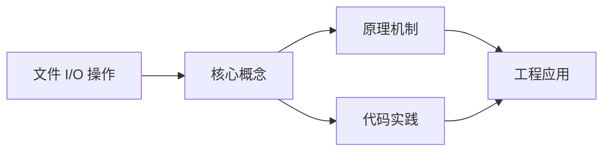
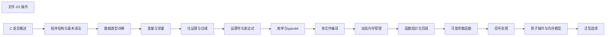

## 1. 学习目标（Bloom 分类）

本节按照布鲁姆教育目标分类学组织学习路径。本文主题为《文件 I/O 操作》，属于 C 模块，读者可以根据自身阶段选择阅读深度。

记忆层面：能够准确复述本文的核心概念、术语与基本语法或操作步骤，并能够在提问或检索时快速定位对应知识点。能够说出 C 的变量、函数、指针、数组、结构体与预处理语法。

理解层面：能够用自己的语言解释核心原理与工作机制，说明概念之间的因果关系，而不是机械记忆结论。能够解释指针与内存地址、栈与堆、编译链接过程。

应用层面：能够在真实项目或练习场景中运用本文知识解决具体问题，写出正确且可维护的实现。能够编写系统工具、数据结构与嵌入式程序。

分析层面：能够拆解复杂问题，比较本文主题与相邻概念的异同，识别边界条件与例外情况。能够分析内存泄漏、缓冲区溢出与未定义行为。

评价层面：能够根据约束条件（性能、可读性、安全、成本）评价不同方案的优劣，做出有依据的技术决策。能够评价 C 与其他语言在系统编程中的取舍。

创造层面：能够把本文知识与其他模块知识组合，设计出新的解决方案或可复用的工程模式。能够设计可移植、可维护的 C 库与模块。

通过本节学习，读者应当能够把《文件 I/O 操作》纳入自己的知识网络，并与 C 模块的其他主题（指针、内存管理、预处理器、标准库）建立关联。

## 2. 历史动机与发展脉络

《文件 I/O 操作》是 C 领域的重要主题。要真正理解它，需要先了解它解决的问题与演进过程。

C 由 Dennis Ritchie 于 1972 年在贝尔实验室为 Unix 开发，是系统编程的基石语言：操作系统、编译器、嵌入式固件均以 C 为主。
C89（ANSI C）统一方言，C99 引入变长数组与 // 注释，C11 增加泛型选择与线程支持，C17 为缺陷修复版，C23（2024 年正式发布）引入 constexpr、属性、显式枚举底层类型等现代化特性。
C 的哲学是“信任程序员”：提供指针与内存操作的全部能力，同时把正确性责任交给开发者；这一设计成就了性能上限，也带来内存安全风险，催生了 Rust 等后继语言。

回到本文主题：文件 I/O 操作 的提出与成熟，正是上述技术背景下的必然产物。早期实现往往以简单可用为目标，随着工程规模扩大，社区逐渐沉淀出标准做法与最佳实践；理解这一脉络，可以帮助读者判断“为什么文档中的推荐写法是现在这个样子”，也能在遇到历史遗留代码时准确识别其设计年代与取舍。


## 3. 形式化定义与核心概念精讲

本节把《文件 I/O 操作》涉及的核心概念以“定义 + 讲解”的形式展开。读者应把定义当作工具，把讲解当作理解路径；两者结合才能形成可迁移的知识。

指针：指针保存变量地址，`&` 取地址、`*` 解引用；指针算术与数组名退化规则（数组名作为实参退化为首元素指针）是 C 的经典难点。
内存管理：栈内存自动释放，堆内存由 malloc/calloc/realloc/free 管理；所有权责任（谁分配谁释放）必须显式约定。
预处理器：#include/#define/#ifdef 在编译前文本处理；宏展开有副作用与优先级风险，函数式宏参数必须加括号。

### 3.1 原文章节逐一精讲

原文档把主题拆分为 12 个小节，下面按顺序给出每一节的导读讲解，随后保留原文细节供精读。

#### 原文精读（完整保留）


#### 1. 文件 I/O 的概念与重要性

##### 1.1 什么是文件 I/O

- **文件 I/O**（Input/Output）是指程序与外部文件之间的数据交换操作。
- **作用**：
- 持久化存储数据
- 读取配置文件
- 处理大型数据集
- 日志记录
- 与其他程序交换数据

##### 1.2 文件的类型

- **文本文件**：以字符形式存储，每行以换行符结束
- **二进制文件**：以二进制形式存储，直接保存数据的内存表示

#### 2. 文件指针与标准流

##### 2.1 文件指针

- **FILE 结构体**：C 语言使用 `FILE` 结构体来管理文件操作
- **文件指针**：`FILE *` 类型的指针，指向 FILE 结构体的实例

##### 2.2 标准流

- **stdin**：标准输入流，通常对应键盘
- **stdout**：标准输出流，通常对应屏幕
- **stderr**：标准错误流，通常对应屏幕（用于错误信息）

```c
 // 标准流的使用
 printf("Hello, World!\n"); // 等价于 fprintf(stdout, "Hello, World!\n");
 fprintf(stderr, "Error: Something went wrong!\n");
```

#### 3. 文件的打开与关闭

##### 3.1 文件打开模式

| 模式 | 描述                                           |
| ---- | ---------------------------------------------- |
| r    | 只读模式，文件必须存在                         |
| w    | 只写模式，文件不存在则创建，存在则清空         |
| a    | 追加模式，文件不存在则创建，从文件末尾开始写入 |
| r+   | 读写模式，文件必须存在                         |
| w+   | 读写模式，文件不存在则创建，存在则清空         |
| a+   | 读写模式，文件不存在则创建，从文件末尾开始写入 |
| rb   | 二进制只读模式                                 |
| wb   | 二进制只写模式                                 |
| ab   | 二进制追加模式                                 |
| rb+  | 二进制读写模式                                 |
| wb+  | 二进制读写模式                                 |
| ab+  | 二进制读写模式                                 |

##### 3.2 文件打开函数 `fopen`

```c
 FILE *fopen(const char *filename, const char *mode);
```

- **参数**：
- `filename`：文件名或路径
- `mode`：打开模式
- **返回值**：成功返回文件指针，失败返回 NULL

##### 3.3 文件关闭函数 `fclose`

```c
 int fclose(FILE *stream);
```

- **参数**：
- `stream`：文件指针
- **返回值**：成功返回 0，失败返回 EOF

##### 3.4 示例：打开和关闭文件

```c
 #include <stdio.h>
 int main() {
  FILE *fp = fopen("test.txt", "w");
  if (fp == NULL) {
  perror("Error opening file");
  return 1;
  }
  // 文件操作...
  if (fclose(fp) != 0) {
  perror("Error closing file");
  return 1;
  }
  return 0;
 }
```

#### 4. 文件读写操作

##### 4.1 格式化读写

###### 4.1.1 格式化写入：`fprintf`

```c
 int fprintf(FILE *stream, const char *format, ...);
```

- **参数**：
- `stream`：文件指针
- `format`：格式化字符串
- `...`：可变参数列表
- **返回值**：成功返回写入的字符数，失败返回负值

###### 4.1.2 格式化读取：`fscanf`

```c
 int fscanf(FILE *stream, const char *format, ...);
```

- **参数**：
- `stream`：文件指针
- `format`：格式化字符串
- `...`：变量地址列表
- **返回值**：成功返回读取的项目数，失败或到达文件末尾返回 EOF

###### 4.1.3 示例：格式化读写

```c
 // 写入数据
 FILE *fp = fopen("data.txt", "w");
 if (fp != NULL) {
  fprintf(fp, "Name: %s\n", "Alice");
  fprintf(fp, "Age: %d\n", 25);
  fprintf(fp, "Score: %.2f\n", 95.5);
  fclose(fp);
 }
 // 读取数据
 char name[50];
 int age;
 float score;
 fp = fopen("data.txt", "r");
 if (fp != NULL) {
  fscanf(fp, "Name: %s", name);
  fscanf(fp, "Age: %d", &age);
  fscanf(fp, "Score: %f", &score);
  printf("Name: %s, Age: %d, Score: %.2f\n", name, age, score);
  fclose(fp);
 }
```

##### 4.2 字符读写

###### 4.2.1 字符写入：`fputc`

```c
 int fputc(int c, FILE *stream);
```

- **参数**：
- `c`：要写入的字符（int 类型）
- `stream`：文件指针
- **返回值**：成功返回写入的字符，失败返回 EOF

###### 4.2.2 字符读取：`fgetc`

```c
 int fgetc(FILE *stream);
```

- **参数**：
- `stream`：文件指针
- **返回值**：成功返回读取的字符，失败或到达文件末尾返回 EOF

###### 4.2.3 示例：字符读写

```c
 // 写入字符
 FILE *fp = fopen("chars.txt", "w");
 if (fp != NULL) {
  char str[] = "Hello, File I/O!";
  for (int i = 0; str[i] != '\0'; i++) {
  fputc(str[i], fp);
  }
  fclose(fp);
 }
 // 读取字符
 fp = fopen("chars.txt", "r");
 if (fp != NULL) {
  int c;
  while ((c = fgetc(fp)) != EOF) {
  putchar(c);
  }
  fclose(fp);
 }
```

##### 4.3 字符串读写

###### 4.3.1 字符串写入：`fputs`

```c
 int fputs(const char *s, FILE *stream);
```

- **参数**：
- `s`：要写入的字符串
- `stream`：文件指针
- **返回值**：成功返回非负值，失败返回 EOF

###### 4.3.2 字符串读取：`fgets`

```c
 char *fgets(char *s, int size, FILE *stream);
```

- **参数**：
- `s`：存储读取字符串的缓冲区
- `size`：缓冲区大小
- `stream`：文件指针
- **返回值**：成功返回缓冲区地址，失败或到达文件末尾返回 NULL

###### 4.3.3 示例：字符串读写

```c
 // 写入字符串
 FILE *fp = fopen("lines.txt", "w");
 if (fp != NULL) {
  fputs("First line\n", fp);
  fputs("Second line\n", fp);
  fputs("Third line\n", fp);
  fclose(fp);
 }
 // 读取字符串
 fp = fopen("lines.txt", "r");
 if (fp != NULL) {
  char buffer[100];
  while (fgets(buffer, sizeof(buffer), fp) != NULL) {
  printf("%s", buffer);
  }
  fclose(fp);
 }
```

##### 4.4 二进制读写

###### 4.4.1 二进制写入：`fwrite`

```c
 size_t fwrite(const void *ptr, size_t size, size_t count, FILE *stream);
```

- **参数**：
- `ptr`：数据缓冲区指针
- `size`：每个数据项的大小
- `count`：数据项的数量
- `stream`：文件指针
- **返回值**：成功返回写入的数据项数量

###### 4.4.2 二进制读取：`fread`

```c
 size_t fread(void *ptr, size_t size, size_t count, FILE *stream);
```

- **参数**：
- `ptr`：数据缓冲区指针
- `size`：每个数据项的大小
- `count`：数据项的数量
- `stream`：文件指针
- **返回值**：成功返回读取的数据项数量

###### 4.4.3 示例：二进制读写

```c
 // 定义结构体
 typedef struct {
  char name[50];
  int age;
  float salary;
 }
 // 写入结构体
 Employee emp = {"Alice", 25, 5000.0};
 FILE *fp = fopen("employee.dat", "wb");
 if (fp != NULL) {
  fwrite(&emp, sizeof(Employee), 1, fp);
  fclose(fp);
 }
 // 读取结构体
 Employee read_emp;
 fp = fopen("employee.dat", "rb");
 if (fp != NULL) {
  fread(&read_emp, sizeof(Employee), 1, fp);
  printf("Name: %s, Age: %d, Salary: %.2f\n",
  read_emp.name, read_emp.age, read_emp.salary);
  fclose(fp);
 }
```

#### 5. 文件位置指针

##### 5.1 获取当前位置：`ftell`

```c
 long ftell(FILE *stream);
```

- **参数**：
- `stream`：文件指针
- **返回值**：成功返回当前文件位置，失败返回 -1L

##### 5.2 设置文件位置：`fseek`

```c
 int fseek(FILE *stream, long offset, int origin);
```

- **参数**：
- `stream`：文件指针
- `offset`：偏移量（字节）
- `origin`：起始位置
- `SEEK_SET`：文件开头
- `SEEK_CUR`：当前位置
- `SEEK_END`：文件末尾
- **返回值**：成功返回 0，失败返回非 0

##### 5.3 重置到文件开头：`rewind`

```c
 void rewind(FILE *stream);
```

- **参数**：
- `stream`：文件指针
- **功能**：将文件位置指针重置到文件开头

##### 5.4 示例：文件位置操作

```c
 FILE *fp = fopen("test.txt", "r");
 if (fp != NULL) {
  // 获取初始位置
  long pos = ftell(fp);
  printf("Initial position: %ld\n", pos);
  // 读取一些数据
  char buffer[100];
  fgets(buffer, sizeof(buffer), fp);
  // 获取新位置
  pos = ftell(fp);
  printf("Position after reading: %ld\n", pos);
  // 移动到文件开头
  rewind(fp);
  pos = ftell(fp);
  printf("Position after rewind: %ld\n", pos);
  // 移动到文件末尾
  fseek(fp, 0, SEEK_END);
  pos = ftell(fp);
  printf("Position at end: %ld\n", pos);
  fclose(fp);
 }
```

#### 6. 错误处理

##### 6.1 检测文件结束：`feof`

```c
 int feof(FILE *stream);
```

- **参数**：
- `stream`：文件指针
- **返回值**：如果到达文件末尾返回非 0，否则返回 0

##### 6.2 检测错误：`ferror`

```c
 int ferror(FILE *stream);
```

- **参数**：
- `stream`：文件指针
- **返回值**：如果发生错误返回非 0，否则返回 0

##### 6.3 清除错误标志：`clearerr`

```c
 void clearerr(FILE *stream);
```

- **参数**：
- `stream`：文件指针
- **功能**：清除文件流的错误标志和文件结束标志

##### 6.4 打印错误信息：`perror`

```c
 void perror(const char *s);
```

- **参数**：
- `s`：自定义错误消息
- **功能**：打印自定义消息和系统错误信息

##### 6.5 示例：错误处理

```c
 FILE *fp = fopen("nonexistent.txt", "r");
 if (fp == NULL) {
  perror("Error opening file");
  return 1;
 }
 char buffer[100];
 while (fgets(buffer, sizeof(buffer), fp) != NULL) {
  // 处理数据
 }
 if (ferror(fp)) {
  perror("Error reading file");
 }
  printf("End of file reached\n");
 }
 fclose(fp);
```

#### 7. 高级文件操作

##### 7.1 临时文件

- **`tmpfile`**：创建临时文件，关闭时自动删除

```c
 FILE *tmpfile(void);
```

##### 7.2 文件重命名与删除

- **`rename`**：重命名文件
- **`remove`**：删除文件

```c
 int rename(const char *oldname, const char *newname);
 int remove(const char *filename);
```

##### 7.3 文件缓冲区控制

- **`setbuf`**：设置缓冲区
- **`setvbuf`**：设置缓冲区和缓冲模式
- **`fflush`**：刷新缓冲区

```c
 void setbuf(FILE *stream, char *buf);
 int setvbuf(FILE *stream, char *buf, int mode, size_t size);
 int fflush(FILE *stream);
```

#### 8. 完整应用示例

##### 8.1 文本文件复制

```c
 #include <stdio.h>
 int main() {
  FILE *source, *dest;
  char ch;
  // 打开源文件
  source = fopen("source.txt", "r");
  if (source == NULL) {
  perror("Error opening source file");
  return 1;
  }
  // 打开目标文件
  dest = fopen("destination.txt", "w");
  if (dest == NULL) {
  perror("Error opening destination file");
  fclose(source);
  return 1;
  }
  // 复制内容
  while ((ch = fgetc(source)) != EOF) {
  fputc(ch, dest);
  }
  // 检查错误
  if (ferror(source)) {
  perror("Error reading source file");
  } else if (ferror(dest)) {
  perror("Error writing destination file");
  } else {
  printf("File copied successfully!\n");
  }
  // 关闭文件
  fclose(source);
  fclose(dest);
  return 0;
 }
```

##### 8.2 学生信息管理系统

```c
 #include <stdio.h>
 #include <string.h>
 #define MAX_STUDENTS 100
 // 学生结构体
 typedef struct {
  int id;
  char name[50];
  float score;
 }
 // 保存学生信息到文件
 void save_students(Student students[], int count, const char *filename) {
  FILE *fp = fopen(filename, "wb");
  if (fp != NULL) {
  fwrite(&count, sizeof(int), 1, fp);
  fwrite(students, sizeof(Student), count, fp);
  fclose(fp);
  printf("Students saved successfully!\n");
  } else {
  perror("Error saving students");
  }
 }
 // 从文件加载学生信息
 int load_students(Student students[], const char *filename) {
  FILE *fp = fopen(filename, "rb");
  int count = 0;
  if (fp != NULL) {
  fread(&count, sizeof(int), 1, fp);
  if (count > MAX_STUDENTS) {
  count = MAX_STUDENTS;
  }
  fread(students, sizeof(Student), count, fp);
  fclose(fp);
  printf("Loaded %d students\n", count);
  } else {
  perror("Error loading students");
  }
  return count;
 }
 // 添加学生
 int add_student(Student students[], int count) {
  if (count >= MAX_STUDENTS) {
  printf("Maximum number of students reached!\n");
  return count;
  }
  Student s;
  printf("Enter student ID: ");
  scanf("%d", &s.id);
  printf("Enter student name: ");
  scanf(" %[^"]", s.name); // 读取带空格的字符串
  printf("Enter student score: ");
  scanf("%f", &s.score);
  students[count] = s;
  return count + 1;
 }
 // 显示学生信息
 void display_students(Student students[], int count) {
  printf("\nStudent List:\n");
  printf("ID\tName\t\tScore\n");
  printf("--------------------------------\n");
  for (int i = 0; i < count; i++) {
  printf("%d\t%s\t\t%.2f\n",
  students[i].id, students[i].name, students[i].score);
  }
  printf("\n");
 }
 int main() {
  Student students[MAX_STUDENTS];
  int count = 0;
  int choice;
  // 加载现有学生信息
  count = load_students(students, "students.dat");
  do {
  printf("\nStudent Management System\n");
  printf("1. Add Student\n");
  printf("2. Display Students\n");
  printf("3. Save and Exit\n");
  printf("Enter your choice: ");
  scanf("%d", &choice);
  switch (choice) {
  case 1:
  count = add_student(students, count);
  break;
  case 2:
  display_students(students, count);
  break;
  case 3:
  save_students(students, count, "students.dat");
  printf("Exiting...\n");
  break;
  default:
  printf("Invalid choice!\n");
  }
  } while (choice != 3);
  return 0;
 }
```

#### 9. 最佳实践

##### 9.1 文件操作最佳实践

- **始终检查文件操作的返回值**：确保文件成功打开、读写和关闭
- **使用适当的打开模式**：根据需要选择正确的文件打开模式
- **及时关闭文件**：避免资源泄漏
- **处理错误情况**：使用 `perror` 和 `ferror` 等函数处理错误
- **使用二进制模式处理二进制文件**：避免文本模式的自动转换
- **合理使用缓冲区**：对于大文件操作，考虑使用缓冲区提高效率
- **使用 `feof` 检测文件结束**：而不是依赖 `fgetc` 等函数的返回值
- **避免使用 `gets`**：使用 `fgets` 替代，更安全

##### 9.2 性能优化

- **批量读写**：对于大量数据，使用 `fread` 和 `fwrite` 进行批量操作
- **适当的缓冲区大小**：根据文件大小和内存情况设置合适的缓冲区
- **减少文件操作次数**：合并多次小的读写操作
- **使用 `fseek` 定位**：避免不必要的顺序读写
- **关闭不需要的文件**：及时释放文件资源

#### 10. 常见错误与调试

##### 10.1 常见错误

- **文件路径错误**：使用相对路径时，当前工作目录可能不是预期的
- **权限问题**：没有读写文件的权限
- **文件不存在**：以只读模式打开不存在的文件
- **内存不足**：文件过大，内存无法容纳
- **缓冲区溢出**：使用 `fgets` 时缓冲区大小不够
- **忘记关闭文件**：导致资源泄漏
- **混用文本和二进制模式**：导致数据损坏
- **文件位置指针错误**：不正确的 `fseek` 操作

##### 10.2 调试技巧

- **使用 `perror`**：打印详细的错误信息
- **检查文件权限**：确保有正确的文件访问权限
- **检查文件路径**：使用绝对路径或确认相对路径的正确性
- **使用 `printf`**：打印中间结果和文件位置
- **使用调试器**：如 GDB 单步执行文件操作
- **检查返回值**：验证所有文件操作函数的返回值
- **使用临时文件**：测试文件操作逻辑

#### 11. 与其他语言的对比

##### 11.1 C++ 的文件 I/O

- C++ 提供了 `fstream` 类，使用更面向对象的方式处理文件
- 支持运算符重载，如 `<<` 和 `>>` 进行读写
- 提供了更多的文件操作功能

##### 11.2 Python 的文件 I/O

- Python 的文件操作更简洁，使用 `with` 语句自动处理文件关闭
- 支持上下文管理器，更安全
- 提供了更多高级文件操作功能

##### 11.3 Java 的文件 I/O

- Java 提供了丰富的文件操作类，如 `File`, `FileReader`, `FileWriter` 等
- 支持字节流和字符流
- 异常处理更完善

#### 12. 总结

文件 I/O 是 C 语言中非常重要的一部分，它允许程序与外部文件进行数据交换，实现数据的持久化存储。通过本文的学习，你应该掌握：

- 文件的打开、关闭和基本操作
- 不同类型的文件读写方法（文本和二进制）
- 文件位置指针的控制
- 错误处理和异常情况的处理
- 文件操作的最佳实践和性能优化
  合理使用文件 I/O 功能，可以使你的程序更加灵活和实用，能够处理各种复杂的数据存储和交换需求。

---


### 3.2 概念关系图

下面用 Mermaid 图表达本文核心概念之间的关系，帮助读者建立整体图景：



图中展示的是本文知识的结构化关系：核心概念是入口，原理机制解释“为什么”，代码实践演示“怎么做”，工程应用回答“何时用”。读者学习时可以把每个小节的内容挂接到对应节点上。

## 4. 理论推导与原理解析

本节深入《文件 I/O 操作》背后的原理。理论部分不求面面俱到，而是聚焦“能解释现象、能指导实践”的关键推导。

指针：指针保存变量地址，`&` 取地址、`*` 解引用；指针算术与数组名退化规则（数组名作为实参退化为首元素指针）是 C 的经典难点。
内存管理：栈内存自动释放，堆内存由 malloc/calloc/realloc/free 管理；所有权责任（谁分配谁释放）必须显式约定。
预处理器：#include/#define/#ifdef 在编译前文本处理；宏展开有副作用与优先级风险，函数式宏参数必须加括号。
编译链接：预处理 -> 编译 -> 汇编 -> 链接；头文件声明接口，源文件实现；静态库与动态库（.a/.so/.dll）决定部署形态。

需要强调的是，理论推导与工程实践之间存在翻译层：理论给出的是理想化模型与边界条件，工程代码则必须处理真实环境中的例外。读者在学习时应先掌握理论的“标准情形”，再通过陷阱章节了解“非标准情形”。

## 5. 代码示例与逐行讲解

本节把原文中的代码示例系统整理，并为每个示例补充用途说明与讲解。读者不应只浏览代码，而应逐段对照讲解理解设计意图。

### 5.1 示例：2.2 标准流

该示例来自原文《2.2 标准流》小节，用于演示文件 I/O 操作相关操作。阅读时请先看代码结构，再看其后的讲解。

```c
 // 标准流的使用
 printf("Hello, World!\n"); // 等价于 fprintf(stdout, "Hello, World!\n");
 fprintf(stderr, "Error: Something went wrong!\n");
```

讲解：这段代码演示了本节核心知识点。代码中的关键操作可以归纳为三步：准备（定义或初始化）、执行（核心逻辑）、收尾（释放资源或返回结果）。实际项目中，这三步往往被封装为函数或类，以提升复用性与可测试性。

关键点分析：

该示例共 3 行有效代码，结构以数据或配置为主。阅读时应关注：数据字段的含义、配置项的作用，以及它们与运行行为的对应关系。

进阶思考路径：先尝试修改参数观察行为变化，再把示例中的模式迁移到自己的项目中；每次修改都记录预期与实测差异，这是把示例转化为能力的最快方式。

### 5.2 示例：3.2 文件打开函数 `fopen`

该示例来自原文《3.2 文件打开函数 `fopen`》小节，用于演示文件 I/O 操作相关操作。阅读时请先看代码结构，再看其后的讲解。

```c
 FILE *fopen(const char *filename, const char *mode);
```

讲解：这段代码演示了本节核心知识点。代码中的关键操作可以归纳为三步：准备（定义或初始化）、执行（核心逻辑）、收尾（释放资源或返回结果）。实际项目中，这三步往往被封装为函数或类，以提升复用性与可测试性。

关键点分析：

该示例共 1 行有效代码，结构以数据或配置为主。阅读时应关注：数据字段的含义、配置项的作用，以及它们与运行行为的对应关系。

进阶思考路径：先尝试修改参数观察行为变化，再把示例中的模式迁移到自己的项目中；每次修改都记录预期与实测差异，这是把示例转化为能力的最快方式。

### 5.3 示例：3.3 文件关闭函数 `fclose`

该示例来自原文《3.3 文件关闭函数 `fclose`》小节，用于演示文件 I/O 操作相关操作。阅读时请先看代码结构，再看其后的讲解。

```c
 int fclose(FILE *stream);
```

讲解：这段代码演示了本节核心知识点。代码中的关键操作可以归纳为三步：准备（定义或初始化）、执行（核心逻辑）、收尾（释放资源或返回结果）。实际项目中，这三步往往被封装为函数或类，以提升复用性与可测试性。

关键点分析：

该示例共 1 行有效代码，结构以数据或配置为主。阅读时应关注：数据字段的含义、配置项的作用，以及它们与运行行为的对应关系。

进阶思考路径：先尝试修改参数观察行为变化，再把示例中的模式迁移到自己的项目中；每次修改都记录预期与实测差异，这是把示例转化为能力的最快方式。

### 5.4 示例：3.4 示例：打开和关闭文件

该示例来自原文《3.4 示例：打开和关闭文件》小节，用于演示文件 I/O 操作相关操作。阅读时请先看代码结构，再看其后的讲解。

```c
 #include <stdio.h>
 int main() {
  FILE *fp = fopen("test.txt", "w");
  if (fp == NULL) {
  perror("Error opening file");
  return 1;
  }
  // 文件操作...
  if (fclose(fp) != 0) {
  perror("Error closing file");
  return 1;
  }
  return 0;
 }
```

讲解：这段代码演示了本节核心知识点。代码中的关键操作可以归纳为三步：准备（定义或初始化）、执行（核心逻辑）、收尾（释放资源或返回结果）。实际项目中，这三步往往被封装为函数或类，以提升复用性与可测试性。

关键点分析：

该示例共 14 行有效代码，包含 2 类关键结构（if、return）。其中：

- 入口与初始化部分负责建立上下文，对应实际项目中的启动或装配逻辑；
- 核心逻辑部分体现本文主题的主要操作，是阅读时最需要对照讲解理解的部分；
- 输出或返回部分把结果交给调用方，注意其类型与边界条件。

进阶思考路径：先尝试修改参数观察行为变化，再把示例中的模式迁移到自己的项目中；每次修改都记录预期与实测差异，这是把示例转化为能力的最快方式。

### 5.5 示例：4.1.1 格式化写入：`fprintf`

该示例来自原文《4.1.1 格式化写入：`fprintf`》小节，用于演示文件 I/O 操作相关操作。阅读时请先看代码结构，再看其后的讲解。

```c
 int fprintf(FILE *stream, const char *format, ...);
```

讲解：这段代码演示了本节核心知识点。代码中的关键操作可以归纳为三步：准备（定义或初始化）、执行（核心逻辑）、收尾（释放资源或返回结果）。实际项目中，这三步往往被封装为函数或类，以提升复用性与可测试性。

关键点分析：

该示例共 1 行有效代码，结构以数据或配置为主。阅读时应关注：数据字段的含义、配置项的作用，以及它们与运行行为的对应关系。

进阶思考路径：先尝试修改参数观察行为变化，再把示例中的模式迁移到自己的项目中；每次修改都记录预期与实测差异，这是把示例转化为能力的最快方式。

### 5.6 示例：4.1.2 格式化读取：`fscanf`

该示例来自原文《4.1.2 格式化读取：`fscanf`》小节，用于演示文件 I/O 操作相关操作。阅读时请先看代码结构，再看其后的讲解。

```c
 int fscanf(FILE *stream, const char *format, ...);
```

讲解：这段代码演示了本节核心知识点。代码中的关键操作可以归纳为三步：准备（定义或初始化）、执行（核心逻辑）、收尾（释放资源或返回结果）。实际项目中，这三步往往被封装为函数或类，以提升复用性与可测试性。

关键点分析：

该示例共 1 行有效代码，结构以数据或配置为主。阅读时应关注：数据字段的含义、配置项的作用，以及它们与运行行为的对应关系。

进阶思考路径：先尝试修改参数观察行为变化，再把示例中的模式迁移到自己的项目中；每次修改都记录预期与实测差异，这是把示例转化为能力的最快方式。

### 5.7 示例：4.1.3 示例：格式化读写

该示例来自原文《4.1.3 示例：格式化读写》小节，用于演示文件 I/O 操作相关操作。阅读时请先看代码结构，再看其后的讲解。

```c
 // 写入数据
 FILE *fp = fopen("data.txt", "w");
 if (fp != NULL) {
  fprintf(fp, "Name: %s\n", "Alice");
  fprintf(fp, "Age: %d\n", 25);
  fprintf(fp, "Score: %.2f\n", 95.5);
  fclose(fp);
 }
 // 读取数据
 char name[50];
 int age;
 float score;
 fp = fopen("data.txt", "r");
 if (fp != NULL) {
  fscanf(fp, "Name: %s", name);
  fscanf(fp, "Age: %d", &age);
  fscanf(fp, "Score: %f", &score);
  printf("Name: %s, Age: %d, Score: %.2f\n", name, age, score);
  fclose(fp);
 }
```

讲解：这段代码演示了本节核心知识点。代码中的关键操作可以归纳为三步：准备（定义或初始化）、执行（核心逻辑）、收尾（释放资源或返回结果）。实际项目中，这三步往往被封装为函数或类，以提升复用性与可测试性。

关键点分析：

该示例共 20 行有效代码，包含 1 类关键结构（if）。其中：

- 入口与初始化部分负责建立上下文，对应实际项目中的启动或装配逻辑；
- 核心逻辑部分体现本文主题的主要操作，是阅读时最需要对照讲解理解的部分；
- 输出或返回部分把结果交给调用方，注意其类型与边界条件。

进阶思考路径：先尝试修改参数观察行为变化，再把示例中的模式迁移到自己的项目中；每次修改都记录预期与实测差异，这是把示例转化为能力的最快方式。

### 5.8 示例：4.2.1 字符写入：`fputc`

该示例来自原文《4.2.1 字符写入：`fputc`》小节，用于演示文件 I/O 操作相关操作。阅读时请先看代码结构，再看其后的讲解。

```c
 int fputc(int c, FILE *stream);
```

讲解：这段代码演示了本节核心知识点。代码中的关键操作可以归纳为三步：准备（定义或初始化）、执行（核心逻辑）、收尾（释放资源或返回结果）。实际项目中，这三步往往被封装为函数或类，以提升复用性与可测试性。

关键点分析：

该示例共 1 行有效代码，结构以数据或配置为主。阅读时应关注：数据字段的含义、配置项的作用，以及它们与运行行为的对应关系。

进阶思考路径：先尝试修改参数观察行为变化，再把示例中的模式迁移到自己的项目中；每次修改都记录预期与实测差异，这是把示例转化为能力的最快方式。

### 5.9 示例：4.2.2 字符读取：`fgetc`

该示例来自原文《4.2.2 字符读取：`fgetc`》小节，用于演示文件 I/O 操作相关操作。阅读时请先看代码结构，再看其后的讲解。

```c
 int fgetc(FILE *stream);
```

讲解：这段代码演示了本节核心知识点。代码中的关键操作可以归纳为三步：准备（定义或初始化）、执行（核心逻辑）、收尾（释放资源或返回结果）。实际项目中，这三步往往被封装为函数或类，以提升复用性与可测试性。

关键点分析：

该示例共 1 行有效代码，结构以数据或配置为主。阅读时应关注：数据字段的含义、配置项的作用，以及它们与运行行为的对应关系。

进阶思考路径：先尝试修改参数观察行为变化，再把示例中的模式迁移到自己的项目中；每次修改都记录预期与实测差异，这是把示例转化为能力的最快方式。

### 5.10 示例：4.2.3 示例：字符读写

该示例来自原文《4.2.3 示例：字符读写》小节，用于演示文件 I/O 操作相关操作。阅读时请先看代码结构，再看其后的讲解。

```c
 // 写入字符
 FILE *fp = fopen("chars.txt", "w");
 if (fp != NULL) {
  char str[] = "Hello, File I/O!";
  for (int i = 0; str[i] != '\0'; i++) {
  fputc(str[i], fp);
  }
  fclose(fp);
 }
 // 读取字符
 fp = fopen("chars.txt", "r");
 if (fp != NULL) {
  int c;
  while ((c = fgetc(fp)) != EOF) {
  putchar(c);
  }
  fclose(fp);
 }
```

讲解：这段代码演示了本节核心知识点。代码中的关键操作可以归纳为三步：准备（定义或初始化）、执行（核心逻辑）、收尾（释放资源或返回结果）。实际项目中，这三步往往被封装为函数或类，以提升复用性与可测试性。

关键点分析：

该示例共 18 行有效代码，包含 3 类关键结构（if、for、while）。其中：

- 入口与初始化部分负责建立上下文，对应实际项目中的启动或装配逻辑；
- 核心逻辑部分体现本文主题的主要操作，是阅读时最需要对照讲解理解的部分；
- 输出或返回部分把结果交给调用方，注意其类型与边界条件。

进阶思考路径：先尝试修改参数观察行为变化，再把示例中的模式迁移到自己的项目中；每次修改都记录预期与实测差异，这是把示例转化为能力的最快方式。

### 5.11 示例：4.3.1 字符串写入：`fputs`

该示例来自原文《4.3.1 字符串写入：`fputs`》小节，用于演示文件 I/O 操作相关操作。阅读时请先看代码结构，再看其后的讲解。

```c
 int fputs(const char *s, FILE *stream);
```

讲解：这段代码演示了本节核心知识点。代码中的关键操作可以归纳为三步：准备（定义或初始化）、执行（核心逻辑）、收尾（释放资源或返回结果）。实际项目中，这三步往往被封装为函数或类，以提升复用性与可测试性。

关键点分析：

该示例共 1 行有效代码，结构以数据或配置为主。阅读时应关注：数据字段的含义、配置项的作用，以及它们与运行行为的对应关系。

进阶思考路径：先尝试修改参数观察行为变化，再把示例中的模式迁移到自己的项目中；每次修改都记录预期与实测差异，这是把示例转化为能力的最快方式。

### 5.12 示例：4.3.2 字符串读取：`fgets`

该示例来自原文《4.3.2 字符串读取：`fgets`》小节，用于演示文件 I/O 操作相关操作。阅读时请先看代码结构，再看其后的讲解。

```c
 char *fgets(char *s, int size, FILE *stream);
```

讲解：这段代码演示了本节核心知识点。代码中的关键操作可以归纳为三步：准备（定义或初始化）、执行（核心逻辑）、收尾（释放资源或返回结果）。实际项目中，这三步往往被封装为函数或类，以提升复用性与可测试性。

关键点分析：

该示例共 1 行有效代码，结构以数据或配置为主。阅读时应关注：数据字段的含义、配置项的作用，以及它们与运行行为的对应关系。

进阶思考路径：先尝试修改参数观察行为变化，再把示例中的模式迁移到自己的项目中；每次修改都记录预期与实测差异，这是把示例转化为能力的最快方式。

### 5.13 示例：4.3.3 示例：字符串读写

该示例来自原文《4.3.3 示例：字符串读写》小节，用于演示文件 I/O 操作相关操作。阅读时请先看代码结构，再看其后的讲解。

```c
 // 写入字符串
 FILE *fp = fopen("lines.txt", "w");
 if (fp != NULL) {
  fputs("First line\n", fp);
  fputs("Second line\n", fp);
  fputs("Third line\n", fp);
  fclose(fp);
 }
 // 读取字符串
 fp = fopen("lines.txt", "r");
 if (fp != NULL) {
  char buffer[100];
  while (fgets(buffer, sizeof(buffer), fp) != NULL) {
  printf("%s", buffer);
  }
  fclose(fp);
 }
```

讲解：这段代码演示了本节核心知识点。代码中的关键操作可以归纳为三步：准备（定义或初始化）、执行（核心逻辑）、收尾（释放资源或返回结果）。实际项目中，这三步往往被封装为函数或类，以提升复用性与可测试性。

关键点分析：

该示例共 17 行有效代码，包含 2 类关键结构（if、while）。其中：

- 入口与初始化部分负责建立上下文，对应实际项目中的启动或装配逻辑；
- 核心逻辑部分体现本文主题的主要操作，是阅读时最需要对照讲解理解的部分；
- 输出或返回部分把结果交给调用方，注意其类型与边界条件。

进阶思考路径：先尝试修改参数观察行为变化，再把示例中的模式迁移到自己的项目中；每次修改都记录预期与实测差异，这是把示例转化为能力的最快方式。

### 5.14 示例：4.4.1 二进制写入：`fwrite`

该示例来自原文《4.4.1 二进制写入：`fwrite`》小节，用于演示文件 I/O 操作相关操作。阅读时请先看代码结构，再看其后的讲解。

```c
 size_t fwrite(const void *ptr, size_t size, size_t count, FILE *stream);
```

讲解：这段代码演示了本节核心知识点。代码中的关键操作可以归纳为三步：准备（定义或初始化）、执行（核心逻辑）、收尾（释放资源或返回结果）。实际项目中，这三步往往被封装为函数或类，以提升复用性与可测试性。

关键点分析：

该示例共 1 行有效代码，结构以数据或配置为主。阅读时应关注：数据字段的含义、配置项的作用，以及它们与运行行为的对应关系。

进阶思考路径：先尝试修改参数观察行为变化，再把示例中的模式迁移到自己的项目中；每次修改都记录预期与实测差异，这是把示例转化为能力的最快方式。

### 5.15 示例：4.4.2 二进制读取：`fread`

该示例来自原文《4.4.2 二进制读取：`fread`》小节，用于演示文件 I/O 操作相关操作。阅读时请先看代码结构，再看其后的讲解。

```c
 size_t fread(void *ptr, size_t size, size_t count, FILE *stream);
```

讲解：这段代码演示了本节核心知识点。代码中的关键操作可以归纳为三步：准备（定义或初始化）、执行（核心逻辑）、收尾（释放资源或返回结果）。实际项目中，这三步往往被封装为函数或类，以提升复用性与可测试性。

关键点分析：

该示例共 1 行有效代码，结构以数据或配置为主。阅读时应关注：数据字段的含义、配置项的作用，以及它们与运行行为的对应关系。

进阶思考路径：先尝试修改参数观察行为变化，再把示例中的模式迁移到自己的项目中；每次修改都记录预期与实测差异，这是把示例转化为能力的最快方式。

### 5.16 示例：4.4.3 示例：二进制读写

该示例来自原文《4.4.3 示例：二进制读写》小节，用于演示文件 I/O 操作相关操作。阅读时请先看代码结构，再看其后的讲解。

```c
 // 定义结构体
 typedef struct {
  char name[50];
  int age;
  float salary;
 }
 // 写入结构体
 Employee emp = {"Alice", 25, 5000.0};
 FILE *fp = fopen("employee.dat", "wb");
 if (fp != NULL) {
  fwrite(&emp, sizeof(Employee), 1, fp);
  fclose(fp);
 }
 // 读取结构体
 Employee read_emp;
 fp = fopen("employee.dat", "rb");
 if (fp != NULL) {
  fread(&read_emp, sizeof(Employee), 1, fp);
  printf("Name: %s, Age: %d, Salary: %.2f\n",
  read_emp.name, read_emp.age, read_emp.salary);
  fclose(fp);
 }
```

讲解：这段代码演示了本节核心知识点。代码中的关键操作可以归纳为三步：准备（定义或初始化）、执行（核心逻辑）、收尾（释放资源或返回结果）。实际项目中，这三步往往被封装为函数或类，以提升复用性与可测试性。

关键点分析：

该示例共 22 行有效代码，包含 2 类关键结构（def、if）。其中：

- 入口与初始化部分负责建立上下文，对应实际项目中的启动或装配逻辑；
- 核心逻辑部分体现本文主题的主要操作，是阅读时最需要对照讲解理解的部分；
- 输出或返回部分把结果交给调用方，注意其类型与边界条件。

进阶思考路径：先尝试修改参数观察行为变化，再把示例中的模式迁移到自己的项目中；每次修改都记录预期与实测差异，这是把示例转化为能力的最快方式。

### 5.17 示例：5.1 获取当前位置：`ftell`

该示例来自原文《5.1 获取当前位置：`ftell`》小节，用于演示文件 I/O 操作相关操作。阅读时请先看代码结构，再看其后的讲解。

```c
 long ftell(FILE *stream);
```

讲解：这段代码演示了本节核心知识点。代码中的关键操作可以归纳为三步：准备（定义或初始化）、执行（核心逻辑）、收尾（释放资源或返回结果）。实际项目中，这三步往往被封装为函数或类，以提升复用性与可测试性。

关键点分析：

该示例共 1 行有效代码，结构以数据或配置为主。阅读时应关注：数据字段的含义、配置项的作用，以及它们与运行行为的对应关系。

进阶思考路径：先尝试修改参数观察行为变化，再把示例中的模式迁移到自己的项目中；每次修改都记录预期与实测差异，这是把示例转化为能力的最快方式。

### 5.18 示例：5.2 设置文件位置：`fseek`

该示例来自原文《5.2 设置文件位置：`fseek`》小节，用于演示文件 I/O 操作相关操作。阅读时请先看代码结构，再看其后的讲解。

```c
 int fseek(FILE *stream, long offset, int origin);
```

讲解：这段代码演示了本节核心知识点。代码中的关键操作可以归纳为三步：准备（定义或初始化）、执行（核心逻辑）、收尾（释放资源或返回结果）。实际项目中，这三步往往被封装为函数或类，以提升复用性与可测试性。

关键点分析：

该示例共 1 行有效代码，结构以数据或配置为主。阅读时应关注：数据字段的含义、配置项的作用，以及它们与运行行为的对应关系。

进阶思考路径：先尝试修改参数观察行为变化，再把示例中的模式迁移到自己的项目中；每次修改都记录预期与实测差异，这是把示例转化为能力的最快方式。

### 5.19 示例：5.3 重置到文件开头：`rewind`

该示例来自原文《5.3 重置到文件开头：`rewind`》小节，用于演示文件 I/O 操作相关操作。阅读时请先看代码结构，再看其后的讲解。

```c
 void rewind(FILE *stream);
```

讲解：这段代码演示了本节核心知识点。代码中的关键操作可以归纳为三步：准备（定义或初始化）、执行（核心逻辑）、收尾（释放资源或返回结果）。实际项目中，这三步往往被封装为函数或类，以提升复用性与可测试性。

关键点分析：

该示例共 1 行有效代码，结构以数据或配置为主。阅读时应关注：数据字段的含义、配置项的作用，以及它们与运行行为的对应关系。

进阶思考路径：先尝试修改参数观察行为变化，再把示例中的模式迁移到自己的项目中；每次修改都记录预期与实测差异，这是把示例转化为能力的最快方式。

### 5.20 示例：5.4 示例：文件位置操作

该示例来自原文《5.4 示例：文件位置操作》小节，用于演示文件 I/O 操作相关操作。阅读时请先看代码结构，再看其后的讲解。

```c
 FILE *fp = fopen("test.txt", "r");
 if (fp != NULL) {
  // 获取初始位置
  long pos = ftell(fp);
  printf("Initial position: %ld\n", pos);
  // 读取一些数据
  char buffer[100];
  fgets(buffer, sizeof(buffer), fp);
  // 获取新位置
  pos = ftell(fp);
  printf("Position after reading: %ld\n", pos);
  // 移动到文件开头
  rewind(fp);
  pos = ftell(fp);
  printf("Position after rewind: %ld\n", pos);
  // 移动到文件末尾
  fseek(fp, 0, SEEK_END);
  pos = ftell(fp);
  printf("Position at end: %ld\n", pos);
  fclose(fp);
 }
```

讲解：这段代码演示了本节核心知识点。代码中的关键操作可以归纳为三步：准备（定义或初始化）、执行（核心逻辑）、收尾（释放资源或返回结果）。实际项目中，这三步往往被封装为函数或类，以提升复用性与可测试性。

关键点分析：

该示例共 21 行有效代码，包含 1 类关键结构（if）。其中：

- 入口与初始化部分负责建立上下文，对应实际项目中的启动或装配逻辑；
- 核心逻辑部分体现本文主题的主要操作，是阅读时最需要对照讲解理解的部分；
- 输出或返回部分把结果交给调用方，注意其类型与边界条件。

进阶思考路径：先尝试修改参数观察行为变化，再把示例中的模式迁移到自己的项目中；每次修改都记录预期与实测差异，这是把示例转化为能力的最快方式。

### 5.21 示例：6.1 检测文件结束：`feof`

该示例来自原文《6.1 检测文件结束：`feof`》小节，用于演示文件 I/O 操作相关操作。阅读时请先看代码结构，再看其后的讲解。

```c
 int feof(FILE *stream);
```

讲解：这段代码演示了本节核心知识点。代码中的关键操作可以归纳为三步：准备（定义或初始化）、执行（核心逻辑）、收尾（释放资源或返回结果）。实际项目中，这三步往往被封装为函数或类，以提升复用性与可测试性。

关键点分析：

该示例共 1 行有效代码，结构以数据或配置为主。阅读时应关注：数据字段的含义、配置项的作用，以及它们与运行行为的对应关系。

进阶思考路径：先尝试修改参数观察行为变化，再把示例中的模式迁移到自己的项目中；每次修改都记录预期与实测差异，这是把示例转化为能力的最快方式。

### 5.22 示例：6.2 检测错误：`ferror`

该示例来自原文《6.2 检测错误：`ferror`》小节，用于演示文件 I/O 操作相关操作。阅读时请先看代码结构，再看其后的讲解。

```c
 int ferror(FILE *stream);
```

讲解：这段代码演示了本节核心知识点。代码中的关键操作可以归纳为三步：准备（定义或初始化）、执行（核心逻辑）、收尾（释放资源或返回结果）。实际项目中，这三步往往被封装为函数或类，以提升复用性与可测试性。

关键点分析：

该示例共 1 行有效代码，结构以数据或配置为主。阅读时应关注：数据字段的含义、配置项的作用，以及它们与运行行为的对应关系。

进阶思考路径：先尝试修改参数观察行为变化，再把示例中的模式迁移到自己的项目中；每次修改都记录预期与实测差异，这是把示例转化为能力的最快方式。

### 5.23 示例：6.3 清除错误标志：`clearerr`

该示例来自原文《6.3 清除错误标志：`clearerr`》小节，用于演示文件 I/O 操作相关操作。阅读时请先看代码结构，再看其后的讲解。

```c
 void clearerr(FILE *stream);
```

讲解：这段代码演示了本节核心知识点。代码中的关键操作可以归纳为三步：准备（定义或初始化）、执行（核心逻辑）、收尾（释放资源或返回结果）。实际项目中，这三步往往被封装为函数或类，以提升复用性与可测试性。

关键点分析：

该示例共 1 行有效代码，结构以数据或配置为主。阅读时应关注：数据字段的含义、配置项的作用，以及它们与运行行为的对应关系。

进阶思考路径：先尝试修改参数观察行为变化，再把示例中的模式迁移到自己的项目中；每次修改都记录预期与实测差异，这是把示例转化为能力的最快方式。

### 5.24 示例：6.4 打印错误信息：`perror`

该示例来自原文《6.4 打印错误信息：`perror`》小节，用于演示文件 I/O 操作相关操作。阅读时请先看代码结构，再看其后的讲解。

```c
 void perror(const char *s);
```

讲解：这段代码演示了本节核心知识点。代码中的关键操作可以归纳为三步：准备（定义或初始化）、执行（核心逻辑）、收尾（释放资源或返回结果）。实际项目中，这三步往往被封装为函数或类，以提升复用性与可测试性。

关键点分析：

该示例共 1 行有效代码，结构以数据或配置为主。阅读时应关注：数据字段的含义、配置项的作用，以及它们与运行行为的对应关系。

进阶思考路径：先尝试修改参数观察行为变化，再把示例中的模式迁移到自己的项目中；每次修改都记录预期与实测差异，这是把示例转化为能力的最快方式。

### 5.25 示例：6.5 示例：错误处理

该示例来自原文《6.5 示例：错误处理》小节，用于演示文件 I/O 操作相关操作。阅读时请先看代码结构，再看其后的讲解。

```c
 FILE *fp = fopen("nonexistent.txt", "r");
 if (fp == NULL) {
  perror("Error opening file");
  return 1;
 }
 char buffer[100];
 while (fgets(buffer, sizeof(buffer), fp) != NULL) {
  // 处理数据
 }
 if (ferror(fp)) {
  perror("Error reading file");
 }
  printf("End of file reached\n");
 }
 fclose(fp);
```

讲解：这段代码演示了本节核心知识点。代码中的关键操作可以归纳为三步：准备（定义或初始化）、执行（核心逻辑）、收尾（释放资源或返回结果）。实际项目中，这三步往往被封装为函数或类，以提升复用性与可测试性。

关键点分析：

该示例共 15 行有效代码，包含 3 类关键结构（if、while、return）。其中：

- 入口与初始化部分负责建立上下文，对应实际项目中的启动或装配逻辑；
- 核心逻辑部分体现本文主题的主要操作，是阅读时最需要对照讲解理解的部分；
- 输出或返回部分把结果交给调用方，注意其类型与边界条件。

进阶思考路径：先尝试修改参数观察行为变化，再把示例中的模式迁移到自己的项目中；每次修改都记录预期与实测差异，这是把示例转化为能力的最快方式。

### 5.26 示例：7.1 临时文件

该示例来自原文《7.1 临时文件》小节，用于演示文件 I/O 操作相关操作。阅读时请先看代码结构，再看其后的讲解。

```c
 FILE *tmpfile(void);
```

讲解：这段代码演示了本节核心知识点。代码中的关键操作可以归纳为三步：准备（定义或初始化）、执行（核心逻辑）、收尾（释放资源或返回结果）。实际项目中，这三步往往被封装为函数或类，以提升复用性与可测试性。

关键点分析：

该示例共 1 行有效代码，结构以数据或配置为主。阅读时应关注：数据字段的含义、配置项的作用，以及它们与运行行为的对应关系。

进阶思考路径：先尝试修改参数观察行为变化，再把示例中的模式迁移到自己的项目中；每次修改都记录预期与实测差异，这是把示例转化为能力的最快方式。

### 5.27 示例：7.2 文件重命名与删除

该示例来自原文《7.2 文件重命名与删除》小节，用于演示文件 I/O 操作相关操作。阅读时请先看代码结构，再看其后的讲解。

```c
 int rename(const char *oldname, const char *newname);
 int remove(const char *filename);
```

讲解：这段代码演示了本节核心知识点。代码中的关键操作可以归纳为三步：准备（定义或初始化）、执行（核心逻辑）、收尾（释放资源或返回结果）。实际项目中，这三步往往被封装为函数或类，以提升复用性与可测试性。

关键点分析：

该示例共 2 行有效代码，结构以数据或配置为主。阅读时应关注：数据字段的含义、配置项的作用，以及它们与运行行为的对应关系。

进阶思考路径：先尝试修改参数观察行为变化，再把示例中的模式迁移到自己的项目中；每次修改都记录预期与实测差异，这是把示例转化为能力的最快方式。

### 5.28 示例：7.3 文件缓冲区控制

该示例来自原文《7.3 文件缓冲区控制》小节，用于演示文件 I/O 操作相关操作。阅读时请先看代码结构，再看其后的讲解。

```c
 void setbuf(FILE *stream, char *buf);
 int setvbuf(FILE *stream, char *buf, int mode, size_t size);
 int fflush(FILE *stream);
```

讲解：这段代码演示了本节核心知识点。代码中的关键操作可以归纳为三步：准备（定义或初始化）、执行（核心逻辑）、收尾（释放资源或返回结果）。实际项目中，这三步往往被封装为函数或类，以提升复用性与可测试性。

关键点分析：

该示例共 3 行有效代码，结构以数据或配置为主。阅读时应关注：数据字段的含义、配置项的作用，以及它们与运行行为的对应关系。

进阶思考路径：先尝试修改参数观察行为变化，再把示例中的模式迁移到自己的项目中；每次修改都记录预期与实测差异，这是把示例转化为能力的最快方式。

### 5.29 示例：8.1 文本文件复制

该示例来自原文《8.1 文本文件复制》小节，用于演示文件 I/O 操作相关操作。阅读时请先看代码结构，再看其后的讲解。

```c
 #include <stdio.h>
 int main() {
  FILE *source, *dest;
  char ch;
  // 打开源文件
  source = fopen("source.txt", "r");
  if (source == NULL) {
  perror("Error opening source file");
  return 1;
  }
  // 打开目标文件
  dest = fopen("destination.txt", "w");
  if (dest == NULL) {
  perror("Error opening destination file");
  fclose(source);
  return 1;
  }
  // 复制内容
  while ((ch = fgetc(source)) != EOF) {
  fputc(ch, dest);
  }
  // 检查错误
  if (ferror(source)) {
  perror("Error reading source file");
  } else if (ferror(dest)) {
  perror("Error writing destination file");
  } else {
  printf("File copied successfully!\n");
  }
  // 关闭文件
  fclose(source);
  fclose(dest);
  return 0;
 }
```

讲解：这段代码演示了本节核心知识点。代码中的关键操作可以归纳为三步：准备（定义或初始化）、执行（核心逻辑）、收尾（释放资源或返回结果）。实际项目中，这三步往往被封装为函数或类，以提升复用性与可测试性。

关键点分析：

该示例共 34 行有效代码，包含 3 类关键结构（if、while、return）。其中：

- 入口与初始化部分负责建立上下文，对应实际项目中的启动或装配逻辑；
- 核心逻辑部分体现本文主题的主要操作，是阅读时最需要对照讲解理解的部分；
- 输出或返回部分把结果交给调用方，注意其类型与边界条件。

进阶思考路径：先尝试修改参数观察行为变化，再把示例中的模式迁移到自己的项目中；每次修改都记录预期与实测差异，这是把示例转化为能力的最快方式。

### 5.30 示例：8.2 学生信息管理系统

该示例来自原文《8.2 学生信息管理系统》小节，用于演示文件 I/O 操作相关操作。阅读时请先看代码结构，再看其后的讲解。

```c
 #include <stdio.h>
 #include <string.h>
 #define MAX_STUDENTS 100
 // 学生结构体
 typedef struct {
  int id;
  char name[50];
  float score;
 }
 // 保存学生信息到文件
 void save_students(Student students[], int count, const char *filename) {
  FILE *fp = fopen(filename, "wb");
  if (fp != NULL) {
  fwrite(&count, sizeof(int), 1, fp);
  fwrite(students, sizeof(Student), count, fp);
  fclose(fp);
  printf("Students saved successfully!\n");
  } else {
  perror("Error saving students");
  }
 }
 // 从文件加载学生信息
 int load_students(Student students[], const char *filename) {
  FILE *fp = fopen(filename, "rb");
  int count = 0;
  if (fp != NULL) {
  fread(&count, sizeof(int), 1, fp);
  if (count > MAX_STUDENTS) {
  count = MAX_STUDENTS;
  }
  fread(students, sizeof(Student), count, fp);
  fclose(fp);
  printf("Loaded %d students\n", count);
  } else {
  perror("Error loading students");
  }
  return count;
 }
 // 添加学生
 int add_student(Student students[], int count) {
  if (count >= MAX_STUDENTS) {
  printf("Maximum number of students reached!\n");
  return count;
  }
  Student s;
  printf("Enter student ID: ");
  scanf("%d", &s.id);
  printf("Enter student name: ");
  scanf(" %[^"]", s.name); // 读取带空格的字符串
  printf("Enter student score: ");
  scanf("%f", &s.score);
  students[count] = s;
  return count + 1;
 }
 // 显示学生信息
 void display_students(Student students[], int count) {
  printf("\nStudent List:\n");
  printf("ID\tName\t\tScore\n");
  printf("--------------------------------\n");
  for (int i = 0; i < count; i++) {
  printf("%d\t%s\t\t%.2f\n",
  students[i].id, students[i].name, students[i].score);
  }
  printf("\n");
 }
 int main() {
  Student students[MAX_STUDENTS];
  int count = 0;
  int choice;
  // 加载现有学生信息
  count = load_students(students, "students.dat");
  do {
  printf("\nStudent Management System\n");
  printf("1. Add Student\n");
  printf("2. Display Students\n");
  printf("3. Save and Exit\n");
  printf("Enter your choice: ");
  scanf("%d", &choice);
  switch (choice) {
  case 1:
  count = add_student(students, count);
  break;
  case 2:
  display_students(students, count);
  break;
  case 3:
  save_students(students, count, "students.dat");
  printf("Exiting...\n");
  break;
  default:
  printf("Invalid choice!\n");
  }
  } while (choice != 3);
  return 0;
 }
```

讲解：这段代码演示了本节核心知识点。代码中的关键操作可以归纳为三步：准备（定义或初始化）、执行（核心逻辑）、收尾（释放资源或返回结果）。实际项目中，这三步往往被封装为函数或类，以提升复用性与可测试性。

关键点分析：

该示例共 95 行有效代码，包含 5 类关键结构（def、if、for、while、return）。其中：

- 入口与初始化部分负责建立上下文，对应实际项目中的启动或装配逻辑；
- 核心逻辑部分体现本文主题的主要操作，是阅读时最需要对照讲解理解的部分；
- 输出或返回部分把结果交给调用方，注意其类型与边界条件。

进阶思考路径：先尝试修改参数观察行为变化，再把示例中的模式迁移到自己的项目中；每次修改都记录预期与实测差异，这是把示例转化为能力的最快方式。


综合以上示例，可以总结出本主题的代码实践要点：第一，先定义清晰的输入输出契约；第二，核心逻辑保持单一职责；第三，错误处理与边界条件不可省略；第四，命名与注释表达意图而非复述代码。

## 6. 对比分析

对比是理解《文件 I/O 操作》定位的最快路径。下面从多个维度与相邻方案进行对比。

C 与 C++：C++ 是 C 的超集扩展，支持类、模板、异常与 RAII；C 更简单直接，适合嵌入式与纯系统编程。
C 与 Rust：Rust 在编译期保证内存安全（所有权/借用）；C 灵活但需要人工保证安全。新系统项目可评估 Rust。
C89 与 C23：C23 带来 constexpr、attributes、二进制字面量等，现代化程度提升但仍保持兼容。

对比的目的不是分出绝对优劣，而是建立选择依据：不同约束条件下，最优解不同。读者应把每个对比维度转化为决策检查清单。

## 7. 常见陷阱与最佳实践

本节整理该主题的高频错误与推荐做法。每个陷阱先描述现象，再解释原因，最后给出最佳实践。

### 7.1 缓冲区溢出

gets/strcpy 不检查边界导致安全漏洞。使用 fgets/strncpy（注意截断语义）或安全库。

深入讲解：该问题之所以被归类为“常见陷阱”，是因为它在初学者的代码中反复出现，而且往往不在第一时间暴露——错误通常隐藏在特定数据或特定时序下。

从成因上看，缓冲区溢出 一般源于对 C 某个机制的理解偏差：要么误用了默认行为，要么忽略了边界条件，要么把其他语言的思维惯性带了过来。

从影响上看，缓冲区溢出 轻则产生错误结果，重则导致资源泄漏、数据损坏或安全事故；这也是为什么工程评审中会把它列为检查项。

从修复策略上看，处理缓冲区溢出的正确顺序是：先复现（构造最小用例），再定位（确认机制层面的根因），最后修复并补充回归测试。跳过复现直接改代码，往往治标不治本。

### 7.2 内存泄漏

malloc 后未 free。设计清晰的所有权规则，配合 Valgrind/ASan 检测。

深入讲解：该问题之所以被归类为“常见陷阱”，是因为它在初学者的代码中反复出现，而且往往不在第一时间暴露——错误通常隐藏在特定数据或特定时序下。

从成因上看，内存泄漏 一般源于对 C 某个机制的理解偏差：要么误用了默认行为，要么忽略了边界条件，要么把其他语言的思维惯性带了过来。

从影响上看，内存泄漏 轻则产生错误结果，重则导致资源泄漏、数据损坏或安全事故；这也是为什么工程评审中会把它列为检查项。

从修复策略上看，处理内存泄漏的正确顺序是：先复现（构造最小用例），再定位（确认机制层面的根因），最后修复并补充回归测试。跳过复现直接改代码，往往治标不治本。

### 7.3 悬垂指针

free 后继续使用指针。释放后置 NULL，并约定使用前检查。

深入讲解：该问题之所以被归类为“常见陷阱”，是因为它在初学者的代码中反复出现，而且往往不在第一时间暴露——错误通常隐藏在特定数据或特定时序下。

从成因上看，悬垂指针 一般源于对 C 某个机制的理解偏差：要么误用了默认行为，要么忽略了边界条件，要么把其他语言的思维惯性带了过来。

从影响上看，悬垂指针 轻则产生错误结果，重则导致资源泄漏、数据损坏或安全事故；这也是为什么工程评审中会把它列为检查项。

从修复策略上看，处理悬垂指针的正确顺序是：先复现（构造最小用例），再定位（确认机制层面的根因），最后修复并补充回归测试。跳过复现直接改代码，往往治标不治本。

### 7.4 未定义行为

有符号溢出、数组越界、除零等行为不可预测。开启 -Wall -Wextra -fsanitize=undefined 检测。

深入讲解：该问题之所以被归类为“常见陷阱”，是因为它在初学者的代码中反复出现，而且往往不在第一时间暴露——错误通常隐藏在特定数据或特定时序下。

从成因上看，未定义行为 一般源于对 C 某个机制的理解偏差：要么误用了默认行为，要么忽略了边界条件，要么把其他语言的思维惯性带了过来。

从影响上看，未定义行为 轻则产生错误结果，重则导致资源泄漏、数据损坏或安全事故；这也是为什么工程评审中会把它列为检查项。

从修复策略上看，处理未定义行为的正确顺序是：先复现（构造最小用例），再定位（确认机制层面的根因），最后修复并补充回归测试。跳过复现直接改代码，往往治标不治本。

### 7.5 宏副作用

`#define SQUARE(x) x*x` 在 `SQUARE(a+b)` 时出错。参数加括号或用内联函数。

深入讲解：该问题之所以被归类为“常见陷阱”，是因为它在初学者的代码中反复出现，而且往往不在第一时间暴露——错误通常隐藏在特定数据或特定时序下。

从成因上看，宏副作用 一般源于对 C 某个机制的理解偏差：要么误用了默认行为，要么忽略了边界条件，要么把其他语言的思维惯性带了过来。

从影响上看，宏副作用 轻则产生错误结果，重则导致资源泄漏、数据损坏或安全事故；这也是为什么工程评审中会把它列为检查项。

从修复策略上看，处理宏副作用的正确顺序是：先复现（构造最小用例），再定位（确认机制层面的根因），最后修复并补充回归测试。跳过复现直接改代码，往往治标不治本。

### 7.6 字符串字面量修改

修改字符串字面量是未定义行为。需要修改时用字符数组。

深入讲解：该问题之所以被归类为“常见陷阱”，是因为它在初学者的代码中反复出现，而且往往不在第一时间暴露——错误通常隐藏在特定数据或特定时序下。

从成因上看，字符串字面量修改 一般源于对 C 某个机制的理解偏差：要么误用了默认行为，要么忽略了边界条件，要么把其他语言的思维惯性带了过来。

从影响上看，字符串字面量修改 轻则产生错误结果，重则导致资源泄漏、数据损坏或安全事故；这也是为什么工程评审中会把它列为检查项。

从修复策略上看，处理字符串字面量修改的正确顺序是：先复现（构造最小用例），再定位（确认机制层面的根因），最后修复并补充回归测试。跳过复现直接改代码，往往治标不治本。

### 7.7 忘记初始化

局部变量未初始化读随机值。声明即初始化。

深入讲解：该问题之所以被归类为“常见陷阱”，是因为它在初学者的代码中反复出现，而且往往不在第一时间暴露——错误通常隐藏在特定数据或特定时序下。

从成因上看，忘记初始化 一般源于对 C 某个机制的理解偏差：要么误用了默认行为，要么忽略了边界条件，要么把其他语言的思维惯性带了过来。

从影响上看，忘记初始化 轻则产生错误结果，重则导致资源泄漏、数据损坏或安全事故；这也是为什么工程评审中会把它列为检查项。

从修复策略上看，处理忘记初始化的正确顺序是：先复现（构造最小用例），再定位（确认机制层面的根因），最后修复并补充回归测试。跳过复现直接改代码，往往治标不治本。

### 7.8 类型混用

有符号与无符号比较产生隐式转换。注意 -Wsign-compare 告警。

深入讲解：该问题之所以被归类为“常见陷阱”，是因为它在初学者的代码中反复出现，而且往往不在第一时间暴露——错误通常隐藏在特定数据或特定时序下。

从成因上看，类型混用 一般源于对 C 某个机制的理解偏差：要么误用了默认行为，要么忽略了边界条件，要么把其他语言的思维惯性带了过来。

从影响上看，类型混用 轻则产生错误结果，重则导致资源泄漏、数据损坏或安全事故；这也是为什么工程评审中会把它列为检查项。

从修复策略上看，处理类型混用的正确顺序是：先复现（构造最小用例），再定位（确认机制层面的根因），最后修复并补充回归测试。跳过复现直接改代码，往往治标不治本。

### 7.0 最佳实践总览

1. 声明即初始化，指针必须有效或为 NULL。
2. 资源分配与释放成对出现，封装为函数。
3. 数组访问使用边界检查（调试版本启用断言）。
4. 头文件加 include guard，声明与实现分离。
5. 编译开启 -Wall -Wextra -Werror（开发阶段）。

把这些最佳实践固化为团队规范与代码评审检查项，是避免同类问题反复出现的关键。

## 8. 工程实践

本节把《文件 I/O 操作》放入真实工程场景，给出可复用的模式与组织方法。

模块化：头文件定义接口（结构体前向声明、函数原型），源文件实现；内部函数用 static 隐藏。
错误处理：函数返回错误码或状态枚举，输出参数传结果；文档化调用方责任。
构建：Makefile/CMake 管理编译单元与依赖；编译选项区分 debug/release。
测试：断言 + 单元测试框架（Unity/CMocka），配合 AddressSanitizer。

### 8.1 工程实践的原则拆解

以上工程实践可以归纳为四条原则。第一，配置与代码分离：C 项目中环境差异应通过配置注入，而不是散落在代码分支中；这保证同一份代码可以在开发、测试、生产环境一致运行。

第二，接口稳定优先：对外接口（函数签名、协议、数据格式）一旦被消费方依赖，变更成本极高；设计时应预留扩展点并保持向后兼容。

第三，可观测性内置：日志、指标与追踪应该在功能开发时同步设计，而不是故障发生后补救；没有观测手段的模块等于黑盒。

第四，变更可回滚：任何发布都应有对应的回滚方案；数据库迁移、配置变更与代码发布一样需要版本管理与逆向路径。

### 8.2 实践落地的检查清单

- [ ] 模块化：对照本节描述，检查当前项目是否已经落实；未落实的项列入技术债并排期处理。
- [ ] 错误处理：对照本节描述，检查当前项目是否已经落实；未落实的项列入技术债并排期处理。
- [ ] 构建：对照本节描述，检查当前项目是否已经落实；未落实的项列入技术债并排期处理。
- [ ] 测试：对照本节描述，检查当前项目是否已经落实；未落实的项列入技术债并排期处理。

工程实践的共性原则：配置与代码分离、接口稳定优先、可观测性内置、变更可回滚。这些原则适用于本主题的所有实现。

## 9. 案例研究

本节通过一个完整案例把《文件 I/O 操作》的知识串起来。案例按“需求分析、方案设计、实现、验证”四步展开。

需求：实现动态数组容器（vector），支持追加、按索引访问与释放。
方案：结构体封装 data/capacity/size，API 提供 create/destroy/push/at。
要点：扩容按 2 倍增长；越界返回错误码；所有分配路径成对释放。
验证：ASan 检查泄漏与越界；边界用例（空容器、满容量扩容）。

### 9.1 案例的扩展讨论

把案例中的方案放大到真实规模，需要额外考虑三个问题：

第一，规模：当数据量或并发量上升一个数量级时，原方案中的数据结构、缓存策略与任务调度是否仍然成立？通常需要引入分层与异步。

第二，团队：多人协作时，模块边界、接口契约与代码所有权必须明确；案例中的实现应拆分为可独立测试的单元，并配合文档说明设计意图。

第三，演进：上线后的需求变化不可避免；方案设计时应预留扩展点（配置化、插件化、事件化），并定期用真实指标验证假设。


案例研究的学习方法：先独立阅读需求，尝试在脑中形成方案，再对照实现与讲解，最后思考“如果约束变化（数据量、并发、团队规模），方案应如何调整”。

## 10. 知识要点总结与深入讲解

本节以讲解形式汇总全文要点，替代传统的习题与自测，读者不需要答题，只需跟随解释建立完整的认知框架。

关于《文件 I/O 操作》的核心结论：

C 的价值在于极致的控制力与可移植性，代价是内存安全责任完全在开发者。
指针、内存、未定义行为三大主题决定 C 代码质量。
现代 C 工程应结合静态分析、消毒器与测试，把人为错误降到最低。

原文档各小节的要点回顾：

- 1. 文件 I/O 的概念与重要性：该小节围绕文件 I/O 操作展开具体细节，阅读时应关注其与核心结论的对应关系；每个小节都是核心结论在某一个侧面的展开。
- 2. 文件指针与标准流：该小节围绕文件 I/O 操作展开具体细节，阅读时应关注其与核心结论的对应关系；每个小节都是核心结论在某一个侧面的展开。
- 3. 文件的打开与关闭：该小节围绕文件 I/O 操作展开具体细节，阅读时应关注其与核心结论的对应关系；每个小节都是核心结论在某一个侧面的展开。
- 4. 文件读写操作：该小节围绕文件 I/O 操作展开具体细节，阅读时应关注其与核心结论的对应关系；每个小节都是核心结论在某一个侧面的展开。
- 5. 文件位置指针：该小节围绕文件 I/O 操作展开具体细节，阅读时应关注其与核心结论的对应关系；每个小节都是核心结论在某一个侧面的展开。
- 6. 错误处理：该小节围绕文件 I/O 操作展开具体细节，阅读时应关注其与核心结论的对应关系；每个小节都是核心结论在某一个侧面的展开。
- 7. 高级文件操作：该小节围绕文件 I/O 操作展开具体细节，阅读时应关注其与核心结论的对应关系；每个小节都是核心结论在某一个侧面的展开。
- 8. 完整应用示例：该小节围绕文件 I/O 操作展开具体细节，阅读时应关注其与核心结论的对应关系；每个小节都是核心结论在某一个侧面的展开。
- 9. 最佳实践：该小节围绕文件 I/O 操作展开具体细节，阅读时应关注其与核心结论的对应关系；每个小节都是核心结论在某一个侧面的展开。
- 10. 常见错误与调试：该小节围绕文件 I/O 操作展开具体细节，阅读时应关注其与核心结论的对应关系；每个小节都是核心结论在某一个侧面的展开。
- 11. 与其他语言的对比：该小节围绕文件 I/O 操作展开具体细节，阅读时应关注其与核心结论的对应关系；每个小节都是核心结论在某一个侧面的展开。
- 12. 总结：该小节围绕文件 I/O 操作展开具体细节，阅读时应关注其与核心结论的对应关系；每个小节都是核心结论在某一个侧面的展开。

把以上要点与第 3-9 节的内容对照复习，即可完成对本文主题的闭环学习。

## 11. 参考文献


cppreference C 文档：https://zh.cppreference.com/w/c
C 标准草案：https://www.open-std.org/jtc1/sc22/wg14/
GCC 官方文档：https://gcc.gnu.org/onlinedocs/
Linux man pages：https://man7.org/linux/man-pages/
C 语言常见误解：https://www.yodaiken.com/

## 12. 延伸阅读


C 指针与数组深入，见 025-c 模块指针文档。
C 枚举与 typedef，见 025-c/007-EnumTypedef 文档。
C++ 面向对象与模板，见 026-cpp 模块。
嵌入式 C 与硬件交互，见 035-iot 模块。
尚硅谷 Bilibili 空间（https://space.bilibili.com/302417610 ）提供 C 语言课程。

## 14. 模块知识图谱与学习路径

本文属于 C 模块。为了把《文件 I/O 操作》放入完整的知识网络，下面列出本模块的全部主题并给出相互关联的导读。学习时建议按模块内顺序推进，并在每个文档中留意交叉引用。



上图为模块主题的推荐学习顺序示意图（仅展示前若干主题）。各主题之间存在三类关联：

第一，前置依赖关系：早期主题是后期主题的基础，例如环境与语法先行、进阶主题随后；

第二，横向并列关系：同一层级主题从不同角度覆盖模块能力，学习顺序可以按兴趣调整；

第三，工程组合关系：多个主题在真实项目中组合使用，例如配置、性能与安全主题往往出现在同一系统的不同层面。

### 14.1 模块主题速查表

| 文档 | 主题 | 与本文的关联 |
| --- | --- | --- |
| C 语言概述 | 001-CLanguageOverview | 本文的前置基础 |
| 程序结构与基本语法 | 002-ProgramStructureBasicSyntax | 本文的并列主题 |
| 数据类型详解 | 003-DataTypeDetailed | 本文的并列主题 |
| 变量与常量 | 004-VariableConstant | 本文的并列主题 |
| 位运算与位域 | 005-BitwiseBitField | 本文的并列主题 |
| 运算符与表达式 | 006-OperatorExpression | 本文的并列主题 |
| 枚举与typedef | 007-EnumTypedef | 本文的并列主题 |
| 多文件编译 | 008-TheLinuxProgrammingInterface | 本文的并列主题 |
| 动态内存管理 | 009-DynamicMemoryManagement | 本文的并列主题 |
| 函数指针与回调 | 010-FunctionPointerCallback | 本文的并列主题 |
| 可变参数函数 | 011-VarargsFunction | 本文的并列主题 |
| 信号处理 | 012-SignalHandling | 本文的并列主题 |
| 原子操作与内存模型 | 013-AtomicAndMemoryModel | 本文的并列主题 |
| 泛型选择 | 014-GenericSelection | 本文的并列主题 |
| 位域 | 015-BitField | 本文的并列主题 |
| 对齐与内存布局 | 016-AlignmentMemoryLayout | 本文的并列主题 |
| 控制流 | 017-ControlFlow | 本文的并列主题 |
| 属性与编译器扩展 | 018-AttributeCompilerExtension | 本文的并列主题 |
| 安全函数与边界检查 | 019-SafeFunctionBoundsCheck | 本文的安全延伸 |
| 内联函数与宏 | 020-InlineFunctionMacro | 本文的并列主题 |
| 复杂声明解析 | 021-ComplexDeclarationParsing | 本文的并列主题 |
| 线程与并发 | 022-ThreadConcurrency | 本文的并列主题 |
| POSIX线程 | 023-POSIXThread | 本文的并列主题 |
| Socket网络编程 | 024-SocketNetworkProgramming | 本文的并列主题 |
| 进程与管道 | 025-ProcessAndPipe | 本文的并列主题 |
| 共享内存与信号量 | 026-SharedMemorySemaphore | 本文的并列主题 |
| 文件系统操作 | 027-FileSystemOperation | 本文的并列主题 |
| 函数详解 | 028-FunctionDetailed | 本文的并列主题 |
| 动态库与静态库 | 029-DynamicStaticLibrary | 本文的并列主题 |
| 国际化与本地化 | 030-HelloWorldOrOr | 本文的并列主题 |
| 构建系统 | 031-BuildSystem | 本文的并列主题 |
| 静态分析与调试 | 032-StaticAnalysisDebug | 本文的并列主题 |
| 跨平台编程 | 033-CrossPlatformProgramming | 本文的并列主题 |
| 嵌入式C编程 | 034-EmbeddedCProgramming | 本文的并列主题 |
| C与汇编交互 | 035-CAssemblyInteraction | 本文的并列主题 |
| 数组详解 | 036-ArrayDetailed | 本文的并列主题 |
| 预处理器与宏 | 037-PreprocessorMacro | 本文的并列主题 |
| C23 与 C2y 新标准 | 038-C23C2y | 本文的并列主题 |
| 指针深度解析 | 039-PointerDeep | 本文的并列主题 |
| 内存管理 | 040-MemoryManagement | 本文的并列主题 |
| 内存对齐 | 041-MemoryAlignment | 本文的并列主题 |
| 结构体与联合体 | 042-StructAndUnion | 本文的并列主题 |
| 函数调用栈帧 | 043-FunctionCallStackFrame | 本文的并列主题 |
| 指针与数组的区别 | 044-PointerArrayDifference | 本文的并列主题 |
| 二级指针与指针数组 | 045-DoublePointerPointerArray | 本文的并列主题 |
| 函数指针回调与跳转表 | 046-FunctionPointerCallbackJumpTable | 本文的并列主题 |
| volatile关键字 | 047-LinuxKernelMemoryBarriers | 本文的并列主题 |
| 文件 I/O 操作 | 048-IO | 本文自身 |
| C 语言理论知识点 | 049-CLanguageTheory | 本文的并列主题 |
| C 语言高级特性与系统编程 | 050-CAdvancedSystemProgramming | 本文的并列主题 |
| C 语言项目示例：学生成绩管理系统 | 051-CProjectExampleStudentGradeSystem | 本文的综合应用 |
| C 标准库函数速查 | 052-CStandardLibrary | 本文的并列主题 |
| C POSIX 与系统调用速查 | 053-CPosixSystemCall | 本文的并列主题 |
| C23 新特性 | 054-C23NewFeatures | 本文的并列主题 |
| C 编译器命令 语法速查手册 | 055-CCompilerOptions | 本文的并列主题 |
| C gdb 调试 语法速查手册 | 056-CDebugGdb | 本文的并列主题 |
| C Valgrind 内存检测 语法速查手册 | 057-CValgrind | 本文的并列主题 |

速查表的作用是让读者快速判断：哪些文档应在阅读本文前掌握（前置基础），哪些文档应在阅读本文后继续（延伸主题）。本模块的交叉引用体系即以此表为基础。

## 15. 术语表

下表整理《文件 I/O 操作》及 C 模块中出现的高频术语，给出简明释义。术语按字母序或逻辑序排列，供查阅。

| 术语 | 释义 |
| --- | --- |
| 指针 | 指针保存变量地址，`&` 取地址、`*` 解引用；指针算术与数组名退化规则（数组名作为实参退化为首元素指针）是 C 的经典难点。 |
| 内存管理 | 栈内存自动释放，堆内存由 malloc/calloc/realloc/free 管理；所有权责任（谁分配谁释放）必须显式约定。 |
| 预处理器 | #include/#define/#ifdef 在编译前文本处理；宏展开有副作用与优先级风险，函数式宏参数必须加括号。 |
| 编译链接 | 预处理 -> 编译 -> 汇编 -> 链接；头文件声明接口，源文件实现；静态库与动态库（.a/.so/.dll）决定部署形态。 |
| 缓冲区溢出（易错点） | 参见常见陷阱章节的详细讲解 |
| 内存泄漏（易错点） | 参见常见陷阱章节的详细讲解 |
| 悬垂指针（易错点） | 参见常见陷阱章节的详细讲解 |
| 未定义行为（易错点） | 参见常见陷阱章节的详细讲解 |
| 宏副作用（易错点） | 参见常见陷阱章节的详细讲解 |
| 字符串字面量修改（易错点） | 参见常见陷阱章节的详细讲解 |

术语表与正文配合使用：先通读正文，遇到模糊术语回查本表；长期使用后术语会自然进入工作记忆。
