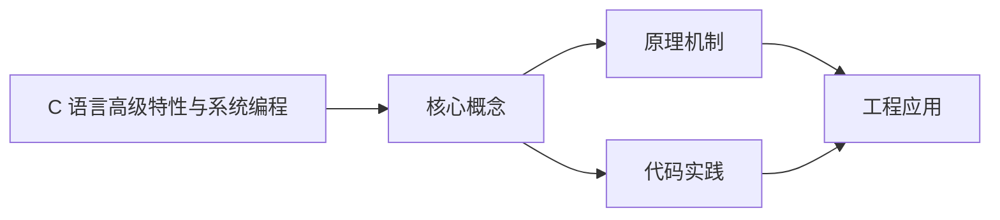
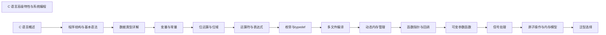

## 1. 学习目标（Bloom 分类）

本节按照布鲁姆教育目标分类学组织学习路径。本文主题为《C 语言高级特性与系统编程》，属于 C 模块，读者可以根据自身阶段选择阅读深度。

记忆层面：能够准确复述本文的核心概念、术语与基本语法或操作步骤，并能够在提问或检索时快速定位对应知识点。能够说出 C 的变量、函数、指针、数组、结构体与预处理语法。

理解层面：能够用自己的语言解释核心原理与工作机制，说明概念之间的因果关系，而不是机械记忆结论。能够解释指针与内存地址、栈与堆、编译链接过程。

应用层面：能够在真实项目或练习场景中运用本文知识解决具体问题，写出正确且可维护的实现。能够编写系统工具、数据结构与嵌入式程序。

分析层面：能够拆解复杂问题，比较本文主题与相邻概念的异同，识别边界条件与例外情况。能够分析内存泄漏、缓冲区溢出与未定义行为。

评价层面：能够根据约束条件（性能、可读性、安全、成本）评价不同方案的优劣，做出有依据的技术决策。能够评价 C 与其他语言在系统编程中的取舍。

创造层面：能够把本文知识与其他模块知识组合，设计出新的解决方案或可复用的工程模式。能够设计可移植、可维护的 C 库与模块。

通过本节学习，读者应当能够把《C 语言高级特性与系统编程》纳入自己的知识网络，并与 C 模块的其他主题（指针、内存管理、预处理器、标准库）建立关联。

## 2. 历史动机与发展脉络

《C 语言高级特性与系统编程》是 C 领域的重要主题。要真正理解它，需要先了解它解决的问题与演进过程。

C 由 Dennis Ritchie 于 1972 年在贝尔实验室为 Unix 开发，是系统编程的基石语言：操作系统、编译器、嵌入式固件均以 C 为主。
C89（ANSI C）统一方言，C99 引入变长数组与 // 注释，C11 增加泛型选择与线程支持，C17 为缺陷修复版，C23（2024 年正式发布）引入 constexpr、属性、显式枚举底层类型等现代化特性。
C 的哲学是“信任程序员”：提供指针与内存操作的全部能力，同时把正确性责任交给开发者；这一设计成就了性能上限，也带来内存安全风险，催生了 Rust 等后继语言。

回到本文主题：C 语言高级特性与系统编程 的提出与成熟，正是上述技术背景下的必然产物。早期实现往往以简单可用为目标，随着工程规模扩大，社区逐渐沉淀出标准做法与最佳实践；理解这一脉络，可以帮助读者判断“为什么文档中的推荐写法是现在这个样子”，也能在遇到历史遗留代码时准确识别其设计年代与取舍。


## 3. 形式化定义与核心概念精讲

本节把《C 语言高级特性与系统编程》涉及的核心概念以“定义 + 讲解”的形式展开。读者应把定义当作工具，把讲解当作理解路径；两者结合才能形成可迁移的知识。

指针：指针保存变量地址，`&` 取地址、`*` 解引用；指针算术与数组名退化规则（数组名作为实参退化为首元素指针）是 C 的经典难点。
内存管理：栈内存自动释放，堆内存由 malloc/calloc/realloc/free 管理；所有权责任（谁分配谁释放）必须显式约定。
预处理器：#include/#define/#ifdef 在编译前文本处理；宏展开有副作用与优先级风险，函数式宏参数必须加括号。

### 3.1 原文章节逐一精讲

原文档把主题拆分为 9 个小节，下面按顺序给出每一节的导读讲解，随后保留原文细节供精读。

#### 原文精读（完整保留）


#### 1. 高级数据结构

##### 1.1 链表

```c
 #include <stdio.h>
 #include <stdlib.h>
 // 链表节点结构
 typedef struct Node {
  int data;
  struct Node *next;
 }
 // 创建新节点
 Node* createNode(int data) {
  Node* newNode = (Node*)malloc(sizeof(Node));
  if (newNode == NULL) {
  printf("Memory allocation failed\n");
  exit(1);
  }
  newNode->data = data;
  newNode->next = NULL;
  return newNode;
 }
 // 插入节点到链表头部
 Node* insertAtHead(Node* head, int data) {
  Node* newNode = createNode(data);
  newNode->next = head;
  return newNode;
 }
 // 插入节点到链表尾部
 Node* insertAtTail(Node* head, int data) {
  Node* newNode = createNode(data);
  if (head == NULL) {
  return newNode;
  }
  Node* temp = head;
  while (temp->next != NULL) {
  temp = temp->next;
  }
  temp->next = newNode;
  return head;
 }
 // 打印链表
 void printList(Node* head) {
  Node* temp = head;
  while (temp != NULL) {
  printf("%d -> ", temp->data);
  temp = temp->next;
  }
  printf("NULL\n");
 }
 // 释放链表内存
 void freeList(Node* head) {
  Node* temp;
  while (head != NULL) {
  temp = head;
  head = head->next;
  free(temp);
  }
 }
 int main() {
  Node* head = NULL;
  head = insertAtHead(head, 3);
  head = insertAtHead(head, 2);
  head = insertAtHead(head, 1);
  head = insertAtTail(head, 4);
  head = insertAtTail(head, 5);
  printList(head);
  freeList(head);
  return 0;
 }
```

##### 1.2 二叉树

```c
 #include <stdio.h>
 #include <stdlib.h>
 // 二叉树节点结构
 typedef struct TreeNode {
  int data;
  struct TreeNode *left;
  struct TreeNode *right;
 }
 // 创建新节点
 TreeNode* createTreeNode(int data) {
  TreeNode* newNode = (TreeNode*)malloc(sizeof(TreeNode));
  if (newNode == NULL) {
  printf("Memory allocation failed\n");
  exit(1);
  }
  newNode->data = data;
  newNode->left = NULL;
  newNode->right = NULL;
  return newNode;
 }
 // 插入节点到二叉搜索树
 TreeNode* insertBST(TreeNode* root, int data) {
  if (root == NULL) {
  return createTreeNode(data);
  }
  if (data < root->data) {
  root->left = insertBST(root->left, data);
  } else if (data > root->data) {
  root->right = insertBST(root->right, data);
  }
  return root;
 }
 // 中序遍历
 void inorderTraversal(TreeNode* root) {
  if (root != NULL) {
  inorderTraversal(root->left);
  printf("%d ", root->data);
  inorderTraversal(root->right);
  }
 }
 // 前序遍历
 void preorderTraversal(TreeNode* root) {
  if (root != NULL) {
  printf("%d ", root->data);
  preorderTraversal(root->left);
  preorderTraversal(root->right);
  }
 }
 // 后序遍历
 void postorderTraversal(TreeNode* root) {
  if (root != NULL) {
  postorderTraversal(root->left);
  postorderTraversal(root->right);
  printf("%d ", root->data);
  }
 }
 // 释放二叉树内存
 void freeTree(TreeNode* root) {
  if (root != NULL) {
  freeTree(root->left);
  freeTree(root->right);
  free(root);
  }
 }
 int main() {
  TreeNode* root = NULL;
  root = insertBST(root, 50);
  root = insertBST(root, 30);
  root = insertBST(root, 70);
  root = insertBST(root, 20);
  root = insertBST(root, 40);
  root = insertBST(root, 60);
  root = insertBST(root, 80);
  printf("Inorder traversal: ");
  inorderTraversal(root);
  printf("\n");
  printf("Preorder traversal: ");
  preorderTraversal(root);
  printf("\n");
  printf("Postorder traversal: ");
  postorderTraversal(root);
  printf("\n");
  freeTree(root);
  return 0;
 }
```

#### 2. 内存管理

##### 2.1 动态内存分配

```c
 #include <stdio.h>
 #include <stdlib.h>
 int main() {
  // 分配单个整数的内存
  int* ptr = (int*)malloc(sizeof(int));
  if (ptr == NULL) {
  printf("Memory allocation failed\n");
  return 1;
  }
  *ptr = 10;
  printf("Value: %d\n", *ptr);
  free(ptr);
  // 分配数组的内存
  int n = 5;
  int* arr = (int*)malloc(n * sizeof(int));
  if (arr == NULL) {
  printf("Memory allocation failed\n");
  return 1;
  }
  // 初始化数组
  for (int i = 0; i < n; i++) {
  arr[i] = i + 1;
  }
  // 打印数组
  for (int i = 0; i < n; i++) {
  printf("arr[%d] = %d\n", i, arr[i]);
  }
  // 重新分配内存
  n = 10;
  arr = (int*)realloc(arr, n * sizeof(int));
  if (arr == NULL) {
  printf("Memory reallocation failed\n");
  return 1;
  }
  // 填充新元素
  for (int i = 5; i < n; i++) {
  arr[i] = i + 1;
  }
  // 打印数组
  printf("After reallocation:\n");
  for (int i = 0; i < n; i++) {
  printf("arr[%d] = %d\n", i, arr[i]);
  }
  free(arr);
  return 0;
 }
```

##### 2.2 内存泄漏检测

```c
 #include <stdio.h>
 #include <stdlib.h>
 // 模拟内存泄漏
 void memoryLeak() {
  int* ptr = (int*)malloc(sizeof(int));
  *ptr = 42;
  // 没有释放内存，导致内存泄漏
  printf("Value: %d\n", *ptr);
  // free(ptr); // 注释掉这行，造成内存泄漏
 }
 int main() {
  // 多次调用，造成多次内存泄漏
  for (int i = 0; i < 1000; i++) {
  memoryLeak();
  }
  printf("Memory leak demonstration complete\n");
  return 0;
 }
```

#### 3. 系统编程

##### 3.1 文件操作

```c
 #include <stdio.h>
 int main() {
  FILE* fp;
  char buffer[100];
  // 打开文件进行写入
  fp = fopen("example.txt", "w");
  if (fp == NULL) {
  printf("Error opening file\n");
  return 1;
  }
  // 写入内容
  fprintf(fp, "Hello, World!\n");
  fprintf(fp, "This is a test file.\n");
  // 关闭文件
  fclose(fp);
  // 打开文件进行读取
  fp = fopen("example.txt", "r");
  if (fp == NULL) {
  printf("Error opening file\n");
  return 1;
  }
  // 读取并打印内容
  printf("File content:\n");
  while (fgets(buffer, sizeof(buffer), fp) != NULL) {
  printf("%s", buffer);
  }
  // 关闭文件
  fclose(fp);
  return 0;
 }
```

##### 3.2 进程管理

```c
 #include <stdio.h>
 #include <stdlib.h>
 #include <unistd.h>
 #include <sys/wait.h>
 int main() {
  pid_t pid;
  // 创建子进程
  pid = fork();
  if (pid < 0) {
  // fork 失败
  fprintf(stderr, "Fork failed\n");
  return 1;
  } else if (pid == 0) {
  // 子进程
  printf("Child process, PID: %d\n", getpid());
  printf("Child's parent PID: %d\n", getppid());
  // 执行另一个程序
  execl("/bin/ls", "ls", "-l", NULL);
  // 如果 execl 失败，会执行到这里
  fprintf(stderr, "execl failed\n");
  return 1;
  } else {
  // 父进程
  printf("Parent process, PID: %d\n", getpid());
  printf("Created child process with PID: %d\n", pid);
  // 等待子进程结束
  wait(NULL);
  printf("Child process completed\n");
  }
  return 0;
 }
```

##### 3.3 线程管理

```c
 #include <stdio.h>
 #include <stdlib.h>
 #include <pthread.h>
 // 共享变量
 int counter = 0;
 // 互斥锁
 pthread_mutex_t mutex;
 // 线程函数
 void* increment(void* arg) {
  for (int i = 0; i < 100000; i++) {
  // 加锁
  pthread_mutex_lock(&mutex);
  counter++;
  // 解锁
  pthread_mutex_unlock(&mutex);
  }
  return NULL;
 }
 int main() {
  pthread_t thread1, thread2;
  // 初始化互斥锁
  pthread_mutex_init(&mutex, NULL);
  // 创建线程
  pthread_create(&thread1, NULL, increment, NULL);
  pthread_create(&thread2, NULL, increment, NULL);
  // 等待线程结束
  pthread_join(thread1, NULL);
  pthread_join(thread2, NULL);
  // 销毁互斥锁
  pthread_mutex_destroy(&mutex);
  printf("Final counter value: %d\n", counter);
  return 0;
 }
```

#### 4. 网络编程

##### 4.1 TCP 服务器

```c
 #include <stdio.h>
 #include <stdlib.h>
 #include <string.h>
 #include <unistd.h>
 #include <sys/socket.h>
 #include <netinet/in.h>
 #define PORT 8080
 #define BUFFER_SIZE 1024
 int main() {
  int server_fd, new_socket;
  struct sockaddr_in address;
  int opt = 1;
  int addrlen = sizeof(address);
  char buffer[BUFFER_SIZE] = {0};
  char *hello = "Hello from server";
  // 创建套接字文件描述符
  if ((server_fd = socket(AF_INET, SOCK_STREAM, 0)) == 0) {
  perror("socket failed");
  exit(EXIT_FAILURE);
  }
  // 设置套接字选项
  if (setsockopt(server_fd, SOL_SOCKET, SO_REUSEADDR | SO_REUSEPORT, &opt, sizeof(opt))) {
  perror("setsockopt");
  exit(EXIT_FAILURE);
  }
  address.sin_family = AF_INET;
  address.sin_addr.s_addr = INADDR_ANY;
  address.sin_port = htons(PORT);
  // 绑定套接字到端口
  if (bind(server_fd, (struct sockaddr *)&address, sizeof(address)) < 0) {
  perror("bind failed");
  exit(EXIT_FAILURE);
  }
  // 开始监听
  if (listen(server_fd, 3) < 0) {
  perror("listen");
  exit(EXIT_FAILURE);
  }
  printf("Server listening on port %d\n", PORT);
  // 接受连接
  if ((new_socket = accept(server_fd, (struct sockaddr *)&address, (socklen_t*)&addrlen)) < 0) {
  perror("accept");
  exit(EXIT_FAILURE);
  }
  // 读取客户端消息
  read(new_socket, buffer, BUFFER_SIZE);
  printf("Client: %s\n", buffer);
  // 发送响应
  send(new_socket, hello, strlen(hello), 0);
  printf("Hello message sent\n");
  // 关闭连接
  close(new_socket);
  close(server_fd);
  return 0;
 }
```

##### 4.2 TCP 客户端

```c
 #include <stdio.h>
 #include <stdlib.h>
 #include <string.h>
 #include <unistd.h>
 #include <sys/socket.h>
 #include <netinet/in.h>
 #include <arpa/inet.h>
 #define PORT 8080
 #define BUFFER_SIZE 1024
 int main() {
  int sock = 0;
  struct sockaddr_in serv_addr;
  char *hello = "Hello from client";
  char buffer[BUFFER_SIZE] = {0};
  // 创建套接字文件描述符
  if ((sock = socket(AF_INET, SOCK_STREAM, 0)) < 0) {
  printf("\n Socket creation error \n");
  return -1;
  }
  serv_addr.sin_family = AF_INET;
  serv_addr.sin_port = htons(PORT);
  // 转换 IPv4 地址
  if(inet_pton(AF_INET, "127.0.0.1", &serv_addr.sin_addr)<=0) {
  printf("\nInvalid address/ Address not supported \n");
  return -1;
  }
  // 连接到服务器
  if (connect(sock, (struct sockaddr *)&serv_addr, sizeof(serv_addr)) < 0) {
  printf("\nConnection Failed \n");
  return -1;
  }
  // 发送消息
  send(sock, hello, strlen(hello), 0);
  printf("Hello message sent\n");
  // 读取响应
  read(sock, buffer, BUFFER_SIZE);
  printf("Server: %s\n", buffer);
  // 关闭连接
  close(sock);
  return 0;
 }
```

#### 5. 高级特性

##### 5.1 宏和预处理

```c
 #include <stdio.h>
 // 简单宏
 #define PI 3.14159
 #define MAX(a, b) ((a) > (b) ? (a) : (b))
 // 带参数的宏
 #define SQUARE(x) ((x) * (x))
 // 多行宏
 #define PRINT_ARRAY(arr, n) \
  do { \
  for (int i = 0; i < n; i++) { \
  printf("%d ", arr[i]); \
  } \
  printf("\n"); \
  } while(0)
 // 条件编译
 #define DEBUG 1
 int main() {
  // 使用简单宏
  printf("PI = %f\n", PI);
  printf("MAX(5, 10) = %d\n", MAX(5, 10));
  // 使用带参数的宏
  int x = 5;
  printf("SQUARE(%d) = %d\n", x, SQUARE(x));
  // 使用多行宏
  int arr[] = {1, 2, 3, 4, 5};
  int n = sizeof(arr) / sizeof(arr[0]);
  PRINT_ARRAY(arr, n);
  // 使用条件编译
 #ifdef DEBUG
  printf("Debug mode is enabled\n");
 #else
  printf("Debug mode is disabled\n");
 #endif
  return 0;
 }
```

##### 5.2 函数指针

```c
 #include <stdio.h>
 // 函数定义
 int add(int a, int b) {
  return a + b;
 }
 int subtract(int a, int b) {
  return a - b;
 }
 int multiply(int a, int b) {
  return a * b;
 }
 int divide(int a, int b) {
  if (b != 0) {
  return a / b;
  }
  return 0;
 }
 int main() {
  // 函数指针声明
  int (*operation)(int, int);
  int a = 10, b = 5;
  // 使用函数指针调用 add 函数
  operation = add;
  printf("%d + %d = %d\n", a, b, operation(a, b));
  // 使用函数指针调用 subtract 函数
  operation = subtract;
  printf("%d - %d = %d\n", a, b, operation(a, b));
  // 使用函数指针调用 multiply 函数
  operation = multiply;
  printf("%d * %d = %d\n", a, b, operation(a, b));
  // 使用函数指针调用 divide 函数
  operation = divide;
  printf("%d / %d = %d\n", a, b, operation(a, b));
  return 0;
 }
```

##### 5.3 位操作

```c
 #include <stdio.h>
 // 打印二进制表示
 void printBinary(unsigned int n) {
  for (int i = 31; i >= 0; i--) {
  printf("%d", (n >> i) & 1);
  if (i % 4 == 0) printf(" ");
  }
  printf("\n");
 }
 int main() {
  unsigned int a = 0b10101010;
  unsigned int b = 0b11001100;
  printf("a: ");
  printBinary(a);
  printf("b: ");
  printBinary(b);
  // 按位与
  printf("a & b: ");
  printBinary(a & b);
  // 按位或
  printf("a | b: ");
  printBinary(a | b);
  // 按位异或
  printf("a ^ b: ");
  printBinary(a ^ b);
  // 按位取反
  printf("~a: ");
  printBinary(~a);
  // 左移
  printf("a << 2: ");
  printBinary(a << 2);
  // 右移
  printf("a >> 2: ");
  printBinary(a >> 2);
  return 0;
 }
```

#### 6. 最佳实践

##### 6.1 代码风格

1. **命名规范**：

- 函数和变量使用小写字母，单词之间用下划线分隔
- 常量使用大写字母，单词之间用下划线分隔
- 结构体和类型定义使用大写字母开头，单词之间用下划线分隔

2. **缩进**：

- 使用 4 个空格进行缩进
- 保持代码块的缩进一致

3. **注释**：

- 为函数和复杂代码块添加注释
- 注释应该清晰明了，解释代码的功能和实现思路

4. **错误处理**：

- 检查所有函数调用的返回值
- 对错误情况进行适当的处理
- 使用 `errno` 和 `perror` 来处理系统调用错误

##### 6.2 性能优化

1. **内存管理**：

- 避免频繁的内存分配和释放
- 使用合适的内存分配函数（`malloc`、`calloc`、`realloc`）
- 及时释放不再使用的内存

2. **算法选择**：

- 选择时间复杂度合适的算法
- 对于大数据集，考虑使用更高效的数据结构

3. **编译器优化**：

- 使用 `-O2` 或 `-O3` 编译选项启用编译器优化
- 避免使用会阻止编译器优化的代码模式

4. **系统调用**：

- 减少系统调用的次数
- 使用缓冲 I/O 来减少文件操作的系统调用

#### 7. 项目实战

##### 7.1 简单的命令行计算器

```c
 #include <stdio.h>
 #include <stdlib.h>
 #include <string.h>
 // 函数声明
 int add(int a, int b);
 int subtract(int a, int b);
 int multiply(int a, int b);
 int divide(int a, int b);
 int main(int argc, char *argv[]) {
  if (argc != 4) {
  printf("Usage: %s <operation> <num1> <num2>\n", argv[0]);
  printf("Operations: add, subtract, multiply, divide\n");
  return 1;
  }
  char *operation = argv[1];
  int num1 = atoi(argv[2]);
  int num2 = atoi(argv[3]);
  int result;
  if (strcmp(operation, "add") == 0) {
  result = add(num1, num2);
  } else if (strcmp(operation, "subtract") == 0) {
  result = subtract(num1, num2);
  } else if (strcmp(operation, "multiply") == 0) {
  result = multiply(num1, num2);
  } else if (strcmp(operation, "divide") == 0) {
  if (num2 == 0) {
  printf("Error: Division by zero\n");
  return 1;
  }
  result = divide(num1, num2);
  } else {
  printf("Error: Invalid operation\n");
  return 1;
  }
  printf("Result: %d\n", result);
  return 0;
 }
 // 函数定义
 int add(int a, int b) {
  return a + b;
 }
 int subtract(int a, int b) {
  return a - b;
 }
 int multiply(int a, int b) {
  return a * b;
 }
 int divide(int a, int b) {
  return a / b;
 }
```

##### 7.2 简单的文件复制程序

```c
 #include <stdio.h>
 int main(int argc, char *argv[]) {
  FILE *source, *destination;
  char buffer[1024];
  size_t bytesRead;
  if (argc != 3) {
  printf("Usage: %s <source file> <destination file>\n", argv[0]);
  return 1;
  }
  // 打开源文件
  source = fopen(argv[1], "rb");
  if (source == NULL) {
  printf("Error opening source file\n");
  return 1;
  }
  // 打开目标文件
  destination = fopen(argv[2], "wb");
  if (destination == NULL) {
  printf("Error opening destination file\n");
  fclose(source);
  return 1;
  }
  // 复制文件内容
  while ((bytesRead = fread(buffer, 1, sizeof(buffer), source)) > 0) {
  fwrite(buffer, 1, bytesRead, destination);
  }
  // 关闭文件
  fclose(source);
  fclose(destination);
  printf("File copied successfully\n");
  return 0;
 }
```

#### 8. 常见问题与解决方案

##### 8.1 内存泄漏

**问题**：程序运行时内存使用持续增长
**解决方案**：

- 确保所有 `malloc`、`calloc`、`realloc` 分配的内存都有对应的 `free` 调用
- 使用工具如 Valgrind 来检测内存泄漏

##### 8.2 段错误

**问题**：程序崩溃，出现 "Segmentation fault"
**解决方案**：

- 检查是否访问了空指针
- 检查是否数组越界
- 检查是否栈溢出
- 使用 GDB 调试器来定位问题

##### 8.3 文件操作失败

**问题**：文件打开、读取或写入失败
**解决方案**：

- 检查文件路径是否正确
- 检查文件权限
- 检查磁盘空间是否充足
- 使用 `perror` 来查看具体的错误信息

##### 8.4 网络连接问题

**问题**：网络连接失败或超时
**解决方案**：

- 检查网络连接是否正常
- 检查防火墙设置
- 检查服务器是否正在运行
- 检查端口是否正确

#### 9. 延伸阅读

- [C 语言参考手册](https://en.cppreference.com/w/c)
- [Linux 系统编程](https://www.man7.org/linux/man-pages/)
- [TCP/IP 网络编程](https://beej.us/guide/bgnet/)
- [C 语言程序设计](https://www.amazon.com/C-Programming-Language-2nd/dp/0131103628)
  通过本教程，你已经了解了 C 语言的高级特性和系统编程技巧。在实际项目中，你可以使用这些技术来开发高性能、可靠的系统级应用程序。


### 3.2 概念关系图

下面用 Mermaid 图表达本文核心概念之间的关系，帮助读者建立整体图景：



图中展示的是本文知识的结构化关系：核心概念是入口，原理机制解释“为什么”，代码实践演示“怎么做”，工程应用回答“何时用”。读者学习时可以把每个小节的内容挂接到对应节点上。

## 4. 理论推导与原理解析

本节深入《C 语言高级特性与系统编程》背后的原理。理论部分不求面面俱到，而是聚焦“能解释现象、能指导实践”的关键推导。

指针：指针保存变量地址，`&` 取地址、`*` 解引用；指针算术与数组名退化规则（数组名作为实参退化为首元素指针）是 C 的经典难点。
内存管理：栈内存自动释放，堆内存由 malloc/calloc/realloc/free 管理；所有权责任（谁分配谁释放）必须显式约定。
预处理器：#include/#define/#ifdef 在编译前文本处理；宏展开有副作用与优先级风险，函数式宏参数必须加括号。
编译链接：预处理 -> 编译 -> 汇编 -> 链接；头文件声明接口，源文件实现；静态库与动态库（.a/.so/.dll）决定部署形态。

需要强调的是，理论推导与工程实践之间存在翻译层：理论给出的是理想化模型与边界条件，工程代码则必须处理真实环境中的例外。读者在学习时应先掌握理论的“标准情形”，再通过陷阱章节了解“非标准情形”。

## 5. 代码示例与逐行讲解

本节把原文中的代码示例系统整理，并为每个示例补充用途说明与讲解。读者不应只浏览代码，而应逐段对照讲解理解设计意图。

### 5.1 示例：1.1 链表

该示例来自原文《1.1 链表》小节，用于演示C 语言高级特性与系统编程相关操作。阅读时请先看代码结构，再看其后的讲解。

```c
 #include <stdio.h>
 #include <stdlib.h>
 // 链表节点结构
 typedef struct Node {
  int data;
  struct Node *next;
 }
 // 创建新节点
 Node* createNode(int data) {
  Node* newNode = (Node*)malloc(sizeof(Node));
  if (newNode == NULL) {
  printf("Memory allocation failed\n");
  exit(1);
  }
  newNode->data = data;
  newNode->next = NULL;
  return newNode;
 }
 // 插入节点到链表头部
 Node* insertAtHead(Node* head, int data) {
  Node* newNode = createNode(data);
  newNode->next = head;
  return newNode;
 }
 // 插入节点到链表尾部
 Node* insertAtTail(Node* head, int data) {
  Node* newNode = createNode(data);
  if (head == NULL) {
  return newNode;
  }
  Node* temp = head;
  while (temp->next != NULL) {
  temp = temp->next;
  }
  temp->next = newNode;
  return head;
 }
 // 打印链表
 void printList(Node* head) {
  Node* temp = head;
  while (temp != NULL) {
  printf("%d -> ", temp->data);
  temp = temp->next;
  }
  printf("NULL\n");
 }
 // 释放链表内存
 void freeList(Node* head) {
  Node* temp;
  while (head != NULL) {
  temp = head;
  head = head->next;
  free(temp);
  }
 }
 int main() {
  Node* head = NULL;
  head = insertAtHead(head, 3);
  head = insertAtHead(head, 2);
  head = insertAtHead(head, 1);
  head = insertAtTail(head, 4);
  head = insertAtTail(head, 5);
  printList(head);
  freeList(head);
  return 0;
 }
```

讲解：这段代码演示了本节核心知识点。代码中的关键操作可以归纳为三步：准备（定义或初始化）、执行（核心逻辑）、收尾（释放资源或返回结果）。实际项目中，这三步往往被封装为函数或类，以提升复用性与可测试性。

关键点分析：

该示例共 66 行有效代码，包含 4 类关键结构（def、if、while、return）。其中：

- 入口与初始化部分负责建立上下文，对应实际项目中的启动或装配逻辑；
- 核心逻辑部分体现本文主题的主要操作，是阅读时最需要对照讲解理解的部分；
- 输出或返回部分把结果交给调用方，注意其类型与边界条件。

进阶思考路径：先尝试修改参数观察行为变化，再把示例中的模式迁移到自己的项目中；每次修改都记录预期与实测差异，这是把示例转化为能力的最快方式。

### 5.2 示例：1.2 二叉树

该示例来自原文《1.2 二叉树》小节，用于演示C 语言高级特性与系统编程相关操作。阅读时请先看代码结构，再看其后的讲解。

```c
 #include <stdio.h>
 #include <stdlib.h>
 // 二叉树节点结构
 typedef struct TreeNode {
  int data;
  struct TreeNode *left;
  struct TreeNode *right;
 }
 // 创建新节点
 TreeNode* createTreeNode(int data) {
  TreeNode* newNode = (TreeNode*)malloc(sizeof(TreeNode));
  if (newNode == NULL) {
  printf("Memory allocation failed\n");
  exit(1);
  }
  newNode->data = data;
  newNode->left = NULL;
  newNode->right = NULL;
  return newNode;
 }
 // 插入节点到二叉搜索树
 TreeNode* insertBST(TreeNode* root, int data) {
  if (root == NULL) {
  return createTreeNode(data);
  }
  if (data < root->data) {
  root->left = insertBST(root->left, data);
  } else if (data > root->data) {
  root->right = insertBST(root->right, data);
  }
  return root;
 }
 // 中序遍历
 void inorderTraversal(TreeNode* root) {
  if (root != NULL) {
  inorderTraversal(root->left);
  printf("%d ", root->data);
  inorderTraversal(root->right);
  }
 }
 // 前序遍历
 void preorderTraversal(TreeNode* root) {
  if (root != NULL) {
  printf("%d ", root->data);
  preorderTraversal(root->left);
  preorderTraversal(root->right);
  }
 }
 // 后序遍历
 void postorderTraversal(TreeNode* root) {
  if (root != NULL) {
  postorderTraversal(root->left);
  postorderTraversal(root->right);
  printf("%d ", root->data);
  }
 }
 // 释放二叉树内存
 void freeTree(TreeNode* root) {
  if (root != NULL) {
  freeTree(root->left);
  freeTree(root->right);
  free(root);
  }
 }
 int main() {
  TreeNode* root = NULL;
  root = insertBST(root, 50);
  root = insertBST(root, 30);
  root = insertBST(root, 70);
  root = insertBST(root, 20);
  root = insertBST(root, 40);
  root = insertBST(root, 60);
  root = insertBST(root, 80);
  printf("Inorder traversal: ");
  inorderTraversal(root);
  printf("\n");
  printf("Preorder traversal: ");
  preorderTraversal(root);
  printf("\n");
  printf("Postorder traversal: ");
  postorderTraversal(root);
  printf("\n");
  freeTree(root);
  return 0;
 }
```

讲解：这段代码演示了本节核心知识点。代码中的关键操作可以归纳为三步：准备（定义或初始化）、执行（核心逻辑）、收尾（释放资源或返回结果）。实际项目中，这三步往往被封装为函数或类，以提升复用性与可测试性。

关键点分析：

该示例共 85 行有效代码，包含 3 类关键结构（def、if、return）。其中：

- 入口与初始化部分负责建立上下文，对应实际项目中的启动或装配逻辑；
- 核心逻辑部分体现本文主题的主要操作，是阅读时最需要对照讲解理解的部分；
- 输出或返回部分把结果交给调用方，注意其类型与边界条件。

进阶思考路径：先尝试修改参数观察行为变化，再把示例中的模式迁移到自己的项目中；每次修改都记录预期与实测差异，这是把示例转化为能力的最快方式。

### 5.3 示例：2.1 动态内存分配

该示例来自原文《2.1 动态内存分配》小节，用于演示C 语言高级特性与系统编程相关操作。阅读时请先看代码结构，再看其后的讲解。

```c
 #include <stdio.h>
 #include <stdlib.h>
 int main() {
  // 分配单个整数的内存
  int* ptr = (int*)malloc(sizeof(int));
  if (ptr == NULL) {
  printf("Memory allocation failed\n");
  return 1;
  }
  *ptr = 10;
  printf("Value: %d\n", *ptr);
  free(ptr);
  // 分配数组的内存
  int n = 5;
  int* arr = (int*)malloc(n * sizeof(int));
  if (arr == NULL) {
  printf("Memory allocation failed\n");
  return 1;
  }
  // 初始化数组
  for (int i = 0; i < n; i++) {
  arr[i] = i + 1;
  }
  // 打印数组
  for (int i = 0; i < n; i++) {
  printf("arr[%d] = %d\n", i, arr[i]);
  }
  // 重新分配内存
  n = 10;
  arr = (int*)realloc(arr, n * sizeof(int));
  if (arr == NULL) {
  printf("Memory reallocation failed\n");
  return 1;
  }
  // 填充新元素
  for (int i = 5; i < n; i++) {
  arr[i] = i + 1;
  }
  // 打印数组
  printf("After reallocation:\n");
  for (int i = 0; i < n; i++) {
  printf("arr[%d] = %d\n", i, arr[i]);
  }
  free(arr);
  return 0;
 }
```

讲解：这段代码演示了本节核心知识点。代码中的关键操作可以归纳为三步：准备（定义或初始化）、执行（核心逻辑）、收尾（释放资源或返回结果）。实际项目中，这三步往往被封装为函数或类，以提升复用性与可测试性。

关键点分析：

该示例共 46 行有效代码，包含 3 类关键结构（if、for、return）。其中：

- 入口与初始化部分负责建立上下文，对应实际项目中的启动或装配逻辑；
- 核心逻辑部分体现本文主题的主要操作，是阅读时最需要对照讲解理解的部分；
- 输出或返回部分把结果交给调用方，注意其类型与边界条件。

进阶思考路径：先尝试修改参数观察行为变化，再把示例中的模式迁移到自己的项目中；每次修改都记录预期与实测差异，这是把示例转化为能力的最快方式。

### 5.4 示例：2.2 内存泄漏检测

该示例来自原文《2.2 内存泄漏检测》小节，用于演示C 语言高级特性与系统编程相关操作。阅读时请先看代码结构，再看其后的讲解。

```c
 #include <stdio.h>
 #include <stdlib.h>
 // 模拟内存泄漏
 void memoryLeak() {
  int* ptr = (int*)malloc(sizeof(int));
  *ptr = 42;
  // 没有释放内存，导致内存泄漏
  printf("Value: %d\n", *ptr);
  // free(ptr); // 注释掉这行，造成内存泄漏
 }
 int main() {
  // 多次调用，造成多次内存泄漏
  for (int i = 0; i < 1000; i++) {
  memoryLeak();
  }
  printf("Memory leak demonstration complete\n");
  return 0;
 }
```

讲解：这段代码演示了本节核心知识点。代码中的关键操作可以归纳为三步：准备（定义或初始化）、执行（核心逻辑）、收尾（释放资源或返回结果）。实际项目中，这三步往往被封装为函数或类，以提升复用性与可测试性。

关键点分析：

该示例共 18 行有效代码，包含 2 类关键结构（for、return）。其中：

- 入口与初始化部分负责建立上下文，对应实际项目中的启动或装配逻辑；
- 核心逻辑部分体现本文主题的主要操作，是阅读时最需要对照讲解理解的部分；
- 输出或返回部分把结果交给调用方，注意其类型与边界条件。

进阶思考路径：先尝试修改参数观察行为变化，再把示例中的模式迁移到自己的项目中；每次修改都记录预期与实测差异，这是把示例转化为能力的最快方式。

### 5.5 示例：3.1 文件操作

该示例来自原文《3.1 文件操作》小节，用于演示C 语言高级特性与系统编程相关操作。阅读时请先看代码结构，再看其后的讲解。

```c
 #include <stdio.h>
 int main() {
  FILE* fp;
  char buffer[100];
  // 打开文件进行写入
  fp = fopen("example.txt", "w");
  if (fp == NULL) {
  printf("Error opening file\n");
  return 1;
  }
  // 写入内容
  fprintf(fp, "Hello, World!\n");
  fprintf(fp, "This is a test file.\n");
  // 关闭文件
  fclose(fp);
  // 打开文件进行读取
  fp = fopen("example.txt", "r");
  if (fp == NULL) {
  printf("Error opening file\n");
  return 1;
  }
  // 读取并打印内容
  printf("File content:\n");
  while (fgets(buffer, sizeof(buffer), fp) != NULL) {
  printf("%s", buffer);
  }
  // 关闭文件
  fclose(fp);
  return 0;
 }
```

讲解：这段代码演示了本节核心知识点。代码中的关键操作可以归纳为三步：准备（定义或初始化）、执行（核心逻辑）、收尾（释放资源或返回结果）。实际项目中，这三步往往被封装为函数或类，以提升复用性与可测试性。

关键点分析：

该示例共 30 行有效代码，包含 3 类关键结构（if、while、return）。其中：

- 入口与初始化部分负责建立上下文，对应实际项目中的启动或装配逻辑；
- 核心逻辑部分体现本文主题的主要操作，是阅读时最需要对照讲解理解的部分；
- 输出或返回部分把结果交给调用方，注意其类型与边界条件。

进阶思考路径：先尝试修改参数观察行为变化，再把示例中的模式迁移到自己的项目中；每次修改都记录预期与实测差异，这是把示例转化为能力的最快方式。

### 5.6 示例：3.2 进程管理

该示例来自原文《3.2 进程管理》小节，用于演示C 语言高级特性与系统编程相关操作。阅读时请先看代码结构，再看其后的讲解。

```c
 #include <stdio.h>
 #include <stdlib.h>
 #include <unistd.h>
 #include <sys/wait.h>
 int main() {
  pid_t pid;
  // 创建子进程
  pid = fork();
  if (pid < 0) {
  // fork 失败
  fprintf(stderr, "Fork failed\n");
  return 1;
  } else if (pid == 0) {
  // 子进程
  printf("Child process, PID: %d\n", getpid());
  printf("Child's parent PID: %d\n", getppid());
  // 执行另一个程序
  execl("/bin/ls", "ls", "-l", NULL);
  // 如果 execl 失败，会执行到这里
  fprintf(stderr, "execl failed\n");
  return 1;
  } else {
  // 父进程
  printf("Parent process, PID: %d\n", getpid());
  printf("Created child process with PID: %d\n", pid);
  // 等待子进程结束
  wait(NULL);
  printf("Child process completed\n");
  }
  return 0;
 }
```

讲解：这段代码演示了本节核心知识点。代码中的关键操作可以归纳为三步：准备（定义或初始化）、执行（核心逻辑）、收尾（释放资源或返回结果）。实际项目中，这三步往往被封装为函数或类，以提升复用性与可测试性。

关键点分析：

该示例共 31 行有效代码，包含 2 类关键结构（if、return）。其中：

- 入口与初始化部分负责建立上下文，对应实际项目中的启动或装配逻辑；
- 核心逻辑部分体现本文主题的主要操作，是阅读时最需要对照讲解理解的部分；
- 输出或返回部分把结果交给调用方，注意其类型与边界条件。

进阶思考路径：先尝试修改参数观察行为变化，再把示例中的模式迁移到自己的项目中；每次修改都记录预期与实测差异，这是把示例转化为能力的最快方式。

### 5.7 示例：3.3 线程管理

该示例来自原文《3.3 线程管理》小节，用于演示C 语言高级特性与系统编程相关操作。阅读时请先看代码结构，再看其后的讲解。

```c
 #include <stdio.h>
 #include <stdlib.h>
 #include <pthread.h>
 // 共享变量
 int counter = 0;
 // 互斥锁
 pthread_mutex_t mutex;
 // 线程函数
 void* increment(void* arg) {
  for (int i = 0; i < 100000; i++) {
  // 加锁
  pthread_mutex_lock(&mutex);
  counter++;
  // 解锁
  pthread_mutex_unlock(&mutex);
  }
  return NULL;
 }
 int main() {
  pthread_t thread1, thread2;
  // 初始化互斥锁
  pthread_mutex_init(&mutex, NULL);
  // 创建线程
  pthread_create(&thread1, NULL, increment, NULL);
  pthread_create(&thread2, NULL, increment, NULL);
  // 等待线程结束
  pthread_join(thread1, NULL);
  pthread_join(thread2, NULL);
  // 销毁互斥锁
  pthread_mutex_destroy(&mutex);
  printf("Final counter value: %d\n", counter);
  return 0;
 }
```

讲解：这段代码演示了本节核心知识点。代码中的关键操作可以归纳为三步：准备（定义或初始化）、执行（核心逻辑）、收尾（释放资源或返回结果）。实际项目中，这三步往往被封装为函数或类，以提升复用性与可测试性。

关键点分析：

该示例共 33 行有效代码，包含 2 类关键结构（for、return）。其中：

- 入口与初始化部分负责建立上下文，对应实际项目中的启动或装配逻辑；
- 核心逻辑部分体现本文主题的主要操作，是阅读时最需要对照讲解理解的部分；
- 输出或返回部分把结果交给调用方，注意其类型与边界条件。

进阶思考路径：先尝试修改参数观察行为变化，再把示例中的模式迁移到自己的项目中；每次修改都记录预期与实测差异，这是把示例转化为能力的最快方式。

### 5.8 示例：4.1 TCP 服务器

该示例来自原文《4.1 TCP 服务器》小节，用于演示C 语言高级特性与系统编程相关操作。阅读时请先看代码结构，再看其后的讲解。

```c
 #include <stdio.h>
 #include <stdlib.h>
 #include <string.h>
 #include <unistd.h>
 #include <sys/socket.h>
 #include <netinet/in.h>
 #define PORT 8080
 #define BUFFER_SIZE 1024
 int main() {
  int server_fd, new_socket;
  struct sockaddr_in address;
  int opt = 1;
  int addrlen = sizeof(address);
  char buffer[BUFFER_SIZE] = {0};
  char *hello = "Hello from server";
  // 创建套接字文件描述符
  if ((server_fd = socket(AF_INET, SOCK_STREAM, 0)) == 0) {
  perror("socket failed");
  exit(EXIT_FAILURE);
  }
  // 设置套接字选项
  if (setsockopt(server_fd, SOL_SOCKET, SO_REUSEADDR | SO_REUSEPORT, &opt, sizeof(opt))) {
  perror("setsockopt");
  exit(EXIT_FAILURE);
  }
  address.sin_family = AF_INET;
  address.sin_addr.s_addr = INADDR_ANY;
  address.sin_port = htons(PORT);
  // 绑定套接字到端口
  if (bind(server_fd, (struct sockaddr *)&address, sizeof(address)) < 0) {
  perror("bind failed");
  exit(EXIT_FAILURE);
  }
  // 开始监听
  if (listen(server_fd, 3) < 0) {
  perror("listen");
  exit(EXIT_FAILURE);
  }
  printf("Server listening on port %d\n", PORT);
  // 接受连接
  if ((new_socket = accept(server_fd, (struct sockaddr *)&address, (socklen_t*)&addrlen)) < 0) {
  perror("accept");
  exit(EXIT_FAILURE);
  }
  // 读取客户端消息
  read(new_socket, buffer, BUFFER_SIZE);
  printf("Client: %s\n", buffer);
  // 发送响应
  send(new_socket, hello, strlen(hello), 0);
  printf("Hello message sent\n");
  // 关闭连接
  close(new_socket);
  close(server_fd);
  return 0;
 }
```

讲解：这段代码演示了本节核心知识点。代码中的关键操作可以归纳为三步：准备（定义或初始化）、执行（核心逻辑）、收尾（释放资源或返回结果）。实际项目中，这三步往往被封装为函数或类，以提升复用性与可测试性。

关键点分析：

该示例共 55 行有效代码，包含 3 类关键结构（from、if、return）。其中：

- 入口与初始化部分负责建立上下文，对应实际项目中的启动或装配逻辑；
- 核心逻辑部分体现本文主题的主要操作，是阅读时最需要对照讲解理解的部分；
- 输出或返回部分把结果交给调用方，注意其类型与边界条件。

进阶思考路径：先尝试修改参数观察行为变化，再把示例中的模式迁移到自己的项目中；每次修改都记录预期与实测差异，这是把示例转化为能力的最快方式。

### 5.9 示例：4.2 TCP 客户端

该示例来自原文《4.2 TCP 客户端》小节，用于演示C 语言高级特性与系统编程相关操作。阅读时请先看代码结构，再看其后的讲解。

```c
 #include <stdio.h>
 #include <stdlib.h>
 #include <string.h>
 #include <unistd.h>
 #include <sys/socket.h>
 #include <netinet/in.h>
 #include <arpa/inet.h>
 #define PORT 8080
 #define BUFFER_SIZE 1024
 int main() {
  int sock = 0;
  struct sockaddr_in serv_addr;
  char *hello = "Hello from client";
  char buffer[BUFFER_SIZE] = {0};
  // 创建套接字文件描述符
  if ((sock = socket(AF_INET, SOCK_STREAM, 0)) < 0) {
  printf("\n Socket creation error \n");
  return -1;
  }
  serv_addr.sin_family = AF_INET;
  serv_addr.sin_port = htons(PORT);
  // 转换 IPv4 地址
  if(inet_pton(AF_INET, "127.0.0.1", &serv_addr.sin_addr)<=0) {
  printf("\nInvalid address/ Address not supported \n");
  return -1;
  }
  // 连接到服务器
  if (connect(sock, (struct sockaddr *)&serv_addr, sizeof(serv_addr)) < 0) {
  printf("\nConnection Failed \n");
  return -1;
  }
  // 发送消息
  send(sock, hello, strlen(hello), 0);
  printf("Hello message sent\n");
  // 读取响应
  read(sock, buffer, BUFFER_SIZE);
  printf("Server: %s\n", buffer);
  // 关闭连接
  close(sock);
  return 0;
 }
```

讲解：这段代码演示了本节核心知识点。代码中的关键操作可以归纳为三步：准备（定义或初始化）、执行（核心逻辑）、收尾（释放资源或返回结果）。实际项目中，这三步往往被封装为函数或类，以提升复用性与可测试性。

关键点分析：

该示例共 41 行有效代码，包含 3 类关键结构（from、if、return）。其中：

- 入口与初始化部分负责建立上下文，对应实际项目中的启动或装配逻辑；
- 核心逻辑部分体现本文主题的主要操作，是阅读时最需要对照讲解理解的部分；
- 输出或返回部分把结果交给调用方，注意其类型与边界条件。

进阶思考路径：先尝试修改参数观察行为变化，再把示例中的模式迁移到自己的项目中；每次修改都记录预期与实测差异，这是把示例转化为能力的最快方式。

### 5.10 示例：5.1 宏和预处理

该示例来自原文《5.1 宏和预处理》小节，用于演示C 语言高级特性与系统编程相关操作。阅读时请先看代码结构，再看其后的讲解。

```c
 #include <stdio.h>
 // 简单宏
 #define PI 3.14159
 #define MAX(a, b) ((a) > (b) ? (a) : (b))
 // 带参数的宏
 #define SQUARE(x) ((x) * (x))
 // 多行宏
 #define PRINT_ARRAY(arr, n) \
  do { \
  for (int i = 0; i < n; i++) { \
  printf("%d ", arr[i]); \
  } \
  printf("\n"); \
  } while(0)
 // 条件编译
 #define DEBUG 1
 int main() {
  // 使用简单宏
  printf("PI = %f\n", PI);
  printf("MAX(5, 10) = %d\n", MAX(5, 10));
  // 使用带参数的宏
  int x = 5;
  printf("SQUARE(%d) = %d\n", x, SQUARE(x));
  // 使用多行宏
  int arr[] = {1, 2, 3, 4, 5};
  int n = sizeof(arr) / sizeof(arr[0]);
  PRINT_ARRAY(arr, n);
  // 使用条件编译
 #ifdef DEBUG
  printf("Debug mode is enabled\n");
 #else
  printf("Debug mode is disabled\n");
 #endif
  return 0;
 }
```

讲解：这段代码演示了本节核心知识点。代码中的关键操作可以归纳为三步：准备（定义或初始化）、执行（核心逻辑）、收尾（释放资源或返回结果）。实际项目中，这三步往往被封装为函数或类，以提升复用性与可测试性。

关键点分析：

该示例共 35 行有效代码，包含 3 类关键结构（def、for、return）。其中：

- 入口与初始化部分负责建立上下文，对应实际项目中的启动或装配逻辑；
- 核心逻辑部分体现本文主题的主要操作，是阅读时最需要对照讲解理解的部分；
- 输出或返回部分把结果交给调用方，注意其类型与边界条件。

进阶思考路径：先尝试修改参数观察行为变化，再把示例中的模式迁移到自己的项目中；每次修改都记录预期与实测差异，这是把示例转化为能力的最快方式。

### 5.11 示例：5.2 函数指针

该示例来自原文《5.2 函数指针》小节，用于演示C 语言高级特性与系统编程相关操作。阅读时请先看代码结构，再看其后的讲解。

```c
 #include <stdio.h>
 // 函数定义
 int add(int a, int b) {
  return a + b;
 }
 int subtract(int a, int b) {
  return a - b;
 }
 int multiply(int a, int b) {
  return a * b;
 }
 int divide(int a, int b) {
  if (b != 0) {
  return a / b;
  }
  return 0;
 }
 int main() {
  // 函数指针声明
  int (*operation)(int, int);
  int a = 10, b = 5;
  // 使用函数指针调用 add 函数
  operation = add;
  printf("%d + %d = %d\n", a, b, operation(a, b));
  // 使用函数指针调用 subtract 函数
  operation = subtract;
  printf("%d - %d = %d\n", a, b, operation(a, b));
  // 使用函数指针调用 multiply 函数
  operation = multiply;
  printf("%d * %d = %d\n", a, b, operation(a, b));
  // 使用函数指针调用 divide 函数
  operation = divide;
  printf("%d / %d = %d\n", a, b, operation(a, b));
  return 0;
 }
```

讲解：这段代码演示了本节核心知识点。代码中的关键操作可以归纳为三步：准备（定义或初始化）、执行（核心逻辑）、收尾（释放资源或返回结果）。实际项目中，这三步往往被封装为函数或类，以提升复用性与可测试性。

关键点分析：

该示例共 35 行有效代码，包含 2 类关键结构（if、return）。其中：

- 入口与初始化部分负责建立上下文，对应实际项目中的启动或装配逻辑；
- 核心逻辑部分体现本文主题的主要操作，是阅读时最需要对照讲解理解的部分；
- 输出或返回部分把结果交给调用方，注意其类型与边界条件。

进阶思考路径：先尝试修改参数观察行为变化，再把示例中的模式迁移到自己的项目中；每次修改都记录预期与实测差异，这是把示例转化为能力的最快方式。

### 5.12 示例：5.3 位操作

该示例来自原文《5.3 位操作》小节，用于演示C 语言高级特性与系统编程相关操作。阅读时请先看代码结构，再看其后的讲解。

```c
 #include <stdio.h>
 // 打印二进制表示
 void printBinary(unsigned int n) {
  for (int i = 31; i >= 0; i--) {
  printf("%d", (n >> i) & 1);
  if (i % 4 == 0) printf(" ");
  }
  printf("\n");
 }
 int main() {
  unsigned int a = 0b10101010;
  unsigned int b = 0b11001100;
  printf("a: ");
  printBinary(a);
  printf("b: ");
  printBinary(b);
  // 按位与
  printf("a & b: ");
  printBinary(a & b);
  // 按位或
  printf("a | b: ");
  printBinary(a | b);
  // 按位异或
  printf("a ^ b: ");
  printBinary(a ^ b);
  // 按位取反
  printf("~a: ");
  printBinary(~a);
  // 左移
  printf("a << 2: ");
  printBinary(a << 2);
  // 右移
  printf("a >> 2: ");
  printBinary(a >> 2);
  return 0;
 }
```

讲解：这段代码演示了本节核心知识点。代码中的关键操作可以归纳为三步：准备（定义或初始化）、执行（核心逻辑）、收尾（释放资源或返回结果）。实际项目中，这三步往往被封装为函数或类，以提升复用性与可测试性。

关键点分析：

该示例共 36 行有效代码，包含 3 类关键结构（if、for、return）。其中：

- 入口与初始化部分负责建立上下文，对应实际项目中的启动或装配逻辑；
- 核心逻辑部分体现本文主题的主要操作，是阅读时最需要对照讲解理解的部分；
- 输出或返回部分把结果交给调用方，注意其类型与边界条件。

进阶思考路径：先尝试修改参数观察行为变化，再把示例中的模式迁移到自己的项目中；每次修改都记录预期与实测差异，这是把示例转化为能力的最快方式。

### 5.13 示例：7.1 简单的命令行计算器

该示例来自原文《7.1 简单的命令行计算器》小节，用于演示C 语言高级特性与系统编程相关操作。阅读时请先看代码结构，再看其后的讲解。

```c
 #include <stdio.h>
 #include <stdlib.h>
 #include <string.h>
 // 函数声明
 int add(int a, int b);
 int subtract(int a, int b);
 int multiply(int a, int b);
 int divide(int a, int b);
 int main(int argc, char *argv[]) {
  if (argc != 4) {
  printf("Usage: %s <operation> <num1> <num2>\n", argv[0]);
  printf("Operations: add, subtract, multiply, divide\n");
  return 1;
  }
  char *operation = argv[1];
  int num1 = atoi(argv[2]);
  int num2 = atoi(argv[3]);
  int result;
  if (strcmp(operation, "add") == 0) {
  result = add(num1, num2);
  } else if (strcmp(operation, "subtract") == 0) {
  result = subtract(num1, num2);
  } else if (strcmp(operation, "multiply") == 0) {
  result = multiply(num1, num2);
  } else if (strcmp(operation, "divide") == 0) {
  if (num2 == 0) {
  printf("Error: Division by zero\n");
  return 1;
  }
  result = divide(num1, num2);
  } else {
  printf("Error: Invalid operation\n");
  return 1;
  }
  printf("Result: %d\n", result);
  return 0;
 }
 // 函数定义
 int add(int a, int b) {
  return a + b;
 }
 int subtract(int a, int b) {
  return a - b;
 }
 int multiply(int a, int b) {
  return a * b;
 }
 int divide(int a, int b) {
  return a / b;
 }
```

讲解：这段代码演示了本节核心知识点。代码中的关键操作可以归纳为三步：准备（定义或初始化）、执行（核心逻辑）、收尾（释放资源或返回结果）。实际项目中，这三步往往被封装为函数或类，以提升复用性与可测试性。

关键点分析：

该示例共 50 行有效代码，包含 2 类关键结构（if、return）。其中：

- 入口与初始化部分负责建立上下文，对应实际项目中的启动或装配逻辑；
- 核心逻辑部分体现本文主题的主要操作，是阅读时最需要对照讲解理解的部分；
- 输出或返回部分把结果交给调用方，注意其类型与边界条件。

进阶思考路径：先尝试修改参数观察行为变化，再把示例中的模式迁移到自己的项目中；每次修改都记录预期与实测差异，这是把示例转化为能力的最快方式。

### 5.14 示例：7.2 简单的文件复制程序

该示例来自原文《7.2 简单的文件复制程序》小节，用于演示C 语言高级特性与系统编程相关操作。阅读时请先看代码结构，再看其后的讲解。

```c
 #include <stdio.h>
 int main(int argc, char *argv[]) {
  FILE *source, *destination;
  char buffer[1024];
  size_t bytesRead;
  if (argc != 3) {
  printf("Usage: %s <source file> <destination file>\n", argv[0]);
  return 1;
  }
  // 打开源文件
  source = fopen(argv[1], "rb");
  if (source == NULL) {
  printf("Error opening source file\n");
  return 1;
  }
  // 打开目标文件
  destination = fopen(argv[2], "wb");
  if (destination == NULL) {
  printf("Error opening destination file\n");
  fclose(source);
  return 1;
  }
  // 复制文件内容
  while ((bytesRead = fread(buffer, 1, sizeof(buffer), source)) > 0) {
  fwrite(buffer, 1, bytesRead, destination);
  }
  // 关闭文件
  fclose(source);
  fclose(destination);
  printf("File copied successfully\n");
  return 0;
 }
```

讲解：这段代码演示了本节核心知识点。代码中的关键操作可以归纳为三步：准备（定义或初始化）、执行（核心逻辑）、收尾（释放资源或返回结果）。实际项目中，这三步往往被封装为函数或类，以提升复用性与可测试性。

关键点分析：

该示例共 32 行有效代码，包含 3 类关键结构（if、while、return）。其中：

- 入口与初始化部分负责建立上下文，对应实际项目中的启动或装配逻辑；
- 核心逻辑部分体现本文主题的主要操作，是阅读时最需要对照讲解理解的部分；
- 输出或返回部分把结果交给调用方，注意其类型与边界条件。

进阶思考路径：先尝试修改参数观察行为变化，再把示例中的模式迁移到自己的项目中；每次修改都记录预期与实测差异，这是把示例转化为能力的最快方式。


综合以上示例，可以总结出本主题的代码实践要点：第一，先定义清晰的输入输出契约；第二，核心逻辑保持单一职责；第三，错误处理与边界条件不可省略；第四，命名与注释表达意图而非复述代码。

## 6. 对比分析

对比是理解《C 语言高级特性与系统编程》定位的最快路径。下面从多个维度与相邻方案进行对比。

C 与 C++：C++ 是 C 的超集扩展，支持类、模板、异常与 RAII；C 更简单直接，适合嵌入式与纯系统编程。
C 与 Rust：Rust 在编译期保证内存安全（所有权/借用）；C 灵活但需要人工保证安全。新系统项目可评估 Rust。
C89 与 C23：C23 带来 constexpr、attributes、二进制字面量等，现代化程度提升但仍保持兼容。

对比的目的不是分出绝对优劣，而是建立选择依据：不同约束条件下，最优解不同。读者应把每个对比维度转化为决策检查清单。

## 7. 常见陷阱与最佳实践

本节整理该主题的高频错误与推荐做法。每个陷阱先描述现象，再解释原因，最后给出最佳实践。

### 7.1 缓冲区溢出

gets/strcpy 不检查边界导致安全漏洞。使用 fgets/strncpy（注意截断语义）或安全库。

深入讲解：该问题之所以被归类为“常见陷阱”，是因为它在初学者的代码中反复出现，而且往往不在第一时间暴露——错误通常隐藏在特定数据或特定时序下。

从成因上看，缓冲区溢出 一般源于对 C 某个机制的理解偏差：要么误用了默认行为，要么忽略了边界条件，要么把其他语言的思维惯性带了过来。

从影响上看，缓冲区溢出 轻则产生错误结果，重则导致资源泄漏、数据损坏或安全事故；这也是为什么工程评审中会把它列为检查项。

从修复策略上看，处理缓冲区溢出的正确顺序是：先复现（构造最小用例），再定位（确认机制层面的根因），最后修复并补充回归测试。跳过复现直接改代码，往往治标不治本。

### 7.2 内存泄漏

malloc 后未 free。设计清晰的所有权规则，配合 Valgrind/ASan 检测。

深入讲解：该问题之所以被归类为“常见陷阱”，是因为它在初学者的代码中反复出现，而且往往不在第一时间暴露——错误通常隐藏在特定数据或特定时序下。

从成因上看，内存泄漏 一般源于对 C 某个机制的理解偏差：要么误用了默认行为，要么忽略了边界条件，要么把其他语言的思维惯性带了过来。

从影响上看，内存泄漏 轻则产生错误结果，重则导致资源泄漏、数据损坏或安全事故；这也是为什么工程评审中会把它列为检查项。

从修复策略上看，处理内存泄漏的正确顺序是：先复现（构造最小用例），再定位（确认机制层面的根因），最后修复并补充回归测试。跳过复现直接改代码，往往治标不治本。

### 7.3 悬垂指针

free 后继续使用指针。释放后置 NULL，并约定使用前检查。

深入讲解：该问题之所以被归类为“常见陷阱”，是因为它在初学者的代码中反复出现，而且往往不在第一时间暴露——错误通常隐藏在特定数据或特定时序下。

从成因上看，悬垂指针 一般源于对 C 某个机制的理解偏差：要么误用了默认行为，要么忽略了边界条件，要么把其他语言的思维惯性带了过来。

从影响上看，悬垂指针 轻则产生错误结果，重则导致资源泄漏、数据损坏或安全事故；这也是为什么工程评审中会把它列为检查项。

从修复策略上看，处理悬垂指针的正确顺序是：先复现（构造最小用例），再定位（确认机制层面的根因），最后修复并补充回归测试。跳过复现直接改代码，往往治标不治本。

### 7.4 未定义行为

有符号溢出、数组越界、除零等行为不可预测。开启 -Wall -Wextra -fsanitize=undefined 检测。

深入讲解：该问题之所以被归类为“常见陷阱”，是因为它在初学者的代码中反复出现，而且往往不在第一时间暴露——错误通常隐藏在特定数据或特定时序下。

从成因上看，未定义行为 一般源于对 C 某个机制的理解偏差：要么误用了默认行为，要么忽略了边界条件，要么把其他语言的思维惯性带了过来。

从影响上看，未定义行为 轻则产生错误结果，重则导致资源泄漏、数据损坏或安全事故；这也是为什么工程评审中会把它列为检查项。

从修复策略上看，处理未定义行为的正确顺序是：先复现（构造最小用例），再定位（确认机制层面的根因），最后修复并补充回归测试。跳过复现直接改代码，往往治标不治本。

### 7.5 宏副作用

`#define SQUARE(x) x*x` 在 `SQUARE(a+b)` 时出错。参数加括号或用内联函数。

深入讲解：该问题之所以被归类为“常见陷阱”，是因为它在初学者的代码中反复出现，而且往往不在第一时间暴露——错误通常隐藏在特定数据或特定时序下。

从成因上看，宏副作用 一般源于对 C 某个机制的理解偏差：要么误用了默认行为，要么忽略了边界条件，要么把其他语言的思维惯性带了过来。

从影响上看，宏副作用 轻则产生错误结果，重则导致资源泄漏、数据损坏或安全事故；这也是为什么工程评审中会把它列为检查项。

从修复策略上看，处理宏副作用的正确顺序是：先复现（构造最小用例），再定位（确认机制层面的根因），最后修复并补充回归测试。跳过复现直接改代码，往往治标不治本。

### 7.6 字符串字面量修改

修改字符串字面量是未定义行为。需要修改时用字符数组。

深入讲解：该问题之所以被归类为“常见陷阱”，是因为它在初学者的代码中反复出现，而且往往不在第一时间暴露——错误通常隐藏在特定数据或特定时序下。

从成因上看，字符串字面量修改 一般源于对 C 某个机制的理解偏差：要么误用了默认行为，要么忽略了边界条件，要么把其他语言的思维惯性带了过来。

从影响上看，字符串字面量修改 轻则产生错误结果，重则导致资源泄漏、数据损坏或安全事故；这也是为什么工程评审中会把它列为检查项。

从修复策略上看，处理字符串字面量修改的正确顺序是：先复现（构造最小用例），再定位（确认机制层面的根因），最后修复并补充回归测试。跳过复现直接改代码，往往治标不治本。

### 7.7 忘记初始化

局部变量未初始化读随机值。声明即初始化。

深入讲解：该问题之所以被归类为“常见陷阱”，是因为它在初学者的代码中反复出现，而且往往不在第一时间暴露——错误通常隐藏在特定数据或特定时序下。

从成因上看，忘记初始化 一般源于对 C 某个机制的理解偏差：要么误用了默认行为，要么忽略了边界条件，要么把其他语言的思维惯性带了过来。

从影响上看，忘记初始化 轻则产生错误结果，重则导致资源泄漏、数据损坏或安全事故；这也是为什么工程评审中会把它列为检查项。

从修复策略上看，处理忘记初始化的正确顺序是：先复现（构造最小用例），再定位（确认机制层面的根因），最后修复并补充回归测试。跳过复现直接改代码，往往治标不治本。

### 7.8 类型混用

有符号与无符号比较产生隐式转换。注意 -Wsign-compare 告警。

深入讲解：该问题之所以被归类为“常见陷阱”，是因为它在初学者的代码中反复出现，而且往往不在第一时间暴露——错误通常隐藏在特定数据或特定时序下。

从成因上看，类型混用 一般源于对 C 某个机制的理解偏差：要么误用了默认行为，要么忽略了边界条件，要么把其他语言的思维惯性带了过来。

从影响上看，类型混用 轻则产生错误结果，重则导致资源泄漏、数据损坏或安全事故；这也是为什么工程评审中会把它列为检查项。

从修复策略上看，处理类型混用的正确顺序是：先复现（构造最小用例），再定位（确认机制层面的根因），最后修复并补充回归测试。跳过复现直接改代码，往往治标不治本。

### 7.0 最佳实践总览

1. 声明即初始化，指针必须有效或为 NULL。
2. 资源分配与释放成对出现，封装为函数。
3. 数组访问使用边界检查（调试版本启用断言）。
4. 头文件加 include guard，声明与实现分离。
5. 编译开启 -Wall -Wextra -Werror（开发阶段）。

把这些最佳实践固化为团队规范与代码评审检查项，是避免同类问题反复出现的关键。

## 8. 工程实践

本节把《C 语言高级特性与系统编程》放入真实工程场景，给出可复用的模式与组织方法。

模块化：头文件定义接口（结构体前向声明、函数原型），源文件实现；内部函数用 static 隐藏。
错误处理：函数返回错误码或状态枚举，输出参数传结果；文档化调用方责任。
构建：Makefile/CMake 管理编译单元与依赖；编译选项区分 debug/release。
测试：断言 + 单元测试框架（Unity/CMocka），配合 AddressSanitizer。

### 8.1 工程实践的原则拆解

以上工程实践可以归纳为四条原则。第一，配置与代码分离：C 项目中环境差异应通过配置注入，而不是散落在代码分支中；这保证同一份代码可以在开发、测试、生产环境一致运行。

第二，接口稳定优先：对外接口（函数签名、协议、数据格式）一旦被消费方依赖，变更成本极高；设计时应预留扩展点并保持向后兼容。

第三，可观测性内置：日志、指标与追踪应该在功能开发时同步设计，而不是故障发生后补救；没有观测手段的模块等于黑盒。

第四，变更可回滚：任何发布都应有对应的回滚方案；数据库迁移、配置变更与代码发布一样需要版本管理与逆向路径。

### 8.2 实践落地的检查清单

- [ ] 模块化：对照本节描述，检查当前项目是否已经落实；未落实的项列入技术债并排期处理。
- [ ] 错误处理：对照本节描述，检查当前项目是否已经落实；未落实的项列入技术债并排期处理。
- [ ] 构建：对照本节描述，检查当前项目是否已经落实；未落实的项列入技术债并排期处理。
- [ ] 测试：对照本节描述，检查当前项目是否已经落实；未落实的项列入技术债并排期处理。

工程实践的共性原则：配置与代码分离、接口稳定优先、可观测性内置、变更可回滚。这些原则适用于本主题的所有实现。

## 9. 案例研究

本节通过一个完整案例把《C 语言高级特性与系统编程》的知识串起来。案例按“需求分析、方案设计、实现、验证”四步展开。

需求：实现动态数组容器（vector），支持追加、按索引访问与释放。
方案：结构体封装 data/capacity/size，API 提供 create/destroy/push/at。
要点：扩容按 2 倍增长；越界返回错误码；所有分配路径成对释放。
验证：ASan 检查泄漏与越界；边界用例（空容器、满容量扩容）。

### 9.1 案例的扩展讨论

把案例中的方案放大到真实规模，需要额外考虑三个问题：

第一，规模：当数据量或并发量上升一个数量级时，原方案中的数据结构、缓存策略与任务调度是否仍然成立？通常需要引入分层与异步。

第二，团队：多人协作时，模块边界、接口契约与代码所有权必须明确；案例中的实现应拆分为可独立测试的单元，并配合文档说明设计意图。

第三，演进：上线后的需求变化不可避免；方案设计时应预留扩展点（配置化、插件化、事件化），并定期用真实指标验证假设。


案例研究的学习方法：先独立阅读需求，尝试在脑中形成方案，再对照实现与讲解，最后思考“如果约束变化（数据量、并发、团队规模），方案应如何调整”。

## 10. 知识要点总结与深入讲解

本节以讲解形式汇总全文要点，替代传统的习题与自测，读者不需要答题，只需跟随解释建立完整的认知框架。

关于《C 语言高级特性与系统编程》的核心结论：

C 的价值在于极致的控制力与可移植性，代价是内存安全责任完全在开发者。
指针、内存、未定义行为三大主题决定 C 代码质量。
现代 C 工程应结合静态分析、消毒器与测试，把人为错误降到最低。

原文档各小节的要点回顾：

- 1. 高级数据结构：该小节围绕C 语言高级特性与系统编程展开具体细节，阅读时应关注其与核心结论的对应关系；每个小节都是核心结论在某一个侧面的展开。
- 2. 内存管理：该小节围绕C 语言高级特性与系统编程展开具体细节，阅读时应关注其与核心结论的对应关系；每个小节都是核心结论在某一个侧面的展开。
- 3. 系统编程：该小节围绕C 语言高级特性与系统编程展开具体细节，阅读时应关注其与核心结论的对应关系；每个小节都是核心结论在某一个侧面的展开。
- 4. 网络编程：该小节围绕C 语言高级特性与系统编程展开具体细节，阅读时应关注其与核心结论的对应关系；每个小节都是核心结论在某一个侧面的展开。
- 5. 高级特性：该小节围绕C 语言高级特性与系统编程展开具体细节，阅读时应关注其与核心结论的对应关系；每个小节都是核心结论在某一个侧面的展开。
- 6. 最佳实践：该小节围绕C 语言高级特性与系统编程展开具体细节，阅读时应关注其与核心结论的对应关系；每个小节都是核心结论在某一个侧面的展开。
- 7. 项目实战：该小节围绕C 语言高级特性与系统编程展开具体细节，阅读时应关注其与核心结论的对应关系；每个小节都是核心结论在某一个侧面的展开。
- 8. 常见问题与解决方案：该小节围绕C 语言高级特性与系统编程展开具体细节，阅读时应关注其与核心结论的对应关系；每个小节都是核心结论在某一个侧面的展开。
- 9. 延伸阅读：该小节围绕C 语言高级特性与系统编程展开具体细节，阅读时应关注其与核心结论的对应关系；每个小节都是核心结论在某一个侧面的展开。

把以上要点与第 3-9 节的内容对照复习，即可完成对本文主题的闭环学习。

## 11. 参考文献


cppreference C 文档：https://zh.cppreference.com/w/c
C 标准草案：https://www.open-std.org/jtc1/sc22/wg14/
GCC 官方文档：https://gcc.gnu.org/onlinedocs/
Linux man pages：https://man7.org/linux/man-pages/
C 语言常见误解：https://www.yodaiken.com/

## 12. 延伸阅读


C 指针与数组深入，见 025-c 模块指针文档。
C 枚举与 typedef，见 025-c/007-EnumTypedef 文档。
C++ 面向对象与模板，见 026-cpp 模块。
嵌入式 C 与硬件交互，见 035-iot 模块。
尚硅谷 Bilibili 空间（https://space.bilibili.com/302417610 ）提供 C 语言课程。

## 14. 模块知识图谱与学习路径

本文属于 C 模块。为了把《C 语言高级特性与系统编程》放入完整的知识网络，下面列出本模块的全部主题并给出相互关联的导读。学习时建议按模块内顺序推进，并在每个文档中留意交叉引用。



上图为模块主题的推荐学习顺序示意图（仅展示前若干主题）。各主题之间存在三类关联：

第一，前置依赖关系：早期主题是后期主题的基础，例如环境与语法先行、进阶主题随后；

第二，横向并列关系：同一层级主题从不同角度覆盖模块能力，学习顺序可以按兴趣调整；

第三，工程组合关系：多个主题在真实项目中组合使用，例如配置、性能与安全主题往往出现在同一系统的不同层面。

### 14.1 模块主题速查表

| 文档 | 主题 | 与本文的关联 |
| --- | --- | --- |
| C 语言概述 | 001-CLanguageOverview | 本文的前置基础 |
| 程序结构与基本语法 | 002-ProgramStructureBasicSyntax | 本文的并列主题 |
| 数据类型详解 | 003-DataTypeDetailed | 本文的并列主题 |
| 变量与常量 | 004-VariableConstant | 本文的并列主题 |
| 位运算与位域 | 005-BitwiseBitField | 本文的并列主题 |
| 运算符与表达式 | 006-OperatorExpression | 本文的并列主题 |
| 枚举与typedef | 007-EnumTypedef | 本文的并列主题 |
| 多文件编译 | 008-TheLinuxProgrammingInterface | 本文的并列主题 |
| 动态内存管理 | 009-DynamicMemoryManagement | 本文的并列主题 |
| 函数指针与回调 | 010-FunctionPointerCallback | 本文的并列主题 |
| 可变参数函数 | 011-VarargsFunction | 本文的并列主题 |
| 信号处理 | 012-SignalHandling | 本文的并列主题 |
| 原子操作与内存模型 | 013-AtomicAndMemoryModel | 本文的并列主题 |
| 泛型选择 | 014-GenericSelection | 本文的并列主题 |
| 位域 | 015-BitField | 本文的并列主题 |
| 对齐与内存布局 | 016-AlignmentMemoryLayout | 本文的并列主题 |
| 控制流 | 017-ControlFlow | 本文的并列主题 |
| 属性与编译器扩展 | 018-AttributeCompilerExtension | 本文的并列主题 |
| 安全函数与边界检查 | 019-SafeFunctionBoundsCheck | 本文的安全延伸 |
| 内联函数与宏 | 020-InlineFunctionMacro | 本文的并列主题 |
| 复杂声明解析 | 021-ComplexDeclarationParsing | 本文的并列主题 |
| 线程与并发 | 022-ThreadConcurrency | 本文的并列主题 |
| POSIX线程 | 023-POSIXThread | 本文的并列主题 |
| Socket网络编程 | 024-SocketNetworkProgramming | 本文的并列主题 |
| 进程与管道 | 025-ProcessAndPipe | 本文的并列主题 |
| 共享内存与信号量 | 026-SharedMemorySemaphore | 本文的并列主题 |
| 文件系统操作 | 027-FileSystemOperation | 本文的并列主题 |
| 函数详解 | 028-FunctionDetailed | 本文的并列主题 |
| 动态库与静态库 | 029-DynamicStaticLibrary | 本文的并列主题 |
| 国际化与本地化 | 030-HelloWorldOrOr | 本文的并列主题 |
| 构建系统 | 031-BuildSystem | 本文的并列主题 |
| 静态分析与调试 | 032-StaticAnalysisDebug | 本文的并列主题 |
| 跨平台编程 | 033-CrossPlatformProgramming | 本文的并列主题 |
| 嵌入式C编程 | 034-EmbeddedCProgramming | 本文的并列主题 |
| C与汇编交互 | 035-CAssemblyInteraction | 本文的并列主题 |
| 数组详解 | 036-ArrayDetailed | 本文的并列主题 |
| 预处理器与宏 | 037-PreprocessorMacro | 本文的并列主题 |
| C23 与 C2y 新标准 | 038-C23C2y | 本文的并列主题 |
| 指针深度解析 | 039-PointerDeep | 本文的并列主题 |
| 内存管理 | 040-MemoryManagement | 本文的并列主题 |
| 内存对齐 | 041-MemoryAlignment | 本文的并列主题 |
| 结构体与联合体 | 042-StructAndUnion | 本文的并列主题 |
| 函数调用栈帧 | 043-FunctionCallStackFrame | 本文的并列主题 |
| 指针与数组的区别 | 044-PointerArrayDifference | 本文的并列主题 |
| 二级指针与指针数组 | 045-DoublePointerPointerArray | 本文的并列主题 |
| 函数指针回调与跳转表 | 046-FunctionPointerCallbackJumpTable | 本文的并列主题 |
| volatile关键字 | 047-LinuxKernelMemoryBarriers | 本文的并列主题 |
| 文件 I/O 操作 | 048-IO | 本文的并列主题 |
| C 语言理论知识点 | 049-CLanguageTheory | 本文的并列主题 |
| C 语言高级特性与系统编程 | 050-CAdvancedSystemProgramming | 本文自身 |
| C 语言项目示例：学生成绩管理系统 | 051-CProjectExampleStudentGradeSystem | 本文的综合应用 |
| C 标准库函数速查 | 052-CStandardLibrary | 本文的并列主题 |
| C POSIX 与系统调用速查 | 053-CPosixSystemCall | 本文的并列主题 |
| C23 新特性 | 054-C23NewFeatures | 本文的并列主题 |
| C 编译器命令 语法速查手册 | 055-CCompilerOptions | 本文的并列主题 |
| C gdb 调试 语法速查手册 | 056-CDebugGdb | 本文的并列主题 |
| C Valgrind 内存检测 语法速查手册 | 057-CValgrind | 本文的并列主题 |

速查表的作用是让读者快速判断：哪些文档应在阅读本文前掌握（前置基础），哪些文档应在阅读本文后继续（延伸主题）。本模块的交叉引用体系即以此表为基础。

## 15. 术语表

下表整理《C 语言高级特性与系统编程》及 C 模块中出现的高频术语，给出简明释义。术语按字母序或逻辑序排列，供查阅。

| 术语 | 释义 |
| --- | --- |
| 指针 | 指针保存变量地址，`&` 取地址、`*` 解引用；指针算术与数组名退化规则（数组名作为实参退化为首元素指针）是 C 的经典难点。 |
| 内存管理 | 栈内存自动释放，堆内存由 malloc/calloc/realloc/free 管理；所有权责任（谁分配谁释放）必须显式约定。 |
| 预处理器 | #include/#define/#ifdef 在编译前文本处理；宏展开有副作用与优先级风险，函数式宏参数必须加括号。 |
| 编译链接 | 预处理 -> 编译 -> 汇编 -> 链接；头文件声明接口，源文件实现；静态库与动态库（.a/.so/.dll）决定部署形态。 |
| 缓冲区溢出（易错点） | 参见常见陷阱章节的详细讲解 |
| 内存泄漏（易错点） | 参见常见陷阱章节的详细讲解 |
| 悬垂指针（易错点） | 参见常见陷阱章节的详细讲解 |
| 未定义行为（易错点） | 参见常见陷阱章节的详细讲解 |
| 宏副作用（易错点） | 参见常见陷阱章节的详细讲解 |
| 字符串字面量修改（易错点） | 参见常见陷阱章节的详细讲解 |

术语表与正文配合使用：先通读正文，遇到模糊术语回查本表；长期使用后术语会自然进入工作记忆。
