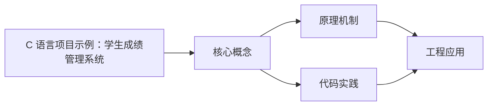
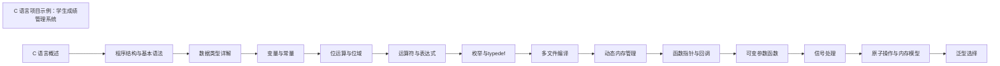

## 1. 学习目标（Bloom 分类）

本节按照布鲁姆教育目标分类学组织学习路径。本文主题为《C 语言项目示例：学生成绩管理系统》，属于 C 模块，读者可以根据自身阶段选择阅读深度。

记忆层面：能够准确复述本文的核心概念、术语与基本语法或操作步骤，并能够在提问或检索时快速定位对应知识点。能够说出 C 的变量、函数、指针、数组、结构体与预处理语法。

理解层面：能够用自己的语言解释核心原理与工作机制，说明概念之间的因果关系，而不是机械记忆结论。能够解释指针与内存地址、栈与堆、编译链接过程。

应用层面：能够在真实项目或练习场景中运用本文知识解决具体问题，写出正确且可维护的实现。能够编写系统工具、数据结构与嵌入式程序。

分析层面：能够拆解复杂问题，比较本文主题与相邻概念的异同，识别边界条件与例外情况。能够分析内存泄漏、缓冲区溢出与未定义行为。

评价层面：能够根据约束条件（性能、可读性、安全、成本）评价不同方案的优劣，做出有依据的技术决策。能够评价 C 与其他语言在系统编程中的取舍。

创造层面：能够把本文知识与其他模块知识组合，设计出新的解决方案或可复用的工程模式。能够设计可移植、可维护的 C 库与模块。

通过本节学习，读者应当能够把《C 语言项目示例：学生成绩管理系统》纳入自己的知识网络，并与 C 模块的其他主题（指针、内存管理、预处理器、标准库）建立关联。

## 2. 历史动机与发展脉络

《C 语言项目示例：学生成绩管理系统》是 C 领域的重要主题。要真正理解它，需要先了解它解决的问题与演进过程。

C 由 Dennis Ritchie 于 1972 年在贝尔实验室为 Unix 开发，是系统编程的基石语言：操作系统、编译器、嵌入式固件均以 C 为主。
C89（ANSI C）统一方言，C99 引入变长数组与 // 注释，C11 增加泛型选择与线程支持，C17 为缺陷修复版，C23（2024 年正式发布）引入 constexpr、属性、显式枚举底层类型等现代化特性。
C 的哲学是“信任程序员”：提供指针与内存操作的全部能力，同时把正确性责任交给开发者；这一设计成就了性能上限，也带来内存安全风险，催生了 Rust 等后继语言。

回到本文主题：C 语言项目示例：学生成绩管理系统 的提出与成熟，正是上述技术背景下的必然产物。早期实现往往以简单可用为目标，随着工程规模扩大，社区逐渐沉淀出标准做法与最佳实践；理解这一脉络，可以帮助读者判断“为什么文档中的推荐写法是现在这个样子”，也能在遇到历史遗留代码时准确识别其设计年代与取舍。


## 3. 形式化定义与核心概念精讲

本节把《C 语言项目示例：学生成绩管理系统》涉及的核心概念以“定义 + 讲解”的形式展开。读者应把定义当作工具，把讲解当作理解路径；两者结合才能形成可迁移的知识。

指针：指针保存变量地址，`&` 取地址、`*` 解引用；指针算术与数组名退化规则（数组名作为实参退化为首元素指针）是 C 的经典难点。
内存管理：栈内存自动释放，堆内存由 malloc/calloc/realloc/free 管理；所有权责任（谁分配谁释放）必须显式约定。
预处理器：#include/#define/#ifdef 在编译前文本处理；宏展开有副作用与优先级风险，函数式宏参数必须加括号。

### 3.1 原文章节逐一精讲

原文档把主题拆分为 6 个小节，下面按顺序给出每一节的导读讲解，随后保留原文细节供精读。

#### 原文精读（完整保留）


| 查询学生 | 按学号或姓名精确/模糊查询                   |
| -------- | ------------------------------------------- |
| 修改学生 | 修改指定学号的学生信息                      |
| 删除学生 | 按学号删除学生记录                          |
| 成绩排序 | 按总分/平均分/单科成绩排序（支持升序/降序） |
| 统计分析 | 最高分、最低分、平均分、各分数段人数分布    |
| 文件存储 | 二进制文件读写，启动时加载、退出时保存      |
| 数据导出 | 导出为 CSV 格式文件                         |

#### 需求分析

##### 数据需求

- 每个学生包含：学号（唯一标识）、姓名、5 门课程成绩、总分、平均分、排名
- 系统最多管理 500 名学生（可配置）
- 数据需持久化到文件，重启后可恢复

##### 功能需求

- 菜单驱动的交互界面
- 输入合法性校验（学号不重复、成绩范围 0-100）
- 支持多种排序策略
- 支持模糊查询（姓名包含关键字）

##### 非功能需求

- 单次操作响应时间 < 100ms
- 文件读写采用二进制格式以提高效率
- 内存占用可控，使用动态数组

#### 技术选型

| 技术点     | 选型                    | 理由                             |
| ---------- | ----------------------- | -------------------------------- |
| 数据结构   | 结构体数组              | 学生记录为异构数据，结构体最自然 |
| 内存管理   | 动态分配 realloc        | 支持动态扩容，避免固定数组浪费   |
| 排序算法   | qsort（快速排序）       | C 标准库，时间复杂度 O(n log n)  |
| 文件存储   | 二进制读写 fread/fwrite | 比文本格式更快，直接映射内存结构 |
| 查询方式   | 线性扫描                | 数据量小，无需索引结构           |
| 字符串处理 | string.h 标准函数       | strstr 实现模糊查询              |

#### 完整代码

##### 头文件与常量定义

```c
#include <stdio.h>
#include <stdlib.h>
#include <string.h>
#include <ctype.h>

#define MAX_NAME_LEN 50
#define MAX_ID_LEN 20
#define COURSE_NUM 5
#define INIT_CAPACITY 50
#define SCORE_MIN 0
#define SCORE_MAX 100
#define DATA_FILE "students.dat"
#define CSV_FILE "students.csv"

static const char *course_names[COURSE_NUM] = {
    "Math", "English", "Physics", "Chemistry", "Computer"
};
```

##### 核心数据结构

```c
typedef struct {
    char id[MAX_ID_LEN];
    char name[MAX_NAME_LEN];
    int scores[COURSE_NUM];
    int total;
    double average;
    int rank;
} Student;

typedef struct {
    Student *data;
    int count;
    int capacity;
} StudentList;
```

##### 列表操作函数

```c
void list_init(StudentList *list) {
    list->capacity = INIT_CAPACITY;
    list->count = 0;
    list->data = (Student *)malloc(sizeof(Student) * list->capacity);
    if (!list->data) {
        fprintf(stderr, "Memory allocation failed\n");
        exit(EXIT_FAILURE);
    }
}

void list_ensure_capacity(StudentList *list) {
    if (list->count >= list->capacity) {
        list->capacity *= 2;
        Student *new_data = (Student *)realloc(
            list->data, sizeof(Student) * list->capacity
        );
        if (!new_data) {
            fprintf(stderr, "Memory reallocation failed\n");
            exit(EXIT_FAILURE);
        }
        list->data = new_data;
    }
}

void list_free(StudentList *list) {
    free(list->data);
    list->data = NULL;
    list->count = 0;
    list->capacity = 0;
}
```

##### 学生信息录入

```c
int find_by_id(StudentList *list, const char *id) {
    for (int i = 0; i < list->count; i++) {
        if (strcmp(list->data[i].id, id) == 0) {
            return i;
        }
    }
    return -1;
}

int input_score(int course_index) {
    int score;
    while (1) {
        printf("  Enter %s score (%d-%d): ",
               course_names[course_index], SCORE_MIN, SCORE_MAX);
        if (scanf("%d", &score) != 1) {
            while (getchar() != '\n');
            printf("  Invalid input, please enter a number.\n");
            continue;
        }
        if (score < SCORE_MIN || score > SCORE_MAX) {
            printf("  Score out of range, please re-enter.\n");
            continue;
        }
        return score;
    }
}

void add_student(StudentList *list) {
    list_ensure_capacity(list);
    Student *s = &list->data[list->count];

    printf("Enter student ID: ");
    scanf("%s", s->id);
    if (find_by_id(list, s->id) != -1) {
        printf("Student ID already exists!\n");
        return;
    }

    printf("Enter student name: ");
    scanf("%s", s->name);

    s->total = 0;
    for (int i = 0; i < COURSE_NUM; i++) {
        s->scores[i] = input_score(i);
        s->total += s->scores[i];
    }
    s->average = (double)s->total / COURSE_NUM;
    s->rank = 0;

    list->count++;
    printf("Student added successfully. Total: %d, Average: %.2f\n",
           s->total, s->average);
}
```

##### 查询功能

```c
void search_by_id(StudentList *list) {
    char id[MAX_ID_LEN];
    printf("Enter student ID to search: ");
    scanf("%s", id);

    int idx = find_by_id(list, id);
    if (idx == -1) {
        printf("Student not found.\n");
        return;
    }
    print_student(&list->data[idx]);
}

void search_by_name(StudentList *list) {
    char keyword[MAX_NAME_LEN];
    printf("Enter name keyword to search: ");
    scanf("%s", keyword);

    int found = 0;
    for (int i = 0; i < list->count; i++) {
        if (strstr(list->data[i].name, keyword) != NULL) {
            print_student(&list->data[i]);
            found++;
        }
    }
    if (found == 0) {
        printf("No matching students found.\n");
    } else {
        printf("Found %d matching student(s).\n", found);
    }
}

void print_student(Student *s) {
    printf("------+-------------------+------\n");
    printf("ID    : %s\n", s->id);
    printf("Name  : %s\n", s->name);
    for (int i = 0; i < COURSE_NUM; i++) {
        printf("%-8s: %d\n", course_names[i], s->scores[i]);
    }
    printf("Total : %d\n", s->total);
    printf("Avg   : %.2f\n", s->average);
    if (s->rank > 0) {
        printf("Rank  : %d\n", s->rank);
    }
    printf("------+-------------------+------\n");
}
```

##### 修改与删除

```c
void modify_student(StudentList *list) {
    char id[MAX_ID_LEN];
    printf("Enter student ID to modify: ");
    scanf("%s", id);

    int idx = find_by_id(list, id);
    if (idx == -1) {
        printf("Student not found.\n");
        return;
    }

    Student *s = &list->data[idx];
    printf("Current name: %s, enter new name (or '-' to keep): ");
    char input[MAX_NAME_LEN];
    scanf("%s", input);
    if (strcmp(input, "-") != 0) {
        strcpy(s->name, input);
    }

    printf("Re-enter scores for each course (enter -1 to keep current):\n");
    s->total = 0;
    for (int i = 0; i < COURSE_NUM; i++) {
        printf("  %s current: %d, new: ", course_names[i], s->scores[i]);
        int new_score;
        if (scanf("%d", &new_score) == 1 && new_score != -1) {
            if (new_score >= SCORE_MIN && new_score <= SCORE_MAX) {
                s->scores[i] = new_score;
            }
        }
        s->total += s->scores[i];
    }
    s->average = (double)s->total / COURSE_NUM;
    printf("Student updated. Total: %d, Average: %.2f\n", s->total, s->average);
}

void delete_student(StudentList *list) {
    char id[MAX_ID_LEN];
    printf("Enter student ID to delete: ");
    scanf("%s", id);

    int idx = find_by_id(list, id);
    if (idx == -1) {
        printf("Student not found.\n");
        return;
    }

    for (int i = idx; i < list->count - 1; i++) {
        list->data[i] = list->data[i + 1];
    }
    list->count--;
    printf("Student deleted successfully.\n");
}
```

##### 排序功能

```c
int cmp_total_desc(const void *a, const void *b) {
    return ((Student *)b)->total - ((Student *)a)->total;
}

int cmp_total_asc(const void *a, const void *b) {
    return ((Student *)a)->total - ((Student *)b)->total;
}

int cmp_avg_desc(const void *a, const void *b) {
    double diff = ((Student *)b)->average - ((Student *)a)->average;
    return (diff > 0) ? 1 : ((diff < 0) ? -1 : 0);
}

int cmp_course_desc(const void *a, const void *b) {
    int course;
    printf("Select course (0-Math 1-English 2-Physics 3-Chemistry 4-Computer): ");
    scanf("%d", &course);
    if (course < 0 || course >= COURSE_NUM) course = 0;
    return ((Student *)b)->scores[course] - ((Student *)a)->scores[course];
}

void sort_students(StudentList *list) {
    if (list->count == 0) {
        printf("No students to sort.\n");
        return;
    }

    printf("Sort by:\n");
    printf("1. Total (descending)\n");
    printf("2. Total (ascending)\n");
    printf("3. Average (descending)\n");
    printf("4. Single course (descending)\n");
    printf("Choice: ");

    int choice;
    scanf("%d", &choice);

    switch (choice) {
        case 1: qsort(list->data, list->count, sizeof(Student), cmp_total_desc); break;
        case 2: qsort(list->data, list->count, sizeof(Student), cmp_total_asc); break;
        case 3: qsort(list->data, list->count, sizeof(Student), cmp_avg_desc); break;
        case 4: qsort(list->data, list->count, sizeof(Student), cmp_course_desc); break;
        default: printf("Invalid choice.\n"); return;
    }

    for (int i = 0; i < list->count; i++) {
        list->data[i].rank = i + 1;
    }
    printf("Sorted and ranked successfully.\n");
}
```

##### 统计分析

```c
void statistics(StudentList *list) {
    if (list->count == 0) {
        printf("No student data.\n");
        return;
    }

    printf("\n===== Statistics Report =====\n");
    printf("Total students: %d\n\n", list->count);

    for (int c = 0; c < COURSE_NUM; c++) {
        int max_s = SCORE_MIN, min_s = SCORE_MAX, sum = 0;
        int excellent = 0, good = 0, medium = 0, pass = 0, fail = 0;

        for (int i = 0; i < list->count; i++) {
            int s = list->data[i].scores[c];
            if (s > max_s) max_s = s;
            if (s < min_s) min_s = s;
            sum += s;
            if (s >= 90) excellent++;
            else if (s >= 80) good++;
            else if (s >= 70) medium++;
            else if (s >= 60) pass++;
            else fail++;
        }

        double avg = (double)sum / list->count;
        printf("--- %s ---\n", course_names[c]);
        printf("  Max: %d  Min: %d  Avg: %.2f\n", max_s, min_s, avg);
        printf("  Excellent(90-100): %d (%.1f%%)\n",
               excellent, 100.0 * excellent / list->count);
        printf("  Good(80-89):      %d (%.1f%%)\n",
               good, 100.0 * good / list->count);
        printf("  Medium(70-79):    %d (%.1f%%)\n",
               medium, 100.0 * medium / list->count);
        printf("  Pass(60-69):      %d (%.1f%%)\n",
               pass, 100.0 * pass / list->count);
        printf("  Fail(0-59):       %d (%.1f%%)\n\n",
               fail, 100.0 * fail / list->count);
    }
}
```

##### 文件读写

```c
void save_to_file(StudentList *list) {
    FILE *fp = fopen(DATA_FILE, "wb");
    if (!fp) {
        perror("Failed to open data file for writing");
        return;
    }

    fwrite(&list->count, sizeof(int), 1, fp);
    fwrite(list->data, sizeof(Student), list->count, fp);
    fclose(fp);
    printf("Data saved to %s (%d records).\n", DATA_FILE, list->count);
}

void load_from_file(StudentList *list) {
    FILE *fp = fopen(DATA_FILE, "rb");
    if (!fp) {
        printf("No existing data file, starting fresh.\n");
        return;
    }

    fread(&list->count, sizeof(int), 1, fp);
    if (list->count > list->capacity) {
        list->capacity = list->count * 2;
        list->data = (Student *)realloc(
            list->data, sizeof(Student) * list->capacity
        );
    }
    fread(list->data, sizeof(Student), list->count, fp);
    fclose(fp);
    printf("Loaded %d records from %s.\n", list->count, DATA_FILE);
}

void export_csv(StudentList *list) {
    FILE *fp = fopen(CSV_FILE, "w");
    if (!fp) {
        perror("Failed to open CSV file");
        return;
    }

    fprintf(fp, "ID,Name");
    for (int i = 0; i < COURSE_NUM; i++) {
        fprintf(fp, ",%s", course_names[i]);
    }
    fprintf(fp, ",Total,Average,Rank\n");

    for (int i = 0; i < list->count; i++) {
        Student *s = &list->data[i];
        fprintf(fp, "%s,%s", s->id, s->name);
        for (int j = 0; j < COURSE_NUM; j++) {
            fprintf(fp, ",%d", s->scores[j]);
        }
        fprintf(fp, ",%d,%.2f,%d\n", s->total, s->average, s->rank);
    }

    fclose(fp);
    printf("Exported %d records to %s.\n", list->count, CSV_FILE);
}
```

##### 显示所有学生

```c
void display_all(StudentList *list) {
    if (list->count == 0) {
        printf("No student data.\n");
        return;
    }

    printf("\n%-12s %-15s", "ID", "Name");
    for (int i = 0; i < COURSE_NUM; i++) {
        printf(" %-8s", course_names[i]);
    }
    printf(" %-6s %-8s %-5s\n", "Total", "Average", "Rank");
    printf("-----------------------------------------------------------------\n");

    for (int i = 0; i < list->count; i++) {
        Student *s = &list->data[i];
        printf("%-12s %-15s", s->id, s->name);
        for (int j = 0; j < COURSE_NUM; j++) {
            printf(" %-8d", s->scores[j]);
        }
        printf(" %-6d %-8.2f %-5d\n", s->total, s->average, s->rank);
    }
}
```

##### 主函数与菜单

```c
void show_menu() {
    printf("\n========================================\n");
    printf("   Student Grade Management System\n");
    printf("========================================\n");
    printf("1. Add Student\n");
    printf("2. Search by ID\n");
    printf("3. Search by Name\n");
    printf("4. Modify Student\n");
    printf("5. Delete Student\n");
    printf("6. Sort Students\n");
    printf("7. Statistics\n");
    printf("8. Display All\n");
    printf("9. Export CSV\n");
    printf("0. Save & Exit\n");
    printf("========================================\n");
    printf("Choice: ");
}

int main() {
    StudentList list;
    list_init(&list);
    load_from_file(&list);

    int choice;
    while (1) {
        show_menu();
        if (scanf("%d", &choice) != 1) {
            while (getchar() != '\n');
            continue;
        }

        switch (choice) {
            case 1: add_student(&list); break;
            case 2: search_by_id(&list); break;
            case 3: search_by_name(&list); break;
            case 4: modify_student(&list); break;
            case 5: delete_student(&list); break;
            case 6: sort_students(&list); break;
            case 7: statistics(&list); break;
            case 8: display_all(&list); break;
            case 9: export_csv(&list); break;
            case 0:
                save_to_file(&list);
                list_free(&list);
                printf("Goodbye!\n");
                return 0;
            default:
                printf("Invalid choice, please try again.\n");
        }
    }
    return 0;
}
```

#### 运行说明

##### 编译

```bash
gcc -Wall -Wextra -std=c11 -o student_manager main.c
```

##### 运行

```bash
./student_manager
```

##### 数据文件

- `students.dat` -- 二进制数据文件，程序自动创建和读取
- `students.csv` -- 导出的 CSV 文件，可用 Excel 打开

##### 注意事项

- 二进制文件与平台相关，不同字节序的系统间不可直接迁移
- 结构体写入文件时需注意对齐和填充问题
- 学号和姓名长度受宏定义限制，超长输入会截断

#### 扩展方向

1. **链表存储** -- 将动态数组替换为链表，支持 O(1) 插入删除
2. **哈希索引** -- 为学号建立哈希表索引，查询复杂度降为 O(1)
3. **多文件组织** -- 拆分为头文件和多个源文件，使用 Makefile 构建
4. **加密存储** -- 对敏感数据（姓名）进行简单异或加密
5. **图形界面** -- 使用 GTK 或 ncurses 替代控制台菜单
6. **网络通信** -- 使用 Socket 实现客户端/服务器架构
7. **日志系统** -- 记录所有操作到日志文件，支持审计追踪

---

#### 关键代码速查

##### 结构体定义模板

```c
typedef struct {
    char id[MAX_ID_LEN];
    char name[MAX_NAME_LEN];
    int scores[COURSE_NUM];
    int total;
    double average;
    int rank;
} Student;
```

##### 动态数组扩容

```c
if (list->count >= list->capacity) {
    list->capacity *= 2;
    list->data = realloc(list->data, sizeof(Student) * list->capacity);
}
```

##### qsort 比较函数

```c
int cmp_total_desc(const void *a, const void *b) {
    return ((Student *)b)->total - ((Student *)a)->total;
}
qsort(arr, n, sizeof(Student), cmp_total_desc);
```

##### 二进制文件读写

```c
fwrite(&count, sizeof(int), 1, fp);
fwrite(data, sizeof(Student), count, fp);

fread(&count, sizeof(int), 1, fp);
fread(data, sizeof(Student), count, fp);
```

##### 模糊查询

```c
if (strstr(student.name, keyword) != NULL) {
    // matched
}
```

##### 分数段统计

```c
if (score >= 90) excellent++;
else if (score >= 80) good++;
else if (score >= 70) medium++;
else if (score >= 60) pass++;
else fail++;
```


### 3.2 概念关系图

下面用 Mermaid 图表达本文核心概念之间的关系，帮助读者建立整体图景：



图中展示的是本文知识的结构化关系：核心概念是入口，原理机制解释“为什么”，代码实践演示“怎么做”，工程应用回答“何时用”。读者学习时可以把每个小节的内容挂接到对应节点上。

## 4. 理论推导与原理解析

本节深入《C 语言项目示例：学生成绩管理系统》背后的原理。理论部分不求面面俱到，而是聚焦“能解释现象、能指导实践”的关键推导。

指针：指针保存变量地址，`&` 取地址、`*` 解引用；指针算术与数组名退化规则（数组名作为实参退化为首元素指针）是 C 的经典难点。
内存管理：栈内存自动释放，堆内存由 malloc/calloc/realloc/free 管理；所有权责任（谁分配谁释放）必须显式约定。
预处理器：#include/#define/#ifdef 在编译前文本处理；宏展开有副作用与优先级风险，函数式宏参数必须加括号。
编译链接：预处理 -> 编译 -> 汇编 -> 链接；头文件声明接口，源文件实现；静态库与动态库（.a/.so/.dll）决定部署形态。

需要强调的是，理论推导与工程实践之间存在翻译层：理论给出的是理想化模型与边界条件，工程代码则必须处理真实环境中的例外。读者在学习时应先掌握理论的“标准情形”，再通过陷阱章节了解“非标准情形”。

## 5. 代码示例与逐行讲解

本节把原文中的代码示例系统整理，并为每个示例补充用途说明与讲解。读者不应只浏览代码，而应逐段对照讲解理解设计意图。

### 5.1 示例：头文件与常量定义

该示例来自原文《头文件与常量定义》小节，用于演示C 语言项目示例：学生成绩管理系统相关操作。阅读时请先看代码结构，再看其后的讲解。

```c
#include <stdio.h>
#include <stdlib.h>
#include <string.h>
#include <ctype.h>

#define MAX_NAME_LEN 50
#define MAX_ID_LEN 20
#define COURSE_NUM 5
#define INIT_CAPACITY 50
#define SCORE_MIN 0
#define SCORE_MAX 100
#define DATA_FILE "students.dat"
#define CSV_FILE "students.csv"

static const char *course_names[COURSE_NUM] = {
    "Math", "English", "Physics", "Chemistry", "Computer"
};
```

讲解：这段代码演示了本节核心知识点。代码中的关键操作可以归纳为三步：准备（定义或初始化）、执行（核心逻辑）、收尾（释放资源或返回结果）。实际项目中，这三步往往被封装为函数或类，以提升复用性与可测试性。

关键点分析：

该示例共 15 行有效代码，结构以数据或配置为主。阅读时应关注：数据字段的含义、配置项的作用，以及它们与运行行为的对应关系。

进阶思考路径：先尝试修改参数观察行为变化，再把示例中的模式迁移到自己的项目中；每次修改都记录预期与实测差异，这是把示例转化为能力的最快方式。

### 5.2 示例：核心数据结构

该示例来自原文《核心数据结构》小节，用于演示C 语言项目示例：学生成绩管理系统相关操作。阅读时请先看代码结构，再看其后的讲解。

```c
typedef struct {
    char id[MAX_ID_LEN];
    char name[MAX_NAME_LEN];
    int scores[COURSE_NUM];
    int total;
    double average;
    int rank;
} Student;

typedef struct {
    Student *data;
    int count;
    int capacity;
} StudentList;
```

讲解：这段代码演示了本节核心知识点。代码中的关键操作可以归纳为三步：准备（定义或初始化）、执行（核心逻辑）、收尾（释放资源或返回结果）。实际项目中，这三步往往被封装为函数或类，以提升复用性与可测试性。

关键点分析：

该示例共 13 行有效代码，包含 1 类关键结构（def）。其中：

- 入口与初始化部分负责建立上下文，对应实际项目中的启动或装配逻辑；
- 核心逻辑部分体现本文主题的主要操作，是阅读时最需要对照讲解理解的部分；
- 输出或返回部分把结果交给调用方，注意其类型与边界条件。

进阶思考路径：先尝试修改参数观察行为变化，再把示例中的模式迁移到自己的项目中；每次修改都记录预期与实测差异，这是把示例转化为能力的最快方式。

### 5.3 示例：列表操作函数

该示例来自原文《列表操作函数》小节，用于演示C 语言项目示例：学生成绩管理系统相关操作。阅读时请先看代码结构，再看其后的讲解。

```c
void list_init(StudentList *list) {
    list->capacity = INIT_CAPACITY;
    list->count = 0;
    list->data = (Student *)malloc(sizeof(Student) * list->capacity);
    if (!list->data) {
        fprintf(stderr, "Memory allocation failed\n");
        exit(EXIT_FAILURE);
    }
}

void list_ensure_capacity(StudentList *list) {
    if (list->count >= list->capacity) {
        list->capacity *= 2;
        Student *new_data = (Student *)realloc(
            list->data, sizeof(Student) * list->capacity
        );
        if (!new_data) {
            fprintf(stderr, "Memory reallocation failed\n");
            exit(EXIT_FAILURE);
        }
        list->data = new_data;
    }
}

void list_free(StudentList *list) {
    free(list->data);
    list->data = NULL;
    list->count = 0;
    list->capacity = 0;
}
```

讲解：这段代码演示了本节核心知识点。代码中的关键操作可以归纳为三步：准备（定义或初始化）、执行（核心逻辑）、收尾（释放资源或返回结果）。实际项目中，这三步往往被封装为函数或类，以提升复用性与可测试性。

关键点分析：

该示例共 28 行有效代码，包含 1 类关键结构（if）。其中：

- 入口与初始化部分负责建立上下文，对应实际项目中的启动或装配逻辑；
- 核心逻辑部分体现本文主题的主要操作，是阅读时最需要对照讲解理解的部分；
- 输出或返回部分把结果交给调用方，注意其类型与边界条件。

进阶思考路径：先尝试修改参数观察行为变化，再把示例中的模式迁移到自己的项目中；每次修改都记录预期与实测差异，这是把示例转化为能力的最快方式。

### 5.4 示例：学生信息录入

该示例来自原文《学生信息录入》小节，用于演示C 语言项目示例：学生成绩管理系统相关操作。阅读时请先看代码结构，再看其后的讲解。

```c
int find_by_id(StudentList *list, const char *id) {
    for (int i = 0; i < list->count; i++) {
        if (strcmp(list->data[i].id, id) == 0) {
            return i;
        }
    }
    return -1;
}

int input_score(int course_index) {
    int score;
    while (1) {
        printf("  Enter %s score (%d-%d): ",
               course_names[course_index], SCORE_MIN, SCORE_MAX);
        if (scanf("%d", &score) != 1) {
            while (getchar() != '\n');
            printf("  Invalid input, please enter a number.\n");
            continue;
        }
        if (score < SCORE_MIN || score > SCORE_MAX) {
            printf("  Score out of range, please re-enter.\n");
            continue;
        }
        return score;
    }
}

void add_student(StudentList *list) {
    list_ensure_capacity(list);
    Student *s = &list->data[list->count];

    printf("Enter student ID: ");
    scanf("%s", s->id);
    if (find_by_id(list, s->id) != -1) {
        printf("Student ID already exists!\n");
        return;
    }

    printf("Enter student name: ");
    scanf("%s", s->name);

    s->total = 0;
    for (int i = 0; i < COURSE_NUM; i++) {
        s->scores[i] = input_score(i);
        s->total += s->scores[i];
    }
    s->average = (double)s->total / COURSE_NUM;
    s->rank = 0;

    list->count++;
    printf("Student added successfully. Total: %d, Average: %.2f\n",
           s->total, s->average);
}
```

讲解：这段代码演示了本节核心知识点。代码中的关键操作可以归纳为三步：准备（定义或初始化）、执行（核心逻辑）、收尾（释放资源或返回结果）。实际项目中，这三步往往被封装为函数或类，以提升复用性与可测试性。

关键点分析：

该示例共 47 行有效代码，包含 4 类关键结构（if、for、while、return）。其中：

- 入口与初始化部分负责建立上下文，对应实际项目中的启动或装配逻辑；
- 核心逻辑部分体现本文主题的主要操作，是阅读时最需要对照讲解理解的部分；
- 输出或返回部分把结果交给调用方，注意其类型与边界条件。

进阶思考路径：先尝试修改参数观察行为变化，再把示例中的模式迁移到自己的项目中；每次修改都记录预期与实测差异，这是把示例转化为能力的最快方式。

### 5.5 示例：查询功能

该示例来自原文《查询功能》小节，用于演示C 语言项目示例：学生成绩管理系统相关操作。阅读时请先看代码结构，再看其后的讲解。

```c
void search_by_id(StudentList *list) {
    char id[MAX_ID_LEN];
    printf("Enter student ID to search: ");
    scanf("%s", id);

    int idx = find_by_id(list, id);
    if (idx == -1) {
        printf("Student not found.\n");
        return;
    }
    print_student(&list->data[idx]);
}

void search_by_name(StudentList *list) {
    char keyword[MAX_NAME_LEN];
    printf("Enter name keyword to search: ");
    scanf("%s", keyword);

    int found = 0;
    for (int i = 0; i < list->count; i++) {
        if (strstr(list->data[i].name, keyword) != NULL) {
            print_student(&list->data[i]);
            found++;
        }
    }
    if (found == 0) {
        printf("No matching students found.\n");
    } else {
        printf("Found %d matching student(s).\n", found);
    }
}

void print_student(Student *s) {
    printf("------+-------------------+------\n");
    printf("ID    : %s\n", s->id);
    printf("Name  : %s\n", s->name);
    for (int i = 0; i < COURSE_NUM; i++) {
        printf("%-8s: %d\n", course_names[i], s->scores[i]);
    }
    printf("Total : %d\n", s->total);
    printf("Avg   : %.2f\n", s->average);
    if (s->rank > 0) {
        printf("Rank  : %d\n", s->rank);
    }
    printf("------+-------------------+------\n");
}
```

讲解：这段代码演示了本节核心知识点。代码中的关键操作可以归纳为三步：准备（定义或初始化）、执行（核心逻辑）、收尾（释放资源或返回结果）。实际项目中，这三步往往被封装为函数或类，以提升复用性与可测试性。

关键点分析：

该示例共 42 行有效代码，包含 3 类关键结构（if、for、return）。其中：

- 入口与初始化部分负责建立上下文，对应实际项目中的启动或装配逻辑；
- 核心逻辑部分体现本文主题的主要操作，是阅读时最需要对照讲解理解的部分；
- 输出或返回部分把结果交给调用方，注意其类型与边界条件。

进阶思考路径：先尝试修改参数观察行为变化，再把示例中的模式迁移到自己的项目中；每次修改都记录预期与实测差异，这是把示例转化为能力的最快方式。

### 5.6 示例：修改与删除

该示例来自原文《修改与删除》小节，用于演示C 语言项目示例：学生成绩管理系统相关操作。阅读时请先看代码结构，再看其后的讲解。

```c
void modify_student(StudentList *list) {
    char id[MAX_ID_LEN];
    printf("Enter student ID to modify: ");
    scanf("%s", id);

    int idx = find_by_id(list, id);
    if (idx == -1) {
        printf("Student not found.\n");
        return;
    }

    Student *s = &list->data[idx];
    printf("Current name: %s, enter new name (or '-' to keep): ");
    char input[MAX_NAME_LEN];
    scanf("%s", input);
    if (strcmp(input, "-") != 0) {
        strcpy(s->name, input);
    }

    printf("Re-enter scores for each course (enter -1 to keep current):\n");
    s->total = 0;
    for (int i = 0; i < COURSE_NUM; i++) {
        printf("  %s current: %d, new: ", course_names[i], s->scores[i]);
        int new_score;
        if (scanf("%d", &new_score) == 1 && new_score != -1) {
            if (new_score >= SCORE_MIN && new_score <= SCORE_MAX) {
                s->scores[i] = new_score;
            }
        }
        s->total += s->scores[i];
    }
    s->average = (double)s->total / COURSE_NUM;
    printf("Student updated. Total: %d, Average: %.2f\n", s->total, s->average);
}

void delete_student(StudentList *list) {
    char id[MAX_ID_LEN];
    printf("Enter student ID to delete: ");
    scanf("%s", id);

    int idx = find_by_id(list, id);
    if (idx == -1) {
        printf("Student not found.\n");
        return;
    }

    for (int i = idx; i < list->count - 1; i++) {
        list->data[i] = list->data[i + 1];
    }
    list->count--;
    printf("Student deleted successfully.\n");
}
```

讲解：这段代码演示了本节核心知识点。代码中的关键操作可以归纳为三步：准备（定义或初始化）、执行（核心逻辑）、收尾（释放资源或返回结果）。实际项目中，这三步往往被封装为函数或类，以提升复用性与可测试性。

关键点分析：

该示例共 46 行有效代码，包含 3 类关键结构（if、for、return）。其中：

- 入口与初始化部分负责建立上下文，对应实际项目中的启动或装配逻辑；
- 核心逻辑部分体现本文主题的主要操作，是阅读时最需要对照讲解理解的部分；
- 输出或返回部分把结果交给调用方，注意其类型与边界条件。

进阶思考路径：先尝试修改参数观察行为变化，再把示例中的模式迁移到自己的项目中；每次修改都记录预期与实测差异，这是把示例转化为能力的最快方式。

### 5.7 示例：排序功能

该示例来自原文《排序功能》小节，用于演示C 语言项目示例：学生成绩管理系统相关操作。阅读时请先看代码结构，再看其后的讲解。

```c
int cmp_total_desc(const void *a, const void *b) {
    return ((Student *)b)->total - ((Student *)a)->total;
}

int cmp_total_asc(const void *a, const void *b) {
    return ((Student *)a)->total - ((Student *)b)->total;
}

int cmp_avg_desc(const void *a, const void *b) {
    double diff = ((Student *)b)->average - ((Student *)a)->average;
    return (diff > 0) ? 1 : ((diff < 0) ? -1 : 0);
}

int cmp_course_desc(const void *a, const void *b) {
    int course;
    printf("Select course (0-Math 1-English 2-Physics 3-Chemistry 4-Computer): ");
    scanf("%d", &course);
    if (course < 0 || course >= COURSE_NUM) course = 0;
    return ((Student *)b)->scores[course] - ((Student *)a)->scores[course];
}

void sort_students(StudentList *list) {
    if (list->count == 0) {
        printf("No students to sort.\n");
        return;
    }

    printf("Sort by:\n");
    printf("1. Total (descending)\n");
    printf("2. Total (ascending)\n");
    printf("3. Average (descending)\n");
    printf("4. Single course (descending)\n");
    printf("Choice: ");

    int choice;
    scanf("%d", &choice);

    switch (choice) {
        case 1: qsort(list->data, list->count, sizeof(Student), cmp_total_desc); break;
        case 2: qsort(list->data, list->count, sizeof(Student), cmp_total_asc); break;
        case 3: qsort(list->data, list->count, sizeof(Student), cmp_avg_desc); break;
        case 4: qsort(list->data, list->count, sizeof(Student), cmp_course_desc); break;
        default: printf("Invalid choice.\n"); return;
    }

    for (int i = 0; i < list->count; i++) {
        list->data[i].rank = i + 1;
    }
    printf("Sorted and ranked successfully.\n");
}
```

讲解：这段代码演示了本节核心知识点。代码中的关键操作可以归纳为三步：准备（定义或初始化）、执行（核心逻辑）、收尾（释放资源或返回结果）。实际项目中，这三步往往被封装为函数或类，以提升复用性与可测试性。

关键点分析：

该示例共 42 行有效代码，包含 3 类关键结构（if、for、return）。其中：

- 入口与初始化部分负责建立上下文，对应实际项目中的启动或装配逻辑；
- 核心逻辑部分体现本文主题的主要操作，是阅读时最需要对照讲解理解的部分；
- 输出或返回部分把结果交给调用方，注意其类型与边界条件。

进阶思考路径：先尝试修改参数观察行为变化，再把示例中的模式迁移到自己的项目中；每次修改都记录预期与实测差异，这是把示例转化为能力的最快方式。

### 5.8 示例：统计分析

该示例来自原文《统计分析》小节，用于演示C 语言项目示例：学生成绩管理系统相关操作。阅读时请先看代码结构，再看其后的讲解。

```c
void statistics(StudentList *list) {
    if (list->count == 0) {
        printf("No student data.\n");
        return;
    }

    printf("\n===== Statistics Report =====\n");
    printf("Total students: %d\n\n", list->count);

    for (int c = 0; c < COURSE_NUM; c++) {
        int max_s = SCORE_MIN, min_s = SCORE_MAX, sum = 0;
        int excellent = 0, good = 0, medium = 0, pass = 0, fail = 0;

        for (int i = 0; i < list->count; i++) {
            int s = list->data[i].scores[c];
            if (s > max_s) max_s = s;
            if (s < min_s) min_s = s;
            sum += s;
            if (s >= 90) excellent++;
            else if (s >= 80) good++;
            else if (s >= 70) medium++;
            else if (s >= 60) pass++;
            else fail++;
        }

        double avg = (double)sum / list->count;
        printf("--- %s ---\n", course_names[c]);
        printf("  Max: %d  Min: %d  Avg: %.2f\n", max_s, min_s, avg);
        printf("  Excellent(90-100): %d (%.1f%%)\n",
               excellent, 100.0 * excellent / list->count);
        printf("  Good(80-89):      %d (%.1f%%)\n",
               good, 100.0 * good / list->count);
        printf("  Medium(70-79):    %d (%.1f%%)\n",
               medium, 100.0 * medium / list->count);
        printf("  Pass(60-69):      %d (%.1f%%)\n",
               pass, 100.0 * pass / list->count);
        printf("  Fail(0-59):       %d (%.1f%%)\n\n",
               fail, 100.0 * fail / list->count);
    }
}
```

讲解：这段代码演示了本节核心知识点。代码中的关键操作可以归纳为三步：准备（定义或初始化）、执行（核心逻辑）、收尾（释放资源或返回结果）。实际项目中，这三步往往被封装为函数或类，以提升复用性与可测试性。

关键点分析：

该示例共 36 行有效代码，包含 3 类关键结构（if、for、return）。其中：

- 入口与初始化部分负责建立上下文，对应实际项目中的启动或装配逻辑；
- 核心逻辑部分体现本文主题的主要操作，是阅读时最需要对照讲解理解的部分；
- 输出或返回部分把结果交给调用方，注意其类型与边界条件。

进阶思考路径：先尝试修改参数观察行为变化，再把示例中的模式迁移到自己的项目中；每次修改都记录预期与实测差异，这是把示例转化为能力的最快方式。

### 5.9 示例：文件读写

该示例来自原文《文件读写》小节，用于演示C 语言项目示例：学生成绩管理系统相关操作。阅读时请先看代码结构，再看其后的讲解。

```c
void save_to_file(StudentList *list) {
    FILE *fp = fopen(DATA_FILE, "wb");
    if (!fp) {
        perror("Failed to open data file for writing");
        return;
    }

    fwrite(&list->count, sizeof(int), 1, fp);
    fwrite(list->data, sizeof(Student), list->count, fp);
    fclose(fp);
    printf("Data saved to %s (%d records).\n", DATA_FILE, list->count);
}

void load_from_file(StudentList *list) {
    FILE *fp = fopen(DATA_FILE, "rb");
    if (!fp) {
        printf("No existing data file, starting fresh.\n");
        return;
    }

    fread(&list->count, sizeof(int), 1, fp);
    if (list->count > list->capacity) {
        list->capacity = list->count * 2;
        list->data = (Student *)realloc(
            list->data, sizeof(Student) * list->capacity
        );
    }
    fread(list->data, sizeof(Student), list->count, fp);
    fclose(fp);
    printf("Loaded %d records from %s.\n", list->count, DATA_FILE);
}

void export_csv(StudentList *list) {
    FILE *fp = fopen(CSV_FILE, "w");
    if (!fp) {
        perror("Failed to open CSV file");
        return;
    }

    fprintf(fp, "ID,Name");
    for (int i = 0; i < COURSE_NUM; i++) {
        fprintf(fp, ",%s", course_names[i]);
    }
    fprintf(fp, ",Total,Average,Rank\n");

    for (int i = 0; i < list->count; i++) {
        Student *s = &list->data[i];
        fprintf(fp, "%s,%s", s->id, s->name);
        for (int j = 0; j < COURSE_NUM; j++) {
            fprintf(fp, ",%d", s->scores[j]);
        }
        fprintf(fp, ",%d,%.2f,%d\n", s->total, s->average, s->rank);
    }

    fclose(fp);
    printf("Exported %d records to %s.\n", list->count, CSV_FILE);
}
```

讲解：这段代码演示了本节核心知识点。代码中的关键操作可以归纳为三步：准备（定义或初始化）、执行（核心逻辑）、收尾（释放资源或返回结果）。实际项目中，这三步往往被封装为函数或类，以提升复用性与可测试性。

关键点分析：

该示例共 50 行有效代码，包含 4 类关键结构（from、if、for、return）。其中：

- 入口与初始化部分负责建立上下文，对应实际项目中的启动或装配逻辑；
- 核心逻辑部分体现本文主题的主要操作，是阅读时最需要对照讲解理解的部分；
- 输出或返回部分把结果交给调用方，注意其类型与边界条件。

进阶思考路径：先尝试修改参数观察行为变化，再把示例中的模式迁移到自己的项目中；每次修改都记录预期与实测差异，这是把示例转化为能力的最快方式。

### 5.10 示例：显示所有学生

该示例来自原文《显示所有学生》小节，用于演示C 语言项目示例：学生成绩管理系统相关操作。阅读时请先看代码结构，再看其后的讲解。

```c
void display_all(StudentList *list) {
    if (list->count == 0) {
        printf("No student data.\n");
        return;
    }

    printf("\n%-12s %-15s", "ID", "Name");
    for (int i = 0; i < COURSE_NUM; i++) {
        printf(" %-8s", course_names[i]);
    }
    printf(" %-6s %-8s %-5s\n", "Total", "Average", "Rank");
    printf("-----------------------------------------------------------------\n");

    for (int i = 0; i < list->count; i++) {
        Student *s = &list->data[i];
        printf("%-12s %-15s", s->id, s->name);
        for (int j = 0; j < COURSE_NUM; j++) {
            printf(" %-8d", s->scores[j]);
        }
        printf(" %-6d %-8.2f %-5d\n", s->total, s->average, s->rank);
    }
}
```

讲解：这段代码演示了本节核心知识点。代码中的关键操作可以归纳为三步：准备（定义或初始化）、执行（核心逻辑）、收尾（释放资源或返回结果）。实际项目中，这三步往往被封装为函数或类，以提升复用性与可测试性。

关键点分析：

该示例共 20 行有效代码，包含 3 类关键结构（if、for、return）。其中：

- 入口与初始化部分负责建立上下文，对应实际项目中的启动或装配逻辑；
- 核心逻辑部分体现本文主题的主要操作，是阅读时最需要对照讲解理解的部分；
- 输出或返回部分把结果交给调用方，注意其类型与边界条件。

进阶思考路径：先尝试修改参数观察行为变化，再把示例中的模式迁移到自己的项目中；每次修改都记录预期与实测差异，这是把示例转化为能力的最快方式。

### 5.11 示例：主函数与菜单

该示例来自原文《主函数与菜单》小节，用于演示C 语言项目示例：学生成绩管理系统相关操作。阅读时请先看代码结构，再看其后的讲解。

```c
void show_menu() {
    printf("\n========================================\n");
    printf("   Student Grade Management System\n");
    printf("========================================\n");
    printf("1. Add Student\n");
    printf("2. Search by ID\n");
    printf("3. Search by Name\n");
    printf("4. Modify Student\n");
    printf("5. Delete Student\n");
    printf("6. Sort Students\n");
    printf("7. Statistics\n");
    printf("8. Display All\n");
    printf("9. Export CSV\n");
    printf("0. Save & Exit\n");
    printf("========================================\n");
    printf("Choice: ");
}

int main() {
    StudentList list;
    list_init(&list);
    load_from_file(&list);

    int choice;
    while (1) {
        show_menu();
        if (scanf("%d", &choice) != 1) {
            while (getchar() != '\n');
            continue;
        }

        switch (choice) {
            case 1: add_student(&list); break;
            case 2: search_by_id(&list); break;
            case 3: search_by_name(&list); break;
            case 4: modify_student(&list); break;
            case 5: delete_student(&list); break;
            case 6: sort_students(&list); break;
            case 7: statistics(&list); break;
            case 8: display_all(&list); break;
            case 9: export_csv(&list); break;
            case 0:
                save_to_file(&list);
                list_free(&list);
                printf("Goodbye!\n");
                return 0;
            default:
                printf("Invalid choice, please try again.\n");
        }
    }
    return 0;
}
```

讲解：这段代码演示了本节核心知识点。代码中的关键操作可以归纳为三步：准备（定义或初始化）、执行（核心逻辑）、收尾（释放资源或返回结果）。实际项目中，这三步往往被封装为函数或类，以提升复用性与可测试性。

关键点分析：

该示例共 49 行有效代码，包含 3 类关键结构（if、while、return）。其中：

- 入口与初始化部分负责建立上下文，对应实际项目中的启动或装配逻辑；
- 核心逻辑部分体现本文主题的主要操作，是阅读时最需要对照讲解理解的部分；
- 输出或返回部分把结果交给调用方，注意其类型与边界条件。

进阶思考路径：先尝试修改参数观察行为变化，再把示例中的模式迁移到自己的项目中；每次修改都记录预期与实测差异，这是把示例转化为能力的最快方式。

### 5.12 示例：编译

该示例来自原文《编译》小节，用于演示C 语言项目示例：学生成绩管理系统相关操作。阅读时请先看代码结构，再看其后的讲解。

```bash
gcc -Wall -Wextra -std=c11 -o student_manager main.c
```

讲解：这段代码演示了本节核心知识点。代码中的关键操作可以归纳为三步：准备（定义或初始化）、执行（核心逻辑）、收尾（释放资源或返回结果）。实际项目中，这三步往往被封装为函数或类，以提升复用性与可测试性。

关键点分析：

该示例共 1 行有效代码，结构以数据或配置为主。阅读时应关注：数据字段的含义、配置项的作用，以及它们与运行行为的对应关系。

进阶思考路径：先尝试修改参数观察行为变化，再把示例中的模式迁移到自己的项目中；每次修改都记录预期与实测差异，这是把示例转化为能力的最快方式。

### 5.13 示例：运行

该示例来自原文《运行》小节，用于演示C 语言项目示例：学生成绩管理系统相关操作。阅读时请先看代码结构，再看其后的讲解。

```bash
./student_manager
```

讲解：这段代码演示了本节核心知识点。代码中的关键操作可以归纳为三步：准备（定义或初始化）、执行（核心逻辑）、收尾（释放资源或返回结果）。实际项目中，这三步往往被封装为函数或类，以提升复用性与可测试性。

关键点分析：

该示例共 1 行有效代码，结构以数据或配置为主。阅读时应关注：数据字段的含义、配置项的作用，以及它们与运行行为的对应关系。

进阶思考路径：先尝试修改参数观察行为变化，再把示例中的模式迁移到自己的项目中；每次修改都记录预期与实测差异，这是把示例转化为能力的最快方式。

### 5.14 示例：结构体定义模板

该示例来自原文《结构体定义模板》小节，用于演示C 语言项目示例：学生成绩管理系统相关操作。阅读时请先看代码结构，再看其后的讲解。

```c
typedef struct {
    char id[MAX_ID_LEN];
    char name[MAX_NAME_LEN];
    int scores[COURSE_NUM];
    int total;
    double average;
    int rank;
} Student;
```

讲解：这段代码演示了本节核心知识点。代码中的关键操作可以归纳为三步：准备（定义或初始化）、执行（核心逻辑）、收尾（释放资源或返回结果）。实际项目中，这三步往往被封装为函数或类，以提升复用性与可测试性。

关键点分析：

该示例共 8 行有效代码，包含 1 类关键结构（def）。其中：

- 入口与初始化部分负责建立上下文，对应实际项目中的启动或装配逻辑；
- 核心逻辑部分体现本文主题的主要操作，是阅读时最需要对照讲解理解的部分；
- 输出或返回部分把结果交给调用方，注意其类型与边界条件。

进阶思考路径：先尝试修改参数观察行为变化，再把示例中的模式迁移到自己的项目中；每次修改都记录预期与实测差异，这是把示例转化为能力的最快方式。

### 5.15 示例：动态数组扩容

该示例来自原文《动态数组扩容》小节，用于演示C 语言项目示例：学生成绩管理系统相关操作。阅读时请先看代码结构，再看其后的讲解。

```c
if (list->count >= list->capacity) {
    list->capacity *= 2;
    list->data = realloc(list->data, sizeof(Student) * list->capacity);
}
```

讲解：这段代码演示了本节核心知识点。代码中的关键操作可以归纳为三步：准备（定义或初始化）、执行（核心逻辑）、收尾（释放资源或返回结果）。实际项目中，这三步往往被封装为函数或类，以提升复用性与可测试性。

关键点分析：

该示例共 4 行有效代码，包含 1 类关键结构（if）。其中：

- 入口与初始化部分负责建立上下文，对应实际项目中的启动或装配逻辑；
- 核心逻辑部分体现本文主题的主要操作，是阅读时最需要对照讲解理解的部分；
- 输出或返回部分把结果交给调用方，注意其类型与边界条件。

进阶思考路径：先尝试修改参数观察行为变化，再把示例中的模式迁移到自己的项目中；每次修改都记录预期与实测差异，这是把示例转化为能力的最快方式。

### 5.16 示例：qsort 比较函数

该示例来自原文《qsort 比较函数》小节，用于演示C 语言项目示例：学生成绩管理系统相关操作。阅读时请先看代码结构，再看其后的讲解。

```c
int cmp_total_desc(const void *a, const void *b) {
    return ((Student *)b)->total - ((Student *)a)->total;
}
qsort(arr, n, sizeof(Student), cmp_total_desc);
```

讲解：这段代码演示了本节核心知识点。代码中的关键操作可以归纳为三步：准备（定义或初始化）、执行（核心逻辑）、收尾（释放资源或返回结果）。实际项目中，这三步往往被封装为函数或类，以提升复用性与可测试性。

关键点分析：

该示例共 4 行有效代码，包含 1 类关键结构（return）。其中：

- 入口与初始化部分负责建立上下文，对应实际项目中的启动或装配逻辑；
- 核心逻辑部分体现本文主题的主要操作，是阅读时最需要对照讲解理解的部分；
- 输出或返回部分把结果交给调用方，注意其类型与边界条件。

进阶思考路径：先尝试修改参数观察行为变化，再把示例中的模式迁移到自己的项目中；每次修改都记录预期与实测差异，这是把示例转化为能力的最快方式。

### 5.17 示例：二进制文件读写

该示例来自原文《二进制文件读写》小节，用于演示C 语言项目示例：学生成绩管理系统相关操作。阅读时请先看代码结构，再看其后的讲解。

```c
fwrite(&count, sizeof(int), 1, fp);
fwrite(data, sizeof(Student), count, fp);

fread(&count, sizeof(int), 1, fp);
fread(data, sizeof(Student), count, fp);
```

讲解：这段代码演示了本节核心知识点。代码中的关键操作可以归纳为三步：准备（定义或初始化）、执行（核心逻辑）、收尾（释放资源或返回结果）。实际项目中，这三步往往被封装为函数或类，以提升复用性与可测试性。

关键点分析：

该示例共 4 行有效代码，结构以数据或配置为主。阅读时应关注：数据字段的含义、配置项的作用，以及它们与运行行为的对应关系。

进阶思考路径：先尝试修改参数观察行为变化，再把示例中的模式迁移到自己的项目中；每次修改都记录预期与实测差异，这是把示例转化为能力的最快方式。

### 5.18 示例：模糊查询

该示例来自原文《模糊查询》小节，用于演示C 语言项目示例：学生成绩管理系统相关操作。阅读时请先看代码结构，再看其后的讲解。

```c
if (strstr(student.name, keyword) != NULL) {
    // matched
}
```

讲解：这段代码演示了本节核心知识点。代码中的关键操作可以归纳为三步：准备（定义或初始化）、执行（核心逻辑）、收尾（释放资源或返回结果）。实际项目中，这三步往往被封装为函数或类，以提升复用性与可测试性。

关键点分析：

该示例共 3 行有效代码，包含 1 类关键结构（if）。其中：

- 入口与初始化部分负责建立上下文，对应实际项目中的启动或装配逻辑；
- 核心逻辑部分体现本文主题的主要操作，是阅读时最需要对照讲解理解的部分；
- 输出或返回部分把结果交给调用方，注意其类型与边界条件。

进阶思考路径：先尝试修改参数观察行为变化，再把示例中的模式迁移到自己的项目中；每次修改都记录预期与实测差异，这是把示例转化为能力的最快方式。

### 5.19 示例：分数段统计

该示例来自原文《分数段统计》小节，用于演示C 语言项目示例：学生成绩管理系统相关操作。阅读时请先看代码结构，再看其后的讲解。

```c
if (score >= 90) excellent++;
else if (score >= 80) good++;
else if (score >= 70) medium++;
else if (score >= 60) pass++;
else fail++;
```

讲解：这段代码演示了本节核心知识点。代码中的关键操作可以归纳为三步：准备（定义或初始化）、执行（核心逻辑）、收尾（释放资源或返回结果）。实际项目中，这三步往往被封装为函数或类，以提升复用性与可测试性。

关键点分析：

该示例共 5 行有效代码，包含 1 类关键结构（if）。其中：

- 入口与初始化部分负责建立上下文，对应实际项目中的启动或装配逻辑；
- 核心逻辑部分体现本文主题的主要操作，是阅读时最需要对照讲解理解的部分；
- 输出或返回部分把结果交给调用方，注意其类型与边界条件。

进阶思考路径：先尝试修改参数观察行为变化，再把示例中的模式迁移到自己的项目中；每次修改都记录预期与实测差异，这是把示例转化为能力的最快方式。


综合以上示例，可以总结出本主题的代码实践要点：第一，先定义清晰的输入输出契约；第二，核心逻辑保持单一职责；第三，错误处理与边界条件不可省略；第四，命名与注释表达意图而非复述代码。

## 6. 对比分析

对比是理解《C 语言项目示例：学生成绩管理系统》定位的最快路径。下面从多个维度与相邻方案进行对比。

C 与 C++：C++ 是 C 的超集扩展，支持类、模板、异常与 RAII；C 更简单直接，适合嵌入式与纯系统编程。
C 与 Rust：Rust 在编译期保证内存安全（所有权/借用）；C 灵活但需要人工保证安全。新系统项目可评估 Rust。
C89 与 C23：C23 带来 constexpr、attributes、二进制字面量等，现代化程度提升但仍保持兼容。

对比的目的不是分出绝对优劣，而是建立选择依据：不同约束条件下，最优解不同。读者应把每个对比维度转化为决策检查清单。

## 7. 常见陷阱与最佳实践

本节整理该主题的高频错误与推荐做法。每个陷阱先描述现象，再解释原因，最后给出最佳实践。

### 7.1 缓冲区溢出

gets/strcpy 不检查边界导致安全漏洞。使用 fgets/strncpy（注意截断语义）或安全库。

深入讲解：该问题之所以被归类为“常见陷阱”，是因为它在初学者的代码中反复出现，而且往往不在第一时间暴露——错误通常隐藏在特定数据或特定时序下。

从成因上看，缓冲区溢出 一般源于对 C 某个机制的理解偏差：要么误用了默认行为，要么忽略了边界条件，要么把其他语言的思维惯性带了过来。

从影响上看，缓冲区溢出 轻则产生错误结果，重则导致资源泄漏、数据损坏或安全事故；这也是为什么工程评审中会把它列为检查项。

从修复策略上看，处理缓冲区溢出的正确顺序是：先复现（构造最小用例），再定位（确认机制层面的根因），最后修复并补充回归测试。跳过复现直接改代码，往往治标不治本。

### 7.2 内存泄漏

malloc 后未 free。设计清晰的所有权规则，配合 Valgrind/ASan 检测。

深入讲解：该问题之所以被归类为“常见陷阱”，是因为它在初学者的代码中反复出现，而且往往不在第一时间暴露——错误通常隐藏在特定数据或特定时序下。

从成因上看，内存泄漏 一般源于对 C 某个机制的理解偏差：要么误用了默认行为，要么忽略了边界条件，要么把其他语言的思维惯性带了过来。

从影响上看，内存泄漏 轻则产生错误结果，重则导致资源泄漏、数据损坏或安全事故；这也是为什么工程评审中会把它列为检查项。

从修复策略上看，处理内存泄漏的正确顺序是：先复现（构造最小用例），再定位（确认机制层面的根因），最后修复并补充回归测试。跳过复现直接改代码，往往治标不治本。

### 7.3 悬垂指针

free 后继续使用指针。释放后置 NULL，并约定使用前检查。

深入讲解：该问题之所以被归类为“常见陷阱”，是因为它在初学者的代码中反复出现，而且往往不在第一时间暴露——错误通常隐藏在特定数据或特定时序下。

从成因上看，悬垂指针 一般源于对 C 某个机制的理解偏差：要么误用了默认行为，要么忽略了边界条件，要么把其他语言的思维惯性带了过来。

从影响上看，悬垂指针 轻则产生错误结果，重则导致资源泄漏、数据损坏或安全事故；这也是为什么工程评审中会把它列为检查项。

从修复策略上看，处理悬垂指针的正确顺序是：先复现（构造最小用例），再定位（确认机制层面的根因），最后修复并补充回归测试。跳过复现直接改代码，往往治标不治本。

### 7.4 未定义行为

有符号溢出、数组越界、除零等行为不可预测。开启 -Wall -Wextra -fsanitize=undefined 检测。

深入讲解：该问题之所以被归类为“常见陷阱”，是因为它在初学者的代码中反复出现，而且往往不在第一时间暴露——错误通常隐藏在特定数据或特定时序下。

从成因上看，未定义行为 一般源于对 C 某个机制的理解偏差：要么误用了默认行为，要么忽略了边界条件，要么把其他语言的思维惯性带了过来。

从影响上看，未定义行为 轻则产生错误结果，重则导致资源泄漏、数据损坏或安全事故；这也是为什么工程评审中会把它列为检查项。

从修复策略上看，处理未定义行为的正确顺序是：先复现（构造最小用例），再定位（确认机制层面的根因），最后修复并补充回归测试。跳过复现直接改代码，往往治标不治本。

### 7.5 宏副作用

`#define SQUARE(x) x*x` 在 `SQUARE(a+b)` 时出错。参数加括号或用内联函数。

深入讲解：该问题之所以被归类为“常见陷阱”，是因为它在初学者的代码中反复出现，而且往往不在第一时间暴露——错误通常隐藏在特定数据或特定时序下。

从成因上看，宏副作用 一般源于对 C 某个机制的理解偏差：要么误用了默认行为，要么忽略了边界条件，要么把其他语言的思维惯性带了过来。

从影响上看，宏副作用 轻则产生错误结果，重则导致资源泄漏、数据损坏或安全事故；这也是为什么工程评审中会把它列为检查项。

从修复策略上看，处理宏副作用的正确顺序是：先复现（构造最小用例），再定位（确认机制层面的根因），最后修复并补充回归测试。跳过复现直接改代码，往往治标不治本。

### 7.6 字符串字面量修改

修改字符串字面量是未定义行为。需要修改时用字符数组。

深入讲解：该问题之所以被归类为“常见陷阱”，是因为它在初学者的代码中反复出现，而且往往不在第一时间暴露——错误通常隐藏在特定数据或特定时序下。

从成因上看，字符串字面量修改 一般源于对 C 某个机制的理解偏差：要么误用了默认行为，要么忽略了边界条件，要么把其他语言的思维惯性带了过来。

从影响上看，字符串字面量修改 轻则产生错误结果，重则导致资源泄漏、数据损坏或安全事故；这也是为什么工程评审中会把它列为检查项。

从修复策略上看，处理字符串字面量修改的正确顺序是：先复现（构造最小用例），再定位（确认机制层面的根因），最后修复并补充回归测试。跳过复现直接改代码，往往治标不治本。

### 7.7 忘记初始化

局部变量未初始化读随机值。声明即初始化。

深入讲解：该问题之所以被归类为“常见陷阱”，是因为它在初学者的代码中反复出现，而且往往不在第一时间暴露——错误通常隐藏在特定数据或特定时序下。

从成因上看，忘记初始化 一般源于对 C 某个机制的理解偏差：要么误用了默认行为，要么忽略了边界条件，要么把其他语言的思维惯性带了过来。

从影响上看，忘记初始化 轻则产生错误结果，重则导致资源泄漏、数据损坏或安全事故；这也是为什么工程评审中会把它列为检查项。

从修复策略上看，处理忘记初始化的正确顺序是：先复现（构造最小用例），再定位（确认机制层面的根因），最后修复并补充回归测试。跳过复现直接改代码，往往治标不治本。

### 7.8 类型混用

有符号与无符号比较产生隐式转换。注意 -Wsign-compare 告警。

深入讲解：该问题之所以被归类为“常见陷阱”，是因为它在初学者的代码中反复出现，而且往往不在第一时间暴露——错误通常隐藏在特定数据或特定时序下。

从成因上看，类型混用 一般源于对 C 某个机制的理解偏差：要么误用了默认行为，要么忽略了边界条件，要么把其他语言的思维惯性带了过来。

从影响上看，类型混用 轻则产生错误结果，重则导致资源泄漏、数据损坏或安全事故；这也是为什么工程评审中会把它列为检查项。

从修复策略上看，处理类型混用的正确顺序是：先复现（构造最小用例），再定位（确认机制层面的根因），最后修复并补充回归测试。跳过复现直接改代码，往往治标不治本。

### 7.0 最佳实践总览

1. 声明即初始化，指针必须有效或为 NULL。
2. 资源分配与释放成对出现，封装为函数。
3. 数组访问使用边界检查（调试版本启用断言）。
4. 头文件加 include guard，声明与实现分离。
5. 编译开启 -Wall -Wextra -Werror（开发阶段）。

把这些最佳实践固化为团队规范与代码评审检查项，是避免同类问题反复出现的关键。

## 8. 工程实践

本节把《C 语言项目示例：学生成绩管理系统》放入真实工程场景，给出可复用的模式与组织方法。

模块化：头文件定义接口（结构体前向声明、函数原型），源文件实现；内部函数用 static 隐藏。
错误处理：函数返回错误码或状态枚举，输出参数传结果；文档化调用方责任。
构建：Makefile/CMake 管理编译单元与依赖；编译选项区分 debug/release。
测试：断言 + 单元测试框架（Unity/CMocka），配合 AddressSanitizer。

### 8.1 工程实践的原则拆解

以上工程实践可以归纳为四条原则。第一，配置与代码分离：C 项目中环境差异应通过配置注入，而不是散落在代码分支中；这保证同一份代码可以在开发、测试、生产环境一致运行。

第二，接口稳定优先：对外接口（函数签名、协议、数据格式）一旦被消费方依赖，变更成本极高；设计时应预留扩展点并保持向后兼容。

第三，可观测性内置：日志、指标与追踪应该在功能开发时同步设计，而不是故障发生后补救；没有观测手段的模块等于黑盒。

第四，变更可回滚：任何发布都应有对应的回滚方案；数据库迁移、配置变更与代码发布一样需要版本管理与逆向路径。

### 8.2 实践落地的检查清单

- [ ] 模块化：对照本节描述，检查当前项目是否已经落实；未落实的项列入技术债并排期处理。
- [ ] 错误处理：对照本节描述，检查当前项目是否已经落实；未落实的项列入技术债并排期处理。
- [ ] 构建：对照本节描述，检查当前项目是否已经落实；未落实的项列入技术债并排期处理。
- [ ] 测试：对照本节描述，检查当前项目是否已经落实；未落实的项列入技术债并排期处理。

工程实践的共性原则：配置与代码分离、接口稳定优先、可观测性内置、变更可回滚。这些原则适用于本主题的所有实现。

## 9. 案例研究

本节通过一个完整案例把《C 语言项目示例：学生成绩管理系统》的知识串起来。案例按“需求分析、方案设计、实现、验证”四步展开。

需求：实现动态数组容器（vector），支持追加、按索引访问与释放。
方案：结构体封装 data/capacity/size，API 提供 create/destroy/push/at。
要点：扩容按 2 倍增长；越界返回错误码；所有分配路径成对释放。
验证：ASan 检查泄漏与越界；边界用例（空容器、满容量扩容）。

### 9.1 案例的扩展讨论

把案例中的方案放大到真实规模，需要额外考虑三个问题：

第一，规模：当数据量或并发量上升一个数量级时，原方案中的数据结构、缓存策略与任务调度是否仍然成立？通常需要引入分层与异步。

第二，团队：多人协作时，模块边界、接口契约与代码所有权必须明确；案例中的实现应拆分为可独立测试的单元，并配合文档说明设计意图。

第三，演进：上线后的需求变化不可避免；方案设计时应预留扩展点（配置化、插件化、事件化），并定期用真实指标验证假设。


案例研究的学习方法：先独立阅读需求，尝试在脑中形成方案，再对照实现与讲解，最后思考“如果约束变化（数据量、并发、团队规模），方案应如何调整”。

## 10. 知识要点总结与深入讲解

本节以讲解形式汇总全文要点，替代传统的习题与自测，读者不需要答题，只需跟随解释建立完整的认知框架。

关于《C 语言项目示例：学生成绩管理系统》的核心结论：

C 的价值在于极致的控制力与可移植性，代价是内存安全责任完全在开发者。
指针、内存、未定义行为三大主题决定 C 代码质量。
现代 C 工程应结合静态分析、消毒器与测试，把人为错误降到最低。

原文档各小节的要点回顾：

- 需求分析：该小节围绕C 语言项目示例：学生成绩管理系统展开具体细节，阅读时应关注其与核心结论的对应关系；每个小节都是核心结论在某一个侧面的展开。
- 技术选型：该小节围绕C 语言项目示例：学生成绩管理系统展开具体细节，阅读时应关注其与核心结论的对应关系；每个小节都是核心结论在某一个侧面的展开。
- 完整代码：该小节围绕C 语言项目示例：学生成绩管理系统展开具体细节，阅读时应关注其与核心结论的对应关系；每个小节都是核心结论在某一个侧面的展开。
- 运行说明：该小节围绕C 语言项目示例：学生成绩管理系统展开具体细节，阅读时应关注其与核心结论的对应关系；每个小节都是核心结论在某一个侧面的展开。
- 扩展方向：该小节围绕C 语言项目示例：学生成绩管理系统展开具体细节，阅读时应关注其与核心结论的对应关系；每个小节都是核心结论在某一个侧面的展开。
- 关键代码速查：该小节围绕C 语言项目示例：学生成绩管理系统展开具体细节，阅读时应关注其与核心结论的对应关系；每个小节都是核心结论在某一个侧面的展开。

把以上要点与第 3-9 节的内容对照复习，即可完成对本文主题的闭环学习。

## 11. 参考文献


cppreference C 文档：https://zh.cppreference.com/w/c
C 标准草案：https://www.open-std.org/jtc1/sc22/wg14/
GCC 官方文档：https://gcc.gnu.org/onlinedocs/
Linux man pages：https://man7.org/linux/man-pages/
C 语言常见误解：https://www.yodaiken.com/

## 12. 延伸阅读


C 指针与数组深入，见 025-c 模块指针文档。
C 枚举与 typedef，见 025-c/007-EnumTypedef 文档。
C++ 面向对象与模板，见 026-cpp 模块。
嵌入式 C 与硬件交互，见 035-iot 模块。
尚硅谷 Bilibili 空间（https://space.bilibili.com/302417610 ）提供 C 语言课程。

## 14. 模块知识图谱与学习路径

本文属于 C 模块。为了把《C 语言项目示例：学生成绩管理系统》放入完整的知识网络，下面列出本模块的全部主题并给出相互关联的导读。学习时建议按模块内顺序推进，并在每个文档中留意交叉引用。



上图为模块主题的推荐学习顺序示意图（仅展示前若干主题）。各主题之间存在三类关联：

第一，前置依赖关系：早期主题是后期主题的基础，例如环境与语法先行、进阶主题随后；

第二，横向并列关系：同一层级主题从不同角度覆盖模块能力，学习顺序可以按兴趣调整；

第三，工程组合关系：多个主题在真实项目中组合使用，例如配置、性能与安全主题往往出现在同一系统的不同层面。

### 14.1 模块主题速查表

| 文档 | 主题 | 与本文的关联 |
| --- | --- | --- |
| C 语言概述 | 001-CLanguageOverview | 本文的前置基础 |
| 程序结构与基本语法 | 002-ProgramStructureBasicSyntax | 本文的并列主题 |
| 数据类型详解 | 003-DataTypeDetailed | 本文的并列主题 |
| 变量与常量 | 004-VariableConstant | 本文的并列主题 |
| 位运算与位域 | 005-BitwiseBitField | 本文的并列主题 |
| 运算符与表达式 | 006-OperatorExpression | 本文的并列主题 |
| 枚举与typedef | 007-EnumTypedef | 本文的并列主题 |
| 多文件编译 | 008-TheLinuxProgrammingInterface | 本文的并列主题 |
| 动态内存管理 | 009-DynamicMemoryManagement | 本文的并列主题 |
| 函数指针与回调 | 010-FunctionPointerCallback | 本文的并列主题 |
| 可变参数函数 | 011-VarargsFunction | 本文的并列主题 |
| 信号处理 | 012-SignalHandling | 本文的并列主题 |
| 原子操作与内存模型 | 013-AtomicAndMemoryModel | 本文的并列主题 |
| 泛型选择 | 014-GenericSelection | 本文的并列主题 |
| 位域 | 015-BitField | 本文的并列主题 |
| 对齐与内存布局 | 016-AlignmentMemoryLayout | 本文的并列主题 |
| 控制流 | 017-ControlFlow | 本文的并列主题 |
| 属性与编译器扩展 | 018-AttributeCompilerExtension | 本文的并列主题 |
| 安全函数与边界检查 | 019-SafeFunctionBoundsCheck | 本文的安全延伸 |
| 内联函数与宏 | 020-InlineFunctionMacro | 本文的并列主题 |
| 复杂声明解析 | 021-ComplexDeclarationParsing | 本文的并列主题 |
| 线程与并发 | 022-ThreadConcurrency | 本文的并列主题 |
| POSIX线程 | 023-POSIXThread | 本文的并列主题 |
| Socket网络编程 | 024-SocketNetworkProgramming | 本文的并列主题 |
| 进程与管道 | 025-ProcessAndPipe | 本文的并列主题 |
| 共享内存与信号量 | 026-SharedMemorySemaphore | 本文的并列主题 |
| 文件系统操作 | 027-FileSystemOperation | 本文的并列主题 |
| 函数详解 | 028-FunctionDetailed | 本文的并列主题 |
| 动态库与静态库 | 029-DynamicStaticLibrary | 本文的并列主题 |
| 国际化与本地化 | 030-HelloWorldOrOr | 本文的并列主题 |
| 构建系统 | 031-BuildSystem | 本文的并列主题 |
| 静态分析与调试 | 032-StaticAnalysisDebug | 本文的并列主题 |
| 跨平台编程 | 033-CrossPlatformProgramming | 本文的并列主题 |
| 嵌入式C编程 | 034-EmbeddedCProgramming | 本文的并列主题 |
| C与汇编交互 | 035-CAssemblyInteraction | 本文的并列主题 |
| 数组详解 | 036-ArrayDetailed | 本文的并列主题 |
| 预处理器与宏 | 037-PreprocessorMacro | 本文的并列主题 |
| C23 与 C2y 新标准 | 038-C23C2y | 本文的并列主题 |
| 指针深度解析 | 039-PointerDeep | 本文的并列主题 |
| 内存管理 | 040-MemoryManagement | 本文的并列主题 |
| 内存对齐 | 041-MemoryAlignment | 本文的并列主题 |
| 结构体与联合体 | 042-StructAndUnion | 本文的并列主题 |
| 函数调用栈帧 | 043-FunctionCallStackFrame | 本文的并列主题 |
| 指针与数组的区别 | 044-PointerArrayDifference | 本文的并列主题 |
| 二级指针与指针数组 | 045-DoublePointerPointerArray | 本文的并列主题 |
| 函数指针回调与跳转表 | 046-FunctionPointerCallbackJumpTable | 本文的并列主题 |
| volatile关键字 | 047-LinuxKernelMemoryBarriers | 本文的并列主题 |
| 文件 I/O 操作 | 048-IO | 本文的并列主题 |
| C 语言理论知识点 | 049-CLanguageTheory | 本文的并列主题 |
| C 语言高级特性与系统编程 | 050-CAdvancedSystemProgramming | 本文的并列主题 |
| C 语言项目示例：学生成绩管理系统 | 051-CProjectExampleStudentGradeSystem | 本文自身 |
| C 标准库函数速查 | 052-CStandardLibrary | 本文的并列主题 |
| C POSIX 与系统调用速查 | 053-CPosixSystemCall | 本文的并列主题 |
| C23 新特性 | 054-C23NewFeatures | 本文的并列主题 |
| C 编译器命令 语法速查手册 | 055-CCompilerOptions | 本文的并列主题 |
| C gdb 调试 语法速查手册 | 056-CDebugGdb | 本文的并列主题 |
| C Valgrind 内存检测 语法速查手册 | 057-CValgrind | 本文的并列主题 |

速查表的作用是让读者快速判断：哪些文档应在阅读本文前掌握（前置基础），哪些文档应在阅读本文后继续（延伸主题）。本模块的交叉引用体系即以此表为基础。

## 15. 术语表

下表整理《C 语言项目示例：学生成绩管理系统》及 C 模块中出现的高频术语，给出简明释义。术语按字母序或逻辑序排列，供查阅。

| 术语 | 释义 |
| --- | --- |
| 指针 | 指针保存变量地址，`&` 取地址、`*` 解引用；指针算术与数组名退化规则（数组名作为实参退化为首元素指针）是 C 的经典难点。 |
| 内存管理 | 栈内存自动释放，堆内存由 malloc/calloc/realloc/free 管理；所有权责任（谁分配谁释放）必须显式约定。 |
| 预处理器 | #include/#define/#ifdef 在编译前文本处理；宏展开有副作用与优先级风险，函数式宏参数必须加括号。 |
| 编译链接 | 预处理 -> 编译 -> 汇编 -> 链接；头文件声明接口，源文件实现；静态库与动态库（.a/.so/.dll）决定部署形态。 |
| 缓冲区溢出（易错点） | 参见常见陷阱章节的详细讲解 |
| 内存泄漏（易错点） | 参见常见陷阱章节的详细讲解 |
| 悬垂指针（易错点） | 参见常见陷阱章节的详细讲解 |
| 未定义行为（易错点） | 参见常见陷阱章节的详细讲解 |
| 宏副作用（易错点） | 参见常见陷阱章节的详细讲解 |
| 字符串字面量修改（易错点） | 参见常见陷阱章节的详细讲解 |

术语表与正文配合使用：先通读正文，遇到模糊术语回查本表；长期使用后术语会自然进入工作记忆。
