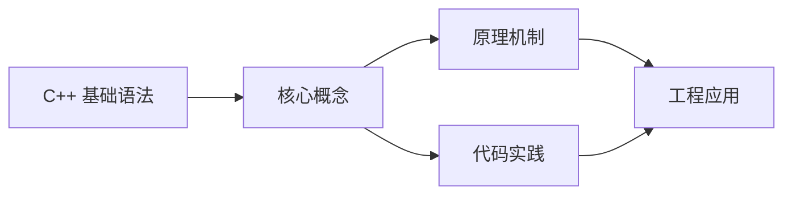
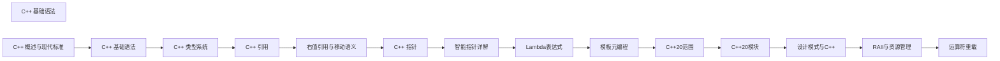

## 1. 学习目标（Bloom 分类）

本节按照布鲁姆教育目标分类学组织学习路径。本文主题为《C++ 基础语法》，属于 C++ 模块，读者可以根据自身阶段选择阅读深度。

记忆层面：能够准确复述本文的核心概念、术语与基本语法或操作步骤，并能够在提问或检索时快速定位对应知识点。能够说出 C++ 的类、继承、重载、模板与 STL 容器基本语法。

理解层面：能够用自己的语言解释核心原理与工作机制，说明概念之间的因果关系，而不是机械记忆结论。能够解释 RAII、拷贝/移动语义、虚函数与模板实例化。

应用层面：能够在真实项目或练习场景中运用本文知识解决具体问题，写出正确且可维护的实现。能够编写现代 C++（C++17/20）的类与泛型代码。

分析层面：能够拆解复杂问题，比较本文主题与相邻概念的异同，识别边界条件与例外情况。能够分析生命周期、未定义行为与性能特征。

评价层面：能够根据约束条件（性能、可读性、安全、成本）评价不同方案的优劣，做出有依据的技术决策。能够评价 C++ 与 Rust、Java 在系统编程中的取舍。

创造层面：能够把本文知识与其他模块知识组合，设计出新的解决方案或可复用的工程模式。能够设计高性能、可维护的 C++ 库与应用。

通过本节学习，读者应当能够把《C++ 基础语法》纳入自己的知识网络，并与 C++ 模块的其他主题（RAII、移动语义、模板、STL）建立关联。

## 2. 历史动机与发展脉络

《C++ 基础语法》是 C++ 领域的重要主题。要真正理解它，需要先了解它解决的问题与演进过程。

C++ 由 Bjarne Stroustrup 于 1979 年开始在贝尔实验室开发（原名 C with Classes），1983 年更名 C++，1998 年 C++98 首次标准化。
C++11 是语言转折点：右值引用、auto、lambda、智能指针、并发内存模型让现代 C++ 写法定型；C++14/17 补充泛型 lambda、if constexpr、折叠表达式；C++20 引入 concepts、协程、模块与范围库；C++23 继续完善。
现代 C++ 的核心口号是“资源安全”：RAII + 智能指针替代裸 new/delete，异常与错误码按场景选择；Rust 的出现促使 C++ 社区更重视内存安全工具（如 profile 指南、sanitizer）。

回到本文主题：C++ 基础语法 的提出与成熟，正是上述技术背景下的必然产物。早期实现往往以简单可用为目标，随着工程规模扩大，社区逐渐沉淀出标准做法与最佳实践；理解这一脉络，可以帮助读者判断“为什么文档中的推荐写法是现在这个样子”，也能在遇到历史遗留代码时准确识别其设计年代与取舍。


## 3. 形式化定义与核心概念精讲

本节把《C++ 基础语法》涉及的核心概念以“定义 + 讲解”的形式展开。读者应把定义当作工具，把讲解当作理解路径；两者结合才能形成可迁移的知识。

RAII：资源在构造函数获取、析构函数释放，栈对象离开作用域自动清理；智能指针（unique_ptr/shared_ptr/weak_ptr）把所有权编码进类型。
移动语义：右值引用 `&&` 与 std::move 转移资源所有权，避免深拷贝；移动后对象处于“合法但未指定”状态。
虚函数与多态：virtual 实现动态绑定，vtable 是运行时分派机制；final/override 关键字防止误用；基类析构函数应为 virtual。

### 3.1 原文章节逐一精讲

原文档把主题拆分为 17 个小节，下面按顺序给出每一节的导读讲解，随后保留原文细节供精读。

#### 原文精读（完整保留）

# 基础语法

> **符号约定**：`< >` 必填参数 | `[ ]` 可选参数

---

#### 1. 数据类型 (Data Types)

C++ 具有丰富的类型系统，分为基本类型和复合类型。

##### 1.1 基本数据类型

| 类型                 | 描述                   | 大小 (字节) | 示例                                             |
| :------------------- | :--------------------- | :---------- | :----------------------------------------------- |
| **整数类型**         |                        |             |                                                  |
| `char`               | 字符                   | 1           | `char c = 'A';`                                  |
| `unsigned char`      | 无符号字符             | 1           | `unsigned char uc = 255;`                        |
| `short`              | 短整数                 | 2           | `short s = 32767;`                               |
| `unsigned short`     | 无符号短整数           | 2           | `unsigned short us = 65535;`                     |
| `int`                | 整数                   | 4           | `int x = 10;`                                    |
| `unsigned int`       | 无符号整数             | 4           | `unsigned int ux = 4294967295;`                  |
| `long`               | 长整数                 | 4 或 8      | `long l = 1000000;`                              |
| `unsigned long`      | 无符号长整数           | 4 或 8      | `unsigned long ul = 1000000;`                    |
| `long long`          | 长长整数 (C++11)       | 8           | `long long ll = 10000000000;`                    |
| `unsigned long long` | 无符号长长整数 (C++11) | 8           | `unsigned long long ull = 18446744073709551615;` |
| **浮点类型**         |                        |             |                                                  |
| `float`              | 单精度浮点数           | 4           | `float f = 3.14f;`                               |
| `double`             | 双精度浮点数           | 8           | `double d = 3.1415926535;`                       |
| `long double`        | 长双精度浮点数         | 8 或 16     | `long double ld = 3.14159265358979323846;`       |
| **布尔类型**         |                        |             |                                                  |
| `bool`               | 布尔值                 | 1           | `bool is_valid = true;`                          |
| **空类型**           |                        |             |                                                  |
| `void`               | 无类型                 | -           | 用于函数返回或通用指针                           |

##### 1.2 复合数据类型

| 类型       | 描述               | 示例                                            |
| :--------- | :----------------- | :---------------------------------------------- |
| **数组**   | 相同类型元素的集合 | `int arr[5] = {1, 2, 3, 4, 5};`                 |
| **字符串** | 字符序列           | `std::string s = "Hello C++";`                  |
| **指针**   | 存储内存地址       | `int* p = &x;`                                  |
| **引用**   | 变量的别名         | `int& ref = x;`                                 |
| **结构体** | 不同类型成员的集合 | `struct Person { std::string name; int age; };` |
| **联合体** | 共用内存的不同类型 | `union Data { int i; float f; char c; };`       |
| **枚举**   | 命名常量集合       | `enum Color { RED, GREEN, BLUE };`              |
| **类**     | 面向对象的类型     | `class MyClass { /* ... */ };`                  |

##### 1.3 类型修饰符

| 修饰符      | 描述                 | 示例                                                                         |
| :---------- | :------------------- | :--------------------------------------------------------------------------- |
| `signed`    | 有符号类型 (默认)    | `signed int x = -10;`                                                        |
| `unsigned`  | 无符号类型           | `unsigned int y = 10;`                                                       |
| `short`     | 短类型               | `short s = 100;`                                                             |
| `long`      | 长类型               | `long l = 1000000;`                                                          |
| `const`     | 常量类型             | `const int MAX = 100;`                                                       |
| `volatile`  | 易变类型             | `volatile int flag = 0;`                                                     |
| `constexpr` | 编译期常量 (C++11)   | `constexpr int factorial(int n) { return n <= 1 ? 1 : n * factorial(n-1); }` |
| `auto`      | 自动类型推断 (C++11) | `auto i = 10;`                                                               |
| `decltype`  | 类型推导 (C++11)     | `decltype(i) j = 20;`                                                        |

##### 1.4 类型转换

###### 1.4.1 隐式类型转换

```cpp
 int i = 10;
 double d = i; // 隐式转换：int -> double
 char c = 'A';
 i = c; // 隐式转换：char -> int
```

###### 1.4.2 显式类型转换

```cpp
 // C 风格转换
 double d = 3.14;
 int i = (int)d; // 截断小数部分
 // C++ 风格转换
 // static_cast: 静态类型转换
 i = static_cast<int>(d);
 // dynamic_cast: 动态类型转换（用于多态）
 Base* base = new Derived();
 Derived* derived = dynamic_cast<Derived*>(base);
 // const_cast: 移除 const 修饰
 const int& const_ref = i;
 int& ref = const_cast<int&>(const_ref);
 // reinterpret_cast: 重新解释类型
 int* p = &i;
 long addr = reinterpret_cast<long>(p);
```

#### 2. 控制流 (Control Flow)

##### 2.1 条件判断

###### 2.1.1 if 语句

```cpp
 // 基本 if 语句
 int score = 85;
 if (score >= 90) {
  std::cout << "优秀" << std::endl;
 }
  std::cout << "良好" << std::endl;
 }
  std::cout << "及格" << std::endl;
 }
  std::cout << "不及格" << std::endl;
 }
 // 嵌套 if 语句
 int x = 10, y = 20;
 if (x > 0) {
  if (y > 0) {
  std::cout << "x 和 y 都是正数" << std::endl;
  } else {
  std::cout << "x 是正数，y 不是正数" << std::endl;
  }
 }
 // 使用逻辑运算符
 int a = 5, b = 10, c = 15;
 if (a > 0 && b > 0 && c > 0) {
  std::cout << "所有数都是正数" << std::endl;
 }
 if (a > 10 || b > 10 || c > 10) {
  std::cout << "至少有一个数大于 10" << std::endl;
 }
```

###### 2.1.2 switch 语句

```cpp
 // 基本 switch 语句
 int day = 3;
 switch (day) {
  case 1:
  std::cout << "星期一" << std::endl;
  break;
  case 2:
  std::cout << "星期二" << std::endl;
  break;
  case 3:
  std::cout << "星期三" << std::endl;
  break;
  case 4:
  std::cout << "星期四" << std::endl;
  break;
  case 5:
  std::cout << "星期五" << std::endl;
  break;
  case 6:
  case 7:
  std::cout << "周末" << std::endl;
  break;
  default:
  std::cout << "无效的日期" << std::endl;
  break;
 }
 // 使用枚举的 switch 语句
 enum Color { RED, GREEN, BLUE };
 Color color = GREEN;
 switch (color) {
  case RED:
  std::cout << "红色" << std::endl;
  break;
  case GREEN:
  std::cout << "绿色" << std::endl;
  break;
  case BLUE:
  std::cout << "蓝色" << std::endl;
  break;
  default:
  std::cout << "未知颜色" << std::endl;
  break;
 }
 // 使用枚举类的 switch 语句 (C++11)
 enum class Direction { UP, DOWN, LEFT, RIGHT };
 Direction dir = Direction::UP;
 switch (dir) {
  case Direction::UP:
  std::cout << "向上" << std::endl;
  break;
  case Direction::DOWN:
  std::cout << "向下" << std::endl;
  break;
  case Direction::LEFT:
  std::cout << "向左" << std::endl;
  break;
  case Direction::RIGHT:
  std::cout << "向右" << std::endl;
  break;
 }
```

##### 2.2 循环结构

###### 2.2.1 for 循环

```cpp
 // 传统 for 循环
 for (int i = 0; i < 10; ++i) {
  std::cout << i << " ";
 }
 std::cout << std::endl;
 // 循环变量作用域控制
 {
  for (int i = 0; i < 5; ++i) {
  std::cout << i << " ";
  }
  // i 在这里不可见
 }
 // 多变量 for 循环
 for (int i = 0, j = 10; i < 5 && j > 5; ++i, --j) {
  std::cout << "i: " << i << ", j: " << j << std::endl;
 }
 // 范围 for 循环 (C++11)
 std::vector<int> numbers = {1, 2, 3, 4, 5};
 for (int num : numbers) {
  std::cout << num << " ";
 }
 std::cout << std::endl;
 // 使用 auto 的范围 for 循环 (C++11)
 for (auto num : numbers) {
  std::cout << num << " ";
 }
 std::cout << std::endl;
 // 使用 const 引用的范围 for 循环（避免复制）
 for (const auto& num : numbers) {
  std::cout << num << " ";
 }
 std::cout << std::endl;
 // 使用引用的范围 for 循环（可以修改元素）
 for (auto& num : numbers) {
  num *= 2; // 每个元素都乘以 2
 }
 // 遍历数组
 int arr[] = {10, 20, 30, 40, 50};
 for (int x : arr) {
  std::cout << x << " ";
 }
 std::cout << std::endl;
```

###### 2.2.2 while 循环

```cpp
 // 基本 while 循环
 int i = 0;
 while (i < 10) {
  std::cout << i << " ";
  ++i;
 }
 std::cout << std::endl;
 // 无限循环（需要内部 break）
 i = 0;
 while (true) {
  std::cout << i << " ";
  ++i;
  if (i >= 10) {
  break;
  }
 }
 std::cout << std::endl;
 // 基于条件的 while 循环
 std::string input;
 while (true) {
  std::cout << "输入 'quit' 退出: ";
  std::cin >> input;
  if (input == "quit") {
  break;
  }
  std::cout << "你输入了: " << input << std::endl;
 }
```

###### 2.2.3 do-while 循环

```cpp
 // 基本 do-while 循环
 int i = 0;
 do {
  std::cout << i << " ";
  ++i;
 }
 std::cout << std::endl;
 // 至少执行一次的情况
 std::string password;
 do {
  std::cout << "请输入密码: ";
  std::cin >> password;
 }
 std::cout << "密码正确！" << std::endl;
```

##### 2.3 跳转语句

###### 2.3.1 break 语句

```cpp
 // 在 for 循环中使用 break
 for (int i = 0; i < 10; ++i) {
  if (i == 5) {
  break; // 跳出循环
  }
  std::cout << i << " ";
 }
 // 输出: 0 1 2 3 4
 // 在 while 循环中使用 break
 int j = 0;
 while (j < 10) {
  if (j == 5) {
  break;
  }
  std::cout << j << " ";
  ++j;
 }
 // 在 switch 语句中使用 break
 int value = 2;
 switch (value) {
  case 1:
  std::cout << "值为 1" << std::endl;
  break;
  case 2:
  std::cout << "值为 2" << std::endl;
  break; // 没有这个 break 会继续执行下一个 case
  case 3:
  std::cout << "值为 3" << std::endl;
  break;
 }
```

###### 2.3.2 continue 语句

```cpp
 // 在 for 循环中使用 continue
 for (int i = 0; i < 10; ++i) {
  if (i % 2 == 0) {
  continue; // 跳过当前迭代
  }
  std::cout << i << " ";
 }
 // 输出: 1 3 5 7 9
 // 在 while 循环中使用 continue
 int j = 0;
 while (j < 10) {
  ++j;
  if (j % 2 == 0) {
  continue;
  }
  std::cout << j << " ";
 }
 // 在范围 for 循环中使用 continue
 std::vector<int> nums = {1, 2, 3, 4, 5, 6, 7, 8, 9, 10};
 for (auto num : nums) {
  if (num % 3 == 0) {
  continue;
  }
  std::cout << num << " ";
 }
```

###### 2.3.3 return 语句

```cpp
 // 基本 return 语句
 int add(int a, int b) {
  return a + b; // 返回值并结束函数
 }
 // 提前返回
 bool is_even(int n) {
  if (n % 2 == 0) {
  return true; // 提前返回
  }
  return false;
 }
 // 返回引用
 int& get_largest(int& a, int& b) {
  if (a > b) {
  return a;
  }
  return b;
 }
 // 返回空
 void print_hello() {
  std::cout << "Hello!" << std::endl;
  return; // 可选
 }
 int main() {
  int result = add(5, 3);
  std::cout << "5 + 3 = " << result << std::endl;
  int x = 10, y = 20;
  int& largest = get_largest(x, y);
  largest = 100; // 修改返回的引用
  std::cout << "x: " << x << ", y: " << y << std::endl;
  return 0; // 结束主函数
 }
```

###### 2.3.4 goto 语句（不推荐使用）

```cpp
 // 基本 goto 语句
 int main() {
  int i = 0;
 loop:
  std::cout << i << " ";
  ++i;
  if (i < 10) {
  goto loop; // 跳转到标签处
  }
  return 0;
 }
 // 使用 goto 跳出多层循环
 void nested_loops() {
  for (int i = 0; i < 10; ++i) {
  for (int j = 0; j < 10; ++j) {
  if (i * j > 20) {
  goto exit_loops; // 跳出所有循环
  }
  std::cout << "i: " << i << ", j: " << j << std::endl;
  }
  }
 exit_loops:
  std::cout << "跳出循环" << std::endl;
 }
 // 使用 goto 进行错误处理
 bool process_data() {
  // 模拟错误
  bool error = true;
  if (error) {
  goto error_handler;
  }
  // 正常处理
  return true;
 error_handler:
  std::cout << "处理错误" << std::endl;
  return false;
 }
```

#### 3. 输入输出 (I/O)

##### 3.1 标准输入输出

###### 3.1.1 输出

```cpp
 #include <iostream>
 int main() {
  // 基本输出
  std::cout << "Hello, C++!" << std::endl;
  // 多个值输出
  int x = 10;
  double y = 3.14;
  std::cout << "x = " << x << ", y = " << y << std::endl;
  // 使用 endl 换行并刷新缓冲区
  std::cout << "Line 1" << std::endl;
  std::cout << "Line 2" << std::endl;
  // 使用 \n 仅换行
  std::cout << "Line 1\nLine 2" << std::endl;
  // 输出布尔值
  bool flag = true;
  std::cout << "Flag: " << flag << std::endl; // 输出 1
  std::cout << std::boolalpha << "Flag: " << flag << std::endl; // 输出
  // 输出字符和字符串
  char c = 'A';
  std::string s = "Hello";
  std::cout << "Character: " << c << std::endl;
  std::cout << "String: " << s << std::endl;
  return 0;
 }
```

###### 3.1.2 输入

```cpp
 #include <iostream>
 #include <string>
 int main() {
  // 输入整数
  int x;
  std::cout << "Enter an integer: ";
  std::cin >> x;
  std::cout << "You entered: " << x << std::endl;
  // 输入浮点数
  double y;
  std::cout << "Enter a double: ";
  std::cin >> y;
  std::cout << "You entered: " << y << std::endl;
  // 输入布尔值
  bool flag;
  std::cout << "Enter a boolean (0 or 1): ";
  std::cin >> flag;
  std::cout << "You entered: " << std::boolalpha << flag << std::endl;
  // 输入字符
  char c;
  std::cout << "Enter a character: ";
  std::cin >> c;
  std::cout << "You entered: " << c << std::endl;
  // 输入字符串（遇到空格停止）
  std::string name;
  std::cout << "Enter your name: ";
  std::cin >> name;
  std::cout << "Hello, " << name << "!" << std::endl;
  // 输入一行字符串
  std::string line;
  std::cout << "Enter a line: ";
  std::cin.ignore(); // 忽略之前的换行符
  std::getline(std::cin, line);
  std::cout << "You entered: " << line << std::endl;
  // 输入多个值
  int a, b;
  std::cout << "Enter two integers: ";
  std::cin >> a >> b;
  std::cout << "You entered: " << a << " and " << b << std::endl;
  return 0;
 }
```

###### 3.1.3 输入验证

```cpp
 #include <iostream>
 #include <limits>
 int main() {
  int age;
  // 验证输入是否为整数
  while (true) {
  std::cout << "Enter your age: ";
  if (std::cin >> age) {
  // 输入成功
  break;
  } else {
  // 输入失败，清除错误状态
  std::cin.clear();
  // 忽略无效输入
  std::cin.ignore(std::numeric_limits<std::streamsize>::max(), '\n');
  std::cout << "Invalid input. Please enter a number." << std::endl;
  }
  }
  std::cout << "Your age is: " << age << std::endl;
  return 0;
 }
```

##### 3.2 格式化输出

```cpp
 #include <iostream>
 #include <iomanip>
 int main() {
  // 设置输出宽度
  std::cout << std::setw(10) << "Name" << std::setw(10) << "Age" << std::endl;
  std::cout << std::setw(10) << "Alice" << std::setw(10) << 25 << std::endl;
  std::cout << std::setw(10) << "Bob" << std::setw(10) << 30 << std::endl;
  // 设置填充字符
  std::cout << std::setw(10) << std::setfill('*') << "Hello" << std::endl;
  // 设置精度
  double pi = 3.1415926535;
  std::cout << "Pi: " << std::setprecision(5) << pi << std::endl;
  // 固定精度
  std::cout << "Pi (fixed): " << std::fixed << std::setprecision(2) << pi << std::endl;
  // 科学计数法
  double large_num = 123456789.123456;
  std::cout << "Large number: " << std::scientific << large_num << std::endl;
  // 十六进制输出
  int x = 255;
  std::cout << "Hex: " << std::hex << x << std::endl;
  std::cout << "Hex (uppercase): " << std::hex << std::uppercase << x << std::endl;
  // 八进制输出
  std::cout << "Octal: " << std::oct << x << std::endl;
  // 重置为十进制
  std::cout << "Decimal: " << std::dec << x << std::endl;
  // 显示正负号
  int positive = 10;
  int negative = -10;
  std::cout << "Positive: " << std::showpos << positive << std::endl;
  std::cout << "Negative: " << negative << std::endl;
  std::cout << std::noshowpos; // 关闭显示正负号
  // 显示前导零
  int num = 42;
  std::cout << "With leading zeros: " << std::setw(5) << std::setfill('0') << num << std::endl;
  return 0;
 }
```

##### 3.3 文件输入输出

```cpp
 #include <iostream>
 #include <fstream>
 #include <string>
 int main() {
  // 写入文件
  std::ofstream outfile("example.txt");
  if (outfile.is_open()) {
  outfile << "Hello, File!" << std::endl;
  outfile << "This is a test." << std::endl;
  outfile << "Number: " << 42 << std::endl;
  outfile.close();
  std::cout << "File written successfully." << std::endl;
  } else {
  std::cerr << "Unable to open file for writing." << std::endl;
  }
  // 读取文件
  std::ifstream infile("example.txt");
  if (infile.is_open()) {
  std::string line;
  std::cout << "File contents:" << std::endl;
  while (std::getline(infile, line)) {
  std::cout << line << std::endl;
  }
  infile.close();
  } else {
  std::cerr << "Unable to open file for reading." << std::endl;
  }
  return 0;
 }
```

##### 3.4 字符串流

```cpp
 #include <iostream>
 #include <sstream>
 #include <string>
 int main() {
  // 输出字符串流
  std::stringstream ss;
  ss << "Name: " << "Alice" << ", Age: " << 25 << ", Score: " << 95.5;
  std::string result = ss.str();
  std::cout << "String stream result: " << result << std::endl;
  // 输入字符串流
  std::string data = "10 3.14 Hello";
  std::stringstream input_ss(data);
  int i;
  double d;
  std::string s;
  input_ss >> i >> d >> s;
  std::cout << "Parsed values: " << i << ", " << d << ", " << s << std::endl;
  // 格式化数字为字符串
  std::stringstream format_ss;
  format_ss << std::fixed << std::setprecision(2) << 3.14159;
  std::string pi_str = format_ss.str();
  std::cout << "Formatted pi: " << pi_str << std::endl;
  return 0;
 }
```

#### 4. 命名空间 (Namespace)

##### 4.1 命名空间的定义

```cpp
 // 定义命名空间
 namespace MyNamespace {
  int add(int a, int b) {
  return a + b;
  }
  namespace Nested {
  int multiply(int a, int b) {
  return a * b;
  }
  }
 }
 int main() {
  // 使用命名空间
  int result1 = MyNamespace::add(5, 3);
  int result2 = MyNamespace::Nested::multiply(5, 3);
  std::cout << "5 + 3 = " << result1 << std::endl;
  std::cout << "5 * 3 = " << result2 << std::endl;
  return 0;
 }
```

##### 4.2 using 声明

```cpp
 #include <iostream>
 // 使用命名空间中的特定成员
 using std::cout;
 using std::endl;
 int main() {
  cout << "Hello, C++!" << endl;
  return 0;
 }
```

##### 4.3 using 指令

```cpp
 #include <iostream>
 // 使用整个命名空间
 using namespace std;
 int main() {
  cout << "Hello, C++!" << endl;
  return 0;
 }
```

##### 4.4 命名空间别名

```cpp
 #include <iostream>
 namespace long_namespace_name {
  void func() {
  std::cout << "Function in long namespace" << std::endl;
  }
 }
 // 命名空间别名
 namespace lnn = long_namespace_name;
 int main() {
  lnn::func();
  return 0;
 }
```

#### 5. 作用域 (Scope)

##### 5.1 块作用域

```cpp
 int main() {
  // 全局作用域
  int global_var = 10;
  if (true) {
  // 块作用域
  int local_var = 20;
  std::cout << "local_var: " << local_var << std::endl;
  std::cout << "global_var: " << global_var << std::endl;
  }
  // 这里无法访问 local_var
  std::cout << "global_var: " << global_var << std::endl;
  return 0;
 }
```

##### 5.2 函数作用域

```cpp
 void func() {
  // 函数作用域
  int func_var = 100;
  std::cout << "func_var: " << func_var << std::endl;
 }
 int main() {
  // 这里无法访问 func_var
  func();
  return 0;
 }
```

##### 5.3 类作用域

```cpp
 class MyClass {
 public:
  int public_var; // 类作用域
 private:
  int private_var; // 类作用域
 }
 int main() {
  MyClass obj;
  obj.public_var = 10; // 可以访问
  // obj.private_var = 20; // 无法访问，private 成员
  return 0;
 }
```

##### 5.4 命名空间作用域

```cpp
 namespace MyNS {
  int ns_var = 1000; // 命名空间作用域
 }
 int main() {
  std::cout << MyNS::ns_var << std::endl;
  return 0;
 }
```

---

#### 头文件包含

**系统头文件写法：包含系统头文件**
`#include <<header>>`
```cpp
// 包含输入输出流头文件
#include <iostream>
```

---

**用户头文件写法：包含自定义头文件**
`#include "<header>"`
```cpp
// 包含当前目录下的头文件
#include "myheader.h"
```

---

#### 命名空间

**基本写法：使用命名空间**
`using namespace <name>;`
```cpp
// 使用标准命名空间
using namespace std;
```

---

**作用域写法：使用命名空间中的特定成员**
`using <namespace>::<member>;`
```cpp
// 使用 std::cout
using std::cout;
```

---

**限定写法：使用完整限定名**
`<namespace>::<member>`
```cpp
// 使用完整限定名
std::cout << "Hello" << std::endl;
```

---

**定义写法：自定义命名空间**
`namespace <name> { ... }`
```cpp
// 定义命名空间
namespace MyMath {
    int add(int a, int b) { return a + b; }
}
```

---

#### 输入输出

**输出写法：标准输出**
`std::cout << <value>;`
```cpp
// 输出字符串到标准输出
std::cout << "Hello C++";
```

---

**换行写法：输出并换行**
`std::cout << <value> << std::endl;`
```cpp
// 输出并换行
std::cout << "Hello" << std::endl;
```

---

**输入写法：标准输入**
`std::cin >> <variable>;`
```cpp
// 从标准输入读取
int age;
std::cin >> age;
```

---

**多值输入写法：连续读取多个值**
`std::cin >> <var1> >> <var2>;`
```cpp
// 连续读取多个值
int a, b;
std::cin >> a >> b;
```

---

#### main 函数

**无参写法：无参数主函数**
`int main() { ... return 0; }`
```cpp
// 无参数形式的 main 函数
int main() {
    std::cout << "Hello" << std::endl;
    return 0;
}
```

---

**带参写法：命令行参数主函数**
`int main(int argc, char *argv[]) { ... }`
```cpp
// argc 为参数个数，argv 为参数字符串数组
int main(int argc, char *argv[]) {
    for (int i = 0; i < argc; i++) {
        std::cout << argv[i] << std::endl;
    }
    return 0;
}
```

---

#### 变量声明与初始化

**基本写法：变量声明与初始化**
`<type> <var_name> = <value>;`
```cpp
// 声明并初始化变量
int x = 10;
```

---

**直接初始化写法：构造函数式初始化**
`<type> <var_name>(<value>);`
```cpp
// 直接初始化
int x(10);
```

---

**列表初始化写法：C++11 列表初始化**
`<type> <var_name>{<value>};`
```cpp
// 列表初始化
int x{10};
```

---

**auto 写法：自动类型推导**
`auto <var_name> = <value>;`
```cpp
// 编译器自动推导类型
auto x = 10;
```

---

**decltype 写法：推导表达式类型**
`decltype(<expression>) <var_name>;`
```cpp
// 推导表达式的类型
int a = 10;
decltype(a) b = 20;
```

---

**const 写法：常量声明**
`const <type> <var_name> = <value>;`
```cpp
// 声明常量
const int MAX_SIZE = 100;
```

---

**constexpr 写法：编译期常量**
`constexpr <type> <var_name> = <value>;`
```cpp
// 编译期常量
constexpr int SIZE = 10;
```

---

#### 注释

**单行写法：单行注释**
`// <注释内容>`
```cpp
// 这是一个单行注释
int x = 10;
```

---

**多行写法：多行注释**
`/* <注释内容> */`
```cpp
/*
 * 这是一个多行注释
 * 可以跨越多行
 */
int y = 20;
```

---

#### 引用

**基本写法：左值引用**
`<type>& <ref_name> = <var>;`
```cpp
// 引用是变量的别名
int x = 10;
int& ref = x;
```

---

**常量引用写法：const 引用**
`const <type>& <ref_name> = <value>;`
```cpp
// 常量引用，不能通过引用修改值
const int& ref = 10;
```

---

**右值引用写法：C++11 右值引用**
`<type>&& <ref_name> = <value>;`
```cpp
// 右值引用，绑定到临时值
int&& rref = 10;
```

---

#### 指针

**基本写法：指针声明与初始化**
`<type>* <ptr_name> = &<var>;`
```cpp
// ptr 指向 x 的地址
int x = 10;
int* ptr = &x;
```

---

**空指针写法：C++11 nullptr**
`<type>* <ptr_name> = nullptr;`
```cpp
// 初始化为空指针
int* ptr = nullptr;
```

---

**智能指针写法：unique_ptr**
`std::unique_ptr<<type>> <ptr> = std::make_unique<<type>>(<args>);`
```cpp
#include <memory>
// 独占所有权的智能指针
std::unique_ptr<int> p = std::make_unique<int>(10);
```

---

**智能指针写法：shared_ptr**
`std::shared_ptr<<type>> <ptr> = std::make_shared<<type>>(<args>);`
```cpp
#include <memory>
// 共享所有权的智能指针
std::shared_ptr<int> p = std::make_shared<int>(10);
```

---

#### 类型转换

**static_cast 写法：静态类型转换**
`static_cast<<target_type>>(<expression>)`
```cpp
// 静态类型转换
double pi = 3.14;
int rounded = static_cast<int>(pi);
```

---

**dynamic_cast 写法：动态类型转换**
`dynamic_cast<<target_type>>(<expression>)`
```cpp
// 动态类型转换（用于多态类型）
Base* base = new Derived();
Derived* derived = dynamic_cast<Derived*>(base);
```

---

**const_cast 写法：常量转换**
`const_cast<<target_type>>(<expression>)`
```cpp
// 添加或移除 const
const int* cp = &x;
int* p = const_cast<int*>(cp);
```

---

**reinterpret_cast 写法：重解释转换**
`reinterpret_cast<<target_type>>(<expression>)`
```cpp
// 重解释类型转换
long addr = reinterpret_cast<long>(ptr);
```

---

#### 异常处理

**基本写法：try-catch**
`try { ... } catch (<type> <e>) { ... }`
```cpp
// 异常处理
try {
    throw std::runtime_error("Error");
} catch (const std::exception& e) {
    std::cerr << e.what() << std::endl;
}
```

---

**抛出写法：抛出异常**
`throw <expression>;`
```cpp
// 抛出异常
throw std::runtime_error("Something went wrong");
```

---

**多 catch 写法：捕获多种异常**
`try { ... } catch (<type1> <e>) { ... } catch (<type2> <e>) { ... }`
```cpp
// 捕获多种异常
try {
    // 可能抛出不同异常的代码
} catch (const std::runtime_error& e) {
    std::cerr << e.what() << std::endl;
} catch (const std::logic_error& e) {
    std::cerr << e.what() << std::endl;
}
```

---

#### 编译命令

**单文件写法：编译单个源文件**
`g++ <source.cpp> -o <output>`
```bash
# 编译 hello.cpp 生成可执行文件 hello
g++ hello.cpp -o hello
```

---

**标准写法：指定 C++ 标准**
`g++ -std=c++17 <source.cpp> -o <output>`
```bash
# 使用 C++17 标准编译
g++ -std=c++17 hello.cpp -o hello
```

---

#### C++23/26 新特性

**基本写法：C++23 std::print**
`std::print("<格式>", <参数>);`
```cpp
// 格式化输出到 stdout，支持 {} 占位符
#include <print>
std::print("Hello, {}! Value = {}\n", "World", 42);
// 输出：Hello, World! Value = 42
```

**基本写法：C++23 std::println**
`std::println("<格式>", <参数>);`
```cpp
// 自动换行的格式化输出
#include <print>
std::println("Sum of {} and {} is {}", 3, 5, 8);
// 输出：Sum of 3 and 5 is 8（自动换行）
```

**基本写法：C++23 if consteval**
`if consteval { }`
```cpp
// 编译期分支判断：仅在常量求值上下文中执行
constexpr int compute(int x) {
    if consteval {
        return x * 2;  // 编译期执行
    } else {
        return x + 1;  // 运行期执行
    }
}
```

**基本写法：C++23 多维下标运算符**
`operator[](size_t x, size_t y)`
```cpp
// 支持多维下标访问，简化矩阵类设计
class Matrix {
    int data[3][3];
public:
    // 多参数 operator[]
    int& operator[](size_t i, size_t j) {
        return data[i][j];
    }
};
Matrix m;
m[1, 2] = 42;  // 直接多维访问
```

**基本写法：C++23 static call operator**
`static operator()(<参数>) { }`
```cpp
// 静态调用运算符：无需实例即可调用
class Calculator {
public:
    static int operator()(int a, int b) {
        return a + b;
    }
};
// 直接通过类型名调用
int result = Calculator()(3, 4);  // 返回 7
```

**基本写法：C++26 = delete 原因**
`= delete("reason");`
```cpp
// = delete 支持说明删除原因
class NonCopyable {
public:
    NonCopyable() = default;
    // 禁用拷贝构造并说明原因
    NonCopyable(const NonCopyable&) = delete("该类不允许拷贝构造");
    NonCopyable& operator=(const NonCopyable&) = delete("该类不允许拷贝赋值");
};
```

**基本写法：C++26 pack indexing**
`typename...<T>[N]`
```cpp
// 模板参数包索引：直接访问参数包中第 N 个类型
template <typename... Ts>
using First = Ts...[0];  // 取参数包第一个类型
template <typename... Ts>
using Last = Ts...[sizeof...(Ts) - 1];  // 取参数包最后一个类型
// 使用
First<int, double, char> a = 10;   // a 为 int
Last<int, double, char> b = 3.14;  // b 为 double
```

**基本写法：C++26 hazard pointer**
`std::hazard_pointer<<T>>`
```cpp
// 危险指针：用于无锁数据结构的安全内存回收
#include <hazard_pointer>
// 获取危险指针
std::hazard_pointer hp = std::make_hazard_pointer();
// 保护对象指针，防止被回收
hp.protect(ptr);
// 操作受保护对象
if (hp.get() != nullptr) {
    hp.get()->do_something();
}
// 离开作用域自动释放保护
```

**基本写法：C++26 RCU(Read-Copy-Update)**
`std::rcu<<T>>`
```cpp
// RCU：读多写少场景的无锁同步原语
#include <rcu>
// 读端：在 RCU 域中安全访问共享数据
std::rcu_reader reader;
auto* p = shared_ptr.load();
if (p) p->read_data();
// 写端：复制更新后原子替换，并延迟回收旧数据
auto* new_data = new Data(*p);
new_data->update();
shared_ptr.store(new_data);
std::rcu_retire(p);  // 等待所有读者退出后回收
```


### 3.2 概念关系图

下面用 Mermaid 图表达本文核心概念之间的关系，帮助读者建立整体图景：



图中展示的是本文知识的结构化关系：核心概念是入口，原理机制解释“为什么”，代码实践演示“怎么做”，工程应用回答“何时用”。读者学习时可以把每个小节的内容挂接到对应节点上。

## 4. 理论推导与原理解析

本节深入《C++ 基础语法》背后的原理。理论部分不求面面俱到，而是聚焦“能解释现象、能指导实践”的关键推导。

RAII：资源在构造函数获取、析构函数释放，栈对象离开作用域自动清理；智能指针（unique_ptr/shared_ptr/weak_ptr）把所有权编码进类型。
移动语义：右值引用 `&&` 与 std::move 转移资源所有权，避免深拷贝；移动后对象处于“合法但未指定”状态。
虚函数与多态：virtual 实现动态绑定，vtable 是运行时分派机制；final/override 关键字防止误用；基类析构函数应为 virtual。
模板与泛型：模板编译期实例化，实现静态多态；concepts（C++20）约束类型接口；模板元编程在编译期计算类型与常量。

需要强调的是，理论推导与工程实践之间存在翻译层：理论给出的是理想化模型与边界条件，工程代码则必须处理真实环境中的例外。读者在学习时应先掌握理论的“标准情形”，再通过陷阱章节了解“非标准情形”。

## 5. 代码示例与逐行讲解

本节把原文中的代码示例系统整理，并为每个示例补充用途说明与讲解。读者不应只浏览代码，而应逐段对照讲解理解设计意图。

### 5.1 示例：1.4.1 隐式类型转换

该示例来自原文《1.4.1 隐式类型转换》小节，用于演示C++ 基础语法相关操作。阅读时请先看代码结构，再看其后的讲解。

```cpp
 int i = 10;
 double d = i; // 隐式转换：int -> double
 char c = 'A';
 i = c; // 隐式转换：char -> int
```

讲解：这段代码演示了本节核心知识点。代码中的关键操作可以归纳为三步：准备（定义或初始化）、执行（核心逻辑）、收尾（释放资源或返回结果）。实际项目中，这三步往往被封装为函数或类，以提升复用性与可测试性。

关键点分析：

该示例共 4 行有效代码，结构以数据或配置为主。阅读时应关注：数据字段的含义、配置项的作用，以及它们与运行行为的对应关系。

进阶思考路径：先尝试修改参数观察行为变化，再把示例中的模式迁移到自己的项目中；每次修改都记录预期与实测差异，这是把示例转化为能力的最快方式。

### 5.2 示例：1.4.2 显式类型转换

该示例来自原文《1.4.2 显式类型转换》小节，用于演示C++ 基础语法相关操作。阅读时请先看代码结构，再看其后的讲解。

```cpp
 // C 风格转换
 double d = 3.14;
 int i = (int)d; // 截断小数部分
 // C++ 风格转换
 // static_cast: 静态类型转换
 i = static_cast<int>(d);
 // dynamic_cast: 动态类型转换（用于多态）
 Base* base = new Derived();
 Derived* derived = dynamic_cast<Derived*>(base);
 // const_cast: 移除 const 修饰
 const int& const_ref = i;
 int& ref = const_cast<int&>(const_ref);
 // reinterpret_cast: 重新解释类型
 int* p = &i;
 long addr = reinterpret_cast<long>(p);
```

讲解：这段代码演示了本节核心知识点。代码中的关键操作可以归纳为三步：准备（定义或初始化）、执行（核心逻辑）、收尾（释放资源或返回结果）。实际项目中，这三步往往被封装为函数或类，以提升复用性与可测试性。

关键点分析：

该示例共 15 行有效代码，结构以数据或配置为主。阅读时应关注：数据字段的含义、配置项的作用，以及它们与运行行为的对应关系。

进阶思考路径：先尝试修改参数观察行为变化，再把示例中的模式迁移到自己的项目中；每次修改都记录预期与实测差异，这是把示例转化为能力的最快方式。

### 5.3 示例：2.1.1 if 语句

该示例来自原文《2.1.1 if 语句》小节，用于演示C++ 基础语法相关操作。阅读时请先看代码结构，再看其后的讲解。

```cpp
 // 基本 if 语句
 int score = 85;
 if (score >= 90) {
  std::cout << "优秀" << std::endl;
 }
  std::cout << "良好" << std::endl;
 }
  std::cout << "及格" << std::endl;
 }
  std::cout << "不及格" << std::endl;
 }
 // 嵌套 if 语句
 int x = 10, y = 20;
 if (x > 0) {
  if (y > 0) {
  std::cout << "x 和 y 都是正数" << std::endl;
  } else {
  std::cout << "x 是正数，y 不是正数" << std::endl;
  }
 }
 // 使用逻辑运算符
 int a = 5, b = 10, c = 15;
 if (a > 0 && b > 0 && c > 0) {
  std::cout << "所有数都是正数" << std::endl;
 }
 if (a > 10 || b > 10 || c > 10) {
  std::cout << "至少有一个数大于 10" << std::endl;
 }
```

讲解：这段代码演示了本节核心知识点。代码中的关键操作可以归纳为三步：准备（定义或初始化）、执行（核心逻辑）、收尾（释放资源或返回结果）。实际项目中，这三步往往被封装为函数或类，以提升复用性与可测试性。

关键点分析：

该示例共 28 行有效代码，包含 1 类关键结构（if）。其中：

- 入口与初始化部分负责建立上下文，对应实际项目中的启动或装配逻辑；
- 核心逻辑部分体现本文主题的主要操作，是阅读时最需要对照讲解理解的部分；
- 输出或返回部分把结果交给调用方，注意其类型与边界条件。

进阶思考路径：先尝试修改参数观察行为变化，再把示例中的模式迁移到自己的项目中；每次修改都记录预期与实测差异，这是把示例转化为能力的最快方式。

### 5.4 示例：2.1.2 switch 语句

该示例来自原文《2.1.2 switch 语句》小节，用于演示C++ 基础语法相关操作。阅读时请先看代码结构，再看其后的讲解。

```cpp
 // 基本 switch 语句
 int day = 3;
 switch (day) {
  case 1:
  std::cout << "星期一" << std::endl;
  break;
  case 2:
  std::cout << "星期二" << std::endl;
  break;
  case 3:
  std::cout << "星期三" << std::endl;
  break;
  case 4:
  std::cout << "星期四" << std::endl;
  break;
  case 5:
  std::cout << "星期五" << std::endl;
  break;
  case 6:
  case 7:
  std::cout << "周末" << std::endl;
  break;
  default:
  std::cout << "无效的日期" << std::endl;
  break;
 }
 // 使用枚举的 switch 语句
 enum Color { RED, GREEN, BLUE };
 Color color = GREEN;
 switch (color) {
  case RED:
  std::cout << "红色" << std::endl;
  break;
  case GREEN:
  std::cout << "绿色" << std::endl;
  break;
  case BLUE:
  std::cout << "蓝色" << std::endl;
  break;
  default:
  std::cout << "未知颜色" << std::endl;
  break;
 }
 // 使用枚举类的 switch 语句 (C++11)
 enum class Direction { UP, DOWN, LEFT, RIGHT };
 Direction dir = Direction::UP;
 switch (dir) {
  case Direction::UP:
  std::cout << "向上" << std::endl;
  break;
  case Direction::DOWN:
  std::cout << "向下" << std::endl;
  break;
  case Direction::LEFT:
  std::cout << "向左" << std::endl;
  break;
  case Direction::RIGHT:
  std::cout << "向右" << std::endl;
  break;
 }
```

讲解：这段代码演示了本节核心知识点。代码中的关键操作可以归纳为三步：准备（定义或初始化）、执行（核心逻辑）、收尾（释放资源或返回结果）。实际项目中，这三步往往被封装为函数或类，以提升复用性与可测试性。

关键点分析：

该示例共 60 行有效代码，包含 1 类关键结构（class）。其中：

- 入口与初始化部分负责建立上下文，对应实际项目中的启动或装配逻辑；
- 核心逻辑部分体现本文主题的主要操作，是阅读时最需要对照讲解理解的部分；
- 输出或返回部分把结果交给调用方，注意其类型与边界条件。

进阶思考路径：先尝试修改参数观察行为变化，再把示例中的模式迁移到自己的项目中；每次修改都记录预期与实测差异，这是把示例转化为能力的最快方式。

### 5.5 示例：2.2.1 for 循环

该示例来自原文《2.2.1 for 循环》小节，用于演示C++ 基础语法相关操作。阅读时请先看代码结构，再看其后的讲解。

```cpp
 // 传统 for 循环
 for (int i = 0; i < 10; ++i) {
  std::cout << i << " ";
 }
 std::cout << std::endl;
 // 循环变量作用域控制
 {
  for (int i = 0; i < 5; ++i) {
  std::cout << i << " ";
  }
  // i 在这里不可见
 }
 // 多变量 for 循环
 for (int i = 0, j = 10; i < 5 && j > 5; ++i, --j) {
  std::cout << "i: " << i << ", j: " << j << std::endl;
 }
 // 范围 for 循环 (C++11)
 std::vector<int> numbers = {1, 2, 3, 4, 5};
 for (int num : numbers) {
  std::cout << num << " ";
 }
 std::cout << std::endl;
 // 使用 auto 的范围 for 循环 (C++11)
 for (auto num : numbers) {
  std::cout << num << " ";
 }
 std::cout << std::endl;
 // 使用 const 引用的范围 for 循环（避免复制）
 for (const auto& num : numbers) {
  std::cout << num << " ";
 }
 std::cout << std::endl;
 // 使用引用的范围 for 循环（可以修改元素）
 for (auto& num : numbers) {
  num *= 2; // 每个元素都乘以 2
 }
 // 遍历数组
 int arr[] = {10, 20, 30, 40, 50};
 for (int x : arr) {
  std::cout << x << " ";
 }
 std::cout << std::endl;
```

讲解：这段代码演示了本节核心知识点。代码中的关键操作可以归纳为三步：准备（定义或初始化）、执行（核心逻辑）、收尾（释放资源或返回结果）。实际项目中，这三步往往被封装为函数或类，以提升复用性与可测试性。

关键点分析：

该示例共 42 行有效代码，包含 1 类关键结构（for）。其中：

- 入口与初始化部分负责建立上下文，对应实际项目中的启动或装配逻辑；
- 核心逻辑部分体现本文主题的主要操作，是阅读时最需要对照讲解理解的部分；
- 输出或返回部分把结果交给调用方，注意其类型与边界条件。

进阶思考路径：先尝试修改参数观察行为变化，再把示例中的模式迁移到自己的项目中；每次修改都记录预期与实测差异，这是把示例转化为能力的最快方式。

### 5.6 示例：2.2.2 while 循环

该示例来自原文《2.2.2 while 循环》小节，用于演示C++ 基础语法相关操作。阅读时请先看代码结构，再看其后的讲解。

```cpp
 // 基本 while 循环
 int i = 0;
 while (i < 10) {
  std::cout << i << " ";
  ++i;
 }
 std::cout << std::endl;
 // 无限循环（需要内部 break）
 i = 0;
 while (true) {
  std::cout << i << " ";
  ++i;
  if (i >= 10) {
  break;
  }
 }
 std::cout << std::endl;
 // 基于条件的 while 循环
 std::string input;
 while (true) {
  std::cout << "输入 'quit' 退出: ";
  std::cin >> input;
  if (input == "quit") {
  break;
  }
  std::cout << "你输入了: " << input << std::endl;
 }
```

讲解：这段代码演示了本节核心知识点。代码中的关键操作可以归纳为三步：准备（定义或初始化）、执行（核心逻辑）、收尾（释放资源或返回结果）。实际项目中，这三步往往被封装为函数或类，以提升复用性与可测试性。

关键点分析：

该示例共 27 行有效代码，包含 2 类关键结构（if、while）。其中：

- 入口与初始化部分负责建立上下文，对应实际项目中的启动或装配逻辑；
- 核心逻辑部分体现本文主题的主要操作，是阅读时最需要对照讲解理解的部分；
- 输出或返回部分把结果交给调用方，注意其类型与边界条件。

进阶思考路径：先尝试修改参数观察行为变化，再把示例中的模式迁移到自己的项目中；每次修改都记录预期与实测差异，这是把示例转化为能力的最快方式。

### 5.7 示例：2.2.3 do-while 循环

该示例来自原文《2.2.3 do-while 循环》小节，用于演示C++ 基础语法相关操作。阅读时请先看代码结构，再看其后的讲解。

```cpp
 // 基本 do-while 循环
 int i = 0;
 do {
  std::cout << i << " ";
  ++i;
 }
 std::cout << std::endl;
 // 至少执行一次的情况
 std::string password;
 do {
  std::cout << "请输入密码: ";
  std::cin >> password;
 }
 std::cout << "密码正确！" << std::endl;
```

讲解：这段代码演示了本节核心知识点。代码中的关键操作可以归纳为三步：准备（定义或初始化）、执行（核心逻辑）、收尾（释放资源或返回结果）。实际项目中，这三步往往被封装为函数或类，以提升复用性与可测试性。

关键点分析：

该示例共 14 行有效代码，包含 1 类关键结构（while）。其中：

- 入口与初始化部分负责建立上下文，对应实际项目中的启动或装配逻辑；
- 核心逻辑部分体现本文主题的主要操作，是阅读时最需要对照讲解理解的部分；
- 输出或返回部分把结果交给调用方，注意其类型与边界条件。

进阶思考路径：先尝试修改参数观察行为变化，再把示例中的模式迁移到自己的项目中；每次修改都记录预期与实测差异，这是把示例转化为能力的最快方式。

### 5.8 示例：2.3.1 break 语句

该示例来自原文《2.3.1 break 语句》小节，用于演示C++ 基础语法相关操作。阅读时请先看代码结构，再看其后的讲解。

```cpp
 // 在 for 循环中使用 break
 for (int i = 0; i < 10; ++i) {
  if (i == 5) {
  break; // 跳出循环
  }
  std::cout << i << " ";
 }
 // 输出: 0 1 2 3 4
 // 在 while 循环中使用 break
 int j = 0;
 while (j < 10) {
  if (j == 5) {
  break;
  }
  std::cout << j << " ";
  ++j;
 }
 // 在 switch 语句中使用 break
 int value = 2;
 switch (value) {
  case 1:
  std::cout << "值为 1" << std::endl;
  break;
  case 2:
  std::cout << "值为 2" << std::endl;
  break; // 没有这个 break 会继续执行下一个 case
  case 3:
  std::cout << "值为 3" << std::endl;
  break;
 }
```

讲解：这段代码演示了本节核心知识点。代码中的关键操作可以归纳为三步：准备（定义或初始化）、执行（核心逻辑）、收尾（释放资源或返回结果）。实际项目中，这三步往往被封装为函数或类，以提升复用性与可测试性。

关键点分析：

该示例共 30 行有效代码，包含 3 类关键结构（if、for、while）。其中：

- 入口与初始化部分负责建立上下文，对应实际项目中的启动或装配逻辑；
- 核心逻辑部分体现本文主题的主要操作，是阅读时最需要对照讲解理解的部分；
- 输出或返回部分把结果交给调用方，注意其类型与边界条件。

进阶思考路径：先尝试修改参数观察行为变化，再把示例中的模式迁移到自己的项目中；每次修改都记录预期与实测差异，这是把示例转化为能力的最快方式。

### 5.9 示例：2.3.2 continue 语句

该示例来自原文《2.3.2 continue 语句》小节，用于演示C++ 基础语法相关操作。阅读时请先看代码结构，再看其后的讲解。

```cpp
 // 在 for 循环中使用 continue
 for (int i = 0; i < 10; ++i) {
  if (i % 2 == 0) {
  continue; // 跳过当前迭代
  }
  std::cout << i << " ";
 }
 // 输出: 1 3 5 7 9
 // 在 while 循环中使用 continue
 int j = 0;
 while (j < 10) {
  ++j;
  if (j % 2 == 0) {
  continue;
  }
  std::cout << j << " ";
 }
 // 在范围 for 循环中使用 continue
 std::vector<int> nums = {1, 2, 3, 4, 5, 6, 7, 8, 9, 10};
 for (auto num : nums) {
  if (num % 3 == 0) {
  continue;
  }
  std::cout << num << " ";
 }
```

讲解：这段代码演示了本节核心知识点。代码中的关键操作可以归纳为三步：准备（定义或初始化）、执行（核心逻辑）、收尾（释放资源或返回结果）。实际项目中，这三步往往被封装为函数或类，以提升复用性与可测试性。

关键点分析：

该示例共 25 行有效代码，包含 3 类关键结构（if、for、while）。其中：

- 入口与初始化部分负责建立上下文，对应实际项目中的启动或装配逻辑；
- 核心逻辑部分体现本文主题的主要操作，是阅读时最需要对照讲解理解的部分；
- 输出或返回部分把结果交给调用方，注意其类型与边界条件。

进阶思考路径：先尝试修改参数观察行为变化，再把示例中的模式迁移到自己的项目中；每次修改都记录预期与实测差异，这是把示例转化为能力的最快方式。

### 5.10 示例：2.3.3 return 语句

该示例来自原文《2.3.3 return 语句》小节，用于演示C++ 基础语法相关操作。阅读时请先看代码结构，再看其后的讲解。

```cpp
 // 基本 return 语句
 int add(int a, int b) {
  return a + b; // 返回值并结束函数
 }
 // 提前返回
 bool is_even(int n) {
  if (n % 2 == 0) {
  return true; // 提前返回
  }
  return false;
 }
 // 返回引用
 int& get_largest(int& a, int& b) {
  if (a > b) {
  return a;
  }
  return b;
 }
 // 返回空
 void print_hello() {
  std::cout << "Hello!" << std::endl;
  return; // 可选
 }
 int main() {
  int result = add(5, 3);
  std::cout << "5 + 3 = " << result << std::endl;
  int x = 10, y = 20;
  int& largest = get_largest(x, y);
  largest = 100; // 修改返回的引用
  std::cout << "x: " << x << ", y: " << y << std::endl;
  return 0; // 结束主函数
 }
```

讲解：这段代码演示了本节核心知识点。代码中的关键操作可以归纳为三步：准备（定义或初始化）、执行（核心逻辑）、收尾（释放资源或返回结果）。实际项目中，这三步往往被封装为函数或类，以提升复用性与可测试性。

关键点分析：

该示例共 32 行有效代码，包含 2 类关键结构（if、return）。其中：

- 入口与初始化部分负责建立上下文，对应实际项目中的启动或装配逻辑；
- 核心逻辑部分体现本文主题的主要操作，是阅读时最需要对照讲解理解的部分；
- 输出或返回部分把结果交给调用方，注意其类型与边界条件。

进阶思考路径：先尝试修改参数观察行为变化，再把示例中的模式迁移到自己的项目中；每次修改都记录预期与实测差异，这是把示例转化为能力的最快方式。

### 5.11 示例：2.3.4 goto 语句（不推荐使用）

该示例来自原文《2.3.4 goto 语句（不推荐使用）》小节，用于演示C++ 基础语法相关操作。阅读时请先看代码结构，再看其后的讲解。

```cpp
 // 基本 goto 语句
 int main() {
  int i = 0;
 loop:
  std::cout << i << " ";
  ++i;
  if (i < 10) {
  goto loop; // 跳转到标签处
  }
  return 0;
 }
 // 使用 goto 跳出多层循环
 void nested_loops() {
  for (int i = 0; i < 10; ++i) {
  for (int j = 0; j < 10; ++j) {
  if (i * j > 20) {
  goto exit_loops; // 跳出所有循环
  }
  std::cout << "i: " << i << ", j: " << j << std::endl;
  }
  }
 exit_loops:
  std::cout << "跳出循环" << std::endl;
 }
 // 使用 goto 进行错误处理
 bool process_data() {
  // 模拟错误
  bool error = true;
  if (error) {
  goto error_handler;
  }
  // 正常处理
  return true;
 error_handler:
  std::cout << "处理错误" << std::endl;
  return false;
 }
```

讲解：这段代码演示了本节核心知识点。代码中的关键操作可以归纳为三步：准备（定义或初始化）、执行（核心逻辑）、收尾（释放资源或返回结果）。实际项目中，这三步往往被封装为函数或类，以提升复用性与可测试性。

关键点分析：

该示例共 37 行有效代码，包含 3 类关键结构（if、for、return）。其中：

- 入口与初始化部分负责建立上下文，对应实际项目中的启动或装配逻辑；
- 核心逻辑部分体现本文主题的主要操作，是阅读时最需要对照讲解理解的部分；
- 输出或返回部分把结果交给调用方，注意其类型与边界条件。

进阶思考路径：先尝试修改参数观察行为变化，再把示例中的模式迁移到自己的项目中；每次修改都记录预期与实测差异，这是把示例转化为能力的最快方式。

### 5.12 示例：3.1.1 输出

该示例来自原文《3.1.1 输出》小节，用于演示C++ 基础语法相关操作。阅读时请先看代码结构，再看其后的讲解。

```cpp
 #include <iostream>
 int main() {
  // 基本输出
  std::cout << "Hello, C++!" << std::endl;
  // 多个值输出
  int x = 10;
  double y = 3.14;
  std::cout << "x = " << x << ", y = " << y << std::endl;
  // 使用 endl 换行并刷新缓冲区
  std::cout << "Line 1" << std::endl;
  std::cout << "Line 2" << std::endl;
  // 使用 \n 仅换行
  std::cout << "Line 1\nLine 2" << std::endl;
  // 输出布尔值
  bool flag = true;
  std::cout << "Flag: " << flag << std::endl; // 输出 1
  std::cout << std::boolalpha << "Flag: " << flag << std::endl; // 输出
  // 输出字符和字符串
  char c = 'A';
  std::string s = "Hello";
  std::cout << "Character: " << c << std::endl;
  std::cout << "String: " << s << std::endl;
  return 0;
 }
```

讲解：这段代码演示了本节核心知识点。代码中的关键操作可以归纳为三步：准备（定义或初始化）、执行（核心逻辑）、收尾（释放资源或返回结果）。实际项目中，这三步往往被封装为函数或类，以提升复用性与可测试性。

关键点分析：

该示例共 24 行有效代码，包含 1 类关键结构（return）。其中：

- 入口与初始化部分负责建立上下文，对应实际项目中的启动或装配逻辑；
- 核心逻辑部分体现本文主题的主要操作，是阅读时最需要对照讲解理解的部分；
- 输出或返回部分把结果交给调用方，注意其类型与边界条件。

进阶思考路径：先尝试修改参数观察行为变化，再把示例中的模式迁移到自己的项目中；每次修改都记录预期与实测差异，这是把示例转化为能力的最快方式。

### 5.13 示例：3.1.2 输入

该示例来自原文《3.1.2 输入》小节，用于演示C++ 基础语法相关操作。阅读时请先看代码结构，再看其后的讲解。

```cpp
 #include <iostream>
 #include <string>
 int main() {
  // 输入整数
  int x;
  std::cout << "Enter an integer: ";
  std::cin >> x;
  std::cout << "You entered: " << x << std::endl;
  // 输入浮点数
  double y;
  std::cout << "Enter a double: ";
  std::cin >> y;
  std::cout << "You entered: " << y << std::endl;
  // 输入布尔值
  bool flag;
  std::cout << "Enter a boolean (0 or 1): ";
  std::cin >> flag;
  std::cout << "You entered: " << std::boolalpha << flag << std::endl;
  // 输入字符
  char c;
  std::cout << "Enter a character: ";
  std::cin >> c;
  std::cout << "You entered: " << c << std::endl;
  // 输入字符串（遇到空格停止）
  std::string name;
  std::cout << "Enter your name: ";
  std::cin >> name;
  std::cout << "Hello, " << name << "!" << std::endl;
  // 输入一行字符串
  std::string line;
  std::cout << "Enter a line: ";
  std::cin.ignore(); // 忽略之前的换行符
  std::getline(std::cin, line);
  std::cout << "You entered: " << line << std::endl;
  // 输入多个值
  int a, b;
  std::cout << "Enter two integers: ";
  std::cin >> a >> b;
  std::cout << "You entered: " << a << " and " << b << std::endl;
  return 0;
 }
```

讲解：这段代码演示了本节核心知识点。代码中的关键操作可以归纳为三步：准备（定义或初始化）、执行（核心逻辑）、收尾（释放资源或返回结果）。实际项目中，这三步往往被封装为函数或类，以提升复用性与可测试性。

关键点分析：

该示例共 41 行有效代码，包含 1 类关键结构（return）。其中：

- 入口与初始化部分负责建立上下文，对应实际项目中的启动或装配逻辑；
- 核心逻辑部分体现本文主题的主要操作，是阅读时最需要对照讲解理解的部分；
- 输出或返回部分把结果交给调用方，注意其类型与边界条件。

进阶思考路径：先尝试修改参数观察行为变化，再把示例中的模式迁移到自己的项目中；每次修改都记录预期与实测差异，这是把示例转化为能力的最快方式。

### 5.14 示例：3.1.3 输入验证

该示例来自原文《3.1.3 输入验证》小节，用于演示C++ 基础语法相关操作。阅读时请先看代码结构，再看其后的讲解。

```cpp
 #include <iostream>
 #include <limits>
 int main() {
  int age;
  // 验证输入是否为整数
  while (true) {
  std::cout << "Enter your age: ";
  if (std::cin >> age) {
  // 输入成功
  break;
  } else {
  // 输入失败，清除错误状态
  std::cin.clear();
  // 忽略无效输入
  std::cin.ignore(std::numeric_limits<std::streamsize>::max(), '\n');
  std::cout << "Invalid input. Please enter a number." << std::endl;
  }
  }
  std::cout << "Your age is: " << age << std::endl;
  return 0;
 }
```

讲解：这段代码演示了本节核心知识点。代码中的关键操作可以归纳为三步：准备（定义或初始化）、执行（核心逻辑）、收尾（释放资源或返回结果）。实际项目中，这三步往往被封装为函数或类，以提升复用性与可测试性。

关键点分析：

该示例共 21 行有效代码，包含 3 类关键结构（if、while、return）。其中：

- 入口与初始化部分负责建立上下文，对应实际项目中的启动或装配逻辑；
- 核心逻辑部分体现本文主题的主要操作，是阅读时最需要对照讲解理解的部分；
- 输出或返回部分把结果交给调用方，注意其类型与边界条件。

进阶思考路径：先尝试修改参数观察行为变化，再把示例中的模式迁移到自己的项目中；每次修改都记录预期与实测差异，这是把示例转化为能力的最快方式。

### 5.15 示例：3.2 格式化输出

该示例来自原文《3.2 格式化输出》小节，用于演示C++ 基础语法相关操作。阅读时请先看代码结构，再看其后的讲解。

```cpp
 #include <iostream>
 #include <iomanip>
 int main() {
  // 设置输出宽度
  std::cout << std::setw(10) << "Name" << std::setw(10) << "Age" << std::endl;
  std::cout << std::setw(10) << "Alice" << std::setw(10) << 25 << std::endl;
  std::cout << std::setw(10) << "Bob" << std::setw(10) << 30 << std::endl;
  // 设置填充字符
  std::cout << std::setw(10) << std::setfill('*') << "Hello" << std::endl;
  // 设置精度
  double pi = 3.1415926535;
  std::cout << "Pi: " << std::setprecision(5) << pi << std::endl;
  // 固定精度
  std::cout << "Pi (fixed): " << std::fixed << std::setprecision(2) << pi << std::endl;
  // 科学计数法
  double large_num = 123456789.123456;
  std::cout << "Large number: " << std::scientific << large_num << std::endl;
  // 十六进制输出
  int x = 255;
  std::cout << "Hex: " << std::hex << x << std::endl;
  std::cout << "Hex (uppercase): " << std::hex << std::uppercase << x << std::endl;
  // 八进制输出
  std::cout << "Octal: " << std::oct << x << std::endl;
  // 重置为十进制
  std::cout << "Decimal: " << std::dec << x << std::endl;
  // 显示正负号
  int positive = 10;
  int negative = -10;
  std::cout << "Positive: " << std::showpos << positive << std::endl;
  std::cout << "Negative: " << negative << std::endl;
  std::cout << std::noshowpos; // 关闭显示正负号
  // 显示前导零
  int num = 42;
  std::cout << "With leading zeros: " << std::setw(5) << std::setfill('0') << num << std::endl;
  return 0;
 }
```

讲解：这段代码演示了本节核心知识点。代码中的关键操作可以归纳为三步：准备（定义或初始化）、执行（核心逻辑）、收尾（释放资源或返回结果）。实际项目中，这三步往往被封装为函数或类，以提升复用性与可测试性。

关键点分析：

该示例共 36 行有效代码，包含 1 类关键结构（return）。其中：

- 入口与初始化部分负责建立上下文，对应实际项目中的启动或装配逻辑；
- 核心逻辑部分体现本文主题的主要操作，是阅读时最需要对照讲解理解的部分；
- 输出或返回部分把结果交给调用方，注意其类型与边界条件。

进阶思考路径：先尝试修改参数观察行为变化，再把示例中的模式迁移到自己的项目中；每次修改都记录预期与实测差异，这是把示例转化为能力的最快方式。

### 5.16 示例：3.3 文件输入输出

该示例来自原文《3.3 文件输入输出》小节，用于演示C++ 基础语法相关操作。阅读时请先看代码结构，再看其后的讲解。

```cpp
 #include <iostream>
 #include <fstream>
 #include <string>
 int main() {
  // 写入文件
  std::ofstream outfile("example.txt");
  if (outfile.is_open()) {
  outfile << "Hello, File!" << std::endl;
  outfile << "This is a test." << std::endl;
  outfile << "Number: " << 42 << std::endl;
  outfile.close();
  std::cout << "File written successfully." << std::endl;
  } else {
  std::cerr << "Unable to open file for writing." << std::endl;
  }
  // 读取文件
  std::ifstream infile("example.txt");
  if (infile.is_open()) {
  std::string line;
  std::cout << "File contents:" << std::endl;
  while (std::getline(infile, line)) {
  std::cout << line << std::endl;
  }
  infile.close();
  } else {
  std::cerr << "Unable to open file for reading." << std::endl;
  }
  return 0;
 }
```

讲解：这段代码演示了本节核心知识点。代码中的关键操作可以归纳为三步：准备（定义或初始化）、执行（核心逻辑）、收尾（释放资源或返回结果）。实际项目中，这三步往往被封装为函数或类，以提升复用性与可测试性。

关键点分析：

该示例共 29 行有效代码，包含 4 类关键结构（if、for、while、return）。其中：

- 入口与初始化部分负责建立上下文，对应实际项目中的启动或装配逻辑；
- 核心逻辑部分体现本文主题的主要操作，是阅读时最需要对照讲解理解的部分；
- 输出或返回部分把结果交给调用方，注意其类型与边界条件。

进阶思考路径：先尝试修改参数观察行为变化，再把示例中的模式迁移到自己的项目中；每次修改都记录预期与实测差异，这是把示例转化为能力的最快方式。

### 5.17 示例：3.4 字符串流

该示例来自原文《3.4 字符串流》小节，用于演示C++ 基础语法相关操作。阅读时请先看代码结构，再看其后的讲解。

```cpp
 #include <iostream>
 #include <sstream>
 #include <string>
 int main() {
  // 输出字符串流
  std::stringstream ss;
  ss << "Name: " << "Alice" << ", Age: " << 25 << ", Score: " << 95.5;
  std::string result = ss.str();
  std::cout << "String stream result: " << result << std::endl;
  // 输入字符串流
  std::string data = "10 3.14 Hello";
  std::stringstream input_ss(data);
  int i;
  double d;
  std::string s;
  input_ss >> i >> d >> s;
  std::cout << "Parsed values: " << i << ", " << d << ", " << s << std::endl;
  // 格式化数字为字符串
  std::stringstream format_ss;
  format_ss << std::fixed << std::setprecision(2) << 3.14159;
  std::string pi_str = format_ss.str();
  std::cout << "Formatted pi: " << pi_str << std::endl;
  return 0;
 }
```

讲解：这段代码演示了本节核心知识点。代码中的关键操作可以归纳为三步：准备（定义或初始化）、执行（核心逻辑）、收尾（释放资源或返回结果）。实际项目中，这三步往往被封装为函数或类，以提升复用性与可测试性。

关键点分析：

该示例共 24 行有效代码，包含 1 类关键结构（return）。其中：

- 入口与初始化部分负责建立上下文，对应实际项目中的启动或装配逻辑；
- 核心逻辑部分体现本文主题的主要操作，是阅读时最需要对照讲解理解的部分；
- 输出或返回部分把结果交给调用方，注意其类型与边界条件。

进阶思考路径：先尝试修改参数观察行为变化，再把示例中的模式迁移到自己的项目中；每次修改都记录预期与实测差异，这是把示例转化为能力的最快方式。

### 5.18 示例：4.1 命名空间的定义

该示例来自原文《4.1 命名空间的定义》小节，用于演示C++ 基础语法相关操作。阅读时请先看代码结构，再看其后的讲解。

```cpp
 // 定义命名空间
 namespace MyNamespace {
  int add(int a, int b) {
  return a + b;
  }
  namespace Nested {
  int multiply(int a, int b) {
  return a * b;
  }
  }
 }
 int main() {
  // 使用命名空间
  int result1 = MyNamespace::add(5, 3);
  int result2 = MyNamespace::Nested::multiply(5, 3);
  std::cout << "5 + 3 = " << result1 << std::endl;
  std::cout << "5 * 3 = " << result2 << std::endl;
  return 0;
 }
```

讲解：这段代码演示了本节核心知识点。代码中的关键操作可以归纳为三步：准备（定义或初始化）、执行（核心逻辑）、收尾（释放资源或返回结果）。实际项目中，这三步往往被封装为函数或类，以提升复用性与可测试性。

关键点分析：

该示例共 19 行有效代码，包含 1 类关键结构（return）。其中：

- 入口与初始化部分负责建立上下文，对应实际项目中的启动或装配逻辑；
- 核心逻辑部分体现本文主题的主要操作，是阅读时最需要对照讲解理解的部分；
- 输出或返回部分把结果交给调用方，注意其类型与边界条件。

进阶思考路径：先尝试修改参数观察行为变化，再把示例中的模式迁移到自己的项目中；每次修改都记录预期与实测差异，这是把示例转化为能力的最快方式。

### 5.19 示例：4.2 using 声明

该示例来自原文《4.2 using 声明》小节，用于演示C++ 基础语法相关操作。阅读时请先看代码结构，再看其后的讲解。

```cpp
 #include <iostream>
 // 使用命名空间中的特定成员
 using std::cout;
 using std::endl;
 int main() {
  cout << "Hello, C++!" << endl;
  return 0;
 }
```

讲解：这段代码演示了本节核心知识点。代码中的关键操作可以归纳为三步：准备（定义或初始化）、执行（核心逻辑）、收尾（释放资源或返回结果）。实际项目中，这三步往往被封装为函数或类，以提升复用性与可测试性。

关键点分析：

该示例共 8 行有效代码，包含 1 类关键结构（return）。其中：

- 入口与初始化部分负责建立上下文，对应实际项目中的启动或装配逻辑；
- 核心逻辑部分体现本文主题的主要操作，是阅读时最需要对照讲解理解的部分；
- 输出或返回部分把结果交给调用方，注意其类型与边界条件。

进阶思考路径：先尝试修改参数观察行为变化，再把示例中的模式迁移到自己的项目中；每次修改都记录预期与实测差异，这是把示例转化为能力的最快方式。

### 5.20 示例：4.3 using 指令

该示例来自原文《4.3 using 指令》小节，用于演示C++ 基础语法相关操作。阅读时请先看代码结构，再看其后的讲解。

```cpp
 #include <iostream>
 // 使用整个命名空间
 using namespace std;
 int main() {
  cout << "Hello, C++!" << endl;
  return 0;
 }
```

讲解：这段代码演示了本节核心知识点。代码中的关键操作可以归纳为三步：准备（定义或初始化）、执行（核心逻辑）、收尾（释放资源或返回结果）。实际项目中，这三步往往被封装为函数或类，以提升复用性与可测试性。

关键点分析：

该示例共 7 行有效代码，包含 1 类关键结构（return）。其中：

- 入口与初始化部分负责建立上下文，对应实际项目中的启动或装配逻辑；
- 核心逻辑部分体现本文主题的主要操作，是阅读时最需要对照讲解理解的部分；
- 输出或返回部分把结果交给调用方，注意其类型与边界条件。

进阶思考路径：先尝试修改参数观察行为变化，再把示例中的模式迁移到自己的项目中；每次修改都记录预期与实测差异，这是把示例转化为能力的最快方式。

### 5.21 示例：4.4 命名空间别名

该示例来自原文《4.4 命名空间别名》小节，用于演示C++ 基础语法相关操作。阅读时请先看代码结构，再看其后的讲解。

```cpp
 #include <iostream>
 namespace long_namespace_name {
  void func() {
  std::cout << "Function in long namespace" << std::endl;
  }
 }
 // 命名空间别名
 namespace lnn = long_namespace_name;
 int main() {
  lnn::func();
  return 0;
 }
```

讲解：这段代码演示了本节核心知识点。代码中的关键操作可以归纳为三步：准备（定义或初始化）、执行（核心逻辑）、收尾（释放资源或返回结果）。实际项目中，这三步往往被封装为函数或类，以提升复用性与可测试性。

关键点分析：

该示例共 12 行有效代码，包含 1 类关键结构（return）。其中：

- 入口与初始化部分负责建立上下文，对应实际项目中的启动或装配逻辑；
- 核心逻辑部分体现本文主题的主要操作，是阅读时最需要对照讲解理解的部分；
- 输出或返回部分把结果交给调用方，注意其类型与边界条件。

进阶思考路径：先尝试修改参数观察行为变化，再把示例中的模式迁移到自己的项目中；每次修改都记录预期与实测差异，这是把示例转化为能力的最快方式。

### 5.22 示例：5.1 块作用域

该示例来自原文《5.1 块作用域》小节，用于演示C++ 基础语法相关操作。阅读时请先看代码结构，再看其后的讲解。

```cpp
 int main() {
  // 全局作用域
  int global_var = 10;
  if (true) {
  // 块作用域
  int local_var = 20;
  std::cout << "local_var: " << local_var << std::endl;
  std::cout << "global_var: " << global_var << std::endl;
  }
  // 这里无法访问 local_var
  std::cout << "global_var: " << global_var << std::endl;
  return 0;
 }
```

讲解：这段代码演示了本节核心知识点。代码中的关键操作可以归纳为三步：准备（定义或初始化）、执行（核心逻辑）、收尾（释放资源或返回结果）。实际项目中，这三步往往被封装为函数或类，以提升复用性与可测试性。

关键点分析：

该示例共 13 行有效代码，包含 2 类关键结构（if、return）。其中：

- 入口与初始化部分负责建立上下文，对应实际项目中的启动或装配逻辑；
- 核心逻辑部分体现本文主题的主要操作，是阅读时最需要对照讲解理解的部分；
- 输出或返回部分把结果交给调用方，注意其类型与边界条件。

进阶思考路径：先尝试修改参数观察行为变化，再把示例中的模式迁移到自己的项目中；每次修改都记录预期与实测差异，这是把示例转化为能力的最快方式。

### 5.23 示例：5.2 函数作用域

该示例来自原文《5.2 函数作用域》小节，用于演示C++ 基础语法相关操作。阅读时请先看代码结构，再看其后的讲解。

```cpp
 void func() {
  // 函数作用域
  int func_var = 100;
  std::cout << "func_var: " << func_var << std::endl;
 }
 int main() {
  // 这里无法访问 func_var
  func();
  return 0;
 }
```

讲解：这段代码演示了本节核心知识点。代码中的关键操作可以归纳为三步：准备（定义或初始化）、执行（核心逻辑）、收尾（释放资源或返回结果）。实际项目中，这三步往往被封装为函数或类，以提升复用性与可测试性。

关键点分析：

该示例共 10 行有效代码，包含 1 类关键结构（return）。其中：

- 入口与初始化部分负责建立上下文，对应实际项目中的启动或装配逻辑；
- 核心逻辑部分体现本文主题的主要操作，是阅读时最需要对照讲解理解的部分；
- 输出或返回部分把结果交给调用方，注意其类型与边界条件。

进阶思考路径：先尝试修改参数观察行为变化，再把示例中的模式迁移到自己的项目中；每次修改都记录预期与实测差异，这是把示例转化为能力的最快方式。

### 5.24 示例：5.3 类作用域

该示例来自原文《5.3 类作用域》小节，用于演示C++ 基础语法相关操作。阅读时请先看代码结构，再看其后的讲解。

```cpp
 class MyClass {
 public:
  int public_var; // 类作用域
 private:
  int private_var; // 类作用域
 }
 int main() {
  MyClass obj;
  obj.public_var = 10; // 可以访问
  // obj.private_var = 20; // 无法访问，private 成员
  return 0;
 }
```

讲解：这段代码演示了本节核心知识点。代码中的关键操作可以归纳为三步：准备（定义或初始化）、执行（核心逻辑）、收尾（释放资源或返回结果）。实际项目中，这三步往往被封装为函数或类，以提升复用性与可测试性。

关键点分析：

该示例共 12 行有效代码，包含 2 类关键结构（class、return）。其中：

- 入口与初始化部分负责建立上下文，对应实际项目中的启动或装配逻辑；
- 核心逻辑部分体现本文主题的主要操作，是阅读时最需要对照讲解理解的部分；
- 输出或返回部分把结果交给调用方，注意其类型与边界条件。

进阶思考路径：先尝试修改参数观察行为变化，再把示例中的模式迁移到自己的项目中；每次修改都记录预期与实测差异，这是把示例转化为能力的最快方式。

### 5.25 示例：5.4 命名空间作用域

该示例来自原文《5.4 命名空间作用域》小节，用于演示C++ 基础语法相关操作。阅读时请先看代码结构，再看其后的讲解。

```cpp
 namespace MyNS {
  int ns_var = 1000; // 命名空间作用域
 }
 int main() {
  std::cout << MyNS::ns_var << std::endl;
  return 0;
 }
```

讲解：这段代码演示了本节核心知识点。代码中的关键操作可以归纳为三步：准备（定义或初始化）、执行（核心逻辑）、收尾（释放资源或返回结果）。实际项目中，这三步往往被封装为函数或类，以提升复用性与可测试性。

关键点分析：

该示例共 7 行有效代码，包含 1 类关键结构（return）。其中：

- 入口与初始化部分负责建立上下文，对应实际项目中的启动或装配逻辑；
- 核心逻辑部分体现本文主题的主要操作，是阅读时最需要对照讲解理解的部分；
- 输出或返回部分把结果交给调用方，注意其类型与边界条件。

进阶思考路径：先尝试修改参数观察行为变化，再把示例中的模式迁移到自己的项目中；每次修改都记录预期与实测差异，这是把示例转化为能力的最快方式。

### 5.26 示例：头文件包含

该示例来自原文《头文件包含》小节，用于演示C++ 基础语法相关操作。阅读时请先看代码结构，再看其后的讲解。

```cpp
// 包含输入输出流头文件
#include <iostream>
```

讲解：这段代码演示了本节核心知识点。代码中的关键操作可以归纳为三步：准备（定义或初始化）、执行（核心逻辑）、收尾（释放资源或返回结果）。实际项目中，这三步往往被封装为函数或类，以提升复用性与可测试性。

关键点分析：

该示例共 2 行有效代码，结构以数据或配置为主。阅读时应关注：数据字段的含义、配置项的作用，以及它们与运行行为的对应关系。

进阶思考路径：先尝试修改参数观察行为变化，再把示例中的模式迁移到自己的项目中；每次修改都记录预期与实测差异，这是把示例转化为能力的最快方式。

### 5.27 示例：头文件包含

该示例来自原文《头文件包含》小节，用于演示C++ 基础语法相关操作。阅读时请先看代码结构，再看其后的讲解。

```cpp
// 包含当前目录下的头文件
#include "myheader.h"
```

讲解：这段代码演示了本节核心知识点。代码中的关键操作可以归纳为三步：准备（定义或初始化）、执行（核心逻辑）、收尾（释放资源或返回结果）。实际项目中，这三步往往被封装为函数或类，以提升复用性与可测试性。

关键点分析：

该示例共 2 行有效代码，结构以数据或配置为主。阅读时应关注：数据字段的含义、配置项的作用，以及它们与运行行为的对应关系。

进阶思考路径：先尝试修改参数观察行为变化，再把示例中的模式迁移到自己的项目中；每次修改都记录预期与实测差异，这是把示例转化为能力的最快方式。

### 5.28 示例：命名空间

该示例来自原文《命名空间》小节，用于演示C++ 基础语法相关操作。阅读时请先看代码结构，再看其后的讲解。

```cpp
// 使用标准命名空间
using namespace std;
```

讲解：这段代码演示了本节核心知识点。代码中的关键操作可以归纳为三步：准备（定义或初始化）、执行（核心逻辑）、收尾（释放资源或返回结果）。实际项目中，这三步往往被封装为函数或类，以提升复用性与可测试性。

关键点分析：

该示例共 2 行有效代码，结构以数据或配置为主。阅读时应关注：数据字段的含义、配置项的作用，以及它们与运行行为的对应关系。

进阶思考路径：先尝试修改参数观察行为变化，再把示例中的模式迁移到自己的项目中；每次修改都记录预期与实测差异，这是把示例转化为能力的最快方式。

### 5.29 示例：命名空间

该示例来自原文《命名空间》小节，用于演示C++ 基础语法相关操作。阅读时请先看代码结构，再看其后的讲解。

```cpp
// 使用 std::cout
using std::cout;
```

讲解：这段代码演示了本节核心知识点。代码中的关键操作可以归纳为三步：准备（定义或初始化）、执行（核心逻辑）、收尾（释放资源或返回结果）。实际项目中，这三步往往被封装为函数或类，以提升复用性与可测试性。

关键点分析：

该示例共 2 行有效代码，结构以数据或配置为主。阅读时应关注：数据字段的含义、配置项的作用，以及它们与运行行为的对应关系。

进阶思考路径：先尝试修改参数观察行为变化，再把示例中的模式迁移到自己的项目中；每次修改都记录预期与实测差异，这是把示例转化为能力的最快方式。

### 5.30 示例：命名空间

该示例来自原文《命名空间》小节，用于演示C++ 基础语法相关操作。阅读时请先看代码结构，再看其后的讲解。

```cpp
// 使用完整限定名
std::cout << "Hello" << std::endl;
```

讲解：这段代码演示了本节核心知识点。代码中的关键操作可以归纳为三步：准备（定义或初始化）、执行（核心逻辑）、收尾（释放资源或返回结果）。实际项目中，这三步往往被封装为函数或类，以提升复用性与可测试性。

关键点分析：

该示例共 2 行有效代码，结构以数据或配置为主。阅读时应关注：数据字段的含义、配置项的作用，以及它们与运行行为的对应关系。

进阶思考路径：先尝试修改参数观察行为变化，再把示例中的模式迁移到自己的项目中；每次修改都记录预期与实测差异，这是把示例转化为能力的最快方式。

### 5.31 示例：命名空间

该示例来自原文《命名空间》小节，用于演示C++ 基础语法相关操作。阅读时请先看代码结构，再看其后的讲解。

```cpp
// 定义命名空间
namespace MyMath {
    int add(int a, int b) { return a + b; }
}
```

讲解：这段代码演示了本节核心知识点。代码中的关键操作可以归纳为三步：准备（定义或初始化）、执行（核心逻辑）、收尾（释放资源或返回结果）。实际项目中，这三步往往被封装为函数或类，以提升复用性与可测试性。

关键点分析：

该示例共 4 行有效代码，包含 1 类关键结构（return）。其中：

- 入口与初始化部分负责建立上下文，对应实际项目中的启动或装配逻辑；
- 核心逻辑部分体现本文主题的主要操作，是阅读时最需要对照讲解理解的部分；
- 输出或返回部分把结果交给调用方，注意其类型与边界条件。

进阶思考路径：先尝试修改参数观察行为变化，再把示例中的模式迁移到自己的项目中；每次修改都记录预期与实测差异，这是把示例转化为能力的最快方式。

### 5.32 示例：输入输出

该示例来自原文《输入输出》小节，用于演示C++ 基础语法相关操作。阅读时请先看代码结构，再看其后的讲解。

```cpp
// 输出字符串到标准输出
std::cout << "Hello C++";
```

讲解：这段代码演示了本节核心知识点。代码中的关键操作可以归纳为三步：准备（定义或初始化）、执行（核心逻辑）、收尾（释放资源或返回结果）。实际项目中，这三步往往被封装为函数或类，以提升复用性与可测试性。

关键点分析：

该示例共 2 行有效代码，结构以数据或配置为主。阅读时应关注：数据字段的含义、配置项的作用，以及它们与运行行为的对应关系。

进阶思考路径：先尝试修改参数观察行为变化，再把示例中的模式迁移到自己的项目中；每次修改都记录预期与实测差异，这是把示例转化为能力的最快方式。

### 5.33 示例：输入输出

该示例来自原文《输入输出》小节，用于演示C++ 基础语法相关操作。阅读时请先看代码结构，再看其后的讲解。

```cpp
// 输出并换行
std::cout << "Hello" << std::endl;
```

讲解：这段代码演示了本节核心知识点。代码中的关键操作可以归纳为三步：准备（定义或初始化）、执行（核心逻辑）、收尾（释放资源或返回结果）。实际项目中，这三步往往被封装为函数或类，以提升复用性与可测试性。

关键点分析：

该示例共 2 行有效代码，结构以数据或配置为主。阅读时应关注：数据字段的含义、配置项的作用，以及它们与运行行为的对应关系。

进阶思考路径：先尝试修改参数观察行为变化，再把示例中的模式迁移到自己的项目中；每次修改都记录预期与实测差异，这是把示例转化为能力的最快方式。

### 5.34 示例：输入输出

该示例来自原文《输入输出》小节，用于演示C++ 基础语法相关操作。阅读时请先看代码结构，再看其后的讲解。

```cpp
// 从标准输入读取
int age;
std::cin >> age;
```

讲解：这段代码演示了本节核心知识点。代码中的关键操作可以归纳为三步：准备（定义或初始化）、执行（核心逻辑）、收尾（释放资源或返回结果）。实际项目中，这三步往往被封装为函数或类，以提升复用性与可测试性。

关键点分析：

该示例共 3 行有效代码，结构以数据或配置为主。阅读时应关注：数据字段的含义、配置项的作用，以及它们与运行行为的对应关系。

进阶思考路径：先尝试修改参数观察行为变化，再把示例中的模式迁移到自己的项目中；每次修改都记录预期与实测差异，这是把示例转化为能力的最快方式。

### 5.35 示例：输入输出

该示例来自原文《输入输出》小节，用于演示C++ 基础语法相关操作。阅读时请先看代码结构，再看其后的讲解。

```cpp
// 连续读取多个值
int a, b;
std::cin >> a >> b;
```

讲解：这段代码演示了本节核心知识点。代码中的关键操作可以归纳为三步：准备（定义或初始化）、执行（核心逻辑）、收尾（释放资源或返回结果）。实际项目中，这三步往往被封装为函数或类，以提升复用性与可测试性。

关键点分析：

该示例共 3 行有效代码，结构以数据或配置为主。阅读时应关注：数据字段的含义、配置项的作用，以及它们与运行行为的对应关系。

进阶思考路径：先尝试修改参数观察行为变化，再把示例中的模式迁移到自己的项目中；每次修改都记录预期与实测差异，这是把示例转化为能力的最快方式。

### 5.36 示例：main 函数

该示例来自原文《main 函数》小节，用于演示C++ 基础语法相关操作。阅读时请先看代码结构，再看其后的讲解。

```cpp
// 无参数形式的 main 函数
int main() {
    std::cout << "Hello" << std::endl;
    return 0;
}
```

讲解：这段代码演示了本节核心知识点。代码中的关键操作可以归纳为三步：准备（定义或初始化）、执行（核心逻辑）、收尾（释放资源或返回结果）。实际项目中，这三步往往被封装为函数或类，以提升复用性与可测试性。

关键点分析：

该示例共 5 行有效代码，包含 1 类关键结构（return）。其中：

- 入口与初始化部分负责建立上下文，对应实际项目中的启动或装配逻辑；
- 核心逻辑部分体现本文主题的主要操作，是阅读时最需要对照讲解理解的部分；
- 输出或返回部分把结果交给调用方，注意其类型与边界条件。

进阶思考路径：先尝试修改参数观察行为变化，再把示例中的模式迁移到自己的项目中；每次修改都记录预期与实测差异，这是把示例转化为能力的最快方式。

### 5.37 示例：main 函数

该示例来自原文《main 函数》小节，用于演示C++ 基础语法相关操作。阅读时请先看代码结构，再看其后的讲解。

```cpp
// argc 为参数个数，argv 为参数字符串数组
int main(int argc, char *argv[]) {
    for (int i = 0; i < argc; i++) {
        std::cout << argv[i] << std::endl;
    }
    return 0;
}
```

讲解：这段代码演示了本节核心知识点。代码中的关键操作可以归纳为三步：准备（定义或初始化）、执行（核心逻辑）、收尾（释放资源或返回结果）。实际项目中，这三步往往被封装为函数或类，以提升复用性与可测试性。

关键点分析：

该示例共 7 行有效代码，包含 2 类关键结构（for、return）。其中：

- 入口与初始化部分负责建立上下文，对应实际项目中的启动或装配逻辑；
- 核心逻辑部分体现本文主题的主要操作，是阅读时最需要对照讲解理解的部分；
- 输出或返回部分把结果交给调用方，注意其类型与边界条件。

进阶思考路径：先尝试修改参数观察行为变化，再把示例中的模式迁移到自己的项目中；每次修改都记录预期与实测差异，这是把示例转化为能力的最快方式。

### 5.38 示例：变量声明与初始化

该示例来自原文《变量声明与初始化》小节，用于演示C++ 基础语法相关操作。阅读时请先看代码结构，再看其后的讲解。

```cpp
// 声明并初始化变量
int x = 10;
```

讲解：这段代码演示了本节核心知识点。代码中的关键操作可以归纳为三步：准备（定义或初始化）、执行（核心逻辑）、收尾（释放资源或返回结果）。实际项目中，这三步往往被封装为函数或类，以提升复用性与可测试性。

关键点分析：

该示例共 2 行有效代码，结构以数据或配置为主。阅读时应关注：数据字段的含义、配置项的作用，以及它们与运行行为的对应关系。

进阶思考路径：先尝试修改参数观察行为变化，再把示例中的模式迁移到自己的项目中；每次修改都记录预期与实测差异，这是把示例转化为能力的最快方式。

### 5.39 示例：变量声明与初始化

该示例来自原文《变量声明与初始化》小节，用于演示C++ 基础语法相关操作。阅读时请先看代码结构，再看其后的讲解。

```cpp
// 直接初始化
int x(10);
```

讲解：这段代码演示了本节核心知识点。代码中的关键操作可以归纳为三步：准备（定义或初始化）、执行（核心逻辑）、收尾（释放资源或返回结果）。实际项目中，这三步往往被封装为函数或类，以提升复用性与可测试性。

关键点分析：

该示例共 2 行有效代码，结构以数据或配置为主。阅读时应关注：数据字段的含义、配置项的作用，以及它们与运行行为的对应关系。

进阶思考路径：先尝试修改参数观察行为变化，再把示例中的模式迁移到自己的项目中；每次修改都记录预期与实测差异，这是把示例转化为能力的最快方式。

### 5.40 示例：变量声明与初始化

该示例来自原文《变量声明与初始化》小节，用于演示C++ 基础语法相关操作。阅读时请先看代码结构，再看其后的讲解。

```cpp
// 列表初始化
int x{10};
```

讲解：这段代码演示了本节核心知识点。代码中的关键操作可以归纳为三步：准备（定义或初始化）、执行（核心逻辑）、收尾（释放资源或返回结果）。实际项目中，这三步往往被封装为函数或类，以提升复用性与可测试性。

关键点分析：

该示例共 2 行有效代码，结构以数据或配置为主。阅读时应关注：数据字段的含义、配置项的作用，以及它们与运行行为的对应关系。

进阶思考路径：先尝试修改参数观察行为变化，再把示例中的模式迁移到自己的项目中；每次修改都记录预期与实测差异，这是把示例转化为能力的最快方式。

### 5.41 示例：变量声明与初始化

该示例来自原文《变量声明与初始化》小节，用于演示C++ 基础语法相关操作。阅读时请先看代码结构，再看其后的讲解。

```cpp
// 编译器自动推导类型
auto x = 10;
```

讲解：这段代码演示了本节核心知识点。代码中的关键操作可以归纳为三步：准备（定义或初始化）、执行（核心逻辑）、收尾（释放资源或返回结果）。实际项目中，这三步往往被封装为函数或类，以提升复用性与可测试性。

关键点分析：

该示例共 2 行有效代码，结构以数据或配置为主。阅读时应关注：数据字段的含义、配置项的作用，以及它们与运行行为的对应关系。

进阶思考路径：先尝试修改参数观察行为变化，再把示例中的模式迁移到自己的项目中；每次修改都记录预期与实测差异，这是把示例转化为能力的最快方式。

### 5.42 示例：变量声明与初始化

该示例来自原文《变量声明与初始化》小节，用于演示C++ 基础语法相关操作。阅读时请先看代码结构，再看其后的讲解。

```cpp
// 推导表达式的类型
int a = 10;
decltype(a) b = 20;
```

讲解：这段代码演示了本节核心知识点。代码中的关键操作可以归纳为三步：准备（定义或初始化）、执行（核心逻辑）、收尾（释放资源或返回结果）。实际项目中，这三步往往被封装为函数或类，以提升复用性与可测试性。

关键点分析：

该示例共 3 行有效代码，结构以数据或配置为主。阅读时应关注：数据字段的含义、配置项的作用，以及它们与运行行为的对应关系。

进阶思考路径：先尝试修改参数观察行为变化，再把示例中的模式迁移到自己的项目中；每次修改都记录预期与实测差异，这是把示例转化为能力的最快方式。

### 5.43 示例：变量声明与初始化

该示例来自原文《变量声明与初始化》小节，用于演示C++ 基础语法相关操作。阅读时请先看代码结构，再看其后的讲解。

```cpp
// 声明常量
const int MAX_SIZE = 100;
```

讲解：这段代码演示了本节核心知识点。代码中的关键操作可以归纳为三步：准备（定义或初始化）、执行（核心逻辑）、收尾（释放资源或返回结果）。实际项目中，这三步往往被封装为函数或类，以提升复用性与可测试性。

关键点分析：

该示例共 2 行有效代码，结构以数据或配置为主。阅读时应关注：数据字段的含义、配置项的作用，以及它们与运行行为的对应关系。

进阶思考路径：先尝试修改参数观察行为变化，再把示例中的模式迁移到自己的项目中；每次修改都记录预期与实测差异，这是把示例转化为能力的最快方式。

### 5.44 示例：变量声明与初始化

该示例来自原文《变量声明与初始化》小节，用于演示C++ 基础语法相关操作。阅读时请先看代码结构，再看其后的讲解。

```cpp
// 编译期常量
constexpr int SIZE = 10;
```

讲解：这段代码演示了本节核心知识点。代码中的关键操作可以归纳为三步：准备（定义或初始化）、执行（核心逻辑）、收尾（释放资源或返回结果）。实际项目中，这三步往往被封装为函数或类，以提升复用性与可测试性。

关键点分析：

该示例共 2 行有效代码，结构以数据或配置为主。阅读时应关注：数据字段的含义、配置项的作用，以及它们与运行行为的对应关系。

进阶思考路径：先尝试修改参数观察行为变化，再把示例中的模式迁移到自己的项目中；每次修改都记录预期与实测差异，这是把示例转化为能力的最快方式。

### 5.45 示例：注释

该示例来自原文《注释》小节，用于演示C++ 基础语法相关操作。阅读时请先看代码结构，再看其后的讲解。

```cpp
// 这是一个单行注释
int x = 10;
```

讲解：这段代码演示了本节核心知识点。代码中的关键操作可以归纳为三步：准备（定义或初始化）、执行（核心逻辑）、收尾（释放资源或返回结果）。实际项目中，这三步往往被封装为函数或类，以提升复用性与可测试性。

关键点分析：

该示例共 2 行有效代码，结构以数据或配置为主。阅读时应关注：数据字段的含义、配置项的作用，以及它们与运行行为的对应关系。

进阶思考路径：先尝试修改参数观察行为变化，再把示例中的模式迁移到自己的项目中；每次修改都记录预期与实测差异，这是把示例转化为能力的最快方式。

### 5.46 示例：注释

该示例来自原文《注释》小节，用于演示C++ 基础语法相关操作。阅读时请先看代码结构，再看其后的讲解。

```cpp
/*
 * 这是一个多行注释
 * 可以跨越多行
 */
int y = 20;
```

讲解：这段代码演示了本节核心知识点。代码中的关键操作可以归纳为三步：准备（定义或初始化）、执行（核心逻辑）、收尾（释放资源或返回结果）。实际项目中，这三步往往被封装为函数或类，以提升复用性与可测试性。

关键点分析：

该示例共 5 行有效代码，结构以数据或配置为主。阅读时应关注：数据字段的含义、配置项的作用，以及它们与运行行为的对应关系。

进阶思考路径：先尝试修改参数观察行为变化，再把示例中的模式迁移到自己的项目中；每次修改都记录预期与实测差异，这是把示例转化为能力的最快方式。

### 5.47 示例：引用

该示例来自原文《引用》小节，用于演示C++ 基础语法相关操作。阅读时请先看代码结构，再看其后的讲解。

```cpp
// 引用是变量的别名
int x = 10;
int& ref = x;
```

讲解：这段代码演示了本节核心知识点。代码中的关键操作可以归纳为三步：准备（定义或初始化）、执行（核心逻辑）、收尾（释放资源或返回结果）。实际项目中，这三步往往被封装为函数或类，以提升复用性与可测试性。

关键点分析：

该示例共 3 行有效代码，结构以数据或配置为主。阅读时应关注：数据字段的含义、配置项的作用，以及它们与运行行为的对应关系。

进阶思考路径：先尝试修改参数观察行为变化，再把示例中的模式迁移到自己的项目中；每次修改都记录预期与实测差异，这是把示例转化为能力的最快方式。

### 5.48 示例：引用

该示例来自原文《引用》小节，用于演示C++ 基础语法相关操作。阅读时请先看代码结构，再看其后的讲解。

```cpp
// 常量引用，不能通过引用修改值
const int& ref = 10;
```

讲解：这段代码演示了本节核心知识点。代码中的关键操作可以归纳为三步：准备（定义或初始化）、执行（核心逻辑）、收尾（释放资源或返回结果）。实际项目中，这三步往往被封装为函数或类，以提升复用性与可测试性。

关键点分析：

该示例共 2 行有效代码，结构以数据或配置为主。阅读时应关注：数据字段的含义、配置项的作用，以及它们与运行行为的对应关系。

进阶思考路径：先尝试修改参数观察行为变化，再把示例中的模式迁移到自己的项目中；每次修改都记录预期与实测差异，这是把示例转化为能力的最快方式。

### 5.49 示例：引用

该示例来自原文《引用》小节，用于演示C++ 基础语法相关操作。阅读时请先看代码结构，再看其后的讲解。

```cpp
// 右值引用，绑定到临时值
int&& rref = 10;
```

讲解：这段代码演示了本节核心知识点。代码中的关键操作可以归纳为三步：准备（定义或初始化）、执行（核心逻辑）、收尾（释放资源或返回结果）。实际项目中，这三步往往被封装为函数或类，以提升复用性与可测试性。

关键点分析：

该示例共 2 行有效代码，结构以数据或配置为主。阅读时应关注：数据字段的含义、配置项的作用，以及它们与运行行为的对应关系。

进阶思考路径：先尝试修改参数观察行为变化，再把示例中的模式迁移到自己的项目中；每次修改都记录预期与实测差异，这是把示例转化为能力的最快方式。

### 5.50 示例：指针

该示例来自原文《指针》小节，用于演示C++ 基础语法相关操作。阅读时请先看代码结构，再看其后的讲解。

```cpp
// ptr 指向 x 的地址
int x = 10;
int* ptr = &x;
```

讲解：这段代码演示了本节核心知识点。代码中的关键操作可以归纳为三步：准备（定义或初始化）、执行（核心逻辑）、收尾（释放资源或返回结果）。实际项目中，这三步往往被封装为函数或类，以提升复用性与可测试性。

关键点分析：

该示例共 3 行有效代码，结构以数据或配置为主。阅读时应关注：数据字段的含义、配置项的作用，以及它们与运行行为的对应关系。

进阶思考路径：先尝试修改参数观察行为变化，再把示例中的模式迁移到自己的项目中；每次修改都记录预期与实测差异，这是把示例转化为能力的最快方式。

### 5.51 示例：指针

该示例来自原文《指针》小节，用于演示C++ 基础语法相关操作。阅读时请先看代码结构，再看其后的讲解。

```cpp
// 初始化为空指针
int* ptr = nullptr;
```

讲解：这段代码演示了本节核心知识点。代码中的关键操作可以归纳为三步：准备（定义或初始化）、执行（核心逻辑）、收尾（释放资源或返回结果）。实际项目中，这三步往往被封装为函数或类，以提升复用性与可测试性。

关键点分析：

该示例共 2 行有效代码，结构以数据或配置为主。阅读时应关注：数据字段的含义、配置项的作用，以及它们与运行行为的对应关系。

进阶思考路径：先尝试修改参数观察行为变化，再把示例中的模式迁移到自己的项目中；每次修改都记录预期与实测差异，这是把示例转化为能力的最快方式。

### 5.52 示例：指针

该示例来自原文《指针》小节，用于演示C++ 基础语法相关操作。阅读时请先看代码结构，再看其后的讲解。

```cpp
#include <memory>
// 独占所有权的智能指针
std::unique_ptr<int> p = std::make_unique<int>(10);
```

讲解：这段代码演示了本节核心知识点。代码中的关键操作可以归纳为三步：准备（定义或初始化）、执行（核心逻辑）、收尾（释放资源或返回结果）。实际项目中，这三步往往被封装为函数或类，以提升复用性与可测试性。

关键点分析：

该示例共 3 行有效代码，结构以数据或配置为主。阅读时应关注：数据字段的含义、配置项的作用，以及它们与运行行为的对应关系。

进阶思考路径：先尝试修改参数观察行为变化，再把示例中的模式迁移到自己的项目中；每次修改都记录预期与实测差异，这是把示例转化为能力的最快方式。

### 5.53 示例：指针

该示例来自原文《指针》小节，用于演示C++ 基础语法相关操作。阅读时请先看代码结构，再看其后的讲解。

```cpp
#include <memory>
// 共享所有权的智能指针
std::shared_ptr<int> p = std::make_shared<int>(10);
```

讲解：这段代码演示了本节核心知识点。代码中的关键操作可以归纳为三步：准备（定义或初始化）、执行（核心逻辑）、收尾（释放资源或返回结果）。实际项目中，这三步往往被封装为函数或类，以提升复用性与可测试性。

关键点分析：

该示例共 3 行有效代码，结构以数据或配置为主。阅读时应关注：数据字段的含义、配置项的作用，以及它们与运行行为的对应关系。

进阶思考路径：先尝试修改参数观察行为变化，再把示例中的模式迁移到自己的项目中；每次修改都记录预期与实测差异，这是把示例转化为能力的最快方式。

### 5.54 示例：类型转换

该示例来自原文《类型转换》小节，用于演示C++ 基础语法相关操作。阅读时请先看代码结构，再看其后的讲解。

```cpp
// 静态类型转换
double pi = 3.14;
int rounded = static_cast<int>(pi);
```

讲解：这段代码演示了本节核心知识点。代码中的关键操作可以归纳为三步：准备（定义或初始化）、执行（核心逻辑）、收尾（释放资源或返回结果）。实际项目中，这三步往往被封装为函数或类，以提升复用性与可测试性。

关键点分析：

该示例共 3 行有效代码，结构以数据或配置为主。阅读时应关注：数据字段的含义、配置项的作用，以及它们与运行行为的对应关系。

进阶思考路径：先尝试修改参数观察行为变化，再把示例中的模式迁移到自己的项目中；每次修改都记录预期与实测差异，这是把示例转化为能力的最快方式。

### 5.55 示例：类型转换

该示例来自原文《类型转换》小节，用于演示C++ 基础语法相关操作。阅读时请先看代码结构，再看其后的讲解。

```cpp
// 动态类型转换（用于多态类型）
Base* base = new Derived();
Derived* derived = dynamic_cast<Derived*>(base);
```

讲解：这段代码演示了本节核心知识点。代码中的关键操作可以归纳为三步：准备（定义或初始化）、执行（核心逻辑）、收尾（释放资源或返回结果）。实际项目中，这三步往往被封装为函数或类，以提升复用性与可测试性。

关键点分析：

该示例共 3 行有效代码，结构以数据或配置为主。阅读时应关注：数据字段的含义、配置项的作用，以及它们与运行行为的对应关系。

进阶思考路径：先尝试修改参数观察行为变化，再把示例中的模式迁移到自己的项目中；每次修改都记录预期与实测差异，这是把示例转化为能力的最快方式。

### 5.56 示例：类型转换

该示例来自原文《类型转换》小节，用于演示C++ 基础语法相关操作。阅读时请先看代码结构，再看其后的讲解。

```cpp
// 添加或移除 const
const int* cp = &x;
int* p = const_cast<int*>(cp);
```

讲解：这段代码演示了本节核心知识点。代码中的关键操作可以归纳为三步：准备（定义或初始化）、执行（核心逻辑）、收尾（释放资源或返回结果）。实际项目中，这三步往往被封装为函数或类，以提升复用性与可测试性。

关键点分析：

该示例共 3 行有效代码，结构以数据或配置为主。阅读时应关注：数据字段的含义、配置项的作用，以及它们与运行行为的对应关系。

进阶思考路径：先尝试修改参数观察行为变化，再把示例中的模式迁移到自己的项目中；每次修改都记录预期与实测差异，这是把示例转化为能力的最快方式。

### 5.57 示例：类型转换

该示例来自原文《类型转换》小节，用于演示C++ 基础语法相关操作。阅读时请先看代码结构，再看其后的讲解。

```cpp
// 重解释类型转换
long addr = reinterpret_cast<long>(ptr);
```

讲解：这段代码演示了本节核心知识点。代码中的关键操作可以归纳为三步：准备（定义或初始化）、执行（核心逻辑）、收尾（释放资源或返回结果）。实际项目中，这三步往往被封装为函数或类，以提升复用性与可测试性。

关键点分析：

该示例共 2 行有效代码，结构以数据或配置为主。阅读时应关注：数据字段的含义、配置项的作用，以及它们与运行行为的对应关系。

进阶思考路径：先尝试修改参数观察行为变化，再把示例中的模式迁移到自己的项目中；每次修改都记录预期与实测差异，这是把示例转化为能力的最快方式。

### 5.58 示例：异常处理

该示例来自原文《异常处理》小节，用于演示C++ 基础语法相关操作。阅读时请先看代码结构，再看其后的讲解。

```cpp
// 异常处理
try {
    throw std::runtime_error("Error");
} catch (const std::exception& e) {
    std::cerr << e.what() << std::endl;
}
```

讲解：这段代码演示了本节核心知识点。代码中的关键操作可以归纳为三步：准备（定义或初始化）、执行（核心逻辑）、收尾（释放资源或返回结果）。实际项目中，这三步往往被封装为函数或类，以提升复用性与可测试性。

关键点分析：

该示例共 6 行有效代码，结构以数据或配置为主。阅读时应关注：数据字段的含义、配置项的作用，以及它们与运行行为的对应关系。

进阶思考路径：先尝试修改参数观察行为变化，再把示例中的模式迁移到自己的项目中；每次修改都记录预期与实测差异，这是把示例转化为能力的最快方式。

### 5.59 示例：异常处理

该示例来自原文《异常处理》小节，用于演示C++ 基础语法相关操作。阅读时请先看代码结构，再看其后的讲解。

```cpp
// 抛出异常
throw std::runtime_error("Something went wrong");
```

讲解：这段代码演示了本节核心知识点。代码中的关键操作可以归纳为三步：准备（定义或初始化）、执行（核心逻辑）、收尾（释放资源或返回结果）。实际项目中，这三步往往被封装为函数或类，以提升复用性与可测试性。

关键点分析：

该示例共 2 行有效代码，结构以数据或配置为主。阅读时应关注：数据字段的含义、配置项的作用，以及它们与运行行为的对应关系。

进阶思考路径：先尝试修改参数观察行为变化，再把示例中的模式迁移到自己的项目中；每次修改都记录预期与实测差异，这是把示例转化为能力的最快方式。

### 5.60 示例：异常处理

该示例来自原文《异常处理》小节，用于演示C++ 基础语法相关操作。阅读时请先看代码结构，再看其后的讲解。

```cpp
// 捕获多种异常
try {
    // 可能抛出不同异常的代码
} catch (const std::runtime_error& e) {
    std::cerr << e.what() << std::endl;
} catch (const std::logic_error& e) {
    std::cerr << e.what() << std::endl;
}
```

讲解：这段代码演示了本节核心知识点。代码中的关键操作可以归纳为三步：准备（定义或初始化）、执行（核心逻辑）、收尾（释放资源或返回结果）。实际项目中，这三步往往被封装为函数或类，以提升复用性与可测试性。

关键点分析：

该示例共 8 行有效代码，结构以数据或配置为主。阅读时应关注：数据字段的含义、配置项的作用，以及它们与运行行为的对应关系。

进阶思考路径：先尝试修改参数观察行为变化，再把示例中的模式迁移到自己的项目中；每次修改都记录预期与实测差异，这是把示例转化为能力的最快方式。

### 5.61 示例：编译命令

该示例来自原文《编译命令》小节，用于演示C++ 基础语法相关操作。阅读时请先看代码结构，再看其后的讲解。

```bash
# 编译 hello.cpp 生成可执行文件 hello
g++ hello.cpp -o hello
```

讲解：这段代码演示了本节核心知识点。代码中的关键操作可以归纳为三步：准备（定义或初始化）、执行（核心逻辑）、收尾（释放资源或返回结果）。实际项目中，这三步往往被封装为函数或类，以提升复用性与可测试性。

关键点分析：

该示例共 2 行有效代码，结构以数据或配置为主。阅读时应关注：数据字段的含义、配置项的作用，以及它们与运行行为的对应关系。

进阶思考路径：先尝试修改参数观察行为变化，再把示例中的模式迁移到自己的项目中；每次修改都记录预期与实测差异，这是把示例转化为能力的最快方式。

### 5.62 示例：编译命令

该示例来自原文《编译命令》小节，用于演示C++ 基础语法相关操作。阅读时请先看代码结构，再看其后的讲解。

```bash
# 使用 C++17 标准编译
g++ -std=c++17 hello.cpp -o hello
```

讲解：这段代码演示了本节核心知识点。代码中的关键操作可以归纳为三步：准备（定义或初始化）、执行（核心逻辑）、收尾（释放资源或返回结果）。实际项目中，这三步往往被封装为函数或类，以提升复用性与可测试性。

关键点分析：

该示例共 2 行有效代码，结构以数据或配置为主。阅读时应关注：数据字段的含义、配置项的作用，以及它们与运行行为的对应关系。

进阶思考路径：先尝试修改参数观察行为变化，再把示例中的模式迁移到自己的项目中；每次修改都记录预期与实测差异，这是把示例转化为能力的最快方式。

### 5.63 示例：C++23/26 新特性

该示例来自原文《C++23/26 新特性》小节，用于演示C++ 基础语法相关操作。阅读时请先看代码结构，再看其后的讲解。

```cpp
// 格式化输出到 stdout，支持 {} 占位符
#include <print>
std::print("Hello, {}! Value = {}\n", "World", 42);
// 输出：Hello, World! Value = 42
```

讲解：这段代码演示了本节核心知识点。代码中的关键操作可以归纳为三步：准备（定义或初始化）、执行（核心逻辑）、收尾（释放资源或返回结果）。实际项目中，这三步往往被封装为函数或类，以提升复用性与可测试性。

关键点分析：

该示例共 4 行有效代码，结构以数据或配置为主。阅读时应关注：数据字段的含义、配置项的作用，以及它们与运行行为的对应关系。

进阶思考路径：先尝试修改参数观察行为变化，再把示例中的模式迁移到自己的项目中；每次修改都记录预期与实测差异，这是把示例转化为能力的最快方式。

### 5.64 示例：C++23/26 新特性

该示例来自原文《C++23/26 新特性》小节，用于演示C++ 基础语法相关操作。阅读时请先看代码结构，再看其后的讲解。

```cpp
// 自动换行的格式化输出
#include <print>
std::println("Sum of {} and {} is {}", 3, 5, 8);
// 输出：Sum of 3 and 5 is 8（自动换行）
```

讲解：这段代码演示了本节核心知识点。代码中的关键操作可以归纳为三步：准备（定义或初始化）、执行（核心逻辑）、收尾（释放资源或返回结果）。实际项目中，这三步往往被封装为函数或类，以提升复用性与可测试性。

关键点分析：

该示例共 4 行有效代码，结构以数据或配置为主。阅读时应关注：数据字段的含义、配置项的作用，以及它们与运行行为的对应关系。

进阶思考路径：先尝试修改参数观察行为变化，再把示例中的模式迁移到自己的项目中；每次修改都记录预期与实测差异，这是把示例转化为能力的最快方式。

### 5.65 示例：C++23/26 新特性

该示例来自原文《C++23/26 新特性》小节，用于演示C++ 基础语法相关操作。阅读时请先看代码结构，再看其后的讲解。

```cpp
// 编译期分支判断：仅在常量求值上下文中执行
constexpr int compute(int x) {
    if consteval {
        return x * 2;  // 编译期执行
    } else {
        return x + 1;  // 运行期执行
    }
}
```

讲解：这段代码演示了本节核心知识点。代码中的关键操作可以归纳为三步：准备（定义或初始化）、执行（核心逻辑）、收尾（释放资源或返回结果）。实际项目中，这三步往往被封装为函数或类，以提升复用性与可测试性。

关键点分析：

该示例共 8 行有效代码，包含 2 类关键结构（if、return）。其中：

- 入口与初始化部分负责建立上下文，对应实际项目中的启动或装配逻辑；
- 核心逻辑部分体现本文主题的主要操作，是阅读时最需要对照讲解理解的部分；
- 输出或返回部分把结果交给调用方，注意其类型与边界条件。

进阶思考路径：先尝试修改参数观察行为变化，再把示例中的模式迁移到自己的项目中；每次修改都记录预期与实测差异，这是把示例转化为能力的最快方式。

### 5.66 示例：C++23/26 新特性

该示例来自原文《C++23/26 新特性》小节，用于演示C++ 基础语法相关操作。阅读时请先看代码结构，再看其后的讲解。

```cpp
// 支持多维下标访问，简化矩阵类设计
class Matrix {
    int data[3][3];
public:
    // 多参数 operator[]
    int& operator[](size_t i, size_t j) {
        return data[i][j];
    }
};
Matrix m;
m[1, 2] = 42;  // 直接多维访问
```

讲解：这段代码演示了本节核心知识点。代码中的关键操作可以归纳为三步：准备（定义或初始化）、执行（核心逻辑）、收尾（释放资源或返回结果）。实际项目中，这三步往往被封装为函数或类，以提升复用性与可测试性。

关键点分析：

该示例共 11 行有效代码，包含 2 类关键结构（class、return）。其中：

- 入口与初始化部分负责建立上下文，对应实际项目中的启动或装配逻辑；
- 核心逻辑部分体现本文主题的主要操作，是阅读时最需要对照讲解理解的部分；
- 输出或返回部分把结果交给调用方，注意其类型与边界条件。

进阶思考路径：先尝试修改参数观察行为变化，再把示例中的模式迁移到自己的项目中；每次修改都记录预期与实测差异，这是把示例转化为能力的最快方式。

### 5.67 示例：C++23/26 新特性

该示例来自原文《C++23/26 新特性》小节，用于演示C++ 基础语法相关操作。阅读时请先看代码结构，再看其后的讲解。

```cpp
// 静态调用运算符：无需实例即可调用
class Calculator {
public:
    static int operator()(int a, int b) {
        return a + b;
    }
};
// 直接通过类型名调用
int result = Calculator()(3, 4);  // 返回 7
```

讲解：这段代码演示了本节核心知识点。代码中的关键操作可以归纳为三步：准备（定义或初始化）、执行（核心逻辑）、收尾（释放资源或返回结果）。实际项目中，这三步往往被封装为函数或类，以提升复用性与可测试性。

关键点分析：

该示例共 9 行有效代码，包含 2 类关键结构（class、return）。其中：

- 入口与初始化部分负责建立上下文，对应实际项目中的启动或装配逻辑；
- 核心逻辑部分体现本文主题的主要操作，是阅读时最需要对照讲解理解的部分；
- 输出或返回部分把结果交给调用方，注意其类型与边界条件。

进阶思考路径：先尝试修改参数观察行为变化，再把示例中的模式迁移到自己的项目中；每次修改都记录预期与实测差异，这是把示例转化为能力的最快方式。

### 5.68 示例：C++23/26 新特性

该示例来自原文《C++23/26 新特性》小节，用于演示C++ 基础语法相关操作。阅读时请先看代码结构，再看其后的讲解。

```cpp
// = delete 支持说明删除原因
class NonCopyable {
public:
    NonCopyable() = default;
    // 禁用拷贝构造并说明原因
    NonCopyable(const NonCopyable&) = delete("该类不允许拷贝构造");
    NonCopyable& operator=(const NonCopyable&) = delete("该类不允许拷贝赋值");
};
```

讲解：这段代码演示了本节核心知识点。代码中的关键操作可以归纳为三步：准备（定义或初始化）、执行（核心逻辑）、收尾（释放资源或返回结果）。实际项目中，这三步往往被封装为函数或类，以提升复用性与可测试性。

关键点分析：

该示例共 8 行有效代码，包含 1 类关键结构（class）。其中：

- 入口与初始化部分负责建立上下文，对应实际项目中的启动或装配逻辑；
- 核心逻辑部分体现本文主题的主要操作，是阅读时最需要对照讲解理解的部分；
- 输出或返回部分把结果交给调用方，注意其类型与边界条件。

进阶思考路径：先尝试修改参数观察行为变化，再把示例中的模式迁移到自己的项目中；每次修改都记录预期与实测差异，这是把示例转化为能力的最快方式。

### 5.69 示例：C++23/26 新特性

该示例来自原文《C++23/26 新特性》小节，用于演示C++ 基础语法相关操作。阅读时请先看代码结构，再看其后的讲解。

```cpp
// 模板参数包索引：直接访问参数包中第 N 个类型
template <typename... Ts>
using First = Ts...[0];  // 取参数包第一个类型
template <typename... Ts>
using Last = Ts...[sizeof...(Ts) - 1];  // 取参数包最后一个类型
// 使用
First<int, double, char> a = 10;   // a 为 int
Last<int, double, char> b = 3.14;  // b 为 double
```

讲解：这段代码演示了本节核心知识点。代码中的关键操作可以归纳为三步：准备（定义或初始化）、执行（核心逻辑）、收尾（释放资源或返回结果）。实际项目中，这三步往往被封装为函数或类，以提升复用性与可测试性。

关键点分析：

该示例共 8 行有效代码，结构以数据或配置为主。阅读时应关注：数据字段的含义、配置项的作用，以及它们与运行行为的对应关系。

进阶思考路径：先尝试修改参数观察行为变化，再把示例中的模式迁移到自己的项目中；每次修改都记录预期与实测差异，这是把示例转化为能力的最快方式。

### 5.70 示例：C++23/26 新特性

该示例来自原文《C++23/26 新特性》小节，用于演示C++ 基础语法相关操作。阅读时请先看代码结构，再看其后的讲解。

```cpp
// 危险指针：用于无锁数据结构的安全内存回收
#include <hazard_pointer>
// 获取危险指针
std::hazard_pointer hp = std::make_hazard_pointer();
// 保护对象指针，防止被回收
hp.protect(ptr);
// 操作受保护对象
if (hp.get() != nullptr) {
    hp.get()->do_something();
}
// 离开作用域自动释放保护
```

讲解：这段代码演示了本节核心知识点。代码中的关键操作可以归纳为三步：准备（定义或初始化）、执行（核心逻辑）、收尾（释放资源或返回结果）。实际项目中，这三步往往被封装为函数或类，以提升复用性与可测试性。

关键点分析：

该示例共 11 行有效代码，包含 1 类关键结构（if）。其中：

- 入口与初始化部分负责建立上下文，对应实际项目中的启动或装配逻辑；
- 核心逻辑部分体现本文主题的主要操作，是阅读时最需要对照讲解理解的部分；
- 输出或返回部分把结果交给调用方，注意其类型与边界条件。

进阶思考路径：先尝试修改参数观察行为变化，再把示例中的模式迁移到自己的项目中；每次修改都记录预期与实测差异，这是把示例转化为能力的最快方式。

### 5.71 示例：C++23/26 新特性

该示例来自原文《C++23/26 新特性》小节，用于演示C++ 基础语法相关操作。阅读时请先看代码结构，再看其后的讲解。

```cpp
// RCU：读多写少场景的无锁同步原语
#include <rcu>
// 读端：在 RCU 域中安全访问共享数据
std::rcu_reader reader;
auto* p = shared_ptr.load();
if (p) p->read_data();
// 写端：复制更新后原子替换，并延迟回收旧数据
auto* new_data = new Data(*p);
new_data->update();
shared_ptr.store(new_data);
std::rcu_retire(p);  // 等待所有读者退出后回收
```

讲解：这段代码演示了本节核心知识点。代码中的关键操作可以归纳为三步：准备（定义或初始化）、执行（核心逻辑）、收尾（释放资源或返回结果）。实际项目中，这三步往往被封装为函数或类，以提升复用性与可测试性。

关键点分析：

该示例共 11 行有效代码，包含 1 类关键结构（if）。其中：

- 入口与初始化部分负责建立上下文，对应实际项目中的启动或装配逻辑；
- 核心逻辑部分体现本文主题的主要操作，是阅读时最需要对照讲解理解的部分；
- 输出或返回部分把结果交给调用方，注意其类型与边界条件。

进阶思考路径：先尝试修改参数观察行为变化，再把示例中的模式迁移到自己的项目中；每次修改都记录预期与实测差异，这是把示例转化为能力的最快方式。


综合以上示例，可以总结出本主题的代码实践要点：第一，先定义清晰的输入输出契约；第二，核心逻辑保持单一职责；第三，错误处理与边界条件不可省略；第四，命名与注释表达意图而非复述代码。

## 6. 对比分析

对比是理解《C++ 基础语法》定位的最快路径。下面从多个维度与相邻方案进行对比。

C++ 与 C：C++ 支持面向对象与泛型、RAII 与标准库；C 更简单，适合纯系统与嵌入式。
C++ 与 Rust：Rust 编译期保证内存安全，所有权模型严格；C++ 灵活但依赖纪律。性能相近，安全性 Rust 更强。
C++11 与 C++20：concepts、协程、范围库代表现代 C++ 方向；新代码以 C++20 为基线。

对比的目的不是分出绝对优劣，而是建立选择依据：不同约束条件下，最优解不同。读者应把每个对比维度转化为决策检查清单。

## 7. 常见陷阱与最佳实践

本节整理该主题的高频错误与推荐做法。每个陷阱先描述现象，再解释原因，最后给出最佳实践。

### 7.1 裸 new/delete

易泄漏与重复释放。使用 make_unique/make_shared 与栈对象。

深入讲解：该问题之所以被归类为“常见陷阱”，是因为它在初学者的代码中反复出现，而且往往不在第一时间暴露——错误通常隐藏在特定数据或特定时序下。

从成因上看，裸 new/delete 一般源于对 C++ 某个机制的理解偏差：要么误用了默认行为，要么忽略了边界条件，要么把其他语言的思维惯性带了过来。

从影响上看，裸 new/delete 轻则产生错误结果，重则导致资源泄漏、数据损坏或安全事故；这也是为什么工程评审中会把它列为检查项。

从修复策略上看，处理裸 new/delete的正确顺序是：先复现（构造最小用例），再定位（确认机制层面的根因），最后修复并补充回归测试。跳过复现直接改代码，往往治标不治本。

### 7.2 引用悬垂

返回局部变量引用或存储容器元素引用后容器扩容。理解生命周期，必要时用值或智能指针。

深入讲解：该问题之所以被归类为“常见陷阱”，是因为它在初学者的代码中反复出现，而且往往不在第一时间暴露——错误通常隐藏在特定数据或特定时序下。

从成因上看，引用悬垂 一般源于对 C++ 某个机制的理解偏差：要么误用了默认行为，要么忽略了边界条件，要么把其他语言的思维惯性带了过来。

从影响上看，引用悬垂 轻则产生错误结果，重则导致资源泄漏、数据损坏或安全事故；这也是为什么工程评审中会把它列为检查项。

从修复策略上看，处理引用悬垂的正确顺序是：先复现（构造最小用例），再定位（确认机制层面的根因），最后修复并补充回归测试。跳过复现直接改代码，往往治标不治本。

### 7.3 迭代器失效

vector 扩容使迭代器失效。避免在遍历时修改容器，或改用索引/新容器。

深入讲解：该问题之所以被归类为“常见陷阱”，是因为它在初学者的代码中反复出现，而且往往不在第一时间暴露——错误通常隐藏在特定数据或特定时序下。

从成因上看，迭代器失效 一般源于对 C++ 某个机制的理解偏差：要么误用了默认行为，要么忽略了边界条件，要么把其他语言的思维惯性带了过来。

从影响上看，迭代器失效 轻则产生错误结果，重则导致资源泄漏、数据损坏或安全事故；这也是为什么工程评审中会把它列为检查项。

从修复策略上看，处理迭代器失效的正确顺序是：先复现（构造最小用例），再定位（确认机制层面的根因），最后修复并补充回归测试。跳过复现直接改代码，往往治标不治本。

### 7.4 虚析构缺失

通过基类指针删除派生对象时未调用派生析构。基类析构声明为 virtual。

深入讲解：该问题之所以被归类为“常见陷阱”，是因为它在初学者的代码中反复出现，而且往往不在第一时间暴露——错误通常隐藏在特定数据或特定时序下。

从成因上看，虚析构缺失 一般源于对 C++ 某个机制的理解偏差：要么误用了默认行为，要么忽略了边界条件，要么把其他语言的思维惯性带了过来。

从影响上看，虚析构缺失 轻则产生错误结果，重则导致资源泄漏、数据损坏或安全事故；这也是为什么工程评审中会把它列为检查项。

从修复策略上看，处理虚析构缺失的正确顺序是：先复现（构造最小用例），再定位（确认机制层面的根因），最后修复并补充回归测试。跳过复现直接改代码，往往治标不治本。

### 7.5 std::move 后使用对象

移动后对象状态未指定。移动后只赋值或销毁，不再读取。

深入讲解：该问题之所以被归类为“常见陷阱”，是因为它在初学者的代码中反复出现，而且往往不在第一时间暴露——错误通常隐藏在特定数据或特定时序下。

从成因上看，std::move 后使用对象 一般源于对 C++ 某个机制的理解偏差：要么误用了默认行为，要么忽略了边界条件，要么把其他语言的思维惯性带了过来。

从影响上看，std::move 后使用对象 轻则产生错误结果，重则导致资源泄漏、数据损坏或安全事故；这也是为什么工程评审中会把它列为检查项。

从修复策略上看，处理std::move 后使用对象的正确顺序是：先复现（构造最小用例），再定位（确认机制层面的根因），最后修复并补充回归测试。跳过复现直接改代码，往往治标不治本。

### 7.6 隐式转换意外

单参数构造函数产生隐式转换。标记 explicit。

深入讲解：该问题之所以被归类为“常见陷阱”，是因为它在初学者的代码中反复出现，而且往往不在第一时间暴露——错误通常隐藏在特定数据或特定时序下。

从成因上看，隐式转换意外 一般源于对 C++ 某个机制的理解偏差：要么误用了默认行为，要么忽略了边界条件，要么把其他语言的思维惯性带了过来。

从影响上看，隐式转换意外 轻则产生错误结果，重则导致资源泄漏、数据损坏或安全事故；这也是为什么工程评审中会把它列为检查项。

从修复策略上看，处理隐式转换意外的正确顺序是：先复现（构造最小用例），再定位（确认机制层面的根因），最后修复并补充回归测试。跳过复现直接改代码，往往治标不治本。

### 7.7 异常安全

异常中途抛出导致资源泄漏或不变量破坏。使用 RAII 与强异常保证设计。

深入讲解：该问题之所以被归类为“常见陷阱”，是因为它在初学者的代码中反复出现，而且往往不在第一时间暴露——错误通常隐藏在特定数据或特定时序下。

从成因上看，异常安全 一般源于对 C++ 某个机制的理解偏差：要么误用了默认行为，要么忽略了边界条件，要么把其他语言的思维惯性带了过来。

从影响上看，异常安全 轻则产生错误结果，重则导致资源泄漏、数据损坏或安全事故；这也是为什么工程评审中会把它列为检查项。

从修复策略上看，处理异常安全的正确顺序是：先复现（构造最小用例），再定位（确认机制层面的根因），最后修复并补充回归测试。跳过复现直接改代码，往往治标不治本。

### 7.8 宏替代常量

无类型检查。用 constexpr 与 enum class。

深入讲解：该问题之所以被归类为“常见陷阱”，是因为它在初学者的代码中反复出现，而且往往不在第一时间暴露——错误通常隐藏在特定数据或特定时序下。

从成因上看，宏替代常量 一般源于对 C++ 某个机制的理解偏差：要么误用了默认行为，要么忽略了边界条件，要么把其他语言的思维惯性带了过来。

从影响上看，宏替代常量 轻则产生错误结果，重则导致资源泄漏、数据损坏或安全事故；这也是为什么工程评审中会把它列为检查项。

从修复策略上看，处理宏替代常量的正确顺序是：先复现（构造最小用例），再定位（确认机制层面的根因），最后修复并补充回归测试。跳过复现直接改代码，往往治标不治本。

### 7.0 最佳实践总览

1. 默认使用现代特性：auto、范围 for、智能指针、constexpr。
2. 接口用抽象类与 concepts 表达，实现细节隐藏。
3. 容器优先 STL，算法用 <algorithm> 而非手写循环。
4. 编译开启 -Wall -Wextra -Wpedantic，配合 sanitizer。
5. 代码评审关注所有权与生命周期。

把这些最佳实践固化为团队规范与代码评审检查项，是避免同类问题反复出现的关键。

## 8. 工程实践

本节把《C++ 基础语法》放入真实工程场景，给出可复用的模式与组织方法。

CMake 构建：target 化组织（add_library/add_executable），导出接口与安装规则。
依赖管理：Conan/vcpkg 管理第三方库；预编译头与 ccache 加速构建。
测试与工具：GoogleTest 单测、ASan/UBSan 检测、clang-tidy 静态分析。
性能：profiler（perf、VTune）定位热点；缓存友好数据结构与无锁并发按需引入。

### 8.1 工程实践的原则拆解

以上工程实践可以归纳为四条原则。第一，配置与代码分离：C++ 项目中环境差异应通过配置注入，而不是散落在代码分支中；这保证同一份代码可以在开发、测试、生产环境一致运行。

第二，接口稳定优先：对外接口（函数签名、协议、数据格式）一旦被消费方依赖，变更成本极高；设计时应预留扩展点并保持向后兼容。

第三，可观测性内置：日志、指标与追踪应该在功能开发时同步设计，而不是故障发生后补救；没有观测手段的模块等于黑盒。

第四，变更可回滚：任何发布都应有对应的回滚方案；数据库迁移、配置变更与代码发布一样需要版本管理与逆向路径。

### 8.2 实践落地的检查清单

- [ ] CMake 构建：对照本节描述，检查当前项目是否已经落实；未落实的项列入技术债并排期处理。
- [ ] 依赖管理：对照本节描述，检查当前项目是否已经落实；未落实的项列入技术债并排期处理。
- [ ] 测试与工具：对照本节描述，检查当前项目是否已经落实；未落实的项列入技术债并排期处理。
- [ ] 性能：对照本节描述，检查当前项目是否已经落实；未落实的项列入技术债并排期处理。

工程实践的共性原则：配置与代码分离、接口稳定优先、可观测性内置、变更可回滚。这些原则适用于本主题的所有实现。

## 9. 案例研究

本节通过一个完整案例把《C++ 基础语法》的知识串起来。案例按“需求分析、方案设计、实现、验证”四步展开。

需求：实现线程安全的对象池，支持获取/归还与自动扩容。
方案：unique_ptr 管理池中对象，mutex + condition_variable 同步，工厂函数创建新对象。
要点：RAII 包装归还（析构自动回池）；超时等待避免死锁；容量上限保护。
验证：TSan 检测数据竞争；benchmark 对比加锁与无锁方案。

### 9.1 案例的扩展讨论

把案例中的方案放大到真实规模，需要额外考虑三个问题：

第一，规模：当数据量或并发量上升一个数量级时，原方案中的数据结构、缓存策略与任务调度是否仍然成立？通常需要引入分层与异步。

第二，团队：多人协作时，模块边界、接口契约与代码所有权必须明确；案例中的实现应拆分为可独立测试的单元，并配合文档说明设计意图。

第三，演进：上线后的需求变化不可避免；方案设计时应预留扩展点（配置化、插件化、事件化），并定期用真实指标验证假设。


案例研究的学习方法：先独立阅读需求，尝试在脑中形成方案，再对照实现与讲解，最后思考“如果约束变化（数据量、并发、团队规模），方案应如何调整”。

## 10. 知识要点总结与深入讲解

本节以讲解形式汇总全文要点，替代传统的习题与自测，读者不需要答题，只需跟随解释建立完整的认知框架。

关于《C++ 基础语法》的核心结论：

C++ 的核心是“零开销抽象”：高级表达不牺牲性能，但需要开发者理解底层机制。
RAII 与移动语义是现代 C++ 的基石，资源安全靠类型系统与纪律共同保证。
模板与 concepts 让泛型代码可读、可约束；sanitizer 是质量保障标配。

原文档各小节的要点回顾：

- 1. 数据类型 (Data Types)：该小节围绕C++ 基础语法展开具体细节，阅读时应关注其与核心结论的对应关系；每个小节都是核心结论在某一个侧面的展开。
- 2. 控制流 (Control Flow)：该小节围绕C++ 基础语法展开具体细节，阅读时应关注其与核心结论的对应关系；每个小节都是核心结论在某一个侧面的展开。
- 3. 输入输出 (I/O)：该小节围绕C++ 基础语法展开具体细节，阅读时应关注其与核心结论的对应关系；每个小节都是核心结论在某一个侧面的展开。
- 4. 命名空间 (Namespace)：该小节围绕C++ 基础语法展开具体细节，阅读时应关注其与核心结论的对应关系；每个小节都是核心结论在某一个侧面的展开。
- 5. 作用域 (Scope)：该小节围绕C++ 基础语法展开具体细节，阅读时应关注其与核心结论的对应关系；每个小节都是核心结论在某一个侧面的展开。
- 头文件包含：该小节围绕C++ 基础语法展开具体细节，阅读时应关注其与核心结论的对应关系；每个小节都是核心结论在某一个侧面的展开。
- 命名空间：该小节围绕C++ 基础语法展开具体细节，阅读时应关注其与核心结论的对应关系；每个小节都是核心结论在某一个侧面的展开。
- 输入输出：该小节围绕C++ 基础语法展开具体细节，阅读时应关注其与核心结论的对应关系；每个小节都是核心结论在某一个侧面的展开。
- main 函数：该小节围绕C++ 基础语法展开具体细节，阅读时应关注其与核心结论的对应关系；每个小节都是核心结论在某一个侧面的展开。
- 变量声明与初始化：该小节围绕C++ 基础语法展开具体细节，阅读时应关注其与核心结论的对应关系；每个小节都是核心结论在某一个侧面的展开。
- 注释：该小节围绕C++ 基础语法展开具体细节，阅读时应关注其与核心结论的对应关系；每个小节都是核心结论在某一个侧面的展开。
- 引用：该小节围绕C++ 基础语法展开具体细节，阅读时应关注其与核心结论的对应关系；每个小节都是核心结论在某一个侧面的展开。
- 指针：该小节围绕C++ 基础语法展开具体细节，阅读时应关注其与核心结论的对应关系；每个小节都是核心结论在某一个侧面的展开。
- 类型转换：该小节围绕C++ 基础语法展开具体细节，阅读时应关注其与核心结论的对应关系；每个小节都是核心结论在某一个侧面的展开。
- 异常处理：该小节围绕C++ 基础语法展开具体细节，阅读时应关注其与核心结论的对应关系；每个小节都是核心结论在某一个侧面的展开。
- 编译命令：该小节围绕C++ 基础语法展开具体细节，阅读时应关注其与核心结论的对应关系；每个小节都是核心结论在某一个侧面的展开。
- C++23/26 新特性：该小节围绕C++ 基础语法展开具体细节，阅读时应关注其与核心结论的对应关系；每个小节都是核心结论在某一个侧面的展开。

把以上要点与第 3-9 节的内容对照复习，即可完成对本文主题的闭环学习。

## 11. 参考文献


cppreference C++ 文档：https://zh.cppreference.com/w/cpp
C++ 核心指南：https://isocpp.github.io/CppCoreGuidelines/
C++ 标准草案（WG21）：https://isocpp.org/std/the-standard
CMake 官方文档：https://cmake.org/documentation/
Compiler Explorer：https://godbolt.org/

## 12. 延伸阅读


C++ 模板深入，见 026-cpp/062-CppTemplate 文档。
STL 容器与算法，见 026-cpp 模块 STL 文档。
并发与原子，见 026-cpp 模块并发文档。
Rust 内存安全对比，见 053-rust 模块（若已加入）。
尚硅谷 Bilibili 空间（https://space.bilibili.com/302417610 ）提供 C++ 课程。

## 14. 模块知识图谱与学习路径

本文属于 C++ 模块。为了把《C++ 基础语法》放入完整的知识网络，下面列出本模块的全部主题并给出相互关联的导读。学习时建议按模块内顺序推进，并在每个文档中留意交叉引用。



上图为模块主题的推荐学习顺序示意图（仅展示前若干主题）。各主题之间存在三类关联：

第一，前置依赖关系：早期主题是后期主题的基础，例如环境与语法先行、进阶主题随后；

第二，横向并列关系：同一层级主题从不同角度覆盖模块能力，学习顺序可以按兴趣调整；

第三，工程组合关系：多个主题在真实项目中组合使用，例如配置、性能与安全主题往往出现在同一系统的不同层面。

### 14.1 模块主题速查表

| 文档 | 主题 | 与本文的关联 |
| --- | --- | --- |
| C++ 概述与现代标准 | 001-CppOverviewAndModernStandard | 本文的前置基础 |
| C++ 基础语法 | 002-CppBasicSyntax | 本文自身 |
| C++ 类型系统 | 003-CppTypeSystem | 本文的并列主题 |
| C++ 引用 | 004-CppReference | 本文的并列主题 |
| 右值引用与移动语义 | 005-RvalueReferenceMoveSemantics | 本文的并列主题 |
| C++ 指针 | 006-PointersCppreferenceCom | 本文的并列主题 |
| 智能指针详解 | 007-N4089DeletingSafeBoolInFavorOfExplicitBool | 本文的并列主题 |
| Lambda表达式 | 008-LambdaExpression | 本文的并列主题 |
| 模板元编程 | 009-ATourOfC3rdEditionOnlineExcerpts | 本文的并列主题 |
| C++20范围 | 010-Cpp20Range | 本文的并列主题 |
| C++20模块 | 011-Cpp20Module | 本文的并列主题 |
| 设计模式与C++ | 012-DesignPatternCpp | 本文的并列主题 |
| RAII与资源管理 | 013-RAIIResourceManagement | 本文的并列主题 |
| 运算符重载 | 014-OperatorOverloading | 本文的并列主题 |
| C++ 面向对象基础 | 015-COOPBasics | 本文的前置基础 |
| C++ STL 算法详解 | 016-CSTL | 本文的并列主题 |
| 字符串处理 | 017-StringProcessing | 本文的并列主题 |
| 文件IO与文件系统 | 018-FileIOFileSystem | 本文的并列主题 |
| 异常安全 | 019-ExceptionSecurity | 本文的安全延伸 |
| 多线程与并发 | 020-MultithreadingConcurrency | 本文的并列主题 |
| 类型特征与SFINAE | 021-TypeTraitsSFINAE | 本文的并列主题 |
| 变参模板 | 022-VariadicTemplate | 本文的并列主题 |
| constexpr与编译期计算 | 023-ConstexprCompileTime | 本文的并列主题 |
| 命名空间与链接 | 024-NamespaceLinkage | 本文的并列主题 |
| C++网络编程 | 025-CppNetworkProgramming | 本文的并列主题 |
| C++ 面向对象进阶 | 026-COOPAdvanced | 本文的并列主题 |
| C++内存模型 | 027-CppMemoryModel | 本文的并列主题 |
| C++图形编程 | 028-CppGraphicsProgramming | 本文的并列主题 |
| C++工具链 | 029-CppToolchain | 本文的并列主题 |
| C++正则表达式 | 030-CppRegex | 本文的并列主题 |
| C++与Python交互 | 031-CppPythonInteraction | 本文的并列主题 |
| C++测试框架 | 032-CppTestFramework | 本文的并列主题 |
| C++与Rust对比 | 033-CppRustComparison | 本文的并列主题 |
| C++23与C++26新特性 | 034-Cpp23Cpp26NewFeatures | 本文的并列主题 |
| C++性能优化 | 035-CppPerformance | 本文的性能延伸 |
| C++序列化 | 036-CppSerialization | 本文的并列主题 |
| C++游戏开发 | 037-CppGameDev | 本文的并列主题 |
| C++嵌入式开发 | 038-CppEmbedded | 本文的并列主题 |
| C++ 内存管理 | 039-CppMemoryManagement | 本文的并列主题 |
| C++代码规范 | 040-CppCodeStyle | 本文的并列主题 |
| C++与WebAssembly | 041-CppWebAssembly | 本文的并列主题 |
| C++反射与元编程 | 042-CppReflectionMetaprogramming | 本文的并列主题 |
| C++数学库 | 043-CppMathLibrary | 本文的并列主题 |
| 智能指针 | 044-SmartPointer | 本文的并列主题 |
| C++ 日期时间 | 045-CppDateTime | 本文的并列主题 |
| C++格式化输出 | 046-CppFormatOutput | 本文的并列主题 |
| C++26 与最新标准 | 047-Cpp26AndLatestStandard | 本文的并列主题 |
| C++ STL 容器与迭代器 | 048-CSTL | 本文的并列主题 |
| 并发编程 | 049-ConcurrentProgramming | 本文的并列主题 |
| RAII资源管理 | 050-CCoreGuidelinesResourceManagement | 本文的并列主题 |
| C++ STL 算法与函数对象 | 051-CSTLAlgorithmAndFunctionObject | 本文的并列主题 |
| 移动语义详解 | 052-MoveSemanticsDetailed | 本文的并列主题 |
| 完美转发与引用折叠 | 053-PerfectForwardingReferenceCollapse | 本文的并列主题 |
| 虚函数表与多态内存布局 | 054-VTablePolymorphismMemoryLayout | 本文的并列主题 |
| 智能指针循环引用 | 055-SmartPointerCircularReference | 本文的并列主题 |
| Lambda捕获详解 | 056-LambdaCaptureDetailed | 本文的并列主题 |
| 类型萃取与SFINAE | 057-TypeExtractionSFINAE | 本文的并列主题 |
| 可变参数模板与折叠表达式 | 058-VariadicTemplateFoldExpression | 本文的并列主题 |
| C++20协程 | 059-Cpp20Coroutine | 本文的并列主题 |
| C++20概念 | 060-Cpp20Concept | 本文的并列主题 |
| C++23新特性 | 061-Cpp23NewFeatures | 本文的并列主题 |
| C++ 模板 | 062-CppTemplate | 本文的并列主题 |
| 内存序与无锁编程 | 063-MemoryOrderLockFree | 本文的并列主题 |
| C++ 异常处理与性能优化 | 064-CppExceptionAndPerformance | 本文的性能延伸 |
| C++ 调试与性能分析 | 065-CDebugPerformanceAnalysis | 本文的性能延伸 |
| C++ 项目实战 | 066-CppProjectPractice | 本文的综合应用 |
| C++ STL 容器使用速查 | 067-STLContainerUsage | 本文的并列主题 |
| C++ 结构化绑定语法速查手册 | 068-StructuredBinding | 本文的并列主题 |
| C++ STL 迭代器 | 069-CppSTLIterator | 本文的并列主题 |
| C++ tuple 与 pair | 070-CppTuplePair | 本文的并列主题 |
| C++ variant / optional / any | 071-CppVariantOptionalAny | 本文的并列主题 |
| C++ CMake 构建命令 | 072-CMakeBuild | 本文的并列主题 |
| C++ 调试命令 | 073-DebugCommand | 本文的并列主题 |
| C++ 链接与符号 | 074-LinkSymbol | 本文的并列主题 |
| C++26 最新标准 | 075-Cpp26LatestStandard | 本文的并列主题 |
| C++20 新特性汇总 | 076-Cpp20Overview | 本文的并列主题 |

速查表的作用是让读者快速判断：哪些文档应在阅读本文前掌握（前置基础），哪些文档应在阅读本文后继续（延伸主题）。本模块的交叉引用体系即以此表为基础。

## 15. 术语表

下表整理《C++ 基础语法》及 C++ 模块中出现的高频术语，给出简明释义。术语按字母序或逻辑序排列，供查阅。

| 术语 | 释义 |
| --- | --- |
| RAII | 资源在构造函数获取、析构函数释放，栈对象离开作用域自动清理；智能指针（unique_ptr/shared_ptr/weak_ptr）把所有权编码进类型。 |
| 移动语义 | 右值引用 `&&` 与 std::move 转移资源所有权，避免深拷贝；移动后对象处于“合法但未指定”状态。 |
| 虚函数与多态 | virtual 实现动态绑定，vtable 是运行时分派机制；final/override 关键字防止误用；基类析构函数应为 virtual。 |
| 模板与泛型 | 模板编译期实例化，实现静态多态；concepts（C++20）约束类型接口；模板元编程在编译期计算类型与常量。 |
| 裸 new/delete（易错点） | 参见常见陷阱章节的详细讲解 |
| 引用悬垂（易错点） | 参见常见陷阱章节的详细讲解 |
| 迭代器失效（易错点） | 参见常见陷阱章节的详细讲解 |
| 虚析构缺失（易错点） | 参见常见陷阱章节的详细讲解 |
| std::move 后使用对象（易错点） | 参见常见陷阱章节的详细讲解 |
| 隐式转换意外（易错点） | 参见常见陷阱章节的详细讲解 |

术语表与正文配合使用：先通读正文，遇到模糊术语回查本表；长期使用后术语会自然进入工作记忆。
