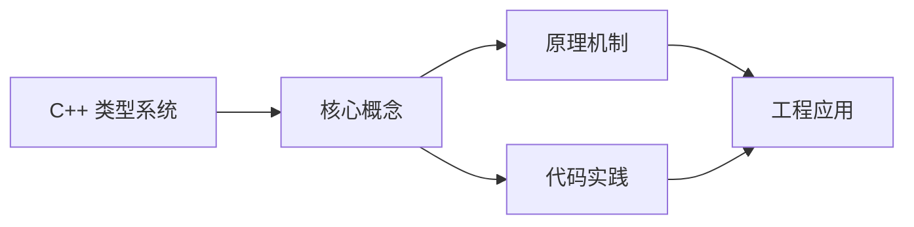
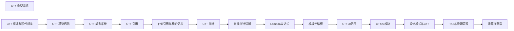

## 1. 学习目标（Bloom 分类）

本节按照布鲁姆教育目标分类学组织学习路径。本文主题为《C++ 类型系统》，属于 C++ 模块，读者可以根据自身阶段选择阅读深度。

记忆层面：能够准确复述本文的核心概念、术语与基本语法或操作步骤，并能够在提问或检索时快速定位对应知识点。能够说出 C++ 的类、继承、重载、模板与 STL 容器基本语法。

理解层面：能够用自己的语言解释核心原理与工作机制，说明概念之间的因果关系，而不是机械记忆结论。能够解释 RAII、拷贝/移动语义、虚函数与模板实例化。

应用层面：能够在真实项目或练习场景中运用本文知识解决具体问题，写出正确且可维护的实现。能够编写现代 C++（C++17/20）的类与泛型代码。

分析层面：能够拆解复杂问题，比较本文主题与相邻概念的异同，识别边界条件与例外情况。能够分析生命周期、未定义行为与性能特征。

评价层面：能够根据约束条件（性能、可读性、安全、成本）评价不同方案的优劣，做出有依据的技术决策。能够评价 C++ 与 Rust、Java 在系统编程中的取舍。

创造层面：能够把本文知识与其他模块知识组合，设计出新的解决方案或可复用的工程模式。能够设计高性能、可维护的 C++ 库与应用。

通过本节学习，读者应当能够把《C++ 类型系统》纳入自己的知识网络，并与 C++ 模块的其他主题（RAII、移动语义、模板、STL）建立关联。

## 2. 历史动机与发展脉络

《C++ 类型系统》是 C++ 领域的重要主题。要真正理解它，需要先了解它解决的问题与演进过程。

C++ 由 Bjarne Stroustrup 于 1979 年开始在贝尔实验室开发（原名 C with Classes），1983 年更名 C++，1998 年 C++98 首次标准化。
C++11 是语言转折点：右值引用、auto、lambda、智能指针、并发内存模型让现代 C++ 写法定型；C++14/17 补充泛型 lambda、if constexpr、折叠表达式；C++20 引入 concepts、协程、模块与范围库；C++23 继续完善。
现代 C++ 的核心口号是“资源安全”：RAII + 智能指针替代裸 new/delete，异常与错误码按场景选择；Rust 的出现促使 C++ 社区更重视内存安全工具（如 profile 指南、sanitizer）。

回到本文主题：C++ 类型系统 的提出与成熟，正是上述技术背景下的必然产物。早期实现往往以简单可用为目标，随着工程规模扩大，社区逐渐沉淀出标准做法与最佳实践；理解这一脉络，可以帮助读者判断“为什么文档中的推荐写法是现在这个样子”，也能在遇到历史遗留代码时准确识别其设计年代与取舍。


## 3. 形式化定义与核心概念精讲

本节把《C++ 类型系统》涉及的核心概念以“定义 + 讲解”的形式展开。读者应把定义当作工具，把讲解当作理解路径；两者结合才能形成可迁移的知识。

RAII：资源在构造函数获取、析构函数释放，栈对象离开作用域自动清理；智能指针（unique_ptr/shared_ptr/weak_ptr）把所有权编码进类型。
移动语义：右值引用 `&&` 与 std::move 转移资源所有权，避免深拷贝；移动后对象处于“合法但未指定”状态。
虚函数与多态：virtual 实现动态绑定，vtable 是运行时分派机制；final/override 关键字防止误用；基类析构函数应为 virtual。

### 3.1 原文章节逐一精讲

原文档把主题拆分为 12 个小节，下面按顺序给出每一节的导读讲解，随后保留原文细节供精读。

#### 原文精读（完整保留）

# C++ 类型系统

> **符号约定**：`< >` 必填参数 | `[ ]` 可选参数

---

#### 1. 常量 (Constants)

##### 1.1 const 常量

```cpp
 // 全局常量
 const int MAX_VALUE = 100;
 int main() {
  // 局部常量
  const double PI = 3.14159;
  // 常量指针
  const int* p = &MAX_VALUE;
  // *p = 200; // 错误：不能修改 const 指针指向的值
  // 指针常量
  int x = 10;
  int* const q = &x;
  *q = 20; // 可以修改指针指向的值
  // q = &MAX_VALUE; // 错误：不能修改指针本身
  // const 引用
  const int& ref = x;
  // ref = 30; // 错误：不能修改 const 引用
  return 0;
 }
```

##### 1.2 constexpr 常量 (C++11)

```cpp
 // 编译期常量
 constexpr int factorial(int n) {
  return n <= 1 ? 1 : n * factorial(n - 1);
 }
 int main() {
  constexpr int fact5 = factorial(5); // 编译期计算
  std::cout << "5! = " << fact5 << std::endl;
  return 0;
 }
```

#### 2. 类型推导

##### 2.1 auto 类型推导 (C++11)

```cpp
 #include <iostream>
 #include <vector>
 int main() {
  // 基本类型推导
  auto i = 10; // int
  auto d = 3.14; // double
  auto s = "Hello"; // const char*
  auto b = true; // bool
  // 容器类型推导
  std::vector<int> v = {1, 2, 3};
  auto it = v.begin(); // 迭代器类型
  // 函数返回类型推导
  auto add = [](int a, int b) { return a + b; }; // lambda 表达式
  std::cout << "add(5, 3) = " << add(5, 3) << std::endl;
  return 0;
 }
```

##### 2.2 decltype 类型推导 (C++11)

```cpp
 #include <iostream>
 int main() {
  int x = 10;
  decltype(x) y = 20; // y 的类型是 int
  double z = 3.14;
  decltype(x + z) w = x + z; // w 的类型是 double
  std::cout << "y = " << y << ", w = " << w << std::endl;
  return 0;
 }
```

#### 3. 类型别名

##### 3.1 typedef

```cpp
 #include <iostream>
 // 类型别名
 typedef unsigned int uint;
 typedef std::vector<int> IntVector;
 int main() {
  uint x = 100;
  IntVector v = {1, 2, 3};
  std::cout << "x = " << x << std::endl;
  for (auto num : v) {
  std::cout << num << " ";
  }
  std::cout << std::endl;
  return 0;
 }
```

##### 3.2 using 别名 (C++11)

```cpp
 #include <iostream>
 #include <vector>
 // 使用 using 定义类型别名
 using uint = unsigned int;
 using IntVector = std::vector<int>;
 int main() {
  uint x = 100;
  IntVector v = {1, 2, 3};
  std::cout << "x = " << x << std::endl;
  for (auto num : v) {
  std::cout << num << " ";
  }
  std::cout << std::endl;
  return 0;
 }
```

#### 4. 最佳实践

##### 4.1 代码风格

###### 4.1.1 命名规范

- **变量和函数**：`camelCase` 或 `snake_case`
- 示例：`int studentCount;` 或 `int student_count;`
- 示例：`void calculateTotal();` 或 `void calculate_total();`
- **类和结构体**：`PascalCase`
- 示例：`class StudentRecord;`
- 示例：`struct Point3D;`
- **常量**：`UPPER_CASE`
- 示例：`const int MAX_SIZE = 100;`
- 示例：`constexpr double PI = 3.14159;`
- **命名空间**：`lowercase`
- 示例：`namespace utils;`
- 示例：`namespace math_helpers;`
- **类型别名**：`PascalCase` 或 `camelCase`
- 示例：`using IntVector = std::vector<int>;`
- 示例：`typedef std::map<std::string, int> StringIntMap;`

###### 4.1.2 缩进和格式

- **缩进**：使用 4 个空格或 1 个制表符
- **大括号**：使用 K&R 风格（左大括号在同一行）

```cpp
 if (condition) {
 // 代码
 }
```

- **行长度**：每行不超过 80-100 个字符
- **空行**：适当使用空行分隔代码块
- **空格**：在操作符前后、逗号后添加空格

```cpp
 int result = a + b;
 func(a, b, c);
```

###### 4.1.3 注释

- **文档注释**：函数前添加文档注释

```cpp
 /**
 * @brief 计算两个数的和
 * @param a 第一个数
 * @param b 第二个数
 * @return 两数之和
 */
 int add(int a, int b) {
 return a + b;
 }
```

- **代码注释**：为复杂代码添加注释

```cpp
 // 使用二分查找算法
 int binary_search(const std::vector<int>& arr, int target) {
 // 初始化左右边界
 int left = 0, right = arr.size() - 1;
 // 循环查找
 while (left <= right) {
 int mid = left + (right - left) / 2; // 避免整数溢出
 if (arr[mid] == target) {
 return mid;
 } else if (arr[mid] < target) {
 left = mid + 1;
 } else {
 right = mid - 1;
 }
 }
 return -1;
 }
```

##### 4.2 类型使用建议

###### 4.2.1 基本类型

- **优先使用 auto**：简化代码，提高可维护性

```cpp
 auto result = calculate(); // 自动推导返回类型
 auto it = container.begin(); // 简化迭代器类型
```

- **使用 constexpr**：对于编译期常量，提高性能

```cpp
 constexpr int MAX_SIZE = 100; // 编译期常量
 constexpr int factorial(int n) { return n <= 1 ? 1 : n * factorial(n-1); }
```

- **合理使用 const**：提高代码安全性和可读性

```cpp
 const int& get_value() const; // 常量成员函数，不修改对象状态
 void process(const std::string& str); // 避免复制，且不修改参数
```

- **注意类型转换**：避免隐式类型转换导致的问题

```cpp
 // 显式转换
 double d = 3.14;
 int i = static_cast<int>(d); // 明确转换意图
```

###### 4.2.2 复合类型

- **使用 STL 容器**：优先使用标准库容器

```cpp
 std::vector<int> numbers; // 动态数组
 std::map<std::string, int> scores; // 键值对
 std::unordered_set<int> unique_values; // 哈希集合
```

- **智能指针**：使用智能指针管理内存

```cpp
 std::unique_ptr<MyClass> ptr = std::make_unique<MyClass>();
 std::shared_ptr<MyClass> shared_ptr = std::make_shared<MyClass>();
```

- **引用传递**：对于大对象，使用引用传递避免复制

```cpp
 void process_large_object(const LargeObject& obj); // 常量引用
```

##### 4.3 控制流建议

- **避免使用 goto**：使用结构化控制流
- **使用范围 for 循环**：简化容器遍历

```cpp
 for (const auto& item : container) {
 // 处理 item
 }
```

- **合理使用 switch**：对于多分支条件
- **异常处理**：使用 try-catch 处理异常

##### 4.4 输入输出建议

- **使用 std::cout 和 std::cin**：标准库提供的输入输出功能
- **格式化输出**：使用 iomanip 库进行格式化

```cpp
 std::cout << std::fixed << std::setprecision(2) << value << std::endl;
```

- **错误处理**：检查输入是否成功

```cpp
 if (!(std::cin >> value)) {
 std::cerr << "Invalid input" << std::endl;
 std::cin.clear();
 std::cin.ignore();
 }
```

- **避免使用 C 风格 I/O**：如 printf 和 scanf

##### 4.5 性能优化建议

- **减少复制**：使用移动语义和引用
- **预分配内存**：对于容器，提前分配足够的空间

```cpp
 std::vector<int> vec;
 vec.reserve(1000); // 预分配空间
```

- **避免频繁的内存分配**：使用对象池或内存池
- **内联函数**：对于小函数，使用 inline 关键字

```cpp
 inline int min(int a, int b) {
 return a < b ? a : b;
 }
```

#### 5. 代码示例

##### 5.1 温度转换

```cpp
 #include <iostream>
 #include <iomanip>
 // 摄氏度转华氏度
 double celsius_to_fahrenheit(double celsius) {
  return (celsius * 9.0 / 5.0) + 32.0;
 }
 // 华氏度转摄氏度
 double fahrenheit_to_celsius(double fahrenheit) {
  return (fahrenheit - 32.0) * 5.0 / 9.0;
 }
 // 温度单位转换类
 class TemperatureConverter {
 public:
  static double celsius_to_fahrenheit(double celsius) {
  return (celsius * 9.0 / 5.0) + 32.0;
  }
  static double fahrenheit_to_celsius(double fahrenheit) {
  return (fahrenheit - 32.0) * 5.0 / 9.0;
  }
  static double celsius_to_kelvin(double celsius) {
  return celsius + 273.15;
  }
  static double kelvin_to_celsius(double kelvin) {
  return kelvin - 273.15;
  }
 }
 int main() {
  double c, f, k;
  std::cout << "输入摄氏度: ";
  std::cin >> c;
  f = TemperatureConverter::celsius_to_fahrenheit(c);
  k = TemperatureConverter::celsius_to_kelvin(c);
  std::cout << std::fixed << std::setprecision(2);
  std::cout << c << "°C = " << f << "°F = " << k << "K" << std::endl;
  std::cout << "输入华氏度: ";
  std::cin >> f;
  c = TemperatureConverter::fahrenheit_to_celsius(f);
  k = TemperatureConverter::celsius_to_kelvin(c);
  std::cout << f << "°F = " << c << "°C = " << k << "K" << std::endl;
  return 0;
 }
```

##### 5.2 素数判断

```cpp
 #include <iostream>
 #include <cmath>
 #include <vector>
 // 单个素数判断
 bool is_prime(int n) {
  if (n <= 1) return false;
  if (n == 2) return true;
  if (n % 2 == 0) return false;
  int sqrt_n = sqrt(n);
  for (int i = 3; i <= sqrt_n; i += 2) {
  if (n % i == 0) return false;
  }
  return true;
 }
 // 埃拉托斯特尼筛法生成素数列表
 std::vector<int> sieve_of_eratosthenes(int max) {
  std::vector<bool> is_prime(max + 1, true);
  std::vector<int> primes;
  is_prime[0] = is_prime[1] = false;
  for (int i = 2; i <= max; ++i) {
  if (is_prime[i]) {
  primes.push_back(i);
  for (int j = i * 2; j <= max; j += i) {
  is_prime[j] = false;
  }
  }
  }
  return primes;
 }
 // 素数工具类
 class PrimeUtils {
 public:
  static bool is_prime(int n) {
  if (n <= 1) return false;
  if (n == 2) return true;
  if (n % 2 == 0) return false;
  int sqrt_n = sqrt(n);
  for (int i = 3; i <= sqrt_n; i += 2) {
  if (n % i == 0) return false;
  }
  return true;
  }
  static std::vector<int> sieve_of_eratosthenes(int max) {
  std::vector<bool> is_prime(max + 1, true);
  std::vector<int> primes;
  is_prime[0] = is_prime[1] = false;
  for (int i = 2; i <= max; ++i) {
  if (is_prime[i]) {
  primes.push_back(i);
  for (int j = i * 2; j <= max; j += i) {
  is_prime[j] = false;
  }
  }
  }
  return primes;
  }
  static int count_primes(int max) {
  auto primes = sieve_of_eratosthenes(max);
  return primes.size();
  }
 }
 int main() {
  int n;
  std::cout << "输入一个整数: ";
  std::cin >> n;
  if (PrimeUtils::is_prime(n)) {
  std::cout << n << " 是素数" << std::endl;
  } else {
  std::cout << n << " 不是素数" << std::endl;
  }
  int max;
  std::cout << "输入最大值，生成素数列表: ";
  std::cin >> max;
  auto primes = PrimeUtils::sieve_of_eratosthenes(max);
  std::cout << "小于等于 " << max << " 的素数有 " << primes.size() << " 个: " << std::endl;
  for (int prime : primes) {
  std::cout << prime << " ";
  }
  std::cout << std::endl;
  return 0;
 }
```

##### 5.3 数组操作

```cpp
 #include <iostream>
 #include <vector>
 #include <algorithm>
 #include <numeric>
 // 计算数组和
 int sum_array(const std::vector<int>& arr) {
  int sum = 0;
  for (int num : arr) {
  sum += num;
  }
  return sum;
 }
 // 使用标准库计算数组和
 int sum_array_std(const std::vector<int>& arr) {
  return std::accumulate(arr.begin(), arr.end(), 0);
 }
 // 查找最大值
 int find_max(const std::vector<int>& arr) {
  if (arr.empty()) {
  throw std::runtime_error("Array is empty");
  }
  int max = arr[0];
  for (int num : arr) {
  if (num > max) {
  max = num;
  }
  }
  return max;
 }
 // 使用标准库查找最大值
 int find_max_std(const std::vector<int>& arr) {
  if (arr.empty()) {
  throw std::runtime_error("Array is empty");
  }
  return *std::max_element(arr.begin(), arr.end());
 }
 // 数组排序
 void sort_array(std::vector<int>& arr) {
  std::sort(arr.begin(), arr.end());
 }
 // 数组去重
 std::vector<int> remove_duplicates(const std::vector<int>& arr) {
  std::vector<int> result = arr;
  std::sort(result.begin(), result.end());
  auto last = std::unique(result.begin(), result.end());
  result.erase(last, result.end());
  return result;
 }
 // 数组工具类
 class ArrayUtils {
 public:
  static int sum(const std::vector<int>& arr) {
  return std::accumulate(arr.begin(), arr.end(), 0);
  }
  static int max(const std::vector<int>& arr) {
  if (arr.empty()) {
  throw std::runtime_error("Array is empty");
  }
  return *std::max_element(arr.begin(), arr.end());
  }
  static int min(const std::vector<int>& arr) {
  if (arr.empty()) {
  throw std::runtime_error("Array is empty");
  }
  return *std::min_element(arr.begin(), arr.end());
  }
  static double average(const std::vector<int>& arr) {
  if (arr.empty()) {
  throw std::runtime_error("Array is empty");
  }
  int sum = std::accumulate(arr.begin(), arr.end(), 0);
  return static_cast<double>(sum) / arr.size();
  }
  static void sort(std::vector<int>& arr, bool ascending = true) {
  if (ascending) {
  std::sort(arr.begin(), arr.end());
  } else {
  std::sort(arr.begin(), arr.end(), std::greater<int>());
  }
  }
  static std::vector<int> reverse(const std::vector<int>& arr) {
  std::vector<int> result = arr;
  std::reverse(result.begin(), result.end());
  return result;
  }
 }
 int main() {
  std::vector<int> numbers = {1, 5, 3, 9, 2, 5, 8, 3};
  std::cout << "原始数组: ";
  for (int num : numbers) {
  std::cout << num << " ";
  }
  std::cout << std::endl;
  std::cout << "数组和: " << ArrayUtils::sum(numbers) << std::endl;
  std::cout << "最大值: " << ArrayUtils::max(numbers) << std::endl;
  std::cout << "最小值: " << ArrayUtils::min(numbers) << std::endl;
  std::cout << "平均值: " << ArrayUtils::average(numbers) << std::endl;
  // 排序
  ArrayUtils::sort(numbers);
  std::cout << "排序后: ";
  for (int num : numbers) {
  std::cout << num << " ";
  }
  std::cout << std::endl;
  // 去重
  auto unique_numbers = remove_duplicates(numbers);
  std::cout << "去重后: ";
  for (int num : unique_numbers) {
  std::cout << num << " ";
  }
  std::cout << std::endl;
  // 反转
  auto reversed = ArrayUtils::reverse(numbers);
  std::cout << "反转后: ";
  for (int num : reversed) {
  std::cout << num << " ";
  }
  std::cout << std::endl;
  return 0;
 }
```

##### 5.4 字符串操作

```cpp
 #include <iostream>
 #include <string>
 #include <algorithm>
 #include <cctype>
 // 字符串工具类
 class StringUtils {
 public:
  // 字符串反转
  static std::string reverse(const std::string& str) {
  std::string result = str;
  std::reverse(result.begin(), result.end());
  return result;
  }
  // 字符串转大写
  static std::string to_upper(const std::string& str) {
  std::string result = str;
  std::transform(result.begin(), result.end(), result.begin(),
  [](unsigned char c) { return std::toupper(c); });
  return result;
  }
  // 字符串转小写
  static std::string to_lower(const std::string& str) {
  std::string result = str;
  std::transform(result.begin(), result.end(), result.begin(),
  [](unsigned char c) { return std::tolower(c); });
  return result;
  }
  // 去除首尾空格
  static std::string trim(const std::string& str) {
  size_t start = str.find_first_not_of(" \t\n\r");
  if (start == std::string::npos) return "";
  size_t end = str.find_last_not_of(" \t\n\r");
  return str.substr(start, end - start + 1);
  }
  // 检查是否是回文
  static bool is_palindrome(const std::string& str) {
  std::string cleaned;
  for (char c : str) {
  if (std::isalnum(c)) {
  cleaned += std::tolower(c);
  }
  }
  std::string reversed = cleaned;
  std::reverse(reversed.begin(), reversed.end());
  return cleaned == reversed;
  }
  // 统计单词数量
  static int count_words(const std::string& str) {
  int count = 0;
  bool in_word = false;
  for (char c : str) {
  if (std::isspace(c)) {
  in_word = false;
  } else if (!in_word) {
  in_word = true;
  count++;
  }
  }
  return count;
  }
 }
 int main() {
  std::string text = " Hello, World! ";
  std::cout << "原始字符串: '" << text << "'" << std::endl;
  std::cout << "去除空格: '" << StringUtils::trim(text) << "'" << std::endl;
  std::cout << "大写: '" << StringUtils::to_upper(text) << "'" << std::endl;
  std::cout << "小写: '" << StringUtils::to_lower(text) << "'" << std::endl;
  std::cout << "反转: '" << StringUtils::reverse(text) << "'" << std::endl;
  std::string palindrome = "A man a plan a canal Panama";
  std::cout << "是否回文: '" << palindrome << "' -> "
  << (StringUtils::is_palindrome(palindrome) ? "是" : "否") << std::endl;
  std::string sentence = "This is a test sentence";
  std::cout << "单词数量: '" << sentence << "' -> "
  << StringUtils::count_words(sentence) << std::endl;
  return 0;
 }
```

---

#### auto 与 decltype

**基本写法：自动类型推导**
`auto <变量> = <表达式>;`
```cpp
// 编译器推导变量类型
auto x = 42;       // int
auto y = 3.14;     // double
```

---

**基本写法：推导表达式类型**
`decltype(<表达式>) <变量> = <值>;`
```cpp
// 获取表达式的精确类型
int a = 0;
decltype(a) b = 1;
```

---

**基本写法：decltype(auto)**
`decltype(auto) <变量> = <表达式>;`
```cpp
// 保留引用与 cv 限定
decltype(auto) r = foo();
```

---

**基本写法：尾置返回类型**
`auto <函数名>(<参数>) -> <返回类型> { }`
```cpp
// 后置返回类型用于模板
auto f(int x) -> double { return x; }
```

---

#### 引用类型

**基本写法：左值引用**
`<类型>& <变量> = <对象>;`
```cpp
// 绑定到左值
int a = 10;
int& ref = a;
```

---

**基本写法：右值引用**
`<类型>&& <变量> = <右值>;`
```cpp
// 绑定到右值支持移动语义
int&& rref = 42;
```

---

**基本写法：const 引用**
`const <类型>& <变量> = <值>;`
```cpp
// 可绑定到右值的常量引用
const int& cref = 100;
```

---

**基本写法：转发引用**
`template <typename <T>> void <函数名>(<T>&& <参数>);`
```cpp
// 模板中的万能引用
template <typename T>
void wrapper(T&& arg);
```

---

#### 类型转换

**基本写法：static_cast**
`static_cast<<目标类型>>(<表达式>)`
```cpp
// 编译期安全转换
double d = static_cast<double>(3);
```

---

**基本写法：dynamic_cast**
`dynamic_cast<<目标指针>>(<基类指针>)`
```cpp
// 运行时多态向下转换
Derived* p = dynamic_cast<Derived*>(base_ptr);
```

---

**基本写法：const_cast**
`const_cast<<目标类型>>(<表达式>)`
```cpp
// 移除或添加 const 限定
int& r = const_cast<int&>(cref);
```

---

**基本写法：reinterpret_cast**
`reinterpret_cast<<目标类型>>(<表达式>)`
```cpp
// 位模式重解释
long n = reinterpret_cast<long>(ptr);
```

---

#### cv 限定符

**基本写法：const 变量**
`const <类型> <变量> = <值>;`
```cpp
// 不可修改的常量
const int max_size = 100;
```

---

**基本写法：const 成员函数**
`<返回类型> <方法名>() const;`
```cpp
// 承诺不修改对象状态
int size() const { return n; }
```

---

**基本写法：constexpr 变量**
`constexpr <类型> <变量> = <常量表达式>;`
```cpp
// 编译期常量
constexpr int size = 10;
```

---

**基本写法：constexpr 函数**
`constexpr <返回类型> <函数名>(<参数>) { }`
```cpp
// 可在编译期求值的函数
constexpr int square(int x) { return x * x; }
```

---

#### 类型别名

**基本写法：using 别名**
`using <别名> = <类型>;`
```cpp
// 现代类型别名语法
using String = std::string;
```

---

**基本写法：typedef 别名**
`typedef <类型> <别名>;`
```cpp
// 传统类型别名
typedef unsigned long ulong;
```

---

#### 类型推断辅助

**基本写法：auto 与引用结合**
`auto& <变量> = <对象>;`
```cpp
// 推导为左值引用避免拷贝
auto& ref = container;
```

---

**基本写法：auto 与 const 结合**
`const auto& <变量> = <表达式>;`
```cpp
// 只读引用避免拷贝
const auto& item = vec[i];
```

---

#### 强类型枚举

**基本写法：枚举类**
`enum class <名称> { <枚举值> };`
```cpp
// 作用域安全枚举
enum class Color { Red, Green, Blue };
```

---

**基本写法：指定底层类型**
`enum class <名称> : <整数类型> { };`
```cpp
// 指定底层类型为 uint8_t
enum class Flag : unsigned char { None = 0, All = 0xFF };
```

---

**基本写法：访问枚举值**
`<枚举名>::<枚举值>`
```cpp
// 使用作用域访问
Color c = Color::Red;
```


### 3.2 概念关系图

下面用 Mermaid 图表达本文核心概念之间的关系，帮助读者建立整体图景：



图中展示的是本文知识的结构化关系：核心概念是入口，原理机制解释“为什么”，代码实践演示“怎么做”，工程应用回答“何时用”。读者学习时可以把每个小节的内容挂接到对应节点上。

## 4. 理论推导与原理解析

本节深入《C++ 类型系统》背后的原理。理论部分不求面面俱到，而是聚焦“能解释现象、能指导实践”的关键推导。

RAII：资源在构造函数获取、析构函数释放，栈对象离开作用域自动清理；智能指针（unique_ptr/shared_ptr/weak_ptr）把所有权编码进类型。
移动语义：右值引用 `&&` 与 std::move 转移资源所有权，避免深拷贝；移动后对象处于“合法但未指定”状态。
虚函数与多态：virtual 实现动态绑定，vtable 是运行时分派机制；final/override 关键字防止误用；基类析构函数应为 virtual。
模板与泛型：模板编译期实例化，实现静态多态；concepts（C++20）约束类型接口；模板元编程在编译期计算类型与常量。

需要强调的是，理论推导与工程实践之间存在翻译层：理论给出的是理想化模型与边界条件，工程代码则必须处理真实环境中的例外。读者在学习时应先掌握理论的“标准情形”，再通过陷阱章节了解“非标准情形”。

## 5. 代码示例与逐行讲解

本节把原文中的代码示例系统整理，并为每个示例补充用途说明与讲解。读者不应只浏览代码，而应逐段对照讲解理解设计意图。

### 5.1 示例：1.1 const 常量

该示例来自原文《1.1 const 常量》小节，用于演示C++ 类型系统相关操作。阅读时请先看代码结构，再看其后的讲解。

```cpp
 // 全局常量
 const int MAX_VALUE = 100;
 int main() {
  // 局部常量
  const double PI = 3.14159;
  // 常量指针
  const int* p = &MAX_VALUE;
  // *p = 200; // 错误：不能修改 const 指针指向的值
  // 指针常量
  int x = 10;
  int* const q = &x;
  *q = 20; // 可以修改指针指向的值
  // q = &MAX_VALUE; // 错误：不能修改指针本身
  // const 引用
  const int& ref = x;
  // ref = 30; // 错误：不能修改 const 引用
  return 0;
 }
```

讲解：这段代码演示了本节核心知识点。代码中的关键操作可以归纳为三步：准备（定义或初始化）、执行（核心逻辑）、收尾（释放资源或返回结果）。实际项目中，这三步往往被封装为函数或类，以提升复用性与可测试性。

关键点分析：

该示例共 18 行有效代码，包含 1 类关键结构（return）。其中：

- 入口与初始化部分负责建立上下文，对应实际项目中的启动或装配逻辑；
- 核心逻辑部分体现本文主题的主要操作，是阅读时最需要对照讲解理解的部分；
- 输出或返回部分把结果交给调用方，注意其类型与边界条件。

进阶思考路径：先尝试修改参数观察行为变化，再把示例中的模式迁移到自己的项目中；每次修改都记录预期与实测差异，这是把示例转化为能力的最快方式。

### 5.2 示例：1.2 constexpr 常量 (C++11)

该示例来自原文《1.2 constexpr 常量 (C++11)》小节，用于演示C++ 类型系统相关操作。阅读时请先看代码结构，再看其后的讲解。

```cpp
 // 编译期常量
 constexpr int factorial(int n) {
  return n <= 1 ? 1 : n * factorial(n - 1);
 }
 int main() {
  constexpr int fact5 = factorial(5); // 编译期计算
  std::cout << "5! = " << fact5 << std::endl;
  return 0;
 }
```

讲解：这段代码演示了本节核心知识点。代码中的关键操作可以归纳为三步：准备（定义或初始化）、执行（核心逻辑）、收尾（释放资源或返回结果）。实际项目中，这三步往往被封装为函数或类，以提升复用性与可测试性。

关键点分析：

该示例共 9 行有效代码，包含 1 类关键结构（return）。其中：

- 入口与初始化部分负责建立上下文，对应实际项目中的启动或装配逻辑；
- 核心逻辑部分体现本文主题的主要操作，是阅读时最需要对照讲解理解的部分；
- 输出或返回部分把结果交给调用方，注意其类型与边界条件。

进阶思考路径：先尝试修改参数观察行为变化，再把示例中的模式迁移到自己的项目中；每次修改都记录预期与实测差异，这是把示例转化为能力的最快方式。

### 5.3 示例：2.1 auto 类型推导 (C++11)

该示例来自原文《2.1 auto 类型推导 (C++11)》小节，用于演示C++ 类型系统相关操作。阅读时请先看代码结构，再看其后的讲解。

```cpp
 #include <iostream>
 #include <vector>
 int main() {
  // 基本类型推导
  auto i = 10; // int
  auto d = 3.14; // double
  auto s = "Hello"; // const char*
  auto b = true; // bool
  // 容器类型推导
  std::vector<int> v = {1, 2, 3};
  auto it = v.begin(); // 迭代器类型
  // 函数返回类型推导
  auto add = [](int a, int b) { return a + b; }; // lambda 表达式
  std::cout << "add(5, 3) = " << add(5, 3) << std::endl;
  return 0;
 }
```

讲解：这段代码演示了本节核心知识点。代码中的关键操作可以归纳为三步：准备（定义或初始化）、执行（核心逻辑）、收尾（释放资源或返回结果）。实际项目中，这三步往往被封装为函数或类，以提升复用性与可测试性。

关键点分析：

该示例共 16 行有效代码，包含 1 类关键结构（return）。其中：

- 入口与初始化部分负责建立上下文，对应实际项目中的启动或装配逻辑；
- 核心逻辑部分体现本文主题的主要操作，是阅读时最需要对照讲解理解的部分；
- 输出或返回部分把结果交给调用方，注意其类型与边界条件。

进阶思考路径：先尝试修改参数观察行为变化，再把示例中的模式迁移到自己的项目中；每次修改都记录预期与实测差异，这是把示例转化为能力的最快方式。

### 5.4 示例：2.2 decltype 类型推导 (C++11)

该示例来自原文《2.2 decltype 类型推导 (C++11)》小节，用于演示C++ 类型系统相关操作。阅读时请先看代码结构，再看其后的讲解。

```cpp
 #include <iostream>
 int main() {
  int x = 10;
  decltype(x) y = 20; // y 的类型是 int
  double z = 3.14;
  decltype(x + z) w = x + z; // w 的类型是 double
  std::cout << "y = " << y << ", w = " << w << std::endl;
  return 0;
 }
```

讲解：这段代码演示了本节核心知识点。代码中的关键操作可以归纳为三步：准备（定义或初始化）、执行（核心逻辑）、收尾（释放资源或返回结果）。实际项目中，这三步往往被封装为函数或类，以提升复用性与可测试性。

关键点分析：

该示例共 9 行有效代码，包含 1 类关键结构（return）。其中：

- 入口与初始化部分负责建立上下文，对应实际项目中的启动或装配逻辑；
- 核心逻辑部分体现本文主题的主要操作，是阅读时最需要对照讲解理解的部分；
- 输出或返回部分把结果交给调用方，注意其类型与边界条件。

进阶思考路径：先尝试修改参数观察行为变化，再把示例中的模式迁移到自己的项目中；每次修改都记录预期与实测差异，这是把示例转化为能力的最快方式。

### 5.5 示例：3.1 typedef

该示例来自原文《3.1 typedef》小节，用于演示C++ 类型系统相关操作。阅读时请先看代码结构，再看其后的讲解。

```cpp
 #include <iostream>
 // 类型别名
 typedef unsigned int uint;
 typedef std::vector<int> IntVector;
 int main() {
  uint x = 100;
  IntVector v = {1, 2, 3};
  std::cout << "x = " << x << std::endl;
  for (auto num : v) {
  std::cout << num << " ";
  }
  std::cout << std::endl;
  return 0;
 }
```

讲解：这段代码演示了本节核心知识点。代码中的关键操作可以归纳为三步：准备（定义或初始化）、执行（核心逻辑）、收尾（释放资源或返回结果）。实际项目中，这三步往往被封装为函数或类，以提升复用性与可测试性。

关键点分析：

该示例共 14 行有效代码，包含 3 类关键结构（def、for、return）。其中：

- 入口与初始化部分负责建立上下文，对应实际项目中的启动或装配逻辑；
- 核心逻辑部分体现本文主题的主要操作，是阅读时最需要对照讲解理解的部分；
- 输出或返回部分把结果交给调用方，注意其类型与边界条件。

进阶思考路径：先尝试修改参数观察行为变化，再把示例中的模式迁移到自己的项目中；每次修改都记录预期与实测差异，这是把示例转化为能力的最快方式。

### 5.6 示例：3.2 using 别名 (C++11)

该示例来自原文《3.2 using 别名 (C++11)》小节，用于演示C++ 类型系统相关操作。阅读时请先看代码结构，再看其后的讲解。

```cpp
 #include <iostream>
 #include <vector>
 // 使用 using 定义类型别名
 using uint = unsigned int;
 using IntVector = std::vector<int>;
 int main() {
  uint x = 100;
  IntVector v = {1, 2, 3};
  std::cout << "x = " << x << std::endl;
  for (auto num : v) {
  std::cout << num << " ";
  }
  std::cout << std::endl;
  return 0;
 }
```

讲解：这段代码演示了本节核心知识点。代码中的关键操作可以归纳为三步：准备（定义或初始化）、执行（核心逻辑）、收尾（释放资源或返回结果）。实际项目中，这三步往往被封装为函数或类，以提升复用性与可测试性。

关键点分析：

该示例共 15 行有效代码，包含 2 类关键结构（for、return）。其中：

- 入口与初始化部分负责建立上下文，对应实际项目中的启动或装配逻辑；
- 核心逻辑部分体现本文主题的主要操作，是阅读时最需要对照讲解理解的部分；
- 输出或返回部分把结果交给调用方，注意其类型与边界条件。

进阶思考路径：先尝试修改参数观察行为变化，再把示例中的模式迁移到自己的项目中；每次修改都记录预期与实测差异，这是把示例转化为能力的最快方式。

### 5.7 示例：4.1.2 缩进和格式

该示例来自原文《4.1.2 缩进和格式》小节，用于演示C++ 类型系统相关操作。阅读时请先看代码结构，再看其后的讲解。

```cpp
 if (condition) {
 // 代码
 }
```

讲解：这段代码演示了本节核心知识点。代码中的关键操作可以归纳为三步：准备（定义或初始化）、执行（核心逻辑）、收尾（释放资源或返回结果）。实际项目中，这三步往往被封装为函数或类，以提升复用性与可测试性。

关键点分析：

该示例共 3 行有效代码，包含 1 类关键结构（if）。其中：

- 入口与初始化部分负责建立上下文，对应实际项目中的启动或装配逻辑；
- 核心逻辑部分体现本文主题的主要操作，是阅读时最需要对照讲解理解的部分；
- 输出或返回部分把结果交给调用方，注意其类型与边界条件。

进阶思考路径：先尝试修改参数观察行为变化，再把示例中的模式迁移到自己的项目中；每次修改都记录预期与实测差异，这是把示例转化为能力的最快方式。

### 5.8 示例：4.1.2 缩进和格式

该示例来自原文《4.1.2 缩进和格式》小节，用于演示C++ 类型系统相关操作。阅读时请先看代码结构，再看其后的讲解。

```cpp
 int result = a + b;
 func(a, b, c);
```

讲解：这段代码演示了本节核心知识点。代码中的关键操作可以归纳为三步：准备（定义或初始化）、执行（核心逻辑）、收尾（释放资源或返回结果）。实际项目中，这三步往往被封装为函数或类，以提升复用性与可测试性。

关键点分析：

该示例共 2 行有效代码，结构以数据或配置为主。阅读时应关注：数据字段的含义、配置项的作用，以及它们与运行行为的对应关系。

进阶思考路径：先尝试修改参数观察行为变化，再把示例中的模式迁移到自己的项目中；每次修改都记录预期与实测差异，这是把示例转化为能力的最快方式。

### 5.9 示例：4.1.3 注释

该示例来自原文《4.1.3 注释》小节，用于演示C++ 类型系统相关操作。阅读时请先看代码结构，再看其后的讲解。

```cpp
 /**
 * @brief 计算两个数的和
 * @param a 第一个数
 * @param b 第二个数
 * @return 两数之和
 */
 int add(int a, int b) {
 return a + b;
 }
```

讲解：这段代码演示了本节核心知识点。代码中的关键操作可以归纳为三步：准备（定义或初始化）、执行（核心逻辑）、收尾（释放资源或返回结果）。实际项目中，这三步往往被封装为函数或类，以提升复用性与可测试性。

关键点分析：

该示例共 9 行有效代码，包含 1 类关键结构（return）。其中：

- 入口与初始化部分负责建立上下文，对应实际项目中的启动或装配逻辑；
- 核心逻辑部分体现本文主题的主要操作，是阅读时最需要对照讲解理解的部分；
- 输出或返回部分把结果交给调用方，注意其类型与边界条件。

进阶思考路径：先尝试修改参数观察行为变化，再把示例中的模式迁移到自己的项目中；每次修改都记录预期与实测差异，这是把示例转化为能力的最快方式。

### 5.10 示例：4.1.3 注释

该示例来自原文《4.1.3 注释》小节，用于演示C++ 类型系统相关操作。阅读时请先看代码结构，再看其后的讲解。

```cpp
 // 使用二分查找算法
 int binary_search(const std::vector<int>& arr, int target) {
 // 初始化左右边界
 int left = 0, right = arr.size() - 1;
 // 循环查找
 while (left <= right) {
 int mid = left + (right - left) / 2; // 避免整数溢出
 if (arr[mid] == target) {
 return mid;
 } else if (arr[mid] < target) {
 left = mid + 1;
 } else {
 right = mid - 1;
 }
 }
 return -1;
 }
```

讲解：这段代码演示了本节核心知识点。代码中的关键操作可以归纳为三步：准备（定义或初始化）、执行（核心逻辑）、收尾（释放资源或返回结果）。实际项目中，这三步往往被封装为函数或类，以提升复用性与可测试性。

关键点分析：

该示例共 17 行有效代码，包含 3 类关键结构（if、while、return）。其中：

- 入口与初始化部分负责建立上下文，对应实际项目中的启动或装配逻辑；
- 核心逻辑部分体现本文主题的主要操作，是阅读时最需要对照讲解理解的部分；
- 输出或返回部分把结果交给调用方，注意其类型与边界条件。

进阶思考路径：先尝试修改参数观察行为变化，再把示例中的模式迁移到自己的项目中；每次修改都记录预期与实测差异，这是把示例转化为能力的最快方式。

### 5.11 示例：4.2.1 基本类型

该示例来自原文《4.2.1 基本类型》小节，用于演示C++ 类型系统相关操作。阅读时请先看代码结构，再看其后的讲解。

```cpp
 auto result = calculate(); // 自动推导返回类型
 auto it = container.begin(); // 简化迭代器类型
```

讲解：这段代码演示了本节核心知识点。代码中的关键操作可以归纳为三步：准备（定义或初始化）、执行（核心逻辑）、收尾（释放资源或返回结果）。实际项目中，这三步往往被封装为函数或类，以提升复用性与可测试性。

关键点分析：

该示例共 2 行有效代码，结构以数据或配置为主。阅读时应关注：数据字段的含义、配置项的作用，以及它们与运行行为的对应关系。

进阶思考路径：先尝试修改参数观察行为变化，再把示例中的模式迁移到自己的项目中；每次修改都记录预期与实测差异，这是把示例转化为能力的最快方式。

### 5.12 示例：4.2.1 基本类型

该示例来自原文《4.2.1 基本类型》小节，用于演示C++ 类型系统相关操作。阅读时请先看代码结构，再看其后的讲解。

```cpp
 constexpr int MAX_SIZE = 100; // 编译期常量
 constexpr int factorial(int n) { return n <= 1 ? 1 : n * factorial(n-1); }
```

讲解：这段代码演示了本节核心知识点。代码中的关键操作可以归纳为三步：准备（定义或初始化）、执行（核心逻辑）、收尾（释放资源或返回结果）。实际项目中，这三步往往被封装为函数或类，以提升复用性与可测试性。

关键点分析：

该示例共 2 行有效代码，包含 1 类关键结构（return）。其中：

- 入口与初始化部分负责建立上下文，对应实际项目中的启动或装配逻辑；
- 核心逻辑部分体现本文主题的主要操作，是阅读时最需要对照讲解理解的部分；
- 输出或返回部分把结果交给调用方，注意其类型与边界条件。

进阶思考路径：先尝试修改参数观察行为变化，再把示例中的模式迁移到自己的项目中；每次修改都记录预期与实测差异，这是把示例转化为能力的最快方式。

### 5.13 示例：4.2.1 基本类型

该示例来自原文《4.2.1 基本类型》小节，用于演示C++ 类型系统相关操作。阅读时请先看代码结构，再看其后的讲解。

```cpp
 const int& get_value() const; // 常量成员函数，不修改对象状态
 void process(const std::string& str); // 避免复制，且不修改参数
```

讲解：这段代码演示了本节核心知识点。代码中的关键操作可以归纳为三步：准备（定义或初始化）、执行（核心逻辑）、收尾（释放资源或返回结果）。实际项目中，这三步往往被封装为函数或类，以提升复用性与可测试性。

关键点分析：

该示例共 2 行有效代码，结构以数据或配置为主。阅读时应关注：数据字段的含义、配置项的作用，以及它们与运行行为的对应关系。

进阶思考路径：先尝试修改参数观察行为变化，再把示例中的模式迁移到自己的项目中；每次修改都记录预期与实测差异，这是把示例转化为能力的最快方式。

### 5.14 示例：4.2.1 基本类型

该示例来自原文《4.2.1 基本类型》小节，用于演示C++ 类型系统相关操作。阅读时请先看代码结构，再看其后的讲解。

```cpp
 // 显式转换
 double d = 3.14;
 int i = static_cast<int>(d); // 明确转换意图
```

讲解：这段代码演示了本节核心知识点。代码中的关键操作可以归纳为三步：准备（定义或初始化）、执行（核心逻辑）、收尾（释放资源或返回结果）。实际项目中，这三步往往被封装为函数或类，以提升复用性与可测试性。

关键点分析：

该示例共 3 行有效代码，结构以数据或配置为主。阅读时应关注：数据字段的含义、配置项的作用，以及它们与运行行为的对应关系。

进阶思考路径：先尝试修改参数观察行为变化，再把示例中的模式迁移到自己的项目中；每次修改都记录预期与实测差异，这是把示例转化为能力的最快方式。

### 5.15 示例：4.2.2 复合类型

该示例来自原文《4.2.2 复合类型》小节，用于演示C++ 类型系统相关操作。阅读时请先看代码结构，再看其后的讲解。

```cpp
 std::vector<int> numbers; // 动态数组
 std::map<std::string, int> scores; // 键值对
 std::unordered_set<int> unique_values; // 哈希集合
```

讲解：这段代码演示了本节核心知识点。代码中的关键操作可以归纳为三步：准备（定义或初始化）、执行（核心逻辑）、收尾（释放资源或返回结果）。实际项目中，这三步往往被封装为函数或类，以提升复用性与可测试性。

关键点分析：

该示例共 3 行有效代码，结构以数据或配置为主。阅读时应关注：数据字段的含义、配置项的作用，以及它们与运行行为的对应关系。

进阶思考路径：先尝试修改参数观察行为变化，再把示例中的模式迁移到自己的项目中；每次修改都记录预期与实测差异，这是把示例转化为能力的最快方式。

### 5.16 示例：4.2.2 复合类型

该示例来自原文《4.2.2 复合类型》小节，用于演示C++ 类型系统相关操作。阅读时请先看代码结构，再看其后的讲解。

```cpp
 std::unique_ptr<MyClass> ptr = std::make_unique<MyClass>();
 std::shared_ptr<MyClass> shared_ptr = std::make_shared<MyClass>();
```

讲解：这段代码演示了本节核心知识点。代码中的关键操作可以归纳为三步：准备（定义或初始化）、执行（核心逻辑）、收尾（释放资源或返回结果）。实际项目中，这三步往往被封装为函数或类，以提升复用性与可测试性。

关键点分析：

该示例共 2 行有效代码，结构以数据或配置为主。阅读时应关注：数据字段的含义、配置项的作用，以及它们与运行行为的对应关系。

进阶思考路径：先尝试修改参数观察行为变化，再把示例中的模式迁移到自己的项目中；每次修改都记录预期与实测差异，这是把示例转化为能力的最快方式。

### 5.17 示例：4.2.2 复合类型

该示例来自原文《4.2.2 复合类型》小节，用于演示C++ 类型系统相关操作。阅读时请先看代码结构，再看其后的讲解。

```cpp
 void process_large_object(const LargeObject& obj); // 常量引用
```

讲解：这段代码演示了本节核心知识点。代码中的关键操作可以归纳为三步：准备（定义或初始化）、执行（核心逻辑）、收尾（释放资源或返回结果）。实际项目中，这三步往往被封装为函数或类，以提升复用性与可测试性。

关键点分析：

该示例共 1 行有效代码，结构以数据或配置为主。阅读时应关注：数据字段的含义、配置项的作用，以及它们与运行行为的对应关系。

进阶思考路径：先尝试修改参数观察行为变化，再把示例中的模式迁移到自己的项目中；每次修改都记录预期与实测差异，这是把示例转化为能力的最快方式。

### 5.18 示例：4.3 控制流建议

该示例来自原文《4.3 控制流建议》小节，用于演示C++ 类型系统相关操作。阅读时请先看代码结构，再看其后的讲解。

```cpp
 for (const auto& item : container) {
 // 处理 item
 }
```

讲解：这段代码演示了本节核心知识点。代码中的关键操作可以归纳为三步：准备（定义或初始化）、执行（核心逻辑）、收尾（释放资源或返回结果）。实际项目中，这三步往往被封装为函数或类，以提升复用性与可测试性。

关键点分析：

该示例共 3 行有效代码，包含 1 类关键结构（for）。其中：

- 入口与初始化部分负责建立上下文，对应实际项目中的启动或装配逻辑；
- 核心逻辑部分体现本文主题的主要操作，是阅读时最需要对照讲解理解的部分；
- 输出或返回部分把结果交给调用方，注意其类型与边界条件。

进阶思考路径：先尝试修改参数观察行为变化，再把示例中的模式迁移到自己的项目中；每次修改都记录预期与实测差异，这是把示例转化为能力的最快方式。

### 5.19 示例：4.4 输入输出建议

该示例来自原文《4.4 输入输出建议》小节，用于演示C++ 类型系统相关操作。阅读时请先看代码结构，再看其后的讲解。

```cpp
 std::cout << std::fixed << std::setprecision(2) << value << std::endl;
```

讲解：这段代码演示了本节核心知识点。代码中的关键操作可以归纳为三步：准备（定义或初始化）、执行（核心逻辑）、收尾（释放资源或返回结果）。实际项目中，这三步往往被封装为函数或类，以提升复用性与可测试性。

关键点分析：

该示例共 1 行有效代码，结构以数据或配置为主。阅读时应关注：数据字段的含义、配置项的作用，以及它们与运行行为的对应关系。

进阶思考路径：先尝试修改参数观察行为变化，再把示例中的模式迁移到自己的项目中；每次修改都记录预期与实测差异，这是把示例转化为能力的最快方式。

### 5.20 示例：4.4 输入输出建议

该示例来自原文《4.4 输入输出建议》小节，用于演示C++ 类型系统相关操作。阅读时请先看代码结构，再看其后的讲解。

```cpp
 if (!(std::cin >> value)) {
 std::cerr << "Invalid input" << std::endl;
 std::cin.clear();
 std::cin.ignore();
 }
```

讲解：这段代码演示了本节核心知识点。代码中的关键操作可以归纳为三步：准备（定义或初始化）、执行（核心逻辑）、收尾（释放资源或返回结果）。实际项目中，这三步往往被封装为函数或类，以提升复用性与可测试性。

关键点分析：

该示例共 5 行有效代码，包含 1 类关键结构（if）。其中：

- 入口与初始化部分负责建立上下文，对应实际项目中的启动或装配逻辑；
- 核心逻辑部分体现本文主题的主要操作，是阅读时最需要对照讲解理解的部分；
- 输出或返回部分把结果交给调用方，注意其类型与边界条件。

进阶思考路径：先尝试修改参数观察行为变化，再把示例中的模式迁移到自己的项目中；每次修改都记录预期与实测差异，这是把示例转化为能力的最快方式。

### 5.21 示例：4.5 性能优化建议

该示例来自原文《4.5 性能优化建议》小节，用于演示C++ 类型系统相关操作。阅读时请先看代码结构，再看其后的讲解。

```cpp
 std::vector<int> vec;
 vec.reserve(1000); // 预分配空间
```

讲解：这段代码演示了本节核心知识点。代码中的关键操作可以归纳为三步：准备（定义或初始化）、执行（核心逻辑）、收尾（释放资源或返回结果）。实际项目中，这三步往往被封装为函数或类，以提升复用性与可测试性。

关键点分析：

该示例共 2 行有效代码，结构以数据或配置为主。阅读时应关注：数据字段的含义、配置项的作用，以及它们与运行行为的对应关系。

进阶思考路径：先尝试修改参数观察行为变化，再把示例中的模式迁移到自己的项目中；每次修改都记录预期与实测差异，这是把示例转化为能力的最快方式。

### 5.22 示例：4.5 性能优化建议

该示例来自原文《4.5 性能优化建议》小节，用于演示C++ 类型系统相关操作。阅读时请先看代码结构，再看其后的讲解。

```cpp
 inline int min(int a, int b) {
 return a < b ? a : b;
 }
```

讲解：这段代码演示了本节核心知识点。代码中的关键操作可以归纳为三步：准备（定义或初始化）、执行（核心逻辑）、收尾（释放资源或返回结果）。实际项目中，这三步往往被封装为函数或类，以提升复用性与可测试性。

关键点分析：

该示例共 3 行有效代码，包含 1 类关键结构（return）。其中：

- 入口与初始化部分负责建立上下文，对应实际项目中的启动或装配逻辑；
- 核心逻辑部分体现本文主题的主要操作，是阅读时最需要对照讲解理解的部分；
- 输出或返回部分把结果交给调用方，注意其类型与边界条件。

进阶思考路径：先尝试修改参数观察行为变化，再把示例中的模式迁移到自己的项目中；每次修改都记录预期与实测差异，这是把示例转化为能力的最快方式。

### 5.23 示例：5.1 温度转换

该示例来自原文《5.1 温度转换》小节，用于演示C++ 类型系统相关操作。阅读时请先看代码结构，再看其后的讲解。

```cpp
 #include <iostream>
 #include <iomanip>
 // 摄氏度转华氏度
 double celsius_to_fahrenheit(double celsius) {
  return (celsius * 9.0 / 5.0) + 32.0;
 }
 // 华氏度转摄氏度
 double fahrenheit_to_celsius(double fahrenheit) {
  return (fahrenheit - 32.0) * 5.0 / 9.0;
 }
 // 温度单位转换类
 class TemperatureConverter {
 public:
  static double celsius_to_fahrenheit(double celsius) {
  return (celsius * 9.0 / 5.0) + 32.0;
  }
  static double fahrenheit_to_celsius(double fahrenheit) {
  return (fahrenheit - 32.0) * 5.0 / 9.0;
  }
  static double celsius_to_kelvin(double celsius) {
  return celsius + 273.15;
  }
  static double kelvin_to_celsius(double kelvin) {
  return kelvin - 273.15;
  }
 }
 int main() {
  double c, f, k;
  std::cout << "输入摄氏度: ";
  std::cin >> c;
  f = TemperatureConverter::celsius_to_fahrenheit(c);
  k = TemperatureConverter::celsius_to_kelvin(c);
  std::cout << std::fixed << std::setprecision(2);
  std::cout << c << "°C = " << f << "°F = " << k << "K" << std::endl;
  std::cout << "输入华氏度: ";
  std::cin >> f;
  c = TemperatureConverter::fahrenheit_to_celsius(f);
  k = TemperatureConverter::celsius_to_kelvin(c);
  std::cout << f << "°F = " << c << "°C = " << k << "K" << std::endl;
  return 0;
 }
```

讲解：这段代码演示了本节核心知识点。代码中的关键操作可以归纳为三步：准备（定义或初始化）、执行（核心逻辑）、收尾（释放资源或返回结果）。实际项目中，这三步往往被封装为函数或类，以提升复用性与可测试性。

关键点分析：

该示例共 41 行有效代码，包含 2 类关键结构（class、return）。其中：

- 入口与初始化部分负责建立上下文，对应实际项目中的启动或装配逻辑；
- 核心逻辑部分体现本文主题的主要操作，是阅读时最需要对照讲解理解的部分；
- 输出或返回部分把结果交给调用方，注意其类型与边界条件。

进阶思考路径：先尝试修改参数观察行为变化，再把示例中的模式迁移到自己的项目中；每次修改都记录预期与实测差异，这是把示例转化为能力的最快方式。

### 5.24 示例：5.2 素数判断

该示例来自原文《5.2 素数判断》小节，用于演示C++ 类型系统相关操作。阅读时请先看代码结构，再看其后的讲解。

```cpp
 #include <iostream>
 #include <cmath>
 #include <vector>
 // 单个素数判断
 bool is_prime(int n) {
  if (n <= 1) return false;
  if (n == 2) return true;
  if (n % 2 == 0) return false;
  int sqrt_n = sqrt(n);
  for (int i = 3; i <= sqrt_n; i += 2) {
  if (n % i == 0) return false;
  }
  return true;
 }
 // 埃拉托斯特尼筛法生成素数列表
 std::vector<int> sieve_of_eratosthenes(int max) {
  std::vector<bool> is_prime(max + 1, true);
  std::vector<int> primes;
  is_prime[0] = is_prime[1] = false;
  for (int i = 2; i <= max; ++i) {
  if (is_prime[i]) {
  primes.push_back(i);
  for (int j = i * 2; j <= max; j += i) {
  is_prime[j] = false;
  }
  }
  }
  return primes;
 }
 // 素数工具类
 class PrimeUtils {
 public:
  static bool is_prime(int n) {
  if (n <= 1) return false;
  if (n == 2) return true;
  if (n % 2 == 0) return false;
  int sqrt_n = sqrt(n);
  for (int i = 3; i <= sqrt_n; i += 2) {
  if (n % i == 0) return false;
  }
  return true;
  }
  static std::vector<int> sieve_of_eratosthenes(int max) {
  std::vector<bool> is_prime(max + 1, true);
  std::vector<int> primes;
  is_prime[0] = is_prime[1] = false;
  for (int i = 2; i <= max; ++i) {
  if (is_prime[i]) {
  primes.push_back(i);
  for (int j = i * 2; j <= max; j += i) {
  is_prime[j] = false;
  }
  }
  }
  return primes;
  }
  static int count_primes(int max) {
  auto primes = sieve_of_eratosthenes(max);
  return primes.size();
  }
 }
 int main() {
  int n;
  std::cout << "输入一个整数: ";
  std::cin >> n;
  if (PrimeUtils::is_prime(n)) {
  std::cout << n << " 是素数" << std::endl;
  } else {
  std::cout << n << " 不是素数" << std::endl;
  }
  int max;
  std::cout << "输入最大值，生成素数列表: ";
  std::cin >> max;
  auto primes = PrimeUtils::sieve_of_eratosthenes(max);
  std::cout << "小于等于 " << max << " 的素数有 " << primes.size() << " 个: " << std::endl;
  for (int prime : primes) {
  std::cout << prime << " ";
  }
  std::cout << std::endl;
  return 0;
 }
```

讲解：这段代码演示了本节核心知识点。代码中的关键操作可以归纳为三步：准备（定义或初始化）、执行（核心逻辑）、收尾（释放资源或返回结果）。实际项目中，这三步往往被封装为函数或类，以提升复用性与可测试性。

关键点分析：

该示例共 81 行有效代码，包含 4 类关键结构（class、if、for、return）。其中：

- 入口与初始化部分负责建立上下文，对应实际项目中的启动或装配逻辑；
- 核心逻辑部分体现本文主题的主要操作，是阅读时最需要对照讲解理解的部分；
- 输出或返回部分把结果交给调用方，注意其类型与边界条件。

进阶思考路径：先尝试修改参数观察行为变化，再把示例中的模式迁移到自己的项目中；每次修改都记录预期与实测差异，这是把示例转化为能力的最快方式。

### 5.25 示例：5.3 数组操作

该示例来自原文《5.3 数组操作》小节，用于演示C++ 类型系统相关操作。阅读时请先看代码结构，再看其后的讲解。

```cpp
 #include <iostream>
 #include <vector>
 #include <algorithm>
 #include <numeric>
 // 计算数组和
 int sum_array(const std::vector<int>& arr) {
  int sum = 0;
  for (int num : arr) {
  sum += num;
  }
  return sum;
 }
 // 使用标准库计算数组和
 int sum_array_std(const std::vector<int>& arr) {
  return std::accumulate(arr.begin(), arr.end(), 0);
 }
 // 查找最大值
 int find_max(const std::vector<int>& arr) {
  if (arr.empty()) {
  throw std::runtime_error("Array is empty");
  }
  int max = arr[0];
  for (int num : arr) {
  if (num > max) {
  max = num;
  }
  }
  return max;
 }
 // 使用标准库查找最大值
 int find_max_std(const std::vector<int>& arr) {
  if (arr.empty()) {
  throw std::runtime_error("Array is empty");
  }
  return *std::max_element(arr.begin(), arr.end());
 }
 // 数组排序
 void sort_array(std::vector<int>& arr) {
  std::sort(arr.begin(), arr.end());
 }
 // 数组去重
 std::vector<int> remove_duplicates(const std::vector<int>& arr) {
  std::vector<int> result = arr;
  std::sort(result.begin(), result.end());
  auto last = std::unique(result.begin(), result.end());
  result.erase(last, result.end());
  return result;
 }
 // 数组工具类
 class ArrayUtils {
 public:
  static int sum(const std::vector<int>& arr) {
  return std::accumulate(arr.begin(), arr.end(), 0);
  }
  static int max(const std::vector<int>& arr) {
  if (arr.empty()) {
  throw std::runtime_error("Array is empty");
  }
  return *std::max_element(arr.begin(), arr.end());
  }
  static int min(const std::vector<int>& arr) {
  if (arr.empty()) {
  throw std::runtime_error("Array is empty");
  }
  return *std::min_element(arr.begin(), arr.end());
  }
  static double average(const std::vector<int>& arr) {
  if (arr.empty()) {
  throw std::runtime_error("Array is empty");
  }
  int sum = std::accumulate(arr.begin(), arr.end(), 0);
  return static_cast<double>(sum) / arr.size();
  }
  static void sort(std::vector<int>& arr, bool ascending = true) {
  if (ascending) {
  std::sort(arr.begin(), arr.end());
  } else {
  std::sort(arr.begin(), arr.end(), std::greater<int>());
  }
  }
  static std::vector<int> reverse(const std::vector<int>& arr) {
  std::vector<int> result = arr;
  std::reverse(result.begin(), result.end());
  return result;
  }
 }
 int main() {
  std::vector<int> numbers = {1, 5, 3, 9, 2, 5, 8, 3};
  std::cout << "原始数组: ";
  for (int num : numbers) {
  std::cout << num << " ";
  }
  std::cout << std::endl;
  std::cout << "数组和: " << ArrayUtils::sum(numbers) << std::endl;
  std::cout << "最大值: " << ArrayUtils::max(numbers) << std::endl;
  std::cout << "最小值: " << ArrayUtils::min(numbers) << std::endl;
  std::cout << "平均值: " << ArrayUtils::average(numbers) << std::endl;
  // 排序
  ArrayUtils::sort(numbers);
  std::cout << "排序后: ";
  for (int num : numbers) {
  std::cout << num << " ";
  }
  std::cout << std::endl;
  // 去重
  auto unique_numbers = remove_duplicates(numbers);
  std::cout << "去重后: ";
  for (int num : unique_numbers) {
  std::cout << num << " ";
  }
  std::cout << std::endl;
  // 反转
  auto reversed = ArrayUtils::reverse(numbers);
  std::cout << "反转后: ";
  for (int num : reversed) {
  std::cout << num << " ";
  }
  std::cout << std::endl;
  return 0;
 }
```

讲解：这段代码演示了本节核心知识点。代码中的关键操作可以归纳为三步：准备（定义或初始化）、执行（核心逻辑）、收尾（释放资源或返回结果）。实际项目中，这三步往往被封装为函数或类，以提升复用性与可测试性。

关键点分析：

该示例共 120 行有效代码，包含 4 类关键结构（class、if、for、return）。其中：

- 入口与初始化部分负责建立上下文，对应实际项目中的启动或装配逻辑；
- 核心逻辑部分体现本文主题的主要操作，是阅读时最需要对照讲解理解的部分；
- 输出或返回部分把结果交给调用方，注意其类型与边界条件。

进阶思考路径：先尝试修改参数观察行为变化，再把示例中的模式迁移到自己的项目中；每次修改都记录预期与实测差异，这是把示例转化为能力的最快方式。

### 5.26 示例：5.4 字符串操作

该示例来自原文《5.4 字符串操作》小节，用于演示C++ 类型系统相关操作。阅读时请先看代码结构，再看其后的讲解。

```cpp
 #include <iostream>
 #include <string>
 #include <algorithm>
 #include <cctype>
 // 字符串工具类
 class StringUtils {
 public:
  // 字符串反转
  static std::string reverse(const std::string& str) {
  std::string result = str;
  std::reverse(result.begin(), result.end());
  return result;
  }
  // 字符串转大写
  static std::string to_upper(const std::string& str) {
  std::string result = str;
  std::transform(result.begin(), result.end(), result.begin(),
  [](unsigned char c) { return std::toupper(c); });
  return result;
  }
  // 字符串转小写
  static std::string to_lower(const std::string& str) {
  std::string result = str;
  std::transform(result.begin(), result.end(), result.begin(),
  [](unsigned char c) { return std::tolower(c); });
  return result;
  }
  // 去除首尾空格
  static std::string trim(const std::string& str) {
  size_t start = str.find_first_not_of(" \t\n\r");
  if (start == std::string::npos) return "";
  size_t end = str.find_last_not_of(" \t\n\r");
  return str.substr(start, end - start + 1);
  }
  // 检查是否是回文
  static bool is_palindrome(const std::string& str) {
  std::string cleaned;
  for (char c : str) {
  if (std::isalnum(c)) {
  cleaned += std::tolower(c);
  }
  }
  std::string reversed = cleaned;
  std::reverse(reversed.begin(), reversed.end());
  return cleaned == reversed;
  }
  // 统计单词数量
  static int count_words(const std::string& str) {
  int count = 0;
  bool in_word = false;
  for (char c : str) {
  if (std::isspace(c)) {
  in_word = false;
  } else if (!in_word) {
  in_word = true;
  count++;
  }
  }
  return count;
  }
 }
 int main() {
  std::string text = " Hello, World! ";
  std::cout << "原始字符串: '" << text << "'" << std::endl;
  std::cout << "去除空格: '" << StringUtils::trim(text) << "'" << std::endl;
  std::cout << "大写: '" << StringUtils::to_upper(text) << "'" << std::endl;
  std::cout << "小写: '" << StringUtils::to_lower(text) << "'" << std::endl;
  std::cout << "反转: '" << StringUtils::reverse(text) << "'" << std::endl;
  std::string palindrome = "A man a plan a canal Panama";
  std::cout << "是否回文: '" << palindrome << "' -> "
  << (StringUtils::is_palindrome(palindrome) ? "是" : "否") << std::endl;
  std::string sentence = "This is a test sentence";
  std::cout << "单词数量: '" << sentence << "' -> "
  << StringUtils::count_words(sentence) << std::endl;
  return 0;
 }
```

讲解：这段代码演示了本节核心知识点。代码中的关键操作可以归纳为三步：准备（定义或初始化）、执行（核心逻辑）、收尾（释放资源或返回结果）。实际项目中，这三步往往被封装为函数或类，以提升复用性与可测试性。

关键点分析：

该示例共 76 行有效代码，包含 4 类关键结构（class、if、for、return）。其中：

- 入口与初始化部分负责建立上下文，对应实际项目中的启动或装配逻辑；
- 核心逻辑部分体现本文主题的主要操作，是阅读时最需要对照讲解理解的部分；
- 输出或返回部分把结果交给调用方，注意其类型与边界条件。

进阶思考路径：先尝试修改参数观察行为变化，再把示例中的模式迁移到自己的项目中；每次修改都记录预期与实测差异，这是把示例转化为能力的最快方式。

### 5.27 示例：auto 与 decltype

该示例来自原文《auto 与 decltype》小节，用于演示C++ 类型系统相关操作。阅读时请先看代码结构，再看其后的讲解。

```cpp
// 编译器推导变量类型
auto x = 42;       // int
auto y = 3.14;     // double
```

讲解：这段代码演示了本节核心知识点。代码中的关键操作可以归纳为三步：准备（定义或初始化）、执行（核心逻辑）、收尾（释放资源或返回结果）。实际项目中，这三步往往被封装为函数或类，以提升复用性与可测试性。

关键点分析：

该示例共 3 行有效代码，结构以数据或配置为主。阅读时应关注：数据字段的含义、配置项的作用，以及它们与运行行为的对应关系。

进阶思考路径：先尝试修改参数观察行为变化，再把示例中的模式迁移到自己的项目中；每次修改都记录预期与实测差异，这是把示例转化为能力的最快方式。

### 5.28 示例：auto 与 decltype

该示例来自原文《auto 与 decltype》小节，用于演示C++ 类型系统相关操作。阅读时请先看代码结构，再看其后的讲解。

```cpp
// 获取表达式的精确类型
int a = 0;
decltype(a) b = 1;
```

讲解：这段代码演示了本节核心知识点。代码中的关键操作可以归纳为三步：准备（定义或初始化）、执行（核心逻辑）、收尾（释放资源或返回结果）。实际项目中，这三步往往被封装为函数或类，以提升复用性与可测试性。

关键点分析：

该示例共 3 行有效代码，结构以数据或配置为主。阅读时应关注：数据字段的含义、配置项的作用，以及它们与运行行为的对应关系。

进阶思考路径：先尝试修改参数观察行为变化，再把示例中的模式迁移到自己的项目中；每次修改都记录预期与实测差异，这是把示例转化为能力的最快方式。

### 5.29 示例：auto 与 decltype

该示例来自原文《auto 与 decltype》小节，用于演示C++ 类型系统相关操作。阅读时请先看代码结构，再看其后的讲解。

```cpp
// 保留引用与 cv 限定
decltype(auto) r = foo();
```

讲解：这段代码演示了本节核心知识点。代码中的关键操作可以归纳为三步：准备（定义或初始化）、执行（核心逻辑）、收尾（释放资源或返回结果）。实际项目中，这三步往往被封装为函数或类，以提升复用性与可测试性。

关键点分析：

该示例共 2 行有效代码，结构以数据或配置为主。阅读时应关注：数据字段的含义、配置项的作用，以及它们与运行行为的对应关系。

进阶思考路径：先尝试修改参数观察行为变化，再把示例中的模式迁移到自己的项目中；每次修改都记录预期与实测差异，这是把示例转化为能力的最快方式。

### 5.30 示例：auto 与 decltype

该示例来自原文《auto 与 decltype》小节，用于演示C++ 类型系统相关操作。阅读时请先看代码结构，再看其后的讲解。

```cpp
// 后置返回类型用于模板
auto f(int x) -> double { return x; }
```

讲解：这段代码演示了本节核心知识点。代码中的关键操作可以归纳为三步：准备（定义或初始化）、执行（核心逻辑）、收尾（释放资源或返回结果）。实际项目中，这三步往往被封装为函数或类，以提升复用性与可测试性。

关键点分析：

该示例共 2 行有效代码，包含 1 类关键结构（return）。其中：

- 入口与初始化部分负责建立上下文，对应实际项目中的启动或装配逻辑；
- 核心逻辑部分体现本文主题的主要操作，是阅读时最需要对照讲解理解的部分；
- 输出或返回部分把结果交给调用方，注意其类型与边界条件。

进阶思考路径：先尝试修改参数观察行为变化，再把示例中的模式迁移到自己的项目中；每次修改都记录预期与实测差异，这是把示例转化为能力的最快方式。

### 5.31 示例：引用类型

该示例来自原文《引用类型》小节，用于演示C++ 类型系统相关操作。阅读时请先看代码结构，再看其后的讲解。

```cpp
// 绑定到左值
int a = 10;
int& ref = a;
```

讲解：这段代码演示了本节核心知识点。代码中的关键操作可以归纳为三步：准备（定义或初始化）、执行（核心逻辑）、收尾（释放资源或返回结果）。实际项目中，这三步往往被封装为函数或类，以提升复用性与可测试性。

关键点分析：

该示例共 3 行有效代码，结构以数据或配置为主。阅读时应关注：数据字段的含义、配置项的作用，以及它们与运行行为的对应关系。

进阶思考路径：先尝试修改参数观察行为变化，再把示例中的模式迁移到自己的项目中；每次修改都记录预期与实测差异，这是把示例转化为能力的最快方式。

### 5.32 示例：引用类型

该示例来自原文《引用类型》小节，用于演示C++ 类型系统相关操作。阅读时请先看代码结构，再看其后的讲解。

```cpp
// 绑定到右值支持移动语义
int&& rref = 42;
```

讲解：这段代码演示了本节核心知识点。代码中的关键操作可以归纳为三步：准备（定义或初始化）、执行（核心逻辑）、收尾（释放资源或返回结果）。实际项目中，这三步往往被封装为函数或类，以提升复用性与可测试性。

关键点分析：

该示例共 2 行有效代码，结构以数据或配置为主。阅读时应关注：数据字段的含义、配置项的作用，以及它们与运行行为的对应关系。

进阶思考路径：先尝试修改参数观察行为变化，再把示例中的模式迁移到自己的项目中；每次修改都记录预期与实测差异，这是把示例转化为能力的最快方式。

### 5.33 示例：引用类型

该示例来自原文《引用类型》小节，用于演示C++ 类型系统相关操作。阅读时请先看代码结构，再看其后的讲解。

```cpp
// 可绑定到右值的常量引用
const int& cref = 100;
```

讲解：这段代码演示了本节核心知识点。代码中的关键操作可以归纳为三步：准备（定义或初始化）、执行（核心逻辑）、收尾（释放资源或返回结果）。实际项目中，这三步往往被封装为函数或类，以提升复用性与可测试性。

关键点分析：

该示例共 2 行有效代码，结构以数据或配置为主。阅读时应关注：数据字段的含义、配置项的作用，以及它们与运行行为的对应关系。

进阶思考路径：先尝试修改参数观察行为变化，再把示例中的模式迁移到自己的项目中；每次修改都记录预期与实测差异，这是把示例转化为能力的最快方式。

### 5.34 示例：引用类型

该示例来自原文《引用类型》小节，用于演示C++ 类型系统相关操作。阅读时请先看代码结构，再看其后的讲解。

```cpp
// 模板中的万能引用
template <typename T>
void wrapper(T&& arg);
```

讲解：这段代码演示了本节核心知识点。代码中的关键操作可以归纳为三步：准备（定义或初始化）、执行（核心逻辑）、收尾（释放资源或返回结果）。实际项目中，这三步往往被封装为函数或类，以提升复用性与可测试性。

关键点分析：

该示例共 3 行有效代码，结构以数据或配置为主。阅读时应关注：数据字段的含义、配置项的作用，以及它们与运行行为的对应关系。

进阶思考路径：先尝试修改参数观察行为变化，再把示例中的模式迁移到自己的项目中；每次修改都记录预期与实测差异，这是把示例转化为能力的最快方式。

### 5.35 示例：类型转换

该示例来自原文《类型转换》小节，用于演示C++ 类型系统相关操作。阅读时请先看代码结构，再看其后的讲解。

```cpp
// 编译期安全转换
double d = static_cast<double>(3);
```

讲解：这段代码演示了本节核心知识点。代码中的关键操作可以归纳为三步：准备（定义或初始化）、执行（核心逻辑）、收尾（释放资源或返回结果）。实际项目中，这三步往往被封装为函数或类，以提升复用性与可测试性。

关键点分析：

该示例共 2 行有效代码，结构以数据或配置为主。阅读时应关注：数据字段的含义、配置项的作用，以及它们与运行行为的对应关系。

进阶思考路径：先尝试修改参数观察行为变化，再把示例中的模式迁移到自己的项目中；每次修改都记录预期与实测差异，这是把示例转化为能力的最快方式。

### 5.36 示例：类型转换

该示例来自原文《类型转换》小节，用于演示C++ 类型系统相关操作。阅读时请先看代码结构，再看其后的讲解。

```cpp
// 运行时多态向下转换
Derived* p = dynamic_cast<Derived*>(base_ptr);
```

讲解：这段代码演示了本节核心知识点。代码中的关键操作可以归纳为三步：准备（定义或初始化）、执行（核心逻辑）、收尾（释放资源或返回结果）。实际项目中，这三步往往被封装为函数或类，以提升复用性与可测试性。

关键点分析：

该示例共 2 行有效代码，结构以数据或配置为主。阅读时应关注：数据字段的含义、配置项的作用，以及它们与运行行为的对应关系。

进阶思考路径：先尝试修改参数观察行为变化，再把示例中的模式迁移到自己的项目中；每次修改都记录预期与实测差异，这是把示例转化为能力的最快方式。

### 5.37 示例：类型转换

该示例来自原文《类型转换》小节，用于演示C++ 类型系统相关操作。阅读时请先看代码结构，再看其后的讲解。

```cpp
// 移除或添加 const 限定
int& r = const_cast<int&>(cref);
```

讲解：这段代码演示了本节核心知识点。代码中的关键操作可以归纳为三步：准备（定义或初始化）、执行（核心逻辑）、收尾（释放资源或返回结果）。实际项目中，这三步往往被封装为函数或类，以提升复用性与可测试性。

关键点分析：

该示例共 2 行有效代码，结构以数据或配置为主。阅读时应关注：数据字段的含义、配置项的作用，以及它们与运行行为的对应关系。

进阶思考路径：先尝试修改参数观察行为变化，再把示例中的模式迁移到自己的项目中；每次修改都记录预期与实测差异，这是把示例转化为能力的最快方式。

### 5.38 示例：类型转换

该示例来自原文《类型转换》小节，用于演示C++ 类型系统相关操作。阅读时请先看代码结构，再看其后的讲解。

```cpp
// 位模式重解释
long n = reinterpret_cast<long>(ptr);
```

讲解：这段代码演示了本节核心知识点。代码中的关键操作可以归纳为三步：准备（定义或初始化）、执行（核心逻辑）、收尾（释放资源或返回结果）。实际项目中，这三步往往被封装为函数或类，以提升复用性与可测试性。

关键点分析：

该示例共 2 行有效代码，结构以数据或配置为主。阅读时应关注：数据字段的含义、配置项的作用，以及它们与运行行为的对应关系。

进阶思考路径：先尝试修改参数观察行为变化，再把示例中的模式迁移到自己的项目中；每次修改都记录预期与实测差异，这是把示例转化为能力的最快方式。

### 5.39 示例：cv 限定符

该示例来自原文《cv 限定符》小节，用于演示C++ 类型系统相关操作。阅读时请先看代码结构，再看其后的讲解。

```cpp
// 不可修改的常量
const int max_size = 100;
```

讲解：这段代码演示了本节核心知识点。代码中的关键操作可以归纳为三步：准备（定义或初始化）、执行（核心逻辑）、收尾（释放资源或返回结果）。实际项目中，这三步往往被封装为函数或类，以提升复用性与可测试性。

关键点分析：

该示例共 2 行有效代码，结构以数据或配置为主。阅读时应关注：数据字段的含义、配置项的作用，以及它们与运行行为的对应关系。

进阶思考路径：先尝试修改参数观察行为变化，再把示例中的模式迁移到自己的项目中；每次修改都记录预期与实测差异，这是把示例转化为能力的最快方式。

### 5.40 示例：cv 限定符

该示例来自原文《cv 限定符》小节，用于演示C++ 类型系统相关操作。阅读时请先看代码结构，再看其后的讲解。

```cpp
// 承诺不修改对象状态
int size() const { return n; }
```

讲解：这段代码演示了本节核心知识点。代码中的关键操作可以归纳为三步：准备（定义或初始化）、执行（核心逻辑）、收尾（释放资源或返回结果）。实际项目中，这三步往往被封装为函数或类，以提升复用性与可测试性。

关键点分析：

该示例共 2 行有效代码，包含 1 类关键结构（return）。其中：

- 入口与初始化部分负责建立上下文，对应实际项目中的启动或装配逻辑；
- 核心逻辑部分体现本文主题的主要操作，是阅读时最需要对照讲解理解的部分；
- 输出或返回部分把结果交给调用方，注意其类型与边界条件。

进阶思考路径：先尝试修改参数观察行为变化，再把示例中的模式迁移到自己的项目中；每次修改都记录预期与实测差异，这是把示例转化为能力的最快方式。

### 5.41 示例：cv 限定符

该示例来自原文《cv 限定符》小节，用于演示C++ 类型系统相关操作。阅读时请先看代码结构，再看其后的讲解。

```cpp
// 编译期常量
constexpr int size = 10;
```

讲解：这段代码演示了本节核心知识点。代码中的关键操作可以归纳为三步：准备（定义或初始化）、执行（核心逻辑）、收尾（释放资源或返回结果）。实际项目中，这三步往往被封装为函数或类，以提升复用性与可测试性。

关键点分析：

该示例共 2 行有效代码，结构以数据或配置为主。阅读时应关注：数据字段的含义、配置项的作用，以及它们与运行行为的对应关系。

进阶思考路径：先尝试修改参数观察行为变化，再把示例中的模式迁移到自己的项目中；每次修改都记录预期与实测差异，这是把示例转化为能力的最快方式。

### 5.42 示例：cv 限定符

该示例来自原文《cv 限定符》小节，用于演示C++ 类型系统相关操作。阅读时请先看代码结构，再看其后的讲解。

```cpp
// 可在编译期求值的函数
constexpr int square(int x) { return x * x; }
```

讲解：这段代码演示了本节核心知识点。代码中的关键操作可以归纳为三步：准备（定义或初始化）、执行（核心逻辑）、收尾（释放资源或返回结果）。实际项目中，这三步往往被封装为函数或类，以提升复用性与可测试性。

关键点分析：

该示例共 2 行有效代码，包含 1 类关键结构（return）。其中：

- 入口与初始化部分负责建立上下文，对应实际项目中的启动或装配逻辑；
- 核心逻辑部分体现本文主题的主要操作，是阅读时最需要对照讲解理解的部分；
- 输出或返回部分把结果交给调用方，注意其类型与边界条件。

进阶思考路径：先尝试修改参数观察行为变化，再把示例中的模式迁移到自己的项目中；每次修改都记录预期与实测差异，这是把示例转化为能力的最快方式。

### 5.43 示例：类型别名

该示例来自原文《类型别名》小节，用于演示C++ 类型系统相关操作。阅读时请先看代码结构，再看其后的讲解。

```cpp
// 现代类型别名语法
using String = std::string;
```

讲解：这段代码演示了本节核心知识点。代码中的关键操作可以归纳为三步：准备（定义或初始化）、执行（核心逻辑）、收尾（释放资源或返回结果）。实际项目中，这三步往往被封装为函数或类，以提升复用性与可测试性。

关键点分析：

该示例共 2 行有效代码，结构以数据或配置为主。阅读时应关注：数据字段的含义、配置项的作用，以及它们与运行行为的对应关系。

进阶思考路径：先尝试修改参数观察行为变化，再把示例中的模式迁移到自己的项目中；每次修改都记录预期与实测差异，这是把示例转化为能力的最快方式。

### 5.44 示例：类型别名

该示例来自原文《类型别名》小节，用于演示C++ 类型系统相关操作。阅读时请先看代码结构，再看其后的讲解。

```cpp
// 传统类型别名
typedef unsigned long ulong;
```

讲解：这段代码演示了本节核心知识点。代码中的关键操作可以归纳为三步：准备（定义或初始化）、执行（核心逻辑）、收尾（释放资源或返回结果）。实际项目中，这三步往往被封装为函数或类，以提升复用性与可测试性。

关键点分析：

该示例共 2 行有效代码，包含 1 类关键结构（def）。其中：

- 入口与初始化部分负责建立上下文，对应实际项目中的启动或装配逻辑；
- 核心逻辑部分体现本文主题的主要操作，是阅读时最需要对照讲解理解的部分；
- 输出或返回部分把结果交给调用方，注意其类型与边界条件。

进阶思考路径：先尝试修改参数观察行为变化，再把示例中的模式迁移到自己的项目中；每次修改都记录预期与实测差异，这是把示例转化为能力的最快方式。

### 5.45 示例：类型推断辅助

该示例来自原文《类型推断辅助》小节，用于演示C++ 类型系统相关操作。阅读时请先看代码结构，再看其后的讲解。

```cpp
// 推导为左值引用避免拷贝
auto& ref = container;
```

讲解：这段代码演示了本节核心知识点。代码中的关键操作可以归纳为三步：准备（定义或初始化）、执行（核心逻辑）、收尾（释放资源或返回结果）。实际项目中，这三步往往被封装为函数或类，以提升复用性与可测试性。

关键点分析：

该示例共 2 行有效代码，结构以数据或配置为主。阅读时应关注：数据字段的含义、配置项的作用，以及它们与运行行为的对应关系。

进阶思考路径：先尝试修改参数观察行为变化，再把示例中的模式迁移到自己的项目中；每次修改都记录预期与实测差异，这是把示例转化为能力的最快方式。

### 5.46 示例：类型推断辅助

该示例来自原文《类型推断辅助》小节，用于演示C++ 类型系统相关操作。阅读时请先看代码结构，再看其后的讲解。

```cpp
// 只读引用避免拷贝
const auto& item = vec[i];
```

讲解：这段代码演示了本节核心知识点。代码中的关键操作可以归纳为三步：准备（定义或初始化）、执行（核心逻辑）、收尾（释放资源或返回结果）。实际项目中，这三步往往被封装为函数或类，以提升复用性与可测试性。

关键点分析：

该示例共 2 行有效代码，结构以数据或配置为主。阅读时应关注：数据字段的含义、配置项的作用，以及它们与运行行为的对应关系。

进阶思考路径：先尝试修改参数观察行为变化，再把示例中的模式迁移到自己的项目中；每次修改都记录预期与实测差异，这是把示例转化为能力的最快方式。

### 5.47 示例：强类型枚举

该示例来自原文《强类型枚举》小节，用于演示C++ 类型系统相关操作。阅读时请先看代码结构，再看其后的讲解。

```cpp
// 作用域安全枚举
enum class Color { Red, Green, Blue };
```

讲解：这段代码演示了本节核心知识点。代码中的关键操作可以归纳为三步：准备（定义或初始化）、执行（核心逻辑）、收尾（释放资源或返回结果）。实际项目中，这三步往往被封装为函数或类，以提升复用性与可测试性。

关键点分析：

该示例共 2 行有效代码，包含 1 类关键结构（class）。其中：

- 入口与初始化部分负责建立上下文，对应实际项目中的启动或装配逻辑；
- 核心逻辑部分体现本文主题的主要操作，是阅读时最需要对照讲解理解的部分；
- 输出或返回部分把结果交给调用方，注意其类型与边界条件。

进阶思考路径：先尝试修改参数观察行为变化，再把示例中的模式迁移到自己的项目中；每次修改都记录预期与实测差异，这是把示例转化为能力的最快方式。

### 5.48 示例：强类型枚举

该示例来自原文《强类型枚举》小节，用于演示C++ 类型系统相关操作。阅读时请先看代码结构，再看其后的讲解。

```cpp
// 指定底层类型为 uint8_t
enum class Flag : unsigned char { None = 0, All = 0xFF };
```

讲解：这段代码演示了本节核心知识点。代码中的关键操作可以归纳为三步：准备（定义或初始化）、执行（核心逻辑）、收尾（释放资源或返回结果）。实际项目中，这三步往往被封装为函数或类，以提升复用性与可测试性。

关键点分析：

该示例共 2 行有效代码，包含 1 类关键结构（class）。其中：

- 入口与初始化部分负责建立上下文，对应实际项目中的启动或装配逻辑；
- 核心逻辑部分体现本文主题的主要操作，是阅读时最需要对照讲解理解的部分；
- 输出或返回部分把结果交给调用方，注意其类型与边界条件。

进阶思考路径：先尝试修改参数观察行为变化，再把示例中的模式迁移到自己的项目中；每次修改都记录预期与实测差异，这是把示例转化为能力的最快方式。

### 5.49 示例：强类型枚举

该示例来自原文《强类型枚举》小节，用于演示C++ 类型系统相关操作。阅读时请先看代码结构，再看其后的讲解。

```cpp
// 使用作用域访问
Color c = Color::Red;
```

讲解：这段代码演示了本节核心知识点。代码中的关键操作可以归纳为三步：准备（定义或初始化）、执行（核心逻辑）、收尾（释放资源或返回结果）。实际项目中，这三步往往被封装为函数或类，以提升复用性与可测试性。

关键点分析：

该示例共 2 行有效代码，结构以数据或配置为主。阅读时应关注：数据字段的含义、配置项的作用，以及它们与运行行为的对应关系。

进阶思考路径：先尝试修改参数观察行为变化，再把示例中的模式迁移到自己的项目中；每次修改都记录预期与实测差异，这是把示例转化为能力的最快方式。


综合以上示例，可以总结出本主题的代码实践要点：第一，先定义清晰的输入输出契约；第二，核心逻辑保持单一职责；第三，错误处理与边界条件不可省略；第四，命名与注释表达意图而非复述代码。

## 6. 对比分析

对比是理解《C++ 类型系统》定位的最快路径。下面从多个维度与相邻方案进行对比。

C++ 与 C：C++ 支持面向对象与泛型、RAII 与标准库；C 更简单，适合纯系统与嵌入式。
C++ 与 Rust：Rust 编译期保证内存安全，所有权模型严格；C++ 灵活但依赖纪律。性能相近，安全性 Rust 更强。
C++11 与 C++20：concepts、协程、范围库代表现代 C++ 方向；新代码以 C++20 为基线。

对比的目的不是分出绝对优劣，而是建立选择依据：不同约束条件下，最优解不同。读者应把每个对比维度转化为决策检查清单。

## 7. 常见陷阱与最佳实践

本节整理该主题的高频错误与推荐做法。每个陷阱先描述现象，再解释原因，最后给出最佳实践。

### 7.1 裸 new/delete

易泄漏与重复释放。使用 make_unique/make_shared 与栈对象。

深入讲解：该问题之所以被归类为“常见陷阱”，是因为它在初学者的代码中反复出现，而且往往不在第一时间暴露——错误通常隐藏在特定数据或特定时序下。

从成因上看，裸 new/delete 一般源于对 C++ 某个机制的理解偏差：要么误用了默认行为，要么忽略了边界条件，要么把其他语言的思维惯性带了过来。

从影响上看，裸 new/delete 轻则产生错误结果，重则导致资源泄漏、数据损坏或安全事故；这也是为什么工程评审中会把它列为检查项。

从修复策略上看，处理裸 new/delete的正确顺序是：先复现（构造最小用例），再定位（确认机制层面的根因），最后修复并补充回归测试。跳过复现直接改代码，往往治标不治本。

### 7.2 引用悬垂

返回局部变量引用或存储容器元素引用后容器扩容。理解生命周期，必要时用值或智能指针。

深入讲解：该问题之所以被归类为“常见陷阱”，是因为它在初学者的代码中反复出现，而且往往不在第一时间暴露——错误通常隐藏在特定数据或特定时序下。

从成因上看，引用悬垂 一般源于对 C++ 某个机制的理解偏差：要么误用了默认行为，要么忽略了边界条件，要么把其他语言的思维惯性带了过来。

从影响上看，引用悬垂 轻则产生错误结果，重则导致资源泄漏、数据损坏或安全事故；这也是为什么工程评审中会把它列为检查项。

从修复策略上看，处理引用悬垂的正确顺序是：先复现（构造最小用例），再定位（确认机制层面的根因），最后修复并补充回归测试。跳过复现直接改代码，往往治标不治本。

### 7.3 迭代器失效

vector 扩容使迭代器失效。避免在遍历时修改容器，或改用索引/新容器。

深入讲解：该问题之所以被归类为“常见陷阱”，是因为它在初学者的代码中反复出现，而且往往不在第一时间暴露——错误通常隐藏在特定数据或特定时序下。

从成因上看，迭代器失效 一般源于对 C++ 某个机制的理解偏差：要么误用了默认行为，要么忽略了边界条件，要么把其他语言的思维惯性带了过来。

从影响上看，迭代器失效 轻则产生错误结果，重则导致资源泄漏、数据损坏或安全事故；这也是为什么工程评审中会把它列为检查项。

从修复策略上看，处理迭代器失效的正确顺序是：先复现（构造最小用例），再定位（确认机制层面的根因），最后修复并补充回归测试。跳过复现直接改代码，往往治标不治本。

### 7.4 虚析构缺失

通过基类指针删除派生对象时未调用派生析构。基类析构声明为 virtual。

深入讲解：该问题之所以被归类为“常见陷阱”，是因为它在初学者的代码中反复出现，而且往往不在第一时间暴露——错误通常隐藏在特定数据或特定时序下。

从成因上看，虚析构缺失 一般源于对 C++ 某个机制的理解偏差：要么误用了默认行为，要么忽略了边界条件，要么把其他语言的思维惯性带了过来。

从影响上看，虚析构缺失 轻则产生错误结果，重则导致资源泄漏、数据损坏或安全事故；这也是为什么工程评审中会把它列为检查项。

从修复策略上看，处理虚析构缺失的正确顺序是：先复现（构造最小用例），再定位（确认机制层面的根因），最后修复并补充回归测试。跳过复现直接改代码，往往治标不治本。

### 7.5 std::move 后使用对象

移动后对象状态未指定。移动后只赋值或销毁，不再读取。

深入讲解：该问题之所以被归类为“常见陷阱”，是因为它在初学者的代码中反复出现，而且往往不在第一时间暴露——错误通常隐藏在特定数据或特定时序下。

从成因上看，std::move 后使用对象 一般源于对 C++ 某个机制的理解偏差：要么误用了默认行为，要么忽略了边界条件，要么把其他语言的思维惯性带了过来。

从影响上看，std::move 后使用对象 轻则产生错误结果，重则导致资源泄漏、数据损坏或安全事故；这也是为什么工程评审中会把它列为检查项。

从修复策略上看，处理std::move 后使用对象的正确顺序是：先复现（构造最小用例），再定位（确认机制层面的根因），最后修复并补充回归测试。跳过复现直接改代码，往往治标不治本。

### 7.6 隐式转换意外

单参数构造函数产生隐式转换。标记 explicit。

深入讲解：该问题之所以被归类为“常见陷阱”，是因为它在初学者的代码中反复出现，而且往往不在第一时间暴露——错误通常隐藏在特定数据或特定时序下。

从成因上看，隐式转换意外 一般源于对 C++ 某个机制的理解偏差：要么误用了默认行为，要么忽略了边界条件，要么把其他语言的思维惯性带了过来。

从影响上看，隐式转换意外 轻则产生错误结果，重则导致资源泄漏、数据损坏或安全事故；这也是为什么工程评审中会把它列为检查项。

从修复策略上看，处理隐式转换意外的正确顺序是：先复现（构造最小用例），再定位（确认机制层面的根因），最后修复并补充回归测试。跳过复现直接改代码，往往治标不治本。

### 7.7 异常安全

异常中途抛出导致资源泄漏或不变量破坏。使用 RAII 与强异常保证设计。

深入讲解：该问题之所以被归类为“常见陷阱”，是因为它在初学者的代码中反复出现，而且往往不在第一时间暴露——错误通常隐藏在特定数据或特定时序下。

从成因上看，异常安全 一般源于对 C++ 某个机制的理解偏差：要么误用了默认行为，要么忽略了边界条件，要么把其他语言的思维惯性带了过来。

从影响上看，异常安全 轻则产生错误结果，重则导致资源泄漏、数据损坏或安全事故；这也是为什么工程评审中会把它列为检查项。

从修复策略上看，处理异常安全的正确顺序是：先复现（构造最小用例），再定位（确认机制层面的根因），最后修复并补充回归测试。跳过复现直接改代码，往往治标不治本。

### 7.8 宏替代常量

无类型检查。用 constexpr 与 enum class。

深入讲解：该问题之所以被归类为“常见陷阱”，是因为它在初学者的代码中反复出现，而且往往不在第一时间暴露——错误通常隐藏在特定数据或特定时序下。

从成因上看，宏替代常量 一般源于对 C++ 某个机制的理解偏差：要么误用了默认行为，要么忽略了边界条件，要么把其他语言的思维惯性带了过来。

从影响上看，宏替代常量 轻则产生错误结果，重则导致资源泄漏、数据损坏或安全事故；这也是为什么工程评审中会把它列为检查项。

从修复策略上看，处理宏替代常量的正确顺序是：先复现（构造最小用例），再定位（确认机制层面的根因），最后修复并补充回归测试。跳过复现直接改代码，往往治标不治本。

### 7.0 最佳实践总览

1. 默认使用现代特性：auto、范围 for、智能指针、constexpr。
2. 接口用抽象类与 concepts 表达，实现细节隐藏。
3. 容器优先 STL，算法用 <algorithm> 而非手写循环。
4. 编译开启 -Wall -Wextra -Wpedantic，配合 sanitizer。
5. 代码评审关注所有权与生命周期。

把这些最佳实践固化为团队规范与代码评审检查项，是避免同类问题反复出现的关键。

## 8. 工程实践

本节把《C++ 类型系统》放入真实工程场景，给出可复用的模式与组织方法。

CMake 构建：target 化组织（add_library/add_executable），导出接口与安装规则。
依赖管理：Conan/vcpkg 管理第三方库；预编译头与 ccache 加速构建。
测试与工具：GoogleTest 单测、ASan/UBSan 检测、clang-tidy 静态分析。
性能：profiler（perf、VTune）定位热点；缓存友好数据结构与无锁并发按需引入。

### 8.1 工程实践的原则拆解

以上工程实践可以归纳为四条原则。第一，配置与代码分离：C++ 项目中环境差异应通过配置注入，而不是散落在代码分支中；这保证同一份代码可以在开发、测试、生产环境一致运行。

第二，接口稳定优先：对外接口（函数签名、协议、数据格式）一旦被消费方依赖，变更成本极高；设计时应预留扩展点并保持向后兼容。

第三，可观测性内置：日志、指标与追踪应该在功能开发时同步设计，而不是故障发生后补救；没有观测手段的模块等于黑盒。

第四，变更可回滚：任何发布都应有对应的回滚方案；数据库迁移、配置变更与代码发布一样需要版本管理与逆向路径。

### 8.2 实践落地的检查清单

- [ ] CMake 构建：对照本节描述，检查当前项目是否已经落实；未落实的项列入技术债并排期处理。
- [ ] 依赖管理：对照本节描述，检查当前项目是否已经落实；未落实的项列入技术债并排期处理。
- [ ] 测试与工具：对照本节描述，检查当前项目是否已经落实；未落实的项列入技术债并排期处理。
- [ ] 性能：对照本节描述，检查当前项目是否已经落实；未落实的项列入技术债并排期处理。

工程实践的共性原则：配置与代码分离、接口稳定优先、可观测性内置、变更可回滚。这些原则适用于本主题的所有实现。

## 9. 案例研究

本节通过一个完整案例把《C++ 类型系统》的知识串起来。案例按“需求分析、方案设计、实现、验证”四步展开。

需求：实现线程安全的对象池，支持获取/归还与自动扩容。
方案：unique_ptr 管理池中对象，mutex + condition_variable 同步，工厂函数创建新对象。
要点：RAII 包装归还（析构自动回池）；超时等待避免死锁；容量上限保护。
验证：TSan 检测数据竞争；benchmark 对比加锁与无锁方案。

### 9.1 案例的扩展讨论

把案例中的方案放大到真实规模，需要额外考虑三个问题：

第一，规模：当数据量或并发量上升一个数量级时，原方案中的数据结构、缓存策略与任务调度是否仍然成立？通常需要引入分层与异步。

第二，团队：多人协作时，模块边界、接口契约与代码所有权必须明确；案例中的实现应拆分为可独立测试的单元，并配合文档说明设计意图。

第三，演进：上线后的需求变化不可避免；方案设计时应预留扩展点（配置化、插件化、事件化），并定期用真实指标验证假设。


案例研究的学习方法：先独立阅读需求，尝试在脑中形成方案，再对照实现与讲解，最后思考“如果约束变化（数据量、并发、团队规模），方案应如何调整”。

## 10. 知识要点总结与深入讲解

本节以讲解形式汇总全文要点，替代传统的习题与自测，读者不需要答题，只需跟随解释建立完整的认知框架。

关于《C++ 类型系统》的核心结论：

C++ 的核心是“零开销抽象”：高级表达不牺牲性能，但需要开发者理解底层机制。
RAII 与移动语义是现代 C++ 的基石，资源安全靠类型系统与纪律共同保证。
模板与 concepts 让泛型代码可读、可约束；sanitizer 是质量保障标配。

原文档各小节的要点回顾：

- 1. 常量 (Constants)：该小节围绕C++ 类型系统展开具体细节，阅读时应关注其与核心结论的对应关系；每个小节都是核心结论在某一个侧面的展开。
- 2. 类型推导：该小节围绕C++ 类型系统展开具体细节，阅读时应关注其与核心结论的对应关系；每个小节都是核心结论在某一个侧面的展开。
- 3. 类型别名：该小节围绕C++ 类型系统展开具体细节，阅读时应关注其与核心结论的对应关系；每个小节都是核心结论在某一个侧面的展开。
- 4. 最佳实践：该小节围绕C++ 类型系统展开具体细节，阅读时应关注其与核心结论的对应关系；每个小节都是核心结论在某一个侧面的展开。
- 5. 代码示例：该小节围绕C++ 类型系统展开具体细节，阅读时应关注其与核心结论的对应关系；每个小节都是核心结论在某一个侧面的展开。
- auto 与 decltype：该小节围绕C++ 类型系统展开具体细节，阅读时应关注其与核心结论的对应关系；每个小节都是核心结论在某一个侧面的展开。
- 引用类型：该小节围绕C++ 类型系统展开具体细节，阅读时应关注其与核心结论的对应关系；每个小节都是核心结论在某一个侧面的展开。
- 类型转换：该小节围绕C++ 类型系统展开具体细节，阅读时应关注其与核心结论的对应关系；每个小节都是核心结论在某一个侧面的展开。
- cv 限定符：该小节围绕C++ 类型系统展开具体细节，阅读时应关注其与核心结论的对应关系；每个小节都是核心结论在某一个侧面的展开。
- 类型别名：该小节围绕C++ 类型系统展开具体细节，阅读时应关注其与核心结论的对应关系；每个小节都是核心结论在某一个侧面的展开。
- 类型推断辅助：该小节围绕C++ 类型系统展开具体细节，阅读时应关注其与核心结论的对应关系；每个小节都是核心结论在某一个侧面的展开。
- 强类型枚举：该小节围绕C++ 类型系统展开具体细节，阅读时应关注其与核心结论的对应关系；每个小节都是核心结论在某一个侧面的展开。

把以上要点与第 3-9 节的内容对照复习，即可完成对本文主题的闭环学习。

## 11. 参考文献


cppreference C++ 文档：https://zh.cppreference.com/w/cpp
C++ 核心指南：https://isocpp.github.io/CppCoreGuidelines/
C++ 标准草案（WG21）：https://isocpp.org/std/the-standard
CMake 官方文档：https://cmake.org/documentation/
Compiler Explorer：https://godbolt.org/

## 12. 延伸阅读


C++ 模板深入，见 026-cpp/062-CppTemplate 文档。
STL 容器与算法，见 026-cpp 模块 STL 文档。
并发与原子，见 026-cpp 模块并发文档。
Rust 内存安全对比，见 053-rust 模块（若已加入）。
尚硅谷 Bilibili 空间（https://space.bilibili.com/302417610 ）提供 C++ 课程。

## 14. 模块知识图谱与学习路径

本文属于 C++ 模块。为了把《C++ 类型系统》放入完整的知识网络，下面列出本模块的全部主题并给出相互关联的导读。学习时建议按模块内顺序推进，并在每个文档中留意交叉引用。



上图为模块主题的推荐学习顺序示意图（仅展示前若干主题）。各主题之间存在三类关联：

第一，前置依赖关系：早期主题是后期主题的基础，例如环境与语法先行、进阶主题随后；

第二，横向并列关系：同一层级主题从不同角度覆盖模块能力，学习顺序可以按兴趣调整；

第三，工程组合关系：多个主题在真实项目中组合使用，例如配置、性能与安全主题往往出现在同一系统的不同层面。

### 14.1 模块主题速查表

| 文档 | 主题 | 与本文的关联 |
| --- | --- | --- |
| C++ 概述与现代标准 | 001-CppOverviewAndModernStandard | 本文的前置基础 |
| C++ 基础语法 | 002-CppBasicSyntax | 本文的前置基础 |
| C++ 类型系统 | 003-CppTypeSystem | 本文自身 |
| C++ 引用 | 004-CppReference | 本文的并列主题 |
| 右值引用与移动语义 | 005-RvalueReferenceMoveSemantics | 本文的并列主题 |
| C++ 指针 | 006-PointersCppreferenceCom | 本文的并列主题 |
| 智能指针详解 | 007-N4089DeletingSafeBoolInFavorOfExplicitBool | 本文的并列主题 |
| Lambda表达式 | 008-LambdaExpression | 本文的并列主题 |
| 模板元编程 | 009-ATourOfC3rdEditionOnlineExcerpts | 本文的并列主题 |
| C++20范围 | 010-Cpp20Range | 本文的并列主题 |
| C++20模块 | 011-Cpp20Module | 本文的并列主题 |
| 设计模式与C++ | 012-DesignPatternCpp | 本文的并列主题 |
| RAII与资源管理 | 013-RAIIResourceManagement | 本文的并列主题 |
| 运算符重载 | 014-OperatorOverloading | 本文的并列主题 |
| C++ 面向对象基础 | 015-COOPBasics | 本文的前置基础 |
| C++ STL 算法详解 | 016-CSTL | 本文的并列主题 |
| 字符串处理 | 017-StringProcessing | 本文的并列主题 |
| 文件IO与文件系统 | 018-FileIOFileSystem | 本文的并列主题 |
| 异常安全 | 019-ExceptionSecurity | 本文的安全延伸 |
| 多线程与并发 | 020-MultithreadingConcurrency | 本文的并列主题 |
| 类型特征与SFINAE | 021-TypeTraitsSFINAE | 本文的并列主题 |
| 变参模板 | 022-VariadicTemplate | 本文的并列主题 |
| constexpr与编译期计算 | 023-ConstexprCompileTime | 本文的并列主题 |
| 命名空间与链接 | 024-NamespaceLinkage | 本文的并列主题 |
| C++网络编程 | 025-CppNetworkProgramming | 本文的并列主题 |
| C++ 面向对象进阶 | 026-COOPAdvanced | 本文的并列主题 |
| C++内存模型 | 027-CppMemoryModel | 本文的并列主题 |
| C++图形编程 | 028-CppGraphicsProgramming | 本文的并列主题 |
| C++工具链 | 029-CppToolchain | 本文的并列主题 |
| C++正则表达式 | 030-CppRegex | 本文的并列主题 |
| C++与Python交互 | 031-CppPythonInteraction | 本文的并列主题 |
| C++测试框架 | 032-CppTestFramework | 本文的并列主题 |
| C++与Rust对比 | 033-CppRustComparison | 本文的并列主题 |
| C++23与C++26新特性 | 034-Cpp23Cpp26NewFeatures | 本文的并列主题 |
| C++性能优化 | 035-CppPerformance | 本文的性能延伸 |
| C++序列化 | 036-CppSerialization | 本文的并列主题 |
| C++游戏开发 | 037-CppGameDev | 本文的并列主题 |
| C++嵌入式开发 | 038-CppEmbedded | 本文的并列主题 |
| C++ 内存管理 | 039-CppMemoryManagement | 本文的并列主题 |
| C++代码规范 | 040-CppCodeStyle | 本文的并列主题 |
| C++与WebAssembly | 041-CppWebAssembly | 本文的并列主题 |
| C++反射与元编程 | 042-CppReflectionMetaprogramming | 本文的并列主题 |
| C++数学库 | 043-CppMathLibrary | 本文的并列主题 |
| 智能指针 | 044-SmartPointer | 本文的并列主题 |
| C++ 日期时间 | 045-CppDateTime | 本文的并列主题 |
| C++格式化输出 | 046-CppFormatOutput | 本文的并列主题 |
| C++26 与最新标准 | 047-Cpp26AndLatestStandard | 本文的并列主题 |
| C++ STL 容器与迭代器 | 048-CSTL | 本文的并列主题 |
| 并发编程 | 049-ConcurrentProgramming | 本文的并列主题 |
| RAII资源管理 | 050-CCoreGuidelinesResourceManagement | 本文的并列主题 |
| C++ STL 算法与函数对象 | 051-CSTLAlgorithmAndFunctionObject | 本文的并列主题 |
| 移动语义详解 | 052-MoveSemanticsDetailed | 本文的并列主题 |
| 完美转发与引用折叠 | 053-PerfectForwardingReferenceCollapse | 本文的并列主题 |
| 虚函数表与多态内存布局 | 054-VTablePolymorphismMemoryLayout | 本文的并列主题 |
| 智能指针循环引用 | 055-SmartPointerCircularReference | 本文的并列主题 |
| Lambda捕获详解 | 056-LambdaCaptureDetailed | 本文的并列主题 |
| 类型萃取与SFINAE | 057-TypeExtractionSFINAE | 本文的并列主题 |
| 可变参数模板与折叠表达式 | 058-VariadicTemplateFoldExpression | 本文的并列主题 |
| C++20协程 | 059-Cpp20Coroutine | 本文的并列主题 |
| C++20概念 | 060-Cpp20Concept | 本文的并列主题 |
| C++23新特性 | 061-Cpp23NewFeatures | 本文的并列主题 |
| C++ 模板 | 062-CppTemplate | 本文的并列主题 |
| 内存序与无锁编程 | 063-MemoryOrderLockFree | 本文的并列主题 |
| C++ 异常处理与性能优化 | 064-CppExceptionAndPerformance | 本文的性能延伸 |
| C++ 调试与性能分析 | 065-CDebugPerformanceAnalysis | 本文的性能延伸 |
| C++ 项目实战 | 066-CppProjectPractice | 本文的综合应用 |
| C++ STL 容器使用速查 | 067-STLContainerUsage | 本文的并列主题 |
| C++ 结构化绑定语法速查手册 | 068-StructuredBinding | 本文的并列主题 |
| C++ STL 迭代器 | 069-CppSTLIterator | 本文的并列主题 |
| C++ tuple 与 pair | 070-CppTuplePair | 本文的并列主题 |
| C++ variant / optional / any | 071-CppVariantOptionalAny | 本文的并列主题 |
| C++ CMake 构建命令 | 072-CMakeBuild | 本文的并列主题 |
| C++ 调试命令 | 073-DebugCommand | 本文的并列主题 |
| C++ 链接与符号 | 074-LinkSymbol | 本文的并列主题 |
| C++26 最新标准 | 075-Cpp26LatestStandard | 本文的并列主题 |
| C++20 新特性汇总 | 076-Cpp20Overview | 本文的并列主题 |

速查表的作用是让读者快速判断：哪些文档应在阅读本文前掌握（前置基础），哪些文档应在阅读本文后继续（延伸主题）。本模块的交叉引用体系即以此表为基础。

## 15. 术语表

下表整理《C++ 类型系统》及 C++ 模块中出现的高频术语，给出简明释义。术语按字母序或逻辑序排列，供查阅。

| 术语 | 释义 |
| --- | --- |
| RAII | 资源在构造函数获取、析构函数释放，栈对象离开作用域自动清理；智能指针（unique_ptr/shared_ptr/weak_ptr）把所有权编码进类型。 |
| 移动语义 | 右值引用 `&&` 与 std::move 转移资源所有权，避免深拷贝；移动后对象处于“合法但未指定”状态。 |
| 虚函数与多态 | virtual 实现动态绑定，vtable 是运行时分派机制；final/override 关键字防止误用；基类析构函数应为 virtual。 |
| 模板与泛型 | 模板编译期实例化，实现静态多态；concepts（C++20）约束类型接口；模板元编程在编译期计算类型与常量。 |
| 裸 new/delete（易错点） | 参见常见陷阱章节的详细讲解 |
| 引用悬垂（易错点） | 参见常见陷阱章节的详细讲解 |
| 迭代器失效（易错点） | 参见常见陷阱章节的详细讲解 |
| 虚析构缺失（易错点） | 参见常见陷阱章节的详细讲解 |
| std::move 后使用对象（易错点） | 参见常见陷阱章节的详细讲解 |
| 隐式转换意外（易错点） | 参见常见陷阱章节的详细讲解 |

术语表与正文配合使用：先通读正文，遇到模糊术语回查本表；长期使用后术语会自然进入工作记忆。
