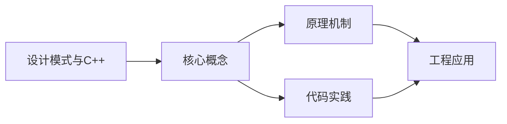
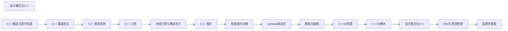

## 1. 学习目标（Bloom 分类）

本节按照布鲁姆教育目标分类学组织学习路径。本文主题为《设计模式与C++》，属于 C++ 模块，读者可以根据自身阶段选择阅读深度。

记忆层面：能够准确复述本文的核心概念、术语与基本语法或操作步骤，并能够在提问或检索时快速定位对应知识点。能够说出 C++ 的类、继承、重载、模板与 STL 容器基本语法。

理解层面：能够用自己的语言解释核心原理与工作机制，说明概念之间的因果关系，而不是机械记忆结论。能够解释 RAII、拷贝/移动语义、虚函数与模板实例化。

应用层面：能够在真实项目或练习场景中运用本文知识解决具体问题，写出正确且可维护的实现。能够编写现代 C++（C++17/20）的类与泛型代码。

分析层面：能够拆解复杂问题，比较本文主题与相邻概念的异同，识别边界条件与例外情况。能够分析生命周期、未定义行为与性能特征。

评价层面：能够根据约束条件（性能、可读性、安全、成本）评价不同方案的优劣，做出有依据的技术决策。能够评价 C++ 与 Rust、Java 在系统编程中的取舍。

创造层面：能够把本文知识与其他模块知识组合，设计出新的解决方案或可复用的工程模式。能够设计高性能、可维护的 C++ 库与应用。

通过本节学习，读者应当能够把《设计模式与C++》纳入自己的知识网络，并与 C++ 模块的其他主题（RAII、移动语义、模板、STL）建立关联。

## 2. 历史动机与发展脉络

《设计模式与C++》是 C++ 领域的重要主题。要真正理解它，需要先了解它解决的问题与演进过程。

C++ 由 Bjarne Stroustrup 于 1979 年开始在贝尔实验室开发（原名 C with Classes），1983 年更名 C++，1998 年 C++98 首次标准化。
C++11 是语言转折点：右值引用、auto、lambda、智能指针、并发内存模型让现代 C++ 写法定型；C++14/17 补充泛型 lambda、if constexpr、折叠表达式；C++20 引入 concepts、协程、模块与范围库；C++23 继续完善。
现代 C++ 的核心口号是“资源安全”：RAII + 智能指针替代裸 new/delete，异常与错误码按场景选择；Rust 的出现促使 C++ 社区更重视内存安全工具（如 profile 指南、sanitizer）。

回到本文主题：设计模式与C++ 的提出与成熟，正是上述技术背景下的必然产物。早期实现往往以简单可用为目标，随着工程规模扩大，社区逐渐沉淀出标准做法与最佳实践；理解这一脉络，可以帮助读者判断“为什么文档中的推荐写法是现在这个样子”，也能在遇到历史遗留代码时准确识别其设计年代与取舍。


## 3. 形式化定义与核心概念精讲

本节把《设计模式与C++》涉及的核心概念以“定义 + 讲解”的形式展开。读者应把定义当作工具，把讲解当作理解路径；两者结合才能形成可迁移的知识。

RAII：资源在构造函数获取、析构函数释放，栈对象离开作用域自动清理；智能指针（unique_ptr/shared_ptr/weak_ptr）把所有权编码进类型。
移动语义：右值引用 `&&` 与 std::move 转移资源所有权，避免深拷贝；移动后对象处于“合法但未指定”状态。
虚函数与多态：virtual 实现动态绑定，vtable 是运行时分派机制；final/override 关键字防止误用；基类析构函数应为 virtual。

### 3.1 原文章节逐一精讲

原文档把主题拆分为 18 个小节，下面按顺序给出每一节的导读讲解，随后保留原文细节供精读。

#### 原文精读（完整保留）

# C++ 设计模式

> **符号约定**：`< >` 必填参数 | `[ ]` 可选参数

---

#### 概述

设计模式是面向对象编程中经过验证的解决方案模板，用于解决常见的软件设计问题。GoF（Gang of Four）定义了 23 种经典设计模式，分为创建型、结构型和行为型三大类。C++ 的多态、模板、RAII 和智能指针等特性为设计模式的实现提供了丰富的手段，使得许多模式在 C++ 中有比传统面向对象语言更优雅的实现方式。

#### 基础概念

##### 设计模式分类

| 类别   | 说明         | 典型模式             |
| ------ | ------------ | -------------------- |
| 创建型 | 对象创建机制 | 单例、工厂、建造者   |
| 结构型 | 对象组合方式 | 适配器、装饰器、代理 |
| 行为型 | 对象间通信   | 观察者、策略、命令   |

##### C++ 实现设计模式的独特优势

- RAII 替代复杂的资源管理模式
- 智能指针简化对象生命周期管理
- 模板实现编译期多态（CRTP）
- Lambda 简化策略和命令模式

#### 快速上手

##### 单例模式

```cpp
// C++11 线程安全的 Meyer's Singleton
class Database {
public:
    static Database& instance() {
        static Database db;  // C++11 保证线程安全
        return db;
    }

    void query(const std::string& sql) { /* 查询逻辑 */ }

private:
    Database() = default;
    Database(const Database&) = delete;
    Database& operator=(const Database&) = delete;
};

// 使用
Database::instance().query("SELECT * FROM users");
```

##### 工厂模式

```cpp
#include <memory>
#include <string>

class Shape {
public:
    virtual ~Shape() = default;
    virtual double area() const = 0;
};

class Circle : public Shape {
    double radius_;
public:
    explicit Circle(double r) : radius_(r) {}
    double area() const override { return 3.14159 * radius_ * radius_; }
};

class Rectangle : public Shape {
    double width_, height_;
public:
    Rectangle(double w, double h) : width_(w), height_(h) {}
    double area() const override { return width_ * height_; }
};

// 工厂函数
std::unique_ptr<Shape> createShape(const std::string& type, double a, double b = 0) {
    if (type == "circle") return std::make_unique<Circle>(a);
    if (type == "rectangle") return std::make_unique<Rectangle>(a, b);
    throw std::invalid_argument("未知形状");
}
```

##### 策略模式（使用 Lambda）

```cpp
#include <functional>
#include <vector>
#include <algorithm>

class Sorter {
    std::function<bool(int, int)> comparator_;
public:
    explicit Sorter(std::function<bool(int, int)> comp) : comparator_(std::move(comp)) {}

    void sort(std::vector<int>& data) {
        std::sort(data.begin(), data.end(), comparator_);
    }
};

// 使用 Lambda 替代策略类
Sorter ascSorter([](int a, int b) { return a < b; });
Sorter descSorter([](int a, int b) { return a > b; });

std::vector<int> data = {3, 1, 4, 1, 5};
ascSorter.sort(data);   // 升序
descSorter.sort(data);  // 降序
```

#### 详细用法

##### 观察者模式

```cpp
#include <functional>
#include <vector>
#include <string>
#include <algorithm>

class EventBus {
    std::unordered_map<std::string, std::vector<std::function<void(const std::string&)>>> handlers_;
public:
    void subscribe(const std::string& event, std::function<void(const std::string&)> handler) {
        handlers_[event].push_back(std::move(handler));
    }

    void publish(const std::string& event, const std::string& data) {
        auto it = handlers_.find(event);
        if (it != handlers_.end()) {
            for (auto& handler : it->second) {
                handler(data);
            }
        }
    }
};

// 使用
EventBus bus;
bus.subscribe("user.login", [](const std::string& user) {
    std::cout << user << " 已登录" << std::endl;
});
bus.publish("user.login", "张三");
```

##### 装饰器模式

```cpp
#include <memory>
#include <string>

class Coffee {
public:
    virtual ~Coffee() = default;
    virtual double cost() const = 0;
    virtual std::string description() const = 0;
};

class Espresso : public Coffee {
public:
    double cost() const override { return 10.0; }
    std::string description() const override { return "浓缩咖啡"; }
};

class MilkDecorator : public Coffee {
    std::unique_ptr<Coffee> coffee_;
public:
    explicit MilkDecorator(std::unique_ptr<Coffee> c) : coffee_(std::move(c)) {}
    double cost() const override { return coffee_->cost() + 3.0; }
    std::string description() const override { return coffee_->description() + " + 牛奶"; }
};

class SugarDecorator : public Coffee {
    std::unique_ptr<Coffee> coffee_;
public:
    explicit SugarDecorator(std::unique_ptr<Coffee> c) : coffee_(std::move(c)) {}
    double cost() const override { return coffee_->cost() + 1.0; }
    std::string description() const override { return coffee_->description() + " + 糖"; }
};

// 使用
auto coffee = std::make_unique<SugarDecorator>(
    std::make_unique<MilkDecorator>(
        std::make_unique<Espresso>()));
std::cout << coffee->description() << ": " << coffee->cost() << "元" << std::endl;
// 浓缩咖啡 + 牛奶 + 糖: 14元
```

##### 命令模式

```cpp
#include <vector>
#include <memory>
#include <functional>

class Command {
public:
    virtual ~Command() = default;
    virtual void execute() = 0;
    virtual void undo() = 0;
};

class CommandManager {
    std::vector<std::unique_ptr<Command>> history_;
    size_t current_ = 0;
public:
    void execute(std::unique_ptr<Command> cmd) {
        // 删除当前位置之后的历史
        history_.resize(current_);
        cmd->execute();
        history_.push_back(std::move(cmd));
        ++current_;
    }

    void undo() {
        if (current_ > 0) {
            --current_;
            history_[current_]->undo();
        }
    }

    void redo() {
        if (current_ < history_.size()) {
            history_[current_]->execute();
            ++current_;
        }
    }
};

// 使用 Lambda 实现轻量命令
class LambdaCommand : public Command {
    std::function<void()> do_;
    std::function<void()> undo_;
public:
    LambdaCommand(std::function<void()> d, std::function<void()> u)
        : do_(std::move(d)), undo_(std::move(u)) {}
    void execute() override { do_(); }
    void undo() override { undo_(); }
};
```

##### 适配器模式

```cpp
#include <string>

// 第三方库的接口
class LegacyLogger {
public:
    void logMessage(int level, const char* msg) {
        std::cout << "[" << level << "] " << msg << std::endl;
    }
};

// 目标接口
class Logger {
public:
    virtual ~Logger() = default;
    virtual void info(const std::string& msg) = 0;
    virtual void error(const std::string& msg) = 0;
};

// 适配器
class LoggerAdapter : public Logger {
    LegacyLogger legacy_;
public:
    void info(const std::string& msg) override {
        legacy_.logMessage(0, msg.c_str());
    }
    void error(const std::string& msg) override {
        legacy_.logMessage(3, msg.c_str());
    }
};
```

#### 常见场景

##### Pimpl 惯用法（编译防火墙）

```cpp
// widget.h
class Widget {
public:
    Widget();
    ~Widget();
    void process();
private:
    struct Impl;
    std::unique_ptr<Impl> impl_;
};

// widget.cpp
struct Widget::Impl {
    std::vector<int> data;
    void process() { /* 复杂实现 */ }
};

Widget::Widget() : impl_(std::make_unique<Impl>()) {}
Widget::~Widget() = default;
void Widget::process() { impl_->process(); }
```

##### CRTP 静态多态

```cpp
// CRTP 替代虚函数实现多态，零运行时开销
template<typename Derived>
class ShapeBase {
public:
    double area() const {
        return static_cast<const Derived*>(this)->computeArea();
    }
};

class Circle : public ShapeBase<Circle> {
    double radius_;
public:
    explicit Circle(double r) : radius_(r) {}
    double computeArea() const { return 3.14159 * radius_ * radius_; }
};

class Square : public ShapeBase<Square> {
    double side_;
public:
    explicit Square(double s) : side_(s) {}
    double computeArea() const { return side_ * side_; }
};
```

#### 注意事项

- 不要为了使用模式而使用模式，模式是解决特定问题的工具，不是目标
- C++ 的 RAII 和智能指针可以替代许多传统模式中的资源管理代码
- Lambda 表达式可以简化策略、命令和观察者模式的实现
- 模板和 CRTP 可以在编译期实现某些模式，避免虚函数开销
- 单例模式应谨慎使用，全局状态会增加耦合和测试难度
- 过度使用设计模式会导致代码过度抽象，增加理解成本

#### 进阶用法

##### 类型擦除（现代 C++ 风格）

```cpp
#include <memory>
#include <functional>

// 使用类型擦除实现类似 std::function 的效果
class Drawable {
    struct Concept {
        virtual ~Concept() = default;
        virtual void draw() const = 0;
    };

    template<typename T>
    struct Model : Concept {
        T obj_;
        Model(T obj) : obj_(std::move(obj)) {}
        void draw() const override { obj_.draw(); }
    };

    std::shared_ptr<const Concept> impl_;
public:
    template<typename T>
    Drawable(T obj) : impl_(std::make_shared<Model<T>>(std::move(obj))) {}

    void draw() const { impl_->draw(); }
};

// 任何有 draw() 方法的类型都可以使用
struct Circle { void draw() const { std::cout << "画圆" << std::endl; } };
struct Square { void draw() const { std::cout << "画方" << std::endl; } };

Drawable d1 = Circle{};
Drawable d2 = Square{};
d1.draw();  // 画圆
d2.draw();  // 画方
```

##### 依赖注入

```cpp
#include <memory>

// 接口
class ILogger {
public:
    virtual ~ILogger() = default;
    virtual void log(const std::string& msg) = 0;
};

// 具体实现
class ConsoleLogger : public ILogger {
public:
    void log(const std::string& msg) override {
        std::cout << "[LOG] " << msg << std::endl;
    }
};

// 依赖注入
class Service {
    std::shared_ptr<ILogger> logger_;
public:
    explicit Service(std::shared_ptr<ILogger> logger) : logger_(std::move(logger)) {}

    void doWork() {
        logger_->log("开始工作");
        // ...
        logger_->log("工作完成");
    }
};

// 使用
auto logger = std::make_shared<ConsoleLogger>();
Service svc(logger);
svc.doWork();
```
#### 单例模式 Singleton

**基本写法：Meyers 单例**
`static <类型>& <实例>()`
```cpp
// 线程安全的局部静态变量
class Logger {
public:
    static Logger& instance() {
        static Logger inst; // C++11 起线程安全
        return inst;
    }
    Logger(const Logger&) = delete;
    Logger& operator=(const Logger&) = delete;
private:
    Logger() = default;
};
```

---

#### 工厂模式 Factory

**基本写法：简单工厂**
`static <基类指针> create(<类型标识>)`
```cpp
// 根据参数创建不同子类
struct Shape { virtual void draw() = 0; virtual ~Shape() = default; };
struct Circle : Shape { void draw() override {} };
struct Square : Shape { void draw() override {} };

struct ShapeFactory {
    static std::unique_ptr<Shape> create(const std::string& kind) {
        if (kind == "circle") return std::make_unique<Circle>();
        if (kind == "square") return std::make_unique<Square>();
        return nullptr;
    }
};
```

---

**基本写法：抽象工厂**
`struct <抽象工厂接口> { virtual <产品> create() = 0; };`
```cpp
// 工厂接口与具体工厂
struct GUIFactory {
    virtual std::unique_ptr<class Button> makeButton() = 0;
    virtual ~GUIFactory() = default;
};
struct WinFactory : GUIFactory {
    std::unique_ptr<Button> makeButton() override;
};
struct MacFactory : GUIFactory {
    std::unique_ptr<Button> makeButton() override;
};
```

---

#### 观察者模式 Observer

**基本写法：订阅/通知**
`<subject>.attach(<observer>); <subject>.notify();`
```cpp
#include <functional>
#include <vector>
struct Subject {
    using Slot = std::function<void(int)>;
    std::vector<Slot> observers;
    void attach(Slot s) { observers.push_back(std::move(s)); }
    void notify(int value) {
        for (auto& s : observers) s(value);
    }
};
// 使用
Subject s;
s.attach([](int v){ std::cout << v; });
s.notify(42);
```

---

#### 策略模式 Strategy

**基本写法：函数对象策略**
`std::function<<签名>> <策略>`
```cpp
// 用 std::function 持有策略
struct Context {
    std::function<int(int, int)> strategy;
    int execute(int a, int b) { return strategy(a, b); }
};
Context c;
c.strategy = [](int a, int b){ return a + b; };
c.execute(2, 3); // 5
c.strategy = [](int a, int b){ return a * b; };
c.execute(2, 3); // 6
```

---

#### RAII 资源管理

**基本写法：RAII 包装**
`struct <包装类> { <资源> res; ~<类>() { <释放>; } };`
```cpp
// 构造获取资源，析构释放
struct FileGuard {
    FILE* fp;
    explicit FileGuard(const char* path) : fp(fopen(path, "r")) {}
    ~FileGuard() { if (fp) fclose(fp); }
    FileGuard(const FileGuard&) = delete;
    FileGuard& operator=(const FileGuard&) = delete;
};
```

---

#### Pimpl 惯用法

**基本写法：指针隐藏实现**
`struct <类> { struct Impl; std::unique_ptr<Impl> pimpl; };`
```cpp
// 头文件 widget.h
class Widget {
public:
    Widget();
    ~Widget(); // 需在源文件定义（因 unique_ptr 完整类型要求）
    void doWork();
private:
    struct Impl;
    std::unique_ptr<Impl> pimpl;
};
// 源文件 widget.cpp 中实现 Impl
```

---

#### 模板方法模式

**基本写法：非虚接口模式**
`<基类> { public: void <模板方法>() final; private: virtual void <步骤>() = 0; };`
```cpp
// 基类定义算法骨架
struct Task {
    void run() {        // 模板方法
        step1();
        step2();
    }
    virtual ~Task() = default;
private:
    virtual void step1() = 0;
    virtual void step2() = 0;
};
struct MyTask : Task {
    void step1() override { /* */ }
    void step2() override { /* */ }
};
```

---

#### 适配器模式 Adapter

**基本写法：对象适配器**
`struct <适配器> : <目标接口> { <被适配者> adaptee; };`
```cpp
// 适配不同接口
struct Target { virtual void request() = 0; virtual ~Target() = default; };
struct Adaptee { void specificRequest() {} };

struct Adapter : Target {
    Adaptee adaptee;
    void request() override { adaptee.specificRequest(); }
};
```

---

#### 装饰器模式 Decorator

**基本写法：包装增强**
`struct <装饰器> : <组件> { <组件*> wrapped; };`
```cpp
// 递归包装
struct Component { virtual void op() = 0; virtual ~Component() = default; };
struct Decorator : Component {
    std::unique_ptr<Component> inner;
    void op() override { inner->op(); }
};
struct LoggingDecorator : Decorator {
    void op() override { std::cout << "log"; Decorator::op(); }
};
```

---

#### 命令模式 Command

**基本写法：命令封装**
`struct <命令> { virtual void execute() = 0; };`
```cpp
// 将操作封装为对象
struct Command {
    virtual void execute() = 0;
    virtual ~Command() = default;
};
struct LightOnCmd : Command {
    void execute() override { /* 开灯 */ }
};
// 调用者持有命令
std::vector<std::unique_ptr<Command>> cmds;
cmds.push_back(std::make_unique<LightOnCmd>());
cmds.back()->execute();
```

---

#### 现代模式速查

**基本写法：用 lambda 替代策略**
`auto <策略> = [](<参数>) { ... };`
```cpp
// 现代 C++ 倾向用 lambda/std::function 替代部分模式
std::vector<int> v = {3, 1, 4, 1, 5};
std::sort(v.begin(), v.end(), [](int a, int b){ return a > b; });
// 命令模式也可用 std::function
std::vector<std::function<void()>> actions;
actions.push_back([]{ std::cout << "hi"; });
```


### 3.2 概念关系图

下面用 Mermaid 图表达本文核心概念之间的关系，帮助读者建立整体图景：



图中展示的是本文知识的结构化关系：核心概念是入口，原理机制解释“为什么”，代码实践演示“怎么做”，工程应用回答“何时用”。读者学习时可以把每个小节的内容挂接到对应节点上。

## 4. 理论推导与原理解析

本节深入《设计模式与C++》背后的原理。理论部分不求面面俱到，而是聚焦“能解释现象、能指导实践”的关键推导。

RAII：资源在构造函数获取、析构函数释放，栈对象离开作用域自动清理；智能指针（unique_ptr/shared_ptr/weak_ptr）把所有权编码进类型。
移动语义：右值引用 `&&` 与 std::move 转移资源所有权，避免深拷贝；移动后对象处于“合法但未指定”状态。
虚函数与多态：virtual 实现动态绑定，vtable 是运行时分派机制；final/override 关键字防止误用；基类析构函数应为 virtual。
模板与泛型：模板编译期实例化，实现静态多态；concepts（C++20）约束类型接口；模板元编程在编译期计算类型与常量。

需要强调的是，理论推导与工程实践之间存在翻译层：理论给出的是理想化模型与边界条件，工程代码则必须处理真实环境中的例外。读者在学习时应先掌握理论的“标准情形”，再通过陷阱章节了解“非标准情形”。

## 5. 代码示例与逐行讲解

本节把原文中的代码示例系统整理，并为每个示例补充用途说明与讲解。读者不应只浏览代码，而应逐段对照讲解理解设计意图。

### 5.1 示例：单例模式

该示例来自原文《单例模式》小节，用于演示设计模式与C++相关操作。阅读时请先看代码结构，再看其后的讲解。

```cpp
// C++11 线程安全的 Meyer's Singleton
class Database {
public:
    static Database& instance() {
        static Database db;  // C++11 保证线程安全
        return db;
    }

    void query(const std::string& sql) { /* 查询逻辑 */ }

private:
    Database() = default;
    Database(const Database&) = delete;
    Database& operator=(const Database&) = delete;
};

// 使用
Database::instance().query("SELECT * FROM users");
```

讲解：这段代码演示了本节核心知识点。代码中的关键操作可以归纳为三步：准备（定义或初始化）、执行（核心逻辑）、收尾（释放资源或返回结果）。实际项目中，这三步往往被封装为函数或类，以提升复用性与可测试性。

关键点分析：

该示例共 15 行有效代码，包含 4 类关键结构（class、return、SELECT、FROM）。其中：

- 入口与初始化部分负责建立上下文，对应实际项目中的启动或装配逻辑；
- 核心逻辑部分体现本文主题的主要操作，是阅读时最需要对照讲解理解的部分；
- 输出或返回部分把结果交给调用方，注意其类型与边界条件。

进阶思考路径：先尝试修改参数观察行为变化，再把示例中的模式迁移到自己的项目中；每次修改都记录预期与实测差异，这是把示例转化为能力的最快方式。

### 5.2 示例：工厂模式

该示例来自原文《工厂模式》小节，用于演示设计模式与C++相关操作。阅读时请先看代码结构，再看其后的讲解。

```cpp
#include <memory>
#include <string>

class Shape {
public:
    virtual ~Shape() = default;
    virtual double area() const = 0;
};

class Circle : public Shape {
    double radius_;
public:
    explicit Circle(double r) : radius_(r) {}
    double area() const override { return 3.14159 * radius_ * radius_; }
};

class Rectangle : public Shape {
    double width_, height_;
public:
    Rectangle(double w, double h) : width_(w), height_(h) {}
    double area() const override { return width_ * height_; }
};

// 工厂函数
std::unique_ptr<Shape> createShape(const std::string& type, double a, double b = 0) {
    if (type == "circle") return std::make_unique<Circle>(a);
    if (type == "rectangle") return std::make_unique<Rectangle>(a, b);
    throw std::invalid_argument("未知形状");
}
```

讲解：这段代码演示了本节核心知识点。代码中的关键操作可以归纳为三步：准备（定义或初始化）、执行（核心逻辑）、收尾（释放资源或返回结果）。实际项目中，这三步往往被封装为函数或类，以提升复用性与可测试性。

关键点分析：

该示例共 25 行有效代码，包含 3 类关键结构（class、if、return）。其中：

- 入口与初始化部分负责建立上下文，对应实际项目中的启动或装配逻辑；
- 核心逻辑部分体现本文主题的主要操作，是阅读时最需要对照讲解理解的部分；
- 输出或返回部分把结果交给调用方，注意其类型与边界条件。

进阶思考路径：先尝试修改参数观察行为变化，再把示例中的模式迁移到自己的项目中；每次修改都记录预期与实测差异，这是把示例转化为能力的最快方式。

### 5.3 示例：策略模式（使用 Lambda）

该示例来自原文《策略模式（使用 Lambda）》小节，用于演示设计模式与C++相关操作。阅读时请先看代码结构，再看其后的讲解。

```cpp
#include <functional>
#include <vector>
#include <algorithm>

class Sorter {
    std::function<bool(int, int)> comparator_;
public:
    explicit Sorter(std::function<bool(int, int)> comp) : comparator_(std::move(comp)) {}

    void sort(std::vector<int>& data) {
        std::sort(data.begin(), data.end(), comparator_);
    }
};

// 使用 Lambda 替代策略类
Sorter ascSorter([](int a, int b) { return a < b; });
Sorter descSorter([](int a, int b) { return a > b; });

std::vector<int> data = {3, 1, 4, 1, 5};
ascSorter.sort(data);   // 升序
descSorter.sort(data);  // 降序
```

讲解：这段代码演示了本节核心知识点。代码中的关键操作可以归纳为三步：准备（定义或初始化）、执行（核心逻辑）、收尾（释放资源或返回结果）。实际项目中，这三步往往被封装为函数或类，以提升复用性与可测试性。

关键点分析：

该示例共 17 行有效代码，包含 3 类关键结构（class、function、return）。其中：

- 入口与初始化部分负责建立上下文，对应实际项目中的启动或装配逻辑；
- 核心逻辑部分体现本文主题的主要操作，是阅读时最需要对照讲解理解的部分；
- 输出或返回部分把结果交给调用方，注意其类型与边界条件。

进阶思考路径：先尝试修改参数观察行为变化，再把示例中的模式迁移到自己的项目中；每次修改都记录预期与实测差异，这是把示例转化为能力的最快方式。

### 5.4 示例：观察者模式

该示例来自原文《观察者模式》小节，用于演示设计模式与C++相关操作。阅读时请先看代码结构，再看其后的讲解。

```cpp
#include <functional>
#include <vector>
#include <string>
#include <algorithm>

class EventBus {
    std::unordered_map<std::string, std::vector<std::function<void(const std::string&)>>> handlers_;
public:
    void subscribe(const std::string& event, std::function<void(const std::string&)> handler) {
        handlers_[event].push_back(std::move(handler));
    }

    void publish(const std::string& event, const std::string& data) {
        auto it = handlers_.find(event);
        if (it != handlers_.end()) {
            for (auto& handler : it->second) {
                handler(data);
            }
        }
    }
};

// 使用
EventBus bus;
bus.subscribe("user.login", [](const std::string& user) {
    std::cout << user << " 已登录" << std::endl;
});
bus.publish("user.login", "张三");
```

讲解：这段代码演示了本节核心知识点。代码中的关键操作可以归纳为三步：准备（定义或初始化）、执行（核心逻辑）、收尾（释放资源或返回结果）。实际项目中，这三步往往被封装为函数或类，以提升复用性与可测试性。

关键点分析：

该示例共 25 行有效代码，包含 4 类关键结构（class、function、if、for）。其中：

- 入口与初始化部分负责建立上下文，对应实际项目中的启动或装配逻辑；
- 核心逻辑部分体现本文主题的主要操作，是阅读时最需要对照讲解理解的部分；
- 输出或返回部分把结果交给调用方，注意其类型与边界条件。

进阶思考路径：先尝试修改参数观察行为变化，再把示例中的模式迁移到自己的项目中；每次修改都记录预期与实测差异，这是把示例转化为能力的最快方式。

### 5.5 示例：装饰器模式

该示例来自原文《装饰器模式》小节，用于演示设计模式与C++相关操作。阅读时请先看代码结构，再看其后的讲解。

```cpp
#include <memory>
#include <string>

class Coffee {
public:
    virtual ~Coffee() = default;
    virtual double cost() const = 0;
    virtual std::string description() const = 0;
};

class Espresso : public Coffee {
public:
    double cost() const override { return 10.0; }
    std::string description() const override { return "浓缩咖啡"; }
};

class MilkDecorator : public Coffee {
    std::unique_ptr<Coffee> coffee_;
public:
    explicit MilkDecorator(std::unique_ptr<Coffee> c) : coffee_(std::move(c)) {}
    double cost() const override { return coffee_->cost() + 3.0; }
    std::string description() const override { return coffee_->description() + " + 牛奶"; }
};

class SugarDecorator : public Coffee {
    std::unique_ptr<Coffee> coffee_;
public:
    explicit SugarDecorator(std::unique_ptr<Coffee> c) : coffee_(std::move(c)) {}
    double cost() const override { return coffee_->cost() + 1.0; }
    std::string description() const override { return coffee_->description() + " + 糖"; }
};

// 使用
auto coffee = std::make_unique<SugarDecorator>(
    std::make_unique<MilkDecorator>(
        std::make_unique<Espresso>()));
std::cout << coffee->description() << ": " << coffee->cost() << "元" << std::endl;
// 浓缩咖啡 + 牛奶 + 糖: 14元
```

讲解：这段代码演示了本节核心知识点。代码中的关键操作可以归纳为三步：准备（定义或初始化）、执行（核心逻辑）、收尾（释放资源或返回结果）。实际项目中，这三步往往被封装为函数或类，以提升复用性与可测试性。

关键点分析：

该示例共 33 行有效代码，包含 2 类关键结构（class、return）。其中：

- 入口与初始化部分负责建立上下文，对应实际项目中的启动或装配逻辑；
- 核心逻辑部分体现本文主题的主要操作，是阅读时最需要对照讲解理解的部分；
- 输出或返回部分把结果交给调用方，注意其类型与边界条件。

进阶思考路径：先尝试修改参数观察行为变化，再把示例中的模式迁移到自己的项目中；每次修改都记录预期与实测差异，这是把示例转化为能力的最快方式。

### 5.6 示例：命令模式

该示例来自原文《命令模式》小节，用于演示设计模式与C++相关操作。阅读时请先看代码结构，再看其后的讲解。

```cpp
#include <vector>
#include <memory>
#include <functional>

class Command {
public:
    virtual ~Command() = default;
    virtual void execute() = 0;
    virtual void undo() = 0;
};

class CommandManager {
    std::vector<std::unique_ptr<Command>> history_;
    size_t current_ = 0;
public:
    void execute(std::unique_ptr<Command> cmd) {
        // 删除当前位置之后的历史
        history_.resize(current_);
        cmd->execute();
        history_.push_back(std::move(cmd));
        ++current_;
    }

    void undo() {
        if (current_ > 0) {
            --current_;
            history_[current_]->undo();
        }
    }

    void redo() {
        if (current_ < history_.size()) {
            history_[current_]->execute();
            ++current_;
        }
    }
};

// 使用 Lambda 实现轻量命令
class LambdaCommand : public Command {
    std::function<void()> do_;
    std::function<void()> undo_;
public:
    LambdaCommand(std::function<void()> d, std::function<void()> u)
        : do_(std::move(d)), undo_(std::move(u)) {}
    void execute() override { do_(); }
    void undo() override { undo_(); }
};
```

讲解：这段代码演示了本节核心知识点。代码中的关键操作可以归纳为三步：准备（定义或初始化）、执行（核心逻辑）、收尾（释放资源或返回结果）。实际项目中，这三步往往被封装为函数或类，以提升复用性与可测试性。

关键点分析：

该示例共 43 行有效代码，包含 3 类关键结构（class、function、if）。其中：

- 入口与初始化部分负责建立上下文，对应实际项目中的启动或装配逻辑；
- 核心逻辑部分体现本文主题的主要操作，是阅读时最需要对照讲解理解的部分；
- 输出或返回部分把结果交给调用方，注意其类型与边界条件。

进阶思考路径：先尝试修改参数观察行为变化，再把示例中的模式迁移到自己的项目中；每次修改都记录预期与实测差异，这是把示例转化为能力的最快方式。

### 5.7 示例：适配器模式

该示例来自原文《适配器模式》小节，用于演示设计模式与C++相关操作。阅读时请先看代码结构，再看其后的讲解。

```cpp
#include <string>

// 第三方库的接口
class LegacyLogger {
public:
    void logMessage(int level, const char* msg) {
        std::cout << "[" << level << "] " << msg << std::endl;
    }
};

// 目标接口
class Logger {
public:
    virtual ~Logger() = default;
    virtual void info(const std::string& msg) = 0;
    virtual void error(const std::string& msg) = 0;
};

// 适配器
class LoggerAdapter : public Logger {
    LegacyLogger legacy_;
public:
    void info(const std::string& msg) override {
        legacy_.logMessage(0, msg.c_str());
    }
    void error(const std::string& msg) override {
        legacy_.logMessage(3, msg.c_str());
    }
};
```

讲解：这段代码演示了本节核心知识点。代码中的关键操作可以归纳为三步：准备（定义或初始化）、执行（核心逻辑）、收尾（释放资源或返回结果）。实际项目中，这三步往往被封装为函数或类，以提升复用性与可测试性。

关键点分析：

该示例共 26 行有效代码，包含 1 类关键结构（class）。其中：

- 入口与初始化部分负责建立上下文，对应实际项目中的启动或装配逻辑；
- 核心逻辑部分体现本文主题的主要操作，是阅读时最需要对照讲解理解的部分；
- 输出或返回部分把结果交给调用方，注意其类型与边界条件。

进阶思考路径：先尝试修改参数观察行为变化，再把示例中的模式迁移到自己的项目中；每次修改都记录预期与实测差异，这是把示例转化为能力的最快方式。

### 5.8 示例：Pimpl 惯用法（编译防火墙）

该示例来自原文《Pimpl 惯用法（编译防火墙）》小节，用于演示设计模式与C++相关操作。阅读时请先看代码结构，再看其后的讲解。

```cpp
// widget.h
class Widget {
public:
    Widget();
    ~Widget();
    void process();
private:
    struct Impl;
    std::unique_ptr<Impl> impl_;
};

// widget.cpp
struct Widget::Impl {
    std::vector<int> data;
    void process() { /* 复杂实现 */ }
};

Widget::Widget() : impl_(std::make_unique<Impl>()) {}
Widget::~Widget() = default;
void Widget::process() { impl_->process(); }
```

讲解：这段代码演示了本节核心知识点。代码中的关键操作可以归纳为三步：准备（定义或初始化）、执行（核心逻辑）、收尾（释放资源或返回结果）。实际项目中，这三步往往被封装为函数或类，以提升复用性与可测试性。

关键点分析：

该示例共 18 行有效代码，包含 1 类关键结构（class）。其中：

- 入口与初始化部分负责建立上下文，对应实际项目中的启动或装配逻辑；
- 核心逻辑部分体现本文主题的主要操作，是阅读时最需要对照讲解理解的部分；
- 输出或返回部分把结果交给调用方，注意其类型与边界条件。

进阶思考路径：先尝试修改参数观察行为变化，再把示例中的模式迁移到自己的项目中；每次修改都记录预期与实测差异，这是把示例转化为能力的最快方式。

### 5.9 示例：CRTP 静态多态

该示例来自原文《CRTP 静态多态》小节，用于演示设计模式与C++相关操作。阅读时请先看代码结构，再看其后的讲解。

```cpp
// CRTP 替代虚函数实现多态，零运行时开销
template<typename Derived>
class ShapeBase {
public:
    double area() const {
        return static_cast<const Derived*>(this)->computeArea();
    }
};

class Circle : public ShapeBase<Circle> {
    double radius_;
public:
    explicit Circle(double r) : radius_(r) {}
    double computeArea() const { return 3.14159 * radius_ * radius_; }
};

class Square : public ShapeBase<Square> {
    double side_;
public:
    explicit Square(double s) : side_(s) {}
    double computeArea() const { return side_ * side_; }
};
```

讲解：这段代码演示了本节核心知识点。代码中的关键操作可以归纳为三步：准备（定义或初始化）、执行（核心逻辑）、收尾（释放资源或返回结果）。实际项目中，这三步往往被封装为函数或类，以提升复用性与可测试性。

关键点分析：

该示例共 20 行有效代码，包含 2 类关键结构（class、return）。其中：

- 入口与初始化部分负责建立上下文，对应实际项目中的启动或装配逻辑；
- 核心逻辑部分体现本文主题的主要操作，是阅读时最需要对照讲解理解的部分；
- 输出或返回部分把结果交给调用方，注意其类型与边界条件。

进阶思考路径：先尝试修改参数观察行为变化，再把示例中的模式迁移到自己的项目中；每次修改都记录预期与实测差异，这是把示例转化为能力的最快方式。

### 5.10 示例：类型擦除（现代 C++ 风格）

该示例来自原文《类型擦除（现代 C++ 风格）》小节，用于演示设计模式与C++相关操作。阅读时请先看代码结构，再看其后的讲解。

```cpp
#include <memory>
#include <functional>

// 使用类型擦除实现类似 std::function 的效果
class Drawable {
    struct Concept {
        virtual ~Concept() = default;
        virtual void draw() const = 0;
    };

    template<typename T>
    struct Model : Concept {
        T obj_;
        Model(T obj) : obj_(std::move(obj)) {}
        void draw() const override { obj_.draw(); }
    };

    std::shared_ptr<const Concept> impl_;
public:
    template<typename T>
    Drawable(T obj) : impl_(std::make_shared<Model<T>>(std::move(obj))) {}

    void draw() const { impl_->draw(); }
};

// 任何有 draw() 方法的类型都可以使用
struct Circle { void draw() const { std::cout << "画圆" << std::endl; } };
struct Square { void draw() const { std::cout << "画方" << std::endl; } };

Drawable d1 = Circle{};
Drawable d2 = Square{};
d1.draw();  // 画圆
d2.draw();  // 画方
```

讲解：这段代码演示了本节核心知识点。代码中的关键操作可以归纳为三步：准备（定义或初始化）、执行（核心逻辑）、收尾（释放资源或返回结果）。实际项目中，这三步往往被封装为函数或类，以提升复用性与可测试性。

关键点分析：

该示例共 27 行有效代码，包含 2 类关键结构（class、function）。其中：

- 入口与初始化部分负责建立上下文，对应实际项目中的启动或装配逻辑；
- 核心逻辑部分体现本文主题的主要操作，是阅读时最需要对照讲解理解的部分；
- 输出或返回部分把结果交给调用方，注意其类型与边界条件。

进阶思考路径：先尝试修改参数观察行为变化，再把示例中的模式迁移到自己的项目中；每次修改都记录预期与实测差异，这是把示例转化为能力的最快方式。

### 5.11 示例：依赖注入

该示例来自原文《依赖注入》小节，用于演示设计模式与C++相关操作。阅读时请先看代码结构，再看其后的讲解。

```cpp
#include <memory>

// 接口
class ILogger {
public:
    virtual ~ILogger() = default;
    virtual void log(const std::string& msg) = 0;
};

// 具体实现
class ConsoleLogger : public ILogger {
public:
    void log(const std::string& msg) override {
        std::cout << "[LOG] " << msg << std::endl;
    }
};

// 依赖注入
class Service {
    std::shared_ptr<ILogger> logger_;
public:
    explicit Service(std::shared_ptr<ILogger> logger) : logger_(std::move(logger)) {}

    void doWork() {
        logger_->log("开始工作");
        // ...
        logger_->log("工作完成");
    }
};

// 使用
auto logger = std::make_shared<ConsoleLogger>();
Service svc(logger);
svc.doWork();
```

讲解：这段代码演示了本节核心知识点。代码中的关键操作可以归纳为三步：准备（定义或初始化）、执行（核心逻辑）、收尾（释放资源或返回结果）。实际项目中，这三步往往被封装为函数或类，以提升复用性与可测试性。

关键点分析：

该示例共 29 行有效代码，包含 1 类关键结构（class）。其中：

- 入口与初始化部分负责建立上下文，对应实际项目中的启动或装配逻辑；
- 核心逻辑部分体现本文主题的主要操作，是阅读时最需要对照讲解理解的部分；
- 输出或返回部分把结果交给调用方，注意其类型与边界条件。

进阶思考路径：先尝试修改参数观察行为变化，再把示例中的模式迁移到自己的项目中；每次修改都记录预期与实测差异，这是把示例转化为能力的最快方式。

### 5.12 示例：单例模式 Singleton

该示例来自原文《单例模式 Singleton》小节，用于演示设计模式与C++相关操作。阅读时请先看代码结构，再看其后的讲解。

```cpp
// 线程安全的局部静态变量
class Logger {
public:
    static Logger& instance() {
        static Logger inst; // C++11 起线程安全
        return inst;
    }
    Logger(const Logger&) = delete;
    Logger& operator=(const Logger&) = delete;
private:
    Logger() = default;
};
```

讲解：这段代码演示了本节核心知识点。代码中的关键操作可以归纳为三步：准备（定义或初始化）、执行（核心逻辑）、收尾（释放资源或返回结果）。实际项目中，这三步往往被封装为函数或类，以提升复用性与可测试性。

关键点分析：

该示例共 12 行有效代码，包含 2 类关键结构（class、return）。其中：

- 入口与初始化部分负责建立上下文，对应实际项目中的启动或装配逻辑；
- 核心逻辑部分体现本文主题的主要操作，是阅读时最需要对照讲解理解的部分；
- 输出或返回部分把结果交给调用方，注意其类型与边界条件。

进阶思考路径：先尝试修改参数观察行为变化，再把示例中的模式迁移到自己的项目中；每次修改都记录预期与实测差异，这是把示例转化为能力的最快方式。

### 5.13 示例：工厂模式 Factory

该示例来自原文《工厂模式 Factory》小节，用于演示设计模式与C++相关操作。阅读时请先看代码结构，再看其后的讲解。

```cpp
// 根据参数创建不同子类
struct Shape { virtual void draw() = 0; virtual ~Shape() = default; };
struct Circle : Shape { void draw() override {} };
struct Square : Shape { void draw() override {} };

struct ShapeFactory {
    static std::unique_ptr<Shape> create(const std::string& kind) {
        if (kind == "circle") return std::make_unique<Circle>();
        if (kind == "square") return std::make_unique<Square>();
        return nullptr;
    }
};
```

讲解：这段代码演示了本节核心知识点。代码中的关键操作可以归纳为三步：准备（定义或初始化）、执行（核心逻辑）、收尾（释放资源或返回结果）。实际项目中，这三步往往被封装为函数或类，以提升复用性与可测试性。

关键点分析：

该示例共 11 行有效代码，包含 2 类关键结构（if、return）。其中：

- 入口与初始化部分负责建立上下文，对应实际项目中的启动或装配逻辑；
- 核心逻辑部分体现本文主题的主要操作，是阅读时最需要对照讲解理解的部分；
- 输出或返回部分把结果交给调用方，注意其类型与边界条件。

进阶思考路径：先尝试修改参数观察行为变化，再把示例中的模式迁移到自己的项目中；每次修改都记录预期与实测差异，这是把示例转化为能力的最快方式。

### 5.14 示例：工厂模式 Factory

该示例来自原文《工厂模式 Factory》小节，用于演示设计模式与C++相关操作。阅读时请先看代码结构，再看其后的讲解。

```cpp
// 工厂接口与具体工厂
struct GUIFactory {
    virtual std::unique_ptr<class Button> makeButton() = 0;
    virtual ~GUIFactory() = default;
};
struct WinFactory : GUIFactory {
    std::unique_ptr<Button> makeButton() override;
};
struct MacFactory : GUIFactory {
    std::unique_ptr<Button> makeButton() override;
};
```

讲解：这段代码演示了本节核心知识点。代码中的关键操作可以归纳为三步：准备（定义或初始化）、执行（核心逻辑）、收尾（释放资源或返回结果）。实际项目中，这三步往往被封装为函数或类，以提升复用性与可测试性。

关键点分析：

该示例共 11 行有效代码，包含 1 类关键结构（class）。其中：

- 入口与初始化部分负责建立上下文，对应实际项目中的启动或装配逻辑；
- 核心逻辑部分体现本文主题的主要操作，是阅读时最需要对照讲解理解的部分；
- 输出或返回部分把结果交给调用方，注意其类型与边界条件。

进阶思考路径：先尝试修改参数观察行为变化，再把示例中的模式迁移到自己的项目中；每次修改都记录预期与实测差异，这是把示例转化为能力的最快方式。

### 5.15 示例：观察者模式 Observer

该示例来自原文《观察者模式 Observer》小节，用于演示设计模式与C++相关操作。阅读时请先看代码结构，再看其后的讲解。

```cpp
#include <functional>
#include <vector>
struct Subject {
    using Slot = std::function<void(int)>;
    std::vector<Slot> observers;
    void attach(Slot s) { observers.push_back(std::move(s)); }
    void notify(int value) {
        for (auto& s : observers) s(value);
    }
};
// 使用
Subject s;
s.attach([](int v){ std::cout << v; });
s.notify(42);
```

讲解：这段代码演示了本节核心知识点。代码中的关键操作可以归纳为三步：准备（定义或初始化）、执行（核心逻辑）、收尾（释放资源或返回结果）。实际项目中，这三步往往被封装为函数或类，以提升复用性与可测试性。

关键点分析：

该示例共 14 行有效代码，包含 2 类关键结构（function、for）。其中：

- 入口与初始化部分负责建立上下文，对应实际项目中的启动或装配逻辑；
- 核心逻辑部分体现本文主题的主要操作，是阅读时最需要对照讲解理解的部分；
- 输出或返回部分把结果交给调用方，注意其类型与边界条件。

进阶思考路径：先尝试修改参数观察行为变化，再把示例中的模式迁移到自己的项目中；每次修改都记录预期与实测差异，这是把示例转化为能力的最快方式。

### 5.16 示例：策略模式 Strategy

该示例来自原文《策略模式 Strategy》小节，用于演示设计模式与C++相关操作。阅读时请先看代码结构，再看其后的讲解。

```cpp
// 用 std::function 持有策略
struct Context {
    std::function<int(int, int)> strategy;
    int execute(int a, int b) { return strategy(a, b); }
};
Context c;
c.strategy = [](int a, int b){ return a + b; };
c.execute(2, 3); // 5
c.strategy = [](int a, int b){ return a * b; };
c.execute(2, 3); // 6
```

讲解：这段代码演示了本节核心知识点。代码中的关键操作可以归纳为三步：准备（定义或初始化）、执行（核心逻辑）、收尾（释放资源或返回结果）。实际项目中，这三步往往被封装为函数或类，以提升复用性与可测试性。

关键点分析：

该示例共 10 行有效代码，包含 2 类关键结构（function、return）。其中：

- 入口与初始化部分负责建立上下文，对应实际项目中的启动或装配逻辑；
- 核心逻辑部分体现本文主题的主要操作，是阅读时最需要对照讲解理解的部分；
- 输出或返回部分把结果交给调用方，注意其类型与边界条件。

进阶思考路径：先尝试修改参数观察行为变化，再把示例中的模式迁移到自己的项目中；每次修改都记录预期与实测差异，这是把示例转化为能力的最快方式。

### 5.17 示例：RAII 资源管理

该示例来自原文《RAII 资源管理》小节，用于演示设计模式与C++相关操作。阅读时请先看代码结构，再看其后的讲解。

```cpp
// 构造获取资源，析构释放
struct FileGuard {
    FILE* fp;
    explicit FileGuard(const char* path) : fp(fopen(path, "r")) {}
    ~FileGuard() { if (fp) fclose(fp); }
    FileGuard(const FileGuard&) = delete;
    FileGuard& operator=(const FileGuard&) = delete;
};
```

讲解：这段代码演示了本节核心知识点。代码中的关键操作可以归纳为三步：准备（定义或初始化）、执行（核心逻辑）、收尾（释放资源或返回结果）。实际项目中，这三步往往被封装为函数或类，以提升复用性与可测试性。

关键点分析：

该示例共 8 行有效代码，包含 1 类关键结构（if）。其中：

- 入口与初始化部分负责建立上下文，对应实际项目中的启动或装配逻辑；
- 核心逻辑部分体现本文主题的主要操作，是阅读时最需要对照讲解理解的部分；
- 输出或返回部分把结果交给调用方，注意其类型与边界条件。

进阶思考路径：先尝试修改参数观察行为变化，再把示例中的模式迁移到自己的项目中；每次修改都记录预期与实测差异，这是把示例转化为能力的最快方式。

### 5.18 示例：Pimpl 惯用法

该示例来自原文《Pimpl 惯用法》小节，用于演示设计模式与C++相关操作。阅读时请先看代码结构，再看其后的讲解。

```cpp
// 头文件 widget.h
class Widget {
public:
    Widget();
    ~Widget(); // 需在源文件定义（因 unique_ptr 完整类型要求）
    void doWork();
private:
    struct Impl;
    std::unique_ptr<Impl> pimpl;
};
// 源文件 widget.cpp 中实现 Impl
```

讲解：这段代码演示了本节核心知识点。代码中的关键操作可以归纳为三步：准备（定义或初始化）、执行（核心逻辑）、收尾（释放资源或返回结果）。实际项目中，这三步往往被封装为函数或类，以提升复用性与可测试性。

关键点分析：

该示例共 11 行有效代码，包含 1 类关键结构（class）。其中：

- 入口与初始化部分负责建立上下文，对应实际项目中的启动或装配逻辑；
- 核心逻辑部分体现本文主题的主要操作，是阅读时最需要对照讲解理解的部分；
- 输出或返回部分把结果交给调用方，注意其类型与边界条件。

进阶思考路径：先尝试修改参数观察行为变化，再把示例中的模式迁移到自己的项目中；每次修改都记录预期与实测差异，这是把示例转化为能力的最快方式。

### 5.19 示例：模板方法模式

该示例来自原文《模板方法模式》小节，用于演示设计模式与C++相关操作。阅读时请先看代码结构，再看其后的讲解。

```cpp
// 基类定义算法骨架
struct Task {
    void run() {        // 模板方法
        step1();
        step2();
    }
    virtual ~Task() = default;
private:
    virtual void step1() = 0;
    virtual void step2() = 0;
};
struct MyTask : Task {
    void step1() override { /* */ }
    void step2() override { /* */ }
};
```

讲解：这段代码演示了本节核心知识点。代码中的关键操作可以归纳为三步：准备（定义或初始化）、执行（核心逻辑）、收尾（释放资源或返回结果）。实际项目中，这三步往往被封装为函数或类，以提升复用性与可测试性。

关键点分析：

该示例共 15 行有效代码，结构以数据或配置为主。阅读时应关注：数据字段的含义、配置项的作用，以及它们与运行行为的对应关系。

进阶思考路径：先尝试修改参数观察行为变化，再把示例中的模式迁移到自己的项目中；每次修改都记录预期与实测差异，这是把示例转化为能力的最快方式。

### 5.20 示例：适配器模式 Adapter

该示例来自原文《适配器模式 Adapter》小节，用于演示设计模式与C++相关操作。阅读时请先看代码结构，再看其后的讲解。

```cpp
// 适配不同接口
struct Target { virtual void request() = 0; virtual ~Target() = default; };
struct Adaptee { void specificRequest() {} };

struct Adapter : Target {
    Adaptee adaptee;
    void request() override { adaptee.specificRequest(); }
};
```

讲解：这段代码演示了本节核心知识点。代码中的关键操作可以归纳为三步：准备（定义或初始化）、执行（核心逻辑）、收尾（释放资源或返回结果）。实际项目中，这三步往往被封装为函数或类，以提升复用性与可测试性。

关键点分析：

该示例共 7 行有效代码，结构以数据或配置为主。阅读时应关注：数据字段的含义、配置项的作用，以及它们与运行行为的对应关系。

进阶思考路径：先尝试修改参数观察行为变化，再把示例中的模式迁移到自己的项目中；每次修改都记录预期与实测差异，这是把示例转化为能力的最快方式。

### 5.21 示例：装饰器模式 Decorator

该示例来自原文《装饰器模式 Decorator》小节，用于演示设计模式与C++相关操作。阅读时请先看代码结构，再看其后的讲解。

```cpp
// 递归包装
struct Component { virtual void op() = 0; virtual ~Component() = default; };
struct Decorator : Component {
    std::unique_ptr<Component> inner;
    void op() override { inner->op(); }
};
struct LoggingDecorator : Decorator {
    void op() override { std::cout << "log"; Decorator::op(); }
};
```

讲解：这段代码演示了本节核心知识点。代码中的关键操作可以归纳为三步：准备（定义或初始化）、执行（核心逻辑）、收尾（释放资源或返回结果）。实际项目中，这三步往往被封装为函数或类，以提升复用性与可测试性。

关键点分析：

该示例共 9 行有效代码，结构以数据或配置为主。阅读时应关注：数据字段的含义、配置项的作用，以及它们与运行行为的对应关系。

进阶思考路径：先尝试修改参数观察行为变化，再把示例中的模式迁移到自己的项目中；每次修改都记录预期与实测差异，这是把示例转化为能力的最快方式。

### 5.22 示例：命令模式 Command

该示例来自原文《命令模式 Command》小节，用于演示设计模式与C++相关操作。阅读时请先看代码结构，再看其后的讲解。

```cpp
// 将操作封装为对象
struct Command {
    virtual void execute() = 0;
    virtual ~Command() = default;
};
struct LightOnCmd : Command {
    void execute() override { /* 开灯 */ }
};
// 调用者持有命令
std::vector<std::unique_ptr<Command>> cmds;
cmds.push_back(std::make_unique<LightOnCmd>());
cmds.back()->execute();
```

讲解：这段代码演示了本节核心知识点。代码中的关键操作可以归纳为三步：准备（定义或初始化）、执行（核心逻辑）、收尾（释放资源或返回结果）。实际项目中，这三步往往被封装为函数或类，以提升复用性与可测试性。

关键点分析：

该示例共 12 行有效代码，结构以数据或配置为主。阅读时应关注：数据字段的含义、配置项的作用，以及它们与运行行为的对应关系。

进阶思考路径：先尝试修改参数观察行为变化，再把示例中的模式迁移到自己的项目中；每次修改都记录预期与实测差异，这是把示例转化为能力的最快方式。

### 5.23 示例：现代模式速查

该示例来自原文《现代模式速查》小节，用于演示设计模式与C++相关操作。阅读时请先看代码结构，再看其后的讲解。

```cpp
// 现代 C++ 倾向用 lambda/std::function 替代部分模式
std::vector<int> v = {3, 1, 4, 1, 5};
std::sort(v.begin(), v.end(), [](int a, int b){ return a > b; });
// 命令模式也可用 std::function
std::vector<std::function<void()>> actions;
actions.push_back([]{ std::cout << "hi"; });
```

讲解：这段代码演示了本节核心知识点。代码中的关键操作可以归纳为三步：准备（定义或初始化）、执行（核心逻辑）、收尾（释放资源或返回结果）。实际项目中，这三步往往被封装为函数或类，以提升复用性与可测试性。

关键点分析：

该示例共 6 行有效代码，包含 2 类关键结构（function、return）。其中：

- 入口与初始化部分负责建立上下文，对应实际项目中的启动或装配逻辑；
- 核心逻辑部分体现本文主题的主要操作，是阅读时最需要对照讲解理解的部分；
- 输出或返回部分把结果交给调用方，注意其类型与边界条件。

进阶思考路径：先尝试修改参数观察行为变化，再把示例中的模式迁移到自己的项目中；每次修改都记录预期与实测差异，这是把示例转化为能力的最快方式。


综合以上示例，可以总结出本主题的代码实践要点：第一，先定义清晰的输入输出契约；第二，核心逻辑保持单一职责；第三，错误处理与边界条件不可省略；第四，命名与注释表达意图而非复述代码。

## 6. 对比分析

对比是理解《设计模式与C++》定位的最快路径。下面从多个维度与相邻方案进行对比。

C++ 与 C：C++ 支持面向对象与泛型、RAII 与标准库；C 更简单，适合纯系统与嵌入式。
C++ 与 Rust：Rust 编译期保证内存安全，所有权模型严格；C++ 灵活但依赖纪律。性能相近，安全性 Rust 更强。
C++11 与 C++20：concepts、协程、范围库代表现代 C++ 方向；新代码以 C++20 为基线。

对比的目的不是分出绝对优劣，而是建立选择依据：不同约束条件下，最优解不同。读者应把每个对比维度转化为决策检查清单。

## 7. 常见陷阱与最佳实践

本节整理该主题的高频错误与推荐做法。每个陷阱先描述现象，再解释原因，最后给出最佳实践。

### 7.1 裸 new/delete

易泄漏与重复释放。使用 make_unique/make_shared 与栈对象。

深入讲解：该问题之所以被归类为“常见陷阱”，是因为它在初学者的代码中反复出现，而且往往不在第一时间暴露——错误通常隐藏在特定数据或特定时序下。

从成因上看，裸 new/delete 一般源于对 C++ 某个机制的理解偏差：要么误用了默认行为，要么忽略了边界条件，要么把其他语言的思维惯性带了过来。

从影响上看，裸 new/delete 轻则产生错误结果，重则导致资源泄漏、数据损坏或安全事故；这也是为什么工程评审中会把它列为检查项。

从修复策略上看，处理裸 new/delete的正确顺序是：先复现（构造最小用例），再定位（确认机制层面的根因），最后修复并补充回归测试。跳过复现直接改代码，往往治标不治本。

### 7.2 引用悬垂

返回局部变量引用或存储容器元素引用后容器扩容。理解生命周期，必要时用值或智能指针。

深入讲解：该问题之所以被归类为“常见陷阱”，是因为它在初学者的代码中反复出现，而且往往不在第一时间暴露——错误通常隐藏在特定数据或特定时序下。

从成因上看，引用悬垂 一般源于对 C++ 某个机制的理解偏差：要么误用了默认行为，要么忽略了边界条件，要么把其他语言的思维惯性带了过来。

从影响上看，引用悬垂 轻则产生错误结果，重则导致资源泄漏、数据损坏或安全事故；这也是为什么工程评审中会把它列为检查项。

从修复策略上看，处理引用悬垂的正确顺序是：先复现（构造最小用例），再定位（确认机制层面的根因），最后修复并补充回归测试。跳过复现直接改代码，往往治标不治本。

### 7.3 迭代器失效

vector 扩容使迭代器失效。避免在遍历时修改容器，或改用索引/新容器。

深入讲解：该问题之所以被归类为“常见陷阱”，是因为它在初学者的代码中反复出现，而且往往不在第一时间暴露——错误通常隐藏在特定数据或特定时序下。

从成因上看，迭代器失效 一般源于对 C++ 某个机制的理解偏差：要么误用了默认行为，要么忽略了边界条件，要么把其他语言的思维惯性带了过来。

从影响上看，迭代器失效 轻则产生错误结果，重则导致资源泄漏、数据损坏或安全事故；这也是为什么工程评审中会把它列为检查项。

从修复策略上看，处理迭代器失效的正确顺序是：先复现（构造最小用例），再定位（确认机制层面的根因），最后修复并补充回归测试。跳过复现直接改代码，往往治标不治本。

### 7.4 虚析构缺失

通过基类指针删除派生对象时未调用派生析构。基类析构声明为 virtual。

深入讲解：该问题之所以被归类为“常见陷阱”，是因为它在初学者的代码中反复出现，而且往往不在第一时间暴露——错误通常隐藏在特定数据或特定时序下。

从成因上看，虚析构缺失 一般源于对 C++ 某个机制的理解偏差：要么误用了默认行为，要么忽略了边界条件，要么把其他语言的思维惯性带了过来。

从影响上看，虚析构缺失 轻则产生错误结果，重则导致资源泄漏、数据损坏或安全事故；这也是为什么工程评审中会把它列为检查项。

从修复策略上看，处理虚析构缺失的正确顺序是：先复现（构造最小用例），再定位（确认机制层面的根因），最后修复并补充回归测试。跳过复现直接改代码，往往治标不治本。

### 7.5 std::move 后使用对象

移动后对象状态未指定。移动后只赋值或销毁，不再读取。

深入讲解：该问题之所以被归类为“常见陷阱”，是因为它在初学者的代码中反复出现，而且往往不在第一时间暴露——错误通常隐藏在特定数据或特定时序下。

从成因上看，std::move 后使用对象 一般源于对 C++ 某个机制的理解偏差：要么误用了默认行为，要么忽略了边界条件，要么把其他语言的思维惯性带了过来。

从影响上看，std::move 后使用对象 轻则产生错误结果，重则导致资源泄漏、数据损坏或安全事故；这也是为什么工程评审中会把它列为检查项。

从修复策略上看，处理std::move 后使用对象的正确顺序是：先复现（构造最小用例），再定位（确认机制层面的根因），最后修复并补充回归测试。跳过复现直接改代码，往往治标不治本。

### 7.6 隐式转换意外

单参数构造函数产生隐式转换。标记 explicit。

深入讲解：该问题之所以被归类为“常见陷阱”，是因为它在初学者的代码中反复出现，而且往往不在第一时间暴露——错误通常隐藏在特定数据或特定时序下。

从成因上看，隐式转换意外 一般源于对 C++ 某个机制的理解偏差：要么误用了默认行为，要么忽略了边界条件，要么把其他语言的思维惯性带了过来。

从影响上看，隐式转换意外 轻则产生错误结果，重则导致资源泄漏、数据损坏或安全事故；这也是为什么工程评审中会把它列为检查项。

从修复策略上看，处理隐式转换意外的正确顺序是：先复现（构造最小用例），再定位（确认机制层面的根因），最后修复并补充回归测试。跳过复现直接改代码，往往治标不治本。

### 7.7 异常安全

异常中途抛出导致资源泄漏或不变量破坏。使用 RAII 与强异常保证设计。

深入讲解：该问题之所以被归类为“常见陷阱”，是因为它在初学者的代码中反复出现，而且往往不在第一时间暴露——错误通常隐藏在特定数据或特定时序下。

从成因上看，异常安全 一般源于对 C++ 某个机制的理解偏差：要么误用了默认行为，要么忽略了边界条件，要么把其他语言的思维惯性带了过来。

从影响上看，异常安全 轻则产生错误结果，重则导致资源泄漏、数据损坏或安全事故；这也是为什么工程评审中会把它列为检查项。

从修复策略上看，处理异常安全的正确顺序是：先复现（构造最小用例），再定位（确认机制层面的根因），最后修复并补充回归测试。跳过复现直接改代码，往往治标不治本。

### 7.8 宏替代常量

无类型检查。用 constexpr 与 enum class。

深入讲解：该问题之所以被归类为“常见陷阱”，是因为它在初学者的代码中反复出现，而且往往不在第一时间暴露——错误通常隐藏在特定数据或特定时序下。

从成因上看，宏替代常量 一般源于对 C++ 某个机制的理解偏差：要么误用了默认行为，要么忽略了边界条件，要么把其他语言的思维惯性带了过来。

从影响上看，宏替代常量 轻则产生错误结果，重则导致资源泄漏、数据损坏或安全事故；这也是为什么工程评审中会把它列为检查项。

从修复策略上看，处理宏替代常量的正确顺序是：先复现（构造最小用例），再定位（确认机制层面的根因），最后修复并补充回归测试。跳过复现直接改代码，往往治标不治本。

### 7.0 最佳实践总览

1. 默认使用现代特性：auto、范围 for、智能指针、constexpr。
2. 接口用抽象类与 concepts 表达，实现细节隐藏。
3. 容器优先 STL，算法用 <algorithm> 而非手写循环。
4. 编译开启 -Wall -Wextra -Wpedantic，配合 sanitizer。
5. 代码评审关注所有权与生命周期。

把这些最佳实践固化为团队规范与代码评审检查项，是避免同类问题反复出现的关键。

## 8. 工程实践

本节把《设计模式与C++》放入真实工程场景，给出可复用的模式与组织方法。

CMake 构建：target 化组织（add_library/add_executable），导出接口与安装规则。
依赖管理：Conan/vcpkg 管理第三方库；预编译头与 ccache 加速构建。
测试与工具：GoogleTest 单测、ASan/UBSan 检测、clang-tidy 静态分析。
性能：profiler（perf、VTune）定位热点；缓存友好数据结构与无锁并发按需引入。

### 8.1 工程实践的原则拆解

以上工程实践可以归纳为四条原则。第一，配置与代码分离：C++ 项目中环境差异应通过配置注入，而不是散落在代码分支中；这保证同一份代码可以在开发、测试、生产环境一致运行。

第二，接口稳定优先：对外接口（函数签名、协议、数据格式）一旦被消费方依赖，变更成本极高；设计时应预留扩展点并保持向后兼容。

第三，可观测性内置：日志、指标与追踪应该在功能开发时同步设计，而不是故障发生后补救；没有观测手段的模块等于黑盒。

第四，变更可回滚：任何发布都应有对应的回滚方案；数据库迁移、配置变更与代码发布一样需要版本管理与逆向路径。

### 8.2 实践落地的检查清单

- [ ] CMake 构建：对照本节描述，检查当前项目是否已经落实；未落实的项列入技术债并排期处理。
- [ ] 依赖管理：对照本节描述，检查当前项目是否已经落实；未落实的项列入技术债并排期处理。
- [ ] 测试与工具：对照本节描述，检查当前项目是否已经落实；未落实的项列入技术债并排期处理。
- [ ] 性能：对照本节描述，检查当前项目是否已经落实；未落实的项列入技术债并排期处理。

工程实践的共性原则：配置与代码分离、接口稳定优先、可观测性内置、变更可回滚。这些原则适用于本主题的所有实现。

## 9. 案例研究

本节通过一个完整案例把《设计模式与C++》的知识串起来。案例按“需求分析、方案设计、实现、验证”四步展开。

需求：实现线程安全的对象池，支持获取/归还与自动扩容。
方案：unique_ptr 管理池中对象，mutex + condition_variable 同步，工厂函数创建新对象。
要点：RAII 包装归还（析构自动回池）；超时等待避免死锁；容量上限保护。
验证：TSan 检测数据竞争；benchmark 对比加锁与无锁方案。

### 9.1 案例的扩展讨论

把案例中的方案放大到真实规模，需要额外考虑三个问题：

第一，规模：当数据量或并发量上升一个数量级时，原方案中的数据结构、缓存策略与任务调度是否仍然成立？通常需要引入分层与异步。

第二，团队：多人协作时，模块边界、接口契约与代码所有权必须明确；案例中的实现应拆分为可独立测试的单元，并配合文档说明设计意图。

第三，演进：上线后的需求变化不可避免；方案设计时应预留扩展点（配置化、插件化、事件化），并定期用真实指标验证假设。


案例研究的学习方法：先独立阅读需求，尝试在脑中形成方案，再对照实现与讲解，最后思考“如果约束变化（数据量、并发、团队规模），方案应如何调整”。

## 10. 知识要点总结与深入讲解

本节以讲解形式汇总全文要点，替代传统的习题与自测，读者不需要答题，只需跟随解释建立完整的认知框架。

关于《设计模式与C++》的核心结论：

C++ 的核心是“零开销抽象”：高级表达不牺牲性能，但需要开发者理解底层机制。
RAII 与移动语义是现代 C++ 的基石，资源安全靠类型系统与纪律共同保证。
模板与 concepts 让泛型代码可读、可约束；sanitizer 是质量保障标配。

原文档各小节的要点回顾：

- 概述：该小节围绕设计模式与C++展开具体细节，阅读时应关注其与核心结论的对应关系；每个小节都是核心结论在某一个侧面的展开。
- 基础概念：该小节围绕设计模式与C++展开具体细节，阅读时应关注其与核心结论的对应关系；每个小节都是核心结论在某一个侧面的展开。
- 快速上手：该小节围绕设计模式与C++展开具体细节，阅读时应关注其与核心结论的对应关系；每个小节都是核心结论在某一个侧面的展开。
- 详细用法：该小节围绕设计模式与C++展开具体细节，阅读时应关注其与核心结论的对应关系；每个小节都是核心结论在某一个侧面的展开。
- 常见场景：该小节围绕设计模式与C++展开具体细节，阅读时应关注其与核心结论的对应关系；每个小节都是核心结论在某一个侧面的展开。
- 注意事项：该小节围绕设计模式与C++展开具体细节，阅读时应关注其与核心结论的对应关系；每个小节都是核心结论在某一个侧面的展开。
- 进阶用法：该小节围绕设计模式与C++展开具体细节，阅读时应关注其与核心结论的对应关系；每个小节都是核心结论在某一个侧面的展开。
- 单例模式 Singleton：该小节围绕设计模式与C++展开具体细节，阅读时应关注其与核心结论的对应关系；每个小节都是核心结论在某一个侧面的展开。
- 工厂模式 Factory：该小节围绕设计模式与C++展开具体细节，阅读时应关注其与核心结论的对应关系；每个小节都是核心结论在某一个侧面的展开。
- 观察者模式 Observer：该小节围绕设计模式与C++展开具体细节，阅读时应关注其与核心结论的对应关系；每个小节都是核心结论在某一个侧面的展开。
- 策略模式 Strategy：该小节围绕设计模式与C++展开具体细节，阅读时应关注其与核心结论的对应关系；每个小节都是核心结论在某一个侧面的展开。
- RAII 资源管理：该小节围绕设计模式与C++展开具体细节，阅读时应关注其与核心结论的对应关系；每个小节都是核心结论在某一个侧面的展开。
- Pimpl 惯用法：该小节围绕设计模式与C++展开具体细节，阅读时应关注其与核心结论的对应关系；每个小节都是核心结论在某一个侧面的展开。
- 模板方法模式：该小节围绕设计模式与C++展开具体细节，阅读时应关注其与核心结论的对应关系；每个小节都是核心结论在某一个侧面的展开。
- 适配器模式 Adapter：该小节围绕设计模式与C++展开具体细节，阅读时应关注其与核心结论的对应关系；每个小节都是核心结论在某一个侧面的展开。
- 装饰器模式 Decorator：该小节围绕设计模式与C++展开具体细节，阅读时应关注其与核心结论的对应关系；每个小节都是核心结论在某一个侧面的展开。
- 命令模式 Command：该小节围绕设计模式与C++展开具体细节，阅读时应关注其与核心结论的对应关系；每个小节都是核心结论在某一个侧面的展开。
- 现代模式速查：该小节围绕设计模式与C++展开具体细节，阅读时应关注其与核心结论的对应关系；每个小节都是核心结论在某一个侧面的展开。

把以上要点与第 3-9 节的内容对照复习，即可完成对本文主题的闭环学习。

## 11. 参考文献


cppreference C++ 文档：https://zh.cppreference.com/w/cpp
C++ 核心指南：https://isocpp.github.io/CppCoreGuidelines/
C++ 标准草案（WG21）：https://isocpp.org/std/the-standard
CMake 官方文档：https://cmake.org/documentation/
Compiler Explorer：https://godbolt.org/

## 12. 延伸阅读


C++ 模板深入，见 026-cpp/062-CppTemplate 文档。
STL 容器与算法，见 026-cpp 模块 STL 文档。
并发与原子，见 026-cpp 模块并发文档。
Rust 内存安全对比，见 053-rust 模块（若已加入）。
尚硅谷 Bilibili 空间（https://space.bilibili.com/302417610 ）提供 C++ 课程。

## 14. 模块知识图谱与学习路径

本文属于 C++ 模块。为了把《设计模式与C++》放入完整的知识网络，下面列出本模块的全部主题并给出相互关联的导读。学习时建议按模块内顺序推进，并在每个文档中留意交叉引用。



上图为模块主题的推荐学习顺序示意图（仅展示前若干主题）。各主题之间存在三类关联：

第一，前置依赖关系：早期主题是后期主题的基础，例如环境与语法先行、进阶主题随后；

第二，横向并列关系：同一层级主题从不同角度覆盖模块能力，学习顺序可以按兴趣调整；

第三，工程组合关系：多个主题在真实项目中组合使用，例如配置、性能与安全主题往往出现在同一系统的不同层面。

### 14.1 模块主题速查表

| 文档 | 主题 | 与本文的关联 |
| --- | --- | --- |
| C++ 概述与现代标准 | 001-CppOverviewAndModernStandard | 本文的前置基础 |
| C++ 基础语法 | 002-CppBasicSyntax | 本文的前置基础 |
| C++ 类型系统 | 003-CppTypeSystem | 本文的并列主题 |
| C++ 引用 | 004-CppReference | 本文的并列主题 |
| 右值引用与移动语义 | 005-RvalueReferenceMoveSemantics | 本文的并列主题 |
| C++ 指针 | 006-PointersCppreferenceCom | 本文的并列主题 |
| 智能指针详解 | 007-N4089DeletingSafeBoolInFavorOfExplicitBool | 本文的并列主题 |
| Lambda表达式 | 008-LambdaExpression | 本文的并列主题 |
| 模板元编程 | 009-ATourOfC3rdEditionOnlineExcerpts | 本文的并列主题 |
| C++20范围 | 010-Cpp20Range | 本文的并列主题 |
| C++20模块 | 011-Cpp20Module | 本文的并列主题 |
| 设计模式与C++ | 012-DesignPatternCpp | 本文自身 |
| RAII与资源管理 | 013-RAIIResourceManagement | 本文的并列主题 |
| 运算符重载 | 014-OperatorOverloading | 本文的并列主题 |
| C++ 面向对象基础 | 015-COOPBasics | 本文的前置基础 |
| C++ STL 算法详解 | 016-CSTL | 本文的并列主题 |
| 字符串处理 | 017-StringProcessing | 本文的并列主题 |
| 文件IO与文件系统 | 018-FileIOFileSystem | 本文的并列主题 |
| 异常安全 | 019-ExceptionSecurity | 本文的安全延伸 |
| 多线程与并发 | 020-MultithreadingConcurrency | 本文的并列主题 |
| 类型特征与SFINAE | 021-TypeTraitsSFINAE | 本文的并列主题 |
| 变参模板 | 022-VariadicTemplate | 本文的并列主题 |
| constexpr与编译期计算 | 023-ConstexprCompileTime | 本文的并列主题 |
| 命名空间与链接 | 024-NamespaceLinkage | 本文的并列主题 |
| C++网络编程 | 025-CppNetworkProgramming | 本文的并列主题 |
| C++ 面向对象进阶 | 026-COOPAdvanced | 本文的并列主题 |
| C++内存模型 | 027-CppMemoryModel | 本文的并列主题 |
| C++图形编程 | 028-CppGraphicsProgramming | 本文的并列主题 |
| C++工具链 | 029-CppToolchain | 本文的并列主题 |
| C++正则表达式 | 030-CppRegex | 本文的并列主题 |
| C++与Python交互 | 031-CppPythonInteraction | 本文的并列主题 |
| C++测试框架 | 032-CppTestFramework | 本文的并列主题 |
| C++与Rust对比 | 033-CppRustComparison | 本文的并列主题 |
| C++23与C++26新特性 | 034-Cpp23Cpp26NewFeatures | 本文的并列主题 |
| C++性能优化 | 035-CppPerformance | 本文的性能延伸 |
| C++序列化 | 036-CppSerialization | 本文的并列主题 |
| C++游戏开发 | 037-CppGameDev | 本文的并列主题 |
| C++嵌入式开发 | 038-CppEmbedded | 本文的并列主题 |
| C++ 内存管理 | 039-CppMemoryManagement | 本文的并列主题 |
| C++代码规范 | 040-CppCodeStyle | 本文的并列主题 |
| C++与WebAssembly | 041-CppWebAssembly | 本文的并列主题 |
| C++反射与元编程 | 042-CppReflectionMetaprogramming | 本文的并列主题 |
| C++数学库 | 043-CppMathLibrary | 本文的并列主题 |
| 智能指针 | 044-SmartPointer | 本文的并列主题 |
| C++ 日期时间 | 045-CppDateTime | 本文的并列主题 |
| C++格式化输出 | 046-CppFormatOutput | 本文的并列主题 |
| C++26 与最新标准 | 047-Cpp26AndLatestStandard | 本文的并列主题 |
| C++ STL 容器与迭代器 | 048-CSTL | 本文的并列主题 |
| 并发编程 | 049-ConcurrentProgramming | 本文的并列主题 |
| RAII资源管理 | 050-CCoreGuidelinesResourceManagement | 本文的并列主题 |
| C++ STL 算法与函数对象 | 051-CSTLAlgorithmAndFunctionObject | 本文的并列主题 |
| 移动语义详解 | 052-MoveSemanticsDetailed | 本文的并列主题 |
| 完美转发与引用折叠 | 053-PerfectForwardingReferenceCollapse | 本文的并列主题 |
| 虚函数表与多态内存布局 | 054-VTablePolymorphismMemoryLayout | 本文的并列主题 |
| 智能指针循环引用 | 055-SmartPointerCircularReference | 本文的并列主题 |
| Lambda捕获详解 | 056-LambdaCaptureDetailed | 本文的并列主题 |
| 类型萃取与SFINAE | 057-TypeExtractionSFINAE | 本文的并列主题 |
| 可变参数模板与折叠表达式 | 058-VariadicTemplateFoldExpression | 本文的并列主题 |
| C++20协程 | 059-Cpp20Coroutine | 本文的并列主题 |
| C++20概念 | 060-Cpp20Concept | 本文的并列主题 |
| C++23新特性 | 061-Cpp23NewFeatures | 本文的并列主题 |
| C++ 模板 | 062-CppTemplate | 本文的并列主题 |
| 内存序与无锁编程 | 063-MemoryOrderLockFree | 本文的并列主题 |
| C++ 异常处理与性能优化 | 064-CppExceptionAndPerformance | 本文的性能延伸 |
| C++ 调试与性能分析 | 065-CDebugPerformanceAnalysis | 本文的性能延伸 |
| C++ 项目实战 | 066-CppProjectPractice | 本文的综合应用 |
| C++ STL 容器使用速查 | 067-STLContainerUsage | 本文的并列主题 |
| C++ 结构化绑定语法速查手册 | 068-StructuredBinding | 本文的并列主题 |
| C++ STL 迭代器 | 069-CppSTLIterator | 本文的并列主题 |
| C++ tuple 与 pair | 070-CppTuplePair | 本文的并列主题 |
| C++ variant / optional / any | 071-CppVariantOptionalAny | 本文的并列主题 |
| C++ CMake 构建命令 | 072-CMakeBuild | 本文的并列主题 |
| C++ 调试命令 | 073-DebugCommand | 本文的并列主题 |
| C++ 链接与符号 | 074-LinkSymbol | 本文的并列主题 |
| C++26 最新标准 | 075-Cpp26LatestStandard | 本文的并列主题 |
| C++20 新特性汇总 | 076-Cpp20Overview | 本文的并列主题 |

速查表的作用是让读者快速判断：哪些文档应在阅读本文前掌握（前置基础），哪些文档应在阅读本文后继续（延伸主题）。本模块的交叉引用体系即以此表为基础。

## 15. 术语表

下表整理《设计模式与C++》及 C++ 模块中出现的高频术语，给出简明释义。术语按字母序或逻辑序排列，供查阅。

| 术语 | 释义 |
| --- | --- |
| RAII | 资源在构造函数获取、析构函数释放，栈对象离开作用域自动清理；智能指针（unique_ptr/shared_ptr/weak_ptr）把所有权编码进类型。 |
| 移动语义 | 右值引用 `&&` 与 std::move 转移资源所有权，避免深拷贝；移动后对象处于“合法但未指定”状态。 |
| 虚函数与多态 | virtual 实现动态绑定，vtable 是运行时分派机制；final/override 关键字防止误用；基类析构函数应为 virtual。 |
| 模板与泛型 | 模板编译期实例化，实现静态多态；concepts（C++20）约束类型接口；模板元编程在编译期计算类型与常量。 |
| 裸 new/delete（易错点） | 参见常见陷阱章节的详细讲解 |
| 引用悬垂（易错点） | 参见常见陷阱章节的详细讲解 |
| 迭代器失效（易错点） | 参见常见陷阱章节的详细讲解 |
| 虚析构缺失（易错点） | 参见常见陷阱章节的详细讲解 |
| std::move 后使用对象（易错点） | 参见常见陷阱章节的详细讲解 |
| 隐式转换意外（易错点） | 参见常见陷阱章节的详细讲解 |

术语表与正文配合使用：先通读正文，遇到模糊术语回查本表；长期使用后术语会自然进入工作记忆。
