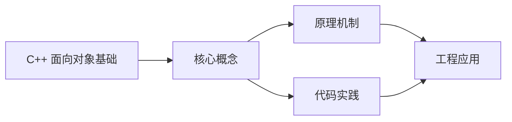
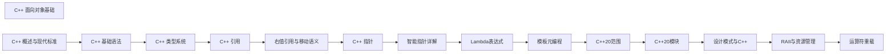

## 1. 学习目标（Bloom 分类）

本节按照布鲁姆教育目标分类学组织学习路径。本文主题为《C++ 面向对象基础》，属于 C++ 模块，读者可以根据自身阶段选择阅读深度。

记忆层面：能够准确复述本文的核心概念、术语与基本语法或操作步骤，并能够在提问或检索时快速定位对应知识点。能够说出 C++ 的类、继承、重载、模板与 STL 容器基本语法。

理解层面：能够用自己的语言解释核心原理与工作机制，说明概念之间的因果关系，而不是机械记忆结论。能够解释 RAII、拷贝/移动语义、虚函数与模板实例化。

应用层面：能够在真实项目或练习场景中运用本文知识解决具体问题，写出正确且可维护的实现。能够编写现代 C++（C++17/20）的类与泛型代码。

分析层面：能够拆解复杂问题，比较本文主题与相邻概念的异同，识别边界条件与例外情况。能够分析生命周期、未定义行为与性能特征。

评价层面：能够根据约束条件（性能、可读性、安全、成本）评价不同方案的优劣，做出有依据的技术决策。能够评价 C++ 与 Rust、Java 在系统编程中的取舍。

创造层面：能够把本文知识与其他模块知识组合，设计出新的解决方案或可复用的工程模式。能够设计高性能、可维护的 C++ 库与应用。

通过本节学习，读者应当能够把《C++ 面向对象基础》纳入自己的知识网络，并与 C++ 模块的其他主题（RAII、移动语义、模板、STL）建立关联。

## 2. 历史动机与发展脉络

《C++ 面向对象基础》是 C++ 领域的重要主题。要真正理解它，需要先了解它解决的问题与演进过程。

C++ 由 Bjarne Stroustrup 于 1979 年开始在贝尔实验室开发（原名 C with Classes），1983 年更名 C++，1998 年 C++98 首次标准化。
C++11 是语言转折点：右值引用、auto、lambda、智能指针、并发内存模型让现代 C++ 写法定型；C++14/17 补充泛型 lambda、if constexpr、折叠表达式；C++20 引入 concepts、协程、模块与范围库；C++23 继续完善。
现代 C++ 的核心口号是“资源安全”：RAII + 智能指针替代裸 new/delete，异常与错误码按场景选择；Rust 的出现促使 C++ 社区更重视内存安全工具（如 profile 指南、sanitizer）。

回到本文主题：C++ 面向对象基础 的提出与成熟，正是上述技术背景下的必然产物。早期实现往往以简单可用为目标，随着工程规模扩大，社区逐渐沉淀出标准做法与最佳实践；理解这一脉络，可以帮助读者判断“为什么文档中的推荐写法是现在这个样子”，也能在遇到历史遗留代码时准确识别其设计年代与取舍。


## 3. 形式化定义与核心概念精讲

本节把《C++ 面向对象基础》涉及的核心概念以“定义 + 讲解”的形式展开。读者应把定义当作工具，把讲解当作理解路径；两者结合才能形成可迁移的知识。

RAII：资源在构造函数获取、析构函数释放，栈对象离开作用域自动清理；智能指针（unique_ptr/shared_ptr/weak_ptr）把所有权编码进类型。
移动语义：右值引用 `&&` 与 std::move 转移资源所有权，避免深拷贝；移动后对象处于“合法但未指定”状态。
虚函数与多态：virtual 实现动态绑定，vtable 是运行时分派机制；final/override 关键字防止误用；基类析构函数应为 virtual。

### 3.1 原文章节逐一精讲

原文档把主题拆分为 17 个小节，下面按顺序给出每一节的导读讲解，随后保留原文细节供精读。

#### 原文精读（完整保留）

# 面向对象基础

> **符号约定**：`< >` 必填参数 | `[ ]` 可选参数

---

#### 1. 类与对象 (Class & Object)

##### 1.1 类的定义

类是面向对象编程的基本单位，它封装了数据和操作数据的方法。

```cpp
 class Person {
 private:
  // 私有成员变量
  std::string name;
  int age;
 public:
  // 构造函数
  Person() : name(""), age(0) {}
  Person(std::string n, int a) : name(n), age(a) {}
  // 成员方法
  void setName(std::string n) { name = n; }
  void setAge(int a) { age = a; }
  std::string getName() const { return name; }
  int getAge() const { return age; }
  // 成员方法
  void introduce() const {
  std::cout << "My name is " << name << " and I am " << age << " years old." << std::endl;
  }
 }
```

##### 1.2 对象的创建与使用

```cpp
 int main() {
  // 栈上创建对象
  Person person1; // 默认构造函数
  person1.setName("Alice");
  person1.setAge(25);
  person1.introduce();
  // 栈上创建对象（带参数）
  Person person2("Bob", 30);
  person2.introduce();
  // 堆上创建对象
  Person* person3 = new Person("Charlie", 35);
  person3->introduce();
  delete person3; // 释放堆内存
  return 0;
 }
```

##### 1.3 类的成员

| 成员类型     | 描述                 | 访问权限                   |
| :----------- | :------------------- | :------------------------- |
| **成员变量** | 存储对象状态         | public, private, protected |
| **成员函数** | 操作对象状态         | public, private, protected |
| **构造函数** | 初始化对象           | public                     |
| **析构函数** | 清理对象资源         | public                     |
| **静态成员** | 属于类，而非对象     | public, private, protected |
| **友元**     | 允许外部访问私有成员 | -                          |

#### 2. 封装 (Encapsulation)

封装是将数据和操作数据的方法捆绑在一起，对外部隐藏实现细节。

##### 2.1 访问修饰符

| 修饰符      | 访问权限 | 描述           |
| :---------- | :------- | :------------- |
| `public`    | 公共     | 外部可访问     |
| `private`   | 私有     | 仅类内访问     |
| `protected` | 保护     | 类及派生类访问 |

##### 2.2 封装示例

```cpp
 class BankAccount {
 private:
  // 私有成员变量，外部不可直接访问
  std::string accountNumber;
  double balance;
 public:
  // 构造函数
  BankAccount(std::string accNum, double initialBalance) :
  accountNumber(accNum), balance(initialBalance) {}
  // 公共接口
  void deposit(double amount) {
  if (amount > 0) {
  balance += amount;
  std::cout << "Deposited: $" << amount << std::endl;
  }
  }
  void withdraw(double amount) {
  if (amount > 0 && amount <= balance) {
  balance -= amount;
  std::cout << "Withdrawn: $" << amount << std::endl;
  } else {
  std::cout << "Insufficient funds" << std::endl;
  }
  }
  double getBalance() const {
  return balance;
  }
  std::string getAccountNumber() const {
  return accountNumber;
  }
 }
 // 使用示例
 int main() {
  BankAccount acc("123456", 1000.0);
  acc.deposit(500.0);
  acc.withdraw(200.0);
  std::cout << "Balance: $" << acc.getBalance() << std::endl;
  return 0;
 }
```

#### 3. 继承 (Inheritance)

继承是一种创建新类的方式，新类继承现有类的属性和方法。

##### 3.1 继承的基本语法

```cpp
 // 基类
 class Animal {
 protected:
  std::string name;
 public:
  Animal(std::string n) : name(n) {}
  virtual void makeSound() {
  std::cout << "Generic animal sound" << std::endl;
  }
  virtual ~Animal() {}
 }
 // 派生类
 class Dog : public Animal {
 public:
  Dog(std::string n) : Animal(n) {}
  // 覆盖基类方法
  void makeSound() override {
  std::cout << name << " barks: Woof! Woof!" << std::endl;
  }
 }
 // 派生类
 class Cat : public Animal {
 public:
  Cat(std::string n) : Animal(n) {}
  // 覆盖基类方法
  void makeSound() override {
  std::cout << name << " meows: Meow! Meow!" << std::endl;
  }
 }
```

##### 3.2 继承类型

| 继承类型    | 基类成员在派生类中的访问权限                  |
| :---------- | :-------------------------------------------- |
| `public`    | 保持基类成员的访问权限                        |
| `protected` | 基类的 public 和 protected 成员变为 protected |
| `private`   | 基类的所有成员变为 private                    |

##### 3.3 多继承

C++ 支持多继承，一个类可以从多个基类继承。

```cpp
 // 基类 1
 class Printable {
 public:
  virtual void print() const = 0; // 纯虚函数
 }
 // 基类 2
 class Serializable {
 public:
  virtual std::string serialize() const = 0; // 纯虚函数
 }
 // 派生类，多继承
 class Person : public Printable, public Serializable {
 private:
  std::string name;
  int age;
 public:
  Person(std::string n, int a) : name(n), age(a) {}
  // 实现 Printable 接口
  void print() const override {
  std::cout << "Name: " << name << ", Age: " << age << std::endl;
  }
  // 实现 Serializable 接口
  std::string serialize() const override {
  return "{\"name\": \"" + name + "\", \"age\": " + std::to_string(age) + "}";
  }
 }
```

##### 3.4 菱形继承问题

菱形继承是多继承中的一个问题，当两个派生类继承自同一个基类，而另一个类又同时继承这两个派生类时，会导致基类成员的重复。

```cpp
 // 基类
 class Animal {
 public:
  Animal() { std::cout << "Animal constructor" << std::endl; }
  ~Animal() { std::cout << "Animal destructor" << std::endl; }
 }
 // 派生类 1
 class Mammal : public Animal {
 public:
  Mammal() { std::cout << "Mammal constructor" << std::endl; }
  ~Mammal() { std::cout << "Mammal destructor" << std::endl; }
 }
 // 派生类 2
 class Bird : public Animal {
 public:
  Bird() { std::cout << "Bird constructor" << std::endl; }
  ~Bird() { std::cout << "Bird destructor" << std::endl; }
 }
 // 派生类 3，多继承
 class Bat : public Mammal, public Bird {
 public:
  Bat() { std::cout << "Bat constructor" << std::endl; }
  ~Bat() { std::cout << "Bat destructor" << std::endl; }
 }
 // 问题：Bat 会有两个 Animal 子对象
 // 解决方案：使用虚继承
```

##### 3.5 虚继承

虚继承可以解决菱形继承问题，确保基类只被继承一次。

```cpp
 // 基类
 class Animal {
 public:
  Animal() { std::cout << "Animal constructor" << std::endl; }
  ~Animal() { std::cout << "Animal destructor" << std::endl; }
 }
 // 派生类 1，虚继承
 class Mammal : virtual public Animal {
 public:
  Mammal() { std::cout << "Mammal constructor" << std::endl; }
  ~Mammal() { std::cout << "Mammal destructor" << std::endl; }
 }
 // 派生类 2，虚继承
 class Bird : virtual public Animal {
 public:
  Bird() { std::cout << "Bird constructor" << std::endl; }
  ~Bird() { std::cout << "Bird destructor" << std::endl; }
 }
 // 派生类 3，多继承
 class Bat : public Mammal, public Bird {
 public:
  Bat() { std::cout << "Bat constructor" << std::endl; }
  ~Bat() { std::cout << "Bat destructor" << std::endl; }
 }
 // 现在 Bat 只有一个 Animal 子对象
```

#### 4. 多态 (Polymorphism)

多态是指同一操作作用于不同的对象时，会产生不同的行为。C++ 支持两种类型的多态：静态多态和动态多态。

##### 4.1 静态多态

静态多态是在编译时确定的，通过函数重载和模板实现。

###### 4.1.1 函数重载

函数重载是指在同一作用域内定义多个同名函数，但它们的参数列表不同（参数类型、参数个数或参数顺序不同）。

```cpp
 class Calculator {
 public:
  // 重载：参数类型不同
  int add(int a, int b) {
  return a + b;
  }
  double add(double a, double b) {
  return a + b;
  }
  // 重载：参数个数不同
  int add(int a, int b, int c) {
  return a + b + c;
  }
  // 重载：参数顺序不同
  void print(int a, double b) {
  std::cout << "int: " << a << ", double: " << b << std::endl;
  }
  void print(double a, int b) {
  std::cout << "double: " << a << ", int: " << b << std::endl;
  }
 }
 // 使用示例
 int main() {
  Calculator calc;
  std::cout << "add(int, int): " << calc.add(1, 2) << std::endl;
  std::cout << "add(double, double): " << calc.add(1.5, 2.5) << std::endl;
  std::cout << "add(int, int, int): " << calc.add(1, 2, 3) << std::endl;
  calc.print(1, 2.5);
  calc.print(1.5, 2);
  return 0;
 }
```

###### 4.1.2 模板

模板是 C++ 支持泛型编程的核心机制，通过模板可以编写通用的函数和类。

```cpp
 // 函数模板
 template <typename T>
 T add(T a, T b) {
  return a + b;
 }
 // 类模板
 template <typename T>
 class Stack {
 private:
  std::vector<T> elements;
 public:
  void push(T element) {
  elements.push_back(element);
  }
  T pop() {
  if (elements.empty()) {
  throw std::runtime_error("Stack is empty");
  }
  T top = elements.back();
  elements.pop_back();
  return top;
  }
  bool empty() const {
  return elements.empty();
  }
  size_t size() const {
  return elements.size();
  }
 }
 // 使用示例
 int main() {
  // 使用函数模板
  int i = add(10, 20);
  double d = add(3.14, 2.71);
  std::string s = add(std::string("Hello"), std::string(" World"));
  std::cout << "add(int, int): " << i << std::endl;
  std::cout << "add(double, double): " << d << std::endl;
  std::cout << "add(string, string): " << s << std::endl;
  // 使用类模板
  Stack<int> intStack;
  intStack.push(1);
  intStack.push(2);
  intStack.push(3);
  while (!intStack.empty()) {
  std::cout << intStack.pop() << " ";
  }
  std::cout << std::endl;
  Stack<std::string> stringStack;
  stringStack.push("Hello");
  stringStack.push("World");
  while (!stringStack.empty()) {
  std::cout << stringStack.pop() << " ";
  }
  std::cout << std::endl;
  return 0;
 }
```

##### 4.2 动态多态

动态多态是在运行时确定的，通过虚函数实现。

```cpp
 // 基类
 class Shape {
 public:
  virtual void draw() const {
  std::cout << "Drawing a shape" << std::endl;
  }
  virtual double area() const = 0; // 纯虚函数
  virtual ~Shape() {}
 }
 // 派生类
 class Circle : public Shape {
 private:
  double radius;
 public:
  Circle(double r) : radius(r) {}
  void draw() const override {
  std::cout << "Drawing a circle" << std::endl;
  }
  double area() const override {
  return M_PI * radius * radius;
  }
 }
 // 派生类
 class Rectangle : public Shape {
 private:
  double width;
  double height;
 public:
  Rectangle(double w, double h) : width(w), height(h) {}
  void draw() const override {
  std::cout << "Drawing a rectangle" << std::endl;
  }
  double area() const override {
  return width * height;
  }
 }
 // 派生类
 class Triangle : public Shape {
 private:
  double base;
  double height;
 public:
  Triangle(double b, double h) : base(b), height(h) {}
  void draw() const override {
  std::cout << "Drawing a triangle" << std::endl;
  }
  double area() const override {
  return 0.5 * base * height;
  }
 }
 // 使用多态
 void printShapeInfo(const Shape& shape) {
  shape.draw();
  std::cout << "Area: " << shape.area() << std::endl;
 }
 int main() {
  Circle circle(5.0);
  Rectangle rectangle(4.0, 6.0);
  Triangle triangle(3.0, 8.0);
  printShapeInfo(circle); // 传递 Circle 对象
  printShapeInfo(rectangle); // 传递 Rectangle 对象
  printShapeInfo(triangle); // 传递 Triangle 对象
  // 使用基类指针数组
  Shape* shapes[3];
  shapes[0] = new Circle(2.0);
  shapes[1] = new Rectangle(3.0, 4.0);
  shapes[2] = new Triangle(5.0, 6.0);
  for (int i = 0; i < 3; i++) {
  printShapeInfo(*shapes[i]);
  delete shapes[i];
  }
  return 0;
 }
```

##### 4.3 虚函数与纯虚函数

###### 4.3.1 虚函数

虚函数是在基类中声明的，允许派生类覆盖的函数。

```cpp
 class Base {
 public:
  virtual void func() {
  std::cout << "Base::func()" << std::endl;
  }
  virtual ~Base() {}
 }
 class Derived : public Base {
 public:
  void func() override {
  std::cout << "Derived::func()" << std::endl;
  }
 }
 int main() {
  Base* b = new Derived();
  b->func(); // 调用 Derived::func()
  delete b;
  return 0;
 }
```

###### 4.3.2 纯虚函数

纯虚函数是在基类中声明的，没有实现的虚函数，派生类必须实现它。

```cpp
 class AbstractShape {
 public:
  virtual void draw() const = 0; // 纯虚函数
  virtual double area() const = 0; // 纯虚函数
  virtual ~AbstractShape() {}
 }
 class Square : public AbstractShape {
 private:
  double side;
 public:
  Square(double s) : side(s) {}
  void draw() const override {
  std::cout << "Drawing a square" << std::endl;
  }
  double area() const override {
  return side * side;
  }
 }
 int main() {
  // AbstractShape shape; // 错误：不能实例化抽象类
  Square square(5.0);
  square.draw();
  std::cout << "Area: " << square.area() << std::endl;
  return 0;
 }
```

##### 4.4 多态的实现原理

多态的实现依赖于虚函数表（VTable）和虚指针（vptr）。

1. **虚函数表（VTable）**：每个包含虚函数的类都有一个虚函数表，存储了该类所有虚函数的地址。
2. **虚指针（vptr）**：每个对象都有一个虚指针，指向该类的虚函数表。
3. **运行时绑定**：当通过基类指针或引用调用虚函数时，会通过虚指针找到虚函数表，然后调用相应的函数。

```cpp
 // 基类
 class Base {
 public:
  virtual void func1() { std::cout << "Base::func1()" << std::endl; }
  virtual void func2() { std::cout << "Base::func2()" << std::endl; }
  void nonVirtual() { std::cout << "Base::nonVirtual()" << std::endl; }
 }
 // 派生类
 class Derived : public Base {
 public:
  void func1() override { std::cout << "Derived::func1()" << std::endl; }
  // func2() 继承自 Base
  void nonVirtual() { std::cout << "Derived::nonVirtual()" << std::endl; }
 }
 int main() {
  Base* b = new Derived();
  b->func1(); // 调用 Derived::func1()（多态，运行时绑定）
  b->func2(); // 调用 Base::func2()（多态，运行时绑定）
  b->nonVirtual(); // 调用 Base::nonVirtual()（非虚函数，编译时绑定）
  delete b;
  return 0;
 }
```

#### 5. 虚函数与虚函数表 (VTable)

##### 5.1 虚函数

虚函数是在基类中声明的，允许派生类覆盖的函数。虚函数是实现动态多态的核心机制。

```cpp
 class Base {
 public:
  virtual void func() {
  std::cout << "Base::func()" << std::endl;
  }
  virtual void anotherFunc() {
  std::cout << "Base::anotherFunc()" << std::endl;
  }
  virtual ~Base() {}
 }
 class Derived : public Base {
 public:
  void func() override {
  std::cout << "Derived::func()" << std::endl;
  }
  // anotherFunc() 继承自 Base
 }
 class Derived2 : public Base {
 public:
  void func() override {
  std::cout << "Derived2::func()" << std::endl;
  }
  void anotherFunc() override {
  std::cout << "Derived2::anotherFunc()" << std::endl;
  }
 }
 // 使用示例
 int main() {
  Base* b1 = new Base();
  Base* b2 = new Derived();
  Base* b3 = new Derived2();
  b1->func(); // Base::func()
  b1->anotherFunc(); // Base::anotherFunc()
  b2->func(); // Derived::func()
  b2->anotherFunc(); // Base::anotherFunc()
  b3->func(); // Derived2::func()
  b3->anotherFunc(); // Derived2::anotherFunc()
  delete b1;
  delete b2;
  delete b3;
  return 0;
 }
```

##### 5.2 虚函数表

虚函数表（VTable）是实现动态多态的关键机制。

- **虚函数表**：每个包含虚函数的类都有一个虚函数表，存储了该类所有虚函数的地址。
- **虚指针（vptr）**：每个对象都有一个虚指针，指向该类的虚函数表。
- **运行时绑定**：当通过基类指针或引用调用虚函数时，会通过虚指针找到虚函数表，然后调用相应的函数。

##### 5.3 虚函数表原理

```cpp
 // 基类
 class Base {
 public:
  virtual void func1() { std::cout << "Base::func1()" << std::endl; }
  virtual void func2() { std::cout << "Base::func2()" << std::endl; }
  void nonVirtual() { std::cout << "Base::nonVirtual()" << std::endl; }
 }
 // 派生类
 class Derived : public Base {
 public:
  void func1() override { std::cout << "Derived::func1()" << std::endl; }
  // func2() 继承自 Base
  void nonVirtual() { std::cout << "Derived::nonVirtual()" << std::endl; }
 }
 int main() {
  Base* b = new Derived();
  b->func1(); // 调用 Derived::func1()（多态，运行时绑定）
  b->func2(); // 调用 Base::func2()（多态，运行时绑定）
  b->nonVirtual(); // 调用 Base::nonVirtual()（非虚函数，编译时绑定）
  delete b;
  return 0;
 }
```

##### 5.4 虚函数表的结构

虚函数表是一个函数指针数组，存储了类的虚函数地址。当派生类覆盖基类的虚函数时，会在自己的虚函数表中替换对应的函数指针。

```cpp
 // 基类虚函数表
 // Base VTable:
 // [0] -> Base::func1()
 // [1] -> Base::func2()
 // 派生类虚函数表
 // Derived VTable:
 // [0] -> Derived::func1() // 覆盖基类的func1()
 // [1] -> Base::func2() // 继承基类的func2()
```

##### 5.5 虚函数的性能影响

虚函数调用比普通函数调用慢，因为需要通过虚指针和虚函数表进行间接调用。但这种开销通常很小，对于大多数应用来说可以忽略不计。

##### 5.6 虚函数的使用注意事项

1. **虚析构函数**：基类的析构函数应该声明为虚函数，以确保派生类的析构函数被正确调用。
2. **虚函数与构造函数**：构造函数不能是虚函数，因为在构造对象时，虚函数表还未完全建立。
3. **虚函数与内联函数**：虚函数通常不能被内联，因为需要运行时绑定。
4. **虚函数与静态函数**：静态函数不能是虚函数，因为静态函数属于类而不是对象。
5. **虚函数与私有成员**：私有虚函数也可以被派生类覆盖，但派生类无法直接调用基类的私有虚函数。

```cpp
 class Base {
 private:
  virtual void privateFunc() {
  std::cout << "Base::privateFunc()" << std::endl;
  }
 public:
  void publicFunc() {
  privateFunc(); // 可以调用私有虚函数
  }
 }
 class Derived : public Base {
 private:
  void privateFunc() override {
  std::cout << "Derived::privateFunc()" << std::endl;
  }
 }
 int main() {
  Base* b = new Derived();
  b->publicFunc(); // 调用 Derived::privateFunc()
  delete b;
  return 0;
 }
```

---

#### 类定义

**基本写法：类定义**
`class <ClassName> { private: ... public: ... };`
```cpp
// 定义 Point 类
class Point {
private:
    int x;
    int y;
public:
    Point(int x, int y) : x(x), y(y) {}
    int getX() { return x; }
};
```

---

**struct 写法：使用 struct 定义类**
`struct <ClassName> { ... };`
```cpp
// 使用 struct 定义类（默认 public）
struct Point {
    int x;
    int y;
};
```

---

#### 访问修饰符

**public 写法：公有成员**
`public: <members>`
```cpp
// 公有成员，外部可访问
class MyClass {
public:
    int public_var;
};
```

---

**private 写法：私有成员**
`private: <members>`
```cpp
// 私有成员，仅类内部可访问
class MyClass {
private:
    int private_var;
};
```

---

**protected 写法：受保护成员**
`protected: <members>`
```cpp
// 受保护成员，类内部和派生类可访问
class MyClass {
protected:
    int protected_var;
};
```

---

#### 构造函数

**默认写法：默认构造函数**
`<ClassName>() { ... }`
```cpp
// 默认构造函数
class Point {
    int x, y;
public:
    Point() : x(0), y(0) {}
};
```

---

**参数化写法：带参数构造函数**
`<ClassName>(<params>) { ... }`
```cpp
// 带参数构造函数
class Point {
    int x, y;
public:
    Point(int x, int y) : x(x), y(y) {}
};
```

---

**初始化列表写法：成员初始化列表**
`<ClassName>(<params>) : <member1>(<val1>), <member2>(<val2>) { ... }`
```cpp
// 使用初始化列表初始化成员
class Point {
    int x, y;
public:
    Point(int x, int y) : x(x), y(y) {}
};
```

---

**委托写法：委托构造函数**
`<ClassName>(<params>) : <ClassName>(<other_params>) { ... }`
```cpp
// 委托给另一个构造函数
class Point {
    int x, y;
public:
    Point() : Point(0, 0) {}
    Point(int x, int y) : x(x), y(y) {}
};
```

---

**explicit 写法：禁止隐式转换**
`explicit <ClassName>(<params>) { ... }`
```cpp
// 禁止隐式转换
class MyInt {
    int value;
public:
    explicit MyInt(int v) : value(v) {}
};
```

---

#### 拷贝构造函数

**基本写法：拷贝构造函数**
`<ClassName>(const <ClassName>& <other>) { ... }`
```cpp
// 拷贝构造函数
class String {
    char* data;
public:
    String(const String& other) {
        data = new char[strlen(other.data) + 1];
        strcpy(data, other.data);
    }
};
```

---

**禁用写法：禁用拷贝构造函数**
`<ClassName>(const <ClassName>&) = delete;`
```cpp
// 禁用拷贝构造函数
class NonCopyable {
public:
    NonCopyable(const NonCopyable&) = delete;
};
```

---

#### 移动构造函数

**基本写法：移动构造函数**
`<ClassName>(<ClassName>&& <other>) noexcept { ... }`
```cpp
// 移动构造函数
class String {
    char* data;
public:
    String(String&& other) noexcept : data(other.data) {
        other.data = nullptr;
    }
};
```

---

#### 析构函数

**基本写法：析构函数**
`~<ClassName>() { ... }`
```cpp
// 析构函数
class String {
    char* data;
public:
    ~String() {
        delete[] data;
    }
};
```

---

**virtual 写法：虚析构函数**
`virtual ~<ClassName>() { ... }`
```cpp
// 虚析构函数，确保派生类正确析构
class Base {
public:
    virtual ~Base() {}
};
```

---

#### this 指针

**基本写法：使用 this 指针**
`this-><member>`
```cpp
// 使用 this 指针访问成员
class Point {
    int x;
public:
    void setX(int x) {
        this->x = x;
    }
};
```

---

**返回写法：返回 *this**
`return *this;`
```cpp
// 返回 *this 支持链式调用
class Builder {
    std::string str;
public:
    Builder& append(const std::string& s) {
        str += s;
        return *this;
    }
};
```

---

#### 静态成员

**静态成员变量写法**
`static <type> <var_name>;`
```cpp
// 静态成员变量声明
class Counter {
public:
    static int count;
};
int Counter::count = 0;
```

---

**静态成员函数写法**
`static <return_type> <func>() { ... }`
```cpp
// 静态成员函数
class Counter {
public:
    static int get_count() { return count; }
};
```

---

**调用写法：通过类名调用静态成员**
`<ClassName>::<static_member>`
```cpp
// 通过类名调用静态成员
int c = Counter::count;
```

---

#### 友元

**友元函数写法**
`friend <return_type> <func>(<params>);`
```cpp
// 声明友元函数
class Point {
    int x, y;
public:
    friend void print(const Point& p);
};

void print(const Point& p) {
    std::cout << p.x << ", " << p.y << std::endl;
}
```

---

**友元类写法**
`friend class <ClassName>;`
```cpp
// 声明友元类
class A {
    int private_var;
public:
    friend class B;
};

class B {
public:
    void access(A& a) { std::cout << a.private_var << std::endl; }
};
```

---

#### 继承

**基本写法：公有继承**
`class <Derived> : public <Base> { ... };`
```cpp
// 公有继承
class Animal {
public:
    void eat() { std::cout << "Eating" << std::endl; }
};
class Dog : public Animal {
public:
    void bark() { std::cout << "Barking" << std::endl; }
};
```

---

**私有继承写法**
`class <Derived> : private <Base> { ... };`
```cpp
// 私有继承
class Derived : private Base {
};
```

---

**多继承写法**
`class <Derived> : public <Base1>, public <Base2> { ... };`
```cpp
// 多继承
class Drawable {
public:
    virtual void draw() {}
};
class Animal {
public:
    virtual void eat() {}
};
class Dog : public Animal, public Drawable {
};
```

---

#### 虚函数与多态

**基本写法：虚函数**
`virtual <return_type> <func>(<params>) { ... }`
```cpp
// 虚函数
class Animal {
public:
    virtual void sound() {
        std::cout << "Animal sound" << std::endl;
    }
};
```

---

**override 写法：重写虚函数**
`virtual <return_type> <func>(<params>) override { ... }`
```cpp
// 重写虚函数
class Dog : public Animal {
public:
    void sound() override {
        std::cout << "Woof" << std::endl;
    }
};
```

---

**纯虚函数写法**
`virtual <return_type> <func>(<params>) = 0;`
```cpp
// 纯虚函数，使类成为抽象类
class Shape {
public:
    virtual double area() = 0;
};
```

---

**final 写法：禁止重写**
`virtual <return_type> <func>(<params>) final { ... }`
```cpp
// 禁止派生类重写
class Base {
public:
    virtual void func() final {}
};
```

---

#### 多态使用

**基本写法：通过基类指针调用虚函数**
`<Base>* <ptr> = new <Derived>(); <ptr>-><virtual_func>();`
```cpp
// 通过基类指针调用虚函数（多态）
Animal* animal = new Dog();
animal->sound();
```

---

**引用写法：通过基类引用调用虚函数**
`<Base>& <ref> = <derived>; <ref>.<virtual_func>();`
```cpp
// 通过基类引用调用虚函数（多态）
Dog dog;
Animal& ref = dog;
ref.sound();
```


### 3.2 概念关系图

下面用 Mermaid 图表达本文核心概念之间的关系，帮助读者建立整体图景：



图中展示的是本文知识的结构化关系：核心概念是入口，原理机制解释“为什么”，代码实践演示“怎么做”，工程应用回答“何时用”。读者学习时可以把每个小节的内容挂接到对应节点上。

## 4. 理论推导与原理解析

本节深入《C++ 面向对象基础》背后的原理。理论部分不求面面俱到，而是聚焦“能解释现象、能指导实践”的关键推导。

RAII：资源在构造函数获取、析构函数释放，栈对象离开作用域自动清理；智能指针（unique_ptr/shared_ptr/weak_ptr）把所有权编码进类型。
移动语义：右值引用 `&&` 与 std::move 转移资源所有权，避免深拷贝；移动后对象处于“合法但未指定”状态。
虚函数与多态：virtual 实现动态绑定，vtable 是运行时分派机制；final/override 关键字防止误用；基类析构函数应为 virtual。
模板与泛型：模板编译期实例化，实现静态多态；concepts（C++20）约束类型接口；模板元编程在编译期计算类型与常量。

需要强调的是，理论推导与工程实践之间存在翻译层：理论给出的是理想化模型与边界条件，工程代码则必须处理真实环境中的例外。读者在学习时应先掌握理论的“标准情形”，再通过陷阱章节了解“非标准情形”。

## 5. 代码示例与逐行讲解

本节把原文中的代码示例系统整理，并为每个示例补充用途说明与讲解。读者不应只浏览代码，而应逐段对照讲解理解设计意图。

### 5.1 示例：1.1 类的定义

该示例来自原文《1.1 类的定义》小节，用于演示C++ 面向对象基础相关操作。阅读时请先看代码结构，再看其后的讲解。

```cpp
 class Person {
 private:
  // 私有成员变量
  std::string name;
  int age;
 public:
  // 构造函数
  Person() : name(""), age(0) {}
  Person(std::string n, int a) : name(n), age(a) {}
  // 成员方法
  void setName(std::string n) { name = n; }
  void setAge(int a) { age = a; }
  std::string getName() const { return name; }
  int getAge() const { return age; }
  // 成员方法
  void introduce() const {
  std::cout << "My name is " << name << " and I am " << age << " years old." << std::endl;
  }
 }
```

讲解：这段代码演示了本节核心知识点。代码中的关键操作可以归纳为三步：准备（定义或初始化）、执行（核心逻辑）、收尾（释放资源或返回结果）。实际项目中，这三步往往被封装为函数或类，以提升复用性与可测试性。

关键点分析：

该示例共 19 行有效代码，包含 2 类关键结构（class、return）。其中：

- 入口与初始化部分负责建立上下文，对应实际项目中的启动或装配逻辑；
- 核心逻辑部分体现本文主题的主要操作，是阅读时最需要对照讲解理解的部分；
- 输出或返回部分把结果交给调用方，注意其类型与边界条件。

进阶思考路径：先尝试修改参数观察行为变化，再把示例中的模式迁移到自己的项目中；每次修改都记录预期与实测差异，这是把示例转化为能力的最快方式。

### 5.2 示例：1.2 对象的创建与使用

该示例来自原文《1.2 对象的创建与使用》小节，用于演示C++ 面向对象基础相关操作。阅读时请先看代码结构，再看其后的讲解。

```cpp
 int main() {
  // 栈上创建对象
  Person person1; // 默认构造函数
  person1.setName("Alice");
  person1.setAge(25);
  person1.introduce();
  // 栈上创建对象（带参数）
  Person person2("Bob", 30);
  person2.introduce();
  // 堆上创建对象
  Person* person3 = new Person("Charlie", 35);
  person3->introduce();
  delete person3; // 释放堆内存
  return 0;
 }
```

讲解：这段代码演示了本节核心知识点。代码中的关键操作可以归纳为三步：准备（定义或初始化）、执行（核心逻辑）、收尾（释放资源或返回结果）。实际项目中，这三步往往被封装为函数或类，以提升复用性与可测试性。

关键点分析：

该示例共 15 行有效代码，包含 1 类关键结构（return）。其中：

- 入口与初始化部分负责建立上下文，对应实际项目中的启动或装配逻辑；
- 核心逻辑部分体现本文主题的主要操作，是阅读时最需要对照讲解理解的部分；
- 输出或返回部分把结果交给调用方，注意其类型与边界条件。

进阶思考路径：先尝试修改参数观察行为变化，再把示例中的模式迁移到自己的项目中；每次修改都记录预期与实测差异，这是把示例转化为能力的最快方式。

### 5.3 示例：2.2 封装示例

该示例来自原文《2.2 封装示例》小节，用于演示C++ 面向对象基础相关操作。阅读时请先看代码结构，再看其后的讲解。

```cpp
 class BankAccount {
 private:
  // 私有成员变量，外部不可直接访问
  std::string accountNumber;
  double balance;
 public:
  // 构造函数
  BankAccount(std::string accNum, double initialBalance) :
  accountNumber(accNum), balance(initialBalance) {}
  // 公共接口
  void deposit(double amount) {
  if (amount > 0) {
  balance += amount;
  std::cout << "Deposited: $" << amount << std::endl;
  }
  }
  void withdraw(double amount) {
  if (amount > 0 && amount <= balance) {
  balance -= amount;
  std::cout << "Withdrawn: $" << amount << std::endl;
  } else {
  std::cout << "Insufficient funds" << std::endl;
  }
  }
  double getBalance() const {
  return balance;
  }
  std::string getAccountNumber() const {
  return accountNumber;
  }
 }
 // 使用示例
 int main() {
  BankAccount acc("123456", 1000.0);
  acc.deposit(500.0);
  acc.withdraw(200.0);
  std::cout << "Balance: $" << acc.getBalance() << std::endl;
  return 0;
 }
```

讲解：这段代码演示了本节核心知识点。代码中的关键操作可以归纳为三步：准备（定义或初始化）、执行（核心逻辑）、收尾（释放资源或返回结果）。实际项目中，这三步往往被封装为函数或类，以提升复用性与可测试性。

关键点分析：

该示例共 39 行有效代码，包含 3 类关键结构（class、if、return）。其中：

- 入口与初始化部分负责建立上下文，对应实际项目中的启动或装配逻辑；
- 核心逻辑部分体现本文主题的主要操作，是阅读时最需要对照讲解理解的部分；
- 输出或返回部分把结果交给调用方，注意其类型与边界条件。

进阶思考路径：先尝试修改参数观察行为变化，再把示例中的模式迁移到自己的项目中；每次修改都记录预期与实测差异，这是把示例转化为能力的最快方式。

### 5.4 示例：3.1 继承的基本语法

该示例来自原文《3.1 继承的基本语法》小节，用于演示C++ 面向对象基础相关操作。阅读时请先看代码结构，再看其后的讲解。

```cpp
 // 基类
 class Animal {
 protected:
  std::string name;
 public:
  Animal(std::string n) : name(n) {}
  virtual void makeSound() {
  std::cout << "Generic animal sound" << std::endl;
  }
  virtual ~Animal() {}
 }
 // 派生类
 class Dog : public Animal {
 public:
  Dog(std::string n) : Animal(n) {}
  // 覆盖基类方法
  void makeSound() override {
  std::cout << name << " barks: Woof! Woof!" << std::endl;
  }
 }
 // 派生类
 class Cat : public Animal {
 public:
  Cat(std::string n) : Animal(n) {}
  // 覆盖基类方法
  void makeSound() override {
  std::cout << name << " meows: Meow! Meow!" << std::endl;
  }
 }
```

讲解：这段代码演示了本节核心知识点。代码中的关键操作可以归纳为三步：准备（定义或初始化）、执行（核心逻辑）、收尾（释放资源或返回结果）。实际项目中，这三步往往被封装为函数或类，以提升复用性与可测试性。

关键点分析：

该示例共 29 行有效代码，包含 1 类关键结构（class）。其中：

- 入口与初始化部分负责建立上下文，对应实际项目中的启动或装配逻辑；
- 核心逻辑部分体现本文主题的主要操作，是阅读时最需要对照讲解理解的部分；
- 输出或返回部分把结果交给调用方，注意其类型与边界条件。

进阶思考路径：先尝试修改参数观察行为变化，再把示例中的模式迁移到自己的项目中；每次修改都记录预期与实测差异，这是把示例转化为能力的最快方式。

### 5.5 示例：3.3 多继承

该示例来自原文《3.3 多继承》小节，用于演示C++ 面向对象基础相关操作。阅读时请先看代码结构，再看其后的讲解。

```cpp
 // 基类 1
 class Printable {
 public:
  virtual void print() const = 0; // 纯虚函数
 }
 // 基类 2
 class Serializable {
 public:
  virtual std::string serialize() const = 0; // 纯虚函数
 }
 // 派生类，多继承
 class Person : public Printable, public Serializable {
 private:
  std::string name;
  int age;
 public:
  Person(std::string n, int a) : name(n), age(a) {}
  // 实现 Printable 接口
  void print() const override {
  std::cout << "Name: " << name << ", Age: " << age << std::endl;
  }
  // 实现 Serializable 接口
  std::string serialize() const override {
  return "{\"name\": \"" + name + "\", \"age\": " + std::to_string(age) + "}";
  }
 }
```

讲解：这段代码演示了本节核心知识点。代码中的关键操作可以归纳为三步：准备（定义或初始化）、执行（核心逻辑）、收尾（释放资源或返回结果）。实际项目中，这三步往往被封装为函数或类，以提升复用性与可测试性。

关键点分析：

该示例共 26 行有效代码，包含 2 类关键结构（class、return）。其中：

- 入口与初始化部分负责建立上下文，对应实际项目中的启动或装配逻辑；
- 核心逻辑部分体现本文主题的主要操作，是阅读时最需要对照讲解理解的部分；
- 输出或返回部分把结果交给调用方，注意其类型与边界条件。

进阶思考路径：先尝试修改参数观察行为变化，再把示例中的模式迁移到自己的项目中；每次修改都记录预期与实测差异，这是把示例转化为能力的最快方式。

### 5.6 示例：3.4 菱形继承问题

该示例来自原文《3.4 菱形继承问题》小节，用于演示C++ 面向对象基础相关操作。阅读时请先看代码结构，再看其后的讲解。

```cpp
 // 基类
 class Animal {
 public:
  Animal() { std::cout << "Animal constructor" << std::endl; }
  ~Animal() { std::cout << "Animal destructor" << std::endl; }
 }
 // 派生类 1
 class Mammal : public Animal {
 public:
  Mammal() { std::cout << "Mammal constructor" << std::endl; }
  ~Mammal() { std::cout << "Mammal destructor" << std::endl; }
 }
 // 派生类 2
 class Bird : public Animal {
 public:
  Bird() { std::cout << "Bird constructor" << std::endl; }
  ~Bird() { std::cout << "Bird destructor" << std::endl; }
 }
 // 派生类 3，多继承
 class Bat : public Mammal, public Bird {
 public:
  Bat() { std::cout << "Bat constructor" << std::endl; }
  ~Bat() { std::cout << "Bat destructor" << std::endl; }
 }
 // 问题：Bat 会有两个 Animal 子对象
 // 解决方案：使用虚继承
```

讲解：这段代码演示了本节核心知识点。代码中的关键操作可以归纳为三步：准备（定义或初始化）、执行（核心逻辑）、收尾（释放资源或返回结果）。实际项目中，这三步往往被封装为函数或类，以提升复用性与可测试性。

关键点分析：

该示例共 26 行有效代码，包含 1 类关键结构（class）。其中：

- 入口与初始化部分负责建立上下文，对应实际项目中的启动或装配逻辑；
- 核心逻辑部分体现本文主题的主要操作，是阅读时最需要对照讲解理解的部分；
- 输出或返回部分把结果交给调用方，注意其类型与边界条件。

进阶思考路径：先尝试修改参数观察行为变化，再把示例中的模式迁移到自己的项目中；每次修改都记录预期与实测差异，这是把示例转化为能力的最快方式。

### 5.7 示例：3.5 虚继承

该示例来自原文《3.5 虚继承》小节，用于演示C++ 面向对象基础相关操作。阅读时请先看代码结构，再看其后的讲解。

```cpp
 // 基类
 class Animal {
 public:
  Animal() { std::cout << "Animal constructor" << std::endl; }
  ~Animal() { std::cout << "Animal destructor" << std::endl; }
 }
 // 派生类 1，虚继承
 class Mammal : virtual public Animal {
 public:
  Mammal() { std::cout << "Mammal constructor" << std::endl; }
  ~Mammal() { std::cout << "Mammal destructor" << std::endl; }
 }
 // 派生类 2，虚继承
 class Bird : virtual public Animal {
 public:
  Bird() { std::cout << "Bird constructor" << std::endl; }
  ~Bird() { std::cout << "Bird destructor" << std::endl; }
 }
 // 派生类 3，多继承
 class Bat : public Mammal, public Bird {
 public:
  Bat() { std::cout << "Bat constructor" << std::endl; }
  ~Bat() { std::cout << "Bat destructor" << std::endl; }
 }
 // 现在 Bat 只有一个 Animal 子对象
```

讲解：这段代码演示了本节核心知识点。代码中的关键操作可以归纳为三步：准备（定义或初始化）、执行（核心逻辑）、收尾（释放资源或返回结果）。实际项目中，这三步往往被封装为函数或类，以提升复用性与可测试性。

关键点分析：

该示例共 25 行有效代码，包含 1 类关键结构（class）。其中：

- 入口与初始化部分负责建立上下文，对应实际项目中的启动或装配逻辑；
- 核心逻辑部分体现本文主题的主要操作，是阅读时最需要对照讲解理解的部分；
- 输出或返回部分把结果交给调用方，注意其类型与边界条件。

进阶思考路径：先尝试修改参数观察行为变化，再把示例中的模式迁移到自己的项目中；每次修改都记录预期与实测差异，这是把示例转化为能力的最快方式。

### 5.8 示例：4.1.1 函数重载

该示例来自原文《4.1.1 函数重载》小节，用于演示C++ 面向对象基础相关操作。阅读时请先看代码结构，再看其后的讲解。

```cpp
 class Calculator {
 public:
  // 重载：参数类型不同
  int add(int a, int b) {
  return a + b;
  }
  double add(double a, double b) {
  return a + b;
  }
  // 重载：参数个数不同
  int add(int a, int b, int c) {
  return a + b + c;
  }
  // 重载：参数顺序不同
  void print(int a, double b) {
  std::cout << "int: " << a << ", double: " << b << std::endl;
  }
  void print(double a, int b) {
  std::cout << "double: " << a << ", int: " << b << std::endl;
  }
 }
 // 使用示例
 int main() {
  Calculator calc;
  std::cout << "add(int, int): " << calc.add(1, 2) << std::endl;
  std::cout << "add(double, double): " << calc.add(1.5, 2.5) << std::endl;
  std::cout << "add(int, int, int): " << calc.add(1, 2, 3) << std::endl;
  calc.print(1, 2.5);
  calc.print(1.5, 2);
  return 0;
 }
```

讲解：这段代码演示了本节核心知识点。代码中的关键操作可以归纳为三步：准备（定义或初始化）、执行（核心逻辑）、收尾（释放资源或返回结果）。实际项目中，这三步往往被封装为函数或类，以提升复用性与可测试性。

关键点分析：

该示例共 31 行有效代码，包含 2 类关键结构（class、return）。其中：

- 入口与初始化部分负责建立上下文，对应实际项目中的启动或装配逻辑；
- 核心逻辑部分体现本文主题的主要操作，是阅读时最需要对照讲解理解的部分；
- 输出或返回部分把结果交给调用方，注意其类型与边界条件。

进阶思考路径：先尝试修改参数观察行为变化，再把示例中的模式迁移到自己的项目中；每次修改都记录预期与实测差异，这是把示例转化为能力的最快方式。

### 5.9 示例：4.1.2 模板

该示例来自原文《4.1.2 模板》小节，用于演示C++ 面向对象基础相关操作。阅读时请先看代码结构，再看其后的讲解。

```cpp
 // 函数模板
 template <typename T>
 T add(T a, T b) {
  return a + b;
 }
 // 类模板
 template <typename T>
 class Stack {
 private:
  std::vector<T> elements;
 public:
  void push(T element) {
  elements.push_back(element);
  }
  T pop() {
  if (elements.empty()) {
  throw std::runtime_error("Stack is empty");
  }
  T top = elements.back();
  elements.pop_back();
  return top;
  }
  bool empty() const {
  return elements.empty();
  }
  size_t size() const {
  return elements.size();
  }
 }
 // 使用示例
 int main() {
  // 使用函数模板
  int i = add(10, 20);
  double d = add(3.14, 2.71);
  std::string s = add(std::string("Hello"), std::string(" World"));
  std::cout << "add(int, int): " << i << std::endl;
  std::cout << "add(double, double): " << d << std::endl;
  std::cout << "add(string, string): " << s << std::endl;
  // 使用类模板
  Stack<int> intStack;
  intStack.push(1);
  intStack.push(2);
  intStack.push(3);
  while (!intStack.empty()) {
  std::cout << intStack.pop() << " ";
  }
  std::cout << std::endl;
  Stack<std::string> stringStack;
  stringStack.push("Hello");
  stringStack.push("World");
  while (!stringStack.empty()) {
  std::cout << stringStack.pop() << " ";
  }
  std::cout << std::endl;
  return 0;
 }
```

讲解：这段代码演示了本节核心知识点。代码中的关键操作可以归纳为三步：准备（定义或初始化）、执行（核心逻辑）、收尾（释放资源或返回结果）。实际项目中，这三步往往被封装为函数或类，以提升复用性与可测试性。

关键点分析：

该示例共 56 行有效代码，包含 4 类关键结构（class、if、while、return）。其中：

- 入口与初始化部分负责建立上下文，对应实际项目中的启动或装配逻辑；
- 核心逻辑部分体现本文主题的主要操作，是阅读时最需要对照讲解理解的部分；
- 输出或返回部分把结果交给调用方，注意其类型与边界条件。

进阶思考路径：先尝试修改参数观察行为变化，再把示例中的模式迁移到自己的项目中；每次修改都记录预期与实测差异，这是把示例转化为能力的最快方式。

### 5.10 示例：4.2 动态多态

该示例来自原文《4.2 动态多态》小节，用于演示C++ 面向对象基础相关操作。阅读时请先看代码结构，再看其后的讲解。

```cpp
 // 基类
 class Shape {
 public:
  virtual void draw() const {
  std::cout << "Drawing a shape" << std::endl;
  }
  virtual double area() const = 0; // 纯虚函数
  virtual ~Shape() {}
 }
 // 派生类
 class Circle : public Shape {
 private:
  double radius;
 public:
  Circle(double r) : radius(r) {}
  void draw() const override {
  std::cout << "Drawing a circle" << std::endl;
  }
  double area() const override {
  return M_PI * radius * radius;
  }
 }
 // 派生类
 class Rectangle : public Shape {
 private:
  double width;
  double height;
 public:
  Rectangle(double w, double h) : width(w), height(h) {}
  void draw() const override {
  std::cout << "Drawing a rectangle" << std::endl;
  }
  double area() const override {
  return width * height;
  }
 }
 // 派生类
 class Triangle : public Shape {
 private:
  double base;
  double height;
 public:
  Triangle(double b, double h) : base(b), height(h) {}
  void draw() const override {
  std::cout << "Drawing a triangle" << std::endl;
  }
  double area() const override {
  return 0.5 * base * height;
  }
 }
 // 使用多态
 void printShapeInfo(const Shape& shape) {
  shape.draw();
  std::cout << "Area: " << shape.area() << std::endl;
 }
 int main() {
  Circle circle(5.0);
  Rectangle rectangle(4.0, 6.0);
  Triangle triangle(3.0, 8.0);
  printShapeInfo(circle); // 传递 Circle 对象
  printShapeInfo(rectangle); // 传递 Rectangle 对象
  printShapeInfo(triangle); // 传递 Triangle 对象
  // 使用基类指针数组
  Shape* shapes[3];
  shapes[0] = new Circle(2.0);
  shapes[1] = new Rectangle(3.0, 4.0);
  shapes[2] = new Triangle(5.0, 6.0);
  for (int i = 0; i < 3; i++) {
  printShapeInfo(*shapes[i]);
  delete shapes[i];
  }
  return 0;
 }
```

讲解：这段代码演示了本节核心知识点。代码中的关键操作可以归纳为三步：准备（定义或初始化）、执行（核心逻辑）、收尾（释放资源或返回结果）。实际项目中，这三步往往被封装为函数或类，以提升复用性与可测试性。

关键点分析：

该示例共 73 行有效代码，包含 3 类关键结构（class、for、return）。其中：

- 入口与初始化部分负责建立上下文，对应实际项目中的启动或装配逻辑；
- 核心逻辑部分体现本文主题的主要操作，是阅读时最需要对照讲解理解的部分；
- 输出或返回部分把结果交给调用方，注意其类型与边界条件。

进阶思考路径：先尝试修改参数观察行为变化，再把示例中的模式迁移到自己的项目中；每次修改都记录预期与实测差异，这是把示例转化为能力的最快方式。

### 5.11 示例：4.3.1 虚函数

该示例来自原文《4.3.1 虚函数》小节，用于演示C++ 面向对象基础相关操作。阅读时请先看代码结构，再看其后的讲解。

```cpp
 class Base {
 public:
  virtual void func() {
  std::cout << "Base::func()" << std::endl;
  }
  virtual ~Base() {}
 }
 class Derived : public Base {
 public:
  void func() override {
  std::cout << "Derived::func()" << std::endl;
  }
 }
 int main() {
  Base* b = new Derived();
  b->func(); // 调用 Derived::func()
  delete b;
  return 0;
 }
```

讲解：这段代码演示了本节核心知识点。代码中的关键操作可以归纳为三步：准备（定义或初始化）、执行（核心逻辑）、收尾（释放资源或返回结果）。实际项目中，这三步往往被封装为函数或类，以提升复用性与可测试性。

关键点分析：

该示例共 19 行有效代码，包含 2 类关键结构（class、return）。其中：

- 入口与初始化部分负责建立上下文，对应实际项目中的启动或装配逻辑；
- 核心逻辑部分体现本文主题的主要操作，是阅读时最需要对照讲解理解的部分；
- 输出或返回部分把结果交给调用方，注意其类型与边界条件。

进阶思考路径：先尝试修改参数观察行为变化，再把示例中的模式迁移到自己的项目中；每次修改都记录预期与实测差异，这是把示例转化为能力的最快方式。

### 5.12 示例：4.3.2 纯虚函数

该示例来自原文《4.3.2 纯虚函数》小节，用于演示C++ 面向对象基础相关操作。阅读时请先看代码结构，再看其后的讲解。

```cpp
 class AbstractShape {
 public:
  virtual void draw() const = 0; // 纯虚函数
  virtual double area() const = 0; // 纯虚函数
  virtual ~AbstractShape() {}
 }
 class Square : public AbstractShape {
 private:
  double side;
 public:
  Square(double s) : side(s) {}
  void draw() const override {
  std::cout << "Drawing a square" << std::endl;
  }
  double area() const override {
  return side * side;
  }
 }
 int main() {
  // AbstractShape shape; // 错误：不能实例化抽象类
  Square square(5.0);
  square.draw();
  std::cout << "Area: " << square.area() << std::endl;
  return 0;
 }
```

讲解：这段代码演示了本节核心知识点。代码中的关键操作可以归纳为三步：准备（定义或初始化）、执行（核心逻辑）、收尾（释放资源或返回结果）。实际项目中，这三步往往被封装为函数或类，以提升复用性与可测试性。

关键点分析：

该示例共 25 行有效代码，包含 2 类关键结构（class、return）。其中：

- 入口与初始化部分负责建立上下文，对应实际项目中的启动或装配逻辑；
- 核心逻辑部分体现本文主题的主要操作，是阅读时最需要对照讲解理解的部分；
- 输出或返回部分把结果交给调用方，注意其类型与边界条件。

进阶思考路径：先尝试修改参数观察行为变化，再把示例中的模式迁移到自己的项目中；每次修改都记录预期与实测差异，这是把示例转化为能力的最快方式。

### 5.13 示例：4.4 多态的实现原理

该示例来自原文《4.4 多态的实现原理》小节，用于演示C++ 面向对象基础相关操作。阅读时请先看代码结构，再看其后的讲解。

```cpp
 // 基类
 class Base {
 public:
  virtual void func1() { std::cout << "Base::func1()" << std::endl; }
  virtual void func2() { std::cout << "Base::func2()" << std::endl; }
  void nonVirtual() { std::cout << "Base::nonVirtual()" << std::endl; }
 }
 // 派生类
 class Derived : public Base {
 public:
  void func1() override { std::cout << "Derived::func1()" << std::endl; }
  // func2() 继承自 Base
  void nonVirtual() { std::cout << "Derived::nonVirtual()" << std::endl; }
 }
 int main() {
  Base* b = new Derived();
  b->func1(); // 调用 Derived::func1()（多态，运行时绑定）
  b->func2(); // 调用 Base::func2()（多态，运行时绑定）
  b->nonVirtual(); // 调用 Base::nonVirtual()（非虚函数，编译时绑定）
  delete b;
  return 0;
 }
```

讲解：这段代码演示了本节核心知识点。代码中的关键操作可以归纳为三步：准备（定义或初始化）、执行（核心逻辑）、收尾（释放资源或返回结果）。实际项目中，这三步往往被封装为函数或类，以提升复用性与可测试性。

关键点分析：

该示例共 22 行有效代码，包含 2 类关键结构（class、return）。其中：

- 入口与初始化部分负责建立上下文，对应实际项目中的启动或装配逻辑；
- 核心逻辑部分体现本文主题的主要操作，是阅读时最需要对照讲解理解的部分；
- 输出或返回部分把结果交给调用方，注意其类型与边界条件。

进阶思考路径：先尝试修改参数观察行为变化，再把示例中的模式迁移到自己的项目中；每次修改都记录预期与实测差异，这是把示例转化为能力的最快方式。

### 5.14 示例：5.1 虚函数

该示例来自原文《5.1 虚函数》小节，用于演示C++ 面向对象基础相关操作。阅读时请先看代码结构，再看其后的讲解。

```cpp
 class Base {
 public:
  virtual void func() {
  std::cout << "Base::func()" << std::endl;
  }
  virtual void anotherFunc() {
  std::cout << "Base::anotherFunc()" << std::endl;
  }
  virtual ~Base() {}
 }
 class Derived : public Base {
 public:
  void func() override {
  std::cout << "Derived::func()" << std::endl;
  }
  // anotherFunc() 继承自 Base
 }
 class Derived2 : public Base {
 public:
  void func() override {
  std::cout << "Derived2::func()" << std::endl;
  }
  void anotherFunc() override {
  std::cout << "Derived2::anotherFunc()" << std::endl;
  }
 }
 // 使用示例
 int main() {
  Base* b1 = new Base();
  Base* b2 = new Derived();
  Base* b3 = new Derived2();
  b1->func(); // Base::func()
  b1->anotherFunc(); // Base::anotherFunc()
  b2->func(); // Derived::func()
  b2->anotherFunc(); // Base::anotherFunc()
  b3->func(); // Derived2::func()
  b3->anotherFunc(); // Derived2::anotherFunc()
  delete b1;
  delete b2;
  delete b3;
  return 0;
 }
```

讲解：这段代码演示了本节核心知识点。代码中的关键操作可以归纳为三步：准备（定义或初始化）、执行（核心逻辑）、收尾（释放资源或返回结果）。实际项目中，这三步往往被封装为函数或类，以提升复用性与可测试性。

关键点分析：

该示例共 42 行有效代码，包含 2 类关键结构（class、return）。其中：

- 入口与初始化部分负责建立上下文，对应实际项目中的启动或装配逻辑；
- 核心逻辑部分体现本文主题的主要操作，是阅读时最需要对照讲解理解的部分；
- 输出或返回部分把结果交给调用方，注意其类型与边界条件。

进阶思考路径：先尝试修改参数观察行为变化，再把示例中的模式迁移到自己的项目中；每次修改都记录预期与实测差异，这是把示例转化为能力的最快方式。

### 5.15 示例：5.3 虚函数表原理

该示例来自原文《5.3 虚函数表原理》小节，用于演示C++ 面向对象基础相关操作。阅读时请先看代码结构，再看其后的讲解。

```cpp
 // 基类
 class Base {
 public:
  virtual void func1() { std::cout << "Base::func1()" << std::endl; }
  virtual void func2() { std::cout << "Base::func2()" << std::endl; }
  void nonVirtual() { std::cout << "Base::nonVirtual()" << std::endl; }
 }
 // 派生类
 class Derived : public Base {
 public:
  void func1() override { std::cout << "Derived::func1()" << std::endl; }
  // func2() 继承自 Base
  void nonVirtual() { std::cout << "Derived::nonVirtual()" << std::endl; }
 }
 int main() {
  Base* b = new Derived();
  b->func1(); // 调用 Derived::func1()（多态，运行时绑定）
  b->func2(); // 调用 Base::func2()（多态，运行时绑定）
  b->nonVirtual(); // 调用 Base::nonVirtual()（非虚函数，编译时绑定）
  delete b;
  return 0;
 }
```

讲解：这段代码演示了本节核心知识点。代码中的关键操作可以归纳为三步：准备（定义或初始化）、执行（核心逻辑）、收尾（释放资源或返回结果）。实际项目中，这三步往往被封装为函数或类，以提升复用性与可测试性。

关键点分析：

该示例共 22 行有效代码，包含 2 类关键结构（class、return）。其中：

- 入口与初始化部分负责建立上下文，对应实际项目中的启动或装配逻辑；
- 核心逻辑部分体现本文主题的主要操作，是阅读时最需要对照讲解理解的部分；
- 输出或返回部分把结果交给调用方，注意其类型与边界条件。

进阶思考路径：先尝试修改参数观察行为变化，再把示例中的模式迁移到自己的项目中；每次修改都记录预期与实测差异，这是把示例转化为能力的最快方式。

### 5.16 示例：5.4 虚函数表的结构

该示例来自原文《5.4 虚函数表的结构》小节，用于演示C++ 面向对象基础相关操作。阅读时请先看代码结构，再看其后的讲解。

```cpp
 // 基类虚函数表
 // Base VTable:
 // [0] -> Base::func1()
 // [1] -> Base::func2()
 // 派生类虚函数表
 // Derived VTable:
 // [0] -> Derived::func1() // 覆盖基类的func1()
 // [1] -> Base::func2() // 继承基类的func2()
```

讲解：这段代码演示了本节核心知识点。代码中的关键操作可以归纳为三步：准备（定义或初始化）、执行（核心逻辑）、收尾（释放资源或返回结果）。实际项目中，这三步往往被封装为函数或类，以提升复用性与可测试性。

关键点分析：

该示例共 8 行有效代码，结构以数据或配置为主。阅读时应关注：数据字段的含义、配置项的作用，以及它们与运行行为的对应关系。

进阶思考路径：先尝试修改参数观察行为变化，再把示例中的模式迁移到自己的项目中；每次修改都记录预期与实测差异，这是把示例转化为能力的最快方式。

### 5.17 示例：5.6 虚函数的使用注意事项

该示例来自原文《5.6 虚函数的使用注意事项》小节，用于演示C++ 面向对象基础相关操作。阅读时请先看代码结构，再看其后的讲解。

```cpp
 class Base {
 private:
  virtual void privateFunc() {
  std::cout << "Base::privateFunc()" << std::endl;
  }
 public:
  void publicFunc() {
  privateFunc(); // 可以调用私有虚函数
  }
 }
 class Derived : public Base {
 private:
  void privateFunc() override {
  std::cout << "Derived::privateFunc()" << std::endl;
  }
 }
 int main() {
  Base* b = new Derived();
  b->publicFunc(); // 调用 Derived::privateFunc()
  delete b;
  return 0;
 }
```

讲解：这段代码演示了本节核心知识点。代码中的关键操作可以归纳为三步：准备（定义或初始化）、执行（核心逻辑）、收尾（释放资源或返回结果）。实际项目中，这三步往往被封装为函数或类，以提升复用性与可测试性。

关键点分析：

该示例共 22 行有效代码，包含 2 类关键结构（class、return）。其中：

- 入口与初始化部分负责建立上下文，对应实际项目中的启动或装配逻辑；
- 核心逻辑部分体现本文主题的主要操作，是阅读时最需要对照讲解理解的部分；
- 输出或返回部分把结果交给调用方，注意其类型与边界条件。

进阶思考路径：先尝试修改参数观察行为变化，再把示例中的模式迁移到自己的项目中；每次修改都记录预期与实测差异，这是把示例转化为能力的最快方式。

### 5.18 示例：类定义

该示例来自原文《类定义》小节，用于演示C++ 面向对象基础相关操作。阅读时请先看代码结构，再看其后的讲解。

```cpp
// 定义 Point 类
class Point {
private:
    int x;
    int y;
public:
    Point(int x, int y) : x(x), y(y) {}
    int getX() { return x; }
};
```

讲解：这段代码演示了本节核心知识点。代码中的关键操作可以归纳为三步：准备（定义或初始化）、执行（核心逻辑）、收尾（释放资源或返回结果）。实际项目中，这三步往往被封装为函数或类，以提升复用性与可测试性。

关键点分析：

该示例共 9 行有效代码，包含 2 类关键结构（class、return）。其中：

- 入口与初始化部分负责建立上下文，对应实际项目中的启动或装配逻辑；
- 核心逻辑部分体现本文主题的主要操作，是阅读时最需要对照讲解理解的部分；
- 输出或返回部分把结果交给调用方，注意其类型与边界条件。

进阶思考路径：先尝试修改参数观察行为变化，再把示例中的模式迁移到自己的项目中；每次修改都记录预期与实测差异，这是把示例转化为能力的最快方式。

### 5.19 示例：类定义

该示例来自原文《类定义》小节，用于演示C++ 面向对象基础相关操作。阅读时请先看代码结构，再看其后的讲解。

```cpp
// 使用 struct 定义类（默认 public）
struct Point {
    int x;
    int y;
};
```

讲解：这段代码演示了本节核心知识点。代码中的关键操作可以归纳为三步：准备（定义或初始化）、执行（核心逻辑）、收尾（释放资源或返回结果）。实际项目中，这三步往往被封装为函数或类，以提升复用性与可测试性。

关键点分析：

该示例共 5 行有效代码，结构以数据或配置为主。阅读时应关注：数据字段的含义、配置项的作用，以及它们与运行行为的对应关系。

进阶思考路径：先尝试修改参数观察行为变化，再把示例中的模式迁移到自己的项目中；每次修改都记录预期与实测差异，这是把示例转化为能力的最快方式。

### 5.20 示例：访问修饰符

该示例来自原文《访问修饰符》小节，用于演示C++ 面向对象基础相关操作。阅读时请先看代码结构，再看其后的讲解。

```cpp
// 公有成员，外部可访问
class MyClass {
public:
    int public_var;
};
```

讲解：这段代码演示了本节核心知识点。代码中的关键操作可以归纳为三步：准备（定义或初始化）、执行（核心逻辑）、收尾（释放资源或返回结果）。实际项目中，这三步往往被封装为函数或类，以提升复用性与可测试性。

关键点分析：

该示例共 5 行有效代码，包含 1 类关键结构（class）。其中：

- 入口与初始化部分负责建立上下文，对应实际项目中的启动或装配逻辑；
- 核心逻辑部分体现本文主题的主要操作，是阅读时最需要对照讲解理解的部分；
- 输出或返回部分把结果交给调用方，注意其类型与边界条件。

进阶思考路径：先尝试修改参数观察行为变化，再把示例中的模式迁移到自己的项目中；每次修改都记录预期与实测差异，这是把示例转化为能力的最快方式。

### 5.21 示例：访问修饰符

该示例来自原文《访问修饰符》小节，用于演示C++ 面向对象基础相关操作。阅读时请先看代码结构，再看其后的讲解。

```cpp
// 私有成员，仅类内部可访问
class MyClass {
private:
    int private_var;
};
```

讲解：这段代码演示了本节核心知识点。代码中的关键操作可以归纳为三步：准备（定义或初始化）、执行（核心逻辑）、收尾（释放资源或返回结果）。实际项目中，这三步往往被封装为函数或类，以提升复用性与可测试性。

关键点分析：

该示例共 5 行有效代码，包含 1 类关键结构（class）。其中：

- 入口与初始化部分负责建立上下文，对应实际项目中的启动或装配逻辑；
- 核心逻辑部分体现本文主题的主要操作，是阅读时最需要对照讲解理解的部分；
- 输出或返回部分把结果交给调用方，注意其类型与边界条件。

进阶思考路径：先尝试修改参数观察行为变化，再把示例中的模式迁移到自己的项目中；每次修改都记录预期与实测差异，这是把示例转化为能力的最快方式。

### 5.22 示例：访问修饰符

该示例来自原文《访问修饰符》小节，用于演示C++ 面向对象基础相关操作。阅读时请先看代码结构，再看其后的讲解。

```cpp
// 受保护成员，类内部和派生类可访问
class MyClass {
protected:
    int protected_var;
};
```

讲解：这段代码演示了本节核心知识点。代码中的关键操作可以归纳为三步：准备（定义或初始化）、执行（核心逻辑）、收尾（释放资源或返回结果）。实际项目中，这三步往往被封装为函数或类，以提升复用性与可测试性。

关键点分析：

该示例共 5 行有效代码，包含 1 类关键结构（class）。其中：

- 入口与初始化部分负责建立上下文，对应实际项目中的启动或装配逻辑；
- 核心逻辑部分体现本文主题的主要操作，是阅读时最需要对照讲解理解的部分；
- 输出或返回部分把结果交给调用方，注意其类型与边界条件。

进阶思考路径：先尝试修改参数观察行为变化，再把示例中的模式迁移到自己的项目中；每次修改都记录预期与实测差异，这是把示例转化为能力的最快方式。

### 5.23 示例：构造函数

该示例来自原文《构造函数》小节，用于演示C++ 面向对象基础相关操作。阅读时请先看代码结构，再看其后的讲解。

```cpp
// 默认构造函数
class Point {
    int x, y;
public:
    Point() : x(0), y(0) {}
};
```

讲解：这段代码演示了本节核心知识点。代码中的关键操作可以归纳为三步：准备（定义或初始化）、执行（核心逻辑）、收尾（释放资源或返回结果）。实际项目中，这三步往往被封装为函数或类，以提升复用性与可测试性。

关键点分析：

该示例共 6 行有效代码，包含 1 类关键结构（class）。其中：

- 入口与初始化部分负责建立上下文，对应实际项目中的启动或装配逻辑；
- 核心逻辑部分体现本文主题的主要操作，是阅读时最需要对照讲解理解的部分；
- 输出或返回部分把结果交给调用方，注意其类型与边界条件。

进阶思考路径：先尝试修改参数观察行为变化，再把示例中的模式迁移到自己的项目中；每次修改都记录预期与实测差异，这是把示例转化为能力的最快方式。

### 5.24 示例：构造函数

该示例来自原文《构造函数》小节，用于演示C++ 面向对象基础相关操作。阅读时请先看代码结构，再看其后的讲解。

```cpp
// 带参数构造函数
class Point {
    int x, y;
public:
    Point(int x, int y) : x(x), y(y) {}
};
```

讲解：这段代码演示了本节核心知识点。代码中的关键操作可以归纳为三步：准备（定义或初始化）、执行（核心逻辑）、收尾（释放资源或返回结果）。实际项目中，这三步往往被封装为函数或类，以提升复用性与可测试性。

关键点分析：

该示例共 6 行有效代码，包含 1 类关键结构（class）。其中：

- 入口与初始化部分负责建立上下文，对应实际项目中的启动或装配逻辑；
- 核心逻辑部分体现本文主题的主要操作，是阅读时最需要对照讲解理解的部分；
- 输出或返回部分把结果交给调用方，注意其类型与边界条件。

进阶思考路径：先尝试修改参数观察行为变化，再把示例中的模式迁移到自己的项目中；每次修改都记录预期与实测差异，这是把示例转化为能力的最快方式。

### 5.25 示例：构造函数

该示例来自原文《构造函数》小节，用于演示C++ 面向对象基础相关操作。阅读时请先看代码结构，再看其后的讲解。

```cpp
// 使用初始化列表初始化成员
class Point {
    int x, y;
public:
    Point(int x, int y) : x(x), y(y) {}
};
```

讲解：这段代码演示了本节核心知识点。代码中的关键操作可以归纳为三步：准备（定义或初始化）、执行（核心逻辑）、收尾（释放资源或返回结果）。实际项目中，这三步往往被封装为函数或类，以提升复用性与可测试性。

关键点分析：

该示例共 6 行有效代码，包含 1 类关键结构（class）。其中：

- 入口与初始化部分负责建立上下文，对应实际项目中的启动或装配逻辑；
- 核心逻辑部分体现本文主题的主要操作，是阅读时最需要对照讲解理解的部分；
- 输出或返回部分把结果交给调用方，注意其类型与边界条件。

进阶思考路径：先尝试修改参数观察行为变化，再把示例中的模式迁移到自己的项目中；每次修改都记录预期与实测差异，这是把示例转化为能力的最快方式。

### 5.26 示例：构造函数

该示例来自原文《构造函数》小节，用于演示C++ 面向对象基础相关操作。阅读时请先看代码结构，再看其后的讲解。

```cpp
// 委托给另一个构造函数
class Point {
    int x, y;
public:
    Point() : Point(0, 0) {}
    Point(int x, int y) : x(x), y(y) {}
};
```

讲解：这段代码演示了本节核心知识点。代码中的关键操作可以归纳为三步：准备（定义或初始化）、执行（核心逻辑）、收尾（释放资源或返回结果）。实际项目中，这三步往往被封装为函数或类，以提升复用性与可测试性。

关键点分析：

该示例共 7 行有效代码，包含 1 类关键结构（class）。其中：

- 入口与初始化部分负责建立上下文，对应实际项目中的启动或装配逻辑；
- 核心逻辑部分体现本文主题的主要操作，是阅读时最需要对照讲解理解的部分；
- 输出或返回部分把结果交给调用方，注意其类型与边界条件。

进阶思考路径：先尝试修改参数观察行为变化，再把示例中的模式迁移到自己的项目中；每次修改都记录预期与实测差异，这是把示例转化为能力的最快方式。

### 5.27 示例：构造函数

该示例来自原文《构造函数》小节，用于演示C++ 面向对象基础相关操作。阅读时请先看代码结构，再看其后的讲解。

```cpp
// 禁止隐式转换
class MyInt {
    int value;
public:
    explicit MyInt(int v) : value(v) {}
};
```

讲解：这段代码演示了本节核心知识点。代码中的关键操作可以归纳为三步：准备（定义或初始化）、执行（核心逻辑）、收尾（释放资源或返回结果）。实际项目中，这三步往往被封装为函数或类，以提升复用性与可测试性。

关键点分析：

该示例共 6 行有效代码，包含 1 类关键结构（class）。其中：

- 入口与初始化部分负责建立上下文，对应实际项目中的启动或装配逻辑；
- 核心逻辑部分体现本文主题的主要操作，是阅读时最需要对照讲解理解的部分；
- 输出或返回部分把结果交给调用方，注意其类型与边界条件。

进阶思考路径：先尝试修改参数观察行为变化，再把示例中的模式迁移到自己的项目中；每次修改都记录预期与实测差异，这是把示例转化为能力的最快方式。

### 5.28 示例：拷贝构造函数

该示例来自原文《拷贝构造函数》小节，用于演示C++ 面向对象基础相关操作。阅读时请先看代码结构，再看其后的讲解。

```cpp
// 拷贝构造函数
class String {
    char* data;
public:
    String(const String& other) {
        data = new char[strlen(other.data) + 1];
        strcpy(data, other.data);
    }
};
```

讲解：这段代码演示了本节核心知识点。代码中的关键操作可以归纳为三步：准备（定义或初始化）、执行（核心逻辑）、收尾（释放资源或返回结果）。实际项目中，这三步往往被封装为函数或类，以提升复用性与可测试性。

关键点分析：

该示例共 9 行有效代码，包含 1 类关键结构（class）。其中：

- 入口与初始化部分负责建立上下文，对应实际项目中的启动或装配逻辑；
- 核心逻辑部分体现本文主题的主要操作，是阅读时最需要对照讲解理解的部分；
- 输出或返回部分把结果交给调用方，注意其类型与边界条件。

进阶思考路径：先尝试修改参数观察行为变化，再把示例中的模式迁移到自己的项目中；每次修改都记录预期与实测差异，这是把示例转化为能力的最快方式。

### 5.29 示例：拷贝构造函数

该示例来自原文《拷贝构造函数》小节，用于演示C++ 面向对象基础相关操作。阅读时请先看代码结构，再看其后的讲解。

```cpp
// 禁用拷贝构造函数
class NonCopyable {
public:
    NonCopyable(const NonCopyable&) = delete;
};
```

讲解：这段代码演示了本节核心知识点。代码中的关键操作可以归纳为三步：准备（定义或初始化）、执行（核心逻辑）、收尾（释放资源或返回结果）。实际项目中，这三步往往被封装为函数或类，以提升复用性与可测试性。

关键点分析：

该示例共 5 行有效代码，包含 1 类关键结构（class）。其中：

- 入口与初始化部分负责建立上下文，对应实际项目中的启动或装配逻辑；
- 核心逻辑部分体现本文主题的主要操作，是阅读时最需要对照讲解理解的部分；
- 输出或返回部分把结果交给调用方，注意其类型与边界条件。

进阶思考路径：先尝试修改参数观察行为变化，再把示例中的模式迁移到自己的项目中；每次修改都记录预期与实测差异，这是把示例转化为能力的最快方式。

### 5.30 示例：移动构造函数

该示例来自原文《移动构造函数》小节，用于演示C++ 面向对象基础相关操作。阅读时请先看代码结构，再看其后的讲解。

```cpp
// 移动构造函数
class String {
    char* data;
public:
    String(String&& other) noexcept : data(other.data) {
        other.data = nullptr;
    }
};
```

讲解：这段代码演示了本节核心知识点。代码中的关键操作可以归纳为三步：准备（定义或初始化）、执行（核心逻辑）、收尾（释放资源或返回结果）。实际项目中，这三步往往被封装为函数或类，以提升复用性与可测试性。

关键点分析：

该示例共 8 行有效代码，包含 1 类关键结构（class）。其中：

- 入口与初始化部分负责建立上下文，对应实际项目中的启动或装配逻辑；
- 核心逻辑部分体现本文主题的主要操作，是阅读时最需要对照讲解理解的部分；
- 输出或返回部分把结果交给调用方，注意其类型与边界条件。

进阶思考路径：先尝试修改参数观察行为变化，再把示例中的模式迁移到自己的项目中；每次修改都记录预期与实测差异，这是把示例转化为能力的最快方式。

### 5.31 示例：析构函数

该示例来自原文《析构函数》小节，用于演示C++ 面向对象基础相关操作。阅读时请先看代码结构，再看其后的讲解。

```cpp
// 析构函数
class String {
    char* data;
public:
    ~String() {
        delete[] data;
    }
};
```

讲解：这段代码演示了本节核心知识点。代码中的关键操作可以归纳为三步：准备（定义或初始化）、执行（核心逻辑）、收尾（释放资源或返回结果）。实际项目中，这三步往往被封装为函数或类，以提升复用性与可测试性。

关键点分析：

该示例共 8 行有效代码，包含 1 类关键结构（class）。其中：

- 入口与初始化部分负责建立上下文，对应实际项目中的启动或装配逻辑；
- 核心逻辑部分体现本文主题的主要操作，是阅读时最需要对照讲解理解的部分；
- 输出或返回部分把结果交给调用方，注意其类型与边界条件。

进阶思考路径：先尝试修改参数观察行为变化，再把示例中的模式迁移到自己的项目中；每次修改都记录预期与实测差异，这是把示例转化为能力的最快方式。

### 5.32 示例：析构函数

该示例来自原文《析构函数》小节，用于演示C++ 面向对象基础相关操作。阅读时请先看代码结构，再看其后的讲解。

```cpp
// 虚析构函数，确保派生类正确析构
class Base {
public:
    virtual ~Base() {}
};
```

讲解：这段代码演示了本节核心知识点。代码中的关键操作可以归纳为三步：准备（定义或初始化）、执行（核心逻辑）、收尾（释放资源或返回结果）。实际项目中，这三步往往被封装为函数或类，以提升复用性与可测试性。

关键点分析：

该示例共 5 行有效代码，包含 1 类关键结构（class）。其中：

- 入口与初始化部分负责建立上下文，对应实际项目中的启动或装配逻辑；
- 核心逻辑部分体现本文主题的主要操作，是阅读时最需要对照讲解理解的部分；
- 输出或返回部分把结果交给调用方，注意其类型与边界条件。

进阶思考路径：先尝试修改参数观察行为变化，再把示例中的模式迁移到自己的项目中；每次修改都记录预期与实测差异，这是把示例转化为能力的最快方式。

### 5.33 示例：this 指针

该示例来自原文《this 指针》小节，用于演示C++ 面向对象基础相关操作。阅读时请先看代码结构，再看其后的讲解。

```cpp
// 使用 this 指针访问成员
class Point {
    int x;
public:
    void setX(int x) {
        this->x = x;
    }
};
```

讲解：这段代码演示了本节核心知识点。代码中的关键操作可以归纳为三步：准备（定义或初始化）、执行（核心逻辑）、收尾（释放资源或返回结果）。实际项目中，这三步往往被封装为函数或类，以提升复用性与可测试性。

关键点分析：

该示例共 8 行有效代码，包含 1 类关键结构（class）。其中：

- 入口与初始化部分负责建立上下文，对应实际项目中的启动或装配逻辑；
- 核心逻辑部分体现本文主题的主要操作，是阅读时最需要对照讲解理解的部分；
- 输出或返回部分把结果交给调用方，注意其类型与边界条件。

进阶思考路径：先尝试修改参数观察行为变化，再把示例中的模式迁移到自己的项目中；每次修改都记录预期与实测差异，这是把示例转化为能力的最快方式。

### 5.34 示例：this 指针

该示例来自原文《this 指针》小节，用于演示C++ 面向对象基础相关操作。阅读时请先看代码结构，再看其后的讲解。

```cpp
// 返回 *this 支持链式调用
class Builder {
    std::string str;
public:
    Builder& append(const std::string& s) {
        str += s;
        return *this;
    }
};
```

讲解：这段代码演示了本节核心知识点。代码中的关键操作可以归纳为三步：准备（定义或初始化）、执行（核心逻辑）、收尾（释放资源或返回结果）。实际项目中，这三步往往被封装为函数或类，以提升复用性与可测试性。

关键点分析：

该示例共 9 行有效代码，包含 2 类关键结构（class、return）。其中：

- 入口与初始化部分负责建立上下文，对应实际项目中的启动或装配逻辑；
- 核心逻辑部分体现本文主题的主要操作，是阅读时最需要对照讲解理解的部分；
- 输出或返回部分把结果交给调用方，注意其类型与边界条件。

进阶思考路径：先尝试修改参数观察行为变化，再把示例中的模式迁移到自己的项目中；每次修改都记录预期与实测差异，这是把示例转化为能力的最快方式。

### 5.35 示例：静态成员

该示例来自原文《静态成员》小节，用于演示C++ 面向对象基础相关操作。阅读时请先看代码结构，再看其后的讲解。

```cpp
// 静态成员变量声明
class Counter {
public:
    static int count;
};
int Counter::count = 0;
```

讲解：这段代码演示了本节核心知识点。代码中的关键操作可以归纳为三步：准备（定义或初始化）、执行（核心逻辑）、收尾（释放资源或返回结果）。实际项目中，这三步往往被封装为函数或类，以提升复用性与可测试性。

关键点分析：

该示例共 6 行有效代码，包含 1 类关键结构（class）。其中：

- 入口与初始化部分负责建立上下文，对应实际项目中的启动或装配逻辑；
- 核心逻辑部分体现本文主题的主要操作，是阅读时最需要对照讲解理解的部分；
- 输出或返回部分把结果交给调用方，注意其类型与边界条件。

进阶思考路径：先尝试修改参数观察行为变化，再把示例中的模式迁移到自己的项目中；每次修改都记录预期与实测差异，这是把示例转化为能力的最快方式。

### 5.36 示例：静态成员

该示例来自原文《静态成员》小节，用于演示C++ 面向对象基础相关操作。阅读时请先看代码结构，再看其后的讲解。

```cpp
// 静态成员函数
class Counter {
public:
    static int get_count() { return count; }
};
```

讲解：这段代码演示了本节核心知识点。代码中的关键操作可以归纳为三步：准备（定义或初始化）、执行（核心逻辑）、收尾（释放资源或返回结果）。实际项目中，这三步往往被封装为函数或类，以提升复用性与可测试性。

关键点分析：

该示例共 5 行有效代码，包含 2 类关键结构（class、return）。其中：

- 入口与初始化部分负责建立上下文，对应实际项目中的启动或装配逻辑；
- 核心逻辑部分体现本文主题的主要操作，是阅读时最需要对照讲解理解的部分；
- 输出或返回部分把结果交给调用方，注意其类型与边界条件。

进阶思考路径：先尝试修改参数观察行为变化，再把示例中的模式迁移到自己的项目中；每次修改都记录预期与实测差异，这是把示例转化为能力的最快方式。

### 5.37 示例：静态成员

该示例来自原文《静态成员》小节，用于演示C++ 面向对象基础相关操作。阅读时请先看代码结构，再看其后的讲解。

```cpp
// 通过类名调用静态成员
int c = Counter::count;
```

讲解：这段代码演示了本节核心知识点。代码中的关键操作可以归纳为三步：准备（定义或初始化）、执行（核心逻辑）、收尾（释放资源或返回结果）。实际项目中，这三步往往被封装为函数或类，以提升复用性与可测试性。

关键点分析：

该示例共 2 行有效代码，结构以数据或配置为主。阅读时应关注：数据字段的含义、配置项的作用，以及它们与运行行为的对应关系。

进阶思考路径：先尝试修改参数观察行为变化，再把示例中的模式迁移到自己的项目中；每次修改都记录预期与实测差异，这是把示例转化为能力的最快方式。

### 5.38 示例：友元

该示例来自原文《友元》小节，用于演示C++ 面向对象基础相关操作。阅读时请先看代码结构，再看其后的讲解。

```cpp
// 声明友元函数
class Point {
    int x, y;
public:
    friend void print(const Point& p);
};

void print(const Point& p) {
    std::cout << p.x << ", " << p.y << std::endl;
}
```

讲解：这段代码演示了本节核心知识点。代码中的关键操作可以归纳为三步：准备（定义或初始化）、执行（核心逻辑）、收尾（释放资源或返回结果）。实际项目中，这三步往往被封装为函数或类，以提升复用性与可测试性。

关键点分析：

该示例共 9 行有效代码，包含 1 类关键结构（class）。其中：

- 入口与初始化部分负责建立上下文，对应实际项目中的启动或装配逻辑；
- 核心逻辑部分体现本文主题的主要操作，是阅读时最需要对照讲解理解的部分；
- 输出或返回部分把结果交给调用方，注意其类型与边界条件。

进阶思考路径：先尝试修改参数观察行为变化，再把示例中的模式迁移到自己的项目中；每次修改都记录预期与实测差异，这是把示例转化为能力的最快方式。

### 5.39 示例：友元

该示例来自原文《友元》小节，用于演示C++ 面向对象基础相关操作。阅读时请先看代码结构，再看其后的讲解。

```cpp
// 声明友元类
class A {
    int private_var;
public:
    friend class B;
};

class B {
public:
    void access(A& a) { std::cout << a.private_var << std::endl; }
};
```

讲解：这段代码演示了本节核心知识点。代码中的关键操作可以归纳为三步：准备（定义或初始化）、执行（核心逻辑）、收尾（释放资源或返回结果）。实际项目中，这三步往往被封装为函数或类，以提升复用性与可测试性。

关键点分析：

该示例共 10 行有效代码，包含 1 类关键结构（class）。其中：

- 入口与初始化部分负责建立上下文，对应实际项目中的启动或装配逻辑；
- 核心逻辑部分体现本文主题的主要操作，是阅读时最需要对照讲解理解的部分；
- 输出或返回部分把结果交给调用方，注意其类型与边界条件。

进阶思考路径：先尝试修改参数观察行为变化，再把示例中的模式迁移到自己的项目中；每次修改都记录预期与实测差异，这是把示例转化为能力的最快方式。

### 5.40 示例：继承

该示例来自原文《继承》小节，用于演示C++ 面向对象基础相关操作。阅读时请先看代码结构，再看其后的讲解。

```cpp
// 公有继承
class Animal {
public:
    void eat() { std::cout << "Eating" << std::endl; }
};
class Dog : public Animal {
public:
    void bark() { std::cout << "Barking" << std::endl; }
};
```

讲解：这段代码演示了本节核心知识点。代码中的关键操作可以归纳为三步：准备（定义或初始化）、执行（核心逻辑）、收尾（释放资源或返回结果）。实际项目中，这三步往往被封装为函数或类，以提升复用性与可测试性。

关键点分析：

该示例共 9 行有效代码，包含 1 类关键结构（class）。其中：

- 入口与初始化部分负责建立上下文，对应实际项目中的启动或装配逻辑；
- 核心逻辑部分体现本文主题的主要操作，是阅读时最需要对照讲解理解的部分；
- 输出或返回部分把结果交给调用方，注意其类型与边界条件。

进阶思考路径：先尝试修改参数观察行为变化，再把示例中的模式迁移到自己的项目中；每次修改都记录预期与实测差异，这是把示例转化为能力的最快方式。

### 5.41 示例：继承

该示例来自原文《继承》小节，用于演示C++ 面向对象基础相关操作。阅读时请先看代码结构，再看其后的讲解。

```cpp
// 私有继承
class Derived : private Base {
};
```

讲解：这段代码演示了本节核心知识点。代码中的关键操作可以归纳为三步：准备（定义或初始化）、执行（核心逻辑）、收尾（释放资源或返回结果）。实际项目中，这三步往往被封装为函数或类，以提升复用性与可测试性。

关键点分析：

该示例共 3 行有效代码，包含 1 类关键结构（class）。其中：

- 入口与初始化部分负责建立上下文，对应实际项目中的启动或装配逻辑；
- 核心逻辑部分体现本文主题的主要操作，是阅读时最需要对照讲解理解的部分；
- 输出或返回部分把结果交给调用方，注意其类型与边界条件。

进阶思考路径：先尝试修改参数观察行为变化，再把示例中的模式迁移到自己的项目中；每次修改都记录预期与实测差异，这是把示例转化为能力的最快方式。

### 5.42 示例：继承

该示例来自原文《继承》小节，用于演示C++ 面向对象基础相关操作。阅读时请先看代码结构，再看其后的讲解。

```cpp
// 多继承
class Drawable {
public:
    virtual void draw() {}
};
class Animal {
public:
    virtual void eat() {}
};
class Dog : public Animal, public Drawable {
};
```

讲解：这段代码演示了本节核心知识点。代码中的关键操作可以归纳为三步：准备（定义或初始化）、执行（核心逻辑）、收尾（释放资源或返回结果）。实际项目中，这三步往往被封装为函数或类，以提升复用性与可测试性。

关键点分析：

该示例共 11 行有效代码，包含 1 类关键结构（class）。其中：

- 入口与初始化部分负责建立上下文，对应实际项目中的启动或装配逻辑；
- 核心逻辑部分体现本文主题的主要操作，是阅读时最需要对照讲解理解的部分；
- 输出或返回部分把结果交给调用方，注意其类型与边界条件。

进阶思考路径：先尝试修改参数观察行为变化，再把示例中的模式迁移到自己的项目中；每次修改都记录预期与实测差异，这是把示例转化为能力的最快方式。

### 5.43 示例：虚函数与多态

该示例来自原文《虚函数与多态》小节，用于演示C++ 面向对象基础相关操作。阅读时请先看代码结构，再看其后的讲解。

```cpp
// 虚函数
class Animal {
public:
    virtual void sound() {
        std::cout << "Animal sound" << std::endl;
    }
};
```

讲解：这段代码演示了本节核心知识点。代码中的关键操作可以归纳为三步：准备（定义或初始化）、执行（核心逻辑）、收尾（释放资源或返回结果）。实际项目中，这三步往往被封装为函数或类，以提升复用性与可测试性。

关键点分析：

该示例共 7 行有效代码，包含 1 类关键结构（class）。其中：

- 入口与初始化部分负责建立上下文，对应实际项目中的启动或装配逻辑；
- 核心逻辑部分体现本文主题的主要操作，是阅读时最需要对照讲解理解的部分；
- 输出或返回部分把结果交给调用方，注意其类型与边界条件。

进阶思考路径：先尝试修改参数观察行为变化，再把示例中的模式迁移到自己的项目中；每次修改都记录预期与实测差异，这是把示例转化为能力的最快方式。

### 5.44 示例：虚函数与多态

该示例来自原文《虚函数与多态》小节，用于演示C++ 面向对象基础相关操作。阅读时请先看代码结构，再看其后的讲解。

```cpp
// 重写虚函数
class Dog : public Animal {
public:
    void sound() override {
        std::cout << "Woof" << std::endl;
    }
};
```

讲解：这段代码演示了本节核心知识点。代码中的关键操作可以归纳为三步：准备（定义或初始化）、执行（核心逻辑）、收尾（释放资源或返回结果）。实际项目中，这三步往往被封装为函数或类，以提升复用性与可测试性。

关键点分析：

该示例共 7 行有效代码，包含 1 类关键结构（class）。其中：

- 入口与初始化部分负责建立上下文，对应实际项目中的启动或装配逻辑；
- 核心逻辑部分体现本文主题的主要操作，是阅读时最需要对照讲解理解的部分；
- 输出或返回部分把结果交给调用方，注意其类型与边界条件。

进阶思考路径：先尝试修改参数观察行为变化，再把示例中的模式迁移到自己的项目中；每次修改都记录预期与实测差异，这是把示例转化为能力的最快方式。

### 5.45 示例：虚函数与多态

该示例来自原文《虚函数与多态》小节，用于演示C++ 面向对象基础相关操作。阅读时请先看代码结构，再看其后的讲解。

```cpp
// 纯虚函数，使类成为抽象类
class Shape {
public:
    virtual double area() = 0;
};
```

讲解：这段代码演示了本节核心知识点。代码中的关键操作可以归纳为三步：准备（定义或初始化）、执行（核心逻辑）、收尾（释放资源或返回结果）。实际项目中，这三步往往被封装为函数或类，以提升复用性与可测试性。

关键点分析：

该示例共 5 行有效代码，包含 1 类关键结构（class）。其中：

- 入口与初始化部分负责建立上下文，对应实际项目中的启动或装配逻辑；
- 核心逻辑部分体现本文主题的主要操作，是阅读时最需要对照讲解理解的部分；
- 输出或返回部分把结果交给调用方，注意其类型与边界条件。

进阶思考路径：先尝试修改参数观察行为变化，再把示例中的模式迁移到自己的项目中；每次修改都记录预期与实测差异，这是把示例转化为能力的最快方式。

### 5.46 示例：虚函数与多态

该示例来自原文《虚函数与多态》小节，用于演示C++ 面向对象基础相关操作。阅读时请先看代码结构，再看其后的讲解。

```cpp
// 禁止派生类重写
class Base {
public:
    virtual void func() final {}
};
```

讲解：这段代码演示了本节核心知识点。代码中的关键操作可以归纳为三步：准备（定义或初始化）、执行（核心逻辑）、收尾（释放资源或返回结果）。实际项目中，这三步往往被封装为函数或类，以提升复用性与可测试性。

关键点分析：

该示例共 5 行有效代码，包含 1 类关键结构（class）。其中：

- 入口与初始化部分负责建立上下文，对应实际项目中的启动或装配逻辑；
- 核心逻辑部分体现本文主题的主要操作，是阅读时最需要对照讲解理解的部分；
- 输出或返回部分把结果交给调用方，注意其类型与边界条件。

进阶思考路径：先尝试修改参数观察行为变化，再把示例中的模式迁移到自己的项目中；每次修改都记录预期与实测差异，这是把示例转化为能力的最快方式。

### 5.47 示例：多态使用

该示例来自原文《多态使用》小节，用于演示C++ 面向对象基础相关操作。阅读时请先看代码结构，再看其后的讲解。

```cpp
// 通过基类指针调用虚函数（多态）
Animal* animal = new Dog();
animal->sound();
```

讲解：这段代码演示了本节核心知识点。代码中的关键操作可以归纳为三步：准备（定义或初始化）、执行（核心逻辑）、收尾（释放资源或返回结果）。实际项目中，这三步往往被封装为函数或类，以提升复用性与可测试性。

关键点分析：

该示例共 3 行有效代码，结构以数据或配置为主。阅读时应关注：数据字段的含义、配置项的作用，以及它们与运行行为的对应关系。

进阶思考路径：先尝试修改参数观察行为变化，再把示例中的模式迁移到自己的项目中；每次修改都记录预期与实测差异，这是把示例转化为能力的最快方式。

### 5.48 示例：多态使用

该示例来自原文《多态使用》小节，用于演示C++ 面向对象基础相关操作。阅读时请先看代码结构，再看其后的讲解。

```cpp
// 通过基类引用调用虚函数（多态）
Dog dog;
Animal& ref = dog;
ref.sound();
```

讲解：这段代码演示了本节核心知识点。代码中的关键操作可以归纳为三步：准备（定义或初始化）、执行（核心逻辑）、收尾（释放资源或返回结果）。实际项目中，这三步往往被封装为函数或类，以提升复用性与可测试性。

关键点分析：

该示例共 4 行有效代码，结构以数据或配置为主。阅读时应关注：数据字段的含义、配置项的作用，以及它们与运行行为的对应关系。

进阶思考路径：先尝试修改参数观察行为变化，再把示例中的模式迁移到自己的项目中；每次修改都记录预期与实测差异，这是把示例转化为能力的最快方式。


综合以上示例，可以总结出本主题的代码实践要点：第一，先定义清晰的输入输出契约；第二，核心逻辑保持单一职责；第三，错误处理与边界条件不可省略；第四，命名与注释表达意图而非复述代码。

## 6. 对比分析

对比是理解《C++ 面向对象基础》定位的最快路径。下面从多个维度与相邻方案进行对比。

C++ 与 C：C++ 支持面向对象与泛型、RAII 与标准库；C 更简单，适合纯系统与嵌入式。
C++ 与 Rust：Rust 编译期保证内存安全，所有权模型严格；C++ 灵活但依赖纪律。性能相近，安全性 Rust 更强。
C++11 与 C++20：concepts、协程、范围库代表现代 C++ 方向；新代码以 C++20 为基线。

对比的目的不是分出绝对优劣，而是建立选择依据：不同约束条件下，最优解不同。读者应把每个对比维度转化为决策检查清单。

## 7. 常见陷阱与最佳实践

本节整理该主题的高频错误与推荐做法。每个陷阱先描述现象，再解释原因，最后给出最佳实践。

### 7.1 裸 new/delete

易泄漏与重复释放。使用 make_unique/make_shared 与栈对象。

深入讲解：该问题之所以被归类为“常见陷阱”，是因为它在初学者的代码中反复出现，而且往往不在第一时间暴露——错误通常隐藏在特定数据或特定时序下。

从成因上看，裸 new/delete 一般源于对 C++ 某个机制的理解偏差：要么误用了默认行为，要么忽略了边界条件，要么把其他语言的思维惯性带了过来。

从影响上看，裸 new/delete 轻则产生错误结果，重则导致资源泄漏、数据损坏或安全事故；这也是为什么工程评审中会把它列为检查项。

从修复策略上看，处理裸 new/delete的正确顺序是：先复现（构造最小用例），再定位（确认机制层面的根因），最后修复并补充回归测试。跳过复现直接改代码，往往治标不治本。

### 7.2 引用悬垂

返回局部变量引用或存储容器元素引用后容器扩容。理解生命周期，必要时用值或智能指针。

深入讲解：该问题之所以被归类为“常见陷阱”，是因为它在初学者的代码中反复出现，而且往往不在第一时间暴露——错误通常隐藏在特定数据或特定时序下。

从成因上看，引用悬垂 一般源于对 C++ 某个机制的理解偏差：要么误用了默认行为，要么忽略了边界条件，要么把其他语言的思维惯性带了过来。

从影响上看，引用悬垂 轻则产生错误结果，重则导致资源泄漏、数据损坏或安全事故；这也是为什么工程评审中会把它列为检查项。

从修复策略上看，处理引用悬垂的正确顺序是：先复现（构造最小用例），再定位（确认机制层面的根因），最后修复并补充回归测试。跳过复现直接改代码，往往治标不治本。

### 7.3 迭代器失效

vector 扩容使迭代器失效。避免在遍历时修改容器，或改用索引/新容器。

深入讲解：该问题之所以被归类为“常见陷阱”，是因为它在初学者的代码中反复出现，而且往往不在第一时间暴露——错误通常隐藏在特定数据或特定时序下。

从成因上看，迭代器失效 一般源于对 C++ 某个机制的理解偏差：要么误用了默认行为，要么忽略了边界条件，要么把其他语言的思维惯性带了过来。

从影响上看，迭代器失效 轻则产生错误结果，重则导致资源泄漏、数据损坏或安全事故；这也是为什么工程评审中会把它列为检查项。

从修复策略上看，处理迭代器失效的正确顺序是：先复现（构造最小用例），再定位（确认机制层面的根因），最后修复并补充回归测试。跳过复现直接改代码，往往治标不治本。

### 7.4 虚析构缺失

通过基类指针删除派生对象时未调用派生析构。基类析构声明为 virtual。

深入讲解：该问题之所以被归类为“常见陷阱”，是因为它在初学者的代码中反复出现，而且往往不在第一时间暴露——错误通常隐藏在特定数据或特定时序下。

从成因上看，虚析构缺失 一般源于对 C++ 某个机制的理解偏差：要么误用了默认行为，要么忽略了边界条件，要么把其他语言的思维惯性带了过来。

从影响上看，虚析构缺失 轻则产生错误结果，重则导致资源泄漏、数据损坏或安全事故；这也是为什么工程评审中会把它列为检查项。

从修复策略上看，处理虚析构缺失的正确顺序是：先复现（构造最小用例），再定位（确认机制层面的根因），最后修复并补充回归测试。跳过复现直接改代码，往往治标不治本。

### 7.5 std::move 后使用对象

移动后对象状态未指定。移动后只赋值或销毁，不再读取。

深入讲解：该问题之所以被归类为“常见陷阱”，是因为它在初学者的代码中反复出现，而且往往不在第一时间暴露——错误通常隐藏在特定数据或特定时序下。

从成因上看，std::move 后使用对象 一般源于对 C++ 某个机制的理解偏差：要么误用了默认行为，要么忽略了边界条件，要么把其他语言的思维惯性带了过来。

从影响上看，std::move 后使用对象 轻则产生错误结果，重则导致资源泄漏、数据损坏或安全事故；这也是为什么工程评审中会把它列为检查项。

从修复策略上看，处理std::move 后使用对象的正确顺序是：先复现（构造最小用例），再定位（确认机制层面的根因），最后修复并补充回归测试。跳过复现直接改代码，往往治标不治本。

### 7.6 隐式转换意外

单参数构造函数产生隐式转换。标记 explicit。

深入讲解：该问题之所以被归类为“常见陷阱”，是因为它在初学者的代码中反复出现，而且往往不在第一时间暴露——错误通常隐藏在特定数据或特定时序下。

从成因上看，隐式转换意外 一般源于对 C++ 某个机制的理解偏差：要么误用了默认行为，要么忽略了边界条件，要么把其他语言的思维惯性带了过来。

从影响上看，隐式转换意外 轻则产生错误结果，重则导致资源泄漏、数据损坏或安全事故；这也是为什么工程评审中会把它列为检查项。

从修复策略上看，处理隐式转换意外的正确顺序是：先复现（构造最小用例），再定位（确认机制层面的根因），最后修复并补充回归测试。跳过复现直接改代码，往往治标不治本。

### 7.7 异常安全

异常中途抛出导致资源泄漏或不变量破坏。使用 RAII 与强异常保证设计。

深入讲解：该问题之所以被归类为“常见陷阱”，是因为它在初学者的代码中反复出现，而且往往不在第一时间暴露——错误通常隐藏在特定数据或特定时序下。

从成因上看，异常安全 一般源于对 C++ 某个机制的理解偏差：要么误用了默认行为，要么忽略了边界条件，要么把其他语言的思维惯性带了过来。

从影响上看，异常安全 轻则产生错误结果，重则导致资源泄漏、数据损坏或安全事故；这也是为什么工程评审中会把它列为检查项。

从修复策略上看，处理异常安全的正确顺序是：先复现（构造最小用例），再定位（确认机制层面的根因），最后修复并补充回归测试。跳过复现直接改代码，往往治标不治本。

### 7.8 宏替代常量

无类型检查。用 constexpr 与 enum class。

深入讲解：该问题之所以被归类为“常见陷阱”，是因为它在初学者的代码中反复出现，而且往往不在第一时间暴露——错误通常隐藏在特定数据或特定时序下。

从成因上看，宏替代常量 一般源于对 C++ 某个机制的理解偏差：要么误用了默认行为，要么忽略了边界条件，要么把其他语言的思维惯性带了过来。

从影响上看，宏替代常量 轻则产生错误结果，重则导致资源泄漏、数据损坏或安全事故；这也是为什么工程评审中会把它列为检查项。

从修复策略上看，处理宏替代常量的正确顺序是：先复现（构造最小用例），再定位（确认机制层面的根因），最后修复并补充回归测试。跳过复现直接改代码，往往治标不治本。

### 7.0 最佳实践总览

1. 默认使用现代特性：auto、范围 for、智能指针、constexpr。
2. 接口用抽象类与 concepts 表达，实现细节隐藏。
3. 容器优先 STL，算法用 <algorithm> 而非手写循环。
4. 编译开启 -Wall -Wextra -Wpedantic，配合 sanitizer。
5. 代码评审关注所有权与生命周期。

把这些最佳实践固化为团队规范与代码评审检查项，是避免同类问题反复出现的关键。

## 8. 工程实践

本节把《C++ 面向对象基础》放入真实工程场景，给出可复用的模式与组织方法。

CMake 构建：target 化组织（add_library/add_executable），导出接口与安装规则。
依赖管理：Conan/vcpkg 管理第三方库；预编译头与 ccache 加速构建。
测试与工具：GoogleTest 单测、ASan/UBSan 检测、clang-tidy 静态分析。
性能：profiler（perf、VTune）定位热点；缓存友好数据结构与无锁并发按需引入。

### 8.1 工程实践的原则拆解

以上工程实践可以归纳为四条原则。第一，配置与代码分离：C++ 项目中环境差异应通过配置注入，而不是散落在代码分支中；这保证同一份代码可以在开发、测试、生产环境一致运行。

第二，接口稳定优先：对外接口（函数签名、协议、数据格式）一旦被消费方依赖，变更成本极高；设计时应预留扩展点并保持向后兼容。

第三，可观测性内置：日志、指标与追踪应该在功能开发时同步设计，而不是故障发生后补救；没有观测手段的模块等于黑盒。

第四，变更可回滚：任何发布都应有对应的回滚方案；数据库迁移、配置变更与代码发布一样需要版本管理与逆向路径。

### 8.2 实践落地的检查清单

- [ ] CMake 构建：对照本节描述，检查当前项目是否已经落实；未落实的项列入技术债并排期处理。
- [ ] 依赖管理：对照本节描述，检查当前项目是否已经落实；未落实的项列入技术债并排期处理。
- [ ] 测试与工具：对照本节描述，检查当前项目是否已经落实；未落实的项列入技术债并排期处理。
- [ ] 性能：对照本节描述，检查当前项目是否已经落实；未落实的项列入技术债并排期处理。

工程实践的共性原则：配置与代码分离、接口稳定优先、可观测性内置、变更可回滚。这些原则适用于本主题的所有实现。

## 9. 案例研究

本节通过一个完整案例把《C++ 面向对象基础》的知识串起来。案例按“需求分析、方案设计、实现、验证”四步展开。

需求：实现线程安全的对象池，支持获取/归还与自动扩容。
方案：unique_ptr 管理池中对象，mutex + condition_variable 同步，工厂函数创建新对象。
要点：RAII 包装归还（析构自动回池）；超时等待避免死锁；容量上限保护。
验证：TSan 检测数据竞争；benchmark 对比加锁与无锁方案。

### 9.1 案例的扩展讨论

把案例中的方案放大到真实规模，需要额外考虑三个问题：

第一，规模：当数据量或并发量上升一个数量级时，原方案中的数据结构、缓存策略与任务调度是否仍然成立？通常需要引入分层与异步。

第二，团队：多人协作时，模块边界、接口契约与代码所有权必须明确；案例中的实现应拆分为可独立测试的单元，并配合文档说明设计意图。

第三，演进：上线后的需求变化不可避免；方案设计时应预留扩展点（配置化、插件化、事件化），并定期用真实指标验证假设。


案例研究的学习方法：先独立阅读需求，尝试在脑中形成方案，再对照实现与讲解，最后思考“如果约束变化（数据量、并发、团队规模），方案应如何调整”。

## 10. 知识要点总结与深入讲解

本节以讲解形式汇总全文要点，替代传统的习题与自测，读者不需要答题，只需跟随解释建立完整的认知框架。

关于《C++ 面向对象基础》的核心结论：

C++ 的核心是“零开销抽象”：高级表达不牺牲性能，但需要开发者理解底层机制。
RAII 与移动语义是现代 C++ 的基石，资源安全靠类型系统与纪律共同保证。
模板与 concepts 让泛型代码可读、可约束；sanitizer 是质量保障标配。

原文档各小节的要点回顾：

- 1. 类与对象 (Class & Object)：该小节围绕C++ 面向对象基础展开具体细节，阅读时应关注其与核心结论的对应关系；每个小节都是核心结论在某一个侧面的展开。
- 2. 封装 (Encapsulation)：该小节围绕C++ 面向对象基础展开具体细节，阅读时应关注其与核心结论的对应关系；每个小节都是核心结论在某一个侧面的展开。
- 3. 继承 (Inheritance)：该小节围绕C++ 面向对象基础展开具体细节，阅读时应关注其与核心结论的对应关系；每个小节都是核心结论在某一个侧面的展开。
- 4. 多态 (Polymorphism)：该小节围绕C++ 面向对象基础展开具体细节，阅读时应关注其与核心结论的对应关系；每个小节都是核心结论在某一个侧面的展开。
- 5. 虚函数与虚函数表 (VTable)：该小节围绕C++ 面向对象基础展开具体细节，阅读时应关注其与核心结论的对应关系；每个小节都是核心结论在某一个侧面的展开。
- 类定义：该小节围绕C++ 面向对象基础展开具体细节，阅读时应关注其与核心结论的对应关系；每个小节都是核心结论在某一个侧面的展开。
- 访问修饰符：该小节围绕C++ 面向对象基础展开具体细节，阅读时应关注其与核心结论的对应关系；每个小节都是核心结论在某一个侧面的展开。
- 构造函数：该小节围绕C++ 面向对象基础展开具体细节，阅读时应关注其与核心结论的对应关系；每个小节都是核心结论在某一个侧面的展开。
- 拷贝构造函数：该小节围绕C++ 面向对象基础展开具体细节，阅读时应关注其与核心结论的对应关系；每个小节都是核心结论在某一个侧面的展开。
- 移动构造函数：该小节围绕C++ 面向对象基础展开具体细节，阅读时应关注其与核心结论的对应关系；每个小节都是核心结论在某一个侧面的展开。
- 析构函数：该小节围绕C++ 面向对象基础展开具体细节，阅读时应关注其与核心结论的对应关系；每个小节都是核心结论在某一个侧面的展开。
- this 指针：该小节围绕C++ 面向对象基础展开具体细节，阅读时应关注其与核心结论的对应关系；每个小节都是核心结论在某一个侧面的展开。
- 静态成员：该小节围绕C++ 面向对象基础展开具体细节，阅读时应关注其与核心结论的对应关系；每个小节都是核心结论在某一个侧面的展开。
- 友元：该小节围绕C++ 面向对象基础展开具体细节，阅读时应关注其与核心结论的对应关系；每个小节都是核心结论在某一个侧面的展开。
- 继承：该小节围绕C++ 面向对象基础展开具体细节，阅读时应关注其与核心结论的对应关系；每个小节都是核心结论在某一个侧面的展开。
- 虚函数与多态：该小节围绕C++ 面向对象基础展开具体细节，阅读时应关注其与核心结论的对应关系；每个小节都是核心结论在某一个侧面的展开。
- 多态使用：该小节围绕C++ 面向对象基础展开具体细节，阅读时应关注其与核心结论的对应关系；每个小节都是核心结论在某一个侧面的展开。

把以上要点与第 3-9 节的内容对照复习，即可完成对本文主题的闭环学习。

## 11. 参考文献


cppreference C++ 文档：https://zh.cppreference.com/w/cpp
C++ 核心指南：https://isocpp.github.io/CppCoreGuidelines/
C++ 标准草案（WG21）：https://isocpp.org/std/the-standard
CMake 官方文档：https://cmake.org/documentation/
Compiler Explorer：https://godbolt.org/

## 12. 延伸阅读


C++ 模板深入，见 026-cpp/062-CppTemplate 文档。
STL 容器与算法，见 026-cpp 模块 STL 文档。
并发与原子，见 026-cpp 模块并发文档。
Rust 内存安全对比，见 053-rust 模块（若已加入）。
尚硅谷 Bilibili 空间（https://space.bilibili.com/302417610 ）提供 C++ 课程。

## 14. 模块知识图谱与学习路径

本文属于 C++ 模块。为了把《C++ 面向对象基础》放入完整的知识网络，下面列出本模块的全部主题并给出相互关联的导读。学习时建议按模块内顺序推进，并在每个文档中留意交叉引用。



上图为模块主题的推荐学习顺序示意图（仅展示前若干主题）。各主题之间存在三类关联：

第一，前置依赖关系：早期主题是后期主题的基础，例如环境与语法先行、进阶主题随后；

第二，横向并列关系：同一层级主题从不同角度覆盖模块能力，学习顺序可以按兴趣调整；

第三，工程组合关系：多个主题在真实项目中组合使用，例如配置、性能与安全主题往往出现在同一系统的不同层面。

### 14.1 模块主题速查表

| 文档 | 主题 | 与本文的关联 |
| --- | --- | --- |
| C++ 概述与现代标准 | 001-CppOverviewAndModernStandard | 本文的前置基础 |
| C++ 基础语法 | 002-CppBasicSyntax | 本文的前置基础 |
| C++ 类型系统 | 003-CppTypeSystem | 本文的并列主题 |
| C++ 引用 | 004-CppReference | 本文的并列主题 |
| 右值引用与移动语义 | 005-RvalueReferenceMoveSemantics | 本文的并列主题 |
| C++ 指针 | 006-PointersCppreferenceCom | 本文的并列主题 |
| 智能指针详解 | 007-N4089DeletingSafeBoolInFavorOfExplicitBool | 本文的并列主题 |
| Lambda表达式 | 008-LambdaExpression | 本文的并列主题 |
| 模板元编程 | 009-ATourOfC3rdEditionOnlineExcerpts | 本文的并列主题 |
| C++20范围 | 010-Cpp20Range | 本文的并列主题 |
| C++20模块 | 011-Cpp20Module | 本文的并列主题 |
| 设计模式与C++ | 012-DesignPatternCpp | 本文的并列主题 |
| RAII与资源管理 | 013-RAIIResourceManagement | 本文的并列主题 |
| 运算符重载 | 014-OperatorOverloading | 本文的并列主题 |
| C++ 面向对象基础 | 015-COOPBasics | 本文自身 |
| C++ STL 算法详解 | 016-CSTL | 本文的并列主题 |
| 字符串处理 | 017-StringProcessing | 本文的并列主题 |
| 文件IO与文件系统 | 018-FileIOFileSystem | 本文的并列主题 |
| 异常安全 | 019-ExceptionSecurity | 本文的安全延伸 |
| 多线程与并发 | 020-MultithreadingConcurrency | 本文的并列主题 |
| 类型特征与SFINAE | 021-TypeTraitsSFINAE | 本文的并列主题 |
| 变参模板 | 022-VariadicTemplate | 本文的并列主题 |
| constexpr与编译期计算 | 023-ConstexprCompileTime | 本文的并列主题 |
| 命名空间与链接 | 024-NamespaceLinkage | 本文的并列主题 |
| C++网络编程 | 025-CppNetworkProgramming | 本文的并列主题 |
| C++ 面向对象进阶 | 026-COOPAdvanced | 本文的并列主题 |
| C++内存模型 | 027-CppMemoryModel | 本文的并列主题 |
| C++图形编程 | 028-CppGraphicsProgramming | 本文的并列主题 |
| C++工具链 | 029-CppToolchain | 本文的并列主题 |
| C++正则表达式 | 030-CppRegex | 本文的并列主题 |
| C++与Python交互 | 031-CppPythonInteraction | 本文的并列主题 |
| C++测试框架 | 032-CppTestFramework | 本文的并列主题 |
| C++与Rust对比 | 033-CppRustComparison | 本文的并列主题 |
| C++23与C++26新特性 | 034-Cpp23Cpp26NewFeatures | 本文的并列主题 |
| C++性能优化 | 035-CppPerformance | 本文的性能延伸 |
| C++序列化 | 036-CppSerialization | 本文的并列主题 |
| C++游戏开发 | 037-CppGameDev | 本文的并列主题 |
| C++嵌入式开发 | 038-CppEmbedded | 本文的并列主题 |
| C++ 内存管理 | 039-CppMemoryManagement | 本文的并列主题 |
| C++代码规范 | 040-CppCodeStyle | 本文的并列主题 |
| C++与WebAssembly | 041-CppWebAssembly | 本文的并列主题 |
| C++反射与元编程 | 042-CppReflectionMetaprogramming | 本文的并列主题 |
| C++数学库 | 043-CppMathLibrary | 本文的并列主题 |
| 智能指针 | 044-SmartPointer | 本文的并列主题 |
| C++ 日期时间 | 045-CppDateTime | 本文的并列主题 |
| C++格式化输出 | 046-CppFormatOutput | 本文的并列主题 |
| C++26 与最新标准 | 047-Cpp26AndLatestStandard | 本文的并列主题 |
| C++ STL 容器与迭代器 | 048-CSTL | 本文的并列主题 |
| 并发编程 | 049-ConcurrentProgramming | 本文的并列主题 |
| RAII资源管理 | 050-CCoreGuidelinesResourceManagement | 本文的并列主题 |
| C++ STL 算法与函数对象 | 051-CSTLAlgorithmAndFunctionObject | 本文的并列主题 |
| 移动语义详解 | 052-MoveSemanticsDetailed | 本文的并列主题 |
| 完美转发与引用折叠 | 053-PerfectForwardingReferenceCollapse | 本文的并列主题 |
| 虚函数表与多态内存布局 | 054-VTablePolymorphismMemoryLayout | 本文的并列主题 |
| 智能指针循环引用 | 055-SmartPointerCircularReference | 本文的并列主题 |
| Lambda捕获详解 | 056-LambdaCaptureDetailed | 本文的并列主题 |
| 类型萃取与SFINAE | 057-TypeExtractionSFINAE | 本文的并列主题 |
| 可变参数模板与折叠表达式 | 058-VariadicTemplateFoldExpression | 本文的并列主题 |
| C++20协程 | 059-Cpp20Coroutine | 本文的并列主题 |
| C++20概念 | 060-Cpp20Concept | 本文的并列主题 |
| C++23新特性 | 061-Cpp23NewFeatures | 本文的并列主题 |
| C++ 模板 | 062-CppTemplate | 本文的并列主题 |
| 内存序与无锁编程 | 063-MemoryOrderLockFree | 本文的并列主题 |
| C++ 异常处理与性能优化 | 064-CppExceptionAndPerformance | 本文的性能延伸 |
| C++ 调试与性能分析 | 065-CDebugPerformanceAnalysis | 本文的性能延伸 |
| C++ 项目实战 | 066-CppProjectPractice | 本文的综合应用 |
| C++ STL 容器使用速查 | 067-STLContainerUsage | 本文的并列主题 |
| C++ 结构化绑定语法速查手册 | 068-StructuredBinding | 本文的并列主题 |
| C++ STL 迭代器 | 069-CppSTLIterator | 本文的并列主题 |
| C++ tuple 与 pair | 070-CppTuplePair | 本文的并列主题 |
| C++ variant / optional / any | 071-CppVariantOptionalAny | 本文的并列主题 |
| C++ CMake 构建命令 | 072-CMakeBuild | 本文的并列主题 |
| C++ 调试命令 | 073-DebugCommand | 本文的并列主题 |
| C++ 链接与符号 | 074-LinkSymbol | 本文的并列主题 |
| C++26 最新标准 | 075-Cpp26LatestStandard | 本文的并列主题 |
| C++20 新特性汇总 | 076-Cpp20Overview | 本文的并列主题 |

速查表的作用是让读者快速判断：哪些文档应在阅读本文前掌握（前置基础），哪些文档应在阅读本文后继续（延伸主题）。本模块的交叉引用体系即以此表为基础。

## 15. 术语表

下表整理《C++ 面向对象基础》及 C++ 模块中出现的高频术语，给出简明释义。术语按字母序或逻辑序排列，供查阅。

| 术语 | 释义 |
| --- | --- |
| RAII | 资源在构造函数获取、析构函数释放，栈对象离开作用域自动清理；智能指针（unique_ptr/shared_ptr/weak_ptr）把所有权编码进类型。 |
| 移动语义 | 右值引用 `&&` 与 std::move 转移资源所有权，避免深拷贝；移动后对象处于“合法但未指定”状态。 |
| 虚函数与多态 | virtual 实现动态绑定，vtable 是运行时分派机制；final/override 关键字防止误用；基类析构函数应为 virtual。 |
| 模板与泛型 | 模板编译期实例化，实现静态多态；concepts（C++20）约束类型接口；模板元编程在编译期计算类型与常量。 |
| 裸 new/delete（易错点） | 参见常见陷阱章节的详细讲解 |
| 引用悬垂（易错点） | 参见常见陷阱章节的详细讲解 |
| 迭代器失效（易错点） | 参见常见陷阱章节的详细讲解 |
| 虚析构缺失（易错点） | 参见常见陷阱章节的详细讲解 |
| std::move 后使用对象（易错点） | 参见常见陷阱章节的详细讲解 |
| 隐式转换意外（易错点） | 参见常见陷阱章节的详细讲解 |

术语表与正文配合使用：先通读正文，遇到模糊术语回查本表；长期使用后术语会自然进入工作记忆。
