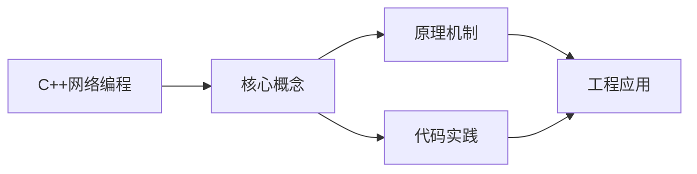
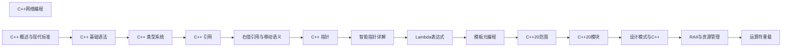

## 1. 学习目标（Bloom 分类）

本节按照布鲁姆教育目标分类学组织学习路径。本文主题为《C++网络编程》，属于 C++ 模块，读者可以根据自身阶段选择阅读深度。

记忆层面：能够准确复述本文的核心概念、术语与基本语法或操作步骤，并能够在提问或检索时快速定位对应知识点。能够说出 C++ 的类、继承、重载、模板与 STL 容器基本语法。

理解层面：能够用自己的语言解释核心原理与工作机制，说明概念之间的因果关系，而不是机械记忆结论。能够解释 RAII、拷贝/移动语义、虚函数与模板实例化。

应用层面：能够在真实项目或练习场景中运用本文知识解决具体问题，写出正确且可维护的实现。能够编写现代 C++（C++17/20）的类与泛型代码。

分析层面：能够拆解复杂问题，比较本文主题与相邻概念的异同，识别边界条件与例外情况。能够分析生命周期、未定义行为与性能特征。

评价层面：能够根据约束条件（性能、可读性、安全、成本）评价不同方案的优劣，做出有依据的技术决策。能够评价 C++ 与 Rust、Java 在系统编程中的取舍。

创造层面：能够把本文知识与其他模块知识组合，设计出新的解决方案或可复用的工程模式。能够设计高性能、可维护的 C++ 库与应用。

通过本节学习，读者应当能够把《C++网络编程》纳入自己的知识网络，并与 C++ 模块的其他主题（RAII、移动语义、模板、STL）建立关联。

## 2. 历史动机与发展脉络

《C++网络编程》是 C++ 领域的重要主题。要真正理解它，需要先了解它解决的问题与演进过程。

C++ 由 Bjarne Stroustrup 于 1979 年开始在贝尔实验室开发（原名 C with Classes），1983 年更名 C++，1998 年 C++98 首次标准化。
C++11 是语言转折点：右值引用、auto、lambda、智能指针、并发内存模型让现代 C++ 写法定型；C++14/17 补充泛型 lambda、if constexpr、折叠表达式；C++20 引入 concepts、协程、模块与范围库；C++23 继续完善。
现代 C++ 的核心口号是“资源安全”：RAII + 智能指针替代裸 new/delete，异常与错误码按场景选择；Rust 的出现促使 C++ 社区更重视内存安全工具（如 profile 指南、sanitizer）。

回到本文主题：C++网络编程 的提出与成熟，正是上述技术背景下的必然产物。早期实现往往以简单可用为目标，随着工程规模扩大，社区逐渐沉淀出标准做法与最佳实践；理解这一脉络，可以帮助读者判断“为什么文档中的推荐写法是现在这个样子”，也能在遇到历史遗留代码时准确识别其设计年代与取舍。


## 3. 形式化定义与核心概念精讲

本节把《C++网络编程》涉及的核心概念以“定义 + 讲解”的形式展开。读者应把定义当作工具，把讲解当作理解路径；两者结合才能形成可迁移的知识。

RAII：资源在构造函数获取、析构函数释放，栈对象离开作用域自动清理；智能指针（unique_ptr/shared_ptr/weak_ptr）把所有权编码进类型。
移动语义：右值引用 `&&` 与 std::move 转移资源所有权，避免深拷贝；移动后对象处于“合法但未指定”状态。
虚函数与多态：virtual 实现动态绑定，vtable 是运行时分派机制；final/override 关键字防止误用；基类析构函数应为 virtual。

### 3.1 原文章节逐一精讲

原文档把主题拆分为 14 个小节，下面按顺序给出每一节的导读讲解，随后保留原文细节供精读。

#### 原文精读（完整保留）

# C++ 网络编程

> **符号约定**：`< >` 必填参数 | `[ ]` 可选参数

---

#### 概述

C++ 网络编程是使用 C++ 通过网络协议进行数据通信的技术。最基础的方式是使用操作系统提供的 Socket API，它允许程序通过网络发送和接收数据。更高级的方式是使用第三方库如 Boost.Asio、libcurl 等，它们封装了底层细节，提供了更易用的接口。

为什么需要网络编程？几乎所有现代应用都需要网络通信。聊天应用需要收发消息，游戏需要同步玩家状态，Web 服务需要处理 HTTP 请求。C++ 网络编程让你能够构建高性能的网络应用，从简单的 TCP 客户端到高并发的服务器。

#### 基础概念

**Socket**：网络通信的端点，由 IP 地址和端口号标识。可以理解为网络中的"插座"，程序通过它发送和接收数据。

**TCP**：传输控制协议，提供可靠的、有序的数据传输。适合需要确保数据完整性的场景，如文件传输、Web 请求。

**UDP**：用户数据报协议，提供不可靠但快速的数据传输。适合对实时性要求高但允许丢包的场景，如视频流、游戏。

**字节序**：多字节数据在内存中的存储顺序。网络传输使用大端序（Network Byte Order），而 x86 架构使用小端序。需要使用 `htonl`、`ntohl` 等函数转换。

**阻塞与非阻塞**：阻塞模式下，网络操作会等待完成才返回；非阻塞模式下，操作立即返回，需要轮询或使用事件通知机制。

#### 快速上手

##### TCP 客户端

```cpp
#include <iostream>
#include <string>
#include <cstring>

#ifdef _WIN32
    #include <winsock2.h>
    #include <ws2tcpip.h>
    #pragma comment(lib, "ws2_32.lib")
#else
    #include <sys/socket.h>
    #include <arpa/inet.h>
    #include <unistd.h>
    #include <netdb.h>
#endif

// 跨平台初始化和清理
class SocketInit {
public:
    SocketInit() {
#ifdef _WIN32
        WSADATA wsaData;
        WSAStartup(MAKEWORD(2, 2), &wsaData);
#endif
    }
    ~SocketInit() {
#ifdef _WIN32
        WSACleanup();
#endif
    }
};

int main() {
    SocketInit socketInit;  // 自动初始化和清理

    // 创建 TCP Socket
    int sock = socket(AF_INET, SOCK_STREAM, 0);
    if (sock < 0) {
        std::cerr << "创建 Socket 失败" << std::endl;
        return -1;
    }

    // 设置服务器地址
    sockaddr_in serverAddr{};
    serverAddr.sin_family = AF_INET;
    serverAddr.sin_port = htons(8080);  // 端口号，转换为网络字节序
    inet_pton(AF_INET, "127.0.0.1", &serverAddr.sin_addr);  // IP 地址

    // 连接服务器
    if (connect(sock, (sockaddr*)&serverAddr, sizeof(serverAddr)) < 0) {
        std::cerr << "连接服务器失败" << std::endl;
        return -1;
    }

    std::cout << "已连接到服务器" << std::endl;

    // 发送数据
    std::string message = "你好，服务器！";
    send(sock, message.c_str(), message.size(), 0);

    // 接收数据
    char buffer[1024] = {};
    int bytesReceived = recv(sock, buffer, sizeof(buffer) - 1, 0);
    if (bytesReceived > 0) {
        buffer[bytesReceived] = '\0';
        std::cout << "收到回复: " << buffer << std::endl;
    }

    // 关闭 Socket
#ifdef _WIN32
    closesocket(sock);
#else
    close(sock);
#endif

    return 0;
}
```

##### TCP 服务器

```cpp
#include <iostream>
#include <cstring>
#include <vector>

int main() {
    SocketInit socketInit;

    // 创建监听 Socket
    int serverSock = socket(AF_INET, SOCK_STREAM, 0);
    if (serverSock < 0) {
        std::cerr << "创建 Socket 失败" << std::endl;
        return -1;
    }

    // 设置地址复用（避免重启时端口被占用）
    int opt = 1;
    setsockopt(serverSock, SOL_SOCKET, SO_REUSEADDR, (const char*)&opt, sizeof(opt));

    // 绑定地址和端口
    sockaddr_in serverAddr{};
    serverAddr.sin_family = AF_INET;
    serverAddr.sin_addr.s_addr = INADDR_ANY;  // 监听所有网络接口
    serverAddr.sin_port = htons(8080);

    if (bind(serverSock, (sockaddr*)&serverAddr, sizeof(serverAddr)) < 0) {
        std::cerr << "绑定端口失败" << std::endl;
        return -1;
    }

    // 开始监听，backlog 为等待连接的队列长度
    if (listen(serverSock, 5) < 0) {
        std::cerr << "监听失败" << std::endl;
        return -1;
    }

    std::cout << "服务器已启动，等待连接..." << std::endl;

    while (true) {
        // 接受客户端连接
        sockaddr_in clientAddr{};
        int clientAddrLen = sizeof(clientAddr);
        int clientSock = accept(serverSock, (sockaddr*)&clientAddr, &clientAddrLen);

        if (clientSock < 0) {
            std::cerr << "接受连接失败" << std::endl;
            continue;
        }

        // 获取客户端地址
        char clientIP[INET_ADDRSTRLEN];
        inet_ntop(AF_INET, &clientAddr.sin_addr, clientIP, INET_ADDRSTRLEN);
        std::cout << "客户端连接: " << clientIP << ":" << ntohs(clientAddr.sin_port) << std::endl;

        // 接收数据
        char buffer[1024] = {};
        int bytesReceived = recv(clientSock, buffer, sizeof(buffer) - 1, 0);
        if (bytesReceived > 0) {
            buffer[bytesReceived] = '\0';
            std::cout << "收到消息: " << buffer << std::endl;

            // 发送回复
            std::string reply = "服务器已收到你的消息";
            send(clientSock, reply.c_str(), reply.size(), 0);
        }

        // 关闭客户端连接
#ifdef _WIN32
        closesocket(clientSock);
#else
        close(clientSock);
#endif
    }

    return 0;
}
```

#### 详细用法

##### UDP 通信

```cpp
// UDP 服务器
void udpServer() {
    int sock = socket(AF_INET, SOCK_DGRAM, 0);  // SOCK_DGRAM 表示 UDP

    sockaddr_in serverAddr{};
    serverAddr.sin_family = AF_INET;
    serverAddr.sin_addr.s_addr = INADDR_ANY;
    serverAddr.sin_port = htons(9090);

    bind(sock, (sockaddr*)&serverAddr, sizeof(serverAddr));

    std::cout << "UDP 服务器已启动" << std::endl;

    while (true) {
        char buffer[1024] = {};
        sockaddr_in clientAddr{};
        int clientAddrLen = sizeof(clientAddr);

        // 接收数据（同时获取发送方地址）
        int bytesReceived = recvfrom(sock, buffer, sizeof(buffer) - 1, 0,
            (sockaddr*)&clientAddr, &clientAddrLen);

        if (bytesReceived > 0) {
            buffer[bytesReceived] = '\0';
            std::cout << "收到: " << buffer << std::endl;

            // 向发送方回复
            std::string reply = "UDP 回复";
            sendto(sock, reply.c_str(), reply.size(), 0,
                (sockaddr*)&clientAddr, clientAddrLen);
        }
    }
}

// UDP 客户端
void udpClient() {
    int sock = socket(AF_INET, SOCK_DGRAM, 0);

    sockaddr_in serverAddr{};
    serverAddr.sin_family = AF_INET;
    serverAddr.sin_port = htons(9090);
    inet_pton(AF_INET, "127.0.0.1", &serverAddr.sin_addr);

    // UDP 不需要连接，直接发送
    std::string message = "UDP 你好";
    sendto(sock, message.c_str(), message.size(), 0,
        (sockaddr*)&serverAddr, sizeof(serverAddr));

    // 接收回复
    char buffer[1024] = {};
    recvfrom(sock, buffer, sizeof(buffer) - 1, 0, nullptr, nullptr);
    std::cout << "收到: " << buffer << std::endl;
}
```

##### 使用 Boost.Asio

Boost.Asio 是 C++ 最流行的异步网络库：

```cpp
#include <boost/asio.hpp>
#include <iostream>

using boost::asio::ip::tcp;

// 同步 TCP 客户端
void syncClient() {
    boost::asio::io_context ioContext;

    // 解析主机名和端口
    tcp::resolver resolver(ioContext);
    auto endpoints = resolver.resolve("127.0.0.1", "8080");

    // 连接服务器
    tcp::socket socket(ioContext);
    boost::asio::connect(socket, endpoints);

    std::cout << "已连接到服务器" << std::endl;

    // 发送数据
    std::string message = "你好，Boost.Asio！";
    boost::asio::write(socket, boost::asio::buffer(message));

    // 接收数据
    char reply[1024] = {};
    size_t replyLength = socket.read_some(boost::asio::buffer(reply));
    std::cout << "收到: " << std::string(reply, replyLength) << std::endl;
}

// 异步 TCP 服务器
class Session : public std::enable_shared_from_this<Session> {
    tcp::socket socket_;
    char buffer_[1024];

public:
    Session(tcp::socket socket) : socket_(std::move(socket)) {}

    void start() {
        doRead();  // 开始异步读取
    }

private:
    void doRead() {
        auto self = shared_from_this();
        socket_.async_read_some(boost::asio::buffer(buffer_),
            [this, self](boost::system::error_code ec, size_t length) {
                if (!ec) {
                    std::cout << "收到: " << std::string(buffer_, length) << std::endl;
                    doWrite(length);  // 回显数据
                }
            });
    }

    void doWrite(size_t length) {
        auto self = shared_from_this();
        boost::asio::async_write(socket_, boost::asio::buffer(buffer_, length),
            [this, self](boost::system::error_code ec, size_t) {
                if (!ec) {
                    doRead();  // 继续读取
                }
            });
    }
};

class AsyncServer {
    boost::asio::io_context& ioContext_;
    tcp::acceptor acceptor_;

public:
    AsyncServer(boost::asio::io_context& ioContext, short port)
        : ioContext_(ioContext)
        , acceptor_(ioContext, tcp::endpoint(tcp::v4(), port))
    {
        doAccept();  // 开始接受连接
    }

private:
    void doAccept() {
        acceptor_.async_accept(
            [this](boost::system::error_code ec, tcp::socket socket) {
                if (!ec) {
                    // 为每个连接创建一个 Session
                    std::make_shared<Session>(std::move(socket))->start();
                }
                doAccept();  // 继续接受下一个连接
            });
    }
};

// 使用异步服务器
int main() {
    boost::asio::io_context ioContext;
    AsyncServer server(ioContext, 8080);
    std::cout << "异步服务器已启动" << std::endl;
    ioContext.run();  // 运行事件循环
    return 0;
}
```

##### HTTP 请求（使用 libcurl）

```cpp
#include <curl/curl.h>
#include <iostream>
#include <string>

// 回调函数：处理接收到的数据
size_t writeCallback(void* contents, size_t size, size_t nmemb, std::string* userp) {
    size_t totalSize = size * nmemb;
    userp->append((char*)contents, totalSize);
    return totalSize;
}

// 发送 GET 请求
std::string httpGet(const std::string& url) {
    CURL* curl = curl_easy_init();
    std::string response;

    if (curl) {
        curl_easy_setopt(curl, CURLOPT_URL, url.c_str());
        curl_easy_setopt(curl, CURLOPT_WRITEFUNCTION, writeCallback);
        curl_easy_setopt(curl, CURLOPT_WRITEDATA, &response);
        curl_easy_setopt(curl, CURLOPT_TIMEOUT, 10L);  // 超时 10 秒

        CURLcode res = curl_easy_perform(curl);
        if (res != CURLE_OK) {
            std::cerr << "请求失败: " << curl_easy_strerror(res) << std::endl;
        }

        curl_easy_cleanup(curl);
    }

    return response;
}

// 发送 POST 请求
std::string httpPost(const std::string& url, const std::string& data) {
    CURL* curl = curl_easy_init();
    std::string response;

    if (curl) {
        curl_easy_setopt(curl, CURLOPT_URL, url.c_str());
        curl_easy_setopt(curl, CURLOPT_POST, 1L);
        curl_easy_setopt(curl, CURLOPT_POSTFIELDS, data.c_str());
        curl_easy_setopt(curl, CURLOPT_WRITEFUNCTION, writeCallback);
        curl_easy_setopt(curl, CURLOPT_WRITEDATA, &response);

        // 设置请求头
        struct curl_slist* headers = nullptr;
        headers = curl_slist_append(headers, "Content-Type: application/json");
        curl_easy_setopt(curl, CURLOPT_HTTPHEADER, headers);

        curl_easy_perform(curl);
        curl_slist_free_all(headers);
        curl_easy_cleanup(curl);
    }

    return response;
}

int main() {
    curl_global_init(CURL_GLOBAL_DEFAULT);

    // GET 请求
    std::string response = httpGet("https://httpbin.org/get");
    std::cout << "GET 响应: " << response << std::endl;

    // POST 请求
    std::string postResponse = httpPost("https://httpbin.org/post",
        "{\"name\":\"张三\",\"age\":25}");
    std::cout << "POST 响应: " << postResponse << std::endl;

    curl_global_cleanup();
    return 0;
}
```

#### 常见场景

##### 简单的聊天服务器

```cpp
// 多客户端聊天服务器（使用 select 多路复用）
#include <set>

void chatServer() {
    int serverSock = socket(AF_INET, SOCK_STREAM, 0);

    sockaddr_in addr{};
    addr.sin_family = AF_INET;
    addr.sin_addr.s_addr = INADDR_ANY;
    addr.sin_port = htons(8080);

    bind(serverSock, (sockaddr*)&addr, sizeof(addr));
    listen(serverSock, 5);

    std::set<int> clients;  // 所有已连接的客户端

    while (true) {
        fd_set readFds;
        FD_ZERO(&readFds);
        FD_SET(serverSock, &readFds);  // 监听服务器 Socket

        int maxFd = serverSock;
        for (int client : clients) {
            FD_SET(client, &readFds);
            maxFd = std::max(maxFd, client);
        }

        // 等待任一 Socket 有数据可读
        select(maxFd + 1, &readFds, nullptr, nullptr, nullptr);

        // 检查是否有新连接
        if (FD_ISSET(serverSock, &readFds)) {
            int clientSock = accept(serverSock, nullptr, nullptr);
            clients.insert(clientSock);
            std::cout << "新客户端连接，当前人数: " << clients.size() << std::endl;
        }

        // 检查各客户端是否有消息
        char buffer[1024];
        for (auto it = clients.begin(); it != clients.end(); ) {
            if (FD_ISSET(*it, &readFds)) {
                int bytes = recv(*it, buffer, sizeof(buffer) - 1, 0);
                if (bytes <= 0) {
                    // 客户端断开
                    it = clients.erase(it);
                    continue;
                }
                buffer[bytes] = '\0';

                // 广播给所有其他客户端
                for (int other : clients) {
                    if (other != *it) {
                        send(other, buffer, bytes, 0);
                    }
                }
            }
            ++it;
        }
    }
}
```

#### 注意事项

**字节序转换**：网络传输多字节整数时必须使用 `htonl`/`ntohl`/`htons`/`ntohs` 进行字节序转换，否则在不同架构的机器间通信会出错。

**粘包问题**：TCP 是流式协议，不保证一次 `recv` 对应一次 `send`。需要在应用层定义消息边界，如使用长度前缀或分隔符。

**资源释放**：Socket 是系统资源，使用完毕后必须关闭。建议使用 RAII 封装 Socket 的生命周期。

**跨平台差异**：Windows 和 Linux 的 Socket API 有细微差异（如 `closesocket` vs `close`，`SOCKADDR` vs `sockaddr`）。使用条件编译或跨平台库处理。

**并发安全**：多线程环境下操作同一 Socket 需要加锁。推荐使用 Boost.Asio 的异步模型，避免多线程竞争。

#### 进阶用法

##### 使用 io_uring（Linux 5.1+）

```cpp
// io_uring 是 Linux 的高性能异步 I/O 接口
// 比 epoll 更高效，适合高并发网络服务

#include <liburing.h>

void ioUringServer() {
    struct io_uring ring;
    io_uring_queue_init(256, &ring, 0);

    // 创建监听 Socket
    int serverSock = socket(AF_INET, SOCK_STREAM, 0);
    // ... bind, listen ...

    // 提交 accept 请求
    struct io_uring_sqe* sqe = io_uring_get_sqe(&ring);
    io_uring_prep_accept(sqe, serverSock, nullptr, nullptr, 0);
    io_uring_submit(&ring);

    // 等待完成
    struct io_uring_cqe* cqe;
    io_uring_wait_cqe(&ring, &cqe);
    int clientSock = cqe->res;
    io_uring_cqe_seen(&ring, cqe);

    // 提交 recv 请求
    char buffer[1024];
    sqe = io_uring_get_sqe(&ring);
    io_uring_prep_recv(sqe, clientSock, buffer, sizeof(buffer), 0);
    io_uring_submit(&ring);

    io_uring_queue_exit(&ring);
}
```
#### POSIX Socket 基础

**基本写法：创建套接字**
`int socket(<域>, <类型>, <协议>)`
```cpp
#include <sys/socket.h>
// 创建 TCP 套接字
int fd = socket(AF_INET, SOCK_STREAM, 0);
if (fd < 0) { perror("socket"); }
// AF_INET    IPv4
// AF_INET6   IPv6
// SOCK_STREAM TCP
// SOCK_DGRAM  UDP
```

---

**基本写法：绑定地址**
`bind(<fd>, <地址指针>, <地址长度>)`
```cpp
#include <netinet/in.h>
struct sockaddr_in addr{};
addr.sin_family = AF_INET;
addr.sin_port = htons(8080);          // 端口转网络字节序
addr.sin_addr.s_addr = INADDR_ANY;    // 监听所有地址
bind(fd, (struct sockaddr*)&addr, sizeof(addr));
```

---

**基本写法：监听**
`listen(<fd>, <等待队列长度>)`
```cpp
// 开始监听
listen(fd, 5); // backlog=5
```

---

**基本写法：接受连接**
`accept(<fd>, <地址>, <长度>)`
```cpp
// 接受客户端连接（阻塞）
struct sockaddr_in client{};
socklen_t len = sizeof(client);
int conn = accept(fd, (struct sockaddr*)&client, &len);
```

---

**基本写法：连接服务器**
`connect(<fd>, <地址>, <长度>)`
```cpp
// 客户端连接
struct sockaddr_in srv{};
srv.sin_family = AF_INET;
srv.sin_port = htons(8080);
inet_pton(AF_INET, "127.0.0.1", &srv.sin_addr);
connect(fd, (struct sockaddr*)&srv, sizeof(srv));
```

---

**基本写法：收发数据**
`send/recv` 或 `read/write`
```cpp
// TCP 收发
char buf[1024];
ssize_t n = recv(conn, buf, sizeof(buf), 0);
send(conn, "hello", 5, 0);
// UDP 用 sendto/recvfrom
sendto(fd, "hi", 2, 0, (struct sockaddr*)&srv, sizeof(srv));
recvfrom(fd, buf, sizeof(buf), 0, nullptr, nullptr);
```

---

#### 地址转换

**基本写法：IP 字符串与二进制互转**
`inet_pton(<域>, <字符串>, <二进制>)`
```cpp
#include <arpa/inet.h>
// 字符串转二进制
struct in_addr addr;
inet_pton(AF_INET, "192.168.1.1", &addr);
// 二进制转字符串
char str[INET_ADDRSTRLEN];
inet_ntop(AF_INET, &addr, str, sizeof(str));
```

---

**基本写法：getaddrinfo 解析**
`getaddrinfo(<主机>, <服务>, <提示>, <结果>)`
```cpp
#include <netdb.h>
struct addrinfo hints{}, *res;
hints.ai_family = AF_INET;
hints.ai_socktype = SOCK_STREAM;
getaddrinfo("example.com", "80", &hints, &res);
// 使用 res 链表
freeaddrinfo(res);
```

---

#### 套接字选项

**基本写法：设置选项**
`setsockopt(<fd>, <级别>, <选项>, <值>, <长度>)`
```cpp
// 地址重用
int yes = 1;
setsockopt(fd, SOL_SOCKET, SO_REUSEADDR, &yes, sizeof(yes));
// 接收超时
struct timeval tv{.tv_sec = 5, .tv_usec = 0};
setsockopt(fd, SOL_SOCKET, SO_RCVTIMEO, &tv, sizeof(tv));
```

---

#### I/O 复用

**基本写法：select 多路复用**
`select(<最大fd+1>, <读集>, <写集>, <异常集>, <超时>)`
```cpp
#include <sys/select.h>
fd_set readfds;
FD_ZERO(&readfds);
FD_SET(fd, &readfds);
struct timeval tv{5, 0};
int n = select(fd + 1, &readfds, nullptr, nullptr, &tv);
if (n > 0 && FD_ISSET(fd, &readfds)) { /* 可读 */ }
```

---

**基本写法：poll 多路复用**
`poll(<数组>, <数量>, <超时>)`
```cpp
#include <poll.h>
struct pollfd fds[2];
fds[0].fd = fd1; fds[0].events = POLLIN;
fds[1].fd = fd2; fds[1].events = POLLIN;
int n = poll(fds, 2, 5000); // 超时 5 秒
for (int i = 0; i < 2; ++i)
    if (fds[i].revents & POLLIN) { /* 可读 */ }
```

---

**基本写法：epoll（Linux）**
`epoll_create / epoll_ctl / epoll_wait`
```cpp
#include <sys/epoll.h>
int ep = epoll_create1(0);
struct epoll_event ev{.events = EPOLLIN, .data.fd = fd};
epoll_ctl(ep, EPOLL_CTL_ADD, fd, &ev);
struct epoll_event events[10];
int n = epoll_wait(ep, events, 10, -1); // -1 阻塞
```

---

#### 非阻塞 I/O

**基本写法：设置非阻塞**
`fcntl(<fd>, F_SETFL, O_NONBLOCK)`
```cpp
#include <fcntl.h>
// 设为非阻塞
int flags = fcntl(fd, F_GETFL, 0);
fcntl(fd, F_SETFL, flags | O_NONBLOCK);
```

---

#### 简易 TCP 服务器框架

**基本写法：服务器流程**
`socket → bind → listen → accept → recv/send`
```cpp
// TCP echo 服务器骨架
int srv = socket(AF_INET, SOCK_STREAM, 0);
struct sockaddr_in addr{};
addr.sin_family = AF_INET;
addr.sin_port = htons(8080);
addr.sin_addr.s_addr = INADDR_ANY;
bind(srv, (struct sockaddr*)&addr, sizeof(addr));
listen(srv, 5);
while (true) {
    int conn = accept(srv, nullptr, nullptr);
    char buf[1024];
    ssize_t n = recv(conn, buf, sizeof(buf), 0);
    send(conn, buf, n, 0); // 回显
    close(conn);
}
```

---

#### C++ 封装

**基本写法：RAII 套接字**
`struct Socket { int fd; ~Socket() { close(fd); } };`
```cpp
// RAII 管理套接字生命周期
struct Socket {
    int fd;
    Socket(int f) : fd(f) {}
    ~Socket() { if (fd >= 0) close(fd); }
    Socket(const Socket&) = delete;
    Socket& operator=(const Socket&) = delete;
    Socket(Socket&& o) noexcept : fd(o.fd) { o.fd = -1; }
};
```


### 3.2 概念关系图

下面用 Mermaid 图表达本文核心概念之间的关系，帮助读者建立整体图景：



图中展示的是本文知识的结构化关系：核心概念是入口，原理机制解释“为什么”，代码实践演示“怎么做”，工程应用回答“何时用”。读者学习时可以把每个小节的内容挂接到对应节点上。

## 4. 理论推导与原理解析

本节深入《C++网络编程》背后的原理。理论部分不求面面俱到，而是聚焦“能解释现象、能指导实践”的关键推导。

RAII：资源在构造函数获取、析构函数释放，栈对象离开作用域自动清理；智能指针（unique_ptr/shared_ptr/weak_ptr）把所有权编码进类型。
移动语义：右值引用 `&&` 与 std::move 转移资源所有权，避免深拷贝；移动后对象处于“合法但未指定”状态。
虚函数与多态：virtual 实现动态绑定，vtable 是运行时分派机制；final/override 关键字防止误用；基类析构函数应为 virtual。
模板与泛型：模板编译期实例化，实现静态多态；concepts（C++20）约束类型接口；模板元编程在编译期计算类型与常量。

需要强调的是，理论推导与工程实践之间存在翻译层：理论给出的是理想化模型与边界条件，工程代码则必须处理真实环境中的例外。读者在学习时应先掌握理论的“标准情形”，再通过陷阱章节了解“非标准情形”。

## 5. 代码示例与逐行讲解

本节把原文中的代码示例系统整理，并为每个示例补充用途说明与讲解。读者不应只浏览代码，而应逐段对照讲解理解设计意图。

### 5.1 示例：TCP 客户端

该示例来自原文《TCP 客户端》小节，用于演示C++网络编程相关操作。阅读时请先看代码结构，再看其后的讲解。

```cpp
#include <iostream>
#include <string>
#include <cstring>

#ifdef _WIN32
    #include <winsock2.h>
    #include <ws2tcpip.h>
    #pragma comment(lib, "ws2_32.lib")
#else
    #include <sys/socket.h>
    #include <arpa/inet.h>
    #include <unistd.h>
    #include <netdb.h>
#endif

// 跨平台初始化和清理
class SocketInit {
public:
    SocketInit() {
#ifdef _WIN32
        WSADATA wsaData;
        WSAStartup(MAKEWORD(2, 2), &wsaData);
#endif
    }
    ~SocketInit() {
#ifdef _WIN32
        WSACleanup();
#endif
    }
};

int main() {
    SocketInit socketInit;  // 自动初始化和清理

    // 创建 TCP Socket
    int sock = socket(AF_INET, SOCK_STREAM, 0);
    if (sock < 0) {
        std::cerr << "创建 Socket 失败" << std::endl;
        return -1;
    }

    // 设置服务器地址
    sockaddr_in serverAddr{};
    serverAddr.sin_family = AF_INET;
    serverAddr.sin_port = htons(8080);  // 端口号，转换为网络字节序
    inet_pton(AF_INET, "127.0.0.1", &serverAddr.sin_addr);  // IP 地址

    // 连接服务器
    if (connect(sock, (sockaddr*)&serverAddr, sizeof(serverAddr)) < 0) {
        std::cerr << "连接服务器失败" << std::endl;
        return -1;
    }

    std::cout << "已连接到服务器" << std::endl;

    // 发送数据
    std::string message = "你好，服务器！";
    send(sock, message.c_str(), message.size(), 0);

    // 接收数据
    char buffer[1024] = {};
    int bytesReceived = recv(sock, buffer, sizeof(buffer) - 1, 0);
    if (bytesReceived > 0) {
        buffer[bytesReceived] = '\0';
        std::cout << "收到回复: " << buffer << std::endl;
    }

    // 关闭 Socket
#ifdef _WIN32
    closesocket(sock);
#else
    close(sock);
#endif

    return 0;
}
```

讲解：这段代码演示了本节核心知识点。代码中的关键操作可以归纳为三步：准备（定义或初始化）、执行（核心逻辑）、收尾（释放资源或返回结果）。实际项目中，这三步往往被封装为函数或类，以提升复用性与可测试性。

关键点分析：

该示例共 65 行有效代码，包含 4 类关键结构（class、def、if、return）。其中：

- 入口与初始化部分负责建立上下文，对应实际项目中的启动或装配逻辑；
- 核心逻辑部分体现本文主题的主要操作，是阅读时最需要对照讲解理解的部分；
- 输出或返回部分把结果交给调用方，注意其类型与边界条件。

进阶思考路径：先尝试修改参数观察行为变化，再把示例中的模式迁移到自己的项目中；每次修改都记录预期与实测差异，这是把示例转化为能力的最快方式。

### 5.2 示例：TCP 服务器

该示例来自原文《TCP 服务器》小节，用于演示C++网络编程相关操作。阅读时请先看代码结构，再看其后的讲解。

```cpp
#include <iostream>
#include <cstring>
#include <vector>

int main() {
    SocketInit socketInit;

    // 创建监听 Socket
    int serverSock = socket(AF_INET, SOCK_STREAM, 0);
    if (serverSock < 0) {
        std::cerr << "创建 Socket 失败" << std::endl;
        return -1;
    }

    // 设置地址复用（避免重启时端口被占用）
    int opt = 1;
    setsockopt(serverSock, SOL_SOCKET, SO_REUSEADDR, (const char*)&opt, sizeof(opt));

    // 绑定地址和端口
    sockaddr_in serverAddr{};
    serverAddr.sin_family = AF_INET;
    serverAddr.sin_addr.s_addr = INADDR_ANY;  // 监听所有网络接口
    serverAddr.sin_port = htons(8080);

    if (bind(serverSock, (sockaddr*)&serverAddr, sizeof(serverAddr)) < 0) {
        std::cerr << "绑定端口失败" << std::endl;
        return -1;
    }

    // 开始监听，backlog 为等待连接的队列长度
    if (listen(serverSock, 5) < 0) {
        std::cerr << "监听失败" << std::endl;
        return -1;
    }

    std::cout << "服务器已启动，等待连接..." << std::endl;

    while (true) {
        // 接受客户端连接
        sockaddr_in clientAddr{};
        int clientAddrLen = sizeof(clientAddr);
        int clientSock = accept(serverSock, (sockaddr*)&clientAddr, &clientAddrLen);

        if (clientSock < 0) {
            std::cerr << "接受连接失败" << std::endl;
            continue;
        }

        // 获取客户端地址
        char clientIP[INET_ADDRSTRLEN];
        inet_ntop(AF_INET, &clientAddr.sin_addr, clientIP, INET_ADDRSTRLEN);
        std::cout << "客户端连接: " << clientIP << ":" << ntohs(clientAddr.sin_port) << std::endl;

        // 接收数据
        char buffer[1024] = {};
        int bytesReceived = recv(clientSock, buffer, sizeof(buffer) - 1, 0);
        if (bytesReceived > 0) {
            buffer[bytesReceived] = '\0';
            std::cout << "收到消息: " << buffer << std::endl;

            // 发送回复
            std::string reply = "服务器已收到你的消息";
            send(clientSock, reply.c_str(), reply.size(), 0);
        }

        // 关闭客户端连接
#ifdef _WIN32
        closesocket(clientSock);
#else
        close(clientSock);
#endif
    }

    return 0;
}
```

讲解：这段代码演示了本节核心知识点。代码中的关键操作可以归纳为三步：准备（定义或初始化）、执行（核心逻辑）、收尾（释放资源或返回结果）。实际项目中，这三步往往被封装为函数或类，以提升复用性与可测试性。

关键点分析：

该示例共 61 行有效代码，包含 4 类关键结构（def、if、while、return）。其中：

- 入口与初始化部分负责建立上下文，对应实际项目中的启动或装配逻辑；
- 核心逻辑部分体现本文主题的主要操作，是阅读时最需要对照讲解理解的部分；
- 输出或返回部分把结果交给调用方，注意其类型与边界条件。

进阶思考路径：先尝试修改参数观察行为变化，再把示例中的模式迁移到自己的项目中；每次修改都记录预期与实测差异，这是把示例转化为能力的最快方式。

### 5.3 示例：UDP 通信

该示例来自原文《UDP 通信》小节，用于演示C++网络编程相关操作。阅读时请先看代码结构，再看其后的讲解。

```cpp
// UDP 服务器
void udpServer() {
    int sock = socket(AF_INET, SOCK_DGRAM, 0);  // SOCK_DGRAM 表示 UDP

    sockaddr_in serverAddr{};
    serverAddr.sin_family = AF_INET;
    serverAddr.sin_addr.s_addr = INADDR_ANY;
    serverAddr.sin_port = htons(9090);

    bind(sock, (sockaddr*)&serverAddr, sizeof(serverAddr));

    std::cout << "UDP 服务器已启动" << std::endl;

    while (true) {
        char buffer[1024] = {};
        sockaddr_in clientAddr{};
        int clientAddrLen = sizeof(clientAddr);

        // 接收数据（同时获取发送方地址）
        int bytesReceived = recvfrom(sock, buffer, sizeof(buffer) - 1, 0,
            (sockaddr*)&clientAddr, &clientAddrLen);

        if (bytesReceived > 0) {
            buffer[bytesReceived] = '\0';
            std::cout << "收到: " << buffer << std::endl;

            // 向发送方回复
            std::string reply = "UDP 回复";
            sendto(sock, reply.c_str(), reply.size(), 0,
                (sockaddr*)&clientAddr, clientAddrLen);
        }
    }
}

// UDP 客户端
void udpClient() {
    int sock = socket(AF_INET, SOCK_DGRAM, 0);

    sockaddr_in serverAddr{};
    serverAddr.sin_family = AF_INET;
    serverAddr.sin_port = htons(9090);
    inet_pton(AF_INET, "127.0.0.1", &serverAddr.sin_addr);

    // UDP 不需要连接，直接发送
    std::string message = "UDP 你好";
    sendto(sock, message.c_str(), message.size(), 0,
        (sockaddr*)&serverAddr, sizeof(serverAddr));

    // 接收回复
    char buffer[1024] = {};
    recvfrom(sock, buffer, sizeof(buffer) - 1, 0, nullptr, nullptr);
    std::cout << "收到: " << buffer << std::endl;
}
```

讲解：这段代码演示了本节核心知识点。代码中的关键操作可以归纳为三步：准备（定义或初始化）、执行（核心逻辑）、收尾（释放资源或返回结果）。实际项目中，这三步往往被封装为函数或类，以提升复用性与可测试性。

关键点分析：

该示例共 42 行有效代码，包含 2 类关键结构（if、while）。其中：

- 入口与初始化部分负责建立上下文，对应实际项目中的启动或装配逻辑；
- 核心逻辑部分体现本文主题的主要操作，是阅读时最需要对照讲解理解的部分；
- 输出或返回部分把结果交给调用方，注意其类型与边界条件。

进阶思考路径：先尝试修改参数观察行为变化，再把示例中的模式迁移到自己的项目中；每次修改都记录预期与实测差异，这是把示例转化为能力的最快方式。

### 5.4 示例：使用 Boost.Asio

该示例来自原文《使用 Boost.Asio》小节，用于演示C++网络编程相关操作。阅读时请先看代码结构，再看其后的讲解。

```cpp
#include <boost/asio.hpp>
#include <iostream>

using boost::asio::ip::tcp;

// 同步 TCP 客户端
void syncClient() {
    boost::asio::io_context ioContext;

    // 解析主机名和端口
    tcp::resolver resolver(ioContext);
    auto endpoints = resolver.resolve("127.0.0.1", "8080");

    // 连接服务器
    tcp::socket socket(ioContext);
    boost::asio::connect(socket, endpoints);

    std::cout << "已连接到服务器" << std::endl;

    // 发送数据
    std::string message = "你好，Boost.Asio！";
    boost::asio::write(socket, boost::asio::buffer(message));

    // 接收数据
    char reply[1024] = {};
    size_t replyLength = socket.read_some(boost::asio::buffer(reply));
    std::cout << "收到: " << std::string(reply, replyLength) << std::endl;
}

// 异步 TCP 服务器
class Session : public std::enable_shared_from_this<Session> {
    tcp::socket socket_;
    char buffer_[1024];

public:
    Session(tcp::socket socket) : socket_(std::move(socket)) {}

    void start() {
        doRead();  // 开始异步读取
    }

private:
    void doRead() {
        auto self = shared_from_this();
        socket_.async_read_some(boost::asio::buffer(buffer_),
            [this, self](boost::system::error_code ec, size_t length) {
                if (!ec) {
                    std::cout << "收到: " << std::string(buffer_, length) << std::endl;
                    doWrite(length);  // 回显数据
                }
            });
    }

    void doWrite(size_t length) {
        auto self = shared_from_this();
        boost::asio::async_write(socket_, boost::asio::buffer(buffer_, length),
            [this, self](boost::system::error_code ec, size_t) {
                if (!ec) {
                    doRead();  // 继续读取
                }
            });
    }
};

class AsyncServer {
    boost::asio::io_context& ioContext_;
    tcp::acceptor acceptor_;

public:
    AsyncServer(boost::asio::io_context& ioContext, short port)
        : ioContext_(ioContext)
        , acceptor_(ioContext, tcp::endpoint(tcp::v4(), port))
    {
        doAccept();  // 开始接受连接
    }

private:
    void doAccept() {
        acceptor_.async_accept(
            [this](boost::system::error_code ec, tcp::socket socket) {
                if (!ec) {
                    // 为每个连接创建一个 Session
                    std::make_shared<Session>(std::move(socket))->start();
                }
                doAccept();  // 继续接受下一个连接
            });
    }
};

// 使用异步服务器
int main() {
    boost::asio::io_context ioContext;
    AsyncServer server(ioContext, 8080);
    std::cout << "异步服务器已启动" << std::endl;
    ioContext.run();  // 运行事件循环
    return 0;
}
```

讲解：这段代码演示了本节核心知识点。代码中的关键操作可以归纳为三步：准备（定义或初始化）、执行（核心逻辑）、收尾（释放资源或返回结果）。实际项目中，这三步往往被封装为函数或类，以提升复用性与可测试性。

关键点分析：

该示例共 81 行有效代码，包含 3 类关键结构（class、if、return）。其中：

- 入口与初始化部分负责建立上下文，对应实际项目中的启动或装配逻辑；
- 核心逻辑部分体现本文主题的主要操作，是阅读时最需要对照讲解理解的部分；
- 输出或返回部分把结果交给调用方，注意其类型与边界条件。

进阶思考路径：先尝试修改参数观察行为变化，再把示例中的模式迁移到自己的项目中；每次修改都记录预期与实测差异，这是把示例转化为能力的最快方式。

### 5.5 示例：HTTP 请求（使用 libcurl）

该示例来自原文《HTTP 请求（使用 libcurl）》小节，用于演示C++网络编程相关操作。阅读时请先看代码结构，再看其后的讲解。

```cpp
#include <curl/curl.h>
#include <iostream>
#include <string>

// 回调函数：处理接收到的数据
size_t writeCallback(void* contents, size_t size, size_t nmemb, std::string* userp) {
    size_t totalSize = size * nmemb;
    userp->append((char*)contents, totalSize);
    return totalSize;
}

// 发送 GET 请求
std::string httpGet(const std::string& url) {
    CURL* curl = curl_easy_init();
    std::string response;

    if (curl) {
        curl_easy_setopt(curl, CURLOPT_URL, url.c_str());
        curl_easy_setopt(curl, CURLOPT_WRITEFUNCTION, writeCallback);
        curl_easy_setopt(curl, CURLOPT_WRITEDATA, &response);
        curl_easy_setopt(curl, CURLOPT_TIMEOUT, 10L);  // 超时 10 秒

        CURLcode res = curl_easy_perform(curl);
        if (res != CURLE_OK) {
            std::cerr << "请求失败: " << curl_easy_strerror(res) << std::endl;
        }

        curl_easy_cleanup(curl);
    }

    return response;
}

// 发送 POST 请求
std::string httpPost(const std::string& url, const std::string& data) {
    CURL* curl = curl_easy_init();
    std::string response;

    if (curl) {
        curl_easy_setopt(curl, CURLOPT_URL, url.c_str());
        curl_easy_setopt(curl, CURLOPT_POST, 1L);
        curl_easy_setopt(curl, CURLOPT_POSTFIELDS, data.c_str());
        curl_easy_setopt(curl, CURLOPT_WRITEFUNCTION, writeCallback);
        curl_easy_setopt(curl, CURLOPT_WRITEDATA, &response);

        // 设置请求头
        struct curl_slist* headers = nullptr;
        headers = curl_slist_append(headers, "Content-Type: application/json");
        curl_easy_setopt(curl, CURLOPT_HTTPHEADER, headers);

        curl_easy_perform(curl);
        curl_slist_free_all(headers);
        curl_easy_cleanup(curl);
    }

    return response;
}

int main() {
    curl_global_init(CURL_GLOBAL_DEFAULT);

    // GET 请求
    std::string response = httpGet("https://httpbin.org/get");
    std::cout << "GET 响应: " << response << std::endl;

    // POST 请求
    std::string postResponse = httpPost("https://httpbin.org/post",
        "{\"name\":\"张三\",\"age\":25}");
    std::cout << "POST 响应: " << postResponse << std::endl;

    curl_global_cleanup();
    return 0;
}
```

讲解：这段代码演示了本节核心知识点。代码中的关键操作可以归纳为三步：准备（定义或初始化）、执行（核心逻辑）、收尾（释放资源或返回结果）。实际项目中，这三步往往被封装为函数或类，以提升复用性与可测试性。

关键点分析：

该示例共 58 行有效代码，包含 2 类关键结构（if、return）。其中：

- 入口与初始化部分负责建立上下文，对应实际项目中的启动或装配逻辑；
- 核心逻辑部分体现本文主题的主要操作，是阅读时最需要对照讲解理解的部分；
- 输出或返回部分把结果交给调用方，注意其类型与边界条件。

进阶思考路径：先尝试修改参数观察行为变化，再把示例中的模式迁移到自己的项目中；每次修改都记录预期与实测差异，这是把示例转化为能力的最快方式。

### 5.6 示例：简单的聊天服务器

该示例来自原文《简单的聊天服务器》小节，用于演示C++网络编程相关操作。阅读时请先看代码结构，再看其后的讲解。

```cpp
// 多客户端聊天服务器（使用 select 多路复用）
#include <set>

void chatServer() {
    int serverSock = socket(AF_INET, SOCK_STREAM, 0);

    sockaddr_in addr{};
    addr.sin_family = AF_INET;
    addr.sin_addr.s_addr = INADDR_ANY;
    addr.sin_port = htons(8080);

    bind(serverSock, (sockaddr*)&addr, sizeof(addr));
    listen(serverSock, 5);

    std::set<int> clients;  // 所有已连接的客户端

    while (true) {
        fd_set readFds;
        FD_ZERO(&readFds);
        FD_SET(serverSock, &readFds);  // 监听服务器 Socket

        int maxFd = serverSock;
        for (int client : clients) {
            FD_SET(client, &readFds);
            maxFd = std::max(maxFd, client);
        }

        // 等待任一 Socket 有数据可读
        select(maxFd + 1, &readFds, nullptr, nullptr, nullptr);

        // 检查是否有新连接
        if (FD_ISSET(serverSock, &readFds)) {
            int clientSock = accept(serverSock, nullptr, nullptr);
            clients.insert(clientSock);
            std::cout << "新客户端连接，当前人数: " << clients.size() << std::endl;
        }

        // 检查各客户端是否有消息
        char buffer[1024];
        for (auto it = clients.begin(); it != clients.end(); ) {
            if (FD_ISSET(*it, &readFds)) {
                int bytes = recv(*it, buffer, sizeof(buffer) - 1, 0);
                if (bytes <= 0) {
                    // 客户端断开
                    it = clients.erase(it);
                    continue;
                }
                buffer[bytes] = '\0';

                // 广播给所有其他客户端
                for (int other : clients) {
                    if (other != *it) {
                        send(other, buffer, bytes, 0);
                    }
                }
            }
            ++it;
        }
    }
}
```

讲解：这段代码演示了本节核心知识点。代码中的关键操作可以归纳为三步：准备（定义或初始化）、执行（核心逻辑）、收尾（释放资源或返回结果）。实际项目中，这三步往往被封装为函数或类，以提升复用性与可测试性。

关键点分析：

该示例共 50 行有效代码，包含 3 类关键结构（if、for、while）。其中：

- 入口与初始化部分负责建立上下文，对应实际项目中的启动或装配逻辑；
- 核心逻辑部分体现本文主题的主要操作，是阅读时最需要对照讲解理解的部分；
- 输出或返回部分把结果交给调用方，注意其类型与边界条件。

进阶思考路径：先尝试修改参数观察行为变化，再把示例中的模式迁移到自己的项目中；每次修改都记录预期与实测差异，这是把示例转化为能力的最快方式。

### 5.7 示例：使用 io_uring（Linux 5.1+）

该示例来自原文《使用 io_uring（Linux 5.1+）》小节，用于演示C++网络编程相关操作。阅读时请先看代码结构，再看其后的讲解。

```cpp
// io_uring 是 Linux 的高性能异步 I/O 接口
// 比 epoll 更高效，适合高并发网络服务

#include <liburing.h>

void ioUringServer() {
    struct io_uring ring;
    io_uring_queue_init(256, &ring, 0);

    // 创建监听 Socket
    int serverSock = socket(AF_INET, SOCK_STREAM, 0);
    // ... bind, listen ...

    // 提交 accept 请求
    struct io_uring_sqe* sqe = io_uring_get_sqe(&ring);
    io_uring_prep_accept(sqe, serverSock, nullptr, nullptr, 0);
    io_uring_submit(&ring);

    // 等待完成
    struct io_uring_cqe* cqe;
    io_uring_wait_cqe(&ring, &cqe);
    int clientSock = cqe->res;
    io_uring_cqe_seen(&ring, cqe);

    // 提交 recv 请求
    char buffer[1024];
    sqe = io_uring_get_sqe(&ring);
    io_uring_prep_recv(sqe, clientSock, buffer, sizeof(buffer), 0);
    io_uring_submit(&ring);

    io_uring_queue_exit(&ring);
}
```

讲解：这段代码演示了本节核心知识点。代码中的关键操作可以归纳为三步：准备（定义或初始化）、执行（核心逻辑）、收尾（释放资源或返回结果）。实际项目中，这三步往往被封装为函数或类，以提升复用性与可测试性。

关键点分析：

该示例共 25 行有效代码，结构以数据或配置为主。阅读时应关注：数据字段的含义、配置项的作用，以及它们与运行行为的对应关系。

进阶思考路径：先尝试修改参数观察行为变化，再把示例中的模式迁移到自己的项目中；每次修改都记录预期与实测差异，这是把示例转化为能力的最快方式。

### 5.8 示例：POSIX Socket 基础

该示例来自原文《POSIX Socket 基础》小节，用于演示C++网络编程相关操作。阅读时请先看代码结构，再看其后的讲解。

```cpp
#include <sys/socket.h>
// 创建 TCP 套接字
int fd = socket(AF_INET, SOCK_STREAM, 0);
if (fd < 0) { perror("socket"); }
// AF_INET    IPv4
// AF_INET6   IPv6
// SOCK_STREAM TCP
// SOCK_DGRAM  UDP
```

讲解：这段代码演示了本节核心知识点。代码中的关键操作可以归纳为三步：准备（定义或初始化）、执行（核心逻辑）、收尾（释放资源或返回结果）。实际项目中，这三步往往被封装为函数或类，以提升复用性与可测试性。

关键点分析：

该示例共 8 行有效代码，包含 1 类关键结构（if）。其中：

- 入口与初始化部分负责建立上下文，对应实际项目中的启动或装配逻辑；
- 核心逻辑部分体现本文主题的主要操作，是阅读时最需要对照讲解理解的部分；
- 输出或返回部分把结果交给调用方，注意其类型与边界条件。

进阶思考路径：先尝试修改参数观察行为变化，再把示例中的模式迁移到自己的项目中；每次修改都记录预期与实测差异，这是把示例转化为能力的最快方式。

### 5.9 示例：POSIX Socket 基础

该示例来自原文《POSIX Socket 基础》小节，用于演示C++网络编程相关操作。阅读时请先看代码结构，再看其后的讲解。

```cpp
#include <netinet/in.h>
struct sockaddr_in addr{};
addr.sin_family = AF_INET;
addr.sin_port = htons(8080);          // 端口转网络字节序
addr.sin_addr.s_addr = INADDR_ANY;    // 监听所有地址
bind(fd, (struct sockaddr*)&addr, sizeof(addr));
```

讲解：这段代码演示了本节核心知识点。代码中的关键操作可以归纳为三步：准备（定义或初始化）、执行（核心逻辑）、收尾（释放资源或返回结果）。实际项目中，这三步往往被封装为函数或类，以提升复用性与可测试性。

关键点分析：

该示例共 6 行有效代码，结构以数据或配置为主。阅读时应关注：数据字段的含义、配置项的作用，以及它们与运行行为的对应关系。

进阶思考路径：先尝试修改参数观察行为变化，再把示例中的模式迁移到自己的项目中；每次修改都记录预期与实测差异，这是把示例转化为能力的最快方式。

### 5.10 示例：POSIX Socket 基础

该示例来自原文《POSIX Socket 基础》小节，用于演示C++网络编程相关操作。阅读时请先看代码结构，再看其后的讲解。

```cpp
// 开始监听
listen(fd, 5); // backlog=5
```

讲解：这段代码演示了本节核心知识点。代码中的关键操作可以归纳为三步：准备（定义或初始化）、执行（核心逻辑）、收尾（释放资源或返回结果）。实际项目中，这三步往往被封装为函数或类，以提升复用性与可测试性。

关键点分析：

该示例共 2 行有效代码，结构以数据或配置为主。阅读时应关注：数据字段的含义、配置项的作用，以及它们与运行行为的对应关系。

进阶思考路径：先尝试修改参数观察行为变化，再把示例中的模式迁移到自己的项目中；每次修改都记录预期与实测差异，这是把示例转化为能力的最快方式。

### 5.11 示例：POSIX Socket 基础

该示例来自原文《POSIX Socket 基础》小节，用于演示C++网络编程相关操作。阅读时请先看代码结构，再看其后的讲解。

```cpp
// 接受客户端连接（阻塞）
struct sockaddr_in client{};
socklen_t len = sizeof(client);
int conn = accept(fd, (struct sockaddr*)&client, &len);
```

讲解：这段代码演示了本节核心知识点。代码中的关键操作可以归纳为三步：准备（定义或初始化）、执行（核心逻辑）、收尾（释放资源或返回结果）。实际项目中，这三步往往被封装为函数或类，以提升复用性与可测试性。

关键点分析：

该示例共 4 行有效代码，结构以数据或配置为主。阅读时应关注：数据字段的含义、配置项的作用，以及它们与运行行为的对应关系。

进阶思考路径：先尝试修改参数观察行为变化，再把示例中的模式迁移到自己的项目中；每次修改都记录预期与实测差异，这是把示例转化为能力的最快方式。

### 5.12 示例：POSIX Socket 基础

该示例来自原文《POSIX Socket 基础》小节，用于演示C++网络编程相关操作。阅读时请先看代码结构，再看其后的讲解。

```cpp
// 客户端连接
struct sockaddr_in srv{};
srv.sin_family = AF_INET;
srv.sin_port = htons(8080);
inet_pton(AF_INET, "127.0.0.1", &srv.sin_addr);
connect(fd, (struct sockaddr*)&srv, sizeof(srv));
```

讲解：这段代码演示了本节核心知识点。代码中的关键操作可以归纳为三步：准备（定义或初始化）、执行（核心逻辑）、收尾（释放资源或返回结果）。实际项目中，这三步往往被封装为函数或类，以提升复用性与可测试性。

关键点分析：

该示例共 6 行有效代码，结构以数据或配置为主。阅读时应关注：数据字段的含义、配置项的作用，以及它们与运行行为的对应关系。

进阶思考路径：先尝试修改参数观察行为变化，再把示例中的模式迁移到自己的项目中；每次修改都记录预期与实测差异，这是把示例转化为能力的最快方式。

### 5.13 示例：POSIX Socket 基础

该示例来自原文《POSIX Socket 基础》小节，用于演示C++网络编程相关操作。阅读时请先看代码结构，再看其后的讲解。

```cpp
// TCP 收发
char buf[1024];
ssize_t n = recv(conn, buf, sizeof(buf), 0);
send(conn, "hello", 5, 0);
// UDP 用 sendto/recvfrom
sendto(fd, "hi", 2, 0, (struct sockaddr*)&srv, sizeof(srv));
recvfrom(fd, buf, sizeof(buf), 0, nullptr, nullptr);
```

讲解：这段代码演示了本节核心知识点。代码中的关键操作可以归纳为三步：准备（定义或初始化）、执行（核心逻辑）、收尾（释放资源或返回结果）。实际项目中，这三步往往被封装为函数或类，以提升复用性与可测试性。

关键点分析：

该示例共 7 行有效代码，结构以数据或配置为主。阅读时应关注：数据字段的含义、配置项的作用，以及它们与运行行为的对应关系。

进阶思考路径：先尝试修改参数观察行为变化，再把示例中的模式迁移到自己的项目中；每次修改都记录预期与实测差异，这是把示例转化为能力的最快方式。

### 5.14 示例：地址转换

该示例来自原文《地址转换》小节，用于演示C++网络编程相关操作。阅读时请先看代码结构，再看其后的讲解。

```cpp
#include <arpa/inet.h>
// 字符串转二进制
struct in_addr addr;
inet_pton(AF_INET, "192.168.1.1", &addr);
// 二进制转字符串
char str[INET_ADDRSTRLEN];
inet_ntop(AF_INET, &addr, str, sizeof(str));
```

讲解：这段代码演示了本节核心知识点。代码中的关键操作可以归纳为三步：准备（定义或初始化）、执行（核心逻辑）、收尾（释放资源或返回结果）。实际项目中，这三步往往被封装为函数或类，以提升复用性与可测试性。

关键点分析：

该示例共 7 行有效代码，结构以数据或配置为主。阅读时应关注：数据字段的含义、配置项的作用，以及它们与运行行为的对应关系。

进阶思考路径：先尝试修改参数观察行为变化，再把示例中的模式迁移到自己的项目中；每次修改都记录预期与实测差异，这是把示例转化为能力的最快方式。

### 5.15 示例：地址转换

该示例来自原文《地址转换》小节，用于演示C++网络编程相关操作。阅读时请先看代码结构，再看其后的讲解。

```cpp
#include <netdb.h>
struct addrinfo hints{}, *res;
hints.ai_family = AF_INET;
hints.ai_socktype = SOCK_STREAM;
getaddrinfo("example.com", "80", &hints, &res);
// 使用 res 链表
freeaddrinfo(res);
```

讲解：这段代码演示了本节核心知识点。代码中的关键操作可以归纳为三步：准备（定义或初始化）、执行（核心逻辑）、收尾（释放资源或返回结果）。实际项目中，这三步往往被封装为函数或类，以提升复用性与可测试性。

关键点分析：

该示例共 7 行有效代码，结构以数据或配置为主。阅读时应关注：数据字段的含义、配置项的作用，以及它们与运行行为的对应关系。

进阶思考路径：先尝试修改参数观察行为变化，再把示例中的模式迁移到自己的项目中；每次修改都记录预期与实测差异，这是把示例转化为能力的最快方式。

### 5.16 示例：套接字选项

该示例来自原文《套接字选项》小节，用于演示C++网络编程相关操作。阅读时请先看代码结构，再看其后的讲解。

```cpp
// 地址重用
int yes = 1;
setsockopt(fd, SOL_SOCKET, SO_REUSEADDR, &yes, sizeof(yes));
// 接收超时
struct timeval tv{.tv_sec = 5, .tv_usec = 0};
setsockopt(fd, SOL_SOCKET, SO_RCVTIMEO, &tv, sizeof(tv));
```

讲解：这段代码演示了本节核心知识点。代码中的关键操作可以归纳为三步：准备（定义或初始化）、执行（核心逻辑）、收尾（释放资源或返回结果）。实际项目中，这三步往往被封装为函数或类，以提升复用性与可测试性。

关键点分析：

该示例共 6 行有效代码，结构以数据或配置为主。阅读时应关注：数据字段的含义、配置项的作用，以及它们与运行行为的对应关系。

进阶思考路径：先尝试修改参数观察行为变化，再把示例中的模式迁移到自己的项目中；每次修改都记录预期与实测差异，这是把示例转化为能力的最快方式。

### 5.17 示例：I/O 复用

该示例来自原文《I/O 复用》小节，用于演示C++网络编程相关操作。阅读时请先看代码结构，再看其后的讲解。

```cpp
#include <sys/select.h>
fd_set readfds;
FD_ZERO(&readfds);
FD_SET(fd, &readfds);
struct timeval tv{5, 0};
int n = select(fd + 1, &readfds, nullptr, nullptr, &tv);
if (n > 0 && FD_ISSET(fd, &readfds)) { /* 可读 */ }
```

讲解：这段代码演示了本节核心知识点。代码中的关键操作可以归纳为三步：准备（定义或初始化）、执行（核心逻辑）、收尾（释放资源或返回结果）。实际项目中，这三步往往被封装为函数或类，以提升复用性与可测试性。

关键点分析：

该示例共 7 行有效代码，包含 1 类关键结构（if）。其中：

- 入口与初始化部分负责建立上下文，对应实际项目中的启动或装配逻辑；
- 核心逻辑部分体现本文主题的主要操作，是阅读时最需要对照讲解理解的部分；
- 输出或返回部分把结果交给调用方，注意其类型与边界条件。

进阶思考路径：先尝试修改参数观察行为变化，再把示例中的模式迁移到自己的项目中；每次修改都记录预期与实测差异，这是把示例转化为能力的最快方式。

### 5.18 示例：I/O 复用

该示例来自原文《I/O 复用》小节，用于演示C++网络编程相关操作。阅读时请先看代码结构，再看其后的讲解。

```cpp
#include <poll.h>
struct pollfd fds[2];
fds[0].fd = fd1; fds[0].events = POLLIN;
fds[1].fd = fd2; fds[1].events = POLLIN;
int n = poll(fds, 2, 5000); // 超时 5 秒
for (int i = 0; i < 2; ++i)
    if (fds[i].revents & POLLIN) { /* 可读 */ }
```

讲解：这段代码演示了本节核心知识点。代码中的关键操作可以归纳为三步：准备（定义或初始化）、执行（核心逻辑）、收尾（释放资源或返回结果）。实际项目中，这三步往往被封装为函数或类，以提升复用性与可测试性。

关键点分析：

该示例共 7 行有效代码，包含 2 类关键结构（if、for）。其中：

- 入口与初始化部分负责建立上下文，对应实际项目中的启动或装配逻辑；
- 核心逻辑部分体现本文主题的主要操作，是阅读时最需要对照讲解理解的部分；
- 输出或返回部分把结果交给调用方，注意其类型与边界条件。

进阶思考路径：先尝试修改参数观察行为变化，再把示例中的模式迁移到自己的项目中；每次修改都记录预期与实测差异，这是把示例转化为能力的最快方式。

### 5.19 示例：I/O 复用

该示例来自原文《I/O 复用》小节，用于演示C++网络编程相关操作。阅读时请先看代码结构，再看其后的讲解。

```cpp
#include <sys/epoll.h>
int ep = epoll_create1(0);
struct epoll_event ev{.events = EPOLLIN, .data.fd = fd};
epoll_ctl(ep, EPOLL_CTL_ADD, fd, &ev);
struct epoll_event events[10];
int n = epoll_wait(ep, events, 10, -1); // -1 阻塞
```

讲解：这段代码演示了本节核心知识点。代码中的关键操作可以归纳为三步：准备（定义或初始化）、执行（核心逻辑）、收尾（释放资源或返回结果）。实际项目中，这三步往往被封装为函数或类，以提升复用性与可测试性。

关键点分析：

该示例共 6 行有效代码，结构以数据或配置为主。阅读时应关注：数据字段的含义、配置项的作用，以及它们与运行行为的对应关系。

进阶思考路径：先尝试修改参数观察行为变化，再把示例中的模式迁移到自己的项目中；每次修改都记录预期与实测差异，这是把示例转化为能力的最快方式。

### 5.20 示例：非阻塞 I/O

该示例来自原文《非阻塞 I/O》小节，用于演示C++网络编程相关操作。阅读时请先看代码结构，再看其后的讲解。

```cpp
#include <fcntl.h>
// 设为非阻塞
int flags = fcntl(fd, F_GETFL, 0);
fcntl(fd, F_SETFL, flags | O_NONBLOCK);
```

讲解：这段代码演示了本节核心知识点。代码中的关键操作可以归纳为三步：准备（定义或初始化）、执行（核心逻辑）、收尾（释放资源或返回结果）。实际项目中，这三步往往被封装为函数或类，以提升复用性与可测试性。

关键点分析：

该示例共 4 行有效代码，结构以数据或配置为主。阅读时应关注：数据字段的含义、配置项的作用，以及它们与运行行为的对应关系。

进阶思考路径：先尝试修改参数观察行为变化，再把示例中的模式迁移到自己的项目中；每次修改都记录预期与实测差异，这是把示例转化为能力的最快方式。

### 5.21 示例：简易 TCP 服务器框架

该示例来自原文《简易 TCP 服务器框架》小节，用于演示C++网络编程相关操作。阅读时请先看代码结构，再看其后的讲解。

```cpp
// TCP echo 服务器骨架
int srv = socket(AF_INET, SOCK_STREAM, 0);
struct sockaddr_in addr{};
addr.sin_family = AF_INET;
addr.sin_port = htons(8080);
addr.sin_addr.s_addr = INADDR_ANY;
bind(srv, (struct sockaddr*)&addr, sizeof(addr));
listen(srv, 5);
while (true) {
    int conn = accept(srv, nullptr, nullptr);
    char buf[1024];
    ssize_t n = recv(conn, buf, sizeof(buf), 0);
    send(conn, buf, n, 0); // 回显
    close(conn);
}
```

讲解：这段代码演示了本节核心知识点。代码中的关键操作可以归纳为三步：准备（定义或初始化）、执行（核心逻辑）、收尾（释放资源或返回结果）。实际项目中，这三步往往被封装为函数或类，以提升复用性与可测试性。

关键点分析：

该示例共 15 行有效代码，包含 1 类关键结构（while）。其中：

- 入口与初始化部分负责建立上下文，对应实际项目中的启动或装配逻辑；
- 核心逻辑部分体现本文主题的主要操作，是阅读时最需要对照讲解理解的部分；
- 输出或返回部分把结果交给调用方，注意其类型与边界条件。

进阶思考路径：先尝试修改参数观察行为变化，再把示例中的模式迁移到自己的项目中；每次修改都记录预期与实测差异，这是把示例转化为能力的最快方式。

### 5.22 示例：C++ 封装

该示例来自原文《C++ 封装》小节，用于演示C++网络编程相关操作。阅读时请先看代码结构，再看其后的讲解。

```cpp
// RAII 管理套接字生命周期
struct Socket {
    int fd;
    Socket(int f) : fd(f) {}
    ~Socket() { if (fd >= 0) close(fd); }
    Socket(const Socket&) = delete;
    Socket& operator=(const Socket&) = delete;
    Socket(Socket&& o) noexcept : fd(o.fd) { o.fd = -1; }
};
```

讲解：这段代码演示了本节核心知识点。代码中的关键操作可以归纳为三步：准备（定义或初始化）、执行（核心逻辑）、收尾（释放资源或返回结果）。实际项目中，这三步往往被封装为函数或类，以提升复用性与可测试性。

关键点分析：

该示例共 9 行有效代码，包含 1 类关键结构（if）。其中：

- 入口与初始化部分负责建立上下文，对应实际项目中的启动或装配逻辑；
- 核心逻辑部分体现本文主题的主要操作，是阅读时最需要对照讲解理解的部分；
- 输出或返回部分把结果交给调用方，注意其类型与边界条件。

进阶思考路径：先尝试修改参数观察行为变化，再把示例中的模式迁移到自己的项目中；每次修改都记录预期与实测差异，这是把示例转化为能力的最快方式。


综合以上示例，可以总结出本主题的代码实践要点：第一，先定义清晰的输入输出契约；第二，核心逻辑保持单一职责；第三，错误处理与边界条件不可省略；第四，命名与注释表达意图而非复述代码。

## 6. 对比分析

对比是理解《C++网络编程》定位的最快路径。下面从多个维度与相邻方案进行对比。

C++ 与 C：C++ 支持面向对象与泛型、RAII 与标准库；C 更简单，适合纯系统与嵌入式。
C++ 与 Rust：Rust 编译期保证内存安全，所有权模型严格；C++ 灵活但依赖纪律。性能相近，安全性 Rust 更强。
C++11 与 C++20：concepts、协程、范围库代表现代 C++ 方向；新代码以 C++20 为基线。

对比的目的不是分出绝对优劣，而是建立选择依据：不同约束条件下，最优解不同。读者应把每个对比维度转化为决策检查清单。

## 7. 常见陷阱与最佳实践

本节整理该主题的高频错误与推荐做法。每个陷阱先描述现象，再解释原因，最后给出最佳实践。

### 7.1 裸 new/delete

易泄漏与重复释放。使用 make_unique/make_shared 与栈对象。

深入讲解：该问题之所以被归类为“常见陷阱”，是因为它在初学者的代码中反复出现，而且往往不在第一时间暴露——错误通常隐藏在特定数据或特定时序下。

从成因上看，裸 new/delete 一般源于对 C++ 某个机制的理解偏差：要么误用了默认行为，要么忽略了边界条件，要么把其他语言的思维惯性带了过来。

从影响上看，裸 new/delete 轻则产生错误结果，重则导致资源泄漏、数据损坏或安全事故；这也是为什么工程评审中会把它列为检查项。

从修复策略上看，处理裸 new/delete的正确顺序是：先复现（构造最小用例），再定位（确认机制层面的根因），最后修复并补充回归测试。跳过复现直接改代码，往往治标不治本。

### 7.2 引用悬垂

返回局部变量引用或存储容器元素引用后容器扩容。理解生命周期，必要时用值或智能指针。

深入讲解：该问题之所以被归类为“常见陷阱”，是因为它在初学者的代码中反复出现，而且往往不在第一时间暴露——错误通常隐藏在特定数据或特定时序下。

从成因上看，引用悬垂 一般源于对 C++ 某个机制的理解偏差：要么误用了默认行为，要么忽略了边界条件，要么把其他语言的思维惯性带了过来。

从影响上看，引用悬垂 轻则产生错误结果，重则导致资源泄漏、数据损坏或安全事故；这也是为什么工程评审中会把它列为检查项。

从修复策略上看，处理引用悬垂的正确顺序是：先复现（构造最小用例），再定位（确认机制层面的根因），最后修复并补充回归测试。跳过复现直接改代码，往往治标不治本。

### 7.3 迭代器失效

vector 扩容使迭代器失效。避免在遍历时修改容器，或改用索引/新容器。

深入讲解：该问题之所以被归类为“常见陷阱”，是因为它在初学者的代码中反复出现，而且往往不在第一时间暴露——错误通常隐藏在特定数据或特定时序下。

从成因上看，迭代器失效 一般源于对 C++ 某个机制的理解偏差：要么误用了默认行为，要么忽略了边界条件，要么把其他语言的思维惯性带了过来。

从影响上看，迭代器失效 轻则产生错误结果，重则导致资源泄漏、数据损坏或安全事故；这也是为什么工程评审中会把它列为检查项。

从修复策略上看，处理迭代器失效的正确顺序是：先复现（构造最小用例），再定位（确认机制层面的根因），最后修复并补充回归测试。跳过复现直接改代码，往往治标不治本。

### 7.4 虚析构缺失

通过基类指针删除派生对象时未调用派生析构。基类析构声明为 virtual。

深入讲解：该问题之所以被归类为“常见陷阱”，是因为它在初学者的代码中反复出现，而且往往不在第一时间暴露——错误通常隐藏在特定数据或特定时序下。

从成因上看，虚析构缺失 一般源于对 C++ 某个机制的理解偏差：要么误用了默认行为，要么忽略了边界条件，要么把其他语言的思维惯性带了过来。

从影响上看，虚析构缺失 轻则产生错误结果，重则导致资源泄漏、数据损坏或安全事故；这也是为什么工程评审中会把它列为检查项。

从修复策略上看，处理虚析构缺失的正确顺序是：先复现（构造最小用例），再定位（确认机制层面的根因），最后修复并补充回归测试。跳过复现直接改代码，往往治标不治本。

### 7.5 std::move 后使用对象

移动后对象状态未指定。移动后只赋值或销毁，不再读取。

深入讲解：该问题之所以被归类为“常见陷阱”，是因为它在初学者的代码中反复出现，而且往往不在第一时间暴露——错误通常隐藏在特定数据或特定时序下。

从成因上看，std::move 后使用对象 一般源于对 C++ 某个机制的理解偏差：要么误用了默认行为，要么忽略了边界条件，要么把其他语言的思维惯性带了过来。

从影响上看，std::move 后使用对象 轻则产生错误结果，重则导致资源泄漏、数据损坏或安全事故；这也是为什么工程评审中会把它列为检查项。

从修复策略上看，处理std::move 后使用对象的正确顺序是：先复现（构造最小用例），再定位（确认机制层面的根因），最后修复并补充回归测试。跳过复现直接改代码，往往治标不治本。

### 7.6 隐式转换意外

单参数构造函数产生隐式转换。标记 explicit。

深入讲解：该问题之所以被归类为“常见陷阱”，是因为它在初学者的代码中反复出现，而且往往不在第一时间暴露——错误通常隐藏在特定数据或特定时序下。

从成因上看，隐式转换意外 一般源于对 C++ 某个机制的理解偏差：要么误用了默认行为，要么忽略了边界条件，要么把其他语言的思维惯性带了过来。

从影响上看，隐式转换意外 轻则产生错误结果，重则导致资源泄漏、数据损坏或安全事故；这也是为什么工程评审中会把它列为检查项。

从修复策略上看，处理隐式转换意外的正确顺序是：先复现（构造最小用例），再定位（确认机制层面的根因），最后修复并补充回归测试。跳过复现直接改代码，往往治标不治本。

### 7.7 异常安全

异常中途抛出导致资源泄漏或不变量破坏。使用 RAII 与强异常保证设计。

深入讲解：该问题之所以被归类为“常见陷阱”，是因为它在初学者的代码中反复出现，而且往往不在第一时间暴露——错误通常隐藏在特定数据或特定时序下。

从成因上看，异常安全 一般源于对 C++ 某个机制的理解偏差：要么误用了默认行为，要么忽略了边界条件，要么把其他语言的思维惯性带了过来。

从影响上看，异常安全 轻则产生错误结果，重则导致资源泄漏、数据损坏或安全事故；这也是为什么工程评审中会把它列为检查项。

从修复策略上看，处理异常安全的正确顺序是：先复现（构造最小用例），再定位（确认机制层面的根因），最后修复并补充回归测试。跳过复现直接改代码，往往治标不治本。

### 7.8 宏替代常量

无类型检查。用 constexpr 与 enum class。

深入讲解：该问题之所以被归类为“常见陷阱”，是因为它在初学者的代码中反复出现，而且往往不在第一时间暴露——错误通常隐藏在特定数据或特定时序下。

从成因上看，宏替代常量 一般源于对 C++ 某个机制的理解偏差：要么误用了默认行为，要么忽略了边界条件，要么把其他语言的思维惯性带了过来。

从影响上看，宏替代常量 轻则产生错误结果，重则导致资源泄漏、数据损坏或安全事故；这也是为什么工程评审中会把它列为检查项。

从修复策略上看，处理宏替代常量的正确顺序是：先复现（构造最小用例），再定位（确认机制层面的根因），最后修复并补充回归测试。跳过复现直接改代码，往往治标不治本。

### 7.0 最佳实践总览

1. 默认使用现代特性：auto、范围 for、智能指针、constexpr。
2. 接口用抽象类与 concepts 表达，实现细节隐藏。
3. 容器优先 STL，算法用 <algorithm> 而非手写循环。
4. 编译开启 -Wall -Wextra -Wpedantic，配合 sanitizer。
5. 代码评审关注所有权与生命周期。

把这些最佳实践固化为团队规范与代码评审检查项，是避免同类问题反复出现的关键。

## 8. 工程实践

本节把《C++网络编程》放入真实工程场景，给出可复用的模式与组织方法。

CMake 构建：target 化组织（add_library/add_executable），导出接口与安装规则。
依赖管理：Conan/vcpkg 管理第三方库；预编译头与 ccache 加速构建。
测试与工具：GoogleTest 单测、ASan/UBSan 检测、clang-tidy 静态分析。
性能：profiler（perf、VTune）定位热点；缓存友好数据结构与无锁并发按需引入。

### 8.1 工程实践的原则拆解

以上工程实践可以归纳为四条原则。第一，配置与代码分离：C++ 项目中环境差异应通过配置注入，而不是散落在代码分支中；这保证同一份代码可以在开发、测试、生产环境一致运行。

第二，接口稳定优先：对外接口（函数签名、协议、数据格式）一旦被消费方依赖，变更成本极高；设计时应预留扩展点并保持向后兼容。

第三，可观测性内置：日志、指标与追踪应该在功能开发时同步设计，而不是故障发生后补救；没有观测手段的模块等于黑盒。

第四，变更可回滚：任何发布都应有对应的回滚方案；数据库迁移、配置变更与代码发布一样需要版本管理与逆向路径。

### 8.2 实践落地的检查清单

- [ ] CMake 构建：对照本节描述，检查当前项目是否已经落实；未落实的项列入技术债并排期处理。
- [ ] 依赖管理：对照本节描述，检查当前项目是否已经落实；未落实的项列入技术债并排期处理。
- [ ] 测试与工具：对照本节描述，检查当前项目是否已经落实；未落实的项列入技术债并排期处理。
- [ ] 性能：对照本节描述，检查当前项目是否已经落实；未落实的项列入技术债并排期处理。

工程实践的共性原则：配置与代码分离、接口稳定优先、可观测性内置、变更可回滚。这些原则适用于本主题的所有实现。

## 9. 案例研究

本节通过一个完整案例把《C++网络编程》的知识串起来。案例按“需求分析、方案设计、实现、验证”四步展开。

需求：实现线程安全的对象池，支持获取/归还与自动扩容。
方案：unique_ptr 管理池中对象，mutex + condition_variable 同步，工厂函数创建新对象。
要点：RAII 包装归还（析构自动回池）；超时等待避免死锁；容量上限保护。
验证：TSan 检测数据竞争；benchmark 对比加锁与无锁方案。

### 9.1 案例的扩展讨论

把案例中的方案放大到真实规模，需要额外考虑三个问题：

第一，规模：当数据量或并发量上升一个数量级时，原方案中的数据结构、缓存策略与任务调度是否仍然成立？通常需要引入分层与异步。

第二，团队：多人协作时，模块边界、接口契约与代码所有权必须明确；案例中的实现应拆分为可独立测试的单元，并配合文档说明设计意图。

第三，演进：上线后的需求变化不可避免；方案设计时应预留扩展点（配置化、插件化、事件化），并定期用真实指标验证假设。


案例研究的学习方法：先独立阅读需求，尝试在脑中形成方案，再对照实现与讲解，最后思考“如果约束变化（数据量、并发、团队规模），方案应如何调整”。

## 10. 知识要点总结与深入讲解

本节以讲解形式汇总全文要点，替代传统的习题与自测，读者不需要答题，只需跟随解释建立完整的认知框架。

关于《C++网络编程》的核心结论：

C++ 的核心是“零开销抽象”：高级表达不牺牲性能，但需要开发者理解底层机制。
RAII 与移动语义是现代 C++ 的基石，资源安全靠类型系统与纪律共同保证。
模板与 concepts 让泛型代码可读、可约束；sanitizer 是质量保障标配。

原文档各小节的要点回顾：

- 概述：该小节围绕C++网络编程展开具体细节，阅读时应关注其与核心结论的对应关系；每个小节都是核心结论在某一个侧面的展开。
- 基础概念：该小节围绕C++网络编程展开具体细节，阅读时应关注其与核心结论的对应关系；每个小节都是核心结论在某一个侧面的展开。
- 快速上手：该小节围绕C++网络编程展开具体细节，阅读时应关注其与核心结论的对应关系；每个小节都是核心结论在某一个侧面的展开。
- 详细用法：该小节围绕C++网络编程展开具体细节，阅读时应关注其与核心结论的对应关系；每个小节都是核心结论在某一个侧面的展开。
- 常见场景：该小节围绕C++网络编程展开具体细节，阅读时应关注其与核心结论的对应关系；每个小节都是核心结论在某一个侧面的展开。
- 注意事项：该小节围绕C++网络编程展开具体细节，阅读时应关注其与核心结论的对应关系；每个小节都是核心结论在某一个侧面的展开。
- 进阶用法：该小节围绕C++网络编程展开具体细节，阅读时应关注其与核心结论的对应关系；每个小节都是核心结论在某一个侧面的展开。
- POSIX Socket 基础：该小节围绕C++网络编程展开具体细节，阅读时应关注其与核心结论的对应关系；每个小节都是核心结论在某一个侧面的展开。
- 地址转换：该小节围绕C++网络编程展开具体细节，阅读时应关注其与核心结论的对应关系；每个小节都是核心结论在某一个侧面的展开。
- 套接字选项：该小节围绕C++网络编程展开具体细节，阅读时应关注其与核心结论的对应关系；每个小节都是核心结论在某一个侧面的展开。
- I/O 复用：该小节围绕C++网络编程展开具体细节，阅读时应关注其与核心结论的对应关系；每个小节都是核心结论在某一个侧面的展开。
- 非阻塞 I/O：该小节围绕C++网络编程展开具体细节，阅读时应关注其与核心结论的对应关系；每个小节都是核心结论在某一个侧面的展开。
- 简易 TCP 服务器框架：该小节围绕C++网络编程展开具体细节，阅读时应关注其与核心结论的对应关系；每个小节都是核心结论在某一个侧面的展开。
- C++ 封装：该小节围绕C++网络编程展开具体细节，阅读时应关注其与核心结论的对应关系；每个小节都是核心结论在某一个侧面的展开。

把以上要点与第 3-9 节的内容对照复习，即可完成对本文主题的闭环学习。

## 11. 参考文献


cppreference C++ 文档：https://zh.cppreference.com/w/cpp
C++ 核心指南：https://isocpp.github.io/CppCoreGuidelines/
C++ 标准草案（WG21）：https://isocpp.org/std/the-standard
CMake 官方文档：https://cmake.org/documentation/
Compiler Explorer：https://godbolt.org/

## 12. 延伸阅读


C++ 模板深入，见 026-cpp/062-CppTemplate 文档。
STL 容器与算法，见 026-cpp 模块 STL 文档。
并发与原子，见 026-cpp 模块并发文档。
Rust 内存安全对比，见 053-rust 模块（若已加入）。
尚硅谷 Bilibili 空间（https://space.bilibili.com/302417610 ）提供 C++ 课程。

## 14. 模块知识图谱与学习路径

本文属于 C++ 模块。为了把《C++网络编程》放入完整的知识网络，下面列出本模块的全部主题并给出相互关联的导读。学习时建议按模块内顺序推进，并在每个文档中留意交叉引用。



上图为模块主题的推荐学习顺序示意图（仅展示前若干主题）。各主题之间存在三类关联：

第一，前置依赖关系：早期主题是后期主题的基础，例如环境与语法先行、进阶主题随后；

第二，横向并列关系：同一层级主题从不同角度覆盖模块能力，学习顺序可以按兴趣调整；

第三，工程组合关系：多个主题在真实项目中组合使用，例如配置、性能与安全主题往往出现在同一系统的不同层面。

### 14.1 模块主题速查表

| 文档 | 主题 | 与本文的关联 |
| --- | --- | --- |
| C++ 概述与现代标准 | 001-CppOverviewAndModernStandard | 本文的前置基础 |
| C++ 基础语法 | 002-CppBasicSyntax | 本文的前置基础 |
| C++ 类型系统 | 003-CppTypeSystem | 本文的并列主题 |
| C++ 引用 | 004-CppReference | 本文的并列主题 |
| 右值引用与移动语义 | 005-RvalueReferenceMoveSemantics | 本文的并列主题 |
| C++ 指针 | 006-PointersCppreferenceCom | 本文的并列主题 |
| 智能指针详解 | 007-N4089DeletingSafeBoolInFavorOfExplicitBool | 本文的并列主题 |
| Lambda表达式 | 008-LambdaExpression | 本文的并列主题 |
| 模板元编程 | 009-ATourOfC3rdEditionOnlineExcerpts | 本文的并列主题 |
| C++20范围 | 010-Cpp20Range | 本文的并列主题 |
| C++20模块 | 011-Cpp20Module | 本文的并列主题 |
| 设计模式与C++ | 012-DesignPatternCpp | 本文的并列主题 |
| RAII与资源管理 | 013-RAIIResourceManagement | 本文的并列主题 |
| 运算符重载 | 014-OperatorOverloading | 本文的并列主题 |
| C++ 面向对象基础 | 015-COOPBasics | 本文的前置基础 |
| C++ STL 算法详解 | 016-CSTL | 本文的并列主题 |
| 字符串处理 | 017-StringProcessing | 本文的并列主题 |
| 文件IO与文件系统 | 018-FileIOFileSystem | 本文的并列主题 |
| 异常安全 | 019-ExceptionSecurity | 本文的安全延伸 |
| 多线程与并发 | 020-MultithreadingConcurrency | 本文的并列主题 |
| 类型特征与SFINAE | 021-TypeTraitsSFINAE | 本文的并列主题 |
| 变参模板 | 022-VariadicTemplate | 本文的并列主题 |
| constexpr与编译期计算 | 023-ConstexprCompileTime | 本文的并列主题 |
| 命名空间与链接 | 024-NamespaceLinkage | 本文的并列主题 |
| C++网络编程 | 025-CppNetworkProgramming | 本文自身 |
| C++ 面向对象进阶 | 026-COOPAdvanced | 本文的并列主题 |
| C++内存模型 | 027-CppMemoryModel | 本文的并列主题 |
| C++图形编程 | 028-CppGraphicsProgramming | 本文的并列主题 |
| C++工具链 | 029-CppToolchain | 本文的并列主题 |
| C++正则表达式 | 030-CppRegex | 本文的并列主题 |
| C++与Python交互 | 031-CppPythonInteraction | 本文的并列主题 |
| C++测试框架 | 032-CppTestFramework | 本文的并列主题 |
| C++与Rust对比 | 033-CppRustComparison | 本文的并列主题 |
| C++23与C++26新特性 | 034-Cpp23Cpp26NewFeatures | 本文的并列主题 |
| C++性能优化 | 035-CppPerformance | 本文的性能延伸 |
| C++序列化 | 036-CppSerialization | 本文的并列主题 |
| C++游戏开发 | 037-CppGameDev | 本文的并列主题 |
| C++嵌入式开发 | 038-CppEmbedded | 本文的并列主题 |
| C++ 内存管理 | 039-CppMemoryManagement | 本文的并列主题 |
| C++代码规范 | 040-CppCodeStyle | 本文的并列主题 |
| C++与WebAssembly | 041-CppWebAssembly | 本文的并列主题 |
| C++反射与元编程 | 042-CppReflectionMetaprogramming | 本文的并列主题 |
| C++数学库 | 043-CppMathLibrary | 本文的并列主题 |
| 智能指针 | 044-SmartPointer | 本文的并列主题 |
| C++ 日期时间 | 045-CppDateTime | 本文的并列主题 |
| C++格式化输出 | 046-CppFormatOutput | 本文的并列主题 |
| C++26 与最新标准 | 047-Cpp26AndLatestStandard | 本文的并列主题 |
| C++ STL 容器与迭代器 | 048-CSTL | 本文的并列主题 |
| 并发编程 | 049-ConcurrentProgramming | 本文的并列主题 |
| RAII资源管理 | 050-CCoreGuidelinesResourceManagement | 本文的并列主题 |
| C++ STL 算法与函数对象 | 051-CSTLAlgorithmAndFunctionObject | 本文的并列主题 |
| 移动语义详解 | 052-MoveSemanticsDetailed | 本文的并列主题 |
| 完美转发与引用折叠 | 053-PerfectForwardingReferenceCollapse | 本文的并列主题 |
| 虚函数表与多态内存布局 | 054-VTablePolymorphismMemoryLayout | 本文的并列主题 |
| 智能指针循环引用 | 055-SmartPointerCircularReference | 本文的并列主题 |
| Lambda捕获详解 | 056-LambdaCaptureDetailed | 本文的并列主题 |
| 类型萃取与SFINAE | 057-TypeExtractionSFINAE | 本文的并列主题 |
| 可变参数模板与折叠表达式 | 058-VariadicTemplateFoldExpression | 本文的并列主题 |
| C++20协程 | 059-Cpp20Coroutine | 本文的并列主题 |
| C++20概念 | 060-Cpp20Concept | 本文的并列主题 |
| C++23新特性 | 061-Cpp23NewFeatures | 本文的并列主题 |
| C++ 模板 | 062-CppTemplate | 本文的并列主题 |
| 内存序与无锁编程 | 063-MemoryOrderLockFree | 本文的并列主题 |
| C++ 异常处理与性能优化 | 064-CppExceptionAndPerformance | 本文的性能延伸 |
| C++ 调试与性能分析 | 065-CDebugPerformanceAnalysis | 本文的性能延伸 |
| C++ 项目实战 | 066-CppProjectPractice | 本文的综合应用 |
| C++ STL 容器使用速查 | 067-STLContainerUsage | 本文的并列主题 |
| C++ 结构化绑定语法速查手册 | 068-StructuredBinding | 本文的并列主题 |
| C++ STL 迭代器 | 069-CppSTLIterator | 本文的并列主题 |
| C++ tuple 与 pair | 070-CppTuplePair | 本文的并列主题 |
| C++ variant / optional / any | 071-CppVariantOptionalAny | 本文的并列主题 |
| C++ CMake 构建命令 | 072-CMakeBuild | 本文的并列主题 |
| C++ 调试命令 | 073-DebugCommand | 本文的并列主题 |
| C++ 链接与符号 | 074-LinkSymbol | 本文的并列主题 |
| C++26 最新标准 | 075-Cpp26LatestStandard | 本文的并列主题 |
| C++20 新特性汇总 | 076-Cpp20Overview | 本文的并列主题 |

速查表的作用是让读者快速判断：哪些文档应在阅读本文前掌握（前置基础），哪些文档应在阅读本文后继续（延伸主题）。本模块的交叉引用体系即以此表为基础。

## 15. 术语表

下表整理《C++网络编程》及 C++ 模块中出现的高频术语，给出简明释义。术语按字母序或逻辑序排列，供查阅。

| 术语 | 释义 |
| --- | --- |
| RAII | 资源在构造函数获取、析构函数释放，栈对象离开作用域自动清理；智能指针（unique_ptr/shared_ptr/weak_ptr）把所有权编码进类型。 |
| 移动语义 | 右值引用 `&&` 与 std::move 转移资源所有权，避免深拷贝；移动后对象处于“合法但未指定”状态。 |
| 虚函数与多态 | virtual 实现动态绑定，vtable 是运行时分派机制；final/override 关键字防止误用；基类析构函数应为 virtual。 |
| 模板与泛型 | 模板编译期实例化，实现静态多态；concepts（C++20）约束类型接口；模板元编程在编译期计算类型与常量。 |
| 裸 new/delete（易错点） | 参见常见陷阱章节的详细讲解 |
| 引用悬垂（易错点） | 参见常见陷阱章节的详细讲解 |
| 迭代器失效（易错点） | 参见常见陷阱章节的详细讲解 |
| 虚析构缺失（易错点） | 参见常见陷阱章节的详细讲解 |
| std::move 后使用对象（易错点） | 参见常见陷阱章节的详细讲解 |
| 隐式转换意外（易错点） | 参见常见陷阱章节的详细讲解 |

术语表与正文配合使用：先通读正文，遇到模糊术语回查本表；长期使用后术语会自然进入工作记忆。
