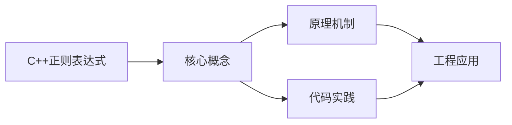
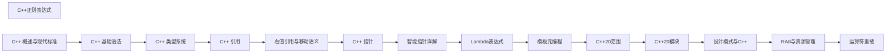

## 1. 学习目标（Bloom 分类）

本节按照布鲁姆教育目标分类学组织学习路径。本文主题为《C++正则表达式》，属于 C++ 模块，读者可以根据自身阶段选择阅读深度。

记忆层面：能够准确复述本文的核心概念、术语与基本语法或操作步骤，并能够在提问或检索时快速定位对应知识点。能够说出 C++ 的类、继承、重载、模板与 STL 容器基本语法。

理解层面：能够用自己的语言解释核心原理与工作机制，说明概念之间的因果关系，而不是机械记忆结论。能够解释 RAII、拷贝/移动语义、虚函数与模板实例化。

应用层面：能够在真实项目或练习场景中运用本文知识解决具体问题，写出正确且可维护的实现。能够编写现代 C++（C++17/20）的类与泛型代码。

分析层面：能够拆解复杂问题，比较本文主题与相邻概念的异同，识别边界条件与例外情况。能够分析生命周期、未定义行为与性能特征。

评价层面：能够根据约束条件（性能、可读性、安全、成本）评价不同方案的优劣，做出有依据的技术决策。能够评价 C++ 与 Rust、Java 在系统编程中的取舍。

创造层面：能够把本文知识与其他模块知识组合，设计出新的解决方案或可复用的工程模式。能够设计高性能、可维护的 C++ 库与应用。

通过本节学习，读者应当能够把《C++正则表达式》纳入自己的知识网络，并与 C++ 模块的其他主题（RAII、移动语义、模板、STL）建立关联。

## 2. 历史动机与发展脉络

《C++正则表达式》是 C++ 领域的重要主题。要真正理解它，需要先了解它解决的问题与演进过程。

C++ 由 Bjarne Stroustrup 于 1979 年开始在贝尔实验室开发（原名 C with Classes），1983 年更名 C++，1998 年 C++98 首次标准化。
C++11 是语言转折点：右值引用、auto、lambda、智能指针、并发内存模型让现代 C++ 写法定型；C++14/17 补充泛型 lambda、if constexpr、折叠表达式；C++20 引入 concepts、协程、模块与范围库；C++23 继续完善。
现代 C++ 的核心口号是“资源安全”：RAII + 智能指针替代裸 new/delete，异常与错误码按场景选择；Rust 的出现促使 C++ 社区更重视内存安全工具（如 profile 指南、sanitizer）。

回到本文主题：C++正则表达式 的提出与成熟，正是上述技术背景下的必然产物。早期实现往往以简单可用为目标，随着工程规模扩大，社区逐渐沉淀出标准做法与最佳实践；理解这一脉络，可以帮助读者判断“为什么文档中的推荐写法是现在这个样子”，也能在遇到历史遗留代码时准确识别其设计年代与取舍。


## 3. 形式化定义与核心概念精讲

本节把《C++正则表达式》涉及的核心概念以“定义 + 讲解”的形式展开。读者应把定义当作工具，把讲解当作理解路径；两者结合才能形成可迁移的知识。

RAII：资源在构造函数获取、析构函数释放，栈对象离开作用域自动清理；智能指针（unique_ptr/shared_ptr/weak_ptr）把所有权编码进类型。
移动语义：右值引用 `&&` 与 std::move 转移资源所有权，避免深拷贝；移动后对象处于“合法但未指定”状态。
虚函数与多态：virtual 实现动态绑定，vtable 是运行时分派机制；final/override 关键字防止误用；基类析构函数应为 virtual。

### 3.1 原文章节逐一精讲

原文档把主题拆分为 12 个小节，下面按顺序给出每一节的导读讲解，随后保留原文细节供精读。

#### 原文精读（完整保留）

# C++ 正则表达式

> **符号约定**：`< >` 必填参数 | `[ ]` 可选参数

---

##### 替换

```cpp
void replaceDemo() {
    std::string text = "今天是 2026-06-14，明天是 2026-06-15";

    // 简单替换：将所有日期替换为 "XXXX-XX-XX"
    std::regex dateRegex(R"(\d{4}-\d{2}-\d{2})");
    std::string result1 = std::regex_replace(text, dateRegex, "XXXX-XX-XX");
    std::cout << result1 << std::endl;
    // 输出: 今天是 XXXX-XX-XX，明天是 XXXX-XX-XX

    // 使用捕获组替换：将日期格式从 YYYY-MM-DD 改为 DD/MM/YYYY
    std::regex dateRegex2(R"((\d{4})-(\d{2})-(\d{2}))");
    std::string result2 = std::regex_replace(text, dateRegex2, "$3/$2/$1");
    std::cout << result2 << std::endl;
    // 输出: 今天是 14/06/2026，明天是 15/06/2026

    // 只替换第一个匹配
    std::string result3 = std::regex_replace(text, dateRegex, "XXXX-XX-XX",
        std::regex_constants::format_first_only);
    std::cout << result3 << std::endl;
    // 输出: 今天是 XXXX-XX-XX，明天是 2026-06-15

    // 隐藏手机号中间四位
    std::string phoneText = "联系手机: 13800138000 和 13900139000";
    std::regex phoneRegex(R"((1\d{2})\d{4}(\d{4}))");
    std::string result4 = std::regex_replace(phoneText, phoneRegex, "$1****$2");
    std::cout << result4 << std::endl;
    // 输出: 联系手机: 138****8000 和 139****9000
}
```

#### 概述

C++11 引入了 `<regex>` 标准库，提供了正则表达式的支持。正则表达式是一种描述字符串模式的语言，可以用来搜索、匹配、替换和验证文本。C++ 的 regex 库支持多种正则语法（ECMAScript、POSIX 等），提供了匹配、搜索和替换等操作。

为什么需要正则表达式？当你需要验证用户输入的格式（如邮箱、手机号）、从文本中提取特定模式的数据（如 URL、日期）、或者批量替换文本中的某些模式时，正则表达式是最简洁高效的工具。没有正则表达式，你需要手写复杂的字符串解析代码。

#### 基础概念

**正则表达式语法**：用特殊字符描述匹配规则。例如 `\d+` 匹配一个或多个数字，`[a-z]+` 匹配一个或多个小写字母。

**匹配（regex_match）**：检查整个字符串是否完全匹配正则表达式。适合验证格式。

**搜索（regex_search）**：在字符串中搜索匹配正则表达式的子串。适合提取数据。

**替换（regex_replace）**：将匹配的子串替换为新的内容。适合文本处理。

**捕获组**：用括号 `()` 包围的部分，可以单独提取匹配到的内容。

**迭代器（regex_iterator）**：遍历字符串中所有匹配的子串。

#### 快速上手

```cpp
#include <iostream>
#include <regex>
#include <string>

int main() {
    std::string text = "我的邮箱是 test@example.com，电话是 13800138000";

    // 1. 创建正则表达式对象
    std::regex emailRegex(R"(\w+@\w+\.\w+)");  // 匹配邮箱
    std::regex phoneRegex(R"(1\d{10})");        // 匹配手机号

    // 2. 搜索匹配
    std::smatch match;
    if (std::regex_search(text, match, emailRegex)) {
        std::cout << "找到邮箱: " << match.str() << std::endl;
        // 输出: 找到邮箱: test@example.com
    }

    if (std::regex_search(text, match, phoneRegex)) {
        std::cout << "找到电话: " << match.str() << std::endl;
        // 输出: 找到电话: 13800138000
    }

    // 3. 验证格式
    std::string input = "user@domain.com";
    if (std::regex_match(input, emailRegex)) {
        std::cout << "邮箱格式正确" << std::endl;
    }

    return 0;
}
```

#### 详细用法

##### 常用正则语法

```cpp
// 字符类
std::regex digit(R"(\d)");       // 匹配数字 [0-9]
std::regex word(R"(\w)");        // 匹配单词字符 [a-zA-Z0-9_]
std::regex space(R"(\s)");       // 匹配空白字符（空格、制表符、换行等）
std::regex letter(R"([a-z])");   // 匹配小写字母
std::regex hex(R"([0-9a-fA-F])");// 匹配十六进制字符

// 量词
std::regex oneOrMore(R"(\d+)");    // 一个或多个数字
std::regex zeroOrMore(R"(\d*)");   // 零个或多个数字
std::regex zeroOrOne(R"(\d?)");    // 零个或一个数字
std::regex exact(R"(\d{3})");      // 恰好3个数字
std::regex range(R"(\d{2,4})");    // 2到4个数字
std::regex atLeast(R"(\d{2,})");   // 至少2个数字

// 锚点
std::regex startOfLine(R"(^\d+)");  // 行首的数字
std::regex endOfLine(R"(\d+$)");    // 行尾的数字
std::regex wholeString(R"(^\d+$)"); // 整个字符串都是数字

// 分组和选择
std::regex group(R"((\d+)-(\d+))");       // 捕获组：匹配 "123-456"
std::regex choice(R"((cat|dog))");         // 选择：匹配 "cat" 或 "dog"
std::regex nonCapture(R"((?:\d+)-(\d+))"); // 非捕获组
```

##### 捕获组

```cpp
#include <iostream>
#include <regex>
#include <string>

void captureGroupDemo() {
    std::string text = "日期: 2026-06-14";
    // 用括号定义捕获组
    std::regex dateRegex(R"((\d{4})-(\d{2})-(\d{2}))");

    std::smatch match;
    if (std::regex_search(text, match, dateRegex)) {
        // match[0] 是整个匹配
        std::cout << "完整匹配: " << match[0].str() << std::endl;  // 2026-06-14

        // match[1], match[2], ... 是各个捕获组
        std::cout << "年: " << match[1].str() << std::endl;  // 2026
        std::cout << "月: " << match[2].str() << std::endl;  // 06
        std::cout << "日: " << match[3].str() << std::endl;  // 14

        // 也可以获取匹配的位置
        std::cout << "位置: " << match[1].first - text.begin() << std::endl;
    }
}
```

##### 搜索所有匹配

```cpp
void searchAllDemo() {
    std::string text = "价格: 99元, 199元, 299元";
    std::regex priceRegex(R"(\d+)元");

    // 方法一：使用迭代器
    auto begin = std::sregex_iterator(text.begin(), text.end(), priceRegex);
    auto end = std::sregex_iterator();

    for (auto it = begin; it != end; ++it) {
        std::smatch match = *it;
        std::cout << "找到价格: " << match.str() << std::endl;
    }
    // 输出:
    // 找到价格: 99元
    // 找到价格: 199元
    // 找到价格: 299元

    // 方法二：使用 regex_token_iterator 只获取捕获组
    std::regex numRegex(R"((\d+)元)");
    auto tokenBegin = std::sregex_token_iterator(text.begin(), text.end(), numRegex, 1);
    auto tokenEnd = std::sregex_token_iterator();

    for (auto it = tokenBegin; it != tokenEnd; ++it) {
        std::cout << "数字: " << *it << std::endl;
    }
    // 输出: 数字: 99, 数字: 199, 数字: 299
}
```

##### 验证格式

```cpp
// 验证邮箱格式
bool isValidEmail(const std::string& email) {
    std::regex emailRegex(R"([a-zA-Z0-9._%+-]+@[a-zA-Z0-9.-]+\.[a-zA-Z]{2,})");
    return std::regex_match(email, emailRegex);
}

// 验证中国手机号
bool isValidPhone(const std::string& phone) {
    std::regex phoneRegex(R"(^1[3-9]\d{9}$)");
    return std::regex_match(phone, phoneRegex);
}

// 验证身份证号（18位）
bool isValidIdCard(const std::string& id) {
    std::regex idRegex(R"(^\d{17}[\dXx]$)");
    return std::regex_match(id, idRegex);
}

// 验证 URL
bool isValidUrl(const std::string& url) {
    std::regex urlRegex(R"(https?://[^\s]+)");
    return std::regex_match(url, urlRegex);
}

// 验证 IP 地址
bool isValidIP(const std::string& ip) {
    std::regex ipRegex(R"((\d{1,3}\.){3}\d{1,3})");
    if (!std::regex_match(ip, ipRegex)) return false;

    // 进一步验证每段范围
    int a, b, c, d;
    char dot;
    std::istringstream iss(ip);
    iss >> a >> dot >> b >> dot >> c >> dot >> d;
    return a >= 0 && a <= 255 && b >= 0 && b <= 255
        && c >= 0 && c <= 255 && d >= 0 && d <= 255;
}
```

##### 正则标志

```cpp
// 忽略大小写
std::regex caseInsensitive("hello", std::regex_constants::icase);
std::cout << std::regex_match("HELLO", caseInsensitive) << std::endl;  // 1 (true)

// 选择语法类型
std::regex ecmascript(R"(\d+)", std::regex_constants::ECMAScript);   // 默认
std::regex basic(R"(\d+)", std::regex_constants::basic);             // POSIX 基本正则
std::regex extended(R"(\d+)", std::regex_constants::extended);       // POSIX 扩展正则

// 优化匹配速度（但增加编译时间）
std::regex optimized(R"(\d+)", std::regex_constants::optimize);
```

#### 常见场景

##### 解析配置文件

```cpp
#include <map>
#include <regex>

// 解析 key=value 格式的配置
std::map<std::string, std::string> parseConfig(const std::string& content) {
    std::map<std::string, std::string> config;
    std::regex lineRegex(R"((\w+)\s*=\s*(.+))");

    auto begin = std::sregex_iterator(content.begin(), content.end(), lineRegex);
    auto end = std::sregex_iterator();

    for (auto it = begin; it != end; ++it) {
        std::string key = (*it)[1].str();
        std::string value = (*it)[2].str();

        // 去除值两端的空格和引号
        if (value.front() == '"' && value.back() == '"') {
            value = value.substr(1, value.size() - 2);
        }

        config[key] = value;
    }

    return config;
}

// 使用
std::string configText = R"(
    host = "localhost"
    port = 8080
    debug = true
)";
auto config = parseConfig(configText);
// config["host"] = "localhost"
// config["port"] = "8080"
```

##### 日志分析

```cpp
// 解析 Nginx 访问日志
void parseAccessLog(const std::string& log) {
    // 格式: 192.168.1.1 - - [14/Jun/2026:10:30:00 +0800] "GET /index.html HTTP/1.1" 200 1234
    std::regex logRegex(
        R"((\S+) \S+ \S+ \[([^\]]+)\] "(\S+) (\S+) \S+" (\d+) (\d+))"
    );

    std::smatch match;
    if (std::regex_search(log, match, logRegex)) {
        std::cout << "IP: " << match[1].str() << std::endl;
        std::cout << "时间: " << match[2].str() << std::endl;
        std::cout << "方法: " << match[3].str() << std::endl;
        std::cout << "路径: " << match[4].str() << std::endl;
        std::cout << "状态码: " << match[5].str() << std::endl;
        std::cout << "大小: " << match[6].str() << std::endl;
    }
}
```

#### 注意事项

**性能问题**：`std::regex` 在某些编译器（特别是 GCC）上的性能较差。如果性能敏感，考虑使用 Boost.Regex 或 PCRE 库。

**原始字符串**：正则表达式中大量使用反斜杠，建议使用 C++11 的原始字符串 `R"(...)"` 来避免双重转义。`R"(\d+)"` 比 `"\\d+"` 更清晰。

**贪婪匹配**：默认情况下量词是贪婪的（匹配尽可能多的字符）。使用 `?` 使其变为懒惰的：`\d+?` 匹配尽可能少的数字。

**正则编译开销**：创建 `std::regex` 对象时会编译正则表达式，这是相对耗时的操作。如果同一个正则在循环中使用，应该在循环外创建 regex 对象。

**异常安全**：如果正则表达式语法有误，构造 `std::regex` 会抛出 `std::regex_error` 异常。在生产代码中应该捕获此异常。

#### 进阶用法

##### 自定义替换函数

```cpp
// 使用回调函数进行替换
template<typename Callback>
std::string regexReplaceCallback(const std::string& text,
    const std::regex& pattern, Callback callback)
{
    std::string result;
    auto begin = std::sregex_iterator(text.begin(), text.end(), pattern);
    auto end = std::sregex_iterator();

    size_t lastPos = 0;
    for (auto it = begin; it != end; ++it) {
        // 添加匹配前的文本
        result += text.substr(lastPos, it->position() - lastPos);
        // 调用回调函数获取替换文本
        result += callback(*it);
        lastPos = it->position() + it->length();
    }
    // 添加最后一个匹配后的文本
    result += text.substr(lastPos);

    return result;
}

// 使用：将所有数字乘以2
std::string text = "价格: 100元, 200元, 300元";
std::regex numRegex(R"(\d+)");
std::string result = regexReplaceCallback(text, numRegex,
    [](const std::smatch& m) -> std::string {
        int num = std::stoi(m.str());
        return std::to_string(num * 2);
    });
// result: "价格: 200元, 400元, 600元"
```

##### 使用 Boost.Regex 提升性能

```cpp
#include <boost/regex.hpp>

// Boost.Regex 的 API 与 std::regex 几乎相同
// 但性能通常更好，特别是在 GCC 上

boost::regex pattern(R"(\d{4}-\d{2}-\d{2})");
boost::smatch match;
if (boost::regex_search(text, match, pattern)) {
    std::cout << match.str() << std::endl;
}

std::string result = boost::regex_replace(text, pattern, "DATE");
```
#### 正则对象

**基本写法：构造正则**
`std::regex <变量>(<模式>);`
```cpp
// 编译正则模式
std::regex re("\\d+");
```

---

**基本写法：忽略大小写**
`std::regex <变量>(<模式>, std::regex::icase);`
```cpp
// 匹配时忽略大小写
std::regex re("hello", std::regex::icase);
```

---

**基本写法：扩展语法**
`std::regex <变量>(<模式>, std::regex::extended);`
```cpp
// 使用 POSIX 扩展正则语法
std::regex re("a+", std::regex::extended);
```

---

#### 匹配

**基本写法：整串匹配**
`std::regex_match(<字符串>, <正则>);`
```cpp
// 整个字符串是否匹配
bool b = std::regex_match("12345", re);
```

---

**基本写法：匹配并捕获**
`std::regex_match(<字符串>, <smatch>, <正则>);`
```cpp
// 提取捕获组
std::smatch m;
if (std::regex_match(str, m, re)) {
    std::string g1 = m[1];
}
```

---

**基本写法：搜索子串**
`std::regex_search(<字符串>, <正则>);`
```cpp
// 查找第一个匹配子串
bool b = std::regex_search("abc123def", re);
```

---

**基本写法：搜索并捕获**
`std::regex_search(<字符串>, <smatch>, <正则>);`
```cpp
// 提取匹配子串与捕获组
std::smatch m;
if (std::regex_search(str, m, re)) {
    std::string matched = m[0];
}
```

---

#### 迭代匹配

**基本写法：遍历所有匹配**
`std::sregex_iterator(<起始>, <结束>, <正则>);`
```cpp
// 遍历所有匹配结果
auto begin = std::sregex_iterator(str.begin(), str.end(), re);
auto end = std::sregex_iterator();
for (auto it = begin; it != end; ++it) {
    std::cout << it->str() << '\n';
}
```

---

**基本写法：分词迭代**
`std::sregex_token_iterator(<起始>, <结束>, <正则>, [-1]);`
```cpp
// 按分隔符切分字符串
std::regex sep("[,\\s]+");
auto it = std::sregex_token_iterator(str.begin(), str.end(), sep, -1);
```

---

#### match 结果

**基本写法：获取匹配前缀**
`<m>.prefix()`
```cpp
// 匹配子串之前的内容
auto pre = m.prefix();
```

---

**基本写法：获取匹配后缀**
`<m>.suffix()`
```cpp
// 匹配子串之后的内容
auto suf = m.suffix();
```

---

**基本写法：获取捕获组数量**
`<m>.size()`
```cpp
// 包含完整匹配的捕获组数
size_t n = m.size();
```

---

#### 常用元字符

**基本写法：字符类**
`[<字符集>]`
```cpp
// 匹配数字字母
std::regex re("[0-9a-zA-Z]+");
```

---

**基本写法：预定义字符类**
`\\d` `\\w` `\\s`
```cpp
// 数字字母空白
std::regex re("\\w+\\s\\d+");
```

---

**基本写法：量词**
`*` `+` `?` `{n,m}`
```cpp
// 重复次数
std::regex re("a{2,4}");
```

---

**基本写法：锚点**
`^` `$`
```cpp
// 行首行尾
std::regex re("^start.*end$");
```

---

**基本写法：分组与非捕获**
`(...)` `(?:...)`
```cpp
// 捕获组与非捕获组
std::regex re("(\\d+)(?:\\.\\d+)?");
```


### 3.2 概念关系图

下面用 Mermaid 图表达本文核心概念之间的关系，帮助读者建立整体图景：



图中展示的是本文知识的结构化关系：核心概念是入口，原理机制解释“为什么”，代码实践演示“怎么做”，工程应用回答“何时用”。读者学习时可以把每个小节的内容挂接到对应节点上。

## 4. 理论推导与原理解析

本节深入《C++正则表达式》背后的原理。理论部分不求面面俱到，而是聚焦“能解释现象、能指导实践”的关键推导。

RAII：资源在构造函数获取、析构函数释放，栈对象离开作用域自动清理；智能指针（unique_ptr/shared_ptr/weak_ptr）把所有权编码进类型。
移动语义：右值引用 `&&` 与 std::move 转移资源所有权，避免深拷贝；移动后对象处于“合法但未指定”状态。
虚函数与多态：virtual 实现动态绑定，vtable 是运行时分派机制；final/override 关键字防止误用；基类析构函数应为 virtual。
模板与泛型：模板编译期实例化，实现静态多态；concepts（C++20）约束类型接口；模板元编程在编译期计算类型与常量。

需要强调的是，理论推导与工程实践之间存在翻译层：理论给出的是理想化模型与边界条件，工程代码则必须处理真实环境中的例外。读者在学习时应先掌握理论的“标准情形”，再通过陷阱章节了解“非标准情形”。

## 5. 代码示例与逐行讲解

本节把原文中的代码示例系统整理，并为每个示例补充用途说明与讲解。读者不应只浏览代码，而应逐段对照讲解理解设计意图。

### 5.1 示例：替换

该示例来自原文《替换》小节，用于演示C++正则表达式相关操作。阅读时请先看代码结构，再看其后的讲解。

```cpp
void replaceDemo() {
    std::string text = "今天是 2026-06-14，明天是 2026-06-15";

    // 简单替换：将所有日期替换为 "XXXX-XX-XX"
    std::regex dateRegex(R"(\d{4}-\d{2}-\d{2})");
    std::string result1 = std::regex_replace(text, dateRegex, "XXXX-XX-XX");
    std::cout << result1 << std::endl;
    // 输出: 今天是 XXXX-XX-XX，明天是 XXXX-XX-XX

    // 使用捕获组替换：将日期格式从 YYYY-MM-DD 改为 DD/MM/YYYY
    std::regex dateRegex2(R"((\d{4})-(\d{2})-(\d{2}))");
    std::string result2 = std::regex_replace(text, dateRegex2, "$3/$2/$1");
    std::cout << result2 << std::endl;
    // 输出: 今天是 14/06/2026，明天是 15/06/2026

    // 只替换第一个匹配
    std::string result3 = std::regex_replace(text, dateRegex, "XXXX-XX-XX",
        std::regex_constants::format_first_only);
    std::cout << result3 << std::endl;
    // 输出: 今天是 XXXX-XX-XX，明天是 2026-06-15

    // 隐藏手机号中间四位
    std::string phoneText = "联系手机: 13800138000 和 13900139000";
    std::regex phoneRegex(R"((1\d{2})\d{4}(\d{4}))");
    std::string result4 = std::regex_replace(phoneText, phoneRegex, "$1****$2");
    std::cout << result4 << std::endl;
    // 输出: 联系手机: 138****8000 和 139****9000
}
```

讲解：这段代码演示了本节核心知识点。代码中的关键操作可以归纳为三步：准备（定义或初始化）、执行（核心逻辑）、收尾（释放资源或返回结果）。实际项目中，这三步往往被封装为函数或类，以提升复用性与可测试性。

关键点分析：

该示例共 24 行有效代码，结构以数据或配置为主。阅读时应关注：数据字段的含义、配置项的作用，以及它们与运行行为的对应关系。

进阶思考路径：先尝试修改参数观察行为变化，再把示例中的模式迁移到自己的项目中；每次修改都记录预期与实测差异，这是把示例转化为能力的最快方式。

### 5.2 示例：快速上手

该示例来自原文《快速上手》小节，用于演示C++正则表达式相关操作。阅读时请先看代码结构，再看其后的讲解。

```cpp
#include <iostream>
#include <regex>
#include <string>

int main() {
    std::string text = "我的邮箱是 test@example.com，电话是 13800138000";

    // 1. 创建正则表达式对象
    std::regex emailRegex(R"(\w+@\w+\.\w+)");  // 匹配邮箱
    std::regex phoneRegex(R"(1\d{10})");        // 匹配手机号

    // 2. 搜索匹配
    std::smatch match;
    if (std::regex_search(text, match, emailRegex)) {
        std::cout << "找到邮箱: " << match.str() << std::endl;
        // 输出: 找到邮箱: test@example.com
    }

    if (std::regex_search(text, match, phoneRegex)) {
        std::cout << "找到电话: " << match.str() << std::endl;
        // 输出: 找到电话: 13800138000
    }

    // 3. 验证格式
    std::string input = "user@domain.com";
    if (std::regex_match(input, emailRegex)) {
        std::cout << "邮箱格式正确" << std::endl;
    }

    return 0;
}
```

讲解：这段代码演示了本节核心知识点。代码中的关键操作可以归纳为三步：准备（定义或初始化）、执行（核心逻辑）、收尾（释放资源或返回结果）。实际项目中，这三步往往被封装为函数或类，以提升复用性与可测试性。

关键点分析：

该示例共 25 行有效代码，包含 2 类关键结构（if、return）。其中：

- 入口与初始化部分负责建立上下文，对应实际项目中的启动或装配逻辑；
- 核心逻辑部分体现本文主题的主要操作，是阅读时最需要对照讲解理解的部分；
- 输出或返回部分把结果交给调用方，注意其类型与边界条件。

进阶思考路径：先尝试修改参数观察行为变化，再把示例中的模式迁移到自己的项目中；每次修改都记录预期与实测差异，这是把示例转化为能力的最快方式。

### 5.3 示例：常用正则语法

该示例来自原文《常用正则语法》小节，用于演示C++正则表达式相关操作。阅读时请先看代码结构，再看其后的讲解。

```cpp
// 字符类
std::regex digit(R"(\d)");       // 匹配数字 [0-9]
std::regex word(R"(\w)");        // 匹配单词字符 [a-zA-Z0-9_]
std::regex space(R"(\s)");       // 匹配空白字符（空格、制表符、换行等）
std::regex letter(R"([a-z])");   // 匹配小写字母
std::regex hex(R"([0-9a-fA-F])");// 匹配十六进制字符

// 量词
std::regex oneOrMore(R"(\d+)");    // 一个或多个数字
std::regex zeroOrMore(R"(\d*)");   // 零个或多个数字
std::regex zeroOrOne(R"(\d?)");    // 零个或一个数字
std::regex exact(R"(\d{3})");      // 恰好3个数字
std::regex range(R"(\d{2,4})");    // 2到4个数字
std::regex atLeast(R"(\d{2,})");   // 至少2个数字

// 锚点
std::regex startOfLine(R"(^\d+)");  // 行首的数字
std::regex endOfLine(R"(\d+$)");    // 行尾的数字
std::regex wholeString(R"(^\d+$)"); // 整个字符串都是数字

// 分组和选择
std::regex group(R"((\d+)-(\d+))");       // 捕获组：匹配 "123-456"
std::regex choice(R"((cat|dog))");         // 选择：匹配 "cat" 或 "dog"
std::regex nonCapture(R"((?:\d+)-(\d+))"); // 非捕获组
```

讲解：这段代码演示了本节核心知识点。代码中的关键操作可以归纳为三步：准备（定义或初始化）、执行（核心逻辑）、收尾（释放资源或返回结果）。实际项目中，这三步往往被封装为函数或类，以提升复用性与可测试性。

关键点分析：

该示例共 21 行有效代码，结构以数据或配置为主。阅读时应关注：数据字段的含义、配置项的作用，以及它们与运行行为的对应关系。

进阶思考路径：先尝试修改参数观察行为变化，再把示例中的模式迁移到自己的项目中；每次修改都记录预期与实测差异，这是把示例转化为能力的最快方式。

### 5.4 示例：捕获组

该示例来自原文《捕获组》小节，用于演示C++正则表达式相关操作。阅读时请先看代码结构，再看其后的讲解。

```cpp
#include <iostream>
#include <regex>
#include <string>

void captureGroupDemo() {
    std::string text = "日期: 2026-06-14";
    // 用括号定义捕获组
    std::regex dateRegex(R"((\d{4})-(\d{2})-(\d{2}))");

    std::smatch match;
    if (std::regex_search(text, match, dateRegex)) {
        // match[0] 是整个匹配
        std::cout << "完整匹配: " << match[0].str() << std::endl;  // 2026-06-14

        // match[1], match[2], ... 是各个捕获组
        std::cout << "年: " << match[1].str() << std::endl;  // 2026
        std::cout << "月: " << match[2].str() << std::endl;  // 06
        std::cout << "日: " << match[3].str() << std::endl;  // 14

        // 也可以获取匹配的位置
        std::cout << "位置: " << match[1].first - text.begin() << std::endl;
    }
}
```

讲解：这段代码演示了本节核心知识点。代码中的关键操作可以归纳为三步：准备（定义或初始化）、执行（核心逻辑）、收尾（释放资源或返回结果）。实际项目中，这三步往往被封装为函数或类，以提升复用性与可测试性。

关键点分析：

该示例共 19 行有效代码，包含 1 类关键结构（if）。其中：

- 入口与初始化部分负责建立上下文，对应实际项目中的启动或装配逻辑；
- 核心逻辑部分体现本文主题的主要操作，是阅读时最需要对照讲解理解的部分；
- 输出或返回部分把结果交给调用方，注意其类型与边界条件。

进阶思考路径：先尝试修改参数观察行为变化，再把示例中的模式迁移到自己的项目中；每次修改都记录预期与实测差异，这是把示例转化为能力的最快方式。

### 5.5 示例：搜索所有匹配

该示例来自原文《搜索所有匹配》小节，用于演示C++正则表达式相关操作。阅读时请先看代码结构，再看其后的讲解。

```cpp
void searchAllDemo() {
    std::string text = "价格: 99元, 199元, 299元";
    std::regex priceRegex(R"(\d+)元");

    // 方法一：使用迭代器
    auto begin = std::sregex_iterator(text.begin(), text.end(), priceRegex);
    auto end = std::sregex_iterator();

    for (auto it = begin; it != end; ++it) {
        std::smatch match = *it;
        std::cout << "找到价格: " << match.str() << std::endl;
    }
    // 输出:
    // 找到价格: 99元
    // 找到价格: 199元
    // 找到价格: 299元

    // 方法二：使用 regex_token_iterator 只获取捕获组
    std::regex numRegex(R"((\d+)元)");
    auto tokenBegin = std::sregex_token_iterator(text.begin(), text.end(), numRegex, 1);
    auto tokenEnd = std::sregex_token_iterator();

    for (auto it = tokenBegin; it != tokenEnd; ++it) {
        std::cout << "数字: " << *it << std::endl;
    }
    // 输出: 数字: 99, 数字: 199, 数字: 299
}
```

讲解：这段代码演示了本节核心知识点。代码中的关键操作可以归纳为三步：准备（定义或初始化）、执行（核心逻辑）、收尾（释放资源或返回结果）。实际项目中，这三步往往被封装为函数或类，以提升复用性与可测试性。

关键点分析：

该示例共 23 行有效代码，包含 1 类关键结构（for）。其中：

- 入口与初始化部分负责建立上下文，对应实际项目中的启动或装配逻辑；
- 核心逻辑部分体现本文主题的主要操作，是阅读时最需要对照讲解理解的部分；
- 输出或返回部分把结果交给调用方，注意其类型与边界条件。

进阶思考路径：先尝试修改参数观察行为变化，再把示例中的模式迁移到自己的项目中；每次修改都记录预期与实测差异，这是把示例转化为能力的最快方式。

### 5.6 示例：验证格式

该示例来自原文《验证格式》小节，用于演示C++正则表达式相关操作。阅读时请先看代码结构，再看其后的讲解。

```cpp
// 验证邮箱格式
bool isValidEmail(const std::string& email) {
    std::regex emailRegex(R"([a-zA-Z0-9._%+-]+@[a-zA-Z0-9.-]+\.[a-zA-Z]{2,})");
    return std::regex_match(email, emailRegex);
}

// 验证中国手机号
bool isValidPhone(const std::string& phone) {
    std::regex phoneRegex(R"(^1[3-9]\d{9}$)");
    return std::regex_match(phone, phoneRegex);
}

// 验证身份证号（18位）
bool isValidIdCard(const std::string& id) {
    std::regex idRegex(R"(^\d{17}[\dXx]$)");
    return std::regex_match(id, idRegex);
}

// 验证 URL
bool isValidUrl(const std::string& url) {
    std::regex urlRegex(R"(https?://[^\s]+)");
    return std::regex_match(url, urlRegex);
}

// 验证 IP 地址
bool isValidIP(const std::string& ip) {
    std::regex ipRegex(R"((\d{1,3}\.){3}\d{1,3})");
    if (!std::regex_match(ip, ipRegex)) return false;

    // 进一步验证每段范围
    int a, b, c, d;
    char dot;
    std::istringstream iss(ip);
    iss >> a >> dot >> b >> dot >> c >> dot >> d;
    return a >= 0 && a <= 255 && b >= 0 && b <= 255
        && c >= 0 && c <= 255 && d >= 0 && d <= 255;
}
```

讲解：这段代码演示了本节核心知识点。代码中的关键操作可以归纳为三步：准备（定义或初始化）、执行（核心逻辑）、收尾（释放资源或返回结果）。实际项目中，这三步往往被封装为函数或类，以提升复用性与可测试性。

关键点分析：

该示例共 32 行有效代码，包含 2 类关键结构（if、return）。其中：

- 入口与初始化部分负责建立上下文，对应实际项目中的启动或装配逻辑；
- 核心逻辑部分体现本文主题的主要操作，是阅读时最需要对照讲解理解的部分；
- 输出或返回部分把结果交给调用方，注意其类型与边界条件。

进阶思考路径：先尝试修改参数观察行为变化，再把示例中的模式迁移到自己的项目中；每次修改都记录预期与实测差异，这是把示例转化为能力的最快方式。

### 5.7 示例：正则标志

该示例来自原文《正则标志》小节，用于演示C++正则表达式相关操作。阅读时请先看代码结构，再看其后的讲解。

```cpp
// 忽略大小写
std::regex caseInsensitive("hello", std::regex_constants::icase);
std::cout << std::regex_match("HELLO", caseInsensitive) << std::endl;  // 1 (true)

// 选择语法类型
std::regex ecmascript(R"(\d+)", std::regex_constants::ECMAScript);   // 默认
std::regex basic(R"(\d+)", std::regex_constants::basic);             // POSIX 基本正则
std::regex extended(R"(\d+)", std::regex_constants::extended);       // POSIX 扩展正则

// 优化匹配速度（但增加编译时间）
std::regex optimized(R"(\d+)", std::regex_constants::optimize);
```

讲解：这段代码演示了本节核心知识点。代码中的关键操作可以归纳为三步：准备（定义或初始化）、执行（核心逻辑）、收尾（释放资源或返回结果）。实际项目中，这三步往往被封装为函数或类，以提升复用性与可测试性。

关键点分析：

该示例共 9 行有效代码，结构以数据或配置为主。阅读时应关注：数据字段的含义、配置项的作用，以及它们与运行行为的对应关系。

进阶思考路径：先尝试修改参数观察行为变化，再把示例中的模式迁移到自己的项目中；每次修改都记录预期与实测差异，这是把示例转化为能力的最快方式。

### 5.8 示例：解析配置文件

该示例来自原文《解析配置文件》小节，用于演示C++正则表达式相关操作。阅读时请先看代码结构，再看其后的讲解。

```cpp
#include <map>
#include <regex>

// 解析 key=value 格式的配置
std::map<std::string, std::string> parseConfig(const std::string& content) {
    std::map<std::string, std::string> config;
    std::regex lineRegex(R"((\w+)\s*=\s*(.+))");

    auto begin = std::sregex_iterator(content.begin(), content.end(), lineRegex);
    auto end = std::sregex_iterator();

    for (auto it = begin; it != end; ++it) {
        std::string key = (*it)[1].str();
        std::string value = (*it)[2].str();

        // 去除值两端的空格和引号
        if (value.front() == '"' && value.back() == '"') {
            value = value.substr(1, value.size() - 2);
        }

        config[key] = value;
    }

    return config;
}

// 使用
std::string configText = R"(
    host = "localhost"
    port = 8080
    debug = true
)";
auto config = parseConfig(configText);
// config["host"] = "localhost"
// config["port"] = "8080"
```

讲解：这段代码演示了本节核心知识点。代码中的关键操作可以归纳为三步：准备（定义或初始化）、执行（核心逻辑）、收尾（释放资源或返回结果）。实际项目中，这三步往往被封装为函数或类，以提升复用性与可测试性。

关键点分析：

该示例共 28 行有效代码，包含 3 类关键结构（if、for、return）。其中：

- 入口与初始化部分负责建立上下文，对应实际项目中的启动或装配逻辑；
- 核心逻辑部分体现本文主题的主要操作，是阅读时最需要对照讲解理解的部分；
- 输出或返回部分把结果交给调用方，注意其类型与边界条件。

进阶思考路径：先尝试修改参数观察行为变化，再把示例中的模式迁移到自己的项目中；每次修改都记录预期与实测差异，这是把示例转化为能力的最快方式。

### 5.9 示例：日志分析

该示例来自原文《日志分析》小节，用于演示C++正则表达式相关操作。阅读时请先看代码结构，再看其后的讲解。

```cpp
// 解析 Nginx 访问日志
void parseAccessLog(const std::string& log) {
    // 格式: 192.168.1.1 - - [14/Jun/2026:10:30:00 +0800] "GET /index.html HTTP/1.1" 200 1234
    std::regex logRegex(
        R"((\S+) \S+ \S+ \[([^\]]+)\] "(\S+) (\S+) \S+" (\d+) (\d+))"
    );

    std::smatch match;
    if (std::regex_search(log, match, logRegex)) {
        std::cout << "IP: " << match[1].str() << std::endl;
        std::cout << "时间: " << match[2].str() << std::endl;
        std::cout << "方法: " << match[3].str() << std::endl;
        std::cout << "路径: " << match[4].str() << std::endl;
        std::cout << "状态码: " << match[5].str() << std::endl;
        std::cout << "大小: " << match[6].str() << std::endl;
    }
}
```

讲解：这段代码演示了本节核心知识点。代码中的关键操作可以归纳为三步：准备（定义或初始化）、执行（核心逻辑）、收尾（释放资源或返回结果）。实际项目中，这三步往往被封装为函数或类，以提升复用性与可测试性。

关键点分析：

该示例共 16 行有效代码，包含 1 类关键结构（if）。其中：

- 入口与初始化部分负责建立上下文，对应实际项目中的启动或装配逻辑；
- 核心逻辑部分体现本文主题的主要操作，是阅读时最需要对照讲解理解的部分；
- 输出或返回部分把结果交给调用方，注意其类型与边界条件。

进阶思考路径：先尝试修改参数观察行为变化，再把示例中的模式迁移到自己的项目中；每次修改都记录预期与实测差异，这是把示例转化为能力的最快方式。

### 5.10 示例：自定义替换函数

该示例来自原文《自定义替换函数》小节，用于演示C++正则表达式相关操作。阅读时请先看代码结构，再看其后的讲解。

```cpp
// 使用回调函数进行替换
template<typename Callback>
std::string regexReplaceCallback(const std::string& text,
    const std::regex& pattern, Callback callback)
{
    std::string result;
    auto begin = std::sregex_iterator(text.begin(), text.end(), pattern);
    auto end = std::sregex_iterator();

    size_t lastPos = 0;
    for (auto it = begin; it != end; ++it) {
        // 添加匹配前的文本
        result += text.substr(lastPos, it->position() - lastPos);
        // 调用回调函数获取替换文本
        result += callback(*it);
        lastPos = it->position() + it->length();
    }
    // 添加最后一个匹配后的文本
    result += text.substr(lastPos);

    return result;
}

// 使用：将所有数字乘以2
std::string text = "价格: 100元, 200元, 300元";
std::regex numRegex(R"(\d+)");
std::string result = regexReplaceCallback(text, numRegex,
    [](const std::smatch& m) -> std::string {
        int num = std::stoi(m.str());
        return std::to_string(num * 2);
    });
// result: "价格: 200元, 400元, 600元"
```

讲解：这段代码演示了本节核心知识点。代码中的关键操作可以归纳为三步：准备（定义或初始化）、执行（核心逻辑）、收尾（释放资源或返回结果）。实际项目中，这三步往往被封装为函数或类，以提升复用性与可测试性。

关键点分析：

该示例共 29 行有效代码，包含 2 类关键结构（for、return）。其中：

- 入口与初始化部分负责建立上下文，对应实际项目中的启动或装配逻辑；
- 核心逻辑部分体现本文主题的主要操作，是阅读时最需要对照讲解理解的部分；
- 输出或返回部分把结果交给调用方，注意其类型与边界条件。

进阶思考路径：先尝试修改参数观察行为变化，再把示例中的模式迁移到自己的项目中；每次修改都记录预期与实测差异，这是把示例转化为能力的最快方式。

### 5.11 示例：使用 Boost.Regex 提升性能

该示例来自原文《使用 Boost.Regex 提升性能》小节，用于演示C++正则表达式相关操作。阅读时请先看代码结构，再看其后的讲解。

```cpp
#include <boost/regex.hpp>

// Boost.Regex 的 API 与 std::regex 几乎相同
// 但性能通常更好，特别是在 GCC 上

boost::regex pattern(R"(\d{4}-\d{2}-\d{2})");
boost::smatch match;
if (boost::regex_search(text, match, pattern)) {
    std::cout << match.str() << std::endl;
}

std::string result = boost::regex_replace(text, pattern, "DATE");
```

讲解：这段代码演示了本节核心知识点。代码中的关键操作可以归纳为三步：准备（定义或初始化）、执行（核心逻辑）、收尾（释放资源或返回结果）。实际项目中，这三步往往被封装为函数或类，以提升复用性与可测试性。

关键点分析：

该示例共 9 行有效代码，包含 1 类关键结构（if）。其中：

- 入口与初始化部分负责建立上下文，对应实际项目中的启动或装配逻辑；
- 核心逻辑部分体现本文主题的主要操作，是阅读时最需要对照讲解理解的部分；
- 输出或返回部分把结果交给调用方，注意其类型与边界条件。

进阶思考路径：先尝试修改参数观察行为变化，再把示例中的模式迁移到自己的项目中；每次修改都记录预期与实测差异，这是把示例转化为能力的最快方式。

### 5.12 示例：正则对象

该示例来自原文《正则对象》小节，用于演示C++正则表达式相关操作。阅读时请先看代码结构，再看其后的讲解。

```cpp
// 编译正则模式
std::regex re("\\d+");
```

讲解：这段代码演示了本节核心知识点。代码中的关键操作可以归纳为三步：准备（定义或初始化）、执行（核心逻辑）、收尾（释放资源或返回结果）。实际项目中，这三步往往被封装为函数或类，以提升复用性与可测试性。

关键点分析：

该示例共 2 行有效代码，结构以数据或配置为主。阅读时应关注：数据字段的含义、配置项的作用，以及它们与运行行为的对应关系。

进阶思考路径：先尝试修改参数观察行为变化，再把示例中的模式迁移到自己的项目中；每次修改都记录预期与实测差异，这是把示例转化为能力的最快方式。

### 5.13 示例：正则对象

该示例来自原文《正则对象》小节，用于演示C++正则表达式相关操作。阅读时请先看代码结构，再看其后的讲解。

```cpp
// 匹配时忽略大小写
std::regex re("hello", std::regex::icase);
```

讲解：这段代码演示了本节核心知识点。代码中的关键操作可以归纳为三步：准备（定义或初始化）、执行（核心逻辑）、收尾（释放资源或返回结果）。实际项目中，这三步往往被封装为函数或类，以提升复用性与可测试性。

关键点分析：

该示例共 2 行有效代码，结构以数据或配置为主。阅读时应关注：数据字段的含义、配置项的作用，以及它们与运行行为的对应关系。

进阶思考路径：先尝试修改参数观察行为变化，再把示例中的模式迁移到自己的项目中；每次修改都记录预期与实测差异，这是把示例转化为能力的最快方式。

### 5.14 示例：正则对象

该示例来自原文《正则对象》小节，用于演示C++正则表达式相关操作。阅读时请先看代码结构，再看其后的讲解。

```cpp
// 使用 POSIX 扩展正则语法
std::regex re("a+", std::regex::extended);
```

讲解：这段代码演示了本节核心知识点。代码中的关键操作可以归纳为三步：准备（定义或初始化）、执行（核心逻辑）、收尾（释放资源或返回结果）。实际项目中，这三步往往被封装为函数或类，以提升复用性与可测试性。

关键点分析：

该示例共 2 行有效代码，结构以数据或配置为主。阅读时应关注：数据字段的含义、配置项的作用，以及它们与运行行为的对应关系。

进阶思考路径：先尝试修改参数观察行为变化，再把示例中的模式迁移到自己的项目中；每次修改都记录预期与实测差异，这是把示例转化为能力的最快方式。

### 5.15 示例：匹配

该示例来自原文《匹配》小节，用于演示C++正则表达式相关操作。阅读时请先看代码结构，再看其后的讲解。

```cpp
// 整个字符串是否匹配
bool b = std::regex_match("12345", re);
```

讲解：这段代码演示了本节核心知识点。代码中的关键操作可以归纳为三步：准备（定义或初始化）、执行（核心逻辑）、收尾（释放资源或返回结果）。实际项目中，这三步往往被封装为函数或类，以提升复用性与可测试性。

关键点分析：

该示例共 2 行有效代码，结构以数据或配置为主。阅读时应关注：数据字段的含义、配置项的作用，以及它们与运行行为的对应关系。

进阶思考路径：先尝试修改参数观察行为变化，再把示例中的模式迁移到自己的项目中；每次修改都记录预期与实测差异，这是把示例转化为能力的最快方式。

### 5.16 示例：匹配

该示例来自原文《匹配》小节，用于演示C++正则表达式相关操作。阅读时请先看代码结构，再看其后的讲解。

```cpp
// 提取捕获组
std::smatch m;
if (std::regex_match(str, m, re)) {
    std::string g1 = m[1];
}
```

讲解：这段代码演示了本节核心知识点。代码中的关键操作可以归纳为三步：准备（定义或初始化）、执行（核心逻辑）、收尾（释放资源或返回结果）。实际项目中，这三步往往被封装为函数或类，以提升复用性与可测试性。

关键点分析：

该示例共 5 行有效代码，包含 1 类关键结构（if）。其中：

- 入口与初始化部分负责建立上下文，对应实际项目中的启动或装配逻辑；
- 核心逻辑部分体现本文主题的主要操作，是阅读时最需要对照讲解理解的部分；
- 输出或返回部分把结果交给调用方，注意其类型与边界条件。

进阶思考路径：先尝试修改参数观察行为变化，再把示例中的模式迁移到自己的项目中；每次修改都记录预期与实测差异，这是把示例转化为能力的最快方式。

### 5.17 示例：匹配

该示例来自原文《匹配》小节，用于演示C++正则表达式相关操作。阅读时请先看代码结构，再看其后的讲解。

```cpp
// 查找第一个匹配子串
bool b = std::regex_search("abc123def", re);
```

讲解：这段代码演示了本节核心知识点。代码中的关键操作可以归纳为三步：准备（定义或初始化）、执行（核心逻辑）、收尾（释放资源或返回结果）。实际项目中，这三步往往被封装为函数或类，以提升复用性与可测试性。

关键点分析：

该示例共 2 行有效代码，结构以数据或配置为主。阅读时应关注：数据字段的含义、配置项的作用，以及它们与运行行为的对应关系。

进阶思考路径：先尝试修改参数观察行为变化，再把示例中的模式迁移到自己的项目中；每次修改都记录预期与实测差异，这是把示例转化为能力的最快方式。

### 5.18 示例：匹配

该示例来自原文《匹配》小节，用于演示C++正则表达式相关操作。阅读时请先看代码结构，再看其后的讲解。

```cpp
// 提取匹配子串与捕获组
std::smatch m;
if (std::regex_search(str, m, re)) {
    std::string matched = m[0];
}
```

讲解：这段代码演示了本节核心知识点。代码中的关键操作可以归纳为三步：准备（定义或初始化）、执行（核心逻辑）、收尾（释放资源或返回结果）。实际项目中，这三步往往被封装为函数或类，以提升复用性与可测试性。

关键点分析：

该示例共 5 行有效代码，包含 1 类关键结构（if）。其中：

- 入口与初始化部分负责建立上下文，对应实际项目中的启动或装配逻辑；
- 核心逻辑部分体现本文主题的主要操作，是阅读时最需要对照讲解理解的部分；
- 输出或返回部分把结果交给调用方，注意其类型与边界条件。

进阶思考路径：先尝试修改参数观察行为变化，再把示例中的模式迁移到自己的项目中；每次修改都记录预期与实测差异，这是把示例转化为能力的最快方式。

### 5.19 示例：迭代匹配

该示例来自原文《迭代匹配》小节，用于演示C++正则表达式相关操作。阅读时请先看代码结构，再看其后的讲解。

```cpp
// 遍历所有匹配结果
auto begin = std::sregex_iterator(str.begin(), str.end(), re);
auto end = std::sregex_iterator();
for (auto it = begin; it != end; ++it) {
    std::cout << it->str() << '\n';
}
```

讲解：这段代码演示了本节核心知识点。代码中的关键操作可以归纳为三步：准备（定义或初始化）、执行（核心逻辑）、收尾（释放资源或返回结果）。实际项目中，这三步往往被封装为函数或类，以提升复用性与可测试性。

关键点分析：

该示例共 6 行有效代码，包含 1 类关键结构（for）。其中：

- 入口与初始化部分负责建立上下文，对应实际项目中的启动或装配逻辑；
- 核心逻辑部分体现本文主题的主要操作，是阅读时最需要对照讲解理解的部分；
- 输出或返回部分把结果交给调用方，注意其类型与边界条件。

进阶思考路径：先尝试修改参数观察行为变化，再把示例中的模式迁移到自己的项目中；每次修改都记录预期与实测差异，这是把示例转化为能力的最快方式。

### 5.20 示例：迭代匹配

该示例来自原文《迭代匹配》小节，用于演示C++正则表达式相关操作。阅读时请先看代码结构，再看其后的讲解。

```cpp
// 按分隔符切分字符串
std::regex sep("[,\\s]+");
auto it = std::sregex_token_iterator(str.begin(), str.end(), sep, -1);
```

讲解：这段代码演示了本节核心知识点。代码中的关键操作可以归纳为三步：准备（定义或初始化）、执行（核心逻辑）、收尾（释放资源或返回结果）。实际项目中，这三步往往被封装为函数或类，以提升复用性与可测试性。

关键点分析：

该示例共 3 行有效代码，结构以数据或配置为主。阅读时应关注：数据字段的含义、配置项的作用，以及它们与运行行为的对应关系。

进阶思考路径：先尝试修改参数观察行为变化，再把示例中的模式迁移到自己的项目中；每次修改都记录预期与实测差异，这是把示例转化为能力的最快方式。

### 5.21 示例：match 结果

该示例来自原文《match 结果》小节，用于演示C++正则表达式相关操作。阅读时请先看代码结构，再看其后的讲解。

```cpp
// 匹配子串之前的内容
auto pre = m.prefix();
```

讲解：这段代码演示了本节核心知识点。代码中的关键操作可以归纳为三步：准备（定义或初始化）、执行（核心逻辑）、收尾（释放资源或返回结果）。实际项目中，这三步往往被封装为函数或类，以提升复用性与可测试性。

关键点分析：

该示例共 2 行有效代码，结构以数据或配置为主。阅读时应关注：数据字段的含义、配置项的作用，以及它们与运行行为的对应关系。

进阶思考路径：先尝试修改参数观察行为变化，再把示例中的模式迁移到自己的项目中；每次修改都记录预期与实测差异，这是把示例转化为能力的最快方式。

### 5.22 示例：match 结果

该示例来自原文《match 结果》小节，用于演示C++正则表达式相关操作。阅读时请先看代码结构，再看其后的讲解。

```cpp
// 匹配子串之后的内容
auto suf = m.suffix();
```

讲解：这段代码演示了本节核心知识点。代码中的关键操作可以归纳为三步：准备（定义或初始化）、执行（核心逻辑）、收尾（释放资源或返回结果）。实际项目中，这三步往往被封装为函数或类，以提升复用性与可测试性。

关键点分析：

该示例共 2 行有效代码，结构以数据或配置为主。阅读时应关注：数据字段的含义、配置项的作用，以及它们与运行行为的对应关系。

进阶思考路径：先尝试修改参数观察行为变化，再把示例中的模式迁移到自己的项目中；每次修改都记录预期与实测差异，这是把示例转化为能力的最快方式。

### 5.23 示例：match 结果

该示例来自原文《match 结果》小节，用于演示C++正则表达式相关操作。阅读时请先看代码结构，再看其后的讲解。

```cpp
// 包含完整匹配的捕获组数
size_t n = m.size();
```

讲解：这段代码演示了本节核心知识点。代码中的关键操作可以归纳为三步：准备（定义或初始化）、执行（核心逻辑）、收尾（释放资源或返回结果）。实际项目中，这三步往往被封装为函数或类，以提升复用性与可测试性。

关键点分析：

该示例共 2 行有效代码，结构以数据或配置为主。阅读时应关注：数据字段的含义、配置项的作用，以及它们与运行行为的对应关系。

进阶思考路径：先尝试修改参数观察行为变化，再把示例中的模式迁移到自己的项目中；每次修改都记录预期与实测差异，这是把示例转化为能力的最快方式。

### 5.24 示例：常用元字符

该示例来自原文《常用元字符》小节，用于演示C++正则表达式相关操作。阅读时请先看代码结构，再看其后的讲解。

```cpp
// 匹配数字字母
std::regex re("[0-9a-zA-Z]+");
```

讲解：这段代码演示了本节核心知识点。代码中的关键操作可以归纳为三步：准备（定义或初始化）、执行（核心逻辑）、收尾（释放资源或返回结果）。实际项目中，这三步往往被封装为函数或类，以提升复用性与可测试性。

关键点分析：

该示例共 2 行有效代码，结构以数据或配置为主。阅读时应关注：数据字段的含义、配置项的作用，以及它们与运行行为的对应关系。

进阶思考路径：先尝试修改参数观察行为变化，再把示例中的模式迁移到自己的项目中；每次修改都记录预期与实测差异，这是把示例转化为能力的最快方式。

### 5.25 示例：常用元字符

该示例来自原文《常用元字符》小节，用于演示C++正则表达式相关操作。阅读时请先看代码结构，再看其后的讲解。

```cpp
// 数字字母空白
std::regex re("\\w+\\s\\d+");
```

讲解：这段代码演示了本节核心知识点。代码中的关键操作可以归纳为三步：准备（定义或初始化）、执行（核心逻辑）、收尾（释放资源或返回结果）。实际项目中，这三步往往被封装为函数或类，以提升复用性与可测试性。

关键点分析：

该示例共 2 行有效代码，结构以数据或配置为主。阅读时应关注：数据字段的含义、配置项的作用，以及它们与运行行为的对应关系。

进阶思考路径：先尝试修改参数观察行为变化，再把示例中的模式迁移到自己的项目中；每次修改都记录预期与实测差异，这是把示例转化为能力的最快方式。

### 5.26 示例：常用元字符

该示例来自原文《常用元字符》小节，用于演示C++正则表达式相关操作。阅读时请先看代码结构，再看其后的讲解。

```cpp
// 重复次数
std::regex re("a{2,4}");
```

讲解：这段代码演示了本节核心知识点。代码中的关键操作可以归纳为三步：准备（定义或初始化）、执行（核心逻辑）、收尾（释放资源或返回结果）。实际项目中，这三步往往被封装为函数或类，以提升复用性与可测试性。

关键点分析：

该示例共 2 行有效代码，结构以数据或配置为主。阅读时应关注：数据字段的含义、配置项的作用，以及它们与运行行为的对应关系。

进阶思考路径：先尝试修改参数观察行为变化，再把示例中的模式迁移到自己的项目中；每次修改都记录预期与实测差异，这是把示例转化为能力的最快方式。

### 5.27 示例：常用元字符

该示例来自原文《常用元字符》小节，用于演示C++正则表达式相关操作。阅读时请先看代码结构，再看其后的讲解。

```cpp
// 行首行尾
std::regex re("^start.*end$");
```

讲解：这段代码演示了本节核心知识点。代码中的关键操作可以归纳为三步：准备（定义或初始化）、执行（核心逻辑）、收尾（释放资源或返回结果）。实际项目中，这三步往往被封装为函数或类，以提升复用性与可测试性。

关键点分析：

该示例共 2 行有效代码，结构以数据或配置为主。阅读时应关注：数据字段的含义、配置项的作用，以及它们与运行行为的对应关系。

进阶思考路径：先尝试修改参数观察行为变化，再把示例中的模式迁移到自己的项目中；每次修改都记录预期与实测差异，这是把示例转化为能力的最快方式。

### 5.28 示例：常用元字符

该示例来自原文《常用元字符》小节，用于演示C++正则表达式相关操作。阅读时请先看代码结构，再看其后的讲解。

```cpp
// 捕获组与非捕获组
std::regex re("(\\d+)(?:\\.\\d+)?");
```

讲解：这段代码演示了本节核心知识点。代码中的关键操作可以归纳为三步：准备（定义或初始化）、执行（核心逻辑）、收尾（释放资源或返回结果）。实际项目中，这三步往往被封装为函数或类，以提升复用性与可测试性。

关键点分析：

该示例共 2 行有效代码，结构以数据或配置为主。阅读时应关注：数据字段的含义、配置项的作用，以及它们与运行行为的对应关系。

进阶思考路径：先尝试修改参数观察行为变化，再把示例中的模式迁移到自己的项目中；每次修改都记录预期与实测差异，这是把示例转化为能力的最快方式。


综合以上示例，可以总结出本主题的代码实践要点：第一，先定义清晰的输入输出契约；第二，核心逻辑保持单一职责；第三，错误处理与边界条件不可省略；第四，命名与注释表达意图而非复述代码。

## 6. 对比分析

对比是理解《C++正则表达式》定位的最快路径。下面从多个维度与相邻方案进行对比。

C++ 与 C：C++ 支持面向对象与泛型、RAII 与标准库；C 更简单，适合纯系统与嵌入式。
C++ 与 Rust：Rust 编译期保证内存安全，所有权模型严格；C++ 灵活但依赖纪律。性能相近，安全性 Rust 更强。
C++11 与 C++20：concepts、协程、范围库代表现代 C++ 方向；新代码以 C++20 为基线。

对比的目的不是分出绝对优劣，而是建立选择依据：不同约束条件下，最优解不同。读者应把每个对比维度转化为决策检查清单。

## 7. 常见陷阱与最佳实践

本节整理该主题的高频错误与推荐做法。每个陷阱先描述现象，再解释原因，最后给出最佳实践。

### 7.1 裸 new/delete

易泄漏与重复释放。使用 make_unique/make_shared 与栈对象。

深入讲解：该问题之所以被归类为“常见陷阱”，是因为它在初学者的代码中反复出现，而且往往不在第一时间暴露——错误通常隐藏在特定数据或特定时序下。

从成因上看，裸 new/delete 一般源于对 C++ 某个机制的理解偏差：要么误用了默认行为，要么忽略了边界条件，要么把其他语言的思维惯性带了过来。

从影响上看，裸 new/delete 轻则产生错误结果，重则导致资源泄漏、数据损坏或安全事故；这也是为什么工程评审中会把它列为检查项。

从修复策略上看，处理裸 new/delete的正确顺序是：先复现（构造最小用例），再定位（确认机制层面的根因），最后修复并补充回归测试。跳过复现直接改代码，往往治标不治本。

### 7.2 引用悬垂

返回局部变量引用或存储容器元素引用后容器扩容。理解生命周期，必要时用值或智能指针。

深入讲解：该问题之所以被归类为“常见陷阱”，是因为它在初学者的代码中反复出现，而且往往不在第一时间暴露——错误通常隐藏在特定数据或特定时序下。

从成因上看，引用悬垂 一般源于对 C++ 某个机制的理解偏差：要么误用了默认行为，要么忽略了边界条件，要么把其他语言的思维惯性带了过来。

从影响上看，引用悬垂 轻则产生错误结果，重则导致资源泄漏、数据损坏或安全事故；这也是为什么工程评审中会把它列为检查项。

从修复策略上看，处理引用悬垂的正确顺序是：先复现（构造最小用例），再定位（确认机制层面的根因），最后修复并补充回归测试。跳过复现直接改代码，往往治标不治本。

### 7.3 迭代器失效

vector 扩容使迭代器失效。避免在遍历时修改容器，或改用索引/新容器。

深入讲解：该问题之所以被归类为“常见陷阱”，是因为它在初学者的代码中反复出现，而且往往不在第一时间暴露——错误通常隐藏在特定数据或特定时序下。

从成因上看，迭代器失效 一般源于对 C++ 某个机制的理解偏差：要么误用了默认行为，要么忽略了边界条件，要么把其他语言的思维惯性带了过来。

从影响上看，迭代器失效 轻则产生错误结果，重则导致资源泄漏、数据损坏或安全事故；这也是为什么工程评审中会把它列为检查项。

从修复策略上看，处理迭代器失效的正确顺序是：先复现（构造最小用例），再定位（确认机制层面的根因），最后修复并补充回归测试。跳过复现直接改代码，往往治标不治本。

### 7.4 虚析构缺失

通过基类指针删除派生对象时未调用派生析构。基类析构声明为 virtual。

深入讲解：该问题之所以被归类为“常见陷阱”，是因为它在初学者的代码中反复出现，而且往往不在第一时间暴露——错误通常隐藏在特定数据或特定时序下。

从成因上看，虚析构缺失 一般源于对 C++ 某个机制的理解偏差：要么误用了默认行为，要么忽略了边界条件，要么把其他语言的思维惯性带了过来。

从影响上看，虚析构缺失 轻则产生错误结果，重则导致资源泄漏、数据损坏或安全事故；这也是为什么工程评审中会把它列为检查项。

从修复策略上看，处理虚析构缺失的正确顺序是：先复现（构造最小用例），再定位（确认机制层面的根因），最后修复并补充回归测试。跳过复现直接改代码，往往治标不治本。

### 7.5 std::move 后使用对象

移动后对象状态未指定。移动后只赋值或销毁，不再读取。

深入讲解：该问题之所以被归类为“常见陷阱”，是因为它在初学者的代码中反复出现，而且往往不在第一时间暴露——错误通常隐藏在特定数据或特定时序下。

从成因上看，std::move 后使用对象 一般源于对 C++ 某个机制的理解偏差：要么误用了默认行为，要么忽略了边界条件，要么把其他语言的思维惯性带了过来。

从影响上看，std::move 后使用对象 轻则产生错误结果，重则导致资源泄漏、数据损坏或安全事故；这也是为什么工程评审中会把它列为检查项。

从修复策略上看，处理std::move 后使用对象的正确顺序是：先复现（构造最小用例），再定位（确认机制层面的根因），最后修复并补充回归测试。跳过复现直接改代码，往往治标不治本。

### 7.6 隐式转换意外

单参数构造函数产生隐式转换。标记 explicit。

深入讲解：该问题之所以被归类为“常见陷阱”，是因为它在初学者的代码中反复出现，而且往往不在第一时间暴露——错误通常隐藏在特定数据或特定时序下。

从成因上看，隐式转换意外 一般源于对 C++ 某个机制的理解偏差：要么误用了默认行为，要么忽略了边界条件，要么把其他语言的思维惯性带了过来。

从影响上看，隐式转换意外 轻则产生错误结果，重则导致资源泄漏、数据损坏或安全事故；这也是为什么工程评审中会把它列为检查项。

从修复策略上看，处理隐式转换意外的正确顺序是：先复现（构造最小用例），再定位（确认机制层面的根因），最后修复并补充回归测试。跳过复现直接改代码，往往治标不治本。

### 7.7 异常安全

异常中途抛出导致资源泄漏或不变量破坏。使用 RAII 与强异常保证设计。

深入讲解：该问题之所以被归类为“常见陷阱”，是因为它在初学者的代码中反复出现，而且往往不在第一时间暴露——错误通常隐藏在特定数据或特定时序下。

从成因上看，异常安全 一般源于对 C++ 某个机制的理解偏差：要么误用了默认行为，要么忽略了边界条件，要么把其他语言的思维惯性带了过来。

从影响上看，异常安全 轻则产生错误结果，重则导致资源泄漏、数据损坏或安全事故；这也是为什么工程评审中会把它列为检查项。

从修复策略上看，处理异常安全的正确顺序是：先复现（构造最小用例），再定位（确认机制层面的根因），最后修复并补充回归测试。跳过复现直接改代码，往往治标不治本。

### 7.8 宏替代常量

无类型检查。用 constexpr 与 enum class。

深入讲解：该问题之所以被归类为“常见陷阱”，是因为它在初学者的代码中反复出现，而且往往不在第一时间暴露——错误通常隐藏在特定数据或特定时序下。

从成因上看，宏替代常量 一般源于对 C++ 某个机制的理解偏差：要么误用了默认行为，要么忽略了边界条件，要么把其他语言的思维惯性带了过来。

从影响上看，宏替代常量 轻则产生错误结果，重则导致资源泄漏、数据损坏或安全事故；这也是为什么工程评审中会把它列为检查项。

从修复策略上看，处理宏替代常量的正确顺序是：先复现（构造最小用例），再定位（确认机制层面的根因），最后修复并补充回归测试。跳过复现直接改代码，往往治标不治本。

### 7.0 最佳实践总览

1. 默认使用现代特性：auto、范围 for、智能指针、constexpr。
2. 接口用抽象类与 concepts 表达，实现细节隐藏。
3. 容器优先 STL，算法用 <algorithm> 而非手写循环。
4. 编译开启 -Wall -Wextra -Wpedantic，配合 sanitizer。
5. 代码评审关注所有权与生命周期。

把这些最佳实践固化为团队规范与代码评审检查项，是避免同类问题反复出现的关键。

## 8. 工程实践

本节把《C++正则表达式》放入真实工程场景，给出可复用的模式与组织方法。

CMake 构建：target 化组织（add_library/add_executable），导出接口与安装规则。
依赖管理：Conan/vcpkg 管理第三方库；预编译头与 ccache 加速构建。
测试与工具：GoogleTest 单测、ASan/UBSan 检测、clang-tidy 静态分析。
性能：profiler（perf、VTune）定位热点；缓存友好数据结构与无锁并发按需引入。

### 8.1 工程实践的原则拆解

以上工程实践可以归纳为四条原则。第一，配置与代码分离：C++ 项目中环境差异应通过配置注入，而不是散落在代码分支中；这保证同一份代码可以在开发、测试、生产环境一致运行。

第二，接口稳定优先：对外接口（函数签名、协议、数据格式）一旦被消费方依赖，变更成本极高；设计时应预留扩展点并保持向后兼容。

第三，可观测性内置：日志、指标与追踪应该在功能开发时同步设计，而不是故障发生后补救；没有观测手段的模块等于黑盒。

第四，变更可回滚：任何发布都应有对应的回滚方案；数据库迁移、配置变更与代码发布一样需要版本管理与逆向路径。

### 8.2 实践落地的检查清单

- [ ] CMake 构建：对照本节描述，检查当前项目是否已经落实；未落实的项列入技术债并排期处理。
- [ ] 依赖管理：对照本节描述，检查当前项目是否已经落实；未落实的项列入技术债并排期处理。
- [ ] 测试与工具：对照本节描述，检查当前项目是否已经落实；未落实的项列入技术债并排期处理。
- [ ] 性能：对照本节描述，检查当前项目是否已经落实；未落实的项列入技术债并排期处理。

工程实践的共性原则：配置与代码分离、接口稳定优先、可观测性内置、变更可回滚。这些原则适用于本主题的所有实现。

## 9. 案例研究

本节通过一个完整案例把《C++正则表达式》的知识串起来。案例按“需求分析、方案设计、实现、验证”四步展开。

需求：实现线程安全的对象池，支持获取/归还与自动扩容。
方案：unique_ptr 管理池中对象，mutex + condition_variable 同步，工厂函数创建新对象。
要点：RAII 包装归还（析构自动回池）；超时等待避免死锁；容量上限保护。
验证：TSan 检测数据竞争；benchmark 对比加锁与无锁方案。

### 9.1 案例的扩展讨论

把案例中的方案放大到真实规模，需要额外考虑三个问题：

第一，规模：当数据量或并发量上升一个数量级时，原方案中的数据结构、缓存策略与任务调度是否仍然成立？通常需要引入分层与异步。

第二，团队：多人协作时，模块边界、接口契约与代码所有权必须明确；案例中的实现应拆分为可独立测试的单元，并配合文档说明设计意图。

第三，演进：上线后的需求变化不可避免；方案设计时应预留扩展点（配置化、插件化、事件化），并定期用真实指标验证假设。


案例研究的学习方法：先独立阅读需求，尝试在脑中形成方案，再对照实现与讲解，最后思考“如果约束变化（数据量、并发、团队规模），方案应如何调整”。

## 10. 知识要点总结与深入讲解

本节以讲解形式汇总全文要点，替代传统的习题与自测，读者不需要答题，只需跟随解释建立完整的认知框架。

关于《C++正则表达式》的核心结论：

C++ 的核心是“零开销抽象”：高级表达不牺牲性能，但需要开发者理解底层机制。
RAII 与移动语义是现代 C++ 的基石，资源安全靠类型系统与纪律共同保证。
模板与 concepts 让泛型代码可读、可约束；sanitizer 是质量保障标配。

原文档各小节的要点回顾：

- 概述：该小节围绕C++正则表达式展开具体细节，阅读时应关注其与核心结论的对应关系；每个小节都是核心结论在某一个侧面的展开。
- 基础概念：该小节围绕C++正则表达式展开具体细节，阅读时应关注其与核心结论的对应关系；每个小节都是核心结论在某一个侧面的展开。
- 快速上手：该小节围绕C++正则表达式展开具体细节，阅读时应关注其与核心结论的对应关系；每个小节都是核心结论在某一个侧面的展开。
- 详细用法：该小节围绕C++正则表达式展开具体细节，阅读时应关注其与核心结论的对应关系；每个小节都是核心结论在某一个侧面的展开。
- 常见场景：该小节围绕C++正则表达式展开具体细节，阅读时应关注其与核心结论的对应关系；每个小节都是核心结论在某一个侧面的展开。
- 注意事项：该小节围绕C++正则表达式展开具体细节，阅读时应关注其与核心结论的对应关系；每个小节都是核心结论在某一个侧面的展开。
- 进阶用法：该小节围绕C++正则表达式展开具体细节，阅读时应关注其与核心结论的对应关系；每个小节都是核心结论在某一个侧面的展开。
- 正则对象：该小节围绕C++正则表达式展开具体细节，阅读时应关注其与核心结论的对应关系；每个小节都是核心结论在某一个侧面的展开。
- 匹配：该小节围绕C++正则表达式展开具体细节，阅读时应关注其与核心结论的对应关系；每个小节都是核心结论在某一个侧面的展开。
- 迭代匹配：该小节围绕C++正则表达式展开具体细节，阅读时应关注其与核心结论的对应关系；每个小节都是核心结论在某一个侧面的展开。
- match 结果：该小节围绕C++正则表达式展开具体细节，阅读时应关注其与核心结论的对应关系；每个小节都是核心结论在某一个侧面的展开。
- 常用元字符：该小节围绕C++正则表达式展开具体细节，阅读时应关注其与核心结论的对应关系；每个小节都是核心结论在某一个侧面的展开。

把以上要点与第 3-9 节的内容对照复习，即可完成对本文主题的闭环学习。

## 11. 参考文献


cppreference C++ 文档：https://zh.cppreference.com/w/cpp
C++ 核心指南：https://isocpp.github.io/CppCoreGuidelines/
C++ 标准草案（WG21）：https://isocpp.org/std/the-standard
CMake 官方文档：https://cmake.org/documentation/
Compiler Explorer：https://godbolt.org/

## 12. 延伸阅读


C++ 模板深入，见 026-cpp/062-CppTemplate 文档。
STL 容器与算法，见 026-cpp 模块 STL 文档。
并发与原子，见 026-cpp 模块并发文档。
Rust 内存安全对比，见 053-rust 模块（若已加入）。
尚硅谷 Bilibili 空间（https://space.bilibili.com/302417610 ）提供 C++ 课程。

## 14. 模块知识图谱与学习路径

本文属于 C++ 模块。为了把《C++正则表达式》放入完整的知识网络，下面列出本模块的全部主题并给出相互关联的导读。学习时建议按模块内顺序推进，并在每个文档中留意交叉引用。



上图为模块主题的推荐学习顺序示意图（仅展示前若干主题）。各主题之间存在三类关联：

第一，前置依赖关系：早期主题是后期主题的基础，例如环境与语法先行、进阶主题随后；

第二，横向并列关系：同一层级主题从不同角度覆盖模块能力，学习顺序可以按兴趣调整；

第三，工程组合关系：多个主题在真实项目中组合使用，例如配置、性能与安全主题往往出现在同一系统的不同层面。

### 14.1 模块主题速查表

| 文档 | 主题 | 与本文的关联 |
| --- | --- | --- |
| C++ 概述与现代标准 | 001-CppOverviewAndModernStandard | 本文的前置基础 |
| C++ 基础语法 | 002-CppBasicSyntax | 本文的前置基础 |
| C++ 类型系统 | 003-CppTypeSystem | 本文的并列主题 |
| C++ 引用 | 004-CppReference | 本文的并列主题 |
| 右值引用与移动语义 | 005-RvalueReferenceMoveSemantics | 本文的并列主题 |
| C++ 指针 | 006-PointersCppreferenceCom | 本文的并列主题 |
| 智能指针详解 | 007-N4089DeletingSafeBoolInFavorOfExplicitBool | 本文的并列主题 |
| Lambda表达式 | 008-LambdaExpression | 本文的并列主题 |
| 模板元编程 | 009-ATourOfC3rdEditionOnlineExcerpts | 本文的并列主题 |
| C++20范围 | 010-Cpp20Range | 本文的并列主题 |
| C++20模块 | 011-Cpp20Module | 本文的并列主题 |
| 设计模式与C++ | 012-DesignPatternCpp | 本文的并列主题 |
| RAII与资源管理 | 013-RAIIResourceManagement | 本文的并列主题 |
| 运算符重载 | 014-OperatorOverloading | 本文的并列主题 |
| C++ 面向对象基础 | 015-COOPBasics | 本文的前置基础 |
| C++ STL 算法详解 | 016-CSTL | 本文的并列主题 |
| 字符串处理 | 017-StringProcessing | 本文的并列主题 |
| 文件IO与文件系统 | 018-FileIOFileSystem | 本文的并列主题 |
| 异常安全 | 019-ExceptionSecurity | 本文的安全延伸 |
| 多线程与并发 | 020-MultithreadingConcurrency | 本文的并列主题 |
| 类型特征与SFINAE | 021-TypeTraitsSFINAE | 本文的并列主题 |
| 变参模板 | 022-VariadicTemplate | 本文的并列主题 |
| constexpr与编译期计算 | 023-ConstexprCompileTime | 本文的并列主题 |
| 命名空间与链接 | 024-NamespaceLinkage | 本文的并列主题 |
| C++网络编程 | 025-CppNetworkProgramming | 本文的并列主题 |
| C++ 面向对象进阶 | 026-COOPAdvanced | 本文的并列主题 |
| C++内存模型 | 027-CppMemoryModel | 本文的并列主题 |
| C++图形编程 | 028-CppGraphicsProgramming | 本文的并列主题 |
| C++工具链 | 029-CppToolchain | 本文的并列主题 |
| C++正则表达式 | 030-CppRegex | 本文自身 |
| C++与Python交互 | 031-CppPythonInteraction | 本文的并列主题 |
| C++测试框架 | 032-CppTestFramework | 本文的并列主题 |
| C++与Rust对比 | 033-CppRustComparison | 本文的并列主题 |
| C++23与C++26新特性 | 034-Cpp23Cpp26NewFeatures | 本文的并列主题 |
| C++性能优化 | 035-CppPerformance | 本文的性能延伸 |
| C++序列化 | 036-CppSerialization | 本文的并列主题 |
| C++游戏开发 | 037-CppGameDev | 本文的并列主题 |
| C++嵌入式开发 | 038-CppEmbedded | 本文的并列主题 |
| C++ 内存管理 | 039-CppMemoryManagement | 本文的并列主题 |
| C++代码规范 | 040-CppCodeStyle | 本文的并列主题 |
| C++与WebAssembly | 041-CppWebAssembly | 本文的并列主题 |
| C++反射与元编程 | 042-CppReflectionMetaprogramming | 本文的并列主题 |
| C++数学库 | 043-CppMathLibrary | 本文的并列主题 |
| 智能指针 | 044-SmartPointer | 本文的并列主题 |
| C++ 日期时间 | 045-CppDateTime | 本文的并列主题 |
| C++格式化输出 | 046-CppFormatOutput | 本文的并列主题 |
| C++26 与最新标准 | 047-Cpp26AndLatestStandard | 本文的并列主题 |
| C++ STL 容器与迭代器 | 048-CSTL | 本文的并列主题 |
| 并发编程 | 049-ConcurrentProgramming | 本文的并列主题 |
| RAII资源管理 | 050-CCoreGuidelinesResourceManagement | 本文的并列主题 |
| C++ STL 算法与函数对象 | 051-CSTLAlgorithmAndFunctionObject | 本文的并列主题 |
| 移动语义详解 | 052-MoveSemanticsDetailed | 本文的并列主题 |
| 完美转发与引用折叠 | 053-PerfectForwardingReferenceCollapse | 本文的并列主题 |
| 虚函数表与多态内存布局 | 054-VTablePolymorphismMemoryLayout | 本文的并列主题 |
| 智能指针循环引用 | 055-SmartPointerCircularReference | 本文的并列主题 |
| Lambda捕获详解 | 056-LambdaCaptureDetailed | 本文的并列主题 |
| 类型萃取与SFINAE | 057-TypeExtractionSFINAE | 本文的并列主题 |
| 可变参数模板与折叠表达式 | 058-VariadicTemplateFoldExpression | 本文的并列主题 |
| C++20协程 | 059-Cpp20Coroutine | 本文的并列主题 |
| C++20概念 | 060-Cpp20Concept | 本文的并列主题 |
| C++23新特性 | 061-Cpp23NewFeatures | 本文的并列主题 |
| C++ 模板 | 062-CppTemplate | 本文的并列主题 |
| 内存序与无锁编程 | 063-MemoryOrderLockFree | 本文的并列主题 |
| C++ 异常处理与性能优化 | 064-CppExceptionAndPerformance | 本文的性能延伸 |
| C++ 调试与性能分析 | 065-CDebugPerformanceAnalysis | 本文的性能延伸 |
| C++ 项目实战 | 066-CppProjectPractice | 本文的综合应用 |
| C++ STL 容器使用速查 | 067-STLContainerUsage | 本文的并列主题 |
| C++ 结构化绑定语法速查手册 | 068-StructuredBinding | 本文的并列主题 |
| C++ STL 迭代器 | 069-CppSTLIterator | 本文的并列主题 |
| C++ tuple 与 pair | 070-CppTuplePair | 本文的并列主题 |
| C++ variant / optional / any | 071-CppVariantOptionalAny | 本文的并列主题 |
| C++ CMake 构建命令 | 072-CMakeBuild | 本文的并列主题 |
| C++ 调试命令 | 073-DebugCommand | 本文的并列主题 |
| C++ 链接与符号 | 074-LinkSymbol | 本文的并列主题 |
| C++26 最新标准 | 075-Cpp26LatestStandard | 本文的并列主题 |
| C++20 新特性汇总 | 076-Cpp20Overview | 本文的并列主题 |

速查表的作用是让读者快速判断：哪些文档应在阅读本文前掌握（前置基础），哪些文档应在阅读本文后继续（延伸主题）。本模块的交叉引用体系即以此表为基础。

## 15. 术语表

下表整理《C++正则表达式》及 C++ 模块中出现的高频术语，给出简明释义。术语按字母序或逻辑序排列，供查阅。

| 术语 | 释义 |
| --- | --- |
| RAII | 资源在构造函数获取、析构函数释放，栈对象离开作用域自动清理；智能指针（unique_ptr/shared_ptr/weak_ptr）把所有权编码进类型。 |
| 移动语义 | 右值引用 `&&` 与 std::move 转移资源所有权，避免深拷贝；移动后对象处于“合法但未指定”状态。 |
| 虚函数与多态 | virtual 实现动态绑定，vtable 是运行时分派机制；final/override 关键字防止误用；基类析构函数应为 virtual。 |
| 模板与泛型 | 模板编译期实例化，实现静态多态；concepts（C++20）约束类型接口；模板元编程在编译期计算类型与常量。 |
| 裸 new/delete（易错点） | 参见常见陷阱章节的详细讲解 |
| 引用悬垂（易错点） | 参见常见陷阱章节的详细讲解 |
| 迭代器失效（易错点） | 参见常见陷阱章节的详细讲解 |
| 虚析构缺失（易错点） | 参见常见陷阱章节的详细讲解 |
| std::move 后使用对象（易错点） | 参见常见陷阱章节的详细讲解 |
| 隐式转换意外（易错点） | 参见常见陷阱章节的详细讲解 |

术语表与正文配合使用：先通读正文，遇到模糊术语回查本表；长期使用后术语会自然进入工作记忆。
