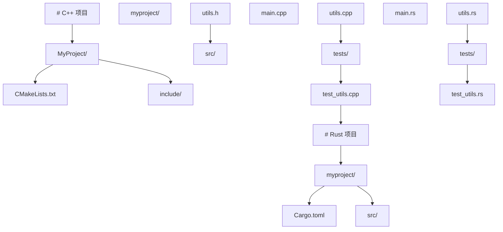
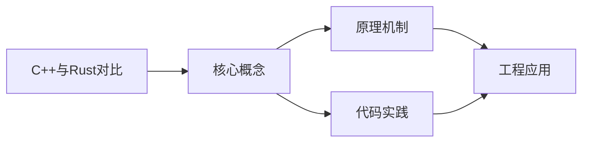
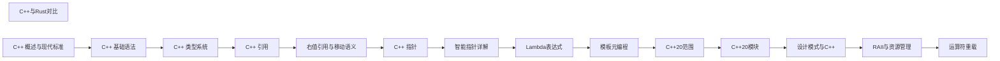

## 1. 学习目标（Bloom 分类）

本节按照布鲁姆教育目标分类学组织学习路径。本文主题为《C++与Rust对比》，属于 C++ 模块，读者可以根据自身阶段选择阅读深度。

记忆层面：能够准确复述本文的核心概念、术语与基本语法或操作步骤，并能够在提问或检索时快速定位对应知识点。能够说出 C++ 的类、继承、重载、模板与 STL 容器基本语法。

理解层面：能够用自己的语言解释核心原理与工作机制，说明概念之间的因果关系，而不是机械记忆结论。能够解释 RAII、拷贝/移动语义、虚函数与模板实例化。

应用层面：能够在真实项目或练习场景中运用本文知识解决具体问题，写出正确且可维护的实现。能够编写现代 C++（C++17/20）的类与泛型代码。

分析层面：能够拆解复杂问题，比较本文主题与相邻概念的异同，识别边界条件与例外情况。能够分析生命周期、未定义行为与性能特征。

评价层面：能够根据约束条件（性能、可读性、安全、成本）评价不同方案的优劣，做出有依据的技术决策。能够评价 C++ 与 Rust、Java 在系统编程中的取舍。

创造层面：能够把本文知识与其他模块知识组合，设计出新的解决方案或可复用的工程模式。能够设计高性能、可维护的 C++ 库与应用。

通过本节学习，读者应当能够把《C++与Rust对比》纳入自己的知识网络，并与 C++ 模块的其他主题（RAII、移动语义、模板、STL）建立关联。

## 2. 历史动机与发展脉络

《C++与Rust对比》是 C++ 领域的重要主题。要真正理解它，需要先了解它解决的问题与演进过程。

C++ 由 Bjarne Stroustrup 于 1979 年开始在贝尔实验室开发（原名 C with Classes），1983 年更名 C++，1998 年 C++98 首次标准化。
C++11 是语言转折点：右值引用、auto、lambda、智能指针、并发内存模型让现代 C++ 写法定型；C++14/17 补充泛型 lambda、if constexpr、折叠表达式；C++20 引入 concepts、协程、模块与范围库；C++23 继续完善。
现代 C++ 的核心口号是“资源安全”：RAII + 智能指针替代裸 new/delete，异常与错误码按场景选择；Rust 的出现促使 C++ 社区更重视内存安全工具（如 profile 指南、sanitizer）。

回到本文主题：C++与Rust对比 的提出与成熟，正是上述技术背景下的必然产物。早期实现往往以简单可用为目标，随着工程规模扩大，社区逐渐沉淀出标准做法与最佳实践；理解这一脉络，可以帮助读者判断“为什么文档中的推荐写法是现在这个样子”，也能在遇到历史遗留代码时准确识别其设计年代与取舍。


## 3. 形式化定义与核心概念精讲

本节把《C++与Rust对比》涉及的核心概念以“定义 + 讲解”的形式展开。读者应把定义当作工具，把讲解当作理解路径；两者结合才能形成可迁移的知识。

RAII：资源在构造函数获取、析构函数释放，栈对象离开作用域自动清理；智能指针（unique_ptr/shared_ptr/weak_ptr）把所有权编码进类型。
移动语义：右值引用 `&&` 与 std::move 转移资源所有权，避免深拷贝；移动后对象处于“合法但未指定”状态。
虚函数与多态：virtual 实现动态绑定，vtable 是运行时分派机制；final/override 关键字防止误用；基类析构函数应为 virtual。

### 3.1 原文章节逐一精讲

原文档把主题拆分为 7 个小节，下面按顺序给出每一节的导读讲解，随后保留原文细节供精读。

#### 原文精读（完整保留）


#### 概述

C++ 和 Rust 都是系统级编程语言，都能直接操作内存和硬件，都不需要垃圾回收器。但两者的设计哲学截然不同：C++ 追求零开销抽象和向后兼容，信任程序员的能力；Rust 通过所有权系统和借用检查器在编译期保证内存安全，不信任程序员手动管理内存。理解两者的异同，有助于在不同场景下做出合适的技术选择。

为什么需要了解两者的对比？如果你正在为项目选择技术栈，或者想从 C++ 转向 Rust（或反之），了解它们在内存管理、并发模型、生态系统等方面的差异，能帮助你做出明智的决策。两者不是替代关系，而是各有擅长的互补关系。

#### 基础概念

**所有权系统**：Rust 的核心特性。每个值有且只有一个所有者，当所有者离开作用域时值被自动释放。编译器通过借用检查器确保引用的有效性。

**借用检查器**：Rust 编译器的一部分，在编译期检查所有引用是否安全。它确保不会同时存在可变引用和不可变引用，也不会有悬垂引用。

**生命周期**：Rust 中每个引用都有一个生命周期，描述引用有效的范围。编译器通过生命周期标注来验证引用的安全性。

**零开销抽象**：C++ 和 Rust 共同的设计原则。使用高级抽象不会带来运行时开销，你不需要为没有使用的功能付费。

**RAII**：资源获取即初始化。C++ 和 Rust 都使用 RAII 模式管理资源，构造时获取资源，析构时释放资源。

#### 快速上手

##### 变量与可变性

```cpp
// C++：变量默认可变，用 const 标记不可变
int x = 10;        // 可变
x = 20;            // 允许
const int y = 30;  // 不可变
// y = 40;         // 编译错误
```

```rust
// Rust：变量默认不可变，用 mut 标记可变
let x = 10;        // 不可变
// x = 20;         // 编译错误
let mut y = 30;    // 可变
y = 40;            // 允许
```

##### 内存管理

```cpp
// C++：手动管理或使用智能指针
void cppMemoryDemo() {
    // 栈上分配，自动释放
    int value = 42;

    // 堆上分配，手动释放（危险）
    int* raw = new int(42);
    delete raw;  // 忘记 delete 会导致内存泄漏

    // 智能指针（推荐）
    auto unique = std::make_unique<int>(42);    // 独占所有权
    auto shared = std::make_shared<int>(42);    // 共享所有权（引用计数）

    // unique_ptr 离开作用域时自动释放
    // shared_ptr 当引用计数为零时自动释放
}
```

```rust
// Rust：所有权系统自动管理
fn rust_memory_demo() {
    // 栈上分配
    let value = 42;

    // 堆上分配，所有权自动管理
    let mut unique = Box::new(42);       // 独占所有权（类似 unique_ptr）
    let shared1 = Rc::new(42);           // 共享所有权（类似 shared_ptr）
    let shared2 = Rc::clone(&shared1);   // 引用计数增加

    // Box 离开作用域时自动释放
    // Rc 当引用计数为零时自动释放
}
```

##### 函数与错误处理

```cpp
// C++：使用异常或返回值
// 方式一：异常
int divide_exception(int a, int b) {
    if (b == 0) throw std::runtime_error("除数不能为零");
    return a / b;
}

// 方式二：返回值（C++17 的 std::optional）
std::optional<int> divide_optional(int a, int b) {
    if (b == 0) return std::nullopt;
    return a / b;
}
```

```rust
// Rust：使用 Result 类型（必须处理错误）
fn divide(a: i32, b: i32) -> Result<i32, String> {
    if b == 0 {
        return Err("除数不能为零".to_string());
    }
    Ok(a / b)
}

// 调用时必须处理错误
fn main() {
    match divide(10, 2) {
        Ok(result) => println!("结果: {}", result),
        Err(e) => println!("错误: {}", e),
    }

    // 或者用 ? 操作符传播错误
    let result = divide(10, 2)?;  // 如果出错，提前返回
}
```

#### 详细用法

##### 字符串处理

```cpp
// C++：std::string 和 std::string_view
#include <string>
#include <string_view>

void cppStringDemo() {
    // 可变字符串
    std::string name = "张三";
    name += "你好";                    // 拼接
    std::cout << name.size() << std::endl;  // 长度（字节数，不是字符数）

    // 字符串视图（不拥有数据，零拷贝）
    std::string_view view = name;
    std::string_view sub = view.substr(0, 6);  // 子串

    // 格式化（C++20）
    std::string msg = std::format("你好, {}!", name);
}
```

```rust
// Rust：String 和 &str
fn rust_string_demo() {
    // 可变字符串（堆分配）
    let mut name = String::from("张三");
    name.push_str("你好");             // 拼接
    println!("{}", name.len());        // 长度（字节数，UTF-8）

    // 字符串切片（不拥有数据，零拷贝）
    let view: &str = &name;
    let sub: &str = &view[0..6];       // 子串（按字节索引，需注意 UTF-8 边界）

    // 格式化
    let msg = format!("你好, {}!", name);
}
```

##### 并发编程

```cpp
// C++：使用 std::thread 和互斥量
#include <thread>
#include <mutex>
#include <vector>

void cppConcurrencyDemo() {
    std::mutex mtx;
    int counter = 0;

    // 创建多个线程
    std::vector<std::thread> threads;
    for (int i = 0; i < 10; i++) {
        threads.emplace_back([&]() {
            std::lock_guard<std::mutex> lock(mtx);  // 自动加锁解锁
            counter++;
        });
    }

    // 等待所有线程完成
    for (auto& t : threads) {
        t.join();
    }
    // counter == 10

    // 数据竞争是未定义行为，编译器不会检查
    // 以下代码有数据竞争但能编译通过
    // int unsafe_counter = 0;
    // std::thread t1([&]() { unsafe_counter++; });  // 危险！
    // std::thread t2([&]() { unsafe_counter++; });  // 危险！
}
```

```rust
// Rust：使用 std::thread，编译器保证线程安全
use std::sync::{Arc, Mutex};
use std::thread;

fn rust_concurrency_demo() {
    // Arc（原子引用计数）+ Mutex（互斥量）
    let counter = Arc::new(Mutex::new(0));
    let mut handles = vec![];

    for _ in 0..10 {
        let counter = Arc::clone(&counter);
        let handle = thread::spawn(move || {
            let mut num = counter.lock().unwrap();
            *num += 1;
        });
        handles.push(handle);
    }

    for handle in handles {
        handle.join().unwrap();
    }
    // *counter.lock().unwrap() == 10

    // 以下代码编译不通过！Rust 阻止了数据竞争
    // let mut unsafe_counter = 0;
    // let t1 = thread::spawn(|| { unsafe_counter += 1; });  // 编译错误！
    // let t2 = thread::spawn(|| { unsafe_counter += 1; });  // 编译错误！
}
```

##### 泛型与 trait

```cpp
// C++：模板和概念
#include <concepts>
#include <vector>
#include <algorithm>

// C++20 概念约束
template<typename T>
requires std::integral<T>
T sum(const std::vector<T>& values) {
    T result = 0;
    for (const auto& v : values) {
        result += v;
    }
    return result;
}

// 编译期错误信息可能很长
```

```rust
// Rust：泛型和 trait
fn sum<T: std::ops::Add<Output = T> + Default + Copy>(values: &[T]) -> T {
    let mut result = T::default();
    for v in values {
        result = result + *v;
    }
    result
}

// trait 比 C++ 概念更成熟，错误信息更友好
// 编译错误会明确指出哪个 trait 没有实现
```

##### 枚举与模式匹配

```cpp
// C++：枚举和 variant
#include <variant>
#include <string>

// 传统枚举
enum class Color { Red, Green, Blue };

// C++17 的 variant（类似 Rust 的枚举）
using Value = std::variant<int, double, std::string>;

void processValue(const Value& v) {
    std::visit([](auto&& arg) {
        using T = std::decay_t<decltype(arg)>;
        if constexpr (std::is_same_v<T, int>) {
            std::cout << "整数: " << arg << std::endl;
        } else if constexpr (std::is_same_v<T, double>) {
            std::cout << "浮点: " << arg << std::endl;
        } else if constexpr (std::is_same_v<T, std::string>) {
            std::cout << "字符串: " << arg << std::endl;
        }
    }, v);
}
```

```rust
// Rust：枚举和模式匹配（更优雅）
enum Color {
    Red,
    Green,
    Blue,
}

// 枚举可以携带数据
enum Value {
    Integer(i32),
    Float(f64),
    Text(String),
}

fn process_value(v: &Value) {
    match v {
        Value::Integer(n) => println!("整数: {}", n),
        Value::Float(f) => println!("浮点: {}", f),
        Value::Text(s) => println!("字符串: {}", s),
    }
    // match 必须穷举所有变体，否则编译错误
}
```

#### 常见场景

##### 构建系统对比

```cmake
# C++：CMake
cmake_minimum_required(VERSION 3.20)
project(MyApp)

find_package(fmt REQUIRED)
add_executable(myapp main.cpp)
target_link_libraries(myapp fmt::fmt)
```

```toml
# Rust：Cargo
[package]
name = "myapp"
version = "0.1.0"

[dependencies]
serde = { version = "1.0", features = ["derive"] }
```

##### 项目结构对比



#### 注意事项

**学习曲线**：Rust 的学习曲线比 C++ 更陡峭，特别是所有权和生命周期概念。但一旦掌握，编译器能帮你避免大量运行时错误。

**生态系统**：C++ 的生态更成熟，有大量历史积累的库。Rust 的 Cargo 生态更现代，包管理和构建体验更好。

**编译速度**：C++ 的编译速度通常比 Rust 快（特别是增量编译）。Rust 的借用检查器增加了编译时间。

**互操作**：C++ 和 Rust 可以通过 FFI（外部函数接口）互相调用。Rust 提供了 C ABI 兼容的接口，可以从 C++ 中调用 Rust 代码。

**适用场景**：C++ 适合已有大型代码库、游戏开发、嵌入式系统；Rust 适合新项目、系统工具、WebAssembly、安全敏感场景。

#### 进阶用法

##### C++ 调用 Rust

```rust
// Rust 侧：导出 C 兼容函数
#[no_mangle]
pub extern "C" fn rust_add(a: i32, b: i32) -> i32 {
    a + b
}

// 编译为静态库
// cargo build --release
// 生成 libmyrustlib.a（Linux）或 myrustlib.lib（Windows）
```

```cpp
// C++ 侧：声明并调用 Rust 函数
extern "C" {
    int rust_add(int a, int b);
}

int main() {
    int result = rust_add(3, 5);
    std::cout << "结果: " << result << std::endl;  // 8
    return 0;
}
```

##### Rust 调用 C++

```rust
// Rust 侧：使用 bindgen 自动生成绑定
// build.rs
fn main() {
    cc::Build::new()
        .cpp(true)
        .file("src/cpp_code.cpp")
        .compile("cpp_code");

    // 生成 C++ 头文件的 Rust 绑定
    let bindings = bindgen::Builder::default()
        .header("src/cpp_code.h")
        .clang_arg("-xc++")
        .generate()
        .expect("无法生成绑定");

    bindings
        .write_to_file(std::path::PathBuf::from("src/bindings.rs"))
        .expect("无法写入绑定");
}
```


### 3.2 概念关系图

下面用 Mermaid 图表达本文核心概念之间的关系，帮助读者建立整体图景：



图中展示的是本文知识的结构化关系：核心概念是入口，原理机制解释“为什么”，代码实践演示“怎么做”，工程应用回答“何时用”。读者学习时可以把每个小节的内容挂接到对应节点上。

## 4. 理论推导与原理解析

本节深入《C++与Rust对比》背后的原理。理论部分不求面面俱到，而是聚焦“能解释现象、能指导实践”的关键推导。

RAII：资源在构造函数获取、析构函数释放，栈对象离开作用域自动清理；智能指针（unique_ptr/shared_ptr/weak_ptr）把所有权编码进类型。
移动语义：右值引用 `&&` 与 std::move 转移资源所有权，避免深拷贝；移动后对象处于“合法但未指定”状态。
虚函数与多态：virtual 实现动态绑定，vtable 是运行时分派机制；final/override 关键字防止误用；基类析构函数应为 virtual。
模板与泛型：模板编译期实例化，实现静态多态；concepts（C++20）约束类型接口；模板元编程在编译期计算类型与常量。

需要强调的是，理论推导与工程实践之间存在翻译层：理论给出的是理想化模型与边界条件，工程代码则必须处理真实环境中的例外。读者在学习时应先掌握理论的“标准情形”，再通过陷阱章节了解“非标准情形”。

## 5. 代码示例与逐行讲解

本节把原文中的代码示例系统整理，并为每个示例补充用途说明与讲解。读者不应只浏览代码，而应逐段对照讲解理解设计意图。

### 5.1 示例：变量与可变性

该示例来自原文《变量与可变性》小节，用于演示C++与Rust对比相关操作。阅读时请先看代码结构，再看其后的讲解。

```cpp
// C++：变量默认可变，用 const 标记不可变
int x = 10;        // 可变
x = 20;            // 允许
const int y = 30;  // 不可变
// y = 40;         // 编译错误
```

讲解：这段代码演示了本节核心知识点。代码中的关键操作可以归纳为三步：准备（定义或初始化）、执行（核心逻辑）、收尾（释放资源或返回结果）。实际项目中，这三步往往被封装为函数或类，以提升复用性与可测试性。

关键点分析：

该示例共 5 行有效代码，结构以数据或配置为主。阅读时应关注：数据字段的含义、配置项的作用，以及它们与运行行为的对应关系。

进阶思考路径：先尝试修改参数观察行为变化，再把示例中的模式迁移到自己的项目中；每次修改都记录预期与实测差异，这是把示例转化为能力的最快方式。

### 5.2 示例：变量与可变性

该示例来自原文《变量与可变性》小节，用于演示C++与Rust对比相关操作。阅读时请先看代码结构，再看其后的讲解。

```rust
// Rust：变量默认不可变，用 mut 标记可变
let x = 10;        // 不可变
// x = 20;         // 编译错误
let mut y = 30;    // 可变
y = 40;            // 允许
```

讲解：这段代码演示了本节核心知识点。代码中的关键操作可以归纳为三步：准备（定义或初始化）、执行（核心逻辑）、收尾（释放资源或返回结果）。实际项目中，这三步往往被封装为函数或类，以提升复用性与可测试性。

关键点分析：

该示例共 5 行有效代码，结构以数据或配置为主。阅读时应关注：数据字段的含义、配置项的作用，以及它们与运行行为的对应关系。

进阶思考路径：先尝试修改参数观察行为变化，再把示例中的模式迁移到自己的项目中；每次修改都记录预期与实测差异，这是把示例转化为能力的最快方式。

### 5.3 示例：内存管理

该示例来自原文《内存管理》小节，用于演示C++与Rust对比相关操作。阅读时请先看代码结构，再看其后的讲解。

```cpp
// C++：手动管理或使用智能指针
void cppMemoryDemo() {
    // 栈上分配，自动释放
    int value = 42;

    // 堆上分配，手动释放（危险）
    int* raw = new int(42);
    delete raw;  // 忘记 delete 会导致内存泄漏

    // 智能指针（推荐）
    auto unique = std::make_unique<int>(42);    // 独占所有权
    auto shared = std::make_shared<int>(42);    // 共享所有权（引用计数）

    // unique_ptr 离开作用域时自动释放
    // shared_ptr 当引用计数为零时自动释放
}
```

讲解：这段代码演示了本节核心知识点。代码中的关键操作可以归纳为三步：准备（定义或初始化）、执行（核心逻辑）、收尾（释放资源或返回结果）。实际项目中，这三步往往被封装为函数或类，以提升复用性与可测试性。

关键点分析：

该示例共 13 行有效代码，结构以数据或配置为主。阅读时应关注：数据字段的含义、配置项的作用，以及它们与运行行为的对应关系。

进阶思考路径：先尝试修改参数观察行为变化，再把示例中的模式迁移到自己的项目中；每次修改都记录预期与实测差异，这是把示例转化为能力的最快方式。

### 5.4 示例：内存管理

该示例来自原文《内存管理》小节，用于演示C++与Rust对比相关操作。阅读时请先看代码结构，再看其后的讲解。

```rust
// Rust：所有权系统自动管理
fn rust_memory_demo() {
    // 栈上分配
    let value = 42;

    // 堆上分配，所有权自动管理
    let mut unique = Box::new(42);       // 独占所有权（类似 unique_ptr）
    let shared1 = Rc::new(42);           // 共享所有权（类似 shared_ptr）
    let shared2 = Rc::clone(&shared1);   // 引用计数增加

    // Box 离开作用域时自动释放
    // Rc 当引用计数为零时自动释放
}
```

讲解：这段代码演示了本节核心知识点。代码中的关键操作可以归纳为三步：准备（定义或初始化）、执行（核心逻辑）、收尾（释放资源或返回结果）。实际项目中，这三步往往被封装为函数或类，以提升复用性与可测试性。

关键点分析：

该示例共 11 行有效代码，结构以数据或配置为主。阅读时应关注：数据字段的含义、配置项的作用，以及它们与运行行为的对应关系。

进阶思考路径：先尝试修改参数观察行为变化，再把示例中的模式迁移到自己的项目中；每次修改都记录预期与实测差异，这是把示例转化为能力的最快方式。

### 5.5 示例：函数与错误处理

该示例来自原文《函数与错误处理》小节，用于演示C++与Rust对比相关操作。阅读时请先看代码结构，再看其后的讲解。

```cpp
// C++：使用异常或返回值
// 方式一：异常
int divide_exception(int a, int b) {
    if (b == 0) throw std::runtime_error("除数不能为零");
    return a / b;
}

// 方式二：返回值（C++17 的 std::optional）
std::optional<int> divide_optional(int a, int b) {
    if (b == 0) return std::nullopt;
    return a / b;
}
```

讲解：这段代码演示了本节核心知识点。代码中的关键操作可以归纳为三步：准备（定义或初始化）、执行（核心逻辑）、收尾（释放资源或返回结果）。实际项目中，这三步往往被封装为函数或类，以提升复用性与可测试性。

关键点分析：

该示例共 11 行有效代码，包含 2 类关键结构（if、return）。其中：

- 入口与初始化部分负责建立上下文，对应实际项目中的启动或装配逻辑；
- 核心逻辑部分体现本文主题的主要操作，是阅读时最需要对照讲解理解的部分；
- 输出或返回部分把结果交给调用方，注意其类型与边界条件。

进阶思考路径：先尝试修改参数观察行为变化，再把示例中的模式迁移到自己的项目中；每次修改都记录预期与实测差异，这是把示例转化为能力的最快方式。

### 5.6 示例：函数与错误处理

该示例来自原文《函数与错误处理》小节，用于演示C++与Rust对比相关操作。阅读时请先看代码结构，再看其后的讲解。

```rust
// Rust：使用 Result 类型（必须处理错误）
fn divide(a: i32, b: i32) -> Result<i32, String> {
    if b == 0 {
        return Err("除数不能为零".to_string());
    }
    Ok(a / b)
}

// 调用时必须处理错误
fn main() {
    match divide(10, 2) {
        Ok(result) => println!("结果: {}", result),
        Err(e) => println!("错误: {}", e),
    }

    // 或者用 ? 操作符传播错误
    let result = divide(10, 2)?;  // 如果出错，提前返回
}
```

讲解：这段代码演示了本节核心知识点。代码中的关键操作可以归纳为三步：准备（定义或初始化）、执行（核心逻辑）、收尾（释放资源或返回结果）。实际项目中，这三步往往被封装为函数或类，以提升复用性与可测试性。

关键点分析：

该示例共 16 行有效代码，包含 2 类关键结构（if、return）。其中：

- 入口与初始化部分负责建立上下文，对应实际项目中的启动或装配逻辑；
- 核心逻辑部分体现本文主题的主要操作，是阅读时最需要对照讲解理解的部分；
- 输出或返回部分把结果交给调用方，注意其类型与边界条件。

进阶思考路径：先尝试修改参数观察行为变化，再把示例中的模式迁移到自己的项目中；每次修改都记录预期与实测差异，这是把示例转化为能力的最快方式。

### 5.7 示例：字符串处理

该示例来自原文《字符串处理》小节，用于演示C++与Rust对比相关操作。阅读时请先看代码结构，再看其后的讲解。

```cpp
// C++：std::string 和 std::string_view
#include <string>
#include <string_view>

void cppStringDemo() {
    // 可变字符串
    std::string name = "张三";
    name += "你好";                    // 拼接
    std::cout << name.size() << std::endl;  // 长度（字节数，不是字符数）

    // 字符串视图（不拥有数据，零拷贝）
    std::string_view view = name;
    std::string_view sub = view.substr(0, 6);  // 子串

    // 格式化（C++20）
    std::string msg = std::format("你好, {}!", name);
}
```

讲解：这段代码演示了本节核心知识点。代码中的关键操作可以归纳为三步：准备（定义或初始化）、执行（核心逻辑）、收尾（释放资源或返回结果）。实际项目中，这三步往往被封装为函数或类，以提升复用性与可测试性。

关键点分析：

该示例共 14 行有效代码，结构以数据或配置为主。阅读时应关注：数据字段的含义、配置项的作用，以及它们与运行行为的对应关系。

进阶思考路径：先尝试修改参数观察行为变化，再把示例中的模式迁移到自己的项目中；每次修改都记录预期与实测差异，这是把示例转化为能力的最快方式。

### 5.8 示例：字符串处理

该示例来自原文《字符串处理》小节，用于演示C++与Rust对比相关操作。阅读时请先看代码结构，再看其后的讲解。

```rust
// Rust：String 和 &str
fn rust_string_demo() {
    // 可变字符串（堆分配）
    let mut name = String::from("张三");
    name.push_str("你好");             // 拼接
    println!("{}", name.len());        // 长度（字节数，UTF-8）

    // 字符串切片（不拥有数据，零拷贝）
    let view: &str = &name;
    let sub: &str = &view[0..6];       // 子串（按字节索引，需注意 UTF-8 边界）

    // 格式化
    let msg = format!("你好, {}!", name);
}
```

讲解：这段代码演示了本节核心知识点。代码中的关键操作可以归纳为三步：准备（定义或初始化）、执行（核心逻辑）、收尾（释放资源或返回结果）。实际项目中，这三步往往被封装为函数或类，以提升复用性与可测试性。

关键点分析：

该示例共 12 行有效代码，结构以数据或配置为主。阅读时应关注：数据字段的含义、配置项的作用，以及它们与运行行为的对应关系。

进阶思考路径：先尝试修改参数观察行为变化，再把示例中的模式迁移到自己的项目中；每次修改都记录预期与实测差异，这是把示例转化为能力的最快方式。

### 5.9 示例：并发编程

该示例来自原文《并发编程》小节，用于演示C++与Rust对比相关操作。阅读时请先看代码结构，再看其后的讲解。

```cpp
// C++：使用 std::thread 和互斥量
#include <thread>
#include <mutex>
#include <vector>

void cppConcurrencyDemo() {
    std::mutex mtx;
    int counter = 0;

    // 创建多个线程
    std::vector<std::thread> threads;
    for (int i = 0; i < 10; i++) {
        threads.emplace_back([&]() {
            std::lock_guard<std::mutex> lock(mtx);  // 自动加锁解锁
            counter++;
        });
    }

    // 等待所有线程完成
    for (auto& t : threads) {
        t.join();
    }
    // counter == 10

    // 数据竞争是未定义行为，编译器不会检查
    // 以下代码有数据竞争但能编译通过
    // int unsafe_counter = 0;
    // std::thread t1([&]() { unsafe_counter++; });  // 危险！
    // std::thread t2([&]() { unsafe_counter++; });  // 危险！
}
```

讲解：这段代码演示了本节核心知识点。代码中的关键操作可以归纳为三步：准备（定义或初始化）、执行（核心逻辑）、收尾（释放资源或返回结果）。实际项目中，这三步往往被封装为函数或类，以提升复用性与可测试性。

关键点分析：

该示例共 26 行有效代码，包含 1 类关键结构（for）。其中：

- 入口与初始化部分负责建立上下文，对应实际项目中的启动或装配逻辑；
- 核心逻辑部分体现本文主题的主要操作，是阅读时最需要对照讲解理解的部分；
- 输出或返回部分把结果交给调用方，注意其类型与边界条件。

进阶思考路径：先尝试修改参数观察行为变化，再把示例中的模式迁移到自己的项目中；每次修改都记录预期与实测差异，这是把示例转化为能力的最快方式。

### 5.10 示例：并发编程

该示例来自原文《并发编程》小节，用于演示C++与Rust对比相关操作。阅读时请先看代码结构，再看其后的讲解。

```rust
// Rust：使用 std::thread，编译器保证线程安全
use std::sync::{Arc, Mutex};
use std::thread;

fn rust_concurrency_demo() {
    // Arc（原子引用计数）+ Mutex（互斥量）
    let counter = Arc::new(Mutex::new(0));
    let mut handles = vec![];

    for _ in 0..10 {
        let counter = Arc::clone(&counter);
        let handle = thread::spawn(move || {
            let mut num = counter.lock().unwrap();
            *num += 1;
        });
        handles.push(handle);
    }

    for handle in handles {
        handle.join().unwrap();
    }
    // *counter.lock().unwrap() == 10

    // 以下代码编译不通过！Rust 阻止了数据竞争
    // let mut unsafe_counter = 0;
    // let t1 = thread::spawn(|| { unsafe_counter += 1; });  // 编译错误！
    // let t2 = thread::spawn(|| { unsafe_counter += 1; });  // 编译错误！
}
```

讲解：这段代码演示了本节核心知识点。代码中的关键操作可以归纳为三步：准备（定义或初始化）、执行（核心逻辑）、收尾（释放资源或返回结果）。实际项目中，这三步往往被封装为函数或类，以提升复用性与可测试性。

关键点分析：

该示例共 24 行有效代码，包含 1 类关键结构（for）。其中：

- 入口与初始化部分负责建立上下文，对应实际项目中的启动或装配逻辑；
- 核心逻辑部分体现本文主题的主要操作，是阅读时最需要对照讲解理解的部分；
- 输出或返回部分把结果交给调用方，注意其类型与边界条件。

进阶思考路径：先尝试修改参数观察行为变化，再把示例中的模式迁移到自己的项目中；每次修改都记录预期与实测差异，这是把示例转化为能力的最快方式。

### 5.11 示例：泛型与 trait

该示例来自原文《泛型与 trait》小节，用于演示C++与Rust对比相关操作。阅读时请先看代码结构，再看其后的讲解。

```cpp
// C++：模板和概念
#include <concepts>
#include <vector>
#include <algorithm>

// C++20 概念约束
template<typename T>
requires std::integral<T>
T sum(const std::vector<T>& values) {
    T result = 0;
    for (const auto& v : values) {
        result += v;
    }
    return result;
}

// 编译期错误信息可能很长
```

讲解：这段代码演示了本节核心知识点。代码中的关键操作可以归纳为三步：准备（定义或初始化）、执行（核心逻辑）、收尾（释放资源或返回结果）。实际项目中，这三步往往被封装为函数或类，以提升复用性与可测试性。

关键点分析：

该示例共 15 行有效代码，包含 2 类关键结构（for、return）。其中：

- 入口与初始化部分负责建立上下文，对应实际项目中的启动或装配逻辑；
- 核心逻辑部分体现本文主题的主要操作，是阅读时最需要对照讲解理解的部分；
- 输出或返回部分把结果交给调用方，注意其类型与边界条件。

进阶思考路径：先尝试修改参数观察行为变化，再把示例中的模式迁移到自己的项目中；每次修改都记录预期与实测差异，这是把示例转化为能力的最快方式。

### 5.12 示例：泛型与 trait

该示例来自原文《泛型与 trait》小节，用于演示C++与Rust对比相关操作。阅读时请先看代码结构，再看其后的讲解。

```rust
// Rust：泛型和 trait
fn sum<T: std::ops::Add<Output = T> + Default + Copy>(values: &[T]) -> T {
    let mut result = T::default();
    for v in values {
        result = result + *v;
    }
    result
}

// trait 比 C++ 概念更成熟，错误信息更友好
// 编译错误会明确指出哪个 trait 没有实现
```

讲解：这段代码演示了本节核心知识点。代码中的关键操作可以归纳为三步：准备（定义或初始化）、执行（核心逻辑）、收尾（释放资源或返回结果）。实际项目中，这三步往往被封装为函数或类，以提升复用性与可测试性。

关键点分析：

该示例共 10 行有效代码，包含 1 类关键结构（for）。其中：

- 入口与初始化部分负责建立上下文，对应实际项目中的启动或装配逻辑；
- 核心逻辑部分体现本文主题的主要操作，是阅读时最需要对照讲解理解的部分；
- 输出或返回部分把结果交给调用方，注意其类型与边界条件。

进阶思考路径：先尝试修改参数观察行为变化，再把示例中的模式迁移到自己的项目中；每次修改都记录预期与实测差异，这是把示例转化为能力的最快方式。

### 5.13 示例：枚举与模式匹配

该示例来自原文《枚举与模式匹配》小节，用于演示C++与Rust对比相关操作。阅读时请先看代码结构，再看其后的讲解。

```cpp
// C++：枚举和 variant
#include <variant>
#include <string>

// 传统枚举
enum class Color { Red, Green, Blue };

// C++17 的 variant（类似 Rust 的枚举）
using Value = std::variant<int, double, std::string>;

void processValue(const Value& v) {
    std::visit([](auto&& arg) {
        using T = std::decay_t<decltype(arg)>;
        if constexpr (std::is_same_v<T, int>) {
            std::cout << "整数: " << arg << std::endl;
        } else if constexpr (std::is_same_v<T, double>) {
            std::cout << "浮点: " << arg << std::endl;
        } else if constexpr (std::is_same_v<T, std::string>) {
            std::cout << "字符串: " << arg << std::endl;
        }
    }, v);
}
```

讲解：这段代码演示了本节核心知识点。代码中的关键操作可以归纳为三步：准备（定义或初始化）、执行（核心逻辑）、收尾（释放资源或返回结果）。实际项目中，这三步往往被封装为函数或类，以提升复用性与可测试性。

关键点分析：

该示例共 19 行有效代码，包含 2 类关键结构（class、if）。其中：

- 入口与初始化部分负责建立上下文，对应实际项目中的启动或装配逻辑；
- 核心逻辑部分体现本文主题的主要操作，是阅读时最需要对照讲解理解的部分；
- 输出或返回部分把结果交给调用方，注意其类型与边界条件。

进阶思考路径：先尝试修改参数观察行为变化，再把示例中的模式迁移到自己的项目中；每次修改都记录预期与实测差异，这是把示例转化为能力的最快方式。

### 5.14 示例：枚举与模式匹配

该示例来自原文《枚举与模式匹配》小节，用于演示C++与Rust对比相关操作。阅读时请先看代码结构，再看其后的讲解。

```rust
// Rust：枚举和模式匹配（更优雅）
enum Color {
    Red,
    Green,
    Blue,
}

// 枚举可以携带数据
enum Value {
    Integer(i32),
    Float(f64),
    Text(String),
}

fn process_value(v: &Value) {
    match v {
        Value::Integer(n) => println!("整数: {}", n),
        Value::Float(f) => println!("浮点: {}", f),
        Value::Text(s) => println!("字符串: {}", s),
    }
    // match 必须穷举所有变体，否则编译错误
}
```

讲解：这段代码演示了本节核心知识点。代码中的关键操作可以归纳为三步：准备（定义或初始化）、执行（核心逻辑）、收尾（释放资源或返回结果）。实际项目中，这三步往往被封装为函数或类，以提升复用性与可测试性。

关键点分析：

该示例共 20 行有效代码，结构以数据或配置为主。阅读时应关注：数据字段的含义、配置项的作用，以及它们与运行行为的对应关系。

进阶思考路径：先尝试修改参数观察行为变化，再把示例中的模式迁移到自己的项目中；每次修改都记录预期与实测差异，这是把示例转化为能力的最快方式。

### 5.15 示例：构建系统对比

该示例来自原文《构建系统对比》小节，用于演示C++与Rust对比相关操作。阅读时请先看代码结构，再看其后的讲解。

```cmake
# C++：CMake
cmake_minimum_required(VERSION 3.20)
project(MyApp)

find_package(fmt REQUIRED)
add_executable(myapp main.cpp)
target_link_libraries(myapp fmt::fmt)
```

讲解：这段代码演示了本节核心知识点。代码中的关键操作可以归纳为三步：准备（定义或初始化）、执行（核心逻辑）、收尾（释放资源或返回结果）。实际项目中，这三步往往被封装为函数或类，以提升复用性与可测试性。

关键点分析：

该示例共 6 行有效代码，结构以数据或配置为主。阅读时应关注：数据字段的含义、配置项的作用，以及它们与运行行为的对应关系。

进阶思考路径：先尝试修改参数观察行为变化，再把示例中的模式迁移到自己的项目中；每次修改都记录预期与实测差异，这是把示例转化为能力的最快方式。

### 5.16 示例：构建系统对比

该示例来自原文《构建系统对比》小节，用于演示C++与Rust对比相关操作。阅读时请先看代码结构，再看其后的讲解。

```toml
# Rust：Cargo
[package]
name = "myapp"
version = "0.1.0"

[dependencies]
serde = { version = "1.0", features = ["derive"] }
```

讲解：这段代码演示了本节核心知识点。代码中的关键操作可以归纳为三步：准备（定义或初始化）、执行（核心逻辑）、收尾（释放资源或返回结果）。实际项目中，这三步往往被封装为函数或类，以提升复用性与可测试性。

关键点分析：

该示例共 6 行有效代码，结构以数据或配置为主。阅读时应关注：数据字段的含义、配置项的作用，以及它们与运行行为的对应关系。

进阶思考路径：先尝试修改参数观察行为变化，再把示例中的模式迁移到自己的项目中；每次修改都记录预期与实测差异，这是把示例转化为能力的最快方式。

### 5.17 示例：项目结构对比

该示例来自原文《项目结构对比》小节，用于演示C++与Rust对比相关操作。阅读时请先看代码结构，再看其后的讲解。


讲解：这段代码演示了本节核心知识点。代码中的关键操作可以归纳为三步：准备（定义或初始化）、执行（核心逻辑）、收尾（释放资源或返回结果）。实际项目中，这三步往往被封装为函数或类，以提升复用性与可测试性。

关键点分析：

该示例共 32 行有效代码，结构以数据或配置为主。阅读时应关注：数据字段的含义、配置项的作用，以及它们与运行行为的对应关系。

进阶思考路径：先尝试修改参数观察行为变化，再把示例中的模式迁移到自己的项目中；每次修改都记录预期与实测差异，这是把示例转化为能力的最快方式。

### 5.18 示例：C++ 调用 Rust

该示例来自原文《C++ 调用 Rust》小节，用于演示C++与Rust对比相关操作。阅读时请先看代码结构，再看其后的讲解。

```rust
// Rust 侧：导出 C 兼容函数
#[no_mangle]
pub extern "C" fn rust_add(a: i32, b: i32) -> i32 {
    a + b
}

// 编译为静态库
// cargo build --release
// 生成 libmyrustlib.a（Linux）或 myrustlib.lib（Windows）
```

讲解：这段代码演示了本节核心知识点。代码中的关键操作可以归纳为三步：准备（定义或初始化）、执行（核心逻辑）、收尾（释放资源或返回结果）。实际项目中，这三步往往被封装为函数或类，以提升复用性与可测试性。

关键点分析：

该示例共 8 行有效代码，结构以数据或配置为主。阅读时应关注：数据字段的含义、配置项的作用，以及它们与运行行为的对应关系。

进阶思考路径：先尝试修改参数观察行为变化，再把示例中的模式迁移到自己的项目中；每次修改都记录预期与实测差异，这是把示例转化为能力的最快方式。

### 5.19 示例：C++ 调用 Rust

该示例来自原文《C++ 调用 Rust》小节，用于演示C++与Rust对比相关操作。阅读时请先看代码结构，再看其后的讲解。

```cpp
// C++ 侧：声明并调用 Rust 函数
extern "C" {
    int rust_add(int a, int b);
}

int main() {
    int result = rust_add(3, 5);
    std::cout << "结果: " << result << std::endl;  // 8
    return 0;
}
```

讲解：这段代码演示了本节核心知识点。代码中的关键操作可以归纳为三步：准备（定义或初始化）、执行（核心逻辑）、收尾（释放资源或返回结果）。实际项目中，这三步往往被封装为函数或类，以提升复用性与可测试性。

关键点分析：

该示例共 9 行有效代码，包含 1 类关键结构（return）。其中：

- 入口与初始化部分负责建立上下文，对应实际项目中的启动或装配逻辑；
- 核心逻辑部分体现本文主题的主要操作，是阅读时最需要对照讲解理解的部分；
- 输出或返回部分把结果交给调用方，注意其类型与边界条件。

进阶思考路径：先尝试修改参数观察行为变化，再把示例中的模式迁移到自己的项目中；每次修改都记录预期与实测差异，这是把示例转化为能力的最快方式。

### 5.20 示例：Rust 调用 C++

该示例来自原文《Rust 调用 C++》小节，用于演示C++与Rust对比相关操作。阅读时请先看代码结构，再看其后的讲解。

```rust
// Rust 侧：使用 bindgen 自动生成绑定
// build.rs
fn main() {
    cc::Build::new()
        .cpp(true)
        .file("src/cpp_code.cpp")
        .compile("cpp_code");

    // 生成 C++ 头文件的 Rust 绑定
    let bindings = bindgen::Builder::default()
        .header("src/cpp_code.h")
        .clang_arg("-xc++")
        .generate()
        .expect("无法生成绑定");

    bindings
        .write_to_file(std::path::PathBuf::from("src/bindings.rs"))
        .expect("无法写入绑定");
}
```

讲解：这段代码演示了本节核心知识点。代码中的关键操作可以归纳为三步：准备（定义或初始化）、执行（核心逻辑）、收尾（释放资源或返回结果）。实际项目中，这三步往往被封装为函数或类，以提升复用性与可测试性。

关键点分析：

该示例共 17 行有效代码，结构以数据或配置为主。阅读时应关注：数据字段的含义、配置项的作用，以及它们与运行行为的对应关系。

进阶思考路径：先尝试修改参数观察行为变化，再把示例中的模式迁移到自己的项目中；每次修改都记录预期与实测差异，这是把示例转化为能力的最快方式。


综合以上示例，可以总结出本主题的代码实践要点：第一，先定义清晰的输入输出契约；第二，核心逻辑保持单一职责；第三，错误处理与边界条件不可省略；第四，命名与注释表达意图而非复述代码。

## 6. 对比分析

对比是理解《C++与Rust对比》定位的最快路径。下面从多个维度与相邻方案进行对比。

C++ 与 C：C++ 支持面向对象与泛型、RAII 与标准库；C 更简单，适合纯系统与嵌入式。
C++ 与 Rust：Rust 编译期保证内存安全，所有权模型严格；C++ 灵活但依赖纪律。性能相近，安全性 Rust 更强。
C++11 与 C++20：concepts、协程、范围库代表现代 C++ 方向；新代码以 C++20 为基线。

对比的目的不是分出绝对优劣，而是建立选择依据：不同约束条件下，最优解不同。读者应把每个对比维度转化为决策检查清单。

## 7. 常见陷阱与最佳实践

本节整理该主题的高频错误与推荐做法。每个陷阱先描述现象，再解释原因，最后给出最佳实践。

### 7.1 裸 new/delete

易泄漏与重复释放。使用 make_unique/make_shared 与栈对象。

深入讲解：该问题之所以被归类为“常见陷阱”，是因为它在初学者的代码中反复出现，而且往往不在第一时间暴露——错误通常隐藏在特定数据或特定时序下。

从成因上看，裸 new/delete 一般源于对 C++ 某个机制的理解偏差：要么误用了默认行为，要么忽略了边界条件，要么把其他语言的思维惯性带了过来。

从影响上看，裸 new/delete 轻则产生错误结果，重则导致资源泄漏、数据损坏或安全事故；这也是为什么工程评审中会把它列为检查项。

从修复策略上看，处理裸 new/delete的正确顺序是：先复现（构造最小用例），再定位（确认机制层面的根因），最后修复并补充回归测试。跳过复现直接改代码，往往治标不治本。

### 7.2 引用悬垂

返回局部变量引用或存储容器元素引用后容器扩容。理解生命周期，必要时用值或智能指针。

深入讲解：该问题之所以被归类为“常见陷阱”，是因为它在初学者的代码中反复出现，而且往往不在第一时间暴露——错误通常隐藏在特定数据或特定时序下。

从成因上看，引用悬垂 一般源于对 C++ 某个机制的理解偏差：要么误用了默认行为，要么忽略了边界条件，要么把其他语言的思维惯性带了过来。

从影响上看，引用悬垂 轻则产生错误结果，重则导致资源泄漏、数据损坏或安全事故；这也是为什么工程评审中会把它列为检查项。

从修复策略上看，处理引用悬垂的正确顺序是：先复现（构造最小用例），再定位（确认机制层面的根因），最后修复并补充回归测试。跳过复现直接改代码，往往治标不治本。

### 7.3 迭代器失效

vector 扩容使迭代器失效。避免在遍历时修改容器，或改用索引/新容器。

深入讲解：该问题之所以被归类为“常见陷阱”，是因为它在初学者的代码中反复出现，而且往往不在第一时间暴露——错误通常隐藏在特定数据或特定时序下。

从成因上看，迭代器失效 一般源于对 C++ 某个机制的理解偏差：要么误用了默认行为，要么忽略了边界条件，要么把其他语言的思维惯性带了过来。

从影响上看，迭代器失效 轻则产生错误结果，重则导致资源泄漏、数据损坏或安全事故；这也是为什么工程评审中会把它列为检查项。

从修复策略上看，处理迭代器失效的正确顺序是：先复现（构造最小用例），再定位（确认机制层面的根因），最后修复并补充回归测试。跳过复现直接改代码，往往治标不治本。

### 7.4 虚析构缺失

通过基类指针删除派生对象时未调用派生析构。基类析构声明为 virtual。

深入讲解：该问题之所以被归类为“常见陷阱”，是因为它在初学者的代码中反复出现，而且往往不在第一时间暴露——错误通常隐藏在特定数据或特定时序下。

从成因上看，虚析构缺失 一般源于对 C++ 某个机制的理解偏差：要么误用了默认行为，要么忽略了边界条件，要么把其他语言的思维惯性带了过来。

从影响上看，虚析构缺失 轻则产生错误结果，重则导致资源泄漏、数据损坏或安全事故；这也是为什么工程评审中会把它列为检查项。

从修复策略上看，处理虚析构缺失的正确顺序是：先复现（构造最小用例），再定位（确认机制层面的根因），最后修复并补充回归测试。跳过复现直接改代码，往往治标不治本。

### 7.5 std::move 后使用对象

移动后对象状态未指定。移动后只赋值或销毁，不再读取。

深入讲解：该问题之所以被归类为“常见陷阱”，是因为它在初学者的代码中反复出现，而且往往不在第一时间暴露——错误通常隐藏在特定数据或特定时序下。

从成因上看，std::move 后使用对象 一般源于对 C++ 某个机制的理解偏差：要么误用了默认行为，要么忽略了边界条件，要么把其他语言的思维惯性带了过来。

从影响上看，std::move 后使用对象 轻则产生错误结果，重则导致资源泄漏、数据损坏或安全事故；这也是为什么工程评审中会把它列为检查项。

从修复策略上看，处理std::move 后使用对象的正确顺序是：先复现（构造最小用例），再定位（确认机制层面的根因），最后修复并补充回归测试。跳过复现直接改代码，往往治标不治本。

### 7.6 隐式转换意外

单参数构造函数产生隐式转换。标记 explicit。

深入讲解：该问题之所以被归类为“常见陷阱”，是因为它在初学者的代码中反复出现，而且往往不在第一时间暴露——错误通常隐藏在特定数据或特定时序下。

从成因上看，隐式转换意外 一般源于对 C++ 某个机制的理解偏差：要么误用了默认行为，要么忽略了边界条件，要么把其他语言的思维惯性带了过来。

从影响上看，隐式转换意外 轻则产生错误结果，重则导致资源泄漏、数据损坏或安全事故；这也是为什么工程评审中会把它列为检查项。

从修复策略上看，处理隐式转换意外的正确顺序是：先复现（构造最小用例），再定位（确认机制层面的根因），最后修复并补充回归测试。跳过复现直接改代码，往往治标不治本。

### 7.7 异常安全

异常中途抛出导致资源泄漏或不变量破坏。使用 RAII 与强异常保证设计。

深入讲解：该问题之所以被归类为“常见陷阱”，是因为它在初学者的代码中反复出现，而且往往不在第一时间暴露——错误通常隐藏在特定数据或特定时序下。

从成因上看，异常安全 一般源于对 C++ 某个机制的理解偏差：要么误用了默认行为，要么忽略了边界条件，要么把其他语言的思维惯性带了过来。

从影响上看，异常安全 轻则产生错误结果，重则导致资源泄漏、数据损坏或安全事故；这也是为什么工程评审中会把它列为检查项。

从修复策略上看，处理异常安全的正确顺序是：先复现（构造最小用例），再定位（确认机制层面的根因），最后修复并补充回归测试。跳过复现直接改代码，往往治标不治本。

### 7.8 宏替代常量

无类型检查。用 constexpr 与 enum class。

深入讲解：该问题之所以被归类为“常见陷阱”，是因为它在初学者的代码中反复出现，而且往往不在第一时间暴露——错误通常隐藏在特定数据或特定时序下。

从成因上看，宏替代常量 一般源于对 C++ 某个机制的理解偏差：要么误用了默认行为，要么忽略了边界条件，要么把其他语言的思维惯性带了过来。

从影响上看，宏替代常量 轻则产生错误结果，重则导致资源泄漏、数据损坏或安全事故；这也是为什么工程评审中会把它列为检查项。

从修复策略上看，处理宏替代常量的正确顺序是：先复现（构造最小用例），再定位（确认机制层面的根因），最后修复并补充回归测试。跳过复现直接改代码，往往治标不治本。

### 7.0 最佳实践总览

1. 默认使用现代特性：auto、范围 for、智能指针、constexpr。
2. 接口用抽象类与 concepts 表达，实现细节隐藏。
3. 容器优先 STL，算法用 <algorithm> 而非手写循环。
4. 编译开启 -Wall -Wextra -Wpedantic，配合 sanitizer。
5. 代码评审关注所有权与生命周期。

把这些最佳实践固化为团队规范与代码评审检查项，是避免同类问题反复出现的关键。

## 8. 工程实践

本节把《C++与Rust对比》放入真实工程场景，给出可复用的模式与组织方法。

CMake 构建：target 化组织（add_library/add_executable），导出接口与安装规则。
依赖管理：Conan/vcpkg 管理第三方库；预编译头与 ccache 加速构建。
测试与工具：GoogleTest 单测、ASan/UBSan 检测、clang-tidy 静态分析。
性能：profiler（perf、VTune）定位热点；缓存友好数据结构与无锁并发按需引入。

### 8.1 工程实践的原则拆解

以上工程实践可以归纳为四条原则。第一，配置与代码分离：C++ 项目中环境差异应通过配置注入，而不是散落在代码分支中；这保证同一份代码可以在开发、测试、生产环境一致运行。

第二，接口稳定优先：对外接口（函数签名、协议、数据格式）一旦被消费方依赖，变更成本极高；设计时应预留扩展点并保持向后兼容。

第三，可观测性内置：日志、指标与追踪应该在功能开发时同步设计，而不是故障发生后补救；没有观测手段的模块等于黑盒。

第四，变更可回滚：任何发布都应有对应的回滚方案；数据库迁移、配置变更与代码发布一样需要版本管理与逆向路径。

### 8.2 实践落地的检查清单

- [ ] CMake 构建：对照本节描述，检查当前项目是否已经落实；未落实的项列入技术债并排期处理。
- [ ] 依赖管理：对照本节描述，检查当前项目是否已经落实；未落实的项列入技术债并排期处理。
- [ ] 测试与工具：对照本节描述，检查当前项目是否已经落实；未落实的项列入技术债并排期处理。
- [ ] 性能：对照本节描述，检查当前项目是否已经落实；未落实的项列入技术债并排期处理。

工程实践的共性原则：配置与代码分离、接口稳定优先、可观测性内置、变更可回滚。这些原则适用于本主题的所有实现。

## 9. 案例研究

本节通过一个完整案例把《C++与Rust对比》的知识串起来。案例按“需求分析、方案设计、实现、验证”四步展开。

需求：实现线程安全的对象池，支持获取/归还与自动扩容。
方案：unique_ptr 管理池中对象，mutex + condition_variable 同步，工厂函数创建新对象。
要点：RAII 包装归还（析构自动回池）；超时等待避免死锁；容量上限保护。
验证：TSan 检测数据竞争；benchmark 对比加锁与无锁方案。

### 9.1 案例的扩展讨论

把案例中的方案放大到真实规模，需要额外考虑三个问题：

第一，规模：当数据量或并发量上升一个数量级时，原方案中的数据结构、缓存策略与任务调度是否仍然成立？通常需要引入分层与异步。

第二，团队：多人协作时，模块边界、接口契约与代码所有权必须明确；案例中的实现应拆分为可独立测试的单元，并配合文档说明设计意图。

第三，演进：上线后的需求变化不可避免；方案设计时应预留扩展点（配置化、插件化、事件化），并定期用真实指标验证假设。


案例研究的学习方法：先独立阅读需求，尝试在脑中形成方案，再对照实现与讲解，最后思考“如果约束变化（数据量、并发、团队规模），方案应如何调整”。

## 10. 知识要点总结与深入讲解

本节以讲解形式汇总全文要点，替代传统的习题与自测，读者不需要答题，只需跟随解释建立完整的认知框架。

关于《C++与Rust对比》的核心结论：

C++ 的核心是“零开销抽象”：高级表达不牺牲性能，但需要开发者理解底层机制。
RAII 与移动语义是现代 C++ 的基石，资源安全靠类型系统与纪律共同保证。
模板与 concepts 让泛型代码可读、可约束；sanitizer 是质量保障标配。

原文档各小节的要点回顾：

- 概述：该小节围绕C++与Rust对比展开具体细节，阅读时应关注其与核心结论的对应关系；每个小节都是核心结论在某一个侧面的展开。
- 基础概念：该小节围绕C++与Rust对比展开具体细节，阅读时应关注其与核心结论的对应关系；每个小节都是核心结论在某一个侧面的展开。
- 快速上手：该小节围绕C++与Rust对比展开具体细节，阅读时应关注其与核心结论的对应关系；每个小节都是核心结论在某一个侧面的展开。
- 详细用法：该小节围绕C++与Rust对比展开具体细节，阅读时应关注其与核心结论的对应关系；每个小节都是核心结论在某一个侧面的展开。
- 常见场景：该小节围绕C++与Rust对比展开具体细节，阅读时应关注其与核心结论的对应关系；每个小节都是核心结论在某一个侧面的展开。
- 注意事项：该小节围绕C++与Rust对比展开具体细节，阅读时应关注其与核心结论的对应关系；每个小节都是核心结论在某一个侧面的展开。
- 进阶用法：该小节围绕C++与Rust对比展开具体细节，阅读时应关注其与核心结论的对应关系；每个小节都是核心结论在某一个侧面的展开。

把以上要点与第 3-9 节的内容对照复习，即可完成对本文主题的闭环学习。

## 11. 参考文献


cppreference C++ 文档：https://zh.cppreference.com/w/cpp
C++ 核心指南：https://isocpp.github.io/CppCoreGuidelines/
C++ 标准草案（WG21）：https://isocpp.org/std/the-standard
CMake 官方文档：https://cmake.org/documentation/
Compiler Explorer：https://godbolt.org/

## 12. 延伸阅读


C++ 模板深入，见 026-cpp/062-CppTemplate 文档。
STL 容器与算法，见 026-cpp 模块 STL 文档。
并发与原子，见 026-cpp 模块并发文档。
Rust 内存安全对比，见 053-rust 模块（若已加入）。
尚硅谷 Bilibili 空间（https://space.bilibili.com/302417610 ）提供 C++ 课程。

## 14. 模块知识图谱与学习路径

本文属于 C++ 模块。为了把《C++与Rust对比》放入完整的知识网络，下面列出本模块的全部主题并给出相互关联的导读。学习时建议按模块内顺序推进，并在每个文档中留意交叉引用。



上图为模块主题的推荐学习顺序示意图（仅展示前若干主题）。各主题之间存在三类关联：

第一，前置依赖关系：早期主题是后期主题的基础，例如环境与语法先行、进阶主题随后；

第二，横向并列关系：同一层级主题从不同角度覆盖模块能力，学习顺序可以按兴趣调整；

第三，工程组合关系：多个主题在真实项目中组合使用，例如配置、性能与安全主题往往出现在同一系统的不同层面。

### 14.1 模块主题速查表

| 文档 | 主题 | 与本文的关联 |
| --- | --- | --- |
| C++ 概述与现代标准 | 001-CppOverviewAndModernStandard | 本文的前置基础 |
| C++ 基础语法 | 002-CppBasicSyntax | 本文的前置基础 |
| C++ 类型系统 | 003-CppTypeSystem | 本文的并列主题 |
| C++ 引用 | 004-CppReference | 本文的并列主题 |
| 右值引用与移动语义 | 005-RvalueReferenceMoveSemantics | 本文的并列主题 |
| C++ 指针 | 006-PointersCppreferenceCom | 本文的并列主题 |
| 智能指针详解 | 007-N4089DeletingSafeBoolInFavorOfExplicitBool | 本文的并列主题 |
| Lambda表达式 | 008-LambdaExpression | 本文的并列主题 |
| 模板元编程 | 009-ATourOfC3rdEditionOnlineExcerpts | 本文的并列主题 |
| C++20范围 | 010-Cpp20Range | 本文的并列主题 |
| C++20模块 | 011-Cpp20Module | 本文的并列主题 |
| 设计模式与C++ | 012-DesignPatternCpp | 本文的并列主题 |
| RAII与资源管理 | 013-RAIIResourceManagement | 本文的并列主题 |
| 运算符重载 | 014-OperatorOverloading | 本文的并列主题 |
| C++ 面向对象基础 | 015-COOPBasics | 本文的前置基础 |
| C++ STL 算法详解 | 016-CSTL | 本文的并列主题 |
| 字符串处理 | 017-StringProcessing | 本文的并列主题 |
| 文件IO与文件系统 | 018-FileIOFileSystem | 本文的并列主题 |
| 异常安全 | 019-ExceptionSecurity | 本文的安全延伸 |
| 多线程与并发 | 020-MultithreadingConcurrency | 本文的并列主题 |
| 类型特征与SFINAE | 021-TypeTraitsSFINAE | 本文的并列主题 |
| 变参模板 | 022-VariadicTemplate | 本文的并列主题 |
| constexpr与编译期计算 | 023-ConstexprCompileTime | 本文的并列主题 |
| 命名空间与链接 | 024-NamespaceLinkage | 本文的并列主题 |
| C++网络编程 | 025-CppNetworkProgramming | 本文的并列主题 |
| C++ 面向对象进阶 | 026-COOPAdvanced | 本文的并列主题 |
| C++内存模型 | 027-CppMemoryModel | 本文的并列主题 |
| C++图形编程 | 028-CppGraphicsProgramming | 本文的并列主题 |
| C++工具链 | 029-CppToolchain | 本文的并列主题 |
| C++正则表达式 | 030-CppRegex | 本文的并列主题 |
| C++与Python交互 | 031-CppPythonInteraction | 本文的并列主题 |
| C++测试框架 | 032-CppTestFramework | 本文的并列主题 |
| C++与Rust对比 | 033-CppRustComparison | 本文自身 |
| C++23与C++26新特性 | 034-Cpp23Cpp26NewFeatures | 本文的并列主题 |
| C++性能优化 | 035-CppPerformance | 本文的性能延伸 |
| C++序列化 | 036-CppSerialization | 本文的并列主题 |
| C++游戏开发 | 037-CppGameDev | 本文的并列主题 |
| C++嵌入式开发 | 038-CppEmbedded | 本文的并列主题 |
| C++ 内存管理 | 039-CppMemoryManagement | 本文的并列主题 |
| C++代码规范 | 040-CppCodeStyle | 本文的并列主题 |
| C++与WebAssembly | 041-CppWebAssembly | 本文的并列主题 |
| C++反射与元编程 | 042-CppReflectionMetaprogramming | 本文的并列主题 |
| C++数学库 | 043-CppMathLibrary | 本文的并列主题 |
| 智能指针 | 044-SmartPointer | 本文的并列主题 |
| C++ 日期时间 | 045-CppDateTime | 本文的并列主题 |
| C++格式化输出 | 046-CppFormatOutput | 本文的并列主题 |
| C++26 与最新标准 | 047-Cpp26AndLatestStandard | 本文的并列主题 |
| C++ STL 容器与迭代器 | 048-CSTL | 本文的并列主题 |
| 并发编程 | 049-ConcurrentProgramming | 本文的并列主题 |
| RAII资源管理 | 050-CCoreGuidelinesResourceManagement | 本文的并列主题 |
| C++ STL 算法与函数对象 | 051-CSTLAlgorithmAndFunctionObject | 本文的并列主题 |
| 移动语义详解 | 052-MoveSemanticsDetailed | 本文的并列主题 |
| 完美转发与引用折叠 | 053-PerfectForwardingReferenceCollapse | 本文的并列主题 |
| 虚函数表与多态内存布局 | 054-VTablePolymorphismMemoryLayout | 本文的并列主题 |
| 智能指针循环引用 | 055-SmartPointerCircularReference | 本文的并列主题 |
| Lambda捕获详解 | 056-LambdaCaptureDetailed | 本文的并列主题 |
| 类型萃取与SFINAE | 057-TypeExtractionSFINAE | 本文的并列主题 |
| 可变参数模板与折叠表达式 | 058-VariadicTemplateFoldExpression | 本文的并列主题 |
| C++20协程 | 059-Cpp20Coroutine | 本文的并列主题 |
| C++20概念 | 060-Cpp20Concept | 本文的并列主题 |
| C++23新特性 | 061-Cpp23NewFeatures | 本文的并列主题 |
| C++ 模板 | 062-CppTemplate | 本文的并列主题 |
| 内存序与无锁编程 | 063-MemoryOrderLockFree | 本文的并列主题 |
| C++ 异常处理与性能优化 | 064-CppExceptionAndPerformance | 本文的性能延伸 |
| C++ 调试与性能分析 | 065-CDebugPerformanceAnalysis | 本文的性能延伸 |
| C++ 项目实战 | 066-CppProjectPractice | 本文的综合应用 |
| C++ STL 容器使用速查 | 067-STLContainerUsage | 本文的并列主题 |
| C++ 结构化绑定语法速查手册 | 068-StructuredBinding | 本文的并列主题 |
| C++ STL 迭代器 | 069-CppSTLIterator | 本文的并列主题 |
| C++ tuple 与 pair | 070-CppTuplePair | 本文的并列主题 |
| C++ variant / optional / any | 071-CppVariantOptionalAny | 本文的并列主题 |
| C++ CMake 构建命令 | 072-CMakeBuild | 本文的并列主题 |
| C++ 调试命令 | 073-DebugCommand | 本文的并列主题 |
| C++ 链接与符号 | 074-LinkSymbol | 本文的并列主题 |
| C++26 最新标准 | 075-Cpp26LatestStandard | 本文的并列主题 |
| C++20 新特性汇总 | 076-Cpp20Overview | 本文的并列主题 |

速查表的作用是让读者快速判断：哪些文档应在阅读本文前掌握（前置基础），哪些文档应在阅读本文后继续（延伸主题）。本模块的交叉引用体系即以此表为基础。

## 15. 术语表

下表整理《C++与Rust对比》及 C++ 模块中出现的高频术语，给出简明释义。术语按字母序或逻辑序排列，供查阅。

| 术语 | 释义 |
| --- | --- |
| RAII | 资源在构造函数获取、析构函数释放，栈对象离开作用域自动清理；智能指针（unique_ptr/shared_ptr/weak_ptr）把所有权编码进类型。 |
| 移动语义 | 右值引用 `&&` 与 std::move 转移资源所有权，避免深拷贝；移动后对象处于“合法但未指定”状态。 |
| 虚函数与多态 | virtual 实现动态绑定，vtable 是运行时分派机制；final/override 关键字防止误用；基类析构函数应为 virtual。 |
| 模板与泛型 | 模板编译期实例化，实现静态多态；concepts（C++20）约束类型接口；模板元编程在编译期计算类型与常量。 |
| 裸 new/delete（易错点） | 参见常见陷阱章节的详细讲解 |
| 引用悬垂（易错点） | 参见常见陷阱章节的详细讲解 |
| 迭代器失效（易错点） | 参见常见陷阱章节的详细讲解 |
| 虚析构缺失（易错点） | 参见常见陷阱章节的详细讲解 |
| std::move 后使用对象（易错点） | 参见常见陷阱章节的详细讲解 |
| 隐式转换意外（易错点） | 参见常见陷阱章节的详细讲解 |

术语表与正文配合使用：先通读正文，遇到模糊术语回查本表；长期使用后术语会自然进入工作记忆。
