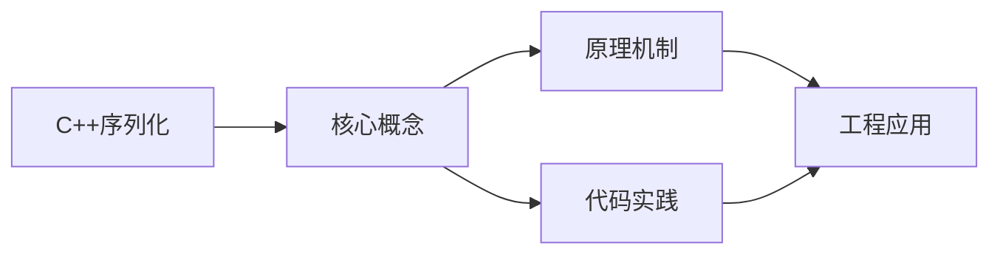
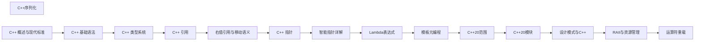

## 1. 学习目标（Bloom 分类）

本节按照布鲁姆教育目标分类学组织学习路径。本文主题为《C++序列化》，属于 C++ 模块，读者可以根据自身阶段选择阅读深度。

记忆层面：能够准确复述本文的核心概念、术语与基本语法或操作步骤，并能够在提问或检索时快速定位对应知识点。能够说出 C++ 的类、继承、重载、模板与 STL 容器基本语法。

理解层面：能够用自己的语言解释核心原理与工作机制，说明概念之间的因果关系，而不是机械记忆结论。能够解释 RAII、拷贝/移动语义、虚函数与模板实例化。

应用层面：能够在真实项目或练习场景中运用本文知识解决具体问题，写出正确且可维护的实现。能够编写现代 C++（C++17/20）的类与泛型代码。

分析层面：能够拆解复杂问题，比较本文主题与相邻概念的异同，识别边界条件与例外情况。能够分析生命周期、未定义行为与性能特征。

评价层面：能够根据约束条件（性能、可读性、安全、成本）评价不同方案的优劣，做出有依据的技术决策。能够评价 C++ 与 Rust、Java 在系统编程中的取舍。

创造层面：能够把本文知识与其他模块知识组合，设计出新的解决方案或可复用的工程模式。能够设计高性能、可维护的 C++ 库与应用。

通过本节学习，读者应当能够把《C++序列化》纳入自己的知识网络，并与 C++ 模块的其他主题（RAII、移动语义、模板、STL）建立关联。

## 2. 历史动机与发展脉络

《C++序列化》是 C++ 领域的重要主题。要真正理解它，需要先了解它解决的问题与演进过程。

C++ 由 Bjarne Stroustrup 于 1979 年开始在贝尔实验室开发（原名 C with Classes），1983 年更名 C++，1998 年 C++98 首次标准化。
C++11 是语言转折点：右值引用、auto、lambda、智能指针、并发内存模型让现代 C++ 写法定型；C++14/17 补充泛型 lambda、if constexpr、折叠表达式；C++20 引入 concepts、协程、模块与范围库；C++23 继续完善。
现代 C++ 的核心口号是“资源安全”：RAII + 智能指针替代裸 new/delete，异常与错误码按场景选择；Rust 的出现促使 C++ 社区更重视内存安全工具（如 profile 指南、sanitizer）。

回到本文主题：C++序列化 的提出与成熟，正是上述技术背景下的必然产物。早期实现往往以简单可用为目标，随着工程规模扩大，社区逐渐沉淀出标准做法与最佳实践；理解这一脉络，可以帮助读者判断“为什么文档中的推荐写法是现在这个样子”，也能在遇到历史遗留代码时准确识别其设计年代与取舍。


## 3. 形式化定义与核心概念精讲

本节把《C++序列化》涉及的核心概念以“定义 + 讲解”的形式展开。读者应把定义当作工具，把讲解当作理解路径；两者结合才能形成可迁移的知识。

RAII：资源在构造函数获取、析构函数释放，栈对象离开作用域自动清理；智能指针（unique_ptr/shared_ptr/weak_ptr）把所有权编码进类型。
移动语义：右值引用 `&&` 与 std::move 转移资源所有权，避免深拷贝；移动后对象处于“合法但未指定”状态。
虚函数与多态：virtual 实现动态绑定，vtable 是运行时分派机制；final/override 关键字防止误用；基类析构函数应为 virtual。

### 3.1 原文章节逐一精讲

原文档把主题拆分为 14 个小节，下面按顺序给出每一节的导读讲解，随后保留原文细节供精读。

#### 原文精读（完整保留）

# C++ 序列化

> **符号约定**：`< >` 必填参数 | `[ ]` 可选参数

---

#### 概述

序列化是将内存中的数据结构转换为可存储或传输的格式（如字符串或字节流）的过程，反序列化则是其逆过程。C++ 标准库目前没有内置的序列化支持，但社区提供了多种优秀的第三方库，如 nlohmann/json（JSON 序列化）、protobuf（二进制序列化）、cereal（轻量级序列化）等。

为什么需要序列化？当你需要将数据保存到文件、通过网络发送、或者在不同程序之间交换数据时，就需要序列化。JSON 是最通用的格式，人类可读且跨语言支持好；二进制格式（如 protobuf）更紧凑高效，适合对性能和带宽敏感的场景。

#### 基础概念

**JSON 序列化**：将数据转换为 JSON 格式的字符串。JSON 是键值对格式，支持数字、字符串、布尔值、数组和对象。人类可读，调试方便。

**二进制序列化**：将数据转换为紧凑的二进制字节流。不可读但体积小、速度快。适合网络传输和持久化存储。

**Schema**：数据结构的定义文件。protobuf 使用 .proto 文件定义数据结构，然后自动生成 C++ 代码。有了 Schema，不同语言之间可以安全地交换数据。

**向前/向后兼容**：当数据结构发生变化时（如新增字段），旧代码能否读取新数据（向前兼容），新代码能否读取旧数据（向后兼容）。protobuf 天然支持，JSON 需要手动处理。

#### 快速上手

##### 使用 nlohmann/json

```bash
# 安装（vcpkg）
vcpkg install nlohmann-json

# 或者单头文件
# 从 https://github.com/nlohmann/json 下载 json.hpp
```

```cpp
#include <nlohmann/json.hpp>
#include <iostream>
#include <string>

using json = nlohmann::json;

int main() {
    // 创建 JSON 对象
    json person = {
        {"name", "张三"},
        {"age", 25},
        {"isStudent", false},
        {"scores", {95, 87, 92}},
        {"address", {
            {"city", "北京"},
            {"district", "海淀"}
        }}
    };

    // 序列化为字符串
    std::string jsonStr = person.dump(4);  // 4 空格缩进
    std::cout << jsonStr << std::endl;

    // 反序列化
    json parsed = json::parse(jsonStr);

    // 访问字段
    std::string name = parsed["name"];
    int age = parsed["age"];
    bool isStudent = parsed["isStudent"];

    std::cout << "姓名: " << name << ", 年龄: " << age << std::endl;

    // 访问嵌套字段
    std::string city = parsed["address"]["city"];
    std::cout << "城市: " << city << std::endl;

    // 访问数组
    for (int score : parsed["scores"]) {
        std::cout << "成绩: " << score << std::endl;
    }

    return 0;
}
```

#### 详细用法

##### 自定义类型序列化

```cpp
#include <nlohmann/json.hpp>
#include <string>
#include <vector>

using json = nlohmann::json;

// 定义数据结构
struct Address {
    std::string city;
    std::string district;
    std::string street;
};

struct Person {
    std::string name;
    int age;
    Address address;
    std::vector<std::string> hobbies;
};

// 为自定义类型提供 to_json 和 from_json 函数
void to_json(json& j, const Address& addr) {
    j = json{
        {"city", addr.city},
        {"district", addr.district},
        {"street", addr.street}
    };
}

void from_json(const json& j, Address& addr) {
    j.at("city").get_to(addr.city);
    j.at("district").get_to(addr.district);
    j.at("street").get_to(addr.street);
}

void to_json(json& j, const Person& p) {
    j = json{
        {"name", p.name},
        {"age", p.age},
        {"address", p.address},  // 自动调用 Address 的 to_json
        {"hobbies", p.hobbies}
    };
}

void from_json(const json& j, Person& p) {
    j.at("name").get_to(p.name);
    j.at("age").get_to(p.age);
    j.at("address").get_to(p.address);  // 自动调用 Address 的 from_json
    j.at("hobbies").get_to(p.hobbies);
}

// 使用
void customTypeDemo() {
    Person person{
        .name = "张三",
        .age = 25,
        .address = {"北京", "海淀", "中关村大街"},
        .hobbies = {"编程", "阅读", "游泳"}
    };

    // 序列化
    json j = person;
    std::string jsonStr = j.dump(4);

    // 反序列化
    Person parsed = json::parse(jsonStr).get<Person>();
}
```

##### 安全地访问 JSON 字段

```cpp
void safeAccessDemo() {
    json data = json::parse(R"({
        "name": "张三",
        "age": 25,
        "scores": [95, 87, 92]
    })");

    // 方式一：直接访问（如果字段不存在会抛异常）
    try {
        std::string name = data.at("name");
    } catch (const json::out_of_range& e) {
        std::cerr << "字段不存在: " << e.what() << std::endl;
    }

    // 方式二：使用 value 方法，提供默认值
    std::string name = data.value("name", "未知");
    std::string email = data.value("email", "无邮箱");  // 字段不存在时返回默认值
    int age = data.value("age", 0);

    // 方式三：检查字段是否存在
    if (data.contains("scores")) {
        for (int score : data["scores"]) {
            std::cout << score << " ";
        }
    }

    // 方式四：检查字段类型
    if (data["age"].is_number_integer()) {
        int age = data["age"];
    }

    // 方式五：使用 count 检查
    if (data.count("name") > 0) {
        std::cout << "name 字段存在" << std::endl;
    }
}
```

##### 从文件读写 JSON

```cpp
#include <fstream>

// 从文件读取 JSON
json readJsonFile(const std::string& path) {
    std::ifstream file(path);
    if (!file.is_open()) {
        throw std::runtime_error("无法打开文件: " + path);
    }

    try {
        return json::parse(file);
    } catch (const json::parse_error& e) {
        throw std::runtime_error("JSON 解析错误: " + std::string(e.what()));
    }
}

// 写入 JSON 到文件
void writeJsonFile(const std::string& path, const json& data) {
    std::ofstream file(path);
    if (!file.is_open()) {
        throw std::runtime_error("无法创建文件: " + path);
    }
    file << data.dump(4);  // 4 空格缩进，方便阅读
}

// 使用
void fileDemo() {
    // 写入
    json config = {
        {"database", {
            {"host", "localhost"},
            {"port", 5432},
            {"name", "mydb"}
        }},
        {"server", {
            {"port", 8080},
            {"debug", true}
        }}
    };
    writeJsonFile("config.json", config);

    // 读取
    json loaded = readJsonFile("config.json");
    std::string dbHost = loaded["database"]["host"];
    int dbPort = loaded["database"]["port"];
}
```

##### 使用 protobuf 二进制序列化

```bash
# 安装 protobuf
# Ubuntu: sudo apt install protobuf-compiler libprotobuf-dev
# Windows: vcpkg install protobuf
```

定义数据结构（.proto 文件）：

```protobuf
// person.proto
syntax = "proto3";

message Address {
    string city = 1;
    string district = 2;
    string street = 3;
}

message Person {
    string name = 1;
    int32 age = 2;
    Address address = 3;
    repeated string hobbies = 4;  // 列表
}
```

生成 C++ 代码：

```bash
protoc --cpp_out=. person.proto
# 生成 person.pb.h 和 person.pb.cc
```

使用生成的代码：

```cpp
#include "person.pb.h"
#include <fstream>
#include <iostream>

void protobufDemo() {
    // 验证库版本
    GOOGLE_PROTOBUF_VERIFY_VERSION;

    // 创建 Person 对象
    Person person;
    person.set_name("张三");
    person.set_age(25);

    // 设置嵌套消息
    Address* address = person.mutable_address();
    address->set_city("北京");
    address->set_district("海淀");
    address->set_street("中关村大街");

    // 添加重复字段
    person.add_hobbies("编程");
    person.add_hobbies("阅读");
    person.add_hobbies("游泳");

    // 序列化为字符串
    std::string serialized;
    person.SerializeToString(&serialized);
    std::cout << "序列化大小: " << serialized.size() << " 字节" << std::endl;

    // 反序列化
    Person parsed;
    parsed.ParseFromString(serialized);
    std::cout << "姓名: " << parsed.name() << std::endl;
    std::cout << "年龄: " << parsed.age() << std::endl;
    std::cout << "城市: " << parsed.address().city() << std::endl;

    // 序列化到文件
    std::ofstream output("person.bin", std::ios::binary);
    person.SerializeToOstream(&output);
    output.close();

    // 从文件反序列化
    Person fromFile;
    std::ifstream input("person.bin", std::ios::binary);
    fromFile.ParseFromIstream(&input);
    input.close();

    // 释放 protobuf 库资源
    google::protobuf::ShutdownProtobufLibrary();
}
```

##### 使用 cereal 轻量级序列化

```cpp
#include <cereal/cereal.hpp>
#include <cereal/archives/json.hpp>
#include <cereal/archives/binary.hpp>
#include <cereal/types/string.hpp>
#include <cereal/types/vector.hpp>
#include <sstream>
#include <iostream>

struct Student {
    std::string name;
    int age;
    std::vector<double> scores;

    // cereal 序列化函数
    template<typename Archive>
    void serialize(Archive& archive) {
        archive(
            CEREAL_NVP(name),     // NVP 表示 Name-Value Pair
            CEREAL_NVP(age),
            CEREAL_NVP(scores)
        );
    }
};

void cerealDemo() {
    Student student{"李四", 20, {88.5, 92.0, 95.5}};

    // JSON 序列化
    std::ostringstream jsonOs;
    {
        cereal::JSONOutputArchive archive(jsonOs);
        archive(CEREAL_NVP(student));
    }
    std::cout << "JSON: " << jsonOs.str() << std::endl;

    // JSON 反序列化
    Student loaded;
    std::istringstream jsonIs(jsonOs.str());
    {
        cereal::JSONInputArchive archive(jsonIs);
        archive(CEREAL_NVP(loaded));
    }

    // 二进制序列化（更紧凑）
    std::ostringstream binOs;
    {
        cereal::BinaryOutputArchive archive(binOs);
        archive(student);
    }
    std::cout << "二进制大小: " << binOs.str().size() << " 字节" << std::endl;
}
```

#### 常见场景

##### 配置文件管理

```cpp
#include <nlohmann/json.hpp>
#include <fstream>
#include <iostream>

using json = nlohmann::json;

class Config {
public:
    struct Database {
        std::string host;
        int port;
        std::string name;
        std::string user;
        std::string password;
    };

    struct Server {
        int port;
        bool debug;
        int maxConnections;
    };

    Database database;
    Server server;

    // 从文件加载配置
    static Config load(const std::string& path) {
        Config config;
        std::ifstream file(path);
        if (!file.is_open()) {
            // 配置文件不存在，使用默认值
            config = defaultConfig();
            config.save(path);
            return config;
        }

        json data = json::parse(file);

        // 安全地读取配置，提供默认值
        config.database.host = data.value("/database/host"_json_pointer, "localhost");
        config.database.port = data.value("/database/port"_json_pointer, 5432);
        config.database.name = data.value("/database/name"_json_pointer, "mydb");
        config.database.user = data.value("/database/user"_json_pointer, "postgres");
        config.database.password = data.value("/database/password"_json_pointer, "");

        config.server.port = data.value("/server/port"_json_pointer, 8080);
        config.server.debug = data.value("/server/debug"_json_pointer, false);
        config.server.maxConnections = data.value("/server/maxConnections"_json_pointer, 100);

        return config;
    }

    // 保存配置到文件
    void save(const std::string& path) const {
        json data = {
            {"database", {
                {"host", database.host},
                {"port", database.port},
                {"name", database.name},
                {"user", database.user},
                {"password", database.password}
            }},
            {"server", {
                {"port", server.port},
                {"debug", server.debug},
                {"maxConnections", server.maxConnections}
            }}
        };

        std::ofstream file(path);
        file << data.dump(4);
    }

private:
    static Config defaultConfig() {
        return Config{
            .database = {"localhost", 5432, "mydb", "postgres", ""},
            .server = {8080, false, 100}
        };
    }
};
```

#### 注意事项

**JSON 的性能**：JSON 解析和序列化比二进制格式慢很多。如果性能是首要考虑，使用 protobuf 或 cereal 的二进制格式。

**数值精度**：JSON 中的数字可能丢失精度。大整数和浮点数在 JSON 中可能无法精确表示。对于精确数值，使用字符串存储。

**安全问题**：不要信任来自外部的 JSON 数据。验证所有字段的类型和范围，避免 JSON 注入攻击。

**protobuf 的代码生成**：protobuf 需要额外的代码生成步骤，增加了构建复杂度。但生成的代码类型安全，性能优秀。

**版本兼容**：当数据结构变化时，JSON 需要手动处理缺失字段（使用默认值），protobuf 通过字段编号自动处理。

#### 进阶用法

##### JSON Schema 验证

```cpp
#include <nlohmann/json.hpp>
#include <nlohmann/json-schema.hpp>

using json = nlohmann::json;

// 定义 JSON Schema 来验证数据格式
void validateJsonSchema() {
    // 定义 Schema
    json schema = R"({
        "type": "object",
        "required": ["name", "age"],
        "properties": {
            "name": {"type": "string", "minLength": 1},
            "age": {"type": "integer", "minimum": 0, "maximum": 150},
            "email": {"type": "string", "format": "email"}
        }
    })"_json;

    // 验证数据
    json validData = {{"name", "张三"}, {"age", 25}};
    // 使用 json-schema-validator 库验证
    // 如果数据不符合 Schema，会抛出异常
}
```

##### 自定义序列化格式

```cpp
// 为枚举类型提供自定义序列化
enum class Status {
    Active,
    Inactive,
    Pending
};

void to_json(json& j, Status s) {
    switch (s) {
        case Status::Active:   j = "active"; break;
        case Status::Inactive: j = "inactive"; break;
        case Status::Pending:  j = "pending"; break;
    }
}

void from_json(const json& j, Status& s) {
    std::string str = j;
    if (str == "active") s = Status::Active;
    else if (str == "inactive") s = Status::Inactive;
    else if (str == "pending") s = Status::Pending;
    else throw std::runtime_error("未知状态: " + str);
}
```
#### JSON 序列化

**基本写法：nlohmann/json**
`#include <nlohmann/json.hpp>`
```cpp
#include <nlohmann/json.hpp>
using json = nlohmann::json;
// 构造 JSON
json j;
j["name"] = "Alice";
j["age"] = 30;
j["scores"] = {90, 85, 92};
std::string s = j.dump();        // 序列化为字符串
std::string p = j.dump(4);       // 格式化缩进 4 空格
```

---

**基本写法：解析 JSON**
`json::parse(<字符串>)`
```cpp
// 从字符串解析
json j = json::parse(R"({"name":"Bob","age":25})");
std::string name = j["name"];
int age = j["age"];
// 从文件解析
std::ifstream f("data.json");
json jf = json::parse(f);
```

---

**基本写法：结构体与 JSON 互转**
`NLOHMANN_DEFINE_TYPE_NON_INTRUSIVE`
```cpp
struct Person {
    std::string name;
    int age;
};
NLOHMANN_DEFINE_TYPE_NON_INTRUSIVE(Person, name, age)
// 自动生成 to_json / from_json
Person p{"Alice", 30};
json j = p;                   // 结构体转 JSON
Person p2 = j.get<Person>();  // JSON 转结构体
```

---

#### 二进制序列化

**基本写法：手写二进制**
`<流>.write(<指针>, <大小>)`
```cpp
#include <fstream>
// 写入二进制
struct Header {
    uint32_t magic;
    uint32_t version;
    uint64_t size;
};
std::ofstream out("data.bin", std::ios::binary);
Header h{0x4D4946, 1, 1024};
out.write(reinterpret_cast<const char*>(&h), sizeof(h));
// 读取
std::ifstream in("data.bin", std::ios::binary);
Header h2;
in.read(reinterpret_cast<char*>(&h2), sizeof(h2));
```

---

**基本写法：字节序处理**
`std::endian` `htobe32` 等
```cpp
#include <bit>
#include <endian.h>
// C++20 检查字节序
if constexpr (std::endian::native == std::endian::little) {
    // 小端
}
// 转网络字节序（大端）
uint32_t net = htobe32(local_value);
uint32_t local = be32toh(net);
```

---

#### Protobuf

**基本写法：定义消息**
`message <名> { <字段>; }`
```protobuf
// person.proto
syntax = "proto3";
message Person {
    string name = 1;
    int32 age = 2;
    repeated string emails = 3;
}
```

---

**基本写法：使用 Protobuf**
`<消息>.SerializeToString(<串>)`
```cpp
#include "person.pb.h"
// 序列化
Person p;
p.set_name("Alice");
p.set_age(30);
p.add_emails("alice@example.com");
std::string output;
p.SerializeToString(&output);
// 反序列化
Person p2;
p2.ParseFromString(output);
std::cout << p2.name();
```

---

#### Cereal 库

**基本写法：cereal 序列化**
`cereal::JSONOutputArchive`
```cpp
#include <cereal/cereal.hpp>
#include <cereal/archives/json.hpp>
#include <fstream>
struct Data {
    int x;
    std::string y;
    template <typename Archive>
    void serialize(Archive& ar) {
        ar(x, y);
    }
};
// 序列化
std::ofstream os("data.json");
cereal::JSONOutputArchive ar(os);
Data d{42, "hello"};
ar(d);
```

---

#### 流式序列化

**基本写法：operator<<**
`std::ostream& operator<<(std::ostream&, <类型>)`
```cpp
// 自定义输出
struct Point { int x, y; };
std::ostream& operator<<(std::ostream& os, const Point& p) {
    return os << "(" << p.x << "," << p.y << ")";
}
Point p{3, 4};
std::cout << p; // (3,4)
std::stringstream ss;
ss << p; // 序列化到字符串
```

---

**基本写法：operator>>**
`std::istream& operator>>(std::istream&, <类型>&)`
```cpp
// 自定义输入
std::istream& operator>>(std::istream& is, Point& p) {
    char c;
    return is >> c >> p.x >> c >> p.y >> c; // (3,4)
}
std::stringstream ss("(3,4)");
Point p;
ss >> p; // 反序列化
```

---

#### 网络字节序

**基本写法：htonl/ntohl**
`htonl(<32位>)` `ntohl(<32位>)`
```cpp
#include <arpa/inet.h>
// 主机字节序转网络字节序
uint32_t host = 0x12345678;
uint32_t net = htonl(host);
uint32_t back = ntohl(net);
// 16 位
uint16_t net16 = htons(8080);
uint16_t host16 = ntohs(net16);
```

---

#### 版本兼容

**基本写法：版本号字段**
`struct <数据> { uint32_t version; ... };`
```cpp
// 序列化时记录版本
struct Data {
    uint32_t version = 1;
    int x;
    std::string y;
    // 版本 2 新增字段
    // double z = 0; // 旧版本无此字段
};
// 读取时根据版本决定如何解析
```


### 3.2 概念关系图

下面用 Mermaid 图表达本文核心概念之间的关系，帮助读者建立整体图景：



图中展示的是本文知识的结构化关系：核心概念是入口，原理机制解释“为什么”，代码实践演示“怎么做”，工程应用回答“何时用”。读者学习时可以把每个小节的内容挂接到对应节点上。

## 4. 理论推导与原理解析

本节深入《C++序列化》背后的原理。理论部分不求面面俱到，而是聚焦“能解释现象、能指导实践”的关键推导。

RAII：资源在构造函数获取、析构函数释放，栈对象离开作用域自动清理；智能指针（unique_ptr/shared_ptr/weak_ptr）把所有权编码进类型。
移动语义：右值引用 `&&` 与 std::move 转移资源所有权，避免深拷贝；移动后对象处于“合法但未指定”状态。
虚函数与多态：virtual 实现动态绑定，vtable 是运行时分派机制；final/override 关键字防止误用；基类析构函数应为 virtual。
模板与泛型：模板编译期实例化，实现静态多态；concepts（C++20）约束类型接口；模板元编程在编译期计算类型与常量。

需要强调的是，理论推导与工程实践之间存在翻译层：理论给出的是理想化模型与边界条件，工程代码则必须处理真实环境中的例外。读者在学习时应先掌握理论的“标准情形”，再通过陷阱章节了解“非标准情形”。

## 5. 代码示例与逐行讲解

本节把原文中的代码示例系统整理，并为每个示例补充用途说明与讲解。读者不应只浏览代码，而应逐段对照讲解理解设计意图。

### 5.1 示例：使用 nlohmann/json

该示例来自原文《使用 nlohmann/json》小节，用于演示C++序列化相关操作。阅读时请先看代码结构，再看其后的讲解。

```bash
# 安装（vcpkg）
vcpkg install nlohmann-json

# 或者单头文件
# 从 https://github.com/nlohmann/json 下载 json.hpp
```

讲解：这段代码演示了本节核心知识点。代码中的关键操作可以归纳为三步：准备（定义或初始化）、执行（核心逻辑）、收尾（释放资源或返回结果）。实际项目中，这三步往往被封装为函数或类，以提升复用性与可测试性。

关键点分析：

该示例共 4 行有效代码，结构以数据或配置为主。阅读时应关注：数据字段的含义、配置项的作用，以及它们与运行行为的对应关系。

进阶思考路径：先尝试修改参数观察行为变化，再把示例中的模式迁移到自己的项目中；每次修改都记录预期与实测差异，这是把示例转化为能力的最快方式。

### 5.2 示例：使用 nlohmann/json

该示例来自原文《使用 nlohmann/json》小节，用于演示C++序列化相关操作。阅读时请先看代码结构，再看其后的讲解。

```cpp
#include <nlohmann/json.hpp>
#include <iostream>
#include <string>

using json = nlohmann::json;

int main() {
    // 创建 JSON 对象
    json person = {
        {"name", "张三"},
        {"age", 25},
        {"isStudent", false},
        {"scores", {95, 87, 92}},
        {"address", {
            {"city", "北京"},
            {"district", "海淀"}
        }}
    };

    // 序列化为字符串
    std::string jsonStr = person.dump(4);  // 4 空格缩进
    std::cout << jsonStr << std::endl;

    // 反序列化
    json parsed = json::parse(jsonStr);

    // 访问字段
    std::string name = parsed["name"];
    int age = parsed["age"];
    bool isStudent = parsed["isStudent"];

    std::cout << "姓名: " << name << ", 年龄: " << age << std::endl;

    // 访问嵌套字段
    std::string city = parsed["address"]["city"];
    std::cout << "城市: " << city << std::endl;

    // 访问数组
    for (int score : parsed["scores"]) {
        std::cout << "成绩: " << score << std::endl;
    }

    return 0;
}
```

讲解：这段代码演示了本节核心知识点。代码中的关键操作可以归纳为三步：准备（定义或初始化）、执行（核心逻辑）、收尾（释放资源或返回结果）。实际项目中，这三步往往被封装为函数或类，以提升复用性与可测试性。

关键点分析：

该示例共 35 行有效代码，包含 2 类关键结构（for、return）。其中：

- 入口与初始化部分负责建立上下文，对应实际项目中的启动或装配逻辑；
- 核心逻辑部分体现本文主题的主要操作，是阅读时最需要对照讲解理解的部分；
- 输出或返回部分把结果交给调用方，注意其类型与边界条件。

进阶思考路径：先尝试修改参数观察行为变化，再把示例中的模式迁移到自己的项目中；每次修改都记录预期与实测差异，这是把示例转化为能力的最快方式。

### 5.3 示例：自定义类型序列化

该示例来自原文《自定义类型序列化》小节，用于演示C++序列化相关操作。阅读时请先看代码结构，再看其后的讲解。

```cpp
#include <nlohmann/json.hpp>
#include <string>
#include <vector>

using json = nlohmann::json;

// 定义数据结构
struct Address {
    std::string city;
    std::string district;
    std::string street;
};

struct Person {
    std::string name;
    int age;
    Address address;
    std::vector<std::string> hobbies;
};

// 为自定义类型提供 to_json 和 from_json 函数
void to_json(json& j, const Address& addr) {
    j = json{
        {"city", addr.city},
        {"district", addr.district},
        {"street", addr.street}
    };
}

void from_json(const json& j, Address& addr) {
    j.at("city").get_to(addr.city);
    j.at("district").get_to(addr.district);
    j.at("street").get_to(addr.street);
}

void to_json(json& j, const Person& p) {
    j = json{
        {"name", p.name},
        {"age", p.age},
        {"address", p.address},  // 自动调用 Address 的 to_json
        {"hobbies", p.hobbies}
    };
}

void from_json(const json& j, Person& p) {
    j.at("name").get_to(p.name);
    j.at("age").get_to(p.age);
    j.at("address").get_to(p.address);  // 自动调用 Address 的 from_json
    j.at("hobbies").get_to(p.hobbies);
}

// 使用
void customTypeDemo() {
    Person person{
        .name = "张三",
        .age = 25,
        .address = {"北京", "海淀", "中关村大街"},
        .hobbies = {"编程", "阅读", "游泳"}
    };

    // 序列化
    json j = person;
    std::string jsonStr = j.dump(4);

    // 反序列化
    Person parsed = json::parse(jsonStr).get<Person>();
}
```

讲解：这段代码演示了本节核心知识点。代码中的关键操作可以归纳为三步：准备（定义或初始化）、执行（核心逻辑）、收尾（释放资源或返回结果）。实际项目中，这三步往往被封装为函数或类，以提升复用性与可测试性。

关键点分析：

该示例共 57 行有效代码，结构以数据或配置为主。阅读时应关注：数据字段的含义、配置项的作用，以及它们与运行行为的对应关系。

进阶思考路径：先尝试修改参数观察行为变化，再把示例中的模式迁移到自己的项目中；每次修改都记录预期与实测差异，这是把示例转化为能力的最快方式。

### 5.4 示例：安全地访问 JSON 字段

该示例来自原文《安全地访问 JSON 字段》小节，用于演示C++序列化相关操作。阅读时请先看代码结构，再看其后的讲解。

```cpp
void safeAccessDemo() {
    json data = json::parse(R"({
        "name": "张三",
        "age": 25,
        "scores": [95, 87, 92]
    })");

    // 方式一：直接访问（如果字段不存在会抛异常）
    try {
        std::string name = data.at("name");
    } catch (const json::out_of_range& e) {
        std::cerr << "字段不存在: " << e.what() << std::endl;
    }

    // 方式二：使用 value 方法，提供默认值
    std::string name = data.value("name", "未知");
    std::string email = data.value("email", "无邮箱");  // 字段不存在时返回默认值
    int age = data.value("age", 0);

    // 方式三：检查字段是否存在
    if (data.contains("scores")) {
        for (int score : data["scores"]) {
            std::cout << score << " ";
        }
    }

    // 方式四：检查字段类型
    if (data["age"].is_number_integer()) {
        int age = data["age"];
    }

    // 方式五：使用 count 检查
    if (data.count("name") > 0) {
        std::cout << "name 字段存在" << std::endl;
    }
}
```

讲解：这段代码演示了本节核心知识点。代码中的关键操作可以归纳为三步：准备（定义或初始化）、执行（核心逻辑）、收尾（释放资源或返回结果）。实际项目中，这三步往往被封装为函数或类，以提升复用性与可测试性。

关键点分析：

该示例共 31 行有效代码，包含 2 类关键结构（if、for）。其中：

- 入口与初始化部分负责建立上下文，对应实际项目中的启动或装配逻辑；
- 核心逻辑部分体现本文主题的主要操作，是阅读时最需要对照讲解理解的部分；
- 输出或返回部分把结果交给调用方，注意其类型与边界条件。

进阶思考路径：先尝试修改参数观察行为变化，再把示例中的模式迁移到自己的项目中；每次修改都记录预期与实测差异，这是把示例转化为能力的最快方式。

### 5.5 示例：从文件读写 JSON

该示例来自原文《从文件读写 JSON》小节，用于演示C++序列化相关操作。阅读时请先看代码结构，再看其后的讲解。

```cpp
#include <fstream>

// 从文件读取 JSON
json readJsonFile(const std::string& path) {
    std::ifstream file(path);
    if (!file.is_open()) {
        throw std::runtime_error("无法打开文件: " + path);
    }

    try {
        return json::parse(file);
    } catch (const json::parse_error& e) {
        throw std::runtime_error("JSON 解析错误: " + std::string(e.what()));
    }
}

// 写入 JSON 到文件
void writeJsonFile(const std::string& path, const json& data) {
    std::ofstream file(path);
    if (!file.is_open()) {
        throw std::runtime_error("无法创建文件: " + path);
    }
    file << data.dump(4);  // 4 空格缩进，方便阅读
}

// 使用
void fileDemo() {
    // 写入
    json config = {
        {"database", {
            {"host", "localhost"},
            {"port", 5432},
            {"name", "mydb"}
        }},
        {"server", {
            {"port", 8080},
            {"debug", true}
        }}
    };
    writeJsonFile("config.json", config);

    // 读取
    json loaded = readJsonFile("config.json");
    std::string dbHost = loaded["database"]["host"];
    int dbPort = loaded["database"]["port"];
}
```

讲解：这段代码演示了本节核心知识点。代码中的关键操作可以归纳为三步：准备（定义或初始化）、执行（核心逻辑）、收尾（释放资源或返回结果）。实际项目中，这三步往往被封装为函数或类，以提升复用性与可测试性。

关键点分析：

该示例共 41 行有效代码，包含 2 类关键结构（if、return）。其中：

- 入口与初始化部分负责建立上下文，对应实际项目中的启动或装配逻辑；
- 核心逻辑部分体现本文主题的主要操作，是阅读时最需要对照讲解理解的部分；
- 输出或返回部分把结果交给调用方，注意其类型与边界条件。

进阶思考路径：先尝试修改参数观察行为变化，再把示例中的模式迁移到自己的项目中；每次修改都记录预期与实测差异，这是把示例转化为能力的最快方式。

### 5.6 示例：使用 protobuf 二进制序列化

该示例来自原文《使用 protobuf 二进制序列化》小节，用于演示C++序列化相关操作。阅读时请先看代码结构，再看其后的讲解。

```bash
# 安装 protobuf
# Ubuntu: sudo apt install protobuf-compiler libprotobuf-dev
# Windows: vcpkg install protobuf
```

讲解：这段代码演示了本节核心知识点。代码中的关键操作可以归纳为三步：准备（定义或初始化）、执行（核心逻辑）、收尾（释放资源或返回结果）。实际项目中，这三步往往被封装为函数或类，以提升复用性与可测试性。

关键点分析：

该示例共 3 行有效代码，结构以数据或配置为主。阅读时应关注：数据字段的含义、配置项的作用，以及它们与运行行为的对应关系。

进阶思考路径：先尝试修改参数观察行为变化，再把示例中的模式迁移到自己的项目中；每次修改都记录预期与实测差异，这是把示例转化为能力的最快方式。

### 5.7 示例：使用 protobuf 二进制序列化

该示例来自原文《使用 protobuf 二进制序列化》小节，用于演示C++序列化相关操作。阅读时请先看代码结构，再看其后的讲解。

```protobuf
// person.proto
syntax = "proto3";

message Address {
    string city = 1;
    string district = 2;
    string street = 3;
}

message Person {
    string name = 1;
    int32 age = 2;
    Address address = 3;
    repeated string hobbies = 4;  // 列表
}
```

讲解：这段代码演示了本节核心知识点。代码中的关键操作可以归纳为三步：准备（定义或初始化）、执行（核心逻辑）、收尾（释放资源或返回结果）。实际项目中，这三步往往被封装为函数或类，以提升复用性与可测试性。

关键点分析：

该示例共 13 行有效代码，结构以数据或配置为主。阅读时应关注：数据字段的含义、配置项的作用，以及它们与运行行为的对应关系。

进阶思考路径：先尝试修改参数观察行为变化，再把示例中的模式迁移到自己的项目中；每次修改都记录预期与实测差异，这是把示例转化为能力的最快方式。

### 5.8 示例：使用 protobuf 二进制序列化

该示例来自原文《使用 protobuf 二进制序列化》小节，用于演示C++序列化相关操作。阅读时请先看代码结构，再看其后的讲解。

```bash
protoc --cpp_out=. person.proto
# 生成 person.pb.h 和 person.pb.cc
```

讲解：这段代码演示了本节核心知识点。代码中的关键操作可以归纳为三步：准备（定义或初始化）、执行（核心逻辑）、收尾（释放资源或返回结果）。实际项目中，这三步往往被封装为函数或类，以提升复用性与可测试性。

关键点分析：

该示例共 2 行有效代码，结构以数据或配置为主。阅读时应关注：数据字段的含义、配置项的作用，以及它们与运行行为的对应关系。

进阶思考路径：先尝试修改参数观察行为变化，再把示例中的模式迁移到自己的项目中；每次修改都记录预期与实测差异，这是把示例转化为能力的最快方式。

### 5.9 示例：使用 protobuf 二进制序列化

该示例来自原文《使用 protobuf 二进制序列化》小节，用于演示C++序列化相关操作。阅读时请先看代码结构，再看其后的讲解。

```cpp
#include "person.pb.h"
#include <fstream>
#include <iostream>

void protobufDemo() {
    // 验证库版本
    GOOGLE_PROTOBUF_VERIFY_VERSION;

    // 创建 Person 对象
    Person person;
    person.set_name("张三");
    person.set_age(25);

    // 设置嵌套消息
    Address* address = person.mutable_address();
    address->set_city("北京");
    address->set_district("海淀");
    address->set_street("中关村大街");

    // 添加重复字段
    person.add_hobbies("编程");
    person.add_hobbies("阅读");
    person.add_hobbies("游泳");

    // 序列化为字符串
    std::string serialized;
    person.SerializeToString(&serialized);
    std::cout << "序列化大小: " << serialized.size() << " 字节" << std::endl;

    // 反序列化
    Person parsed;
    parsed.ParseFromString(serialized);
    std::cout << "姓名: " << parsed.name() << std::endl;
    std::cout << "年龄: " << parsed.age() << std::endl;
    std::cout << "城市: " << parsed.address().city() << std::endl;

    // 序列化到文件
    std::ofstream output("person.bin", std::ios::binary);
    person.SerializeToOstream(&output);
    output.close();

    // 从文件反序列化
    Person fromFile;
    std::ifstream input("person.bin", std::ios::binary);
    fromFile.ParseFromIstream(&input);
    input.close();

    // 释放 protobuf 库资源
    google::protobuf::ShutdownProtobufLibrary();
}
```

讲解：这段代码演示了本节核心知识点。代码中的关键操作可以归纳为三步：准备（定义或初始化）、执行（核心逻辑）、收尾（释放资源或返回结果）。实际项目中，这三步往往被封装为函数或类，以提升复用性与可测试性。

关键点分析：

该示例共 41 行有效代码，结构以数据或配置为主。阅读时应关注：数据字段的含义、配置项的作用，以及它们与运行行为的对应关系。

进阶思考路径：先尝试修改参数观察行为变化，再把示例中的模式迁移到自己的项目中；每次修改都记录预期与实测差异，这是把示例转化为能力的最快方式。

### 5.10 示例：使用 cereal 轻量级序列化

该示例来自原文《使用 cereal 轻量级序列化》小节，用于演示C++序列化相关操作。阅读时请先看代码结构，再看其后的讲解。

```cpp
#include <cereal/cereal.hpp>
#include <cereal/archives/json.hpp>
#include <cereal/archives/binary.hpp>
#include <cereal/types/string.hpp>
#include <cereal/types/vector.hpp>
#include <sstream>
#include <iostream>

struct Student {
    std::string name;
    int age;
    std::vector<double> scores;

    // cereal 序列化函数
    template<typename Archive>
    void serialize(Archive& archive) {
        archive(
            CEREAL_NVP(name),     // NVP 表示 Name-Value Pair
            CEREAL_NVP(age),
            CEREAL_NVP(scores)
        );
    }
};

void cerealDemo() {
    Student student{"李四", 20, {88.5, 92.0, 95.5}};

    // JSON 序列化
    std::ostringstream jsonOs;
    {
        cereal::JSONOutputArchive archive(jsonOs);
        archive(CEREAL_NVP(student));
    }
    std::cout << "JSON: " << jsonOs.str() << std::endl;

    // JSON 反序列化
    Student loaded;
    std::istringstream jsonIs(jsonOs.str());
    {
        cereal::JSONInputArchive archive(jsonIs);
        archive(CEREAL_NVP(loaded));
    }

    // 二进制序列化（更紧凑）
    std::ostringstream binOs;
    {
        cereal::BinaryOutputArchive archive(binOs);
        archive(student);
    }
    std::cout << "二进制大小: " << binOs.str().size() << " 字节" << std::endl;
}
```

讲解：这段代码演示了本节核心知识点。代码中的关键操作可以归纳为三步：准备（定义或初始化）、执行（核心逻辑）、收尾（释放资源或返回结果）。实际项目中，这三步往往被封装为函数或类，以提升复用性与可测试性。

关键点分析：

该示例共 45 行有效代码，结构以数据或配置为主。阅读时应关注：数据字段的含义、配置项的作用，以及它们与运行行为的对应关系。

进阶思考路径：先尝试修改参数观察行为变化，再把示例中的模式迁移到自己的项目中；每次修改都记录预期与实测差异，这是把示例转化为能力的最快方式。

### 5.11 示例：配置文件管理

该示例来自原文《配置文件管理》小节，用于演示C++序列化相关操作。阅读时请先看代码结构，再看其后的讲解。

```cpp
#include <nlohmann/json.hpp>
#include <fstream>
#include <iostream>

using json = nlohmann::json;

class Config {
public:
    struct Database {
        std::string host;
        int port;
        std::string name;
        std::string user;
        std::string password;
    };

    struct Server {
        int port;
        bool debug;
        int maxConnections;
    };

    Database database;
    Server server;

    // 从文件加载配置
    static Config load(const std::string& path) {
        Config config;
        std::ifstream file(path);
        if (!file.is_open()) {
            // 配置文件不存在，使用默认值
            config = defaultConfig();
            config.save(path);
            return config;
        }

        json data = json::parse(file);

        // 安全地读取配置，提供默认值
        config.database.host = data.value("/database/host"_json_pointer, "localhost");
        config.database.port = data.value("/database/port"_json_pointer, 5432);
        config.database.name = data.value("/database/name"_json_pointer, "mydb");
        config.database.user = data.value("/database/user"_json_pointer, "postgres");
        config.database.password = data.value("/database/password"_json_pointer, "");

        config.server.port = data.value("/server/port"_json_pointer, 8080);
        config.server.debug = data.value("/server/debug"_json_pointer, false);
        config.server.maxConnections = data.value("/server/maxConnections"_json_pointer, 100);

        return config;
    }

    // 保存配置到文件
    void save(const std::string& path) const {
        json data = {
            {"database", {
                {"host", database.host},
                {"port", database.port},
                {"name", database.name},
                {"user", database.user},
                {"password", database.password}
            }},
            {"server", {
                {"port", server.port},
                {"debug", server.debug},
                {"maxConnections", server.maxConnections}
            }}
        };

        std::ofstream file(path);
        file << data.dump(4);
    }

private:
    static Config defaultConfig() {
        return Config{
            .database = {"localhost", 5432, "mydb", "postgres", ""},
            .server = {8080, false, 100}
        };
    }
};
```

讲解：这段代码演示了本节核心知识点。代码中的关键操作可以归纳为三步：准备（定义或初始化）、执行（核心逻辑）、收尾（释放资源或返回结果）。实际项目中，这三步往往被封装为函数或类，以提升复用性与可测试性。

关键点分析：

该示例共 69 行有效代码，包含 3 类关键结构（class、if、return）。其中：

- 入口与初始化部分负责建立上下文，对应实际项目中的启动或装配逻辑；
- 核心逻辑部分体现本文主题的主要操作，是阅读时最需要对照讲解理解的部分；
- 输出或返回部分把结果交给调用方，注意其类型与边界条件。

进阶思考路径：先尝试修改参数观察行为变化，再把示例中的模式迁移到自己的项目中；每次修改都记录预期与实测差异，这是把示例转化为能力的最快方式。

### 5.12 示例：JSON Schema 验证

该示例来自原文《JSON Schema 验证》小节，用于演示C++序列化相关操作。阅读时请先看代码结构，再看其后的讲解。

```cpp
#include <nlohmann/json.hpp>
#include <nlohmann/json-schema.hpp>

using json = nlohmann::json;

// 定义 JSON Schema 来验证数据格式
void validateJsonSchema() {
    // 定义 Schema
    json schema = R"({
        "type": "object",
        "required": ["name", "age"],
        "properties": {
            "name": {"type": "string", "minLength": 1},
            "age": {"type": "integer", "minimum": 0, "maximum": 150},
            "email": {"type": "string", "format": "email"}
        }
    })"_json;

    // 验证数据
    json validData = {{"name", "张三"}, {"age", 25}};
    // 使用 json-schema-validator 库验证
    // 如果数据不符合 Schema，会抛出异常
}
```

讲解：这段代码演示了本节核心知识点。代码中的关键操作可以归纳为三步：准备（定义或初始化）、执行（核心逻辑）、收尾（释放资源或返回结果）。实际项目中，这三步往往被封装为函数或类，以提升复用性与可测试性。

关键点分析：

该示例共 20 行有效代码，结构以数据或配置为主。阅读时应关注：数据字段的含义、配置项的作用，以及它们与运行行为的对应关系。

进阶思考路径：先尝试修改参数观察行为变化，再把示例中的模式迁移到自己的项目中；每次修改都记录预期与实测差异，这是把示例转化为能力的最快方式。

### 5.13 示例：自定义序列化格式

该示例来自原文《自定义序列化格式》小节，用于演示C++序列化相关操作。阅读时请先看代码结构，再看其后的讲解。

```cpp
// 为枚举类型提供自定义序列化
enum class Status {
    Active,
    Inactive,
    Pending
};

void to_json(json& j, Status s) {
    switch (s) {
        case Status::Active:   j = "active"; break;
        case Status::Inactive: j = "inactive"; break;
        case Status::Pending:  j = "pending"; break;
    }
}

void from_json(const json& j, Status& s) {
    std::string str = j;
    if (str == "active") s = Status::Active;
    else if (str == "inactive") s = Status::Inactive;
    else if (str == "pending") s = Status::Pending;
    else throw std::runtime_error("未知状态: " + str);
}
```

讲解：这段代码演示了本节核心知识点。代码中的关键操作可以归纳为三步：准备（定义或初始化）、执行（核心逻辑）、收尾（释放资源或返回结果）。实际项目中，这三步往往被封装为函数或类，以提升复用性与可测试性。

关键点分析：

该示例共 20 行有效代码，包含 2 类关键结构（class、if）。其中：

- 入口与初始化部分负责建立上下文，对应实际项目中的启动或装配逻辑；
- 核心逻辑部分体现本文主题的主要操作，是阅读时最需要对照讲解理解的部分；
- 输出或返回部分把结果交给调用方，注意其类型与边界条件。

进阶思考路径：先尝试修改参数观察行为变化，再把示例中的模式迁移到自己的项目中；每次修改都记录预期与实测差异，这是把示例转化为能力的最快方式。

### 5.14 示例：JSON 序列化

该示例来自原文《JSON 序列化》小节，用于演示C++序列化相关操作。阅读时请先看代码结构，再看其后的讲解。

```cpp
#include <nlohmann/json.hpp>
using json = nlohmann::json;
// 构造 JSON
json j;
j["name"] = "Alice";
j["age"] = 30;
j["scores"] = {90, 85, 92};
std::string s = j.dump();        // 序列化为字符串
std::string p = j.dump(4);       // 格式化缩进 4 空格
```

讲解：这段代码演示了本节核心知识点。代码中的关键操作可以归纳为三步：准备（定义或初始化）、执行（核心逻辑）、收尾（释放资源或返回结果）。实际项目中，这三步往往被封装为函数或类，以提升复用性与可测试性。

关键点分析：

该示例共 9 行有效代码，结构以数据或配置为主。阅读时应关注：数据字段的含义、配置项的作用，以及它们与运行行为的对应关系。

进阶思考路径：先尝试修改参数观察行为变化，再把示例中的模式迁移到自己的项目中；每次修改都记录预期与实测差异，这是把示例转化为能力的最快方式。

### 5.15 示例：JSON 序列化

该示例来自原文《JSON 序列化》小节，用于演示C++序列化相关操作。阅读时请先看代码结构，再看其后的讲解。

```cpp
// 从字符串解析
json j = json::parse(R"({"name":"Bob","age":25})");
std::string name = j["name"];
int age = j["age"];
// 从文件解析
std::ifstream f("data.json");
json jf = json::parse(f);
```

讲解：这段代码演示了本节核心知识点。代码中的关键操作可以归纳为三步：准备（定义或初始化）、执行（核心逻辑）、收尾（释放资源或返回结果）。实际项目中，这三步往往被封装为函数或类，以提升复用性与可测试性。

关键点分析：

该示例共 7 行有效代码，结构以数据或配置为主。阅读时应关注：数据字段的含义、配置项的作用，以及它们与运行行为的对应关系。

进阶思考路径：先尝试修改参数观察行为变化，再把示例中的模式迁移到自己的项目中；每次修改都记录预期与实测差异，这是把示例转化为能力的最快方式。

### 5.16 示例：JSON 序列化

该示例来自原文《JSON 序列化》小节，用于演示C++序列化相关操作。阅读时请先看代码结构，再看其后的讲解。

```cpp
struct Person {
    std::string name;
    int age;
};
NLOHMANN_DEFINE_TYPE_NON_INTRUSIVE(Person, name, age)
// 自动生成 to_json / from_json
Person p{"Alice", 30};
json j = p;                   // 结构体转 JSON
Person p2 = j.get<Person>();  // JSON 转结构体
```

讲解：这段代码演示了本节核心知识点。代码中的关键操作可以归纳为三步：准备（定义或初始化）、执行（核心逻辑）、收尾（释放资源或返回结果）。实际项目中，这三步往往被封装为函数或类，以提升复用性与可测试性。

关键点分析：

该示例共 9 行有效代码，结构以数据或配置为主。阅读时应关注：数据字段的含义、配置项的作用，以及它们与运行行为的对应关系。

进阶思考路径：先尝试修改参数观察行为变化，再把示例中的模式迁移到自己的项目中；每次修改都记录预期与实测差异，这是把示例转化为能力的最快方式。

### 5.17 示例：二进制序列化

该示例来自原文《二进制序列化》小节，用于演示C++序列化相关操作。阅读时请先看代码结构，再看其后的讲解。

```cpp
#include <fstream>
// 写入二进制
struct Header {
    uint32_t magic;
    uint32_t version;
    uint64_t size;
};
std::ofstream out("data.bin", std::ios::binary);
Header h{0x4D4946, 1, 1024};
out.write(reinterpret_cast<const char*>(&h), sizeof(h));
// 读取
std::ifstream in("data.bin", std::ios::binary);
Header h2;
in.read(reinterpret_cast<char*>(&h2), sizeof(h2));
```

讲解：这段代码演示了本节核心知识点。代码中的关键操作可以归纳为三步：准备（定义或初始化）、执行（核心逻辑）、收尾（释放资源或返回结果）。实际项目中，这三步往往被封装为函数或类，以提升复用性与可测试性。

关键点分析：

该示例共 14 行有效代码，结构以数据或配置为主。阅读时应关注：数据字段的含义、配置项的作用，以及它们与运行行为的对应关系。

进阶思考路径：先尝试修改参数观察行为变化，再把示例中的模式迁移到自己的项目中；每次修改都记录预期与实测差异，这是把示例转化为能力的最快方式。

### 5.18 示例：二进制序列化

该示例来自原文《二进制序列化》小节，用于演示C++序列化相关操作。阅读时请先看代码结构，再看其后的讲解。

```cpp
#include <bit>
#include <endian.h>
// C++20 检查字节序
if constexpr (std::endian::native == std::endian::little) {
    // 小端
}
// 转网络字节序（大端）
uint32_t net = htobe32(local_value);
uint32_t local = be32toh(net);
```

讲解：这段代码演示了本节核心知识点。代码中的关键操作可以归纳为三步：准备（定义或初始化）、执行（核心逻辑）、收尾（释放资源或返回结果）。实际项目中，这三步往往被封装为函数或类，以提升复用性与可测试性。

关键点分析：

该示例共 9 行有效代码，包含 1 类关键结构（if）。其中：

- 入口与初始化部分负责建立上下文，对应实际项目中的启动或装配逻辑；
- 核心逻辑部分体现本文主题的主要操作，是阅读时最需要对照讲解理解的部分；
- 输出或返回部分把结果交给调用方，注意其类型与边界条件。

进阶思考路径：先尝试修改参数观察行为变化，再把示例中的模式迁移到自己的项目中；每次修改都记录预期与实测差异，这是把示例转化为能力的最快方式。

### 5.19 示例：Protobuf

该示例来自原文《Protobuf》小节，用于演示C++序列化相关操作。阅读时请先看代码结构，再看其后的讲解。

```protobuf
// person.proto
syntax = "proto3";
message Person {
    string name = 1;
    int32 age = 2;
    repeated string emails = 3;
}
```

讲解：这段代码演示了本节核心知识点。代码中的关键操作可以归纳为三步：准备（定义或初始化）、执行（核心逻辑）、收尾（释放资源或返回结果）。实际项目中，这三步往往被封装为函数或类，以提升复用性与可测试性。

关键点分析：

该示例共 7 行有效代码，结构以数据或配置为主。阅读时应关注：数据字段的含义、配置项的作用，以及它们与运行行为的对应关系。

进阶思考路径：先尝试修改参数观察行为变化，再把示例中的模式迁移到自己的项目中；每次修改都记录预期与实测差异，这是把示例转化为能力的最快方式。

### 5.20 示例：Protobuf

该示例来自原文《Protobuf》小节，用于演示C++序列化相关操作。阅读时请先看代码结构，再看其后的讲解。

```cpp
#include "person.pb.h"
// 序列化
Person p;
p.set_name("Alice");
p.set_age(30);
p.add_emails("alice@example.com");
std::string output;
p.SerializeToString(&output);
// 反序列化
Person p2;
p2.ParseFromString(output);
std::cout << p2.name();
```

讲解：这段代码演示了本节核心知识点。代码中的关键操作可以归纳为三步：准备（定义或初始化）、执行（核心逻辑）、收尾（释放资源或返回结果）。实际项目中，这三步往往被封装为函数或类，以提升复用性与可测试性。

关键点分析：

该示例共 12 行有效代码，结构以数据或配置为主。阅读时应关注：数据字段的含义、配置项的作用，以及它们与运行行为的对应关系。

进阶思考路径：先尝试修改参数观察行为变化，再把示例中的模式迁移到自己的项目中；每次修改都记录预期与实测差异，这是把示例转化为能力的最快方式。

### 5.21 示例：Cereal 库

该示例来自原文《Cereal 库》小节，用于演示C++序列化相关操作。阅读时请先看代码结构，再看其后的讲解。

```cpp
#include <cereal/cereal.hpp>
#include <cereal/archives/json.hpp>
#include <fstream>
struct Data {
    int x;
    std::string y;
    template <typename Archive>
    void serialize(Archive& ar) {
        ar(x, y);
    }
};
// 序列化
std::ofstream os("data.json");
cereal::JSONOutputArchive ar(os);
Data d{42, "hello"};
ar(d);
```

讲解：这段代码演示了本节核心知识点。代码中的关键操作可以归纳为三步：准备（定义或初始化）、执行（核心逻辑）、收尾（释放资源或返回结果）。实际项目中，这三步往往被封装为函数或类，以提升复用性与可测试性。

关键点分析：

该示例共 16 行有效代码，结构以数据或配置为主。阅读时应关注：数据字段的含义、配置项的作用，以及它们与运行行为的对应关系。

进阶思考路径：先尝试修改参数观察行为变化，再把示例中的模式迁移到自己的项目中；每次修改都记录预期与实测差异，这是把示例转化为能力的最快方式。

### 5.22 示例：流式序列化

该示例来自原文《流式序列化》小节，用于演示C++序列化相关操作。阅读时请先看代码结构，再看其后的讲解。

```cpp
// 自定义输出
struct Point { int x, y; };
std::ostream& operator<<(std::ostream& os, const Point& p) {
    return os << "(" << p.x << "," << p.y << ")";
}
Point p{3, 4};
std::cout << p; // (3,4)
std::stringstream ss;
ss << p; // 序列化到字符串
```

讲解：这段代码演示了本节核心知识点。代码中的关键操作可以归纳为三步：准备（定义或初始化）、执行（核心逻辑）、收尾（释放资源或返回结果）。实际项目中，这三步往往被封装为函数或类，以提升复用性与可测试性。

关键点分析：

该示例共 9 行有效代码，包含 1 类关键结构（return）。其中：

- 入口与初始化部分负责建立上下文，对应实际项目中的启动或装配逻辑；
- 核心逻辑部分体现本文主题的主要操作，是阅读时最需要对照讲解理解的部分；
- 输出或返回部分把结果交给调用方，注意其类型与边界条件。

进阶思考路径：先尝试修改参数观察行为变化，再把示例中的模式迁移到自己的项目中；每次修改都记录预期与实测差异，这是把示例转化为能力的最快方式。

### 5.23 示例：流式序列化

该示例来自原文《流式序列化》小节，用于演示C++序列化相关操作。阅读时请先看代码结构，再看其后的讲解。

```cpp
// 自定义输入
std::istream& operator>>(std::istream& is, Point& p) {
    char c;
    return is >> c >> p.x >> c >> p.y >> c; // (3,4)
}
std::stringstream ss("(3,4)");
Point p;
ss >> p; // 反序列化
```

讲解：这段代码演示了本节核心知识点。代码中的关键操作可以归纳为三步：准备（定义或初始化）、执行（核心逻辑）、收尾（释放资源或返回结果）。实际项目中，这三步往往被封装为函数或类，以提升复用性与可测试性。

关键点分析：

该示例共 8 行有效代码，包含 1 类关键结构（return）。其中：

- 入口与初始化部分负责建立上下文，对应实际项目中的启动或装配逻辑；
- 核心逻辑部分体现本文主题的主要操作，是阅读时最需要对照讲解理解的部分；
- 输出或返回部分把结果交给调用方，注意其类型与边界条件。

进阶思考路径：先尝试修改参数观察行为变化，再把示例中的模式迁移到自己的项目中；每次修改都记录预期与实测差异，这是把示例转化为能力的最快方式。

### 5.24 示例：网络字节序

该示例来自原文《网络字节序》小节，用于演示C++序列化相关操作。阅读时请先看代码结构，再看其后的讲解。

```cpp
#include <arpa/inet.h>
// 主机字节序转网络字节序
uint32_t host = 0x12345678;
uint32_t net = htonl(host);
uint32_t back = ntohl(net);
// 16 位
uint16_t net16 = htons(8080);
uint16_t host16 = ntohs(net16);
```

讲解：这段代码演示了本节核心知识点。代码中的关键操作可以归纳为三步：准备（定义或初始化）、执行（核心逻辑）、收尾（释放资源或返回结果）。实际项目中，这三步往往被封装为函数或类，以提升复用性与可测试性。

关键点分析：

该示例共 8 行有效代码，结构以数据或配置为主。阅读时应关注：数据字段的含义、配置项的作用，以及它们与运行行为的对应关系。

进阶思考路径：先尝试修改参数观察行为变化，再把示例中的模式迁移到自己的项目中；每次修改都记录预期与实测差异，这是把示例转化为能力的最快方式。

### 5.25 示例：版本兼容

该示例来自原文《版本兼容》小节，用于演示C++序列化相关操作。阅读时请先看代码结构，再看其后的讲解。

```cpp
// 序列化时记录版本
struct Data {
    uint32_t version = 1;
    int x;
    std::string y;
    // 版本 2 新增字段
    // double z = 0; // 旧版本无此字段
};
// 读取时根据版本决定如何解析
```

讲解：这段代码演示了本节核心知识点。代码中的关键操作可以归纳为三步：准备（定义或初始化）、执行（核心逻辑）、收尾（释放资源或返回结果）。实际项目中，这三步往往被封装为函数或类，以提升复用性与可测试性。

关键点分析：

该示例共 9 行有效代码，结构以数据或配置为主。阅读时应关注：数据字段的含义、配置项的作用，以及它们与运行行为的对应关系。

进阶思考路径：先尝试修改参数观察行为变化，再把示例中的模式迁移到自己的项目中；每次修改都记录预期与实测差异，这是把示例转化为能力的最快方式。


综合以上示例，可以总结出本主题的代码实践要点：第一，先定义清晰的输入输出契约；第二，核心逻辑保持单一职责；第三，错误处理与边界条件不可省略；第四，命名与注释表达意图而非复述代码。

## 6. 对比分析

对比是理解《C++序列化》定位的最快路径。下面从多个维度与相邻方案进行对比。

C++ 与 C：C++ 支持面向对象与泛型、RAII 与标准库；C 更简单，适合纯系统与嵌入式。
C++ 与 Rust：Rust 编译期保证内存安全，所有权模型严格；C++ 灵活但依赖纪律。性能相近，安全性 Rust 更强。
C++11 与 C++20：concepts、协程、范围库代表现代 C++ 方向；新代码以 C++20 为基线。

对比的目的不是分出绝对优劣，而是建立选择依据：不同约束条件下，最优解不同。读者应把每个对比维度转化为决策检查清单。

## 7. 常见陷阱与最佳实践

本节整理该主题的高频错误与推荐做法。每个陷阱先描述现象，再解释原因，最后给出最佳实践。

### 7.1 裸 new/delete

易泄漏与重复释放。使用 make_unique/make_shared 与栈对象。

深入讲解：该问题之所以被归类为“常见陷阱”，是因为它在初学者的代码中反复出现，而且往往不在第一时间暴露——错误通常隐藏在特定数据或特定时序下。

从成因上看，裸 new/delete 一般源于对 C++ 某个机制的理解偏差：要么误用了默认行为，要么忽略了边界条件，要么把其他语言的思维惯性带了过来。

从影响上看，裸 new/delete 轻则产生错误结果，重则导致资源泄漏、数据损坏或安全事故；这也是为什么工程评审中会把它列为检查项。

从修复策略上看，处理裸 new/delete的正确顺序是：先复现（构造最小用例），再定位（确认机制层面的根因），最后修复并补充回归测试。跳过复现直接改代码，往往治标不治本。

### 7.2 引用悬垂

返回局部变量引用或存储容器元素引用后容器扩容。理解生命周期，必要时用值或智能指针。

深入讲解：该问题之所以被归类为“常见陷阱”，是因为它在初学者的代码中反复出现，而且往往不在第一时间暴露——错误通常隐藏在特定数据或特定时序下。

从成因上看，引用悬垂 一般源于对 C++ 某个机制的理解偏差：要么误用了默认行为，要么忽略了边界条件，要么把其他语言的思维惯性带了过来。

从影响上看，引用悬垂 轻则产生错误结果，重则导致资源泄漏、数据损坏或安全事故；这也是为什么工程评审中会把它列为检查项。

从修复策略上看，处理引用悬垂的正确顺序是：先复现（构造最小用例），再定位（确认机制层面的根因），最后修复并补充回归测试。跳过复现直接改代码，往往治标不治本。

### 7.3 迭代器失效

vector 扩容使迭代器失效。避免在遍历时修改容器，或改用索引/新容器。

深入讲解：该问题之所以被归类为“常见陷阱”，是因为它在初学者的代码中反复出现，而且往往不在第一时间暴露——错误通常隐藏在特定数据或特定时序下。

从成因上看，迭代器失效 一般源于对 C++ 某个机制的理解偏差：要么误用了默认行为，要么忽略了边界条件，要么把其他语言的思维惯性带了过来。

从影响上看，迭代器失效 轻则产生错误结果，重则导致资源泄漏、数据损坏或安全事故；这也是为什么工程评审中会把它列为检查项。

从修复策略上看，处理迭代器失效的正确顺序是：先复现（构造最小用例），再定位（确认机制层面的根因），最后修复并补充回归测试。跳过复现直接改代码，往往治标不治本。

### 7.4 虚析构缺失

通过基类指针删除派生对象时未调用派生析构。基类析构声明为 virtual。

深入讲解：该问题之所以被归类为“常见陷阱”，是因为它在初学者的代码中反复出现，而且往往不在第一时间暴露——错误通常隐藏在特定数据或特定时序下。

从成因上看，虚析构缺失 一般源于对 C++ 某个机制的理解偏差：要么误用了默认行为，要么忽略了边界条件，要么把其他语言的思维惯性带了过来。

从影响上看，虚析构缺失 轻则产生错误结果，重则导致资源泄漏、数据损坏或安全事故；这也是为什么工程评审中会把它列为检查项。

从修复策略上看，处理虚析构缺失的正确顺序是：先复现（构造最小用例），再定位（确认机制层面的根因），最后修复并补充回归测试。跳过复现直接改代码，往往治标不治本。

### 7.5 std::move 后使用对象

移动后对象状态未指定。移动后只赋值或销毁，不再读取。

深入讲解：该问题之所以被归类为“常见陷阱”，是因为它在初学者的代码中反复出现，而且往往不在第一时间暴露——错误通常隐藏在特定数据或特定时序下。

从成因上看，std::move 后使用对象 一般源于对 C++ 某个机制的理解偏差：要么误用了默认行为，要么忽略了边界条件，要么把其他语言的思维惯性带了过来。

从影响上看，std::move 后使用对象 轻则产生错误结果，重则导致资源泄漏、数据损坏或安全事故；这也是为什么工程评审中会把它列为检查项。

从修复策略上看，处理std::move 后使用对象的正确顺序是：先复现（构造最小用例），再定位（确认机制层面的根因），最后修复并补充回归测试。跳过复现直接改代码，往往治标不治本。

### 7.6 隐式转换意外

单参数构造函数产生隐式转换。标记 explicit。

深入讲解：该问题之所以被归类为“常见陷阱”，是因为它在初学者的代码中反复出现，而且往往不在第一时间暴露——错误通常隐藏在特定数据或特定时序下。

从成因上看，隐式转换意外 一般源于对 C++ 某个机制的理解偏差：要么误用了默认行为，要么忽略了边界条件，要么把其他语言的思维惯性带了过来。

从影响上看，隐式转换意外 轻则产生错误结果，重则导致资源泄漏、数据损坏或安全事故；这也是为什么工程评审中会把它列为检查项。

从修复策略上看，处理隐式转换意外的正确顺序是：先复现（构造最小用例），再定位（确认机制层面的根因），最后修复并补充回归测试。跳过复现直接改代码，往往治标不治本。

### 7.7 异常安全

异常中途抛出导致资源泄漏或不变量破坏。使用 RAII 与强异常保证设计。

深入讲解：该问题之所以被归类为“常见陷阱”，是因为它在初学者的代码中反复出现，而且往往不在第一时间暴露——错误通常隐藏在特定数据或特定时序下。

从成因上看，异常安全 一般源于对 C++ 某个机制的理解偏差：要么误用了默认行为，要么忽略了边界条件，要么把其他语言的思维惯性带了过来。

从影响上看，异常安全 轻则产生错误结果，重则导致资源泄漏、数据损坏或安全事故；这也是为什么工程评审中会把它列为检查项。

从修复策略上看，处理异常安全的正确顺序是：先复现（构造最小用例），再定位（确认机制层面的根因），最后修复并补充回归测试。跳过复现直接改代码，往往治标不治本。

### 7.8 宏替代常量

无类型检查。用 constexpr 与 enum class。

深入讲解：该问题之所以被归类为“常见陷阱”，是因为它在初学者的代码中反复出现，而且往往不在第一时间暴露——错误通常隐藏在特定数据或特定时序下。

从成因上看，宏替代常量 一般源于对 C++ 某个机制的理解偏差：要么误用了默认行为，要么忽略了边界条件，要么把其他语言的思维惯性带了过来。

从影响上看，宏替代常量 轻则产生错误结果，重则导致资源泄漏、数据损坏或安全事故；这也是为什么工程评审中会把它列为检查项。

从修复策略上看，处理宏替代常量的正确顺序是：先复现（构造最小用例），再定位（确认机制层面的根因），最后修复并补充回归测试。跳过复现直接改代码，往往治标不治本。

### 7.0 最佳实践总览

1. 默认使用现代特性：auto、范围 for、智能指针、constexpr。
2. 接口用抽象类与 concepts 表达，实现细节隐藏。
3. 容器优先 STL，算法用 <algorithm> 而非手写循环。
4. 编译开启 -Wall -Wextra -Wpedantic，配合 sanitizer。
5. 代码评审关注所有权与生命周期。

把这些最佳实践固化为团队规范与代码评审检查项，是避免同类问题反复出现的关键。

## 8. 工程实践

本节把《C++序列化》放入真实工程场景，给出可复用的模式与组织方法。

CMake 构建：target 化组织（add_library/add_executable），导出接口与安装规则。
依赖管理：Conan/vcpkg 管理第三方库；预编译头与 ccache 加速构建。
测试与工具：GoogleTest 单测、ASan/UBSan 检测、clang-tidy 静态分析。
性能：profiler（perf、VTune）定位热点；缓存友好数据结构与无锁并发按需引入。

### 8.1 工程实践的原则拆解

以上工程实践可以归纳为四条原则。第一，配置与代码分离：C++ 项目中环境差异应通过配置注入，而不是散落在代码分支中；这保证同一份代码可以在开发、测试、生产环境一致运行。

第二，接口稳定优先：对外接口（函数签名、协议、数据格式）一旦被消费方依赖，变更成本极高；设计时应预留扩展点并保持向后兼容。

第三，可观测性内置：日志、指标与追踪应该在功能开发时同步设计，而不是故障发生后补救；没有观测手段的模块等于黑盒。

第四，变更可回滚：任何发布都应有对应的回滚方案；数据库迁移、配置变更与代码发布一样需要版本管理与逆向路径。

### 8.2 实践落地的检查清单

- [ ] CMake 构建：对照本节描述，检查当前项目是否已经落实；未落实的项列入技术债并排期处理。
- [ ] 依赖管理：对照本节描述，检查当前项目是否已经落实；未落实的项列入技术债并排期处理。
- [ ] 测试与工具：对照本节描述，检查当前项目是否已经落实；未落实的项列入技术债并排期处理。
- [ ] 性能：对照本节描述，检查当前项目是否已经落实；未落实的项列入技术债并排期处理。

工程实践的共性原则：配置与代码分离、接口稳定优先、可观测性内置、变更可回滚。这些原则适用于本主题的所有实现。

## 9. 案例研究

本节通过一个完整案例把《C++序列化》的知识串起来。案例按“需求分析、方案设计、实现、验证”四步展开。

需求：实现线程安全的对象池，支持获取/归还与自动扩容。
方案：unique_ptr 管理池中对象，mutex + condition_variable 同步，工厂函数创建新对象。
要点：RAII 包装归还（析构自动回池）；超时等待避免死锁；容量上限保护。
验证：TSan 检测数据竞争；benchmark 对比加锁与无锁方案。

### 9.1 案例的扩展讨论

把案例中的方案放大到真实规模，需要额外考虑三个问题：

第一，规模：当数据量或并发量上升一个数量级时，原方案中的数据结构、缓存策略与任务调度是否仍然成立？通常需要引入分层与异步。

第二，团队：多人协作时，模块边界、接口契约与代码所有权必须明确；案例中的实现应拆分为可独立测试的单元，并配合文档说明设计意图。

第三，演进：上线后的需求变化不可避免；方案设计时应预留扩展点（配置化、插件化、事件化），并定期用真实指标验证假设。


案例研究的学习方法：先独立阅读需求，尝试在脑中形成方案，再对照实现与讲解，最后思考“如果约束变化（数据量、并发、团队规模），方案应如何调整”。

## 10. 知识要点总结与深入讲解

本节以讲解形式汇总全文要点，替代传统的习题与自测，读者不需要答题，只需跟随解释建立完整的认知框架。

关于《C++序列化》的核心结论：

C++ 的核心是“零开销抽象”：高级表达不牺牲性能，但需要开发者理解底层机制。
RAII 与移动语义是现代 C++ 的基石，资源安全靠类型系统与纪律共同保证。
模板与 concepts 让泛型代码可读、可约束；sanitizer 是质量保障标配。

原文档各小节的要点回顾：

- 概述：该小节围绕C++序列化展开具体细节，阅读时应关注其与核心结论的对应关系；每个小节都是核心结论在某一个侧面的展开。
- 基础概念：该小节围绕C++序列化展开具体细节，阅读时应关注其与核心结论的对应关系；每个小节都是核心结论在某一个侧面的展开。
- 快速上手：该小节围绕C++序列化展开具体细节，阅读时应关注其与核心结论的对应关系；每个小节都是核心结论在某一个侧面的展开。
- 详细用法：该小节围绕C++序列化展开具体细节，阅读时应关注其与核心结论的对应关系；每个小节都是核心结论在某一个侧面的展开。
- 常见场景：该小节围绕C++序列化展开具体细节，阅读时应关注其与核心结论的对应关系；每个小节都是核心结论在某一个侧面的展开。
- 注意事项：该小节围绕C++序列化展开具体细节，阅读时应关注其与核心结论的对应关系；每个小节都是核心结论在某一个侧面的展开。
- 进阶用法：该小节围绕C++序列化展开具体细节，阅读时应关注其与核心结论的对应关系；每个小节都是核心结论在某一个侧面的展开。
- JSON 序列化：该小节围绕C++序列化展开具体细节，阅读时应关注其与核心结论的对应关系；每个小节都是核心结论在某一个侧面的展开。
- 二进制序列化：该小节围绕C++序列化展开具体细节，阅读时应关注其与核心结论的对应关系；每个小节都是核心结论在某一个侧面的展开。
- Protobuf：该小节围绕C++序列化展开具体细节，阅读时应关注其与核心结论的对应关系；每个小节都是核心结论在某一个侧面的展开。
- Cereal 库：该小节围绕C++序列化展开具体细节，阅读时应关注其与核心结论的对应关系；每个小节都是核心结论在某一个侧面的展开。
- 流式序列化：该小节围绕C++序列化展开具体细节，阅读时应关注其与核心结论的对应关系；每个小节都是核心结论在某一个侧面的展开。
- 网络字节序：该小节围绕C++序列化展开具体细节，阅读时应关注其与核心结论的对应关系；每个小节都是核心结论在某一个侧面的展开。
- 版本兼容：该小节围绕C++序列化展开具体细节，阅读时应关注其与核心结论的对应关系；每个小节都是核心结论在某一个侧面的展开。

把以上要点与第 3-9 节的内容对照复习，即可完成对本文主题的闭环学习。

## 11. 参考文献


cppreference C++ 文档：https://zh.cppreference.com/w/cpp
C++ 核心指南：https://isocpp.github.io/CppCoreGuidelines/
C++ 标准草案（WG21）：https://isocpp.org/std/the-standard
CMake 官方文档：https://cmake.org/documentation/
Compiler Explorer：https://godbolt.org/

## 12. 延伸阅读


C++ 模板深入，见 026-cpp/062-CppTemplate 文档。
STL 容器与算法，见 026-cpp 模块 STL 文档。
并发与原子，见 026-cpp 模块并发文档。
Rust 内存安全对比，见 053-rust 模块（若已加入）。
尚硅谷 Bilibili 空间（https://space.bilibili.com/302417610 ）提供 C++ 课程。

## 14. 模块知识图谱与学习路径

本文属于 C++ 模块。为了把《C++序列化》放入完整的知识网络，下面列出本模块的全部主题并给出相互关联的导读。学习时建议按模块内顺序推进，并在每个文档中留意交叉引用。



上图为模块主题的推荐学习顺序示意图（仅展示前若干主题）。各主题之间存在三类关联：

第一，前置依赖关系：早期主题是后期主题的基础，例如环境与语法先行、进阶主题随后；

第二，横向并列关系：同一层级主题从不同角度覆盖模块能力，学习顺序可以按兴趣调整；

第三，工程组合关系：多个主题在真实项目中组合使用，例如配置、性能与安全主题往往出现在同一系统的不同层面。

### 14.1 模块主题速查表

| 文档 | 主题 | 与本文的关联 |
| --- | --- | --- |
| C++ 概述与现代标准 | 001-CppOverviewAndModernStandard | 本文的前置基础 |
| C++ 基础语法 | 002-CppBasicSyntax | 本文的前置基础 |
| C++ 类型系统 | 003-CppTypeSystem | 本文的并列主题 |
| C++ 引用 | 004-CppReference | 本文的并列主题 |
| 右值引用与移动语义 | 005-RvalueReferenceMoveSemantics | 本文的并列主题 |
| C++ 指针 | 006-PointersCppreferenceCom | 本文的并列主题 |
| 智能指针详解 | 007-N4089DeletingSafeBoolInFavorOfExplicitBool | 本文的并列主题 |
| Lambda表达式 | 008-LambdaExpression | 本文的并列主题 |
| 模板元编程 | 009-ATourOfC3rdEditionOnlineExcerpts | 本文的并列主题 |
| C++20范围 | 010-Cpp20Range | 本文的并列主题 |
| C++20模块 | 011-Cpp20Module | 本文的并列主题 |
| 设计模式与C++ | 012-DesignPatternCpp | 本文的并列主题 |
| RAII与资源管理 | 013-RAIIResourceManagement | 本文的并列主题 |
| 运算符重载 | 014-OperatorOverloading | 本文的并列主题 |
| C++ 面向对象基础 | 015-COOPBasics | 本文的前置基础 |
| C++ STL 算法详解 | 016-CSTL | 本文的并列主题 |
| 字符串处理 | 017-StringProcessing | 本文的并列主题 |
| 文件IO与文件系统 | 018-FileIOFileSystem | 本文的并列主题 |
| 异常安全 | 019-ExceptionSecurity | 本文的安全延伸 |
| 多线程与并发 | 020-MultithreadingConcurrency | 本文的并列主题 |
| 类型特征与SFINAE | 021-TypeTraitsSFINAE | 本文的并列主题 |
| 变参模板 | 022-VariadicTemplate | 本文的并列主题 |
| constexpr与编译期计算 | 023-ConstexprCompileTime | 本文的并列主题 |
| 命名空间与链接 | 024-NamespaceLinkage | 本文的并列主题 |
| C++网络编程 | 025-CppNetworkProgramming | 本文的并列主题 |
| C++ 面向对象进阶 | 026-COOPAdvanced | 本文的并列主题 |
| C++内存模型 | 027-CppMemoryModel | 本文的并列主题 |
| C++图形编程 | 028-CppGraphicsProgramming | 本文的并列主题 |
| C++工具链 | 029-CppToolchain | 本文的并列主题 |
| C++正则表达式 | 030-CppRegex | 本文的并列主题 |
| C++与Python交互 | 031-CppPythonInteraction | 本文的并列主题 |
| C++测试框架 | 032-CppTestFramework | 本文的并列主题 |
| C++与Rust对比 | 033-CppRustComparison | 本文的并列主题 |
| C++23与C++26新特性 | 034-Cpp23Cpp26NewFeatures | 本文的并列主题 |
| C++性能优化 | 035-CppPerformance | 本文的性能延伸 |
| C++序列化 | 036-CppSerialization | 本文自身 |
| C++游戏开发 | 037-CppGameDev | 本文的并列主题 |
| C++嵌入式开发 | 038-CppEmbedded | 本文的并列主题 |
| C++ 内存管理 | 039-CppMemoryManagement | 本文的并列主题 |
| C++代码规范 | 040-CppCodeStyle | 本文的并列主题 |
| C++与WebAssembly | 041-CppWebAssembly | 本文的并列主题 |
| C++反射与元编程 | 042-CppReflectionMetaprogramming | 本文的并列主题 |
| C++数学库 | 043-CppMathLibrary | 本文的并列主题 |
| 智能指针 | 044-SmartPointer | 本文的并列主题 |
| C++ 日期时间 | 045-CppDateTime | 本文的并列主题 |
| C++格式化输出 | 046-CppFormatOutput | 本文的并列主题 |
| C++26 与最新标准 | 047-Cpp26AndLatestStandard | 本文的并列主题 |
| C++ STL 容器与迭代器 | 048-CSTL | 本文的并列主题 |
| 并发编程 | 049-ConcurrentProgramming | 本文的并列主题 |
| RAII资源管理 | 050-CCoreGuidelinesResourceManagement | 本文的并列主题 |
| C++ STL 算法与函数对象 | 051-CSTLAlgorithmAndFunctionObject | 本文的并列主题 |
| 移动语义详解 | 052-MoveSemanticsDetailed | 本文的并列主题 |
| 完美转发与引用折叠 | 053-PerfectForwardingReferenceCollapse | 本文的并列主题 |
| 虚函数表与多态内存布局 | 054-VTablePolymorphismMemoryLayout | 本文的并列主题 |
| 智能指针循环引用 | 055-SmartPointerCircularReference | 本文的并列主题 |
| Lambda捕获详解 | 056-LambdaCaptureDetailed | 本文的并列主题 |
| 类型萃取与SFINAE | 057-TypeExtractionSFINAE | 本文的并列主题 |
| 可变参数模板与折叠表达式 | 058-VariadicTemplateFoldExpression | 本文的并列主题 |
| C++20协程 | 059-Cpp20Coroutine | 本文的并列主题 |
| C++20概念 | 060-Cpp20Concept | 本文的并列主题 |
| C++23新特性 | 061-Cpp23NewFeatures | 本文的并列主题 |
| C++ 模板 | 062-CppTemplate | 本文的并列主题 |
| 内存序与无锁编程 | 063-MemoryOrderLockFree | 本文的并列主题 |
| C++ 异常处理与性能优化 | 064-CppExceptionAndPerformance | 本文的性能延伸 |
| C++ 调试与性能分析 | 065-CDebugPerformanceAnalysis | 本文的性能延伸 |
| C++ 项目实战 | 066-CppProjectPractice | 本文的综合应用 |
| C++ STL 容器使用速查 | 067-STLContainerUsage | 本文的并列主题 |
| C++ 结构化绑定语法速查手册 | 068-StructuredBinding | 本文的并列主题 |
| C++ STL 迭代器 | 069-CppSTLIterator | 本文的并列主题 |
| C++ tuple 与 pair | 070-CppTuplePair | 本文的并列主题 |
| C++ variant / optional / any | 071-CppVariantOptionalAny | 本文的并列主题 |
| C++ CMake 构建命令 | 072-CMakeBuild | 本文的并列主题 |
| C++ 调试命令 | 073-DebugCommand | 本文的并列主题 |
| C++ 链接与符号 | 074-LinkSymbol | 本文的并列主题 |
| C++26 最新标准 | 075-Cpp26LatestStandard | 本文的并列主题 |
| C++20 新特性汇总 | 076-Cpp20Overview | 本文的并列主题 |

速查表的作用是让读者快速判断：哪些文档应在阅读本文前掌握（前置基础），哪些文档应在阅读本文后继续（延伸主题）。本模块的交叉引用体系即以此表为基础。

## 15. 术语表

下表整理《C++序列化》及 C++ 模块中出现的高频术语，给出简明释义。术语按字母序或逻辑序排列，供查阅。

| 术语 | 释义 |
| --- | --- |
| RAII | 资源在构造函数获取、析构函数释放，栈对象离开作用域自动清理；智能指针（unique_ptr/shared_ptr/weak_ptr）把所有权编码进类型。 |
| 移动语义 | 右值引用 `&&` 与 std::move 转移资源所有权，避免深拷贝；移动后对象处于“合法但未指定”状态。 |
| 虚函数与多态 | virtual 实现动态绑定，vtable 是运行时分派机制；final/override 关键字防止误用；基类析构函数应为 virtual。 |
| 模板与泛型 | 模板编译期实例化，实现静态多态；concepts（C++20）约束类型接口；模板元编程在编译期计算类型与常量。 |
| 裸 new/delete（易错点） | 参见常见陷阱章节的详细讲解 |
| 引用悬垂（易错点） | 参见常见陷阱章节的详细讲解 |
| 迭代器失效（易错点） | 参见常见陷阱章节的详细讲解 |
| 虚析构缺失（易错点） | 参见常见陷阱章节的详细讲解 |
| std::move 后使用对象（易错点） | 参见常见陷阱章节的详细讲解 |
| 隐式转换意外（易错点） | 参见常见陷阱章节的详细讲解 |

术语表与正文配合使用：先通读正文，遇到模糊术语回查本表；长期使用后术语会自然进入工作记忆。
