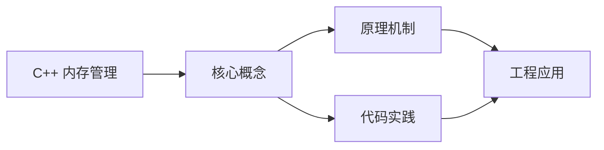
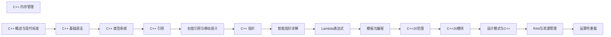

## 1. 学习目标（Bloom 分类）

本节按照布鲁姆教育目标分类学组织学习路径。本文主题为《C++ 内存管理》，属于 C++ 模块，读者可以根据自身阶段选择阅读深度。

记忆层面：能够准确复述本文的核心概念、术语与基本语法或操作步骤，并能够在提问或检索时快速定位对应知识点。能够说出 C++ 的类、继承、重载、模板与 STL 容器基本语法。

理解层面：能够用自己的语言解释核心原理与工作机制，说明概念之间的因果关系，而不是机械记忆结论。能够解释 RAII、拷贝/移动语义、虚函数与模板实例化。

应用层面：能够在真实项目或练习场景中运用本文知识解决具体问题，写出正确且可维护的实现。能够编写现代 C++（C++17/20）的类与泛型代码。

分析层面：能够拆解复杂问题，比较本文主题与相邻概念的异同，识别边界条件与例外情况。能够分析生命周期、未定义行为与性能特征。

评价层面：能够根据约束条件（性能、可读性、安全、成本）评价不同方案的优劣，做出有依据的技术决策。能够评价 C++ 与 Rust、Java 在系统编程中的取舍。

创造层面：能够把本文知识与其他模块知识组合，设计出新的解决方案或可复用的工程模式。能够设计高性能、可维护的 C++ 库与应用。

通过本节学习，读者应当能够把《C++ 内存管理》纳入自己的知识网络，并与 C++ 模块的其他主题（RAII、移动语义、模板、STL）建立关联。

## 2. 历史动机与发展脉络

《C++ 内存管理》是 C++ 领域的重要主题。要真正理解它，需要先了解它解决的问题与演进过程。

C++ 由 Bjarne Stroustrup 于 1979 年开始在贝尔实验室开发（原名 C with Classes），1983 年更名 C++，1998 年 C++98 首次标准化。
C++11 是语言转折点：右值引用、auto、lambda、智能指针、并发内存模型让现代 C++ 写法定型；C++14/17 补充泛型 lambda、if constexpr、折叠表达式；C++20 引入 concepts、协程、模块与范围库；C++23 继续完善。
现代 C++ 的核心口号是“资源安全”：RAII + 智能指针替代裸 new/delete，异常与错误码按场景选择；Rust 的出现促使 C++ 社区更重视内存安全工具（如 profile 指南、sanitizer）。

回到本文主题：C++ 内存管理 的提出与成熟，正是上述技术背景下的必然产物。早期实现往往以简单可用为目标，随着工程规模扩大，社区逐渐沉淀出标准做法与最佳实践；理解这一脉络，可以帮助读者判断“为什么文档中的推荐写法是现在这个样子”，也能在遇到历史遗留代码时准确识别其设计年代与取舍。


## 3. 形式化定义与核心概念精讲

本节把《C++ 内存管理》涉及的核心概念以“定义 + 讲解”的形式展开。读者应把定义当作工具，把讲解当作理解路径；两者结合才能形成可迁移的知识。

RAII：资源在构造函数获取、析构函数释放，栈对象离开作用域自动清理；智能指针（unique_ptr/shared_ptr/weak_ptr）把所有权编码进类型。
移动语义：右值引用 `&&` 与 std::move 转移资源所有权，避免深拷贝；移动后对象处于“合法但未指定”状态。
虚函数与多态：virtual 实现动态绑定，vtable 是运行时分派机制；final/override 关键字防止误用；基类析构函数应为 virtual。

### 3.1 原文章节逐一精讲

原文档把主题拆分为 13 个小节，下面按顺序给出每一节的导读讲解，随后保留原文细节供精读。

#### 原文精读（完整保留）

# C++ 内存管理

> **符号约定**：`< >` 必填参数 | `[ ]` 可选参数

---

#### 1. 内存管理 (Memory Management)

##### 1.1 内存布局

C++ 程序的内存空间通常分为以下几个区域：

| 内存区域                       | 描述                       | 管理方式                     |
| :----------------------------- | :------------------------- | :--------------------------- |
| **代码区 (Code Segment)**      | 存储程序的可执行指令       | 由操作系统管理               |
| **全局/静态区 (Data Segment)** | 存储全局变量和静态变量     | 程序启动时分配，结束时释放   |
| **常量区 (Constant Segment)**  | 存储常量                   | 程序启动时分配，结束时释放   |
| **栈 (Stack)**                 | 存储局部变量和函数调用信息 | 自动管理，后进先出           |
| **堆 (Heap)**                  | 存储动态分配的内存         | 手动管理，需要显式分配和释放 |

##### 1.2 栈内存

- **特点**: 自动管理，速度快，空间有限
- **分配方式**: 编译时确定
- **生命周期**: 作用域结束时自动释放

```cpp
 void func() {
  int x = 10; // 栈内存分配
  int arr[10]; // 栈内存分配
 }
```

##### 1.3 堆内存

- **特点**: 手动管理，空间大，速度较慢
- **分配方式**: 运行时动态分配
- **生命周期**: 直到显式释放

###### 1.3.1 动态内存分配

```cpp
 // 分配单个对象
 int* p = new int(10); // 分配一个整数，初始化为 10
 // 分配数组
 int* arr = new int[5]; // 分配 5 个整数的数组
 // 释放内存
 delete p; // 释放单个对象
 delete[] arr; // 释放数组（必须使用 []）
```

###### 1.3.2 内存泄漏

当动态分配的内存没有被释放时，就会发生内存泄漏。

```cpp
 void leak() {
  int* p = new int(10);
  // 没有 delete p; 导致内存泄漏
 }
 int main() {
  for (int i = 0; i < 1000000; i++) {
  leak(); // 每次调用都会泄漏 4 字节内存
  }
  return 0;
 }
```

###### 1.3.3 常见内存问题

| 问题           | 描述                       | 后果                                 |
| :------------- | :------------------------- | :----------------------------------- |
| **内存泄漏**   | 未释放动态分配的内存       | 内存使用持续增长，最终导致程序崩溃   |
| **野指针**     | 指针指向已释放的内存       | 未定义行为，可能导致程序崩溃         |
| **重复释放**   | 对同一块内存释放多次       | 未定义行为，可能导致程序崩溃         |
| **缓冲区溢出** | 写入超出分配内存范围的数据 | 覆盖其他内存，导致程序崩溃或安全漏洞 |

#### 2. RAII 模式 (Resource Acquisition Is Initialization)

##### 2.1 RAII 核心思想

RAII（资源获取即初始化）是一种 C++ 编程技术，利用对象的生命周期来管理资源。

- **构造函数**: 获取资源
- **析构函数**: 释放资源
- **核心优势**: 无论函数如何退出（正常返回或异常），资源都会被正确释放

##### 2.2 RAII 示例

###### 2.2.1 简单 RAII 类

```cpp
 class FileHandler {
 private:
  FILE* file;
 public:
  FileHandler(const char* filename, const char* mode) {
  file = fopen(filename, mode);
  if (!file) {
  throw std::runtime_error("Failed to open file");
  }
  }
  ~FileHandler() {
  if (file) {
  fclose(file);
  }
  }
  // 禁用拷贝和移动，避免资源重复释放
  FileHandler(const FileHandler&) = delete;
  FileHandler& operator=(const FileHandler&) = delete;
  // 提供访问文件的方法
  FILE* get() const { return file; }
 }
 // 使用示例
 void read_file(const char* filename) {
  FileHandler file(filename, "r");
  // 文件操作...
 }
```

###### 2.2.2 RAII 与异常

```cpp
 void func() {
  FileHandler file("data.txt", "r");
  // 如果这里抛出异常
  throw std::runtime_error("Something went wrong");
  // 文件仍然会被正确关闭，因为析构函数会被调用
 }
```

##### 2.3 RAII 的应用场景

- **文件操作**: 自动关闭文件
- **内存管理**: 自动释放内存
- **锁管理**: 自动释放锁
- **网络连接**: 自动关闭连接
- **数据库连接**: 自动关闭连接

#### 3. 智能指针 (Smart Pointers - C++11+)

智能指针是 C++11 引入的模板类，用于自动管理动态内存，避免内存泄漏。

##### 3.1 std::unique_ptr

`std::unique_ptr` 是一种独占所有权的智能指针，同一时间只能有一个 `unique_ptr` 指向同一个对象。

```cpp
 #include <memory>
 // 创建 unique_ptr
 std::unique_ptr<int> p1(new int(10));
 // 使用 make_unique (C++14)
 auto p2 = std::make_unique<int>(20);
 // 访问对象
 std::cout << *p1 << std::endl; // 输出 10
 // 转移所有权
 std::unique_ptr<int> p3 = std::move(p1); // p1 现在为空
 // 不需要手动 delete，离开作用域时自动释放
```

##### 3.2 std::shared_ptr

`std::shared_ptr` 是一种共享所有权的智能指针，使用引用计数来跟踪有多少个 `shared_ptr` 指向同一个对象。

```cpp
 #include <memory>
 // 创建 shared_ptr
 std::shared_ptr<int> p1(new int(10));
 // 使用 make_shared (推荐)
 auto p2 = std::make_shared<int>(20);
 // 共享所有权
 std::shared_ptr<int> p3 = p1; // 引用计数变为 2
 // 访问引用计数
 std::cout << p1.use_count() << std::endl; // 输出 2
 // 当最后一个 shared_ptr 离开作用域时，对象自动释放
```

##### 3.3 std::weak_ptr

`std::weak_ptr` 是一种不增加引用计数的智能指针，用于解决 `shared_ptr` 的循环引用问题。

```cpp
 #include <memory>
 class B; // 前向声明
 class A {
 public:
  std::shared_ptr<B> b_ptr;
  ~A() { std::cout << "A destroyed" << std::endl; }
 }
 class B {
 public:
  std::weak_ptr<A> a_ptr; // 使用 weak_ptr 避免循环引用
  ~B() { std::cout << "B destroyed" << std::endl; }
 }
 int main() {
  auto a = std::make_shared<A>();
  auto b = std::make_shared<B>();
  a->b_ptr = b;
  b->a_ptr = a;
  // 引用计数分析：
  // a 的引用计数：1 (a) + 0 (b->a_ptr 是 weak_ptr)
  // b 的引用计数：1 (b) + 1 (a->b_ptr)
  return 0; // a 和 b 都会被正确销毁
 }
```

##### 3.4 智能指针的最佳实践

- **优先使用 `std::make_shared` 和 `std::make_unique`**：避免裸指针
- **尽量使用 `unique_ptr`**：独占所有权更安全
- **仅在需要共享所有权时使用 `shared_ptr`**：引用计数有开销
- **使用 `weak_ptr` 解决循环引用**：避免内存泄漏
- **不要混合使用智能指针和裸指针**：容易导致双重释放
- **不要手动管理智能指针指向的内存**：交给智能指针管理

#### 4. 内存管理最佳实践

##### 4.1 一般原则

- **优先使用栈内存**：自动管理，速度快
- **最小化动态内存使用**：只在必要时使用堆内存
- **使用 RAII**：利用对象生命周期管理资源
- **使用智能指针**：避免手动内存管理错误
- **定期检查内存泄漏**：使用工具如 Valgrind

##### 4.2 代码示例

###### 4.2.1 智能指针的使用

```cpp
 #include <memory>
 #include <vector>
 // 使用 unique_ptr
 void use_unique_ptr() {
  auto p = std::make_unique<int>(42);
  std::cout << *p << std::endl;
  // p 离开作用域时自动释放
 }
 // 使用 shared_ptr
 void use_shared_ptr() {
  auto p1 = std::make_shared<int>(100);
  {
  auto p2 = p1; // 共享所有权
  std::cout << *p2 << std::endl;
  } // p2 离开作用域，引用计数减为 1
  std::cout << *p1 << std::endl;
 }
 // 智能指针与容器
 void use_smart_pointers_in_container() {
  std::vector<std::unique_ptr<int>> vec;
  for (int i = 0; i < 10; i++) {
  vec.push_back(std::make_unique<int>(i));
  }
  for (const auto& p : vec) {
  std::cout << *p << " ";
  }
  std::cout << std::endl;
  // 容器销毁时，所有 unique_ptr 自动释放
 }
```

###### 4.2.2 自定义 RAII 类

```cpp
 #include <mutex>
 // 锁的 RAII 包装
 class LockGuard {
 private:
  std::mutex& mtx;
 public:
  explicit LockGuard(std::mutex& mutex) : mtx(mutex) {
  mtx.lock();
  }
  ~LockGuard() {
  mtx.unlock();
  }
  // 禁用拷贝
  LockGuard(const LockGuard&) = delete;
  LockGuard& operator=(const LockGuard&) = delete;
 }
 // 使用示例
 std::mutex mtx;
 void critical_section() {
  LockGuard lock(mtx); // 自动加锁
  // 临界区代码...
 }
```

##### 4.3 内存泄漏检测

###### 4.3.1 使用 Valgrind

```bash
 # 编译程序
 g++ -g -o program program.cpp
 # 使用 Valgrind 检测内存泄漏
 valgrind --leak-check=full ./program
```

###### 4.3.2 使用 AddressSanitizer

```bash
 # 编译程序
 g++ -fsanitize=address -g -o program program.cpp
 # 运行程序
 ./program
```

#### 5. 高级内存管理

##### 5.1 内存池

内存池是一种预分配内存的技术，用于减少频繁的内存分配和释放开销。它特别适用于需要频繁分配和释放小对象的场景，如游戏开发、高频交易系统等。

###### 5.1.1 内存池的优势

- **减少内存碎片**：预分配大块内存，避免频繁的小内存分配
- **提高性能**：内存分配和释放操作非常快速
- **控制内存使用**：可以限制最大内存使用量
- **简化内存管理**：统一管理内存分配和释放

###### 5.1.2 内存池实现

**基本内存池**：

```cpp
 #include <iostream>
 #include <cstddef>
 class MemoryPool {
 private:
  char* pool; // 内存池指针
  size_t size; // 内存池大小
  size_t used; // 已使用内存
  size_t alignment; // 内存对齐要求
 public:
  MemoryPool(size_t pool_size, size_t align = alignof(std::max_align_t))
  : size(pool_size), used(0), alignment(align) {
  // 分配内存，确保对齐
  pool = static_cast<char*>(aligned_alloc(alignment, size));
  if (!pool) {
  throw std::bad_alloc();
  }
  std::cout << "Memory pool created with size: " << size << " bytes" << std::endl;
  }
  ~MemoryPool() {
  if (pool) {
  free(pool);
  std::cout << "Memory pool destroyed" << std::endl;
  }
  }
  // 禁用拷贝和移动
  MemoryPool(const MemoryPool&) = delete;
  MemoryPool& operator=(const MemoryPool&) = delete;
  MemoryPool(MemoryPool&&) = delete;
  MemoryPool& operator=(MemoryPool&&) = delete;
  void* allocate(size_t bytes) {
  // 计算对齐后的大小
  size_t aligned_bytes = ((bytes + alignment - 1) / alignment) * alignment;
  if (used + aligned_bytes > size) {
  std::cerr << "Memory pool exhausted!" << std::endl;
  return nullptr; // 内存不足
  }
  void* ptr = pool + used;
  used += aligned_bytes;
  std::cout << "Allocated " << aligned_bytes << " bytes, used: " << used << "/" << size << std::endl;
  return ptr;
  }
  template <typename T, typename... Args>
  T* allocate(Args&&... args) {
  void* ptr = allocate(sizeof(T));
  if (!ptr) {
  return nullptr;
  }
  return new (ptr) T(std::forward<Args>(args)...);
  }
  void deallocate(void* ptr) {
  // 简单内存池不单独释放内存，而是通过 reset() 重置
  // 复杂内存池会实现空闲块管理
  }
  template <typename T>
  void deallocate(T* ptr) {
  if (ptr) {
  ptr->~T(); // 调用析构函数
  }
  }
  void reset() {
  used = 0; // 重置内存池，不释放内存
  std::cout << "Memory pool reset" << std::endl;
  }
  size_t get_used() const {
  return used;
  }
  size_t get_size() const {
  return size;
  }
  bool is_full() const {
  return used >= size;
  }
  bool has_available(size_t bytes) const {
  size_t aligned_bytes = ((bytes + alignment - 1) / alignment) * alignment;
  return used + aligned_bytes <= size;
  }
 }
 // 使用示例
 void use_memory_pool() {
  try {
  MemoryPool pool(1024);
  // 分配基本类型
  int* p1 = static_cast<int*>(pool.allocate(sizeof(int)));
  *p1 = 42;
  std::cout << "p1 value: " << *p1 << std::endl;
  double* p2 = static_cast<double*>(pool.allocate(sizeof(double)));
  *p2 = 3.14;
  std::cout << "p2 value: " << *p2 << std::endl;
  // 分配自定义类型
  class Point {
  public:
  Point(int x, int y) : x(x), y(y) {
  std::cout << "Point constructed: (" << x << ", " << y << ")" << std::endl;
  }
  ~Point() {
  std::cout << "Point destructed: (" << x << ", " << y << ")" << std::endl;
  }
  int x, y;
  };
  Point* p3 = pool.allocate<Point>(10, 20);
  std::cout << "p3 value: (" << p3->x << ", " << p3->y << ")" << std::endl;
  // 检查内存使用情况
  std::cout << "Memory used: " << pool.get_used() << "/" << pool.get_size() << std::endl;
  // 重置内存池
  pool.deallocate(p3); // 调用析构函数
  pool.reset();
  std::cout << "After reset, memory used: " << pool.get_used() << std::endl;
  // 重新使用内存
  Point* p4 = pool.allocate<Point>(30, 40);
  std::cout << "p4 value: (" << p4->x << ", " << p4->y << ")" << std::endl;
  pool.deallocate(p4);
  } catch (const std::exception& e) {
  std::cerr << "Error: " << e.what() << std::endl;
  }
 }
 int main() {
  use_memory_pool();
  return 0;
 }
```

**带空闲块管理的内存池**：

```cpp
 #include <iostream>
 #include <cstddef>
 class MemoryPool {
 private:
  struct FreeBlock {
  size_t size;
  FreeBlock* next;
  };
  char* pool; // 内存池指针
  size_t size; // 内存池大小
  FreeBlock* free_list; // 空闲块链表
  size_t alignment; // 内存对齐要求
 public:
  MemoryPool(size_t pool_size, size_t align = alignof(std::max_align_t))
  : size(pool_size), alignment(align) {
  // 分配内存，确保对齐
  pool = static_cast<char*>(aligned_alloc(alignment, size));
  if (!pool) {
  throw std::bad_alloc();
  }
  // 初始化空闲块链表
  free_list = reinterpret_cast<FreeBlock*>(pool);
  free_list->size = size;
  free_list->next = nullptr;
  std::cout << "Memory pool created with size: " << size << " bytes" << std::endl;
  }
  ~MemoryPool() {
  if (pool) {
  free(pool);
  std::cout << "Memory pool destroyed" << std::endl;
  }
  }
  // 禁用拷贝和移动
  MemoryPool(const MemoryPool&) = delete;
  MemoryPool& operator=(const MemoryPool&) = delete;
  MemoryPool(MemoryPool&&) = delete;
  MemoryPool& operator=(MemoryPool&&) = delete;
  void* allocate(size_t bytes) {
  // 计算对齐后的大小，加上 FreeBlock 大小
  size_t aligned_bytes = ((bytes + alignment - 1) / alignment) * alignment;
  size_t total_bytes = aligned_bytes + sizeof(FreeBlock);
  FreeBlock* prev = nullptr;
  FreeBlock* curr = free_list;
  // 查找合适的空闲块
  while (curr) {
  if (curr->size >= total_bytes) {
  // 找到合适的块
  if (curr->size > total_bytes + sizeof(FreeBlock)) {
  // 分割块
  size_t remaining = curr->size - total_bytes;
  FreeBlock* new_block = reinterpret_cast<FreeBlock*>(
  reinterpret_cast<char*>(curr) + total_bytes
  );
  new_block->size = remaining;
  new_block->next = curr->next;
  if (prev) {
  prev->next = new_block;
  } else {
  free_list = new_block;
  }
  } else {
  // 使用整个块
  if (prev) {
  prev->next = curr->next;
  } else {
  free_list = curr->next;
  }
  }
  // 返回用户可用内存
  void* ptr = reinterpret_cast<char*>(curr) + sizeof(FreeBlock);
  std::cout << "Allocated " << aligned_bytes << " bytes" << std::endl;
  return ptr;
  }
  prev = curr;
  curr = curr->next;
  }
  std::cerr << "Memory pool exhausted!" << std::endl;
  return nullptr; // 内存不足
  }
  void deallocate(void* ptr) {
  if (!ptr) {
  return;
  }
  // 计算块的起始地址
  FreeBlock* block = reinterpret_cast<FreeBlock*>(
  reinterpret_cast<char*>(ptr) - sizeof(FreeBlock)
  );
  // 将块插入到空闲链表头部
  block->next = free_list;
  free_list = block;
  std::cout << "Deallocated memory" << std::endl;
  // 可选：合并相邻的空闲块
  coalesce_free_blocks();
  }
  void coalesce_free_blocks() {
  // 简单的合并逻辑
  FreeBlock* curr = free_list;
  while (curr && curr->next) {
  char* curr_end = reinterpret_cast<char*>(curr) + curr->size;
  char* next_start = reinterpret_cast<char*>(curr->next);
  if (curr_end == next_start) {
  // 合并相邻块
  curr->size += curr->next->size;
  curr->next = curr->next->next;
  std::cout << "Coalesced free blocks" << std::endl;
  } else {
  curr = curr->next;
  }
  }
  }
  void print_free_list() {
  FreeBlock* curr = free_list;
  int count = 0;
  std::cout << "Free blocks: " << std::endl;
  while (curr) {
  std::cout << " Block " << count << ": size = " << curr->size << " bytes" << std::endl;
  curr = curr->next;
  count++;
  }
  }
 }
 // 使用示例
 void use_advanced_memory_pool() {
  try {
  MemoryPool pool(1024);
  // 分配内存
  void* p1 = pool.allocate(64);
  void* p2 = pool.allocate(128);
  void* p3 = pool.allocate(256);
  pool.print_free_list();
  // 释放内存
  pool.deallocate(p2);
  pool.print_free_list();
  pool.deallocate(p1);
  pool.print_free_list();
  pool.deallocate(p3);
  pool.print_free_list();
  } catch (const std::exception& e) {
  std::cerr << "Error: " << e.what() << std::endl;
  }
 }
 int main() {
  use_advanced_memory_pool();
  return 0;
 }
```

##### 5.2 内存对齐

内存对齐是指数据在内存中的存储位置按照特定的边界对齐，这对于提高内存访问效率和满足硬件要求非常重要。

###### 5.2.1 内存对齐的重要性

- **提高访问速度**：对齐的内存访问比未对齐的访问更快
- **避免硬件异常**：某些硬件平台要求特定类型的数据必须对齐
- **减少内存浪费**：合理的对齐可以减少内存空洞

###### 5.2.2 C++ 中的内存对齐

**使用 alignas 关键字**：

```cpp
 #include <iostream>
 #include <cstdalign>
 // 基本类型的对齐要求
 void check_alignment() {
  std::cout << "Alignment requirements:" << std::endl;
  std::cout << "char: " << alignof(char) << " bytes" << std::endl;
  std::cout << "short: " << alignof(short) << " bytes" << std::endl;
  std::cout << "int: " << alignof(int) << " bytes" << std::endl;
  std::cout << "long: " << alignof(long) << " bytes" << std::endl;
  std::cout << "float: " << alignof(float) << " bytes" << std::endl;
  std::cout << "double: " << alignof(double) << " bytes" << std::endl;
  std::cout << "max_align_t: " << alignof(std::max_align_t) << " bytes" << std::endl;
 }
 // 自定义对齐要求
 struct alignas(16) AlignedStruct {
  char c;
  int i;
  double d;
 }
 // 对齐的数组
 typedef alignas(32) float AlignedFloat[4];
 void use_aligned_memory() {
  check_alignment();
  std::cout << "\nAlignedStruct:" << std::endl;
  std::cout << "Size: " << sizeof(AlignedStruct) << " bytes" << std::endl;
  std::cout << "Alignment: " << alignof(AlignedStruct) << " bytes" << std::endl;
  // 使用 aligned_alloc 分配对齐内存
  void* ptr = aligned_alloc(16, 1024);
  if (ptr) {
  std::cout << "\nAligned memory allocated at: " << ptr << std::endl;
  std::cout << "Alignment check: " << (reinterpret_cast<uintptr_t>(ptr) % 16 == 0 ? "OK" : "Failed") << std::endl;
  free(ptr);
  }
  // 使用 std::aligned_alloc (C++17)
  #if __cplusplus >= 201703L
  void* cpp17_ptr = std::aligned_alloc(32, 256);
  if (cpp17_ptr) {
  std::cout << "\nC++17 aligned memory allocated at: " << cpp17_ptr << std::endl;
  std::cout << "Alignment check: " << (reinterpret_cast<uintptr_t>(cpp17_ptr) % 32 == 0 ? "OK" : "Failed") << std::endl;
  std::free(cpp17_ptr);
  }
  #endif
 }
 int main() {
  use_aligned_memory();
  return 0;
 }
```

##### 5.3 自定义内存分配器

C++ 允许自定义内存分配器，用于控制容器的内存分配行为。

```cpp
 #include <iostream>
 #include <vector>
 #include <memory>
 // 自定义分配器
 template <typename T>
 class CustomAllocator {
 public:
  using value_type = T;
  CustomAllocator() noexcept = default;
  template <typename U>
  CustomAllocator(const CustomAllocator<U>&) noexcept {}
  T* allocate(size_t n) {
  if (n > std::numeric_limits<size_t>::max() / sizeof(T)) {
  throw std::bad_alloc();
  }
  void* ptr = std::malloc(n * sizeof(T));
  if (!ptr) {
  throw std::bad_alloc();
  }
  std::cout << "CustomAllocator: Allocated " << n * sizeof(T) << " bytes" << std::endl;
  return static_cast<T*>(ptr);
  }
  void deallocate(T* ptr, size_t n) noexcept {
  std::cout << "CustomAllocator: Deallocated " << n * sizeof(T) << " bytes" << std::endl;
  std::free(ptr);
  }
  template <typename U>
  bool operator==(const CustomAllocator<U>&) const noexcept {
  return true;
  }
  template <typename U>
  bool operator!=(const CustomAllocator<U>&) const noexcept {
  return false;
  }
 }
 // 使用自定义分配器
 void use_custom_allocator() {
  std::vector<int, CustomAllocator<int>> vec;
  vec.push_back(10);
  vec.push_back(20);
  vec.push_back(30);
  vec.push_back(40);
  vec.push_back(50);
  std::cout << "Vector size: " << vec.size() << std::endl;
  std::cout << "Vector capacity: " << vec.capacity() << std::endl;
  for (int i : vec) {
  std::cout << i << " ";
  }
  std::cout << std::endl;
  // 当 vec 离开作用域时，会自动释放内存
 }
 int main() {
  use_custom_allocator();
  return 0;
 }
```

##### 5.4 内存屏障与原子操作

内存屏障（Memory Barrier）是一种同步原语，用于控制内存操作的顺序，确保多线程环境下的内存可见性。

###### 5.4.1 内存屏障的作用

- **确保内存操作顺序**：防止编译器和 CPU 重排序
- **保证内存可见性**：确保一个线程的修改对其他线程可见
- **同步多线程操作**：协调不同线程之间的内存访问

###### 5.4.2 C++ 中的内存屏障

**使用 std::atomic**：

```cpp
 #include <iostream>
 #include <thread>
 #include <atomic>
 #include <vector>
 std::atomic<int> counter(0);
 std::atomic<bool> ready(false);
 void increment_counter(int id) {
  // 等待信号
  while (!ready.load(std::memory_order_acquire)) {
  std::this_thread::yield();
  }
  // 增加计数器
  for (int i = 0; i < 1000; i++) {
  counter.fetch_add(1, std::memory_order_relaxed);
  }
 }
 void test_atomics() {
  std::vector<std::thread> threads;
  // 创建 10 个线程
  for (int i = 0; i < 10; i++) {
  threads.emplace_back(increment_counter, i);
  }
  // 发送开始信号
  ready.store(true, std::memory_order_release);
  // 等待所有线程完成
  for (auto& t : threads) {
  t.join();
  }
  std::cout << "Final counter value: " << counter.load() << std::endl;
  std::cout << "Expected: 10000" << std::endl;
 }
 int main() {
  test_atomics();
  return 0;
 }
```

**内存序说明**：

- `memory_order_relaxed`：最宽松的内存序，只保证原子操作本身的原子性
- `memory_order_acquire`：获取操作，确保后续操作不会重排序到前面
- `memory_order_release`：释放操作，确保前面的操作不会重排序到后面
- `memory_order_acq_rel`：同时具有获取和释放语义
- `memory_order_seq_cst`：顺序一致性，最严格的内存序

##### 5.5 内存映射

内存映射（Memory Mapping）是一种将文件或设备映射到进程地址空间的技术，允许直接通过内存访问文件内容。

```cpp
 #include <iostream>
 #include <fstream>
 #include <sys/mman.h>
 #include <sys/stat.h>
 #include <fcntl.h>
 #include <unistd.h>
 void use_memory_mapping() {
  // 创建测试文件
  std::ofstream outfile("test.txt");
  outfile << "Hello, Memory Mapping!" << std::endl;
  outfile.close();
  // 打开文件
  int fd = open("test.txt", O_RDWR);
  if (fd == -1) {
  perror("open");
  return;
  }
  // 获取文件大小
  struct stat sb;
  if (fstat(fd, &sb) == -1) {
  perror("fstat");
  close(fd);
  return;
  }
  // 映射文件到内存
  void* addr = mmap(nullptr, sb.st_size, PROT_READ | PROT_WRITE, MAP_SHARED, fd, 0);
  if (addr == MAP_FAILED) {
  perror("mmap");
  close(fd);
  return;
  }
  // 读取文件内容
  std::cout << "File content: " << static_cast<char*>(addr) << std::endl;
  // 修改文件内容
  char* data = static_cast<char*>(addr);
  data[0] = 'h'; // 小写 h
  // 同步到文件
  if (msync(addr, sb.st_size, MS_SYNC) == -1) {
  perror("msync");
  }
  // 解除映射
  if (munmap(addr, sb.st_size) == -1) {
  perror("munmap");
  }
  close(fd);
  // 验证修改
  std::ifstream infile("test.txt");
  std::string line;
  std::getline(infile, line);
  std::cout << "Modified content: " << line << std::endl;
  infile.close();
 }
 int main() {
  use_memory_mapping();
  return 0;
 }
```

##### 5.6 垃圾回收

虽然 C++ 主要依赖手动内存管理，但对于某些场景，可以使用垃圾回收器来自动管理内存。

###### 5.6.1 Boehm 垃圾回收器

Boehm 是一个保守的垃圾回收器，可以集成到 C++ 程序中。
**使用示例**：

```cpp
 #include <iostream>
 #include <gc/gc.h>
 void use_boehm_gc() {
  // 初始化垃圾回收器
  GC_INIT();
  // 分配内存
  int* p1 = (int*)GC_MALLOC(sizeof(int));
  *p1 = 42;
  std::cout << "p1 value: " << *p1 << std::endl;
  int* p2 = (int*)GC_MALLOC_ATOMIC(sizeof(int));
  *p2 = 100;
  std::cout << "p2 value: " << *p2 << std::endl;
  // 不需要手动释放内存
  // 垃圾回收器会自动回收不再使用的内存
  std::cout << "Garbage collection will happen automatically" << std::endl;
 }
 int main() {
  use_boehm_gc();
  return 0;
 }
```

**编译命令**：

```bash
 g++ -o program program.cpp -lgc
```

###### 5.6.2 垃圾回收的优缺点

**优点**：

- 减少内存泄漏的可能性
- 简化内存管理
- 提高代码安全性
  **缺点**：
- 性能开销
- 不可预测的暂停时间
- 与 C++ 的 RAII 模式不完全兼容
- 增加可执行文件大小

##### 5.7 内存管理的未来发展

C++ 标准委员会一直在努力改进内存管理，未来可能的发展方向包括：

1. **更智能的智能指针**：进一步简化内存管理
2. **更高效的内存分配器**：标准库提供更优化的分配器
3. **更好的内存安全**：减少内存相关的错误
4. **垃圾回收的整合**：可能提供可选的垃圾回收机制
5. **更强大的编译时内存分析**：在编译时检测内存问题

#### 6. 总结

C++ 的内存管理是一个复杂但重要的主题，掌握好内存管理对于编写高效、安全的 C++ 程序至关重要。

##### 6.1 关键要点

1. **指针与引用**：

- 指针是存储内存地址的变量，引用是变量的别名
- 正确使用指针和引用可以提高代码的灵活性和效率
- 注意避免野指针、空指针等问题

2. **内存管理**：

- 了解内存布局（栈、堆、全局区等）
- 优先使用栈内存，合理使用堆内存
- 避免内存泄漏、双重释放等问题

3. **RAII 模式**：

- 利用对象生命周期管理资源
- 确保资源在使用完毕后被正确释放
- 提高代码的异常安全性

4. **智能指针**：

- `unique_ptr`：独占所有权
- `shared_ptr`：共享所有权
- `weak_ptr`：解决循环引用
- 优先使用 `make_shared` 和 `make_unique`

5. **高级内存管理**：

- 内存池：提高内存分配效率
- 内存对齐：提高访问速度
- 自定义分配器：控制内存分配行为
- 内存屏障：确保多线程内存可见性
- 内存映射：高效文件访问

##### 6.2 最佳实践

- **优先使用栈内存**：自动管理，速度快
- **使用 RAII 和智能指针**：避免手动内存管理
- **最小化动态内存使用**：只在必要时使用堆内存
- **定期检查内存泄漏**：使用工具如 Valgrind、AddressSanitizer
- **优化内存使用**：减少不必要的内存分配和释放
- **选择合适的内存管理策略**：根据具体场景选择合适的方法

##### 6.3 学习建议

- **实践**：编写各种内存管理场景的代码
- **调试**：使用内存调试工具检测问题
- **阅读源码**：学习标准库和优秀开源项目的内存管理实现
- **持续学习**：关注 C++ 标准的最新发展
  通过掌握 C++ 的内存管理技术，你将能够编写更高效、更安全、更可靠的 C++ 程序。

#### 7. 代码示例

##### 7.1 指针与引用的综合使用

```cpp
 #include <iostream>
 // 使用指针交换两个数
 void swap_with_pointers(int* a, int* b) {
  int temp = *a;
  *a = *b;
  *b = temp;
 }
 // 使用引用交换两个数
 void swap_with_references(int& a, int& b) {
  int temp = a;
  a = b;
  b = temp;
 }
 int main() {
  int x = 10, y = 20;
  std::cout << "Before swap: x = " << x << ", y = " << y << std::endl;
  swap_with_pointers(&x, &y);
  std::cout << "After swap with pointers: x = " << x << ", y = " << y << std::endl;
  swap_with_references(x, y);
  std::cout << "After swap with references: x = " << x << ", y = " << y << std::endl;
  return 0;
 }
```

##### 7.2 智能指针的使用

```cpp
 #include <iostream>
 #include <memory>
 class Resource {
 public:
  Resource() {
  std::cout << "Resource acquired" << std::endl;
  }
  ~Resource() {
  std::cout << "Resource released" << std::endl;
  }
  void use() {
  std::cout << "Using resource" << std::endl;
  }
 }
 int main() {
  std::cout << "Creating unique_ptr..." << std::endl;
  {
  auto res = std::make_unique<Resource>();
  res->use();
  } // res 离开作用域，资源自动释放
  std::cout << "Creating shared_ptr..." << std::endl;
  {
  auto res1 = std::make_shared<Resource>();
  std::cout << "Reference count: " << res1.use_count() << std::endl;
  {
  auto res2 = res1;
  std::cout << "Reference count: " << res1.use_count() << std::endl;
  res2->use();
  } // res2 离开作用域，引用计数减为 1
  std::cout << "Reference count: " << res1.use_count() << std::endl;
  } // res1 离开作用域，引用计数减为 0，资源释放
  return 0;
 }
```

##### 7.3 RAII 模式的应用

```cpp
 #include <iostream>
 #include <fstream>
 #include <stdexcept>
 class FileRAII {
 private:
  std::ofstream file;
 public:
  FileRAII(const std::string& filename) {
  file.open(filename);
  if (!file) {
  throw std::runtime_error("Failed to open file");
  }
  std::cout << "File opened: " << filename << std::endl;
  }
  ~FileRAII() {
  if (file.is_open()) {
  file.close();
  std::cout << "File closed" << std::endl;
  }
  }
  // 禁用拷贝
  FileRAII(const FileRAII&) = delete;
  FileRAII& operator=(const FileRAII&) = delete;
  // 提供文件访问
  std::ofstream& get() {
  return file;
  }
 }
 void write_to_file(const std::string& filename, const std::string& content) {
  FileRAII file(filename);
  file.get() << content;
  // 这里可以抛出异常，文件仍然会被关闭
  // throw std::runtime_error("Test exception");
 }
 int main() {
  try {
  write_to_file("test.txt", "Hello, RAII!");
  std::cout << "File written successfully" << std::endl;
  } catch (const std::exception& e) {
  std::cerr << "Error: " << e.what() << std::endl;
  }
  return 0;
 }
```

---

#### new 与 delete

**基本写法：堆上分配对象**
`<类型>* <指针> = new <类型>(<参数>);`
```cpp
// 动态创建单个对象
int* p = new int(42);
```

---

**基本写法：释放单个对象**
`delete <指针>;`
```cpp
// 释放堆内存
delete p;
```

---

**基本写法：分配数组**
`<类型>* <指针> = new <类型>[<数量>];`
```cpp
// 动态创建对象数组
int* arr = new int[10];
```

---

**基本写法：释放数组**
`delete[] <指针>;`
```cpp
// 释放数组内存
delete[] arr;
```

---

**基本写法：placement new**
`new (<地址>) <类型>(<参数>);`
```cpp
// 在指定内存构造对象
char buf[sizeof(Widget)];
new (buf) Widget();
```

---

**基本写法：手动调用析构**
`<指针>->~<类型>();`
```cpp
// 析构但不释放内存
w->~Widget();
```

---

#### 内存分配器

**基本写法：使用 allocator**
`std::allocator<<类型>> <变量>;`
```cpp
// 标准分配器
std::allocator<int> alloc;
```

---

**基本写法：分配未构造内存**
`<alloc>.allocate(<数量>);`
```cpp
// 仅分配内存不构造对象
int* mem = alloc.allocate(5);
```

---

**基本写法：构造对象**
`std::construct_at(<地址>, <参数>);`
```cpp
// 在内存上构造对象
std::construct_at(mem, 42);
```

---

**基本写法：销毁对象**
`std::destroy_at(<指针>);`
```cpp
// 调用析构不释放内存
std::destroy_at(mem);
```

---

**基本写法：释放内存**
`<alloc>.deallocate(<指针>, <数量>);`
```cpp
// 释放分配的内存
alloc.deallocate(mem, 5);
```

---

#### 智能指针

**基本写法：独占指针**
`std::unique_ptr<<类型>> <变量> = std::make_unique<<类型>>(<参数>);`
```cpp
// 独占所有权
auto p = std::make_unique<Widget>(args);
```

---

**基本写法：共享指针**
`std::shared_ptr<<类型>> <变量> = std::make_shared<<类型>>(<参数>);`
```cpp
// 引用计数共享所有权
auto sp = std::make_shared<Widget>(args);
```

---

**基本写法：弱引用**
`std::weak_ptr<<类型>> <变量> = <shared_ptr>;`
```cpp
// 不影响引用计数的弱引用
std::weak_ptr<Widget> wp = sp;
```

---

**基本写法：从 weak 提升为 shared**
`<weak_ptr>.lock();`
```cpp
// 提升为 shared_ptr 检查有效性
if (auto p = wp.lock()) { /* 使用 p */ }
```

---

**基本写法：自定义删除器**
`std::shared_ptr<<类型>> <变量>(<指针>, <删除器>);`
```cpp
// 数组与自定义释放
std::shared_ptr<int> sp(new int[10], std::default_delete<int[]>());
```

---

#### 内存对齐

**基本写法：指定对齐**
`alignas(<对齐值>) <类型> <变量>;`
```cpp
// 指定变量对齐到 16 字节
alignas(16) float data[4];
```

---

**基本写法：查询对齐**
`alignof(<类型>)`
```cpp
// 获取类型的对齐要求
size_t a = alignof(double);
```

---

**基本写法：对齐分配**
`std::aligned_alloc(<对齐>, <大小>);`
```cpp
// 分配对齐内存 C11
void* p = std::aligned_alloc(64, 1024);
```

---

#### 低级内存操作

**基本写法：复制内存**
`std::memcpy(<目标>, <源>, <字节数>);`
```cpp
// 复制字节块
std::memcpy(dst, src, n * sizeof(int));
```

---

**基本写法：移动内存**
`std::memmove(<目标>, <源>, <字节数>);`
```cpp
// 支持重叠区域的复制
std::memmove(dst, src, n);
```

---

**基本写法：填充内存**
`std::memset(<目标>, <值>, <字节数>);`
```cpp
// 将内存清零
std::memset(buf, 0, sizeof(buf));
```

---

#### 自定义 operator new

**基本写法：类专属 new**
`static void* operator new(size_t <大小>);`
```cpp
// 为类定制内存分配
static void* operator new(size_t sz) {
    return std::malloc(sz);
}
```

---

**基本写法：类专属 delete**
`static void operator delete(void* <指针>);`
```cpp
// 配套的释放函数
static void operator delete(void* p) {
    std::free(p);
}
```


### 3.2 概念关系图

下面用 Mermaid 图表达本文核心概念之间的关系，帮助读者建立整体图景：



图中展示的是本文知识的结构化关系：核心概念是入口，原理机制解释“为什么”，代码实践演示“怎么做”，工程应用回答“何时用”。读者学习时可以把每个小节的内容挂接到对应节点上。

## 4. 理论推导与原理解析

本节深入《C++ 内存管理》背后的原理。理论部分不求面面俱到，而是聚焦“能解释现象、能指导实践”的关键推导。

RAII：资源在构造函数获取、析构函数释放，栈对象离开作用域自动清理；智能指针（unique_ptr/shared_ptr/weak_ptr）把所有权编码进类型。
移动语义：右值引用 `&&` 与 std::move 转移资源所有权，避免深拷贝；移动后对象处于“合法但未指定”状态。
虚函数与多态：virtual 实现动态绑定，vtable 是运行时分派机制；final/override 关键字防止误用；基类析构函数应为 virtual。
模板与泛型：模板编译期实例化，实现静态多态；concepts（C++20）约束类型接口；模板元编程在编译期计算类型与常量。

需要强调的是，理论推导与工程实践之间存在翻译层：理论给出的是理想化模型与边界条件，工程代码则必须处理真实环境中的例外。读者在学习时应先掌握理论的“标准情形”，再通过陷阱章节了解“非标准情形”。

## 5. 代码示例与逐行讲解

本节把原文中的代码示例系统整理，并为每个示例补充用途说明与讲解。读者不应只浏览代码，而应逐段对照讲解理解设计意图。

### 5.1 示例：1.2 栈内存

该示例来自原文《1.2 栈内存》小节，用于演示C++ 内存管理相关操作。阅读时请先看代码结构，再看其后的讲解。

```cpp
 void func() {
  int x = 10; // 栈内存分配
  int arr[10]; // 栈内存分配
 }
```

讲解：这段代码演示了本节核心知识点。代码中的关键操作可以归纳为三步：准备（定义或初始化）、执行（核心逻辑）、收尾（释放资源或返回结果）。实际项目中，这三步往往被封装为函数或类，以提升复用性与可测试性。

关键点分析：

该示例共 4 行有效代码，结构以数据或配置为主。阅读时应关注：数据字段的含义、配置项的作用，以及它们与运行行为的对应关系。

进阶思考路径：先尝试修改参数观察行为变化，再把示例中的模式迁移到自己的项目中；每次修改都记录预期与实测差异，这是把示例转化为能力的最快方式。

### 5.2 示例：1.3.1 动态内存分配

该示例来自原文《1.3.1 动态内存分配》小节，用于演示C++ 内存管理相关操作。阅读时请先看代码结构，再看其后的讲解。

```cpp
 // 分配单个对象
 int* p = new int(10); // 分配一个整数，初始化为 10
 // 分配数组
 int* arr = new int[5]; // 分配 5 个整数的数组
 // 释放内存
 delete p; // 释放单个对象
 delete[] arr; // 释放数组（必须使用 []）
```

讲解：这段代码演示了本节核心知识点。代码中的关键操作可以归纳为三步：准备（定义或初始化）、执行（核心逻辑）、收尾（释放资源或返回结果）。实际项目中，这三步往往被封装为函数或类，以提升复用性与可测试性。

关键点分析：

该示例共 7 行有效代码，结构以数据或配置为主。阅读时应关注：数据字段的含义、配置项的作用，以及它们与运行行为的对应关系。

进阶思考路径：先尝试修改参数观察行为变化，再把示例中的模式迁移到自己的项目中；每次修改都记录预期与实测差异，这是把示例转化为能力的最快方式。

### 5.3 示例：1.3.2 内存泄漏

该示例来自原文《1.3.2 内存泄漏》小节，用于演示C++ 内存管理相关操作。阅读时请先看代码结构，再看其后的讲解。

```cpp
 void leak() {
  int* p = new int(10);
  // 没有 delete p; 导致内存泄漏
 }
 int main() {
  for (int i = 0; i < 1000000; i++) {
  leak(); // 每次调用都会泄漏 4 字节内存
  }
  return 0;
 }
```

讲解：这段代码演示了本节核心知识点。代码中的关键操作可以归纳为三步：准备（定义或初始化）、执行（核心逻辑）、收尾（释放资源或返回结果）。实际项目中，这三步往往被封装为函数或类，以提升复用性与可测试性。

关键点分析：

该示例共 10 行有效代码，包含 2 类关键结构（for、return）。其中：

- 入口与初始化部分负责建立上下文，对应实际项目中的启动或装配逻辑；
- 核心逻辑部分体现本文主题的主要操作，是阅读时最需要对照讲解理解的部分；
- 输出或返回部分把结果交给调用方，注意其类型与边界条件。

进阶思考路径：先尝试修改参数观察行为变化，再把示例中的模式迁移到自己的项目中；每次修改都记录预期与实测差异，这是把示例转化为能力的最快方式。

### 5.4 示例：2.2.1 简单 RAII 类

该示例来自原文《2.2.1 简单 RAII 类》小节，用于演示C++ 内存管理相关操作。阅读时请先看代码结构，再看其后的讲解。

```cpp
 class FileHandler {
 private:
  FILE* file;
 public:
  FileHandler(const char* filename, const char* mode) {
  file = fopen(filename, mode);
  if (!file) {
  throw std::runtime_error("Failed to open file");
  }
  }
  ~FileHandler() {
  if (file) {
  fclose(file);
  }
  }
  // 禁用拷贝和移动，避免资源重复释放
  FileHandler(const FileHandler&) = delete;
  FileHandler& operator=(const FileHandler&) = delete;
  // 提供访问文件的方法
  FILE* get() const { return file; }
 }
 // 使用示例
 void read_file(const char* filename) {
  FileHandler file(filename, "r");
  // 文件操作...
 }
```

讲解：这段代码演示了本节核心知识点。代码中的关键操作可以归纳为三步：准备（定义或初始化）、执行（核心逻辑）、收尾（释放资源或返回结果）。实际项目中，这三步往往被封装为函数或类，以提升复用性与可测试性。

关键点分析：

该示例共 26 行有效代码，包含 3 类关键结构（class、if、return）。其中：

- 入口与初始化部分负责建立上下文，对应实际项目中的启动或装配逻辑；
- 核心逻辑部分体现本文主题的主要操作，是阅读时最需要对照讲解理解的部分；
- 输出或返回部分把结果交给调用方，注意其类型与边界条件。

进阶思考路径：先尝试修改参数观察行为变化，再把示例中的模式迁移到自己的项目中；每次修改都记录预期与实测差异，这是把示例转化为能力的最快方式。

### 5.5 示例：2.2.2 RAII 与异常

该示例来自原文《2.2.2 RAII 与异常》小节，用于演示C++ 内存管理相关操作。阅读时请先看代码结构，再看其后的讲解。

```cpp
 void func() {
  FileHandler file("data.txt", "r");
  // 如果这里抛出异常
  throw std::runtime_error("Something went wrong");
  // 文件仍然会被正确关闭，因为析构函数会被调用
 }
```

讲解：这段代码演示了本节核心知识点。代码中的关键操作可以归纳为三步：准备（定义或初始化）、执行（核心逻辑）、收尾（释放资源或返回结果）。实际项目中，这三步往往被封装为函数或类，以提升复用性与可测试性。

关键点分析：

该示例共 6 行有效代码，结构以数据或配置为主。阅读时应关注：数据字段的含义、配置项的作用，以及它们与运行行为的对应关系。

进阶思考路径：先尝试修改参数观察行为变化，再把示例中的模式迁移到自己的项目中；每次修改都记录预期与实测差异，这是把示例转化为能力的最快方式。

### 5.6 示例：3.1 std::unique_ptr

该示例来自原文《3.1 std::unique_ptr》小节，用于演示C++ 内存管理相关操作。阅读时请先看代码结构，再看其后的讲解。

```cpp
 #include <memory>
 // 创建 unique_ptr
 std::unique_ptr<int> p1(new int(10));
 // 使用 make_unique (C++14)
 auto p2 = std::make_unique<int>(20);
 // 访问对象
 std::cout << *p1 << std::endl; // 输出 10
 // 转移所有权
 std::unique_ptr<int> p3 = std::move(p1); // p1 现在为空
 // 不需要手动 delete，离开作用域时自动释放
```

讲解：这段代码演示了本节核心知识点。代码中的关键操作可以归纳为三步：准备（定义或初始化）、执行（核心逻辑）、收尾（释放资源或返回结果）。实际项目中，这三步往往被封装为函数或类，以提升复用性与可测试性。

关键点分析：

该示例共 10 行有效代码，结构以数据或配置为主。阅读时应关注：数据字段的含义、配置项的作用，以及它们与运行行为的对应关系。

进阶思考路径：先尝试修改参数观察行为变化，再把示例中的模式迁移到自己的项目中；每次修改都记录预期与实测差异，这是把示例转化为能力的最快方式。

### 5.7 示例：3.2 std::shared_ptr

该示例来自原文《3.2 std::shared_ptr》小节，用于演示C++ 内存管理相关操作。阅读时请先看代码结构，再看其后的讲解。

```cpp
 #include <memory>
 // 创建 shared_ptr
 std::shared_ptr<int> p1(new int(10));
 // 使用 make_shared (推荐)
 auto p2 = std::make_shared<int>(20);
 // 共享所有权
 std::shared_ptr<int> p3 = p1; // 引用计数变为 2
 // 访问引用计数
 std::cout << p1.use_count() << std::endl; // 输出 2
 // 当最后一个 shared_ptr 离开作用域时，对象自动释放
```

讲解：这段代码演示了本节核心知识点。代码中的关键操作可以归纳为三步：准备（定义或初始化）、执行（核心逻辑）、收尾（释放资源或返回结果）。实际项目中，这三步往往被封装为函数或类，以提升复用性与可测试性。

关键点分析：

该示例共 10 行有效代码，结构以数据或配置为主。阅读时应关注：数据字段的含义、配置项的作用，以及它们与运行行为的对应关系。

进阶思考路径：先尝试修改参数观察行为变化，再把示例中的模式迁移到自己的项目中；每次修改都记录预期与实测差异，这是把示例转化为能力的最快方式。

### 5.8 示例：3.3 std::weak_ptr

该示例来自原文《3.3 std::weak_ptr》小节，用于演示C++ 内存管理相关操作。阅读时请先看代码结构，再看其后的讲解。

```cpp
 #include <memory>
 class B; // 前向声明
 class A {
 public:
  std::shared_ptr<B> b_ptr;
  ~A() { std::cout << "A destroyed" << std::endl; }
 }
 class B {
 public:
  std::weak_ptr<A> a_ptr; // 使用 weak_ptr 避免循环引用
  ~B() { std::cout << "B destroyed" << std::endl; }
 }
 int main() {
  auto a = std::make_shared<A>();
  auto b = std::make_shared<B>();
  a->b_ptr = b;
  b->a_ptr = a;
  // 引用计数分析：
  // a 的引用计数：1 (a) + 0 (b->a_ptr 是 weak_ptr)
  // b 的引用计数：1 (b) + 1 (a->b_ptr)
  return 0; // a 和 b 都会被正确销毁
 }
```

讲解：这段代码演示了本节核心知识点。代码中的关键操作可以归纳为三步：准备（定义或初始化）、执行（核心逻辑）、收尾（释放资源或返回结果）。实际项目中，这三步往往被封装为函数或类，以提升复用性与可测试性。

关键点分析：

该示例共 22 行有效代码，包含 2 类关键结构（class、return）。其中：

- 入口与初始化部分负责建立上下文，对应实际项目中的启动或装配逻辑；
- 核心逻辑部分体现本文主题的主要操作，是阅读时最需要对照讲解理解的部分；
- 输出或返回部分把结果交给调用方，注意其类型与边界条件。

进阶思考路径：先尝试修改参数观察行为变化，再把示例中的模式迁移到自己的项目中；每次修改都记录预期与实测差异，这是把示例转化为能力的最快方式。

### 5.9 示例：4.2.1 智能指针的使用

该示例来自原文《4.2.1 智能指针的使用》小节，用于演示C++ 内存管理相关操作。阅读时请先看代码结构，再看其后的讲解。

```cpp
 #include <memory>
 #include <vector>
 // 使用 unique_ptr
 void use_unique_ptr() {
  auto p = std::make_unique<int>(42);
  std::cout << *p << std::endl;
  // p 离开作用域时自动释放
 }
 // 使用 shared_ptr
 void use_shared_ptr() {
  auto p1 = std::make_shared<int>(100);
  {
  auto p2 = p1; // 共享所有权
  std::cout << *p2 << std::endl;
  } // p2 离开作用域，引用计数减为 1
  std::cout << *p1 << std::endl;
 }
 // 智能指针与容器
 void use_smart_pointers_in_container() {
  std::vector<std::unique_ptr<int>> vec;
  for (int i = 0; i < 10; i++) {
  vec.push_back(std::make_unique<int>(i));
  }
  for (const auto& p : vec) {
  std::cout << *p << " ";
  }
  std::cout << std::endl;
  // 容器销毁时，所有 unique_ptr 自动释放
 }
```

讲解：这段代码演示了本节核心知识点。代码中的关键操作可以归纳为三步：准备（定义或初始化）、执行（核心逻辑）、收尾（释放资源或返回结果）。实际项目中，这三步往往被封装为函数或类，以提升复用性与可测试性。

关键点分析：

该示例共 29 行有效代码，包含 1 类关键结构（for）。其中：

- 入口与初始化部分负责建立上下文，对应实际项目中的启动或装配逻辑；
- 核心逻辑部分体现本文主题的主要操作，是阅读时最需要对照讲解理解的部分；
- 输出或返回部分把结果交给调用方，注意其类型与边界条件。

进阶思考路径：先尝试修改参数观察行为变化，再把示例中的模式迁移到自己的项目中；每次修改都记录预期与实测差异，这是把示例转化为能力的最快方式。

### 5.10 示例：4.2.2 自定义 RAII 类

该示例来自原文《4.2.2 自定义 RAII 类》小节，用于演示C++ 内存管理相关操作。阅读时请先看代码结构，再看其后的讲解。

```cpp
 #include <mutex>
 // 锁的 RAII 包装
 class LockGuard {
 private:
  std::mutex& mtx;
 public:
  explicit LockGuard(std::mutex& mutex) : mtx(mutex) {
  mtx.lock();
  }
  ~LockGuard() {
  mtx.unlock();
  }
  // 禁用拷贝
  LockGuard(const LockGuard&) = delete;
  LockGuard& operator=(const LockGuard&) = delete;
 }
 // 使用示例
 std::mutex mtx;
 void critical_section() {
  LockGuard lock(mtx); // 自动加锁
  // 临界区代码...
 }
```

讲解：这段代码演示了本节核心知识点。代码中的关键操作可以归纳为三步：准备（定义或初始化）、执行（核心逻辑）、收尾（释放资源或返回结果）。实际项目中，这三步往往被封装为函数或类，以提升复用性与可测试性。

关键点分析：

该示例共 22 行有效代码，包含 1 类关键结构（class）。其中：

- 入口与初始化部分负责建立上下文，对应实际项目中的启动或装配逻辑；
- 核心逻辑部分体现本文主题的主要操作，是阅读时最需要对照讲解理解的部分；
- 输出或返回部分把结果交给调用方，注意其类型与边界条件。

进阶思考路径：先尝试修改参数观察行为变化，再把示例中的模式迁移到自己的项目中；每次修改都记录预期与实测差异，这是把示例转化为能力的最快方式。

### 5.11 示例：4.3.1 使用 Valgrind

该示例来自原文《4.3.1 使用 Valgrind》小节，用于演示C++ 内存管理相关操作。阅读时请先看代码结构，再看其后的讲解。

```bash
 # 编译程序
 g++ -g -o program program.cpp
 # 使用 Valgrind 检测内存泄漏
 valgrind --leak-check=full ./program
```

讲解：这段代码演示了本节核心知识点。代码中的关键操作可以归纳为三步：准备（定义或初始化）、执行（核心逻辑）、收尾（释放资源或返回结果）。实际项目中，这三步往往被封装为函数或类，以提升复用性与可测试性。

关键点分析：

该示例共 4 行有效代码，结构以数据或配置为主。阅读时应关注：数据字段的含义、配置项的作用，以及它们与运行行为的对应关系。

进阶思考路径：先尝试修改参数观察行为变化，再把示例中的模式迁移到自己的项目中；每次修改都记录预期与实测差异，这是把示例转化为能力的最快方式。

### 5.12 示例：4.3.2 使用 AddressSanitizer

该示例来自原文《4.3.2 使用 AddressSanitizer》小节，用于演示C++ 内存管理相关操作。阅读时请先看代码结构，再看其后的讲解。

```bash
 # 编译程序
 g++ -fsanitize=address -g -o program program.cpp
 # 运行程序
 ./program
```

讲解：这段代码演示了本节核心知识点。代码中的关键操作可以归纳为三步：准备（定义或初始化）、执行（核心逻辑）、收尾（释放资源或返回结果）。实际项目中，这三步往往被封装为函数或类，以提升复用性与可测试性。

关键点分析：

该示例共 4 行有效代码，结构以数据或配置为主。阅读时应关注：数据字段的含义、配置项的作用，以及它们与运行行为的对应关系。

进阶思考路径：先尝试修改参数观察行为变化，再把示例中的模式迁移到自己的项目中；每次修改都记录预期与实测差异，这是把示例转化为能力的最快方式。

### 5.13 示例：5.1.2 内存池实现

该示例来自原文《5.1.2 内存池实现》小节，用于演示C++ 内存管理相关操作。阅读时请先看代码结构，再看其后的讲解。

```cpp
 #include <iostream>
 #include <cstddef>
 class MemoryPool {
 private:
  char* pool; // 内存池指针
  size_t size; // 内存池大小
  size_t used; // 已使用内存
  size_t alignment; // 内存对齐要求
 public:
  MemoryPool(size_t pool_size, size_t align = alignof(std::max_align_t))
  : size(pool_size), used(0), alignment(align) {
  // 分配内存，确保对齐
  pool = static_cast<char*>(aligned_alloc(alignment, size));
  if (!pool) {
  throw std::bad_alloc();
  }
  std::cout << "Memory pool created with size: " << size << " bytes" << std::endl;
  }
  ~MemoryPool() {
  if (pool) {
  free(pool);
  std::cout << "Memory pool destroyed" << std::endl;
  }
  }
  // 禁用拷贝和移动
  MemoryPool(const MemoryPool&) = delete;
  MemoryPool& operator=(const MemoryPool&) = delete;
  MemoryPool(MemoryPool&&) = delete;
  MemoryPool& operator=(MemoryPool&&) = delete;
  void* allocate(size_t bytes) {
  // 计算对齐后的大小
  size_t aligned_bytes = ((bytes + alignment - 1) / alignment) * alignment;
  if (used + aligned_bytes > size) {
  std::cerr << "Memory pool exhausted!" << std::endl;
  return nullptr; // 内存不足
  }
  void* ptr = pool + used;
  used += aligned_bytes;
  std::cout << "Allocated " << aligned_bytes << " bytes, used: " << used << "/" << size << std::endl;
  return ptr;
  }
  template <typename T, typename... Args>
  T* allocate(Args&&... args) {
  void* ptr = allocate(sizeof(T));
  if (!ptr) {
  return nullptr;
  }
  return new (ptr) T(std::forward<Args>(args)...);
  }
  void deallocate(void* ptr) {
  // 简单内存池不单独释放内存，而是通过 reset() 重置
  // 复杂内存池会实现空闲块管理
  }
  template <typename T>
  void deallocate(T* ptr) {
  if (ptr) {
  ptr->~T(); // 调用析构函数
  }
  }
  void reset() {
  used = 0; // 重置内存池，不释放内存
  std::cout << "Memory pool reset" << std::endl;
  }
  size_t get_used() const {
  return used;
  }
  size_t get_size() const {
  return size;
  }
  bool is_full() const {
  return used >= size;
  }
  bool has_available(size_t bytes) const {
  size_t aligned_bytes = ((bytes + alignment - 1) / alignment) * alignment;
  return used + aligned_bytes <= size;
  }
 }
 // 使用示例
 void use_memory_pool() {
  try {
  MemoryPool pool(1024);
  // 分配基本类型
  int* p1 = static_cast<int*>(pool.allocate(sizeof(int)));
  *p1 = 42;
  std::cout << "p1 value: " << *p1 << std::endl;
  double* p2 = static_cast<double*>(pool.allocate(sizeof(double)));
  *p2 = 3.14;
  std::cout << "p2 value: " << *p2 << std::endl;
  // 分配自定义类型
  class Point {
  public:
  Point(int x, int y) : x(x), y(y) {
  std::cout << "Point constructed: (" << x << ", " << y << ")" << std::endl;
  }
  ~Point() {
  std::cout << "Point destructed: (" << x << ", " << y << ")" << std::endl;
  }
  int x, y;
  };
  Point* p3 = pool.allocate<Point>(10, 20);
  std::cout << "p3 value: (" << p3->x << ", " << p3->y << ")" << std::endl;
  // 检查内存使用情况
  std::cout << "Memory used: " << pool.get_used() << "/" << pool.get_size() << std::endl;
  // 重置内存池
  pool.deallocate(p3); // 调用析构函数
  pool.reset();
  std::cout << "After reset, memory used: " << pool.get_used() << std::endl;
  // 重新使用内存
  Point* p4 = pool.allocate<Point>(30, 40);
  std::cout << "p4 value: (" << p4->x << ", " << p4->y << ")" << std::endl;
  pool.deallocate(p4);
  } catch (const std::exception& e) {
  std::cerr << "Error: " << e.what() << std::endl;
  }
 }
 int main() {
  use_memory_pool();
  return 0;
 }
```

讲解：这段代码演示了本节核心知识点。代码中的关键操作可以归纳为三步：准备（定义或初始化）、执行（核心逻辑）、收尾（释放资源或返回结果）。实际项目中，这三步往往被封装为函数或类，以提升复用性与可测试性。

关键点分析：

该示例共 119 行有效代码，包含 3 类关键结构（class、if、return）。其中：

- 入口与初始化部分负责建立上下文，对应实际项目中的启动或装配逻辑；
- 核心逻辑部分体现本文主题的主要操作，是阅读时最需要对照讲解理解的部分；
- 输出或返回部分把结果交给调用方，注意其类型与边界条件。

进阶思考路径：先尝试修改参数观察行为变化，再把示例中的模式迁移到自己的项目中；每次修改都记录预期与实测差异，这是把示例转化为能力的最快方式。

### 5.14 示例：5.1.2 内存池实现

该示例来自原文《5.1.2 内存池实现》小节，用于演示C++ 内存管理相关操作。阅读时请先看代码结构，再看其后的讲解。

```cpp
 #include <iostream>
 #include <cstddef>
 class MemoryPool {
 private:
  struct FreeBlock {
  size_t size;
  FreeBlock* next;
  };
  char* pool; // 内存池指针
  size_t size; // 内存池大小
  FreeBlock* free_list; // 空闲块链表
  size_t alignment; // 内存对齐要求
 public:
  MemoryPool(size_t pool_size, size_t align = alignof(std::max_align_t))
  : size(pool_size), alignment(align) {
  // 分配内存，确保对齐
  pool = static_cast<char*>(aligned_alloc(alignment, size));
  if (!pool) {
  throw std::bad_alloc();
  }
  // 初始化空闲块链表
  free_list = reinterpret_cast<FreeBlock*>(pool);
  free_list->size = size;
  free_list->next = nullptr;
  std::cout << "Memory pool created with size: " << size << " bytes" << std::endl;
  }
  ~MemoryPool() {
  if (pool) {
  free(pool);
  std::cout << "Memory pool destroyed" << std::endl;
  }
  }
  // 禁用拷贝和移动
  MemoryPool(const MemoryPool&) = delete;
  MemoryPool& operator=(const MemoryPool&) = delete;
  MemoryPool(MemoryPool&&) = delete;
  MemoryPool& operator=(MemoryPool&&) = delete;
  void* allocate(size_t bytes) {
  // 计算对齐后的大小，加上 FreeBlock 大小
  size_t aligned_bytes = ((bytes + alignment - 1) / alignment) * alignment;
  size_t total_bytes = aligned_bytes + sizeof(FreeBlock);
  FreeBlock* prev = nullptr;
  FreeBlock* curr = free_list;
  // 查找合适的空闲块
  while (curr) {
  if (curr->size >= total_bytes) {
  // 找到合适的块
  if (curr->size > total_bytes + sizeof(FreeBlock)) {
  // 分割块
  size_t remaining = curr->size - total_bytes;
  FreeBlock* new_block = reinterpret_cast<FreeBlock*>(
  reinterpret_cast<char*>(curr) + total_bytes
  );
  new_block->size = remaining;
  new_block->next = curr->next;
  if (prev) {
  prev->next = new_block;
  } else {
  free_list = new_block;
  }
  } else {
  // 使用整个块
  if (prev) {
  prev->next = curr->next;
  } else {
  free_list = curr->next;
  }
  }
  // 返回用户可用内存
  void* ptr = reinterpret_cast<char*>(curr) + sizeof(FreeBlock);
  std::cout << "Allocated " << aligned_bytes << " bytes" << std::endl;
  return ptr;
  }
  prev = curr;
  curr = curr->next;
  }
  std::cerr << "Memory pool exhausted!" << std::endl;
  return nullptr; // 内存不足
  }
  void deallocate(void* ptr) {
  if (!ptr) {
  return;
  }
  // 计算块的起始地址
  FreeBlock* block = reinterpret_cast<FreeBlock*>(
  reinterpret_cast<char*>(ptr) - sizeof(FreeBlock)
  );
  // 将块插入到空闲链表头部
  block->next = free_list;
  free_list = block;
  std::cout << "Deallocated memory" << std::endl;
  // 可选：合并相邻的空闲块
  coalesce_free_blocks();
  }
  void coalesce_free_blocks() {
  // 简单的合并逻辑
  FreeBlock* curr = free_list;
  while (curr && curr->next) {
  char* curr_end = reinterpret_cast<char*>(curr) + curr->size;
  char* next_start = reinterpret_cast<char*>(curr->next);
  if (curr_end == next_start) {
  // 合并相邻块
  curr->size += curr->next->size;
  curr->next = curr->next->next;
  std::cout << "Coalesced free blocks" << std::endl;
  } else {
  curr = curr->next;
  }
  }
  }
  void print_free_list() {
  FreeBlock* curr = free_list;
  int count = 0;
  std::cout << "Free blocks: " << std::endl;
  while (curr) {
  std::cout << " Block " << count << ": size = " << curr->size << " bytes" << std::endl;
  curr = curr->next;
  count++;
  }
  }
 }
 // 使用示例
 void use_advanced_memory_pool() {
  try {
  MemoryPool pool(1024);
  // 分配内存
  void* p1 = pool.allocate(64);
  void* p2 = pool.allocate(128);
  void* p3 = pool.allocate(256);
  pool.print_free_list();
  // 释放内存
  pool.deallocate(p2);
  pool.print_free_list();
  pool.deallocate(p1);
  pool.print_free_list();
  pool.deallocate(p3);
  pool.print_free_list();
  } catch (const std::exception& e) {
  std::cerr << "Error: " << e.what() << std::endl;
  }
 }
 int main() {
  use_advanced_memory_pool();
  return 0;
 }
```

讲解：这段代码演示了本节核心知识点。代码中的关键操作可以归纳为三步：准备（定义或初始化）、执行（核心逻辑）、收尾（释放资源或返回结果）。实际项目中，这三步往往被封装为函数或类，以提升复用性与可测试性。

关键点分析：

该示例共 145 行有效代码，包含 4 类关键结构（class、if、while、return）。其中：

- 入口与初始化部分负责建立上下文，对应实际项目中的启动或装配逻辑；
- 核心逻辑部分体现本文主题的主要操作，是阅读时最需要对照讲解理解的部分；
- 输出或返回部分把结果交给调用方，注意其类型与边界条件。

进阶思考路径：先尝试修改参数观察行为变化，再把示例中的模式迁移到自己的项目中；每次修改都记录预期与实测差异，这是把示例转化为能力的最快方式。

### 5.15 示例：5.2.2 C++ 中的内存对齐

该示例来自原文《5.2.2 C++ 中的内存对齐》小节，用于演示C++ 内存管理相关操作。阅读时请先看代码结构，再看其后的讲解。

```cpp
 #include <iostream>
 #include <cstdalign>
 // 基本类型的对齐要求
 void check_alignment() {
  std::cout << "Alignment requirements:" << std::endl;
  std::cout << "char: " << alignof(char) << " bytes" << std::endl;
  std::cout << "short: " << alignof(short) << " bytes" << std::endl;
  std::cout << "int: " << alignof(int) << " bytes" << std::endl;
  std::cout << "long: " << alignof(long) << " bytes" << std::endl;
  std::cout << "float: " << alignof(float) << " bytes" << std::endl;
  std::cout << "double: " << alignof(double) << " bytes" << std::endl;
  std::cout << "max_align_t: " << alignof(std::max_align_t) << " bytes" << std::endl;
 }
 // 自定义对齐要求
 struct alignas(16) AlignedStruct {
  char c;
  int i;
  double d;
 }
 // 对齐的数组
 typedef alignas(32) float AlignedFloat[4];
 void use_aligned_memory() {
  check_alignment();
  std::cout << "\nAlignedStruct:" << std::endl;
  std::cout << "Size: " << sizeof(AlignedStruct) << " bytes" << std::endl;
  std::cout << "Alignment: " << alignof(AlignedStruct) << " bytes" << std::endl;
  // 使用 aligned_alloc 分配对齐内存
  void* ptr = aligned_alloc(16, 1024);
  if (ptr) {
  std::cout << "\nAligned memory allocated at: " << ptr << std::endl;
  std::cout << "Alignment check: " << (reinterpret_cast<uintptr_t>(ptr) % 16 == 0 ? "OK" : "Failed") << std::endl;
  free(ptr);
  }
  // 使用 std::aligned_alloc (C++17)
  #if __cplusplus >= 201703L
  void* cpp17_ptr = std::aligned_alloc(32, 256);
  if (cpp17_ptr) {
  std::cout << "\nC++17 aligned memory allocated at: " << cpp17_ptr << std::endl;
  std::cout << "Alignment check: " << (reinterpret_cast<uintptr_t>(cpp17_ptr) % 32 == 0 ? "OK" : "Failed") << std::endl;
  std::free(cpp17_ptr);
  }
  #endif
 }
 int main() {
  use_aligned_memory();
  return 0;
 }
```

讲解：这段代码演示了本节核心知识点。代码中的关键操作可以归纳为三步：准备（定义或初始化）、执行（核心逻辑）、收尾（释放资源或返回结果）。实际项目中，这三步往往被封装为函数或类，以提升复用性与可测试性。

关键点分析：

该示例共 47 行有效代码，包含 3 类关键结构（def、if、return）。其中：

- 入口与初始化部分负责建立上下文，对应实际项目中的启动或装配逻辑；
- 核心逻辑部分体现本文主题的主要操作，是阅读时最需要对照讲解理解的部分；
- 输出或返回部分把结果交给调用方，注意其类型与边界条件。

进阶思考路径：先尝试修改参数观察行为变化，再把示例中的模式迁移到自己的项目中；每次修改都记录预期与实测差异，这是把示例转化为能力的最快方式。

### 5.16 示例：5.3 自定义内存分配器

该示例来自原文《5.3 自定义内存分配器》小节，用于演示C++ 内存管理相关操作。阅读时请先看代码结构，再看其后的讲解。

```cpp
 #include <iostream>
 #include <vector>
 #include <memory>
 // 自定义分配器
 template <typename T>
 class CustomAllocator {
 public:
  using value_type = T;
  CustomAllocator() noexcept = default;
  template <typename U>
  CustomAllocator(const CustomAllocator<U>&) noexcept {}
  T* allocate(size_t n) {
  if (n > std::numeric_limits<size_t>::max() / sizeof(T)) {
  throw std::bad_alloc();
  }
  void* ptr = std::malloc(n * sizeof(T));
  if (!ptr) {
  throw std::bad_alloc();
  }
  std::cout << "CustomAllocator: Allocated " << n * sizeof(T) << " bytes" << std::endl;
  return static_cast<T*>(ptr);
  }
  void deallocate(T* ptr, size_t n) noexcept {
  std::cout << "CustomAllocator: Deallocated " << n * sizeof(T) << " bytes" << std::endl;
  std::free(ptr);
  }
  template <typename U>
  bool operator==(const CustomAllocator<U>&) const noexcept {
  return true;
  }
  template <typename U>
  bool operator!=(const CustomAllocator<U>&) const noexcept {
  return false;
  }
 }
 // 使用自定义分配器
 void use_custom_allocator() {
  std::vector<int, CustomAllocator<int>> vec;
  vec.push_back(10);
  vec.push_back(20);
  vec.push_back(30);
  vec.push_back(40);
  vec.push_back(50);
  std::cout << "Vector size: " << vec.size() << std::endl;
  std::cout << "Vector capacity: " << vec.capacity() << std::endl;
  for (int i : vec) {
  std::cout << i << " ";
  }
  std::cout << std::endl;
  // 当 vec 离开作用域时，会自动释放内存
 }
 int main() {
  use_custom_allocator();
  return 0;
 }
```

讲解：这段代码演示了本节核心知识点。代码中的关键操作可以归纳为三步：准备（定义或初始化）、执行（核心逻辑）、收尾（释放资源或返回结果）。实际项目中，这三步往往被封装为函数或类，以提升复用性与可测试性。

关键点分析：

该示例共 55 行有效代码，包含 4 类关键结构（class、if、for、return）。其中：

- 入口与初始化部分负责建立上下文，对应实际项目中的启动或装配逻辑；
- 核心逻辑部分体现本文主题的主要操作，是阅读时最需要对照讲解理解的部分；
- 输出或返回部分把结果交给调用方，注意其类型与边界条件。

进阶思考路径：先尝试修改参数观察行为变化，再把示例中的模式迁移到自己的项目中；每次修改都记录预期与实测差异，这是把示例转化为能力的最快方式。

### 5.17 示例：5.4.2 C++ 中的内存屏障

该示例来自原文《5.4.2 C++ 中的内存屏障》小节，用于演示C++ 内存管理相关操作。阅读时请先看代码结构，再看其后的讲解。

```cpp
 #include <iostream>
 #include <thread>
 #include <atomic>
 #include <vector>
 std::atomic<int> counter(0);
 std::atomic<bool> ready(false);
 void increment_counter(int id) {
  // 等待信号
  while (!ready.load(std::memory_order_acquire)) {
  std::this_thread::yield();
  }
  // 增加计数器
  for (int i = 0; i < 1000; i++) {
  counter.fetch_add(1, std::memory_order_relaxed);
  }
 }
 void test_atomics() {
  std::vector<std::thread> threads;
  // 创建 10 个线程
  for (int i = 0; i < 10; i++) {
  threads.emplace_back(increment_counter, i);
  }
  // 发送开始信号
  ready.store(true, std::memory_order_release);
  // 等待所有线程完成
  for (auto& t : threads) {
  t.join();
  }
  std::cout << "Final counter value: " << counter.load() << std::endl;
  std::cout << "Expected: 10000" << std::endl;
 }
 int main() {
  test_atomics();
  return 0;
 }
```

讲解：这段代码演示了本节核心知识点。代码中的关键操作可以归纳为三步：准备（定义或初始化）、执行（核心逻辑）、收尾（释放资源或返回结果）。实际项目中，这三步往往被封装为函数或类，以提升复用性与可测试性。

关键点分析：

该示例共 35 行有效代码，包含 3 类关键结构（for、while、return）。其中：

- 入口与初始化部分负责建立上下文，对应实际项目中的启动或装配逻辑；
- 核心逻辑部分体现本文主题的主要操作，是阅读时最需要对照讲解理解的部分；
- 输出或返回部分把结果交给调用方，注意其类型与边界条件。

进阶思考路径：先尝试修改参数观察行为变化，再把示例中的模式迁移到自己的项目中；每次修改都记录预期与实测差异，这是把示例转化为能力的最快方式。

### 5.18 示例：5.5 内存映射

该示例来自原文《5.5 内存映射》小节，用于演示C++ 内存管理相关操作。阅读时请先看代码结构，再看其后的讲解。

```cpp
 #include <iostream>
 #include <fstream>
 #include <sys/mman.h>
 #include <sys/stat.h>
 #include <fcntl.h>
 #include <unistd.h>
 void use_memory_mapping() {
  // 创建测试文件
  std::ofstream outfile("test.txt");
  outfile << "Hello, Memory Mapping!" << std::endl;
  outfile.close();
  // 打开文件
  int fd = open("test.txt", O_RDWR);
  if (fd == -1) {
  perror("open");
  return;
  }
  // 获取文件大小
  struct stat sb;
  if (fstat(fd, &sb) == -1) {
  perror("fstat");
  close(fd);
  return;
  }
  // 映射文件到内存
  void* addr = mmap(nullptr, sb.st_size, PROT_READ | PROT_WRITE, MAP_SHARED, fd, 0);
  if (addr == MAP_FAILED) {
  perror("mmap");
  close(fd);
  return;
  }
  // 读取文件内容
  std::cout << "File content: " << static_cast<char*>(addr) << std::endl;
  // 修改文件内容
  char* data = static_cast<char*>(addr);
  data[0] = 'h'; // 小写 h
  // 同步到文件
  if (msync(addr, sb.st_size, MS_SYNC) == -1) {
  perror("msync");
  }
  // 解除映射
  if (munmap(addr, sb.st_size) == -1) {
  perror("munmap");
  }
  close(fd);
  // 验证修改
  std::ifstream infile("test.txt");
  std::string line;
  std::getline(infile, line);
  std::cout << "Modified content: " << line << std::endl;
  infile.close();
 }
 int main() {
  use_memory_mapping();
  return 0;
 }
```

讲解：这段代码演示了本节核心知识点。代码中的关键操作可以归纳为三步：准备（定义或初始化）、执行（核心逻辑）、收尾（释放资源或返回结果）。实际项目中，这三步往往被封装为函数或类，以提升复用性与可测试性。

关键点分析：

该示例共 56 行有效代码，包含 2 类关键结构（if、return）。其中：

- 入口与初始化部分负责建立上下文，对应实际项目中的启动或装配逻辑；
- 核心逻辑部分体现本文主题的主要操作，是阅读时最需要对照讲解理解的部分；
- 输出或返回部分把结果交给调用方，注意其类型与边界条件。

进阶思考路径：先尝试修改参数观察行为变化，再把示例中的模式迁移到自己的项目中；每次修改都记录预期与实测差异，这是把示例转化为能力的最快方式。

### 5.19 示例：5.6.1 Boehm 垃圾回收器

该示例来自原文《5.6.1 Boehm 垃圾回收器》小节，用于演示C++ 内存管理相关操作。阅读时请先看代码结构，再看其后的讲解。

```cpp
 #include <iostream>
 #include <gc/gc.h>
 void use_boehm_gc() {
  // 初始化垃圾回收器
  GC_INIT();
  // 分配内存
  int* p1 = (int*)GC_MALLOC(sizeof(int));
  *p1 = 42;
  std::cout << "p1 value: " << *p1 << std::endl;
  int* p2 = (int*)GC_MALLOC_ATOMIC(sizeof(int));
  *p2 = 100;
  std::cout << "p2 value: " << *p2 << std::endl;
  // 不需要手动释放内存
  // 垃圾回收器会自动回收不再使用的内存
  std::cout << "Garbage collection will happen automatically" << std::endl;
 }
 int main() {
  use_boehm_gc();
  return 0;
 }
```

讲解：这段代码演示了本节核心知识点。代码中的关键操作可以归纳为三步：准备（定义或初始化）、执行（核心逻辑）、收尾（释放资源或返回结果）。实际项目中，这三步往往被封装为函数或类，以提升复用性与可测试性。

关键点分析：

该示例共 20 行有效代码，包含 1 类关键结构（return）。其中：

- 入口与初始化部分负责建立上下文，对应实际项目中的启动或装配逻辑；
- 核心逻辑部分体现本文主题的主要操作，是阅读时最需要对照讲解理解的部分；
- 输出或返回部分把结果交给调用方，注意其类型与边界条件。

进阶思考路径：先尝试修改参数观察行为变化，再把示例中的模式迁移到自己的项目中；每次修改都记录预期与实测差异，这是把示例转化为能力的最快方式。

### 5.20 示例：5.6.1 Boehm 垃圾回收器

该示例来自原文《5.6.1 Boehm 垃圾回收器》小节，用于演示C++ 内存管理相关操作。阅读时请先看代码结构，再看其后的讲解。

```bash
 g++ -o program program.cpp -lgc
```

讲解：这段代码演示了本节核心知识点。代码中的关键操作可以归纳为三步：准备（定义或初始化）、执行（核心逻辑）、收尾（释放资源或返回结果）。实际项目中，这三步往往被封装为函数或类，以提升复用性与可测试性。

关键点分析：

该示例共 1 行有效代码，结构以数据或配置为主。阅读时应关注：数据字段的含义、配置项的作用，以及它们与运行行为的对应关系。

进阶思考路径：先尝试修改参数观察行为变化，再把示例中的模式迁移到自己的项目中；每次修改都记录预期与实测差异，这是把示例转化为能力的最快方式。

### 5.21 示例：7.1 指针与引用的综合使用

该示例来自原文《7.1 指针与引用的综合使用》小节，用于演示C++ 内存管理相关操作。阅读时请先看代码结构，再看其后的讲解。

```cpp
 #include <iostream>
 // 使用指针交换两个数
 void swap_with_pointers(int* a, int* b) {
  int temp = *a;
  *a = *b;
  *b = temp;
 }
 // 使用引用交换两个数
 void swap_with_references(int& a, int& b) {
  int temp = a;
  a = b;
  b = temp;
 }
 int main() {
  int x = 10, y = 20;
  std::cout << "Before swap: x = " << x << ", y = " << y << std::endl;
  swap_with_pointers(&x, &y);
  std::cout << "After swap with pointers: x = " << x << ", y = " << y << std::endl;
  swap_with_references(x, y);
  std::cout << "After swap with references: x = " << x << ", y = " << y << std::endl;
  return 0;
 }
```

讲解：这段代码演示了本节核心知识点。代码中的关键操作可以归纳为三步：准备（定义或初始化）、执行（核心逻辑）、收尾（释放资源或返回结果）。实际项目中，这三步往往被封装为函数或类，以提升复用性与可测试性。

关键点分析：

该示例共 22 行有效代码，包含 1 类关键结构（return）。其中：

- 入口与初始化部分负责建立上下文，对应实际项目中的启动或装配逻辑；
- 核心逻辑部分体现本文主题的主要操作，是阅读时最需要对照讲解理解的部分；
- 输出或返回部分把结果交给调用方，注意其类型与边界条件。

进阶思考路径：先尝试修改参数观察行为变化，再把示例中的模式迁移到自己的项目中；每次修改都记录预期与实测差异，这是把示例转化为能力的最快方式。

### 5.22 示例：7.2 智能指针的使用

该示例来自原文《7.2 智能指针的使用》小节，用于演示C++ 内存管理相关操作。阅读时请先看代码结构，再看其后的讲解。

```cpp
 #include <iostream>
 #include <memory>
 class Resource {
 public:
  Resource() {
  std::cout << "Resource acquired" << std::endl;
  }
  ~Resource() {
  std::cout << "Resource released" << std::endl;
  }
  void use() {
  std::cout << "Using resource" << std::endl;
  }
 }
 int main() {
  std::cout << "Creating unique_ptr..." << std::endl;
  {
  auto res = std::make_unique<Resource>();
  res->use();
  } // res 离开作用域，资源自动释放
  std::cout << "Creating shared_ptr..." << std::endl;
  {
  auto res1 = std::make_shared<Resource>();
  std::cout << "Reference count: " << res1.use_count() << std::endl;
  {
  auto res2 = res1;
  std::cout << "Reference count: " << res1.use_count() << std::endl;
  res2->use();
  } // res2 离开作用域，引用计数减为 1
  std::cout << "Reference count: " << res1.use_count() << std::endl;
  } // res1 离开作用域，引用计数减为 0，资源释放
  return 0;
 }
```

讲解：这段代码演示了本节核心知识点。代码中的关键操作可以归纳为三步：准备（定义或初始化）、执行（核心逻辑）、收尾（释放资源或返回结果）。实际项目中，这三步往往被封装为函数或类，以提升复用性与可测试性。

关键点分析：

该示例共 33 行有效代码，包含 2 类关键结构（class、return）。其中：

- 入口与初始化部分负责建立上下文，对应实际项目中的启动或装配逻辑；
- 核心逻辑部分体现本文主题的主要操作，是阅读时最需要对照讲解理解的部分；
- 输出或返回部分把结果交给调用方，注意其类型与边界条件。

进阶思考路径：先尝试修改参数观察行为变化，再把示例中的模式迁移到自己的项目中；每次修改都记录预期与实测差异，这是把示例转化为能力的最快方式。

### 5.23 示例：7.3 RAII 模式的应用

该示例来自原文《7.3 RAII 模式的应用》小节，用于演示C++ 内存管理相关操作。阅读时请先看代码结构，再看其后的讲解。

```cpp
 #include <iostream>
 #include <fstream>
 #include <stdexcept>
 class FileRAII {
 private:
  std::ofstream file;
 public:
  FileRAII(const std::string& filename) {
  file.open(filename);
  if (!file) {
  throw std::runtime_error("Failed to open file");
  }
  std::cout << "File opened: " << filename << std::endl;
  }
  ~FileRAII() {
  if (file.is_open()) {
  file.close();
  std::cout << "File closed" << std::endl;
  }
  }
  // 禁用拷贝
  FileRAII(const FileRAII&) = delete;
  FileRAII& operator=(const FileRAII&) = delete;
  // 提供文件访问
  std::ofstream& get() {
  return file;
  }
 }
 void write_to_file(const std::string& filename, const std::string& content) {
  FileRAII file(filename);
  file.get() << content;
  // 这里可以抛出异常，文件仍然会被关闭
  // throw std::runtime_error("Test exception");
 }
 int main() {
  try {
  write_to_file("test.txt", "Hello, RAII!");
  std::cout << "File written successfully" << std::endl;
  } catch (const std::exception& e) {
  std::cerr << "Error: " << e.what() << std::endl;
  }
  return 0;
 }
```

讲解：这段代码演示了本节核心知识点。代码中的关键操作可以归纳为三步：准备（定义或初始化）、执行（核心逻辑）、收尾（释放资源或返回结果）。实际项目中，这三步往往被封装为函数或类，以提升复用性与可测试性。

关键点分析：

该示例共 43 行有效代码，包含 3 类关键结构（class、if、return）。其中：

- 入口与初始化部分负责建立上下文，对应实际项目中的启动或装配逻辑；
- 核心逻辑部分体现本文主题的主要操作，是阅读时最需要对照讲解理解的部分；
- 输出或返回部分把结果交给调用方，注意其类型与边界条件。

进阶思考路径：先尝试修改参数观察行为变化，再把示例中的模式迁移到自己的项目中；每次修改都记录预期与实测差异，这是把示例转化为能力的最快方式。

### 5.24 示例：new 与 delete

该示例来自原文《new 与 delete》小节，用于演示C++ 内存管理相关操作。阅读时请先看代码结构，再看其后的讲解。

```cpp
// 动态创建单个对象
int* p = new int(42);
```

讲解：这段代码演示了本节核心知识点。代码中的关键操作可以归纳为三步：准备（定义或初始化）、执行（核心逻辑）、收尾（释放资源或返回结果）。实际项目中，这三步往往被封装为函数或类，以提升复用性与可测试性。

关键点分析：

该示例共 2 行有效代码，结构以数据或配置为主。阅读时应关注：数据字段的含义、配置项的作用，以及它们与运行行为的对应关系。

进阶思考路径：先尝试修改参数观察行为变化，再把示例中的模式迁移到自己的项目中；每次修改都记录预期与实测差异，这是把示例转化为能力的最快方式。

### 5.25 示例：new 与 delete

该示例来自原文《new 与 delete》小节，用于演示C++ 内存管理相关操作。阅读时请先看代码结构，再看其后的讲解。

```cpp
// 释放堆内存
delete p;
```

讲解：这段代码演示了本节核心知识点。代码中的关键操作可以归纳为三步：准备（定义或初始化）、执行（核心逻辑）、收尾（释放资源或返回结果）。实际项目中，这三步往往被封装为函数或类，以提升复用性与可测试性。

关键点分析：

该示例共 2 行有效代码，结构以数据或配置为主。阅读时应关注：数据字段的含义、配置项的作用，以及它们与运行行为的对应关系。

进阶思考路径：先尝试修改参数观察行为变化，再把示例中的模式迁移到自己的项目中；每次修改都记录预期与实测差异，这是把示例转化为能力的最快方式。

### 5.26 示例：new 与 delete

该示例来自原文《new 与 delete》小节，用于演示C++ 内存管理相关操作。阅读时请先看代码结构，再看其后的讲解。

```cpp
// 动态创建对象数组
int* arr = new int[10];
```

讲解：这段代码演示了本节核心知识点。代码中的关键操作可以归纳为三步：准备（定义或初始化）、执行（核心逻辑）、收尾（释放资源或返回结果）。实际项目中，这三步往往被封装为函数或类，以提升复用性与可测试性。

关键点分析：

该示例共 2 行有效代码，结构以数据或配置为主。阅读时应关注：数据字段的含义、配置项的作用，以及它们与运行行为的对应关系。

进阶思考路径：先尝试修改参数观察行为变化，再把示例中的模式迁移到自己的项目中；每次修改都记录预期与实测差异，这是把示例转化为能力的最快方式。

### 5.27 示例：new 与 delete

该示例来自原文《new 与 delete》小节，用于演示C++ 内存管理相关操作。阅读时请先看代码结构，再看其后的讲解。

```cpp
// 释放数组内存
delete[] arr;
```

讲解：这段代码演示了本节核心知识点。代码中的关键操作可以归纳为三步：准备（定义或初始化）、执行（核心逻辑）、收尾（释放资源或返回结果）。实际项目中，这三步往往被封装为函数或类，以提升复用性与可测试性。

关键点分析：

该示例共 2 行有效代码，结构以数据或配置为主。阅读时应关注：数据字段的含义、配置项的作用，以及它们与运行行为的对应关系。

进阶思考路径：先尝试修改参数观察行为变化，再把示例中的模式迁移到自己的项目中；每次修改都记录预期与实测差异，这是把示例转化为能力的最快方式。

### 5.28 示例：new 与 delete

该示例来自原文《new 与 delete》小节，用于演示C++ 内存管理相关操作。阅读时请先看代码结构，再看其后的讲解。

```cpp
// 在指定内存构造对象
char buf[sizeof(Widget)];
new (buf) Widget();
```

讲解：这段代码演示了本节核心知识点。代码中的关键操作可以归纳为三步：准备（定义或初始化）、执行（核心逻辑）、收尾（释放资源或返回结果）。实际项目中，这三步往往被封装为函数或类，以提升复用性与可测试性。

关键点分析：

该示例共 3 行有效代码，结构以数据或配置为主。阅读时应关注：数据字段的含义、配置项的作用，以及它们与运行行为的对应关系。

进阶思考路径：先尝试修改参数观察行为变化，再把示例中的模式迁移到自己的项目中；每次修改都记录预期与实测差异，这是把示例转化为能力的最快方式。

### 5.29 示例：new 与 delete

该示例来自原文《new 与 delete》小节，用于演示C++ 内存管理相关操作。阅读时请先看代码结构，再看其后的讲解。

```cpp
// 析构但不释放内存
w->~Widget();
```

讲解：这段代码演示了本节核心知识点。代码中的关键操作可以归纳为三步：准备（定义或初始化）、执行（核心逻辑）、收尾（释放资源或返回结果）。实际项目中，这三步往往被封装为函数或类，以提升复用性与可测试性。

关键点分析：

该示例共 2 行有效代码，结构以数据或配置为主。阅读时应关注：数据字段的含义、配置项的作用，以及它们与运行行为的对应关系。

进阶思考路径：先尝试修改参数观察行为变化，再把示例中的模式迁移到自己的项目中；每次修改都记录预期与实测差异，这是把示例转化为能力的最快方式。

### 5.30 示例：内存分配器

该示例来自原文《内存分配器》小节，用于演示C++ 内存管理相关操作。阅读时请先看代码结构，再看其后的讲解。

```cpp
// 标准分配器
std::allocator<int> alloc;
```

讲解：这段代码演示了本节核心知识点。代码中的关键操作可以归纳为三步：准备（定义或初始化）、执行（核心逻辑）、收尾（释放资源或返回结果）。实际项目中，这三步往往被封装为函数或类，以提升复用性与可测试性。

关键点分析：

该示例共 2 行有效代码，结构以数据或配置为主。阅读时应关注：数据字段的含义、配置项的作用，以及它们与运行行为的对应关系。

进阶思考路径：先尝试修改参数观察行为变化，再把示例中的模式迁移到自己的项目中；每次修改都记录预期与实测差异，这是把示例转化为能力的最快方式。

### 5.31 示例：内存分配器

该示例来自原文《内存分配器》小节，用于演示C++ 内存管理相关操作。阅读时请先看代码结构，再看其后的讲解。

```cpp
// 仅分配内存不构造对象
int* mem = alloc.allocate(5);
```

讲解：这段代码演示了本节核心知识点。代码中的关键操作可以归纳为三步：准备（定义或初始化）、执行（核心逻辑）、收尾（释放资源或返回结果）。实际项目中，这三步往往被封装为函数或类，以提升复用性与可测试性。

关键点分析：

该示例共 2 行有效代码，结构以数据或配置为主。阅读时应关注：数据字段的含义、配置项的作用，以及它们与运行行为的对应关系。

进阶思考路径：先尝试修改参数观察行为变化，再把示例中的模式迁移到自己的项目中；每次修改都记录预期与实测差异，这是把示例转化为能力的最快方式。

### 5.32 示例：内存分配器

该示例来自原文《内存分配器》小节，用于演示C++ 内存管理相关操作。阅读时请先看代码结构，再看其后的讲解。

```cpp
// 在内存上构造对象
std::construct_at(mem, 42);
```

讲解：这段代码演示了本节核心知识点。代码中的关键操作可以归纳为三步：准备（定义或初始化）、执行（核心逻辑）、收尾（释放资源或返回结果）。实际项目中，这三步往往被封装为函数或类，以提升复用性与可测试性。

关键点分析：

该示例共 2 行有效代码，结构以数据或配置为主。阅读时应关注：数据字段的含义、配置项的作用，以及它们与运行行为的对应关系。

进阶思考路径：先尝试修改参数观察行为变化，再把示例中的模式迁移到自己的项目中；每次修改都记录预期与实测差异，这是把示例转化为能力的最快方式。

### 5.33 示例：内存分配器

该示例来自原文《内存分配器》小节，用于演示C++ 内存管理相关操作。阅读时请先看代码结构，再看其后的讲解。

```cpp
// 调用析构不释放内存
std::destroy_at(mem);
```

讲解：这段代码演示了本节核心知识点。代码中的关键操作可以归纳为三步：准备（定义或初始化）、执行（核心逻辑）、收尾（释放资源或返回结果）。实际项目中，这三步往往被封装为函数或类，以提升复用性与可测试性。

关键点分析：

该示例共 2 行有效代码，结构以数据或配置为主。阅读时应关注：数据字段的含义、配置项的作用，以及它们与运行行为的对应关系。

进阶思考路径：先尝试修改参数观察行为变化，再把示例中的模式迁移到自己的项目中；每次修改都记录预期与实测差异，这是把示例转化为能力的最快方式。

### 5.34 示例：内存分配器

该示例来自原文《内存分配器》小节，用于演示C++ 内存管理相关操作。阅读时请先看代码结构，再看其后的讲解。

```cpp
// 释放分配的内存
alloc.deallocate(mem, 5);
```

讲解：这段代码演示了本节核心知识点。代码中的关键操作可以归纳为三步：准备（定义或初始化）、执行（核心逻辑）、收尾（释放资源或返回结果）。实际项目中，这三步往往被封装为函数或类，以提升复用性与可测试性。

关键点分析：

该示例共 2 行有效代码，结构以数据或配置为主。阅读时应关注：数据字段的含义、配置项的作用，以及它们与运行行为的对应关系。

进阶思考路径：先尝试修改参数观察行为变化，再把示例中的模式迁移到自己的项目中；每次修改都记录预期与实测差异，这是把示例转化为能力的最快方式。

### 5.35 示例：智能指针

该示例来自原文《智能指针》小节，用于演示C++ 内存管理相关操作。阅读时请先看代码结构，再看其后的讲解。

```cpp
// 独占所有权
auto p = std::make_unique<Widget>(args);
```

讲解：这段代码演示了本节核心知识点。代码中的关键操作可以归纳为三步：准备（定义或初始化）、执行（核心逻辑）、收尾（释放资源或返回结果）。实际项目中，这三步往往被封装为函数或类，以提升复用性与可测试性。

关键点分析：

该示例共 2 行有效代码，结构以数据或配置为主。阅读时应关注：数据字段的含义、配置项的作用，以及它们与运行行为的对应关系。

进阶思考路径：先尝试修改参数观察行为变化，再把示例中的模式迁移到自己的项目中；每次修改都记录预期与实测差异，这是把示例转化为能力的最快方式。

### 5.36 示例：智能指针

该示例来自原文《智能指针》小节，用于演示C++ 内存管理相关操作。阅读时请先看代码结构，再看其后的讲解。

```cpp
// 引用计数共享所有权
auto sp = std::make_shared<Widget>(args);
```

讲解：这段代码演示了本节核心知识点。代码中的关键操作可以归纳为三步：准备（定义或初始化）、执行（核心逻辑）、收尾（释放资源或返回结果）。实际项目中，这三步往往被封装为函数或类，以提升复用性与可测试性。

关键点分析：

该示例共 2 行有效代码，结构以数据或配置为主。阅读时应关注：数据字段的含义、配置项的作用，以及它们与运行行为的对应关系。

进阶思考路径：先尝试修改参数观察行为变化，再把示例中的模式迁移到自己的项目中；每次修改都记录预期与实测差异，这是把示例转化为能力的最快方式。

### 5.37 示例：智能指针

该示例来自原文《智能指针》小节，用于演示C++ 内存管理相关操作。阅读时请先看代码结构，再看其后的讲解。

```cpp
// 不影响引用计数的弱引用
std::weak_ptr<Widget> wp = sp;
```

讲解：这段代码演示了本节核心知识点。代码中的关键操作可以归纳为三步：准备（定义或初始化）、执行（核心逻辑）、收尾（释放资源或返回结果）。实际项目中，这三步往往被封装为函数或类，以提升复用性与可测试性。

关键点分析：

该示例共 2 行有效代码，结构以数据或配置为主。阅读时应关注：数据字段的含义、配置项的作用，以及它们与运行行为的对应关系。

进阶思考路径：先尝试修改参数观察行为变化，再把示例中的模式迁移到自己的项目中；每次修改都记录预期与实测差异，这是把示例转化为能力的最快方式。

### 5.38 示例：智能指针

该示例来自原文《智能指针》小节，用于演示C++ 内存管理相关操作。阅读时请先看代码结构，再看其后的讲解。

```cpp
// 提升为 shared_ptr 检查有效性
if (auto p = wp.lock()) { /* 使用 p */ }
```

讲解：这段代码演示了本节核心知识点。代码中的关键操作可以归纳为三步：准备（定义或初始化）、执行（核心逻辑）、收尾（释放资源或返回结果）。实际项目中，这三步往往被封装为函数或类，以提升复用性与可测试性。

关键点分析：

该示例共 2 行有效代码，包含 1 类关键结构（if）。其中：

- 入口与初始化部分负责建立上下文，对应实际项目中的启动或装配逻辑；
- 核心逻辑部分体现本文主题的主要操作，是阅读时最需要对照讲解理解的部分；
- 输出或返回部分把结果交给调用方，注意其类型与边界条件。

进阶思考路径：先尝试修改参数观察行为变化，再把示例中的模式迁移到自己的项目中；每次修改都记录预期与实测差异，这是把示例转化为能力的最快方式。

### 5.39 示例：智能指针

该示例来自原文《智能指针》小节，用于演示C++ 内存管理相关操作。阅读时请先看代码结构，再看其后的讲解。

```cpp
// 数组与自定义释放
std::shared_ptr<int> sp(new int[10], std::default_delete<int[]>());
```

讲解：这段代码演示了本节核心知识点。代码中的关键操作可以归纳为三步：准备（定义或初始化）、执行（核心逻辑）、收尾（释放资源或返回结果）。实际项目中，这三步往往被封装为函数或类，以提升复用性与可测试性。

关键点分析：

该示例共 2 行有效代码，结构以数据或配置为主。阅读时应关注：数据字段的含义、配置项的作用，以及它们与运行行为的对应关系。

进阶思考路径：先尝试修改参数观察行为变化，再把示例中的模式迁移到自己的项目中；每次修改都记录预期与实测差异，这是把示例转化为能力的最快方式。

### 5.40 示例：内存对齐

该示例来自原文《内存对齐》小节，用于演示C++ 内存管理相关操作。阅读时请先看代码结构，再看其后的讲解。

```cpp
// 指定变量对齐到 16 字节
alignas(16) float data[4];
```

讲解：这段代码演示了本节核心知识点。代码中的关键操作可以归纳为三步：准备（定义或初始化）、执行（核心逻辑）、收尾（释放资源或返回结果）。实际项目中，这三步往往被封装为函数或类，以提升复用性与可测试性。

关键点分析：

该示例共 2 行有效代码，结构以数据或配置为主。阅读时应关注：数据字段的含义、配置项的作用，以及它们与运行行为的对应关系。

进阶思考路径：先尝试修改参数观察行为变化，再把示例中的模式迁移到自己的项目中；每次修改都记录预期与实测差异，这是把示例转化为能力的最快方式。

### 5.41 示例：内存对齐

该示例来自原文《内存对齐》小节，用于演示C++ 内存管理相关操作。阅读时请先看代码结构，再看其后的讲解。

```cpp
// 获取类型的对齐要求
size_t a = alignof(double);
```

讲解：这段代码演示了本节核心知识点。代码中的关键操作可以归纳为三步：准备（定义或初始化）、执行（核心逻辑）、收尾（释放资源或返回结果）。实际项目中，这三步往往被封装为函数或类，以提升复用性与可测试性。

关键点分析：

该示例共 2 行有效代码，结构以数据或配置为主。阅读时应关注：数据字段的含义、配置项的作用，以及它们与运行行为的对应关系。

进阶思考路径：先尝试修改参数观察行为变化，再把示例中的模式迁移到自己的项目中；每次修改都记录预期与实测差异，这是把示例转化为能力的最快方式。

### 5.42 示例：内存对齐

该示例来自原文《内存对齐》小节，用于演示C++ 内存管理相关操作。阅读时请先看代码结构，再看其后的讲解。

```cpp
// 分配对齐内存 C11
void* p = std::aligned_alloc(64, 1024);
```

讲解：这段代码演示了本节核心知识点。代码中的关键操作可以归纳为三步：准备（定义或初始化）、执行（核心逻辑）、收尾（释放资源或返回结果）。实际项目中，这三步往往被封装为函数或类，以提升复用性与可测试性。

关键点分析：

该示例共 2 行有效代码，结构以数据或配置为主。阅读时应关注：数据字段的含义、配置项的作用，以及它们与运行行为的对应关系。

进阶思考路径：先尝试修改参数观察行为变化，再把示例中的模式迁移到自己的项目中；每次修改都记录预期与实测差异，这是把示例转化为能力的最快方式。

### 5.43 示例：低级内存操作

该示例来自原文《低级内存操作》小节，用于演示C++ 内存管理相关操作。阅读时请先看代码结构，再看其后的讲解。

```cpp
// 复制字节块
std::memcpy(dst, src, n * sizeof(int));
```

讲解：这段代码演示了本节核心知识点。代码中的关键操作可以归纳为三步：准备（定义或初始化）、执行（核心逻辑）、收尾（释放资源或返回结果）。实际项目中，这三步往往被封装为函数或类，以提升复用性与可测试性。

关键点分析：

该示例共 2 行有效代码，结构以数据或配置为主。阅读时应关注：数据字段的含义、配置项的作用，以及它们与运行行为的对应关系。

进阶思考路径：先尝试修改参数观察行为变化，再把示例中的模式迁移到自己的项目中；每次修改都记录预期与实测差异，这是把示例转化为能力的最快方式。

### 5.44 示例：低级内存操作

该示例来自原文《低级内存操作》小节，用于演示C++ 内存管理相关操作。阅读时请先看代码结构，再看其后的讲解。

```cpp
// 支持重叠区域的复制
std::memmove(dst, src, n);
```

讲解：这段代码演示了本节核心知识点。代码中的关键操作可以归纳为三步：准备（定义或初始化）、执行（核心逻辑）、收尾（释放资源或返回结果）。实际项目中，这三步往往被封装为函数或类，以提升复用性与可测试性。

关键点分析：

该示例共 2 行有效代码，结构以数据或配置为主。阅读时应关注：数据字段的含义、配置项的作用，以及它们与运行行为的对应关系。

进阶思考路径：先尝试修改参数观察行为变化，再把示例中的模式迁移到自己的项目中；每次修改都记录预期与实测差异，这是把示例转化为能力的最快方式。

### 5.45 示例：低级内存操作

该示例来自原文《低级内存操作》小节，用于演示C++ 内存管理相关操作。阅读时请先看代码结构，再看其后的讲解。

```cpp
// 将内存清零
std::memset(buf, 0, sizeof(buf));
```

讲解：这段代码演示了本节核心知识点。代码中的关键操作可以归纳为三步：准备（定义或初始化）、执行（核心逻辑）、收尾（释放资源或返回结果）。实际项目中，这三步往往被封装为函数或类，以提升复用性与可测试性。

关键点分析：

该示例共 2 行有效代码，结构以数据或配置为主。阅读时应关注：数据字段的含义、配置项的作用，以及它们与运行行为的对应关系。

进阶思考路径：先尝试修改参数观察行为变化，再把示例中的模式迁移到自己的项目中；每次修改都记录预期与实测差异，这是把示例转化为能力的最快方式。

### 5.46 示例：自定义 operator new

该示例来自原文《自定义 operator new》小节，用于演示C++ 内存管理相关操作。阅读时请先看代码结构，再看其后的讲解。

```cpp
// 为类定制内存分配
static void* operator new(size_t sz) {
    return std::malloc(sz);
}
```

讲解：这段代码演示了本节核心知识点。代码中的关键操作可以归纳为三步：准备（定义或初始化）、执行（核心逻辑）、收尾（释放资源或返回结果）。实际项目中，这三步往往被封装为函数或类，以提升复用性与可测试性。

关键点分析：

该示例共 4 行有效代码，包含 1 类关键结构（return）。其中：

- 入口与初始化部分负责建立上下文，对应实际项目中的启动或装配逻辑；
- 核心逻辑部分体现本文主题的主要操作，是阅读时最需要对照讲解理解的部分；
- 输出或返回部分把结果交给调用方，注意其类型与边界条件。

进阶思考路径：先尝试修改参数观察行为变化，再把示例中的模式迁移到自己的项目中；每次修改都记录预期与实测差异，这是把示例转化为能力的最快方式。

### 5.47 示例：自定义 operator new

该示例来自原文《自定义 operator new》小节，用于演示C++ 内存管理相关操作。阅读时请先看代码结构，再看其后的讲解。

```cpp
// 配套的释放函数
static void operator delete(void* p) {
    std::free(p);
}
```

讲解：这段代码演示了本节核心知识点。代码中的关键操作可以归纳为三步：准备（定义或初始化）、执行（核心逻辑）、收尾（释放资源或返回结果）。实际项目中，这三步往往被封装为函数或类，以提升复用性与可测试性。

关键点分析：

该示例共 4 行有效代码，结构以数据或配置为主。阅读时应关注：数据字段的含义、配置项的作用，以及它们与运行行为的对应关系。

进阶思考路径：先尝试修改参数观察行为变化，再把示例中的模式迁移到自己的项目中；每次修改都记录预期与实测差异，这是把示例转化为能力的最快方式。


综合以上示例，可以总结出本主题的代码实践要点：第一，先定义清晰的输入输出契约；第二，核心逻辑保持单一职责；第三，错误处理与边界条件不可省略；第四，命名与注释表达意图而非复述代码。

## 6. 对比分析

对比是理解《C++ 内存管理》定位的最快路径。下面从多个维度与相邻方案进行对比。

C++ 与 C：C++ 支持面向对象与泛型、RAII 与标准库；C 更简单，适合纯系统与嵌入式。
C++ 与 Rust：Rust 编译期保证内存安全，所有权模型严格；C++ 灵活但依赖纪律。性能相近，安全性 Rust 更强。
C++11 与 C++20：concepts、协程、范围库代表现代 C++ 方向；新代码以 C++20 为基线。

对比的目的不是分出绝对优劣，而是建立选择依据：不同约束条件下，最优解不同。读者应把每个对比维度转化为决策检查清单。

## 7. 常见陷阱与最佳实践

本节整理该主题的高频错误与推荐做法。每个陷阱先描述现象，再解释原因，最后给出最佳实践。

### 7.1 裸 new/delete

易泄漏与重复释放。使用 make_unique/make_shared 与栈对象。

深入讲解：该问题之所以被归类为“常见陷阱”，是因为它在初学者的代码中反复出现，而且往往不在第一时间暴露——错误通常隐藏在特定数据或特定时序下。

从成因上看，裸 new/delete 一般源于对 C++ 某个机制的理解偏差：要么误用了默认行为，要么忽略了边界条件，要么把其他语言的思维惯性带了过来。

从影响上看，裸 new/delete 轻则产生错误结果，重则导致资源泄漏、数据损坏或安全事故；这也是为什么工程评审中会把它列为检查项。

从修复策略上看，处理裸 new/delete的正确顺序是：先复现（构造最小用例），再定位（确认机制层面的根因），最后修复并补充回归测试。跳过复现直接改代码，往往治标不治本。

### 7.2 引用悬垂

返回局部变量引用或存储容器元素引用后容器扩容。理解生命周期，必要时用值或智能指针。

深入讲解：该问题之所以被归类为“常见陷阱”，是因为它在初学者的代码中反复出现，而且往往不在第一时间暴露——错误通常隐藏在特定数据或特定时序下。

从成因上看，引用悬垂 一般源于对 C++ 某个机制的理解偏差：要么误用了默认行为，要么忽略了边界条件，要么把其他语言的思维惯性带了过来。

从影响上看，引用悬垂 轻则产生错误结果，重则导致资源泄漏、数据损坏或安全事故；这也是为什么工程评审中会把它列为检查项。

从修复策略上看，处理引用悬垂的正确顺序是：先复现（构造最小用例），再定位（确认机制层面的根因），最后修复并补充回归测试。跳过复现直接改代码，往往治标不治本。

### 7.3 迭代器失效

vector 扩容使迭代器失效。避免在遍历时修改容器，或改用索引/新容器。

深入讲解：该问题之所以被归类为“常见陷阱”，是因为它在初学者的代码中反复出现，而且往往不在第一时间暴露——错误通常隐藏在特定数据或特定时序下。

从成因上看，迭代器失效 一般源于对 C++ 某个机制的理解偏差：要么误用了默认行为，要么忽略了边界条件，要么把其他语言的思维惯性带了过来。

从影响上看，迭代器失效 轻则产生错误结果，重则导致资源泄漏、数据损坏或安全事故；这也是为什么工程评审中会把它列为检查项。

从修复策略上看，处理迭代器失效的正确顺序是：先复现（构造最小用例），再定位（确认机制层面的根因），最后修复并补充回归测试。跳过复现直接改代码，往往治标不治本。

### 7.4 虚析构缺失

通过基类指针删除派生对象时未调用派生析构。基类析构声明为 virtual。

深入讲解：该问题之所以被归类为“常见陷阱”，是因为它在初学者的代码中反复出现，而且往往不在第一时间暴露——错误通常隐藏在特定数据或特定时序下。

从成因上看，虚析构缺失 一般源于对 C++ 某个机制的理解偏差：要么误用了默认行为，要么忽略了边界条件，要么把其他语言的思维惯性带了过来。

从影响上看，虚析构缺失 轻则产生错误结果，重则导致资源泄漏、数据损坏或安全事故；这也是为什么工程评审中会把它列为检查项。

从修复策略上看，处理虚析构缺失的正确顺序是：先复现（构造最小用例），再定位（确认机制层面的根因），最后修复并补充回归测试。跳过复现直接改代码，往往治标不治本。

### 7.5 std::move 后使用对象

移动后对象状态未指定。移动后只赋值或销毁，不再读取。

深入讲解：该问题之所以被归类为“常见陷阱”，是因为它在初学者的代码中反复出现，而且往往不在第一时间暴露——错误通常隐藏在特定数据或特定时序下。

从成因上看，std::move 后使用对象 一般源于对 C++ 某个机制的理解偏差：要么误用了默认行为，要么忽略了边界条件，要么把其他语言的思维惯性带了过来。

从影响上看，std::move 后使用对象 轻则产生错误结果，重则导致资源泄漏、数据损坏或安全事故；这也是为什么工程评审中会把它列为检查项。

从修复策略上看，处理std::move 后使用对象的正确顺序是：先复现（构造最小用例），再定位（确认机制层面的根因），最后修复并补充回归测试。跳过复现直接改代码，往往治标不治本。

### 7.6 隐式转换意外

单参数构造函数产生隐式转换。标记 explicit。

深入讲解：该问题之所以被归类为“常见陷阱”，是因为它在初学者的代码中反复出现，而且往往不在第一时间暴露——错误通常隐藏在特定数据或特定时序下。

从成因上看，隐式转换意外 一般源于对 C++ 某个机制的理解偏差：要么误用了默认行为，要么忽略了边界条件，要么把其他语言的思维惯性带了过来。

从影响上看，隐式转换意外 轻则产生错误结果，重则导致资源泄漏、数据损坏或安全事故；这也是为什么工程评审中会把它列为检查项。

从修复策略上看，处理隐式转换意外的正确顺序是：先复现（构造最小用例），再定位（确认机制层面的根因），最后修复并补充回归测试。跳过复现直接改代码，往往治标不治本。

### 7.7 异常安全

异常中途抛出导致资源泄漏或不变量破坏。使用 RAII 与强异常保证设计。

深入讲解：该问题之所以被归类为“常见陷阱”，是因为它在初学者的代码中反复出现，而且往往不在第一时间暴露——错误通常隐藏在特定数据或特定时序下。

从成因上看，异常安全 一般源于对 C++ 某个机制的理解偏差：要么误用了默认行为，要么忽略了边界条件，要么把其他语言的思维惯性带了过来。

从影响上看，异常安全 轻则产生错误结果，重则导致资源泄漏、数据损坏或安全事故；这也是为什么工程评审中会把它列为检查项。

从修复策略上看，处理异常安全的正确顺序是：先复现（构造最小用例），再定位（确认机制层面的根因），最后修复并补充回归测试。跳过复现直接改代码，往往治标不治本。

### 7.8 宏替代常量

无类型检查。用 constexpr 与 enum class。

深入讲解：该问题之所以被归类为“常见陷阱”，是因为它在初学者的代码中反复出现，而且往往不在第一时间暴露——错误通常隐藏在特定数据或特定时序下。

从成因上看，宏替代常量 一般源于对 C++ 某个机制的理解偏差：要么误用了默认行为，要么忽略了边界条件，要么把其他语言的思维惯性带了过来。

从影响上看，宏替代常量 轻则产生错误结果，重则导致资源泄漏、数据损坏或安全事故；这也是为什么工程评审中会把它列为检查项。

从修复策略上看，处理宏替代常量的正确顺序是：先复现（构造最小用例），再定位（确认机制层面的根因），最后修复并补充回归测试。跳过复现直接改代码，往往治标不治本。

### 7.0 最佳实践总览

1. 默认使用现代特性：auto、范围 for、智能指针、constexpr。
2. 接口用抽象类与 concepts 表达，实现细节隐藏。
3. 容器优先 STL，算法用 <algorithm> 而非手写循环。
4. 编译开启 -Wall -Wextra -Wpedantic，配合 sanitizer。
5. 代码评审关注所有权与生命周期。

把这些最佳实践固化为团队规范与代码评审检查项，是避免同类问题反复出现的关键。

## 8. 工程实践

本节把《C++ 内存管理》放入真实工程场景，给出可复用的模式与组织方法。

CMake 构建：target 化组织（add_library/add_executable），导出接口与安装规则。
依赖管理：Conan/vcpkg 管理第三方库；预编译头与 ccache 加速构建。
测试与工具：GoogleTest 单测、ASan/UBSan 检测、clang-tidy 静态分析。
性能：profiler（perf、VTune）定位热点；缓存友好数据结构与无锁并发按需引入。

### 8.1 工程实践的原则拆解

以上工程实践可以归纳为四条原则。第一，配置与代码分离：C++ 项目中环境差异应通过配置注入，而不是散落在代码分支中；这保证同一份代码可以在开发、测试、生产环境一致运行。

第二，接口稳定优先：对外接口（函数签名、协议、数据格式）一旦被消费方依赖，变更成本极高；设计时应预留扩展点并保持向后兼容。

第三，可观测性内置：日志、指标与追踪应该在功能开发时同步设计，而不是故障发生后补救；没有观测手段的模块等于黑盒。

第四，变更可回滚：任何发布都应有对应的回滚方案；数据库迁移、配置变更与代码发布一样需要版本管理与逆向路径。

### 8.2 实践落地的检查清单

- [ ] CMake 构建：对照本节描述，检查当前项目是否已经落实；未落实的项列入技术债并排期处理。
- [ ] 依赖管理：对照本节描述，检查当前项目是否已经落实；未落实的项列入技术债并排期处理。
- [ ] 测试与工具：对照本节描述，检查当前项目是否已经落实；未落实的项列入技术债并排期处理。
- [ ] 性能：对照本节描述，检查当前项目是否已经落实；未落实的项列入技术债并排期处理。

工程实践的共性原则：配置与代码分离、接口稳定优先、可观测性内置、变更可回滚。这些原则适用于本主题的所有实现。

## 9. 案例研究

本节通过一个完整案例把《C++ 内存管理》的知识串起来。案例按“需求分析、方案设计、实现、验证”四步展开。

需求：实现线程安全的对象池，支持获取/归还与自动扩容。
方案：unique_ptr 管理池中对象，mutex + condition_variable 同步，工厂函数创建新对象。
要点：RAII 包装归还（析构自动回池）；超时等待避免死锁；容量上限保护。
验证：TSan 检测数据竞争；benchmark 对比加锁与无锁方案。

### 9.1 案例的扩展讨论

把案例中的方案放大到真实规模，需要额外考虑三个问题：

第一，规模：当数据量或并发量上升一个数量级时，原方案中的数据结构、缓存策略与任务调度是否仍然成立？通常需要引入分层与异步。

第二，团队：多人协作时，模块边界、接口契约与代码所有权必须明确；案例中的实现应拆分为可独立测试的单元，并配合文档说明设计意图。

第三，演进：上线后的需求变化不可避免；方案设计时应预留扩展点（配置化、插件化、事件化），并定期用真实指标验证假设。


案例研究的学习方法：先独立阅读需求，尝试在脑中形成方案，再对照实现与讲解，最后思考“如果约束变化（数据量、并发、团队规模），方案应如何调整”。

## 10. 知识要点总结与深入讲解

本节以讲解形式汇总全文要点，替代传统的习题与自测，读者不需要答题，只需跟随解释建立完整的认知框架。

关于《C++ 内存管理》的核心结论：

C++ 的核心是“零开销抽象”：高级表达不牺牲性能，但需要开发者理解底层机制。
RAII 与移动语义是现代 C++ 的基石，资源安全靠类型系统与纪律共同保证。
模板与 concepts 让泛型代码可读、可约束；sanitizer 是质量保障标配。

原文档各小节的要点回顾：

- 1. 内存管理 (Memory Management)：该小节围绕C++ 内存管理展开具体细节，阅读时应关注其与核心结论的对应关系；每个小节都是核心结论在某一个侧面的展开。
- 2. RAII 模式 (Resource Acquisition Is Initialization)：该小节围绕C++ 内存管理展开具体细节，阅读时应关注其与核心结论的对应关系；每个小节都是核心结论在某一个侧面的展开。
- 3. 智能指针 (Smart Pointers - C++11+)：该小节围绕C++ 内存管理展开具体细节，阅读时应关注其与核心结论的对应关系；每个小节都是核心结论在某一个侧面的展开。
- 4. 内存管理最佳实践：该小节围绕C++ 内存管理展开具体细节，阅读时应关注其与核心结论的对应关系；每个小节都是核心结论在某一个侧面的展开。
- 5. 高级内存管理：该小节围绕C++ 内存管理展开具体细节，阅读时应关注其与核心结论的对应关系；每个小节都是核心结论在某一个侧面的展开。
- 6. 总结：该小节围绕C++ 内存管理展开具体细节，阅读时应关注其与核心结论的对应关系；每个小节都是核心结论在某一个侧面的展开。
- 7. 代码示例：该小节围绕C++ 内存管理展开具体细节，阅读时应关注其与核心结论的对应关系；每个小节都是核心结论在某一个侧面的展开。
- new 与 delete：该小节围绕C++ 内存管理展开具体细节，阅读时应关注其与核心结论的对应关系；每个小节都是核心结论在某一个侧面的展开。
- 内存分配器：该小节围绕C++ 内存管理展开具体细节，阅读时应关注其与核心结论的对应关系；每个小节都是核心结论在某一个侧面的展开。
- 智能指针：该小节围绕C++ 内存管理展开具体细节，阅读时应关注其与核心结论的对应关系；每个小节都是核心结论在某一个侧面的展开。
- 内存对齐：该小节围绕C++ 内存管理展开具体细节，阅读时应关注其与核心结论的对应关系；每个小节都是核心结论在某一个侧面的展开。
- 低级内存操作：该小节围绕C++ 内存管理展开具体细节，阅读时应关注其与核心结论的对应关系；每个小节都是核心结论在某一个侧面的展开。
- 自定义 operator new：该小节围绕C++ 内存管理展开具体细节，阅读时应关注其与核心结论的对应关系；每个小节都是核心结论在某一个侧面的展开。

把以上要点与第 3-9 节的内容对照复习，即可完成对本文主题的闭环学习。

## 11. 参考文献


cppreference C++ 文档：https://zh.cppreference.com/w/cpp
C++ 核心指南：https://isocpp.github.io/CppCoreGuidelines/
C++ 标准草案（WG21）：https://isocpp.org/std/the-standard
CMake 官方文档：https://cmake.org/documentation/
Compiler Explorer：https://godbolt.org/

## 12. 延伸阅读


C++ 模板深入，见 026-cpp/062-CppTemplate 文档。
STL 容器与算法，见 026-cpp 模块 STL 文档。
并发与原子，见 026-cpp 模块并发文档。
Rust 内存安全对比，见 053-rust 模块（若已加入）。
尚硅谷 Bilibili 空间（https://space.bilibili.com/302417610 ）提供 C++ 课程。

## 14. 模块知识图谱与学习路径

本文属于 C++ 模块。为了把《C++ 内存管理》放入完整的知识网络，下面列出本模块的全部主题并给出相互关联的导读。学习时建议按模块内顺序推进，并在每个文档中留意交叉引用。



上图为模块主题的推荐学习顺序示意图（仅展示前若干主题）。各主题之间存在三类关联：

第一，前置依赖关系：早期主题是后期主题的基础，例如环境与语法先行、进阶主题随后；

第二，横向并列关系：同一层级主题从不同角度覆盖模块能力，学习顺序可以按兴趣调整；

第三，工程组合关系：多个主题在真实项目中组合使用，例如配置、性能与安全主题往往出现在同一系统的不同层面。

### 14.1 模块主题速查表

| 文档 | 主题 | 与本文的关联 |
| --- | --- | --- |
| C++ 概述与现代标准 | 001-CppOverviewAndModernStandard | 本文的前置基础 |
| C++ 基础语法 | 002-CppBasicSyntax | 本文的前置基础 |
| C++ 类型系统 | 003-CppTypeSystem | 本文的并列主题 |
| C++ 引用 | 004-CppReference | 本文的并列主题 |
| 右值引用与移动语义 | 005-RvalueReferenceMoveSemantics | 本文的并列主题 |
| C++ 指针 | 006-PointersCppreferenceCom | 本文的并列主题 |
| 智能指针详解 | 007-N4089DeletingSafeBoolInFavorOfExplicitBool | 本文的并列主题 |
| Lambda表达式 | 008-LambdaExpression | 本文的并列主题 |
| 模板元编程 | 009-ATourOfC3rdEditionOnlineExcerpts | 本文的并列主题 |
| C++20范围 | 010-Cpp20Range | 本文的并列主题 |
| C++20模块 | 011-Cpp20Module | 本文的并列主题 |
| 设计模式与C++ | 012-DesignPatternCpp | 本文的并列主题 |
| RAII与资源管理 | 013-RAIIResourceManagement | 本文的并列主题 |
| 运算符重载 | 014-OperatorOverloading | 本文的并列主题 |
| C++ 面向对象基础 | 015-COOPBasics | 本文的前置基础 |
| C++ STL 算法详解 | 016-CSTL | 本文的并列主题 |
| 字符串处理 | 017-StringProcessing | 本文的并列主题 |
| 文件IO与文件系统 | 018-FileIOFileSystem | 本文的并列主题 |
| 异常安全 | 019-ExceptionSecurity | 本文的安全延伸 |
| 多线程与并发 | 020-MultithreadingConcurrency | 本文的并列主题 |
| 类型特征与SFINAE | 021-TypeTraitsSFINAE | 本文的并列主题 |
| 变参模板 | 022-VariadicTemplate | 本文的并列主题 |
| constexpr与编译期计算 | 023-ConstexprCompileTime | 本文的并列主题 |
| 命名空间与链接 | 024-NamespaceLinkage | 本文的并列主题 |
| C++网络编程 | 025-CppNetworkProgramming | 本文的并列主题 |
| C++ 面向对象进阶 | 026-COOPAdvanced | 本文的并列主题 |
| C++内存模型 | 027-CppMemoryModel | 本文的并列主题 |
| C++图形编程 | 028-CppGraphicsProgramming | 本文的并列主题 |
| C++工具链 | 029-CppToolchain | 本文的并列主题 |
| C++正则表达式 | 030-CppRegex | 本文的并列主题 |
| C++与Python交互 | 031-CppPythonInteraction | 本文的并列主题 |
| C++测试框架 | 032-CppTestFramework | 本文的并列主题 |
| C++与Rust对比 | 033-CppRustComparison | 本文的并列主题 |
| C++23与C++26新特性 | 034-Cpp23Cpp26NewFeatures | 本文的并列主题 |
| C++性能优化 | 035-CppPerformance | 本文的性能延伸 |
| C++序列化 | 036-CppSerialization | 本文的并列主题 |
| C++游戏开发 | 037-CppGameDev | 本文的并列主题 |
| C++嵌入式开发 | 038-CppEmbedded | 本文的并列主题 |
| C++ 内存管理 | 039-CppMemoryManagement | 本文自身 |
| C++代码规范 | 040-CppCodeStyle | 本文的并列主题 |
| C++与WebAssembly | 041-CppWebAssembly | 本文的并列主题 |
| C++反射与元编程 | 042-CppReflectionMetaprogramming | 本文的并列主题 |
| C++数学库 | 043-CppMathLibrary | 本文的并列主题 |
| 智能指针 | 044-SmartPointer | 本文的并列主题 |
| C++ 日期时间 | 045-CppDateTime | 本文的并列主题 |
| C++格式化输出 | 046-CppFormatOutput | 本文的并列主题 |
| C++26 与最新标准 | 047-Cpp26AndLatestStandard | 本文的并列主题 |
| C++ STL 容器与迭代器 | 048-CSTL | 本文的并列主题 |
| 并发编程 | 049-ConcurrentProgramming | 本文的并列主题 |
| RAII资源管理 | 050-CCoreGuidelinesResourceManagement | 本文的并列主题 |
| C++ STL 算法与函数对象 | 051-CSTLAlgorithmAndFunctionObject | 本文的并列主题 |
| 移动语义详解 | 052-MoveSemanticsDetailed | 本文的并列主题 |
| 完美转发与引用折叠 | 053-PerfectForwardingReferenceCollapse | 本文的并列主题 |
| 虚函数表与多态内存布局 | 054-VTablePolymorphismMemoryLayout | 本文的并列主题 |
| 智能指针循环引用 | 055-SmartPointerCircularReference | 本文的并列主题 |
| Lambda捕获详解 | 056-LambdaCaptureDetailed | 本文的并列主题 |
| 类型萃取与SFINAE | 057-TypeExtractionSFINAE | 本文的并列主题 |
| 可变参数模板与折叠表达式 | 058-VariadicTemplateFoldExpression | 本文的并列主题 |
| C++20协程 | 059-Cpp20Coroutine | 本文的并列主题 |
| C++20概念 | 060-Cpp20Concept | 本文的并列主题 |
| C++23新特性 | 061-Cpp23NewFeatures | 本文的并列主题 |
| C++ 模板 | 062-CppTemplate | 本文的并列主题 |
| 内存序与无锁编程 | 063-MemoryOrderLockFree | 本文的并列主题 |
| C++ 异常处理与性能优化 | 064-CppExceptionAndPerformance | 本文的性能延伸 |
| C++ 调试与性能分析 | 065-CDebugPerformanceAnalysis | 本文的性能延伸 |
| C++ 项目实战 | 066-CppProjectPractice | 本文的综合应用 |
| C++ STL 容器使用速查 | 067-STLContainerUsage | 本文的并列主题 |
| C++ 结构化绑定语法速查手册 | 068-StructuredBinding | 本文的并列主题 |
| C++ STL 迭代器 | 069-CppSTLIterator | 本文的并列主题 |
| C++ tuple 与 pair | 070-CppTuplePair | 本文的并列主题 |
| C++ variant / optional / any | 071-CppVariantOptionalAny | 本文的并列主题 |
| C++ CMake 构建命令 | 072-CMakeBuild | 本文的并列主题 |
| C++ 调试命令 | 073-DebugCommand | 本文的并列主题 |
| C++ 链接与符号 | 074-LinkSymbol | 本文的并列主题 |
| C++26 最新标准 | 075-Cpp26LatestStandard | 本文的并列主题 |
| C++20 新特性汇总 | 076-Cpp20Overview | 本文的并列主题 |

速查表的作用是让读者快速判断：哪些文档应在阅读本文前掌握（前置基础），哪些文档应在阅读本文后继续（延伸主题）。本模块的交叉引用体系即以此表为基础。

## 15. 术语表

下表整理《C++ 内存管理》及 C++ 模块中出现的高频术语，给出简明释义。术语按字母序或逻辑序排列，供查阅。

| 术语 | 释义 |
| --- | --- |
| RAII | 资源在构造函数获取、析构函数释放，栈对象离开作用域自动清理；智能指针（unique_ptr/shared_ptr/weak_ptr）把所有权编码进类型。 |
| 移动语义 | 右值引用 `&&` 与 std::move 转移资源所有权，避免深拷贝；移动后对象处于“合法但未指定”状态。 |
| 虚函数与多态 | virtual 实现动态绑定，vtable 是运行时分派机制；final/override 关键字防止误用；基类析构函数应为 virtual。 |
| 模板与泛型 | 模板编译期实例化，实现静态多态；concepts（C++20）约束类型接口；模板元编程在编译期计算类型与常量。 |
| 裸 new/delete（易错点） | 参见常见陷阱章节的详细讲解 |
| 引用悬垂（易错点） | 参见常见陷阱章节的详细讲解 |
| 迭代器失效（易错点） | 参见常见陷阱章节的详细讲解 |
| 虚析构缺失（易错点） | 参见常见陷阱章节的详细讲解 |
| std::move 后使用对象（易错点） | 参见常见陷阱章节的详细讲解 |
| 隐式转换意外（易错点） | 参见常见陷阱章节的详细讲解 |

术语表与正文配合使用：先通读正文，遇到模糊术语回查本表；长期使用后术语会自然进入工作记忆。
