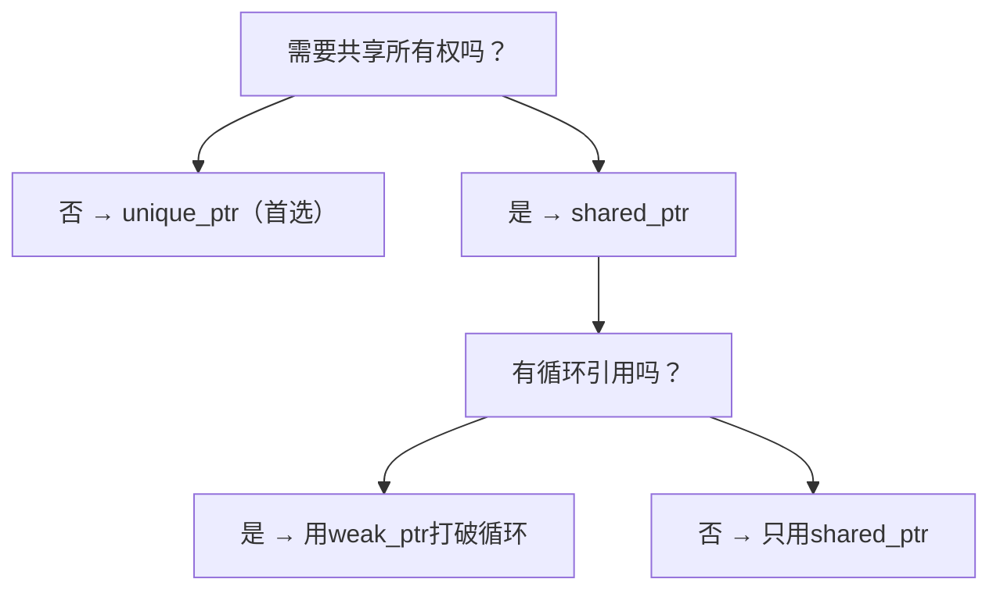
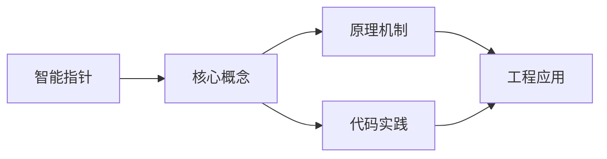
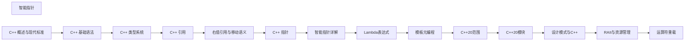

## 1. 学习目标（Bloom 分类）

本节按照布鲁姆教育目标分类学组织学习路径。本文主题为《智能指针》，属于 C++ 模块，读者可以根据自身阶段选择阅读深度。

记忆层面：能够准确复述本文的核心概念、术语与基本语法或操作步骤，并能够在提问或检索时快速定位对应知识点。能够说出 C++ 的类、继承、重载、模板与 STL 容器基本语法。

理解层面：能够用自己的语言解释核心原理与工作机制，说明概念之间的因果关系，而不是机械记忆结论。能够解释 RAII、拷贝/移动语义、虚函数与模板实例化。

应用层面：能够在真实项目或练习场景中运用本文知识解决具体问题，写出正确且可维护的实现。能够编写现代 C++（C++17/20）的类与泛型代码。

分析层面：能够拆解复杂问题，比较本文主题与相邻概念的异同，识别边界条件与例外情况。能够分析生命周期、未定义行为与性能特征。

评价层面：能够根据约束条件（性能、可读性、安全、成本）评价不同方案的优劣，做出有依据的技术决策。能够评价 C++ 与 Rust、Java 在系统编程中的取舍。

创造层面：能够把本文知识与其他模块知识组合，设计出新的解决方案或可复用的工程模式。能够设计高性能、可维护的 C++ 库与应用。

通过本节学习，读者应当能够把《智能指针》纳入自己的知识网络，并与 C++ 模块的其他主题（RAII、移动语义、模板、STL）建立关联。

## 2. 历史动机与发展脉络

《智能指针》是 C++ 领域的重要主题。要真正理解它，需要先了解它解决的问题与演进过程。

C++ 由 Bjarne Stroustrup 于 1979 年开始在贝尔实验室开发（原名 C with Classes），1983 年更名 C++，1998 年 C++98 首次标准化。
C++11 是语言转折点：右值引用、auto、lambda、智能指针、并发内存模型让现代 C++ 写法定型；C++14/17 补充泛型 lambda、if constexpr、折叠表达式；C++20 引入 concepts、协程、模块与范围库；C++23 继续完善。
现代 C++ 的核心口号是“资源安全”：RAII + 智能指针替代裸 new/delete，异常与错误码按场景选择；Rust 的出现促使 C++ 社区更重视内存安全工具（如 profile 指南、sanitizer）。

回到本文主题：智能指针 的提出与成熟，正是上述技术背景下的必然产物。早期实现往往以简单可用为目标，随着工程规模扩大，社区逐渐沉淀出标准做法与最佳实践；理解这一脉络，可以帮助读者判断“为什么文档中的推荐写法是现在这个样子”，也能在遇到历史遗留代码时准确识别其设计年代与取舍。


## 3. 形式化定义与核心概念精讲

本节把《智能指针》涉及的核心概念以“定义 + 讲解”的形式展开。读者应把定义当作工具，把讲解当作理解路径；两者结合才能形成可迁移的知识。

RAII：资源在构造函数获取、析构函数释放，栈对象离开作用域自动清理；智能指针（unique_ptr/shared_ptr/weak_ptr）把所有权编码进类型。
移动语义：右值引用 `&&` 与 std::move 转移资源所有权，避免深拷贝；移动后对象处于“合法但未指定”状态。
虚函数与多态：virtual 实现动态绑定，vtable 是运行时分派机制；final/override 关键字防止误用；基类析构函数应为 virtual。

### 3.1 原文章节逐一精讲

原文档把主题拆分为 16 个小节，下面按顺序给出每一节的导读讲解，随后保留原文细节供精读。

#### 原文精读（完整保留）

# 智能指针

> **符号约定**：`< >` 必填参数 | `[ ]` 可选参数

---

#### 1. 智能指针概述

##### 1.1 为什么需要智能指针

C++中手动管理动态内存（new/delete）容易出错，常见问题包括：

- **内存泄漏**：忘记释放内存
- **悬空指针**：释放后继续使用
- **重复释放**：同一块内存释放两次
- **异常安全**：异常发生时资源未释放

智能指针通过 **RAII（Resource Acquisition Is Initialization）** 原则自动管理资源生命周期。

##### 1.2 RAII 原则

RAII的核心思想：将资源的获取与对象的生命周期绑定，利用对象析构函数自动释放资源。

```cpp
#include <iostream>
#include <memory>

// RAII示例：文件操作封装
class FileGuard {
public:
    explicit FileGuard(FILE* fp) : fp_(fp) {}
    ~FileGuard() {
        if (fp_) {
            fclose(fp_);
            std::cout << "File closed automatically" << std::endl;
        }
    }
    // 禁止拷贝
    FileGuard(const FileGuard&) = delete;
    FileGuard& operator=(const FileGuard&) = delete;
    FILE* get() const { return fp_; }
private:
    FILE* fp_;
};

void use_file() {
    FileGuard fg(fopen("test.txt", "w"));
    if (fg.get()) {
        fprintf(fg.get(), "Hello, RAII!");
    }
    // 函数结束，fg析构自动关闭文件
}
```

##### 1.3 C++ 标准库智能指针

| 智能指针          | 头文件     | 所有权 | 开销               |
| :---------------- | :--------- | :----- | :----------------- |
| `std::unique_ptr` | `<memory>` | 独占   | 几乎零开销         |
| `std::shared_ptr` | `<memory>` | 共享   | 引用计数开销       |
| `std::weak_ptr`   | `<memory>` | 不拥有 | 配合shared_ptr使用 |

#### 2. unique_ptr

##### 2.1 基本用法

`unique_ptr` 独占所指向的对象，不可拷贝，只能移动。

```cpp
#include <iostream>
#include <memory>
#include <vector>

class Widget {
public:
    explicit Widget(int id) : id_(id) {
        std::cout << "Widget(" << id_ << ") constructed\n";
    }
    ~Widget() {
        std::cout << "Widget(" << id_ << ") destroyed\n";
    }
    void do_work() {
        std::cout << "Widget(" << id_ << ") working\n";
    }
    int id() const { return id_; }
private:
    int id_;
};

void unique_ptr_basic() {
    // 创建方式1：make_unique（C++14推荐）
    auto p1 = std::make_unique<Widget>(1);

    // 创建方式2：直接构造（C++11）
    std::unique_ptr<Widget> p2(new Widget(2));

    // 访问对象
    p1->do_work();
    std::cout << "p1 id: " << p1->id() << std::endl;

    // 检查是否为空
    if (p1) {
        std::cout << "p1 is not null\n";
    }

    // 释放所有权（返回裸指针，unique_ptr变为空）
    Widget* raw = p1.release();
    delete raw;  // 需要手动释放

    // 重置（释放当前对象，可接管新对象）
    p2.reset(new Widget(3));  // 释放Widget(2)，接管Widget(3)
    p2.reset();               // 释放Widget(3)，p2变为空
}
```

##### 2.2 所有权转移

```cpp
void unique_ptr_ownership() {
    auto p1 = std::make_unique<Widget>(1);

    // 移动语义转移所有权
    auto p2 = std::move(p1);
    // p1 现在为空，p2 拥有对象

    // 在函数间传递
    auto process = [](std::unique_ptr<Widget> w) {
        w->do_work();
        return w;  // 返回所有权
    };

    auto p3 = process(std::move(p2));
    // p2 为空，p3 拥有对象

    // 工厂函数返回unique_ptr
    auto create_widget = [](int id) -> std::unique_ptr<Widget> {
        return std::make_unique<Widget>(id);
    };

    auto p4 = create_widget(4);
}
```

##### 2.3 unique_ptr 与数组

```cpp
void unique_ptr_array() {
    // C++14: make_unique支持数组
    auto arr = std::make_unique<int[]>(10);
    for (int i = 0; i < 10; i++) {
        arr[i] = i * i;
    }

    // 注意：unique_ptr<T[]> 与 unique_ptr<T> 的区别
    // unique_ptr<T[]> 使用 operator[] 而非 operator*
    // unique_ptr<T[]> 的删除器是 delete[] 而非 delete

    // 推荐替代方案：使用 std::vector 或 std::array
    std::vector<int> vec(10);
    for (int i = 0; i < 10; i++) {
        vec[i] = i * i;
    }
}
```

##### 2.4 自定义删除器

```cpp
void custom_deleter() {
    // 自定义删除器用于特殊资源管理
    auto file_closer = [](FILE* fp) {
        if (fp) {
            fclose(fp);
            std::cout << "File closed by custom deleter\n";
        }
    };

    {
        std::unique_ptr<FILE, decltype(file_closer)> fp(
            fopen("test.txt", "w"), file_closer
        );
        if (fp) {
            fprintf(fp.get(), "Hello, custom deleter!");
        }
    }  // 离开作用域，自动调用file_closer

    // 管理C API资源
    auto malloc_deleter = [](void* p) {
        free(p);
        std::cout << "Memory freed by custom deleter\n";
    };

    std::unique_ptr<void, decltype(malloc_deleter)> buffer(
        malloc(1024), malloc_deleter
    );
}
```

#### 3. shared_ptr

##### 3.1 基本用法

`shared_ptr` 通过引用计数实现共享所有权，最后一个 `shared_ptr` 销毁时释放对象。

```cpp
#include <iostream>
#include <memory>

class Node {
public:
    explicit Node(int val) : val_(val) {
        std::cout << "Node(" << val_ << ") created\n";
    }
    ~Node() {
        std::cout << "Node(" << val_ << ") destroyed\n";
    }
    void set_next(std::shared_ptr<Node> next) { next_ = next; }
    void set_prev(std::shared_ptr<Node> prev) { prev_ = prev; }
    int val() const { return val_; }
private:
    int val_;
    std::shared_ptr<Node> next_;
    std::shared_ptr<Node> prev_;  // 注意：这会导致循环引用！
};

void shared_ptr_basic() {
    // 创建方式1：make_shared（推荐，更高效）
    auto p1 = std::make_shared<Node>(1);

    // 创建方式2：直接构造
    std::shared_ptr<Node> p2(new Node(2));

    // 共享所有权
    auto p3 = p1;  // 引用计数+1
    std::cout << "p1 use_count: " << p1.use_count() << std::endl;  // 2
    std::cout << "p3 use_count: " << p3.use_count() << std::endl;  // 2

    // p1, p3 离开作用域，引用计数归零，Node(1)自动销毁
    // p2 离开作用域，Node(2)自动销毁
}
```

##### 3.2 引用计数机制

```cpp
void reference_counting() {
    auto sp = std::make_shared<int>(42);

    std::cout << "use_count: " << sp.use_count() << std::endl;  // 1

    {
        auto sp2 = sp;
        std::cout << "use_count: " << sp.use_count() << std::endl;  // 2

        auto sp3 = sp;
        std::cout << "use_count: " << sp.use_count() << std::endl;  // 3

        sp3.reset();  // 释放sp3的所有权
        std::cout << "use_count: " << sp.use_count() << std::endl;  // 2
    }
    // sp2 离开作用域
    std::cout << "use_count: " << sp.use_count() << std::endl;  // 1

    // 检查是否唯一拥有者
    if (sp.unique()) {
        std::cout << "sp is the sole owner\n";
    }
}
```

##### 3.3 make_shared 的优势

```cpp
void make_shared_advantage() {
    // make_shared：一次分配，对象和控制块在一起
    auto sp1 = std::make_shared<int>(42);

    // 直接构造：两次分配，对象和控制块分开
    std::shared_ptr<int> sp2(new int(42));

    // make_shared 优势：
    // 1. 只需一次内存分配，更高效
    // 2. 异常安全（避免new和构造函数之间的异常泄漏）
    // 3. 代码更简洁

    // make_shared 劣势：
    // 1. 对象和控制块一起分配，对象销毁后内存可能不会立即释放
    //    （需等所有weak_ptr也销毁）
    // 2. 不支持自定义删除器
    // 3. 不支持花括号初始化（C++20前）
}
```

##### 3.4 shared_ptr 与 this 指针

```cpp
class Handler : public std::enable_shared_from_this<Handler> {
public:
    explicit Handler(int id) : id_(id) {
        std::cout << "Handler(" << id_ << ") created\n";
    }

    // 错误方式：返回shared_ptr(this)会导致多个控制块
    // std::shared_ptr<Handler> get_self() {
    //     return std::shared_ptr<Handler>(this);  // 危险！
    // }

    // 正确方式：使用enable_shared_from_this
    std::shared_ptr<Handler> get_self() {
        return shared_from_this();
    }

    void register_callback() {
        // 需要传递自身给异步回调时
        auto self = shared_from_this();
        // callback_registry.register([self]() { self->process(); });
    }

    void process() {
        std::cout << "Handler(" << id_ << ") processing\n";
    }

private:
    int id_;
};

void enable_shared_from_this_demo() {
    auto h = std::make_shared<Handler>(1);
    auto h2 = h->get_self();  // 共享同一控制块
    std::cout << "use_count: " << h.use_count() << std::endl;  // 2
}
```

#### 4. weak_ptr

##### 4.1 解决循环引用

```cpp
#include <iostream>
#include <memory>

class ListNode {
public:
    explicit ListNode(int val) : val_(val) {
        std::cout << "Node(" << val_ << ") created\n";
    }
    ~ListNode() {
        std::cout << "Node(" << val_ << ") destroyed\n";
    }

    // 使用weak_ptr打破循环引用
    std::shared_ptr<ListNode> next;
    std::weak_ptr<ListNode> prev;  // weak_ptr不增加引用计数

    int val() const { return val_; }
private:
    int val_;
};

void weak_ptr_demo() {
    auto n1 = std::make_shared<ListNode>(1);
    auto n2 = std::make_shared<ListNode>(2);

    n1->next = n2;
    n2->prev = n1;  // weak_ptr，不增加n1的引用计数

    std::cout << "n1 use_count: " << n1.use_count() << std::endl;  // 1
    std::cout << "n2 use_count: " << n2.use_count() << std::endl;  // 2

    // 从weak_ptr获取shared_ptr
    if (auto prev = n2->prev.lock()) {
        std::cout << "n2's prev value: " << prev->val() << std::endl;
    }

    // 检查weak_ptr是否过期
    std::cout << "n2's prev expired: " << n2->prev.expired() << std::endl;  // false
}
```

##### 4.2 weak_ptr 的观察者模式

```cpp
#include <iostream>
#include <memory>
#include <vector>
#include <algorithm>

class Subject;

class Observer {
public:
    virtual ~Observer() = default;
    virtual void update() = 0;
};

class Subject {
public:
    void attach(std::weak_ptr<Observer> observer) {
        observers_.push_back(observer);
    }

    void notify() {
        // 清理已过期的观察者
        observers_.erase(
            std::remove_if(observers_.begin(), observers_.end(),
                [](const std::weak_ptr<Observer>& wp) { return wp.expired(); }),
            observers_.end()
        );

        // 通知存活的观察者
        for (auto& wp : observers_) {
            if (auto sp = wp.lock()) {
                sp->update();
            }
        }
    }

private:
    std::vector<std::weak_ptr<Observer>> observers_;
};
```

#### 5. 智能指针选择指南

##### 5.1 决策流程



##### 5.2 性能对比

| 操作     | unique_ptr   | shared_ptr           | 裸指针 |
| :------- | :----------- | :------------------- | :----- |
| 创建     | O(1)         | O(1)\*               | O(1)   |
| 拷贝     | 禁止         | O(1)（原子计数+1）   | O(1)   |
| 移动     | O(1)         | O(1)（原子计数不变） | O(1)   |
| 析构     | O(1)         | O(1)（原子计数-1）   | 无     |
| 内存开销 | 与裸指针相同 | 2倍指针大小+控制块   | 无     |

> \*make_shared的创建涉及一次内存分配

#### 6. 常见问题与解决方案

##### 6.1 循环引用导致内存泄漏

```cpp
// 错误：双向链表使用shared_ptr导致循环引用
class BadNode {
public:
    std::shared_ptr<BadNode> next;
    std::shared_ptr<BadNode> prev;  // 导致循环引用！
};

// 正确：prev使用weak_ptr
class GoodNode {
public:
    std::shared_ptr<GoodNode> next;
    std::weak_ptr<GoodNode> prev;   // 打破循环引用
};
```

##### 6.2 误用 shared_ptr(this)

```cpp
// 错误：创建多个控制块
class BadExample {
public:
    std::shared_ptr<BadExample> get_self() {
        return std::shared_ptr<BadExample>(this);  // 新控制块！
    }
};

// 正确：继承enable_shared_from_this
class GoodExample : public std::enable_shared_from_this<GoodExample> {
public:
    std::shared_ptr<GoodExample> get_self() {
        return shared_from_this();  // 共享同一控制块
    }
};
```

##### 6.3 智能指针与裸指针混用

```cpp
// 危险：从裸指针创建多个shared_ptr
int* raw = new int(42);
std::shared_ptr<int> sp1(raw);
std::shared_ptr<int> sp2(raw);  // 两个控制块！double free！

// 正确：直接使用make_shared
auto sp1 = std::make_shared<int>(42);
auto sp2 = sp1;  // 共享同一控制块
```

#### 7. 总结与最佳实践

##### 7.1 核心原则

1. **优先使用 unique_ptr**：零开销，表达独占所有权
2. **需要共享时用 shared_ptr**：但注意循环引用
3. **观察者用 weak_ptr**：不延长对象生命周期
4. **使用 make_shared/make_unique**：更高效、更安全
5. **避免裸指针拥有资源**：裸指针只用于观察

##### 7.2 最佳实践清单

- 默认选择 `unique_ptr`，仅在需要共享所有权时使用 `shared_ptr`
- 始终使用 `std::make_unique` 和 `std::make_shared` 创建智能指针
- 需要从 this 创建 `shared_ptr` 时，继承 `enable_shared_from_this`
- 循环引用场景使用 `weak_ptr` 打破循环
- 自定义删除器处理非标准资源（文件句柄、socket等）
- 不要从同一个裸指针创建多个 `shared_ptr`
#### unique_ptr

**基本写法：创建 unique_ptr**
`std::unique_ptr<<type>> <ptr> = std::make_unique<<type>>(<args>);`
```cpp
#include <memory>
// 创建独占所有权的智能指针
std::unique_ptr<int> p = std::make_unique<int>(10);
```

---

**数组写法：创建 unique_ptr 数组**
`std::unique_ptr<<type>[]> <ptr> = std::make_unique<<type>[]>(<size>);`
```cpp
#include <memory>
// 创建独占所有权的数组
std::unique_ptr<int[]> arr = std::make_unique<int[]>(10);
```

---

**访问写法：访问 unique_ptr**
`*<ptr>` 或 `<ptr>-><member>`
```cpp
// 解引用访问值
std::unique_ptr<int> p = std::make_unique<int>(10);
std::cout << *p << std::endl;
```

---

**移动写法：转移所有权**
`std::unique_ptr<<type>> <new_ptr> = std::move(<old_ptr>);`
```cpp
#include <memory>
// 转移 unique_ptr 所有权
std::unique_ptr<int> p1 = std::make_unique<int>(10);
std::unique_ptr<int> p2 = std::move(p1);
```

---

**释放写法：释放所有权**
`<type>* <raw_ptr> = <ptr>.release();`
```cpp
// 释放所有权，返回原始指针
std::unique_ptr<int> p = std::make_unique<int>(10);
int* raw = p.release();
delete raw;
```

---

**重置写法：重置 unique_ptr**
`<ptr>.reset(<new_ptr>);`
```cpp
// 重置为新的指针
std::unique_ptr<int> p = std::make_unique<int>(10);
p.reset(new int(20));
```

---

#### shared_ptr

**基本写法：创建 shared_ptr**
`std::shared_ptr<<type>> <ptr> = std::make_shared<<type>>(<args>);`
```cpp
#include <memory>
// 创建共享所有权的智能指针
std::shared_ptr<int> p = std::make_shared<int>(10);
```

---

**拷贝写法：拷贝 shared_ptr**
`std::shared_ptr<<type>> <ptr2> = <ptr1>;`
```cpp
// 拷贝 shared_ptr，引用计数增加
std::shared_ptr<int> p1 = std::make_shared<int>(10);
std::shared_ptr<int> p2 = p1;
```

---

**引用计数写法：获取引用计数**
`<ptr>.use_count()`
```cpp
// 获取当前引用计数
std::shared_ptr<int> p1 = std::make_shared<int>(10);
std::shared_ptr<int> p2 = p1;
std::cout << p1.use_count() << std::endl;
```

---

**重置写法：重置 shared_ptr**
`<ptr>.reset();`
```cpp
// 重置 shared_ptr，引用计数减少
std::shared_ptr<int> p = std::make_shared<int>(10);
p.reset();
```

---

**自定义删除器写法**
`std::shared_ptr<<type>> <ptr>(<raw_ptr>, <deleter>);`
```cpp
#include <memory>
// 使用自定义删除器
std::shared_ptr<FILE> file(fopen("test.txt", "r"), [](FILE* f) {
    if (f) fclose(f);
});
```

---

#### weak_ptr

**基本写法：创建 weak_ptr**
`std::weak_ptr<<type>> <weak> = <shared_ptr>;`
```cpp
#include <memory>
// 创建弱引用，不增加引用计数
std::shared_ptr<int> shared = std::make_shared<int>(10);
std::weak_ptr<int> weak = shared;
```

---

**lock 写法：获取 shared_ptr**
`std::shared_ptr<<type>> <ptr> = <weak>.lock();`
```cpp
// 尝试获取 shared_ptr
std::weak_ptr<int> weak = shared;
if (auto p = weak.lock()) {
    std::cout << *p << std::endl;
}
```

---

**expired 写法：检查是否过期**
`<weak>.expired()`
```cpp
// 检查 weak_ptr 是否过期
std::weak_ptr<int> weak = shared;
if (weak.expired()) {
    std::cout << "Pointer expired" << std::endl;
}
```

---

**use_count 写法：获取引用计数**
`<weak>.use_count()`
```cpp
// 获取 weak_ptr 对应的引用计数
std::weak_ptr<int> weak = shared;
std::cout << weak.use_count() << std::endl;
```

---

#### 智能指针与数组

**unique_ptr 数组写法**
`std::unique_ptr<<type>[]> <ptr> = std::make_unique<<type>[]>(<size>);`
```cpp
#include <memory>
// unique_ptr 管理数组
std::unique_ptr<int[]> arr = std::make_unique<int[]>(10);
arr[0] = 100;
```

---

**shared_ptr 数组写法（C++17）**
`std::shared_ptr<<type>[]> <ptr> = std::make_shared<<type>[]>(<size>);`
```cpp
#include <memory>
// C++17 shared_ptr 管理数组
std::shared_ptr<int[]> arr = std::make_shared<int[]>(10);
arr[0] = 100;
```

---

#### 智能指针与自定义类型

**基本写法：管理自定义类型**
`std::unique_ptr<<Type>> <ptr> = std::make_unique<<Type>>(<args>);`
```cpp
#include <memory>
// 管理自定义类型
struct Point { int x; int y; Point(int x, int y) : x(x), y(y) {} };
std::unique_ptr<Point> p = std::make_unique<Point>(10, 20);
```

---

**成员访问写法：访问智能指针成员**
`<ptr>-><member>`
```cpp
// 通过智能指针访问成员
std::unique_ptr<Point> p = std::make_unique<Point>(10, 20);
std::cout << p->x << std::endl;
```

---

#### 智能指针转换

**dynamic_pointer_cast 写法**
`std::dynamic_pointer_cast<<Derived>>(<base_ptr>);`
```cpp
#include <memory>
// 动态转换 shared_ptr
std::shared_ptr<Base> base = std::make_shared<Derived>();
std::shared_ptr<Derived> derived = std::dynamic_pointer_cast<Derived>(base);
```

---

**static_pointer_cast 写法**
`std::static_pointer_cast<<Target>>(<src_ptr>);`
```cpp
#include <memory>
// 静态转换 shared_ptr
std::shared_ptr<Derived> derived = std::make_shared<Derived>();
std::shared_ptr<Base> base = std::static_pointer_cast<Base>(derived);
```

---

#### 智能指针与容器

**容器写法：存储智能指针**
`std::vector<std::unique_ptr<<type>>> <vec>;`
```cpp
#include <memory>
#include <vector>
// 容器存储智能指针
std::vector<std::unique_ptr<int>> vec;
vec.push_back(std::make_unique<int>(10));
```

---

**shared_ptr 容器写法**
`std::vector<std::shared_ptr<<type>>> <vec>;`
```cpp
#include <memory>
#include <vector>
// 容器存储 shared_ptr
std::vector<std::shared_ptr<int>> vec;
vec.push_back(std::make_shared<int>(10));
```

---

#### enable_shared_from_this

**基本写法：继承 enable_shared_from_this**
`class <Type> : public std::enable_shared_from_this<<Type>> { ... };`
```cpp
#include <memory>
// 继承 enable_shared_from_this
class MyClass : public std::enable_shared_from_this<MyClass> {
public:
    std::shared_ptr<MyClass> get_ptr() {
        return shared_from_this();
    }
};
```

---

**使用写法：获取自身的 shared_ptr**
`<obj>.shared_from_this()`
```cpp
// 获取自身的 shared_ptr
std::shared_ptr<MyClass> obj = std::make_shared<MyClass>();
std::shared_ptr<MyClass> ptr = obj->get_ptr();
```

---

#### 智能指针最佳实践

**优先写法：优先使用 make_unique 和 make_shared**
`auto <ptr> = std::make_unique<<type>>(<args>);`
```cpp
#include <memory>
// 优先使用 make_unique/make_shared
auto p = std::make_unique<int>(10);
```

---

**unique_ptr 优先写法：默认使用 unique_ptr**
`std::unique_ptr<<type>> <ptr> = std::make_unique<<type>>(<args>);`
```cpp
#include <memory>
// 默认使用 unique_ptr，需要共享时再使用 shared_ptr
std::unique_ptr<int> p = std::make_unique<int>(10);
```


### 3.2 概念关系图

下面用 Mermaid 图表达本文核心概念之间的关系，帮助读者建立整体图景：



图中展示的是本文知识的结构化关系：核心概念是入口，原理机制解释“为什么”，代码实践演示“怎么做”，工程应用回答“何时用”。读者学习时可以把每个小节的内容挂接到对应节点上。

## 4. 理论推导与原理解析

本节深入《智能指针》背后的原理。理论部分不求面面俱到，而是聚焦“能解释现象、能指导实践”的关键推导。

RAII：资源在构造函数获取、析构函数释放，栈对象离开作用域自动清理；智能指针（unique_ptr/shared_ptr/weak_ptr）把所有权编码进类型。
移动语义：右值引用 `&&` 与 std::move 转移资源所有权，避免深拷贝；移动后对象处于“合法但未指定”状态。
虚函数与多态：virtual 实现动态绑定，vtable 是运行时分派机制；final/override 关键字防止误用；基类析构函数应为 virtual。
模板与泛型：模板编译期实例化，实现静态多态；concepts（C++20）约束类型接口；模板元编程在编译期计算类型与常量。

需要强调的是，理论推导与工程实践之间存在翻译层：理论给出的是理想化模型与边界条件，工程代码则必须处理真实环境中的例外。读者在学习时应先掌握理论的“标准情形”，再通过陷阱章节了解“非标准情形”。

## 5. 代码示例与逐行讲解

本节把原文中的代码示例系统整理，并为每个示例补充用途说明与讲解。读者不应只浏览代码，而应逐段对照讲解理解设计意图。

### 5.1 示例：1.2 RAII 原则

该示例来自原文《1.2 RAII 原则》小节，用于演示智能指针相关操作。阅读时请先看代码结构，再看其后的讲解。

```cpp
#include <iostream>
#include <memory>

// RAII示例：文件操作封装
class FileGuard {
public:
    explicit FileGuard(FILE* fp) : fp_(fp) {}
    ~FileGuard() {
        if (fp_) {
            fclose(fp_);
            std::cout << "File closed automatically" << std::endl;
        }
    }
    // 禁止拷贝
    FileGuard(const FileGuard&) = delete;
    FileGuard& operator=(const FileGuard&) = delete;
    FILE* get() const { return fp_; }
private:
    FILE* fp_;
};

void use_file() {
    FileGuard fg(fopen("test.txt", "w"));
    if (fg.get()) {
        fprintf(fg.get(), "Hello, RAII!");
    }
    // 函数结束，fg析构自动关闭文件
}
```

讲解：这段代码演示了本节核心知识点。代码中的关键操作可以归纳为三步：准备（定义或初始化）、执行（核心逻辑）、收尾（释放资源或返回结果）。实际项目中，这三步往往被封装为函数或类，以提升复用性与可测试性。

关键点分析：

该示例共 26 行有效代码，包含 3 类关键结构（class、if、return）。其中：

- 入口与初始化部分负责建立上下文，对应实际项目中的启动或装配逻辑；
- 核心逻辑部分体现本文主题的主要操作，是阅读时最需要对照讲解理解的部分；
- 输出或返回部分把结果交给调用方，注意其类型与边界条件。

进阶思考路径：先尝试修改参数观察行为变化，再把示例中的模式迁移到自己的项目中；每次修改都记录预期与实测差异，这是把示例转化为能力的最快方式。

### 5.2 示例：2.1 基本用法

该示例来自原文《2.1 基本用法》小节，用于演示智能指针相关操作。阅读时请先看代码结构，再看其后的讲解。

```cpp
#include <iostream>
#include <memory>
#include <vector>

class Widget {
public:
    explicit Widget(int id) : id_(id) {
        std::cout << "Widget(" << id_ << ") constructed\n";
    }
    ~Widget() {
        std::cout << "Widget(" << id_ << ") destroyed\n";
    }
    void do_work() {
        std::cout << "Widget(" << id_ << ") working\n";
    }
    int id() const { return id_; }
private:
    int id_;
};

void unique_ptr_basic() {
    // 创建方式1：make_unique（C++14推荐）
    auto p1 = std::make_unique<Widget>(1);

    // 创建方式2：直接构造（C++11）
    std::unique_ptr<Widget> p2(new Widget(2));

    // 访问对象
    p1->do_work();
    std::cout << "p1 id: " << p1->id() << std::endl;

    // 检查是否为空
    if (p1) {
        std::cout << "p1 is not null\n";
    }

    // 释放所有权（返回裸指针，unique_ptr变为空）
    Widget* raw = p1.release();
    delete raw;  // 需要手动释放

    // 重置（释放当前对象，可接管新对象）
    p2.reset(new Widget(3));  // 释放Widget(2)，接管Widget(3)
    p2.reset();               // 释放Widget(3)，p2变为空
}
```

讲解：这段代码演示了本节核心知识点。代码中的关键操作可以归纳为三步：准备（定义或初始化）、执行（核心逻辑）、收尾（释放资源或返回结果）。实际项目中，这三步往往被封装为函数或类，以提升复用性与可测试性。

关键点分析：

该示例共 37 行有效代码，包含 3 类关键结构（class、if、return）。其中：

- 入口与初始化部分负责建立上下文，对应实际项目中的启动或装配逻辑；
- 核心逻辑部分体现本文主题的主要操作，是阅读时最需要对照讲解理解的部分；
- 输出或返回部分把结果交给调用方，注意其类型与边界条件。

进阶思考路径：先尝试修改参数观察行为变化，再把示例中的模式迁移到自己的项目中；每次修改都记录预期与实测差异，这是把示例转化为能力的最快方式。

### 5.3 示例：2.2 所有权转移

该示例来自原文《2.2 所有权转移》小节，用于演示智能指针相关操作。阅读时请先看代码结构，再看其后的讲解。

```cpp
void unique_ptr_ownership() {
    auto p1 = std::make_unique<Widget>(1);

    // 移动语义转移所有权
    auto p2 = std::move(p1);
    // p1 现在为空，p2 拥有对象

    // 在函数间传递
    auto process = [](std::unique_ptr<Widget> w) {
        w->do_work();
        return w;  // 返回所有权
    };

    auto p3 = process(std::move(p2));
    // p2 为空，p3 拥有对象

    // 工厂函数返回unique_ptr
    auto create_widget = [](int id) -> std::unique_ptr<Widget> {
        return std::make_unique<Widget>(id);
    };

    auto p4 = create_widget(4);
}
```

讲解：这段代码演示了本节核心知识点。代码中的关键操作可以归纳为三步：准备（定义或初始化）、执行（核心逻辑）、收尾（释放资源或返回结果）。实际项目中，这三步往往被封装为函数或类，以提升复用性与可测试性。

关键点分析：

该示例共 18 行有效代码，包含 1 类关键结构（return）。其中：

- 入口与初始化部分负责建立上下文，对应实际项目中的启动或装配逻辑；
- 核心逻辑部分体现本文主题的主要操作，是阅读时最需要对照讲解理解的部分；
- 输出或返回部分把结果交给调用方，注意其类型与边界条件。

进阶思考路径：先尝试修改参数观察行为变化，再把示例中的模式迁移到自己的项目中；每次修改都记录预期与实测差异，这是把示例转化为能力的最快方式。

### 5.4 示例：2.3 unique_ptr 与数组

该示例来自原文《2.3 unique_ptr 与数组》小节，用于演示智能指针相关操作。阅读时请先看代码结构，再看其后的讲解。

```cpp
void unique_ptr_array() {
    // C++14: make_unique支持数组
    auto arr = std::make_unique<int[]>(10);
    for (int i = 0; i < 10; i++) {
        arr[i] = i * i;
    }

    // 注意：unique_ptr<T[]> 与 unique_ptr<T> 的区别
    // unique_ptr<T[]> 使用 operator[] 而非 operator*
    // unique_ptr<T[]> 的删除器是 delete[] 而非 delete

    // 推荐替代方案：使用 std::vector 或 std::array
    std::vector<int> vec(10);
    for (int i = 0; i < 10; i++) {
        vec[i] = i * i;
    }
}
```

讲解：这段代码演示了本节核心知识点。代码中的关键操作可以归纳为三步：准备（定义或初始化）、执行（核心逻辑）、收尾（释放资源或返回结果）。实际项目中，这三步往往被封装为函数或类，以提升复用性与可测试性。

关键点分析：

该示例共 15 行有效代码，包含 1 类关键结构（for）。其中：

- 入口与初始化部分负责建立上下文，对应实际项目中的启动或装配逻辑；
- 核心逻辑部分体现本文主题的主要操作，是阅读时最需要对照讲解理解的部分；
- 输出或返回部分把结果交给调用方，注意其类型与边界条件。

进阶思考路径：先尝试修改参数观察行为变化，再把示例中的模式迁移到自己的项目中；每次修改都记录预期与实测差异，这是把示例转化为能力的最快方式。

### 5.5 示例：2.4 自定义删除器

该示例来自原文《2.4 自定义删除器》小节，用于演示智能指针相关操作。阅读时请先看代码结构，再看其后的讲解。

```cpp
void custom_deleter() {
    // 自定义删除器用于特殊资源管理
    auto file_closer = [](FILE* fp) {
        if (fp) {
            fclose(fp);
            std::cout << "File closed by custom deleter\n";
        }
    };

    {
        std::unique_ptr<FILE, decltype(file_closer)> fp(
            fopen("test.txt", "w"), file_closer
        );
        if (fp) {
            fprintf(fp.get(), "Hello, custom deleter!");
        }
    }  // 离开作用域，自动调用file_closer

    // 管理C API资源
    auto malloc_deleter = [](void* p) {
        free(p);
        std::cout << "Memory freed by custom deleter\n";
    };

    std::unique_ptr<void, decltype(malloc_deleter)> buffer(
        malloc(1024), malloc_deleter
    );
}
```

讲解：这段代码演示了本节核心知识点。代码中的关键操作可以归纳为三步：准备（定义或初始化）、执行（核心逻辑）、收尾（释放资源或返回结果）。实际项目中，这三步往往被封装为函数或类，以提升复用性与可测试性。

关键点分析：

该示例共 25 行有效代码，包含 1 类关键结构（if）。其中：

- 入口与初始化部分负责建立上下文，对应实际项目中的启动或装配逻辑；
- 核心逻辑部分体现本文主题的主要操作，是阅读时最需要对照讲解理解的部分；
- 输出或返回部分把结果交给调用方，注意其类型与边界条件。

进阶思考路径：先尝试修改参数观察行为变化，再把示例中的模式迁移到自己的项目中；每次修改都记录预期与实测差异，这是把示例转化为能力的最快方式。

### 5.6 示例：3.1 基本用法

该示例来自原文《3.1 基本用法》小节，用于演示智能指针相关操作。阅读时请先看代码结构，再看其后的讲解。

```cpp
#include <iostream>
#include <memory>

class Node {
public:
    explicit Node(int val) : val_(val) {
        std::cout << "Node(" << val_ << ") created\n";
    }
    ~Node() {
        std::cout << "Node(" << val_ << ") destroyed\n";
    }
    void set_next(std::shared_ptr<Node> next) { next_ = next; }
    void set_prev(std::shared_ptr<Node> prev) { prev_ = prev; }
    int val() const { return val_; }
private:
    int val_;
    std::shared_ptr<Node> next_;
    std::shared_ptr<Node> prev_;  // 注意：这会导致循环引用！
};

void shared_ptr_basic() {
    // 创建方式1：make_shared（推荐，更高效）
    auto p1 = std::make_shared<Node>(1);

    // 创建方式2：直接构造
    std::shared_ptr<Node> p2(new Node(2));

    // 共享所有权
    auto p3 = p1;  // 引用计数+1
    std::cout << "p1 use_count: " << p1.use_count() << std::endl;  // 2
    std::cout << "p3 use_count: " << p3.use_count() << std::endl;  // 2

    // p1, p3 离开作用域，引用计数归零，Node(1)自动销毁
    // p2 离开作用域，Node(2)自动销毁
}
```

讲解：这段代码演示了本节核心知识点。代码中的关键操作可以归纳为三步：准备（定义或初始化）、执行（核心逻辑）、收尾（释放资源或返回结果）。实际项目中，这三步往往被封装为函数或类，以提升复用性与可测试性。

关键点分析：

该示例共 30 行有效代码，包含 2 类关键结构（class、return）。其中：

- 入口与初始化部分负责建立上下文，对应实际项目中的启动或装配逻辑；
- 核心逻辑部分体现本文主题的主要操作，是阅读时最需要对照讲解理解的部分；
- 输出或返回部分把结果交给调用方，注意其类型与边界条件。

进阶思考路径：先尝试修改参数观察行为变化，再把示例中的模式迁移到自己的项目中；每次修改都记录预期与实测差异，这是把示例转化为能力的最快方式。

### 5.7 示例：3.2 引用计数机制

该示例来自原文《3.2 引用计数机制》小节，用于演示智能指针相关操作。阅读时请先看代码结构，再看其后的讲解。

```cpp
void reference_counting() {
    auto sp = std::make_shared<int>(42);

    std::cout << "use_count: " << sp.use_count() << std::endl;  // 1

    {
        auto sp2 = sp;
        std::cout << "use_count: " << sp.use_count() << std::endl;  // 2

        auto sp3 = sp;
        std::cout << "use_count: " << sp.use_count() << std::endl;  // 3

        sp3.reset();  // 释放sp3的所有权
        std::cout << "use_count: " << sp.use_count() << std::endl;  // 2
    }
    // sp2 离开作用域
    std::cout << "use_count: " << sp.use_count() << std::endl;  // 1

    // 检查是否唯一拥有者
    if (sp.unique()) {
        std::cout << "sp is the sole owner\n";
    }
}
```

讲解：这段代码演示了本节核心知识点。代码中的关键操作可以归纳为三步：准备（定义或初始化）、执行（核心逻辑）、收尾（释放资源或返回结果）。实际项目中，这三步往往被封装为函数或类，以提升复用性与可测试性。

关键点分析：

该示例共 18 行有效代码，包含 1 类关键结构（if）。其中：

- 入口与初始化部分负责建立上下文，对应实际项目中的启动或装配逻辑；
- 核心逻辑部分体现本文主题的主要操作，是阅读时最需要对照讲解理解的部分；
- 输出或返回部分把结果交给调用方，注意其类型与边界条件。

进阶思考路径：先尝试修改参数观察行为变化，再把示例中的模式迁移到自己的项目中；每次修改都记录预期与实测差异，这是把示例转化为能力的最快方式。

### 5.8 示例：3.3 make_shared 的优势

该示例来自原文《3.3 make_shared 的优势》小节，用于演示智能指针相关操作。阅读时请先看代码结构，再看其后的讲解。

```cpp
void make_shared_advantage() {
    // make_shared：一次分配，对象和控制块在一起
    auto sp1 = std::make_shared<int>(42);

    // 直接构造：两次分配，对象和控制块分开
    std::shared_ptr<int> sp2(new int(42));

    // make_shared 优势：
    // 1. 只需一次内存分配，更高效
    // 2. 异常安全（避免new和构造函数之间的异常泄漏）
    // 3. 代码更简洁

    // make_shared 劣势：
    // 1. 对象和控制块一起分配，对象销毁后内存可能不会立即释放
    //    （需等所有weak_ptr也销毁）
    // 2. 不支持自定义删除器
    // 3. 不支持花括号初始化（C++20前）
}
```

讲解：这段代码演示了本节核心知识点。代码中的关键操作可以归纳为三步：准备（定义或初始化）、执行（核心逻辑）、收尾（释放资源或返回结果）。实际项目中，这三步往往被封装为函数或类，以提升复用性与可测试性。

关键点分析：

该示例共 15 行有效代码，结构以数据或配置为主。阅读时应关注：数据字段的含义、配置项的作用，以及它们与运行行为的对应关系。

进阶思考路径：先尝试修改参数观察行为变化，再把示例中的模式迁移到自己的项目中；每次修改都记录预期与实测差异，这是把示例转化为能力的最快方式。

### 5.9 示例：3.4 shared_ptr 与 this 指针

该示例来自原文《3.4 shared_ptr 与 this 指针》小节，用于演示智能指针相关操作。阅读时请先看代码结构，再看其后的讲解。

```cpp
class Handler : public std::enable_shared_from_this<Handler> {
public:
    explicit Handler(int id) : id_(id) {
        std::cout << "Handler(" << id_ << ") created\n";
    }

    // 错误方式：返回shared_ptr(this)会导致多个控制块
    // std::shared_ptr<Handler> get_self() {
    //     return std::shared_ptr<Handler>(this);  // 危险！
    // }

    // 正确方式：使用enable_shared_from_this
    std::shared_ptr<Handler> get_self() {
        return shared_from_this();
    }

    void register_callback() {
        // 需要传递自身给异步回调时
        auto self = shared_from_this();
        // callback_registry.register([self]() { self->process(); });
    }

    void process() {
        std::cout << "Handler(" << id_ << ") processing\n";
    }

private:
    int id_;
};

void enable_shared_from_this_demo() {
    auto h = std::make_shared<Handler>(1);
    auto h2 = h->get_self();  // 共享同一控制块
    std::cout << "use_count: " << h.use_count() << std::endl;  // 2
}
```

讲解：这段代码演示了本节核心知识点。代码中的关键操作可以归纳为三步：准备（定义或初始化）、执行（核心逻辑）、收尾（释放资源或返回结果）。实际项目中，这三步往往被封装为函数或类，以提升复用性与可测试性。

关键点分析：

该示例共 29 行有效代码，包含 2 类关键结构（class、return）。其中：

- 入口与初始化部分负责建立上下文，对应实际项目中的启动或装配逻辑；
- 核心逻辑部分体现本文主题的主要操作，是阅读时最需要对照讲解理解的部分；
- 输出或返回部分把结果交给调用方，注意其类型与边界条件。

进阶思考路径：先尝试修改参数观察行为变化，再把示例中的模式迁移到自己的项目中；每次修改都记录预期与实测差异，这是把示例转化为能力的最快方式。

### 5.10 示例：4.1 解决循环引用

该示例来自原文《4.1 解决循环引用》小节，用于演示智能指针相关操作。阅读时请先看代码结构，再看其后的讲解。

```cpp
#include <iostream>
#include <memory>

class ListNode {
public:
    explicit ListNode(int val) : val_(val) {
        std::cout << "Node(" << val_ << ") created\n";
    }
    ~ListNode() {
        std::cout << "Node(" << val_ << ") destroyed\n";
    }

    // 使用weak_ptr打破循环引用
    std::shared_ptr<ListNode> next;
    std::weak_ptr<ListNode> prev;  // weak_ptr不增加引用计数

    int val() const { return val_; }
private:
    int val_;
};

void weak_ptr_demo() {
    auto n1 = std::make_shared<ListNode>(1);
    auto n2 = std::make_shared<ListNode>(2);

    n1->next = n2;
    n2->prev = n1;  // weak_ptr，不增加n1的引用计数

    std::cout << "n1 use_count: " << n1.use_count() << std::endl;  // 1
    std::cout << "n2 use_count: " << n2.use_count() << std::endl;  // 2

    // 从weak_ptr获取shared_ptr
    if (auto prev = n2->prev.lock()) {
        std::cout << "n2's prev value: " << prev->val() << std::endl;
    }

    // 检查weak_ptr是否过期
    std::cout << "n2's prev expired: " << n2->prev.expired() << std::endl;  // false
}
```

讲解：这段代码演示了本节核心知识点。代码中的关键操作可以归纳为三步：准备（定义或初始化）、执行（核心逻辑）、收尾（释放资源或返回结果）。实际项目中，这三步往往被封装为函数或类，以提升复用性与可测试性。

关键点分析：

该示例共 31 行有效代码，包含 3 类关键结构（class、if、return）。其中：

- 入口与初始化部分负责建立上下文，对应实际项目中的启动或装配逻辑；
- 核心逻辑部分体现本文主题的主要操作，是阅读时最需要对照讲解理解的部分；
- 输出或返回部分把结果交给调用方，注意其类型与边界条件。

进阶思考路径：先尝试修改参数观察行为变化，再把示例中的模式迁移到自己的项目中；每次修改都记录预期与实测差异，这是把示例转化为能力的最快方式。

### 5.11 示例：4.2 weak_ptr 的观察者模式

该示例来自原文《4.2 weak_ptr 的观察者模式》小节，用于演示智能指针相关操作。阅读时请先看代码结构，再看其后的讲解。

```cpp
#include <iostream>
#include <memory>
#include <vector>
#include <algorithm>

class Subject;

class Observer {
public:
    virtual ~Observer() = default;
    virtual void update() = 0;
};

class Subject {
public:
    void attach(std::weak_ptr<Observer> observer) {
        observers_.push_back(observer);
    }

    void notify() {
        // 清理已过期的观察者
        observers_.erase(
            std::remove_if(observers_.begin(), observers_.end(),
                [](const std::weak_ptr<Observer>& wp) { return wp.expired(); }),
            observers_.end()
        );

        // 通知存活的观察者
        for (auto& wp : observers_) {
            if (auto sp = wp.lock()) {
                sp->update();
            }
        }
    }

private:
    std::vector<std::weak_ptr<Observer>> observers_;
};
```

讲解：这段代码演示了本节核心知识点。代码中的关键操作可以归纳为三步：准备（定义或初始化）、执行（核心逻辑）、收尾（释放资源或返回结果）。实际项目中，这三步往往被封装为函数或类，以提升复用性与可测试性。

关键点分析：

该示例共 32 行有效代码，包含 4 类关键结构（class、if、for、return）。其中：

- 入口与初始化部分负责建立上下文，对应实际项目中的启动或装配逻辑；
- 核心逻辑部分体现本文主题的主要操作，是阅读时最需要对照讲解理解的部分；
- 输出或返回部分把结果交给调用方，注意其类型与边界条件。

进阶思考路径：先尝试修改参数观察行为变化，再把示例中的模式迁移到自己的项目中；每次修改都记录预期与实测差异，这是把示例转化为能力的最快方式。

### 5.12 示例：5.1 决策流程

该示例来自原文《5.1 决策流程》小节，用于演示智能指针相关操作。阅读时请先看代码结构，再看其后的讲解。


讲解：这段代码演示了本节核心知识点。代码中的关键操作可以归纳为三步：准备（定义或初始化）、执行（核心逻辑）、收尾（释放资源或返回结果）。实际项目中，这三步往往被封装为函数或类，以提升复用性与可测试性。

关键点分析：

该示例共 12 行有效代码，结构以数据或配置为主。阅读时应关注：数据字段的含义、配置项的作用，以及它们与运行行为的对应关系。

进阶思考路径：先尝试修改参数观察行为变化，再把示例中的模式迁移到自己的项目中；每次修改都记录预期与实测差异，这是把示例转化为能力的最快方式。

### 5.13 示例：6.1 循环引用导致内存泄漏

该示例来自原文《6.1 循环引用导致内存泄漏》小节，用于演示智能指针相关操作。阅读时请先看代码结构，再看其后的讲解。

```cpp
// 错误：双向链表使用shared_ptr导致循环引用
class BadNode {
public:
    std::shared_ptr<BadNode> next;
    std::shared_ptr<BadNode> prev;  // 导致循环引用！
};

// 正确：prev使用weak_ptr
class GoodNode {
public:
    std::shared_ptr<GoodNode> next;
    std::weak_ptr<GoodNode> prev;   // 打破循环引用
};
```

讲解：这段代码演示了本节核心知识点。代码中的关键操作可以归纳为三步：准备（定义或初始化）、执行（核心逻辑）、收尾（释放资源或返回结果）。实际项目中，这三步往往被封装为函数或类，以提升复用性与可测试性。

关键点分析：

该示例共 12 行有效代码，包含 1 类关键结构（class）。其中：

- 入口与初始化部分负责建立上下文，对应实际项目中的启动或装配逻辑；
- 核心逻辑部分体现本文主题的主要操作，是阅读时最需要对照讲解理解的部分；
- 输出或返回部分把结果交给调用方，注意其类型与边界条件。

进阶思考路径：先尝试修改参数观察行为变化，再把示例中的模式迁移到自己的项目中；每次修改都记录预期与实测差异，这是把示例转化为能力的最快方式。

### 5.14 示例：6.2 误用 shared_ptr(this)

该示例来自原文《6.2 误用 shared_ptr(this)》小节，用于演示智能指针相关操作。阅读时请先看代码结构，再看其后的讲解。

```cpp
// 错误：创建多个控制块
class BadExample {
public:
    std::shared_ptr<BadExample> get_self() {
        return std::shared_ptr<BadExample>(this);  // 新控制块！
    }
};

// 正确：继承enable_shared_from_this
class GoodExample : public std::enable_shared_from_this<GoodExample> {
public:
    std::shared_ptr<GoodExample> get_self() {
        return shared_from_this();  // 共享同一控制块
    }
};
```

讲解：这段代码演示了本节核心知识点。代码中的关键操作可以归纳为三步：准备（定义或初始化）、执行（核心逻辑）、收尾（释放资源或返回结果）。实际项目中，这三步往往被封装为函数或类，以提升复用性与可测试性。

关键点分析：

该示例共 14 行有效代码，包含 2 类关键结构（class、return）。其中：

- 入口与初始化部分负责建立上下文，对应实际项目中的启动或装配逻辑；
- 核心逻辑部分体现本文主题的主要操作，是阅读时最需要对照讲解理解的部分；
- 输出或返回部分把结果交给调用方，注意其类型与边界条件。

进阶思考路径：先尝试修改参数观察行为变化，再把示例中的模式迁移到自己的项目中；每次修改都记录预期与实测差异，这是把示例转化为能力的最快方式。

### 5.15 示例：6.3 智能指针与裸指针混用

该示例来自原文《6.3 智能指针与裸指针混用》小节，用于演示智能指针相关操作。阅读时请先看代码结构，再看其后的讲解。

```cpp
// 危险：从裸指针创建多个shared_ptr
int* raw = new int(42);
std::shared_ptr<int> sp1(raw);
std::shared_ptr<int> sp2(raw);  // 两个控制块！double free！

// 正确：直接使用make_shared
auto sp1 = std::make_shared<int>(42);
auto sp2 = sp1;  // 共享同一控制块
```

讲解：这段代码演示了本节核心知识点。代码中的关键操作可以归纳为三步：准备（定义或初始化）、执行（核心逻辑）、收尾（释放资源或返回结果）。实际项目中，这三步往往被封装为函数或类，以提升复用性与可测试性。

关键点分析：

该示例共 7 行有效代码，结构以数据或配置为主。阅读时应关注：数据字段的含义、配置项的作用，以及它们与运行行为的对应关系。

进阶思考路径：先尝试修改参数观察行为变化，再把示例中的模式迁移到自己的项目中；每次修改都记录预期与实测差异，这是把示例转化为能力的最快方式。

### 5.16 示例：unique_ptr

该示例来自原文《unique_ptr》小节，用于演示智能指针相关操作。阅读时请先看代码结构，再看其后的讲解。

```cpp
#include <memory>
// 创建独占所有权的智能指针
std::unique_ptr<int> p = std::make_unique<int>(10);
```

讲解：这段代码演示了本节核心知识点。代码中的关键操作可以归纳为三步：准备（定义或初始化）、执行（核心逻辑）、收尾（释放资源或返回结果）。实际项目中，这三步往往被封装为函数或类，以提升复用性与可测试性。

关键点分析：

该示例共 3 行有效代码，结构以数据或配置为主。阅读时应关注：数据字段的含义、配置项的作用，以及它们与运行行为的对应关系。

进阶思考路径：先尝试修改参数观察行为变化，再把示例中的模式迁移到自己的项目中；每次修改都记录预期与实测差异，这是把示例转化为能力的最快方式。

### 5.17 示例：unique_ptr

该示例来自原文《unique_ptr》小节，用于演示智能指针相关操作。阅读时请先看代码结构，再看其后的讲解。

```cpp
#include <memory>
// 创建独占所有权的数组
std::unique_ptr<int[]> arr = std::make_unique<int[]>(10);
```

讲解：这段代码演示了本节核心知识点。代码中的关键操作可以归纳为三步：准备（定义或初始化）、执行（核心逻辑）、收尾（释放资源或返回结果）。实际项目中，这三步往往被封装为函数或类，以提升复用性与可测试性。

关键点分析：

该示例共 3 行有效代码，结构以数据或配置为主。阅读时应关注：数据字段的含义、配置项的作用，以及它们与运行行为的对应关系。

进阶思考路径：先尝试修改参数观察行为变化，再把示例中的模式迁移到自己的项目中；每次修改都记录预期与实测差异，这是把示例转化为能力的最快方式。

### 5.18 示例：unique_ptr

该示例来自原文《unique_ptr》小节，用于演示智能指针相关操作。阅读时请先看代码结构，再看其后的讲解。

```cpp
// 解引用访问值
std::unique_ptr<int> p = std::make_unique<int>(10);
std::cout << *p << std::endl;
```

讲解：这段代码演示了本节核心知识点。代码中的关键操作可以归纳为三步：准备（定义或初始化）、执行（核心逻辑）、收尾（释放资源或返回结果）。实际项目中，这三步往往被封装为函数或类，以提升复用性与可测试性。

关键点分析：

该示例共 3 行有效代码，结构以数据或配置为主。阅读时应关注：数据字段的含义、配置项的作用，以及它们与运行行为的对应关系。

进阶思考路径：先尝试修改参数观察行为变化，再把示例中的模式迁移到自己的项目中；每次修改都记录预期与实测差异，这是把示例转化为能力的最快方式。

### 5.19 示例：unique_ptr

该示例来自原文《unique_ptr》小节，用于演示智能指针相关操作。阅读时请先看代码结构，再看其后的讲解。

```cpp
#include <memory>
// 转移 unique_ptr 所有权
std::unique_ptr<int> p1 = std::make_unique<int>(10);
std::unique_ptr<int> p2 = std::move(p1);
```

讲解：这段代码演示了本节核心知识点。代码中的关键操作可以归纳为三步：准备（定义或初始化）、执行（核心逻辑）、收尾（释放资源或返回结果）。实际项目中，这三步往往被封装为函数或类，以提升复用性与可测试性。

关键点分析：

该示例共 4 行有效代码，结构以数据或配置为主。阅读时应关注：数据字段的含义、配置项的作用，以及它们与运行行为的对应关系。

进阶思考路径：先尝试修改参数观察行为变化，再把示例中的模式迁移到自己的项目中；每次修改都记录预期与实测差异，这是把示例转化为能力的最快方式。

### 5.20 示例：unique_ptr

该示例来自原文《unique_ptr》小节，用于演示智能指针相关操作。阅读时请先看代码结构，再看其后的讲解。

```cpp
// 释放所有权，返回原始指针
std::unique_ptr<int> p = std::make_unique<int>(10);
int* raw = p.release();
delete raw;
```

讲解：这段代码演示了本节核心知识点。代码中的关键操作可以归纳为三步：准备（定义或初始化）、执行（核心逻辑）、收尾（释放资源或返回结果）。实际项目中，这三步往往被封装为函数或类，以提升复用性与可测试性。

关键点分析：

该示例共 4 行有效代码，结构以数据或配置为主。阅读时应关注：数据字段的含义、配置项的作用，以及它们与运行行为的对应关系。

进阶思考路径：先尝试修改参数观察行为变化，再把示例中的模式迁移到自己的项目中；每次修改都记录预期与实测差异，这是把示例转化为能力的最快方式。

### 5.21 示例：unique_ptr

该示例来自原文《unique_ptr》小节，用于演示智能指针相关操作。阅读时请先看代码结构，再看其后的讲解。

```cpp
// 重置为新的指针
std::unique_ptr<int> p = std::make_unique<int>(10);
p.reset(new int(20));
```

讲解：这段代码演示了本节核心知识点。代码中的关键操作可以归纳为三步：准备（定义或初始化）、执行（核心逻辑）、收尾（释放资源或返回结果）。实际项目中，这三步往往被封装为函数或类，以提升复用性与可测试性。

关键点分析：

该示例共 3 行有效代码，结构以数据或配置为主。阅读时应关注：数据字段的含义、配置项的作用，以及它们与运行行为的对应关系。

进阶思考路径：先尝试修改参数观察行为变化，再把示例中的模式迁移到自己的项目中；每次修改都记录预期与实测差异，这是把示例转化为能力的最快方式。

### 5.22 示例：shared_ptr

该示例来自原文《shared_ptr》小节，用于演示智能指针相关操作。阅读时请先看代码结构，再看其后的讲解。

```cpp
#include <memory>
// 创建共享所有权的智能指针
std::shared_ptr<int> p = std::make_shared<int>(10);
```

讲解：这段代码演示了本节核心知识点。代码中的关键操作可以归纳为三步：准备（定义或初始化）、执行（核心逻辑）、收尾（释放资源或返回结果）。实际项目中，这三步往往被封装为函数或类，以提升复用性与可测试性。

关键点分析：

该示例共 3 行有效代码，结构以数据或配置为主。阅读时应关注：数据字段的含义、配置项的作用，以及它们与运行行为的对应关系。

进阶思考路径：先尝试修改参数观察行为变化，再把示例中的模式迁移到自己的项目中；每次修改都记录预期与实测差异，这是把示例转化为能力的最快方式。

### 5.23 示例：shared_ptr

该示例来自原文《shared_ptr》小节，用于演示智能指针相关操作。阅读时请先看代码结构，再看其后的讲解。

```cpp
// 拷贝 shared_ptr，引用计数增加
std::shared_ptr<int> p1 = std::make_shared<int>(10);
std::shared_ptr<int> p2 = p1;
```

讲解：这段代码演示了本节核心知识点。代码中的关键操作可以归纳为三步：准备（定义或初始化）、执行（核心逻辑）、收尾（释放资源或返回结果）。实际项目中，这三步往往被封装为函数或类，以提升复用性与可测试性。

关键点分析：

该示例共 3 行有效代码，结构以数据或配置为主。阅读时应关注：数据字段的含义、配置项的作用，以及它们与运行行为的对应关系。

进阶思考路径：先尝试修改参数观察行为变化，再把示例中的模式迁移到自己的项目中；每次修改都记录预期与实测差异，这是把示例转化为能力的最快方式。

### 5.24 示例：shared_ptr

该示例来自原文《shared_ptr》小节，用于演示智能指针相关操作。阅读时请先看代码结构，再看其后的讲解。

```cpp
// 获取当前引用计数
std::shared_ptr<int> p1 = std::make_shared<int>(10);
std::shared_ptr<int> p2 = p1;
std::cout << p1.use_count() << std::endl;
```

讲解：这段代码演示了本节核心知识点。代码中的关键操作可以归纳为三步：准备（定义或初始化）、执行（核心逻辑）、收尾（释放资源或返回结果）。实际项目中，这三步往往被封装为函数或类，以提升复用性与可测试性。

关键点分析：

该示例共 4 行有效代码，结构以数据或配置为主。阅读时应关注：数据字段的含义、配置项的作用，以及它们与运行行为的对应关系。

进阶思考路径：先尝试修改参数观察行为变化，再把示例中的模式迁移到自己的项目中；每次修改都记录预期与实测差异，这是把示例转化为能力的最快方式。

### 5.25 示例：shared_ptr

该示例来自原文《shared_ptr》小节，用于演示智能指针相关操作。阅读时请先看代码结构，再看其后的讲解。

```cpp
// 重置 shared_ptr，引用计数减少
std::shared_ptr<int> p = std::make_shared<int>(10);
p.reset();
```

讲解：这段代码演示了本节核心知识点。代码中的关键操作可以归纳为三步：准备（定义或初始化）、执行（核心逻辑）、收尾（释放资源或返回结果）。实际项目中，这三步往往被封装为函数或类，以提升复用性与可测试性。

关键点分析：

该示例共 3 行有效代码，结构以数据或配置为主。阅读时应关注：数据字段的含义、配置项的作用，以及它们与运行行为的对应关系。

进阶思考路径：先尝试修改参数观察行为变化，再把示例中的模式迁移到自己的项目中；每次修改都记录预期与实测差异，这是把示例转化为能力的最快方式。

### 5.26 示例：shared_ptr

该示例来自原文《shared_ptr》小节，用于演示智能指针相关操作。阅读时请先看代码结构，再看其后的讲解。

```cpp
#include <memory>
// 使用自定义删除器
std::shared_ptr<FILE> file(fopen("test.txt", "r"), [](FILE* f) {
    if (f) fclose(f);
});
```

讲解：这段代码演示了本节核心知识点。代码中的关键操作可以归纳为三步：准备（定义或初始化）、执行（核心逻辑）、收尾（释放资源或返回结果）。实际项目中，这三步往往被封装为函数或类，以提升复用性与可测试性。

关键点分析：

该示例共 5 行有效代码，包含 1 类关键结构（if）。其中：

- 入口与初始化部分负责建立上下文，对应实际项目中的启动或装配逻辑；
- 核心逻辑部分体现本文主题的主要操作，是阅读时最需要对照讲解理解的部分；
- 输出或返回部分把结果交给调用方，注意其类型与边界条件。

进阶思考路径：先尝试修改参数观察行为变化，再把示例中的模式迁移到自己的项目中；每次修改都记录预期与实测差异，这是把示例转化为能力的最快方式。

### 5.27 示例：weak_ptr

该示例来自原文《weak_ptr》小节，用于演示智能指针相关操作。阅读时请先看代码结构，再看其后的讲解。

```cpp
#include <memory>
// 创建弱引用，不增加引用计数
std::shared_ptr<int> shared = std::make_shared<int>(10);
std::weak_ptr<int> weak = shared;
```

讲解：这段代码演示了本节核心知识点。代码中的关键操作可以归纳为三步：准备（定义或初始化）、执行（核心逻辑）、收尾（释放资源或返回结果）。实际项目中，这三步往往被封装为函数或类，以提升复用性与可测试性。

关键点分析：

该示例共 4 行有效代码，结构以数据或配置为主。阅读时应关注：数据字段的含义、配置项的作用，以及它们与运行行为的对应关系。

进阶思考路径：先尝试修改参数观察行为变化，再把示例中的模式迁移到自己的项目中；每次修改都记录预期与实测差异，这是把示例转化为能力的最快方式。

### 5.28 示例：weak_ptr

该示例来自原文《weak_ptr》小节，用于演示智能指针相关操作。阅读时请先看代码结构，再看其后的讲解。

```cpp
// 尝试获取 shared_ptr
std::weak_ptr<int> weak = shared;
if (auto p = weak.lock()) {
    std::cout << *p << std::endl;
}
```

讲解：这段代码演示了本节核心知识点。代码中的关键操作可以归纳为三步：准备（定义或初始化）、执行（核心逻辑）、收尾（释放资源或返回结果）。实际项目中，这三步往往被封装为函数或类，以提升复用性与可测试性。

关键点分析：

该示例共 5 行有效代码，包含 1 类关键结构（if）。其中：

- 入口与初始化部分负责建立上下文，对应实际项目中的启动或装配逻辑；
- 核心逻辑部分体现本文主题的主要操作，是阅读时最需要对照讲解理解的部分；
- 输出或返回部分把结果交给调用方，注意其类型与边界条件。

进阶思考路径：先尝试修改参数观察行为变化，再把示例中的模式迁移到自己的项目中；每次修改都记录预期与实测差异，这是把示例转化为能力的最快方式。

### 5.29 示例：weak_ptr

该示例来自原文《weak_ptr》小节，用于演示智能指针相关操作。阅读时请先看代码结构，再看其后的讲解。

```cpp
// 检查 weak_ptr 是否过期
std::weak_ptr<int> weak = shared;
if (weak.expired()) {
    std::cout << "Pointer expired" << std::endl;
}
```

讲解：这段代码演示了本节核心知识点。代码中的关键操作可以归纳为三步：准备（定义或初始化）、执行（核心逻辑）、收尾（释放资源或返回结果）。实际项目中，这三步往往被封装为函数或类，以提升复用性与可测试性。

关键点分析：

该示例共 5 行有效代码，包含 1 类关键结构（if）。其中：

- 入口与初始化部分负责建立上下文，对应实际项目中的启动或装配逻辑；
- 核心逻辑部分体现本文主题的主要操作，是阅读时最需要对照讲解理解的部分；
- 输出或返回部分把结果交给调用方，注意其类型与边界条件。

进阶思考路径：先尝试修改参数观察行为变化，再把示例中的模式迁移到自己的项目中；每次修改都记录预期与实测差异，这是把示例转化为能力的最快方式。

### 5.30 示例：weak_ptr

该示例来自原文《weak_ptr》小节，用于演示智能指针相关操作。阅读时请先看代码结构，再看其后的讲解。

```cpp
// 获取 weak_ptr 对应的引用计数
std::weak_ptr<int> weak = shared;
std::cout << weak.use_count() << std::endl;
```

讲解：这段代码演示了本节核心知识点。代码中的关键操作可以归纳为三步：准备（定义或初始化）、执行（核心逻辑）、收尾（释放资源或返回结果）。实际项目中，这三步往往被封装为函数或类，以提升复用性与可测试性。

关键点分析：

该示例共 3 行有效代码，结构以数据或配置为主。阅读时应关注：数据字段的含义、配置项的作用，以及它们与运行行为的对应关系。

进阶思考路径：先尝试修改参数观察行为变化，再把示例中的模式迁移到自己的项目中；每次修改都记录预期与实测差异，这是把示例转化为能力的最快方式。

### 5.31 示例：智能指针与数组

该示例来自原文《智能指针与数组》小节，用于演示智能指针相关操作。阅读时请先看代码结构，再看其后的讲解。

```cpp
#include <memory>
// unique_ptr 管理数组
std::unique_ptr<int[]> arr = std::make_unique<int[]>(10);
arr[0] = 100;
```

讲解：这段代码演示了本节核心知识点。代码中的关键操作可以归纳为三步：准备（定义或初始化）、执行（核心逻辑）、收尾（释放资源或返回结果）。实际项目中，这三步往往被封装为函数或类，以提升复用性与可测试性。

关键点分析：

该示例共 4 行有效代码，结构以数据或配置为主。阅读时应关注：数据字段的含义、配置项的作用，以及它们与运行行为的对应关系。

进阶思考路径：先尝试修改参数观察行为变化，再把示例中的模式迁移到自己的项目中；每次修改都记录预期与实测差异，这是把示例转化为能力的最快方式。

### 5.32 示例：智能指针与数组

该示例来自原文《智能指针与数组》小节，用于演示智能指针相关操作。阅读时请先看代码结构，再看其后的讲解。

```cpp
#include <memory>
// C++17 shared_ptr 管理数组
std::shared_ptr<int[]> arr = std::make_shared<int[]>(10);
arr[0] = 100;
```

讲解：这段代码演示了本节核心知识点。代码中的关键操作可以归纳为三步：准备（定义或初始化）、执行（核心逻辑）、收尾（释放资源或返回结果）。实际项目中，这三步往往被封装为函数或类，以提升复用性与可测试性。

关键点分析：

该示例共 4 行有效代码，结构以数据或配置为主。阅读时应关注：数据字段的含义、配置项的作用，以及它们与运行行为的对应关系。

进阶思考路径：先尝试修改参数观察行为变化，再把示例中的模式迁移到自己的项目中；每次修改都记录预期与实测差异，这是把示例转化为能力的最快方式。

### 5.33 示例：智能指针与自定义类型

该示例来自原文《智能指针与自定义类型》小节，用于演示智能指针相关操作。阅读时请先看代码结构，再看其后的讲解。

```cpp
#include <memory>
// 管理自定义类型
struct Point { int x; int y; Point(int x, int y) : x(x), y(y) {} };
std::unique_ptr<Point> p = std::make_unique<Point>(10, 20);
```

讲解：这段代码演示了本节核心知识点。代码中的关键操作可以归纳为三步：准备（定义或初始化）、执行（核心逻辑）、收尾（释放资源或返回结果）。实际项目中，这三步往往被封装为函数或类，以提升复用性与可测试性。

关键点分析：

该示例共 4 行有效代码，结构以数据或配置为主。阅读时应关注：数据字段的含义、配置项的作用，以及它们与运行行为的对应关系。

进阶思考路径：先尝试修改参数观察行为变化，再把示例中的模式迁移到自己的项目中；每次修改都记录预期与实测差异，这是把示例转化为能力的最快方式。

### 5.34 示例：智能指针与自定义类型

该示例来自原文《智能指针与自定义类型》小节，用于演示智能指针相关操作。阅读时请先看代码结构，再看其后的讲解。

```cpp
// 通过智能指针访问成员
std::unique_ptr<Point> p = std::make_unique<Point>(10, 20);
std::cout << p->x << std::endl;
```

讲解：这段代码演示了本节核心知识点。代码中的关键操作可以归纳为三步：准备（定义或初始化）、执行（核心逻辑）、收尾（释放资源或返回结果）。实际项目中，这三步往往被封装为函数或类，以提升复用性与可测试性。

关键点分析：

该示例共 3 行有效代码，结构以数据或配置为主。阅读时应关注：数据字段的含义、配置项的作用，以及它们与运行行为的对应关系。

进阶思考路径：先尝试修改参数观察行为变化，再把示例中的模式迁移到自己的项目中；每次修改都记录预期与实测差异，这是把示例转化为能力的最快方式。

### 5.35 示例：智能指针转换

该示例来自原文《智能指针转换》小节，用于演示智能指针相关操作。阅读时请先看代码结构，再看其后的讲解。

```cpp
#include <memory>
// 动态转换 shared_ptr
std::shared_ptr<Base> base = std::make_shared<Derived>();
std::shared_ptr<Derived> derived = std::dynamic_pointer_cast<Derived>(base);
```

讲解：这段代码演示了本节核心知识点。代码中的关键操作可以归纳为三步：准备（定义或初始化）、执行（核心逻辑）、收尾（释放资源或返回结果）。实际项目中，这三步往往被封装为函数或类，以提升复用性与可测试性。

关键点分析：

该示例共 4 行有效代码，结构以数据或配置为主。阅读时应关注：数据字段的含义、配置项的作用，以及它们与运行行为的对应关系。

进阶思考路径：先尝试修改参数观察行为变化，再把示例中的模式迁移到自己的项目中；每次修改都记录预期与实测差异，这是把示例转化为能力的最快方式。

### 5.36 示例：智能指针转换

该示例来自原文《智能指针转换》小节，用于演示智能指针相关操作。阅读时请先看代码结构，再看其后的讲解。

```cpp
#include <memory>
// 静态转换 shared_ptr
std::shared_ptr<Derived> derived = std::make_shared<Derived>();
std::shared_ptr<Base> base = std::static_pointer_cast<Base>(derived);
```

讲解：这段代码演示了本节核心知识点。代码中的关键操作可以归纳为三步：准备（定义或初始化）、执行（核心逻辑）、收尾（释放资源或返回结果）。实际项目中，这三步往往被封装为函数或类，以提升复用性与可测试性。

关键点分析：

该示例共 4 行有效代码，结构以数据或配置为主。阅读时应关注：数据字段的含义、配置项的作用，以及它们与运行行为的对应关系。

进阶思考路径：先尝试修改参数观察行为变化，再把示例中的模式迁移到自己的项目中；每次修改都记录预期与实测差异，这是把示例转化为能力的最快方式。

### 5.37 示例：智能指针与容器

该示例来自原文《智能指针与容器》小节，用于演示智能指针相关操作。阅读时请先看代码结构，再看其后的讲解。

```cpp
#include <memory>
#include <vector>
// 容器存储智能指针
std::vector<std::unique_ptr<int>> vec;
vec.push_back(std::make_unique<int>(10));
```

讲解：这段代码演示了本节核心知识点。代码中的关键操作可以归纳为三步：准备（定义或初始化）、执行（核心逻辑）、收尾（释放资源或返回结果）。实际项目中，这三步往往被封装为函数或类，以提升复用性与可测试性。

关键点分析：

该示例共 5 行有效代码，结构以数据或配置为主。阅读时应关注：数据字段的含义、配置项的作用，以及它们与运行行为的对应关系。

进阶思考路径：先尝试修改参数观察行为变化，再把示例中的模式迁移到自己的项目中；每次修改都记录预期与实测差异，这是把示例转化为能力的最快方式。

### 5.38 示例：智能指针与容器

该示例来自原文《智能指针与容器》小节，用于演示智能指针相关操作。阅读时请先看代码结构，再看其后的讲解。

```cpp
#include <memory>
#include <vector>
// 容器存储 shared_ptr
std::vector<std::shared_ptr<int>> vec;
vec.push_back(std::make_shared<int>(10));
```

讲解：这段代码演示了本节核心知识点。代码中的关键操作可以归纳为三步：准备（定义或初始化）、执行（核心逻辑）、收尾（释放资源或返回结果）。实际项目中，这三步往往被封装为函数或类，以提升复用性与可测试性。

关键点分析：

该示例共 5 行有效代码，结构以数据或配置为主。阅读时应关注：数据字段的含义、配置项的作用，以及它们与运行行为的对应关系。

进阶思考路径：先尝试修改参数观察行为变化，再把示例中的模式迁移到自己的项目中；每次修改都记录预期与实测差异，这是把示例转化为能力的最快方式。

### 5.39 示例：enable_shared_from_this

该示例来自原文《enable_shared_from_this》小节，用于演示智能指针相关操作。阅读时请先看代码结构，再看其后的讲解。

```cpp
#include <memory>
// 继承 enable_shared_from_this
class MyClass : public std::enable_shared_from_this<MyClass> {
public:
    std::shared_ptr<MyClass> get_ptr() {
        return shared_from_this();
    }
};
```

讲解：这段代码演示了本节核心知识点。代码中的关键操作可以归纳为三步：准备（定义或初始化）、执行（核心逻辑）、收尾（释放资源或返回结果）。实际项目中，这三步往往被封装为函数或类，以提升复用性与可测试性。

关键点分析：

该示例共 8 行有效代码，包含 2 类关键结构（class、return）。其中：

- 入口与初始化部分负责建立上下文，对应实际项目中的启动或装配逻辑；
- 核心逻辑部分体现本文主题的主要操作，是阅读时最需要对照讲解理解的部分；
- 输出或返回部分把结果交给调用方，注意其类型与边界条件。

进阶思考路径：先尝试修改参数观察行为变化，再把示例中的模式迁移到自己的项目中；每次修改都记录预期与实测差异，这是把示例转化为能力的最快方式。

### 5.40 示例：enable_shared_from_this

该示例来自原文《enable_shared_from_this》小节，用于演示智能指针相关操作。阅读时请先看代码结构，再看其后的讲解。

```cpp
// 获取自身的 shared_ptr
std::shared_ptr<MyClass> obj = std::make_shared<MyClass>();
std::shared_ptr<MyClass> ptr = obj->get_ptr();
```

讲解：这段代码演示了本节核心知识点。代码中的关键操作可以归纳为三步：准备（定义或初始化）、执行（核心逻辑）、收尾（释放资源或返回结果）。实际项目中，这三步往往被封装为函数或类，以提升复用性与可测试性。

关键点分析：

该示例共 3 行有效代码，结构以数据或配置为主。阅读时应关注：数据字段的含义、配置项的作用，以及它们与运行行为的对应关系。

进阶思考路径：先尝试修改参数观察行为变化，再把示例中的模式迁移到自己的项目中；每次修改都记录预期与实测差异，这是把示例转化为能力的最快方式。

### 5.41 示例：智能指针最佳实践

该示例来自原文《智能指针最佳实践》小节，用于演示智能指针相关操作。阅读时请先看代码结构，再看其后的讲解。

```cpp
#include <memory>
// 优先使用 make_unique/make_shared
auto p = std::make_unique<int>(10);
```

讲解：这段代码演示了本节核心知识点。代码中的关键操作可以归纳为三步：准备（定义或初始化）、执行（核心逻辑）、收尾（释放资源或返回结果）。实际项目中，这三步往往被封装为函数或类，以提升复用性与可测试性。

关键点分析：

该示例共 3 行有效代码，结构以数据或配置为主。阅读时应关注：数据字段的含义、配置项的作用，以及它们与运行行为的对应关系。

进阶思考路径：先尝试修改参数观察行为变化，再把示例中的模式迁移到自己的项目中；每次修改都记录预期与实测差异，这是把示例转化为能力的最快方式。

### 5.42 示例：智能指针最佳实践

该示例来自原文《智能指针最佳实践》小节，用于演示智能指针相关操作。阅读时请先看代码结构，再看其后的讲解。

```cpp
#include <memory>
// 默认使用 unique_ptr，需要共享时再使用 shared_ptr
std::unique_ptr<int> p = std::make_unique<int>(10);
```

讲解：这段代码演示了本节核心知识点。代码中的关键操作可以归纳为三步：准备（定义或初始化）、执行（核心逻辑）、收尾（释放资源或返回结果）。实际项目中，这三步往往被封装为函数或类，以提升复用性与可测试性。

关键点分析：

该示例共 3 行有效代码，结构以数据或配置为主。阅读时应关注：数据字段的含义、配置项的作用，以及它们与运行行为的对应关系。

进阶思考路径：先尝试修改参数观察行为变化，再把示例中的模式迁移到自己的项目中；每次修改都记录预期与实测差异，这是把示例转化为能力的最快方式。


综合以上示例，可以总结出本主题的代码实践要点：第一，先定义清晰的输入输出契约；第二，核心逻辑保持单一职责；第三，错误处理与边界条件不可省略；第四，命名与注释表达意图而非复述代码。

## 6. 对比分析

对比是理解《智能指针》定位的最快路径。下面从多个维度与相邻方案进行对比。

C++ 与 C：C++ 支持面向对象与泛型、RAII 与标准库；C 更简单，适合纯系统与嵌入式。
C++ 与 Rust：Rust 编译期保证内存安全，所有权模型严格；C++ 灵活但依赖纪律。性能相近，安全性 Rust 更强。
C++11 与 C++20：concepts、协程、范围库代表现代 C++ 方向；新代码以 C++20 为基线。

对比的目的不是分出绝对优劣，而是建立选择依据：不同约束条件下，最优解不同。读者应把每个对比维度转化为决策检查清单。

## 7. 常见陷阱与最佳实践

本节整理该主题的高频错误与推荐做法。每个陷阱先描述现象，再解释原因，最后给出最佳实践。

### 7.1 裸 new/delete

易泄漏与重复释放。使用 make_unique/make_shared 与栈对象。

深入讲解：该问题之所以被归类为“常见陷阱”，是因为它在初学者的代码中反复出现，而且往往不在第一时间暴露——错误通常隐藏在特定数据或特定时序下。

从成因上看，裸 new/delete 一般源于对 C++ 某个机制的理解偏差：要么误用了默认行为，要么忽略了边界条件，要么把其他语言的思维惯性带了过来。

从影响上看，裸 new/delete 轻则产生错误结果，重则导致资源泄漏、数据损坏或安全事故；这也是为什么工程评审中会把它列为检查项。

从修复策略上看，处理裸 new/delete的正确顺序是：先复现（构造最小用例），再定位（确认机制层面的根因），最后修复并补充回归测试。跳过复现直接改代码，往往治标不治本。

### 7.2 引用悬垂

返回局部变量引用或存储容器元素引用后容器扩容。理解生命周期，必要时用值或智能指针。

深入讲解：该问题之所以被归类为“常见陷阱”，是因为它在初学者的代码中反复出现，而且往往不在第一时间暴露——错误通常隐藏在特定数据或特定时序下。

从成因上看，引用悬垂 一般源于对 C++ 某个机制的理解偏差：要么误用了默认行为，要么忽略了边界条件，要么把其他语言的思维惯性带了过来。

从影响上看，引用悬垂 轻则产生错误结果，重则导致资源泄漏、数据损坏或安全事故；这也是为什么工程评审中会把它列为检查项。

从修复策略上看，处理引用悬垂的正确顺序是：先复现（构造最小用例），再定位（确认机制层面的根因），最后修复并补充回归测试。跳过复现直接改代码，往往治标不治本。

### 7.3 迭代器失效

vector 扩容使迭代器失效。避免在遍历时修改容器，或改用索引/新容器。

深入讲解：该问题之所以被归类为“常见陷阱”，是因为它在初学者的代码中反复出现，而且往往不在第一时间暴露——错误通常隐藏在特定数据或特定时序下。

从成因上看，迭代器失效 一般源于对 C++ 某个机制的理解偏差：要么误用了默认行为，要么忽略了边界条件，要么把其他语言的思维惯性带了过来。

从影响上看，迭代器失效 轻则产生错误结果，重则导致资源泄漏、数据损坏或安全事故；这也是为什么工程评审中会把它列为检查项。

从修复策略上看，处理迭代器失效的正确顺序是：先复现（构造最小用例），再定位（确认机制层面的根因），最后修复并补充回归测试。跳过复现直接改代码，往往治标不治本。

### 7.4 虚析构缺失

通过基类指针删除派生对象时未调用派生析构。基类析构声明为 virtual。

深入讲解：该问题之所以被归类为“常见陷阱”，是因为它在初学者的代码中反复出现，而且往往不在第一时间暴露——错误通常隐藏在特定数据或特定时序下。

从成因上看，虚析构缺失 一般源于对 C++ 某个机制的理解偏差：要么误用了默认行为，要么忽略了边界条件，要么把其他语言的思维惯性带了过来。

从影响上看，虚析构缺失 轻则产生错误结果，重则导致资源泄漏、数据损坏或安全事故；这也是为什么工程评审中会把它列为检查项。

从修复策略上看，处理虚析构缺失的正确顺序是：先复现（构造最小用例），再定位（确认机制层面的根因），最后修复并补充回归测试。跳过复现直接改代码，往往治标不治本。

### 7.5 std::move 后使用对象

移动后对象状态未指定。移动后只赋值或销毁，不再读取。

深入讲解：该问题之所以被归类为“常见陷阱”，是因为它在初学者的代码中反复出现，而且往往不在第一时间暴露——错误通常隐藏在特定数据或特定时序下。

从成因上看，std::move 后使用对象 一般源于对 C++ 某个机制的理解偏差：要么误用了默认行为，要么忽略了边界条件，要么把其他语言的思维惯性带了过来。

从影响上看，std::move 后使用对象 轻则产生错误结果，重则导致资源泄漏、数据损坏或安全事故；这也是为什么工程评审中会把它列为检查项。

从修复策略上看，处理std::move 后使用对象的正确顺序是：先复现（构造最小用例），再定位（确认机制层面的根因），最后修复并补充回归测试。跳过复现直接改代码，往往治标不治本。

### 7.6 隐式转换意外

单参数构造函数产生隐式转换。标记 explicit。

深入讲解：该问题之所以被归类为“常见陷阱”，是因为它在初学者的代码中反复出现，而且往往不在第一时间暴露——错误通常隐藏在特定数据或特定时序下。

从成因上看，隐式转换意外 一般源于对 C++ 某个机制的理解偏差：要么误用了默认行为，要么忽略了边界条件，要么把其他语言的思维惯性带了过来。

从影响上看，隐式转换意外 轻则产生错误结果，重则导致资源泄漏、数据损坏或安全事故；这也是为什么工程评审中会把它列为检查项。

从修复策略上看，处理隐式转换意外的正确顺序是：先复现（构造最小用例），再定位（确认机制层面的根因），最后修复并补充回归测试。跳过复现直接改代码，往往治标不治本。

### 7.7 异常安全

异常中途抛出导致资源泄漏或不变量破坏。使用 RAII 与强异常保证设计。

深入讲解：该问题之所以被归类为“常见陷阱”，是因为它在初学者的代码中反复出现，而且往往不在第一时间暴露——错误通常隐藏在特定数据或特定时序下。

从成因上看，异常安全 一般源于对 C++ 某个机制的理解偏差：要么误用了默认行为，要么忽略了边界条件，要么把其他语言的思维惯性带了过来。

从影响上看，异常安全 轻则产生错误结果，重则导致资源泄漏、数据损坏或安全事故；这也是为什么工程评审中会把它列为检查项。

从修复策略上看，处理异常安全的正确顺序是：先复现（构造最小用例），再定位（确认机制层面的根因），最后修复并补充回归测试。跳过复现直接改代码，往往治标不治本。

### 7.8 宏替代常量

无类型检查。用 constexpr 与 enum class。

深入讲解：该问题之所以被归类为“常见陷阱”，是因为它在初学者的代码中反复出现，而且往往不在第一时间暴露——错误通常隐藏在特定数据或特定时序下。

从成因上看，宏替代常量 一般源于对 C++ 某个机制的理解偏差：要么误用了默认行为，要么忽略了边界条件，要么把其他语言的思维惯性带了过来。

从影响上看，宏替代常量 轻则产生错误结果，重则导致资源泄漏、数据损坏或安全事故；这也是为什么工程评审中会把它列为检查项。

从修复策略上看，处理宏替代常量的正确顺序是：先复现（构造最小用例），再定位（确认机制层面的根因），最后修复并补充回归测试。跳过复现直接改代码，往往治标不治本。

### 7.0 最佳实践总览

1. 默认使用现代特性：auto、范围 for、智能指针、constexpr。
2. 接口用抽象类与 concepts 表达，实现细节隐藏。
3. 容器优先 STL，算法用 <algorithm> 而非手写循环。
4. 编译开启 -Wall -Wextra -Wpedantic，配合 sanitizer。
5. 代码评审关注所有权与生命周期。

把这些最佳实践固化为团队规范与代码评审检查项，是避免同类问题反复出现的关键。

## 8. 工程实践

本节把《智能指针》放入真实工程场景，给出可复用的模式与组织方法。

CMake 构建：target 化组织（add_library/add_executable），导出接口与安装规则。
依赖管理：Conan/vcpkg 管理第三方库；预编译头与 ccache 加速构建。
测试与工具：GoogleTest 单测、ASan/UBSan 检测、clang-tidy 静态分析。
性能：profiler（perf、VTune）定位热点；缓存友好数据结构与无锁并发按需引入。

### 8.1 工程实践的原则拆解

以上工程实践可以归纳为四条原则。第一，配置与代码分离：C++ 项目中环境差异应通过配置注入，而不是散落在代码分支中；这保证同一份代码可以在开发、测试、生产环境一致运行。

第二，接口稳定优先：对外接口（函数签名、协议、数据格式）一旦被消费方依赖，变更成本极高；设计时应预留扩展点并保持向后兼容。

第三，可观测性内置：日志、指标与追踪应该在功能开发时同步设计，而不是故障发生后补救；没有观测手段的模块等于黑盒。

第四，变更可回滚：任何发布都应有对应的回滚方案；数据库迁移、配置变更与代码发布一样需要版本管理与逆向路径。

### 8.2 实践落地的检查清单

- [ ] CMake 构建：对照本节描述，检查当前项目是否已经落实；未落实的项列入技术债并排期处理。
- [ ] 依赖管理：对照本节描述，检查当前项目是否已经落实；未落实的项列入技术债并排期处理。
- [ ] 测试与工具：对照本节描述，检查当前项目是否已经落实；未落实的项列入技术债并排期处理。
- [ ] 性能：对照本节描述，检查当前项目是否已经落实；未落实的项列入技术债并排期处理。

工程实践的共性原则：配置与代码分离、接口稳定优先、可观测性内置、变更可回滚。这些原则适用于本主题的所有实现。

## 9. 案例研究

本节通过一个完整案例把《智能指针》的知识串起来。案例按“需求分析、方案设计、实现、验证”四步展开。

需求：实现线程安全的对象池，支持获取/归还与自动扩容。
方案：unique_ptr 管理池中对象，mutex + condition_variable 同步，工厂函数创建新对象。
要点：RAII 包装归还（析构自动回池）；超时等待避免死锁；容量上限保护。
验证：TSan 检测数据竞争；benchmark 对比加锁与无锁方案。

### 9.1 案例的扩展讨论

把案例中的方案放大到真实规模，需要额外考虑三个问题：

第一，规模：当数据量或并发量上升一个数量级时，原方案中的数据结构、缓存策略与任务调度是否仍然成立？通常需要引入分层与异步。

第二，团队：多人协作时，模块边界、接口契约与代码所有权必须明确；案例中的实现应拆分为可独立测试的单元，并配合文档说明设计意图。

第三，演进：上线后的需求变化不可避免；方案设计时应预留扩展点（配置化、插件化、事件化），并定期用真实指标验证假设。


案例研究的学习方法：先独立阅读需求，尝试在脑中形成方案，再对照实现与讲解，最后思考“如果约束变化（数据量、并发、团队规模），方案应如何调整”。

## 10. 知识要点总结与深入讲解

本节以讲解形式汇总全文要点，替代传统的习题与自测，读者不需要答题，只需跟随解释建立完整的认知框架。

关于《智能指针》的核心结论：

C++ 的核心是“零开销抽象”：高级表达不牺牲性能，但需要开发者理解底层机制。
RAII 与移动语义是现代 C++ 的基石，资源安全靠类型系统与纪律共同保证。
模板与 concepts 让泛型代码可读、可约束；sanitizer 是质量保障标配。

原文档各小节的要点回顾：

- 1. 智能指针概述：该小节围绕智能指针展开具体细节，阅读时应关注其与核心结论的对应关系；每个小节都是核心结论在某一个侧面的展开。
- 2. unique_ptr：该小节围绕智能指针展开具体细节，阅读时应关注其与核心结论的对应关系；每个小节都是核心结论在某一个侧面的展开。
- 3. shared_ptr：该小节围绕智能指针展开具体细节，阅读时应关注其与核心结论的对应关系；每个小节都是核心结论在某一个侧面的展开。
- 4. weak_ptr：该小节围绕智能指针展开具体细节，阅读时应关注其与核心结论的对应关系；每个小节都是核心结论在某一个侧面的展开。
- 5. 智能指针选择指南：该小节围绕智能指针展开具体细节，阅读时应关注其与核心结论的对应关系；每个小节都是核心结论在某一个侧面的展开。
- 6. 常见问题与解决方案：该小节围绕智能指针展开具体细节，阅读时应关注其与核心结论的对应关系；每个小节都是核心结论在某一个侧面的展开。
- 7. 总结与最佳实践：该小节围绕智能指针展开具体细节，阅读时应关注其与核心结论的对应关系；每个小节都是核心结论在某一个侧面的展开。
- unique_ptr：该小节围绕智能指针展开具体细节，阅读时应关注其与核心结论的对应关系；每个小节都是核心结论在某一个侧面的展开。
- shared_ptr：该小节围绕智能指针展开具体细节，阅读时应关注其与核心结论的对应关系；每个小节都是核心结论在某一个侧面的展开。
- weak_ptr：该小节围绕智能指针展开具体细节，阅读时应关注其与核心结论的对应关系；每个小节都是核心结论在某一个侧面的展开。
- 智能指针与数组：该小节围绕智能指针展开具体细节，阅读时应关注其与核心结论的对应关系；每个小节都是核心结论在某一个侧面的展开。
- 智能指针与自定义类型：该小节围绕智能指针展开具体细节，阅读时应关注其与核心结论的对应关系；每个小节都是核心结论在某一个侧面的展开。
- 智能指针转换：该小节围绕智能指针展开具体细节，阅读时应关注其与核心结论的对应关系；每个小节都是核心结论在某一个侧面的展开。
- 智能指针与容器：该小节围绕智能指针展开具体细节，阅读时应关注其与核心结论的对应关系；每个小节都是核心结论在某一个侧面的展开。
- enable_shared_from_this：该小节围绕智能指针展开具体细节，阅读时应关注其与核心结论的对应关系；每个小节都是核心结论在某一个侧面的展开。
- 智能指针最佳实践：该小节围绕智能指针展开具体细节，阅读时应关注其与核心结论的对应关系；每个小节都是核心结论在某一个侧面的展开。

把以上要点与第 3-9 节的内容对照复习，即可完成对本文主题的闭环学习。

## 11. 参考文献


cppreference C++ 文档：https://zh.cppreference.com/w/cpp
C++ 核心指南：https://isocpp.github.io/CppCoreGuidelines/
C++ 标准草案（WG21）：https://isocpp.org/std/the-standard
CMake 官方文档：https://cmake.org/documentation/
Compiler Explorer：https://godbolt.org/

## 12. 延伸阅读


C++ 模板深入，见 026-cpp/062-CppTemplate 文档。
STL 容器与算法，见 026-cpp 模块 STL 文档。
并发与原子，见 026-cpp 模块并发文档。
Rust 内存安全对比，见 053-rust 模块（若已加入）。
尚硅谷 Bilibili 空间（https://space.bilibili.com/302417610 ）提供 C++ 课程。

## 14. 模块知识图谱与学习路径

本文属于 C++ 模块。为了把《智能指针》放入完整的知识网络，下面列出本模块的全部主题并给出相互关联的导读。学习时建议按模块内顺序推进，并在每个文档中留意交叉引用。



上图为模块主题的推荐学习顺序示意图（仅展示前若干主题）。各主题之间存在三类关联：

第一，前置依赖关系：早期主题是后期主题的基础，例如环境与语法先行、进阶主题随后；

第二，横向并列关系：同一层级主题从不同角度覆盖模块能力，学习顺序可以按兴趣调整；

第三，工程组合关系：多个主题在真实项目中组合使用，例如配置、性能与安全主题往往出现在同一系统的不同层面。

### 14.1 模块主题速查表

| 文档 | 主题 | 与本文的关联 |
| --- | --- | --- |
| C++ 概述与现代标准 | 001-CppOverviewAndModernStandard | 本文的前置基础 |
| C++ 基础语法 | 002-CppBasicSyntax | 本文的前置基础 |
| C++ 类型系统 | 003-CppTypeSystem | 本文的并列主题 |
| C++ 引用 | 004-CppReference | 本文的并列主题 |
| 右值引用与移动语义 | 005-RvalueReferenceMoveSemantics | 本文的并列主题 |
| C++ 指针 | 006-PointersCppreferenceCom | 本文的并列主题 |
| 智能指针详解 | 007-N4089DeletingSafeBoolInFavorOfExplicitBool | 本文的并列主题 |
| Lambda表达式 | 008-LambdaExpression | 本文的并列主题 |
| 模板元编程 | 009-ATourOfC3rdEditionOnlineExcerpts | 本文的并列主题 |
| C++20范围 | 010-Cpp20Range | 本文的并列主题 |
| C++20模块 | 011-Cpp20Module | 本文的并列主题 |
| 设计模式与C++ | 012-DesignPatternCpp | 本文的并列主题 |
| RAII与资源管理 | 013-RAIIResourceManagement | 本文的并列主题 |
| 运算符重载 | 014-OperatorOverloading | 本文的并列主题 |
| C++ 面向对象基础 | 015-COOPBasics | 本文的前置基础 |
| C++ STL 算法详解 | 016-CSTL | 本文的并列主题 |
| 字符串处理 | 017-StringProcessing | 本文的并列主题 |
| 文件IO与文件系统 | 018-FileIOFileSystem | 本文的并列主题 |
| 异常安全 | 019-ExceptionSecurity | 本文的安全延伸 |
| 多线程与并发 | 020-MultithreadingConcurrency | 本文的并列主题 |
| 类型特征与SFINAE | 021-TypeTraitsSFINAE | 本文的并列主题 |
| 变参模板 | 022-VariadicTemplate | 本文的并列主题 |
| constexpr与编译期计算 | 023-ConstexprCompileTime | 本文的并列主题 |
| 命名空间与链接 | 024-NamespaceLinkage | 本文的并列主题 |
| C++网络编程 | 025-CppNetworkProgramming | 本文的并列主题 |
| C++ 面向对象进阶 | 026-COOPAdvanced | 本文的并列主题 |
| C++内存模型 | 027-CppMemoryModel | 本文的并列主题 |
| C++图形编程 | 028-CppGraphicsProgramming | 本文的并列主题 |
| C++工具链 | 029-CppToolchain | 本文的并列主题 |
| C++正则表达式 | 030-CppRegex | 本文的并列主题 |
| C++与Python交互 | 031-CppPythonInteraction | 本文的并列主题 |
| C++测试框架 | 032-CppTestFramework | 本文的并列主题 |
| C++与Rust对比 | 033-CppRustComparison | 本文的并列主题 |
| C++23与C++26新特性 | 034-Cpp23Cpp26NewFeatures | 本文的并列主题 |
| C++性能优化 | 035-CppPerformance | 本文的性能延伸 |
| C++序列化 | 036-CppSerialization | 本文的并列主题 |
| C++游戏开发 | 037-CppGameDev | 本文的并列主题 |
| C++嵌入式开发 | 038-CppEmbedded | 本文的并列主题 |
| C++ 内存管理 | 039-CppMemoryManagement | 本文的并列主题 |
| C++代码规范 | 040-CppCodeStyle | 本文的并列主题 |
| C++与WebAssembly | 041-CppWebAssembly | 本文的并列主题 |
| C++反射与元编程 | 042-CppReflectionMetaprogramming | 本文的并列主题 |
| C++数学库 | 043-CppMathLibrary | 本文的并列主题 |
| 智能指针 | 044-SmartPointer | 本文自身 |
| C++ 日期时间 | 045-CppDateTime | 本文的并列主题 |
| C++格式化输出 | 046-CppFormatOutput | 本文的并列主题 |
| C++26 与最新标准 | 047-Cpp26AndLatestStandard | 本文的并列主题 |
| C++ STL 容器与迭代器 | 048-CSTL | 本文的并列主题 |
| 并发编程 | 049-ConcurrentProgramming | 本文的并列主题 |
| RAII资源管理 | 050-CCoreGuidelinesResourceManagement | 本文的并列主题 |
| C++ STL 算法与函数对象 | 051-CSTLAlgorithmAndFunctionObject | 本文的并列主题 |
| 移动语义详解 | 052-MoveSemanticsDetailed | 本文的并列主题 |
| 完美转发与引用折叠 | 053-PerfectForwardingReferenceCollapse | 本文的并列主题 |
| 虚函数表与多态内存布局 | 054-VTablePolymorphismMemoryLayout | 本文的并列主题 |
| 智能指针循环引用 | 055-SmartPointerCircularReference | 本文的并列主题 |
| Lambda捕获详解 | 056-LambdaCaptureDetailed | 本文的并列主题 |
| 类型萃取与SFINAE | 057-TypeExtractionSFINAE | 本文的并列主题 |
| 可变参数模板与折叠表达式 | 058-VariadicTemplateFoldExpression | 本文的并列主题 |
| C++20协程 | 059-Cpp20Coroutine | 本文的并列主题 |
| C++20概念 | 060-Cpp20Concept | 本文的并列主题 |
| C++23新特性 | 061-Cpp23NewFeatures | 本文的并列主题 |
| C++ 模板 | 062-CppTemplate | 本文的并列主题 |
| 内存序与无锁编程 | 063-MemoryOrderLockFree | 本文的并列主题 |
| C++ 异常处理与性能优化 | 064-CppExceptionAndPerformance | 本文的性能延伸 |
| C++ 调试与性能分析 | 065-CDebugPerformanceAnalysis | 本文的性能延伸 |
| C++ 项目实战 | 066-CppProjectPractice | 本文的综合应用 |
| C++ STL 容器使用速查 | 067-STLContainerUsage | 本文的并列主题 |
| C++ 结构化绑定语法速查手册 | 068-StructuredBinding | 本文的并列主题 |
| C++ STL 迭代器 | 069-CppSTLIterator | 本文的并列主题 |
| C++ tuple 与 pair | 070-CppTuplePair | 本文的并列主题 |
| C++ variant / optional / any | 071-CppVariantOptionalAny | 本文的并列主题 |
| C++ CMake 构建命令 | 072-CMakeBuild | 本文的并列主题 |
| C++ 调试命令 | 073-DebugCommand | 本文的并列主题 |
| C++ 链接与符号 | 074-LinkSymbol | 本文的并列主题 |
| C++26 最新标准 | 075-Cpp26LatestStandard | 本文的并列主题 |
| C++20 新特性汇总 | 076-Cpp20Overview | 本文的并列主题 |

速查表的作用是让读者快速判断：哪些文档应在阅读本文前掌握（前置基础），哪些文档应在阅读本文后继续（延伸主题）。本模块的交叉引用体系即以此表为基础。

## 15. 术语表

下表整理《智能指针》及 C++ 模块中出现的高频术语，给出简明释义。术语按字母序或逻辑序排列，供查阅。

| 术语 | 释义 |
| --- | --- |
| RAII | 资源在构造函数获取、析构函数释放，栈对象离开作用域自动清理；智能指针（unique_ptr/shared_ptr/weak_ptr）把所有权编码进类型。 |
| 移动语义 | 右值引用 `&&` 与 std::move 转移资源所有权，避免深拷贝；移动后对象处于“合法但未指定”状态。 |
| 虚函数与多态 | virtual 实现动态绑定，vtable 是运行时分派机制；final/override 关键字防止误用；基类析构函数应为 virtual。 |
| 模板与泛型 | 模板编译期实例化，实现静态多态；concepts（C++20）约束类型接口；模板元编程在编译期计算类型与常量。 |
| 裸 new/delete（易错点） | 参见常见陷阱章节的详细讲解 |
| 引用悬垂（易错点） | 参见常见陷阱章节的详细讲解 |
| 迭代器失效（易错点） | 参见常见陷阱章节的详细讲解 |
| 虚析构缺失（易错点） | 参见常见陷阱章节的详细讲解 |
| std::move 后使用对象（易错点） | 参见常见陷阱章节的详细讲解 |
| 隐式转换意外（易错点） | 参见常见陷阱章节的详细讲解 |

术语表与正文配合使用：先通读正文，遇到模糊术语回查本表；长期使用后术语会自然进入工作记忆。
