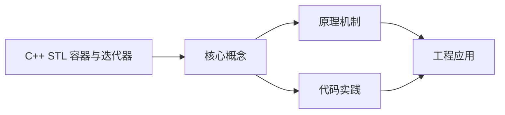
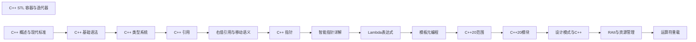

## 1. 学习目标（Bloom 分类）

本节按照布鲁姆教育目标分类学组织学习路径。本文主题为《C++ STL 容器与迭代器》，属于 C++ 模块，读者可以根据自身阶段选择阅读深度。

记忆层面：能够准确复述本文的核心概念、术语与基本语法或操作步骤，并能够在提问或检索时快速定位对应知识点。能够说出 C++ 的类、继承、重载、模板与 STL 容器基本语法。

理解层面：能够用自己的语言解释核心原理与工作机制，说明概念之间的因果关系，而不是机械记忆结论。能够解释 RAII、拷贝/移动语义、虚函数与模板实例化。

应用层面：能够在真实项目或练习场景中运用本文知识解决具体问题，写出正确且可维护的实现。能够编写现代 C++（C++17/20）的类与泛型代码。

分析层面：能够拆解复杂问题，比较本文主题与相邻概念的异同，识别边界条件与例外情况。能够分析生命周期、未定义行为与性能特征。

评价层面：能够根据约束条件（性能、可读性、安全、成本）评价不同方案的优劣，做出有依据的技术决策。能够评价 C++ 与 Rust、Java 在系统编程中的取舍。

创造层面：能够把本文知识与其他模块知识组合，设计出新的解决方案或可复用的工程模式。能够设计高性能、可维护的 C++ 库与应用。

通过本节学习，读者应当能够把《C++ STL 容器与迭代器》纳入自己的知识网络，并与 C++ 模块的其他主题（RAII、移动语义、模板、STL）建立关联。

## 2. 历史动机与发展脉络

《C++ STL 容器与迭代器》是 C++ 领域的重要主题。要真正理解它，需要先了解它解决的问题与演进过程。

C++ 由 Bjarne Stroustrup 于 1979 年开始在贝尔实验室开发（原名 C with Classes），1983 年更名 C++，1998 年 C++98 首次标准化。
C++11 是语言转折点：右值引用、auto、lambda、智能指针、并发内存模型让现代 C++ 写法定型；C++14/17 补充泛型 lambda、if constexpr、折叠表达式；C++20 引入 concepts、协程、模块与范围库；C++23 继续完善。
现代 C++ 的核心口号是“资源安全”：RAII + 智能指针替代裸 new/delete，异常与错误码按场景选择；Rust 的出现促使 C++ 社区更重视内存安全工具（如 profile 指南、sanitizer）。

回到本文主题：C++ STL 容器与迭代器 的提出与成熟，正是上述技术背景下的必然产物。早期实现往往以简单可用为目标，随着工程规模扩大，社区逐渐沉淀出标准做法与最佳实践；理解这一脉络，可以帮助读者判断“为什么文档中的推荐写法是现在这个样子”，也能在遇到历史遗留代码时准确识别其设计年代与取舍。


## 3. 形式化定义与核心概念精讲

本节把《C++ STL 容器与迭代器》涉及的核心概念以“定义 + 讲解”的形式展开。读者应把定义当作工具，把讲解当作理解路径；两者结合才能形成可迁移的知识。

RAII：资源在构造函数获取、析构函数释放，栈对象离开作用域自动清理；智能指针（unique_ptr/shared_ptr/weak_ptr）把所有权编码进类型。
移动语义：右值引用 `&&` 与 std::move 转移资源所有权，避免深拷贝；移动后对象处于“合法但未指定”状态。
虚函数与多态：virtual 实现动态绑定，vtable 是运行时分派机制；final/override 关键字防止误用；基类析构函数应为 virtual。

### 3.1 原文章节逐一精讲

原文档把主题拆分为 5 个小节，下面按顺序给出每一节的导读讲解，随后保留原文细节供精读。

#### 原文精读（完整保留）


#### 1. 序列容器

序列容器按顺序存储元素，支持随机访问或顺序访问。

| 容器                | 描述                 | 特点                                | 示例                                     |
| :------------------ | :------------------- | :---------------------------------- | :--------------------------------------- |
| `std::vector`       | 动态数组             | 随机访问快，尾部插入/删除快         | `std::vector<int> v = {1, 2, 3};`        |
| `std::list`         | 双向链表             | 任意位置插入/删除快，不支持随机访问 | `std::list<int> l = {1, 2, 3};`          |
| `std::deque`        | 双端队列             | 两端插入/删除快，随机访问快         | `std::deque<int> d = {1, 2, 3};`         |
| `std::array`        | 固定大小数组 (C++11) | 栈上分配，随机访问快                | `std::array<int, 3> a = {1, 2, 3};`      |
| `std::forward_list` | 单向链表 (C++11)     | 空间开销小，仅支持前向遍历          | `std::forward_list<int> fl = {1, 2, 3};` |

##### 1.1 std::vector

```cpp
 #include <vector>
 #include <iostream>
 int main() {
  // 创建向量
  std::vector<int> v;
  // 预分配空间
  v.reserve(10);
  // 添加元素
  v.push_back(1);
  v.push_back(2);
  v.push_back(3);
  // 访问元素
  std::cout << v[0] << std::endl; // 1 (无边界检查)
  std::cout << v.at(1) << std::endl; // 2 (有边界检查)
  // 遍历元素
  for (size_t i = 0; i < v.size(); i++) {
  std::cout << v[i] << " ";
  }
  std::cout << std::endl;
  // 范围 for 循环
  for (int num : v) {
  std::cout << num << " ";
  }
  std::cout << std::endl;
  // 迭代器遍历
  for (auto it = v.begin(); it != v.end(); ++it) {
  std::cout << *it << " ";
  }
  std::cout << std::endl;
  // 插入元素
  v.insert(v.begin() + 1, 4); // 在索引 1 处插入 4
  // 删除元素
  v.erase(v.begin() + 2); // 删除索引 2 处的元素
  // 清空容器
  v.clear();
  std::cout << "Size after clear: " << v.size() << std::endl;
  return 0;
 }
```

##### 1.2 std::list

```cpp
 #include <list>
 #include <iostream>
 int main() {
  // 创建链表
  std::list<int> l = {1, 2, 3};
  // 添加元素
  l.push_front(0); // 头部添加
  l.push_back(4); // 尾部添加
  // 遍历元素
  for (int num : l) {
  std::cout << num << " ";
  }
  std::cout << std::endl; // 0 1 2 3 4
  // 插入元素
  auto it = l.begin();
  ++it; // 移动到第二个元素
  l.insert(it, 5); // 在 0 和 1 之间插入 5
  // 删除元素
  it = l.begin();
  ++it; // 指向 5
  l.erase(it); // 删除 5
  // 排序
  l.sort();
  // 合并
  std::list<int> l2 = {6, 7, 8};
  l.merge(l2);
  // 移除元素
  l.remove(3); // 移除所有值为 3 的元素
  // 移除满足条件的元素
  l.remove_if([](int n) { return n % 2 == 0; }); // 移除所有偶数
  // 遍历结果
  for (int num : l) {
  std::cout << num << " ";
  }
  std::cout << std::endl;
  return 0;
 }
```

##### 1.3 std::array

```cpp
 #include <array>
 #include <iostream>
 int main() {
  // 创建数组
  std::array<int, 5> arr = {1, 2, 3, 4, 5};
  // 访问元素
  std::cout << "First element: " << arr[0] << std::endl;
  std::cout << "Last element: " << arr.back() << std::endl;
  // 遍历元素
  for (size_t i = 0; i < arr.size(); i++) {
  std::cout << arr[i] << " ";
  }
  std::cout << std::endl;
  // 范围 for 循环
  for (int num : arr) {
  std::cout << num << " ";
  }
  std::cout << std::endl;
  // 检查是否为空
  std::cout << "Is empty: " << (arr.empty() ? "yes" : "no") << std::endl;
  // 填充元素
  arr.fill(10);
  for (int num : arr) {
  std::cout << num << " ";
  }
  std::cout << std::endl;
  return 0;
 }
```

#### 2. 关联容器

关联容器按键值对存储元素，自动排序。

| 容器            | 描述         | 特点                     | 示例                                                         |
| :-------------- | :----------- | :----------------------- | :----------------------------------------------------------- |
| `std::set`      | 有序集合     | 自动排序，无重复元素     | `std::set<int> s = {3, 1, 2};`                               |
| `std::map`      | 有序键值对   | 自动按键排序             | `std::map<std::string, int> m = {{"a", 1}, {"b", 2}};`       |
| `std::multiset` | 有序多重集合 | 自动排序，允许重复元素   | `std::multiset<int> ms = {1, 2, 1, 3};`                      |
| `std::multimap` | 有序多重映射 | 自动按键排序，允许重复键 | `std::multimap<std::string, int> mm = {{"a", 1}, {"a", 2}};` |

##### 2.1 std::map

```cpp
 #include <map>
 #include <iostream>
 int main() {
  // 创建映射
  std::map<std::string, int> m;
  // 添加元素
  m["Alice"] = 25;
  m["Bob"] = 30;
  m["Charlie"] = 35;
  // 插入元素的另一种方式
  m.insert(std::make_pair("David", 40));
  m.insert({"Eve", 45});
  // 访问元素
  std::cout << m["Alice"] << std::endl; // 25
  // 检查键是否存在
  if (m.find("David") != m.end()) {
  std::cout << "David found: " << m["David"] << std::endl;
  } else {
  std::cout << "David not found" << std::endl;
  }
  // 使用 at() 访问（有边界检查）
  try {
  std::cout << m.at("Bob") << std::endl;
  // std::cout << m.at("Frank") << std::endl; // 会抛出异常
  } catch (const std::out_of_range& e) {
  std::cout << "Exception: " << e.what() << std::endl;
  }
  // 遍历元素
  for (const auto& pair : m) {
  std::cout << pair.first << ": " << pair.second << std::endl;
  }
  // 删除元素
  m.erase("Bob");
  // 清空容器
  // m.clear();
  return 0;
 }
```

##### 2.2 std::multimap

```cpp
 #include <map>
 #include <iostream>
 int main() {
  // 创建多重映射
  std::multimap<std::string, int> mm;
  // 添加元素
  mm.insert({"Alice", 25});
  mm.insert({"Alice", 30});
  mm.insert({"Bob", 35});
  mm.insert({"Bob", 40});
  mm.insert({"Charlie", 45});
  // 遍历所有元素
  std::cout << "All elements: " << std::endl;
  for (const auto& pair : mm) {
  std::cout << pair.first << ": " << pair.second << std::endl;
  }
  // 查找特定键的范围
  std::cout << "\nAlice's entries: " << std::endl;
  auto range = mm.equal_range("Alice");
  for (auto it = range.first; it != range.second; ++it) {
  std::cout << it->first << ": " << it->second << std::endl;
  }
  // 计算特定键的元素个数
  std::cout << "\nNumber of Bob's entries: " << mm.count("Bob") << std::endl;
  return 0;
 }
```

#### 3. 无序容器 (C++11)

无序容器使用哈希表实现，提供平均常数时间的查找、插入和删除操作。

| 容器                      | 描述         | 特点                     | 示例                                                                    |
| :------------------------ | :----------- | :----------------------- | :---------------------------------------------------------------------- |
| `std::unordered_set`      | 无序集合     | 哈希表实现，无序         | `std::unordered_set<int> us = {3, 1, 2};`                               |
| `std::unordered_map`      | 无序键值对   | 哈希表实现，无序         | `std::unordered_map<std::string, int> um = {{"a", 1}, {"b", 2}};`       |
| `std::unordered_multiset` | 无序多重集合 | 哈希表实现，允许重复元素 | `std::unordered_multiset<int> ums = {1, 2, 1, 3};`                      |
| `std::unordered_multimap` | 无序多重映射 | 哈希表实现，允许重复键   | `std::unordered_multimap<std::string, int> umm = {{"a", 1}, {"a", 2}};` |

##### 3.1 std::unordered_map

```cpp
 #include <unordered_map>
 #include <iostream>
 int main() {
  // 创建无序映射
  std::unordered_map<std::string, int> um;
  // 添加元素
  um["Alice"] = 25;
  um["Bob"] = 30;
  um["Charlie"] = 35;
  // 访问元素
  std::cout << um["Alice"] << std::endl; // 25
  // 遍历元素（顺序不确定）
  std::cout << "Elements: " << std::endl;
  for (const auto& pair : um) {
  std::cout << pair.first << ": " << pair.second << std::endl;
  }
  // 桶相关操作
  std::cout << "Bucket count: " << um.bucket_count() << std::endl;
  std::cout << "Load factor: " << um.load_factor() << std::endl;
  std::cout << "Max load factor: " << um.max_load_factor() << std::endl;
  // 查找元素
  auto it = um.find("Bob");
  if (it != um.end()) {
  std::cout << "Found Bob: " << it->second << std::endl;
  }
  // 删除元素
  um.erase("Charlie");
  return 0;
 }
```

#### 4. 容器适配器

容器适配器是对现有容器的封装，提供特定的接口。

| 容器                  | 描述               | 底层容器        | 示例                                       |
| :-------------------- | :----------------- | :-------------- | :----------------------------------------- |
| `std::stack`          | 栈（后进先出）     | `deque` (默认)  | `std::stack<int> st; st.push(1);`          |
| `std::queue`          | 队列（先进先出）   | `deque` (默认)  | `std::queue<int> q; q.push(1);`            |
| `std::priority_queue` | 优先队列（最大堆） | `vector` (默认) | `std::priority_queue<int> pq; pq.push(1);` |

##### 4.1 std::stack

```cpp
 #include <stack>
 #include <iostream>
 int main() {
  // 创建栈
  std::stack<int> st;
  // 压入元素
  st.push(1);
  st.push(2);
  st.push(3);
  // 查看栈顶元素
  std::cout << "Top: " << st.top() << std::endl; // 3
  // 弹出元素
  st.pop();
  std::cout << "Top after pop: " << st.top() << std::endl; // 2
  // 检查大小
  std::cout << "Size: " << st.size() << std::endl; // 2
  // 检查是否为空
  std::cout << "Empty: " << (st.empty() ? "yes" : "no") << std::endl; // no
  // 清空栈
  while (!st.empty()) {
  st.pop();
  }
  std::cout << "Size after clear: " << st.size() << std::endl; // 0
  return 0;
 }
```

##### 4.2 std::queue

```cpp
 #include <queue>
 #include <iostream>
 int main() {
  // 创建队列
  std::queue<int> q;
  // 入队
  q.push(1);
  q.push(2);
  q.push(3);
  // 查看队首元素
  std::cout << "Front: " << q.front() << std::endl; // 1
  // 查看队尾元素
  std::cout << "Back: " << q.back() << std::endl; // 3
  // 出队
  q.pop();
  std::cout << "Front after pop: " << q.front() << std::endl; // 2
  // 检查大小
  std::cout << "Size: " << q.size() << std::endl; // 2
  // 检查是否为空
  std::cout << "Empty: " << (q.empty() ? "yes" : "no") << std::endl; // no
  return 0;
 }
```

##### 4.3 std::priority_queue

```cpp
 #include <queue>
 #include <vector>
 #include <iostream>
 // 自定义类型
 struct Person {
  std::string name;
  int age;
  Person(const std::string& n, int a) : name(n), age(a) {}
  // 重载 < 运算符（用于最大堆）
  bool operator<(const Person& other) const {
  return age < other.age; // 年龄大的优先级高
  }
 }
 int main() {
  // 创建优先队列（默认最大堆）
  std::priority_queue<int> pq;
  // 压入元素
  pq.push(3);
  pq.push(1);
  pq.push(4);
  pq.push(1);
  pq.push(5);
  // 查看队首元素（最大值）
  std::cout << "Top: " << pq.top() << std::endl; // 5
  // 弹出元素
  pq.pop();
  std::cout << "Top after pop: " << pq.top() << std::endl; // 4
  // 创建最小堆
  std::priority_queue<int, std::vector<int>, std::greater<int>> min_pq;
  min_pq.push(3);
  min_pq.push(1);
  min_pq.push(4);
  std::cout << "Min top: " << min_pq.top() << std::endl; // 1
  // 使用自定义类型
  std::priority_queue<Person> person_pq;
  person_pq.emplace("Alice", 25);
  person_pq.emplace("Bob", 30);
  person_pq.emplace("Charlie", 20);
  while (!person_pq.empty()) {
  const Person& p = person_pq.top();
  std::cout << p.name << " (" << p.age << ")" << std::endl;
  person_pq.pop();
  }
  // 输出：Bob (30), Alice (25), Charlie (20)
  return 0;
 }
```

#### 5. 迭代器 (Iterators)

迭代器是连接容器与算法的桥梁，提供了访问容器元素的统一接口。

##### 5.1 迭代器类型

| 迭代器类型         | 描述               | 支持的操作                                                   |
| :----------------- | :----------------- | :----------------------------------------------------------- |
| **输入迭代器**     | 只读，单向移动     | `++`, `*`, `==`, `!=`                                        |
| **输出迭代器**     | 只写，单向移动     | `++`, `*`                                                    |
| **前向迭代器**     | 可读可写，单向移动 | `++`, `*`, `==`, `!=`                                        |
| **双向迭代器**     | 可读可写，双向移动 | `++`, `--`, `*`, `==`, `!=`                                  |
| **随机访问迭代器** | 可读可写，随机访问 | `++`, `--`, `+`, `-`, `[]`, `==`, `!=`, `<`, `>`, `<=`, `>=` |

##### 5.2 迭代器使用示例

```cpp
 #include <vector>
 #include <list>
 #include <iostream>
 int main() {
  // 向量迭代器（随机访问）
  std::vector<int> vec = {1, 2, 3, 4, 5};
  std::cout << "Vector elements: ";
  for (std::vector<int>::iterator it = vec.begin(); it != vec.end(); ++it) {
  std::cout << *it << " ";
  }
  std::cout << std::endl;
  // 常量迭代器
  std::cout << "Vector elements (const): ";
  for (std::vector<int>::const_iterator it = vec.cbegin(); it != vec.cend(); ++it) {
  std::cout << *it << " ";
  }
  std::cout << std::endl;
  // 列表迭代器（双向）
  std::list<int> lst = {1, 2, 3, 4, 5};
  std::cout << "List elements: ";
  for (std::list<int>::const_iterator it = lst.cbegin(); it != lst.cend(); ++it) {
  std::cout << *it << " ";
  }
  std::cout << std::endl;
  // 反向迭代器
  std::cout << "Vector reversed: ";
  for (std::vector<int>::reverse_iterator it = vec.rbegin(); it != vec.rend(); ++it) {
  std::cout << *it << " ";
  }
  std::cout << std::endl;
  // 常量反向迭代器
  std::cout << "Vector reversed (const): ";
  for (std::vector<int>::const_reverse_iterator it = vec.crbegin(); it != vec.crend(); ++it) {
  std::cout << *it << " ";
  }
  std::cout << std::endl;
  // 范围 for 循环 (C++11)
  std::cout << "Range for: ";
  for (int num : vec) {
  std::cout << num << " ";
  }
  std::cout << std::endl;
  // 使用 auto 简化迭代器声明
  std::cout << "Using auto: ";
  for (auto it = vec.begin(); it != vec.end(); ++it) {
  std::cout << *it << " ";
  }
  std::cout << std::endl;
  return 0;
 }
```

---


### 3.2 概念关系图

下面用 Mermaid 图表达本文核心概念之间的关系，帮助读者建立整体图景：



图中展示的是本文知识的结构化关系：核心概念是入口，原理机制解释“为什么”，代码实践演示“怎么做”，工程应用回答“何时用”。读者学习时可以把每个小节的内容挂接到对应节点上。

## 4. 理论推导与原理解析

本节深入《C++ STL 容器与迭代器》背后的原理。理论部分不求面面俱到，而是聚焦“能解释现象、能指导实践”的关键推导。

RAII：资源在构造函数获取、析构函数释放，栈对象离开作用域自动清理；智能指针（unique_ptr/shared_ptr/weak_ptr）把所有权编码进类型。
移动语义：右值引用 `&&` 与 std::move 转移资源所有权，避免深拷贝；移动后对象处于“合法但未指定”状态。
虚函数与多态：virtual 实现动态绑定，vtable 是运行时分派机制；final/override 关键字防止误用；基类析构函数应为 virtual。
模板与泛型：模板编译期实例化，实现静态多态；concepts（C++20）约束类型接口；模板元编程在编译期计算类型与常量。

需要强调的是，理论推导与工程实践之间存在翻译层：理论给出的是理想化模型与边界条件，工程代码则必须处理真实环境中的例外。读者在学习时应先掌握理论的“标准情形”，再通过陷阱章节了解“非标准情形”。

## 5. 代码示例与逐行讲解

本节把原文中的代码示例系统整理，并为每个示例补充用途说明与讲解。读者不应只浏览代码，而应逐段对照讲解理解设计意图。

### 5.1 示例：1.1 std::vector

该示例来自原文《1.1 std::vector》小节，用于演示C++ STL 容器与迭代器相关操作。阅读时请先看代码结构，再看其后的讲解。

```cpp
 #include <vector>
 #include <iostream>
 int main() {
  // 创建向量
  std::vector<int> v;
  // 预分配空间
  v.reserve(10);
  // 添加元素
  v.push_back(1);
  v.push_back(2);
  v.push_back(3);
  // 访问元素
  std::cout << v[0] << std::endl; // 1 (无边界检查)
  std::cout << v.at(1) << std::endl; // 2 (有边界检查)
  // 遍历元素
  for (size_t i = 0; i < v.size(); i++) {
  std::cout << v[i] << " ";
  }
  std::cout << std::endl;
  // 范围 for 循环
  for (int num : v) {
  std::cout << num << " ";
  }
  std::cout << std::endl;
  // 迭代器遍历
  for (auto it = v.begin(); it != v.end(); ++it) {
  std::cout << *it << " ";
  }
  std::cout << std::endl;
  // 插入元素
  v.insert(v.begin() + 1, 4); // 在索引 1 处插入 4
  // 删除元素
  v.erase(v.begin() + 2); // 删除索引 2 处的元素
  // 清空容器
  v.clear();
  std::cout << "Size after clear: " << v.size() << std::endl;
  return 0;
 }
```

讲解：这段代码演示了本节核心知识点。代码中的关键操作可以归纳为三步：准备（定义或初始化）、执行（核心逻辑）、收尾（释放资源或返回结果）。实际项目中，这三步往往被封装为函数或类，以提升复用性与可测试性。

关键点分析：

该示例共 38 行有效代码，包含 2 类关键结构（for、return）。其中：

- 入口与初始化部分负责建立上下文，对应实际项目中的启动或装配逻辑；
- 核心逻辑部分体现本文主题的主要操作，是阅读时最需要对照讲解理解的部分；
- 输出或返回部分把结果交给调用方，注意其类型与边界条件。

进阶思考路径：先尝试修改参数观察行为变化，再把示例中的模式迁移到自己的项目中；每次修改都记录预期与实测差异，这是把示例转化为能力的最快方式。

### 5.2 示例：1.2 std::list

该示例来自原文《1.2 std::list》小节，用于演示C++ STL 容器与迭代器相关操作。阅读时请先看代码结构，再看其后的讲解。

```cpp
 #include <list>
 #include <iostream>
 int main() {
  // 创建链表
  std::list<int> l = {1, 2, 3};
  // 添加元素
  l.push_front(0); // 头部添加
  l.push_back(4); // 尾部添加
  // 遍历元素
  for (int num : l) {
  std::cout << num << " ";
  }
  std::cout << std::endl; // 0 1 2 3 4
  // 插入元素
  auto it = l.begin();
  ++it; // 移动到第二个元素
  l.insert(it, 5); // 在 0 和 1 之间插入 5
  // 删除元素
  it = l.begin();
  ++it; // 指向 5
  l.erase(it); // 删除 5
  // 排序
  l.sort();
  // 合并
  std::list<int> l2 = {6, 7, 8};
  l.merge(l2);
  // 移除元素
  l.remove(3); // 移除所有值为 3 的元素
  // 移除满足条件的元素
  l.remove_if([](int n) { return n % 2 == 0; }); // 移除所有偶数
  // 遍历结果
  for (int num : l) {
  std::cout << num << " ";
  }
  std::cout << std::endl;
  return 0;
 }
```

讲解：这段代码演示了本节核心知识点。代码中的关键操作可以归纳为三步：准备（定义或初始化）、执行（核心逻辑）、收尾（释放资源或返回结果）。实际项目中，这三步往往被封装为函数或类，以提升复用性与可测试性。

关键点分析：

该示例共 37 行有效代码，包含 2 类关键结构（for、return）。其中：

- 入口与初始化部分负责建立上下文，对应实际项目中的启动或装配逻辑；
- 核心逻辑部分体现本文主题的主要操作，是阅读时最需要对照讲解理解的部分；
- 输出或返回部分把结果交给调用方，注意其类型与边界条件。

进阶思考路径：先尝试修改参数观察行为变化，再把示例中的模式迁移到自己的项目中；每次修改都记录预期与实测差异，这是把示例转化为能力的最快方式。

### 5.3 示例：1.3 std::array

该示例来自原文《1.3 std::array》小节，用于演示C++ STL 容器与迭代器相关操作。阅读时请先看代码结构，再看其后的讲解。

```cpp
 #include <array>
 #include <iostream>
 int main() {
  // 创建数组
  std::array<int, 5> arr = {1, 2, 3, 4, 5};
  // 访问元素
  std::cout << "First element: " << arr[0] << std::endl;
  std::cout << "Last element: " << arr.back() << std::endl;
  // 遍历元素
  for (size_t i = 0; i < arr.size(); i++) {
  std::cout << arr[i] << " ";
  }
  std::cout << std::endl;
  // 范围 for 循环
  for (int num : arr) {
  std::cout << num << " ";
  }
  std::cout << std::endl;
  // 检查是否为空
  std::cout << "Is empty: " << (arr.empty() ? "yes" : "no") << std::endl;
  // 填充元素
  arr.fill(10);
  for (int num : arr) {
  std::cout << num << " ";
  }
  std::cout << std::endl;
  return 0;
 }
```

讲解：这段代码演示了本节核心知识点。代码中的关键操作可以归纳为三步：准备（定义或初始化）、执行（核心逻辑）、收尾（释放资源或返回结果）。实际项目中，这三步往往被封装为函数或类，以提升复用性与可测试性。

关键点分析：

该示例共 28 行有效代码，包含 2 类关键结构（for、return）。其中：

- 入口与初始化部分负责建立上下文，对应实际项目中的启动或装配逻辑；
- 核心逻辑部分体现本文主题的主要操作，是阅读时最需要对照讲解理解的部分；
- 输出或返回部分把结果交给调用方，注意其类型与边界条件。

进阶思考路径：先尝试修改参数观察行为变化，再把示例中的模式迁移到自己的项目中；每次修改都记录预期与实测差异，这是把示例转化为能力的最快方式。

### 5.4 示例：2.1 std::map

该示例来自原文《2.1 std::map》小节，用于演示C++ STL 容器与迭代器相关操作。阅读时请先看代码结构，再看其后的讲解。

```cpp
 #include <map>
 #include <iostream>
 int main() {
  // 创建映射
  std::map<std::string, int> m;
  // 添加元素
  m["Alice"] = 25;
  m["Bob"] = 30;
  m["Charlie"] = 35;
  // 插入元素的另一种方式
  m.insert(std::make_pair("David", 40));
  m.insert({"Eve", 45});
  // 访问元素
  std::cout << m["Alice"] << std::endl; // 25
  // 检查键是否存在
  if (m.find("David") != m.end()) {
  std::cout << "David found: " << m["David"] << std::endl;
  } else {
  std::cout << "David not found" << std::endl;
  }
  // 使用 at() 访问（有边界检查）
  try {
  std::cout << m.at("Bob") << std::endl;
  // std::cout << m.at("Frank") << std::endl; // 会抛出异常
  } catch (const std::out_of_range& e) {
  std::cout << "Exception: " << e.what() << std::endl;
  }
  // 遍历元素
  for (const auto& pair : m) {
  std::cout << pair.first << ": " << pair.second << std::endl;
  }
  // 删除元素
  m.erase("Bob");
  // 清空容器
  // m.clear();
  return 0;
 }
```

讲解：这段代码演示了本节核心知识点。代码中的关键操作可以归纳为三步：准备（定义或初始化）、执行（核心逻辑）、收尾（释放资源或返回结果）。实际项目中，这三步往往被封装为函数或类，以提升复用性与可测试性。

关键点分析：

该示例共 37 行有效代码，包含 3 类关键结构（if、for、return）。其中：

- 入口与初始化部分负责建立上下文，对应实际项目中的启动或装配逻辑；
- 核心逻辑部分体现本文主题的主要操作，是阅读时最需要对照讲解理解的部分；
- 输出或返回部分把结果交给调用方，注意其类型与边界条件。

进阶思考路径：先尝试修改参数观察行为变化，再把示例中的模式迁移到自己的项目中；每次修改都记录预期与实测差异，这是把示例转化为能力的最快方式。

### 5.5 示例：2.2 std::multimap

该示例来自原文《2.2 std::multimap》小节，用于演示C++ STL 容器与迭代器相关操作。阅读时请先看代码结构，再看其后的讲解。

```cpp
 #include <map>
 #include <iostream>
 int main() {
  // 创建多重映射
  std::multimap<std::string, int> mm;
  // 添加元素
  mm.insert({"Alice", 25});
  mm.insert({"Alice", 30});
  mm.insert({"Bob", 35});
  mm.insert({"Bob", 40});
  mm.insert({"Charlie", 45});
  // 遍历所有元素
  std::cout << "All elements: " << std::endl;
  for (const auto& pair : mm) {
  std::cout << pair.first << ": " << pair.second << std::endl;
  }
  // 查找特定键的范围
  std::cout << "\nAlice's entries: " << std::endl;
  auto range = mm.equal_range("Alice");
  for (auto it = range.first; it != range.second; ++it) {
  std::cout << it->first << ": " << it->second << std::endl;
  }
  // 计算特定键的元素个数
  std::cout << "\nNumber of Bob's entries: " << mm.count("Bob") << std::endl;
  return 0;
 }
```

讲解：这段代码演示了本节核心知识点。代码中的关键操作可以归纳为三步：准备（定义或初始化）、执行（核心逻辑）、收尾（释放资源或返回结果）。实际项目中，这三步往往被封装为函数或类，以提升复用性与可测试性。

关键点分析：

该示例共 26 行有效代码，包含 2 类关键结构（for、return）。其中：

- 入口与初始化部分负责建立上下文，对应实际项目中的启动或装配逻辑；
- 核心逻辑部分体现本文主题的主要操作，是阅读时最需要对照讲解理解的部分；
- 输出或返回部分把结果交给调用方，注意其类型与边界条件。

进阶思考路径：先尝试修改参数观察行为变化，再把示例中的模式迁移到自己的项目中；每次修改都记录预期与实测差异，这是把示例转化为能力的最快方式。

### 5.6 示例：3.1 std::unordered_map

该示例来自原文《3.1 std::unordered_map》小节，用于演示C++ STL 容器与迭代器相关操作。阅读时请先看代码结构，再看其后的讲解。

```cpp
 #include <unordered_map>
 #include <iostream>
 int main() {
  // 创建无序映射
  std::unordered_map<std::string, int> um;
  // 添加元素
  um["Alice"] = 25;
  um["Bob"] = 30;
  um["Charlie"] = 35;
  // 访问元素
  std::cout << um["Alice"] << std::endl; // 25
  // 遍历元素（顺序不确定）
  std::cout << "Elements: " << std::endl;
  for (const auto& pair : um) {
  std::cout << pair.first << ": " << pair.second << std::endl;
  }
  // 桶相关操作
  std::cout << "Bucket count: " << um.bucket_count() << std::endl;
  std::cout << "Load factor: " << um.load_factor() << std::endl;
  std::cout << "Max load factor: " << um.max_load_factor() << std::endl;
  // 查找元素
  auto it = um.find("Bob");
  if (it != um.end()) {
  std::cout << "Found Bob: " << it->second << std::endl;
  }
  // 删除元素
  um.erase("Charlie");
  return 0;
 }
```

讲解：这段代码演示了本节核心知识点。代码中的关键操作可以归纳为三步：准备（定义或初始化）、执行（核心逻辑）、收尾（释放资源或返回结果）。实际项目中，这三步往往被封装为函数或类，以提升复用性与可测试性。

关键点分析：

该示例共 29 行有效代码，包含 3 类关键结构（if、for、return）。其中：

- 入口与初始化部分负责建立上下文，对应实际项目中的启动或装配逻辑；
- 核心逻辑部分体现本文主题的主要操作，是阅读时最需要对照讲解理解的部分；
- 输出或返回部分把结果交给调用方，注意其类型与边界条件。

进阶思考路径：先尝试修改参数观察行为变化，再把示例中的模式迁移到自己的项目中；每次修改都记录预期与实测差异，这是把示例转化为能力的最快方式。

### 5.7 示例：4.1 std::stack

该示例来自原文《4.1 std::stack》小节，用于演示C++ STL 容器与迭代器相关操作。阅读时请先看代码结构，再看其后的讲解。

```cpp
 #include <stack>
 #include <iostream>
 int main() {
  // 创建栈
  std::stack<int> st;
  // 压入元素
  st.push(1);
  st.push(2);
  st.push(3);
  // 查看栈顶元素
  std::cout << "Top: " << st.top() << std::endl; // 3
  // 弹出元素
  st.pop();
  std::cout << "Top after pop: " << st.top() << std::endl; // 2
  // 检查大小
  std::cout << "Size: " << st.size() << std::endl; // 2
  // 检查是否为空
  std::cout << "Empty: " << (st.empty() ? "yes" : "no") << std::endl; // no
  // 清空栈
  while (!st.empty()) {
  st.pop();
  }
  std::cout << "Size after clear: " << st.size() << std::endl; // 0
  return 0;
 }
```

讲解：这段代码演示了本节核心知识点。代码中的关键操作可以归纳为三步：准备（定义或初始化）、执行（核心逻辑）、收尾（释放资源或返回结果）。实际项目中，这三步往往被封装为函数或类，以提升复用性与可测试性。

关键点分析：

该示例共 25 行有效代码，包含 2 类关键结构（while、return）。其中：

- 入口与初始化部分负责建立上下文，对应实际项目中的启动或装配逻辑；
- 核心逻辑部分体现本文主题的主要操作，是阅读时最需要对照讲解理解的部分；
- 输出或返回部分把结果交给调用方，注意其类型与边界条件。

进阶思考路径：先尝试修改参数观察行为变化，再把示例中的模式迁移到自己的项目中；每次修改都记录预期与实测差异，这是把示例转化为能力的最快方式。

### 5.8 示例：4.2 std::queue

该示例来自原文《4.2 std::queue》小节，用于演示C++ STL 容器与迭代器相关操作。阅读时请先看代码结构，再看其后的讲解。

```cpp
 #include <queue>
 #include <iostream>
 int main() {
  // 创建队列
  std::queue<int> q;
  // 入队
  q.push(1);
  q.push(2);
  q.push(3);
  // 查看队首元素
  std::cout << "Front: " << q.front() << std::endl; // 1
  // 查看队尾元素
  std::cout << "Back: " << q.back() << std::endl; // 3
  // 出队
  q.pop();
  std::cout << "Front after pop: " << q.front() << std::endl; // 2
  // 检查大小
  std::cout << "Size: " << q.size() << std::endl; // 2
  // 检查是否为空
  std::cout << "Empty: " << (q.empty() ? "yes" : "no") << std::endl; // no
  return 0;
 }
```

讲解：这段代码演示了本节核心知识点。代码中的关键操作可以归纳为三步：准备（定义或初始化）、执行（核心逻辑）、收尾（释放资源或返回结果）。实际项目中，这三步往往被封装为函数或类，以提升复用性与可测试性。

关键点分析：

该示例共 22 行有效代码，包含 1 类关键结构（return）。其中：

- 入口与初始化部分负责建立上下文，对应实际项目中的启动或装配逻辑；
- 核心逻辑部分体现本文主题的主要操作，是阅读时最需要对照讲解理解的部分；
- 输出或返回部分把结果交给调用方，注意其类型与边界条件。

进阶思考路径：先尝试修改参数观察行为变化，再把示例中的模式迁移到自己的项目中；每次修改都记录预期与实测差异，这是把示例转化为能力的最快方式。

### 5.9 示例：4.3 std::priority_queue

该示例来自原文《4.3 std::priority_queue》小节，用于演示C++ STL 容器与迭代器相关操作。阅读时请先看代码结构，再看其后的讲解。

```cpp
 #include <queue>
 #include <vector>
 #include <iostream>
 // 自定义类型
 struct Person {
  std::string name;
  int age;
  Person(const std::string& n, int a) : name(n), age(a) {}
  // 重载 < 运算符（用于最大堆）
  bool operator<(const Person& other) const {
  return age < other.age; // 年龄大的优先级高
  }
 }
 int main() {
  // 创建优先队列（默认最大堆）
  std::priority_queue<int> pq;
  // 压入元素
  pq.push(3);
  pq.push(1);
  pq.push(4);
  pq.push(1);
  pq.push(5);
  // 查看队首元素（最大值）
  std::cout << "Top: " << pq.top() << std::endl; // 5
  // 弹出元素
  pq.pop();
  std::cout << "Top after pop: " << pq.top() << std::endl; // 4
  // 创建最小堆
  std::priority_queue<int, std::vector<int>, std::greater<int>> min_pq;
  min_pq.push(3);
  min_pq.push(1);
  min_pq.push(4);
  std::cout << "Min top: " << min_pq.top() << std::endl; // 1
  // 使用自定义类型
  std::priority_queue<Person> person_pq;
  person_pq.emplace("Alice", 25);
  person_pq.emplace("Bob", 30);
  person_pq.emplace("Charlie", 20);
  while (!person_pq.empty()) {
  const Person& p = person_pq.top();
  std::cout << p.name << " (" << p.age << ")" << std::endl;
  person_pq.pop();
  }
  // 输出：Bob (30), Alice (25), Charlie (20)
  return 0;
 }
```

讲解：这段代码演示了本节核心知识点。代码中的关键操作可以归纳为三步：准备（定义或初始化）、执行（核心逻辑）、收尾（释放资源或返回结果）。实际项目中，这三步往往被封装为函数或类，以提升复用性与可测试性。

关键点分析：

该示例共 46 行有效代码，包含 2 类关键结构（while、return）。其中：

- 入口与初始化部分负责建立上下文，对应实际项目中的启动或装配逻辑；
- 核心逻辑部分体现本文主题的主要操作，是阅读时最需要对照讲解理解的部分；
- 输出或返回部分把结果交给调用方，注意其类型与边界条件。

进阶思考路径：先尝试修改参数观察行为变化，再把示例中的模式迁移到自己的项目中；每次修改都记录预期与实测差异，这是把示例转化为能力的最快方式。

### 5.10 示例：5.2 迭代器使用示例

该示例来自原文《5.2 迭代器使用示例》小节，用于演示C++ STL 容器与迭代器相关操作。阅读时请先看代码结构，再看其后的讲解。

```cpp
 #include <vector>
 #include <list>
 #include <iostream>
 int main() {
  // 向量迭代器（随机访问）
  std::vector<int> vec = {1, 2, 3, 4, 5};
  std::cout << "Vector elements: ";
  for (std::vector<int>::iterator it = vec.begin(); it != vec.end(); ++it) {
  std::cout << *it << " ";
  }
  std::cout << std::endl;
  // 常量迭代器
  std::cout << "Vector elements (const): ";
  for (std::vector<int>::const_iterator it = vec.cbegin(); it != vec.cend(); ++it) {
  std::cout << *it << " ";
  }
  std::cout << std::endl;
  // 列表迭代器（双向）
  std::list<int> lst = {1, 2, 3, 4, 5};
  std::cout << "List elements: ";
  for (std::list<int>::const_iterator it = lst.cbegin(); it != lst.cend(); ++it) {
  std::cout << *it << " ";
  }
  std::cout << std::endl;
  // 反向迭代器
  std::cout << "Vector reversed: ";
  for (std::vector<int>::reverse_iterator it = vec.rbegin(); it != vec.rend(); ++it) {
  std::cout << *it << " ";
  }
  std::cout << std::endl;
  // 常量反向迭代器
  std::cout << "Vector reversed (const): ";
  for (std::vector<int>::const_reverse_iterator it = vec.crbegin(); it != vec.crend(); ++it) {
  std::cout << *it << " ";
  }
  std::cout << std::endl;
  // 范围 for 循环 (C++11)
  std::cout << "Range for: ";
  for (int num : vec) {
  std::cout << num << " ";
  }
  std::cout << std::endl;
  // 使用 auto 简化迭代器声明
  std::cout << "Using auto: ";
  for (auto it = vec.begin(); it != vec.end(); ++it) {
  std::cout << *it << " ";
  }
  std::cout << std::endl;
  return 0;
 }
```

讲解：这段代码演示了本节核心知识点。代码中的关键操作可以归纳为三步：准备（定义或初始化）、执行（核心逻辑）、收尾（释放资源或返回结果）。实际项目中，这三步往往被封装为函数或类，以提升复用性与可测试性。

关键点分析：

该示例共 50 行有效代码，包含 2 类关键结构（for、return）。其中：

- 入口与初始化部分负责建立上下文，对应实际项目中的启动或装配逻辑；
- 核心逻辑部分体现本文主题的主要操作，是阅读时最需要对照讲解理解的部分；
- 输出或返回部分把结果交给调用方，注意其类型与边界条件。

进阶思考路径：先尝试修改参数观察行为变化，再把示例中的模式迁移到自己的项目中；每次修改都记录预期与实测差异，这是把示例转化为能力的最快方式。


综合以上示例，可以总结出本主题的代码实践要点：第一，先定义清晰的输入输出契约；第二，核心逻辑保持单一职责；第三，错误处理与边界条件不可省略；第四，命名与注释表达意图而非复述代码。

## 6. 对比分析

对比是理解《C++ STL 容器与迭代器》定位的最快路径。下面从多个维度与相邻方案进行对比。

C++ 与 C：C++ 支持面向对象与泛型、RAII 与标准库；C 更简单，适合纯系统与嵌入式。
C++ 与 Rust：Rust 编译期保证内存安全，所有权模型严格；C++ 灵活但依赖纪律。性能相近，安全性 Rust 更强。
C++11 与 C++20：concepts、协程、范围库代表现代 C++ 方向；新代码以 C++20 为基线。

对比的目的不是分出绝对优劣，而是建立选择依据：不同约束条件下，最优解不同。读者应把每个对比维度转化为决策检查清单。

## 7. 常见陷阱与最佳实践

本节整理该主题的高频错误与推荐做法。每个陷阱先描述现象，再解释原因，最后给出最佳实践。

### 7.1 裸 new/delete

易泄漏与重复释放。使用 make_unique/make_shared 与栈对象。

深入讲解：该问题之所以被归类为“常见陷阱”，是因为它在初学者的代码中反复出现，而且往往不在第一时间暴露——错误通常隐藏在特定数据或特定时序下。

从成因上看，裸 new/delete 一般源于对 C++ 某个机制的理解偏差：要么误用了默认行为，要么忽略了边界条件，要么把其他语言的思维惯性带了过来。

从影响上看，裸 new/delete 轻则产生错误结果，重则导致资源泄漏、数据损坏或安全事故；这也是为什么工程评审中会把它列为检查项。

从修复策略上看，处理裸 new/delete的正确顺序是：先复现（构造最小用例），再定位（确认机制层面的根因），最后修复并补充回归测试。跳过复现直接改代码，往往治标不治本。

### 7.2 引用悬垂

返回局部变量引用或存储容器元素引用后容器扩容。理解生命周期，必要时用值或智能指针。

深入讲解：该问题之所以被归类为“常见陷阱”，是因为它在初学者的代码中反复出现，而且往往不在第一时间暴露——错误通常隐藏在特定数据或特定时序下。

从成因上看，引用悬垂 一般源于对 C++ 某个机制的理解偏差：要么误用了默认行为，要么忽略了边界条件，要么把其他语言的思维惯性带了过来。

从影响上看，引用悬垂 轻则产生错误结果，重则导致资源泄漏、数据损坏或安全事故；这也是为什么工程评审中会把它列为检查项。

从修复策略上看，处理引用悬垂的正确顺序是：先复现（构造最小用例），再定位（确认机制层面的根因），最后修复并补充回归测试。跳过复现直接改代码，往往治标不治本。

### 7.3 迭代器失效

vector 扩容使迭代器失效。避免在遍历时修改容器，或改用索引/新容器。

深入讲解：该问题之所以被归类为“常见陷阱”，是因为它在初学者的代码中反复出现，而且往往不在第一时间暴露——错误通常隐藏在特定数据或特定时序下。

从成因上看，迭代器失效 一般源于对 C++ 某个机制的理解偏差：要么误用了默认行为，要么忽略了边界条件，要么把其他语言的思维惯性带了过来。

从影响上看，迭代器失效 轻则产生错误结果，重则导致资源泄漏、数据损坏或安全事故；这也是为什么工程评审中会把它列为检查项。

从修复策略上看，处理迭代器失效的正确顺序是：先复现（构造最小用例），再定位（确认机制层面的根因），最后修复并补充回归测试。跳过复现直接改代码，往往治标不治本。

### 7.4 虚析构缺失

通过基类指针删除派生对象时未调用派生析构。基类析构声明为 virtual。

深入讲解：该问题之所以被归类为“常见陷阱”，是因为它在初学者的代码中反复出现，而且往往不在第一时间暴露——错误通常隐藏在特定数据或特定时序下。

从成因上看，虚析构缺失 一般源于对 C++ 某个机制的理解偏差：要么误用了默认行为，要么忽略了边界条件，要么把其他语言的思维惯性带了过来。

从影响上看，虚析构缺失 轻则产生错误结果，重则导致资源泄漏、数据损坏或安全事故；这也是为什么工程评审中会把它列为检查项。

从修复策略上看，处理虚析构缺失的正确顺序是：先复现（构造最小用例），再定位（确认机制层面的根因），最后修复并补充回归测试。跳过复现直接改代码，往往治标不治本。

### 7.5 std::move 后使用对象

移动后对象状态未指定。移动后只赋值或销毁，不再读取。

深入讲解：该问题之所以被归类为“常见陷阱”，是因为它在初学者的代码中反复出现，而且往往不在第一时间暴露——错误通常隐藏在特定数据或特定时序下。

从成因上看，std::move 后使用对象 一般源于对 C++ 某个机制的理解偏差：要么误用了默认行为，要么忽略了边界条件，要么把其他语言的思维惯性带了过来。

从影响上看，std::move 后使用对象 轻则产生错误结果，重则导致资源泄漏、数据损坏或安全事故；这也是为什么工程评审中会把它列为检查项。

从修复策略上看，处理std::move 后使用对象的正确顺序是：先复现（构造最小用例），再定位（确认机制层面的根因），最后修复并补充回归测试。跳过复现直接改代码，往往治标不治本。

### 7.6 隐式转换意外

单参数构造函数产生隐式转换。标记 explicit。

深入讲解：该问题之所以被归类为“常见陷阱”，是因为它在初学者的代码中反复出现，而且往往不在第一时间暴露——错误通常隐藏在特定数据或特定时序下。

从成因上看，隐式转换意外 一般源于对 C++ 某个机制的理解偏差：要么误用了默认行为，要么忽略了边界条件，要么把其他语言的思维惯性带了过来。

从影响上看，隐式转换意外 轻则产生错误结果，重则导致资源泄漏、数据损坏或安全事故；这也是为什么工程评审中会把它列为检查项。

从修复策略上看，处理隐式转换意外的正确顺序是：先复现（构造最小用例），再定位（确认机制层面的根因），最后修复并补充回归测试。跳过复现直接改代码，往往治标不治本。

### 7.7 异常安全

异常中途抛出导致资源泄漏或不变量破坏。使用 RAII 与强异常保证设计。

深入讲解：该问题之所以被归类为“常见陷阱”，是因为它在初学者的代码中反复出现，而且往往不在第一时间暴露——错误通常隐藏在特定数据或特定时序下。

从成因上看，异常安全 一般源于对 C++ 某个机制的理解偏差：要么误用了默认行为，要么忽略了边界条件，要么把其他语言的思维惯性带了过来。

从影响上看，异常安全 轻则产生错误结果，重则导致资源泄漏、数据损坏或安全事故；这也是为什么工程评审中会把它列为检查项。

从修复策略上看，处理异常安全的正确顺序是：先复现（构造最小用例），再定位（确认机制层面的根因），最后修复并补充回归测试。跳过复现直接改代码，往往治标不治本。

### 7.8 宏替代常量

无类型检查。用 constexpr 与 enum class。

深入讲解：该问题之所以被归类为“常见陷阱”，是因为它在初学者的代码中反复出现，而且往往不在第一时间暴露——错误通常隐藏在特定数据或特定时序下。

从成因上看，宏替代常量 一般源于对 C++ 某个机制的理解偏差：要么误用了默认行为，要么忽略了边界条件，要么把其他语言的思维惯性带了过来。

从影响上看，宏替代常量 轻则产生错误结果，重则导致资源泄漏、数据损坏或安全事故；这也是为什么工程评审中会把它列为检查项。

从修复策略上看，处理宏替代常量的正确顺序是：先复现（构造最小用例），再定位（确认机制层面的根因），最后修复并补充回归测试。跳过复现直接改代码，往往治标不治本。

### 7.0 最佳实践总览

1. 默认使用现代特性：auto、范围 for、智能指针、constexpr。
2. 接口用抽象类与 concepts 表达，实现细节隐藏。
3. 容器优先 STL，算法用 <algorithm> 而非手写循环。
4. 编译开启 -Wall -Wextra -Wpedantic，配合 sanitizer。
5. 代码评审关注所有权与生命周期。

把这些最佳实践固化为团队规范与代码评审检查项，是避免同类问题反复出现的关键。

## 8. 工程实践

本节把《C++ STL 容器与迭代器》放入真实工程场景，给出可复用的模式与组织方法。

CMake 构建：target 化组织（add_library/add_executable），导出接口与安装规则。
依赖管理：Conan/vcpkg 管理第三方库；预编译头与 ccache 加速构建。
测试与工具：GoogleTest 单测、ASan/UBSan 检测、clang-tidy 静态分析。
性能：profiler（perf、VTune）定位热点；缓存友好数据结构与无锁并发按需引入。

### 8.1 工程实践的原则拆解

以上工程实践可以归纳为四条原则。第一，配置与代码分离：C++ 项目中环境差异应通过配置注入，而不是散落在代码分支中；这保证同一份代码可以在开发、测试、生产环境一致运行。

第二，接口稳定优先：对外接口（函数签名、协议、数据格式）一旦被消费方依赖，变更成本极高；设计时应预留扩展点并保持向后兼容。

第三，可观测性内置：日志、指标与追踪应该在功能开发时同步设计，而不是故障发生后补救；没有观测手段的模块等于黑盒。

第四，变更可回滚：任何发布都应有对应的回滚方案；数据库迁移、配置变更与代码发布一样需要版本管理与逆向路径。

### 8.2 实践落地的检查清单

- [ ] CMake 构建：对照本节描述，检查当前项目是否已经落实；未落实的项列入技术债并排期处理。
- [ ] 依赖管理：对照本节描述，检查当前项目是否已经落实；未落实的项列入技术债并排期处理。
- [ ] 测试与工具：对照本节描述，检查当前项目是否已经落实；未落实的项列入技术债并排期处理。
- [ ] 性能：对照本节描述，检查当前项目是否已经落实；未落实的项列入技术债并排期处理。

工程实践的共性原则：配置与代码分离、接口稳定优先、可观测性内置、变更可回滚。这些原则适用于本主题的所有实现。

## 9. 案例研究

本节通过一个完整案例把《C++ STL 容器与迭代器》的知识串起来。案例按“需求分析、方案设计、实现、验证”四步展开。

需求：实现线程安全的对象池，支持获取/归还与自动扩容。
方案：unique_ptr 管理池中对象，mutex + condition_variable 同步，工厂函数创建新对象。
要点：RAII 包装归还（析构自动回池）；超时等待避免死锁；容量上限保护。
验证：TSan 检测数据竞争；benchmark 对比加锁与无锁方案。

### 9.1 案例的扩展讨论

把案例中的方案放大到真实规模，需要额外考虑三个问题：

第一，规模：当数据量或并发量上升一个数量级时，原方案中的数据结构、缓存策略与任务调度是否仍然成立？通常需要引入分层与异步。

第二，团队：多人协作时，模块边界、接口契约与代码所有权必须明确；案例中的实现应拆分为可独立测试的单元，并配合文档说明设计意图。

第三，演进：上线后的需求变化不可避免；方案设计时应预留扩展点（配置化、插件化、事件化），并定期用真实指标验证假设。


案例研究的学习方法：先独立阅读需求，尝试在脑中形成方案，再对照实现与讲解，最后思考“如果约束变化（数据量、并发、团队规模），方案应如何调整”。

## 10. 知识要点总结与深入讲解

本节以讲解形式汇总全文要点，替代传统的习题与自测，读者不需要答题，只需跟随解释建立完整的认知框架。

关于《C++ STL 容器与迭代器》的核心结论：

C++ 的核心是“零开销抽象”：高级表达不牺牲性能，但需要开发者理解底层机制。
RAII 与移动语义是现代 C++ 的基石，资源安全靠类型系统与纪律共同保证。
模板与 concepts 让泛型代码可读、可约束；sanitizer 是质量保障标配。

原文档各小节的要点回顾：

- 1. 序列容器：该小节围绕C++ STL 容器与迭代器展开具体细节，阅读时应关注其与核心结论的对应关系；每个小节都是核心结论在某一个侧面的展开。
- 2. 关联容器：该小节围绕C++ STL 容器与迭代器展开具体细节，阅读时应关注其与核心结论的对应关系；每个小节都是核心结论在某一个侧面的展开。
- 3. 无序容器 (C++11)：该小节围绕C++ STL 容器与迭代器展开具体细节，阅读时应关注其与核心结论的对应关系；每个小节都是核心结论在某一个侧面的展开。
- 4. 容器适配器：该小节围绕C++ STL 容器与迭代器展开具体细节，阅读时应关注其与核心结论的对应关系；每个小节都是核心结论在某一个侧面的展开。
- 5. 迭代器 (Iterators)：该小节围绕C++ STL 容器与迭代器展开具体细节，阅读时应关注其与核心结论的对应关系；每个小节都是核心结论在某一个侧面的展开。

把以上要点与第 3-9 节的内容对照复习，即可完成对本文主题的闭环学习。

## 11. 参考文献


cppreference C++ 文档：https://zh.cppreference.com/w/cpp
C++ 核心指南：https://isocpp.github.io/CppCoreGuidelines/
C++ 标准草案（WG21）：https://isocpp.org/std/the-standard
CMake 官方文档：https://cmake.org/documentation/
Compiler Explorer：https://godbolt.org/

## 12. 延伸阅读


C++ 模板深入，见 026-cpp/062-CppTemplate 文档。
STL 容器与算法，见 026-cpp 模块 STL 文档。
并发与原子，见 026-cpp 模块并发文档。
Rust 内存安全对比，见 053-rust 模块（若已加入）。
尚硅谷 Bilibili 空间（https://space.bilibili.com/302417610 ）提供 C++ 课程。

## 14. 模块知识图谱与学习路径

本文属于 C++ 模块。为了把《C++ STL 容器与迭代器》放入完整的知识网络，下面列出本模块的全部主题并给出相互关联的导读。学习时建议按模块内顺序推进，并在每个文档中留意交叉引用。



上图为模块主题的推荐学习顺序示意图（仅展示前若干主题）。各主题之间存在三类关联：

第一，前置依赖关系：早期主题是后期主题的基础，例如环境与语法先行、进阶主题随后；

第二，横向并列关系：同一层级主题从不同角度覆盖模块能力，学习顺序可以按兴趣调整；

第三，工程组合关系：多个主题在真实项目中组合使用，例如配置、性能与安全主题往往出现在同一系统的不同层面。

### 14.1 模块主题速查表

| 文档 | 主题 | 与本文的关联 |
| --- | --- | --- |
| C++ 概述与现代标准 | 001-CppOverviewAndModernStandard | 本文的前置基础 |
| C++ 基础语法 | 002-CppBasicSyntax | 本文的前置基础 |
| C++ 类型系统 | 003-CppTypeSystem | 本文的并列主题 |
| C++ 引用 | 004-CppReference | 本文的并列主题 |
| 右值引用与移动语义 | 005-RvalueReferenceMoveSemantics | 本文的并列主题 |
| C++ 指针 | 006-PointersCppreferenceCom | 本文的并列主题 |
| 智能指针详解 | 007-N4089DeletingSafeBoolInFavorOfExplicitBool | 本文的并列主题 |
| Lambda表达式 | 008-LambdaExpression | 本文的并列主题 |
| 模板元编程 | 009-ATourOfC3rdEditionOnlineExcerpts | 本文的并列主题 |
| C++20范围 | 010-Cpp20Range | 本文的并列主题 |
| C++20模块 | 011-Cpp20Module | 本文的并列主题 |
| 设计模式与C++ | 012-DesignPatternCpp | 本文的并列主题 |
| RAII与资源管理 | 013-RAIIResourceManagement | 本文的并列主题 |
| 运算符重载 | 014-OperatorOverloading | 本文的并列主题 |
| C++ 面向对象基础 | 015-COOPBasics | 本文的前置基础 |
| C++ STL 算法详解 | 016-CSTL | 本文的并列主题 |
| 字符串处理 | 017-StringProcessing | 本文的并列主题 |
| 文件IO与文件系统 | 018-FileIOFileSystem | 本文的并列主题 |
| 异常安全 | 019-ExceptionSecurity | 本文的安全延伸 |
| 多线程与并发 | 020-MultithreadingConcurrency | 本文的并列主题 |
| 类型特征与SFINAE | 021-TypeTraitsSFINAE | 本文的并列主题 |
| 变参模板 | 022-VariadicTemplate | 本文的并列主题 |
| constexpr与编译期计算 | 023-ConstexprCompileTime | 本文的并列主题 |
| 命名空间与链接 | 024-NamespaceLinkage | 本文的并列主题 |
| C++网络编程 | 025-CppNetworkProgramming | 本文的并列主题 |
| C++ 面向对象进阶 | 026-COOPAdvanced | 本文的并列主题 |
| C++内存模型 | 027-CppMemoryModel | 本文的并列主题 |
| C++图形编程 | 028-CppGraphicsProgramming | 本文的并列主题 |
| C++工具链 | 029-CppToolchain | 本文的并列主题 |
| C++正则表达式 | 030-CppRegex | 本文的并列主题 |
| C++与Python交互 | 031-CppPythonInteraction | 本文的并列主题 |
| C++测试框架 | 032-CppTestFramework | 本文的并列主题 |
| C++与Rust对比 | 033-CppRustComparison | 本文的并列主题 |
| C++23与C++26新特性 | 034-Cpp23Cpp26NewFeatures | 本文的并列主题 |
| C++性能优化 | 035-CppPerformance | 本文的性能延伸 |
| C++序列化 | 036-CppSerialization | 本文的并列主题 |
| C++游戏开发 | 037-CppGameDev | 本文的并列主题 |
| C++嵌入式开发 | 038-CppEmbedded | 本文的并列主题 |
| C++ 内存管理 | 039-CppMemoryManagement | 本文的并列主题 |
| C++代码规范 | 040-CppCodeStyle | 本文的并列主题 |
| C++与WebAssembly | 041-CppWebAssembly | 本文的并列主题 |
| C++反射与元编程 | 042-CppReflectionMetaprogramming | 本文的并列主题 |
| C++数学库 | 043-CppMathLibrary | 本文的并列主题 |
| 智能指针 | 044-SmartPointer | 本文的并列主题 |
| C++ 日期时间 | 045-CppDateTime | 本文的并列主题 |
| C++格式化输出 | 046-CppFormatOutput | 本文的并列主题 |
| C++26 与最新标准 | 047-Cpp26AndLatestStandard | 本文的并列主题 |
| C++ STL 容器与迭代器 | 048-CSTL | 本文自身 |
| 并发编程 | 049-ConcurrentProgramming | 本文的并列主题 |
| RAII资源管理 | 050-CCoreGuidelinesResourceManagement | 本文的并列主题 |
| C++ STL 算法与函数对象 | 051-CSTLAlgorithmAndFunctionObject | 本文的并列主题 |
| 移动语义详解 | 052-MoveSemanticsDetailed | 本文的并列主题 |
| 完美转发与引用折叠 | 053-PerfectForwardingReferenceCollapse | 本文的并列主题 |
| 虚函数表与多态内存布局 | 054-VTablePolymorphismMemoryLayout | 本文的并列主题 |
| 智能指针循环引用 | 055-SmartPointerCircularReference | 本文的并列主题 |
| Lambda捕获详解 | 056-LambdaCaptureDetailed | 本文的并列主题 |
| 类型萃取与SFINAE | 057-TypeExtractionSFINAE | 本文的并列主题 |
| 可变参数模板与折叠表达式 | 058-VariadicTemplateFoldExpression | 本文的并列主题 |
| C++20协程 | 059-Cpp20Coroutine | 本文的并列主题 |
| C++20概念 | 060-Cpp20Concept | 本文的并列主题 |
| C++23新特性 | 061-Cpp23NewFeatures | 本文的并列主题 |
| C++ 模板 | 062-CppTemplate | 本文的并列主题 |
| 内存序与无锁编程 | 063-MemoryOrderLockFree | 本文的并列主题 |
| C++ 异常处理与性能优化 | 064-CppExceptionAndPerformance | 本文的性能延伸 |
| C++ 调试与性能分析 | 065-CDebugPerformanceAnalysis | 本文的性能延伸 |
| C++ 项目实战 | 066-CppProjectPractice | 本文的综合应用 |
| C++ STL 容器使用速查 | 067-STLContainerUsage | 本文的并列主题 |
| C++ 结构化绑定语法速查手册 | 068-StructuredBinding | 本文的并列主题 |
| C++ STL 迭代器 | 069-CppSTLIterator | 本文的并列主题 |
| C++ tuple 与 pair | 070-CppTuplePair | 本文的并列主题 |
| C++ variant / optional / any | 071-CppVariantOptionalAny | 本文的并列主题 |
| C++ CMake 构建命令 | 072-CMakeBuild | 本文的并列主题 |
| C++ 调试命令 | 073-DebugCommand | 本文的并列主题 |
| C++ 链接与符号 | 074-LinkSymbol | 本文的并列主题 |
| C++26 最新标准 | 075-Cpp26LatestStandard | 本文的并列主题 |
| C++20 新特性汇总 | 076-Cpp20Overview | 本文的并列主题 |

速查表的作用是让读者快速判断：哪些文档应在阅读本文前掌握（前置基础），哪些文档应在阅读本文后继续（延伸主题）。本模块的交叉引用体系即以此表为基础。

## 15. 术语表

下表整理《C++ STL 容器与迭代器》及 C++ 模块中出现的高频术语，给出简明释义。术语按字母序或逻辑序排列，供查阅。

| 术语 | 释义 |
| --- | --- |
| RAII | 资源在构造函数获取、析构函数释放，栈对象离开作用域自动清理；智能指针（unique_ptr/shared_ptr/weak_ptr）把所有权编码进类型。 |
| 移动语义 | 右值引用 `&&` 与 std::move 转移资源所有权，避免深拷贝；移动后对象处于“合法但未指定”状态。 |
| 虚函数与多态 | virtual 实现动态绑定，vtable 是运行时分派机制；final/override 关键字防止误用；基类析构函数应为 virtual。 |
| 模板与泛型 | 模板编译期实例化，实现静态多态；concepts（C++20）约束类型接口；模板元编程在编译期计算类型与常量。 |
| 裸 new/delete（易错点） | 参见常见陷阱章节的详细讲解 |
| 引用悬垂（易错点） | 参见常见陷阱章节的详细讲解 |
| 迭代器失效（易错点） | 参见常见陷阱章节的详细讲解 |
| 虚析构缺失（易错点） | 参见常见陷阱章节的详细讲解 |
| std::move 后使用对象（易错点） | 参见常见陷阱章节的详细讲解 |
| 隐式转换意外（易错点） | 参见常见陷阱章节的详细讲解 |

术语表与正文配合使用：先通读正文，遇到模糊术语回查本表；长期使用后术语会自然进入工作记忆。

## 13. 深度专题扩展

以下专题从不同角度深入本文主题，供有进阶需求的读者研读。每个专题独立成节，内容相互补充。

### 13.1 RAII 与所有权设计

所有权是资源生命周期的归属：栈对象归作用域，unique_ptr 归唯一持有者，shared_ptr 共享所有权，weak_ptr 观察不持有。
传参选择：只读用 const&，需要拷贝用值，转移所有权用 unique_ptr 值传递或 move。
返回选择：返回值（RVO/移动）优先；需要多态返回 unique_ptr<Base>。
容器元素生命周期：容器持有元素值或智能指针；避免裸指针悬垂。

### 13.2 constexpr 与编译期编程

constexpr 变量与函数在编译期求值，消除运行时开销；consteval（C++20）强制编译期求值。
编译期字符串处理、配置表、哈希可在 constexpr 中实现，配合 static_assert 验证。
模板元编程（如 std::tuple 操作）与 constexpr 互补：前者变换类型，后者计算值。
工程建议：优先 constexpr 函数而非模板递归；编译期逻辑保持可测试（运行时同样可调用）。

## 16. 核心概念串讲（复习视角）

本节以“把知识讲给他人听”的方式，把《C++ STL 容器与迭代器》的核心概念重新串讲一遍。与前文按章节展开不同，这里的叙述更接近课堂总结：先说整体，再逐个展开，最后收束。

《C++ STL 容器与迭代器》属于 C++ 模块。要理解它，先要理解它在模块中的位置：它解决的是该领域的一个具体问题，并依赖模块内若干前置概念；反过来，它又为后续进阶主题提供基础。

第一个概念是RAII。资源在构造函数获取、析构函数释放，栈对象离开作用域自动清理；智能指针（unique_ptr/shared_ptr/weak_ptr）把所有权编码进类型。

在实际使用中，RAII需要与相邻概念区分：它们的区别不在于名称，而在于适用条件与行为边界；这正是前文对比分析章节的意义。

第一个概念是移动语义。右值引用 `&&` 与 std::move 转移资源所有权，避免深拷贝；移动后对象处于“合法但未指定”状态。

在实际使用中，移动语义需要与相邻概念区分：它们的区别不在于名称，而在于适用条件与行为边界；这正是前文对比分析章节的意义。

第一个概念是虚函数与多态。virtual 实现动态绑定，vtable 是运行时分派机制；final/override 关键字防止误用；基类析构函数应为 virtual。

在实际使用中，虚函数与多态需要与相邻概念区分：它们的区别不在于名称，而在于适用条件与行为边界；这正是前文对比分析章节的意义。

接下来是RAII。资源在构造函数获取、析构函数释放，栈对象离开作用域自动清理；智能指针（unique_ptr/shared_ptr/weak_ptr）把所有权编码进类型。

理解该原理的关键不是记住结论，而是记住“它从什么假设出发、推出了什么、假设不成立时会怎样”。带着这个框架复习，原理之间就会连成网络。

接下来是移动语义。右值引用 `&&` 与 std::move 转移资源所有权，避免深拷贝；移动后对象处于“合法但未指定”状态。

理解该原理的关键不是记住结论，而是记住“它从什么假设出发、推出了什么、假设不成立时会怎样”。带着这个框架复习，原理之间就会连成网络。

接下来是虚函数与多态。virtual 实现动态绑定，vtable 是运行时分派机制；final/override 关键字防止误用；基类析构函数应为 virtual。

理解该原理的关键不是记住结论，而是记住“它从什么假设出发、推出了什么、假设不成立时会怎样”。带着这个框架复习，原理之间就会连成网络。

接下来是模板与泛型。模板编译期实例化，实现静态多态；concepts（C++20）约束类型接口；模板元编程在编译期计算类型与常量。

理解该原理的关键不是记住结论，而是记住“它从什么假设出发、推出了什么、假设不成立时会怎样”。带着这个框架复习，原理之间就会连成网络。

串讲收束：把概念与原理放回本文主题，可以得出一个总纲——定义描述是什么，原理解释为什么，实践回答怎么做。三者构成完整的学习闭环；后续遇到相关问题，都可以按这个总纲检索知识。
