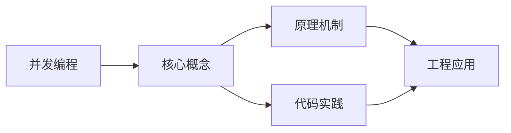

## 1. 学习目标（Bloom 分类）

本节按照布鲁姆教育目标分类学组织学习路径。本文主题为《并发编程》，属于 C++ 模块，读者可以根据自身阶段选择阅读深度。

记忆层面：能够准确复述本文的核心概念、术语与基本语法或操作步骤，并能够在提问或检索时快速定位对应知识点。能够说出 C++ 的类、继承、重载、模板与 STL 容器基本语法。

理解层面：能够用自己的语言解释核心原理与工作机制，说明概念之间的因果关系，而不是机械记忆结论。能够解释 RAII、拷贝/移动语义、虚函数与模板实例化。

应用层面：能够在真实项目或练习场景中运用本文知识解决具体问题，写出正确且可维护的实现。能够编写现代 C++（C++17/20）的类与泛型代码。

分析层面：能够拆解复杂问题，比较本文主题与相邻概念的异同，识别边界条件与例外情况。能够分析生命周期、未定义行为与性能特征。

评价层面：能够根据约束条件（性能、可读性、安全、成本）评价不同方案的优劣，做出有依据的技术决策。能够评价 C++ 与 Rust、Java 在系统编程中的取舍。

创造层面：能够把本文知识与其他模块知识组合，设计出新的解决方案或可复用的工程模式。能够设计高性能、可维护的 C++ 库与应用。

通过本节学习，读者应当能够把《并发编程》纳入自己的知识网络，并与 C++ 模块的其他主题（RAII、移动语义、模板、STL）建立关联。

## 2. 历史动机与发展脉络

《并发编程》是 C++ 领域的重要主题。要真正理解它，需要先了解它解决的问题与演进过程。

C++ 由 Bjarne Stroustrup 于 1979 年开始在贝尔实验室开发（原名 C with Classes），1983 年更名 C++，1998 年 C++98 首次标准化。
C++11 是语言转折点：右值引用、auto、lambda、智能指针、并发内存模型让现代 C++ 写法定型；C++14/17 补充泛型 lambda、if constexpr、折叠表达式；C++20 引入 concepts、协程、模块与范围库；C++23 继续完善。
现代 C++ 的核心口号是“资源安全”：RAII + 智能指针替代裸 new/delete，异常与错误码按场景选择；Rust 的出现促使 C++ 社区更重视内存安全工具（如 profile 指南、sanitizer）。

回到本文主题：并发编程 的提出与成熟，正是上述技术背景下的必然产物。早期实现往往以简单可用为目标，随着工程规模扩大，社区逐渐沉淀出标准做法与最佳实践；理解这一脉络，可以帮助读者判断“为什么文档中的推荐写法是现在这个样子”，也能在遇到历史遗留代码时准确识别其设计年代与取舍。


## 3. 形式化定义与核心概念精讲

本节把《并发编程》涉及的核心概念以“定义 + 讲解”的形式展开。读者应把定义当作工具，把讲解当作理解路径；两者结合才能形成可迁移的知识。

RAII：资源在构造函数获取、析构函数释放，栈对象离开作用域自动清理；智能指针（unique_ptr/shared_ptr/weak_ptr）把所有权编码进类型。
移动语义：右值引用 `&&` 与 std::move 转移资源所有权，避免深拷贝；移动后对象处于“合法但未指定”状态。
虚函数与多态：virtual 实现动态绑定，vtable 是运行时分派机制；final/override 关键字防止误用；基类析构函数应为 virtual。

### 3.1 原文章节逐一精讲

原文档把主题拆分为 8 个小节，下面按顺序给出每一节的导读讲解，随后保留原文细节供精读。

#### 原文精读（完整保留）


#### 1. C++ 并发编程概述

##### 1.1 并发与并行

- **并发（Concurrency）**：多个任务在逻辑上同时推进，可能在单核上交替执行
- **并行（Parallelism）**：多个任务在物理上同时执行，需要多核处理器

##### 1.2 C++ 线程支持演进

| 标准  | 新增特性                                                  |
| :---- | :-------------------------------------------------------- |
| C++11 | 线程库、mutex、condition_variable、atomic、future/promise |
| C++14 | shared_mutex（读写锁）、shared_timed_mutex                |
| C++17 | 并行STL算法                                               |
| C++20 | jthread（自动join）、协程、信号量、latch、barrier         |

#### 2. 线程管理

##### 2.1 创建与启动线程

```cpp
#include <iostream>
#include <thread>
#include <string>
#include <vector>

// 方式1：函数指针
void print_message(const std::string& msg) {
    std::cout << "Thread message: " << msg << std::endl;
}

// 方式2：Lambda表达式
void lambda_thread() {
    std::thread t([](int id) {
        std::cout << "Lambda thread id: " << id << std::endl;
    }, 42);
    t.join();
}

// 方式3：函数对象（仿函数）
class Worker {
public:
    void operator()(int iterations) {
        for (int i = 0; i < iterations; i++) {
            std::cout << "Worker iteration: " << i << std::endl;
        }
    }
};

// 方式4：成员函数
class Task {
public:
    void run() {
        std::cout << "Task running in thread" << std::endl;
    }
};

void thread_creation() {
    // 函数指针
    std::thread t1(print_message, "Hello from thread");

    // Lambda
    std::thread t2([]() {
        std::cout << "Lambda thread" << std::endl;
    });

    // 仿函数
    std::thread t3(Worker(), 5);

    // 成员函数
    Task task;
    std::thread t4(&Task::run, &task);

    // 等待所有线程完成
    t1.join();
    t2.join();
    t3.join();
    t4.join();
}
```

##### 2.2 线程的生命周期管理

```cpp
void thread_lifecycle() {
    std::thread t([]() {
        std::cout << "Working..." << std::endl;
    });

    // join: 等待线程完成
    t.join();

    // detach: 分离线程，使其在后台运行
    std::thread t2([]() {
        std::cout << "Detached thread" << std::endl;
    });
    t2.detach();

    // joinable: 检查线程是否可join
    std::thread t3;
    std::cout << "Empty thread joinable: " << t3.joinable() << std::endl;  // 0

    // RAII线程守卫
    class ThreadGuard {
    public:
        explicit ThreadGuard(std::thread& t) : thread_(t) {}
        ~ThreadGuard() {
            if (thread_.joinable()) {
                thread_.join();
            }
        }
        ThreadGuard(const ThreadGuard&) = delete;
        ThreadGuard& operator=(const ThreadGuard&) = delete;
    private:
        std::thread& thread_;
    };

    {
        std::thread worker([]() { /* work */ });
        ThreadGuard guard(worker);
        // 即使异常发生，guard析构也会join线程
    }
}
```

##### 2.3 C++20 jthread

```cpp
#include <thread>

void jthread_demo() {
    // jthread 自动在析构时 join
    std::jthread t([]() {
        std::cout << "jthread working" << std::endl;
    });
    // 无需手动join，析构时自动join

    // jthread 支持协作式取消
    std::jthread long_task([](std::stop_token st) {
        while (!st.stop_requested()) {
            std::cout << "Working..." << std::endl;
            std::this_thread::sleep_for(std::chrono::milliseconds(100));
        }
        std::cout << "Task stopped" << std::endl;
    });

    std::this_thread::sleep_for(std::chrono::milliseconds(500));
    long_task.request_stop();  // 请求停止
}
```

#### 3. 互斥量与锁

##### 3.1 mutex 基本用法

```cpp
#include <iostream>
#include <thread>
#include <mutex>
#include <vector>

class ThreadSafeCounter {
public:
    void increment() {
        std::lock_guard<std::mutex> lock(mutex_);
        count_++;
    }

    int get() const {
        std::lock_guard<std::mutex> lock(mutex_);
        return count_;
    }

private:
    mutable std::mutex mutex_;
    int count_ = 0;
};

void mutex_demo() {
    ThreadSafeCounter counter;
    std::vector<std::thread> threads;

    for (int i = 0; i < 10; i++) {
        threads.emplace_back([&counter]() {
            for (int j = 0; j < 1000; j++) {
                counter.increment();
            }
        });
    }

    for (auto& t : threads) {
        t.join();
    }

    std::cout << "Final count: " << counter.get() << std::endl;  // 10000
}
```

##### 3.2 各种锁类型

```cpp
#include <mutex>
#include <shared_mutex>

void lock_types_demo() {
    std::mutex mtx;

    // 1. lock_guard: 最简单的RAII锁
    {
        std::lock_guard<std::mutex> lock(mtx);
        // 临界区
    }  // 自动解锁

    // 2. unique_lock: 更灵活的锁
    {
        std::unique_lock<std::mutex> lock(mtx);
        // 可以手动解锁和重新加锁
        lock.unlock();
        // 做一些不需要锁的操作
        lock.lock();
        // 也可以延迟加锁
        std::unique_lock<std::mutex> defer_lock(mtx, std::defer_lock);
        defer_lock.lock();  // 手动加锁
    }

    // 3. shared_mutex (C++17): 读写锁
    std::shared_mutex rw_mtx;
    {
        // 多个读者可以同时持有读锁
        std::shared_lock<std::shared_mutex> read_lock(rw_mtx);
        // 读取数据
    }
    {
        // 写锁独占
        std::unique_lock<std::shared_mutex> write_lock(rw_mtx);
        // 修改数据
    }
}
```

##### 3.3 避免死锁

```cpp
#include <mutex>
#include <thread>

class BankAccount {
public:
    explicit BankAccount(int balance) : balance_(balance) {}
    void deposit(int amount) {
        std::lock_guard<std::mutex> lock(mutex_);
        balance_ += amount;
    }
    void withdraw(int amount) {
        std::lock_guard<std::mutex> lock(mutex_);
        balance_ -= amount;
    }
    int balance() const {
        std::lock_guard<std::mutex> lock(mutex_);
        return balance_;
    }
    std::mutex& get_mutex() { return mutex_; }
private:
    mutable std::mutex mutex_;
    int balance_;
};

// 死锁场景：两个线程分别持有对方需要的锁
void deadlock_example() {
    BankAccount a(1000), b(1000);

    // 线程1: a → b
    std::thread t1([&]() {
        std::lock_guard<std::mutex> lock_a(a.get_mutex());
        std::this_thread::sleep_for(std::chrono::milliseconds(1));
        std::lock_guard<std::mutex> lock_b(b.get_mutex());  // 可能死锁！
        a.withdraw(100);
        b.deposit(100);
    });

    // 线程2: b → a
    std::thread t2([&]() {
        std::lock_guard<std::mutex> lock_b(b.get_mutex());
        std::this_thread::sleep_for(std::chrono::milliseconds(1));
        std::lock_guard<std::mutex> lock_a(a.get_mutex());  // 死锁！
        b.withdraw(100);
        a.deposit(100);
    });

    t1.join();
    t2.join();
}

// 解决方案1：std::lock 同时锁定多个互斥量
void safe_transfer1() {
    BankAccount a(1000), b(1000);

    auto transfer = [&]() {
        std::unique_lock<std::mutex> lock_a(a.get_mutex(), std::defer_lock);
        std::unique_lock<std::mutex> lock_b(b.get_mutex(), std::defer_lock);
        std::lock(lock_a, lock_b);  // 原子化锁定，避免死锁

        a.withdraw(100);
        b.deposit(100);
    };

    std::thread t1(transfer);
    std::thread t2(transfer);
    t1.join();
    t2.join();
}

// 解决方案2：C++17 scoped_lock
void safe_transfer2() {
    BankAccount a(1000), b(1000);

    auto transfer = [&]() {
        std::scoped_lock lock(a.get_mutex(), b.get_mutex());  // C++17
        a.withdraw(100);
        b.deposit(100);
    };

    std::thread t1(transfer);
    std::thread t2(transfer);
    t1.join();
    t2.join();
}
```

#### 4. 条件变量

##### 4.1 生产者-消费者模型

```cpp
#include <iostream>
#include <thread>
#include <mutex>
#include <condition_variable>
#include <queue>

template<typename T>
class ThreadSafeQueue {
public:
    void push(T value) {
        {
            std::lock_guard<std::mutex> lock(mutex_);
            queue_.push(std::move(value));
        }
        cv_.notify_one();
    }

    T pop() {
        std::unique_lock<std::mutex> lock(mutex_);
        cv_.wait(lock, [this]() { return !queue_.empty(); });
        T value = std::move(queue_.front());
        queue_.pop();
        return value;
    }

    bool try_pop(T& value, std::chrono::milliseconds timeout) {
        std::unique_lock<std::mutex> lock(mutex_);
        if (cv_.wait_for(lock, timeout, [this]() { return !queue_.empty(); })) {
            value = std::move(queue_.front());
            queue_.pop();
            return true;
        }
        return false;
    }

    bool empty() const {
        std::lock_guard<std::mutex> lock(mutex_);
        return queue_.empty();
    }

private:
    mutable std::mutex mutex_;
    std::condition_variable cv_;
    std::queue<T> queue_;
};

void producer_consumer_demo() {
    ThreadSafeQueue<int> queue;
    bool done = false;

    // 生产者
    std::thread producer([&]() {
        for (int i = 0; i < 10; i++) {
            queue.push(i);
            std::cout << "Produced: " << i << std::endl;
            std::this_thread::sleep_for(std::chrono::milliseconds(50));
        }
        done = true;
        queue.push(-1);  // 哨兵值
    });

    // 消费者
    std::thread consumer([&]() {
        while (true) {
            int value = queue.pop();
            if (value == -1) break;
            std::cout << "Consumed: " << value << std::endl;
        }
    });

    producer.join();
    consumer.join();
}
```

#### 5. 原子操作

##### 5.1 atomic 基本用法

```cpp
#include <iostream>
#include <thread>
#include <atomic>
#include <vector>

void atomic_demo() {
    // 基本原子类型
    std::atomic<int> counter(0);
    std::atomic<bool> flag(false);

    std::vector<std::thread> threads;
    for (int i = 0; i < 10; i++) {
        threads.emplace_back([&counter]() {
            for (int j = 0; j < 1000; j++) {
                counter.fetch_add(1, std::memory_order_relaxed);
            }
        });
    }

    for (auto& t : threads) {
        t.join();
    }

    std::cout << "Counter: " << counter.load() << std::endl;  // 10000
}
```

##### 5.2 CAS（Compare-And-Swap）操作

```cpp
#include <atomic>

// 无锁栈的入栈操作
template<typename T>
class LockFreeStack {
    struct Node {
        T data;
        Node* next;
        explicit Node(T val) : data(std::move(val)), next(nullptr) {}
    };

    std::atomic<Node*> head_{nullptr};

public:
    void push(T value) {
        Node* new_node = new Node(std::move(value));
        new_node->next = head_.load(std::memory_order_relaxed);

        // CAS: 如果head_仍等于new_node->next，则更新为new_node
        while (!head_.compare_exchange_weak(
            new_node->next,        // expected: 期望的当前值
            new_node,              // desired: 想要设置的新值
            std::memory_order_release,
            std::memory_order_relaxed)) {
            // CAS失败，new_node->next已被自动更新为当前head_
            // 重试即可
        }
    }
};
```

##### 5.3 内存序

```cpp
void memory_order_demo() {
    // memory_order_relaxed: 无同步，只保证原子性
    std::atomic<int> relaxed_counter{0};
    relaxed_counter.fetch_add(1, std::memory_order_relaxed);

    // memory_order_acquire: 读操作，确保之后的读写不会被重排到此之前
    // memory_order_release: 写操作，确保之前的读写不会被重排到此之后
    std::atomic<bool> ready{false};
    int data = 0;

    // 写入线程
    std::thread writer([&]() {
        data = 42;                                    // 写入数据
        ready.store(true, std::memory_order_release);  // 发布信号
    });

    // 读取线程
    std::thread reader([&]() {
        while (!ready.load(std::memory_order_acquire)) {  // 获取信号
            std::this_thread::yield();
        }
        std::cout << "data = " << data << std::endl;  // 保证看到42
    });

    writer.join();
    reader.join();

    // memory_order_seq_cst (默认): 顺序一致性，最严格的内存序
    // memory_order_acq_rel: 同时具有acquire和release语义
}
```

#### 6. 异步编程

##### 6.1 future 与 promise

```cpp
#include <iostream>
#include <future>
#include <thread>

int compute_value(int x) {
    std::this_thread::sleep_for(std::chrono::milliseconds(500));
    return x * x;
}

void async_demo() {
    // std::async: 异步执行任务
    // launch::async: 强制在新线程执行
    // launch::deferred: 延迟到get()时在当前线程执行
    std::future<int> fut = std::async(std::launch::async, compute_value, 10);

    // 做其他工作...
    std::cout << "Doing other work..." << std::endl;

    // 获取结果（阻塞直到完成）
    int result = fut.get();
    std::cout << "Result: " << result << std::endl;  // 100

    // std::promise: 显式设置值
    std::promise<int> prom;
    std::future<int> fut2 = prom.get_future();

    std::thread t([&prom]() {
        std::this_thread::sleep_for(std::chrono::milliseconds(100));
        prom.set_value(42);
    });

    std::cout << "Promise value: " << fut2.get() << std::endl;
    t.join();
}
```

##### 6.2 packaged_task

```cpp
#include <iostream>
#include <future>
#include <thread>
#include <queue>
#include <functional>

// 线程池简化版
class SimpleThreadPool {
public:
    SimpleThreadPool(size_t count) {
        for (size_t i = 0; i < count; i++) {
            workers_.emplace_back([this]() { worker_loop(); });
        }
    }

    ~SimpleThreadPool() {
        {
            std::lock_guard<std::mutex> lock(mutex_);
            stop_ = true;
        }
        cv_.notify_all();
        for (auto& w : workers_) w.join();
    }

    template<typename F>
    auto submit(F&& f) -> std::future<decltype(f())> {
        using ReturnType = decltype(f());
        auto task = std::make_shared<std::packaged_task<ReturnType()>>(
            std::forward<F>(f)
        );
        auto future = task->get_future();
        {
            std::lock_guard<std::mutex> lock(mutex_);
            tasks_.push([task]() { (*task)(); });
        }
        cv_.notify_one();
        return future;
    }

private:
    void worker_loop() {
        while (true) {
            std::function<void()> task;
            {
                std::unique_lock<std::mutex> lock(mutex_);
                cv_.wait(lock, [this]() { return stop_ || !tasks_.empty(); });
                if (stop_ && tasks_.empty()) return;
                task = std::move(tasks_.front());
                tasks_.pop();
            }
            task();
        }
    }

    std::vector<std::thread> workers_;
    std::queue<std::function<void()>> tasks_;
    std::mutex mutex_;
    std::condition_variable cv_;
    bool stop_ = false;
};
```

#### 7. 常见问题与解决方案

##### 7.1 数据竞争

**问题**：多线程同时读写非原子变量

```cpp
// 错误：无保护的数据竞争
int counter = 0;
// 多线程执行 counter++ → 数据竞争

// 解决方案1：使用mutex
std::mutex mtx;
int counter = 0;
{
    std::lock_guard<std::mutex> lock(mtx);
    counter++;
}

// 解决方案2：使用atomic
std::atomic<int> counter{0};
counter.fetch_add(1, std::memory_order_relaxed);
```

##### 7.2 死锁

**问题**：两个线程互相等待对方持有的锁

**解决方案**：

1. 使用 `std::lock` 或 `std::scoped_lock` 同时获取多个锁
2. 固定加锁顺序
3. 使用 `try_lock` 加超时机制
4. 尽量减少锁的粒度和持有时间

##### 7.3 虚假唤醒

**问题**：条件变量的 `wait` 可能无故返回

```cpp
// 错误：不检查条件
cv.wait(lock);

// 正确：始终使用谓词
cv.wait(lock, []{ return condition; });
```

#### 8. 总结与最佳实践

##### 8.1 并发编程原则

1. **最小化共享数据**：减少线程间交互
2. **使用RAII管理锁**：`lock_guard`、`unique_lock`
3. **避免嵌套锁**：减少死锁风险
4. **优先使用高级抽象**：`future`、`packaged_task`、线程池
5. **原子操作优先于锁**：简单计数器用 `atomic`

##### 8.2 性能优化

- 减小锁粒度：只锁必要的临界区
- 读写分离：`shared_mutex` 允许多读者并行
- 无锁编程：CAS操作适合简单数据结构
- 线程池：避免频繁创建销毁线程
- 避免伪共享：对齐频繁修改的原子变量


### 3.2 概念关系图

下面用 Mermaid 图表达本文核心概念之间的关系，帮助读者建立整体图景：



图中展示的是本文知识的结构化关系：核心概念是入口，原理机制解释“为什么”，代码实践演示“怎么做”，工程应用回答“何时用”。读者学习时可以把每个小节的内容挂接到对应节点上。

## 4. 理论推导与原理解析

本节深入《并发编程》背后的原理。理论部分不求面面俱到，而是聚焦“能解释现象、能指导实践”的关键推导。

RAII：资源在构造函数获取、析构函数释放，栈对象离开作用域自动清理；智能指针（unique_ptr/shared_ptr/weak_ptr）把所有权编码进类型。
移动语义：右值引用 `&&` 与 std::move 转移资源所有权，避免深拷贝；移动后对象处于“合法但未指定”状态。
虚函数与多态：virtual 实现动态绑定，vtable 是运行时分派机制；final/override 关键字防止误用；基类析构函数应为 virtual。
模板与泛型：模板编译期实例化，实现静态多态；concepts（C++20）约束类型接口；模板元编程在编译期计算类型与常量。

需要强调的是，理论推导与工程实践之间存在翻译层：理论给出的是理想化模型与边界条件，工程代码则必须处理真实环境中的例外。读者在学习时应先掌握理论的“标准情形”，再通过陷阱章节了解“非标准情形”。

## 5. 代码示例与逐行讲解

本节把原文中的代码示例系统整理，并为每个示例补充用途说明与讲解。读者不应只浏览代码，而应逐段对照讲解理解设计意图。

### 5.1 示例：2.1 创建与启动线程

该示例来自原文《2.1 创建与启动线程》小节，用于演示并发编程相关操作。阅读时请先看代码结构，再看其后的讲解。

```cpp
#include <iostream>
#include <thread>
#include <string>
#include <vector>

// 方式1：函数指针
void print_message(const std::string& msg) {
    std::cout << "Thread message: " << msg << std::endl;
}

// 方式2：Lambda表达式
void lambda_thread() {
    std::thread t([](int id) {
        std::cout << "Lambda thread id: " << id << std::endl;
    }, 42);
    t.join();
}

// 方式3：函数对象（仿函数）
class Worker {
public:
    void operator()(int iterations) {
        for (int i = 0; i < iterations; i++) {
            std::cout << "Worker iteration: " << i << std::endl;
        }
    }
};

// 方式4：成员函数
class Task {
public:
    void run() {
        std::cout << "Task running in thread" << std::endl;
    }
};

void thread_creation() {
    // 函数指针
    std::thread t1(print_message, "Hello from thread");

    // Lambda
    std::thread t2([]() {
        std::cout << "Lambda thread" << std::endl;
    });

    // 仿函数
    std::thread t3(Worker(), 5);

    // 成员函数
    Task task;
    std::thread t4(&Task::run, &task);

    // 等待所有线程完成
    t1.join();
    t2.join();
    t3.join();
    t4.join();
}
```

讲解：这段代码演示了本节核心知识点。代码中的关键操作可以归纳为三步：准备（定义或初始化）、执行（核心逻辑）、收尾（释放资源或返回结果）。实际项目中，这三步往往被封装为函数或类，以提升复用性与可测试性。

关键点分析：

该示例共 49 行有效代码，包含 3 类关键结构（class、from、for）。其中：

- 入口与初始化部分负责建立上下文，对应实际项目中的启动或装配逻辑；
- 核心逻辑部分体现本文主题的主要操作，是阅读时最需要对照讲解理解的部分；
- 输出或返回部分把结果交给调用方，注意其类型与边界条件。

进阶思考路径：先尝试修改参数观察行为变化，再把示例中的模式迁移到自己的项目中；每次修改都记录预期与实测差异，这是把示例转化为能力的最快方式。

### 5.2 示例：2.2 线程的生命周期管理

该示例来自原文《2.2 线程的生命周期管理》小节，用于演示并发编程相关操作。阅读时请先看代码结构，再看其后的讲解。

```cpp
void thread_lifecycle() {
    std::thread t([]() {
        std::cout << "Working..." << std::endl;
    });

    // join: 等待线程完成
    t.join();

    // detach: 分离线程，使其在后台运行
    std::thread t2([]() {
        std::cout << "Detached thread" << std::endl;
    });
    t2.detach();

    // joinable: 检查线程是否可join
    std::thread t3;
    std::cout << "Empty thread joinable: " << t3.joinable() << std::endl;  // 0

    // RAII线程守卫
    class ThreadGuard {
    public:
        explicit ThreadGuard(std::thread& t) : thread_(t) {}
        ~ThreadGuard() {
            if (thread_.joinable()) {
                thread_.join();
            }
        }
        ThreadGuard(const ThreadGuard&) = delete;
        ThreadGuard& operator=(const ThreadGuard&) = delete;
    private:
        std::thread& thread_;
    };

    {
        std::thread worker([]() { /* work */ });
        ThreadGuard guard(worker);
        // 即使异常发生，guard析构也会join线程
    }
}
```

讲解：这段代码演示了本节核心知识点。代码中的关键操作可以归纳为三步：准备（定义或初始化）、执行（核心逻辑）、收尾（释放资源或返回结果）。实际项目中，这三步往往被封装为函数或类，以提升复用性与可测试性。

关键点分析：

该示例共 34 行有效代码，包含 2 类关键结构（class、if）。其中：

- 入口与初始化部分负责建立上下文，对应实际项目中的启动或装配逻辑；
- 核心逻辑部分体现本文主题的主要操作，是阅读时最需要对照讲解理解的部分；
- 输出或返回部分把结果交给调用方，注意其类型与边界条件。

进阶思考路径：先尝试修改参数观察行为变化，再把示例中的模式迁移到自己的项目中；每次修改都记录预期与实测差异，这是把示例转化为能力的最快方式。

### 5.3 示例：2.3 C++20 jthread

该示例来自原文《2.3 C++20 jthread》小节，用于演示并发编程相关操作。阅读时请先看代码结构，再看其后的讲解。

```cpp
#include <thread>

void jthread_demo() {
    // jthread 自动在析构时 join
    std::jthread t([]() {
        std::cout << "jthread working" << std::endl;
    });
    // 无需手动join，析构时自动join

    // jthread 支持协作式取消
    std::jthread long_task([](std::stop_token st) {
        while (!st.stop_requested()) {
            std::cout << "Working..." << std::endl;
            std::this_thread::sleep_for(std::chrono::milliseconds(100));
        }
        std::cout << "Task stopped" << std::endl;
    });

    std::this_thread::sleep_for(std::chrono::milliseconds(500));
    long_task.request_stop();  // 请求停止
}
```

讲解：这段代码演示了本节核心知识点。代码中的关键操作可以归纳为三步：准备（定义或初始化）、执行（核心逻辑）、收尾（释放资源或返回结果）。实际项目中，这三步往往被封装为函数或类，以提升复用性与可测试性。

关键点分析：

该示例共 18 行有效代码，包含 1 类关键结构（while）。其中：

- 入口与初始化部分负责建立上下文，对应实际项目中的启动或装配逻辑；
- 核心逻辑部分体现本文主题的主要操作，是阅读时最需要对照讲解理解的部分；
- 输出或返回部分把结果交给调用方，注意其类型与边界条件。

进阶思考路径：先尝试修改参数观察行为变化，再把示例中的模式迁移到自己的项目中；每次修改都记录预期与实测差异，这是把示例转化为能力的最快方式。

### 5.4 示例：3.1 mutex 基本用法

该示例来自原文《3.1 mutex 基本用法》小节，用于演示并发编程相关操作。阅读时请先看代码结构，再看其后的讲解。

```cpp
#include <iostream>
#include <thread>
#include <mutex>
#include <vector>

class ThreadSafeCounter {
public:
    void increment() {
        std::lock_guard<std::mutex> lock(mutex_);
        count_++;
    }

    int get() const {
        std::lock_guard<std::mutex> lock(mutex_);
        return count_;
    }

private:
    mutable std::mutex mutex_;
    int count_ = 0;
};

void mutex_demo() {
    ThreadSafeCounter counter;
    std::vector<std::thread> threads;

    for (int i = 0; i < 10; i++) {
        threads.emplace_back([&counter]() {
            for (int j = 0; j < 1000; j++) {
                counter.increment();
            }
        });
    }

    for (auto& t : threads) {
        t.join();
    }

    std::cout << "Final count: " << counter.get() << std::endl;  // 10000
}
```

讲解：这段代码演示了本节核心知识点。代码中的关键操作可以归纳为三步：准备（定义或初始化）、执行（核心逻辑）、收尾（释放资源或返回结果）。实际项目中，这三步往往被封装为函数或类，以提升复用性与可测试性。

关键点分析：

该示例共 33 行有效代码，包含 3 类关键结构（class、for、return）。其中：

- 入口与初始化部分负责建立上下文，对应实际项目中的启动或装配逻辑；
- 核心逻辑部分体现本文主题的主要操作，是阅读时最需要对照讲解理解的部分；
- 输出或返回部分把结果交给调用方，注意其类型与边界条件。

进阶思考路径：先尝试修改参数观察行为变化，再把示例中的模式迁移到自己的项目中；每次修改都记录预期与实测差异，这是把示例转化为能力的最快方式。

### 5.5 示例：3.2 各种锁类型

该示例来自原文《3.2 各种锁类型》小节，用于演示并发编程相关操作。阅读时请先看代码结构，再看其后的讲解。

```cpp
#include <mutex>
#include <shared_mutex>

void lock_types_demo() {
    std::mutex mtx;

    // 1. lock_guard: 最简单的RAII锁
    {
        std::lock_guard<std::mutex> lock(mtx);
        // 临界区
    }  // 自动解锁

    // 2. unique_lock: 更灵活的锁
    {
        std::unique_lock<std::mutex> lock(mtx);
        // 可以手动解锁和重新加锁
        lock.unlock();
        // 做一些不需要锁的操作
        lock.lock();
        // 也可以延迟加锁
        std::unique_lock<std::mutex> defer_lock(mtx, std::defer_lock);
        defer_lock.lock();  // 手动加锁
    }

    // 3. shared_mutex (C++17): 读写锁
    std::shared_mutex rw_mtx;
    {
        // 多个读者可以同时持有读锁
        std::shared_lock<std::shared_mutex> read_lock(rw_mtx);
        // 读取数据
    }
    {
        // 写锁独占
        std::unique_lock<std::shared_mutex> write_lock(rw_mtx);
        // 修改数据
    }
}
```

讲解：这段代码演示了本节核心知识点。代码中的关键操作可以归纳为三步：准备（定义或初始化）、执行（核心逻辑）、收尾（释放资源或返回结果）。实际项目中，这三步往往被封装为函数或类，以提升复用性与可测试性。

关键点分析：

该示例共 33 行有效代码，结构以数据或配置为主。阅读时应关注：数据字段的含义、配置项的作用，以及它们与运行行为的对应关系。

进阶思考路径：先尝试修改参数观察行为变化，再把示例中的模式迁移到自己的项目中；每次修改都记录预期与实测差异，这是把示例转化为能力的最快方式。

### 5.6 示例：3.3 避免死锁

该示例来自原文《3.3 避免死锁》小节，用于演示并发编程相关操作。阅读时请先看代码结构，再看其后的讲解。

```cpp
#include <mutex>
#include <thread>

class BankAccount {
public:
    explicit BankAccount(int balance) : balance_(balance) {}
    void deposit(int amount) {
        std::lock_guard<std::mutex> lock(mutex_);
        balance_ += amount;
    }
    void withdraw(int amount) {
        std::lock_guard<std::mutex> lock(mutex_);
        balance_ -= amount;
    }
    int balance() const {
        std::lock_guard<std::mutex> lock(mutex_);
        return balance_;
    }
    std::mutex& get_mutex() { return mutex_; }
private:
    mutable std::mutex mutex_;
    int balance_;
};

// 死锁场景：两个线程分别持有对方需要的锁
void deadlock_example() {
    BankAccount a(1000), b(1000);

    // 线程1: a → b
    std::thread t1([&]() {
        std::lock_guard<std::mutex> lock_a(a.get_mutex());
        std::this_thread::sleep_for(std::chrono::milliseconds(1));
        std::lock_guard<std::mutex> lock_b(b.get_mutex());  // 可能死锁！
        a.withdraw(100);
        b.deposit(100);
    });

    // 线程2: b → a
    std::thread t2([&]() {
        std::lock_guard<std::mutex> lock_b(b.get_mutex());
        std::this_thread::sleep_for(std::chrono::milliseconds(1));
        std::lock_guard<std::mutex> lock_a(a.get_mutex());  // 死锁！
        b.withdraw(100);
        a.deposit(100);
    });

    t1.join();
    t2.join();
}

// 解决方案1：std::lock 同时锁定多个互斥量
void safe_transfer1() {
    BankAccount a(1000), b(1000);

    auto transfer = [&]() {
        std::unique_lock<std::mutex> lock_a(a.get_mutex(), std::defer_lock);
        std::unique_lock<std::mutex> lock_b(b.get_mutex(), std::defer_lock);
        std::lock(lock_a, lock_b);  // 原子化锁定，避免死锁

        a.withdraw(100);
        b.deposit(100);
    };

    std::thread t1(transfer);
    std::thread t2(transfer);
    t1.join();
    t2.join();
}

// 解决方案2：C++17 scoped_lock
void safe_transfer2() {
    BankAccount a(1000), b(1000);

    auto transfer = [&]() {
        std::scoped_lock lock(a.get_mutex(), b.get_mutex());  // C++17
        a.withdraw(100);
        b.deposit(100);
    };

    std::thread t1(transfer);
    std::thread t2(transfer);
    t1.join();
    t2.join();
}
```

讲解：这段代码演示了本节核心知识点。代码中的关键操作可以归纳为三步：准备（定义或初始化）、执行（核心逻辑）、收尾（释放资源或返回结果）。实际项目中，这三步往往被封装为函数或类，以提升复用性与可测试性。

关键点分析：

该示例共 72 行有效代码，包含 2 类关键结构（class、return）。其中：

- 入口与初始化部分负责建立上下文，对应实际项目中的启动或装配逻辑；
- 核心逻辑部分体现本文主题的主要操作，是阅读时最需要对照讲解理解的部分；
- 输出或返回部分把结果交给调用方，注意其类型与边界条件。

进阶思考路径：先尝试修改参数观察行为变化，再把示例中的模式迁移到自己的项目中；每次修改都记录预期与实测差异，这是把示例转化为能力的最快方式。

### 5.7 示例：4.1 生产者-消费者模型

该示例来自原文《4.1 生产者-消费者模型》小节，用于演示并发编程相关操作。阅读时请先看代码结构，再看其后的讲解。

```cpp
#include <iostream>
#include <thread>
#include <mutex>
#include <condition_variable>
#include <queue>

template<typename T>
class ThreadSafeQueue {
public:
    void push(T value) {
        {
            std::lock_guard<std::mutex> lock(mutex_);
            queue_.push(std::move(value));
        }
        cv_.notify_one();
    }

    T pop() {
        std::unique_lock<std::mutex> lock(mutex_);
        cv_.wait(lock, [this]() { return !queue_.empty(); });
        T value = std::move(queue_.front());
        queue_.pop();
        return value;
    }

    bool try_pop(T& value, std::chrono::milliseconds timeout) {
        std::unique_lock<std::mutex> lock(mutex_);
        if (cv_.wait_for(lock, timeout, [this]() { return !queue_.empty(); })) {
            value = std::move(queue_.front());
            queue_.pop();
            return true;
        }
        return false;
    }

    bool empty() const {
        std::lock_guard<std::mutex> lock(mutex_);
        return queue_.empty();
    }

private:
    mutable std::mutex mutex_;
    std::condition_variable cv_;
    std::queue<T> queue_;
};

void producer_consumer_demo() {
    ThreadSafeQueue<int> queue;
    bool done = false;

    // 生产者
    std::thread producer([&]() {
        for (int i = 0; i < 10; i++) {
            queue.push(i);
            std::cout << "Produced: " << i << std::endl;
            std::this_thread::sleep_for(std::chrono::milliseconds(50));
        }
        done = true;
        queue.push(-1);  // 哨兵值
    });

    // 消费者
    std::thread consumer([&]() {
        while (true) {
            int value = queue.pop();
            if (value == -1) break;
            std::cout << "Consumed: " << value << std::endl;
        }
    });

    producer.join();
    consumer.join();
}
```

讲解：这段代码演示了本节核心知识点。代码中的关键操作可以归纳为三步：准备（定义或初始化）、执行（核心逻辑）、收尾（释放资源或返回结果）。实际项目中，这三步往往被封装为函数或类，以提升复用性与可测试性。

关键点分析：

该示例共 64 行有效代码，包含 5 类关键结构（class、if、for、while、return）。其中：

- 入口与初始化部分负责建立上下文，对应实际项目中的启动或装配逻辑；
- 核心逻辑部分体现本文主题的主要操作，是阅读时最需要对照讲解理解的部分；
- 输出或返回部分把结果交给调用方，注意其类型与边界条件。

进阶思考路径：先尝试修改参数观察行为变化，再把示例中的模式迁移到自己的项目中；每次修改都记录预期与实测差异，这是把示例转化为能力的最快方式。

### 5.8 示例：5.1 atomic 基本用法

该示例来自原文《5.1 atomic 基本用法》小节，用于演示并发编程相关操作。阅读时请先看代码结构，再看其后的讲解。

```cpp
#include <iostream>
#include <thread>
#include <atomic>
#include <vector>

void atomic_demo() {
    // 基本原子类型
    std::atomic<int> counter(0);
    std::atomic<bool> flag(false);

    std::vector<std::thread> threads;
    for (int i = 0; i < 10; i++) {
        threads.emplace_back([&counter]() {
            for (int j = 0; j < 1000; j++) {
                counter.fetch_add(1, std::memory_order_relaxed);
            }
        });
    }

    for (auto& t : threads) {
        t.join();
    }

    std::cout << "Counter: " << counter.load() << std::endl;  // 10000
}
```

讲解：这段代码演示了本节核心知识点。代码中的关键操作可以归纳为三步：准备（定义或初始化）、执行（核心逻辑）、收尾（释放资源或返回结果）。实际项目中，这三步往往被封装为函数或类，以提升复用性与可测试性。

关键点分析：

该示例共 21 行有效代码，包含 1 类关键结构（for）。其中：

- 入口与初始化部分负责建立上下文，对应实际项目中的启动或装配逻辑；
- 核心逻辑部分体现本文主题的主要操作，是阅读时最需要对照讲解理解的部分；
- 输出或返回部分把结果交给调用方，注意其类型与边界条件。

进阶思考路径：先尝试修改参数观察行为变化，再把示例中的模式迁移到自己的项目中；每次修改都记录预期与实测差异，这是把示例转化为能力的最快方式。

### 5.9 示例：5.2 CAS（Compare-And-Swap）操作

该示例来自原文《5.2 CAS（Compare-And-Swap）操作》小节，用于演示并发编程相关操作。阅读时请先看代码结构，再看其后的讲解。

```cpp
#include <atomic>

// 无锁栈的入栈操作
template<typename T>
class LockFreeStack {
    struct Node {
        T data;
        Node* next;
        explicit Node(T val) : data(std::move(val)), next(nullptr) {}
    };

    std::atomic<Node*> head_{nullptr};

public:
    void push(T value) {
        Node* new_node = new Node(std::move(value));
        new_node->next = head_.load(std::memory_order_relaxed);

        // CAS: 如果head_仍等于new_node->next，则更新为new_node
        while (!head_.compare_exchange_weak(
            new_node->next,        // expected: 期望的当前值
            new_node,              // desired: 想要设置的新值
            std::memory_order_release,
            std::memory_order_relaxed)) {
            // CAS失败，new_node->next已被自动更新为当前head_
            // 重试即可
        }
    }
};
```

讲解：这段代码演示了本节核心知识点。代码中的关键操作可以归纳为三步：准备（定义或初始化）、执行（核心逻辑）、收尾（释放资源或返回结果）。实际项目中，这三步往往被封装为函数或类，以提升复用性与可测试性。

关键点分析：

该示例共 25 行有效代码，包含 2 类关键结构（class、while）。其中：

- 入口与初始化部分负责建立上下文，对应实际项目中的启动或装配逻辑；
- 核心逻辑部分体现本文主题的主要操作，是阅读时最需要对照讲解理解的部分；
- 输出或返回部分把结果交给调用方，注意其类型与边界条件。

进阶思考路径：先尝试修改参数观察行为变化，再把示例中的模式迁移到自己的项目中；每次修改都记录预期与实测差异，这是把示例转化为能力的最快方式。

### 5.10 示例：5.3 内存序

该示例来自原文《5.3 内存序》小节，用于演示并发编程相关操作。阅读时请先看代码结构，再看其后的讲解。

```cpp
void memory_order_demo() {
    // memory_order_relaxed: 无同步，只保证原子性
    std::atomic<int> relaxed_counter{0};
    relaxed_counter.fetch_add(1, std::memory_order_relaxed);

    // memory_order_acquire: 读操作，确保之后的读写不会被重排到此之前
    // memory_order_release: 写操作，确保之前的读写不会被重排到此之后
    std::atomic<bool> ready{false};
    int data = 0;

    // 写入线程
    std::thread writer([&]() {
        data = 42;                                    // 写入数据
        ready.store(true, std::memory_order_release);  // 发布信号
    });

    // 读取线程
    std::thread reader([&]() {
        while (!ready.load(std::memory_order_acquire)) {  // 获取信号
            std::this_thread::yield();
        }
        std::cout << "data = " << data << std::endl;  // 保证看到42
    });

    writer.join();
    reader.join();

    // memory_order_seq_cst (默认): 顺序一致性，最严格的内存序
    // memory_order_acq_rel: 同时具有acquire和release语义
}
```

讲解：这段代码演示了本节核心知识点。代码中的关键操作可以归纳为三步：准备（定义或初始化）、执行（核心逻辑）、收尾（释放资源或返回结果）。实际项目中，这三步往往被封装为函数或类，以提升复用性与可测试性。

关键点分析：

该示例共 25 行有效代码，包含 1 类关键结构（while）。其中：

- 入口与初始化部分负责建立上下文，对应实际项目中的启动或装配逻辑；
- 核心逻辑部分体现本文主题的主要操作，是阅读时最需要对照讲解理解的部分；
- 输出或返回部分把结果交给调用方，注意其类型与边界条件。

进阶思考路径：先尝试修改参数观察行为变化，再把示例中的模式迁移到自己的项目中；每次修改都记录预期与实测差异，这是把示例转化为能力的最快方式。

### 5.11 示例：6.1 future 与 promise

该示例来自原文《6.1 future 与 promise》小节，用于演示并发编程相关操作。阅读时请先看代码结构，再看其后的讲解。

```cpp
#include <iostream>
#include <future>
#include <thread>

int compute_value(int x) {
    std::this_thread::sleep_for(std::chrono::milliseconds(500));
    return x * x;
}

void async_demo() {
    // std::async: 异步执行任务
    // launch::async: 强制在新线程执行
    // launch::deferred: 延迟到get()时在当前线程执行
    std::future<int> fut = std::async(std::launch::async, compute_value, 10);

    // 做其他工作...
    std::cout << "Doing other work..." << std::endl;

    // 获取结果（阻塞直到完成）
    int result = fut.get();
    std::cout << "Result: " << result << std::endl;  // 100

    // std::promise: 显式设置值
    std::promise<int> prom;
    std::future<int> fut2 = prom.get_future();

    std::thread t([&prom]() {
        std::this_thread::sleep_for(std::chrono::milliseconds(100));
        prom.set_value(42);
    });

    std::cout << "Promise value: " << fut2.get() << std::endl;
    t.join();
}
```

讲解：这段代码演示了本节核心知识点。代码中的关键操作可以归纳为三步：准备（定义或初始化）、执行（核心逻辑）、收尾（释放资源或返回结果）。实际项目中，这三步往往被封装为函数或类，以提升复用性与可测试性。

关键点分析：

该示例共 27 行有效代码，包含 1 类关键结构（return）。其中：

- 入口与初始化部分负责建立上下文，对应实际项目中的启动或装配逻辑；
- 核心逻辑部分体现本文主题的主要操作，是阅读时最需要对照讲解理解的部分；
- 输出或返回部分把结果交给调用方，注意其类型与边界条件。

进阶思考路径：先尝试修改参数观察行为变化，再把示例中的模式迁移到自己的项目中；每次修改都记录预期与实测差异，这是把示例转化为能力的最快方式。

### 5.12 示例：6.2 packaged_task

该示例来自原文《6.2 packaged_task》小节，用于演示并发编程相关操作。阅读时请先看代码结构，再看其后的讲解。

```cpp
#include <iostream>
#include <future>
#include <thread>
#include <queue>
#include <functional>

// 线程池简化版
class SimpleThreadPool {
public:
    SimpleThreadPool(size_t count) {
        for (size_t i = 0; i < count; i++) {
            workers_.emplace_back([this]() { worker_loop(); });
        }
    }

    ~SimpleThreadPool() {
        {
            std::lock_guard<std::mutex> lock(mutex_);
            stop_ = true;
        }
        cv_.notify_all();
        for (auto& w : workers_) w.join();
    }

    template<typename F>
    auto submit(F&& f) -> std::future<decltype(f())> {
        using ReturnType = decltype(f());
        auto task = std::make_shared<std::packaged_task<ReturnType()>>(
            std::forward<F>(f)
        );
        auto future = task->get_future();
        {
            std::lock_guard<std::mutex> lock(mutex_);
            tasks_.push([task]() { (*task)(); });
        }
        cv_.notify_one();
        return future;
    }

private:
    void worker_loop() {
        while (true) {
            std::function<void()> task;
            {
                std::unique_lock<std::mutex> lock(mutex_);
                cv_.wait(lock, [this]() { return stop_ || !tasks_.empty(); });
                if (stop_ && tasks_.empty()) return;
                task = std::move(tasks_.front());
                tasks_.pop();
            }
            task();
        }
    }

    std::vector<std::thread> workers_;
    std::queue<std::function<void()>> tasks_;
    std::mutex mutex_;
    std::condition_variable cv_;
    bool stop_ = false;
};
```

讲解：这段代码演示了本节核心知识点。代码中的关键操作可以归纳为三步：准备（定义或初始化）、执行（核心逻辑）、收尾（释放资源或返回结果）。实际项目中，这三步往往被封装为函数或类，以提升复用性与可测试性。

关键点分析：

该示例共 55 行有效代码，包含 6 类关键结构（class、function、if、for、while、return）。其中：

- 入口与初始化部分负责建立上下文，对应实际项目中的启动或装配逻辑；
- 核心逻辑部分体现本文主题的主要操作，是阅读时最需要对照讲解理解的部分；
- 输出或返回部分把结果交给调用方，注意其类型与边界条件。

进阶思考路径：先尝试修改参数观察行为变化，再把示例中的模式迁移到自己的项目中；每次修改都记录预期与实测差异，这是把示例转化为能力的最快方式。

### 5.13 示例：7.1 数据竞争

该示例来自原文《7.1 数据竞争》小节，用于演示并发编程相关操作。阅读时请先看代码结构，再看其后的讲解。

```cpp
// 错误：无保护的数据竞争
int counter = 0;
// 多线程执行 counter++ → 数据竞争

// 解决方案1：使用mutex
std::mutex mtx;
int counter = 0;
{
    std::lock_guard<std::mutex> lock(mtx);
    counter++;
}

// 解决方案2：使用atomic
std::atomic<int> counter{0};
counter.fetch_add(1, std::memory_order_relaxed);
```

讲解：这段代码演示了本节核心知识点。代码中的关键操作可以归纳为三步：准备（定义或初始化）、执行（核心逻辑）、收尾（释放资源或返回结果）。实际项目中，这三步往往被封装为函数或类，以提升复用性与可测试性。

关键点分析：

该示例共 13 行有效代码，结构以数据或配置为主。阅读时应关注：数据字段的含义、配置项的作用，以及它们与运行行为的对应关系。

进阶思考路径：先尝试修改参数观察行为变化，再把示例中的模式迁移到自己的项目中；每次修改都记录预期与实测差异，这是把示例转化为能力的最快方式。

### 5.14 示例：7.3 虚假唤醒

该示例来自原文《7.3 虚假唤醒》小节，用于演示并发编程相关操作。阅读时请先看代码结构，再看其后的讲解。

```cpp
// 错误：不检查条件
cv.wait(lock);

// 正确：始终使用谓词
cv.wait(lock, []{ return condition; });
```

讲解：这段代码演示了本节核心知识点。代码中的关键操作可以归纳为三步：准备（定义或初始化）、执行（核心逻辑）、收尾（释放资源或返回结果）。实际项目中，这三步往往被封装为函数或类，以提升复用性与可测试性。

关键点分析：

该示例共 4 行有效代码，包含 1 类关键结构（return）。其中：

- 入口与初始化部分负责建立上下文，对应实际项目中的启动或装配逻辑；
- 核心逻辑部分体现本文主题的主要操作，是阅读时最需要对照讲解理解的部分；
- 输出或返回部分把结果交给调用方，注意其类型与边界条件。

进阶思考路径：先尝试修改参数观察行为变化，再把示例中的模式迁移到自己的项目中；每次修改都记录预期与实测差异，这是把示例转化为能力的最快方式。


综合以上示例，可以总结出本主题的代码实践要点：第一，先定义清晰的输入输出契约；第二，核心逻辑保持单一职责；第三，错误处理与边界条件不可省略；第四，命名与注释表达意图而非复述代码。

## 6. 对比分析

对比是理解《并发编程》定位的最快路径。下面从多个维度与相邻方案进行对比。

C++ 与 C：C++ 支持面向对象与泛型、RAII 与标准库；C 更简单，适合纯系统与嵌入式。
C++ 与 Rust：Rust 编译期保证内存安全，所有权模型严格；C++ 灵活但依赖纪律。性能相近，安全性 Rust 更强。
C++11 与 C++20：concepts、协程、范围库代表现代 C++ 方向；新代码以 C++20 为基线。

对比的目的不是分出绝对优劣，而是建立选择依据：不同约束条件下，最优解不同。读者应把每个对比维度转化为决策检查清单。

## 7. 常见陷阱与最佳实践

本节整理该主题的高频错误与推荐做法。每个陷阱先描述现象，再解释原因，最后给出最佳实践。

### 7.1 裸 new/delete

易泄漏与重复释放。使用 make_unique/make_shared 与栈对象。

深入讲解：该问题之所以被归类为“常见陷阱”，是因为它在初学者的代码中反复出现，而且往往不在第一时间暴露——错误通常隐藏在特定数据或特定时序下。

从成因上看，裸 new/delete 一般源于对 C++ 某个机制的理解偏差：要么误用了默认行为，要么忽略了边界条件，要么把其他语言的思维惯性带了过来。

从影响上看，裸 new/delete 轻则产生错误结果，重则导致资源泄漏、数据损坏或安全事故；这也是为什么工程评审中会把它列为检查项。

从修复策略上看，处理裸 new/delete的正确顺序是：先复现（构造最小用例），再定位（确认机制层面的根因），最后修复并补充回归测试。跳过复现直接改代码，往往治标不治本。

### 7.2 引用悬垂

返回局部变量引用或存储容器元素引用后容器扩容。理解生命周期，必要时用值或智能指针。

深入讲解：该问题之所以被归类为“常见陷阱”，是因为它在初学者的代码中反复出现，而且往往不在第一时间暴露——错误通常隐藏在特定数据或特定时序下。

从成因上看，引用悬垂 一般源于对 C++ 某个机制的理解偏差：要么误用了默认行为，要么忽略了边界条件，要么把其他语言的思维惯性带了过来。

从影响上看，引用悬垂 轻则产生错误结果，重则导致资源泄漏、数据损坏或安全事故；这也是为什么工程评审中会把它列为检查项。

从修复策略上看，处理引用悬垂的正确顺序是：先复现（构造最小用例），再定位（确认机制层面的根因），最后修复并补充回归测试。跳过复现直接改代码，往往治标不治本。

### 7.3 迭代器失效

vector 扩容使迭代器失效。避免在遍历时修改容器，或改用索引/新容器。

深入讲解：该问题之所以被归类为“常见陷阱”，是因为它在初学者的代码中反复出现，而且往往不在第一时间暴露——错误通常隐藏在特定数据或特定时序下。

从成因上看，迭代器失效 一般源于对 C++ 某个机制的理解偏差：要么误用了默认行为，要么忽略了边界条件，要么把其他语言的思维惯性带了过来。

从影响上看，迭代器失效 轻则产生错误结果，重则导致资源泄漏、数据损坏或安全事故；这也是为什么工程评审中会把它列为检查项。

从修复策略上看，处理迭代器失效的正确顺序是：先复现（构造最小用例），再定位（确认机制层面的根因），最后修复并补充回归测试。跳过复现直接改代码，往往治标不治本。

### 7.4 虚析构缺失

通过基类指针删除派生对象时未调用派生析构。基类析构声明为 virtual。

深入讲解：该问题之所以被归类为“常见陷阱”，是因为它在初学者的代码中反复出现，而且往往不在第一时间暴露——错误通常隐藏在特定数据或特定时序下。

从成因上看，虚析构缺失 一般源于对 C++ 某个机制的理解偏差：要么误用了默认行为，要么忽略了边界条件，要么把其他语言的思维惯性带了过来。

从影响上看，虚析构缺失 轻则产生错误结果，重则导致资源泄漏、数据损坏或安全事故；这也是为什么工程评审中会把它列为检查项。

从修复策略上看，处理虚析构缺失的正确顺序是：先复现（构造最小用例），再定位（确认机制层面的根因），最后修复并补充回归测试。跳过复现直接改代码，往往治标不治本。

### 7.5 std::move 后使用对象

移动后对象状态未指定。移动后只赋值或销毁，不再读取。

深入讲解：该问题之所以被归类为“常见陷阱”，是因为它在初学者的代码中反复出现，而且往往不在第一时间暴露——错误通常隐藏在特定数据或特定时序下。

从成因上看，std::move 后使用对象 一般源于对 C++ 某个机制的理解偏差：要么误用了默认行为，要么忽略了边界条件，要么把其他语言的思维惯性带了过来。

从影响上看，std::move 后使用对象 轻则产生错误结果，重则导致资源泄漏、数据损坏或安全事故；这也是为什么工程评审中会把它列为检查项。

从修复策略上看，处理std::move 后使用对象的正确顺序是：先复现（构造最小用例），再定位（确认机制层面的根因），最后修复并补充回归测试。跳过复现直接改代码，往往治标不治本。

### 7.6 隐式转换意外

单参数构造函数产生隐式转换。标记 explicit。

深入讲解：该问题之所以被归类为“常见陷阱”，是因为它在初学者的代码中反复出现，而且往往不在第一时间暴露——错误通常隐藏在特定数据或特定时序下。

从成因上看，隐式转换意外 一般源于对 C++ 某个机制的理解偏差：要么误用了默认行为，要么忽略了边界条件，要么把其他语言的思维惯性带了过来。

从影响上看，隐式转换意外 轻则产生错误结果，重则导致资源泄漏、数据损坏或安全事故；这也是为什么工程评审中会把它列为检查项。

从修复策略上看，处理隐式转换意外的正确顺序是：先复现（构造最小用例），再定位（确认机制层面的根因），最后修复并补充回归测试。跳过复现直接改代码，往往治标不治本。

### 7.7 异常安全

异常中途抛出导致资源泄漏或不变量破坏。使用 RAII 与强异常保证设计。

深入讲解：该问题之所以被归类为“常见陷阱”，是因为它在初学者的代码中反复出现，而且往往不在第一时间暴露——错误通常隐藏在特定数据或特定时序下。

从成因上看，异常安全 一般源于对 C++ 某个机制的理解偏差：要么误用了默认行为，要么忽略了边界条件，要么把其他语言的思维惯性带了过来。

从影响上看，异常安全 轻则产生错误结果，重则导致资源泄漏、数据损坏或安全事故；这也是为什么工程评审中会把它列为检查项。

从修复策略上看，处理异常安全的正确顺序是：先复现（构造最小用例），再定位（确认机制层面的根因），最后修复并补充回归测试。跳过复现直接改代码，往往治标不治本。

### 7.8 宏替代常量

无类型检查。用 constexpr 与 enum class。

深入讲解：该问题之所以被归类为“常见陷阱”，是因为它在初学者的代码中反复出现，而且往往不在第一时间暴露——错误通常隐藏在特定数据或特定时序下。

从成因上看，宏替代常量 一般源于对 C++ 某个机制的理解偏差：要么误用了默认行为，要么忽略了边界条件，要么把其他语言的思维惯性带了过来。

从影响上看，宏替代常量 轻则产生错误结果，重则导致资源泄漏、数据损坏或安全事故；这也是为什么工程评审中会把它列为检查项。

从修复策略上看，处理宏替代常量的正确顺序是：先复现（构造最小用例），再定位（确认机制层面的根因），最后修复并补充回归测试。跳过复现直接改代码，往往治标不治本。

### 7.0 最佳实践总览

1. 默认使用现代特性：auto、范围 for、智能指针、constexpr。
2. 接口用抽象类与 concepts 表达，实现细节隐藏。
3. 容器优先 STL，算法用 <algorithm> 而非手写循环。
4. 编译开启 -Wall -Wextra -Wpedantic，配合 sanitizer。
5. 代码评审关注所有权与生命周期。

把这些最佳实践固化为团队规范与代码评审检查项，是避免同类问题反复出现的关键。

## 8. 工程实践

本节把《并发编程》放入真实工程场景，给出可复用的模式与组织方法。

CMake 构建：target 化组织（add_library/add_executable），导出接口与安装规则。
依赖管理：Conan/vcpkg 管理第三方库；预编译头与 ccache 加速构建。
测试与工具：GoogleTest 单测、ASan/UBSan 检测、clang-tidy 静态分析。
性能：profiler（perf、VTune）定位热点；缓存友好数据结构与无锁并发按需引入。

### 8.1 工程实践的原则拆解

以上工程实践可以归纳为四条原则。第一，配置与代码分离：C++ 项目中环境差异应通过配置注入，而不是散落在代码分支中；这保证同一份代码可以在开发、测试、生产环境一致运行。

第二，接口稳定优先：对外接口（函数签名、协议、数据格式）一旦被消费方依赖，变更成本极高；设计时应预留扩展点并保持向后兼容。

第三，可观测性内置：日志、指标与追踪应该在功能开发时同步设计，而不是故障发生后补救；没有观测手段的模块等于黑盒。

第四，变更可回滚：任何发布都应有对应的回滚方案；数据库迁移、配置变更与代码发布一样需要版本管理与逆向路径。

### 8.2 实践落地的检查清单

- [ ] CMake 构建：对照本节描述，检查当前项目是否已经落实；未落实的项列入技术债并排期处理。
- [ ] 依赖管理：对照本节描述，检查当前项目是否已经落实；未落实的项列入技术债并排期处理。
- [ ] 测试与工具：对照本节描述，检查当前项目是否已经落实；未落实的项列入技术债并排期处理。
- [ ] 性能：对照本节描述，检查当前项目是否已经落实；未落实的项列入技术债并排期处理。

工程实践的共性原则：配置与代码分离、接口稳定优先、可观测性内置、变更可回滚。这些原则适用于本主题的所有实现。

## 9. 案例研究

本节通过一个完整案例把《并发编程》的知识串起来。案例按“需求分析、方案设计、实现、验证”四步展开。

需求：实现线程安全的对象池，支持获取/归还与自动扩容。
方案：unique_ptr 管理池中对象，mutex + condition_variable 同步，工厂函数创建新对象。
要点：RAII 包装归还（析构自动回池）；超时等待避免死锁；容量上限保护。
验证：TSan 检测数据竞争；benchmark 对比加锁与无锁方案。

### 9.1 案例的扩展讨论

把案例中的方案放大到真实规模，需要额外考虑三个问题：

第一，规模：当数据量或并发量上升一个数量级时，原方案中的数据结构、缓存策略与任务调度是否仍然成立？通常需要引入分层与异步。

第二，团队：多人协作时，模块边界、接口契约与代码所有权必须明确；案例中的实现应拆分为可独立测试的单元，并配合文档说明设计意图。

第三，演进：上线后的需求变化不可避免；方案设计时应预留扩展点（配置化、插件化、事件化），并定期用真实指标验证假设。


案例研究的学习方法：先独立阅读需求，尝试在脑中形成方案，再对照实现与讲解，最后思考“如果约束变化（数据量、并发、团队规模），方案应如何调整”。

## 10. 知识要点总结与深入讲解

本节以讲解形式汇总全文要点，替代传统的习题与自测，读者不需要答题，只需跟随解释建立完整的认知框架。

关于《并发编程》的核心结论：

C++ 的核心是“零开销抽象”：高级表达不牺牲性能，但需要开发者理解底层机制。
RAII 与移动语义是现代 C++ 的基石，资源安全靠类型系统与纪律共同保证。
模板与 concepts 让泛型代码可读、可约束；sanitizer 是质量保障标配。

原文档各小节的要点回顾：

- 1. C++ 并发编程概述：该小节围绕并发编程展开具体细节，阅读时应关注其与核心结论的对应关系；每个小节都是核心结论在某一个侧面的展开。
- 2. 线程管理：该小节围绕并发编程展开具体细节，阅读时应关注其与核心结论的对应关系；每个小节都是核心结论在某一个侧面的展开。
- 3. 互斥量与锁：该小节围绕并发编程展开具体细节，阅读时应关注其与核心结论的对应关系；每个小节都是核心结论在某一个侧面的展开。
- 4. 条件变量：该小节围绕并发编程展开具体细节，阅读时应关注其与核心结论的对应关系；每个小节都是核心结论在某一个侧面的展开。
- 5. 原子操作：该小节围绕并发编程展开具体细节，阅读时应关注其与核心结论的对应关系；每个小节都是核心结论在某一个侧面的展开。
- 6. 异步编程：该小节围绕并发编程展开具体细节，阅读时应关注其与核心结论的对应关系；每个小节都是核心结论在某一个侧面的展开。
- 7. 常见问题与解决方案：该小节围绕并发编程展开具体细节，阅读时应关注其与核心结论的对应关系；每个小节都是核心结论在某一个侧面的展开。
- 8. 总结与最佳实践：该小节围绕并发编程展开具体细节，阅读时应关注其与核心结论的对应关系；每个小节都是核心结论在某一个侧面的展开。

把以上要点与第 3-9 节的内容对照复习，即可完成对本文主题的闭环学习。

## 11. 参考文献


cppreference C++ 文档：https://zh.cppreference.com/w/cpp
C++ 核心指南：https://isocpp.github.io/CppCoreGuidelines/
C++ 标准草案（WG21）：https://isocpp.org/std/the-standard
CMake 官方文档：https://cmake.org/documentation/
Compiler Explorer：https://godbolt.org/

## 12. 延伸阅读


C++ 模板深入，见 026-cpp/062-CppTemplate 文档。
STL 容器与算法，见 026-cpp 模块 STL 文档。
并发与原子，见 026-cpp 模块并发文档。
Rust 内存安全对比，见 053-rust 模块（若已加入）。
尚硅谷 Bilibili 空间（https://space.bilibili.com/302417610 ）提供 C++ 课程。

## 14. 模块知识图谱与学习路径

本文属于 C++ 模块。为了把《并发编程》放入完整的知识网络，下面列出本模块的全部主题并给出相互关联的导读。学习时建议按模块内顺序推进，并在每个文档中留意交叉引用。


上图为模块主题的推荐学习顺序示意图（仅展示前若干主题）。各主题之间存在三类关联：

第一，前置依赖关系：早期主题是后期主题的基础，例如环境与语法先行、进阶主题随后；

第二，横向并列关系：同一层级主题从不同角度覆盖模块能力，学习顺序可以按兴趣调整；

第三，工程组合关系：多个主题在真实项目中组合使用，例如配置、性能与安全主题往往出现在同一系统的不同层面。

### 14.1 模块主题速查表

| 文档 | 主题 | 与本文的关联 |
| --- | --- | --- |
| C++ 概述与现代标准 | 001-CppOverviewAndModernStandard | 本文的前置基础 |
| C++ 基础语法 | 002-CppBasicSyntax | 本文的前置基础 |
| C++ 类型系统 | 003-CppTypeSystem | 本文的并列主题 |
| C++ 引用 | 004-CppReference | 本文的并列主题 |
| 右值引用与移动语义 | 005-RvalueReferenceMoveSemantics | 本文的并列主题 |
| C++ 指针 | 006-PointersCppreferenceCom | 本文的并列主题 |
| 智能指针详解 | 007-N4089DeletingSafeBoolInFavorOfExplicitBool | 本文的并列主题 |
| Lambda表达式 | 008-LambdaExpression | 本文的并列主题 |
| 模板元编程 | 009-ATourOfC3rdEditionOnlineExcerpts | 本文的并列主题 |
| C++20范围 | 010-Cpp20Range | 本文的并列主题 |
| C++20模块 | 011-Cpp20Module | 本文的并列主题 |
| 设计模式与C++ | 012-DesignPatternCpp | 本文的并列主题 |
| RAII与资源管理 | 013-RAIIResourceManagement | 本文的并列主题 |
| 运算符重载 | 014-OperatorOverloading | 本文的并列主题 |
| C++ 面向对象基础 | 015-COOPBasics | 本文的前置基础 |
| C++ STL 算法详解 | 016-CSTL | 本文的并列主题 |
| 字符串处理 | 017-StringProcessing | 本文的并列主题 |
| 文件IO与文件系统 | 018-FileIOFileSystem | 本文的并列主题 |
| 异常安全 | 019-ExceptionSecurity | 本文的安全延伸 |
| 多线程与并发 | 020-MultithreadingConcurrency | 本文的并列主题 |
| 类型特征与SFINAE | 021-TypeTraitsSFINAE | 本文的并列主题 |
| 变参模板 | 022-VariadicTemplate | 本文的并列主题 |
| constexpr与编译期计算 | 023-ConstexprCompileTime | 本文的并列主题 |
| 命名空间与链接 | 024-NamespaceLinkage | 本文的并列主题 |
| C++网络编程 | 025-CppNetworkProgramming | 本文的并列主题 |
| C++ 面向对象进阶 | 026-COOPAdvanced | 本文的并列主题 |
| C++内存模型 | 027-CppMemoryModel | 本文的并列主题 |
| C++图形编程 | 028-CppGraphicsProgramming | 本文的并列主题 |
| C++工具链 | 029-CppToolchain | 本文的并列主题 |
| C++正则表达式 | 030-CppRegex | 本文的并列主题 |
| C++与Python交互 | 031-CppPythonInteraction | 本文的并列主题 |
| C++测试框架 | 032-CppTestFramework | 本文的并列主题 |
| C++与Rust对比 | 033-CppRustComparison | 本文的并列主题 |
| C++23与C++26新特性 | 034-Cpp23Cpp26NewFeatures | 本文的并列主题 |
| C++性能优化 | 035-CppPerformance | 本文的性能延伸 |
| C++序列化 | 036-CppSerialization | 本文的并列主题 |
| C++游戏开发 | 037-CppGameDev | 本文的并列主题 |
| C++嵌入式开发 | 038-CppEmbedded | 本文的并列主题 |
| C++ 内存管理 | 039-CppMemoryManagement | 本文的并列主题 |
| C++代码规范 | 040-CppCodeStyle | 本文的并列主题 |
| C++与WebAssembly | 041-CppWebAssembly | 本文的并列主题 |
| C++反射与元编程 | 042-CppReflectionMetaprogramming | 本文的并列主题 |
| C++数学库 | 043-CppMathLibrary | 本文的并列主题 |
| 智能指针 | 044-SmartPointer | 本文的并列主题 |
| C++ 日期时间 | 045-CppDateTime | 本文的并列主题 |
| C++格式化输出 | 046-CppFormatOutput | 本文的并列主题 |
| C++26 与最新标准 | 047-Cpp26AndLatestStandard | 本文的并列主题 |
| C++ STL 容器与迭代器 | 048-CSTL | 本文的并列主题 |
| 并发编程 | 049-ConcurrentProgramming | 本文自身 |
| RAII资源管理 | 050-CCoreGuidelinesResourceManagement | 本文的并列主题 |
| C++ STL 算法与函数对象 | 051-CSTLAlgorithmAndFunctionObject | 本文的并列主题 |
| 移动语义详解 | 052-MoveSemanticsDetailed | 本文的并列主题 |
| 完美转发与引用折叠 | 053-PerfectForwardingReferenceCollapse | 本文的并列主题 |
| 虚函数表与多态内存布局 | 054-VTablePolymorphismMemoryLayout | 本文的并列主题 |
| 智能指针循环引用 | 055-SmartPointerCircularReference | 本文的并列主题 |
| Lambda捕获详解 | 056-LambdaCaptureDetailed | 本文的并列主题 |
| 类型萃取与SFINAE | 057-TypeExtractionSFINAE | 本文的并列主题 |
| 可变参数模板与折叠表达式 | 058-VariadicTemplateFoldExpression | 本文的并列主题 |
| C++20协程 | 059-Cpp20Coroutine | 本文的并列主题 |
| C++20概念 | 060-Cpp20Concept | 本文的并列主题 |
| C++23新特性 | 061-Cpp23NewFeatures | 本文的并列主题 |
| C++ 模板 | 062-CppTemplate | 本文的并列主题 |
| 内存序与无锁编程 | 063-MemoryOrderLockFree | 本文的并列主题 |
| C++ 异常处理与性能优化 | 064-CppExceptionAndPerformance | 本文的性能延伸 |
| C++ 调试与性能分析 | 065-CDebugPerformanceAnalysis | 本文的性能延伸 |
| C++ 项目实战 | 066-CppProjectPractice | 本文的综合应用 |
| C++ STL 容器使用速查 | 067-STLContainerUsage | 本文的并列主题 |
| C++ 结构化绑定语法速查手册 | 068-StructuredBinding | 本文的并列主题 |
| C++ STL 迭代器 | 069-CppSTLIterator | 本文的并列主题 |
| C++ tuple 与 pair | 070-CppTuplePair | 本文的并列主题 |
| C++ variant / optional / any | 071-CppVariantOptionalAny | 本文的并列主题 |
| C++ CMake 构建命令 | 072-CMakeBuild | 本文的并列主题 |
| C++ 调试命令 | 073-DebugCommand | 本文的并列主题 |
| C++ 链接与符号 | 074-LinkSymbol | 本文的并列主题 |
| C++26 最新标准 | 075-Cpp26LatestStandard | 本文的并列主题 |
| C++20 新特性汇总 | 076-Cpp20Overview | 本文的并列主题 |

速查表的作用是让读者快速判断：哪些文档应在阅读本文前掌握（前置基础），哪些文档应在阅读本文后继续（延伸主题）。本模块的交叉引用体系即以此表为基础。

## 15. 术语表

下表整理《并发编程》及 C++ 模块中出现的高频术语，给出简明释义。术语按字母序或逻辑序排列，供查阅。

| 术语 | 释义 |
| --- | --- |
| RAII | 资源在构造函数获取、析构函数释放，栈对象离开作用域自动清理；智能指针（unique_ptr/shared_ptr/weak_ptr）把所有权编码进类型。 |
| 移动语义 | 右值引用 `&&` 与 std::move 转移资源所有权，避免深拷贝；移动后对象处于“合法但未指定”状态。 |
| 虚函数与多态 | virtual 实现动态绑定，vtable 是运行时分派机制；final/override 关键字防止误用；基类析构函数应为 virtual。 |
| 模板与泛型 | 模板编译期实例化，实现静态多态；concepts（C++20）约束类型接口；模板元编程在编译期计算类型与常量。 |
| 裸 new/delete（易错点） | 参见常见陷阱章节的详细讲解 |
| 引用悬垂（易错点） | 参见常见陷阱章节的详细讲解 |
| 迭代器失效（易错点） | 参见常见陷阱章节的详细讲解 |
| 虚析构缺失（易错点） | 参见常见陷阱章节的详细讲解 |
| std::move 后使用对象（易错点） | 参见常见陷阱章节的详细讲解 |
| 隐式转换意外（易错点） | 参见常见陷阱章节的详细讲解 |

术语表与正文配合使用：先通读正文，遇到模糊术语回查本表；长期使用后术语会自然进入工作记忆。
