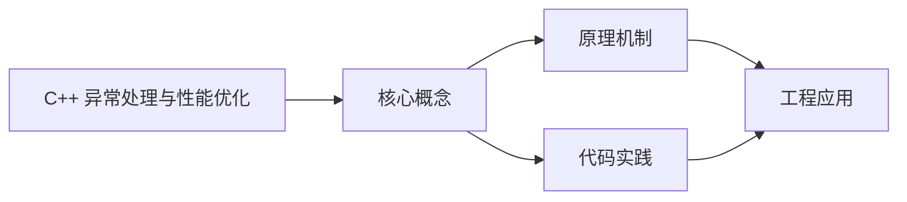
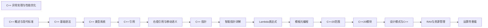

## 1. 学习目标（Bloom 分类）

本节按照布鲁姆教育目标分类学组织学习路径。本文主题为《C++ 异常处理与性能优化》，属于 C++ 模块，读者可以根据自身阶段选择阅读深度。

记忆层面：能够准确复述本文的核心概念、术语与基本语法或操作步骤，并能够在提问或检索时快速定位对应知识点。能够说出 C++ 的类、继承、重载、模板与 STL 容器基本语法。

理解层面：能够用自己的语言解释核心原理与工作机制，说明概念之间的因果关系，而不是机械记忆结论。能够解释 RAII、拷贝/移动语义、虚函数与模板实例化。

应用层面：能够在真实项目或练习场景中运用本文知识解决具体问题，写出正确且可维护的实现。能够编写现代 C++（C++17/20）的类与泛型代码。

分析层面：能够拆解复杂问题，比较本文主题与相邻概念的异同，识别边界条件与例外情况。能够分析生命周期、未定义行为与性能特征。

评价层面：能够根据约束条件（性能、可读性、安全、成本）评价不同方案的优劣，做出有依据的技术决策。能够评价 C++ 与 Rust、Java 在系统编程中的取舍。

创造层面：能够把本文知识与其他模块知识组合，设计出新的解决方案或可复用的工程模式。能够设计高性能、可维护的 C++ 库与应用。

通过本节学习，读者应当能够把《C++ 异常处理与性能优化》纳入自己的知识网络，并与 C++ 模块的其他主题（RAII、移动语义、模板、STL）建立关联。

## 2. 历史动机与发展脉络

《C++ 异常处理与性能优化》是 C++ 领域的重要主题。要真正理解它，需要先了解它解决的问题与演进过程。

C++ 由 Bjarne Stroustrup 于 1979 年开始在贝尔实验室开发（原名 C with Classes），1983 年更名 C++，1998 年 C++98 首次标准化。
C++11 是语言转折点：右值引用、auto、lambda、智能指针、并发内存模型让现代 C++ 写法定型；C++14/17 补充泛型 lambda、if constexpr、折叠表达式；C++20 引入 concepts、协程、模块与范围库；C++23 继续完善。
现代 C++ 的核心口号是“资源安全”：RAII + 智能指针替代裸 new/delete，异常与错误码按场景选择；Rust 的出现促使 C++ 社区更重视内存安全工具（如 profile 指南、sanitizer）。

回到本文主题：C++ 异常处理与性能优化 的提出与成熟，正是上述技术背景下的必然产物。早期实现往往以简单可用为目标，随着工程规模扩大，社区逐渐沉淀出标准做法与最佳实践；理解这一脉络，可以帮助读者判断“为什么文档中的推荐写法是现在这个样子”，也能在遇到历史遗留代码时准确识别其设计年代与取舍。


## 3. 形式化定义与核心概念精讲

本节把《C++ 异常处理与性能优化》涉及的核心概念以“定义 + 讲解”的形式展开。读者应把定义当作工具，把讲解当作理解路径；两者结合才能形成可迁移的知识。

RAII：资源在构造函数获取、析构函数释放，栈对象离开作用域自动清理；智能指针（unique_ptr/shared_ptr/weak_ptr）把所有权编码进类型。
移动语义：右值引用 `&&` 与 std::move 转移资源所有权，避免深拷贝；移动后对象处于“合法但未指定”状态。
虚函数与多态：virtual 实现动态绑定，vtable 是运行时分派机制；final/override 关键字防止误用；基类析构函数应为 virtual。

### 3.1 原文章节逐一精讲

原文档把主题拆分为 5 个小节，下面按顺序给出每一节的导读讲解，随后保留原文细节供精读。

#### 原文精读（完整保留）


#### 1. 异常处理 (Exceptions)

异常是 C++ 中处理错误的一种机制，允许程序在遇到错误时跳转到相应的处理代码。

##### 1.1 基本异常处理

使用 `try-catch` 块捕获和处理异常。

```cpp
 #include <iostream>
 #include <stdexcept>
 int main() {
  try {
  // 可能抛出异常的代码
  int divisor = 0;
  if (divisor == 0) {
  throw std::runtime_error("Division by zero");
  }
  int result = 10 / divisor;
  } catch (const std::exception& e) {
  // 异常处理代码
  std::cerr << "Exception caught: " << e.what() << std::endl;
  }
  return 0;
 }
```

##### 1.2 异常类型

C++ 标准库提供了多种异常类型，位于 `<stdexcept>` 头文件中。

| 异常类型                | 描述               | 示例                                               |
| :---------------------- | :----------------- | :------------------------------------------------- |
| `std::exception`        | 所有标准异常的基类 | 基类，通常不直接使用                               |
| `std::runtime_error`    | 运行时错误         | `throw std::runtime_error("Runtime error");`       |
| `std::logic_error`      | 逻辑错误           | `throw std::logic_error("Logic error");`           |
| `std::bad_alloc`        | 内存分配失败       | 由 `new` 操作符抛出                                |
| `std::out_of_range`     | 越界访问           | `throw std::out_of_range("Out of range");`         |
| `std::invalid_argument` | 无效参数           | `throw std::invalid_argument("Invalid argument");` |

##### 1.3 自定义异常

可以通过继承 `std::exception` 或其子类来创建自定义异常。

```cpp
 #include <iostream>
 #include <stdexcept>
 class MyException : public std::exception {
 private:
  std::string message;
 public:
  explicit MyException(const std::string& msg) : message(msg) {}
  const char* what() const noexcept override {
  return message.c_str();
  }
 }
 void function_that_throws() {
  throw MyException("Custom exception occurred");
 }
 int main() {
  try {
  function_that_throws();
  } catch (const MyException& e) {
  std::cerr << "Custom exception caught: " << e.what() << std::endl;
  } catch (const std::exception& e) {
  std::cerr << "Standard exception caught: " << e.what() << std::endl;
  }
  return 0;
 }
```

##### 1.4 异常处理最佳实践

- **只在特殊情况下使用异常**: 异常用于处理意外情况，而不是常规控制流。
- **捕获具体异常类型**: 优先捕获具体的异常类型，而不是通用的 `std::exception`。
- **保持异常处理代码简洁**: 异常处理代码应该简洁明了，只处理必要的逻辑。
- **析构函数不抛异常**: 析构函数抛出异常会导致程序终止。
- **使用 RAII 管理资源**: 利用 RAII 机制确保资源在异常发生时正确释放。
- **异常规范 (C++11 前)**: 使用 `throw()` 或 `throw(type)` 声明函数可能抛出的异常类型（C++11 后推荐使用 `noexcept`）。

##### 1.5 noexcept 说明符 (C++11)

`noexcept` 说明符用于声明函数不会抛出异常，帮助编译器优化。

```cpp
 // 声明函数不会抛出异常
 void function_noexcept() noexcept {
  // 函数体
 }
 // 条件 noexcept
 void function_conditionally_noexcept() noexcept(noexcept(expression)) {
  // 函数体
 }
 // 检查函数是否会抛出异常
 template <typename T>
 void check_noexcept() {
  static_assert(noexcept(std::declval<T>().some_method()),
  "some_method() must be noexcept");
 }
```

##### 1.6 异常与构造函数/析构函数

- **构造函数**: 可以抛出异常，但需要确保已分配的资源被正确释放。
- **析构函数**: 严禁抛出异常，否则会导致程序终止。

```cpp
 class Resource {
 private:
  int* data;
 public:
  Resource(int size) {
  data = new int[size];
  // 如果分配失败，new 会抛出 std::bad_alloc
  }
  ~Resource() noexcept { // 析构函数应标记为 noexcept
  delete[] data;
  // 析构函数中不应抛出异常
  }
 }
```

#### 2. 性能优化 (Performance)

性能优化是 C++ 编程中的重要环节，涉及代码设计、编译器优化、内存管理等多个方面。

##### 2.1 代码级优化

###### 2.1.1 内联函数

内联函数可以减少函数调用开销，适用于短小频繁调用的函数。

```cpp
 // 内联函数声明
 inline int max(int a, int b) {
  return a > b ? a : b;
 }
 // 类内定义的成员函数默认内联
 class MyClass {
 public:
  int getValue() const { // 默认内联
  return value;
  }
 private:
  int value;
 }
```

###### 2.1.2 常量优化

使用 `const` 可以帮助编译器进行优化，同时提高代码安全性。

```cpp
 // 常量引用参数，避免拷贝
 void printValue(const std::string& str) {
  std::cout << str << std::endl;
 }
 // 常量成员函数，保证不修改对象状态
 class MyClass {
 public:
  int getValue() const { // 常量成员函数
  return value;
  }
 private:
  int value;
 }
 // 编译期常量
 constexpr int square(int x) {
  return x * x;
 }
 constexpr int SQUARE_OF_5 = square(5); // 编译期计算
```

###### 2.1.3 移动语义 (C++11)

移动语义可以避免昂贵的深拷贝，提高性能。

```cpp
 #include <iostream>
 #include <vector>
 #include <string>
 class MyClass {
 private:
  std::string data;
 public:
  // 构造函数
  MyClass(const std::string& d) : data(d) {
  std::cout << "Copy constructor called" << std::endl;
  }
  // 移动构造函数
  MyClass(std::string&& d) : data(std::move(d)) {
  std::cout << "Move constructor called" << std::endl;
  }
  // 移动赋值运算符
  MyClass& operator=(std::string&& d) {
  data = std::move(d);
  std::cout << "Move assignment called" << std::endl;
  return *this;
  }
 }
 int main() {
  // 使用移动语义
  MyClass obj1("Hello"); // 拷贝构造
  MyClass obj2(std::move(std::string("World"))); // 移动构造
  std::string s = "Test";
  MyClass obj3(std::move(s)); // 移动构造，s 现在为空
  return 0;
 }
```

###### 2.1.4 避免不必要的拷贝

使用引用、指针或移动语义避免不必要的拷贝操作。

```cpp
 // 不好的做法：拷贝参数
 std::vector<int> process_vector(std::vector<int> v) {
  // 处理 v
  return v; // 返回时再次拷贝
 }
 // 好的做法：使用引用
 void process_vector(const std::vector<int>& v) {
  // 处理 v（只读）
 }
 // 好的做法：使用移动语义
 std::vector<int> create_vector() {
  std::vector<int> v = {1, 2, 3, 4, 5};
  return v; // 编译器会进行返回值优化 (RVO)
 }
```

###### 2.1.5 预分配内存

对于容器，预先分配内存可以减少动态内存分配的次数。

```cpp
 std::vector<int> v;
 v.reserve(1000); // 预先分配 1000 个元素的空间
 for (int i = 0; i < 1000; i++) {
  v.push_back(i); // 不需要频繁重新分配内存
 }
```

##### 2.2 编译器优化

###### 2.2.1 优化级别

不同的编译器优化级别会对代码性能产生显著影响。

| 优化级别 | 描述         | 适用场景           |
| :------- | :----------- | :----------------- |
| `-O0`    | 无优化       | 调试阶段           |
| `-O1`    | 基本优化     | 平衡调试和性能     |
| `-O2`    | 更高级别优化 | 生产环境           |
| `-O3`    | 最高级别优化 | 对性能要求高的场景 |
| `-Os`    | 优化代码大小 | 内存受限环境       |

###### 2.2.2 编译器特定优化

不同编译器有特定的优化选项。

- **GCC**: `-march=native` (使用本地 CPU 架构), `-ffast-math` (快速数学运算)
- **Clang**: `-Weverything` (开启所有警告), `-fsanitize=address` (地址 sanitizer)
- **MSVC**: `/O2` (优化速度), `/Oi` (内联函数)

##### 2.3 内存管理优化

###### 2.3.1 智能指针

使用智能指针管理内存，避免内存泄漏。

```cpp
 #include <memory>
 // 推荐使用 make_unique 和 make_shared
 std::unique_ptr<int> up = std::make_unique<int>(42);
 std::shared_ptr<int> sp = std::make_shared<int>(100);
 // 避免循环引用
 class A {
 public:
  std::weak_ptr<B> b; // 使用 weak_ptr 打破循环
 }
 class B {
 public:
  std::shared_ptr<A> a;
 }
```

###### 2.3.2 内存池

对于频繁分配和释放小对象的场景，使用内存池可以提高性能。

```cpp
 // 简单的内存池实现
 class MemoryPool {
 private:
  std::vector<void*> blocks;
  size_t blockSize;
  size_t currentBlockIndex;
  size_t currentPosition;
 public:
  MemoryPool(size_t blockSize, size_t initialBlocks = 10)
  : blockSize(blockSize), currentBlockIndex(0), currentPosition(0) {
  for (size_t i = 0; i < initialBlocks; i++) {
  blocks.push_back(std::malloc(blockSize));
  }
  }
  ~MemoryPool() {
  for (void* block : blocks) {
  std::free(block);
  }
  }
  void* allocate() {
  if (currentBlockIndex >= blocks.size() || currentPosition >= blockSize) {
  blocks.push_back(std::malloc(blockSize));
  currentBlockIndex = blocks.size() - 1;
  currentPosition = 0;
  }
  void* result = static_cast<char*>(blocks[currentBlockIndex]) + currentPosition;
  currentPosition += sizeof(int); // 假设分配 int 大小的内存
  return result;
  }
  void deallocate(void* ptr) {
  // 简单实现，不做实际释放
  }
 }
```

##### 2.4 算法与数据结构优化

选择合适的算法和数据结构对性能至关重要。

| 场景          | 推荐数据结构          | 时间复杂度 |
| :------------ | :-------------------- | :--------- |
| 随机访问      | `std::vector`         | O(1)       |
| 频繁插入/删除 | `std::list`           | O(1)       |
| 查找操作      | `std::unordered_map`  | O(1) 平均  |
| 有序集合      | `std::set`            | O(log n)   |
| 优先级队列    | `std::priority_queue` | O(log n)   |

##### 2.5 并行计算

利用多核处理器进行并行计算可以显著提高性能。

###### 2.5.1 标准库并行算法 (C++17)

```cpp
 #include <algorithm>
 #include <execution>
 #include <vector>
 int main() {
  std::vector<int> v = {3, 1, 4, 1, 5, 9, 2, 6};
  // 并行排序
  std::sort(std::execution::par, v.begin(), v.end());
  // 并行变换
  std::transform(std::execution::par, v.begin(), v.end(), v.begin(),
  [](int x) { return x * 2; });
  return 0;
 }
```

###### 2.5.2 线程库 (C++11)

```cpp
 #include <thread>
 #include <vector>
 #include <iostream>
 void process_chunk(const std::vector<int>& data, size_t start, size_t end) {
  for (size_t i = start; i < end; i++) {
  // 处理数据
  std::cout << data[i] << " ";
  }
 }
 int main() {
  std::vector<int> data(1000);
  for (int i = 0; i < 1000; i++) {
  data[i] = i;
  }
  // 创建线程
  std::vector<std::thread> threads;
  size_t chunk_size = data.size() / 4;
  for (size_t i = 0; i < 4; i++) {
  size_t start = i * chunk_size;
  size_t end = (i == 3) ? data.size() : (i + 1) * chunk_size;
  threads.emplace_back(process_chunk, std::ref(data), start, end);
  }
  // 等待所有线程完成
  for (auto& t : threads) {
  t.join();
  }
  return 0;
 }
```

#### 3. 性能分析与调试工具

##### 3.1 性能分析工具

###### 3.1.1 Google Benchmark

Google Benchmark 是一个用于基准测试的框架，可以测量代码的执行性能。

```cpp
 #include <benchmark/benchmark.h>
 static void BM_Square(benchmark::State& state) {
  for (auto _ : state) {
  int result = 0;
  for (int i = 0; i < 1000; i++) {
  result += i * i;
  }
  benchmark::DoNotOptimize(result);
  }
 }
 BENCHMARK(BM_Square);
 BENCHMARK_MAIN();
```

###### 3.1.2 gprof

`gprof` 是 GCC 提供的性能分析工具，可以分析函数调用次数和执行时间。

```bash
 # 编译时添加 -pg 选项
 g++ -pg -O2 program.cpp -o program
 # 运行程序，生成 gmon.out 文件
 ./program
 # 分析结果
 gprof program gmon.out > analysis.txt
```

###### 3.1.3 perf

`perf` 是 Linux 系统下的性能分析工具，可以分析 CPU 使用率、缓存命中率等。

```bash
 # 记录性能数据
 perf record ./program
 # 查看分析结果
 perf report
 # 查看热点函数
 perf top -p <pid>
```

##### 3.2 内存分析工具

###### 3.2.1 Valgrind

Valgrind 是一个内存调试和内存泄漏检测工具。

```bash
 # 检测内存泄漏
 valgrind --leak-check=full ./program
 # 检测内存访问错误
 valgrind --tool=memcheck ./program
 # 检测缓存使用情况
 valgrind --tool=cachegrind ./program
```

###### 3.2.2 AddressSanitizer

AddressSanitizer (ASan) 是一个内存错误检测工具，集成在 GCC 和 Clang 中。

```bash
 # 编译时添加 -fsanitize=address 选项
 g++ -fsanitize=address -g program.cpp -o program
 # 运行程序
 ./program
```

##### 3.3 调试工具

###### 3.3.1 GDB

GDB 是一个强大的命令行调试器。

```bash
 # 编译时添加 -g 选项
 g++ -g program.cpp -o program
 # 启动 GDB
 gdb ./program
 # 常用命令
 # break main # 在 main 函数处设置断点
 # run # 运行程序
 # print variable # 打印变量值
 # step # 单步执行
 # continue # 继续执行
 # backtrace # 查看调用栈
```

###### 3.3.2 LLDB

LLDB 是 LLVM 项目的调试器，功能类似于 GDB。

```bash
 # 编译时添加 -g 选项
 clang++ -g program.cpp -o program
 # 启动 LLDB
 lldb ./program
 # 常用命令
 # breakpoint set --name main # 在 main 函数处设置断点
 # run # 运行程序
 # print variable # 打印变量值
 # step # 单步执行
 # continue # 继续执行
 # thread backtrace # 查看调用栈
```

###### 3.3.3 可视化调试器

- **Visual Studio**: Windows 平台的集成开发环境，提供强大的可视化调试功能。
- **CLion**: JetBrains 开发的跨平台 IDE，集成了 GDB/LLDB 调试器。
- **VS Code**: 轻量级编辑器，通过插件支持调试功能。

#### 4. 性能优化最佳实践

##### 4.1 分析先行

- **使用性能分析工具**：在优化前，先使用性能分析工具找出性能瓶颈。
- **建立基准测试**：创建基准测试用例，用于评估优化效果。
- **测量而不是猜测**：基于实际测量结果进行优化，而不是凭感觉。

##### 4.2 代码优化

- **优先优化热点代码**：重点优化执行频率高的代码。
- **避免过早优化**：先确保代码正确，再进行优化。
- **保持代码可读性**：优化不应以牺牲代码可读性为代价。
- **使用适当的数据结构**：根据具体场景选择合适的数据结构。
- **减少内存分配**：避免频繁的动态内存分配和释放。

##### 4.3 编译优化

- **选择合适的优化级别**：根据实际需求选择适当的编译器优化级别。
- **启用架构特定优化**：使用 `-march=native` 等选项利用 CPU 特性。
- **使用链接时优化**：启用 `-flto` (Link Time Optimization) 进行全局优化。

##### 4.4 内存管理

- **使用智能指针**：避免内存泄漏和悬空指针。
- **合理使用内存池**：对于频繁分配的小对象，使用内存池提高性能。
- **注意内存对齐**：合理安排数据结构，提高缓存命中率。

##### 4.5 并行计算

- **利用多线程**：对于计算密集型任务，使用多线程并行处理。
- **避免线程竞争**：使用互斥锁、原子操作等同步机制避免线程竞争。
- **使用标准库并行算法**：优先使用 C++17 提供的并行算法。

#### 5. 代码示例

##### 5.1 异常处理示例

```cpp
 #include <iostream>
 #include <stdexcept>
 #include <string>
 // 自定义异常类
 class FileException : public std::runtime_error {
 public:
  explicit FileException(const std::string& message)
  : std::runtime_error(message) {}
 }
 // 文件操作类
 class FileHandler {
 private:
  std::string filename;
 public:
  FileHandler(const std::string& name) : filename(name) {
  // 模拟文件打开失败
  if (name.empty()) {
  throw FileException("Empty filename");
  }
  std::cout << "File " << name << " opened" << std::endl;
  }
  ~FileHandler() noexcept {
  // 析构函数不应抛出异常
  std::cout << "File " << filename << " closed" << std::endl;
  }
  void read() {
  // 模拟读取失败
  if (filename == "error.txt") {
  throw FileException("Failed to read file");
  }
  std::cout << "Reading from file " << filename << std::endl;
  }
 }
 int main() {
  try {
  // 测试正常情况
  FileHandler file1("data.txt");
  file1.read();
  // 测试异常情况
  FileHandler file2("");
  } catch (const FileException& e) {
  std::cerr << "File exception: " << e.what() << std::endl;
  } catch (const std::exception& e) {
  std::cerr << "Standard exception: " << e.what() << std::endl;
  } catch (...) {
  std::cerr << "Unknown exception" << std::endl;
  }
  try {
  FileHandler file3("error.txt");
  file3.read();
  } catch (const FileException& e) {
  std::cerr << "File exception: " << e.what() << std::endl;
  }
  return 0;
 }
```

##### 5.2 性能优化示例

```cpp
 #include <iostream>
 #include <vector>
 #include <chrono>
 #include <algorithm>
 #include <execution>
 // 测量函数执行时间的模板函数
 template <typename Func>
 double measure_time(Func&& func) {
  auto start = std::chrono::high_resolution_clock::now();
  func();
  auto end = std::chrono::high_resolution_clock::now();
  return std::chrono::duration<double, std::milli>(end - start).count();
 }
 // 普通排序
 void regular_sort(std::vector<int>& v) {
  std::sort(v.begin(), v.end());
 }
 // 并行排序
 void parallel_sort(std::vector<int>& v) {
  std::sort(std::execution::par, v.begin(), v.end());
 }
 // 不使用 reserve
 void without_reserve() {
  std::vector<int> v;
  for (int i = 0; i < 1000000; i++) {
  v.push_back(i);
  }
 }
 // 使用 reserve
 void with_reserve() {
  std::vector<int> v;
  v.reserve(1000000);
  for (int i = 0; i < 1000000; i++) {
  v.push_back(i);
  }
 }
 int main() {
  // 测试排序性能
  std::vector<int> v1(1000000);
  std::generate(v1.begin(), v1.end(), []() { return rand(); });
  std::vector<int> v2 = v1;
  double time_regular = measure_time([&]() { regular_sort(v1); });
  double time_parallel = measure_time([&]() { parallel_sort(v2); });
  std::cout << "Regular sort: " << time_regular << " ms" << std::endl;
  std::cout << "Parallel sort: " << time_parallel << " ms" << std::endl;
  std::cout << "Speedup: " << time_regular / time_parallel << "x" << std::endl;
  // 测试 reserve 性能
  double time_without_reserve = measure_time(without_reserve);
  double time_with_reserve = measure_time(with_reserve);
  std::cout << "Without reserve: " << time_without_reserve << " ms" << std::endl;
  std::cout << "With reserve: " << time_with_reserve << " ms" << std::endl;
  std::cout << "Speedup: " << time_without_reserve / time_with_reserve << "x" << std::endl;
  return 0;
 }
```

##### 5.3 内存管理示例

```cpp
 #include <iostream>
 #include <memory>
 #include <vector>
 // 自定义删除器
 struct CustomDeleter {
  void operator()(int* p) {
  std::cout << "Custom deleter called" << std::endl;
  delete p;
  }
 }
 int main() {
  // 智能指针示例
  std::cout << "=== Unique_ptr ===" << std::endl;
  {
  std::unique_ptr<int> up1(new int(42));
  std::cout << "up1 value: " << *up1 << std::endl;
  // 转移所有权
  std::unique_ptr<int> up2 = std::move(up1);
  if (!up1) {
  std::cout << "up1 is null" << std::endl;
  }
  std::cout << "up2 value: " << *up2 << std::endl;
  } // up2 超出作用域，自动释放
  std::cout << "\n=== Shared_ptr ===" << std::endl;
  {
  std::shared_ptr<int> sp1 = std::make_shared<int>(100);
  std::cout << "sp1 use count: " << sp1.use_count() << std::endl;
  {
  std::shared_ptr<int> sp2 = sp1;
  std::cout << "After sp2 creation, use count: " << sp1.use_count() << std::endl;
  } // sp2 超出作用域，引用计数减 1
  std::cout << "After sp2 destruction, use count: " << sp1.use_count() << std::endl;
  } // sp1 超出作用域，引用计数为 0，自动释放
  std::cout << "\n=== Weak_ptr ===" << std::endl;
  {
  std::shared_ptr<int> sp = std::make_shared<int>(200);
  std::weak_ptr<int> wp = sp;
  std::cout << "sp use count: " << sp.use_count() << std::endl;
  std::cout << "wp expired: " << wp.expired() << std::endl;
  if (auto locked = wp.lock()) {
  std::cout << "Locked value: " << *locked << std::endl;
  std::cout << "Locked use count: " << locked.use_count() << std::endl;
  }
  sp.reset(); // 释放 shared_ptr
  std::cout << "After sp.reset(), wp expired: " << wp.expired() << std::endl;
  if (auto locked = wp.lock()) {
  std::cout << "Locked value: " << *locked << std::endl;
  } else {
  std::cout << "wp is expired, cannot lock" << std::endl;
  }
  }
  std::cout << "\n=== Custom deleter ===" << std::endl;
  {
  std::unique_ptr<int, CustomDeleter> up(new int(300));
  std::cout << "up value: " << *up << std::endl;
  } // 自动调用自定义删除器
  return 0;
 }
```

---


### 3.2 概念关系图

下面用 Mermaid 图表达本文核心概念之间的关系，帮助读者建立整体图景：



图中展示的是本文知识的结构化关系：核心概念是入口，原理机制解释“为什么”，代码实践演示“怎么做”，工程应用回答“何时用”。读者学习时可以把每个小节的内容挂接到对应节点上。

## 4. 理论推导与原理解析

本节深入《C++ 异常处理与性能优化》背后的原理。理论部分不求面面俱到，而是聚焦“能解释现象、能指导实践”的关键推导。

RAII：资源在构造函数获取、析构函数释放，栈对象离开作用域自动清理；智能指针（unique_ptr/shared_ptr/weak_ptr）把所有权编码进类型。
移动语义：右值引用 `&&` 与 std::move 转移资源所有权，避免深拷贝；移动后对象处于“合法但未指定”状态。
虚函数与多态：virtual 实现动态绑定，vtable 是运行时分派机制；final/override 关键字防止误用；基类析构函数应为 virtual。
模板与泛型：模板编译期实例化，实现静态多态；concepts（C++20）约束类型接口；模板元编程在编译期计算类型与常量。

需要强调的是，理论推导与工程实践之间存在翻译层：理论给出的是理想化模型与边界条件，工程代码则必须处理真实环境中的例外。读者在学习时应先掌握理论的“标准情形”，再通过陷阱章节了解“非标准情形”。

## 5. 代码示例与逐行讲解

本节把原文中的代码示例系统整理，并为每个示例补充用途说明与讲解。读者不应只浏览代码，而应逐段对照讲解理解设计意图。

### 5.1 示例：1.1 基本异常处理

该示例来自原文《1.1 基本异常处理》小节，用于演示C++ 异常处理与性能优化相关操作。阅读时请先看代码结构，再看其后的讲解。

```cpp
 #include <iostream>
 #include <stdexcept>
 int main() {
  try {
  // 可能抛出异常的代码
  int divisor = 0;
  if (divisor == 0) {
  throw std::runtime_error("Division by zero");
  }
  int result = 10 / divisor;
  } catch (const std::exception& e) {
  // 异常处理代码
  std::cerr << "Exception caught: " << e.what() << std::endl;
  }
  return 0;
 }
```

讲解：这段代码演示了本节核心知识点。代码中的关键操作可以归纳为三步：准备（定义或初始化）、执行（核心逻辑）、收尾（释放资源或返回结果）。实际项目中，这三步往往被封装为函数或类，以提升复用性与可测试性。

关键点分析：

该示例共 16 行有效代码，包含 2 类关键结构（if、return）。其中：

- 入口与初始化部分负责建立上下文，对应实际项目中的启动或装配逻辑；
- 核心逻辑部分体现本文主题的主要操作，是阅读时最需要对照讲解理解的部分；
- 输出或返回部分把结果交给调用方，注意其类型与边界条件。

进阶思考路径：先尝试修改参数观察行为变化，再把示例中的模式迁移到自己的项目中；每次修改都记录预期与实测差异，这是把示例转化为能力的最快方式。

### 5.2 示例：1.3 自定义异常

该示例来自原文《1.3 自定义异常》小节，用于演示C++ 异常处理与性能优化相关操作。阅读时请先看代码结构，再看其后的讲解。

```cpp
 #include <iostream>
 #include <stdexcept>
 class MyException : public std::exception {
 private:
  std::string message;
 public:
  explicit MyException(const std::string& msg) : message(msg) {}
  const char* what() const noexcept override {
  return message.c_str();
  }
 }
 void function_that_throws() {
  throw MyException("Custom exception occurred");
 }
 int main() {
  try {
  function_that_throws();
  } catch (const MyException& e) {
  std::cerr << "Custom exception caught: " << e.what() << std::endl;
  } catch (const std::exception& e) {
  std::cerr << "Standard exception caught: " << e.what() << std::endl;
  }
  return 0;
 }
```

讲解：这段代码演示了本节核心知识点。代码中的关键操作可以归纳为三步：准备（定义或初始化）、执行（核心逻辑）、收尾（释放资源或返回结果）。实际项目中，这三步往往被封装为函数或类，以提升复用性与可测试性。

关键点分析：

该示例共 24 行有效代码，包含 3 类关键结构（class、function、return）。其中：

- 入口与初始化部分负责建立上下文，对应实际项目中的启动或装配逻辑；
- 核心逻辑部分体现本文主题的主要操作，是阅读时最需要对照讲解理解的部分；
- 输出或返回部分把结果交给调用方，注意其类型与边界条件。

进阶思考路径：先尝试修改参数观察行为变化，再把示例中的模式迁移到自己的项目中；每次修改都记录预期与实测差异，这是把示例转化为能力的最快方式。

### 5.3 示例：1.5 noexcept 说明符 (C++11)

该示例来自原文《1.5 noexcept 说明符 (C++11)》小节，用于演示C++ 异常处理与性能优化相关操作。阅读时请先看代码结构，再看其后的讲解。

```cpp
 // 声明函数不会抛出异常
 void function_noexcept() noexcept {
  // 函数体
 }
 // 条件 noexcept
 void function_conditionally_noexcept() noexcept(noexcept(expression)) {
  // 函数体
 }
 // 检查函数是否会抛出异常
 template <typename T>
 void check_noexcept() {
  static_assert(noexcept(std::declval<T>().some_method()),
  "some_method() must be noexcept");
 }
```

讲解：这段代码演示了本节核心知识点。代码中的关键操作可以归纳为三步：准备（定义或初始化）、执行（核心逻辑）、收尾（释放资源或返回结果）。实际项目中，这三步往往被封装为函数或类，以提升复用性与可测试性。

关键点分析：

该示例共 14 行有效代码，包含 1 类关键结构（function）。其中：

- 入口与初始化部分负责建立上下文，对应实际项目中的启动或装配逻辑；
- 核心逻辑部分体现本文主题的主要操作，是阅读时最需要对照讲解理解的部分；
- 输出或返回部分把结果交给调用方，注意其类型与边界条件。

进阶思考路径：先尝试修改参数观察行为变化，再把示例中的模式迁移到自己的项目中；每次修改都记录预期与实测差异，这是把示例转化为能力的最快方式。

### 5.4 示例：1.6 异常与构造函数/析构函数

该示例来自原文《1.6 异常与构造函数/析构函数》小节，用于演示C++ 异常处理与性能优化相关操作。阅读时请先看代码结构，再看其后的讲解。

```cpp
 class Resource {
 private:
  int* data;
 public:
  Resource(int size) {
  data = new int[size];
  // 如果分配失败，new 会抛出 std::bad_alloc
  }
  ~Resource() noexcept { // 析构函数应标记为 noexcept
  delete[] data;
  // 析构函数中不应抛出异常
  }
 }
```

讲解：这段代码演示了本节核心知识点。代码中的关键操作可以归纳为三步：准备（定义或初始化）、执行（核心逻辑）、收尾（释放资源或返回结果）。实际项目中，这三步往往被封装为函数或类，以提升复用性与可测试性。

关键点分析：

该示例共 13 行有效代码，包含 1 类关键结构（class）。其中：

- 入口与初始化部分负责建立上下文，对应实际项目中的启动或装配逻辑；
- 核心逻辑部分体现本文主题的主要操作，是阅读时最需要对照讲解理解的部分；
- 输出或返回部分把结果交给调用方，注意其类型与边界条件。

进阶思考路径：先尝试修改参数观察行为变化，再把示例中的模式迁移到自己的项目中；每次修改都记录预期与实测差异，这是把示例转化为能力的最快方式。

### 5.5 示例：2.1.1 内联函数

该示例来自原文《2.1.1 内联函数》小节，用于演示C++ 异常处理与性能优化相关操作。阅读时请先看代码结构，再看其后的讲解。

```cpp
 // 内联函数声明
 inline int max(int a, int b) {
  return a > b ? a : b;
 }
 // 类内定义的成员函数默认内联
 class MyClass {
 public:
  int getValue() const { // 默认内联
  return value;
  }
 private:
  int value;
 }
```

讲解：这段代码演示了本节核心知识点。代码中的关键操作可以归纳为三步：准备（定义或初始化）、执行（核心逻辑）、收尾（释放资源或返回结果）。实际项目中，这三步往往被封装为函数或类，以提升复用性与可测试性。

关键点分析：

该示例共 13 行有效代码，包含 2 类关键结构（class、return）。其中：

- 入口与初始化部分负责建立上下文，对应实际项目中的启动或装配逻辑；
- 核心逻辑部分体现本文主题的主要操作，是阅读时最需要对照讲解理解的部分；
- 输出或返回部分把结果交给调用方，注意其类型与边界条件。

进阶思考路径：先尝试修改参数观察行为变化，再把示例中的模式迁移到自己的项目中；每次修改都记录预期与实测差异，这是把示例转化为能力的最快方式。

### 5.6 示例：2.1.2 常量优化

该示例来自原文《2.1.2 常量优化》小节，用于演示C++ 异常处理与性能优化相关操作。阅读时请先看代码结构，再看其后的讲解。

```cpp
 // 常量引用参数，避免拷贝
 void printValue(const std::string& str) {
  std::cout << str << std::endl;
 }
 // 常量成员函数，保证不修改对象状态
 class MyClass {
 public:
  int getValue() const { // 常量成员函数
  return value;
  }
 private:
  int value;
 }
 // 编译期常量
 constexpr int square(int x) {
  return x * x;
 }
 constexpr int SQUARE_OF_5 = square(5); // 编译期计算
```

讲解：这段代码演示了本节核心知识点。代码中的关键操作可以归纳为三步：准备（定义或初始化）、执行（核心逻辑）、收尾（释放资源或返回结果）。实际项目中，这三步往往被封装为函数或类，以提升复用性与可测试性。

关键点分析：

该示例共 18 行有效代码，包含 2 类关键结构（class、return）。其中：

- 入口与初始化部分负责建立上下文，对应实际项目中的启动或装配逻辑；
- 核心逻辑部分体现本文主题的主要操作，是阅读时最需要对照讲解理解的部分；
- 输出或返回部分把结果交给调用方，注意其类型与边界条件。

进阶思考路径：先尝试修改参数观察行为变化，再把示例中的模式迁移到自己的项目中；每次修改都记录预期与实测差异，这是把示例转化为能力的最快方式。

### 5.7 示例：2.1.3 移动语义 (C++11)

该示例来自原文《2.1.3 移动语义 (C++11)》小节，用于演示C++ 异常处理与性能优化相关操作。阅读时请先看代码结构，再看其后的讲解。

```cpp
 #include <iostream>
 #include <vector>
 #include <string>
 class MyClass {
 private:
  std::string data;
 public:
  // 构造函数
  MyClass(const std::string& d) : data(d) {
  std::cout << "Copy constructor called" << std::endl;
  }
  // 移动构造函数
  MyClass(std::string&& d) : data(std::move(d)) {
  std::cout << "Move constructor called" << std::endl;
  }
  // 移动赋值运算符
  MyClass& operator=(std::string&& d) {
  data = std::move(d);
  std::cout << "Move assignment called" << std::endl;
  return *this;
  }
 }
 int main() {
  // 使用移动语义
  MyClass obj1("Hello"); // 拷贝构造
  MyClass obj2(std::move(std::string("World"))); // 移动构造
  std::string s = "Test";
  MyClass obj3(std::move(s)); // 移动构造，s 现在为空
  return 0;
 }
```

讲解：这段代码演示了本节核心知识点。代码中的关键操作可以归纳为三步：准备（定义或初始化）、执行（核心逻辑）、收尾（释放资源或返回结果）。实际项目中，这三步往往被封装为函数或类，以提升复用性与可测试性。

关键点分析：

该示例共 30 行有效代码，包含 2 类关键结构（class、return）。其中：

- 入口与初始化部分负责建立上下文，对应实际项目中的启动或装配逻辑；
- 核心逻辑部分体现本文主题的主要操作，是阅读时最需要对照讲解理解的部分；
- 输出或返回部分把结果交给调用方，注意其类型与边界条件。

进阶思考路径：先尝试修改参数观察行为变化，再把示例中的模式迁移到自己的项目中；每次修改都记录预期与实测差异，这是把示例转化为能力的最快方式。

### 5.8 示例：2.1.4 避免不必要的拷贝

该示例来自原文《2.1.4 避免不必要的拷贝》小节，用于演示C++ 异常处理与性能优化相关操作。阅读时请先看代码结构，再看其后的讲解。

```cpp
 // 不好的做法：拷贝参数
 std::vector<int> process_vector(std::vector<int> v) {
  // 处理 v
  return v; // 返回时再次拷贝
 }
 // 好的做法：使用引用
 void process_vector(const std::vector<int>& v) {
  // 处理 v（只读）
 }
 // 好的做法：使用移动语义
 std::vector<int> create_vector() {
  std::vector<int> v = {1, 2, 3, 4, 5};
  return v; // 编译器会进行返回值优化 (RVO)
 }
```

讲解：这段代码演示了本节核心知识点。代码中的关键操作可以归纳为三步：准备（定义或初始化）、执行（核心逻辑）、收尾（释放资源或返回结果）。实际项目中，这三步往往被封装为函数或类，以提升复用性与可测试性。

关键点分析：

该示例共 14 行有效代码，包含 1 类关键结构（return）。其中：

- 入口与初始化部分负责建立上下文，对应实际项目中的启动或装配逻辑；
- 核心逻辑部分体现本文主题的主要操作，是阅读时最需要对照讲解理解的部分；
- 输出或返回部分把结果交给调用方，注意其类型与边界条件。

进阶思考路径：先尝试修改参数观察行为变化，再把示例中的模式迁移到自己的项目中；每次修改都记录预期与实测差异，这是把示例转化为能力的最快方式。

### 5.9 示例：2.1.5 预分配内存

该示例来自原文《2.1.5 预分配内存》小节，用于演示C++ 异常处理与性能优化相关操作。阅读时请先看代码结构，再看其后的讲解。

```cpp
 std::vector<int> v;
 v.reserve(1000); // 预先分配 1000 个元素的空间
 for (int i = 0; i < 1000; i++) {
  v.push_back(i); // 不需要频繁重新分配内存
 }
```

讲解：这段代码演示了本节核心知识点。代码中的关键操作可以归纳为三步：准备（定义或初始化）、执行（核心逻辑）、收尾（释放资源或返回结果）。实际项目中，这三步往往被封装为函数或类，以提升复用性与可测试性。

关键点分析：

该示例共 5 行有效代码，包含 1 类关键结构（for）。其中：

- 入口与初始化部分负责建立上下文，对应实际项目中的启动或装配逻辑；
- 核心逻辑部分体现本文主题的主要操作，是阅读时最需要对照讲解理解的部分；
- 输出或返回部分把结果交给调用方，注意其类型与边界条件。

进阶思考路径：先尝试修改参数观察行为变化，再把示例中的模式迁移到自己的项目中；每次修改都记录预期与实测差异，这是把示例转化为能力的最快方式。

### 5.10 示例：2.3.1 智能指针

该示例来自原文《2.3.1 智能指针》小节，用于演示C++ 异常处理与性能优化相关操作。阅读时请先看代码结构，再看其后的讲解。

```cpp
 #include <memory>
 // 推荐使用 make_unique 和 make_shared
 std::unique_ptr<int> up = std::make_unique<int>(42);
 std::shared_ptr<int> sp = std::make_shared<int>(100);
 // 避免循环引用
 class A {
 public:
  std::weak_ptr<B> b; // 使用 weak_ptr 打破循环
 }
 class B {
 public:
  std::shared_ptr<A> a;
 }
```

讲解：这段代码演示了本节核心知识点。代码中的关键操作可以归纳为三步：准备（定义或初始化）、执行（核心逻辑）、收尾（释放资源或返回结果）。实际项目中，这三步往往被封装为函数或类，以提升复用性与可测试性。

关键点分析：

该示例共 13 行有效代码，包含 1 类关键结构（class）。其中：

- 入口与初始化部分负责建立上下文，对应实际项目中的启动或装配逻辑；
- 核心逻辑部分体现本文主题的主要操作，是阅读时最需要对照讲解理解的部分；
- 输出或返回部分把结果交给调用方，注意其类型与边界条件。

进阶思考路径：先尝试修改参数观察行为变化，再把示例中的模式迁移到自己的项目中；每次修改都记录预期与实测差异，这是把示例转化为能力的最快方式。

### 5.11 示例：2.3.2 内存池

该示例来自原文《2.3.2 内存池》小节，用于演示C++ 异常处理与性能优化相关操作。阅读时请先看代码结构，再看其后的讲解。

```cpp
 // 简单的内存池实现
 class MemoryPool {
 private:
  std::vector<void*> blocks;
  size_t blockSize;
  size_t currentBlockIndex;
  size_t currentPosition;
 public:
  MemoryPool(size_t blockSize, size_t initialBlocks = 10)
  : blockSize(blockSize), currentBlockIndex(0), currentPosition(0) {
  for (size_t i = 0; i < initialBlocks; i++) {
  blocks.push_back(std::malloc(blockSize));
  }
  }
  ~MemoryPool() {
  for (void* block : blocks) {
  std::free(block);
  }
  }
  void* allocate() {
  if (currentBlockIndex >= blocks.size() || currentPosition >= blockSize) {
  blocks.push_back(std::malloc(blockSize));
  currentBlockIndex = blocks.size() - 1;
  currentPosition = 0;
  }
  void* result = static_cast<char*>(blocks[currentBlockIndex]) + currentPosition;
  currentPosition += sizeof(int); // 假设分配 int 大小的内存
  return result;
  }
  void deallocate(void* ptr) {
  // 简单实现，不做实际释放
  }
 }
```

讲解：这段代码演示了本节核心知识点。代码中的关键操作可以归纳为三步：准备（定义或初始化）、执行（核心逻辑）、收尾（释放资源或返回结果）。实际项目中，这三步往往被封装为函数或类，以提升复用性与可测试性。

关键点分析：

该示例共 33 行有效代码，包含 4 类关键结构（class、if、for、return）。其中：

- 入口与初始化部分负责建立上下文，对应实际项目中的启动或装配逻辑；
- 核心逻辑部分体现本文主题的主要操作，是阅读时最需要对照讲解理解的部分；
- 输出或返回部分把结果交给调用方，注意其类型与边界条件。

进阶思考路径：先尝试修改参数观察行为变化，再把示例中的模式迁移到自己的项目中；每次修改都记录预期与实测差异，这是把示例转化为能力的最快方式。

### 5.12 示例：2.5.1 标准库并行算法 (C++17)

该示例来自原文《2.5.1 标准库并行算法 (C++17)》小节，用于演示C++ 异常处理与性能优化相关操作。阅读时请先看代码结构，再看其后的讲解。

```cpp
 #include <algorithm>
 #include <execution>
 #include <vector>
 int main() {
  std::vector<int> v = {3, 1, 4, 1, 5, 9, 2, 6};
  // 并行排序
  std::sort(std::execution::par, v.begin(), v.end());
  // 并行变换
  std::transform(std::execution::par, v.begin(), v.end(), v.begin(),
  [](int x) { return x * 2; });
  return 0;
 }
```

讲解：这段代码演示了本节核心知识点。代码中的关键操作可以归纳为三步：准备（定义或初始化）、执行（核心逻辑）、收尾（释放资源或返回结果）。实际项目中，这三步往往被封装为函数或类，以提升复用性与可测试性。

关键点分析：

该示例共 12 行有效代码，包含 1 类关键结构（return）。其中：

- 入口与初始化部分负责建立上下文，对应实际项目中的启动或装配逻辑；
- 核心逻辑部分体现本文主题的主要操作，是阅读时最需要对照讲解理解的部分；
- 输出或返回部分把结果交给调用方，注意其类型与边界条件。

进阶思考路径：先尝试修改参数观察行为变化，再把示例中的模式迁移到自己的项目中；每次修改都记录预期与实测差异，这是把示例转化为能力的最快方式。

### 5.13 示例：2.5.2 线程库 (C++11)

该示例来自原文《2.5.2 线程库 (C++11)》小节，用于演示C++ 异常处理与性能优化相关操作。阅读时请先看代码结构，再看其后的讲解。

```cpp
 #include <thread>
 #include <vector>
 #include <iostream>
 void process_chunk(const std::vector<int>& data, size_t start, size_t end) {
  for (size_t i = start; i < end; i++) {
  // 处理数据
  std::cout << data[i] << " ";
  }
 }
 int main() {
  std::vector<int> data(1000);
  for (int i = 0; i < 1000; i++) {
  data[i] = i;
  }
  // 创建线程
  std::vector<std::thread> threads;
  size_t chunk_size = data.size() / 4;
  for (size_t i = 0; i < 4; i++) {
  size_t start = i * chunk_size;
  size_t end = (i == 3) ? data.size() : (i + 1) * chunk_size;
  threads.emplace_back(process_chunk, std::ref(data), start, end);
  }
  // 等待所有线程完成
  for (auto& t : threads) {
  t.join();
  }
  return 0;
 }
```

讲解：这段代码演示了本节核心知识点。代码中的关键操作可以归纳为三步：准备（定义或初始化）、执行（核心逻辑）、收尾（释放资源或返回结果）。实际项目中，这三步往往被封装为函数或类，以提升复用性与可测试性。

关键点分析：

该示例共 28 行有效代码，包含 2 类关键结构（for、return）。其中：

- 入口与初始化部分负责建立上下文，对应实际项目中的启动或装配逻辑；
- 核心逻辑部分体现本文主题的主要操作，是阅读时最需要对照讲解理解的部分；
- 输出或返回部分把结果交给调用方，注意其类型与边界条件。

进阶思考路径：先尝试修改参数观察行为变化，再把示例中的模式迁移到自己的项目中；每次修改都记录预期与实测差异，这是把示例转化为能力的最快方式。

### 5.14 示例：3.1.1 Google Benchmark

该示例来自原文《3.1.1 Google Benchmark》小节，用于演示C++ 异常处理与性能优化相关操作。阅读时请先看代码结构，再看其后的讲解。

```cpp
 #include <benchmark/benchmark.h>
 static void BM_Square(benchmark::State& state) {
  for (auto _ : state) {
  int result = 0;
  for (int i = 0; i < 1000; i++) {
  result += i * i;
  }
  benchmark::DoNotOptimize(result);
  }
 }
 BENCHMARK(BM_Square);
 BENCHMARK_MAIN();
```

讲解：这段代码演示了本节核心知识点。代码中的关键操作可以归纳为三步：准备（定义或初始化）、执行（核心逻辑）、收尾（释放资源或返回结果）。实际项目中，这三步往往被封装为函数或类，以提升复用性与可测试性。

关键点分析：

该示例共 12 行有效代码，包含 1 类关键结构（for）。其中：

- 入口与初始化部分负责建立上下文，对应实际项目中的启动或装配逻辑；
- 核心逻辑部分体现本文主题的主要操作，是阅读时最需要对照讲解理解的部分；
- 输出或返回部分把结果交给调用方，注意其类型与边界条件。

进阶思考路径：先尝试修改参数观察行为变化，再把示例中的模式迁移到自己的项目中；每次修改都记录预期与实测差异，这是把示例转化为能力的最快方式。

### 5.15 示例：3.1.2 gprof

该示例来自原文《3.1.2 gprof》小节，用于演示C++ 异常处理与性能优化相关操作。阅读时请先看代码结构，再看其后的讲解。

```bash
 # 编译时添加 -pg 选项
 g++ -pg -O2 program.cpp -o program
 # 运行程序，生成 gmon.out 文件
 ./program
 # 分析结果
 gprof program gmon.out > analysis.txt
```

讲解：这段代码演示了本节核心知识点。代码中的关键操作可以归纳为三步：准备（定义或初始化）、执行（核心逻辑）、收尾（释放资源或返回结果）。实际项目中，这三步往往被封装为函数或类，以提升复用性与可测试性。

关键点分析：

该示例共 6 行有效代码，结构以数据或配置为主。阅读时应关注：数据字段的含义、配置项的作用，以及它们与运行行为的对应关系。

进阶思考路径：先尝试修改参数观察行为变化，再把示例中的模式迁移到自己的项目中；每次修改都记录预期与实测差异，这是把示例转化为能力的最快方式。

### 5.16 示例：3.1.3 perf

该示例来自原文《3.1.3 perf》小节，用于演示C++ 异常处理与性能优化相关操作。阅读时请先看代码结构，再看其后的讲解。

```bash
 # 记录性能数据
 perf record ./program
 # 查看分析结果
 perf report
 # 查看热点函数
 perf top -p <pid>
```

讲解：这段代码演示了本节核心知识点。代码中的关键操作可以归纳为三步：准备（定义或初始化）、执行（核心逻辑）、收尾（释放资源或返回结果）。实际项目中，这三步往往被封装为函数或类，以提升复用性与可测试性。

关键点分析：

该示例共 6 行有效代码，结构以数据或配置为主。阅读时应关注：数据字段的含义、配置项的作用，以及它们与运行行为的对应关系。

进阶思考路径：先尝试修改参数观察行为变化，再把示例中的模式迁移到自己的项目中；每次修改都记录预期与实测差异，这是把示例转化为能力的最快方式。

### 5.17 示例：3.2.1 Valgrind

该示例来自原文《3.2.1 Valgrind》小节，用于演示C++ 异常处理与性能优化相关操作。阅读时请先看代码结构，再看其后的讲解。

```bash
 # 检测内存泄漏
 valgrind --leak-check=full ./program
 # 检测内存访问错误
 valgrind --tool=memcheck ./program
 # 检测缓存使用情况
 valgrind --tool=cachegrind ./program
```

讲解：这段代码演示了本节核心知识点。代码中的关键操作可以归纳为三步：准备（定义或初始化）、执行（核心逻辑）、收尾（释放资源或返回结果）。实际项目中，这三步往往被封装为函数或类，以提升复用性与可测试性。

关键点分析：

该示例共 6 行有效代码，结构以数据或配置为主。阅读时应关注：数据字段的含义、配置项的作用，以及它们与运行行为的对应关系。

进阶思考路径：先尝试修改参数观察行为变化，再把示例中的模式迁移到自己的项目中；每次修改都记录预期与实测差异，这是把示例转化为能力的最快方式。

### 5.18 示例：3.2.2 AddressSanitizer

该示例来自原文《3.2.2 AddressSanitizer》小节，用于演示C++ 异常处理与性能优化相关操作。阅读时请先看代码结构，再看其后的讲解。

```bash
 # 编译时添加 -fsanitize=address 选项
 g++ -fsanitize=address -g program.cpp -o program
 # 运行程序
 ./program
```

讲解：这段代码演示了本节核心知识点。代码中的关键操作可以归纳为三步：准备（定义或初始化）、执行（核心逻辑）、收尾（释放资源或返回结果）。实际项目中，这三步往往被封装为函数或类，以提升复用性与可测试性。

关键点分析：

该示例共 4 行有效代码，结构以数据或配置为主。阅读时应关注：数据字段的含义、配置项的作用，以及它们与运行行为的对应关系。

进阶思考路径：先尝试修改参数观察行为变化，再把示例中的模式迁移到自己的项目中；每次修改都记录预期与实测差异，这是把示例转化为能力的最快方式。

### 5.19 示例：3.3.1 GDB

该示例来自原文《3.3.1 GDB》小节，用于演示C++ 异常处理与性能优化相关操作。阅读时请先看代码结构，再看其后的讲解。

```bash
 # 编译时添加 -g 选项
 g++ -g program.cpp -o program
 # 启动 GDB
 gdb ./program
 # 常用命令
 # break main # 在 main 函数处设置断点
 # run # 运行程序
 # print variable # 打印变量值
 # step # 单步执行
 # continue # 继续执行
 # backtrace # 查看调用栈
```

讲解：这段代码演示了本节核心知识点。代码中的关键操作可以归纳为三步：准备（定义或初始化）、执行（核心逻辑）、收尾（释放资源或返回结果）。实际项目中，这三步往往被封装为函数或类，以提升复用性与可测试性。

关键点分析：

该示例共 11 行有效代码，结构以数据或配置为主。阅读时应关注：数据字段的含义、配置项的作用，以及它们与运行行为的对应关系。

进阶思考路径：先尝试修改参数观察行为变化，再把示例中的模式迁移到自己的项目中；每次修改都记录预期与实测差异，这是把示例转化为能力的最快方式。

### 5.20 示例：3.3.2 LLDB

该示例来自原文《3.3.2 LLDB》小节，用于演示C++ 异常处理与性能优化相关操作。阅读时请先看代码结构，再看其后的讲解。

```bash
 # 编译时添加 -g 选项
 clang++ -g program.cpp -o program
 # 启动 LLDB
 lldb ./program
 # 常用命令
 # breakpoint set --name main # 在 main 函数处设置断点
 # run # 运行程序
 # print variable # 打印变量值
 # step # 单步执行
 # continue # 继续执行
 # thread backtrace # 查看调用栈
```

讲解：这段代码演示了本节核心知识点。代码中的关键操作可以归纳为三步：准备（定义或初始化）、执行（核心逻辑）、收尾（释放资源或返回结果）。实际项目中，这三步往往被封装为函数或类，以提升复用性与可测试性。

关键点分析：

该示例共 11 行有效代码，结构以数据或配置为主。阅读时应关注：数据字段的含义、配置项的作用，以及它们与运行行为的对应关系。

进阶思考路径：先尝试修改参数观察行为变化，再把示例中的模式迁移到自己的项目中；每次修改都记录预期与实测差异，这是把示例转化为能力的最快方式。

### 5.21 示例：5.1 异常处理示例

该示例来自原文《5.1 异常处理示例》小节，用于演示C++ 异常处理与性能优化相关操作。阅读时请先看代码结构，再看其后的讲解。

```cpp
 #include <iostream>
 #include <stdexcept>
 #include <string>
 // 自定义异常类
 class FileException : public std::runtime_error {
 public:
  explicit FileException(const std::string& message)
  : std::runtime_error(message) {}
 }
 // 文件操作类
 class FileHandler {
 private:
  std::string filename;
 public:
  FileHandler(const std::string& name) : filename(name) {
  // 模拟文件打开失败
  if (name.empty()) {
  throw FileException("Empty filename");
  }
  std::cout << "File " << name << " opened" << std::endl;
  }
  ~FileHandler() noexcept {
  // 析构函数不应抛出异常
  std::cout << "File " << filename << " closed" << std::endl;
  }
  void read() {
  // 模拟读取失败
  if (filename == "error.txt") {
  throw FileException("Failed to read file");
  }
  std::cout << "Reading from file " << filename << std::endl;
  }
 }
 int main() {
  try {
  // 测试正常情况
  FileHandler file1("data.txt");
  file1.read();
  // 测试异常情况
  FileHandler file2("");
  } catch (const FileException& e) {
  std::cerr << "File exception: " << e.what() << std::endl;
  } catch (const std::exception& e) {
  std::cerr << "Standard exception: " << e.what() << std::endl;
  } catch (...) {
  std::cerr << "Unknown exception" << std::endl;
  }
  try {
  FileHandler file3("error.txt");
  file3.read();
  } catch (const FileException& e) {
  std::cerr << "File exception: " << e.what() << std::endl;
  }
  return 0;
 }
```

讲解：这段代码演示了本节核心知识点。代码中的关键操作可以归纳为三步：准备（定义或初始化）、执行（核心逻辑）、收尾（释放资源或返回结果）。实际项目中，这三步往往被封装为函数或类，以提升复用性与可测试性。

关键点分析：

该示例共 55 行有效代码，包含 4 类关键结构（class、from、if、return）。其中：

- 入口与初始化部分负责建立上下文，对应实际项目中的启动或装配逻辑；
- 核心逻辑部分体现本文主题的主要操作，是阅读时最需要对照讲解理解的部分；
- 输出或返回部分把结果交给调用方，注意其类型与边界条件。

进阶思考路径：先尝试修改参数观察行为变化，再把示例中的模式迁移到自己的项目中；每次修改都记录预期与实测差异，这是把示例转化为能力的最快方式。

### 5.22 示例：5.2 性能优化示例

该示例来自原文《5.2 性能优化示例》小节，用于演示C++ 异常处理与性能优化相关操作。阅读时请先看代码结构，再看其后的讲解。

```cpp
 #include <iostream>
 #include <vector>
 #include <chrono>
 #include <algorithm>
 #include <execution>
 // 测量函数执行时间的模板函数
 template <typename Func>
 double measure_time(Func&& func) {
  auto start = std::chrono::high_resolution_clock::now();
  func();
  auto end = std::chrono::high_resolution_clock::now();
  return std::chrono::duration<double, std::milli>(end - start).count();
 }
 // 普通排序
 void regular_sort(std::vector<int>& v) {
  std::sort(v.begin(), v.end());
 }
 // 并行排序
 void parallel_sort(std::vector<int>& v) {
  std::sort(std::execution::par, v.begin(), v.end());
 }
 // 不使用 reserve
 void without_reserve() {
  std::vector<int> v;
  for (int i = 0; i < 1000000; i++) {
  v.push_back(i);
  }
 }
 // 使用 reserve
 void with_reserve() {
  std::vector<int> v;
  v.reserve(1000000);
  for (int i = 0; i < 1000000; i++) {
  v.push_back(i);
  }
 }
 int main() {
  // 测试排序性能
  std::vector<int> v1(1000000);
  std::generate(v1.begin(), v1.end(), []() { return rand(); });
  std::vector<int> v2 = v1;
  double time_regular = measure_time([&]() { regular_sort(v1); });
  double time_parallel = measure_time([&]() { parallel_sort(v2); });
  std::cout << "Regular sort: " << time_regular << " ms" << std::endl;
  std::cout << "Parallel sort: " << time_parallel << " ms" << std::endl;
  std::cout << "Speedup: " << time_regular / time_parallel << "x" << std::endl;
  // 测试 reserve 性能
  double time_without_reserve = measure_time(without_reserve);
  double time_with_reserve = measure_time(with_reserve);
  std::cout << "Without reserve: " << time_without_reserve << " ms" << std::endl;
  std::cout << "With reserve: " << time_with_reserve << " ms" << std::endl;
  std::cout << "Speedup: " << time_without_reserve / time_with_reserve << "x" << std::endl;
  return 0;
 }
```

讲解：这段代码演示了本节核心知识点。代码中的关键操作可以归纳为三步：准备（定义或初始化）、执行（核心逻辑）、收尾（释放资源或返回结果）。实际项目中，这三步往往被封装为函数或类，以提升复用性与可测试性。

关键点分析：

该示例共 54 行有效代码，包含 2 类关键结构（for、return）。其中：

- 入口与初始化部分负责建立上下文，对应实际项目中的启动或装配逻辑；
- 核心逻辑部分体现本文主题的主要操作，是阅读时最需要对照讲解理解的部分；
- 输出或返回部分把结果交给调用方，注意其类型与边界条件。

进阶思考路径：先尝试修改参数观察行为变化，再把示例中的模式迁移到自己的项目中；每次修改都记录预期与实测差异，这是把示例转化为能力的最快方式。

### 5.23 示例：5.3 内存管理示例

该示例来自原文《5.3 内存管理示例》小节，用于演示C++ 异常处理与性能优化相关操作。阅读时请先看代码结构，再看其后的讲解。

```cpp
 #include <iostream>
 #include <memory>
 #include <vector>
 // 自定义删除器
 struct CustomDeleter {
  void operator()(int* p) {
  std::cout << "Custom deleter called" << std::endl;
  delete p;
  }
 }
 int main() {
  // 智能指针示例
  std::cout << "=== Unique_ptr ===" << std::endl;
  {
  std::unique_ptr<int> up1(new int(42));
  std::cout << "up1 value: " << *up1 << std::endl;
  // 转移所有权
  std::unique_ptr<int> up2 = std::move(up1);
  if (!up1) {
  std::cout << "up1 is null" << std::endl;
  }
  std::cout << "up2 value: " << *up2 << std::endl;
  } // up2 超出作用域，自动释放
  std::cout << "\n=== Shared_ptr ===" << std::endl;
  {
  std::shared_ptr<int> sp1 = std::make_shared<int>(100);
  std::cout << "sp1 use count: " << sp1.use_count() << std::endl;
  {
  std::shared_ptr<int> sp2 = sp1;
  std::cout << "After sp2 creation, use count: " << sp1.use_count() << std::endl;
  } // sp2 超出作用域，引用计数减 1
  std::cout << "After sp2 destruction, use count: " << sp1.use_count() << std::endl;
  } // sp1 超出作用域，引用计数为 0，自动释放
  std::cout << "\n=== Weak_ptr ===" << std::endl;
  {
  std::shared_ptr<int> sp = std::make_shared<int>(200);
  std::weak_ptr<int> wp = sp;
  std::cout << "sp use count: " << sp.use_count() << std::endl;
  std::cout << "wp expired: " << wp.expired() << std::endl;
  if (auto locked = wp.lock()) {
  std::cout << "Locked value: " << *locked << std::endl;
  std::cout << "Locked use count: " << locked.use_count() << std::endl;
  }
  sp.reset(); // 释放 shared_ptr
  std::cout << "After sp.reset(), wp expired: " << wp.expired() << std::endl;
  if (auto locked = wp.lock()) {
  std::cout << "Locked value: " << *locked << std::endl;
  } else {
  std::cout << "wp is expired, cannot lock" << std::endl;
  }
  }
  std::cout << "\n=== Custom deleter ===" << std::endl;
  {
  std::unique_ptr<int, CustomDeleter> up(new int(300));
  std::cout << "up value: " << *up << std::endl;
  } // 自动调用自定义删除器
  return 0;
 }
```

讲解：这段代码演示了本节核心知识点。代码中的关键操作可以归纳为三步：准备（定义或初始化）、执行（核心逻辑）、收尾（释放资源或返回结果）。实际项目中，这三步往往被封装为函数或类，以提升复用性与可测试性。

关键点分析：

该示例共 58 行有效代码，包含 2 类关键结构（if、return）。其中：

- 入口与初始化部分负责建立上下文，对应实际项目中的启动或装配逻辑；
- 核心逻辑部分体现本文主题的主要操作，是阅读时最需要对照讲解理解的部分；
- 输出或返回部分把结果交给调用方，注意其类型与边界条件。

进阶思考路径：先尝试修改参数观察行为变化，再把示例中的模式迁移到自己的项目中；每次修改都记录预期与实测差异，这是把示例转化为能力的最快方式。


综合以上示例，可以总结出本主题的代码实践要点：第一，先定义清晰的输入输出契约；第二，核心逻辑保持单一职责；第三，错误处理与边界条件不可省略；第四，命名与注释表达意图而非复述代码。

## 6. 对比分析

对比是理解《C++ 异常处理与性能优化》定位的最快路径。下面从多个维度与相邻方案进行对比。

C++ 与 C：C++ 支持面向对象与泛型、RAII 与标准库；C 更简单，适合纯系统与嵌入式。
C++ 与 Rust：Rust 编译期保证内存安全，所有权模型严格；C++ 灵活但依赖纪律。性能相近，安全性 Rust 更强。
C++11 与 C++20：concepts、协程、范围库代表现代 C++ 方向；新代码以 C++20 为基线。

对比的目的不是分出绝对优劣，而是建立选择依据：不同约束条件下，最优解不同。读者应把每个对比维度转化为决策检查清单。

## 7. 常见陷阱与最佳实践

本节整理该主题的高频错误与推荐做法。每个陷阱先描述现象，再解释原因，最后给出最佳实践。

### 7.1 裸 new/delete

易泄漏与重复释放。使用 make_unique/make_shared 与栈对象。

深入讲解：该问题之所以被归类为“常见陷阱”，是因为它在初学者的代码中反复出现，而且往往不在第一时间暴露——错误通常隐藏在特定数据或特定时序下。

从成因上看，裸 new/delete 一般源于对 C++ 某个机制的理解偏差：要么误用了默认行为，要么忽略了边界条件，要么把其他语言的思维惯性带了过来。

从影响上看，裸 new/delete 轻则产生错误结果，重则导致资源泄漏、数据损坏或安全事故；这也是为什么工程评审中会把它列为检查项。

从修复策略上看，处理裸 new/delete的正确顺序是：先复现（构造最小用例），再定位（确认机制层面的根因），最后修复并补充回归测试。跳过复现直接改代码，往往治标不治本。

### 7.2 引用悬垂

返回局部变量引用或存储容器元素引用后容器扩容。理解生命周期，必要时用值或智能指针。

深入讲解：该问题之所以被归类为“常见陷阱”，是因为它在初学者的代码中反复出现，而且往往不在第一时间暴露——错误通常隐藏在特定数据或特定时序下。

从成因上看，引用悬垂 一般源于对 C++ 某个机制的理解偏差：要么误用了默认行为，要么忽略了边界条件，要么把其他语言的思维惯性带了过来。

从影响上看，引用悬垂 轻则产生错误结果，重则导致资源泄漏、数据损坏或安全事故；这也是为什么工程评审中会把它列为检查项。

从修复策略上看，处理引用悬垂的正确顺序是：先复现（构造最小用例），再定位（确认机制层面的根因），最后修复并补充回归测试。跳过复现直接改代码，往往治标不治本。

### 7.3 迭代器失效

vector 扩容使迭代器失效。避免在遍历时修改容器，或改用索引/新容器。

深入讲解：该问题之所以被归类为“常见陷阱”，是因为它在初学者的代码中反复出现，而且往往不在第一时间暴露——错误通常隐藏在特定数据或特定时序下。

从成因上看，迭代器失效 一般源于对 C++ 某个机制的理解偏差：要么误用了默认行为，要么忽略了边界条件，要么把其他语言的思维惯性带了过来。

从影响上看，迭代器失效 轻则产生错误结果，重则导致资源泄漏、数据损坏或安全事故；这也是为什么工程评审中会把它列为检查项。

从修复策略上看，处理迭代器失效的正确顺序是：先复现（构造最小用例），再定位（确认机制层面的根因），最后修复并补充回归测试。跳过复现直接改代码，往往治标不治本。

### 7.4 虚析构缺失

通过基类指针删除派生对象时未调用派生析构。基类析构声明为 virtual。

深入讲解：该问题之所以被归类为“常见陷阱”，是因为它在初学者的代码中反复出现，而且往往不在第一时间暴露——错误通常隐藏在特定数据或特定时序下。

从成因上看，虚析构缺失 一般源于对 C++ 某个机制的理解偏差：要么误用了默认行为，要么忽略了边界条件，要么把其他语言的思维惯性带了过来。

从影响上看，虚析构缺失 轻则产生错误结果，重则导致资源泄漏、数据损坏或安全事故；这也是为什么工程评审中会把它列为检查项。

从修复策略上看，处理虚析构缺失的正确顺序是：先复现（构造最小用例），再定位（确认机制层面的根因），最后修复并补充回归测试。跳过复现直接改代码，往往治标不治本。

### 7.5 std::move 后使用对象

移动后对象状态未指定。移动后只赋值或销毁，不再读取。

深入讲解：该问题之所以被归类为“常见陷阱”，是因为它在初学者的代码中反复出现，而且往往不在第一时间暴露——错误通常隐藏在特定数据或特定时序下。

从成因上看，std::move 后使用对象 一般源于对 C++ 某个机制的理解偏差：要么误用了默认行为，要么忽略了边界条件，要么把其他语言的思维惯性带了过来。

从影响上看，std::move 后使用对象 轻则产生错误结果，重则导致资源泄漏、数据损坏或安全事故；这也是为什么工程评审中会把它列为检查项。

从修复策略上看，处理std::move 后使用对象的正确顺序是：先复现（构造最小用例），再定位（确认机制层面的根因），最后修复并补充回归测试。跳过复现直接改代码，往往治标不治本。

### 7.6 隐式转换意外

单参数构造函数产生隐式转换。标记 explicit。

深入讲解：该问题之所以被归类为“常见陷阱”，是因为它在初学者的代码中反复出现，而且往往不在第一时间暴露——错误通常隐藏在特定数据或特定时序下。

从成因上看，隐式转换意外 一般源于对 C++ 某个机制的理解偏差：要么误用了默认行为，要么忽略了边界条件，要么把其他语言的思维惯性带了过来。

从影响上看，隐式转换意外 轻则产生错误结果，重则导致资源泄漏、数据损坏或安全事故；这也是为什么工程评审中会把它列为检查项。

从修复策略上看，处理隐式转换意外的正确顺序是：先复现（构造最小用例），再定位（确认机制层面的根因），最后修复并补充回归测试。跳过复现直接改代码，往往治标不治本。

### 7.7 异常安全

异常中途抛出导致资源泄漏或不变量破坏。使用 RAII 与强异常保证设计。

深入讲解：该问题之所以被归类为“常见陷阱”，是因为它在初学者的代码中反复出现，而且往往不在第一时间暴露——错误通常隐藏在特定数据或特定时序下。

从成因上看，异常安全 一般源于对 C++ 某个机制的理解偏差：要么误用了默认行为，要么忽略了边界条件，要么把其他语言的思维惯性带了过来。

从影响上看，异常安全 轻则产生错误结果，重则导致资源泄漏、数据损坏或安全事故；这也是为什么工程评审中会把它列为检查项。

从修复策略上看，处理异常安全的正确顺序是：先复现（构造最小用例），再定位（确认机制层面的根因），最后修复并补充回归测试。跳过复现直接改代码，往往治标不治本。

### 7.8 宏替代常量

无类型检查。用 constexpr 与 enum class。

深入讲解：该问题之所以被归类为“常见陷阱”，是因为它在初学者的代码中反复出现，而且往往不在第一时间暴露——错误通常隐藏在特定数据或特定时序下。

从成因上看，宏替代常量 一般源于对 C++ 某个机制的理解偏差：要么误用了默认行为，要么忽略了边界条件，要么把其他语言的思维惯性带了过来。

从影响上看，宏替代常量 轻则产生错误结果，重则导致资源泄漏、数据损坏或安全事故；这也是为什么工程评审中会把它列为检查项。

从修复策略上看，处理宏替代常量的正确顺序是：先复现（构造最小用例），再定位（确认机制层面的根因），最后修复并补充回归测试。跳过复现直接改代码，往往治标不治本。

### 7.0 最佳实践总览

1. 默认使用现代特性：auto、范围 for、智能指针、constexpr。
2. 接口用抽象类与 concepts 表达，实现细节隐藏。
3. 容器优先 STL，算法用 <algorithm> 而非手写循环。
4. 编译开启 -Wall -Wextra -Wpedantic，配合 sanitizer。
5. 代码评审关注所有权与生命周期。

把这些最佳实践固化为团队规范与代码评审检查项，是避免同类问题反复出现的关键。

## 8. 工程实践

本节把《C++ 异常处理与性能优化》放入真实工程场景，给出可复用的模式与组织方法。

CMake 构建：target 化组织（add_library/add_executable），导出接口与安装规则。
依赖管理：Conan/vcpkg 管理第三方库；预编译头与 ccache 加速构建。
测试与工具：GoogleTest 单测、ASan/UBSan 检测、clang-tidy 静态分析。
性能：profiler（perf、VTune）定位热点；缓存友好数据结构与无锁并发按需引入。

### 8.1 工程实践的原则拆解

以上工程实践可以归纳为四条原则。第一，配置与代码分离：C++ 项目中环境差异应通过配置注入，而不是散落在代码分支中；这保证同一份代码可以在开发、测试、生产环境一致运行。

第二，接口稳定优先：对外接口（函数签名、协议、数据格式）一旦被消费方依赖，变更成本极高；设计时应预留扩展点并保持向后兼容。

第三，可观测性内置：日志、指标与追踪应该在功能开发时同步设计，而不是故障发生后补救；没有观测手段的模块等于黑盒。

第四，变更可回滚：任何发布都应有对应的回滚方案；数据库迁移、配置变更与代码发布一样需要版本管理与逆向路径。

### 8.2 实践落地的检查清单

- [ ] CMake 构建：对照本节描述，检查当前项目是否已经落实；未落实的项列入技术债并排期处理。
- [ ] 依赖管理：对照本节描述，检查当前项目是否已经落实；未落实的项列入技术债并排期处理。
- [ ] 测试与工具：对照本节描述，检查当前项目是否已经落实；未落实的项列入技术债并排期处理。
- [ ] 性能：对照本节描述，检查当前项目是否已经落实；未落实的项列入技术债并排期处理。

工程实践的共性原则：配置与代码分离、接口稳定优先、可观测性内置、变更可回滚。这些原则适用于本主题的所有实现。

## 9. 案例研究

本节通过一个完整案例把《C++ 异常处理与性能优化》的知识串起来。案例按“需求分析、方案设计、实现、验证”四步展开。

需求：实现线程安全的对象池，支持获取/归还与自动扩容。
方案：unique_ptr 管理池中对象，mutex + condition_variable 同步，工厂函数创建新对象。
要点：RAII 包装归还（析构自动回池）；超时等待避免死锁；容量上限保护。
验证：TSan 检测数据竞争；benchmark 对比加锁与无锁方案。

### 9.1 案例的扩展讨论

把案例中的方案放大到真实规模，需要额外考虑三个问题：

第一，规模：当数据量或并发量上升一个数量级时，原方案中的数据结构、缓存策略与任务调度是否仍然成立？通常需要引入分层与异步。

第二，团队：多人协作时，模块边界、接口契约与代码所有权必须明确；案例中的实现应拆分为可独立测试的单元，并配合文档说明设计意图。

第三，演进：上线后的需求变化不可避免；方案设计时应预留扩展点（配置化、插件化、事件化），并定期用真实指标验证假设。


案例研究的学习方法：先独立阅读需求，尝试在脑中形成方案，再对照实现与讲解，最后思考“如果约束变化（数据量、并发、团队规模），方案应如何调整”。

## 10. 知识要点总结与深入讲解

本节以讲解形式汇总全文要点，替代传统的习题与自测，读者不需要答题，只需跟随解释建立完整的认知框架。

关于《C++ 异常处理与性能优化》的核心结论：

C++ 的核心是“零开销抽象”：高级表达不牺牲性能，但需要开发者理解底层机制。
RAII 与移动语义是现代 C++ 的基石，资源安全靠类型系统与纪律共同保证。
模板与 concepts 让泛型代码可读、可约束；sanitizer 是质量保障标配。

原文档各小节的要点回顾：

- 1. 异常处理 (Exceptions)：该小节围绕C++ 异常处理与性能优化展开具体细节，阅读时应关注其与核心结论的对应关系；每个小节都是核心结论在某一个侧面的展开。
- 2. 性能优化 (Performance)：该小节围绕C++ 异常处理与性能优化展开具体细节，阅读时应关注其与核心结论的对应关系；每个小节都是核心结论在某一个侧面的展开。
- 3. 性能分析与调试工具：该小节围绕C++ 异常处理与性能优化展开具体细节，阅读时应关注其与核心结论的对应关系；每个小节都是核心结论在某一个侧面的展开。
- 4. 性能优化最佳实践：该小节围绕C++ 异常处理与性能优化展开具体细节，阅读时应关注其与核心结论的对应关系；每个小节都是核心结论在某一个侧面的展开。
- 5. 代码示例：该小节围绕C++ 异常处理与性能优化展开具体细节，阅读时应关注其与核心结论的对应关系；每个小节都是核心结论在某一个侧面的展开。

把以上要点与第 3-9 节的内容对照复习，即可完成对本文主题的闭环学习。

## 11. 参考文献


cppreference C++ 文档：https://zh.cppreference.com/w/cpp
C++ 核心指南：https://isocpp.github.io/CppCoreGuidelines/
C++ 标准草案（WG21）：https://isocpp.org/std/the-standard
CMake 官方文档：https://cmake.org/documentation/
Compiler Explorer：https://godbolt.org/

## 12. 延伸阅读


C++ 模板深入，见 026-cpp/062-CppTemplate 文档。
STL 容器与算法，见 026-cpp 模块 STL 文档。
并发与原子，见 026-cpp 模块并发文档。
Rust 内存安全对比，见 053-rust 模块（若已加入）。
尚硅谷 Bilibili 空间（https://space.bilibili.com/302417610 ）提供 C++ 课程。

## 14. 模块知识图谱与学习路径

本文属于 C++ 模块。为了把《C++ 异常处理与性能优化》放入完整的知识网络，下面列出本模块的全部主题并给出相互关联的导读。学习时建议按模块内顺序推进，并在每个文档中留意交叉引用。



上图为模块主题的推荐学习顺序示意图（仅展示前若干主题）。各主题之间存在三类关联：

第一，前置依赖关系：早期主题是后期主题的基础，例如环境与语法先行、进阶主题随后；

第二，横向并列关系：同一层级主题从不同角度覆盖模块能力，学习顺序可以按兴趣调整；

第三，工程组合关系：多个主题在真实项目中组合使用，例如配置、性能与安全主题往往出现在同一系统的不同层面。

### 14.1 模块主题速查表

| 文档 | 主题 | 与本文的关联 |
| --- | --- | --- |
| C++ 概述与现代标准 | 001-CppOverviewAndModernStandard | 本文的前置基础 |
| C++ 基础语法 | 002-CppBasicSyntax | 本文的前置基础 |
| C++ 类型系统 | 003-CppTypeSystem | 本文的并列主题 |
| C++ 引用 | 004-CppReference | 本文的并列主题 |
| 右值引用与移动语义 | 005-RvalueReferenceMoveSemantics | 本文的并列主题 |
| C++ 指针 | 006-PointersCppreferenceCom | 本文的并列主题 |
| 智能指针详解 | 007-N4089DeletingSafeBoolInFavorOfExplicitBool | 本文的并列主题 |
| Lambda表达式 | 008-LambdaExpression | 本文的并列主题 |
| 模板元编程 | 009-ATourOfC3rdEditionOnlineExcerpts | 本文的并列主题 |
| C++20范围 | 010-Cpp20Range | 本文的并列主题 |
| C++20模块 | 011-Cpp20Module | 本文的并列主题 |
| 设计模式与C++ | 012-DesignPatternCpp | 本文的并列主题 |
| RAII与资源管理 | 013-RAIIResourceManagement | 本文的并列主题 |
| 运算符重载 | 014-OperatorOverloading | 本文的并列主题 |
| C++ 面向对象基础 | 015-COOPBasics | 本文的前置基础 |
| C++ STL 算法详解 | 016-CSTL | 本文的并列主题 |
| 字符串处理 | 017-StringProcessing | 本文的并列主题 |
| 文件IO与文件系统 | 018-FileIOFileSystem | 本文的并列主题 |
| 异常安全 | 019-ExceptionSecurity | 本文的安全延伸 |
| 多线程与并发 | 020-MultithreadingConcurrency | 本文的并列主题 |
| 类型特征与SFINAE | 021-TypeTraitsSFINAE | 本文的并列主题 |
| 变参模板 | 022-VariadicTemplate | 本文的并列主题 |
| constexpr与编译期计算 | 023-ConstexprCompileTime | 本文的并列主题 |
| 命名空间与链接 | 024-NamespaceLinkage | 本文的并列主题 |
| C++网络编程 | 025-CppNetworkProgramming | 本文的并列主题 |
| C++ 面向对象进阶 | 026-COOPAdvanced | 本文的并列主题 |
| C++内存模型 | 027-CppMemoryModel | 本文的并列主题 |
| C++图形编程 | 028-CppGraphicsProgramming | 本文的并列主题 |
| C++工具链 | 029-CppToolchain | 本文的并列主题 |
| C++正则表达式 | 030-CppRegex | 本文的并列主题 |
| C++与Python交互 | 031-CppPythonInteraction | 本文的并列主题 |
| C++测试框架 | 032-CppTestFramework | 本文的并列主题 |
| C++与Rust对比 | 033-CppRustComparison | 本文的并列主题 |
| C++23与C++26新特性 | 034-Cpp23Cpp26NewFeatures | 本文的并列主题 |
| C++性能优化 | 035-CppPerformance | 本文的性能延伸 |
| C++序列化 | 036-CppSerialization | 本文的并列主题 |
| C++游戏开发 | 037-CppGameDev | 本文的并列主题 |
| C++嵌入式开发 | 038-CppEmbedded | 本文的并列主题 |
| C++ 内存管理 | 039-CppMemoryManagement | 本文的并列主题 |
| C++代码规范 | 040-CppCodeStyle | 本文的并列主题 |
| C++与WebAssembly | 041-CppWebAssembly | 本文的并列主题 |
| C++反射与元编程 | 042-CppReflectionMetaprogramming | 本文的并列主题 |
| C++数学库 | 043-CppMathLibrary | 本文的并列主题 |
| 智能指针 | 044-SmartPointer | 本文的并列主题 |
| C++ 日期时间 | 045-CppDateTime | 本文的并列主题 |
| C++格式化输出 | 046-CppFormatOutput | 本文的并列主题 |
| C++26 与最新标准 | 047-Cpp26AndLatestStandard | 本文的并列主题 |
| C++ STL 容器与迭代器 | 048-CSTL | 本文的并列主题 |
| 并发编程 | 049-ConcurrentProgramming | 本文的并列主题 |
| RAII资源管理 | 050-CCoreGuidelinesResourceManagement | 本文的并列主题 |
| C++ STL 算法与函数对象 | 051-CSTLAlgorithmAndFunctionObject | 本文的并列主题 |
| 移动语义详解 | 052-MoveSemanticsDetailed | 本文的并列主题 |
| 完美转发与引用折叠 | 053-PerfectForwardingReferenceCollapse | 本文的并列主题 |
| 虚函数表与多态内存布局 | 054-VTablePolymorphismMemoryLayout | 本文的并列主题 |
| 智能指针循环引用 | 055-SmartPointerCircularReference | 本文的并列主题 |
| Lambda捕获详解 | 056-LambdaCaptureDetailed | 本文的并列主题 |
| 类型萃取与SFINAE | 057-TypeExtractionSFINAE | 本文的并列主题 |
| 可变参数模板与折叠表达式 | 058-VariadicTemplateFoldExpression | 本文的并列主题 |
| C++20协程 | 059-Cpp20Coroutine | 本文的并列主题 |
| C++20概念 | 060-Cpp20Concept | 本文的并列主题 |
| C++23新特性 | 061-Cpp23NewFeatures | 本文的并列主题 |
| C++ 模板 | 062-CppTemplate | 本文的并列主题 |
| 内存序与无锁编程 | 063-MemoryOrderLockFree | 本文的并列主题 |
| C++ 异常处理与性能优化 | 064-CppExceptionAndPerformance | 本文自身 |
| C++ 调试与性能分析 | 065-CDebugPerformanceAnalysis | 本文的性能延伸 |
| C++ 项目实战 | 066-CppProjectPractice | 本文的综合应用 |
| C++ STL 容器使用速查 | 067-STLContainerUsage | 本文的并列主题 |
| C++ 结构化绑定语法速查手册 | 068-StructuredBinding | 本文的并列主题 |
| C++ STL 迭代器 | 069-CppSTLIterator | 本文的并列主题 |
| C++ tuple 与 pair | 070-CppTuplePair | 本文的并列主题 |
| C++ variant / optional / any | 071-CppVariantOptionalAny | 本文的并列主题 |
| C++ CMake 构建命令 | 072-CMakeBuild | 本文的并列主题 |
| C++ 调试命令 | 073-DebugCommand | 本文的并列主题 |
| C++ 链接与符号 | 074-LinkSymbol | 本文的并列主题 |
| C++26 最新标准 | 075-Cpp26LatestStandard | 本文的并列主题 |
| C++20 新特性汇总 | 076-Cpp20Overview | 本文的并列主题 |

速查表的作用是让读者快速判断：哪些文档应在阅读本文前掌握（前置基础），哪些文档应在阅读本文后继续（延伸主题）。本模块的交叉引用体系即以此表为基础。

## 15. 术语表

下表整理《C++ 异常处理与性能优化》及 C++ 模块中出现的高频术语，给出简明释义。术语按字母序或逻辑序排列，供查阅。

| 术语 | 释义 |
| --- | --- |
| RAII | 资源在构造函数获取、析构函数释放，栈对象离开作用域自动清理；智能指针（unique_ptr/shared_ptr/weak_ptr）把所有权编码进类型。 |
| 移动语义 | 右值引用 `&&` 与 std::move 转移资源所有权，避免深拷贝；移动后对象处于“合法但未指定”状态。 |
| 虚函数与多态 | virtual 实现动态绑定，vtable 是运行时分派机制；final/override 关键字防止误用；基类析构函数应为 virtual。 |
| 模板与泛型 | 模板编译期实例化，实现静态多态；concepts（C++20）约束类型接口；模板元编程在编译期计算类型与常量。 |
| 裸 new/delete（易错点） | 参见常见陷阱章节的详细讲解 |
| 引用悬垂（易错点） | 参见常见陷阱章节的详细讲解 |
| 迭代器失效（易错点） | 参见常见陷阱章节的详细讲解 |
| 虚析构缺失（易错点） | 参见常见陷阱章节的详细讲解 |
| std::move 后使用对象（易错点） | 参见常见陷阱章节的详细讲解 |
| 隐式转换意外（易错点） | 参见常见陷阱章节的详细讲解 |

术语表与正文配合使用：先通读正文，遇到模糊术语回查本表；长期使用后术语会自然进入工作记忆。
