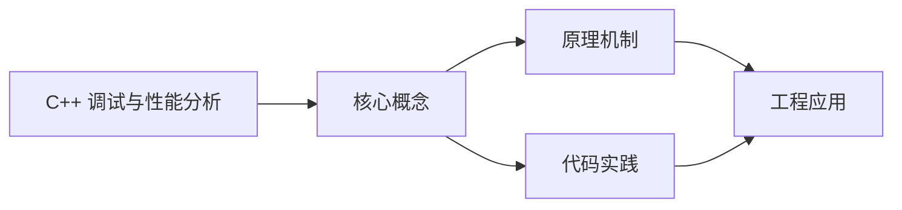
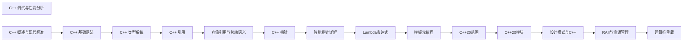

## 1. 学习目标（Bloom 分类）

本节按照布鲁姆教育目标分类学组织学习路径。本文主题为《C++ 调试与性能分析》，属于 C++ 模块，读者可以根据自身阶段选择阅读深度。

记忆层面：能够准确复述本文的核心概念、术语与基本语法或操作步骤，并能够在提问或检索时快速定位对应知识点。能够说出 C++ 的类、继承、重载、模板与 STL 容器基本语法。

理解层面：能够用自己的语言解释核心原理与工作机制，说明概念之间的因果关系，而不是机械记忆结论。能够解释 RAII、拷贝/移动语义、虚函数与模板实例化。

应用层面：能够在真实项目或练习场景中运用本文知识解决具体问题，写出正确且可维护的实现。能够编写现代 C++（C++17/20）的类与泛型代码。

分析层面：能够拆解复杂问题，比较本文主题与相邻概念的异同，识别边界条件与例外情况。能够分析生命周期、未定义行为与性能特征。

评价层面：能够根据约束条件（性能、可读性、安全、成本）评价不同方案的优劣，做出有依据的技术决策。能够评价 C++ 与 Rust、Java 在系统编程中的取舍。

创造层面：能够把本文知识与其他模块知识组合，设计出新的解决方案或可复用的工程模式。能够设计高性能、可维护的 C++ 库与应用。

通过本节学习，读者应当能够把《C++ 调试与性能分析》纳入自己的知识网络，并与 C++ 模块的其他主题（RAII、移动语义、模板、STL）建立关联。

## 2. 历史动机与发展脉络

《C++ 调试与性能分析》是 C++ 领域的重要主题。要真正理解它，需要先了解它解决的问题与演进过程。

C++ 由 Bjarne Stroustrup 于 1979 年开始在贝尔实验室开发（原名 C with Classes），1983 年更名 C++，1998 年 C++98 首次标准化。
C++11 是语言转折点：右值引用、auto、lambda、智能指针、并发内存模型让现代 C++ 写法定型；C++14/17 补充泛型 lambda、if constexpr、折叠表达式；C++20 引入 concepts、协程、模块与范围库；C++23 继续完善。
现代 C++ 的核心口号是“资源安全”：RAII + 智能指针替代裸 new/delete，异常与错误码按场景选择；Rust 的出现促使 C++ 社区更重视内存安全工具（如 profile 指南、sanitizer）。

回到本文主题：C++ 调试与性能分析 的提出与成熟，正是上述技术背景下的必然产物。早期实现往往以简单可用为目标，随着工程规模扩大，社区逐渐沉淀出标准做法与最佳实践；理解这一脉络，可以帮助读者判断“为什么文档中的推荐写法是现在这个样子”，也能在遇到历史遗留代码时准确识别其设计年代与取舍。


## 3. 形式化定义与核心概念精讲

本节把《C++ 调试与性能分析》涉及的核心概念以“定义 + 讲解”的形式展开。读者应把定义当作工具，把讲解当作理解路径；两者结合才能形成可迁移的知识。

RAII：资源在构造函数获取、析构函数释放，栈对象离开作用域自动清理；智能指针（unique_ptr/shared_ptr/weak_ptr）把所有权编码进类型。
移动语义：右值引用 `&&` 与 std::move 转移资源所有权，避免深拷贝；移动后对象处于“合法但未指定”状态。
虚函数与多态：virtual 实现动态绑定，vtable 是运行时分派机制；final/override 关键字防止误用；基类析构函数应为 virtual。

### 3.1 原文章节逐一精讲

原文档把主题拆分为 16 个小节，下面按顺序给出每一节的导读讲解，随后保留原文细节供精读。

#### 原文精读（完整保留）

# C/C++ 调试与性能分析

> **符号约定**：`< >` 必填参数 | `[ ]` 可选参数

---

#### 1. 调试工具

##### 1.1 GDB (GNU Debugger)

###### 1.1.1 基础命令

```bash
 # 编译时开启调试信息
 g++ -g main.cpp -o main
 # 启动调试
 gdb ./main
 # 设置断点
 break main
 break file.cpp:42
 break MyClass::myMethod
 # 运行程序
 run
 run --arg1 value1
 # 单步执行
 next # 单步执行，不进入函数
 step # 单步执行，进入函数
 continue # 继续执行到下一个断点
 # 查看变量
 print var
 print &var # 查看变量地址
 print *ptr # 查看指针指向的内容
 # 查看内存
 x/10xw &var # 查看变量地址开始的10个4字节内存
 # 查看调用栈
 backtrace
 bt
 # 修改变量值
 set var x = 10
 # 条件断点
 break file.cpp:42 if x > 10
 # 临时断点
 tbreak main
 # 观察点
 watch x # 当x的值改变时暂停
 rwatch x # 当x被读取时暂停
 awatch x # 当x被读取或修改时暂停
```

###### 1.1.2 高级功能

- **多线程调试**: 使用 `info threads` 查看线程，`thread N` 切换线程
- **核心转储分析**: `gdb ./main core` 分析崩溃时的核心转储
- **远程调试**: 使用 `target remote` 进行远程调试

##### 1.2 Visual Studio Debugger

###### 1.2.1 基本操作

- **断点设置**: 点击行号旁边或按 F9
- **启动调试**: 按 F5
- **单步执行**: F10 (不进入函数), F11 (进入函数)
- **查看变量**: 鼠标悬停在变量上或在监视窗口中添加
- **调用栈**: 查看当前调用栈

###### 1.2.2 高级功能

- **条件断点**: 右键断点 → 条件
- **数据断点**: 监视内存地址的变化
- **并行调试**: 调试多线程和多进程应用

##### 1.3 LLDB (LLVM Debugger)

```bash
 # 编译时开启调试信息
 clang++ -g main.cpp -o main
 # 启动调试
 lldb ./main
 # 基本命令
 breakpoint set --name main
 run
 next
 step
 print var
 thread list
```

#### 2. 内存检查工具

##### 2.1 Valgrind

###### 2.1.1 Memcheck (内存泄漏检查)

```bash
 # 基本使用
 valgrind --leak-check=full ./main
 # 详细输出
 valgrind --leak-check=full --show-leak-kinds=all --track-origins=yes ./main
 # 抑制已知泄漏
 valgrind --leak-check=full --suppressions=suppressions.txt ./main
```

###### 2.1.2 其他工具

- **Helgrind**: 检测线程竞争
- **DRD**: 检测线程竞争
- **Cachegrind**: 缓存分析
- **Callgrind**: 调用图分析

##### 2.2 Sanitizers

###### 2.2.1 AddressSanitizer (ASan)

```bash
 # 编译时启用
 g++ -fsanitize=address -g main.cpp -o main
 # 运行
 ./main
```

###### 2.2.2 UndefinedBehaviorSanitizer (UBSan)

```bash
 # 编译时启用
 g++ -fsanitize=undefined -g main.cpp -o main
```

###### 2.2.3 ThreadSanitizer (TSan)

```bash
 # 编译时启用
 g++ -fsanitize=thread -g main.cpp -o main
```

#### 3. 性能分析工具

##### 3.1 Gprof

```bash
 # 编译时启用
 g++ -pg main.cpp -o main
 # 运行程序
 ./main
 # 生成报告
 gprof ./main gmon.out > profile.txt
 # 查看报告
 cat profile.txt
```

##### 3.2 perf (Linux 性能分析)

```bash
 # 基本使用
 perf record ./main
 perf report
 # 查看热点函数
 perf top -p <pid>
 # 统计事件
 perf stat ./main
 # 调用图分析
 perf record -g ./main
 perf report --call-graph
```

##### 3.3 Intel VTune Profiler

- **热点分析**: 识别CPU瓶颈
- **内存访问分析**: 检测内存瓶颈
- **线程分析**: 分析线程行为和竞争
- **GPU分析**: 分析GPU使用情况

##### 3.4 其他工具

- **gperftools**: Google性能分析工具
- **Heaptrack**: 内存分配分析
- **Massif**: Valgrind的堆内存分析工具

#### 4. 常见错误与解决方案

##### 4.1 内存访问错误

###### 4.1.1 空指针解引用

- **现象**: 程序崩溃 (Segmentation fault)
- **原因**: 尝试访问空指针指向的内存
- **解决方案**: 在解引用前检查指针是否为空

```cpp
 // 不好的做法
 int* ptr = nullptr;
 *
 // 好的做法
 int* ptr = nullptr;
 if (ptr) {
  *ptr = 10;
 }
```

###### 4.1.2 数组越界

- **现象**: 程序崩溃或行为异常
- **原因**: 访问了超出数组范围的索引
- **解决方案**: 使用 `std::vector` 或检查索引范围

```cpp
 // 不好的做法
 int arr[5];
 arr[10] = 10; // 越界
 // 好的做法
 std::vector<int> vec(5);
 if (index < vec.size()) {
  vec[index] = 10;
 }
```

###### 4.1.3 内存泄漏

- **现象**: 程序内存占用持续上升
- **原因**: 动态分配的内存未释放
- **解决方案**: 使用智能指针，遵循RAII原则

```cpp
 // 不好的做法
 void func() {
  int* ptr = new int[100];
  // 忘记delete
 }
 // 好的做法
 void func() {
  std::unique_ptr<int[]> ptr(new int[100]);
  // 自动释放
 }
 // 更好的做法
 void func() {
  std::vector<int> vec(100);
  // 自动管理内存
 }
```

##### 4.2 逻辑错误

###### 4.2.1 未初始化变量

- **现象**: 程序行为不确定
- **原因**: 使用了未初始化的变量
- **解决方案**: 始终初始化变量

```cpp
 // 不好的做法
 int x;
 cout << x << endl; // 未初始化
 // 好的做法
 int x = 0;
 cout << x << endl;
```

###### 4.2.2 整数溢出

- **现象**: 计算结果错误
- **原因**: 整数运算超出范围
- **解决方案**: 使用更大的整数类型或检查溢出

```cpp
 // 可能溢出
 int a = INT_MAX;
 int b = a + 1; // 溢出
 // 安全做法
 long long a = INT_MAX;
 long long b = a + 1; // 安全
```

##### 4.3 线程错误

###### 4.3.1 竞态条件

- **现象**: 程序行为不确定，偶尔崩溃
- **原因**: 多个线程同时访问共享资源
- **解决方案**: 使用互斥锁或原子操作

```cpp
 // 不好的做法
 int counter = 0;
 void increment() {
  counter++; // 非原子操作
 }
 // 好的做法
 std::mutex mtx;
 int counter = 0;
 void increment() {
  std::lock_guard<std::mutex> lock(mtx);
  counter++;
 }
 // 更好的做法
 std::atomic<int> counter = 0;
 void increment() {
  counter++;
 }
```

#### 5. 性能优化策略

##### 5.1 算法优化

###### 5.1.1 时间复杂度优化

- **O(1)**: 常量时间，如数组访问
- **O(log n)**: 对数时间，如二分查找
- **O(n)**: 线性时间，如线性搜索
- **O(n log n)**: 线性对数时间，如快速排序、归并排序
- **O(n²)**: 平方时间，如冒泡排序、插入排序

###### 5.1.2 空间复杂度优化

- **原地算法**: 避免额外空间使用
- **空间换时间**: 在内存允许的情况下使用缓存
- **数据结构选择**: 根据使用场景选择合适的数据结构

##### 5.2 内存优化

###### 5.2.1 缓存友好性

- **数据局部性**: 提高空间局部性和时间局部性
- **连续内存**: 使用 `std::vector` 而不是 `std::list`
- **对齐访问**: 确保数据对齐以提高访问速度
- **避免虚假共享**: 避免多个线程同时访问同一缓存行

###### 5.2.2 内存分配

- **减少分配次数**: 使用对象池或内存池
- **适当的分配大小**: 避免频繁的小内存分配
- **智能指针**: 正确使用 `std::unique_ptr` 和 `std::shared_ptr`

##### 5.3 编译优化

###### 5.3.1 编译选项

- **优化级别**: `-O1`, `-O2`, `-O3`, `-Os`
- **架构优化**: `-march=native`, `-mtune=native`
- **链接时优化**: `-flto`
- **向量指令**: `-mavx`, `-msse4.2`

###### 5.3.2 代码结构优化

- **内联函数**: 使用 `inline` 关键字或让编译器自动内联
- **循环展开**: 减少循环开销
- **分支预测**: 优化条件分支以提高预测准确率
- **避免虚函数**: 在性能关键路径上减少虚函数调用

##### 5.4 并行优化

###### 5.4.1 线程池

- **std::thread**: 标准线程库
- **OpenMP**: 简单的并行编程模型
- **Intel TBB**: 高级并行库
- **C++17 并行算法**: `std::execution::par`

###### 5.4.2 异步编程

- **std::future** 和 **std::promise**
- **std::async**: 异步执行任务
- **协程**: C++20 协程

#### 6. 实战案例

##### 6.1 内存泄漏调试

**问题**: 程序内存占用持续上升
**调试步骤**:

1. 使用 Valgrind 检测内存泄漏

```bash
 valgrind --leak-check=full ./main
```

2. 分析 Valgrind 输出，找到泄漏位置
3. 修复泄漏，使用智能指针或确保正确释放内存
   **修复示例**:

```cpp
 // 修复前
 void process() {
  char* buffer = new char[1024];
  // 使用buffer
  // 忘记delete
 }
 // 修复后
 void process() {
  std::unique_ptr<char[]> buffer(new char[1024]);
  // 使用buffer
  // 自动释放
 }
```

##### 6.2 性能瓶颈分析

**问题**: 程序运行缓慢
**分析步骤**:

1. 使用 perf 分析热点函数

```bash
 perf record ./main
 perf report
```

2. 识别消耗CPU时间最多的函数
3. 优化热点函数
   **优化示例**:

```cpp
 // 优化前
 void slowFunction() {
  for (int i = 0; i < 1000000; i++) {
  // 复杂计算
  }
 }
 // 优化后
 void fastFunction() {
  // 使用更高效的算法
  // 利用并行计算
  #pragma omp parallel for
  for (int i = 0; i < 1000000; i++) {
  // 优化后的计算
  }
 }
```

#### 7. 最佳实践

##### 7.1 调试最佳实践

- **使用断言**: 在开发阶段使用 `assert` 检查条件
- **日志记录**: 合理使用日志记录关键信息
- **单元测试**: 编写单元测试捕获错误
- **代码审查**: 通过代码审查发现潜在问题
- **版本控制**: 使用版本控制管理代码变更

##### 7.2 性能优化最佳实践

- **测量优先**: 在优化前进行性能测量
- **渐进优化**: 逐步优化，避免过度优化
- **保持代码清晰**: 优化的同时保持代码可读性
- **测试验证**: 优化后进行测试验证
- **文档记录**: 记录优化策略和结果

##### 7.3 内存管理最佳实践

- **使用 RAII**: 遵循资源获取即初始化原则
- **智能指针**: 优先使用 `std::unique_ptr` 和 `std::shared_ptr`
- **容器选择**: 根据使用场景选择合适的容器
- **内存池**: 对于频繁分配的小对象使用内存池
- **内存检查**: 定期使用内存检查工具检测问题

#### 8. 延伸阅读

- [CppCoreGuidelines](https://github.com/isocpp/CppCoreGuidelines)
- [Performance Tuning Guidelines for C++](https://github.com/dendibakh/perf-book)
- [Debugging with GDB](https://www.gnu.org/software/gdb/documentation/)
- [Valgrind User Manual](https://valgrind.org/docs/manual/manual.html)
- [Intel VTune Profiler Documentation](https://www.intel.com/content/www/us/en/developer/tools/oneapi/vtune-profiler-documentation.html)

#### 9. 更新日志

- **2026-04-05**: 初始创建，涵盖调试工具、常见错误、性能分析与优化
- **2026-04-05**: 扩展内容，增加更多调试工具、内存检查工具和性能分析技术
#### 调试工具

**基本写法：gdb 调试**
`gdb <程序>`
```bash
# 启动 gdb
g++ -g -O0 main.cpp -o app
gdb ./app
# 常用命令
# break main / run / next / step / print x / backtrace
```

---

**基本写法：lldb 调试**
`lldb <程序>`
```bash
# clang 配套调试器
lldb ./app
lldb> breakpoint set --name main
lldb> run
lldb> frame variable
```

---

**基本写法：核心转储分析**
`gdb <程序> <core文件>`
```bash
# 分析崩溃转储
ulimit -c unlimited      # 启用 core
./app                    # 崩溃生成 core
gdb ./app core
gdb> bt                  # 查看崩溃栈
```

---

#### 内存检测

**基本写法：AddressSanitizer**
`g++ -fsanitize=address -g`
```bash
# 内存错误检测（编译时）
g++ -fsanitize=address -g main.cpp -o app
./app
# 检测：堆栈溢出、释放后使用、双重释放、内存泄漏
```

---

**基本写法：MemorySanitizer**
`g++ -fsanitize=memory -g`
```bash
# 检测未初始化内存读取（clang）
clang++ -fsanitize=memory -g main.cpp -o app
./app
```

---

**基本写法：ThreadSanitizer**
`g++ -fsanitize=thread -g`
```bash
# 数据竞争检测
g++ -fsanitize=thread -g main.cpp -o app
./app
# 检测：多线程数据竞争、死锁
```

---

**基本写法：UndefinedBehaviorSanitizer**
`g++ -fsanitize=undefined -g`
```bash
# 未定义行为检测
g++ -fsanitize=undefined -g main.cpp -o app
./app
# 检测：整数溢出、空指针、除零等
```

---

#### Valgrind

**基本写法：内存泄漏检测**
`valgrind --leak-check=full <程序>`
```bash
# 检测内存泄漏
valgrind --leak-check=full --show-leak-kinds=all ./app
# 输出：definitely lost / indirectly lost 等
```

---

**基本写法：调用图分析**
`valgrind --tool=callgrind <程序>`
```bash
# 性能分析
valgrind --tool=callgrind ./app
# 生成 callgrind.out.<pid>
callgrind_annotate callgrind.out.12345  # 查看报告
# 或用 kcachegrind 图形化查看
```

---

**基本写法：缓存分析**
`valgrind --tool=cachegrind <程序>`
```bash
# 缓存命中分析
valgrind --tool=cachegrind ./app
# 生成 cachegrind.out.<pid>
cg_annotate cachegrind.out.12345
```

---

#### perf 性能分析

**基本写法：perf record**
`perf record -g <程序>`
```bash
# 采样性能数据
perf record -g ./app
perf report                    # 查看报告
perf report --sort=symbol      # 按符号排序
```

---

**基本写法：perf stat**
`perf stat <程序>`
```bash
# 统计硬件事件
perf stat ./app
# 输出：CPU 周期、指令数、缓存缺失等
perf stat -e cache-misses,cache-references ./app
```

---

**基本写法：perf top**
`perf top`
```bash
# 实时热点分析
perf top
perf top -p <pid>     # 指定进程
```

---

#### 火焰图

**基本写法：生成火焰图**
`perf script | <flamegraph工具>`
```bash
# 生成火焰图（需 FlameGraph 工具）
perf record -F 99 -g ./app
perf script > out.perf
git clone https://github.com/brendangregg/FlameGraph
./FlameGraph/stackcollapse-perf.pl out.perf > out.folded
./FlameGraph/flamegraph.pl out.folded > flame.svg
```

---

#### 编译诊断

**基本写法：警告选项**
`g++ -Wall -Wextra -Werror`
```bash
# 严格警告
g++ -Wall -Wextra -Wpedantic -Werror main.cpp
# 转换警告
g++ -Wconversion -Wsign-conversion main.cpp
```

---

**基本写法：静态分析**
`cppcheck --enable=all`
```bash
# 静态分析
cppcheck --enable=all --inconclusive main.cpp
cppcheck --xml --xml-version=2 main.cpp 2> report.xml
```

---

**基本写法：clang-tidy**
`clang-tidy -p <build> <源文件>`
```bash
# clang 静态检查
clang-tidy -p build main.cpp
clang-tidy -checks='bugprone-*,modernize-*,performance-*' main.cpp
```

---

#### 时间测量

**基本写法：chrono 精确计时**
`std::chrono::high_resolution_clock`
```cpp
#include <chrono>
auto t1 = std::chrono::high_resolution_clock::now();
work();
auto t2 = std::chrono::high_resolution_clock::now();
auto ns = std::chrono::duration_cast<std::chrono::nanoseconds>(t2-t1).count();
std::cout << ns << " ns";
```

---

**基本写法：clock 测 CPU 时间**
`std::clock()`
```cpp
#include <ctime>
std::clock_t start = std::clock();
work();
double seconds = double(std::clock() - start) / CLOCKS_PER_SEC;
```


### 3.2 概念关系图

下面用 Mermaid 图表达本文核心概念之间的关系，帮助读者建立整体图景：



图中展示的是本文知识的结构化关系：核心概念是入口，原理机制解释“为什么”，代码实践演示“怎么做”，工程应用回答“何时用”。读者学习时可以把每个小节的内容挂接到对应节点上。

## 4. 理论推导与原理解析

本节深入《C++ 调试与性能分析》背后的原理。理论部分不求面面俱到，而是聚焦“能解释现象、能指导实践”的关键推导。

RAII：资源在构造函数获取、析构函数释放，栈对象离开作用域自动清理；智能指针（unique_ptr/shared_ptr/weak_ptr）把所有权编码进类型。
移动语义：右值引用 `&&` 与 std::move 转移资源所有权，避免深拷贝；移动后对象处于“合法但未指定”状态。
虚函数与多态：virtual 实现动态绑定，vtable 是运行时分派机制；final/override 关键字防止误用；基类析构函数应为 virtual。
模板与泛型：模板编译期实例化，实现静态多态；concepts（C++20）约束类型接口；模板元编程在编译期计算类型与常量。

需要强调的是，理论推导与工程实践之间存在翻译层：理论给出的是理想化模型与边界条件，工程代码则必须处理真实环境中的例外。读者在学习时应先掌握理论的“标准情形”，再通过陷阱章节了解“非标准情形”。

## 5. 代码示例与逐行讲解

本节把原文中的代码示例系统整理，并为每个示例补充用途说明与讲解。读者不应只浏览代码，而应逐段对照讲解理解设计意图。

### 5.1 示例：1.1.1 基础命令

该示例来自原文《1.1.1 基础命令》小节，用于演示C++ 调试与性能分析相关操作。阅读时请先看代码结构，再看其后的讲解。

```bash
 # 编译时开启调试信息
 g++ -g main.cpp -o main
 # 启动调试
 gdb ./main
 # 设置断点
 break main
 break file.cpp:42
 break MyClass::myMethod
 # 运行程序
 run
 run --arg1 value1
 # 单步执行
 next # 单步执行，不进入函数
 step # 单步执行，进入函数
 continue # 继续执行到下一个断点
 # 查看变量
 print var
 print &var # 查看变量地址
 print *ptr # 查看指针指向的内容
 # 查看内存
 x/10xw &var # 查看变量地址开始的10个4字节内存
 # 查看调用栈
 backtrace
 bt
 # 修改变量值
 set var x = 10
 # 条件断点
 break file.cpp:42 if x > 10
 # 临时断点
 tbreak main
 # 观察点
 watch x # 当x的值改变时暂停
 rwatch x # 当x被读取时暂停
 awatch x # 当x被读取或修改时暂停
```

讲解：这段代码演示了本节核心知识点。代码中的关键操作可以归纳为三步：准备（定义或初始化）、执行（核心逻辑）、收尾（释放资源或返回结果）。实际项目中，这三步往往被封装为函数或类，以提升复用性与可测试性。

关键点分析：

该示例共 34 行有效代码，包含 1 类关键结构（if）。其中：

- 入口与初始化部分负责建立上下文，对应实际项目中的启动或装配逻辑；
- 核心逻辑部分体现本文主题的主要操作，是阅读时最需要对照讲解理解的部分；
- 输出或返回部分把结果交给调用方，注意其类型与边界条件。

进阶思考路径：先尝试修改参数观察行为变化，再把示例中的模式迁移到自己的项目中；每次修改都记录预期与实测差异，这是把示例转化为能力的最快方式。

### 5.2 示例：1.3 LLDB (LLVM Debugger)

该示例来自原文《1.3 LLDB (LLVM Debugger)》小节，用于演示C++ 调试与性能分析相关操作。阅读时请先看代码结构，再看其后的讲解。

```bash
 # 编译时开启调试信息
 clang++ -g main.cpp -o main
 # 启动调试
 lldb ./main
 # 基本命令
 breakpoint set --name main
 run
 next
 step
 print var
 thread list
```

讲解：这段代码演示了本节核心知识点。代码中的关键操作可以归纳为三步：准备（定义或初始化）、执行（核心逻辑）、收尾（释放资源或返回结果）。实际项目中，这三步往往被封装为函数或类，以提升复用性与可测试性。

关键点分析：

该示例共 11 行有效代码，结构以数据或配置为主。阅读时应关注：数据字段的含义、配置项的作用，以及它们与运行行为的对应关系。

进阶思考路径：先尝试修改参数观察行为变化，再把示例中的模式迁移到自己的项目中；每次修改都记录预期与实测差异，这是把示例转化为能力的最快方式。

### 5.3 示例：2.1.1 Memcheck (内存泄漏检查)

该示例来自原文《2.1.1 Memcheck (内存泄漏检查)》小节，用于演示C++ 调试与性能分析相关操作。阅读时请先看代码结构，再看其后的讲解。

```bash
 # 基本使用
 valgrind --leak-check=full ./main
 # 详细输出
 valgrind --leak-check=full --show-leak-kinds=all --track-origins=yes ./main
 # 抑制已知泄漏
 valgrind --leak-check=full --suppressions=suppressions.txt ./main
```

讲解：这段代码演示了本节核心知识点。代码中的关键操作可以归纳为三步：准备（定义或初始化）、执行（核心逻辑）、收尾（释放资源或返回结果）。实际项目中，这三步往往被封装为函数或类，以提升复用性与可测试性。

关键点分析：

该示例共 6 行有效代码，结构以数据或配置为主。阅读时应关注：数据字段的含义、配置项的作用，以及它们与运行行为的对应关系。

进阶思考路径：先尝试修改参数观察行为变化，再把示例中的模式迁移到自己的项目中；每次修改都记录预期与实测差异，这是把示例转化为能力的最快方式。

### 5.4 示例：2.2.1 AddressSanitizer (ASan)

该示例来自原文《2.2.1 AddressSanitizer (ASan)》小节，用于演示C++ 调试与性能分析相关操作。阅读时请先看代码结构，再看其后的讲解。

```bash
 # 编译时启用
 g++ -fsanitize=address -g main.cpp -o main
 # 运行
 ./main
```

讲解：这段代码演示了本节核心知识点。代码中的关键操作可以归纳为三步：准备（定义或初始化）、执行（核心逻辑）、收尾（释放资源或返回结果）。实际项目中，这三步往往被封装为函数或类，以提升复用性与可测试性。

关键点分析：

该示例共 4 行有效代码，结构以数据或配置为主。阅读时应关注：数据字段的含义、配置项的作用，以及它们与运行行为的对应关系。

进阶思考路径：先尝试修改参数观察行为变化，再把示例中的模式迁移到自己的项目中；每次修改都记录预期与实测差异，这是把示例转化为能力的最快方式。

### 5.5 示例：2.2.2 UndefinedBehaviorSanitizer (UBSan)

该示例来自原文《2.2.2 UndefinedBehaviorSanitizer (UBSan)》小节，用于演示C++ 调试与性能分析相关操作。阅读时请先看代码结构，再看其后的讲解。

```bash
 # 编译时启用
 g++ -fsanitize=undefined -g main.cpp -o main
```

讲解：这段代码演示了本节核心知识点。代码中的关键操作可以归纳为三步：准备（定义或初始化）、执行（核心逻辑）、收尾（释放资源或返回结果）。实际项目中，这三步往往被封装为函数或类，以提升复用性与可测试性。

关键点分析：

该示例共 2 行有效代码，结构以数据或配置为主。阅读时应关注：数据字段的含义、配置项的作用，以及它们与运行行为的对应关系。

进阶思考路径：先尝试修改参数观察行为变化，再把示例中的模式迁移到自己的项目中；每次修改都记录预期与实测差异，这是把示例转化为能力的最快方式。

### 5.6 示例：2.2.3 ThreadSanitizer (TSan)

该示例来自原文《2.2.3 ThreadSanitizer (TSan)》小节，用于演示C++ 调试与性能分析相关操作。阅读时请先看代码结构，再看其后的讲解。

```bash
 # 编译时启用
 g++ -fsanitize=thread -g main.cpp -o main
```

讲解：这段代码演示了本节核心知识点。代码中的关键操作可以归纳为三步：准备（定义或初始化）、执行（核心逻辑）、收尾（释放资源或返回结果）。实际项目中，这三步往往被封装为函数或类，以提升复用性与可测试性。

关键点分析：

该示例共 2 行有效代码，结构以数据或配置为主。阅读时应关注：数据字段的含义、配置项的作用，以及它们与运行行为的对应关系。

进阶思考路径：先尝试修改参数观察行为变化，再把示例中的模式迁移到自己的项目中；每次修改都记录预期与实测差异，这是把示例转化为能力的最快方式。

### 5.7 示例：3.1 Gprof

该示例来自原文《3.1 Gprof》小节，用于演示C++ 调试与性能分析相关操作。阅读时请先看代码结构，再看其后的讲解。

```bash
 # 编译时启用
 g++ -pg main.cpp -o main
 # 运行程序
 ./main
 # 生成报告
 gprof ./main gmon.out > profile.txt
 # 查看报告
 cat profile.txt
```

讲解：这段代码演示了本节核心知识点。代码中的关键操作可以归纳为三步：准备（定义或初始化）、执行（核心逻辑）、收尾（释放资源或返回结果）。实际项目中，这三步往往被封装为函数或类，以提升复用性与可测试性。

关键点分析：

该示例共 8 行有效代码，结构以数据或配置为主。阅读时应关注：数据字段的含义、配置项的作用，以及它们与运行行为的对应关系。

进阶思考路径：先尝试修改参数观察行为变化，再把示例中的模式迁移到自己的项目中；每次修改都记录预期与实测差异，这是把示例转化为能力的最快方式。

### 5.8 示例：3.2 perf (Linux 性能分析)

该示例来自原文《3.2 perf (Linux 性能分析)》小节，用于演示C++ 调试与性能分析相关操作。阅读时请先看代码结构，再看其后的讲解。

```bash
 # 基本使用
 perf record ./main
 perf report
 # 查看热点函数
 perf top -p <pid>
 # 统计事件
 perf stat ./main
 # 调用图分析
 perf record -g ./main
 perf report --call-graph
```

讲解：这段代码演示了本节核心知识点。代码中的关键操作可以归纳为三步：准备（定义或初始化）、执行（核心逻辑）、收尾（释放资源或返回结果）。实际项目中，这三步往往被封装为函数或类，以提升复用性与可测试性。

关键点分析：

该示例共 10 行有效代码，结构以数据或配置为主。阅读时应关注：数据字段的含义、配置项的作用，以及它们与运行行为的对应关系。

进阶思考路径：先尝试修改参数观察行为变化，再把示例中的模式迁移到自己的项目中；每次修改都记录预期与实测差异，这是把示例转化为能力的最快方式。

### 5.9 示例：4.1.1 空指针解引用

该示例来自原文《4.1.1 空指针解引用》小节，用于演示C++ 调试与性能分析相关操作。阅读时请先看代码结构，再看其后的讲解。

```cpp
 // 不好的做法
 int* ptr = nullptr;
 *
 // 好的做法
 int* ptr = nullptr;
 if (ptr) {
  *ptr = 10;
 }
```

讲解：这段代码演示了本节核心知识点。代码中的关键操作可以归纳为三步：准备（定义或初始化）、执行（核心逻辑）、收尾（释放资源或返回结果）。实际项目中，这三步往往被封装为函数或类，以提升复用性与可测试性。

关键点分析：

该示例共 8 行有效代码，包含 1 类关键结构（if）。其中：

- 入口与初始化部分负责建立上下文，对应实际项目中的启动或装配逻辑；
- 核心逻辑部分体现本文主题的主要操作，是阅读时最需要对照讲解理解的部分；
- 输出或返回部分把结果交给调用方，注意其类型与边界条件。

进阶思考路径：先尝试修改参数观察行为变化，再把示例中的模式迁移到自己的项目中；每次修改都记录预期与实测差异，这是把示例转化为能力的最快方式。

### 5.10 示例：4.1.2 数组越界

该示例来自原文《4.1.2 数组越界》小节，用于演示C++ 调试与性能分析相关操作。阅读时请先看代码结构，再看其后的讲解。

```cpp
 // 不好的做法
 int arr[5];
 arr[10] = 10; // 越界
 // 好的做法
 std::vector<int> vec(5);
 if (index < vec.size()) {
  vec[index] = 10;
 }
```

讲解：这段代码演示了本节核心知识点。代码中的关键操作可以归纳为三步：准备（定义或初始化）、执行（核心逻辑）、收尾（释放资源或返回结果）。实际项目中，这三步往往被封装为函数或类，以提升复用性与可测试性。

关键点分析：

该示例共 8 行有效代码，包含 1 类关键结构（if）。其中：

- 入口与初始化部分负责建立上下文，对应实际项目中的启动或装配逻辑；
- 核心逻辑部分体现本文主题的主要操作，是阅读时最需要对照讲解理解的部分；
- 输出或返回部分把结果交给调用方，注意其类型与边界条件。

进阶思考路径：先尝试修改参数观察行为变化，再把示例中的模式迁移到自己的项目中；每次修改都记录预期与实测差异，这是把示例转化为能力的最快方式。

### 5.11 示例：4.1.3 内存泄漏

该示例来自原文《4.1.3 内存泄漏》小节，用于演示C++ 调试与性能分析相关操作。阅读时请先看代码结构，再看其后的讲解。

```cpp
 // 不好的做法
 void func() {
  int* ptr = new int[100];
  // 忘记delete
 }
 // 好的做法
 void func() {
  std::unique_ptr<int[]> ptr(new int[100]);
  // 自动释放
 }
 // 更好的做法
 void func() {
  std::vector<int> vec(100);
  // 自动管理内存
 }
```

讲解：这段代码演示了本节核心知识点。代码中的关键操作可以归纳为三步：准备（定义或初始化）、执行（核心逻辑）、收尾（释放资源或返回结果）。实际项目中，这三步往往被封装为函数或类，以提升复用性与可测试性。

关键点分析：

该示例共 15 行有效代码，结构以数据或配置为主。阅读时应关注：数据字段的含义、配置项的作用，以及它们与运行行为的对应关系。

进阶思考路径：先尝试修改参数观察行为变化，再把示例中的模式迁移到自己的项目中；每次修改都记录预期与实测差异，这是把示例转化为能力的最快方式。

### 5.12 示例：4.2.1 未初始化变量

该示例来自原文《4.2.1 未初始化变量》小节，用于演示C++ 调试与性能分析相关操作。阅读时请先看代码结构，再看其后的讲解。

```cpp
 // 不好的做法
 int x;
 cout << x << endl; // 未初始化
 // 好的做法
 int x = 0;
 cout << x << endl;
```

讲解：这段代码演示了本节核心知识点。代码中的关键操作可以归纳为三步：准备（定义或初始化）、执行（核心逻辑）、收尾（释放资源或返回结果）。实际项目中，这三步往往被封装为函数或类，以提升复用性与可测试性。

关键点分析：

该示例共 6 行有效代码，结构以数据或配置为主。阅读时应关注：数据字段的含义、配置项的作用，以及它们与运行行为的对应关系。

进阶思考路径：先尝试修改参数观察行为变化，再把示例中的模式迁移到自己的项目中；每次修改都记录预期与实测差异，这是把示例转化为能力的最快方式。

### 5.13 示例：4.2.2 整数溢出

该示例来自原文《4.2.2 整数溢出》小节，用于演示C++ 调试与性能分析相关操作。阅读时请先看代码结构，再看其后的讲解。

```cpp
 // 可能溢出
 int a = INT_MAX;
 int b = a + 1; // 溢出
 // 安全做法
 long long a = INT_MAX;
 long long b = a + 1; // 安全
```

讲解：这段代码演示了本节核心知识点。代码中的关键操作可以归纳为三步：准备（定义或初始化）、执行（核心逻辑）、收尾（释放资源或返回结果）。实际项目中，这三步往往被封装为函数或类，以提升复用性与可测试性。

关键点分析：

该示例共 6 行有效代码，结构以数据或配置为主。阅读时应关注：数据字段的含义、配置项的作用，以及它们与运行行为的对应关系。

进阶思考路径：先尝试修改参数观察行为变化，再把示例中的模式迁移到自己的项目中；每次修改都记录预期与实测差异，这是把示例转化为能力的最快方式。

### 5.14 示例：4.3.1 竞态条件

该示例来自原文《4.3.1 竞态条件》小节，用于演示C++ 调试与性能分析相关操作。阅读时请先看代码结构，再看其后的讲解。

```cpp
 // 不好的做法
 int counter = 0;
 void increment() {
  counter++; // 非原子操作
 }
 // 好的做法
 std::mutex mtx;
 int counter = 0;
 void increment() {
  std::lock_guard<std::mutex> lock(mtx);
  counter++;
 }
 // 更好的做法
 std::atomic<int> counter = 0;
 void increment() {
  counter++;
 }
```

讲解：这段代码演示了本节核心知识点。代码中的关键操作可以归纳为三步：准备（定义或初始化）、执行（核心逻辑）、收尾（释放资源或返回结果）。实际项目中，这三步往往被封装为函数或类，以提升复用性与可测试性。

关键点分析：

该示例共 17 行有效代码，结构以数据或配置为主。阅读时应关注：数据字段的含义、配置项的作用，以及它们与运行行为的对应关系。

进阶思考路径：先尝试修改参数观察行为变化，再把示例中的模式迁移到自己的项目中；每次修改都记录预期与实测差异，这是把示例转化为能力的最快方式。

### 5.15 示例：6.1 内存泄漏调试

该示例来自原文《6.1 内存泄漏调试》小节，用于演示C++ 调试与性能分析相关操作。阅读时请先看代码结构，再看其后的讲解。

```bash
 valgrind --leak-check=full ./main
```

讲解：这段代码演示了本节核心知识点。代码中的关键操作可以归纳为三步：准备（定义或初始化）、执行（核心逻辑）、收尾（释放资源或返回结果）。实际项目中，这三步往往被封装为函数或类，以提升复用性与可测试性。

关键点分析：

该示例共 1 行有效代码，结构以数据或配置为主。阅读时应关注：数据字段的含义、配置项的作用，以及它们与运行行为的对应关系。

进阶思考路径：先尝试修改参数观察行为变化，再把示例中的模式迁移到自己的项目中；每次修改都记录预期与实测差异，这是把示例转化为能力的最快方式。

### 5.16 示例：6.1 内存泄漏调试

该示例来自原文《6.1 内存泄漏调试》小节，用于演示C++ 调试与性能分析相关操作。阅读时请先看代码结构，再看其后的讲解。

```cpp
 // 修复前
 void process() {
  char* buffer = new char[1024];
  // 使用buffer
  // 忘记delete
 }
 // 修复后
 void process() {
  std::unique_ptr<char[]> buffer(new char[1024]);
  // 使用buffer
  // 自动释放
 }
```

讲解：这段代码演示了本节核心知识点。代码中的关键操作可以归纳为三步：准备（定义或初始化）、执行（核心逻辑）、收尾（释放资源或返回结果）。实际项目中，这三步往往被封装为函数或类，以提升复用性与可测试性。

关键点分析：

该示例共 12 行有效代码，结构以数据或配置为主。阅读时应关注：数据字段的含义、配置项的作用，以及它们与运行行为的对应关系。

进阶思考路径：先尝试修改参数观察行为变化，再把示例中的模式迁移到自己的项目中；每次修改都记录预期与实测差异，这是把示例转化为能力的最快方式。

### 5.17 示例：6.2 性能瓶颈分析

该示例来自原文《6.2 性能瓶颈分析》小节，用于演示C++ 调试与性能分析相关操作。阅读时请先看代码结构，再看其后的讲解。

```bash
 perf record ./main
 perf report
```

讲解：这段代码演示了本节核心知识点。代码中的关键操作可以归纳为三步：准备（定义或初始化）、执行（核心逻辑）、收尾（释放资源或返回结果）。实际项目中，这三步往往被封装为函数或类，以提升复用性与可测试性。

关键点分析：

该示例共 2 行有效代码，结构以数据或配置为主。阅读时应关注：数据字段的含义、配置项的作用，以及它们与运行行为的对应关系。

进阶思考路径：先尝试修改参数观察行为变化，再把示例中的模式迁移到自己的项目中；每次修改都记录预期与实测差异，这是把示例转化为能力的最快方式。

### 5.18 示例：6.2 性能瓶颈分析

该示例来自原文《6.2 性能瓶颈分析》小节，用于演示C++ 调试与性能分析相关操作。阅读时请先看代码结构，再看其后的讲解。

```cpp
 // 优化前
 void slowFunction() {
  for (int i = 0; i < 1000000; i++) {
  // 复杂计算
  }
 }
 // 优化后
 void fastFunction() {
  // 使用更高效的算法
  // 利用并行计算
  #pragma omp parallel for
  for (int i = 0; i < 1000000; i++) {
  // 优化后的计算
  }
 }
```

讲解：这段代码演示了本节核心知识点。代码中的关键操作可以归纳为三步：准备（定义或初始化）、执行（核心逻辑）、收尾（释放资源或返回结果）。实际项目中，这三步往往被封装为函数或类，以提升复用性与可测试性。

关键点分析：

该示例共 15 行有效代码，包含 1 类关键结构（for）。其中：

- 入口与初始化部分负责建立上下文，对应实际项目中的启动或装配逻辑；
- 核心逻辑部分体现本文主题的主要操作，是阅读时最需要对照讲解理解的部分；
- 输出或返回部分把结果交给调用方，注意其类型与边界条件。

进阶思考路径：先尝试修改参数观察行为变化，再把示例中的模式迁移到自己的项目中；每次修改都记录预期与实测差异，这是把示例转化为能力的最快方式。

### 5.19 示例：调试工具

该示例来自原文《调试工具》小节，用于演示C++ 调试与性能分析相关操作。阅读时请先看代码结构，再看其后的讲解。

```bash
# 启动 gdb
g++ -g -O0 main.cpp -o app
gdb ./app
# 常用命令
# break main / run / next / step / print x / backtrace
```

讲解：这段代码演示了本节核心知识点。代码中的关键操作可以归纳为三步：准备（定义或初始化）、执行（核心逻辑）、收尾（释放资源或返回结果）。实际项目中，这三步往往被封装为函数或类，以提升复用性与可测试性。

关键点分析：

该示例共 5 行有效代码，结构以数据或配置为主。阅读时应关注：数据字段的含义、配置项的作用，以及它们与运行行为的对应关系。

进阶思考路径：先尝试修改参数观察行为变化，再把示例中的模式迁移到自己的项目中；每次修改都记录预期与实测差异，这是把示例转化为能力的最快方式。

### 5.20 示例：调试工具

该示例来自原文《调试工具》小节，用于演示C++ 调试与性能分析相关操作。阅读时请先看代码结构，再看其后的讲解。

```bash
# clang 配套调试器
lldb ./app
lldb> breakpoint set --name main
lldb> run
lldb> frame variable
```

讲解：这段代码演示了本节核心知识点。代码中的关键操作可以归纳为三步：准备（定义或初始化）、执行（核心逻辑）、收尾（释放资源或返回结果）。实际项目中，这三步往往被封装为函数或类，以提升复用性与可测试性。

关键点分析：

该示例共 5 行有效代码，结构以数据或配置为主。阅读时应关注：数据字段的含义、配置项的作用，以及它们与运行行为的对应关系。

进阶思考路径：先尝试修改参数观察行为变化，再把示例中的模式迁移到自己的项目中；每次修改都记录预期与实测差异，这是把示例转化为能力的最快方式。

### 5.21 示例：调试工具

该示例来自原文《调试工具》小节，用于演示C++ 调试与性能分析相关操作。阅读时请先看代码结构，再看其后的讲解。

```bash
# 分析崩溃转储
ulimit -c unlimited      # 启用 core
./app                    # 崩溃生成 core
gdb ./app core
gdb> bt                  # 查看崩溃栈
```

讲解：这段代码演示了本节核心知识点。代码中的关键操作可以归纳为三步：准备（定义或初始化）、执行（核心逻辑）、收尾（释放资源或返回结果）。实际项目中，这三步往往被封装为函数或类，以提升复用性与可测试性。

关键点分析：

该示例共 5 行有效代码，结构以数据或配置为主。阅读时应关注：数据字段的含义、配置项的作用，以及它们与运行行为的对应关系。

进阶思考路径：先尝试修改参数观察行为变化，再把示例中的模式迁移到自己的项目中；每次修改都记录预期与实测差异，这是把示例转化为能力的最快方式。

### 5.22 示例：内存检测

该示例来自原文《内存检测》小节，用于演示C++ 调试与性能分析相关操作。阅读时请先看代码结构，再看其后的讲解。

```bash
# 内存错误检测（编译时）
g++ -fsanitize=address -g main.cpp -o app
./app
# 检测：堆栈溢出、释放后使用、双重释放、内存泄漏
```

讲解：这段代码演示了本节核心知识点。代码中的关键操作可以归纳为三步：准备（定义或初始化）、执行（核心逻辑）、收尾（释放资源或返回结果）。实际项目中，这三步往往被封装为函数或类，以提升复用性与可测试性。

关键点分析：

该示例共 4 行有效代码，结构以数据或配置为主。阅读时应关注：数据字段的含义、配置项的作用，以及它们与运行行为的对应关系。

进阶思考路径：先尝试修改参数观察行为变化，再把示例中的模式迁移到自己的项目中；每次修改都记录预期与实测差异，这是把示例转化为能力的最快方式。

### 5.23 示例：内存检测

该示例来自原文《内存检测》小节，用于演示C++ 调试与性能分析相关操作。阅读时请先看代码结构，再看其后的讲解。

```bash
# 检测未初始化内存读取（clang）
clang++ -fsanitize=memory -g main.cpp -o app
./app
```

讲解：这段代码演示了本节核心知识点。代码中的关键操作可以归纳为三步：准备（定义或初始化）、执行（核心逻辑）、收尾（释放资源或返回结果）。实际项目中，这三步往往被封装为函数或类，以提升复用性与可测试性。

关键点分析：

该示例共 3 行有效代码，结构以数据或配置为主。阅读时应关注：数据字段的含义、配置项的作用，以及它们与运行行为的对应关系。

进阶思考路径：先尝试修改参数观察行为变化，再把示例中的模式迁移到自己的项目中；每次修改都记录预期与实测差异，这是把示例转化为能力的最快方式。

### 5.24 示例：内存检测

该示例来自原文《内存检测》小节，用于演示C++ 调试与性能分析相关操作。阅读时请先看代码结构，再看其后的讲解。

```bash
# 数据竞争检测
g++ -fsanitize=thread -g main.cpp -o app
./app
# 检测：多线程数据竞争、死锁
```

讲解：这段代码演示了本节核心知识点。代码中的关键操作可以归纳为三步：准备（定义或初始化）、执行（核心逻辑）、收尾（释放资源或返回结果）。实际项目中，这三步往往被封装为函数或类，以提升复用性与可测试性。

关键点分析：

该示例共 4 行有效代码，结构以数据或配置为主。阅读时应关注：数据字段的含义、配置项的作用，以及它们与运行行为的对应关系。

进阶思考路径：先尝试修改参数观察行为变化，再把示例中的模式迁移到自己的项目中；每次修改都记录预期与实测差异，这是把示例转化为能力的最快方式。

### 5.25 示例：内存检测

该示例来自原文《内存检测》小节，用于演示C++ 调试与性能分析相关操作。阅读时请先看代码结构，再看其后的讲解。

```bash
# 未定义行为检测
g++ -fsanitize=undefined -g main.cpp -o app
./app
# 检测：整数溢出、空指针、除零等
```

讲解：这段代码演示了本节核心知识点。代码中的关键操作可以归纳为三步：准备（定义或初始化）、执行（核心逻辑）、收尾（释放资源或返回结果）。实际项目中，这三步往往被封装为函数或类，以提升复用性与可测试性。

关键点分析：

该示例共 4 行有效代码，结构以数据或配置为主。阅读时应关注：数据字段的含义、配置项的作用，以及它们与运行行为的对应关系。

进阶思考路径：先尝试修改参数观察行为变化，再把示例中的模式迁移到自己的项目中；每次修改都记录预期与实测差异，这是把示例转化为能力的最快方式。

### 5.26 示例：Valgrind

该示例来自原文《Valgrind》小节，用于演示C++ 调试与性能分析相关操作。阅读时请先看代码结构，再看其后的讲解。

```bash
# 检测内存泄漏
valgrind --leak-check=full --show-leak-kinds=all ./app
# 输出：definitely lost / indirectly lost 等
```

讲解：这段代码演示了本节核心知识点。代码中的关键操作可以归纳为三步：准备（定义或初始化）、执行（核心逻辑）、收尾（释放资源或返回结果）。实际项目中，这三步往往被封装为函数或类，以提升复用性与可测试性。

关键点分析：

该示例共 3 行有效代码，结构以数据或配置为主。阅读时应关注：数据字段的含义、配置项的作用，以及它们与运行行为的对应关系。

进阶思考路径：先尝试修改参数观察行为变化，再把示例中的模式迁移到自己的项目中；每次修改都记录预期与实测差异，这是把示例转化为能力的最快方式。

### 5.27 示例：Valgrind

该示例来自原文《Valgrind》小节，用于演示C++ 调试与性能分析相关操作。阅读时请先看代码结构，再看其后的讲解。

```bash
# 性能分析
valgrind --tool=callgrind ./app
# 生成 callgrind.out.<pid>
callgrind_annotate callgrind.out.12345  # 查看报告
# 或用 kcachegrind 图形化查看
```

讲解：这段代码演示了本节核心知识点。代码中的关键操作可以归纳为三步：准备（定义或初始化）、执行（核心逻辑）、收尾（释放资源或返回结果）。实际项目中，这三步往往被封装为函数或类，以提升复用性与可测试性。

关键点分析：

该示例共 5 行有效代码，结构以数据或配置为主。阅读时应关注：数据字段的含义、配置项的作用，以及它们与运行行为的对应关系。

进阶思考路径：先尝试修改参数观察行为变化，再把示例中的模式迁移到自己的项目中；每次修改都记录预期与实测差异，这是把示例转化为能力的最快方式。

### 5.28 示例：Valgrind

该示例来自原文《Valgrind》小节，用于演示C++ 调试与性能分析相关操作。阅读时请先看代码结构，再看其后的讲解。

```bash
# 缓存命中分析
valgrind --tool=cachegrind ./app
# 生成 cachegrind.out.<pid>
cg_annotate cachegrind.out.12345
```

讲解：这段代码演示了本节核心知识点。代码中的关键操作可以归纳为三步：准备（定义或初始化）、执行（核心逻辑）、收尾（释放资源或返回结果）。实际项目中，这三步往往被封装为函数或类，以提升复用性与可测试性。

关键点分析：

该示例共 4 行有效代码，结构以数据或配置为主。阅读时应关注：数据字段的含义、配置项的作用，以及它们与运行行为的对应关系。

进阶思考路径：先尝试修改参数观察行为变化，再把示例中的模式迁移到自己的项目中；每次修改都记录预期与实测差异，这是把示例转化为能力的最快方式。

### 5.29 示例：perf 性能分析

该示例来自原文《perf 性能分析》小节，用于演示C++ 调试与性能分析相关操作。阅读时请先看代码结构，再看其后的讲解。

```bash
# 采样性能数据
perf record -g ./app
perf report                    # 查看报告
perf report --sort=symbol      # 按符号排序
```

讲解：这段代码演示了本节核心知识点。代码中的关键操作可以归纳为三步：准备（定义或初始化）、执行（核心逻辑）、收尾（释放资源或返回结果）。实际项目中，这三步往往被封装为函数或类，以提升复用性与可测试性。

关键点分析：

该示例共 4 行有效代码，结构以数据或配置为主。阅读时应关注：数据字段的含义、配置项的作用，以及它们与运行行为的对应关系。

进阶思考路径：先尝试修改参数观察行为变化，再把示例中的模式迁移到自己的项目中；每次修改都记录预期与实测差异，这是把示例转化为能力的最快方式。

### 5.30 示例：perf 性能分析

该示例来自原文《perf 性能分析》小节，用于演示C++ 调试与性能分析相关操作。阅读时请先看代码结构，再看其后的讲解。

```bash
# 统计硬件事件
perf stat ./app
# 输出：CPU 周期、指令数、缓存缺失等
perf stat -e cache-misses,cache-references ./app
```

讲解：这段代码演示了本节核心知识点。代码中的关键操作可以归纳为三步：准备（定义或初始化）、执行（核心逻辑）、收尾（释放资源或返回结果）。实际项目中，这三步往往被封装为函数或类，以提升复用性与可测试性。

关键点分析：

该示例共 4 行有效代码，结构以数据或配置为主。阅读时应关注：数据字段的含义、配置项的作用，以及它们与运行行为的对应关系。

进阶思考路径：先尝试修改参数观察行为变化，再把示例中的模式迁移到自己的项目中；每次修改都记录预期与实测差异，这是把示例转化为能力的最快方式。

### 5.31 示例：perf 性能分析

该示例来自原文《perf 性能分析》小节，用于演示C++ 调试与性能分析相关操作。阅读时请先看代码结构，再看其后的讲解。

```bash
# 实时热点分析
perf top
perf top -p <pid>     # 指定进程
```

讲解：这段代码演示了本节核心知识点。代码中的关键操作可以归纳为三步：准备（定义或初始化）、执行（核心逻辑）、收尾（释放资源或返回结果）。实际项目中，这三步往往被封装为函数或类，以提升复用性与可测试性。

关键点分析：

该示例共 3 行有效代码，结构以数据或配置为主。阅读时应关注：数据字段的含义、配置项的作用，以及它们与运行行为的对应关系。

进阶思考路径：先尝试修改参数观察行为变化，再把示例中的模式迁移到自己的项目中；每次修改都记录预期与实测差异，这是把示例转化为能力的最快方式。

### 5.32 示例：火焰图

该示例来自原文《火焰图》小节，用于演示C++ 调试与性能分析相关操作。阅读时请先看代码结构，再看其后的讲解。

```bash
# 生成火焰图（需 FlameGraph 工具）
perf record -F 99 -g ./app
perf script > out.perf
git clone https://github.com/brendangregg/FlameGraph
./FlameGraph/stackcollapse-perf.pl out.perf > out.folded
./FlameGraph/flamegraph.pl out.folded > flame.svg
```

讲解：这段代码演示了本节核心知识点。代码中的关键操作可以归纳为三步：准备（定义或初始化）、执行（核心逻辑）、收尾（释放资源或返回结果）。实际项目中，这三步往往被封装为函数或类，以提升复用性与可测试性。

关键点分析：

该示例共 6 行有效代码，结构以数据或配置为主。阅读时应关注：数据字段的含义、配置项的作用，以及它们与运行行为的对应关系。

进阶思考路径：先尝试修改参数观察行为变化，再把示例中的模式迁移到自己的项目中；每次修改都记录预期与实测差异，这是把示例转化为能力的最快方式。

### 5.33 示例：编译诊断

该示例来自原文《编译诊断》小节，用于演示C++ 调试与性能分析相关操作。阅读时请先看代码结构，再看其后的讲解。

```bash
# 严格警告
g++ -Wall -Wextra -Wpedantic -Werror main.cpp
# 转换警告
g++ -Wconversion -Wsign-conversion main.cpp
```

讲解：这段代码演示了本节核心知识点。代码中的关键操作可以归纳为三步：准备（定义或初始化）、执行（核心逻辑）、收尾（释放资源或返回结果）。实际项目中，这三步往往被封装为函数或类，以提升复用性与可测试性。

关键点分析：

该示例共 4 行有效代码，结构以数据或配置为主。阅读时应关注：数据字段的含义、配置项的作用，以及它们与运行行为的对应关系。

进阶思考路径：先尝试修改参数观察行为变化，再把示例中的模式迁移到自己的项目中；每次修改都记录预期与实测差异，这是把示例转化为能力的最快方式。

### 5.34 示例：编译诊断

该示例来自原文《编译诊断》小节，用于演示C++ 调试与性能分析相关操作。阅读时请先看代码结构，再看其后的讲解。

```bash
# 静态分析
cppcheck --enable=all --inconclusive main.cpp
cppcheck --xml --xml-version=2 main.cpp 2> report.xml
```

讲解：这段代码演示了本节核心知识点。代码中的关键操作可以归纳为三步：准备（定义或初始化）、执行（核心逻辑）、收尾（释放资源或返回结果）。实际项目中，这三步往往被封装为函数或类，以提升复用性与可测试性。

关键点分析：

该示例共 3 行有效代码，结构以数据或配置为主。阅读时应关注：数据字段的含义、配置项的作用，以及它们与运行行为的对应关系。

进阶思考路径：先尝试修改参数观察行为变化，再把示例中的模式迁移到自己的项目中；每次修改都记录预期与实测差异，这是把示例转化为能力的最快方式。

### 5.35 示例：编译诊断

该示例来自原文《编译诊断》小节，用于演示C++ 调试与性能分析相关操作。阅读时请先看代码结构，再看其后的讲解。

```bash
# clang 静态检查
clang-tidy -p build main.cpp
clang-tidy -checks='bugprone-*,modernize-*,performance-*' main.cpp
```

讲解：这段代码演示了本节核心知识点。代码中的关键操作可以归纳为三步：准备（定义或初始化）、执行（核心逻辑）、收尾（释放资源或返回结果）。实际项目中，这三步往往被封装为函数或类，以提升复用性与可测试性。

关键点分析：

该示例共 3 行有效代码，结构以数据或配置为主。阅读时应关注：数据字段的含义、配置项的作用，以及它们与运行行为的对应关系。

进阶思考路径：先尝试修改参数观察行为变化，再把示例中的模式迁移到自己的项目中；每次修改都记录预期与实测差异，这是把示例转化为能力的最快方式。

### 5.36 示例：时间测量

该示例来自原文《时间测量》小节，用于演示C++ 调试与性能分析相关操作。阅读时请先看代码结构，再看其后的讲解。

```cpp
#include <chrono>
auto t1 = std::chrono::high_resolution_clock::now();
work();
auto t2 = std::chrono::high_resolution_clock::now();
auto ns = std::chrono::duration_cast<std::chrono::nanoseconds>(t2-t1).count();
std::cout << ns << " ns";
```

讲解：这段代码演示了本节核心知识点。代码中的关键操作可以归纳为三步：准备（定义或初始化）、执行（核心逻辑）、收尾（释放资源或返回结果）。实际项目中，这三步往往被封装为函数或类，以提升复用性与可测试性。

关键点分析：

该示例共 6 行有效代码，结构以数据或配置为主。阅读时应关注：数据字段的含义、配置项的作用，以及它们与运行行为的对应关系。

进阶思考路径：先尝试修改参数观察行为变化，再把示例中的模式迁移到自己的项目中；每次修改都记录预期与实测差异，这是把示例转化为能力的最快方式。

### 5.37 示例：时间测量

该示例来自原文《时间测量》小节，用于演示C++ 调试与性能分析相关操作。阅读时请先看代码结构，再看其后的讲解。

```cpp
#include <ctime>
std::clock_t start = std::clock();
work();
double seconds = double(std::clock() - start) / CLOCKS_PER_SEC;
```

讲解：这段代码演示了本节核心知识点。代码中的关键操作可以归纳为三步：准备（定义或初始化）、执行（核心逻辑）、收尾（释放资源或返回结果）。实际项目中，这三步往往被封装为函数或类，以提升复用性与可测试性。

关键点分析：

该示例共 4 行有效代码，结构以数据或配置为主。阅读时应关注：数据字段的含义、配置项的作用，以及它们与运行行为的对应关系。

进阶思考路径：先尝试修改参数观察行为变化，再把示例中的模式迁移到自己的项目中；每次修改都记录预期与实测差异，这是把示例转化为能力的最快方式。


综合以上示例，可以总结出本主题的代码实践要点：第一，先定义清晰的输入输出契约；第二，核心逻辑保持单一职责；第三，错误处理与边界条件不可省略；第四，命名与注释表达意图而非复述代码。

## 6. 对比分析

对比是理解《C++ 调试与性能分析》定位的最快路径。下面从多个维度与相邻方案进行对比。

C++ 与 C：C++ 支持面向对象与泛型、RAII 与标准库；C 更简单，适合纯系统与嵌入式。
C++ 与 Rust：Rust 编译期保证内存安全，所有权模型严格；C++ 灵活但依赖纪律。性能相近，安全性 Rust 更强。
C++11 与 C++20：concepts、协程、范围库代表现代 C++ 方向；新代码以 C++20 为基线。

对比的目的不是分出绝对优劣，而是建立选择依据：不同约束条件下，最优解不同。读者应把每个对比维度转化为决策检查清单。

## 7. 常见陷阱与最佳实践

本节整理该主题的高频错误与推荐做法。每个陷阱先描述现象，再解释原因，最后给出最佳实践。

### 7.1 裸 new/delete

易泄漏与重复释放。使用 make_unique/make_shared 与栈对象。

深入讲解：该问题之所以被归类为“常见陷阱”，是因为它在初学者的代码中反复出现，而且往往不在第一时间暴露——错误通常隐藏在特定数据或特定时序下。

从成因上看，裸 new/delete 一般源于对 C++ 某个机制的理解偏差：要么误用了默认行为，要么忽略了边界条件，要么把其他语言的思维惯性带了过来。

从影响上看，裸 new/delete 轻则产生错误结果，重则导致资源泄漏、数据损坏或安全事故；这也是为什么工程评审中会把它列为检查项。

从修复策略上看，处理裸 new/delete的正确顺序是：先复现（构造最小用例），再定位（确认机制层面的根因），最后修复并补充回归测试。跳过复现直接改代码，往往治标不治本。

### 7.2 引用悬垂

返回局部变量引用或存储容器元素引用后容器扩容。理解生命周期，必要时用值或智能指针。

深入讲解：该问题之所以被归类为“常见陷阱”，是因为它在初学者的代码中反复出现，而且往往不在第一时间暴露——错误通常隐藏在特定数据或特定时序下。

从成因上看，引用悬垂 一般源于对 C++ 某个机制的理解偏差：要么误用了默认行为，要么忽略了边界条件，要么把其他语言的思维惯性带了过来。

从影响上看，引用悬垂 轻则产生错误结果，重则导致资源泄漏、数据损坏或安全事故；这也是为什么工程评审中会把它列为检查项。

从修复策略上看，处理引用悬垂的正确顺序是：先复现（构造最小用例），再定位（确认机制层面的根因），最后修复并补充回归测试。跳过复现直接改代码，往往治标不治本。

### 7.3 迭代器失效

vector 扩容使迭代器失效。避免在遍历时修改容器，或改用索引/新容器。

深入讲解：该问题之所以被归类为“常见陷阱”，是因为它在初学者的代码中反复出现，而且往往不在第一时间暴露——错误通常隐藏在特定数据或特定时序下。

从成因上看，迭代器失效 一般源于对 C++ 某个机制的理解偏差：要么误用了默认行为，要么忽略了边界条件，要么把其他语言的思维惯性带了过来。

从影响上看，迭代器失效 轻则产生错误结果，重则导致资源泄漏、数据损坏或安全事故；这也是为什么工程评审中会把它列为检查项。

从修复策略上看，处理迭代器失效的正确顺序是：先复现（构造最小用例），再定位（确认机制层面的根因），最后修复并补充回归测试。跳过复现直接改代码，往往治标不治本。

### 7.4 虚析构缺失

通过基类指针删除派生对象时未调用派生析构。基类析构声明为 virtual。

深入讲解：该问题之所以被归类为“常见陷阱”，是因为它在初学者的代码中反复出现，而且往往不在第一时间暴露——错误通常隐藏在特定数据或特定时序下。

从成因上看，虚析构缺失 一般源于对 C++ 某个机制的理解偏差：要么误用了默认行为，要么忽略了边界条件，要么把其他语言的思维惯性带了过来。

从影响上看，虚析构缺失 轻则产生错误结果，重则导致资源泄漏、数据损坏或安全事故；这也是为什么工程评审中会把它列为检查项。

从修复策略上看，处理虚析构缺失的正确顺序是：先复现（构造最小用例），再定位（确认机制层面的根因），最后修复并补充回归测试。跳过复现直接改代码，往往治标不治本。

### 7.5 std::move 后使用对象

移动后对象状态未指定。移动后只赋值或销毁，不再读取。

深入讲解：该问题之所以被归类为“常见陷阱”，是因为它在初学者的代码中反复出现，而且往往不在第一时间暴露——错误通常隐藏在特定数据或特定时序下。

从成因上看，std::move 后使用对象 一般源于对 C++ 某个机制的理解偏差：要么误用了默认行为，要么忽略了边界条件，要么把其他语言的思维惯性带了过来。

从影响上看，std::move 后使用对象 轻则产生错误结果，重则导致资源泄漏、数据损坏或安全事故；这也是为什么工程评审中会把它列为检查项。

从修复策略上看，处理std::move 后使用对象的正确顺序是：先复现（构造最小用例），再定位（确认机制层面的根因），最后修复并补充回归测试。跳过复现直接改代码，往往治标不治本。

### 7.6 隐式转换意外

单参数构造函数产生隐式转换。标记 explicit。

深入讲解：该问题之所以被归类为“常见陷阱”，是因为它在初学者的代码中反复出现，而且往往不在第一时间暴露——错误通常隐藏在特定数据或特定时序下。

从成因上看，隐式转换意外 一般源于对 C++ 某个机制的理解偏差：要么误用了默认行为，要么忽略了边界条件，要么把其他语言的思维惯性带了过来。

从影响上看，隐式转换意外 轻则产生错误结果，重则导致资源泄漏、数据损坏或安全事故；这也是为什么工程评审中会把它列为检查项。

从修复策略上看，处理隐式转换意外的正确顺序是：先复现（构造最小用例），再定位（确认机制层面的根因），最后修复并补充回归测试。跳过复现直接改代码，往往治标不治本。

### 7.7 异常安全

异常中途抛出导致资源泄漏或不变量破坏。使用 RAII 与强异常保证设计。

深入讲解：该问题之所以被归类为“常见陷阱”，是因为它在初学者的代码中反复出现，而且往往不在第一时间暴露——错误通常隐藏在特定数据或特定时序下。

从成因上看，异常安全 一般源于对 C++ 某个机制的理解偏差：要么误用了默认行为，要么忽略了边界条件，要么把其他语言的思维惯性带了过来。

从影响上看，异常安全 轻则产生错误结果，重则导致资源泄漏、数据损坏或安全事故；这也是为什么工程评审中会把它列为检查项。

从修复策略上看，处理异常安全的正确顺序是：先复现（构造最小用例），再定位（确认机制层面的根因），最后修复并补充回归测试。跳过复现直接改代码，往往治标不治本。

### 7.8 宏替代常量

无类型检查。用 constexpr 与 enum class。

深入讲解：该问题之所以被归类为“常见陷阱”，是因为它在初学者的代码中反复出现，而且往往不在第一时间暴露——错误通常隐藏在特定数据或特定时序下。

从成因上看，宏替代常量 一般源于对 C++ 某个机制的理解偏差：要么误用了默认行为，要么忽略了边界条件，要么把其他语言的思维惯性带了过来。

从影响上看，宏替代常量 轻则产生错误结果，重则导致资源泄漏、数据损坏或安全事故；这也是为什么工程评审中会把它列为检查项。

从修复策略上看，处理宏替代常量的正确顺序是：先复现（构造最小用例），再定位（确认机制层面的根因），最后修复并补充回归测试。跳过复现直接改代码，往往治标不治本。

### 7.0 最佳实践总览

1. 默认使用现代特性：auto、范围 for、智能指针、constexpr。
2. 接口用抽象类与 concepts 表达，实现细节隐藏。
3. 容器优先 STL，算法用 <algorithm> 而非手写循环。
4. 编译开启 -Wall -Wextra -Wpedantic，配合 sanitizer。
5. 代码评审关注所有权与生命周期。

把这些最佳实践固化为团队规范与代码评审检查项，是避免同类问题反复出现的关键。

## 8. 工程实践

本节把《C++ 调试与性能分析》放入真实工程场景，给出可复用的模式与组织方法。

CMake 构建：target 化组织（add_library/add_executable），导出接口与安装规则。
依赖管理：Conan/vcpkg 管理第三方库；预编译头与 ccache 加速构建。
测试与工具：GoogleTest 单测、ASan/UBSan 检测、clang-tidy 静态分析。
性能：profiler（perf、VTune）定位热点；缓存友好数据结构与无锁并发按需引入。

### 8.1 工程实践的原则拆解

以上工程实践可以归纳为四条原则。第一，配置与代码分离：C++ 项目中环境差异应通过配置注入，而不是散落在代码分支中；这保证同一份代码可以在开发、测试、生产环境一致运行。

第二，接口稳定优先：对外接口（函数签名、协议、数据格式）一旦被消费方依赖，变更成本极高；设计时应预留扩展点并保持向后兼容。

第三，可观测性内置：日志、指标与追踪应该在功能开发时同步设计，而不是故障发生后补救；没有观测手段的模块等于黑盒。

第四，变更可回滚：任何发布都应有对应的回滚方案；数据库迁移、配置变更与代码发布一样需要版本管理与逆向路径。

### 8.2 实践落地的检查清单

- [ ] CMake 构建：对照本节描述，检查当前项目是否已经落实；未落实的项列入技术债并排期处理。
- [ ] 依赖管理：对照本节描述，检查当前项目是否已经落实；未落实的项列入技术债并排期处理。
- [ ] 测试与工具：对照本节描述，检查当前项目是否已经落实；未落实的项列入技术债并排期处理。
- [ ] 性能：对照本节描述，检查当前项目是否已经落实；未落实的项列入技术债并排期处理。

工程实践的共性原则：配置与代码分离、接口稳定优先、可观测性内置、变更可回滚。这些原则适用于本主题的所有实现。

## 9. 案例研究

本节通过一个完整案例把《C++ 调试与性能分析》的知识串起来。案例按“需求分析、方案设计、实现、验证”四步展开。

需求：实现线程安全的对象池，支持获取/归还与自动扩容。
方案：unique_ptr 管理池中对象，mutex + condition_variable 同步，工厂函数创建新对象。
要点：RAII 包装归还（析构自动回池）；超时等待避免死锁；容量上限保护。
验证：TSan 检测数据竞争；benchmark 对比加锁与无锁方案。

### 9.1 案例的扩展讨论

把案例中的方案放大到真实规模，需要额外考虑三个问题：

第一，规模：当数据量或并发量上升一个数量级时，原方案中的数据结构、缓存策略与任务调度是否仍然成立？通常需要引入分层与异步。

第二，团队：多人协作时，模块边界、接口契约与代码所有权必须明确；案例中的实现应拆分为可独立测试的单元，并配合文档说明设计意图。

第三，演进：上线后的需求变化不可避免；方案设计时应预留扩展点（配置化、插件化、事件化），并定期用真实指标验证假设。


案例研究的学习方法：先独立阅读需求，尝试在脑中形成方案，再对照实现与讲解，最后思考“如果约束变化（数据量、并发、团队规模），方案应如何调整”。

## 10. 知识要点总结与深入讲解

本节以讲解形式汇总全文要点，替代传统的习题与自测，读者不需要答题，只需跟随解释建立完整的认知框架。

关于《C++ 调试与性能分析》的核心结论：

C++ 的核心是“零开销抽象”：高级表达不牺牲性能，但需要开发者理解底层机制。
RAII 与移动语义是现代 C++ 的基石，资源安全靠类型系统与纪律共同保证。
模板与 concepts 让泛型代码可读、可约束；sanitizer 是质量保障标配。

原文档各小节的要点回顾：

- 1. 调试工具：该小节围绕C++ 调试与性能分析展开具体细节，阅读时应关注其与核心结论的对应关系；每个小节都是核心结论在某一个侧面的展开。
- 2. 内存检查工具：该小节围绕C++ 调试与性能分析展开具体细节，阅读时应关注其与核心结论的对应关系；每个小节都是核心结论在某一个侧面的展开。
- 3. 性能分析工具：该小节围绕C++ 调试与性能分析展开具体细节，阅读时应关注其与核心结论的对应关系；每个小节都是核心结论在某一个侧面的展开。
- 4. 常见错误与解决方案：该小节围绕C++ 调试与性能分析展开具体细节，阅读时应关注其与核心结论的对应关系；每个小节都是核心结论在某一个侧面的展开。
- 5. 性能优化策略：该小节围绕C++ 调试与性能分析展开具体细节，阅读时应关注其与核心结论的对应关系；每个小节都是核心结论在某一个侧面的展开。
- 6. 实战案例：该小节围绕C++ 调试与性能分析展开具体细节，阅读时应关注其与核心结论的对应关系；每个小节都是核心结论在某一个侧面的展开。
- 7. 最佳实践：该小节围绕C++ 调试与性能分析展开具体细节，阅读时应关注其与核心结论的对应关系；每个小节都是核心结论在某一个侧面的展开。
- 8. 延伸阅读：该小节围绕C++ 调试与性能分析展开具体细节，阅读时应关注其与核心结论的对应关系；每个小节都是核心结论在某一个侧面的展开。
- 9. 更新日志：该小节围绕C++ 调试与性能分析展开具体细节，阅读时应关注其与核心结论的对应关系；每个小节都是核心结论在某一个侧面的展开。
- 调试工具：该小节围绕C++ 调试与性能分析展开具体细节，阅读时应关注其与核心结论的对应关系；每个小节都是核心结论在某一个侧面的展开。
- 内存检测：该小节围绕C++ 调试与性能分析展开具体细节，阅读时应关注其与核心结论的对应关系；每个小节都是核心结论在某一个侧面的展开。
- Valgrind：该小节围绕C++ 调试与性能分析展开具体细节，阅读时应关注其与核心结论的对应关系；每个小节都是核心结论在某一个侧面的展开。
- perf 性能分析：该小节围绕C++ 调试与性能分析展开具体细节，阅读时应关注其与核心结论的对应关系；每个小节都是核心结论在某一个侧面的展开。
- 火焰图：该小节围绕C++ 调试与性能分析展开具体细节，阅读时应关注其与核心结论的对应关系；每个小节都是核心结论在某一个侧面的展开。
- 编译诊断：该小节围绕C++ 调试与性能分析展开具体细节，阅读时应关注其与核心结论的对应关系；每个小节都是核心结论在某一个侧面的展开。
- 时间测量：该小节围绕C++ 调试与性能分析展开具体细节，阅读时应关注其与核心结论的对应关系；每个小节都是核心结论在某一个侧面的展开。

把以上要点与第 3-9 节的内容对照复习，即可完成对本文主题的闭环学习。

## 11. 参考文献


cppreference C++ 文档：https://zh.cppreference.com/w/cpp
C++ 核心指南：https://isocpp.github.io/CppCoreGuidelines/
C++ 标准草案（WG21）：https://isocpp.org/std/the-standard
CMake 官方文档：https://cmake.org/documentation/
Compiler Explorer：https://godbolt.org/

## 12. 延伸阅读


C++ 模板深入，见 026-cpp/062-CppTemplate 文档。
STL 容器与算法，见 026-cpp 模块 STL 文档。
并发与原子，见 026-cpp 模块并发文档。
Rust 内存安全对比，见 053-rust 模块（若已加入）。
尚硅谷 Bilibili 空间（https://space.bilibili.com/302417610 ）提供 C++ 课程。

## 14. 模块知识图谱与学习路径

本文属于 C++ 模块。为了把《C++ 调试与性能分析》放入完整的知识网络，下面列出本模块的全部主题并给出相互关联的导读。学习时建议按模块内顺序推进，并在每个文档中留意交叉引用。



上图为模块主题的推荐学习顺序示意图（仅展示前若干主题）。各主题之间存在三类关联：

第一，前置依赖关系：早期主题是后期主题的基础，例如环境与语法先行、进阶主题随后；

第二，横向并列关系：同一层级主题从不同角度覆盖模块能力，学习顺序可以按兴趣调整；

第三，工程组合关系：多个主题在真实项目中组合使用，例如配置、性能与安全主题往往出现在同一系统的不同层面。

### 14.1 模块主题速查表

| 文档 | 主题 | 与本文的关联 |
| --- | --- | --- |
| C++ 概述与现代标准 | 001-CppOverviewAndModernStandard | 本文的前置基础 |
| C++ 基础语法 | 002-CppBasicSyntax | 本文的前置基础 |
| C++ 类型系统 | 003-CppTypeSystem | 本文的并列主题 |
| C++ 引用 | 004-CppReference | 本文的并列主题 |
| 右值引用与移动语义 | 005-RvalueReferenceMoveSemantics | 本文的并列主题 |
| C++ 指针 | 006-PointersCppreferenceCom | 本文的并列主题 |
| 智能指针详解 | 007-N4089DeletingSafeBoolInFavorOfExplicitBool | 本文的并列主题 |
| Lambda表达式 | 008-LambdaExpression | 本文的并列主题 |
| 模板元编程 | 009-ATourOfC3rdEditionOnlineExcerpts | 本文的并列主题 |
| C++20范围 | 010-Cpp20Range | 本文的并列主题 |
| C++20模块 | 011-Cpp20Module | 本文的并列主题 |
| 设计模式与C++ | 012-DesignPatternCpp | 本文的并列主题 |
| RAII与资源管理 | 013-RAIIResourceManagement | 本文的并列主题 |
| 运算符重载 | 014-OperatorOverloading | 本文的并列主题 |
| C++ 面向对象基础 | 015-COOPBasics | 本文的前置基础 |
| C++ STL 算法详解 | 016-CSTL | 本文的并列主题 |
| 字符串处理 | 017-StringProcessing | 本文的并列主题 |
| 文件IO与文件系统 | 018-FileIOFileSystem | 本文的并列主题 |
| 异常安全 | 019-ExceptionSecurity | 本文的安全延伸 |
| 多线程与并发 | 020-MultithreadingConcurrency | 本文的并列主题 |
| 类型特征与SFINAE | 021-TypeTraitsSFINAE | 本文的并列主题 |
| 变参模板 | 022-VariadicTemplate | 本文的并列主题 |
| constexpr与编译期计算 | 023-ConstexprCompileTime | 本文的并列主题 |
| 命名空间与链接 | 024-NamespaceLinkage | 本文的并列主题 |
| C++网络编程 | 025-CppNetworkProgramming | 本文的并列主题 |
| C++ 面向对象进阶 | 026-COOPAdvanced | 本文的并列主题 |
| C++内存模型 | 027-CppMemoryModel | 本文的并列主题 |
| C++图形编程 | 028-CppGraphicsProgramming | 本文的并列主题 |
| C++工具链 | 029-CppToolchain | 本文的并列主题 |
| C++正则表达式 | 030-CppRegex | 本文的并列主题 |
| C++与Python交互 | 031-CppPythonInteraction | 本文的并列主题 |
| C++测试框架 | 032-CppTestFramework | 本文的并列主题 |
| C++与Rust对比 | 033-CppRustComparison | 本文的并列主题 |
| C++23与C++26新特性 | 034-Cpp23Cpp26NewFeatures | 本文的并列主题 |
| C++性能优化 | 035-CppPerformance | 本文的性能延伸 |
| C++序列化 | 036-CppSerialization | 本文的并列主题 |
| C++游戏开发 | 037-CppGameDev | 本文的并列主题 |
| C++嵌入式开发 | 038-CppEmbedded | 本文的并列主题 |
| C++ 内存管理 | 039-CppMemoryManagement | 本文的并列主题 |
| C++代码规范 | 040-CppCodeStyle | 本文的并列主题 |
| C++与WebAssembly | 041-CppWebAssembly | 本文的并列主题 |
| C++反射与元编程 | 042-CppReflectionMetaprogramming | 本文的并列主题 |
| C++数学库 | 043-CppMathLibrary | 本文的并列主题 |
| 智能指针 | 044-SmartPointer | 本文的并列主题 |
| C++ 日期时间 | 045-CppDateTime | 本文的并列主题 |
| C++格式化输出 | 046-CppFormatOutput | 本文的并列主题 |
| C++26 与最新标准 | 047-Cpp26AndLatestStandard | 本文的并列主题 |
| C++ STL 容器与迭代器 | 048-CSTL | 本文的并列主题 |
| 并发编程 | 049-ConcurrentProgramming | 本文的并列主题 |
| RAII资源管理 | 050-CCoreGuidelinesResourceManagement | 本文的并列主题 |
| C++ STL 算法与函数对象 | 051-CSTLAlgorithmAndFunctionObject | 本文的并列主题 |
| 移动语义详解 | 052-MoveSemanticsDetailed | 本文的并列主题 |
| 完美转发与引用折叠 | 053-PerfectForwardingReferenceCollapse | 本文的并列主题 |
| 虚函数表与多态内存布局 | 054-VTablePolymorphismMemoryLayout | 本文的并列主题 |
| 智能指针循环引用 | 055-SmartPointerCircularReference | 本文的并列主题 |
| Lambda捕获详解 | 056-LambdaCaptureDetailed | 本文的并列主题 |
| 类型萃取与SFINAE | 057-TypeExtractionSFINAE | 本文的并列主题 |
| 可变参数模板与折叠表达式 | 058-VariadicTemplateFoldExpression | 本文的并列主题 |
| C++20协程 | 059-Cpp20Coroutine | 本文的并列主题 |
| C++20概念 | 060-Cpp20Concept | 本文的并列主题 |
| C++23新特性 | 061-Cpp23NewFeatures | 本文的并列主题 |
| C++ 模板 | 062-CppTemplate | 本文的并列主题 |
| 内存序与无锁编程 | 063-MemoryOrderLockFree | 本文的并列主题 |
| C++ 异常处理与性能优化 | 064-CppExceptionAndPerformance | 本文的性能延伸 |
| C++ 调试与性能分析 | 065-CDebugPerformanceAnalysis | 本文自身 |
| C++ 项目实战 | 066-CppProjectPractice | 本文的综合应用 |
| C++ STL 容器使用速查 | 067-STLContainerUsage | 本文的并列主题 |
| C++ 结构化绑定语法速查手册 | 068-StructuredBinding | 本文的并列主题 |
| C++ STL 迭代器 | 069-CppSTLIterator | 本文的并列主题 |
| C++ tuple 与 pair | 070-CppTuplePair | 本文的并列主题 |
| C++ variant / optional / any | 071-CppVariantOptionalAny | 本文的并列主题 |
| C++ CMake 构建命令 | 072-CMakeBuild | 本文的并列主题 |
| C++ 调试命令 | 073-DebugCommand | 本文的并列主题 |
| C++ 链接与符号 | 074-LinkSymbol | 本文的并列主题 |
| C++26 最新标准 | 075-Cpp26LatestStandard | 本文的并列主题 |
| C++20 新特性汇总 | 076-Cpp20Overview | 本文的并列主题 |

速查表的作用是让读者快速判断：哪些文档应在阅读本文前掌握（前置基础），哪些文档应在阅读本文后继续（延伸主题）。本模块的交叉引用体系即以此表为基础。

## 15. 术语表

下表整理《C++ 调试与性能分析》及 C++ 模块中出现的高频术语，给出简明释义。术语按字母序或逻辑序排列，供查阅。

| 术语 | 释义 |
| --- | --- |
| RAII | 资源在构造函数获取、析构函数释放，栈对象离开作用域自动清理；智能指针（unique_ptr/shared_ptr/weak_ptr）把所有权编码进类型。 |
| 移动语义 | 右值引用 `&&` 与 std::move 转移资源所有权，避免深拷贝；移动后对象处于“合法但未指定”状态。 |
| 虚函数与多态 | virtual 实现动态绑定，vtable 是运行时分派机制；final/override 关键字防止误用；基类析构函数应为 virtual。 |
| 模板与泛型 | 模板编译期实例化，实现静态多态；concepts（C++20）约束类型接口；模板元编程在编译期计算类型与常量。 |
| 裸 new/delete（易错点） | 参见常见陷阱章节的详细讲解 |
| 引用悬垂（易错点） | 参见常见陷阱章节的详细讲解 |
| 迭代器失效（易错点） | 参见常见陷阱章节的详细讲解 |
| 虚析构缺失（易错点） | 参见常见陷阱章节的详细讲解 |
| std::move 后使用对象（易错点） | 参见常见陷阱章节的详细讲解 |
| 隐式转换意外（易错点） | 参见常见陷阱章节的详细讲解 |

术语表与正文配合使用：先通读正文，遇到模糊术语回查本表；长期使用后术语会自然进入工作记忆。
