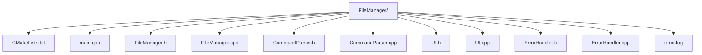
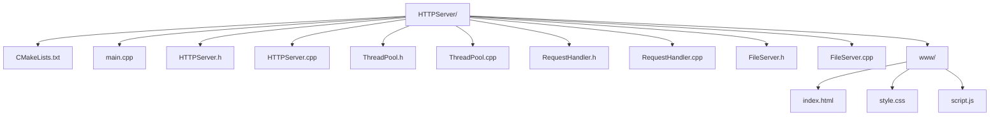
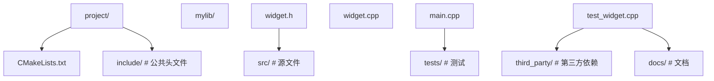
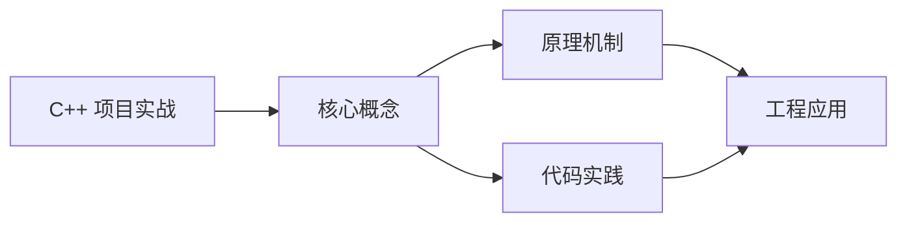
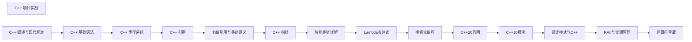

## 1. 学习目标（Bloom 分类）

本节按照布鲁姆教育目标分类学组织学习路径。本文主题为《C++ 项目实战》，属于 C++ 模块，读者可以根据自身阶段选择阅读深度。

记忆层面：能够准确复述本文的核心概念、术语与基本语法或操作步骤，并能够在提问或检索时快速定位对应知识点。能够说出 C++ 的类、继承、重载、模板与 STL 容器基本语法。

理解层面：能够用自己的语言解释核心原理与工作机制，说明概念之间的因果关系，而不是机械记忆结论。能够解释 RAII、拷贝/移动语义、虚函数与模板实例化。

应用层面：能够在真实项目或练习场景中运用本文知识解决具体问题，写出正确且可维护的实现。能够编写现代 C++（C++17/20）的类与泛型代码。

分析层面：能够拆解复杂问题，比较本文主题与相邻概念的异同，识别边界条件与例外情况。能够分析生命周期、未定义行为与性能特征。

评价层面：能够根据约束条件（性能、可读性、安全、成本）评价不同方案的优劣，做出有依据的技术决策。能够评价 C++ 与 Rust、Java 在系统编程中的取舍。

创造层面：能够把本文知识与其他模块知识组合，设计出新的解决方案或可复用的工程模式。能够设计高性能、可维护的 C++ 库与应用。

通过本节学习，读者应当能够把《C++ 项目实战》纳入自己的知识网络，并与 C++ 模块的其他主题（RAII、移动语义、模板、STL）建立关联。

## 2. 历史动机与发展脉络

《C++ 项目实战》是 C++ 领域的重要主题。要真正理解它，需要先了解它解决的问题与演进过程。

C++ 由 Bjarne Stroustrup 于 1979 年开始在贝尔实验室开发（原名 C with Classes），1983 年更名 C++，1998 年 C++98 首次标准化。
C++11 是语言转折点：右值引用、auto、lambda、智能指针、并发内存模型让现代 C++ 写法定型；C++14/17 补充泛型 lambda、if constexpr、折叠表达式；C++20 引入 concepts、协程、模块与范围库；C++23 继续完善。
现代 C++ 的核心口号是“资源安全”：RAII + 智能指针替代裸 new/delete，异常与错误码按场景选择；Rust 的出现促使 C++ 社区更重视内存安全工具（如 profile 指南、sanitizer）。

回到本文主题：C++ 项目实战 的提出与成熟，正是上述技术背景下的必然产物。早期实现往往以简单可用为目标，随着工程规模扩大，社区逐渐沉淀出标准做法与最佳实践；理解这一脉络，可以帮助读者判断“为什么文档中的推荐写法是现在这个样子”，也能在遇到历史遗留代码时准确识别其设计年代与取舍。


## 3. 形式化定义与核心概念精讲

本节把《C++ 项目实战》涉及的核心概念以“定义 + 讲解”的形式展开。读者应把定义当作工具，把讲解当作理解路径；两者结合才能形成可迁移的知识。

RAII：资源在构造函数获取、析构函数释放，栈对象离开作用域自动清理；智能指针（unique_ptr/shared_ptr/weak_ptr）把所有权编码进类型。
移动语义：右值引用 `&&` 与 std::move 转移资源所有权，避免深拷贝；移动后对象处于“合法但未指定”状态。
虚函数与多态：virtual 实现动态绑定，vtable 是运行时分派机制；final/override 关键字防止误用；基类析构函数应为 virtual。

### 3.1 原文章节逐一精讲

原文档把主题拆分为 14 个小节，下面按顺序给出每一节的导读讲解，随后保留原文细节供精读。

#### 原文精读（完整保留）

# C++ 项目实践

> **符号约定**：`< >` 必填参数 | `[ ]` 可选参数

---

#### 1. 项目一：简易文件管理器

##### 1.1 项目需求

- **功能**: 列出目录、创建文件、删除文件、移动文件、复制文件、创建目录
- **技术栈**: C++17 `<filesystem>`, STL, 异常处理
- **目标**: 构建一个命令行文件管理器，支持基本的文件操作

##### 1.2 架构设计

###### 1.2.1 模块划分

- **FileManager**: 提供底层文件系统操作接口
- **CommandParser**: 解析用户输入的命令
- **UI**: 提供交互界面
- **ErrorHandler**: 处理错误和异常

###### 1.2.2 类图

```
 +
 | FileManager |<----| CommandParser |---->| UI |<----| ErrorHandler |
 +
 | - list_dir() | | - parse() | | - display() | | - handle() |
 | - create_file()| | - get_command()| | - get_input() | | - log_error() |
 | - delete_file()| +----------------+ +----------------+ +----------------+
 | - move_file() |
 | - copy_file() |
 | - create_dir() |
 +
```

##### 1.3 核心实现

###### 1.3.1 FileManager 类

```cpp
 #include <iostream>
 #include <filesystem>
 #include <fstream>
 #include <string>
 #include <stdexcept>
 namespace fs = std::filesystem;
 class FileManager {
 public:
  // 列出目录内容
  void list_dir(const std::string& path) {
  try {
  if (!fs::exists(path)) {
  throw std::runtime_error("Path does not exist");
  }
  if (!fs::is_directory(path)) {
  throw std::runtime_error("Path is not a directory");
  }
  std::cout << "Contents of " << path << ":" << std::endl;
  for (const auto& entry : fs::directory_iterator(path)) {
  std::string type = fs::is_directory(entry.path()) ? "[DIR]" : "[FILE]";
  std::cout << type << " " << entry.path().filename().string() << std::endl;
  }
  } catch (const std::exception& e) {
  throw;
  }
  }
  // 创建文件
  void create_file(const std::string& path) {
  try {
  if (fs::exists(path)) {
  throw std::runtime_error("File already exists");
  }
  std::ofstream out(path);
  if (!out) {
  throw std::runtime_error("Failed to create file");
  }
  out << "Hello, File!" << std::endl;
  out.close();
  std::cout << "File created successfully: " << path << std::endl;
  } catch (const std::exception& e) {
  throw;
  }
  }
  // 删除文件
  void delete_file(const std::string& path) {
  try {
  if (!fs::exists(path)) {
  throw std::runtime_error("File does not exist");
  }
  if (fs::is_directory(path)) {
  throw std::runtime_error("Path is a directory, use delete_dir instead");
  }
  if (fs::remove(path)) {
  std::cout << "File deleted successfully: " << path << std::endl;
  } else {
  throw std::runtime_error("Failed to delete file");
  }
  } catch (const std::exception& e) {
  throw;
  }
  }
  // 移动文件
  void move_file(const std::string& source, const std::string& destination) {
  try {
  if (!fs::exists(source)) {
  throw std::runtime_error("Source file does not exist");
  }
  if (fs::exists(destination)) {
  throw std::runtime_error("Destination already exists");
  }
  fs::rename(source, destination);
  std::cout << "File moved successfully: " << source << " -> " << destination << std::endl;
  } catch (const std::exception& e) {
  throw;
  }
  }
  // 复制文件
  void copy_file(const std::string& source, const std::string& destination) {
  try {
  if (!fs::exists(source)) {
  throw std::runtime_error("Source file does not exist");
  }
  if (fs::exists(destination)) {
  throw std::runtime_error("Destination already exists");
  }
  fs::copy_file(source, destination);
  std::cout << "File copied successfully: " << source << " -> " << destination << std::endl;
  } catch (const std::exception& e) {
  throw;
  }
  }
  // 创建目录
  void create_dir(const std::string& path) {
  try {
  if (fs::exists(path)) {
  throw std::runtime_error("Directory already exists");
  }
  if (fs::create_directories(path)) {
  std::cout << "Directory created successfully: " << path << std::endl;
  } else {
  throw std::runtime_error("Failed to create directory");
  }
  } catch (const std::exception& e) {
  throw;
  }
  }
 }
```

###### 1.3.2 CommandParser 类

```cpp
 #include <iostream>
 #include <string>
 #include <vector>
 #include <sstream>
 class CommandParser {
 public:
  enum class CommandType {
  LIST, CREATE, DELETE, MOVE, COPY, CREATE_DIR, HELP, EXIT, UNKNOWN
  };
  struct Command {
  CommandType type;
  std::vector<std::string> arguments;
  };
  Command parse(const std::string& input) {
  std::vector<std::string> tokens = tokenize(input);
  if (tokens.empty()) {
  return {CommandType::UNKNOWN, {}};
  }
  std::string command = tokens[0];
  std::vector<std::string> args(tokens.begin() + 1, tokens.end());
  if (command == "ls" || command == "list") {
  return {CommandType::LIST, args};
  } else if (command == "touch" || command == "create") {
  return {CommandType::CREATE, args};
  } else if (command == "rm" || command == "delete") {
  return {CommandType::DELETE, args};
  } else if (command == "mv" || command == "move") {
  return {CommandType::MOVE, args};
  } else if (command == "cp" || command == "copy") {
  return {CommandType::COPY, args};
  } else if (command == "mkdir" || command == "create_dir") {
  return {CommandType::CREATE_DIR, args};
  } else if (command == "help") {
  return {CommandType::HELP, args};
  } else if (command == "exit" || command == "quit") {
  return {CommandType::EXIT, args};
  } else {
  return {CommandType::UNKNOWN, args};
  }
  }
 private:
  std::vector<std::string> tokenize(const std::string& input) {
  std::vector<std::string> tokens;
  std::istringstream iss(input);
  std::string token;
  while (iss >> token) {
  tokens.push_back(token);
  }
  return tokens;
  }
 }
```

###### 1.3.3 UI 类

```cpp
 #include <iostream>
 #include <string>
 class UI {
 public:
  void display_welcome() {
  std::cout << "====================================" << std::endl;
  std::cout << " File Manager v1.0 " << std::endl;
  std::cout << "====================================" << std::endl;
  std::cout << "Commands: ls, touch, rm, mv, cp, mkdir, help, exit" << std::endl;
  std::cout << "====================================" << std::endl;
  }
  std::string get_input() {
  std::string input;
  std::cout << "> ";
  std::getline(std::cin, input);
  return input;
  }
  void display_help() {
  std::cout << "Help:" << std::endl;
  std::cout << " ls [path] - List directory contents" << std::endl;
  std::cout << " touch <file> - Create a new file" << std::endl;
  std::cout << " rm <file> - Delete a file" << std::endl;
  std::cout << " mv <source> <dest> - Move a file" << std::endl;
  std::cout << " cp <source> <dest> - Copy a file" << std::endl;
  std::cout << " mkdir <directory> - Create a directory" << std::endl;
  std::cout << " help - Show this help" << std::endl;
  std::cout << " exit - Exit the program" << std::endl;
  }
  void display_error(const std::string& message) {
  std::cerr << "Error: " << message << std::endl;
  }
  void display_success(const std::string& message) {
  std::cout << "Success: " << message << std::endl;
  }
 }
```

###### 1.3.4 ErrorHandler 类

```cpp
 #include <iostream>
 #include <string>
 #include <fstream>
 #include <chrono>
 class ErrorHandler {
 public:
  ErrorHandler(const std::string& log_file = "error.log") : log_file_(log_file) {}
  void handle(const std::string& error_message) {
  std::cerr << "Error: " << error_message << std::endl;
  log_error(error_message);
  }
 private:
  std::string log_file_;
  void log_error(const std::string& error_message) {
  try {
  std::ofstream log(log_file_, std::ios::app);
  auto now = std::chrono::system_clock::now();
  auto now_c = std::chrono::system_clock::to_time_t(now);
  std::string timestamp = std::ctime(&now_c);
  timestamp.pop_back(); // Remove newline
  log << "[" << timestamp << "] ERROR: " << error_message << std::endl;
  } catch (...) {
  // Ignore logging errors
  }
  }
 }
```

###### 1.3.5 主函数

```cpp
 #include <iostream>
 #include "FileManager.h"
 #include "CommandParser.h"
 #include "UI.h"
 #include "ErrorHandler.h"
 int main() {
  FileManager file_manager;
  CommandParser parser;
  UI ui;
  ErrorHandler error_handler;
  ui.display_welcome();
  bool running = true;
  while (running) {
  std::string input = ui.get_input();
  auto command = parser.parse(input);
  try {
  switch (command.type) {
  case CommandParser::CommandType::LIST: {
  std::string path = command.arguments.empty() ? "." : command.arguments[0];
  file_manager.list_dir(path);
  break;
  }
  case CommandParser::CommandType::CREATE: {
  if (command.arguments.empty()) {
  throw std::runtime_error("Missing file path");
  }
  file_manager.create_file(command.arguments[0]);
  break;
  }
  case CommandParser::CommandType::DELETE: {
  if (command.arguments.empty()) {
  throw std::runtime_error("Missing file path");
  }
  file_manager.delete_file(command.arguments[0]);
  break;
  }
  case CommandParser::CommandType::MOVE: {
  if (command.arguments.size() < 2) {
  throw std::runtime_error("Missing source or destination");
  }
  file_manager.move_file(command.arguments[0], command.arguments[1]);
  break;
  }
  case CommandParser::CommandType::COPY: {
  if (command.arguments.size() < 2) {
  throw std::runtime_error("Missing source or destination");
  }
  file_manager.copy_file(command.arguments[0], command.arguments[1]);
  break;
  }
  case CommandParser::CommandType::CREATE_DIR: {
  if (command.arguments.empty()) {
  throw std::runtime_error("Missing directory path");
  }
  file_manager.create_dir(command.arguments[0]);
  break;
  }
  case CommandParser::CommandType::HELP: {
  ui.display_help();
  break;
  }
  case CommandParser::CommandType::EXIT: {
  running = false;
  std::cout << "Exiting..." << std::endl;
  break;
  }
  case CommandParser::CommandType::UNKNOWN: {
  ui.display_error("Unknown command. Type 'help' for assistance.");
  break;
  }
  }
  } catch (const std::exception& e) {
  error_handler.handle(e.what());
  }
  }
  return 0;
 }
```

##### 1.4 构建与部署

###### 1.4.1 CMake 配置

```cmake
 cmake_minimum_required(VERSION 3.10)
 project(FileManager)
 set(CMAKE_CXX_STANDARD 17)
 set(CMAKE_CXX_STANDARD_REQUIRED ON)
 # 添加可执行文件
 add_executable(FileManager
  main.cpp
  FileManager.cpp
  CommandParser.cpp
  UI.cpp
  ErrorHandler.cpp
 )
 # 包含头文件目录
 target_include_directories(FileManager PRIVATE ${CMAKE_CURRENT_SOURCE_DIR})
 # 链接必要的库
 if(WIN32)
  # Windows 特定配置
  target_link_libraries(FileManager PRIVATE shlwapi)
 endif()
```

###### 1.4.2 目录结构



##### 1.5 测试

###### 1.5.1 功能测试

```bash
 # 编译
 mkdir build && cd build
 cmake ..
 cmake --build .
 # 运行
 ./FileManager
 # 测试命令
 >
 >
 >
 >
 >
 >
 >
 >
 >
 >
 >
 >
 >
 >
 >
 >
 >
```

###### 1.5.2 异常测试

- 测试不存在的路径
- 测试已存在的文件
- 测试权限错误
- 测试参数不足

#### 2. 项目二：简单的 HTTP 服务器

##### 2.1 项目需求

- **功能**: 提供静态文件服务，支持基本的 HTTP 请求处理
- **技术栈**: C++11, 套接字编程, 线程池
- **目标**: 构建一个简单的 HTTP 服务器，能够处理多个并发连接

##### 2.2 架构设计

###### 2.2.1 模块划分

- **HTTPServer**: 服务器核心，处理连接和请求
- **RequestHandler**: 处理 HTTP 请求
- **ThreadPool**: 管理线程池，处理并发连接
- **FileServer**: 提供静态文件服务

##### 2.3 核心实现

###### 2.3.1 HTTPServer 类

```cpp
 #include <iostream>
 #include <string>
 #include <thread>
 #include <vector>
 #include <cstdlib>
 #include <cstring>
 #include <sys/socket.h>
 #include <netinet/in.h>
 #include <unistd.h>
 #include "ThreadPool.h"
 #include "RequestHandler.h"
 class HTTPServer {
 public:
  HTTPServer(int port, int thread_pool_size = 4) :
  port_(port),
  thread_pool_(thread_pool_size),
  server_socket_(-1) {}
  ~HTTPServer() {
  stop();
  }
  void start() {
  // 创建套接字
  server_socket_ = socket(AF_INET, SOCK_STREAM, 0);
  if (server_socket_ < 0) {
  std::cerr << "Error creating socket" << std::endl;
  return;
  }
  // 设置套接字选项
  int opt = 1;
  setsockopt(server_socket_, SOL_SOCKET, SO_REUSEADDR, &opt, sizeof(opt));
  // 绑定地址
  struct sockaddr_in address;
  address.sin_family = AF_INET;
  address.sin_addr.s_addr = INADDR_ANY;
  address.sin_port = htons(port_);
  if (bind(server_socket_, (struct sockaddr*)&address, sizeof(address)) < 0) {
  std::cerr << "Error binding socket" << std::endl;
  close(server_socket_);
  server_socket_ = -1;
  return;
  }
  // 开始监听
  if (listen(server_socket_, 10) < 0) {
  std::cerr << "Error listening" << std::endl;
  close(server_socket_);
  server_socket_ = -1;
  return;
  }
  std::cout << "Server started on port " << port_ << std::endl;
  // 接受连接
  while (server_socket_ >= 0) {
  struct sockaddr_in client_address;
  socklen_t client_address_len = sizeof(client_address);
  int client_socket = accept(server_socket_, (struct sockaddr*)&client_address, &client_address_len);
  if (client_socket < 0) {
  std::cerr << "Error accepting connection" << std::endl;
  continue;
  }
  // 提交任务到线程池
  thread_pool_.submit([this, client_socket]() {
  handle_client(client_socket);
  });
  }
  }
  void stop() {
  if (server_socket_ >= 0) {
  close(server_socket_);
  server_socket_ = -1;
  }
  thread_pool_.shutdown();
  }
 private:
  int port_;
  int server_socket_;
  ThreadPool thread_pool_;
  RequestHandler request_handler_;
  void handle_client(int client_socket) {
  request_handler_.handle(client_socket);
  close(client_socket);
  }
 }
```

###### 2.3.2 ThreadPool 类

```cpp
 #include <vector>
 #include <thread>
 #include <queue>
 #include <mutex>
 #include <condition_variable>
 #include <functional>
 #include <atomic>
 class ThreadPool {
 public:
  ThreadPool(int size) : stop_(false) {
  for (int i = 0; i < size; ++i) {
  threads_.emplace_back([this]() {
  while (true) {
  std::function<void()> task;
  {
  std::unique_lock<std::mutex> lock(mutex_);
  condition_.wait(lock, [this]() {
  return stop_ || !tasks_.empty();
  });
  if (stop_ && tasks_.empty()) {
  return;
  }
  task = std::move(tasks_.front());
  tasks_.pop();
  }
  task();
  }
  });
  }
  }
  ~ThreadPool() {
  shutdown();
  }
  template<typename F>
  void submit(F&& task) {
  {
  std::unique_lock<std::mutex> lock(mutex_);
  tasks_.emplace(std::forward<F>(task));
  }
  condition_.notify_one();
  }
  void shutdown() {
  {
  std::unique_lock<std::mutex> lock(mutex_);
  stop_ = true;
  }
  condition_.notify_all();
  for (auto& thread : threads_) {
  if (thread.joinable()) {
  thread.join();
  }
  }
  }
 private:
  std::vector<std::thread> threads_;
  std::queue<std::function<void()>> tasks_;
  std::mutex mutex_;
  std::condition_variable condition_;
  std::atomic<bool> stop_;
 }
```

###### 2.3.3 RequestHandler 类

```cpp
 #include <iostream>
 #include <string>
 #include <cstring>
 #include <fstream>
 #include <sstream>
 #include <sys/socket.h>
 #include <unistd.h>
 #include "FileServer.h"
 class RequestHandler {
 public:
  void handle(int client_socket) {
  char buffer[4096] = {0};
  int bytes_read = read(client_socket, buffer, sizeof(buffer) - 1);
  if (bytes_read < 0) {
  std::cerr << "Error reading from socket" << std::endl;
  return;
  }
  std::string request(buffer, bytes_read);
  std::string response = process_request(request);
  send(client_socket, response.c_str(), response.size(), 0);
  }
 private:
  FileServer file_server_;
  std::string process_request(const std::string& request) {
  std::istringstream iss(request);
  std::string method, path, version;
  iss >> method >> path >> version;
  if (method != "GET") {
  return create_response(405, "Method Not Allowed", "<html><body><h1>405 Method Not Allowed</h1></body></html>");
  }
  // 处理根路径
  if (path == "/") {
  path = "/index.html";
  }
  // 提供静态文件
  std::string file_content;
  int status_code = file_server_.serve_file(path, file_content);
  if (status_code == 200) {
  std::string content_type = get_content_type(path);
  return create_response(200, "OK", file_content, content_type);
  } else if (status_code == 404) {
  return create_response(404, "Not Found", "<html><body><h1>404 Not Found</h1></body></html>");
  } else {
  return create_response(500, "Internal Server Error", "<html><body><h1>500 Internal Server Error</h1></body></html>");
  }
  }
  std::string create_response(int status_code, const std::string& status_message,
  const std::string& content, const std::string& content_type = "text/html") {
  std::ostringstream response;
  response << "HTTP/1.1 " << status_code << " " << status_message << "\r\n";
  response << "Content-Type: " << content_type << "\r\n";
  response << "Content-Length: " << content.size() << "\r\n";
  response << "Connection: close\r\n";
  response << "\r\n";
  response << content;
  return response.str();
  }
  std::string get_content_type(const std::string& path) {
  if (path.ends_with(".html")) return "text/html";
  if (path.ends_with(".css")) return "text/css";
  if (path.ends_with(".js")) return "application/javascript";
  if (path.ends_with(".png")) return "image/png";
  if (path.ends_with(".jpg")) return "image/jpeg";
  if (path.ends_with(".gif")) return "image/gif";
  return "text/plain";
  }
 }
```

###### 2.3.4 FileServer 类

```cpp
 #include <iostream>
 #include <string>
 #include <fstream>
 #include <filesystem>
 namespace fs = std::filesystem;
 class FileServer {
 public:
  FileServer(const std::string& root_dir = "./www") : root_dir_(root_dir) {
  // 确保根目录存在
  if (!fs::exists(root_dir_)) {
  fs::create_directories(root_dir_);
  }
  }
  int serve_file(const std::string& path, std::string& content) {
  // 构建完整路径
  std::string full_path = root_dir_ + path;
  // 检查文件是否存在
  if (!fs::exists(full_path) || !fs::is_regular_file(full_path)) {
  return 404;
  }
  // 读取文件内容
  std::ifstream file(full_path, std::ios::binary);
  if (!file) {
  return 500;
  }
  std::ostringstream oss;
  oss << file.rdbuf();
  content = oss.str();
  return 200;
  }
 private:
  std::string root_dir_;
 }
```

###### 2.3.5 主函数

```cpp
 #include "HTTPServer.h"
 int main(int argc, char* argv[]) {
  int port = 8080;
  if (argc > 1) {
  port = std::stoi(argv[1]);
  }
  HTTPServer server(port, 4);
  server.start();
  return 0;
 }
```

##### 2.4 构建与部署

###### 2.4.1 CMake 配置

```cmake
 cmake_minimum_required(VERSION 3.10)
 project(HTTPServer)
 set(CMAKE_CXX_STANDARD 11)
 set(CMAKE_CXX_STANDARD_REQUIRED ON)
 # 添加可执行文件
 add_executable(HTTPServer
  main.cpp
  HTTPServer.cpp
  ThreadPool.cpp
  RequestHandler.cpp
  FileServer.cpp
 )
 # 包含头文件目录
 target_include_directories(HTTPServer PRIVATE ${CMAKE_CURRENT_SOURCE_DIR})
 # 链接必要的库
 if(UNIX)
  target_link_libraries(HTTPServer PRIVATE pthread)
 endif()
```

###### 2.4.2 目录结构



##### 2.5 测试

###### 2.5.1 功能测试

```bash
 # 编译
 mkdir build && cd build
 cmake ..
 cmake --build .
 # 创建 www 目录和测试文件
 mkdir -p www
 echo "<html><body><h1>Hello, HTTP Server!</h1></body></html>" > www/index.html
 # 运行服务器
 ./HTTPServer 8080
 # 在浏览器中访问
 # http://localhost:8080
 # 或使用 curl 测试
 curl http://localhost:8080
 curl http://localhost:8080/nonexistent.html
```

#### 3. 项目三：简单的数据库系统

##### 3.1 项目需求

- **功能**: 支持基本的 CRUD 操作，存储和检索数据
- **技术栈**: C++17, STL, 文件 I/O
- **目标**: 构建一个简单的键值存储数据库

##### 3.2 架构设计

###### 3.2.1 模块划分

- **Database**: 数据库核心，管理数据操作
- **Storage**: 处理数据持久化
- **Index**: 提供数据索引，加速查询
- **API**: 提供用户接口

##### 3.3 核心实现

###### 3.3.1 Database 类

```cpp
 #include <iostream>
 #include <string>
 #include <unordered_map>
 #include <fstream>
 #include <sstream>
 #include <mutex>
 class Database {
 public:
  Database(const std::string& db_file = "database.db") : db_file_(db_file) {
  load();
  }
  ~Database() {
  save();
  }
  bool set(const std::string& key, const std::string& value) {
  std::lock_guard<std::mutex> lock(mutex_);
  data_[key] = value;
  return true;
  }
  std::string get(const std::string& key) {
  std::lock_guard<std::mutex> lock(mutex_);
  auto it = data_.find(key);
  if (it != data_.end()) {
  return it->second;
  }
  return "";
  }
  bool del(const std::string& key) {
  std::lock_guard<std::mutex> lock(mutex_);
  auto it = data_.find(key);
  if (it != data_.end()) {
  data_.erase(it);
  return true;
  }
  return false;
  }
  void save() {
  std::lock_guard<std::mutex> lock(mutex_);
  std::ofstream file(db_file_);
  if (file) {
  for (const auto& [key, value] : data_) {
  file << key << " " << value << std::endl;
  }
  }
  }
  void load() {
  std::lock_guard<std::mutex> lock(mutex_);
  std::ifstream file(db_file_);
  if (file) {
  std::string line;
  while (std::getline(file, line)) {
  std::istringstream iss(line);
  std::string key, value;
  if (iss >> key) {
  // 读取剩余部分作为值
  std::getline(iss >> std::ws, value);
  data_[key] = value;
  }
  }
  }
  }
  size_t size() {
  std::lock_guard<std::mutex> lock(mutex_);
  return data_.size();
  }
 private:
  std::string db_file_;
  std::unordered_map<std::string, std::string> data_;
  std::mutex mutex_;
 }
```

###### 3.3.2 主函数

```cpp
 #include <iostream>
 #include <string>
 #include "Database.h"
 int main() {
  Database db;
  std::cout << "Simple Key-Value Database" << std::endl;
  std::cout << "Commands: set <key> <value>, get <key>, del <key>, exit" << std::endl;
  std::string line;
  while (std::getline(std::cin, line)) {
  std::istringstream iss(line);
  std::string command, key, value;
  iss >> command;
  if (command == "set") {
  iss >> key;
  std::getline(iss >> std::ws, value);
  if (db.set(key, value)) {
  std::cout << "OK" << std::endl;
  }
  } else if (command == "get") {
  iss >> key;
  std::string result = db.get(key);
  if (!result.empty()) {
  std::cout << "Value: " << result << std::endl;
  } else {
  std::cout << "Key not found" << std::endl;
  }
  } else if (command == "del") {
  iss >> key;
  if (db.del(key)) {
  std::cout << "OK" << std::endl;
  } else {
  std::cout << "Key not found" << std::endl;
  }
  } else if (command == "exit") {
  break;
  } else {
  std::cout << "Unknown command" << std::endl;
  }
  }
  return 0;
 }
```

##### 3.4 构建与部署

###### 3.4.1 CMake 配置

```cmake
 cmake_minimum_required(VERSION 3.10)
 project(SimpleDatabase)
 set(CMAKE_CXX_STANDARD 17)
 set(CMAKE_CXX_STANDARD_REQUIRED ON)
 # 添加可执行文件
 add_executable(SimpleDatabase
  main.cpp
  Database.cpp
 )
 # 包含头文件目录
 target_include_directories(SimpleDatabase PRIVATE ${CMAKE_CURRENT_SOURCE_DIR})
```

##### 3.5 测试

###### 3.5.1 功能测试

```bash
 # 编译
 mkdir build && cd build
 cmake ..
 cmake --build .
 # 运行
 ./SimpleDatabase
 # 测试命令
 >
 >
 >
 >
 >
 >
 >
 # 再次运行，测试持久化
 ./SimpleDatabase
 >
 >
```

#### 4. 最佳实践

##### 4.1 代码组织

- **模块化设计**: 将功能分解为独立的模块
- **清晰的接口**: 定义明确的类和函数接口
- **命名规范**: 使用一致的命名约定
- **代码注释**: 为复杂代码添加注释

##### 4.2 错误处理

- **异常处理**: 使用异常处理错误情况
- **错误日志**: 记录错误信息
- **边界检查**: 检查输入参数和边界条件
- **资源管理**: 使用 RAII 管理资源

##### 4.3 性能优化

- **内存管理**: 合理使用内存，避免内存泄漏
- **并发处理**: 使用线程池处理并发任务
- **I/O 优化**: 减少 I/O 操作，使用缓冲
- **算法选择**: 选择合适的算法和数据结构

##### 4.4 测试与调试

- **单元测试**: 为关键功能编写单元测试
- **集成测试**: 测试模块间的交互
- **性能测试**: 测试系统性能
- **调试工具**: 使用调试工具定位问题

##### 4.5 部署与维护

- **构建系统**: 使用 CMake 管理构建
- **版本控制**: 使用 Git 管理代码
- **文档**: 编写项目文档
- **监控**: 监控系统运行状态

#### 5. 延伸阅读

- [C++ Core Guidelines](https://github.com/isocpp/CppCoreGuidelines)
- [Effective C++](https://www.amazon.com/Effective-Specific-Improve-Programs-Designs/dp/0321334876)
- [C++ Concurrency in Action](https://www.amazon.com/C-Concurrency-Action-Practical-Multithreading/dp/1933988770)
- [Networking in C++](https://www.amazon.com/Network-Programming-Windows-Second-Edition/dp/0735617216)
- [File System Library](https://en.cppreference.com/w/cpp/filesystem)

#### 6. 更新日志

- **2026-04-05**: 初始化项目实战，涵盖简易文件管理器的设计与核心实现
- **2026-04-05**: 扩展内容，增加 HTTP 服务器和简单数据库系统项目
#### 项目结构

**基本写法：典型项目布局**
`<目录>/ <文件>`


---

**基本写法：CMakeLists.txt 模板**
`cmake_minimum_required(...) project(...)`
```cmake
cmake_minimum_required(VERSION 3.15)
project(MyApp VERSION 1.0.0 LANGUAGES CXX)

set(CMAKE_CXX_STANDARD 20)
set(CMAKE_CXX_STANDARD_REQUIRED ON)
set(CMAKE_CXX_EXTENSIONS OFF)

option(BUILD_TESTING "Build tests" ON)

add_executable(app src/main.cpp src/widget.cpp)
target_include_directories(app PRIVATE include)

if(BUILD_TESTING)
    enable_testing()
    add_subdirectory(tests)
endif()
```

---

#### 头文件设计

**基本写法：头文件模板**
`#pragma once` + 前置声明
```cpp
#pragma once
#include <memory>
#include <string>

// 前置声明减少依赖
namespace mylib {
class Impl;
class Widget {
public:
    Widget();
    ~Widget();  // 因 pimpl 需自定义
    void doWork(const std::string& input);
private:
    std::unique_ptr<Impl> pimpl_;
};
} // namespace mylib
```

---

**基本写法：源文件实现**
`#include "<对应头文件>"`
```cpp
#include "mylib/widget.h"
#include <iostream>

namespace mylib {

struct Widget::Impl {
    std::string data;
};

Widget::Widget() : pimpl_(std::make_unique<Impl>()) {}
Widget::~Widget() = default;

void Widget::doWork(const std::string& input) {
    pimpl_->data = input;
    std::cout << pimpl_->data;
}

} // namespace mylib
```

---

#### 依赖管理

**基本写法：vcpkg 集成**
`vcpkg.json`
```json
{
  "name": "myapp",
  "version": "1.0.0",
  "dependencies": [
    "fmt",
    "spdlog",
    "gtest"
  ]
}
```

---

**基本写法：FetchContent 下载**
`FetchContent_Declare(...)`
```cmake
include(FetchContent)
FetchContent_Declare(
    fmt
    GIT_REPOSITORY https://github.com/fmtlib/fmt.git
    GIT_TAG 10.1.1
)
FetchContent_MakeAvailable(fmt)
target_link_libraries(app PRIVATE fmt::fmt)
```

---

#### 测试集成

**基本写法：GoogleTest 集成**
`enable_testing() add_subdirectory(tests)`
```cmake
# tests/CMakeLists.txt
find_package(GTest REQUIRED)
add_executable(unit_tests test_widget.cpp)
target_link_libraries(unit_tests PRIVATE GTest::gtest_main app)
include(GoogleTest)
gtest_discover_tests(unit_tests)
```

---

**基本写法：测试用例**
`TEST(<套件>, <用例>)`
```cpp
#include <gtest/gtest.h>
#include "mylib/widget.h"
TEST(WidgetTest, DoWork) {
    mylib::Widget w;
    w.doWork("test");
    SUCCEED();
}
```

---

#### CI/CD

**基本写法：GitHub Actions**
`.github/workflows/ci.yml`
```yaml
name: CI
on: [push, pull_request]
jobs:
  build:
    runs-on: ubuntu-latest
    steps:
      - uses: actions/checkout@v3
      - name: Install
        run: sudo apt-get install -y cmake g++
      - name: Build
        run: |
          cmake -S . -B build -DCMAKE_BUILD_TYPE=Release
          cmake --build build -j 4
      - name: Test
        run: ctest --test-dir build --output-on-failure
```

---

#### 文档

**基本写法：Doxygen 配置**
`Doxyfile`
```text
PROJECT_NAME = "MyApp"
INPUT = include src
EXTRACT_ALL = YES
GENERATE_HTML = YES
OUTPUT_DIRECTORY = docs
```

---

#### 发布管理

**基本写法：版本号**
`project(<名> VERSION <主>.<次>.<修订>)`
```cmake
project(MyApp VERSION 1.2.3)
# 使用版本
configure_file(
    config.h.in
    ${CMAKE_BINARY_DIR}/config.h
)
# config.h.in:
# #define APP_VERSION "@PROJECT_VERSION@"
```

---

**基本写法：安装规则**
`install(TARGETS ...)`
```cmake
install(TARGETS app DESTINATION bin)
install(DIRECTORY include/ DESTINATION include)
install(FILES config.h DESTINATION include)
# CMake 配置导出
install(EXPORT MyAppTargets DESTINATION lib/cmake/MyApp)
```

---

#### 代码质量

**基本写法：clang-format 配置**
`.clang-format`
```yaml
BasedOnStyle: Google
IndentWidth: 4
ColumnLimit: 100
AllowShortFunctionsOnASingleLine: Empty
```

---

**基本写法：.clang-tidy 配置**
`.clang-tidy`
```yaml
Checks: >
  bugprone-*,
  modernize-*,
  performance-*,
  readability-*
WarningsAsErrors: ''
HeaderFilterRegex: '.*'
```


### 3.2 概念关系图

下面用 Mermaid 图表达本文核心概念之间的关系，帮助读者建立整体图景：



图中展示的是本文知识的结构化关系：核心概念是入口，原理机制解释“为什么”，代码实践演示“怎么做”，工程应用回答“何时用”。读者学习时可以把每个小节的内容挂接到对应节点上。

## 4. 理论推导与原理解析

本节深入《C++ 项目实战》背后的原理。理论部分不求面面俱到，而是聚焦“能解释现象、能指导实践”的关键推导。

RAII：资源在构造函数获取、析构函数释放，栈对象离开作用域自动清理；智能指针（unique_ptr/shared_ptr/weak_ptr）把所有权编码进类型。
移动语义：右值引用 `&&` 与 std::move 转移资源所有权，避免深拷贝；移动后对象处于“合法但未指定”状态。
虚函数与多态：virtual 实现动态绑定，vtable 是运行时分派机制；final/override 关键字防止误用；基类析构函数应为 virtual。
模板与泛型：模板编译期实例化，实现静态多态；concepts（C++20）约束类型接口；模板元编程在编译期计算类型与常量。

需要强调的是，理论推导与工程实践之间存在翻译层：理论给出的是理想化模型与边界条件，工程代码则必须处理真实环境中的例外。读者在学习时应先掌握理论的“标准情形”，再通过陷阱章节了解“非标准情形”。

## 5. 代码示例与逐行讲解

本节把原文中的代码示例系统整理，并为每个示例补充用途说明与讲解。读者不应只浏览代码，而应逐段对照讲解理解设计意图。

### 5.1 示例：1.2.2 类图

该示例来自原文《1.2.2 类图》小节，用于演示C++ 项目实战相关操作。阅读时请先看代码结构，再看其后的讲解。

```text
 +
 | FileManager |<----| CommandParser |---->| UI |<----| ErrorHandler |
 +
 | - list_dir() | | - parse() | | - display() | | - handle() |
 | - create_file()| | - get_command()| | - get_input() | | - log_error() |
 | - delete_file()| +----------------+ +----------------+ +----------------+
 | - move_file() |
 | - copy_file() |
 | - create_dir() |
 +
```

讲解：这段代码演示了本节核心知识点。代码中的关键操作可以归纳为三步：准备（定义或初始化）、执行（核心逻辑）、收尾（释放资源或返回结果）。实际项目中，这三步往往被封装为函数或类，以提升复用性与可测试性。

关键点分析：

该示例共 10 行有效代码，结构以数据或配置为主。阅读时应关注：数据字段的含义、配置项的作用，以及它们与运行行为的对应关系。

进阶思考路径：先尝试修改参数观察行为变化，再把示例中的模式迁移到自己的项目中；每次修改都记录预期与实测差异，这是把示例转化为能力的最快方式。

### 5.2 示例：1.3.1 FileManager 类

该示例来自原文《1.3.1 FileManager 类》小节，用于演示C++ 项目实战相关操作。阅读时请先看代码结构，再看其后的讲解。

```cpp
 #include <iostream>
 #include <filesystem>
 #include <fstream>
 #include <string>
 #include <stdexcept>
 namespace fs = std::filesystem;
 class FileManager {
 public:
  // 列出目录内容
  void list_dir(const std::string& path) {
  try {
  if (!fs::exists(path)) {
  throw std::runtime_error("Path does not exist");
  }
  if (!fs::is_directory(path)) {
  throw std::runtime_error("Path is not a directory");
  }
  std::cout << "Contents of " << path << ":" << std::endl;
  for (const auto& entry : fs::directory_iterator(path)) {
  std::string type = fs::is_directory(entry.path()) ? "[DIR]" : "[FILE]";
  std::cout << type << " " << entry.path().filename().string() << std::endl;
  }
  } catch (const std::exception& e) {
  throw;
  }
  }
  // 创建文件
  void create_file(const std::string& path) {
  try {
  if (fs::exists(path)) {
  throw std::runtime_error("File already exists");
  }
  std::ofstream out(path);
  if (!out) {
  throw std::runtime_error("Failed to create file");
  }
  out << "Hello, File!" << std::endl;
  out.close();
  std::cout << "File created successfully: " << path << std::endl;
  } catch (const std::exception& e) {
  throw;
  }
  }
  // 删除文件
  void delete_file(const std::string& path) {
  try {
  if (!fs::exists(path)) {
  throw std::runtime_error("File does not exist");
  }
  if (fs::is_directory(path)) {
  throw std::runtime_error("Path is a directory, use delete_dir instead");
  }
  if (fs::remove(path)) {
  std::cout << "File deleted successfully: " << path << std::endl;
  } else {
  throw std::runtime_error("Failed to delete file");
  }
  } catch (const std::exception& e) {
  throw;
  }
  }
  // 移动文件
  void move_file(const std::string& source, const std::string& destination) {
  try {
  if (!fs::exists(source)) {
  throw std::runtime_error("Source file does not exist");
  }
  if (fs::exists(destination)) {
  throw std::runtime_error("Destination already exists");
  }
  fs::rename(source, destination);
  std::cout << "File moved successfully: " << source << " -> " << destination << std::endl;
  } catch (const std::exception& e) {
  throw;
  }
  }
  // 复制文件
  void copy_file(const std::string& source, const std::string& destination) {
  try {
  if (!fs::exists(source)) {
  throw std::runtime_error("Source file does not exist");
  }
  if (fs::exists(destination)) {
  throw std::runtime_error("Destination already exists");
  }
  fs::copy_file(source, destination);
  std::cout << "File copied successfully: " << source << " -> " << destination << std::endl;
  } catch (const std::exception& e) {
  throw;
  }
  }
  // 创建目录
  void create_dir(const std::string& path) {
  try {
  if (fs::exists(path)) {
  throw std::runtime_error("Directory already exists");
  }
  if (fs::create_directories(path)) {
  std::cout << "Directory created successfully: " << path << std::endl;
  } else {
  throw std::runtime_error("Failed to create directory");
  }
  } catch (const std::exception& e) {
  throw;
  }
  }
 }
```

讲解：这段代码演示了本节核心知识点。代码中的关键操作可以归纳为三步：准备（定义或初始化）、执行（核心逻辑）、收尾（释放资源或返回结果）。实际项目中，这三步往往被封装为函数或类，以提升复用性与可测试性。

关键点分析：

该示例共 107 行有效代码，包含 3 类关键结构（class、if、for）。其中：

- 入口与初始化部分负责建立上下文，对应实际项目中的启动或装配逻辑；
- 核心逻辑部分体现本文主题的主要操作，是阅读时最需要对照讲解理解的部分；
- 输出或返回部分把结果交给调用方，注意其类型与边界条件。

进阶思考路径：先尝试修改参数观察行为变化，再把示例中的模式迁移到自己的项目中；每次修改都记录预期与实测差异，这是把示例转化为能力的最快方式。

### 5.3 示例：1.3.2 CommandParser 类

该示例来自原文《1.3.2 CommandParser 类》小节，用于演示C++ 项目实战相关操作。阅读时请先看代码结构，再看其后的讲解。

```cpp
 #include <iostream>
 #include <string>
 #include <vector>
 #include <sstream>
 class CommandParser {
 public:
  enum class CommandType {
  LIST, CREATE, DELETE, MOVE, COPY, CREATE_DIR, HELP, EXIT, UNKNOWN
  };
  struct Command {
  CommandType type;
  std::vector<std::string> arguments;
  };
  Command parse(const std::string& input) {
  std::vector<std::string> tokens = tokenize(input);
  if (tokens.empty()) {
  return {CommandType::UNKNOWN, {}};
  }
  std::string command = tokens[0];
  std::vector<std::string> args(tokens.begin() + 1, tokens.end());
  if (command == "ls" || command == "list") {
  return {CommandType::LIST, args};
  } else if (command == "touch" || command == "create") {
  return {CommandType::CREATE, args};
  } else if (command == "rm" || command == "delete") {
  return {CommandType::DELETE, args};
  } else if (command == "mv" || command == "move") {
  return {CommandType::MOVE, args};
  } else if (command == "cp" || command == "copy") {
  return {CommandType::COPY, args};
  } else if (command == "mkdir" || command == "create_dir") {
  return {CommandType::CREATE_DIR, args};
  } else if (command == "help") {
  return {CommandType::HELP, args};
  } else if (command == "exit" || command == "quit") {
  return {CommandType::EXIT, args};
  } else {
  return {CommandType::UNKNOWN, args};
  }
  }
 private:
  std::vector<std::string> tokenize(const std::string& input) {
  std::vector<std::string> tokens;
  std::istringstream iss(input);
  std::string token;
  while (iss >> token) {
  tokens.push_back(token);
  }
  return tokens;
  }
 }
```

讲解：这段代码演示了本节核心知识点。代码中的关键操作可以归纳为三步：准备（定义或初始化）、执行（核心逻辑）、收尾（释放资源或返回结果）。实际项目中，这三步往往被封装为函数或类，以提升复用性与可测试性。

关键点分析：

该示例共 51 行有效代码，包含 5 类关键结构（class、if、while、return、CREATE）。其中：

- 入口与初始化部分负责建立上下文，对应实际项目中的启动或装配逻辑；
- 核心逻辑部分体现本文主题的主要操作，是阅读时最需要对照讲解理解的部分；
- 输出或返回部分把结果交给调用方，注意其类型与边界条件。

进阶思考路径：先尝试修改参数观察行为变化，再把示例中的模式迁移到自己的项目中；每次修改都记录预期与实测差异，这是把示例转化为能力的最快方式。

### 5.4 示例：1.3.3 UI 类

该示例来自原文《1.3.3 UI 类》小节，用于演示C++ 项目实战相关操作。阅读时请先看代码结构，再看其后的讲解。

```cpp
 #include <iostream>
 #include <string>
 class UI {
 public:
  void display_welcome() {
  std::cout << "====================================" << std::endl;
  std::cout << " File Manager v1.0 " << std::endl;
  std::cout << "====================================" << std::endl;
  std::cout << "Commands: ls, touch, rm, mv, cp, mkdir, help, exit" << std::endl;
  std::cout << "====================================" << std::endl;
  }
  std::string get_input() {
  std::string input;
  std::cout << "> ";
  std::getline(std::cin, input);
  return input;
  }
  void display_help() {
  std::cout << "Help:" << std::endl;
  std::cout << " ls [path] - List directory contents" << std::endl;
  std::cout << " touch <file> - Create a new file" << std::endl;
  std::cout << " rm <file> - Delete a file" << std::endl;
  std::cout << " mv <source> <dest> - Move a file" << std::endl;
  std::cout << " cp <source> <dest> - Copy a file" << std::endl;
  std::cout << " mkdir <directory> - Create a directory" << std::endl;
  std::cout << " help - Show this help" << std::endl;
  std::cout << " exit - Exit the program" << std::endl;
  }
  void display_error(const std::string& message) {
  std::cerr << "Error: " << message << std::endl;
  }
  void display_success(const std::string& message) {
  std::cout << "Success: " << message << std::endl;
  }
 }
```

讲解：这段代码演示了本节核心知识点。代码中的关键操作可以归纳为三步：准备（定义或初始化）、执行（核心逻辑）、收尾（释放资源或返回结果）。实际项目中，这三步往往被封装为函数或类，以提升复用性与可测试性。

关键点分析：

该示例共 35 行有效代码，包含 2 类关键结构（class、return）。其中：

- 入口与初始化部分负责建立上下文，对应实际项目中的启动或装配逻辑；
- 核心逻辑部分体现本文主题的主要操作，是阅读时最需要对照讲解理解的部分；
- 输出或返回部分把结果交给调用方，注意其类型与边界条件。

进阶思考路径：先尝试修改参数观察行为变化，再把示例中的模式迁移到自己的项目中；每次修改都记录预期与实测差异，这是把示例转化为能力的最快方式。

### 5.5 示例：1.3.4 ErrorHandler 类

该示例来自原文《1.3.4 ErrorHandler 类》小节，用于演示C++ 项目实战相关操作。阅读时请先看代码结构，再看其后的讲解。

```cpp
 #include <iostream>
 #include <string>
 #include <fstream>
 #include <chrono>
 class ErrorHandler {
 public:
  ErrorHandler(const std::string& log_file = "error.log") : log_file_(log_file) {}
  void handle(const std::string& error_message) {
  std::cerr << "Error: " << error_message << std::endl;
  log_error(error_message);
  }
 private:
  std::string log_file_;
  void log_error(const std::string& error_message) {
  try {
  std::ofstream log(log_file_, std::ios::app);
  auto now = std::chrono::system_clock::now();
  auto now_c = std::chrono::system_clock::to_time_t(now);
  std::string timestamp = std::ctime(&now_c);
  timestamp.pop_back(); // Remove newline
  log << "[" << timestamp << "] ERROR: " << error_message << std::endl;
  } catch (...) {
  // Ignore logging errors
  }
  }
 }
```

讲解：这段代码演示了本节核心知识点。代码中的关键操作可以归纳为三步：准备（定义或初始化）、执行（核心逻辑）、收尾（释放资源或返回结果）。实际项目中，这三步往往被封装为函数或类，以提升复用性与可测试性。

关键点分析：

该示例共 26 行有效代码，包含 1 类关键结构（class）。其中：

- 入口与初始化部分负责建立上下文，对应实际项目中的启动或装配逻辑；
- 核心逻辑部分体现本文主题的主要操作，是阅读时最需要对照讲解理解的部分；
- 输出或返回部分把结果交给调用方，注意其类型与边界条件。

进阶思考路径：先尝试修改参数观察行为变化，再把示例中的模式迁移到自己的项目中；每次修改都记录预期与实测差异，这是把示例转化为能力的最快方式。

### 5.6 示例：1.3.5 主函数

该示例来自原文《1.3.5 主函数》小节，用于演示C++ 项目实战相关操作。阅读时请先看代码结构，再看其后的讲解。

```cpp
 #include <iostream>
 #include "FileManager.h"
 #include "CommandParser.h"
 #include "UI.h"
 #include "ErrorHandler.h"
 int main() {
  FileManager file_manager;
  CommandParser parser;
  UI ui;
  ErrorHandler error_handler;
  ui.display_welcome();
  bool running = true;
  while (running) {
  std::string input = ui.get_input();
  auto command = parser.parse(input);
  try {
  switch (command.type) {
  case CommandParser::CommandType::LIST: {
  std::string path = command.arguments.empty() ? "." : command.arguments[0];
  file_manager.list_dir(path);
  break;
  }
  case CommandParser::CommandType::CREATE: {
  if (command.arguments.empty()) {
  throw std::runtime_error("Missing file path");
  }
  file_manager.create_file(command.arguments[0]);
  break;
  }
  case CommandParser::CommandType::DELETE: {
  if (command.arguments.empty()) {
  throw std::runtime_error("Missing file path");
  }
  file_manager.delete_file(command.arguments[0]);
  break;
  }
  case CommandParser::CommandType::MOVE: {
  if (command.arguments.size() < 2) {
  throw std::runtime_error("Missing source or destination");
  }
  file_manager.move_file(command.arguments[0], command.arguments[1]);
  break;
  }
  case CommandParser::CommandType::COPY: {
  if (command.arguments.size() < 2) {
  throw std::runtime_error("Missing source or destination");
  }
  file_manager.copy_file(command.arguments[0], command.arguments[1]);
  break;
  }
  case CommandParser::CommandType::CREATE_DIR: {
  if (command.arguments.empty()) {
  throw std::runtime_error("Missing directory path");
  }
  file_manager.create_dir(command.arguments[0]);
  break;
  }
  case CommandParser::CommandType::HELP: {
  ui.display_help();
  break;
  }
  case CommandParser::CommandType::EXIT: {
  running = false;
  std::cout << "Exiting..." << std::endl;
  break;
  }
  case CommandParser::CommandType::UNKNOWN: {
  ui.display_error("Unknown command. Type 'help' for assistance.");
  break;
  }
  }
  } catch (const std::exception& e) {
  error_handler.handle(e.what());
  }
  }
  return 0;
 }
```

讲解：这段代码演示了本节核心知识点。代码中的关键操作可以归纳为三步：准备（定义或初始化）、执行（核心逻辑）、收尾（释放资源或返回结果）。实际项目中，这三步往往被封装为函数或类，以提升复用性与可测试性。

关键点分析：

该示例共 77 行有效代码，包含 5 类关键结构（if、for、while、return、CREATE）。其中：

- 入口与初始化部分负责建立上下文，对应实际项目中的启动或装配逻辑；
- 核心逻辑部分体现本文主题的主要操作，是阅读时最需要对照讲解理解的部分；
- 输出或返回部分把结果交给调用方，注意其类型与边界条件。

进阶思考路径：先尝试修改参数观察行为变化，再把示例中的模式迁移到自己的项目中；每次修改都记录预期与实测差异，这是把示例转化为能力的最快方式。

### 5.7 示例：1.4.1 CMake 配置

该示例来自原文《1.4.1 CMake 配置》小节，用于演示C++ 项目实战相关操作。阅读时请先看代码结构，再看其后的讲解。

```cmake
 cmake_minimum_required(VERSION 3.10)
 project(FileManager)
 set(CMAKE_CXX_STANDARD 17)
 set(CMAKE_CXX_STANDARD_REQUIRED ON)
 # 添加可执行文件
 add_executable(FileManager
  main.cpp
  FileManager.cpp
  CommandParser.cpp
  UI.cpp
  ErrorHandler.cpp
 )
 # 包含头文件目录
 target_include_directories(FileManager PRIVATE ${CMAKE_CURRENT_SOURCE_DIR})
 # 链接必要的库
 if(WIN32)
  # Windows 特定配置
  target_link_libraries(FileManager PRIVATE shlwapi)
 endif()
```

讲解：这段代码演示了本节核心知识点。代码中的关键操作可以归纳为三步：准备（定义或初始化）、执行（核心逻辑）、收尾（释放资源或返回结果）。实际项目中，这三步往往被封装为函数或类，以提升复用性与可测试性。

关键点分析：

该示例共 19 行有效代码，结构以数据或配置为主。阅读时应关注：数据字段的含义、配置项的作用，以及它们与运行行为的对应关系。

进阶思考路径：先尝试修改参数观察行为变化，再把示例中的模式迁移到自己的项目中；每次修改都记录预期与实测差异，这是把示例转化为能力的最快方式。

### 5.8 示例：1.4.2 目录结构

该示例来自原文《1.4.2 目录结构》小节，用于演示C++ 项目实战相关操作。阅读时请先看代码结构，再看其后的讲解。


讲解：这段代码演示了本节核心知识点。代码中的关键操作可以归纳为三步：准备（定义或初始化）、执行（核心逻辑）、收尾（释放资源或返回结果）。实际项目中，这三步往往被封装为函数或类，以提升复用性与可测试性。

关键点分析：

该示例共 24 行有效代码，结构以数据或配置为主。阅读时应关注：数据字段的含义、配置项的作用，以及它们与运行行为的对应关系。

进阶思考路径：先尝试修改参数观察行为变化，再把示例中的模式迁移到自己的项目中；每次修改都记录预期与实测差异，这是把示例转化为能力的最快方式。

### 5.9 示例：1.5.1 功能测试

该示例来自原文《1.5.1 功能测试》小节，用于演示C++ 项目实战相关操作。阅读时请先看代码结构，再看其后的讲解。

```bash
 # 编译
 mkdir build && cd build
 cmake ..
 cmake --build .
 # 运行
 ./FileManager
 # 测试命令
 >
 >
 >
 >
 >
 >
 >
 >
 >
 >
 >
 >
 >
 >
 >
 >
 >
```

讲解：这段代码演示了本节核心知识点。代码中的关键操作可以归纳为三步：准备（定义或初始化）、执行（核心逻辑）、收尾（释放资源或返回结果）。实际项目中，这三步往往被封装为函数或类，以提升复用性与可测试性。

关键点分析：

该示例共 24 行有效代码，结构以数据或配置为主。阅读时应关注：数据字段的含义、配置项的作用，以及它们与运行行为的对应关系。

进阶思考路径：先尝试修改参数观察行为变化，再把示例中的模式迁移到自己的项目中；每次修改都记录预期与实测差异，这是把示例转化为能力的最快方式。

### 5.10 示例：2.3.1 HTTPServer 类

该示例来自原文《2.3.1 HTTPServer 类》小节，用于演示C++ 项目实战相关操作。阅读时请先看代码结构，再看其后的讲解。

```cpp
 #include <iostream>
 #include <string>
 #include <thread>
 #include <vector>
 #include <cstdlib>
 #include <cstring>
 #include <sys/socket.h>
 #include <netinet/in.h>
 #include <unistd.h>
 #include "ThreadPool.h"
 #include "RequestHandler.h"
 class HTTPServer {
 public:
  HTTPServer(int port, int thread_pool_size = 4) :
  port_(port),
  thread_pool_(thread_pool_size),
  server_socket_(-1) {}
  ~HTTPServer() {
  stop();
  }
  void start() {
  // 创建套接字
  server_socket_ = socket(AF_INET, SOCK_STREAM, 0);
  if (server_socket_ < 0) {
  std::cerr << "Error creating socket" << std::endl;
  return;
  }
  // 设置套接字选项
  int opt = 1;
  setsockopt(server_socket_, SOL_SOCKET, SO_REUSEADDR, &opt, sizeof(opt));
  // 绑定地址
  struct sockaddr_in address;
  address.sin_family = AF_INET;
  address.sin_addr.s_addr = INADDR_ANY;
  address.sin_port = htons(port_);
  if (bind(server_socket_, (struct sockaddr*)&address, sizeof(address)) < 0) {
  std::cerr << "Error binding socket" << std::endl;
  close(server_socket_);
  server_socket_ = -1;
  return;
  }
  // 开始监听
  if (listen(server_socket_, 10) < 0) {
  std::cerr << "Error listening" << std::endl;
  close(server_socket_);
  server_socket_ = -1;
  return;
  }
  std::cout << "Server started on port " << port_ << std::endl;
  // 接受连接
  while (server_socket_ >= 0) {
  struct sockaddr_in client_address;
  socklen_t client_address_len = sizeof(client_address);
  int client_socket = accept(server_socket_, (struct sockaddr*)&client_address, &client_address_len);
  if (client_socket < 0) {
  std::cerr << "Error accepting connection" << std::endl;
  continue;
  }
  // 提交任务到线程池
  thread_pool_.submit([this, client_socket]() {
  handle_client(client_socket);
  });
  }
  }
  void stop() {
  if (server_socket_ >= 0) {
  close(server_socket_);
  server_socket_ = -1;
  }
  thread_pool_.shutdown();
  }
 private:
  int port_;
  int server_socket_;
  ThreadPool thread_pool_;
  RequestHandler request_handler_;
  void handle_client(int client_socket) {
  request_handler_.handle(client_socket);
  close(client_socket);
  }
 }
```

讲解：这段代码演示了本节核心知识点。代码中的关键操作可以归纳为三步：准备（定义或初始化）、执行（核心逻辑）、收尾（释放资源或返回结果）。实际项目中，这三步往往被封装为函数或类，以提升复用性与可测试性。

关键点分析：

该示例共 81 行有效代码，包含 4 类关键结构（class、if、while、return）。其中：

- 入口与初始化部分负责建立上下文，对应实际项目中的启动或装配逻辑；
- 核心逻辑部分体现本文主题的主要操作，是阅读时最需要对照讲解理解的部分；
- 输出或返回部分把结果交给调用方，注意其类型与边界条件。

进阶思考路径：先尝试修改参数观察行为变化，再把示例中的模式迁移到自己的项目中；每次修改都记录预期与实测差异，这是把示例转化为能力的最快方式。

### 5.11 示例：2.3.2 ThreadPool 类

该示例来自原文《2.3.2 ThreadPool 类》小节，用于演示C++ 项目实战相关操作。阅读时请先看代码结构，再看其后的讲解。

```cpp
 #include <vector>
 #include <thread>
 #include <queue>
 #include <mutex>
 #include <condition_variable>
 #include <functional>
 #include <atomic>
 class ThreadPool {
 public:
  ThreadPool(int size) : stop_(false) {
  for (int i = 0; i < size; ++i) {
  threads_.emplace_back([this]() {
  while (true) {
  std::function<void()> task;
  {
  std::unique_lock<std::mutex> lock(mutex_);
  condition_.wait(lock, [this]() {
  return stop_ || !tasks_.empty();
  });
  if (stop_ && tasks_.empty()) {
  return;
  }
  task = std::move(tasks_.front());
  tasks_.pop();
  }
  task();
  }
  });
  }
  }
  ~ThreadPool() {
  shutdown();
  }
  template<typename F>
  void submit(F&& task) {
  {
  std::unique_lock<std::mutex> lock(mutex_);
  tasks_.emplace(std::forward<F>(task));
  }
  condition_.notify_one();
  }
  void shutdown() {
  {
  std::unique_lock<std::mutex> lock(mutex_);
  stop_ = true;
  }
  condition_.notify_all();
  for (auto& thread : threads_) {
  if (thread.joinable()) {
  thread.join();
  }
  }
  }
 private:
  std::vector<std::thread> threads_;
  std::queue<std::function<void()>> tasks_;
  std::mutex mutex_;
  std::condition_variable condition_;
  std::atomic<bool> stop_;
 }
```

讲解：这段代码演示了本节核心知识点。代码中的关键操作可以归纳为三步：准备（定义或初始化）、执行（核心逻辑）、收尾（释放资源或返回结果）。实际项目中，这三步往往被封装为函数或类，以提升复用性与可测试性。

关键点分析：

该示例共 60 行有效代码，包含 6 类关键结构（class、function、if、for、while、return）。其中：

- 入口与初始化部分负责建立上下文，对应实际项目中的启动或装配逻辑；
- 核心逻辑部分体现本文主题的主要操作，是阅读时最需要对照讲解理解的部分；
- 输出或返回部分把结果交给调用方，注意其类型与边界条件。

进阶思考路径：先尝试修改参数观察行为变化，再把示例中的模式迁移到自己的项目中；每次修改都记录预期与实测差异，这是把示例转化为能力的最快方式。

### 5.12 示例：2.3.3 RequestHandler 类

该示例来自原文《2.3.3 RequestHandler 类》小节，用于演示C++ 项目实战相关操作。阅读时请先看代码结构，再看其后的讲解。

```cpp
 #include <iostream>
 #include <string>
 #include <cstring>
 #include <fstream>
 #include <sstream>
 #include <sys/socket.h>
 #include <unistd.h>
 #include "FileServer.h"
 class RequestHandler {
 public:
  void handle(int client_socket) {
  char buffer[4096] = {0};
  int bytes_read = read(client_socket, buffer, sizeof(buffer) - 1);
  if (bytes_read < 0) {
  std::cerr << "Error reading from socket" << std::endl;
  return;
  }
  std::string request(buffer, bytes_read);
  std::string response = process_request(request);
  send(client_socket, response.c_str(), response.size(), 0);
  }
 private:
  FileServer file_server_;
  std::string process_request(const std::string& request) {
  std::istringstream iss(request);
  std::string method, path, version;
  iss >> method >> path >> version;
  if (method != "GET") {
  return create_response(405, "Method Not Allowed", "<html><body><h1>405 Method Not Allowed</h1></body></html>");
  }
  // 处理根路径
  if (path == "/") {
  path = "/index.html";
  }
  // 提供静态文件
  std::string file_content;
  int status_code = file_server_.serve_file(path, file_content);
  if (status_code == 200) {
  std::string content_type = get_content_type(path);
  return create_response(200, "OK", file_content, content_type);
  } else if (status_code == 404) {
  return create_response(404, "Not Found", "<html><body><h1>404 Not Found</h1></body></html>");
  } else {
  return create_response(500, "Internal Server Error", "<html><body><h1>500 Internal Server Error</h1></body></html>");
  }
  }
  std::string create_response(int status_code, const std::string& status_message,
  const std::string& content, const std::string& content_type = "text/html") {
  std::ostringstream response;
  response << "HTTP/1.1 " << status_code << " " << status_message << "\r\n";
  response << "Content-Type: " << content_type << "\r\n";
  response << "Content-Length: " << content.size() << "\r\n";
  response << "Connection: close\r\n";
  response << "\r\n";
  response << content;
  return response.str();
  }
  std::string get_content_type(const std::string& path) {
  if (path.ends_with(".html")) return "text/html";
  if (path.ends_with(".css")) return "text/css";
  if (path.ends_with(".js")) return "application/javascript";
  if (path.ends_with(".png")) return "image/png";
  if (path.ends_with(".jpg")) return "image/jpeg";
  if (path.ends_with(".gif")) return "image/gif";
  return "text/plain";
  }
 }
```

讲解：这段代码演示了本节核心知识点。代码中的关键操作可以归纳为三步：准备（定义或初始化）、执行（核心逻辑）、收尾（释放资源或返回结果）。实际项目中，这三步往往被封装为函数或类，以提升复用性与可测试性。

关键点分析：

该示例共 67 行有效代码，包含 4 类关键结构（class、from、if、return）。其中：

- 入口与初始化部分负责建立上下文，对应实际项目中的启动或装配逻辑；
- 核心逻辑部分体现本文主题的主要操作，是阅读时最需要对照讲解理解的部分；
- 输出或返回部分把结果交给调用方，注意其类型与边界条件。

进阶思考路径：先尝试修改参数观察行为变化，再把示例中的模式迁移到自己的项目中；每次修改都记录预期与实测差异，这是把示例转化为能力的最快方式。

### 5.13 示例：2.3.4 FileServer 类

该示例来自原文《2.3.4 FileServer 类》小节，用于演示C++ 项目实战相关操作。阅读时请先看代码结构，再看其后的讲解。

```cpp
 #include <iostream>
 #include <string>
 #include <fstream>
 #include <filesystem>
 namespace fs = std::filesystem;
 class FileServer {
 public:
  FileServer(const std::string& root_dir = "./www") : root_dir_(root_dir) {
  // 确保根目录存在
  if (!fs::exists(root_dir_)) {
  fs::create_directories(root_dir_);
  }
  }
  int serve_file(const std::string& path, std::string& content) {
  // 构建完整路径
  std::string full_path = root_dir_ + path;
  // 检查文件是否存在
  if (!fs::exists(full_path) || !fs::is_regular_file(full_path)) {
  return 404;
  }
  // 读取文件内容
  std::ifstream file(full_path, std::ios::binary);
  if (!file) {
  return 500;
  }
  std::ostringstream oss;
  oss << file.rdbuf();
  content = oss.str();
  return 200;
  }
 private:
  std::string root_dir_;
 }
```

讲解：这段代码演示了本节核心知识点。代码中的关键操作可以归纳为三步：准备（定义或初始化）、执行（核心逻辑）、收尾（释放资源或返回结果）。实际项目中，这三步往往被封装为函数或类，以提升复用性与可测试性。

关键点分析：

该示例共 33 行有效代码，包含 3 类关键结构（class、if、return）。其中：

- 入口与初始化部分负责建立上下文，对应实际项目中的启动或装配逻辑；
- 核心逻辑部分体现本文主题的主要操作，是阅读时最需要对照讲解理解的部分；
- 输出或返回部分把结果交给调用方，注意其类型与边界条件。

进阶思考路径：先尝试修改参数观察行为变化，再把示例中的模式迁移到自己的项目中；每次修改都记录预期与实测差异，这是把示例转化为能力的最快方式。

### 5.14 示例：2.3.5 主函数

该示例来自原文《2.3.5 主函数》小节，用于演示C++ 项目实战相关操作。阅读时请先看代码结构，再看其后的讲解。

```cpp
 #include "HTTPServer.h"
 int main(int argc, char* argv[]) {
  int port = 8080;
  if (argc > 1) {
  port = std::stoi(argv[1]);
  }
  HTTPServer server(port, 4);
  server.start();
  return 0;
 }
```

讲解：这段代码演示了本节核心知识点。代码中的关键操作可以归纳为三步：准备（定义或初始化）、执行（核心逻辑）、收尾（释放资源或返回结果）。实际项目中，这三步往往被封装为函数或类，以提升复用性与可测试性。

关键点分析：

该示例共 10 行有效代码，包含 2 类关键结构（if、return）。其中：

- 入口与初始化部分负责建立上下文，对应实际项目中的启动或装配逻辑；
- 核心逻辑部分体现本文主题的主要操作，是阅读时最需要对照讲解理解的部分；
- 输出或返回部分把结果交给调用方，注意其类型与边界条件。

进阶思考路径：先尝试修改参数观察行为变化，再把示例中的模式迁移到自己的项目中；每次修改都记录预期与实测差异，这是把示例转化为能力的最快方式。

### 5.15 示例：2.4.1 CMake 配置

该示例来自原文《2.4.1 CMake 配置》小节，用于演示C++ 项目实战相关操作。阅读时请先看代码结构，再看其后的讲解。

```cmake
 cmake_minimum_required(VERSION 3.10)
 project(HTTPServer)
 set(CMAKE_CXX_STANDARD 11)
 set(CMAKE_CXX_STANDARD_REQUIRED ON)
 # 添加可执行文件
 add_executable(HTTPServer
  main.cpp
  HTTPServer.cpp
  ThreadPool.cpp
  RequestHandler.cpp
  FileServer.cpp
 )
 # 包含头文件目录
 target_include_directories(HTTPServer PRIVATE ${CMAKE_CURRENT_SOURCE_DIR})
 # 链接必要的库
 if(UNIX)
  target_link_libraries(HTTPServer PRIVATE pthread)
 endif()
```

讲解：这段代码演示了本节核心知识点。代码中的关键操作可以归纳为三步：准备（定义或初始化）、执行（核心逻辑）、收尾（释放资源或返回结果）。实际项目中，这三步往往被封装为函数或类，以提升复用性与可测试性。

关键点分析：

该示例共 18 行有效代码，结构以数据或配置为主。阅读时应关注：数据字段的含义、配置项的作用，以及它们与运行行为的对应关系。

进阶思考路径：先尝试修改参数观察行为变化，再把示例中的模式迁移到自己的项目中；每次修改都记录预期与实测差异，这是把示例转化为能力的最快方式。

### 5.16 示例：2.4.2 目录结构

该示例来自原文《2.4.2 目录结构》小节，用于演示C++ 项目实战相关操作。阅读时请先看代码结构，再看其后的讲解。


讲解：这段代码演示了本节核心知识点。代码中的关键操作可以归纳为三步：准备（定义或初始化）、执行（核心逻辑）、收尾（释放资源或返回结果）。实际项目中，这三步往往被封装为函数或类，以提升复用性与可测试性。

关键点分析：

该示例共 30 行有效代码，结构以数据或配置为主。阅读时应关注：数据字段的含义、配置项的作用，以及它们与运行行为的对应关系。

进阶思考路径：先尝试修改参数观察行为变化，再把示例中的模式迁移到自己的项目中；每次修改都记录预期与实测差异，这是把示例转化为能力的最快方式。

### 5.17 示例：2.5.1 功能测试

该示例来自原文《2.5.1 功能测试》小节，用于演示C++ 项目实战相关操作。阅读时请先看代码结构，再看其后的讲解。

```bash
 # 编译
 mkdir build && cd build
 cmake ..
 cmake --build .
 # 创建 www 目录和测试文件
 mkdir -p www
 echo "<html><body><h1>Hello, HTTP Server!</h1></body></html>" > www/index.html
 # 运行服务器
 ./HTTPServer 8080
 # 在浏览器中访问
 # http://localhost:8080
 # 或使用 curl 测试
 curl http://localhost:8080
 curl http://localhost:8080/nonexistent.html
```

讲解：这段代码演示了本节核心知识点。代码中的关键操作可以归纳为三步：准备（定义或初始化）、执行（核心逻辑）、收尾（释放资源或返回结果）。实际项目中，这三步往往被封装为函数或类，以提升复用性与可测试性。

关键点分析：

该示例共 14 行有效代码，结构以数据或配置为主。阅读时应关注：数据字段的含义、配置项的作用，以及它们与运行行为的对应关系。

进阶思考路径：先尝试修改参数观察行为变化，再把示例中的模式迁移到自己的项目中；每次修改都记录预期与实测差异，这是把示例转化为能力的最快方式。

### 5.18 示例：3.3.1 Database 类

该示例来自原文《3.3.1 Database 类》小节，用于演示C++ 项目实战相关操作。阅读时请先看代码结构，再看其后的讲解。

```cpp
 #include <iostream>
 #include <string>
 #include <unordered_map>
 #include <fstream>
 #include <sstream>
 #include <mutex>
 class Database {
 public:
  Database(const std::string& db_file = "database.db") : db_file_(db_file) {
  load();
  }
  ~Database() {
  save();
  }
  bool set(const std::string& key, const std::string& value) {
  std::lock_guard<std::mutex> lock(mutex_);
  data_[key] = value;
  return true;
  }
  std::string get(const std::string& key) {
  std::lock_guard<std::mutex> lock(mutex_);
  auto it = data_.find(key);
  if (it != data_.end()) {
  return it->second;
  }
  return "";
  }
  bool del(const std::string& key) {
  std::lock_guard<std::mutex> lock(mutex_);
  auto it = data_.find(key);
  if (it != data_.end()) {
  data_.erase(it);
  return true;
  }
  return false;
  }
  void save() {
  std::lock_guard<std::mutex> lock(mutex_);
  std::ofstream file(db_file_);
  if (file) {
  for (const auto& [key, value] : data_) {
  file << key << " " << value << std::endl;
  }
  }
  }
  void load() {
  std::lock_guard<std::mutex> lock(mutex_);
  std::ifstream file(db_file_);
  if (file) {
  std::string line;
  while (std::getline(file, line)) {
  std::istringstream iss(line);
  std::string key, value;
  if (iss >> key) {
  // 读取剩余部分作为值
  std::getline(iss >> std::ws, value);
  data_[key] = value;
  }
  }
  }
  }
  size_t size() {
  std::lock_guard<std::mutex> lock(mutex_);
  return data_.size();
  }
 private:
  std::string db_file_;
  std::unordered_map<std::string, std::string> data_;
  std::mutex mutex_;
 }
```

讲解：这段代码演示了本节核心知识点。代码中的关键操作可以归纳为三步：准备（定义或初始化）、执行（核心逻辑）、收尾（释放资源或返回结果）。实际项目中，这三步往往被封装为函数或类，以提升复用性与可测试性。

关键点分析：

该示例共 70 行有效代码，包含 5 类关键结构（class、if、for、while、return）。其中：

- 入口与初始化部分负责建立上下文，对应实际项目中的启动或装配逻辑；
- 核心逻辑部分体现本文主题的主要操作，是阅读时最需要对照讲解理解的部分；
- 输出或返回部分把结果交给调用方，注意其类型与边界条件。

进阶思考路径：先尝试修改参数观察行为变化，再把示例中的模式迁移到自己的项目中；每次修改都记录预期与实测差异，这是把示例转化为能力的最快方式。

### 5.19 示例：3.3.2 主函数

该示例来自原文《3.3.2 主函数》小节，用于演示C++ 项目实战相关操作。阅读时请先看代码结构，再看其后的讲解。

```cpp
 #include <iostream>
 #include <string>
 #include "Database.h"
 int main() {
  Database db;
  std::cout << "Simple Key-Value Database" << std::endl;
  std::cout << "Commands: set <key> <value>, get <key>, del <key>, exit" << std::endl;
  std::string line;
  while (std::getline(std::cin, line)) {
  std::istringstream iss(line);
  std::string command, key, value;
  iss >> command;
  if (command == "set") {
  iss >> key;
  std::getline(iss >> std::ws, value);
  if (db.set(key, value)) {
  std::cout << "OK" << std::endl;
  }
  } else if (command == "get") {
  iss >> key;
  std::string result = db.get(key);
  if (!result.empty()) {
  std::cout << "Value: " << result << std::endl;
  } else {
  std::cout << "Key not found" << std::endl;
  }
  } else if (command == "del") {
  iss >> key;
  if (db.del(key)) {
  std::cout << "OK" << std::endl;
  } else {
  std::cout << "Key not found" << std::endl;
  }
  } else if (command == "exit") {
  break;
  } else {
  std::cout << "Unknown command" << std::endl;
  }
  }
  return 0;
 }
```

讲解：这段代码演示了本节核心知识点。代码中的关键操作可以归纳为三步：准备（定义或初始化）、执行（核心逻辑）、收尾（释放资源或返回结果）。实际项目中，这三步往往被封装为函数或类，以提升复用性与可测试性。

关键点分析：

该示例共 41 行有效代码，包含 3 类关键结构（if、while、return）。其中：

- 入口与初始化部分负责建立上下文，对应实际项目中的启动或装配逻辑；
- 核心逻辑部分体现本文主题的主要操作，是阅读时最需要对照讲解理解的部分；
- 输出或返回部分把结果交给调用方，注意其类型与边界条件。

进阶思考路径：先尝试修改参数观察行为变化，再把示例中的模式迁移到自己的项目中；每次修改都记录预期与实测差异，这是把示例转化为能力的最快方式。

### 5.20 示例：3.4.1 CMake 配置

该示例来自原文《3.4.1 CMake 配置》小节，用于演示C++ 项目实战相关操作。阅读时请先看代码结构，再看其后的讲解。

```cmake
 cmake_minimum_required(VERSION 3.10)
 project(SimpleDatabase)
 set(CMAKE_CXX_STANDARD 17)
 set(CMAKE_CXX_STANDARD_REQUIRED ON)
 # 添加可执行文件
 add_executable(SimpleDatabase
  main.cpp
  Database.cpp
 )
 # 包含头文件目录
 target_include_directories(SimpleDatabase PRIVATE ${CMAKE_CURRENT_SOURCE_DIR})
```

讲解：这段代码演示了本节核心知识点。代码中的关键操作可以归纳为三步：准备（定义或初始化）、执行（核心逻辑）、收尾（释放资源或返回结果）。实际项目中，这三步往往被封装为函数或类，以提升复用性与可测试性。

关键点分析：

该示例共 11 行有效代码，结构以数据或配置为主。阅读时应关注：数据字段的含义、配置项的作用，以及它们与运行行为的对应关系。

进阶思考路径：先尝试修改参数观察行为变化，再把示例中的模式迁移到自己的项目中；每次修改都记录预期与实测差异，这是把示例转化为能力的最快方式。

### 5.21 示例：3.5.1 功能测试

该示例来自原文《3.5.1 功能测试》小节，用于演示C++ 项目实战相关操作。阅读时请先看代码结构，再看其后的讲解。

```bash
 # 编译
 mkdir build && cd build
 cmake ..
 cmake --build .
 # 运行
 ./SimpleDatabase
 # 测试命令
 >
 >
 >
 >
 >
 >
 >
 # 再次运行，测试持久化
 ./SimpleDatabase
 >
 >
```

讲解：这段代码演示了本节核心知识点。代码中的关键操作可以归纳为三步：准备（定义或初始化）、执行（核心逻辑）、收尾（释放资源或返回结果）。实际项目中，这三步往往被封装为函数或类，以提升复用性与可测试性。

关键点分析：

该示例共 18 行有效代码，结构以数据或配置为主。阅读时应关注：数据字段的含义、配置项的作用，以及它们与运行行为的对应关系。

进阶思考路径：先尝试修改参数观察行为变化，再把示例中的模式迁移到自己的项目中；每次修改都记录预期与实测差异，这是把示例转化为能力的最快方式。

### 5.22 示例：项目结构

该示例来自原文《项目结构》小节，用于演示C++ 项目实战相关操作。阅读时请先看代码结构，再看其后的讲解。


讲解：这段代码演示了本节核心知识点。代码中的关键操作可以归纳为三步：准备（定义或初始化）、执行（核心逻辑）、收尾（释放资源或返回结果）。实际项目中，这三步往往被封装为函数或类，以提升复用性与可测试性。

关键点分析：

该示例共 19 行有效代码，结构以数据或配置为主。阅读时应关注：数据字段的含义、配置项的作用，以及它们与运行行为的对应关系。

进阶思考路径：先尝试修改参数观察行为变化，再把示例中的模式迁移到自己的项目中；每次修改都记录预期与实测差异，这是把示例转化为能力的最快方式。

### 5.23 示例：项目结构

该示例来自原文《项目结构》小节，用于演示C++ 项目实战相关操作。阅读时请先看代码结构，再看其后的讲解。

```cmake
cmake_minimum_required(VERSION 3.15)
project(MyApp VERSION 1.0.0 LANGUAGES CXX)

set(CMAKE_CXX_STANDARD 20)
set(CMAKE_CXX_STANDARD_REQUIRED ON)
set(CMAKE_CXX_EXTENSIONS OFF)

option(BUILD_TESTING "Build tests" ON)

add_executable(app src/main.cpp src/widget.cpp)
target_include_directories(app PRIVATE include)

if(BUILD_TESTING)
    enable_testing()
    add_subdirectory(tests)
endif()
```

讲解：这段代码演示了本节核心知识点。代码中的关键操作可以归纳为三步：准备（定义或初始化）、执行（核心逻辑）、收尾（释放资源或返回结果）。实际项目中，这三步往往被封装为函数或类，以提升复用性与可测试性。

关键点分析：

该示例共 12 行有效代码，结构以数据或配置为主。阅读时应关注：数据字段的含义、配置项的作用，以及它们与运行行为的对应关系。

进阶思考路径：先尝试修改参数观察行为变化，再把示例中的模式迁移到自己的项目中；每次修改都记录预期与实测差异，这是把示例转化为能力的最快方式。

### 5.24 示例：头文件设计

该示例来自原文《头文件设计》小节，用于演示C++ 项目实战相关操作。阅读时请先看代码结构，再看其后的讲解。

```cpp
#pragma once
#include <memory>
#include <string>

// 前置声明减少依赖
namespace mylib {
class Impl;
class Widget {
public:
    Widget();
    ~Widget();  // 因 pimpl 需自定义
    void doWork(const std::string& input);
private:
    std::unique_ptr<Impl> pimpl_;
};
} // namespace mylib
```

讲解：这段代码演示了本节核心知识点。代码中的关键操作可以归纳为三步：准备（定义或初始化）、执行（核心逻辑）、收尾（释放资源或返回结果）。实际项目中，这三步往往被封装为函数或类，以提升复用性与可测试性。

关键点分析：

该示例共 15 行有效代码，包含 1 类关键结构（class）。其中：

- 入口与初始化部分负责建立上下文，对应实际项目中的启动或装配逻辑；
- 核心逻辑部分体现本文主题的主要操作，是阅读时最需要对照讲解理解的部分；
- 输出或返回部分把结果交给调用方，注意其类型与边界条件。

进阶思考路径：先尝试修改参数观察行为变化，再把示例中的模式迁移到自己的项目中；每次修改都记录预期与实测差异，这是把示例转化为能力的最快方式。

### 5.25 示例：头文件设计

该示例来自原文《头文件设计》小节，用于演示C++ 项目实战相关操作。阅读时请先看代码结构，再看其后的讲解。

```cpp
#include "mylib/widget.h"
#include <iostream>

namespace mylib {

struct Widget::Impl {
    std::string data;
};

Widget::Widget() : pimpl_(std::make_unique<Impl>()) {}
Widget::~Widget() = default;

void Widget::doWork(const std::string& input) {
    pimpl_->data = input;
    std::cout << pimpl_->data;
}

} // namespace mylib
```

讲解：这段代码演示了本节核心知识点。代码中的关键操作可以归纳为三步：准备（定义或初始化）、执行（核心逻辑）、收尾（释放资源或返回结果）。实际项目中，这三步往往被封装为函数或类，以提升复用性与可测试性。

关键点分析：

该示例共 13 行有效代码，结构以数据或配置为主。阅读时应关注：数据字段的含义、配置项的作用，以及它们与运行行为的对应关系。

进阶思考路径：先尝试修改参数观察行为变化，再把示例中的模式迁移到自己的项目中；每次修改都记录预期与实测差异，这是把示例转化为能力的最快方式。

### 5.26 示例：依赖管理

该示例来自原文《依赖管理》小节，用于演示C++ 项目实战相关操作。阅读时请先看代码结构，再看其后的讲解。

```json
{
  "name": "myapp",
  "version": "1.0.0",
  "dependencies": [
    "fmt",
    "spdlog",
    "gtest"
  ]
}
```

讲解：这段代码演示了本节核心知识点。代码中的关键操作可以归纳为三步：准备（定义或初始化）、执行（核心逻辑）、收尾（释放资源或返回结果）。实际项目中，这三步往往被封装为函数或类，以提升复用性与可测试性。

关键点分析：

该示例共 9 行有效代码，结构以数据或配置为主。阅读时应关注：数据字段的含义、配置项的作用，以及它们与运行行为的对应关系。

进阶思考路径：先尝试修改参数观察行为变化，再把示例中的模式迁移到自己的项目中；每次修改都记录预期与实测差异，这是把示例转化为能力的最快方式。

### 5.27 示例：依赖管理

该示例来自原文《依赖管理》小节，用于演示C++ 项目实战相关操作。阅读时请先看代码结构，再看其后的讲解。

```cmake
include(FetchContent)
FetchContent_Declare(
    fmt
    GIT_REPOSITORY https://github.com/fmtlib/fmt.git
    GIT_TAG 10.1.1
)
FetchContent_MakeAvailable(fmt)
target_link_libraries(app PRIVATE fmt::fmt)
```

讲解：这段代码演示了本节核心知识点。代码中的关键操作可以归纳为三步：准备（定义或初始化）、执行（核心逻辑）、收尾（释放资源或返回结果）。实际项目中，这三步往往被封装为函数或类，以提升复用性与可测试性。

关键点分析：

该示例共 8 行有效代码，结构以数据或配置为主。阅读时应关注：数据字段的含义、配置项的作用，以及它们与运行行为的对应关系。

进阶思考路径：先尝试修改参数观察行为变化，再把示例中的模式迁移到自己的项目中；每次修改都记录预期与实测差异，这是把示例转化为能力的最快方式。

### 5.28 示例：测试集成

该示例来自原文《测试集成》小节，用于演示C++ 项目实战相关操作。阅读时请先看代码结构，再看其后的讲解。

```cmake
# tests/CMakeLists.txt
find_package(GTest REQUIRED)
add_executable(unit_tests test_widget.cpp)
target_link_libraries(unit_tests PRIVATE GTest::gtest_main app)
include(GoogleTest)
gtest_discover_tests(unit_tests)
```

讲解：这段代码演示了本节核心知识点。代码中的关键操作可以归纳为三步：准备（定义或初始化）、执行（核心逻辑）、收尾（释放资源或返回结果）。实际项目中，这三步往往被封装为函数或类，以提升复用性与可测试性。

关键点分析：

该示例共 6 行有效代码，结构以数据或配置为主。阅读时应关注：数据字段的含义、配置项的作用，以及它们与运行行为的对应关系。

进阶思考路径：先尝试修改参数观察行为变化，再把示例中的模式迁移到自己的项目中；每次修改都记录预期与实测差异，这是把示例转化为能力的最快方式。

### 5.29 示例：测试集成

该示例来自原文《测试集成》小节，用于演示C++ 项目实战相关操作。阅读时请先看代码结构，再看其后的讲解。

```cpp
#include <gtest/gtest.h>
#include "mylib/widget.h"
TEST(WidgetTest, DoWork) {
    mylib::Widget w;
    w.doWork("test");
    SUCCEED();
}
```

讲解：这段代码演示了本节核心知识点。代码中的关键操作可以归纳为三步：准备（定义或初始化）、执行（核心逻辑）、收尾（释放资源或返回结果）。实际项目中，这三步往往被封装为函数或类，以提升复用性与可测试性。

关键点分析：

该示例共 7 行有效代码，结构以数据或配置为主。阅读时应关注：数据字段的含义、配置项的作用，以及它们与运行行为的对应关系。

进阶思考路径：先尝试修改参数观察行为变化，再把示例中的模式迁移到自己的项目中；每次修改都记录预期与实测差异，这是把示例转化为能力的最快方式。

### 5.30 示例：CI/CD

该示例来自原文《CI/CD》小节，用于演示C++ 项目实战相关操作。阅读时请先看代码结构，再看其后的讲解。

```yaml
name: CI
on: [push, pull_request]
jobs:
  build:
    runs-on: ubuntu-latest
    steps:
      - uses: actions/checkout@v3
      - name: Install
        run: sudo apt-get install -y cmake g++
      - name: Build
        run: |
          cmake -S . -B build -DCMAKE_BUILD_TYPE=Release
          cmake --build build -j 4
      - name: Test
        run: ctest --test-dir build --output-on-failure
```

讲解：这段代码演示了本节核心知识点。代码中的关键操作可以归纳为三步：准备（定义或初始化）、执行（核心逻辑）、收尾（释放资源或返回结果）。实际项目中，这三步往往被封装为函数或类，以提升复用性与可测试性。

关键点分析：

该示例共 15 行有效代码，结构以数据或配置为主。阅读时应关注：数据字段的含义、配置项的作用，以及它们与运行行为的对应关系。

进阶思考路径：先尝试修改参数观察行为变化，再把示例中的模式迁移到自己的项目中；每次修改都记录预期与实测差异，这是把示例转化为能力的最快方式。

### 5.31 示例：文档

该示例来自原文《文档》小节，用于演示C++ 项目实战相关操作。阅读时请先看代码结构，再看其后的讲解。

```text
PROJECT_NAME = "MyApp"
INPUT = include src
EXTRACT_ALL = YES
GENERATE_HTML = YES
OUTPUT_DIRECTORY = docs
```

讲解：这段代码演示了本节核心知识点。代码中的关键操作可以归纳为三步：准备（定义或初始化）、执行（核心逻辑）、收尾（释放资源或返回结果）。实际项目中，这三步往往被封装为函数或类，以提升复用性与可测试性。

关键点分析：

该示例共 5 行有效代码，结构以数据或配置为主。阅读时应关注：数据字段的含义、配置项的作用，以及它们与运行行为的对应关系。

进阶思考路径：先尝试修改参数观察行为变化，再把示例中的模式迁移到自己的项目中；每次修改都记录预期与实测差异，这是把示例转化为能力的最快方式。

### 5.32 示例：发布管理

该示例来自原文《发布管理》小节，用于演示C++ 项目实战相关操作。阅读时请先看代码结构，再看其后的讲解。

```cmake
project(MyApp VERSION 1.2.3)
# 使用版本
configure_file(
    config.h.in
    ${CMAKE_BINARY_DIR}/config.h
)
# config.h.in:
# #define APP_VERSION "@PROJECT_VERSION@"
```

讲解：这段代码演示了本节核心知识点。代码中的关键操作可以归纳为三步：准备（定义或初始化）、执行（核心逻辑）、收尾（释放资源或返回结果）。实际项目中，这三步往往被封装为函数或类，以提升复用性与可测试性。

关键点分析：

该示例共 8 行有效代码，结构以数据或配置为主。阅读时应关注：数据字段的含义、配置项的作用，以及它们与运行行为的对应关系。

进阶思考路径：先尝试修改参数观察行为变化，再把示例中的模式迁移到自己的项目中；每次修改都记录预期与实测差异，这是把示例转化为能力的最快方式。

### 5.33 示例：发布管理

该示例来自原文《发布管理》小节，用于演示C++ 项目实战相关操作。阅读时请先看代码结构，再看其后的讲解。

```cmake
install(TARGETS app DESTINATION bin)
install(DIRECTORY include/ DESTINATION include)
install(FILES config.h DESTINATION include)
# CMake 配置导出
install(EXPORT MyAppTargets DESTINATION lib/cmake/MyApp)
```

讲解：这段代码演示了本节核心知识点。代码中的关键操作可以归纳为三步：准备（定义或初始化）、执行（核心逻辑）、收尾（释放资源或返回结果）。实际项目中，这三步往往被封装为函数或类，以提升复用性与可测试性。

关键点分析：

该示例共 5 行有效代码，结构以数据或配置为主。阅读时应关注：数据字段的含义、配置项的作用，以及它们与运行行为的对应关系。

进阶思考路径：先尝试修改参数观察行为变化，再把示例中的模式迁移到自己的项目中；每次修改都记录预期与实测差异，这是把示例转化为能力的最快方式。

### 5.34 示例：代码质量

该示例来自原文《代码质量》小节，用于演示C++ 项目实战相关操作。阅读时请先看代码结构，再看其后的讲解。

```yaml
BasedOnStyle: Google
IndentWidth: 4
ColumnLimit: 100
AllowShortFunctionsOnASingleLine: Empty
```

讲解：这段代码演示了本节核心知识点。代码中的关键操作可以归纳为三步：准备（定义或初始化）、执行（核心逻辑）、收尾（释放资源或返回结果）。实际项目中，这三步往往被封装为函数或类，以提升复用性与可测试性。

关键点分析：

该示例共 4 行有效代码，结构以数据或配置为主。阅读时应关注：数据字段的含义、配置项的作用，以及它们与运行行为的对应关系。

进阶思考路径：先尝试修改参数观察行为变化，再把示例中的模式迁移到自己的项目中；每次修改都记录预期与实测差异，这是把示例转化为能力的最快方式。

### 5.35 示例：代码质量

该示例来自原文《代码质量》小节，用于演示C++ 项目实战相关操作。阅读时请先看代码结构，再看其后的讲解。

```yaml
Checks: >
  bugprone-*,
  modernize-*,
  performance-*,
  readability-*
WarningsAsErrors: ''
HeaderFilterRegex: '.*'
```

讲解：这段代码演示了本节核心知识点。代码中的关键操作可以归纳为三步：准备（定义或初始化）、执行（核心逻辑）、收尾（释放资源或返回结果）。实际项目中，这三步往往被封装为函数或类，以提升复用性与可测试性。

关键点分析：

该示例共 7 行有效代码，结构以数据或配置为主。阅读时应关注：数据字段的含义、配置项的作用，以及它们与运行行为的对应关系。

进阶思考路径：先尝试修改参数观察行为变化，再把示例中的模式迁移到自己的项目中；每次修改都记录预期与实测差异，这是把示例转化为能力的最快方式。


综合以上示例，可以总结出本主题的代码实践要点：第一，先定义清晰的输入输出契约；第二，核心逻辑保持单一职责；第三，错误处理与边界条件不可省略；第四，命名与注释表达意图而非复述代码。

## 6. 对比分析

对比是理解《C++ 项目实战》定位的最快路径。下面从多个维度与相邻方案进行对比。

C++ 与 C：C++ 支持面向对象与泛型、RAII 与标准库；C 更简单，适合纯系统与嵌入式。
C++ 与 Rust：Rust 编译期保证内存安全，所有权模型严格；C++ 灵活但依赖纪律。性能相近，安全性 Rust 更强。
C++11 与 C++20：concepts、协程、范围库代表现代 C++ 方向；新代码以 C++20 为基线。

对比的目的不是分出绝对优劣，而是建立选择依据：不同约束条件下，最优解不同。读者应把每个对比维度转化为决策检查清单。

## 7. 常见陷阱与最佳实践

本节整理该主题的高频错误与推荐做法。每个陷阱先描述现象，再解释原因，最后给出最佳实践。

### 7.1 裸 new/delete

易泄漏与重复释放。使用 make_unique/make_shared 与栈对象。

深入讲解：该问题之所以被归类为“常见陷阱”，是因为它在初学者的代码中反复出现，而且往往不在第一时间暴露——错误通常隐藏在特定数据或特定时序下。

从成因上看，裸 new/delete 一般源于对 C++ 某个机制的理解偏差：要么误用了默认行为，要么忽略了边界条件，要么把其他语言的思维惯性带了过来。

从影响上看，裸 new/delete 轻则产生错误结果，重则导致资源泄漏、数据损坏或安全事故；这也是为什么工程评审中会把它列为检查项。

从修复策略上看，处理裸 new/delete的正确顺序是：先复现（构造最小用例），再定位（确认机制层面的根因），最后修复并补充回归测试。跳过复现直接改代码，往往治标不治本。

### 7.2 引用悬垂

返回局部变量引用或存储容器元素引用后容器扩容。理解生命周期，必要时用值或智能指针。

深入讲解：该问题之所以被归类为“常见陷阱”，是因为它在初学者的代码中反复出现，而且往往不在第一时间暴露——错误通常隐藏在特定数据或特定时序下。

从成因上看，引用悬垂 一般源于对 C++ 某个机制的理解偏差：要么误用了默认行为，要么忽略了边界条件，要么把其他语言的思维惯性带了过来。

从影响上看，引用悬垂 轻则产生错误结果，重则导致资源泄漏、数据损坏或安全事故；这也是为什么工程评审中会把它列为检查项。

从修复策略上看，处理引用悬垂的正确顺序是：先复现（构造最小用例），再定位（确认机制层面的根因），最后修复并补充回归测试。跳过复现直接改代码，往往治标不治本。

### 7.3 迭代器失效

vector 扩容使迭代器失效。避免在遍历时修改容器，或改用索引/新容器。

深入讲解：该问题之所以被归类为“常见陷阱”，是因为它在初学者的代码中反复出现，而且往往不在第一时间暴露——错误通常隐藏在特定数据或特定时序下。

从成因上看，迭代器失效 一般源于对 C++ 某个机制的理解偏差：要么误用了默认行为，要么忽略了边界条件，要么把其他语言的思维惯性带了过来。

从影响上看，迭代器失效 轻则产生错误结果，重则导致资源泄漏、数据损坏或安全事故；这也是为什么工程评审中会把它列为检查项。

从修复策略上看，处理迭代器失效的正确顺序是：先复现（构造最小用例），再定位（确认机制层面的根因），最后修复并补充回归测试。跳过复现直接改代码，往往治标不治本。

### 7.4 虚析构缺失

通过基类指针删除派生对象时未调用派生析构。基类析构声明为 virtual。

深入讲解：该问题之所以被归类为“常见陷阱”，是因为它在初学者的代码中反复出现，而且往往不在第一时间暴露——错误通常隐藏在特定数据或特定时序下。

从成因上看，虚析构缺失 一般源于对 C++ 某个机制的理解偏差：要么误用了默认行为，要么忽略了边界条件，要么把其他语言的思维惯性带了过来。

从影响上看，虚析构缺失 轻则产生错误结果，重则导致资源泄漏、数据损坏或安全事故；这也是为什么工程评审中会把它列为检查项。

从修复策略上看，处理虚析构缺失的正确顺序是：先复现（构造最小用例），再定位（确认机制层面的根因），最后修复并补充回归测试。跳过复现直接改代码，往往治标不治本。

### 7.5 std::move 后使用对象

移动后对象状态未指定。移动后只赋值或销毁，不再读取。

深入讲解：该问题之所以被归类为“常见陷阱”，是因为它在初学者的代码中反复出现，而且往往不在第一时间暴露——错误通常隐藏在特定数据或特定时序下。

从成因上看，std::move 后使用对象 一般源于对 C++ 某个机制的理解偏差：要么误用了默认行为，要么忽略了边界条件，要么把其他语言的思维惯性带了过来。

从影响上看，std::move 后使用对象 轻则产生错误结果，重则导致资源泄漏、数据损坏或安全事故；这也是为什么工程评审中会把它列为检查项。

从修复策略上看，处理std::move 后使用对象的正确顺序是：先复现（构造最小用例），再定位（确认机制层面的根因），最后修复并补充回归测试。跳过复现直接改代码，往往治标不治本。

### 7.6 隐式转换意外

单参数构造函数产生隐式转换。标记 explicit。

深入讲解：该问题之所以被归类为“常见陷阱”，是因为它在初学者的代码中反复出现，而且往往不在第一时间暴露——错误通常隐藏在特定数据或特定时序下。

从成因上看，隐式转换意外 一般源于对 C++ 某个机制的理解偏差：要么误用了默认行为，要么忽略了边界条件，要么把其他语言的思维惯性带了过来。

从影响上看，隐式转换意外 轻则产生错误结果，重则导致资源泄漏、数据损坏或安全事故；这也是为什么工程评审中会把它列为检查项。

从修复策略上看，处理隐式转换意外的正确顺序是：先复现（构造最小用例），再定位（确认机制层面的根因），最后修复并补充回归测试。跳过复现直接改代码，往往治标不治本。

### 7.7 异常安全

异常中途抛出导致资源泄漏或不变量破坏。使用 RAII 与强异常保证设计。

深入讲解：该问题之所以被归类为“常见陷阱”，是因为它在初学者的代码中反复出现，而且往往不在第一时间暴露——错误通常隐藏在特定数据或特定时序下。

从成因上看，异常安全 一般源于对 C++ 某个机制的理解偏差：要么误用了默认行为，要么忽略了边界条件，要么把其他语言的思维惯性带了过来。

从影响上看，异常安全 轻则产生错误结果，重则导致资源泄漏、数据损坏或安全事故；这也是为什么工程评审中会把它列为检查项。

从修复策略上看，处理异常安全的正确顺序是：先复现（构造最小用例），再定位（确认机制层面的根因），最后修复并补充回归测试。跳过复现直接改代码，往往治标不治本。

### 7.8 宏替代常量

无类型检查。用 constexpr 与 enum class。

深入讲解：该问题之所以被归类为“常见陷阱”，是因为它在初学者的代码中反复出现，而且往往不在第一时间暴露——错误通常隐藏在特定数据或特定时序下。

从成因上看，宏替代常量 一般源于对 C++ 某个机制的理解偏差：要么误用了默认行为，要么忽略了边界条件，要么把其他语言的思维惯性带了过来。

从影响上看，宏替代常量 轻则产生错误结果，重则导致资源泄漏、数据损坏或安全事故；这也是为什么工程评审中会把它列为检查项。

从修复策略上看，处理宏替代常量的正确顺序是：先复现（构造最小用例），再定位（确认机制层面的根因），最后修复并补充回归测试。跳过复现直接改代码，往往治标不治本。

### 7.0 最佳实践总览

1. 默认使用现代特性：auto、范围 for、智能指针、constexpr。
2. 接口用抽象类与 concepts 表达，实现细节隐藏。
3. 容器优先 STL，算法用 <algorithm> 而非手写循环。
4. 编译开启 -Wall -Wextra -Wpedantic，配合 sanitizer。
5. 代码评审关注所有权与生命周期。

把这些最佳实践固化为团队规范与代码评审检查项，是避免同类问题反复出现的关键。

## 8. 工程实践

本节把《C++ 项目实战》放入真实工程场景，给出可复用的模式与组织方法。

CMake 构建：target 化组织（add_library/add_executable），导出接口与安装规则。
依赖管理：Conan/vcpkg 管理第三方库；预编译头与 ccache 加速构建。
测试与工具：GoogleTest 单测、ASan/UBSan 检测、clang-tidy 静态分析。
性能：profiler（perf、VTune）定位热点；缓存友好数据结构与无锁并发按需引入。

### 8.1 工程实践的原则拆解

以上工程实践可以归纳为四条原则。第一，配置与代码分离：C++ 项目中环境差异应通过配置注入，而不是散落在代码分支中；这保证同一份代码可以在开发、测试、生产环境一致运行。

第二，接口稳定优先：对外接口（函数签名、协议、数据格式）一旦被消费方依赖，变更成本极高；设计时应预留扩展点并保持向后兼容。

第三，可观测性内置：日志、指标与追踪应该在功能开发时同步设计，而不是故障发生后补救；没有观测手段的模块等于黑盒。

第四，变更可回滚：任何发布都应有对应的回滚方案；数据库迁移、配置变更与代码发布一样需要版本管理与逆向路径。

### 8.2 实践落地的检查清单

- [ ] CMake 构建：对照本节描述，检查当前项目是否已经落实；未落实的项列入技术债并排期处理。
- [ ] 依赖管理：对照本节描述，检查当前项目是否已经落实；未落实的项列入技术债并排期处理。
- [ ] 测试与工具：对照本节描述，检查当前项目是否已经落实；未落实的项列入技术债并排期处理。
- [ ] 性能：对照本节描述，检查当前项目是否已经落实；未落实的项列入技术债并排期处理。

工程实践的共性原则：配置与代码分离、接口稳定优先、可观测性内置、变更可回滚。这些原则适用于本主题的所有实现。

## 9. 案例研究

本节通过一个完整案例把《C++ 项目实战》的知识串起来。案例按“需求分析、方案设计、实现、验证”四步展开。

需求：实现线程安全的对象池，支持获取/归还与自动扩容。
方案：unique_ptr 管理池中对象，mutex + condition_variable 同步，工厂函数创建新对象。
要点：RAII 包装归还（析构自动回池）；超时等待避免死锁；容量上限保护。
验证：TSan 检测数据竞争；benchmark 对比加锁与无锁方案。

### 9.1 案例的扩展讨论

把案例中的方案放大到真实规模，需要额外考虑三个问题：

第一，规模：当数据量或并发量上升一个数量级时，原方案中的数据结构、缓存策略与任务调度是否仍然成立？通常需要引入分层与异步。

第二，团队：多人协作时，模块边界、接口契约与代码所有权必须明确；案例中的实现应拆分为可独立测试的单元，并配合文档说明设计意图。

第三，演进：上线后的需求变化不可避免；方案设计时应预留扩展点（配置化、插件化、事件化），并定期用真实指标验证假设。


案例研究的学习方法：先独立阅读需求，尝试在脑中形成方案，再对照实现与讲解，最后思考“如果约束变化（数据量、并发、团队规模），方案应如何调整”。

## 10. 知识要点总结与深入讲解

本节以讲解形式汇总全文要点，替代传统的习题与自测，读者不需要答题，只需跟随解释建立完整的认知框架。

关于《C++ 项目实战》的核心结论：

C++ 的核心是“零开销抽象”：高级表达不牺牲性能，但需要开发者理解底层机制。
RAII 与移动语义是现代 C++ 的基石，资源安全靠类型系统与纪律共同保证。
模板与 concepts 让泛型代码可读、可约束；sanitizer 是质量保障标配。

原文档各小节的要点回顾：

- 1. 项目一：简易文件管理器：该小节围绕C++ 项目实战展开具体细节，阅读时应关注其与核心结论的对应关系；每个小节都是核心结论在某一个侧面的展开。
- 2. 项目二：简单的 HTTP 服务器：该小节围绕C++ 项目实战展开具体细节，阅读时应关注其与核心结论的对应关系；每个小节都是核心结论在某一个侧面的展开。
- 3. 项目三：简单的数据库系统：该小节围绕C++ 项目实战展开具体细节，阅读时应关注其与核心结论的对应关系；每个小节都是核心结论在某一个侧面的展开。
- 4. 最佳实践：该小节围绕C++ 项目实战展开具体细节，阅读时应关注其与核心结论的对应关系；每个小节都是核心结论在某一个侧面的展开。
- 5. 延伸阅读：该小节围绕C++ 项目实战展开具体细节，阅读时应关注其与核心结论的对应关系；每个小节都是核心结论在某一个侧面的展开。
- 6. 更新日志：该小节围绕C++ 项目实战展开具体细节，阅读时应关注其与核心结论的对应关系；每个小节都是核心结论在某一个侧面的展开。
- 项目结构：该小节围绕C++ 项目实战展开具体细节，阅读时应关注其与核心结论的对应关系；每个小节都是核心结论在某一个侧面的展开。
- 头文件设计：该小节围绕C++ 项目实战展开具体细节，阅读时应关注其与核心结论的对应关系；每个小节都是核心结论在某一个侧面的展开。
- 依赖管理：该小节围绕C++ 项目实战展开具体细节，阅读时应关注其与核心结论的对应关系；每个小节都是核心结论在某一个侧面的展开。
- 测试集成：该小节围绕C++ 项目实战展开具体细节，阅读时应关注其与核心结论的对应关系；每个小节都是核心结论在某一个侧面的展开。
- CI/CD：该小节围绕C++ 项目实战展开具体细节，阅读时应关注其与核心结论的对应关系；每个小节都是核心结论在某一个侧面的展开。
- 文档：该小节围绕C++ 项目实战展开具体细节，阅读时应关注其与核心结论的对应关系；每个小节都是核心结论在某一个侧面的展开。
- 发布管理：该小节围绕C++ 项目实战展开具体细节，阅读时应关注其与核心结论的对应关系；每个小节都是核心结论在某一个侧面的展开。
- 代码质量：该小节围绕C++ 项目实战展开具体细节，阅读时应关注其与核心结论的对应关系；每个小节都是核心结论在某一个侧面的展开。

把以上要点与第 3-9 节的内容对照复习，即可完成对本文主题的闭环学习。

## 11. 参考文献


cppreference C++ 文档：https://zh.cppreference.com/w/cpp
C++ 核心指南：https://isocpp.github.io/CppCoreGuidelines/
C++ 标准草案（WG21）：https://isocpp.org/std/the-standard
CMake 官方文档：https://cmake.org/documentation/
Compiler Explorer：https://godbolt.org/

## 12. 延伸阅读


C++ 模板深入，见 026-cpp/062-CppTemplate 文档。
STL 容器与算法，见 026-cpp 模块 STL 文档。
并发与原子，见 026-cpp 模块并发文档。
Rust 内存安全对比，见 053-rust 模块（若已加入）。
尚硅谷 Bilibili 空间（https://space.bilibili.com/302417610 ）提供 C++ 课程。

## 14. 模块知识图谱与学习路径

本文属于 C++ 模块。为了把《C++ 项目实战》放入完整的知识网络，下面列出本模块的全部主题并给出相互关联的导读。学习时建议按模块内顺序推进，并在每个文档中留意交叉引用。



上图为模块主题的推荐学习顺序示意图（仅展示前若干主题）。各主题之间存在三类关联：

第一，前置依赖关系：早期主题是后期主题的基础，例如环境与语法先行、进阶主题随后；

第二，横向并列关系：同一层级主题从不同角度覆盖模块能力，学习顺序可以按兴趣调整；

第三，工程组合关系：多个主题在真实项目中组合使用，例如配置、性能与安全主题往往出现在同一系统的不同层面。

### 14.1 模块主题速查表

| 文档 | 主题 | 与本文的关联 |
| --- | --- | --- |
| C++ 概述与现代标准 | 001-CppOverviewAndModernStandard | 本文的前置基础 |
| C++ 基础语法 | 002-CppBasicSyntax | 本文的前置基础 |
| C++ 类型系统 | 003-CppTypeSystem | 本文的并列主题 |
| C++ 引用 | 004-CppReference | 本文的并列主题 |
| 右值引用与移动语义 | 005-RvalueReferenceMoveSemantics | 本文的并列主题 |
| C++ 指针 | 006-PointersCppreferenceCom | 本文的并列主题 |
| 智能指针详解 | 007-N4089DeletingSafeBoolInFavorOfExplicitBool | 本文的并列主题 |
| Lambda表达式 | 008-LambdaExpression | 本文的并列主题 |
| 模板元编程 | 009-ATourOfC3rdEditionOnlineExcerpts | 本文的并列主题 |
| C++20范围 | 010-Cpp20Range | 本文的并列主题 |
| C++20模块 | 011-Cpp20Module | 本文的并列主题 |
| 设计模式与C++ | 012-DesignPatternCpp | 本文的并列主题 |
| RAII与资源管理 | 013-RAIIResourceManagement | 本文的并列主题 |
| 运算符重载 | 014-OperatorOverloading | 本文的并列主题 |
| C++ 面向对象基础 | 015-COOPBasics | 本文的前置基础 |
| C++ STL 算法详解 | 016-CSTL | 本文的并列主题 |
| 字符串处理 | 017-StringProcessing | 本文的并列主题 |
| 文件IO与文件系统 | 018-FileIOFileSystem | 本文的并列主题 |
| 异常安全 | 019-ExceptionSecurity | 本文的安全延伸 |
| 多线程与并发 | 020-MultithreadingConcurrency | 本文的并列主题 |
| 类型特征与SFINAE | 021-TypeTraitsSFINAE | 本文的并列主题 |
| 变参模板 | 022-VariadicTemplate | 本文的并列主题 |
| constexpr与编译期计算 | 023-ConstexprCompileTime | 本文的并列主题 |
| 命名空间与链接 | 024-NamespaceLinkage | 本文的并列主题 |
| C++网络编程 | 025-CppNetworkProgramming | 本文的并列主题 |
| C++ 面向对象进阶 | 026-COOPAdvanced | 本文的并列主题 |
| C++内存模型 | 027-CppMemoryModel | 本文的并列主题 |
| C++图形编程 | 028-CppGraphicsProgramming | 本文的并列主题 |
| C++工具链 | 029-CppToolchain | 本文的并列主题 |
| C++正则表达式 | 030-CppRegex | 本文的并列主题 |
| C++与Python交互 | 031-CppPythonInteraction | 本文的并列主题 |
| C++测试框架 | 032-CppTestFramework | 本文的并列主题 |
| C++与Rust对比 | 033-CppRustComparison | 本文的并列主题 |
| C++23与C++26新特性 | 034-Cpp23Cpp26NewFeatures | 本文的并列主题 |
| C++性能优化 | 035-CppPerformance | 本文的性能延伸 |
| C++序列化 | 036-CppSerialization | 本文的并列主题 |
| C++游戏开发 | 037-CppGameDev | 本文的并列主题 |
| C++嵌入式开发 | 038-CppEmbedded | 本文的并列主题 |
| C++ 内存管理 | 039-CppMemoryManagement | 本文的并列主题 |
| C++代码规范 | 040-CppCodeStyle | 本文的并列主题 |
| C++与WebAssembly | 041-CppWebAssembly | 本文的并列主题 |
| C++反射与元编程 | 042-CppReflectionMetaprogramming | 本文的并列主题 |
| C++数学库 | 043-CppMathLibrary | 本文的并列主题 |
| 智能指针 | 044-SmartPointer | 本文的并列主题 |
| C++ 日期时间 | 045-CppDateTime | 本文的并列主题 |
| C++格式化输出 | 046-CppFormatOutput | 本文的并列主题 |
| C++26 与最新标准 | 047-Cpp26AndLatestStandard | 本文的并列主题 |
| C++ STL 容器与迭代器 | 048-CSTL | 本文的并列主题 |
| 并发编程 | 049-ConcurrentProgramming | 本文的并列主题 |
| RAII资源管理 | 050-CCoreGuidelinesResourceManagement | 本文的并列主题 |
| C++ STL 算法与函数对象 | 051-CSTLAlgorithmAndFunctionObject | 本文的并列主题 |
| 移动语义详解 | 052-MoveSemanticsDetailed | 本文的并列主题 |
| 完美转发与引用折叠 | 053-PerfectForwardingReferenceCollapse | 本文的并列主题 |
| 虚函数表与多态内存布局 | 054-VTablePolymorphismMemoryLayout | 本文的并列主题 |
| 智能指针循环引用 | 055-SmartPointerCircularReference | 本文的并列主题 |
| Lambda捕获详解 | 056-LambdaCaptureDetailed | 本文的并列主题 |
| 类型萃取与SFINAE | 057-TypeExtractionSFINAE | 本文的并列主题 |
| 可变参数模板与折叠表达式 | 058-VariadicTemplateFoldExpression | 本文的并列主题 |
| C++20协程 | 059-Cpp20Coroutine | 本文的并列主题 |
| C++20概念 | 060-Cpp20Concept | 本文的并列主题 |
| C++23新特性 | 061-Cpp23NewFeatures | 本文的并列主题 |
| C++ 模板 | 062-CppTemplate | 本文的并列主题 |
| 内存序与无锁编程 | 063-MemoryOrderLockFree | 本文的并列主题 |
| C++ 异常处理与性能优化 | 064-CppExceptionAndPerformance | 本文的性能延伸 |
| C++ 调试与性能分析 | 065-CDebugPerformanceAnalysis | 本文的性能延伸 |
| C++ 项目实战 | 066-CppProjectPractice | 本文自身 |
| C++ STL 容器使用速查 | 067-STLContainerUsage | 本文的并列主题 |
| C++ 结构化绑定语法速查手册 | 068-StructuredBinding | 本文的并列主题 |
| C++ STL 迭代器 | 069-CppSTLIterator | 本文的并列主题 |
| C++ tuple 与 pair | 070-CppTuplePair | 本文的并列主题 |
| C++ variant / optional / any | 071-CppVariantOptionalAny | 本文的并列主题 |
| C++ CMake 构建命令 | 072-CMakeBuild | 本文的并列主题 |
| C++ 调试命令 | 073-DebugCommand | 本文的并列主题 |
| C++ 链接与符号 | 074-LinkSymbol | 本文的并列主题 |
| C++26 最新标准 | 075-Cpp26LatestStandard | 本文的并列主题 |
| C++20 新特性汇总 | 076-Cpp20Overview | 本文的并列主题 |

速查表的作用是让读者快速判断：哪些文档应在阅读本文前掌握（前置基础），哪些文档应在阅读本文后继续（延伸主题）。本模块的交叉引用体系即以此表为基础。

## 15. 术语表

下表整理《C++ 项目实战》及 C++ 模块中出现的高频术语，给出简明释义。术语按字母序或逻辑序排列，供查阅。

| 术语 | 释义 |
| --- | --- |
| RAII | 资源在构造函数获取、析构函数释放，栈对象离开作用域自动清理；智能指针（unique_ptr/shared_ptr/weak_ptr）把所有权编码进类型。 |
| 移动语义 | 右值引用 `&&` 与 std::move 转移资源所有权，避免深拷贝；移动后对象处于“合法但未指定”状态。 |
| 虚函数与多态 | virtual 实现动态绑定，vtable 是运行时分派机制；final/override 关键字防止误用；基类析构函数应为 virtual。 |
| 模板与泛型 | 模板编译期实例化，实现静态多态；concepts（C++20）约束类型接口；模板元编程在编译期计算类型与常量。 |
| 裸 new/delete（易错点） | 参见常见陷阱章节的详细讲解 |
| 引用悬垂（易错点） | 参见常见陷阱章节的详细讲解 |
| 迭代器失效（易错点） | 参见常见陷阱章节的详细讲解 |
| 虚析构缺失（易错点） | 参见常见陷阱章节的详细讲解 |
| std::move 后使用对象（易错点） | 参见常见陷阱章节的详细讲解 |
| 隐式转换意外（易错点） | 参见常见陷阱章节的详细讲解 |

术语表与正文配合使用：先通读正文，遇到模糊术语回查本表；长期使用后术语会自然进入工作记忆。
