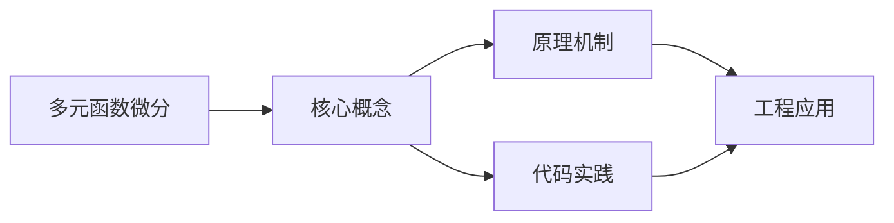
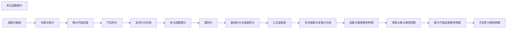

## 1. 学习目标（Bloom 分类）

本节按照布鲁姆教育目标分类学组织学习路径。本文主题为《多元函数微分》，属于 微积分 模块，读者可以根据自身阶段选择阅读深度。

记忆层面：能够准确复述本文的核心概念、术语与基本语法或操作步骤，并能够在提问或检索时快速定位对应知识点。能够说出 微积分 的核心定义、定理与公式。

理解层面：能够用自己的语言解释核心原理与工作机制，说明概念之间的因果关系，而不是机械记忆结论。能够解释 微积分 概念背后的直觉与推导。

应用层面：能够在真实项目或练习场景中运用本文知识解决具体问题，写出正确且可维护的实现。能够运用 微积分 方法解决标准问题。

分析层面：能够拆解复杂问题，比较本文主题与相邻概念的异同，识别边界条件与例外情况。能够分析 微积分 方法的适用条件与局限。

评价层面：能够根据约束条件（性能、可读性、安全、成本）评价不同方案的优劣，做出有依据的技术决策。能够评价不同 微积分 方法的优劣。

创造层面：能够把本文知识与其他模块知识组合，设计出新的解决方案或可复用的工程模式。能够把 微积分 应用于编程与工程问题。

通过本节学习，读者应当能够把《多元函数微分》纳入自己的知识网络，并与 微积分 模块的其他主题（极限、导数、积分、级数）建立关联。

## 2. 历史动机与发展脉络

《多元函数微分》是 微积分 领域的重要主题。要真正理解它，需要先了解它解决的问题与演进过程。

微积分由 Newton 与 Leibniz 在 17 世纪独立创立，解决运动与面积问题；19 世纪 Cauchy/Weierstrass 用极限严格化。
两大主线：微分（变化率）与积分（累积量），由微积分基本定理连接。
应用版图：物理、工程、经济、机器学习（梯度下降、概率密度）。

回到本文主题：多元函数微分 的提出与成熟，正是上述技术背景下的必然产物。早期实现往往以简单可用为目标，随着工程规模扩大，社区逐渐沉淀出标准做法与最佳实践；理解这一脉络，可以帮助读者判断“为什么文档中的推荐写法是现在这个样子”，也能在遇到历史遗留代码时准确识别其设计年代与取舍。

## 3. 形式化定义与核心概念精讲

本节把《多元函数微分》涉及的核心概念以“定义 + 讲解”的形式展开。读者应把定义当作工具，把讲解当作理解路径；两者结合才能形成可迁移的知识。

极限：函数趋近行为的严格刻画（ε-δ）；连续性的定义；重要极限。
导数：变化率的极限；求导法则（乘积/链式）；中值定理与极值判定。
积分：黎曼和的极限；不定积分与定积分；换元与分部积分；微积分基本定理。

### 3.1 原文章节逐一精讲

原文档把主题拆分为 8 个小节，下面按顺序给出每一节的导读讲解，随后保留原文细节供精读。

#### 原文精读（完整保留）

#### 1. 空间解析几何基础

##### 1.1 空间直角坐标系

在空间中建立右手直角坐标系 $Oxyz$，点 $P$ 的坐标为 $(x, y, z)$。

两点间距离：$|P_1P_2| = \sqrt{(x_2-x_1)^2 + (y_2-y_1)^2 + (z_2-z_1)^2}$

##### 1.2 向量运算

**数量积（点积）**：$\vec{a} \cdot \vec{b} = |a||b|\cos\theta = a_xb_x + a_yb_y + a_zb_z$

**向量积（叉积）**：$\vec{a} \times \vec{b} = \begin{vmatrix} \vec{i} & \vec{j} & \vec{k} \\ a_x & a_y & a_z \\ b_x & b_y & b_z \end{vmatrix}$

$|\vec{a} \times \vec{b}| = |a||b|\sin\theta$，方向由右手定则确定。

**混合积**：$[\vec{a}\,\vec{b}\,\vec{c}] = (\vec{a} \times \vec{b}) \cdot \vec{c} = \begin{vmatrix} a_x & a_y & a_z \\ b_x & b_y & b_z \\ c_x & c_y & c_z \end{vmatrix}$

##### 1.3 平面与直线

**平面方程**：

- 一般式：$Ax + By + Cz + D = 0$，法向量 $\vec{n} = (A, B, C)$
- 点法式：$A(x-x_0) + B(y-y_0) + C(z-z_0) = 0$

**直线方程**：

- 一般式：两平面的交线
- 对称式：$\frac{x-x_0}{m} = \frac{y-y_0}{n} = \frac{z-z_0}{p}$，方向向量 $\vec{s} = (m, n, p)$
- 参数式：$x = x_0 + mt$，$y = y_0 + nt$，$z = z_0 + pt$

##### 1.4 常见曲面

- 球面：$(x-a)^2 + (y-b)^2 + (z-c)^2 = R^2$
- 椭球面：$\frac{x^2}{a^2} + \frac{y^2}{b^2} + \frac{z^2}{c^2} = 1$
- 椭圆抛物面：$z = \frac{x^2}{a^2} + \frac{y^2}{b^2}$
- 双曲抛物面（马鞍面）：$z = \frac{x^2}{a^2} - \frac{y^2}{b^2}$
- 单叶双曲面：$\frac{x^2}{a^2} + \frac{y^2}{b^2} - \frac{z^2}{c^2} = 1$
- 双叶双曲面：$\frac{x^2}{a^2} + \frac{y^2}{b^2} - \frac{z^2}{c^2} = -1$

#### 2. 多元函数的极限与连续

##### 2.1 多元函数的概念

设 $D \subseteq \mathbb{R}^n$，映射 $f: D \to \mathbb{R}$ 称为 $n$ 元函数，记作 $z = f(x_1, x_2, \ldots, x_n)$。

##### 2.2 二重极限

设 $f(x,y)$ 在 $P_0(x_0, y_0)$ 的某去心邻域有定义。若对于任意 $\varepsilon > 0$，存在 $\delta > 0$，使得当 $0 < \sqrt{(x-x_0)^2 + (y-y_0)^2} < \delta$ 时，$|f(x,y) - A| < \varepsilon$，则

$$\lim_{(x,y) \to (x_0,y_0)} f(x,y) = A$$

**注意**：二重极限存在要求 $(x,y)$ 以**任何方式**趋于 $(x_0,y_0)$ 时极限相同。

**例**：证明 $\lim_{(x,y) \to (0,0)} \frac{xy}{x^2+y^2}$ 不存在。

> 沿 $y = kx$ 趋于 $(0,0)$：$\lim_{x \to 0} \frac{kx^2}{x^2+k^2x^2} = \frac{k}{1+k^2}$，结果依赖于 $k$，故极限不存在。

##### 2.3 连续

若 $\lim_{(x,y) \to (x_0,y_0)} f(x,y) = f(x_0,y_0)$，则 $f$ 在 $(x_0,y_0)$ 连续。

**性质**：多元连续函数的和、差、积、商（分母不为零）仍连续；连续函数的复合函数仍连续。

#### 3. 偏导数

##### 3.1 偏导数的定义

$$f_x(x_0, y_0) = \lim_{\Delta x \to 0} \frac{f(x_0+\Delta x, y_0) - f(x_0, y_0)}{\Delta x}$$

$$f_y(x_0, y_0) = \lim_{\Delta y \to 0} \frac{f(x_0, y_0+\Delta y) - f(x_0, y_0)}{\Delta y}$$

**注意**：偏导数存在不一定连续（与一元函数不同）。

##### 3.2 高阶偏导数

$$f_{xx} = \frac{\partial^2 f}{\partial x^2}, \quad f_{xy} = \frac{\partial^2 f}{\partial x \partial y}, \quad f_{yx} = \frac{\partial^2 f}{\partial y \partial x}, \quad f_{yy} = \frac{\partial^2 f}{\partial y^2}$$

**定理**：若 $f_{xy}$ 和 $f_{yx}$ 在点 $(x_0, y_0)$ 处连续，则 $f_{xy} = f_{yx}$（混合偏导数与求导顺序无关）。

**例**：设 $z = x^3 y^2 - 3xy^3 + 2x - 1$，求各二阶偏导数。

> $z_x = 3x^2 y^2 - 3y^3 + 2$，$z_y = 2x^3 y - 9xy^2$
> $z_{xx} = 6xy^2$，$z_{xy} = 6x^2 y - 9y^2$，$z_{yx} = 6x^2 y - 9y^2$，$z_{yy} = 2x^3 - 18xy$

#### 4. 全微分

##### 4.1 定义

若 $\Delta z = f(x_0+\Delta x, y_0+\Delta y) - f(x_0, y_0) = A\Delta x + B\Delta y + o(\rho)$，其中 $\rho = \sqrt{(\Delta x)^2 + (\Delta y)^2}$，则称 $f$ 在 $(x_0,y_0)$ 可微，$dz = A\Delta x + B\Delta y$。

**定理**：若 $f$ 在 $(x_0,y_0)$ 可微，则 $A = f_x(x_0,y_0)$，$B = f_y(x_0,y_0)$，即

$$dz = f_x\,dx + f_y\,dy$$

##### 4.2 可微的充分条件

若 $f_x$ 和 $f_y$ 在 $(x_0,y_0)$ 处连续，则 $f$ 在 $(x_0,y_0)$ 可微。

##### 4.3 关系总结

$$\text{偏导数连续} \Rightarrow \text{可微} \Rightarrow \begin{cases} \text{连续} \\ \text{偏导数存在} \end{cases}$$

以上逆命题均不成立。

##### 4.4 全微分在近似计算中的应用

$$f(x_0+\Delta x, y_0+\Delta y) \approx f(x_0,y_0) + f_x(x_0,y_0)\Delta x + f_y(x_0,y_0)\Delta y$$

#### 5. 方向导数与梯度

##### 5.1 方向导数

设 $\vec{l}$ 为从 $P_0$ 出发的射线方向，$\vec{e_l} = (\cos\alpha, \cos\beta)$，则方向导数

$$\frac{\partial f}{\partial l}\bigg|_{P_0} = \lim_{t \to 0^+} \frac{f(P_0 + t\vec{e_l}) - f(P_0)}{t}$$

**定理**：若 $f$ 在 $P_0$ 可微，则

$$\frac{\partial f}{\partial l}\bigg|_{P_0} = f_x \cos\alpha + f_y \cos\beta$$

##### 5.2 梯度

$$\text{grad}\,f = \nabla f = (f_x, f_y)$$

**重要关系**：

$$\frac{\partial f}{\partial l} = \nabla f \cdot \vec{e_l} = |\nabla f|\cos\theta$$

其中 $\theta$ 为梯度与方向 $\vec{l}$ 的夹角。

**结论**：

- 梯度方向是函数增长最快的方向，方向导数等于 $|\nabla f|$
- 梯度的反方向是函数下降最快的方向
- 与梯度垂直的方向上方向导数为零

#### 6. 多元复合函数求导

##### 6.1 链式法则

设 $z = f(u, v)$，$u = \varphi(x, y)$，$v = \psi(x, y)$，则

$$\frac{\partial z}{\partial x} = \frac{\partial z}{\partial u}\frac{\partial u}{\partial x} + \frac{\partial z}{\partial v}\frac{\partial v}{\partial x}$$

$$\frac{\partial z}{\partial y} = \frac{\partial z}{\partial u}\frac{\partial u}{\partial y} + \frac{\partial z}{\partial v}\frac{\partial v}{\partial y}$$

**全微分形式不变性**：$dz = \frac{\partial z}{\partial u}du + \frac{\partial z}{\partial v}dv = \frac{\partial z}{\partial x}dx + \frac{\partial z}{\partial y}dy$

**例**：设 $z = e^u \sin v$，$u = xy$，$v = x + y$，求 $\frac{\partial z}{\partial x}$。

> $$\frac{\partial z}{\partial x} = e^u \sin v \cdot y + e^u \cos v \cdot 1 = e^{xy}[y\sin(x+y) + \cos(x+y)]$$

#### 7. 隐函数定理

##### 7.1 一个方程的情形

设 $F(x, y) = 0$ 确定了 $y = y(x)$，若 $F_y \neq 0$，则

$$\frac{dy}{dx} = -\frac{F_x}{F_y}$$

设 $F(x, y, z) = 0$ 确定了 $z = z(x, y)$，若 $F_z \neq 0$，则

$$\frac{\partial z}{\partial x} = -\frac{F_x}{F_z}, \quad \frac{\partial z}{\partial y} = -\frac{F_y}{F_z}$$

**例**：设 $x^2 + y^2 + z^2 - 4z = 0$，求 $\frac{\partial z}{\partial x}$。

> $F = x^2 + y^2 + z^2 - 4z$，$F_x = 2x$，$F_z = 2z - 4$。
> $$\frac{\partial z}{\partial x} = -\frac{2x}{2z-4} = \frac{x}{2-z}$$

##### 7.2 方程组的情形

设 $\begin{cases} F(x, y, u, v) = 0 \\ G(x, y, u, v) = 0 \end{cases}$ 确定了 $u = u(x,y)$，$v = v(x,y)$，则

$$\frac{\partial u}{\partial x} = -\frac{\begin{vmatrix} F_x & F_v \\ G_x & G_v \end{vmatrix}}{\begin{vmatrix} F_u & F_v \\ G_u & G_v \end{vmatrix}}, \quad \frac{\partial v}{\partial x} = -\frac{\begin{vmatrix} F_u & F_x \\ G_u & G_x \end{vmatrix}}{\begin{vmatrix} F_u & F_v \\ G_u & G_v \end{vmatrix}}$$

其中分母 $J = \begin{vmatrix} F_u & F_v \\ G_u & G_v \end{vmatrix} \neq 0$ 为 **Jacobian 行列式**。

#### 8. 极值与条件极值

##### 8.1 无条件极值

**必要条件**：若 $f(x,y)$ 在 $(x_0,y_0)$ 有极值且偏导数存在，则 $f_x(x_0,y_0) = 0$，$f_y(x_0,y_0) = 0$。

**充分条件**：设 $f_x = f_y = 0$ 在 $(x_0,y_0)$ 成立，记 $A = f_{xx}$，$B = f_{xy}$，$C = f_{yy}$，$\Delta = AC - B^2$：

- $\Delta > 0$ 且 $A < 0$：极大值
- $\Delta > 0$ 且 $A > 0$：极小值
- $\Delta < 0$：不是极值（鞍点）
- $\Delta = 0$：无法判定

**例**：求 $f(x,y) = x^3 - y^3 + 3x^2 + 3y^2 - 9x$ 的极值。

> $f_x = 3x^2 + 6x - 9 = 3(x-1)(x+3) = 0$，$f_y = -3y^2 + 6y = -3y(y-2) = 0$
> 驻点：$(1,0)$，$(1,2)$，$(-3,0)$，$(-3,2)$
> $A = 6x+6$，$B = 0$，$C = -6y+6$，$\Delta = (6x+6)(-6y+6)$
>
> - $(1,0)$：$A=12>0$，$C=6$，$\Delta=72>0$，极小值 $f=-5$
> - $(1,2)$：$A=12$，$C=-6$，$\Delta=-72<0$，非极值
> - $(-3,0)$：$A=-12$，$C=6$，$\Delta=-72<0$，非极值
> - $(-3,2)$：$A=-12<0$，$C=-6$，$\Delta=72>0$，极大值 $f=31$

##### 8.2 条件极值（Lagrange 乘数法）

求 $f(x,y)$ 在约束 $\varphi(x,y) = 0$ 下的极值，构造 Lagrange 函数：

$$L(x,y,\lambda) = f(x,y) + \lambda\varphi(x,y)$$

解方程组：

$$\begin{cases} L_x = f_x + \lambda\varphi_x = 0 \\ L_y = f_y + \lambda\varphi_y = 0 \\ L_\lambda = \varphi(x,y) = 0 \end{cases}$$

**例**：求 $f(x,y) = xy$ 在 $x + y = 1$ 下的极值。

> $L = xy + \lambda(x+y-1)$
> $L_x = y + \lambda = 0$，$L_y = x + \lambda = 0$，$x + y = 1$
> 解得 $x = y = \frac{1}{2}$，$\lambda = -\frac{1}{2}$。极大值 $f = \frac{1}{4}$。

##### 8.3 多个约束的 Lagrange 乘数法

求 $f(x,y,z)$ 在约束 $\varphi_1 = 0$，$\varphi_2 = 0$ 下的极值：

$$L = f + \lambda_1\varphi_1 + \lambda_2\varphi_2$$

解 $L_x = 0$，$L_y = 0$，$L_z = 0$，$\varphi_1 = 0$，$\varphi_2 = 0$。

### 3.2 概念关系图

下面用 Mermaid 图表达本文核心概念之间的关系，帮助读者建立整体图景：

图中展示的是本文知识的结构化关系：核心概念是入口，原理机制解释“为什么”，代码实践演示“怎么做”，工程应用回答“何时用”。读者学习时可以把每个小节的内容挂接到对应节点上。

## 4. 理论推导与原理解析

本节深入《多元函数微分》背后的原理。理论部分不求面面俱到，而是聚焦“能解释现象、能指导实践”的关键推导。

极限：函数趋近行为的严格刻画（ε-δ）；连续性的定义；重要极限。
导数：变化率的极限；求导法则（乘积/链式）；中值定理与极值判定。
积分：黎曼和的极限；不定积分与定积分；换元与分部积分；微积分基本定理。
级数：收敛性判别；泰勒展开近似函数。

需要强调的是，理论推导与工程实践之间存在翻译层：理论给出的是理想化模型与边界条件，工程代码则必须处理真实环境中的例外。读者在学习时应先掌握理论的“标准情形”，再通过陷阱章节了解“非标准情形”。

## 5. 代码示例与逐行讲解

本节把原文中的代码示例系统整理，并为每个示例补充用途说明与讲解。读者不应只浏览代码，而应逐段对照讲解理解设计意图。

原文档未包含独立代码块，下面补充该主题的典型示例，演示核心概念在代码中的落地方式。

综合以上示例，可以总结出本主题的代码实践要点：第一，先定义清晰的输入输出契约；第二，核心逻辑保持单一职责；第三，错误处理与边界条件不可省略；第四，命名与注释表达意图而非复述代码。

## 6. 对比分析

对比是理解《多元函数微分》定位的最快路径。下面从多个维度与相邻方案进行对比。

离散与连续：差分是离散导数，求和是离散积分；编程中两者相通。
微分与积分：互逆运算，基本定理连接。
牛顿法与梯度下降：都是导数驱动的迭代优化。

对比的目的不是分出绝对优劣，而是建立选择依据：不同约束条件下，最优解不同。读者应把每个对比维度转化为决策检查清单。

## 7. 常见陷阱与最佳实践

本节整理该主题的高频错误与推荐做法。每个陷阱先描述现象，再解释原因，最后给出最佳实践。

### 7.1 除零未处理

极限与表达式求值混淆。先化简再代值。

深入讲解：该问题之所以被归类为“常见陷阱”，是因为它在初学者的代码中反复出现，而且往往不在第一时间暴露——错误通常隐藏在特定数据或特定时序下。

从成因上看，除零未处理 一般源于对 微积分 某个机制的理解偏差：要么误用了默认行为，要么忽略了边界条件，要么把其他语言的思维惯性带了过来。

从影响上看，除零未处理 轻则产生错误结果，重则导致资源泄漏、数据损坏或安全事故；这也是为什么工程评审中会把它列为检查项。

从修复策略上看，处理除零未处理的正确顺序是：先复现（构造最小用例），再定位（确认机制层面的根因），最后修复并补充回归测试。跳过复现直接改代码，往往治标不治本。

### 7.2 链式法则遗漏

复合函数求导少乘内层导数。系统检查。

深入讲解：该问题之所以被归类为“常见陷阱”，是因为它在初学者的代码中反复出现，而且往往不在第一时间暴露——错误通常隐藏在特定数据或特定时序下。

从成因上看，链式法则遗漏 一般源于对 微积分 某个机制的理解偏差：要么误用了默认行为，要么忽略了边界条件，要么把其他语言的思维惯性带了过来。

从影响上看，链式法则遗漏 轻则产生错误结果，重则导致资源泄漏、数据损坏或安全事故；这也是为什么工程评审中会把它列为检查项。

从修复策略上看，处理链式法则遗漏的正确顺序是：先复现（构造最小用例），再定位（确认机制层面的根因），最后修复并补充回归测试。跳过复现直接改代码，往往治标不治本。

### 7.3 积分换元忘 dx

变量替换必须同步换微分。

深入讲解：该问题之所以被归类为“常见陷阱”，是因为它在初学者的代码中反复出现，而且往往不在第一时间暴露——错误通常隐藏在特定数据或特定时序下。

从成因上看，积分换元忘 dx 一般源于对 微积分 某个机制的理解偏差：要么误用了默认行为，要么忽略了边界条件，要么把其他语言的思维惯性带了过来。

从影响上看，积分换元忘 dx 轻则产生错误结果，重则导致资源泄漏、数据损坏或安全事故；这也是为什么工程评审中会把它列为检查项。

从修复策略上看，处理积分换元忘 dx的正确顺序是：先复现（构造最小用例），再定位（确认机制层面的根因），最后修复并补充回归测试。跳过复现直接改代码，往往治标不治本。

### 7.4 收敛误判

级数项趋于 0 不一定收敛（调和级数）。

深入讲解：该问题之所以被归类为“常见陷阱”，是因为它在初学者的代码中反复出现，而且往往不在第一时间暴露——错误通常隐藏在特定数据或特定时序下。

从成因上看，收敛误判 一般源于对 微积分 某个机制的理解偏差：要么误用了默认行为，要么忽略了边界条件，要么把其他语言的思维惯性带了过来。

从影响上看，收敛误判 轻则产生错误结果，重则导致资源泄漏、数据损坏或安全事故；这也是为什么工程评审中会把它列为检查项。

从修复策略上看，处理收敛误判的正确顺序是：先复现（构造最小用例），再定位（确认机制层面的根因），最后修复并补充回归测试。跳过复现直接改代码，往往治标不治本。

### 7.5 边界未检查

极值需检查端点与不可导点。

深入讲解：该问题之所以被归类为“常见陷阱”，是因为它在初学者的代码中反复出现，而且往往不在第一时间暴露——错误通常隐藏在特定数据或特定时序下。

从成因上看，边界未检查 一般源于对 微积分 某个机制的理解偏差：要么误用了默认行为，要么忽略了边界条件，要么把其他语言的思维惯性带了过来。

从影响上看，边界未检查 轻则产生错误结果，重则导致资源泄漏、数据损坏或安全事故；这也是为什么工程评审中会把它列为检查项。

从修复策略上看，处理边界未检查的正确顺序是：先复现（构造最小用例），再定位（确认机制层面的根因），最后修复并补充回归测试。跳过复现直接改代码，往往治标不治本。

### 7.6 符号错误

负号与绝对值。分步验算。

深入讲解：该问题之所以被归类为“常见陷阱”，是因为它在初学者的代码中反复出现，而且往往不在第一时间暴露——错误通常隐藏在特定数据或特定时序下。

从成因上看，符号错误 一般源于对 微积分 某个机制的理解偏差：要么误用了默认行为，要么忽略了边界条件，要么把其他语言的思维惯性带了过来。

从影响上看，符号错误 轻则产生错误结果，重则导致资源泄漏、数据损坏或安全事故；这也是为什么工程评审中会把它列为检查项。

从修复策略上看，处理符号错误的正确顺序是：先复现（构造最小用例），再定位（确认机制层面的根因），最后修复并补充回归测试。跳过复现直接改代码，往往治标不治本。

### 7.7 近似误用

泰勒展开忽略余项。估计误差界。

深入讲解：该问题之所以被归类为“常见陷阱”，是因为它在初学者的代码中反复出现，而且往往不在第一时间暴露——错误通常隐藏在特定数据或特定时序下。

从成因上看，近似误用 一般源于对 微积分 某个机制的理解偏差：要么误用了默认行为，要么忽略了边界条件，要么把其他语言的思维惯性带了过来。

从影响上看，近似误用 轻则产生错误结果，重则导致资源泄漏、数据损坏或安全事故；这也是为什么工程评审中会把它列为检查项。

从修复策略上看，处理近似误用的正确顺序是：先复现（构造最小用例），再定位（确认机制层面的根因），最后修复并补充回归测试。跳过复现直接改代码，往往治标不治本。

### 7.8 只记公式

不理解则无法变形。掌握推导。

深入讲解：该问题之所以被归类为“常见陷阱”，是因为它在初学者的代码中反复出现，而且往往不在第一时间暴露——错误通常隐藏在特定数据或特定时序下。

从成因上看，只记公式 一般源于对 微积分 某个机制的理解偏差：要么误用了默认行为，要么忽略了边界条件，要么把其他语言的思维惯性带了过来。

从影响上看，只记公式 轻则产生错误结果，重则导致资源泄漏、数据损坏或安全事故；这也是为什么工程评审中会把它列为检查项。

从修复策略上看，处理只记公式的正确顺序是：先复现（构造最小用例），再定位（确认机制层面的根因），最后修复并补充回归测试。跳过复现直接改代码，往往治标不治本。

### 7.0 最佳实践总览

1. 先判断类型（极限/导数/积分），再选方法。
2. 每步验算符号与定义域。
3. 用数值计算验证解析结果。
4. 图形直觉辅助（Desmos/GeoGebra）。

把这些最佳实践固化为团队规范与代码评审检查项，是避免同类问题反复出现的关键。

## 8. 工程实践

本节把《多元函数微分》放入真实工程场景，给出可复用的模式与组织方法。

机器学习：梯度、偏导、链式法则支撑反向传播。
概率统计：概率密度积分、期望、方差。
优化：拉格朗日乘子、凸性。

### 8.1 工程实践的原则拆解

以上工程实践可以归纳为四条原则。第一，配置与代码分离：微积分 项目中环境差异应通过配置注入，而不是散落在代码分支中；这保证同一份代码可以在开发、测试、生产环境一致运行。

第二，接口稳定优先：对外接口（函数签名、协议、数据格式）一旦被消费方依赖，变更成本极高；设计时应预留扩展点并保持向后兼容。

第三，可观测性内置：日志、指标与追踪应该在功能开发时同步设计，而不是故障发生后补救；没有观测手段的模块等于黑盒。

第四，变更可回滚：任何发布都应有对应的回滚方案；数据库迁移、配置变更与代码发布一样需要版本管理与逆向路径。

### 8.2 实践落地的检查清单

- [ ] 机器学习：对照本节描述，检查当前项目是否已经落实；未落实的项列入技术债并排期处理。
- [ ] 概率统计：对照本节描述，检查当前项目是否已经落实；未落实的项列入技术债并排期处理。
- [ ] 优化：对照本节描述，检查当前项目是否已经落实；未落实的项列入技术债并排期处理。

工程实践的共性原则：配置与代码分离、接口稳定优先、可观测性内置、变更可回滚。这些原则适用于本主题的所有实现。

## 9. 案例研究

本节通过一个完整案例把《多元函数微分》的知识串起来。案例按“需求分析、方案设计、实现、验证”四步展开。

需求：实现数值求导与定积分（梯度近似）。
方案：中心差分求导；辛普森法/蒙特卡洛积分。
要点：步长选择、误差估计、收敛验证。
验证：对多项式解析对比误差。

### 9.1 案例的扩展讨论

把案例中的方案放大到真实规模，需要额外考虑三个问题：

第一，规模：当数据量或并发量上升一个数量级时，原方案中的数据结构、缓存策略与任务调度是否仍然成立？通常需要引入分层与异步。

第二，团队：多人协作时，模块边界、接口契约与代码所有权必须明确；案例中的实现应拆分为可独立测试的单元，并配合文档说明设计意图。

第三，演进：上线后的需求变化不可避免；方案设计时应预留扩展点（配置化、插件化、事件化），并定期用真实指标验证假设。

案例研究的学习方法：先独立阅读需求，尝试在脑中形成方案，再对照实现与讲解，最后思考“如果约束变化（数据量、并发、团队规模），方案应如何调整”。

## 10. 知识要点总结与深入讲解

本节以讲解形式汇总全文要点，替代传统的习题与自测，读者不需要答题，只需跟随解释建立完整的认知框架。

关于《多元函数微分》的核心结论：

微积分是连续世界的数学语言。
极限思想贯穿始终，理解它才能驾驭导数与积分。
工程中数值方法补充解析方法，两者结合。

原文档各小节的要点回顾：

- 1. 空间解析几何基础：该小节围绕多元函数微分展开具体细节，阅读时应关注其与核心结论的对应关系；每个小节都是核心结论在某一个侧面的展开。
- 2. 多元函数的极限与连续：该小节围绕多元函数微分展开具体细节，阅读时应关注其与核心结论的对应关系；每个小节都是核心结论在某一个侧面的展开。
- 3. 偏导数：该小节围绕多元函数微分展开具体细节，阅读时应关注其与核心结论的对应关系；每个小节都是核心结论在某一个侧面的展开。
- 4. 全微分：该小节围绕多元函数微分展开具体细节，阅读时应关注其与核心结论的对应关系；每个小节都是核心结论在某一个侧面的展开。
- 5. 方向导数与梯度：该小节围绕多元函数微分展开具体细节，阅读时应关注其与核心结论的对应关系；每个小节都是核心结论在某一个侧面的展开。
- 6. 多元复合函数求导：该小节围绕多元函数微分展开具体细节，阅读时应关注其与核心结论的对应关系；每个小节都是核心结论在某一个侧面的展开。
- 7. 隐函数定理：该小节围绕多元函数微分展开具体细节，阅读时应关注其与核心结论的对应关系；每个小节都是核心结论在某一个侧面的展开。
- 8. 极值与条件极值：该小节围绕多元函数微分展开具体细节，阅读时应关注其与核心结论的对应关系；每个小节都是核心结论在某一个侧面的展开。

把以上要点与第 3-9 节的内容对照复习，即可完成对本文主题的闭环学习。

## 11. 参考文献

Khan Academy 微积分：https://zh.khanacademy.org/math/calculus-1
3Blue1Brown 微积分的本质：https://www.3blue1brown.com/topics/calculus
MIT 18.01：https://ocw.mit.edu/courses/18-01-single-variable-calculus-fall-2006/
Desmos：https://www.desmos.com/

## 12. 延伸阅读

微积分基础，见 027-calculus 模块文档。
线性代数（梯度与向量），见 029-linear-algebra 模块。
概率统计（积分应用），见 030-probability-statistics 模块。
尚硅谷 Bilibili 空间（https://space.bilibili.com/302417610 ）提供数学课程。

## 14. 模块知识图谱与学习路径

本文属于 微积分 模块。为了把《多元函数微分》放入完整的知识网络，下面列出本模块的全部主题并给出相互关联的导读。学习时建议按模块内顺序推进，并在每个文档中留意交叉引用。

上图为模块主题的推荐学习顺序示意图（仅展示前若干主题）。各主题之间存在三类关联：

第一，前置依赖关系：早期主题是后期主题的基础，例如环境与语法先行、进阶主题随后；

第二，横向并列关系：同一层级主题从不同角度覆盖模块能力，学习顺序可以按兴趣调整；

第三，工程组合关系：多个主题在真实项目中组合使用，例如配置、性能与安全主题往往出现在同一系统的不同层面。

### 14.1 模块主题速查表

| 文档 | 主题 | 与本文的关联 |
| --- | --- | --- |
| 函数与极限 | 001-FunctionAndLimit | 本文的并列主题 |
| 导数与微分 | 002-PhilosophiaeNaturalisPrincipiaMathematica | 本文的并列主题 |
| 微分中值定理 | 003-AMeanValueTheorem | 本文的并列主题 |
| 不定积分 | 004-IndefiniteIntegral | 本文的并列主题 |
| 定积分与应用 | 005-DefiniteIntegralAndApplication | 本文的并列主题 |
| 多元函数微分 | 006-MultivariateFunctionDifferential | 本文自身 |
| 重积分 | 007-MultipleIntegral | 本文的并列主题 |
| 曲线积分与曲面积分 | 008-CurveAndSurfaceIntegral | 本文的并列主题 |
| 公式速查表 | 009-FormulaQuickReference | 本文的并列主题 |
| 无穷级数与常微分方程 | 010-InfiniteSeriesAndODE | 本文的并列主题 |
| 函数与极限典型例题 | 011-FunctionAndLimitExamples | 本文的并列主题 |
| 导数与微分典型例题 | 012-DerivativeAndDifferentialExamples | 本文的并列主题 |
| 微分中值定理典型例题 | 013-DifferentialMeanValueTheoremExamples | 本文的并列主题 |
| 不定积分典型例题 | 014-IndefiniteIntegralExamples | 本文的并列主题 |
| 定积分与应用典型例题 | 015-DefiniteIntegralApplicationExamples | 本文的并列主题 |
| 多元函数微分典型例题 | 016-MultivariateFunctionDifferentialExamples | 本文的并列主题 |
| 重积分典型例题 | 017-MultipleIntegralExamples | 本文的并列主题 |
| 曲线积分与曲面积分典型例题 | 018-CurveAndSurfaceIntegralExamples | 本文的并列主题 |
| 无穷级数与常微分方程典型例题 | 019-InfiniteSeriesAndODEExamples | 本文的并列主题 |

速查表的作用是让读者快速判断：哪些文档应在阅读本文前掌握（前置基础），哪些文档应在阅读本文后继续（延伸主题）。本模块的交叉引用体系即以此表为基础。

## 15. 术语表

下表整理《多元函数微分》及 微积分 模块中出现的高频术语，给出简明释义。术语按字母序或逻辑序排列，供查阅。

| 术语 | 释义 |
| --- | --- |
| 极限 | 函数趋近行为的严格刻画（ε-δ）；连续性的定义；重要极限。 |
| 导数 | 变化率的极限；求导法则（乘积/链式）；中值定理与极值判定。 |
| 积分 | 黎曼和的极限；不定积分与定积分；换元与分部积分；微积分基本定理。 |
| 级数 | 收敛性判别；泰勒展开近似函数。 |
| 除零未处理（易错点） | 参见常见陷阱章节的详细讲解 |
| 链式法则遗漏（易错点） | 参见常见陷阱章节的详细讲解 |
| 积分换元忘 dx（易错点） | 参见常见陷阱章节的详细讲解 |
| 收敛误判（易错点） | 参见常见陷阱章节的详细讲解 |
| 边界未检查（易错点） | 参见常见陷阱章节的详细讲解 |
| 符号错误（易错点） | 参见常见陷阱章节的详细讲解 |

术语表与正文配合使用：先通读正文，遇到模糊术语回查本表；长期使用后术语会自然进入工作记忆。

## 13. 深度专题扩展

以下专题从不同角度深入本文主题，供有进阶需求的读者研读。每个专题独立成节，内容相互补充。

### 13.1 极限与连续性严格化

ε-δ 定义：对任意 ε 存在 δ；用于证明连续性。
夹逼定理、单调有界收敛、洛必达法则（0/0 与 ∞/∞）。
连续函数性质：介值定理、极值定理。
理解严格化帮助甄别直觉误区（如瞬时速度）。

### 13.2 微积分基本定理

第一形式：变上限积分求导回到被积函数。
第二形式：定积分 = 原函数差。
推论：面积、累积量、期望的积分表达。
应用：FTC 是数值积分与微分方程求解的理论基础。

## 16. 核心概念串讲（复习视角）

本节以“把知识讲给他人听”的方式，把《多元函数微分》的核心概念重新串讲一遍。与前文按章节展开不同，这里的叙述更接近课堂总结：先说整体，再逐个展开，最后收束。

《多元函数微分》属于 微积分 模块。要理解它，先要理解它在模块中的位置：它解决的是该领域的一个具体问题，并依赖模块内若干前置概念；反过来，它又为后续进阶主题提供基础。

第一个概念是极限。函数趋近行为的严格刻画（ε-δ）；连续性的定义；重要极限。

在实际使用中，极限需要与相邻概念区分：它们的区别不在于名称，而在于适用条件与行为边界；这正是前文对比分析章节的意义。

第一个概念是导数。变化率的极限；求导法则（乘积/链式）；中值定理与极值判定。

在实际使用中，导数需要与相邻概念区分：它们的区别不在于名称，而在于适用条件与行为边界；这正是前文对比分析章节的意义。

第一个概念是积分。黎曼和的极限；不定积分与定积分；换元与分部积分；微积分基本定理。

在实际使用中，积分需要与相邻概念区分：它们的区别不在于名称，而在于适用条件与行为边界；这正是前文对比分析章节的意义。

接下来是极限。函数趋近行为的严格刻画（ε-δ）；连续性的定义；重要极限。

理解该原理的关键不是记住结论，而是记住“它从什么假设出发、推出了什么、假设不成立时会怎样”。带着这个框架复习，原理之间就会连成网络。

接下来是导数。变化率的极限；求导法则（乘积/链式）；中值定理与极值判定。

理解该原理的关键不是记住结论，而是记住“它从什么假设出发、推出了什么、假设不成立时会怎样”。带着这个框架复习，原理之间就会连成网络。

接下来是积分。黎曼和的极限；不定积分与定积分；换元与分部积分；微积分基本定理。

理解该原理的关键不是记住结论，而是记住“它从什么假设出发、推出了什么、假设不成立时会怎样”。带着这个框架复习，原理之间就会连成网络。

接下来是级数。收敛性判别；泰勒展开近似函数。

理解该原理的关键不是记住结论，而是记住“它从什么假设出发、推出了什么、假设不成立时会怎样”。带着这个框架复习，原理之间就会连成网络。

串讲收束：把概念与原理放回本文主题，可以得出一个总纲——定义描述是什么，原理解释为什么，实践回答怎么做。三者构成完整的学习闭环；后续遇到相关问题，都可以按这个总纲检索知识。
