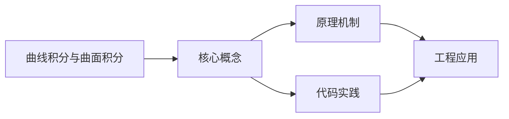

## 1. 学习目标（Bloom 分类）

本节按照布鲁姆教育目标分类学组织学习路径。本文主题为《曲线积分与曲面积分》，属于 微积分 模块，读者可以根据自身阶段选择阅读深度。

记忆层面：能够准确复述本文的核心概念、术语与基本语法或操作步骤，并能够在提问或检索时快速定位对应知识点。能够说出 微积分 的核心定义、定理与公式。

理解层面：能够用自己的语言解释核心原理与工作机制，说明概念之间的因果关系，而不是机械记忆结论。能够解释 微积分 概念背后的直觉与推导。

应用层面：能够在真实项目或练习场景中运用本文知识解决具体问题，写出正确且可维护的实现。能够运用 微积分 方法解决标准问题。

分析层面：能够拆解复杂问题，比较本文主题与相邻概念的异同，识别边界条件与例外情况。能够分析 微积分 方法的适用条件与局限。

评价层面：能够根据约束条件（性能、可读性、安全、成本）评价不同方案的优劣，做出有依据的技术决策。能够评价不同 微积分 方法的优劣。

创造层面：能够把本文知识与其他模块知识组合，设计出新的解决方案或可复用的工程模式。能够把 微积分 应用于编程与工程问题。

通过本节学习，读者应当能够把《曲线积分与曲面积分》纳入自己的知识网络，并与 微积分 模块的其他主题（极限、导数、积分、级数）建立关联。

## 2. 历史动机与发展脉络

《曲线积分与曲面积分》是 微积分 领域的重要主题。要真正理解它，需要先了解它解决的问题与演进过程。

微积分由 Newton 与 Leibniz 在 17 世纪独立创立，解决运动与面积问题；19 世纪 Cauchy/Weierstrass 用极限严格化。
两大主线：微分（变化率）与积分（累积量），由微积分基本定理连接。
应用版图：物理、工程、经济、机器学习（梯度下降、概率密度）。

回到本文主题：曲线积分与曲面积分 的提出与成熟，正是上述技术背景下的必然产物。早期实现往往以简单可用为目标，随着工程规模扩大，社区逐渐沉淀出标准做法与最佳实践；理解这一脉络，可以帮助读者判断“为什么文档中的推荐写法是现在这个样子”，也能在遇到历史遗留代码时准确识别其设计年代与取舍。

## 3. 形式化定义与核心概念精讲

本节把《曲线积分与曲面积分》涉及的核心概念以“定义 + 讲解”的形式展开。读者应把定义当作工具，把讲解当作理解路径；两者结合才能形成可迁移的知识。

极限：函数趋近行为的严格刻画（ε-δ）；连续性的定义；重要极限。
导数：变化率的极限；求导法则（乘积/链式）；中值定理与极值判定。
积分：黎曼和的极限；不定积分与定积分；换元与分部积分；微积分基本定理。

### 3.1 原文章节逐一精讲

原文档把主题拆分为 8 个小节，下面按顺序给出每一节的导读讲解，随后保留原文细节供精读。

#### 原文精读（完整保留）

#### 1. 第一类曲线积分（对弧长的曲线积分）

##### 1.1 定义

设 $L$ 为 $xOy$ 面上的光滑曲线弧，$f(x,y)$ 在 $L$ 上有界，则

$$\int_L f(x,y)\,ds = \lim_{\lambda \to 0} \sum_{i=1}^n f(\xi_i, \eta_i)\Delta s_i$$

##### 1.2 计算

**参数方程** $x = x(t)$，$y = y(t)$（$\alpha \leq t \leq \beta$）：

$$\int_L f(x,y)\,ds = \int_\alpha^\beta f[x(t), y(t)]\sqrt{[x'(t)]^2 + [y'(t)]^2}\,dt$$

**直角坐标** $y = y(x)$（$a \leq x \leq b$）：

$$\int_L f(x,y)\,ds = \int_a^b f[x, y(x)]\sqrt{1 + [y'(x)]^2}\,dx$$

**极坐标** $r = r(\theta)$（$\alpha \leq \theta \leq \beta$）：

$$\int_L f(x,y)\,ds = \int_\alpha^\beta f[r(\theta)\cos\theta, r(\theta)\sin\theta]\sqrt{r^2 + [r'(\theta)]^2}\,d\theta$$

**注意**：第一类曲线积分的积分下限必须小于上限。

**例**：计算 $\int_L (x^2+y^2)\,ds$，$L$ 为 $x^2+y^2 = R^2$。

> 参数方程：$x = R\cos t$，$y = R\sin t$（$0 \leq t \leq 2\pi$），$ds = R\,dt$。
> $$\int_0^{2\pi} R^2 \cdot R\,dt = 2\pi R^3$$

##### 1.3 空间曲线

$$\int_\Gamma f(x,y,z)\,ds = \int_\alpha^\beta f[x(t),y(t),z(t)]\sqrt{[x'(t)]^2+[y'(t)]^2+[z'(t)]^2}\,dt$$

#### 2. 第二类曲线积分（对坐标的曲线积分）

##### 2.1 定义

$$\int_L P\,dx + Q\,dy = \lim_{\lambda \to 0} \sum_{i=1}^n [P(\xi_i,\eta_i)\Delta x_i + Q(\xi_i,\eta_i)\Delta y_i]$$

##### 2.2 计算

**参数方程** $x = x(t)$，$y = y(t)$，$L$ 从 $t = \alpha$ 到 $t = \beta$：

$$\int_L P\,dx + Q\,dy = \int_\alpha^\beta \{P[x(t),y(t)]x'(t) + Q[x(t),y(t)]y'(t)\}\,dt$$

**注意**：第二类曲线积分的下限对应起点，上限对应终点。

**例**：计算 $\int_L y\,dx - x\,dy$，$L$ 为 $x = R\cos t$，$y = R\sin t$ 从 $t=0$ 到 $t=\pi/2$。

> $$\int_0^{\pi/2} [R\sin t \cdot (-R\sin t) - R\cos t \cdot R\cos t]\,dt = -R^2\int_0^{\pi/2} dt = -\frac{\pi R^2}{2}$$

##### 2.3 两类曲线积分的关系

$$\int_L P\,dx + Q\,dy = \int_L (P\cos\alpha + Q\cos\beta)\,ds$$

其中 $(\cos\alpha, \cos\beta)$ 为 $L$ 在点 $(x,y)$ 处的单位切向量。

##### 2.4 空间第二类曲线积分

$$\int_\Gamma P\,dx + Q\,dy + R\,dz = \int_\alpha^\beta [Px'(t) + Qy'(t) + Rz'(t)]\,dt$$

#### 3. Green 公式

##### 3.1 定理

设 $D$ 为由分段光滑闭曲线 $L$ 围成的有界闭区域，$P(x,y)$ 和 $Q(x,y)$ 在 $D$ 上具有一阶连续偏导数，则

$$\oint_L P\,dx + Q\,dy = \iint_D \left(\frac{\partial Q}{\partial x} - \frac{\partial P}{\partial y}\right)dxdy$$

其中 $L$ 取**正向**（逆时针方向）。

##### 3.2 应用

**求面积**：

$$A = \frac{1}{2}\oint_L x\,dy - y\,dx$$

**例**：计算 $\oint_L (x+y^2)\,dx + (y+x^2)\,dy$，$L$ 为 $x^2+y^2=2x$ 逆时针。

> $\frac{\partial Q}{\partial x} = 2x$，$\frac{\partial P}{\partial y} = 2y$。
> $$\oint_L = \iint_D (2x-2y)\,dxdy$$
> 由对称性，$\iint_D 2y\,dxdy = 0$。
> $\iint_D 2x\,dxdy = 2\int_{-\pi/2}^{\pi/2} d\theta\int_0^{2\cos\theta} r\cos\theta \cdot r\,dr = 2\pi$。

##### 3.3 平面曲线积分与路径无关的条件

设 $P$, $Q$ 在单连通区域 $D$ 上具有一阶连续偏导数，以下条件等价：

1. $\int_L P\,dx + Q\,dy$ 在 $D$ 内与路径无关
2. $\oint_C P\,dx + Q\,dy = 0$，$C$ 为 $D$ 内任意闭曲线
3. $\frac{\partial P}{\partial y} = \frac{\partial Q}{\partial x}$ 在 $D$ 内处处成立
4. $P\,dx + Q\,dy$ 为某函数 $u(x,y)$ 的全微分，即 $du = P\,dx + Q\,dy$

**求原函数**：

$$u(x,y) = \int_{(x_0,y_0)}^{(x,y)} P\,dx + Q\,dy$$

**例**：验证 $(2xy+y^3)\,dx + (x^2+3xy^2)\,dy$ 是某函数的全微分并求之。

> $\frac{\partial P}{\partial y} = 2x + 3y^2$，$\frac{\partial Q}{\partial x} = 2x + 3y^2$，相等。
> $u = \int_0^x 0\,dx + \int_0^y (x^2+3xy^2)\,dy = x^2 y + xy^3$

#### 4. 第一类曲面积分

##### 4.1 定义

$$\iint_\Sigma f(x,y,z)\,dS = \lim_{\lambda \to 0} \sum_{i=1}^n f(\xi_i,\eta_i,\zeta_i)\Delta S_i$$

##### 4.2 计算

设 $\Sigma: z = z(x,y)$，$(x,y) \in D_{xy}$，则

$$\iint_\Sigma f(x,y,z)\,dS = \iint_{D_{xy}} f[x,y,z(x,y)]\sqrt{1+z_x^2+z_y^2}\,dxdy$$

类似地，可投影到 $yOz$ 或 $xOz$ 面。

**例**：计算 $\iint_\Sigma (x^2+y^2)\,dS$，$\Sigma: z = \sqrt{x^2+y^2}$（$0 \leq z \leq 1$）。

> $z_x = \frac{x}{\sqrt{x^2+y^2}}$，$z_y = \frac{y}{\sqrt{x^2+y^2}}$，$\sqrt{1+z_x^2+z_y^2} = \sqrt{2}$。
> $$\iint_{x^2+y^2 \leq 1} (x^2+y^2)\sqrt{2}\,dxdy = \sqrt{2}\int_0^{2\pi} d\theta\int_0^1 r^2 \cdot r\,dr = \sqrt{2} \cdot 2\pi \cdot \frac{1}{4} = \frac{\sqrt{2}\pi}{2}$$

#### 5. 第二类曲面积分

##### 5.1 定义

$$\iint_\Sigma P\,dydz + Q\,dzdx + R\dxdy$$

表示向量场 $\vec{F} = (P,Q,R)$ 穿过曲面 $\Sigma$ 指定侧的**通量**。

##### 5.2 计算

设 $\Sigma: z = z(x,y)$，$(x,y) \in D_{xy}$，取上侧：

$$\iint_\Sigma R\dxdy = \pm\iint_{D_{xy}} R[x,y,z(x,y)]\,dxdy$$

上侧取 $+$，下侧取 $-$。

**合一投影法**：设 $\Sigma: z = z(x,y)$，取上侧，则

$$\iint_\Sigma P\,dydz + Q\,dzdx + R\dxdy = \iint_{D_{xy}} \left[-Pz_x - Qz_y + R\right]dxdy$$

**例**：计算 $\iint_\Sigma x\,dydz + y\,dzdx + z\dxdy$，$\Sigma: x^2+y^2+z^2 = R^2$ 上半球面取上侧。

> $\Sigma: z = \sqrt{R^2-x^2-y^2}$，$z_x = \frac{-x}{z}$，$z_y = \frac{-y}{z}$。
> $$\iint_{D_{xy}} \left[\frac{x^2}{z} + \frac{y^2}{z} + z\right]dxdy = \iint_{D_{xy}} \frac{R^2}{z}\,dxdy = R^2\int_0^{2\pi} d\theta\int_0^R \frac{r\,dr}{\sqrt{R^2-r^2}} = 2\pi R^3$$

#### 6. Gauss 公式

##### 6.1 定理

设空间闭区域 $\Omega$ 由分片光滑闭曲面 $\Sigma$ 围成，$P$, $Q$, $R$ 在 $\Omega$ 上有一阶连续偏导数，则

$$\oiint_\Sigma P\,dydz + Q\,dzdx + R\dxdy = \iiint_\Omega \left(\frac{\partial P}{\partial x} + \frac{\partial Q}{\partial y} + \frac{\partial R}{\partial z}\right)dV$$

其中 $\Sigma$ 取**外侧**。

##### 6.2 散度

$$\text{div}\,\vec{F} = \frac{\partial P}{\partial x} + \frac{\partial Q}{\partial y} + \frac{\partial R}{\partial z}$$

Gauss 公式可写为：$\oiint_\Sigma \vec{F} \cdot d\vec{S} = \iiint_\Omega \text{div}\,\vec{F}\,dV$

**例**：计算 $\oiint_\Sigma x\,dydz + y\,dzdx + z\dxdy$，$\Sigma: x^2+y^2+z^2 = R^2$ 取外侧。

> $\text{div}\,\vec{F} = 1 + 1 + 1 = 3$。
> $$\oiint_\Sigma = 3\iiint_\Omega dV = 3 \cdot \frac{4\pi R^3}{3} = 4\pi R^3$$

#### 7. Stokes 公式

##### 7.1 定理

设 $\Sigma$ 为光滑曲面，其边界曲线 $\Gamma$ 为分段光滑闭曲线，则

$$\oint_\Gamma P\,dx + Q\,dy + R\,dz = \iint_\Sigma \left(\frac{\partial R}{\partial y} - \frac{\partial Q}{\partial z}\right)dydz + \left(\frac{\partial P}{\partial z} - \frac{\partial R}{\partial x}\right)dzdx + \left(\frac{\partial Q}{\partial x} - \frac{\partial P}{\partial y}\right)dxdy$$

方向关系：$\Gamma$ 的正向与 $\Sigma$ 的侧符合右手定则。

##### 7.2 旋度

$$\text{rot}\,\vec{F} = \nabla \times \vec{F} = \begin{vmatrix} \vec{i} & \vec{j} & \vec{k} \\ \frac{\partial}{\partial x} & \frac{\partial}{\partial y} & \frac{\partial}{\partial z} \\ P & Q & R \end{vmatrix}$$

Stokes 公式：$\oint_\Gamma \vec{F} \cdot d\vec{r} = \iint_\Sigma \text{rot}\,\vec{F} \cdot d\vec{S}$

**例**：计算 $\oint_\Gamma y\,dx + z\,dy + x\,dz$，$\Gamma$ 为 $x^2+y^2+z^2 = R^2$ 与 $x+y+z=0$ 的交线，从 $x$ 轴正向看逆时针。

> $\text{rot}\,\vec{F} = (-1, -1, -1)$，取 $\Sigma$ 为平面 $x+y+z=0$ 被 $\Gamma$ 所围部分，法向量 $\vec{n} = \frac{1}{\sqrt{3}}(1,1,1)$。
> $$\oint_\Gamma = \iint_\Sigma (-1,-1,-1) \cdot \frac{1}{\sqrt{3}}(1,1,1)\,dS = -\sqrt{3}\iint_\Sigma dS = -\sqrt{3} \cdot \pi R^2$$

#### 8. 场论初步

##### 8.1 数量场与向量场

- **数量场**：空间区域中每点对应一个数量，如温度场 $T(x,y,z)$
- **向量场**：空间区域中每点对应一个向量，如速度场 $\vec{v}(x,y,z)$

##### 8.2 梯度、散度、旋度

| 运算                         | 对象   | 结果   | 公式              |
| ---------------------------- | ------ | ------ | ----------------- |
| 梯度 $\nabla f$              | 数量场 | 向量场 | $(f_x, f_y, f_z)$ |
| 散度 $\nabla \cdot \vec{F}$  | 向量场 | 数量场 | $P_x + Q_y + R_z$ |
| 旋度 $\nabla \times \vec{F}$ | 向量场 | 向量场 | 见上方公式        |

##### 8.3 保守场

若 $\vec{F} = \nabla f$（即 $\vec{F}$ 是某数量场的梯度），则 $\vec{F}$ 为**保守场**。

**等价条件**（单连通区域内）：

1. $\text{rot}\,\vec{F} = \vec{0}$（无旋场）
2. $\oint_\Gamma \vec{F} \cdot d\vec{r} = 0$（任意闭曲线）
3. $\int_L \vec{F} \cdot d\vec{r}$ 与路径无关
4. $\vec{F}$ 为保守场

##### 8.4 算子运算

$$\nabla \cdot (\nabla f) = \Delta f = \frac{\partial^2 f}{\partial x^2} + \frac{\partial^2 f}{\partial y^2} + \frac{\partial^2 f}{\partial z^2}$$

$\Delta$ 为 **Laplace 算子**，$\Delta f = 0$ 的解称为**调和函数**。

$$\nabla \times (\nabla f) = \vec{0}$$

$$\nabla \cdot (\nabla \times \vec{F}) = 0$$

### 3.2 概念关系图

下面用 Mermaid 图表达本文核心概念之间的关系，帮助读者建立整体图景：

图中展示的是本文知识的结构化关系：核心概念是入口，原理机制解释“为什么”，代码实践演示“怎么做”，工程应用回答“何时用”。读者学习时可以把每个小节的内容挂接到对应节点上。

## 4. 理论推导与原理解析

本节深入《曲线积分与曲面积分》背后的原理。理论部分不求面面俱到，而是聚焦“能解释现象、能指导实践”的关键推导。

极限：函数趋近行为的严格刻画（ε-δ）；连续性的定义；重要极限。
导数：变化率的极限；求导法则（乘积/链式）；中值定理与极值判定。
积分：黎曼和的极限；不定积分与定积分；换元与分部积分；微积分基本定理。
级数：收敛性判别；泰勒展开近似函数。

需要强调的是，理论推导与工程实践之间存在翻译层：理论给出的是理想化模型与边界条件，工程代码则必须处理真实环境中的例外。读者在学习时应先掌握理论的“标准情形”，再通过陷阱章节了解“非标准情形”。

## 5. 代码示例与逐行讲解

本节把原文中的代码示例系统整理，并为每个示例补充用途说明与讲解。读者不应只浏览代码，而应逐段对照讲解理解设计意图。

原文档未包含独立代码块，下面补充该主题的典型示例，演示核心概念在代码中的落地方式。

综合以上示例，可以总结出本主题的代码实践要点：第一，先定义清晰的输入输出契约；第二，核心逻辑保持单一职责；第三，错误处理与边界条件不可省略；第四，命名与注释表达意图而非复述代码。

## 6. 对比分析

对比是理解《曲线积分与曲面积分》定位的最快路径。下面从多个维度与相邻方案进行对比。

离散与连续：差分是离散导数，求和是离散积分；编程中两者相通。
微分与积分：互逆运算，基本定理连接。
牛顿法与梯度下降：都是导数驱动的迭代优化。

对比的目的不是分出绝对优劣，而是建立选择依据：不同约束条件下，最优解不同。读者应把每个对比维度转化为决策检查清单。

## 7. 常见陷阱与最佳实践

本节整理该主题的高频错误与推荐做法。每个陷阱先描述现象，再解释原因，最后给出最佳实践。

### 7.1 除零未处理

极限与表达式求值混淆。先化简再代值。

深入讲解：该问题之所以被归类为“常见陷阱”，是因为它在初学者的代码中反复出现，而且往往不在第一时间暴露——错误通常隐藏在特定数据或特定时序下。

从成因上看，除零未处理 一般源于对 微积分 某个机制的理解偏差：要么误用了默认行为，要么忽略了边界条件，要么把其他语言的思维惯性带了过来。

从影响上看，除零未处理 轻则产生错误结果，重则导致资源泄漏、数据损坏或安全事故；这也是为什么工程评审中会把它列为检查项。

从修复策略上看，处理除零未处理的正确顺序是：先复现（构造最小用例），再定位（确认机制层面的根因），最后修复并补充回归测试。跳过复现直接改代码，往往治标不治本。

### 7.2 链式法则遗漏

复合函数求导少乘内层导数。系统检查。

深入讲解：该问题之所以被归类为“常见陷阱”，是因为它在初学者的代码中反复出现，而且往往不在第一时间暴露——错误通常隐藏在特定数据或特定时序下。

从成因上看，链式法则遗漏 一般源于对 微积分 某个机制的理解偏差：要么误用了默认行为，要么忽略了边界条件，要么把其他语言的思维惯性带了过来。

从影响上看，链式法则遗漏 轻则产生错误结果，重则导致资源泄漏、数据损坏或安全事故；这也是为什么工程评审中会把它列为检查项。

从修复策略上看，处理链式法则遗漏的正确顺序是：先复现（构造最小用例），再定位（确认机制层面的根因），最后修复并补充回归测试。跳过复现直接改代码，往往治标不治本。

### 7.3 积分换元忘 dx

变量替换必须同步换微分。

深入讲解：该问题之所以被归类为“常见陷阱”，是因为它在初学者的代码中反复出现，而且往往不在第一时间暴露——错误通常隐藏在特定数据或特定时序下。

从成因上看，积分换元忘 dx 一般源于对 微积分 某个机制的理解偏差：要么误用了默认行为，要么忽略了边界条件，要么把其他语言的思维惯性带了过来。

从影响上看，积分换元忘 dx 轻则产生错误结果，重则导致资源泄漏、数据损坏或安全事故；这也是为什么工程评审中会把它列为检查项。

从修复策略上看，处理积分换元忘 dx的正确顺序是：先复现（构造最小用例），再定位（确认机制层面的根因），最后修复并补充回归测试。跳过复现直接改代码，往往治标不治本。

### 7.4 收敛误判

级数项趋于 0 不一定收敛（调和级数）。

深入讲解：该问题之所以被归类为“常见陷阱”，是因为它在初学者的代码中反复出现，而且往往不在第一时间暴露——错误通常隐藏在特定数据或特定时序下。

从成因上看，收敛误判 一般源于对 微积分 某个机制的理解偏差：要么误用了默认行为，要么忽略了边界条件，要么把其他语言的思维惯性带了过来。

从影响上看，收敛误判 轻则产生错误结果，重则导致资源泄漏、数据损坏或安全事故；这也是为什么工程评审中会把它列为检查项。

从修复策略上看，处理收敛误判的正确顺序是：先复现（构造最小用例），再定位（确认机制层面的根因），最后修复并补充回归测试。跳过复现直接改代码，往往治标不治本。

### 7.5 边界未检查

极值需检查端点与不可导点。

深入讲解：该问题之所以被归类为“常见陷阱”，是因为它在初学者的代码中反复出现，而且往往不在第一时间暴露——错误通常隐藏在特定数据或特定时序下。

从成因上看，边界未检查 一般源于对 微积分 某个机制的理解偏差：要么误用了默认行为，要么忽略了边界条件，要么把其他语言的思维惯性带了过来。

从影响上看，边界未检查 轻则产生错误结果，重则导致资源泄漏、数据损坏或安全事故；这也是为什么工程评审中会把它列为检查项。

从修复策略上看，处理边界未检查的正确顺序是：先复现（构造最小用例），再定位（确认机制层面的根因），最后修复并补充回归测试。跳过复现直接改代码，往往治标不治本。

### 7.6 符号错误

负号与绝对值。分步验算。

深入讲解：该问题之所以被归类为“常见陷阱”，是因为它在初学者的代码中反复出现，而且往往不在第一时间暴露——错误通常隐藏在特定数据或特定时序下。

从成因上看，符号错误 一般源于对 微积分 某个机制的理解偏差：要么误用了默认行为，要么忽略了边界条件，要么把其他语言的思维惯性带了过来。

从影响上看，符号错误 轻则产生错误结果，重则导致资源泄漏、数据损坏或安全事故；这也是为什么工程评审中会把它列为检查项。

从修复策略上看，处理符号错误的正确顺序是：先复现（构造最小用例），再定位（确认机制层面的根因），最后修复并补充回归测试。跳过复现直接改代码，往往治标不治本。

### 7.7 近似误用

泰勒展开忽略余项。估计误差界。

深入讲解：该问题之所以被归类为“常见陷阱”，是因为它在初学者的代码中反复出现，而且往往不在第一时间暴露——错误通常隐藏在特定数据或特定时序下。

从成因上看，近似误用 一般源于对 微积分 某个机制的理解偏差：要么误用了默认行为，要么忽略了边界条件，要么把其他语言的思维惯性带了过来。

从影响上看，近似误用 轻则产生错误结果，重则导致资源泄漏、数据损坏或安全事故；这也是为什么工程评审中会把它列为检查项。

从修复策略上看，处理近似误用的正确顺序是：先复现（构造最小用例），再定位（确认机制层面的根因），最后修复并补充回归测试。跳过复现直接改代码，往往治标不治本。

### 7.8 只记公式

不理解则无法变形。掌握推导。

深入讲解：该问题之所以被归类为“常见陷阱”，是因为它在初学者的代码中反复出现，而且往往不在第一时间暴露——错误通常隐藏在特定数据或特定时序下。

从成因上看，只记公式 一般源于对 微积分 某个机制的理解偏差：要么误用了默认行为，要么忽略了边界条件，要么把其他语言的思维惯性带了过来。

从影响上看，只记公式 轻则产生错误结果，重则导致资源泄漏、数据损坏或安全事故；这也是为什么工程评审中会把它列为检查项。

从修复策略上看，处理只记公式的正确顺序是：先复现（构造最小用例），再定位（确认机制层面的根因），最后修复并补充回归测试。跳过复现直接改代码，往往治标不治本。

### 7.0 最佳实践总览

1. 先判断类型（极限/导数/积分），再选方法。
2. 每步验算符号与定义域。
3. 用数值计算验证解析结果。
4. 图形直觉辅助（Desmos/GeoGebra）。

把这些最佳实践固化为团队规范与代码评审检查项，是避免同类问题反复出现的关键。

## 8. 工程实践

本节把《曲线积分与曲面积分》放入真实工程场景，给出可复用的模式与组织方法。

机器学习：梯度、偏导、链式法则支撑反向传播。
概率统计：概率密度积分、期望、方差。
优化：拉格朗日乘子、凸性。

### 8.1 工程实践的原则拆解

以上工程实践可以归纳为四条原则。第一，配置与代码分离：微积分 项目中环境差异应通过配置注入，而不是散落在代码分支中；这保证同一份代码可以在开发、测试、生产环境一致运行。

第二，接口稳定优先：对外接口（函数签名、协议、数据格式）一旦被消费方依赖，变更成本极高；设计时应预留扩展点并保持向后兼容。

第三，可观测性内置：日志、指标与追踪应该在功能开发时同步设计，而不是故障发生后补救；没有观测手段的模块等于黑盒。

第四，变更可回滚：任何发布都应有对应的回滚方案；数据库迁移、配置变更与代码发布一样需要版本管理与逆向路径。

### 8.2 实践落地的检查清单

- [ ] 机器学习：对照本节描述，检查当前项目是否已经落实；未落实的项列入技术债并排期处理。
- [ ] 概率统计：对照本节描述，检查当前项目是否已经落实；未落实的项列入技术债并排期处理。
- [ ] 优化：对照本节描述，检查当前项目是否已经落实；未落实的项列入技术债并排期处理。

工程实践的共性原则：配置与代码分离、接口稳定优先、可观测性内置、变更可回滚。这些原则适用于本主题的所有实现。

## 9. 案例研究

本节通过一个完整案例把《曲线积分与曲面积分》的知识串起来。案例按“需求分析、方案设计、实现、验证”四步展开。

需求：实现数值求导与定积分（梯度近似）。
方案：中心差分求导；辛普森法/蒙特卡洛积分。
要点：步长选择、误差估计、收敛验证。
验证：对多项式解析对比误差。

### 9.1 案例的扩展讨论

把案例中的方案放大到真实规模，需要额外考虑三个问题：

第一，规模：当数据量或并发量上升一个数量级时，原方案中的数据结构、缓存策略与任务调度是否仍然成立？通常需要引入分层与异步。

第二，团队：多人协作时，模块边界、接口契约与代码所有权必须明确；案例中的实现应拆分为可独立测试的单元，并配合文档说明设计意图。

第三，演进：上线后的需求变化不可避免；方案设计时应预留扩展点（配置化、插件化、事件化），并定期用真实指标验证假设。

案例研究的学习方法：先独立阅读需求，尝试在脑中形成方案，再对照实现与讲解，最后思考“如果约束变化（数据量、并发、团队规模），方案应如何调整”。

## 10. 知识要点总结与深入讲解

本节以讲解形式汇总全文要点，替代传统的习题与自测，读者不需要答题，只需跟随解释建立完整的认知框架。

关于《曲线积分与曲面积分》的核心结论：

微积分是连续世界的数学语言。
极限思想贯穿始终，理解它才能驾驭导数与积分。
工程中数值方法补充解析方法，两者结合。

原文档各小节的要点回顾：

- 1. 第一类曲线积分（对弧长的曲线积分）：该小节围绕曲线积分与曲面积分展开具体细节，阅读时应关注其与核心结论的对应关系；每个小节都是核心结论在某一个侧面的展开。
- 2. 第二类曲线积分（对坐标的曲线积分）：该小节围绕曲线积分与曲面积分展开具体细节，阅读时应关注其与核心结论的对应关系；每个小节都是核心结论在某一个侧面的展开。
- 3. Green 公式：该小节围绕曲线积分与曲面积分展开具体细节，阅读时应关注其与核心结论的对应关系；每个小节都是核心结论在某一个侧面的展开。
- 4. 第一类曲面积分：该小节围绕曲线积分与曲面积分展开具体细节，阅读时应关注其与核心结论的对应关系；每个小节都是核心结论在某一个侧面的展开。
- 5. 第二类曲面积分：该小节围绕曲线积分与曲面积分展开具体细节，阅读时应关注其与核心结论的对应关系；每个小节都是核心结论在某一个侧面的展开。
- 6. Gauss 公式：该小节围绕曲线积分与曲面积分展开具体细节，阅读时应关注其与核心结论的对应关系；每个小节都是核心结论在某一个侧面的展开。
- 7. Stokes 公式：该小节围绕曲线积分与曲面积分展开具体细节，阅读时应关注其与核心结论的对应关系；每个小节都是核心结论在某一个侧面的展开。
- 8. 场论初步：该小节围绕曲线积分与曲面积分展开具体细节，阅读时应关注其与核心结论的对应关系；每个小节都是核心结论在某一个侧面的展开。

把以上要点与第 3-9 节的内容对照复习，即可完成对本文主题的闭环学习。

## 11. 参考文献

Khan Academy 微积分：https://zh.khanacademy.org/math/calculus-1
3Blue1Brown 微积分的本质：https://www.3blue1brown.com/topics/calculus
MIT 18.01：https://ocw.mit.edu/courses/18-01-single-variable-calculus-fall-2006/
Desmos：https://www.desmos.com/

## 12. 延伸阅读

微积分基础，见 027-calculus 模块文档。
线性代数（梯度与向量），见 029-linear-algebra 模块。
概率统计（积分应用），见 030-probability-statistics 模块。
尚硅谷 Bilibili 空间（https://space.bilibili.com/302417610 ）提供数学课程。

## 14. 模块知识图谱与学习路径

本文属于 微积分 模块。为了把《曲线积分与曲面积分》放入完整的知识网络，下面列出本模块的全部主题并给出相互关联的导读。学习时建议按模块内顺序推进，并在每个文档中留意交叉引用。

上图为模块主题的推荐学习顺序示意图（仅展示前若干主题）。各主题之间存在三类关联：

第一，前置依赖关系：早期主题是后期主题的基础，例如环境与语法先行、进阶主题随后；

第二，横向并列关系：同一层级主题从不同角度覆盖模块能力，学习顺序可以按兴趣调整；

第三，工程组合关系：多个主题在真实项目中组合使用，例如配置、性能与安全主题往往出现在同一系统的不同层面。

### 14.1 模块主题速查表

| 文档 | 主题 | 与本文的关联 |
| --- | --- | --- |
| 函数与极限 | 001-FunctionAndLimit | 本文的并列主题 |
| 导数与微分 | 002-PhilosophiaeNaturalisPrincipiaMathematica | 本文的并列主题 |
| 微分中值定理 | 003-AMeanValueTheorem | 本文的并列主题 |
| 不定积分 | 004-IndefiniteIntegral | 本文的并列主题 |
| 定积分与应用 | 005-DefiniteIntegralAndApplication | 本文的并列主题 |
| 多元函数微分 | 006-MultivariateFunctionDifferential | 本文的并列主题 |
| 重积分 | 007-MultipleIntegral | 本文的并列主题 |
| 曲线积分与曲面积分 | 008-CurveAndSurfaceIntegral | 本文自身 |
| 公式速查表 | 009-FormulaQuickReference | 本文的并列主题 |
| 无穷级数与常微分方程 | 010-InfiniteSeriesAndODE | 本文的并列主题 |
| 函数与极限典型例题 | 011-FunctionAndLimitExamples | 本文的并列主题 |
| 导数与微分典型例题 | 012-DerivativeAndDifferentialExamples | 本文的并列主题 |
| 微分中值定理典型例题 | 013-DifferentialMeanValueTheoremExamples | 本文的并列主题 |
| 不定积分典型例题 | 014-IndefiniteIntegralExamples | 本文的并列主题 |
| 定积分与应用典型例题 | 015-DefiniteIntegralApplicationExamples | 本文的并列主题 |
| 多元函数微分典型例题 | 016-MultivariateFunctionDifferentialExamples | 本文的并列主题 |
| 重积分典型例题 | 017-MultipleIntegralExamples | 本文的并列主题 |
| 曲线积分与曲面积分典型例题 | 018-CurveAndSurfaceIntegralExamples | 本文的并列主题 |
| 无穷级数与常微分方程典型例题 | 019-InfiniteSeriesAndODEExamples | 本文的并列主题 |

速查表的作用是让读者快速判断：哪些文档应在阅读本文前掌握（前置基础），哪些文档应在阅读本文后继续（延伸主题）。本模块的交叉引用体系即以此表为基础。

## 15. 术语表

下表整理《曲线积分与曲面积分》及 微积分 模块中出现的高频术语，给出简明释义。术语按字母序或逻辑序排列，供查阅。

| 术语 | 释义 |
| --- | --- |
| 极限 | 函数趋近行为的严格刻画（ε-δ）；连续性的定义；重要极限。 |
| 导数 | 变化率的极限；求导法则（乘积/链式）；中值定理与极值判定。 |
| 积分 | 黎曼和的极限；不定积分与定积分；换元与分部积分；微积分基本定理。 |
| 级数 | 收敛性判别；泰勒展开近似函数。 |
| 除零未处理（易错点） | 参见常见陷阱章节的详细讲解 |
| 链式法则遗漏（易错点） | 参见常见陷阱章节的详细讲解 |
| 积分换元忘 dx（易错点） | 参见常见陷阱章节的详细讲解 |
| 收敛误判（易错点） | 参见常见陷阱章节的详细讲解 |
| 边界未检查（易错点） | 参见常见陷阱章节的详细讲解 |
| 符号错误（易错点） | 参见常见陷阱章节的详细讲解 |

术语表与正文配合使用：先通读正文，遇到模糊术语回查本表；长期使用后术语会自然进入工作记忆。

## 13. 深度专题扩展

以下专题从不同角度深入本文主题，供有进阶需求的读者研读。每个专题独立成节，内容相互补充。

### 13.1 极限与连续性严格化

ε-δ 定义：对任意 ε 存在 δ；用于证明连续性。
夹逼定理、单调有界收敛、洛必达法则（0/0 与 ∞/∞）。
连续函数性质：介值定理、极值定理。
理解严格化帮助甄别直觉误区（如瞬时速度）。

### 13.2 微积分基本定理

第一形式：变上限积分求导回到被积函数。
第二形式：定积分 = 原函数差。
推论：面积、累积量、期望的积分表达。
应用：FTC 是数值积分与微分方程求解的理论基础。

## 16. 核心概念串讲（复习视角）

本节以“把知识讲给他人听”的方式，把《曲线积分与曲面积分》的核心概念重新串讲一遍。与前文按章节展开不同，这里的叙述更接近课堂总结：先说整体，再逐个展开，最后收束。

《曲线积分与曲面积分》属于 微积分 模块。要理解它，先要理解它在模块中的位置：它解决的是该领域的一个具体问题，并依赖模块内若干前置概念；反过来，它又为后续进阶主题提供基础。

第一个概念是极限。函数趋近行为的严格刻画（ε-δ）；连续性的定义；重要极限。

在实际使用中，极限需要与相邻概念区分：它们的区别不在于名称，而在于适用条件与行为边界；这正是前文对比分析章节的意义。

第一个概念是导数。变化率的极限；求导法则（乘积/链式）；中值定理与极值判定。

在实际使用中，导数需要与相邻概念区分：它们的区别不在于名称，而在于适用条件与行为边界；这正是前文对比分析章节的意义。

第一个概念是积分。黎曼和的极限；不定积分与定积分；换元与分部积分；微积分基本定理。

在实际使用中，积分需要与相邻概念区分：它们的区别不在于名称，而在于适用条件与行为边界；这正是前文对比分析章节的意义。

接下来是极限。函数趋近行为的严格刻画（ε-δ）；连续性的定义；重要极限。

理解该原理的关键不是记住结论，而是记住“它从什么假设出发、推出了什么、假设不成立时会怎样”。带着这个框架复习，原理之间就会连成网络。

接下来是导数。变化率的极限；求导法则（乘积/链式）；中值定理与极值判定。

理解该原理的关键不是记住结论，而是记住“它从什么假设出发、推出了什么、假设不成立时会怎样”。带着这个框架复习，原理之间就会连成网络。

接下来是积分。黎曼和的极限；不定积分与定积分；换元与分部积分；微积分基本定理。

理解该原理的关键不是记住结论，而是记住“它从什么假设出发、推出了什么、假设不成立时会怎样”。带着这个框架复习，原理之间就会连成网络。

接下来是级数。收敛性判别；泰勒展开近似函数。

理解该原理的关键不是记住结论，而是记住“它从什么假设出发、推出了什么、假设不成立时会怎样”。带着这个框架复习，原理之间就会连成网络。

串讲收束：把概念与原理放回本文主题，可以得出一个总纲——定义描述是什么，原理解释为什么，实践回答怎么做。三者构成完整的学习闭环；后续遇到相关问题，都可以按这个总纲检索知识。
