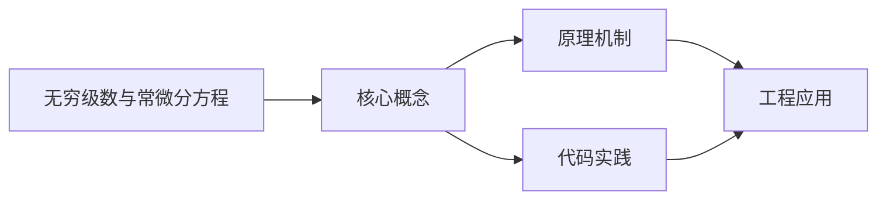

## 1. 学习目标（Bloom 分类）

本节按照布鲁姆教育目标分类学组织学习路径。本文主题为《无穷级数与常微分方程》，属于 微积分 模块，读者可以根据自身阶段选择阅读深度。

记忆层面：能够准确复述本文的核心概念、术语与基本语法或操作步骤，并能够在提问或检索时快速定位对应知识点。能够说出 微积分 的核心定义、定理与公式。

理解层面：能够用自己的语言解释核心原理与工作机制，说明概念之间的因果关系，而不是机械记忆结论。能够解释 微积分 概念背后的直觉与推导。

应用层面：能够在真实项目或练习场景中运用本文知识解决具体问题，写出正确且可维护的实现。能够运用 微积分 方法解决标准问题。

分析层面：能够拆解复杂问题，比较本文主题与相邻概念的异同，识别边界条件与例外情况。能够分析 微积分 方法的适用条件与局限。

评价层面：能够根据约束条件（性能、可读性、安全、成本）评价不同方案的优劣，做出有依据的技术决策。能够评价不同 微积分 方法的优劣。

创造层面：能够把本文知识与其他模块知识组合，设计出新的解决方案或可复用的工程模式。能够把 微积分 应用于编程与工程问题。

通过本节学习，读者应当能够把《无穷级数与常微分方程》纳入自己的知识网络，并与 微积分 模块的其他主题（极限、导数、积分、级数）建立关联。

## 2. 历史动机与发展脉络

《无穷级数与常微分方程》是 微积分 领域的重要主题。要真正理解它，需要先了解它解决的问题与演进过程。

微积分由 Newton 与 Leibniz 在 17 世纪独立创立，解决运动与面积问题；19 世纪 Cauchy/Weierstrass 用极限严格化。
两大主线：微分（变化率）与积分（累积量），由微积分基本定理连接。
应用版图：物理、工程、经济、机器学习（梯度下降、概率密度）。

回到本文主题：无穷级数与常微分方程 的提出与成熟，正是上述技术背景下的必然产物。早期实现往往以简单可用为目标，随着工程规模扩大，社区逐渐沉淀出标准做法与最佳实践；理解这一脉络，可以帮助读者判断“为什么文档中的推荐写法是现在这个样子”，也能在遇到历史遗留代码时准确识别其设计年代与取舍。


## 3. 形式化定义与核心概念精讲

本节把《无穷级数与常微分方程》涉及的核心概念以“定义 + 讲解”的形式展开。读者应把定义当作工具，把讲解当作理解路径；两者结合才能形成可迁移的知识。

极限：函数趋近行为的严格刻画（ε-δ）；连续性的定义；重要极限。
导数：变化率的极限；求导法则（乘积/链式）；中值定理与极值判定。
积分：黎曼和的极限；不定积分与定积分；换元与分部积分；微积分基本定理。

### 3.1 原文章节逐一精讲

原文档把主题拆分为 9 个小节，下面按顺序给出每一节的导读讲解，随后保留原文细节供精读。

#### 原文精读（完整保留）


#### 1. 常数项级数

##### 1.1 基本概念

给定数列 $\{u_n\}$，称 $\sum_{n=1}^{\infty} u_n = u_1 + u_2 + \cdots$ 为**常数项级数**。部分和 $S_n = \sum_{k=1}^{n} u_k$，若 $\lim_{n \to \infty} S_n = S$ 存在，则称级数**收敛**，和为 $S$；否则**发散**。

**收敛的必要条件**：若 $\sum u_n$ 收敛，则 $\lim_{n \to \infty} u_n = 0$。注意反之不成立（如调和级数）。

**基本性质**：

- 级数去掉或添加有限项不改变收敛性
- 若 $\sum u_n = S$，则 $\sum ku_n = kS$
- 若 $\sum u_n$、$\sum v_n$ 均收敛，则 $\sum(u_n \pm v_n)$ 收敛且和为对应和之加减

##### 1.2 正项级数判别法

当 $u_n \geq 0$ 时，$\sum u_n$ 为正项级数，其部分和序列单调递增，故收敛 $\Leftrightarrow$ 部分和有上界。

**比较判别法**：设 $0 \leq u_n \leq v_n$，若 $\sum v_n$ 收敛则 $\sum u_n$ 收敛；若 $\sum u_n$ 发散则 $\sum v_n$ 发散。

**比较判别法的极限形式**：设 $u_n > 0$，$v_n > 0$，若 $\lim_{n \to \infty} \frac{u_n}{v_n} = l$：

- $0 < l < +\infty$：两级数同敛散
- $l = 0$：$\sum v_n$ 收敛 $\Rightarrow$ $\sum u_n$ 收敛
- $l = +\infty$：$\sum v_n$ 发散 $\Rightarrow$ $\sum u_n$ 发散

**比值判别法（D'Alembert）**：设 $u_n > 0$，若 $\lim_{n \to \infty} \frac{u_{n+1}}{u_n} = \rho$：

- $\rho < 1$：收敛
- $\rho > 1$：发散
- $\rho = 1$：不确定

**根值判别法（Cauchy）**：设 $u_n \geq 0$，若 $\lim_{n \to \infty} \sqrt[n]{u_n} = \rho$：

- $\rho < 1$：收敛
- $\rho > 1$：发散
- $\rho = 1$：不确定

**积分判别法**：设 $f(x)$ 在 $[1, +\infty)$ 上非负单调递减，则 $\sum_{n=1}^{\infty} f(n)$ 与 $\int_1^{+\infty} f(x)\,dx$ 同敛散。

> **判别法选择策略**：含阶乘用比值法，含 $n$ 次幂用根值法，能与 $p$-级数比较时用比较法，通项可积时用积分法。

##### 1.3 交错级数与莱布尼茨判别法

**莱布尼茨判别法**：若交错级数 $\sum_{n=1}^{\infty} (-1)^{n-1} u_n$（$u_n > 0$）满足：

1. $u_{n+1} \leq u_n$（单调递减）
2. $\lim_{n \to \infty} u_n = 0$

则级数收敛，且余项 $|r_n| \leq u_{n+1}$。

##### 1.4 绝对收敛与条件收敛

- **绝对收敛**：$\sum |u_n|$ 收敛 $\Rightarrow$ $\sum u_n$ 收敛
- **条件收敛**：$\sum u_n$ 收敛但 $\sum |u_n|$ 发散

绝对收敛级数具有可交换性（任意重排后和不变），条件收敛级数不具有此性质（Riemann 重排定理）。

#### 2. 幂级数

##### 2.1 收敛半径与收敛域

形如 $\sum_{n=0}^{\infty} a_n x^n$ 的级数称为幂级数。若

$$R = \lim_{n \to \infty} \left|\frac{a_n}{a_{n+1}}\right| \quad \text{或} \quad R = \lim_{n \to \infty} \frac{1}{\sqrt[n]{|a_n|}}$$

存在，则 $R$ 为**收敛半径**。级数在 $|x| < R$ 时绝对收敛，$|x| > R$ 时发散，$x = \pm R$ 处需单独判断。

**收敛域**：开区间 $(-R, R)$ 加上端点收敛情况的并集。

> 对于 $\sum a_n (x - x_0)^n$，收敛区间为 $(x_0 - R, x_0 + R)$。

##### 2.2 幂级数的性质

**逐项求导**：在收敛区间内，

$$\left(\sum_{n=0}^{\infty} a_n x^n\right)' = \sum_{n=1}^{\infty} n a_n x^{n-1}$$

**逐项积分**：在收敛区间内，

$$\int_0^x \left(\sum_{n=0}^{\infty} a_n t^n\right) dt = \sum_{n=0}^{\infty} \frac{a_n}{n+1} x^{n+1}$$

逐项求导和积分后收敛半径不变，但端点收敛性可能改变。

##### 2.3 函数的幂级数展开

**Taylor 级数**：若 $f(x)$ 在 $x_0$ 处无穷可微，则

$$f(x) = \sum_{n=0}^{\infty} \frac{f^{(n)}(x_0)}{n!}(x - x_0)^n$$

**常用展开式**（$x_0 = 0$，即 Maclaurin 级数）：

$$e^x = \sum_{n=0}^{\infty} \frac{x^n}{n!}, \quad x \in (-\infty, +\infty)$$

$$\sin x = \sum_{n=0}^{\infty} \frac{(-1)^n}{(2n+1)!} x^{2n+1}, \quad x \in (-\infty, +\infty)$$

$$\cos x = \sum_{n=0}^{\infty} \frac{(-1)^n}{(2n)!} x^{2n}, \quad x \in (-\infty, +\infty)$$

$$\ln(1+x) = \sum_{n=1}^{\infty} \frac{(-1)^{n-1}}{n} x^n, \quad x \in (-1, 1]$$

$$(1+x)^{\alpha} = \sum_{n=0}^{\infty} \binom{\alpha}{n} x^n, \quad x \in (-1, 1)$$

$$\frac{1}{1-x} = \sum_{n=0}^{\infty} x^n, \quad x \in (-1, 1)$$

**间接展开法**：利用已知展开式通过变量代换、逐项求导、逐项积分等得到新展开式，避免直接计算高阶导数。

##### 2.4 幂级数求和

利用已知的和函数（如 $\sum x^n = \frac{1}{1-x}$），通过逐项求导或积分求未知级数的和。

**典型方法**：设 $S(x) = \sum a_n x^n$，对 $S(x)$ 求导或积分化为已知和函数，再逆运算得到 $S(x)$。

#### 3. 傅里叶级数

##### 3.1 Dirichlet 收敛定理

设 $f(x)$ 以 $2\pi$ 为周期，若满足 **Dirichlet 条件**：

1. 在一个周期内连续或只有有限个第一类间断点
2. 在一个周期内只有有限个极值点

则 $f(x)$ 的傅里叶级数收敛，且在连续点 $x$ 处收敛于 $f(x)$，在间断点 $x$ 处收敛于 $\frac{f(x^-) + f(x^+)}{2}$。

##### 3.2 傅里叶系数

以 $2\pi$ 为周期的函数 $f(x)$ 的傅里叶系数：

$$a_0 = \frac{1}{\pi}\int_{-\pi}^{\pi} f(x)\,dx$$

$$a_n = \frac{1}{\pi}\int_{-\pi}^{\pi} f(x)\cos nx\,dx, \quad n = 1, 2, \ldots$$

$$b_n = \frac{1}{\pi}\int_{-\pi}^{\pi} f(x)\sin nx\,dx, \quad n = 1, 2, \ldots$$

傅里叶级数为：

$$f(x) \sim \frac{a_0}{2} + \sum_{n=1}^{\infty}(a_n \cos nx + b_n \sin nx)$$

##### 3.3 周期延拓与奇偶延拓

**周期延拓**：对定义在 $[0, \pi]$ 或 $[-\pi, \pi]$ 上的非周期函数，将其延拓为 $2\pi$ 周期函数后展开。

**偶延拓（余弦级数）**：将 $f(x)$ 延拓为偶函数，则 $b_n = 0$，

$$f(x) \sim \frac{a_0}{2} + \sum_{n=1}^{\infty} a_n \cos nx$$

**奇延拓（正弦级数）**：将 $f(x)$ 延拓为奇函数，则 $a_n = 0$，

$$f(x) \sim \sum_{n=1}^{\infty} b_n \sin nx$$

##### 3.4 任意周期的傅里叶级数

设 $f(x)$ 以 $2l$ 为周期，令 $x = \frac{l}{\pi}t$ 化为 $2\pi$ 周期：

$$a_n = \frac{1}{l}\int_{-l}^{l} f(x)\cos\frac{n\pi x}{l}\,dx$$

$$b_n = \frac{1}{l}\int_{-l}^{l} f(x)\sin\frac{n\pi x}{l}\,dx$$

$$f(x) \sim \frac{a_0}{2} + \sum_{n=1}^{\infty}\left(a_n \cos\frac{n\pi x}{l} + b_n \sin\frac{n\pi x}{l}\right)$$

#### 4. 常微分方程：一阶方程

##### 4.1 可分离变量方程

形如 $\frac{dy}{dx} = f(x)g(y)$ 的方程，分离变量后积分：

$$\int \frac{dy}{g(y)} = \int f(x)\,dx + C$$

**例**：$\frac{dy}{dx} = \frac{x}{y}$，分离得 $y\,dy = x\,dx$，积分得 $\frac{y^2}{2} = \frac{x^2}{2} + C$，即 $y^2 - x^2 = C$。

##### 4.2 齐次方程

形如 $\frac{dy}{dx} = \varphi\left(\frac{y}{x}\right)$ 的方程，令 $u = \frac{y}{x}$，则 $y = ux$，$\frac{dy}{dx} = u + x\frac{du}{dx}$，代入得：

$$u + x\frac{du}{dx} = \varphi(u) \implies \frac{du}{\varphi(u) - u} = \frac{dx}{x}$$

化为可分离变量方程求解。

##### 4.3 一阶线性方程

形如 $\frac{dy}{dx} + P(x)y = Q(x)$ 的方程。

**常数变易法**：先解齐次方程 $\frac{dy}{dx} + P(x)y = 0$，得 $y = Ce^{-\int P(x)\,dx}$，再将 $C$ 换为 $u(x)$ 代入原方程确定 $u(x)$。

**通解公式**：

$$y = e^{-\int P(x)\,dx}\left[\int Q(x)e^{\int P(x)\,dx}\,dx + C\right]$$

##### 4.4 Bernoulli 方程

形如 $\frac{dy}{dx} + P(x)y = Q(x)y^n$（$n \neq 0, 1$）的方程。

令 $z = y^{1-n}$，则 $\frac{dz}{dx} = (1-n)y^{-n}\frac{dy}{dx}$，代入化为一阶线性方程：

$$\frac{dz}{dx} + (1-n)P(x)z = (1-n)Q(x)$$

#### 5. 可降阶的二阶方程

##### 5.1 $y'' = f(x)$ 型

直接积分两次：$y' = \int f(x)\,dx + C_1$，$y = \int y'\,dx + C_2$。

##### 5.2 $y'' = f(x, y')$ 型（不显含 $y$）

令 $p = y'$，则 $y'' = p'$，方程降为一阶方程 $p' = f(x, p)$，解出 $p$ 后再积分得 $y$。

##### 5.3 $y'' = f(y, y')$ 型（不显含 $x$）

令 $p = y'$，则 $y'' = \frac{dp}{dx} = \frac{dp}{dy}\cdot\frac{dy}{dx} = p\frac{dp}{dy}$，方程降为 $p\frac{dp}{dy} = f(y, p)$，解出 $p = p(y)$ 后再分离变量求 $y$。

#### 6. 二阶常系数线性微分方程

##### 6.1 齐次方程 $y'' + py' + qy = 0$

特征方程 $r^2 + pr + q = 0$，设根为 $r_1, r_2$：

| 根的情况                                   | 通解                                                  |
| ------------------------------------------ | ----------------------------------------------------- |
| $r_1 \neq r_2$（实根）                     | $y = C_1 e^{r_1 x} + C_2 e^{r_2 x}$                   |
| $r_1 = r_2$（重根）                        | $y = (C_1 + C_2 x)e^{r_1 x}$                          |
| $r_{1,2} = \alpha \pm \beta i$（共轭复根） | $y = e^{\alpha x}(C_1 \cos\beta x + C_2 \sin\beta x)$ |

##### 6.2 非齐次方程 $y'' + py' + qy = f(x)$

通解 = 齐次通解 + 非齐次特解。特解用**待定系数法**：

**$f(x) = P_m(x)e^{\lambda x}$ 型**：

设特解 $y^* = x^k Q_m(x)e^{\lambda x}$，其中 $k$ 为 $\lambda$ 是特征方程根的重数（0/1/2），$Q_m(x)$ 为 $m$ 次多项式。

**$f(x) = e^{\lambda x}[P_l(x)\cos\omega x + P_n(x)\sin\omega x]$ 型**：

设特解 $y^* = x^k e^{\lambda x}[R_m^{(1)}(x)\cos\omega x + R_m^{(2)}(x)\sin\omega x]$，其中 $m = \max(l, n)$，$k$ 为 $\lambda + i\omega$ 是特征方程根的重数（0 或 1）。

#### 7. 欧拉方程

形如 $x^n y^{(n)} + a_1 x^{n-1} y^{(n-1)} + \cdots + a_{n-1}xy' + a_n y = f(x)$ 的方程称为**欧拉方程**。

**变量代换**：令 $x = e^t$（即 $t = \ln x$），则：

$$x\frac{dy}{dx} = \frac{dy}{dt}, \quad x^2\frac{d^2y}{dx^2} = \frac{d^2y}{dt^2} - \frac{dy}{dt}$$

更一般地，引入算子 $D = \frac{d}{dt}$，有 $x^k \frac{d^k y}{dx^k} = D(D-1)(D-2)\cdots(D-k+1)y$。

代入后化为常系数线性方程求解，再代回 $x = e^t$。

**二阶欧拉方程** $x^2 y'' + axy' + by = f(x)$：

令 $x = e^t$，化为 $\frac{d^2y}{dt^2} + (a-1)\frac{dy}{dt} + by = f(e^t)$，用常系数方法求解。

#### 8. 综合例题与 Python 辅助计算

##### 8.1 幂级数求和示例

求 $\sum_{n=1}^{\infty} \frac{n}{2^n}$ 的和。

设 $S(x) = \sum_{n=1}^{\infty} n x^n$，则 $S(x) = x\sum_{n=1}^{\infty} n x^{n-1} = x \cdot \frac{d}{dx}\left(\sum_{n=0}^{\infty} x^n\right) = x \cdot \frac{d}{dx}\frac{1}{1-x} = \frac{x}{(1-x)^2}$

代入 $x = \frac{1}{2}$：$S = \frac{1/2}{(1/2)^2} = 2$。

##### 8.2 傅里叶级数 Python 计算

```python
import numpy as np
import matplotlib.pyplot as plt

# 方波信号的傅里叶级数逼近
def square_wave_fourier(x, N):
    """N 阶傅里叶级数逼近方波"""
    result = np.zeros_like(x)
    for k in range(1, N + 1):
        n = 2 * k - 1  # 仅奇数项
        result += (4 / (n * np.pi)) * np.sin(n * x)
    return result

x = np.linspace(-2 * np.pi, 2 * np.pi, 1000)
y_exact = np.sign(np.sin(x))  # 方波

fig, axes = plt.subplots(2, 2, figsize=(12, 8))
for ax, N in zip(axes.flat, [1, 5, 21, 101]):
    y_approx = square_wave_fourier(x, N)
    ax.plot(x, y_exact, 'k--', alpha=0.5, label='方波')
    ax.plot(x, y_approx, 'b-', label=f'N={N}阶')
    ax.set_title(f'傅里叶级数逼近 (N={N})')
    ax.legend()
    ax.grid(True, alpha=0.3)
plt.tight_layout()
plt.savefig('fourier_approx.png', dpi=150)
plt.show()
```

##### 8.3 常微分方程数值解

```python
from scipy.integrate import solve_ivp
import numpy as np
import matplotlib.pyplot as plt

# 二阶常系数线性方程: y'' + 2y' + 5y = 0
# 令 y1 = y, y2 = y', 则 y1' = y2, y2' = -2y2 - 5y1
def ode_system(t, Y):
    y1, y2 = Y
    return [y2, -2 * y2 - 5 * y1]

# 特征方程 r^2 + 2r + 5 = 0, r = -1 ± 2i
# 解析解: y = e^{-t}(C1*cos(2t) + C2*sin(2t))

sol = solve_ivp(ode_system, [0, 10], [1, 0], dense_output=True)
t = np.linspace(0, 10, 500)
y_numerical = sol.sol(t)[0]
y_analytical = np.exp(-t) * np.cos(2 * t)  # C1=1, C2=0

plt.figure(figsize=(10, 5))
plt.plot(t, y_numerical, 'b-', label='数值解')
plt.plot(t, y_analytical, 'r--', label='解析解')
plt.xlabel('t')
plt.ylabel('y')
plt.title("y'' + 2y' + 5y = 0 的解")
plt.legend()
plt.grid(True, alpha=0.3)
plt.savefig('ode_solution.png', dpi=150)
plt.show()
```

##### 8.4 欧拉方程求解示例

```python
from sympy import symbols, Function, dsolve, Eq

x = symbols('x')
y = Function('y')

# 欧拉方程: x^2*y'' + xy' - y = x^2
ode = Eq(x**2 * y(x).diff(x, 2) + x * y(x).diff(x) - y(x), x**2)
sol = dsolve(ode, y(x))
print("欧拉方程的解:", sol)
# 输出: y(x) = C1*x + C2/x + x**2/3
```

#### 9. 知识脉络与要点总结

| 主题 | 核心方法 | 关键公式/定理 |
| ------------- | --------------------------- | ----------------------------- | ----------- | --- |
| 正项级数 | 比较法/比值法/根值法/积分法 | 极限形式比较、D'Alembert 判别 |
| 交错级数 | 莱布尼茨判别法 | 单调递减 + 趋于零 |
| 绝对/条件收敛 | 绝对收敛级数可重排 | Riemann 重排定理 |
| 幂级数 | 收敛半径/间接展开 | $R = \lim                     | a*n/a*{n+1} | $ |
| 傅里叶级数 | 系数公式/奇偶延拓 | Dirichlet 收敛定理 |
| 一阶 ODE | 分离变量/齐次代换/常数变易 | 线性方程通解公式 |
| 可降阶二阶 | $p=y'$ 代换 | 视缺失变量选代换 |
| 二阶常系数 | 特征方程/待定系数法 | 根的三种情况 |
| 欧拉方程 | $x = e^t$ 代换 | 化为常系数方程 |


### 3.2 概念关系图

下面用 Mermaid 图表达本文核心概念之间的关系，帮助读者建立整体图景：



图中展示的是本文知识的结构化关系：核心概念是入口，原理机制解释“为什么”，代码实践演示“怎么做”，工程应用回答“何时用”。读者学习时可以把每个小节的内容挂接到对应节点上。

## 4. 理论推导与原理解析

本节深入《无穷级数与常微分方程》背后的原理。理论部分不求面面俱到，而是聚焦“能解释现象、能指导实践”的关键推导。

极限：函数趋近行为的严格刻画（ε-δ）；连续性的定义；重要极限。
导数：变化率的极限；求导法则（乘积/链式）；中值定理与极值判定。
积分：黎曼和的极限；不定积分与定积分；换元与分部积分；微积分基本定理。
级数：收敛性判别；泰勒展开近似函数。

需要强调的是，理论推导与工程实践之间存在翻译层：理论给出的是理想化模型与边界条件，工程代码则必须处理真实环境中的例外。读者在学习时应先掌握理论的“标准情形”，再通过陷阱章节了解“非标准情形”。

## 5. 代码示例与逐行讲解

本节把原文中的代码示例系统整理，并为每个示例补充用途说明与讲解。读者不应只浏览代码，而应逐段对照讲解理解设计意图。

### 5.1 示例：8.2 傅里叶级数 Python 计算

该示例来自原文《8.2 傅里叶级数 Python 计算》小节，用于演示无穷级数与常微分方程相关操作。阅读时请先看代码结构，再看其后的讲解。

```python
import numpy as np
import matplotlib.pyplot as plt

# 方波信号的傅里叶级数逼近
def square_wave_fourier(x, N):
    """N 阶傅里叶级数逼近方波"""
    result = np.zeros_like(x)
    for k in range(1, N + 1):
        n = 2 * k - 1  # 仅奇数项
        result += (4 / (n * np.pi)) * np.sin(n * x)
    return result

x = np.linspace(-2 * np.pi, 2 * np.pi, 1000)
y_exact = np.sign(np.sin(x))  # 方波

fig, axes = plt.subplots(2, 2, figsize=(12, 8))
for ax, N in zip(axes.flat, [1, 5, 21, 101]):
    y_approx = square_wave_fourier(x, N)
    ax.plot(x, y_exact, 'k--', alpha=0.5, label='方波')
    ax.plot(x, y_approx, 'b-', label=f'N={N}阶')
    ax.set_title(f'傅里叶级数逼近 (N={N})')
    ax.legend()
    ax.grid(True, alpha=0.3)
plt.tight_layout()
plt.savefig('fourier_approx.png', dpi=150)
plt.show()
```

讲解：这段代码演示了本节核心知识点。代码中的关键操作可以归纳为三步：准备（定义或初始化）、执行（核心逻辑）、收尾（释放资源或返回结果）。实际项目中，这三步往往被封装为函数或类，以提升复用性与可测试性。

关键点分析：

该示例共 23 行有效代码，包含 4 类关键结构（def、import、for、return）。其中：

- 入口与初始化部分负责建立上下文，对应实际项目中的启动或装配逻辑；
- 核心逻辑部分体现本文主题的主要操作，是阅读时最需要对照讲解理解的部分；
- 输出或返回部分把结果交给调用方，注意其类型与边界条件。

进阶思考路径：先尝试修改参数观察行为变化，再把示例中的模式迁移到自己的项目中；每次修改都记录预期与实测差异，这是把示例转化为能力的最快方式。

### 5.2 示例：8.3 常微分方程数值解

该示例来自原文《8.3 常微分方程数值解》小节，用于演示无穷级数与常微分方程相关操作。阅读时请先看代码结构，再看其后的讲解。

```python
from scipy.integrate import solve_ivp
import numpy as np
import matplotlib.pyplot as plt

# 二阶常系数线性方程: y'' + 2y' + 5y = 0
# 令 y1 = y, y2 = y', 则 y1' = y2, y2' = -2y2 - 5y1
def ode_system(t, Y):
    y1, y2 = Y
    return [y2, -2 * y2 - 5 * y1]

# 特征方程 r^2 + 2r + 5 = 0, r = -1 ± 2i
# 解析解: y = e^{-t}(C1*cos(2t) + C2*sin(2t))

sol = solve_ivp(ode_system, [0, 10], [1, 0], dense_output=True)
t = np.linspace(0, 10, 500)
y_numerical = sol.sol(t)[0]
y_analytical = np.exp(-t) * np.cos(2 * t)  # C1=1, C2=0

plt.figure(figsize=(10, 5))
plt.plot(t, y_numerical, 'b-', label='数值解')
plt.plot(t, y_analytical, 'r--', label='解析解')
plt.xlabel('t')
plt.ylabel('y')
plt.title("y'' + 2y' + 5y = 0 的解")
plt.legend()
plt.grid(True, alpha=0.3)
plt.savefig('ode_solution.png', dpi=150)
plt.show()
```

讲解：这段代码演示了本节核心知识点。代码中的关键操作可以归纳为三步：准备（定义或初始化）、执行（核心逻辑）、收尾（释放资源或返回结果）。实际项目中，这三步往往被封装为函数或类，以提升复用性与可测试性。

关键点分析：

该示例共 24 行有效代码，包含 4 类关键结构（def、import、from、return）。其中：

- 入口与初始化部分负责建立上下文，对应实际项目中的启动或装配逻辑；
- 核心逻辑部分体现本文主题的主要操作，是阅读时最需要对照讲解理解的部分；
- 输出或返回部分把结果交给调用方，注意其类型与边界条件。

进阶思考路径：先尝试修改参数观察行为变化，再把示例中的模式迁移到自己的项目中；每次修改都记录预期与实测差异，这是把示例转化为能力的最快方式。

### 5.3 示例：8.4 欧拉方程求解示例

该示例来自原文《8.4 欧拉方程求解示例》小节，用于演示无穷级数与常微分方程相关操作。阅读时请先看代码结构，再看其后的讲解。

```python
from sympy import symbols, Function, dsolve, Eq

x = symbols('x')
y = Function('y')

# 欧拉方程: x^2*y'' + xy' - y = x^2
ode = Eq(x**2 * y(x).diff(x, 2) + x * y(x).diff(x) - y(x), x**2)
sol = dsolve(ode, y(x))
print("欧拉方程的解:", sol)
# 输出: y(x) = C1*x + C2/x + x**2/3
```

讲解：这段代码演示了本节核心知识点。代码中的关键操作可以归纳为三步：准备（定义或初始化）、执行（核心逻辑）、收尾（释放资源或返回结果）。实际项目中，这三步往往被封装为函数或类，以提升复用性与可测试性。

关键点分析：

该示例共 8 行有效代码，包含 2 类关键结构（import、from）。其中：

- 入口与初始化部分负责建立上下文，对应实际项目中的启动或装配逻辑；
- 核心逻辑部分体现本文主题的主要操作，是阅读时最需要对照讲解理解的部分；
- 输出或返回部分把结果交给调用方，注意其类型与边界条件。

进阶思考路径：先尝试修改参数观察行为变化，再把示例中的模式迁移到自己的项目中；每次修改都记录预期与实测差异，这是把示例转化为能力的最快方式。


综合以上示例，可以总结出本主题的代码实践要点：第一，先定义清晰的输入输出契约；第二，核心逻辑保持单一职责；第三，错误处理与边界条件不可省略；第四，命名与注释表达意图而非复述代码。

## 6. 对比分析

对比是理解《无穷级数与常微分方程》定位的最快路径。下面从多个维度与相邻方案进行对比。

离散与连续：差分是离散导数，求和是离散积分；编程中两者相通。
微分与积分：互逆运算，基本定理连接。
牛顿法与梯度下降：都是导数驱动的迭代优化。

对比的目的不是分出绝对优劣，而是建立选择依据：不同约束条件下，最优解不同。读者应把每个对比维度转化为决策检查清单。

## 7. 常见陷阱与最佳实践

本节整理该主题的高频错误与推荐做法。每个陷阱先描述现象，再解释原因，最后给出最佳实践。

### 7.1 除零未处理

极限与表达式求值混淆。先化简再代值。

深入讲解：该问题之所以被归类为“常见陷阱”，是因为它在初学者的代码中反复出现，而且往往不在第一时间暴露——错误通常隐藏在特定数据或特定时序下。

从成因上看，除零未处理 一般源于对 微积分 某个机制的理解偏差：要么误用了默认行为，要么忽略了边界条件，要么把其他语言的思维惯性带了过来。

从影响上看，除零未处理 轻则产生错误结果，重则导致资源泄漏、数据损坏或安全事故；这也是为什么工程评审中会把它列为检查项。

从修复策略上看，处理除零未处理的正确顺序是：先复现（构造最小用例），再定位（确认机制层面的根因），最后修复并补充回归测试。跳过复现直接改代码，往往治标不治本。

### 7.2 链式法则遗漏

复合函数求导少乘内层导数。系统检查。

深入讲解：该问题之所以被归类为“常见陷阱”，是因为它在初学者的代码中反复出现，而且往往不在第一时间暴露——错误通常隐藏在特定数据或特定时序下。

从成因上看，链式法则遗漏 一般源于对 微积分 某个机制的理解偏差：要么误用了默认行为，要么忽略了边界条件，要么把其他语言的思维惯性带了过来。

从影响上看，链式法则遗漏 轻则产生错误结果，重则导致资源泄漏、数据损坏或安全事故；这也是为什么工程评审中会把它列为检查项。

从修复策略上看，处理链式法则遗漏的正确顺序是：先复现（构造最小用例），再定位（确认机制层面的根因），最后修复并补充回归测试。跳过复现直接改代码，往往治标不治本。

### 7.3 积分换元忘 dx

变量替换必须同步换微分。

深入讲解：该问题之所以被归类为“常见陷阱”，是因为它在初学者的代码中反复出现，而且往往不在第一时间暴露——错误通常隐藏在特定数据或特定时序下。

从成因上看，积分换元忘 dx 一般源于对 微积分 某个机制的理解偏差：要么误用了默认行为，要么忽略了边界条件，要么把其他语言的思维惯性带了过来。

从影响上看，积分换元忘 dx 轻则产生错误结果，重则导致资源泄漏、数据损坏或安全事故；这也是为什么工程评审中会把它列为检查项。

从修复策略上看，处理积分换元忘 dx的正确顺序是：先复现（构造最小用例），再定位（确认机制层面的根因），最后修复并补充回归测试。跳过复现直接改代码，往往治标不治本。

### 7.4 收敛误判

级数项趋于 0 不一定收敛（调和级数）。

深入讲解：该问题之所以被归类为“常见陷阱”，是因为它在初学者的代码中反复出现，而且往往不在第一时间暴露——错误通常隐藏在特定数据或特定时序下。

从成因上看，收敛误判 一般源于对 微积分 某个机制的理解偏差：要么误用了默认行为，要么忽略了边界条件，要么把其他语言的思维惯性带了过来。

从影响上看，收敛误判 轻则产生错误结果，重则导致资源泄漏、数据损坏或安全事故；这也是为什么工程评审中会把它列为检查项。

从修复策略上看，处理收敛误判的正确顺序是：先复现（构造最小用例），再定位（确认机制层面的根因），最后修复并补充回归测试。跳过复现直接改代码，往往治标不治本。

### 7.5 边界未检查

极值需检查端点与不可导点。

深入讲解：该问题之所以被归类为“常见陷阱”，是因为它在初学者的代码中反复出现，而且往往不在第一时间暴露——错误通常隐藏在特定数据或特定时序下。

从成因上看，边界未检查 一般源于对 微积分 某个机制的理解偏差：要么误用了默认行为，要么忽略了边界条件，要么把其他语言的思维惯性带了过来。

从影响上看，边界未检查 轻则产生错误结果，重则导致资源泄漏、数据损坏或安全事故；这也是为什么工程评审中会把它列为检查项。

从修复策略上看，处理边界未检查的正确顺序是：先复现（构造最小用例），再定位（确认机制层面的根因），最后修复并补充回归测试。跳过复现直接改代码，往往治标不治本。

### 7.6 符号错误

负号与绝对值。分步验算。

深入讲解：该问题之所以被归类为“常见陷阱”，是因为它在初学者的代码中反复出现，而且往往不在第一时间暴露——错误通常隐藏在特定数据或特定时序下。

从成因上看，符号错误 一般源于对 微积分 某个机制的理解偏差：要么误用了默认行为，要么忽略了边界条件，要么把其他语言的思维惯性带了过来。

从影响上看，符号错误 轻则产生错误结果，重则导致资源泄漏、数据损坏或安全事故；这也是为什么工程评审中会把它列为检查项。

从修复策略上看，处理符号错误的正确顺序是：先复现（构造最小用例），再定位（确认机制层面的根因），最后修复并补充回归测试。跳过复现直接改代码，往往治标不治本。

### 7.7 近似误用

泰勒展开忽略余项。估计误差界。

深入讲解：该问题之所以被归类为“常见陷阱”，是因为它在初学者的代码中反复出现，而且往往不在第一时间暴露——错误通常隐藏在特定数据或特定时序下。

从成因上看，近似误用 一般源于对 微积分 某个机制的理解偏差：要么误用了默认行为，要么忽略了边界条件，要么把其他语言的思维惯性带了过来。

从影响上看，近似误用 轻则产生错误结果，重则导致资源泄漏、数据损坏或安全事故；这也是为什么工程评审中会把它列为检查项。

从修复策略上看，处理近似误用的正确顺序是：先复现（构造最小用例），再定位（确认机制层面的根因），最后修复并补充回归测试。跳过复现直接改代码，往往治标不治本。

### 7.8 只记公式

不理解则无法变形。掌握推导。

深入讲解：该问题之所以被归类为“常见陷阱”，是因为它在初学者的代码中反复出现，而且往往不在第一时间暴露——错误通常隐藏在特定数据或特定时序下。

从成因上看，只记公式 一般源于对 微积分 某个机制的理解偏差：要么误用了默认行为，要么忽略了边界条件，要么把其他语言的思维惯性带了过来。

从影响上看，只记公式 轻则产生错误结果，重则导致资源泄漏、数据损坏或安全事故；这也是为什么工程评审中会把它列为检查项。

从修复策略上看，处理只记公式的正确顺序是：先复现（构造最小用例），再定位（确认机制层面的根因），最后修复并补充回归测试。跳过复现直接改代码，往往治标不治本。

### 7.0 最佳实践总览

1. 先判断类型（极限/导数/积分），再选方法。
2. 每步验算符号与定义域。
3. 用数值计算验证解析结果。
4. 图形直觉辅助（Desmos/GeoGebra）。

把这些最佳实践固化为团队规范与代码评审检查项，是避免同类问题反复出现的关键。

## 8. 工程实践

本节把《无穷级数与常微分方程》放入真实工程场景，给出可复用的模式与组织方法。

机器学习：梯度、偏导、链式法则支撑反向传播。
概率统计：概率密度积分、期望、方差。
优化：拉格朗日乘子、凸性。

### 8.1 工程实践的原则拆解

以上工程实践可以归纳为四条原则。第一，配置与代码分离：微积分 项目中环境差异应通过配置注入，而不是散落在代码分支中；这保证同一份代码可以在开发、测试、生产环境一致运行。

第二，接口稳定优先：对外接口（函数签名、协议、数据格式）一旦被消费方依赖，变更成本极高；设计时应预留扩展点并保持向后兼容。

第三，可观测性内置：日志、指标与追踪应该在功能开发时同步设计，而不是故障发生后补救；没有观测手段的模块等于黑盒。

第四，变更可回滚：任何发布都应有对应的回滚方案；数据库迁移、配置变更与代码发布一样需要版本管理与逆向路径。

### 8.2 实践落地的检查清单

- [ ] 机器学习：对照本节描述，检查当前项目是否已经落实；未落实的项列入技术债并排期处理。
- [ ] 概率统计：对照本节描述，检查当前项目是否已经落实；未落实的项列入技术债并排期处理。
- [ ] 优化：对照本节描述，检查当前项目是否已经落实；未落实的项列入技术债并排期处理。

工程实践的共性原则：配置与代码分离、接口稳定优先、可观测性内置、变更可回滚。这些原则适用于本主题的所有实现。

## 9. 案例研究

本节通过一个完整案例把《无穷级数与常微分方程》的知识串起来。案例按“需求分析、方案设计、实现、验证”四步展开。

需求：实现数值求导与定积分（梯度近似）。
方案：中心差分求导；辛普森法/蒙特卡洛积分。
要点：步长选择、误差估计、收敛验证。
验证：对多项式解析对比误差。

### 9.1 案例的扩展讨论

把案例中的方案放大到真实规模，需要额外考虑三个问题：

第一，规模：当数据量或并发量上升一个数量级时，原方案中的数据结构、缓存策略与任务调度是否仍然成立？通常需要引入分层与异步。

第二，团队：多人协作时，模块边界、接口契约与代码所有权必须明确；案例中的实现应拆分为可独立测试的单元，并配合文档说明设计意图。

第三，演进：上线后的需求变化不可避免；方案设计时应预留扩展点（配置化、插件化、事件化），并定期用真实指标验证假设。


案例研究的学习方法：先独立阅读需求，尝试在脑中形成方案，再对照实现与讲解，最后思考“如果约束变化（数据量、并发、团队规模），方案应如何调整”。

## 10. 知识要点总结与深入讲解

本节以讲解形式汇总全文要点，替代传统的习题与自测，读者不需要答题，只需跟随解释建立完整的认知框架。

关于《无穷级数与常微分方程》的核心结论：

微积分是连续世界的数学语言。
极限思想贯穿始终，理解它才能驾驭导数与积分。
工程中数值方法补充解析方法，两者结合。

原文档各小节的要点回顾：

- 1. 常数项级数：该小节围绕无穷级数与常微分方程展开具体细节，阅读时应关注其与核心结论的对应关系；每个小节都是核心结论在某一个侧面的展开。
- 2. 幂级数：该小节围绕无穷级数与常微分方程展开具体细节，阅读时应关注其与核心结论的对应关系；每个小节都是核心结论在某一个侧面的展开。
- 3. 傅里叶级数：该小节围绕无穷级数与常微分方程展开具体细节，阅读时应关注其与核心结论的对应关系；每个小节都是核心结论在某一个侧面的展开。
- 4. 常微分方程：一阶方程：该小节围绕无穷级数与常微分方程展开具体细节，阅读时应关注其与核心结论的对应关系；每个小节都是核心结论在某一个侧面的展开。
- 5. 可降阶的二阶方程：该小节围绕无穷级数与常微分方程展开具体细节，阅读时应关注其与核心结论的对应关系；每个小节都是核心结论在某一个侧面的展开。
- 6. 二阶常系数线性微分方程：该小节围绕无穷级数与常微分方程展开具体细节，阅读时应关注其与核心结论的对应关系；每个小节都是核心结论在某一个侧面的展开。
- 7. 欧拉方程：该小节围绕无穷级数与常微分方程展开具体细节，阅读时应关注其与核心结论的对应关系；每个小节都是核心结论在某一个侧面的展开。
- 8. 综合例题与 Python 辅助计算：该小节围绕无穷级数与常微分方程展开具体细节，阅读时应关注其与核心结论的对应关系；每个小节都是核心结论在某一个侧面的展开。
- 9. 知识脉络与要点总结：该小节围绕无穷级数与常微分方程展开具体细节，阅读时应关注其与核心结论的对应关系；每个小节都是核心结论在某一个侧面的展开。

把以上要点与第 3-9 节的内容对照复习，即可完成对本文主题的闭环学习。

## 11. 参考文献


Khan Academy 微积分：https://zh.khanacademy.org/math/calculus-1
3Blue1Brown 微积分的本质：https://www.3blue1brown.com/topics/calculus
MIT 18.01：https://ocw.mit.edu/courses/18-01-single-variable-calculus-fall-2006/
Desmos：https://www.desmos.com/

## 12. 延伸阅读


微积分基础，见 027-calculus 模块文档。
线性代数（梯度与向量），见 029-linear-algebra 模块。
概率统计（积分应用），见 030-probability-statistics 模块。
尚硅谷 Bilibili 空间（https://space.bilibili.com/302417610 ）提供数学课程。

## 14. 模块知识图谱与学习路径

本文属于 微积分 模块。为了把《无穷级数与常微分方程》放入完整的知识网络，下面列出本模块的全部主题并给出相互关联的导读。学习时建议按模块内顺序推进，并在每个文档中留意交叉引用。


上图为模块主题的推荐学习顺序示意图（仅展示前若干主题）。各主题之间存在三类关联：

第一，前置依赖关系：早期主题是后期主题的基础，例如环境与语法先行、进阶主题随后；

第二，横向并列关系：同一层级主题从不同角度覆盖模块能力，学习顺序可以按兴趣调整；

第三，工程组合关系：多个主题在真实项目中组合使用，例如配置、性能与安全主题往往出现在同一系统的不同层面。

### 14.1 模块主题速查表

| 文档 | 主题 | 与本文的关联 |
| --- | --- | --- |
| 函数与极限 | 001-FunctionAndLimit | 本文的并列主题 |
| 导数与微分 | 002-PhilosophiaeNaturalisPrincipiaMathematica | 本文的并列主题 |
| 微分中值定理 | 003-AMeanValueTheorem | 本文的并列主题 |
| 不定积分 | 004-IndefiniteIntegral | 本文的并列主题 |
| 定积分与应用 | 005-DefiniteIntegralAndApplication | 本文的并列主题 |
| 多元函数微分 | 006-MultivariateFunctionDifferential | 本文的并列主题 |
| 重积分 | 007-MultipleIntegral | 本文的并列主题 |
| 曲线积分与曲面积分 | 008-CurveAndSurfaceIntegral | 本文的并列主题 |
| 公式速查表 | 009-FormulaQuickReference | 本文的并列主题 |
| 无穷级数与常微分方程 | 010-InfiniteSeriesAndODE | 本文自身 |
| 函数与极限典型例题 | 011-FunctionAndLimitExamples | 本文的并列主题 |
| 导数与微分典型例题 | 012-DerivativeAndDifferentialExamples | 本文的并列主题 |
| 微分中值定理典型例题 | 013-DifferentialMeanValueTheoremExamples | 本文的并列主题 |
| 不定积分典型例题 | 014-IndefiniteIntegralExamples | 本文的并列主题 |
| 定积分与应用典型例题 | 015-DefiniteIntegralApplicationExamples | 本文的并列主题 |
| 多元函数微分典型例题 | 016-MultivariateFunctionDifferentialExamples | 本文的并列主题 |
| 重积分典型例题 | 017-MultipleIntegralExamples | 本文的并列主题 |
| 曲线积分与曲面积分典型例题 | 018-CurveAndSurfaceIntegralExamples | 本文的并列主题 |
| 无穷级数与常微分方程典型例题 | 019-InfiniteSeriesAndODEExamples | 本文的并列主题 |

速查表的作用是让读者快速判断：哪些文档应在阅读本文前掌握（前置基础），哪些文档应在阅读本文后继续（延伸主题）。本模块的交叉引用体系即以此表为基础。

## 15. 术语表

下表整理《无穷级数与常微分方程》及 微积分 模块中出现的高频术语，给出简明释义。术语按字母序或逻辑序排列，供查阅。

| 术语 | 释义 |
| --- | --- |
| 极限 | 函数趋近行为的严格刻画（ε-δ）；连续性的定义；重要极限。 |
| 导数 | 变化率的极限；求导法则（乘积/链式）；中值定理与极值判定。 |
| 积分 | 黎曼和的极限；不定积分与定积分；换元与分部积分；微积分基本定理。 |
| 级数 | 收敛性判别；泰勒展开近似函数。 |
| 除零未处理（易错点） | 参见常见陷阱章节的详细讲解 |
| 链式法则遗漏（易错点） | 参见常见陷阱章节的详细讲解 |
| 积分换元忘 dx（易错点） | 参见常见陷阱章节的详细讲解 |
| 收敛误判（易错点） | 参见常见陷阱章节的详细讲解 |
| 边界未检查（易错点） | 参见常见陷阱章节的详细讲解 |
| 符号错误（易错点） | 参见常见陷阱章节的详细讲解 |

术语表与正文配合使用：先通读正文，遇到模糊术语回查本表；长期使用后术语会自然进入工作记忆。

## 13. 深度专题扩展

以下专题从不同角度深入本文主题，供有进阶需求的读者研读。每个专题独立成节，内容相互补充。

### 13.1 极限与连续性严格化

ε-δ 定义：对任意 ε 存在 δ；用于证明连续性。
夹逼定理、单调有界收敛、洛必达法则（0/0 与 ∞/∞）。
连续函数性质：介值定理、极值定理。
理解严格化帮助甄别直觉误区（如瞬时速度）。

### 13.2 微积分基本定理

第一形式：变上限积分求导回到被积函数。
第二形式：定积分 = 原函数差。
推论：面积、累积量、期望的积分表达。
应用：FTC 是数值积分与微分方程求解的理论基础。

## 16. 核心概念串讲（复习视角）

本节以“把知识讲给他人听”的方式，把《无穷级数与常微分方程》的核心概念重新串讲一遍。与前文按章节展开不同，这里的叙述更接近课堂总结：先说整体，再逐个展开，最后收束。

《无穷级数与常微分方程》属于 微积分 模块。要理解它，先要理解它在模块中的位置：它解决的是该领域的一个具体问题，并依赖模块内若干前置概念；反过来，它又为后续进阶主题提供基础。

第一个概念是极限。函数趋近行为的严格刻画（ε-δ）；连续性的定义；重要极限。

在实际使用中，极限需要与相邻概念区分：它们的区别不在于名称，而在于适用条件与行为边界；这正是前文对比分析章节的意义。

第一个概念是导数。变化率的极限；求导法则（乘积/链式）；中值定理与极值判定。

在实际使用中，导数需要与相邻概念区分：它们的区别不在于名称，而在于适用条件与行为边界；这正是前文对比分析章节的意义。

第一个概念是积分。黎曼和的极限；不定积分与定积分；换元与分部积分；微积分基本定理。

在实际使用中，积分需要与相邻概念区分：它们的区别不在于名称，而在于适用条件与行为边界；这正是前文对比分析章节的意义。

接下来是极限。函数趋近行为的严格刻画（ε-δ）；连续性的定义；重要极限。

理解该原理的关键不是记住结论，而是记住“它从什么假设出发、推出了什么、假设不成立时会怎样”。带着这个框架复习，原理之间就会连成网络。

接下来是导数。变化率的极限；求导法则（乘积/链式）；中值定理与极值判定。

理解该原理的关键不是记住结论，而是记住“它从什么假设出发、推出了什么、假设不成立时会怎样”。带着这个框架复习，原理之间就会连成网络。

接下来是积分。黎曼和的极限；不定积分与定积分；换元与分部积分；微积分基本定理。

理解该原理的关键不是记住结论，而是记住“它从什么假设出发、推出了什么、假设不成立时会怎样”。带着这个框架复习，原理之间就会连成网络。

接下来是级数。收敛性判别；泰勒展开近似函数。

理解该原理的关键不是记住结论，而是记住“它从什么假设出发、推出了什么、假设不成立时会怎样”。带着这个框架复习，原理之间就会连成网络。

串讲收束：把概念与原理放回本文主题，可以得出一个总纲——定义描述是什么，原理解释为什么，实践回答怎么做。三者构成完整的学习闭环；后续遇到相关问题，都可以按这个总纲检索知识。
