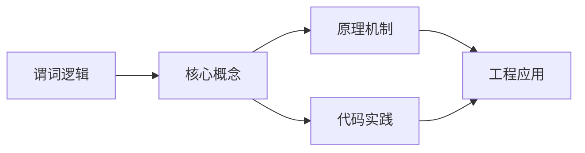
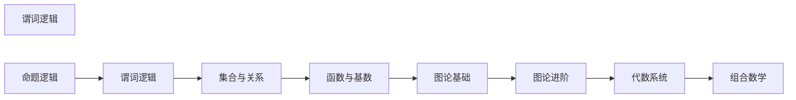

## 1. 学习目标（Bloom 分类）

本节按照布鲁姆教育目标分类学组织学习路径。本文主题为《谓词逻辑》，属于 离散数学 模块，读者可以根据自身阶段选择阅读深度。

记忆层面：能够准确复述本文的核心概念、术语与基本语法或操作步骤，并能够在提问或检索时快速定位对应知识点。能够说出 离散数学 的核心定义、定理与公式。

理解层面：能够用自己的语言解释核心原理与工作机制，说明概念之间的因果关系，而不是机械记忆结论。能够解释 离散数学 概念背后的直觉与推导。

应用层面：能够在真实项目或练习场景中运用本文知识解决具体问题，写出正确且可维护的实现。能够运用 离散数学 方法解决标准问题。

分析层面：能够拆解复杂问题，比较本文主题与相邻概念的异同，识别边界条件与例外情况。能够分析 离散数学 方法的适用条件与局限。

评价层面：能够根据约束条件（性能、可读性、安全、成本）评价不同方案的优劣，做出有依据的技术决策。能够评价不同 离散数学 方法的优劣。

创造层面：能够把本文知识与其他模块知识组合，设计出新的解决方案或可复用的工程模式。能够把 离散数学 应用于编程与工程问题。

通过本节学习，读者应当能够把《谓词逻辑》纳入自己的知识网络，并与 离散数学 模块的其他主题（逻辑、集合、关系、图论、组合）建立关联。

## 2. 历史动机与发展脉络

《谓词逻辑》是 离散数学 领域的重要主题。要真正理解它，需要先了解它解决的问题与演进过程。

离散数学研究可数结构，是计算机科学的数学基础：逻辑、集合、关系、图论、组合计数。
与连续数学相对，离散对象（整数、图、布尔值）对应数字计算机的本质。
应用：算法正确性（归纳）、数据库（关系代数）、网络（图）、密码学（数论）。

回到本文主题：谓词逻辑 的提出与成熟，正是上述技术背景下的必然产物。早期实现往往以简单可用为目标，随着工程规模扩大，社区逐渐沉淀出标准做法与最佳实践；理解这一脉络，可以帮助读者判断“为什么文档中的推荐写法是现在这个样子”，也能在遇到历史遗留代码时准确识别其设计年代与取舍。

## 3. 形式化定义与核心概念精讲

本节把《谓词逻辑》涉及的核心概念以“定义 + 讲解”的形式展开。读者应把定义当作工具，把讲解当作理解路径；两者结合才能形成可迁移的知识。

命题逻辑与谓词逻辑：与或非、蕴含、量词；推理规则与证明方法（直接、反证、归纳）。
集合与关系：子集运算、笛卡尔积、关系的性质（自反/对称/传递）、等价类与偏序。
图论：图、路径、连通、树、欧拉/哈密顿；图的矩阵表示。

### 3.1 原文章节逐一精讲

原文档把主题拆分为 6 个小节，下面按顺序给出每一节的导读讲解，随后保留原文细节供精读。

#### 原文精读（完整保留）

#### 1. 量词与谓词

##### 1.1 谓词

**谓词**表示个体的性质或个体间的关系。

- 一元谓词 $P(x)$：$x$ 具有性质 $P$
- 二元谓词 $P(x, y)$：$x$ 和 $y$ 具有关系 $P$
- $n$ 元谓词 $P(x_1, x_2, \ldots, x_n)$

**论域（个体域）**：个体变元的取值范围。

##### 1.2 量词

**全称量词** $\forall$：$\forall x\,P(x)$ 表示"对所有 $x$，$P(x)$ 成立"。

**存在量词** $\exists$：$\exists x\,P(x)$ 表示"存在 $x$，使得 $P(x)$ 成立"。

##### 1.3 量词与联结词的关系

在有限论域 $D = \{a_1, a_2, \ldots, a_n\}$ 上：

$$\forall x\,P(x) \Leftrightarrow P(a_1) \land P(a_2) \land \cdots \land P(a_n)$$

$$\exists x\,P(x) \Leftrightarrow P(a_1) \lor P(a_2) \lor \cdots \lor P(a_n)$$

##### 1.4 量词的否定

$$\neg\forall x\,P(x) \Leftrightarrow \exists x\,\neg P(x)$$

$$\neg\exists x\,P(x) \Leftrightarrow \forall x\,\neg P(x)$$

**例**：$\neg\forall x(P(x) \to Q(x)) \Leftrightarrow \exists x\,\neg(P(x) \to Q(x)) \Leftrightarrow \exists x(P(x) \land \neg Q(x))$

#### 2. 谓词公式

##### 2.1 项与公式

**项**的递归定义：

1. 个体常量和个体变元是项
2. 若 $f$ 是 $n$ 元函数符号，$t_1, \ldots, t_n$ 是项，则 $f(t_1, \ldots, t_n)$ 是项

**原子公式**：$P(t_1, \ldots, t_n)$，其中 $P$ 是谓词符号，$t_i$ 是项。

**合式公式**：由原子公式通过联结词和量词递归构造。

##### 2.2 自由变元与约束变元

- **约束变元**：出现在量词作用范围内的变元，如 $\forall x\,P(x)$ 中的 $x$
- **自由变元**：不受量词约束的变元，如 $P(x) \land \forall y\,Q(y)$ 中的 $x$

**闭公式**：不含自由变元的公式。

##### 2.3 量词的辖域

$\forall x\,P(x) \land Q(x)$ 中 $\forall x$ 的辖域仅为 $P(x)$，$Q(x)$ 中的 $x$ 是自由的。

##### 2.4 约束变元换名

可将约束变元换名为不出现在公式中的其他变元：

$$\forall x\,P(x, y) \Leftrightarrow \forall z\,P(z, y)$$

#### 3. 等值演算

##### 3.1 基本等值式

**量词德摩根律**：

$$\neg\forall x\,A \Leftrightarrow \exists x\,\neg A, \quad \neg\exists x\,A \Leftrightarrow \forall x\,\neg A$$

**量词分配律**：

$$\forall x(A \land B) \Leftrightarrow \forall x\,A \land \forall x\,B$$

$$\exists x(A \lor B) \Leftrightarrow \exists x\,A \lor \exists x\,B$$

**注意**：$\forall x(A \lor B) \not\Leftrightarrow \forall x\,A \lor \forall x\,B$，$\exists x(A \land B) \not\Leftrightarrow \exists x\,A \land \exists x\,B$

**量词与蕴含**：

$$\forall x\,A \to B \Leftrightarrow \exists x(A \to B) \quad (x \text{ 不在 } B \text{ 中自由出现})$$

$$\exists x\,A \to B \Leftrightarrow \forall x(A \to B) \quad (x \text{ 不在 } B \text{ 中自由出现})$$

$$A \to \forall x\,B \Leftrightarrow \forall x(A \to B) \quad (x \text{ 不在 } A \text{ 中自由出现})$$

$$A \to \exists x\,B \Leftrightarrow \exists x(A \to B) \quad (x \text{ 不在 } A \text{ 中自由出现})$$

##### 3.2 量词的顺序

$$\forall x\,\forall y\,P(x,y) \Leftrightarrow \forall y\,\forall x\,P(x,y)$$

$$\exists x\,\exists y\,P(x,y) \Leftrightarrow \exists y\,\exists x\,P(x,y)$$

**不同量词不可交换**：$\forall x\,\exists y\,P(x,y) \not\Leftrightarrow \exists y\,\forall x\,P(x,y)$

**例**：$\forall x\,\exists y\,(x + y = 0)$ 为真（对每个 $x$，取 $y = -x$），但 $\exists y\,\forall x\,(x + y = 0)$ 为假（不存在一个 $y$ 对所有 $x$ 满足 $x + y = 0$）。

#### 4. 前束范式

##### 4.1 定义

**前束范式**：所有量词都在公式最前面的等值形式，形如

$$Q_1 x_1\,Q_2 x_2 \cdots Q_n x_n\,B$$

其中 $Q_i \in \{\forall, \exists\}$，$B$ 为不含量词的公式（称为**母式**）。

##### 4.2 求前束范式的步骤

1. 消去 $\to$ 和 $\leftrightarrow$
2. 将 $\neg$ 内移至原子公式前
3. 约束变元换名（使不同量词使用不同变元名）
4. 将量词前移

**例**：求 $\neg\forall x\,P(x) \to \exists x\,Q(x)$ 的前束范式。

> 1. $\neg\forall x\,P(x) \to \exists x\,Q(x) \Leftrightarrow \neg\neg\forall x\,P(x) \lor \exists x\,Q(x) \Leftrightarrow \forall x\,P(x) \lor \exists x\,Q(x)$
> 2. 换名：$\forall x\,P(x) \lor \exists y\,Q(y)$
> 3. 量词前移：$\forall x\exists y\,(P(x) \lor Q(y))$

##### 4.3 Skolem 范式

将前束范式中的存在量词用 Skolem 函数消去：

- $\exists x$ 前面有 $\forall y_1, \ldots, \forall y_k$：用 $f(y_1, \ldots, y_k)$ 替换 $x$
- $\exists x$ 前面无全称量词：用常量 $c$ 替换 $x$

**例**：$\forall x\exists y\,(P(x,y))$ 的 Skolem 化：用 $f(x)$ 替换 $y$，得 $\forall x\,P(x, f(x))$。

#### 5. 推理理论

##### 5.1 推理规则

**全称量词消去（UI）**：$\forall x\,A(x) \vdash A(c)$（$c$ 为论域中任意个体）

**全称量词引入（UG）**：$A(c)$（$c$ 为任意个体）$\vdash \forall x\,A(x)$

**存在量词消去（EI）**：$\exists x\,A(x) \vdash A(c)$（$c$ 为特定个体，不能是已有常量）

**存在量词引入（EG）**：$A(c) \vdash \exists x\,A(x)$

##### 5.2 推理注意事项

- EI 必须在 UI 之前使用
- EI 引入的常量不能在其他前提中出现
- UG 要求变元是任意的

**例**：前提 $\forall x(P(x) \to Q(x))$，$\exists x\,P(x)$。结论 $\exists x\,Q(x)$。

> 1. $\exists x\,P(x)$（前提）
> 2. $P(a)$（EI，1）
> 3. $\forall x(P(x) \to Q(x))$（前提）
> 4. $P(a) \to Q(a)$（UI，3）
> 5. $Q(a)$（MP，2, 4）
> 6. $\exists x\,Q(x)$（EG，5）

#### 6. 一阶逻辑形式化

##### 6.1 形式化步骤

1. 确定论域
2. 定义谓词
3. 将自然语言翻译为谓词公式

**例**：将"所有实数都大于或等于某个整数"形式化。

> 论域：实数集 $\mathbb{R}$
> 谓词：$G(x,y)$ 表示 $x \geq y$，$Z(x)$ 表示 $x$ 是整数
> $$\forall x\,\exists y\,(Z(y) \land G(x,y))$$

**例**：将"存在唯一的 $x$ 使得 $P(x)$ 成立"形式化。

> $$\exists x\left(P(x) \land \forall y(P(y) \to y = x)\right)$$
> 也可记为 $\exists! x\,P(x)$。

##### 6.2 常见形式化模式

| 自然语言              | 形式化                            |
| --------------------- | --------------------------------- |
| 所有 $A$ 都是 $B$     | $\forall x(A(x) \to B(x))$        |
| 有些 $A$ 是 $B$       | $\exists x(A(x) \land B(x))$      |
| 没有 $A$ 是 $B$       | $\forall x(A(x) \to \neg B(x))$   |
| 并非所有 $A$ 都是 $B$ | $\exists x(A(x) \land \neg B(x))$ |

**注意**："所有 $A$ 都是 $B$" 形式化为 $\forall x(A(x) \to B(x))$，而非 $\forall x(A(x) \land B(x))$。后者要求论域中所有元素都是 $A$ 且都是 $B$。

##### 6.3 嵌套量词的理解

$$\forall x\,\exists y\,L(x,y)$$

"每个人都爱某个人"——对每个人，都存在一个人被他爱。

$$\exists y\,\forall x\,L(x,y)$$

"有一个人被所有人爱"——存在一个人，所有人都爱他。

两者的逻辑强度不同，后者更强。

### 3.2 概念关系图

下面用 Mermaid 图表达本文核心概念之间的关系，帮助读者建立整体图景：

图中展示的是本文知识的结构化关系：核心概念是入口，原理机制解释“为什么”，代码实践演示“怎么做”，工程应用回答“何时用”。读者学习时可以把每个小节的内容挂接到对应节点上。

## 4. 理论推导与原理解析

本节深入《谓词逻辑》背后的原理。理论部分不求面面俱到，而是聚焦“能解释现象、能指导实践”的关键推导。

命题逻辑与谓词逻辑：与或非、蕴含、量词；推理规则与证明方法（直接、反证、归纳）。
集合与关系：子集运算、笛卡尔积、关系的性质（自反/对称/传递）、等价类与偏序。
图论：图、路径、连通、树、欧拉/哈密顿；图的矩阵表示。
组合计数：排列组合、鸽巢原理、生成函数、递归关系。

需要强调的是，理论推导与工程实践之间存在翻译层：理论给出的是理想化模型与边界条件，工程代码则必须处理真实环境中的例外。读者在学习时应先掌握理论的“标准情形”，再通过陷阱章节了解“非标准情形”。

## 5. 代码示例与逐行讲解

本节把原文中的代码示例系统整理，并为每个示例补充用途说明与讲解。读者不应只浏览代码，而应逐段对照讲解理解设计意图。

原文档未包含独立代码块，下面补充该主题的典型示例，演示核心概念在代码中的落地方式。

综合以上示例，可以总结出本主题的代码实践要点：第一，先定义清晰的输入输出契约；第二，核心逻辑保持单一职责；第三，错误处理与边界条件不可省略；第四，命名与注释表达意图而非复述代码。

## 6. 对比分析

对比是理解《谓词逻辑》定位的最快路径。下面从多个维度与相邻方案进行对比。

离散与连续：离散可数可枚举，计算机天然离散。
逻辑与代码：if/循环/递归对应逻辑结构。
关系与图：关系是图的泛化（有向边）。

对比的目的不是分出绝对优劣，而是建立选择依据：不同约束条件下，最优解不同。读者应把每个对比维度转化为决策检查清单。

## 7. 常见陷阱与最佳实践

本节整理该主题的高频错误与推荐做法。每个陷阱先描述现象，再解释原因，最后给出最佳实践。

### 7.1 蕴含语义混淆

“假前提蕴含任何命题”。按真值表理解。

深入讲解：该问题之所以被归类为“常见陷阱”，是因为它在初学者的代码中反复出现，而且往往不在第一时间暴露——错误通常隐藏在特定数据或特定时序下。

从成因上看，蕴含语义混淆 一般源于对 离散数学 某个机制的理解偏差：要么误用了默认行为，要么忽略了边界条件，要么把其他语言的思维惯性带了过来。

从影响上看，蕴含语义混淆 轻则产生错误结果，重则导致资源泄漏、数据损坏或安全事故；这也是为什么工程评审中会把它列为检查项。

从修复策略上看，处理蕴含语义混淆的正确顺序是：先复现（构造最小用例），再定位（确认机制层面的根因），最后修复并补充回归测试。跳过复现直接改代码，往往治标不治本。

### 7.2 归纳基础缺失

数学归纳必须验证基础情形。

深入讲解：该问题之所以被归类为“常见陷阱”，是因为它在初学者的代码中反复出现，而且往往不在第一时间暴露——错误通常隐藏在特定数据或特定时序下。

从成因上看，归纳基础缺失 一般源于对 离散数学 某个机制的理解偏差：要么误用了默认行为，要么忽略了边界条件，要么把其他语言的思维惯性带了过来。

从影响上看，归纳基础缺失 轻则产生错误结果，重则导致资源泄漏、数据损坏或安全事故；这也是为什么工程评审中会把它列为检查项。

从修复策略上看，处理归纳基础缺失的正确顺序是：先复现（构造最小用例），再定位（确认机制层面的根因），最后修复并补充回归测试。跳过复现直接改代码，往往治标不治本。

### 7.3 量词顺序

∀x∃y 与 ∃y∀x 不同。仔细读序。

深入讲解：该问题之所以被归类为“常见陷阱”，是因为它在初学者的代码中反复出现，而且往往不在第一时间暴露——错误通常隐藏在特定数据或特定时序下。

从成因上看，量词顺序 一般源于对 离散数学 某个机制的理解偏差：要么误用了默认行为，要么忽略了边界条件，要么把其他语言的思维惯性带了过来。

从影响上看，量词顺序 轻则产生错误结果，重则导致资源泄漏、数据损坏或安全事故；这也是为什么工程评审中会把它列为检查项。

从修复策略上看，处理量词顺序的正确顺序是：先复现（构造最小用例），再定位（确认机制层面的根因），最后修复并补充回归测试。跳过复现直接改代码，往往治标不治本。

### 7.4 等价关系误判

只满足部分性质。三性质全查。

深入讲解：该问题之所以被归类为“常见陷阱”，是因为它在初学者的代码中反复出现，而且往往不在第一时间暴露——错误通常隐藏在特定数据或特定时序下。

从成因上看，等价关系误判 一般源于对 离散数学 某个机制的理解偏差：要么误用了默认行为，要么忽略了边界条件，要么把其他语言的思维惯性带了过来。

从影响上看，等价关系误判 轻则产生错误结果，重则导致资源泄漏、数据损坏或安全事故；这也是为什么工程评审中会把它列为检查项。

从修复策略上看，处理等价关系误判的正确顺序是：先复现（构造最小用例），再定位（确认机制层面的根因），最后修复并补充回归测试。跳过复现直接改代码，往往治标不治本。

### 7.5 图遍历漏点

非连通图。循环所有起点。

深入讲解：该问题之所以被归类为“常见陷阱”，是因为它在初学者的代码中反复出现，而且往往不在第一时间暴露——错误通常隐藏在特定数据或特定时序下。

从成因上看，图遍历漏点 一般源于对 离散数学 某个机制的理解偏差：要么误用了默认行为，要么忽略了边界条件，要么把其他语言的思维惯性带了过来。

从影响上看，图遍历漏点 轻则产生错误结果，重则导致资源泄漏、数据损坏或安全事故；这也是为什么工程评审中会把它列为检查项。

从修复策略上看，处理图遍历漏点的正确顺序是：先复现（构造最小用例），再定位（确认机制层面的根因），最后修复并补充回归测试。跳过复现直接改代码，往往治标不治本。

### 7.6 组合重复/遗漏

计数多算。用包含-排除验证。

深入讲解：该问题之所以被归类为“常见陷阱”，是因为它在初学者的代码中反复出现，而且往往不在第一时间暴露——错误通常隐藏在特定数据或特定时序下。

从成因上看，组合重复/遗漏 一般源于对 离散数学 某个机制的理解偏差：要么误用了默认行为，要么忽略了边界条件，要么把其他语言的思维惯性带了过来。

从影响上看，组合重复/遗漏 轻则产生错误结果，重则导致资源泄漏、数据损坏或安全事故；这也是为什么工程评审中会把它列为检查项。

从修复策略上看，处理组合重复/遗漏的正确顺序是：先复现（构造最小用例），再定位（确认机制层面的根因），最后修复并补充回归测试。跳过复现直接改代码，往往治标不治本。

### 7.7 树与图混淆

树是连通无环图，性质特殊。

深入讲解：该问题之所以被归类为“常见陷阱”，是因为它在初学者的代码中反复出现，而且往往不在第一时间暴露——错误通常隐藏在特定数据或特定时序下。

从成因上看，树与图混淆 一般源于对 离散数学 某个机制的理解偏差：要么误用了默认行为，要么忽略了边界条件，要么把其他语言的思维惯性带了过来。

从影响上看，树与图混淆 轻则产生错误结果，重则导致资源泄漏、数据损坏或安全事故；这也是为什么工程评审中会把它列为检查项。

从修复策略上看，处理树与图混淆的正确顺序是：先复现（构造最小用例），再定位（确认机制层面的根因），最后修复并补充回归测试。跳过复现直接改代码，往往治标不治本。

### 7.8 证明不严谨

跳跃假设。每一步有依据。

深入讲解：该问题之所以被归类为“常见陷阱”，是因为它在初学者的代码中反复出现，而且往往不在第一时间暴露——错误通常隐藏在特定数据或特定时序下。

从成因上看，证明不严谨 一般源于对 离散数学 某个机制的理解偏差：要么误用了默认行为，要么忽略了边界条件，要么把其他语言的思维惯性带了过来。

从影响上看，证明不严谨 轻则产生错误结果，重则导致资源泄漏、数据损坏或安全事故；这也是为什么工程评审中会把它列为检查项。

从修复策略上看，处理证明不严谨的正确顺序是：先复现（构造最小用例），再定位（确认机制层面的根因），最后修复并补充回归测试。跳过复现直接改代码，往往治标不治本。

### 7.0 最佳实践总览

1. 写程序前先证明思路（归纳/反证）。
2. 关系建模：数据库表、权限、依赖。
3. 图论建模：网络、社交、依赖、状态机。
4. 用真值表与小例子验证逻辑。

把这些最佳实践固化为团队规范与代码评审检查项，是避免同类问题反复出现的关键。

## 8. 工程实践

本节把《谓词逻辑》放入真实工程场景，给出可复用的模式与组织方法。

算法正确性：循环不变量与归纳证明。
数据结构：树与哈希的数学性质。
安全：数论（模运算、素数）支撑密码学。

### 8.1 工程实践的原则拆解

以上工程实践可以归纳为四条原则。第一，配置与代码分离：离散数学 项目中环境差异应通过配置注入，而不是散落在代码分支中；这保证同一份代码可以在开发、测试、生产环境一致运行。

第二，接口稳定优先：对外接口（函数签名、协议、数据格式）一旦被消费方依赖，变更成本极高；设计时应预留扩展点并保持向后兼容。

第三，可观测性内置：日志、指标与追踪应该在功能开发时同步设计，而不是故障发生后补救；没有观测手段的模块等于黑盒。

第四，变更可回滚：任何发布都应有对应的回滚方案；数据库迁移、配置变更与代码发布一样需要版本管理与逆向路径。

### 8.2 实践落地的检查清单

- [ ] 算法正确性：对照本节描述，检查当前项目是否已经落实；未落实的项列入技术债并排期处理。
- [ ] 数据结构：对照本节描述，检查当前项目是否已经落实；未落实的项列入技术债并排期处理。
- [ ] 安全：对照本节描述，检查当前项目是否已经落实；未落实的项列入技术债并排期处理。

工程实践的共性原则：配置与代码分离、接口稳定优先、可观测性内置、变更可回滚。这些原则适用于本主题的所有实现。

## 9. 案例研究

本节通过一个完整案例把《谓词逻辑》的知识串起来。案例按“需求分析、方案设计、实现、验证”四步展开。

需求：验证图是否存在环与拓扑排序。
方案：DFS 三色标记或 Kahn 算法。
要点：归纳证明正确性；复杂度 O(V+E)。
验证：随机图对拍 + 环用例。

### 9.1 案例的扩展讨论

把案例中的方案放大到真实规模，需要额外考虑三个问题：

第一，规模：当数据量或并发量上升一个数量级时，原方案中的数据结构、缓存策略与任务调度是否仍然成立？通常需要引入分层与异步。

第二，团队：多人协作时，模块边界、接口契约与代码所有权必须明确；案例中的实现应拆分为可独立测试的单元，并配合文档说明设计意图。

第三，演进：上线后的需求变化不可避免；方案设计时应预留扩展点（配置化、插件化、事件化），并定期用真实指标验证假设。

案例研究的学习方法：先独立阅读需求，尝试在脑中形成方案，再对照实现与讲解，最后思考“如果约束变化（数据量、并发、团队规模），方案应如何调整”。

## 10. 知识要点总结与深入讲解

本节以讲解形式汇总全文要点，替代传统的习题与自测，读者不需要答题，只需跟随解释建立完整的认知框架。

关于《谓词逻辑》的核心结论：

离散数学是算法与数据结构的“语法”。
逻辑与证明能力是严谨编程的基础。
图与关系贯穿数据库、网络与系统设计。

原文档各小节的要点回顾：

- 1. 量词与谓词：该小节围绕谓词逻辑展开具体细节，阅读时应关注其与核心结论的对应关系；每个小节都是核心结论在某一个侧面的展开。
- 2. 谓词公式：该小节围绕谓词逻辑展开具体细节，阅读时应关注其与核心结论的对应关系；每个小节都是核心结论在某一个侧面的展开。
- 3. 等值演算：该小节围绕谓词逻辑展开具体细节，阅读时应关注其与核心结论的对应关系；每个小节都是核心结论在某一个侧面的展开。
- 4. 前束范式：该小节围绕谓词逻辑展开具体细节，阅读时应关注其与核心结论的对应关系；每个小节都是核心结论在某一个侧面的展开。
- 5. 推理理论：该小节围绕谓词逻辑展开具体细节，阅读时应关注其与核心结论的对应关系；每个小节都是核心结论在某一个侧面的展开。
- 6. 一阶逻辑形式化：该小节围绕谓词逻辑展开具体细节，阅读时应关注其与核心结论的对应关系；每个小节都是核心结论在某一个侧面的展开。

把以上要点与第 3-9 节的内容对照复习，即可完成对本文主题的闭环学习。

## 11. 参考文献

MIT 6.042J：https://ocw.mit.edu/courses/6-042j-mathematics-for-computer-science-fall-2010/
Khan Academy 离散数学：https://www.khanacademy.org/computing/computer-science
Discrete Mathematics and Its Applications（Rosen）：https://www.mheducation.com/

## 12. 延伸阅读

离散数学基础，见 028-discrete-math 模块文档。
算法与图论，见 023-algorithm 模块。
逻辑与数据库关系，见 019-sql 模块。
黑马程序员 Bilibili 空间（https://space.bilibili.com/37974444 ）提供离散数学课程。

## 14. 模块知识图谱与学习路径

本文属于 离散数学 模块。为了把《谓词逻辑》放入完整的知识网络，下面列出本模块的全部主题并给出相互关联的导读。学习时建议按模块内顺序推进，并在每个文档中留意交叉引用。

上图为模块主题的推荐学习顺序示意图（仅展示前若干主题）。各主题之间存在三类关联：

第一，前置依赖关系：早期主题是后期主题的基础，例如环境与语法先行、进阶主题随后；

第二，横向并列关系：同一层级主题从不同角度覆盖模块能力，学习顺序可以按兴趣调整；

第三，工程组合关系：多个主题在真实项目中组合使用，例如配置、性能与安全主题往往出现在同一系统的不同层面。

### 14.1 模块主题速查表

| 文档 | 主题 | 与本文的关联 |
| --- | --- | --- |
| 命题逻辑 | 001-PropositionalLogic | 本文的并列主题 |
| 谓词逻辑 | 002-PredicateLogic | 本文自身 |
| 集合与关系 | 003-SetAndRelation | 本文的并列主题 |
| 函数与基数 | 004-FunctionAndNumber | 本文的并列主题 |
| 图论基础 | 005-GraphTheoryBasics | 本文的前置基础 |
| 图论进阶 | 006-GraphTheoryAdvanced | 本文的并列主题 |
| 代数系统 | 007-AlgebraicSystem | 本文的并列主题 |
| 组合数学 | 008-Combinatorics | 本文的并列主题 |

速查表的作用是让读者快速判断：哪些文档应在阅读本文前掌握（前置基础），哪些文档应在阅读本文后继续（延伸主题）。本模块的交叉引用体系即以此表为基础。

## 15. 术语表

下表整理《谓词逻辑》及 离散数学 模块中出现的高频术语，给出简明释义。术语按字母序或逻辑序排列，供查阅。

| 术语 | 释义 |
| --- | --- |
| 命题逻辑与谓词逻辑 | 与或非、蕴含、量词；推理规则与证明方法（直接、反证、归纳）。 |
| 集合与关系 | 子集运算、笛卡尔积、关系的性质（自反/对称/传递）、等价类与偏序。 |
| 图论 | 图、路径、连通、树、欧拉/哈密顿；图的矩阵表示。 |
| 组合计数 | 排列组合、鸽巢原理、生成函数、递归关系。 |
| 蕴含语义混淆（易错点） | 参见常见陷阱章节的详细讲解 |
| 归纳基础缺失（易错点） | 参见常见陷阱章节的详细讲解 |
| 量词顺序（易错点） | 参见常见陷阱章节的详细讲解 |
| 等价关系误判（易错点） | 参见常见陷阱章节的详细讲解 |
| 图遍历漏点（易错点） | 参见常见陷阱章节的详细讲解 |
| 组合重复/遗漏（易错点） | 参见常见陷阱章节的详细讲解 |

术语表与正文配合使用：先通读正文，遇到模糊术语回查本表；长期使用后术语会自然进入工作记忆。

## 13. 深度专题扩展

以下专题从不同角度深入本文主题，供有进阶需求的读者研读。每个专题独立成节，内容相互补充。

### 13.1 数学归纳法

基础情形 -> 归纳假设 -> 归纳步骤；变体：强归纳、结构归纳。
典型证明：求和公式、树性质、算法正确性。
循环不变量：归纳法在程序中的对应。
常见错误：假设过强/基础遗漏。

### 13.2 图论基础定理

握手引理：所有顶点度数之和为边数两倍。
树的等价定义：连通无环、n-1 条边、任意两点唯一路径。
欧拉回路条件：连通且所有顶点度数为偶。
四色定理与平面图（了解层面）。

## 16. 核心概念串讲（复习视角）

本节以“把知识讲给他人听”的方式，把《谓词逻辑》的核心概念重新串讲一遍。与前文按章节展开不同，这里的叙述更接近课堂总结：先说整体，再逐个展开，最后收束。

《谓词逻辑》属于 离散数学 模块。要理解它，先要理解它在模块中的位置：它解决的是该领域的一个具体问题，并依赖模块内若干前置概念；反过来，它又为后续进阶主题提供基础。

第一个概念是命题逻辑与谓词逻辑。与或非、蕴含、量词；推理规则与证明方法（直接、反证、归纳）。

在实际使用中，命题逻辑与谓词逻辑需要与相邻概念区分：它们的区别不在于名称，而在于适用条件与行为边界；这正是前文对比分析章节的意义。

第一个概念是集合与关系。子集运算、笛卡尔积、关系的性质（自反/对称/传递）、等价类与偏序。

在实际使用中，集合与关系需要与相邻概念区分：它们的区别不在于名称，而在于适用条件与行为边界；这正是前文对比分析章节的意义。

第一个概念是图论。图、路径、连通、树、欧拉/哈密顿；图的矩阵表示。

在实际使用中，图论需要与相邻概念区分：它们的区别不在于名称，而在于适用条件与行为边界；这正是前文对比分析章节的意义。

接下来是命题逻辑与谓词逻辑。与或非、蕴含、量词；推理规则与证明方法（直接、反证、归纳）。

理解该原理的关键不是记住结论，而是记住“它从什么假设出发、推出了什么、假设不成立时会怎样”。带着这个框架复习，原理之间就会连成网络。

接下来是集合与关系。子集运算、笛卡尔积、关系的性质（自反/对称/传递）、等价类与偏序。

理解该原理的关键不是记住结论，而是记住“它从什么假设出发、推出了什么、假设不成立时会怎样”。带着这个框架复习，原理之间就会连成网络。

接下来是图论。图、路径、连通、树、欧拉/哈密顿；图的矩阵表示。

理解该原理的关键不是记住结论，而是记住“它从什么假设出发、推出了什么、假设不成立时会怎样”。带着这个框架复习，原理之间就会连成网络。

接下来是组合计数。排列组合、鸽巢原理、生成函数、递归关系。

理解该原理的关键不是记住结论，而是记住“它从什么假设出发、推出了什么、假设不成立时会怎样”。带着这个框架复习，原理之间就会连成网络。

串讲收束：把概念与原理放回本文主题，可以得出一个总纲——定义描述是什么，原理解释为什么，实践回答怎么做。三者构成完整的学习闭环；后续遇到相关问题，都可以按这个总纲检索知识。
