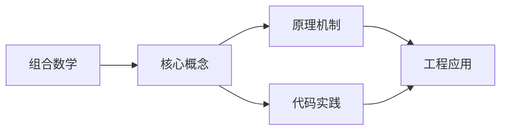
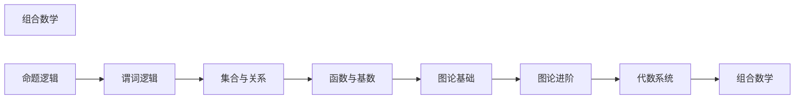

## 1. 学习目标（Bloom 分类）

本节按照布鲁姆教育目标分类学组织学习路径。本文主题为《组合数学》，属于 离散数学 模块，读者可以根据自身阶段选择阅读深度。

记忆层面：能够准确复述本文的核心概念、术语与基本语法或操作步骤，并能够在提问或检索时快速定位对应知识点。能够说出 离散数学 的核心定义、定理与公式。

理解层面：能够用自己的语言解释核心原理与工作机制，说明概念之间的因果关系，而不是机械记忆结论。能够解释 离散数学 概念背后的直觉与推导。

应用层面：能够在真实项目或练习场景中运用本文知识解决具体问题，写出正确且可维护的实现。能够运用 离散数学 方法解决标准问题。

分析层面：能够拆解复杂问题，比较本文主题与相邻概念的异同，识别边界条件与例外情况。能够分析 离散数学 方法的适用条件与局限。

评价层面：能够根据约束条件（性能、可读性、安全、成本）评价不同方案的优劣，做出有依据的技术决策。能够评价不同 离散数学 方法的优劣。

创造层面：能够把本文知识与其他模块知识组合，设计出新的解决方案或可复用的工程模式。能够把 离散数学 应用于编程与工程问题。

通过本节学习，读者应当能够把《组合数学》纳入自己的知识网络，并与 离散数学 模块的其他主题（逻辑、集合、关系、图论、组合）建立关联。

## 2. 历史动机与发展脉络

《组合数学》是 离散数学 领域的重要主题。要真正理解它，需要先了解它解决的问题与演进过程。

离散数学研究可数结构，是计算机科学的数学基础：逻辑、集合、关系、图论、组合计数。
与连续数学相对，离散对象（整数、图、布尔值）对应数字计算机的本质。
应用：算法正确性（归纳）、数据库（关系代数）、网络（图）、密码学（数论）。

回到本文主题：组合数学 的提出与成熟，正是上述技术背景下的必然产物。早期实现往往以简单可用为目标，随着工程规模扩大，社区逐渐沉淀出标准做法与最佳实践；理解这一脉络，可以帮助读者判断“为什么文档中的推荐写法是现在这个样子”，也能在遇到历史遗留代码时准确识别其设计年代与取舍。

## 3. 形式化定义与核心概念精讲

本节把《组合数学》涉及的核心概念以“定义 + 讲解”的形式展开。读者应把定义当作工具，把讲解当作理解路径；两者结合才能形成可迁移的知识。

命题逻辑与谓词逻辑：与或非、蕴含、量词；推理规则与证明方法（直接、反证、归纳）。
集合与关系：子集运算、笛卡尔积、关系的性质（自反/对称/传递）、等价类与偏序。
图论：图、路径、连通、树、欧拉/哈密顿；图的矩阵表示。

### 3.1 原文章节逐一精讲

原文档把主题拆分为 8 个小节，下面按顺序给出每一节的导读讲解，随后保留原文细节供精读。

#### 原文精读（完整保留）

#### 1. 基本计数原理

##### 1.1 加法原理

若完成一件事有 $n$ 类方法，第 $i$ 类有 $m_i$ 种方法，各类方法互不相容，则完成该事共有 $m_1 + m_2 + \cdots + m_n$ 种方法。

##### 1.2 乘法原理

若完成一件事需 $n$ 个步骤，第 $i$ 步有 $m_i$ 种方法，则完成该事共有 $m_1 \times m_2 \times \cdots \times m_n$ 种方法。

**例**：从 A 到 B 有3条路，从 B 到 C 有4条路，从 A 经 B 到 C 有 $3 \times 4 = 12$ 种走法。

#### 2. 排列与组合

##### 2.1 排列

**无重复排列**：从 $n$ 个不同元素中取 $r$ 个排列：

$$P(n, r) = \frac{n!}{(n-r)!}$$

**全排列**：$P(n, n) = n!$

**有重复排列**：从 $n$ 个不同元素中取 $r$ 个（允许重复）排列：$n^r$

**圆排列**：$n$ 个不同元素的圆排列数：$(n-1)!$

##### 2.2 组合

**无重复组合**：从 $n$ 个不同元素中取 $r$ 个：

$$\binom{n}{r} = C(n, r) = \frac{n!}{r!(n-r)!}$$

**多重组合（可重复组合）**：从 $n$ 种元素中取 $r$ 个（允许重复）：

$$\binom{n+r-1}{r} = \binom{n+r-1}{n-1}$$

**例**：将10个相同的球放入3个不同的盒子，有多少种方法？

> 可重复组合：$\binom{10+3-1}{10} = \binom{12}{10} = 66$。

##### 2.3 组合恒等式

**Pascal 恒等式**：$\binom{n}{r} = \binom{n-1}{r-1} + \binom{n-1}{r}$

**二项式定理**：$(x+y)^n = \sum_{k=0}^{n} \binom{n}{k} x^k y^{n-k}$

**特殊值**：

- $\sum_{k=0}^{n} \binom{n}{k} = 2^n$
- $\sum_{k=0}^{n} (-1)^k \binom{n}{k} = 0$
- $\sum_{k=0}^{n} \binom{n}{k}^2 = \binom{2n}{n}$（Vandermonde 恒等式的特例）

**Vandermonde 恒等式**：$\binom{m+n}{r} = \sum_{k=0}^{r} \binom{m}{k}\binom{n}{r-k}$

##### 2.4 多重集的排列

设多重集 $S = \{n_1 \cdot a_1, n_2 \cdot a_2, \ldots, n_k \cdot a_k\}$，$n = n_1 + n_2 + \cdots + n_k$，则全排列数为：

$$\frac{n!}{n_1! \cdot n_2! \cdots n_k!}$$

**例**：MISSISSIPPI 的字母排列数。

> $M:1$, $I:4$, $S:4$, $P:2$，共11个字母。
> $\frac{11!}{1! \cdot 4! \cdot 4! \cdot 2!} = 34650$

#### 3. 容斥原理

##### 3.1 两集合

$$|A \cup B| = |A| + |B| - |A \cap B|$$

##### 3.2 三集合

$$|A \cup B \cup C| = |A| + |B| + |C| - |A \cap B| - |A \cap C| - |B \cap C| + |A \cap B \cap C|$$

##### 3.3 一般形式

$$\left|\bigcup_{i=1}^{n} A_i\right| = \sum_{i}|A_i| - \sum_{i<j}|A_i \cap A_j| + \sum_{i<j<k}|A_i \cap A_j \cap A_k| - \cdots + (-1)^{n+1}|A_1 \cap \cdots \cap A_n|$$

##### 3.4 错排问题

$n$ 个元素的**错排**（derangement）数：

$$D_n = n!\left(1 - \frac{1}{1!} + \frac{1}{2!} - \cdots + (-1)^n \frac{1}{n!}\right) = n!\sum_{k=0}^{n}\frac{(-1)^k}{k!}$$

**例**：4个人的帽子全戴错的方案数。

> $D_4 = 4!(1 - 1 + \frac{1}{2} - \frac{1}{6} + \frac{1}{24}) = 24 \cdot \frac{9}{24} = 9$

##### 3.5 Euler 函数

不超过 $n$ 且与 $n$ 互素的正整数个数：

$$\varphi(n) = n\prod_{p \mid n}\left(1 - \frac{1}{p}\right)$$

其中 $p$ 取遍 $n$ 的所有不同素因子。

**例**：$\varphi(12) = 12(1 - \frac{1}{2})(1 - \frac{1}{3}) = 12 \cdot \frac{1}{2} \cdot \frac{2}{3} = 4$。

#### 4. 鸽巢原理

##### 4.1 基本形式

将 $n+1$ 个物品放入 $n$ 个盒子，至少有一个盒子包含至少2个物品。

##### 4.2 加强形式

将 $n$ 个物品放入 $k$ 个盒子，则至少有一个盒子包含至少 $\lceil n/k \rceil$ 个物品。

##### 4.3 应用

**例**：在任意 $n+1$ 个正整数中，必有两个数之差是 $n$ 的倍数。

> 考虑这 $n+1$ 个数除以 $n$ 的余数，余数只有 $0, 1, \ldots, n-1$ 共 $n$ 种，由鸽巢原理，必有两个数余数相同，其差是 $n$ 的倍数。

**例**：在边长为1的正三角形中任取5个点，必有两点距离不超过 $\frac{1}{2}$。

> 将正三角形分为4个边长为 $\frac{1}{2}$ 的小正三角形，5个点放入4个区域，必有2个在同一区域，距离不超过 $\frac{1}{2}$。

#### 5. 递推关系

##### 5.1 常系数线性齐次递推

$$a_n + c_1 a_{n-1} + c_2 a_{n-2} + \cdots + c_k a_{n-k} = 0$$

**特征方程**：$x^k + c_1 x^{k-1} + \cdots + c_k = 0$

**求解**：

- 单根 $r$：贡献 $A r^n$
- $m$ 重根 $r$：贡献 $(A_0 + A_1 n + \cdots + A_{m-1} n^{m-1}) r^n$

**例**：Fibonacci 数列 $F_n = F_{n-1} + F_{n-2}$，$F_0 = 0$，$F_1 = 1$。

> 特征方程：$x^2 - x - 1 = 0$，$x = \frac{1 \pm \sqrt{5}}{2}$。
> $$F_n = \frac{1}{\sqrt{5}}\left[\left(\frac{1+\sqrt{5}}{2}\right)^n - \left(\frac{1-\sqrt{5}}{2}\right)^n\right]$$

##### 5.2 常系数线性非齐次递推

$$a_n + c_1 a_{n-1} + \cdots + c_k a_{n-k} = f(n)$$

**通解** = 齐次通解 + 非齐次特解

特解形式取决于 $f(n)$：

| $f(n)$        | 特解形式                         |
| ------------- | -------------------------------- |
| $c$（常数）   | $A$                              |
| $cn^d$        | $A_0 + A_1 n + \cdots + A_d n^d$ |
| $c \cdot r^n$ | $A r^n$（$r$ 不是特征根）        |
| $c \cdot r^n$ | $An r^n$（$r$ 是单特征根）       |

#### 6. 生成函数

##### 6.1 定义

序列 $\{a_n\}$ 的**普通生成函数**：

$$G(x) = \sum_{n=0}^{\infty} a_n x^n$$

##### 6.2 常用生成函数

| 序列                   | 生成函数            |
| ---------------------- | ------------------- |
| $\binom{n}{k}$         | $(1+x)^n$           |
| $1, 1, 1, \ldots$      | $\frac{1}{1-x}$     |
| $1, -1, 1, -1, \ldots$ | $\frac{1}{1+x}$     |
| $0, 1, 2, 3, \ldots$   | $\frac{x}{(1-x)^2}$ |
| $\binom{n+k-1}{k}$     | $\frac{1}{(1-x)^n}$ |

##### 6.3 应用

**例**：用1元、2元、5元硬币凑出 $n$ 元的方案数。

> 生成函数：
> $$G(x) = \frac{1}{1-x} \cdot \frac{1}{1-x^2} \cdot \frac{1}{1-x^5}$$
> $a_n$ 为 $G(x)$ 展开式中 $x^n$ 的系数。

##### 6.4 指数生成函数

$$E(x) = \sum_{n=0}^{\infty} a_n \frac{x^n}{n!}$$

适用于排列计数问题。

| 序列                 | 指数生成函数 |
| -------------------- | ------------ |
| $1, 1, 1, \ldots$    | $e^x$        |
| $P(n, k)$            | $(1+x)^n$    |
| $1, 0, 1, 0, \ldots$ | $\cosh x$    |
| $0, 1, 0, 1, \ldots$ | $\sinh x$    |

#### 7. Catalan 数

##### 7.1 定义

$$C_n = \frac{1}{n+1}\binom{2n}{n} = \frac{(2n)!}{(n+1)!n!}$$

前几项：$C_0 = 1, C_1 = 1, C_2 = 2, C_3 = 5, C_4 = 14, C_5 = 42$

##### 7.2 递推关系

$$C_n = \sum_{i=0}^{n-1} C_i C_{n-1-i}, \quad C_0 = 1$$

##### 7.3 组合意义

$C_n$ 计数的问题：

1. $n$ 对括号的合法匹配数
2. $n+1$ 个矩阵连乘的加括号方式数
3. 从 $(0,0)$ 到 $(n,n)$ 不越过对角线的路径数
4. $n$ 个节点的不同二叉搜索树个数
5. 凸 $n+2$ 边形的三角剖分数
6. 栈的合法出栈序列数

**例**：3对括号的合法匹配：$C_3 = 5$ 种。

> ((())), (()()), (())(), ()(()), ()()()

##### 7.4 生成函数

$$C(x) = \sum_{n=0}^{\infty} C_n x^n = \frac{1 - \sqrt{1-4x}}{2x}$$

#### 8. Stirling 数

##### 8.1 第一类 Stirling 数

$s(n, k)$：将 $n$ 个不同元素排成 $k$ 个非空轮换的方案数。

**递推**：

$$s(n, k) = s(n-1, k-1) + (n-1) \cdot s(n-1, k)$$

**边界**：$s(0,0) = 1$，$s(n,0) = 0$（$n > 0$），$s(n,n) = 1$

**与阶乘的关系**：

$$x^{\underline{n}} = x(x-1)(x-2)\cdots(x-n+1) = \sum_{k=0}^{n} s(n,k) x^k$$

##### 8.2 第二类 Stirling 数

$S(n, k)$：将 $n$ 个不同元素分成 $k$ 个非空子集的方案数。

**递推**：

$$S(n, k) = S(n-1, k-1) + k \cdot S(n-1, k)$$

**边界**：$S(0,0) = 1$，$S(n,0) = 0$（$n > 0$），$S(n,n) = 1$，$S(n,1) = 1$

**与幂的关系**：

$$x^n = \sum_{k=0}^{n} S(n,k) x^{\underline{k}}$$

**显式公式**：

$$S(n, k) = \frac{1}{k!}\sum_{j=0}^{k} (-1)^{k-j} \binom{k}{j} j^n$$

**例**：$S(4, 2) = 7$。

> 4个元素分成2个非空子集：$\{1\}\{2,3,4\}$, $\{2\}\{1,3,4\}$, $\{3\}\{1,2,4\}$, $\{4\}\{1,2,3\}$, $\{1,2\}\{3,4\}$, $\{1,3\}\{2,4\}$, $\{1,4\}\{2,3\}$。

##### 8.3 Bell 数

$$B_n = \sum_{k=0}^{n} S(n, k)$$

$B_n$ 是 $n$ 个元素的划分总数。

前几项：$B_0 = 1, B_1 = 1, B_2 = 2, B_3 = 5, B_4 = 15, B_5 = 52$

**递推**：$B_{n+1} = \sum_{k=0}^{n} \binom{n}{k} B_k$

**指数生成函数**：$\sum_{n=0}^{\infty} B_n \frac{x^n}{n!} = e^{e^x - 1}$

### 3.2 概念关系图

下面用 Mermaid 图表达本文核心概念之间的关系，帮助读者建立整体图景：

图中展示的是本文知识的结构化关系：核心概念是入口，原理机制解释“为什么”，代码实践演示“怎么做”，工程应用回答“何时用”。读者学习时可以把每个小节的内容挂接到对应节点上。

## 4. 理论推导与原理解析

本节深入《组合数学》背后的原理。理论部分不求面面俱到，而是聚焦“能解释现象、能指导实践”的关键推导。

命题逻辑与谓词逻辑：与或非、蕴含、量词；推理规则与证明方法（直接、反证、归纳）。
集合与关系：子集运算、笛卡尔积、关系的性质（自反/对称/传递）、等价类与偏序。
图论：图、路径、连通、树、欧拉/哈密顿；图的矩阵表示。
组合计数：排列组合、鸽巢原理、生成函数、递归关系。

需要强调的是，理论推导与工程实践之间存在翻译层：理论给出的是理想化模型与边界条件，工程代码则必须处理真实环境中的例外。读者在学习时应先掌握理论的“标准情形”，再通过陷阱章节了解“非标准情形”。

## 5. 代码示例与逐行讲解

本节把原文中的代码示例系统整理，并为每个示例补充用途说明与讲解。读者不应只浏览代码，而应逐段对照讲解理解设计意图。

原文档未包含独立代码块，下面补充该主题的典型示例，演示核心概念在代码中的落地方式。

综合以上示例，可以总结出本主题的代码实践要点：第一，先定义清晰的输入输出契约；第二，核心逻辑保持单一职责；第三，错误处理与边界条件不可省略；第四，命名与注释表达意图而非复述代码。

## 6. 对比分析

对比是理解《组合数学》定位的最快路径。下面从多个维度与相邻方案进行对比。

离散与连续：离散可数可枚举，计算机天然离散。
逻辑与代码：if/循环/递归对应逻辑结构。
关系与图：关系是图的泛化（有向边）。

对比的目的不是分出绝对优劣，而是建立选择依据：不同约束条件下，最优解不同。读者应把每个对比维度转化为决策检查清单。

## 7. 常见陷阱与最佳实践

本节整理该主题的高频错误与推荐做法。每个陷阱先描述现象，再解释原因，最后给出最佳实践。

### 7.1 蕴含语义混淆

“假前提蕴含任何命题”。按真值表理解。

深入讲解：该问题之所以被归类为“常见陷阱”，是因为它在初学者的代码中反复出现，而且往往不在第一时间暴露——错误通常隐藏在特定数据或特定时序下。

从成因上看，蕴含语义混淆 一般源于对 离散数学 某个机制的理解偏差：要么误用了默认行为，要么忽略了边界条件，要么把其他语言的思维惯性带了过来。

从影响上看，蕴含语义混淆 轻则产生错误结果，重则导致资源泄漏、数据损坏或安全事故；这也是为什么工程评审中会把它列为检查项。

从修复策略上看，处理蕴含语义混淆的正确顺序是：先复现（构造最小用例），再定位（确认机制层面的根因），最后修复并补充回归测试。跳过复现直接改代码，往往治标不治本。

### 7.2 归纳基础缺失

数学归纳必须验证基础情形。

深入讲解：该问题之所以被归类为“常见陷阱”，是因为它在初学者的代码中反复出现，而且往往不在第一时间暴露——错误通常隐藏在特定数据或特定时序下。

从成因上看，归纳基础缺失 一般源于对 离散数学 某个机制的理解偏差：要么误用了默认行为，要么忽略了边界条件，要么把其他语言的思维惯性带了过来。

从影响上看，归纳基础缺失 轻则产生错误结果，重则导致资源泄漏、数据损坏或安全事故；这也是为什么工程评审中会把它列为检查项。

从修复策略上看，处理归纳基础缺失的正确顺序是：先复现（构造最小用例），再定位（确认机制层面的根因），最后修复并补充回归测试。跳过复现直接改代码，往往治标不治本。

### 7.3 量词顺序

∀x∃y 与 ∃y∀x 不同。仔细读序。

深入讲解：该问题之所以被归类为“常见陷阱”，是因为它在初学者的代码中反复出现，而且往往不在第一时间暴露——错误通常隐藏在特定数据或特定时序下。

从成因上看，量词顺序 一般源于对 离散数学 某个机制的理解偏差：要么误用了默认行为，要么忽略了边界条件，要么把其他语言的思维惯性带了过来。

从影响上看，量词顺序 轻则产生错误结果，重则导致资源泄漏、数据损坏或安全事故；这也是为什么工程评审中会把它列为检查项。

从修复策略上看，处理量词顺序的正确顺序是：先复现（构造最小用例），再定位（确认机制层面的根因），最后修复并补充回归测试。跳过复现直接改代码，往往治标不治本。

### 7.4 等价关系误判

只满足部分性质。三性质全查。

深入讲解：该问题之所以被归类为“常见陷阱”，是因为它在初学者的代码中反复出现，而且往往不在第一时间暴露——错误通常隐藏在特定数据或特定时序下。

从成因上看，等价关系误判 一般源于对 离散数学 某个机制的理解偏差：要么误用了默认行为，要么忽略了边界条件，要么把其他语言的思维惯性带了过来。

从影响上看，等价关系误判 轻则产生错误结果，重则导致资源泄漏、数据损坏或安全事故；这也是为什么工程评审中会把它列为检查项。

从修复策略上看，处理等价关系误判的正确顺序是：先复现（构造最小用例），再定位（确认机制层面的根因），最后修复并补充回归测试。跳过复现直接改代码，往往治标不治本。

### 7.5 图遍历漏点

非连通图。循环所有起点。

深入讲解：该问题之所以被归类为“常见陷阱”，是因为它在初学者的代码中反复出现，而且往往不在第一时间暴露——错误通常隐藏在特定数据或特定时序下。

从成因上看，图遍历漏点 一般源于对 离散数学 某个机制的理解偏差：要么误用了默认行为，要么忽略了边界条件，要么把其他语言的思维惯性带了过来。

从影响上看，图遍历漏点 轻则产生错误结果，重则导致资源泄漏、数据损坏或安全事故；这也是为什么工程评审中会把它列为检查项。

从修复策略上看，处理图遍历漏点的正确顺序是：先复现（构造最小用例），再定位（确认机制层面的根因），最后修复并补充回归测试。跳过复现直接改代码，往往治标不治本。

### 7.6 组合重复/遗漏

计数多算。用包含-排除验证。

深入讲解：该问题之所以被归类为“常见陷阱”，是因为它在初学者的代码中反复出现，而且往往不在第一时间暴露——错误通常隐藏在特定数据或特定时序下。

从成因上看，组合重复/遗漏 一般源于对 离散数学 某个机制的理解偏差：要么误用了默认行为，要么忽略了边界条件，要么把其他语言的思维惯性带了过来。

从影响上看，组合重复/遗漏 轻则产生错误结果，重则导致资源泄漏、数据损坏或安全事故；这也是为什么工程评审中会把它列为检查项。

从修复策略上看，处理组合重复/遗漏的正确顺序是：先复现（构造最小用例），再定位（确认机制层面的根因），最后修复并补充回归测试。跳过复现直接改代码，往往治标不治本。

### 7.7 树与图混淆

树是连通无环图，性质特殊。

深入讲解：该问题之所以被归类为“常见陷阱”，是因为它在初学者的代码中反复出现，而且往往不在第一时间暴露——错误通常隐藏在特定数据或特定时序下。

从成因上看，树与图混淆 一般源于对 离散数学 某个机制的理解偏差：要么误用了默认行为，要么忽略了边界条件，要么把其他语言的思维惯性带了过来。

从影响上看，树与图混淆 轻则产生错误结果，重则导致资源泄漏、数据损坏或安全事故；这也是为什么工程评审中会把它列为检查项。

从修复策略上看，处理树与图混淆的正确顺序是：先复现（构造最小用例），再定位（确认机制层面的根因），最后修复并补充回归测试。跳过复现直接改代码，往往治标不治本。

### 7.8 证明不严谨

跳跃假设。每一步有依据。

深入讲解：该问题之所以被归类为“常见陷阱”，是因为它在初学者的代码中反复出现，而且往往不在第一时间暴露——错误通常隐藏在特定数据或特定时序下。

从成因上看，证明不严谨 一般源于对 离散数学 某个机制的理解偏差：要么误用了默认行为，要么忽略了边界条件，要么把其他语言的思维惯性带了过来。

从影响上看，证明不严谨 轻则产生错误结果，重则导致资源泄漏、数据损坏或安全事故；这也是为什么工程评审中会把它列为检查项。

从修复策略上看，处理证明不严谨的正确顺序是：先复现（构造最小用例），再定位（确认机制层面的根因），最后修复并补充回归测试。跳过复现直接改代码，往往治标不治本。

### 7.0 最佳实践总览

1. 写程序前先证明思路（归纳/反证）。
2. 关系建模：数据库表、权限、依赖。
3. 图论建模：网络、社交、依赖、状态机。
4. 用真值表与小例子验证逻辑。

把这些最佳实践固化为团队规范与代码评审检查项，是避免同类问题反复出现的关键。

## 8. 工程实践

本节把《组合数学》放入真实工程场景，给出可复用的模式与组织方法。

算法正确性：循环不变量与归纳证明。
数据结构：树与哈希的数学性质。
安全：数论（模运算、素数）支撑密码学。

### 8.1 工程实践的原则拆解

以上工程实践可以归纳为四条原则。第一，配置与代码分离：离散数学 项目中环境差异应通过配置注入，而不是散落在代码分支中；这保证同一份代码可以在开发、测试、生产环境一致运行。

第二，接口稳定优先：对外接口（函数签名、协议、数据格式）一旦被消费方依赖，变更成本极高；设计时应预留扩展点并保持向后兼容。

第三，可观测性内置：日志、指标与追踪应该在功能开发时同步设计，而不是故障发生后补救；没有观测手段的模块等于黑盒。

第四，变更可回滚：任何发布都应有对应的回滚方案；数据库迁移、配置变更与代码发布一样需要版本管理与逆向路径。

### 8.2 实践落地的检查清单

- [ ] 算法正确性：对照本节描述，检查当前项目是否已经落实；未落实的项列入技术债并排期处理。
- [ ] 数据结构：对照本节描述，检查当前项目是否已经落实；未落实的项列入技术债并排期处理。
- [ ] 安全：对照本节描述，检查当前项目是否已经落实；未落实的项列入技术债并排期处理。

工程实践的共性原则：配置与代码分离、接口稳定优先、可观测性内置、变更可回滚。这些原则适用于本主题的所有实现。

## 9. 案例研究

本节通过一个完整案例把《组合数学》的知识串起来。案例按“需求分析、方案设计、实现、验证”四步展开。

需求：验证图是否存在环与拓扑排序。
方案：DFS 三色标记或 Kahn 算法。
要点：归纳证明正确性；复杂度 O(V+E)。
验证：随机图对拍 + 环用例。

### 9.1 案例的扩展讨论

把案例中的方案放大到真实规模，需要额外考虑三个问题：

第一，规模：当数据量或并发量上升一个数量级时，原方案中的数据结构、缓存策略与任务调度是否仍然成立？通常需要引入分层与异步。

第二，团队：多人协作时，模块边界、接口契约与代码所有权必须明确；案例中的实现应拆分为可独立测试的单元，并配合文档说明设计意图。

第三，演进：上线后的需求变化不可避免；方案设计时应预留扩展点（配置化、插件化、事件化），并定期用真实指标验证假设。

案例研究的学习方法：先独立阅读需求，尝试在脑中形成方案，再对照实现与讲解，最后思考“如果约束变化（数据量、并发、团队规模），方案应如何调整”。

## 10. 知识要点总结与深入讲解

本节以讲解形式汇总全文要点，替代传统的习题与自测，读者不需要答题，只需跟随解释建立完整的认知框架。

关于《组合数学》的核心结论：

离散数学是算法与数据结构的“语法”。
逻辑与证明能力是严谨编程的基础。
图与关系贯穿数据库、网络与系统设计。

原文档各小节的要点回顾：

- 1. 基本计数原理：该小节围绕组合数学展开具体细节，阅读时应关注其与核心结论的对应关系；每个小节都是核心结论在某一个侧面的展开。
- 2. 排列与组合：该小节围绕组合数学展开具体细节，阅读时应关注其与核心结论的对应关系；每个小节都是核心结论在某一个侧面的展开。
- 3. 容斥原理：该小节围绕组合数学展开具体细节，阅读时应关注其与核心结论的对应关系；每个小节都是核心结论在某一个侧面的展开。
- 4. 鸽巢原理：该小节围绕组合数学展开具体细节，阅读时应关注其与核心结论的对应关系；每个小节都是核心结论在某一个侧面的展开。
- 5. 递推关系：该小节围绕组合数学展开具体细节，阅读时应关注其与核心结论的对应关系；每个小节都是核心结论在某一个侧面的展开。
- 6. 生成函数：该小节围绕组合数学展开具体细节，阅读时应关注其与核心结论的对应关系；每个小节都是核心结论在某一个侧面的展开。
- 7. Catalan 数：该小节围绕组合数学展开具体细节，阅读时应关注其与核心结论的对应关系；每个小节都是核心结论在某一个侧面的展开。
- 8. Stirling 数：该小节围绕组合数学展开具体细节，阅读时应关注其与核心结论的对应关系；每个小节都是核心结论在某一个侧面的展开。

把以上要点与第 3-9 节的内容对照复习，即可完成对本文主题的闭环学习。

## 11. 参考文献

MIT 6.042J：https://ocw.mit.edu/courses/6-042j-mathematics-for-computer-science-fall-2010/
Khan Academy 离散数学：https://www.khanacademy.org/computing/computer-science
Discrete Mathematics and Its Applications（Rosen）：https://www.mheducation.com/

## 12. 延伸阅读

离散数学基础，见 028-discrete-math 模块文档。
算法与图论，见 023-algorithm 模块。
逻辑与数据库关系，见 019-sql 模块。
黑马程序员 Bilibili 空间（https://space.bilibili.com/37974444 ）提供离散数学课程。

## 14. 模块知识图谱与学习路径

本文属于 离散数学 模块。为了把《组合数学》放入完整的知识网络，下面列出本模块的全部主题并给出相互关联的导读。学习时建议按模块内顺序推进，并在每个文档中留意交叉引用。

上图为模块主题的推荐学习顺序示意图（仅展示前若干主题）。各主题之间存在三类关联：

第一，前置依赖关系：早期主题是后期主题的基础，例如环境与语法先行、进阶主题随后；

第二，横向并列关系：同一层级主题从不同角度覆盖模块能力，学习顺序可以按兴趣调整；

第三，工程组合关系：多个主题在真实项目中组合使用，例如配置、性能与安全主题往往出现在同一系统的不同层面。

### 14.1 模块主题速查表

| 文档 | 主题 | 与本文的关联 |
| --- | --- | --- |
| 命题逻辑 | 001-PropositionalLogic | 本文的并列主题 |
| 谓词逻辑 | 002-PredicateLogic | 本文的并列主题 |
| 集合与关系 | 003-SetAndRelation | 本文的并列主题 |
| 函数与基数 | 004-FunctionAndNumber | 本文的并列主题 |
| 图论基础 | 005-GraphTheoryBasics | 本文的前置基础 |
| 图论进阶 | 006-GraphTheoryAdvanced | 本文的并列主题 |
| 代数系统 | 007-AlgebraicSystem | 本文的并列主题 |
| 组合数学 | 008-Combinatorics | 本文自身 |

速查表的作用是让读者快速判断：哪些文档应在阅读本文前掌握（前置基础），哪些文档应在阅读本文后继续（延伸主题）。本模块的交叉引用体系即以此表为基础。

## 15. 术语表

下表整理《组合数学》及 离散数学 模块中出现的高频术语，给出简明释义。术语按字母序或逻辑序排列，供查阅。

| 术语 | 释义 |
| --- | --- |
| 命题逻辑与谓词逻辑 | 与或非、蕴含、量词；推理规则与证明方法（直接、反证、归纳）。 |
| 集合与关系 | 子集运算、笛卡尔积、关系的性质（自反/对称/传递）、等价类与偏序。 |
| 图论 | 图、路径、连通、树、欧拉/哈密顿；图的矩阵表示。 |
| 组合计数 | 排列组合、鸽巢原理、生成函数、递归关系。 |
| 蕴含语义混淆（易错点） | 参见常见陷阱章节的详细讲解 |
| 归纳基础缺失（易错点） | 参见常见陷阱章节的详细讲解 |
| 量词顺序（易错点） | 参见常见陷阱章节的详细讲解 |
| 等价关系误判（易错点） | 参见常见陷阱章节的详细讲解 |
| 图遍历漏点（易错点） | 参见常见陷阱章节的详细讲解 |
| 组合重复/遗漏（易错点） | 参见常见陷阱章节的详细讲解 |

术语表与正文配合使用：先通读正文，遇到模糊术语回查本表；长期使用后术语会自然进入工作记忆。

## 13. 深度专题扩展

以下专题从不同角度深入本文主题，供有进阶需求的读者研读。每个专题独立成节，内容相互补充。

### 13.1 数学归纳法

基础情形 -> 归纳假设 -> 归纳步骤；变体：强归纳、结构归纳。
典型证明：求和公式、树性质、算法正确性。
循环不变量：归纳法在程序中的对应。
常见错误：假设过强/基础遗漏。

### 13.2 图论基础定理

握手引理：所有顶点度数之和为边数两倍。
树的等价定义：连通无环、n-1 条边、任意两点唯一路径。
欧拉回路条件：连通且所有顶点度数为偶。
四色定理与平面图（了解层面）。

## 16. 核心概念串讲（复习视角）

本节以“把知识讲给他人听”的方式，把《组合数学》的核心概念重新串讲一遍。与前文按章节展开不同，这里的叙述更接近课堂总结：先说整体，再逐个展开，最后收束。

《组合数学》属于 离散数学 模块。要理解它，先要理解它在模块中的位置：它解决的是该领域的一个具体问题，并依赖模块内若干前置概念；反过来，它又为后续进阶主题提供基础。

第一个概念是命题逻辑与谓词逻辑。与或非、蕴含、量词；推理规则与证明方法（直接、反证、归纳）。

在实际使用中，命题逻辑与谓词逻辑需要与相邻概念区分：它们的区别不在于名称，而在于适用条件与行为边界；这正是前文对比分析章节的意义。

第一个概念是集合与关系。子集运算、笛卡尔积、关系的性质（自反/对称/传递）、等价类与偏序。

在实际使用中，集合与关系需要与相邻概念区分：它们的区别不在于名称，而在于适用条件与行为边界；这正是前文对比分析章节的意义。

第一个概念是图论。图、路径、连通、树、欧拉/哈密顿；图的矩阵表示。

在实际使用中，图论需要与相邻概念区分：它们的区别不在于名称，而在于适用条件与行为边界；这正是前文对比分析章节的意义。

接下来是命题逻辑与谓词逻辑。与或非、蕴含、量词；推理规则与证明方法（直接、反证、归纳）。

理解该原理的关键不是记住结论，而是记住“它从什么假设出发、推出了什么、假设不成立时会怎样”。带着这个框架复习，原理之间就会连成网络。

接下来是集合与关系。子集运算、笛卡尔积、关系的性质（自反/对称/传递）、等价类与偏序。

理解该原理的关键不是记住结论，而是记住“它从什么假设出发、推出了什么、假设不成立时会怎样”。带着这个框架复习，原理之间就会连成网络。

接下来是图论。图、路径、连通、树、欧拉/哈密顿；图的矩阵表示。

理解该原理的关键不是记住结论，而是记住“它从什么假设出发、推出了什么、假设不成立时会怎样”。带着这个框架复习，原理之间就会连成网络。

接下来是组合计数。排列组合、鸽巢原理、生成函数、递归关系。

理解该原理的关键不是记住结论，而是记住“它从什么假设出发、推出了什么、假设不成立时会怎样”。带着这个框架复习，原理之间就会连成网络。

串讲收束：把概念与原理放回本文主题，可以得出一个总纲——定义描述是什么，原理解释为什么，实践回答怎么做。三者构成完整的学习闭环；后续遇到相关问题，都可以按这个总纲检索知识。
