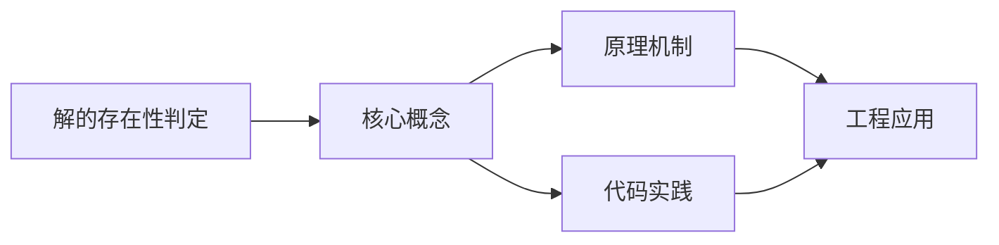
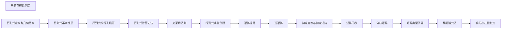

## 1. 学习目标（Bloom 分类）

本节按照布鲁姆教育目标分类学组织学习路径。本文主题为《解的存在性判定》，属于 线性代数 模块，读者可以根据自身阶段选择阅读深度。

记忆层面：能够准确复述本文的核心概念、术语与基本语法或操作步骤，并能够在提问或检索时快速定位对应知识点。能够说出 线性代数 的核心定义、定理与公式。

理解层面：能够用自己的语言解释核心原理与工作机制，说明概念之间的因果关系，而不是机械记忆结论。能够解释 线性代数 概念背后的直觉与推导。

应用层面：能够在真实项目或练习场景中运用本文知识解决具体问题，写出正确且可维护的实现。能够运用 线性代数 方法解决标准问题。

分析层面：能够拆解复杂问题，比较本文主题与相邻概念的异同，识别边界条件与例外情况。能够分析 线性代数 方法的适用条件与局限。

评价层面：能够根据约束条件（性能、可读性、安全、成本）评价不同方案的优劣，做出有依据的技术决策。能够评价不同 线性代数 方法的优劣。

创造层面：能够把本文知识与其他模块知识组合，设计出新的解决方案或可复用的工程模式。能够把 线性代数 应用于编程与工程问题。

通过本节学习，读者应当能够把《解的存在性判定》纳入自己的知识网络，并与 线性代数 模块的其他主题（向量、矩阵、线性变换、特征值）建立关联。

## 2. 历史动机与发展脉络

《解的存在性判定》是 线性代数 领域的重要主题。要真正理解它，需要先了解它解决的问题与演进过程。

线性代数研究向量空间与线性映射，由 19 世纪行列式理论发展而来；是数据科学、图形学、物理与机器学习的基础。
核心对象：向量（数据点）、矩阵（变换/数据表）、线性方程组、特征值（变换的本质）。
现代应用：机器学习（权重矩阵、嵌入）、图形（变换矩阵）、搜索引擎（PageRank）、推荐（矩阵分解）。

回到本文主题：解的存在性判定 的提出与成熟，正是上述技术背景下的必然产物。早期实现往往以简单可用为目标，随着工程规模扩大，社区逐渐沉淀出标准做法与最佳实践；理解这一脉络，可以帮助读者判断“为什么文档中的推荐写法是现在这个样子”，也能在遇到历史遗留代码时准确识别其设计年代与取舍。

## 3. 形式化定义与核心概念精讲

本节把《解的存在性判定》涉及的核心概念以“定义 + 讲解”的形式展开。读者应把定义当作工具，把讲解当作理解路径；两者结合才能形成可迁移的知识。

向量与空间：线性组合、线性无关、张成、基与维数。
矩阵运算：乘法（复合变换）、转置、逆；秩的含义（信息维度）。
线性方程组：高斯消元、解的结构（唯一/无穷/无解）。

### 3.1 原文章节逐一精讲

原文档把主题拆分为 6 个小节，下面按顺序给出每一节的导读讲解，随后保留原文细节供精读。

#### 原文精读（完整保留）

#### 1. 线性方程组的基本概念

##### 1.1 一般形式

含有 $m$ 个方程、$n$ 个未知量的线性方程组：

$$\begin{cases} a_{11}x_1 + a_{12}x_2 + \cdots + a_{1n}x_n = b_1 \\ a_{21}x_1 + a_{22}x_2 + \cdots + a_{2n}x_n = b_2 \\ \cdots \\ a_{m1}x_1 + a_{m2}x_2 + \cdots + a_{mn}x_n = b_m \end{cases}$$

矩阵形式：$Ax = b$

- **系数矩阵**：$A = (a_{ij})_{m \times n}$
- **增广矩阵**：$(A|b)$
- **齐次方程组**：$b = 0$，即 $Ax = 0$
- **非齐次方程组**：$b \neq 0$，即 $Ax = b$

##### 1.2 解的分类

线性方程组的解有三种情况：

1. **无解**：方程组矛盾
2. **唯一解**：恰好一组解
3. **无穷多解**：有无穷多组解

#### 2. 解的存在性判定定理

##### 2.1 Kronecker-Capelli 定理

**定理**：线性方程组 $Ax = b$ 有解的充要条件是系数矩阵的秩等于增广矩阵的秩：

$$r(A) = r(A|b)$$

##### 2.2 证明

**必要性**：若 $Ax = b$ 有解 $x_0$，则 $b = Ax_0$，即 $b$ 是 $A$ 的列向量的线性组合，故 $b$ 加入 $A$ 的列向量组不增加秩，$r(A) = r(A|b)$。

**充分性**：若 $r(A) = r(A|b) = r$，则 $b$ 可由 $A$ 的列向量线性表示，即存在 $x_0$ 使得 $Ax_0 = b$。

##### 2.3 解的数量判定

当 $r(A) = r(A|b) = r$ 时：

| 条件                        | 解的情况                          |
| --------------------------- | --------------------------------- |
| $r = n$（$n$ 为未知量个数） | 唯一解                            |
| $r < n$                     | 无穷多解（自由变量有 $n - r$ 个） |

**综合判定**：

$$\begin{cases} r(A) < r(A|b) & \text{无解} \\ r(A) = r(A|b) = n & \text{唯一解} \\ r(A) = r(A|b) < n & \text{无穷多解} \end{cases}$$

#### 3. 齐次线性方程组的判定

##### 3.1 基本结论

齐次方程组 $Ax = 0$ 一定有解（至少有零解）。

##### 3.2 非零解的判定

$$Ax = 0 \text{ 有非零解} \iff r(A) < n \iff |A| = 0 \text{（当 } m = n \text{ 时）}$$

##### 3.3 特殊情形

- 当 $m < n$（方程个数少于未知量个数）时，$Ax = 0$ 一定有非零解
- 当 $m = n$ 时，$Ax = 0$ 有非零解 $\iff |A| = 0$
- 当 $m > n$ 时，$Ax = 0$ 可能有非零解也可能只有零解

#### 4. 判定方法

##### 4.1 秩判定法

对增广矩阵施行初等行变换化为行阶梯形，比较 $r(A)$ 和 $r(A|b)$。

**示例**：判断方程组 $\begin{cases} x_1 + x_2 + x_3 = 1 \\ 2x_1 + 3x_2 + x_3 = 3 \\ x_1 + 2x_2 = 2 \end{cases}$ 的解的情况。

$$(A|b) = \begin{pmatrix} 1 & 1 & 1 & 1 \\ 2 & 3 & 1 & 3 \\ 1 & 2 & 0 & 2 \end{pmatrix} \xrightarrow{r_2 - 2r_1, r_3 - r_1} \begin{pmatrix} 1 & 1 & 1 & 1 \\ 0 & 1 & -1 & 1 \\ 0 & 1 & -1 & 1 \end{pmatrix}$$

$$\xrightarrow{r_3 - r_2} \begin{pmatrix} 1 & 1 & 1 & 1 \\ 0 & 1 & -1 & 1 \\ 0 & 0 & 0 & 0 \end{pmatrix}$$

$r(A) = r(A|b) = 2 < 3$，有无穷多解。

##### 4.2 行列式判定法（方阵情形）

当 $m = n$ 时：

- $|A| \neq 0$：唯一解 $x = A^{-1}b$
- $|A| = 0$：无解或无穷多解，需进一步用秩判定

##### 4.3 含参数的判定

**示例**：讨论方程组 $\begin{cases} x_1 + x_2 + x_3 = 1 \\ x_1 + \lambda x_2 + x_3 = \lambda \\ x_1 + x_2 + \lambda x_3 = \lambda^2 \end{cases}$ 的解的情况。

$$|A| = \begin{vmatrix} 1 & 1 & 1 \\ 1 & \lambda & 1 \\ 1 & 1 & \lambda \end{vmatrix} = \begin{vmatrix} 1 & 1 & 1 \\ 0 & \lambda-1 & 0 \\ 0 & 0 & \lambda-1 \end{vmatrix} = (\lambda-1)^2$$

**当 $\lambda \neq 1$ 时**：$|A| \neq 0$，唯一解。

**当 $\lambda = 1$ 时**：$|A| = 0$，三个方程相同：$x_1 + x_2 + x_3 = 1$。

$r(A) = r(A|b) = 1 < 3$，有无穷多解。

#### 5. 解的几何意义

##### 5.1 二元方程组

每个方程表示平面上的一条直线：

- 唯一解：两直线相交于一点
- 无穷多解：两直线重合
- 无解：两直线平行

##### 5.2 三元方程组

每个方程表示三维空间中的一个平面：

- 唯一解：三个平面交于一点
- 无穷多解：三个平面交于一条直线或重合
- 无解：三个平面无公共交点

##### 5.3 一般情形

$Ax = b$ 的解集是 $\mathbb{R}^n$ 中的一个仿射子空间（平移后的向量空间）：

- 有解时，解集的维数为 $n - r(A)$
- 无解时，解集为空集

#### 6. 解的存在性与矩阵的列空间

##### 6.1 列空间观点

$Ax = b$ 有解 $\iff b \in \text{Col}(A)$

即 $b$ 属于 $A$ 的列空间（$A$ 的列向量的线性组合的全体）。

##### 6.2 四个基本子空间

对于 $m \times n$ 矩阵 $A$：

| 子空间                     | 定义                               | 维数       |
| -------------------------- | ---------------------------------- | ---------- |
| 列空间 $\text{Col}(A)$     | $\{Ax \mid x \in \mathbb{R}^n\}$   | $r(A)$     |
| 零空间 $\text{Nul}(A)$     | $\{x \mid Ax = 0\}$                | $n - r(A)$ |
| 行空间 $\text{Row}(A)$     | $\{A^Ty \mid y \in \mathbb{R}^m\}$ | $r(A)$     |
| 左零空间 $\text{Nul}(A^T)$ | $\{y \mid A^Ty = 0\}$              | $m - r(A)$ |

##### 6.3 秩-零度定理

$$\dim(\text{Col}(A)) + \dim(\text{Nul}(A)) = n$$

即 $r(A) + \dim(\text{Nul}(A)) = n$。

### 3.2 概念关系图

下面用 Mermaid 图表达本文核心概念之间的关系，帮助读者建立整体图景：

图中展示的是本文知识的结构化关系：核心概念是入口，原理机制解释“为什么”，代码实践演示“怎么做”，工程应用回答“何时用”。读者学习时可以把每个小节的内容挂接到对应节点上。

## 4. 理论推导与原理解析

本节深入《解的存在性判定》背后的原理。理论部分不求面面俱到，而是聚焦“能解释现象、能指导实践”的关键推导。

向量与空间：线性组合、线性无关、张成、基与维数。
矩阵运算：乘法（复合变换）、转置、逆；秩的含义（信息维度）。
线性方程组：高斯消元、解的结构（唯一/无穷/无解）。
特征值与特征向量：Av=λv，对角化；奇异值分解（SVD）推广到非方阵。

需要强调的是，理论推导与工程实践之间存在翻译层：理论给出的是理想化模型与边界条件，工程代码则必须处理真实环境中的例外。读者在学习时应先掌握理论的“标准情形”，再通过陷阱章节了解“非标准情形”。

## 5. 代码示例与逐行讲解

本节把原文中的代码示例系统整理，并为每个示例补充用途说明与讲解。读者不应只浏览代码，而应逐段对照讲解理解设计意图。

原文档未包含独立代码块，下面补充该主题的典型示例，演示核心概念在代码中的落地方式。

综合以上示例，可以总结出本主题的代码实践要点：第一，先定义清晰的输入输出契约；第二，核心逻辑保持单一职责；第三，错误处理与边界条件不可省略；第四，命名与注释表达意图而非复述代码。

## 6. 对比分析

对比是理解《解的存在性判定》定位的最快路径。下面从多个维度与相邻方案进行对比。

标量与向量：标量是 0 维，向量 1 维，矩阵 2 维；张量推广。
方阵与非方阵：方阵有行列式与特征值，非方阵用 SVD。
代数与几何：矩阵既是数据表也是变换。

对比的目的不是分出绝对优劣，而是建立选择依据：不同约束条件下，最优解不同。读者应把每个对比维度转化为决策检查清单。

## 7. 常见陷阱与最佳实践

本节整理该主题的高频错误与推荐做法。每个陷阱先描述现象，再解释原因，最后给出最佳实践。

### 7.1 矩阵乘法顺序

AB 与 BA 不同；变换顺序影响结果。

深入讲解：该问题之所以被归类为“常见陷阱”，是因为它在初学者的代码中反复出现，而且往往不在第一时间暴露——错误通常隐藏在特定数据或特定时序下。

从成因上看，矩阵乘法顺序 一般源于对 线性代数 某个机制的理解偏差：要么误用了默认行为，要么忽略了边界条件，要么把其他语言的思维惯性带了过来。

从影响上看，矩阵乘法顺序 轻则产生错误结果，重则导致资源泄漏、数据损坏或安全事故；这也是为什么工程评审中会把它列为检查项。

从修复策略上看，处理矩阵乘法顺序的正确顺序是：先复现（构造最小用例），再定位（确认机制层面的根因），最后修复并补充回归测试。跳过复现直接改代码，往往治标不治本。

### 7.2 逆矩阵不存在

奇异矩阵无逆。检查行列式/条件数。

深入讲解：该问题之所以被归类为“常见陷阱”，是因为它在初学者的代码中反复出现，而且往往不在第一时间暴露——错误通常隐藏在特定数据或特定时序下。

从成因上看，逆矩阵不存在 一般源于对 线性代数 某个机制的理解偏差：要么误用了默认行为，要么忽略了边界条件，要么把其他语言的思维惯性带了过来。

从影响上看，逆矩阵不存在 轻则产生错误结果，重则导致资源泄漏、数据损坏或安全事故；这也是为什么工程评审中会把它列为检查项。

从修复策略上看，处理逆矩阵不存在的正确顺序是：先复现（构造最小用例），再定位（确认机制层面的根因），最后修复并补充回归测试。跳过复现直接改代码，往往治标不治本。

### 7.3 特征值误算

复特征值与重根。用工具验证。

深入讲解：该问题之所以被归类为“常见陷阱”，是因为它在初学者的代码中反复出现，而且往往不在第一时间暴露——错误通常隐藏在特定数据或特定时序下。

从成因上看，特征值误算 一般源于对 线性代数 某个机制的理解偏差：要么误用了默认行为，要么忽略了边界条件，要么把其他语言的思维惯性带了过来。

从影响上看，特征值误算 轻则产生错误结果，重则导致资源泄漏、数据损坏或安全事故；这也是为什么工程评审中会把它列为检查项。

从修复策略上看，处理特征值误算的正确顺序是：先复现（构造最小用例），再定位（确认机制层面的根因），最后修复并补充回归测试。跳过复现直接改代码，往往治标不治本。

### 7.4 数值不稳定

病态矩阵消元误差大。用 QR/SVD。

深入讲解：该问题之所以被归类为“常见陷阱”，是因为它在初学者的代码中反复出现，而且往往不在第一时间暴露——错误通常隐藏在特定数据或特定时序下。

从成因上看，数值不稳定 一般源于对 线性代数 某个机制的理解偏差：要么误用了默认行为，要么忽略了边界条件，要么把其他语言的思维惯性带了过来。

从影响上看，数值不稳定 轻则产生错误结果，重则导致资源泄漏、数据损坏或安全事故；这也是为什么工程评审中会把它列为检查项。

从修复策略上看，处理数值不稳定的正确顺序是：先复现（构造最小用例），再定位（确认机制层面的根因），最后修复并补充回归测试。跳过复现直接改代码，往往治标不治本。

### 7.5 维数不匹配

点积与矩阵乘法维度错误。先检查形状。

深入讲解：该问题之所以被归类为“常见陷阱”，是因为它在初学者的代码中反复出现，而且往往不在第一时间暴露——错误通常隐藏在特定数据或特定时序下。

从成因上看，维数不匹配 一般源于对 线性代数 某个机制的理解偏差：要么误用了默认行为，要么忽略了边界条件，要么把其他语言的思维惯性带了过来。

从影响上看，维数不匹配 轻则产生错误结果，重则导致资源泄漏、数据损坏或安全事故；这也是为什么工程评审中会把它列为检查项。

从修复策略上看，处理维数不匹配的正确顺序是：先复现（构造最小用例），再定位（确认机制层面的根因），最后修复并补充回归测试。跳过复现直接改代码，往往治标不治本。

### 7.6 把相关当独立

秩不足信息冗余。检查共线性。

深入讲解：该问题之所以被归类为“常见陷阱”，是因为它在初学者的代码中反复出现，而且往往不在第一时间暴露——错误通常隐藏在特定数据或特定时序下。

从成因上看，把相关当独立 一般源于对 线性代数 某个机制的理解偏差：要么误用了默认行为，要么忽略了边界条件，要么把其他语言的思维惯性带了过来。

从影响上看，把相关当独立 轻则产生错误结果，重则导致资源泄漏、数据损坏或安全事故；这也是为什么工程评审中会把它列为检查项。

从修复策略上看，处理把相关当独立的正确顺序是：先复现（构造最小用例），再定位（确认机制层面的根因），最后修复并补充回归测试。跳过复现直接改代码，往往治标不治本。

### 7.7 忽略几何意义

只背公式。用变换视角理解。

深入讲解：该问题之所以被归类为“常见陷阱”，是因为它在初学者的代码中反复出现，而且往往不在第一时间暴露——错误通常隐藏在特定数据或特定时序下。

从成因上看，忽略几何意义 一般源于对 线性代数 某个机制的理解偏差：要么误用了默认行为，要么忽略了边界条件，要么把其他语言的思维惯性带了过来。

从影响上看，忽略几何意义 轻则产生错误结果，重则导致资源泄漏、数据损坏或安全事故；这也是为什么工程评审中会把它列为检查项。

从修复策略上看，处理忽略几何意义的正确顺序是：先复现（构造最小用例），再定位（确认机制层面的根因），最后修复并补充回归测试。跳过复现直接改代码，往往治标不治本。

### 7.8 浮点误差

正交性/对称性被破坏。容差判断。

深入讲解：该问题之所以被归类为“常见陷阱”，是因为它在初学者的代码中反复出现，而且往往不在第一时间暴露——错误通常隐藏在特定数据或特定时序下。

从成因上看，浮点误差 一般源于对 线性代数 某个机制的理解偏差：要么误用了默认行为，要么忽略了边界条件，要么把其他语言的思维惯性带了过来。

从影响上看，浮点误差 轻则产生错误结果，重则导致资源泄漏、数据损坏或安全事故；这也是为什么工程评审中会把它列为检查项。

从修复策略上看，处理浮点误差的正确顺序是：先复现（构造最小用例），再定位（确认机制层面的根因），最后修复并补充回归测试。跳过复现直接改代码，往往治标不治本。

### 7.0 最佳实践总览

1. 先确定数据形状（向量/矩阵维度）。
2. 用 NumPy 验证手算结果。
3. 理解秩与可逆性再谈求解。
4. 数值方法优先稳定分解（SVD/QR）。

把这些最佳实践固化为团队规范与代码评审检查项，是避免同类问题反复出现的关键。

## 8. 工程实践

本节把《解的存在性判定》放入真实工程场景，给出可复用的模式与组织方法。

机器学习：线性回归闭式解、PCA（特征分解）、嵌入向量。
图形学：旋转/缩放/平移齐次矩阵。
数据：矩阵分解（推荐系统）、PageRank 特征向量。

### 8.1 工程实践的原则拆解

以上工程实践可以归纳为四条原则。第一，配置与代码分离：线性代数 项目中环境差异应通过配置注入，而不是散落在代码分支中；这保证同一份代码可以在开发、测试、生产环境一致运行。

第二，接口稳定优先：对外接口（函数签名、协议、数据格式）一旦被消费方依赖，变更成本极高；设计时应预留扩展点并保持向后兼容。

第三，可观测性内置：日志、指标与追踪应该在功能开发时同步设计，而不是故障发生后补救；没有观测手段的模块等于黑盒。

第四，变更可回滚：任何发布都应有对应的回滚方案；数据库迁移、配置变更与代码发布一样需要版本管理与逆向路径。

### 8.2 实践落地的检查清单

- [ ] 机器学习：对照本节描述，检查当前项目是否已经落实；未落实的项列入技术债并排期处理。
- [ ] 图形学：对照本节描述，检查当前项目是否已经落实；未落实的项列入技术债并排期处理。
- [ ] 数据：对照本节描述，检查当前项目是否已经落实；未落实的项列入技术债并排期处理。

工程实践的共性原则：配置与代码分离、接口稳定优先、可观测性内置、变更可回滚。这些原则适用于本主题的所有实现。

## 9. 案例研究

本节通过一个完整案例把《解的存在性判定》的知识串起来。案例按“需求分析、方案设计、实现、验证”四步展开。

需求：用 PCA 对数据降维并可视化。
方案：数据中心化 -> 协方差矩阵 -> 特征分解 -> 投影。
要点：归一化、主成分占比、可解释性。
验证：重建误差与可视化分离度。

### 9.1 案例的扩展讨论

把案例中的方案放大到真实规模，需要额外考虑三个问题：

第一，规模：当数据量或并发量上升一个数量级时，原方案中的数据结构、缓存策略与任务调度是否仍然成立？通常需要引入分层与异步。

第二，团队：多人协作时，模块边界、接口契约与代码所有权必须明确；案例中的实现应拆分为可独立测试的单元，并配合文档说明设计意图。

第三，演进：上线后的需求变化不可避免；方案设计时应预留扩展点（配置化、插件化、事件化），并定期用真实指标验证假设。

案例研究的学习方法：先独立阅读需求，尝试在脑中形成方案，再对照实现与讲解，最后思考“如果约束变化（数据量、并发、团队规模），方案应如何调整”。

## 10. 知识要点总结与深入讲解

本节以讲解形式汇总全文要点，替代传统的习题与自测，读者不需要答题，只需跟随解释建立完整的认知框架。

关于《解的存在性判定》的核心结论：

线性代数是高维数据的语言。
矩阵乘法与特征分解是最常用的两块。
数值稳定性与几何直觉同等重要。

原文档各小节的要点回顾：

- 1. 线性方程组的基本概念：该小节围绕解的存在性判定展开具体细节，阅读时应关注其与核心结论的对应关系；每个小节都是核心结论在某一个侧面的展开。
- 2. 解的存在性判定定理：该小节围绕解的存在性判定展开具体细节，阅读时应关注其与核心结论的对应关系；每个小节都是核心结论在某一个侧面的展开。
- 3. 齐次线性方程组的判定：该小节围绕解的存在性判定展开具体细节，阅读时应关注其与核心结论的对应关系；每个小节都是核心结论在某一个侧面的展开。
- 4. 判定方法：该小节围绕解的存在性判定展开具体细节，阅读时应关注其与核心结论的对应关系；每个小节都是核心结论在某一个侧面的展开。
- 5. 解的几何意义：该小节围绕解的存在性判定展开具体细节，阅读时应关注其与核心结论的对应关系；每个小节都是核心结论在某一个侧面的展开。
- 6. 解的存在性与矩阵的列空间：该小节围绕解的存在性判定展开具体细节，阅读时应关注其与核心结论的对应关系；每个小节都是核心结论在某一个侧面的展开。

把以上要点与第 3-9 节的内容对照复习，即可完成对本文主题的闭环学习。

## 11. 参考文献

3Blue1Brown 线性代数的本质：https://www.3blue1brown.com/topics/linear-algebra
MIT 18.06：https://ocw.mit.edu/courses/18-06-linear-algebra-spring-2010/
NumPy 文档：https://numpy.org/doc/stable/
Interactive Linear Algebra：https://textbooks.math.gatech.edu/ila/

## 12. 延伸阅读

线性代数基础，见 029-linear-algebra 模块文档。
微积分与优化，见 027-calculus 模块。
数据分析（PCA/矩阵），见 051-data-analysis 模块。
尚硅谷 Bilibili 空间（https://space.bilibili.com/302417610 ）提供线性代数课程。

## 14. 模块知识图谱与学习路径

本文属于 线性代数 模块。为了把《解的存在性判定》放入完整的知识网络，下面列出本模块的全部主题并给出相互关联的导读。学习时建议按模块内顺序推进，并在每个文档中留意交叉引用。

上图为模块主题的推荐学习顺序示意图（仅展示前若干主题）。各主题之间存在三类关联：

第一，前置依赖关系：早期主题是后期主题的基础，例如环境与语法先行、进阶主题随后；

第二，横向并列关系：同一层级主题从不同角度覆盖模块能力，学习顺序可以按兴趣调整；

第三，工程组合关系：多个主题在真实项目中组合使用，例如配置、性能与安全主题往往出现在同一系统的不同层面。

### 14.1 模块主题速查表

| 文档 | 主题 | 与本文的关联 |
| --- | --- | --- |
| 行列式定义与几何意义 | 001-DeterminantDefinitionAndGeometry | 本文的并列主题 |
| 行列式基本性质 | 002-DeterminantBasicProperties | 本文的并列主题 |
| 行列式按行列展开 | 003-DeterminantRowColumnExpansion | 本文的并列主题 |
| 行列式计算方法 | 004-DeterminantCalculationMethods | 本文的并列主题 |
| 克莱姆法则 | 005-CramersRule | 本文的并列主题 |
| 行列式典型例题 | 006-DeterminantExamples | 本文的并列主题 |
| 矩阵运算 | 007-MatrixOperation | 本文的并列主题 |
| 逆矩阵 | 008-InverseMatrix | 本文的并列主题 |
| 初等变换与初等矩阵 | 009-ElementaryTransformationAndMatrix | 本文的并列主题 |
| 矩阵的秩 | 010-MatrixRank | 本文的并列主题 |
| 分块矩阵 | 011-ChunkingMatrix | 本文的并列主题 |
| 矩阵典型例题 | 012-MatrixExamples | 本文的并列主题 |
| 高斯消元法 | 013-GaussianElimination | 本文的并列主题 |
| 解的存在性判定 | 014-SolutionExistenceDetermination | 本文自身 |
| 齐次线性方程组 | 015-HomogeneousLinearSystem | 本文的并列主题 |
| 非齐次线性方程组 | 016-NonHomogeneousLinearSystem | 本文的并列主题 |
| 解的结构 | 017-SolutionStructure | 本文的并列主题 |
| 线性方程组典型例题 | 018-LinearSystemOfEquationsExamples | 本文的并列主题 |
| 线性相关性 | 019-LinearDependence | 本文的并列主题 |
| 基与维数 | 020-BasisAndDimension | 本文的并列主题 |
| 坐标与坐标变换 | 021-CoordinateAndTransformation | 本文的并列主题 |
| 内积与正交性 | 022-InnerProductAndOrthogonality | 本文的并列主题 |
| 施密特正交化 | 023-GramSchmidtOrthogonalization | 本文的并列主题 |
| 向量空间典型例题 | 024-VectorSpaceExamples | 本文的并列主题 |
| 特征值与特征向量计算 | 025-EigenvalueAndEigenvectorCalculation | 本文的并列主题 |
| 特征值性质 | 026-EigenvalueProperties | 本文的并列主题 |
| 矩阵对角化 | 027-MatrixDiagonalization | 本文的并列主题 |
| 实对称矩阵的对角化 | 028-RealSymmetricMatrixDiagonalization | 本文的并列主题 |
| 特征值典型例题 | 029-EigenvalueExamples | 本文的并列主题 |
| 二次型的标准形 | 030-QuadraticFormStandardForm | 本文的并列主题 |
| 二次型的规范形 | 031-QuadraticFormCanonicalForm | 本文的并列主题 |
| 正定二次型 | 032-PositiveDefiniteQuadraticForm | 本文的并列主题 |
| 二次型典型例题 | 033-QuadraticFormExamples | 本文的并列主题 |
| LU分解 | 034-LU | 本文的并列主题 |
| QR分解 | 035-QR | 本文的并列主题 |
| 奇异值分解SVD | 036-SVD | 本文的并列主题 |
| 矩阵分解应用 | 037-MatrixDecompositionApplication | 本文的并列主题 |

速查表的作用是让读者快速判断：哪些文档应在阅读本文前掌握（前置基础），哪些文档应在阅读本文后继续（延伸主题）。本模块的交叉引用体系即以此表为基础。

## 15. 术语表

下表整理《解的存在性判定》及 线性代数 模块中出现的高频术语，给出简明释义。术语按字母序或逻辑序排列，供查阅。

| 术语 | 释义 |
| --- | --- |
| 向量与空间 | 线性组合、线性无关、张成、基与维数。 |
| 矩阵运算 | 乘法（复合变换）、转置、逆；秩的含义（信息维度）。 |
| 线性方程组 | 高斯消元、解的结构（唯一/无穷/无解）。 |
| 特征值与特征向量 | Av=λv，对角化；奇异值分解（SVD）推广到非方阵。 |
| 矩阵乘法顺序（易错点） | 参见常见陷阱章节的详细讲解 |
| 逆矩阵不存在（易错点） | 参见常见陷阱章节的详细讲解 |
| 特征值误算（易错点） | 参见常见陷阱章节的详细讲解 |
| 数值不稳定（易错点） | 参见常见陷阱章节的详细讲解 |
| 维数不匹配（易错点） | 参见常见陷阱章节的详细讲解 |
| 把相关当独立（易错点） | 参见常见陷阱章节的详细讲解 |

术语表与正文配合使用：先通读正文，遇到模糊术语回查本表；长期使用后术语会自然进入工作记忆。

## 13. 深度专题扩展

以下专题从不同角度深入本文主题，供有进阶需求的读者研读。每个专题独立成节，内容相互补充。

### 13.1 矩阵分解体系

LU：消元分解，解方程组；QR：正交化，稳定最小二乘。
特征分解：对称矩阵可正交对角化；主成分分析基础。
SVD：A=UΣVᵀ，任意矩阵；低秩近似与压缩。
选择：一般求解 LU/QR，分析用 SVD/特征分解。

### 13.2 线性变换的几何

矩阵乘法 = 基向量的新位置；行列式 = 面积/体积缩放因子。
特征向量：变换中方向不变只伸缩的方向。
秩：变换后空间的维数（塌缩程度）。
应用：理解梯度、雅可比、神经网络层。

## 16. 核心概念串讲（复习视角）

本节以“把知识讲给他人听”的方式，把《解的存在性判定》的核心概念重新串讲一遍。与前文按章节展开不同，这里的叙述更接近课堂总结：先说整体，再逐个展开，最后收束。

《解的存在性判定》属于 线性代数 模块。要理解它，先要理解它在模块中的位置：它解决的是该领域的一个具体问题，并依赖模块内若干前置概念；反过来，它又为后续进阶主题提供基础。

第一个概念是向量与空间。线性组合、线性无关、张成、基与维数。

在实际使用中，向量与空间需要与相邻概念区分：它们的区别不在于名称，而在于适用条件与行为边界；这正是前文对比分析章节的意义。

第一个概念是矩阵运算。乘法（复合变换）、转置、逆；秩的含义（信息维度）。

在实际使用中，矩阵运算需要与相邻概念区分：它们的区别不在于名称，而在于适用条件与行为边界；这正是前文对比分析章节的意义。

第一个概念是线性方程组。高斯消元、解的结构（唯一/无穷/无解）。

在实际使用中，线性方程组需要与相邻概念区分：它们的区别不在于名称，而在于适用条件与行为边界；这正是前文对比分析章节的意义。

接下来是向量与空间。线性组合、线性无关、张成、基与维数。

理解该原理的关键不是记住结论，而是记住“它从什么假设出发、推出了什么、假设不成立时会怎样”。带着这个框架复习，原理之间就会连成网络。

接下来是矩阵运算。乘法（复合变换）、转置、逆；秩的含义（信息维度）。

理解该原理的关键不是记住结论，而是记住“它从什么假设出发、推出了什么、假设不成立时会怎样”。带着这个框架复习，原理之间就会连成网络。

接下来是线性方程组。高斯消元、解的结构（唯一/无穷/无解）。

理解该原理的关键不是记住结论，而是记住“它从什么假设出发、推出了什么、假设不成立时会怎样”。带着这个框架复习，原理之间就会连成网络。

接下来是特征值与特征向量。Av=λv，对角化；奇异值分解（SVD）推广到非方阵。

理解该原理的关键不是记住结论，而是记住“它从什么假设出发、推出了什么、假设不成立时会怎样”。带着这个框架复习，原理之间就会连成网络。

串讲收束：把概念与原理放回本文主题，可以得出一个总纲——定义描述是什么，原理解释为什么，实践回答怎么做。三者构成完整的学习闭环；后续遇到相关问题，都可以按这个总纲检索知识。
