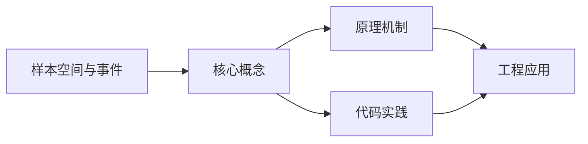
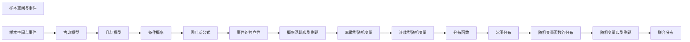

## 1. 学习目标（Bloom 分类）

本节按照布鲁姆教育目标分类学组织学习路径。本文主题为《样本空间与事件》，属于 概率统计 模块，读者可以根据自身阶段选择阅读深度。

记忆层面：能够准确复述本文的核心概念、术语与基本语法或操作步骤，并能够在提问或检索时快速定位对应知识点。能够说出 概率统计 的核心定义、定理与公式。

理解层面：能够用自己的语言解释核心原理与工作机制，说明概念之间的因果关系，而不是机械记忆结论。能够解释 概率统计 概念背后的直觉与推导。

应用层面：能够在真实项目或练习场景中运用本文知识解决具体问题，写出正确且可维护的实现。能够运用 概率统计 方法解决标准问题。

分析层面：能够拆解复杂问题，比较本文主题与相邻概念的异同，识别边界条件与例外情况。能够分析 概率统计 方法的适用条件与局限。

评价层面：能够根据约束条件（性能、可读性、安全、成本）评价不同方案的优劣，做出有依据的技术决策。能够评价不同 概率统计 方法的优劣。

创造层面：能够把本文知识与其他模块知识组合，设计出新的解决方案或可复用的工程模式。能够把 概率统计 应用于编程与工程问题。

通过本节学习，读者应当能够把《样本空间与事件》纳入自己的知识网络，并与 概率统计 模块的其他主题（概率、随机变量、分布、估计、检验）建立关联。

## 2. 历史动机与发展脉络

《样本空间与事件》是 概率统计 领域的重要主题。要真正理解它，需要先了解它解决的问题与演进过程。

概率论源于 17 世纪赌博问题（Pascal/Fermat），Kolmogorov 1933 年公理化；统计学用数据推断总体，Fisher/Neyman-Pearson 奠定现代框架。
两大分支：概率（由模型推数据）与统计（由数据推模型）；互为逆问题。
应用：机器学习（损失函数、贝叶斯）、A/B 测试、风险、质量、金融。

回到本文主题：样本空间与事件 的提出与成熟，正是上述技术背景下的必然产物。早期实现往往以简单可用为目标，随着工程规模扩大，社区逐渐沉淀出标准做法与最佳实践；理解这一脉络，可以帮助读者判断“为什么文档中的推荐写法是现在这个样子”，也能在遇到历史遗留代码时准确识别其设计年代与取舍。

## 3. 形式化定义与核心概念精讲

本节把《样本空间与事件》涉及的核心概念以“定义 + 讲解”的形式展开。读者应把定义当作工具，把讲解当作理解路径；两者结合才能形成可迁移的知识。

概率公理：非负、归一、可加；条件概率与贝叶斯公式；独立性。
随机变量：离散（伯努利/二项/泊松）与连续（均匀/正态/指数）；期望与方差。
大数定律与中心极限定理：样本均值收敛与正态近似。

### 3.1 原文章节逐一精讲

原文档把主题拆分为 6 个小节，下面按顺序给出每一节的导读讲解，随后保留原文细节供精读。

#### 原文精读（完整保留）

#### 1. 随机试验

##### 1.1 随机现象与随机试验

在自然界和人类社会中，存在两类现象：

- **确定性现象**：在一定条件下必然发生或必然不发生的现象。例如，在标准大气压下，水加热到 $100^\circ\text{C}$ 必然沸腾。
- **随机现象**：在一定条件下可能出现不同结果的现象。例如，抛一枚硬币，可能出现正面也可能出现反面。

为了研究随机现象的统计规律性，需要对随机现象进行大量重复观察，每次观察称为一次**随机试验**，简称**试验**，记作 $E$。

##### 1.2 随机试验的特征

随机试验具有以下三个特征：

1. **可重复性**：可以在相同的条件下重复进行
2. **多值性**：每次试验的可能结果不止一个，且能事先明确所有可能结果
3. **随机性**：进行一次试验之前不能确定哪一个结果会出现

**典型示例**：

| 试验  | 描述                               | 可能结果              |
| ----- | ---------------------------------- | --------------------- |
| $E_1$ | 抛一枚硬币                         | 正面、反面            |
| $E_2$ | 掷一颗骰子                         | 1, 2, 3, 4, 5, 6      |
| $E_3$ | 从一批产品中任取一件               | 合格品、不合格品      |
| $E_4$ | 记录某电话交换台一分钟内的呼叫次数 | 0, 1, 2, $\cdots$     |
| $E_5$ | 测量某零件的长度                   | $[a, b]$ 中的任意实数 |

#### 2. 样本空间

##### 2.1 样本空间的定义

随机试验 $E$ 的所有可能结果组成的集合称为 $E$ 的**样本空间**，记作 $\Omega$ 或 $S$。

样本空间中的每个元素，即试验的每个可能结果，称为**样本点**，记作 $\omega$。

$$\Omega = \{\omega_1, \omega_2, \cdots\}$$

##### 2.2 样本空间的分类

**离散样本空间**：样本点为有限个或可列无限个。

- 有限样本空间：$\Omega = \{\omega_1, \omega_2, \cdots, \omega_n\}$
- 可列无限样本空间：$\Omega = \{\omega_1, \omega_2, \cdots, \omega_n, \cdots\}$

**连续样本空间**：样本点为不可列无限个，通常对应某个区间或区域。

$$\Omega = [a, b] \quad \text{或} \quad \Omega = \mathbb{R}$$

**示例**：

- 试验 $E_1$（抛硬币）：$\Omega_1 = \{H, T\}$（$H$ 表示正面，$T$ 表示反面）
- 试验 $E_2$（掷骰子）：$\Omega_2 = \{1, 2, 3, 4, 5, 6\}$
- 试验 $E_4$（电话呼叫次数）：$\Omega_4 = \{0, 1, 2, \cdots\}$
- 试验 $E_5$（零件长度）：$\Omega_5 = [a, b]$

#### 3. 随机事件

##### 3.1 事件的定义

随机试验 $E$ 的样本空间 $\Omega$ 的子集称为 $E$ 的**随机事件**，简称**事件**，通常用大写字母 $A, B, C, \cdots$ 表示。

当试验结果 $\omega \in A$ 时，称**事件 $A$ 发生**；当 $\omega \notin A$ 时，称**事件 $A$ 不发生**。

##### 3.2 基本事件与复合事件

- **基本事件（样本点）**：由一个样本点组成的单点集 $\{\omega\}$
- **复合事件**：由多个样本点组成的事件

##### 3.3 特殊事件

- **必然事件**：$\Omega$ 本身，每次试验必然发生
- **不可能事件**：空集 $\varnothing$，每次试验都不可能发生

> **注意**：必然事件和不可能事件实际上已失去了"随机性"，但为了方便，仍将它们作为随机事件的极端情形处理。

#### 4. 事件间的关系

##### 4.1 包含关系

若 $A$ 发生必然导致 $B$ 发生，即 $A$ 中的每个样本点都属于 $B$，则称**事件 $B$ 包含事件 $A$**，或**事件 $A$ 包含于事件 $B$**，记作 $A \subseteq B$。

$$A \subseteq B \iff \text{若 } \omega \in A \text{，则 } \omega \in B$$

若 $A \subseteq B$ 且 $B \subseteq A$，则 $A = B$。

##### 4.2 互不相容（互斥）

若 $A$ 与 $B$ 不能同时发生，即 $A \cap B = \varnothing$，则称**事件 $A$ 与 $B$ 互不相容**（或**互斥**）。

若 $n$ 个事件 $A_1, A_2, \cdots, A_n$ 中任意两个都互不相容，即 $A_i \cap A_j = \varnothing$（$i \neq j$），则称这 $n$ 个事件**两两互不相容**。

##### 4.3 对立事件（逆事件）

对于事件 $A$，由所有不属于 $A$ 的样本点组成的事件称为 $A$ 的**对立事件**（或**逆事件**），记作 $\bar{A}$ 或 $A^c$。

$$\bar{A} = \Omega - A = \{\omega \mid \omega \in \Omega, \omega \notin A\}$$

**对立事件与互斥事件的区别**：

- 互斥：$A \cap B = \varnothing$，但 $A \cup B$ 不一定是 $\Omega$
- 对立：$A \cap \bar{A} = \varnothing$ 且 $A \cup \bar{A} = \Omega$

对立一定互斥，互斥不一定对立。

#### 5. 事件的运算

##### 5.1 并（和）运算

事件 $A$ 与 $B$ 中至少有一个发生的事件，称为 $A$ 与 $B$ 的**并事件**（**和事件**），记作 $A \cup B$。

$$A \cup B = \{\omega \mid \omega \in A \text{ 或 } \omega \in B\}$$

推广到 $n$ 个事件：

$$\bigcup_{i=1}^{n} A_i = A_1 \cup A_2 \cup \cdots \cup A_n$$

##### 5.2 交（积）运算

事件 $A$ 与 $B$ 同时发生的事件，称为 $A$ 与 $B$ 的**交事件**（**积事件**），记作 $A \cap B$ 或 $AB$。

$$A \cap B = \{\omega \mid \omega \in A \text{ 且 } \omega \in B\}$$

推广到 $n$ 个事件：

$$\bigcap_{i=1}^{n} A_i = A_1 \cap A_2 \cap \cdots \cap A_n$$

##### 5.3 差运算

事件 $A$ 发生而 $B$ 不发生的事件，称为 $A$ 与 $B$ 的**差事件**，记作 $A - B$ 或 $A \setminus B$。

$$A - B = \{\omega \mid \omega \in A \text{ 且 } \omega \notin B\} = A\bar{B}$$

##### 5.4 运算性质

事件的运算满足以下规律：

**交换律**：

$$A \cup B = B \cup A, \quad A \cap B = B \cap A$$

**结合律**：

$$(A \cup B) \cup C = A \cup (B \cup C), \quad (A \cap B) \cap C = A \cap (B \cap C)$$

**分配律**：

$$A \cup (B \cap C) = (A \cup B) \cap (A \cup C)$$

$$A \cap (B \cup C) = (A \cap B) \cup (A \cap C)$$

**德摩根律（De Morgan's Laws）**：

$$\overline{A \cup B} = \bar{A} \cap \bar{B}, \quad \overline{A \cap B} = \bar{A} \cup \bar{B}$$

推广形式：

$$\overline{\bigcup_{i=1}^{n} A_i} = \bigcap_{i=1}^{n} \bar{A}_i, \quad \overline{\bigcap_{i=1}^{n} A_i} = \bigcup_{i=1}^{n} \bar{A}_i$$

##### 5.5 常用等式

$$A - B = A\bar{B}$$

$$A \cup B = A + B\bar{A} = A + B - AB$$

$$A \cup B \cup C = A + B + C - AB - AC - BC + ABC$$

#### 6. 事件域与概率公理

##### 6.1 事件域（σ-代数）

设 $\Omega$ 为样本空间，$\mathcal{F}$ 为 $\Omega$ 的某些子集组成的集合族，若满足：

1. $\Omega \in \mathcal{F}$
2. 若 $A \in \mathcal{F}$，则 $\bar{A} \in \mathcal{F}$（对补运算封闭）
3. 若 $A_1, A_2, \cdots \in \mathcal{F}$，则 $\bigcup_{i=1}^{\infty} A_i \in \mathcal{F}$（对可列并运算封闭）

则称 $\mathcal{F}$ 为 $\Omega$ 上的一个**σ-代数**（**事件域**），$(\Omega, \mathcal{F})$ 称为**可测空间**。

##### 6.2 概率的公理化定义

设 $(\Omega, \mathcal{F})$ 为可测空间，若定义在 $\mathcal{F}$ 上的实值函数 $P$ 满足：

**公理1（非负性）**：对任意 $A \in \mathcal{F}$，$P(A) \geq 0$

**公理2（规范性）**：$P(\Omega) = 1$

**公理3（可列可加性）**：若 $A_1, A_2, \cdots$ 两两互不相容，则

$$P\left(\bigcup_{i=1}^{\infty} A_i\right) = \sum_{i=1}^{\infty} P(A_i)$$

则称 $P$ 为 $(\Omega, \mathcal{F})$ 上的**概率**，$(\Omega, \mathcal{F}, P)$ 称为**概率空间**。

##### 6.3 概率的基本性质

由概率公理可以推出以下重要性质：

1. **不可能事件的概率**：$P(\varnothing) = 0$

2. **有限可加性**：若 $A_1, A_2, \cdots, A_n$ 两两互斥，则

$$P\left(\bigcup_{i=1}^{n} A_i\right) = \sum_{i=1}^{n} P(A_i)$$

3. **对立事件的概率**：$P(\bar{A}) = 1 - P(A)$

4. **包含关系的概率**：若 $A \subseteq B$，则 $P(A) \leq P(B)$

5. **概率的加法公式**：

$$P(A \cup B) = P(A) + P(B) - P(AB)$$

推广到三个事件：

$$P(A \cup B \cup C) = P(A) + P(B) + P(C) - P(AB) - P(AC) - P(BC) + P(ABC)$$

6. **概率的减法公式**：

$$P(A - B) = P(A) - P(AB)$$

若 $B \subseteq A$，则 $P(A - B) = P(A) - P(B)$

### 3.2 概念关系图

下面用 Mermaid 图表达本文核心概念之间的关系，帮助读者建立整体图景：

图中展示的是本文知识的结构化关系：核心概念是入口，原理机制解释“为什么”，代码实践演示“怎么做”，工程应用回答“何时用”。读者学习时可以把每个小节的内容挂接到对应节点上。

## 4. 理论推导与原理解析

本节深入《样本空间与事件》背后的原理。理论部分不求面面俱到，而是聚焦“能解释现象、能指导实践”的关键推导。

概率公理：非负、归一、可加；条件概率与贝叶斯公式；独立性。
随机变量：离散（伯努利/二项/泊松）与连续（均匀/正态/指数）；期望与方差。
大数定律与中心极限定理：样本均值收敛与正态近似。
统计推断：点估计（MLE）、区间估计、假设检验（p 值、两类错误）、回归。

需要强调的是，理论推导与工程实践之间存在翻译层：理论给出的是理想化模型与边界条件，工程代码则必须处理真实环境中的例外。读者在学习时应先掌握理论的“标准情形”，再通过陷阱章节了解“非标准情形”。

## 5. 代码示例与逐行讲解

本节把原文中的代码示例系统整理，并为每个示例补充用途说明与讲解。读者不应只浏览代码，而应逐段对照讲解理解设计意图。

原文档未包含独立代码块，下面补充该主题的典型示例，演示核心概念在代码中的落地方式。

综合以上示例，可以总结出本主题的代码实践要点：第一，先定义清晰的输入输出契约；第二，核心逻辑保持单一职责；第三，错误处理与边界条件不可省略；第四，命名与注释表达意图而非复述代码。

## 6. 对比分析

对比是理解《样本空间与事件》定位的最快路径。下面从多个维度与相邻方案进行对比。

频率学派与贝叶斯学派：频率用数据频率，贝叶斯用先验+似然；按问题选择。
概率与统计：概率推演数据，统计反推参数。
描述统计与推断统计：描述总结，推断推广。

对比的目的不是分出绝对优劣，而是建立选择依据：不同约束条件下，最优解不同。读者应把每个对比维度转化为决策检查清单。

## 7. 常见陷阱与最佳实践

本节整理该主题的高频错误与推荐做法。每个陷阱先描述现象，再解释原因，最后给出最佳实践。

### 7.1 条件概率方向

P(A|B) 与 P(B|A) 混淆。贝叶斯公式转置。

深入讲解：该问题之所以被归类为“常见陷阱”，是因为它在初学者的代码中反复出现，而且往往不在第一时间暴露——错误通常隐藏在特定数据或特定时序下。

从成因上看，条件概率方向 一般源于对 概率统计 某个机制的理解偏差：要么误用了默认行为，要么忽略了边界条件，要么把其他语言的思维惯性带了过来。

从影响上看，条件概率方向 轻则产生错误结果，重则导致资源泄漏、数据损坏或安全事故；这也是为什么工程评审中会把它列为检查项。

从修复策略上看，处理条件概率方向的正确顺序是：先复现（构造最小用例），再定位（确认机制层面的根因），最后修复并补充回归测试。跳过复现直接改代码，往往治标不治本。

### 7.2 独立与互斥

独立是概率乘积，互斥是不相交；别混淆。

深入讲解：该问题之所以被归类为“常见陷阱”，是因为它在初学者的代码中反复出现，而且往往不在第一时间暴露——错误通常隐藏在特定数据或特定时序下。

从成因上看，独立与互斥 一般源于对 概率统计 某个机制的理解偏差：要么误用了默认行为，要么忽略了边界条件，要么把其他语言的思维惯性带了过来。

从影响上看，独立与互斥 轻则产生错误结果，重则导致资源泄漏、数据损坏或安全事故；这也是为什么工程评审中会把它列为检查项。

从修复策略上看，处理独立与互斥的正确顺序是：先复现（构造最小用例），再定位（确认机制层面的根因），最后修复并补充回归测试。跳过复现直接改代码，往往治标不治本。

### 7.3 p 值误读

p 值不是 H0 为真的概率。理解频率语义。

深入讲解：该问题之所以被归类为“常见陷阱”，是因为它在初学者的代码中反复出现，而且往往不在第一时间暴露——错误通常隐藏在特定数据或特定时序下。

从成因上看，p 值误读 一般源于对 概率统计 某个机制的理解偏差：要么误用了默认行为，要么忽略了边界条件，要么把其他语言的思维惯性带了过来。

从影响上看，p 值误读 轻则产生错误结果，重则导致资源泄漏、数据损坏或安全事故；这也是为什么工程评审中会把它列为检查项。

从修复策略上看，处理p 值误读的正确顺序是：先复现（构造最小用例），再定位（确认机制层面的根因），最后修复并补充回归测试。跳过复现直接改代码，往往治标不治本。

### 7.4 小样本正态假设

样本小中心极限不适用。t 分布/非参。

深入讲解：该问题之所以被归类为“常见陷阱”，是因为它在初学者的代码中反复出现，而且往往不在第一时间暴露——错误通常隐藏在特定数据或特定时序下。

从成因上看，小样本正态假设 一般源于对 概率统计 某个机制的理解偏差：要么误用了默认行为，要么忽略了边界条件，要么把其他语言的思维惯性带了过来。

从影响上看，小样本正态假设 轻则产生错误结果，重则导致资源泄漏、数据损坏或安全事故；这也是为什么工程评审中会把它列为检查项。

从修复策略上看，处理小样本正态假设的正确顺序是：先复现（构造最小用例），再定位（确认机制层面的根因），最后修复并补充回归测试。跳过复现直接改代码，往往治标不治本。

### 7.5 方差与标准差

量纲不同，报告要注明。

深入讲解：该问题之所以被归类为“常见陷阱”，是因为它在初学者的代码中反复出现，而且往往不在第一时间暴露——错误通常隐藏在特定数据或特定时序下。

从成因上看，方差与标准差 一般源于对 概率统计 某个机制的理解偏差：要么误用了默认行为，要么忽略了边界条件，要么把其他语言的思维惯性带了过来。

从影响上看，方差与标准差 轻则产生错误结果，重则导致资源泄漏、数据损坏或安全事故；这也是为什么工程评审中会把它列为检查项。

从修复策略上看，处理方差与标准差的正确顺序是：先复现（构造最小用例），再定位（确认机制层面的根因），最后修复并补充回归测试。跳过复现直接改代码，往往治标不治本。

### 7.6 多重比较

多次检验增大假阳性。校正（Bonferroni/FDR）。

深入讲解：该问题之所以被归类为“常见陷阱”，是因为它在初学者的代码中反复出现，而且往往不在第一时间暴露——错误通常隐藏在特定数据或特定时序下。

从成因上看，多重比较 一般源于对 概率统计 某个机制的理解偏差：要么误用了默认行为，要么忽略了边界条件，要么把其他语言的思维惯性带了过来。

从影响上看，多重比较 轻则产生错误结果，重则导致资源泄漏、数据损坏或安全事故；这也是为什么工程评审中会把它列为检查项。

从修复策略上看，处理多重比较的正确顺序是：先复现（构造最小用例），再定位（确认机制层面的根因），最后修复并补充回归测试。跳过复现直接改代码，往往治标不治本。

### 7.7 抽样偏差

样本不代表总体。随机抽样与分层。

深入讲解：该问题之所以被归类为“常见陷阱”，是因为它在初学者的代码中反复出现，而且往往不在第一时间暴露——错误通常隐藏在特定数据或特定时序下。

从成因上看，抽样偏差 一般源于对 概率统计 某个机制的理解偏差：要么误用了默认行为，要么忽略了边界条件，要么把其他语言的思维惯性带了过来。

从影响上看，抽样偏差 轻则产生错误结果，重则导致资源泄漏、数据损坏或安全事故；这也是为什么工程评审中会把它列为检查项。

从修复策略上看，处理抽样偏差的正确顺序是：先复现（构造最小用例），再定位（确认机制层面的根因），最后修复并补充回归测试。跳过复现直接改代码，往往治标不治本。

### 7.8 忽视效应量

p 显著不等于重要。报告效应量与区间。

深入讲解：该问题之所以被归类为“常见陷阱”，是因为它在初学者的代码中反复出现，而且往往不在第一时间暴露——错误通常隐藏在特定数据或特定时序下。

从成因上看，忽视效应量 一般源于对 概率统计 某个机制的理解偏差：要么误用了默认行为，要么忽略了边界条件，要么把其他语言的思维惯性带了过来。

从影响上看，忽视效应量 轻则产生错误结果，重则导致资源泄漏、数据损坏或安全事故；这也是为什么工程评审中会把它列为检查项。

从修复策略上看，处理忽视效应量的正确顺序是：先复现（构造最小用例），再定位（确认机制层面的根因），最后修复并补充回归测试。跳过复现直接改代码，往往治标不治本。

### 7.0 最佳实践总览

1. 建模先明确随机变量与分布假设。
2. 统计结论附置信区间与样本量。
3. 用模拟（蒙特卡洛）验证解析结果。
4. 报告：参数估计、检验、效应量、局限。

把这些最佳实践固化为团队规范与代码评审检查项，是避免同类问题反复出现的关键。

## 8. 工程实践

本节把《样本空间与事件》放入真实工程场景，给出可复用的模式与组织方法。

A/B 测试：样本量计算、显著性、实际显著性（效应量）。
机器学习：似然损失、正则化（先验）、评估指标（准确率/召回）。
质量与风险：控制图、六西格玛、风险量化。

### 8.1 工程实践的原则拆解

以上工程实践可以归纳为四条原则。第一，配置与代码分离：概率统计 项目中环境差异应通过配置注入，而不是散落在代码分支中；这保证同一份代码可以在开发、测试、生产环境一致运行。

第二，接口稳定优先：对外接口（函数签名、协议、数据格式）一旦被消费方依赖，变更成本极高；设计时应预留扩展点并保持向后兼容。

第三，可观测性内置：日志、指标与追踪应该在功能开发时同步设计，而不是故障发生后补救；没有观测手段的模块等于黑盒。

第四，变更可回滚：任何发布都应有对应的回滚方案；数据库迁移、配置变更与代码发布一样需要版本管理与逆向路径。

### 8.2 实践落地的检查清单

- [ ] A/B 测试：对照本节描述，检查当前项目是否已经落实；未落实的项列入技术债并排期处理。
- [ ] 机器学习：对照本节描述，检查当前项目是否已经落实；未落实的项列入技术债并排期处理。
- [ ] 质量与风险：对照本节描述，检查当前项目是否已经落实；未落实的项列入技术债并排期处理。

工程实践的共性原则：配置与代码分离、接口稳定优先、可观测性内置、变更可回滚。这些原则适用于本主题的所有实现。

## 9. 案例研究

本节通过一个完整案例把《样本空间与事件》的知识串起来。案例按“需求分析、方案设计、实现、验证”四步展开。

需求：设计并分析转化率 A/B 实验。
方案：样本量计算（显著性 0.05、功效 0.8）-> 随机分组 -> 双样本比例检验。
要点：提前停止修正、效应量报告、分段分析。
验证：模拟数据检验程序正确性。

### 9.1 案例的扩展讨论

把案例中的方案放大到真实规模，需要额外考虑三个问题：

第一，规模：当数据量或并发量上升一个数量级时，原方案中的数据结构、缓存策略与任务调度是否仍然成立？通常需要引入分层与异步。

第二，团队：多人协作时，模块边界、接口契约与代码所有权必须明确；案例中的实现应拆分为可独立测试的单元，并配合文档说明设计意图。

第三，演进：上线后的需求变化不可避免；方案设计时应预留扩展点（配置化、插件化、事件化），并定期用真实指标验证假设。

案例研究的学习方法：先独立阅读需求，尝试在脑中形成方案，再对照实现与讲解，最后思考“如果约束变化（数据量、并发、团队规模），方案应如何调整”。

## 10. 知识要点总结与深入讲解

本节以讲解形式汇总全文要点，替代传统的习题与自测，读者不需要答题，只需跟随解释建立完整的认知框架。

关于《样本空间与事件》的核心结论：

概率统计是把不确定性变成决策依据的语言。
贝叶斯公式与中心极限定理是最常用的两块。
统计素养：理解 p 值、区间与偏差。

原文档各小节的要点回顾：

- 1. 随机试验：该小节围绕样本空间与事件展开具体细节，阅读时应关注其与核心结论的对应关系；每个小节都是核心结论在某一个侧面的展开。
- 2. 样本空间：该小节围绕样本空间与事件展开具体细节，阅读时应关注其与核心结论的对应关系；每个小节都是核心结论在某一个侧面的展开。
- 3. 随机事件：该小节围绕样本空间与事件展开具体细节，阅读时应关注其与核心结论的对应关系；每个小节都是核心结论在某一个侧面的展开。
- 4. 事件间的关系：该小节围绕样本空间与事件展开具体细节，阅读时应关注其与核心结论的对应关系；每个小节都是核心结论在某一个侧面的展开。
- 5. 事件的运算：该小节围绕样本空间与事件展开具体细节，阅读时应关注其与核心结论的对应关系；每个小节都是核心结论在某一个侧面的展开。
- 6. 事件域与概率公理：该小节围绕样本空间与事件展开具体细节，阅读时应关注其与核心结论的对应关系；每个小节都是核心结论在某一个侧面的展开。

把以上要点与第 3-9 节的内容对照复习，即可完成对本文主题的闭环学习。

## 11. 参考文献

Khan Academy 统计：https://zh.khanacademy.org/math/statistics-probability
Seeing Theory：https://seeing-theory.brown.edu/
OpenIntro Statistics：https://www.openintro.org/book/os/
StatQuest（B站/YouTube）：https://www.youtube.com/@statquest

## 12. 延伸阅读

概率统计基础，见 030-probability-statistics 模块文档。
数据分析应用，见 051-data-analysis 模块。
机器学习概率视角，见 042-machine-learning 模块（AI 模块仅供了解）。
尚硅谷 Bilibili 空间（https://space.bilibili.com/302417610 ）提供概率统计课程。

## 14. 模块知识图谱与学习路径

本文属于 概率统计 模块。为了把《样本空间与事件》放入完整的知识网络，下面列出本模块的全部主题并给出相互关联的导读。学习时建议按模块内顺序推进，并在每个文档中留意交叉引用。

上图为模块主题的推荐学习顺序示意图（仅展示前若干主题）。各主题之间存在三类关联：

第一，前置依赖关系：早期主题是后期主题的基础，例如环境与语法先行、进阶主题随后；

第二，横向并列关系：同一层级主题从不同角度覆盖模块能力，学习顺序可以按兴趣调整；

第三，工程组合关系：多个主题在真实项目中组合使用，例如配置、性能与安全主题往往出现在同一系统的不同层面。

### 14.1 模块主题速查表

| 文档 | 主题 | 与本文的关联 |
| --- | --- | --- |
| 样本空间与事件 | 001-SampleSpaceAndEvent | 本文自身 |
| 古典概型 | 002-ClassicalProbability | 本文的并列主题 |
| 几何概型 | 003-GeometricProbability | 本文的并列主题 |
| 条件概率 | 004-ConditionalProbability | 本文的并列主题 |
| 贝叶斯公式 | 005-BayesFormula | 本文的并列主题 |
| 事件的独立性 | 006-EventIndependence | 本文的并列主题 |
| 概率基础典型例题 | 007-ProbabilityBasicsExamples | 本文的前置基础 |
| 离散型随机变量 | 008-DiscreteRandomVariable | 本文的并列主题 |
| 连续型随机变量 | 009-ContinuousRandomVariable | 本文的并列主题 |
| 分布函数 | 010-DistributionFunction | 本文的并列主题 |
| 常用分布 | 011-CommonDistributions | 本文的并列主题 |
| 随机变量函数的分布 | 012-DistributionOfRandomVariableFunction | 本文的并列主题 |
| 随机变量典型例题 | 013-RandomVariableExamples | 本文的并列主题 |
| 联合分布 | 014-JointDistribution | 本文的并列主题 |
| 边缘分布 | 015-MarginalDistribution | 本文的并列主题 |
| 条件分布 | 016-ConditionalDistribution | 本文的并列主题 |
| 随机变量的独立性 | 017-RandomVariableIndependence | 本文的并列主题 |
| 和的分布与极值分布 | 018-SumDistributionAndExtremeValueDistribution | 本文的并列主题 |
| 多维随机变量典型例题 | 019-MultivariateRandomVariableExamples | 本文的并列主题 |
| 数学期望 | 020-MathematicalExpectation | 本文的并列主题 |
| 方差与标准差 | 021-VarianceAndStandardDeviation | 本文的并列主题 |
| 协方差 | 022-Covariance | 本文的并列主题 |
| 相关系数 | 023-CorrelationCoefficient | 本文的并列主题 |
| 矩与协方差矩阵 | 024-MomentAndCovarianceMatrix | 本文的并列主题 |
| 数字特征典型例题 | 025-NumericalCharacteristicsExamples | 本文的并列主题 |
| 切比雪夫不等式 | 026-ChebyshevInequality | 本文的并列主题 |
| 大数定律 | 027-LawOfLargeNumbers | 本文的并列主题 |
| 中心极限定理 | 028-CentralLimitTheorem | 本文的并列主题 |
| 大数定律与中心极限定理典型例题 | 029-LLNAndCLTExamples | 本文的并列主题 |
| 随机样本 | 030-RandomSample | 本文的并列主题 |
| 统计量 | 031-Statistic | 本文的并列主题 |
| 三大分布 | 032-ThreeMajorDistributions | 本文的并列主题 |
| 正态总体的抽样分布 | 033-NormalPopulationSamplingDistribution | 本文的并列主题 |
| 抽样分布典型例题 | 034-SamplingDistributionExamples | 本文的并列主题 |
| 点估计 | 035-PointEstimation | 本文的并列主题 |
| 估计量的评选标准 | 036-EstimatorSelectionCriteria | 本文的并列主题 |
| 区间估计 | 037-IntervalEstimation | 本文的并列主题 |
| 正态总体参数的区间估计 | 038-NormalPopulationParameterIntervalEstimation | 本文的并列主题 |
| 参数估计典型例题 | 039-ParameterEstimationExamples | 本文的并列主题 |
| 假设检验基本概念 | 040-HypothesisTestingBasics | 本文的并列主题 |
| Z检验 | 041-ZTest | 本文的并列主题 |
| t检验 | 042-TTest | 本文的并列主题 |
| 卡方检验 | 043-ChiSquareTest | 本文的并列主题 |
| F检验 | 044-FTest | 本文的并列主题 |
| 假设检验典型例题 | 045-HypothesisTestingExamples | 本文的并列主题 |

速查表的作用是让读者快速判断：哪些文档应在阅读本文前掌握（前置基础），哪些文档应在阅读本文后继续（延伸主题）。本模块的交叉引用体系即以此表为基础。

## 15. 术语表

下表整理《样本空间与事件》及 概率统计 模块中出现的高频术语，给出简明释义。术语按字母序或逻辑序排列，供查阅。

| 术语 | 释义 |
| --- | --- |
| 概率公理 | 非负、归一、可加；条件概率与贝叶斯公式；独立性。 |
| 随机变量 | 离散（伯努利/二项/泊松）与连续（均匀/正态/指数）；期望与方差。 |
| 大数定律与中心极限定理 | 样本均值收敛与正态近似。 |
| 统计推断 | 点估计（MLE）、区间估计、假设检验（p 值、两类错误）、回归。 |
| 条件概率方向（易错点） | 参见常见陷阱章节的详细讲解 |
| 独立与互斥（易错点） | 参见常见陷阱章节的详细讲解 |
| p 值误读（易错点） | 参见常见陷阱章节的详细讲解 |
| 小样本正态假设（易错点） | 参见常见陷阱章节的详细讲解 |
| 方差与标准差（易错点） | 参见常见陷阱章节的详细讲解 |
| 多重比较（易错点） | 参见常见陷阱章节的详细讲解 |

术语表与正文配合使用：先通读正文，遇到模糊术语回查本表；长期使用后术语会自然进入工作记忆。

## 13. 深度专题扩展

以下专题从不同角度深入本文主题，供有进阶需求的读者研读。每个专题独立成节，内容相互补充。

### 13.1 贝叶斯推断

贝叶斯公式：后验 ∝ 似然 × 先验；先验的选择影响结果。
共轭先验：后验同族（Beta-二项、Gamma-泊松），解析计算。
马尔可夫链蒙特卡洛（MCMC）：复杂后验数值采样。
应用：垃圾过滤、推荐、A/B 分层模型。

### 13.2 假设检验框架

零假设与备择假设、显著性水平、两类错误（α/β）、功效。
流程：假设 -> 检验统计量 -> p 值 -> 决策；注意前提条件。
常见检验：t、卡方、F、正态性检验。
现代实践：置信区间替代纯 p 值，注册分析计划防 p-hacking。

## 16. 核心概念串讲（复习视角）

本节以“把知识讲给他人听”的方式，把《样本空间与事件》的核心概念重新串讲一遍。与前文按章节展开不同，这里的叙述更接近课堂总结：先说整体，再逐个展开，最后收束。

《样本空间与事件》属于 概率统计 模块。要理解它，先要理解它在模块中的位置：它解决的是该领域的一个具体问题，并依赖模块内若干前置概念；反过来，它又为后续进阶主题提供基础。

第一个概念是概率公理。非负、归一、可加；条件概率与贝叶斯公式；独立性。

在实际使用中，概率公理需要与相邻概念区分：它们的区别不在于名称，而在于适用条件与行为边界；这正是前文对比分析章节的意义。

第一个概念是随机变量。离散（伯努利/二项/泊松）与连续（均匀/正态/指数）；期望与方差。

在实际使用中，随机变量需要与相邻概念区分：它们的区别不在于名称，而在于适用条件与行为边界；这正是前文对比分析章节的意义。

第一个概念是大数定律与中心极限定理。样本均值收敛与正态近似。

在实际使用中，大数定律与中心极限定理需要与相邻概念区分：它们的区别不在于名称，而在于适用条件与行为边界；这正是前文对比分析章节的意义。

接下来是概率公理。非负、归一、可加；条件概率与贝叶斯公式；独立性。

理解该原理的关键不是记住结论，而是记住“它从什么假设出发、推出了什么、假设不成立时会怎样”。带着这个框架复习，原理之间就会连成网络。

接下来是随机变量。离散（伯努利/二项/泊松）与连续（均匀/正态/指数）；期望与方差。

理解该原理的关键不是记住结论，而是记住“它从什么假设出发、推出了什么、假设不成立时会怎样”。带着这个框架复习，原理之间就会连成网络。

接下来是大数定律与中心极限定理。样本均值收敛与正态近似。

理解该原理的关键不是记住结论，而是记住“它从什么假设出发、推出了什么、假设不成立时会怎样”。带着这个框架复习，原理之间就会连成网络。

接下来是统计推断。点估计（MLE）、区间估计、假设检验（p 值、两类错误）、回归。

理解该原理的关键不是记住结论，而是记住“它从什么假设出发、推出了什么、假设不成立时会怎样”。带着这个框架复习，原理之间就会连成网络。

串讲收束：把概念与原理放回本文主题，可以得出一个总纲——定义描述是什么，原理解释为什么，实践回答怎么做。三者构成完整的学习闭环；后续遇到相关问题，都可以按这个总纲检索知识。
