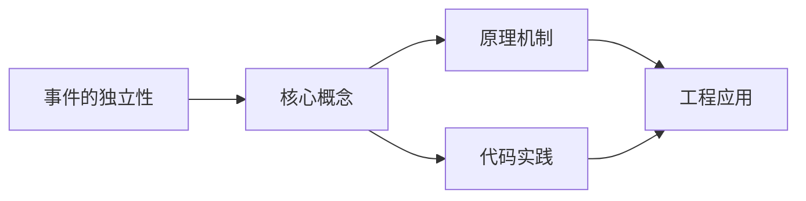

## 1. 学习目标（Bloom 分类）

本节按照布鲁姆教育目标分类学组织学习路径。本文主题为《事件的独立性》，属于 概率统计 模块，读者可以根据自身阶段选择阅读深度。

记忆层面：能够准确复述本文的核心概念、术语与基本语法或操作步骤，并能够在提问或检索时快速定位对应知识点。能够说出 概率统计 的核心定义、定理与公式。

理解层面：能够用自己的语言解释核心原理与工作机制，说明概念之间的因果关系，而不是机械记忆结论。能够解释 概率统计 概念背后的直觉与推导。

应用层面：能够在真实项目或练习场景中运用本文知识解决具体问题，写出正确且可维护的实现。能够运用 概率统计 方法解决标准问题。

分析层面：能够拆解复杂问题，比较本文主题与相邻概念的异同，识别边界条件与例外情况。能够分析 概率统计 方法的适用条件与局限。

评价层面：能够根据约束条件（性能、可读性、安全、成本）评价不同方案的优劣，做出有依据的技术决策。能够评价不同 概率统计 方法的优劣。

创造层面：能够把本文知识与其他模块知识组合，设计出新的解决方案或可复用的工程模式。能够把 概率统计 应用于编程与工程问题。

通过本节学习，读者应当能够把《事件的独立性》纳入自己的知识网络，并与 概率统计 模块的其他主题（概率、随机变量、分布、估计、检验）建立关联。

## 2. 历史动机与发展脉络

《事件的独立性》是 概率统计 领域的重要主题。要真正理解它，需要先了解它解决的问题与演进过程。

概率论源于 17 世纪赌博问题（Pascal/Fermat），Kolmogorov 1933 年公理化；统计学用数据推断总体，Fisher/Neyman-Pearson 奠定现代框架。
两大分支：概率（由模型推数据）与统计（由数据推模型）；互为逆问题。
应用：机器学习（损失函数、贝叶斯）、A/B 测试、风险、质量、金融。

回到本文主题：事件的独立性 的提出与成熟，正是上述技术背景下的必然产物。早期实现往往以简单可用为目标，随着工程规模扩大，社区逐渐沉淀出标准做法与最佳实践；理解这一脉络，可以帮助读者判断“为什么文档中的推荐写法是现在这个样子”，也能在遇到历史遗留代码时准确识别其设计年代与取舍。

## 3. 形式化定义与核心概念精讲

本节把《事件的独立性》涉及的核心概念以“定义 + 讲解”的形式展开。读者应把定义当作工具，把讲解当作理解路径；两者结合才能形成可迁移的知识。

概率公理：非负、归一、可加；条件概率与贝叶斯公式；独立性。
随机变量：离散（伯努利/二项/泊松）与连续（均匀/正态/指数）；期望与方差。
大数定律与中心极限定理：样本均值收敛与正态近似。

### 3.1 原文章节逐一精讲

原文档把主题拆分为 3 个小节，下面按顺序给出每一节的导读讲解，随后保留原文细节供精读。

#### 原文精读（完整保留）

#### 1. 两个事件的独立性

##### 1.1 独立性的定义

设 $A, B$ 是两个事件，若

$$P(AB) = P(A) \cdot P(B)$$

则称事件 $A$ 与 $B$ **相互独立**，简称**独立**。

等价地，若 $P(B) > 0$，则 $A$ 与 $B$ 独立等价于

$$P(A \mid B) = P(A)$$

即事件 $B$ 的发生不影响事件 $A$ 发生的概率。

##### 1.2 独立性的判定方法

1. **定义法**：验证 $P(AB) = P(A) \cdot P(B)$
2. **条件概率法**：验证 $P(A \mid B) = P(A)$ 或 $P(B \mid A) = P(B)$
3. **直观判断**：根据实际意义判断一个事件的发生是否影响另一个事件

##### 1.3 独立性的重要性质

**性质1**：若 $A$ 与 $B$ 独立，则下列各对事件也独立：

- $A$ 与 $\bar{B}$
- $\bar{A}$ 与 $B$
- $\bar{A}$ 与 $\bar{B}$

**证明**（以 $A$ 与 $\bar{B}$ 为例）：

$$P(A\bar{B}) = P(A) - P(AB) = P(A) - P(A)P(B) = P(A)(1 - P(B)) = P(A)P(\bar{B})$$

**性质2**：$\varnothing$ 与任何事件独立；$\Omega$ 与任何事件独立。

**性质3**：若 $P(A) = 0$ 或 $P(A) = 1$，则 $A$ 与任何事件独立。

##### 1.4 独立性与互斥的区别

| 特征    | 互斥（不相容）                        | 独立                                  |
| ------- | ------------------------------------- | ------------------------------------- |
| 定义    | $AB = \varnothing$                    | $P(AB) = P(A)P(B)$                    |
| 含义    | 不能同时发生                          | 互不影响                              |
| $P(AB)$ | $= 0$                                 | $= P(A)P(B)$                          |
| 关系    | 若 $P(A) > 0, P(B) > 0$，互斥则不独立 | 若 $P(A) > 0, P(B) > 0$，独立则不互斥 |

> **重要结论**：若 $P(A) > 0$ 且 $P(B) > 0$，则 $A$ 与 $B$ 互斥和独立不能同时成立。

**直观理解**：互斥意味着"一个发生则另一个必不发生"，这恰恰说明一个事件的发生影响了另一个事件，因此不独立。

#### 2. 多个事件的独立性

##### 2.1 三个事件的独立性

设 $A, B, C$ 是三个事件，若满足以下四个条件：

1. $P(AB) = P(A)P(B)$
2. $P(AC) = P(A)P(C)$
3. $P(BC) = P(B)P(C)$
4. $P(ABC) = P(A)P(B)P(C)$

则称 $A, B, C$ **相互独立**。

若仅满足前三个条件，则称 $A, B, C$ **两两独立**。

> **注意**：两两独立 $\not\Rightarrow$ 相互独立。

##### 2.2 反例：两两独立但不相互独立

**示例**：掷两枚硬币，设

- $A$：第一枚正面朝上
- $B$：第二枚正面朝上
- $C$：两枚硬币结果相同

则 $\Omega = \{HH, HT, TH, TT\}$，$A = \{HH, HT\}$，$B = \{HH, TH\}$，$C = \{HH, TT\}$。

$$P(A) = P(B) = P(C) = \frac{1}{2}$$

$$P(AB) = P(\{HH\}) = \frac{1}{4} = P(A)P(B) \quad \checkmark$$

$$P(AC) = P(\{HH\}) = \frac{1}{4} = P(A)P(C) \quad \checkmark$$

$$P(BC) = P(\{HH\}) = \frac{1}{4} = P(B)P(C) \quad \checkmark$$

$$P(ABC) = P(\{HH\}) = \frac{1}{4} \neq P(A)P(B)P(C) = \frac{1}{8} \quad \times$$

$A, B, C$ 两两独立但不相互独立。

##### 2.3 反例：$P(ABC) = P(A)P(B)P(C)$ 但不两两独立

**示例**：设 $\Omega = \{1, 2, 3, 4, 5, 6, 7, 8\}$，每个样本点等概率，$A = \{1, 2, 3, 4\}$，$B = \{1, 2, 5, 6\}$，$C = \{1, 3, 5, 7\}$。

$$P(A) = P(B) = P(C) = \frac{1}{2}$$

$$P(AB) = P(\{1, 2\}) = \frac{2}{8} = \frac{1}{4} = P(A)P(B) \quad \checkmark$$

$$P(AC) = P(\{1, 3\}) = \frac{2}{8} = \frac{1}{4} = P(A)P(C) \quad \checkmark$$

$$P(BC) = P(\{1, 5\}) = \frac{2}{8} = \frac{1}{4} = P(B)P(C) \quad \checkmark$$

$$P(ABC) = P(\{1\}) = \frac{1}{8} = P(A)P(B)P(C) \quad \checkmark$$

此例恰好两两独立且相互独立。构造不两两独立但 $P(ABC) = P(A)P(B)P(C)$ 的例子需要更精巧的设计。

##### 2.4 $n$ 个事件的独立性

设 $A_1, A_2, \cdots, A_n$ 是 $n$ 个事件，若对其中任意 $k$ 个事件 $A_{i_1}, A_{i_2}, \cdots, A_{i_k}$（$2 \leq k \leq n$），都有

$$P(A_{i_1} A_{i_2} \cdots A_{i_k}) = P(A_{i_1}) P(A_{i_2}) \cdots P(A_{i_k})$$

则称 $A_1, A_2, \cdots, A_n$ **相互独立**。

> $n$ 个事件相互独立需要验证 $\dbinom{n}{2} + \dbinom{n}{3} + \cdots + \dbinom{n}{n} = 2^n - n - 1$ 个等式。

##### 2.5 独立事件的性质

若 $A_1, A_2, \cdots, A_n$ 相互独立，则：

1. 将其中任意多个事件换成其对立事件，所得的 $n$ 个事件仍相互独立
2. 其中任意 $k$ 个（$1 \leq k \leq n$）事件相互独立
3. $P\left(\bigcup_{i=1}^{n} A_i\right) = 1 - \prod_{i=1}^{n} P(\bar{A}_i) = 1 - \prod_{i=1}^{n}(1 - P(A_i))$

性质 3 是计算"至少一个发生"概率的重要公式。

#### 3. 独立性的应用

##### 3.1 独立重复试验

若 $n$ 次试验中各次试验的结果互不影响，则称这 $n$ 次试验为**独立重复试验**。

在独立重复试验中，若每次试验只有两个可能结果（$A$ 和 $\bar{A}$），且 $P(A) = p$ 保持不变，则称为 **$n$ 重伯努利试验**。

##### 3.2 系统可靠性

**串联系统**：$n$ 个元件串联，各元件独立工作，可靠度分别为 $p_1, p_2, \cdots, p_n$，系统可靠度为

$$R = \prod_{i=1}^{n} p_i$$

**并联系统**：$n$ 个元件并联，系统可靠度为

$$R = 1 - \prod_{i=1}^{n}(1 - p_i)$$

##### 3.3 独立性与条件概率的综合应用

**例题**：甲、乙、丙三人独立地破译一份密码，他们能破译的概率分别为 $\dfrac{1}{5}, \dfrac{1}{4}, \dfrac{1}{3}$，求密码被破译的概率。

**解**：设 $A, B, C$ 分别为甲、乙、丙破译密码，则

$$P(A \cup B \cup C) = 1 - P(\bar{A})P(\bar{B})P(\bar{C}) = 1 - \frac{4}{5} \times \frac{3}{4} \times \frac{2}{3} = 1 - \frac{2}{5} = \frac{3}{5}$$

### 3.2 概念关系图

下面用 Mermaid 图表达本文核心概念之间的关系，帮助读者建立整体图景：

图中展示的是本文知识的结构化关系：核心概念是入口，原理机制解释“为什么”，代码实践演示“怎么做”，工程应用回答“何时用”。读者学习时可以把每个小节的内容挂接到对应节点上。

## 4. 理论推导与原理解析

本节深入《事件的独立性》背后的原理。理论部分不求面面俱到，而是聚焦“能解释现象、能指导实践”的关键推导。

概率公理：非负、归一、可加；条件概率与贝叶斯公式；独立性。
随机变量：离散（伯努利/二项/泊松）与连续（均匀/正态/指数）；期望与方差。
大数定律与中心极限定理：样本均值收敛与正态近似。
统计推断：点估计（MLE）、区间估计、假设检验（p 值、两类错误）、回归。

需要强调的是，理论推导与工程实践之间存在翻译层：理论给出的是理想化模型与边界条件，工程代码则必须处理真实环境中的例外。读者在学习时应先掌握理论的“标准情形”，再通过陷阱章节了解“非标准情形”。

## 5. 代码示例与逐行讲解

本节把原文中的代码示例系统整理，并为每个示例补充用途说明与讲解。读者不应只浏览代码，而应逐段对照讲解理解设计意图。

原文档未包含独立代码块，下面补充该主题的典型示例，演示核心概念在代码中的落地方式。

综合以上示例，可以总结出本主题的代码实践要点：第一，先定义清晰的输入输出契约；第二，核心逻辑保持单一职责；第三，错误处理与边界条件不可省略；第四，命名与注释表达意图而非复述代码。

## 6. 对比分析

对比是理解《事件的独立性》定位的最快路径。下面从多个维度与相邻方案进行对比。

频率学派与贝叶斯学派：频率用数据频率，贝叶斯用先验+似然；按问题选择。
概率与统计：概率推演数据，统计反推参数。
描述统计与推断统计：描述总结，推断推广。

对比的目的不是分出绝对优劣，而是建立选择依据：不同约束条件下，最优解不同。读者应把每个对比维度转化为决策检查清单。

## 7. 常见陷阱与最佳实践

本节整理该主题的高频错误与推荐做法。每个陷阱先描述现象，再解释原因，最后给出最佳实践。

### 7.1 条件概率方向

P(A|B) 与 P(B|A) 混淆。贝叶斯公式转置。

深入讲解：该问题之所以被归类为“常见陷阱”，是因为它在初学者的代码中反复出现，而且往往不在第一时间暴露——错误通常隐藏在特定数据或特定时序下。

从成因上看，条件概率方向 一般源于对 概率统计 某个机制的理解偏差：要么误用了默认行为，要么忽略了边界条件，要么把其他语言的思维惯性带了过来。

从影响上看，条件概率方向 轻则产生错误结果，重则导致资源泄漏、数据损坏或安全事故；这也是为什么工程评审中会把它列为检查项。

从修复策略上看，处理条件概率方向的正确顺序是：先复现（构造最小用例），再定位（确认机制层面的根因），最后修复并补充回归测试。跳过复现直接改代码，往往治标不治本。

### 7.2 独立与互斥

独立是概率乘积，互斥是不相交；别混淆。

深入讲解：该问题之所以被归类为“常见陷阱”，是因为它在初学者的代码中反复出现，而且往往不在第一时间暴露——错误通常隐藏在特定数据或特定时序下。

从成因上看，独立与互斥 一般源于对 概率统计 某个机制的理解偏差：要么误用了默认行为，要么忽略了边界条件，要么把其他语言的思维惯性带了过来。

从影响上看，独立与互斥 轻则产生错误结果，重则导致资源泄漏、数据损坏或安全事故；这也是为什么工程评审中会把它列为检查项。

从修复策略上看，处理独立与互斥的正确顺序是：先复现（构造最小用例），再定位（确认机制层面的根因），最后修复并补充回归测试。跳过复现直接改代码，往往治标不治本。

### 7.3 p 值误读

p 值不是 H0 为真的概率。理解频率语义。

深入讲解：该问题之所以被归类为“常见陷阱”，是因为它在初学者的代码中反复出现，而且往往不在第一时间暴露——错误通常隐藏在特定数据或特定时序下。

从成因上看，p 值误读 一般源于对 概率统计 某个机制的理解偏差：要么误用了默认行为，要么忽略了边界条件，要么把其他语言的思维惯性带了过来。

从影响上看，p 值误读 轻则产生错误结果，重则导致资源泄漏、数据损坏或安全事故；这也是为什么工程评审中会把它列为检查项。

从修复策略上看，处理p 值误读的正确顺序是：先复现（构造最小用例），再定位（确认机制层面的根因），最后修复并补充回归测试。跳过复现直接改代码，往往治标不治本。

### 7.4 小样本正态假设

样本小中心极限不适用。t 分布/非参。

深入讲解：该问题之所以被归类为“常见陷阱”，是因为它在初学者的代码中反复出现，而且往往不在第一时间暴露——错误通常隐藏在特定数据或特定时序下。

从成因上看，小样本正态假设 一般源于对 概率统计 某个机制的理解偏差：要么误用了默认行为，要么忽略了边界条件，要么把其他语言的思维惯性带了过来。

从影响上看，小样本正态假设 轻则产生错误结果，重则导致资源泄漏、数据损坏或安全事故；这也是为什么工程评审中会把它列为检查项。

从修复策略上看，处理小样本正态假设的正确顺序是：先复现（构造最小用例），再定位（确认机制层面的根因），最后修复并补充回归测试。跳过复现直接改代码，往往治标不治本。

### 7.5 方差与标准差

量纲不同，报告要注明。

深入讲解：该问题之所以被归类为“常见陷阱”，是因为它在初学者的代码中反复出现，而且往往不在第一时间暴露——错误通常隐藏在特定数据或特定时序下。

从成因上看，方差与标准差 一般源于对 概率统计 某个机制的理解偏差：要么误用了默认行为，要么忽略了边界条件，要么把其他语言的思维惯性带了过来。

从影响上看，方差与标准差 轻则产生错误结果，重则导致资源泄漏、数据损坏或安全事故；这也是为什么工程评审中会把它列为检查项。

从修复策略上看，处理方差与标准差的正确顺序是：先复现（构造最小用例），再定位（确认机制层面的根因），最后修复并补充回归测试。跳过复现直接改代码，往往治标不治本。

### 7.6 多重比较

多次检验增大假阳性。校正（Bonferroni/FDR）。

深入讲解：该问题之所以被归类为“常见陷阱”，是因为它在初学者的代码中反复出现，而且往往不在第一时间暴露——错误通常隐藏在特定数据或特定时序下。

从成因上看，多重比较 一般源于对 概率统计 某个机制的理解偏差：要么误用了默认行为，要么忽略了边界条件，要么把其他语言的思维惯性带了过来。

从影响上看，多重比较 轻则产生错误结果，重则导致资源泄漏、数据损坏或安全事故；这也是为什么工程评审中会把它列为检查项。

从修复策略上看，处理多重比较的正确顺序是：先复现（构造最小用例），再定位（确认机制层面的根因），最后修复并补充回归测试。跳过复现直接改代码，往往治标不治本。

### 7.7 抽样偏差

样本不代表总体。随机抽样与分层。

深入讲解：该问题之所以被归类为“常见陷阱”，是因为它在初学者的代码中反复出现，而且往往不在第一时间暴露——错误通常隐藏在特定数据或特定时序下。

从成因上看，抽样偏差 一般源于对 概率统计 某个机制的理解偏差：要么误用了默认行为，要么忽略了边界条件，要么把其他语言的思维惯性带了过来。

从影响上看，抽样偏差 轻则产生错误结果，重则导致资源泄漏、数据损坏或安全事故；这也是为什么工程评审中会把它列为检查项。

从修复策略上看，处理抽样偏差的正确顺序是：先复现（构造最小用例），再定位（确认机制层面的根因），最后修复并补充回归测试。跳过复现直接改代码，往往治标不治本。

### 7.8 忽视效应量

p 显著不等于重要。报告效应量与区间。

深入讲解：该问题之所以被归类为“常见陷阱”，是因为它在初学者的代码中反复出现，而且往往不在第一时间暴露——错误通常隐藏在特定数据或特定时序下。

从成因上看，忽视效应量 一般源于对 概率统计 某个机制的理解偏差：要么误用了默认行为，要么忽略了边界条件，要么把其他语言的思维惯性带了过来。

从影响上看，忽视效应量 轻则产生错误结果，重则导致资源泄漏、数据损坏或安全事故；这也是为什么工程评审中会把它列为检查项。

从修复策略上看，处理忽视效应量的正确顺序是：先复现（构造最小用例），再定位（确认机制层面的根因），最后修复并补充回归测试。跳过复现直接改代码，往往治标不治本。

### 7.0 最佳实践总览

1. 建模先明确随机变量与分布假设。
2. 统计结论附置信区间与样本量。
3. 用模拟（蒙特卡洛）验证解析结果。
4. 报告：参数估计、检验、效应量、局限。

把这些最佳实践固化为团队规范与代码评审检查项，是避免同类问题反复出现的关键。

## 8. 工程实践

本节把《事件的独立性》放入真实工程场景，给出可复用的模式与组织方法。

A/B 测试：样本量计算、显著性、实际显著性（效应量）。
机器学习：似然损失、正则化（先验）、评估指标（准确率/召回）。
质量与风险：控制图、六西格玛、风险量化。

### 8.1 工程实践的原则拆解

以上工程实践可以归纳为四条原则。第一，配置与代码分离：概率统计 项目中环境差异应通过配置注入，而不是散落在代码分支中；这保证同一份代码可以在开发、测试、生产环境一致运行。

第二，接口稳定优先：对外接口（函数签名、协议、数据格式）一旦被消费方依赖，变更成本极高；设计时应预留扩展点并保持向后兼容。

第三，可观测性内置：日志、指标与追踪应该在功能开发时同步设计，而不是故障发生后补救；没有观测手段的模块等于黑盒。

第四，变更可回滚：任何发布都应有对应的回滚方案；数据库迁移、配置变更与代码发布一样需要版本管理与逆向路径。

### 8.2 实践落地的检查清单

- [ ] A/B 测试：对照本节描述，检查当前项目是否已经落实；未落实的项列入技术债并排期处理。
- [ ] 机器学习：对照本节描述，检查当前项目是否已经落实；未落实的项列入技术债并排期处理。
- [ ] 质量与风险：对照本节描述，检查当前项目是否已经落实；未落实的项列入技术债并排期处理。

工程实践的共性原则：配置与代码分离、接口稳定优先、可观测性内置、变更可回滚。这些原则适用于本主题的所有实现。

## 9. 案例研究

本节通过一个完整案例把《事件的独立性》的知识串起来。案例按“需求分析、方案设计、实现、验证”四步展开。

需求：设计并分析转化率 A/B 实验。
方案：样本量计算（显著性 0.05、功效 0.8）-> 随机分组 -> 双样本比例检验。
要点：提前停止修正、效应量报告、分段分析。
验证：模拟数据检验程序正确性。

### 9.1 案例的扩展讨论

把案例中的方案放大到真实规模，需要额外考虑三个问题：

第一，规模：当数据量或并发量上升一个数量级时，原方案中的数据结构、缓存策略与任务调度是否仍然成立？通常需要引入分层与异步。

第二，团队：多人协作时，模块边界、接口契约与代码所有权必须明确；案例中的实现应拆分为可独立测试的单元，并配合文档说明设计意图。

第三，演进：上线后的需求变化不可避免；方案设计时应预留扩展点（配置化、插件化、事件化），并定期用真实指标验证假设。

案例研究的学习方法：先独立阅读需求，尝试在脑中形成方案，再对照实现与讲解，最后思考“如果约束变化（数据量、并发、团队规模），方案应如何调整”。

## 10. 知识要点总结与深入讲解

本节以讲解形式汇总全文要点，替代传统的习题与自测，读者不需要答题，只需跟随解释建立完整的认知框架。

关于《事件的独立性》的核心结论：

概率统计是把不确定性变成决策依据的语言。
贝叶斯公式与中心极限定理是最常用的两块。
统计素养：理解 p 值、区间与偏差。

原文档各小节的要点回顾：

- 1. 两个事件的独立性：该小节围绕事件的独立性展开具体细节，阅读时应关注其与核心结论的对应关系；每个小节都是核心结论在某一个侧面的展开。
- 2. 多个事件的独立性：该小节围绕事件的独立性展开具体细节，阅读时应关注其与核心结论的对应关系；每个小节都是核心结论在某一个侧面的展开。
- 3. 独立性的应用：该小节围绕事件的独立性展开具体细节，阅读时应关注其与核心结论的对应关系；每个小节都是核心结论在某一个侧面的展开。

把以上要点与第 3-9 节的内容对照复习，即可完成对本文主题的闭环学习。

## 11. 参考文献

Khan Academy 统计：https://zh.khanacademy.org/math/statistics-probability
Seeing Theory：https://seeing-theory.brown.edu/
OpenIntro Statistics：https://www.openintro.org/book/os/
StatQuest（B站/YouTube）：https://www.youtube.com/@statquest

## 12. 延伸阅读

概率统计基础，见 030-probability-statistics 模块文档。
数据分析应用，见 051-data-analysis 模块。
机器学习概率视角，见 042-machine-learning 模块（AI 模块仅供了解）。
尚硅谷 Bilibili 空间（https://space.bilibili.com/302417610 ）提供概率统计课程。

## 14. 模块知识图谱与学习路径

本文属于 概率统计 模块。为了把《事件的独立性》放入完整的知识网络，下面列出本模块的全部主题并给出相互关联的导读。学习时建议按模块内顺序推进，并在每个文档中留意交叉引用。

上图为模块主题的推荐学习顺序示意图（仅展示前若干主题）。各主题之间存在三类关联：

第一，前置依赖关系：早期主题是后期主题的基础，例如环境与语法先行、进阶主题随后；

第二，横向并列关系：同一层级主题从不同角度覆盖模块能力，学习顺序可以按兴趣调整；

第三，工程组合关系：多个主题在真实项目中组合使用，例如配置、性能与安全主题往往出现在同一系统的不同层面。

### 14.1 模块主题速查表

| 文档 | 主题 | 与本文的关联 |
| --- | --- | --- |
| 样本空间与事件 | 001-SampleSpaceAndEvent | 本文的并列主题 |
| 古典概型 | 002-ClassicalProbability | 本文的并列主题 |
| 几何概型 | 003-GeometricProbability | 本文的并列主题 |
| 条件概率 | 004-ConditionalProbability | 本文的并列主题 |
| 贝叶斯公式 | 005-BayesFormula | 本文的并列主题 |
| 事件的独立性 | 006-EventIndependence | 本文自身 |
| 概率基础典型例题 | 007-ProbabilityBasicsExamples | 本文的前置基础 |
| 离散型随机变量 | 008-DiscreteRandomVariable | 本文的并列主题 |
| 连续型随机变量 | 009-ContinuousRandomVariable | 本文的并列主题 |
| 分布函数 | 010-DistributionFunction | 本文的并列主题 |
| 常用分布 | 011-CommonDistributions | 本文的并列主题 |
| 随机变量函数的分布 | 012-DistributionOfRandomVariableFunction | 本文的并列主题 |
| 随机变量典型例题 | 013-RandomVariableExamples | 本文的并列主题 |
| 联合分布 | 014-JointDistribution | 本文的并列主题 |
| 边缘分布 | 015-MarginalDistribution | 本文的并列主题 |
| 条件分布 | 016-ConditionalDistribution | 本文的并列主题 |
| 随机变量的独立性 | 017-RandomVariableIndependence | 本文的并列主题 |
| 和的分布与极值分布 | 018-SumDistributionAndExtremeValueDistribution | 本文的并列主题 |
| 多维随机变量典型例题 | 019-MultivariateRandomVariableExamples | 本文的并列主题 |
| 数学期望 | 020-MathematicalExpectation | 本文的并列主题 |
| 方差与标准差 | 021-VarianceAndStandardDeviation | 本文的并列主题 |
| 协方差 | 022-Covariance | 本文的并列主题 |
| 相关系数 | 023-CorrelationCoefficient | 本文的并列主题 |
| 矩与协方差矩阵 | 024-MomentAndCovarianceMatrix | 本文的并列主题 |
| 数字特征典型例题 | 025-NumericalCharacteristicsExamples | 本文的并列主题 |
| 切比雪夫不等式 | 026-ChebyshevInequality | 本文的并列主题 |
| 大数定律 | 027-LawOfLargeNumbers | 本文的并列主题 |
| 中心极限定理 | 028-CentralLimitTheorem | 本文的并列主题 |
| 大数定律与中心极限定理典型例题 | 029-LLNAndCLTExamples | 本文的并列主题 |
| 随机样本 | 030-RandomSample | 本文的并列主题 |
| 统计量 | 031-Statistic | 本文的并列主题 |
| 三大分布 | 032-ThreeMajorDistributions | 本文的并列主题 |
| 正态总体的抽样分布 | 033-NormalPopulationSamplingDistribution | 本文的并列主题 |
| 抽样分布典型例题 | 034-SamplingDistributionExamples | 本文的并列主题 |
| 点估计 | 035-PointEstimation | 本文的并列主题 |
| 估计量的评选标准 | 036-EstimatorSelectionCriteria | 本文的并列主题 |
| 区间估计 | 037-IntervalEstimation | 本文的并列主题 |
| 正态总体参数的区间估计 | 038-NormalPopulationParameterIntervalEstimation | 本文的并列主题 |
| 参数估计典型例题 | 039-ParameterEstimationExamples | 本文的并列主题 |
| 假设检验基本概念 | 040-HypothesisTestingBasics | 本文的并列主题 |
| Z检验 | 041-ZTest | 本文的并列主题 |
| t检验 | 042-TTest | 本文的并列主题 |
| 卡方检验 | 043-ChiSquareTest | 本文的并列主题 |
| F检验 | 044-FTest | 本文的并列主题 |
| 假设检验典型例题 | 045-HypothesisTestingExamples | 本文的并列主题 |

速查表的作用是让读者快速判断：哪些文档应在阅读本文前掌握（前置基础），哪些文档应在阅读本文后继续（延伸主题）。本模块的交叉引用体系即以此表为基础。

## 15. 术语表

下表整理《事件的独立性》及 概率统计 模块中出现的高频术语，给出简明释义。术语按字母序或逻辑序排列，供查阅。

| 术语 | 释义 |
| --- | --- |
| 概率公理 | 非负、归一、可加；条件概率与贝叶斯公式；独立性。 |
| 随机变量 | 离散（伯努利/二项/泊松）与连续（均匀/正态/指数）；期望与方差。 |
| 大数定律与中心极限定理 | 样本均值收敛与正态近似。 |
| 统计推断 | 点估计（MLE）、区间估计、假设检验（p 值、两类错误）、回归。 |
| 条件概率方向（易错点） | 参见常见陷阱章节的详细讲解 |
| 独立与互斥（易错点） | 参见常见陷阱章节的详细讲解 |
| p 值误读（易错点） | 参见常见陷阱章节的详细讲解 |
| 小样本正态假设（易错点） | 参见常见陷阱章节的详细讲解 |
| 方差与标准差（易错点） | 参见常见陷阱章节的详细讲解 |
| 多重比较（易错点） | 参见常见陷阱章节的详细讲解 |

术语表与正文配合使用：先通读正文，遇到模糊术语回查本表；长期使用后术语会自然进入工作记忆。

## 13. 深度专题扩展

以下专题从不同角度深入本文主题，供有进阶需求的读者研读。每个专题独立成节，内容相互补充。

### 13.1 贝叶斯推断

贝叶斯公式：后验 ∝ 似然 × 先验；先验的选择影响结果。
共轭先验：后验同族（Beta-二项、Gamma-泊松），解析计算。
马尔可夫链蒙特卡洛（MCMC）：复杂后验数值采样。
应用：垃圾过滤、推荐、A/B 分层模型。

### 13.2 假设检验框架

零假设与备择假设、显著性水平、两类错误（α/β）、功效。
流程：假设 -> 检验统计量 -> p 值 -> 决策；注意前提条件。
常见检验：t、卡方、F、正态性检验。
现代实践：置信区间替代纯 p 值，注册分析计划防 p-hacking。

## 16. 核心概念串讲（复习视角）

本节以“把知识讲给他人听”的方式，把《事件的独立性》的核心概念重新串讲一遍。与前文按章节展开不同，这里的叙述更接近课堂总结：先说整体，再逐个展开，最后收束。

《事件的独立性》属于 概率统计 模块。要理解它，先要理解它在模块中的位置：它解决的是该领域的一个具体问题，并依赖模块内若干前置概念；反过来，它又为后续进阶主题提供基础。

第一个概念是概率公理。非负、归一、可加；条件概率与贝叶斯公式；独立性。

在实际使用中，概率公理需要与相邻概念区分：它们的区别不在于名称，而在于适用条件与行为边界；这正是前文对比分析章节的意义。

第一个概念是随机变量。离散（伯努利/二项/泊松）与连续（均匀/正态/指数）；期望与方差。

在实际使用中，随机变量需要与相邻概念区分：它们的区别不在于名称，而在于适用条件与行为边界；这正是前文对比分析章节的意义。

第一个概念是大数定律与中心极限定理。样本均值收敛与正态近似。

在实际使用中，大数定律与中心极限定理需要与相邻概念区分：它们的区别不在于名称，而在于适用条件与行为边界；这正是前文对比分析章节的意义。

接下来是概率公理。非负、归一、可加；条件概率与贝叶斯公式；独立性。

理解该原理的关键不是记住结论，而是记住“它从什么假设出发、推出了什么、假设不成立时会怎样”。带着这个框架复习，原理之间就会连成网络。

接下来是随机变量。离散（伯努利/二项/泊松）与连续（均匀/正态/指数）；期望与方差。

理解该原理的关键不是记住结论，而是记住“它从什么假设出发、推出了什么、假设不成立时会怎样”。带着这个框架复习，原理之间就会连成网络。

接下来是大数定律与中心极限定理。样本均值收敛与正态近似。

理解该原理的关键不是记住结论，而是记住“它从什么假设出发、推出了什么、假设不成立时会怎样”。带着这个框架复习，原理之间就会连成网络。

接下来是统计推断。点估计（MLE）、区间估计、假设检验（p 值、两类错误）、回归。

理解该原理的关键不是记住结论，而是记住“它从什么假设出发、推出了什么、假设不成立时会怎样”。带着这个框架复习，原理之间就会连成网络。

串讲收束：把概念与原理放回本文主题，可以得出一个总纲——定义描述是什么，原理解释为什么，实践回答怎么做。三者构成完整的学习闭环；后续遇到相关问题，都可以按这个总纲检索知识。
