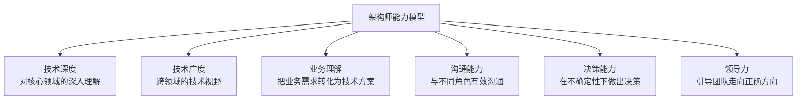
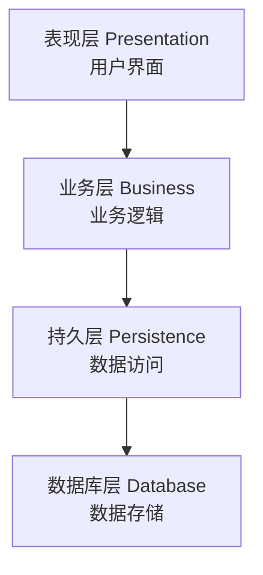
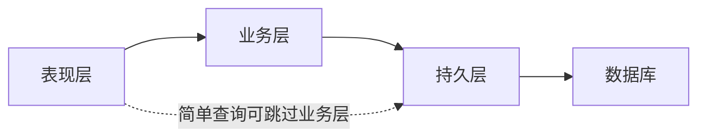
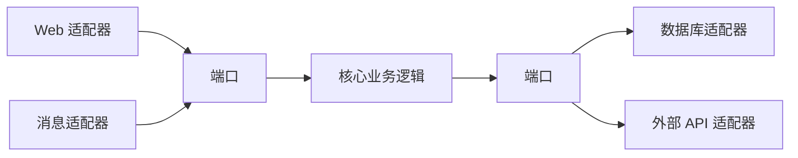
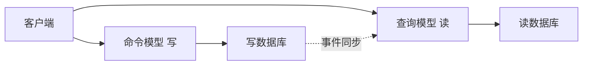
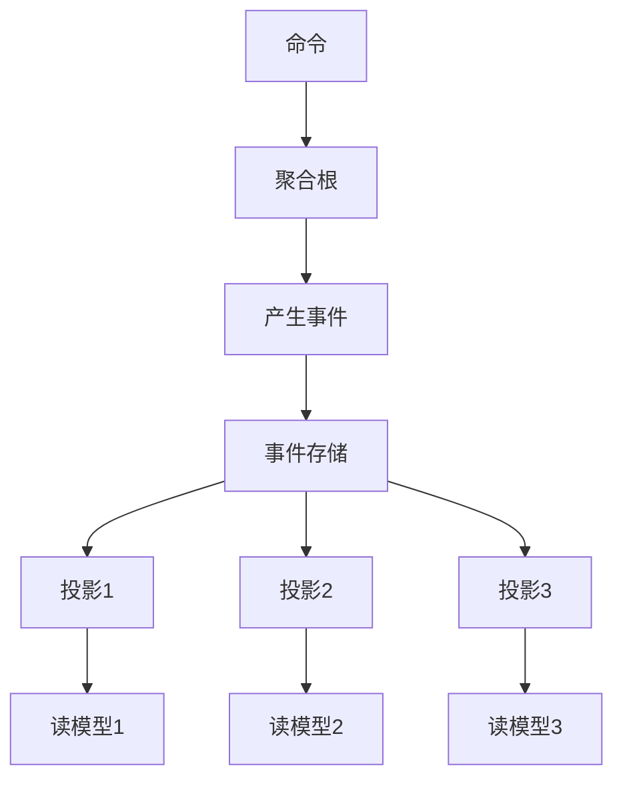
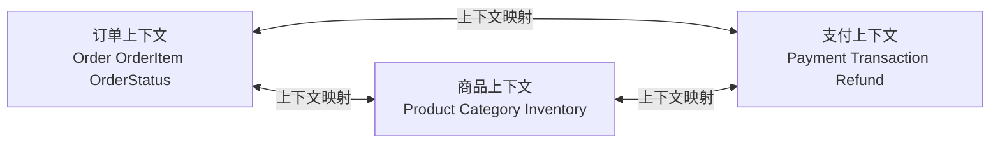
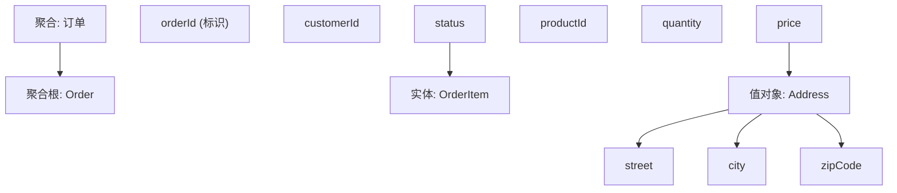
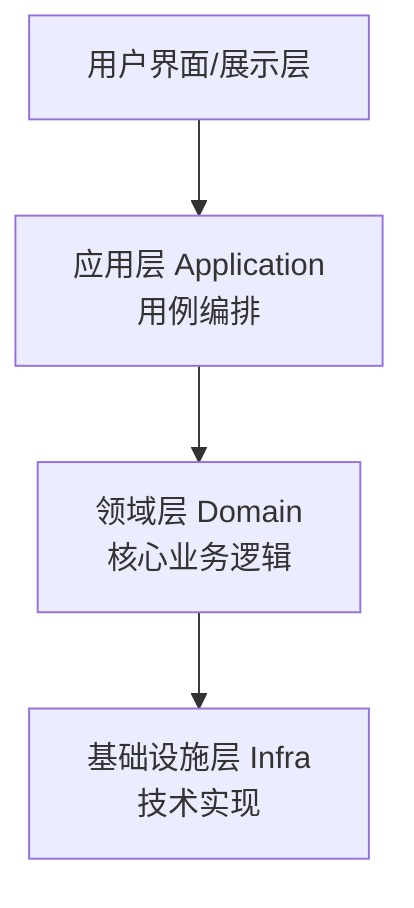
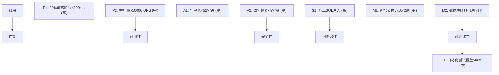

<!-- ============ 文档分隔线：038-software-architecture/001-SoftwareArchitectureOverview.md ============ -->

## 1. 从"盖楼"说起：什么是软件架构

### 1.1 一个楼的故事

想象你要盖一栋 30 层的写字楼。开工前，谁会先决定这些事？

- 承重墙放在哪里？每层能承受多重的荷载？
- 电梯井预留几个？消防通道怎么设计？
- 楼是框架结构还是剪力墙结构？
- 以后能不能在楼顶加两层？能不能改造成住宅？

这些决定，都是**建筑设计师**在画施工图之前就要拍板的。它们的共同特征是：

- **决定整栋楼的命运**：选错了结构，后面装修得再好也白搭
- **一旦定下，极难更改**：楼盖到 10 层才发现承重墙位置错了，只能拆了重建
- **影响所有后续工作**：水电、装修、幕墙都要在结构确定之后才能做

**软件架构（Software Architecture）就是软件的"建筑结构设计"**。它是在写具体代码之前，对系统"整体怎么组织"做出的一批高层决策。

### 1.2 软件架构的定义

软件架构的权威定义（来自 SEI 卡内基梅隆软件工程研究所）：

> **软件架构 = 系统的一组重要结构决策，包括系统的组件、组件之间的关系、组件与环境的交互方式，以及指导系统设计与演化的原则。**

拆开理解这句话，包含四个要素：

| 要素 | 含义 | 举例 |
| :--- | :--- | :--- |
| 组件 | 系统的构建块 | 用户模块、订单模块、数据库 |
| 连接器 | 组件间的交互机制 | HTTP 调用、消息队列、函数调用 |
| 约束 | 组件使用的规则 | "业务层不能直接访问数据库" |
| 配置 | 组件和连接器的组合 | 部署在 3 台服务器、数据库做主从 |

### 1.3 架构 vs 设计：它们有什么不同

初学者最容易混淆的就是"架构"和"设计"。用一个简单区分：

> **架构回答"系统由哪些大块组成、大块之间怎么配合"；设计回答"每个大块内部怎么实现"。**

| 维度 | 架构（Architecture） | 设计（Design） |
| :--- | :--- | :--- |
| 层级 | 系统级 | 模块/类级 |
| 关注 | 全局结构与交互 | 局部实现细节 |
| 变更成本 | 极高（牵一发动全身） | 较低（局部修改） |
| 影响范围 | 整个系统 | 单个模块 |
| 谁来做 | 架构师 + 团队共识 | 每个开发者 |
| 类比 | 楼的结构设计 | 房间的装修风格 |

**关键认知**：架构决策和设计决策没有绝对清晰的边界，但有一条实用判断标准——**这个决定改起来贵不贵？贵（影响全系统）就是架构决策，便宜（影响局部）就是设计决策。**

## 2. 架构的核心要素

### 2.1 组件：系统的"积木"

组件是构成系统的基本单元。一个组件通常具有：

- **清晰的职责**：只做一类事（如"负责用户认证"）
- **可识别边界**：能明确说出"这个组件负责什么、不负责什么"
- **可替换性**：理论上可以换一个实现（比如换个数据库驱动）

### 2.2 连接器：组件间的"管道"

组件之间的交互方式，决定了系统的很多特性：

| 连接器类型 | 特点 | 适用场景 |
| :--- | :--- | :--- |
| 直接函数调用 | 最快、最简单 | 同进程内模块 |
| HTTP/REST | 跨网络、标准统一 | 服务间调用 |
| 消息队列 | 异步、解耦 | 削峰填谷、系统解耦 |
| 数据库共享 | 数据共享 | 强一致需求 |
| 事件总线 | 广播、松耦合 | 事件驱动架构 |

**一个重要的架构教训**：连接器的选择往往比组件的实现更影响系统质量。比如"支付成功后发通知"用同步调用还是消息队列，决定了系统在支付服务故障时的表现。

### 2.3 约束与配置

**约束**是"不能做什么"的规则，比如：

- 业务层不得直接依赖具体数据库实现
- 所有外部输入必须经过校验
- 模块间禁止循环依赖

**配置**是"系统如何部署组合"，比如：

- 3 个 Web 实例 + 1 个数据库主节点 + 2 个从节点
- 缓存层用 Redis，消息用 Kafka

## 3. 架构师：系统命运的关键角色

### 3.1 架构师在做什么

架构师不是"职位最高的工程师"，而是**专门为系统长远质量负责的人**。他的核心职责是：

| 职责 | 说明 | 日常表现 |
| :--- | :--- | :--- |
| 技术决策 | 选择技术栈和架构风格 | "用微服务还是单体？用 MySQL 还是 PG？" |
| 质量保障 | 确保系统满足质量属性 | "这样设计可用性够吗？性能达标吗？" |
| 风险管理 | 识别和缓解技术风险 | "这个方案依赖某个闭源库，风险大吗？" |
| 沟通桥梁 | 连接业务和技术 | 把业务需求翻译成技术方案 |
| 技术指导 | 制定技术标准和规范 | 编码规范、评审清单 |
| 知识传承 | 培养团队技术能力 | 技术分享、方案评审 |

### 3.2 架构师的三个"不能"

**不能一：不能只做"画图的人"。** 画了架构图然后交给团队实现、自己不管——架构图会很快与现实脱节。好的架构师要持续跟进实现，确保架构决策落地。

**不能二：不能当"独裁者"。** 架构是团队的集体决策，不是某个人的意志。好的架构师会倾听各方意见，用数据说话，而不是"我说了算"。

**不能三：不能做"完美主义者"。** 追求"理想架构"而拒绝妥协，会导致系统永远上不了线。好的架构师懂得在"理想"和"现实约束"之间取得平衡。

### 3.3 架构师的能力模型



## 4. 架构决策：架构师最重要的产出

### 4.1 什么是架构决策

架构决策（Architectural Decision）是那些**影响深远、难以逆转、代价高昂**的技术选择。例如：

- 选用哪种数据库
- 采用微服务还是单体
- 用消息队列还是直接调用
- 前端用什么框架

### 4.2 为什么架构决策必须被记录

想象半年后的场景：新来的工程师看着系统问"为什么我们用 Kafka 而不用 RabbitMQ？"——没有人能回答，因为当年做决定的架构师已经离职了。于是新团队不敢动这块，或者干脆推翻重来。

**记录架构决策（ADR，Architecture Decision Record）** 就是为了解决这个问题：把"当时的背景、做的决定、为什么这么做、代价是什么"写下来，让未来的团队能理解并延续决策。

**核心原则**：决策可以被推翻，但必须被记录。记录的价值不是"这个决策永远正确"，而是"后人能看到决策的来龙去脉"。

### 4.3 决策的五大原则

| 原则 | 含义 | 实操 |
| :--- | :--- | :--- |
| 延迟决策 | 不着急的决定不要提前做 | "这个问题下季度再定" |
| 可逆性优先 | 优先选可逆的决策 | 能换的组件优于绑死的 |
| 证据驱动 | 基于数据而非直觉 | 先做 PoC 验证再拍板 |
| 最简可行 | 选最简单的可行方案 | 不要一上来就上最重的方案 |
| 适度设计 | 满足当前需求，预留空间 | 不超前设计，也不裸奔 |

### 4.4 ADR 示例

```markdown
# ADR-001: 选择微服务架构

## 状态

已接受

## 背景

单体应用已无法满足业务快速增长的需求：
- 30 人的团队在同一代码库协作，合并冲突频繁
- 每次发布全量回归，发布周期从 1 天拖到 2 周
- 某个模块的高负载会拖垮整个系统

## 决策

采用微服务架构，按业务域拆分服务（用户、订单、商品、支付）。

## 理由

1. 独立部署：各服务可独立发布，不再相互阻塞
2. 技术异构：各服务可选择合适技术栈
3. 团队自治：每个团队负责自己的服务
4. 弹性伸缩：按需扩展高负载服务

## 后果

- 增加运维复杂度（服务发现、监控、部署）
- 需要 API 网关与分布式事务方案
- 需要更强的可观测性体系

## 替代方案

- 模块化单体：改造成本更低，但部署仍整体化
- 继续单体 + 扩展机器：无法解决协作与发布问题
```

## 5. 架构文档：让架构可理解、可维护

### 5.1 为什么需要架构文档

架构是"系统的骨架"，但骨架是看不见的。架构文档的作用是**让看不见的骨架变得可见**：

- 新成员通过文档快速理解系统（而不是自己翻三个月代码）
- 团队通过文档对齐认知（避免"我以为的架构"和"实际架构"不一致）
- 评审通过文档评估决策（架构评审的对象）

### 5.2 C4 模型：自顶向下的四层视图

业界最流行的架构文档模型是 C4 模型（Context, Containers, Components, Code），它用**四个由粗到细的层次**描述系统：

| 层级 | 视图 | 描述 | 受众 |
| :--- | :--- | :--- | :--- |
| Level 1 | 系统上下文图 | 系统与外部的关系 | 所有人 |
| Level 2 | 容器图 | 系统由哪些容器组成 | 开发者/架构师 |
| Level 3 | 组件图 | 每个容器内的组件 | 开发者 |
| Level 4 | 代码图 | 组件的内部实现 | 开发者 |

**为什么用 C4**：很多人画架构图只会画"一堆框框和箭头"，C4 提供了清晰的层级：先画"系统和外部的边界"（Level 1），再画"系统里有哪些进程/服务"（Level 2），再往下钻。它防止了"一上来就画底层细节"的通病。

### 5.3 架构视图（4+1 视图模型）

除了 C4，经典教材还常用"4+1 视图"来描述架构的不同侧面：

| 视图 | 描述 | 关注者 |
| :--- | :--- | :--- |
| 逻辑视图 | 系统的功能分解 | 终端用户 |
| 进程视图 | 并发与同步 | 集成者 |
| 开发视图 | 代码的组织方式 | 程序员 |
| 物理视图 | 部署拓扑 | 运维人员 |
| 场景（+1） | 关键用例贯穿上述视图 | 所有人 |

**架构文档的黄金法则**：一个系统需要多张图，因为不同的人关心不同的侧面。一张图试图画下所有信息，结果是谁都看不懂。

## 6. 架构反模式：常见的大坑

理解"不该怎么做"往往比"该怎么做"更重要。以下是架构领域最常见的五个反模式：

### 6.1 大泥球（Big Ball of Mud）

**症状**：没有清晰的结构，代码相互纠缠，改一处崩三处。模块边界形同虚设，任何人都在任何地方加代码。

**成因**：架构设计缺失 + 长期缺乏重构。

**对策**：从最容易的部分开始逐步分层，先画出"实际架构"，再逐步向"目标架构"收敛。

### 6.2 过度工程（Over-Engineering）

**症状**：为"未来可能的需求"引入了分布式、微服务、复杂的抽象层——但当前业务一个简单单体就够。

**成因**：架构师焦虑"以后扩展不了怎么办"。

**对策**：YAGNI（You Aren't Gonna Need It）——不为不存在的需求设计。架构应该"为已知的需求做充分设计，为未知的需求留简单空间"。

### 6.3 复制-粘贴架构

**症状**：多个服务的代码结构完全一样（同一个模板生成），只是改了名字。任何修改要在 N 个地方重复做。

**成因**：缺乏统一平台，团队各自为政。

**对策**：提取共享库/平台，或接受"标准化模板 + 自动化生成"。

### 6.4 供应商锁定（Vendor Lock-in）

**症状**：整个系统深度绑定某个云厂商/闭源产品的专有特性，迁移成本高到不可承受。

**成因**：选型时只看"现在好用"，不看"未来可换"。

**对策**：关键依赖增加抽象层（但不要过度抽象）、评估迁移成本、避免使用非必要专有特性。

### 6.5 架构黑洞

**症状**：架构文档写得漂亮，但实际代码早就偏离了架构。架构"看起来存在，实际上不存在"。

**成因**：架构决策不落地、实现无人跟踪、文档与代码脱节。

**对策**：架构评审要对照真实代码；架构变更要同步更新文档；用工具（如依赖检查、架构测试）自动校验架构符合性。

## 7. 架构演进：架构不是一次定死的

### 7.1 架构是"演化的"，不是"设计的"

很多初学者以为架构是"设计好就固定了"。实际上，**架构和软件一样需要演化**：

- 业务变了 → 架构要跟着变
- 技术栈成熟了 → 可以考虑替换
- 团队规模变了 → 协作方式要变

**现代架构思维**：不是"设计一个最终架构"，而是"设计一个能演化的架构"。就像盖楼时预留电梯井和管道位置——你不知道未来要装什么设备，但你知道要为未来的改造留空间。

### 7.2 演进原则

1. **小步演进**：架构调整要分阶段，每次保持系统可用
2. **演进有记录**：每次架构变化都有 ADR 记录理由
3. **对照验证**：定期检查"实际架构 vs 文档架构"是否一致
4. **权衡明确**：每次演进都要说清楚"得到了什么、放弃了什么"

<!-- ============ 文档分隔线：038-software-architecture/002-LayeredArchitecture.md ============ -->

## 1. 从"餐厅厨房"说起：为什么要分层

### 1.1 一个厨房的启示

想象一家餐厅的厨房是怎么运作的：

- **前厅服务员**：接待客人、下单、上菜——他们不和食材打交道
- **主厨**：根据订单设计菜品、决定做菜流程——他们不直接接触洗碗工
- **切配/打荷**：准备食材、处理半成品
- **洗碗工**：清洗餐具

这个分工体系能正常运转，靠的是什么？**职责分离 + 单向协作**：服务员不越权进厨房炒菜，主厨不亲自去洗碗，每层只和"直接相邻"的层级配合。如果有人打破了分工（服务员自己进后厨炒菜），整个餐厅就乱了。

**分层架构（Layered Architecture）就是软件世界的"餐厅厨房"**：把系统按职责拆成若干水平层，每层只负责一类事情，层与层之间单向依赖、各司其职。

### 1.2 分层架构的核心思想

分层架构将系统划分为**多个水平层**，每层只与相邻层交互：



每一层都像是"餐厅里的一个岗位"：

| 层 | 餐厅类比 | 软件职责 |
| :--- | :--- | :--- |
| 表现层 | 前厅服务员 | 和用户打交道：接收输入、展示结果 |
| 业务层 | 主厨 | 核心业务逻辑：决定"怎么做对" |
| 持久层 | 切配/洗碗 | 数据存取：和数据库打交道 |
| 数据库 | 仓库 | 数据最终存储的地方 |

### 1.3 分层的四大原则

**原则一：单向依赖。** 上层依赖下层，下层绝不依赖上层。表现层知道业务层的存在，业务层不知道表现层的存在——就像服务员知道有主厨，主厨不知道今天前台是谁。

**原则二：隔离变化。** 某层内部的变化不影响其他层。比如数据库从 MySQL 换成 PostgreSQL，业务层代码应该"无感知"（因为业务层不直接操作数据库）。

**原则三：关注点分离。** 每层只关心自己的职责。表现层关心"怎么展示"，业务层关心"业务规则是什么"，持久层关心"数据怎么存取"——不要混在一起。

**原则四：可替换性。** 每层的实现可以被替换，只要接口不变。比如表现层从 Web 页面换成手机 App，只要业务层接口稳定，就不影响系统主体。

## 2. 各层的职责详解

### 2.1 表现层（Presentation Layer）

表现层是用户"看得见"的部分，它的职责是：

| 职责 | 说明 | 典型实现 |
| :--- | :--- | :--- |
| 用户交互 | 接收用户输入、响应点击 | HTML 页面、移动端 UI |
| 数据展示 | 把数据格式化成用户能看懂的形式 | 表格、图表、列表 |
| 请求路由 | 把用户请求转发给业务层 | Controller、路由配置 |
| 输入验证 | 做基本格式校验（非空、长度） | 表单校验 |

**表现层的大忌**：把业务逻辑写进界面代码。比如"订单满 100 元免运费"这种规则，如果写在页面的 JavaScript 里，那么换个客户端（手机 App）就要重写一遍——而且容易和服务器规则不一致。

**正确姿势**：表现层只做"收集输入 → 传给业务层 → 展示返回结果"，一切业务判断交给业务层。

### 2.2 业务层（Business Layer）

业务层是系统的"大脑"，存放核心业务规则：

| 职责 | 说明 | 例子 |
| :--- | :--- | :--- |
| 业务逻辑 | 核心业务规则 | "订单满 100 免运费" |
| 流程编排 | 协调多个组件完成业务 | "下单 = 校验库存 + 扣库存 + 生成订单" |
| 事务管理 | 保证多步操作的一致性 | 扣库存和生成订单必须同时成功 |
| 权限控制 | 业务级权限校验 | "只有管理员能删除用户" |

**业务层是分层架构里最"金贵"的一层**——因为它承载了系统的核心价值（业务规则），而且最容易被写坏。业务层的健康标准是：**不依赖任何 UI 细节、不依赖任何具体数据库技术**。它应该是"纯逻辑"的存在。

### 2.3 持久层（Persistence Layer）

持久层负责"数据的存取"，把对象和数据库之间的操作封装起来：

| 职责 | 说明 |
| :--- | :--- |
| 数据访问 | 封装 CRUD（增删改查）操作 |
| ORM 映射 | 对象和关系表之间的映射（Java 的 MyBatis/JPA、Python 的 SQLAlchemy） |
| 查询优化 | 负责 SQL 的性能（索引、批量操作） |
| 缓存管理 | 管理数据缓存 |

**持久层的价值**：业务层不用关心"数据存在 MySQL 还是 Oracle、SQL 怎么写"，只要调用持久层提供的接口（`userRepository.findById(1)`）即可。这样数据库换掉时，业务层不受影响。

## 3. 分层的两种形态：严格与松散

### 3.1 严格分层（Closed Layers）

**规则**：每层只能调用它的直接下层。请求必须一层一层地走：

```
表现层 → 业务层 → 持久层 → 数据库
```

**优点**：依赖关系最清晰，层次纪律最严格。任何请求路径都是可预测的。

**缺点**：某些"简单查询"也要绕一大圈——表现层想显示一个用户列表，也必须经过业务层（哪怕业务层什么都没做）。

### 3.2 松散分层（Open Layers）

**规则**：允许跨层调用，跳过某些层。比如表现层做简单查询时可以直接调用持久层：



**优点**：减少无谓的层间传递，性能更好。

**缺点**：依赖关系变得混乱，业务规则可能被绕过（简单查询渐渐变成带业务判断的查询）。

### 3.3 怎么选

- 业务规则复杂的系统（订单、支付）：用**严格分层**，保证业务层不被绕过
- 以查询为主的系统（报表、展示）：可用**松散分层**，允许只读查询直接访问持久层
- 经验法则：**先严格，再按需开放**——初始用严格分层，出现"明显无意义的绕层"再局部开放

## 4. 常见分层模式：从三层到洋葱

"分层"是一个思想，不同实践给出了不同的"层数"。常见的有：

| 模式 | 分层 | 代表思想 |
| :--- | :--- | :--- |
| 三层架构 | 表现层-业务层-数据层 | 最经典，Java EE 的标配 |
| 四层架构 | 表现-应用-领域-基础设施 | DDD 的分层（见《领域驱动设计》） |
| 六边形架构 | 核心 + 端口 + 适配器 | Alistair Cockburn 提出 |
| 洋葱架构 | 领域核心 + 多层环绕 | Jeffrey Palermo 提出 |

### 4.1 三层架构（最经典）

三层架构是大多数 Web 应用的实际形态，也是很多框架的默认结构：

```
Controller（控制器）→ Service（服务）→ Repository（仓库）→ DB
   表现层              业务层          持久层
```

前端框架的 MVC（Model-View-Controller）本质也是三层思想的体现。

### 4.2 六边形架构（端口与适配器）

六边形架构强调**"核心"与"外界"的隔离**：核心（业务逻辑）位于中心，通过"端口"（接口）与外界交互，外界通过"适配器"实现端口。



**价值**：核心完全不依赖任何具体技术（Web 框架、数据库），可以独立测试、独立演进。这是"依赖倒置"原则的极致体现。

### 4.3 洋葱架构

洋葱架构和六边形类似，但更强调"依赖方向向心"：领域层在最中心，外层只能依赖内层，内层不知道外层的存在。

```
UI → 应用服务 → 领域服务 → 领域模型（核心）
               ↑          ↑
       基础设施层（实现接口）
```

## 5. 分层架构的优缺点

### 5.1 优点

- **简单易懂**：层数不多、职责清晰，团队能快速上手
- **关注点分离**：每层只管一件事，代码更好维护
- **可测试性**：每层可以独立测试（业务层测试不需要启动 UI）
- **标准化**：业界广泛采用，招聘、找资料、交流都容易
- **渐进演进**：可以从三层起步，需要时向六边形/DDD 演进

### 5.2 缺点

- **性能开销**：每多一层就多一次传递，简单操作也被"绕层"
- **过度抽象**：小功能也要经过所有层，代码量膨胀
- **腐化风险**：层间边界容易被打破（程序员赶进度时会"直接连数据库"）
- **单体倾向**：分层天然是"一个应用内部"的结构，容易演变成大泥球

### 5.3 一个判断标准

分层架构适合什么样的系统？

**适合**：业务规则明确、以 CRUD 为主的传统企业应用、中小型 Web 应用。

**不太适合**：超高并发、需要极致性能的系统（层间传递是负担）；架构边界需要物理隔离的系统（此时用微服务）。

## 6. 最佳实践：让分层真正健康

分层架构的失败，90% 不是"选错了层"，而是"层被写坏了"。以下是保持分层健康的实践：

### 6.1 DTO 转换：层间不暴露内部对象

各层之间传递数据时，使用 **DTO（Data Transfer Object）**，而不是直接把数据库实体丢给界面。

```java
// 错误：把数据库实体直接返回给前端
public UserEntity getUser(int id) { return userRepo.findById(id); }

// 正确：转成 DTO 再返回（隐藏敏感字段、结构解耦）
public UserDTO getUser(int id) {
    UserEntity entity = userRepo.findById(id);
    return new UserDTO(entity.getName(), entity.getEmail());
}
```

**为什么**：数据库实体往往包含不该暴露的字段（密码哈希、内部状态），且与数据库结构强耦合。DTO 把"内部表示"和"对外表示"解耦。

### 6.2 依赖倒置：让上层定义接口，下层实现

依赖倒置原则（DIP）在分层中的应用：**业务层定义接口，持久层实现接口**——而不是业务层直接依赖具体数据库。

```java
// 业务层只依赖接口（不知道具体是 MySQL 还是 PG）
public interface OrderRepository {
    Order findById(Long id);
    void save(Order order);
}

// 持久层提供实现
@Repository
public class MysqlOrderRepository implements OrderRepository {
    // 具体 SQL / ORM 实现
}
```

**好处**：数据库可替换、业务层可独立测试（测试时用 Mock 实现接口）。

### 6.3 防腐层：隔离外部系统

对接第三方系统（支付、短信、地图）时，用**防腐层（Anti-Corruption Layer）**把外部模型翻译成内部模型：

```
业务层 ⇄ 防腐层(适配器) ⇄ 第三方系统
```

第三方 API 变化时，只需要改防腐层，业务层不受影响。

### 6.4 统一异常处理

每一层把异常转换成"本层语言"：持久层把 SQL 异常转成"数据访问异常"，业务层把数据访问异常转成"业务异常"，表现层统一处理并返回友好提示。

**错误示范**：数据库的 SQLException 一路抛到前端，用户看到一堆技术细节。

### 6.5 分层边界守卫

用工具强制分层纪律（防止"赶进度时直接跨层"）：

- Java 有 ArchUnit（架构测试），可以编写规则："Controller 不得直接调用 Repository"
- 代码评审时把"是否破坏分层"作为检查项
- 使用依赖分析工具（如 jdepend）检测层间依赖

## 7. 分层架构实战：一个订单模块的例子

把上述理论落到一个真实的"下单"场景，看看分层如何协作：

```java
// 表现层：接收 HTTP 请求
@RestController
public class OrderController {
    private final OrderService orderService;

    @PostMapping("/orders")
    public OrderDTO createOrder(@RequestBody CreateOrderRequest req) {
        // 只做基本校验 + 调用业务层
        return orderService.createOrder(req);
    }
}

// 业务层：核心业务逻辑
@Service
public class OrderService {
    private final OrderRepository orderRepository;
    private final InventoryRepository inventoryRepository;

    @Transactional
    public OrderDTO createOrder(CreateOrderRequest req) {
        // 1. 业务校验
        if (req.getItems().isEmpty()) throw new BusinessException("订单不能为空");
        // 2. 扣库存（通过持久层接口）
        for (Item item : req.getItems()) {
            inventoryRepository.decrease(item.getProductId(), item.getQuantity());
        }
        // 3. 生成订单
        Order order = new Order(req.getCustomerId(), req.getItems());
        orderRepository.save(order);
        // 4. 返回 DTO
        return OrderDTO.from(order);
    }
}

// 持久层：数据访问
@Repository
public class MysqlOrderRepository implements OrderRepository {
    @Override
    public void save(Order order) {
        // 具体的 SQL / ORM 操作
    }
}
```

**观察这个例子**：

- 表现层不知道"扣库存"的存在——它只负责接收请求和返回结果
- 业务层不知道"数据存在哪"——它只调用 `OrderRepository` 接口
- 持久层不知道"为什么扣库存"——它只负责执行
- 每层职责单一，替换任何一层（换框架、换数据库）都不影响其他层

## 8. 常见反模式与误区

### 反模式一：贫血分层（Anemic Layering）

**症状**：业务层变成了"空壳 Service"，所有业务逻辑写在表现层或持久层里，分层只剩空架子。

**对策**：业务逻辑必须进业务层，层内使用领域模型承载逻辑。

### 反模式二：层泄漏（Layer Leakage）

**症状**：表现层直接调用持久层方法、持久层里出现业务判断（"如果订单状态是 X 就查表 Y"）。

**对策**：靠 ArchUnit 等工具 + 代码评审拦截。

### 反模式三：上帝层（God Layer）

**症状**：某一层承载了系统 80% 的逻辑，其他层都是"传话筒"。

**对策**：重新分配职责，让每层有实质内容。

### 反模式四：为分层而分层

**症状**：简单的小系统也强行套 5 层架构，代码量翻倍、维护更困难。

**对策**：分层的深度要和系统复杂度匹配——小项目用 2-3 层即可，不要为了"规范"而过度分层。

<!-- ============ 文档分隔线：038-software-architecture/003-MicroserviceArchitecture.md ============ -->

## 1. 从"一家大餐厅 vs 连锁餐饮集团"说起

### 1.1 单体系统的困境

想象一家大餐厅：**一个后厨、一个主厨团队、一张菜单**。生意火爆后，问题来了：

- 想加一道新菜，要通知所有厨师，整个后厨都要重新培训
- 一个厨师请假，整条出品线就卡住了
- 火锅和甜品共用一口锅，甜品永远带着火锅味
- 想给"打包外带"单独提速，做不到——因为所有流程混在一起

这就是**单体架构（Monolith）**的处境：一个应用包含了所有功能，部署在一起、运行在一起、扩展一起扩。

### 1.2 连锁餐饮集团的解法

大餐厅的解法是**连锁化**：把"餐厅"拆成多个独立的"店"：

- 火锅店只做火锅、甜品店只做甜品、中央厨房只做预制菜
- 每家店独立运营、独立雇佣厨师、独立扩张
- 火锅店排队爆满时，甜品店不受影响（故障隔离）
- 新开一家"奶茶店"，不用改造火锅店（独立部署）

**微服务架构（Microservices Architecture）就是软件的"连锁化"**：把一个大应用拆成多个**独立的服务**，每个服务负责一个业务能力，独立开发、独立部署、独立扩展。

### 1.3 微服务的定义

微服务的经典定义（Martin Fowler）：

> **微服务架构是将单个应用开发为一组小型服务的方法。每个服务运行在自己的进程中，通过轻量级机制（通常是 HTTP API）通信，围绕业务能力构建，独立部署，可以由全自动机制独立发布。**

拆解定义的关键词：

| 关键词 | 含义 |
| :--- | :--- |
| 小型服务 | 每个服务只做一件事（一个业务能力） |
| 独立进程 | 服务之间隔离，一个挂了不影响其他 |
| 轻量通信 | 通常用 HTTP/REST 或消息 |
| 围绕业务能力 | 按"用户/订单/支付"而不是"Controller/Service"切分 |
| 独立部署 | 每个服务可独立发布、独立回滚 |

## 2. 微服务的五大核心特征

### 2.1 服务自治

每个服务是"独立王国"：有自己的代码库、自己的发布节奏、自己的团队负责。服务 A 想改代码，不需要等服务 B 一起发布。

**对比单体**：单体里改一行代码，可能触发整个应用重新构建、全量发布。

### 2.2 单一职责

每个服务只负责**一个业务能力**：用户服务只管用户、订单服务只管订单、支付服务只管支付。服务边界 = 业务边界。

**判断标准**：这个服务能不能用一句业务话术说清楚它做什么？"订单服务负责订单从创建到完成的整个生命周期"——可以。如果只能说"这个服务负责订单、用户、支付、库存乱七八糟一堆"——说明拆错了。

### 2.3 去中心化

数据去中心化（每个服务有自己的数据库）、治理去中心化（没有统一"上帝服务"）、技术去中心化（各服务可用不同技术栈）。

**注意**：去中心化是"能力"，不是"义务"。不是说每个服务必须用不同语言——而是**允许**不同服务在不同场景用最合适的工具。

### 2.4 技术异构

Java 服务、Go 服务、Python 服务可以共存，只要它们之间通过标准接口（HTTP/gRPC/消息）通信。这给了团队"选择合适工具"的自由，但也要付出"多种技术栈维护成本"的代价。

### 2.5 弹性设计

服务之间天然隔离：支付服务挂了，用户服务还能继续用；订单服务超载，只影响订单，不影响商品浏览。配合限流、熔断、降级，实现"故障局部化"。

## 3. 微服务 vs 单体：一个关键对比

| 维度 | 单体架构 | 微服务架构 |
| :--- | :--- | :--- |
| 部署 | 整体部署（改动一处全部发布） | 独立部署（每个服务单独发布） |
| 扩展 | 整体扩展（只能整机扩容） | 按需扩展（只扩热点服务） |
| 技术栈 | 全栈统一 | 可异构 |
| 故障影响 | 一个 bug 可能拖垮整个应用 | 故障隔离在单个服务 |
| 开发效率 | 小团队高（无网络调用开销） | 大团队高（团队自治不阻塞） |
| 运维复杂度 | 低 | 高（服务发现、监控、部署复杂） |
| 调试难度 | 低（单进程单日志） | 高（跨服务链路追踪） |
| 数据一致性 | 简单（本地事务） | 复杂（分布式事务） |
| 启动成本 | 低 | 高（基础设施多） |

**关键结论**：微服务不是"更先进"，而是"不同规模下的不同选择"。

- **小团队、小系统**：单体更高效——没有网络开销、没有分布式复杂度
- **大团队、大系统**：微服务更合适——团队自治、独立部署、按需扩展
- 业界共识：**从单体开始，需要时再拆微服务**（模块化单体是中间过渡态）

## 4. 服务拆分：最难也最关键的决策

### 4.1 四种拆分策略

| 策略 | 说明 | 示例 |
| :--- | :--- | :--- |
| 按业务能力 | 围绕业务功能拆 | 用户服务、订单服务、商品服务 |
| 按子域（DDD） | 按限界上下文拆 | 商品子域、支付子域（见《领域驱动设计》） |
| 按事务边界 | 独立事务拆开 | 支付、库存独立成服务 |
| 按变更频率 | 变化快的与慢的分开 | 核心流程 vs 营销活动 |

### 4.2 拆分原则

**原则一：高内聚。** 密切相关的东西放同一个服务。"用户资料"和"用户订单历史"如果经常一起查询，就应该在同一个服务（否则每次都要跨服务调用）。

**原则二：松耦合。** 服务之间的依赖最小化。服务 A 的变更不应要求服务 B 做改动。

**原则三：独立数据。** 每个服务拥有自己的数据库。**绝不共享数据库表**——共享数据库会让服务在数据层面重新耦合。

**原则四：有界上下文。** 服务边界清晰、语义明确（"用户"在用户服务和订单服务中的含义可以有差异，但每个服务内部必须自洽）。

### 4.3 拆分陷阱

**陷阱一：拆得太碎。** 一个用户系统拆成 20 个服务，每个服务就两三个接口——运维成本远大于收益。

**陷阱二：分布式事务。** 一个业务操作横跨多个服务，需要 Saga/补偿事务（见第 6 节）——复杂度大幅上升。

**陷阱三：跨服务查询。** "订单 + 商品 + 用户"组合查询要调 3 个服务——需要在读模型层聚合（CQRS 思路，见《事件驱动架构》）。

**陷阱四：版本兼容。** 服务 A 改了接口，服务 B 没跟上——需要契约测试保证兼容。

### 4.4 拆分的正确姿势：模块化单体起步

**业界主流建议**：不要一上来就拆微服务。先做**模块化单体（Modular Monolith）**——一个应用，但内部按清晰的模块边界组织。当出现以下信号时，再逐步把模块抽取成独立服务：

- 某个模块的团队已经超过 10 人，协作频繁冲突
- 某个模块的发布频率与其他模块差异巨大
- 某个模块需要独立扩容/独立技术栈
- 某个模块的故障会影响所有模块（需要隔离）

**演进式拆分**：像"蚕食"一样，每次抽一个边界清晰的模块出去，而不是"一次性大爆炸"地重构。

## 5. API 网关：微服务的"总门卫"

### 5.1 为什么需要网关

没有网关时，客户端要直接面对几十个服务：前端要记住每个服务的地址、要分别处理每个服务的认证、每个服务都要各自做限流……

```
客户端 → 服务A / 服务B / 服务C / 服务D ...（一片混乱）
```

有了网关后，客户端只面对一个入口：

```
客户端 → [API网关] → 服务A
                  → 服务B
                  → 服务C
```

### 5.2 网关的核心职责

| 职责 | 说明 |
| :--- | :--- |
| 路由转发 | 按路径把请求转发到对应服务 |
| 认证授权 | 统一身份认证（登录态校验、Token 验证） |
| 限流熔断 | 流量控制、保护后端服务 |
| 协议转换 | REST ↔ gRPC 等格式转换 |
| 聚合裁剪 | 一次请求聚合多个服务的数据、裁剪响应字段 |
| 日志监控 | 统一日志、指标采集（可观测性入口） |

### 5.3 网关的三种模式

| 模式 | 说明 | 适用场景 |
| :--- | :--- | :--- |
| 单一网关 | 一个网关处理所有流量 | 小规模、单端 |
| BFF 网关 | 每种客户端一个网关 | 多端（Web/App/小程序），各端定制 |
| 网关网格 | 每个服务旁挂 Sidecar 代理 | 服务网格（Istio 等） |

**BFF（Backend For Frontend）模式**：Web 端、iOS、Android 的 API 需求不同（Web 要全量数据，手机要精简数据），为每种端做专用网关，避免"一套 API 服务所有端"的别扭。

### 5.4 网关的注意点

网关是微服务架构的**关键单点**：网关挂了，所有服务都不可达。所以网关自身要有高可用设计（多实例、负载均衡），且网关里的逻辑要尽量"薄"（不要堆业务逻辑，否则网关又变成"超级单体"）。

## 6. 服务发现与通信

### 6.1 服务发现：怎么找到服务

微服务实例是动态的（扩容、缩容、重启），客户端怎么知道"订单服务现在在哪个 IP"？两种模式：

| 模式 | 原理 | 代表 |
| :--- | :--- | :--- |
| 客户端发现 | 客户端向注册中心查询服务地址 | Eureka、Nacos、Consul |
| 服务端发现 | 客户端请求负载均衡器，由它路由 | Nginx、AWS ALB、Kubernetes Service |

**注册中心的工作方式**：

```
服务启动 → 注册到注册中心（IP:端口:健康状态）
服务心跳 → 定期上报健康（不报 = 摘除）
客户端查询 → "订单服务有哪些可用实例？" → 返回列表
```

### 6.2 服务间通信：四种模式

| 模式 | 说明 | 适用场景 |
| :--- | :--- | :--- |
| 同步 REST | HTTP 请求-响应 | 简单查询、语义清晰 |
| 同步 gRPC | 高性能 RPC（protobuf） | 服务间高频调用、低延迟 |
| 异步消息 | 消息队列（Kafka/RabbitMQ） | 解耦、削峰填谷 |
| 事件驱动 | 事件总线发布/订阅 | 最终一致性、广播通知 |

**选择建议**：

- 查询类（"给我订单详情"）：用**同步**（REST/gRPC），因为需要立即返回
- 动作类（"订单已支付，通知库存扣减"）：优先用**异步消息**，解耦且不怕瞬时高峰
- 需要"某个事情发生后，多个服务各自处理"：用**事件驱动**

## 7. 数据管理：微服务最难的领域

### 7.1 数据库每服务一个（Database per Service）

微服务的一个铁律：**每个服务有自己的数据库，绝不共享**。

```
用户服务 → 用户数据库
订单服务 → 订单数据库
商品服务 → 商品数据库
```

**为什么不能共享数据库**：

1. 共享数据库会让服务在数据层重新耦合（服务 A 改了表结构，服务 B 就挂了）
2. 无法独立扩展（一个库被所有服务共用，没法按服务扩容）
3. 服务边界被打破（谁能访问哪些表说不清楚）

**代价**：原本"一个事务搞定"的操作，现在要跨服务了——这就是分布式事务问题的来源。

### 7.2 分布式事务：四种模式

跨服务的业务操作需要保证数据一致性，常见四种模式：

| 模式 | 一致性 | 复杂度 | 适用场景 |
| :--- | :--- | :--- | :--- |
| 2PC（两阶段提交） | 强一致 | 高 | 传统企业应用（较少用于微服务） |
| TCC（补偿事务） | 最终一致 | 高 | 金融、对一致性要求高 |
| Saga | 最终一致 | 中 | 长事务、跨多服务 |
| 本地消息表 | 最终一致 | 低 | 简单异步场景 |

### 7.3 Saga 模式详解（最常用）

Saga 的核心思想：**把一个长事务拆成一系列本地事务，每个本地事务都有对应的"补偿操作"（undo）。失败时，依次执行反向补偿。**

```
正向执行:  T1 → T2 → T3 → 完成
失败回滚:  T1⁻¹ ← T2⁻¹ ← T3 失败（补偿 T3 之前的所有步骤）
```

**示例：下单流程（订单 + 库存 + 支付）**

```
正向:
  1. 订单服务: 创建订单（T1）
  2. 库存服务: 扣减库存（T2）
  3. 支付服务: 扣款（T3）
失败场景（T3 支付失败）:
  补偿:
  2'. 库存服务: 回补库存（T2⁻¹）
  1'. 订单服务: 取消订单（T1⁻¹）
```

**实现方式**：

- **编排式 Saga**：一个中央协调者（orchestrator）指挥各服务执行/补偿
- ** choreography 式 Saga**：各服务通过事件互相触发（订单事件 → 库存监听 → 支付监听）

**要点**：Saga 放弃强一致，接受"最终一致"——在补偿完成前，系统处于"中间状态"，但最终会收敛到一致。

## 8. 可观测性：微服务时代的"必答题"

单体时代，出问题看一个日志文件就行。微服务时代，一个请求要经过 5 个服务，没有可观测性，出了 bug 就像"在黑屋子里找黑猫"。

微服务的可观测性三板斧：

| 维度 | 工具 | 回答的问题 |
| :--- | :--- | :--- |
| 日志（Logs） | ELK、Loki | 发生了什么？（事件详情） |
| 指标（Metrics） | Prometheus、Grafana | 整体状态如何？（量化数据） |
| 追踪（Traces） | Jaeger、Zipkin | 请求走了哪些服务？慢在哪？（调用链） |

**链路追踪（Distributed Tracing）尤其重要**：一个请求带上唯一的 traceId，经过每个服务都记录耗时，最终把整个调用链可视化：

```
客户端 → 网关(10ms) → 订单服务(50ms) → 库存服务(200ms) ← 瓶颈在这里！
                          ↘ 用户服务(30ms)
```

**落地建议**：微服务从第一天就要建立可观测性，而不是"等出问题了再补"。告警、日志、追踪是微服务的"水电煤"。

## 9. 微服务的代价：不要被光环迷惑

微服务不是银弹，它把单体的复杂度**转移**到了运维和基础设施层面：

**你为微服务付出的代价**：

1. 基础设施复杂度：服务发现、配置中心、网关、监控告警都要搭建
2. 运维成本：几十个服务的部署、升级、回滚
3. 分布式复杂度：网络延迟、分布式事务、链路追踪
4. 调试困难：跨服务问题的定位成本大幅上升
5. 团队要求高：需要更强的架构能力和工程纪律

**什么时候不该用微服务**：

- 团队小于 20 人
- 系统业务边界不清晰
- 没有成熟的 CI/CD 和监控基础设施
- 强一致事务需求很多

**业界真实数据**：很多公司"微服务化"后反而变得更糟——不是因为微服务不好，而是因为**在错误的时机、为了错误的理由**采用了微服务（"别人都在用，我们也用"是最差的理由）。

## 10. 常见误区

### 误区一：微服务 = 应用拆得越碎越好

**真相**：拆分粒度要平衡。拆得太碎，运维成本爆炸；拆得太粗，和单体没区别。判断标准是"每个服务是否有清晰的业务边界和独立演进的价值"。

### 误区二：微服务一定比单体"高级"

**真相**：它们是不同规模下的不同选择。单体不丢人，微服务也不高级。**用最简单的架构解决问题，才是真正的工程能力。**

### 误区三：微服务必须每个服务用不同语言

**真相**：技术异构是"允许"不是"必须"。盲目异构会增加维护成本。除非有明确的理由（性能、生态），否则用统一技术栈更省心。

### 误区四：上了微服务就不用管耦合了

**真相**：微服务只是把"代码级耦合"变成"网络级耦合"。服务之间的依赖管理（版本兼容、接口契约）反而更需要纪律。

### 误区五：微服务能解决单体的一切问题

**真相**：微服务解决的是"团队协作与独立部署"问题。性能、质量、架构腐化等问题，微服务不会自动解决——它们只是换了一种形态出现。

<!-- ============ 文档分隔线：038-software-architecture/004-EventDrivenArchitecture.md ============ -->

## 1. 从"杂志订阅"说起：什么是事件驱动

### 1.1 打电话 vs 订杂志

想象两家出版社通知用户"新刊出版了"：

**出版社 A（同步打电话）**：编辑挨个给订户打电话，告诉"新刊出版了"。问题：

- 订户不接电话，编辑就得一直等
- 打电话时，编辑被"锁住"了，没法做别的事
- 如果订户搬到国外，编辑还得重新打国际长途

**出版社 B（订阅杂志）**：杂志印好后放到发行渠道，订户**自己订阅**——谁感兴趣谁订，订了的到货就能收到，没订的人自然收不到。出版社**不需要知道**有多少人订、谁是订户，它只管"把杂志发行出去"。

**事件驱动架构（Event-Driven Architecture）就是"出版社 B 的模式"**：系统的各个组件之间不"直接打电话"（同步调用），而是通过"事件"（杂志）通信——生产者只管"发布事件"，消费者"订阅自己关心的事件"。

### 1.2 事件驱动 vs 传统请求-响应

| 对比 | 传统请求-响应 | 事件驱动 |
| :--- | :--- | :--- |
| 通信方式 | 同步调用（A 调 B 等 B 返回） | 异步发布（A 发事件，不关心谁消费） |
| 耦合 | A 知道 B 的存在（强耦合） | A 不知道消费者是谁（松耦合） |
| 等待 | A 必须等 B 处理完 | A 发完就走 |
| 失败影响 | B 挂了 A 也失败 | 消费者挂了，生产者不受影响 |
| 类比 | 打电话 | 订杂志 |

### 1.3 核心概念

| 概念 | 定义 | 类比 |
| :--- | :--- | :--- |
| 事件（Event） | "已经发生的、有意义的事"的记录 | 一本杂志 |
| 生产者（Producer） | 产生事件的组件 | 出版社 |
| 消费者（Consumer） | 处理事件的组件 | 订户 |
| 通道（Channel） | 事件传输的媒介（消息队列/事件总线） | 发行渠道 |
| 事件存储（Event Store） | 事件的持久化存储 | 杂志档案馆 |

**关键认知**：事件描述的是"**已经发生**的事实"（过去时），而不是"请求"（命令）。例如：

- "订单已创建"（OrderCreated）是事件
- "请创建订单"（CreateOrder）是命令（请求）

这个区别很重要：事件是**事实记录**，不能被"拒绝"——它已经发生了；消费者只能决定"要不要响应它"。

## 2. 事件驱动的两种拓扑

事件驱动有两种主要实现形态（拓扑）：

### 2.1 事件通知（Event Notification）

**生产者只发布"发生了什么"，不携带具体数据**，消费者需要时再主动查询。

```
订单服务: "订单已创建"（只含订单ID）
→ 邮件服务: 收到通知，主动调订单服务查详情，再发邮件
→ 库存服务: 收到通知，主动调订单服务查详情，再扣库存
```

**特点**：事件很小（只含 ID），事件间依赖查询。

**优点**：事件精简、消费者按需取数。

**缺点**：消费者收到通知后还要回查，增加一次往返；如果回查时数据已变，可能拿不到当时的快照。

### 2.2 事件携带状态转移（Event Carrying State Transfer）

**生产者发布的事件自带完整数据**，消费者无需回查。

```
订单服务: "订单已创建"（含订单全部数据）
→ 邮件服务: 直接用事件里的数据发邮件
→ 库存服务: 直接用事件里的数据扣库存
```

**特点**：事件是"数据快照"，消费者自给自足。

**优点**：消费者无需回查、解耦最彻底。

**缺点**：事件可能很大；数据在事件里复制一份，存在"事件数据与源数据不同步"的风险。

### 2.3 如何选择

- 消费者**总是需要最新数据** → 用事件通知（回查保证最新）
- 消费者**只需要事件发生时的快照** → 用事件携带状态转移
- 权衡：回查成本 vs 数据同步风险

## 3. 事件溯源（Event Sourcing）：不存结果，存过程

### 3.1 记账本思维

传统系统的数据存储方式是"记结果"：账户余额现在是 700 元，就存 700。

**事件溯源（Event Sourcing）换了一种思路：不存"当前状态"，只存"所有发生过的事件"。** 想要当前状态？把事件从头到尾重放一遍即可。

```
传统方式:
  账户余额 = 700（只存结果，不知道 700 是怎么来的）

事件溯源:
  AccountCreated(balance=0)
  MoneyDeposited(amount=500)    → 余额 500
  MoneyDeposited(amount=300)    → 余额 800
  MoneyWithdrawn(amount=100)    → 余额 700
  当前余额 = 0 + 500 + 300 - 100 = 700
```

**为什么这是有价值的？** 因为"结果"会丢失历史，而"过程"永远可追溯：

- 想知道"这个账户 3 个月前发生了什么"？重放事件
- 想知道"这个余额是怎么来的"？看事件链
- 想修正一个历史错误？不是改数据，而是追加一条"更正事件"

### 3.2 事件溯源的工作方式

```mermaid
flowchart TD
    E[事件流]<br/>1 AccountCreated {id: A1}<br/>2 MoneyDeposited {amt: 500}<br/>3 MoneyDeposited {amt: 300}<br/>4 MoneyWithdrawn {amt: 100}
```

- 事件是**追加写**的（append-only）：只增不改不删
- 事件是**不可变**的：已发生的事实不能修改
- 当前状态 = 重放所有事件得到的"投影"（projection）

### 3.3 快照优化

事件无限累积后，重放会越来越慢。解决方法是**定期存快照**：

```
快照@事件100: {balance: 700, ...}   ← 每 100 个事件存一次
事件101: MoneyDeposited(200)
事件102: MoneyWithdrawn(50)

重建状态: 从"事件100快照"开始 + 重放事件101-102
= 700 + 200 - 50 = 850
```

快照让"重放"变成"从快照续播"，大幅降低重建成本。

### 3.4 事件溯源的优缺点

| 优点 | 缺点 |
| :--- | :--- |
| 完整审计追踪（所有操作有据可查） | 事件流可能很长（存储和重放成本） |
| 时间旅行（可重建任意时刻状态） | 查询复杂（需要投影支持） |
| 天然适合事件驱动 | 事件模式演进困难（旧事件要兼容） |
| 事件不可变，天然安全 | 需要快照优化和投影机制 |

**适用场景**：金融、审计要求高的系统；需要"任意时刻状态回溯"的系统（如余额、库存流水）。

**不适用场景**：简单 CRUD（杀鸡用牛刀）；对查询性能要求极高且无法接受投影延迟的场景。

## 4. CQRS：命令查询职责分离

### 4.1 一个问题：读写混在一起的困境

传统架构里，读和写共用同一个数据模型（同一个数据库、同一套实体）。这在高并发场景下有问题：

- 写操作需要严格校验和事务
- 读操作需要灵活高效的查询
- 两者对数据模型的要求常常冲突：写要"稳定一致"，读要"灵活多样"

**CQRS（Command Query Responsibility Segregation，命令查询职责分离）** 的解法：**把"写"（命令）和"读"（查询）分成两个独立的模型。**



### 4.2 CQRS 的核心思想

| 概念 | 说明 |
| :--- | :--- |
| 命令（Command） | 改变状态的请求（"创建订单""扣库存"），有副作用 |
| 查询（Query） | 读取状态的请求（"查订单详情"），无副作用 |
| 写模型 | 处理命令，保证一致性和业务规则 |
| 读模型 | 处理查询，针对查询场景优化（缓存、反规范化） |
| 同步 | 写模型变化 → 通过事件更新读模型（最终一致） |

### 4.3 CQRS + 事件溯源：黄金组合

CQRS 和事件溯源常常搭配使用，因为它们天然互补：



- **写端**：事件溯源，保证数据完整性和审计
- **读端**：为不同查询场景构建不同的"投影"（读模型）
- **同步**：异步事件驱动，最终一致

**例**：电商系统里，订单的读模型可能有三个投影：

- 投影1：用户视角的订单列表（按时间倒序）
- 投影2：运营视角的订单统计（按商品聚合）
- 投影3：客服视角的订单详情（含完整物流信息）

每个投影针对自己的查询优化，互不影响。

### 4.4 CQRS 适用场景

| 适用 | 不适用 |
| :--- | :--- |
| 读写负载差异大（读远多于写） | 简单 CRUD 应用 |
| 业务规则复杂（写端需要严格校验） | 小型应用（复杂度不划算） |
| 需要不同读模型服务不同场景 | 团队经验不足 |
| 与事件溯源搭配（审计、追溯） | 强一致要求（读必须立即反映写） |

**重要提醒**：CQRS 增加了复杂度（两个模型 + 同步机制），**不要为了"炫技"而用**。只有当读写矛盾真实存在时才值得引入。

## 5. 事件设计：好事件长什么样

### 5.1 事件的完整结构

一个好的事件应该包含足够的上下文信息：

```json
{
  "eventId": "uuid-1234",                    // 事件唯一 ID（幂等处理的基础）
  "eventType": "OrderCreated",               // 事件类型（过去时，描述已发生的事）
  "timestamp": "2024-01-15T10:30:00Z",       // 发生时间（UTC）
  "aggregateId": "order-5678",               // 所属聚合的 ID
  "version": 1,                              // 事件版本（模式演进用）
  "data": {                                  // 事件携带的数据
    "orderId": "order-5678",
    "customerId": "cust-9012",
    "items": [{ "productId": "p1", "quantity": 2 }],
    "totalAmount": 99.99
  }
}
```

### 5.2 事件设计的原则

1. **事件命名用过去时**：`OrderCreated`（已创建）、`PaymentReceived`（已收到）——它描述的是事实
2. **事件描述业务语义**，不描述技术实现：用 `OrderCancelled`，不要用 `OrderStatusSetTo3`
3. **事件携带业务所需的全部上下文**：消费者不应该为了理解事件再去查别的系统
4. **事件是不可变的历史**：一旦发布，不再修改

### 5.3 事件版本化

系统演进时，事件的结构会变化。如何兼容旧事件？

| 策略 | 说明 |
| :--- | :--- |
| 向后兼容 | 新增字段提供默认值，旧消费者不受影响 |
| 多版本消费者 | 消费者同时支持 v1/v2 格式 |
| 事件升级 | 中间层把旧版事件转换成新版 |

**核心原则**：**只增加，不删除**。添加新字段是安全的；删除/重命名字段会破坏旧消费者。

## 6. 事件驱动架构模式总结

| 模式 | 核心思想 | 典型场景 |
| :--- | :--- | :--- |
| 事件通知 | 发布"发生了什么"，消费者按需回查 | 状态变更通知 |
| 事件携带状态转移 | 事件自带完整数据 | 跨服务数据同步 |
| 事件溯源 | 存储所有事件，状态从事件重放 | 金融、审计系统 |
| CQRS | 读写模型分离，各自优化 | 高并发读写系统 |
| Saga | 事件驱动的分布式事务（见《微服务架构》） | 订单-支付-库存 |

**它们的关系**：事件驱动是一个大框架，事件溯源和 CQRS 是其中的两个经典模式，Saga 解决了事件驱动下的数据一致性，事件通知/携带状态转移是两种基础通信形态。

## 7. 事件驱动架构的优缺点

### 7.1 优点

- **松耦合**：生产者不关心消费者，新增一个消费者不用改生产者——系统扩展"订阅"即可
- **高可用**：消费者挂了，生产者不受影响；事件积压在通道，恢复后继续处理
- **削峰填谷**：瞬时高峰被消息队列缓冲，下游按自己的速度消费
- **审计友好**：所有业务操作以事件形式留存，可追溯
- **适配微服务**：解决微服务之间的异步协作（见《微服务架构》）

### 7.2 缺点

- **调试困难**：请求流程被拆成多个事件步骤，问题定位需要链路追踪
- **最终一致性**：读者可能看到"稍旧"的数据（写和读之间有时延）
- **重复消息**：事件可能被重复投递，消费者必须幂等
- **事件顺序**：多个事件到达的顺序可能与产生顺序不同，需要处理
- **复杂度高**：需要消息基础设施（Kafka/RabbitMQ）、事件存储、投影维护

## 8. 实战注意事项

### 8.1 幂等处理：消费者必须能"重复接收"

消息队列不保证"恰好一次"投递，只保证"至少一次"。消费者必须设计成**幂等**的：同一个事件收到两次，效果和收到一次相同。

```java
// 反例：重复处理会扣两次库存
public void onOrderCreated(OrderCreatedEvent e) {
    inventory.decrease(e.getProductId(), e.getQuantity());
}

// 正例：用事件 ID 去重
public void onOrderCreated(OrderCreatedEvent e) {
    if (processedEventRepository.exists(e.getEventId())) return;  // 已处理过
    inventory.decrease(e.getProductId(), e.getQuantity());
    processedEventRepository.markProcessed(e.getEventId());
}
```

### 8.2 事件顺序

对于同一个聚合的事件（如某个订单的所有事件），要保证按产生顺序消费。Kafka 用"同一 key 进同一分区"保证分区内有序：

```
订单 order-5678 的所有事件 → 都进 partition 2 → 有序消费
```

### 8.3 死信队列

消费者反复处理失败的事件，不能无限重试。做法：重试 N 次仍失败 → 放入**死信队列（DLQ）**，人工介入处理。

## 9. 常见误区

### 误区一：所有通信都应该用事件

**真相**：事件驱动适合"解耦、异步、广播"场景。但简单查询（"给我订单详情"）用同步调用更合适——事件不是万能药，混用才是常态。

### 误区二：事件溯源 = 事件驱动

**真相**：事件驱动是通信模式（组件间如何协作），事件溯源是存储模式（如何存数据）。可以只事件驱动不事件溯源，也可以只事件溯源不事件驱动。

### 误区三：用了 CQRS 就没有一致性问题了

**真相**：CQRS 是"最终一致"——读写模型之间存在延迟。对强一致有要求的场景（如支付）不适合纯 CQRS。

### 误区四：事件越多越好

**真相**：事件是业务语义的一部分，设计过细的事件（"按钮被点击"）没有业务价值，只会增加噪音。**只发布"有业务意义"的事件**。

<!-- ============ 文档分隔线：038-software-architecture/005-QualityAttribute.md ============ -->

## 1. 从"买房子"说起：什么是质量属性

### 1.1 买房时你看什么

想象你要买一套房子。你关心的不会只是"有几个房间"（功能需求），还会关心很多"质量"问题：

- **地段**：交通方便吗？（可访问性）
- **结构**：隔音好吗？抗震吗？（性能、可靠性）
- **采光通风**：住得舒服吗？（用户体验）
- **物业**：小区管理靠谱吗？（可运维性）
- **能不能改**：以后能不能打通阳台？（可修改性）

这些"房子本身能用，但用得好不好、耐用不耐用"的特性，就是**质量属性（Quality Attributes）**。

### 1.2 软件的质量属性

软件也一样。一个系统"功能上能用"（能下单、能登录）只是及格线，真正区分好坏的是它的质量属性：

| 质量属性 | 问的问题 | 买房子类比 |
| :--- | :--- | :--- |
| 性能 | 快不快？ | 隔音好不好 |
| 可用性 | 动不动就挂？ | 建筑质量过不过关 |
| 安全性 | 安不安全？ | 门锁和监控 |
| 可修改性 | 好改吗？ | 能不能改造 |
| 可扩展性 | 能变大吗？ | 地皮有没有扩展空间 |
| 可测试性 | 好验证吗？ | 有没有验收标准 |
| 可部署性 | 好上线吗？ | 装修方不方便 |

**关键认知**：功能需求（Functional Requirements）回答"系统做什么"，质量属性回答"系统做得怎么样"。架构决策的核心，就是在各种质量属性之间做权衡——因为**几乎所有质量属性都是互相冲突的**（见第 6 节）。

### 1.3 质量属性场景：把"感觉"变成"可测量"

质量属性最大的难点是：它不像功能那样有明确的对错。为了解决这个问题，业界提出用**质量属性场景（Quality Attribute Scenario）**来精确描述质量需求——一个场景包含六个要素：

| 组成 | 说明 | 示例 |
| :--- | :--- | :--- |
| 刺激源 | 谁触发的 | 用户 |
| 刺激 | 具体事件 | 发起 1000 个并发请求 |
| 环境 | 系统当时状态 | 正常运行 |
| 制品 | 受影响的对象 | Web 服务器 |
| 响应 | 系统应该怎么反应 | 处理所有请求 |
| 度量 | 可量化的标准 | 99% 的请求在 200ms 内完成 |

**完整场景示例**："**当用户（刺激源）在系统正常运行时（环境）同时发起 1000 个并发请求（刺激），Web 服务器（制品）应处理所有请求（响应），且 99% 的请求在 200ms 内完成（度量）。"**

**为什么场景重要**：因为"性能要好"无法验收，但"99% 请求 < 200ms"可以。场景把质量属性从"形容词"变成了"验收标准"。

## 2. 性能（Performance）

### 2.1 性能的核心指标

| 指标 | 定义 | 类比 |
| :--- | :--- | :--- |
| 响应时间 | 请求发出到收到响应的耗时 | 从点菜到上菜的时间 |
| 吞吐量 | 单位时间处理的请求数（QPS） | 餐厅每小时接待多少桌 |
| 并发数 | 同时处理的请求数 | 同时坐满多少桌 |
| P50/P95/P99 | 延迟的百分位数 | 90% 的客人上菜在 5 分钟内 |

**为什么看 P99 而不是平均值**：平均值会掩盖问题。100 个请求里 99 个是 10ms、1 个是 10 秒，平均值 110ms"看着不错"，但那个 10 秒的用户体验极差。**P99 反映"最差的那 1% 用户"体验如何**——这往往才是系统真正的瓶颈。

### 2.2 性能策略工具箱

| 策略 | 原理 | 适用场景 |
| :--- | :--- | :--- |
| 缓存 | 用空间换时间，减少重复计算/IO | 热点数据、读多写少 |
| 并发 | 并行处理提高吞吐 | CPU 密集任务 |
| 负载均衡 | 分散请求到多个实例 | 无状态服务 |
| 数据库优化 | 索引、分库分表、读写分离 | 数据访问瓶颈 |
| 异步处理 | 非关键路径异步化 | 发邮件、发通知 |
| CDN | 静态资源就近访问 | 图片、静态文件 |
| 压缩 | 减少传输体积 | 大响应体 |

**实战原则**：性能优化要"先测量再优化"。不要凭感觉猜瓶颈，先用性能分析工具找到真正的热点，再针对性优化（详见《架构评估》的 CBAM 方法）。

## 3. 可用性（Availability）

### 3.1 可用性的量化

可用性 = 系统正常服务的时间比例：

$$\text{可用性} = \frac{\text{MTTF}}{\text{MTTF} + \text{MTTR}}$$

- **MTTF（平均无故障时间）**：系统能连续运行多久
- **MTTR（平均修复时间）**：故障后恢复要多久

**提高可用性 = 延长 MTTF（少出事）+ 缩短 MTTR（出事快恢复）**。

### 3.2 "几个 9"的含义

| 等级 | 可用性 | 年停机时间 | 类比 |
| :--- | :--- | :--- | :--- |
| 2 个 9 | 99% | 3.65 天 | 每年坏 4 天还能接受？ |
| 3 个 9 | 99.9% | 8.76 小时 | 每年坏 1 天以内 |
| 4 个 9 | 99.99% | 52.6 分钟 | 每年坏 1 小时内 |
| 5 个 9 | 99.999% | 5.26 分钟 | 每年坏 5 分钟 |

**关键认知**：每多一个 9，成本翻几倍（需要更多冗余、更复杂的系统）。**99.9% 和 99.99% 之间的差距，是巨大的成本差距。** 所以可用性目标不是"越高越好"，而是"业务可接受的最高值"。对普通网站 99.9% 足够，对支付系统才需要 99.99%+。

### 3.3 可用性策略

| 策略 | 原理 |
| :--- | :--- |
| 冗余 | 多实例、多机房，一个挂了其他顶上 |
| 故障检测 | 心跳、健康检查，及时发现问题 |
| 故障恢复 | 自动重启、故障转移 |
| 降级 | 核心功能保障，非核心功能降级 |
| 熔断 | 依赖故障时快速失败，防止级联 |
| 限流 | 防止过载导致雪崩 |
| 备份 | 数据可恢复（备份 + 恢复演练） |

**可用性设计的核心思路**：单点是敌人。任何一个"只有一个"的东西（单台服务器、单个数据库、单个机房），都是潜在的故障点。可用性设计就是**不断消灭单点**。

## 4. 安全性（Security）

### 4.1 安全的核心策略

| 策略 | 说明 | 例子 |
| :--- | :--- | :--- |
| 认证 | 验证"你是谁" | OAuth2、JWT、SSO |
| 授权 | 控制"你能做什么" | RBAC（角色）、ABAC（属性） |
| 加密 | 数据不可读 | 传输 TLS、存储加密 |
| 审计 | 记录"你做了什么" | 操作日志、安全日志 |
| 输入验证 | 防止攻击输入 | 防 SQL 注入、防 XSS |
| 最小权限 | 只给必要权限 | 服务账号最小化 |

### 4.2 安全的两条原则

**原则一：纵深防御（Defense in Depth）**。不依赖单一防线——认证、授权、加密、审计、输入验证层层设防。一层被突破，还有下一层兜底。

**原则二：默认安全（Secure by Default）**。默认关闭/拒绝，按需开放，而不是默认全开再关。比如默认拒绝所有网络端口，只开放需要的。

**安全是质量属性中最"严格"的**：性能差用户会抱怨，安全漏洞会造成真实损失。而且安全问题往往"平时看不见，出事就是大事"。

## 5. 可修改性（Modifiability）与其他属性

### 5.1 可修改性

可修改性衡量"改代码的成本"。影响可修改性的策略：

| 策略 | 说明 |
| :--- | :--- |
| 模块化 | 高内聚、低耦合，改动局部化 |
| 抽象层 | 隐藏实现细节，改实现不改接口 |
| 接口稳定 | 接口向后兼容，不破坏调用方 |
| 配置外部化 | 运行时配置而非硬编码 |
| 插件化 | 可扩展的插件机制 |

**判断标准**：新增一个功能/修改一个规则，需要改动多少个地方？改得越少，可修改性越好。

### 5.2 其他重要质量属性

| 质量属性 | 问的问题 | 关键策略 |
| :--- | :--- | :--- |
| 可扩展性 | 流量涨 10 倍能扛住吗？ | 无状态设计、水平扩展、缓存 |
| 可测试性 | 好验证正确性吗？ | 模块解耦、依赖注入、测试接口 |
| 可部署性 | 上线/回滚顺畅吗？ | CI/CD、灰度发布、配置分离 |
| 可观测性 | 出问题能快速定位吗？ | 日志、指标、追踪、告警 |
| 互操作性 | 能和外部系统对接吗？ | 标准协议、开放接口 |
| 可维护性 | 长期维护成本高吗？ | 清晰代码、完整文档、规范 |

## 6. 质量属性之间的权衡：没有免费的午餐

**这是本篇文章最重要的部分**：质量属性之间经常**互相冲突**。架构师的核心工作，就是理解这些冲突并做出权衡决策。

| 冲突 | 说明 | 例子 |
| :--- | :--- | :--- |
| 性能 vs 安全 | 加密、认证增加延迟 | 每次请求都做 TLS 握手会变慢 |
| 可用性 vs 一致性 | CAP 定理 | 分区时保可用还是保一致 |
| 性能 vs 可修改性 | 深度优化降低灵活性 | 硬编码索引更快但不可配置 |
| 安全 vs 易用性 | 认证步骤增加操作成本 | 强密码策略让用户记不住 |
| 可扩展性 vs 简单性 | 预留扩展增加复杂度 | 为"也许"的需求设计插件体系 |
| 成本 vs 可用性 | 高可用需要更多资源 | 5 个 9 的成本是 3 个 9 的几倍 |

**权衡的正确姿势**：

1. **先确定"必须满足"的质量属性**（业务红线，如支付必须安全）
2. **再确定"可以妥协"的属性**（如性能可以接受 P99 500ms）
3. **把权衡决策写进 ADR**（记录"我们选择了 X，放弃了 Y，因为……"）

**案例**：某社交 App 的"点赞数"显示。

- 方案 A：实时准确（每次请求都查数据库计数）→ 性能差、数据库压力大
- 方案 B：缓存 + 最终一致（显示缓存值，稍后同步）→ 性能好，但数值可能滞后几秒

最终团队选 B，并在 ADR 里记录："点赞数允许 5 秒内的滞后，换取 10 倍查询性能。若未来需要实时计数，可升级为 CQRS 方案。"——这就是一次清晰的权衡决策。

## 7. 质量属性驱动的架构设计

### 7.1 先定质量目标，再选架构

**错误顺序**：先选架构（"我们用微服务"），再想质量（"微服务应该能满足"）。

**正确顺序**：先明确质量目标（"系统要 99.9% 可用、P99 延迟 < 300ms"），再评估哪种架构能满足这些目标。

### 7.2 一个设计流程

```
1. 收集质量需求 → 写成质量属性场景（可测量）
2. 排序优先级 → 哪些是红线、哪些可妥协
3. 候选架构评估 → 每个候选架构能满足哪些属性
4. 权衡决策 → 选择最优组合，记录 ADR
5. 验证 → 压测、演练，确认质量目标达成
```

### 7.3 质量目标要可测量、可验收

| 目标 | 不可验收的写法 | 可验收的写法 |
| :--- | :--- | :--- |
| 性能 | "系统要快" | "P99 响应 < 300ms，压测 1000 QPS 稳定" |
| 可用性 | "系统要稳定" | "月度可用性 ≥ 99.9%（年停机 < 8.76h）" |
| 安全 | "系统要安全" | "OWASP Top 10 全部通过，关键接口有审计日志" |
| 可扩展 | "系统要能扩展" | "无状态设计，支持水平扩容到 20 实例" |

**没有度量标准的质量目标 = 没有目标**。因为它无法被验证、无法被讨论、无法被改进。

## 8. 常见误区

### 误区一：质量属性是上线后再考虑的

**真相**：大部分质量属性（性能、可用性、安全）是**架构决定的**——架构选错了，后面再怎么优化都有限。比如选了不支持的架构，就无法做到水平扩展。**质量属性必须在架构设计阶段就纳入。**

### 误区二：所有质量属性都要"最好"

**真相**：质量属性之间互相冲突，不可能全都最好。**关键是明确优先级**：哪些是红线（必须满足）、哪些可妥协。什么都想最好的系统，最终什么都做不好。

### 误区三：可用性 99.99% 一定比 99.9% 好

**真相**：多一个 9，成本可能翻几倍。**可用性目标是"业务可接受的最高值"**，不是"技术能达到的最高值"。为用不到的高可用白白花钱，是常见的资源浪费。

### 误区四：性能优化靠感觉

**真相**：性能问题要靠测量定位（Profile），不能靠猜。凭感觉优化的结果往往是"优化了不存在的瓶颈"。

<!-- ============ 文档分隔线：038-software-architecture/006-CAP.md ============ -->

## 1. 从"电话会议"说起：CAP 定理是什么

### 1.1 一个三难困境

想象三个城市的同事（A、B、C）要开电话会议，但网络不稳定——**A 和 B 之间的线路断了，C 和两边都通**。

现在 A 说了一句话。问题是：**B 能不能同步听到这句话？**

情况一（保一致）：会议必须所有人同步，线路断了就**暂停会议**，等线路恢复再继续。→ 保证了"信息一致"，但牺牲了"会议可用"。

情况二（保可用）：会议**继续开**，A、C 正常讨论，B 暂时听不到（等线路恢复后补上）。→ 保证了"会议可用"，但牺牲了"信息一致"（B 暂时是"旧信息"）。

**你只能选一个**：要么暂停会议等同步（一致），要么继续开会接受不同步（可用）。不可能"既继续开会、又立刻同步"——因为线路断了，物理上做不到。

### 1.2 CAP 定理

CAP 定理（由 Eric Brewer 在 2000 年提出，2002 年被证明）说的就是这个道理，只是主角换成了分布式系统：

> **在分布式系统中，一致性（Consistency）、可用性（Availability）、分区容忍性（Partition tolerance）这三个属性，最多只能同时满足两个。**

| 属性 | 含义 | 电话会议类比 |
| :--- | :--- | :--- |
| 一致性 C | 所有节点看到相同的数据 | 所有参会者听到相同内容 |
| 可用性 A | 每个请求都能得到响应 | 会议持续进行 |
| 分区容忍性 P | 网络故障时系统仍能运行 | 线路断了仍能开会 |

### 1.3 关键理解：P 不是"可选的"

初学者常把 CAP 理解成"三选二：CA、CP、AP 随便挑"。这是**错误**的。正确理解是：

> **网络分区（P）不是一种选择，而是一种必然——网络随时可能故障。既然 P 无法避免，真正的选择只有两个：分区发生时，保 C（一致）还是保 A（可用）？**

就像电话会议：线路断不断不是你决定的，你能决定的只是"断了之后怎么办"。

**用大白话说**：网络分区时，系统只有两个选择：

- **CP（保一致）**：宁可不服务，也不能给错误数据。→ 分区期间，部分请求失败/等待
- **AP（保可用）**：宁可数据暂时不一致，也不能拒绝服务。→ 分区期间，各节点独立工作，之后同步

| 组合 | 放弃 | 典型系统 | 场景 |
| :--- | :--- | :--- | :--- |
| CP | 可用性 | ZooKeeper、HBase、etcd | 配置中心、分布式锁 |
| AP | 一致性 | Cassandra、DynamoDB | 社交、购物车 |
| CA | 分区容忍 | 单机数据库 | **现实中不存在**（分布式就必有分区） |

**注意**：CA 组合在分布式环境下不存在——因为只要系统是分布式的，网络分区就可能发生，就必须在 C 和 A 之间做选择。（CA 只存在于"单机系统"里，但单机系统根本不是分布式系统。）

## 2. 一致性模型：从最强到最弱

CAP 里的 C（一致性）实际上是一个"程度"问题。业界定义了从强到弱的多种一致性模型：

| 级别 | 说明 | 典型场景 |
| :--- | :--- | :--- |
| 强一致性 | 写入后，任何节点立刻能读到 | 关系数据库单机、银行 |
| 顺序一致性 | 所有节点看到相同操作顺序 | ZooKeeper、etcd |
| 因果一致性 | 有因果关系的操作保持顺序 | 分布式社交系统 |
| 最终一致性 | 经过一段时间，所有节点一致 | DNS、DynamoDB |
| 读己之写 | 自己写入的，自己立刻能读到 | 个人笔记同步 |

### 2.1 最终一致性的四种变体

实际工程中最常用的是"最终一致性"，它有几种变体，满足程度不同：

| 变体 | 保证 | 举例 |
| :--- | :--- | :--- |
| 读己之写一致性 | 写入者自己立刻能读到自己的写入 | 发朋友圈后立刻能看到 |
| 会话一致性 | 同一会话内保证一致 | 同一浏览器会话内 |
| 单调读一致性 | 读到的数据不会"倒退"（不会先看到新数据又看到旧数据） | 翻页加载 |
| 单调写一致性 | 写操作按顺序执行 | 消息按顺序落库 |

**一句话理解**：最终一致性 = "最终会一致，中间过程可能不一致"。"最终"多快？取决于系统设计（几毫秒到几秒不等）。

## 3. BASE 理论：最终一致性的实践哲学

### 3.1 BASE vs ACID

传统关系数据库强调 ACID（原子性、一致性、隔离性、持久性）。互联网高并发系统追求可用性，提出 BASE：

| 维度 | ACID | BASE |
| :--- | :--- | :--- |
| 一致性 | 强一致 | 最终一致 |
| 可用性 | 可能牺牲 | 优先保证 |
| 隔离性 | 严格隔离 | 宽松隔离 |
| 典型场景 | 金融交易 | 互联网应用 |
| 哲学 | 宁可失败，不可出错 | 宁可暂时出错，不可不可用 |

### 3.2 BASE 三要素

| 要素 | 含义 | 例子 |
| :--- | :--- | :--- |
| Basically Available（基本可用） | 系统大部分时间可用，极端时可降级 | 大促时关闭非核心功能 |
| Soft State（软状态） | 允许系统存在中间状态 | 数据同步中，各节点不同 |
| Eventually Consistent（最终一致） | 经过一段时间，数据最终一致 | 点赞数几秒后同步 |

**BASE 不是"放弃一致性"**，而是"接受最终一致，换取高可用"——最终结果还是一致的，只是"中间过程"允许不一致。

### 3.3 为什么互联网系统偏爱 BASE

- **用户无法接受"打不开"**：购物车打不开比"数量稍滞后"严重得多
- **规模效应**：系统越大，网络分区概率越高，强一致的成本越高
- **业务容忍度**：很多业务（点赞、浏览数、购物车）对"几秒延迟"无感

**但**：金融、库存这类业务不能 BASE——库存错了会超卖，资金错了会出事。**一致性强度必须匹配业务风险。**

## 4. 分布式共识：如何在节点间达成一致

### 4.1 为什么需要共识

当系统选择"强一致"（CP）时，多个节点必须就"某个值是什么"达成一致——比如"谁是主节点""这个操作是否提交"。**共识算法（Consensus Algorithm）就是让多个节点在不可靠网络上达成一致的数学方法。**

### 4.2 主要共识算法

| 算法 | 类型 | 容错能力 | 典型应用 |
| :--- | :--- | :--- | :--- |
| Paxos | 理论奠基 | 少数派故障可容忍 | 分布式理论基础 |
| Raft | 实用（易理解） | 少数派故障可容忍 | etcd、Consul |
| ZAB | 实用 | 少数派故障可容忍 | ZooKeeper |

**容错能力**：三者都能容忍**少于一半**的节点故障。即 n 个节点，最多允许 $\lfloor (n-1)/2 \rfloor$ 个故障——5 个节点最多坏 2 个，3 个节点最多坏 1 个。

### 4.3 Raft 算法：最容易理解的共识算法

Raft 把共识问题拆成三个子问题：**领导者选举、日志复制、安全性**。

**角色划分**：

```
Leader（领导者）: 处理所有写请求，复制日志
Follower（跟随者）: 被动响应 Leader
Candidate（候选者）: 选举时的临时角色
```

**领导者选举**：

```
1. Follower 等待超时（随机 150-300ms）没收到 Leader 心跳
   → 自认为 Leader 挂了，变成 Candidate
2. Candidate 给自己投票，并向其他节点请求投票
3. 获得多数票（n/2+1）→ 成为新 Leader
4. 新 Leader 开始发送心跳，其他节点回到 Follower
```

**日志复制**：

```
1. 客户端写请求 → 到达 Leader
2. Leader 把日志追加到本地 → 并行复制到所有 Follower
3. 多数节点确认 → Leader 提交日志（真正生效）
4. 提交后通知所有节点应用该日志
```

**核心保证**：**只有 Leader 能提交**，提交前必须获得多数确认——这保证了即使部分节点故障，已提交的日志也不会丢失。

## 5. 分布式系统的一致性实践选择

### 5.1 业务场景 → 一致性选择

| 场景 | 一致性选择 | 原因 |
| :--- | :--- | :--- |
| 金融交易、支付 | 强一致（CP） | 资金安全不可妥协 |
| 库存扣减 | 强一致 | 超卖是灾难 |
| 分布式锁、配置中心 | 强一致（CP，etcd/ZooKeeper） | 配置不一致会导致系统行为混乱 |
| 社交动态、点赞数 | 最终一致（AP） | 用户体验优先，延迟可接受 |
| 购物车 | 最终一致 | 用户能容忍"稍后同步" |
| 订单状态 | 通常强一致 | 状态机混乱会造成业务错误 |

### 5.2 实践中的"混合"智慧

**实际系统往往不是"全 CP"或"全 AP"，而是混合**——不同数据用不同策略：

```
一个电商系统：
  库存、余额      → 强一致（Redis/DB 事务）
  商品详情        → 最终一致（缓存，可容忍短暂旧数据）
  用户行为数据    → 最终一致（异步上报）
  支付状态        → 强一致（支付回调 + 对账）
```

**关键认知**：一致性策略不是"整个系统一个选择"，而是**按数据、按业务，选择各自合适的一致性**。

### 5.3 选择一致性的决策框架

遇到一个数据一致性决策时，问三个问题：

1. **不一致会怎样？** 会造成资金损失/超卖/法律风险 → 强一致；只是体验略差 → 最终一致
2. **能容忍多长时间的延迟？** 毫秒级 → 强一致；秒级甚至更长 → 最终一致
3. **高可用优先级多高？** 分区时"拒绝服务"的代价 vs "短暂不一致"的代价，哪个更大？

## 6. 实战中的"最终一致"落地

选了最终一致性之后，怎么保证"最终能一致"？三种经典方案：

### 6.1 本地消息表 + 定时任务

```
业务操作 + 写消息表 在同一个本地事务
→ 定时任务扫描消息表，把未发送的消息投递出去
→ 消费者处理成功 → 标记已处理
```

### 6.2 消息队列（可靠投递）

```
业务操作成功 → 发送消息到 MQ
→ 消费者消费，处理成功 → ACK
→ 处理失败 → 重试 / 死信队列
```

### 6.3 Saga / 补偿事务

跨服务的多步操作，每一步带补偿（见《微服务架构》Saga 模式）。

**共同要点**：

- 幂等处理（消息可能重复投递，消费必须幂等）
- 对账机制（定期核对，发现不一致就修复）
- 最终收敛（通过重试/补偿，系统最终达到一致）

## 7. 常见误区

### 误区一：CAP 是"三选二"

**真相**：P（分区容忍）不是可选，是必然。**真正的问题是"分区发生时选 C 还是选 A"。** CA 组合在分布式系统中不存在。

### 误区二：最终一致 = 可以永远不一致

**真相**："最终"意味着"经过一定时间后收敛"。系统必须通过重试、补偿、对账等机制**保证最终一致**——"最终一致"是承诺，不是放任。

### 误区三：强一致一定比最终一致好

**真相**：强一致的代价是可用性降低和性能开销。**一致性选择必须匹配业务**：银行要强一致，社交 App 用最终一致是合理的。

### 误区四：最终一致性 = 用户能看到错数据

**真相**：虽然数据短暂不一致，但大多数场景通过"读己之写"等变体，让**用户本人看不到异常**。最终一致性设计得好，用户体验是无感的。

### 误区五：共识算法 = 强一致的一切

**真相**：共识算法（Raft/Paxos）解决的是"节点间对单个值达成一致"，但分布式系统的一致性远不止共识——还有事务、消息、缓存同步等更广的范畴。

<!-- ============ 文档分隔线：038-software-architecture/007-DDD.md ============ -->

## 1. 从"语言不通"说起：DDD 要解决什么问题

### 1.1 一个项目中的"语言混乱"

想象一个电商项目组，业务方和开发方开会：

**产品经理说**："用户下单后，如果**子单**里有一件商品**售罄**，需要**拆分**订单，把可发货的部分先发出去。"

**开发听到的**：`Order` 实体、`OrderItem` 列表、`status` 字段、`split()` 方法……

**开发问**："你说的'子单'在代码里是什么？我们只有 OrderItem。"

**产品经理**："子单就是……嗯，一个订单里同一商家的商品合在一起那一组。"

**开发**："那和 OrderItem 有什么区别？"

……一个小时后，双方终于明白：产品经理说的"子单"是"按商家分组的订单明细"，代码里根本没有这个概念，而是被硬塞进了 OrderItem 的备注字段里。

**这就是 DDD 要解决的第一个问题：业务语言和技术语言不一致。** 业务方说"售罄""拆单""子单"，开发方说"status""list""split"——双方用不同的词汇描述同一件事，导致需求理解偏差、代码命名混乱、沟通成本极高。

### 1.2 什么是 DDD

**领域驱动设计（Domain-Driven Design，DDD）** 由 Eric Evans 在 2003 年提出，核心思想：

> **软件的核心是业务领域（Domain），而不是技术。设计应该以业务模型为中心，让代码成为业务模型的准确映射。**

DDD 不是一种技术框架，而是一套**建模方法论**——它教你怎么把"复杂的业务"变成"清晰的代码结构"。

### 1.3 DDD 的两个层面

DDD 分为两个层面，分别解决"怎么拆系统"和"怎么设计代码"：

| 层面 | 回答的问题 | 主要内容 |
| :--- | :--- | :--- |
| 战略设计 | 系统边界怎么划？ | 限界上下文、上下文映射、子域 |
| 战术设计 | 一个上下文内部怎么写？ | 实体、值对象、聚合、领域服务、仓储 |

**战略设计**关心"几个系统/服务之间的边界"（大方向），**战术设计**关心"一个系统内部怎么建模"（细节落地）。两者缺一不可。

## 2. 核心概念：统一语言（Ubiquitous Language）

### 2.1 什么是统一语言

**统一语言**是 DDD 最基础也最重要的概念：**业务人员和开发人员使用同一套词汇描述业务，并且这套词汇同时出现在讨论、文档、代码中。**

回到开头的例子：

- 业务方说"子单"
- 开发方在代码里建一个 `SubOrder` 类
- 讨论、文档、代码都叫"子单/SubOrder"

**统一语言的三个要点**：

1. **业务词汇就是代码词汇**：`Order`、`SubOrder`、`SoldOut` 直接进代码，而不是翻译成 `OrderStatus=3` 这种无意义编码
2. **词汇有唯一含义**：一个词在整个上下文里只有一个意思（避免"状态"既是订单状态又是物流状态）
3. **语言持续演进**：业务理解加深时，词汇和代码一起调整

**为什么重要**：语言不一致是软件项目最大的隐性成本——需求误解、返工、沟通低效，根源往往是"双方说的不是一回事"。

## 3. 战略设计：划定系统边界

战略设计回答"业务太大，怎么切分"的问题。三个核心工具：**限界上下文、上下文映射、子域**。

### 3.1 限界上下文（Bounded Context）

**限界上下文是一个明确的语义边界**：在这个边界内，领域模型的每个词汇有唯一、明确的含义。



**关键点**：同一个词在不同上下文里含义可以不同！

- 在**订单上下文**里，"Order"指的是"用户的一次购买行为"
- 在**仓储上下文**里，"Order"可能指"一批要拣货的货单"
- 它们**不需要**在代码里是同一个类——各上下文有自己的模型

**这就是"上下文"二字的含义**：词汇的含义依赖上下文。就像"bank"在"河岸"和"银行"两个语境下含义不同，软件里的同一个词在不同业务边界内也可以不同。

### 3.2 上下文映射（Context Mapping）

多个限界上下文之间存在交互，DDD 定义了这些关系的模式：

| 关系模式 | 说明 | 场景 |
| :--- | :--- | :--- |
| 合作关系（Partnership） | 两个团队协调开发 | 两个强耦合上下文 |
| 客户-供应商（Customer-Supplier） | 下游需求驱动上游 | API 提供方与消费方 |
| 遵奉者（Conformist） | 下游无条件接受上游模型 | 使用成熟第三方系统 |
| 防腐层（ACL） | 下游翻译上游模型，隔离影响 | 对接外部系统（见《分层架构》防腐层） |
| 开放主机服务（OHS） | 上游提供标准协议供下游使用 | 对外开放 API |
| 发布语言（PL） | 共享的事件/DTO 格式 | 事件驱动架构中的事件定义 |

**最重要的模式是防腐层（ACL）**：当对接一个"你无法控制"的外部系统时，在自己的边界内加一层翻译，让外部模型污染不了内部模型。

### 3.3 子域（Subdomain）：按业务价值切分

一个业务领域可以按"商业价值"划分为三种子域，决定投入策略：

| 子域 | 说明 | 投入策略 |
| :--- | :--- | :--- |
| 核心域（Core Domain） | 业务的核心竞争力 | **自研、投入最优资源** |
| 支撑域（Supporting） | 辅助核心业务的定制功能 | 自研或外包，适度投入 |
| 通用域（Generic） | 通用功能，无行业特殊性 | **采购现成方案或开源** |

**例**：一家电商公司：

- 核心域：商品推荐引擎（决定公司竞争力）→ 重兵投入自研
- 支撑域：订单管理（必要但无差异化）→ 自研，正常投入
- 通用域：邮件发送、权限管理（谁家都一样）→ 用现成服务

**关键认知**：**不要把资源平均分配**。核心域值得最好的团队和技术，通用域买现成的——把有限的资源聚焦在能产生差异化的地方。

## 4. 战术设计：在一个上下文内建模

战术设计是一套"代码级建模工具"，回答"一个上下文里，业务对象怎么组织"。

### 4.1 实体（Entity）与值对象（Value Object）

**实体（Entity）**：有唯一标识、状态会变化的对象。

- 用户（有 userId）、订单（有 orderId）、账户（有 accountId）
- 两个"相同属性的用户"是不同的人——靠 ID 区分

**值对象（Value Object）**：无标识、不可变、靠属性值区分的对象。

- 地址（{city: "北京", street: "中关村"}）、金额（{amount: 99.9, currency: "CNY"}）
- 两个"相同内容的地址"是同一个地址——靠值判断相等

**判断技巧**：问"两个对象属性相同，它们相等吗？"

- 两个 userId 相同但名字不同的用户 → 还是同一个人 → **实体**
- 两个内容相同的地址 → 就是同一个地址 → **值对象**

**为什么区分**：值对象天然不可变、可安全共享、可比较，设计时用值对象（而不是实体）能减少很多 bug。

### 4.2 聚合（Aggregate）与聚合根（Aggregate Root）

**聚合是一组对象的组合，对外表现为一个整体，内部保证数据一致性（事务边界）。聚合根是聚合的入口。**



**聚合设计四原则**（DDD 权威建议）：

1. **聚合尽量小**：一个聚合包含尽量少的对象（理想是一到几个）
2. **通过 ID 引用其他聚合**：聚合之间不持有对象引用，只存 ID（订单聚合持有 customerId，而不是 Customer 对象）
3. **一个事务只修改一个聚合**：跨聚合的修改要拆成多个操作/事件
4. **跨聚合用领域事件通信**：聚合 A 变了，通过事件通知聚合 B

**为什么**：聚合定义了"一致性边界"——边界内事务保护，边界外最终一致。聚合设计的好坏直接影响系统的并发能力和一致性。

### 4.3 领域服务（Domain Service）

有些业务逻辑不属于任何实体或值对象（比如"转账"涉及两个账户）。此时用**领域服务**：

```java
public class TransferService {
    public void transfer(Account from, Account to, Money amount) {
        from.debit(amount);   // 扣款（from 实体自己的逻辑）
        to.credit(amount);    // 入账（to 实体自己的逻辑）
    }
}
```

**要点**：领域服务中的逻辑应该是"业务规则"，而不是"技术操作"（不是拼 SQL、不是调接口）。

### 4.4 领域事件（Domain Event）

**领域事件是领域中"已经发生的有意义的事情"**（详见《事件驱动架构》）。

```java
public class OrderCreatedEvent {
    private final String orderId;
    private final String customerId;
    private final Money totalAmount;
    private final Instant occurredOn;
}
```

**作用**：

- 跨聚合通信（订单创建后，通知库存、通知邮件）
- 审计追踪（所有业务操作留痕）
- 解耦（发布者不关心谁响应）

### 4.5 仓储（Repository）

**仓储为聚合提供持久化接口**，隔离领域模型与数据库：

```java
public interface OrderRepository {
    Order findById(OrderId id);
    void save(Order order);
    void delete(Order order);
}
```

**关键点**：仓储接口由领域层定义（依赖倒置），数据库实现放在基础设施层。领域层**不知道**数据存在 MySQL 还是 Redis。

## 5. DDD 的分层架构

DDD 有自己推荐的层级划分（四层架构），比经典三层更强调"领域层为核心"：



| 层 | 职责 | 依赖方向 |
| :--- | :--- | :--- |
| 用户界面层 | 展示与交互 | → 应用层 |
| 应用层 | 用例编排、事务协调（薄层） | → 领域层 |
| 领域层 | **业务规则、领域模型（核心）** | 无外部依赖 |
| 基础设施层 | 持久化、消息、外部服务 | → 领域层（实现接口） |

**关键区别**（对比经典三层）：

- 经典三层：业务逻辑散在 Service 里（贫血模型）
- DDD 四层：**业务逻辑放在领域层的模型里**（充血模型），应用层只是"协调者"

## 6. DDD 落地：实践要点

### 6.1 事件风暴（Event Storming）

事件风暴是 DDD 团队常用的**工作坊式建模方法**：业务方和开发方围在一起，用便签纸把业务事件贴出来：

```
[用户提交订单] → [订单已创建] → [支付成功] → [库存已扣减] → [订单已发货]
```

通过梳理事件流，团队能：

- 快速理解整个业务流程
- 发现业务边界（哪些事件属于哪个上下文）
- 建立统一语言（事件名称就是词汇）

### 6.2 渐进式建模

DDD 建模不是一次完成的。**领域理解是逐步加深的，模型要随理解演进**：先建立初步模型 → 开发中发现新理解 → 重构模型 → 循环。

### 6.3 防腐层保护核心

对接外部系统（第三方支付、旧系统）时，一律通过防腐层翻译，**保护核心领域模型不被外部概念污染**。

### 6.4 与微服务的关系

DDD 是微服务拆分的最佳工具之一：**限界上下文 → 微服务边界**（一个上下文一个服务），这是业界公认的微服务拆分方法论（详见《微服务架构》拆分策略）。

## 7. DDD 的适用场景

### 7.1 适合 DDD

- **业务复杂**：规则多、状态多、概念多（金融、电商、医疗、物流）
- **业务是核心竞争力**：系统差异化来自业务模型（而非技术）
- **团队愿意投入建模**：需要业务方深度参与

### 7.2 不适合 DDD

- **业务简单**：纯 CRUD 系统，用 DDD 是过度设计
- **业务与代码无关**：计算器、工具类应用
- **团队无法深入业务**：外包项目、需求频繁短期变更

**关键认知**：DDD 是"重量级"方法论，它的价值随业务复杂度上升而上升。**业务简单时，经典三层 + 贫血模型完全够用**——不要为了"规范"而强行 DDD。

## 8. 常见误区

### 误区一：DDD = 一套代码模板

**真相**：DDD 是建模方法论，不是代码模板。照抄"Controller-Service-Repository"结构不等于用了 DDD——真正的 DDD 核心是"业务逻辑在领域层模型里"，而不是贫血的 Service 里。

### 误区二：一个系统一个"领域模型"

**真相**：一个系统通常有**多个限界上下文**，每个上下文有自己独立的模型。试图建立一个"大一统"的领域模型，恰恰是 DDD 要避免的。

### 误区三：聚合越大越好

**真相**：聚合越大，并发冲突越严重（所有操作都锁整个聚合）。**聚合应该尽量小**，宁可用领域事件做跨聚合协调。

### 误区四：DDD 能让需求理解自动变好

**真相**：DDD 只是提供了"统一语言 + 建模流程"的工具，**没有业务方的深度参与，DDD 也会沦为空壳**。建模过程本身需要业务和开发紧密协作。

<!-- ============ 文档分隔线：038-software-architecture/008-ArchitectureEvaluation.md ============ -->

## 1. 从"买二手车"说起：为什么架构要评估

### 1.1 一个验车的故事

买车，尤其是二手车，正常人不会"看外观顺眼就付款"。你会：

- 看里程表、查保养记录（历史）
- 找第三方验车（发动机、底盘、事故痕迹）
- 试驾（实际体验）
- 评估维修成本和保值率（长期价值）

**为什么买车要这么谨慎？** 因为车是"大件"：买错了，几万到几十万打水漂，而且很难退货。

**软件架构也是"大件"**：架构选错了，重构成本极高（可能等于重写系统），而且很难"退货"。所以，在架构定型前（或重大变更前），必须系统性地评估它——这就是**架构评估（Architecture Evaluation）**。

### 1.2 架构评估的定义

> **架构评估是在架构定型（或重大变更）前，用系统化的方法检验"这个架构能否满足系统的质量需求（性能、可用性、安全……）"，并识别其中的风险。**

### 1.3 为什么需要评估

| 原因 | 说明 |
| :--- | :--- |
| 早期发现缺陷 | 架构缺陷的修复成本极高（越早发现越便宜） |
| 验证质量属性 | 确认架构确实能满足性能/可用性/安全目标 |
| 支持决策 | 在多个候选架构之间做选择时提供依据 |
| 识别风险 | 提前发现技术风险（而不是上线后爆雷） |
| 对齐相关方 | 让业务、开发、运维对架构达成一致认知 |

**核心逻辑**：架构是"影响深远、难以逆转"的决策（见《软件架构概述》），所以**投入一次系统评估，远比上线后重构便宜**。

## 2. 评估的时机

架构评估不是"某一次做完就完事"，而是在关键节点反复进行：

| 时机 | 目的 |
| :--- | :--- |
| 架构设计完成后 | 验证设计决策是否满足质量需求 |
| 重大变更前 | 评估变更对架构的影响（如引入微服务） |
| 迭代结束时 | 验证架构是否按预期演进 |
| 系统出现问题时 | 诊断根因（是不是架构缺陷导致） |

**实践建议**：把架构评估做成"里程碑活动"——每个重大阶段（需求确认、设计完成、上线前）都做一次轻量评估。

## 3. ATAM：最经典的架构评估方法

### 3.1 ATAM 是什么

ATAM（Architecture Tradeoff Analysis Method，架构权衡分析方法）由 SEI（卡内基梅隆软件工程研究所）开发，是业界最权威的架构评估方法。

**它的核心思想**：通过"质量属性场景"来检验架构——把质量需求（性能、可用性等）变成具体场景，然后逐个验证"架构是否支持这个场景"。

### 3.2 ATAM 的九步流程

```
第1步: 介绍 ATAM 方法（向参与者说明流程）
第2步: 介绍业务驱动（了解业务目标和约束）
第3步: 介绍架构（架构师讲解当前架构）
第4步: 识别架构方法（架构用了哪些模式/策略）
第5步: 生成质量属性效用树（梳理质量目标优先级）
第6步: 分析架构方法（架构如何满足效用树中的目标）
第7步: 头脑风暴场景（让各方提出关心的场景）
第8步: 分析架构方法（验证架构对场景的支撑）
第9步: 报告结果（敏感点、权衡点、风险、非风险）
```

### 3.3 效用树（Utility Tree）：质量目标的优先级排序

效用树是 ATAM 的核心工具：把"系统的质量目标"整理成一棵树，并为每个叶子节点标注优先级和风险等级：



**效用树的价值**：

1. 逼团队明确"哪些质量属性最重要"（高/中/低优先级）
2. 把抽象的质量目标变成可评估的叶子节点
3. 评估时对照叶子节点逐个验证，不漏项

### 3.4 ATAM 的输出：四类发现

ATAM 的评估结果归纳为四类：

| 类型 | 定义 | 示例 |
| :--- | :--- | :--- |
| 敏感点（Sensitivity Point） | 影响某个质量属性的架构决策 | 缓存策略对响应时间的影响 |
| 权衡点（Tradeoff Point） | 影响**多个**质量属性的决策 | 数据冗余提高可用性但降低一致性 |
| 风险（Risk） | 可能导致不良结果的决策 | 单点数据库可能成为瓶颈 |
| 非风险（Non-Risk） | 已验证安全的架构决策 | 已验证的负载均衡策略 |

**ATAM 的核心价值就在"权衡点"**：识别出那些"同时影响多个质量属性、需要谨慎决策"的地方——这是架构评估真正有价值的产出。

## 4. CBAM：把"钱"加进评估

### 4.1 为什么需要 CBAM

ATAM 回答"架构有哪些风险和权衡"，但它不回答"**值不值得投入**"。假设评估发现"数据库需要做主从复制"——做还是不做？

- 做了：可用性更高，但要花钱、花时间
- 不做：省成本，但可用性低

**CBAM（Cost Benefit Analysis Method，成本效益分析方法）** 在 ATAM 基础上加入经济分析：**量化每个架构策略的收益和成本，选择"性价比最高"的方案。**

### 4.2 CBAM 的流程

```
1. 从 ATAM 效用树中选择关键场景
2. 为每个场景确定候选架构策略
3. 评估每个策略的收益（对质量属性的改善程度）
4. 评估每个策略的成本（人力、资源、时间）
5. 计算 ROI（投入产出比）
6. 选择最优策略组合
```

### 4.3 ROI 计算

$$\text{ROI} = \frac{\text{收益} - \text{成本}}{\text{成本}}$$

| 策略 | 收益 | 成本 | ROI |
| :--- | :--- | :--- | :--- |
| 读写分离 | 8 | 3 | 167% |
| 缓存层 | 7 | 2 | 250% |
| 微服务化 | 9 | 8 | 12.5% |
| CDN 加速 | 6 | 1 | 500% |

**分析**：上表是典型的"性价比排序"——CDN 和缓存层性价比最高，微服务化性价比最低（成本极高、收益未必立刻兑现）。

**CBAM 的价值**：它把"架构决策"从"我觉得应该做"变成"数据表明这个策略 ROI 最高"。**预算有限时，先做性价比高的；微服务化这种高成本策略，要等真正需要时再做。**

## 5. 架构评审实践（轻量级评估）

ATAM/CBAM 是"重量级"评估，适合大型系统。日常工作中，更多用的是**架构评审（Architecture Review）**——一种轻量、快速、可频繁进行的评估形式。

### 5.1 评审清单

架构评审对照一份清单逐项检查：

| 维度 | 检查项 |
| :--- | :--- |
| 功能性 | 架构是否覆盖所有核心功能需求 |
| 性能 | 是否满足响应时间和吞吐量要求（对照质量属性场景） |
| 可用性 | 是否满足可用性 SLA（单点是否消灭） |
| 安全性 | 是否满足安全合规要求 |
| 可扩展性 | 是否支持未来业务增长（水平扩展能力） |
| 可维护性 | 是否易于理解和修改 |
| 可测试性 | 是否便于测试（解耦、依赖注入） |
| 可部署性 | 是否支持持续交付（CI/CD、灰度） |

### 5.2 评审流程

```
1. 准备: 收集架构文档和评审材料（架构图、ADR、质量属性场景）
2. 预审: 评审者独立阅读材料（提前1-2天）
3. 评审会议: 集体讨论，对照清单逐项评估
4. 输出: 评审报告（问题 + 建议 + 风险清单）
5. 跟踪: 确保改进措施落实（闭环）
```

### 5.3 评审 vs ATAM 的选择

| 维度 | 架构评审（轻量） | ATAM（重量） |
| :--- | :--- | :--- |
| 成本 | 低（半天） | 高（数天） |
| 适用 | 常规迭代、中小系统 | 大型系统、重大架构决策 |
| 产出 | 问题清单 | 敏感点/权衡点/风险/非风险 |
| 频率 | 可频繁进行 | 关键时刻一次 |

**实践建议**：常规用轻量评审；遇到"架构级重大决策"（微服务化、换数据库、重构核心模块）时，值得上完整 ATAM。

## 6. 架构评估的最佳实践

### 6.1 评估要基于"场景"，不是"感觉"

评估的每个质量目标，都要有**可测量的质量属性场景**（见《质量属性》）："99% 请求 < 200ms"而不是"性能不错"。没有场景，评估就沦为"各说各话"。

### 6.2 评估要邀请"局外人"

自己评估自己的架构，容易"当局者迷"。评估应该包括：

- **外部评审者**（其他团队的架构师）：没有"自己人"的思维惯性
- **运维/安全代表**：从"上线后"视角挑刺
- **业务代表**：确认质量目标与业务诉求一致

### 6.3 评估产出必须"可行动"

评估报告不能只是"列了一堆问题"就完事。每个发现都要有：

- **严重程度**（阻塞/重要/建议）
- **建议方案**（具体怎么做）
- **负责人与期限**（谁改、何时改）

**没有行动项的评估 = 白评估**（和事故复盘的原则一致）。

### 6.4 评估不是"一次性的"

架构在演进（见《软件架构概述》第 7 节），评估也要持续：**每次重大架构变更后，重新评估；每次评估的发现，纳入后续决策。**

## 7. 常见误区

### 误区一：架构评估 = 画架构图

**真相**：画图只是准备工作。**评估的核心是"用场景检验架构是否满足质量目标"**——图本身说明不了架构好不好。

### 误区二：只有大公司才需要架构评估

**真相**：架构评估的"重量"可以调整。小系统用"半天轻量评审"也行——关键是"在架构定型前认真检验一遍"这个**习惯**，而不是评估的规格。

### 误区三：评估报告写完就完事

**真相**：评估的价值在于**发现问题并修复**。报告归档不管，等于白做（和复盘报告一个道理）。

### 误区四：ATAM 输出的是"评分"

**真相**：ATAM 不给架构"打分"，它输出的是**敏感点、权衡点、风险、非风险**——目的是帮助决策，而不是评价好坏。
