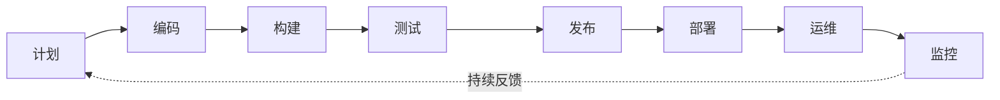
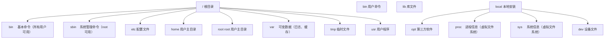
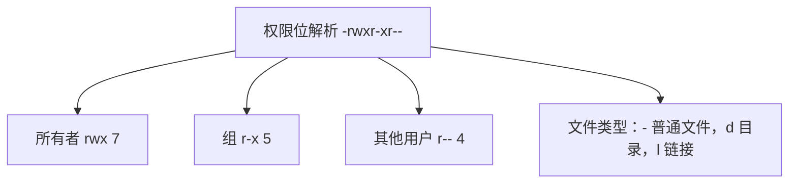
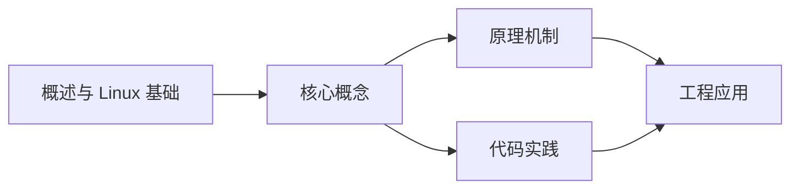
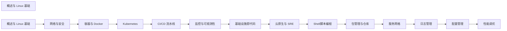

## 1. 学习目标（Bloom 分类）

本节按照布鲁姆教育目标分类学组织学习路径。本文主题为《概述与 Linux 基础》，属于 DevOps 模块，读者可以根据自身阶段选择阅读深度。

记忆层面：能够准确复述本文的核心概念、术语与基本语法或操作步骤，并能够在提问或检索时快速定位对应知识点。能够说出 DevOps 的核心概念、组件与标准流程。

理解层面：能够用自己的语言解释核心原理与工作机制，说明概念之间的因果关系，而不是机械记忆结论。能够解释 DevOps 的工作原理与关键机制。

应用层面：能够在真实项目或练习场景中运用本文知识解决具体问题，写出正确且可维护的实现。能够执行 DevOps 相关的标准操作与配置。

分析层面：能够拆解复杂问题，比较本文主题与相邻概念的异同，识别边界条件与例外情况。能够分析 DevOps 方案在可靠性、成本与性能上的权衡。

评价层面：能够根据约束条件（性能、可读性、安全、成本）评价不同方案的优劣，做出有依据的技术决策。能够评价 DevOps 中的技术选型。

创造层面：能够把本文知识与其他模块知识组合，设计出新的解决方案或可复用的工程模式。能够设计基于 DevOps 的完整解决方案。

通过本节学习，读者应当能够把《概述与 Linux 基础》纳入自己的知识网络，并与 DevOps 模块的其他主题（CI/CD、容器、编排、监控、GitOps）建立关联。

## 2. 历史动机与发展脉络

《概述与 Linux 基础》是 DevOps 领域的重要主题。要真正理解它，需要先了解它解决的问题与演进过程。

DevOps 源于 2009 年（“DevOpsDays”），核心是打破开发与运维壁垒，用自动化与协作缩短交付周期；CALMS 文化（文化、自动化、精益、度量、共享）是其框架。
技术栈演进：持续集成（CI）与持续交付（CD）、基础设施即代码（IaC）、容器（Docker）与编排（Kubernetes）、可观测性（监控/日志/追踪）。
2020 年代趋势：GitOps（声明式 + 自动同步）、平台工程（内部开发者平台）、FinOps（成本治理）、AI 辅助运维。

回到本文主题：概述与 Linux 基础 的提出与成熟，正是上述技术背景下的必然产物。早期实现往往以简单可用为目标，随着工程规模扩大，社区逐渐沉淀出标准做法与最佳实践；理解这一脉络，可以帮助读者判断“为什么文档中的推荐写法是现在这个样子”，也能在遇到历史遗留代码时准确识别其设计年代与取舍。


## 3. 形式化定义与核心概念精讲

本节把《概述与 Linux 基础》涉及的核心概念以“定义 + 讲解”的形式展开。读者应把定义当作工具，把讲解当作理解路径；两者结合才能形成可迁移的知识。

CI/CD 管线：代码提交 -> 构建 -> 测试 -> 制品 -> 部署；流水线即代码（GitHub Actions/Jenkins/GitLab CI）。
容器与镜像：OCI 规范、Dockerfile 分层、镜像仓库与签名；容器隔离（cgroup/namespace）。
编排：Kubernetes 的 Pod/Deployment/Service 抽象；声明式期望状态与控制器调和。

### 3.1 原文章节逐一精讲

原文档把主题拆分为 9 个小节，下面按顺序给出每一节的导读讲解，随后保留原文细节供精读。

#### 原文精读（完整保留）


#### 1. DevOps 与 SRE 理念

##### 1.1 DevOps 定义

DevOps 是一种强调**开发（Development）与运维（Operations）协作**的文化和实践，旨在缩短交付周期、提高部署频率、降低变更失败率。

##### 1.2 DevOps 与 SRE 对比

| 维度         | DevOps                 | SRE                  |
| :----------- | :--------------------- | :------------------- |
| **理念**     | 文化与协作             | 工程化方法论         |
| **目标**     | 加速交付               | 保证可靠性           |
| **方法**     | CI/CD、自动化          | SLI/SLO、错误预算    |
| **角色**     | 全栈工程师             | 可靠性工程师         |
| **核心指标** | 部署频率、变更前置时间 | 可用性、延迟、错误率 |

##### 1.3 DevOps 核心实践



| 实践       | 描述               | 工具                    |
| :--------- | :----------------- | :---------------------- |
| **CI/CD**  | 持续集成与持续交付 | GitHub Actions、Jenkins |
| **IaC**    | 基础设施即代码     | Terraform、Ansible      |
| **容器化** | 应用容器化部署     | Docker、Kubernetes      |
| **监控**   | 全链路可观测性     | Prometheus、Grafana     |
| **自动化** | 减少手动操作       | Ansible、Shell          |

#### 2. Linux 系统管理

##### 2.1 Linux 发行版

| 发行版           | 特点             | 适用场景       |
| :--------------- | :--------------- | :------------- |
| **Ubuntu**       | 用户友好、包丰富 | 开发环境、桌面 |
| **CentOS/Rocky** | 稳定、兼容 RHEL  | 生产服务器     |
| **Debian**       | 极致稳定         | 服务器、嵌入式 |
| **Alpine**       | 轻量（5MB）      | 容器镜像       |

##### 2.2 常用系统命令

```bash
# 系统信息
uname -a                    # 内核版本
cat /etc/os-release         # 系统版本
hostname                    # 主机名
uptime                      # 运行时间和负载

# CPU 信息
lscpu                       # CPU 详细信息
nproc                       # CPU 核心数
top / htop                  # 实时进程监控

# 内存信息
free -h                     # 内存使用情况
vmstat 1 5                  # 虚拟内存统计

# 磁盘信息
df -h                       # 磁盘使用情况
du -sh /path/*              # 目录大小
lsblk                       # 块设备列表
fdisk -l                    # 磁盘分区

# 网络信息
ip addr                     # 网络接口
ip route                    # 路由表
ss -tlnp                    # 监听端口
```

#### 3. 文件系统

##### 3.1 目录结构



##### 3.2 文件操作

```bash
# 文件查看
cat file.txt               # 查看全部内容
less file.txt              # 分页查看
head -n 20 file.txt        # 前 20 行
tail -f /var/log/syslog    # 实时查看日志

# 文件搜索
find / -name "*.conf" 2>/dev/null     # 按名称搜索
find /var -size +100M                 # 按大小搜索
grep -r "error" /var/log/             # 按内容搜索
locate nginx.conf                     # 快速定位（需 updatedb）

# 文件权限
chmod 755 script.sh         # rwxr-xr-x
chmod +x script.sh          # 添加执行权限
chown user:group file.txt   # 修改所有者
chgrp group file.txt        # 修改所属组

# 软链接与硬链接
ln -s /path/target link     # 软链接（符号链接）
ln /path/target link        # 硬链接
```

##### 3.3 文件系统类型

| 类型          | 特点             | 适用场景       |
| :------------ | :--------------- | :------------- |
| **ext4**      | Linux 默认、稳定 | 通用           |
| **XFS**       | 大文件性能好     | 数据库、大文件 |
| **Btrfs**     | 快照、压缩       | NAS、容器      |
| **ZFS**       | 数据完整性、快照 | 存储服务器     |
| **OverlayFS** | 联合挂载         | 容器           |

#### 4. 用户与权限

##### 4.1 用户管理

```bash
# 用户操作
useradd -m -s /bin/bash newuser    # 创建用户
passwd newuser                      # 设置密码
usermod -aG docker newuser         # 添加到组
userdel -r olduser                  # 删除用户及主目录

# 组操作
groupadd developers                 # 创建组
gpasswd -a user developers          # 添加用户到组
groups user                         # 查看用户所属组

# 切换用户
su - username                       # 切换用户
sudo command                        # 以 root 执行

# sudo 配置
visudo                              # 编辑 sudoers
# 添加: newuser ALL=(ALL) NOPASSWD: /usr/bin/docker
```

##### 4.2 权限模型



| 权限  | 数字 | 文件     | 目录          |
| :---- | :--- | :------- | :------------ |
| **r** | 4    | 读取内容 | 列出内容      |
| **w** | 2    | 修改内容 | 创建/删除文件 |
| **x** | 1    | 执行     | 进入目录      |

##### 4.3 特殊权限

```bash
# SUID - 以文件所有者身份执行
chmod u+s /usr/bin/passwd    # 4755

# SGID - 以文件所属组身份执行 / 新文件继承组
chmod g+s /shared/dir        # 2755

# Sticky Bit - 只有所有者能删除
chmod +t /tmp                # 1777
```

#### 5. Shell 脚本

##### 5.1 基础语法

```bash
#!/bin/bash

# 变量
NAME="DevOps"
echo "Hello, $NAME"
echo "进程 PID: $$"
echo "脚本路径: $0"
echo "参数数量: $#"
echo "所有参数: $@"

# 条件判断
if [ -f "/etc/nginx/nginx.conf" ]; then
    echo "Nginx 配置文件存在"
elif [ -d "/etc/nginx" ]; then
    echo "Nginx 目录存在但无配置"
else
    echo "Nginx 未安装"
fi

# 循环
for i in {1..10}; do
    echo "第 $i 次循环"
done

while read line; do
    echo "处理: $line"
done < input.txt

# 函数
check_service() {
    local service=$1
    if systemctl is-active --quiet "$service"; then
        echo "$service 运行中"
        return 0
    else
        echo "$service 未运行"
        return 1
    fi
}

check_service nginx
```

##### 5.2 实用脚本

```bash
#!/bin/bash
# 系统健康检查脚本

set -euo pipefail

RED='\033[0;31m'
GREEN='\033[0;32m'
YELLOW='\033[1;33m'
NC='\033[0m'

log_ok()   { echo -e "${GREEN}[OK]${NC} $1"; }
log_warn() { echo -e "${YELLOW}[WARN]${NC} $1"; }
log_fail() { echo -e "${RED}[FAIL]${NC} $1"; }

# CPU 检查
check_cpu() {
    local load=$(awk '{print $1}' /proc/loadavg)
    local cores=$(nproc)
    local threshold=$(echo "$cores * 0.8" | bc)
    if (( $(echo "$load > $threshold" | bc -l) )); then
        log_warn "CPU 负载过高: $load (阈值: $threshold)"
    else
        log_ok "CPU 负载正常: $load"
    fi
}

# 内存检查
check_memory() {
    local usage=$(free | awk '/Mem/{printf("%.1f"), $3/$2*100}')
    if (( $(echo "$usage > 90" | bc -l) )); then
        log_fail "内存使用率过高: ${usage}%"
    elif (( $(echo "$usage > 80" | bc -l) )); then
        log_warn "内存使用率偏高: ${usage}%"
    else
        log_ok "内存使用率正常: ${usage}%"
    fi
}

# 磁盘检查
check_disk() {
    local usage=$(df -h / | awk 'NR==2{print $5}' | tr -d '%')
    if [ "$usage" -gt 90 ]; then
        log_fail "磁盘使用率过高: ${usage}%"
    elif [ "$usage" -gt 80 ]; then
        log_warn "磁盘使用率偏高: ${usage}%"
    else
        log_ok "磁盘使用率正常: ${usage}%"
    fi
}

# 服务检查
check_services() {
    for svc in nginx docker sshd; do
        if systemctl is-active --quiet "$svc" 2>/dev/null; then
            log_ok "$svc 运行中"
        else
            log_warn "$svc 未运行"
        fi
    done
}

echo "===== 系统健康检查 $(date) ====="
check_cpu
check_memory
check_disk
check_services
echo "===== 检查完成 ====="
```

#### 6. 包管理

##### 6.1 APT（Debian/Ubuntu）

```bash
# 更新源
sudo apt update && sudo apt upgrade -y

# 安装/卸载
sudo apt install nginx -y
sudo apt remove nginx --purge
sudo apt autoremove

# 搜索
apt search nginx
apt show nginx

# 添加 PPA
sudo add-apt-repository ppa:nginx/stable
```

##### 6.2 YUM/DNF（RHEL/CentOS）

```bash
# 更新
sudo dnf update -y

# 安装
sudo dnf install nginx -y
sudo dnf remove nginx

# 搜索
dnf search nginx
dnf info nginx

# 添加仓库
sudo dnf config-manager --add-repo https://repo.example.com/repo.rpm
```

#### 7. systemd 服务管理

##### 7.1 常用命令

```bash
# 服务管理
systemctl start nginx       # 启动
systemctl stop nginx        # 停止
systemctl restart nginx     # 重启
systemctl reload nginx      # 重载配置
systemctl status nginx      # 查看状态
systemctl enable nginx      # 开机自启
systemctl disable nginx     # 禁用自启

# 日志查看
journalctl -u nginx         # 服务日志
journalctl -f               # 实时日志
journalctl --since "1 hour ago"
journalctl -p err           # 错误级别日志
```

##### 7.2 自定义 Service

```ini
# /etc/systemd/system/myapp.service
[Unit]
Description=My Application Service
After=network.target docker.service
Requires=docker.service

[Service]
Type=simple
User=appuser
Group=appgroup
WorkingDirectory=/opt/myapp
ExecStart=/opt/myapp/start.sh
ExecReload=/bin/kill -HUP $MAINPID
Restart=on-failure
RestartSec=5
Environment=NODE_ENV=production
Environment=PORT=3000

# 安全加固
NoNewPrivileges=true
ProtectSystem=strict
ProtectHome=true
ReadWritePaths=/opt/myapp/data /var/log/myapp

[Install]
WantedBy=multi-user.target
```

```bash
# 启用自定义服务
sudo systemctl daemon-reload
sudo systemctl enable myapp
sudo systemctl start myapp
```

#### 8. 日志管理

##### 8.1 日志位置

| 日志         | 路径                    | 内容         |
| :----------- | :---------------------- | :----------- |
| **系统日志** | `/var/log/syslog`       | 系统消息     |
| **认证日志** | `/var/log/auth.log`     | 登录认证     |
| **内核日志** | `/var/log/kern.log`     | 内核消息     |
| **服务日志** | `journalctl -u service` | systemd 服务 |

##### 8.2 日志轮转

```bash
# /etc/logrotate.d/myapp
/var/log/myapp/*.log {
    daily
    rotate 30
    compress
    delaycompress
    missingok
    notifempty
    create 0644 appuser appgroup
    postrotate
        systemctl reload myapp > /dev/null 2>&1 || true
    endspostrotate
}
```

##### 8.3 日志分析

```bash
# 统计 HTTP 状态码
awk '{print $9}' access.log | sort | uniq -c | sort -rn

# 统计访问量 Top 10 IP
awk '{print $1}' access.log | sort | uniq -c | sort -rn | head -10

# 查找错误
grep -E "ERROR|CRITICAL|FATAL" /var/log/app.log | tail -50

# 按时间段统计
awk '$4 >= "[14/Jun/2026:00:00" && $4 <= "[14/Jun/2026:23:59"' access.log | wc -l
```

#### 9. 小结

Linux 基础是 DevOps 工程师的必备技能：

1. **DevOps 理念**强调协作和自动化，SRE 强调可靠性和量化
2. **Linux 系统管理**涵盖 CPU、内存、磁盘、网络的监控和排查
3. **文件系统**理解目录结构和权限模型是安全运维的基础
4. **Shell 脚本**是自动化运维的核心工具，需掌握条件、循环和函数
5. **systemd** 是现代 Linux 的服务管理标准，需熟练编写 Service 文件
6. **日志管理**是故障排查的关键，需掌握日志轮转和分析技巧


### 3.2 概念关系图

下面用 Mermaid 图表达本文核心概念之间的关系，帮助读者建立整体图景：



图中展示的是本文知识的结构化关系：核心概念是入口，原理机制解释“为什么”，代码实践演示“怎么做”，工程应用回答“何时用”。读者学习时可以把每个小节的内容挂接到对应节点上。

## 4. 理论推导与原理解析

本节深入《概述与 Linux 基础》背后的原理。理论部分不求面面俱到，而是聚焦“能解释现象、能指导实践”的关键推导。

CI/CD 管线：代码提交 -> 构建 -> 测试 -> 制品 -> 部署；流水线即代码（GitHub Actions/Jenkins/GitLab CI）。
容器与镜像：OCI 规范、Dockerfile 分层、镜像仓库与签名；容器隔离（cgroup/namespace）。
编排：Kubernetes 的 Pod/Deployment/Service 抽象；声明式期望状态与控制器调和。
可观测性三支柱：指标（Prometheus）、日志（Loki/ELK）、追踪（OpenTelemetry）。

需要强调的是，理论推导与工程实践之间存在翻译层：理论给出的是理想化模型与边界条件，工程代码则必须处理真实环境中的例外。读者在学习时应先掌握理论的“标准情形”，再通过陷阱章节了解“非标准情形”。

## 5. 代码示例与逐行讲解

本节把原文中的代码示例系统整理，并为每个示例补充用途说明与讲解。读者不应只浏览代码，而应逐段对照讲解理解设计意图。

### 5.1 示例：1.3 DevOps 核心实践

该示例来自原文《1.3 DevOps 核心实践》小节，用于演示概述与 Linux 基础相关操作。阅读时请先看代码结构，再看其后的讲解。


讲解：这段代码演示了本节核心知识点。代码中的关键操作可以归纳为三步：准备（定义或初始化）、执行（核心逻辑）、收尾（释放资源或返回结果）。实际项目中，这三步往往被封装为函数或类，以提升复用性与可测试性。

关键点分析：

该示例共 3 行有效代码，结构以数据或配置为主。阅读时应关注：数据字段的含义、配置项的作用，以及它们与运行行为的对应关系。

进阶思考路径：先尝试修改参数观察行为变化，再把示例中的模式迁移到自己的项目中；每次修改都记录预期与实测差异，这是把示例转化为能力的最快方式。

### 5.2 示例：2.2 常用系统命令

该示例来自原文《2.2 常用系统命令》小节，用于演示概述与 Linux 基础相关操作。阅读时请先看代码结构，再看其后的讲解。

```bash
# 系统信息
uname -a                    # 内核版本
cat /etc/os-release         # 系统版本
hostname                    # 主机名
uptime                      # 运行时间和负载

# CPU 信息
lscpu                       # CPU 详细信息
nproc                       # CPU 核心数
top / htop                  # 实时进程监控

# 内存信息
free -h                     # 内存使用情况
vmstat 1 5                  # 虚拟内存统计

# 磁盘信息
df -h                       # 磁盘使用情况
du -sh /path/*              # 目录大小
lsblk                       # 块设备列表
fdisk -l                    # 磁盘分区

# 网络信息
ip addr                     # 网络接口
ip route                    # 路由表
ss -tlnp                    # 监听端口
```

讲解：这段代码演示了本节核心知识点。代码中的关键操作可以归纳为三步：准备（定义或初始化）、执行（核心逻辑）、收尾（释放资源或返回结果）。实际项目中，这三步往往被封装为函数或类，以提升复用性与可测试性。

关键点分析：

该示例共 21 行有效代码，结构以数据或配置为主。阅读时应关注：数据字段的含义、配置项的作用，以及它们与运行行为的对应关系。

进阶思考路径：先尝试修改参数观察行为变化，再把示例中的模式迁移到自己的项目中；每次修改都记录预期与实测差异，这是把示例转化为能力的最快方式。

### 5.3 示例：3.1 目录结构

该示例来自原文《3.1 目录结构》小节，用于演示概述与 Linux 基础相关操作。阅读时请先看代码结构，再看其后的讲解。


讲解：这段代码演示了本节核心知识点。代码中的关键操作可以归纳为三步：准备（定义或初始化）、执行（核心逻辑）、收尾（释放资源或返回结果）。实际项目中，这三步往往被封装为函数或类，以提升复用性与可测试性。

关键点分析：

该示例共 29 行有效代码，结构以数据或配置为主。阅读时应关注：数据字段的含义、配置项的作用，以及它们与运行行为的对应关系。

进阶思考路径：先尝试修改参数观察行为变化，再把示例中的模式迁移到自己的项目中；每次修改都记录预期与实测差异，这是把示例转化为能力的最快方式。

### 5.4 示例：3.2 文件操作

该示例来自原文《3.2 文件操作》小节，用于演示概述与 Linux 基础相关操作。阅读时请先看代码结构，再看其后的讲解。

```bash
# 文件查看
cat file.txt               # 查看全部内容
less file.txt              # 分页查看
head -n 20 file.txt        # 前 20 行
tail -f /var/log/syslog    # 实时查看日志

# 文件搜索
find / -name "*.conf" 2>/dev/null     # 按名称搜索
find /var -size +100M                 # 按大小搜索
grep -r "error" /var/log/             # 按内容搜索
locate nginx.conf                     # 快速定位（需 updatedb）

# 文件权限
chmod 755 script.sh         # rwxr-xr-x
chmod +x script.sh          # 添加执行权限
chown user:group file.txt   # 修改所有者
chgrp group file.txt        # 修改所属组

# 软链接与硬链接
ln -s /path/target link     # 软链接（符号链接）
ln /path/target link        # 硬链接
```

讲解：这段代码演示了本节核心知识点。代码中的关键操作可以归纳为三步：准备（定义或初始化）、执行（核心逻辑）、收尾（释放资源或返回结果）。实际项目中，这三步往往被封装为函数或类，以提升复用性与可测试性。

关键点分析：

该示例共 18 行有效代码，结构以数据或配置为主。阅读时应关注：数据字段的含义、配置项的作用，以及它们与运行行为的对应关系。

进阶思考路径：先尝试修改参数观察行为变化，再把示例中的模式迁移到自己的项目中；每次修改都记录预期与实测差异，这是把示例转化为能力的最快方式。

### 5.5 示例：4.1 用户管理

该示例来自原文《4.1 用户管理》小节，用于演示概述与 Linux 基础相关操作。阅读时请先看代码结构，再看其后的讲解。

```bash
# 用户操作
useradd -m -s /bin/bash newuser    # 创建用户
passwd newuser                      # 设置密码
usermod -aG docker newuser         # 添加到组
userdel -r olduser                  # 删除用户及主目录

# 组操作
groupadd developers                 # 创建组
gpasswd -a user developers          # 添加用户到组
groups user                         # 查看用户所属组

# 切换用户
su - username                       # 切换用户
sudo command                        # 以 root 执行

# sudo 配置
visudo                              # 编辑 sudoers
# 添加: newuser ALL=(ALL) NOPASSWD: /usr/bin/docker
```

讲解：这段代码演示了本节核心知识点。代码中的关键操作可以归纳为三步：准备（定义或初始化）、执行（核心逻辑）、收尾（释放资源或返回结果）。实际项目中，这三步往往被封装为函数或类，以提升复用性与可测试性。

关键点分析：

该示例共 15 行有效代码，结构以数据或配置为主。阅读时应关注：数据字段的含义、配置项的作用，以及它们与运行行为的对应关系。

进阶思考路径：先尝试修改参数观察行为变化，再把示例中的模式迁移到自己的项目中；每次修改都记录预期与实测差异，这是把示例转化为能力的最快方式。

### 5.6 示例：4.2 权限模型

该示例来自原文《4.2 权限模型》小节，用于演示概述与 Linux 基础相关操作。阅读时请先看代码结构，再看其后的讲解。


讲解：这段代码演示了本节核心知识点。代码中的关键操作可以归纳为三步：准备（定义或初始化）、执行（核心逻辑）、收尾（释放资源或返回结果）。实际项目中，这三步往往被封装为函数或类，以提升复用性与可测试性。

关键点分析：

该示例共 6 行有效代码，结构以数据或配置为主。阅读时应关注：数据字段的含义、配置项的作用，以及它们与运行行为的对应关系。

进阶思考路径：先尝试修改参数观察行为变化，再把示例中的模式迁移到自己的项目中；每次修改都记录预期与实测差异，这是把示例转化为能力的最快方式。

### 5.7 示例：4.3 特殊权限

该示例来自原文《4.3 特殊权限》小节，用于演示概述与 Linux 基础相关操作。阅读时请先看代码结构，再看其后的讲解。

```bash
# SUID - 以文件所有者身份执行
chmod u+s /usr/bin/passwd    # 4755

# SGID - 以文件所属组身份执行 / 新文件继承组
chmod g+s /shared/dir        # 2755

# Sticky Bit - 只有所有者能删除
chmod +t /tmp                # 1777
```

讲解：这段代码演示了本节核心知识点。代码中的关键操作可以归纳为三步：准备（定义或初始化）、执行（核心逻辑）、收尾（释放资源或返回结果）。实际项目中，这三步往往被封装为函数或类，以提升复用性与可测试性。

关键点分析：

该示例共 6 行有效代码，结构以数据或配置为主。阅读时应关注：数据字段的含义、配置项的作用，以及它们与运行行为的对应关系。

进阶思考路径：先尝试修改参数观察行为变化，再把示例中的模式迁移到自己的项目中；每次修改都记录预期与实测差异，这是把示例转化为能力的最快方式。

### 5.8 示例：5.1 基础语法

该示例来自原文《5.1 基础语法》小节，用于演示概述与 Linux 基础相关操作。阅读时请先看代码结构，再看其后的讲解。

```bash
#!/bin/bash

# 变量
NAME="DevOps"
echo "Hello, $NAME"
echo "进程 PID: $$"
echo "脚本路径: $0"
echo "参数数量: $#"
echo "所有参数: $@"

# 条件判断
if [ -f "/etc/nginx/nginx.conf" ]; then
    echo "Nginx 配置文件存在"
elif [ -d "/etc/nginx" ]; then
    echo "Nginx 目录存在但无配置"
else
    echo "Nginx 未安装"
fi

# 循环
for i in {1..10}; do
    echo "第 $i 次循环"
done

while read line; do
    echo "处理: $line"
done < input.txt

# 函数
check_service() {
    local service=$1
    if systemctl is-active --quiet "$service"; then
        echo "$service 运行中"
        return 0
    else
        echo "$service 未运行"
        return 1
    fi
}

check_service nginx
```

讲解：这段代码演示了本节核心知识点。代码中的关键操作可以归纳为三步：准备（定义或初始化）、执行（核心逻辑）、收尾（释放资源或返回结果）。实际项目中，这三步往往被封装为函数或类，以提升复用性与可测试性。

关键点分析：

该示例共 35 行有效代码，包含 4 类关键结构（if、for、while、return）。其中：

- 入口与初始化部分负责建立上下文，对应实际项目中的启动或装配逻辑；
- 核心逻辑部分体现本文主题的主要操作，是阅读时最需要对照讲解理解的部分；
- 输出或返回部分把结果交给调用方，注意其类型与边界条件。

进阶思考路径：先尝试修改参数观察行为变化，再把示例中的模式迁移到自己的项目中；每次修改都记录预期与实测差异，这是把示例转化为能力的最快方式。

### 5.9 示例：5.2 实用脚本

该示例来自原文《5.2 实用脚本》小节，用于演示概述与 Linux 基础相关操作。阅读时请先看代码结构，再看其后的讲解。

```bash
#!/bin/bash
# 系统健康检查脚本

set -euo pipefail

RED='\033[0;31m'
GREEN='\033[0;32m'
YELLOW='\033[1;33m'
NC='\033[0m'

log_ok()   { echo -e "${GREEN}[OK]${NC} $1"; }
log_warn() { echo -e "${YELLOW}[WARN]${NC} $1"; }
log_fail() { echo -e "${RED}[FAIL]${NC} $1"; }

# CPU 检查
check_cpu() {
    local load=$(awk '{print $1}' /proc/loadavg)
    local cores=$(nproc)
    local threshold=$(echo "$cores * 0.8" | bc)
    if (( $(echo "$load > $threshold" | bc -l) )); then
        log_warn "CPU 负载过高: $load (阈值: $threshold)"
    else
        log_ok "CPU 负载正常: $load"
    fi
}

# 内存检查
check_memory() {
    local usage=$(free | awk '/Mem/{printf("%.1f"), $3/$2*100}')
    if (( $(echo "$usage > 90" | bc -l) )); then
        log_fail "内存使用率过高: ${usage}%"
    elif (( $(echo "$usage > 80" | bc -l) )); then
        log_warn "内存使用率偏高: ${usage}%"
    else
        log_ok "内存使用率正常: ${usage}%"
    fi
}

# 磁盘检查
check_disk() {
    local usage=$(df -h / | awk 'NR==2{print $5}' | tr -d '%')
    if [ "$usage" -gt 90 ]; then
        log_fail "磁盘使用率过高: ${usage}%"
    elif [ "$usage" -gt 80 ]; then
        log_warn "磁盘使用率偏高: ${usage}%"
    else
        log_ok "磁盘使用率正常: ${usage}%"
    fi
}

# 服务检查
check_services() {
    for svc in nginx docker sshd; do
        if systemctl is-active --quiet "$svc" 2>/dev/null; then
            log_ok "$svc 运行中"
        else
            log_warn "$svc 未运行"
        fi
    done
}

echo "===== 系统健康检查 $(date) ====="
check_cpu
check_memory
check_disk
check_services
echo "===== 检查完成 ====="
```

讲解：这段代码演示了本节核心知识点。代码中的关键操作可以归纳为三步：准备（定义或初始化）、执行（核心逻辑）、收尾（释放资源或返回结果）。实际项目中，这三步往往被封装为函数或类，以提升复用性与可测试性。

关键点分析：

该示例共 59 行有效代码，包含 2 类关键结构（if、for）。其中：

- 入口与初始化部分负责建立上下文，对应实际项目中的启动或装配逻辑；
- 核心逻辑部分体现本文主题的主要操作，是阅读时最需要对照讲解理解的部分；
- 输出或返回部分把结果交给调用方，注意其类型与边界条件。

进阶思考路径：先尝试修改参数观察行为变化，再把示例中的模式迁移到自己的项目中；每次修改都记录预期与实测差异，这是把示例转化为能力的最快方式。

### 5.10 示例：6.1 APT（Debian/Ubuntu）

该示例来自原文《6.1 APT（Debian/Ubuntu）》小节，用于演示概述与 Linux 基础相关操作。阅读时请先看代码结构，再看其后的讲解。

```bash
# 更新源
sudo apt update && sudo apt upgrade -y

# 安装/卸载
sudo apt install nginx -y
sudo apt remove nginx --purge
sudo apt autoremove

# 搜索
apt search nginx
apt show nginx

# 添加 PPA
sudo add-apt-repository ppa:nginx/stable
```

讲解：这段代码演示了本节核心知识点。代码中的关键操作可以归纳为三步：准备（定义或初始化）、执行（核心逻辑）、收尾（释放资源或返回结果）。实际项目中，这三步往往被封装为函数或类，以提升复用性与可测试性。

关键点分析：

该示例共 11 行有效代码，结构以数据或配置为主。阅读时应关注：数据字段的含义、配置项的作用，以及它们与运行行为的对应关系。

进阶思考路径：先尝试修改参数观察行为变化，再把示例中的模式迁移到自己的项目中；每次修改都记录预期与实测差异，这是把示例转化为能力的最快方式。

### 5.11 示例：6.2 YUM/DNF（RHEL/CentOS）

该示例来自原文《6.2 YUM/DNF（RHEL/CentOS）》小节，用于演示概述与 Linux 基础相关操作。阅读时请先看代码结构，再看其后的讲解。

```bash
# 更新
sudo dnf update -y

# 安装
sudo dnf install nginx -y
sudo dnf remove nginx

# 搜索
dnf search nginx
dnf info nginx

# 添加仓库
sudo dnf config-manager --add-repo https://repo.example.com/repo.rpm
```

讲解：这段代码演示了本节核心知识点。代码中的关键操作可以归纳为三步：准备（定义或初始化）、执行（核心逻辑）、收尾（释放资源或返回结果）。实际项目中，这三步往往被封装为函数或类，以提升复用性与可测试性。

关键点分析：

该示例共 10 行有效代码，结构以数据或配置为主。阅读时应关注：数据字段的含义、配置项的作用，以及它们与运行行为的对应关系。

进阶思考路径：先尝试修改参数观察行为变化，再把示例中的模式迁移到自己的项目中；每次修改都记录预期与实测差异，这是把示例转化为能力的最快方式。

### 5.12 示例：7.1 常用命令

该示例来自原文《7.1 常用命令》小节，用于演示概述与 Linux 基础相关操作。阅读时请先看代码结构，再看其后的讲解。

```bash
# 服务管理
systemctl start nginx       # 启动
systemctl stop nginx        # 停止
systemctl restart nginx     # 重启
systemctl reload nginx      # 重载配置
systemctl status nginx      # 查看状态
systemctl enable nginx      # 开机自启
systemctl disable nginx     # 禁用自启

# 日志查看
journalctl -u nginx         # 服务日志
journalctl -f               # 实时日志
journalctl --since "1 hour ago"
journalctl -p err           # 错误级别日志
```

讲解：这段代码演示了本节核心知识点。代码中的关键操作可以归纳为三步：准备（定义或初始化）、执行（核心逻辑）、收尾（释放资源或返回结果）。实际项目中，这三步往往被封装为函数或类，以提升复用性与可测试性。

关键点分析：

该示例共 13 行有效代码，结构以数据或配置为主。阅读时应关注：数据字段的含义、配置项的作用，以及它们与运行行为的对应关系。

进阶思考路径：先尝试修改参数观察行为变化，再把示例中的模式迁移到自己的项目中；每次修改都记录预期与实测差异，这是把示例转化为能力的最快方式。

### 5.13 示例：7.2 自定义 Service

该示例来自原文《7.2 自定义 Service》小节，用于演示概述与 Linux 基础相关操作。阅读时请先看代码结构，再看其后的讲解。

```ini
# /etc/systemd/system/myapp.service
[Unit]
Description=My Application Service
After=network.target docker.service
Requires=docker.service

[Service]
Type=simple
User=appuser
Group=appgroup
WorkingDirectory=/opt/myapp
ExecStart=/opt/myapp/start.sh
ExecReload=/bin/kill -HUP $MAINPID
Restart=on-failure
RestartSec=5
Environment=NODE_ENV=production
Environment=PORT=3000

# 安全加固
NoNewPrivileges=true
ProtectSystem=strict
ProtectHome=true
ReadWritePaths=/opt/myapp/data /var/log/myapp

[Install]
WantedBy=multi-user.target
```

讲解：这段代码演示了本节核心知识点。代码中的关键操作可以归纳为三步：准备（定义或初始化）、执行（核心逻辑）、收尾（释放资源或返回结果）。实际项目中，这三步往往被封装为函数或类，以提升复用性与可测试性。

关键点分析：

该示例共 23 行有效代码，结构以数据或配置为主。阅读时应关注：数据字段的含义、配置项的作用，以及它们与运行行为的对应关系。

进阶思考路径：先尝试修改参数观察行为变化，再把示例中的模式迁移到自己的项目中；每次修改都记录预期与实测差异，这是把示例转化为能力的最快方式。

### 5.14 示例：7.2 自定义 Service

该示例来自原文《7.2 自定义 Service》小节，用于演示概述与 Linux 基础相关操作。阅读时请先看代码结构，再看其后的讲解。

```bash
# 启用自定义服务
sudo systemctl daemon-reload
sudo systemctl enable myapp
sudo systemctl start myapp
```

讲解：这段代码演示了本节核心知识点。代码中的关键操作可以归纳为三步：准备（定义或初始化）、执行（核心逻辑）、收尾（释放资源或返回结果）。实际项目中，这三步往往被封装为函数或类，以提升复用性与可测试性。

关键点分析：

该示例共 4 行有效代码，结构以数据或配置为主。阅读时应关注：数据字段的含义、配置项的作用，以及它们与运行行为的对应关系。

进阶思考路径：先尝试修改参数观察行为变化，再把示例中的模式迁移到自己的项目中；每次修改都记录预期与实测差异，这是把示例转化为能力的最快方式。

### 5.15 示例：8.2 日志轮转

该示例来自原文《8.2 日志轮转》小节，用于演示概述与 Linux 基础相关操作。阅读时请先看代码结构，再看其后的讲解。

```bash
# /etc/logrotate.d/myapp
/var/log/myapp/*.log {
    daily
    rotate 30
    compress
    delaycompress
    missingok
    notifempty
    create 0644 appuser appgroup
    postrotate
        systemctl reload myapp > /dev/null 2>&1 || true
    endspostrotate
}
```

讲解：这段代码演示了本节核心知识点。代码中的关键操作可以归纳为三步：准备（定义或初始化）、执行（核心逻辑）、收尾（释放资源或返回结果）。实际项目中，这三步往往被封装为函数或类，以提升复用性与可测试性。

关键点分析：

该示例共 13 行有效代码，结构以数据或配置为主。阅读时应关注：数据字段的含义、配置项的作用，以及它们与运行行为的对应关系。

进阶思考路径：先尝试修改参数观察行为变化，再把示例中的模式迁移到自己的项目中；每次修改都记录预期与实测差异，这是把示例转化为能力的最快方式。

### 5.16 示例：8.3 日志分析

该示例来自原文《8.3 日志分析》小节，用于演示概述与 Linux 基础相关操作。阅读时请先看代码结构，再看其后的讲解。

```bash
# 统计 HTTP 状态码
awk '{print $9}' access.log | sort | uniq -c | sort -rn

# 统计访问量 Top 10 IP
awk '{print $1}' access.log | sort | uniq -c | sort -rn | head -10

# 查找错误
grep -E "ERROR|CRITICAL|FATAL" /var/log/app.log | tail -50

# 按时间段统计
awk '$4 >= "[14/Jun/2026:00:00" && $4 <= "[14/Jun/2026:23:59"' access.log | wc -l
```

讲解：这段代码演示了本节核心知识点。代码中的关键操作可以归纳为三步：准备（定义或初始化）、执行（核心逻辑）、收尾（释放资源或返回结果）。实际项目中，这三步往往被封装为函数或类，以提升复用性与可测试性。

关键点分析：

该示例共 8 行有效代码，结构以数据或配置为主。阅读时应关注：数据字段的含义、配置项的作用，以及它们与运行行为的对应关系。

进阶思考路径：先尝试修改参数观察行为变化，再把示例中的模式迁移到自己的项目中；每次修改都记录预期与实测差异，这是把示例转化为能力的最快方式。


综合以上示例，可以总结出本主题的代码实践要点：第一，先定义清晰的输入输出契约；第二，核心逻辑保持单一职责；第三，错误处理与边界条件不可省略；第四，命名与注释表达意图而非复述代码。

## 6. 对比分析

对比是理解《概述与 Linux 基础》定位的最快路径。下面从多个维度与相邻方案进行对比。

CI 与 CD：CI 保证可集成，CD 保证可交付；两者可独立实施。
Kubernetes 与 Docker Compose：K8s 生产级编排；Compose 单机开发。
传统运维与 SRE：SRE 用软件工程方法运维，错误预算与 SLO。

对比的目的不是分出绝对优劣，而是建立选择依据：不同约束条件下，最优解不同。读者应把每个对比维度转化为决策检查清单。

## 7. 常见陷阱与最佳实践

本节整理该主题的高频错误与推荐做法。每个陷阱先描述现象，再解释原因，最后给出最佳实践。

### 7.1 环境漂移

手工配置导致环境不一致。全部走 IaC 与镜像。

深入讲解：该问题之所以被归类为“常见陷阱”，是因为它在初学者的代码中反复出现，而且往往不在第一时间暴露——错误通常隐藏在特定数据或特定时序下。

从成因上看，环境漂移 一般源于对 DevOps 某个机制的理解偏差：要么误用了默认行为，要么忽略了边界条件，要么把其他语言的思维惯性带了过来。

从影响上看，环境漂移 轻则产生错误结果，重则导致资源泄漏、数据损坏或安全事故；这也是为什么工程评审中会把它列为检查项。

从修复策略上看，处理环境漂移的正确顺序是：先复现（构造最小用例），再定位（确认机制层面的根因），最后修复并补充回归测试。跳过复现直接改代码，往往治标不治本。

### 7.2 秘密硬编码

密钥进仓库。使用 Secret 管理与注入。

深入讲解：该问题之所以被归类为“常见陷阱”，是因为它在初学者的代码中反复出现，而且往往不在第一时间暴露——错误通常隐藏在特定数据或特定时序下。

从成因上看，秘密硬编码 一般源于对 DevOps 某个机制的理解偏差：要么误用了默认行为，要么忽略了边界条件，要么把其他语言的思维惯性带了过来。

从影响上看，秘密硬编码 轻则产生错误结果，重则导致资源泄漏、数据损坏或安全事故；这也是为什么工程评审中会把它列为检查项。

从修复策略上看，处理秘密硬编码的正确顺序是：先复现（构造最小用例），再定位（确认机制层面的根因），最后修复并补充回归测试。跳过复现直接改代码，往往治标不治本。

### 7.3 构建不可复现

依赖未锁定。锁定依赖版本与基础镜像 digest。

深入讲解：该问题之所以被归类为“常见陷阱”，是因为它在初学者的代码中反复出现，而且往往不在第一时间暴露——错误通常隐藏在特定数据或特定时序下。

从成因上看，构建不可复现 一般源于对 DevOps 某个机制的理解偏差：要么误用了默认行为，要么忽略了边界条件，要么把其他语言的思维惯性带了过来。

从影响上看，构建不可复现 轻则产生错误结果，重则导致资源泄漏、数据损坏或安全事故；这也是为什么工程评审中会把它列为检查项。

从修复策略上看，处理构建不可复现的正确顺序是：先复现（构造最小用例），再定位（确认机制层面的根因），最后修复并补充回归测试。跳过复现直接改代码，往往治标不治本。

### 7.4 测试后置

问题到生产才发现。左移：单元/集成/E2E 分层。

深入讲解：该问题之所以被归类为“常见陷阱”，是因为它在初学者的代码中反复出现，而且往往不在第一时间暴露——错误通常隐藏在特定数据或特定时序下。

从成因上看，测试后置 一般源于对 DevOps 某个机制的理解偏差：要么误用了默认行为，要么忽略了边界条件，要么把其他语言的思维惯性带了过来。

从影响上看，测试后置 轻则产生错误结果，重则导致资源泄漏、数据损坏或安全事故；这也是为什么工程评审中会把它列为检查项。

从修复策略上看，处理测试后置的正确顺序是：先复现（构造最小用例），再定位（确认机制层面的根因），最后修复并补充回归测试。跳过复现直接改代码，往往治标不治本。

### 7.5 回滚缺失

发布失败无法回退。保留历史镜像与一键回滚。

深入讲解：该问题之所以被归类为“常见陷阱”，是因为它在初学者的代码中反复出现，而且往往不在第一时间暴露——错误通常隐藏在特定数据或特定时序下。

从成因上看，回滚缺失 一般源于对 DevOps 某个机制的理解偏差：要么误用了默认行为，要么忽略了边界条件，要么把其他语言的思维惯性带了过来。

从影响上看，回滚缺失 轻则产生错误结果，重则导致资源泄漏、数据损坏或安全事故；这也是为什么工程评审中会把它列为检查项。

从修复策略上看，处理回滚缺失的正确顺序是：先复现（构造最小用例），再定位（确认机制层面的根因），最后修复并补充回归测试。跳过复现直接改代码，往往治标不治本。

### 7.6 监控盲区

无指标与告警。核心链路全量可观测。

深入讲解：该问题之所以被归类为“常见陷阱”，是因为它在初学者的代码中反复出现，而且往往不在第一时间暴露——错误通常隐藏在特定数据或特定时序下。

从成因上看，监控盲区 一般源于对 DevOps 某个机制的理解偏差：要么误用了默认行为，要么忽略了边界条件，要么把其他语言的思维惯性带了过来。

从影响上看，监控盲区 轻则产生错误结果，重则导致资源泄漏、数据损坏或安全事故；这也是为什么工程评审中会把它列为检查项。

从修复策略上看，处理监控盲区的正确顺序是：先复现（构造最小用例），再定位（确认机制层面的根因），最后修复并补充回归测试。跳过复现直接改代码，往往治标不治本。

### 7.7 权限过大

CI 权限超需求。最小权限与短期凭证。

深入讲解：该问题之所以被归类为“常见陷阱”，是因为它在初学者的代码中反复出现，而且往往不在第一时间暴露——错误通常隐藏在特定数据或特定时序下。

从成因上看，权限过大 一般源于对 DevOps 某个机制的理解偏差：要么误用了默认行为，要么忽略了边界条件，要么把其他语言的思维惯性带了过来。

从影响上看，权限过大 轻则产生错误结果，重则导致资源泄漏、数据损坏或安全事故；这也是为什么工程评审中会把它列为检查项。

从修复策略上看，处理权限过大的正确顺序是：先复现（构造最小用例），再定位（确认机制层面的根因），最后修复并补充回归测试。跳过复现直接改代码，往往治标不治本。

### 7.8 部署频率低

大爆炸发布风险高。小步快跑与灰度。

深入讲解：该问题之所以被归类为“常见陷阱”，是因为它在初学者的代码中反复出现，而且往往不在第一时间暴露——错误通常隐藏在特定数据或特定时序下。

从成因上看，部署频率低 一般源于对 DevOps 某个机制的理解偏差：要么误用了默认行为，要么忽略了边界条件，要么把其他语言的思维惯性带了过来。

从影响上看，部署频率低 轻则产生错误结果，重则导致资源泄漏、数据损坏或安全事故；这也是为什么工程评审中会把它列为检查项。

从修复策略上看，处理部署频率低的正确顺序是：先复现（构造最小用例），再定位（确认机制层面的根因），最后修复并补充回归测试。跳过复现直接改代码，往往治标不治本。

### 7.0 最佳实践总览

1. 一切皆代码：流水线、基础设施、配置版本化。
2. 发布可重复：相同代码 + 相同制品 -> 相同环境。
3. 失败可预期：小批量、金丝雀、自动回滚。
4. 度量驱动：DORA 指标（部署频率、变更前置时间、恢复时间、变更失败率）。

把这些最佳实践固化为团队规范与代码评审检查项，是避免同类问题反复出现的关键。

## 8. 工程实践

本节把《概述与 Linux 基础》放入真实工程场景，给出可复用的模式与组织方法。

GitHub Actions：workflow/job/step 模型，矩阵测试，环境与密钥管理。
GitOps：Argo CD 同步 Git 仓库与集群状态，PR 即发布审批。
平台工程：模板化应用脚手架（Backstage）、自助环境、成本可视化。

### 8.1 工程实践的原则拆解

以上工程实践可以归纳为四条原则。第一，配置与代码分离：DevOps 项目中环境差异应通过配置注入，而不是散落在代码分支中；这保证同一份代码可以在开发、测试、生产环境一致运行。

第二，接口稳定优先：对外接口（函数签名、协议、数据格式）一旦被消费方依赖，变更成本极高；设计时应预留扩展点并保持向后兼容。

第三，可观测性内置：日志、指标与追踪应该在功能开发时同步设计，而不是故障发生后补救；没有观测手段的模块等于黑盒。

第四，变更可回滚：任何发布都应有对应的回滚方案；数据库迁移、配置变更与代码发布一样需要版本管理与逆向路径。

### 8.2 实践落地的检查清单

- [ ] GitHub Actions：对照本节描述，检查当前项目是否已经落实；未落实的项列入技术债并排期处理。
- [ ] GitOps：对照本节描述，检查当前项目是否已经落实；未落实的项列入技术债并排期处理。
- [ ] 平台工程：对照本节描述，检查当前项目是否已经落实；未落实的项列入技术债并排期处理。

工程实践的共性原则：配置与代码分离、接口稳定优先、可观测性内置、变更可回滚。这些原则适用于本主题的所有实现。

## 9. 案例研究

本节通过一个完整案例把《概述与 Linux 基础》的知识串起来。案例按“需求分析、方案设计、实现、验证”四步展开。

需求：为微服务搭建从提交到生产的自动化管线。
方案：GitHub Actions 构建镜像 + 测试 + 扫描，Argo CD 部署到 K8s，Prometheus 监控。
要点：镜像 tag 用 commit SHA；金丝雀发布；回滚演练。
验证：发布频率与失败率度量、故障注入演练。

### 9.1 案例的扩展讨论

把案例中的方案放大到真实规模，需要额外考虑三个问题：

第一，规模：当数据量或并发量上升一个数量级时，原方案中的数据结构、缓存策略与任务调度是否仍然成立？通常需要引入分层与异步。

第二，团队：多人协作时，模块边界、接口契约与代码所有权必须明确；案例中的实现应拆分为可独立测试的单元，并配合文档说明设计意图。

第三，演进：上线后的需求变化不可避免；方案设计时应预留扩展点（配置化、插件化、事件化），并定期用真实指标验证假设。


案例研究的学习方法：先独立阅读需求，尝试在脑中形成方案，再对照实现与讲解，最后思考“如果约束变化（数据量、并发、团队规模），方案应如何调整”。

## 10. 知识要点总结与深入讲解

本节以讲解形式汇总全文要点，替代传统的习题与自测，读者不需要答题，只需跟随解释建立完整的认知框架。

关于《概述与 Linux 基础》的核心结论：

DevOps 的本质是自动化与协作，工具只是载体。
可重复、可回滚、可观测是三条主线。
从 DORA 指标开始度量改进，避免为工具而工具。

原文档各小节的要点回顾：

- 1. DevOps 与 SRE 理念：该小节围绕概述与 Linux 基础展开具体细节，阅读时应关注其与核心结论的对应关系；每个小节都是核心结论在某一个侧面的展开。
- 2. Linux 系统管理：该小节围绕概述与 Linux 基础展开具体细节，阅读时应关注其与核心结论的对应关系；每个小节都是核心结论在某一个侧面的展开。
- 3. 文件系统：该小节围绕概述与 Linux 基础展开具体细节，阅读时应关注其与核心结论的对应关系；每个小节都是核心结论在某一个侧面的展开。
- 4. 用户与权限：该小节围绕概述与 Linux 基础展开具体细节，阅读时应关注其与核心结论的对应关系；每个小节都是核心结论在某一个侧面的展开。
- 5. Shell 脚本：该小节围绕概述与 Linux 基础展开具体细节，阅读时应关注其与核心结论的对应关系；每个小节都是核心结论在某一个侧面的展开。
- 6. 包管理：该小节围绕概述与 Linux 基础展开具体细节，阅读时应关注其与核心结论的对应关系；每个小节都是核心结论在某一个侧面的展开。
- 7. systemd 服务管理：该小节围绕概述与 Linux 基础展开具体细节，阅读时应关注其与核心结论的对应关系；每个小节都是核心结论在某一个侧面的展开。
- 8. 日志管理：该小节围绕概述与 Linux 基础展开具体细节，阅读时应关注其与核心结论的对应关系；每个小节都是核心结论在某一个侧面的展开。
- 9. 小结：该小节围绕概述与 Linux 基础展开具体细节，阅读时应关注其与核心结论的对应关系；每个小节都是核心结论在某一个侧面的展开。

把以上要点与第 3-9 节的内容对照复习，即可完成对本文主题的闭环学习。

## 11. 参考文献


GitHub Actions 文档：https://docs.github.com/zh/actions
GitLab CI 文档：https://docs.gitlab.com/ci/
Argo CD：https://argo-cd.readthedocs.io/
DORA 研究：https://dora.dev/
DevOps 手册（Gene Kim 等）：https://itrevolution.com/devops-handbook/

## 12. 延伸阅读


Docker 与 Kubernetes 深入，见 031-devops 模块文档。
CI/CD 管线设计，见 031-devops 模块 CICD 文档。
云原生架构，见 034-cloud-computing 模块。
尚硅谷 Bilibili 空间（https://space.bilibili.com/302417610 ）提供 DevOps 课程。

## 14. 模块知识图谱与学习路径

本文属于 DevOps 模块。为了把《概述与 Linux 基础》放入完整的知识网络，下面列出本模块的全部主题并给出相互关联的导读。学习时建议按模块内顺序推进，并在每个文档中留意交叉引用。



上图为模块主题的推荐学习顺序示意图（仅展示前若干主题）。各主题之间存在三类关联：

第一，前置依赖关系：早期主题是后期主题的基础，例如环境与语法先行、进阶主题随后；

第二，横向并列关系：同一层级主题从不同角度覆盖模块能力，学习顺序可以按兴趣调整；

第三，工程组合关系：多个主题在真实项目中组合使用，例如配置、性能与安全主题往往出现在同一系统的不同层面。

### 14.1 模块主题速查表

| 文档 | 主题 | 与本文的关联 |
| --- | --- | --- |
| 概述与 Linux 基础 | 001-OverviewLinuxBasics | 本文自身 |
| 网络与安全 | 002-NetworkSecurity | 本文的安全延伸 |
| 容器与 Docker | 003-ContainerDocker | 本文的并列主题 |
| Kubernetes | 004-Kubernetes | 本文的并列主题 |
| CI/CD 流水线 | 005-CICDPipeline | 本文的并列主题 |
| 监控与可观测性 | 006-MonitorAndObservability | 本文的并列主题 |
| 基础设施即代码 | 007-IaC | 本文的前置基础 |
| 云原生与 SRE | 008-CloudNativeSRE | 本文的并列主题 |
| Shell脚本编程 | 009-ShellScriptProgramming | 本文的并列主题 |
| 包管理与仓库 | 010-PackageManagementRepository | 本文的并列主题 |
| 服务网格 | 011-ServiceMesh | 本文的并列主题 |
| 日志管理 | 012-LogManagement | 本文的并列主题 |
| 配置管理 | 013-ConfigManagement | 本文的并列主题 |
| 性能调优 | 014-PerformanceTuning | 本文的性能延伸 |
| 高可用架构 | 015-HighAvailabilityArchitecture | 本文的原理深化 |
| 自动化测试 | 016-AutomationTest | 本文的并列主题 |
| 故障排查 | 017-Troubleshooting | 本文的并列主题 |
| 容器安全 | 018-ContainerSecurity | 本文的安全延伸 |
| GitOps与持续交付 | 019-GitOpsCD | 本文的并列主题 |
| 监控与告警 | 020-MonitorAndAlert | 本文的并列主题 |
| 网络与安全进阶 | 021-NetworkSecurityAdvanced | 本文的安全延伸 |
| 数据库运维 | 022-DatabaseOps | 本文的并列主题 |
| Dockerfile多阶段构建 | 023-DockerfileMultiBuild | 本文的并列主题 |
| Kubernetes核心资源详解 | 024-KubernetesCoreDetailed | 本文的并列主题 |
| Helm-Chart应用打包 | 025-HelmChartApplicationPackage | 本文的并列主题 |
| Terraform资源编排 | 026-Terraform | 本文的并列主题 |
| Ansible-Playbook配置管理 | 027-AnsiblePlaybookConfigManagement | 本文的并列主题 |
| Prometheus指标采集与告警 | 028-Prometheus | 本文的并列主题 |
| Grafana仪表盘配置 | 029-GrafanaTableConfig | 本文的并列主题 |
| ELK-Stack日志分析 | 030-ELKStackLogAnalysis | 本文的并列主题 |
| OpenTelemetry | 031-OpenTelemetry | 本文的并列主题 |
| GitOps与ArgoCD | 032-GitOpsArgoCD | 本文的并列主题 |
| DevOps kubectl 基础命令 | 033-KubectlBasics | 本文的前置基础 |
| DevOps Helm 包管理命令 | 034-HelmCommands | 本文的并列主题 |
| DevOps Jenkins Pipeline | 035-JenkinsPipeline | 本文的并列主题 |
| DevOps GitLab CI/CD | 036-GitLabCI | 本文的并列主题 |

速查表的作用是让读者快速判断：哪些文档应在阅读本文前掌握（前置基础），哪些文档应在阅读本文后继续（延伸主题）。本模块的交叉引用体系即以此表为基础。

## 15. 术语表

下表整理《概述与 Linux 基础》及 DevOps 模块中出现的高频术语，给出简明释义。术语按字母序或逻辑序排列，供查阅。

| 术语 | 释义 |
| --- | --- |
| CI/CD 管线 | 代码提交 -> 构建 -> 测试 -> 制品 -> 部署；流水线即代码（GitHub Actions/Jenkins/GitLab CI）。 |
| 容器与镜像 | OCI 规范、Dockerfile 分层、镜像仓库与签名；容器隔离（cgroup/namespace）。 |
| 编排 | Kubernetes 的 Pod/Deployment/Service 抽象；声明式期望状态与控制器调和。 |
| 可观测性三支柱 | 指标（Prometheus）、日志（Loki/ELK）、追踪（OpenTelemetry）。 |
| 环境漂移（易错点） | 参见常见陷阱章节的详细讲解 |
| 秘密硬编码（易错点） | 参见常见陷阱章节的详细讲解 |
| 构建不可复现（易错点） | 参见常见陷阱章节的详细讲解 |
| 测试后置（易错点） | 参见常见陷阱章节的详细讲解 |
| 回滚缺失（易错点） | 参见常见陷阱章节的详细讲解 |
| 监控盲区（易错点） | 参见常见陷阱章节的详细讲解 |

术语表与正文配合使用：先通读正文，遇到模糊术语回查本表；长期使用后术语会自然进入工作记忆。

## 13. 深度专题扩展

以下专题从不同角度深入本文主题，供有进阶需求的读者研读。每个专题独立成节，内容相互补充。

### 13.1 GitOps 与声明式交付

Git 是唯一事实来源：集群状态由仓库声明驱动，差异由控制器调和（Argo CD/Flux）。
PR 流程即变更审批，合并即发布意图；回滚 = revert 提交。
与 CI 衔接：CI 产出镜像，CD 更新清单引用新 digest。
安全：仓库签名、密钥加密（SOPS）、审计日志。

### 13.2 可观测性与 SLO

指标：RED（请求率、错误、时长）与 USE（利用率、饱和、错误）。
日志：结构化（JSON）、集中采集、关联 trace_id。
追踪：OpenTelemetry 传播上下文，瀑布分析延迟。
SLO/错误预算：目标可用性 99.9% 对应每月约 43 分钟不可用预算，驱动发布决策。

## 16. 核心概念串讲（复习视角）

本节以“把知识讲给他人听”的方式，把《概述与 Linux 基础》的核心概念重新串讲一遍。与前文按章节展开不同，这里的叙述更接近课堂总结：先说整体，再逐个展开，最后收束。

《概述与 Linux 基础》属于 DevOps 模块。要理解它，先要理解它在模块中的位置：它解决的是该领域的一个具体问题，并依赖模块内若干前置概念；反过来，它又为后续进阶主题提供基础。

第一个概念是CI/CD 管线。代码提交 -> 构建 -> 测试 -> 制品 -> 部署；流水线即代码（GitHub Actions/Jenkins/GitLab CI）。

在实际使用中，CI/CD 管线需要与相邻概念区分：它们的区别不在于名称，而在于适用条件与行为边界；这正是前文对比分析章节的意义。

第一个概念是容器与镜像。OCI 规范、Dockerfile 分层、镜像仓库与签名；容器隔离（cgroup/namespace）。

在实际使用中，容器与镜像需要与相邻概念区分：它们的区别不在于名称，而在于适用条件与行为边界；这正是前文对比分析章节的意义。

第一个概念是编排。Kubernetes 的 Pod/Deployment/Service 抽象；声明式期望状态与控制器调和。

在实际使用中，编排需要与相邻概念区分：它们的区别不在于名称，而在于适用条件与行为边界；这正是前文对比分析章节的意义。

接下来是CI/CD 管线。代码提交 -> 构建 -> 测试 -> 制品 -> 部署；流水线即代码（GitHub Actions/Jenkins/GitLab CI）。

理解该原理的关键不是记住结论，而是记住“它从什么假设出发、推出了什么、假设不成立时会怎样”。带着这个框架复习，原理之间就会连成网络。

接下来是容器与镜像。OCI 规范、Dockerfile 分层、镜像仓库与签名；容器隔离（cgroup/namespace）。

理解该原理的关键不是记住结论，而是记住“它从什么假设出发、推出了什么、假设不成立时会怎样”。带着这个框架复习，原理之间就会连成网络。

接下来是编排。Kubernetes 的 Pod/Deployment/Service 抽象；声明式期望状态与控制器调和。

理解该原理的关键不是记住结论，而是记住“它从什么假设出发、推出了什么、假设不成立时会怎样”。带着这个框架复习，原理之间就会连成网络。

接下来是可观测性三支柱。指标（Prometheus）、日志（Loki/ELK）、追踪（OpenTelemetry）。

理解该原理的关键不是记住结论，而是记住“它从什么假设出发、推出了什么、假设不成立时会怎样”。带着这个框架复习，原理之间就会连成网络。

串讲收束：把概念与原理放回本文主题，可以得出一个总纲——定义描述是什么，原理解释为什么，实践回答怎么做。三者构成完整的学习闭环；后续遇到相关问题，都可以按这个总纲检索知识。
