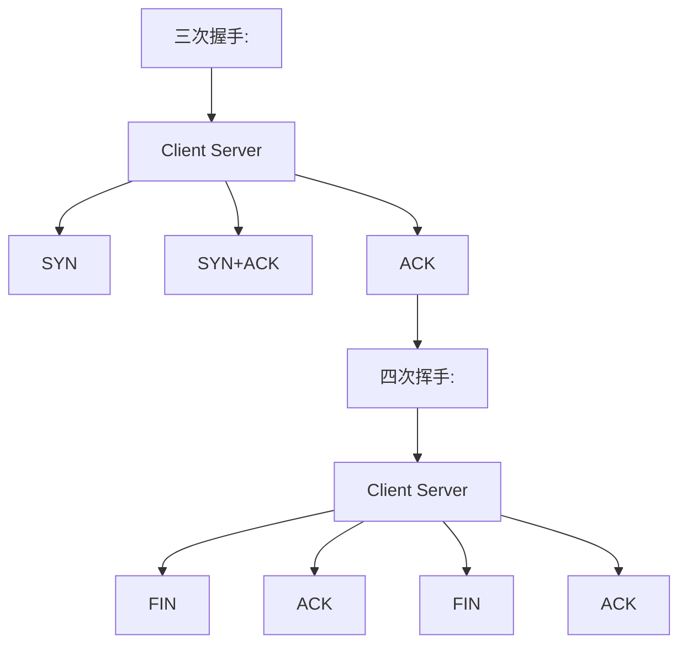
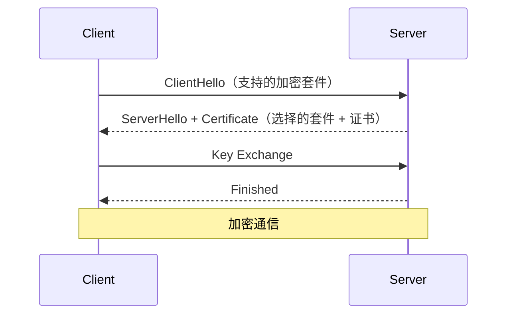
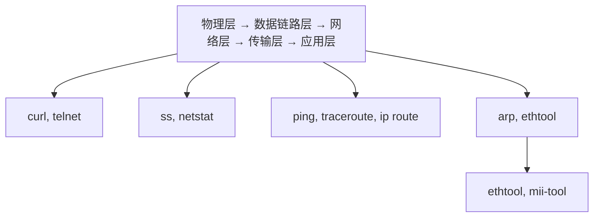
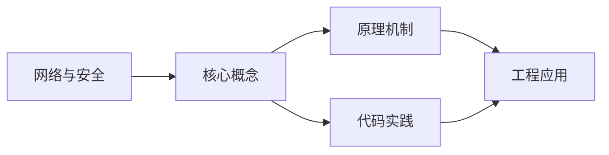
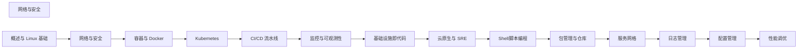

## 1. 学习目标（Bloom 分类）

本节按照布鲁姆教育目标分类学组织学习路径。本文主题为《网络与安全》，属于 DevOps 模块，读者可以根据自身阶段选择阅读深度。

记忆层面：能够准确复述本文的核心概念、术语与基本语法或操作步骤，并能够在提问或检索时快速定位对应知识点。能够说出 DevOps 的核心概念、组件与标准流程。

理解层面：能够用自己的语言解释核心原理与工作机制，说明概念之间的因果关系，而不是机械记忆结论。能够解释 DevOps 的工作原理与关键机制。

应用层面：能够在真实项目或练习场景中运用本文知识解决具体问题，写出正确且可维护的实现。能够执行 DevOps 相关的标准操作与配置。

分析层面：能够拆解复杂问题，比较本文主题与相邻概念的异同，识别边界条件与例外情况。能够分析 DevOps 方案在可靠性、成本与性能上的权衡。

评价层面：能够根据约束条件（性能、可读性、安全、成本）评价不同方案的优劣，做出有依据的技术决策。能够评价 DevOps 中的技术选型。

创造层面：能够把本文知识与其他模块知识组合，设计出新的解决方案或可复用的工程模式。能够设计基于 DevOps 的完整解决方案。

通过本节学习，读者应当能够把《网络与安全》纳入自己的知识网络，并与 DevOps 模块的其他主题（CI/CD、容器、编排、监控、GitOps）建立关联。

## 2. 历史动机与发展脉络

《网络与安全》是 DevOps 领域的重要主题。要真正理解它，需要先了解它解决的问题与演进过程。

DevOps 源于 2009 年（“DevOpsDays”），核心是打破开发与运维壁垒，用自动化与协作缩短交付周期；CALMS 文化（文化、自动化、精益、度量、共享）是其框架。
技术栈演进：持续集成（CI）与持续交付（CD）、基础设施即代码（IaC）、容器（Docker）与编排（Kubernetes）、可观测性（监控/日志/追踪）。
2020 年代趋势：GitOps（声明式 + 自动同步）、平台工程（内部开发者平台）、FinOps（成本治理）、AI 辅助运维。

回到本文主题：网络与安全 的提出与成熟，正是上述技术背景下的必然产物。早期实现往往以简单可用为目标，随着工程规模扩大，社区逐渐沉淀出标准做法与最佳实践；理解这一脉络，可以帮助读者判断“为什么文档中的推荐写法是现在这个样子”，也能在遇到历史遗留代码时准确识别其设计年代与取舍。


## 3. 形式化定义与核心概念精讲

本节把《网络与安全》涉及的核心概念以“定义 + 讲解”的形式展开。读者应把定义当作工具，把讲解当作理解路径；两者结合才能形成可迁移的知识。

CI/CD 管线：代码提交 -> 构建 -> 测试 -> 制品 -> 部署；流水线即代码（GitHub Actions/Jenkins/GitLab CI）。
容器与镜像：OCI 规范、Dockerfile 分层、镜像仓库与签名；容器隔离（cgroup/namespace）。
编排：Kubernetes 的 Pod/Deployment/Service 抽象；声明式期望状态与控制器调和。

### 3.1 原文章节逐一精讲

原文档把主题拆分为 19 个小节，下面按顺序给出每一节的导读讲解，随后保留原文细节供精读。

#### 原文精读（完整保留）

# DevOps Docker 网络管理

> **符号约定**：`< >` 必填参数 | `[ ]` 可选参数

---

#### 1. TCP/IP 协议栈

##### 1.1 OSI 七层 vs TCP/IP 四层

| OSI        | TCP/IP     | 协议                | 数据单元  |
| :--------- | :--------- | :------------------ | :-------- |
| 应用层     | 应用层     | HTTP, DNS, SSH, FTP | 数据      |
| 表示层     | 应用层     | TLS/SSL, JPEG       | 数据      |
| 会话层     | 应用层     | RPC, NetBIOS        | 数据      |
| 传输层     | 传输层     | TCP, UDP            | 段/数据报 |
| 网络层     | 网络层     | IP, ICMP, ARP       | 包        |
| 数据链路层 | 网络接口层 | Ethernet, PPP       | 帧        |
| 物理层     | 网络接口层 | 电信号、光纤        | 比特      |

##### 1.2 TCP 三次握手与四次挥手



##### 1.3 常用端口

| 端口 | 协议       | 用途      |
| :--- | :--------- | :-------- |
| 22   | SSH        | 远程登录  |
| 53   | DNS        | 域名解析  |
| 80   | HTTP       | Web 服务  |
| 443  | HTTPS      | 安全 Web  |
| 3306 | MySQL      | 数据库    |
| 5432 | PostgreSQL | 数据库    |
| 6379 | Redis      | 缓存      |
| 8080 | HTTP Alt   | 代理/应用 |
| 9090 | Prometheus | 监控      |

#### 2. DNS

##### 2.1 DNS 解析流程

```
浏览器缓存 → 系统缓存 → 路由器缓存 → ISP DNS
    → 根域名服务器 → 顶级域名服务器 → 权威域名服务器
```

##### 2.2 DNS 记录类型

| 类型      | 描述       | 示例                                |
| :-------- | :--------- | :---------------------------------- |
| **A**     | IPv4 地址  | `example.com → 93.184.216.34`       |
| **AAAA**  | IPv6 地址  | `example.com → 2606:2800:220:1:...` |
| **CNAME** | 别名       | `www.example.com → example.com`     |
| **MX**    | 邮件服务器 | `example.com → mail.example.com`    |
| **TXT**   | 文本记录   | SPF、DKIM 验证                      |
| **NS**    | 域名服务器 | `example.com → ns1.dns.com`         |
| **SRV**   | 服务记录   | `_http._tcp → server:port`          |

##### 2.3 DNS 排查

```bash
# DNS 查询
dig example.com              # 完整查询
dig +short example.com       # 仅显示 IP
nslookup example.com         # Windows 兼容
host example.com             # 简洁输出

# 指定 DNS 服务器
dig @8.8.8.8 example.com

# 反向解析
dig -x 93.184.216.34

# 追踪解析过程
dig +trace example.com

# DNS 缓存清理
sudo systemd-resolve --flush-caches    # systemd-resolved
sudo rndc flush                         # BIND
```

#### 3. HTTP/HTTPS

##### 3.1 HTTP 请求方法

| 方法   | 用途       | 幂等 | 安全 |
| :----- | :--------- | :--- | :--- |
| GET    | 获取资源   | 是   | 是   |
| POST   | 创建资源   | 否   | 否   |
| PUT    | 更新资源   | 是   | 否   |
| DELETE | 删除资源   | 是   | 否   |
| PATCH  | 部分更新   | 否   | 否   |
| HEAD   | 获取头信息 | 是   | 是   |

##### 3.2 HTTP 状态码

| 范围    | 类别       | 常见码                                                                                 |
| :------ | :--------- | :------------------------------------------------------------------------------------- |
| **1xx** | 信息       | 100 Continue                                                                           |
| **2xx** | 成功       | 200 OK, 201 Created, 204 No Content                                                    |
| **3xx** | 重定向     | 301 永久, 302 临时, 304 未修改                                                         |
| **4xx** | 客户端错误 | 400 Bad Request, 401 Unauthorized, 403 Forbidden, 404 Not Found, 429 Too Many Requests |
| **5xx** | 服务端错误 | 500 Internal Error, 502 Bad Gateway, 503 Unavailable, 504 Timeout                      |

##### 3.3 HTTPS 与 TLS



```bash
# 查看证书信息
openssl s_client -connect example.com:443 -showcerts

# 检查证书过期时间
echo | openssl s_client -connect example.com:443 2>/dev/null | \
  openssl x509 -noout -dates

# 生成自签名证书
openssl req -x509 -newkey rsa:4096 -keyout key.pem -out cert.pem \
  -days 365 -nodes -subj "/CN=localhost"
```

#### 4. 防火墙

##### 4.1 iptables

```bash
# 查看规则
iptables -L -n -v
iptables -t nat -L -n

# 允许 SSH
iptables -A INPUT -p tcp --dport 22 -j ACCEPT

# 允许已建立的连接
iptables -A INPUT -m state --state ESTABLISHED,RELATED -j ACCEPT

# 允许本地回环
iptables -A INPUT -i lo -j ACCEPT

# 允许 HTTP/HTTPS
iptables -A INPUT -p tcp --dport 80 -j ACCEPT
iptables -A INPUT -p tcp --dport 443 -j ACCEPT

# 默认拒绝
iptables -P INPUT DROP
iptables -P FORWARD DROP
iptables -P OUTPUT ACCEPT

# 保存规则
iptables-save > /etc/iptables/rules.v4
```

##### 4.2 firewalld

```bash
# 基本操作
systemctl start firewalld
systemctl enable firewalld
firewall-cmd --state

# 区域管理
firewall-cmd --get-zones               # 列出区域
firewall-cmd --get-default-zone        # 默认区域
firewall-cmd --set-default-zone=public

# 开放端口
firewall-cmd --add-port=80/tcp --permanent
firewall-cmd --add-service=http --permanent
firewall-cmd --reload

# 查看规则
firewall-cmd --list-all
firewall-cmd --list-ports

# 富规则（精细控制）
firewall-cmd --add-rich-rule='
  rule family="ipv4"
  source address="10.0.0.0/8"
  port port="3306" protocol="tcp"
  accept' --permanent
```

##### 4.3 UFW（Ubuntu）

```bash
# 基本操作
ufw enable
ufw status verbose

# 开放端口
ufw allow 22/tcp
ufw allow 80/tcp
ufw allow 443/tcp
ufw allow from 10.0.0.0/8 to any port 3306

# 拒绝
ufw deny 3306/tcp
ufw delete allow 8080/tcp

# 限流（防暴力破解）
ufw limit 22/tcp
```

#### 5. SSH 安全

##### 5.1 SSH 密钥认证

```bash
# 生成密钥对
ssh-keygen -t ed25519 -C "user@host"
# 或 RSA
ssh-keygen -t rsa -b 4096 -C "user@host"

# 复制公钥到服务器
ssh-copy-id user@server
# 或手动
cat ~/.ssh/id_ed25519.pub | ssh user@server "mkdir -p ~/.ssh && cat >> ~/.ssh/authorized_keys"

# SSH 配置文件
cat ~/.ssh/config
Host myserver
    HostName 192.168.1.100
    User deploy
    Port 22
    IdentityFile ~/.ssh/id_ed25519
    ForwardAgent yes
```

##### 5.2 SSH 加固

```bash
# /etc/ssh/sshd_config
Port 2222                          # 修改默认端口
PermitRootLogin no                 # 禁止 root 登录
PasswordAuthentication no          # 禁用密码认证
PubkeyAuthentication yes           # 启用密钥认证
MaxAuthTries 3                     # 最大尝试次数
AllowUsers deploy admin            # 限制允许的用户
ClientAliveInterval 300            # 空闲超时
ClientAliveCountMax 2              # 超时次数
LoginGraceTime 30                  # 登录超时
X11Forwarding no                   # 禁用 X 转发

# 重启 SSH
sudo systemctl restart sshd
```

##### 5.3 SSH 隧道

```bash
# 本地端口转发
ssh -L 8080:localhost:80 user@server    # 本地 8080 → 服务器 80

# 远程端口转发
ssh -R 9090:localhost:3000 user@server  # 服务器 9090 → 本地 3000

# 动态端口转发（SOCKS 代理）
ssh -D 1080 user@server

# 跳板机
ssh -J bastion user@internal-server
```

#### 6. VPN

##### 6.1 WireGuard

```bash
# 安装
sudo apt install wireguard

# 生成密钥
wg genkey | tee privatekey | wg pubkey > publickey

# 服务端配置 /etc/wireguard/wg0.conf
[Interface]
PrivateKey = <server_private_key>
Address = 10.0.0.1/24
ListenPort = 51820
PostUp = iptables -A FORWARD -i wg0 -j ACCEPT; iptables -t nat -A POSTROUTING -o eth0 -j MASQUERADE
PostDown = iptables -D FORWARD -i wg0 -j ACCEPT; iptables -t nat -D POSTROUTING -o eth0 -j MASQUERADE

[Peer]
PublicKey = <client_public_key>
AllowedIPs = 10.0.0.2/32

# 客户端配置
[Interface]
PrivateKey = <client_private_key>
Address = 10.0.0.2/24
DNS = 8.8.8.8

[Peer]
PublicKey = <server_public_key>
Endpoint = <server_ip>:51820
AllowedIPs = 0.0.0.0/0  # 全部流量走 VPN
PersistentKeepalive = 25

# 启动
sudo wg-quick up wg0
sudo systemctl enable wg-quick@wg0
```

#### 7. 网络故障排查

##### 7.1 排查流程



##### 7.2 常用排查命令

```bash
# 连通性
ping -c 4 8.8.8.8                    # ICMP 连通
traceroute example.com               # 路由追踪
mtr -rwzbc 100 example.com          # 持续路由统计

# 端口连通
telnet example.com 443               # TCP 连通
nc -zv example.com 443               # 端口扫描
curl -v https://example.com          # HTTP 测试

# DNS 排查
dig example.com                      # DNS 解析
nslookup example.com                 # DNS 查询

# 路由排查
ip route                             # 路由表
ip route get 8.8.8.8                 # 到目标的路径

# 抓包分析
tcpdump -i eth0 port 80              # 抓 HTTP 包
tcpdump -i eth0 host 10.0.0.1        # 抓特定主机
tcpdump -i eth0 -w capture.pcap      # 保存到文件

# 连接统计
ss -tlnp                             # TCP 监听
ss -s                                # 连接概览
netstat -an | grep :80 | wc -l       # 80 端口连接数
```

##### 7.3 常见故障与解决

| 故障现象     | 可能原因          | 排查方法                       |
| :----------- | :---------------- | :----------------------------- |
| 无法 ping 通 | 防火墙/路由       | `iptables -L`, `ip route`      |
| DNS 解析失败 | DNS 配置/服务器   | `dig`, `cat /etc/resolv.conf`  |
| 连接超时     | 防火墙/服务未启动 | `telnet`, `ss -tlnp`           |
| 连接拒绝     | 服务未监听        | `ss -tlnp`, `systemctl status` |
| 连接重置     | 防火墙/应用崩溃   | `tcpdump`, 应用日志            |
| 间歇性超时   | 网络拥塞/MTU      | `mtr`, `ping -M do -s 1472`    |

#### 8. 小结

网络与安全是运维的核心能力：

1. **TCP/IP** 是网络通信的基础，理解协议栈有助于定位问题
2. **DNS** 故障是最常见的网络问题，需掌握 dig/nslookup 排查
3. **HTTPS/TLS** 是 Web 安全的基石，需了解证书管理和握手过程
4. **防火墙**配置需遵循最小权限原则，默认拒绝、按需开放
5. **SSH 加固**是服务器安全的第一道防线，必须禁用密码登录
6. **网络排查**遵循从底层到高层的思路，逐步缩小问题范围
#### docker network create 创建网络

**基本写法：创建桥接网络**
`docker network create <网络名>`
```bash
# 创建自定义桥接网络
docker network create mynet
```

**基本写法：指定子网创建网络**
`docker network create --subnet <CIDR> <网络名>`
```bash
# 创建指定子网的网络
docker network create --subnet 172.20.0.0/16 mynet
```

**基本写法：创建 overlay 网络**
`docker network create -d overlay <网络名>`
```bash
# 创建跨主机 overlay 网络
docker network create -d overlay myoverlay
```

---

#### docker network ls 查看网络

**基本写法：列出所有网络**
`docker network ls`
```bash
# 列出所有 Docker 网络
docker network ls
```

**基本写法：过滤网络**
`docker network ls --filter driver=<驱动>`
```bash
# 只列出桥接网络
docker network ls --filter driver=bridge
```

---

#### docker network inspect 查看网络详情

**基本写法：查看网络详情**
`docker network inspect <网络名>`
```bash
# 查看 mynet 网络的详细信息
docker network inspect mynet
```

**基本写法：查看网络中的容器**
`docker network inspect --format '{{range .Containers}}{{.Name}} {{end}}' <网络名>`
```bash
# 列出网络中的所有容器
docker network inspect --format '{{range .Containers}}{{.Name}} {{end}}' mynet
```

---

#### docker network connect 连接容器到网络

**基本写法：连接容器到网络**
`docker network connect <网络名> <容器>`
```bash
# 将 web 容器连接到 mynet 网络
docker network connect mynet web
```

**基本写法：指定 IP 连接**
`docker network connect --ip <IP> <网络名> <容器>`
```bash
# 指定 IP 连接容器到网络
docker network connect --ip 172.20.0.5 mynet web
```

**基本写法：使用别名连接**
`docker network connect --alias <别名> <网络名> <容器>`
```bash
# 给容器设置网络别名
docker network connect --alias dbhost mynet web
```

---

#### docker network disconnect 断开网络

**基本写法：断开容器与网络连接**
`docker network disconnect <网络名> <容器>`
```bash
# 将 web 容器从 mynet 断开
docker network disconnect mynet web
```

**基本写法：强制断开**
`docker network disconnect -f <网络名> <容器>`
```bash
# 强制断开容器网络
docker network disconnect -f mynet web
```

---

#### docker network rm/prune 删除网络

**基本写法：删除网络**
`docker network rm <网络名>`
```bash
# 删除 mynet 网络
docker network rm mynet
```

**基本写法：删除所有未使用网络**
`docker network prune`
```bash
# 清理所有未使用的网络
docker network prune -f
```

---

#### 容器使用自定义网络

**基本写法：启动容器时指定网络**
`docker run --network <网络名> <镜像>`
```bash
# 启动容器并加入 mynet 网络
docker run -d --name web --network mynet nginx
```

**基本写法：指定网络别名**
`docker run --network <网络名> --network-alias <别名> <镜像>`
```bash
# 给容器设置网络别名
docker run -d --name app --network mynet --network-alias api node
```

---

#### 网络驱动类型

**基本写法：bridge 桥接网络**
`docker network create -d bridge <网络名>`
```bash
# 创建默认桥接网络
docker network create -d bridge mybridge
```

**基本写法：host 主机网络**
`docker run --network host <镜像>`
```bash
# 容器使用主机网络
docker run --network host nginx
```

**基本写法：none 无网络**
`docker run --network none <镜像>`
```bash
# 启动无网络的容器
docker run --network none alpine
```

---

#### 端口映射

**基本写法：映射单个端口**
`docker run -p <宿主端口>:<容器端口> <镜像>`
```bash
# 映射 8080 到容器 80
docker run -p 8080:80 nginx
```

**基本写法：映射多个端口**
`docker run -p <端口1>:<端口1> -p <端口2>:<端口2> <镜像>`
```bash
# 映射多个端口
docker run -p 80:80 -p 443:443 nginx
```

**基本写法：绑定指定 IP**
`docker run -p <IP>:<宿主端口>:<容器端口> <镜像>`
```bash
# 绑定到指定 IP
docker run -p 127.0.0.1:8080:80 nginx
```

**基本写法：随机端口映射**
`docker run -P <镜像>`
```bash
# 随机映射到宿主机端口
docker run -P nginx
```

---

#### DNS 与服务发现

**基本写法：容器间通过名称访问**
`docker run --name <容器名> --network <网络名> <镜像>`
```bash
# 在同一网络中通过容器名访问
docker run -d --name db --network mynet mysql
docker run -d --name web --network mynet nginx
# web 容器可通过 db 名称访问 mysql
```

**基本写法：自定义 DNS 服务器**
`docker run --dns <DNS服务器> <镜像>`
```bash
# 指定 DNS 服务器
docker run --dns 8.8.8.8 nginx
```

---

#### 网络问题排查

**基本写法：查看容器网络配置**
`docker inspect --format '{{.NetworkSettings}}' <容器>`
```bash
# 查看容器网络设置
docker inspect --format '{{json .NetworkSettings.Networks}}' web
```

**基本写法：测试容器间连通性**
`docker exec <容器> ping <目标容器>`
```bash
# 测试 web 到 db 的连通性
docker exec web ping db
```

**基本写法：查看容器端口映射**
`docker port <容器>`
```bash
# 查看 web 容器的端口映射
docker port web
```


### 3.2 概念关系图

下面用 Mermaid 图表达本文核心概念之间的关系，帮助读者建立整体图景：



图中展示的是本文知识的结构化关系：核心概念是入口，原理机制解释“为什么”，代码实践演示“怎么做”，工程应用回答“何时用”。读者学习时可以把每个小节的内容挂接到对应节点上。

## 4. 理论推导与原理解析

本节深入《网络与安全》背后的原理。理论部分不求面面俱到，而是聚焦“能解释现象、能指导实践”的关键推导。

CI/CD 管线：代码提交 -> 构建 -> 测试 -> 制品 -> 部署；流水线即代码（GitHub Actions/Jenkins/GitLab CI）。
容器与镜像：OCI 规范、Dockerfile 分层、镜像仓库与签名；容器隔离（cgroup/namespace）。
编排：Kubernetes 的 Pod/Deployment/Service 抽象；声明式期望状态与控制器调和。
可观测性三支柱：指标（Prometheus）、日志（Loki/ELK）、追踪（OpenTelemetry）。

需要强调的是，理论推导与工程实践之间存在翻译层：理论给出的是理想化模型与边界条件，工程代码则必须处理真实环境中的例外。读者在学习时应先掌握理论的“标准情形”，再通过陷阱章节了解“非标准情形”。

## 5. 代码示例与逐行讲解

本节把原文中的代码示例系统整理，并为每个示例补充用途说明与讲解。读者不应只浏览代码，而应逐段对照讲解理解设计意图。

### 5.1 示例：1.2 TCP 三次握手与四次挥手

该示例来自原文《1.2 TCP 三次握手与四次挥手》小节，用于演示网络与安全相关操作。阅读时请先看代码结构，再看其后的讲解。


讲解：这段代码演示了本节核心知识点。代码中的关键操作可以归纳为三步：准备（定义或初始化）、执行（核心逻辑）、收尾（释放资源或返回结果）。实际项目中，这三步往往被封装为函数或类，以提升复用性与可测试性。

关键点分析：

该示例共 22 行有效代码，结构以数据或配置为主。阅读时应关注：数据字段的含义、配置项的作用，以及它们与运行行为的对应关系。

进阶思考路径：先尝试修改参数观察行为变化，再把示例中的模式迁移到自己的项目中；每次修改都记录预期与实测差异，这是把示例转化为能力的最快方式。

### 5.2 示例：2.1 DNS 解析流程

该示例来自原文《2.1 DNS 解析流程》小节，用于演示网络与安全相关操作。阅读时请先看代码结构，再看其后的讲解。

```text
浏览器缓存 → 系统缓存 → 路由器缓存 → ISP DNS
    → 根域名服务器 → 顶级域名服务器 → 权威域名服务器
```

讲解：这段代码演示了本节核心知识点。代码中的关键操作可以归纳为三步：准备（定义或初始化）、执行（核心逻辑）、收尾（释放资源或返回结果）。实际项目中，这三步往往被封装为函数或类，以提升复用性与可测试性。

关键点分析：

该示例共 2 行有效代码，结构以数据或配置为主。阅读时应关注：数据字段的含义、配置项的作用，以及它们与运行行为的对应关系。

进阶思考路径：先尝试修改参数观察行为变化，再把示例中的模式迁移到自己的项目中；每次修改都记录预期与实测差异，这是把示例转化为能力的最快方式。

### 5.3 示例：2.3 DNS 排查

该示例来自原文《2.3 DNS 排查》小节，用于演示网络与安全相关操作。阅读时请先看代码结构，再看其后的讲解。

```bash
# DNS 查询
dig example.com              # 完整查询
dig +short example.com       # 仅显示 IP
nslookup example.com         # Windows 兼容
host example.com             # 简洁输出

# 指定 DNS 服务器
dig @8.8.8.8 example.com

# 反向解析
dig -x 93.184.216.34

# 追踪解析过程
dig +trace example.com

# DNS 缓存清理
sudo systemd-resolve --flush-caches    # systemd-resolved
sudo rndc flush                         # BIND
```

讲解：这段代码演示了本节核心知识点。代码中的关键操作可以归纳为三步：准备（定义或初始化）、执行（核心逻辑）、收尾（释放资源或返回结果）。实际项目中，这三步往往被封装为函数或类，以提升复用性与可测试性。

关键点分析：

该示例共 14 行有效代码，结构以数据或配置为主。阅读时应关注：数据字段的含义、配置项的作用，以及它们与运行行为的对应关系。

进阶思考路径：先尝试修改参数观察行为变化，再把示例中的模式迁移到自己的项目中；每次修改都记录预期与实测差异，这是把示例转化为能力的最快方式。

### 5.4 示例：3.3 HTTPS 与 TLS

该示例来自原文《3.3 HTTPS 与 TLS》小节，用于演示网络与安全相关操作。阅读时请先看代码结构，再看其后的讲解。


讲解：这段代码演示了本节核心知识点。代码中的关键操作可以归纳为三步：准备（定义或初始化）、执行（核心逻辑）、收尾（释放资源或返回结果）。实际项目中，这三步往往被封装为函数或类，以提升复用性与可测试性。

关键点分析：

该示例共 8 行有效代码，结构以数据或配置为主。阅读时应关注：数据字段的含义、配置项的作用，以及它们与运行行为的对应关系。

进阶思考路径：先尝试修改参数观察行为变化，再把示例中的模式迁移到自己的项目中；每次修改都记录预期与实测差异，这是把示例转化为能力的最快方式。

### 5.5 示例：3.3 HTTPS 与 TLS

该示例来自原文《3.3 HTTPS 与 TLS》小节，用于演示网络与安全相关操作。阅读时请先看代码结构，再看其后的讲解。

```bash
# 查看证书信息
openssl s_client -connect example.com:443 -showcerts

# 检查证书过期时间
echo | openssl s_client -connect example.com:443 2>/dev/null | \
  openssl x509 -noout -dates

# 生成自签名证书
openssl req -x509 -newkey rsa:4096 -keyout key.pem -out cert.pem \
  -days 365 -nodes -subj "/CN=localhost"
```

讲解：这段代码演示了本节核心知识点。代码中的关键操作可以归纳为三步：准备（定义或初始化）、执行（核心逻辑）、收尾（释放资源或返回结果）。实际项目中，这三步往往被封装为函数或类，以提升复用性与可测试性。

关键点分析：

该示例共 8 行有效代码，结构以数据或配置为主。阅读时应关注：数据字段的含义、配置项的作用，以及它们与运行行为的对应关系。

进阶思考路径：先尝试修改参数观察行为变化，再把示例中的模式迁移到自己的项目中；每次修改都记录预期与实测差异，这是把示例转化为能力的最快方式。

### 5.6 示例：4.1 iptables

该示例来自原文《4.1 iptables》小节，用于演示网络与安全相关操作。阅读时请先看代码结构，再看其后的讲解。

```bash
# 查看规则
iptables -L -n -v
iptables -t nat -L -n

# 允许 SSH
iptables -A INPUT -p tcp --dport 22 -j ACCEPT

# 允许已建立的连接
iptables -A INPUT -m state --state ESTABLISHED,RELATED -j ACCEPT

# 允许本地回环
iptables -A INPUT -i lo -j ACCEPT

# 允许 HTTP/HTTPS
iptables -A INPUT -p tcp --dport 80 -j ACCEPT
iptables -A INPUT -p tcp --dport 443 -j ACCEPT

# 默认拒绝
iptables -P INPUT DROP
iptables -P FORWARD DROP
iptables -P OUTPUT ACCEPT

# 保存规则
iptables-save > /etc/iptables/rules.v4
```

讲解：这段代码演示了本节核心知识点。代码中的关键操作可以归纳为三步：准备（定义或初始化）、执行（核心逻辑）、收尾（释放资源或返回结果）。实际项目中，这三步往往被封装为函数或类，以提升复用性与可测试性。

关键点分析：

该示例共 18 行有效代码，结构以数据或配置为主。阅读时应关注：数据字段的含义、配置项的作用，以及它们与运行行为的对应关系。

进阶思考路径：先尝试修改参数观察行为变化，再把示例中的模式迁移到自己的项目中；每次修改都记录预期与实测差异，这是把示例转化为能力的最快方式。

### 5.7 示例：4.2 firewalld

该示例来自原文《4.2 firewalld》小节，用于演示网络与安全相关操作。阅读时请先看代码结构，再看其后的讲解。

```bash
# 基本操作
systemctl start firewalld
systemctl enable firewalld
firewall-cmd --state

# 区域管理
firewall-cmd --get-zones               # 列出区域
firewall-cmd --get-default-zone        # 默认区域
firewall-cmd --set-default-zone=public

# 开放端口
firewall-cmd --add-port=80/tcp --permanent
firewall-cmd --add-service=http --permanent
firewall-cmd --reload

# 查看规则
firewall-cmd --list-all
firewall-cmd --list-ports

# 富规则（精细控制）
firewall-cmd --add-rich-rule='
  rule family="ipv4"
  source address="10.0.0.0/8"
  port port="3306" protocol="tcp"
  accept' --permanent
```

讲解：这段代码演示了本节核心知识点。代码中的关键操作可以归纳为三步：准备（定义或初始化）、执行（核心逻辑）、收尾（释放资源或返回结果）。实际项目中，这三步往往被封装为函数或类，以提升复用性与可测试性。

关键点分析：

该示例共 21 行有效代码，结构以数据或配置为主。阅读时应关注：数据字段的含义、配置项的作用，以及它们与运行行为的对应关系。

进阶思考路径：先尝试修改参数观察行为变化，再把示例中的模式迁移到自己的项目中；每次修改都记录预期与实测差异，这是把示例转化为能力的最快方式。

### 5.8 示例：4.3 UFW（Ubuntu）

该示例来自原文《4.3 UFW（Ubuntu）》小节，用于演示网络与安全相关操作。阅读时请先看代码结构，再看其后的讲解。

```bash
# 基本操作
ufw enable
ufw status verbose

# 开放端口
ufw allow 22/tcp
ufw allow 80/tcp
ufw allow 443/tcp
ufw allow from 10.0.0.0/8 to any port 3306

# 拒绝
ufw deny 3306/tcp
ufw delete allow 8080/tcp

# 限流（防暴力破解）
ufw limit 22/tcp
```

讲解：这段代码演示了本节核心知识点。代码中的关键操作可以归纳为三步：准备（定义或初始化）、执行（核心逻辑）、收尾（释放资源或返回结果）。实际项目中，这三步往往被封装为函数或类，以提升复用性与可测试性。

关键点分析：

该示例共 13 行有效代码，包含 1 类关键结构（from）。其中：

- 入口与初始化部分负责建立上下文，对应实际项目中的启动或装配逻辑；
- 核心逻辑部分体现本文主题的主要操作，是阅读时最需要对照讲解理解的部分；
- 输出或返回部分把结果交给调用方，注意其类型与边界条件。

进阶思考路径：先尝试修改参数观察行为变化，再把示例中的模式迁移到自己的项目中；每次修改都记录预期与实测差异，这是把示例转化为能力的最快方式。

### 5.9 示例：5.1 SSH 密钥认证

该示例来自原文《5.1 SSH 密钥认证》小节，用于演示网络与安全相关操作。阅读时请先看代码结构，再看其后的讲解。

```bash
# 生成密钥对
ssh-keygen -t ed25519 -C "user@host"
# 或 RSA
ssh-keygen -t rsa -b 4096 -C "user@host"

# 复制公钥到服务器
ssh-copy-id user@server
# 或手动
cat ~/.ssh/id_ed25519.pub | ssh user@server "mkdir -p ~/.ssh && cat >> ~/.ssh/authorized_keys"

# SSH 配置文件
cat ~/.ssh/config
Host myserver
    HostName 192.168.1.100
    User deploy
    Port 22
    IdentityFile ~/.ssh/id_ed25519
    ForwardAgent yes
```

讲解：这段代码演示了本节核心知识点。代码中的关键操作可以归纳为三步：准备（定义或初始化）、执行（核心逻辑）、收尾（释放资源或返回结果）。实际项目中，这三步往往被封装为函数或类，以提升复用性与可测试性。

关键点分析：

该示例共 16 行有效代码，结构以数据或配置为主。阅读时应关注：数据字段的含义、配置项的作用，以及它们与运行行为的对应关系。

进阶思考路径：先尝试修改参数观察行为变化，再把示例中的模式迁移到自己的项目中；每次修改都记录预期与实测差异，这是把示例转化为能力的最快方式。

### 5.10 示例：5.2 SSH 加固

该示例来自原文《5.2 SSH 加固》小节，用于演示网络与安全相关操作。阅读时请先看代码结构，再看其后的讲解。

```bash
# /etc/ssh/sshd_config
Port 2222                          # 修改默认端口
PermitRootLogin no                 # 禁止 root 登录
PasswordAuthentication no          # 禁用密码认证
PubkeyAuthentication yes           # 启用密钥认证
MaxAuthTries 3                     # 最大尝试次数
AllowUsers deploy admin            # 限制允许的用户
ClientAliveInterval 300            # 空闲超时
ClientAliveCountMax 2              # 超时次数
LoginGraceTime 30                  # 登录超时
X11Forwarding no                   # 禁用 X 转发

# 重启 SSH
sudo systemctl restart sshd
```

讲解：这段代码演示了本节核心知识点。代码中的关键操作可以归纳为三步：准备（定义或初始化）、执行（核心逻辑）、收尾（释放资源或返回结果）。实际项目中，这三步往往被封装为函数或类，以提升复用性与可测试性。

关键点分析：

该示例共 13 行有效代码，结构以数据或配置为主。阅读时应关注：数据字段的含义、配置项的作用，以及它们与运行行为的对应关系。

进阶思考路径：先尝试修改参数观察行为变化，再把示例中的模式迁移到自己的项目中；每次修改都记录预期与实测差异，这是把示例转化为能力的最快方式。

### 5.11 示例：5.3 SSH 隧道

该示例来自原文《5.3 SSH 隧道》小节，用于演示网络与安全相关操作。阅读时请先看代码结构，再看其后的讲解。

```bash
# 本地端口转发
ssh -L 8080:localhost:80 user@server    # 本地 8080 → 服务器 80

# 远程端口转发
ssh -R 9090:localhost:3000 user@server  # 服务器 9090 → 本地 3000

# 动态端口转发（SOCKS 代理）
ssh -D 1080 user@server

# 跳板机
ssh -J bastion user@internal-server
```

讲解：这段代码演示了本节核心知识点。代码中的关键操作可以归纳为三步：准备（定义或初始化）、执行（核心逻辑）、收尾（释放资源或返回结果）。实际项目中，这三步往往被封装为函数或类，以提升复用性与可测试性。

关键点分析：

该示例共 8 行有效代码，结构以数据或配置为主。阅读时应关注：数据字段的含义、配置项的作用，以及它们与运行行为的对应关系。

进阶思考路径：先尝试修改参数观察行为变化，再把示例中的模式迁移到自己的项目中；每次修改都记录预期与实测差异，这是把示例转化为能力的最快方式。

### 5.12 示例：6.1 WireGuard

该示例来自原文《6.1 WireGuard》小节，用于演示网络与安全相关操作。阅读时请先看代码结构，再看其后的讲解。

```bash
# 安装
sudo apt install wireguard

# 生成密钥
wg genkey | tee privatekey | wg pubkey > publickey

# 服务端配置 /etc/wireguard/wg0.conf
[Interface]
PrivateKey = <server_private_key>
Address = 10.0.0.1/24
ListenPort = 51820
PostUp = iptables -A FORWARD -i wg0 -j ACCEPT; iptables -t nat -A POSTROUTING -o eth0 -j MASQUERADE
PostDown = iptables -D FORWARD -i wg0 -j ACCEPT; iptables -t nat -D POSTROUTING -o eth0 -j MASQUERADE

[Peer]
PublicKey = <client_public_key>
AllowedIPs = 10.0.0.2/32

# 客户端配置
[Interface]
PrivateKey = <client_private_key>
Address = 10.0.0.2/24
DNS = 8.8.8.8

[Peer]
PublicKey = <server_public_key>
Endpoint = <server_ip>:51820
AllowedIPs = 0.0.0.0/0  # 全部流量走 VPN
PersistentKeepalive = 25

# 启动
sudo wg-quick up wg0
sudo systemctl enable wg-quick@wg0
```

讲解：这段代码演示了本节核心知识点。代码中的关键操作可以归纳为三步：准备（定义或初始化）、执行（核心逻辑）、收尾（释放资源或返回结果）。实际项目中，这三步往往被封装为函数或类，以提升复用性与可测试性。

关键点分析：

该示例共 27 行有效代码，结构以数据或配置为主。阅读时应关注：数据字段的含义、配置项的作用，以及它们与运行行为的对应关系。

进阶思考路径：先尝试修改参数观察行为变化，再把示例中的模式迁移到自己的项目中；每次修改都记录预期与实测差异，这是把示例转化为能力的最快方式。

### 5.13 示例：7.1 排查流程

该示例来自原文《7.1 排查流程》小节，用于演示网络与安全相关操作。阅读时请先看代码结构，再看其后的讲解。


讲解：这段代码演示了本节核心知识点。代码中的关键操作可以归纳为三步：准备（定义或初始化）、执行（核心逻辑）、收尾（释放资源或返回结果）。实际项目中，这三步往往被封装为函数或类，以提升复用性与可测试性。

关键点分析：

该示例共 12 行有效代码，结构以数据或配置为主。阅读时应关注：数据字段的含义、配置项的作用，以及它们与运行行为的对应关系。

进阶思考路径：先尝试修改参数观察行为变化，再把示例中的模式迁移到自己的项目中；每次修改都记录预期与实测差异，这是把示例转化为能力的最快方式。

### 5.14 示例：7.2 常用排查命令

该示例来自原文《7.2 常用排查命令》小节，用于演示网络与安全相关操作。阅读时请先看代码结构，再看其后的讲解。

```bash
# 连通性
ping -c 4 8.8.8.8                    # ICMP 连通
traceroute example.com               # 路由追踪
mtr -rwzbc 100 example.com          # 持续路由统计

# 端口连通
telnet example.com 443               # TCP 连通
nc -zv example.com 443               # 端口扫描
curl -v https://example.com          # HTTP 测试

# DNS 排查
dig example.com                      # DNS 解析
nslookup example.com                 # DNS 查询

# 路由排查
ip route                             # 路由表
ip route get 8.8.8.8                 # 到目标的路径

# 抓包分析
tcpdump -i eth0 port 80              # 抓 HTTP 包
tcpdump -i eth0 host 10.0.0.1        # 抓特定主机
tcpdump -i eth0 -w capture.pcap      # 保存到文件

# 连接统计
ss -tlnp                             # TCP 监听
ss -s                                # 连接概览
netstat -an | grep :80 | wc -l       # 80 端口连接数
```

讲解：这段代码演示了本节核心知识点。代码中的关键操作可以归纳为三步：准备（定义或初始化）、执行（核心逻辑）、收尾（释放资源或返回结果）。实际项目中，这三步往往被封装为函数或类，以提升复用性与可测试性。

关键点分析：

该示例共 22 行有效代码，结构以数据或配置为主。阅读时应关注：数据字段的含义、配置项的作用，以及它们与运行行为的对应关系。

进阶思考路径：先尝试修改参数观察行为变化，再把示例中的模式迁移到自己的项目中；每次修改都记录预期与实测差异，这是把示例转化为能力的最快方式。

### 5.15 示例：docker network create 创建网络

该示例来自原文《docker network create 创建网络》小节，用于演示网络与安全相关操作。阅读时请先看代码结构，再看其后的讲解。

```bash
# 创建自定义桥接网络
docker network create mynet
```

讲解：这段代码演示了本节核心知识点。代码中的关键操作可以归纳为三步：准备（定义或初始化）、执行（核心逻辑）、收尾（释放资源或返回结果）。实际项目中，这三步往往被封装为函数或类，以提升复用性与可测试性。

关键点分析：

该示例共 2 行有效代码，结构以数据或配置为主。阅读时应关注：数据字段的含义、配置项的作用，以及它们与运行行为的对应关系。

进阶思考路径：先尝试修改参数观察行为变化，再把示例中的模式迁移到自己的项目中；每次修改都记录预期与实测差异，这是把示例转化为能力的最快方式。

### 5.16 示例：docker network create 创建网络

该示例来自原文《docker network create 创建网络》小节，用于演示网络与安全相关操作。阅读时请先看代码结构，再看其后的讲解。

```bash
# 创建指定子网的网络
docker network create --subnet 172.20.0.0/16 mynet
```

讲解：这段代码演示了本节核心知识点。代码中的关键操作可以归纳为三步：准备（定义或初始化）、执行（核心逻辑）、收尾（释放资源或返回结果）。实际项目中，这三步往往被封装为函数或类，以提升复用性与可测试性。

关键点分析：

该示例共 2 行有效代码，结构以数据或配置为主。阅读时应关注：数据字段的含义、配置项的作用，以及它们与运行行为的对应关系。

进阶思考路径：先尝试修改参数观察行为变化，再把示例中的模式迁移到自己的项目中；每次修改都记录预期与实测差异，这是把示例转化为能力的最快方式。

### 5.17 示例：docker network create 创建网络

该示例来自原文《docker network create 创建网络》小节，用于演示网络与安全相关操作。阅读时请先看代码结构，再看其后的讲解。

```bash
# 创建跨主机 overlay 网络
docker network create -d overlay myoverlay
```

讲解：这段代码演示了本节核心知识点。代码中的关键操作可以归纳为三步：准备（定义或初始化）、执行（核心逻辑）、收尾（释放资源或返回结果）。实际项目中，这三步往往被封装为函数或类，以提升复用性与可测试性。

关键点分析：

该示例共 2 行有效代码，结构以数据或配置为主。阅读时应关注：数据字段的含义、配置项的作用，以及它们与运行行为的对应关系。

进阶思考路径：先尝试修改参数观察行为变化，再把示例中的模式迁移到自己的项目中；每次修改都记录预期与实测差异，这是把示例转化为能力的最快方式。

### 5.18 示例：docker network ls 查看网络

该示例来自原文《docker network ls 查看网络》小节，用于演示网络与安全相关操作。阅读时请先看代码结构，再看其后的讲解。

```bash
# 列出所有 Docker 网络
docker network ls
```

讲解：这段代码演示了本节核心知识点。代码中的关键操作可以归纳为三步：准备（定义或初始化）、执行（核心逻辑）、收尾（释放资源或返回结果）。实际项目中，这三步往往被封装为函数或类，以提升复用性与可测试性。

关键点分析：

该示例共 2 行有效代码，结构以数据或配置为主。阅读时应关注：数据字段的含义、配置项的作用，以及它们与运行行为的对应关系。

进阶思考路径：先尝试修改参数观察行为变化，再把示例中的模式迁移到自己的项目中；每次修改都记录预期与实测差异，这是把示例转化为能力的最快方式。

### 5.19 示例：docker network ls 查看网络

该示例来自原文《docker network ls 查看网络》小节，用于演示网络与安全相关操作。阅读时请先看代码结构，再看其后的讲解。

```bash
# 只列出桥接网络
docker network ls --filter driver=bridge
```

讲解：这段代码演示了本节核心知识点。代码中的关键操作可以归纳为三步：准备（定义或初始化）、执行（核心逻辑）、收尾（释放资源或返回结果）。实际项目中，这三步往往被封装为函数或类，以提升复用性与可测试性。

关键点分析：

该示例共 2 行有效代码，结构以数据或配置为主。阅读时应关注：数据字段的含义、配置项的作用，以及它们与运行行为的对应关系。

进阶思考路径：先尝试修改参数观察行为变化，再把示例中的模式迁移到自己的项目中；每次修改都记录预期与实测差异，这是把示例转化为能力的最快方式。

### 5.20 示例：docker network inspect 查看网络详情

该示例来自原文《docker network inspect 查看网络详情》小节，用于演示网络与安全相关操作。阅读时请先看代码结构，再看其后的讲解。

```bash
# 查看 mynet 网络的详细信息
docker network inspect mynet
```

讲解：这段代码演示了本节核心知识点。代码中的关键操作可以归纳为三步：准备（定义或初始化）、执行（核心逻辑）、收尾（释放资源或返回结果）。实际项目中，这三步往往被封装为函数或类，以提升复用性与可测试性。

关键点分析：

该示例共 2 行有效代码，结构以数据或配置为主。阅读时应关注：数据字段的含义、配置项的作用，以及它们与运行行为的对应关系。

进阶思考路径：先尝试修改参数观察行为变化，再把示例中的模式迁移到自己的项目中；每次修改都记录预期与实测差异，这是把示例转化为能力的最快方式。

### 5.21 示例：docker network inspect 查看网络详情

该示例来自原文《docker network inspect 查看网络详情》小节，用于演示网络与安全相关操作。阅读时请先看代码结构，再看其后的讲解。

```bash
# 列出网络中的所有容器
docker network inspect --format '{{range .Containers}}{{.Name}} {{end}}' mynet
```

讲解：这段代码演示了本节核心知识点。代码中的关键操作可以归纳为三步：准备（定义或初始化）、执行（核心逻辑）、收尾（释放资源或返回结果）。实际项目中，这三步往往被封装为函数或类，以提升复用性与可测试性。

关键点分析：

该示例共 2 行有效代码，结构以数据或配置为主。阅读时应关注：数据字段的含义、配置项的作用，以及它们与运行行为的对应关系。

进阶思考路径：先尝试修改参数观察行为变化，再把示例中的模式迁移到自己的项目中；每次修改都记录预期与实测差异，这是把示例转化为能力的最快方式。

### 5.22 示例：docker network connect 连接容器到网络

该示例来自原文《docker network connect 连接容器到网络》小节，用于演示网络与安全相关操作。阅读时请先看代码结构，再看其后的讲解。

```bash
# 将 web 容器连接到 mynet 网络
docker network connect mynet web
```

讲解：这段代码演示了本节核心知识点。代码中的关键操作可以归纳为三步：准备（定义或初始化）、执行（核心逻辑）、收尾（释放资源或返回结果）。实际项目中，这三步往往被封装为函数或类，以提升复用性与可测试性。

关键点分析：

该示例共 2 行有效代码，结构以数据或配置为主。阅读时应关注：数据字段的含义、配置项的作用，以及它们与运行行为的对应关系。

进阶思考路径：先尝试修改参数观察行为变化，再把示例中的模式迁移到自己的项目中；每次修改都记录预期与实测差异，这是把示例转化为能力的最快方式。

### 5.23 示例：docker network connect 连接容器到网络

该示例来自原文《docker network connect 连接容器到网络》小节，用于演示网络与安全相关操作。阅读时请先看代码结构，再看其后的讲解。

```bash
# 指定 IP 连接容器到网络
docker network connect --ip 172.20.0.5 mynet web
```

讲解：这段代码演示了本节核心知识点。代码中的关键操作可以归纳为三步：准备（定义或初始化）、执行（核心逻辑）、收尾（释放资源或返回结果）。实际项目中，这三步往往被封装为函数或类，以提升复用性与可测试性。

关键点分析：

该示例共 2 行有效代码，结构以数据或配置为主。阅读时应关注：数据字段的含义、配置项的作用，以及它们与运行行为的对应关系。

进阶思考路径：先尝试修改参数观察行为变化，再把示例中的模式迁移到自己的项目中；每次修改都记录预期与实测差异，这是把示例转化为能力的最快方式。

### 5.24 示例：docker network connect 连接容器到网络

该示例来自原文《docker network connect 连接容器到网络》小节，用于演示网络与安全相关操作。阅读时请先看代码结构，再看其后的讲解。

```bash
# 给容器设置网络别名
docker network connect --alias dbhost mynet web
```

讲解：这段代码演示了本节核心知识点。代码中的关键操作可以归纳为三步：准备（定义或初始化）、执行（核心逻辑）、收尾（释放资源或返回结果）。实际项目中，这三步往往被封装为函数或类，以提升复用性与可测试性。

关键点分析：

该示例共 2 行有效代码，结构以数据或配置为主。阅读时应关注：数据字段的含义、配置项的作用，以及它们与运行行为的对应关系。

进阶思考路径：先尝试修改参数观察行为变化，再把示例中的模式迁移到自己的项目中；每次修改都记录预期与实测差异，这是把示例转化为能力的最快方式。

### 5.25 示例：docker network disconnect 断开网络

该示例来自原文《docker network disconnect 断开网络》小节，用于演示网络与安全相关操作。阅读时请先看代码结构，再看其后的讲解。

```bash
# 将 web 容器从 mynet 断开
docker network disconnect mynet web
```

讲解：这段代码演示了本节核心知识点。代码中的关键操作可以归纳为三步：准备（定义或初始化）、执行（核心逻辑）、收尾（释放资源或返回结果）。实际项目中，这三步往往被封装为函数或类，以提升复用性与可测试性。

关键点分析：

该示例共 2 行有效代码，结构以数据或配置为主。阅读时应关注：数据字段的含义、配置项的作用，以及它们与运行行为的对应关系。

进阶思考路径：先尝试修改参数观察行为变化，再把示例中的模式迁移到自己的项目中；每次修改都记录预期与实测差异，这是把示例转化为能力的最快方式。

### 5.26 示例：docker network disconnect 断开网络

该示例来自原文《docker network disconnect 断开网络》小节，用于演示网络与安全相关操作。阅读时请先看代码结构，再看其后的讲解。

```bash
# 强制断开容器网络
docker network disconnect -f mynet web
```

讲解：这段代码演示了本节核心知识点。代码中的关键操作可以归纳为三步：准备（定义或初始化）、执行（核心逻辑）、收尾（释放资源或返回结果）。实际项目中，这三步往往被封装为函数或类，以提升复用性与可测试性。

关键点分析：

该示例共 2 行有效代码，结构以数据或配置为主。阅读时应关注：数据字段的含义、配置项的作用，以及它们与运行行为的对应关系。

进阶思考路径：先尝试修改参数观察行为变化，再把示例中的模式迁移到自己的项目中；每次修改都记录预期与实测差异，这是把示例转化为能力的最快方式。

### 5.27 示例：docker network rm/prune 删除网络

该示例来自原文《docker network rm/prune 删除网络》小节，用于演示网络与安全相关操作。阅读时请先看代码结构，再看其后的讲解。

```bash
# 删除 mynet 网络
docker network rm mynet
```

讲解：这段代码演示了本节核心知识点。代码中的关键操作可以归纳为三步：准备（定义或初始化）、执行（核心逻辑）、收尾（释放资源或返回结果）。实际项目中，这三步往往被封装为函数或类，以提升复用性与可测试性。

关键点分析：

该示例共 2 行有效代码，结构以数据或配置为主。阅读时应关注：数据字段的含义、配置项的作用，以及它们与运行行为的对应关系。

进阶思考路径：先尝试修改参数观察行为变化，再把示例中的模式迁移到自己的项目中；每次修改都记录预期与实测差异，这是把示例转化为能力的最快方式。

### 5.28 示例：docker network rm/prune 删除网络

该示例来自原文《docker network rm/prune 删除网络》小节，用于演示网络与安全相关操作。阅读时请先看代码结构，再看其后的讲解。

```bash
# 清理所有未使用的网络
docker network prune -f
```

讲解：这段代码演示了本节核心知识点。代码中的关键操作可以归纳为三步：准备（定义或初始化）、执行（核心逻辑）、收尾（释放资源或返回结果）。实际项目中，这三步往往被封装为函数或类，以提升复用性与可测试性。

关键点分析：

该示例共 2 行有效代码，结构以数据或配置为主。阅读时应关注：数据字段的含义、配置项的作用，以及它们与运行行为的对应关系。

进阶思考路径：先尝试修改参数观察行为变化，再把示例中的模式迁移到自己的项目中；每次修改都记录预期与实测差异，这是把示例转化为能力的最快方式。

### 5.29 示例：容器使用自定义网络

该示例来自原文《容器使用自定义网络》小节，用于演示网络与安全相关操作。阅读时请先看代码结构，再看其后的讲解。

```bash
# 启动容器并加入 mynet 网络
docker run -d --name web --network mynet nginx
```

讲解：这段代码演示了本节核心知识点。代码中的关键操作可以归纳为三步：准备（定义或初始化）、执行（核心逻辑）、收尾（释放资源或返回结果）。实际项目中，这三步往往被封装为函数或类，以提升复用性与可测试性。

关键点分析：

该示例共 2 行有效代码，结构以数据或配置为主。阅读时应关注：数据字段的含义、配置项的作用，以及它们与运行行为的对应关系。

进阶思考路径：先尝试修改参数观察行为变化，再把示例中的模式迁移到自己的项目中；每次修改都记录预期与实测差异，这是把示例转化为能力的最快方式。

### 5.30 示例：容器使用自定义网络

该示例来自原文《容器使用自定义网络》小节，用于演示网络与安全相关操作。阅读时请先看代码结构，再看其后的讲解。

```bash
# 给容器设置网络别名
docker run -d --name app --network mynet --network-alias api node
```

讲解：这段代码演示了本节核心知识点。代码中的关键操作可以归纳为三步：准备（定义或初始化）、执行（核心逻辑）、收尾（释放资源或返回结果）。实际项目中，这三步往往被封装为函数或类，以提升复用性与可测试性。

关键点分析：

该示例共 2 行有效代码，结构以数据或配置为主。阅读时应关注：数据字段的含义、配置项的作用，以及它们与运行行为的对应关系。

进阶思考路径：先尝试修改参数观察行为变化，再把示例中的模式迁移到自己的项目中；每次修改都记录预期与实测差异，这是把示例转化为能力的最快方式。

### 5.31 示例：网络驱动类型

该示例来自原文《网络驱动类型》小节，用于演示网络与安全相关操作。阅读时请先看代码结构，再看其后的讲解。

```bash
# 创建默认桥接网络
docker network create -d bridge mybridge
```

讲解：这段代码演示了本节核心知识点。代码中的关键操作可以归纳为三步：准备（定义或初始化）、执行（核心逻辑）、收尾（释放资源或返回结果）。实际项目中，这三步往往被封装为函数或类，以提升复用性与可测试性。

关键点分析：

该示例共 2 行有效代码，结构以数据或配置为主。阅读时应关注：数据字段的含义、配置项的作用，以及它们与运行行为的对应关系。

进阶思考路径：先尝试修改参数观察行为变化，再把示例中的模式迁移到自己的项目中；每次修改都记录预期与实测差异，这是把示例转化为能力的最快方式。

### 5.32 示例：网络驱动类型

该示例来自原文《网络驱动类型》小节，用于演示网络与安全相关操作。阅读时请先看代码结构，再看其后的讲解。

```bash
# 容器使用主机网络
docker run --network host nginx
```

讲解：这段代码演示了本节核心知识点。代码中的关键操作可以归纳为三步：准备（定义或初始化）、执行（核心逻辑）、收尾（释放资源或返回结果）。实际项目中，这三步往往被封装为函数或类，以提升复用性与可测试性。

关键点分析：

该示例共 2 行有效代码，结构以数据或配置为主。阅读时应关注：数据字段的含义、配置项的作用，以及它们与运行行为的对应关系。

进阶思考路径：先尝试修改参数观察行为变化，再把示例中的模式迁移到自己的项目中；每次修改都记录预期与实测差异，这是把示例转化为能力的最快方式。

### 5.33 示例：网络驱动类型

该示例来自原文《网络驱动类型》小节，用于演示网络与安全相关操作。阅读时请先看代码结构，再看其后的讲解。

```bash
# 启动无网络的容器
docker run --network none alpine
```

讲解：这段代码演示了本节核心知识点。代码中的关键操作可以归纳为三步：准备（定义或初始化）、执行（核心逻辑）、收尾（释放资源或返回结果）。实际项目中，这三步往往被封装为函数或类，以提升复用性与可测试性。

关键点分析：

该示例共 2 行有效代码，结构以数据或配置为主。阅读时应关注：数据字段的含义、配置项的作用，以及它们与运行行为的对应关系。

进阶思考路径：先尝试修改参数观察行为变化，再把示例中的模式迁移到自己的项目中；每次修改都记录预期与实测差异，这是把示例转化为能力的最快方式。

### 5.34 示例：端口映射

该示例来自原文《端口映射》小节，用于演示网络与安全相关操作。阅读时请先看代码结构，再看其后的讲解。

```bash
# 映射 8080 到容器 80
docker run -p 8080:80 nginx
```

讲解：这段代码演示了本节核心知识点。代码中的关键操作可以归纳为三步：准备（定义或初始化）、执行（核心逻辑）、收尾（释放资源或返回结果）。实际项目中，这三步往往被封装为函数或类，以提升复用性与可测试性。

关键点分析：

该示例共 2 行有效代码，结构以数据或配置为主。阅读时应关注：数据字段的含义、配置项的作用，以及它们与运行行为的对应关系。

进阶思考路径：先尝试修改参数观察行为变化，再把示例中的模式迁移到自己的项目中；每次修改都记录预期与实测差异，这是把示例转化为能力的最快方式。

### 5.35 示例：端口映射

该示例来自原文《端口映射》小节，用于演示网络与安全相关操作。阅读时请先看代码结构，再看其后的讲解。

```bash
# 映射多个端口
docker run -p 80:80 -p 443:443 nginx
```

讲解：这段代码演示了本节核心知识点。代码中的关键操作可以归纳为三步：准备（定义或初始化）、执行（核心逻辑）、收尾（释放资源或返回结果）。实际项目中，这三步往往被封装为函数或类，以提升复用性与可测试性。

关键点分析：

该示例共 2 行有效代码，结构以数据或配置为主。阅读时应关注：数据字段的含义、配置项的作用，以及它们与运行行为的对应关系。

进阶思考路径：先尝试修改参数观察行为变化，再把示例中的模式迁移到自己的项目中；每次修改都记录预期与实测差异，这是把示例转化为能力的最快方式。

### 5.36 示例：端口映射

该示例来自原文《端口映射》小节，用于演示网络与安全相关操作。阅读时请先看代码结构，再看其后的讲解。

```bash
# 绑定到指定 IP
docker run -p 127.0.0.1:8080:80 nginx
```

讲解：这段代码演示了本节核心知识点。代码中的关键操作可以归纳为三步：准备（定义或初始化）、执行（核心逻辑）、收尾（释放资源或返回结果）。实际项目中，这三步往往被封装为函数或类，以提升复用性与可测试性。

关键点分析：

该示例共 2 行有效代码，结构以数据或配置为主。阅读时应关注：数据字段的含义、配置项的作用，以及它们与运行行为的对应关系。

进阶思考路径：先尝试修改参数观察行为变化，再把示例中的模式迁移到自己的项目中；每次修改都记录预期与实测差异，这是把示例转化为能力的最快方式。

### 5.37 示例：端口映射

该示例来自原文《端口映射》小节，用于演示网络与安全相关操作。阅读时请先看代码结构，再看其后的讲解。

```bash
# 随机映射到宿主机端口
docker run -P nginx
```

讲解：这段代码演示了本节核心知识点。代码中的关键操作可以归纳为三步：准备（定义或初始化）、执行（核心逻辑）、收尾（释放资源或返回结果）。实际项目中，这三步往往被封装为函数或类，以提升复用性与可测试性。

关键点分析：

该示例共 2 行有效代码，结构以数据或配置为主。阅读时应关注：数据字段的含义、配置项的作用，以及它们与运行行为的对应关系。

进阶思考路径：先尝试修改参数观察行为变化，再把示例中的模式迁移到自己的项目中；每次修改都记录预期与实测差异，这是把示例转化为能力的最快方式。

### 5.38 示例：DNS 与服务发现

该示例来自原文《DNS 与服务发现》小节，用于演示网络与安全相关操作。阅读时请先看代码结构，再看其后的讲解。

```bash
# 在同一网络中通过容器名访问
docker run -d --name db --network mynet mysql
docker run -d --name web --network mynet nginx
# web 容器可通过 db 名称访问 mysql
```

讲解：这段代码演示了本节核心知识点。代码中的关键操作可以归纳为三步：准备（定义或初始化）、执行（核心逻辑）、收尾（释放资源或返回结果）。实际项目中，这三步往往被封装为函数或类，以提升复用性与可测试性。

关键点分析：

该示例共 4 行有效代码，结构以数据或配置为主。阅读时应关注：数据字段的含义、配置项的作用，以及它们与运行行为的对应关系。

进阶思考路径：先尝试修改参数观察行为变化，再把示例中的模式迁移到自己的项目中；每次修改都记录预期与实测差异，这是把示例转化为能力的最快方式。

### 5.39 示例：DNS 与服务发现

该示例来自原文《DNS 与服务发现》小节，用于演示网络与安全相关操作。阅读时请先看代码结构，再看其后的讲解。

```bash
# 指定 DNS 服务器
docker run --dns 8.8.8.8 nginx
```

讲解：这段代码演示了本节核心知识点。代码中的关键操作可以归纳为三步：准备（定义或初始化）、执行（核心逻辑）、收尾（释放资源或返回结果）。实际项目中，这三步往往被封装为函数或类，以提升复用性与可测试性。

关键点分析：

该示例共 2 行有效代码，结构以数据或配置为主。阅读时应关注：数据字段的含义、配置项的作用，以及它们与运行行为的对应关系。

进阶思考路径：先尝试修改参数观察行为变化，再把示例中的模式迁移到自己的项目中；每次修改都记录预期与实测差异，这是把示例转化为能力的最快方式。

### 5.40 示例：网络问题排查

该示例来自原文《网络问题排查》小节，用于演示网络与安全相关操作。阅读时请先看代码结构，再看其后的讲解。

```bash
# 查看容器网络设置
docker inspect --format '{{json .NetworkSettings.Networks}}' web
```

讲解：这段代码演示了本节核心知识点。代码中的关键操作可以归纳为三步：准备（定义或初始化）、执行（核心逻辑）、收尾（释放资源或返回结果）。实际项目中，这三步往往被封装为函数或类，以提升复用性与可测试性。

关键点分析：

该示例共 2 行有效代码，结构以数据或配置为主。阅读时应关注：数据字段的含义、配置项的作用，以及它们与运行行为的对应关系。

进阶思考路径：先尝试修改参数观察行为变化，再把示例中的模式迁移到自己的项目中；每次修改都记录预期与实测差异，这是把示例转化为能力的最快方式。

### 5.41 示例：网络问题排查

该示例来自原文《网络问题排查》小节，用于演示网络与安全相关操作。阅读时请先看代码结构，再看其后的讲解。

```bash
# 测试 web 到 db 的连通性
docker exec web ping db
```

讲解：这段代码演示了本节核心知识点。代码中的关键操作可以归纳为三步：准备（定义或初始化）、执行（核心逻辑）、收尾（释放资源或返回结果）。实际项目中，这三步往往被封装为函数或类，以提升复用性与可测试性。

关键点分析：

该示例共 2 行有效代码，结构以数据或配置为主。阅读时应关注：数据字段的含义、配置项的作用，以及它们与运行行为的对应关系。

进阶思考路径：先尝试修改参数观察行为变化，再把示例中的模式迁移到自己的项目中；每次修改都记录预期与实测差异，这是把示例转化为能力的最快方式。

### 5.42 示例：网络问题排查

该示例来自原文《网络问题排查》小节，用于演示网络与安全相关操作。阅读时请先看代码结构，再看其后的讲解。

```bash
# 查看 web 容器的端口映射
docker port web
```

讲解：这段代码演示了本节核心知识点。代码中的关键操作可以归纳为三步：准备（定义或初始化）、执行（核心逻辑）、收尾（释放资源或返回结果）。实际项目中，这三步往往被封装为函数或类，以提升复用性与可测试性。

关键点分析：

该示例共 2 行有效代码，结构以数据或配置为主。阅读时应关注：数据字段的含义、配置项的作用，以及它们与运行行为的对应关系。

进阶思考路径：先尝试修改参数观察行为变化，再把示例中的模式迁移到自己的项目中；每次修改都记录预期与实测差异，这是把示例转化为能力的最快方式。


综合以上示例，可以总结出本主题的代码实践要点：第一，先定义清晰的输入输出契约；第二，核心逻辑保持单一职责；第三，错误处理与边界条件不可省略；第四，命名与注释表达意图而非复述代码。

## 6. 对比分析

对比是理解《网络与安全》定位的最快路径。下面从多个维度与相邻方案进行对比。

CI 与 CD：CI 保证可集成，CD 保证可交付；两者可独立实施。
Kubernetes 与 Docker Compose：K8s 生产级编排；Compose 单机开发。
传统运维与 SRE：SRE 用软件工程方法运维，错误预算与 SLO。

对比的目的不是分出绝对优劣，而是建立选择依据：不同约束条件下，最优解不同。读者应把每个对比维度转化为决策检查清单。

## 7. 常见陷阱与最佳实践

本节整理该主题的高频错误与推荐做法。每个陷阱先描述现象，再解释原因，最后给出最佳实践。

### 7.1 环境漂移

手工配置导致环境不一致。全部走 IaC 与镜像。

深入讲解：该问题之所以被归类为“常见陷阱”，是因为它在初学者的代码中反复出现，而且往往不在第一时间暴露——错误通常隐藏在特定数据或特定时序下。

从成因上看，环境漂移 一般源于对 DevOps 某个机制的理解偏差：要么误用了默认行为，要么忽略了边界条件，要么把其他语言的思维惯性带了过来。

从影响上看，环境漂移 轻则产生错误结果，重则导致资源泄漏、数据损坏或安全事故；这也是为什么工程评审中会把它列为检查项。

从修复策略上看，处理环境漂移的正确顺序是：先复现（构造最小用例），再定位（确认机制层面的根因），最后修复并补充回归测试。跳过复现直接改代码，往往治标不治本。

### 7.2 秘密硬编码

密钥进仓库。使用 Secret 管理与注入。

深入讲解：该问题之所以被归类为“常见陷阱”，是因为它在初学者的代码中反复出现，而且往往不在第一时间暴露——错误通常隐藏在特定数据或特定时序下。

从成因上看，秘密硬编码 一般源于对 DevOps 某个机制的理解偏差：要么误用了默认行为，要么忽略了边界条件，要么把其他语言的思维惯性带了过来。

从影响上看，秘密硬编码 轻则产生错误结果，重则导致资源泄漏、数据损坏或安全事故；这也是为什么工程评审中会把它列为检查项。

从修复策略上看，处理秘密硬编码的正确顺序是：先复现（构造最小用例），再定位（确认机制层面的根因），最后修复并补充回归测试。跳过复现直接改代码，往往治标不治本。

### 7.3 构建不可复现

依赖未锁定。锁定依赖版本与基础镜像 digest。

深入讲解：该问题之所以被归类为“常见陷阱”，是因为它在初学者的代码中反复出现，而且往往不在第一时间暴露——错误通常隐藏在特定数据或特定时序下。

从成因上看，构建不可复现 一般源于对 DevOps 某个机制的理解偏差：要么误用了默认行为，要么忽略了边界条件，要么把其他语言的思维惯性带了过来。

从影响上看，构建不可复现 轻则产生错误结果，重则导致资源泄漏、数据损坏或安全事故；这也是为什么工程评审中会把它列为检查项。

从修复策略上看，处理构建不可复现的正确顺序是：先复现（构造最小用例），再定位（确认机制层面的根因），最后修复并补充回归测试。跳过复现直接改代码，往往治标不治本。

### 7.4 测试后置

问题到生产才发现。左移：单元/集成/E2E 分层。

深入讲解：该问题之所以被归类为“常见陷阱”，是因为它在初学者的代码中反复出现，而且往往不在第一时间暴露——错误通常隐藏在特定数据或特定时序下。

从成因上看，测试后置 一般源于对 DevOps 某个机制的理解偏差：要么误用了默认行为，要么忽略了边界条件，要么把其他语言的思维惯性带了过来。

从影响上看，测试后置 轻则产生错误结果，重则导致资源泄漏、数据损坏或安全事故；这也是为什么工程评审中会把它列为检查项。

从修复策略上看，处理测试后置的正确顺序是：先复现（构造最小用例），再定位（确认机制层面的根因），最后修复并补充回归测试。跳过复现直接改代码，往往治标不治本。

### 7.5 回滚缺失

发布失败无法回退。保留历史镜像与一键回滚。

深入讲解：该问题之所以被归类为“常见陷阱”，是因为它在初学者的代码中反复出现，而且往往不在第一时间暴露——错误通常隐藏在特定数据或特定时序下。

从成因上看，回滚缺失 一般源于对 DevOps 某个机制的理解偏差：要么误用了默认行为，要么忽略了边界条件，要么把其他语言的思维惯性带了过来。

从影响上看，回滚缺失 轻则产生错误结果，重则导致资源泄漏、数据损坏或安全事故；这也是为什么工程评审中会把它列为检查项。

从修复策略上看，处理回滚缺失的正确顺序是：先复现（构造最小用例），再定位（确认机制层面的根因），最后修复并补充回归测试。跳过复现直接改代码，往往治标不治本。

### 7.6 监控盲区

无指标与告警。核心链路全量可观测。

深入讲解：该问题之所以被归类为“常见陷阱”，是因为它在初学者的代码中反复出现，而且往往不在第一时间暴露——错误通常隐藏在特定数据或特定时序下。

从成因上看，监控盲区 一般源于对 DevOps 某个机制的理解偏差：要么误用了默认行为，要么忽略了边界条件，要么把其他语言的思维惯性带了过来。

从影响上看，监控盲区 轻则产生错误结果，重则导致资源泄漏、数据损坏或安全事故；这也是为什么工程评审中会把它列为检查项。

从修复策略上看，处理监控盲区的正确顺序是：先复现（构造最小用例），再定位（确认机制层面的根因），最后修复并补充回归测试。跳过复现直接改代码，往往治标不治本。

### 7.7 权限过大

CI 权限超需求。最小权限与短期凭证。

深入讲解：该问题之所以被归类为“常见陷阱”，是因为它在初学者的代码中反复出现，而且往往不在第一时间暴露——错误通常隐藏在特定数据或特定时序下。

从成因上看，权限过大 一般源于对 DevOps 某个机制的理解偏差：要么误用了默认行为，要么忽略了边界条件，要么把其他语言的思维惯性带了过来。

从影响上看，权限过大 轻则产生错误结果，重则导致资源泄漏、数据损坏或安全事故；这也是为什么工程评审中会把它列为检查项。

从修复策略上看，处理权限过大的正确顺序是：先复现（构造最小用例），再定位（确认机制层面的根因），最后修复并补充回归测试。跳过复现直接改代码，往往治标不治本。

### 7.8 部署频率低

大爆炸发布风险高。小步快跑与灰度。

深入讲解：该问题之所以被归类为“常见陷阱”，是因为它在初学者的代码中反复出现，而且往往不在第一时间暴露——错误通常隐藏在特定数据或特定时序下。

从成因上看，部署频率低 一般源于对 DevOps 某个机制的理解偏差：要么误用了默认行为，要么忽略了边界条件，要么把其他语言的思维惯性带了过来。

从影响上看，部署频率低 轻则产生错误结果，重则导致资源泄漏、数据损坏或安全事故；这也是为什么工程评审中会把它列为检查项。

从修复策略上看，处理部署频率低的正确顺序是：先复现（构造最小用例），再定位（确认机制层面的根因），最后修复并补充回归测试。跳过复现直接改代码，往往治标不治本。

### 7.0 最佳实践总览

1. 一切皆代码：流水线、基础设施、配置版本化。
2. 发布可重复：相同代码 + 相同制品 -> 相同环境。
3. 失败可预期：小批量、金丝雀、自动回滚。
4. 度量驱动：DORA 指标（部署频率、变更前置时间、恢复时间、变更失败率）。

把这些最佳实践固化为团队规范与代码评审检查项，是避免同类问题反复出现的关键。

## 8. 工程实践

本节把《网络与安全》放入真实工程场景，给出可复用的模式与组织方法。

GitHub Actions：workflow/job/step 模型，矩阵测试，环境与密钥管理。
GitOps：Argo CD 同步 Git 仓库与集群状态，PR 即发布审批。
平台工程：模板化应用脚手架（Backstage）、自助环境、成本可视化。

### 8.1 工程实践的原则拆解

以上工程实践可以归纳为四条原则。第一，配置与代码分离：DevOps 项目中环境差异应通过配置注入，而不是散落在代码分支中；这保证同一份代码可以在开发、测试、生产环境一致运行。

第二，接口稳定优先：对外接口（函数签名、协议、数据格式）一旦被消费方依赖，变更成本极高；设计时应预留扩展点并保持向后兼容。

第三，可观测性内置：日志、指标与追踪应该在功能开发时同步设计，而不是故障发生后补救；没有观测手段的模块等于黑盒。

第四，变更可回滚：任何发布都应有对应的回滚方案；数据库迁移、配置变更与代码发布一样需要版本管理与逆向路径。

### 8.2 实践落地的检查清单

- [ ] GitHub Actions：对照本节描述，检查当前项目是否已经落实；未落实的项列入技术债并排期处理。
- [ ] GitOps：对照本节描述，检查当前项目是否已经落实；未落实的项列入技术债并排期处理。
- [ ] 平台工程：对照本节描述，检查当前项目是否已经落实；未落实的项列入技术债并排期处理。

工程实践的共性原则：配置与代码分离、接口稳定优先、可观测性内置、变更可回滚。这些原则适用于本主题的所有实现。

## 9. 案例研究

本节通过一个完整案例把《网络与安全》的知识串起来。案例按“需求分析、方案设计、实现、验证”四步展开。

需求：为微服务搭建从提交到生产的自动化管线。
方案：GitHub Actions 构建镜像 + 测试 + 扫描，Argo CD 部署到 K8s，Prometheus 监控。
要点：镜像 tag 用 commit SHA；金丝雀发布；回滚演练。
验证：发布频率与失败率度量、故障注入演练。

### 9.1 案例的扩展讨论

把案例中的方案放大到真实规模，需要额外考虑三个问题：

第一，规模：当数据量或并发量上升一个数量级时，原方案中的数据结构、缓存策略与任务调度是否仍然成立？通常需要引入分层与异步。

第二，团队：多人协作时，模块边界、接口契约与代码所有权必须明确；案例中的实现应拆分为可独立测试的单元，并配合文档说明设计意图。

第三，演进：上线后的需求变化不可避免；方案设计时应预留扩展点（配置化、插件化、事件化），并定期用真实指标验证假设。


案例研究的学习方法：先独立阅读需求，尝试在脑中形成方案，再对照实现与讲解，最后思考“如果约束变化（数据量、并发、团队规模），方案应如何调整”。

## 10. 知识要点总结与深入讲解

本节以讲解形式汇总全文要点，替代传统的习题与自测，读者不需要答题，只需跟随解释建立完整的认知框架。

关于《网络与安全》的核心结论：

DevOps 的本质是自动化与协作，工具只是载体。
可重复、可回滚、可观测是三条主线。
从 DORA 指标开始度量改进，避免为工具而工具。

原文档各小节的要点回顾：

- 1. TCP/IP 协议栈：该小节围绕网络与安全展开具体细节，阅读时应关注其与核心结论的对应关系；每个小节都是核心结论在某一个侧面的展开。
- 2. DNS：该小节围绕网络与安全展开具体细节，阅读时应关注其与核心结论的对应关系；每个小节都是核心结论在某一个侧面的展开。
- 3. HTTP/HTTPS：该小节围绕网络与安全展开具体细节，阅读时应关注其与核心结论的对应关系；每个小节都是核心结论在某一个侧面的展开。
- 4. 防火墙：该小节围绕网络与安全展开具体细节，阅读时应关注其与核心结论的对应关系；每个小节都是核心结论在某一个侧面的展开。
- 5. SSH 安全：该小节围绕网络与安全展开具体细节，阅读时应关注其与核心结论的对应关系；每个小节都是核心结论在某一个侧面的展开。
- 6. VPN：该小节围绕网络与安全展开具体细节，阅读时应关注其与核心结论的对应关系；每个小节都是核心结论在某一个侧面的展开。
- 7. 网络故障排查：该小节围绕网络与安全展开具体细节，阅读时应关注其与核心结论的对应关系；每个小节都是核心结论在某一个侧面的展开。
- 8. 小结：该小节围绕网络与安全展开具体细节，阅读时应关注其与核心结论的对应关系；每个小节都是核心结论在某一个侧面的展开。
- docker network create 创建网络：该小节围绕网络与安全展开具体细节，阅读时应关注其与核心结论的对应关系；每个小节都是核心结论在某一个侧面的展开。
- docker network ls 查看网络：该小节围绕网络与安全展开具体细节，阅读时应关注其与核心结论的对应关系；每个小节都是核心结论在某一个侧面的展开。
- docker network inspect 查看网络详情：该小节围绕网络与安全展开具体细节，阅读时应关注其与核心结论的对应关系；每个小节都是核心结论在某一个侧面的展开。
- docker network connect 连接容器到网络：该小节围绕网络与安全展开具体细节，阅读时应关注其与核心结论的对应关系；每个小节都是核心结论在某一个侧面的展开。
- docker network disconnect 断开网络：该小节围绕网络与安全展开具体细节，阅读时应关注其与核心结论的对应关系；每个小节都是核心结论在某一个侧面的展开。
- docker network rm/prune 删除网络：该小节围绕网络与安全展开具体细节，阅读时应关注其与核心结论的对应关系；每个小节都是核心结论在某一个侧面的展开。
- 容器使用自定义网络：该小节围绕网络与安全展开具体细节，阅读时应关注其与核心结论的对应关系；每个小节都是核心结论在某一个侧面的展开。
- 网络驱动类型：该小节围绕网络与安全展开具体细节，阅读时应关注其与核心结论的对应关系；每个小节都是核心结论在某一个侧面的展开。
- 端口映射：该小节围绕网络与安全展开具体细节，阅读时应关注其与核心结论的对应关系；每个小节都是核心结论在某一个侧面的展开。
- DNS 与服务发现：该小节围绕网络与安全展开具体细节，阅读时应关注其与核心结论的对应关系；每个小节都是核心结论在某一个侧面的展开。
- 网络问题排查：该小节围绕网络与安全展开具体细节，阅读时应关注其与核心结论的对应关系；每个小节都是核心结论在某一个侧面的展开。

把以上要点与第 3-9 节的内容对照复习，即可完成对本文主题的闭环学习。

## 11. 参考文献


GitHub Actions 文档：https://docs.github.com/zh/actions
GitLab CI 文档：https://docs.gitlab.com/ci/
Argo CD：https://argo-cd.readthedocs.io/
DORA 研究：https://dora.dev/
DevOps 手册（Gene Kim 等）：https://itrevolution.com/devops-handbook/

## 12. 延伸阅读


Docker 与 Kubernetes 深入，见 031-devops 模块文档。
CI/CD 管线设计，见 031-devops 模块 CICD 文档。
云原生架构，见 034-cloud-computing 模块。
尚硅谷 Bilibili 空间（https://space.bilibili.com/302417610 ）提供 DevOps 课程。

## 14. 模块知识图谱与学习路径

本文属于 DevOps 模块。为了把《网络与安全》放入完整的知识网络，下面列出本模块的全部主题并给出相互关联的导读。学习时建议按模块内顺序推进，并在每个文档中留意交叉引用。



上图为模块主题的推荐学习顺序示意图（仅展示前若干主题）。各主题之间存在三类关联：

第一，前置依赖关系：早期主题是后期主题的基础，例如环境与语法先行、进阶主题随后；

第二，横向并列关系：同一层级主题从不同角度覆盖模块能力，学习顺序可以按兴趣调整；

第三，工程组合关系：多个主题在真实项目中组合使用，例如配置、性能与安全主题往往出现在同一系统的不同层面。

### 14.1 模块主题速查表

| 文档 | 主题 | 与本文的关联 |
| --- | --- | --- |
| 概述与 Linux 基础 | 001-OverviewLinuxBasics | 本文的前置基础 |
| 网络与安全 | 002-NetworkSecurity | 本文自身 |
| 容器与 Docker | 003-ContainerDocker | 本文的并列主题 |
| Kubernetes | 004-Kubernetes | 本文的并列主题 |
| CI/CD 流水线 | 005-CICDPipeline | 本文的并列主题 |
| 监控与可观测性 | 006-MonitorAndObservability | 本文的并列主题 |
| 基础设施即代码 | 007-IaC | 本文的前置基础 |
| 云原生与 SRE | 008-CloudNativeSRE | 本文的并列主题 |
| Shell脚本编程 | 009-ShellScriptProgramming | 本文的并列主题 |
| 包管理与仓库 | 010-PackageManagementRepository | 本文的并列主题 |
| 服务网格 | 011-ServiceMesh | 本文的并列主题 |
| 日志管理 | 012-LogManagement | 本文的并列主题 |
| 配置管理 | 013-ConfigManagement | 本文的并列主题 |
| 性能调优 | 014-PerformanceTuning | 本文的性能延伸 |
| 高可用架构 | 015-HighAvailabilityArchitecture | 本文的原理深化 |
| 自动化测试 | 016-AutomationTest | 本文的并列主题 |
| 故障排查 | 017-Troubleshooting | 本文的并列主题 |
| 容器安全 | 018-ContainerSecurity | 本文的安全延伸 |
| GitOps与持续交付 | 019-GitOpsCD | 本文的并列主题 |
| 监控与告警 | 020-MonitorAndAlert | 本文的并列主题 |
| 网络与安全进阶 | 021-NetworkSecurityAdvanced | 本文的安全延伸 |
| 数据库运维 | 022-DatabaseOps | 本文的并列主题 |
| Dockerfile多阶段构建 | 023-DockerfileMultiBuild | 本文的并列主题 |
| Kubernetes核心资源详解 | 024-KubernetesCoreDetailed | 本文的并列主题 |
| Helm-Chart应用打包 | 025-HelmChartApplicationPackage | 本文的并列主题 |
| Terraform资源编排 | 026-Terraform | 本文的并列主题 |
| Ansible-Playbook配置管理 | 027-AnsiblePlaybookConfigManagement | 本文的并列主题 |
| Prometheus指标采集与告警 | 028-Prometheus | 本文的并列主题 |
| Grafana仪表盘配置 | 029-GrafanaTableConfig | 本文的并列主题 |
| ELK-Stack日志分析 | 030-ELKStackLogAnalysis | 本文的并列主题 |
| OpenTelemetry | 031-OpenTelemetry | 本文的并列主题 |
| GitOps与ArgoCD | 032-GitOpsArgoCD | 本文的并列主题 |
| DevOps kubectl 基础命令 | 033-KubectlBasics | 本文的前置基础 |
| DevOps Helm 包管理命令 | 034-HelmCommands | 本文的并列主题 |
| DevOps Jenkins Pipeline | 035-JenkinsPipeline | 本文的并列主题 |
| DevOps GitLab CI/CD | 036-GitLabCI | 本文的并列主题 |

速查表的作用是让读者快速判断：哪些文档应在阅读本文前掌握（前置基础），哪些文档应在阅读本文后继续（延伸主题）。本模块的交叉引用体系即以此表为基础。

## 15. 术语表

下表整理《网络与安全》及 DevOps 模块中出现的高频术语，给出简明释义。术语按字母序或逻辑序排列，供查阅。

| 术语 | 释义 |
| --- | --- |
| CI/CD 管线 | 代码提交 -> 构建 -> 测试 -> 制品 -> 部署；流水线即代码（GitHub Actions/Jenkins/GitLab CI）。 |
| 容器与镜像 | OCI 规范、Dockerfile 分层、镜像仓库与签名；容器隔离（cgroup/namespace）。 |
| 编排 | Kubernetes 的 Pod/Deployment/Service 抽象；声明式期望状态与控制器调和。 |
| 可观测性三支柱 | 指标（Prometheus）、日志（Loki/ELK）、追踪（OpenTelemetry）。 |
| 环境漂移（易错点） | 参见常见陷阱章节的详细讲解 |
| 秘密硬编码（易错点） | 参见常见陷阱章节的详细讲解 |
| 构建不可复现（易错点） | 参见常见陷阱章节的详细讲解 |
| 测试后置（易错点） | 参见常见陷阱章节的详细讲解 |
| 回滚缺失（易错点） | 参见常见陷阱章节的详细讲解 |
| 监控盲区（易错点） | 参见常见陷阱章节的详细讲解 |

术语表与正文配合使用：先通读正文，遇到模糊术语回查本表；长期使用后术语会自然进入工作记忆。
