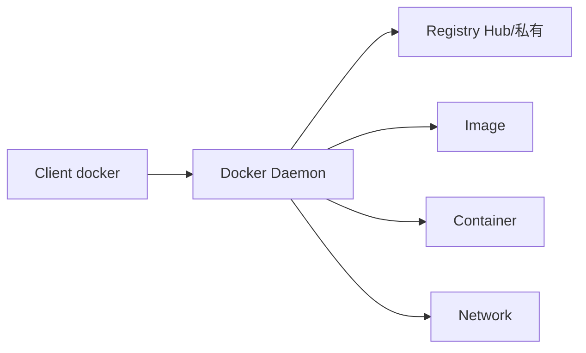
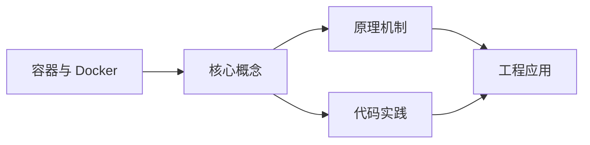
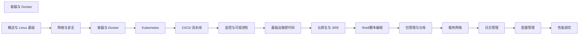

## 1. 学习目标（Bloom 分类）

本节按照布鲁姆教育目标分类学组织学习路径。本文主题为《容器与 Docker》，属于 DevOps 模块，读者可以根据自身阶段选择阅读深度。

记忆层面：能够准确复述本文的核心概念、术语与基本语法或操作步骤，并能够在提问或检索时快速定位对应知识点。能够说出 DevOps 的核心概念、组件与标准流程。

理解层面：能够用自己的语言解释核心原理与工作机制，说明概念之间的因果关系，而不是机械记忆结论。能够解释 DevOps 的工作原理与关键机制。

应用层面：能够在真实项目或练习场景中运用本文知识解决具体问题，写出正确且可维护的实现。能够执行 DevOps 相关的标准操作与配置。

分析层面：能够拆解复杂问题，比较本文主题与相邻概念的异同，识别边界条件与例外情况。能够分析 DevOps 方案在可靠性、成本与性能上的权衡。

评价层面：能够根据约束条件（性能、可读性、安全、成本）评价不同方案的优劣，做出有依据的技术决策。能够评价 DevOps 中的技术选型。

创造层面：能够把本文知识与其他模块知识组合，设计出新的解决方案或可复用的工程模式。能够设计基于 DevOps 的完整解决方案。

通过本节学习，读者应当能够把《容器与 Docker》纳入自己的知识网络，并与 DevOps 模块的其他主题（CI/CD、容器、编排、监控、GitOps）建立关联。

## 2. 历史动机与发展脉络

《容器与 Docker》是 DevOps 领域的重要主题。要真正理解它，需要先了解它解决的问题与演进过程。

DevOps 源于 2009 年（“DevOpsDays”），核心是打破开发与运维壁垒，用自动化与协作缩短交付周期；CALMS 文化（文化、自动化、精益、度量、共享）是其框架。
技术栈演进：持续集成（CI）与持续交付（CD）、基础设施即代码（IaC）、容器（Docker）与编排（Kubernetes）、可观测性（监控/日志/追踪）。
2020 年代趋势：GitOps（声明式 + 自动同步）、平台工程（内部开发者平台）、FinOps（成本治理）、AI 辅助运维。

回到本文主题：容器与 Docker 的提出与成熟，正是上述技术背景下的必然产物。早期实现往往以简单可用为目标，随着工程规模扩大，社区逐渐沉淀出标准做法与最佳实践；理解这一脉络，可以帮助读者判断“为什么文档中的推荐写法是现在这个样子”，也能在遇到历史遗留代码时准确识别其设计年代与取舍。


## 3. 形式化定义与核心概念精讲

本节把《容器与 Docker》涉及的核心概念以“定义 + 讲解”的形式展开。读者应把定义当作工具，把讲解当作理解路径；两者结合才能形成可迁移的知识。

CI/CD 管线：代码提交 -> 构建 -> 测试 -> 制品 -> 部署；流水线即代码（GitHub Actions/Jenkins/GitLab CI）。
容器与镜像：OCI 规范、Dockerfile 分层、镜像仓库与签名；容器隔离（cgroup/namespace）。
编排：Kubernetes 的 Pod/Deployment/Service 抽象；声明式期望状态与控制器调和。

### 3.1 原文章节逐一精讲

原文档把主题拆分为 16 个小节，下面按顺序给出每一节的导读讲解，随后保留原文细节供精读。

#### 原文精读（完整保留）

# DevOps Docker 容器基础命令

> **符号约定**：`< >` 必填参数 | `[ ]` 可选参数

---

#### 1. 容器原理

##### 1.1 容器 vs 虚拟机

| 维度         | 虚拟机               | 容器        |
| :----------- | :------------------- | :---------- |
| **隔离级别** | 硬件级（Hypervisor） | 操作系统级  |
| **启动速度** | 分钟级               | 秒级        |
| **资源占用** | GB 级                | MB 级       |
| **镜像大小** | GB 级                | MB 级       |
| **性能**     | 有虚拟化开销         | 接近原生    |
| **密度**     | 几个/主机            | 数百个/主机 |

##### 1.2 Linux 容器技术

| 技术          | 作用         | 说明                     |
| :------------ | :----------- | :----------------------- |
| **Namespace** | 资源隔离     | PID/NET/MNT/UTS/IPC/USER |
| **Cgroup**    | 资源限制     | CPU/内存/IO/网络         |
| **UnionFS**   | 镜像分层     | OverlayFS / AUFS         |
| **Seccomp**   | 系统调用过滤 | 限制可用 syscall         |

```bash
# Namespace 示例
unshare --pid --fork --mount-proc bash   # 创建新的 PID namespace
ls /proc                                  # 只能看到新 namespace 的进程

# Cgroup 示例
sudo cgcreate -g cpu,memory:/mycontainer
sudo cgset -r memory.limit_in_bytes=512M mycontainer
sudo cgset -r cpu.cfs_quota_us=50000 mycontainer  # 50% CPU
```

#### 2. Docker 架构

##### 2.1 核心概念



| 概念          | 描述                             |
| :------------ | :------------------------------- |
| **Image**     | 只读模板，包含运行应用所需的一切 |
| **Container** | Image 的运行实例                 |
| **Volume**    | 数据持久化                       |
| **Network**   | 容器间通信                       |
| **Registry**  | 镜像仓库                         |

##### 2.2 基础命令

```bash
# 镜像操作
docker pull nginx:1.25              # 拉取镜像
docker images                       # 列出镜像
docker rmi nginx:1.25               # 删除镜像
docker build -t myapp:v1 .          # 构建镜像
docker tag myapp:v1 registry/myapp:v1  # 打标签
docker push registry/myapp:v1       # 推送镜像

# 容器操作
docker run -d --name web -p 80:80 nginx:1.25    # 运行容器
docker ps                                       # 运行中的容器
docker ps -a                                    # 所有容器
docker stop web                                 # 停止
docker start web                                # 启动
docker restart web                              # 重启
docker rm web                                   # 删除
docker logs -f web                              # 查看日志
docker exec -it web bash                        # 进入容器
docker inspect web                               # 详细信息

# 清理
docker system prune -a              # 清理所有未使用资源
docker volume prune                 # 清理未使用卷
```

#### 3. Dockerfile

##### 3.1 指令详解

```dockerfile
# 基础镜像
FROM python:3.12-slim

# 元数据
LABEL maintainer="dev@example.com"
LABEL version="1.0"
LABEL description="Python Web Application"

# 设置工作目录
WORKDIR /app

# 环境变量
ENV PYTHONDONTWRITEBYTECODE=1
ENV PYTHONUNBUFFERED=1
ENV PORT=8000

# 复制依赖文件并安装（利用缓存）
COPY requirements.txt .
RUN pip install --no-cache-dir -r requirements.txt

# 复制应用代码
COPY . .

# 暴露端口
EXPOSE 8000

# 健康检查
HEALTHCHECK --interval=30s --timeout=3s --retries=3 \
    CMD curl -f http://localhost:8000/health || exit 1

# 非root用户
RUN useradd -m appuser
USER appuser

# 启动命令
CMD ["uvicorn", "main:app", "--host", "0.0.0.0", "--port", "8000"]
```

##### 3.2 多阶段构建

```dockerfile
# 阶段1：构建
FROM node:20-alpine AS builder

WORKDIR /app
COPY package*.json ./
RUN npm ci
COPY . .
RUN npm run build

# 阶段2：运行
FROM nginx:1.25-alpine

# 仅复制构建产物
COPY --from=builder /app/dist /usr/share/nginx/html
COPY nginx.conf /etc/nginx/conf.d/default.conf

EXPOSE 80
CMD ["nginx", "-g", "daemon off;"]
```

**多阶段构建优势**：

- 最终镜像只包含运行时所需文件
- 构建工具和源码不会留在最终镜像
- 镜像大小从 GB 级降到 MB 级

##### 3.3 常用基础镜像大小

| 镜像                   | 大小   | 适用场景            |
| :--------------------- | :----- | :------------------ |
| `ubuntu:22.04`         | ~77MB  | 需要完整 Linux 环境 |
| `debian:bookworm-slim` | ~74MB  | 较完整的 Linux      |
| `alpine:3.19`          | ~7MB   | 极致轻量            |
| `python:3.12-slim`     | ~150MB | Python 应用         |
| `python:3.12-alpine`   | ~50MB  | Python 轻量         |
| `node:20-alpine`       | ~180MB | Node.js 应用        |
| `nginx:1.25-alpine`    | ~40MB  | Web 服务器          |

#### 4. Docker Compose

##### 4.1 完整示例

```yaml
# docker-compose.yml
version: '3.8'

services:
  # Web 应用
  web:
    build:
      context: .
      dockerfile: Dockerfile
    ports:
      - '8000:8000'
    environment:
      - DATABASE_URL=postgresql://app:secret@db:5432/appdb
      - REDIS_URL=redis://cache:6379/0
    depends_on:
      db:
        condition: service_healthy
      cache:
        condition: service_started
    volumes:
      - ./app:/app # 开发时挂载代码
    networks:
      - frontend
      - backend
    deploy:
      resources:
        limits:
          cpus: '1.0'
          memory: 512M
    restart: unless-stopped
    healthcheck:
      test: ['CMD', 'curl', '-f', 'http://localhost:8000/health']
      interval: 30s
      timeout: 5s
      retries: 3

  # PostgreSQL 数据库
  db:
    image: postgres:16-alpine
    environment:
      POSTGRES_DB: appdb
      POSTGRES_USER: app
      POSTGRES_PASSWORD: secret
    volumes:
      - pgdata:/var/lib/postgresql/data
    networks:
      - backend
    healthcheck:
      test: ['CMD-SHELL', 'pg_isready -U app -d appdb']
      interval: 10s
      timeout: 5s
      retries: 5

  # Redis 缓存
  cache:
    image: redis:7-alpine
    command: redis-server --maxmemory 256mb --maxmemory-policy allkeys-lru
    networks:
      - backend
    volumes:
      - redisdata:/data

  # Nginx 反向代理
  nginx:
    image: nginx:1.25-alpine
    ports:
      - '80:80'
      - '443:443'
    volumes:
      - ./nginx.conf:/etc/nginx/nginx.conf:ro
      - ./ssl:/etc/nginx/ssl:ro
    depends_on:
      - web
    networks:
      - frontend
    restart: unless-stopped

volumes:
  pgdata:
    driver: local
  redisdata:
    driver: local

networks:
  frontend:
    driver: bridge
  backend:
    driver: bridge
    internal: true # 不暴露到外部
```

##### 4.2 Compose 命令

```bash
# 启动
docker compose up -d                    # 后台启动
docker compose up -d --build            # 重新构建并启动

# 管理
docker compose ps                       # 查看状态
docker compose logs -f web              # 查看日志
docker compose exec web bash            # 进入容器
docker compose restart web              # 重启服务

# 扩缩容
docker compose up -d --scale web=3      # 扩展到3个实例

# 停止与清理
docker compose down                     # 停止并删除容器
docker compose down -v                  # 同时删除卷
```

#### 5. 镜像优化

##### 5.1 优化策略

| 策略               | 效果        | 示例                 |
| :----------------- | :---------- | :------------------- |
| **选择小基础镜像** | 减少 50-80% | alpine 替代 ubuntu   |
| **多阶段构建**     | 减少 60-90% | 分离构建和运行       |
| **合并 RUN 指令**  | 减少层数    | `RUN cmd1 && cmd2`   |
| **清理缓存**       | 减少 20-40% | `--no-cache-dir`     |
| **.dockerignore**  | 减少上下文  | 排除 node_modules 等 |
| **利用缓存**       | 加速构建    | 先 COPY 依赖文件     |

##### 5.2 .dockerignore

```dockerignore
# Git
.git
.gitignore

# 依赖
node_modules
__pycache__
*.pyc
.venv

# IDE
.vscode
.idea

# 文档
*.md
docs/

# 测试
tests/
.pytest_cache
.coverage

# Docker
Dockerfile
docker-compose*.yml

# 其他
.env
*.log
.DS_Store
```

##### 5.3 优化前后对比

```dockerfile
#  优化前（~800MB）
FROM python:3.12
COPY . /app
WORKDIR /app
RUN pip install -r requirements.txt
CMD ["python", "main.py"]

#  优化后（~150MB）
FROM python:3.12-slim AS builder
WORKDIR /app
COPY requirements.txt .
RUN pip install --no-cache-dir -r requirements.txt

FROM python:3.12-slim
WORKDIR /app
COPY --from=builder /usr/local/lib/python3.12/site-packages /usr/local/lib/python3.12/site-packages
COPY . .
RUN useradd -m appuser && chown -R appuser:appuser /app
USER appuser
CMD ["python", "main.py"]
```

#### 6. 私有仓库

##### 6.1 部署 Registry

```yaml
# docker-compose.yml
services:
  registry:
    image: registry:2
    ports:
      - '5000:5000'
    environment:
      REGISTRY_STORAGE_FILESYSTEM_ROOTDIRECTORY: /data
      REGISTRY_AUTH: htpasswd
      REGISTRY_AUTH_HTPASSWD_REALM: 'Registry Realm'
      REGISTRY_AUTH_HTPASSWD_PATH: /auth/htpasswd
    volumes:
      - ./data:/data
      - ./auth:/auth
    restart: always
```

```bash
# 创建认证文件
mkdir auth
docker run --rm -entrypoint htpasswd httpd:2 -Bbn admin password > auth/htpasswd

# 使用私有仓库
docker tag myapp:v1 localhost:5000/myapp:v1
docker push localhost:5000/myapp:v1
docker pull localhost:5000/myapp:v1
```

##### 6.2 Harbor（企业级）

Harbor 提供更完善的私有仓库功能：RBAC、镜像扫描、镜像签名、复制策略。

```bash
# 安装 Harbor
wget https://github.com/goharbor/harbor/releases/download/v2.10.0/harbor-online-installer-v2.10.0.tgz
tar xvf harbor-online-installer-*.tgz
cd harbor
cp harbor.yml.tmpl harbor.yml
# 编辑 harbor.yml 配置
./install.sh --with-trivy  # 包含漏洞扫描
```

#### 7. 小结

容器技术是现代运维的基石：

1. **容器原理**基于 Namespace（隔离）和 Cgroup（限制），理解原理有助于排查问题
2. **Dockerfile** 编写需遵循最佳实践：小基础镜像、多阶段构建、利用缓存
3. **Docker Compose** 是单机多容器编排的标准工具，适合开发和测试环境
4. **镜像优化**可大幅减小镜像体积，加速部署和降低存储成本
5. **私有仓库**是企业必需，小型团队用 Registry，大型组织用 Harbor
6. 生产环境建议使用 Kubernetes 进行容器编排
#### docker run 创建并启动容器

**基本写法：运行容器**
`docker run [选项] <镜像> [命令]`
```bash
# 启动 nginx 容器
docker run nginx
```

**基本写法：后台运行容器**
`docker run -d <镜像>`
```bash
# 后台运行 nginx 容器
docker run -d nginx
```

**基本写法：交互式运行容器**
`docker run -it <镜像> <命令>`
```bash
# 进入 ubuntu 容器的 bash
docker run -it ubuntu bash
```

**基本写法：命名容器并映射端口**
`docker run --name <名称> -p <宿主端口>:<容器端口> <镜像>`
```bash
# 启动命名为 web 的 nginx，映射 8080 到 80
docker run --name web -p 8080:80 nginx
```

**基本写法：挂载数据卷**
`docker run -v <宿主路径>:<容器路径> <镜像>`
```bash
# 挂载当前目录到容器的 /app
docker run -v $(pwd):/app node
```

---

#### docker ps 查看容器

**基本写法：查看运行中容器**
`docker ps`
```bash
# 列出正在运行的容器
docker ps
```

**基本写法：查看所有容器（含已停止）**
`docker ps -a`
```bash
# 列出所有容器
docker ps -a
```

**基本写法：只显示容器 ID**
`docker ps -q`
```bash
# 获取所有运行容器的 ID
docker ps -q
```

---

#### docker start/stop/restart 生命周期管理

**基本写法：启动已停止的容器**
`docker start <容器>`
```bash
# 启动容器 web
docker start web
```

**基本写法：停止容器**
`docker stop [选项] <容器>`
```bash
# 优雅停止容器 web
docker stop web
```

**基本写法：强制停止容器**
`docker stop -t 0 <容器>`
```bash
# 立即停止容器
docker stop -t 0 web
```

**基本写法：重启容器**
`docker restart <容器>`
```bash
# 重启容器 web
docker restart web
```

---

#### docker rm 删除容器

**基本写法：删除已停止容器**
`docker rm <容器>`
```bash
# 删除容器 web
docker rm web
```

**基本写法：强制删除运行中容器**
`docker rm -f <容器>`
```bash
# 强制删除运行中的容器
docker rm -f web
```

**基本写法：删除所有停止的容器**
`docker container prune`
```bash
# 清理所有停止的容器
docker container prune -f
```

---

#### docker exec 进入容器执行命令

**基本写法：进入容器交互式 shell**
`docker exec -it <容器> <shell>`
```bash
# 进入 web 容器的 bash
docker exec -it web bash
```

**基本写法：在容器中执行命令**
`docker exec <容器> <命令>`
```bash
# 查看 web 容器的进程列表
docker exec web ps aux
```

**基本写法：以指定用户执行命令**
`docker exec -u <用户> <容器> <命令>`
```bash
# 以 root 用户进入容器
docker exec -u root -it web sh
```

---

#### docker logs 查看日志

**基本写法：查看容器日志**
`docker logs <容器>`
```bash
# 查看 web 容器的全部日志
docker logs web
```

**基本写法：实时跟踪日志**
`docker logs -f <容器>`
```bash
# 实时跟踪 web 容器日志
docker logs -f web
```

**基本写法：查看最后 N 行日志**
`docker logs --tail <行数> <容器>`
```bash
# 查看最后 100 行日志
docker logs --tail 100 web
```

**基本写法：查看指定时间后的日志**
`docker logs --since <时间> <容器>`
```bash
# 查看最近 10 分钟的日志
docker logs --since 10m web
```

---

#### docker inspect 查看容器详情

**基本写法：查看容器详细信息**
`docker inspect <容器>`
```bash
# 查看 web 容器的完整信息
docker inspect web
```

**基本写法：查看容器 IP 地址**
`docker inspect --format '{{.NetworkSettings.IPAddress}}' <容器>`
```bash
# 提取容器的 IP 地址
docker inspect --format '{{.NetworkSettings.IPAddress}}' web
```

**基本写法：查看容器状态**
`docker inspect --format '{{.State.Status}}' <容器>`
```bash
# 获取容器当前状态
docker inspect --format '{{.State.Status}}' web
```

---

#### docker stats 资源监控

**基本写法：查看所有容器资源使用**
`docker stats`
```bash
# 实时显示所有容器资源占用
docker stats
```

**基本写法：查看指定容器资源使用**
`docker stats <容器>`
```bash
# 监控 web 容器的 CPU 和内存
docker stats web
```

**基本写法：只输出一次结果**
`docker stats --no-stream`
```bash
# 一次性输出所有容器资源使用
docker stats --no-stream
```

---

#### docker cp 文件拷贝

**基本写法：从容器拷贝文件到宿主机**
`docker cp <容器>:<容器路径> <宿主路径>`
```bash
# 从 web 容器拷贝配置文件到当前目录
docker cp web:/etc/nginx/nginx.conf ./
```

**基本写法：从宿主机拷贝文件到容器**
`docker cp <宿主路径> <容器>:<容器路径>`
```bash
# 拷贝本地文件到容器
docker cp ./app.conf web:/etc/nginx/conf.d/
```


### 3.2 概念关系图

下面用 Mermaid 图表达本文核心概念之间的关系，帮助读者建立整体图景：



图中展示的是本文知识的结构化关系：核心概念是入口，原理机制解释“为什么”，代码实践演示“怎么做”，工程应用回答“何时用”。读者学习时可以把每个小节的内容挂接到对应节点上。

## 4. 理论推导与原理解析

本节深入《容器与 Docker》背后的原理。理论部分不求面面俱到，而是聚焦“能解释现象、能指导实践”的关键推导。

CI/CD 管线：代码提交 -> 构建 -> 测试 -> 制品 -> 部署；流水线即代码（GitHub Actions/Jenkins/GitLab CI）。
容器与镜像：OCI 规范、Dockerfile 分层、镜像仓库与签名；容器隔离（cgroup/namespace）。
编排：Kubernetes 的 Pod/Deployment/Service 抽象；声明式期望状态与控制器调和。
可观测性三支柱：指标（Prometheus）、日志（Loki/ELK）、追踪（OpenTelemetry）。

需要强调的是，理论推导与工程实践之间存在翻译层：理论给出的是理想化模型与边界条件，工程代码则必须处理真实环境中的例外。读者在学习时应先掌握理论的“标准情形”，再通过陷阱章节了解“非标准情形”。

## 5. 代码示例与逐行讲解

本节把原文中的代码示例系统整理，并为每个示例补充用途说明与讲解。读者不应只浏览代码，而应逐段对照讲解理解设计意图。

### 5.1 示例：1.2 Linux 容器技术

该示例来自原文《1.2 Linux 容器技术》小节，用于演示容器与 Docker相关操作。阅读时请先看代码结构，再看其后的讲解。

```bash
# Namespace 示例
unshare --pid --fork --mount-proc bash   # 创建新的 PID namespace
ls /proc                                  # 只能看到新 namespace 的进程

# Cgroup 示例
sudo cgcreate -g cpu,memory:/mycontainer
sudo cgset -r memory.limit_in_bytes=512M mycontainer
sudo cgset -r cpu.cfs_quota_us=50000 mycontainer  # 50% CPU
```

讲解：这段代码演示了本节核心知识点。代码中的关键操作可以归纳为三步：准备（定义或初始化）、执行（核心逻辑）、收尾（释放资源或返回结果）。实际项目中，这三步往往被封装为函数或类，以提升复用性与可测试性。

关键点分析：

该示例共 7 行有效代码，结构以数据或配置为主。阅读时应关注：数据字段的含义、配置项的作用，以及它们与运行行为的对应关系。

进阶思考路径：先尝试修改参数观察行为变化，再把示例中的模式迁移到自己的项目中；每次修改都记录预期与实测差异，这是把示例转化为能力的最快方式。

### 5.2 示例：2.1 核心概念

该示例来自原文《2.1 核心概念》小节，用于演示容器与 Docker相关操作。阅读时请先看代码结构，再看其后的讲解。


讲解：这段代码演示了本节核心知识点。代码中的关键操作可以归纳为三步：准备（定义或初始化）、执行（核心逻辑）、收尾（释放资源或返回结果）。实际项目中，这三步往往被封装为函数或类，以提升复用性与可测试性。

关键点分析：

该示例共 5 行有效代码，结构以数据或配置为主。阅读时应关注：数据字段的含义、配置项的作用，以及它们与运行行为的对应关系。

进阶思考路径：先尝试修改参数观察行为变化，再把示例中的模式迁移到自己的项目中；每次修改都记录预期与实测差异，这是把示例转化为能力的最快方式。

### 5.3 示例：2.2 基础命令

该示例来自原文《2.2 基础命令》小节，用于演示容器与 Docker相关操作。阅读时请先看代码结构，再看其后的讲解。

```bash
# 镜像操作
docker pull nginx:1.25              # 拉取镜像
docker images                       # 列出镜像
docker rmi nginx:1.25               # 删除镜像
docker build -t myapp:v1 .          # 构建镜像
docker tag myapp:v1 registry/myapp:v1  # 打标签
docker push registry/myapp:v1       # 推送镜像

# 容器操作
docker run -d --name web -p 80:80 nginx:1.25    # 运行容器
docker ps                                       # 运行中的容器
docker ps -a                                    # 所有容器
docker stop web                                 # 停止
docker start web                                # 启动
docker restart web                              # 重启
docker rm web                                   # 删除
docker logs -f web                              # 查看日志
docker exec -it web bash                        # 进入容器
docker inspect web                               # 详细信息

# 清理
docker system prune -a              # 清理所有未使用资源
docker volume prune                 # 清理未使用卷
```

讲解：这段代码演示了本节核心知识点。代码中的关键操作可以归纳为三步：准备（定义或初始化）、执行（核心逻辑）、收尾（释放资源或返回结果）。实际项目中，这三步往往被封装为函数或类，以提升复用性与可测试性。

关键点分析：

该示例共 21 行有效代码，结构以数据或配置为主。阅读时应关注：数据字段的含义、配置项的作用，以及它们与运行行为的对应关系。

进阶思考路径：先尝试修改参数观察行为变化，再把示例中的模式迁移到自己的项目中；每次修改都记录预期与实测差异，这是把示例转化为能力的最快方式。

### 5.4 示例：3.1 指令详解

该示例来自原文《3.1 指令详解》小节，用于演示容器与 Docker相关操作。阅读时请先看代码结构，再看其后的讲解。

```dockerfile
# 基础镜像
FROM python:3.12-slim

# 元数据
LABEL maintainer="dev@example.com"
LABEL version="1.0"
LABEL description="Python Web Application"

# 设置工作目录
WORKDIR /app

# 环境变量
ENV PYTHONDONTWRITEBYTECODE=1
ENV PYTHONUNBUFFERED=1
ENV PORT=8000

# 复制依赖文件并安装（利用缓存）
COPY requirements.txt .
RUN pip install --no-cache-dir -r requirements.txt

# 复制应用代码
COPY . .

# 暴露端口
EXPOSE 8000

# 健康检查
HEALTHCHECK --interval=30s --timeout=3s --retries=3 \
    CMD curl -f http://localhost:8000/health || exit 1

# 非root用户
RUN useradd -m appuser
USER appuser

# 启动命令
CMD ["uvicorn", "main:app", "--host", "0.0.0.0", "--port", "8000"]
```

讲解：这段代码演示了本节核心知识点。代码中的关键操作可以归纳为三步：准备（定义或初始化）、执行（核心逻辑）、收尾（释放资源或返回结果）。实际项目中，这三步往往被封装为函数或类，以提升复用性与可测试性。

关键点分析：

该示例共 27 行有效代码，包含 1 类关键结构（FROM）。其中：

- 入口与初始化部分负责建立上下文，对应实际项目中的启动或装配逻辑；
- 核心逻辑部分体现本文主题的主要操作，是阅读时最需要对照讲解理解的部分；
- 输出或返回部分把结果交给调用方，注意其类型与边界条件。

进阶思考路径：先尝试修改参数观察行为变化，再把示例中的模式迁移到自己的项目中；每次修改都记录预期与实测差异，这是把示例转化为能力的最快方式。

### 5.5 示例：3.2 多阶段构建

该示例来自原文《3.2 多阶段构建》小节，用于演示容器与 Docker相关操作。阅读时请先看代码结构，再看其后的讲解。

```dockerfile
# 阶段1：构建
FROM node:20-alpine AS builder

WORKDIR /app
COPY package*.json ./
RUN npm ci
COPY . .
RUN npm run build

# 阶段2：运行
FROM nginx:1.25-alpine

# 仅复制构建产物
COPY --from=builder /app/dist /usr/share/nginx/html
COPY nginx.conf /etc/nginx/conf.d/default.conf

EXPOSE 80
CMD ["nginx", "-g", "daemon off;"]
```

讲解：这段代码演示了本节核心知识点。代码中的关键操作可以归纳为三步：准备（定义或初始化）、执行（核心逻辑）、收尾（释放资源或返回结果）。实际项目中，这三步往往被封装为函数或类，以提升复用性与可测试性。

关键点分析：

该示例共 14 行有效代码，包含 1 类关键结构（FROM）。其中：

- 入口与初始化部分负责建立上下文，对应实际项目中的启动或装配逻辑；
- 核心逻辑部分体现本文主题的主要操作，是阅读时最需要对照讲解理解的部分；
- 输出或返回部分把结果交给调用方，注意其类型与边界条件。

进阶思考路径：先尝试修改参数观察行为变化，再把示例中的模式迁移到自己的项目中；每次修改都记录预期与实测差异，这是把示例转化为能力的最快方式。

### 5.6 示例：4.1 完整示例

该示例来自原文《4.1 完整示例》小节，用于演示容器与 Docker相关操作。阅读时请先看代码结构，再看其后的讲解。

```yaml
# docker-compose.yml
version: '3.8'

services:
  # Web 应用
  web:
    build:
      context: .
      dockerfile: Dockerfile
    ports:
      - '8000:8000'
    environment:
      - DATABASE_URL=postgresql://app:secret@db:5432/appdb
      - REDIS_URL=redis://cache:6379/0
    depends_on:
      db:
        condition: service_healthy
      cache:
        condition: service_started
    volumes:
      - ./app:/app # 开发时挂载代码
    networks:
      - frontend
      - backend
    deploy:
      resources:
        limits:
          cpus: '1.0'
          memory: 512M
    restart: unless-stopped
    healthcheck:
      test: ['CMD', 'curl', '-f', 'http://localhost:8000/health']
      interval: 30s
      timeout: 5s
      retries: 3

  # PostgreSQL 数据库
  db:
    image: postgres:16-alpine
    environment:
      POSTGRES_DB: appdb
      POSTGRES_USER: app
      POSTGRES_PASSWORD: secret
    volumes:
      - pgdata:/var/lib/postgresql/data
    networks:
      - backend
    healthcheck:
      test: ['CMD-SHELL', 'pg_isready -U app -d appdb']
      interval: 10s
      timeout: 5s
      retries: 5

  # Redis 缓存
  cache:
    image: redis:7-alpine
    command: redis-server --maxmemory 256mb --maxmemory-policy allkeys-lru
    networks:
      - backend
    volumes:
      - redisdata:/data

  # Nginx 反向代理
  nginx:
    image: nginx:1.25-alpine
    ports:
      - '80:80'
      - '443:443'
    volumes:
      - ./nginx.conf:/etc/nginx/nginx.conf:ro
      - ./ssl:/etc/nginx/ssl:ro
    depends_on:
      - web
    networks:
      - frontend
    restart: unless-stopped

volumes:
  pgdata:
    driver: local
  redisdata:
    driver: local

networks:
  frontend:
    driver: bridge
  backend:
    driver: bridge
    internal: true # 不暴露到外部
```

讲解：这段代码演示了本节核心知识点。代码中的关键操作可以归纳为三步：准备（定义或初始化）、执行（核心逻辑）、收尾（释放资源或返回结果）。实际项目中，这三步往往被封装为函数或类，以提升复用性与可测试性。

关键点分析：

该示例共 83 行有效代码，包含 1 类关键结构（dockerfile）。其中：

- 入口与初始化部分负责建立上下文，对应实际项目中的启动或装配逻辑；
- 核心逻辑部分体现本文主题的主要操作，是阅读时最需要对照讲解理解的部分；
- 输出或返回部分把结果交给调用方，注意其类型与边界条件。

进阶思考路径：先尝试修改参数观察行为变化，再把示例中的模式迁移到自己的项目中；每次修改都记录预期与实测差异，这是把示例转化为能力的最快方式。

### 5.7 示例：4.2 Compose 命令

该示例来自原文《4.2 Compose 命令》小节，用于演示容器与 Docker相关操作。阅读时请先看代码结构，再看其后的讲解。

```bash
# 启动
docker compose up -d                    # 后台启动
docker compose up -d --build            # 重新构建并启动

# 管理
docker compose ps                       # 查看状态
docker compose logs -f web              # 查看日志
docker compose exec web bash            # 进入容器
docker compose restart web              # 重启服务

# 扩缩容
docker compose up -d --scale web=3      # 扩展到3个实例

# 停止与清理
docker compose down                     # 停止并删除容器
docker compose down -v                  # 同时删除卷
```

讲解：这段代码演示了本节核心知识点。代码中的关键操作可以归纳为三步：准备（定义或初始化）、执行（核心逻辑）、收尾（释放资源或返回结果）。实际项目中，这三步往往被封装为函数或类，以提升复用性与可测试性。

关键点分析：

该示例共 13 行有效代码，结构以数据或配置为主。阅读时应关注：数据字段的含义、配置项的作用，以及它们与运行行为的对应关系。

进阶思考路径：先尝试修改参数观察行为变化，再把示例中的模式迁移到自己的项目中；每次修改都记录预期与实测差异，这是把示例转化为能力的最快方式。

### 5.8 示例：5.2 .dockerignore

该示例来自原文《5.2 .dockerignore》小节，用于演示容器与 Docker相关操作。阅读时请先看代码结构，再看其后的讲解。

```dockerignore
# Git
.git
.gitignore

# 依赖
node_modules
__pycache__
*.pyc
.venv

# IDE
.vscode
.idea

# 文档
*.md
docs/

# 测试
tests/
.pytest_cache
.coverage

# Docker
Dockerfile
docker-compose*.yml

# 其他
.env
*.log
.DS_Store
```

讲解：这段代码演示了本节核心知识点。代码中的关键操作可以归纳为三步：准备（定义或初始化）、执行（核心逻辑）、收尾（释放资源或返回结果）。实际项目中，这三步往往被封装为函数或类，以提升复用性与可测试性。

关键点分析：

该示例共 25 行有效代码，结构以数据或配置为主。阅读时应关注：数据字段的含义、配置项的作用，以及它们与运行行为的对应关系。

进阶思考路径：先尝试修改参数观察行为变化，再把示例中的模式迁移到自己的项目中；每次修改都记录预期与实测差异，这是把示例转化为能力的最快方式。

### 5.9 示例：5.3 优化前后对比

该示例来自原文《5.3 优化前后对比》小节，用于演示容器与 Docker相关操作。阅读时请先看代码结构，再看其后的讲解。

```dockerfile
#  优化前（~800MB）
FROM python:3.12
COPY . /app
WORKDIR /app
RUN pip install -r requirements.txt
CMD ["python", "main.py"]

#  优化后（~150MB）
FROM python:3.12-slim AS builder
WORKDIR /app
COPY requirements.txt .
RUN pip install --no-cache-dir -r requirements.txt

FROM python:3.12-slim
WORKDIR /app
COPY --from=builder /usr/local/lib/python3.12/site-packages /usr/local/lib/python3.12/site-packages
COPY . .
RUN useradd -m appuser && chown -R appuser:appuser /app
USER appuser
CMD ["python", "main.py"]
```

讲解：这段代码演示了本节核心知识点。代码中的关键操作可以归纳为三步：准备（定义或初始化）、执行（核心逻辑）、收尾（释放资源或返回结果）。实际项目中，这三步往往被封装为函数或类，以提升复用性与可测试性。

关键点分析：

该示例共 18 行有效代码，包含 1 类关键结构（FROM）。其中：

- 入口与初始化部分负责建立上下文，对应实际项目中的启动或装配逻辑；
- 核心逻辑部分体现本文主题的主要操作，是阅读时最需要对照讲解理解的部分；
- 输出或返回部分把结果交给调用方，注意其类型与边界条件。

进阶思考路径：先尝试修改参数观察行为变化，再把示例中的模式迁移到自己的项目中；每次修改都记录预期与实测差异，这是把示例转化为能力的最快方式。

### 5.10 示例：6.1 部署 Registry

该示例来自原文《6.1 部署 Registry》小节，用于演示容器与 Docker相关操作。阅读时请先看代码结构，再看其后的讲解。

```yaml
# docker-compose.yml
services:
  registry:
    image: registry:2
    ports:
      - '5000:5000'
    environment:
      REGISTRY_STORAGE_FILESYSTEM_ROOTDIRECTORY: /data
      REGISTRY_AUTH: htpasswd
      REGISTRY_AUTH_HTPASSWD_REALM: 'Registry Realm'
      REGISTRY_AUTH_HTPASSWD_PATH: /auth/htpasswd
    volumes:
      - ./data:/data
      - ./auth:/auth
    restart: always
```

讲解：这段代码演示了本节核心知识点。代码中的关键操作可以归纳为三步：准备（定义或初始化）、执行（核心逻辑）、收尾（释放资源或返回结果）。实际项目中，这三步往往被封装为函数或类，以提升复用性与可测试性。

关键点分析：

该示例共 15 行有效代码，结构以数据或配置为主。阅读时应关注：数据字段的含义、配置项的作用，以及它们与运行行为的对应关系。

进阶思考路径：先尝试修改参数观察行为变化，再把示例中的模式迁移到自己的项目中；每次修改都记录预期与实测差异，这是把示例转化为能力的最快方式。

### 5.11 示例：6.1 部署 Registry

该示例来自原文《6.1 部署 Registry》小节，用于演示容器与 Docker相关操作。阅读时请先看代码结构，再看其后的讲解。

```bash
# 创建认证文件
mkdir auth
docker run --rm -entrypoint htpasswd httpd:2 -Bbn admin password > auth/htpasswd

# 使用私有仓库
docker tag myapp:v1 localhost:5000/myapp:v1
docker push localhost:5000/myapp:v1
docker pull localhost:5000/myapp:v1
```

讲解：这段代码演示了本节核心知识点。代码中的关键操作可以归纳为三步：准备（定义或初始化）、执行（核心逻辑）、收尾（释放资源或返回结果）。实际项目中，这三步往往被封装为函数或类，以提升复用性与可测试性。

关键点分析：

该示例共 7 行有效代码，结构以数据或配置为主。阅读时应关注：数据字段的含义、配置项的作用，以及它们与运行行为的对应关系。

进阶思考路径：先尝试修改参数观察行为变化，再把示例中的模式迁移到自己的项目中；每次修改都记录预期与实测差异，这是把示例转化为能力的最快方式。

### 5.12 示例：6.2 Harbor（企业级）

该示例来自原文《6.2 Harbor（企业级）》小节，用于演示容器与 Docker相关操作。阅读时请先看代码结构，再看其后的讲解。

```bash
# 安装 Harbor
wget https://github.com/goharbor/harbor/releases/download/v2.10.0/harbor-online-installer-v2.10.0.tgz
tar xvf harbor-online-installer-*.tgz
cd harbor
cp harbor.yml.tmpl harbor.yml
# 编辑 harbor.yml 配置
./install.sh --with-trivy  # 包含漏洞扫描
```

讲解：这段代码演示了本节核心知识点。代码中的关键操作可以归纳为三步：准备（定义或初始化）、执行（核心逻辑）、收尾（释放资源或返回结果）。实际项目中，这三步往往被封装为函数或类，以提升复用性与可测试性。

关键点分析：

该示例共 7 行有效代码，结构以数据或配置为主。阅读时应关注：数据字段的含义、配置项的作用，以及它们与运行行为的对应关系。

进阶思考路径：先尝试修改参数观察行为变化，再把示例中的模式迁移到自己的项目中；每次修改都记录预期与实测差异，这是把示例转化为能力的最快方式。

### 5.13 示例：docker run 创建并启动容器

该示例来自原文《docker run 创建并启动容器》小节，用于演示容器与 Docker相关操作。阅读时请先看代码结构，再看其后的讲解。

```bash
# 启动 nginx 容器
docker run nginx
```

讲解：这段代码演示了本节核心知识点。代码中的关键操作可以归纳为三步：准备（定义或初始化）、执行（核心逻辑）、收尾（释放资源或返回结果）。实际项目中，这三步往往被封装为函数或类，以提升复用性与可测试性。

关键点分析：

该示例共 2 行有效代码，结构以数据或配置为主。阅读时应关注：数据字段的含义、配置项的作用，以及它们与运行行为的对应关系。

进阶思考路径：先尝试修改参数观察行为变化，再把示例中的模式迁移到自己的项目中；每次修改都记录预期与实测差异，这是把示例转化为能力的最快方式。

### 5.14 示例：docker run 创建并启动容器

该示例来自原文《docker run 创建并启动容器》小节，用于演示容器与 Docker相关操作。阅读时请先看代码结构，再看其后的讲解。

```bash
# 后台运行 nginx 容器
docker run -d nginx
```

讲解：这段代码演示了本节核心知识点。代码中的关键操作可以归纳为三步：准备（定义或初始化）、执行（核心逻辑）、收尾（释放资源或返回结果）。实际项目中，这三步往往被封装为函数或类，以提升复用性与可测试性。

关键点分析：

该示例共 2 行有效代码，结构以数据或配置为主。阅读时应关注：数据字段的含义、配置项的作用，以及它们与运行行为的对应关系。

进阶思考路径：先尝试修改参数观察行为变化，再把示例中的模式迁移到自己的项目中；每次修改都记录预期与实测差异，这是把示例转化为能力的最快方式。

### 5.15 示例：docker run 创建并启动容器

该示例来自原文《docker run 创建并启动容器》小节，用于演示容器与 Docker相关操作。阅读时请先看代码结构，再看其后的讲解。

```bash
# 进入 ubuntu 容器的 bash
docker run -it ubuntu bash
```

讲解：这段代码演示了本节核心知识点。代码中的关键操作可以归纳为三步：准备（定义或初始化）、执行（核心逻辑）、收尾（释放资源或返回结果）。实际项目中，这三步往往被封装为函数或类，以提升复用性与可测试性。

关键点分析：

该示例共 2 行有效代码，结构以数据或配置为主。阅读时应关注：数据字段的含义、配置项的作用，以及它们与运行行为的对应关系。

进阶思考路径：先尝试修改参数观察行为变化，再把示例中的模式迁移到自己的项目中；每次修改都记录预期与实测差异，这是把示例转化为能力的最快方式。

### 5.16 示例：docker run 创建并启动容器

该示例来自原文《docker run 创建并启动容器》小节，用于演示容器与 Docker相关操作。阅读时请先看代码结构，再看其后的讲解。

```bash
# 启动命名为 web 的 nginx，映射 8080 到 80
docker run --name web -p 8080:80 nginx
```

讲解：这段代码演示了本节核心知识点。代码中的关键操作可以归纳为三步：准备（定义或初始化）、执行（核心逻辑）、收尾（释放资源或返回结果）。实际项目中，这三步往往被封装为函数或类，以提升复用性与可测试性。

关键点分析：

该示例共 2 行有效代码，结构以数据或配置为主。阅读时应关注：数据字段的含义、配置项的作用，以及它们与运行行为的对应关系。

进阶思考路径：先尝试修改参数观察行为变化，再把示例中的模式迁移到自己的项目中；每次修改都记录预期与实测差异，这是把示例转化为能力的最快方式。

### 5.17 示例：docker run 创建并启动容器

该示例来自原文《docker run 创建并启动容器》小节，用于演示容器与 Docker相关操作。阅读时请先看代码结构，再看其后的讲解。

```bash
# 挂载当前目录到容器的 /app
docker run -v $(pwd):/app node
```

讲解：这段代码演示了本节核心知识点。代码中的关键操作可以归纳为三步：准备（定义或初始化）、执行（核心逻辑）、收尾（释放资源或返回结果）。实际项目中，这三步往往被封装为函数或类，以提升复用性与可测试性。

关键点分析：

该示例共 2 行有效代码，结构以数据或配置为主。阅读时应关注：数据字段的含义、配置项的作用，以及它们与运行行为的对应关系。

进阶思考路径：先尝试修改参数观察行为变化，再把示例中的模式迁移到自己的项目中；每次修改都记录预期与实测差异，这是把示例转化为能力的最快方式。

### 5.18 示例：docker ps 查看容器

该示例来自原文《docker ps 查看容器》小节，用于演示容器与 Docker相关操作。阅读时请先看代码结构，再看其后的讲解。

```bash
# 列出正在运行的容器
docker ps
```

讲解：这段代码演示了本节核心知识点。代码中的关键操作可以归纳为三步：准备（定义或初始化）、执行（核心逻辑）、收尾（释放资源或返回结果）。实际项目中，这三步往往被封装为函数或类，以提升复用性与可测试性。

关键点分析：

该示例共 2 行有效代码，结构以数据或配置为主。阅读时应关注：数据字段的含义、配置项的作用，以及它们与运行行为的对应关系。

进阶思考路径：先尝试修改参数观察行为变化，再把示例中的模式迁移到自己的项目中；每次修改都记录预期与实测差异，这是把示例转化为能力的最快方式。

### 5.19 示例：docker ps 查看容器

该示例来自原文《docker ps 查看容器》小节，用于演示容器与 Docker相关操作。阅读时请先看代码结构，再看其后的讲解。

```bash
# 列出所有容器
docker ps -a
```

讲解：这段代码演示了本节核心知识点。代码中的关键操作可以归纳为三步：准备（定义或初始化）、执行（核心逻辑）、收尾（释放资源或返回结果）。实际项目中，这三步往往被封装为函数或类，以提升复用性与可测试性。

关键点分析：

该示例共 2 行有效代码，结构以数据或配置为主。阅读时应关注：数据字段的含义、配置项的作用，以及它们与运行行为的对应关系。

进阶思考路径：先尝试修改参数观察行为变化，再把示例中的模式迁移到自己的项目中；每次修改都记录预期与实测差异，这是把示例转化为能力的最快方式。

### 5.20 示例：docker ps 查看容器

该示例来自原文《docker ps 查看容器》小节，用于演示容器与 Docker相关操作。阅读时请先看代码结构，再看其后的讲解。

```bash
# 获取所有运行容器的 ID
docker ps -q
```

讲解：这段代码演示了本节核心知识点。代码中的关键操作可以归纳为三步：准备（定义或初始化）、执行（核心逻辑）、收尾（释放资源或返回结果）。实际项目中，这三步往往被封装为函数或类，以提升复用性与可测试性。

关键点分析：

该示例共 2 行有效代码，结构以数据或配置为主。阅读时应关注：数据字段的含义、配置项的作用，以及它们与运行行为的对应关系。

进阶思考路径：先尝试修改参数观察行为变化，再把示例中的模式迁移到自己的项目中；每次修改都记录预期与实测差异，这是把示例转化为能力的最快方式。

### 5.21 示例：docker start/stop/restart 生命周期管理

该示例来自原文《docker start/stop/restart 生命周期管理》小节，用于演示容器与 Docker相关操作。阅读时请先看代码结构，再看其后的讲解。

```bash
# 启动容器 web
docker start web
```

讲解：这段代码演示了本节核心知识点。代码中的关键操作可以归纳为三步：准备（定义或初始化）、执行（核心逻辑）、收尾（释放资源或返回结果）。实际项目中，这三步往往被封装为函数或类，以提升复用性与可测试性。

关键点分析：

该示例共 2 行有效代码，结构以数据或配置为主。阅读时应关注：数据字段的含义、配置项的作用，以及它们与运行行为的对应关系。

进阶思考路径：先尝试修改参数观察行为变化，再把示例中的模式迁移到自己的项目中；每次修改都记录预期与实测差异，这是把示例转化为能力的最快方式。

### 5.22 示例：docker start/stop/restart 生命周期管理

该示例来自原文《docker start/stop/restart 生命周期管理》小节，用于演示容器与 Docker相关操作。阅读时请先看代码结构，再看其后的讲解。

```bash
# 优雅停止容器 web
docker stop web
```

讲解：这段代码演示了本节核心知识点。代码中的关键操作可以归纳为三步：准备（定义或初始化）、执行（核心逻辑）、收尾（释放资源或返回结果）。实际项目中，这三步往往被封装为函数或类，以提升复用性与可测试性。

关键点分析：

该示例共 2 行有效代码，结构以数据或配置为主。阅读时应关注：数据字段的含义、配置项的作用，以及它们与运行行为的对应关系。

进阶思考路径：先尝试修改参数观察行为变化，再把示例中的模式迁移到自己的项目中；每次修改都记录预期与实测差异，这是把示例转化为能力的最快方式。

### 5.23 示例：docker start/stop/restart 生命周期管理

该示例来自原文《docker start/stop/restart 生命周期管理》小节，用于演示容器与 Docker相关操作。阅读时请先看代码结构，再看其后的讲解。

```bash
# 立即停止容器
docker stop -t 0 web
```

讲解：这段代码演示了本节核心知识点。代码中的关键操作可以归纳为三步：准备（定义或初始化）、执行（核心逻辑）、收尾（释放资源或返回结果）。实际项目中，这三步往往被封装为函数或类，以提升复用性与可测试性。

关键点分析：

该示例共 2 行有效代码，结构以数据或配置为主。阅读时应关注：数据字段的含义、配置项的作用，以及它们与运行行为的对应关系。

进阶思考路径：先尝试修改参数观察行为变化，再把示例中的模式迁移到自己的项目中；每次修改都记录预期与实测差异，这是把示例转化为能力的最快方式。

### 5.24 示例：docker start/stop/restart 生命周期管理

该示例来自原文《docker start/stop/restart 生命周期管理》小节，用于演示容器与 Docker相关操作。阅读时请先看代码结构，再看其后的讲解。

```bash
# 重启容器 web
docker restart web
```

讲解：这段代码演示了本节核心知识点。代码中的关键操作可以归纳为三步：准备（定义或初始化）、执行（核心逻辑）、收尾（释放资源或返回结果）。实际项目中，这三步往往被封装为函数或类，以提升复用性与可测试性。

关键点分析：

该示例共 2 行有效代码，结构以数据或配置为主。阅读时应关注：数据字段的含义、配置项的作用，以及它们与运行行为的对应关系。

进阶思考路径：先尝试修改参数观察行为变化，再把示例中的模式迁移到自己的项目中；每次修改都记录预期与实测差异，这是把示例转化为能力的最快方式。

### 5.25 示例：docker rm 删除容器

该示例来自原文《docker rm 删除容器》小节，用于演示容器与 Docker相关操作。阅读时请先看代码结构，再看其后的讲解。

```bash
# 删除容器 web
docker rm web
```

讲解：这段代码演示了本节核心知识点。代码中的关键操作可以归纳为三步：准备（定义或初始化）、执行（核心逻辑）、收尾（释放资源或返回结果）。实际项目中，这三步往往被封装为函数或类，以提升复用性与可测试性。

关键点分析：

该示例共 2 行有效代码，结构以数据或配置为主。阅读时应关注：数据字段的含义、配置项的作用，以及它们与运行行为的对应关系。

进阶思考路径：先尝试修改参数观察行为变化，再把示例中的模式迁移到自己的项目中；每次修改都记录预期与实测差异，这是把示例转化为能力的最快方式。

### 5.26 示例：docker rm 删除容器

该示例来自原文《docker rm 删除容器》小节，用于演示容器与 Docker相关操作。阅读时请先看代码结构，再看其后的讲解。

```bash
# 强制删除运行中的容器
docker rm -f web
```

讲解：这段代码演示了本节核心知识点。代码中的关键操作可以归纳为三步：准备（定义或初始化）、执行（核心逻辑）、收尾（释放资源或返回结果）。实际项目中，这三步往往被封装为函数或类，以提升复用性与可测试性。

关键点分析：

该示例共 2 行有效代码，结构以数据或配置为主。阅读时应关注：数据字段的含义、配置项的作用，以及它们与运行行为的对应关系。

进阶思考路径：先尝试修改参数观察行为变化，再把示例中的模式迁移到自己的项目中；每次修改都记录预期与实测差异，这是把示例转化为能力的最快方式。

### 5.27 示例：docker rm 删除容器

该示例来自原文《docker rm 删除容器》小节，用于演示容器与 Docker相关操作。阅读时请先看代码结构，再看其后的讲解。

```bash
# 清理所有停止的容器
docker container prune -f
```

讲解：这段代码演示了本节核心知识点。代码中的关键操作可以归纳为三步：准备（定义或初始化）、执行（核心逻辑）、收尾（释放资源或返回结果）。实际项目中，这三步往往被封装为函数或类，以提升复用性与可测试性。

关键点分析：

该示例共 2 行有效代码，结构以数据或配置为主。阅读时应关注：数据字段的含义、配置项的作用，以及它们与运行行为的对应关系。

进阶思考路径：先尝试修改参数观察行为变化，再把示例中的模式迁移到自己的项目中；每次修改都记录预期与实测差异，这是把示例转化为能力的最快方式。

### 5.28 示例：docker exec 进入容器执行命令

该示例来自原文《docker exec 进入容器执行命令》小节，用于演示容器与 Docker相关操作。阅读时请先看代码结构，再看其后的讲解。

```bash
# 进入 web 容器的 bash
docker exec -it web bash
```

讲解：这段代码演示了本节核心知识点。代码中的关键操作可以归纳为三步：准备（定义或初始化）、执行（核心逻辑）、收尾（释放资源或返回结果）。实际项目中，这三步往往被封装为函数或类，以提升复用性与可测试性。

关键点分析：

该示例共 2 行有效代码，结构以数据或配置为主。阅读时应关注：数据字段的含义、配置项的作用，以及它们与运行行为的对应关系。

进阶思考路径：先尝试修改参数观察行为变化，再把示例中的模式迁移到自己的项目中；每次修改都记录预期与实测差异，这是把示例转化为能力的最快方式。

### 5.29 示例：docker exec 进入容器执行命令

该示例来自原文《docker exec 进入容器执行命令》小节，用于演示容器与 Docker相关操作。阅读时请先看代码结构，再看其后的讲解。

```bash
# 查看 web 容器的进程列表
docker exec web ps aux
```

讲解：这段代码演示了本节核心知识点。代码中的关键操作可以归纳为三步：准备（定义或初始化）、执行（核心逻辑）、收尾（释放资源或返回结果）。实际项目中，这三步往往被封装为函数或类，以提升复用性与可测试性。

关键点分析：

该示例共 2 行有效代码，结构以数据或配置为主。阅读时应关注：数据字段的含义、配置项的作用，以及它们与运行行为的对应关系。

进阶思考路径：先尝试修改参数观察行为变化，再把示例中的模式迁移到自己的项目中；每次修改都记录预期与实测差异，这是把示例转化为能力的最快方式。

### 5.30 示例：docker exec 进入容器执行命令

该示例来自原文《docker exec 进入容器执行命令》小节，用于演示容器与 Docker相关操作。阅读时请先看代码结构，再看其后的讲解。

```bash
# 以 root 用户进入容器
docker exec -u root -it web sh
```

讲解：这段代码演示了本节核心知识点。代码中的关键操作可以归纳为三步：准备（定义或初始化）、执行（核心逻辑）、收尾（释放资源或返回结果）。实际项目中，这三步往往被封装为函数或类，以提升复用性与可测试性。

关键点分析：

该示例共 2 行有效代码，结构以数据或配置为主。阅读时应关注：数据字段的含义、配置项的作用，以及它们与运行行为的对应关系。

进阶思考路径：先尝试修改参数观察行为变化，再把示例中的模式迁移到自己的项目中；每次修改都记录预期与实测差异，这是把示例转化为能力的最快方式。

### 5.31 示例：docker logs 查看日志

该示例来自原文《docker logs 查看日志》小节，用于演示容器与 Docker相关操作。阅读时请先看代码结构，再看其后的讲解。

```bash
# 查看 web 容器的全部日志
docker logs web
```

讲解：这段代码演示了本节核心知识点。代码中的关键操作可以归纳为三步：准备（定义或初始化）、执行（核心逻辑）、收尾（释放资源或返回结果）。实际项目中，这三步往往被封装为函数或类，以提升复用性与可测试性。

关键点分析：

该示例共 2 行有效代码，结构以数据或配置为主。阅读时应关注：数据字段的含义、配置项的作用，以及它们与运行行为的对应关系。

进阶思考路径：先尝试修改参数观察行为变化，再把示例中的模式迁移到自己的项目中；每次修改都记录预期与实测差异，这是把示例转化为能力的最快方式。

### 5.32 示例：docker logs 查看日志

该示例来自原文《docker logs 查看日志》小节，用于演示容器与 Docker相关操作。阅读时请先看代码结构，再看其后的讲解。

```bash
# 实时跟踪 web 容器日志
docker logs -f web
```

讲解：这段代码演示了本节核心知识点。代码中的关键操作可以归纳为三步：准备（定义或初始化）、执行（核心逻辑）、收尾（释放资源或返回结果）。实际项目中，这三步往往被封装为函数或类，以提升复用性与可测试性。

关键点分析：

该示例共 2 行有效代码，结构以数据或配置为主。阅读时应关注：数据字段的含义、配置项的作用，以及它们与运行行为的对应关系。

进阶思考路径：先尝试修改参数观察行为变化，再把示例中的模式迁移到自己的项目中；每次修改都记录预期与实测差异，这是把示例转化为能力的最快方式。

### 5.33 示例：docker logs 查看日志

该示例来自原文《docker logs 查看日志》小节，用于演示容器与 Docker相关操作。阅读时请先看代码结构，再看其后的讲解。

```bash
# 查看最后 100 行日志
docker logs --tail 100 web
```

讲解：这段代码演示了本节核心知识点。代码中的关键操作可以归纳为三步：准备（定义或初始化）、执行（核心逻辑）、收尾（释放资源或返回结果）。实际项目中，这三步往往被封装为函数或类，以提升复用性与可测试性。

关键点分析：

该示例共 2 行有效代码，结构以数据或配置为主。阅读时应关注：数据字段的含义、配置项的作用，以及它们与运行行为的对应关系。

进阶思考路径：先尝试修改参数观察行为变化，再把示例中的模式迁移到自己的项目中；每次修改都记录预期与实测差异，这是把示例转化为能力的最快方式。

### 5.34 示例：docker logs 查看日志

该示例来自原文《docker logs 查看日志》小节，用于演示容器与 Docker相关操作。阅读时请先看代码结构，再看其后的讲解。

```bash
# 查看最近 10 分钟的日志
docker logs --since 10m web
```

讲解：这段代码演示了本节核心知识点。代码中的关键操作可以归纳为三步：准备（定义或初始化）、执行（核心逻辑）、收尾（释放资源或返回结果）。实际项目中，这三步往往被封装为函数或类，以提升复用性与可测试性。

关键点分析：

该示例共 2 行有效代码，结构以数据或配置为主。阅读时应关注：数据字段的含义、配置项的作用，以及它们与运行行为的对应关系。

进阶思考路径：先尝试修改参数观察行为变化，再把示例中的模式迁移到自己的项目中；每次修改都记录预期与实测差异，这是把示例转化为能力的最快方式。

### 5.35 示例：docker inspect 查看容器详情

该示例来自原文《docker inspect 查看容器详情》小节，用于演示容器与 Docker相关操作。阅读时请先看代码结构，再看其后的讲解。

```bash
# 查看 web 容器的完整信息
docker inspect web
```

讲解：这段代码演示了本节核心知识点。代码中的关键操作可以归纳为三步：准备（定义或初始化）、执行（核心逻辑）、收尾（释放资源或返回结果）。实际项目中，这三步往往被封装为函数或类，以提升复用性与可测试性。

关键点分析：

该示例共 2 行有效代码，结构以数据或配置为主。阅读时应关注：数据字段的含义、配置项的作用，以及它们与运行行为的对应关系。

进阶思考路径：先尝试修改参数观察行为变化，再把示例中的模式迁移到自己的项目中；每次修改都记录预期与实测差异，这是把示例转化为能力的最快方式。

### 5.36 示例：docker inspect 查看容器详情

该示例来自原文《docker inspect 查看容器详情》小节，用于演示容器与 Docker相关操作。阅读时请先看代码结构，再看其后的讲解。

```bash
# 提取容器的 IP 地址
docker inspect --format '{{.NetworkSettings.IPAddress}}' web
```

讲解：这段代码演示了本节核心知识点。代码中的关键操作可以归纳为三步：准备（定义或初始化）、执行（核心逻辑）、收尾（释放资源或返回结果）。实际项目中，这三步往往被封装为函数或类，以提升复用性与可测试性。

关键点分析：

该示例共 2 行有效代码，结构以数据或配置为主。阅读时应关注：数据字段的含义、配置项的作用，以及它们与运行行为的对应关系。

进阶思考路径：先尝试修改参数观察行为变化，再把示例中的模式迁移到自己的项目中；每次修改都记录预期与实测差异，这是把示例转化为能力的最快方式。

### 5.37 示例：docker inspect 查看容器详情

该示例来自原文《docker inspect 查看容器详情》小节，用于演示容器与 Docker相关操作。阅读时请先看代码结构，再看其后的讲解。

```bash
# 获取容器当前状态
docker inspect --format '{{.State.Status}}' web
```

讲解：这段代码演示了本节核心知识点。代码中的关键操作可以归纳为三步：准备（定义或初始化）、执行（核心逻辑）、收尾（释放资源或返回结果）。实际项目中，这三步往往被封装为函数或类，以提升复用性与可测试性。

关键点分析：

该示例共 2 行有效代码，结构以数据或配置为主。阅读时应关注：数据字段的含义、配置项的作用，以及它们与运行行为的对应关系。

进阶思考路径：先尝试修改参数观察行为变化，再把示例中的模式迁移到自己的项目中；每次修改都记录预期与实测差异，这是把示例转化为能力的最快方式。

### 5.38 示例：docker stats 资源监控

该示例来自原文《docker stats 资源监控》小节，用于演示容器与 Docker相关操作。阅读时请先看代码结构，再看其后的讲解。

```bash
# 实时显示所有容器资源占用
docker stats
```

讲解：这段代码演示了本节核心知识点。代码中的关键操作可以归纳为三步：准备（定义或初始化）、执行（核心逻辑）、收尾（释放资源或返回结果）。实际项目中，这三步往往被封装为函数或类，以提升复用性与可测试性。

关键点分析：

该示例共 2 行有效代码，结构以数据或配置为主。阅读时应关注：数据字段的含义、配置项的作用，以及它们与运行行为的对应关系。

进阶思考路径：先尝试修改参数观察行为变化，再把示例中的模式迁移到自己的项目中；每次修改都记录预期与实测差异，这是把示例转化为能力的最快方式。

### 5.39 示例：docker stats 资源监控

该示例来自原文《docker stats 资源监控》小节，用于演示容器与 Docker相关操作。阅读时请先看代码结构，再看其后的讲解。

```bash
# 监控 web 容器的 CPU 和内存
docker stats web
```

讲解：这段代码演示了本节核心知识点。代码中的关键操作可以归纳为三步：准备（定义或初始化）、执行（核心逻辑）、收尾（释放资源或返回结果）。实际项目中，这三步往往被封装为函数或类，以提升复用性与可测试性。

关键点分析：

该示例共 2 行有效代码，结构以数据或配置为主。阅读时应关注：数据字段的含义、配置项的作用，以及它们与运行行为的对应关系。

进阶思考路径：先尝试修改参数观察行为变化，再把示例中的模式迁移到自己的项目中；每次修改都记录预期与实测差异，这是把示例转化为能力的最快方式。

### 5.40 示例：docker stats 资源监控

该示例来自原文《docker stats 资源监控》小节，用于演示容器与 Docker相关操作。阅读时请先看代码结构，再看其后的讲解。

```bash
# 一次性输出所有容器资源使用
docker stats --no-stream
```

讲解：这段代码演示了本节核心知识点。代码中的关键操作可以归纳为三步：准备（定义或初始化）、执行（核心逻辑）、收尾（释放资源或返回结果）。实际项目中，这三步往往被封装为函数或类，以提升复用性与可测试性。

关键点分析：

该示例共 2 行有效代码，结构以数据或配置为主。阅读时应关注：数据字段的含义、配置项的作用，以及它们与运行行为的对应关系。

进阶思考路径：先尝试修改参数观察行为变化，再把示例中的模式迁移到自己的项目中；每次修改都记录预期与实测差异，这是把示例转化为能力的最快方式。

### 5.41 示例：docker cp 文件拷贝

该示例来自原文《docker cp 文件拷贝》小节，用于演示容器与 Docker相关操作。阅读时请先看代码结构，再看其后的讲解。

```bash
# 从 web 容器拷贝配置文件到当前目录
docker cp web:/etc/nginx/nginx.conf ./
```

讲解：这段代码演示了本节核心知识点。代码中的关键操作可以归纳为三步：准备（定义或初始化）、执行（核心逻辑）、收尾（释放资源或返回结果）。实际项目中，这三步往往被封装为函数或类，以提升复用性与可测试性。

关键点分析：

该示例共 2 行有效代码，结构以数据或配置为主。阅读时应关注：数据字段的含义、配置项的作用，以及它们与运行行为的对应关系。

进阶思考路径：先尝试修改参数观察行为变化，再把示例中的模式迁移到自己的项目中；每次修改都记录预期与实测差异，这是把示例转化为能力的最快方式。

### 5.42 示例：docker cp 文件拷贝

该示例来自原文《docker cp 文件拷贝》小节，用于演示容器与 Docker相关操作。阅读时请先看代码结构，再看其后的讲解。

```bash
# 拷贝本地文件到容器
docker cp ./app.conf web:/etc/nginx/conf.d/
```

讲解：这段代码演示了本节核心知识点。代码中的关键操作可以归纳为三步：准备（定义或初始化）、执行（核心逻辑）、收尾（释放资源或返回结果）。实际项目中，这三步往往被封装为函数或类，以提升复用性与可测试性。

关键点分析：

该示例共 2 行有效代码，结构以数据或配置为主。阅读时应关注：数据字段的含义、配置项的作用，以及它们与运行行为的对应关系。

进阶思考路径：先尝试修改参数观察行为变化，再把示例中的模式迁移到自己的项目中；每次修改都记录预期与实测差异，这是把示例转化为能力的最快方式。


综合以上示例，可以总结出本主题的代码实践要点：第一，先定义清晰的输入输出契约；第二，核心逻辑保持单一职责；第三，错误处理与边界条件不可省略；第四，命名与注释表达意图而非复述代码。

## 6. 对比分析

对比是理解《容器与 Docker》定位的最快路径。下面从多个维度与相邻方案进行对比。

CI 与 CD：CI 保证可集成，CD 保证可交付；两者可独立实施。
Kubernetes 与 Docker Compose：K8s 生产级编排；Compose 单机开发。
传统运维与 SRE：SRE 用软件工程方法运维，错误预算与 SLO。

对比的目的不是分出绝对优劣，而是建立选择依据：不同约束条件下，最优解不同。读者应把每个对比维度转化为决策检查清单。

## 7. 常见陷阱与最佳实践

本节整理该主题的高频错误与推荐做法。每个陷阱先描述现象，再解释原因，最后给出最佳实践。

### 7.1 环境漂移

手工配置导致环境不一致。全部走 IaC 与镜像。

深入讲解：该问题之所以被归类为“常见陷阱”，是因为它在初学者的代码中反复出现，而且往往不在第一时间暴露——错误通常隐藏在特定数据或特定时序下。

从成因上看，环境漂移 一般源于对 DevOps 某个机制的理解偏差：要么误用了默认行为，要么忽略了边界条件，要么把其他语言的思维惯性带了过来。

从影响上看，环境漂移 轻则产生错误结果，重则导致资源泄漏、数据损坏或安全事故；这也是为什么工程评审中会把它列为检查项。

从修复策略上看，处理环境漂移的正确顺序是：先复现（构造最小用例），再定位（确认机制层面的根因），最后修复并补充回归测试。跳过复现直接改代码，往往治标不治本。

### 7.2 秘密硬编码

密钥进仓库。使用 Secret 管理与注入。

深入讲解：该问题之所以被归类为“常见陷阱”，是因为它在初学者的代码中反复出现，而且往往不在第一时间暴露——错误通常隐藏在特定数据或特定时序下。

从成因上看，秘密硬编码 一般源于对 DevOps 某个机制的理解偏差：要么误用了默认行为，要么忽略了边界条件，要么把其他语言的思维惯性带了过来。

从影响上看，秘密硬编码 轻则产生错误结果，重则导致资源泄漏、数据损坏或安全事故；这也是为什么工程评审中会把它列为检查项。

从修复策略上看，处理秘密硬编码的正确顺序是：先复现（构造最小用例），再定位（确认机制层面的根因），最后修复并补充回归测试。跳过复现直接改代码，往往治标不治本。

### 7.3 构建不可复现

依赖未锁定。锁定依赖版本与基础镜像 digest。

深入讲解：该问题之所以被归类为“常见陷阱”，是因为它在初学者的代码中反复出现，而且往往不在第一时间暴露——错误通常隐藏在特定数据或特定时序下。

从成因上看，构建不可复现 一般源于对 DevOps 某个机制的理解偏差：要么误用了默认行为，要么忽略了边界条件，要么把其他语言的思维惯性带了过来。

从影响上看，构建不可复现 轻则产生错误结果，重则导致资源泄漏、数据损坏或安全事故；这也是为什么工程评审中会把它列为检查项。

从修复策略上看，处理构建不可复现的正确顺序是：先复现（构造最小用例），再定位（确认机制层面的根因），最后修复并补充回归测试。跳过复现直接改代码，往往治标不治本。

### 7.4 测试后置

问题到生产才发现。左移：单元/集成/E2E 分层。

深入讲解：该问题之所以被归类为“常见陷阱”，是因为它在初学者的代码中反复出现，而且往往不在第一时间暴露——错误通常隐藏在特定数据或特定时序下。

从成因上看，测试后置 一般源于对 DevOps 某个机制的理解偏差：要么误用了默认行为，要么忽略了边界条件，要么把其他语言的思维惯性带了过来。

从影响上看，测试后置 轻则产生错误结果，重则导致资源泄漏、数据损坏或安全事故；这也是为什么工程评审中会把它列为检查项。

从修复策略上看，处理测试后置的正确顺序是：先复现（构造最小用例），再定位（确认机制层面的根因），最后修复并补充回归测试。跳过复现直接改代码，往往治标不治本。

### 7.5 回滚缺失

发布失败无法回退。保留历史镜像与一键回滚。

深入讲解：该问题之所以被归类为“常见陷阱”，是因为它在初学者的代码中反复出现，而且往往不在第一时间暴露——错误通常隐藏在特定数据或特定时序下。

从成因上看，回滚缺失 一般源于对 DevOps 某个机制的理解偏差：要么误用了默认行为，要么忽略了边界条件，要么把其他语言的思维惯性带了过来。

从影响上看，回滚缺失 轻则产生错误结果，重则导致资源泄漏、数据损坏或安全事故；这也是为什么工程评审中会把它列为检查项。

从修复策略上看，处理回滚缺失的正确顺序是：先复现（构造最小用例），再定位（确认机制层面的根因），最后修复并补充回归测试。跳过复现直接改代码，往往治标不治本。

### 7.6 监控盲区

无指标与告警。核心链路全量可观测。

深入讲解：该问题之所以被归类为“常见陷阱”，是因为它在初学者的代码中反复出现，而且往往不在第一时间暴露——错误通常隐藏在特定数据或特定时序下。

从成因上看，监控盲区 一般源于对 DevOps 某个机制的理解偏差：要么误用了默认行为，要么忽略了边界条件，要么把其他语言的思维惯性带了过来。

从影响上看，监控盲区 轻则产生错误结果，重则导致资源泄漏、数据损坏或安全事故；这也是为什么工程评审中会把它列为检查项。

从修复策略上看，处理监控盲区的正确顺序是：先复现（构造最小用例），再定位（确认机制层面的根因），最后修复并补充回归测试。跳过复现直接改代码，往往治标不治本。

### 7.7 权限过大

CI 权限超需求。最小权限与短期凭证。

深入讲解：该问题之所以被归类为“常见陷阱”，是因为它在初学者的代码中反复出现，而且往往不在第一时间暴露——错误通常隐藏在特定数据或特定时序下。

从成因上看，权限过大 一般源于对 DevOps 某个机制的理解偏差：要么误用了默认行为，要么忽略了边界条件，要么把其他语言的思维惯性带了过来。

从影响上看，权限过大 轻则产生错误结果，重则导致资源泄漏、数据损坏或安全事故；这也是为什么工程评审中会把它列为检查项。

从修复策略上看，处理权限过大的正确顺序是：先复现（构造最小用例），再定位（确认机制层面的根因），最后修复并补充回归测试。跳过复现直接改代码，往往治标不治本。

### 7.8 部署频率低

大爆炸发布风险高。小步快跑与灰度。

深入讲解：该问题之所以被归类为“常见陷阱”，是因为它在初学者的代码中反复出现，而且往往不在第一时间暴露——错误通常隐藏在特定数据或特定时序下。

从成因上看，部署频率低 一般源于对 DevOps 某个机制的理解偏差：要么误用了默认行为，要么忽略了边界条件，要么把其他语言的思维惯性带了过来。

从影响上看，部署频率低 轻则产生错误结果，重则导致资源泄漏、数据损坏或安全事故；这也是为什么工程评审中会把它列为检查项。

从修复策略上看，处理部署频率低的正确顺序是：先复现（构造最小用例），再定位（确认机制层面的根因），最后修复并补充回归测试。跳过复现直接改代码，往往治标不治本。

### 7.0 最佳实践总览

1. 一切皆代码：流水线、基础设施、配置版本化。
2. 发布可重复：相同代码 + 相同制品 -> 相同环境。
3. 失败可预期：小批量、金丝雀、自动回滚。
4. 度量驱动：DORA 指标（部署频率、变更前置时间、恢复时间、变更失败率）。

把这些最佳实践固化为团队规范与代码评审检查项，是避免同类问题反复出现的关键。

## 8. 工程实践

本节把《容器与 Docker》放入真实工程场景，给出可复用的模式与组织方法。

GitHub Actions：workflow/job/step 模型，矩阵测试，环境与密钥管理。
GitOps：Argo CD 同步 Git 仓库与集群状态，PR 即发布审批。
平台工程：模板化应用脚手架（Backstage）、自助环境、成本可视化。

### 8.1 工程实践的原则拆解

以上工程实践可以归纳为四条原则。第一，配置与代码分离：DevOps 项目中环境差异应通过配置注入，而不是散落在代码分支中；这保证同一份代码可以在开发、测试、生产环境一致运行。

第二，接口稳定优先：对外接口（函数签名、协议、数据格式）一旦被消费方依赖，变更成本极高；设计时应预留扩展点并保持向后兼容。

第三，可观测性内置：日志、指标与追踪应该在功能开发时同步设计，而不是故障发生后补救；没有观测手段的模块等于黑盒。

第四，变更可回滚：任何发布都应有对应的回滚方案；数据库迁移、配置变更与代码发布一样需要版本管理与逆向路径。

### 8.2 实践落地的检查清单

- [ ] GitHub Actions：对照本节描述，检查当前项目是否已经落实；未落实的项列入技术债并排期处理。
- [ ] GitOps：对照本节描述，检查当前项目是否已经落实；未落实的项列入技术债并排期处理。
- [ ] 平台工程：对照本节描述，检查当前项目是否已经落实；未落实的项列入技术债并排期处理。

工程实践的共性原则：配置与代码分离、接口稳定优先、可观测性内置、变更可回滚。这些原则适用于本主题的所有实现。

## 9. 案例研究

本节通过一个完整案例把《容器与 Docker》的知识串起来。案例按“需求分析、方案设计、实现、验证”四步展开。

需求：为微服务搭建从提交到生产的自动化管线。
方案：GitHub Actions 构建镜像 + 测试 + 扫描，Argo CD 部署到 K8s，Prometheus 监控。
要点：镜像 tag 用 commit SHA；金丝雀发布；回滚演练。
验证：发布频率与失败率度量、故障注入演练。

### 9.1 案例的扩展讨论

把案例中的方案放大到真实规模，需要额外考虑三个问题：

第一，规模：当数据量或并发量上升一个数量级时，原方案中的数据结构、缓存策略与任务调度是否仍然成立？通常需要引入分层与异步。

第二，团队：多人协作时，模块边界、接口契约与代码所有权必须明确；案例中的实现应拆分为可独立测试的单元，并配合文档说明设计意图。

第三，演进：上线后的需求变化不可避免；方案设计时应预留扩展点（配置化、插件化、事件化），并定期用真实指标验证假设。


案例研究的学习方法：先独立阅读需求，尝试在脑中形成方案，再对照实现与讲解，最后思考“如果约束变化（数据量、并发、团队规模），方案应如何调整”。

## 10. 知识要点总结与深入讲解

本节以讲解形式汇总全文要点，替代传统的习题与自测，读者不需要答题，只需跟随解释建立完整的认知框架。

关于《容器与 Docker》的核心结论：

DevOps 的本质是自动化与协作，工具只是载体。
可重复、可回滚、可观测是三条主线。
从 DORA 指标开始度量改进，避免为工具而工具。

原文档各小节的要点回顾：

- 1. 容器原理：该小节围绕容器与 Docker展开具体细节，阅读时应关注其与核心结论的对应关系；每个小节都是核心结论在某一个侧面的展开。
- 2. Docker 架构：该小节围绕容器与 Docker展开具体细节，阅读时应关注其与核心结论的对应关系；每个小节都是核心结论在某一个侧面的展开。
- 3. Dockerfile：该小节围绕容器与 Docker展开具体细节，阅读时应关注其与核心结论的对应关系；每个小节都是核心结论在某一个侧面的展开。
- 4. Docker Compose：该小节围绕容器与 Docker展开具体细节，阅读时应关注其与核心结论的对应关系；每个小节都是核心结论在某一个侧面的展开。
- 5. 镜像优化：该小节围绕容器与 Docker展开具体细节，阅读时应关注其与核心结论的对应关系；每个小节都是核心结论在某一个侧面的展开。
- 6. 私有仓库：该小节围绕容器与 Docker展开具体细节，阅读时应关注其与核心结论的对应关系；每个小节都是核心结论在某一个侧面的展开。
- 7. 小结：该小节围绕容器与 Docker展开具体细节，阅读时应关注其与核心结论的对应关系；每个小节都是核心结论在某一个侧面的展开。
- docker run 创建并启动容器：该小节围绕容器与 Docker展开具体细节，阅读时应关注其与核心结论的对应关系；每个小节都是核心结论在某一个侧面的展开。
- docker ps 查看容器：该小节围绕容器与 Docker展开具体细节，阅读时应关注其与核心结论的对应关系；每个小节都是核心结论在某一个侧面的展开。
- docker start/stop/restart 生命周期管理：该小节围绕容器与 Docker展开具体细节，阅读时应关注其与核心结论的对应关系；每个小节都是核心结论在某一个侧面的展开。
- docker rm 删除容器：该小节围绕容器与 Docker展开具体细节，阅读时应关注其与核心结论的对应关系；每个小节都是核心结论在某一个侧面的展开。
- docker exec 进入容器执行命令：该小节围绕容器与 Docker展开具体细节，阅读时应关注其与核心结论的对应关系；每个小节都是核心结论在某一个侧面的展开。
- docker logs 查看日志：该小节围绕容器与 Docker展开具体细节，阅读时应关注其与核心结论的对应关系；每个小节都是核心结论在某一个侧面的展开。
- docker inspect 查看容器详情：该小节围绕容器与 Docker展开具体细节，阅读时应关注其与核心结论的对应关系；每个小节都是核心结论在某一个侧面的展开。
- docker stats 资源监控：该小节围绕容器与 Docker展开具体细节，阅读时应关注其与核心结论的对应关系；每个小节都是核心结论在某一个侧面的展开。
- docker cp 文件拷贝：该小节围绕容器与 Docker展开具体细节，阅读时应关注其与核心结论的对应关系；每个小节都是核心结论在某一个侧面的展开。

把以上要点与第 3-9 节的内容对照复习，即可完成对本文主题的闭环学习。

## 11. 参考文献


GitHub Actions 文档：https://docs.github.com/zh/actions
GitLab CI 文档：https://docs.gitlab.com/ci/
Argo CD：https://argo-cd.readthedocs.io/
DORA 研究：https://dora.dev/
DevOps 手册（Gene Kim 等）：https://itrevolution.com/devops-handbook/

## 12. 延伸阅读


Docker 与 Kubernetes 深入，见 031-devops 模块文档。
CI/CD 管线设计，见 031-devops 模块 CICD 文档。
云原生架构，见 034-cloud-computing 模块。
尚硅谷 Bilibili 空间（https://space.bilibili.com/302417610 ）提供 DevOps 课程。

## 14. 模块知识图谱与学习路径

本文属于 DevOps 模块。为了把《容器与 Docker》放入完整的知识网络，下面列出本模块的全部主题并给出相互关联的导读。学习时建议按模块内顺序推进，并在每个文档中留意交叉引用。



上图为模块主题的推荐学习顺序示意图（仅展示前若干主题）。各主题之间存在三类关联：

第一，前置依赖关系：早期主题是后期主题的基础，例如环境与语法先行、进阶主题随后；

第二，横向并列关系：同一层级主题从不同角度覆盖模块能力，学习顺序可以按兴趣调整；

第三，工程组合关系：多个主题在真实项目中组合使用，例如配置、性能与安全主题往往出现在同一系统的不同层面。

### 14.1 模块主题速查表

| 文档 | 主题 | 与本文的关联 |
| --- | --- | --- |
| 概述与 Linux 基础 | 001-OverviewLinuxBasics | 本文的前置基础 |
| 网络与安全 | 002-NetworkSecurity | 本文的安全延伸 |
| 容器与 Docker | 003-ContainerDocker | 本文自身 |
| Kubernetes | 004-Kubernetes | 本文的并列主题 |
| CI/CD 流水线 | 005-CICDPipeline | 本文的并列主题 |
| 监控与可观测性 | 006-MonitorAndObservability | 本文的并列主题 |
| 基础设施即代码 | 007-IaC | 本文的前置基础 |
| 云原生与 SRE | 008-CloudNativeSRE | 本文的并列主题 |
| Shell脚本编程 | 009-ShellScriptProgramming | 本文的并列主题 |
| 包管理与仓库 | 010-PackageManagementRepository | 本文的并列主题 |
| 服务网格 | 011-ServiceMesh | 本文的并列主题 |
| 日志管理 | 012-LogManagement | 本文的并列主题 |
| 配置管理 | 013-ConfigManagement | 本文的并列主题 |
| 性能调优 | 014-PerformanceTuning | 本文的性能延伸 |
| 高可用架构 | 015-HighAvailabilityArchitecture | 本文的原理深化 |
| 自动化测试 | 016-AutomationTest | 本文的并列主题 |
| 故障排查 | 017-Troubleshooting | 本文的并列主题 |
| 容器安全 | 018-ContainerSecurity | 本文的安全延伸 |
| GitOps与持续交付 | 019-GitOpsCD | 本文的并列主题 |
| 监控与告警 | 020-MonitorAndAlert | 本文的并列主题 |
| 网络与安全进阶 | 021-NetworkSecurityAdvanced | 本文的安全延伸 |
| 数据库运维 | 022-DatabaseOps | 本文的并列主题 |
| Dockerfile多阶段构建 | 023-DockerfileMultiBuild | 本文的并列主题 |
| Kubernetes核心资源详解 | 024-KubernetesCoreDetailed | 本文的并列主题 |
| Helm-Chart应用打包 | 025-HelmChartApplicationPackage | 本文的并列主题 |
| Terraform资源编排 | 026-Terraform | 本文的并列主题 |
| Ansible-Playbook配置管理 | 027-AnsiblePlaybookConfigManagement | 本文的并列主题 |
| Prometheus指标采集与告警 | 028-Prometheus | 本文的并列主题 |
| Grafana仪表盘配置 | 029-GrafanaTableConfig | 本文的并列主题 |
| ELK-Stack日志分析 | 030-ELKStackLogAnalysis | 本文的并列主题 |
| OpenTelemetry | 031-OpenTelemetry | 本文的并列主题 |
| GitOps与ArgoCD | 032-GitOpsArgoCD | 本文的并列主题 |
| DevOps kubectl 基础命令 | 033-KubectlBasics | 本文的前置基础 |
| DevOps Helm 包管理命令 | 034-HelmCommands | 本文的并列主题 |
| DevOps Jenkins Pipeline | 035-JenkinsPipeline | 本文的并列主题 |
| DevOps GitLab CI/CD | 036-GitLabCI | 本文的并列主题 |

速查表的作用是让读者快速判断：哪些文档应在阅读本文前掌握（前置基础），哪些文档应在阅读本文后继续（延伸主题）。本模块的交叉引用体系即以此表为基础。

## 15. 术语表

下表整理《容器与 Docker》及 DevOps 模块中出现的高频术语，给出简明释义。术语按字母序或逻辑序排列，供查阅。

| 术语 | 释义 |
| --- | --- |
| CI/CD 管线 | 代码提交 -> 构建 -> 测试 -> 制品 -> 部署；流水线即代码（GitHub Actions/Jenkins/GitLab CI）。 |
| 容器与镜像 | OCI 规范、Dockerfile 分层、镜像仓库与签名；容器隔离（cgroup/namespace）。 |
| 编排 | Kubernetes 的 Pod/Deployment/Service 抽象；声明式期望状态与控制器调和。 |
| 可观测性三支柱 | 指标（Prometheus）、日志（Loki/ELK）、追踪（OpenTelemetry）。 |
| 环境漂移（易错点） | 参见常见陷阱章节的详细讲解 |
| 秘密硬编码（易错点） | 参见常见陷阱章节的详细讲解 |
| 构建不可复现（易错点） | 参见常见陷阱章节的详细讲解 |
| 测试后置（易错点） | 参见常见陷阱章节的详细讲解 |
| 回滚缺失（易错点） | 参见常见陷阱章节的详细讲解 |
| 监控盲区（易错点） | 参见常见陷阱章节的详细讲解 |

术语表与正文配合使用：先通读正文，遇到模糊术语回查本表；长期使用后术语会自然进入工作记忆。
