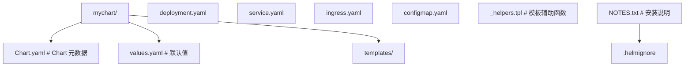
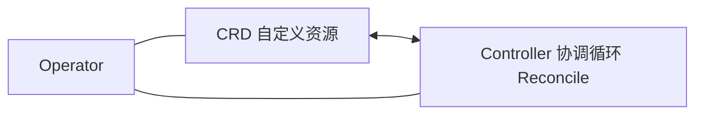
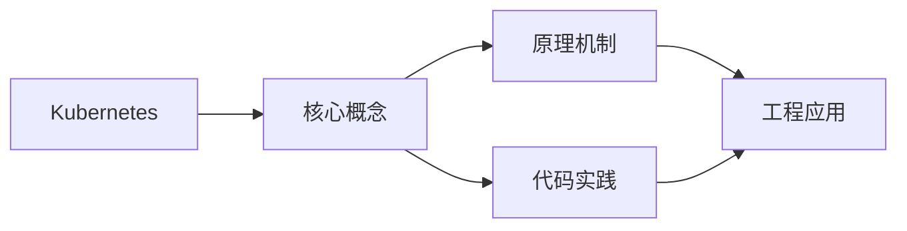
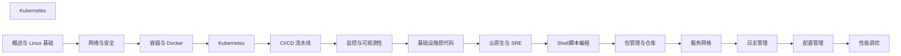

## 1. 学习目标（Bloom 分类）

本节按照布鲁姆教育目标分类学组织学习路径。本文主题为《Kubernetes》，属于 DevOps 模块，读者可以根据自身阶段选择阅读深度。

记忆层面：能够准确复述本文的核心概念、术语与基本语法或操作步骤，并能够在提问或检索时快速定位对应知识点。能够说出 DevOps 的核心概念、组件与标准流程。

理解层面：能够用自己的语言解释核心原理与工作机制，说明概念之间的因果关系，而不是机械记忆结论。能够解释 DevOps 的工作原理与关键机制。

应用层面：能够在真实项目或练习场景中运用本文知识解决具体问题，写出正确且可维护的实现。能够执行 DevOps 相关的标准操作与配置。

分析层面：能够拆解复杂问题，比较本文主题与相邻概念的异同，识别边界条件与例外情况。能够分析 DevOps 方案在可靠性、成本与性能上的权衡。

评价层面：能够根据约束条件（性能、可读性、安全、成本）评价不同方案的优劣，做出有依据的技术决策。能够评价 DevOps 中的技术选型。

创造层面：能够把本文知识与其他模块知识组合，设计出新的解决方案或可复用的工程模式。能够设计基于 DevOps 的完整解决方案。

通过本节学习，读者应当能够把《Kubernetes》纳入自己的知识网络，并与 DevOps 模块的其他主题（CI/CD、容器、编排、监控、GitOps）建立关联。

## 2. 历史动机与发展脉络

《Kubernetes》是 DevOps 领域的重要主题。要真正理解它，需要先了解它解决的问题与演进过程。

DevOps 源于 2009 年（“DevOpsDays”），核心是打破开发与运维壁垒，用自动化与协作缩短交付周期；CALMS 文化（文化、自动化、精益、度量、共享）是其框架。
技术栈演进：持续集成（CI）与持续交付（CD）、基础设施即代码（IaC）、容器（Docker）与编排（Kubernetes）、可观测性（监控/日志/追踪）。
2020 年代趋势：GitOps（声明式 + 自动同步）、平台工程（内部开发者平台）、FinOps（成本治理）、AI 辅助运维。

回到本文主题：Kubernetes 的提出与成熟，正是上述技术背景下的必然产物。早期实现往往以简单可用为目标，随着工程规模扩大，社区逐渐沉淀出标准做法与最佳实践；理解这一脉络，可以帮助读者判断“为什么文档中的推荐写法是现在这个样子”，也能在遇到历史遗留代码时准确识别其设计年代与取舍。


## 3. 形式化定义与核心概念精讲

本节把《Kubernetes》涉及的核心概念以“定义 + 讲解”的形式展开。读者应把定义当作工具，把讲解当作理解路径；两者结合才能形成可迁移的知识。

CI/CD 管线：代码提交 -> 构建 -> 测试 -> 制品 -> 部署；流水线即代码（GitHub Actions/Jenkins/GitLab CI）。
容器与镜像：OCI 规范、Dockerfile 分层、镜像仓库与签名；容器隔离（cgroup/namespace）。
编排：Kubernetes 的 Pod/Deployment/Service 抽象；声明式期望状态与控制器调和。

### 3.1 原文章节逐一精讲

原文档把主题拆分为 20 个小节，下面按顺序给出每一节的导读讲解，随后保留原文细节供精读。

#### 原文精读（完整保留）

# DevOps Kubernetes 资源 YAML

> **符号约定**：`< >` 必填参数 | `[ ]` 可选参数

---

#### 1. Kubernetes 架构

##### 1.1 整体架构

```mermaid
flowchart TD
    subgraph CP[Control Plane]
        API[API Server] SCH[Scheduler] CM[Controller Manager]
        ETCD[etcd 集群状态存储]
    end
    N1[Node 1<br/>kubelet Proxy Pods]
    N2[Node 2<br/>kubelet Proxy Pods]
    N3[Node 3<br/>kubelet Proxy Pods]
    NN[Node N<br/>kubelet Proxy Pods]
    CP --> N1
    CP --> N2
    CP --> N3
    CP --> NN
```

##### 1.2 核心组件

| 组件                   | 职责                                 |
| :--------------------- | :----------------------------------- |
| **API Server**         | 集群入口，RESTful API                |
| **etcd**               | 分布式 KV 存储，保存集群状态         |
| **Scheduler**          | Pod 调度到 Node                      |
| **Controller Manager** | 控制器（Deployment/ReplicaSet/Node） |
| **kubelet**            | 节点代理，管理 Pod 生命周期          |
| **kube-proxy**         | 网络代理，Service 转发               |

#### 2. 核心资源

##### 2.1 Pod

```yaml
apiVersion: v1
kind: Pod
metadata:
  name: web-app
  labels:
    app: web
    version: v1
spec:
  containers:
    - name: web
      image: nginx:1.25-alpine
      ports:
        - containerPort: 80
      resources:
        requests:
          cpu: 100m
          memory: 128Mi
        limits:
          cpu: 500m
          memory: 512Mi
      env:
        - name: NODE_ENV
          value: 'production'
        - name: DB_PASSWORD
          valueFrom:
            secretKeyRef:
              name: db-secret
              key: password
      livenessProbe:
        httpGet:
          path: /health
          port: 80
        initialDelaySeconds: 15
        periodSeconds: 10
      readinessProbe:
        httpGet:
          path: /ready
          port: 80
        initialDelaySeconds: 5
        periodSeconds: 5
      volumeMounts:
        - name: config
          mountPath: /etc/config
          readOnly: true
  volumes:
    - name: config
      configMap:
        name: app-config
  restartPolicy: Always
```

##### 2.2 Deployment

```yaml
apiVersion: apps/v1
kind: Deployment
metadata:
  name: web-deployment
spec:
  replicas: 3
  selector:
    matchLabels:
      app: web
  strategy:
    type: RollingUpdate
    rollingUpdate:
      maxSurge: 1
      maxUnavailable: 0
  template:
    metadata:
      labels:
        app: web
    spec:
      containers:
        - name: web
          image: myapp:v2
          ports:
            - containerPort: 8080
          resources:
            requests:
              cpu: 100m
              memory: 128Mi
            limits:
              cpu: 500m
              memory: 512Mi
```

##### 2.3 Service

```yaml
# ClusterIP（集群内部访问）
apiVersion: v1
kind: Service
metadata:
  name: web-service
spec:
  type: ClusterIP
  selector:
    app: web
  ports:
    - port: 80
      targetPort: 8080

---
# NodePort（节点端口暴露）
apiVersion: v1
kind: Service
metadata:
  name: web-nodeport
spec:
  type: NodePort
  selector:
    app: web
  ports:
    - port: 80
      targetPort: 8080
      nodePort: 30080

---
# LoadBalancer（云厂商负载均衡）
apiVersion: v1
kind: Service
metadata:
  name: web-lb
spec:
  type: LoadBalancer
  selector:
    app: web
  ports:
    - port: 80
      targetPort: 8080
```

##### 2.4 Ingress

```yaml
apiVersion: networking.k8s.io/v1
kind: Ingress
metadata:
  name: web-ingress
  annotations:
    nginx.ingress.kubernetes.io/ssl-redirect: 'true'
    nginx.ingress.kubernetes.io/rate-limit: '100'
    cert-manager.io/cluster-issuer: letsencrypt-prod
spec:
  ingressClassName: nginx
  tls:
    - hosts:
        - example.com
      secretName: example-tls
  rules:
    - host: example.com
      http:
        paths:
          - path: /
            pathType: Prefix
            backend:
              service:
                name: web-service
                port:
                  number: 80
          - path: /api
            pathType: Prefix
            backend:
              service:
                name: api-service
                port:
                  number: 80
```

#### 3. ConfigMap 与 Secret

##### 3.1 ConfigMap

```yaml
apiVersion: v1
kind: ConfigMap
metadata:
  name: app-config
data:
  # 键值对
  DATABASE_HOST: 'postgres.default.svc.cluster.local'
  DATABASE_PORT: '5432'
  LOG_LEVEL: 'info'
  # 完整配置文件
  nginx.conf: |
    server {
      listen 80;
      location / {
        proxy_pass http://web-service:8080;
      }
    }
```

##### 3.2 Secret

```yaml
apiVersion: v1
kind: Secret
metadata:
  name: db-secret
type: Opaque
data:
  # Base64 编码
  username: YWRtaW4= # admin
  password: c2VjcmV0MTIz # secret123
stringData:
  # 明文（创建时自动编码）
  api-key: 'my-api-key-12345'
```

```bash
# 创建 Secret
kubectl create secret generic db-secret \
  --from-literal=username=admin \
  --from-literal=password=secret123

# 从文件创建
kubectl create secret generic tls-secret \
  --from-file=tls.crt=./cert.pem \
  --from-file=tls.key=./key.pem
```

#### 4. 自动扩缩容

##### 4.1 HPA（水平扩缩容）

```yaml
apiVersion: autoscaling/v2
kind: HorizontalPodAutoscaler
metadata:
  name: web-hpa
spec:
  scaleTargetRef:
    apiVersion: apps/v1
    kind: Deployment
    name: web-deployment
  minReplicas: 2
  maxReplicas: 10
  metrics:
    - type: Resource
      resource:
        name: cpu
        target:
          type: Utilization
          averageUtilization: 70
    - type: Resource
      resource:
        name: memory
        target:
          type: Utilization
          averageUtilization: 80
  behavior:
    scaleUp:
      stabilizationWindowSeconds: 60
      policies:
        - type: Percent
          value: 100
          periodSeconds: 60
    scaleDown:
      stabilizationWindowSeconds: 300
      policies:
        - type: Percent
          value: 10
          periodSeconds: 60
```

##### 4.2 VPA（垂直扩缩容）

```yaml
apiVersion: autoscaling.k8s.io/v1
kind: VerticalPodAutoscaler
metadata:
  name: web-vpa
spec:
  targetRef:
    apiVersion: apps/v1
    kind: Deployment
    name: web-deployment
  updatePolicy:
    updateMode: Auto # Off / Initial / Recreate / Auto
  resourcePolicy:
    containerPolicies:
      - containerName: web
        minAllowed:
          cpu: 100m
          memory: 128Mi
        maxAllowed:
          cpu: '2'
          memory: 2Gi
```

#### 5. 存储

##### 5.1 PV 与 PVC

```yaml
# PersistentVolume
apiVersion: v1
kind: PersistentVolume
metadata:
  name: nfs-pv
spec:
  capacity:
    storage: 10Gi
  accessModes:
    - ReadWriteMany
  nfs:
    server: nfs-server.default.svc.cluster.local
    path: /data/share

---
# PersistentVolumeClaim
apiVersion: v1
kind: PersistentVolumeClaim
metadata:
  name: data-pvc
spec:
  accessModes:
    - ReadWriteOnce
  resources:
    requests:
      storage: 5Gi
  storageClassName: standard
```

##### 5.2 StorageClass

```yaml
apiVersion: storage.k8s.io/v1
kind: StorageClass
metadata:
  name: fast-ssd
provisioner: kubernetes.io/aws-ebs
parameters:
  type: gp3
  iopsPerGB: '50'
reclaimPolicy: Retain
allowVolumeExpansion: true
volumeBindingMode: WaitForFirstConsumer
```

#### 6. 网络策略

```yaml
# 默认拒绝所有入站
apiVersion: networking.k8s.io/v1
kind: NetworkPolicy
metadata:
  name: default-deny-ingress
  namespace: production
spec:
  podSelector: {}
  policyTypes:
    - Ingress

---
# 允许特定 Pod 访问
apiVersion: networking.k8s.io/v1
kind: NetworkPolicy
metadata:
  name: allow-frontend-to-api
  namespace: production
spec:
  podSelector:
    matchLabels:
      app: api
  policyTypes:
    - Ingress
  ingress:
    - from:
        - podSelector:
            matchLabels:
              app: frontend
      ports:
        - protocol: TCP
          port: 8080
```

#### 7. Helm

##### 7.1 Chart 结构



##### 7.2 Chart.yaml

```yaml
apiVersion: v2
name: myapp
description: My Application Helm Chart
type: application
version: 1.0.0
appVersion: '2.0.0'
dependencies:
  - name: postgresql
    version: '14.x.x'
    repository: 'https://charts.bitnami.com/bitnami'
    condition: postgresql.enabled
```

##### 7.3 values.yaml

```yaml
replicaCount: 3

image:
  repository: myapp
  pullPolicy: IfNotPresent
  tag: '2.0.0'

service:
  type: ClusterIP
  port: 80

ingress:
  enabled: true
  className: nginx
  hosts:
    - host: example.com
      paths:
        - path: /
          pathType: Prefix

resources:
  requests:
    cpu: 100m
    memory: 128Mi
  limits:
    cpu: 500m
    memory: 512Mi

postgresql:
  enabled: true
  auth:
    database: myapp
    username: app
    password: changeme
```

##### 7.4 Helm 命令

```bash
# 仓库管理
helm repo add bitnami https://charts.bitnami.com/bitnami
helm repo update

# 安装/升级
helm install myapp ./mychart                    # 本地 Chart
helm install myapp bitnami/nginx                # 仓库 Chart
helm upgrade myapp ./mychart --set replicaCount=5  # 升级
helm upgrade --install myapp ./mychart -f values-prod.yaml  # 安装或升级

# 管理
helm list                                       # 列出发布
helm status myapp                               # 查看状态
helm rollback myapp 1                           # 回滚
helm uninstall myapp                            # 卸载

# 调试
helm template myapp ./mychart                   # 渲染模板
helm lint ./mychart                             # 检查 Chart
helm diff upgrade myapp ./mychart               # 查看变更（需插件）
```

#### 8. Operator 模式

##### 8.1 Operator 原理

Operator = CRD（自定义资源） + Controller（控制器逻辑），将运维知识编码为软件。



##### 8.2 CRD 定义

```yaml
apiVersion: apiextensions.k8s.io/v1
kind: CustomResourceDefinition
metadata:
  name: webapps.apps.example.com
spec:
  group: apps.example.com
  versions:
    - name: v1
      served: true
      storage: true
      schema:
        openAPIV3Schema:
          type: object
          properties:
            spec:
              type: object
              properties:
                replicas:
                  type: integer
                  minimum: 1
                  maximum: 100
                image:
                  type: string
  scope: Namespaced
  names:
    plural: webapps
    singular: webapp
    kind: WebApp
    shortNames:
      - wa
```

##### 8.3 常用 Operator

| Operator                | 功能           | 适用场景     |
| :---------------------- | :------------- | :----------- |
| **Prometheus Operator** | 管控监控栈     | 可观测性     |
| **Cert Manager**        | 证书管理       | TLS 自动化   |
| **ArgoCD**              | GitOps 部署    | 持续交付     |
| **MySQL Operator**      | MySQL 集群管理 | 数据库运维   |
| **Kafka Operator**      | Kafka 集群管理 | 消息队列运维 |

#### 9. 常用 kubectl 命令

```bash
# 资源查看
kubectl get pods -A                        # 所有命名空间的 Pod
kubectl get pods -o wide                   # 详细信息
kubectl get all -n production              # 命名空间所有资源
kubectl describe pod web-app               # 详细描述
kubectl top pods                           # 资源使用

# 调试
kubectl logs -f web-app                    # 查看日志
kubectl logs web-app -c sidecar            # 指定容器
kubectl exec -it web-app -- bash           # 进入容器
kubectl port-forward svc/web 8080:80       # 端口转发

# 资源管理
kubectl apply -f deployment.yaml           # 应用配置
kubectl delete -f deployment.yaml          # 删除资源
kubectl scale deployment web --replicas=5  # 扩缩容
kubectl rollout restart deployment web     # 重启
kubectl rollout undo deployment web        # 回滚
kubectl rollout status deployment web      # 查看状态

# 上下文管理
kubectl config get-contexts
kubectl config use-context prod-cluster
```

#### 10. 小结

Kubernetes 是容器编排的事实标准：

1. **架构**理解 Control Plane 和 Node 组件的职责是排障基础
2. **核心资源**（Pod/Deployment/Service/Ingress）覆盖了大部分应用场景
3. **ConfigMap/Secret** 管理配置和敏感信息，避免硬编码
4. **HPA/VPA** 实现自动扩缩容，应对流量波动
5. **Helm** 是 K8s 应用的包管理器，简化部署和管理
6. **Operator** 将运维知识编码化，适合有状态应用
#### Pod 资源定义

**基本写法：定义 Pod**
```yaml
`apiVersion: v1
kind: Pod
metadata:
  name: <名称>
spec:
  containers:
    - name: <容器名>
      image: <镜像>`
```
```yaml
# 定义 nginx Pod
apiVersion: v1
kind: Pod
metadata:
  name: nginx
spec:
  containers:
    - name: nginx
      image: nginx:1.25
      ports:
        - containerPort: 80
```

**基本写法：多容器 Pod**
```yaml
`spec:
  containers:
    - name: <容器1>
      image: <镜像1>
    - name: <容器2>
      image: <镜像2>`
```
```yaml
# 定义多容器 Pod
apiVersion: v1
kind: Pod
metadata:
  name: app-with-sidecar
spec:
  containers:
    - name: app
      image: myapp:v1
    - name: log-sidecar
      image: busybox
      args: [/bin/sh, -c, "tail -f /log/app.log"]
```

---

#### Deployment 资源定义

**基本写法：定义 Deployment**
```yaml
`apiVersion: apps/v1
kind: Deployment
metadata:
  name: <名称>
spec:
  replicas: <副本数>
  selector:
    matchLabels:
      app: <标签>
  template:
    metadata:
      labels:
        app: <标签>
    spec:
      containers:
        - name: <容器名>
          image: <镜像>`
```
```yaml
# 定义 nginx Deployment
apiVersion: apps/v1
kind: Deployment
metadata:
  name: nginx
spec:
  replicas: 3
  selector:
    matchLabels:
      app: nginx
  template:
    metadata:
      labels:
        app: nginx
    spec:
      containers:
        - name: nginx
          image: nginx:1.25
          ports:
            - containerPort: 80
```

---

#### Service 资源定义

**基本写法：定义 ClusterIP Service**
```yaml
`apiVersion: v1
kind: Service
metadata:
  name: <名称>
spec:
  selector:
    app: <标签>
  ports:
    - port: <端口>
      targetPort: <目标端口>`
```
```yaml
# 定义 ClusterIP Service
apiVersion: v1
kind: Service
metadata:
  name: nginx-svc
spec:
  selector:
    app: nginx
  ports:
    - port: 80
      targetPort: 80
```

**基本写法：定义 NodePort Service**
```yaml
`spec:
  type: NodePort
  ports:
    - port: <端口>
      targetPort: <目标端口>
      nodePort: <节点端口>`
```
```yaml
# 定义 NodePort Service
apiVersion: v1
kind: Service
metadata:
  name: nginx-nodeport
spec:
  type: NodePort
  selector:
    app: nginx
  ports:
    - port: 80
      targetPort: 80
      nodePort: 30080
```

**基本写法：定义 LoadBalancer Service**
```yaml
`spec:
  type: LoadBalancer
  ports:
    - port: <端口>`
```
```yaml
# 定义 LoadBalancer Service
apiVersion: v1
kind: Service
metadata:
  name: nginx-lb
spec:
  type: LoadBalancer
  selector:
    app: nginx
  ports:
    - port: 80
      targetPort: 80
```

---

#### ConfigMap 资源定义

**基本写法：定义 ConfigMap**
```yaml
`apiVersion: v1
kind: ConfigMap
metadata:
  name: <名称>
data:
  <键>: <值>`
```
```yaml
# 定义应用配置 ConfigMap
apiVersion: v1
kind: ConfigMap
metadata:
  name: app-config
data:
  APP_ENV: production
  LOG_LEVEL: info
  config.yaml: |
    server:
      port: 8080
      host: 0.0.0.0
```

---

#### Secret 资源定义

**基本写法：定义 Opaque Secret**
```yaml
`apiVersion: v1
kind: Secret
metadata:
  name: <名称>
type: Opaque
data:
  <键>: <Base64值>`
```
```yaml
# 定义数据库密码 Secret
apiVersion: v1
kind: Secret
metadata:
  name: db-secret
type: Opaque
data:
  username: YWRtaW4=
  password: c2VjcmV0MTIz
```

**基本写法：使用 stringData 明文**
```yaml
`apiVersion: v1
kind: Secret
metadata:
  name: <名称>
type: Opaque
stringData:
  <键>: <明文值>`
```
```yaml
# 使用明文定义 Secret
apiVersion: v1
kind: Secret
metadata:
  name: db-secret
type: Opaque
stringData:
  username: admin
  password: secret123
```

---

#### Ingress 资源定义

**基本写法：定义 Ingress**
```yaml
`apiVersion: networking.k8s.io/v1
kind: Ingress
metadata:
  name: <名称>
spec:
  rules:
    - host: <域名>
      http:
        paths:
          - path: <路径>
            pathType: Prefix
            backend:
              service:
                name: <服务名>
                port:
                  number: <端口>`
```
```yaml
# 定义 nginx Ingress
apiVersion: networking.k8s.io/v1
kind: Ingress
metadata:
  name: nginx-ingress
spec:
  rules:
    - host: example.com
      http:
        paths:
          - path: /
            pathType: Prefix
            backend:
              service:
                name: nginx-svc
                port:
                  number: 80
```

---

#### 资源配额与限制

**基本写法：定义资源请求和限制**
```yaml
`spec:
  containers:
    - name: <名称>
      resources:
        requests:
          cpu: <CPU请求>
          memory: <内存请求>
        limits:
          cpu: <CPU限制>
          memory: <内存限制>`
```
```yaml
# 设置容器资源配额
apiVersion: v1
kind: Pod
metadata:
  name: app
spec:
  containers:
    - name: app
      image: myapp
      resources:
        requests:
          cpu: 100m
          memory: 128Mi
        limits:
          cpu: 500m
          memory: 512Mi
```

---

#### 健康检查

**基本写法：定义存活探针**
```yaml
`spec:
  containers:
    - name: <名称>
      livenessProbe:
        httpGet:
          path: <路径>
          port: <端口>
        initialDelaySeconds: <秒数>`
```
```yaml
# 定义 HTTP 存活探针
apiVersion: v1
kind: Pod
metadata:
  name: app
spec:
  containers:
    - name: app
      image: myapp
      livenessProbe:
        httpGet:
          path: /health
          port: 8080
        initialDelaySeconds: 30
        periodSeconds: 10
```

**基本写法：定义就绪探针**
```yaml
`spec:
  containers:
    - name: <名称>
      readinessProbe:
        httpGet:
          path: <路径>
          port: <端口>`
```
```yaml
# 定义 HTTP 就绪探针
spec:
  containers:
    - name: app
      image: myapp
      readinessProbe:
        httpGet:
          path: /ready
          port: 8080
        initialDelaySeconds: 5
        periodSeconds: 10
```

---

#### 持久化存储

**基本写法：定义 PersistentVolumeClaim**
```yaml
`apiVersion: v1
kind: PersistentVolumeClaim
metadata:
  name: <名称>
spec:
  accessModes:
    - ReadWriteOnce
  resources:
    requests:
      storage: <大小>`
```
```yaml
# 定义 10GB 的 PVC
apiVersion: v1
kind: PersistentVolumeClaim
metadata:
  name: data-pvc
spec:
  accessModes:
    - ReadWriteOnce
  resources:
    requests:
      storage: 10Gi
```

**基本写法：在 Pod 中使用 PVC**
```yaml
`spec:
  containers:
    - name: <名称>
      volumeMounts:
        - mountPath: <挂载路径>
          name: <卷名>
  volumes:
    - name: <卷名>
      persistentVolumeClaim:
        claimName: <PVC名称>`
```
```yaml
# 在 Pod 中挂载 PVC
spec:
  containers:
    - name: app
      image: myapp
      volumeMounts:
        - mountPath: /data
          name: data-volume
  volumes:
    - name: data-volume
      persistentVolumeClaim:
        claimName: data-pvc
```

---

#### 命名空间

**基本写法：定义 Namespace**
```yaml
`apiVersion: v1
kind: Namespace
metadata:
  name: <名称>`
```
```yaml
# 定义开发环境命名空间
apiVersion: v1
kind: Namespace
metadata:
  name: dev
  labels:
    name: dev
```

**基本写法：定义 ResourceQuota**
```yaml
`apiVersion: v1
kind: ResourceQuota
metadata:
  name: <名称>
  namespace: <命名空间>
spec:
  hard:
    requests.cpu: <CPU总量>
    requests.memory: <内存总量>`
```
```yaml
# 限制命名空间资源配额
apiVersion: v1
kind: ResourceQuota
metadata:
  name: dev-quota
  namespace: dev
spec:
  hard:
    requests.cpu: "4"
    requests.memory: 8Gi
    limits.cpu: "8"
    limits.memory: 16Gi
```


### 3.2 概念关系图

下面用 Mermaid 图表达本文核心概念之间的关系，帮助读者建立整体图景：



图中展示的是本文知识的结构化关系：核心概念是入口，原理机制解释“为什么”，代码实践演示“怎么做”，工程应用回答“何时用”。读者学习时可以把每个小节的内容挂接到对应节点上。

## 4. 理论推导与原理解析

本节深入《Kubernetes》背后的原理。理论部分不求面面俱到，而是聚焦“能解释现象、能指导实践”的关键推导。

CI/CD 管线：代码提交 -> 构建 -> 测试 -> 制品 -> 部署；流水线即代码（GitHub Actions/Jenkins/GitLab CI）。
容器与镜像：OCI 规范、Dockerfile 分层、镜像仓库与签名；容器隔离（cgroup/namespace）。
编排：Kubernetes 的 Pod/Deployment/Service 抽象；声明式期望状态与控制器调和。
可观测性三支柱：指标（Prometheus）、日志（Loki/ELK）、追踪（OpenTelemetry）。

需要强调的是，理论推导与工程实践之间存在翻译层：理论给出的是理想化模型与边界条件，工程代码则必须处理真实环境中的例外。读者在学习时应先掌握理论的“标准情形”，再通过陷阱章节了解“非标准情形”。

## 5. 代码示例与逐行讲解

本节把原文中的代码示例系统整理，并为每个示例补充用途说明与讲解。读者不应只浏览代码，而应逐段对照讲解理解设计意图。

### 5.1 示例：1.1 整体架构

该示例来自原文《1.1 整体架构》小节，用于演示Kubernetes相关操作。阅读时请先看代码结构，再看其后的讲解。

```mermaid
flowchart TD
    subgraph CP[Control Plane]
        API[API Server] SCH[Scheduler] CM[Controller Manager]
        ETCD[etcd 集群状态存储]
    end
    N1[Node 1<br/>kubelet Proxy Pods]
    N2[Node 2<br/>kubelet Proxy Pods]
    N3[Node 3<br/>kubelet Proxy Pods]
    NN[Node N<br/>kubelet Proxy Pods]
    CP --> N1
    CP --> N2
    CP --> N3
    CP --> NN
```

讲解：这段代码演示了本节核心知识点。代码中的关键操作可以归纳为三步：准备（定义或初始化）、执行（核心逻辑）、收尾（释放资源或返回结果）。实际项目中，这三步往往被封装为函数或类，以提升复用性与可测试性。

关键点分析：

该示例共 13 行有效代码，结构以数据或配置为主。阅读时应关注：数据字段的含义、配置项的作用，以及它们与运行行为的对应关系。

进阶思考路径：先尝试修改参数观察行为变化，再把示例中的模式迁移到自己的项目中；每次修改都记录预期与实测差异，这是把示例转化为能力的最快方式。

### 5.2 示例：2.1 Pod

该示例来自原文《2.1 Pod》小节，用于演示Kubernetes相关操作。阅读时请先看代码结构，再看其后的讲解。

```yaml
apiVersion: v1
kind: Pod
metadata:
  name: web-app
  labels:
    app: web
    version: v1
spec:
  containers:
    - name: web
      image: nginx:1.25-alpine
      ports:
        - containerPort: 80
      resources:
        requests:
          cpu: 100m
          memory: 128Mi
        limits:
          cpu: 500m
          memory: 512Mi
      env:
        - name: NODE_ENV
          value: 'production'
        - name: DB_PASSWORD
          valueFrom:
            secretKeyRef:
              name: db-secret
              key: password
      livenessProbe:
        httpGet:
          path: /health
          port: 80
        initialDelaySeconds: 15
        periodSeconds: 10
      readinessProbe:
        httpGet:
          path: /ready
          port: 80
        initialDelaySeconds: 5
        periodSeconds: 5
      volumeMounts:
        - name: config
          mountPath: /etc/config
          readOnly: true
  volumes:
    - name: config
      configMap:
        name: app-config
  restartPolicy: Always
```

讲解：这段代码演示了本节核心知识点。代码中的关键操作可以归纳为三步：准备（定义或初始化）、执行（核心逻辑）、收尾（释放资源或返回结果）。实际项目中，这三步往往被封装为函数或类，以提升复用性与可测试性。

关键点分析：

该示例共 49 行有效代码，包含 1 类关键结构（apiVersion）。其中：

- 入口与初始化部分负责建立上下文，对应实际项目中的启动或装配逻辑；
- 核心逻辑部分体现本文主题的主要操作，是阅读时最需要对照讲解理解的部分；
- 输出或返回部分把结果交给调用方，注意其类型与边界条件。

进阶思考路径：先尝试修改参数观察行为变化，再把示例中的模式迁移到自己的项目中；每次修改都记录预期与实测差异，这是把示例转化为能力的最快方式。

### 5.3 示例：2.2 Deployment

该示例来自原文《2.2 Deployment》小节，用于演示Kubernetes相关操作。阅读时请先看代码结构，再看其后的讲解。

```yaml
apiVersion: apps/v1
kind: Deployment
metadata:
  name: web-deployment
spec:
  replicas: 3
  selector:
    matchLabels:
      app: web
  strategy:
    type: RollingUpdate
    rollingUpdate:
      maxSurge: 1
      maxUnavailable: 0
  template:
    metadata:
      labels:
        app: web
    spec:
      containers:
        - name: web
          image: myapp:v2
          ports:
            - containerPort: 8080
          resources:
            requests:
              cpu: 100m
              memory: 128Mi
            limits:
              cpu: 500m
              memory: 512Mi
```

讲解：这段代码演示了本节核心知识点。代码中的关键操作可以归纳为三步：准备（定义或初始化）、执行（核心逻辑）、收尾（释放资源或返回结果）。实际项目中，这三步往往被封装为函数或类，以提升复用性与可测试性。

关键点分析：

该示例共 31 行有效代码，包含 1 类关键结构（apiVersion）。其中：

- 入口与初始化部分负责建立上下文，对应实际项目中的启动或装配逻辑；
- 核心逻辑部分体现本文主题的主要操作，是阅读时最需要对照讲解理解的部分；
- 输出或返回部分把结果交给调用方，注意其类型与边界条件。

进阶思考路径：先尝试修改参数观察行为变化，再把示例中的模式迁移到自己的项目中；每次修改都记录预期与实测差异，这是把示例转化为能力的最快方式。

### 5.4 示例：2.3 Service

该示例来自原文《2.3 Service》小节，用于演示Kubernetes相关操作。阅读时请先看代码结构，再看其后的讲解。

```yaml
# ClusterIP（集群内部访问）
apiVersion: v1
kind: Service
metadata:
  name: web-service
spec:
  type: ClusterIP
  selector:
    app: web
  ports:
    - port: 80
      targetPort: 8080

---
# NodePort（节点端口暴露）
apiVersion: v1
kind: Service
metadata:
  name: web-nodeport
spec:
  type: NodePort
  selector:
    app: web
  ports:
    - port: 80
      targetPort: 8080
      nodePort: 30080

---
# LoadBalancer（云厂商负载均衡）
apiVersion: v1
kind: Service
metadata:
  name: web-lb
spec:
  type: LoadBalancer
  selector:
    app: web
  ports:
    - port: 80
      targetPort: 8080
```

讲解：这段代码演示了本节核心知识点。代码中的关键操作可以归纳为三步：准备（定义或初始化）、执行（核心逻辑）、收尾（释放资源或返回结果）。实际项目中，这三步往往被封装为函数或类，以提升复用性与可测试性。

关键点分析：

该示例共 39 行有效代码，包含 1 类关键结构（apiVersion）。其中：

- 入口与初始化部分负责建立上下文，对应实际项目中的启动或装配逻辑；
- 核心逻辑部分体现本文主题的主要操作，是阅读时最需要对照讲解理解的部分；
- 输出或返回部分把结果交给调用方，注意其类型与边界条件。

进阶思考路径：先尝试修改参数观察行为变化，再把示例中的模式迁移到自己的项目中；每次修改都记录预期与实测差异，这是把示例转化为能力的最快方式。

### 5.5 示例：2.4 Ingress

该示例来自原文《2.4 Ingress》小节，用于演示Kubernetes相关操作。阅读时请先看代码结构，再看其后的讲解。

```yaml
apiVersion: networking.k8s.io/v1
kind: Ingress
metadata:
  name: web-ingress
  annotations:
    nginx.ingress.kubernetes.io/ssl-redirect: 'true'
    nginx.ingress.kubernetes.io/rate-limit: '100'
    cert-manager.io/cluster-issuer: letsencrypt-prod
spec:
  ingressClassName: nginx
  tls:
    - hosts:
        - example.com
      secretName: example-tls
  rules:
    - host: example.com
      http:
        paths:
          - path: /
            pathType: Prefix
            backend:
              service:
                name: web-service
                port:
                  number: 80
          - path: /api
            pathType: Prefix
            backend:
              service:
                name: api-service
                port:
                  number: 80
```

讲解：这段代码演示了本节核心知识点。代码中的关键操作可以归纳为三步：准备（定义或初始化）、执行（核心逻辑）、收尾（释放资源或返回结果）。实际项目中，这三步往往被封装为函数或类，以提升复用性与可测试性。

关键点分析：

该示例共 32 行有效代码，包含 1 类关键结构（apiVersion）。其中：

- 入口与初始化部分负责建立上下文，对应实际项目中的启动或装配逻辑；
- 核心逻辑部分体现本文主题的主要操作，是阅读时最需要对照讲解理解的部分；
- 输出或返回部分把结果交给调用方，注意其类型与边界条件。

进阶思考路径：先尝试修改参数观察行为变化，再把示例中的模式迁移到自己的项目中；每次修改都记录预期与实测差异，这是把示例转化为能力的最快方式。

### 5.6 示例：3.1 ConfigMap

该示例来自原文《3.1 ConfigMap》小节，用于演示Kubernetes相关操作。阅读时请先看代码结构，再看其后的讲解。

```yaml
apiVersion: v1
kind: ConfigMap
metadata:
  name: app-config
data:
  # 键值对
  DATABASE_HOST: 'postgres.default.svc.cluster.local'
  DATABASE_PORT: '5432'
  LOG_LEVEL: 'info'
  # 完整配置文件
  nginx.conf: |
    server {
      listen 80;
      location / {
        proxy_pass http://web-service:8080;
      }
    }
```

讲解：这段代码演示了本节核心知识点。代码中的关键操作可以归纳为三步：准备（定义或初始化）、执行（核心逻辑）、收尾（释放资源或返回结果）。实际项目中，这三步往往被封装为函数或类，以提升复用性与可测试性。

关键点分析：

该示例共 17 行有效代码，包含 1 类关键结构（apiVersion）。其中：

- 入口与初始化部分负责建立上下文，对应实际项目中的启动或装配逻辑；
- 核心逻辑部分体现本文主题的主要操作，是阅读时最需要对照讲解理解的部分；
- 输出或返回部分把结果交给调用方，注意其类型与边界条件。

进阶思考路径：先尝试修改参数观察行为变化，再把示例中的模式迁移到自己的项目中；每次修改都记录预期与实测差异，这是把示例转化为能力的最快方式。

### 5.7 示例：3.2 Secret

该示例来自原文《3.2 Secret》小节，用于演示Kubernetes相关操作。阅读时请先看代码结构，再看其后的讲解。

```yaml
apiVersion: v1
kind: Secret
metadata:
  name: db-secret
type: Opaque
data:
  # Base64 编码
  username: YWRtaW4= # admin
  password: c2VjcmV0MTIz # secret123
stringData:
  # 明文（创建时自动编码）
  api-key: 'my-api-key-12345'
```

讲解：这段代码演示了本节核心知识点。代码中的关键操作可以归纳为三步：准备（定义或初始化）、执行（核心逻辑）、收尾（释放资源或返回结果）。实际项目中，这三步往往被封装为函数或类，以提升复用性与可测试性。

关键点分析：

该示例共 12 行有效代码，包含 1 类关键结构（apiVersion）。其中：

- 入口与初始化部分负责建立上下文，对应实际项目中的启动或装配逻辑；
- 核心逻辑部分体现本文主题的主要操作，是阅读时最需要对照讲解理解的部分；
- 输出或返回部分把结果交给调用方，注意其类型与边界条件。

进阶思考路径：先尝试修改参数观察行为变化，再把示例中的模式迁移到自己的项目中；每次修改都记录预期与实测差异，这是把示例转化为能力的最快方式。

### 5.8 示例：3.2 Secret

该示例来自原文《3.2 Secret》小节，用于演示Kubernetes相关操作。阅读时请先看代码结构，再看其后的讲解。

```bash
# 创建 Secret
kubectl create secret generic db-secret \
  --from-literal=username=admin \
  --from-literal=password=secret123

# 从文件创建
kubectl create secret generic tls-secret \
  --from-file=tls.crt=./cert.pem \
  --from-file=tls.key=./key.pem
```

讲解：这段代码演示了本节核心知识点。代码中的关键操作可以归纳为三步：准备（定义或初始化）、执行（核心逻辑）、收尾（释放资源或返回结果）。实际项目中，这三步往往被封装为函数或类，以提升复用性与可测试性。

关键点分析：

该示例共 8 行有效代码，结构以数据或配置为主。阅读时应关注：数据字段的含义、配置项的作用，以及它们与运行行为的对应关系。

进阶思考路径：先尝试修改参数观察行为变化，再把示例中的模式迁移到自己的项目中；每次修改都记录预期与实测差异，这是把示例转化为能力的最快方式。

### 5.9 示例：4.1 HPA（水平扩缩容）

该示例来自原文《4.1 HPA（水平扩缩容）》小节，用于演示Kubernetes相关操作。阅读时请先看代码结构，再看其后的讲解。

```yaml
apiVersion: autoscaling/v2
kind: HorizontalPodAutoscaler
metadata:
  name: web-hpa
spec:
  scaleTargetRef:
    apiVersion: apps/v1
    kind: Deployment
    name: web-deployment
  minReplicas: 2
  maxReplicas: 10
  metrics:
    - type: Resource
      resource:
        name: cpu
        target:
          type: Utilization
          averageUtilization: 70
    - type: Resource
      resource:
        name: memory
        target:
          type: Utilization
          averageUtilization: 80
  behavior:
    scaleUp:
      stabilizationWindowSeconds: 60
      policies:
        - type: Percent
          value: 100
          periodSeconds: 60
    scaleDown:
      stabilizationWindowSeconds: 300
      policies:
        - type: Percent
          value: 10
          periodSeconds: 60
```

讲解：这段代码演示了本节核心知识点。代码中的关键操作可以归纳为三步：准备（定义或初始化）、执行（核心逻辑）、收尾（释放资源或返回结果）。实际项目中，这三步往往被封装为函数或类，以提升复用性与可测试性。

关键点分析：

该示例共 37 行有效代码，包含 1 类关键结构（apiVersion）。其中：

- 入口与初始化部分负责建立上下文，对应实际项目中的启动或装配逻辑；
- 核心逻辑部分体现本文主题的主要操作，是阅读时最需要对照讲解理解的部分；
- 输出或返回部分把结果交给调用方，注意其类型与边界条件。

进阶思考路径：先尝试修改参数观察行为变化，再把示例中的模式迁移到自己的项目中；每次修改都记录预期与实测差异，这是把示例转化为能力的最快方式。

### 5.10 示例：4.2 VPA（垂直扩缩容）

该示例来自原文《4.2 VPA（垂直扩缩容）》小节，用于演示Kubernetes相关操作。阅读时请先看代码结构，再看其后的讲解。

```yaml
apiVersion: autoscaling.k8s.io/v1
kind: VerticalPodAutoscaler
metadata:
  name: web-vpa
spec:
  targetRef:
    apiVersion: apps/v1
    kind: Deployment
    name: web-deployment
  updatePolicy:
    updateMode: Auto # Off / Initial / Recreate / Auto
  resourcePolicy:
    containerPolicies:
      - containerName: web
        minAllowed:
          cpu: 100m
          memory: 128Mi
        maxAllowed:
          cpu: '2'
          memory: 2Gi
```

讲解：这段代码演示了本节核心知识点。代码中的关键操作可以归纳为三步：准备（定义或初始化）、执行（核心逻辑）、收尾（释放资源或返回结果）。实际项目中，这三步往往被封装为函数或类，以提升复用性与可测试性。

关键点分析：

该示例共 20 行有效代码，包含 1 类关键结构（apiVersion）。其中：

- 入口与初始化部分负责建立上下文，对应实际项目中的启动或装配逻辑；
- 核心逻辑部分体现本文主题的主要操作，是阅读时最需要对照讲解理解的部分；
- 输出或返回部分把结果交给调用方，注意其类型与边界条件。

进阶思考路径：先尝试修改参数观察行为变化，再把示例中的模式迁移到自己的项目中；每次修改都记录预期与实测差异，这是把示例转化为能力的最快方式。

### 5.11 示例：5.1 PV 与 PVC

该示例来自原文《5.1 PV 与 PVC》小节，用于演示Kubernetes相关操作。阅读时请先看代码结构，再看其后的讲解。

```yaml
# PersistentVolume
apiVersion: v1
kind: PersistentVolume
metadata:
  name: nfs-pv
spec:
  capacity:
    storage: 10Gi
  accessModes:
    - ReadWriteMany
  nfs:
    server: nfs-server.default.svc.cluster.local
    path: /data/share

---
# PersistentVolumeClaim
apiVersion: v1
kind: PersistentVolumeClaim
metadata:
  name: data-pvc
spec:
  accessModes:
    - ReadWriteOnce
  resources:
    requests:
      storage: 5Gi
  storageClassName: standard
```

讲解：这段代码演示了本节核心知识点。代码中的关键操作可以归纳为三步：准备（定义或初始化）、执行（核心逻辑）、收尾（释放资源或返回结果）。实际项目中，这三步往往被封装为函数或类，以提升复用性与可测试性。

关键点分析：

该示例共 26 行有效代码，包含 1 类关键结构（apiVersion）。其中：

- 入口与初始化部分负责建立上下文，对应实际项目中的启动或装配逻辑；
- 核心逻辑部分体现本文主题的主要操作，是阅读时最需要对照讲解理解的部分；
- 输出或返回部分把结果交给调用方，注意其类型与边界条件。

进阶思考路径：先尝试修改参数观察行为变化，再把示例中的模式迁移到自己的项目中；每次修改都记录预期与实测差异，这是把示例转化为能力的最快方式。

### 5.12 示例：5.2 StorageClass

该示例来自原文《5.2 StorageClass》小节，用于演示Kubernetes相关操作。阅读时请先看代码结构，再看其后的讲解。

```yaml
apiVersion: storage.k8s.io/v1
kind: StorageClass
metadata:
  name: fast-ssd
provisioner: kubernetes.io/aws-ebs
parameters:
  type: gp3
  iopsPerGB: '50'
reclaimPolicy: Retain
allowVolumeExpansion: true
volumeBindingMode: WaitForFirstConsumer
```

讲解：这段代码演示了本节核心知识点。代码中的关键操作可以归纳为三步：准备（定义或初始化）、执行（核心逻辑）、收尾（释放资源或返回结果）。实际项目中，这三步往往被封装为函数或类，以提升复用性与可测试性。

关键点分析：

该示例共 11 行有效代码，包含 1 类关键结构（apiVersion）。其中：

- 入口与初始化部分负责建立上下文，对应实际项目中的启动或装配逻辑；
- 核心逻辑部分体现本文主题的主要操作，是阅读时最需要对照讲解理解的部分；
- 输出或返回部分把结果交给调用方，注意其类型与边界条件。

进阶思考路径：先尝试修改参数观察行为变化，再把示例中的模式迁移到自己的项目中；每次修改都记录预期与实测差异，这是把示例转化为能力的最快方式。

### 5.13 示例：6. 网络策略

该示例来自原文《6. 网络策略》小节，用于演示Kubernetes相关操作。阅读时请先看代码结构，再看其后的讲解。

```yaml
# 默认拒绝所有入站
apiVersion: networking.k8s.io/v1
kind: NetworkPolicy
metadata:
  name: default-deny-ingress
  namespace: production
spec:
  podSelector: {}
  policyTypes:
    - Ingress

---
# 允许特定 Pod 访问
apiVersion: networking.k8s.io/v1
kind: NetworkPolicy
metadata:
  name: allow-frontend-to-api
  namespace: production
spec:
  podSelector:
    matchLabels:
      app: api
  policyTypes:
    - Ingress
  ingress:
    - from:
        - podSelector:
            matchLabels:
              app: frontend
      ports:
        - protocol: TCP
          port: 8080
```

讲解：这段代码演示了本节核心知识点。代码中的关键操作可以归纳为三步：准备（定义或初始化）、执行（核心逻辑）、收尾（释放资源或返回结果）。实际项目中，这三步往往被封装为函数或类，以提升复用性与可测试性。

关键点分析：

该示例共 31 行有效代码，包含 1 类关键结构（apiVersion）。其中：

- 入口与初始化部分负责建立上下文，对应实际项目中的启动或装配逻辑；
- 核心逻辑部分体现本文主题的主要操作，是阅读时最需要对照讲解理解的部分；
- 输出或返回部分把结果交给调用方，注意其类型与边界条件。

进阶思考路径：先尝试修改参数观察行为变化，再把示例中的模式迁移到自己的项目中；每次修改都记录预期与实测差异，这是把示例转化为能力的最快方式。

### 5.14 示例：7.1 Chart 结构

该示例来自原文《7.1 Chart 结构》小节，用于演示Kubernetes相关操作。阅读时请先看代码结构，再看其后的讲解。


讲解：这段代码演示了本节核心知识点。代码中的关键操作可以归纳为三步：准备（定义或初始化）、执行（核心逻辑）、收尾（释放资源或返回结果）。实际项目中，这三步往往被封装为函数或类，以提升复用性与可测试性。

关键点分析：

该示例共 16 行有效代码，结构以数据或配置为主。阅读时应关注：数据字段的含义、配置项的作用，以及它们与运行行为的对应关系。

进阶思考路径：先尝试修改参数观察行为变化，再把示例中的模式迁移到自己的项目中；每次修改都记录预期与实测差异，这是把示例转化为能力的最快方式。

### 5.15 示例：7.2 Chart.yaml

该示例来自原文《7.2 Chart.yaml》小节，用于演示Kubernetes相关操作。阅读时请先看代码结构，再看其后的讲解。

```yaml
apiVersion: v2
name: myapp
description: My Application Helm Chart
type: application
version: 1.0.0
appVersion: '2.0.0'
dependencies:
  - name: postgresql
    version: '14.x.x'
    repository: 'https://charts.bitnami.com/bitnami'
    condition: postgresql.enabled
```

讲解：这段代码演示了本节核心知识点。代码中的关键操作可以归纳为三步：准备（定义或初始化）、执行（核心逻辑）、收尾（释放资源或返回结果）。实际项目中，这三步往往被封装为函数或类，以提升复用性与可测试性。

关键点分析：

该示例共 11 行有效代码，包含 1 类关键结构（apiVersion）。其中：

- 入口与初始化部分负责建立上下文，对应实际项目中的启动或装配逻辑；
- 核心逻辑部分体现本文主题的主要操作，是阅读时最需要对照讲解理解的部分；
- 输出或返回部分把结果交给调用方，注意其类型与边界条件。

进阶思考路径：先尝试修改参数观察行为变化，再把示例中的模式迁移到自己的项目中；每次修改都记录预期与实测差异，这是把示例转化为能力的最快方式。

### 5.16 示例：7.3 values.yaml

该示例来自原文《7.3 values.yaml》小节，用于演示Kubernetes相关操作。阅读时请先看代码结构，再看其后的讲解。

```yaml
replicaCount: 3

image:
  repository: myapp
  pullPolicy: IfNotPresent
  tag: '2.0.0'

service:
  type: ClusterIP
  port: 80

ingress:
  enabled: true
  className: nginx
  hosts:
    - host: example.com
      paths:
        - path: /
          pathType: Prefix

resources:
  requests:
    cpu: 100m
    memory: 128Mi
  limits:
    cpu: 500m
    memory: 512Mi

postgresql:
  enabled: true
  auth:
    database: myapp
    username: app
    password: changeme
```

讲解：这段代码演示了本节核心知识点。代码中的关键操作可以归纳为三步：准备（定义或初始化）、执行（核心逻辑）、收尾（释放资源或返回结果）。实际项目中，这三步往往被封装为函数或类，以提升复用性与可测试性。

关键点分析：

该示例共 29 行有效代码，包含 1 类关键结构（class）。其中：

- 入口与初始化部分负责建立上下文，对应实际项目中的启动或装配逻辑；
- 核心逻辑部分体现本文主题的主要操作，是阅读时最需要对照讲解理解的部分；
- 输出或返回部分把结果交给调用方，注意其类型与边界条件。

进阶思考路径：先尝试修改参数观察行为变化，再把示例中的模式迁移到自己的项目中；每次修改都记录预期与实测差异，这是把示例转化为能力的最快方式。

### 5.17 示例：7.4 Helm 命令

该示例来自原文《7.4 Helm 命令》小节，用于演示Kubernetes相关操作。阅读时请先看代码结构，再看其后的讲解。

```bash
# 仓库管理
helm repo add bitnami https://charts.bitnami.com/bitnami
helm repo update

# 安装/升级
helm install myapp ./mychart                    # 本地 Chart
helm install myapp bitnami/nginx                # 仓库 Chart
helm upgrade myapp ./mychart --set replicaCount=5  # 升级
helm upgrade --install myapp ./mychart -f values-prod.yaml  # 安装或升级

# 管理
helm list                                       # 列出发布
helm status myapp                               # 查看状态
helm rollback myapp 1                           # 回滚
helm uninstall myapp                            # 卸载

# 调试
helm template myapp ./mychart                   # 渲染模板
helm lint ./mychart                             # 检查 Chart
helm diff upgrade myapp ./mychart               # 查看变更（需插件）
```

讲解：这段代码演示了本节核心知识点。代码中的关键操作可以归纳为三步：准备（定义或初始化）、执行（核心逻辑）、收尾（释放资源或返回结果）。实际项目中，这三步往往被封装为函数或类，以提升复用性与可测试性。

关键点分析：

该示例共 17 行有效代码，结构以数据或配置为主。阅读时应关注：数据字段的含义、配置项的作用，以及它们与运行行为的对应关系。

进阶思考路径：先尝试修改参数观察行为变化，再把示例中的模式迁移到自己的项目中；每次修改都记录预期与实测差异，这是把示例转化为能力的最快方式。

### 5.18 示例：8.1 Operator 原理

该示例来自原文《8.1 Operator 原理》小节，用于演示Kubernetes相关操作。阅读时请先看代码结构，再看其后的讲解。


讲解：这段代码演示了本节核心知识点。代码中的关键操作可以归纳为三步：准备（定义或初始化）、执行（核心逻辑）、收尾（释放资源或返回结果）。实际项目中，这三步往往被封装为函数或类，以提升复用性与可测试性。

关键点分析：

该示例共 5 行有效代码，结构以数据或配置为主。阅读时应关注：数据字段的含义、配置项的作用，以及它们与运行行为的对应关系。

进阶思考路径：先尝试修改参数观察行为变化，再把示例中的模式迁移到自己的项目中；每次修改都记录预期与实测差异，这是把示例转化为能力的最快方式。

### 5.19 示例：8.2 CRD 定义

该示例来自原文《8.2 CRD 定义》小节，用于演示Kubernetes相关操作。阅读时请先看代码结构，再看其后的讲解。

```yaml
apiVersion: apiextensions.k8s.io/v1
kind: CustomResourceDefinition
metadata:
  name: webapps.apps.example.com
spec:
  group: apps.example.com
  versions:
    - name: v1
      served: true
      storage: true
      schema:
        openAPIV3Schema:
          type: object
          properties:
            spec:
              type: object
              properties:
                replicas:
                  type: integer
                  minimum: 1
                  maximum: 100
                image:
                  type: string
  scope: Namespaced
  names:
    plural: webapps
    singular: webapp
    kind: WebApp
    shortNames:
      - wa
```

讲解：这段代码演示了本节核心知识点。代码中的关键操作可以归纳为三步：准备（定义或初始化）、执行（核心逻辑）、收尾（释放资源或返回结果）。实际项目中，这三步往往被封装为函数或类，以提升复用性与可测试性。

关键点分析：

该示例共 30 行有效代码，包含 1 类关键结构（apiVersion）。其中：

- 入口与初始化部分负责建立上下文，对应实际项目中的启动或装配逻辑；
- 核心逻辑部分体现本文主题的主要操作，是阅读时最需要对照讲解理解的部分；
- 输出或返回部分把结果交给调用方，注意其类型与边界条件。

进阶思考路径：先尝试修改参数观察行为变化，再把示例中的模式迁移到自己的项目中；每次修改都记录预期与实测差异，这是把示例转化为能力的最快方式。

### 5.20 示例：9. 常用 kubectl 命令

该示例来自原文《9. 常用 kubectl 命令》小节，用于演示Kubernetes相关操作。阅读时请先看代码结构，再看其后的讲解。

```bash
# 资源查看
kubectl get pods -A                        # 所有命名空间的 Pod
kubectl get pods -o wide                   # 详细信息
kubectl get all -n production              # 命名空间所有资源
kubectl describe pod web-app               # 详细描述
kubectl top pods                           # 资源使用

# 调试
kubectl logs -f web-app                    # 查看日志
kubectl logs web-app -c sidecar            # 指定容器
kubectl exec -it web-app -- bash           # 进入容器
kubectl port-forward svc/web 8080:80       # 端口转发

# 资源管理
kubectl apply -f deployment.yaml           # 应用配置
kubectl delete -f deployment.yaml          # 删除资源
kubectl scale deployment web --replicas=5  # 扩缩容
kubectl rollout restart deployment web     # 重启
kubectl rollout undo deployment web        # 回滚
kubectl rollout status deployment web      # 查看状态

# 上下文管理
kubectl config get-contexts
kubectl config use-context prod-cluster
```

讲解：这段代码演示了本节核心知识点。代码中的关键操作可以归纳为三步：准备（定义或初始化）、执行（核心逻辑）、收尾（释放资源或返回结果）。实际项目中，这三步往往被封装为函数或类，以提升复用性与可测试性。

关键点分析：

该示例共 21 行有效代码，结构以数据或配置为主。阅读时应关注：数据字段的含义、配置项的作用，以及它们与运行行为的对应关系。

进阶思考路径：先尝试修改参数观察行为变化，再把示例中的模式迁移到自己的项目中；每次修改都记录预期与实测差异，这是把示例转化为能力的最快方式。

### 5.21 示例：Pod 资源定义

该示例来自原文《Pod 资源定义》小节，用于演示Kubernetes相关操作。阅读时请先看代码结构，再看其后的讲解。

```yaml
`apiVersion: v1
kind: Pod
metadata:
  name: <名称>
spec:
  containers:
    - name: <容器名>
      image: <镜像>`
```

讲解：这段代码演示了本节核心知识点。代码中的关键操作可以归纳为三步：准备（定义或初始化）、执行（核心逻辑）、收尾（释放资源或返回结果）。实际项目中，这三步往往被封装为函数或类，以提升复用性与可测试性。

关键点分析：

该示例共 8 行有效代码，包含 1 类关键结构（apiVersion）。其中：

- 入口与初始化部分负责建立上下文，对应实际项目中的启动或装配逻辑；
- 核心逻辑部分体现本文主题的主要操作，是阅读时最需要对照讲解理解的部分；
- 输出或返回部分把结果交给调用方，注意其类型与边界条件。

进阶思考路径：先尝试修改参数观察行为变化，再把示例中的模式迁移到自己的项目中；每次修改都记录预期与实测差异，这是把示例转化为能力的最快方式。

### 5.22 示例：Pod 资源定义

该示例来自原文《Pod 资源定义》小节，用于演示Kubernetes相关操作。阅读时请先看代码结构，再看其后的讲解。

```yaml
# 定义 nginx Pod
apiVersion: v1
kind: Pod
metadata:
  name: nginx
spec:
  containers:
    - name: nginx
      image: nginx:1.25
      ports:
        - containerPort: 80
```

讲解：这段代码演示了本节核心知识点。代码中的关键操作可以归纳为三步：准备（定义或初始化）、执行（核心逻辑）、收尾（释放资源或返回结果）。实际项目中，这三步往往被封装为函数或类，以提升复用性与可测试性。

关键点分析：

该示例共 11 行有效代码，包含 1 类关键结构（apiVersion）。其中：

- 入口与初始化部分负责建立上下文，对应实际项目中的启动或装配逻辑；
- 核心逻辑部分体现本文主题的主要操作，是阅读时最需要对照讲解理解的部分；
- 输出或返回部分把结果交给调用方，注意其类型与边界条件。

进阶思考路径：先尝试修改参数观察行为变化，再把示例中的模式迁移到自己的项目中；每次修改都记录预期与实测差异，这是把示例转化为能力的最快方式。

### 5.23 示例：Pod 资源定义

该示例来自原文《Pod 资源定义》小节，用于演示Kubernetes相关操作。阅读时请先看代码结构，再看其后的讲解。

```yaml
`spec:
  containers:
    - name: <容器1>
      image: <镜像1>
    - name: <容器2>
      image: <镜像2>`
```

讲解：这段代码演示了本节核心知识点。代码中的关键操作可以归纳为三步：准备（定义或初始化）、执行（核心逻辑）、收尾（释放资源或返回结果）。实际项目中，这三步往往被封装为函数或类，以提升复用性与可测试性。

关键点分析：

该示例共 6 行有效代码，结构以数据或配置为主。阅读时应关注：数据字段的含义、配置项的作用，以及它们与运行行为的对应关系。

进阶思考路径：先尝试修改参数观察行为变化，再把示例中的模式迁移到自己的项目中；每次修改都记录预期与实测差异，这是把示例转化为能力的最快方式。

### 5.24 示例：Pod 资源定义

该示例来自原文《Pod 资源定义》小节，用于演示Kubernetes相关操作。阅读时请先看代码结构，再看其后的讲解。

```yaml
# 定义多容器 Pod
apiVersion: v1
kind: Pod
metadata:
  name: app-with-sidecar
spec:
  containers:
    - name: app
      image: myapp:v1
    - name: log-sidecar
      image: busybox
      args: [/bin/sh, -c, "tail -f /log/app.log"]
```

讲解：这段代码演示了本节核心知识点。代码中的关键操作可以归纳为三步：准备（定义或初始化）、执行（核心逻辑）、收尾（释放资源或返回结果）。实际项目中，这三步往往被封装为函数或类，以提升复用性与可测试性。

关键点分析：

该示例共 12 行有效代码，包含 1 类关键结构（apiVersion）。其中：

- 入口与初始化部分负责建立上下文，对应实际项目中的启动或装配逻辑；
- 核心逻辑部分体现本文主题的主要操作，是阅读时最需要对照讲解理解的部分；
- 输出或返回部分把结果交给调用方，注意其类型与边界条件。

进阶思考路径：先尝试修改参数观察行为变化，再把示例中的模式迁移到自己的项目中；每次修改都记录预期与实测差异，这是把示例转化为能力的最快方式。

### 5.25 示例：Deployment 资源定义

该示例来自原文《Deployment 资源定义》小节，用于演示Kubernetes相关操作。阅读时请先看代码结构，再看其后的讲解。

```yaml
`apiVersion: apps/v1
kind: Deployment
metadata:
  name: <名称>
spec:
  replicas: <副本数>
  selector:
    matchLabels:
      app: <标签>
  template:
    metadata:
      labels:
        app: <标签>
    spec:
      containers:
        - name: <容器名>
          image: <镜像>`
```

讲解：这段代码演示了本节核心知识点。代码中的关键操作可以归纳为三步：准备（定义或初始化）、执行（核心逻辑）、收尾（释放资源或返回结果）。实际项目中，这三步往往被封装为函数或类，以提升复用性与可测试性。

关键点分析：

该示例共 17 行有效代码，包含 1 类关键结构（apiVersion）。其中：

- 入口与初始化部分负责建立上下文，对应实际项目中的启动或装配逻辑；
- 核心逻辑部分体现本文主题的主要操作，是阅读时最需要对照讲解理解的部分；
- 输出或返回部分把结果交给调用方，注意其类型与边界条件。

进阶思考路径：先尝试修改参数观察行为变化，再把示例中的模式迁移到自己的项目中；每次修改都记录预期与实测差异，这是把示例转化为能力的最快方式。

### 5.26 示例：Deployment 资源定义

该示例来自原文《Deployment 资源定义》小节，用于演示Kubernetes相关操作。阅读时请先看代码结构，再看其后的讲解。

```yaml
# 定义 nginx Deployment
apiVersion: apps/v1
kind: Deployment
metadata:
  name: nginx
spec:
  replicas: 3
  selector:
    matchLabels:
      app: nginx
  template:
    metadata:
      labels:
        app: nginx
    spec:
      containers:
        - name: nginx
          image: nginx:1.25
          ports:
            - containerPort: 80
```

讲解：这段代码演示了本节核心知识点。代码中的关键操作可以归纳为三步：准备（定义或初始化）、执行（核心逻辑）、收尾（释放资源或返回结果）。实际项目中，这三步往往被封装为函数或类，以提升复用性与可测试性。

关键点分析：

该示例共 20 行有效代码，包含 1 类关键结构（apiVersion）。其中：

- 入口与初始化部分负责建立上下文，对应实际项目中的启动或装配逻辑；
- 核心逻辑部分体现本文主题的主要操作，是阅读时最需要对照讲解理解的部分；
- 输出或返回部分把结果交给调用方，注意其类型与边界条件。

进阶思考路径：先尝试修改参数观察行为变化，再把示例中的模式迁移到自己的项目中；每次修改都记录预期与实测差异，这是把示例转化为能力的最快方式。

### 5.27 示例：Service 资源定义

该示例来自原文《Service 资源定义》小节，用于演示Kubernetes相关操作。阅读时请先看代码结构，再看其后的讲解。

```yaml
`apiVersion: v1
kind: Service
metadata:
  name: <名称>
spec:
  selector:
    app: <标签>
  ports:
    - port: <端口>
      targetPort: <目标端口>`
```

讲解：这段代码演示了本节核心知识点。代码中的关键操作可以归纳为三步：准备（定义或初始化）、执行（核心逻辑）、收尾（释放资源或返回结果）。实际项目中，这三步往往被封装为函数或类，以提升复用性与可测试性。

关键点分析：

该示例共 10 行有效代码，包含 1 类关键结构（apiVersion）。其中：

- 入口与初始化部分负责建立上下文，对应实际项目中的启动或装配逻辑；
- 核心逻辑部分体现本文主题的主要操作，是阅读时最需要对照讲解理解的部分；
- 输出或返回部分把结果交给调用方，注意其类型与边界条件。

进阶思考路径：先尝试修改参数观察行为变化，再把示例中的模式迁移到自己的项目中；每次修改都记录预期与实测差异，这是把示例转化为能力的最快方式。

### 5.28 示例：Service 资源定义

该示例来自原文《Service 资源定义》小节，用于演示Kubernetes相关操作。阅读时请先看代码结构，再看其后的讲解。

```yaml
# 定义 ClusterIP Service
apiVersion: v1
kind: Service
metadata:
  name: nginx-svc
spec:
  selector:
    app: nginx
  ports:
    - port: 80
      targetPort: 80
```

讲解：这段代码演示了本节核心知识点。代码中的关键操作可以归纳为三步：准备（定义或初始化）、执行（核心逻辑）、收尾（释放资源或返回结果）。实际项目中，这三步往往被封装为函数或类，以提升复用性与可测试性。

关键点分析：

该示例共 11 行有效代码，包含 1 类关键结构（apiVersion）。其中：

- 入口与初始化部分负责建立上下文，对应实际项目中的启动或装配逻辑；
- 核心逻辑部分体现本文主题的主要操作，是阅读时最需要对照讲解理解的部分；
- 输出或返回部分把结果交给调用方，注意其类型与边界条件。

进阶思考路径：先尝试修改参数观察行为变化，再把示例中的模式迁移到自己的项目中；每次修改都记录预期与实测差异，这是把示例转化为能力的最快方式。

### 5.29 示例：Service 资源定义

该示例来自原文《Service 资源定义》小节，用于演示Kubernetes相关操作。阅读时请先看代码结构，再看其后的讲解。

```yaml
`spec:
  type: NodePort
  ports:
    - port: <端口>
      targetPort: <目标端口>
      nodePort: <节点端口>`
```

讲解：这段代码演示了本节核心知识点。代码中的关键操作可以归纳为三步：准备（定义或初始化）、执行（核心逻辑）、收尾（释放资源或返回结果）。实际项目中，这三步往往被封装为函数或类，以提升复用性与可测试性。

关键点分析：

该示例共 6 行有效代码，结构以数据或配置为主。阅读时应关注：数据字段的含义、配置项的作用，以及它们与运行行为的对应关系。

进阶思考路径：先尝试修改参数观察行为变化，再把示例中的模式迁移到自己的项目中；每次修改都记录预期与实测差异，这是把示例转化为能力的最快方式。

### 5.30 示例：Service 资源定义

该示例来自原文《Service 资源定义》小节，用于演示Kubernetes相关操作。阅读时请先看代码结构，再看其后的讲解。

```yaml
# 定义 NodePort Service
apiVersion: v1
kind: Service
metadata:
  name: nginx-nodeport
spec:
  type: NodePort
  selector:
    app: nginx
  ports:
    - port: 80
      targetPort: 80
      nodePort: 30080
```

讲解：这段代码演示了本节核心知识点。代码中的关键操作可以归纳为三步：准备（定义或初始化）、执行（核心逻辑）、收尾（释放资源或返回结果）。实际项目中，这三步往往被封装为函数或类，以提升复用性与可测试性。

关键点分析：

该示例共 13 行有效代码，包含 1 类关键结构（apiVersion）。其中：

- 入口与初始化部分负责建立上下文，对应实际项目中的启动或装配逻辑；
- 核心逻辑部分体现本文主题的主要操作，是阅读时最需要对照讲解理解的部分；
- 输出或返回部分把结果交给调用方，注意其类型与边界条件。

进阶思考路径：先尝试修改参数观察行为变化，再把示例中的模式迁移到自己的项目中；每次修改都记录预期与实测差异，这是把示例转化为能力的最快方式。

### 5.31 示例：Service 资源定义

该示例来自原文《Service 资源定义》小节，用于演示Kubernetes相关操作。阅读时请先看代码结构，再看其后的讲解。

```yaml
`spec:
  type: LoadBalancer
  ports:
    - port: <端口>`
```

讲解：这段代码演示了本节核心知识点。代码中的关键操作可以归纳为三步：准备（定义或初始化）、执行（核心逻辑）、收尾（释放资源或返回结果）。实际项目中，这三步往往被封装为函数或类，以提升复用性与可测试性。

关键点分析：

该示例共 4 行有效代码，结构以数据或配置为主。阅读时应关注：数据字段的含义、配置项的作用，以及它们与运行行为的对应关系。

进阶思考路径：先尝试修改参数观察行为变化，再把示例中的模式迁移到自己的项目中；每次修改都记录预期与实测差异，这是把示例转化为能力的最快方式。

### 5.32 示例：Service 资源定义

该示例来自原文《Service 资源定义》小节，用于演示Kubernetes相关操作。阅读时请先看代码结构，再看其后的讲解。

```yaml
# 定义 LoadBalancer Service
apiVersion: v1
kind: Service
metadata:
  name: nginx-lb
spec:
  type: LoadBalancer
  selector:
    app: nginx
  ports:
    - port: 80
      targetPort: 80
```

讲解：这段代码演示了本节核心知识点。代码中的关键操作可以归纳为三步：准备（定义或初始化）、执行（核心逻辑）、收尾（释放资源或返回结果）。实际项目中，这三步往往被封装为函数或类，以提升复用性与可测试性。

关键点分析：

该示例共 12 行有效代码，包含 1 类关键结构（apiVersion）。其中：

- 入口与初始化部分负责建立上下文，对应实际项目中的启动或装配逻辑；
- 核心逻辑部分体现本文主题的主要操作，是阅读时最需要对照讲解理解的部分；
- 输出或返回部分把结果交给调用方，注意其类型与边界条件。

进阶思考路径：先尝试修改参数观察行为变化，再把示例中的模式迁移到自己的项目中；每次修改都记录预期与实测差异，这是把示例转化为能力的最快方式。

### 5.33 示例：ConfigMap 资源定义

该示例来自原文《ConfigMap 资源定义》小节，用于演示Kubernetes相关操作。阅读时请先看代码结构，再看其后的讲解。

```yaml
`apiVersion: v1
kind: ConfigMap
metadata:
  name: <名称>
data:
  <键>: <值>`
```

讲解：这段代码演示了本节核心知识点。代码中的关键操作可以归纳为三步：准备（定义或初始化）、执行（核心逻辑）、收尾（释放资源或返回结果）。实际项目中，这三步往往被封装为函数或类，以提升复用性与可测试性。

关键点分析：

该示例共 6 行有效代码，包含 1 类关键结构（apiVersion）。其中：

- 入口与初始化部分负责建立上下文，对应实际项目中的启动或装配逻辑；
- 核心逻辑部分体现本文主题的主要操作，是阅读时最需要对照讲解理解的部分；
- 输出或返回部分把结果交给调用方，注意其类型与边界条件。

进阶思考路径：先尝试修改参数观察行为变化，再把示例中的模式迁移到自己的项目中；每次修改都记录预期与实测差异，这是把示例转化为能力的最快方式。

### 5.34 示例：ConfigMap 资源定义

该示例来自原文《ConfigMap 资源定义》小节，用于演示Kubernetes相关操作。阅读时请先看代码结构，再看其后的讲解。

```yaml
# 定义应用配置 ConfigMap
apiVersion: v1
kind: ConfigMap
metadata:
  name: app-config
data:
  APP_ENV: production
  LOG_LEVEL: info
  config.yaml: |
    server:
      port: 8080
      host: 0.0.0.0
```

讲解：这段代码演示了本节核心知识点。代码中的关键操作可以归纳为三步：准备（定义或初始化）、执行（核心逻辑）、收尾（释放资源或返回结果）。实际项目中，这三步往往被封装为函数或类，以提升复用性与可测试性。

关键点分析：

该示例共 12 行有效代码，包含 1 类关键结构（apiVersion）。其中：

- 入口与初始化部分负责建立上下文，对应实际项目中的启动或装配逻辑；
- 核心逻辑部分体现本文主题的主要操作，是阅读时最需要对照讲解理解的部分；
- 输出或返回部分把结果交给调用方，注意其类型与边界条件。

进阶思考路径：先尝试修改参数观察行为变化，再把示例中的模式迁移到自己的项目中；每次修改都记录预期与实测差异，这是把示例转化为能力的最快方式。

### 5.35 示例：Secret 资源定义

该示例来自原文《Secret 资源定义》小节，用于演示Kubernetes相关操作。阅读时请先看代码结构，再看其后的讲解。

```yaml
`apiVersion: v1
kind: Secret
metadata:
  name: <名称>
type: Opaque
data:
  <键>: <Base64值>`
```

讲解：这段代码演示了本节核心知识点。代码中的关键操作可以归纳为三步：准备（定义或初始化）、执行（核心逻辑）、收尾（释放资源或返回结果）。实际项目中，这三步往往被封装为函数或类，以提升复用性与可测试性。

关键点分析：

该示例共 7 行有效代码，包含 1 类关键结构（apiVersion）。其中：

- 入口与初始化部分负责建立上下文，对应实际项目中的启动或装配逻辑；
- 核心逻辑部分体现本文主题的主要操作，是阅读时最需要对照讲解理解的部分；
- 输出或返回部分把结果交给调用方，注意其类型与边界条件。

进阶思考路径：先尝试修改参数观察行为变化，再把示例中的模式迁移到自己的项目中；每次修改都记录预期与实测差异，这是把示例转化为能力的最快方式。

### 5.36 示例：Secret 资源定义

该示例来自原文《Secret 资源定义》小节，用于演示Kubernetes相关操作。阅读时请先看代码结构，再看其后的讲解。

```yaml
# 定义数据库密码 Secret
apiVersion: v1
kind: Secret
metadata:
  name: db-secret
type: Opaque
data:
  username: YWRtaW4=
  password: c2VjcmV0MTIz
```

讲解：这段代码演示了本节核心知识点。代码中的关键操作可以归纳为三步：准备（定义或初始化）、执行（核心逻辑）、收尾（释放资源或返回结果）。实际项目中，这三步往往被封装为函数或类，以提升复用性与可测试性。

关键点分析：

该示例共 9 行有效代码，包含 1 类关键结构（apiVersion）。其中：

- 入口与初始化部分负责建立上下文，对应实际项目中的启动或装配逻辑；
- 核心逻辑部分体现本文主题的主要操作，是阅读时最需要对照讲解理解的部分；
- 输出或返回部分把结果交给调用方，注意其类型与边界条件。

进阶思考路径：先尝试修改参数观察行为变化，再把示例中的模式迁移到自己的项目中；每次修改都记录预期与实测差异，这是把示例转化为能力的最快方式。

### 5.37 示例：Secret 资源定义

该示例来自原文《Secret 资源定义》小节，用于演示Kubernetes相关操作。阅读时请先看代码结构，再看其后的讲解。

```yaml
`apiVersion: v1
kind: Secret
metadata:
  name: <名称>
type: Opaque
stringData:
  <键>: <明文值>`
```

讲解：这段代码演示了本节核心知识点。代码中的关键操作可以归纳为三步：准备（定义或初始化）、执行（核心逻辑）、收尾（释放资源或返回结果）。实际项目中，这三步往往被封装为函数或类，以提升复用性与可测试性。

关键点分析：

该示例共 7 行有效代码，包含 1 类关键结构（apiVersion）。其中：

- 入口与初始化部分负责建立上下文，对应实际项目中的启动或装配逻辑；
- 核心逻辑部分体现本文主题的主要操作，是阅读时最需要对照讲解理解的部分；
- 输出或返回部分把结果交给调用方，注意其类型与边界条件。

进阶思考路径：先尝试修改参数观察行为变化，再把示例中的模式迁移到自己的项目中；每次修改都记录预期与实测差异，这是把示例转化为能力的最快方式。

### 5.38 示例：Secret 资源定义

该示例来自原文《Secret 资源定义》小节，用于演示Kubernetes相关操作。阅读时请先看代码结构，再看其后的讲解。

```yaml
# 使用明文定义 Secret
apiVersion: v1
kind: Secret
metadata:
  name: db-secret
type: Opaque
stringData:
  username: admin
  password: secret123
```

讲解：这段代码演示了本节核心知识点。代码中的关键操作可以归纳为三步：准备（定义或初始化）、执行（核心逻辑）、收尾（释放资源或返回结果）。实际项目中，这三步往往被封装为函数或类，以提升复用性与可测试性。

关键点分析：

该示例共 9 行有效代码，包含 1 类关键结构（apiVersion）。其中：

- 入口与初始化部分负责建立上下文，对应实际项目中的启动或装配逻辑；
- 核心逻辑部分体现本文主题的主要操作，是阅读时最需要对照讲解理解的部分；
- 输出或返回部分把结果交给调用方，注意其类型与边界条件。

进阶思考路径：先尝试修改参数观察行为变化，再把示例中的模式迁移到自己的项目中；每次修改都记录预期与实测差异，这是把示例转化为能力的最快方式。

### 5.39 示例：Ingress 资源定义

该示例来自原文《Ingress 资源定义》小节，用于演示Kubernetes相关操作。阅读时请先看代码结构，再看其后的讲解。

```yaml
`apiVersion: networking.k8s.io/v1
kind: Ingress
metadata:
  name: <名称>
spec:
  rules:
    - host: <域名>
      http:
        paths:
          - path: <路径>
            pathType: Prefix
            backend:
              service:
                name: <服务名>
                port:
                  number: <端口>`
```

讲解：这段代码演示了本节核心知识点。代码中的关键操作可以归纳为三步：准备（定义或初始化）、执行（核心逻辑）、收尾（释放资源或返回结果）。实际项目中，这三步往往被封装为函数或类，以提升复用性与可测试性。

关键点分析：

该示例共 16 行有效代码，包含 1 类关键结构（apiVersion）。其中：

- 入口与初始化部分负责建立上下文，对应实际项目中的启动或装配逻辑；
- 核心逻辑部分体现本文主题的主要操作，是阅读时最需要对照讲解理解的部分；
- 输出或返回部分把结果交给调用方，注意其类型与边界条件。

进阶思考路径：先尝试修改参数观察行为变化，再把示例中的模式迁移到自己的项目中；每次修改都记录预期与实测差异，这是把示例转化为能力的最快方式。

### 5.40 示例：Ingress 资源定义

该示例来自原文《Ingress 资源定义》小节，用于演示Kubernetes相关操作。阅读时请先看代码结构，再看其后的讲解。

```yaml
# 定义 nginx Ingress
apiVersion: networking.k8s.io/v1
kind: Ingress
metadata:
  name: nginx-ingress
spec:
  rules:
    - host: example.com
      http:
        paths:
          - path: /
            pathType: Prefix
            backend:
              service:
                name: nginx-svc
                port:
                  number: 80
```

讲解：这段代码演示了本节核心知识点。代码中的关键操作可以归纳为三步：准备（定义或初始化）、执行（核心逻辑）、收尾（释放资源或返回结果）。实际项目中，这三步往往被封装为函数或类，以提升复用性与可测试性。

关键点分析：

该示例共 17 行有效代码，包含 1 类关键结构（apiVersion）。其中：

- 入口与初始化部分负责建立上下文，对应实际项目中的启动或装配逻辑；
- 核心逻辑部分体现本文主题的主要操作，是阅读时最需要对照讲解理解的部分；
- 输出或返回部分把结果交给调用方，注意其类型与边界条件。

进阶思考路径：先尝试修改参数观察行为变化，再把示例中的模式迁移到自己的项目中；每次修改都记录预期与实测差异，这是把示例转化为能力的最快方式。

### 5.41 示例：资源配额与限制

该示例来自原文《资源配额与限制》小节，用于演示Kubernetes相关操作。阅读时请先看代码结构，再看其后的讲解。

```yaml
`spec:
  containers:
    - name: <名称>
      resources:
        requests:
          cpu: <CPU请求>
          memory: <内存请求>
        limits:
          cpu: <CPU限制>
          memory: <内存限制>`
```

讲解：这段代码演示了本节核心知识点。代码中的关键操作可以归纳为三步：准备（定义或初始化）、执行（核心逻辑）、收尾（释放资源或返回结果）。实际项目中，这三步往往被封装为函数或类，以提升复用性与可测试性。

关键点分析：

该示例共 10 行有效代码，结构以数据或配置为主。阅读时应关注：数据字段的含义、配置项的作用，以及它们与运行行为的对应关系。

进阶思考路径：先尝试修改参数观察行为变化，再把示例中的模式迁移到自己的项目中；每次修改都记录预期与实测差异，这是把示例转化为能力的最快方式。

### 5.42 示例：资源配额与限制

该示例来自原文《资源配额与限制》小节，用于演示Kubernetes相关操作。阅读时请先看代码结构，再看其后的讲解。

```yaml
# 设置容器资源配额
apiVersion: v1
kind: Pod
metadata:
  name: app
spec:
  containers:
    - name: app
      image: myapp
      resources:
        requests:
          cpu: 100m
          memory: 128Mi
        limits:
          cpu: 500m
          memory: 512Mi
```

讲解：这段代码演示了本节核心知识点。代码中的关键操作可以归纳为三步：准备（定义或初始化）、执行（核心逻辑）、收尾（释放资源或返回结果）。实际项目中，这三步往往被封装为函数或类，以提升复用性与可测试性。

关键点分析：

该示例共 16 行有效代码，包含 1 类关键结构（apiVersion）。其中：

- 入口与初始化部分负责建立上下文，对应实际项目中的启动或装配逻辑；
- 核心逻辑部分体现本文主题的主要操作，是阅读时最需要对照讲解理解的部分；
- 输出或返回部分把结果交给调用方，注意其类型与边界条件。

进阶思考路径：先尝试修改参数观察行为变化，再把示例中的模式迁移到自己的项目中；每次修改都记录预期与实测差异，这是把示例转化为能力的最快方式。

### 5.43 示例：健康检查

该示例来自原文《健康检查》小节，用于演示Kubernetes相关操作。阅读时请先看代码结构，再看其后的讲解。

```yaml
`spec:
  containers:
    - name: <名称>
      livenessProbe:
        httpGet:
          path: <路径>
          port: <端口>
        initialDelaySeconds: <秒数>`
```

讲解：这段代码演示了本节核心知识点。代码中的关键操作可以归纳为三步：准备（定义或初始化）、执行（核心逻辑）、收尾（释放资源或返回结果）。实际项目中，这三步往往被封装为函数或类，以提升复用性与可测试性。

关键点分析：

该示例共 8 行有效代码，结构以数据或配置为主。阅读时应关注：数据字段的含义、配置项的作用，以及它们与运行行为的对应关系。

进阶思考路径：先尝试修改参数观察行为变化，再把示例中的模式迁移到自己的项目中；每次修改都记录预期与实测差异，这是把示例转化为能力的最快方式。

### 5.44 示例：健康检查

该示例来自原文《健康检查》小节，用于演示Kubernetes相关操作。阅读时请先看代码结构，再看其后的讲解。

```yaml
# 定义 HTTP 存活探针
apiVersion: v1
kind: Pod
metadata:
  name: app
spec:
  containers:
    - name: app
      image: myapp
      livenessProbe:
        httpGet:
          path: /health
          port: 8080
        initialDelaySeconds: 30
        periodSeconds: 10
```

讲解：这段代码演示了本节核心知识点。代码中的关键操作可以归纳为三步：准备（定义或初始化）、执行（核心逻辑）、收尾（释放资源或返回结果）。实际项目中，这三步往往被封装为函数或类，以提升复用性与可测试性。

关键点分析：

该示例共 15 行有效代码，包含 1 类关键结构（apiVersion）。其中：

- 入口与初始化部分负责建立上下文，对应实际项目中的启动或装配逻辑；
- 核心逻辑部分体现本文主题的主要操作，是阅读时最需要对照讲解理解的部分；
- 输出或返回部分把结果交给调用方，注意其类型与边界条件。

进阶思考路径：先尝试修改参数观察行为变化，再把示例中的模式迁移到自己的项目中；每次修改都记录预期与实测差异，这是把示例转化为能力的最快方式。

### 5.45 示例：健康检查

该示例来自原文《健康检查》小节，用于演示Kubernetes相关操作。阅读时请先看代码结构，再看其后的讲解。

```yaml
`spec:
  containers:
    - name: <名称>
      readinessProbe:
        httpGet:
          path: <路径>
          port: <端口>`
```

讲解：这段代码演示了本节核心知识点。代码中的关键操作可以归纳为三步：准备（定义或初始化）、执行（核心逻辑）、收尾（释放资源或返回结果）。实际项目中，这三步往往被封装为函数或类，以提升复用性与可测试性。

关键点分析：

该示例共 7 行有效代码，结构以数据或配置为主。阅读时应关注：数据字段的含义、配置项的作用，以及它们与运行行为的对应关系。

进阶思考路径：先尝试修改参数观察行为变化，再把示例中的模式迁移到自己的项目中；每次修改都记录预期与实测差异，这是把示例转化为能力的最快方式。

### 5.46 示例：健康检查

该示例来自原文《健康检查》小节，用于演示Kubernetes相关操作。阅读时请先看代码结构，再看其后的讲解。

```yaml
# 定义 HTTP 就绪探针
spec:
  containers:
    - name: app
      image: myapp
      readinessProbe:
        httpGet:
          path: /ready
          port: 8080
        initialDelaySeconds: 5
        periodSeconds: 10
```

讲解：这段代码演示了本节核心知识点。代码中的关键操作可以归纳为三步：准备（定义或初始化）、执行（核心逻辑）、收尾（释放资源或返回结果）。实际项目中，这三步往往被封装为函数或类，以提升复用性与可测试性。

关键点分析：

该示例共 11 行有效代码，结构以数据或配置为主。阅读时应关注：数据字段的含义、配置项的作用，以及它们与运行行为的对应关系。

进阶思考路径：先尝试修改参数观察行为变化，再把示例中的模式迁移到自己的项目中；每次修改都记录预期与实测差异，这是把示例转化为能力的最快方式。

### 5.47 示例：持久化存储

该示例来自原文《持久化存储》小节，用于演示Kubernetes相关操作。阅读时请先看代码结构，再看其后的讲解。

```yaml
`apiVersion: v1
kind: PersistentVolumeClaim
metadata:
  name: <名称>
spec:
  accessModes:
    - ReadWriteOnce
  resources:
    requests:
      storage: <大小>`
```

讲解：这段代码演示了本节核心知识点。代码中的关键操作可以归纳为三步：准备（定义或初始化）、执行（核心逻辑）、收尾（释放资源或返回结果）。实际项目中，这三步往往被封装为函数或类，以提升复用性与可测试性。

关键点分析：

该示例共 10 行有效代码，包含 1 类关键结构（apiVersion）。其中：

- 入口与初始化部分负责建立上下文，对应实际项目中的启动或装配逻辑；
- 核心逻辑部分体现本文主题的主要操作，是阅读时最需要对照讲解理解的部分；
- 输出或返回部分把结果交给调用方，注意其类型与边界条件。

进阶思考路径：先尝试修改参数观察行为变化，再把示例中的模式迁移到自己的项目中；每次修改都记录预期与实测差异，这是把示例转化为能力的最快方式。

### 5.48 示例：持久化存储

该示例来自原文《持久化存储》小节，用于演示Kubernetes相关操作。阅读时请先看代码结构，再看其后的讲解。

```yaml
# 定义 10GB 的 PVC
apiVersion: v1
kind: PersistentVolumeClaim
metadata:
  name: data-pvc
spec:
  accessModes:
    - ReadWriteOnce
  resources:
    requests:
      storage: 10Gi
```

讲解：这段代码演示了本节核心知识点。代码中的关键操作可以归纳为三步：准备（定义或初始化）、执行（核心逻辑）、收尾（释放资源或返回结果）。实际项目中，这三步往往被封装为函数或类，以提升复用性与可测试性。

关键点分析：

该示例共 11 行有效代码，包含 1 类关键结构（apiVersion）。其中：

- 入口与初始化部分负责建立上下文，对应实际项目中的启动或装配逻辑；
- 核心逻辑部分体现本文主题的主要操作，是阅读时最需要对照讲解理解的部分；
- 输出或返回部分把结果交给调用方，注意其类型与边界条件。

进阶思考路径：先尝试修改参数观察行为变化，再把示例中的模式迁移到自己的项目中；每次修改都记录预期与实测差异，这是把示例转化为能力的最快方式。

### 5.49 示例：持久化存储

该示例来自原文《持久化存储》小节，用于演示Kubernetes相关操作。阅读时请先看代码结构，再看其后的讲解。

```yaml
`spec:
  containers:
    - name: <名称>
      volumeMounts:
        - mountPath: <挂载路径>
          name: <卷名>
  volumes:
    - name: <卷名>
      persistentVolumeClaim:
        claimName: <PVC名称>`
```

讲解：这段代码演示了本节核心知识点。代码中的关键操作可以归纳为三步：准备（定义或初始化）、执行（核心逻辑）、收尾（释放资源或返回结果）。实际项目中，这三步往往被封装为函数或类，以提升复用性与可测试性。

关键点分析：

该示例共 10 行有效代码，结构以数据或配置为主。阅读时应关注：数据字段的含义、配置项的作用，以及它们与运行行为的对应关系。

进阶思考路径：先尝试修改参数观察行为变化，再把示例中的模式迁移到自己的项目中；每次修改都记录预期与实测差异，这是把示例转化为能力的最快方式。

### 5.50 示例：持久化存储

该示例来自原文《持久化存储》小节，用于演示Kubernetes相关操作。阅读时请先看代码结构，再看其后的讲解。

```yaml
# 在 Pod 中挂载 PVC
spec:
  containers:
    - name: app
      image: myapp
      volumeMounts:
        - mountPath: /data
          name: data-volume
  volumes:
    - name: data-volume
      persistentVolumeClaim:
        claimName: data-pvc
```

讲解：这段代码演示了本节核心知识点。代码中的关键操作可以归纳为三步：准备（定义或初始化）、执行（核心逻辑）、收尾（释放资源或返回结果）。实际项目中，这三步往往被封装为函数或类，以提升复用性与可测试性。

关键点分析：

该示例共 12 行有效代码，结构以数据或配置为主。阅读时应关注：数据字段的含义、配置项的作用，以及它们与运行行为的对应关系。

进阶思考路径：先尝试修改参数观察行为变化，再把示例中的模式迁移到自己的项目中；每次修改都记录预期与实测差异，这是把示例转化为能力的最快方式。

### 5.51 示例：命名空间

该示例来自原文《命名空间》小节，用于演示Kubernetes相关操作。阅读时请先看代码结构，再看其后的讲解。

```yaml
`apiVersion: v1
kind: Namespace
metadata:
  name: <名称>`
```

讲解：这段代码演示了本节核心知识点。代码中的关键操作可以归纳为三步：准备（定义或初始化）、执行（核心逻辑）、收尾（释放资源或返回结果）。实际项目中，这三步往往被封装为函数或类，以提升复用性与可测试性。

关键点分析：

该示例共 4 行有效代码，包含 1 类关键结构（apiVersion）。其中：

- 入口与初始化部分负责建立上下文，对应实际项目中的启动或装配逻辑；
- 核心逻辑部分体现本文主题的主要操作，是阅读时最需要对照讲解理解的部分；
- 输出或返回部分把结果交给调用方，注意其类型与边界条件。

进阶思考路径：先尝试修改参数观察行为变化，再把示例中的模式迁移到自己的项目中；每次修改都记录预期与实测差异，这是把示例转化为能力的最快方式。

### 5.52 示例：命名空间

该示例来自原文《命名空间》小节，用于演示Kubernetes相关操作。阅读时请先看代码结构，再看其后的讲解。

```yaml
# 定义开发环境命名空间
apiVersion: v1
kind: Namespace
metadata:
  name: dev
  labels:
    name: dev
```

讲解：这段代码演示了本节核心知识点。代码中的关键操作可以归纳为三步：准备（定义或初始化）、执行（核心逻辑）、收尾（释放资源或返回结果）。实际项目中，这三步往往被封装为函数或类，以提升复用性与可测试性。

关键点分析：

该示例共 7 行有效代码，包含 1 类关键结构（apiVersion）。其中：

- 入口与初始化部分负责建立上下文，对应实际项目中的启动或装配逻辑；
- 核心逻辑部分体现本文主题的主要操作，是阅读时最需要对照讲解理解的部分；
- 输出或返回部分把结果交给调用方，注意其类型与边界条件。

进阶思考路径：先尝试修改参数观察行为变化，再把示例中的模式迁移到自己的项目中；每次修改都记录预期与实测差异，这是把示例转化为能力的最快方式。

### 5.53 示例：命名空间

该示例来自原文《命名空间》小节，用于演示Kubernetes相关操作。阅读时请先看代码结构，再看其后的讲解。

```yaml
`apiVersion: v1
kind: ResourceQuota
metadata:
  name: <名称>
  namespace: <命名空间>
spec:
  hard:
    requests.cpu: <CPU总量>
    requests.memory: <内存总量>`
```

讲解：这段代码演示了本节核心知识点。代码中的关键操作可以归纳为三步：准备（定义或初始化）、执行（核心逻辑）、收尾（释放资源或返回结果）。实际项目中，这三步往往被封装为函数或类，以提升复用性与可测试性。

关键点分析：

该示例共 9 行有效代码，包含 1 类关键结构（apiVersion）。其中：

- 入口与初始化部分负责建立上下文，对应实际项目中的启动或装配逻辑；
- 核心逻辑部分体现本文主题的主要操作，是阅读时最需要对照讲解理解的部分；
- 输出或返回部分把结果交给调用方，注意其类型与边界条件。

进阶思考路径：先尝试修改参数观察行为变化，再把示例中的模式迁移到自己的项目中；每次修改都记录预期与实测差异，这是把示例转化为能力的最快方式。

### 5.54 示例：命名空间

该示例来自原文《命名空间》小节，用于演示Kubernetes相关操作。阅读时请先看代码结构，再看其后的讲解。

```yaml
# 限制命名空间资源配额
apiVersion: v1
kind: ResourceQuota
metadata:
  name: dev-quota
  namespace: dev
spec:
  hard:
    requests.cpu: "4"
    requests.memory: 8Gi
    limits.cpu: "8"
    limits.memory: 16Gi
```

讲解：这段代码演示了本节核心知识点。代码中的关键操作可以归纳为三步：准备（定义或初始化）、执行（核心逻辑）、收尾（释放资源或返回结果）。实际项目中，这三步往往被封装为函数或类，以提升复用性与可测试性。

关键点分析：

该示例共 12 行有效代码，包含 1 类关键结构（apiVersion）。其中：

- 入口与初始化部分负责建立上下文，对应实际项目中的启动或装配逻辑；
- 核心逻辑部分体现本文主题的主要操作，是阅读时最需要对照讲解理解的部分；
- 输出或返回部分把结果交给调用方，注意其类型与边界条件。

进阶思考路径：先尝试修改参数观察行为变化，再把示例中的模式迁移到自己的项目中；每次修改都记录预期与实测差异，这是把示例转化为能力的最快方式。


综合以上示例，可以总结出本主题的代码实践要点：第一，先定义清晰的输入输出契约；第二，核心逻辑保持单一职责；第三，错误处理与边界条件不可省略；第四，命名与注释表达意图而非复述代码。

## 6. 对比分析

对比是理解《Kubernetes》定位的最快路径。下面从多个维度与相邻方案进行对比。

CI 与 CD：CI 保证可集成，CD 保证可交付；两者可独立实施。
Kubernetes 与 Docker Compose：K8s 生产级编排；Compose 单机开发。
传统运维与 SRE：SRE 用软件工程方法运维，错误预算与 SLO。

对比的目的不是分出绝对优劣，而是建立选择依据：不同约束条件下，最优解不同。读者应把每个对比维度转化为决策检查清单。

## 7. 常见陷阱与最佳实践

本节整理该主题的高频错误与推荐做法。每个陷阱先描述现象，再解释原因，最后给出最佳实践。

### 7.1 环境漂移

手工配置导致环境不一致。全部走 IaC 与镜像。

深入讲解：该问题之所以被归类为“常见陷阱”，是因为它在初学者的代码中反复出现，而且往往不在第一时间暴露——错误通常隐藏在特定数据或特定时序下。

从成因上看，环境漂移 一般源于对 DevOps 某个机制的理解偏差：要么误用了默认行为，要么忽略了边界条件，要么把其他语言的思维惯性带了过来。

从影响上看，环境漂移 轻则产生错误结果，重则导致资源泄漏、数据损坏或安全事故；这也是为什么工程评审中会把它列为检查项。

从修复策略上看，处理环境漂移的正确顺序是：先复现（构造最小用例），再定位（确认机制层面的根因），最后修复并补充回归测试。跳过复现直接改代码，往往治标不治本。

### 7.2 秘密硬编码

密钥进仓库。使用 Secret 管理与注入。

深入讲解：该问题之所以被归类为“常见陷阱”，是因为它在初学者的代码中反复出现，而且往往不在第一时间暴露——错误通常隐藏在特定数据或特定时序下。

从成因上看，秘密硬编码 一般源于对 DevOps 某个机制的理解偏差：要么误用了默认行为，要么忽略了边界条件，要么把其他语言的思维惯性带了过来。

从影响上看，秘密硬编码 轻则产生错误结果，重则导致资源泄漏、数据损坏或安全事故；这也是为什么工程评审中会把它列为检查项。

从修复策略上看，处理秘密硬编码的正确顺序是：先复现（构造最小用例），再定位（确认机制层面的根因），最后修复并补充回归测试。跳过复现直接改代码，往往治标不治本。

### 7.3 构建不可复现

依赖未锁定。锁定依赖版本与基础镜像 digest。

深入讲解：该问题之所以被归类为“常见陷阱”，是因为它在初学者的代码中反复出现，而且往往不在第一时间暴露——错误通常隐藏在特定数据或特定时序下。

从成因上看，构建不可复现 一般源于对 DevOps 某个机制的理解偏差：要么误用了默认行为，要么忽略了边界条件，要么把其他语言的思维惯性带了过来。

从影响上看，构建不可复现 轻则产生错误结果，重则导致资源泄漏、数据损坏或安全事故；这也是为什么工程评审中会把它列为检查项。

从修复策略上看，处理构建不可复现的正确顺序是：先复现（构造最小用例），再定位（确认机制层面的根因），最后修复并补充回归测试。跳过复现直接改代码，往往治标不治本。

### 7.4 测试后置

问题到生产才发现。左移：单元/集成/E2E 分层。

深入讲解：该问题之所以被归类为“常见陷阱”，是因为它在初学者的代码中反复出现，而且往往不在第一时间暴露——错误通常隐藏在特定数据或特定时序下。

从成因上看，测试后置 一般源于对 DevOps 某个机制的理解偏差：要么误用了默认行为，要么忽略了边界条件，要么把其他语言的思维惯性带了过来。

从影响上看，测试后置 轻则产生错误结果，重则导致资源泄漏、数据损坏或安全事故；这也是为什么工程评审中会把它列为检查项。

从修复策略上看，处理测试后置的正确顺序是：先复现（构造最小用例），再定位（确认机制层面的根因），最后修复并补充回归测试。跳过复现直接改代码，往往治标不治本。

### 7.5 回滚缺失

发布失败无法回退。保留历史镜像与一键回滚。

深入讲解：该问题之所以被归类为“常见陷阱”，是因为它在初学者的代码中反复出现，而且往往不在第一时间暴露——错误通常隐藏在特定数据或特定时序下。

从成因上看，回滚缺失 一般源于对 DevOps 某个机制的理解偏差：要么误用了默认行为，要么忽略了边界条件，要么把其他语言的思维惯性带了过来。

从影响上看，回滚缺失 轻则产生错误结果，重则导致资源泄漏、数据损坏或安全事故；这也是为什么工程评审中会把它列为检查项。

从修复策略上看，处理回滚缺失的正确顺序是：先复现（构造最小用例），再定位（确认机制层面的根因），最后修复并补充回归测试。跳过复现直接改代码，往往治标不治本。

### 7.6 监控盲区

无指标与告警。核心链路全量可观测。

深入讲解：该问题之所以被归类为“常见陷阱”，是因为它在初学者的代码中反复出现，而且往往不在第一时间暴露——错误通常隐藏在特定数据或特定时序下。

从成因上看，监控盲区 一般源于对 DevOps 某个机制的理解偏差：要么误用了默认行为，要么忽略了边界条件，要么把其他语言的思维惯性带了过来。

从影响上看，监控盲区 轻则产生错误结果，重则导致资源泄漏、数据损坏或安全事故；这也是为什么工程评审中会把它列为检查项。

从修复策略上看，处理监控盲区的正确顺序是：先复现（构造最小用例），再定位（确认机制层面的根因），最后修复并补充回归测试。跳过复现直接改代码，往往治标不治本。

### 7.7 权限过大

CI 权限超需求。最小权限与短期凭证。

深入讲解：该问题之所以被归类为“常见陷阱”，是因为它在初学者的代码中反复出现，而且往往不在第一时间暴露——错误通常隐藏在特定数据或特定时序下。

从成因上看，权限过大 一般源于对 DevOps 某个机制的理解偏差：要么误用了默认行为，要么忽略了边界条件，要么把其他语言的思维惯性带了过来。

从影响上看，权限过大 轻则产生错误结果，重则导致资源泄漏、数据损坏或安全事故；这也是为什么工程评审中会把它列为检查项。

从修复策略上看，处理权限过大的正确顺序是：先复现（构造最小用例），再定位（确认机制层面的根因），最后修复并补充回归测试。跳过复现直接改代码，往往治标不治本。

### 7.8 部署频率低

大爆炸发布风险高。小步快跑与灰度。

深入讲解：该问题之所以被归类为“常见陷阱”，是因为它在初学者的代码中反复出现，而且往往不在第一时间暴露——错误通常隐藏在特定数据或特定时序下。

从成因上看，部署频率低 一般源于对 DevOps 某个机制的理解偏差：要么误用了默认行为，要么忽略了边界条件，要么把其他语言的思维惯性带了过来。

从影响上看，部署频率低 轻则产生错误结果，重则导致资源泄漏、数据损坏或安全事故；这也是为什么工程评审中会把它列为检查项。

从修复策略上看，处理部署频率低的正确顺序是：先复现（构造最小用例），再定位（确认机制层面的根因），最后修复并补充回归测试。跳过复现直接改代码，往往治标不治本。

### 7.0 最佳实践总览

1. 一切皆代码：流水线、基础设施、配置版本化。
2. 发布可重复：相同代码 + 相同制品 -> 相同环境。
3. 失败可预期：小批量、金丝雀、自动回滚。
4. 度量驱动：DORA 指标（部署频率、变更前置时间、恢复时间、变更失败率）。

把这些最佳实践固化为团队规范与代码评审检查项，是避免同类问题反复出现的关键。

## 8. 工程实践

本节把《Kubernetes》放入真实工程场景，给出可复用的模式与组织方法。

GitHub Actions：workflow/job/step 模型，矩阵测试，环境与密钥管理。
GitOps：Argo CD 同步 Git 仓库与集群状态，PR 即发布审批。
平台工程：模板化应用脚手架（Backstage）、自助环境、成本可视化。

### 8.1 工程实践的原则拆解

以上工程实践可以归纳为四条原则。第一，配置与代码分离：DevOps 项目中环境差异应通过配置注入，而不是散落在代码分支中；这保证同一份代码可以在开发、测试、生产环境一致运行。

第二，接口稳定优先：对外接口（函数签名、协议、数据格式）一旦被消费方依赖，变更成本极高；设计时应预留扩展点并保持向后兼容。

第三，可观测性内置：日志、指标与追踪应该在功能开发时同步设计，而不是故障发生后补救；没有观测手段的模块等于黑盒。

第四，变更可回滚：任何发布都应有对应的回滚方案；数据库迁移、配置变更与代码发布一样需要版本管理与逆向路径。

### 8.2 实践落地的检查清单

- [ ] GitHub Actions：对照本节描述，检查当前项目是否已经落实；未落实的项列入技术债并排期处理。
- [ ] GitOps：对照本节描述，检查当前项目是否已经落实；未落实的项列入技术债并排期处理。
- [ ] 平台工程：对照本节描述，检查当前项目是否已经落实；未落实的项列入技术债并排期处理。

工程实践的共性原则：配置与代码分离、接口稳定优先、可观测性内置、变更可回滚。这些原则适用于本主题的所有实现。

## 9. 案例研究

本节通过一个完整案例把《Kubernetes》的知识串起来。案例按“需求分析、方案设计、实现、验证”四步展开。

需求：为微服务搭建从提交到生产的自动化管线。
方案：GitHub Actions 构建镜像 + 测试 + 扫描，Argo CD 部署到 K8s，Prometheus 监控。
要点：镜像 tag 用 commit SHA；金丝雀发布；回滚演练。
验证：发布频率与失败率度量、故障注入演练。

### 9.1 案例的扩展讨论

把案例中的方案放大到真实规模，需要额外考虑三个问题：

第一，规模：当数据量或并发量上升一个数量级时，原方案中的数据结构、缓存策略与任务调度是否仍然成立？通常需要引入分层与异步。

第二，团队：多人协作时，模块边界、接口契约与代码所有权必须明确；案例中的实现应拆分为可独立测试的单元，并配合文档说明设计意图。

第三，演进：上线后的需求变化不可避免；方案设计时应预留扩展点（配置化、插件化、事件化），并定期用真实指标验证假设。


案例研究的学习方法：先独立阅读需求，尝试在脑中形成方案，再对照实现与讲解，最后思考“如果约束变化（数据量、并发、团队规模），方案应如何调整”。

## 10. 知识要点总结与深入讲解

本节以讲解形式汇总全文要点，替代传统的习题与自测，读者不需要答题，只需跟随解释建立完整的认知框架。

关于《Kubernetes》的核心结论：

DevOps 的本质是自动化与协作，工具只是载体。
可重复、可回滚、可观测是三条主线。
从 DORA 指标开始度量改进，避免为工具而工具。

原文档各小节的要点回顾：

- 1. Kubernetes 架构：该小节围绕Kubernetes展开具体细节，阅读时应关注其与核心结论的对应关系；每个小节都是核心结论在某一个侧面的展开。
- 2. 核心资源：该小节围绕Kubernetes展开具体细节，阅读时应关注其与核心结论的对应关系；每个小节都是核心结论在某一个侧面的展开。
- 3. ConfigMap 与 Secret：该小节围绕Kubernetes展开具体细节，阅读时应关注其与核心结论的对应关系；每个小节都是核心结论在某一个侧面的展开。
- 4. 自动扩缩容：该小节围绕Kubernetes展开具体细节，阅读时应关注其与核心结论的对应关系；每个小节都是核心结论在某一个侧面的展开。
- 5. 存储：该小节围绕Kubernetes展开具体细节，阅读时应关注其与核心结论的对应关系；每个小节都是核心结论在某一个侧面的展开。
- 6. 网络策略：该小节围绕Kubernetes展开具体细节，阅读时应关注其与核心结论的对应关系；每个小节都是核心结论在某一个侧面的展开。
- 7. Helm：该小节围绕Kubernetes展开具体细节，阅读时应关注其与核心结论的对应关系；每个小节都是核心结论在某一个侧面的展开。
- 8. Operator 模式：该小节围绕Kubernetes展开具体细节，阅读时应关注其与核心结论的对应关系；每个小节都是核心结论在某一个侧面的展开。
- 9. 常用 kubectl 命令：该小节围绕Kubernetes展开具体细节，阅读时应关注其与核心结论的对应关系；每个小节都是核心结论在某一个侧面的展开。
- 10. 小结：该小节围绕Kubernetes展开具体细节，阅读时应关注其与核心结论的对应关系；每个小节都是核心结论在某一个侧面的展开。
- Pod 资源定义：该小节围绕Kubernetes展开具体细节，阅读时应关注其与核心结论的对应关系；每个小节都是核心结论在某一个侧面的展开。
- Deployment 资源定义：该小节围绕Kubernetes展开具体细节，阅读时应关注其与核心结论的对应关系；每个小节都是核心结论在某一个侧面的展开。
- Service 资源定义：该小节围绕Kubernetes展开具体细节，阅读时应关注其与核心结论的对应关系；每个小节都是核心结论在某一个侧面的展开。
- ConfigMap 资源定义：该小节围绕Kubernetes展开具体细节，阅读时应关注其与核心结论的对应关系；每个小节都是核心结论在某一个侧面的展开。
- Secret 资源定义：该小节围绕Kubernetes展开具体细节，阅读时应关注其与核心结论的对应关系；每个小节都是核心结论在某一个侧面的展开。
- Ingress 资源定义：该小节围绕Kubernetes展开具体细节，阅读时应关注其与核心结论的对应关系；每个小节都是核心结论在某一个侧面的展开。
- 资源配额与限制：该小节围绕Kubernetes展开具体细节，阅读时应关注其与核心结论的对应关系；每个小节都是核心结论在某一个侧面的展开。
- 健康检查：该小节围绕Kubernetes展开具体细节，阅读时应关注其与核心结论的对应关系；每个小节都是核心结论在某一个侧面的展开。
- 持久化存储：该小节围绕Kubernetes展开具体细节，阅读时应关注其与核心结论的对应关系；每个小节都是核心结论在某一个侧面的展开。
- 命名空间：该小节围绕Kubernetes展开具体细节，阅读时应关注其与核心结论的对应关系；每个小节都是核心结论在某一个侧面的展开。

把以上要点与第 3-9 节的内容对照复习，即可完成对本文主题的闭环学习。

## 11. 参考文献


GitHub Actions 文档：https://docs.github.com/zh/actions
GitLab CI 文档：https://docs.gitlab.com/ci/
Argo CD：https://argo-cd.readthedocs.io/
DORA 研究：https://dora.dev/
DevOps 手册（Gene Kim 等）：https://itrevolution.com/devops-handbook/

## 12. 延伸阅读


Docker 与 Kubernetes 深入，见 031-devops 模块文档。
CI/CD 管线设计，见 031-devops 模块 CICD 文档。
云原生架构，见 034-cloud-computing 模块。
尚硅谷 Bilibili 空间（https://space.bilibili.com/302417610 ）提供 DevOps 课程。

## 14. 模块知识图谱与学习路径

本文属于 DevOps 模块。为了把《Kubernetes》放入完整的知识网络，下面列出本模块的全部主题并给出相互关联的导读。学习时建议按模块内顺序推进，并在每个文档中留意交叉引用。



上图为模块主题的推荐学习顺序示意图（仅展示前若干主题）。各主题之间存在三类关联：

第一，前置依赖关系：早期主题是后期主题的基础，例如环境与语法先行、进阶主题随后；

第二，横向并列关系：同一层级主题从不同角度覆盖模块能力，学习顺序可以按兴趣调整；

第三，工程组合关系：多个主题在真实项目中组合使用，例如配置、性能与安全主题往往出现在同一系统的不同层面。

### 14.1 模块主题速查表

| 文档 | 主题 | 与本文的关联 |
| --- | --- | --- |
| 概述与 Linux 基础 | 001-OverviewLinuxBasics | 本文的前置基础 |
| 网络与安全 | 002-NetworkSecurity | 本文的安全延伸 |
| 容器与 Docker | 003-ContainerDocker | 本文的并列主题 |
| Kubernetes | 004-Kubernetes | 本文自身 |
| CI/CD 流水线 | 005-CICDPipeline | 本文的并列主题 |
| 监控与可观测性 | 006-MonitorAndObservability | 本文的并列主题 |
| 基础设施即代码 | 007-IaC | 本文的前置基础 |
| 云原生与 SRE | 008-CloudNativeSRE | 本文的并列主题 |
| Shell脚本编程 | 009-ShellScriptProgramming | 本文的并列主题 |
| 包管理与仓库 | 010-PackageManagementRepository | 本文的并列主题 |
| 服务网格 | 011-ServiceMesh | 本文的并列主题 |
| 日志管理 | 012-LogManagement | 本文的并列主题 |
| 配置管理 | 013-ConfigManagement | 本文的并列主题 |
| 性能调优 | 014-PerformanceTuning | 本文的性能延伸 |
| 高可用架构 | 015-HighAvailabilityArchitecture | 本文的原理深化 |
| 自动化测试 | 016-AutomationTest | 本文的并列主题 |
| 故障排查 | 017-Troubleshooting | 本文的并列主题 |
| 容器安全 | 018-ContainerSecurity | 本文的安全延伸 |
| GitOps与持续交付 | 019-GitOpsCD | 本文的并列主题 |
| 监控与告警 | 020-MonitorAndAlert | 本文的并列主题 |
| 网络与安全进阶 | 021-NetworkSecurityAdvanced | 本文的安全延伸 |
| 数据库运维 | 022-DatabaseOps | 本文的并列主题 |
| Dockerfile多阶段构建 | 023-DockerfileMultiBuild | 本文的并列主题 |
| Kubernetes核心资源详解 | 024-KubernetesCoreDetailed | 本文的并列主题 |
| Helm-Chart应用打包 | 025-HelmChartApplicationPackage | 本文的并列主题 |
| Terraform资源编排 | 026-Terraform | 本文的并列主题 |
| Ansible-Playbook配置管理 | 027-AnsiblePlaybookConfigManagement | 本文的并列主题 |
| Prometheus指标采集与告警 | 028-Prometheus | 本文的并列主题 |
| Grafana仪表盘配置 | 029-GrafanaTableConfig | 本文的并列主题 |
| ELK-Stack日志分析 | 030-ELKStackLogAnalysis | 本文的并列主题 |
| OpenTelemetry | 031-OpenTelemetry | 本文的并列主题 |
| GitOps与ArgoCD | 032-GitOpsArgoCD | 本文的并列主题 |
| DevOps kubectl 基础命令 | 033-KubectlBasics | 本文的前置基础 |
| DevOps Helm 包管理命令 | 034-HelmCommands | 本文的并列主题 |
| DevOps Jenkins Pipeline | 035-JenkinsPipeline | 本文的并列主题 |
| DevOps GitLab CI/CD | 036-GitLabCI | 本文的并列主题 |

速查表的作用是让读者快速判断：哪些文档应在阅读本文前掌握（前置基础），哪些文档应在阅读本文后继续（延伸主题）。本模块的交叉引用体系即以此表为基础。

## 15. 术语表

下表整理《Kubernetes》及 DevOps 模块中出现的高频术语，给出简明释义。术语按字母序或逻辑序排列，供查阅。

| 术语 | 释义 |
| --- | --- |
| CI/CD 管线 | 代码提交 -> 构建 -> 测试 -> 制品 -> 部署；流水线即代码（GitHub Actions/Jenkins/GitLab CI）。 |
| 容器与镜像 | OCI 规范、Dockerfile 分层、镜像仓库与签名；容器隔离（cgroup/namespace）。 |
| 编排 | Kubernetes 的 Pod/Deployment/Service 抽象；声明式期望状态与控制器调和。 |
| 可观测性三支柱 | 指标（Prometheus）、日志（Loki/ELK）、追踪（OpenTelemetry）。 |
| 环境漂移（易错点） | 参见常见陷阱章节的详细讲解 |
| 秘密硬编码（易错点） | 参见常见陷阱章节的详细讲解 |
| 构建不可复现（易错点） | 参见常见陷阱章节的详细讲解 |
| 测试后置（易错点） | 参见常见陷阱章节的详细讲解 |
| 回滚缺失（易错点） | 参见常见陷阱章节的详细讲解 |
| 监控盲区（易错点） | 参见常见陷阱章节的详细讲解 |

术语表与正文配合使用：先通读正文，遇到模糊术语回查本表；长期使用后术语会自然进入工作记忆。
