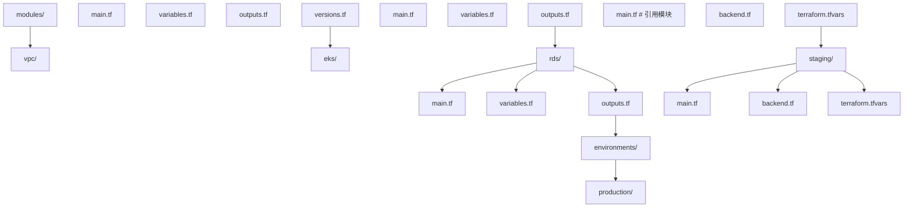
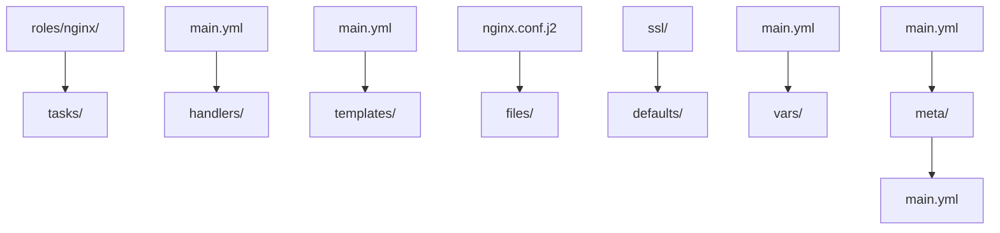
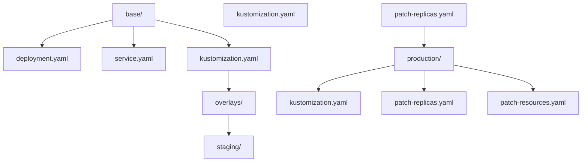
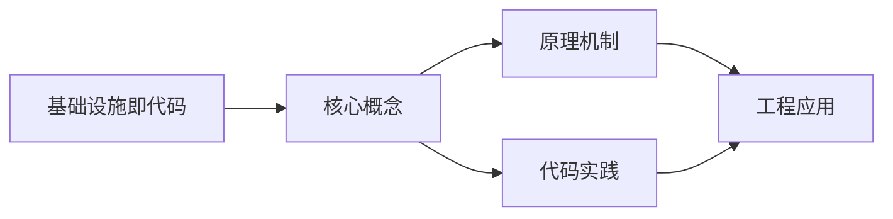
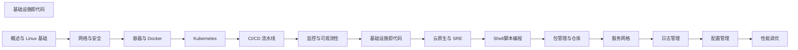

## 1. 学习目标（Bloom 分类）

本节按照布鲁姆教育目标分类学组织学习路径。本文主题为《基础设施即代码》，属于 DevOps 模块，读者可以根据自身阶段选择阅读深度。

记忆层面：能够准确复述本文的核心概念、术语与基本语法或操作步骤，并能够在提问或检索时快速定位对应知识点。能够说出 DevOps 的核心概念、组件与标准流程。

理解层面：能够用自己的语言解释核心原理与工作机制，说明概念之间的因果关系，而不是机械记忆结论。能够解释 DevOps 的工作原理与关键机制。

应用层面：能够在真实项目或练习场景中运用本文知识解决具体问题，写出正确且可维护的实现。能够执行 DevOps 相关的标准操作与配置。

分析层面：能够拆解复杂问题，比较本文主题与相邻概念的异同，识别边界条件与例外情况。能够分析 DevOps 方案在可靠性、成本与性能上的权衡。

评价层面：能够根据约束条件（性能、可读性、安全、成本）评价不同方案的优劣，做出有依据的技术决策。能够评价 DevOps 中的技术选型。

创造层面：能够把本文知识与其他模块知识组合，设计出新的解决方案或可复用的工程模式。能够设计基于 DevOps 的完整解决方案。

通过本节学习，读者应当能够把《基础设施即代码》纳入自己的知识网络，并与 DevOps 模块的其他主题（CI/CD、容器、编排、监控、GitOps）建立关联。

## 2. 历史动机与发展脉络

《基础设施即代码》是 DevOps 领域的重要主题。要真正理解它，需要先了解它解决的问题与演进过程。

DevOps 源于 2009 年（“DevOpsDays”），核心是打破开发与运维壁垒，用自动化与协作缩短交付周期；CALMS 文化（文化、自动化、精益、度量、共享）是其框架。
技术栈演进：持续集成（CI）与持续交付（CD）、基础设施即代码（IaC）、容器（Docker）与编排（Kubernetes）、可观测性（监控/日志/追踪）。
2020 年代趋势：GitOps（声明式 + 自动同步）、平台工程（内部开发者平台）、FinOps（成本治理）、AI 辅助运维。

回到本文主题：基础设施即代码 的提出与成熟，正是上述技术背景下的必然产物。早期实现往往以简单可用为目标，随着工程规模扩大，社区逐渐沉淀出标准做法与最佳实践；理解这一脉络，可以帮助读者判断“为什么文档中的推荐写法是现在这个样子”，也能在遇到历史遗留代码时准确识别其设计年代与取舍。


## 3. 形式化定义与核心概念精讲

本节把《基础设施即代码》涉及的核心概念以“定义 + 讲解”的形式展开。读者应把定义当作工具，把讲解当作理解路径；两者结合才能形成可迁移的知识。

CI/CD 管线：代码提交 -> 构建 -> 测试 -> 制品 -> 部署；流水线即代码（GitHub Actions/Jenkins/GitLab CI）。
容器与镜像：OCI 规范、Dockerfile 分层、镜像仓库与签名；容器隔离（cgroup/namespace）。
编排：Kubernetes 的 Pod/Deployment/Service 抽象；声明式期望状态与控制器调和。

### 3.1 原文章节逐一精讲

原文档把主题拆分为 7 个小节，下面按顺序给出每一节的导读讲解，随后保留原文细节供精读。

#### 原文精读（完整保留）


#### 1. IaC 理念

##### 1.1 核心原则

| 原则         | 描述                       |
| :----------- | :------------------------- |
| **声明式**   | 描述期望状态，而非操作步骤 |
| **版本控制** | 所有配置纳入 Git 管理      |
| **幂等性**   | 多次执行结果一致           |
| **不可变**   | 替换而非修改基础设施       |
| **自助服务** | 代码即文档，可重复执行     |

##### 1.2 IaC 工具分类

| 类型         | 代表工具               | 特点                 |
| :----------- | :--------------------- | :------------------- |
| **配置管理** | Ansible, Chef, Puppet  | 管理已有服务器的配置 |
| **资源编排** | Terraform, Pulumi, CDK | 创建和管理云资源     |
| **容器编排** | Helm, Kustomize        | 管理 K8s 应用        |
| **GitOps**   | ArgoCD, Flux           | Git 驱动的持续部署   |

#### 2. Terraform

##### 2.1 核心概念

| 概念         | 描述                               |
| :----------- | :--------------------------------- |
| **Provider** | 云厂商插件（AWS/Azure/GCP/阿里云） |
| **Resource** | 基础设施资源（VM/VPC/数据库）      |
| **Module**   | 可复用的配置包                     |
| **State**    | 资源状态文件                       |
| **Plan**     | 预览变更                           |
| **Apply**    | 执行变更                           |

##### 2.2 基础配置

```hcl
# provider.tf
terraform {
  required_version = ">= 1.6"
  required_providers {
    aws = {
      source  = "hashicorp/aws"
      version = "~> 5.0"
    }
  }

  # 远程状态存储
  backend "s3" {
    bucket         = "terraform-state-prod"
    key            = "infrastructure/terraform.tfstate"
    region         = "us-east-1"
    dynamodb_table = "terraform-locks"
    encrypt        = true
  }
}

provider "aws" {
  region = "us-east-1"
}
```

##### 2.3 资源定义

```hcl
# vpc.tf
resource "aws_vpc" "main" {
  cidr_block           = "10.0.0.0/16"
  enable_dns_hostnames = true
  enable_dns_support   = true

  tags = {
    Name        = "${var.project}-vpc"
    Environment = var.environment
    ManagedBy   = "terraform"
  }
}

resource "aws_subnet" "public" {
  count                   = length(var.public_subnet_cidrs)
  vpc_id                  = aws_vpc.main.id
  cidr_block              = var.public_subnet_cidrs[count.index]
  availability_zone       = var.azs[count.index]
  map_public_ip_on_launch = true

  tags = {
    Name = "${var.project}-public-${count.index + 1}"
  }
}

resource "aws_subnet" "private" {
  count             = length(var.private_subnet_cidrs)
  vpc_id            = aws_vpc.main.id
  cidr_block        = var.private_subnet_cidrs[count.index]
  availability_zone = var.azs[count.index]

  tags = {
    Name = "${var.project}-private-${count.index + 1}"
  }
}

# variables.tf
variable "project" {
  description = "Project name"
  type        = string
  default     = "myapp"
}

variable "environment" {
  description = "Environment name"
  type        = string
}

variable "public_subnet_cidrs" {
  type    = list(string)
  default = ["10.0.1.0/24", "10.0.2.0/24", "10.0.3.0/24"]
}

variable "private_subnet_cidrs" {
  type    = list(string)
  default = ["10.0.10.0/24", "10.0.20.0/24", "10.0.30.0/24"]
}
```

##### 2.4 EKS 集群

```hcl
# eks.tf
module "eks" {
  source  = "terraform-aws-modules/eks/aws"
  version = "~> 20.0"

  cluster_name    = "${var.project}-${var.environment}"
  cluster_version = "1.29"

  vpc_id     = aws_vpc.main.id
  subnet_ids = aws_subnet.private[*].id

  cluster_endpoint_private_access = true
  cluster_endpoint_public_access  = true

  cluster_addons = {
    coredns    = {}
    kube-proxy = {}
    vpc-cni    = {}
  }

  eks_managed_node_groups = {
    general = {
      min_size       = 2
      max_size       = 10
      desired_size   = 3
      instance_types = ["t3.medium"]

      labels = {
        role = "general"
      }
    }
    monitoring = {
      min_size       = 1
      max_size       = 3
      desired_size   = 1
      instance_types = ["t3.small"]

      labels = {
        role = "monitoring"
      }
      taints = [{
        key    = "dedicated"
        value  = "monitoring"
        effect = "NO_SCHEDULE"
      }]
    }
  }
}
```

##### 2.5 状态管理

```bash
# 状态操作
terraform state list                    # 列出资源
terraform state show aws_vpc.main       # 查看资源详情
terraform state mv aws_vpc.old aws_vpc.new  # 重命名
terraform state rm aws_vpc.orphan       # 移除（不删除实际资源）

# 导入已有资源
terraform import aws_vpc.main vpc-12345678

# 工作区（环境隔离）
terraform workspace new staging
terraform workspace select production
terraform workspace list
```

##### 2.6 模块化



```hcl
# environments/production/main.tf
module "vpc" {
  source = "../../modules/vpc"

  project     = var.project
  environment = "production"
  cidr_block  = "10.0.0.0/16"
}

module "eks" {
  source = "../../modules/eks"

  project     = var.project
  environment = "production"
  vpc_id      = module.vpc.vpc_id
  subnet_ids  = module.vpc.private_subnet_ids
}
```

#### 3. Ansible

##### 3.1 Inventory

```ini
# inventory/production.ini
[web]
web1 ansible_host=10.0.1.10
web2 ansible_host=10.0.1.11

[db]
db1 ansible_host=10.0.10.20

[monitoring]
prometheus ansible_host=10.0.20.10
grafana ansible_host=10.0.20.11

[production:children]
web
db
monitoring

[production:vars]
ansible_user=deploy
ansible_ssh_private_key_file=~/.ssh/deploy_key
```

##### 3.2 Playbook

```yaml
# playbooks/deploy-web.yml
- name: Deploy Web Application
  hosts: web
  become: true
  vars:
    app_version: '2.0.0'
    app_port: 8080

  tasks:
    - name: Ensure app directory exists
      file:
        path: /opt/myapp
        state: directory
        owner: appuser
        group: appgroup

    - name: Pull Docker image
      community.docker.docker_image:
        name: 'registry.example.com/myapp:{{ app_version }}'
        source: pull

    - name: Run application container
      community.docker.docker_container:
        name: myapp
        image: 'registry.example.com/myapp:{{ app_version }}'
        state: started
        restart_policy: unless-stopped
        ports:
          - '{{ app_port }}:8080'
        env:
          NODE_ENV: production
          DATABASE_URL: '{{ vault_database_url }}'
        volumes:
          - /opt/myapp/data:/app/data

    - name: Wait for application to be ready
      uri:
        url: 'http://localhost:{{ app_port }}/health'
        status_code: 200
      register: result
      until: result is success
      retries: 10
      delay: 5

    - name: Notify deployment
      slack:
        token: '{{ vault_slack_token }}'
        msg: 'Deployed myapp {{ app_version }} to {{ inventory_hostname }}'
      delegate_to: localhost
      run_once: true
```

##### 3.3 Role 结构



```yaml
# roles/nginx/tasks/main.yml
- name: Install Nginx
  apt:
    name: nginx
    state: present
    update_cache: true

- name: Configure Nginx
  template:
    src: nginx.conf.j2
    dest: /etc/nginx/nginx.conf
    owner: root
    group: root
    mode: '0644'
  notify: Reload Nginx

- name: Ensure Nginx is running
  service:
    name: nginx
    state: started
    enabled: true

# roles/nginx/handlers/main.yml
- name: Reload Nginx
  service:
    name: nginx
    state: reloaded
```

#### 4. Pulumi

##### 4.1 Pulumi vs Terraform

| 维度         | Terraform | Pulumi                  |
| :----------- | :-------- | :---------------------- |
| **语言**     | HCL       | Python/TypeScript/Go/C# |
| **学习曲线** | 需学 HCL  | 用已有编程语言          |
| **测试**     | 有限      | 原生单元测试            |
| **逻辑**     | 声明式    | 命令式 + 声明式         |
| **状态**     | 自管理    | Pulumi Cloud 或自管理   |

##### 4.2 Pulumi 示例

```python
# __main__.py
import pulumi
import pulumi_aws as aws

# 配置
config = pulumi.Config()
environment = config.require("environment")

# VPC
vpc = aws.ec2.Vpc("main-vpc",
    cidr_block="10.0.0.0/16",
    enable_dns_hostnames=True,
    tags={"Name": f"myapp-{environment}-vpc"}
)

# 子网
for i, az in enumerate(["us-east-1a", "us-east-1b"]):
    aws.ec2.Subnet(f"subnet-{i}",
        vpc_id=vpc.id,
        cidr_block=f"10.0.{i+1}.0/24",
        availability_zone=az,
        tags={"Name": f"myapp-{environment}-subnet-{i}"}
    )

# EKS 集群
cluster = aws.eks.Cluster("my-cluster",
    role_arn=cluster_role.arn,
    vpc_config=aws.eks.ClusterVpcConfigArgs(
        subnet_ids=[s.id for s in subnets]
    ),
    version="1.29"
)

# 输出
pulumi.export("cluster_name", cluster.name)
pulumi.export("cluster_endpoint", cluster.endpoint)
```

#### 5. GitOps

##### 5.1 GitOps 原则

| 原则         | 描述                   |
| :----------- | :--------------------- |
| **声明式**   | 系统描述必须是声明式的 |
| **版本控制** | 期望状态存储在 Git     |
| **自动拉取** | 自动从 Git 拉取并应用  |
| **持续协调** | 软件代理持续协调状态   |

##### 5.2 Flux

```yaml
# flux-system/gotk-sync.yaml
apiVersion: source.toolkit.fluxcd.io/v1
kind: GitRepository
metadata:
  name: flux-system
  namespace: flux-system
spec:
  interval: 1m
  ref:
    branch: main
  url: https://github.com/org/myapp-manifests

---
apiVersion: kustomize.toolkit.fluxcd.io/v1
kind: Kustomization
metadata:
  name: flux-system
  namespace: flux-system
spec:
  interval: 10m
  path: ./clusters/production
  prune: true
  sourceRef:
    kind: GitRepository
    name: flux-system
  validation: server
```

##### 5.3 Kustomize



```yaml
# base/kustomization.yaml
apiVersion: kustomize.config.k8s.io/v1beta1
kind: Kustomization
resources:
  - deployment.yaml
  - service.yaml

# overlays/production/kustomization.yaml
apiVersion: kustomize.config.k8s.io/v1beta1
kind: Kustomization
resources:
  - ../../base
patches:
  - path: patch-replicas.yaml
  - path: patch-resources.yaml

# overlays/production/patch-replicas.yaml
apiVersion: apps/v1
kind: Deployment
metadata:
  name: web
spec:
  replicas: 5
```

#### 6. IaC 安全

##### 6.1 安全实践

| 实践              | 描述                        |
| :---------------- | :-------------------------- |
| **状态加密**      | 加密远程状态存储            |
| **密钥管理**      | 使用 Vault/云 KMS，不硬编码 |
| **PR 审查**       | 所有变更需 Code Review      |
| **Plan 审查**     | 审查 terraform plan 输出    |
| **最小权限**      | CI/CD 使用最小必要权限      |
| ** drifted 检测** | 定期检测配置漂移            |

##### 6.2 Terraform 安全扫描

```bash
# tfsec - Terraform 安全扫描
tfsec .

# checkov - 策略扫描
checkov -d .

# terrascan - 合规扫描
terrascan scan -t aws

# 在 CI 中集成
- name: Security Scan
  run: |
    tfsec --soft-fail .
    checkov -d . --framework terraform
```

#### 7. 小结

IaC 是现代运维的基础：

1. **Terraform** 是多云资源编排的事实标准，HCL 语法简洁
2. **Ansible** 适合配置管理和应用部署，无需 Agent
3. **Pulumi** 用编程语言写 IaC，适合有编程背景的团队
4. **GitOps** 是 K8s 部署的最佳实践，ArgoCD 和 Flux 是主流工具
5. **状态管理**是 Terraform 的关键，必须使用远程后端和锁
6. **安全扫描**应集成到 CI/CD，防止不安全配置上线


### 3.2 概念关系图

下面用 Mermaid 图表达本文核心概念之间的关系，帮助读者建立整体图景：



图中展示的是本文知识的结构化关系：核心概念是入口，原理机制解释“为什么”，代码实践演示“怎么做”，工程应用回答“何时用”。读者学习时可以把每个小节的内容挂接到对应节点上。

## 4. 理论推导与原理解析

本节深入《基础设施即代码》背后的原理。理论部分不求面面俱到，而是聚焦“能解释现象、能指导实践”的关键推导。

CI/CD 管线：代码提交 -> 构建 -> 测试 -> 制品 -> 部署；流水线即代码（GitHub Actions/Jenkins/GitLab CI）。
容器与镜像：OCI 规范、Dockerfile 分层、镜像仓库与签名；容器隔离（cgroup/namespace）。
编排：Kubernetes 的 Pod/Deployment/Service 抽象；声明式期望状态与控制器调和。
可观测性三支柱：指标（Prometheus）、日志（Loki/ELK）、追踪（OpenTelemetry）。

需要强调的是，理论推导与工程实践之间存在翻译层：理论给出的是理想化模型与边界条件，工程代码则必须处理真实环境中的例外。读者在学习时应先掌握理论的“标准情形”，再通过陷阱章节了解“非标准情形”。

## 5. 代码示例与逐行讲解

本节把原文中的代码示例系统整理，并为每个示例补充用途说明与讲解。读者不应只浏览代码，而应逐段对照讲解理解设计意图。

### 5.1 示例：2.2 基础配置

该示例来自原文《2.2 基础配置》小节，用于演示基础设施即代码相关操作。阅读时请先看代码结构，再看其后的讲解。

```hcl
# provider.tf
terraform {
  required_version = ">= 1.6"
  required_providers {
    aws = {
      source  = "hashicorp/aws"
      version = "~> 5.0"
    }
  }

  # 远程状态存储
  backend "s3" {
    bucket         = "terraform-state-prod"
    key            = "infrastructure/terraform.tfstate"
    region         = "us-east-1"
    dynamodb_table = "terraform-locks"
    encrypt        = true
  }
}

provider "aws" {
  region = "us-east-1"
}
```

讲解：这段代码演示了本节核心知识点。代码中的关键操作可以归纳为三步：准备（定义或初始化）、执行（核心逻辑）、收尾（释放资源或返回结果）。实际项目中，这三步往往被封装为函数或类，以提升复用性与可测试性。

关键点分析：

该示例共 21 行有效代码，结构以数据或配置为主。阅读时应关注：数据字段的含义、配置项的作用，以及它们与运行行为的对应关系。

进阶思考路径：先尝试修改参数观察行为变化，再把示例中的模式迁移到自己的项目中；每次修改都记录预期与实测差异，这是把示例转化为能力的最快方式。

### 5.2 示例：2.3 资源定义

该示例来自原文《2.3 资源定义》小节，用于演示基础设施即代码相关操作。阅读时请先看代码结构，再看其后的讲解。

```hcl
# vpc.tf
resource "aws_vpc" "main" {
  cidr_block           = "10.0.0.0/16"
  enable_dns_hostnames = true
  enable_dns_support   = true

  tags = {
    Name        = "${var.project}-vpc"
    Environment = var.environment
    ManagedBy   = "terraform"
  }
}

resource "aws_subnet" "public" {
  count                   = length(var.public_subnet_cidrs)
  vpc_id                  = aws_vpc.main.id
  cidr_block              = var.public_subnet_cidrs[count.index]
  availability_zone       = var.azs[count.index]
  map_public_ip_on_launch = true

  tags = {
    Name = "${var.project}-public-${count.index + 1}"
  }
}

resource "aws_subnet" "private" {
  count             = length(var.private_subnet_cidrs)
  vpc_id            = aws_vpc.main.id
  cidr_block        = var.private_subnet_cidrs[count.index]
  availability_zone = var.azs[count.index]

  tags = {
    Name = "${var.project}-private-${count.index + 1}"
  }
}

# variables.tf
variable "project" {
  description = "Project name"
  type        = string
  default     = "myapp"
}

variable "environment" {
  description = "Environment name"
  type        = string
}

variable "public_subnet_cidrs" {
  type    = list(string)
  default = ["10.0.1.0/24", "10.0.2.0/24", "10.0.3.0/24"]
}

variable "private_subnet_cidrs" {
  type    = list(string)
  default = ["10.0.10.0/24", "10.0.20.0/24", "10.0.30.0/24"]
}
```

讲解：这段代码演示了本节核心知识点。代码中的关键操作可以归纳为三步：准备（定义或初始化）、执行（核心逻辑）、收尾（释放资源或返回结果）。实际项目中，这三步往往被封装为函数或类，以提升复用性与可测试性。

关键点分析：

该示例共 48 行有效代码，结构以数据或配置为主。阅读时应关注：数据字段的含义、配置项的作用，以及它们与运行行为的对应关系。

进阶思考路径：先尝试修改参数观察行为变化，再把示例中的模式迁移到自己的项目中；每次修改都记录预期与实测差异，这是把示例转化为能力的最快方式。

### 5.3 示例：2.4 EKS 集群

该示例来自原文《2.4 EKS 集群》小节，用于演示基础设施即代码相关操作。阅读时请先看代码结构，再看其后的讲解。

```hcl
# eks.tf
module "eks" {
  source  = "terraform-aws-modules/eks/aws"
  version = "~> 20.0"

  cluster_name    = "${var.project}-${var.environment}"
  cluster_version = "1.29"

  vpc_id     = aws_vpc.main.id
  subnet_ids = aws_subnet.private[*].id

  cluster_endpoint_private_access = true
  cluster_endpoint_public_access  = true

  cluster_addons = {
    coredns    = {}
    kube-proxy = {}
    vpc-cni    = {}
  }

  eks_managed_node_groups = {
    general = {
      min_size       = 2
      max_size       = 10
      desired_size   = 3
      instance_types = ["t3.medium"]

      labels = {
        role = "general"
      }
    }
    monitoring = {
      min_size       = 1
      max_size       = 3
      desired_size   = 1
      instance_types = ["t3.small"]

      labels = {
        role = "monitoring"
      }
      taints = [{
        key    = "dedicated"
        value  = "monitoring"
        effect = "NO_SCHEDULE"
      }]
    }
  }
}
```

讲解：这段代码演示了本节核心知识点。代码中的关键操作可以归纳为三步：准备（定义或初始化）、执行（核心逻辑）、收尾（释放资源或返回结果）。实际项目中，这三步往往被封装为函数或类，以提升复用性与可测试性。

关键点分析：

该示例共 41 行有效代码，结构以数据或配置为主。阅读时应关注：数据字段的含义、配置项的作用，以及它们与运行行为的对应关系。

进阶思考路径：先尝试修改参数观察行为变化，再把示例中的模式迁移到自己的项目中；每次修改都记录预期与实测差异，这是把示例转化为能力的最快方式。

### 5.4 示例：2.5 状态管理

该示例来自原文《2.5 状态管理》小节，用于演示基础设施即代码相关操作。阅读时请先看代码结构，再看其后的讲解。

```bash
# 状态操作
terraform state list                    # 列出资源
terraform state show aws_vpc.main       # 查看资源详情
terraform state mv aws_vpc.old aws_vpc.new  # 重命名
terraform state rm aws_vpc.orphan       # 移除（不删除实际资源）

# 导入已有资源
terraform import aws_vpc.main vpc-12345678

# 工作区（环境隔离）
terraform workspace new staging
terraform workspace select production
terraform workspace list
```

讲解：这段代码演示了本节核心知识点。代码中的关键操作可以归纳为三步：准备（定义或初始化）、执行（核心逻辑）、收尾（释放资源或返回结果）。实际项目中，这三步往往被封装为函数或类，以提升复用性与可测试性。

关键点分析：

该示例共 11 行有效代码，包含 1 类关键结构（import）。其中：

- 入口与初始化部分负责建立上下文，对应实际项目中的启动或装配逻辑；
- 核心逻辑部分体现本文主题的主要操作，是阅读时最需要对照讲解理解的部分；
- 输出或返回部分把结果交给调用方，注意其类型与边界条件。

进阶思考路径：先尝试修改参数观察行为变化，再把示例中的模式迁移到自己的项目中；每次修改都记录预期与实测差异，这是把示例转化为能力的最快方式。

### 5.5 示例：2.6 模块化

该示例来自原文《2.6 模块化》小节，用于演示基础设施即代码相关操作。阅读时请先看代码结构，再看其后的讲解。


讲解：这段代码演示了本节核心知识点。代码中的关键操作可以归纳为三步：准备（定义或初始化）、执行（核心逻辑）、收尾（释放资源或返回结果）。实际项目中，这三步往往被封装为函数或类，以提升复用性与可测试性。

关键点分析：

该示例共 36 行有效代码，结构以数据或配置为主。阅读时应关注：数据字段的含义、配置项的作用，以及它们与运行行为的对应关系。

进阶思考路径：先尝试修改参数观察行为变化，再把示例中的模式迁移到自己的项目中；每次修改都记录预期与实测差异，这是把示例转化为能力的最快方式。

### 5.6 示例：2.6 模块化

该示例来自原文《2.6 模块化》小节，用于演示基础设施即代码相关操作。阅读时请先看代码结构，再看其后的讲解。

```hcl
# environments/production/main.tf
module "vpc" {
  source = "../../modules/vpc"

  project     = var.project
  environment = "production"
  cidr_block  = "10.0.0.0/16"
}

module "eks" {
  source = "../../modules/eks"

  project     = var.project
  environment = "production"
  vpc_id      = module.vpc.vpc_id
  subnet_ids  = module.vpc.private_subnet_ids
}
```

讲解：这段代码演示了本节核心知识点。代码中的关键操作可以归纳为三步：准备（定义或初始化）、执行（核心逻辑）、收尾（释放资源或返回结果）。实际项目中，这三步往往被封装为函数或类，以提升复用性与可测试性。

关键点分析：

该示例共 14 行有效代码，结构以数据或配置为主。阅读时应关注：数据字段的含义、配置项的作用，以及它们与运行行为的对应关系。

进阶思考路径：先尝试修改参数观察行为变化，再把示例中的模式迁移到自己的项目中；每次修改都记录预期与实测差异，这是把示例转化为能力的最快方式。

### 5.7 示例：3.1 Inventory

该示例来自原文《3.1 Inventory》小节，用于演示基础设施即代码相关操作。阅读时请先看代码结构，再看其后的讲解。

```ini
# inventory/production.ini
[web]
web1 ansible_host=10.0.1.10
web2 ansible_host=10.0.1.11

[db]
db1 ansible_host=10.0.10.20

[monitoring]
prometheus ansible_host=10.0.20.10
grafana ansible_host=10.0.20.11

[production:children]
web
db
monitoring

[production:vars]
ansible_user=deploy
ansible_ssh_private_key_file=~/.ssh/deploy_key
```

讲解：这段代码演示了本节核心知识点。代码中的关键操作可以归纳为三步：准备（定义或初始化）、执行（核心逻辑）、收尾（释放资源或返回结果）。实际项目中，这三步往往被封装为函数或类，以提升复用性与可测试性。

关键点分析：

该示例共 16 行有效代码，结构以数据或配置为主。阅读时应关注：数据字段的含义、配置项的作用，以及它们与运行行为的对应关系。

进阶思考路径：先尝试修改参数观察行为变化，再把示例中的模式迁移到自己的项目中；每次修改都记录预期与实测差异，这是把示例转化为能力的最快方式。

### 5.8 示例：3.2 Playbook

该示例来自原文《3.2 Playbook》小节，用于演示基础设施即代码相关操作。阅读时请先看代码结构，再看其后的讲解。

```yaml
# playbooks/deploy-web.yml
- name: Deploy Web Application
  hosts: web
  become: true
  vars:
    app_version: '2.0.0'
    app_port: 8080

  tasks:
    - name: Ensure app directory exists
      file:
        path: /opt/myapp
        state: directory
        owner: appuser
        group: appgroup

    - name: Pull Docker image
      community.docker.docker_image:
        name: 'registry.example.com/myapp:{{ app_version }}'
        source: pull

    - name: Run application container
      community.docker.docker_container:
        name: myapp
        image: 'registry.example.com/myapp:{{ app_version }}'
        state: started
        restart_policy: unless-stopped
        ports:
          - '{{ app_port }}:8080'
        env:
          NODE_ENV: production
          DATABASE_URL: '{{ vault_database_url }}'
        volumes:
          - /opt/myapp/data:/app/data

    - name: Wait for application to be ready
      uri:
        url: 'http://localhost:{{ app_port }}/health'
        status_code: 200
      register: result
      until: result is success
      retries: 10
      delay: 5

    - name: Notify deployment
      slack:
        token: '{{ vault_slack_token }}'
        msg: 'Deployed myapp {{ app_version }} to {{ inventory_hostname }}'
      delegate_to: localhost
      run_once: true
```

讲解：这段代码演示了本节核心知识点。代码中的关键操作可以归纳为三步：准备（定义或初始化）、执行（核心逻辑）、收尾（释放资源或返回结果）。实际项目中，这三步往往被封装为函数或类，以提升复用性与可测试性。

关键点分析：

该示例共 45 行有效代码，包含 1 类关键结构（for）。其中：

- 入口与初始化部分负责建立上下文，对应实际项目中的启动或装配逻辑；
- 核心逻辑部分体现本文主题的主要操作，是阅读时最需要对照讲解理解的部分；
- 输出或返回部分把结果交给调用方，注意其类型与边界条件。

进阶思考路径：先尝试修改参数观察行为变化，再把示例中的模式迁移到自己的项目中；每次修改都记录预期与实测差异，这是把示例转化为能力的最快方式。

### 5.9 示例：3.3 Role 结构

该示例来自原文《3.3 Role 结构》小节，用于演示基础设施即代码相关操作。阅读时请先看代码结构，再看其后的讲解。


讲解：这段代码演示了本节核心知识点。代码中的关键操作可以归纳为三步：准备（定义或初始化）、执行（核心逻辑）、收尾（释放资源或返回结果）。实际项目中，这三步往往被封装为函数或类，以提升复用性与可测试性。

关键点分析：

该示例共 24 行有效代码，结构以数据或配置为主。阅读时应关注：数据字段的含义、配置项的作用，以及它们与运行行为的对应关系。

进阶思考路径：先尝试修改参数观察行为变化，再把示例中的模式迁移到自己的项目中；每次修改都记录预期与实测差异，这是把示例转化为能力的最快方式。

### 5.10 示例：3.3 Role 结构

该示例来自原文《3.3 Role 结构》小节，用于演示基础设施即代码相关操作。阅读时请先看代码结构，再看其后的讲解。

```yaml
# roles/nginx/tasks/main.yml
- name: Install Nginx
  apt:
    name: nginx
    state: present
    update_cache: true

- name: Configure Nginx
  template:
    src: nginx.conf.j2
    dest: /etc/nginx/nginx.conf
    owner: root
    group: root
    mode: '0644'
  notify: Reload Nginx

- name: Ensure Nginx is running
  service:
    name: nginx
    state: started
    enabled: true

# roles/nginx/handlers/main.yml
- name: Reload Nginx
  service:
    name: nginx
    state: reloaded
```

讲解：这段代码演示了本节核心知识点。代码中的关键操作可以归纳为三步：准备（定义或初始化）、执行（核心逻辑）、收尾（释放资源或返回结果）。实际项目中，这三步往往被封装为函数或类，以提升复用性与可测试性。

关键点分析：

该示例共 24 行有效代码，结构以数据或配置为主。阅读时应关注：数据字段的含义、配置项的作用，以及它们与运行行为的对应关系。

进阶思考路径：先尝试修改参数观察行为变化，再把示例中的模式迁移到自己的项目中；每次修改都记录预期与实测差异，这是把示例转化为能力的最快方式。

### 5.11 示例：4.2 Pulumi 示例

该示例来自原文《4.2 Pulumi 示例》小节，用于演示基础设施即代码相关操作。阅读时请先看代码结构，再看其后的讲解。

```python
# __main__.py
import pulumi
import pulumi_aws as aws

# 配置
config = pulumi.Config()
environment = config.require("environment")

# VPC
vpc = aws.ec2.Vpc("main-vpc",
    cidr_block="10.0.0.0/16",
    enable_dns_hostnames=True,
    tags={"Name": f"myapp-{environment}-vpc"}
)

# 子网
for i, az in enumerate(["us-east-1a", "us-east-1b"]):
    aws.ec2.Subnet(f"subnet-{i}",
        vpc_id=vpc.id,
        cidr_block=f"10.0.{i+1}.0/24",
        availability_zone=az,
        tags={"Name": f"myapp-{environment}-subnet-{i}"}
    )

# EKS 集群
cluster = aws.eks.Cluster("my-cluster",
    role_arn=cluster_role.arn,
    vpc_config=aws.eks.ClusterVpcConfigArgs(
        subnet_ids=[s.id for s in subnets]
    ),
    version="1.29"
)

# 输出
pulumi.export("cluster_name", cluster.name)
pulumi.export("cluster_endpoint", cluster.endpoint)
```

讲解：这段代码演示了本节核心知识点。代码中的关键操作可以归纳为三步：准备（定义或初始化）、执行（核心逻辑）、收尾（释放资源或返回结果）。实际项目中，这三步往往被封装为函数或类，以提升复用性与可测试性。

关键点分析：

该示例共 31 行有效代码，包含 2 类关键结构（import、for）。其中：

- 入口与初始化部分负责建立上下文，对应实际项目中的启动或装配逻辑；
- 核心逻辑部分体现本文主题的主要操作，是阅读时最需要对照讲解理解的部分；
- 输出或返回部分把结果交给调用方，注意其类型与边界条件。

进阶思考路径：先尝试修改参数观察行为变化，再把示例中的模式迁移到自己的项目中；每次修改都记录预期与实测差异，这是把示例转化为能力的最快方式。

### 5.12 示例：5.2 Flux

该示例来自原文《5.2 Flux》小节，用于演示基础设施即代码相关操作。阅读时请先看代码结构，再看其后的讲解。

```yaml
# flux-system/gotk-sync.yaml
apiVersion: source.toolkit.fluxcd.io/v1
kind: GitRepository
metadata:
  name: flux-system
  namespace: flux-system
spec:
  interval: 1m
  ref:
    branch: main
  url: https://github.com/org/myapp-manifests

---
apiVersion: kustomize.toolkit.fluxcd.io/v1
kind: Kustomization
metadata:
  name: flux-system
  namespace: flux-system
spec:
  interval: 10m
  path: ./clusters/production
  prune: true
  sourceRef:
    kind: GitRepository
    name: flux-system
  validation: server
```

讲解：这段代码演示了本节核心知识点。代码中的关键操作可以归纳为三步：准备（定义或初始化）、执行（核心逻辑）、收尾（释放资源或返回结果）。实际项目中，这三步往往被封装为函数或类，以提升复用性与可测试性。

关键点分析：

该示例共 25 行有效代码，包含 1 类关键结构（apiVersion）。其中：

- 入口与初始化部分负责建立上下文，对应实际项目中的启动或装配逻辑；
- 核心逻辑部分体现本文主题的主要操作，是阅读时最需要对照讲解理解的部分；
- 输出或返回部分把结果交给调用方，注意其类型与边界条件。

进阶思考路径：先尝试修改参数观察行为变化，再把示例中的模式迁移到自己的项目中；每次修改都记录预期与实测差异，这是把示例转化为能力的最快方式。

### 5.13 示例：5.3 Kustomize

该示例来自原文《5.3 Kustomize》小节，用于演示基础设施即代码相关操作。阅读时请先看代码结构，再看其后的讲解。


讲解：这段代码演示了本节核心知识点。代码中的关键操作可以归纳为三步：准备（定义或初始化）、执行（核心逻辑）、收尾（释放资源或返回结果）。实际项目中，这三步往往被封装为函数或类，以提升复用性与可测试性。

关键点分析：

该示例共 22 行有效代码，结构以数据或配置为主。阅读时应关注：数据字段的含义、配置项的作用，以及它们与运行行为的对应关系。

进阶思考路径：先尝试修改参数观察行为变化，再把示例中的模式迁移到自己的项目中；每次修改都记录预期与实测差异，这是把示例转化为能力的最快方式。

### 5.14 示例：5.3 Kustomize

该示例来自原文《5.3 Kustomize》小节，用于演示基础设施即代码相关操作。阅读时请先看代码结构，再看其后的讲解。

```yaml
# base/kustomization.yaml
apiVersion: kustomize.config.k8s.io/v1beta1
kind: Kustomization
resources:
  - deployment.yaml
  - service.yaml

# overlays/production/kustomization.yaml
apiVersion: kustomize.config.k8s.io/v1beta1
kind: Kustomization
resources:
  - ../../base
patches:
  - path: patch-replicas.yaml
  - path: patch-resources.yaml

# overlays/production/patch-replicas.yaml
apiVersion: apps/v1
kind: Deployment
metadata:
  name: web
spec:
  replicas: 5
```

讲解：这段代码演示了本节核心知识点。代码中的关键操作可以归纳为三步：准备（定义或初始化）、执行（核心逻辑）、收尾（释放资源或返回结果）。实际项目中，这三步往往被封装为函数或类，以提升复用性与可测试性。

关键点分析：

该示例共 21 行有效代码，包含 1 类关键结构（apiVersion）。其中：

- 入口与初始化部分负责建立上下文，对应实际项目中的启动或装配逻辑；
- 核心逻辑部分体现本文主题的主要操作，是阅读时最需要对照讲解理解的部分；
- 输出或返回部分把结果交给调用方，注意其类型与边界条件。

进阶思考路径：先尝试修改参数观察行为变化，再把示例中的模式迁移到自己的项目中；每次修改都记录预期与实测差异，这是把示例转化为能力的最快方式。

### 5.15 示例：6.2 Terraform 安全扫描

该示例来自原文《6.2 Terraform 安全扫描》小节，用于演示基础设施即代码相关操作。阅读时请先看代码结构，再看其后的讲解。

```bash
# tfsec - Terraform 安全扫描
tfsec .

# checkov - 策略扫描
checkov -d .

# terrascan - 合规扫描
terrascan scan -t aws

# 在 CI 中集成
- name: Security Scan
  run: |
    tfsec --soft-fail .
    checkov -d . --framework terraform
```

讲解：这段代码演示了本节核心知识点。代码中的关键操作可以归纳为三步：准备（定义或初始化）、执行（核心逻辑）、收尾（释放资源或返回结果）。实际项目中，这三步往往被封装为函数或类，以提升复用性与可测试性。

关键点分析：

该示例共 11 行有效代码，结构以数据或配置为主。阅读时应关注：数据字段的含义、配置项的作用，以及它们与运行行为的对应关系。

进阶思考路径：先尝试修改参数观察行为变化，再把示例中的模式迁移到自己的项目中；每次修改都记录预期与实测差异，这是把示例转化为能力的最快方式。


综合以上示例，可以总结出本主题的代码实践要点：第一，先定义清晰的输入输出契约；第二，核心逻辑保持单一职责；第三，错误处理与边界条件不可省略；第四，命名与注释表达意图而非复述代码。

## 6. 对比分析

对比是理解《基础设施即代码》定位的最快路径。下面从多个维度与相邻方案进行对比。

CI 与 CD：CI 保证可集成，CD 保证可交付；两者可独立实施。
Kubernetes 与 Docker Compose：K8s 生产级编排；Compose 单机开发。
传统运维与 SRE：SRE 用软件工程方法运维，错误预算与 SLO。

对比的目的不是分出绝对优劣，而是建立选择依据：不同约束条件下，最优解不同。读者应把每个对比维度转化为决策检查清单。

## 7. 常见陷阱与最佳实践

本节整理该主题的高频错误与推荐做法。每个陷阱先描述现象，再解释原因，最后给出最佳实践。

### 7.1 环境漂移

手工配置导致环境不一致。全部走 IaC 与镜像。

深入讲解：该问题之所以被归类为“常见陷阱”，是因为它在初学者的代码中反复出现，而且往往不在第一时间暴露——错误通常隐藏在特定数据或特定时序下。

从成因上看，环境漂移 一般源于对 DevOps 某个机制的理解偏差：要么误用了默认行为，要么忽略了边界条件，要么把其他语言的思维惯性带了过来。

从影响上看，环境漂移 轻则产生错误结果，重则导致资源泄漏、数据损坏或安全事故；这也是为什么工程评审中会把它列为检查项。

从修复策略上看，处理环境漂移的正确顺序是：先复现（构造最小用例），再定位（确认机制层面的根因），最后修复并补充回归测试。跳过复现直接改代码，往往治标不治本。

### 7.2 秘密硬编码

密钥进仓库。使用 Secret 管理与注入。

深入讲解：该问题之所以被归类为“常见陷阱”，是因为它在初学者的代码中反复出现，而且往往不在第一时间暴露——错误通常隐藏在特定数据或特定时序下。

从成因上看，秘密硬编码 一般源于对 DevOps 某个机制的理解偏差：要么误用了默认行为，要么忽略了边界条件，要么把其他语言的思维惯性带了过来。

从影响上看，秘密硬编码 轻则产生错误结果，重则导致资源泄漏、数据损坏或安全事故；这也是为什么工程评审中会把它列为检查项。

从修复策略上看，处理秘密硬编码的正确顺序是：先复现（构造最小用例），再定位（确认机制层面的根因），最后修复并补充回归测试。跳过复现直接改代码，往往治标不治本。

### 7.3 构建不可复现

依赖未锁定。锁定依赖版本与基础镜像 digest。

深入讲解：该问题之所以被归类为“常见陷阱”，是因为它在初学者的代码中反复出现，而且往往不在第一时间暴露——错误通常隐藏在特定数据或特定时序下。

从成因上看，构建不可复现 一般源于对 DevOps 某个机制的理解偏差：要么误用了默认行为，要么忽略了边界条件，要么把其他语言的思维惯性带了过来。

从影响上看，构建不可复现 轻则产生错误结果，重则导致资源泄漏、数据损坏或安全事故；这也是为什么工程评审中会把它列为检查项。

从修复策略上看，处理构建不可复现的正确顺序是：先复现（构造最小用例），再定位（确认机制层面的根因），最后修复并补充回归测试。跳过复现直接改代码，往往治标不治本。

### 7.4 测试后置

问题到生产才发现。左移：单元/集成/E2E 分层。

深入讲解：该问题之所以被归类为“常见陷阱”，是因为它在初学者的代码中反复出现，而且往往不在第一时间暴露——错误通常隐藏在特定数据或特定时序下。

从成因上看，测试后置 一般源于对 DevOps 某个机制的理解偏差：要么误用了默认行为，要么忽略了边界条件，要么把其他语言的思维惯性带了过来。

从影响上看，测试后置 轻则产生错误结果，重则导致资源泄漏、数据损坏或安全事故；这也是为什么工程评审中会把它列为检查项。

从修复策略上看，处理测试后置的正确顺序是：先复现（构造最小用例），再定位（确认机制层面的根因），最后修复并补充回归测试。跳过复现直接改代码，往往治标不治本。

### 7.5 回滚缺失

发布失败无法回退。保留历史镜像与一键回滚。

深入讲解：该问题之所以被归类为“常见陷阱”，是因为它在初学者的代码中反复出现，而且往往不在第一时间暴露——错误通常隐藏在特定数据或特定时序下。

从成因上看，回滚缺失 一般源于对 DevOps 某个机制的理解偏差：要么误用了默认行为，要么忽略了边界条件，要么把其他语言的思维惯性带了过来。

从影响上看，回滚缺失 轻则产生错误结果，重则导致资源泄漏、数据损坏或安全事故；这也是为什么工程评审中会把它列为检查项。

从修复策略上看，处理回滚缺失的正确顺序是：先复现（构造最小用例），再定位（确认机制层面的根因），最后修复并补充回归测试。跳过复现直接改代码，往往治标不治本。

### 7.6 监控盲区

无指标与告警。核心链路全量可观测。

深入讲解：该问题之所以被归类为“常见陷阱”，是因为它在初学者的代码中反复出现，而且往往不在第一时间暴露——错误通常隐藏在特定数据或特定时序下。

从成因上看，监控盲区 一般源于对 DevOps 某个机制的理解偏差：要么误用了默认行为，要么忽略了边界条件，要么把其他语言的思维惯性带了过来。

从影响上看，监控盲区 轻则产生错误结果，重则导致资源泄漏、数据损坏或安全事故；这也是为什么工程评审中会把它列为检查项。

从修复策略上看，处理监控盲区的正确顺序是：先复现（构造最小用例），再定位（确认机制层面的根因），最后修复并补充回归测试。跳过复现直接改代码，往往治标不治本。

### 7.7 权限过大

CI 权限超需求。最小权限与短期凭证。

深入讲解：该问题之所以被归类为“常见陷阱”，是因为它在初学者的代码中反复出现，而且往往不在第一时间暴露——错误通常隐藏在特定数据或特定时序下。

从成因上看，权限过大 一般源于对 DevOps 某个机制的理解偏差：要么误用了默认行为，要么忽略了边界条件，要么把其他语言的思维惯性带了过来。

从影响上看，权限过大 轻则产生错误结果，重则导致资源泄漏、数据损坏或安全事故；这也是为什么工程评审中会把它列为检查项。

从修复策略上看，处理权限过大的正确顺序是：先复现（构造最小用例），再定位（确认机制层面的根因），最后修复并补充回归测试。跳过复现直接改代码，往往治标不治本。

### 7.8 部署频率低

大爆炸发布风险高。小步快跑与灰度。

深入讲解：该问题之所以被归类为“常见陷阱”，是因为它在初学者的代码中反复出现，而且往往不在第一时间暴露——错误通常隐藏在特定数据或特定时序下。

从成因上看，部署频率低 一般源于对 DevOps 某个机制的理解偏差：要么误用了默认行为，要么忽略了边界条件，要么把其他语言的思维惯性带了过来。

从影响上看，部署频率低 轻则产生错误结果，重则导致资源泄漏、数据损坏或安全事故；这也是为什么工程评审中会把它列为检查项。

从修复策略上看，处理部署频率低的正确顺序是：先复现（构造最小用例），再定位（确认机制层面的根因），最后修复并补充回归测试。跳过复现直接改代码，往往治标不治本。

### 7.0 最佳实践总览

1. 一切皆代码：流水线、基础设施、配置版本化。
2. 发布可重复：相同代码 + 相同制品 -> 相同环境。
3. 失败可预期：小批量、金丝雀、自动回滚。
4. 度量驱动：DORA 指标（部署频率、变更前置时间、恢复时间、变更失败率）。

把这些最佳实践固化为团队规范与代码评审检查项，是避免同类问题反复出现的关键。

## 8. 工程实践

本节把《基础设施即代码》放入真实工程场景，给出可复用的模式与组织方法。

GitHub Actions：workflow/job/step 模型，矩阵测试，环境与密钥管理。
GitOps：Argo CD 同步 Git 仓库与集群状态，PR 即发布审批。
平台工程：模板化应用脚手架（Backstage）、自助环境、成本可视化。

### 8.1 工程实践的原则拆解

以上工程实践可以归纳为四条原则。第一，配置与代码分离：DevOps 项目中环境差异应通过配置注入，而不是散落在代码分支中；这保证同一份代码可以在开发、测试、生产环境一致运行。

第二，接口稳定优先：对外接口（函数签名、协议、数据格式）一旦被消费方依赖，变更成本极高；设计时应预留扩展点并保持向后兼容。

第三，可观测性内置：日志、指标与追踪应该在功能开发时同步设计，而不是故障发生后补救；没有观测手段的模块等于黑盒。

第四，变更可回滚：任何发布都应有对应的回滚方案；数据库迁移、配置变更与代码发布一样需要版本管理与逆向路径。

### 8.2 实践落地的检查清单

- [ ] GitHub Actions：对照本节描述，检查当前项目是否已经落实；未落实的项列入技术债并排期处理。
- [ ] GitOps：对照本节描述，检查当前项目是否已经落实；未落实的项列入技术债并排期处理。
- [ ] 平台工程：对照本节描述，检查当前项目是否已经落实；未落实的项列入技术债并排期处理。

工程实践的共性原则：配置与代码分离、接口稳定优先、可观测性内置、变更可回滚。这些原则适用于本主题的所有实现。

## 9. 案例研究

本节通过一个完整案例把《基础设施即代码》的知识串起来。案例按“需求分析、方案设计、实现、验证”四步展开。

需求：为微服务搭建从提交到生产的自动化管线。
方案：GitHub Actions 构建镜像 + 测试 + 扫描，Argo CD 部署到 K8s，Prometheus 监控。
要点：镜像 tag 用 commit SHA；金丝雀发布；回滚演练。
验证：发布频率与失败率度量、故障注入演练。

### 9.1 案例的扩展讨论

把案例中的方案放大到真实规模，需要额外考虑三个问题：

第一，规模：当数据量或并发量上升一个数量级时，原方案中的数据结构、缓存策略与任务调度是否仍然成立？通常需要引入分层与异步。

第二，团队：多人协作时，模块边界、接口契约与代码所有权必须明确；案例中的实现应拆分为可独立测试的单元，并配合文档说明设计意图。

第三，演进：上线后的需求变化不可避免；方案设计时应预留扩展点（配置化、插件化、事件化），并定期用真实指标验证假设。


案例研究的学习方法：先独立阅读需求，尝试在脑中形成方案，再对照实现与讲解，最后思考“如果约束变化（数据量、并发、团队规模），方案应如何调整”。

## 10. 知识要点总结与深入讲解

本节以讲解形式汇总全文要点，替代传统的习题与自测，读者不需要答题，只需跟随解释建立完整的认知框架。

关于《基础设施即代码》的核心结论：

DevOps 的本质是自动化与协作，工具只是载体。
可重复、可回滚、可观测是三条主线。
从 DORA 指标开始度量改进，避免为工具而工具。

原文档各小节的要点回顾：

- 1. IaC 理念：该小节围绕基础设施即代码展开具体细节，阅读时应关注其与核心结论的对应关系；每个小节都是核心结论在某一个侧面的展开。
- 2. Terraform：该小节围绕基础设施即代码展开具体细节，阅读时应关注其与核心结论的对应关系；每个小节都是核心结论在某一个侧面的展开。
- 3. Ansible：该小节围绕基础设施即代码展开具体细节，阅读时应关注其与核心结论的对应关系；每个小节都是核心结论在某一个侧面的展开。
- 4. Pulumi：该小节围绕基础设施即代码展开具体细节，阅读时应关注其与核心结论的对应关系；每个小节都是核心结论在某一个侧面的展开。
- 5. GitOps：该小节围绕基础设施即代码展开具体细节，阅读时应关注其与核心结论的对应关系；每个小节都是核心结论在某一个侧面的展开。
- 6. IaC 安全：该小节围绕基础设施即代码展开具体细节，阅读时应关注其与核心结论的对应关系；每个小节都是核心结论在某一个侧面的展开。
- 7. 小结：该小节围绕基础设施即代码展开具体细节，阅读时应关注其与核心结论的对应关系；每个小节都是核心结论在某一个侧面的展开。

把以上要点与第 3-9 节的内容对照复习，即可完成对本文主题的闭环学习。

## 11. 参考文献


GitHub Actions 文档：https://docs.github.com/zh/actions
GitLab CI 文档：https://docs.gitlab.com/ci/
Argo CD：https://argo-cd.readthedocs.io/
DORA 研究：https://dora.dev/
DevOps 手册（Gene Kim 等）：https://itrevolution.com/devops-handbook/

## 12. 延伸阅读


Docker 与 Kubernetes 深入，见 031-devops 模块文档。
CI/CD 管线设计，见 031-devops 模块 CICD 文档。
云原生架构，见 034-cloud-computing 模块。
尚硅谷 Bilibili 空间（https://space.bilibili.com/302417610 ）提供 DevOps 课程。

## 14. 模块知识图谱与学习路径

本文属于 DevOps 模块。为了把《基础设施即代码》放入完整的知识网络，下面列出本模块的全部主题并给出相互关联的导读。学习时建议按模块内顺序推进，并在每个文档中留意交叉引用。



上图为模块主题的推荐学习顺序示意图（仅展示前若干主题）。各主题之间存在三类关联：

第一，前置依赖关系：早期主题是后期主题的基础，例如环境与语法先行、进阶主题随后；

第二，横向并列关系：同一层级主题从不同角度覆盖模块能力，学习顺序可以按兴趣调整；

第三，工程组合关系：多个主题在真实项目中组合使用，例如配置、性能与安全主题往往出现在同一系统的不同层面。

### 14.1 模块主题速查表

| 文档 | 主题 | 与本文的关联 |
| --- | --- | --- |
| 概述与 Linux 基础 | 001-OverviewLinuxBasics | 本文的前置基础 |
| 网络与安全 | 002-NetworkSecurity | 本文的安全延伸 |
| 容器与 Docker | 003-ContainerDocker | 本文的并列主题 |
| Kubernetes | 004-Kubernetes | 本文的并列主题 |
| CI/CD 流水线 | 005-CICDPipeline | 本文的并列主题 |
| 监控与可观测性 | 006-MonitorAndObservability | 本文的并列主题 |
| 基础设施即代码 | 007-IaC | 本文自身 |
| 云原生与 SRE | 008-CloudNativeSRE | 本文的并列主题 |
| Shell脚本编程 | 009-ShellScriptProgramming | 本文的并列主题 |
| 包管理与仓库 | 010-PackageManagementRepository | 本文的并列主题 |
| 服务网格 | 011-ServiceMesh | 本文的并列主题 |
| 日志管理 | 012-LogManagement | 本文的并列主题 |
| 配置管理 | 013-ConfigManagement | 本文的并列主题 |
| 性能调优 | 014-PerformanceTuning | 本文的性能延伸 |
| 高可用架构 | 015-HighAvailabilityArchitecture | 本文的原理深化 |
| 自动化测试 | 016-AutomationTest | 本文的并列主题 |
| 故障排查 | 017-Troubleshooting | 本文的并列主题 |
| 容器安全 | 018-ContainerSecurity | 本文的安全延伸 |
| GitOps与持续交付 | 019-GitOpsCD | 本文的并列主题 |
| 监控与告警 | 020-MonitorAndAlert | 本文的并列主题 |
| 网络与安全进阶 | 021-NetworkSecurityAdvanced | 本文的安全延伸 |
| 数据库运维 | 022-DatabaseOps | 本文的并列主题 |
| Dockerfile多阶段构建 | 023-DockerfileMultiBuild | 本文的并列主题 |
| Kubernetes核心资源详解 | 024-KubernetesCoreDetailed | 本文的并列主题 |
| Helm-Chart应用打包 | 025-HelmChartApplicationPackage | 本文的并列主题 |
| Terraform资源编排 | 026-Terraform | 本文的并列主题 |
| Ansible-Playbook配置管理 | 027-AnsiblePlaybookConfigManagement | 本文的并列主题 |
| Prometheus指标采集与告警 | 028-Prometheus | 本文的并列主题 |
| Grafana仪表盘配置 | 029-GrafanaTableConfig | 本文的并列主题 |
| ELK-Stack日志分析 | 030-ELKStackLogAnalysis | 本文的并列主题 |
| OpenTelemetry | 031-OpenTelemetry | 本文的并列主题 |
| GitOps与ArgoCD | 032-GitOpsArgoCD | 本文的并列主题 |
| DevOps kubectl 基础命令 | 033-KubectlBasics | 本文的前置基础 |
| DevOps Helm 包管理命令 | 034-HelmCommands | 本文的并列主题 |
| DevOps Jenkins Pipeline | 035-JenkinsPipeline | 本文的并列主题 |
| DevOps GitLab CI/CD | 036-GitLabCI | 本文的并列主题 |

速查表的作用是让读者快速判断：哪些文档应在阅读本文前掌握（前置基础），哪些文档应在阅读本文后继续（延伸主题）。本模块的交叉引用体系即以此表为基础。

## 15. 术语表

下表整理《基础设施即代码》及 DevOps 模块中出现的高频术语，给出简明释义。术语按字母序或逻辑序排列，供查阅。

| 术语 | 释义 |
| --- | --- |
| CI/CD 管线 | 代码提交 -> 构建 -> 测试 -> 制品 -> 部署；流水线即代码（GitHub Actions/Jenkins/GitLab CI）。 |
| 容器与镜像 | OCI 规范、Dockerfile 分层、镜像仓库与签名；容器隔离（cgroup/namespace）。 |
| 编排 | Kubernetes 的 Pod/Deployment/Service 抽象；声明式期望状态与控制器调和。 |
| 可观测性三支柱 | 指标（Prometheus）、日志（Loki/ELK）、追踪（OpenTelemetry）。 |
| 环境漂移（易错点） | 参见常见陷阱章节的详细讲解 |
| 秘密硬编码（易错点） | 参见常见陷阱章节的详细讲解 |
| 构建不可复现（易错点） | 参见常见陷阱章节的详细讲解 |
| 测试后置（易错点） | 参见常见陷阱章节的详细讲解 |
| 回滚缺失（易错点） | 参见常见陷阱章节的详细讲解 |
| 监控盲区（易错点） | 参见常见陷阱章节的详细讲解 |

术语表与正文配合使用：先通读正文，遇到模糊术语回查本表；长期使用后术语会自然进入工作记忆。
